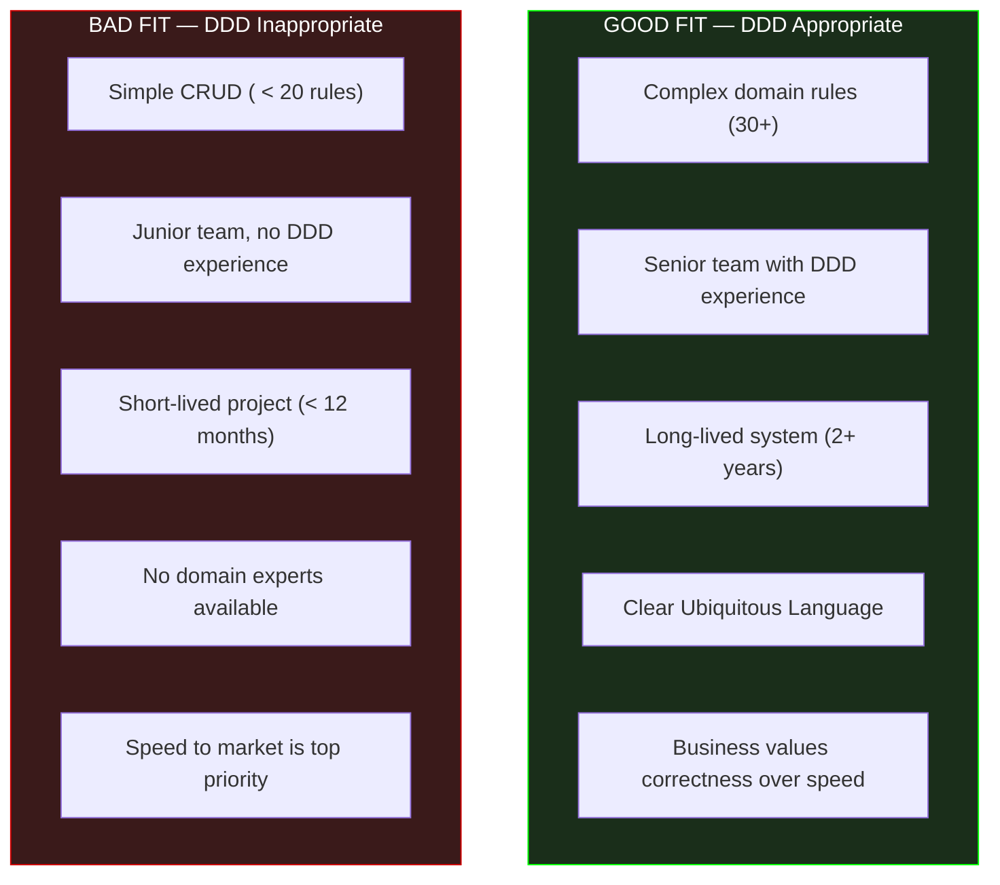
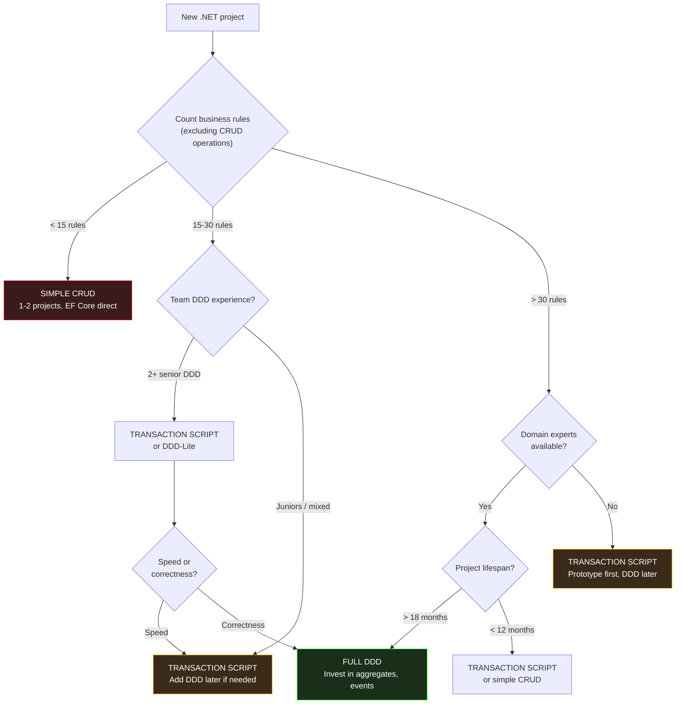

> [!success] Mastery Check
> - [ ] **Studied Well**
> - [ ] **Can explain the concept without notes**
> - [ ] **Can answer interview questions confidently**
> - [ ] **Can implement it in a real project**


# 7.080 — DDD — When DDD Is NOT the Right Choice

## Section 1: Navigation & Context

**Domain:** [[7 — System Design & Distributed Systems]] > **Group:** Domain-Driven Design
**Previous:** [[7.079 — DDD — Comparison with CRUD Architecture]] | **Next:** None (Group boundary)

### Prerequisites
- [[7.031 — DDD — Strategic vs Tactical Design]] — you cannot decide when DDD is *not* appropriate unless you deeply understand what it costs: strategic overhead (context mapping, ubiquitous language discovery) and tactical overhead (aggregates, events, repositories).
- [[7.079 — DDD — Comparison with CRUD Architecture]] — the DDD-vs-CRUD tradeoff is the primary axis for the "when not to" decision; this note extends that comparison into specific anti-indicators.
- [[7.078 — DDD — Infrastructure Concerns — Keeping Domain Pure]] — domain purity is one of DDD's highest costs (interfaces, architecture tests, indirection); if you cannot pay that cost, DDD may not be the right choice.

### Where This Fits

Most DDD literature evangelizes the approach. This note does the opposite — it names the specific conditions under which DDD is net-negative: when the domain is too simple, the team is too junior, the timeline is too short, or the organization cannot sustain the Ubiquitous Language investment. These are not failures of DDD — they are mismatches between the pattern and the context. A senior architect knows both when to use DDD and, more importantly, when to actively avoid it. The cost of applying DDD to the wrong problem is measurable: 2-3x slower initial delivery, 30%+ team churn from frustration, and eventual abandonment of the approach across the entire organization.

---

## Section 2: Core Mental Model

DDD is a complexity-management strategy, not a complexity-reduction strategy. It trades **initial simplicity** for **long-term changeability**. When the domain has few business rules (< 20), a short expected lifespan (< 12 months), a junior team, or trivial logic that maps directly to database operations, DDD's upfront investment in aggregates, value objects, domain events, and context mapping produces negative ROI — the system is harder to build, harder to understand, and no easier to change than a simple CRUD implementation. The recognition trigger: if you can describe every business rule in the system using only "required field," "unique constraint," and "string length," DDD is overkill. If the primary stakeholder complaint is "we need it faster, not more correct," DDD will make that worse before it gets better.

### Classification

| Dimension | When DDD IS the right choice | When DDD is NOT the right choice |
|---|---|---|
| Domain complexity | 30+ business rules, interconnected | < 20 business rules, independent |
| Project lifespan | > 18 months | < 12 months |
| Team experience | 2+ senior DDD engineers | Juniors, mixed, or no DDD experience |
| Business priority | Correctness, changeability | Speed to market, simplicity |
| Ubiquitous Language | Established or discoverable | Unclear, no domain experts available |
| Transaction complexity | Multi-entity invariants | Single-table CRUD operations |



### Key Properties

| Property | Indicator to Avoid DDD | Indicator to Use DDD |
|---|---|---|
| Business rule count | < 20 | > 30 |
| Team seniority ratio | < 20% experienced | > 40% experienced |
| Expected lifespan | < 12 months | > 18 months |
| Domain expert availability | None available | Dedicated domain experts |
| Primary risk | Time to market | Cost of change |
| Typical system | Admin panel, data entry, dashboard | Payment processing, order management, insurance claims |
| .NET project complexity | 1-2 projects (API + Data) | 4+ projects (Clean Architecture) |

---

## Section 3: Deep Mechanics

### How It Works — The Decision Process

Determining that DDD is not the right choice follows a systematic evaluation:

1. **Count business rules**: Open the requirements document or user stories. Count the number of conditional business rules — not CRUD operations, but actual rules like "cannot cancel shipped orders" or "discount is capped at 15% for bronze-tier customers." If the count is under 20, DDD is likely overkill.

2. **Assess team readiness**: Does the team have at least 2 engineers who have shipped a DDD system to production? If not, the learning curve will consume the project's timeline before any productivity benefit materializes.

3. **Estimate project lifespan**: If the system is a prototype, a time-boxed integration, or a system planned for replacement within 12 months, DDD's upfront investment will not pay back.

4. **Evaluate Ubiquitous Language potential**: Are the domain experts available and willing to invest time in language discovery workshops? If domain experts are unavailable or the business domain is not well-understood, DDD's language-driven approach stalls.

5. **Identify primary risk**: If the primary business risk is speed — "we need this in 3 months, not 6" — DDD's 2-3x initial overhead is the wrong choice. If the primary risk is "changes will break other things," DDD is protective.

### Failure Modes

**Failure 1 — DDD for a CRUD Admin Panel**: Team builds a full Clean Architecture solution with aggregates, domain events, and CQRS for an internal admin panel that edits database records. Six months of work for what could have been 3 weeks of scaffolding.

**Detection**: The "domain" has 8 business rules. All aggregate methods are property setters with null checks. Domain events fire but nobody subscribes to them. The team is 6 months in with 80% of features still pending.

**Fix**: Strip to CRUD. Delete event infrastructure, merge projects, use direct DbContext access.

**Failure 2 — DDD with No Domain Experts**: Team attempts Event Storming but the business stakeholders cannot articulate the domain rules — they just know the current system works. The team invents a domain model that doesn't match reality. Six months later, the model requires significant rework.

**Detection**: Ubiquitous Language terms keep changing. Developers and business stakeholders use different words for the same concept. The aggregate boundaries feel wrong.

**Fix**: Prototype with CRUD first. Learn the domain through iterative delivery. Extract DDD patterns as the language stabilizes.

**Failure 3 — DDD by Junior Team**: A team of 4 junior developers (all < 2 years experience) attempts to build a payment system using DDD. They produce aggregates with circular references, repositories that leak EF Core queries, domain events that contain serialization logic, and value objects with mutable state.

**Detection**: Code review reveals fundamental pattern violations. Unit tests are written incorrectly. Every field change breaks the codebase.

**Fix**: Switch to Transaction Script. Provide mentoring on DDD fundamentals. Reintroduce DDD patterns one at a time as the team demonstrates understanding.

### When DDD Actively Harms

- **Slows time-to-market** by 2-3x for simple domains
- **Increases team frustration** when patterns don't match the problem
- **Creates false confidence** — teams believe their aggregates enforce rules, but junior teams implement them incorrectly
- **Generates maintenance overhead** from unused abstractions (domain events nobody subscribes to, repository interfaces with one implementation)
- **Burns organizational trust** in DDD — if the first DDD project fails, leadership may prohibit DDD on future projects where it would be appropriate

---

## Section 4: Production Patterns and Implementation

### Primary Implementation — The Alternative Architecture

When DDD is not the right choice, this is what you build instead.

```csharp
// ============================================================
// SIMPLER ARCHITECTURE FOR NON-DDD SCENARIOS
// ============================================================

// Single project (or 2: API + Data)
// No Domain project, no Application project, no infrastructure abstractions

// Entity = data model (POCO with EF Core attributes — fine here)
public sealed class Customer
{
    public Guid Id { get; set; }
    public string Name { get; set; } = string.Empty;
    public string Email { get; set; } = string.Empty;
    public CustomerTier Tier { get; set; } = CustomerTier.Standard;
    public DateTimeOffset CreatedAt { get; set; }
}

// Service = transaction script (not a domain service)
public sealed class CustomerService
{
    private readonly AppDbContext _db;
    private readonly IMapper _mapper;

    public CustomerService(AppDbContext db, IMapper mapper)
    {
        _db = db;
        _mapper = mapper;
    }

    public async Task<Result> UpdateTierAsync(Guid customerId, CustomerTier newTier)
    {
        var customer = await _db.Customers.FindAsync(customerId);
        if (customer is null) return Result.NotFound();

        // Simple business rule — stays in service
        if (newTier == CustomerTier.Premium && customer.CreatedAt > DateTimeOffset.UtcNow.AddMonths(-6))
            return Result.Failure("Customer must be 6+ months old for Premium tier");

        customer.Tier = newTier;
        await _db.SaveChangesAsync();
        return Result.Success();
    }
}

// Controller = thin
[ApiController]
[Route("api/customers")]
public sealed class CustomersController : ControllerBase
{
    private readonly CustomerService _service;

    [HttpPut("{id}/tier")]
    public async Task<IActionResult> UpdateTier(Guid id, UpdateTierRequest request)
    {
        var result = await _service.UpdateTierAsync(id, request.Tier);
        return result.Match(
            success => NoContent(),
            failure => BadRequest(new { error = failure.Error }));
    }
}

// No aggregate base class. No domain events. No repository interface.
// No value objects for simple types. No CQRS. No projections.
// Total: 3 files, 80 lines of code for the feature.
```

### Configuration and Wiring

```csharp
// Program.cs — simple, minimal
builder.Services.AddDbContext<AppDbContext>(options =>
    options.UseSqlServer(builder.Configuration.GetConnectionString("Default")));
builder.Services.AddScoped<CustomerService>();
builder.Services.AddAutoMapper(typeof(Program));
```

### Common Variants

**Variant 1 — Transaction Script with Minimal Validation**: Feature has 5-15 business rules. Use service methods with validation, no aggregates, no domain events. Use FluentValidation for input validation.

**Variant 2 — Rapid Prototype with Minimal DB**: < 5 business rules, < 6 month lifespan. Use raw ADO.NET or Dapper. No ORM. No DI beyond what ASP.NET provides. Minimal project structure.

**Variant 3 — Reporting / BI System**: Read-only or append-only data. No business rules on writes. Use raw SQL or dedicated reporting tools. DDD's write-model focus is irrelevant.

### Real-World .NET Ecosystem Example

**Microsoft's eShopOnWeb (vs eShopOnContainers)**: The most instructive comparison in the .NET ecosystem. Microsoft publishes two reference architectures for the same domain. eShopOnWeb uses N-Tier with CRUD (no DDD). eShopOnContainers uses Clean Architecture with DDD and CQRS. The eShopOnWeb codebase is smaller, simpler, and faster to build. The eShopOnContainers codebase is more resilient to change and has better separation of concerns. Both are valid. Microsoft explicitly presents both to demonstrate the tradeoff. The key insight: if you are building an eShopOnWeb-style system (moderate complexity, small team), choose the simpler architecture.

---

## Section 5: Gotchas and Production Pitfalls

### Pitfall 1 — The DDD Zealot Problem

**Pitfall:** An architect insists on DDD for every project because "it's the right way to do .NET." They create Clean Architecture templates with all DDD patterns and apply them uniformly — regardless of project complexity.

```csharp
// ❌ DDD template applied to a 10-table admin panel
// 8 projects, 50+ files, for what could be 1 project and 10 files
```

**Symptom:** Every project in the organization has the same DDD overhead. Simple features take 3x longer. Developer morale drops. Projects are delivered late.

**Fix:** Match the architecture to the problem. Create multiple templates: "Simple CRUD (1 project)," "Transaction Script (2 projects)," and "Full DDD (4 projects)." Use the appropriate one.

**Cost of not fixing:** Organizational rejection of DDD. "We tried DDD and it was terrible" becomes the cultural memory, preventing its use even when appropriate.

### Pitfall 2 — DDD for Batch Processing Systems

**Pitfall:** Applying DDD aggregates to a batch job that processes 100K records at a time. Each record is a simple transformation with no business rules.

```csharp
// ❌ DDD aggregate for batch processing
public sealed class ReportRecord : AggregateRoot<ReportRecordId>
{
    public void Process()
    {
        AddDomainEvent(new RecordProcessed(Id));
        // Domain events firing 100K times...
    }
}
```

**Symptom:** Event bus is overwhelmed with 100K events. Batch processing time is dominated by event infrastructure, not actual processing.

**Fix:** Use simple data processing for batch jobs. Apply DDD only to interactive, transaction-based systems.

```csharp
// ✅ Simple data processing for batch
foreach (var row in dataTable.Rows)
{
    // Direct computation, no aggregates, no events
    result.Add(Transform(row));
}
```

**Cost of not fixing:** Batch job takes 1 hour instead of 5 minutes. Event bus costs spike.

### Pitfall 3 — DDD Without Domain Expert Investment

**Pitfall:** Team adopts DDD but business stakeholders won't attend Event Storming workshops or review the Ubiquitous Language. Developers invent the domain model alone.

```csharp
// ❌ Developer-invented Ubiquitous Language
// Developer: "I'll call this 'OrderTransactionStatus' because it sounds domain-y"
// Business: "We call it 'Order State' — why is it called something else?"
```

**Symptom:** The domain model doesn't match business reality. Six months of rework to align the model. Or worse: the team never discovers the misalignment and builds a system the business can't use.

**Fix:** Do NOT start DDD without committed domain experts. Use CRUD prototyping to discover the domain, then transition to DDD if the language stabilizes.

**Cost of not fixing:** $500K+ in wasted development on a model the business doesn't recognize.

### Pitfall 4 — Premature Ubiquitous Language

**Pitfall:** Team spends 6 weeks in language-discovery meetings without writing code. They produce a 50-page glossary that nobody references after the meetings end.

**Symptom:** The Ubiquitous Language document collects dust. Developers use their own terms. Code and business vocabulary diverge within weeks.

**Fix:** Discover the language iteratively through working code. Write the terms as class and method names. If a term doesn't appear in the code, it's not Ubiquitous.

**Cost of not fixing:** 6 weeks of unproductive meetings. Code that doesn't reflect business vocabulary. Same result as no DDD, but worse because you wasted time.

### Pitfall 5 — DDD for Read-Heavy Reporting Systems

**Pitfall:** Applying DDD write-model patterns (aggregates, repositories, domain events) to a reporting system that is 95% reads and 5% writes. The write operations are simple inserts.

```csharp
// ❌ DDD for reporting — aggregate for a simple insert
public sealed class AuditLogEntry : AggregateRoot<AuditLogEntryId>
{
    public string Action { get; private set; }
    // Extraneous: domain events for every log entry
}
```

**Symptom:** The write model is over-engineered for its purpose. Developers spend time on entity configurations for a table that could be inserted with a simple `INSERT INTO`.

**Fix:** Use direct data access for write-once, read-many systems. CQRS without DDD is fine — simple command handlers that write directly to query-optimized tables.

**Cost of not fixing:** Slower feature delivery. Team frustration with unnecessary overhead.

---

## Section 6: Tradeoffs and Decision Framework

### Tradeoff Matrix

| Dimension | Full DDD | Transaction Script (Lite) | Simple CRUD |
|---|---|---|---|
| Initial delivery speed | Slow (2-3x) | Moderate (1.5x) | Fast (1x) |
| Change cost (first 6 months) | Moderate (infrastructure overhead) | Low (simple) | Low (simple) |
| Change cost (after 12 months) | Low (domain isolated) | Moderate (some scattering) | High (rules scattered) |
| Team skill requirement | Senior (DDD) | Mid-level | Junior |
| Domain expert dependency | High (Ubiquitous Language) | Moderate | Low |
| Business rule enforcement | Strong (aggregate invariants) | Medium (service checks) | Weak (scattered checks) |
| Overhead for simple domains | Crushing (net-negative) | Moderate (acceptable) | Minimal (efficient) |

### Decision Flowchart



### When to Apply (The "Not DDD" Decision Checklist)

- [ ] **Business rules < 20**: DDD overhead > benefit. Use CRUD.
- [ ] **Team has 0-1 senior DDD engineers**: DDD will be implemented incorrectly. Use Transaction Script.
- [ ] **Project lifespan < 12 months**: DDD investment won't pay back. Use CRUD.
- [ ] **No domain experts available**: Ubiquitous Language cannot be established. Use CRUD prototype first.
- [ ] **Primary business risk is speed**: DDD makes you slower at the start. Use CRUD.
- [ ] **System is batch processing / ETL**: Aggregates and events add no value. Use direct data processing.
- [ ] **System is CRUD wrapper around a database**: Admin panels, data entry forms, simple APIs. Use CRUD.
- [ ] **Organization has a "fail fast, iterate" culture**: DDD's upfront investment conflicts. Use prototyping.

### Scale Thresholds

- **Business rule threshold**: < 20 rules → DDD overhead exceeds benefit. 20-30 → gray zone, context-dependent. > 30 → DDD justified.
- **Team seniority threshold**: < 1 experienced DDD engineer per 4 junior/mid engineers → DDD likely fails.
- **Project lifespan threshold**: < 12 months → DDD never pays back. 12-18 months → marginal. > 18 months → DDD likely pays back.
- **Domain expert availability**: Without 10+ hours of expert time per week during discovery → DDD cannot establish Ubiquitous Language.
- **Cost of over-engineering**: 2-3x development time, 2x team frustration (measured by attrition), 50%+ unused abstractions.

---

## Section 7: Interview Arsenal

### Question Bank

1. When is DDD NOT the right architectural choice for a .NET project?
2. What are the signs that a team is over-engineering with DDD?
3. How do you count "business rules" to determine if DDD is justified?
4. What should you build instead of DDD for a simple CRUD system?
5. How does team composition affect the DDD decision?
6. What happens when you apply DDD to a system without domain expert involvement?
7. How does project lifespan affect the DDD vs CRUD decision?
8. What is the "Transaction Script" pattern and when would you recommend it over DDD?

### Spoken Answers

**Q1: When is DDD NOT the right architectural choice for a .NET project?**

> **Average answer:** When the domain is simple. DDD is for complex domains.

> **Great answer:** DDD is not the right choice in four specific scenarios. First, when the domain has fewer than about 20 business rules — if every business rule can be described as a field constraint (required, unique, string length), then aggregates and domain events are overhead, not value. A customer admin panel with 10 tables and 8 validation rules is a CRUD system, not a DDD system. Second, when the team lacks DDD production experience — a team of 4 juniors applying aggregates, value objects, and domain events will create a codebase that's harder to change than a simple CRUD one, because the patterns will be implemented incorrectly. Third, when the project lifespan is under 12 months — the upfront investment of 2-3x slower initial delivery never pays back. Fourth, when domain experts aren't available — without business stakeholders to articulate the Ubiquitous Language, DDD's language-driven approach stalls. In those cases, I recommend Transaction Script as the middle ground: service methods contain business logic, entities have typed methods for invariants, but there are no domain events, no CQRS, and no separate domain project.

**Q2: What are the signs that a team is over-engineering with DDD?**

> **Average answer:** Too many layers, too much code for simple features.

> **Great answer:** Three specific signals. Signal 1 — Event emptiness: domain events exist but nobody subscribes to them. If every aggregate method emits events but no projection, no saga, and no integration handler consumes them, the events are pure overhead. Remove them. Signal 2 — Repository singletons: the repository interface has exactly one implementation and no realistic prospect of a second (you're using SQL Server and will never switch to Cosmos DB). The interface adds indirection without benefit — consider removing it. Signal 3 — Configuration overload: the infrastructure project has 800 lines of `IEntityTypeConfiguration<T>` for 12 entities. If every value object has a 20-line fluent mapping, ask whether that value object should just be a simple property. The threshold I use: if infrastructure code (entity configurations, converter classes, message mappings) exceeds 30% of total codebase, and the domain has < 20 business rules, you're over-engineering.

**Q8: What is the "Transaction Script" pattern and when would you recommend it over DDD?**

> **Average answer:** It's a pattern where business logic lives in service methods instead of aggregates. It's simpler than DDD.

> **Great answer:** Transaction Script, as Martin Fowler defines it, organizes business logic as a set of procedures where each procedure handles a single request — like a script. In .NET, it means a service class with methods like `CancelOrderAsync`, `UpdateShippingAddressAsync`, each containing the validation and persistence logic for that operation. The domain entities may have typed methods (e.g., `order.Cancel()`) but there are no domain events, no value objects for simple types, no aggregate base class, no CQRS, and no repository interface. It's the pattern I recommend for the middle zone: 15-30 business rules with a mixed-skill team and a 12-18 month project lifespan. It's also the right starting point for teams that want to grow into DDD — you can extract aggregates when you see the need, add domain events when side effects become complex, and add CQRS when query performance demands it. The common mistake is jumping from CRUD to full DDD without going through Transaction Script first.

### System Design Interview Trigger

The most important interview question about DDD is not "what is it" but "when does it NOT apply." Interviewers at senior-level rounds will probe this by presenting a seemingly simple system and asking "would you use DDD here?" The candidate who says "yes, DDD is always good" fails. The candidate who says "let me count the business rules, assess team readiness, and consider the timeline" demonstrates architectural maturity. The interviewer is testing whether you treat patterns as tools with specific use cases, not as universal solutions.

### Comparison Table

| | Full DDD | Transaction Script | Simple CRUD |
|---|---|---|---|
| When to choose | > 30 rules, senior team, > 18 months | 15-30 rules, mixed team, 12-18 months | < 15 rules, junior team, < 12 months |
| Core tradeoff | Long-term changeability | Balanced overhead | Speed and simplicity |
| Risk | Over-engineering | May need to extract DDD later | Hard to change at scale |
| .NET footprint | 4+ projects | 2-3 projects | 1-2 projects |
| Training investment | High (days of DDD training) | Moderate (service patterns) | Low (standard ASP.NET) |

---

## Section 8: Architecture Decision Record

**Status:** Accepted (Replaces ADR-079 from comparison document)

**Context:** The company needs a customer feedback management system — users submit feedback, admins review and respond, reports show trends. Estimated business rules: 12 (required fields, profanity filter, response time SLA, assignment rules). Team has 4 engineers: 2 juniors (< 1 year), 2 mid-level (3 years, no DDD experience). Project timeline: 4 months to MVP, replace-in-place after 24 months. Domain experts: product manager and support team lead (available 2 hours/week each).

**Options Considered:**

1. **Full DDD** — Clean Architecture with aggregates, domain events, CQRS, value objects.
2. **Transaction Script** — Service layer with business logic in methods, entity-level validation, single DbContext.
3. **Simple CRUD** — Controllers with direct DbContext access, minimal service abstraction.

**Decision:** Option 2 — Transaction Script, because:
- Only 12 business rules — below the 20-rule threshold where aggregates add value
- Team has zero DDD experience — full DDD would be implemented incorrectly
- 4-month MVP timeline cannot absorb DDD's 2-3x initial overhead
- Domain experts have limited availability — Ubiquitous Language discovery would stall
- 24-month lifespan is on the margin where Transaction Script's efficiency beats both CRUD's change difficulty and DDD's initial overhead

**Consequences:**
- ✅ Estimated delivery in 3.5 months (vs 2.5 for CRUD, vs 6+ for DDD)
- ✅ Team can be productive immediately with familiar patterns
- ✅ System can be evolved: add value objects when validation complexity grows, add domain events when side effects appear
- ⚠️ At month 18-24, if business rules have grown to 30+, a migration to DDD may be needed
- ⚠️ No CQRS means search queries hit the write database — acceptable at current scale (< 10K feedback entries/year)
- ❌ No domain event infrastructure — if the feedback management needs to integrate with other systems later, integration will require new code

**Review Trigger:** Revisit this decision when (a) business rules exceed 25 (DDD may become justified), (b) feedback volume exceeds 100K entries/year (consider CQRS with projections), or (c) a second team needs to build on the same data (consider bounded context separation).

---

## Section 9: Self-Check

### Conceptual Questions

1. What is the primary cost of applying DDD to a system that doesn't need it?

2. What is the minimum number of business rules that typically justifies DDD?

3. What team composition factors suggest DDD is not appropriate?

4. What is the "Transaction Script" pattern and when should you choose it over DDD?

5. What are the signs that DDD is being over-engineered in a codebase?

6. Why is domain expert availability a prerequisite for DDD success?

7. How does project lifespan affect the DDD vs CRUD decision?

8. What should you build instead of DDD for a system with < 10 business rules?

9. What happens when a junior team attempts full DDD without mentorship? (See [[7.071 — DDD — Common DDD Mistakes and Anti-Patterns]])

10. Explain the DDD decision framework in 60 seconds.

<details>
<summary>Answers</summary>

1. 2-3x slower initial delivery, 2x code volume, team frustration from unnecessary complexity, and risk of organizational rejection of DDD (burning future opportunities). Estimated cost: $200K-$500K/year for a 6-person team on an inappropriate DDD project.

2. Approximately 30 business rules. Below 20, DDD overhead exceeds benefit. Between 20-30 is context-dependent — team readiness and project lifespan tip the scale.

3. (1) No engineers with prior DDD production experience. (2) More than 80% junior engineers. (3) Team turnover rate > 20%/year (knowledge is lost). (4) No budget for DDD training or mentoring.

4. Transaction Script organizes business logic in service methods while keeping entities as simple data holders with typed methods. Choose it over DDD when: 15-30 business rules, mixed-skill team, 12-18 month lifespan, or as a stepping stone to full DDD.

5. Three signal events: (1) Domain events exist but nobody subscribes — pure overhead. (2) Repository interfaces have one implementation with no alternative in sight. (3) Infrastructure configuration code exceeds 30% of total codebase for < 20 business rules.

6. DDD's core principle is the Ubiquitous Language — a shared vocabulary between developers and domain experts. Without domain experts to articulate and validate the language, the team invents terms that don't match business reality, defeating the purpose of DDD.

7. DDD's upfront investment (2-3x initial delivery time) pays back only after 12-18 months through lower change costs. If the project lifespan is < 12 months, the investment never pays back. Use CRUD or Transaction Script for short-lived projects.

8. Simple CRUD with direct DbContext access, AutoMapper for DTO mapping, FluentValidation for input validation, and a thin service layer. One project, no domain abstractions, no event infrastructure.

9. Junior teams produce aggregates with circular references, value objects with mutable state, domain events mixed with serialization logic, and repositories that leak IQueryable. The codebase becomes harder to change than a simple CRUD one. See [[7.071 — DDD — Common DDD Mistakes and Anti-Patterns]].

10. "I evaluate three factors: business rule count, team experience, and project lifespan. For < 20 rules, I choose CRUD. For > 30 rules with a senior team and > 18 month lifespan, I choose full DDD. For everything in between — 15 to 30 rules, mixed team, 12 to 18 month lifespan — I use Transaction Script: service methods with business logic, entity methods for invariants, no domain events, no CQRS."
</details>

### Scenario Challenges

**Scenario 1 — Diagnose the problem:** A startup built its MVP using Clean Architecture with full DDD. After 6 months of development, they have delivered 30% of the planned features. Competitors have shipped to market. The investors are unhappy. The domain has 9 entities and 14 business rules. The team has 3 junior developers and 1 mid-level developer.

<details>
<summary>Diagnosis</summary>

**Root cause:** DDD was applied to a simple domain (< 15 business rules) by a team without senior DDD experience. The complexity overhead consumed 70% of the development capacity.

**Evidence:** 6 months for 30% of features. Competitors shipped in 4 months. Domain has 14 business rules — below the DDD threshold.

**Fix:** Immediately strip to Transaction Script or CRUD. Remove domain events, repository interfaces, and CQRS. Merge projects. Rearchitect to deliver the remaining 70% of features in 3 months using simple patterns.

**Prevention:** For any MVP with < 20 business rules and a junior team, start with Transaction Script. Add DDD patterns only when the team demonstrates readiness and the domain complexity grows.
</details>

**Scenario 2 — Design decision:** Your team is building a data processing pipeline that ingests CSV files, validates rows against a schema, transforms some fields, and writes to a data warehouse. The validation rules are simple (required fields, format checks). No user interaction. Throughput requirement: 100K records/hour.

<details>
<summary>Decision and Reasoning</summary>

**Choice:** Do NOT use DDD. Use simple data processing: read CSV → validate using DataAnnotations or FluentValidation → transform → batch insert to Azure SQL Data Warehouse.

**Tradeoffs accepted:** No aggregates, no domain events, no Ubiquitous Language. Validation rules are in validation classes, not domain entities. The system is not modeled around business concepts — it's a data pipeline.

**Implementation sketch:**
```csharp
public class CsvProcessor
{
    public async Task ProcessAsync(Stream csvStream, CancellationToken ct)
    {
        var records = await _csvReader.ReadAsync<ImportRow>(csvStream, ct);
        var valid = records.Where(r => _validator.Validate(r).IsValid);
        await _bulkInserter.BulkInsertAsync(valid, ct);
    }
}
// No aggregates, no repository, no domain events — just data processing
```
</details>

**Scenario 3 — Failure mode:** A team inherited a DDD codebase from a contractor who "specialized in domain-driven design." The codebase has 5 projects, 200 files, and supports 8 business rules. The team has no idea where to make changes. The aggregate base class has 500 lines of infrastructure code.

<details>
<summary>Investigation and Fix</summary>

**Investigation steps:** (1) Count business rules by searching for `throw new DomainException` and conditional logic in domain methods. (2) List all domain event types and their subscribers. (3) Check repository interface implementations.

**Confirming evidence:** Only 8 business rules. 12 domain event types with 0 subscribers — all fire, none consume. Repository interfaces with 1 implementation each. Aggregate base class includes EF Core dependency.

**Immediate mitigation:** Remove the aggregate base class dependency on EF Core. Delete unused event infrastructure.

**Permanent fix:** Refactor to Transaction Script: (1) Create a new project with simple service classes. (2) Move the 8 business rules into those services. (3) Delete the contractor's DDD infrastructure. (4) Keep the entity classes but remove the aggregate base class. (5) Delete architecture tests that enforce rules no one understands.

**Post-mortem item:** Never hire contractors to implement DDD patterns without a senior internal engineer reviewing the architecture.
</details>

**Scenario 4 — Scale it:** A CRUD-based feedback management system was built in 6 weeks with 5 business rules. Two years later, it has 40 business rules, 6 integrations, and 3 teams modifying it. Changes take 4x longer than they did. The team is considering migrating to DDD.

<details>
<summary>Scaling Strategy</summary>

**Bottleneck this addresses:** Scattered business rules — the same cancellation logic exists in 4 services. Changes require tracing all code paths that modify a field.

**How it helps:** DDD provides a single enforcement point for each business rule. `Feedback.Cancel()` contains all cancellation invariants, and every caller goes through it. CQRS with read-side projections handles the reporting queries that are currently hitting the write database.

**What it does not solve:** The data migration from CRUD to DDD structure. The existing database schema must be adapted to the new aggregate boundaries.

**Implementation order:** Phase 1 (months 1-2): Create Domain project with aggregates. Extract business rules one aggregate at a time — start with the highest-change-frequency aggregate (Feedback). Dual-write to both old and new structures during migration. Phase 2 (months 3-4): Add domain events for integrations — replace the callback-based integration code with event subscribers. Phase 3 (months 5-6): Add CQRS read-side projections for reporting. Decommission old CRUD code paths.

**Cost:** 6 months of migration effort. The payoff is faster changes going forward — the team estimates 50% reduction in change cost based on the current monthly change volume.
</details>

**Scenario 5 — Interview simulation:** The interviewer says: "Our company has 200 employees. We need an internal tool to track IT equipment — laptops, monitors, accessories assigned to employees. Simple CRUD: assign equipment, return equipment, report on inventory. Two business rules: an employee can't have two laptops, and equipment older than 3 years should show a 'retire' flag. Would you use DDD?"

<details>
<summary>Model Response</summary>

"No, I would not use DDD here — and I'll explain why by walking through the decision framework.

First, count the business rules: two. An employee can't have two laptops — that's a uniqueness constraint, handled by a database unique index or a service-level check. Equipment older than 3 years gets a retire flag — that's a computed property, 'now minus purchase date > 3 years,' not a business invariant that needs an aggregate. Total: 2 business rules, far below the 20-30 threshold where DDD starts to pay off.

Second, team composition: internal tool built for a 200-person company. The team is likely small — 2-3 engineers. Unlikely to have spare capacity for DDD's learning curve.

Third, project lifespan: internal tools at a 200-person company are typically replaced or absorbed into larger systems within 2-3 years. DDD's 12-18 month payback period is marginal.

I'd build this as a simple CRUD system: ASP.NET Core API, EF Core with SQL Server, a straightforward React or Blazor frontend, and a service layer with the two business rules as service methods. The development time would be 2-4 weeks, not the 6-10 weeks a DDD approach would require.

The risk of using DDD here is not just slower delivery — it's that the team may conclude "DDD is terrible" because it made a simple tracking system needlessly complex, and then reject it when a genuinely complex domain problem (like the company's core order management system) would benefit from it."
</details>
