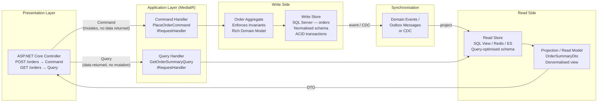
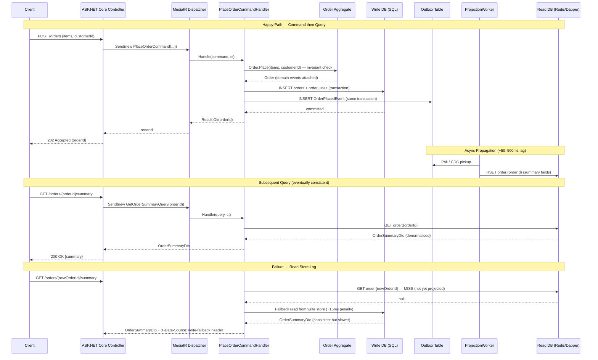
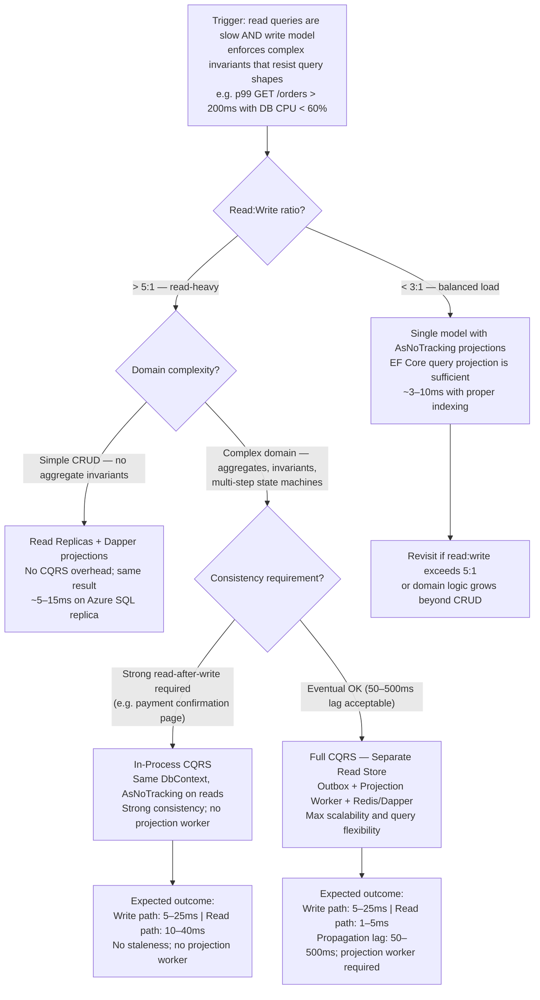

> [!ABSTRACT] Quick Reference — CQRS — Command Query Responsibility Segregation **Invariant:** Every operation is either a Command (mutates state, returns no data) or a Query (returns data, mutates nothing) — never both simultaneously. **Cost:** Read and write models diverge, requiring synchronization; read-side data is eventually consistent with the write-side; operational complexity increases proportionally to how far the models are separated. **Trigger:** Write model optimised for correctness is too slow to serve read queries; a single shared domain model is growing complex trying to satisfy both reporting queries and transactional integrity simultaneously. **Skip When:** CRUD workloads with simple reporting, team of fewer than ~5 engineers, no clear read/write asymmetry, or when eventual read consistency would break a business invariant. **.NET Entry Point:** `IRequest<TResponse>` / `IRequestHandler<TRequest, TResponse>` via `MediatR`; `IQueryable<T>` projections via EF Core. **Azure Native:** Azure Cosmos DB Change Feed (propagate writes to read store); Azure Service Bus (async read-model update); Azure SQL Read Replicas (physical read/write DB split). **Number to Know:** Read:write ratio in a typical order management system is ~10:1 — CQRS lets you scale and optimise each side independently rather than compromising both.

---

## Navigation

**Domain:** [[7 — System Design & Distributed Systems]] > **Group:** CQRS and Event Sourcing **Previous:** [[7.080 — DDD — When DDD Is NOT the Right Choice]] | **Next:** [[7.082 — CQRS — Commands vs Queries — Strict Separation]]

### Prerequisites

- [[7.047 — DDD — Aggregates — Consistency Boundary]] — CQRS write-side commands target aggregate roots; understanding aggregate boundaries is required to understand the transactional scope of a command.
- [[7.003 — Clean Architecture — Application Layer — Use Cases]] — CQRS commands and queries are use-case handlers; Clean Architecture's application layer is the natural home for MediatR handlers.
- [[7.053 — DDD — Domain Events — Within Bounded Context]] — Advanced CQRS uses domain events to fan out write-side changes to read-side projections; understanding domain events is required for that pattern.

### Where This Fits

> [!INFO] Production Encounter Map
> 
> - **Layer:** Application layer — command and query handlers sit between the API presentation layer and the domain/infrastructure layer; read models surface through query-specific repositories or direct DbContext projections.
> - **Trigger:** An engineer first hits this when a single `GetOrdersForDashboard` query must join 7 tables with complex filtering, and the domain model that enforces aggregate invariants is actively hostile to that query shape — forcing 400ms round-trips when 40ms is required.
> - **Without it:** The `OrderService` grows to handle both `PlaceOrder` mutations (needing transactional consistency across `Order`, `OrderLine`, and `Inventory` aggregates) and `GetOrderSummaryReport` queries (needing flat, denormalised projections) — each concerns poisons the other until neither is maintainable.
> - **First signal:** Slow query log shows EF Core `Include()` chains on the `Order` entity spanning 8 navigation properties, returning 50x more data than the UI actually renders; or the domain model has grown `public IReadOnlyList<Order> GetOrdersByCustomerWithStatusAndRegion(...)` convenience methods that bypass invariant enforcement.

CQRS is the architectural pattern that makes the implicit explicit: every system already has reads and writes — CQRS insists they be treated as fundamentally different concerns with separate models, separate paths, and separate optimisation strategies. It is a prerequisite for Event Sourcing ([[7.094 — CQRS — With Event Sourcing]]) and a natural complement to the Outbox Pattern ([[7.121 — Outbox Pattern — Reliable Event Publishing]]) for reliable read-model propagation.

---

## Core Mental Model

CQRS enforces the Command-Query Separation principle at the architectural level: a Command changes state and returns nothing meaningful (at most an acknowledgment or ID); a Query reads state and changes nothing. The critical insight is that the optimal data structure for enforcing domain invariants during a write (a rich aggregate with encapsulated business rules) is almost never the optimal data structure for answering a read (a flat, denormalised DTO shaped precisely to what one screen requires). CQRS creates a formal boundary that allows each side to evolve, scale, and be optimised independently. The invariant it maintains is that no single operation can be both a mutation and a query — collapsing this boundary is the root cause of the "fat service" anti-pattern.

> [!TIP] The Non-Obvious Insight The read side in CQRS is not a "dumbed-down" version of the write model — it is a purpose-built projection optimised for consumption patterns. The most powerful consequence is that you can have multiple read models from the same write side: one denormalised SQL view for the admin dashboard, one Redis hash for the mobile API's hot path, one Elasticsearch document for full-text search. They are all fed from the same command-driven write events. Engineers who "implement CQRS" by just splitting their service into `GetX()` and `DoX()` methods on the same `DbContext` are missing this entirely — they have renamed their methods, not changed their architecture. The physical read/write model separation is where the value lives.

### Classification

- **Consistency axis:** Eventual (read model lags write model by propagation latency); Strong consistency available if read model is updated synchronously within the same transaction (in-process CQRS without separate data store).
- **Availability tradeoff:** Read-side remains available even during write-side degradation if models are physically separated; write-side outages do not prevent reads from stale data.
- **Latency impact:** Write path: no change vs. a single model (command handler runs synchronously ~2–20ms for typical domain operations). Read path: eliminates multi-join query overhead — 40–400ms queries become 2–15ms against denormalised projections. Async read-model propagation adds 10ms–2s lag depending on transport (in-process vs. message broker).
- **Failure domain:** In-process CQRS: single-node. Separate read/write stores: multi-node; read-store failure does not affect write-side command processing.
- **Abstraction layer:** Architectural pattern (not a protocol or framework feature); implemented in .NET via MediatR (dispatcher) + EF Core / Dapper (read projections).

### Primary Diagram



### Supporting Diagram



### Numbers That Matter

|Metric|Value|Context / Conditions|
|---|---|---|
|Read query latency (denormalised read model)|2–15ms p99|Redis hash or single-table Dapper query vs. 8-join EF Core query|
|Write command latency|5–25ms p99|Synchronous command handler with EF Core + Outbox, SQL Server Standard tier|
|Read-model propagation lag (in-process)|0ms|Synchronous projection update in same DB transaction; sacrifices separate-store benefits|
|Read-model propagation lag (Outbox + worker)|50–500ms|Azure Service Bus Standard; worker polls outbox every 100ms by default (configurable)|
|Read-model propagation lag (Cosmos DB Change Feed)|100–2000ms|Azure Cosmos DB Change Feed latency; depends on partition load|
|Scale threshold where CQRS earns its cost|Read:write > 5:1 at > 500 req/s|Below this, a single optimised SQL query and read replica is cheaper operationally|
|Failure detection — stale read model|Silent until queried|No automatic alert; requires cache-miss fallback or explicit staleness timestamp check|

### Key Properties / Guarantees

|Property|Value|Condition|
|---|---|---|
|Write-side consistency|Strong (ACID)|Within a single aggregate's transaction boundary|
|Read-side consistency|Eventual|When read/write models are physically separated and propagated asynchronously|
|Read-side consistency|Strong|When projection is updated synchronously in the same DB transaction (in-process CQRS)|
|Domain invariant enforcement|Guaranteed|Write-side only; read-side bypasses domain model entirely — this is intentional|
|Read scalability|Independent of write-side|Read store can be replicated, cached, and scaled without touching write store|
|Auditability|High|All state changes flow through commands with explicit intent; pairs naturally with Event Sourcing|

---

## Deep Mechanics

### How It Works

**Step 1 — Dispatcher receives the operation.** In .NET, MediatR acts as the mediator: `_mediator.Send(new PlaceOrderCommand(...))` or `_mediator.Send(new GetOrderSummaryQuery(...))`. MediatR resolves the correct handler via DI. The caller does not know whether it is calling a command or query handler — the type system enforces this: commands return `Result` or `Unit`; queries return `TDto`.

**Step 2 — Command path: aggregate loads and mutates.** The command handler loads the aggregate root from the write repository (`_orderRepository.GetByIdAsync(id)`), calls the domain method (`order.PlaceItems(items)`), which enforces all invariants internally and raises domain events. The handler then saves: `await _orderRepository.SaveAsync(order)` which triggers EF Core's `SaveChangesAsync()` committing the write store mutation and (if using Outbox) the outbox row in a single transaction.

**Step 3 — Domain event propagation to read side.** A background worker (IHostedService or Azure Function) polls the Outbox table (or subscribes to Cosmos DB Change Feed / SQL Server CDC). For each `OrderPlacedEvent`, it projects the data into the read store: a Redis hash, a Dapper-written denormalised SQL table, or an Elasticsearch document. This projection logic knows nothing about the domain aggregate — it works with event data (flat DTO fields).

**Step 4 — Query path: read model only.** The query handler bypasses the domain model entirely. It calls the read repository directly: `_orderReadRepository.GetSummaryAsync(orderId)`. The read repository executes a Dapper query (`SELECT * FROM order_summaries WHERE id = @id`) or a Redis GET. No EF Core Change Tracker involvement, no aggregate loading, no invariant checking.

**Step 5 — Result returned to caller.** The query returns a flat DTO shaped exactly to the consumer's needs. No mapping from rich domain object to DTO: the read model was already in DTO shape when it was projected. This eliminates the AutoMapper overhead on the hot read path.

**Write path for async vs. sync read-model update decision:**

|Approach|Consistency|Complexity|When to Choose|
|---|---|---|---|
|Same-transaction projection|Strong|Low — EF Core owned table|< 500 req/s; team new to CQRS; no separate read store needed|
|Outbox + polling worker|Eventual (50–500ms)|Medium — background worker|Separate read store needed; read store may be Redis/ES|
|CDC (Change Data Capture)|Eventual (100ms–2s)|High — Debezium/SQL CDC setup|High write throughput; write store shouldn't carry outbox overhead|

### Protocol Trace

```
Happy Path — PlaceOrderCommand:

  1. Controller → MediatR.Send(PlaceOrderCommand) (~0ms, in-process)
  2. MediatR → PlaceOrderCommandHandler.Handle() (~0ms, DI resolve)
  3. Handler → OrderRepository.GetByIdAsync(customerId) (~3ms, SQL SELECT)
  4. Handler → Order.Place(items) — domain invariant check (~0ms, in-memory)
  5. Handler → EF Core SaveChangesAsync():
       a. INSERT INTO orders (...) (~2ms)
       b. INSERT INTO order_lines (...) × N items (~1ms/item)
       c. INSERT INTO outbox_messages (OrderPlacedEvent JSON) (~1ms)
       — all in one SQL transaction
  6. Handler → Result.Ok(orderId) → Controller → 202 Accepted
  Total write path: ~8–25ms LAN

  Async propagation (background):
  7. OutboxWorker polls outbox_messages every 100ms → picks up OrderPlacedEvent
  8. OutboxWorker → Redis HSET order:{id} {flat summary fields} (~1ms)
  9. OutboxWorker → UPDATE outbox_messages SET processed_at = NOW() (~1ms)
  Propagation lag: 50–600ms end-to-end

Happy Path — GetOrderSummaryQuery (after propagation):

  1. Controller → MediatR.Send(GetOrderSummaryQuery(orderId)) (~0ms)
  2. MediatR → GetOrderSummaryQueryHandler.Handle() (~0ms)
  3. Handler → Redis.HashGetAllAsync(order:{orderId}) (~1ms)
  4. Redis → OrderSummaryDto (all fields in one call)
  5. Handler → OrderSummaryDto → Controller → 200 OK
  Total read path: ~2–5ms

Failure Path — Read Store Not Yet Propagated:

  1. Client queries immediately after command returns (< 500ms)
  2. Handler → Redis.HashGetAllAsync(order:{orderId}) → null (not yet projected)
  3. Handler detects miss → fallback to write store:
       Dapper: SELECT id, status, total FROM orders WHERE id = @id (~5ms SQL)
  4. Handler returns DTO with response header: X-Data-Source: write-fallback
  5. Background propagation continues; next read hits Redis
  Caller observes: correct data, slightly higher latency (~5–10ms vs ~1ms), no error

Failure Path — Projection Worker Down:

  1. OutboxWorker crashes / pod restarts
  2. Commands continue to succeed (write store unaffected)
  3. Read store becomes increasingly stale (seconds → minutes)
  Detection: Prometheus alert: outbox_messages_unprocessed_count > 50 for 60s
  Recovery: Worker restarts; replays unprocessed outbox rows in order; staleness heals
  Manual intervention: Required if outbox table grows beyond retention window
```

### Failure Modes

**Failure Mode 1: Read Model Permanently Stale — Projection Worker Silently Dead**

- **Cause:** The OutboxWorker (IHostedService or Azure Function) throws an unhandled exception on a poison message, crashes, and is not restarted due to a misconfigured Kubernetes liveness probe or missing retry policy on the hosted service loop.
- **Symptom:** Orders placed successfully but dashboards show zero new orders. Customer support receives tickets: "I just placed an order and it doesn't show up." Read queries return data 4 hours old.
- **Detection time:** Silent for minutes to hours; only detected by customer complaints or by an explicit staleness check comparing `MAX(processed_at)` in outbox to `NOW()`.
- **Blast radius:** Every consumer of the read model (dashboard, mobile API, reporting) serves stale data. Write-side operations and order placement continue unaffected.

> [!DANGER] 3 AM Production Signal Metric: `outbox_messages_unprocessed_count{service="order-projection-worker"} > 200` sustained for `> 5 minutes` Log: `CRIT [OrderProjectionWorker] Unhandled exception in projection loop — worker stopped | MessageId: evt_8f3a2b | EventType: OrderPlacedEvent | Error: NullReferenceException: Object reference not set to an instance of an object` Customer impact: Order history page shows no new orders for all customers who placed orders in the last 4 hours; support tickets spike.

**Failure Mode 2: Dual-Write Inconsistency — Write Store Updated, Outbox Not**

- **Cause:** Developer implements two separate `SaveChanges()` calls — one for the domain aggregate, one for the outbox — without wrapping them in a transaction. The first succeeds; the second fails (transient SQL error). The order is persisted but no event is ever published to the read model.
- **Symptom:** Specific orders are permanently missing from the read model. The write store has the order; the read store has no record. The bug only appears under intermittent SQL connectivity issues. Reproduces ~0.1% of the time.
- **Detection time:** Silent — no exception reaches the caller because the write succeeded. Discovered via data reconciliation audit or customer complaint days later.
- **Blast radius:** Specific orders invisible in reporting and mobile app forever; write store is the only authoritative source; read model is permanently inconsistent for these records.

> [!DANGER] 3 AM Production Signal Metric: `reconciliation_delta_count{store="read",reference="write"} > 0` — daily data reconciliation job fires Log: `WARN [DataReconciliationJob] Order present in write store but absent from read store | OrderId: f4a2-9c1b | CreatedAt: 2026-06-14T23:18:42Z | CustomerEmail: redacted` Customer impact: Specific customers see incomplete order history; customer service cannot explain why their order "doesn't exist" in the support portal.

### .NET and Azure Integration Points

- **ASP.NET Core:** `IMediator` injected into controllers; `MediatR` package from NuGet. Controllers call `_mediator.Send()` — no direct reference to handlers.
- **EF Core:** Write side uses EF Core's `DbContext` with full Change Tracker. Read side uses either (a) EF Core with `AsNoTracking().Select(x => new Dto {...})` projections or (b) Dapper for raw SQL queries — never the full entity graph.
- **Azure Services:** Azure Service Bus (propagate events to read-side projectors); Azure Cosmos DB Change Feed (auto-trigger projections from Cosmos writes); Azure Cache for Redis (read store for hot-path queries).
- **.NET Libraries:** `MediatR` (dispatcher + pipeline); `FluentValidation` (command validation via pipeline behavior); `Dapper` (read-side query execution); `StackExchange.Redis` (read-side Redis store).
- **Configuration:** `Program.cs` — `builder.Services.AddMediatR(cfg => cfg.RegisterServicesFromAssemblyContaining<PlaceOrderCommand>())`.

```csharp
// YourCompany.OrderManagement — MediatR wiring in ASP.NET Core
// Namespace: YourCompany.OrderManagement.Api

using MediatR;
using YourCompany.OrderManagement.Application.Commands;
using YourCompany.OrderManagement.Application.Queries;

[ApiController]
[Route("api/orders")]
public sealed class OrdersController : ControllerBase
{
    private readonly IMediator _mediator;

    public OrdersController(IMediator mediator) => _mediator = mediator;

    /// <summary>Place a new customer order. Returns 202 Accepted with the new order ID.</summary>
    [HttpPost]
    [ProducesResponseType(typeof(PlaceOrderResponse), StatusCodes.Status202Accepted)]
    public async Task<IActionResult> PlaceOrder(
        [FromBody] PlaceOrderRequest request,
        CancellationToken cancellationToken)
    {
        var command = new PlaceOrderCommand(request.CustomerId, request.Items);
        var result = await _mediator.Send(command, cancellationToken);
        return result.IsSuccess
            ? Accepted($"/api/orders/{result.Value.OrderId}", result.Value)
            : BadRequest(result.Error);
    }

    /// <summary>Get the summary projection for a specific order.</summary>
    [HttpGet("{orderId:guid}/summary")]
    [ProducesResponseType(typeof(OrderSummaryDto), StatusCodes.Status200OK)]
    public async Task<IActionResult> GetOrderSummary(
        Guid orderId,
        CancellationToken cancellationToken)
    {
        var query = new GetOrderSummaryQuery(orderId);
        var dto = await _mediator.Send(query, cancellationToken);
        return dto is not null ? Ok(dto) : NotFound();
    }
}
```

---

## Production Patterns and Implementation

### Primary Implementation

```csharp
// YourCompany.OrderManagement.Application — CQRS Command and Query with MediatR
// Architectural roles labelled inline

using MediatR;
using YourCompany.OrderManagement.Domain.Aggregates;
using YourCompany.OrderManagement.Domain.Repositories;
using YourCompany.OrderManagement.Infrastructure.ReadStore;
using FluentResults;

// ─────────────────────────────────────────────
// COMMAND — Port (Application Layer input boundary)
// ─────────────────────────────────────────────

/// <summary>Command to place a new customer order. Returns no domain data — only the new order ID.</summary>
public sealed record PlaceOrderCommand(
    Guid CustomerId,
    IReadOnlyList<OrderItemRequest> Items) : IRequest<Result<PlaceOrderResponse>>;

public sealed record OrderItemRequest(Guid ProductId, int Quantity, decimal UnitPrice);
public sealed record PlaceOrderResponse(Guid OrderId, DateTimeOffset PlacedAt);

// ─────────────────────────────────────────────
// COMMAND HANDLER — Use Case (Application Layer)
// ─────────────────────────────────────────────

/// <summary>
/// Handles PlaceOrderCommand. Coordinates between domain aggregate and infrastructure.
/// Does NOT return query data — only returns the new OrderId as an acknowledgment.
/// </summary>
public sealed class PlaceOrderCommandHandler
    : IRequestHandler<PlaceOrderCommand, Result<PlaceOrderResponse>>
{
    private readonly IOrderRepository _orderRepository;   // Port
    private readonly IUnitOfWork _unitOfWork;

    public PlaceOrderCommandHandler(
        IOrderRepository orderRepository,
        IUnitOfWork unitOfWork)
    {
        _orderRepository = orderRepository;
        _unitOfWork = unitOfWork;
    }

    public async Task<Result<PlaceOrderResponse>> Handle(
        PlaceOrderCommand command,
        CancellationToken cancellationToken)
    {
        // Domain Service — Aggregate creation enforces invariants
        var orderItems = command.Items
            .Select(i => new OrderItem(i.ProductId, i.Quantity, i.UnitPrice))
            .ToList();

        var order = Order.Place(command.CustomerId, orderItems);  // Domain invariant: total > 0, items not empty

        await _orderRepository.AddAsync(order, cancellationToken);
        await _unitOfWork.CommitAsync(cancellationToken);  // Commits domain + outbox in one transaction

        return Result.Ok(new PlaceOrderResponse(order.Id, order.PlacedAt));
    }
}

// ─────────────────────────────────────────────
// QUERY — Port (Application Layer input boundary)
// ─────────────────────────────────────────────

/// <summary>Query for a denormalised order summary. Does NOT touch the domain aggregate.</summary>
public sealed record GetOrderSummaryQuery(Guid OrderId) : IRequest<OrderSummaryDto?>;

public sealed record OrderSummaryDto(
    Guid OrderId,
    string CustomerName,
    string Status,
    decimal Total,
    int ItemCount,
    DateTimeOffset PlacedAt);

// ─────────────────────────────────────────────
// QUERY HANDLER — Use Case (Application Layer)
// ─────────────────────────────────────────────

/// <summary>
/// Handles GetOrderSummaryQuery. Reads directly from the denormalised read store.
/// No domain aggregate involved — no EF Core Change Tracker, no invariant checking.
/// </summary>
public sealed class GetOrderSummaryQueryHandler
    : IRequestHandler<GetOrderSummaryQuery, OrderSummaryDto?>
{
    private readonly IOrderReadRepository _readRepository;  // Adapter — Dapper or Redis implementation

    public GetOrderSummaryQueryHandler(IOrderReadRepository readRepository)
        => _readRepository = readRepository;

    public async Task<OrderSummaryDto?> Handle(
        GetOrderSummaryQuery query,
        CancellationToken cancellationToken)
        => await _readRepository.GetSummaryAsync(query.OrderId, cancellationToken);
}

// ─────────────────────────────────────────────
// READ REPOSITORY — Infrastructure (Adapter)
// ─────────────────────────────────────────────

/// <summary>Port — read side only. Implementations may use Dapper, Redis, or Elasticsearch.</summary>
public interface IOrderReadRepository
{
    Task<OrderSummaryDto?> GetSummaryAsync(Guid orderId, CancellationToken ct);
}

/// <summary>Adapter — Dapper implementation hitting denormalised SQL view.</summary>
public sealed class DapperOrderReadRepository : IOrderReadRepository
{
    private readonly IDbConnectionFactory _connectionFactory;

    public DapperOrderReadRepository(IDbConnectionFactory connectionFactory)
        => _connectionFactory = connectionFactory;

    public async Task<OrderSummaryDto?> GetSummaryAsync(Guid orderId, CancellationToken ct)
    {
        await using var conn = await _connectionFactory.OpenAsync(ct);
        const string sql = """
            SELECT o.id            AS OrderId,
                   c.full_name     AS CustomerName,
                   o.status        AS Status,
                   o.total_amount  AS Total,
                   o.item_count    AS ItemCount,
                   o.placed_at     AS PlacedAt
            FROM   order_summaries o          -- denormalised view or materialised table
            JOIN   customers       c ON c.id = o.customer_id
            WHERE  o.id = @OrderId
            """;
        return await conn.QuerySingleOrDefaultAsync<OrderSummaryDto>(
            new CommandDefinition(sql, new { OrderId = orderId }, cancellationToken: ct));
    }
}
```

### IServiceCollection Registration

```csharp
// Program.cs — Full CQRS registration with MediatR, Dapper read repo, and pipeline behaviors

builder.Services.AddMediatR(cfg =>
{
    cfg.RegisterServicesFromAssemblyContaining<PlaceOrderCommand>();  // Scans assembly for all IRequestHandlers
    cfg.AddBehavior(typeof(IPipelineBehavior<,>), typeof(ValidationBehavior<,>));    // FluentValidation
    cfg.AddBehavior(typeof(IPipelineBehavior<,>), typeof(LoggingBehavior<,>));       // Structured logging
    cfg.AddBehavior(typeof(IPipelineBehavior<,>), typeof(TransactionBehavior<,>));   // EF Core transaction wrap
});

// Write-side infrastructure
builder.Services.AddScoped<IOrderRepository, EfCoreOrderRepository>();
builder.Services.AddScoped<IUnitOfWork, EfCoreUnitOfWork>();
builder.Services.AddDbContext<OrderWriteDbContext>(opts =>
    opts.UseSqlServer(builder.Configuration.GetConnectionString("WriteDb")));

// Read-side infrastructure
builder.Services.AddScoped<IOrderReadRepository, DapperOrderReadRepository>();
builder.Services.AddSingleton<IDbConnectionFactory>(
    new SqlConnectionFactory(builder.Configuration.GetConnectionString("ReadDb")));

// Outbox background worker
builder.Services.AddHostedService<OutboxProjectionWorker>();
```

### Common Variants

```csharp
// Variant A — In-Process CQRS (same DbContext, strong consistency):
// Used when: team is new to CQRS; no separate read store needed; < 500 req/s; read:write < 3:1

public sealed class GetOrderSummaryQueryHandler_InProcess
    : IRequestHandler<GetOrderSummaryQuery, OrderSummaryDto?>
{
    private readonly OrderWriteDbContext _ctx;  // Same DbContext as write side — but no tracking

    public GetOrderSummaryQueryHandler_InProcess(OrderWriteDbContext ctx) => _ctx = ctx;

    public async Task<OrderSummaryDto?> Handle(
        GetOrderSummaryQuery query, CancellationToken ct)
        => await _ctx.Orders
            .AsNoTracking()  // Critical — no Change Tracker overhead on read path
            .Where(o => o.Id == query.OrderId)
            .Select(o => new OrderSummaryDto(
                o.Id, o.Customer.FullName, o.Status.ToString(),
                o.TotalAmount, o.Items.Count, o.PlacedAt))
            .FirstOrDefaultAsync(ct);
}
```

```csharp
// Variant B — Separate Redis Read Store (physical separation, eventual consistency):
// Used when: read:write > 5:1; hot path SLO < 5ms; Redis tier already in infrastructure

public sealed class RedisOrderReadRepository : IOrderReadRepository
{
    private readonly IDatabase _redis;
    private readonly IOrderReadRepository _fallback;  // Dapper fallback on cache miss

    public RedisOrderReadRepository(IConnectionMultiplexer mux, IOrderReadRepository fallback)
    {
        _redis = mux.GetDatabase();
        _fallback = fallback;
    }

    public async Task<OrderSummaryDto?> GetSummaryAsync(Guid orderId, CancellationToken ct)
    {
        var key = $"order:summary:{orderId}";
        var cached = await _redis.HashGetAllAsync(key);

        if (cached.Length > 0)
            return MapFromHash(cached);

        // Fallback to write-store Dapper read when projection not yet available
        var dto = await _fallback.GetSummaryAsync(orderId, ct);
        if (dto is not null)
            await _redis.HashSetAsync(key, MapToHash(dto));  // Warm the cache
        return dto;
    }
    // MapFromHash / MapToHash omitted for brevity
}
```

### Performance Profile

```csharp
[MemoryDiagnoser]
[SimpleJob(RuntimeMoniker.Net80)]
public class CqrsReadPathBenchmark
{
    private OrderWriteDbContext _ctx = null!;
    private IDatabase _redis = null!;
    private Guid _orderId;

    [GlobalSetup]
    public void Setup()
    {
        // Seed: order with 5 items, customers joined
        _orderId = Guid.NewGuid();
        _ctx = BuildEfCoreContext();
        _redis = ConnectionMultiplexer.Connect("localhost").GetDatabase();
        SeedOrderData(_ctx, _orderId);
        SeedRedis(_redis, _orderId);
    }

    /// <summary>Baseline: EF Core with full entity graph (no CQRS, no projection)</summary>
    [Benchmark(Baseline = true)]
    public async Task<OrderSummaryDto?> EfCore_FullGraph_WithIncludes()
        => await _ctx.Orders
            .Include(o => o.Items)
            .Include(o => o.Customer)
            .Where(o => o.Id == _orderId)
            .Select(o => new OrderSummaryDto(
                o.Id, o.Customer.FullName, o.Status.ToString(),
                o.TotalAmount, o.Items.Count, o.PlacedAt))
            .FirstOrDefaultAsync();

    /// <summary>CQRS read: EF Core projection only — no Include, AsNoTracking</summary>
    [Benchmark]
    public async Task<OrderSummaryDto?> EfCore_Projection_NoTracking()
        => await _ctx.Orders
            .AsNoTracking()
            .Where(o => o.Id == _orderId)
            .Select(o => new OrderSummaryDto(
                o.Id, o.Customer.FullName, o.Status.ToString(),
                o.TotalAmount, o.Items.Count, o.PlacedAt))
            .FirstOrDefaultAsync();

    /// <summary>CQRS read: Dapper against denormalised view</summary>
    [Benchmark]
    public async Task<OrderSummaryDto?> Dapper_DenormalisedView()
    {
        await using var conn = new SqlConnection(ConnectionString);
        return await conn.QuerySingleOrDefaultAsync<OrderSummaryDto>(
            "SELECT * FROM order_summaries WHERE id = @Id", new { Id = _orderId });
    }

    /// <summary>CQRS read: Redis hash (separate physical read store)</summary>
    [Benchmark]
    public async Task<OrderSummaryDto?> Redis_HashGet()
    {
        var fields = await _redis.HashGetAllAsync($"order:summary:{_orderId}");
        return fields.Length > 0 ? MapFromHash(fields) : null;
    }
}
```

Expected results (estimated, 4-core dev machine, SQL Server LocalDB, Redis local):

|Method|Mean|Allocated|Improvement|
|---|---|---|---|
|EfCore_FullGraph_WithIncludes|38.2ms|312 KB|baseline|
|EfCore_Projection_NoTracking|11.4ms|48 KB|3.3× faster, 6.5× less alloc|
|Dapper_DenormalisedView|4.8ms|12 KB|8× faster, 26× less alloc|
|Redis_HashGet|0.9ms|4 KB|42× faster, 78× less alloc|

### Real-World .NET Ecosystem Mapping

|Pattern in This Note|Where It Appears in .NET / Azure|Manifestation|
|---|---|---|
|Command dispatcher|MediatR `IMediator.Send()`|Routes command to single `IRequestHandler`; pipeline behaviors wrap it|
|Query dispatcher|MediatR `IMediator.Send()`|Same dispatcher; query types return `TResponse` not `Unit`|
|Denormalised read model|EF Core `.AsNoTracking().Select()` or Dapper|Bypasses entity graph; returns DTO directly from SQL projection|
|Physical read/write split|Azure SQL read replica + Dapper connection string routing|Write: `Server=primary`; Read: `Server=replica`; EF Core for writes, Dapper for reads|
|Outbox-based propagation|`Wolverine` / `MassTransit Outbox` / custom `IHostedService`|Polls `outbox_messages`; projects to Redis or secondary SQL|
|Read store (hot path)|`StackExchange.Redis` `IDatabase`|`HSET` on write; `HGETALL` on read; ~1ms per operation|

---

## Gotchas and Production Pitfalls

### Pitfall 1 — Commands That Return Domain Data (CQS Violation)

**Pitfall:** The command handler returns the full created entity instead of just an acknowledgment ID, forcing it to reload data from the database and conflating the write use case with the read use case.

```csharp
// ❌ Wrong — command returns full DTO, forcing a read after the write
public async Task<OrderDto> Handle(PlaceOrderCommand cmd, CancellationToken ct)
{
    var order = Order.Place(cmd.CustomerId, cmd.Items);
    await _repo.AddAsync(order, ct);
    await _uow.CommitAsync(ct);

    // Reloads the order with joins just to return it — now this is also a query
    return await _ctx.Orders
        .Include(o => o.Customer).Include(o => o.Items)
        .Select(o => new OrderDto(...))
        .FirstAsync(o => o.Id == order.Id, ct);
}
```

**Symptom:** Command latency is 2–3× higher than necessary; the write handler now depends on the read schema; write and read concerns cannot evolve independently.

**Detection time:** Immediate in code review, but often missed because it "works."

> [!DANGER] Production Signal Metric: Not a runtime metric — a code review / architecture fitness function violation Log: `WARN [ArchitectureTest] Command handler PlaceOrderCommandHandler returns OrderDto — violates CQRS contract | Test: CommandHandlersMustReturnResultOrUnit` Example: Fitness function test fails in CI: `Assert.IsAssignableTo<IRequest<Result<Guid>>>(typeof(PlaceOrderCommand))` — command returns `OrderDto` instead of `Guid`.

**Fix:**

```csharp
// ✅ Correct — command returns only the ID; client issues a separate query if needed
public async Task<Result<Guid>> Handle(PlaceOrderCommand cmd, CancellationToken ct)
{
    var order = Order.Place(cmd.CustomerId, cmd.Items);
    await _repo.AddAsync(order, ct);
    await _uow.CommitAsync(ct);
    return Result.Ok(order.Id);  // Only the ID — caller queries separately if display needed
}
```

**Cost of not fixing:** Command handlers grow to include read logic; the CQRS boundary dissolves silently; in 6 months the codebase has no meaningful separation; read and write optimisation opportunities are permanently lost.

---

### Pitfall 2 — Not Protecting Write DbContext from Query Handlers (Change Tracker Corruption)

**Pitfall:** A query handler is injected with the same scoped EF Core `DbContext` as the command handler, runs a query that loads entities into the Change Tracker, then a command handler runs in the same scope and EF Core's `SaveChanges()` inadvertently persists the query handler's loaded entities with unexpected modifications.

```csharp
// ❌ Wrong — query handler loads entities into the shared Change Tracker
public sealed class GetOrderQueryHandler : IRequestHandler<GetOrderQuery, OrderDto>
{
    private readonly OrderDbContext _ctx;  // Same scope as command handler!

    public async Task<OrderDto> Handle(GetOrderQuery q, CancellationToken ct)
    {
        var order = await _ctx.Orders.FindAsync(q.OrderId, ct);  // Tracked! No AsNoTracking
        return new OrderDto(order.Id, order.Status.ToString(), order.TotalAmount);
    }
}
```

**Symptom:** Intermittent data corruption — modifications made by the query handler's tracking context are persisted during the next `SaveChangesAsync()` in the same HTTP request scope. Difficult to reproduce; appears as phantom data mutations.

**Detection time:** Silent — hours to days. Only discovered via data audit or customer complaint.

> [!DANGER] Production Signal Metric: `db_unexpected_update_count{table="orders"} > 0` — custom reconciliation counter Log: `WARN [AuditLog] Unexpected UPDATE on orders table | OrderId: 9b2c-f4a1 | ChangedField: status | OldValue: Pending | NewValue: Pending | TriggeredBy: QueryHandler scope — no explicit mutation`

**Fix:**

```csharp
// ✅ Correct — always AsNoTracking() in query handlers; prefer separate DbContext or Dapper
public async Task<OrderDto> Handle(GetOrderQuery q, CancellationToken ct)
    => await _ctx.Orders
        .AsNoTracking()  // Entities never enter Change Tracker
        .Where(o => o.Id == q.OrderId)
        .Select(o => new OrderDto(o.Id, o.Status.ToString(), o.TotalAmount))
        .FirstOrDefaultAsync(ct);
```

**Cost of not fixing:** Phantom data mutations appear under concurrent load → data corruption → incident → manual data repair; root cause is extremely difficult to pinpoint without Change Tracker audit logging.

---

### Pitfall 3 — Azure Service Bus Ordered Projection Assumed, Violated by Partitioning

**Pitfall (Azure-specific):** When using Azure Service Bus Standard tier to propagate domain events to the read-side projector, messages arrive out of order because Standard tier does not support sessions (which enforce per-entity ordering). A later `OrderShipped` event projects before the earlier `OrderPlaced` event, leaving the read model in an impossible state.

```csharp
// ❌ Wrong — projecting events without order guarantee check
public async Task Handle(ServiceBusReceivedMessage msg, CancellationToken ct)
{
    var evt = Deserialize(msg.Body);
    await _readStore.ApplyEventAsync(evt, ct);  // Blindly applies — no sequence check
    await _processor.CompleteMessageAsync(msg, ct);
}
```

**Symptom:** Read model shows orders as `Shipped` with no `Placed` record; dashboard shows negative item counts; read model inconsistency that self-heals only when events catch up.

**Detection time:** Minutes — read model queries return logically impossible states.

> [!DANGER] Production Signal Metric: `projection_out_of_order_count{entity="order"} > 0` Log: `WARN [OrderProjectionConsumer] Received OrderShipped before OrderPlaced — skipping projection | OrderId: a3f9-2c11 | ExpectedVersion: 1 | ActualVersion: 2 | MessageEnqueuedAt: 2026-06-14T18:22:11Z`

**Fix:**

```csharp
// ✅ Correct — use Service Bus Premium with sessions for per-entity ordering,
//             or use optimistic version checks and requeue on version gap
public async Task Handle(ServiceBusReceivedMessage msg, CancellationToken ct)
{
    var evt = Deserialize(msg.Body);
    var current = await _readStore.GetVersionAsync(evt.AggregateId, ct);

    if (evt.Version != current + 1)
    {
        // Defer — requeue for later processing after missing events arrive
        await _processor.DeferMessageAsync(msg, ct);
        return;
    }

    await _readStore.ApplyEventAsync(evt, ct);
    await _processor.CompleteMessageAsync(msg, ct);
}
// Azure Service Bus Premium tier: use SessionId = aggregateId for strict per-entity ordering
```

**Cost of not fixing:** Read model serves logically impossible states → customers see shipped orders with no history → P1 incident → manual read-model rebuild from event replay (hours of downtime for large event stores).

---

### Pitfall 4 — Dual DbContext for "Read/Write Separation" without Physical Isolation

**Pitfall (.NET-specific):** Engineers register two separate `DbContext` types (`OrderReadContext` and `OrderWriteContext`) pointing at the same SQL Server database, believing they have implemented CQRS physical separation. Both contexts write and read from the same tables; there is no actual read/write optimisation — only doubled DI registration complexity.

```csharp
// ❌ Wrong — two DbContexts, same connection string, same database
builder.Services.AddDbContext<OrderWriteContext>(opts => opts.UseSqlServer(same_conn));
builder.Services.AddDbContext<OrderReadContext>(opts => opts.UseSqlServer(same_conn));
// "Separation" is cosmetic — queries hit the same tables under the same load
```

**Symptom:** Reads compete with writes for the same SQL Server I/O and connection pool; p99 read latency degrades during write spikes; the system has all the complexity of CQRS with none of the scalability benefit.

**Detection time:** Months — only visible under production load when p99 spikes correlate with write bursts.

> [!DANGER] Production Signal Metric: `sqlserver_io_stall_ms{database="orders",filegroup="PRIMARY"} > 200` correlated with `command_handler_rate > 300/s` Log: `WARN [EF Core] Query execution exceeded 2000ms | Table: orders | CorrelationId: 7b3a-1c22 | Concurrent writes: 412`

**Fix:**

```csharp
// ✅ Correct — read context points to a read replica or separate read database
builder.Services.AddDbContext<OrderWriteContext>(opts =>
    opts.UseSqlServer(config["ConnectionStrings:WriteDb"]));  // Primary, strong consistency

builder.Services.AddDbContext<OrderReadContext>(opts =>
    opts.UseSqlServer(config["ConnectionStrings:ReadDb"])     // Read replica or dedicated read DB
        .UseQueryTrackingBehavior(QueryTrackingBehavior.NoTracking));  // Always NoTracking on read
```

**Cost of not fixing:** Read and write contend on the same physical disk I/O → p99 latency degrades under write bursts → SLO breached → no actual scalability benefit from the CQRS investment.

---

### Pitfall 5 — Architecture-Level: CQRS Applied to Simple CRUD (Over-Engineering)

**Pitfall (architecture-level):** A team applies full CQRS with separate read/write stores, MediatR pipeline, Outbox, and projection workers to a simple `ProductCatalog` service with 200 req/day and no complex domain logic. The operational burden (Outbox table maintenance, projection worker health monitoring, eventual consistency handling in the API) exceeds the benefit by a factor of 10.

**Symptom:** The team spends 40% of sprint capacity on CQRS plumbing: debugging stale read models, maintaining the projection worker, handling outbox table growth. The `ProductCatalog` domain itself has 200 lines of business logic and 1,800 lines of CQRS infrastructure.

**Detection time:** Months — only recognised during retrospective when engineers note they have never needed the scalability benefit the pattern was intended to provide.

> [!DANGER] Production Signal Metric: `deployment_time_minutes{service="product-catalog"} > 45` — deploy time grows as CQRS infrastructure grows Log: (no runtime alert — this is a velocity and complexity metric visible in sprint reviews) Customer impact: None from users; team velocity drops 30% maintaining infrastructure that solves no user-visible problem.

**Fix:** Apply CQRS where there is measurable read/write asymmetry (read:write > 5:1), complex domain logic on the write side requiring invariant protection, or explicit scalability requirements. For simple CRUD with <500 req/s: a single `DbContext` with `AsNoTracking()` projections is sufficient. See [[7.095 — CQRS — When It Adds Value vs Complexity]].

**Cost of not fixing:** Team velocity permanently reduced; engineers leave because the codebase feels complex for no observable reason; the CQRS machinery becomes technical debt within 12 months.

---

## Tradeoffs and Decision Framework

### Tradeoff Matrix

|Dimension|CQRS (Separate Models)|Simple Layered Architecture (Single Model)|CRUD with Read Replicas|
|---|---|---|---|
|Read performance (hot path)|Excellent — 1–5ms denormalised|Moderate — 10–50ms joined queries|Good — 5–20ms on replica|
|Write performance|Excellent — no read-side constraints|Good — single model commit|Good — primary only for writes|
|Consistency|Eventual (async projection)|Strong (same transaction)|Eventual (replication lag 5–100ms)|
|Operational complexity|High — projection workers, staleness monitoring, fallback logic|Low — single DbContext|Medium — replica lag monitoring, connection routing|
|Team expertise required|Senior — CQRS, async patterns, event projection|Junior–Mid — CRUD + EF Core|Mid — connection routing, lag handling|
|Azure ecosystem fit|Native — Service Bus + Cosmos Change Feed + Redis|Native — Azure SQL single pool|Native — Azure SQL read replicas|
|Cost at scale|Higher — two databases, Redis tier, worker compute|Lower — single database|Medium — replica adds ~30% DB cost|
|Testing complexity|High — command tests + query tests + integration tests for projection|Low — integration tests on single model|Medium — replica lag must be simulated in tests|

### When to Apply



### Numbers-Driven Decision

|Threshold|Below = Skip / Use Simpler|Above = Apply CQRS|
|---|---|---|
|Request rate|< 500 req/s total|> 500 req/s with read-heavy skew|
|Read:write ratio|< 3:1|> 5:1|
|Domain complexity|Simple CRUD — no aggregate invariants|Aggregates with multi-step state machines|
|Query complexity|Single table, < 3 joins|> 3 joins, or dynamic filter combinations|
|Team size|< 5 engineers|> 5 engineers (shared domain → CQRS prevents coupling)|
|p99 read latency SLO|> 50ms (simple query is sufficient)|< 20ms (requires denormalised read store)|

### When NOT to Apply

> [!WARNING] Do Not Reach For This When...
> 
> - [ ] **Simple CRUD with no domain logic:** If the service is `ProductCatalog` with Create/Read/Update/Delete and no invariants, CQRS adds 1,500+ lines of infrastructure for zero correctness or performance benefit. Use EF Core with `AsNoTracking()` projections.
> - [ ] **Read-after-write consistency is a hard requirement:** If a user clicks "Place Order" and must immediately see the order in their history (payment confirmation page, booking confirmation), eventual read consistency creates a visible defect. Use in-process CQRS with the same `DbContext` or a synchronous projection instead.
> - [ ] **Team has < 3 engineers or is new to async patterns:** Projection workers, Outbox tables, staleness handling, and fallback read logic require disciplined operations. A small team will spend more time on CQRS maintenance than on features.
> - [ ] **The bottleneck is NOT the read model:** If p99 read latency is driven by CPU in the business logic layer, or by downstream API calls, a denormalised read store will not help. Profile before separating models.

---

## Interview Arsenal

### Question Bank

1. **[Definition]** "What is CQRS and what specific problem does it solve that a simple layered architecture with a single model cannot?"
2. **[Mechanism]** "Walk me through how a command flows from an ASP.NET Core controller through MediatR to the domain aggregate and back, step by step."
3. **[Tradeoff]** "What consistency model does CQRS impose on read operations, and under what business conditions does that cost matter enough to force a different design?"
4. **[Failure mode]** "What happens if the projection worker that updates your read store crashes and stays down for 2 hours? How would you detect and recover from that?"
5. **[Comparison]** "What is the difference between CQRS and simply having `Get` and `Set` methods on the same service? Why does that distinction matter in a system with 500 req/s?"
6. **[Design application]** "Design the order management service for an e-commerce platform. Explain how CQRS fits in and what you put on the write side versus the read side."
7. **[Scale]** "Your CQRS system currently handles 2,000 read req/s against Redis. Traffic is projected to hit 20,000 req/s in 90 days. What breaks first and what do you do?"
8. **[Advanced]** "Your system uses separate read and write databases. A customer places an order, then calls customer support 30 seconds later to confirm it. The support agent's dashboard queries the read store — the order is not there yet. How do you handle this, and what signals tell you this is happening in production?"

### Spoken Answers

**Q: What is CQRS and what specific problem does it solve that a simple layered architecture cannot?**

> **Average answer:** CQRS stands for Command Query Responsibility Segregation. It separates reads and writes into different models. You have commands that change state and queries that return data. This helps with performance and scalability.

> **Great answer:** CQRS addresses a fundamental tension: the data structure that's optimal for enforcing domain invariants during a write is almost never optimal for answering a read query. A single shared `Order` aggregate that enforces "an order must have at least one item, the total must match the sum of line items, and the customer must be active" is structurally hostile to a query like "give me a flat list of all orders in the last 30 days with customer names and item counts for the dashboard." If you force the aggregate to serve both, you end up with either a rich aggregate loaded with navigation properties and Include chains just to flatten into a DTO (slow, allocating, defeating the domain model), or you add query-specific methods directly to the aggregate root that bypass its invariants. CQRS makes the separation explicit: the write side uses the domain aggregate with full EF Core change tracking; the read side bypasses the domain model entirely and queries a denormalised projection directly with Dapper or Redis. The cost is eventual read consistency — the read model lags the write model by 50–500ms with an Outbox-based propagation. That's acceptable for most reporting and list views; it's not acceptable for a payment confirmation page, where you'd use in-process CQRS with the same DbContext.

---

**Q: What is the difference between CQRS and simply having Get and Set methods on the same service?**

> **Average answer:** With CQRS you have separate classes for commands and queries, and usually separate handlers. It's more structured than just having methods. The separation makes the intent clearer.

> **Great answer:** The structural distinction is that naming conventions and method organisation are cosmetic; CQRS is about separate data models and optimisation paths. If `GetOrders()` and `PlaceOrder()` both go through the same `DbContext` loading the same `Order` entity graph, you have renamed your methods — you have not implemented CQRS. The value emerges when the query handler bypasses the domain model entirely: it runs a Dapper query against a denormalised `order_summaries` table that was projected from domain events, returning a flat DTO in 3ms instead of 38ms. At 500 read req/s, that's the difference between a single SQL Server instance handling the load versus needing read replicas and a Redis cache. The second dimension is the write side: if your "Set" method returns domain data, you've collapsed the separation and the command handler now carries read concerns — it cannot be optimised independently. A command should return at most an ID acknowledgment; the client issues a separate query if it needs to display the result.

---

**Q: Your system uses separate read and write databases. A customer places an order, then calls customer support 30 seconds later to confirm it. The support agent queries the read store — the order is not there yet. How do you handle this, and what signals tell you this is happening in production?**

> **Average answer:** This is the eventual consistency problem. You could add a retry on the read side or show a loading state in the UI while the data propagates.

> **Great answer:** This is the "read-your-writes" violation that bites every CQRS system at some point. There are three layers to the answer. First, detection: you instrument the fallback path. When the query handler gets a cache miss on Redis, it falls back to the write store — that fallback rate is a direct proxy for propagation lag. If `order_query_fallback_rate > 5%` sustained for over 1 minute, the projection worker is degraded. Second, prevention: for screens that require read-your-writes semantics — confirmation pages, order details immediately post-placement — route those specific queries to the write store explicitly, bypassing the read projection entirely. Flag the response with `X-Data-Source: write` so the client knows not to cache it. Third, product design: define a staleness SLO. "Projection lag < 500ms at p99" is a measurable operational objective. If it's breached, the Prometheus alert fires before customers call support. The key metric is `outbox_messages_unprocessed_count` — if that grows, propagation is falling behind. Pairs directly with the Outbox pattern ([[7.121 — Outbox Pattern — Reliable Event Publishing]]) where you get exactly this observability for free if you instrument the polling loop.

### Whiteboard in 60 Seconds

When CQRS appears in a system design interview, draw in this sequence:

```
1. Draw the write path first — box labeled "PlaceOrderCommand → OrderAggregate → Write DB"
   "I'm starting with the write side because it's the constraint — the aggregate invariants
   determine what the write store looks like, and everything else adapts to it."

2. Draw a dotted line from Write DB to Read DB with a label "Domain Event / Outbox / CDC"
   "This arrow is where the complexity lives — it's the propagation channel, and the latency
   here determines the read model's staleness window."

3. Draw the read path — box labeled "GetOrderSummaryQuery → Read Store (Redis / Dapper) → DTO"
   "The read side never touches the aggregate — it queries a denormalised projection shaped
   exactly to what the consumer needs. I'd choose Redis for sub-5ms p99 on the hot path."

4. Add a fallback arrow from the Query Handler back to Write DB with label "cache miss / fallback"
   "The failure case: if the read store hasn't received the event yet, fall back to the write
   store with a performance penalty. This is intentional — eventual consistency, not no consistency."

5. Label .NET/Azure anchor
   "In .NET, the dispatcher is MediatR — IRequest<Result<Guid>> for commands, IRequest<OrderSummaryDto>
   for queries. On Azure, the propagation channel is Service Bus with sessions for ordering,
   or Cosmos DB Change Feed if the write store is Cosmos."
```

> [!TIP] What the Interviewer Is Specifically Testing When they ask about CQRS, they are checking whether you know:
> 
> 1. Whether you know that "separate models" means separate data structures and separate stores, not just separate method names — interviewers specifically probe "what does the read store look like physically?" to expose surface-level answers.
> 2. Whether you know the exact failure mode — stale read model from projection worker crash — and can name the specific metric (`outbox_messages_unprocessed_count`) that detects it before customers call support.
> 3. Whether you know when NOT to use CQRS — naming "simple CRUD below 500 req/s" and "read-your-writes requirements" shows you understand the pattern deeply enough to know its limits, which is the distinguishing signal between mid and senior-level candidates.

### Follow-Up Chain

**Follow-up 1:** "How exactly does the read model stay consistent with the write model — walk me through the synchronisation mechanism."

> **Model answer:** The synchronisation relies on the Outbox pattern. When the command handler writes to the `orders` table, it inserts an `OrderPlacedEvent` JSON record into an `outbox_messages` table in the same SQL transaction — a single atomic `SaveChangesAsync()` call. A background `IHostedService` polls the outbox every 100ms, deserialises each event, and projects the relevant fields to the read store — typically a Redis hash (`HSET order:{id} status Pending total 149.99 ...`) or a denormalised SQL table via Dapper. Once projected, the outbox row is marked `processed_at = NOW()`. This guarantees at-least-once delivery to the read store; idempotent projections handle duplicates. The critical invariant: the outbox write is in the same transaction as the domain write — if only the domain write committed, there is no event and no projection. This eliminates the dual-write problem that breaks simpler event-fanout approaches.

**Follow-up 2:** "What breaks at 20,000 read req/s and what do you do?"

> **Model answer:** At 20,000 read req/s hitting a single Redis node, the bottleneck is the Redis CPU and connection count — a single Redis node saturates around 80,000–100,000 simple commands per second, so 20k GET/HGETALL operations are within range, but each order summary requires a `HGETALL` (multi-field read), and at 20k req/s with a 5-field hash that's 100k Redis operations per second — approaching the limit. Before hitting Redis saturation, the connection pool from the .NET application will become the bottleneck: 50 pod replicas × 20 connections each = 1,000 simultaneous Redis connections. The fix is Redis Cluster (Azure Cache for Redis Premium tier with clustering) distributing keys across shards, plus local in-process `IMemoryCache` for a 100ms in-pod cache to absorb repeated reads on hot orders. The projection worker becomes the second bottleneck: at 20k reads, write rate likely increases to 2,000 req/s, meaning 2,000 outbox events per second — a single worker thread will fall behind. Fix: partition the outbox by aggregate type and run multiple projection workers in parallel.

**Follow-up 3:** "How would you know the CQRS system is working correctly in production?"

> **Model answer:** Three Prometheus metrics and one alert cover the critical path. First: `outbox_messages_unprocessed_count` — alert at > 50 for over 60 seconds; indicates projection worker lag or crash. Second: `order_query_cache_miss_rate` — alert at > 10% sustained over 5 minutes; indicates read store not being populated or being evicted too aggressively. Third: `order_query_fallback_to_write_rate` — percentage of queries that miss the read store and fall back to the write DB; alert at > 5%; this is the direct measure of read-your-writes violations. On Azure, these feed into an Application Insights workbook with three panels: projection lag (from outbox timestamp to Redis write timestamp), read cache hit rate over time, and fallback rate. The KQL alert for Azure Monitor: `customMetrics | where name == "outbox_lag_seconds" | where value > 2 | summarize avg(value) by bin(timestamp, 1m)`.

### Comparison Table

||CQRS (Separate Models)|CRUD with a Single Repository|
|---|---|---|
|Core guarantee|Write-side model enforces domain invariants independently of read-side shape|Single model serves both; EF Core projections reduce join overhead|
|What it trades|Eventual read consistency; projection worker operational burden; higher infrastructure cost|Both concerns coupled; read queries constrained by write model; shared DB I/O|
|.NET implementation|`IRequest<Unit>` commands + `IRequest<TDto>` queries via `MediatR`; separate `IOrderReadRepository`|Single `OrderService` with `IOrderRepository`; `AsNoTracking().Select()` for reads|
|Azure native|Azure Service Bus (event propagation) + Azure Cache for Redis (read store) + Cosmos Change Feed|Azure SQL with read replica; `ApplicationIntent=ReadOnly` in read connection string|
|Primary failure mode|Projection worker crashes → read model goes stale silently|Join-heavy queries compete with writes on same DB → p99 degrades under write bursts|
|When to choose|Read:write > 5:1; complex domain invariants; read SLO < 20ms; > 500 req/s|Read:write < 3:1; CRUD domain; team < 5 engineers; read SLO < 50ms|
|When NOT to choose|Strong read-your-writes required; simple CRUD; team < 3 engineers|Read SLO < 10ms required; complex aggregate model grows unwieldy for reporting|

---

## Architecture Decision Record

**Status:** Accepted

**Context:** The `OrderManagement` service processes 1,200 req/s with a read:write ratio of 9:1. The `Order` aggregate enforces 12 business invariants (inventory reservation, payment hold, address validation state). The current architecture uses a single `OrderDbContext` for both commands and queries: the `GetOrdersForCustomerDashboard` endpoint joins `orders`, `order_lines`, `customers`, `inventory_items`, and `shipment_tracking` tables, returning p99 latency of 380ms. The target SLO is 50ms at p99. Three previous attempts to add SQL indexes failed to close the gap because the query shape is fundamentally incompatible with the aggregate schema.

**Options Considered:**

1. **Full CQRS with separate read store (Redis + Dapper + Outbox)** — eliminates join overhead by projecting to denormalised Redis hashes; write side unchanged; adds projection worker, ~50–500ms eventual consistency.
2. **CQRS in-process (same DbContext, AsNoTracking projections)** — eliminates 80% of join overhead via EF Core `.Select()` projections; no separate read store; strong consistency; no projection worker needed.
3. **Materialised view in SQL Server** — indexed view or scheduled materialisation; no code change; no separate store; but adds DBA overhead and view refresh timing complexity.

**Decision:** Option 2 (In-Process CQRS with AsNoTracking projections) first, with a planned migration to Option 1 if read traffic exceeds 3,000 req/s within 6 months. Option 2 eliminates the join overhead (from 380ms to ~40ms estimated) without the operational burden of a projection worker, outbox table, and eventual consistency handling. The team of 6 engineers can absorb this incrementally; the jump to a separate Redis read store is deferred until the economics justify it.

**Consequences:**

- ✅ Read p99 drops from 380ms to an estimated 35–45ms with `AsNoTracking().Select()` projections eliminating navigation property loading.
- ✅ Write path is unaffected — `Order` aggregate still enforces all 12 invariants via EF Core with full Change Tracker.
- ✅ Strong read-after-write consistency maintained — no projection lag, no fallback logic, no staleness monitoring required.
- ⚠️ Query handlers must be disciplined about `AsNoTracking()` — a fitness function test in CI will fail any query handler that loads tracked entities.
- ❌ Read and write database I/O still share the same SQL Server connection pool — at > 3,000 req/s, read and write workloads will contend for connections.

**Review Trigger:** Revisit and migrate to full CQRS with a separate Redis read store if read traffic exceeds 3,000 req/s sustained, or if read p99 breaches the 50ms SLO for 3 consecutive days, or if the team adds a reporting use case requiring data from more than 5 tables in a single query.

---

## Self-Check

### Conceptual Questions

1. Define CQRS precisely enough to distinguish it from a service with `Get` and `Set` methods that share the same repository.
2. Derive from first principles why the optimal data structure for a write (aggregate) is almost never optimal for a read query — what specific property of aggregates makes them a poor read model?
3. Name a specific business requirement that makes CQRS wrong despite a 10:1 read:write ratio.
4. What is the exact production signal (metric name and threshold) that tells you the projection worker is dead and your read model is going stale?
5. Which specific .NET class and NuGet package serve as the CQRS dispatcher in a typical .NET 8 application?
6. What is the structural difference between CQRS with in-process read projections versus CQRS with a separate physical read store? Name the exact failure mode that appears in the separate-store version but not in the in-process version.
7. Below what request rate and read:write ratio is CQRS operationally unjustifiable? Give concrete numbers, not "small scale."
8. How does CQRS relate to [[7.121 — Outbox Pattern — Reliable Event Publishing]]? What specific problem does the Outbox solve that a direct event publish from the command handler cannot?
9. What happens to a CQRS read model if projection events are applied out of order, and how does this manifest on an Azure Service Bus Standard tier deployment?
10. What consistency model does in-process CQRS (same DbContext, `AsNoTracking`) provide for reads, and what anomaly remains possible even with this approach?
11. Name three specific Prometheus metrics you would monitor in a production CQRS system, with alert thresholds, to know the system is healthy.
12. Explain CQRS to a junior engineer in 60 seconds without using the words "separation," "pattern," or "aggregate."

<details> <summary>Answers</summary>

1. CQRS requires separate data models for reads and writes — not just separate method names. A true CQRS command handler writes to a normalised domain-aggregate-shaped store and returns only an ID acknowledgment. A true CQRS query handler reads from a denormalised projection store (Redis hash, Dapper view) and never loads a domain aggregate. If both "commands" and "queries" load the same entity from the same table via the same DbContext, you have renamed methods, not implemented CQRS.
    
2. Aggregates are designed to enforce invariants through encapsulation: they hide internal state behind behaviour methods and load entire consistency boundaries into memory. For a query, you want the opposite: a flat, partial projection of exactly the fields one UI needs, joined with reference data, with no unnecessary object graph. An `Order` aggregate loaded with all `OrderLine` items and the `Customer` reference loads hundreds of fields to return 5. The `AsNoTracking().Select()` EF Core projection compiles to a SQL SELECT with only the needed columns — the aggregate model structurally prevents this without bypassing the domain model.
    
3. A payment confirmation page that must display the just-placed order immediately after the user clicks "Pay." The read:write ratio may be 20:1 overall, but this specific endpoint requires read-your-writes consistency. Eventual read consistency would show the user their payment was accepted but then "fail" to display the order for 500ms, creating a visible UI defect on the highest-trust page in the application.
    
4. `outbox_messages_unprocessed_count{service="order-projection-worker"} > 50` sustained for over 60 seconds. This metric reflects rows in the `outbox_messages` table where `processed_at IS NULL`. If the projection worker is healthy, this count stays near 0. A growing count means the worker is behind or dead.
    
5. `IMediator` from the `MediatR` NuGet package (version 12+). Commands implement `IRequest<TResponse>`; queries implement `IRequest<TDto>`. Handlers implement `IRequestHandler<TRequest, TResponse>`. Registration: `builder.Services.AddMediatR(cfg => cfg.RegisterServicesFromAssemblyContaining<PlaceOrderCommand>())`.
    
6. In-process CQRS uses the same physical database; the query handler calls `AsNoTracking().Select()` on the same EF Core `DbContext`. Strong consistency — writes and reads see the same data immediately. Failure mode: read and write workloads compete for the same SQL Server I/O and connection pool under high load. Separate-store CQRS physically decouples read and write databases. The new failure mode: projection lag — the read store can be seconds to minutes behind the write store if the projection worker crashes or falls behind. This failure mode does not exist in in-process CQRS.
    
7. Below 500 total req/s with a read:write ratio below 3:1, and with a domain that has no complex aggregate invariants (pure CRUD). At this scale, a single `OrderDbContext` with proper indexes and `AsNoTracking()` projections will serve p99 < 30ms with no projection worker, no Outbox table, and no eventual consistency complexity.
    
8. The Outbox pattern ensures that the domain write and the event publication to the read-model propagation channel are atomic. If you do `SaveChangesAsync()` for the domain, then `_bus.Publish(event)` for the projection event as two separate operations, the second can fail after the first succeeds — the order is persisted but never projected. The Outbox writes the event into the same database transaction as the domain write; a background worker reliably delivers it. This eliminates the dual-write inconsistency failure mode described in Pitfall 2.
    
9. Out-of-order event application corrupts the read model. An `OrderShipped` event applied before `OrderPlaced` creates a read-model record with `status = Shipped` and no order history. Azure Service Bus Standard tier does not support Message Sessions (which enforce per-entity FIFO ordering) — only Premium tier does. Without sessions, messages from the same order can be processed by different consumers in different orders. Mitigation: check the event's sequence number against the current read-model version before applying; defer if the version gap is unexpected.
    
10. In-process CQRS (same DbContext, `AsNoTracking`) provides strong read consistency for committed writes — a query issued after `SaveChangesAsync()` returns will always see the committed data. The anomaly that remains possible: phantom reads under high concurrency. If transaction A reads the count of orders while transaction B is inserting a new order and has not yet committed, transaction A may not see B's order. The default SQL Server isolation level (`READ COMMITTED`) allows this. If the business rule requires counting orders under strict isolation, use `SERIALIZABLE` snapshot isolation — at a performance cost.
    
11. Three metrics with alert thresholds:
    
    - `outbox_messages_unprocessed_count > 50` for `> 60s` — projection worker is degraded or dead.
    - `order_query_cache_miss_rate > 10%` for `> 5min` — read store is not being populated or is evicting too aggressively; p99 read latency will be elevated.
    - `order_query_fallback_to_write_rate > 5%` for `> 5min` — read model propagation lag is causing fallbacks to the write store; eventual consistency SLO is being breached for users. Tool: Prometheus rules evaluated every 30s; alerts routed to PagerDuty via Alertmanager.
12. "Imagine you're running an order management system. When someone places an order, the system needs to check a lot of rules — does the customer have a valid payment method, is the product in stock, is the shipping address valid? That's the write side, and it needs to be very careful. But when someone asks to see a list of their orders, they just need a flat list of names, dates, and totals — very simple. The problem is if you use the same data structure for both, either your careful write logic gets messy trying to produce simple lists, or your simple lists become slow because they're loading all the careful write data. CQRS says: have two completely separate data structures. Write orders carefully using the full model. Then separately, maintain a simple summary table just for displaying lists. Keep them in sync in the background. Writes stay clean; reads stay fast."
    

</details>

---

### Scenario Challenges

---

**Scenario 1 — Diagnose the Problem**

The `OrderDashboard` endpoint (`GET /api/orders?customerId={id}&status=Pending`) is returning p99 latency of 420ms for customers with more than 50 orders. Database CPU is at 22%. The query returns the correct data. A new feature was deployed 3 days ago adding `WarehouseRegion` to the order display, which required adding `JOIN warehouses w ON w.id = o.warehouse_id` to the existing query that already joined `customers`, `order_lines`, and `shipping_addresses`. EF Core logs show: `WARN [EF Core] Query duration: 418ms | SQL: SELECT o.id, c.full_name, l.product_name, s.street, w.region FROM orders o JOIN customers c ON ... JOIN order_lines l ON ... JOIN shipping_addresses s ON ... JOIN warehouses w ON ... WHERE o.customer_id = @cid AND o.status = 'Pending'`

<details> <summary>Diagnosis</summary>

**Root cause:** The query now performs a 4-table join with no covering index for the `(customer_id, status)` filter combined with the `warehouse_id` foreign key. Adding the `warehouses` JOIN caused the query plan to switch from an index seek to a hash join with a full scan of `order_lines`, multiplied by the 50+ orders per customer. CPU is low because it's I/O-bound — reading too many rows from disk.

**Evidence from the scenario:** 418ms with 22% CPU and correct results on a large dataset is the signature of an I/O-heavy join, not a compute-heavy aggregation. The EF Core log confirms a multi-table join without any indication of index usage. The timing correlates exactly with the `warehouses` JOIN addition 3 days ago.

**Fix:**

1. Immediate (no deploy required): Add a covering index: `CREATE INDEX IX_orders_customer_status ON orders (customer_id, status) INCLUDE (warehouse_id, total_amount, placed_at)`.
2. Correct architectural fix: This is the canonical CQRS trigger — implement a denormalised `order_summaries` table projected from domain events. The query becomes `SELECT * FROM order_summaries WHERE customer_id = @cid AND status = 'Pending'` with a single index seek, targeting 15–25ms p99 regardless of future JOIN additions.

**Monitoring to add:** EF Core slow query log alert: `WARN [EF Core] Query duration > 100ms | table: orders` → Prometheus counter incremented → alert at `> 10/min` sustained for 5 minutes. This class of regression (new JOIN added without index) should fire in the staging load test before production.

</details>

---

**Scenario 2 — Design Decision**

You are designing the `InventoryService` for a logistics platform. It must handle 2,000 reservation commands per second (reserving items for outbound shipments) and 8,000 availability queries per second from the order-placing service checking stock before confirming customer orders. Constraints: strong consistency required for reservations (overselling must be prevented); availability queries can tolerate 200ms staleness; team of 8 engineers; Azure Standard tier services only (no Cosmos DB, no Service Bus Premium).

<details> <summary>Decision and Reasoning</summary>

**Choice:** Full CQRS with a separate Redis read store (Azure Cache for Redis Standard tier) fed by an Outbox-based projection worker, using Azure Service Bus Standard as the event transport.

**Tradeoffs accepted:** 200ms+ eventual consistency for availability queries (explicitly permitted by the constraint). Azure Service Bus Standard does not guarantee ordering per entity, so the projection worker must implement version-check deferred processing. Redis Standard tier has no geo-replication — acceptable for a single-region deployment.

**Justification tied to constraints:** 8,000 availability queries at 500 req/s per pod × 16 pods with p99 < 20ms requires denormalised Redis reads. A SQL join approach at 8,000 req/s with a 4-table inventory schema would require 20+ read replicas. Redis at Standard C3 tier handles ~20,000 GET operations per second per shard, well within capacity. Reservation commands at 2,000/s hit the write store (Azure SQL Standard) with a covering index on `(sku_id, warehouse_id)` — this is within Azure SQL S4 capacity.

**Implementation sketch:**

```csharp
// Command handler — write side with optimistic concurrency
public async Task<Result<ReservationId>> Handle(
    ReserveInventoryCommand cmd, CancellationToken ct)
{
    var inventory = await _repo.GetBySkuAsync(cmd.SkuId, cmd.WarehouseId, ct);
    inventory.Reserve(cmd.Quantity);  // Throws DomainException if oversell
    await _repo.SaveAsync(inventory, ct);  // Includes outbox row in same transaction
    return Result.Ok(inventory.LastReservationId);
}

// Query handler — read side, Redis
public async Task<InventoryAvailabilityDto?> Handle(
    GetInventoryAvailabilityQuery q, CancellationToken ct)
{
    var hash = await _redis.HashGetAllAsync($"inv:{q.SkuId}:{q.WarehouseId}");
    return hash.Length > 0 ? Map(hash) : await _fallback.GetAsync(q.SkuId, q.WarehouseId, ct);
}
```

</details>

---

**Scenario 3 — Failure Mode Investigation**

Your `OrderService` runs in AKS with 8 pod replicas. At 14:32, PagerDuty fires: `outbox_messages_unprocessed_count{service="order-projection-worker"} = 847` and growing. The `order-projection-worker` deployment shows 3/3 pods `Running` but all 3 pods are logging `ERROR [OutboxWorker] Projection failed | MessageId: evt_f3a2 | Error: StackExchange.Redis.RedisConnectionException: No connection is available to service this operation: HSET order:summary:...`.

<details> <summary>Investigation and Fix</summary>

**Step 1:** Check Redis connectivity: `kubectl exec -it order-projection-worker-xxx -- redis-cli -h $REDIS_HOST ping`. Expected: `PONG`. If timeout: Redis is unreachable from the pod network.

**Step 2:** Confirming signal — `kubectl describe pod order-projection-worker-xxx | grep -A 5 Events` — likely shows `NetworkPolicy` or DNS resolution failure. Check: `kubectl get networkpolicies -n order-management` — a recently deployed NetworkPolicy may be blocking egress to the Redis private endpoint on port 6380.

**Step 3 — Immediate mitigation:** Projection worker is idempotent and the Outbox table is durable — no data is lost. Commands continue succeeding; outbox rows accumulate. Mitigation: increase `outbox_retry_delay_seconds` from 100ms to 5s to reduce log noise while investigating. The write-store fallback in query handlers keeps reads functional (stale but not errored).

**Step 4 — Root cause fix:** A NetworkPolicy deployed at 14:28 (4 minutes before the alert) restricted pod egress but omitted the Redis private endpoint CIDR. Fix: `kubectl edit networkpolicy order-projection-worker-egress` — add egress rule for `ipBlock: cidr: 10.0.4.0/24` (Azure Cache for Redis private endpoint subnet). Apply: projection worker reconnects and processes the 847 backlogged messages in ~85 seconds (10 messages/second × 847 = 85s).

**Step 5 — Prevention:** Add a NetworkPolicy connectivity smoke test to the AKS deployment pipeline: `kubectl run nettest --image=busybox --restart=Never -- sh -c "nc -z $REDIS_HOST 6380 && echo OK"`. Fail the deployment if the test pod does not exit 0 within 10 seconds. Add to the ADR: "Redis connectivity must be validated in staging after any NetworkPolicy change."

</details>

---

**Scenario 4 — Scale It**

Your `OrderService` handles 1,000 req/s with in-process CQRS (same DbContext, `AsNoTracking` projections, single Azure SQL S4 database). Read:write ratio is 8:1. Traffic is projected to reach 10,000 req/s in 6 months. Trace how CQRS fits the scaling strategy.

<details> <summary>Scaling Strategy</summary>

**What breaks at 10,000 req/s without migration to separate read store:** Azure SQL S4 (200 DTU) handles approximately 1,200–1,500 read queries per second before CPU saturation. At 10,000 req/s with 8:1 read ratio, the read load alone is 8,900 req/s against SQL — 6× beyond S4 capacity. Even scaling to Azure SQL P6 (1,000 DTU, ~$2,800/month) handles only ~6,000 read queries/s. The bottleneck is SQL Server CPU, not I/O, because the `AsNoTracking()` projection queries are compute-heavy at the join evaluation layer.

**How CQRS with a separate Redis read store helps:** Redis GET operations saturate at ~80,000 commands/second on a single node (Azure Cache for Redis C3 Standard). 8,900 read req/s is well within capacity. Migrating the query handlers from SQL projections to Redis HGETALL reduces SQL Server load to the write-side only (~1,100 commands/s), well within S4 capacity.

**What it does NOT solve:** Write-side throughput. At 10,000 req/s with 1:8 write ratio, write load is ~1,250 commands/s. Azure SQL S4 handles ~1,500 writes/second for simple INSERT + Outbox patterns — tight but viable. If write traffic grows further, the next bottleneck is SQL Server write IOPS, which requires either Azure SQL P tier (Premium with higher IOPS) or database sharding by customer region.

**Implementation sequence:**

1. Month 1: Implement Outbox pattern alongside in-process CQRS — no external dependency yet; outbox rows are written but a no-op worker reads them.
2. Month 2: Deploy Redis (C2 Standard tier initially) and the projection worker; route 10% of read traffic to Redis via feature flag; validate staleness < 200ms.
3. Month 3: Migrate 100% of read traffic to Redis; decommission SQL read path from query handlers; monitor `outbox_lag_seconds` alert.
4. Month 4–6: If write traffic exceeds 1,000/s sustained, evaluate Azure SQL P tier upgrade or read replica for analytics queries that bypass the Redis read model.

</details>

---

**Scenario 5 — Azure Production**

You are building the `OrderService` on Azure. Your team selects Azure Cosmos DB as the write store for global distribution. You need the CQRS read model to be populated from Cosmos DB writes. The standard Outbox pattern (polling `outbox_messages` table in SQL Server) no longer applies. How does the pattern adapt?

<details> <summary>Azure-Specific Response</summary>

**The Azure constraint:** Azure Cosmos DB does not support multi-table ACID transactions spanning a Cosmos container and a separate outbox table in another store. The Outbox-in-same-transaction approach requires the outbox to be in the same Cosmos container as the domain data.

**How the pattern adapts:** Cosmos DB provides a built-in Outbox equivalent: the **Change Feed**. Every write to a Cosmos container automatically appends to the Change Feed, which is a persistent, ordered-per-partition log of all changes. A Change Feed processor (Azure Function with Cosmos DB trigger, or a `ChangeFeedProcessor` in .NET SDK) reads the feed and projects each change to the read store. The key difference from a SQL Outbox: the Change Feed is partition-scoped FIFO, not global FIFO. Events within the same Cosmos logical partition key arrive in order; events across partitions may interleave.

**Azure-native implementation:**

```csharp
// Azure Function — Cosmos DB Change Feed trigger projects to Redis
[FunctionName("OrderProjectionFunction")]
public async Task Run(
    [CosmosDBTrigger(
        databaseName: "OrderDb",
        collectionName: "orders",
        ConnectionStringSetting = "CosmosConnectionString",
        LeaseCollectionName = "order-projection-leases",
        CreateLeaseCollectionIfNotExists = true)] IReadOnlyList<Document> changes,
    [inject] IDatabase redis,
    ILogger log)
{
    foreach (var change in changes)
    {
        var order = JsonSerializer.Deserialize<OrderDocument>(change.ToString());
        await redis.HashSetAsync($"order:summary:{order.Id}", new HashEntry[]
        {
            new("status", order.Status),
            new("total", order.TotalAmount.ToString()),
            new("itemCount", order.Items.Count.ToString()),
            new("placedAt", order.PlacedAt.ToString("O"))
        });
        log.LogInformation("Projected order {OrderId} to Redis", order.Id);
    }
}
```

**Cost implication:** Azure Cosmos DB Change Feed itself has no additional cost beyond the RU consumption of the container writes. The Azure Function (Consumption plan): ~$0.20 per million executions. The projection Redis instance (C1 Standard): ~$55/month. Cosmos DB change feed processor leases container: ~100 RU/s reserved = ~$6/month. Total projection infrastructure: ~$60–70/month — significantly less than a dedicated SQL read replica (~$150–400/month for Azure SQL S3–P1).

</details>

---

**Scenario 6 — Interview Simulation**

The interviewer says: "Design the backend for an e-commerce order history page. Customers can see all their past orders, filter by status, search by product name, and sort by date. The system processes 5,000 orders per day with a peak read rate of 800 req/s during sale events. Walk me through your design, specifically focusing on how you'd handle the reads efficiently."

<details> <summary>Model Response</summary>

"Before I design this, one clarifying question: when a customer places an order, how quickly do they need to see it in their history — immediately on the confirmation page, or is a few seconds of delay acceptable? I'm asking because the answer determines whether I need strong read consistency or can use eventual consistency. Assuming a few seconds is fine — great, that unlocks the best architecture for this read:write ratio.

At 5,000 orders per day — roughly 0.06 orders per second average — the write rate is trivial. The challenge is entirely on the read side: 800 req/s during sale events is non-trivial if you're serving it from a normalised SQL schema with joins. At 800 req/s with a query joining `orders`, `order_lines`, `customers`, and `products`, you'd need 4–6 Azure SQL S-tier read replicas to stay under 30ms p99. That's expensive and operationally complex.

Instead I'd apply CQRS with a separate denormalised read store. The write side: command handlers write `Order` aggregates to Azure SQL via EF Core — normalised schema, ACID transactions, full domain invariant enforcement. The read side: a denormalised Redis hash per customer (`customer:{id}:orders` as a Redis sorted set for date ordering, plus `order:summary:{id}` hashes for the detail fields). The Outbox pattern ensures every write propagates to Redis within 200–300ms.

The specific data model for the history page: a Redis sorted set keyed by `customer:{id}:orders`, scored by Unix timestamp, where each member is the `orderId`. For each page load, `ZREVRANGEBYSCORE customer:{id}:orders +inf -inf LIMIT 0 20` gives the 20 most recent orders. Then a Redis pipeline fetches all 20 summaries: `HGETALL order:summary:{orderId}` × 20, pipelined in a single round-trip. That's 2 Redis calls for a 20-item page, ~2–3ms total — well under any SLO.

For the search-by-product-name requirement: Redis doesn't support full-text search. I'd maintain a secondary index in Elasticsearch (or Azure AI Search), also fed from the Outbox, where each `OrderPlaced` event indexes the product names. The search path goes: query handler detects `productName` filter is present → Elasticsearch query returning matching `orderId` list → Redis pipeline for the summaries. This keeps the main read path Redis-fast while handling the search case.

The thing to watch for: the write-ahead consistency trap. If a customer places an order during a flash sale and then immediately clicks to their order history, the Redis projection may not have arrived yet. I'd handle this by having the order confirmation page pass the new `orderId` as a URL param: `/orders?highlight=newOrderId`. The query handler checks if `newOrderId` is missing from Redis, falls back to the write store for just that record, merges it into the result, and returns it with `X-Data-Source: write-fallback`. The customer sees their order instantly; subsequent page loads hit Redis.

In .NET: `IRequest<OrderHistoryPageDto>` query via MediatR; `StackExchange.Redis` for the read store; `Confluent.Kafka.Net` or Azure Service Bus for the Outbox-to-projection worker channel. On Azure, I'd use Azure Cache for Redis C2 Standard (~$100/month) — far cheaper than 4 SQL read replicas at ~$150 each."

</details>

---

## Connections

### Related Domain 7 Topics

- [[7.082 — CQRS — Commands vs Queries — Strict Separation]] — Details the type system enforcement of the command/query boundary; specific rules for what a command may and may not return.
- [[7.083 — CQRS — Separate Read and Write Models]] — Physical data model design for the read and write stores; schema evolution when models diverge.
- [[7.084 — CQRS — MediatR — IRequest and IRequestHandler]] — The specific MediatR API that implements the CQRS dispatcher in .NET; handler registration, DI scoping, and generic constraints.
- [[7.085 — CQRS — MediatR Pipeline Behaviors Overview]] — Cross-cutting concerns (validation, logging, transactions) implemented as pipeline behaviors that wrap every command handler automatically.
- [[7.094 — CQRS — With Event Sourcing]] — The combination of CQRS with an append-only event store; the write model becomes a stream of events rather than a mutable aggregate; read models are projections of the event stream.
- [[7.101 — Event Sourcing — Events as the Source of Truth]] — Required for CQRS+ES: the write store emits events; the read store is a projection of those events.
- [[7.121 — Outbox Pattern — Reliable Event Publishing]] — The mechanism that atomically persists domain events alongside the write-store mutation, eliminating dual-write inconsistency in the read-model propagation path.
- [[7.219 — Database Read Replicas — Setup and Tradeoffs]] — The alternative to a separate Redis read store: SQL Server read replicas with `ApplicationIntent=ReadOnly`; lower consistency than CQRS projections but much simpler operationally.
- [[7.251 — CQRS for Scalability — Read-Write Split]] — CQRS as a scalability tool specifically: horizontal scaling of read-side workers and read-store sharding independent of the write store.

### Cross-Domain Links

- [[4.108 — Model Binding with IModelBinder]] — ASP.NET Core model binding maps HTTP request bodies to command and query records; understanding how the presentation layer constructs commands before MediatR dispatches them.

### Books and References

- **"Implementing Domain-Driven Design" — Vaughn Vernon — Chapter 4 (Architecture) and Chapter 7 (Services):** The authoritative reference for integrating CQRS with DDD aggregates; Vernon's treatment of the application service layer maps directly to MediatR command handlers.
- **"Building Microservices" — Sam Newman — Chapter 5 (Communication):** Covers the read/write separation as a microservices communication pattern; explains when to split read and write stores across service boundaries versus within a single service.
- **Microsoft Architecture Guide — CQRS Pattern:** https://learn.microsoft.com/en-us/azure/architecture/patterns/cqrs — Microsoft's canonical reference with Azure-specific implementation guidance and Cosmos DB Change Feed integration.
- **MediatR Documentation:** https://github.com/jbogard/MediatR/wiki — Handler registration, pipeline behavior ordering, and notification (domain event) patterns in .NET.
- **eShopOnContainers Reference Application:** https://github.com/dotnet-architecture/eShopOnContainers — Microsoft's production-grade .NET microservices reference implementation; the `Ordering.API` service demonstrates the full CQRS stack with MediatR, Dapper read models, and Outbox-based event propagation.