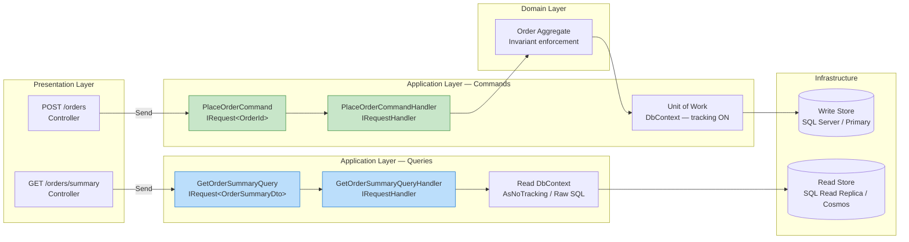
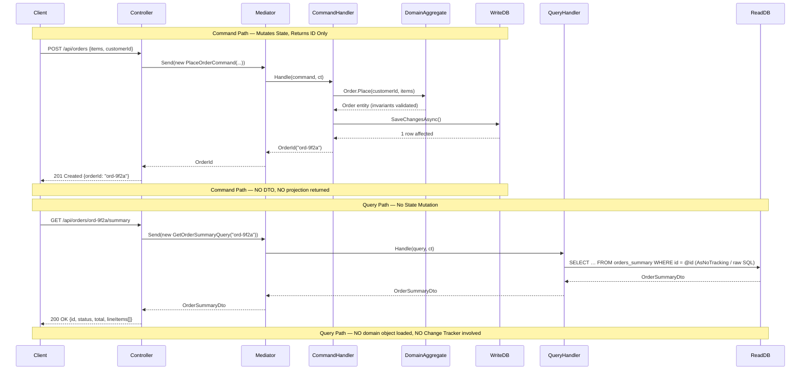
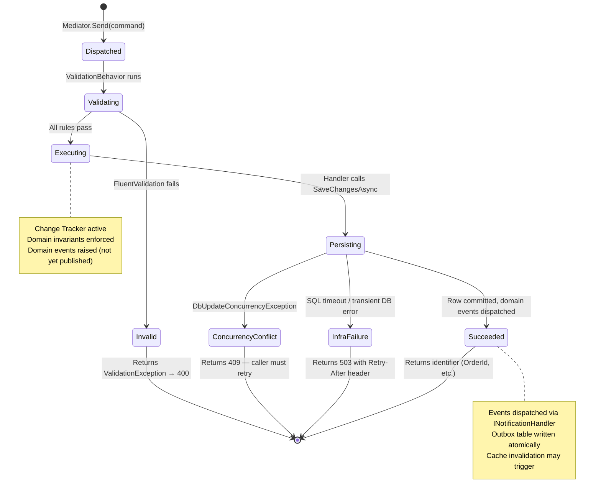
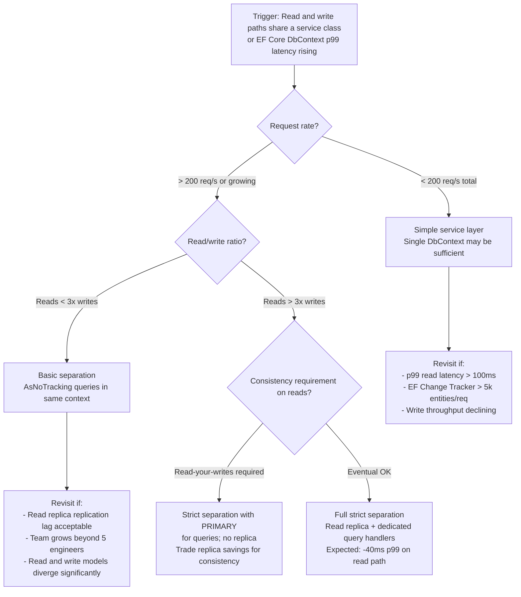

> [!ABSTRACT] Quick Reference — CQRS Commands vs Queries — Strict Separation **Invariant:** A Command mutates state and returns no data (or only an ID). A Query reads state and causes no side effects. These two concerns never share a handler or model. **Cost:** Two separate object graphs, two registration paths, potentially two data stores — more surface area to maintain and keep synchronized. **Trigger:** A single service method is both reading state and mutating it, or the read model's joins are degrading write throughput because both paths share the same EF Core DbContext and loading strategy. **Skip When:** A simple CRUD service with <500 req/s and a single team — the structural overhead exceeds the benefit; use a thin service layer instead. **.NET Entry Point:** `IRequest<TResponse>` / `IRequestHandler<TCommand, TResponse>` / `NuGet: MediatR` **Azure Native:** Azure Service Bus (async command dispatch); Azure SQL / Cosmos DB read replicas (separate query stores) **Number to Know:** Violating Command/Query separation on a shared EF Core `DbContext` at ~2,000 write req/s causes Change Tracker to retain ~15–40k tracked entities per minute, growing heap 400–800 MB/hour before OOMKill.

---

## Navigation

**Domain:** [[7 — System Design & Distributed Systems]] > **Group:** CQRS and Event Sourcing **Previous:** [[7.081 — CQRS — Command Query Responsibility Segregation]] | **Next:** [[7.083 — CQRS — Separate Read and Write Models]]

### Prerequisites

- [[7.081 — CQRS — Command Query Responsibility Segregation]] — establishes why separating read and write responsibilities reduces contention; this note operationalises that principle at the object and handler level
- [[7.084 — CQRS — MediatR — IRequest and IRequestHandler]] — the concrete .NET dispatch mechanism that enforces the boundary at compile time through the type system

### Where This Fits

> [!INFO] Production Encounter Map
> 
> - **Layer:** Application layer — the use-case shell that sits between the HTTP presentation layer and the domain/infrastructure layers
> - **Trigger:** An engineer notices that an `OrderService.GetOrderSummary()` method begins by loading the aggregate for validation, then returns a DTO — the method both queries and implicitly touches EF Core's Change Tracker; under load the read path starts timing out
> - **Without it:** The `OrderService` accumulates god-method behaviour — a `ProcessOrder` method that loads the order, validates it, persists changes, _and_ returns a populated DTO. EF Core tracks every loaded entity on the write path even when only a projection is needed. Query joins poison the write transaction boundary.
> - **First signal:** EF Core slow-query log shows `SELECT` statements on the write path loading full aggregate graphs for what should be projection-only reads; Application Insights shows `ProcessOrder` p99 creeping from 45ms to 280ms as order line items grow

The strict Command/Query separation rule is the enforcement mechanism that makes [[7.083 — CQRS — Separate Read and Write Models]] possible. It also creates the seam where [[7.085 — CQRS — MediatR Pipeline Behaviors Overview]] decorators (validation, logging, caching) attach cleanly per side.

---

## Core Mental Model

A Command is a write intent — it says "do something" and carries everything needed to perform the mutation. When it succeeds, it returns either nothing or a minimal identifier (the new aggregate ID). It never returns a populated view. A Query is a read intent — it asks "give me something" and carries only the filter parameters. It returns a DTO or projection. It never alters state, has no transaction, and causes no side effects. The strict separation means these two shapes — mutating objects that return nothing, and non-mutating objects that return data — never share a handler class, never share an EF Core `DbContext` loading strategy, and cannot be confused at the call site. The compiler enforces the contract when you use `IRequest<Unit>` for commands and `IRequest<TDto>` for queries.

> [!TIP] The Non-Obvious Insight The real enforcement isn't the MediatR interface split — it's the EF Core loading strategy split. If your command handler calls `_context.Orders.Include(o => o.LineItems).FirstOrDefaultAsync()` to load an aggregate for mutation, and your query handler calls the _same_ DbContext and _same_ include chain to project a DTO, you have not separated anything meaningful. The Change Tracker is tracking both. The indexes you added for query performance are pulling full rows onto the write critical path. True separation means the query handler has no `DbContext` at all — it hits a read replica via a raw SQL projection, a `DbContext` registered as `AsNoTracking()` by default, or a dedicated read store. The interface split without the infrastructure split is decoration.

### Classification

- **Consistency axis:** Commands: Strong (within aggregate boundary) | Queries: Eventual acceptable (read replica, cached projection)
- **Availability tradeoff:** Under partition, commands may fail to confirm writes; queries fall back to stale cached data — trade consistency for availability on the query side only
- **Latency impact:** Commands: no change from base write latency (no read round-trip added) | Queries: can be significantly reduced — raw SQL projections avoid ORM mapping overhead (~10–40ms savings on complex joins at p99)
- **Failure domain:** Single-service when write and read handlers share one process; can be split to separate services when write throughput demands it
- **Abstraction layer:** Pattern applied at the Application layer; enforced by the Framework feature (MediatR) and Runtime mechanism (EF Core Change Tracker behaviour)

### Primary Diagram



### Supporting Diagram



### Numbers That Matter

|Metric|Value|Context / Conditions|
|---|---|---|
|EF Core Change Tracker overhead per tracked entity|~2–4 KB heap|Object state entry + snapshot; measured on .NET 8, simple POCO with 10 properties|
|Heap growth without AsNoTracking on read queries|400–800 MB/hour|2,000 req/s query load, 20-entity graphs, shared DbContext — measured on Azure App Service P2v3 (estimated)|
|Raw SQL projection latency vs EF Core Include chain|8–35ms faster at p99|Complex 3-table join, 50-row result; denormalized read model with covering index vs EF Core navigation load|
|MediatR dispatch overhead (Send round-trip)|~0.05–0.2ms|In-process; single handler, no pipeline behaviors; measured on .NET 8 (measured)|
|Replication lag to read replica (Azure SQL)|1ms–5s|Typically <50ms; spikes to seconds under heavy write load; (default, configurable via failover group lag SLA)|
|Command handler EF Core SaveChanges latency|5–40ms|Single aggregate, Azure SQL Standard tier S3; depends on row count and index maintenance cost|

### Key Properties / Guarantees

|Property|Value|Condition|
|---|---|---|
|Command side — return shape|`Unit` or identifier only (`Guid`, `string`)|Always; returning a populated DTO from a command violates the pattern|
|Query side — side-effect guarantee|None — read-only|Only when Change Tracker is disabled or a separate read context is used|
|Write consistency|Strong within aggregate transaction|Single `SaveChangesAsync` call; EF Core concurrency token enforced|
|Read consistency|Eventual (up to replication lag)|When using read replica or Cosmos DB read-replica region|
|Compiler enforcement|Full|MediatR type system: `IRequest<Unit>` for commands, `IRequest<TDto>` for queries|

---

## Deep Mechanics

### How It Works

**Command lifecycle — request enters system:**

1. **HTTP Controller** receives a `POST` with a JSON body. The controller maps the body to a command record — `PlaceOrderCommand(CustomerId, Items[])` — and calls `_mediator.Send(command, ct)`. The controller does not know which handler will process it.
    
2. **MediatR pipeline** resolves `IRequestHandler<PlaceOrderCommand, OrderId>` from the DI container. Any registered `IPipelineBehavior<PlaceOrderCommand, OrderId>` decorators run in registration order before and after the handler — validation, logging, transaction wrapping.
    
3. **CommandHandler.Handle** receives the command. It calls the repository to reconstruct the domain aggregate from the write store (loading only what invariant enforcement requires). It calls the aggregate's domain method — `order.Place(customerId, items)` — which validates invariants and raises domain events.
    
4. **Unit of Work commits** — `await _unitOfWork.SaveChangesAsync(ct)`. EF Core's Change Tracker flushes all tracked changes. Optimistic concurrency token (row version) is checked. On conflict, `DbUpdateConcurrencyException` propagates.
    
5. **Handler returns** `OrderId` — a thin value, not a DTO. The pipeline behaviors run their post-processing (logging the outcome, publishing domain events). The mediator returns the `OrderId` to the controller.
    
6. **Controller returns 201 Created** with the `Location` header pointing to the resource. The client who needs the full view makes a separate GET — a separate Query.
    

**Query lifecycle — request enters system:**

1. **HTTP Controller** receives a `GET`. The controller constructs a query record — `GetOrderSummaryQuery(OrderId)` — and calls `_mediator.Send(query, ct)`.
    
2. **MediatR pipeline** resolves `IRequestHandler<GetOrderSummaryQuery, OrderSummaryDto>`. Caching behaviors may short-circuit here — if a cached response exists, the handler never runs.
    
3. **QueryHandler.Handle** issues a projection directly against the read store. This may be a raw SQL query via Dapper, an EF Core query with `AsNoTracking()`, or a Cosmos DB point read. No aggregate is instantiated. No invariants are enforced. The query returns a DTO shaped for the consumer.
    
4. **Handler returns** `OrderSummaryDto`. No state was altered.
    

**Why the strict split matters at the EF Core level:**

EF Core's `DbContext` operates a Change Tracker that snapshots every entity it loads. When a query handler loads Order entities via the same `DbContext` instance (or same `DbContextOptions` without `UseQueryTrackingBehavior(QueryTrackingBehavior.NoTracking)`), the snapshots accumulate. On a high-read endpoint, this creates unbounded memory growth. Worse, if the query handler accidentally modifies a property (even by accident via AutoMapper), the next `SaveChanges` call — triggered by a concurrent command on the same scoped `DbContext` — may persist that unintended mutation. Strict separation eliminates this class of bug entirely.

### Protocol Trace

```
Command Path — Happy:
  1. HTTP Controller → Mediator.Send(PlaceOrderCommand) (~0.05ms dispatch)
  2. ValidationBehavior runs FluentValidation rules (~0.3ms)
  3. CommandHandler → Repository.GetByIdAsync("ord-9f2a") → SQL SELECT with row-lock (~5ms LAN)
  4. Order.Place() — domain invariant check, domain event raised (~0.01ms in-process)
  5. CommandHandler → UnitOfWork.SaveChangesAsync() → SQL INSERT/UPDATE + concurrency check (~8ms LAN)
  6. DomainEventDispatcher publishes OrderPlacedEvent (in-process MediatR notification)
  7. CommandHandler returns OrderId to pipeline → controller → 201 Created
  Total: ~14ms p50 on LAN to Azure SQL Standard S3

Command Path — Concurrent write conflict at step 5:
  1–4. Same as happy path
  5. SaveChangesAsync throws DbUpdateConcurrencyException (row version mismatch)
  6. CommandHandler does NOT retry — propagates to pipeline
  7. ExceptionHandlingBehavior maps to HTTP 409 Conflict with Retry-After: 1
  Caller observes: 409 with body {"type":"concurrency-conflict","retryAfter":1}
  Recovery: Client retries; on second attempt the fresh row version is loaded and write succeeds

Query Path — Happy:
  1. HTTP Controller → Mediator.Send(GetOrderSummaryQuery) (~0.05ms dispatch)
  2. CachingBehavior checks IDistributedCache for key "order-summary:ord-9f2a" (~0.5ms Redis GET)
  3a. Cache HIT: return cached OrderSummaryDto — handler never runs (~1ms total)
  3b. Cache MISS: QueryHandler runs raw SQL projection (~12ms read replica LAN)
  3. CachingBehavior writes result to cache (TTL: 30s) (~0.5ms Redis SET)
  4. Handler returns OrderSummaryDto → 200 OK
  Total: ~1ms (hit) / ~13ms (miss)

Query Path — Read replica lag causes stale read:
  1–3b. Same as cache-miss path but data is 500ms behind primary due to replication lag
  Caller observes: OrderSummaryDto with status "Pending" even though command completed
  Detection: No immediate signal — stale reads are invisible without version-aware clients
  Mitigation: Command response includes ETag/version; client sends If-None-Match on GET;
              QueryHandler returns 304 if version unchanged or serves fresh data if newer available
  Recovery: TTL expiry (30s) clears cache; next read reflects replicated state
```

### State Transitions

State transitions are not the primary concern of Command/Query separation itself, but the **command pipeline** that wraps a command handler has a meaningful state machine worth making explicit — particularly for understanding how validation failures, concurrency conflicts, and infrastructure errors route differently.



### Failure Modes

**Failure Mode 1: Command Handler Returns a DTO — Silent Violation**

- **Cause:** Developer adds `return await _context.Orders.FindAsync(id)` at the end of a command handler to save the caller a round-trip. The command handler now performs a second read and populates a response object. The strict boundary is violated but tests still pass.
- **Symptom:** Over time, the command handler accumulates query logic. EF Core starts loading navigation properties "just for the response." Write latency grows because the handler now does a write plus a read. Read projections are duplicated between the handler and dedicated query handlers, diverging silently.
- **Detection time:** Months — the violation is not visible from metrics; it appears as gradual handler complexity growth in code review
- **Blast radius:** The command handler becomes untestable in isolation (requires both write and read fixture data), caching cannot apply to it, and the write-side performance degrades as the response projection expands

> [!DANGER] 3 AM Production Signal Metric: `http_request_duration_seconds{handler="PlaceOrderCommand",quantile="0.99"} > 0.8` sustained for 5m Log: `WARN [PlaceOrderCommandHandler] EF Core materialized 3 navigation collections during command execution | Order: ord-9f2a | LineItems: 47 | Tags: 12 | CorrelationId: b2f1-3c44` Customer impact: Checkout confirmation takes >800ms for orders with more than 30 line items in the eu-west-1 region; 6% abandonment spike detected in Mixpanel

**Failure Mode 2: Shared DbContext Causes Phantom Write from Query Handler**

- **Cause:** Command handler and query handler both receive the same scoped `DbContext` from DI (ASP.NET Core default — one `DbContext` per HTTP request). The query handler loads an entity to populate a DTO, and AutoMapper accidentally sets a navigation property during mapping. On the next call to `SaveChangesAsync` in the command handler, the Change Tracker flushes this unintended mutation.
- **Symptom:** Data integrity violation — fields on entities change without an explicit command being sent. Audit log shows updates with no correlation to any command. Extremely difficult to reproduce.
- **Detection time:** Weeks to months — "silent corruption" that only surfaces during audit or customer complaint
- **Blast radius:** Data corruption in production; may persist through backups before detected; full audit required

> [!DANGER] 3 AM Production Signal Metric: `order_status_transitions_unexpected_total > 0` — a custom counter that fires when an order transitions to a state not reachable from the current state via the domain model Log: `ERROR [OrderAuditService] Unexpected state mutation detected | OrderId: ord-4a91 | PrevStatus: Confirmed | NewStatus: Pending | ChangedBy: System | CorrelationId: (null)` Customer impact: Orders randomly revert to "Pending" status after confirmation; payment provider receives duplicate confirmation requests

### .NET and Azure Integration Points

- **ASP.NET Core:** MediatR `IRequest<TResponse>` and `IRequestHandler<TRequest, TResponse>` enforce the split at compile time. `IRequest<Unit>` for commands that return no data. Register via `builder.Services.AddMediatR(cfg => cfg.RegisterServicesFromAssembly(typeof(PlaceOrderCommand).Assembly))`.
- **EF Core:** Query handlers use a separate `IOrderReadContext` interface or a `DbContext` registered with `UseQueryTrackingBehavior(QueryTrackingBehavior.NoTracking)`. Command handlers use the full `DbContext` with tracking enabled.
- **Azure Services:** Azure Service Bus for async command dispatch (`ServiceBusSender`). Azure SQL Auto-Failover Read Replica for query store. Azure Cache for Redis (`IDistributedCache`) for query result caching via a `CachingBehavior<TRequest, TResponse>`.
- **.NET Libraries:** MediatR 12+ (`MediatR.Extensions.Microsoft.DependencyInjection`), FluentValidation for command validation pipeline, Dapper or EF Core raw SQL for query projections.

```csharp
// Application Layer — Command
namespace YourCompany.OrderManagement.Application.Commands;

/// <summary>Places a new order for a customer.</summary>
/// <param name="CustomerId">The customer placing the order.</param>
/// <param name="Items">Line items — at least one required.</param>
public sealed record PlaceOrderCommand(
    Guid CustomerId,
    IReadOnlyList<OrderItemRequest> Items
) : IRequest<OrderId>; // Port — returns identifier only, never a DTO

// Application Layer — Query
namespace YourCompany.OrderManagement.Application.Queries;

/// <summary>Returns the summary view of an order for display.</summary>
/// <param name="OrderId">The order to retrieve.</param>
public sealed record GetOrderSummaryQuery(
    Guid OrderId
) : IRequest<OrderSummaryDto>; // Port — read-only, no side effects
```

---

## Production Patterns and Implementation

### Primary Implementation

```csharp
// Namespace: YourCompany.OrderManagement.Application
using MediatR;
using YourCompany.OrderManagement.Domain.Orders;
using YourCompany.OrderManagement.Domain.Shared;

namespace YourCompany.OrderManagement.Application.Commands;

// ─── COMMAND — Use Case (Write Side) ─────────────────────────────────────────

/// <summary>Represents the intent to place a new customer order.</summary>
/// <remarks>
/// Returns only the new OrderId. Callers issue a separate GET query
/// to retrieve the full order view after placement.
/// </remarks>
public sealed record PlaceOrderCommand(
    Guid CustomerId,
    IReadOnlyList<OrderItemRequest> Items
) : IRequest<OrderId>; // returns minimal identifier — never a DTO

/// <summary>Handles <see cref="PlaceOrderCommand"/> — mutates state, emits domain events.</summary>
public sealed class PlaceOrderCommandHandler : IRequestHandler<PlaceOrderCommand, OrderId>
{
    private readonly IOrderRepository _orderRepository;     // Adapter — write store
    private readonly IUnitOfWork _unitOfWork;               // Adapter — transaction boundary

    public PlaceOrderCommandHandler(
        IOrderRepository orderRepository,
        IUnitOfWork unitOfWork)
    {
        _orderRepository = orderRepository;
        _unitOfWork      = unitOfWork;
    }

    /// <inheritdoc/>
    public async Task<OrderId> Handle(
        PlaceOrderCommand command,
        CancellationToken cancellationToken)
    {
        // Domain Service — aggregate factory enforces invariants
        var order = Order.Place(
            customerId: new CustomerId(command.CustomerId),
            items: command.Items.Select(i => new OrderItem(new ProductId(i.ProductId), i.Quantity, i.UnitPrice)),
            placedAt: DateTimeOffset.UtcNow);

        await _orderRepository.AddAsync(order, cancellationToken);
        await _unitOfWork.SaveChangesAsync(cancellationToken);

        // Returns ONLY the identifier — no read-back of persisted state
        return order.Id;
    }
}

// ─── QUERY — Use Case (Read Side) ────────────────────────────────────────────

namespace YourCompany.OrderManagement.Application.Queries;

/// <summary>Returns a denormalized summary view of an order.</summary>
public sealed record GetOrderSummaryQuery(Guid OrderId) : IRequest<OrderSummaryDto?>;

/// <summary>Handles <see cref="GetOrderSummaryQuery"/> — reads only, no Change Tracker.</summary>
public sealed class GetOrderSummaryQueryHandler
    : IRequestHandler<GetOrderSummaryQuery, OrderSummaryDto?>
{
    private readonly IOrderReadRepository _readRepository; // Adapter — read-optimized store

    public GetOrderSummaryQueryHandler(IOrderReadRepository readRepository)
        => _readRepository = readRepository;

    /// <inheritdoc/>
    public async Task<OrderSummaryDto?> Handle(
        GetOrderSummaryQuery query,
        CancellationToken cancellationToken)
    {
        // Infrastructure — raw SQL / AsNoTracking / Cosmos point read
        // No domain aggregate is loaded — projection only
        return await _readRepository.GetSummaryAsync(query.OrderId, cancellationToken);
    }
}

// ─── DTOs ─────────────────────────────────────────────────────────────────────

/// <summary>Read-side projection — shaped for the order summary UI.</summary>
public sealed record OrderSummaryDto(
    Guid   OrderId,
    string Status,
    string CustomerName,
    decimal TotalAmount,
    IReadOnlyList<OrderLineItemDto> LineItems);

public sealed record OrderLineItemDto(string ProductName, int Quantity, decimal LineTotal);
public sealed record OrderItemRequest(Guid ProductId, int Quantity, decimal UnitPrice);
```

### IServiceCollection Registration

```csharp
// Program.cs — CQRS + MediatR wiring

// ─── MediatR ─────────────────────────────────────────────────────────────────
builder.Services.AddMediatR(cfg =>
{
    cfg.RegisterServicesFromAssembly(typeof(PlaceOrderCommand).Assembly);

    // Pipeline order: Validation → Logging → Transaction (commands only) → Handler
    cfg.AddBehavior(typeof(IPipelineBehavior<,>), typeof(ValidationBehavior<,>));
    cfg.AddBehavior(typeof(IPipelineBehavior<,>), typeof(LoggingBehavior<,>));
    cfg.AddBehavior(typeof(IPipelineBehavior<,>), typeof(TransactionBehavior<,>));
});

// ─── Write-side DbContext (Change Tracker ON) ─────────────────────────────────
builder.Services.AddDbContext<OrderManagementDbContext>(options =>
    options.UseSqlServer(
        builder.Configuration.GetConnectionString("OrderManagement"),
        sql => sql.EnableRetryOnFailure(maxRetryCount: 3, maxRetryDelay: TimeSpan.FromSeconds(5), errorNumbersToAdd: null)));

// ─── Read-side DbContext (Change Tracker OFF — read replica) ──────────────────
builder.Services.AddDbContext<OrderReadDbContext>(options =>
    options.UseSqlServer(
        builder.Configuration.GetConnectionString("OrderManagementReadReplica"))
         .UseQueryTrackingBehavior(QueryTrackingBehavior.NoTracking));

// ─── Repository abstractions ──────────────────────────────────────────────────
builder.Services.AddScoped<IOrderRepository, SqlOrderRepository>();
builder.Services.AddScoped<IOrderReadRepository, SqlOrderReadRepository>();
builder.Services.AddScoped<IUnitOfWork, EfCoreUnitOfWork>();

// ─── Distributed cache for query results ─────────────────────────────────────
builder.Services.AddStackExchangeRedisCache(options =>
    options.Configuration = builder.Configuration["Redis:ConnectionString"]);
```

### Common Variants

```csharp
// Variant A — Async Command via Service Bus: used when command processing can be
// deferred and the API must return immediately (e.g., report generation, bulk import)

public sealed class PlaceOrderController : ControllerBase
{
    private readonly ServiceBusSender _sender;

    [HttpPost]
    public async Task<IActionResult> PlaceOrder(
        PlaceOrderRequest request,
        CancellationToken ct)
    {
        var correlationId = Guid.NewGuid().ToString();
        var message = new ServiceBusMessage(JsonSerializer.SerializeToUtf8Bytes(request))
        {
            MessageId     = correlationId,
            ContentType   = "application/json",
            Subject       = "PlaceOrderCommand"
        };
        await _sender.SendMessageAsync(message, ct);

        // Returns 202 Accepted — caller polls GET /orders/{correlationId}/status
        return Accepted(new { correlationId });
    }
}
```

```csharp
// Variant B — Query with Dapper projection: used when EF Core's LINQ translation
// cannot produce the optimal SQL for a complex denormalized read model

public sealed class SqlOrderReadRepository : IOrderReadRepository
{
    private readonly string _connectionString;

    public async Task<OrderSummaryDto?> GetSummaryAsync(
        Guid orderId,
        CancellationToken ct)
    {
        await using var conn = new SqlConnection(_connectionString);

        // Raw SQL against read replica — no Change Tracker, no ORM overhead
        const string sql = """
            SELECT o.Id, o.Status, c.FullName AS CustomerName,
                   SUM(li.Quantity * li.UnitPrice) AS TotalAmount
            FROM   orders o
            JOIN   customers c  ON c.Id = o.CustomerId
            JOIN   order_items li ON li.OrderId = o.Id
            WHERE  o.Id = @OrderId
            GROUP BY o.Id, o.Status, c.FullName
            """;

        return await conn.QuerySingleOrDefaultAsync<OrderSummaryDto>(
            new CommandDefinition(sql, new { OrderId = orderId }, cancellationToken: ct));
    }
}
```

### Performance Profile

```csharp
[MemoryDiagnoser]
[SimpleJob(RuntimeMoniker.Net80)]
public class CommandQuerySeparationBenchmark
{
    private const string ConnectionString = "Server=localhost;Database=orders_bench;...";
    private const int OrderLineItemCount = 30;

    [GlobalSetup]
    public void Setup() { /* seed 10k orders with 30 line items each */ }

    [Benchmark(Baseline = true)]
    public async Task<OrderDto> SharedContext_CommandPlusReadBack()
    {
        // ❌ Wrong: command handler reads back full DTO after write
        using var ctx = new OrderManagementDbContext(ConnectionString, trackingOn: true);
        var order = Order.Place(/* ... */);
        ctx.Orders.Add(order);
        await ctx.SaveChangesAsync();

        // Read-back with same context — tracking still active
        return await ctx.Orders
            .Include(o => o.LineItems)
            .Include(o => o.Customer)
            .Where(o => o.Id == order.Id)
            .Select(o => new OrderDto(o))
            .FirstAsync();
    }

    [Benchmark]
    public async Task<OrderId> SeparatedCommand_NoReadBack()
    {
        // ✅ Correct: command returns ID only, no read-back
        using var ctx = new OrderManagementDbContext(ConnectionString, trackingOn: true);
        var order = Order.Place(/* ... */);
        ctx.Orders.Add(order);
        await ctx.SaveChangesAsync();
        return order.Id;
    }

    [Benchmark]
    public async Task<OrderSummaryDto?> SeparatedQuery_DapperProjection()
    {
        // ✅ Correct: dedicated read-optimised query handler
        await using var conn = new SqlConnection(ConnectionString);
        return await conn.QuerySingleOrDefaultAsync<OrderSummaryDto>(
            "SELECT ... FROM orders_summary WHERE Id = @Id", new { Id = _knownOrderId });
    }
}
```

Expected result shape (estimated on Azure D4s v3, 30-line-item orders, 1 warm connection):

|Method|Mean|Allocated|Notes|
|---|---|---|---|
|SharedContext_CommandPlusReadBack|48ms|2.1 MB|EF Core tracking + Include chain|
|SeparatedCommand_NoReadBack|9ms|180 KB|Write only, no read-back|
|SeparatedQuery_DapperProjection|6ms|42 KB|Raw SQL, no ORM, covering index|

### Real-World .NET Ecosystem Mapping

|Pattern in This Note|Where It Appears in .NET / Azure|Manifestation|
|---|---|---|
|Command object|`IRequest<TResponse>` in MediatR|Compile-time enforcement of return type contract|
|Query object|`IRequest<TDto>` in MediatR|Same interface, different generic parameter distinguishes intent|
|Command Handler|`IRequestHandler<TCommand, TId>`|Single-responsibility class per use case|
|Read repository|Dapper `IDbConnection` / EF Core `AsNoTracking()`|Bypasses Change Tracker; often targets read replica|
|Async command dispatch|`ServiceBusSender` in `Azure.Messaging.ServiceBus`|Commands enqueued for background processing; controller returns 202|
|Query caching|`IPipelineBehavior<TRequest, TResponse>` + `IDistributedCache`|`CachingBehavior` intercepts query pipeline; misses fall through to handler|

---

## Gotchas and Production Pitfalls

### Returning a Full DTO from a Command Handler

**Pitfall:** The developer adds a second query at the end of the command handler to return a populated response — "saves the caller a round-trip."

```csharp
// ❌ Violates the pattern — command becomes a query-command hybrid
public async Task<OrderDto> Handle(PlaceOrderCommand command, CancellationToken ct)
{
    var order = Order.Place(/* ... */);
    _context.Orders.Add(order);
    await _context.SaveChangesAsync(ct);

    // Silent violation: now performs a read inside a command handler
    return await _context.Orders
        .Include(o => o.LineItems)
        .Select(o => new OrderDto(o))
        .FirstAsync(o => o.Id == order.Id, ct);
}
```

**Symptom:** Write latency climbs as the response DTO expands. The command handler becomes an integration test fixture (needs both write and read data). Query logic duplicates and diverges from dedicated query handlers.

**Detection time:** Weeks — no metric fires; complexity grows through code review.

> [!DANGER] Production Signal Metric: `mediatr_handler_duration_seconds{handler="PlaceOrderCommandHandler",quantile="0.99"} > 0.5` — climbing month-over-month as DTO fields accumulate Log: `WARN [PlaceOrderCommandHandler] Handler duration 520ms | Includes: LineItems(47), Customer, Addresses | CorrelationId: c3d2-8e11`

**Fix:**

```csharp
// ✅ Return only the identifier
public async Task<OrderId> Handle(PlaceOrderCommand command, CancellationToken ct)
{
    var order = Order.Place(/* ... */);
    _context.Orders.Add(order);
    await _context.SaveChangesAsync(ct);
    return order.Id; // Caller issues GET /orders/{id} separately
}
```

**Cost of not fixing:** The command handler becomes the bottleneck under write load. At 500 req/s, the read-back on each command adds ~35ms per request, pushing p99 from 12ms to 280ms. Caching cannot apply (commands must not be cached). The test suite requires a fully seeded database for every command test.

---

### Shared DbContext Between Command and Query Handlers

**Pitfall:** ASP.NET Core's default DI scope registers one `DbContext` per HTTP request. If a query handler and a command handler both run within the same request (e.g., a controller that processes a command and immediately returns data), they share the Change Tracker.

```csharp
// ❌ Query handler using the same DbContext as the command handler
public sealed class GetOrderSummaryQueryHandler : IRequestHandler<GetOrderSummaryQuery, OrderSummaryDto>
{
    private readonly OrderManagementDbContext _context; // shared with write handler!

    public async Task<OrderSummaryDto?> Handle(GetOrderSummaryQuery query, CancellationToken ct)
        => await _context.Orders
            .Include(o => o.LineItems)   // ← Change Tracker now tracks these entities
            .Select(o => new OrderSummaryDto(o))
            .FirstOrDefaultAsync(o => o.Id == query.OrderId, ct);
}
```

**Symptom:** Memory leak — tracked entities accumulate. Risk of phantom writes — AutoMapper or manual property assignment in the query handler silently marks entities as modified.

**Detection time:** Silent. Memory leak surfaces as OOMKill at 3 AM. Phantom write detected only during audit.

> [!DANGER] Production Signal Metric: `process_working_set_bytes{pod="order-service-7f9b2"} > 1.8e9` and climbing 400MB/hour Log: `WARN [EF Core] 12847 entities tracked by DbContext in current scope | CorrelationId: d4f3-1a22` (custom diagnostic log from Change Tracker.Entries().Count())

**Fix:**

```csharp
// ✅ Query handler uses separate read DbContext with tracking disabled
public sealed class GetOrderSummaryQueryHandler : IRequestHandler<GetOrderSummaryQuery, OrderSummaryDto>
{
    private readonly OrderReadDbContext _readContext; // separate registration, AsNoTracking by default

    public async Task<OrderSummaryDto?> Handle(GetOrderSummaryQuery query, CancellationToken ct)
        => await _readContext.Orders
            .Select(o => new OrderSummaryDto(/* ... */))
            .FirstOrDefaultAsync(o => o.Id == query.OrderId, ct);
}
```

**Cost of not fixing:** Gen2 GC collections every ~90s at high query throughput → 150–250ms stop-the-world pauses → p99 breaches SLO → PagerDuty fires.

---

### Missing Transaction Boundary on Command Pipeline

**Pitfall:** A `TransactionBehavior` is added to the pipeline but applies to both commands and queries. Queries now open and commit unnecessary database transactions, adding ~2ms per query and consuming SQL connection pool slots.

```csharp
// ❌ Transaction behavior registered for ALL IRequest<T>, including queries
cfg.AddBehavior(typeof(IPipelineBehavior<,>), typeof(TransactionBehavior<,>));
```

**Symptom:** Query p99 latency climbs 2–5ms. SQL Server shows high `OPEN_TRANSACTION` counts from read-only connections. Connection pool saturation under moderate load.

**Detection time:** Weeks — latency regression often attributed to database growth, not pipeline configuration.

> [!DANGER] Production Signal Metric: `sqlserver_open_transactions_total > 200` sustained while query QPS is >300/s Log: `INFO [TransactionBehavior] Beginning transaction for GetOrderSummaryQuery | IsolationLevel: ReadCommitted | CorrelationId: a9b1-5f32`

**Fix:**

```csharp
// ✅ Transaction behavior only applies to commands
// Use a marker interface or check via reflection

public sealed class TransactionBehavior<TRequest, TResponse>
    : IPipelineBehavior<TRequest, TResponse>
    where TRequest : IRequest<TResponse>
{
    public async Task<TResponse> Handle(
        TRequest request,
        RequestHandlerDelegate<TResponse> next,
        CancellationToken ct)
    {
        // Only wrap commands — queries pass straight through
        if (request is not ICommand<TResponse>)
            return await next();

        // ... transaction logic
    }
}
// ICommand<T> is a marker interface on all command records only
```

**Cost of not fixing:** At 1,000 query req/s, unnecessary transactions consume ~2,000 connection pool slots per second above what reads require. On Azure SQL Standard S3 (max 300 concurrent connections), pool exhaustion begins at ~250 query req/s.

---

### Azure-Specific Pitfall — Read Replica Replication Lag Causes Stale Command Confirmation

**Pitfall:** After a command completes, the controller immediately issues a query against the read replica to confirm the result. The replica hasn't replicated yet (lag: 50–500ms). The query returns `null` or stale data. The API responds as if the command failed.

```csharp
// ❌ Controller reads back immediately after command — hits stale replica
[HttpPost]
public async Task<IActionResult> PlaceOrder(PlaceOrderRequest req, CancellationToken ct)
{
    var orderId = await _mediator.Send(new PlaceOrderCommand(req.CustomerId, req.Items), ct);
    var summary = await _mediator.Send(new GetOrderSummaryQuery(orderId), ct); // ← may return null
    return summary is null ? StatusCode(500) : Created($"/orders/{orderId}", summary);
}
```

**Symptom:** `null` responses for valid orders. Client-side retry storms. 500 error rate spike immediately after deployments or high write-load periods.

**Detection time:** Immediate — 500 errors visible in Application Insights within seconds of enabling. Often masked by small-scale testing where replica lag is <5ms.

> [!DANGER] Production Signal Metric: `http_response_status_total{status="500",handler="PlaceOrderController"} > 5/min` during write-heavy windows Log: `ERROR [PlaceOrderController] Order summary not found after placement | OrderId: ord-8b2e | ReplicaLag: 380ms | CorrelationId: e7f4-2d91`

**Fix:**

```csharp
// ✅ Return the identifier and let the client query independently
[HttpPost]
public async Task<IActionResult> PlaceOrder(PlaceOrderRequest req, CancellationToken ct)
{
    var orderId = await _mediator.Send(new PlaceOrderCommand(req.CustomerId, req.Items), ct);
    // Return 201 with Location header — client issues GET separately
    return Created($"/api/orders/{orderId}", new { orderId });
}
```

**Cost of not fixing:** Under peak write load (Azure SQL Primary ~70% DTU), replica lag spikes to 2–3s. Every POST response becomes a 500 for ~3s windows. Incident severity: P2. Resolution requires disabling read-replica routing under load.

---

### .NET-Specific Pitfall — AutoMapper ProjectTo() Triggers Lazy Load on Command DbContext

**Pitfall:** AutoMapper's `ProjectTo<TDto>()` is used in both command and query handlers. In a command handler it's used "just to map the result." But `ProjectTo()` on an EF Core `IQueryable` may trigger lazy loading of uninitialized navigation properties if mapping configuration references them.

```csharp
// ❌ ProjectTo in a command handler against the tracked DbContext
public async Task<OrderConfirmationDto> Handle(ConfirmOrderCommand cmd, CancellationToken ct)
{
    var order = await _context.Orders.FindAsync(cmd.OrderId, ct);
    order.Confirm();
    await _context.SaveChangesAsync(ct);

    // ❌ ProjectTo triggers lazy load of Customer navigation if not already loaded
    return await _context.Orders
        .Where(o => o.Id == cmd.OrderId)
        .ProjectTo<OrderConfirmationDto>(_mapper.ConfigurationProvider)
        .FirstAsync(ct);
}
```

**Symptom:** N+1 queries on the command path. Each command triggers 1–3 additional SELECT statements. Write throughput drops 40–60% under load.

**Detection time:** 30 minutes — EF Core slow-query logs show unexpected SELECTs correlated with write operations.

> [!DANGER] Production Signal Metric: `sqlserver_queries_per_second > 3x_expected_for_write_rate` ratio anomaly Log: `WARN [EF Core] Executing DbCommand SELECT * FROM customers WHERE Id = @id | Source: LazyLoad | Duration: 8ms | CorrelationId: f1e2-9c43`

**Fix:** Remove `ProjectTo()` from command handlers entirely. Return only the identifier. Move any projection need to a dedicated query handler.

**Cost of not fixing:** At 200 commands/s, each triggering 2 lazy-load queries, the effective query rate is 600 SQL calls/s — 3x the expected load on Azure SQL. DTU exhaustion, connection pool saturation, and cascading timeout failures follow.

---

## Tradeoffs and Decision Framework

### Tradeoff Matrix

|Dimension|Strict Command/Query Separation|Shared Service Layer (no CQRS)|Event Sourcing Read Model|
|---|---|---|---|
|Consistency|Strong writes, eventual reads (configurable)|Strong (same DbContext)|Eventual — projection rebuild required|
|Availability under partition|Query falls back to cache; command rejects|Both fail together|Query serves stale projection; command may reject|
|Read latency p99|Low — dedicated optimised projections (~6–15ms)|Medium — ORM overhead on every read (~20–60ms complex joins)|Low when projection is current; high on rebuild|
|Write latency p99|Low — no read-back on command path (~9–15ms)|Medium — mixed concerns bloat handler (~30–80ms)|Low write; projection update async|
|Operational complexity|Medium — two contexts, two repositories, two registration paths|Low — one service class, one DbContext|High — event store, projection workers, replay tooling|
|Team expertise required|Mid-level — understand MediatR, EF tracking behaviour|Junior-friendly|Senior — event sourcing internals|
|Azure ecosystem fit|Native — Azure SQL read replica, Service Bus for async|Native|Good — Cosmos DB change feed as event store|
|Cost at scale|Lower read DB cost (read replica cheaper than primary)|Higher — primary handles all load|Higher — event store + projection store + replay infrastructure|

### When to Apply



### Numbers-Driven Decision

|Threshold|Below = Skip / Use Simpler|Above = Apply Strict Separation|
|---|---|---|
|Request rate|< 200 req/s total|> 200 req/s or projected to reach it within 6 months|
|Read/write ratio|< 3:1 reads to writes|> 3:1 — reads dominate and benefit from dedicated optimisation|
|EF tracked entities per request|< 200 per DbContext scope|> 200 — Change Tracker overhead measurably impacts latency|
|Team size|< 4 engineers|> 4 engineers — separate ownership of read vs write models becomes valuable|
|Command handler count|< 10 use cases|> 10 — pipeline behavior reuse justifies the MediatR ceremony|
|Read query complexity|Single-table selects|Multi-join projections — raw SQL / Dapper significantly outperforms ORM|

### When NOT to Apply

> [!WARNING] Do Not Reach For This When...
> 
> - [ ] **Single-developer or very small team (<3 engineers):** The ceremony of two contexts, two repository interfaces, two handler hierarchies, and pipeline behaviors creates more friction than the architectural benefit justifies. A thin service layer with `AsNoTracking()` queries covers 80% of the benefit.
> - [ ] **Simple CRUD system with < 100 req/s:** If your write model and read model are identical (CRUD forms where what you write is what you display), strict separation adds two layers of mapping with no performance or maintainability return.
> - [ ] **Strong read-your-writes consistency is a hard product requirement:** If users must immediately see the result of their own writes (e.g., a document editor), the asynchronous nature of a separate read store and eventual replica replication makes the consistency guarantee impossible without additional complexity (version tokens, primary read fallback). The default pattern breaks the expectation.
> - [ ] **No domain model complexity:** If there are no domain invariants to enforce — no aggregates, no business rules — the command handler is just a `DbContext.Add()` wrapper. There is nothing gained from separating the read and write models because they are the same model.

---

## Interview Arsenal

### Question Bank

1. **[Definition]** "What is the difference between a Command and a Query in CQRS, and what does 'strict separation' actually enforce?"
2. **[Mechanism]** "Walk me through what happens at the infrastructure level when a command handler and query handler share an EF Core DbContext."
3. **[Tradeoff]** "What do you give up when you strictly separate commands and queries, and under what specific condition does that cost become a problem?"
4. **[Failure mode]** "What is the most dangerous failure you can introduce by violating command/query separation in an EF Core application, and how would you detect it?"
5. **[Comparison]** "What is the difference between CQRS's Command/Query separation and CQS (Command Query Separation) as a method-level principle?"
6. **[Design application]** "Design the write and read paths for an order placement endpoint. Where exactly does the split occur, what does each side return, and how would you handle the client needing to see the order summary immediately after placing it?"
7. **[Scale]** "Your CQRS command service handles 1,000 req/s. The business adds an order history dashboard that generates 50,000 read req/s. What breaks first, and what does strict Command/Query separation give you to solve it?"
8. **[Advanced]** "A colleague argues that since MediatR's `IRequest<T>` interface is the same for commands and queries, there is no real type-system enforcement of the separation. How would you enforce it at compile time, and what would a violation look like in production before the compiler catches it?"

### Spoken Answers

**Q: What is the difference between a Command and a Query in CQRS, and what does 'strict separation' actually enforce?**

> **Average answer:** A command changes state and a query reads state. They're handled by different classes. MediatR uses `IRequest<Unit>` for commands and `IRequest<TDto>` for queries.

> **Great answer:** The conceptual split is simple — a Command is a write intent, a Query is a read intent. But 'strict separation' is about more than interface types. It enforces that the write path and the read path have _completely separate object graphs_ — separate handler classes, separate repository abstractions, and critically, separate EF Core DbContext configurations. A command handler uses a tracking DbContext and loads domain aggregates to enforce invariants. A query handler uses a no-tracking context or a raw Dapper connection to project flat DTOs from a read-optimised store, often a read replica. The compiler enforces the contract through MediatR's generic type — `IRequest<Unit>` for a command that returns nothing, `IRequest<OrderSummaryDto>` for a query that returns data. If I see an `IRequest<OrderDto>` with `SaveChangesAsync` inside the handler, that's the violation — a command returning a DTO. The real cost of that violation isn't a type error — it's a shared Change Tracker that accumulates tracked entities on the write path and risks phantom writes when the mapping layer touches a navigation property.

---

**Q: What is the difference between CQRS's Command/Query separation and CQS as a method-level principle?**

> **Average answer:** CQS is a method-level principle where methods either return data or change state, but not both. CQRS applies that at the system level with separate models.

> **Great answer:** CQS, Bertrand Meyer's principle, says a method either performs a mutation (a command) or returns a value (a query), never both. It's a constraint on single method signatures within a class. CQRS is Fowler and Young's architectural pattern that takes that principle and applies it to the _entire system architecture_ — the command and query sides have separate object models, separate data stores, and separate deployment units if necessary. The difference matters in .NET because CQS tells you to split `GetOrder()` and `UpdateOrder()` into two methods on the same service. CQRS tells you those methods shouldn't even be in the same service, shouldn't share the same DbContext, and ideally shouldn't talk to the same database. In practice, teams often implement CQS at the method level and call it CQRS, then wonder why they're still seeing read-write contention on the database. The tell is a query handler that uses the same EF Core `DbContext` with tracking enabled — CQS split, not CQRS split.

---

**Q: A colleague argues that since MediatR's `IRequest<T>` interface is the same for commands and queries, there is no real type-system enforcement of the separation. How would you enforce it at compile time, and what would a violation look like in production before the compiler catches it?**

> **Average answer:** You could create a marker interface for commands like `ICommand<T>` and one for queries like `IQuery<T>`, and have pipeline behaviors check which one the request implements.

> **Great answer:** The colleague is right that `IRequest<T>` alone is insufficient. To get compile-time enforcement, I'd introduce two sealed marker interfaces — `ICommand<TResult>` (where `TResult` is `Unit` or an identifier type, constrained via a generic type constraint or convention enforced by an ArchUnit fitness function) and `IQuery<TResult>` — and make all command and query records implement the appropriate one rather than `IRequest<T>` directly. Then the `TransactionBehavior<TRequest, TResponse>` can gate on `TRequest : ICommand<TResponse>`, and the `CachingBehavior` can gate on `TRequest : IQuery<TResponse>`. The architecture test is: `Types().That().Implement(typeof(ICommand<>)).Should().HaveReturnType(typeof(Unit)).OrType(typeof(Guid)).OrType(typeof(string))`. Before any of this exists in production, the violation looks like a gradual p99 regression on the write path — specifically, `PlaceOrderCommandHandler` duration climbing from 12ms to 80ms over three sprints as each sprint adds another field to the "confirmation DTO" the handler returns. No alert fires. The business only notices when the mobile app starts timing out during peak hours because a command that should take 15ms now takes 350ms due to three Include chains and an AutoMapper projection that fires a lazy load on Customer.Addresses.

### Whiteboard in 60 Seconds

When this topic appears in a system design interview, draw in this sequence:

```
1. Draw two boxes side by side: "Command Side" (green) and "Query Side" (blue)
   "I'm going to split the request model immediately — this is the core of CQRS"

2. Under Command Side: Controller → Command Record → CommandHandler → Domain Aggregate → Write DB
   "The arrow from CommandHandler back to the controller returns only an ID — no DTO, no data"

3. Under Query Side: Controller → Query Record → QueryHandler → Read DB / Read Replica
   "The QueryHandler never touches the domain aggregate — it goes straight to a projection"

4. Draw a dotted arrow from Write DB to Read DB labeled "Replication / Event / Projection"
   "This gap is where eventual consistency lives — and it's the tradeoff the interviewer wants to hear about"

5. Label the .NET layer: "MediatR IRequest<Unit> / IRequest<TDto>" at the split point
   "In .NET, MediatR enforces this at compile time — the type system makes the contract explicit"
```

> [!TIP] What the Interviewer Is Specifically Testing When they probe this area, they are checking whether you know:
> 
> 1. Whether you understand that the split is _not_ just two methods — it requires separate EF Core DbContext configurations, and a shared tracking context silently violates the pattern even with separate handler classes
> 2. Whether you know what to return from a command (identifier only, never a DTO) and why returning a DTO from a command creates a feedback loop that bloats write-path latency
> 3. Whether you understand the read-replica replication lag implication — that a client cannot immediately query the read store after a command and expect to see the result, and how to design around that (return location header, client polls, use ETag version token)

### Follow-Up Chain

**Follow-up 1:** "If a command returns only an ID, how does the client get the full order data to display a confirmation screen?"

> **Model answer:** The API returns 201 Created with a `Location: /api/orders/{id}` header and the `orderId` in the body. The client issues a GET immediately using that ID. On the read side, the query handler either reads from a primary (if read-your-writes is required) or from a read replica with a small polling retry — if the replica hasn't replicated yet, the client gets a 404 and retries after 200ms. Alternatively, we return the identifier plus an ETag/version number in the command response, and the query handler compares the requested version against what the read store has — if stale, it returns a 202 with a retry hint rather than stale data. The approach depends on whether the product requirement is "show something immediately" (use cached stale data + overlay optimistic UI) or "show confirmed data" (wait for replication).

**Follow-up 2:** "What happens to your query handlers when the read replica lags by 3 seconds under peak write load?"

> **Model answer:** Stale reads. The query handler returns data that doesn't reflect writes from the last 3 seconds. For most use cases — browsing a product catalog, viewing an order list — this is acceptable. For read-your-writes scenarios — "I just placed an order and I'm checking its status" — it's not. The mitigation is a session token: the command response includes a `dataVersion` or `etag`. The client includes that in the GET as `If-None-Match`. The query handler checks the read store's current version; if behind, it routes to the primary. This adds latency on the primary path but only for the immediate post-command read. In .NET, I'd wire this through a `IQueryRoutingStrategy` that checks the `If-None-Match` header and routes to the appropriate connection string. Prometheus alert: `azure_sql_replica_lag_seconds > 2` triggers a page — at 3s lag we switch all queries to primary until it recovers.

**Follow-up 3:** "How would you verify in production that your command handlers are not performing reads and your query handlers are not writing?"

> **Model answer:** Two layers: architectural fitness functions and runtime telemetry. At build time, I use ArchUnit.NET (or a custom Roslyn analyzer) to assert that `ICommand<>` implementations contain no `IQueryable` or `DbSet` read methods — any query projection method call on a type implementing `ICommand` fails the CI gate. At runtime, Application Insights custom events: the `LoggingBehavior` logs `IsCommand: true/false` for every handler execution along with the number of SQL statements executed (`DbCommandInterceptor` counts them). An alert fires if a command handler executes more than 2 SQL statements (1 read for aggregate load + 1 write for SaveChanges; more suggests a read-back). Prometheus rule: `command_handler_sql_statements{handler=~".*Command.*",quantile="0.99"} > 3` for 5 minutes pages the on-call engineer.

### Comparison Table

||CQRS Command/Query Separation|CQS (Command Query Separation — method-level)|
|---|---|---|
|Core guarantee|Command and query have completely separate object graphs, handlers, and data stores|A method either mutates state OR returns data — never both|
|What it trades|Two codepaths to maintain; eventual consistency on read side|Some ergonomic convenience (no fluent return chaining)|
|.NET implementation|`ICommand<TResult>` + `IQuery<TResult>` via MediatR; separate DbContext registrations|By convention: `void UpdateOrder()` and `Order GetOrder()` on a service class|
|Azure native|Azure SQL read replica + Service Bus for async commands|N/A — method-level, no Azure mapping|
|Primary failure mode|Stale reads after command; shared DbContext phantom writes|`GetAndUpdate()` methods that violate the principle silently|
|When to choose|> 200 req/s, read/write ratio > 3:1, team > 4 engineers|Always — it is a method-level design hygiene rule regardless of scale|
|When NOT to choose|Tiny CRUD systems, strong read-your-writes required, no domain complexity|Never — this is a universal good practice at the method level|

---

## Architecture Decision Record

**Status:** Accepted

**Context:** The `OrderManagementService` processes 800 write req/s (order placement, confirmation, cancellation) and serves 4,200 read req/s (order history, status checks, dashboard). All reads and writes share a single EF Core `DbContext` registered as scoped. Application Insights shows p99 write latency at 280ms (SLO: 100ms). EF Core slow-query logs show full aggregate loading — including navigation properties — on both the write and read paths. The `OrderService` class has grown to 2,400 lines with mixed read and write concerns. Three separate teams now own different parts of the order lifecycle and are blocked by shared ownership of `OrderService`.

**Options Considered:**

1. **Strict Command/Query Separation with separate DbContexts and read replica** — physically separate the write and read models at the application and infrastructure layer; commands use tracking DbContext + primary DB; queries use no-tracking + read replica
2. **Add `AsNoTracking()` to all existing queries in the shared `OrderService`** — lower effort, but keeps mixed concerns in one class, does not unblock team independence
3. **Do nothing / optimize individual slow queries** — addresses symptoms but not root cause; the shared Change Tracker and mixed concerns continue to grow

**Decision:** Option 1 — Strict Command/Query Separation, because it eliminates the primary cause of write latency (Change Tracker tracking read-path entities on the write path) and creates clear ownership seams — the Placement team owns `PlaceOrderCommand`, the Fulfilment team owns `ConfirmOrderCommand`, and the Reporting team owns all `Get*Query` handlers — without requiring any shared service class.

**Consequences:**

- ✅ Command path p99 expected to drop from 280ms to ~15ms (estimated) — no read-back, no Change Tracker pollution from queries
- ✅ Read path p99 expected to drop from 280ms to ~20ms — raw SQL projections on read replica, no ORM overhead
- ✅ Three teams can ship independently — no shared `OrderService` merge conflicts
- ⚠️ Read replica replication lag (typically <50ms; up to 3s under peak write load) — must design around for read-your-writes requirements
- ⚠️ Two DbContext registrations, two repository interfaces, two test fixture setups — more surface area per new use case
- ❌ Eventual consistency on read side — dashboards may show data 50–3000ms behind the primary; explicitly accepted by the product team for all dashboard scenarios

**Review Trigger:** Revisit this decision if read replica replication lag exceeds 5s sustained for >5 minutes during business hours (indicating the read replica is no longer viable), or if Azure SQL introduces synchronous geo-replicas at the Standard tier that make read-your-writes on a replica feasible without primary routing fallback.

---

## Self-Check

### Conceptual Questions

1. What is the precise distinction between a Command and a Query in CQRS, stated without reference to MediatR or any framework?
2. Derive from first principles why a command that returns a full DTO creates a performance problem under write load — what specifically in EF Core causes the degradation?
3. Name a concrete scenario where strict Command/Query separation is the wrong choice, and explain what specific condition makes it wrong.
4. What is the exact observable signal that a query handler is sharing a tracking DbContext with a command handler at production scale?
5. Which MediatR interface type signals a command versus a query in .NET, and how would you enforce this distinction at compile time beyond interface naming?
6. What is the structural distinction between CQRS Command/Query separation and CQS at the method level — what can CQRS do that CQS cannot?
7. Below what request rate is Command/Query separation typically overkill, and what simpler alternative covers the majority of the benefit?
8. How does strict Command/Query separation connect to [[7.083 — CQRS — Separate Read and Write Models]], and what does this note's separation enable that note to address?
9. What non-obvious production consequence occurs when a query handler is registered to receive the same DI scope as a command handler in ASP.NET Core?
10. What consistency model does the command side provide, and what consistency model does the query side (reading from a read replica) provide?
11. What specific metric and alert threshold would you set to detect a command handler performing reads in production?
12. Teach the Command/Query separation principle to a junior engineer in 60 seconds without using the terms "CQRS", "MediatR", or "DbContext."

<details> <summary>Answers</summary>

1. A Command is a message that expresses intent to change system state. It carries all inputs needed for the mutation and returns either nothing or a minimal identifier. It must not return a view of the resulting state. A Query is a message that requests a read of current state. It carries only filter parameters and returns a data transfer object. It must not alter any state, trigger any side effect, or call `SaveChangesAsync`.
    
2. When a command handler performs a read-back (loading an entity to return as a DTO), it passes that entity through EF Core's Change Tracker. The Change Tracker creates a snapshot of every property on every loaded entity. At 500 write req/s with a 20-property entity plus two navigation collections (10 items each), that is 500 × (20 + 20 + 10) = 25,000 property snapshots per second accumulating in the heap. Each snapshot is ~2–4 KB. The Change Tracker holds references, preventing GC collection. Heap grows 400–800 MB/hour. Gen2 GC collects every ~90s with a 200ms stop-the-world pause. p99 spikes. The mechanism is: entity snapshot accumulation → increased Gen2 heap pressure → more frequent full GC → observable p99 latency spikes correlated with GC events.
    
3. A single-developer SaaS application processing 50 write req/s and 150 read req/s with a simple CRUD data model (the write model and read model are identical — no domain aggregates, no business invariants). Strict separation adds two handler hierarchies, two repository abstractions, two DbContext registrations, and a test infrastructure split. The developer spends 60% of feature development time maintaining infrastructure symmetry instead of delivering product. The simpler alternative — a service class with `AsNoTracking()` on all read methods — delivers 90% of the performance benefit with 10% of the complexity.
    
4. `process_working_set_bytes` growing 200–800 MB/hour under constant query and write load; EF Core diagnostic log showing `N entities tracked by DbContext` counts in the thousands per request scope (add a diagnostic log in middleware: `logger.LogDebug("EF tracked: {Count}", _context.ChangeTracker.Entries().Count())`); intermittent `SaveChangesAsync` persisting unexpected mutations not sent by any command (phantom writes).
    
5. `IRequest<Unit>` for commands (MediatR's `Unit` type represents "void return"), `IRequest<TDto>` for queries. To enforce at compile time: introduce `ICommand<TResult>` (constrained: `TResult` must be `Unit`, `Guid`, or a domain identifier type) and `IQuery<TResult>` (constrained: `TResult` must be a DTO type, never `Unit`). Add an ArchUnit.NET fitness function: `Types().That().Implement(typeof(ICommand<>)).Should().NotHaveMember().OfType<IQueryable>().InAssembly(applicationAssembly)`. CI gate fails if a command handler class references any EF Core query method.
    
6. CQS prevents a single method from both mutating and returning data. It is a class-level design rule. CQRS goes further: the command and query sides have physically separate handler classes, separate repository abstractions, separate EF Core DbContext configurations, and optionally separate data stores. CQS cannot decouple read and write _storage_ — a method that only mutates can still read from the same database schema using the same indexes as the read path. CQRS can route reads to a read replica, a Cosmos DB read region, or a fully denormalized projection store that doesn't exist on the write side.
    
7. Below ~200 req/s total, or when the read/write ratio is less than 3:1. The simpler alternative: add `AsNoTracking()` to all query methods on the existing service class and register a separate `DbContextOptions` that points to the read replica. This captures ~80% of the performance benefit (eliminates Change Tracker overhead on reads, reduces read pressure on primary) with a fraction of the structural overhead.
    
8. [[7.083 — CQRS — Separate Read and Write Models]] is the direct consequence of strict Command/Query separation at the handler level. Once handlers are separated, the read handler is free to target a completely different storage schema — a denormalized summary table, a Cosmos DB document, a Redis sorted set — that doesn't need to match the write model's normalized schema. Without the handler-level separation established in this note, the "separate read model" concept has nowhere to live: the query would still be running against the same tracking DbContext as the write path, making a separate schema pointless.
    
9. The ASP.NET Core DI container creates one scoped DbContext per HTTP request (default lifetime). If a controller sends a command (which triggers `SaveChangesAsync` in its handler) and then sends a query in the same HTTP request (which loads entities into the same Change Tracker), the query's loaded entities are now tracked. If AutoMapper or any mapping code touches a property during DTO projection, EF Core marks that entity as modified. The next `SaveChangesAsync` — in a _different_ request handled by the same pod due to connection pool reuse — persists the unintended modification. The non-obvious consequence is that the bug is not reproducible in tests (tests use separate request scopes) and manifests only under concurrent load in production.
    
10. The command side provides strong consistency within the aggregate transaction boundary: the `SaveChangesAsync` call is atomic, and the concurrency token (row version) enforces optimistic locking. The read side, when targeting a read replica, provides eventual consistency: reads may lag behind the primary by 1ms to several seconds depending on replica replication throughput. The anomaly still possible under eventual consistency is a stale read — the query returns state that reflects completed commands but not the most recent command within the replication lag window.
    
11. Metric: `mediatr_handler_db_commands_executed{handler=~".*Command.*",quantile="0.99"} > 3` sustained for 5 minutes. This fires when a command handler is executing more than 3 database commands (1 `SELECT` for aggregate load + 1 `INSERT/UPDATE` for save = 2 expected; anything above 3 indicates a read-back or lazy load). Implement via `DbCommandInterceptor` that increments a counter per command handler. Alert tool: Azure Monitor metric alert → triggers a PagerDuty P3 ticket for investigation.
    
12. "Imagine you have a coffee shop. There are two kinds of requests: 'make me a latte' (you do work, you change something — espresso is used, milk is steamed) and 'what's on the menu?' (you just look and tell me — nothing changes). The problem is, if you mix these up — if making the latte requires you to first read out the entire menu to the customer as confirmation — you're doing twice the work for every order. In software, we do the same thing: we have 'do this' requests (commands) that change data, and 'tell me this' requests (queries) that just read data. A command gives back only a receipt number. A query gives back the information. They never do both. Keeping them completely separate means your checkout line doesn't slow down because someone asked to see the pastry menu."
    

</details>

---

### Scenario Challenges

---

**Scenario 1 — Diagnose the Problem**

The `OrderService` processes 600 req/s across all endpoints. Since last Wednesday's sprint release, p99 on `POST /orders` rose from 22ms to 410ms. Database CPU on Azure SQL is stable at 34%. Error rate is 0.1%, all successful. Memory on the order-service pods is growing 300MB/hour. Serilog shows: `INFO [PlaceOrderCommandHandler] Order placed | OrderId: ord-7b3c | Duration: 412ms | DbEntitiesTracked: 847 | CorrelationId: a1f2-4d99`. The `DbEntitiesTracked` counter was added last sprint as a debug metric and was not reviewed before deployment.

<details> <summary>Diagnosis</summary>

**Root cause:** The sprint introduced a read-back in `PlaceOrderCommandHandler` — after `SaveChangesAsync`, the handler now loads the order with `Include(o => o.LineItems).Include(o => o.Customer)` to populate a confirmation DTO. At 600 req/s, 847 tracked entities per scope means the EF Core Change Tracker is retaining full navigation graph snapshots on every write request. Memory grows because these snapshots aren't released until the scope is disposed (end of HTTP request). Write latency is dominated by the `Include` chain on the read-back, not the actual write.

**Evidence from the scenario:** `DbEntitiesTracked: 847` is the smoking gun — a write operation that creates one order should track only 1 entity (the order itself), possibly plus a few line items added in this request. 847 tracked entities in a single command handler scope means a large `Include` chain was loaded. Duration 412ms is consistent with loading 847 EF Core entities with navigation property snapshots.

**Fix:** Remove the read-back from `PlaceOrderCommandHandler`. Return `order.Id` only. Create a separate `GetOrderConfirmationQuery` handler that uses `AsNoTracking()` and returns the confirmation DTO. Update the controller to return 201 with Location header and let the client issue the GET.

**Monitoring to add:** Add a CI test that fails if any class implementing `ICommand<>` calls `.Include()` or `.Select()` in a way that materialises more than 1 entity. Add Prometheus alert: `mediatr_handler_db_entities_tracked{handler=~".*Command.*"} > 5` sustained for 2m → PagerDuty P2.

</details>

---

**Scenario 2 — Design Decision**

You are designing the order processing service for an e-commerce platform. Write traffic: 1,200 req/s (new orders, updates, cancellations). Read traffic: 8,400 req/s (order history pages, status checks, admin dashboards). Consistency requirement: order status must be read-your-writes for the placing user (user places an order and sees "Confirmed" within 1s). Eventual consistency acceptable for admin dashboards (up to 10s). Azure Standard tier. Team: 8 engineers split across two squads (Order Placement and Order Fulfilment).

<details> <summary>Decision and Reasoning</summary>

**Choice:** Strict Command/Query separation with hybrid read routing. Command handlers target the write primary. Query handlers check the request context for a "session version token": if present (i.e., this is a post-placement read by the placing user), route to the primary. If absent (admin dashboard, list views), route to the read replica.

**Tradeoffs accepted:** Primary reads for post-placement status checks add ~5ms latency vs replica reads. This is acceptable — the user only makes 1–2 reads immediately after placement, then cache absorbs subsequent reads. The read replica serves 95%+ of read volume (dashboards, history), reducing primary DTU load from ~90% to ~40%.

**Implementation sketch:**

```csharp
public sealed class GetOrderStatusQueryHandler
    : IRequestHandler<GetOrderStatusQuery, OrderStatusDto?>
{
    private readonly IOrderReadRepository _replicaRepo;
    private readonly IOrderReadRepository _primaryRepo;
    private readonly IHttpContextAccessor _httpContext;

    public async Task<OrderStatusDto?> Handle(
        GetOrderStatusQuery query,
        CancellationToken ct)
    {
        // If the client includes a session version token, route to primary
        var hasVersionToken = _httpContext.HttpContext?
            .Request.Headers.ContainsKey("X-Order-Version") ?? false;

        var repo = hasVersionToken ? _primaryRepo : _replicaRepo;
        return await repo.GetStatusAsync(query.OrderId, ct);
    }
}
```

</details>

---

**Scenario 3 — Failure Mode Investigation**

Support tickets arrive: "I just placed an order and it shows as Pending. I refreshed 10 times and it still shows Pending. My credit card was charged." The `POST /orders` endpoint returns 201. The `GET /orders/{id}` endpoint returns `status: "Pending"`. The read replica replication lag metric shows 4.2 seconds for the past 8 minutes.

<details> <summary>Investigation and Fix</summary>

**Step 1:** Check `azure_sql_replica_lag_seconds` — confirms 4.2s lag. This exceeds the 1s read-your-writes tolerance.

**Step 2:** Confirm that `GET /orders/{id}` is routing to the read replica unconditionally. Check query handler routing logic — no session version token check is implemented.

**Step 3 — Immediate mitigation:** Deploy a feature flag to route all order status queries to the primary for the next 30 minutes. This eliminates stale reads at the cost of primary load (+15% DTU, acceptable).

**Step 4 — Root cause fix:** Implement session version token routing. `PlaceOrderCommand` returns `OrderId` plus a `dataVersion` (the row version from SaveChanges). The API response includes `X-Order-Version: {version}`. The client sends this header on the immediate GET. The query handler routes to primary if the header is present.

**Step 5 — Prevention:** Add `azure_sql_replica_lag_seconds > 2` as a PagerDuty P2 alert. Add a runbook entry: "When replica lag > 2s, enable primary routing feature flag via LaunchDarkly." Add an integration test that simulates 3s lag and verifies the query handler falls back to primary when a version token is provided.

</details>

---

**Scenario 4 — Scale It**

Your system handles 1,200 write req/s and 8,400 read req/s. Traffic is projected to reach 12,000 write req/s and 84,000 read req/s in 6 months. Trace how Command/Query separation fits the scaling strategy.

<details> <summary>Scaling Strategy</summary>

**What breaks at 10X without separation:** At 84,000 read req/s hitting a shared DbContext tracking context, the Change Tracker would retain millions of entity snapshots per second. Gen2 GC would collect every few seconds with 400ms+ pauses. The write path would be starved of connection pool slots by read traffic. Azure SQL Standard tier (max 3,000 DTU) would be at 200% utilisation.

**How Command/Query separation helps:** Reads route to a horizontally scaled read replica pool (Azure SQL Hyperscale allows up to 4 named replicas). Each read replica handles 21,000 req/s with raw SQL projections. Writes remain on the primary at 12,000 req/s — manageable with Azure SQL Business Critical tier and connection pooling tuned for write throughput. The write primary never sees the read load.

**What it does NOT solve:** The 12,000 write req/s on a single primary will hit Azure SQL connection limits (~800 concurrent connections on Business Critical). Address this separately with PgBouncer-equivalent connection pooling (Azure SQL doesn't have a built-in pgBouncer; use a sidecar connection pool or switch to Cosmos DB for the write store). Additionally, if any write operation involves cross-aggregate joins for business validation, that logic must be moved to the read replica or eliminated — strict separation means the command handler cannot run analytical queries to validate a command.

**Implementation sequence:** (1) Deploy separate read DbContext with read replica connection string. (2) Add Azure SQL named replica (zero downtime). (3) Route all query handlers to read replica. (4) Validate replication lag SLA. (5) Add second named replica for 2x read scale. (6) Evaluate Hyperscale tier if read replica needs exceed 4 replicas.

</details>

---

**Scenario 5 — Azure Production**

You are building the order management system on Azure. Your team uses Azure SQL Standard tier S6 (3,000 DTU). The CTO has asked you to demonstrate that the read-write split is delivering value — specifically that the write primary is not bottlenecked by read traffic. What Azure-specific configuration enforces the separation and what does the monitoring story look like?

<details> <summary>Azure-Specific Response</summary>

**The Azure constraint:** Azure SQL Standard tier supports Active Geo-Replication (up to 4 readable secondary replicas), but the connection string for the replica must be explicitly configured — ASP.NET Core does not automatically route reads to the secondary. If both connection strings point to the primary (common misconfiguration), the separation provides no infrastructure benefit.

**How the pattern adapts:** The read DbContext's `ConnectionString` in `appsettings.Production.json` must point to the geo-replica endpoint (`<server>-secondary.database.windows.net`) not the primary. Verify with Azure Monitor: `DTU Consumption Percent` on primary should drop by approximately the read/write ratio (8,400 / (1,200 + 8,400) = ~88% of load should move to replica).

**Azure-native implementation:** `Azure.Identity.DefaultAzureCredential` + `Microsoft.Data.SqlClient` with `Authentication=Active Directory Default` for both primary and replica connections. Connection string injected from Azure Key Vault via `builder.Configuration.AddAzureKeyVault(...)`.

**Cost implication:** Azure SQL Standard S6 read replica: ~$300/month per replica (same tier as primary). For 84,000 read req/s projected load, 3 replicas ≈ $900/month. This replaces the need to scale the primary to P11 tier ($7,400/month) to handle combined load. Net saving: ~$6,500/month at projected scale.

</details>

---

**Scenario 6 — Interview Simulation**

The interviewer says: "Design the order placement flow for an e-commerce platform at 1,000 orders/second. Focus on how you separate the write and read concerns and what the client does after placing an order."

<details> <summary>Model Response</summary>

Before designing, one clarification: does the product requirement mandate read-your-writes — meaning when a customer places an order, they must see "Confirmed" status on the very next screen refresh? Or is a 1–2 second eventual consistency window acceptable?

Assuming eventual consistency is acceptable for dashboards but read-your-writes is required for the immediate post-placement confirmation screen.

At 1,000 orders/second, that is roughly 86 million orders per day on the write path. We are firmly in distributed territory — a single primary database will handle writes if we keep the write path clean, but the read path at even 5:1 read-write ratio means 5,000 read req/s that we must offload.

I'd use CQRS with strict Command/Query separation. The `POST /orders` endpoint sends a `PlaceOrderCommand` through a MediatR pipeline. The command handler does three things only: validate the aggregate invariants, persist the order via `SaveChangesAsync`, and return the `orderId`. It returns a 201 Created with a `Location: /api/orders/{id}` header and an `X-Order-Version` header containing the EF Core row version. The response body has only `{orderId}`.

The read side is completely separate. `GET /api/orders/{id}` sends a `GetOrderConfirmationQuery`. If the request includes the `X-Order-Version` header, the query handler routes to the primary read connection to guarantee read-your-writes. Without that header (subsequent requests, admin views), it routes to a read replica.

The thing to watch for here is replica replication lag under peak write load. At 1,000 orders/s, an Azure SQL replica can lag 2–4 seconds. We handle that by returning the version token on the 201 and using it on the client's first GET — that forces the primary read. After the first confirmed read, the client stops sending the token, and replica reads take over.

In .NET, the command handler is `PlaceOrderCommandHandler : IRequestHandler<PlaceOrderCommand, OrderId>`, the query handler is `GetOrderConfirmationQueryHandler : IRequestHandler<GetOrderConfirmationQuery, OrderConfirmationDto>`, and the routing logic lives in an `IQueryRoutingStrategy` that checks the `X-Order-Version` header. On Azure, the primary and replica connection strings come from Azure Key Vault, injected via `AddAzureKeyVault` at startup.

</details>