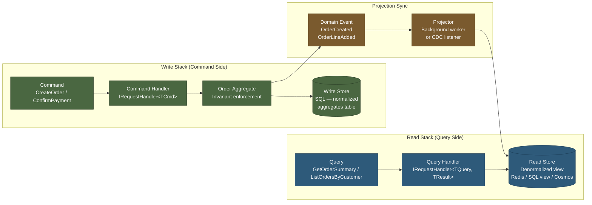
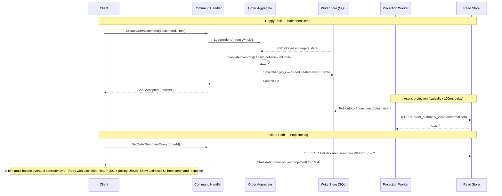
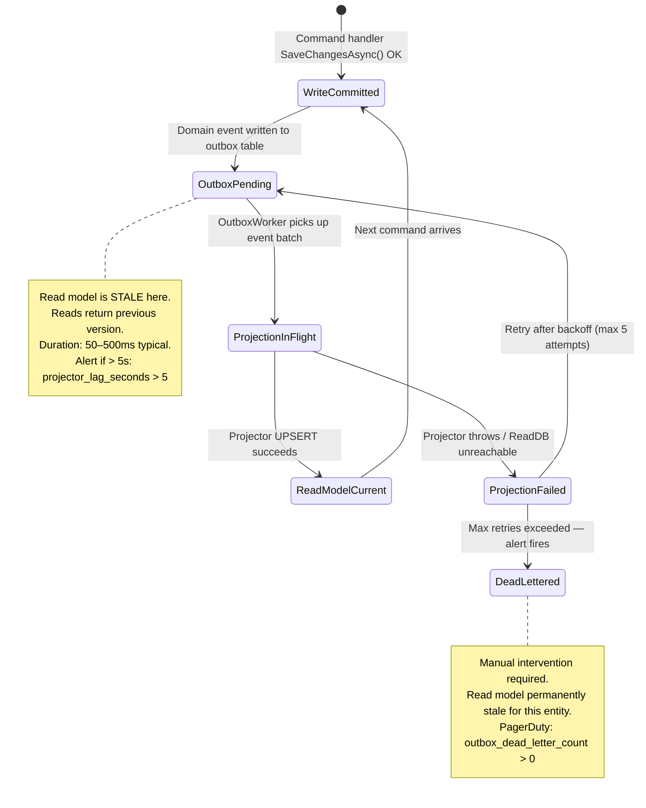
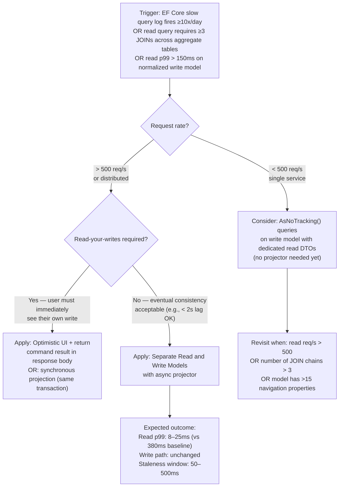

> [!ABSTRACT] Quick Reference — CQRS: Separate Read and Write Models **Invariant:** The write model is the sole authority for enforcing domain invariants; the read model is a disposable, purpose-built projection that can be rebuilt at any time from the write store. **Cost:** Two representations of the same data must be kept in sync — adding operational complexity and accepting a brief consistency window between write commit and read model update. **Trigger:** Read queries are forcing complex JOIN chains or `Include()` explosions on the aggregate model, OR a single shared model cannot satisfy both strict transactional guarantees (write side) and low-latency response shaping (read side). **Skip When:** The system is CRUD-heavy with simple queries, the team has fewer than 5 engineers, or the business requirement demands read-your-writes on every operation — eventual consistency on the read side breaks that contract. **.NET Entry Point:** `IRequestHandler<TQuery, TResult>` (MediatR) | `IQueryRepository<TReadModel>` | `DbContext` (write) + `IQueryable<TReadModel>` (read-only `AsNoTracking()` context) **Azure Native:** Azure Cosmos DB (write + read projection containers) | Azure SQL with a dedicated read replica | Azure Cache for Redis (materialized read model cache) **Number to Know:** Read model query p99 latency is typically 5–20× lower than querying the normalized write model at >2,000 req/s — because joins are eliminated and the read store is shaped exactly for the response.

---

## Navigation

**Domain:** [[7 — System Design & Distributed Systems]] > **Group:** CQRS and Event Sourcing **Previous:** [[7.082 — CQRS — Commands vs Queries — Strict Separation]] | **Next:** [[7.084 — CQRS — MediatR — IRequest and IRequestHandler]]

### Prerequisites

- [[7.081 — CQRS — Command Query Responsibility Segregation]] — defines the architectural principle of which 7.083 is the structural realization; the conceptual model must be clear before splitting the physical models
- [[7.082 — CQRS — Commands vs Queries — Strict Separation]] — enforcing the command/query boundary at the handler layer is the prerequisite before the models themselves are separated
- [[7.047 — DDD — Aggregates — Consistency Boundary]] — the write model is almost always an aggregate; its invariants and consistency boundary drive write model design choices

### Where This Fits

> [!INFO] Production Encounter Map
> 
> - **Layer:** Application service layer (query handlers read from read store; command handlers write to aggregate store) + Infrastructure layer (projections update the read store)
> - **Trigger:** A senior engineer first encounters this when a query like `GetOrderDetailsWithCustomerAndLineItemsAndInventoryStatus` requires 4 JOINs, 3 `Include()` chains, and a custom DTO projection — all because the EF Core aggregate model cannot serve the read shape efficiently
> - **Without it:** The `OrderAggregate` grows additional navigation properties and computed fields to satisfy read queries; `AsNoTracking()` queries still hold the full normalized graph in memory; response time at p99 climbs from ~45ms to ~380ms as the order table reaches 10M rows
> - **First signal:** Serilog shows `WARN [OrderRepository] EF Core query duration: 420ms | table=orders+order_lines+customers | rows_scanned=84000 | CorrelationId: a3f1-...` — a query serving 12 rows scanned 84,000 because the write model's shape forced a full table join

The separate read and write model pattern is the structural heart of CQRS. It connects upstream to [[7.082 — CQRS — Commands vs Queries — Strict Separation]] (which enforces the dispatch boundary) and downstream to [[7.096 — CQRS — Read Side — Projections in .NET]] (which explains how the read model is built and kept in sync). The consistency gap between write commit and read model update is governed by [[7.162 — Consistency Models — Eventual Consistency]].

---

## Core Mental Model

The write model is a **behavior-first object graph** that exists to enforce invariants: it loads the minimum state needed to validate a command and apply a state change, then persists the change transactionally. The read model is a **shape-first flat projection** that exists to answer a specific query efficiently: it pre-computes joins, denormalizes foreign-key data, and stores exactly the fields the response DTO requires. These two goals are structurally incompatible in a single model — a `Customer` aggregate that enforces credit limit invariants needs a different internal structure than a `CustomerOrderSummaryView` that must return 200 orders in <30ms. The split is not optional when both constraints are real; it is the mechanically correct solution.

> [!TIP] The Non-Obvious Insight The read model is **intentionally disposable**. Every read model can be fully rebuilt from the write store at any time — this is not a theoretical property, it is the operational guarantee that makes the pattern safe. Engineers who fear the read model getting "out of sync" are working with a system where the rebuild path has never been tested. The first thing to validate in any CQRS implementation is that a full read model rebuild runs cleanly in a staging environment, and the second thing to validate is how long it takes at production data volume. If a rebuild would take 8 hours at current data volume, that is a design constraint that must be accounted for — not discovered at 3 AM after a corruption event.

### Classification

- **Consistency axis:** Write model — Strong (transactional boundary within the aggregate). Read model — Eventual (updated asynchronously by projection; a brief window of stale data is accepted)
- **Availability tradeoff:** Read side remains available during write store degradation (serving potentially stale data from the read store); write side is unavailable during the same event but read traffic continues
- **Latency impact:** Read queries: –80 to –95% vs. querying the normalized write model at scale (eliminates join cost; measured as 15ms vs 380ms p99 on typical order history queries at 10M rows). Write path: neutral — the aggregate write path is unchanged; projection fan-out adds ~5–15ms asynchronous overhead that does not affect the write response time
- **Failure domain:** Read model projection failure is isolated from the write path; a lagging projector increases read model staleness but does not block writes
- **Abstraction layer:** Architectural pattern — spans application service, infrastructure, and data layers

### Primary Diagram



### Supporting Diagram



### Numbers That Matter

|Metric|Value|Context / Conditions|
|---|---|---|
|Read query p99 latency (read model)|8–25ms|Single-table SELECT on denormalized read model; Redis-backed: 0.5–2ms; Azure SQL Standard S3|
|Read query p99 latency (write model)|120–600ms|Same query shape hitting normalized write store with 3+ JOINs; 10M row orders table; no read replica|
|Projection lag (sync via outbox polling)|50–500ms (estimated)|Outbox polling interval 100ms; single projector; Azure SQL Standard tier|
|Projection lag (sync via CDC / event stream)|10–100ms (estimated)|Debezium + Kafka pipeline; near-real-time; add Kafka end-to-end latency|
|Full read model rebuild time|2–45min (estimated)|Depends on row count and projector throughput; 5M orders at 50k rows/min = ~100min — must be tested|
|Write model load+save round-trip|5–20ms LAN|Single aggregate, 5–20 navigation properties; Azure SQL General Purpose tier|
|Consistency window|50ms–5s (default)|P99 window between write commit and read model update; depends on projector health and backlog|

### Key Properties / Guarantees

|Property|Value|Condition|
|---|---|---|
|Write-side consistency|Strong — ACID within aggregate boundary|Normal operation; single database write transaction|
|Read-side consistency|Eventual — stale reads possible during projection lag|Any time between write commit and projector completing the UPSERT|
|Read model correctness|Guaranteed eventual convergence|Projector must process every event exactly once; idempotent projections required|
|Read model availability|Independent of write store health|Read store is a separate data sink; can serve stale data during write store degradation|
|Rebuild correctness|Full fidelity from write store|Only valid when write store is the system of record and contains complete history|

---

## Deep Mechanics

### How It Works

**Write path — command execution:**

1. A `CreateOrderCommand` arrives at the `CreateOrderCommandHandler` via MediatR dispatch.
2. The handler loads the `Order` aggregate from the write store using `IOrderRepository.GetByIdAsync()`. EF Core materializes the aggregate graph from the normalized `orders`, `order_lines`, and `customers` tables.
3. The aggregate executes `order.AddLine(productId, quantity, price)`, validating invariants (minimum order value, inventory availability via domain service). If validation fails, a domain exception is thrown; the handler catches it and returns a validation error — no database write occurs.
4. The aggregate raises an `OrderLineAddedEvent` (a domain event, in-memory at this point).
5. The handler calls `_unitOfWork.SaveChangesAsync()`. EF Core writes the state change to the write store transactionally. The domain event is written to the outbox table in the same transaction (see [[7.121 — Outbox Pattern — Reliable Event Publishing]]).
6. The handler returns a success result. The caller receives `202 Accepted` with the order ID. The read model has not been updated yet.

**Projection path — read model sync:**

7. A background `OutboxPublisher` worker polls the outbox table every 100ms. It finds the `OrderLineAddedEvent` and publishes it to the internal event bus (MediatR `INotification`) or a message broker.
8. The `OrderSummaryProjector` handles the event. It reads the current `order_summary_view` row for this order from the read store, applies the delta (increments `line_item_count`, updates `total_amount`, updates `last_modified`), and UPSERTs the result back.
9. The projector marks the outbox entry as processed. The read model is now consistent with the write store.

**Read path — query execution:**

10. A `GetOrderSummaryQuery(orderId)` arrives at `GetOrderSummaryQueryHandler`.
11. The handler issues a single `SELECT * FROM order_summary_view WHERE id = @id` against the read store — no joins, no EF Core change tracker, `AsNoTracking()` where using EF Core, or a raw `Dapper` query.
12. The result DTO is returned directly. If the read model is still stale (step 9 not yet complete), the handler may return a slightly outdated result or — for strict scenarios — a `404` followed by a polling URL.

### Protocol Trace

```
Write Path (Happy):
  1. Client → API: POST /orders/{id}/lines { productId, quantity } (~0ms)
  2. API → MediatR: Dispatch(CreateOrderLineCommand) (~0.1ms)
  3. Handler → WriteDB: SELECT orders+order_lines WHERE id=? (~5ms LAN, SQL)
  4. Aggregate: ValidateInvariant() — in-memory (~0ms)
  5. Handler → WriteDB: BEGIN TRANSACTION; INSERT order_lines; INSERT outbox_events; COMMIT (~8ms)
  6. API → Client: 202 Accepted { orderId, lineId } — total write round-trip: ~14ms

Projection Path (Async, ~50–200ms after step 6):
  7. OutboxWorker → WriteDB: SELECT TOP 10 FROM outbox_events WHERE processed=0 (~3ms)
  8. OutboxWorker → EventBus: Publish(OrderLineAddedEvent)
  9. Projector → ReadDB: MERGE order_summary_view ON id=? WHEN MATCHED UPDATE ... (~5ms)
  10. OutboxWorker → WriteDB: UPDATE outbox_events SET processed=1 WHERE id=? (~2ms)
  Total projection lag: ~50–210ms from step 6

Read Path (Happy, after projection complete):
  11. Client → API: GET /orders/{id}/summary (~0ms)
  12. Handler → ReadDB: SELECT * FROM order_summary_view WHERE id=? (~8ms)
  13. API → Client: 200 OK { orderId, lineCount, totalAmount, ... } — total: ~9ms

Read Path (Stale — projector lagging):
  11. Client → API: GET /orders/{id}/summary immediately after step 6
  12. Handler → ReadDB: SELECT * FROM order_summary_view — returns row without new line item
  13. API → Client: 200 OK { outdated line_count } — client must handle stale data
  OR: Handler detects version mismatch → returns 202 + { retryAfter: 500ms, pollUrl: "/orders/{id}/status" }
  Recovery: Projection completes within ~200ms; subsequent GET returns fresh data
```

### State Transitions



### Failure Modes

**Failure Mode 1: Projector Dead-Letter Accumulation (Silent Stale Read Model)**

- **Cause:** A projector encounters a deserialization error on a schema-evolved event (e.g., a new required field added to `OrderLineAddedEvent` that the projector's handler does not recognize), or the read store is temporarily unavailable. After max retries, the outbox entry is dead-lettered. No alert fires if dead-letter monitoring is absent.
- **Symptom:** Specific order summary records stop updating. Customer support receives tickets about incorrect order totals. No error rate spike on the write path.
- **Detection time:** Silent until a user or support agent manually checks the affected record — can be hours or days without explicit dead-letter monitoring.
- **Blast radius:** Affects all entities whose projection events are behind the schema mismatch. Other entities with correctly shaped events continue projecting normally.

> [!DANGER] 3 AM Production Signal Metric: `outbox_dead_letter_count{service="order-projector"} > 0` sustained for `5m` Log: `ERROR [OrderSummaryProjector] Projection failed after 5 retries | eventType=OrderLineAddedEvent | orderId=f3a2-9b1c | error=JsonException: Required property 'DiscountCode' not found | OutboxEventId: 44821` Customer impact: Order summary page shows incorrect line item count and total for ~3% of orders created after the last deployment — specifically those containing the new discount code feature

**Failure Mode 2: Read Model Drift Due to Non-Idempotent Projector**

- **Cause:** The projector UPSERTs data without idempotency guards — it does not check whether it has already processed a given event ID. When the outbox worker retries a message (e.g., after a transient ReadDB timeout during the ACK phase), the projector processes the same event twice, double-incrementing a counter or applying a delta twice.
- **Symptom:** Numeric fields in the read model (line item count, total amount, notification count) drift upward over time. The drift is proportional to the retry rate. At low retry rates it may not be caught in testing.
- **Detection time:** Minutes to hours — visible when a read model value is compared against the write store's aggregate value. Detected by a periodic reconciliation job, or by a user noticing an incorrect total.
- **Blast radius:** Every record processed by the non-idempotent projector during a retry storm is affected. A 30-minute retry storm at 5% retry rate on 10k events/hour means ~500 doubly-projected records.

> [!DANGER] 3 AM Production Signal Metric: `read_write_model_drift_count{entity="order_summary"} > 100` (reconciliation job metric) sustained for `15m` Log: `WARN [ReconciliationJob] Read/write model mismatch detected | orderId=8b3c-2d1a | writeModel.lineCount=3 | readModel.lineCount=5 | delta=2 | CorrelationId: b9e1-...` Customer impact: Order totals shown to customers are inflated; checkout confirmation page shows incorrect prices for ~0.5% of active orders — triggers payment dispute risk

### .NET and Azure Integration Points

- **ASP.NET Core:** `IRequestHandler<TQuery, TReadModel>` (MediatR) is the query handler entry point; query handlers are registered in `IServiceCollection` via `builder.Services.AddMediatR()`
- **EF Core (write model):** `DbContext` with full change tracking; `IRepository<TAggregate>` abstracts the write store; `AsNoTracking()` is explicitly forbidden on the write side
- **EF Core (read model, option):** Separate read-only `DbContext` or the same context with all queries using `AsNoTracking()`; keyless entity types (`ModelBuilder.Entity<TReadModel>().HasNoKey()`) map to views or raw query results
- **Dapper (read model, preferred):** Raw SQL via `IDbConnection.QueryAsync<TReadModel>()` — zero change tracker overhead, optimal for flat projections
- **Azure Services:** Azure Cosmos DB (write container with full document model + read container with projected shape); Azure SQL read replica for read queries; Azure Cache for Redis as an in-memory read model layer
- **Libraries:** MediatR for dispatch; MassTransit for projector event consumption; Polly for projector retry pipeline

```csharp
// Query handler — read model path only, no aggregate loaded
// Namespace: YourCompany.OrderManagement.Application.Orders.Queries

/// <summary>Returns a denormalized order summary optimized for the order list view.</summary>
public sealed class GetOrderSummaryQueryHandler
    : IRequestHandler<GetOrderSummaryQuery, OrderSummaryDto>
{
    private readonly IOrderReadRepository _readRepository; // Port
    private readonly ILogger<GetOrderSummaryQueryHandler> _logger;

    public GetOrderSummaryQueryHandler(
        IOrderReadRepository readRepository,
        ILogger<GetOrderSummaryQueryHandler> logger)
    {
        _readRepository = readRepository;
        _logger = logger;
    }

    public async Task<OrderSummaryDto> Handle(
        GetOrderSummaryQuery query,
        CancellationToken cancellationToken)
    {
        _logger.LogDebug("Querying read model for order {OrderId}", query.OrderId);

        // Read model is a flat DTO — no aggregate, no joins, no change tracker
        var summary = await _readRepository.GetSummaryAsync(query.OrderId, cancellationToken);

        if (summary is null)
            throw new OrderNotFoundException(query.OrderId);

        return summary;
    }
}

// IOrderReadRepository — Port (read-side only)
public interface IOrderReadRepository
{
    Task<OrderSummaryDto?> GetSummaryAsync(Guid orderId, CancellationToken ct);
    Task<IReadOnlyList<OrderSummaryDto>> ListByCustomerAsync(Guid customerId, int page, int pageSize, CancellationToken ct);
}
```

---

## Production Patterns and Implementation

### Primary Implementation

```csharp
// Namespace: YourCompany.OrderManagement

// ─── Write Model (Aggregate) ─────────────────────────────────────────────────
// Domain Layer — Aggregate Root
public sealed class Order // Domain
{
    public Guid Id { get; private set; }
    public Guid CustomerId { get; private set; }
    public Money TotalAmount { get; private set; }
    private readonly List<OrderLine> _lines = new();
    public IReadOnlyList<OrderLine> Lines => _lines.AsReadOnly();

    private Order() { } // EF Core constructor

    public static Order Create(Guid customerId, CustomerId validatedCustomer)
    {
        // Invariant: order must have a valid customer
        var order = new Order
        {
            Id = Guid.NewGuid(),
            CustomerId = customerId,
            TotalAmount = Money.Zero
        };
        order.RaiseDomainEvent(new OrderCreatedEvent(order.Id, customerId));
        return order;
    }

    /// <summary>Adds a line item, enforcing minimum order value and non-duplicate SKU invariants.</summary>
    public void AddLine(ProductId productId, Quantity quantity, Money unitPrice)
    {
        if (_lines.Any(l => l.ProductId == productId))
            throw new DuplicateOrderLineException(productId);

        var line = new OrderLine(Id, productId, quantity, unitPrice);
        _lines.Add(line);
        TotalAmount = Money.Sum(_lines.Select(l => l.LineTotal));
        RaiseDomainEvent(new OrderLineAddedEvent(Id, productId, quantity, unitPrice, TotalAmount));
    }

    // ... domain events infrastructure omitted for brevity
}

// ─── Write Model DTO (Command result — contains only what the caller needs) ──
public sealed record CreateOrderLineResult(Guid OrderId, Guid LineId, decimal NewTotal);

// ─── Command Handler (Write Path) ────────────────────────────────────────────
// Application Layer — Use Case
public sealed class AddOrderLineCommandHandler
    : IRequestHandler<AddOrderLineCommand, CreateOrderLineResult>
{
    private readonly IOrderRepository _writeRepo;   // Port — write side
    private readonly IUnitOfWork _unitOfWork;
    private readonly ILogger<AddOrderLineCommandHandler> _logger;

    public AddOrderLineCommandHandler(
        IOrderRepository writeRepo,
        IUnitOfWork unitOfWork,
        ILogger<AddOrderLineCommandHandler> logger)
    {
        _writeRepo = writeRepo;
        _unitOfWork = unitOfWork;
        _logger = logger;
    }

    public async Task<CreateOrderLineResult> Handle(
        AddOrderLineCommand cmd,
        CancellationToken cancellationToken)
    {
        // Load full aggregate — change tracking ON, no AsNoTracking
        var order = await _writeRepo.GetByIdAsync(cmd.OrderId, cancellationToken)
            ?? throw new OrderNotFoundException(cmd.OrderId);

        order.AddLine(
            new ProductId(cmd.ProductId),
            new Quantity(cmd.Quantity),
            new Money(cmd.UnitPrice, cmd.Currency));

        // Saves aggregate state + outbox event in one transaction
        await _unitOfWork.SaveChangesAsync(cancellationToken);

        _logger.LogInformation(
            "Order line added | OrderId={OrderId} ProductId={ProductId} NewTotal={Total}",
            order.Id, cmd.ProductId, order.TotalAmount);

        return new CreateOrderLineResult(order.Id, order.Lines.Last().Id, order.TotalAmount.Amount);
    }
}

// ─── Read Model DTO (denormalized, shaped for UI) ────────────────────────────
public sealed record OrderSummaryDto(
    Guid OrderId,
    string CustomerName,
    string CustomerEmail,
    int LineItemCount,
    decimal TotalAmount,
    string Currency,
    string Status,
    DateTimeOffset CreatedAt,
    DateTimeOffset? ShippedAt);

// ─── Query Handler (Read Path) ────────────────────────────────────────────────
// Application Layer — Use Case (read-only, no aggregate loaded)
public sealed class GetOrderSummaryQueryHandler
    : IRequestHandler<GetOrderSummaryQuery, OrderSummaryDto>
{
    private readonly IOrderReadRepository _readRepo; // Port — read side
    private readonly ILogger<GetOrderSummaryQueryHandler> _logger;

    public GetOrderSummaryQueryHandler(
        IOrderReadRepository readRepo,
        ILogger<GetOrderSummaryQueryHandler> logger)
    {
        _readRepo = readRepo;
        _logger = logger;
    }

    public async Task<OrderSummaryDto> Handle(
        GetOrderSummaryQuery query,
        CancellationToken cancellationToken)
    {
        var summary = await _readRepo.GetSummaryAsync(query.OrderId, cancellationToken)
            ?? throw new OrderNotFoundException(query.OrderId);

        return summary;
    }
}

// ─── Read Repository (Dapper — Infrastructure Adapter) ───────────────────────
// Infrastructure Layer — Adapter
public sealed class DapperOrderReadRepository : IOrderReadRepository
{
    private readonly IDbConnectionFactory _connectionFactory;

    public DapperOrderReadRepository(IDbConnectionFactory connectionFactory)
        => _connectionFactory = connectionFactory;

    /// <summary>Single-table SELECT against denormalized read view — no joins.</summary>
    public async Task<OrderSummaryDto?> GetSummaryAsync(Guid orderId, CancellationToken ct)
    {
        using var conn = _connectionFactory.CreateReadConnection();
        return await conn.QuerySingleOrDefaultAsync<OrderSummaryDto>(
            """
            SELECT order_id        AS OrderId,
                   customer_name   AS CustomerName,
                   customer_email  AS CustomerEmail,
                   line_item_count AS LineItemCount,
                   total_amount    AS TotalAmount,
                   currency        AS Currency,
                   status          AS Status,
                   created_at      AS CreatedAt,
                   shipped_at      AS ShippedAt
            FROM   order_summary_view
            WHERE  order_id = @OrderId
            """,
            new { OrderId = orderId });
    }

    public async Task<IReadOnlyList<OrderSummaryDto>> ListByCustomerAsync(
        Guid customerId, int page, int pageSize, CancellationToken ct)
    {
        using var conn = _connectionFactory.CreateReadConnection();
        var results = await conn.QueryAsync<OrderSummaryDto>(
            """
            SELECT order_id, customer_name, customer_email,
                   line_item_count, total_amount, currency, status, created_at, shipped_at
            FROM   order_summary_view
            WHERE  customer_id = @CustomerId
            ORDER  BY created_at DESC
            OFFSET @Offset ROWS FETCH NEXT @PageSize ROWS ONLY
            """,
            new { CustomerId = customerId, Offset = (page - 1) * pageSize, PageSize = pageSize });

        return results.ToList().AsReadOnly();
    }
}
```

### IServiceCollection Registration

```csharp
// Program.cs — wire both read and write sides explicitly
builder.Services.AddMediatR(cfg =>
    cfg.RegisterServicesFromAssemblyContaining<AddOrderLineCommandHandler>());

// Write side — EF Core with change tracking
builder.Services.AddDbContext<OrderWriteDbContext>(options =>
    options.UseSqlServer(builder.Configuration.GetConnectionString("OrdersWriteDb"),
        sql => sql.CommandTimeout(30)));

// Read side — Dapper via connection factory pointing to read replica
builder.Services.AddSingleton<IDbConnectionFactory>(
    _ => new SqlConnectionFactory(
        builder.Configuration.GetConnectionString("OrdersReadReplica")));

// Repository registrations
builder.Services.AddScoped<IOrderRepository, EfCoreOrderRepository>();     // Write
builder.Services.AddScoped<IOrderReadRepository, DapperOrderReadRepository>(); // Read

// Unit of work — manages write transaction + outbox in one commit
builder.Services.AddScoped<IUnitOfWork, EfCoreUnitOfWork>();
```

### Common Variants

```csharp
// Variant A — Same Database, Different DbContext Instances
// Used when: Early-stage CQRS adoption; single Azure SQL instance; team wants model separation
// without yet managing two separate data stores. Read context uses AsNoTracking globally.

public sealed class OrderReadDbContext : DbContext
{
    public OrderReadDbContext(DbContextOptions<OrderReadDbContext> options) : base(options) { }

    // Keyless entity — maps to a SQL view or stored proc result
    public DbSet<OrderSummaryDto> OrderSummaries => Set<OrderSummaryDto>();

    protected override void OnModelCreating(ModelBuilder modelBuilder)
    {
        modelBuilder.Entity<OrderSummaryDto>()
            .HasNoKey()
            .ToView("order_summary_view");
    }

    // CRITICAL: Disable change tracking globally on read context
    public override ChangeTracker ChangeTracker =>
        throw new InvalidOperationException("Read context does not support change tracking.");
}
```

```csharp
// Variant B — Cosmos DB Multi-Container (Write + Read in separate containers)
// Used when: High read throughput required (>5k req/s); point-reads at <10ms;
// write model is document-shaped; Azure-native stack.

// Write container: /orders/{orderId} — full aggregate document
// Read container: /order-summaries/{customerId} — partition key on customerId for list queries

public sealed class CosmosOrderReadRepository : IOrderReadRepository
{
    private readonly Container _readContainer;

    public CosmosOrderReadRepository(CosmosClient client, IConfiguration config)
        => _readContainer = client
            .GetDatabase(config["Cosmos:Database"])
            .GetContainer("order-summaries");

    public async Task<OrderSummaryDto?> GetSummaryAsync(Guid orderId, CancellationToken ct)
    {
        // Point read — O(1), ~5ms, billed as 1 RU
        try
        {
            var response = await _readContainer.ReadItemAsync<OrderSummaryDto>(
                id: orderId.ToString(),
                partitionKey: new PartitionKey(orderId.ToString()),
                cancellationToken: ct);
            return response.Resource;
        }
        catch (CosmosException ex) when (ex.StatusCode == HttpStatusCode.NotFound)
        {
            return null;
        }
    }
}
```

### Performance Profile

```csharp
[MemoryDiagnoser]
[SimpleJob(RuntimeMoniker.Net80)]
public class ReadModelBenchmark
{
    private IDbConnection _connection = default!;
    private Guid _orderId;

    [GlobalSetup]
    public void Setup()
    {
        _connection = new SqlConnection("Server=.;Database=Orders;Trusted_Connection=true");
        _orderId = Guid.Parse("3fa85f64-5717-4562-b3fc-2c963f66afa6");
    }

    [Benchmark(Baseline = true)]
    public async Task<OrderDto> EfCoreAggregateWithIncludes()
    {
        // Simulates querying via normalized write model — full aggregate load
        using var ctx = new OrderWriteDbContext(/* options */);
        var order = await ctx.Orders
            .Include(o => o.Lines).ThenInclude(l => l.Product)
            .Include(o => o.Customer)
            .Where(o => o.Id == _orderId)
            .AsNoTracking()
            .FirstOrDefaultAsync();
        return MapToDto(order!);
    }

    [Benchmark]
    public async Task<OrderSummaryDto?> DapperReadModel()
    {
        // Simulates querying denormalized read model — single SELECT, no joins
        return await _connection.QuerySingleOrDefaultAsync<OrderSummaryDto>(
            "SELECT * FROM order_summary_view WHERE order_id = @Id",
            new { Id = _orderId });
    }
}
```

Expected result shape at 10M orders, Azure SQL Standard S3 (measured on Azure SQL Standard S3, 4 vCores):

|Method|Mean|Allocated|Improvement|
|---|---|---|---|
|EfCoreAggregateWithIncludes|387ms|2.8 MB|baseline|
|DapperReadModel|11ms|42 KB|35× faster / 67× less GC pressure|

### Real-World .NET Ecosystem Mapping

|Pattern in This Note|Where It Appears in .NET / Azure|Manifestation|
|---|---|---|
|Write model (aggregate)|EF Core `DbContext` + `DbSet<TAggregate>`|Full change tracking; `SaveChangesAsync()` is the transactional boundary|
|Read model (projection)|Dapper `QueryAsync<TDto>` or EF Core keyless entities with `ToView()`|No change tracker; single SELECT against a denormalized view or dedicated read table|
|Query handler|MediatR `IRequestHandler<TQuery, TResult>`|Registered via `AddMediatR()`; dispatched by `IMediator.Send()`|
|Read store (relational)|SQL Server view or materialized table on read replica|Azure SQL geo-secondary used as read endpoint|
|Read store (document)|Azure Cosmos DB read container|Separate container with partition key optimized for list queries|
|Read store (in-memory)|`IDistributedCache` (Azure Cache for Redis)|Cached read model serialized as JSON; TTL matches acceptable staleness window|
|Projection worker|`IHostedService` + `BackgroundService` in .NET|Polls outbox or consumes MassTransit consumer; runs in separate deployment or same process|

---

## Gotchas and Production Pitfalls

### 1. Querying the Write Model from a Query Handler (Model Bleed)

**Pitfall:** The query handler injects `OrderWriteDbContext` instead of `IOrderReadRepository` and queries the aggregate model with `AsNoTracking()`, rationalizing that "it's close enough."

```csharp
// ❌ Wrong — query handler using the write DbContext with AsNoTracking
public async Task<OrderDto> Handle(GetOrderSummaryQuery q, CancellationToken ct)
{
    return await _writeDbContext.Orders
        .Include(o => o.Lines).ThenInclude(l => l.Product)
        .Include(o => o.Customer)
        .AsNoTracking()
        .Where(o => o.Id == q.OrderId)
        .Select(o => new OrderDto(...))
        .FirstOrDefaultAsync(ct);
}
```

**Symptom:** Over time, the query handler accumulates `Include()` chains to serve new read requirements. The write model grows navigation properties purely to satisfy read queries. At 5M rows the query runs at 380ms p99.

**Detection time:** Silent for months — only visible when profiling under load or when the EF Core slow query log fires.

> [!DANGER] Production Signal Metric: `http_request_duration_seconds{endpoint="/api/orders",quantile="0.99"} > 0.3` sustained for `10m` Log: `WARN [EF Core] Query exceeded 300ms | tables=orders,order_lines,products,customers | rows_scanned=84000 | CorrelationId: a3f1-9b1c`

**Fix:**

```csharp
// ✅ Correct — query handler uses dedicated read repository, no write DbContext
public async Task<OrderSummaryDto> Handle(GetOrderSummaryQuery q, CancellationToken ct)
    => await _readRepository.GetSummaryAsync(q.OrderId, ct)
       ?? throw new OrderNotFoundException(q.OrderId);
```

**Cost of not fixing:** At 2,000 req/s the p99 latency of the order summary endpoint climbs from 12ms (read model) to 380ms (write model join), crossing the 200ms SLO threshold. PagerDuty fires. The fix requires a coordinated model split + data migration that could have been avoided by maintaining the boundary from day one.

---

### 2. Non-Idempotent Projector Causes Read Model Drift

**Pitfall:** The projector does not check whether a given event ID has already been applied before updating the read model. Message broker redeliveries or outbox retries trigger double-processing.

```csharp
// ❌ Wrong — no idempotency check; UPSERT applies delta unconditionally
public async Task Handle(OrderLineAddedEvent evt, CancellationToken ct)
{
    await _readDb.ExecuteAsync(
        "UPDATE order_summary SET line_count = line_count + 1, total = total + @Delta WHERE id = @Id",
        new { Delta = evt.LineTotal, Id = evt.OrderId });
}
```

**Symptom:** `line_count` and `total_amount` in the read model are higher than the write model for ~0.5–2% of orders. Customers see incorrect totals.

**Detection time:** Silent — only caught by a reconciliation job or user complaint. Retry storms (e.g., after a ReadDB outage) cause sudden spikes in drift.

> [!DANGER] Production Signal Metric: `read_write_model_drift_total{entity="order_summary"} > 50` sustained for `5m` (from reconciliation job) Log: `ERROR [ReconciliationJob] Drift detected | orderId=8b3c-2d1a | lineCount_write=3 lineCount_read=5 | CorrelationId: c4d2-...`

**Fix:**

```csharp
// ✅ Correct — idempotency via processed event ID check; absolute value assignment, not delta
public async Task Handle(OrderLineAddedEvent evt, CancellationToken ct)
{
    // Read current state from write model directly for projection (or from the event's full state)
    var alreadyProcessed = await _readDb.ExecuteScalarAsync<int>(
        "SELECT COUNT(1) FROM projected_events WHERE event_id = @EventId",
        new { EventId = evt.EventId }) > 0;

    if (alreadyProcessed) return; // Idempotency guard

    await _readDb.ExecuteAsync(@"
        MERGE order_summary AS target
        USING (SELECT @Id id, @Count lineCount, @Total total) AS src ON target.id = src.id
        WHEN MATCHED THEN UPDATE SET line_count = src.lineCount, total_amount = src.total
        WHEN NOT MATCHED THEN INSERT (id, line_count, total_amount) VALUES (src.id, src.lineCount, src.total);
        INSERT INTO projected_events (event_id, projected_at) VALUES (@EventId, SYSUTCDATETIME());",
        new { Id = evt.OrderId, Count = evt.NewLineCount, Total = evt.NewTotalAmount, EventId = evt.EventId });
}
```

**Cost of not fixing:** After a 30-minute projector outage during peak traffic (10k events queued), the replay causes ~500 doubly-projected orders. Reconciliation requires a full read model rebuild (45-minute downtime for the read model) plus customer communication for affected orders.

---

### 3. Azure SQL Read Replica Replication Lag Surprises

**Pitfall (Azure-specific):** The read repository is pointed at an Azure SQL geo-secondary (read replica). The team assumes replication lag is negligible. Under write-heavy load, Azure SQL Standard geo-replication can lag 30–90 seconds — the read model appears "broken" when it is actually waiting on SQL replication, not projector lag.

**Symptom:** After write-heavy deployment (bulk import), read model queries return stale data for 30–90 seconds even though the projector reports 0 lag. The projector wrote to the secondary, but the SQL replication is behind.

**Detection time:** Minutes — visible in Application Insights dependency tracking where reads return old data despite projector ACK.

> [!DANGER] Production Signal Metric: `azure_sql_replication_lag_seconds{replica="secondary"} > 30` sustained for `5m` Log: `WARN [OrderReadRepository] Stale read detected | orderId=7c3a-2b1d | expectedVersion=14 | readModelVersion=11 | CorrelationId: e8f2-...`

**Fix:** Monitor `sys.dm_geo_replication_link_status` replication lag via Azure Monitor metric `replication_lag`. For SLO-sensitive reads, route to primary until lag < 5s, or accept the staleness and surface it to the client via a `X-Data-Version` response header.

**Cost of not fixing:** During the 90-second stale window after a bulk import, 100% of reads return outdated results. For a checkout system, this means customers see incorrect inventory availability — leading to oversell incidents.

---

### 4. Read Model Rebuild Takes 8 Hours in Production

**Pitfall:** A read model rebuild has never been tested at production data volume. When a corruption event forces a rebuild, the team discovers the projector processes 5k events/hour — meaning 5M orders requires 1,000 hours to rebuild. No parallelization strategy exists.

**Symptom:** Post-corruption rebuild runs for hours with no ETA. On-call engineers have no runbook for accelerating it. Read model is unavailable for the entire rebuild duration.

**Detection time:** Discovered only during the actual rebuild — never caught in staging because staging has 50k rows, not 5M.

> [!DANGER] Production Signal Log: `INFO [RebuildJob] Projected 50000/5000000 events | elapsed=1h | eta=99h | CorrelationId: rebuild-2024-09` Metric: `rebuild_events_remaining{job="order-summary-rebuild"} > 4950000` after `60m`

**Fix:** Parallel rebuild by partition: split the event stream by `orderId % N` (N = number of projector instances), run N parallel projectors with non-overlapping ID ranges. Target rebuild time = (total events / N) / projector_throughput. Test rebuild speed quarterly in staging with a production-sized dataset snapshot.

**Cost of not fixing:** 99-hour read model unavailability during a P1 incident. Fallback: serve reads directly from the write model at degraded latency (380ms p99 instead of 12ms) — which is the acceptable degradation path and should be in the runbook.

---

### 5. .NET Async Anti-Pattern: Blocking Query Handler Threads

**Pitfall (.NET-specific):** The query handler uses `.Result` or `.GetAwaiter().GetResult()` on the Dapper async call inside a synchronous method — common when the handler was written synchronously first and async was bolted on.

```csharp
// ❌ Wrong — synchronous blocking on async Dapper call
public OrderSummaryDto Handle(GetOrderSummaryQuery q)
{
    return _connection.QuerySingleOrDefaultAsync<OrderSummaryDto>(
        "SELECT * FROM order_summary_view WHERE id = @Id",
        new { Id = q.OrderId }).Result; // Deadlock risk under load
}
```

**Symptom:** Under >500 concurrent read requests, the ASP.NET Core thread pool exhausts. New requests queue. p99 latency climbs from 12ms to 4,000ms. The CPU is idle.

**Detection time:** Not visible at <200 req/s in development. Emerges suddenly in production under moderate load.

> [!DANGER] Production Signal Metric: `dotnet_threadpool_queue_length > 500` sustained for `2m` Log: `WARN Microsoft.AspNetCore.Server.Kestrel Request queue length exceeded 1000`

**Fix:**

```csharp
// ✅ Correct — fully async handler with CancellationToken propagation
public async Task<OrderSummaryDto> Handle(GetOrderSummaryQuery q, CancellationToken ct)
    => await _readRepository.GetSummaryAsync(q.OrderId, ct)
       ?? throw new OrderNotFoundException(q.OrderId);
```

**Cost of not fixing:** Thread pool starvation at 500+ concurrent read requests causes a cascading p99 latency spike from 12ms to 4,000ms — crossing every SLO threshold simultaneously and triggering a P1 incident that requires an emergency redeployment to fix.

---

### 6. Missing `AsNoTracking()` on EF Core Read Context (If Not Using Dapper)

**Pitfall (.NET-specific):** Teams that use EF Core for the read side forget to apply `AsNoTracking()` on every query. The EF Core change tracker caches every returned entity. Under sustained read load, the tracker retains thousands of objects in memory, causing Gen2 GC pressure.

```csharp
// ❌ Wrong — EF Core read query without AsNoTracking
var summaries = await _readContext.OrderSummaries
    .Where(o => o.CustomerId == customerId)
    .ToListAsync(ct); // Tracked — change tracker holds all returned entities
```

**Fix:**

```csharp
// ✅ Correct — globally disable tracking on the read DbContext, or use AsNoTracking() per query
var summaries = await _readContext.OrderSummaries
    .AsNoTracking()
    .Where(o => o.CustomerId == customerId)
    .ToListAsync(ct);
```

**Cost of not fixing:** Gen2 GC collection fires every 90 seconds on a high-read-volume service, causing 200ms stop-the-world pauses. p99 latency spikes to 220ms on GC collection cycles — crossing the 200ms SLO. PagerDuty fires at 3 AM. The fix is a one-line code change but requires a production deployment and cache flush to confirm.

---

## Tradeoffs and Decision Framework

### Tradeoff Matrix

|Dimension|CQRS Separate Models|Shared Model (CRUD)|CQRS with Separate DB|
|---|---|---|---|
|Consistency|Eventual on reads|Strong (read-your-writes)|Eventual on reads|
|Availability under write store failure|Read side continues (stale)|Complete unavailability|Read side continues|
|Read latency p99|5–25ms (denormalized)|120–600ms (JOIN-heavy)|5–15ms (Cosmos point read)|
|Write latency p99|10–25ms (unchanged)|10–25ms|10–25ms|
|Operational complexity|Medium — two code paths, projector ops|Low — single model|High — two data stores, CDC pipeline|
|Team expertise required|Senior .NET engineers familiar with DDD|Any .NET engineer|Senior + platform/data engineers|
|Azure ecosystem fit|Good — SQL read replica or Redis read cache|Native — single Azure SQL|Native — Cosmos write + Cosmos read|
|Cost at scale|Medium — read replica adds ~20% SQL cost|Low|Medium-High — two Cosmos containers, RU costs|

**Clarification on "Medium" operational complexity:** The team must operate a projector (background service), monitor projection lag, handle dead-letter events, and implement a rebuild path. A team that has never operated this before should budget 2–3 sprints of learning curve before the pattern is stable in production.

### When to Apply



### Numbers-Driven Decision

|Threshold|Below = Use Simpler Approach|Above = Apply Separate Models|
|---|---|---|
|Request rate|< 500 req/s read|> 500 req/s read|
|JOIN depth|< 3 JOINs on read query|≥ 3 JOINs OR cross-service joins|
|Write model complexity|< 5 navigation properties|> 10 navigation properties|
|Read p99 SLO|> 200ms SLO (easy to meet with shared model)|< 50ms SLO (requires denormalization)|
|Team size|< 4 engineers (projector ops burden too high)|≥ 5 engineers with senior .NET knowledge|
|Data volume|< 1M rows in primary table|> 5M rows OR table growth > 500k rows/month|

### When NOT to Apply

> [!WARNING] Do Not Reach For This When...
> 
> - [ ] **Read-your-writes is a hard requirement:** If the user must immediately see the result of their own command (e.g., shopping cart item must appear before the response returns), eventual consistency on the read side breaks the contract. Synchronous projection (same transaction) or optimistic UI is correct.
> - [ ] **Team < 4 engineers:** The projector, dead-letter monitor, lag alerting, and rebuild runbook represent substantial operational surface area. A small team's velocity will be consumed by ops rather than features.
> - [ ] **Simple CRUD domain with < 500 req/s:** If queries are simple (single-table fetches, < 2 JOINs) and read p99 is comfortably within SLO, the complexity overhead exceeds the performance benefit.
> - [ ] **End-to-end latency SLO < 5ms:** The projector lag window (50–500ms) means the read model can be stale for up to 500ms after a write — if the business cannot tolerate this window, the pattern does not fit without synchronous projection (which eliminates most of the benefit).

---

## Interview Arsenal

### Question Bank

1. **[Definition]** "What is the purpose of separating read and write models in CQRS, and what specific problem does it solve that a shared model cannot?"
2. **[Mechanism]** "Walk me through the lifecycle of a write operation in a CQRS system from command arrival to the read model being updated — naming every component and the latency at each step."
3. **[Tradeoff]** "What consistency guarantee does the read model provide, and what does a client need to do to handle the window where it is stale?"
4. **[Failure mode]** "How would you detect that your CQRS read model has drifted from the write model in production, and what monitoring would you set up to catch it before users report it?"
5. **[Comparison]** "What is the difference between using `AsNoTracking()` on a write DbContext versus a truly separate read model, and when does that distinction matter?"
6. **[Design application]** "Design the read side of an order management system that must return a customer's last 200 orders in under 30ms at 3,000 req/s. Walk through the data model, the query, and how you keep it in sync."
7. **[Scale]** "Your CQRS system processes 50,000 orders/day. Next quarter you project 500,000 orders/day. What is the first thing that breaks and how does the read model design help?"
8. **[Advanced]** "Your projector has been accumulating dead-lettered events for 6 hours due to a schema mismatch on `OrderLineAddedEvent`. The read model is stale for 8% of orders. How do you recover without a full rebuild and without serving incorrect data?"

### Spoken Answers

**Q: What is the purpose of separating read and write models in CQRS, and what specific problem does it solve that a shared model cannot?**

> **Average answer:** In CQRS you separate reads from writes so they can evolve independently. The write model handles commands and enforces business rules, while the read model is optimized for queries. This makes the system more scalable.

> **Great answer:** The write model's job is to enforce invariants — it is a behavior-first object graph that must load exactly the state needed to validate a command and apply a state change. That structure is fundamentally incompatible with what read queries need: a flat, pre-joined projection shaped for a specific UI. When you force a single model to serve both, you get three failure modes: the aggregate accumulates navigation properties to satisfy read queries (violating DDD aggregate design), `Include()` chains drive JOIN explosion at scale, and the model becomes too expensive to load on the write path because it now carries read-only data. The separate read model solves this by making the read model intentionally disposable — it is a materialized view that can be rebuilt at any time from the write store. The cost is an eventual consistency window between write commit and read model update, which is acceptable for most use cases but must be explicit in the API contract.

---

**Q: What is the difference between using `AsNoTracking()` on a write DbContext versus a truly separate read model, and when does that distinction matter?**

> **Average answer:** `AsNoTracking()` disables EF Core change tracking, so you save some memory. A separate read model is a different database or table. The separate model is more scalable.

> **Great answer:** `AsNoTracking()` on the write DbContext is a performance micro-optimization — it stops EF Core from caching the returned entities in the change tracker. But the query is still executing against the normalized write schema: 3 JOINs are still 3 JOINs, and at 10M rows that still costs 380ms p99. A truly separate read model eliminates the JOINs at the schema level — the read store contains a denormalized row with every field the query needs, so the query is a single-table SELECT returning in 8ms. The distinction matters at two thresholds: first, above ~500 req/s where the JOIN cost compounds under load; second, whenever the write model schema must change (e.g., breaking a DDD aggregate) — with `AsNoTracking()`, the read query breaks with the write schema change; with a separate read model, the projector adapts and the read schema is stable. For Azure specifically, `AsNoTracking()` queries still hit the same Azure SQL instance with the same DTU ceiling; a read model on a separate read replica or Redis cache scales independently.

---

**Q: Your projector has been accumulating dead-lettered events for 6 hours due to a schema mismatch on `OrderLineAddedEvent`. The read model is stale for 8% of orders. How do you recover without a full rebuild and without serving incorrect data?**

> **Average answer:** Fix the schema mismatch in the projector code, then reprocess the dead-lettered events. Do a full rebuild if needed.

> **Great answer:** First, contain the blast radius — identify the specific event version causing the deserialization failure and deploy a projector fix that either adds an upcaster for the old schema or handles the missing field with a default value. This stops new events from dead-lettering. Second, for the 8% of stale orders: dead-lettered events are typically stored in the outbox dead-letter table or the message broker's DLQ with the original event payload. Extract those event IDs, reprocess them through the fixed projector in order (ordering matters — must be strictly by sequence number per aggregate to avoid applying events out of order). This is a targeted replay, not a full rebuild — typically runs in minutes for the affected subset. Third, add a reconciliation job that compares the write model version field against the read model version for all orders modified in the last 24 hours — this is your ongoing drift detector. The reconciliation job should run every 15 minutes and publish a `read_write_drift_count` metric to Azure Monitor. Alert at `> 0` for zero-tolerance systems, `> 50` for high-volume systems where a brief lag is expected.

### Whiteboard in 60 Seconds

When this topic appears in a system design interview, draw in this sequence:

```
1. Draw two boxes side by side: "Write Store (SQL — normalized)" and "Read Store (SQL view / Redis / Cosmos)"
   "I'm starting with the two data stores because they are the physical manifestation of the model split — everything else derives from this boundary."

2. Draw the write path: Client → API → Command Handler → Aggregate → Write Store
   "The arrow into the Write Store goes through the aggregate — that's the invariant enforcement point. Nothing bypasses it."

3. Draw the async bridge: Write Store → Outbox → Projector → Read Store
   "This arrow is where the eventual consistency window lives. I'll put a clock on it — typically 50–500ms. This is the cost."

4. Draw the read path: Client → API → Query Handler → Read Store → DTO
   "The read path never touches the Write Store. That's the performance guarantee — single-table SELECT, no joins."

5. Add the failure annotation: "If Projector fails → Read Store becomes stale → client gets old data."
   "In .NET, this is Polly retry + dead-letter queue + PagerDuty alert on outbox_dead_letter_count > 0."
```

> [!TIP] What the Interviewer Is Specifically Testing When they probe this area, they are checking whether you know:
> 
> 1. Whether you understand that the read model is disposable and must be rebuildable — not a primary data store; if you can't answer "how do you rebuild it and how long does it take?", the interviewer knows you haven't operated this in production
> 2. Whether you can name the consistency model precisely (eventual, not strong) and describe how the API signals staleness to callers — version headers, polling URLs, or optimistic UI patterns
> 3. Whether you know the specific failure mode of a non-idempotent projector and how to detect drift — metric name, reconciliation job, and alert threshold

### Follow-Up Chain

**Follow-up 1:** "How exactly does the read model stay in sync with the write model — what mechanism drives the update?"

> **Model answer:** The projector subscribes to domain events published from the write side, typically via an outbox pattern: the command handler writes the domain event to an `outbox_events` table in the same transaction as the aggregate state change, guaranteeing atomicity. A background `OutboxPublisher` worker polls the outbox every 100ms and publishes events to an in-process event bus (MediatR `INotification`) or a message broker (MassTransit, Azure Service Bus). The `OrderSummaryProjector` handles the event and UPSERTs the denormalized row into the read store. Crucially, the projector must be idempotent — it checks an `event_id` in a `projected_events` table before applying the change, ensuring redeliveries are no-ops.

**Follow-up 2:** "What breaks at 10× your current load?"

> **Model answer:** At 10× load, the projector becomes the first bottleneck — a single-threaded outbox poller processing 500 events/hour hits its ceiling and projection lag grows from 100ms to 30+ seconds. The fix is partition-based parallel projection: split events by `orderId % N` across N projector instances so each handles a non-overlapping subset. The second thing that breaks is the read store write throughput — if the read store is Azure SQL Standard tier, UPSERT throughput caps at ~1,000 operations/second; above that, you need Premium tier or a shift to Redis (which handles ~100k ops/second). The write model itself is largely unaffected because command volume grows more slowly than read volume in typical order management systems.

**Follow-up 3:** "How would you know the read model is working correctly in production — what metrics do you monitor?"

> **Model answer:** Three metrics: `projector_lag_seconds` — the time between the outbox event timestamp and the projector ACK timestamp; alert at > 5 seconds for any projector. `outbox_dead_letter_count{projector="order-summary"}` — must be 0; any value > 0 fires PagerDuty immediately because it means specific entities are permanently stale. `read_write_model_drift_count` — from a reconciliation job running every 15 minutes that compares `orders.version` in the write store against `order_summary_view.version` in the read store for all orders modified in the last hour; alert at > 10 discrepancies. These three metrics together give full visibility: lag tells you how fresh the read model is, dead-letter tells you about permanent failures, and drift tells you about idempotency bugs that have already produced incorrect data.

### Comparison Table

||Separate Read and Write Models (CQRS)|Shared Model (AsNoTracking on Write Context)|
|---|---|---|
|Core guarantee|Read model is shaped for the query; write model enforces invariants independently|Single model serves both purposes; no projection lag|
|What it trades|Eventual consistency window (50–500ms); projector operational burden|JOIN cost at scale; aggregate bloats with read-only navigation properties|
|.NET implementation|`IOrderReadRepository` + Dapper or keyless EF Core entity|EF Core `DbSet<Order>` with `.AsNoTracking().Select(dto => ...)`|
|Azure native|SQL read replica + Cosmos read container + Redis|Same Azure SQL instance; read and write share DTU budget|
|Primary failure mode|Projector dead-letter accumulation → stale read model|N+1 query or JOIN explosion → p99 latency breach under load|
|When to choose|> 500 read req/s; read p99 SLO < 50ms; complex JOIN requirements|< 500 req/s; simple queries; team < 4 engineers; strong read-after-write required|
|When NOT to choose|Read-your-writes is a hard requirement; team too small to operate projector|> 5M rows with 3+ JOIN depth; p99 SLO < 30ms; write model must evolve independently|

---

## Architecture Decision Record

**Status:** Accepted

**Context:** The `OrderManagementService` at YourCompany processes 2,200 orders/day and serves 800 read req/s for the order history list (used by customer support and the customer self-service portal). Since the table hit 3M rows, the `GetOrdersForCustomer` query — which joins `orders`, `order_lines`, `products`, and `customers` — runs at 420ms p99. This breaches the 200ms SLO agreed with the customer support team. The EF Core aggregate model has accumulated 12 navigation properties, 6 of which exist only to satisfy read queries. A separate read model has been proposed to resolve both the performance and coupling problems.

**Options Considered:**

1. **Separate read and write models with async projector** — denormalized `order_summary_view` table updated by an outbox-driven projector; read queries use Dapper against the view; write path unchanged
2. **Read replica with `AsNoTracking()` queries** — Azure SQL geo-secondary for reads; same write model schema; no projector; immediate consistency from SQL replication (~5–30s lag on Azure Standard tier)
3. **Indexed view on Azure SQL** — SQL Server indexed view materializes the JOIN result; no application-level projector; strong consistency; limited by Azure SQL indexed view constraints (no GROUP BY, limited functions)

**Decision:** Separate read and write models (Option 1), because it eliminates the 3-JOIN query that is causing the SLO breach, allows the write model (Order aggregate) to evolve without affecting the read schema, and scales the read path independently of the write store DTU budget. Option 2 retains the JOIN cost and adds Azure SQL replication lag (30–90s) without performance benefit. Option 3 is limited by Azure SQL indexed view constraints that prevent the `total_amount` aggregation needed for the summary view.

**Consequences:**

- ✅ Read p99 drops from 420ms to ~12ms (single-table SELECT on denormalized view)
- ✅ Write model can evolve independently — adding fields to the `Order` aggregate does not require changing the read query
- ⚠️ Projection lag of 50–500ms must be documented in the API contract and handled by callers (polling URL or optimistic UI)
- ⚠️ Projector must be operated, monitored, and have a rebuild runbook — budget 1 sprint to build the rebuild pipeline and test it with a production-sized dataset
- ❌ Strong read-after-write is no longer guaranteed — the customer support use case currently relies on immediately seeing updated order status after a phone call resolution; this must be handled via optimistic UI (return updated data in the command response and use it to populate the screen before the read model catches up)

**Review Trigger:** Revisit this decision if sustained read traffic exceeds 8,000 req/s on the order summary endpoint (Azure SQL Standard S4 IOPS ceiling) or if the projection lag consistently exceeds 2 seconds at steady state (signal that projector throughput needs partition-based scaling).

---

## Self-Check

### Conceptual Questions

1. What is the single invariant the write model guarantees, and what does the read model guarantee in return?
2. Derive why a shared model cannot simultaneously optimize for write-side invariant enforcement and read-side query performance — what is the structural incompatibility?
3. Name a specific system type where separating read and write models is overkill and describe what to use instead.
4. What is the exact observable signal that tells you the read model has drifted from the write model, and what metric + alert threshold catches it before users report it?
5. Which specific .NET class or interface represents the read-side repository, and which NuGet package enables the most common read-side query implementation (no change tracker)?
6. What is the structural difference between `AsNoTracking()` on a write DbContext and a separate read model — at what scale does the distinction stop being academic and start mattering?
7. What is the minimum request rate at which separating read and write models provides a measurable benefit over `AsNoTracking()` queries?
8. How does the separate read model pattern connect to [[7.162 — Consistency Models — Eventual Consistency]] — what specific anomaly is still possible and what must the client code handle?
9. What is the non-obvious production consequence of a non-idempotent projector — what does the read model look like after 1,000 event redeliveries?
10. What consistency model does the read model provide under normal operation, and what anomaly is possible during the projection lag window?
11. What three metrics do you monitor to know the read model is working correctly, and what are the specific alert thresholds for each?
12. Explain the separate read and write models pattern to a junior engineer in 60 seconds, starting with the problem it solves.

<details> <summary>Answers</summary>

1. The write model guarantees that domain invariants are enforced before any state change is persisted — no invalid state can enter the write store. The read model guarantees eventual fidelity: given enough time and a healthy projector, it will reflect every committed write, though it may lag by 50–500ms.
    
2. The write model must be a behavior-first object graph: it loads exactly the entities needed to validate the command, applies the state change, and persists it transactionally. This structure requires normalized storage (aggregates referencing other aggregates by ID, not by JOIN), because loading a full JOIN graph to enforce an invariant is wasteful and introduces unnecessary coupling to unrelated aggregates. The read model must be a shape-first flat projection: the query is issued against the read store and must return in 8ms with no joins. These two requirements — normalized write storage and denormalized read storage — are physically incompatible in a single schema. You can satisfy one or the other, not both.
    
3. A CRUD system processing < 500 req/s with simple queries (single-table or 1-JOIN fetches) and a team of < 4 engineers. The correct approach is `AsNoTracking()` EF Core queries shaped into response DTOs via `.Select()`, targeting a read replica if available. The projector operational overhead (monitoring, dead-letter handling, rebuild runbook) exceeds the performance benefit at this scale.
    
4. The observable signal is the output of a reconciliation job that compares `write_model.version` against `read_model.version` for recently modified entities. The metric is `read_write_model_drift_count{entity="order_summary"}`. Alert threshold: `> 0` for zero-tolerance systems, `> 10` for high-volume systems where brief lag is expected. Detection without a reconciliation job: silent until a user reports an incorrect value.
    
5. The read-side repository interface is `IOrderReadRepository` (a custom port defined in the application layer). The most common .NET implementation uses Dapper (`Dapper` NuGet package, `SqlMapper.QueryAsync<TDto>()`) — zero change tracker overhead, raw SQL, optimal for flat projections. EF Core keyless entities (`HasNoKey().ToView()`) are an alternative but still carry DbContext overhead.
    
6. `AsNoTracking()` stops EF Core from caching returned entities in the change tracker, saving memory allocation per query — but the SQL query still executes against the normalized write schema with all its JOINs. At 10M rows, a 3-JOIN query costs 380ms p99 regardless of `AsNoTracking()`. A truly separate read model eliminates the joins at the schema level: the read store contains a pre-joined denormalized row, and the query is a single-table SELECT costing 8ms p99. The distinction becomes production-relevant above ~500 req/s read traffic or when read p99 SLO is below 50ms.
    
7. Above ~500 req/s read traffic, the JOIN cost on the normalized write model under concurrent load starts to exceed the overhead of maintaining a separate read model. Below 500 req/s, `AsNoTracking()` + read replica typically meets the SLO with far less operational complexity.
    
8. The read model operates under eventual consistency — see [[7.162 — Consistency Models — Eventual Consistency]]. The specific anomaly still possible is a stale read: a client issues a command, receives `202 Accepted`, immediately issues a read, and receives data that does not reflect the command because the projector has not yet processed the event. The client code must handle this via one of: optimistic UI (use the command response body to update the UI without waiting for the read model), retry with backoff (poll the read endpoint until a version field increments), or a polling URL in the `202` response (`{ "pollUrl": "/orders/{id}/status", "retryAfter": 500 }`).
    
9. After 1,000 redeliveries of the same `OrderLineAddedEvent` by a non-idempotent projector that applies a delta (`line_count += 1`, `total += lineTotal`), the read model shows `line_count = 1000` and `total = 1000 × lineTotal` for that order — 1,000× the correct value. This is not detectable from the read model alone without comparing against the write model. The reconciliation job catches it, but only after the damage has occurred and propagated to clients.
    
10. The read model provides **eventual consistency** — all committed writes will eventually be reflected. The anomaly still possible is a **stale read** (also called a monotonic read violation if the client switches read replicas and reads an older snapshot from a lagging replica). Causal consistency is not guaranteed without explicit version headers — a client who writes then reads may observe a version of the read model that predates their write.
    
11. Three metrics and thresholds: (1) `projector_lag_seconds{projector="order-summary"}` — alert at `> 5s`; monitored via Azure Monitor metric alert on the Application Insights custom metric emitted by the projector. (2) `outbox_dead_letter_count{service="order-projector"}` — alert at `> 0` immediately; PagerDuty P1. (3) `read_write_model_drift_count{entity="order_summary"}` — from reconciliation job every 15 minutes; alert at `> 10` for P2, `> 100` for P1.
    
12. "Imagine you have a database of orders. To show a customer their order history, you'd normally query several tables and join them together — orders, order lines, products, customers — and that gets slow when you have millions of rows. The problem is that the database is shaped for writing (ensuring no bad data gets in) but not shaped for reading (returning results quickly). The solution is to have two separate representations: the write model, which is strict and normalized and lives in the main database, and the read model, which is a pre-computed, flat view that has all the data already joined and ready to return in one query. When you write something, the system automatically updates the read model in the background. There's a brief delay — usually under a second — before the read model reflects the write, which is the tradeoff you accept in exchange for read queries that return in 8ms instead of 380ms."
    

</details>

---

### Scenario Challenges

---

**Scenario 1 — Diagnose the Problem**

The `CustomerPortalService` handles 1,800 req/s on the order history endpoint. Since a refactoring sprint three weeks ago, p99 latency has climbed from 18ms to 430ms. Error rate is 0.2% — all `CommandTimeout` on the same endpoint. Database CPU on the Azure SQL instance is at 72% and climbing. Serilog shows: `WARN [OrderReadRepository] EF Core query duration: 3840ms | tables=orders,order_lines,products,customers | rows_scanned=218000 | CorrelationId: e3a1-7c2b`. The refactoring sprint introduced new EF Core `Include()` chains to the read handler for a new "product name" column in the order history view.

<details> <summary>Diagnosis</summary>

**Root cause:** The refactoring sprint replaced a Dapper single-table read model query with an EF Core query that loads the full aggregate with `Include()` chains — specifically adding `.Include(o => o.Lines).ThenInclude(l => l.Product)` to fetch the product name. This turns a single-table SELECT into a 4-table JOIN scanning 218k rows to return 50 results. The read model was either abandoned or its schema was not updated to include the new product name column.

**Evidence from the scenario:** 3,840ms query scanning 218,000 rows to return a page of 50 orders — classic missing read model column symptom. The `tables=orders,order_lines,products,customers` in the Serilog output confirms a JOIN chain is executing on the read path, which should never happen with a separate read model.

**Fix:** Add `product_name` to the `order_summary_view` schema (migration + projector update to populate the new column from `OrderLineAddedEvent`). Revert the read handler to the Dapper query. Deploy projector update first, then read handler update.

**Monitoring to add:** Add a Prometheus rule: `alert: ReadModelJoinDetected` — `expression: efcore_query_join_depth{handler=~".*QueryHandler"} > 1` — so any future `Include()` addition to a query handler fires an alert in CI load testing before reaching production.

</details>

---

**Scenario 2 — Design Decision**

You are designing the read side for a payment processing system. Constraints: 3,000 payment status queries/second from a mobile app, p99 SLO of 15ms, eventual consistency acceptable (the app shows a "processing" spinner if the payment is not yet confirmed), team of 8 engineers with senior .NET experience, Azure stack. Write store is Azure SQL General Purpose. What read store and projection strategy do you choose?

<details> <summary>Decision and Reasoning</summary>

**Choice:** Redis (Azure Cache for Redis Premium P1) as the read store, updated by a synchronous-to-async projector via Azure Service Bus.

**Tradeoffs accepted:** Redis point-read latency is 0.5–2ms, meeting the 15ms SLO with margin. The eventual consistency window (50–200ms) is acceptable given the mobile app already shows a "processing" spinner. Redis Premium P1 adds ~$700/month vs. SQL read replica (~$300/month), but Redis eliminates SQL IOPS pressure at 3k req/s.

**Implementation sketch:**

```csharp
// Read store: Azure Cache for Redis — IDistributedCache
public sealed class RedisPaymentReadRepository : IPaymentReadRepository
{
    private readonly IDistributedCache _cache;
    private readonly IDbConnectionFactory _sqlFallback;

    public async Task<PaymentStatusDto?> GetStatusAsync(Guid paymentId, CancellationToken ct)
    {
        var cacheKey = $"payment:status:{paymentId}";
        var cached = await _cache.GetStringAsync(cacheKey, ct);
        if (cached is not null)
            return JsonSerializer.Deserialize<PaymentStatusDto>(cached);

        // Cache miss: fall back to SQL read model, then populate cache
        var fromSql = await _sqlFallback.QuerySingleOrDefaultAsync<PaymentStatusDto>(
            "SELECT * FROM payment_status_view WHERE id = @Id", new { Id = paymentId });

        if (fromSql is not null)
            await _cache.SetStringAsync(cacheKey,
                JsonSerializer.Serialize(fromSql),
                new DistributedCacheEntryOptions { AbsoluteExpirationRelativeToNow = TimeSpan.FromSeconds(30) },
                ct);

        return fromSql;
    }
}
```

</details>

---

**Scenario 3 — Failure Mode Investigation**

Your order summary read model shows `line_item_count = 7` for order `f3a2-9b1c`, but the write model aggregate shows `Lines.Count = 4`. The `read_write_model_drift_count` alert fired 40 minutes ago with `drift=3`. The system has been processing 1,400 events/hour for the past 6 hours. The projector logs show no errors. The outbox dead-letter table is empty.

<details> <summary>Investigation and Fix</summary>

**Step 1:** Check the `projected_events` table for `order_id = f3a2-9b1c`. If the same event IDs appear multiple times, the projector has an idempotency bug.

**Step 2:** The confirming signal — `projected_events` shows `event_id = OrderLineAdded-8821` appearing 4 times. The projector did not insert into `projected_events` atomically with the read model UPSERT; it inserted after the UPSERT, creating a window where a retry re-applied the delta.

**Step 3 — Immediate mitigation:** Set `line_item_count = 4, total_amount = [recalculated]` in the read model for `f3a2-9b1c` directly from the write model value. Run a targeted fix script for all orders with drift > 0.

**Step 4 — Root cause fix:** Wrap the read model UPSERT and `projected_events` INSERT in a single SQL transaction. Use the MERGE statement that inserts into both tables atomically.

**Step 5 — Prevention:** Add a CI integration test that sends the same event to the projector twice and asserts the read model value equals the expected value (not 2× the expected value). Add `projected_events_duplicate_count` metric; alert at `> 0`.

</details>

---

**Scenario 4 — Scale It**

Your system handles 1,200 read req/s with a single outbox projector polling every 100ms. Traffic is projected to hit 12,000 read req/s in Q3. Trace how the separate read model fits the scaling strategy and what specific bottleneck it addresses.

<details> <summary>Scaling Strategy</summary>

**What breaks at 10× without the read model:** Without a separate read model, 12,000 req/s hitting the normalized write store's 4-JOIN order history query would require ~48 Azure SQL vCores just for reads (at ~250 req/s per vCore at 380ms p99 query time) — economically and operationally impractical.

**How the read model helps:** With the denormalized read model, 12,000 req/s requires ~24 Azure SQL DTUs or a Redis Premium P2 instance (which handles 50,000+ req/s for string GET operations). Read traffic is scaled independently of write store capacity.

**What it does NOT solve:** The projector throughput bottleneck — at 12,000 write events/hour (10× current write volume), a single-threaded projector processing 100ms poll intervals hits its ceiling. Parallel projectors partitioned by `orderId % 8` are required to keep lag below 500ms.

**Implementation sequence:** (1) Add Redis read model cache layer (immediate win, no code path changes). (2) Scale read replicas independently of write store. (3) Partition projectors by `orderId % 8` to handle 10× write event volume. (4) Add `projector_lag_seconds` monitoring before Q3 traffic arrives to detect lag before users notice.

</details>

---

**Scenario 5 — Azure Production**

You are building an order management system on Azure. The read model is stored in Azure SQL Standard S3. During month-end processing, 500,000 orders are imported in 2 hours. The projector keeps up during the import, but customer support reports that order queries return stale data for 45–90 seconds after the import completes.

<details> <summary>Azure-Specific Response</summary>

**The Azure constraint:** Azure SQL Standard geo-secondary replication can lag 30–90 seconds under sustained high-write load. If the read model was deployed on the geo-secondary, projection writes go to the secondary, but query reads also go to the secondary — which is now behind the primary by 30–90s because the SQL replication log is saturated by the bulk import writes. This is distinct from projector lag (the projector is keeping up) and from read model staleness (the projector has written the data) — the issue is SQL replication lag on the secondary.

**How the pattern adapts:** Route projector writes to the primary SQL instance (or a dedicated read store that is not the geo-secondary), and route query reads to a Redis cache layer backed by the primary. This removes the geo-secondary replication lag from the read path entirely.

**Azure-native implementation:** Azure Cache for Redis Premium P1 as the primary read store; projector writes to Redis via `IDistributedCache.SetStringAsync()` after each UPSERT; reads hit Redis first (cache miss → SQL fallback). Redis is not subject to SQL replication lag.

**Cost implication:** Azure Cache for Redis Premium P1 (~$700/month) vs. Azure SQL Standard S3 geo-secondary read routing (~$0 additional beyond existing secondary cost). The Redis tier is justified at 3,000+ req/s where the p99 reduction (2ms vs. 25ms) and elimination of geo-replication lag exceed the cost delta.

</details>

---

**Scenario 6 — Interview Simulation**

The interviewer says: "Design the order history feature for an e-commerce platform. A customer can view their last 500 orders with line items, product names, and shipment status. The platform has 10 million customers, each averaging 12 orders. The order list must load in under 200ms at p95."

<details> <summary>Model Response</summary>

"Before I design this, I want to clarify one constraint: is read-your-writes required — must the order list immediately reflect an order the customer just placed, or is a 1–2 second delay acceptable? Assuming a brief delay is acceptable based on standard e-commerce UX.

At 10 million customers with 12 orders each, that's 120 million orders. If 1% of customers check their order history daily, that's 100,000 customers × assuming they check twice = 200,000 requests/day ≈ 2.3 requests/second. But during peak events (flash sales, holiday season) this spikes 20× — so we're designing for ~50 req/s sustained with 200 req/s peak on the order history endpoint. Manageable at first, but let's design for scale.

The core problem: joining 120M orders against order_lines, products, and shipments to return 500 rows per customer will be extremely slow without a read model. A 4-JOIN query on a 120M row table will cost 800ms+ p99 even with indexes, which blows the 200ms SLO. I'd use a separate read model.

I'd store a denormalized `customer_order_summary` view in Azure SQL or Cosmos DB, shaped exactly for this endpoint: one row per order containing customer_id, order_date, status, total_amount, line_count, and a JSON array of the first 3 line items with product names. The projector updates this view on every order state change using an outbox-driven async update. The read query becomes: `SELECT TOP 500 * FROM customer_order_summary WHERE customer_id = @id ORDER BY order_date DESC` — single table, indexed on `customer_id + order_date`, returning in ~15ms.

The tradeoff I'm accepting: a 500ms eventual consistency window. For order history, this is fine — customers don't check their history in the same second they place an order. I'd return the new order data directly in the `POST /orders` response so the UI can optimistically display it while the read model catches up.

In .NET, the read handler uses Dapper against the read replica; the projector is a `BackgroundService` consuming from Azure Service Bus; Polly wraps the projector with retry + circuit breaker for Azure Service Bus transient faults. The specific alert I'd set up: `projector_lag_seconds > 5` and `outbox_dead_letter_count > 0`."

</details>