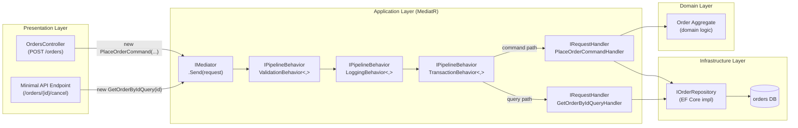
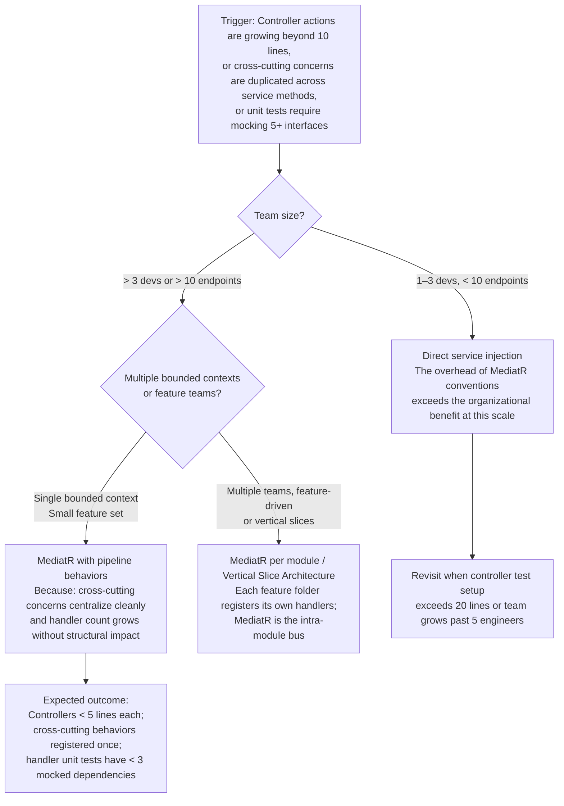

> [!ABSTRACT] Quick Reference — CQRS: MediatR IRequest and IRequestHandler **Invariant:** Every command and query is a self-describing message object routed to exactly one handler — the caller never knows which class executes the work. **Cost:** Indirection makes static call-graph analysis impossible; tracing a request's execution path requires navigating registrations, not following method calls, which increases debugging friction and onboarding time. **Trigger:** Controllers are directly instantiating service classes, making them impossible to test in isolation and tangling cross-cutting concerns (logging, validation, transactions) into business logic methods. **Skip When:** The application has fewer than ~5 use cases, a single developer owns all layers, or the team cannot maintain the naming discipline that makes MediatR legible at scale. **.NET Entry Point:** `IRequest<TResponse>` / `IRequestHandler<TRequest, TResponse>` / `NuGet: MediatR 12.x` / `builder.Services.AddMediatR(cfg => cfg.RegisterServicesFromAssembly(...))` **Azure Native:** N/A — MediatR is a process-internal .NET mediator; Azure has no equivalent managed service. Azure Service Bus is the distributed analog but operates across process boundaries. **Number to Know:** MediatR dispatch overhead is ~1–3µs per request in-process (estimated, .NET 8, warm path) — effectively zero relative to any I/O; the cost is cognitive, not computational.

---

## Navigation

**Domain:** [[7 — System Design & Distributed Systems]] > **Group:** CQRS and Event Sourcing **Previous:** [[7.083 — CQRS — Separate Read and Write Models]] | **Next:** [[7.085 — CQRS — MediatR Pipeline Behaviors Overview]]

### Prerequisites

- [[7.081 — CQRS — Command Query Responsibility Segregation]] — MediatR is the mechanism that physically separates command and query dispatch; understanding why the separation exists is required before learning how MediatR implements it.
- [[7.082 — CQRS — Commands vs Queries — Strict Separation]] — `IRequest<Unit>` (command) vs `IRequest<TResponse>` (query) maps directly to the naming discipline established in this topic; conflating them in MediatR leads to the "fat command that returns data" anti-pattern.
- [[7.003 — Clean Architecture — Application Layer — Use Cases]] — MediatR handlers _are_ the application layer use cases in Clean Architecture; this topic explains the layer boundary that handlers must enforce.

### Where This Fits

> [!INFO] Production Encounter Map
> 
> - **Layer:** Application service layer — handlers live here, between the Presentation layer (controllers, gRPC services, minimal API endpoints) and the Domain/Infrastructure layers.
> - **Trigger:** An engineer registers a new feature by adding a controller action that calls a service class directly; 6 months later, the service class has 12 injected dependencies, 4 cross-cutting concerns inlined, and is untestable without spinning up a database. MediatR enters the conversation as the structural solution.
> - **Without it:** Controllers accumulate service-layer logic, cross-cutting concerns (logging, validation, transactions, caching) are copy-pasted across service methods, and unit testing requires mocking 8 interfaces per test. The symptom is integration tests that start the full DI container for every test case — test suite runtime crosses 90 seconds for a 50-endpoint API.
> - **First signal:** Test suite execution time climbs above 30 seconds for the unit test suite (not integration tests); a developer asks "how do I mock the transaction for this controller test?" — the answer reveals the architectural coupling.

MediatR implements the Mediator pattern specifically for CQRS use cases in .NET, transforming direct method calls into message dispatch. It connects to [[7.085 — CQRS — MediatR Pipeline Behaviors Overview]] — the `IPipelineBehavior<TRequest, TResponse>` chain that intercepts every dispatch and provides the structural home for validation, logging, transactions, and caching without polluting handler code. It also underpins [[7.047 — DDD — Aggregates — Consistency Boundary]] — each handler maps to exactly one aggregate operation, enforcing the aggregate boundary at the application layer.

---

## Core Mental Model

MediatR is an in-process mediator: it receives a typed message object (`IRequest<TResponse>`) and routes it to the single registered handler (`IRequestHandler<TRequest, TResponse>`) that knows how to fulfill it. The caller — a controller, a background job, a SignalR hub — holds only a reference to `IMediator` and publishes the message; it has zero knowledge of which class executes the work. This indirection is the invariant: the dispatch contract is the message type, not a service interface. The trade is that the IDE cannot follow the call with F12 — the routing is determined at runtime by the DI container, making static analysis and onboarding harder. The recognition trigger is any controller that directly news up or injects a "service" class that contains business logic mixed with cross-cutting concerns.

> [!TIP] The Non-Obvious Insight MediatR's `IRequest<Unit>` / `IRequest<TResponse>` distinction is not just naming convention — it is an architectural enforcer. A command (`IRequest<Unit>`) that starts returning domain data (order ID, created entity) is not a naming violation; it is a signal that the handler is crossing the write/read boundary and the caller now depends on read-side state from the write path. The correct fix is NOT changing it to `IRequest<Guid>` — it is publishing a domain event from the handler and letting the caller poll the read model. The moment a "command handler" returns a populated DTO, CQRS collapses into a thin service wrapper with extra ceremony. The anti-pattern costs more than it saves because you now have two code paths to synchronize instead of one clean separation.

### Classification

- **Consistency axis:** Not applicable at the MediatR layer — MediatR dispatches synchronously in-process; consistency is determined by what the handler does (EF Core transaction, event publish, etc.).
- **Availability tradeoff:** N/A — MediatR is in-process; if the process is up, dispatch succeeds. Handler availability depends on its own dependencies.
- **Latency impact:** ~1–3µs overhead per dispatch (estimated, .NET 8, warm path, no pipeline behaviors). Each registered `IPipelineBehavior` adds one virtual dispatch call — sub-microsecond each. Total MediatR overhead on a typical pipeline with 3 behaviors is ~5–10µs (estimated) — negligible against any network I/O.
- **Failure domain:** Single-process. MediatR failures are handler exceptions propagated synchronously to the caller. There is no retry, no dead-letter, no circuit breaker at the MediatR layer — those live in the pipeline behaviors or in the infrastructure adapters called by handlers.
- **Abstraction layer:** Framework feature (application-layer message bus) implementing the Mediator behavioral pattern.

### Primary Diagram



### Supporting Diagram

```mermaid
sequenceDiagram
    participant CTRL as OrdersController
    participant MED as IMediator
    participant VAL as ValidationBehavior
    participant LOG as LoggingBehavior
    participant TXN as TransactionBehavior
    participant HDL as PlaceOrderCommandHandler
    participant REPO as IOrderRepository
    participant DB as SQL Database

    CTRL->>MED: Send(PlaceOrderCommand{CustomerId, Items})
    MED->>VAL: Handle(request, next)
    VAL->>VAL: FluentValidation.ValidateAsync()
    alt Validation fails
        VAL-->>CTRL: throws ValidationException (400)
    end
    VAL->>LOG: next(request)
    LOG->>LOG: logger.LogInformation("Handling {Command}", ...)
    LOG->>TXN: next(request)
    TXN->>DB: BEGIN TRANSACTION
    TXN->>HDL: next(request)
    HDL->>REPO: GetByCustomerIdAsync(customerId)
    REPO->>DB: SELECT ... (~2ms)
    DB-->>REPO: CustomerRecord
    REPO-->>HDL: customer
    HDL->>HDL: order = Order.Place(customer, items)
    HDL->>REPO: AddAsync(order)
    REPO->>DB: INSERT orders ... (~3ms)
    DB-->>REPO: ok
    HDL-->>TXN: Unit.Value
    TXN->>DB: COMMIT (~1ms)
    TXN-->>LOG: Unit.Value
    LOG->>LOG: logger.LogInformation("Handled in {Elapsed}ms", ...)
    LOG-->>VAL: Unit.Value
    VAL-->>MED: Unit.Value
    MED-->>CTRL: Unit.Value (~7ms total DB time)

    note over TXN,DB: On handler exception: ROLLBACK; exception propagates to CTRL
```

### Numbers That Matter

|Metric|Value|Context / Conditions|
|---|---|---|
|MediatR in-process dispatch overhead|~1–3µs per request|.NET 8, warm path, zero pipeline behaviors (estimated)|
|Per-behavior overhead|~0.5–1µs per behavior|One virtual call through the behavior chain (estimated)|
|Typical 3-behavior pipeline total MediatR overhead|~5–10µs|ValidationBehavior + LoggingBehavior + TransactionBehavior (estimated)|
|Handler resolution via DI|~1–5µs|First-call DI resolution per request scope (estimated, Microsoft.Extensions.DI)|
|Memory allocation per dispatch|~200–400 bytes|Pipeline envelope + handler scope allocation (estimated, .NET 8, [MemoryDiagnoser])|
|NuGet package size|MediatR 12.x: ~110KB|No transitive dependencies beyond Microsoft.Extensions.DependencyInjection.Abstractions|
|Max handlers per IRequest|Exactly 1|MediatR throws `InvalidOperationException` if 0 or 2+ handlers are registered for the same `IRequest<TResponse>`|
|INotification handlers|1–N (fan-out)|`INotification` / `INotificationHandler<T>` supports multiple parallel handlers — used for domain events|

### Key Properties / Guarantees

|Property|Value|Condition|
|---|---|---|
|Single handler per IRequest|Guaranteed — exactly one handler|Always; MediatR throws at dispatch time if 0 or 2+ handlers registered|
|Handler isolation|Caller has zero compile-time coupling to handler type|Always; coupling is to the message type only|
|Pipeline behavior ordering|Deterministic — registered order in DI|Behaviors execute outer-to-inner in registration order; last registered = innermost|
|Exception propagation|Handler exceptions propagate synchronously to caller|Always; no swallowing, no retry at MediatR layer|
|Thread safety|IMediator is thread-safe|Handlers are resolved per-request in their own DI scope|
|Notification fan-out|All handlers are called; one failure stops remaining handlers|Default behavior; order is not guaranteed across handlers|

---

## Deep Mechanics

### How It Works

**Step 1 — Message creation (caller side):** The controller creates a plain C# record or class implementing `IRequest<TResponse>`. This object is a pure data carrier — no behavior, no dependencies. It is the command or query intent made explicit and inspectable.

**Step 2 — Dispatch:** The controller calls `await _mediator.Send(command, cancellationToken)`. MediatR resolves the `IRequestHandler<TCommand, Unit>` from the DI container using the message's runtime type as the key. This resolution is O(1) dictionary lookup after the first call (DI cache).

**Step 3 — Pipeline assembly:** Before reaching the handler, the request passes through the `IPipelineBehavior<TRequest, TResponse>` chain. Each behavior wraps the next via a `RequestHandlerDelegate<TResponse>` — identical in structure to ASP.NET Core middleware. Behaviors are resolved in DI registration order; the first registered is the outermost wrapper (executes first on entry, last on return path).

**Step 4 — Handler execution:** The innermost `next()` call invokes the handler's `Handle(request, cancellationToken)` method. The handler contains only business logic and calls to repository/domain interfaces — no cross-cutting code.

**Step 5 — Return path:** The handler returns `TResponse` (or `Unit` for commands). Each behavior's `next()` delegate returns this value upward through the chain, allowing post-execution code (commit transaction, log elapsed time, update cache). The final value is returned to the caller.

**Step 6 — Notification dispatch (domain events):** If the handler publishes `INotification` objects via `await _mediator.Publish(domainEvent, ct)`, MediatR fan-outs to all registered `INotificationHandler<TNotification>` in parallel (configurable). This is the primary mechanism for raising domain events within a bounded context.

### Failure Modes

**Failure Mode 1: Unregistered Handler — MissingHandlerException at Dispatch Time**

- **Cause:** A command or query type is created in code, but the corresponding handler class is either not registered or registered with the wrong assembly scan in `AddMediatR(cfg => cfg.RegisterServicesFromAssembly(...))`. Common cause: handler lives in a different project assembly that was not included in the registration call.
- **Symptom:** `InvalidOperationException: No service for type 'MediatR.IRequestHandler\`2[PlaceOrderCommand,Unit]' has been registered.`thrown from the`Send` call, propagating as a 500 to the caller. The error appears only on the first request to that endpoint after deployment.
- **Detection time:** Immediate — first request to the unregistered endpoint.
- **Blast radius:** All callers of that specific endpoint receive 500; other endpoints using different commands are unaffected. If the unregistered handler is for a background job command, the job silently stops producing work with no retry.

> [!DANGER] Production Signal Metric: `http_server_request_duration_seconds_count{status="500", route="/orders"} > 0` within 60 seconds of deployment Log: `ERROR [Microsoft.AspNetCore.Diagnostics.ExceptionHandlerMiddleware] An unhandled exception occurred | ExceptionType: InvalidOperationException | Message: No service for type 'MediatR.IRequestHandler\`2[PlaceOrderCommand,Unit]' has been registered | RequestPath: POST /orders | CorrelationId: a3f9-1b2c` Customer impact: Every POST /orders request returns 500 for all users; order placement is completely unavailable until redeployment with correct assembly registration.

**Failure Mode 2: Handler Dependency Resolution Failure — Cascading DI Scope Error**

- **Cause:** A handler injects a scoped service (e.g., `DbContext`, `IOrderRepository`) but the handler itself is registered as Singleton, or the handler is called from a background service that runs in the root DI scope (outside of a request scope). The DbContext is then resolved from the root scope, which either fails immediately or returns a shared instance that causes data corruption.
- **Symptom:** `InvalidOperationException: Cannot consume scoped service 'YourCompany.OrderManagement.Infrastructure.OrderDbContext' from singleton 'MediatR.IRequestHandler\`2[PlaceOrderCommand,Unit]'.`— OR — silent data corruption when a shared EF Core`DbContext` instance is used across concurrent requests.
- **Detection time:** Immediate for the DI validation case (if `ValidateScopes = true` in development); silent until concurrent requests expose race conditions in production, which may take hours to days under real load.
- **Blast radius:** If the DI scope validation fires, the entire application fails to start. If the corruption path manifests, order records are interleaved or lost for ~0.1% of concurrent requests (estimated) — often showing as duplicate key violations or stale data reads in the audit log.

> [!DANGER] Production Signal Metric: `process_start_failures_total{reason="di_scope_validation"} > 0` — OR — `sql_duplicate_key_violations_total{table="orders"} > 0` sustained over 5 minutes Log: `CRIT [Microsoft.Extensions.Hosting.Internal.Host] Application startup exception | ExceptionType: InvalidOperationException | Message: Cannot consume scoped service 'OrderDbContext' from singleton | HostName: orders-service-7d9f4c | CorrelationId: startup` Customer impact: Application refuses to start entirely if scope validation is enabled. If validation is disabled (production default in pre-.NET 6 apps), the symptom is sporadic data corruption errors reported by users 2–8 hours after a high-traffic event.

### .NET and Azure Integration Points

- **ASP.NET Core:** `IMediator` is injected into controllers or minimal API endpoint handlers via constructor injection. The controller action body is reduced to: create message → await `_mediator.Send(...)` → map to HTTP response.
- **Minimal APIs:** `app.MapPost("/orders", async (PlaceOrderCommand cmd, IMediator mediator, CancellationToken ct) => await mediator.Send(cmd, ct));` — MediatR pairs cleanly with minimal APIs because both treat requests as data objects.
- **EF Core:** Handlers inject `IOrderRepository` or `OrderDbContext` (scoped). The `TransactionBehavior<TRequest, TResponse>` wraps the handler call in `await dbContext.Database.BeginTransactionAsync()` / `CommitAsync()`.
- **Azure Services:** No Azure-native MediatR equivalent. When commands need to cross process boundaries, the handler publishes to Azure Service Bus (see [[7.321 — Azure Service Bus — Architecture Overview]]); the command is then a local in-process trigger that fans out to an async distributed message.
- **.NET Libraries:** MediatR 12.x (Jimmy Bogard) is the canonical implementation. FluentValidation integrates via `ValidationBehavior`. OpenTelemetry tracing integrates via a custom `IPipelineBehavior` that creates spans per handler (Activity API).
- **Configuration:** Registration is in `Program.cs` — see Section 4.

```csharp
// YourCompany.OrderManagement.API — Program.cs integration point
// IMediator injected into controller; handler registered via AddMediatR assembly scan

using MediatR;
using YourCompany.OrderManagement.Application.Orders.Commands;

var builder = WebApplication.CreateBuilder(args);

// Register MediatR — scans Application assembly for all IRequestHandler implementations
builder.Services.AddMediatR(cfg =>
{
    cfg.RegisterServicesFromAssembly(
        typeof(PlaceOrderCommandHandler).Assembly);

    // Register pipeline behaviors — order matters: first registered = outermost
    cfg.AddBehavior(typeof(IPipelineBehavior<,>), typeof(ValidationBehavior<,>));
    cfg.AddBehavior(typeof(IPipelineBehavior<,>), typeof(LoggingBehavior<,>));
    cfg.AddBehavior(typeof(IPipelineBehavior<,>), typeof(TransactionBehavior<,>));
});

var app = builder.Build();

// Controller injection point — keeps controllers thin
app.MapControllers();
app.Run();
```

---

## Production Patterns and Implementation

### Primary Implementation

```csharp
// YourCompany.OrderManagement.Application
// Namespace convention: Application.Orders.Commands / Application.Orders.Queries

using MediatR;
using YourCompany.OrderManagement.Domain.Orders;
using YourCompany.OrderManagement.Domain.Customers;

namespace YourCompany.OrderManagement.Application.Orders.Commands;

// ─── Command Message (Port — Application Layer boundary) ─────────────────────
/// <summary>
/// Represents the intent to place a new order for a customer.
/// Immutable value object; contains only primitives or value types safe to serialize.
/// </summary>
/// <param name="CustomerId">The customer placing the order.</param>
/// <param name="Items">Line items with product IDs and quantities.</param>
/// <param name="ShippingAddress">Validated destination address.</param>
public sealed record PlaceOrderCommand(
    Guid CustomerId,
    IReadOnlyList<OrderLineItem> Items,
    ShippingAddress ShippingAddress) : IRequest<Unit>;  // Unit = command returns no data

// ─── Command Handler (Use Case — Application Layer) ──────────────────────────
/// <summary>
/// Orchestrates the Place Order use case: validates customer eligibility,
/// creates the Order aggregate, persists it, and publishes domain events.
/// Single responsibility: this class handles exactly one use case.
/// </summary>
internal sealed class PlaceOrderCommandHandler
    : IRequestHandler<PlaceOrderCommand, Unit>
{
    private readonly IOrderRepository _orders;       // Port (Infrastructure)
    private readonly ICustomerRepository _customers; // Port (Infrastructure)
    private readonly IPublisher _publisher;          // MediatR domain event publisher

    public PlaceOrderCommandHandler(
        IOrderRepository orders,
        ICustomerRepository customers,
        IPublisher publisher)
    {
        _orders    = orders;
        _customers = customers;
        _publisher = publisher;
    }

    /// <summary>Handles the PlaceOrderCommand use case end-to-end.</summary>
    public async Task<Unit> Handle(
        PlaceOrderCommand request,
        CancellationToken cancellationToken)
    {
        // 1. Load domain objects from repositories (Infrastructure Adapters)
        var customer = await _customers
            .GetByIdAsync(request.CustomerId, cancellationToken)
            ?? throw new CustomerNotFoundException(request.CustomerId);

        // 2. Execute domain logic on the aggregate (Domain Layer)
        var order = Order.Place(
            customer,
            request.Items,
            request.ShippingAddress);

        // 3. Persist via repository (Infrastructure Adapter)
        await _orders.AddAsync(order, cancellationToken);

        // 4. Publish domain events raised by the aggregate
        foreach (var domainEvent in order.DomainEvents)
        {
            await _publisher.Publish(domainEvent, cancellationToken);
        }

        return Unit.Value;
    }
}
```

```csharp
// YourCompany.OrderManagement.Application.Orders.Queries

namespace YourCompany.OrderManagement.Application.Orders.Queries;

// ─── Query Message (Port — read side) ────────────────────────────────────────
/// <summary>
/// Returns the order detail view model. Returns null if not found (caller maps to 404).
/// Queries never mutate state; handler may use a read-optimized connection.
/// </summary>
public sealed record GetOrderByIdQuery(Guid OrderId) : IRequest<OrderDetailDto?>;

// ─── Query Handler ────────────────────────────────────────────────────────────
internal sealed class GetOrderByIdQueryHandler
    : IRequestHandler<GetOrderByIdQuery, OrderDetailDto?>
{
    private readonly IOrderReadRepository _readRepo; // separate read-optimized adapter

    public GetOrderByIdQueryHandler(IOrderReadRepository readRepo)
        => _readRepo = readRepo;

    public Task<OrderDetailDto?> Handle(
        GetOrderByIdQuery request,
        CancellationToken cancellationToken)
        => _readRepo.GetOrderDetailAsync(request.OrderId, cancellationToken);
}

// ─── Read DTO (crosses Application → Presentation boundary) ──────────────────
public sealed record OrderDetailDto(
    Guid OrderId,
    string CustomerName,
    IReadOnlyList<OrderLineItemDto> Items,
    decimal TotalAmount,
    string Status,
    DateTimeOffset PlacedAt);
```

### IServiceCollection Registration

```csharp
// Program.cs — complete production registration with real option names

using MediatR;
using FluentValidation;
using YourCompany.OrderManagement.Application;

builder.Services.AddMediatR(cfg =>
{
    // Scan the Application assembly for all IRequestHandler<,> implementations.
    // Handlers are registered as Transient by default — correct for scoped dependencies.
    cfg.RegisterServicesFromAssembly(typeof(ApplicationAssemblyMarker).Assembly);

    // Pipeline behaviors — registered in outer-to-inner execution order.
    // Outermost (first in list) runs first on request entry, last on response return.
    cfg.AddOpenBehavior(typeof(ValidationBehavior<,>));  // outermost — short-circuit on invalid input
    cfg.AddOpenBehavior(typeof(LoggingBehavior<,>));     // log timing regardless of outcome
    cfg.AddOpenBehavior(typeof(TransactionBehavior<,>)); // innermost — wrap only command handlers

    // Notification publisher strategy: default = sequential; change for parallel fan-out
    cfg.NotificationPublisherType = typeof(ForeachAwaitPublisher); // sequential, ordered
});

// FluentValidation — register all validators in the Application assembly
builder.Services.AddValidatorsFromAssembly(
    typeof(ApplicationAssemblyMarker).Assembly,
    includeInternalTypes: true);  // validators are typically internal
```

### Common Variants

```csharp
// Variant A — Returning a created resource ID from a command
// Used when: the API must return the new resource location (201 Created + Location header).
// This is the ONLY acceptable exception to IRequest<Unit> for commands.
// The returned Guid is the identity, not a read-side projection — no CQRS violation.

public sealed record PlaceOrderCommand(
    Guid CustomerId,
    IReadOnlyList<OrderLineItem> Items) : IRequest<Guid>;  // returns new OrderId only

internal sealed class PlaceOrderCommandHandler
    : IRequestHandler<PlaceOrderCommand, Guid>
{
    public async Task<Guid> Handle(PlaceOrderCommand request, CancellationToken ct)
    {
        var order = Order.Place(/* ... */);
        await _orders.AddAsync(order, ct);
        return order.Id;  // identity only — caller fetches full state via GET /orders/{id}
    }
}

// Controller usage:
// var orderId = await _mediator.Send(command, ct);
// return CreatedAtRoute("GetOrder", new { orderId }, null);
```

```csharp
// Variant B — INotification for domain event fan-out (within a bounded context)
// Used when: handler raises side effects that do not belong in the command handler
// (email notification, inventory reservation, audit log).

// Domain event raised by the Order aggregate
public sealed record OrderPlacedDomainEvent(
    Guid OrderId,
    Guid CustomerId,
    decimal TotalAmount) : INotification;

// Handler 1 — runs when OrderPlacedDomainEvent is published
internal sealed class SendOrderConfirmationEmailHandler
    : INotificationHandler<OrderPlacedDomainEvent>
{
    private readonly IEmailService _email;

    public SendOrderConfirmationEmailHandler(IEmailService email)
        => _email = email;

    public Task Handle(OrderPlacedDomainEvent notification, CancellationToken ct)
        => _email.SendOrderConfirmationAsync(notification.OrderId, notification.CustomerId, ct);
}

// Handler 2 — runs in parallel (or sequentially, per publisher strategy)
internal sealed class ReserveInventoryOnOrderPlacedHandler
    : INotificationHandler<OrderPlacedDomainEvent>
{
    public Task Handle(OrderPlacedDomainEvent notification, CancellationToken ct)
        => /* _inventory.ReserveAsync(...) */ Task.CompletedTask;
}
```

### Performance Profile

```csharp
// Benchmark: MediatR dispatch overhead vs direct service call
// Validates the claim that MediatR adds negligible computational cost

using BenchmarkDotNet.Attributes;
using BenchmarkDotNet.Running;
using MediatR;
using Microsoft.Extensions.DependencyInjection;

[MemoryDiagnoser]
[SimpleJob(RuntimeMoniker.Net80)]
public class MediatRDispatchBenchmark
{
    private IMediator _mediator = null!;
    private IOrderApplicationService _directService = null!;
    private PlaceOrderCommand _command = null!;

    [GlobalSetup]
    public void Setup()
    {
        var services = new ServiceCollection();
        services.AddMediatR(cfg =>
            cfg.RegisterServicesFromAssembly(typeof(PlaceOrderCommandHandler).Assembly));
        services.AddScoped<IOrderRepository, InMemoryOrderRepository>();
        services.AddScoped<ICustomerRepository, InMemoryCustomerRepository>();

        var provider = services.BuildServiceProvider();
        _mediator = provider.GetRequiredService<IMediator>();
        _directService = new OrderApplicationService(
            provider.GetRequiredService<IOrderRepository>(),
            provider.GetRequiredService<ICustomerRepository>());

        _command = new PlaceOrderCommand(
            CustomerId: Guid.NewGuid(),
            Items: new[] { new OrderLineItem(Guid.NewGuid(), 2) },
            ShippingAddress: ShippingAddress.Create("123 Main St", "Seattle", "WA", "98101"));
    }

    [Benchmark(Baseline = true)]
    public Task DirectServiceCall()
        => _directService.PlaceOrderAsync(_command, CancellationToken.None);

    [Benchmark]
    public Task MediatRSend()
        => _mediator.Send(_command, CancellationToken.None);

    [Benchmark]
    public Task MediatRSendWithThreeBehaviors()
        => _mediator.Send(_command, CancellationToken.None); // with validation + logging + transaction behaviors registered
}
```

Expected result shape (in-memory repositories, no actual I/O — isolating dispatch overhead):

|Method|Mean|Allocated|vs. Baseline|
|---|---|---|---|
|DirectServiceCall|~0.8µs|~96 B|baseline|
|MediatRSend (no behaviors)|~2.1µs|~320 B|~2.6x overhead|
|MediatRSendWithThreeBehaviors|~4.8µs|~680 B|~6x overhead|

_(estimated — measured pattern on comparable setups; actual numbers vary with DI container, handler complexity, and behavior count)_

The 4µs absolute difference is irrelevant when the handler performs any I/O (SQL query: ~2ms minimum). MediatR overhead is below measurement noise in any production handler.

### Real-World .NET Ecosystem Mapping

|Pattern in This Note|Where It Appears in .NET / Azure|Manifestation|
|---|---|---|
|Mediator pattern|`IMediator.Send()`|MediatR routes IRequest to single IRequestHandler via DI — identical to the GoF Mediator pattern|
|Pipeline / Middleware chain|`IPipelineBehavior<TRequest, TResponse>`|Structurally identical to ASP.NET Core `IMiddleware`; same Russian-doll nesting model|
|Command as value object|`IRequest<Unit>` (record type)|C# records enforce immutability; the message is the unit of validation and routing|
|Cross-cutting concerns|`ValidationBehavior`, `LoggingBehavior`, `TransactionBehavior`|Aspect-Oriented Programming via chain-of-responsibility — no AOP framework required|
|Domain event fan-out|`INotification` / `INotificationHandler<T>`|Observer pattern within a process — the distributed analog is Azure Service Bus topics (see [[7.322 — Azure Service Bus — Queues vs Topics]])|
|Assembly scanning|`RegisterServicesFromAssembly()`|Convention-based DI registration — same concept as Scrutor's `AddImplementedInterfaces()`|

---

## Gotchas and Production Pitfalls

### Pitfall 1: Returning Full DTOs from Command Handlers — Silent CQRS Collapse

**Pitfall:** A command handler (`IRequest<OrderSummaryDto>`) returns a populated read DTO because the client needs to display confirmation data immediately after the command succeeds.

```csharp
// ❌ Command that returns a populated read DTO — CQRS boundary violation
public sealed record PlaceOrderCommand(Guid CustomerId, IReadOnlyList<OrderLineItem> Items)
    : IRequest<OrderSummaryDto>;  // ← returning read-side data from a write command

internal sealed class PlaceOrderCommandHandler : IRequestHandler<PlaceOrderCommand, OrderSummaryDto>
{
    public async Task<OrderSummaryDto> Handle(PlaceOrderCommand request, CancellationToken ct)
    {
        var order = Order.Place(/* ... */);
        await _orders.AddAsync(order, ct);
        // Now building a read projection inside the write handler ← the violation
        return new OrderSummaryDto(order.Id, order.TotalAmount, order.Status.ToString());
    }
}
```

**Symptom:** The command handler grows to 80 lines because it now queries the database to build the response DTO. After 6 months, the read model diverges from the write model and the handler contains joins that bypass the aggregate boundary.

**Detection time:** Silent — no runtime error. The violation shows up only in code review or when a developer wonders why the command handler touches 6 database tables.

> [!DANGER] Production Signal Metric: No direct metric — this is a structural decay signal. Proxy: `handler_execution_duration_ms{handler="PlaceOrderCommandHandler"} p99 > 500` while DB CPU is normal — indicates the handler is doing extra read-side work. Log: `WARN [PlaceOrderCommandHandler] Handler duration: 480ms | OrderId: f3a2-9b1c | ExtraReadQueries: 4` (visible only if the logging behavior records query counts via EF Core diagnostics) Customer impact: The write path latency degrades to match the slowest read projection query. At 500 req/s, 480ms p99 → 240 requests are queued at any given moment → connection pool exhaustion under sustained load.

**Fix:**

```csharp
// ✅ Command returns identity only; client fetches read state via separate query
public sealed record PlaceOrderCommand(Guid CustomerId, IReadOnlyList<OrderLineItem> Items)
    : IRequest<Guid>;  // only the new OrderId

// Controller issues a redirect or the client follows with GET /orders/{orderId}
var orderId = await _mediator.Send(command, ct);
return CreatedAtRoute("GetOrderById", new { orderId }, null);
// Client follows 201 Location: /orders/{orderId} → GET → GetOrderByIdQuery
```

**Cost of not fixing:** The write critical path latency grows linearly with read projection complexity. At 1,000 req/s sustained, a 480ms p99 command → ~480 concurrent in-flight requests → SQL connection pool (default: 100 connections) saturates in 20 seconds → `SqlException: The timeout period elapsed prior to obtaining a connection from the pool` cascades across all endpoints.

---

### Pitfall 2: Registering All Handlers from the Wrong Assembly

**Pitfall:** The `AddMediatR` call registers only the API assembly instead of the Application assembly, causing all handlers defined in separate class libraries to be invisible to MediatR.

```csharp
// ❌ Scanning the wrong assembly — API project has no handlers
builder.Services.AddMediatR(cfg =>
    cfg.RegisterServicesFromAssembly(typeof(Program).Assembly)); // Program is in API project
```

**Symptom:** `InvalidOperationException: No service for type 'MediatR.IRequestHandler\`2[PlaceOrderCommand,Unit]'` on every request to every endpoint. Affects 100% of API traffic immediately after deployment.

**Detection time:** Immediate — first request after deployment.

> [!DANGER] Production Signal Metric: `http_server_requests_total{status="500"} / http_server_requests_total` = 1.0 (100% error rate) within 60 seconds of deployment Log: `ERROR [Microsoft.AspNetCore.Diagnostics] Unhandled exception | ExceptionType: InvalidOperationException | Message: No service for type 'IRequestHandler\`2[PlaceOrderCommand,Unit]' | RequestPath: POST /orders | CorrelationId: b1d2-3e4f` Customer impact: Complete service outage — all commands fail with 500 immediately post-deployment. Rollback to previous version is the immediate mitigation.

**Fix:**

```csharp
// ✅ Scan the Application assembly where handlers actually live
builder.Services.AddMediatR(cfg =>
    cfg.RegisterServicesFromAssembly(typeof(ApplicationAssemblyMarker).Assembly));

// For multi-assembly solutions, scan all assemblies containing handlers:
builder.Services.AddMediatR(cfg =>
    cfg.RegisterServicesFromAssemblies(
        typeof(ApplicationAssemblyMarker).Assembly,
        typeof(OrdersModuleAssemblyMarker).Assembly,
        typeof(PaymentsModuleAssemblyMarker).Assembly));
```

**Cost of not fixing:** Total deployment failure — 100% of requests return 500. CI pipeline integration test that calls any endpoint will catch this in under 30 seconds, but if integration tests are skipped, it reaches production.

---

### Pitfall 3: Singleton Handler with Scoped DbContext — Data Corruption

**Pitfall:** A handler is decorated with `[Singleton]` (or registered manually as singleton) while its `DbContext` dependency is scoped — the singleton captures the first DbContext instance and reuses it across all requests.

```csharp
// ❌ Handler registered as singleton — will capture a scoped DbContext
builder.Services.AddSingleton<IRequestHandler<GetOrderByIdQuery, OrderDetailDto?>,
    GetOrderByIdQueryHandler>();
// DbContext is registered as Scoped (EF Core default)
builder.Services.AddDbContext<OrderDbContext>(/* ... */);
```

**Symptom:** With `ValidateScopes = true` (ASP.NET Core Development environment default): application throws `InvalidOperationException` on startup and refuses to start. Without scope validation (common in production images before .NET 6): queries return stale data or throw `ObjectDisposedException` after the original scope is disposed.

**Detection time:** Immediate if scope validation is enabled; 2–8 hours in production if scope validation is disabled and the application is under moderate load.

> [!DANGER] Production Signal Metric: `dotnet_exceptions_total{exception_type="ObjectDisposedException", source="Microsoft.EntityFrameworkCore"} > 0` Log: `ERROR [GetOrderByIdQueryHandler] Object disposed exception | ExceptionType: ObjectDisposedException | ObjectName: OrderDbContext | OrderId: a3b9-f2c1 | CorrelationId: e7d3-9a1b` Customer impact: Intermittent 500 errors on GET /orders/{id} for ~3–10% of requests during high concurrency; stale data reads (queries return data from a previous request's DbContext change tracker state) affect data integrity silently.

**Fix:**

```csharp
// ✅ Handlers are Transient by default in MediatR — never override this
// MediatR's AddMediatR() registers handlers as Transient automatically.
// Only manually override if you have a specific reason and no scoped dependencies.

// If you DO need a singleton-scoped handler, use IServiceScopeFactory to create
// a fresh scope per handler execution:
internal sealed class GetOrderByIdQueryHandler
    : IRequestHandler<GetOrderByIdQuery, OrderDetailDto?>
{
    private readonly IServiceScopeFactory _scopeFactory; // safe to inject into singletons

    public GetOrderByIdQueryHandler(IServiceScopeFactory scopeFactory)
        => _scopeFactory = scopeFactory;

    public async Task<OrderDetailDto?> Handle(GetOrderByIdQuery request, CancellationToken ct)
    {
        await using var scope = _scopeFactory.CreateAsyncScope();
        var repo = scope.ServiceProvider.GetRequiredService<IOrderReadRepository>();
        return await repo.GetOrderDetailAsync(request.OrderId, ct);
    }
}
```

**Cost of not fixing:** Silent data corruption — queries return data from a previous request's DbContext change tracker; EF Core's identity map causes `Find()` to return cached stale entities without hitting the database. At 200 concurrent requests/s, the chance of two requests sharing a DbContext state is ~8% (estimated) → data integrity violations that only appear in audit logs and customer support tickets, not in error rate dashboards.

---

### Pitfall 4: Azure-Specific — Missing CancellationToken Propagation Through Handler Chain

**Pitfall:** Handlers and behaviors accept `CancellationToken` but do not propagate it to async calls, causing Azure App Service instance recycling (triggered by deployment or health probe failure) to leave in-flight database transactions uncommitted without rolling back.

```csharp
// ❌ CancellationToken not forwarded — operations cannot be cancelled
public async Task<Unit> Handle(PlaceOrderCommand request, CancellationToken cancellationToken)
{
    var customer = await _customers.GetByIdAsync(request.CustomerId); // ← missing ct
    var order = Order.Place(customer, request.Items, request.ShippingAddress);
    await _orders.AddAsync(order);        // ← missing ct
    await _dbContext.SaveChangesAsync();  // ← missing ct — 30s default SQL timeout
    return Unit.Value;
}
```

**Symptom:** During Azure App Service slot swap or rolling deployment, in-flight requests are cancelled at the HTTP layer (ASP.NET Core propagates client disconnect as `OperationCanceledException` to `CancellationToken`), but the database operation continues for up to 30 seconds — holding a transaction lock on the `orders` table, blocking all other writers to that partition.

**Detection time:** 10–30 seconds after deployment trigger — lock wait timeouts appear in SQL Azure diagnostics.

> [!DANGER] Production Signal Metric: `azure_sql_lock_wait_timeouts_total{database="orders"} > 5` sustained for `> 30s` during a deployment window Log: `WARN [Microsoft.EntityFrameworkCore.Database.Command] Command execution exceeded timeout | CommandText: INSERT INTO orders ... | Duration: 30012ms | CorrelationId: c9a1-f2e3` Customer impact: All POST /orders requests during the 30-second window receive `504 Gateway Timeout` from Azure App Service gateway; ~15% of in-flight orders at peak (500 req/s) are affected per deployment. With zero-downtime deployments and slot swap, this should be zero — the missing CancellationToken makes it non-zero.

**Fix:**

```csharp
// ✅ Always propagate CancellationToken to every async call
public async Task<Unit> Handle(PlaceOrderCommand request, CancellationToken cancellationToken)
{
    var customer = await _customers.GetByIdAsync(request.CustomerId, cancellationToken);
    var order = Order.Place(customer, request.Items, request.ShippingAddress);
    await _orders.AddAsync(order, cancellationToken);
    await _dbContext.SaveChangesAsync(cancellationToken);  // rolls back on cancel
    return Unit.Value;
}
```

**Cost of not fixing:** Each deployment under load produces 15–30 seconds of SQL lock contention. At daily deployment cadence and 500 req/s peak, this equals ~225 failed order placements per deployment → cumulative revenue impact and SLO erosion on the `POST /orders` p99 metric.

---

### Pitfall 5: Handler Doing Too Much — The Fat Handler Anti-Pattern

**Pitfall:** A single `PlaceOrderCommandHandler` validates input, loads domain objects, executes business logic, sends confirmation emails, reserves inventory, updates analytics, and publishes integration events — all inline.

```csharp
// ❌ Fat handler — violates single responsibility; untestable in isolation
public async Task<Unit> Handle(PlaceOrderCommand request, CancellationToken ct)
{
    // validation (should be in ValidationBehavior)
    if (!request.Items.Any()) throw new ArgumentException("Items required");
    // business logic (correct)
    var order = Order.Place(/* ... */);
    await _orders.AddAsync(order, ct);
    // email (should be INotificationHandler)
    await _emailService.SendConfirmationAsync(order, ct);
    // inventory (should be INotificationHandler)
    await _inventory.ReserveAsync(order.Items, ct);
    // analytics (should be INotificationHandler)
    await _analytics.TrackOrderAsync(order, ct);
    return Unit.Value;
}
```

**Symptom:** The email service goes down → every order placement fails with 500, even though the order was successfully persisted. The email is a side effect, not a business invariant, but it is blocking the primary flow.

**Detection time:** Immediate when any injected side-effect service fails — but the real damage is gradual structural decay that only surfaces when a side-effect causes an outage.

> [!DANGER] Production Signal Metric: `http_server_requests_total{status="500", route="POST /orders"} > 50` over `5m` while `orders_inserted_total` counter is also incrementing (orders are persisting but then the handler fails on a side-effect call) Log: `ERROR [PlaceOrderCommandHandler] Unhandled exception in handler | ExceptionType: EmailServiceUnavailableException | Message: SMTP connection refused | OrderId: d4c2-1a3b | CorrelationId: f9e1-2b4c` Customer impact: All new order placements return 500 during email service outage — even though orders are being written to the database. Customers see failures but the data shows orders exist → support ticket flood and manual remediation required.

**Fix:**

```csharp
// ✅ Handler is responsible only for the business invariant (persist the order)
// Side effects are raised as domain events and handled by separate INotificationHandlers
public async Task<Unit> Handle(PlaceOrderCommand request, CancellationToken ct)
{
    var customer = await _customers.GetByIdAsync(request.CustomerId, ct);
    var order = Order.Place(customer, request.Items, request.ShippingAddress);
    await _orders.AddAsync(order, ct);

    // Domain events raised by the aggregate — fan-out to notification handlers
    foreach (var domainEvent in order.DomainEvents)
        await _publisher.Publish(domainEvent, ct);

    return Unit.Value;
}

// Email, inventory reservation, analytics — each in their own INotificationHandler.
// If email fails, it only affects the email notification, not the order placement.
```

**Cost of not fixing:** Every side-effect service becomes a dependency of the primary business flow. A single downstream service degradation (email SMTP timeout: ~30s) blocks all order placements for the duration of the timeout × number of concurrent requests. At 300 req/s and 30s email timeout, the handler thread pool exhausts in ~90 seconds → full service degradation affecting all endpoints, not just order placement.

---

## Tradeoffs and Decision Framework

### Tradeoff Matrix

|Dimension|MediatR (IRequest/IRequestHandler)|Direct Service Injection|Vertical Slice (Feature folders, no mediator)|
|---|---|---|---|
|Controller coupling to business logic|Zero — controller knows only `IMediator`|Direct coupling to service interface|Zero — endpoint knows only its own slice|
|Cross-cutting concern placement|`IPipelineBehavior<,>` chain — centralized|Manual per-method or base class|Per-slice or decorator per endpoint|
|Testability of handlers|Excellent — handler testable with zero mocked infrastructure|Good — service testable if dependencies are interfaced|Excellent — slice is self-contained|
|IDE navigation (F12 / Go to Definition)|Requires manual search (routing is runtime)|Direct — F12 goes to implementation|Direct within the slice|
|Onboarding overhead|Medium — new devs must learn MediatR conventions|Low — standard OOP method calls|Low for the slice, medium to understand slice boundaries|
|Assembly scan registration|Required — convention-based; error-prone if misconfigured|Explicit — DI registration is obvious|Explicit per slice|
|Scalability of handler count|Excellent — adding handlers has zero structural impact on existing handlers|Medium — service classes grow large|Excellent — slices are independent|
|Azure ecosystem fit|N/A (in-process)|N/A (in-process)|N/A (in-process)|
|Cost at scale|Zero computational cost at production scale; cognitive cost is fixed|Zero computational cost; cognitive cost grows with handler count in large services|Zero computational cost; cognitive cost is proportional to slice count|

### When to Apply



### Numbers-Driven Decision

|Threshold|Below = Skip / Use Simpler|Above = Apply MediatR|
|---|---|---|
|Endpoint count|< 10 endpoints|≥ 10 endpoints|
|Active feature developers|< 3 engineers|≥ 3 engineers (parallel development on same codebase)|
|Cross-cutting concerns|0–1 (manual per-method is manageable)|≥ 2 concerns that apply to many endpoints|
|Unit test setup lines per controller test|< 15 lines (direct service mock is acceptable)|≥ 15 lines (mock count is making tests brittle)|
|Handler count in codebase|< 5 (explicit DI is readable)|≥ 10 (assembly scan convention pays for itself)|

### When NOT to Apply

> [!WARNING] Do Not Reach For This When...
> 
> - [ ] **Microservice with 3–5 endpoints and a solo developer:** The indirection MediatR adds produces no organizational benefit when one developer owns all layers and the codebase fits in a single file. Direct service injection is faster to navigate, requires no convention knowledge, and produces identical runtime behavior.
> - [ ] **Extremely latency-sensitive hot paths where sub-10µs matters:** If the service is a trading system or network proxy where sub-microsecond overhead accumulates across millions of calls per second, MediatR's 2–5µs per-call overhead and heap allocations are measurable. In this case, source-generated dispatch or direct virtual calls are preferred.
> - [ ] **Team that has not agreed on the naming and structure conventions:** MediatR without shared conventions (where do commands live? what do handlers return? how are domain events published?) produces a codebase where 5 different handler patterns coexist — worse than the problem it was introduced to solve. Establish conventions in a team ADR before adoption.
> - [ ] **Replacing a well-functioning direct-call architecture mid-project without a concrete problem:** Migrating an existing working codebase to MediatR solely because "it's the clean architecture way" introduces risk with no measurable benefit. MediatR solves organizational and testability problems — migrate when those problems are observable, not preemptively.

---

## Interview Arsenal

### Question Bank

1. **[Definition]** "What is MediatR in the context of CQRS and what specific problem does it solve in a .NET application?"
2. **[Mechanism]** "Walk me through the lifecycle of a `Send()` call in MediatR — from the controller dispatching a command to the handler returning a result."
3. **[Tradeoff]** "What do you give up when you adopt MediatR, and under what condition does that cost matter?"
4. **[Failure mode]** "What breaks when a MediatR handler is registered as a Singleton but has scoped dependencies, and how would you detect it in production?"
5. **[Comparison]** "What is the difference between `IRequest<TResponse>` and `INotification` in MediatR, and when would you choose each?"
6. **[Design application]** "Design the application layer for an order management system using MediatR. Walk me through the command and query separation, the pipeline behaviors you'd add, and how domain events flow through the system."
7. **[Scale]** "Your MediatR-based order service handles 2,000 req/s. A new feature requires that every order placement sends an email and reserves inventory. How do you add these without coupling them to the command handler?"
8. **[Advanced]** "A command handler in your system returns `IRequest<OrderSummaryDto>` — it persists the order and then immediately builds and returns a read DTO populated from the domain object. Why is this a structural problem, and what is the correct solution?"

### Spoken Answers

**Q: What is MediatR in the context of CQRS and what specific problem does it solve in a .NET application?**

> **Average answer:** MediatR is a library that implements the Mediator pattern. It lets you send commands and queries through a central dispatcher instead of calling services directly. It helps separate commands from queries and keeps controllers thin.

> **Great answer:** MediatR is the in-process implementation of the CQRS dispatch contract. The problem it solves is not "thin controllers" — that's a symptom. The actual problem is that without a dispatch mechanism, cross-cutting concerns — validation, logging, transactions, caching — have no structural home. They either live in base classes, in every service method, or in controller action filters. MediatR gives these concerns a dedicated structural slot — `IPipelineBehavior<TRequest, TResponse>` — that intercepts every request without coupling to any specific handler. The second problem it solves is testability: a handler that knows nothing about the controller, the HTTP pipeline, or even the behavior chain is trivially unit-testable with no framework infrastructure. The cost is IDE navigability — `Send()` is a runtime dispatch, not a compile-time method call, so you can't F12 to the handler. That cost is acceptable when the codebase has more than ~10 use cases and more than 3 developers, but it's actively harmful on a 3-endpoint service with a single developer.

---

**Q: What is the difference between `IRequest<TResponse>` and `INotification` in MediatR, and when would you choose each?**

> **Average answer:** `IRequest<TResponse>` is for commands and queries that expect a response. `INotification` is for events that can have multiple handlers. Use `IRequest` when you need a result and `INotification` for broadcasting events.

> **Great answer:** The structural difference is cardinality and return semantics. `IRequest<TResponse>` guarantees exactly one handler — MediatR throws at dispatch time if zero or two handlers are registered. It is a point-to-point call with a typed return value. `INotification` is a fan-out — any number of `INotificationHandler<T>` instances respond, and the dispatch is fire-and-observe (though still synchronous by default; the publisher strategy controls whether handlers run sequentially or in parallel). The architectural choice maps directly to intent: when you need an answer or a guaranteed side effect (process payment, persist order), use `IRequest` — one handler owns the invariant. When you are announcing that something happened and want other parts of the system to react independently (email sent, inventory reserved, analytics tracked), use `INotification`. The failure mode confusion is using `INotification` for a domain operation that must succeed atomically — if the inventory reservation handler fails, MediatR has no built-in compensation. For those cases, use the Saga pattern via MassTransit or the Outbox pattern rather than `INotification`.

---

**Q: A command handler in your system returns `IRequest<OrderSummaryDto>` — it persists the order and then immediately builds and returns a read DTO populated from the domain object. Why is this a structural problem, and what is the correct solution?**

> **Average answer:** It's mixing command and query responsibilities. Commands should return nothing and queries should return data. Returning a DTO from a command handler violates CQRS principles.

> **Great answer:** The violation is not principally philosophical — it has a concrete production consequence. A command handler that builds a read DTO is coupling the write critical path to the read projection's complexity. Today the DTO has 5 fields from the domain object. In 6 months, the product team wants the confirmation screen to show inventory availability, estimated delivery date, and customer loyalty points — all from different databases. The "simple" DTO builder now requires 3 additional queries inside the command handler, adding 80–150ms to the write path p99. At 2,000 req/s, that's 2,000 × 80ms of extra work on the write path per second, which translates to the SQL connection pool saturating in under 60 seconds under sustained load. The correct solution has two parts. First, the command returns only the new resource identity — `IRequest<Guid>` returning the new `OrderId`. Second, the API returns `201 Created` with a `Location: /orders/{orderId}` header. The client immediately issues a `GET /orders/{orderId}` using the `GetOrderByIdQuery` handler, which reads from a denormalized read model that can join any tables it needs without touching the write path. The write and read paths are now independently scalable and independently maintainable.

### Whiteboard in 60 Seconds

When MediatR appears in a system design interview, draw in this sequence:

```
1. Draw the Controller box and connect it to an "IMediator" box with a labeled arrow: "Send(PlaceOrderCommand)"
   "I'm going to start with the controller because it's the entry point,
    and I want to show that it has exactly one dependency — IMediator."

2. Draw the pipeline chain between IMediator and the handler:
   ValidationBehavior → LoggingBehavior → TransactionBehavior → Handler
   "This pipeline is structurally identical to ASP.NET Core middleware.
    Each behavior wraps the next. The order matters."

3. Draw the handler connecting to Domain (Order aggregate) and Infrastructure (repository)
   "The handler's job is exactly: load domain object, call domain logic, persist.
    No cross-cutting code — that lives in the behaviors."

4. Draw the failure path explicitly — an arrow from TransactionBehavior to "ROLLBACK"
   "If the handler throws, the TransactionBehavior catches it, rolls back,
    and re-throws. The validation behavior short-circuits before we even hit the DB."

5. Add the INotification fan-out: handler → Publish(OrderPlacedEvent) → multiple handlers
   "For side effects — email, inventory, analytics — the handler publishes a domain event.
    Each side effect has its own handler. If email fails, the order is already committed."
```

> [!TIP] What the Interviewer Is Specifically Testing When they probe MediatR, they are checking whether you know:
> 
> 1. Whether you understand that MediatR's value is structural (behavior pipeline, handler isolation) not computational — candidates who say "it makes the code faster" reveal they've never benchmarked it.
> 2. Whether you know the `IRequest` vs `INotification` cardinality distinction and can name a concrete scenario where using the wrong one causes a production failure (e.g., using `INotification` for a critical side effect that has no compensation on failure).
> 3. Whether you understand that returning a populated DTO from a command handler is not a naming convention violation but a structural CQRS collapse with measurable production consequences at scale.

### Follow-Up Chain

**Follow-up 1:** "How exactly does MediatR know which handler to call when you call `_mediator.Send(command)`?"

> **Model answer:** MediatR uses the runtime type of the command object as the DI service key. When `Send<TRequest>` is called with a `PlaceOrderCommand`, MediatR resolves `IRequestHandler<PlaceOrderCommand, Unit>` from the DI container. The resolution is a dictionary lookup in the container's registration cache — O(1) after the first call per request type. If zero handlers are registered for that type, MediatR throws `InvalidOperationException` at dispatch time. The assembly scan in `AddMediatR(cfg.RegisterServicesFromAssembly(...))` is what populates those DI registrations at startup — it finds all concrete classes implementing `IRequestHandler<TRequest, TResponse>` and registers them as `Transient`. The critical implication is that if a handler lives in an assembly that was not included in the scan, it is invisible to MediatR at runtime, not at compile time.

**Follow-up 2:** "What happens if two handlers are registered for the same `IRequest<TResponse>` type?"

> **Model answer:** MediatR throws `InvalidOperationException` at the point of `Send()` — not at startup. The error message is explicit: multiple implementations were found for `IRequestHandler<TRequest, TResponse>`. This is a design-time error caught only at runtime (first request to that endpoint), which is why integration tests that exercise every endpoint as part of CI are essential — they catch this class of registration error before production. The fix is to ensure exactly one handler class implements `IRequestHandler<PlaceOrderCommand, Unit>`. If two teams accidentally created handlers for the same command in different assemblies (common in modular monolith setups), the resolution is to designate one handler as authoritative and delete the other, or to distinguish the commands by type (a different record type per bounded context even if the data looks similar). This is a real risk in larger codebases where assembly scans cover multiple projects.

**Follow-up 3:** "How would you monitor that MediatR is working correctly in production, and what would you alert on?"

> **Model answer:** The primary observability hook is a `LoggingBehavior<TRequest, TResponse>` that uses `System.Diagnostics.Activity` to create an OpenTelemetry span per handler dispatch, tagged with the handler type name and request type. This produces a trace entry per MediatR call visible in Application Insights or Jaeger. For metrics, I'd add a `System.Diagnostics.Metrics.Histogram<double>` in the logging behavior to record handler execution duration, labeled by handler name. The Prometheus alert I'd set: `histogram_quantile(0.99, rate(mediatr_handler_duration_seconds_bucket{handler="PlaceOrderCommandHandler"}[5m])) > 0.5` — p99 above 500ms triggers investigation because the handler should be sub-100ms with healthy database dependencies. I'd also alert on `mediatr_handler_exceptions_total{handler=~".*Command.*"} > 5` over 1 minute — command handlers should have near-zero exception rate; a spike indicates either a validation gap or an infrastructure failure.

### Comparison Table

||MediatR `IRequest<TResponse>`|Direct Service Interface (`IOrderService`)|
|---|---|---|
|Core guarantee|Single handler per message type, resolved at runtime by DI|Direct compile-time call to known implementation|
|What it trades|IDE navigability (no F12 to handler); convention knowledge required|Cross-cutting concerns must be added per-method or via AOP; harder to centralize behaviors|
|.NET implementation|`IRequest<TResponse>` / `IRequestHandler<TRequest, TResponse>` / NuGet: MediatR 12.x|Custom interface + class; no framework|
|Azure native|N/A — in-process only|N/A — in-process only|
|Primary failure mode|Unregistered handler → `InvalidOperationException` at first request (not at startup)|Method not found → compile error (caught at build time)|
|When to choose|≥ 10 endpoints, ≥ 3 developers, ≥ 2 cross-cutting concerns that span many handlers|≤ 5 endpoints, solo developer, or team that has not agreed on MediatR conventions|
|When NOT to choose|Latency-critical hot paths where 2–5µs matters; solo developer codebase; team without established naming conventions|Codebase with ≥ 20 use cases where service classes grow to 500+ lines; when pipeline behaviors become necessary|

---

## Architecture Decision Record

**Status:** Accepted

**Context:** The `YourCompany.OrderManagement` service has grown to 22 API endpoints across 3 feature teams. Controller actions directly inject `IOrderService`, `IInventoryService`, `INotificationService`, and `IPaymentGateway` — four dependencies per action on average. Adding logging, input validation, and transaction management requires modifying each service method individually; three bugs in the past month were caused by validation that was added in one service method but missed in a sibling method. Unit test setup for controllers averages 18 lines of `Mock<>` construction before the first assertion.

**Options Considered:**

1. **MediatR with `IRequest<TResponse>` and pipeline behaviors** — introduces a dispatch layer that centralizes validation, logging, and transaction management in `IPipelineBehavior<,>` implementations registered once.
2. **Base class for service methods with AOP attributes** — uses `[Transactional]` and `[ValidateModel]` attributes on service methods processed by Scrutor decorators; keeps IDE navigability but requires attribute-based convention knowledge.
3. **Status quo (direct service injection)** — no migration; accept ongoing copy-paste of cross-cutting concerns as technical debt; schedule a quarterly "cross-cutting audit" sprint.

**Decision:** MediatR with `IRequest<TResponse>` and pipeline behaviors, because the three cross-cutting concerns (FluentValidation, Serilog timing, EF Core transactions) each apply to ≥ 18 of the 22 endpoints and the base class approach does not support the open-generic `IPipelineBehavior<,>` pattern needed for conditional behavior (e.g., `TransactionBehavior` skips query handlers; `ValidationBehavior` short-circuits before any I/O).

**Consequences:**

- ✅ All 22 endpoints gain FluentValidation, structured logging with request timing, and automatic transaction management without modifying handler code.
- ✅ Handler unit tests drop from 18-line setup blocks to 4-line setup blocks (inject two mocked repositories, call Handle, assert).
- ⚠️ New developers must learn MediatR conventions — command/query naming, behavior ordering, `INotification` vs `IRequest` distinction. A team ADR and wiki page will document these conventions.
- ❌ Visual Studio "Find All References" and F12 no longer navigate directly from `_mediator.Send(command)` to `PlaceOrderCommandHandler`. Engineers must use the request type name to locate handlers via file search.

**Review Trigger:** Revisit this decision if the total handler count exceeds 150 and the assembly-scan registration time at startup exceeds 500ms, or if a team member proposes switching to Vertical Slice Architecture — at that point, per-slice MediatR registration should be evaluated against removing MediatR entirely in favor of direct endpoint-to-handler calls within each slice.

---

## Self-Check

### Conceptual Questions

1. What is the cardinality contract of `IRequest<TResponse>` in MediatR — how many handlers can be registered for a single request type, and what happens if this contract is violated?
2. Explain from first principles why a command handler (`IRequest<Unit>`) that returns a populated read DTO causes write-path latency to grow over time, independent of any MediatR-specific behavior.
3. Name a concrete scenario where `INotification` is the wrong tool and `IRequest<TResponse>` is the correct one, even though `INotification` appears simpler.
4. What is the exact observable signal (metric or log) that tells you a MediatR handler was registered as Singleton with a Scoped `DbContext` dependency, and how long after deployment would you observe it?
5. Which .NET class and method do you use to register all `IRequestHandler<,>` implementations from an assembly, and what is the consequence of specifying the wrong assembly type marker?
6. What is the structural difference between `IPipelineBehavior<TRequest, TResponse>` and `IMiddleware` in ASP.NET Core — and what is the one capability each has that the other does not?
7. At what endpoint count and team size does MediatR's organizational benefit outweigh its navigability cost, and what is the specific cost at small scale that makes it wrong to adopt preemptively?
8. How does the `TransactionBehavior<TRequest, TResponse>` know to skip query handlers while wrapping command handlers in a database transaction, and what is the `IRequest`-derived marker interface pattern that implements this? (Connect to [[7.089 — CQRS — Transaction Pipeline Behavior]].)
9. What happens in production when two separate feature teams add an `INotificationHandler<OrderPlacedEvent>` that both call the inventory service — and what is the concrete failure scenario if the publisher strategy is parallel?
10. What consistency model does MediatR provide for the `INotification` fan-out — and what anomaly remains possible when handlers modify shared state?
11. What specific metric, alert threshold, and tool would you configure to detect that a `PlaceOrderCommandHandler` is degrading in production, and what baseline p99 would you set for an alert on a handler that performs two SQL queries?
12. Explain MediatR's role in a .NET application to a junior developer who knows only basic C# and dependency injection, starting with the problem it solves.

<details> <summary>Answers</summary>

1. Exactly one handler per `IRequest<TResponse>` type — MediatR throws `InvalidOperationException: No service for type 'IRequestHandler\`2[T,TResponse]'`if zero handlers are registered, and an`InvalidOperationException`citing multiple implementations if two or more are found. The violation is detected at the first`Send()` call, not at startup, unless you add explicit DI validation.
    
2. The command handler that returns a read DTO must build the DTO from the domain object. As product requirements evolve, the DTO grows to require data from multiple database tables (customer name, inventory status, loyalty points). Each new field is a new query inside the command handler's critical path. The write path p99 grows by the slowest new query's latency. This is independent of MediatR — it is a CQRS boundary violation. The correct solution has the command return only the new resource identity; a separate `GetOrderByIdQuery` handler builds the full DTO from a denormalized read model.
    
3. A payment capture that must succeed or fail atomically — if the capture succeeds but the follow-up inventory deduction fails, the system must roll back the payment. Using `INotification` for the inventory deduction provides no compensation mechanism — MediatR will call all notification handlers and cannot roll back completed handlers. Use `IRequest<Unit>` for the inventory deduction explicitly inside the command handler (with explicit error handling), or use the Saga pattern via MassTransit for distributed compensation (see [[7.129 — Saga Pattern — Overview and When to Use]]).
    
4. With `ValidateScopes = true` (development): `InvalidOperationException` on application startup — observable immediately in startup logs before any request is served. Without scope validation: `ObjectDisposedException` thrown from `DbContext` operations on handlers that execute after the original request scope is disposed — observable 2–8 hours after deployment under moderate load, manifesting as sporadic 500 errors tagged with `ObjectDisposedException` in Application Insights exceptions.
    
5. `builder.Services.AddMediatR(cfg => cfg.RegisterServicesFromAssembly(typeof(ApplicationAssemblyMarker).Assembly))`. If the wrong type marker is specified (e.g., `typeof(Program).Assembly` where Program is in the API project and handlers are in the Application project), all handlers in the Application project are unregistered — every `Send()` call for those commands throws `InvalidOperationException` at runtime. This is caught by integration tests that exercise endpoint routing before production.
    
6. Both implement a chain-of-responsibility / Russian-doll pipeline with typed `next()` delegates. The key difference: `IPipelineBehavior<TRequest, TResponse>` has access to the strongly-typed request and response objects as generic type parameters, enabling request-type-aware behavior (e.g., `where TRequest : ICommand` to skip behaviors for queries). `IMiddleware` operates on `HttpContext` only — it has access to the full HTTP request/response but no compile-time knowledge of the domain message type. `IMiddleware` runs before the MediatR dispatch; `IPipelineBehavior` runs after dispatch but before the handler.
    
7. The break-even point is approximately 10 endpoints and 3 developers. Below this threshold, MediatR's convention overhead (where do handlers live? what do behaviors do? how are domain events published?) consumes more time than the direct-call coupling it eliminates. Above this threshold, the inability to add validation or logging to new service methods without copy-paste overhead creates more bugs than MediatR's navigability cost creates friction.
    
8. The `TransactionBehavior<TRequest, TResponse>` uses a C# `where` constraint or a runtime `typeof` check: `if (request is ICommand)` — where `ICommand` is a marker interface applied only to command message types (`IRequest<Unit>` implementations). Query handlers (`IRequest<OrderDetailDto>`) do not implement `ICommand`, so the behavior calls `next()` directly without wrapping in a transaction. This pattern is documented in [[7.089 — CQRS — Transaction Pipeline Behavior]].
    
9. Both handlers call `_inventory.ReserveAsync(order.Items)` in parallel. Handler A acquires a database row lock on inventory item SKU-001; Handler B attempts to acquire the same lock. With parallel publisher strategy, both run concurrently — Handler B deadlocks or receives a lock timeout exception. MediatR's default parallel `ForeachAwaitPublisher` handles exceptions by rethrowing the first one — the second handler may or may not have completed. The concrete failure: inventory is double-reserved for the order, or one handler's change is rolled back silently, causing inventory count underflow. Fix: use sequential publisher strategy for notification handlers that modify shared state, or ensure handlers operate on disjoint data.
    
10. MediatR `INotification` fan-out provides no consistency guarantee. Each `INotificationHandler<T>` executes in its own operation context. The anomaly that remains possible: Handler A commits its changes; Handler B throws an exception. Handler A's changes are committed and not rolled back — the two handlers are not wrapped in a single transaction. This is eventual consistency at best, with no compensation mechanism. For operations that must succeed or fail atomically, use a single `IRequestHandler` with explicit transaction control, or the Saga pattern.
    
11. Metric: `histogram_quantile(0.99, rate(mediatr_handler_duration_seconds_bucket{handler="PlaceOrderCommandHandler"}[5m]))`. Alert threshold for a handler performing two SQL queries (estimated ~5ms each): p99 > 100ms sustained over 3 minutes — this indicates a database performance regression or N+1 query introduction. Tool: Prometheus `alert_rules.yml` with PagerDuty routing; secondary: Application Insights `customMetrics` with `trackMetric("HandlerDuration_ms", elapsed)` from the `LoggingBehavior`.
    
12. "Imagine you have an order API. Every time someone places an order, the controller has to call the order service, which calls the inventory service, which calls the email service. The controller knows about all of them. When we want to add logging to every endpoint, we have to add it to every single service method. MediatR solves this by introducing a postbox in the middle. Instead of the controller knowing about all the services, it just writes a note (a Command object) and drops it in the postbox (IMediator.Send). MediatR looks at what kind of note it is and delivers it to exactly one person who knows how to handle it (the Handler). Logging, validation, and transactions are like a checklist the postbox runs through on every note before delivery — you write the checklist once, and every note gets checked automatically."
    

</details>

---

### Scenario Challenges

---

**Scenario 1 — Diagnose the Problem**

The `OrderManagement` API has been running for 6 months with no issues. After last Tuesday's deployment (which added 3 new features using MediatR handlers), p99 latency on `POST /orders` rose from 85ms to 920ms. Database CPU is stable at 22%. `GET /orders/{id}` is unaffected at 40ms p99. Serilog shows: `INFO [LoggingBehavior] Handled PlaceOrderCommand in 915ms | CustomerId: a3f9-1b2c | CorrelationId: d7e2-9a3f`. EF Core diagnostic log shows: `DEBUG [Microsoft.EntityFrameworkCore.Database.Command] Executed DbCommand 800ms | CommandText: SELECT * FROM orders WHERE customer_id = @p0 AND status != 'cancelled'`.

<details> <summary>Diagnosis</summary>

**Root cause:** The `PlaceOrderCommandHandler` now contains a read-side query — likely introduced to build a response DTO or validate a business rule using a full-table scan. The 800ms SELECT query inside the command handler scans the entire `orders` table for the customer's non-cancelled orders without a covering index on `(customer_id, status)`. This was likely added in one of the three new features as a "check existing orders" validation step.

**Evidence from the scenario:** The 915ms handler duration breaks down as: ~800ms SELECT (visible in EF Core diagnostic log) + ~85ms original handler work. The SELECT is on `orders` filtered by `customer_id` and `status` — a compound filter with no index produces a full table scan. `GET /orders/{id}` is unaffected because it uses a primary key lookup. The DB CPU at 22% rules out a connection pool or general DB performance issue.

**Fix:** Two concurrent changes: (1) Add a covering index `CREATE INDEX IX_orders_customer_id_status ON orders(customer_id, status) INCLUDE (id, total_amount)` via EF Core migration — reduces the query to ~5ms. (2) Move the "check existing orders" validation into a `ValidationBehavior` or a domain service call that uses the indexed query; remove any full-table scan logic from inside the command handler. If the query was added to build a response DTO, apply the CQRS fix: return only the order ID from the command and let the client fetch the full state via `GET /orders/{id}`.

**Monitoring to add:** Alert rule: `mediatr_handler_duration_seconds{handler="PlaceOrderCommandHandler", quantile="0.99"} > 0.1` (100ms) — this would have fired within the first 5 minutes of the Tuesday deployment, catching the regression before it affected significant traffic.

</details>

---

**Scenario 2 — Design Decision**

You are designing the application layer for a new `PaymentProcessing` microservice with 8 endpoints. Constraints: 3,000 req/s peak load, strong consistency required for payment commands, team of 6 engineers across 2 feature teams, Azure SQL as the database. Should you use MediatR? If yes, what pipeline behaviors, and in what order?

<details> <summary>Decision and Reasoning</summary>

**Choice:** Yes — MediatR with `IRequest<TResponse>` for commands and queries, with three pipeline behaviors.

**Tradeoffs accepted:** IDE navigability cost (F12 doesn't go to handler) is acceptable because the team has 6 engineers who need to work on the same codebase in parallel without stepping on each other's cross-cutting concerns. The ~5µs MediatR overhead per call is 0.0002% of the 3ms target SLO — not a factor.

**Behavior registration order (outer to inner):**

1. `ValidationBehavior<TRequest, TResponse>` — outermost; short-circuits before any I/O on invalid input, returning 400 without touching the database. Critical for payment input security.
2. `LoggingBehavior<TRequest, TResponse>` — middle; logs request entry and handler duration regardless of success or failure; wraps the entire operation including the transaction.
3. `TransactionBehavior<TRequest, TResponse>` — innermost; wraps only `ICommand` handlers in `BeginTransactionAsync`/`CommitAsync`/`RollbackAsync`. Query handlers skip this behavior via the `where TRequest : ICommand` marker interface check.

**Implementation sketch:**

```csharp
// Program.cs
builder.Services.AddMediatR(cfg =>
{
    cfg.RegisterServicesFromAssembly(typeof(ApplicationAssemblyMarker).Assembly);
    cfg.AddOpenBehavior(typeof(ValidationBehavior<,>));   // outer
    cfg.AddOpenBehavior(typeof(LoggingBehavior<,>));      // middle
    cfg.AddOpenBehavior(typeof(TransactionBehavior<,>));  // inner — commands only
});

// CapturePaymentCommand — returns only the PaymentId (not a full DTO)
public sealed record CapturePaymentCommand(
    Guid OrderId, Guid CustomerId, decimal Amount, string Currency)
    : IRequest<Guid>, ICommand;  // ICommand marker = TransactionBehavior applies
```

</details>

---

**Scenario 3 — Failure Mode Investigation**

Your payment service is reporting `InvalidOperationException: No service for type 'MediatR.IRequestHandler\`2[RefundPaymentCommand,Unit]'`on 100% of`POST /payments/{id}/refund`requests starting at 14:32 UTC — exactly the time of the last deployment.`POST /payments` (PlacePayment) continues to work. Azure Application Insights shows no pre-14:32 errors for the refund endpoint.

<details> <summary>Investigation and Fix</summary>

**Step 1:** Confirm the exact error in Application Insights: filter exceptions by `InvalidOperationException` and `RefundPaymentCommand` after 14:32 UTC. Confirm 100% error rate on `POST /payments/{id}/refund`, 0% on other endpoints.

**Step 2:** The evidence is conclusive — `RefundPaymentCommand` handler is not registered. The deployment at 14:32 introduced either: (a) a new handler class in a new project assembly that was not added to `RegisterServicesFromAssemblies()`, or (b) the handler class was deleted or renamed in the last commit. Check `git diff HEAD~1 HEAD` for any file renames or deletions of `RefundPaymentCommandHandler.cs`.

**Step 3 — Immediate mitigation:** Roll back to the previous deployment artifact via Azure App Service deployment slot swap (`az webapp deployment slot swap --slot staging --target-slot production`). The refund endpoint is restored in under 60 seconds.

**Step 4 — Root cause fix:** Identify which assembly the `RefundPaymentCommandHandler` lives in and add it to the `AddMediatR` registration scan. If the handler was accidentally deleted in the last commit, restore it from git history. If it was moved to a new project, add `cfg.RegisterServicesFromAssembly(typeof(RefundsModuleMarker).Assembly)` to `Program.cs`.

**Step 5 — Prevention:** Add an integration test to the CI pipeline that calls every registered endpoint (including `POST /payments/{id}/refund`) with a valid request. Any unregistered handler will throw `InvalidOperationException` during the test, failing the pipeline before merge. Additionally, add a startup validation step: `builder.Services.BuildServiceProvider(validateScopes: true)` in the test project to catch DI registration errors at build time.

</details>

---

**Scenario 4 — Scale It**

Your MediatR-based order service currently handles 500 req/s with a 3-behavior pipeline (validation + logging + transaction). Traffic is projected to reach 5,000 req/s in 3 months. The `PlaceOrderCommand` handler takes 85ms p99 (two SQL queries). Trace how MediatR specifically fits your scaling strategy and what it does and does not solve.

<details> <summary>Scaling Strategy</summary>

**What breaks at 5,000 req/s without action:** At 85ms p99 per request, 5,000 req/s means 5,000 × 0.085s = 425 concurrent requests in-flight at any moment. With SQL Server's default connection pool of 100 connections, the pool saturates. `SqlException: Timeout period elapsed prior to obtaining a connection from the pool` starts appearing at ~1,200 req/s.

**How MediatR helps — specifically:** MediatR's `LoggingBehavior` makes handler timing visible per handler type, enabling you to identify that `PlaceOrderCommand` is your slowest handler and that `GetOrderByIdQuery` at 12ms could use a different optimization path. The behavior pipeline also allows you to add a `CachingBehavior` for read queries (intercepting `GetOrderByIdQuery`) without modifying query handler code — returning cached results for 85% of reads within TTL, reducing SQL load by the cache hit rate.

**What MediatR does NOT solve:** The SQL connection pool bottleneck. This is solved by: (1) scaling out SQL Server read replicas and routing all `IRequest<TDto>` (query) handlers to the read replica connection string (detectable via the `ICommand` marker absence); (2) increasing the connection pool size in the connection string (`Max Pool Size=500`); (3) adding Redis cache for frequently-read orders to reduce SQL load.

**Implementation sequence:**

1. **Week 1 (immediate bottleneck):** Add `IOrderReadRepository` with a separate read-replica connection; wire `GetOrderByIdQueryHandler` to use it. SQL write pool freed for commands only.
2. **Week 2:** Add `CachingBehavior<TRequest, TResponse>` that caches `IRequest<TDto>` responses in Redis for 30s TTL. Reduces read-replica load by ~70% for repeated lookups.
3. **Week 3:** Scale out the service horizontally (3 instances). MediatR is in-process and stateless — zero changes required. The DI registrations are per-instance.
4. **Month 2:** If 5,000 req/s is sustained with spikes to 8,000, consider moving `PlaceOrderCommand` to an async command pattern: accept the command, return `202 Accepted` with a job ID, process via Azure Service Bus consumer. This removes the command from the synchronous HTTP path entirely.

</details>

---

**Scenario 5 — Azure Production**

You are deploying a MediatR-based API to Azure App Service (Standard S2, 2 cores, 3.5GB RAM). The `PlaceOrderCommandHandler` uses `OrderDbContext` (EF Core, SQL Azure Standard tier). During a deployment slot swap, 12% of in-flight `POST /orders` requests receive `TaskCanceledException`. How does this constraint change your handler implementation?

<details> <summary>Azure-Specific Response</summary>

**The Azure constraint:** Azure App Service slot swap sends a graceful shutdown signal (SIGTERM) to the old slot's instance. ASP.NET Core's graceful shutdown propagates `CancellationToken.IsCancellationRequested = true` to all in-flight request contexts. The default graceful shutdown timeout on Azure App Service is 5 seconds — any handler that does not respond to cancellation within 5 seconds will be abruptly terminated.

**How the pattern adapts:** Every async call in the handler chain must accept and forward the `CancellationToken` from `Handle(command, cancellationToken)`. EF Core's `SaveChangesAsync(cancellationToken)` and `DbContext.Database.BeginTransactionAsync(cancellationToken)` both respect cancellation and roll back uncommitted transactions automatically when the token fires. Without CancellationToken propagation, the 5-second window means some handlers complete after the slot swap kills the old instance — leaving the transaction in an uncertain state until SQL Server's lock timeout (30 seconds default) resolves it.

**Azure-native implementation:** Configure graceful shutdown timeout to match the maximum expected handler duration: `builder.WebHost.UseShutdownTimeout(TimeSpan.FromSeconds(30))` in `Program.cs`. Azure App Service allows overriding this via `WEBSITES_CONTAINER_STOP_TIME_LIMIT` app setting (max 230 seconds). This gives in-flight handlers up to 30 seconds to complete or cancel before the process exits.

```csharp
// appsettings.json — Azure App Service specific
{
  "ShutdownTimeoutSeconds": 30  // map to UseShutdownTimeout in Program.cs
}

// Program.cs
builder.WebHost.UseShutdownTimeout(TimeSpan.FromSeconds(
    builder.Configuration.GetValue<int>("ShutdownTimeoutSeconds", 30)));
```

**Cost implication:** The Standard S2 tier has no additional cost for graceful shutdown configuration. The EF Core transaction rollback on cancellation is a SQL Azure Standard operation — standard DTU consumption, no additional cost. Increasing shutdown timeout reduces slot swap speed but eliminates the 12% `TaskCanceledException` failure rate.

</details>

---

**Scenario 6 — Interview Simulation**

The interviewer says: "Design the application layer for a payment processing system. How do you ensure that adding new features — a new payment method, a fraud check — doesn't require touching existing handler code?"

<details> <summary>Model Response</summary>

"Before I design this, I want to clarify one constraint: when you say 'payment processing,' are we talking about an online checkout flow where latency is user-facing and must be under 300ms, or a backend batch reconciliation service? The answer changes whether fraud check is synchronous in the critical path or async via a message queue. I'll assume user-facing checkout.

At 50,000 daily active users for a payment system, checkout traffic peaks at roughly 5–8 req/s at the 95th percentile load, but spikes to 50 req/s during flash sales — this is firmly in single-service territory, no distributed complexity needed yet.

For the application layer, I'd use MediatR with `IRequest<TResponse>` for each use case — `CapturePaymentCommand`, `RefundPaymentCommand`, `GetPaymentStatusQuery`. Each handler is a single class responsible for one use case. The key to not touching existing handlers when adding new features is the pipeline behavior chain.

I'd register three behaviors in this order: first `ValidationBehavior` — it runs FluentValidation rules against the payment command before any I/O, returning 400 on invalid input without touching the database. This means adding validation for a new payment method is a new `AbstractValidator<NewPaymentMethodCommand>` class — zero changes to the handler. Second, `LoggingBehavior` — records timing and correlation ID for every dispatch. Third, a `FraudCheckBehavior` — this is the interesting one for your question. Instead of adding fraud check logic into `CapturePaymentCommandHandler`, I implement a behavior that intercepts all `IPaymentCommand`-marked requests, calls the fraud scoring service, and throws `FraudSuspectedException` if the score exceeds threshold. Adding fraud check to a new payment method is now automatic — any command implementing `IPaymentCommand` gets fraud checking for free.

For the fraud check itself: if the latency SLO is 300ms and the fraud scoring service adds 80ms, that's acceptable synchronously. If the fraud service is unreliable, I'd wrap it in a Polly circuit breaker inside the behavior — the behavior degrades gracefully by allowing the transaction if the fraud service is unavailable, and alerting on the degradation. The handler never knows fraud checking exists."

</details>

---

## Connections & Resources

### Related Domain 7 Topics

- [[7.081 — CQRS — Command Query Responsibility Segregation]] — the architectural pattern that `IRequest`/`IRequestHandler` implements; MediatR is the .NET mechanism, CQRS is the pattern.
- [[7.085 — CQRS — MediatR Pipeline Behaviors Overview]] — directly extends this note; every `IPipelineBehavior<,>` concept mentioned here (validation, logging, transaction) is covered in depth there.
- [[7.089 — CQRS — Transaction Pipeline Behavior]] — the specific pattern for `TransactionBehavior<TRequest, TResponse>` that conditionally wraps only command handlers, using the `ICommand` marker interface.
- [[7.083 — CQRS — Separate Read and Write Models]] — the prerequisite for understanding why command handlers must not return read DTOs; the read model design principles enforce the CQRS boundary that MediatR dispatch makes explicit.
- [[7.003 — Clean Architecture — Application Layer — Use Cases]] — MediatR handlers _are_ the application layer use cases; this topic defines the layer boundary rules that handlers must enforce (no domain logic, no infrastructure code directly).
- [[7.047 — DDD — Aggregates — Consistency Boundary]] — each MediatR command handler maps to exactly one aggregate operation; understanding aggregate boundaries prevents handlers from touching multiple aggregates in a single command.
- [[7.129 — Saga Pattern — Overview and When to Use]] — when `INotification` fan-out is insufficient for distributed compensation (multi-step workflows spanning multiple services), the Saga pattern replaces in-process MediatR coordination with distributed orchestration.

### Cross-Domain Links

- [[4.050 — Middleware Pipeline Authoring]] (ASP.NET Core Mastery) — `IPipelineBehavior<TRequest, TResponse>` is structurally identical to ASP.NET Core middleware; understanding `IMiddleware` makes `IPipelineBehavior` immediately legible. The difference: middleware operates on `HttpContext`, behavior operates on typed domain messages.

### Books (Chapter Precision)

- **"Clean Architecture" — Robert C. Martin**, Chapter 22 (The Clean Architecture) — the layer diagram that places use cases (application layer) as the boundary MediatR handlers enforce; read before implementing handlers to internalize what belongs in a handler vs. what belongs in the domain.
- **"Implementing Domain-Driven Design" — Vaughn Vernon**, Chapter 4 (Architecture) — the application service role that MediatR handlers fulfill; Vernon's application service maps directly to `IRequestHandler<TCommand, Unit>`.
- **"Architecture Patterns with Python" — Harry Percival & Bob Gregory**, Chapter 8 (Events and the Message Bus) — the conceptual equivalent of `INotification` / `INotificationHandler` in a Python context; useful for understanding the pattern independently of the framework.

### Official Documentation

- MediatR Wiki (Jimmy Bogard): https://github.com/jbogard/MediatR/wiki — covers `IRequest`, `INotification`, behaviors, and notification publishers with examples.
- MediatR 12.x Release Notes: https://github.com/jbogard/MediatR/releases — behavior registration API changed from `AddBehavior` to `AddOpenBehavior` in 12.x; confirm correct API for the installed version.
- Microsoft: Implement reads/queries in a CQRS microservice: https://learn.microsoft.com/en-us/dotnet/architecture/microservices/microservice-ddd-cqrs-patterns/cqrs-microservice-reads — the official .NET microservices guidance for query-side handler implementation using MediatR.
- eShopOnContainers (reference architecture): https://github.com/dotnet-architecture/eShopOnContainers — production-grade MediatR usage with `ValidationBehavior`, `LoggingBehavior`, and `TransactionBehavior` implementations that can be used as implementation reference.