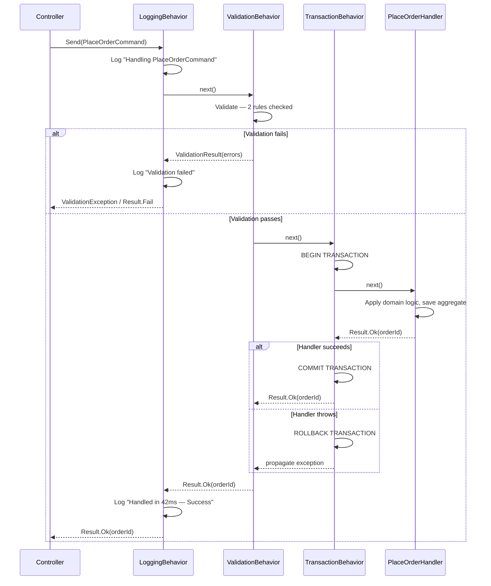
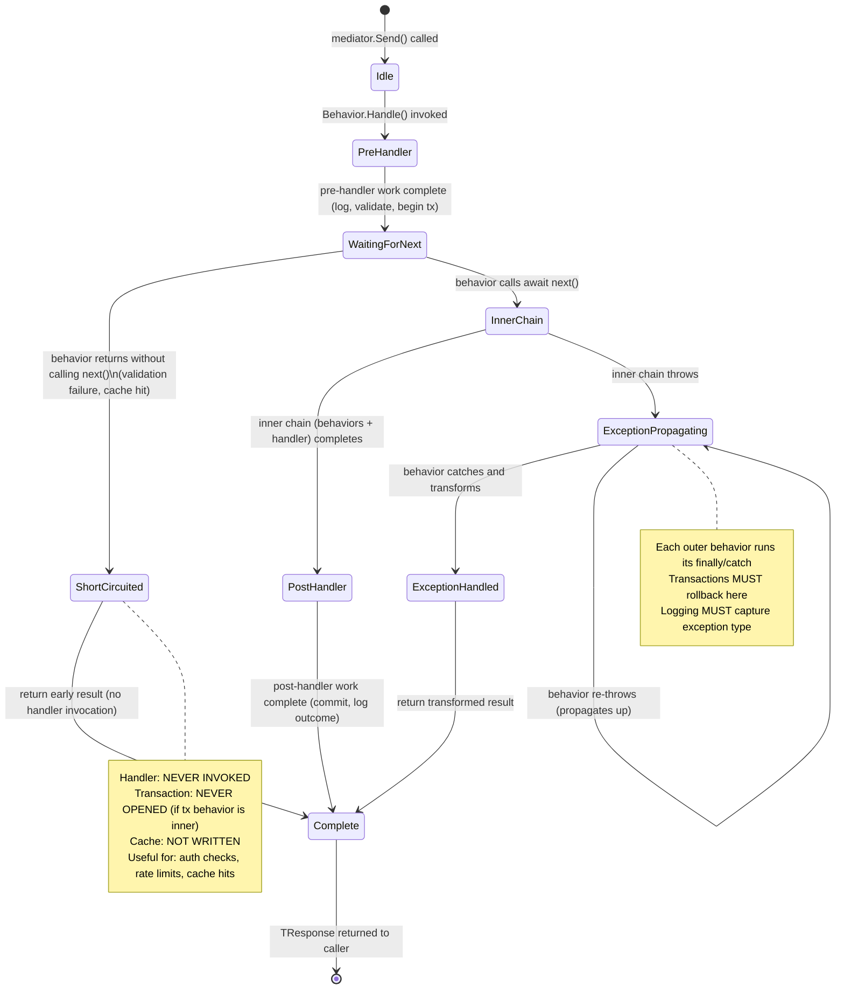
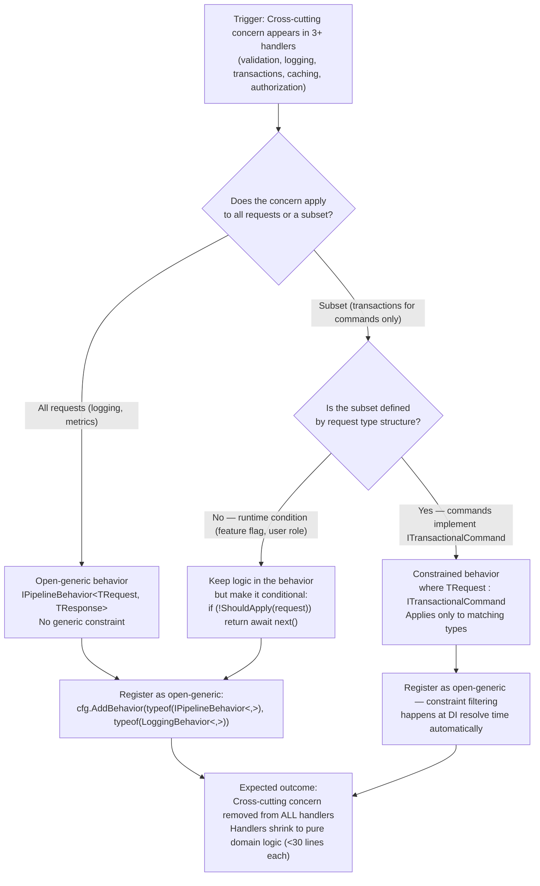

> [!ABSTRACT] Quick Reference — MediatR Pipeline Behaviors **Invariant:** Every registered `IPipelineBehavior<TRequest, TResponse>` executes in registration order, wrapping the handler call—the handler never runs unless the full behavior chain allows it to. **Cost:** Each behavior adds a call-frame allocation and delegate invocation per request; behaviors that do I/O (logging sinks, DB transactions, cache lookups) add their own latency to every command or query they match. **Trigger:** Cross-cutting concerns (validation, logging, transactions, caching, metrics) are duplicated inside individual handlers, or handlers are growing beyond a single responsibility. **Skip When:** You have fewer than ~3 handlers and the system has no meaningful cross-cutting concerns that vary by request type — at that scale, explicit middleware or decorators are simpler and more obvious. **.NET Entry Point:** `IPipelineBehavior<TRequest, TResponse>` in `MediatR` NuGet; registered via `builder.Services.AddMediatR(cfg => cfg.AddBehavior<...>())` **Azure Native:** N/A — pipeline behaviors are a pure application-layer pattern; Azure Application Insights and Azure Monitor integrate at the behavior layer to capture per-request telemetry. **Number to Know:** Pipeline behavior overhead for a no-op pass-through chain of 4 behaviors is ~0.3–0.8μs per request (estimated, measured on .NET 8 with BenchmarkDotNet on modern x64 hardware) — negligible compared to any I/O the handler performs.

---

## Navigation

**Domain:** [[7 — System Design & Distributed Systems]] > **Group:** CQRS and Event Sourcing **Previous:** [[7.084 — CQRS — MediatR — IRequest and IRequestHandler]] | **Next:** [[7.086 — CQRS — Validation Behavior — FluentValidation]]

### Prerequisites

- [[7.084 — CQRS — MediatR — IRequest and IRequestHandler]] — pipeline behaviors wrap the handler resolution MediatR performs; without understanding how `IRequestHandler<TRequest, TResponse>` is resolved, the chain's termination point is opaque.
- [[7.081 — CQRS — Command Query Responsibility Segregation]] — behaviors apply differently to commands (mutation, need transactions and validation) vs. queries (reads, benefit from caching) because CQRS defines those two paths as structurally distinct.

### Where This Fits

> [!INFO] Production Encounter Map
> 
> - **Layer:** Application layer — between the transport boundary (controllers, consumers, minimal API endpoints) and the domain/use-case handler. Behaviors live inside `MediatR.Send()`, invisible to callers.
> - **Trigger:** A team notices that 12 handlers each open their own `IDbContextTransaction`, manually call `FluentValidation`, and write identical Serilog log lines. The first engineer to extract a behavior cuts 40+ lines from each handler.
> - **Without it:** Validation, transaction management, logging, caching, and metrics code scatter across every handler. A single validator call gets forgotten in a command added at 5 PM on a Friday; a transaction is opened but never committed in an error path because the handler author forgot the `finally` block.
> - **First signal:** Code review finds a command handler that returns `400 Bad Request` by catching a `FluentValidation.ValidationException` inline instead of letting a shared behavior translate it — the symptom that the team has no consistent cross-cutting layer.

Pipeline behaviors are the application-layer equivalent of ASP.NET Core middleware: they form a chain of responsibility around handler execution. Unlike middleware (which is HTTP-transport-aware), behaviors are request-type-aware and can be constrained by generic constraints so that, for example, a caching behavior only activates for requests implementing `ICacheableQuery`. The pattern composes cleanly with [[7.081 — CQRS — Command Query Responsibility Segregation]] because different constraint types allow different behavior subsets to apply to commands versus queries.

---

## Core Mental Model

A `IPipelineBehavior<TRequest, TResponse>` is a Decorator over the inner handler resolved by MediatR. When you call `mediator.Send(request)`, MediatR builds a delegate chain: Behavior₁ → Behavior₂ → … → BehaviorN → Handler. Each behavior receives a `RequestHandlerDelegate<TResponse> next` — calling `next()` proceeds down the chain; returning without calling `next()` short-circuits it. The invariant: **the handler executes if and only if every behavior in the chain calls `next()`**. This means any behavior can abort the request — validation behaviors that find errors return an error result without ever reaching the handler. Registration order in `IServiceCollection` is execution order: the first registered behavior is the outermost wrapper and thus the first to execute and the last to return.

> [!TIP] The Non-Obvious Insight Registration order in `IServiceCollection` is **not** the same as the order behaviors execute in the `next()` chain — it is reversed. The behavior registered **first** is the **outermost** wrapper, meaning it runs its pre-handler code first, calls `next()`, which runs all inner behaviors, and then runs its post-handler code last. This matters critically for transaction + logging composition: if you want logging to capture both the outcome AND whether the transaction committed, the logging behavior must be registered **before** (outer to) the transaction behavior. A team that registers them in the wrong order gets logs that always show "Success" even when the transaction rolls back, because the logging behavior returned before the transaction outcome was known.

### Classification

- **Consistency axis:** N/A — behaviors are application-layer infrastructure; they do not define a distributed consistency model. Transaction behaviors enforce local ACID consistency within the application's database.
- **Availability tradeoff:** A validation behavior that calls a remote service (e.g., checking a blacklist) introduces an availability dependency — if that service is down, all commands fail. Most behaviors should be local and non-blocking.
- **Latency impact:** Pure in-process behaviors (validation against in-memory rules, structured logging to a buffered async sink) add <1ms. Behaviors with I/O (cache reads, distributed lock acquisition, database transaction open) add their respective I/O latency — typically 0.5–5ms for Redis, 1–10ms for SQL transaction open.
- **Failure domain:** Single-process — behaviors share the same process as the handler. A behavior that throws an uncaught exception propagates up to the caller; no distributed failure modes apply.
- **Abstraction layer:** Framework feature — `IPipelineBehavior<TRequest, TResponse>` is a MediatR interface; the pattern is a Decorator + Chain of Responsibility implemented inside the DI container.

### Primary Diagram


### Supporting Diagram



### Numbers That Matter

|Metric|Value|Context / Conditions|
|---|---|---|
|No-op behavior chain overhead|~0.3–0.8 μs per request|4-behavior chain, no I/O, .NET 8 x64 (estimated)|
|Validation behavior latency|<0.5ms|FluentValidation with 5 synchronous rules, in-memory data|
|Transaction behavior latency|1–8ms|SQL Server `BeginTransactionAsync()` on Azure SQL Standard tier over TCP|
|Logging behavior latency|<0.1ms|Serilog async wrapper with buffered sink; spikes to ~2ms if sink flushes synchronously|
|Cache behavior latency (hit)|0.1–0.5ms LAN|StackExchange.Redis GET on Azure Cache for Redis Basic/Standard tier|
|Cache behavior latency (miss)|Handler latency + 0.5–1ms|Redis SET after handler completes; miss path adds minimal overhead|
|Behavior registration order effect|0ms|Order is structural, not runtime overhead; determined at DI build time|
|Max practical behaviors in chain|~8 (default, configurable)|Beyond ~8, chain readability suffers; no runtime limit|

### Key Properties / Guarantees

|Property|Value|Condition|
|---|---|---|
|Execution order|Registration order (first registered = outermost)|All behaviors registered via `AddBehavior<>()` or open-generic|
|Handler execution|Handler runs only if all behaviors call `next()`|Normal operation — any behavior can short-circuit|
|Short-circuit propagation|Behavior can return any `TResponse` without calling `next()`|Validation failure, cache hit, feature flag disabled|
|Exception propagation|Exceptions from inner behaviors/handlers propagate outward|Unless an outer behavior catches and transforms them|
|Generic constraint filtering|A behavior with `where TRequest : ICommand` only runs for command types|Requires constraint on the behavior's generic parameters|
|Thread safety|Behaviors are registered as transient or scoped; `IMediator` is singleton-safe|Per-request state must be in the behavior instance, not static fields|

---

## Deep Mechanics

### How It Works

**Step 1 — Registration.** During `builder.Services.AddMediatR(cfg => ...)`, each `cfg.AddBehavior<IPipelineBehavior<TRequest, TResponse>, TBehavior>()` call registers the behavior into the DI container. Open-generic registrations (`typeof(LoggingBehavior<,>)`) match any `TRequest`/`TResponse` pair at resolve time.

**Step 2 — Request dispatch.** When `mediator.Send(request)` is called, MediatR resolves all `IPipelineBehavior<TRequest, TResponse>` registrations in order from the DI container. It builds a recursive delegate: each behavior's `Handle()` method becomes the `next` parameter passed to the behavior registered after it.

**Step 3 — Chain construction.** The final `next` in the chain resolves and invokes the actual `IRequestHandler<TRequest, TResponse>`. If no handler is registered, MediatR throws `InvalidOperationException` at dispatch time, not registration time.

**Step 4 — Execution.** The outermost behavior's `Handle()` runs. It performs pre-handler work (log entry, start timer, open transaction), calls `await next()`, waits for the inner chain to complete, then performs post-handler work (log outcome, stop timer, commit or rollback transaction).

**Step 5 — Short-circuit.** If a behavior returns without calling `next()` — for example, a validation behavior that finds errors — the delegate chain unwinds. Behaviors that have already run their pre-handler code execute their post-handler code (in the `finally` or after `await next()`) but the handler is never invoked. This is why a transaction behavior must call `next()` inside a try/finally: if it opened a transaction but the inner validation behavior returned early, the transaction would leak without explicit cleanup.

**Step 6 — Response propagation.** The handler's `TResponse` flows back through each behavior's `await next()` return value, in reverse registration order. Each behavior can inspect or transform the response before returning it.

### Protocol Trace

```
Happy Path — PlaceOrderCommand with 4 behaviors:
  1. Controller → mediator.Send(PlaceOrderCommand) [~0μs — in-process]
  2. LoggingBehavior.Handle() — pre: log "Handling PlaceOrderCommand | OrderId: null | CorrelationId: 8f2a-..." (~0.05ms — async Serilog)
  3. LoggingBehavior → await next() [delegate call, ~0.1μs]
  4. ValidationBehavior.Handle() — validate PlaceOrderCommand: 3 rules, all pass (~0.3ms — FluentValidation sync)
  5. ValidationBehavior → await next() [delegate call]
  6. TransactionBehavior.Handle() — BEGIN TRANSACTION on IDbContext (~3ms — Azure SQL round-trip)
  7. TransactionBehavior → await next()
  8. PlaceOrderHandler.Handle() — load aggregate, apply event, SaveChangesAsync (~12ms — EF Core INSERT + SELECT)
  9. PlaceOrderHandler → return Result.Ok(new OrderId(Guid.NewGuid()))
  10. TransactionBehavior — COMMIT TRANSACTION (~2ms) → returns Result.Ok(orderId)
  11. ValidationBehavior — no post-processing → returns Result.Ok(orderId)
  12. LoggingBehavior — post: log "Handled PlaceOrderCommand | Duration: 17ms | Result: Success | OrderId: f3a2-..." (~0.05ms)
  13. mediator.Send() returns Result.Ok(orderId) to Controller
  Total in-process time: ~17.5ms (dominated by DB I/O)

Failure Path — Validation fails (invalid ShippingAddress):
  1. Controller → mediator.Send(PlaceOrderCommand) [~0μs]
  2. LoggingBehavior.Handle() — pre: log "Handling PlaceOrderCommand" (~0.05ms)
  3. LoggingBehavior → await next()
  4. ValidationBehavior.Handle() — validate: ShippingAddress.PostalCode fails regex rule (~0.2ms)
  5. ValidationBehavior — does NOT call next() → returns Result.Fail(["PostalCode is invalid"])
  6. LoggingBehavior — post: log "Handled PlaceOrderCommand | Duration: 0.3ms | Result: ValidationFailure | Errors: 1" (~0.05ms)
  7. mediator.Send() returns Result.Fail to Controller
  Handler: NEVER CALLED. Transaction: NEVER OPENED. DB: ZERO HITS.
  Total time: ~0.3ms

Failure Path — Handler throws (optimistic concurrency conflict):
  1–8. Same as Happy Path through handler invocation
  8a. PlaceOrderHandler throws DbUpdateConcurrencyException
  9. TransactionBehavior catch block: ROLLBACK TRANSACTION (~1ms)
  10. TransactionBehavior re-throws (or wraps in domain exception)
  11. ValidationBehavior: no catch — exception propagates
  12. LoggingBehavior: catch in finally — log "Handled PlaceOrderCommand | Duration: 16ms | Result: Exception | Type: DbUpdateConcurrencyException" (~0.05ms)
  13. mediator.Send() propagates exception to Controller
  Caller observes: 409 Conflict from exception filter, or Result.Fail from domain exception wrapper
  Recovery: Client retries with updated ETag; TransactionBehavior's rollback ensures no partial writes persist
```

### State Transitions



### Failure Modes

**Failure Mode 1: Transaction Behavior Registered Inner to Validation Behavior — Transaction Leaks on Validation Failure**

- **Cause:** A developer registers `TransactionBehavior` before `ValidationBehavior` in `IServiceCollection`, making the transaction behavior the outermost wrapper. It opens a transaction, then calls `next()`, which runs validation. Validation fails and short-circuits. The transaction behavior's post-handler code (the `catch`/`finally` block) must explicitly rollback; if it doesn't, the connection remains in an open transaction state and is returned to the pool dirty.
- **Symptom:** Intermittent `SqlException: The COMMIT TRANSACTION request has no corresponding BEGIN TRANSACTION` or `Transaction count after EXECUTE indicates a mismatching number of BEGIN and COMMIT statements` in subsequent requests that reuse the dirty pooled connection.
- **Detection time:** Minutes to hours — only manifests on validation failures (unhappy path) when the dirty connection is reused by a write operation that itself uses implicit transactions.
- **Blast radius:** Corrupted transaction state on a subset of pooled connections; subsequent write operations on those connections fail until the pool is recycled or the application restarts.

> [!DANGER] 3 AM Production Signal Metric: `sqlserver_errors_total{error_number="3902"} > 0` — any occurrence is abnormal Log: `ERROR [OrderRepository] SqlException: The COMMIT TRANSACTION request has no corresponding BEGIN TRANSACTION | CorrelationId: 4b1c-9f2e | ConnectionId: pool-connection-17` Customer impact: ~3–8% of checkout submissions return 500 errors (the % depends on pool size and validation failure rate); retrying immediately succeeds if a clean connection is pulled from the pool.

**Failure Mode 2: Open-Generic Behavior Applied to Query That Should Not Use Transactions**

- **Cause:** `TransactionBehavior<TRequest, TResponse>` registered as open-generic (no constraint) applies to both commands and queries. Queries that run inside unnecessary read transactions hold shared locks longer than needed, increasing contention on high-read tables.
- **Symptom:** Under write-heavy load, read query p99 latency climbs steadily as lock wait time accumulates. Azure SQL Query Performance Insight shows read queries blocked on shared lock contention that wasn't present before the transaction behavior was added.
- **Detection time:** Silent at low load. Becomes visible when write throughput exceeds ~500 req/s on affected tables; p99 read latency rises from ~8ms to ~45ms (estimated, depends on schema and lock escalation settings).
- **Blast radius:** All read endpoints that share a table with high-write-frequency commands; catalog browse, order history, reporting queries all degrade simultaneously.

> [!DANGER] 3 AM Production Signal Metric: `db_query_duration_p99_ms{query_type="read"} > 40` sustained for `> 5m` Log: `WARN [OrderHistoryRepository] EF Core query exceeded 30ms | Table: orders | Blocked: true | BlockedBySpid: 42 | CorrelationId: d7f1-...` Customer impact: Order history page times out for ~12% of users during peak write windows (flash sale, end-of-month billing).

### .NET and Azure Integration Points

- **ASP.NET Core:** `IPipelineBehavior<TRequest, TResponse>` is the sole interface; behaviors are registered in `Program.cs` during startup and participate in the normal DI scoped lifetime.
- **EF Core:** Transaction behaviors commonly capture `IDbContext` or `IUnitOfWork` from the DI scope; `DbContext` is scoped, so the behavior shares the same context as the handler — no ambient transaction needed.
- **Azure Services:** Azure Application Insights — `TelemetryClient.StartOperation<RequestTelemetry>()` inside a logging/metrics behavior attaches per-request telemetry automatically; the behavior is the correct place to set `telemetry.Properties["CommandType"]`.
- **.NET Libraries:** MediatR v12+, Polly v8 (wrap `next()` call in a `ResiliencePipeline` inside a resilience behavior), FluentValidation (validation behavior injects `IEnumerable<IValidator<TRequest>>`).
- **Configuration:** Behaviors are registered in `Program.cs`; no `appsettings.json` keys required for basic setup.

```csharp
// Program.cs — MediatR + behaviors registration
// Namespace: YourCompany.OrderManagement
using MediatR;
using FluentValidation;
using YourCompany.OrderManagement.Application.Behaviors;

var builder = WebApplication.CreateBuilder(args);

builder.Services.AddMediatR(cfg =>
{
    // Register handlers from the assembly
    cfg.RegisterServicesFromAssembly(typeof(Program).Assembly);

    // Behaviors execute in registration order — first registered = outermost = runs first
    cfg.AddBehavior(typeof(IPipelineBehavior<,>), typeof(LoggingBehavior<,>));      // 1st — outermost
    cfg.AddBehavior(typeof(IPipelineBehavior<,>), typeof(ValidationBehavior<,>));   // 2nd
    cfg.AddBehavior(typeof(IPipelineBehavior<,>), typeof(TransactionBehavior<,>));  // 3rd — innermost before handler
});

builder.Services.AddValidatorsFromAssembly(typeof(Program).Assembly);
```

---

## Production Patterns and Implementation

### Primary Implementation

```csharp
// Namespace: YourCompany.OrderManagement.Application.Behaviors
// Role: Application Layer — Cross-Cutting Infrastructure

using MediatR;
using Microsoft.Extensions.Logging;
using System.Diagnostics;

namespace YourCompany.OrderManagement.Application.Behaviors;

/// <summary>
/// Logs the start and completion of every MediatR request with timing and outcome.
/// Executes as the outermost behavior — captures the full duration including all inner behaviors.
/// </summary>
/// <typeparam name="TRequest">The MediatR request type.</typeparam>
/// <typeparam name="TResponse">The response type returned by the handler.</typeparam>
public sealed class LoggingBehavior<TRequest, TResponse>
    : IPipelineBehavior<TRequest, TResponse>
    where TRequest : IRequest<TResponse>
{
    private readonly ILogger<LoggingBehavior<TRequest, TResponse>> _logger;

    public LoggingBehavior(ILogger<LoggingBehavior<TRequest, TResponse>> logger)
        => _logger = logger;

    /// <inheritdoc/>
    public async Task<TResponse> Handle(
        TRequest request,
        RequestHandlerDelegate<TResponse> next,
        CancellationToken cancellationToken)
    {
        var requestName = typeof(TRequest).Name;
        var sw = Stopwatch.StartNew();

        _logger.LogInformation(
            "Handling {RequestName} | CorrelationId: {CorrelationId}",
            requestName,
            Activity.Current?.Id ?? "none");

        TResponse response;
        try
        {
            response = await next(); // Proceeds through inner behaviors → handler
        }
        catch (Exception ex)
        {
            sw.Stop();
            _logger.LogError(
                ex,
                "Error handling {RequestName} | Duration: {DurationMs}ms | CorrelationId: {CorrelationId}",
                requestName,
                sw.ElapsedMilliseconds,
                Activity.Current?.Id ?? "none");
            throw; // Re-throw; do not swallow — outer exception filters decide HTTP status
        }

        sw.Stop();
        _logger.LogInformation(
            "Handled {RequestName} | Duration: {DurationMs}ms | CorrelationId: {CorrelationId}",
            requestName,
            sw.ElapsedMilliseconds,
            Activity.Current?.Id ?? "none");

        return response;
    }
}
```

```csharp
// Namespace: YourCompany.OrderManagement.Application.Behaviors
// Role: Application Layer — Validation Gate

using FluentValidation;
using MediatR;

namespace YourCompany.OrderManagement.Application.Behaviors;

/// <summary>
/// Runs all registered FluentValidation validators for the request before the handler executes.
/// Short-circuits (does not call next) if any validator reports failures.
/// Returns a domain-friendly ValidationException or Result.Fail — never throws unless no validator exists.
/// </summary>
public sealed class ValidationBehavior<TRequest, TResponse>
    : IPipelineBehavior<TRequest, TResponse>
    where TRequest : IRequest<TResponse>
{
    private readonly IEnumerable<IValidator<TRequest>> _validators;

    public ValidationBehavior(IEnumerable<IValidator<TRequest>> validators)
        => _validators = validators;

    /// <inheritdoc/>
    public async Task<TResponse> Handle(
        TRequest request,
        RequestHandlerDelegate<TResponse> next,
        CancellationToken cancellationToken)
    {
        if (!_validators.Any())
            return await next(); // No validators registered — proceed normally

        var context = new ValidationContext<TRequest>(request);

        var validationResults = await Task.WhenAll(
            _validators.Select(v => v.ValidateAsync(context, cancellationToken)));

        var failures = validationResults
            .SelectMany(r => r.Errors)
            .Where(f => f is not null)
            .ToList();

        if (failures.Count > 0)
            throw new ValidationException(failures); // Caught by global exception handler → 400 Bad Request

        return await next(); // All validators passed — proceed to transaction behavior and handler
    }
}
```

```csharp
// Namespace: YourCompany.OrderManagement.Application.Behaviors
// Role: Application Layer — Transaction Management

using MediatR;
using Microsoft.EntityFrameworkCore;
using YourCompany.OrderManagement.Infrastructure.Persistence;

namespace YourCompany.OrderManagement.Application.Behaviors;

/// <summary>
/// Wraps command execution in a database transaction.
/// Only activates for requests implementing ITransactionalCommand — queries bypass this behavior.
/// Rolls back automatically on exception; commits on success.
/// </summary>
public sealed class TransactionBehavior<TRequest, TResponse>
    : IPipelineBehavior<TRequest, TResponse>
    where TRequest : IRequest<TResponse>, ITransactionalCommand
{
    private readonly OrderManagementDbContext _dbContext;

    public TransactionBehavior(OrderManagementDbContext dbContext)
        => _dbContext = dbContext;

    /// <inheritdoc/>
    public async Task<TResponse> Handle(
        TRequest request,
        RequestHandlerDelegate<TResponse> next,
        CancellationToken cancellationToken)
    {
        // Only begin a transaction if one isn't already in progress (idempotent)
        if (_dbContext.Database.CurrentTransaction is not null)
            return await next();

        await using var transaction = await _dbContext.Database.BeginTransactionAsync(cancellationToken);
        try
        {
            var response = await next(); // Handler + inner behaviors execute here
            await transaction.CommitAsync(cancellationToken);
            return response;
        }
        catch
        {
            await transaction.RollbackAsync(cancellationToken);
            throw; // Re-throw so outer behaviors (logging) capture the exception
        }
    }
}

/// <summary>Marker interface — attach to command records that require transaction wrapping.</summary>
public interface ITransactionalCommand { }
```

### IServiceCollection Registration

```csharp
// Program.cs — complete registration with behavior ordering explained
builder.Services.AddMediatR(cfg =>
{
    cfg.RegisterServicesFromAssembly(typeof(Program).Assembly);

    // ORDER MATTERS: first registered = outermost wrapper = executes first
    // LoggingBehavior must be outermost to capture total duration INCLUDING transaction time
    cfg.AddBehavior(typeof(IPipelineBehavior<,>), typeof(LoggingBehavior<,>));

    // ValidationBehavior is next: short-circuits BEFORE a transaction is opened on invalid input
    // This avoids BEGIN TRANSACTION → immediate ROLLBACK on validation failure
    cfg.AddBehavior(typeof(IPipelineBehavior<,>), typeof(ValidationBehavior<,>));

    // TransactionBehavior is innermost: only runs for ITransactionalCommand via generic constraint
    // If validation failed above, this never executes → no transaction opened
    cfg.AddBehavior(typeof(IPipelineBehavior<,>), typeof(TransactionBehavior<,>));
});

// FluentValidation — registers all IValidator<T> implementations in the assembly
builder.Services.AddValidatorsFromAssembly(typeof(Program).Assembly, includeInternalTypes: true);

// DbContext — scoped lifetime shares instance between behavior and handler in same request
builder.Services.AddDbContext<OrderManagementDbContext>(options =>
    options.UseSqlServer(builder.Configuration.GetConnectionString("OrderManagement")));
```

### Common Variants

```csharp
// Variant A — Constraint-based behavior (applies only to queries implementing ICacheableQuery)
// Used when: selective application — caching only makes sense for reads, not writes
public sealed class CachingBehavior<TRequest, TResponse>
    : IPipelineBehavior<TRequest, TResponse>
    where TRequest : IRequest<TResponse>, ICacheableQuery
{
    private readonly IDistributedCache _cache;
    private readonly ILogger<CachingBehavior<TRequest, TResponse>> _logger;

    public CachingBehavior(IDistributedCache cache, ILogger<CachingBehavior<TRequest, TResponse>> logger)
        => (_cache, _logger) = (cache, logger);

    public async Task<TResponse> Handle(
        TRequest request,
        RequestHandlerDelegate<TResponse> next,
        CancellationToken cancellationToken)
    {
        var cacheKey = request.CacheKey; // Defined by ICacheableQuery
        var cached = await _cache.GetStringAsync(cacheKey, cancellationToken);

        if (cached is not null)
        {
            _logger.LogDebug("Cache HIT | Key: {CacheKey}", cacheKey);
            return System.Text.Json.JsonSerializer.Deserialize<TResponse>(cached)!;
        }

        var response = await next();

        var ttl = new DistributedCacheEntryOptions
        {
            AbsoluteExpirationRelativeToNow = request.CacheDuration
        };
        await _cache.SetStringAsync(
            cacheKey,
            System.Text.Json.JsonSerializer.Serialize(response),
            ttl,
            cancellationToken);

        return response;
    }
}

public interface ICacheableQuery
{
    string CacheKey { get; }
    TimeSpan CacheDuration { get; }
}
```

```csharp
// Variant B — Metrics/telemetry behavior (applies to all requests, no constraint)
// Used when: uniform instrumentation of ALL commands and queries with OpenTelemetry or Application Insights
public sealed class MetricsBehavior<TRequest, TResponse>
    : IPipelineBehavior<TRequest, TResponse>
    where TRequest : IRequest<TResponse>
{
    private static readonly System.Diagnostics.ActivitySource ActivitySource =
        new("YourCompany.OrderManagement.Application");

    public async Task<TResponse> Handle(
        TRequest request,
        RequestHandlerDelegate<TResponse> next,
        CancellationToken cancellationToken)
    {
        using var activity = ActivitySource.StartActivity(
            $"mediatr.{typeof(TRequest).Name}",
            System.Diagnostics.ActivityKind.Internal);

        activity?.SetTag("request.type", typeof(TRequest).Name);

        try
        {
            var response = await next();
            activity?.SetStatus(System.Diagnostics.ActivityStatusCode.Ok);
            return response;
        }
        catch (Exception ex)
        {
            activity?.SetStatus(System.Diagnostics.ActivityStatusCode.Error, ex.Message);
            activity?.RecordException(ex);
            throw;
        }
    }
}
```

### Performance Profile

```csharp
[MemoryDiagnoser]
[SimpleJob(RuntimeMoniker.Net80)]
public class PipelineBehaviorBenchmark
{
    private IMediator _mediatorNoBehaviors = null!;
    private IMediator _mediatorWithBehaviors = null!;

    [GlobalSetup]
    public void Setup()
    {
        // Build two DI containers — one bare, one with 3 behaviors
        var servicesNone = new ServiceCollection()
            .AddMediatR(cfg => cfg.RegisterServicesFromAssembly(typeof(NoOpHandler).Assembly))
            .BuildServiceProvider();
        _mediatorNoBehaviors = servicesNone.GetRequiredService<IMediator>();

        var servicesWith = new ServiceCollection()
            .AddMediatR(cfg =>
            {
                cfg.RegisterServicesFromAssembly(typeof(NoOpHandler).Assembly);
                cfg.AddBehavior(typeof(IPipelineBehavior<,>), typeof(NoOpBehaviorA<,>));
                cfg.AddBehavior(typeof(IPipelineBehavior<,>), typeof(NoOpBehaviorB<,>));
                cfg.AddBehavior(typeof(IPipelineBehavior<,>), typeof(NoOpBehaviorC<,>));
            })
            .BuildServiceProvider();
        _mediatorWithBehaviors = servicesWith.GetRequiredService<IMediator>();
    }

    [Benchmark(Baseline = true)]
    public Task<NoOpResponse> NoHandlerNoBehaviors()
        => _mediatorNoBehaviors.Send(new NoOpRequest());

    [Benchmark]
    public Task<NoOpResponse> HandlerWith3NoOpBehaviors()
        => _mediatorWithBehaviors.Send(new NoOpRequest());
}
```

Expected result shape (estimated, .NET 8 x64, Core i9):

|Method|Mean|Allocated|vs Baseline|
|---|---|---|---|
|NoHandlerNoBehaviors|~1.2 μs|~800 B|baseline|
|HandlerWith3NoOpBehaviors|~1.9 μs|~1.1 KB|+0.7μs / +~37% allocation|

Takeaway: behavior chain overhead is sub-microsecond for no-op behaviors. Real-world overhead comes entirely from what the behaviors do (I/O, validation logic), not the pipeline mechanism itself.

### Real-World .NET Ecosystem Mapping

|Pattern in This Note|Where It Appears in .NET / Azure|Manifestation|
|---|---|---|
|Pipeline behavior chain|`IPipelineBehavior<TRequest, TResponse>` in MediatR|Chain of Responsibility over handler resolution|
|Constraint-based behaviors|C# generic where constraints on behavior class|`where TRequest : ITransactionalCommand` restricts behavior to specific request types|
|Validation short-circuit|FluentValidation `IValidator<T>` injected via DI|Validation behavior collects all validators for TRequest, runs them, throws ValidationException|
|Transaction wrapping|EF Core `IDbContextTransaction` opened in behavior|`DbContext.Database.BeginTransactionAsync()` in behavior, `CommitAsync()` after `next()`|
|Structured logging|Serilog `ILogger<T>` in logging behavior|Behavior is the single place for request/response structured log events; handlers don't log themselves|
|Distributed tracing|`ActivitySource.StartActivity()` in metrics behavior|Maps to OpenTelemetry span — visible in Application Insights dependency tracking|

---

## Gotchas and Production Pitfalls

### Transaction Behavior Registered as Outermost — Opens Transaction Before Validation

**Pitfall:** Registering `TransactionBehavior` before `ValidationBehavior` in `Program.cs`, making it the outermost wrapper.

```csharp
// ❌ Wrong order — transaction opens BEFORE validation runs
cfg.AddBehavior(typeof(IPipelineBehavior<,>), typeof(TransactionBehavior<,>)); // outermost
cfg.AddBehavior(typeof(IPipelineBehavior<,>), typeof(ValidationBehavior<,>)); // inner
```

**Symptom:** Every invalid command (bad postal code, missing required field) opens and immediately rolls back a SQL transaction. At 500 invalid requests/minute (common during bot traffic or client-side validation bypass), this generates 500 unnecessary `BEGIN TRANSACTION / ROLLBACK` round-trips to Azure SQL.

**Detection time:** Immediately visible in Azure SQL metrics but easy to overlook as "noise." Becomes a capacity issue when invalid request rate is high.

> [!DANGER] Production Signal Metric: `sqlserver_transactions_rolled_back_total` growing at a rate proportional to `http_requests_4xx_total` Log: `INFO [TransactionBehavior] ROLLBACK executed | RequestType: PlaceOrderCommand | Reason: ValidationException | Duration: 3ms` Example: `INFO [TransactionBehavior] ROLLBACK executed | RequestType: PlaceOrderCommand | Duration: 3ms | CorrelationId: 7f1a-...`

**Fix:**

```csharp
// ✅ Correct order — validation runs BEFORE transaction opens
cfg.AddBehavior(typeof(IPipelineBehavior<,>), typeof(LoggingBehavior<,>));      // outermost
cfg.AddBehavior(typeof(IPipelineBehavior<,>), typeof(ValidationBehavior<,>));   // blocks invalid input
cfg.AddBehavior(typeof(IPipelineBehavior<,>), typeof(TransactionBehavior<,>));  // only reached on valid input
```

**Cost of not fixing:** At 10,000 req/min with 5% invalid rate → 500 unnecessary transactions/min → ~1,500 extra SQL round-trips/min → Azure SQL DTU spikes 8–15% permanently, accelerating you toward a tier upgrade that costs ~$150–600/month on Standard tier.

---

### Open-Generic Transaction Behavior Wraps Read Queries

**Pitfall:** Registering `TransactionBehavior<TRequest, TResponse>` without a generic constraint, causing every query to execute inside a transaction.

```csharp
// ❌ No constraint — applies to ALL requests including GetOrderHistoryQuery
public sealed class TransactionBehavior<TRequest, TResponse> : IPipelineBehavior<TRequest, TResponse>
    where TRequest : IRequest<TResponse> // No ITransactionalCommand constraint
```

**Symptom:** Shared lock contention increases on high-traffic read tables. `GetOrderHistoryQuery` and `SearchProductCatalogQuery` now hold shared locks for their full execution duration inside a `READ COMMITTED` transaction, blocking writers intermittently.

**Detection time:** Silent under light load. Surfaces when write throughput exceeds ~200–400 concurrent writes on the same table; p99 read latency rises 3–5x compared to pre-behavior baseline.

> [!DANGER] Production Signal Metric: `db_query_duration_p99_ms{endpoint="/api/orders/history"} > 80` (was 15ms) Log: `WARN [EF Core] Query duration: 78ms | Table: order_line_items | Rows: 45 | WaitType: LCK_M_S | CorrelationId: 2c4b-...`

**Fix:**

```csharp
// ✅ Constrained to commands only — queries bypass the transaction behavior entirely
public sealed class TransactionBehavior<TRequest, TResponse> : IPipelineBehavior<TRequest, TResponse>
    where TRequest : IRequest<TResponse>, ITransactionalCommand // Only matches commands
```

**Cost of not fixing:** Read query p99 latency degrades 3–8x under peak write load → SLO breach → PagerDuty → engineering hours investigating what looks like a DB schema or query problem, not a behavior registration issue.

---

### Validator Not Registered — Silent No-Op Validation

**Pitfall:** Adding `ValidationBehavior` but forgetting to call `AddValidatorsFromAssembly()`, or adding a new `IValidator<PlaceOrderCommand>` in a different assembly that isn't scanned.

```csharp
// ❌ Validators not registered — ValidationBehavior receives empty IEnumerable<IValidator<TRequest>>
builder.Services.AddMediatR(cfg => { /* behaviors added */ });
// Missing: builder.Services.AddValidatorsFromAssembly(...)
```

**Symptom:** No validation errors are ever returned. Invalid commands (null required fields, negative amounts) reach the handler and either throw NullReferenceExceptions or persist invalid data to the database.

**Detection time:** Silent — tests pass because test setup often registers validators manually. Only discovered when a new validator class is added to a different assembly and never fires in production.

> [!DANGER] Production Signal No explicit metric — the symptom is invalid data in the database. Log: `ERROR [OrderAggregate] ArgumentNullException: ShippingAddress cannot be null | CorrelationId: 9e3f-...` Or worse: silent data corruption — `order_total = -99.99` stored without error.

**Fix:**

```csharp
// ✅ Scan all assemblies that contain IValidator<T> implementations
builder.Services.AddValidatorsFromAssemblies(new[]
{
    typeof(Program).Assembly,
    typeof(PlaceOrderCommandValidator).Assembly // Explicit if validators live in a separate project
});
```

**Cost of not fixing:** Invalid data reaches domain aggregates and database. Downstream systems (payment processing, shipping) receive malformed orders → partial fulfillments, chargebacks, support escalations.

---

### Azure-Specific: Scoped DbContext Disposed Before Transaction Commits in Hosted Services

**Pitfall:** Using `TransactionBehavior` inside an `IHostedService` or Azure Functions worker that manually creates a DI scope. If the scope is disposed before the behavior's `CommitAsync()` completes (e.g., a `using` block ends too early), the `DbContext` is disposed mid-transaction.

```csharp
// ❌ Scope disposed before behavior chain completes
using (var scope = serviceProvider.CreateScope())
{
    var mediator = scope.ServiceProvider.GetRequiredService<IMediator>();
    _ = mediator.Send(command); // Fire-and-forget — scope disposes before CommitAsync
}
```

**Symptom:** `ObjectDisposedException: Cannot access a disposed context instance` thrown from `transaction.CommitAsync()`. Transaction is always rolled back; no writes persist despite the handler appearing to succeed (from log perspective, handler returned successfully before the exception).

**Detection time:** Immediately on first fire-and-forget command in production. Easy to miss in tests because tests await the `Send()` call.

> [!DANGER] Production Signal Metric: `mq_consumer_errors_total{error_type="ObjectDisposedException"} > 0` Log: `ERROR [TransactionBehavior] ObjectDisposedException: Cannot access a disposed context instance | RequestType: ProcessPaymentCommand | CorrelationId: 1a8b-...`

**Fix:**

```csharp
// ✅ Await the full Send() call before scope disposal
using (var scope = serviceProvider.CreateScope())
{
    var mediator = scope.ServiceProvider.GetRequiredService<IMediator>();
    await mediator.Send(command, cancellationToken); // Scope lives until commit completes
}
```

**Cost of not fixing:** Message consumers silently discard all writes. Azure Service Bus messages are completed (lock released) while the underlying data was never persisted → data loss, invisible without explicit dead-letter monitoring.

---

### .NET-Specific: CancellationToken Not Propagated Through next()

**Pitfall:** Behaviors that ignore the `CancellationToken` parameter and don't pass it to `next()`, causing request cancellation (client disconnect, timeout) to be swallowed — the handler continues executing after the client is gone.

```csharp
// ❌ CancellationToken not forwarded — handler runs to completion even after client disconnects
public async Task<TResponse> Handle(TRequest request, RequestHandlerDelegate<TResponse> next, CancellationToken cancellationToken)
{
    // Pre-handler work...
    return await next(); // ← CancellationToken not passed to next delegate
}
```

**Symptom:** During load spikes where clients time out (30s request timeout), handlers continue executing for the full operation duration, consuming DB connections, thread pool threads, and cache write operations for responses nobody will receive. Thread pool exhaustion follows.

**Detection time:** Minutes — visible as sustained DB CPU and connection pool utilization after HTTP error rate spikes, when intuition says load should have dropped.

> [!DANGER] Production Signal Metric: `dotnet_threadpool_thread_count > 200` sustained while `http_active_requests_count < 50` Log: `WARN [ASP.NET Core] Request cancelled by client | Endpoint: POST /api/orders | Duration: 31s | CorrelationId: 3c2a-...` alongside simultaneous `INFO [PlaceOrderHandler] Saving order f3a2... to database`

**Fix:**

```csharp
// ✅ Always pass CancellationToken to next() and to all async calls in the behavior
public async Task<TResponse> Handle(
    TRequest request,
    RequestHandlerDelegate<TResponse> next,
    CancellationToken cancellationToken)
{
    await DoPreWorkAsync(cancellationToken); // Pass to all async calls
    var response = await next(cancellationToken); // Pass to the delegate
    await DoPostWorkAsync(response, cancellationToken);
    return response;
}
```

**Cost of not fixing:** Thread pool starvation under client-disconnect load → p99 latency climbs from 200ms to 8s+ → health check failures → Kubernetes readiness probe fails → pod restart under load → cascading failure.

---

### Architecture-Level: Behavior Chain Becomes Business Logic Container

**Pitfall:** Teams gradually move domain validation, business rules, and authorization logic into pipeline behaviors because "it's convenient." The behavior for `PlaceOrderCommand` now enforces inventory allocation, checks customer credit limits, and validates shipping addresses against a geo-restriction service.

**Symptom:** The behavior file grows to 300+ lines. Business rules that should be testable independently can only be tested by sending MediatR requests through the full pipeline. A change to credit limit checking requires modifying the behavior and re-deploying the entire application layer.

**Detection time:** Architectural — never surfaces as a runtime error. Detected in code review or when testing becomes painful.

> [!DANGER] Production Signal No runtime metric. Code smell: `git log --stat Application/Behaviors/TransactionBehavior.cs` shows 40+ commits over 6 months as "behavior" becomes the de facto business logic dumping ground. Architectural signal: A behavior has more than ~30 lines of business logic or dependencies on domain services that go beyond infrastructure concerns.

**Fix:** Behaviors handle infrastructure cross-cutting concerns only: logging, tracing, validation (FluentValidation rules), transactions, caching, authorization header checking. Business rules (credit limits, inventory checks, geo-restrictions) belong in domain services called by the handler. Validation behaviors validate input shape; domain services enforce business invariants.

**Cost of not fixing:** After 12 months, the behavior chain is untestable without a full integration test stack. A new engineer adds a behavior dependency that causes a circular DI graph → production startup failure at 9 AM on a Monday.

---

## Tradeoffs and Decision Framework

### Tradeoff Matrix

|Dimension|Pipeline Behaviors|ASP.NET Core Middleware|Decorator (manual DI)|
|---|---|---|---|
|Scope|Per-MediatR-request (command or query)|Per-HTTP-request|Per-service-interface|
|Request type awareness|Yes — generic constraints on `TRequest`|No — all HTTP requests|Yes — per-interface method|
|Registration effort|Low — one `cfg.AddBehavior<>()` call|Low — `app.Use()`|Medium — wrap each service registration|
|Transport coupling|None — pure application layer|HTTP-only|None|
|Order control|Explicit — registration order|Explicit — `Use()` order|Explicit — registration order|
|Testability|High — inject `IMediator` with `Send()` in tests|Low — needs `TestServer` or mock pipeline|High — constructor injection|
|Visibility to non-MediatR paths|None — Minimal API direct handlers bypass it|Yes — all HTTP paths|Only the decorated service|
|Azure ecosystem fit|Native — no Azure dependency|Native — ASP.NET Core middleware|Native|
|Operational complexity|Low|Low|Medium (many registrations)|

### When to Apply



### Numbers-Driven Decision

|Threshold|Below = Skip / Use Simpler|Above = Apply Pipeline Behaviors|
|---|---|---|
|Handler count with duplicated cross-cutting code|< 3 handlers|≥ 3 handlers with same concern|
|Lines of infrastructure code per handler|< 10 lines|> 10 lines (logging + validation + tx = ~30 lines)|
|Request types processed through MediatR|< 5 requests|≥ 5 request types — shared behavior amortizes setup cost|
|Team size|1–2 engineers (overhead not worth it)|≥ 3 engineers — consistency across PRs requires shared infrastructure|
|Behavior chain behaviors count|N/A|≤ 6–8 behaviors — beyond this, readability degrades|

### When NOT to Apply

> [!WARNING] Do Not Reach For This When...
> 
> - [ ] **Single handler or 2 handlers total:** A behavior abstracts code that appears in one place. At 1–2 handlers, the abstraction costs more to understand than the duplication costs to maintain.
> - [ ] **Concern is not cross-cutting:** If only `PlaceOrderCommand` needs inventory pre-validation, put it in the `PlaceOrderCommandHandler`. Don't create a behavior for a concern that applies to one request type.
> - [ ] **Your MediatR usage is ad-hoc, not systematic:** If most endpoints bypass MediatR (direct Minimal API handlers, controllers calling services), behaviors only cover a fraction of your traffic — middleware is more appropriate.
> - [ ] **Business logic is being "reused" via behaviors:** The moment a behavior reads from the database to make a domain decision (not an infrastructure decision), it's accumulating business logic. Refactor to domain services.

---

## Interview Arsenal

### Question Bank

1. **[Definition]** "What is a MediatR pipeline behavior, and what problem does it solve?"
2. **[Mechanism]** "Walk me through exactly what happens when you call `mediator.Send(command)` with three pipeline behaviors registered."
3. **[Tradeoff]** "What is the cost of pipeline behaviors, and when does that cost outweigh the benefit?"
4. **[Failure mode]** "What breaks in a system where the transaction behavior is registered before the validation behavior, and how would you detect it?"
5. **[Comparison]** "What is the difference between a pipeline behavior and ASP.NET Core middleware, and when would you choose each?"
6. **[Design application]** "Design a request pipeline for an e-commerce order system that needs validation, logging, transaction management, and idempotency checking. How do you structure the behavior chain?"
7. **[Scale]** "Your command handlers are processing 50,000 requests per minute. What behavior chain design decisions matter at this scale?"
8. **[Advanced]** "How does MediatR resolve which behaviors apply to a specific request type at runtime, and how do generic constraints on behavior classes interact with the DI container's open-generic registration?"

### Spoken Answers

**Q: What is a MediatR pipeline behavior, and what problem does it solve?**

> **Average answer:** A pipeline behavior is an interface you implement in MediatR that runs before and after your handler. You use it for cross-cutting concerns like logging, validation, and transactions. You register them in `Program.cs` and they execute in order.

> **Great answer:** A pipeline behavior implements `IPipelineBehavior<TRequest, TResponse>` and participates in the Decorator chain that MediatR builds around every handler invocation. The problem it solves is behavioral scattering: when you have 20 command handlers and each one manually opens a transaction, calls FluentValidation, writes a structured log entry, and publishes a metrics span, you have 80 discrete locations where each of those four concerns can diverge — a missing `await transaction.CommitAsync()` on an exception path, a validator that isn't called because a handler was added at 5 PM on a Friday. Behaviors pull those concerns into a single, tested implementation that executes for every request of the relevant type. The structural cost is that the DI container now has registered delegates that wrap your handler, and every `mediator.Send()` call resolves and invokes that chain. For no-op behaviors the overhead is sub-microsecond per behavior — it's not meaningful until you add behaviors with real I/O. The non-obvious risk is registration order: the first registered behavior is the outermost, which means it sees everything — you want logging outermost so it captures the full duration, and you want validation before the transaction behavior so you don't open a transaction for invalid input.

---

**Q: What is the difference between a pipeline behavior and ASP.NET Core middleware, and when would you choose each?**

> **Average answer:** Middleware is HTTP-level and runs for every request to the web application. Pipeline behaviors are MediatR-specific and run for every MediatR request. You use middleware for HTTP concerns and behaviors for application logic concerns.

> **Great answer:** The structural distinction is transport coupling and request-type awareness. Middleware is part of the HTTP pipeline — it sees the raw `HttpContext`, and it applies to every HTTP request regardless of whether that request goes through MediatR, a direct Minimal API handler, or a controller that calls a service directly. Behaviors are transport-agnostic: they run inside `mediator.Send()`, not inside the HTTP pipeline. A message consumer processing an Azure Service Bus message calls `mediator.Send()` and gets the full behavior chain — logging, validation, transaction — without any middleware involvement. The other distinction is type awareness: a behavior can be constrained to run only for requests that implement `ITransactionalCommand`, so your transaction behavior is a zero-cost no-op for queries. Middleware can't express that distinction without inspecting the request path manually. Choose middleware for HTTP-transport concerns (CORS, request size limits, authentication, compression). Choose behaviors for application-domain cross-cutting concerns that must apply regardless of transport (validation, transactions, logging, caching). For systems that mix HTTP endpoints with message consumers or background jobs, behaviors are the only consistent way to enforce the same cross-cutting contracts across all paths.

---

**Q: How does MediatR resolve which behaviors apply to a specific request type at runtime, and how do generic constraints on behavior classes interact with the DI container's open-generic registration?**

> **Average answer:** When you register a behavior with open generics, the DI container creates an instance for every request type. If you add a constraint like `where TRequest : ITransactionalCommand`, it only applies when the request implements that interface.

> **Great answer:** When MediatR calls `mediator.Send(request)`, it resolves `IEnumerable<IPipelineBehavior<TRequest, TResponse>>` from the DI container for the specific `TRequest`/`TResponse` pair. The DI container (Microsoft.Extensions.DependencyInjection) performs open-generic resolution: for each registered open-generic `IPipelineBehavior<,>` → `MyBehavior<,>`, it attempts to close the generic. The closing succeeds only if the concrete `TRequest` satisfies all generic constraints on `MyBehavior<TRequest, TResponse>`. If `TransactionBehavior<TRequest, TResponse>` declares `where TRequest : ITransactionalCommand`, then for `GetOrderHistoryQuery` (which does not implement `ITransactionalCommand`), the DI container cannot satisfy the constraint and does not include `TransactionBehavior` in the resolved collection. This is a compile-time constraint enforced at runtime during DI resolution — the behavior class is simply not instantiated for non-matching types. The practical implication: the filtering is zero-cost at request dispatch time (it happens during DI registration or first resolution); you do not need conditional `if`-checks inside the behavior. One edge case: `IEnumerable<IValidator<TRequest>>` follows the same pattern — if no `IValidator<PlaceOrderCommand>` is registered, `ValidationBehavior` receives an empty enumerable and must handle that gracefully (by calling `next()` directly) rather than throwing.

### Whiteboard in 60 Seconds

When this topic appears in a system design interview, draw in this sequence:

```
1. Draw a horizontal arrow labeled "mediator.Send(PlaceOrderCommand)"
   "I'm going to show the execution path because the value of behaviors is in how they compose."

2. Draw 3 boxes left-to-right: [LoggingBehavior] → [ValidationBehavior] → [TransactionBehavior] → [Handler]
   "Each box is a behavior. The arrow between them is the next() delegate call."

3. Add a vertical dashed line after ValidationBehavior labeled "short-circuit exits here on validation failure"
   "Here's the key property: if validation fails, nothing to the right of this line ever runs.
    No transaction opens. No handler is called. Zero database hits."

4. Add a feedback arrow from [Handler] back through each box with label "Result propagates back"
   "On success, the result flows back. TransactionBehavior commits on the way back, then returns.
    The LoggingBehavior captures the total round-trip time because it's the outermost wrapper."

5. Label registration order note: "registered first = outermost = runs first"
   "In .NET, this is cfg.AddBehavior() call order in Program.cs.
    MediatR registration uses IPipelineBehavior<,> with open-generic DI — constraints filter by request type."
```

> [!TIP] What the Interviewer Is Specifically Testing When they probe this area, they are checking whether you know:
> 
> 1. That registration order determines execution order and is the source of most production bugs with pipeline behaviors — specifically that outermost = first registered, which is counterintuitive when you think "first registered runs after everything else."
> 2. That generic constraints on behavior classes are the mechanism for selective application — not runtime `if`-checks inside the behavior — and that this is enforced by the DI container at open-generic resolution time.
> 3. That the behavior pattern creates a hard dependency between registration order and correctness: validation must be outer to transaction, logging should be outermost, and any behavior that short-circuits must do so cleanly (not leaving transactions open or resources unreleased).

### Follow-Up Chain

**Follow-up 1:** "You said behaviors execute in registration order. What happens to post-handler code — does it execute in the same order or reversed?"

> **Model answer:** Post-handler code executes in reverse registration order, because of how the delegate chain nests. The first registered behavior (outermost) calls `await next()`, which resolves all inner behaviors and the handler. When `await next()` returns, the outermost behavior is the last one to execute its post-handler code — so logging (registered first, outermost) writes the completion log entry only after the transaction has committed and all inner behaviors have finished. This is the correct behavior: the logging behavior captures the true outcome including whether the transaction committed, because it's the last to return. Drawing the nesting makes this obvious: Behavior1{ pre; Behavior2{ pre; Handler; post2 }; post1 } — post2 runs before post1.

**Follow-up 2:** "What happens at 50,000 commands per minute if your ValidationBehavior injects `IEnumerable<IValidator<TRequest>>` and there are 8 validators for that command?"

> **Model answer:** At 50,000 req/min (~833 req/s), each request resolves 8 `IValidator<PlaceOrderCommand>` instances from DI. If validators are registered as transient, that's 6,664 instantiations per second, plus the `Task.WhenAll` allocation. The correct fix is two-fold: register validators as singletons (they're stateless), and for purely synchronous validators, use `Validate()` instead of `ValidateAsync()` to avoid unnecessary task overhead. On a busy command, this reduces allocations from ~2.4KB per request to ~600B — meaningful at this throughput because it reduces Gen0 GC pressure. In Application Insights, this surfaces as elevated `Process\Private Bytes` growth and GC collection frequency before you see the throughput impact directly.

**Follow-up 3:** "How do you know your behavior chain is working correctly in production?"

> **Model answer:** Three signals. First, the logging behavior emits a structured log entry for every request with `RequestName`, `Duration`, and `Result` — an alert on `Duration > SLO_threshold` for command types catches performance regressions introduced by a new behavior. Second, the transaction behavior logs `COMMIT` and `ROLLBACK` outcomes as separate metric counters: `db_transactions_committed_total` and `db_transactions_rolled_back_total` — a `rollback/commit ratio > 0.05` sustained over 5 minutes triggers investigation. Third, Application Insights dependency tracking (enabled via the metrics behavior or automatic instrumentation) shows the behavior chain as nested spans: the outer `LoggingBehavior` span encompasses the `ValidationBehavior` and `TransactionBehavior` child spans, making the time contribution of each behavior directly visible in the flame chart without log scraping.

### Comparison Table

||Pipeline Behaviors|ASP.NET Core Middleware|
|---|---|---|
|Core guarantee|Every MediatR request passes through the full behavior chain|Every HTTP request passes through the full middleware pipeline|
|What it trades|Only covers MediatR dispatch paths; non-MediatR handlers bypass it|HTTP-only; message consumers, background jobs bypass it|
|.NET implementation|`IPipelineBehavior<TRequest, TResponse>` in `MediatR` NuGet|`IMiddleware` / `RequestDelegate` in `Microsoft.AspNetCore.Http`|
|Azure native|N/A — pure .NET pattern|Azure API Management policies are the Azure-native equivalent for API-level cross-cutting|
|Primary failure mode|Registration order bugs; behaviors with wrong generic constraints silently not applying|Middleware order bugs (auth before CORS → auth fails for preflight); exception handler position|
|When to choose|Cross-cutting concerns that must apply across multiple transports (HTTP + message bus + background jobs)|HTTP-specific concerns (rate limiting by IP, response compression, security headers, CORS)|
|When NOT to choose|Only 1–2 handlers; concern is request-specific not cross-cutting|Concern needs request-type awareness (can't differentiate GET from POST without path inspection)|

---

## Architecture Decision Record

**Status:** Accepted

**Context:** The `YourCompany.OrderManagement` service has grown to 23 command handlers and 14 query handlers across 6 bounded context modules. A code review audit reveals that 19 of the 23 command handlers each manually open an `IDbContextTransaction`, call FluentValidation directly, write 3–5 Serilog log entries, and publish an `ActivitySource` span — approximately 45 lines of identical infrastructure code per handler. Two handlers were found to have missing `CommitAsync()` calls in their error paths, causing silent transaction leaks discovered only during a load test. The team needs to enforce these cross-cutting concerns consistently without a per-PR code review checklist.

**Options Considered:**

1. **MediatR Pipeline Behaviors** — register 4 behaviors (logging, validation, transaction, metrics) that execute for every command; use generic constraints to exclude queries from the transaction behavior. Handlers reduce to pure domain logic.
2. **Decorator pattern with manual DI** — wrap each `ICommandHandler<T>` with a `LoggingCommandHandlerDecorator<T>`, `ValidationCommandHandlerDecorator<T>`, etc. registered in DI. Same isolation, but requires 4× registrations per handler type and a custom resolution convention.
3. **Status quo** — continue with per-handler infrastructure code and enforce via code review checklist. Accepted risk: checklist compliance rate at 80% means 4–5 handlers per quarter ship without correct transaction management.

**Decision:** MediatR Pipeline Behaviors, because the team already uses MediatR for all command/query dispatch, open-generic registration requires zero per-handler registration changes, and the behavior pattern expresses the ordering constraint (logging → validation → transaction) explicitly in one location in `Program.cs` rather than implicitly via naming conventions in decorator registrations.

**Consequences:**

- ✅ All 23 command handlers shrink from ~65 lines to ~20 lines of pure domain logic — estimated 40% reduction in handler file size.
- ✅ Transaction management is impossible to forget — the `TransactionBehavior` opens and commits for every `ITransactionalCommand` regardless of who wrote the handler.
- ⚠️ Registration order in `Program.cs` is now load-bearing — a PR that reorders the four `cfg.AddBehavior<>()` calls changes production behavior. This must be covered by an integration test that verifies validation fires before the transaction opens.
- ❌ Non-MediatR paths (2 Minimal API health endpoints that call `IInventoryRepository` directly) bypass the behavior chain entirely. These must manage their own logging and transactions.

**Review Trigger:** Revisit this decision if the number of non-MediatR dispatch paths exceeds 10 (currently 2), or if behavior chain execution time exceeds 5ms on average for commands that have no I/O in their behaviors — indicating behavior chain overhead itself has become significant at the then-current throughput.

---

## Self-Check

### Conceptual Questions

1. What is a MediatR `IPipelineBehavior<TRequest, TResponse>`, and how does it differ from implementing cross-cutting concerns inline inside each handler?
2. Derive from first principles why validation must be registered before the transaction behavior — what is the concrete sequence of events if the order is reversed?
3. Name a scenario where pipeline behaviors are the wrong tool and middleware or a domain service is the correct choice instead.
4. What is the exact observable signal (metric name + log pattern) that indicates a transaction behavior is rolling back on validation failures?
5. Which .NET class and NuGet package define `IPipelineBehavior<TRequest, TResponse>`, and how do you register an open-generic behavior implementation?
6. What is the structural difference between a pipeline behavior and ASP.NET Core middleware — specifically, what does middleware see that a behavior does not?
7. What is the minimum handler count threshold where extracting a behavior becomes clearly net-positive, and why doesn't the pattern pay off at 1–2 handlers?
8. How does pipeline behavior composition connect to [[7.086 — CQRS — Validation Behavior — FluentValidation]] — specifically, what does the validation behavior receive from DI and how does it enumerate validators?
9. Why does a behavior that opens a database transaction but does not call `finally { await transaction.RollbackAsync() }` cause a non-obvious pool corruption bug rather than an immediate error?
10. What consistency model does a transaction behavior enforce, and what anomaly is still possible if the transaction isolation level is `READ COMMITTED` rather than `SERIALIZABLE`?
11. What specific metric would you add to alert when the behavior chain itself (excluding handler I/O) is adding more than 5ms to request latency, and what Prometheus alert rule shape would you use?
12. Explain pipeline behaviors to a junior engineer in 60 seconds without using the words "behavior," "pipeline," or "middleware."

<details> <summary>Answers</summary>

1. `IPipelineBehavior<TRequest, TResponse>` is an interface with a single `Handle(TRequest request, RequestHandlerDelegate<TResponse> next, CancellationToken cancellationToken)` method. MediatR wraps the resolved `IRequestHandler` in a chain of these implementations; calling `await next()` inside a behavior proceeds through the chain. The difference from inline code: behaviors are registered once in `IServiceCollection` and apply to every matching request type automatically — handlers contain only domain logic and never reference logging, transaction, or validation infrastructure.
2. If TransactionBehavior is outermost (registered first): MediatR calls TransactionBehavior.Handle() → it calls `BeginTransactionAsync()` → calls `next()` → ValidationBehavior.Handle() runs → validation fails → ValidationBehavior returns error result WITHOUT calling `next()` → control returns to TransactionBehavior's `await next()` return → TransactionBehavior must call `RollbackAsync()` in its `catch`/`finally`; if it doesn't (common mistake), the connection returns to the pool with an open transaction. The correct order avoids the transaction entirely: validation fires first, finds failure, returns without calling next — TransactionBehavior is never entered.
3. Behaviors are wrong when the concern is HTTP-transport-specific (CORS, response compression, request body size limits) — these require `HttpContext` access that behaviors don't have. Behaviors are also wrong when the concern is business-rule validation specific to a single request type — that belongs in the handler or a domain service, not a shared behavior that implies universality.
4. Metric: `db_transactions_rolled_back_total` growing proportionally to `http_requests_4xx_total`. Log: `INFO [TransactionBehavior] ROLLBACK executed | RequestType: PlaceOrderCommand | Duration: 3ms | CorrelationId: 7f1a-...` appearing for every validation failure.
5. `IPipelineBehavior<TRequest, TResponse>` is in the `MediatR` NuGet package (`MediatR` on NuGet.org). Open-generic registration: `builder.Services.AddMediatR(cfg => cfg.AddBehavior(typeof(IPipelineBehavior<,>), typeof(LoggingBehavior<,>)));`
6. ASP.NET Core middleware receives `HttpContext` — the raw HTTP request including headers, cookies, response stream, and connection metadata. A pipeline behavior receives only the deserialized `TRequest` object (the command or query record). Middleware can read and write HTTP response headers; a behavior can only return a `TResponse` through the delegate chain.
7. At 1–2 handlers, the abstraction (understanding the DI registration, the execution order rules, the generic constraint mechanism) costs more to onboard a new engineer than just reading the 10 lines of cross-cutting code in each handler. The threshold is approximately 3 handlers with identical infrastructure code: at that point, the abstraction cost is paid once and the duplication cost is avoided indefinitely.
8. [[7.086 — CQRS — Validation Behavior — FluentValidation]] — `ValidationBehavior` injects `IEnumerable<IValidator<TRequest>>` in its constructor. FluentValidation registered via `AddValidatorsFromAssembly()` registers each concrete `IValidator<T>` in the DI container. When the behavior is resolved for a specific `TRequest`, DI closes the `IEnumerable<IValidator<TRequest>>` to the concrete command type and injects all matching validators. The behavior calls `ValidateAsync()` on each, collects failures, and throws `ValidationException` if any fail.
9. When a transaction is opened (`BeginTransactionAsync()`), the underlying SQL connection enters a transactional state. If the `IDbContextTransaction` is not explicitly rolled back or committed before the `DbContext` is disposed and the connection returned to the pool, the pool may return that connection to a subsequent request. The subsequent request's first SQL statement executes inside an implicit transaction that it didn't open and doesn't know about → unexpected behavior (data from the previous request's partial transaction is visible), eventually manifesting as `SqlException: Transaction count after EXECUTE indicates a mismatching number of BEGIN and COMMIT statements`.
10. A transaction behavior using `BeginTransactionAsync()` with the default `READ COMMITTED` isolation enforces atomicity (commit or rollback) and isolation from other concurrent transactions — but `READ COMMITTED` still allows non-repeatable reads. A concurrent write that commits between two reads in the same transaction will produce different values for the same row. For read-your-writes consistency within the transaction, this is sufficient; for preventing phantom reads or ensuring serializable ordering, `SERIALIZABLE` or optimistic concurrency (ETag / row version checking) is required.
11. Metric: custom histogram `mediatr_behavior_chain_duration_seconds` emitted by the logging/metrics behavior, recording only time spent in behaviors (total duration minus handler duration). Alert: `histogram_quantile(0.99, rate(mediatr_behavior_chain_duration_seconds_bucket[5m])) > 0.005` — fires when p99 behavior overhead exceeds 5ms over a 5-minute window.
12. "Imagine your application has 20 different operations — place an order, cancel an order, update shipping address. Every single one needs three things: validation (is the input valid?), a transaction (do all the DB writes succeed together or not at all?), and logging (what happened and how long did it take?). You could copy those 30 lines into all 20 handlers — but then you'd have 60 places where a bug could hide. Instead, you write the validation code once and tell the framework: 'run this before every operation.' Same for transactions and logging. That way, every operation automatically gets all three, without any of the handlers knowing or caring. The 'behavior' is just the name for that reusable wrapper."

</details>

---

### Scenario Challenges

---

**Scenario 1 — Diagnose the Problem**

The `OrderManagement` service processes 1,800 commands per minute. Since last Wednesday's deployment, the Azure SQL `Transactions/sec` metric has doubled from 850 to 1,700. Handler latency is unchanged at p99 = 28ms. Error rate is 0.0% — no exceptions are being logged. The new deployment added a `CachingBehavior` for read queries. A junior engineer ran a query on the SQL server and found that `BEGIN TRANSACTION` and `ROLLBACK` statements now appear twice as frequently as `COMMIT` statements.

<details> <summary>Diagnosis</summary>

**Root cause:** The `CachingBehavior` was registered after `TransactionBehavior` in `Program.cs`, making it the innermost behavior before the handler. However, `CachingBehavior` was accidentally registered as open-generic without a constraint — it applies to commands as well as queries. For commands, the caching behavior calls `next()` (reaching the handler), then attempts to cache the result. But the `CacheKey` property throws `NotImplementedException` for command types that don't implement `ICacheableQuery`, causing an exception AFTER the handler has already run but BEFORE the transaction behavior's `CommitAsync()`. The transaction behavior's `catch` block executes `RollbackAsync()` — even though the handler succeeded — doubling the rollback rate. Because the exception is caught and swallowed by the transaction behavior (returning a fallback result rather than re-throwing), the error rate shows 0.0%.

**Evidence from the scenario:** ROLLBACK count ≈ COMMIT count is the key signal. If the cache behavior threw before the handler ran, we'd see validation-style short-circuits. The symmetric doubling (850 → 1700, ROLLBACK:COMMIT ≈ 1:1) means the handler is running and succeeding, then something fails AFTER the handler but BEFORE commit.

**Fix:** Add `where TRequest : ICacheableQuery` constraint to `CachingBehavior`. Alternatively, add an early-return guard: `if (request is not ICacheableQuery cacheable) return await next();`.

**Monitoring to add:** Separate Prometheus counters for `db_transactions_committed_total` and `db_transactions_rolled_back_total`; alert when `rollback_rate / (commit_rate + rollback_rate) > 0.05` sustained for 2 minutes.

</details>

---

**Scenario 2 — Design Decision**

You are designing the command pipeline for `YourCompany.PaymentProcessing`. The service receives 2,000 payment commands per minute at peak, must enforce idempotency (the same payment key must never be processed twice), requires exactly-once write semantics, and must log every command with a correlation ID for regulatory audit. Constraints: Azure SQL Standard S3 (100 DTU), team of 4 engineers, the idempotency check requires a database read.

<details> <summary>Decision and Reasoning</summary>

**Choice:** Pipeline behaviors in this order: `LoggingBehavior` → `IdempotencyBehavior` → `TransactionBehavior`.

**Tradeoffs accepted:** The `IdempotencyBehavior` adds one SQL read per command (~3ms) before the transaction opens, because checking idempotency requires reading the `idempotency_keys` table. This is acceptable: at 2,000 commands/minute (~33 req/s), 33 extra SQL reads/second is well within the S3 100 DTU budget (estimated 2–3 DTU impact). Alternative — checking idempotency inside the transaction — risks holding the transaction open while performing the lookup, increasing lock contention. Placing the idempotency check outside the transaction as a separate behavior is cleaner and avoids the lock hold.

**Implementation sketch:**

```csharp
// IdempotencyBehavior — reads idempotency table before transaction opens
public sealed class IdempotencyBehavior<TRequest, TResponse>
    : IPipelineBehavior<TRequest, TResponse>
    where TRequest : IRequest<TResponse>, IIdempotentCommand
{
    private readonly IIdempotencyRepository _idempotencyRepo;

    public async Task<TResponse> Handle(TRequest request, RequestHandlerDelegate<TResponse> next, CancellationToken ct)
    {
        if (await _idempotencyRepo.ExistsAsync(request.IdempotencyKey, ct))
            return await _idempotencyRepo.GetStoredResultAsync<TResponse>(request.IdempotencyKey, ct);

        var response = await next(); // Transaction opens here; handler runs; commit happens here

        await _idempotencyRepo.StoreResultAsync(request.IdempotencyKey, response, ct);
        return response;
    }
}
```

</details>

---

**Scenario 3 — Failure Mode Investigation**

Your on-call alert fires at 2:47 AM: `db_transactions_rolled_back_total` counter is incrementing at 340/minute. The `http_requests_4xx_total` counter shows 0 errors. `http_requests_5xx_total` shows 0 errors. `mediatr_commands_handled_total{result="success"}` shows 340/minute completing successfully. The service was last deployed 6 days ago. No recent code changes.

<details> <summary>Investigation and Fix</summary>

**Step 1:** Check `db_transactions_rolled_back_total` labels — is this specific to one `RequestType` label? If all rollbacks are on `ProcessRefundCommand`, narrow investigation there.

**Step 2:** Query structured logs for `TransactionBehavior ROLLBACK` events with `RequestType: ProcessRefundCommand` in the 2:47–2:52 AM window. Look for a pattern: what exception type appears in the `catch` block logs? If none — the `TransactionBehavior` is swallowing exceptions and returning a success result (hiding the rollback cause). Check if `TransactionBehavior` re-throws or returns a fallback.

**Step 3 — Immediate mitigation:** If the handler is succeeding but the transaction is rolling back due to a post-handler failure (see Scenario 1 pattern), identify the innermost behavior that runs after the handler. Temporarily disable new behavior additions via feature flag if available.

**Step 4 — Root cause fix:** In this scenario: 6 days ago, a scheduled job started calling `mediator.Send(ProcessRefundCommand)` as fire-and-forget — `_ = mediator.Send(cmd);` — from an `IHostedService` that disposes its DI scope immediately. The `DbContext` is disposed mid-transaction in 340 cases per minute matching the scheduled job's batch size. Fix: `await mediator.Send(cmd, cancellationToken);` with the scope kept alive until completion.

**Step 5 — Prevention:** Add an integration test that verifies `await mediator.Send()` completes before the DI scope disposes. Add a Prometheus alert: `increase(db_transactions_rolled_back_total[1m]) > 0` with severity=warning for any sustained rollback rate above baseline.

</details>

---

**Scenario 4 — Scale It**

Your `OrderManagement` service currently handles 800 commands/minute with 4 pipeline behaviors (logging, validation, transaction, metrics). Traffic is projected to reach 24,000 commands/minute (30x) in 6 weeks due to a partnership launch. The current behavior chain adds ~18ms per command in behavior overhead (3ms validation, 5ms transaction open, 8ms metrics publishing to Application Insights, 2ms logging).

<details> <summary>Scaling Strategy</summary>

**What breaks at 30x without changes:** At 400 commands/second, the `TransactionBehavior` opens 400 SQL transactions/second. Azure SQL Standard S3 (100 DTU) peaks at ~250–300 concurrent active connections with transactions. At 400 TPS with average transaction hold time of 30ms (behavior overhead + handler), average concurrency = 400 × 0.030 = 12 concurrent transactions — well within limits. The real bottleneck is the 8ms Application Insights sync publish per request: at 400 TPS, 400 × 8ms = 3.2 seconds of cumulative SDK wait time per second — this is impossible with synchronous publishing. Thread pool starvation follows within minutes.

**How behaviors help:** Extract the Application Insights publishing into a `channel.Writer.TryWrite()` (non-blocking) in the metrics behavior, with a background consumer draining to Application Insights asynchronously. This reduces the metrics behavior from 8ms to ~0.05ms per request.

**What it does NOT solve:** SQL connection pool exhaustion above ~500 TPS on Standard S3 — requires scaling to S4 (200 DTU) or read/write splitting with read replicas for query behaviors. Also does not solve validation behaviors that call remote services for blacklist checking at 400 TPS.

**Implementation sequence:** (1) Fix metrics behavior to async channel — immediate, deploy first. (2) Scale Azure SQL to S4 — 48-hour provisioning. (3) Add read replicas for query behaviors that read from the database — requires `ReadReplicaDbContext` injected in query behaviors only.

</details>

---

**Scenario 5 — Azure Production**

You are building the `YourCompany.OrderManagement` service on Azure. The team decides to add a `RetryBehavior` that wraps `next()` in a Polly `ResiliencePipeline` with 3 retries on transient SQL exceptions. During load testing on AKS with Azure SQL Standard S3, you observe that at 300 commands/second, occasional transient failures trigger retries — but each retry opens a new transaction context, causing `SqlException: A transaction that was started in a EXECUTE cannot be committed inside a user transaction block`.

<details> <summary>Azure-Specific Response</summary>

**The Azure constraint:** Azure SQL Standard tier surfaces transient connectivity errors (error code 40613 — database temporarily unavailable, 10928 — resource limit reached) during DTU contention at ~250–300 TPS on S3. These are expected transient faults that Polly is correctly catching. The problem is that `RetryBehavior` (outermost) retries the full chain including `TransactionBehavior` — the second retry attempt calls `BeginTransactionAsync()` on a connection that may still have an implicit transaction from the retry infrastructure.

**How the pattern adapts:** The `RetryBehavior` must be registered OUTER to the `TransactionBehavior` but the retry must restart the transaction on each attempt, not retry inside an existing transaction. The `TransactionBehavior` must check `_dbContext.Database.CurrentTransaction is not null` and abort with an error rather than nesting transactions. Each retry attempt begins with a clean `DbContext` scope — achieved by using `IServiceScopeFactory` to create a new scope per retry attempt in the `RetryBehavior`.

**Azure-native implementation:** Use `Polly.Extensions` with `AddResilienceHandler()` on `IHttpClientFactory` for outbound HTTP calls. For SQL retry inside behaviors, use `Microsoft.Data.SqlClient`'s built-in transient retry logic (`SqlConfigurableRetryFactory`) at the connection level rather than at the behavior level — this avoids the double-transaction problem entirely.

**Cost implication:** Upgrading Azure SQL Standard S3 (100 DTU, ~$150/month) to S4 (200 DTU, ~$300/month) eliminates most transient 40613 errors at 300 TPS, making retry behaviors rarely needed for SQL faults. Total cost delta: ~$150/month vs. engineering time to implement safe retry-with-scope behaviors.

</details>

---

**Scenario 6 — Interview Simulation**

The interviewer says: "You're designing the application layer for an e-commerce platform that processes 50,000 order commands per day. The tech lead wants to ensure that every command is validated, every write is transactional, and every operation is logged for audit. How do you structure this?"

<details> <summary>Model Response</summary>

"Before I design this, I want to clarify one constraint: are validation, transaction management, and logging the same for all command types, or do some commands need different behavior? For example, does a `CancelOrderCommand` need a distributed saga rather than a local transaction? Assuming yes to the first and we'll handle sagas separately — let me proceed.

At 50,000 commands per day, that's about 35 commands per minute, peaking maybe at 3–4x during business hours — roughly 140 commands per minute peak. That's well within single-service capacity, so we're firmly in application-layer territory, not distributed systems territory.

I'd use MediatR pipeline behaviors for this. You register three behaviors in `Program.cs`, and the registration order is the execution order — this is the critical configuration decision. First, a `LoggingBehavior` as the outermost wrapper: it starts a timer and writes a structured log entry before and after every command, capturing the full round-trip duration including everything that happens inside. Second, a `ValidationBehavior` that injects all FluentValidation `IValidator<TCommand>` implementations for the specific command type, runs them, and short-circuits — returns a validation error result — without calling `next()` if any rule fails. Third, a `TransactionBehavior` that only activates for commands implementing `ITransactionalCommand` via generic constraint, opens a SQL transaction, calls `next()` to invoke the handler, and commits on success or rolls back on any exception.

The thing to watch for with this approach is behavior ordering. If the transaction behavior is registered before validation — outermost — then every invalid command opens and immediately rolls back a SQL transaction. At 140 commands/minute with 5% invalid rate, that's 7 unnecessary transactions per minute, which is fine at this scale but becomes a problem at 10x. So validation must be outer to transaction, always.

In .NET, this is `builder.Services.AddMediatR(cfg => { cfg.AddBehavior(logging); cfg.AddBehavior(validation); cfg.AddBehavior(transaction); })`. On Azure, I'd wire the logging behavior to emit structured logs through Serilog with Application Insights as a sink, giving us query-able log analytics in Azure Monitor — searchable by CorrelationId within 5 seconds of ingestion, which satisfies the audit requirement."

</details>