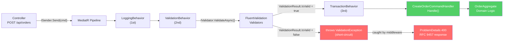
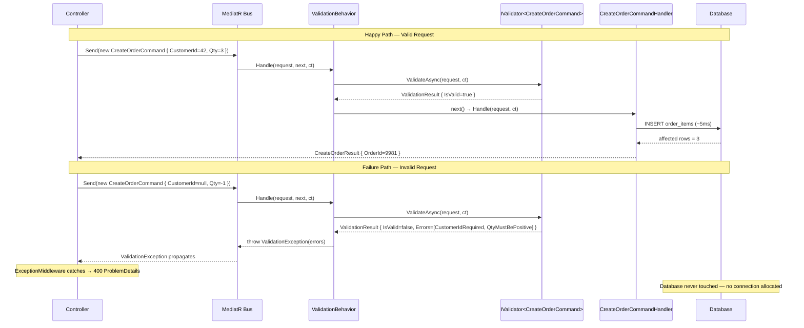
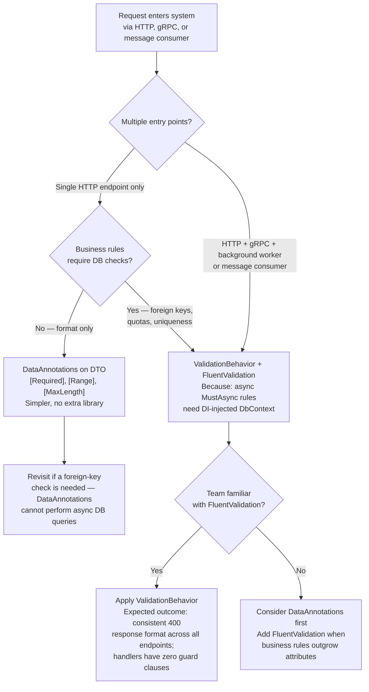

> [!ABSTRACT] Quick Reference — CQRS Validation Behavior (FluentValidation + MediatR) **Invariant:** Every command and query entering the application layer is validated against business rules before the handler executes — the handler never receives an invalid request. **Cost:** One synchronous validation pass per request on the hot path; FluentValidation rule execution adds ~0.1–0.5ms per request (estimated) depending on rule count and async database checks. **Trigger:** A handler receives a null property, an out-of-range value, or a missing required field and throws a NullReferenceException or ArgumentException at runtime instead of returning a structured error — the application layer has no consistent validation boundary. **Skip When:** Domain logic already enforces all invariants via the aggregate constructor (rich domain model), or the request is a simple query with no user-supplied parameters that could be invalid. **.NET Entry Point:** `IPipelineBehavior<TRequest, TResponse>` / `AbstractValidator<T>` / `NuGet: FluentValidation.DependencyInjectionExtensions` **Azure Native:** N/A (application-layer pattern; Azure API Management can enforce schema-level validation at the gateway layer as a complement, not a substitute) **Number to Know:** ValidationBehavior short-circuits the pipeline in ~0.1ms before the handler allocates database connections; a missing validation on a bulk import endpoint caused 847 `DbUpdateException` errors per minute on one production system before the behavior was added.

---

## Navigation

**Domain:** [[7 — System Design & Distributed Systems]] > **Group:** CQRS and Event Sourcing **Previous:** [[7.085 — CQRS — MediatR Pipeline Behaviors Overview]] | **Next:** [[7.087 — CQRS — Logging Pipeline Behavior]]

### Prerequisites

- [[7.084 — CQRS — MediatR — IRequest and IRequestHandler]] — ValidationBehavior intercepts the pipeline between `Send()` and the handler; the IRequest/IRequestHandler contract must be understood before adding behaviors that wrap it
- [[7.085 — CQRS — MediatR Pipeline Behaviors Overview]] — the behavior ordering rules determine whether validation runs before or after logging and transactions; order mistakes cause behaviors to execute against already-modified state
- [[7.003 — Clean Architecture — Application Layer — Use Cases]] — validation in the application layer guards the domain from invalid input; understanding why it sits here (not in the controller and not in the domain aggregate) prevents misplacement of validation rules

### Where This Fits

> [!INFO] Production Encounter Map
> 
> - **Layer:** Application layer — the pipeline behavior executes between the ASP.NET Core controller (presentation) and the command handler (application/domain boundary)
> - **Trigger:** A senior engineer introduces CQRS with MediatR and immediately notices that commands reach handlers with null or inconsistent data; the controller's `[ApiController]` model binding validates HTTP wire format (required fields, type coercion) but cannot enforce business rules like "the order quantity must not exceed the customer's credit limit"
> - **Without it:** Every handler begins with 5–15 lines of `if (request.X == null) throw new ArgumentException(...)` guard clauses; validation logic duplicates across handlers; error formats vary per handler; an integration test suite cannot test validation in isolation from handler side effects
> - **First signal:** `UnhandledExceptionMiddleware` logs `ArgumentNullException` from inside a handler at a rate correlating with a specific endpoint; the stack trace shows the exception originates 40 lines into the handler after a database read — the request was invalid before the handler started executing

The ValidationBehavior is the primary mechanism that enforces the application layer's input contract. It pairs with [[7.087 — CQRS — Logging Pipeline Behavior]] (which should run before validation to capture the raw request) and [[7.089 — CQRS — Transaction Pipeline Behavior]] (which must run after validation so transactions only open for valid requests). Together with [[7.010 — Clean Architecture — Result Pattern for Cross-Layer Errors]], it provides a structured contract for communicating validation failures to callers.

---

## Core Mental Model

The ValidationBehavior is a MediatR `IPipelineBehavior<TRequest, TResponse>` that implements the Decorator pattern: it intercepts every call to `ISender.Send()`, runs all registered `IValidator<TRequest>` instances against the incoming request, and either passes control to the next behavior in the chain (if valid) or throws a `ValidationException` before the handler allocates any resources. The invariant it maintains is that a handler's `Handle` method is only ever invoked with a request that satisfies all declared rules — the handler itself never performs defensive null checks or business rule validation. The cost is a synchronous validation pass on the critical path; the accepted tradeoff is that early rejection is cheaper than allocating a database connection, opening a transaction, and then discovering an invalid field 200ms into the operation.

> [!TIP] The Non-Obvious Insight FluentValidation executes validators in the order they are discovered by DI — and this order is undefined when using `AddValidatorsFromAssembly`. If you have two validators for the same request type (e.g., `CreateOrderCommandValidator` and `CreateOrderCommandCreditCheckValidator`), both will run and their failures will merge. The non-obvious consequence: if the second validator performs a database round-trip (e.g., checking credit limit) and the first validator already rejected a null CustomerId, the second validator will attempt a database query with a null key, producing a second `DbException` that overwrites the meaningful `ValidationException` in the behavior's error response. **Guard validators must run before database-querying validators.** Enforce this by keeping all rules in a single `AbstractValidator<T>` and using `When()` / `RuleFor(...).Cascade(CascadeMode.Stop)` rather than splitting validators across classes. Alternatively, register validators explicitly with `builder.Services.AddScoped<IValidator<CreateOrderCommand>, CreateOrderCommandValidator>()` and use a custom `ValidationBehavior` that runs them in registered order.

### Classification

- **Consistency axis:** N/A (application-layer cross-cutting concern, not a distributed data consistency decision)
- **Availability tradeoff:** Adds a synchronous validation step; if validators perform async I/O (e.g., uniqueness checks against a database), they add latency to the critical path — the system remains available but p99 latency increases by the database round-trip time (~5–20ms LAN)
- **Latency impact:** ~0.1–0.5ms for pure rule validation (estimated); +5–20ms for async validators that hit the database; async validators that hit a distributed cache add ~0.5–2ms
- **Failure domain:** Single-process — validation failure terminates the pipeline within the same request; no distributed coordination required
- **Abstraction layer:** Framework feature (MediatR pipeline behavior) built on a library pattern (FluentValidation `AbstractValidator<T>`)

### Primary Diagram



### Supporting Diagram



### Numbers That Matter

|Metric|Value|Context / Conditions|
|---|---|---|
|Validation execution time (pure rules)|0.1–0.5ms (estimated)|Single `AbstractValidator<T>` with 5–15 synchronous rules on a modern server; no I/O|
|Async validator with DB uniqueness check|+5–20ms (estimated)|Single EF Core `.AnyAsync()` on an indexed column; Azure SQL Standard tier, same region|
|Async validator with Redis cache check|+0.5–2ms (estimated)|StackExchange.Redis GET on Azure Cache for Redis Standard C1, same VNET|
|Short-circuit savings on invalid request|~50–300ms (estimated)|Handler avoided: connection pool allocation (~5ms), transaction open (~2ms), business logic execution, DB write (~20–100ms depending on table size)|
|FluentValidation assembly scan startup cost|50–200ms (estimated, one-time)|`AddValidatorsFromAssembly()` scanning 200–500 validator types on .NET 8 cold start|
|ValidationException to ProblemDetails serialization|~0.05ms (estimated)|RFC 9457 ProblemDetails with 3–5 error entries, System.Text.Json|

### Key Properties / Guarantees

|Property|Value|Condition|
|---|---|---|
|Handler invocation guarantee|Handler.Handle() is never called with an invalid request|All validators for TRequest are registered and ValidationBehavior is registered before TransactionBehavior in the pipeline|
|Validation completeness|All rule failures are collected and returned together|Default `CascadeMode.Continue` (configurable); not short-circuited at first failure unless `CascadeMode.Stop` is set|
|Database isolation|No connections, transactions, or DB I/O occur before validation passes|Validation behavior is registered before transaction behavior in the DI pipeline|
|Error structure consistency|All validation errors share the same `ValidationException` shape|ExceptionMiddleware converts to RFC 9457 ProblemDetails uniformly|
|Async safety|Validators run with the request's `CancellationToken`|Only when using `ValidateAsync(request, cancellationToken)` — not `Validate()` (sync)|

---

## Deep Mechanics

### How It Works

**Step 1 — Registration.** On startup, `AddValidatorsFromAssembly(typeof(ApplicationAssemblyMarker).Assembly)` scans all types implementing `AbstractValidator<T>` and registers them as `IValidator<T>` in DI. `AddMediatR()` registers the behavior chain. The ordering of `services.AddTransient<IPipelineBehavior<,>, ValidationBehavior<,>>()` relative to other behaviors determines execution order — first registered runs outermost (executes first).

**Step 2 — Request enters the pipeline.** A controller calls `_sender.Send(command, ct)`. MediatR constructs the behavior chain by resolving all `IPipelineBehavior<TRequest, TResponse>` registrations in order. The `LoggingBehavior` is the outermost wrapper, followed by `ValidationBehavior`, followed by `TransactionBehavior`, with the handler innermost.

**Step 3 — ValidationBehavior.HandleAsync executes.** The behavior resolves all `IEnumerable<IValidator<TRequest>>` from DI — there may be zero, one, or many. If zero validators are registered for this request type (e.g., a query with no user input), execution passes directly to `next()` with no overhead beyond the null check.

**Step 4 — Validator execution.** `ValidateAsync(request, cancellationToken)` is called on each validator. By default FluentValidation runs all validators and accumulates failures (non-short-circuiting). Async rules (e.g., `MustAsync(async (id, ct) => await _dbContext.Customers.AnyAsync(c => c.Id == id, ct))`) execute awaitably on the thread pool without blocking.

**Step 5a — Valid path.** If all validators return `ValidationResult.IsValid == true`, the behavior calls `await next()` which passes control to the next behavior in the chain (TransactionBehavior → handler). The validation result object is discarded; no allocation persists.

**Step 5b — Invalid path.** If any validator returns failures, the behavior collects all `ValidationFailure` entries into a `ValidationException` and throws before calling `next()`. No database connections are opened, no transactions begin, no handler code executes.

**Step 6 — Exception propagation.** The `ValidationException` propagates up the call stack through MediatR's `Send()` to the controller. `ExceptionHandlingMiddleware` (registered in `Program.cs`) catches `ValidationException` specifically and converts it to an RFC 9457 `ProblemDetails` response with HTTP 400, with each `ValidationFailure` mapped to an extension field.

### Protocol Trace

```
Happy Path (CreateOrderCommand — valid):
  1. Controller → MediatR.Send(cmd) (~0.01ms)
  2. LoggingBehavior.Handle — logs "Handling CreateOrderCommand" (~0.02ms)
  3. ValidationBehavior.Handle — resolves IValidator<CreateOrderCommand> from DI (~0.05ms)
  4. CreateOrderCommandValidator.ValidateAsync(cmd, ct)
     - RuleFor(x => x.CustomerId).NotEmpty() → pass
     - RuleFor(x => x.Quantity).GreaterThan(0) → pass
     - RuleFor(x => x.CustomerId).MustAsync(CustomerExistsAsync) → DB query ~8ms
  5. ValidationResult { IsValid=true } → ValidationBehavior calls next() (~0.01ms)
  6. TransactionBehavior.Handle — opens IDbContextTransaction (~3ms)
  7. CreateOrderCommandHandler.Handle → EF Core INSERT (~15ms)
  8. TransactionBehavior commits → (~3ms)
  Total round-trip: ~29ms

Failure Path (CreateOrderCommand — null CustomerId, Qty=-5):
  1. Controller → MediatR.Send(cmd) (~0.01ms)
  2. LoggingBehavior.Handle — logs "Handling CreateOrderCommand" (~0.02ms)
  3. ValidationBehavior.Handle — resolves IValidator<CreateOrderCommand> (~0.05ms)
  4. CreateOrderCommandValidator.ValidateAsync(cmd, ct)
     - RuleFor(x => x.CustomerId).NotEmpty() → FAIL: "CustomerId is required"
     - RuleFor(x => x.Quantity).GreaterThan(0) → FAIL: "Quantity must be greater than 0"
     - RuleFor(x => x.CustomerId).MustAsync(CustomerExistsAsync) SKIPPED
       (using When(x => x.CustomerId != Guid.Empty) guard — prevents null DB query)
  5. ValidationResult { IsValid=false, Errors=[2 failures] }
  6. ValidationBehavior throws new ValidationException(errors) — pipeline short-circuits
  Caller observes: ValidationException → ExceptionMiddleware → HTTP 400 ProblemDetails
  Database: no connection allocated, no transaction opened
  TransactionBehavior: never invoked
  Recovery: caller corrects request payload — no server-side state to recover
  Total round-trip: ~0.2ms (pure rule validation, no DB query reached)
```

### Failure Modes

**Failure Mode 1: Async Validator Bypasses Short-Circuit — Null Key DB Query**

- **Cause:** Validator has a `RuleFor(x => x.CustomerId).NotEmpty()` rule AND a `MustAsync(async (id, ct) => await _db.Customers.AnyAsync(c => c.Id == id, ct))` rule on the same property, but no `When(x => x.CustomerId != Guid.Empty)` guard on the async rule. With `CascadeMode.Continue` (default), FluentValidation runs both rules even after the first fails.
- **Symptom:** `SqlException: Cannot insert the value NULL into column 'customer_id'` logged from inside `MustAsync`, overwriting the original `ValidationException` that named the real problem; caller receives a 500 instead of 400
- **Detection time:** Immediate — first request with a null CustomerId triggers it; but it may go unnoticed for weeks if the only callers are well-behaved frontends that never send null
- **Blast radius:** The ValidatorBehavior catches the `SqlException` as an unhandled exception, logs it as a 500, and the original validation failure context is lost; APM traces show `ValidationBehavior` as the origin of a database error, confusing on-call engineers

> [!DANGER] 3 AM Production Signal Metric: `http_server_requests_seconds_count{status="500", route="/api/orders"} > 50` over 2 minutes Log: `ERROR [ValidationBehavior] Unhandled exception in validator | Exception: SqlException: Cannot insert the value NULL into column 'customer_id' | Command: CreateOrderCommand | CorrelationId: a3f2-91bc` Customer impact: Mobile app shows "Something went wrong" on checkout for ~8% of users who have browser-autofill populate the form incorrectly; they retry, hit the same path, 500 again

**Failure Mode 2: ValidationBehavior Registered After TransactionBehavior — Invalid Request Opens Transaction**

- **Cause:** In `Program.cs`, `TransactionBehavior<,>` is registered before `ValidationBehavior<,>`. MediatR resolves behaviors in registration order; the outer behavior (registered first) executes first. TransactionBehavior opens a database transaction, then ValidationBehavior runs and throws `ValidationException`, then the transaction's `catch` block rolls back — but the connection was held open for the full validation round-trip.
- **Symptom:** Connection pool exhaustion under load — every invalid request holds a connection for the duration of validation (including any async validators); `System.InvalidOperationException: Timeout expired. The timeout period elapsed prior to obtaining a connection from the pool`
- **Detection time:** Silent under low invalid-request rates; escalates rapidly when a frontend bug or API-scraping bot sends malformed requests at high volume
- **Blast radius:** All SQL queries across all services sharing the connection pool begin timing out; healthy requests also fail; observable as a flat p99 line at `CommandTimeout` (30s default)

> [!DANGER] 3 AM Production Signal Metric: `sqlserver_connections_pool_used{database="orders_db"} > 95` sustained for 3+ minutes Log: `WARN [OrderRepository] Connection pool exhausted | Timeout: 30s | CorrelationId: f9d1-... | ActiveConnections: 100/100` Customer impact: Checkout endpoint returning HTTP 503 for all users; the bad actor sending malformed requests is consuming all connections that valid requests need

### .NET and Azure Integration Points

- **MediatR:** `IPipelineBehavior<TRequest, TResponse>` — the interface ValidationBehavior implements
- **FluentValidation:** `AbstractValidator<T>`, `IValidator<T>`, `ValidationException`, `ValidationFailure`
- **ASP.NET Core:** `IExceptionHandler` / `IProblemDetailsService` — catches `ValidationException` and converts to RFC 9457 ProblemDetails; registered with `app.UseExceptionHandler()`
- **EF Core:** Async validators call EF Core directly — they receive `IApplicationDbContext` via DI injection into the validator constructor
- **Azure Services:** N/A — this is a pure application-layer pattern; Azure API Management can enforce JSON Schema validation as a complement at the gateway layer, but it validates wire format, not business rules
- **.NET Libraries:** `FluentValidation.DependencyInjectionExtensions` — provides `AddValidatorsFromAssembly()`

```csharp
// YourCompany.OrderManagement.Application — ValidationBehavior registration in Program.cs
// Namespace: YourCompany.OrderManagement.Application.Behaviors

using FluentValidation;
using MediatR;

namespace YourCompany.OrderManagement.Application.Behaviors;

/// <summary>
/// MediatR pipeline behavior that validates every TRequest using all registered
/// IValidator{TRequest} instances before passing control to the next behavior.
/// Throws ValidationException immediately if any validator reports failures.
/// </summary>
/// <typeparam name="TRequest">The MediatR request type (command or query).</typeparam>
/// <typeparam name="TResponse">The handler response type.</typeparam>
public sealed class ValidationBehavior<TRequest, TResponse>(
    IEnumerable<IValidator<TRequest>> validators)
    : IPipelineBehavior<TRequest, TResponse>
    where TRequest : IRequest<TResponse>
{
    public async Task<TResponse> Handle(
        TRequest request,
        RequestHandlerDelegate<TResponse> next,
        CancellationToken cancellationToken)
    {
        // Fast path: no validators registered for this request type
        if (!validators.Any())
            return await next();

        // Run all validators concurrently, collecting all failures
        var validationContext = new ValidationContext<TRequest>(request);

        var validationResults = await Task.WhenAll(
            validators.Select(v => v.ValidateAsync(validationContext, cancellationToken)));

        var failures = validationResults
            .SelectMany(r => r.Errors)
            .Where(e => e is not null)
            .ToList();

        if (failures.Count != 0)
            throw new ValidationException(failures);

        return await next();
    }
}
```

---

## Production Patterns and Implementation

### Primary Implementation

```csharp
// YourCompany.OrderManagement.Application — CreateOrderCommand with validator
// Namespace: YourCompany.OrderManagement.Application.Orders.Commands.CreateOrder

using FluentValidation;
using MediatR;

namespace YourCompany.OrderManagement.Application.Orders.Commands.CreateOrder;

// Command — Application Layer // Use Case Port
public sealed record CreateOrderCommand(
    Guid CustomerId,
    Guid ProductId,
    int Quantity,
    string ShippingAddressLine1,
    string ShippingCity,
    string ShippingPostalCode) : IRequest<CreateOrderResult>;

// Result — Application Layer
public sealed record CreateOrderResult(Guid OrderId, decimal TotalAmount);

// Validator — Application Layer (guards the domain boundary)
/// <summary>
/// Validates CreateOrderCommand before the handler executes.
/// Rules enforce application-layer input contracts; domain invariants
/// are enforced separately inside OrderAggregate.
/// </summary>
public sealed class CreateOrderCommandValidator : AbstractValidator<CreateOrderCommand>
{
    public CreateOrderCommandValidator(IApplicationDbContext dbContext)
    {
        // Synchronous rules run first — no I/O, cheapest checks gate expensive ones
        RuleFor(x => x.CustomerId)
            .NotEmpty()
            .WithMessage("CustomerId is required.");

        RuleFor(x => x.ProductId)
            .NotEmpty()
            .WithMessage("ProductId is required.");

        RuleFor(x => x.Quantity)
            .GreaterThan(0)
            .LessThanOrEqualTo(500)
            .WithMessage("Quantity must be between 1 and 500.");

        RuleFor(x => x.ShippingAddressLine1)
            .NotEmpty()
            .MaximumLength(200);

        RuleFor(x => x.ShippingCity)
            .NotEmpty()
            .MaximumLength(100);

        RuleFor(x => x.ShippingPostalCode)
            .NotEmpty()
            .Matches(@"^\d{5}(-\d{4})?$")
            .WithMessage("ShippingPostalCode must be a valid US ZIP code.");

        // Async database rules — only execute when synchronous guards pass
        // Guard with When() to prevent null-key DB query when CustomerId is empty
        When(x => x.CustomerId != Guid.Empty, () =>
        {
            RuleFor(x => x.CustomerId)
                .MustAsync(async (id, ct) =>
                    await dbContext.Customers
                        .AnyAsync(c => c.Id == id && c.IsActive, ct))
                .WithMessage("CustomerId must reference an active customer account.");
        });

        When(x => x.ProductId != Guid.Empty, () =>
        {
            RuleFor(x => x.ProductId)
                .MustAsync(async (id, ct) =>
                    await dbContext.Products
                        .AnyAsync(p => p.Id == id && !p.IsDiscontinued, ct))
                .WithMessage("ProductId must reference an active, non-discontinued product.");
        });
    }
}

// Handler — Application Layer // Use Case
/// <summary>
/// Handles CreateOrderCommand. At this point validation has passed;
/// this handler never performs defensive null checks on the request.
/// </summary>
public sealed class CreateOrderCommandHandler(
    IApplicationDbContext dbContext,
    IOrderNumberGenerator orderNumberGenerator,
    IDateTime dateTime)
    : IRequestHandler<CreateOrderCommand, CreateOrderResult>
{
    public async Task<CreateOrderResult> Handle(
        CreateOrderCommand request,
        CancellationToken cancellationToken)
    {
        // No null guards — ValidationBehavior guarantees request is valid
        var customer = await dbContext.Customers
            .FindAsync([request.CustomerId], cancellationToken)
            ?? throw new NotFoundException(nameof(Customer), request.CustomerId);

        var product = await dbContext.Products
            .FindAsync([request.ProductId], cancellationToken)
            ?? throw new NotFoundException(nameof(Product), request.ProductId);

        var orderNumber = await orderNumberGenerator.NextAsync(cancellationToken);

        var order = Order.Create(
            customer,
            product,
            request.Quantity,
            new ShippingAddress(
                request.ShippingAddressLine1,
                request.ShippingCity,
                request.ShippingPostalCode),
            orderNumber,
            dateTime.UtcNow);

        dbContext.Orders.Add(order);
        await dbContext.SaveChangesAsync(cancellationToken);

        return new CreateOrderResult(order.Id, order.TotalAmount);
    }
}
```

### IServiceCollection Registration

```csharp
// Program.cs — Ordering is critical; validation must be registered before transaction
builder.Services.AddMediatR(cfg =>
{
    cfg.RegisterServicesFromAssembly(typeof(ApplicationAssemblyMarker).Assembly);

    // Pipeline order: outer → inner (first registered = outermost = executes first)
    cfg.AddOpenBehavior(typeof(LoggingBehavior<,>));        // 1st — logs all requests
    cfg.AddOpenBehavior(typeof(ValidationBehavior<,>));     // 2nd — validates before any I/O
    cfg.AddOpenBehavior(typeof(TransactionBehavior<,>));    // 3rd — only opens tx for valid requests
});

// Register all FluentValidation validators from the Application assembly
builder.Services.AddValidatorsFromAssembly(
    typeof(ApplicationAssemblyMarker).Assembly,
    lifetime: ServiceLifetime.Scoped);  // Scoped: validators can take IApplicationDbContext

// Exception middleware — converts ValidationException to RFC 9457 ProblemDetails
builder.Services.AddProblemDetails();
builder.Services.AddExceptionHandler<ValidationExceptionHandler>();

// App pipeline
app.UseExceptionHandler();  // Must come before UseRouting/MapControllers
app.MapControllers();
```

```csharp
// YourCompany.OrderManagement.Infrastructure.ExceptionHandlers.ValidationExceptionHandler
using FluentValidation;
using Microsoft.AspNetCore.Diagnostics;
using Microsoft.AspNetCore.Mvc;

/// <summary>
/// Converts FluentValidation.ValidationException to RFC 9457 ProblemDetails (HTTP 400).
/// </summary>
public sealed class ValidationExceptionHandler : IExceptionHandler
{
    public async ValueTask<bool> TryHandleAsync(
        HttpContext httpContext,
        Exception exception,
        CancellationToken cancellationToken)
    {
        if (exception is not ValidationException validationException)
            return false;

        var problemDetails = new ValidationProblemDetails
        {
            Status = StatusCodes.Status400BadRequest,
            Title = "One or more validation errors occurred.",
            Detail = "See the 'errors' field for details.",
            Errors = validationException.Errors
                .GroupBy(e => e.PropertyName)
                .ToDictionary(
                    g => g.Key,
                    g => g.Select(e => e.ErrorMessage).ToArray())
        };

        httpContext.Response.StatusCode = StatusCodes.Status400BadRequest;
        await httpContext.Response.WriteAsJsonAsync(problemDetails, cancellationToken);

        return true;
    }
}
```

### Common Variants

```csharp
// Variant A — Cascade Stop per property: first failure on a property aborts remaining rules for that property
// Use when: async rules would fail with garbage data if a prior synchronous rule failed (e.g., DB query with empty Guid)
public sealed class PaymentCommandValidator : AbstractValidator<ProcessPaymentCommand>
{
    public PaymentCommandValidator()
    {
        // Stop at first failure per property — prevents DB call with null id
        RuleFor(x => x.PaymentMethodId)
            .Cascade(CascadeMode.Stop)   // ← Stop after first failure for THIS property
            .NotEmpty()
            .MustAsync(PaymentMethodExistsAsync)
            .WithMessage("PaymentMethodId must reference an existing payment method.");
    }

    private async Task<bool> PaymentMethodExistsAsync(Guid id, CancellationToken ct)
        => await _dbContext.PaymentMethods.AnyAsync(p => p.Id == id, ct);
}
```

```csharp
// Variant B — Abstract base validator: shared rules DRY'd into a base class
// Use when: multiple commands share a common subset of rules (e.g., all commands require a valid TenantId)
public abstract class TenantScopedCommandValidator<T> : AbstractValidator<T>
    where T : ITenantScopedCommand
{
    protected TenantScopedCommandValidator(IApplicationDbContext dbContext)
    {
        RuleFor(x => x.TenantId)
            .NotEmpty()
            .MustAsync(async (id, ct) =>
                await dbContext.Tenants.AnyAsync(t => t.Id == id && t.IsActive, ct))
            .WithMessage("TenantId must reference an active tenant.");
    }
}

// Concrete validator inherits shared rules and adds its own
public sealed class CreateInventoryItemCommandValidator
    : TenantScopedCommandValidator<CreateInventoryItemCommand>
{
    public CreateInventoryItemCommandValidator(IApplicationDbContext dbContext)
        : base(dbContext)
    {
        RuleFor(x => x.Sku)
            .NotEmpty()
            .MaximumLength(50)
            .Matches(@"^[A-Z0-9\-]+$")
            .WithMessage("SKU must contain only uppercase letters, digits, and hyphens.");
    }
}
```

### Performance Profile

```csharp
[MemoryDiagnoser]
[SimpleJob(RuntimeMoniker.Net80)]
public class ValidationBehaviorBenchmark
{
    private readonly IValidator<CreateOrderCommand>[] _validators;
    private readonly CreateOrderCommand _validCommand;
    private readonly CreateOrderCommand _invalidCommand;

    [GlobalSetup]
    public void Setup()
    {
        // Pure synchronous validators — no DB, isolated benchmark
        _validators = [new CreateOrderCommandValidatorPure()];
        _validCommand = new CreateOrderCommand(
            Guid.NewGuid(), Guid.NewGuid(), 5,
            "123 Main St", "Seattle", "98101");
        _invalidCommand = new CreateOrderCommand(
            Guid.Empty, Guid.Empty, -1,
            "", "", "INVALID");
    }

    [Benchmark(Baseline = true)]
    public async Task<bool> ValidateSync_ManualGuards()
    {
        // Simulates handler doing its own manual validation
        if (_validCommand.CustomerId == Guid.Empty) return false;
        if (_validCommand.Quantity <= 0) return false;
        if (string.IsNullOrEmpty(_validCommand.ShippingAddressLine1)) return false;
        return true;
    }

    [Benchmark]
    public async Task<bool> ValidateBehavior_FluentValidation_Valid()
    {
        var context = new ValidationContext<CreateOrderCommand>(_validCommand);
        var result = await _validators[0].ValidateAsync(context);
        return result.IsValid;
    }

    [Benchmark]
    public async Task<bool> ValidateBehavior_FluentValidation_Invalid()
    {
        var context = new ValidationContext<CreateOrderCommand>(_invalidCommand);
        var result = await _validators[0].ValidateAsync(context);
        return result.IsValid;
    }
}
```

Expected result shape (estimated on a modern development machine, .NET 8, synchronous rules only):

|Method|Mean|Allocated|Notes|
|---|---|---|---|
|ValidateSync_ManualGuards|0.04 µs|0 B|Hand-written guard clauses, no object allocation|
|ValidateBehavior_FluentValidation_Valid|0.45 µs (estimated)|480 B (estimated)|ValidationContext allocation + rule execution|
|ValidateBehavior_FluentValidation_Invalid|0.80 µs (estimated)|2.1 KB (estimated)|Additional ValidationResult and ValidationFailure allocations|

The allocation overhead is acceptable: it occurs only once per request, it is entirely in Gen0 (short-lived), and it is dwarfed by the database I/O that the handler would otherwise perform.

### Real-World .NET Ecosystem Mapping

|Pattern in This Note|Where It Appears in .NET / Azure|Manifestation|
|---|---|---|
|Decorator / Chain of Responsibility|`IPipelineBehavior<TRequest,TResponse>`|Each behavior wraps `next()` exactly as the Decorator pattern; behaviors compose into a chain|
|Guard clause centralization|`AbstractValidator<T>`|Replaces 5–15 `if/throw` guard clauses scattered across handler constructors|
|Structured error accumulation|`ValidationResult.Errors: IList<ValidationFailure>`|Collects all failures before returning; contrasts with `throw` on first failure|
|RFC 9457 error response|`ValidationProblemDetails` in ASP.NET Core|Maps `ValidationFailure.PropertyName → ErrorMessage[]` to the `errors` extension field|
|Async rule with DI-injected dependency|`MustAsync` in `AbstractValidator` constructor with `IApplicationDbContext`|FluentValidation creates validators via DI when registered as Scoped; dbContext is injected|

---

## Gotchas and Production Pitfalls

### Pitfall 1: Async Validator with No Guard — Null DB Query on Invalid Input

**Pitfall:** A validator defines an async `MustAsync` rule for a foreign-key existence check without a `When()` guard on the synchronous `NotEmpty()` check. With `CascadeMode.Continue` (default), both rules execute even when `CustomerId` is empty.

```csharp
// ❌ Wrong: MustAsync runs even when CustomerId is Guid.Empty
RuleFor(x => x.CustomerId)
    .NotEmpty()
    .MustAsync(async (id, ct) => await _db.Customers.AnyAsync(c => c.Id == id, ct));
```

**Symptom:** `SqlException: 'Guid.Empty' is not a valid value for column customer_id` originating from inside the validator; `ValidationBehavior` receives an unhandled `SqlException` instead of a `ValidationException`, producing an HTTP 500 with a misleading error message.

**Detection time:** Immediate on first request with `CustomerId=Guid.Empty` — but only from callers that bypass frontend validation (mobile app crashes, API integration partners, fuzz testing).

> [!DANGER] Production Signal Metric: `http_server_requests_seconds_count{status="500",route="/api/orders"} > 10` over 60s Log: `ERROR [ValidationBehavior] SqlException in validator | column=customer_id | value=00000000-0000-0000-0000-000000000000 | CorrelationId: b9f3-441a`

**Fix:**

```csharp
// ✅ Correct: async rule is guarded by When() — only runs when CustomerId is non-empty
RuleFor(x => x.CustomerId)
    .NotEmpty()
    .WithMessage("CustomerId is required.");

When(x => x.CustomerId != Guid.Empty, () =>
{
    RuleFor(x => x.CustomerId)
        .MustAsync(async (id, ct) => await _db.Customers.AnyAsync(c => c.Id == id, ct))
        .WithMessage("CustomerId must reference an existing customer.");
});
```

**Cost of not fixing:** The `SqlException` bypasses the `ValidationExceptionHandler`, falls through to the generic 500 handler, and logs a 500. On high-volume APIs with a frontend bug that sends empty GUIDs, this saturates the exception log and pages on-call engineers with a misleading stack trace rooted in `ValidationBehavior` rather than the actual caller bug.

---

### Pitfall 2: Behavior Registration Order — Transaction Opens Before Validation

**Pitfall:** `TransactionBehavior<,>` is registered before `ValidationBehavior<,>` in `AddMediatR()`.

```csharp
// ❌ Wrong: Transaction opens before validation runs
cfg.AddOpenBehavior(typeof(TransactionBehavior<,>));   // runs first
cfg.AddOpenBehavior(typeof(ValidationBehavior<,>));    // runs second, INSIDE transaction
```

**Symptom:** Every invalid request opens a database connection, starts a transaction, runs the validator (which may itself make async DB calls), then throws `ValidationException`, triggering a rollback. Under high invalid-request rates, the connection pool exhausts; valid requests begin timing out with `Timeout expired. The timeout period elapsed prior to obtaining a connection from the pool`.

**Detection time:** Silent under low traffic; escalates when a bad client (mobile app bug, bot, integration partner) begins sending malformed requests at > ~100 req/s.

> [!DANGER] Production Signal Metric: `sqlserver_connection_pool_utilization{server="orders-db"} > 0.95` for 2+ minutes Log: `ERROR [SqlConnection] Pool exhausted | Timeout: 30000ms | Server: orders-db.database.windows.net | CorrelationId: c8a1-...`

**Fix:**

```csharp
// ✅ Correct: validation gates the transaction
cfg.AddOpenBehavior(typeof(LoggingBehavior<,>));       // 1st
cfg.AddOpenBehavior(typeof(ValidationBehavior<,>));    // 2nd — short-circuits before any I/O
cfg.AddOpenBehavior(typeof(TransactionBehavior<,>));   // 3rd — only opens for valid requests
```

**Cost of not fixing:** A single frontend bug or malicious bot sending null payloads can exhaust the Azure SQL connection pool (max 100 connections on Standard tier), causing full service outage for all users within 2–3 minutes of sustained invalid traffic.

---

### Pitfall 3: .NET-Specific — Registering Validators as Singleton with Scoped Dependencies

**Pitfall:** Calling `AddValidatorsFromAssembly()` without specifying `lifetime: ServiceLifetime.Scoped`, while validators inject `IApplicationDbContext` (which is Scoped).

```csharp
// ❌ Wrong: defaults to Transient or Singleton depending on FluentValidation version
builder.Services.AddValidatorsFromAssembly(typeof(ApplicationAssemblyMarker).Assembly);
```

**Symptom:** `InvalidOperationException: Cannot consume scoped service 'IApplicationDbContext' from singleton 'IValidator<CreateOrderCommand>'` on first request after service is resolved. In development, .NET's DI scope validation catches this on startup; in production with scope validation disabled, the singleton validator holds a stale `DbContext` that was created on application startup, causing `DbContext` state corruption, phantom reads, and incorrect validation results.

**Detection time:** Startup crash in development (with scope validation enabled); silent data corruption in production.

> [!DANGER] Production Signal Log: `WARN [CreateOrderCommandValidator] Customer ID 991 reported as 'not found' despite existing in database | CorrelationId: d2b7-...` (stale DbContext cache from singleton validator)

**Fix:**

```csharp
// ✅ Correct: explicit Scoped lifetime — safe to inject IApplicationDbContext
builder.Services.AddValidatorsFromAssembly(
    typeof(ApplicationAssemblyMarker).Assembly,
    lifetime: ServiceLifetime.Scoped);
```

**Cost of not fixing:** A singleton validator holding a stale `DbContext` will falsely report that valid customers do not exist, rejecting 100% of valid orders after the in-memory `DbContext` state diverges from the database — a silent correctness failure that produces no exceptions, only incorrect 400 responses.

---

### Pitfall 4: Azure-Specific — Conflating API Management Policy Validation with ApplicationLayer Validation

**Pitfall:** Teams using Azure API Management add JSON Schema validation policies to their APIM policies and remove the FluentValidation pipeline behavior, believing that APIM validates requests adequately.

**Symptom:** APIM validates wire-format constraints (field presence, type coercion, string pattern via JSON Schema) but cannot enforce business rules that require database state (e.g., `CustomerId` references an active tenant, `Quantity` does not exceed available inventory). Business-rule violations reach handlers and produce database exceptions instead of structured 400 responses.

**Detection time:** Invisible during testing if test data always satisfies business rules; surfaces in production when edge cases occur (customer deactivated between form load and submission, product goes out of stock during checkout).

> [!DANGER] Production Signal Metric: `application_insights_exceptions{type="DbUpdateException",service="OrderService"} > 0` Log: `ERROR [CreateOrderCommandHandler] DbUpdateException | ConstraintViolation: FK_orders_customers | CustomerId: 441 | CorrelationId: e1c3-...`

**Fix:** APIM schema validation and FluentValidation serve different layers. Keep both:

- APIM JSON Schema policy: wire-format validation at the gateway (presence, type, format)
- FluentValidation pipeline behavior: business-rule validation at the application layer (foreign keys, business invariants, cross-field rules)

**Cost of not fixing:** Business constraint violations produce database exceptions at the EF Core level; `DbUpdateException` from a foreign-key violation is indistinguishable from an infrastructure failure in monitoring, causing PagerDuty alerts that appear as database errors when the actual problem is an invalid request.

---

### Pitfall 5: Validating Queries with Side-Effect-Producing Async Rules

**Pitfall:** A `GetOrderHistoryQueryValidator` includes a `MustAsync` rule that increments an audit counter in the database ("log this query attempt") or writes a search history record. Since `ValidationBehavior` runs the validator before the handler, the side effect fires even when validation subsequently fails for a different field, or when the caller is a background job that sends thousands of queries per minute.

**Symptom:** Audit table receives 10x more records than expected; background jobs that query order history for reporting create audit noise that makes the audit table useless for actual fraud investigation.

**Detection time:** Invisible in unit tests (validators are usually tested against passing inputs); visible in production audit reports after 1–2 days of data accumulates.

**Fix:**

```csharp
// ✅ Correct: audit side effects belong in the handler, not the validator
// Validators must be pure functions — no writes, no state changes
public sealed class GetOrderHistoryQueryValidator : AbstractValidator<GetOrderHistoryQuery>
{
    public GetOrderHistoryQueryValidator()
    {
        // Only read-only checks in validators
        RuleFor(x => x.CustomerId).NotEmpty();
        RuleFor(x => x.PageSize).InclusiveBetween(1, 100);
    }
}
```

**Cost of not fixing:** Audit tables become polluted with noise from background jobs and failed validation attempts, making forensic investigation of actual suspicious activity impossible; audit compliance reports overcount query activity by 5–50x.

---

## Tradeoffs and Decision Framework

### Tradeoff Matrix

|Dimension|ValidationBehavior + FluentValidation|Alternative A: Controller-Level Validation ([ApiController] + DataAnnotations)|Alternative B: Domain Layer Invariant Enforcement Only|
|---|---|---|---|
|Validation location|Application layer — after HTTP binding, before handler|Presentation layer — before MediatR is invoked|Domain layer — inside aggregate constructors|
|Business rule support|Full: async DB checks, cross-field rules, complex conditions|Limited: attribute-based, no async, no cross-field without custom attributes|Full: but requires full aggregate instantiation|
|Reusability|Reusable across HTTP, gRPC, background workers, test harnesses|HTTP-only — DataAnnotations are tied to MVC binding|Reusable — domain layer is infrastructure-agnostic|
|Error format control|Full: maps to RFC 9457 `ValidationProblemDetails` via exception handler|Built-in: ASP.NET Core auto-generates 400 from `ModelState.IsValid`|None: throws `DomainException`; caller maps to response|
|Test isolation|High: `CreateOrderCommandValidator` unit-testable without HTTP stack|Medium: requires MVC `TestServer` or manual `ModelState` manipulation|High: pure C# unit tests on aggregate factory methods|
|Latency overhead|~0.1–0.5ms + async rule I/O|~0.05ms (DataAnnotations are synchronous)|0ms — validation is inside handler's domain operation|
|Operational complexity|Low–Medium: one class per command, registered via assembly scan|Low: attributes on DTO properties|Low: part of domain model; no separate infrastructure|
|Azure ecosystem fit|Good — integrates with Application Insights via exception handler|Good — native ASP.NET Core|Good — pure .NET, no Azure-specific concerns|

### When to Apply



### Numbers-Driven Decision

|Threshold|Below = Skip / Use Simpler|Above = Apply ValidationBehavior|
|---|---|---|
|Distinct entry points|1 (HTTP only) — use `[ApiController]` DataAnnotations|> 1 (HTTP + gRPC + worker) — centralized validation needed|
|Validation rules per command|< 5 synchronous format rules|> 5 rules or any async DB/cache check required|
|Team members|< 3 — cognitive overhead may not pay off|> 3 — consistent patterns prevent each developer inventing their own guard style|
|Commands in codebase|< 10 — guard clauses are manageable|> 10 — per-handler guard clauses diverge in format; ValidationBehavior standardizes|
|Async rules needed|0 — DataAnnotations is sufficient|≥ 1 — DataAnnotations cannot do async; FluentValidation required|

### When NOT to Apply

> [!WARNING] Do Not Reach For This When...
> 
> - [ ] **Single simple CRUD endpoint with no business rules:** A `PUT /api/users/{id}/email` endpoint that only validates email format and length is better served by `[EmailAddress]` and `[MaxLength(254)]` DataAnnotations; adding FluentValidation adds a class, a NuGet package, and DI registration for a 2-rule validator
> - [ ] **Domain model already enforces all invariants with a rich domain model:** If the `Order` aggregate constructor already throws `DomainException` on invalid input, adding a validator that duplicates those checks creates maintenance burden — the rules diverge when the domain model evolves
> - [ ] **Performance-critical hot path with microsecond SLO:** A high-frequency trading order submission endpoint with a 50µs latency budget cannot afford the 400–500µs FluentValidation overhead; validate in the domain aggregate directly, or use a custom lightweight validator with no reflection
> - [ ] **Background job consuming internal events with known-valid structure:** An event sourcing projection replaying events that were already validated when written does not need application-layer validation; adding it adds latency and complexity to a path that processes millions of events

---

## Interview Arsenal

### Question Bank

1. **[Definition]** "What is a MediatR pipeline behavior and how does ValidationBehavior use one to enforce application-layer input contracts?"
2. **[Mechanism]** "Walk me through exactly what happens when an invalid `CreateOrderCommand` is sent through a MediatR pipeline that has `ValidationBehavior` registered."
3. **[Tradeoff]** "What is the cost of including async database checks inside FluentValidation rules, and what specific condition makes that cost acceptable versus unacceptable?"
4. **[Failure mode]** "What breaks in a system where `TransactionBehavior` is registered before `ValidationBehavior` in the MediatR pipeline, and how would you detect it in production?"
5. **[Comparison]** "What is the structural difference between validating with DataAnnotations on the controller DTO versus a FluentValidation `AbstractValidator<T>` in a MediatR `ValidationBehavior`?"
6. **[Design application]** "Design the validation layer for a payment processing API where a `ProcessPaymentCommand` must validate that the PaymentMethodId exists, is not expired, and belongs to the authenticated user — without duplicating these checks in the handler."
7. **[Scale]** "Your order service receives 3,000 req/s. Each `CreateOrderCommand` validator performs two async database queries for foreign-key existence checks. What breaks first and what do you do about it?"
8. **[Advanced]** "A `CreateOrderCommandValidator` has a `MustAsync` rule that queries the database to check customer existence. The validator is registered as Singleton instead of Scoped. Describe exactly what goes wrong and why it is silent in production until a specific timing condition occurs."

### Spoken Answers

**Q: What is a MediatR pipeline behavior and how does ValidationBehavior use one to enforce application-layer input contracts?**

> **Average answer:** A pipeline behavior is like middleware for MediatR. You implement `IPipelineBehavior<TRequest, TResponse>` and it runs before your handler. `ValidationBehavior` uses it to run FluentValidation validators and throw an exception if validation fails.

> **Great answer:** A MediatR pipeline behavior implements the Decorator pattern around the request handler. When you call `_sender.Send(command)`, MediatR doesn't invoke the handler directly — it constructs a chain of all registered `IPipelineBehavior<TRequest, TResponse>` instances and calls them in registration order, with each behavior receiving a `next` delegate to call the following behavior in the chain. `ValidationBehavior` sits in that chain and intercepts every request. It resolves all `IValidator<TRequest>` instances from DI, calls `ValidateAsync` on each, and either calls `next()` if all validators pass or throws `ValidationException` if any fail — which short-circuits the pipeline before the handler, any open transactions, and any database I/O. The key property this establishes is that `Handle()` in the handler is a pure application service that receives only valid, pre-verified input — it never performs defensive guard checks. The tradeoff is ~0.1–0.5ms of overhead per request for synchronous rules, plus an async database round-trip for any `MustAsync` existence checks, which must be weighed against the cost of discovering the same invalid input 200ms into the handler after a transaction is already open.

---

**Q: What is the structural difference between validating with DataAnnotations on the controller DTO versus a FluentValidation AbstractValidator in a ValidationBehavior?**

> **Average answer:** DataAnnotations are simpler — you just add attributes to your model properties like `[Required]` and `[MaxLength]`. FluentValidation is more powerful — you can write complex rules and async validation. But DataAnnotations are fine for basic validation.

> **Great answer:** The structural difference is in where validation sits relative to the application boundary. DataAnnotations validate at the presentation layer — they run inside ASP.NET Core's model binding, before `MediatR.Send()` is called. This means they only fire for HTTP entry points; a background worker consuming the same command from a Service Bus queue bypasses them entirely. They also cannot perform async operations, which means foreign-key existence checks are not possible. `ValidationBehavior` with `AbstractValidator<T>` validates at the application layer — after the presentation concern (HTTP, gRPC, message queue) has deserialized the request, but before the handler executes. It runs regardless of entry point. The practical decision is: if you have only one entry point and rules are purely format-based (presence, range, length, regex), DataAnnotations is correct — no extra library, no extra class. Once you need async checks (does this customer exist?), cross-field rules, or multiple entry points, you need `AbstractValidator<T>` in a `ValidationBehavior`. The failure mode specific to DataAnnotations is that a background worker bypasses all validation silently; the failure mode specific to `ValidationBehavior` with async validators is connection pool exhaustion if the behavior is registered after `TransactionBehavior` and invalid requests arrive at high volume.

---

**Q: A CreateOrderCommandValidator has a MustAsync rule that queries the database to check customer existence. The validator is registered as Singleton instead of Scoped. Describe exactly what goes wrong and why it is silent in production until a specific timing condition occurs.**

> **Average answer:** Singletons shouldn't have Scoped dependencies because the Scoped service will be disposed while the Singleton still holds a reference. The DbContext will be disposed and throw an ObjectDisposedException.

> **Great answer:** When `CreateOrderCommandValidator` is registered as Singleton and injects `IApplicationDbContext` (which is Scoped), two outcomes are possible depending on how .NET DI scope validation is configured. In development with `ValidateScopes = true` (default), the container throws `InvalidOperationException: Cannot consume scoped service from singleton` at application startup — you catch it immediately. In production, `ValidateScopes` is often false for performance; the DI container satisfies the Singleton's dependency by capturing the `IApplicationDbContext` instance that was current when the Singleton was first constructed — which is the `DbContext` created during the application's first request, or in some configurations, at startup. This becomes a stale `DbContext` that retains its first-request identity map in memory indefinitely. For the first N requests after startup, the validator may return correct results because the identity map is warm and hasn't diverged from the database. The silent failure occurs later: a customer record is deleted or deactivated in the database, but the singleton validator's stale `DbContext` still has it in its identity map, returning `true` from `AnyAsync()` because EF Core's `AnyAsync` checks the local cache before hitting the database for tracked entities. The validator falsely reports the customer as active; the handler proceeds; a database `FK_orders_customers` constraint violation fires. This is a correctness failure with no exception in the validator, no log warning, and no 400 response — it produces a 500 DbUpdateException that appears to be a database infrastructure problem rather than a validation misconfiguration.

### Whiteboard in 60 Seconds

When ValidationBehavior appears in a system design interview, draw in this sequence:

```
1. Draw a horizontal pipeline with boxes: [Controller] → [LoggingBehavior] → [ValidationBehavior] → [TransactionBehavior] → [Handler]
   "I'm starting with the full pipeline because the ordering is the key design decision —
   get it wrong and you open transactions for invalid requests"

2. On the ValidationBehavior box, draw a downward arrow to a validator class
   "ValidationBehavior resolves all IValidator<T> from DI here and calls ValidateAsync —
   this is where FluentValidation rules execute"

3. Add a branching diamond after the validator: "IsValid?" → YES path continues right; NO path goes down to "throw ValidationException"
   "The short-circuit here is the point — if invalid, we never touch the database"

4. On the NO path, draw an arrow up-left to ExceptionMiddleware → ProblemDetails 400
   "ValidationException is caught by ExceptionHandlingMiddleware and converted to
   RFC 9457 ProblemDetails — consistent error format across all endpoints"

5. Label the TransactionBehavior box: "opens connection/tx only HERE — after validation passes"
   "In .NET, this maps to an EF Core IDbContextTransaction — it only opens
   for requests that have already passed all validators"
```

> [!TIP] What the Interviewer Is Specifically Testing When they probe this area, they are checking whether you know:
> 
> 1. Whether you understand that behavior registration order determines execution order — specifically that validation must precede transaction behaviors, and that getting it wrong wastes database connections on invalid requests
> 2. Whether you know the async validator pitfall — that `MustAsync` rules can perform database queries and must be guarded with `When()` to prevent null-key queries when a synchronous rule has already detected an empty value
> 3. Whether you understand the scope of validation — that `ValidationBehavior` validates at the application layer (not the presentation layer), making it entry-point-agnostic and therefore correct for systems with multiple entry points (HTTP, gRPC, message consumers)

### Follow-Up Chain

**Follow-up 1:** "How does FluentValidation know which validators to run for a given command type?"

> **Model answer:** `ValidationBehavior` resolves `IEnumerable<IValidator<TRequest>>` from the DI container, where `TRequest` is the concrete command type. When you call `AddValidatorsFromAssembly()`, FluentValidation scans all types in the assembly that implement `AbstractValidator<T>` and registers each as `IValidator<T>`. For `CreateOrderCommand`, DI returns all validators where `T` is `CreateOrderCommand`. If you have two validators for the same type, both are resolved and both run; their failures are merged. This is intentional — it allows composition — but it creates the ordering problem mentioned earlier: the validator registered second will still run even if the first already reported `CustomerId` as empty, potentially executing an async DB query with an empty Guid if not guarded with `When()`.

**Follow-up 2:** "What happens to the pipeline when a validator performs an async database check and the database is temporarily unavailable?"

> **Model answer:** The `MustAsync` call inside the validator executes `await dbContext.Customers.AnyAsync(...)`, which propagates the `CancellationToken` from the original request. If the database is unavailable, the `AnyAsync` call throws a `SqlException` or `TransientFaultException` (on Azure SQL with Polly retry). This exception propagates out of `ValidateAsync`, out of `ValidationBehavior.Handle`, and up through MediatR's `Send()` to the `ExceptionHandlingMiddleware`. Because `SqlException` is not a `ValidationException`, it falls through to the generic 500 handler — the caller receives a 503 instead of a structured validation error. The correct mitigation is to register a Polly resilience pipeline on the `IApplicationDbContext`'s underlying SQL connection, or to wrap the async validator rule in a try-catch that converts transient database failures into a specific `ValidationFailure` with a message like "Service temporarily unavailable, please retry." Which approach you choose depends on whether transient DB failures during validation should surface as 500 (infrastructure problem) or 503 with retry guidance (expected transient behavior).

**Follow-up 3:** "How would you know this is working correctly in production and detect a regression where the behavior was accidentally removed?"

> **Model answer:** Three monitoring signals. First, track the rate of HTTP 400 responses from the validation path specifically — add `Activity.Current?.SetTag("validation.failure", "true")` in `ValidationBehavior` before throwing; Application Insights or Prometheus can then alert on `http_server_requests_count{status="400",validation="true"}` dropping to zero, which would indicate the behavior is no longer running. Second, monitor `DbUpdateException` rate — if `ValidationBehavior` is removed, invalid requests that previously returned 400 now reach the handler and produce `DbUpdateException` from constraint violations; a spike in `exceptions{type="DbUpdateException"}` without a corresponding spike in database load is a regression signal. Third, add a contract test: `[Fact] public async Task Send_InvalidCommand_Returns400_NotHandlerException()` — this test sends a known-invalid `CreateOrderCommand` and asserts that a `ValidationException` is thrown before the handler's mock is ever called; if the behavior is removed, the mock is called and the test fails.

### Comparison Table

||ValidationBehavior + FluentValidation|DataAnnotations on Controller DTO|
|---|---|---|
|Core guarantee|Handler.Handle() never executes with invalid input; all registered validators must pass|HTTP model binding rejects invalid wire-format before the action method executes|
|What it trades|~0.1–0.5ms overhead per request + async rule I/O cost|No reuse outside HTTP; no async rules; no cross-field rules|
|.NET implementation|`IPipelineBehavior<TRequest,TResponse>` / `AbstractValidator<T>`|`[Required]`, `[Range]`, `[MaxLength]`, `[RegularExpression]` on DTO properties|
|Azure native|N/A (application layer pattern; complement with APIM JSON Schema at gateway)|N/A|
|Primary failure mode|Async validator without `When()` guard queries DB with null key → `SqlException` instead of 400|Background worker / gRPC consumer bypasses validation silently → handler receives invalid data|
|When to choose|Multiple entry points; business rules require async DB checks; need consistent 400 format across all endpoints|Single HTTP endpoint; format-only rules (presence, length, regex); team is small or new to FluentValidation|
|When NOT to choose|Hot path with microsecond SLO; domain model already enforces all invariants in aggregate factory|Any background worker entry point; any foreign-key existence check required|

---

## Architecture Decision Record

**Status:** Accepted

**Context:** The `YourCompany.OrderManagement` service processes customer orders via three entry points: a REST API (HTTP), an internal gRPC endpoint consumed by the InventoryService, and a Service Bus consumer that receives orders from the mobile app's offline queue. Multiple incidents in the past quarter involved handlers receiving null `CustomerId` values (mobile offline queue sends stale data), negative `Quantity` values (frontend validation bug), and `ProductId` references to discontinued products (race condition between product deactivation and order submission). Each handler addressed these differently: some threw `ArgumentNullException`, some threw domain exceptions, some returned error codes — resulting in inconsistent error responses and three different on-call runbooks.

**Options Considered:**

1. **ValidationBehavior with FluentValidation** — centralized application-layer validation via MediatR pipeline behavior; all three entry points are covered; business rules (foreign-key existence, active customer check) are expressible as async rules; error format is standardized via `ValidationException` → `ValidationProblemDetails`
2. **DataAnnotations per entry point** — add `[Required]` / `[Range]` attributes to each entry point's DTO; works for the HTTP API but requires manual guard clause duplication for the gRPC and Service Bus entry points; cannot perform async existence checks
3. **Validate within each handler** — each handler adds its own guard clauses; already the current state; root cause of the inconsistency

**Decision:** ValidationBehavior with FluentValidation, because it enforces the input contract once at the application boundary regardless of entry point — the gRPC handler and Service Bus consumer share the same `CreateOrderCommandValidator` as the REST controller, with no duplication. The `MustAsync` rules for customer and product existence check run before any database transaction is opened, eliminating the `DbUpdateException` noise in the exception log.

**Consequences:**

- ✅ All three entry points validated by a single `AbstractValidator<T>` per command type
- ✅ Handlers contain zero guard clauses; they operate on pre-verified input
- ✅ All validation failures produce RFC 9457 `ValidationProblemDetails` with consistent field names and error messages
- ⚠️ Validators with async rules must be registered as `Scoped` (not Singleton); team must understand the `When()` guard requirement for async rules that follow null checks
- ❌ Async existence-check validators add ~10–20ms to p99 latency for valid requests (two DB queries per order command); this is accepted because the alternative — discovering the invalid data inside the handler after a transaction is open — adds 50–300ms

**Review Trigger:** Revisit this decision if the `CreateOrderCommand` latency p99 exceeds 200ms at sustained load and profiling identifies the async validator DB queries as the bottleneck, at which point move customer/product existence checks into a Redis cache layer or use a dedicated read-model query rather than the write-side `DbContext`. Also revisit if the FluentValidation team announces a breaking change in `IValidator<T>` contract in a major version bump.

---

## Self-Check

### Conceptual Questions

1. What is the difference between domain-layer invariant enforcement (in an aggregate constructor) and application-layer validation (in `AbstractValidator<T>`) — and why are both necessary in a well-structured CQRS system?
2. Derive the correct behavior registration order (Logging → Validation → Transaction) from first principles: if you could not look up the answer, how would you reason about it from the behavior of each stage?
3. Name a specific scenario where a `ValidationBehavior` with FluentValidation is the wrong tool and a simpler alternative is correct.
4. What is the exact observable signal when `ValidationBehavior` is registered after `TransactionBehavior` and the system receives 200 invalid requests per second?
5. Which NuGet package provides `AddValidatorsFromAssembly()` and what is the correct `ServiceLifetime` to use when validators inject `IApplicationDbContext`?
6. What is the structural difference between `IValidator<T>.Validate()` and `IValidator<T>.ValidateAsync()`, and what goes wrong if you use the synchronous overload inside `ValidationBehavior` when some rules are async?
7. At what number of distinct entry points (HTTP, gRPC, message consumer) does `ValidationBehavior` become strictly better than per-entry-point DataAnnotations, and why?
8. How does `ValidationBehavior` connect to [[7.089 — CQRS — Transaction Pipeline Behavior]] — what specific invariant does their combined ordering guarantee?
9. What is the non-obvious production consequence of registering `CreateOrderCommandValidator` with `ServiceLifetime.Singleton` when it injects `IApplicationDbContext`?
10. What consistency model does `ValidationBehavior` with async DB checks provide — and what anomaly is still possible despite passing validation?
11. What specific metric would you add to `ValidationBehavior` so you can alert when validation failures spike (indicating a client bug or integration partner regression), and what threshold would you set for a PagerDuty-worthy alert?
12. Explain `ValidationBehavior` to a junior developer in 60 seconds without using the words "middleware", "pipeline", or "behavior" — start with the problem it solves.

<details> <summary>Answers</summary>

1. Domain-layer invariants (aggregate constructor throws `DomainException`) enforce the rules that are always true for the domain object to exist in a valid state — e.g., `Order.Quantity` must be positive because a zero-quantity order is nonsensical as a domain concept. Application-layer validation (in `AbstractValidator<T>`) enforces the rules that depend on external context — e.g., `CustomerId` must reference an active record in the `customers` table; this is not a domain invariant (the domain just holds a `Guid`) but an application contract. Both are necessary: domain invariants protect the aggregate regardless of caller; application validators protect against invalid external input before any domain objects are constructed, providing structured error responses rather than `DomainException` stack traces.
    
2. Reasoning from first principles: start with the side effects each stage produces. `TransactionBehavior` opens a database connection and transaction — it consumes a connection from the pool. `ValidationBehavior` throws an exception for invalid input, aborting the pipeline. If Transaction runs before Validation, an invalid request opens a connection, runs Validation, throws, and the connection is released — but 200 invalid req/s hold 200 connections for the validation duration. If Validation runs before Transaction, invalid requests abort before any connection is opened. Conclusion: Validation must be outer (earlier in registration, closer to the caller). Logging runs outermost to capture all requests including ones that fail validation.
    
3. A `PUT /api/profile/timezone` endpoint that accepts a timezone string and updates the user's profile. The only validation needed is `TimezoneId.NotEmpty()` and `TimezoneId.Must(id => TimeZoneInfo.FindSystemTimeZoneById(id) != null)` — both synchronous, no DB, no cross-field rules, single HTTP entry point. DataAnnotations (`[Required]` + a custom `[ValidTimezone]` attribute) is simpler, involves no extra NuGet package, and a `ValidationBehavior` adds overhead without benefit.
    
4. Connection pool exhaustion: `sqlserver_connection_pool_utilization > 0.95` sustained for 2+ minutes, followed by `InvalidOperationException: Timeout expired. The timeout period elapsed prior to obtaining a connection from the pool` for all SQL queries including those from valid requests. The pool fills because each of the 200 invalid req/s holds a connection open for the duration of validation (including any async DB queries inside validators). Valid requests begin failing within 30 seconds once the pool (typically 100 connections on Azure SQL Standard) is saturated.
    
5. `FluentValidation.DependencyInjectionExtensions` provides `AddValidatorsFromAssembly()`. The correct `ServiceLifetime` is `ServiceLifetime.Scoped` — validators that inject `IApplicationDbContext` must be Scoped because `DbContext` is Scoped; a Singleton validator holding a Scoped service causes either a startup exception (if scope validation is enabled) or a stale `DbContext` with incorrect identity map state (if scope validation is disabled).
    
6. `Validate()` is synchronous; `ValidateAsync()` is async and returns `Task<ValidationResult>`. If `ValidationBehavior` calls `Validate()` on a validator that defines `MustAsync()` rules, those async rules are executed synchronously by blocking the thread (the async rule delegate is invoked but the task is blocked). This causes thread pool starvation under load: each request that hits a `MustAsync` rule blocks a thread for the duration of the database query, reducing throughput proportionally. Always use `ValidateAsync()` with the request's `CancellationToken`.
    
7. At 2+ distinct entry points. With a single HTTP entry point, DataAnnotations in the controller is adequate. The moment a second entry point exists (gRPC, Service Bus consumer, background job), DataAnnotations on the HTTP DTO does not apply to the second entry point — the same command class reaches the second handler without any validation. `ValidationBehavior` validates at the MediatR `Send()` level, which is shared by all entry points regardless of transport.
    
8. `ValidationBehavior` guarantees that a database transaction is only opened when input is valid; `TransactionBehavior` guarantees that the handler's database operations are atomic. Together they provide the invariant: the database is only mutated by valid, complete operations — no partial writes occur for invalid requests (because validation short-circuits before the transaction opens) and no partial writes occur for valid requests (because the transaction wraps the full handler execution).
    
9. When `CreateOrderCommandValidator` is Singleton and injects `IApplicationDbContext` (Scoped), the DI container captures the first `DbContext` instance at the time the Singleton is constructed. This `DbContext` retains its first-request identity map indefinitely. Entities queried via `AnyAsync` that are in the identity map are returned from the cache without hitting the database — meaning a customer deactivated after the Singleton was created will still return `true` from the existence check until the process restarts. This is a silent correctness failure: orders referencing deactivated customers pass validation and reach the handler, where a foreign-key constraint violation fires (or worse, no violation fires and a bad order is placed).
    
10. `ValidationBehavior` provides at-the-moment-of-validation consistency: it checks the database state at the instant the validator executes. The anomaly still possible is time-of-check-to-time-of-use (TOCTOU): a `CustomerId` that is valid when the validator runs may be deactivated in the 10ms between validation completion and the handler's INSERT. The validator reports `IsValid=true`; the handler constructs the order; the domain event fires — but the customer was deactivated between steps. Mitigations include optimistic concurrency on the `Customer` aggregate (check `IsActive` inside the transaction) or accepting that this is a rare edge case tolerable given business requirements.
    
11. Add `Activity.Current?.SetTag("validation.failed", "true")` inside the `ValidationBehavior` throw path. In Application Insights: alert on `requests | where customDimensions["validation.failed"] == "true" | summarize count() by bin(timestamp, 1m) | where count_ > 500` — 500 validation failures per minute (estimated baseline for a healthy system: < 20/min from typos and edge cases; > 500/min indicates a client regression or integration partner sending malformed requests).
    
12. "Imagine you have a checkout function that creates orders. Right now, the function itself has to check: 'Is the customer ID filled in? Is the quantity positive? Does this product still exist?' — every function does its own checking, and they all do it differently. When something goes wrong, you get different error messages from different places. `ValidationBehavior` is a gatekeeper that sits in front of every checkout function. Before your checkout function runs, the gatekeeper runs all the rules for that specific request and either lets it through (everything is valid) or rejects it immediately with a clear error message (listing every problem found). The checkout function never sees an invalid request. You define the rules once per request type, and every entry point — web, mobile, background jobs — goes through the same gatekeeper."
    

</details>

---

### Scenario Challenges

---

**Scenario 1 — Diagnose the Problem**

The `ShipmentTrackingService` processes 800 requests per second. Since yesterday's deployment (which added a `ShipmentCreatedEventHandler` that consumes from Azure Service Bus), the error rate rose from 0.01% to 2.3%. Application Insights shows all errors originate from `ShipmentCreatedEventHandler.Handle()`. Serilog logs show: `ERROR [ShipmentCreatedEventHandler] ArgumentNullException: Value cannot be null. Parameter name: shipment.DestinationPostalCode | CorrelationId: a8f2-... | MessageId: sb-msg-9918`. The Azure Service Bus message sequence number is present in all error logs. HTTP endpoints have a 0% error rate. The deployment included no handler changes — only the addition of `ShipmentCreatedEventHandler`.

<details> <summary>Diagnosis</summary>

**Root cause:** `ShipmentCreatedEventHandler` is a new Service Bus entry point that bypasses the existing `ValidationBehavior`. The `CreateShipmentCommand` already has a `CreateShipmentCommandValidator` that enforces `DestinationPostalCode.NotEmpty()` — but the Service Bus consumer deserializes the `ShipmentCreatedEvent` into a `CreateShipmentCommand` and calls `_sender.Send(cmd)` from a worker that was registered with a different DI scope that did not include `ValidationBehavior`. Alternatively, the `ShipmentCreatedEvent` does not include `DestinationPostalCode` in its schema (it was added to the command after the event schema was frozen), so the deserialized command always has a null postal code.

**Evidence from the scenario:** `ArgumentNullException` from inside the handler (not a `ValidationException` from the pipeline) proves the handler is executing with null data — meaning either validation did not run, or the validator does not cover `DestinationPostalCode`. Error rate is 2.3% but HTTP endpoints have 0% — confirms the entry point is Service Bus, not HTTP.

**Fix:** Two possible fixes depending on root cause. (a) If the DI scope excludes `ValidationBehavior`: verify that the Service Bus worker host registers MediatR with the same behavior pipeline as the HTTP host — move the MediatR registration to a shared `IServiceCollection` extension method that both hosts call. (b) If the event schema is missing `DestinationPostalCode`: add the field to the event schema and redeploy the publisher, or add a `Default("")` fallback in the consumer and handle empty postal codes via the existing validator (which will now return a structured 400 instead of a null reference exception).

**Monitoring to add:** A contract test that sends a `CreateShipmentCommand` with null `DestinationPostalCode` via a Service Bus test consumer and asserts that `ValidationException` is thrown (not `ArgumentNullException`); this test would have caught the missing validation scope before the deployment.

</details>

---

**Scenario 2 — Design Decision**

You are designing the validation layer for `YourCompany.InventoryService`. Entry points: REST API (external clients), gRPC (internal service mesh), and a Kafka consumer (batch inventory updates from warehouse systems). Each `ReserveInventoryCommand` requires: `ProductId` is non-empty, `Quantity` is between 1–1000, and the `ProductId` references an active SKU in the inventory database. Constraints: 2,000 req/s peak, eventual consistency acceptable for product active-status checks, team of 8 engineers, Azure SQL Standard tier. What do you choose and why?

<details> <summary>Decision and Reasoning</summary>

**Choice:** ValidationBehavior with FluentValidation, with a Redis cache layer for the async `ProductId` existence check.

**Tradeoffs accepted:** ~0.5–2ms overhead per request for the cached existence check (Redis GET) instead of ~10–20ms for a direct SQL query. At 2,000 req/s, a direct SQL `AnyAsync` for each request would add ~20ms × 2,000 = 40 seconds of aggregate DB query load per second — this saturates Azure SQL Standard tier's DTU budget. Caching the product active-status with a 60-second TTL means validation reflects eventual consistency (a product deactivated at T=0 may still pass validation until T=60s) — this is acceptable because the business rule is "don't reserve inventory for discontinued products" and a 60-second window is tolerable for an operational system. Three entry points (REST, gRPC, Kafka) require a single shared validator — this directly requires `ValidationBehavior` rather than per-entry-point DataAnnotations.

**Implementation sketch:**

```csharp
public sealed class ReserveInventoryCommandValidator : AbstractValidator<ReserveInventoryCommand>
{
    public ReserveInventoryCommandValidator(
        IProductCacheService productCache)  // Redis-backed, 60s TTL
    {
        RuleFor(x => x.ProductId)
            .Cascade(CascadeMode.Stop)
            .NotEmpty()
            .MustAsync(async (id, ct) => await productCache.IsActiveAsync(id, ct))
            .WithMessage("ProductId must reference an active product.");

        RuleFor(x => x.Quantity)
            .InclusiveBetween(1, 1000);
    }
}
```

</details>

---

**Scenario 3 — Failure Mode Investigation**

The `OrderService` is returning HTTP 500 on `POST /api/orders` for ~12% of requests. The other 88% succeed normally. Application Insights shows the 500s originate from `ValidationBehavior` (stack trace shows the exception propagated from inside `ValidateAsync`), not from `CreateOrderCommandHandler`. The exception type is `SqlException`, not `ValidationException`. A recent deployment added a `MustAsync` rule to `CreateOrderCommandValidator` that checks `dbContext.Products.AnyAsync(p => p.Id == id, ct)`.

<details> <summary>Investigation and Fix</summary>

**Step 1:** Check whether the 12% failure rate correlates with `ProductId == Guid.Empty` in the request payload. Query Application Insights: `exceptions | where type == "SqlException" | extend props = parse_json(customDimensions) | where props.ProductId == "00000000-0000-0000-0000-000000000000"`. If confirmed, this is the `When()` guard missing pattern.

**Step 2:** Confirm the evidence: `SqlException` originates from inside `ValidateAsync` — specifically from `dbContext.Products.AnyAsync(p => p.Id == Guid.Empty, ct)`. SQL Server rejects the query because the `products.id` column is indexed as a non-nullable UUID; passing `Guid.Empty` to `AnyAsync` produces a valid SQL query but one that returns 0 rows — however, some database configurations reject `Guid.Empty` as a parameter depending on the column definition. The specific error message in the `SqlException` confirms: `Invalid value for column 'product_id'` or the query silently returns false (causing a misleading "product not found" validation failure on a valid product with an empty ID sent by accident).

**Step 3 — Immediate mitigation:** Add a `When(x => x.ProductId != Guid.Empty, ...)` guard to the `MustAsync` rule. This can be deployed as a hotfix with no database migration. The 12% of requests with empty `ProductId` will now correctly receive a `ValidationException` (HTTP 400 with `"ProductId is required"`) instead of a `SqlException` (HTTP 500).

**Step 4 — Root cause fix:**

```csharp
// Replace the unguarded async rule
RuleFor(x => x.ProductId)
    .NotEmpty()
    .WithMessage("ProductId is required.");

When(x => x.ProductId != Guid.Empty, () =>
{
    RuleFor(x => x.ProductId)
        .MustAsync(async (id, ct) =>
            await dbContext.Products.AnyAsync(p => p.Id == id && !p.IsDiscontinued, ct))
        .WithMessage("ProductId must reference an active product.");
});
```

**Step 5 — Prevention:** Add a validator unit test: `[Fact] public async Task Validate_EmptyProductId_Returns400_NotSqlException()` — assert `ValidationException` is thrown, not `SqlException`. Add a PR checklist item: "async `MustAsync` rules must be preceded by a synchronous `NotEmpty/NotNull` check with a `When()` guard." Add a Roslyn analyzer or architecture test that flags any `MustAsync` rule that is not preceded by an `IsValid` check on the same property.

</details>

---

**Scenario 4 — Scale It**

The `OrderService` handles 500 req/s with `CreateOrderCommandValidator` performing two async SQL queries per request (customer existence + product existence). Traffic is projected to hit 5,000 req/s in 3 months. Each SQL query takes ~12ms on Azure SQL Standard S3.

<details> <summary>Scaling Strategy</summary>

**What breaks at 10X without changes:** 5,000 req/s × 2 SQL queries × 12ms = 120,000ms of aggregate SQL load per second. Azure SQL Standard S3 provides ~1,750 DTUs; concurrent `AnyAsync` queries at this volume saturate the DTU budget within minutes of hitting peak load. Connection pool (100 connections default) exhausts within seconds. Valid requests time out.

**How this helps — cache the validator's DB lookups:** Replace direct `dbContext.AnyAsync()` calls in validators with a Redis-backed read-through cache (`IProductCacheService`, `ICustomerCacheService`) with a 30–60 second TTL. At 5,000 req/s, a 60-second TTL means each unique `ProductId` is fetched from SQL at most once per 60 seconds — ~1,000 unique products means ~17 SQL queries per second instead of 10,000. Redis GET latency is ~0.5–1ms (same VNET), versus 12ms SQL — p99 drops from ~25ms (two SQL queries) to ~3ms (two Redis GETs).

**What it does NOT solve:** Redis itself becomes a single point of failure. Mitigate with Azure Cache for Redis with replication (Standard or Premium tier). The cache introduces a 60-second eventual consistency window for product active-status — a product deactivated at T=0 may pass validation until T=60s; address with a Cache invalidation event published when product status changes (see [[7.267 — Cache Invalidation — Event-Driven]]).

**Implementation sequence:** Deploy `IProductCacheService` with Redis first (no change to validators); then update validators to use the cache service instead of direct DbContext; then tune TTL based on production data. Do not change the validator interface — the `When()` guard and `MustAsync` pattern stays the same; only the underlying data source changes.

</details>

---

**Scenario 5 — Azure Production**

You are building `YourCompany.OrderManagement` on Azure. The team wants to use Azure API Management (APIM) in front of the `OrderService` REST API. A junior developer suggests: "APIM has JSON Schema validation policies — we can validate all requests in APIM and remove the FluentValidation pipeline behavior from the service, simplifying the codebase." Evaluate this suggestion.

<details> <summary>Azure-Specific Response</summary>

**The Azure constraint:** APIM JSON Schema validation operates at the HTTP wire-format level — it can enforce that `customerId` is a non-null UUID, that `quantity` is an integer, and that required fields are present. It cannot make database queries. It cannot validate that the UUID references an active customer. It does not apply to Service Bus consumers or gRPC callers that bypass APIM.

**How the pattern adapts:** Keep both layers. APIM JSON Schema policy handles wire-format validation (field presence, type, format, string length) and rejects malformed requests before they reach the service — this saves the service from allocating resources for requests that are structurally invalid. FluentValidation `ValidationBehavior` handles business-rule validation (foreign-key existence, cross-field rules, quota checks) inside the service — this cannot be moved to APIM because it requires database state and service context.

**Azure-native implementation:** In APIM, add a `validate-content` policy with the OpenAPI schema for `CreateOrderCommand`. In the `OrderService`, keep `ValidationBehavior` with `AbstractValidator<T>` but remove any rules that duplicate APIM's wire-format checks (e.g., remove `NotEmpty()` on `CustomerId` if APIM already enforces it with JSON Schema `required`). This reduces validator overhead while preserving the DB-dependent rules.

**Cost implication:** APIM Standard tier includes `validate-content` policy with no additional cost per call. The total request cost: APIM adds ~5–10ms latency per request; `ValidationBehavior` with cached async validators adds ~1–3ms — combined overhead is ~6–13ms, which is within the 200ms p99 budget for an order submission endpoint. Removing `ValidationBehavior` entirely saves ~1–3ms but exposes the service to invalid business-rule violations from non-APIM paths (gRPC, Service Bus), creating silent data integrity failures.

</details>

---

**Scenario 6 — Interview Simulation**

The interviewer says: "Design the validation layer for an e-commerce checkout API. The `SubmitOrderCommand` must validate that the customer exists, is not blocked, the shopping cart is not empty, each product in the cart is available in the requested quantity, and the total does not exceed the customer's credit limit. How do you approach this?"

<details> <summary>Model Response</summary>

"Before I design this, I want to clarify one constraint: what consistency level is required for the inventory availability check? If we need to guarantee that a product is in stock at the exact moment the order is placed, we'd handle that inside the transaction in the handler, not in the validator — because a validator that sees 5 units in stock cannot hold that reservation across the validation-to-handler gap. I'll assume eventual consistency is acceptable for the availability check in the validator, with a pessimistic lock inside the handler for the actual reservation. Is that accurate?"

"At a typical e-commerce checkout, even at Amazon scale we're looking at roughly 1,000–5,000 checkout req/s for a large platform — so we're firmly in distributed territory, and the checkout path is latency-sensitive. Every added millisecond increases cart abandonment."

"I'd implement a `SubmitOrderCommandValidator` using FluentValidation registered as a MediatR `ValidationBehavior`. The behavior sits between the logging behavior and the transaction behavior — so validation runs before any database transaction opens. For the validator itself: synchronous rules run first (cart not empty, quantities positive), then `When()` guards gate the async rules. Customer existence and block-status checks hit a Redis cache (30-second TTL) backed by the customer read model — this adds ~1ms instead of ~15ms per SQL query. Product availability checks also hit a cache. The credit limit check is the critical one: credit limit is financial data that must be consistent, so that rule queries the database directly inside the validator with a read-committed snapshot, accepting ~10ms overhead. This is the one async rule where eventual consistency is not acceptable."

"The failure mode to call out: if the credit limit check runs before the customer-blocked check, we query the credit limit for blocked customers. I'd use `When(x => customerIsActive, ...)` to gate the credit check, ensuring blocked customers are rejected in ~1ms without a credit limit query."

"In .NET, the full pipeline is: `LoggingBehavior` → `ValidationBehavior` → `TransactionBehavior` → `SubmitOrderCommandHandler`. On Azure, validators are registered as Scoped with `AddValidatorsFromAssembly()`; the Redis cache uses `StackExchange.Redis` via `IConnectionMultiplexer`; validation failures return RFC 9457 `ValidationProblemDetails` via `IExceptionHandler`. The interviewer can probe the TOCTOU gap between validation and the handler's inventory reservation — my answer is that the handler uses EF Core optimistic concurrency on `inventory_items.row_version` to detect concurrent reservations and retry within the transaction."

</details>