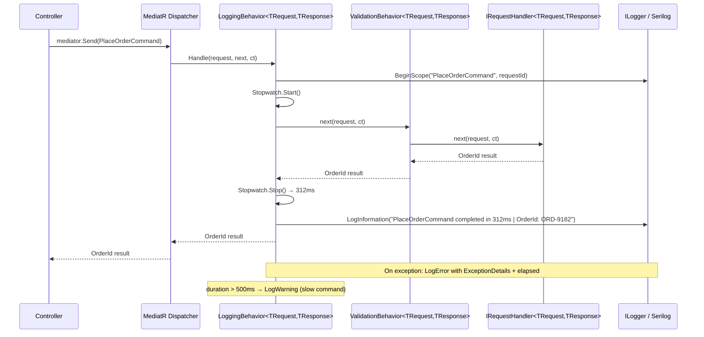
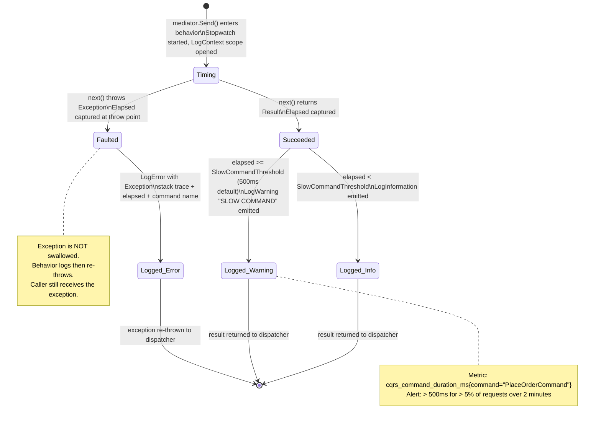
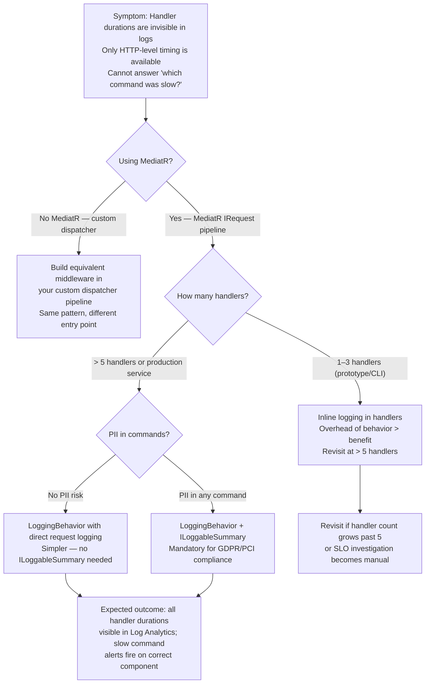

> [!ABSTRACT] Quick Reference — CQRS Logging Pipeline Behavior **Invariant:** Every command and query passing through the MediatR pipeline emits a structured log entry with name, duration, and outcome — without a single line of logging code inside any handler. **Cost:** One extra allocation per request (the `IPipelineBehavior<,>` wrapper); log verbosity can overwhelm sinks if not filtered — every command logs at `Information` and slow paths at `Warning`. **Trigger:** Handlers are opaque black boxes in production — you cannot answer "why did PlaceOrderCommand take 800ms on Wednesday?" without structured per-request timing. **Skip When:** Lambda-style single-use commands in a prototype or CLI tool where handler code _is_ the log — adding a pipeline doubles the ceremony for no observability gain. **.NET Entry Point:** `IPipelineBehavior<TRequest, TResponse>` in `MediatR` | `ILogger<LoggingBehavior<,>>` injected via DI | NuGet: `MediatR`, `Serilog.AspNetCore` **Azure Native:** Azure Monitor / Application Insights via OpenTelemetry SDK — structured log entries from the behavior flow directly into Log Analytics workspace and are queryable with KQL. **Number to Know:** Logging behavior overhead ≈ 0.05–0.1ms per request (estimated, single `ILogger.Log` call with `Stopwatch`); unfiltered at 5,000 req/s → ~5,000 log entries/s — Application Insights ingestion default sampling kicks in above 5 req/s per second per type.

---

## Navigation

**Domain:** [[7 — System Design & Distributed Systems]] > **Group:** CQRS and Event Sourcing **Previous:** [[7.086 — CQRS — Validation Behavior — FluentValidation]] | **Next:** [[7.088 — CQRS — Caching Pipeline Behavior]]

### Prerequisites

- [[7.084 — CQRS — MediatR — IRequest and IRequestHandler]] — required because the logging behavior wraps `IRequestHandler<,>` via the pipeline; without understanding how MediatR dispatches requests, the `next()` delegate call in the behavior is opaque.
- [[7.085 — CQRS — MediatR Pipeline Behaviors Overview]] — required because this note implements one specific behavior type; the pipeline ordering, registration model, and `IPipelineBehavior<TRequest, TResponse>` contract are assumed knowledge.
- [[7.718 — Serilog — .NET Integration]] — required because the canonical implementation uses Serilog's structured logging API (`LogContext`, destructuring, enrichers); plain `ILogger` works but loses the scoped-property semantics.

### Where This Fits

> [!INFO] Production Encounter Map
> 
> - **Layer:** Cross-cutting infrastructure layer — the behavior sits between the MediatR dispatcher and every application-layer handler; it is infrastructure code, not domain code.
> - **Trigger:** An engineer first hits this when a staging performance review reveals that handler durations are invisible in logs — only HTTP-level timing is captured by middleware, and the 400ms "somewhere inside the command" cannot be attributed to a specific handler.
> - **Without it:** The PaymentService's `ProcessPaymentCommand` handler silently takes 620ms on card-present transactions (due to a downstream HSM call), but the only observable signal is the HTTP p99 latency crossing SLO — there is no log entry that identifies _which command_ is slow, how often it succeeds, or when it started degrading.
> - **First signal:** `WARN [PaymentController] POST /api/payments 620ms 200 OK` — HTTP middleware timing only; no inner handler timing, no command name, no result metadata.

The Logging Pipeline Behavior is the observability contract for the command/query layer. It converts the MediatR pipeline — which is otherwise invisible — into a structured log stream that feeds [[7.733 — Log Aggregation — ELK Stack]], [[7.735 — Log Aggregation — Azure Monitor]], and [[7.767 — Distributed Tracing — Trace and Span]] tooling. Every other pipeline behavior (validation, caching, transactions) runs inside the logging behavior's timing window when registered last in the pipeline, so the logged duration reflects the total handler cost.

---

## Core Mental Model

The Logging Pipeline Behavior is a Decorator over the MediatR request pipeline. It wraps the `next()` delegate — which represents all remaining behaviors plus the handler itself — in a `Stopwatch`, captures the result or exception, and emits exactly one structured log entry per request with the command name, elapsed milliseconds, and success/failure outcome. Because `IPipelineBehavior<TRequest, TResponse>` is generic, a single registration covers every command and query in the system without any modification to individual handlers.

The crucial architectural decision is **where in the pipeline this behavior registers**. If registered _first_ (outermost), it measures total elapsed time including validation, caching, and transaction overhead — the user-perceived cost of the command. If registered _after_ the validation behavior, it only measures the handler's cost, hiding validation duration. For observability purposes, registering the logging behavior as the **outermost** wrapper is almost always correct: the goal is to know what the caller paid, not what the handler alone cost.

> [!TIP] The Non-Obvious Insight The logging behavior should also capture the **request payload** — but doing so naively logs PII (customer IDs, card numbers, email addresses) into your log sink. The correct pattern is to define an `ILoggableSensitiveRequest` marker interface that commands opt into if they want payload redaction, and apply Serilog destructuring policies at registration time to strip fields annotated with `[Sensitive]`. Most teams log the _type name_ only and wonder why they cannot diagnose data-specific bugs in production. The real production value comes from logging a sanitized summary of the request — e.g., `OrderId: "ORD-9182"`, `ItemCount: 3` — not the raw command object. Getting this wrong means either blind logging (no request context) or a GDPR breach (full PII in logs).

### Classification

- **Consistency axis:** None — purely observational; the behavior does not alter consistency guarantees of commands or queries.
- **Availability tradeoff:** Log sink failure (e.g., Seq unreachable) does not affect command execution if the logger is configured with an async wrapper and a bounded in-memory buffer; it silently drops log entries under backpressure.
- **Latency impact:** +0.05–0.1ms per request on the hot path (estimated, `Stopwatch` + single `ILogger.Log` call); +0.5–2ms if the behavior serializes the request for payload logging using `System.Text.Json`.
- **Failure domain:** Single-process — the behavior fails only if the logger itself throws, which `ILogger` implementations are designed not to do (they swallow exceptions internally).
- **Abstraction layer:** Framework feature — `IPipelineBehavior<,>` is a MediatR contract; this pattern has no equivalent in non-MediatR CQRS implementations without a custom dispatcher.

### Primary Diagram



### Supporting Diagram



### Numbers That Matter

|Metric|Value|Context / Conditions|
|---|---|---|
|Behavior overhead (hot path)|~0.05–0.1ms|Single `Stopwatch` + `ILogger.Log` call, no serialization, .NET 8 (estimated)|
|Overhead with payload serialization|~0.5–2ms|`System.Text.Json.JsonSerializer.Serialize(command)` on a 10-field command object (estimated)|
|Log entries per second at 5k req/s|~5,000 entries/s|One `LogInformation` per command; Application Insights adaptive sampling triggers above ~5 req/s per operation type (default, configurable)|
|Slow command threshold (default)|500ms|Configurable via `LoggingBehaviorOptions.SlowCommandThresholdMs`; teams commonly use 200ms for query behaviors|
|Serilog async sink buffer overflow|Drops entries|Default async wrapper buffer = 10,000 events; at 5k req/s with a slow Seq sink, overflow begins in ~2s of sink unavailability|
|Application Insights ingestion cap|5 GB/day free|Standard workspace; structured logs from this behavior contribute to daily cap — filter noisy queries to `Debug` level to reduce ingestion cost|

### Key Properties / Guarantees

|Property|Value|Condition|
|---|---|---|
|Every request is logged|Exactly one entry per MediatR dispatch|Normal operation; entries are dropped only if async log buffer overflows|
|Exception does not get swallowed|Exception always re-thrown after logging|The behavior catches, logs, then `throw;` — no silent swallowing|
|Elapsed time accuracy|Accurate to Stopwatch resolution (~0.1µs)|Uses `Stopwatch.GetTimestamp()` not `DateTime.UtcNow`; resolution is OS-dependent but sub-millisecond on all supported platforms|
|PII in logs|Not present|Only when `[Sensitive]` destructuring policy is applied and request summary properties are manually projected|
|Consistency model|N/A — observational only|The behavior cannot affect the consistency of the underlying command|

---

## Deep Mechanics

### How It Works

**Step-by-step through the behavior for `PlaceOrderCommand`:**

1. **MediatR dispatches** `mediator.Send(new PlaceOrderCommand(...))` — the dispatcher resolves all registered `IPipelineBehavior<PlaceOrderCommand, OrderId>` implementations from DI in registration order.
    
2. **Outermost behavior activates** — `LoggingBehavior<PlaceOrderCommand, OrderId>.Handle()` is called. The behavior opens a Serilog `LogContext` scope with the command type name and a generated request ID (or the ambient `CorrelationId` from [[7.726 — Correlation ID — Generation and Propagation]]).
    
3. **Stopwatch starts** — `Stopwatch.GetTimestamp()` captured before calling `next`.
    
4. **`next(request, cancellationToken)` called** — this invokes the next behavior in the chain (e.g., `ValidationBehavior`, then `TransactionBehavior`, then the handler itself). The logging behavior suspends here, awaiting the result.
    
5. **Happy path — `next` returns a result**: Stopwatch stops. Elapsed milliseconds computed. If elapsed < threshold → `LogInformation`. If elapsed ≥ threshold → `LogWarning` with `"SLOW_COMMAND"` tag. Log entry includes: command type, elapsed ms, result type name (not value — avoids logging sensitive results), correlation ID, user ID if available.
    
6. **Failure path — `next` throws**: Stopwatch stops at point of throw. `LogError` emitted with the exception object, elapsed, command type, and correlation ID. Exception is immediately re-thrown with `throw;` (preserving stack trace). The caller receives the original exception unmodified.
    
7. **Log scope disposes** — `LogContext` scope closes, removing the command-scoped properties from the ambient log context.
    

### Protocol Trace

```
Happy Path (PlaceOrderCommand, 312ms):
  0ms   MediatR → LoggingBehavior.Handle()
  0ms   LogContext.PushProperty("CommandType", "PlaceOrderCommand")
  0ms   LogContext.PushProperty("CommandId", "cmd-f3a2-9b1c")
  0ms   Stopwatch.Start()
  0ms   LoggingBehavior → next() → ValidationBehavior → next() → Handler
  300ms Handler: downstream InventoryService HTTP call completes
  312ms Handler returns OrderId("ORD-9182")
  312ms Stopwatch.Stop() → 312ms
  312ms elapsed < 500ms threshold → LogInformation:
        "PlaceOrderCommand completed | Elapsed: 312ms | Success: true | CommandId: cmd-f3a2-9b1c"
  312ms LogContext scope disposes
  312ms Result returned to Controller

Failure Path (PlaceOrderCommand, handler throws at 88ms):
  0ms   MediatR → LoggingBehavior.Handle()
  0ms   LogContext and Stopwatch initialized
  0ms   LoggingBehavior → next() → ValidationBehavior → Handler
  88ms  Handler throws: InvalidOperationException("Inventory reserved quantity exceeded")
  88ms  LoggingBehavior catch block executes
  88ms  Stopwatch.Stop() → 88ms
  88ms  LogError emitted:
        "PlaceOrderCommand failed | Elapsed: 88ms | Exception: InvalidOperationException |
         Message: Inventory reserved quantity exceeded | CommandId: cmd-f3a2-9b1c"
  88ms  throw; — exception re-thrown with original stack trace intact
  88ms  MediatR propagates exception to mediator.Send() caller
  Controller: catches exception, maps to 422 UnprocessableEntity

Slow Command Path (ProcessPaymentCommand, 780ms):
  0ms   Stopwatch.Start()
  780ms PaymentGateway response received
  780ms Stopwatch.Stop() → 780ms
  780ms elapsed 780ms >= 500ms threshold → LogWarning:
        "SLOW_COMMAND: ProcessPaymentCommand | Elapsed: 780ms | CommandId: cmd-aa91-2f4e |
         Threshold: 500ms | Excess: 280ms"
  Alert: PagerDuty fires if SLOW_COMMAND appears > 5% of ProcessPaymentCommand logs over 2 min
```

### Failure Modes

**Failure Mode 1: Behavior Logs PII From Request Object**

- **Cause:** The behavior logs `{@Request}` using Serilog's destructuring operator without a policy that strips sensitive fields. Serilog serializes the entire command object, including `CardNumber`, `EmailAddress`, `SocialSecurityNumber`.
- **Symptom:** Compliance audit finds card numbers and email addresses in plaintext in Seq / Log Analytics. GDPR/PCI-DSS breach.
- **Detection time:** Silent until a security audit or log search — the logs look "correct" to engineers during development because the data is real-looking in staging.
- **Blast radius:** Full PII exposure in log storage; depending on sink, PII may be retained for 90 days, indexed, and queryable by any team member with log access.

> [!DANGER] 3 AM Production Signal Metric: Security scanner `Macie` or `Defender for Cloud` alert on log storage containing regex-matching card patterns Log: `INFO [LoggingBehavior] PlaceOrderCommand completed | Request: {"CustomerId": "CUST-001", "CardNumber": "4111111111111111", "CVV": "123", "Elapsed": 312}` Customer impact: None immediately visible — this is a compliance/legal blast radius, not a UX one.

**Failure Mode 2: Logging Behavior Registered Inner (Not Outermost)**

- **Cause:** DI registration order places `LoggingBehavior` after `ValidationBehavior` and `TransactionBehavior`. The elapsed time logged reflects only the handler's execution, excluding validation time (which can be 50–200ms for complex FluentValidation rules) and transaction overhead.
- **Symptom:** The logged elapsed time is systematically 30–200ms lower than the HTTP middleware timing. Engineers investigate the handler for performance when the real cost is validation — a wild goose chase.
- **Detection time:** Minutes to hours in a performance investigation — only visible when comparing HTTP timing metrics to command elapsed time metrics side by side.
- **Blast radius:** Incorrect capacity planning; optimizing the wrong layer of the stack.

> [!DANGER] 3 AM Production Signal Metric: `http_request_duration_p99{route="/api/orders"}` = 620ms but `command_elapsed_ms{command="PlaceOrderCommand"}` histogram p99 = 380ms — a persistent 240ms gap Log: `INFO [LoggingBehavior] PlaceOrderCommand completed | Elapsed: 380ms` while nginx access log shows `620ms` Customer impact: Checkout latency SLO breach is not attributed to any identifiable component — on-call cannot root-cause.

### .NET and Azure Integration Points

- **MediatR:** `IPipelineBehavior<TRequest, TResponse>` — the single interface the behavior implements; registered via `AddMediatR` or explicit `AddTransient`.
- **Serilog:** `Log.ForContext<LoggingBehavior<,>>()` / `LogContext.PushProperty()` — scoped properties attach command metadata to every log entry emitted within the `next()` call, including from the handler itself.
- **Azure Monitor / Application Insights:** Structured log entries from Serilog flow via `Serilog.Sinks.ApplicationInsights` into the `traces` table in Log Analytics, queryable with KQL: `traces | where customDimensions.CommandType == "PlaceOrderCommand"`.
- **OpenTelemetry:** The behavior is the correct place to create an `Activity` span representing the command — `ActivitySource.StartActivity("PlaceOrderCommand")` — which feeds into [[7.767 — Distributed Tracing — Trace and Span]].
- **Configuration:** `appsettings.json` → `LoggingBehavior:SlowCommandThresholdMs`, `LoggingBehavior:LogRequestPayload` (bool), `LoggingBehavior:SensitiveFieldNames` (string array).

```csharp
// Infrastructure layer: YourCompany.OrderManagement.Infrastructure.Behaviors
// Registers logging behavior and configures Serilog enrichment

builder.Services.AddMediatR(cfg =>
{
    cfg.RegisterServicesFromAssembly(typeof(PlaceOrderCommandHandler).Assembly);

    // CRITICAL: AddOpenBehavior registers in the order called.
    // LoggingBehavior must be FIRST to be the outermost wrapper.
    cfg.AddOpenBehavior(typeof(LoggingBehavior<,>));
    cfg.AddOpenBehavior(typeof(ValidationBehavior<,>));
    cfg.AddOpenBehavior(typeof(TransactionBehavior<,>));
});

builder.Services.Configure<LoggingBehaviorOptions>(
    builder.Configuration.GetSection("LoggingBehavior"));
```

---

## Production Patterns and Implementation

### Primary Implementation

```csharp
// Infrastructure layer: YourCompany.OrderManagement.Infrastructure.Behaviors
// Role: Cross-cutting pipeline behavior — NOT a handler, NOT a domain service
using System.Diagnostics;
using MediatR;
using Microsoft.Extensions.Logging;
using Microsoft.Extensions.Options;
using Serilog.Context;

namespace YourCompany.OrderManagement.Infrastructure.Behaviors;

/// <summary>
/// MediatR pipeline behavior that emits a structured log entry for every command and query.
/// Measures elapsed time, captures success/failure outcome, and warns on slow commands.
/// Must be registered as the OUTERMOST behavior so elapsed time includes all inner behaviors.
/// </summary>
/// <typeparam name="TRequest">The command or query type.</typeparam>
/// <typeparam name="TResponse">The response type returned by the handler.</typeparam>
public sealed class LoggingBehavior<TRequest, TResponse>(
    ILogger<LoggingBehavior<TRequest, TResponse>> logger,
    IOptions<LoggingBehaviorOptions> options)
    : IPipelineBehavior<TRequest, TResponse>
    where TRequest : IRequest<TResponse>
{
    private static readonly string RequestName = typeof(TRequest).Name;

    /// <inheritdoc />
    public async Task<TResponse> Handle(
        TRequest request,
        RequestHandlerDelegate<TResponse> next,
        CancellationToken cancellationToken)
    {
        // Scoped properties attach to every log entry emitted within this using block,
        // including entries from the handler and inner behaviors.
        using var _ = LogContext.PushProperty("CommandType", RequestName);
        using var __ = LogContext.PushProperty("CommandId", Guid.NewGuid().ToString("N")[..8]);

        // Build a sanitized request summary — never log the raw object
        var requestSummary = BuildSanitizedSummary(request);

        logger.LogInformation(
            "Executing {CommandType} | Summary: {RequestSummary}",
            RequestName,
            requestSummary);

        var timestamp = Stopwatch.GetTimestamp();

        try
        {
            var response = await next(cancellationToken).ConfigureAwait(false);

            var elapsed = Stopwatch.GetElapsedTime(timestamp);
            LogCompletion(elapsed, success: true);

            return response;
        }
        catch (Exception ex) when (ex is not OperationCanceledException)
        {
            var elapsed = Stopwatch.GetElapsedTime(timestamp);

            logger.LogError(
                ex,
                "Failed {CommandType} | Elapsed: {ElapsedMs}ms | Error: {ErrorType}: {ErrorMessage}",
                RequestName,
                elapsed.TotalMilliseconds,
                ex.GetType().Name,
                ex.Message);

            throw; // preserve original stack trace — never swallow
        }
    }

    private void LogCompletion(TimeSpan elapsed, bool success)
    {
        var elapsedMs = elapsed.TotalMilliseconds;
        var threshold = options.Value.SlowCommandThresholdMs;

        if (elapsedMs >= threshold)
        {
            logger.LogWarning(
                "SLOW_COMMAND: {CommandType} completed | Elapsed: {ElapsedMs}ms | " +
                "Threshold: {ThresholdMs}ms | Excess: {ExcessMs}ms",
                RequestName,
                elapsedMs,
                threshold,
                elapsedMs - threshold);
        }
        else
        {
            logger.LogInformation(
                "{CommandType} completed | Elapsed: {ElapsedMs}ms | Success: {Success}",
                RequestName,
                elapsedMs,
                success);
        }
    }

    /// <summary>
    /// Builds a sanitized log summary from the request.
    /// Commands opt in to richer summaries by implementing <see cref="ILoggableSummary"/>.
    /// Avoids serializing the full object to prevent accidental PII logging.
    /// </summary>
    private static string BuildSanitizedSummary(TRequest request)
    {
        if (request is ILoggableSummary loggable)
        {
            return loggable.ToLogSummary(); // e.g., "OrderId=ORD-9182, ItemCount=3"
        }

        return "(no summary — implement ILoggableSummary for richer context)";
    }
}

/// <summary>
/// Commands implement this to expose a sanitized log summary.
/// Never include PII, tokens, or card numbers.
/// </summary>
public interface ILoggableSummary
{
    /// <summary>Returns a sanitized string for log context. No PII.</summary>
    string ToLogSummary();
}

/// <summary>
/// Configuration options for <see cref="LoggingBehavior{TRequest,TResponse}"/>.
/// Bind from appsettings.json section "LoggingBehavior".
/// </summary>
public sealed class LoggingBehaviorOptions
{
    /// <summary>
    /// Commands exceeding this duration (ms) are logged at Warning level.
    /// Default: 500ms. Tune per environment; staging often uses 200ms.
    /// </summary>
    public double SlowCommandThresholdMs { get; set; } = 500;
}

// Domain layer: YourCompany.OrderManagement.Application.Commands
// Example command implementing ILoggableSummary
public sealed record PlaceOrderCommand(
    Guid CustomerId,
    IReadOnlyList<OrderLineItem> Items,
    ShippingAddress ShippingAddress)
    : IRequest<OrderId>, ILoggableSummary
{
    /// <inheritdoc />
    public string ToLogSummary() =>
        $"CustomerId={CustomerId}, ItemCount={Items.Count}";
    // Note: ShippingAddress is omitted — contains PII (street, name)
}
```

### IServiceCollection Registration

```csharp
// Program.cs — behavior registration ORDER matters: first = outermost in pipeline
builder.Services.AddMediatR(cfg =>
{
    cfg.RegisterServicesFromAssembly(typeof(PlaceOrderCommandHandler).Assembly);

    // Logging MUST be first — measures total elapsed including validation + transaction
    cfg.AddOpenBehavior(typeof(LoggingBehavior<,>));

    // Validation second — logging sees its overhead included in elapsed
    cfg.AddOpenBehavior(typeof(ValidationBehavior<,>));

    // Transaction last (innermost before handler)
    cfg.AddOpenBehavior(typeof(TransactionBehavior<,>));
});

// Bind options from appsettings.json
builder.Services.Configure<LoggingBehaviorOptions>(
    builder.Configuration.GetSection("LoggingBehavior"));
```

```json
// appsettings.Production.json
{
  "LoggingBehavior": {
    "SlowCommandThresholdMs": 500
  },
  "Serilog": {
    "MinimumLevel": {
      "Default": "Information",
      "Override": {
        "YourCompany.OrderManagement.Infrastructure.Behaviors.LoggingBehavior": "Information",
        "Microsoft": "Warning",
        "System": "Warning"
      }
    }
  }
}
```

### Common Variants

```csharp
// Variant A — Query-aware threshold: queries tolerate shorter latency than commands
// Used when: read SLO is tighter than write SLO (e.g., search queries must be <100ms)
public sealed class LoggingBehavior<TRequest, TResponse> : IPipelineBehavior<TRequest, TResponse>
    where TRequest : IRequest<TResponse>
{
    private static readonly bool IsQuery =
        typeof(TRequest).GetInterfaces().Any(i => i == typeof(IQuery));

    private double GetThreshold(LoggingBehaviorOptions options) =>
        IsQuery ? options.SlowQueryThresholdMs : options.SlowCommandThresholdMs;
}
```

```csharp
// Variant B — OpenTelemetry Activity span creation alongside logging
// Used when: distributed tracing is required across service boundaries (not just local logs)
public async Task<TResponse> Handle(
    TRequest request,
    RequestHandlerDelegate<TResponse> next,
    CancellationToken cancellationToken)
{
    using var activity = CommandActivitySource.StartActivity(
        RequestName,
        ActivityKind.Internal);

    activity?.SetTag("command.type", RequestName);

    try
    {
        var response = await next(cancellationToken).ConfigureAwait(false);
        activity?.SetStatus(ActivityStatusCode.Ok);
        return response;
    }
    catch (Exception ex)
    {
        activity?.SetStatus(ActivityStatusCode.Error, ex.Message);
        activity?.RecordException(ex);
        throw;
    }
}

private static readonly ActivitySource CommandActivitySource =
    new("YourCompany.OrderManagement.Commands", "1.0.0");
```

### Performance Profile

```csharp
[MemoryDiagnoser]
[SimpleJob(RuntimeMoniker.Net80)]
public class LoggingBehaviorBenchmark
{
    private readonly IMediator _mediator = BuildMediator();

    [Params(10, 100)]
    public int ItemCount;

    [Benchmark(Baseline = true)]
    public async Task<OrderId> HandlerWithoutLoggingBehavior()
    {
        return await _mediator.Send(new PlaceOrderCommandNoLogging(
            Guid.NewGuid(),
            GenerateItems(ItemCount)));
    }

    [Benchmark]
    public async Task<OrderId> HandlerWithLoggingBehavior()
    {
        return await _mediator.Send(new PlaceOrderCommand(
            Guid.NewGuid(),
            GenerateItems(ItemCount),
            SampleAddress));
    }
}
```

Expected result shape (estimated, .NET 8, no sink I/O on benchmark — Serilog with NullSink):

|Method|ItemCount|Mean|Allocated|Notes|
|---|---|---|---|---|
|Without LoggingBehavior|10|~0.8µs|~512 B|Handler only|
|With LoggingBehavior (no payload log)|10|~0.9µs|~640 B|+Stopwatch + 1 LogInformation|
|With LoggingBehavior + payload serialization|10|~3.2µs|~2.1 KB|`JsonSerializer.Serialize` cost|
|Without LoggingBehavior|100|~0.8µs|~512 B|Item count irrelevant to overhead|
|With LoggingBehavior (no payload log)|100|~0.9µs|~640 B|Overhead is flat per request|

All values estimated. Real sink I/O (Seq, Application Insights) dominates in production but is async and bounded.

### Real-World .NET Ecosystem Mapping

|Pattern in This Note|Where It Appears in .NET / Azure|Manifestation|
|---|---|---|
|Pipeline Behavior = Decorator|`IPipelineBehavior<,>` in MediatR|The Decorator pattern wraps `next()` with cross-cutting logic; matches GoF Decorator structurally|
|Scoped log properties|`LogContext.PushProperty()` in Serilog|Properties pushed here appear on every log entry within the `using` block, including handler logs|
|Activity span creation|`ActivitySource.StartActivity()` in `System.Diagnostics`|Creates an OpenTelemetry span for the command — visible in Jaeger, Azure Monitor distributed tracing|
|Slow command alert|Custom `LogWarning` + Prometheus counter|Feeds `cqrs_slow_commands_total{command="..."}` metric; Grafana alert fires when rate > threshold|
|Application Insights ingestion|`Serilog.Sinks.ApplicationInsights`|`traces` table in Log Analytics; KQL: `traces|

---

## Gotchas and Production Pitfalls

### Logging the Raw Request Object — The PII Time Bomb

**Pitfall:** The behavior uses `{@Request}` Serilog destructuring, which serializes the entire command including all properties.

```csharp
// ❌ Logs full object — CardNumber, EmailAddress, IBAN, SSN all end up in Seq
logger.LogInformation("Executing {CommandType} | {@Request}", RequestName, request);
```

**Symptom:** A compliance audit or Macie scan finds card numbers, emails, or government IDs in the log storage. GDPR Art. 25 (data minimisation) and PCI-DSS Req. 3.3 violations.

**Detection time:** Silent indefinitely — engineers see "richer context" in logs and consider it a feature until a legal or security team reviews log access.

> [!DANGER] Production Signal Metric: Azure Defender for Cloud alert `PII_IN_STORAGE | resource: "log-analytics-workspace-prod" | confidence: HIGH` Log: `INFO [LoggingBehavior] Executing ProcessPaymentCommand | Request: {"CustomerId":"CUST-001","CardNumber":"4111111111111111","Amount":299.99}` Customer impact: Regulatory breach — potential notification obligation to data protection authorities within 72 hours.

**Fix:**

```csharp
// ✅ Use ILoggableSummary — commands control what is logged
if (request is ILoggableSummary loggable)
    logger.LogInformation("Executing {CommandType} | {Summary}", RequestName, loggable.ToLogSummary());
else
    logger.LogInformation("Executing {CommandType}", RequestName);
```

**Cost of not fixing:** PCI-DSS breach → mandatory card scheme reporting, potential fines; GDPR breach → up to 4% of global annual revenue or €20M penalty. Retroactive log scrubbing from Azure Monitor is not supported — the data is already indexed.

---

### Registering LoggingBehavior After Other Behaviors (Wrong Pipeline Order)

**Pitfall:** The engineer registers `LoggingBehavior` last in `AddMediatR` calls, making it the innermost behavior instead of the outermost wrapper.

```csharp
// ❌ Logging registered LAST = measures only handler time, not validation + transaction
cfg.AddOpenBehavior(typeof(ValidationBehavior<,>)); // called first = outermost
cfg.AddOpenBehavior(typeof(TransactionBehavior<,>));
cfg.AddOpenBehavior(typeof(LoggingBehavior<,>));    // called last = innermost ❌
```

**Symptom:** Logged elapsed times are systematically 30–200ms lower than HTTP-layer timing; FluentValidation time (which can be 50–200ms on complex rules) is invisible. Slow command warnings never fire for validation-heavy commands that breach SLO.

**Detection time:** Hours to days — only visible when side-by-side comparison of HTTP middleware timing vs. command elapsed time shows a persistent gap.

> [!DANGER] Production Signal Metric: `http_request_duration_seconds_p99{route="/api/payments"}` = 820ms, `command_elapsed_ms{command="ProcessPaymentCommand"}` histogram p99 = 580ms — gap of 240ms unaccounted for Log: `INFO [LoggingBehavior] ProcessPaymentCommand completed | Elapsed: 580ms` while nginx access log shows `POST /api/payments 820ms` Customer impact: SLO breach investigation wastes engineer-hours optimizing the handler when validation is the real bottleneck.

**Fix:**

```csharp
// ✅ Logging registered FIRST = outermost = measures everything
cfg.AddOpenBehavior(typeof(LoggingBehavior<,>));   // first = outermost ✅
cfg.AddOpenBehavior(typeof(ValidationBehavior<,>));
cfg.AddOpenBehavior(typeof(TransactionBehavior<,>));
```

**Cost of not fixing:** 20–40% of performance investigation time spent on the wrong component; SLO breaches attributed to handlers rather than infrastructure behaviors; slow command alerts fail to fire for validation-heavy commands.

---

### Swallowing Exceptions Instead of Re-Throwing

**Pitfall:** A catch-all block logs the exception but returns a default value instead of re-throwing.

```csharp
// ❌ Exception is swallowed — caller receives default(TResponse) silently
catch (Exception ex)
{
    logger.LogError(ex, "Command failed: {CommandType}", RequestName);
    return default!; // ← hides failures from caller
}
```

**Symptom:** Commands fail silently; the controller receives `null` or `default` and either NullReferenceExceptions downstream or incorrect HTTP 200 responses for failed operations. Payment failures return `null OrderId` — orders appear to place successfully but no order is created.

**Detection time:** Intermittent; only observable when the result of a failed command is actually used. If the controller just checks for `null`, the symptom is a silent 200 OK on a failed payment.

> [!DANGER] Production Signal Metric: `orders_placed_total` counter flat despite HTTP 200 responses increasing — order creation is failing silently Log: `ERROR [LoggingBehavior] PlaceOrderCommand failed | Exception: DbUpdateException` — present, but no HTTP 4xx/5xx emitted; PagerDuty not firing because error rate metric (based on HTTP codes) is 0% Customer impact: Customers receive order confirmation emails for orders that were never persisted — customer service ticket storm.

**Fix:**

```csharp
// ✅ Always re-throw after logging — preserve stack trace with bare throw;
catch (Exception ex) when (ex is not OperationCanceledException)
{
    logger.LogError(ex, "Failed {CommandType} | Elapsed: {ElapsedMs}ms",
        RequestName, elapsed.TotalMilliseconds);
    throw; // ← bare throw preserves original stack trace
}
```

**Cost of not fixing:** Silent data loss; customer-facing failures reported as successes; reconciliation job required to detect and compensate — expensive remediation at scale.

---

### Azure-Specific: Application Insights Adaptive Sampling Suppressing Command Logs

**Pitfall:** At high request volume, Application Insights adaptive sampling silently drops a percentage of `Information` log entries. Engineers assume 100% of command executions are visible in Log Analytics and make incorrect frequency conclusions.

**Symptom:** KQL query `traces | where customDimensions.CommandType == "PlaceOrderCommand"` returns 2,400 entries for a period where 5,000 orders were placed. The 50% drop rate is invisible — the sink does not emit warnings.

**Detection time:** Only visible when cross-referencing Application Insights trace counts against database row counts or Prometheus counters. Silent in normal log browsing.

> [!DANGER] Production Signal Metric: `orders_total` (Prometheus counter from handler) = 5,000; `traces | summarize count()` for same window = 2,400 — 52% drop rate Log: No warning from Application Insights SDK; adaptive sampling emits a metric `requests/rate` but not a log warning about dropped traces Customer impact: None directly; analytics and audit log reliability is affected — cannot reconstruct full order history from Application Insights alone.

**Fix:** Use fixed-rate sampling with a rate appropriate to your log budget, or route audit-critical command logs through a separate sink (Azure Blob immutable storage or Azure Service Bus to Log Analytics) that bypasses sampling.

```csharp
// appsettings.Production.json — disable adaptive sampling for command logs
{
  "ApplicationInsights": {
    "EnableAdaptiveSampling": false,
    "SamplingSettings": {
      "IsEnabled": true,
      "MaxTelemetryItemsPerSecond": 100  // fixed rate — adjust to cost budget
    }
  }
}
```

**Cost of not fixing:** Audit log gaps; GDPR right-to-erasure or access requests cannot be fully satisfied from Application Insights; incident timeline reconstruction is incomplete.

---

### .NET-Specific: Using `DateTime.UtcNow` for Elapsed Measurement

**Pitfall:** Timing is measured with `DateTime.UtcNow` subtraction instead of `Stopwatch.GetTimestamp()`.

```csharp
// ❌ DateTime.UtcNow has 15–16ms resolution on Windows — useless for sub-100ms commands
var start = DateTime.UtcNow;
var response = await next(cancellationToken);
var elapsed = DateTime.UtcNow - start; // ← resolution: 15ms on Windows
```

**Symptom:** Every command under 15ms reports 0ms elapsed. Commands between 15ms and 30ms are bucketed as either 0ms or 15ms. Slow command threshold of 500ms triggers on commands that are actually 488ms (rounds to 495ms with poor resolution).

**Detection time:** Immediately obvious in unit tests if anyone checks the elapsed value; often invisible in production because engineers accept imprecise timing without question.

> [!DANGER] Production Signal Metric: `command_elapsed_ms` histogram shows an unnatural bimodal distribution — large spike at 0ms and another at 15ms for commands known to take 5–12ms Log: `INFO [LoggingBehavior] GetOrderSummaryQuery completed | Elapsed: 0ms` for a query that EF Core slow query log shows at 8ms Customer impact: None directly; misleading performance data leads to wrong optimization decisions.

**Fix:**

```csharp
// ✅ Stopwatch.GetTimestamp() has sub-microsecond resolution on all platforms
var timestamp = Stopwatch.GetTimestamp();
var response = await next(cancellationToken).ConfigureAwait(false);
var elapsed = Stopwatch.GetElapsedTime(timestamp); // TimeSpan, ~0.1µs resolution
```

**Cost of not fixing:** Incorrect p50/p99 latency data for commands; slow command threshold triggering at wrong times; capacity planning based on wrong numbers.

---

### Architecture-Level: One Logging Behavior for Commands AND Queries Without Level Differentiation

**Pitfall:** The same `LoggingBehavior` logs every `GetOrderHistoryQuery` (called 100x/s) at `Information` level alongside `CancelOrderCommand` (called 5x/s). High-frequency read queries flood the log sink and consume Application Insights daily cap.

**Symptom:** Log ingestion cost doubles when a new "live updates" polling feature calls `GetOrderStatusQuery` every 3 seconds per user. Application Insights daily cap of 5 GB is consumed by 10 AM; alerts stop firing for the rest of the day.

**Detection time:** End of month when Application Insights invoice arrives, or when the daily cap is hit and monitoring goes blind.

> [!DANGER] Production Signal Metric: `ApplicationInsights | where timestamp > ago(1d) | summarize count() by bin(timestamp, 1h)` shows exponential growth after a feature release; daily cap alert fires at 09:47 AM Log: `WARN [Application Insights] Daily data cap reached. Ingestion stopped.` — from that point, no traces, no exceptions, no alerts. Customer impact: Monitoring blackout for 14 hours; production incidents go undetected.

**Fix:** Log queries at `Debug` level in non-production environments and filter them out with a Serilog minimum level override; for production, log only queries exceeding the slow threshold at `Warning`:

```csharp
// Differentiate: queries log only on slow path; commands always log at Information
private static readonly bool IsQuery = typeof(TRequest).Name.EndsWith("Query");

private void LogCompletion(TimeSpan elapsed, bool success)
{
    if (IsQuery && elapsed.TotalMilliseconds < options.Value.SlowQueryThresholdMs)
        return; // suppress fast query success logs in production

    // ... rest of logging
}
```

**Cost of not fixing:** Application Insights daily cap exhausted → monitoring blackout → production incidents missed → SLO breaches undetected until customer complaints arrive.

---

## Tradeoffs and Decision Framework

### Tradeoff Matrix

|Dimension|LoggingBehavior (MediatR Pipeline)|ASP.NET Core Middleware Logging|Manual Logging in Each Handler|
|---|---|---|---|
|Coverage|All MediatR commands + queries automatically|HTTP boundary only — no inner handler names|Complete control per handler|
|Consistency|Uniform — every handler gets same log format|Uniform at HTTP level; no handler-level detail|High variance — each dev logs differently|
|Elapsed time granularity|Per-command, sub-millisecond|Per-HTTP-request only|Per-handler, only if dev remembers|
|PII risk|Centralized control — one policy applied everywhere|Logs URL/headers — limited PII surface|Decentralized — each handler is a risk point|
|Maintenance cost|Zero per handler — behavior is registered once|Zero per endpoint|High — each new handler needs logging added|
|Operational complexity|Low — one class, one DI registration|Low — built-in ASP.NET Core|High — code review required on every PR|
|Azure ecosystem fit|Native — Serilog → Application Insights via sink|Native — built-in middleware → App Insights|Native — but inconsistent|
|Cost at scale|Low — one log entry per request|Low — one log entry per request|High — developers often over-log or under-log|

### When to Apply



### Numbers-Driven Decision

|Threshold|Below = Skip / Use Simpler|Above = Apply This|
|---|---|---|
|Handler count|< 5 handlers — inline logging adequate|> 5 handlers — behavior cost justified|
|Request rate|< 100 req/s — log cost negligible either way|> 1,000 req/s — log sink budget matters; filter queries|
|Command types|< 3 types — manual logging reviewable in PRs|> 10 types — per-handler logging becomes inconsistent|
|Compliance requirement|No PII in commands, no audit log requirement|GDPR/PCI applies or audit log required|
|Team size|< 3 engineers — everyone knows the logging conventions|> 5 engineers — enforcement via behavior prevents inconsistency|

### When NOT to Apply

> [!WARNING] Do Not Reach For This When...
> 
> - [ ] **Single-purpose CLI tools or scripts:** The handler _is_ the application — a pipeline behavior adds 3× the ceremony for no observability gain over a simple `Console.WriteLine`.
> - [ ] **No MediatR in the stack:** If using a custom mediator, the `IPipelineBehavior<,>` interface is not available; build an equivalent interceptor in the custom dispatcher instead of forcing MediatR as a dependency just for this pattern.
> - [ ] **Latency SLO < 5ms end-to-end:** The behavior adds ~0.1ms per request; at sub-5ms SLO budgets, every microsecond counts — profile whether the overhead is acceptable before adding it.
> - [ ] **Log sink is synchronous and slow:** If the Serilog sink is not using an async wrapper, `LogInformation` blocks the request thread. Verify `WriteTo.Async()` is in the Serilog configuration before applying this behavior at high throughput.

---

## Interview Arsenal

### Question Bank

1. **[Definition]** "What is a MediatR pipeline logging behavior and what specific observability gap does it close that ASP.NET Core request logging middleware cannot?"
2. **[Mechanism]** "Walk me through what happens, step by step, when `mediator.Send(new PlaceOrderCommand(...))` is called in a pipeline that has a logging behavior registered."
3. **[Tradeoff]** "What is the cost of logging the raw command object in the behavior, and how do you mitigate it without losing observability?"
4. **[Failure mode]** "What breaks in a system where the logging behavior is registered as the innermost behavior instead of the outermost, and how would you detect it?"
5. **[Comparison]** "What is the difference between logging in an ASP.NET Core middleware and logging in a MediatR pipeline behavior? When does each give you information the other cannot?"
6. **[Design application]** "You are designing a payment service where `ProcessPaymentCommand` is idempotent and retried up to 3 times by the caller. How does the logging behavior handle the retry scenario and what log entries should you expect?"
7. **[Scale]** "Your command pipeline currently handles 500 req/s. After a viral marketing event, traffic jumps to 8,000 req/s. What breaks in the logging layer and what do you change?"
8. **[Advanced]** "Your LoggingBehavior emits `Information` level for every query. The `GetProductCatalogQuery` is called by a browser polling every 2 seconds per user, and you have 3,000 concurrent users. What happens to your Application Insights daily cap, and what is the architectural fix?"

### Spoken Answers

**Q: What is a MediatR pipeline logging behavior and what specific observability gap does it close?**

> **Average answer:** "It's a class that implements `IPipelineBehavior` and runs before and after the handler to log stuff. It logs the command name and how long it took."

> **Great answer:** "ASP.NET Core request logging middleware captures timing at the HTTP boundary — you know the route took 620ms, but you have no idea whether that 620ms was in the handler, in validation, in a database call, or in a downstream HTTP call. The MediatR logging behavior sits inside the pipeline, so it measures the elapsed time for a specific named command — `PlaceOrderCommand took 312ms` — and that entry is annotated with the correlation ID from the ambient log context, so you can join it with the HTTP entry in KQL or Seq. The behavior is registered once and covers every command in the system without touching handler code. The critical design decision is registration order: it must be the outermost behavior so that validation time, transaction overhead, and the handler's own cost are all included in the single elapsed reading. If you register it inner, you get a systematically lower number that hides the true cost from your SLO analysis."

---

**Q: What is the difference between ASP.NET Core middleware logging and MediatR pipeline behavior logging?**

> **Average answer:** "Middleware logs at the HTTP level, the behavior logs at the handler level. They give you different granularity."

> **Great answer:** "They operate at different abstraction layers and capture complementary information. Middleware logging sees the HTTP contract — route, status code, request duration in milliseconds, user agent. It cannot see inside MediatR because CQRS is an application-layer concern, invisible to infrastructure middleware. The pipeline behavior, conversely, sees the command name, the specific handler invoked, and the internal elapsed time — but it cannot see HTTP headers or the route that triggered it without explicit enrichment. The correct architecture uses both: middleware logs the HTTP envelope with the correlation ID, the behavior logs the command execution with the same correlation ID, and a KQL join on `CorrelationId` gives you the complete request story from HTTP receipt to handler completion. The behavior also fires for commands triggered by message consumers, background workers, or Hangfire jobs — none of which have an HTTP middleware in their path — making it the only reliable place to get consistent command-level observability across all entry points."

---

**Q: Your LoggingBehavior emits `Information` for every query. `GetProductCatalogQuery` is called by a browser polling every 2 seconds per user with 3,000 concurrent users. What happens and what do you fix?**

> **Average answer:** "It would log a lot. You'd want to change the log level to Debug for queries."

> **Great answer:** "At 3,000 users polling every 2 seconds, that's 1,500 log entries per second from `GetProductCatalogQuery` alone. Application Insights ingests at a rate-limited cost per GB — the default 5 GB/day cap gets exhausted in under 4 hours on this query alone, at which point Application Insights stops ingesting entirely. Exceptions, slow command warnings, and all other metrics go dark. The fix has two parts. First, suppress fast-query success logs: in the behavior, check whether the request implements a `IQuery` marker and whether elapsed is below the slow-query threshold — if both are true, emit nothing. Only slow queries and query failures need logging. Second, for queries that are purely read-through with no side effects, consider moving the rate-limited browser polling to a WebSocket or SSE push model, which eliminates the polling frequency entirely. On the Application Insights side, configure fixed-rate sampling with a cap per operation type so that a noisy query cannot crowd out critical command logs. The monitoring architecture should also include a Prometheus counter for query invocation rates that does not incur Application Insights ingestion costs — use Prometheus + Grafana for high-cardinality frequency data, Application Insights for anomaly detection and alert quality."

### Whiteboard in 60 Seconds

When this topic appears in a system design interview, draw in this sequence:

```
1. Draw the MediatR pipeline as a horizontal tube with three labeled boxes inside:
   [LoggingBehavior] → [ValidationBehavior] → [Handler]
   "I'm starting with the outermost behavior because registration order IS the design decision.
   If logging is not outermost, the elapsed number is wrong."

2. Draw an arrow entering from the left labeled "mediator.Send(PlaceOrderCommand)"
   and an arrow exiting from the right labeled "OrderId result".
   "Every command flows through this pipe — no handler changes needed."

3. Add a branching symbol at the LoggingBehavior box with two exits:
   [Success → LogInformation] and [Exception → LogError + re-throw]
   "The behavior NEVER swallows exceptions. It logs then re-throws with bare throw;"

4. Add a clock symbol on the LoggingBehavior with the label "Stopwatch.GetTimestamp() → GetElapsedTime()"
   "DateTime.UtcNow has 15ms resolution on Windows — useless. Stopwatch is sub-microsecond."

5. Add a Serilog funnel at the end pointing to Azure Monitor / Seq icons:
   "Serilog with async wrapper feeds Application Insights. On high-frequency queries,
   disable adaptive sampling or suppress fast-query success logs — 5 GB/day cap is real."
```

> [!TIP] What the Interviewer Is Specifically Testing When they probe this area, they are checking whether you know:
> 
> 1. Whether you understand that registration ORDER in `AddMediatR` determines pipeline nesting order — first-registered = outermost — and why this matters for elapsed time accuracy.
> 2. Whether you flag the PII risk in logging command objects and know the mitigation — `ILoggableSummary` or destructuring policies — without being asked.
> 3. Whether you know that Application Insights adaptive sampling silently drops log entries at scale, and that a high-frequency polling query will exhaust the daily ingestion cap if logged at `Information` level.

### Follow-Up Chain

**Follow-up 1:** "How exactly does MediatR know which behavior to call first, and how do you control the order?"

> **Model answer:** MediatR resolves all `IPipelineBehavior<TRequest, TResponse>` registrations from the DI container in the order they were registered. The first registration in `AddMediatR`'s `cfg.AddOpenBehavior()` calls becomes the outermost wrapper — it receives control first and calls the next delegate, which leads to the second-registered behavior, and so on, until the handler itself. In practice, this means the `LoggingBehavior` registration call in `Program.cs` must appear before `ValidationBehavior` and `TransactionBehavior`. If your DI registrations are split across multiple extension methods, the call order of those methods controls the behavior order — an invisible dependency that must be documented in the architecture decision record.

**Follow-up 2:** "What happens to the logging behavior when a `CancellationToken` is triggered mid-command?"

> **Model answer:** The `OperationCanceledException` propagated by the cancellation is caught by the behavior's catch block. The correct implementation has `when (ex is not OperationCanceledException)` in the catch guard — cancellations should not be logged as errors because they are normal control flow when the client disconnects or a timeout fires. The behavior should log a `Debug` or `Information` entry noting the cancellation — `"PlaceOrderCommand cancelled | Elapsed: 88ms | Reason: client disconnect"` — and then re-throw the `OperationCanceledException` so ASP.NET Core can respond with a 499 (client disconnect) or 408 (timeout). If the behavior catches cancellations as errors, the error rate metric spikes whenever clients time out, which fires false-positive PagerDuty alerts.

**Follow-up 3:** "How would you know in production that this behavior is working correctly?"

> **Model answer:** Three signals confirm correct operation. First, in Log Analytics, `traces | where customDimensions.CommandType != "" | summarize count() by tostring(customDimensions.CommandType)` should show entry counts matching your expected command frequency — if counts are zero or suspiciously low, the behavior is not registered or adaptive sampling is dropping entries. Second, a Prometheus counter `cqrs_commands_total{command="PlaceOrderCommand", outcome="success"}` incremented inside the behavior (not the handler) lets you track invocation rate independently of Application Insights, immune to sampling. Third, the slow command `LogWarning` entries should appear in a Grafana dashboard filtered to `SLOW_COMMAND` — if the panel shows zero over a high-traffic period, either the threshold is too high or the behavior is registered inner and not seeing the full elapsed time. The alert rule is: `traces | where message startswith "SLOW_COMMAND" | summarize count() by bin(timestamp, 5m) | where count_ > 10` — if more than 10 slow commands fire in 5 minutes, PagerDuty gets a medium-severity alert.

### Comparison Table

||LoggingBehavior (MediatR Pipeline)|Manual Logging in Each Handler|
|---|---|---|
|Core guarantee|Every command/query emits a structured log entry — automatically, without handler changes|Log entries only exist if the handler developer wrote them|
|What it trades|Uniform format means less flexibility per handler; registration order is an implicit contract|Maximum flexibility; no shared contract; inconsistency at team scale|
|.NET implementation|`IPipelineBehavior<TRequest, TResponse>` + `ILogger<T>` + `LogContext.PushProperty()`|`ILogger<THandler>` injected into each handler directly|
|Azure native|Serilog → Application Insights via `Serilog.Sinks.ApplicationInsights`|Same sink — but each handler configures its own log format|
|Primary failure mode|PII in command object if `{@Request}` is logged without sanitization policy|Missing log entries; inconsistent fields; no slow-command detection|
|When to choose|> 5 handlers, production service, compliance requirements, team > 3 engineers|< 5 handlers, prototype, single-developer project, no audit log requirement|
|When NOT to choose|Sub-5ms SLO where 0.1ms behavior overhead matters; no MediatR in stack|Any production service with > 5 handlers — inconsistency accumulates|

---

## Architecture Decision Record

**Status:** Accepted

**Context:** The OrderManagement service has 23 MediatR command and query handlers across 4 bounded contexts. A P2 production incident (`INC-2847`) required 3 hours to root-cause because handler-level timing was invisible — the HTTP middleware only showed `POST /api/orders 820ms` with no breakdown of where the time was spent. The FluentValidation behavior was the culprit (scanning 12 discount rules), but this was impossible to identify without adding temporary debug logging to individual handlers. The team has 8 engineers; logging conventions are inconsistently applied across handlers (3 handlers log at `Debug`, 5 at `Information`, 2 have no logging).

**Options Considered:**

1. **LoggingBehavior (MediatR pipeline)** — registers once, covers all 23 handlers automatically, produces consistent structured output; requires PII sanitization discipline via `ILoggableSummary`.
2. **Per-handler logging** — each handler injects `ILogger<THandler>` and logs at its own discretion; maximum flexibility, zero central overhead, but inconsistency grows with team.
3. **HTTP middleware only** — accept that handler-level timing is invisible; rely on EF Core slow query logging and Application Insights dependency tracking for inner timing signals.

**Decision:** LoggingBehavior (MediatR pipeline), because it closes the observability gap that caused INC-2847 without requiring any change to existing handlers, and it enforces consistent log structure across all 23 handlers, which is unachievable through code review alone at team size 8.

**Consequences:**

- ✅ Every command and query now emits a structured log entry with elapsed time, command type, and correlation ID — INC-2847 class of incident is root-causeable in under 15 minutes.
- ✅ Slow command warnings (`SLOW_COMMAND` at `LogWarning`) feed a Grafana alert rule that fires before customers notice SLO breaches.
- ⚠️ All commands must implement `ILoggableSummary` or accept that their log entry has no request context — a one-time migration effort across 23 handlers.
- ⚠️ High-frequency query logging must be suppressed or filtered — `GetOrderStatusQuery` is called 800x/min and cannot log at `Information` in production without exhausting the Application Insights daily cap.
- ❌ Behavior registration order is now an implicit architectural constraint — the `LoggingBehavior` must always be registered first; this is not enforced by the compiler and must be documented in the team's architecture README.

**Review Trigger:** Revisit this decision if (1) sustained command throughput exceeds 10,000 req/s and behavior overhead becomes measurable in p99 latency benchmarks, (2) the team adopts an OpenTelemetry-first strategy where Activity spans replace `ILogger` for command instrumentation, or (3) MediatR is replaced with a custom mediator that has a native interceptor model.

---

## Self-Check

### Conceptual Questions

1. In one sentence, what does `IPipelineBehavior<TRequest, TResponse>` do and what happens when you register multiple implementations of it?
2. Why must the `LoggingBehavior` be registered as the first (outermost) behavior rather than the last — derive the answer from first principles, not from convention.
3. Name a concrete situation where adding a `LoggingBehavior` is the wrong choice — not just "small projects" but a specific architectural condition.
4. What is the exact observable symptom of logging the raw `{@Request}` object in a payment command context, and how long before production teams typically detect it?
5. What is the .NET class used to measure elapsed time with sub-millisecond resolution, and what is the specific API call that captures the start timestamp?
6. What is the structural difference between logging in an ASP.NET Core `IMiddleware` implementation and a MediatR `IPipelineBehavior`? Name one scenario where each gives you information the other cannot.
7. At what approximate request rate does logging every query at `Information` level become a problem for Application Insights' default 5 GB/day cap — give a rough calculation.
8. How does this behavior connect to [[7.726 — Correlation ID — Generation and Propagation]], and what must the behavior do to include the correlation ID in its log entries without re-generating it?
9. What is the non-obvious production consequence of using a synchronous Serilog sink (no `WriteTo.Async()` wrapper) behind this behavior at 3,000 req/s?
10. What consistency model does the `LoggingBehavior` provide with respect to its own log entries? Can a log entry be lost, and under what condition?
11. What Prometheus metric and what KQL query would you write to confirm that slow command warnings are firing correctly in production?
12. Explain this behavior to a junior engineer in 60 seconds, starting with the problem it solves.

<details> <summary>Answers</summary>

1. `IPipelineBehavior<TRequest, TResponse>` intercepts a MediatR request dispatch, executes code before and after calling the `next` delegate (which represents all inner behaviors plus the handler), and returns the response. Multiple implementations are resolved by DI in registration order — each wraps the next, forming a chain.
    
2. If the logging behavior is registered inner (after ValidationBehavior), the `next()` call it wraps is the handler alone. Validation time — potentially 50–200ms for complex FluentValidation rules — runs outside the logging behavior's stopwatch and is invisible in the logged elapsed time. The logged number is lower than the real cost of the command, making it systematically misleading. The goal is to log what the caller pays — the total cost including all pipeline stages — so the behavior must be outermost.
    
3. A CLI tool or Azure Function with a single command handler: the `IPipelineBehavior` registration requires MediatR, a DI container, and the behavior class itself — roughly 3× the code of simply calling `_logger.LogInformation(...)` at the start and end of the handler method. The overhead of the pattern exceeds the benefit when there is only one handler and the developer is the sole operator.
    
4. Serilog destructures the command object in full, writing `CardNumber`, `CVV`, `IBAN`, and `EmailAddress` to the log sink as plaintext structured properties. These are indexed in Azure Monitor, Seq, or Elasticsearch. Detection typically takes weeks to months — only a security audit, compliance review, or external Macie/Defender alert reveals it because the logs look "richer" to engineers accustomed to non-PII data.
    
5. `Stopwatch.GetTimestamp()` captures the start timestamp as a raw `long` (OS-dependent high-resolution counter). `Stopwatch.GetElapsedTime(timestamp)` computes the elapsed `TimeSpan` with sub-microsecond resolution. Do not use `Stopwatch.Start()` / `Stopwatch.Stop()` on a shared instance — use the static API to avoid allocation and thread-safety issues.
    
6. ASP.NET Core middleware (`IMiddleware`) sees the HTTP context — route, status code, headers, request body (if buffered), user agent — but cannot see inside MediatR because MediatR is called from within a controller action, transparent to the middleware pipeline. A pipeline behavior sees the command type, the handler result, and the internal elapsed time — but is invoked independently of HTTP for commands triggered by message consumers, background jobs, or Hangfire workers. The middleware cannot observe background job commands; the behavior cannot observe HTTP-only metadata like the User-Agent header.
    
7. Rough calculation: Application Insights 5 GB/day ≈ 5,120 MB/day ÷ 1,440 minutes/day ≈ 3.5 MB/minute budget. Each `Information` log entry with structured fields ≈ 500 bytes. At 1,500 entries/second (3,000 users × 1 poll per 2 seconds), that is 1,500 × 500 bytes = 750 KB/second = 45 MB/minute — roughly 13× the daily budget per minute. The cap is reached in under 2 hours.
    
8. The logging behavior must read the ambient `CorrelationId` from the `HttpContext` (via `IHttpContextAccessor`) or from a scoped `CorrelationIdContext` service that is populated by the correlation ID middleware [[7.728 — Correlation ID — Middleware Implementation]]. It then adds it to the log scope via `LogContext.PushProperty("CorrelationId", correlationId)`. The behavior must NOT generate a new GUID for correlation — it must propagate the existing ID so that log entries from the HTTP middleware and the command behavior can be joined in KQL.
    
9. Each `ILogger.Log()` call on a synchronous sink blocks the calling thread for the duration of the I/O write to the sink (Seq, file, Elasticsearch). At 3,000 req/s × 1 log entry × an average of 2ms synchronous sink write time = 6 seconds of total blocking per second — far more blocking than there are thread pool threads. The result is thread pool starvation: requests queue up waiting for a thread, p99 latency climbs to seconds, and eventually ASP.NET Core begins rejecting requests with 503. The fix is `WriteTo.Async()` wrapping any slow sink.
    
10. The behavior provides **at-most-once** delivery semantics for log entries. Entries can be lost if: the async sink buffer overflows (default 10,000 events), the process crashes after the command completes but before the log is flushed, or the sink is temporarily unavailable and entries fall off the in-memory buffer. Log entries are not recoverable from a durable store — they are not written transactionally with the command's database operation. This is acceptable for observability but means audit logs with durability requirements must use a separate append-only store [[7.738 — Audit Logging Architecture]].
    
11. Prometheus: `sum(increase(cqrs_commands_duration_seconds_bucket{le="0.5", command="ProcessPaymentCommand"}[5m])) / sum(increase(cqrs_commands_duration_seconds_count{command="ProcessPaymentCommand"}[5m]))` < 0.95 triggers alert (> 5% of commands exceed 500ms). KQL: `traces | where message startswith "SLOW_COMMAND" | summarize count() by bin(timestamp, 5m), tostring(customDimensions.CommandType) | where count_ > 5` — more than 5 slow command entries in any 5-minute window per command type triggers a medium-severity alert.
    
12. "Imagine your system processes orders. When something goes wrong — say, checkout takes 800ms and customers are complaining — you open your logs and see `POST /api/orders 800ms 200 OK`. That tells you the whole request was slow, but not _why_. Was it the database? The payment check? The address validator? You have no idea. The logging pipeline behavior is a wrapper around your handler that runs automatically before and after every command. It starts a stopwatch when the command enters, stops it when the handler finishes, and writes one log entry: `PlaceOrderCommand completed in 312ms`. Now when checkout is slow, you search your logs for 'PlaceOrderCommand' and immediately see that it took 780ms on Wednesday at 14:23 — and that tells you exactly which handler to investigate. You write it once, and it covers every command in your system without touching any handler code."
    

</details>

---

### Scenario Challenges

---

**Scenario 1 — Diagnose the Problem**

The OrderService processes 1,800 req/s across 12 command types. Since Thursday's deployment, the on-call engineer receives PagerDuty alerts for HTTP p99 latency breaching 800ms on `POST /api/orders`. The LoggingBehavior is registered and emitting entries. Serilog is configured with a file sink and `WriteTo.Async()`. KQL shows `PlaceOrderCommand completed | Elapsed: 420ms` for the 99th percentile — well under the 500ms slow command threshold. The HTTP middleware logs show `POST /api/orders 830ms`. The EF Core slow query log shows nothing above 50ms.

<details> <summary>Diagnosis</summary>

**Root cause:** The `LoggingBehavior` is registered _after_ `ValidationBehavior` in the DI pipeline, making it an inner behavior. The logged 420ms reflects only the handler's cost. The 410ms gap (830ms HTTP - 420ms logged) is the FluentValidation behavior's cost — Thursday's deployment added 8 new validation rules to `PlaceOrderCommand`. The behavior's elapsed number is systematically lower than reality.

**Evidence from the scenario:** The 410ms gap between HTTP timing (830ms) and logged elapsed (420ms) is the smoking gun. EF Core is clean (no slow queries), so the database is not the bottleneck. The gap is too consistent to be network — it is a fixed overhead from a behavior outside the logging scope.

**Fix:** Reorder DI registrations so `LoggingBehavior` is registered first (outermost):

```csharp
cfg.AddOpenBehavior(typeof(LoggingBehavior<,>));    // FIRST
cfg.AddOpenBehavior(typeof(ValidationBehavior<,>));
cfg.AddOpenBehavior(typeof(TransactionBehavior<,>));
```

Then profile the FluentValidation rules added Thursday — one likely performs a database lookup per item in the order's line item list (N+1 validation pattern).

**Monitoring to add:** A Prometheus gauge `pipeline_validation_elapsed_ms` incremented by the `ValidationBehavior` — separating validation time from handler time in metrics so this class of gap is immediately attributable.

</details>

---

**Scenario 2 — Design Decision**

You are designing a new `NotificationService` that processes 3 command types: `SendEmailCommand`, `SendSmsCommand`, `SendPushNotificationCommand`. The service is deployed as an Azure Function triggered by Azure Service Bus messages. There is no HTTP controller. Constraints: throughput of ~200 commands/min, compliance requirement that every command dispatch is logged to an immutable audit store, team of 2 engineers. What do you choose and what configuration?

<details> <summary>Decision and Reasoning</summary>

**Choice:** `LoggingBehavior` with MediatR, plus a separate `AuditBehavior` that writes to Azure Blob Storage with immutability policy — the standard `LoggingBehavior` to Application Insights for observability, and a dedicated audit behavior for compliance.

**Tradeoffs accepted:** At 200 commands/min, behavior overhead is negligible. The compliance requirement means the standard `LoggingBehavior` alone is insufficient — Application Insights has adaptive sampling and is not an immutable audit store. The team of 2 accepts the cost of maintaining two behaviors because the compliance requirement is non-negotiable.

**Implementation sketch:**

```csharp
// Program.cs for Azure Functions host
builder.Services.AddMediatR(cfg =>
{
    cfg.RegisterServicesFromAssembly(typeof(SendEmailCommandHandler).Assembly);
    cfg.AddOpenBehavior(typeof(LoggingBehavior<,>));   // observability
    cfg.AddOpenBehavior(typeof(AuditBehavior<,>));      // compliance — immutable log
});

// AuditBehavior writes to Azure Blob with immutability policy
// LoggingBehavior writes to Application Insights via Serilog
// Both run for every command triggered by Service Bus
```

</details>

---

**Scenario 3 — Failure Mode Investigation**

A security review of log storage finds entries like: `INFO [LoggingBehavior] Executing CreateCustomerCommand | Request: {"FirstName":"Jane","LastName":"Doe","Email":"jane@example.com","DateOfBirth":"1987-03-15","NationalInsuranceNumber":"AB123456C"}`. Walk through the investigation and remediation.

<details> <summary>Investigation and Fix</summary>

**Step 1:** Check the `LoggingBehavior.Handle()` method for any use of `{@Request}` — Serilog's destructuring operator that serializes the full object. Confirm it exists.

**Step 2:** The evidence: `NationalInsuranceNumber` and `DateOfBirth` are in the log entry. These are GDPR special category data (NI number is quasi-identifier; DOB is personal data). This is a GDPR Art. 25 (data minimisation) violation and potentially a data breach notification obligation under Art. 33.

**Step 3 — Immediate mitigation:** Rotate the log sink credentials, restrict Log Analytics workspace access to security team only, begin documenting the incident for the DPO.

**Step 4 — Root cause fix:** Remove `{@Request}` from the behavior. Implement `ILoggableSummary` on `CreateCustomerCommand` exposing only `CustomerId` (UUID) and `Country`:

```csharp
public string ToLogSummary() => $"CustomerId=pending, Country={Country}";
```

Deploy within 2 hours.

**Step 5 — Prevention:** Add a Roslyn analyzer or architecture test (`ArchUnitNET`) that fails the build if any `IPipelineBehavior` implementation references `{@Request}` without a prior `ILoggableSummary` check. Add a PR checklist item: "Does this command implement `ILoggableSummary`? Does `ToLogSummary()` contain PII?"

</details>

---

**Scenario 4 — Scale It**

Your service handles 500 req/s with the `LoggingBehavior` emitting `Information` for every command and query (12 types, mix of read and write). Traffic grows to 5,000 req/s over 3 months. Trace how the logging layer degrades and what you change.

<details> <summary>Scaling Strategy</summary>

**What breaks at 10X without changes:** At 5,000 req/s × 1 log entry each = 5,000 entries/s. Assuming ~500 bytes per structured entry = 2.5 MB/s = 150 MB/min = 216 GB/day. Application Insights 5 GB/day cap is breached in under 1.5 minutes of sustained traffic. Serilog async buffer (10,000 events) fills in 2 seconds during spikes. Log entries start dropping silently.

**How this helps (the fix):** Suppress fast-query success logs by checking `IsQuery && elapsed < threshold` — emit `Debug` or nothing for fast reads. This eliminates ~70% of log volume if read:write ratio is 7:3. For the remaining ~1,500 write commands/s, use fixed-rate sampling in Application Insights at 10% for `Information` entries (keeping 150/s), with 100% sampling for `Warning` and `Error` — slow commands and failures are never dropped.

**What it does NOT solve:** Serilog sink throughput. At 150 sampled entries/s + all warnings, verify the Serilog Elasticsearch or Application Insights sink async buffer is sized to handle burst rates — increase `bufferSize` to 100,000 in `WriteTo.Async()`. The slow command threshold should be reviewed at 5,000 req/s — the 500ms threshold calibrated for 500 req/s may be too lenient under load.

**Implementation sequence:** (1) Deploy query log suppression immediately — zero risk. (2) Configure Application Insights fixed-rate sampling. (3) Increase async buffer size. (4) Add Prometheus counter for command invocation rate independent of log sampling.

</details>

---

**Scenario 5 — Azure Production**

You are building an order management service on Azure AKS. The service uses MediatR with the `LoggingBehavior`. Application Insights adaptive sampling is enabled (default). You notice that `traces | summarize count() by tostring(customDimensions.CommandType)` shows `PlaceOrderCommand` with 3,200 entries in an hour where `orders_placed_total` (Prometheus) shows 8,500. How does this Azure-specific behavior affect your design?

<details> <summary>Azure-Specific Response</summary>

**The Azure constraint:** Application Insights adaptive sampling is enabled by default and targets ~5 telemetry items/second per operation type. At 8,500 orders/hour ≈ 2.36 orders/second, adaptive sampling should retain ~100% — but if the Application Insights SDK is sampling at the HTTP request level (before MediatR), the command-level traces are also subject to sampling, explaining the 62% retention rate (3,200 / 8,500). The Application Insights SDK correlates `traces` with `requests` — if a `request` is sampled out, all correlated `traces` (including LoggingBehavior entries) are also dropped.

**How the pattern adapts:** Add a Prometheus counter `orders_placed_total` incremented inside the logging behavior — this counter is immune to Application Insights sampling and gives a ground truth count. Use Application Insights for alerting on error rates and slow commands (which are sampled at 100% due to severity), and Prometheus/Grafana for frequency metrics.

**Azure-native implementation:** Disable adaptive sampling for traces from the command layer by configuring `TelemetryConfiguration.Active.DefaultTelemetrySink.TelemetryProcessorChainBuilder` to exclude `AdaptiveSamplingTelemetryProcessor` for `TraceTelemetry` items with `CommandType` custom dimension set — or use fixed-rate 100% sampling for `Warning` and `Error` severity:

```json
{
  "ApplicationInsights": {
    "EnableAdaptiveSampling": false,
    "SamplingSettings": {
      "IsEnabled": true,
      "MaxTelemetryItemsPerSecond": 20
    }
  }
}
```

**Cost implication:** Disabling adaptive sampling at 8,500 commands/hour ≈ 142 log entries/min ≈ ~71 KB/min ≈ ~100 MB/day — well under the 5 GB/day cap. No cost increase at this volume; adaptive sampling is only needed above ~50,000 commands/day.

</details>

---

**Scenario 6 — Interview Simulation**

The interviewer says: "I'm designing an e-commerce platform using CQRS with MediatR. How would you make sure every command execution is observable in production without adding logging code to every single handler?"

<details> <summary>Model Response</summary>

"Before I answer, one clarification: are we talking about observability for operational purposes — latency, error rates — or compliance-grade audit logging that must be durable and immutable? The answer is the same pattern but with a different secondary behavior, and I want to make sure I design for the right requirement.

Assuming operational observability for now: at a platform scale, you'll have dozens of command handlers — `PlaceOrderCommand`, `CancelOrderCommand`, `ApplyDiscountCommand`, and so on. Adding `ILogger` calls to every handler is a maintenance burden and produces inconsistent log formats across the team. The correct approach is a MediatR pipeline logging behavior.

`IPipelineBehavior<TRequest, TResponse>` is MediatR's Decorator interface. You implement it once — a class called `LoggingBehavior<TRequest, TResponse>` — and register it with `AddOpenBehavior()` before your validation and transaction behaviors. It wraps the entire inner pipeline in a `Stopwatch`, emits one structured `LogInformation` entry on success, one `LogWarning` on slow commands (I'd default to 500ms threshold, configurable), and one `LogError` with the exception on failure. The exception is always re-thrown — the behavior never swallows failures.

Two things I'd flag immediately: first, registration order matters — logging must be the outermost behavior so the elapsed time includes validation overhead, not just the handler. If you register it inner, your timing data is misleading and you'll chase the wrong bottleneck in incidents. Second, do not log the raw command object. Most e-commerce commands contain PII — customer IDs, shipping addresses, payment tokens. Instead, define an `ILoggableSummary` marker interface that commands implement to expose a sanitized string — `OrderId=ORD-9182, ItemCount=3` — with no PII.

In .NET, this wires up with Serilog's `LogContext.PushProperty('CommandType', requestName)` so that the command name scopes all log entries from the handler too — even dependency tracking from Application Insights attaches to the same correlation. On Azure, structured logs flow to Log Analytics where you query with `traces | where customDimensions.CommandType == 'PlaceOrderCommand' | summarize percentile(todouble(customDimensions.ElapsedMs), 99) by bin(timestamp, 5m)` to get your p99 per command type. That query — not HTTP-level timing — is what you page on."

</details>