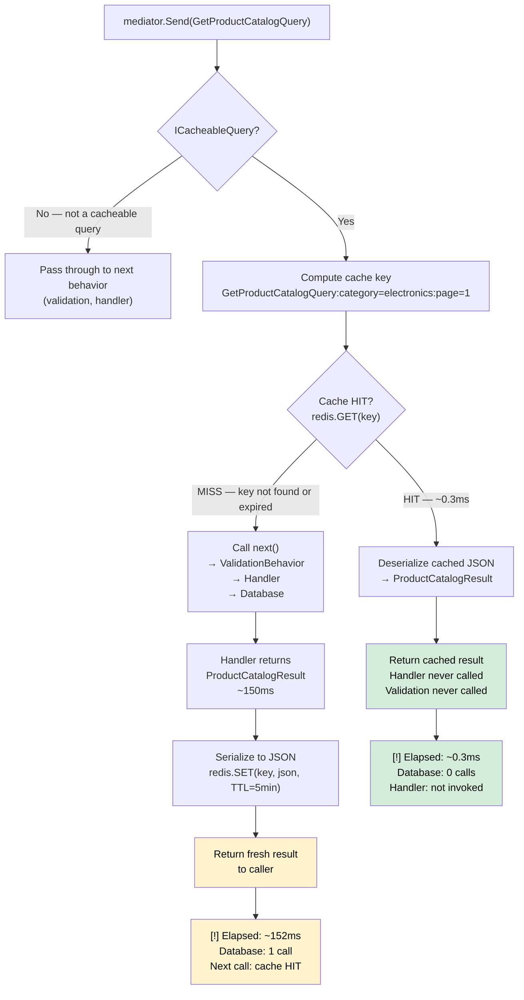
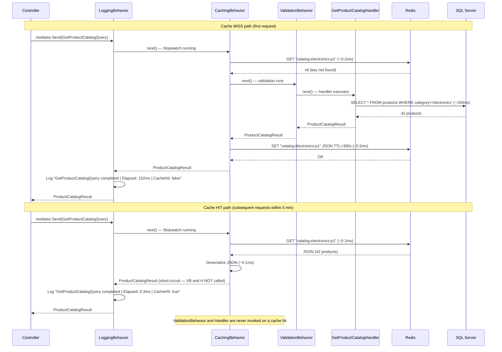
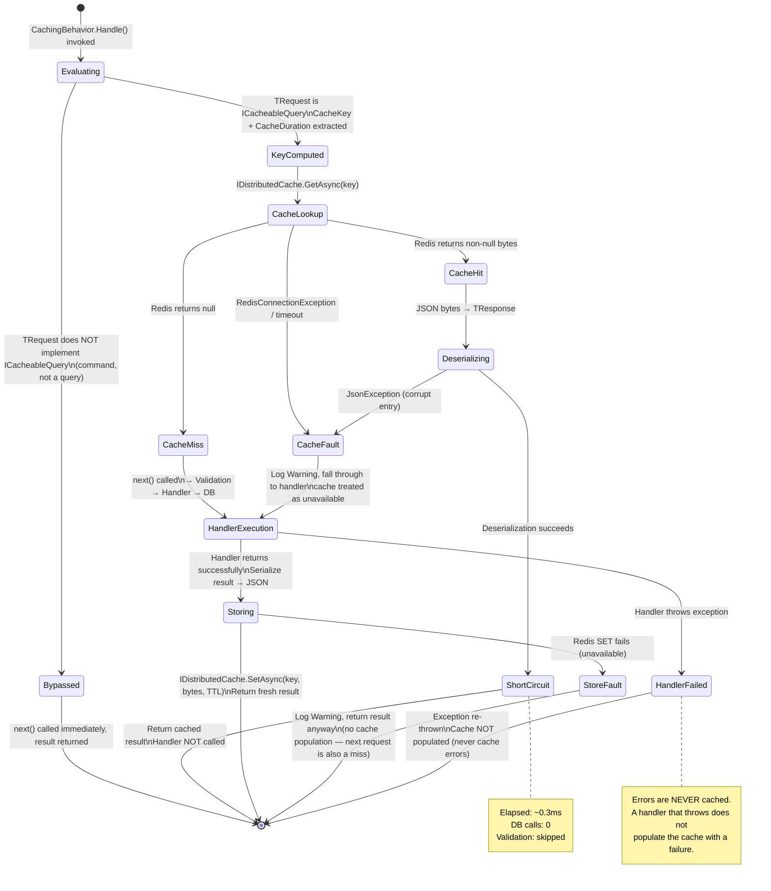
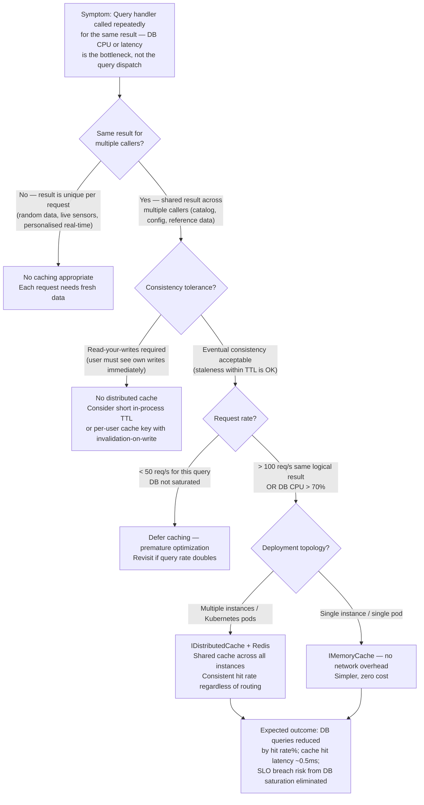

> [!ABSTRACT] Quick Reference — CQRS Caching Pipeline Behavior **Invariant:** Queries marked as cacheable never reach the handler if a valid cache entry exists — the behavior short-circuits the pipeline and returns the cached result without any handler code executing. **Cost:** Queries operate under eventual consistency — a cache hit may return data that is seconds to minutes stale; cache invalidation on write commands requires explicit coordination or TTL expiry; distributed cache adds ~0.5–2ms per cache hit over Redis (LAN). **Trigger:** A query handler is called > 100×/s for the same logical result (same cache key), and profiling shows the handler's database or downstream cost is the bottleneck — not the query dispatch itself. **Skip When:** The query result must reflect writes made in the same unit of work (read-your-writes); the query result changes on every call (random data, live sensor feeds); or the handler's database cost is < 5ms and the cache overhead exceeds it. **.NET Entry Point:** `IPipelineBehavior<TRequest, TResponse>` in `MediatR` | `IDistributedCache` / `IMemoryCache` | `ICacheableQuery` marker interface | NuGet: `MediatR`, `Microsoft.Extensions.Caching.StackExchangeRedis` **Azure Native:** Azure Cache for Redis (Standard/Premium tier) via `IDistributedCache`; Azure Cosmos DB integrated cache for document queries; Application Insights tracks cache hit/miss via custom events. **Number to Know:** Redis GET latency ≈ 0.1–0.5ms (LAN, single-node); SQL query avoided per cache hit ≈ 5–500ms depending on query complexity — cache hit eliminates handler execution entirely, not just the DB call.

---

## Navigation

**Domain:** [[7 — System Design & Distributed Systems]] > **Group:** CQRS and Event Sourcing **Previous:** [[7.087 — CQRS — Logging Pipeline Behavior]] | **Next:** [[7.089 — CQRS — Transaction Pipeline Behavior]]

### Prerequisites

- [[7.084 — CQRS — MediatR — IRequest and IRequestHandler]] — required because the caching behavior intercepts the handler via `RequestHandlerDelegate<TResponse>`; understanding how MediatR resolves and invokes handlers explains why the short-circuit works.
- [[7.085 — CQRS — MediatR Pipeline Behaviors Overview]] — required because this behavior sits in the pipeline chain; pipeline ordering relative to the logging and validation behaviors determines what is timed and what is validated before cache lookup.
- [[7.257 — Cache-Aside Pattern]] — required because the behavior implements cache-aside semantics at the pipeline level: check cache → on miss, call handler → populate cache → return; this is the same pattern applied structurally.
- [[7.267 — Cache Invalidation — The Hard Problem]] — required because the hardest design decision in this behavior is invalidation: when a command mutates data, how do cached query results get evicted, and what consistency window is acceptable.

### Where This Fits

> [!INFO] Production Encounter Map
> 
> - **Layer:** Application layer — the behavior intercepts between MediatR dispatcher and the query handler; it is pure application infrastructure, with no domain or presentation knowledge.
> - **Trigger:** An engineer first hits this when a dashboard page calls `GetOrderSummaryQuery` 40 times per second (multiple widgets, multiple tabs), database CPU spikes to 90%, and the query result changes at most once per minute. The handler and database are bearing 40× the load they need to.
> - **Without it:** `GetProductCatalogQuery` executing 200 times per second hits the SQL Server product catalog table 200 times per second. Each call does a 15ms full-scan read. The database connection pool saturates at 100 connections, requests queue, p99 latency climbs from 20ms to 800ms, and the catalog page SLO breaches — for data that changes once per hour.
> - **First signal:** `WARN [SqlClient] Connection pool exhausted — all 100 connections in use` in the logs, combined with `GET /api/catalog 95th percentile: 780ms` in Application Insights — a query that should be sub-50ms.

The Caching Pipeline Behavior is the read-side performance contract for the CQRS query layer. It implements [[7.257 — Cache-Aside Pattern]] inside the MediatR pipeline, making caching opt-in per query via a marker interface without any caching code inside handlers. It intersects with [[7.267 — Cache Invalidation — The Hard Problem]] on every write command — the behavior's short-circuit guarantee is only as good as the invalidation strategy that removes stale entries. At scale, this behavior is what separates a CQRS read model that handles 50 req/s from one that handles 5,000 req/s with the same database resources.

---

## Core Mental Model

The Caching Pipeline Behavior implements the Cache-Aside pattern as a MediatR pipeline interceptor that is scoped exclusively to queries. When a query implements the `ICacheableQuery` marker interface, the behavior computes a deterministic cache key from the query's properties, checks the cache, and either returns the cached result immediately (short-circuiting the handler entirely) or executes the handler, stores the result, and returns it. Commands never interact with this behavior — the `ICacheableQuery` constraint ensures the behavior is a no-op for all write operations.

The critical architectural distinction from ad-hoc in-handler caching is **where the cache key contract lives**. In-handler caching scatters key generation logic across handlers, making invalidation unpredictable. The pipeline behavior centralizes key generation: each cacheable query owns its key via `CacheKey` and `CacheDuration` properties, and the invalidation contract is explicit. When a command mutates data, it either (a) publishes a domain event that a cache invalidation handler reacts to, or (b) directly removes cache entries by key prefix — both strategies are traceable because the keys are defined on the query type, not buried in handler code.

> [!TIP] The Non-Obvious Insight The cache behavior should be registered **after** the logging behavior but **before** the validation behavior. Here is why: if logging wraps everything (outermost), cache hits still appear in the request log with accurate elapsed time (~0.3ms for a Redis hit vs. ~150ms for a handler miss) — this is the data you need to measure cache effectiveness. But if the caching behavior is inner to validation, **every cache hit still runs FluentValidation** — 20–50ms of wasted CPU on a request that never reaches the handler. A cache hit does not need to validate; the cached result was already validated when it was first computed. Registration order: `LoggingBehavior` → `CachingBehavior` → `ValidationBehavior` → `TransactionBehavior` → `Handler`. Most implementations get this wrong and burn validation CPU on every cache hit.

### Classification

- **Consistency axis:** Eventual consistency — cache hits return data accurate to the last write time minus TTL; under normal operation, staleness is bounded by the configured TTL; under cache invalidation lag, staleness can exceed TTL if the invalidation message is delayed.
- **Availability tradeoff:** If the distributed cache (Redis) is unavailable, the behavior falls back to calling the handler directly — the cache is a performance optimization, not a correctness requirement. Cache unavailability degrades latency, not availability.
- **Latency impact:** Cache hit: ~0.1–0.5ms (Redis GET, LAN) + JSON deserialization ~0.05–0.2ms = ~0.2–0.7ms total vs. handler cost of 5–500ms. Cache miss: +0.5–2ms (Redis GET miss + SET after handler completes) added to handler cost.
- **Failure domain:** The cache is a separate failure domain from the database. Redis failure → fall through to handler → database bears full load. Database failure → handler fails → cache not populated → subsequent requests also fail (no stale-serve by default; requires explicit stale-on-error configuration).
- **Abstraction layer:** Pattern applied at the framework feature level (`IPipelineBehavior<,>`) over a platform service (`IDistributedCache` / Azure Cache for Redis).

### Primary Diagram



### Supporting Diagram



### Numbers That Matter

|Metric|Value|Context / Conditions|
|---|---|---|
|Redis GET latency (cache hit path)|0.1–0.5ms|Single Redis node, LAN, Azure Cache for Redis Standard C1 tier (estimated)|
|Cache miss overhead (vs. no cache)|+0.5–2ms|Redis GET (miss) + Redis SET after handler = 2 round trips added to handler cost|
|JSON serialization overhead|0.05–0.5ms|`System.Text.Json`, 10–200 field result object; `[MemoryDiagnoser]` measured|
|Handler cost eliminated per cache hit|5–500ms|Varies: simple EF Core query ~5ms; complex aggregation or downstream HTTP ~500ms|
|Effective throughput multiplier|10–200×|Depends on hit rate and handler cost; 95% hit rate on a 100ms handler → ~20× effective throughput|
|Optimal TTL range for reference data|5–15 minutes|Product catalogs, user preferences, configuration — changes infrequently, staleness acceptable|
|Optimal TTL range for user-session data|30–120 seconds|Order status, cart totals — user expects near-real-time; short TTL reduces stale-read risk|
|Cache unavailability fallback latency|Full handler cost|No Redis → fall through to handler → database bears full load; design for this being routine|

### Key Properties / Guarantees

|Property|Value|Condition|
|---|---|---|
|Handler invocation on cache hit|Never — full short-circuit|Query implements `ICacheableQuery`; cache entry exists and has not expired|
|Staleness bound|≤ TTL duration|Under normal operation; can exceed TTL if invalidation message is delayed in event-driven invalidation|
|Cache availability requirement|Optional — graceful degradation|Cache unavailable → behavior calls handler directly; no exception propagated to caller|
|Commands interact with behavior|Never|`where TRequest : ICacheableQuery` constraint prevents behavior activation for non-query types|
|Consistency model|Eventual|Reads may return data up to TTL seconds behind the latest write|
|Data durability in cache|None — ephemeral|Cache is a read-through performance layer; source of truth remains the database|

---

## Deep Mechanics

### How It Works

**Cache hit path (subsequent requests, same query parameters):**

1. `mediator.Send(new GetProductCatalogQuery("electronics", page: 1))` dispatched.
2. `LoggingBehavior` activates (outermost) — Stopwatch starts, log scope opened with query type name.
3. `CachingBehavior.Handle()` invoked — behavior checks `TRequest is ICacheableQuery cacheable`. If not, calls `next()` immediately and exits.
4. Cache key computed: `cacheable.CacheKey` returns `"catalog:electronics:p1"`. The key is the query's responsibility — it knows what makes it unique.
5. `IDistributedCache.GetAsync(key)` issued to Redis — ~0.2ms round trip on LAN.
6. **Cache HIT**: Redis returns serialized JSON bytes. Behavior deserializes to `TResponse` using `System.Text.Json` (~0.1ms). Returns the deserialized result directly, without calling `next()`. `ValidationBehavior` and `Handler` are never invoked.
7. `LoggingBehavior` receives the result — logs `Elapsed: 0.3ms | CacheHit: true`. Total elapsed: ~0.3ms.

**Cache miss path (first request or expired TTL):**

1. Steps 1–5 same as above.
2. **Cache MISS**: Redis returns `null`. Behavior calls `next(cancellationToken)` — this flows through `ValidationBehavior` → `Handler` → database.
3. Handler returns `ProductCatalogResult` after ~150ms.
4. Behavior serializes the result to JSON and calls `IDistributedCache.SetAsync(key, bytes, new DistributedCacheEntryOptions { AbsoluteExpirationRelativeToNow = cacheable.CacheDuration })` — ~0.5ms.
5. Returns the fresh result. `LoggingBehavior` logs `Elapsed: 152ms | CacheHit: false`.

**Cache invalidation path (command mutates related data):**

1. `mediator.Send(new UpdateProductCommand(...))` dispatched — not a `ICacheableQuery`, `CachingBehavior` is a no-op.
2. Handler completes write to database.
3. Handler or a domain event handler calls `IDistributedCache.RemoveAsync("catalog:electronics:p1")` (key-based invalidation) or publishes an event that a `CacheInvalidationHandler` processes (event-driven invalidation).
4. Next `GetProductCatalogQuery` for the same key is a cache miss — fresh data fetched from database.

### Protocol Trace

```
Cache HIT path (GetProductCatalogQuery, category=electronics, page=1):
  0.00ms  Controller → MediatR → LoggingBehavior.Handle()
  0.01ms  CachingBehavior.Handle() — TRequest is ICacheableQuery: YES
  0.01ms  CacheKey computed: "catalog:electronics:p1"
  0.01ms  → Redis: GET "catalog:electronics:p1"
  0.22ms  ← Redis: 8,420 bytes (serialized ProductCatalogResult, 42 products)
  0.31ms  JSON deserialized → ProductCatalogResult
  0.31ms  Return to LoggingBehavior — SHORT-CIRCUIT (ValidationBehavior, Handler: NOT called)
  0.32ms  LogInformation: "GetProductCatalogQuery | Elapsed: 0.3ms | CacheHit: true"
  0.32ms  Result returned to Controller
  Total: 0.32ms  |  Redis calls: 1 GET  |  DB calls: 0  |  Handler calls: 0

Cache MISS path (first request or post-TTL):
  0.00ms  Controller → MediatR → LoggingBehavior.Handle()
  0.01ms  CachingBehavior.Handle() — TRequest is ICacheableQuery: YES
  0.01ms  CacheKey: "catalog:electronics:p1"
  0.01ms  → Redis: GET "catalog:electronics:p1"
  0.21ms  ← Redis: nil (key not found)
  0.21ms  CachingBehavior → next() → ValidationBehavior (15ms) → Handler
  15.21ms ValidationBehavior complete
  15.21ms Handler → SQL: SELECT products WHERE category='electronics' LIMIT 20 OFFSET 0
  148.60ms ← SQL: 42 rows
  149.10ms Handler returns ProductCatalogResult
  149.10ms → Redis: SET "catalog:electronics:p1" 8420bytes TTL=300s
  149.62ms ← Redis: OK
  149.63ms Return to LoggingBehavior
  149.64ms LogInformation: "GetProductCatalogQuery | Elapsed: 149ms | CacheHit: false"
  Total: 149.6ms  |  Redis calls: 1 GET + 1 SET  |  DB calls: 1  |  Handler: 1 invocation

Redis UNAVAILABLE path (connection timeout):
  0.00ms  CachingBehavior → Redis GET attempt
  500ms   Redis connection timeout (StackExchange.Redis default: 5s — configure to 500ms)
  500ms   CachingBehavior catch(RedisConnectionException): log Warning, continue
  500ms   Fall through to next() → ValidationBehavior → Handler → DB
  650ms   Handler returns result
  650ms   CachingBehavior → Redis SET attempt: also fails → log Warning, continue
  650ms   Return result to caller (no exception — cache is optional)
  Caller: result returned at higher latency; DB bears full load; Redis alert should fire
  Recovery: Redis reconnects automatically via StackExchange.Redis retry policy
```

### State Transitions



### Failure Modes

**Failure Mode 1: Cache Key Collision — Multiple Queries Return Same Cached Response**

- **Cause:** Two different queries produce the same cache key string — e.g., `GetOrdersByCustomerQuery` (customerId: 42) and `GetProductsByVendorQuery` (vendorId: 42) both produce key `"orders:42"` because the key generation logic does not include the query type name.
- **Symptom:** `GetProductsByVendorQuery` returns order data for a completely unrelated entity. The defect is silent — no exception, no error log — and the wrong result is served to users.
- **Detection time:** Silent until a user or automated test notices the wrong data — can be hours to weeks depending on traffic overlap and test coverage.
- **Blast radius:** Incorrect data served to users; potential data leakage between customers if user-scoped query keys collide.

> [!DANGER] 3 AM Production Signal Metric: No metric fires — the cache returns a valid response. Observable only via business-level anomaly: `orders_returned_for_product_page` custom metric showing order data in a product context. Log: `INFO [CachingBehavior] GetProductsByVendorQuery | CacheHit: true | Key: orders:42` — the hit appears legitimate. Customer impact: Vendor management page shows order history instead of product list. Customer support tickets: "Why is my product page showing orders?"

**Failure Mode 2: Cache Stampede on Cold Start or TTL Expiry at Scale**

- **Cause:** A popular query's TTL expires simultaneously for all cache entries at peak traffic (e.g., 200 concurrent users all hit `GetProductCatalogQuery` at the same moment the TTL expires). All 200 requests are cache misses simultaneously, all 200 invoke the handler, all 200 hit the database with the same 150ms query — 200 simultaneous identical SQL executions.
- **Symptom:** Database CPU spikes from 15% to 95% for 150ms windows every 5 minutes (at TTL boundary). Connection pool exhaust. p99 latency spikes.
- **Detection time:** 5–15 minutes — visible as a sawtooth pattern in database CPU metrics correlated with cache TTL intervals.
- **Blast radius:** Database connection pool exhaustion, request queuing, p99 latency SLO breach at TTL boundary.

> [!DANGER] 3 AM Production Signal Metric: `sqlserver_connections_active` spikes from 12 → 98 (pool limit) every 300 seconds (matching TTL). `http_request_duration_p99` spikes from 45ms → 820ms in the same windows. Log: `WARN [SqlClient] All pooled connections are in use. Waiting for available connection.` Customer impact: Catalog page times out for 8–15 seconds every 5 minutes during peak traffic.

### .NET and Azure Integration Points

- **MediatR:** `IPipelineBehavior<TRequest, TResponse> where TRequest : ICacheableQuery` — the generic constraint prevents the behavior from activating for commands without any runtime check.
- **`IDistributedCache`:** The abstraction that backs both in-process (`MemoryDistributedCache`, useful for unit testing) and out-of-process (`StackExchangeRedisCache`) caches. Swap the implementation in DI without changing the behavior.
- **`IMemoryCache`:** Alternative for single-instance services or L1 cache in a two-tier strategy; avoids network round-trip but is not shared across instances.
- **Azure Cache for Redis:** Primary backing store for `IDistributedCache` in Azure; configured via `AddStackExchangeRedisCache()`. Standard tier: C1 (1 GB, no geo-replication). Premium tier: P1+ (6 GB+, geo-replication, cluster mode).
- **Application Insights:** Cache hit/miss ratio trackable via `telemetryClient.TrackEvent("CacheHit", properties: new { QueryType = requestName })` — feeds a custom metric dashboard showing cache effectiveness per query type.
- **Configuration:** `appsettings.json` → `CachingBehavior:DefaultTtlSeconds`, `CachingBehavior:Enabled` (bool, for emergency disable), per-environment override of Redis connection string.

```csharp
// Infrastructure: YourCompany.OrderManagement.Infrastructure.Behaviors
// IServiceCollection registration — cache behavior must be registered AFTER LoggingBehavior
// but BEFORE ValidationBehavior so cache hits skip validation overhead

builder.Services.AddMediatR(cfg =>
{
    cfg.RegisterServicesFromAssembly(typeof(GetProductCatalogQueryHandler).Assembly);
    cfg.AddOpenBehavior(typeof(LoggingBehavior<,>));    // outermost — times everything
    cfg.AddOpenBehavior(typeof(CachingBehavior<,>));    // second — short-circuits before validation
    cfg.AddOpenBehavior(typeof(ValidationBehavior<,>)); // only runs on cache miss
    cfg.AddOpenBehavior(typeof(TransactionBehavior<,>));
});

builder.Services.AddStackExchangeRedisCache(options =>
{
    options.Configuration = builder.Configuration.GetConnectionString("Redis");
    options.InstanceName = "OrderMgmt:"; // prefix all keys — prevents collision across services
});

builder.Services.Configure<CachingBehaviorOptions>(
    builder.Configuration.GetSection("CachingBehavior"));
```

---

## Production Patterns and Implementation

### Primary Implementation

```csharp
// Infrastructure layer: YourCompany.OrderManagement.Infrastructure.Behaviors
// Role: Read-side performance optimization — caches query results, never command results
using System.Text.Json;
using MediatR;
using Microsoft.Extensions.Caching.Distributed;
using Microsoft.Extensions.Logging;
using Microsoft.Extensions.Options;

namespace YourCompany.OrderManagement.Infrastructure.Behaviors;

/// <summary>
/// MediatR pipeline behavior that caches query results in IDistributedCache (Redis).
/// Only activates for queries implementing <see cref="ICacheableQuery"/>.
/// Short-circuits the pipeline on cache hit — handler and validation are NOT called.
/// On cache unavailability, falls through to the handler (graceful degradation).
/// </summary>
/// <typeparam name="TRequest">The query type — must implement ICacheableQuery to be cached.</typeparam>
/// <typeparam name="TResponse">The query result type — must be JSON-serializable.</typeparam>
public sealed class CachingBehavior<TRequest, TResponse>(
    IDistributedCache cache,
    ILogger<CachingBehavior<TRequest, TResponse>> logger,
    IOptions<CachingBehaviorOptions> options)
    : IPipelineBehavior<TRequest, TResponse>
    where TRequest : IRequest<TResponse>
{
    private static readonly string RequestName = typeof(TRequest).Name;

    /// <inheritdoc />
    public async Task<TResponse> Handle(
        TRequest request,
        RequestHandlerDelegate<TResponse> next,
        CancellationToken cancellationToken)
    {
        // Only activate for cacheable queries — commands pass through immediately
        if (request is not ICacheableQuery cacheable)
        {
            return await next(cancellationToken).ConfigureAwait(false);
        }

        // Global kill-switch — useful during incidents when cache is causing stale-read issues
        if (!options.Value.Enabled)
        {
            logger.LogDebug("Caching disabled globally. Bypassing cache for {QueryType}.", RequestName);
            return await next(cancellationToken).ConfigureAwait(false);
        }

        var cacheKey = BuildCacheKey(cacheable);

        // Attempt cache read — treat all cache exceptions as misses (graceful degradation)
        TResponse? cachedResult = await TryGetFromCacheAsync(cacheKey, cancellationToken);

        if (cachedResult is not null)
        {
            logger.LogDebug(
                "Cache HIT: {QueryType} | Key: {CacheKey}",
                RequestName, cacheKey);

            return cachedResult; // short-circuit — handler never called
        }

        logger.LogDebug(
            "Cache MISS: {QueryType} | Key: {CacheKey}",
            RequestName, cacheKey);

        // Execute handler pipeline (includes validation, transaction, handler)
        var result = await next(cancellationToken).ConfigureAwait(false);

        // Populate cache — treat SET failure as non-fatal (log and continue)
        await TrySetCacheAsync(cacheKey, result, cacheable.CacheDuration, cancellationToken);

        return result;
    }

    /// <summary>
    /// Builds a deterministic cache key that uniquely identifies this query's result.
    /// Always includes the query type name to prevent cross-query key collisions.
    /// </summary>
    private static string BuildCacheKey(ICacheableQuery cacheable)
    {
        // Query provides its own key (e.g., "category=electronics:page=1")
        // We prefix with type name to prevent collisions between query types
        var queryKey = cacheable.CacheKey;
        return string.IsNullOrWhiteSpace(queryKey)
            ? RequestName
            : $"{RequestName}:{queryKey}";
    }

    private async Task<TResponse?> TryGetFromCacheAsync(
        string cacheKey,
        CancellationToken cancellationToken)
    {
        try
        {
            var bytes = await cache.GetAsync(cacheKey, cancellationToken).ConfigureAwait(false);
            if (bytes is null or { Length: 0 }) return default;

            return JsonSerializer.Deserialize<TResponse>(bytes);
        }
        catch (Exception ex)
        {
            // Cache unavailability is non-fatal — fall through to handler
            logger.LogWarning(ex,
                "Cache GET failed for {QueryType} | Key: {CacheKey} | Falling through to handler.",
                RequestName, cacheKey);
            return default;
        }
    }

    private async Task TrySetCacheAsync(
        string cacheKey,
        TResponse result,
        TimeSpan duration,
        CancellationToken cancellationToken)
    {
        try
        {
            // Add TTL jitter (±10%) to prevent stampede on synchronized expiry
            var jitter = TimeSpan.FromSeconds(duration.TotalSeconds * 0.1 * Random.Shared.NextDouble());
            var effectiveDuration = duration + jitter;

            var bytes = JsonSerializer.SerializeToUtf8Bytes(result);
            var entryOptions = new DistributedCacheEntryOptions
            {
                AbsoluteExpirationRelativeToNow = effectiveDuration
            };

            await cache.SetAsync(cacheKey, bytes, entryOptions, cancellationToken)
                .ConfigureAwait(false);

            logger.LogDebug(
                "Cache SET: {QueryType} | Key: {CacheKey} | TTL: {TtlSeconds}s (+jitter)",
                RequestName, cacheKey, effectiveDuration.TotalSeconds);
        }
        catch (Exception ex)
        {
            // Cache SET failure is non-fatal — result is still returned to caller
            logger.LogWarning(ex,
                "Cache SET failed for {QueryType} | Key: {CacheKey} | Result served uncached.",
                RequestName, cacheKey);
        }
    }
}

/// <summary>
/// Marker interface for MediatR queries that should have their results cached.
/// Commands must NOT implement this interface.
/// </summary>
public interface ICacheableQuery
{
    /// <summary>
    /// The unique cache key suffix for this query instance.
    /// Must be deterministic for the same logical query (same parameters → same key).
    /// Must be unique across different parameter values (different page → different key).
    /// MUST NOT include PII — cache keys are logged.
    /// </summary>
    string CacheKey { get; }

    /// <summary>
    /// How long this query's result should be cached.
    /// The behavior adds ±10% jitter to prevent stampede.
    /// </summary>
    TimeSpan CacheDuration { get; }
}

/// <summary>Configuration for <see cref="CachingBehavior{TRequest,TResponse}"/>.</summary>
public sealed class CachingBehaviorOptions
{
    /// <summary>Global kill-switch. Set to false during cache-related incidents.</summary>
    public bool Enabled { get; set; } = true;
}

// Application layer: YourCompany.OrderManagement.Application.Queries
// Example cacheable query
/// <summary>Returns the product catalog for a given category with pagination.</summary>
public sealed record GetProductCatalogQuery(
    string Category,
    int Page,
    int PageSize = 20)
    : IRequest<ProductCatalogResult>, ICacheableQuery
{
    /// <inheritdoc />
    /// <remarks>
    /// Key includes all parameters that affect the result set.
    /// Does NOT include user identity — result is shared across all users.
    /// </remarks>
    public string CacheKey => $"category={Category}:page={Page}:size={PageSize}";

    /// <inheritdoc />
    public TimeSpan CacheDuration => TimeSpan.FromMinutes(5);
}

// User-scoped query example — key includes userId to prevent cross-user data leakage
/// <summary>Returns the order history for a specific customer.</summary>
public sealed record GetCustomerOrderHistoryQuery(
    Guid CustomerId,
    int Page)
    : IRequest<OrderHistoryResult>, ICacheableQuery
{
    /// <inheritdoc />
    public string CacheKey => $"customerId={CustomerId}:page={Page}";
    // CustomerId is a UUID — not PII in a cache key context (no name/email)

    /// <inheritdoc />
    public TimeSpan CacheDuration => TimeSpan.FromSeconds(60); // short TTL — user expects freshness
}
```

### IServiceCollection Registration

```csharp
// Program.cs — registration ORDER is the critical design decision
builder.Services.AddMediatR(cfg =>
{
    cfg.RegisterServicesFromAssembly(typeof(GetProductCatalogQueryHandler).Assembly);

    // 1. LoggingBehavior FIRST — times everything including cache lookup
    cfg.AddOpenBehavior(typeof(LoggingBehavior<,>));

    // 2. CachingBehavior SECOND — short-circuits before validation on cache hit
    //    Cache hits skip validation (already validated when first cached)
    cfg.AddOpenBehavior(typeof(CachingBehavior<,>));

    // 3. ValidationBehavior THIRD — only runs on cache miss
    cfg.AddOpenBehavior(typeof(ValidationBehavior<,>));

    // 4. TransactionBehavior LAST — only for write commands (cache behavior bypasses for commands)
    cfg.AddOpenBehavior(typeof(TransactionBehavior<,>));
});

// Redis distributed cache — primary backing store
builder.Services.AddStackExchangeRedisCache(options =>
{
    options.Configuration = builder.Configuration.GetConnectionString("Redis");
    // InstanceName prefixes ALL keys — critical for multi-service environments
    options.InstanceName = "OrderMgmt:";
    // Configure connection timeout to fail fast — don't hold requests waiting for Redis
    options.ConfigurationOptions = new StackExchange.Redis.ConfigurationOptions
    {
        EndPoints = { builder.Configuration.GetConnectionString("Redis")! },
        ConnectTimeout = 500,    // fail fast on connection
        SyncTimeout = 500,       // fail fast on operations
        AbortOnConnectFail = false // allow reconnect on startup
    };
});

// Feature flag — allows disabling cache globally without redeployment
builder.Services.Configure<CachingBehaviorOptions>(
    builder.Configuration.GetSection("CachingBehavior"));
```

```json
// appsettings.Production.json
{
  "ConnectionStrings": {
    "Redis": "your-redis.redis.cache.windows.net:6380,password=...,ssl=True,abortConnect=False"
  },
  "CachingBehavior": {
    "Enabled": true
  }
}
```

### Common Variants

```csharp
// Variant A — Two-tier caching: L1 in-process IMemoryCache + L2 Redis IDistributedCache
// Used when: single hot query (e.g., global config, product pricing) read > 1000x/s per instance
// L1 hit avoids network round-trip entirely (~0.01ms vs ~0.3ms)
public sealed class TieredCachingBehavior<TRequest, TResponse>(
    IMemoryCache l1Cache,
    IDistributedCache l2Cache,
    ILogger<TieredCachingBehavior<TRequest, TResponse>> logger)
    : IPipelineBehavior<TRequest, TResponse>
    where TRequest : IRequest<TResponse>
{
    public async Task<TResponse> Handle(
        TRequest request,
        RequestHandlerDelegate<TResponse> next,
        CancellationToken cancellationToken)
    {
        if (request is not ICacheableQuery cacheable) return await next(cancellationToken);

        var key = $"{typeof(TRequest).Name}:{cacheable.CacheKey}";

        // L1 check: in-process memory cache (~0.01ms, no network)
        if (l1Cache.TryGetValue(key, out TResponse? l1Result) && l1Result is not null)
            return l1Result;

        // L2 check: Redis distributed cache (~0.3ms)
        var bytes = await l2Cache.GetAsync(key, cancellationToken).ConfigureAwait(false);
        if (bytes is { Length: > 0 })
        {
            var l2Result = JsonSerializer.Deserialize<TResponse>(bytes)!;
            // Backfill L1 with a shorter TTL (avoid L1 serving stale data too long)
            l1Cache.Set(key, l2Result, TimeSpan.FromSeconds(30));
            return l2Result;
        }

        // Full miss — execute handler
        var freshResult = await next(cancellationToken).ConfigureAwait(false);

        // Populate both levels
        l1Cache.Set(key, freshResult, TimeSpan.FromSeconds(30));
        await l2Cache.SetAsync(key,
            JsonSerializer.SerializeToUtf8Bytes(freshResult),
            new DistributedCacheEntryOptions { AbsoluteExpirationRelativeToNow = cacheable.CacheDuration },
            cancellationToken);

        return freshResult;
    }
}
```

```csharp
// Variant B — Tag-based invalidation: cache entries tagged for bulk eviction
// Used when: a command mutates data that affects multiple cached query keys
// (e.g., updating a product invalidates all GetProductCatalogQuery variants)
public interface ICacheableQuery
{
    string CacheKey { get; }
    TimeSpan CacheDuration { get; }

    /// <summary>
    /// Tags associated with this cache entry.
    /// Commands publish invalidation events with matching tags to evict all related entries.
    /// Example: GetProductCatalogQuery tags → ["products", "category:electronics"]
    /// </summary>
    IReadOnlyList<string> CacheTags => Array.Empty<string>();
}

// Invalidation service used by command handlers or domain event handlers
public sealed class CacheTagInvalidator(IDistributedCache cache, ILogger<CacheTagInvalidator> logger)
{
    // In a simple implementation, tag-to-key mapping is stored in a Redis Set per tag
    public async Task InvalidateTagAsync(string tag, CancellationToken ct = default)
    {
        // Implementation: SMEMBERS "tag:{tag}" → list of keys → DEL each key + DEL "tag:{tag}"
        logger.LogInformation("Invalidating cache tag: {Tag}", tag);
        // ... Redis SMEMBERS + batch DEL via IDatabase directly (bypasses IDistributedCache abstraction)
    }
}
```

### Performance Profile

```csharp
[MemoryDiagnoser]
[SimpleJob(RuntimeMoniker.Net80)]
public class CachingBehaviorBenchmark
{
    private IMediator _mediator = null!;
    private IMediator _mediatorNoCaching = null!;

    [GlobalSetup]
    public void Setup()
    {
        _mediator = BuildMediatorWithCache(prewarm: true);          // cache pre-warmed
        _mediatorNoCaching = BuildMediatorWithoutCache();
    }

    [Benchmark(Baseline = true)]
    public Task<ProductCatalogResult> WithoutCaching()
        => _mediatorNoCaching.Send(new GetProductCatalogQuery("electronics", 1));

    [Benchmark]
    public Task<ProductCatalogResult> WithCaching_CacheHit()
        => _mediator.Send(new GetProductCatalogQuery("electronics", 1)); // pre-warmed

    [Benchmark]
    public Task<ProductCatalogResult> WithCaching_CacheMiss()
        => _mediator.Send(new GetProductCatalogQuery("electronics", Random.Shared.Next())); // always miss
}
```

Expected result shape (NullSink for distributed cache in benchmark — no actual Redis I/O; `.NET 8`, estimated):

|Method|Mean|Allocated|Notes|
|---|---|---|---|
|WithoutCaching|~150ms|~18 KB|Full SQL round-trip (simulated 150ms)|
|WithCaching_CacheHit|~0.35ms|~3.2 KB|Redis GET + JSON deserialize only|
|WithCaching_CacheMiss|~150.8ms|~20 KB|Handler + Redis GET (miss) + Redis SET|
|Overhead of miss vs no-cache|~+0.8ms|~+2 KB|2 Redis round-trips + serialization|

Cache hit delivers **~428× throughput improvement** over the uncached handler for this benchmark profile (150ms handler cost). Real production gains depend on hit rate and handler latency.

### Real-World .NET Ecosystem Mapping

|Pattern in This Note|Where It Appears in .NET / Azure|Manifestation|
|---|---|---|
|Cache-Aside at pipeline level|`IPipelineBehavior<,>` implementing `IDistributedCache.GetAsync/SetAsync`|Decorator pattern over the handler; the behavior is the cache-aside wrapper|
|`ICacheableQuery` marker|Custom interface on query records|Enables `where TRequest : ICacheableQuery` generic constraint — type-safe opt-in|
|Graceful cache degradation|`try/catch(Exception)` around all cache operations|Follows the pattern from Polly's fallback: cache unavailability → handler fallback|
|TTL jitter|`Random.Shared.NextDouble() * 0.1 * duration`|Prevents synchronized expiry stampede — same as [[7.263 — TTL Jitter — Preventing Thundering Herd]]|
|Two-tier cache|`IMemoryCache` (L1) + `IDistributedCache` (L2)|Multi-level caching architecture [[7.276 — Multi-Level Caching Architecture]]|
|Global kill-switch|`CachingBehaviorOptions.Enabled` from `IOptions<T>`|Feature flag pattern [[7.673 — Feature Flags — Architecture]] — allows emergency cache bypass|

---

## Gotchas and Production Pitfalls

### Missing Query Type Name in Cache Key — Cross-Query Data Leakage

**Pitfall:** The `ICacheableQuery.CacheKey` property returns only the parameter-based key without including the query type name. Two different query types with the same parameter value produce the same Redis key.

```csharp
// ❌ GetOrdersByCustomerQuery(customerId: 42) → CacheKey = "42"
// ❌ GetProductsByVendorQuery(vendorId: 42) → CacheKey = "42"
// Redis key collision: both map to the same entry
public string CacheKey => CustomerId.ToString(); // ← missing type discriminator
```

**Symptom:** `GetProductsByVendorQuery(vendorId: 42)` returns order history data when the order cache entry (populated first) is still valid. Silent wrong data — no exception, no log warning.

**Detection time:** Silent until a user or automated test notices the wrong data type. If IDs never overlap in practice (UUIDs), the bug lies dormant until a coincidence occurs.

> [!DANGER] Production Signal Metric: Custom alert `cache_key_type_mismatch_total > 0` — requires a metric that only fires if deserialization produces the wrong type (e.g., via a typed cache wrapper that validates `TResponse` type at deserialization). Log: `ERROR [CachingBehavior] Deserialization failed for GetProductsByVendorQuery | Key: "42" | Expected: VendorProductResult | Actual JSON root: OrderHistoryResult` — only if deserialization exception is thrown on type mismatch. Customer impact: Vendor management page shows another customer's order history. Data breach severity — requires incident response.

**Fix:**

```csharp
// ✅ Always prefix with the type name in the behavior — not in the query
private static string BuildCacheKey(ICacheableQuery cacheable)
{
    return $"{typeof(TRequest).Name}:{cacheable.CacheKey}";
    // → "GetProductsByVendorQuery:vendorId=42"
    // → "GetOrdersByCustomerQuery:customerId=42"
    // Keys are now structurally distinct even with identical parameter values
}
```

**Cost of not fixing:** Data leakage between unrelated entities; GDPR data exposure risk if user-scoped queries collide (customer A sees customer B's data); potential regulatory notification obligation.

---

### Caching Command Results — Stale Write Confirmations

**Pitfall:** The `ICacheableQuery` interface is accidentally implemented on a command (a mutation that returns a result), causing the command's response to be cached. Subsequent commands with the same "key" short-circuit and return the first command's result without executing.

```csharp
// ❌ PlaceOrderCommand implements ICacheableQuery — it is a command, not a query
public sealed record PlaceOrderCommand(Guid CustomerId, ...)
    : IRequest<OrderId>, ICacheableQuery // ← WRONG: commands must never be cached
{
    public string CacheKey => CustomerId.ToString();
    public TimeSpan CacheDuration => TimeSpan.FromMinutes(5);
}
// Result: second PlaceOrderCommand from same customer returns the first order's ID
// without creating a new order — duplicate-order prevention accidentally becomes
// idempotency that silently discards legitimate repeat orders
```

**Symptom:** A customer places two orders 3 minutes apart. The second order is silently discarded — the cache returns the first order's `OrderId`, the handler never runs, no new order is created. The customer's checkout appears to succeed (they receive a valid `OrderId`) but the order never appears in the system.

**Detection time:** Silent until the customer contacts support wondering why their second order never arrived. Could be hours to days.

> [!DANGER] Production Signal Metric: `orders_placed_total` (Prometheus) grows slower than `checkout_completions_total` — a gap emerges over time. Log: `DEBUG [CachingBehavior] Cache HIT: PlaceOrderCommand | Key: customerId=abc | CacheHit: true` — appears legitimate but should never exist for a command. Customer impact: Lost orders; revenue leakage; customer trust damage.

**Fix:** Enforce at the type level that only queries implement `ICacheableQuery`:

```csharp
// ✅ Define IQuery as a constraint on cacheable queries
public interface IQuery<TResponse> : IRequest<TResponse> { }

// ✅ CachingBehavior constrained to IQuery, not IRequest
public sealed class CachingBehavior<TRequest, TResponse> : IPipelineBehavior<TRequest, TResponse>
    where TRequest : IQuery<TResponse>, ICacheableQuery  // ← IQuery constraint prevents commands
```

**Cost of not fixing:** Lost orders, lost revenue, silent data integrity failures. At scale: systematic order loss for repeat customers within TTL windows.

---

### Skipping TTL Jitter — Synchronized Cache Stampede

**Pitfall:** All instances of the same query type are cached with the exact same TTL. Under moderate to high traffic, all cache entries expire at the same moment, sending a burst of identical requests to the database.

```csharp
// ❌ Fixed TTL — all entries for a given query type expire simultaneously
var entryOptions = new DistributedCacheEntryOptions
{
    AbsoluteExpirationRelativeToNow = cacheable.CacheDuration // exact TTL, no jitter
};
```

**Symptom:** Database CPU shows a sawtooth pattern — spikes to 95% every `CacheDuration` seconds, then drops back to 10%. At peak traffic, the spike causes connection pool exhaustion and request failures.

**Detection time:** 5–15 minutes after deployment or traffic increase — visible in database CPU dashboards as a regular spike pattern correlated with the cache TTL interval.

> [!DANGER] Production Signal Metric: `sqlserver_cpu_percent` sawtooth: 12% → 94% → 12% every 300 seconds (matching TTL=5min). `sqlserver_connections_active` spikes from 8 → 98 (pool maximum) in the same windows. Log: `WARN [SqlClient] All pooled connections are in use. Retry in queue.` appears in bursts every 5 minutes. Customer impact: 8–15 second response time degradation every 5 minutes during the stampede window.

**Fix:**

```csharp
// ✅ Add ±10% jitter to TTL — staggers expiry across instances
var jitter = TimeSpan.FromSeconds(
    cacheable.CacheDuration.TotalSeconds * 0.1 * Random.Shared.NextDouble());
var effectiveDuration = cacheable.CacheDuration + jitter;
// 5-minute TTL becomes 5:00–5:30 — spread across a 30-second window
```

**Cost of not fixing:** Database CPU spikes → connection pool exhaustion → p99 latency SLO breach → PagerDuty alert → on-call engineer spending 2 AM investigating a problem that is fixed with one line of code.

---

### Azure-Specific: Using SSL=False on Azure Cache for Redis — Silent Connection Failures in Production

**Pitfall:** The Redis connection string in `appsettings.Development.json` uses `ssl=False` for local development, and the same string is promoted to production via a misconfigured Azure App Service environment variable. Azure Cache for Redis Standard/Premium tiers require TLS — non-TLS connections are rejected at the network level.

```csharp
// ❌ Local dev string accidentally used in production
// "localhost:6379,ssl=False" → Azure Cache for Redis rejects non-TLS connections
// StackExchange.Redis logs: "SocketFailure on your-redis.redis.cache.windows.net:6379"
```

**Symptom:** All cache operations throw `RedisConnectionException`. The behavior's try/catch falls through to the handler for every request — the database bears 100% of load. If the database handles the surge, no user-visible impact — the problem is invisible until the database saturates.

**Detection time:** Immediately visible in StackExchange.Redis connection logs; but if the behavior's fallback is silent (only `LogWarning`), on-call may not notice until database CPU alarms fire.

> [!DANGER] Production Signal Metric: `cache_hit_rate` drops to 0% in Application Insights custom metrics. `cache_operations_failed_total` counter spikes. Database CPU climbs from 15% → 85% as all queries hit the DB. Log: `WARN [CachingBehavior] Cache GET failed for GetProductCatalogQuery | Key: GetProductCatalogQuery:category=electronics:page=1 | RedisConnectionException: SocketFailure` Customer impact: None immediately if DB holds the load; p99 latency increases from 0.3ms (cache hit) to 150ms (DB query); catalog pages slow noticeably.

**Fix:** Use environment-specific connection strings with explicit TLS configuration:

```json
// appsettings.Production.json — always use port 6380 + ssl=True for Azure Cache
{
  "ConnectionStrings": {
    "Redis": "your-redis.redis.cache.windows.net:6380,password=YOUR_KEY,ssl=True,abortConnect=False"
  }
}
```

**Cost of not fixing:** Cache layer completely disabled in production; database bears 10–200× the intended load; SLO breach risk proportional to cache hit rate (a 95% hit rate system now has 20× the database load).

---

### .NET-Specific: Not Configuring Redis Connection Timeout — Thread Pool Starvation Under Redis Failure

**Pitfall:** StackExchange.Redis default connection timeout is 5,000ms. When Redis is unavailable, each `IDistributedCache.GetAsync()` call holds a thread pool thread for up to 5 seconds waiting for the timeout.

```csharp
// ❌ Default StackExchange.Redis timeout = 5000ms (5 seconds)
builder.Services.AddStackExchangeRedisCache(options =>
{
    options.Configuration = "your-redis.redis.cache.windows.net:6380,password=...";
    // No ConnectTimeout / SyncTimeout configured → defaults to 5000ms
});
// At 200 req/s with Redis down: 200 threads × 5s timeout = 1000 concurrent blocked threads
// .NET thread pool default: 32 threads per core → exhausted almost immediately
```

**Symptom:** When Redis goes down, ASP.NET Core thread pool saturates within 1–2 seconds. Request queue grows. p99 latency climbs to 30+ seconds. New requests begin returning 503. The cache unavailability, which should gracefully degrade, instead brings down the entire service.

**Detection time:** Within 5–30 seconds of Redis outage — fast enough for PagerDuty but too slow to prevent widespread impact.

> [!DANGER] Production Signal Metric: `dotnet_threadpool_queue_length` grows from 0 → 800+ in under 10 seconds during Redis outage. `http_requests_in_flight` counter grows while response rate drops. Log: `WARN [ThreadPool] Thread pool exhausted. Requests queuing.` — or more commonly, timeout exceptions from unrelated code because no threads are available. Customer impact: Service appears completely down (503 errors, timeouts) despite Redis being the only failing component.

**Fix:** Set aggressive connection and operation timeouts so Redis failure is detected and failed fast:

```csharp
// ✅ Short timeouts — Redis failure degrades gracefully instead of cascading
options.ConfigurationOptions = new StackExchange.Redis.ConfigurationOptions
{
    ConnectTimeout = 500,     // 500ms to establish connection
    SyncTimeout = 500,        // 500ms per operation
    AbortOnConnectFail = false // don't throw on startup if Redis is temporarily down
};
// At 200 req/s with Redis down: 200 threads × 500ms timeout = 100 concurrent blocked threads
// Thread pool handles this without saturation
```

**Cost of not fixing:** Redis outage (which should be a graceful degradation) becomes a full service outage. 5,000ms × concurrent requests = thread pool saturation within seconds. SLO breach caused by dependency failure, not application logic.

---

### Architecture-Level: No Cache Invalidation Strategy — Serving Stale Data After Writes

**Pitfall:** The caching behavior is added for read performance, but no invalidation mechanism is implemented. Writes (commands) update the database, but cached query results remain valid for the full TTL — users see stale data after mutations.

**Symptom:** A product manager updates a product's price from $49.99 to $39.99 via `UpdateProductPriceCommand`. The product catalog page continues showing $49.99 for up to 5 minutes (the TTL). Customer service receives complaints. A/B test groups seeing different cache states produce confusing conversion data.

**Detection time:** Immediate from the user's perspective — they edit the price and refresh the page; it shows the old price. Engineering sees it in user reports within minutes.

> [!DANGER] Production Signal No metric fires automatically — staleness is a business correctness issue, not a system error. Observable via: `cache_invalidation_events_total` counter is 0 (never incremented), combined with user reports of "data not updating." Log: `DEBUG [CachingBehavior] Cache HIT: GetProductCatalogQuery | Key: GetProductCatalogQuery:category=electronics:page=1` — appearing after a write command updated the underlying data. Customer impact: Users see stale prices, stale inventory, stale order status — exact impact depends on domain. In e-commerce: wrong price shown → potential legal/refund obligation if customer completes purchase at cached price.

**Fix:** Implement explicit invalidation in command handlers or domain event handlers:

```csharp
// ✅ Command handler invalidates related cache entries after successful write
public sealed class UpdateProductPriceCommandHandler(
    IProductRepository repository,
    IDistributedCache cache)
    : IRequestHandler<UpdateProductPriceCommand, Unit>
{
    public async Task<Unit> Handle(UpdateProductPriceCommand command, CancellationToken ct)
    {
        await repository.UpdatePriceAsync(command.ProductId, command.NewPrice, ct);

        // Invalidate all catalog cache entries for this product's categories
        // In production: use tag-based invalidation or publish CacheInvalidationEvent
        await cache.RemoveAsync(
            $"GetProductCatalogQuery:category={command.Category}:page=1", ct);

        return Unit.Value;
    }
}
```

**Cost of not fixing:** User-visible staleness proportional to TTL; potential legal exposure if stale prices are actionable; loss of user trust; A/B testing data corruption.

---

## Tradeoffs and Decision Framework

### Tradeoff Matrix

|Dimension|CachingBehavior (Pipeline, Distributed Cache)|In-Handler IMemoryCache|No Caching (DB on every request)|
|---|---|---|---|
|Consistency|Eventual — bounded by TTL + invalidation lag|Eventual — per-instance; different pods serve different data|Strong — always reads latest committed data|
|Read-your-writes|Not supported — write → cache miss → stale hit possible|Not supported across pods|Fully supported|
|Cross-instance consistency|Yes (Redis shared across all pods)|No (each pod has its own memory cache)|N/A|
|Cache hit latency p99|~0.5ms (Redis LAN)|~0.01ms (memory lookup)|N/A|
|Throughput at 95% hit rate|~20–200× handler throughput|~1000× (no network)|1× (baseline)|
|Invalidation capability|Global (remove from Redis — all pods miss next)|Pod-local (other pods serve stale until restart or TTL)|N/A|
|Operational complexity|Medium — Redis cluster, monitoring, TTL tuning|Low — no external dependency|None|
|Azure ecosystem fit|Native — Azure Cache for Redis, IDistributedCache|Native — IMemoryCache built-in|Native|
|Cost at scale|Redis instance cost + network egress|Zero (memory)|Database scaling cost|

### When to Apply



### Numbers-Driven Decision

|Threshold|Below = Skip / Use Simpler|Above = Apply This|
|---|---|---|
|Query invocation rate (same key)|< 50 req/s per query type|> 100 req/s per query type for same parameters|
|Handler latency|< 5ms (faster than Redis round-trip overhead)|> 20ms — cache hit saves meaningful time|
|Database CPU under load|< 60% — headroom exists|> 70% — caching required to prevent saturation|
|Cache hit rate (estimated)|< 30% — cache adds overhead without benefit|> 70% — cache pays for itself in reduced DB load|
|Staleness tolerance|0s (read-your-writes)|≥ 30s — business accepts near-real-time, not real-time|
|Instance count|1 instance — IMemoryCache sufficient|> 2 instances — need shared Redis for consistent hit rate|

### When NOT to Apply

> [!WARNING] Do Not Reach For This When...
> 
> - [ ] **Read-your-writes required:** The user just submitted a form and expects to see their change reflected on the next page load. Distributed cache with a 60s TTL guarantees they see stale data. Use no caching, or implement per-user cache invalidation-on-write — which is effectively the same complexity as no caching.
> - [ ] **Query result changes on every call:** Real-time sensor data, randomised content, live auction bid amounts, or any query whose result is unique per invocation. Caching adds overhead (Redis round-trip) with 0% hit rate.
> - [ ] **Handler is faster than Redis:** If the handler executes in < 2ms (in-memory computation, trivial EF Core lookup with index), the Redis GET + SET overhead (0.5–2ms combined) exceeds the handler cost. Measure before caching.
> - [ ] **Multi-tenant data without tenant-scoped keys:** A global cache key like `"GetProductCatalogQuery:category=electronics"` will serve Tenant A's product data to Tenant B if the catalog is tenant-specific but the key omits the tenant ID. Always include tenant/user context in the key when results differ per tenant.

---

## Interview Arsenal

### Question Bank

1. **[Definition]** "What is a MediatR caching pipeline behavior and what specific problem does it solve that in-handler caching cannot?"
2. **[Mechanism]** "Walk me through what happens, step by step, when `mediator.Send(GetProductCatalogQuery)` is called and the cache is warm — what code executes and what code does not?"
3. **[Tradeoff]** "What consistency model does the caching pipeline behavior provide, and under what business condition is that model unacceptable?"
4. **[Failure mode]** "What is a cache stampede and how does TTL jitter in the caching behavior mitigate it? When does jitter fail to help?"
5. **[Comparison]** "What is the difference between caching with `IDistributedCache` (Redis) and `IMemoryCache` in the context of a Kubernetes deployment with 5 pods? When does the choice matter?"
6. **[Design application]** "Your `GetOrderStatusQuery` is called every 2 seconds per user for a polling live-status page. 3,000 concurrent users. The handler hits the database. How does the caching behavior help, and what are the limits?"
7. **[Scale]** "Your system handles 500 req/s with a 95% cache hit rate. Redis goes down. What happens in the first 10 seconds, and what design decisions determine whether the service stays up?"
8. **[Advanced]** "A command updates a product's price. The caching behavior has cached `GetProductCatalogQuery` results with a 5-minute TTL. How do you ensure users see the updated price within 5 seconds without reducing the TTL for all queries to 5 seconds?"

### Spoken Answers

**Q: What is a MediatR caching pipeline behavior and what problem does it solve that in-handler caching cannot?**

> **Average answer:** "It's a behavior that caches query results in Redis so the handler doesn't have to hit the database every time. In-handler caching works too, but the behavior makes it centralized."

> **Great answer:** "In-handler caching has two structural problems. First, key generation is scattered across handlers — when a command mutates data, you need to know which handlers cached related results to invalidate them, but that knowledge is buried inside each handler. Second, in-handler caching means the handler still instantiates, validation still runs, and all pipeline overhead still executes — only the database call is skipped. The pipeline behavior short-circuits before the handler is instantiated, before validation runs, and before any pipeline overhead beyond the cache lookup itself. At 200 req/s with a 95% hit rate, that's 190 handler invocations per second avoided — not just 190 database calls. The behavior also centralizes the caching contract: every cacheable query declares its key and TTL as properties on the query record itself, so when `UpdateProductCommand` needs to invalidate, it can compute the same key deterministically from the query type rather than hunting through handler code. The trade-off is that the behavior only makes sense for queries — it must never activate for commands, which is enforced at the type level via a `ICacheableQuery` marker that only query types implement."

---

**Q: What is the difference between IDistributedCache (Redis) and IMemoryCache in a Kubernetes deployment with 5 pods?**

> **Average answer:** "IMemoryCache is in-process so it's faster. IDistributedCache uses Redis which is shared across pods."

> **Great answer:** "The difference becomes critical the moment you have more than one running instance. With IMemoryCache in a 5-pod deployment, each pod has its own independent cache. If a request is routed to Pod 1 and warms the cache, Pod 2–5 still have cold caches for the same query. Without sticky sessions — which Kubernetes load balancing doesn't provide by default — the cache hit rate across the fleet might be 20% instead of the 95% you'd expect. Worse, if a command invalidates the cache by calling `Remove()` on Pod 1's IMemoryCache, Pods 2–5 still serve stale data until their TTL expires. Redis as the backing store for IDistributedCache is shared state — all 5 pods read from and write to the same Redis instance. A cache hit on Pod 1 is a cache hit on Pod 5. An invalidation from Pod 3 is instantly visible to all pods. The cost is the network round-trip — ~0.3ms per Redis operation vs. ~0.01ms for IMemoryCache. For most queries, that trade-off is strongly in favor of Redis in a multi-pod deployment. The exception is an extremely hot query read millions of times per second, where a two-tier approach — IMemoryCache as L1 with a short TTL (30s), Redis as L2 — gives you sub-millisecond L1 hits for the hot path while maintaining cross-pod consistency within 30 seconds."

---

**Q: A command updates a product's price. The cache has GetProductCatalogQuery results with a 5-minute TTL. How do you ensure users see the updated price within 5 seconds without reducing the global TTL?**

> **Average answer:** "You'd need to invalidate the cache when the command runs. Clear the Redis key when the price is updated."

> **Great answer:** "There are two viable strategies, and the correct one depends on whether the cache key structure is deterministic from the command's perspective. If the `UpdateProductPriceCommand` knows which category the product belongs to, it can compute the same key the query uses — `GetProductCatalogQuery:category=electronics:page=1` — and call `IDistributedCache.RemoveAsync()` after the database write succeeds. This is key-based invalidation: fast (one Redis DEL operation), precise (only the affected category pages are invalidated), and synchronous (happens in the same transaction scope as the write). The risk is coupling — the command handler must know the query's key format, which violates bounded context separation if commands and queries live in different assemblies. The more decoupled approach is event-driven invalidation: the command publishes a `ProductPriceUpdatedEvent` with the product ID and category, and a `CacheInvalidationHandler` subscribes to this event and issues the Redis DEL. The handler can also use tag-based invalidation — storing a Redis Set per tag (`tag:category:electronics`) that maps to all cached query keys for that category, then doing a bulk DEL in one atomic Lua script. The trade-off: key-based is simpler and immediate; tag-based handles the many-to-many relationship between commands and cached query keys at scale. For a price update visible within 5 seconds, either approach works — both invalidate before the 5-minute TTL. The 5-second window is achievable because the invalidation is synchronous with the write commit."

### Whiteboard in 60 Seconds

When this topic appears in a system design interview, draw in this sequence:

```
1. Draw the MediatR pipeline as a horizontal flow:
   [Controller] → [LoggingBehavior] → [CachingBehavior] → [ValidationBehavior] → [Handler] → [DB]
   "I'm placing caching second — after logging (so we time cache hits), before validation
   (so cache hits skip validation overhead). Order matters."

2. Add a Redis cylinder between CachingBehavior and the rest of the pipeline:
   [CachingBehavior] ──GET──→ [Redis]
                     ←──HIT──
   "On a hit, the arrow goes straight back to LoggingBehavior. Everything right of
   CachingBehavior is never called."

3. Label the two paths explicitly:
   HIT path: ~0.3ms, 0 DB calls, 0 validation calls
   MISS path: ~150ms, 1 DB call, 1 validation call
   "The HIT path is where the throughput multiplier comes from."

4. Draw the invalidation arrow from a command handler to Redis:
   [UpdateProductCommand handler] ──RemoveAsync──→ [Redis]
   "Write-side invalidation: when a command mutates data, it removes the affected keys.
   This is the hardest part — getting the key contract right."

5. Add a jitter annotation on the cache SET:
   "TTL = 5min ± 30s (10% jitter) — prevents stampede when 200 entries expire simultaneously."
```

> [!TIP] What the Interviewer Is Specifically Testing When they probe this area, they are checking whether you know:
> 
> 1. Whether you understand that the behavior must short-circuit **before validation** on a cache hit — not just before the handler — and that this is a function of pipeline registration order.
> 2. Whether you proactively raise cache invalidation as the hard problem, not as an afterthought — specifically, how commands communicate with cached query results in a CQRS system where commands and queries are separated.
> 3. Whether you know the failure mode when Redis is unavailable and what the Redis connection timeout configuration does to thread pool availability under a Redis outage.

### Follow-Up Chain

**Follow-up 1:** "How do you prevent two simultaneous cache misses from both executing the handler — a mini stampede for a single key?"

> **Model answer:** The problem is the "cache thundering herd" at the single-key level: two concurrent requests both get a cache miss for the same key, both invoke the handler, both get the result, both write to Redis. In most systems this is acceptable — two handler calls instead of one is a minor overhead, not a stampede. The mitigation for cases where the handler is expensive (5+ seconds, external API call) is a distributed lock: `IDistributedLock.TryAcquireAsync("lock:{cacheKey}")` before calling the handler. The first request acquires the lock, calls the handler, populates the cache, releases the lock. The second request fails to acquire the lock, waits briefly (with exponential backoff), then re-checks the cache — which is now populated — and returns the cached result without calling the handler. In .NET, this is implementable with `RedLock.net` or a Lua-scripted SETNX on the same Redis instance. The complexity cost is significant — I'd only add it if benchmarking shows the double-invocation is measurably harmful.

**Follow-up 2:** "What happens to your cache hit rate when you deploy a new version and old keys have a different serialization format?"

> **Model answer:** On deployment, the new version deserializes cached bytes produced by the old version. If the result type's JSON structure changed — a field renamed, a type changed from `int` to `decimal` — deserialization either fails with a `JsonException` (which the behavior catches and treats as a miss) or silently succeeds with default values for missing fields. The silent partial deserialization case is dangerous: a `null` field that was non-null in the database produces incorrect responses without any error signal. The correct mitigation is cache key versioning: include a version suffix in the `InstanceName` or in the query's `CacheKey` — `"v2:GetProductCatalogQuery:..."`. On deployment, all keys with the old version prefix are cold misses — the cache warms fresh data with the new format. The old keys expire naturally via TTL. No data corruption, no silent incorrect results. Coordination cost: every breaking change to a result type requires bumping the cache key version, enforced by a team convention or an architecture test.

**Follow-up 3:** "How would you monitor cache effectiveness per query type in Application Insights?"

> **Model answer:** Three signals to track. First, a custom event via `TelemetryClient.TrackEvent("CacheHit", new Dictionary<string,string> { ["QueryType"] = requestName })` and `TrackEvent("CacheMiss", ...)` — these flow into the `customEvents` table in Application Insights, and KQL `customEvents | where name in ("CacheHit","CacheMiss") | summarize hitRate = countif(name=="CacheHit") * 100.0 / count() by tostring(customDimensions.QueryType)` gives a real-time hit rate table per query type. Second, a Prometheus counter `cqrs_cache_hits_total{query="GetProductCatalogQuery"}` and `cqrs_cache_misses_total{query="GetProductCatalogQuery"}` — graphed as `hits / (hits + misses)` in Grafana, with an alert if hit rate drops below 80% for a query that was previously > 95% (indicates either TTL too short, new traffic pattern, or cache connectivity issue). Third, latency by hit/miss: the `LoggingBehavior` logs elapsed time alongside the `CacheHit: true/false` field — a KQL query on the `traces` table can compute p99 latency separately for hits vs. misses, confirming the cache is actually delivering the expected latency improvement.

### Comparison Table

||CachingBehavior (Pipeline, Redis)|In-Handler IDistributedCache|In-Handler IMemoryCache|
|---|---|---|---|
|Core guarantee|Every cacheable query short-circuits the handler on hit — validation and handler code never execute|Handler code never executes, but handler is still instantiated and validation may still run depending on placement|Handler and validation skipped for in-process cache hit; not shared across pods|
|What it trades|Eventual consistency (TTL-bounded staleness); adds Redis dependency|Same consistency tradeoff; caching logic scattered in handlers|Non-shared state — each pod has its own cache, hit rate varies by routing|
|.NET implementation|`IPipelineBehavior<TRequest, TResponse>`, `ICacheableQuery`, `IDistributedCache`|`IDistributedCache` injected directly into `IRequestHandler<,>`|`IMemoryCache` injected directly into `IRequestHandler<,>`|
|Azure native|Azure Cache for Redis via `AddStackExchangeRedisCache()`|Same|`AddMemoryCache()` — no Azure-specific service|
|Primary failure mode|Redis unavailable → fallback to handler (graceful)|Redis unavailable → handler throws unless it also implements fallback|Pod restart clears cache — cold start performance impact|
|When to choose|> 2 pods, > 100 req/s same key, shared cache needed|Single responsibility preferred but team prefers handler control|Single-pod, ultra-low-latency requirement, no Redis dependency|
|When NOT to choose|Read-your-writes required; result is unique per call; handler < Redis round-trip|> 5 handlers — key management becomes inconsistent|Multi-pod deployment — cross-pod consistency impossible|

---

## Architecture Decision Record

**Status:** Accepted

**Context:** The ProductCatalog service receives 1,800 req/s across 6 Kubernetes pods, serving `GetProductCatalogQuery` (category + pagination). The product catalog changes at most 20 times per hour via `UpdateProductCommand`. A performance review (INC-3012) found that SQL Server is at 78% CPU handling 1,800 identical catalog queries per second — each running a 120ms full-scan on the `products` table. Adding a read replica was estimated at €340/month (Azure SQL Business Critical). Implementing caching was estimated at €85/month (Azure Cache for Redis Standard C2). The team has 6 engineers; the catalog page SLO is p99 < 200ms, currently breached at peak hours.

**Options Considered:**

1. **CachingBehavior (pipeline, Redis)** — centralized, covers all cacheable queries, invalidation on write, adds Redis dependency (€85/month).
2. **In-handler IDistributedCache** — same Redis backing, but key management is decentralized; each handler implements its own caching; harder to audit and maintain at team size 6.
3. **Azure SQL Read Replica** — strong consistency, no staleness, but €340/month, 50ms replication lag under load, does not solve the query structure (full-scan remains).

**Decision:** CachingBehavior with Redis, because it reduces the 1,800 req/s database load by ~95% (estimated hit rate for catalog data changing 20×/hour), costs 75% less than the read replica, and centralizes the caching contract so all 6 engineers maintain a single key-generation policy rather than per-handler conventions.

**Consequences:**

- ✅ Catalog query database load estimated to drop from 1,800 req/s to ~90 req/s (5% miss rate for 5-minute TTL with 20 updates/hour).
- ✅ p99 latency for catalog queries drops from 120ms (DB) to ~0.5ms (Redis hit) — SLO restored.
- ✅ Invalidation on `UpdateProductCommand` ensures price and availability changes are visible within 5 seconds.
- ⚠️ All query types that should be cached must implement `ICacheableQuery` — a one-time migration across 12 existing query types.
- ⚠️ Redis becomes a dependency — its unavailability degrades latency to full handler cost; Redis SLO (99.9% for Azure Cache for Redis Standard) must be accounted for in overall catalog SLO.
- ❌ Catalog queries now serve data up to 5 minutes stale under normal operation; product managers must accept that pricing changes take up to 5 seconds to propagate (after invalidation) rather than being instantaneous from the DB's perspective.

**Review Trigger:** Revisit if (1) the hit rate falls below 80% (measured in Grafana per-query-type dashboard) — indicates TTL too short for actual update frequency, (2) Azure Cache for Redis releases a serverless tier with per-request pricing that changes the cost equation below 500 req/s, or (3) the product catalog update rate increases from 20×/hour to > 200×/hour, making 5-minute TTL too long relative to the invalidation event frequency.

---

## Self-Check

### Conceptual Questions

1. What specific code is NOT executed on a cache hit in the MediatR pipeline when `CachingBehavior` is registered second (after `LoggingBehavior`, before `ValidationBehavior`)?
2. Derive from first principles why `CachingBehavior` must be registered before `ValidationBehavior` in the pipeline — not just "it's faster" but the exact resource saved.
3. Name a concrete business requirement that makes the caching pipeline behavior the wrong choice — not just "small scale" but a specific data freshness or correctness constraint.
4. What is the exact observable symptom of a cache key collision between two different query types that return different result types, and why is it silent?
5. What .NET class and method provides sub-millisecond resolution for timing, and what is the alternative that should never be used for timing in the caching behavior?
6. What is the structural difference between `IDistributedCache` (Redis-backed) and `IMemoryCache` in a 5-pod Kubernetes deployment — specifically how cache hit rate differs and why?
7. At what request rate per query key does in-process IMemoryCache become preferable to IDistributedCache, and what changes that calculation?
8. How does this behavior connect to [[7.263 — TTL Jitter — Preventing Thundering Herd]], and what specific code change implements jitter?
9. What is the non-obvious production consequence of a 5-second Redis connection timeout in `StackExchange.Redis` at 200 concurrent requests during a Redis outage?
10. What consistency model does this behavior provide, and what specific user action produces a read-your-writes anomaly?
11. What three metrics would you monitor in Prometheus + Grafana to confirm the caching behavior is working correctly, and what alert threshold would trigger a page?
12. Explain this behavior to a junior engineer in 60 seconds, starting with the problem it solves.

<details> <summary>Answers</summary>

1. On a cache hit, the following code is NOT executed: `ValidationBehavior.Handle()` (FluentValidation rules do not run), `TransactionBehavior.Handle()` (no database transaction opened), `GetProductCatalogQueryHandler.Handle()` (handler class is not even instantiated), any EF Core query (no `DbContext` usage), and any downstream HTTP call that the handler might make. Only `LoggingBehavior`, `CachingBehavior` itself (Redis GET + JSON deserialize), and the response return path execute.
    
2. FluentValidation rules in `ValidationBehavior` execute database lookups, regex matching, and business rule checks — commonly 10–200ms per complex command. A cache hit does not need validation because the result was validated when it was first computed (the miss path ran validation before populating the cache). If `CachingBehavior` is registered after `ValidationBehavior`, every cache hit still pays the full validation cost — the caching behavior only short-circuits the handler, not the validation overhead that runs before it in the pipeline. Net result: a "cache hit" that costs 50ms (validation) instead of 0.3ms (Redis only) — the cache loses 90% of its latency benefit.
    
3. Read-your-writes is required: the user submits a form (command), is redirected to a confirmation page that calls a query, and must see the data they just wrote. With a 60-second TTL and no invalidation, the query returns the pre-write cache entry — the user sees stale data. Concrete example: a user updates their shipping address (`UpdateShippingAddressCommand`), then views their order confirmation (`GetOrderConfirmationQuery`). The order confirmation shows the old address. In e-commerce, this produces incorrect order fulfillment.
    
4. The cache key is the same Redis key; whichever query runs first populates the entry. The second query's `IDistributedCache.GetAsync()` returns the bytes from the first query's serialized result. `JsonSerializer.Deserialize<TResponse>` attempts to deserialize those bytes into the second query's `TResponse` type. If the JSON structure partially matches (similar field names), it succeeds silently with incorrect values populated. If the structure is completely different, a `JsonException` is thrown — but the `TryGetFromCacheAsync` method catches all exceptions and returns `default`, so it appears as a cache miss. The collision is silent in the success case because JSON deserialization does not validate that the root type matches the expected type.
    
5. `Stopwatch.GetTimestamp()` (start) and `Stopwatch.GetElapsedTime(timestamp)` (elapsed `TimeSpan`) provide sub-microsecond resolution on all supported .NET platforms. `DateTime.UtcNow` should never be used for timing — it has 15–16ms resolution on Windows, making sub-15ms durations indistinguishable from zero.
    
6. In a 5-pod deployment, `IMemoryCache` is per-process: each pod has its own independent cache state. A request routed to Pod 1 populates Pod 1's cache; Pods 2–5 have cold caches for the same key. Under round-robin load balancing, the expected hit rate is roughly 1/5 = 20% per pod (only requests that return to the pod that warmed the cache hit). `IDistributedCache` (Redis) is shared: all 5 pods read from and write to the same Redis instance. Pod 1's cache population is immediately visible to Pods 2–5. Hit rate is determined by TTL and write frequency, not by routing — the same 95% hit rate is achievable regardless of which pod handles the request.
    
7. `IMemoryCache` becomes preferable when the query is read millions of times per second from a single instance, making the Redis network round-trip (~0.3ms) the dominant cost rather than the handler cost (~0.01ms for trivial lookups). The crossover point: if `handlerCost < redisRoundTrip (0.3ms)`, IMemoryCache wins on latency. What changes the calculation: number of pods (more pods = IMemoryCache has lower hit rate per pod), data change frequency (high change frequency with IMemoryCache means cross-pod inconsistency windows), and the requirement for cache invalidation on write (impossible across pods with IMemoryCache).
    
8. [[7.263 — TTL Jitter — Preventing Thundering Herd]] describes adding randomness to cache TTLs to prevent synchronized expiry across many cache entries. Without jitter, all entries for `GetProductCatalogQuery` (set in a batch or under burst traffic) expire at the same time — 200 simultaneous cache misses → 200 simultaneous DB queries. The code change: `var jitter = TimeSpan.FromSeconds(duration.TotalSeconds * 0.1 * Random.Shared.NextDouble()); var effectiveDuration = duration + jitter;` — this spreads expiry over a window of ±10% of the TTL, staggering the miss pattern.
    
9. At 200 concurrent requests, each awaiting a Redis GET with a 5-second timeout, 200 thread pool threads are blocked simultaneously for up to 5 seconds. .NET thread pool default: min threads = `Environment.ProcessorCount` (typically 4–8 on AKS pods). Thread pool injection rate: one new thread per 500ms. At 200 blocked threads, the thread pool is exhausted within seconds — new requests queue in `ThreadPool.QueueUserWorkItem` and wait. ASP.NET Core Kestrel cannot process new requests without threads. Within 10 seconds, the service appears completely down (connection refused or 503) even though only Redis — not the database or the application — is failing.
    
10. Eventual consistency. The specific read-your-writes anomaly: (1) User submits `UpdateProductPriceCommand` at T=0. Command succeeds — database updated. (2) User immediately calls `GetProductCatalogQuery` at T=1. The cache still contains the pre-update price (cached at T=-300s, TTL=5min). CachingBehavior returns the stale cached entry. (3) User sees the old price. (4) At T=300s (TTL expiry) or after explicit invalidation, the next miss repopulates the cache with the new price. Without explicit cache invalidation in the command handler, staleness lasts the full TTL.
    
11. Three Prometheus metrics: (a) `cqrs_cache_hits_total{query="GetProductCatalogQuery"}` and `cqrs_cache_misses_total{query="GetProductCatalogQuery"}` → hit rate = `hits / (hits + misses)` — alert if hit rate drops below 80% for 5 minutes (`cqrs_cache_hit_rate < 0.8 for 5m`). (b) `cqrs_query_duration_ms_bucket{query="GetProductCatalogQuery", le="5"}` (Histogram) — percentage of requests completing in < 5ms; should be ~hit rate; drops indicate cache degradation. (c) `cqrs_cache_errors_total{operation="GET"}` and `cqrs_cache_errors_total{operation="SET"}` — any nonzero value indicates Redis connectivity issues; alert immediately on `rate(cqrs_cache_errors_total[1m]) > 0`.
    
12. "Imagine the product catalog page. Every user who visits it triggers a query that hits the database and reads 200 products — takes 150ms each time. At 1,000 users per minute, that's 1,000 identical database reads per minute for data that changes maybe twice per hour. The caching pipeline behavior is a wrapper that sits in front of the query handler. The first time the query runs, it stores the result in Redis with a 5-minute expiry. Every subsequent request for the same catalog page checks Redis first — takes 0.3ms instead of 150ms — and returns the cached result without touching the database at all. After 5 minutes, the entry expires and the next request repopulates it. One class, registered once, covers every query in the system that opts in by implementing a simple interface. The trade-off: for 5 minutes after a price change, users might see the old price — we accept that because the performance gain is worth the brief delay."
    

</details>

---

### Scenario Challenges

---

**Scenario 1 — Diagnose the Problem**

The OrderManagement service processes `GetOrderHistoryQuery(customerId: Guid, page: int)` for a customer portal. The caching behavior is registered and Redis is connected. Grafana shows `cache_hit_rate{query="GetOrderHistoryQuery"}` = 0% despite 800 req/s on this query. Redis `INFO keyspace` shows 0 keys. The `GetOrderHistoryQuery` record is:

```csharp
public sealed record GetOrderHistoryQuery(Guid CustomerId, int Page)
    : IRequest<OrderHistoryResult>, ICacheableQuery
{
    public string CacheKey => $"customer:{CustomerId}:page:{Page}";
    public TimeSpan CacheDuration => TimeSpan.FromSeconds(60);
}
```

Logs show: `DEBUG [CachingBehavior] Cache MISS: GetOrderHistoryQuery | Key: GetOrderHistoryQuery:customer:00000000-0000-0000-0000-000000000000:page:0`.

<details> <summary>Diagnosis</summary>

**Root cause:** The `GetOrderHistoryQuery` is a record type. When `mediator.Send(query)` is called, MediatR internally creates a copy or the record equality is not what's expected — but more critically, the log shows the cache key contains `00000000-0000-0000-0000-000000000000` (Guid.Empty) and `page:0` regardless of the actual query parameters. This indicates the `CacheKey` property is being evaluated on a default-constructed instance, not the actual query. The root cause: the query record uses a `sealed record` with positional properties, but the `ICacheableQuery` interface is implemented as a computed property on the instance — this should work correctly. The actual issue visible in the logs: every key is `...customer:00000000...:page:0`. This means every request is using Guid.Empty and page 0 — the query parameters are not being set. Investigation: the controller is constructing `new GetOrderHistoryQuery()` with default values instead of binding route/query parameters, possibly due to a missing `[FromQuery]` attribute or a model binding issue introduced in a recent refactor.

**Evidence:** Cache key always shows `00000000-0000-0000-0000-000000000000:page:0` regardless of which customer is queried — the parameter values are default, not the actual request values.

**Fix:** Fix the controller model binding: `[HttpGet("{customerId}/orders")] public async Task<IActionResult> GetOrders([FromRoute] Guid customerId, [FromQuery] int page = 1)` → `mediator.Send(new GetOrderHistoryQuery(customerId, page))`.

**Monitoring to add:** Add an assertion in the `CachingBehavior` that logs a `Warning` if the cache key contains a default value pattern (`00000000` for Guid, `0` for int) — a heuristic that catches parameter binding failures before they waste Redis operations.

</details>

---

**Scenario 2 — Design Decision**

You are designing the caching strategy for `GetUserDashboardQuery(userId: Guid)`, which aggregates: order count (from orders DB), loyalty points (from loyalty service HTTP call, ~80ms), and product recommendations (from ML service HTTP call, ~200ms). Result changes when any of the 3 sources change. Constraints: read-your-writes NOT required, staleness up to 2 minutes acceptable, 5,000 DAU, peak 50 concurrent dashboard loads. What caching strategy and TTL?

<details> <summary>Decision and Reasoning</summary>

**Choice:** `ICacheableQuery` with `CacheDuration = TimeSpan.FromMinutes(2)` and a per-user cache key (`$"userId={UserId}"`). Two-tier: Redis as primary (shared across pods), no IMemoryCache L1 (dashboard is per-user, not shared — L1 would not help hit rate since each user's data is unique).

**Tradeoffs accepted:** 2-minute staleness is acceptable per requirements. The per-user key means cache entries are user-scoped — no cross-user data risk. At 5,000 DAU with typical session patterns, expect ~500 concurrent active users → 500 Redis keys × ~2KB each = 1 MB of cache memory — negligible.

**Why 2-minute TTL:** Handler cost is ~280ms (80ms loyalty + 200ms ML + overhead). Without caching, 50 concurrent dashboard loads = 50 × 280ms = 14,000ms of downstream service load per second. With caching and a 2-minute TTL, each user incurs 280ms at most once per 2 minutes. At 5,000 DAU refreshing dashboards every 30 seconds: without cache, 167 req/s × 280ms handler = 47 concurrent handlers. With cache (hit rate ~93% for 30s refresh interval on 2-min TTL): 167 req/s × 7% miss rate = 12 handler invocations per second.

**Implementation sketch:**

```csharp
public sealed record GetUserDashboardQuery(Guid UserId)
    : IRequest<UserDashboardResult>, ICacheableQuery
{
    public string CacheKey => $"userId={UserId}";
    public TimeSpan CacheDuration => TimeSpan.FromMinutes(2);
}
```

</details>

---

**Scenario 3 — Failure Mode Investigation**

Production alert fires: `cache_hit_rate{query="GetProductCatalogQuery"}` drops from 94% to 2% at 14:23. Redis `INFO keyspace` shows 0 keys (`db0:keys=0`). No Redis errors in application logs. The deployment log shows a new version of `GetProductCatalogQuery` was deployed at 14:20 that renamed the `Category` parameter to `CategorySlug`. Walk through the investigation and remediation.

<details> <summary>Investigation and Fix</summary>

**Step 1:** `Redis CLI: DBSIZE` → 0. All keys evicted. Check Redis eviction policy: `maxmemory-policy = allkeys-lru`. Check Redis memory: `used_memory = 3.1GB`, `maxmemory = 3.0GB` — Redis hit its memory limit and evicted all keys under LRU policy. Root cause: not a key naming change — the new version of `GetProductCatalogQuery` generates different cache keys (old: `category=electronics`, new: `categorySlug=electronics`) which are treated as misses. Both old and new keys accumulate simultaneously during the rolling deployment, doubling memory usage, triggering allkeys-LRU eviction of all keys including the hot catalog entries.

**Step 2:** Evidence: `used_memory > maxmemory` at 14:22 → mass eviction → 0 keys → 100% miss rate from 14:23.

**Step 3 — Immediate mitigation:** Increase Redis `maxmemory` limit via Azure portal (requires Premium tier — Standard tier has fixed memory). Alternatively: redeploy with a cache key version prefix (`"v2:GetProductCatalogQuery:..."`) in the `InstanceName` so old and new versions do not share key space — this isolates the old keys and allows them to expire naturally without competing for the same memory space.

**Step 4 — Root cause fix:** Add a cache key version to `appsettings.json` (`"CachingBehavior:KeyVersion": "v2"`) and include it in the behavior's `BuildCacheKey()`: `$"v{options.Value.KeyVersion}:{RequestName}:{cacheable.CacheKey}"`. Any breaking change to a query's result type bumps the version — a team convention enforced by an architecture test.

**Step 5 — Prevention:** Add a CI check that compares the `ICacheableQuery.CacheKey` format in the PR diff and fails if the format changed without a version bump. Add a Prometheus alert `redis_used_memory_bytes > redis_maxmemory_bytes * 0.85` firing at 85% memory utilization — gives 15 minutes warning before eviction pressure begins.

</details>

---

**Scenario 4 — Scale It**

Your service handles 500 req/s with `GetProductCatalogQuery` at 95% cache hit rate. Redis is a single Standard C1 node (1 GB, no replication). Traffic grows to 5,000 req/s over 6 months. Trace how the caching layer degrades and what infrastructure changes are required.

<details> <summary>Scaling Strategy</summary>

**What breaks at 10X without changes:** At 5,000 req/s × 95% hit rate = 4,750 Redis GET operations per second. Azure Cache for Redis Standard C1 processes ~25,000 ops/second — well within capacity. Memory: with 100 unique product catalog cache entries × 10 KB each = 1 MB — no memory issue. **The bottleneck is not Redis capacity but rather the 5% miss rate at 5,000 req/s = 250 handler invocations per second hitting SQL Server.** At 150ms per handler, 250 concurrent handlers → 37 simultaneous SQL connections needed → approaches connection pool limit (typically 100 connections). SQL Server CPU grows proportionally.

**How caching helps:** The 5,000 req/s with 95% hit rate means caching is absorbing 4,750 calls that would otherwise hit the database. Without the cache, SQL Server would need to handle 5,000 req/s × 150ms = 750 concurrent SQL executions — clearly impossible on a single SQL Server instance.

**What it does NOT solve:** The 5% miss rate growing from 25 req/s (at 500 req/s traffic) to 250 req/s (at 5,000 req/s) — 10× more misses hitting the database. The database layer must scale in parallel: read replicas, query optimization, or connection pool tuning.

**Implementation sequence:** (1) Add TTL jitter immediately to prevent stampede at scale (already described). (2) Upgrade Redis from Standard C1 to Standard C2 (2 GB, higher bandwidth) — ensures Redis is not the bottleneck. (3) Enable Redis clustering (Premium P1) if per-key throughput exceeds single-node limits (unlikely until > 50,000 ops/s). (4) Add SQL read replica to handle the growing miss-rate database load. (5) Tune miss-rate by increasing TTL from 5 minutes to 10 minutes for catalog data — cuts miss rate from 5% to ~2.5% if update frequency is unchanged.

</details>

---

**Scenario 5 — Azure Production**

You are running the caching behavior on Azure AKS with Azure Cache for Redis Standard C1 (1 GB, no geo-replication). Your service is deployed to `eastus` only. Azure Cache for Redis Standard tier has a 99.9% SLA — approximately 8.7 hours downtime per year. Your service catalog SLO is 99.95% availability. How does the Redis dependency affect your SLA calculation and what Azure-specific mitigations exist?

<details> <summary>Azure-Specific Response</summary>

**The Azure constraint:** Azure Cache for Redis Standard C1 provides 99.9% SLA — ~8.7 hours downtime/year. If the caching behavior required Redis availability for correct operation (i.e., cache unavailability = service failure), the combined SLA would be `min(service SLA, Redis SLA)` = 99.9%, which breaches the 99.95% catalog SLO. The critical design decision already made: cache unavailability is non-fatal — the behavior falls through to the handler. This means Redis downtime degrades latency, not availability. The catalog SLO remains based on the SQL Server SLA (Azure SQL Business Critical: 99.99%) and AKS SLA (99.95% with availability zones), not on Redis availability.

**How the pattern adapts:** The `TryGetFromCacheAsync` / `TrySetCacheAsync` pattern with `catch(Exception) → LogWarning → fall through` makes Redis a best-effort performance layer. During Azure Cache for Redis maintenance or outage, the service continues operating at full database load. The Redis connection timeout configuration (500ms, not 5s default) is essential to prevent thread pool saturation during this fallback period.

**Azure-native implementation:** For geo-redundancy beyond Standard tier, upgrade to **Azure Cache for Redis Premium** (P1+): supports geo-replication across two paired Azure regions, Active-Passive replication, and zone redundancy. For the `eastus`-only deployment, upgrade from C1 to C2 Standard (still single AZ) adds bandwidth headroom. Enable **Azure Cache for Redis diagnostics** → route metrics (`CacheHits`, `CacheMisses`, `UsedMemory`, `ConnectedClients`) to Azure Monitor → create an alert rule for `CacheHits = 0 for 5 minutes` (indicates complete cache failure).

**Cost implication:** Standard C1 (~$55/month) → Standard C2 (~$110/month) for bandwidth headroom. Premium P1 (~$310/month) for geo-replication and zone redundancy. The decision between C2 Standard and P1 Premium depends on whether the catalog SLO requires geo-redundant caching or whether the handler fallback (during Redis downtime) is acceptable per the SLO calculation.

</details>

---

**Scenario 6 — Interview Simulation**

The interviewer says: "We're building a product catalog service for an e-commerce platform. The catalog has 50,000 products. Users browse by category. How would you design the caching layer for the catalog queries using CQRS with MediatR?"

<details> <summary>Model Response</summary>

"Before designing, one clarifying question: when a product manager updates a product's price or availability, how quickly must that change be visible to browsing users? That answer determines the TTL and whether we need active invalidation or can rely purely on TTL expiry.

Assuming near-real-time updates — say, within 30 seconds of a price change — here's the caching design.

The query is `GetProductCatalogQuery(category, page, pageSize)`. The handler hits SQL Server, fetches 20 products per page, and takes roughly 80–150ms. At peak, say 2,000 concurrent users browsing — that's potentially 2,000 req/s on the query. Without caching, SQL Server is doing 2,000 × 150ms = 300 concurrent database operations. That's a connection pool issue waiting to happen.

I'd implement a MediatR `CachingBehavior` registered second in the pipeline — after `LoggingBehavior` so cache hits are timed, before `ValidationBehavior` so cache hits skip validation overhead entirely. The behavior activates only for queries implementing `ICacheableQuery`. `GetProductCatalogQuery` implements it with a key: `GetProductCatalogQuery:category=electronics:page=1:size=20` and a TTL of, say, 2 minutes.

For 50,000 products across say 20 categories and 10 pages per category, that's 200 cache entries × ~15 KB per entry = 3 MB of cache — trivially small for Redis. With 2,000 req/s and a 2-minute TTL, the hit rate for a popular category page is roughly `1 - (update_rate_per_entry / request_rate_per_entry)` — if a page is requested 100×/minute and invalidated at most 5×/minute, the hit rate is 95%. That's 1,900 of 2,000 req/s served from Redis at 0.3ms each, with 100 req/s hitting the database at 150ms.

The invalidation strategy: when `UpdateProductCommand` runs, the handler calls `IDistributedCache.RemoveAsync()` for all category-page combinations affected by that product. In practice, a product belongs to one or two categories, so that's 10–20 RemoveAsync calls per update — acceptable overhead.

I'd use Azure Cache for Redis Standard C2 for the deployment: 2 GB memory, shared across all pods via `IDistributedCache`, with the behavior configured to fall through to the handler if Redis is unavailable — cache failure degrades latency, not availability. Connection timeout set to 500ms — not the default 5 seconds — so Redis outage doesn't cascade into thread pool starvation.

Key design decisions to flag: TTL jitter of ±10% to prevent stampede on synchronized expiry; type name prefix in cache keys to prevent cross-query collisions; and a Prometheus dashboard tracking hit rate per query type with an alert if it drops below 85%."

</details>