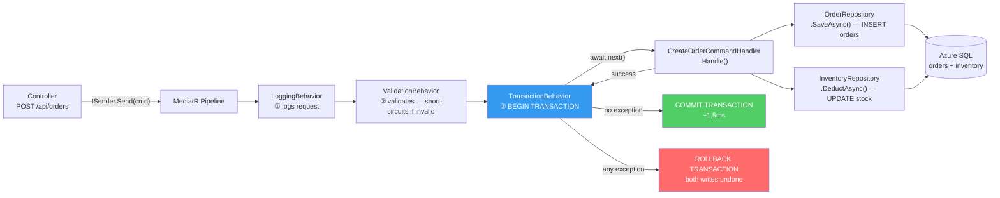
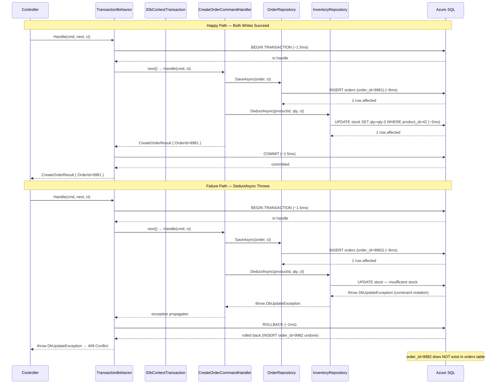
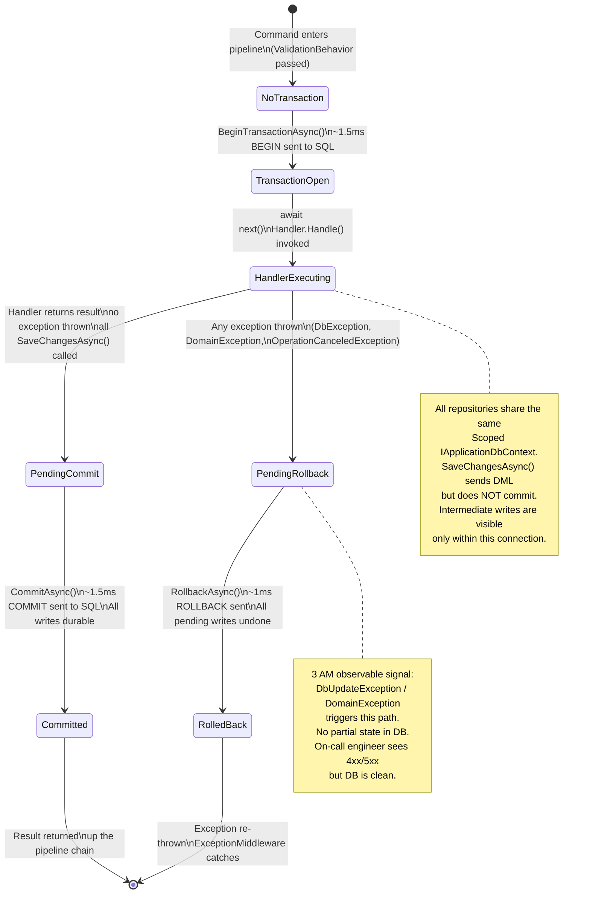
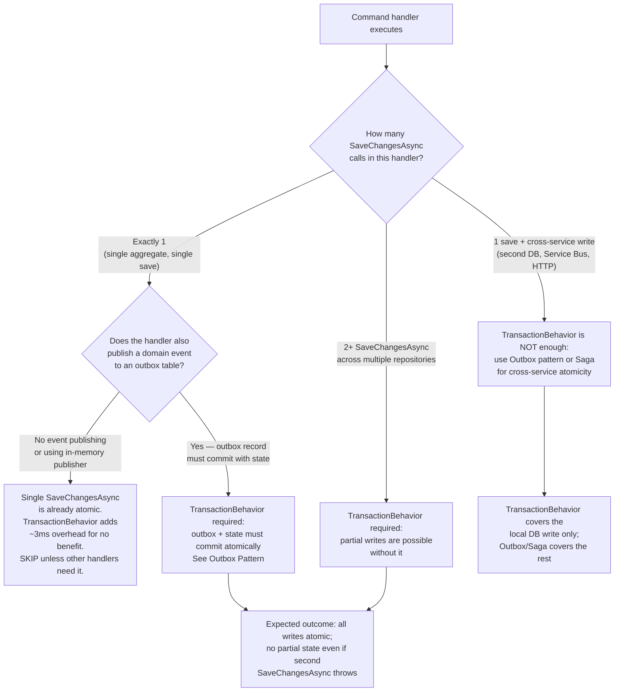

> [!ABSTRACT] Quick Reference — CQRS Transaction Pipeline Behavior **Invariant:** Every command handler that mutates state executes inside a single database transaction that commits on success and rolls back atomically on any exception — the handler never manages its own transaction lifecycle. **Cost:** One transaction open + one commit (or rollback) per command; on Azure SQL, this adds ~2–5ms per command on the critical path (2 network round-trips: BEGIN + COMMIT), plus the connection hold time for the full handler duration. **Trigger:** Two repository calls inside a single command handler succeed and fail independently — one `SaveChangesAsync` commits before a downstream exception rolls nothing back, leaving the database in a partially-written state that triggers a 3 AM data reconciliation incident. **Skip When:** The command handler performs a single atomic `SaveChangesAsync` with no branching or multiple aggregate writes — a single EF Core `SaveChangesAsync` is already atomic for all tracked changes in that `DbContext` instance. **.NET Entry Point:** `IPipelineBehavior<TRequest, TResponse>` / `IDbContextTransaction` (EF Core) / `IDbContext.Database.BeginTransactionAsync()` **Azure Native:** Azure SQL (default target); pairs with Azure Service Bus sessions for cross-service transactional messaging via the Outbox pattern (`[[7.121 — Outbox Pattern — Reliable Event Publishing]]`) **Number to Know:** A single `IDbContextTransaction` on Azure SQL Standard tier adds ~3ms round-trip overhead (BEGIN + COMMIT over a ~1.5ms LAN connection); at 1,000 commands/s this adds 3,000ms of aggregate latency, which stays within budget because each transaction is independent — the overhead is per-request, not cumulative.

---

## Navigation

**Domain:** [[7 — System Design & Distributed Systems]] > **Group:** CQRS and Event Sourcing **Previous:** [[7.088 — CQRS — Caching Pipeline Behavior]] | **Next:** [[7.090 — CQRS — Thin vs Thick Commands]]

### Prerequisites

- [[7.084 — CQRS — MediatR — IRequest and IRequestHandler]] — the `next` delegate in `IPipelineBehavior.Handle()` represents the entire remaining pipeline including the handler; TransactionBehavior's try/catch wraps exactly what `await next()` executes
- [[7.085 — CQRS — MediatR Pipeline Behaviors Overview]] — understanding that behaviors registered earlier run outermost and therefore have a wider exception-catch scope is required to reason about whether TransactionBehavior catches `ValidationException` or not (it must not)
- [[7.086 — CQRS — Validation Behavior — FluentValidation]] — ValidationBehavior short-circuits before `next()` is called, meaning it must be registered before TransactionBehavior so that invalid requests never open a transaction

### Where This Fits

> [!INFO] Production Encounter Map
> 
> - **Layer:** Application layer — the behavior executes at the application service boundary, wrapping the command handler and all repository calls it makes
> - **Trigger:** A command handler calls `_orderRepository.SaveAsync()` for the order, then calls `_inventoryRepository.DeductAsync()` for inventory; if `DeductAsync` throws after `SaveAsync` has already persisted, the order is created but inventory is not deducted — a phantom order that triggers fulfillment with no reserved stock
> - **Without it:** Each repository operation commits independently via its own `DbContext.SaveChangesAsync()`; any exception after the first commit leaves the database in a partially-consistent state; the only recovery path is a manual data correction or a reconciliation job running at T+5 minutes
> - **First signal:** Support ticket: "Order #9981 shows as Confirmed but item was never shipped — the warehouse system says no stock was reserved." Serilog shows: `ERROR [InventoryRepository] DeductAsync failed after order was saved | OrderId: 9981 | CorrelationId: a4f1-...`

TransactionBehavior is the point where the Unit of Work pattern (see [[7.058 — DDD — Repositories — Unit of Work Pattern]]) surfaces in the CQRS pipeline. It wraps the write side's consistency boundary (see [[7.097 — CQRS — Write Side — Transactional Boundary]]). For commands that also publish domain events, it pairs with the Outbox pattern ([[7.121 — Outbox Pattern — Reliable Event Publishing]]) to guarantee that the event is written transactionally with the state change — both commit or neither does.

---

## Core Mental Model

`TransactionBehavior` is an `IPipelineBehavior<TRequest, TResponse>` that opens a database transaction before delegating to the next behavior in the chain, and either commits or rolls back that transaction based on whether an exception propagates. The invariant it enforces is that all database mutations performed by a single command handler are atomic: they succeed together or fail together, with no partial state visible to other readers between the individual `SaveChangesAsync` calls. The cost is a transaction open and commit on every command — two network round-trips to the database server on the critical path. The recognition trigger is any command handler that calls more than one repository method with independent commit points, or any handler that publishes a domain event alongside a state mutation: the event and the state must commit together, or neither should commit.

> [!TIP] The Non-Obvious Insight `TransactionBehavior` only applies to commands — never to queries. The standard pattern uses a marker interface or a `where TRequest : ICommand` constraint to skip the transaction entirely for query requests. The non-obvious consequence of getting this wrong is severe: if `TransactionBehavior` wraps a query handler that calls `dbContext.Orders.ToListAsync()`, EF Core opens a transaction, runs the SELECT, and commits — this is a read in a transaction, which escalates to a shared lock in default SQL Server isolation (READ COMMITTED). Under high concurrency, write operations that touch the same rows block waiting for these read transactions to commit, causing write latency to spike by the full query duration. At 200 concurrent reads, this turns a 10ms read into a 200ms write bottleneck. The fix is a `where TRequest : ICommand` constraint — or equivalently, checking `typeof(TRequest).IsAssignableTo(typeof(ICommand))` — to pass through immediately without opening a transaction for all query requests.

### Classification

- **Consistency axis:** Strong — all mutations within one command handler are linearizable; no other reader observes partial state between the first and last write
- **Availability tradeoff:** None during normal operation; under network partition between the application server and the database, the transaction open fails and the command fails fast — no partial state is written
- **Latency impact:** +2–5ms per command on Azure SQL Standard (1 BEGIN + 1 COMMIT ≈ 2 RTT × ~1.5ms LAN); +8–20ms WAN or cross-region; 0ms for queries (skipped by design)
- **Failure domain:** Single-database — guarantees atomicity for mutations within one EF Core `DbContext`; does NOT guarantee atomicity across two separate databases, microservices, or a database + message broker (that requires Saga or Outbox pattern)
- **Abstraction layer:** Framework feature (MediatR `IPipelineBehavior`) implementing a design pattern (Unit of Work) over a platform API (`IDbContextTransaction` in EF Core)

### Primary Diagram



### Supporting Diagram



### Numbers That Matter

|Metric|Value|Context / Conditions|
|---|---|---|
|Transaction BEGIN + COMMIT overhead|~3ms total (estimated)|Azure SQL Standard S2, same Azure region, ~1.5ms RTT per round-trip|
|Transaction BEGIN + COMMIT overhead (WAN/cross-region)|~20–40ms (estimated)|Azure SQL with cross-region replication read replica; 10ms RTT per round-trip|
|Rollback time for a failed command|~1–2ms (estimated)|Transaction with 1–3 DML statements; SQL Server rolls back the in-flight log entries|
|Command throughput impact at 1,000 cmd/s|+3,000ms aggregate latency/s — but per-request, not cumulative|Each of the 1,000 commands pays 3ms independently; they do not queue behind each other if connection pool is healthy|
|Connection hold time|Equal to full handler execution time|A 50ms handler holds one connection for 50ms; at 100 concurrent commands that is 100 connections — must not exceed pool size (default 100)|
|Lock contention threshold|> 50 concurrent commands on the same rows|Serializable isolation escalates row locks to table locks; READ COMMITTED (SQL Server default) allows concurrent reads but blocks on write rows|
|Query behavior (no transaction opened)|0ms overhead|Queries skip TransactionBehavior entirely via `where TRequest : ICommand` constraint|

### Key Properties / Guarantees

|Property|Value|Condition|
|---|---|---|
|Atomicity|All DbContext mutations in one command handler commit together or roll back together|TransactionBehavior wraps the handler; all repositories share the same `IApplicationDbContext` instance (registered as Scoped)|
|Isolation|READ COMMITTED (SQL Server default)|EF Core uses the connection's default isolation level; override with `BeginTransactionAsync(IsolationLevel.Serializable)` for inventory reservation patterns|
|Cross-repository atomicity|Guaranteed|All repositories in the handler inject the same Scoped `IApplicationDbContext`; they share the same `SqlConnection` and therefore the same transaction|
|Cross-database atomicity|NOT guaranteed|Two separate `DbContext` instances (two databases) require distributed transactions (2PC, expensive) or the Saga/Outbox pattern|
|Query safety|Queries are never wrapped in a transaction|`where TRequest : ICommand` constraint excludes all query types from the behavior|
|Consistency under cancellation|Rollback is called in the `finally` block if the `CancellationToken` fires before COMMIT|`OperationCanceledException` is an exception; the `catch` block triggers rollback|

---

## Deep Mechanics

### How It Works

**Step 1 — Request enters the pipeline.** `_sender.Send(command, ct)` is called from the controller. MediatR resolves the behavior chain: `LoggingBehavior` (outermost) → `ValidationBehavior` → `TransactionBehavior` → handler (innermost). Behaviors registered earlier execute as outer decorators.

**Step 2 — ValidationBehavior short-circuits first.** For invalid requests, `ValidationBehavior` throws `ValidationException` before `TransactionBehavior.Handle()` is ever entered. This is the key ordering guarantee: no transaction is opened for invalid requests. No database connection is consumed beyond the validation phase.

**Step 3 — TransactionBehavior.Handle() enters.** For valid commands, control reaches `TransactionBehavior`. The behavior checks whether `TRequest` is a command type (via `typeof(TRequest).IsAssignableTo(typeof(ICommand))` or a marker interface). If it is a query, it calls `await next()` immediately and returns — no transaction is opened.

**Step 4 — Transaction open.** For commands, the behavior calls `await _dbContext.Database.BeginTransactionAsync(cancellationToken)`. This sends `BEGIN TRANSACTION` to the SQL server (~1.5ms RTT) and returns an `IDbContextTransaction` handle. The transaction is now active on this `SqlConnection`.

**Step 5 — Handler execution.** The behavior calls `await next()`, which invokes the next delegate in the chain — ultimately calling `CreateOrderCommandHandler.Handle(command, cancellationToken)`. The handler calls one or more repositories. Because all repositories are injected with the same Scoped `IApplicationDbContext` instance, they all operate on the same `SqlConnection` and are therefore inside the active transaction. Each `repository.SaveAsync()` calls `dbContext.SaveChangesAsync()`, which sends individual DML statements (`INSERT`, `UPDATE`) to the database but does NOT commit — they are buffered by the transaction.

**Step 6a — Success path.** The handler returns a result without throwing. `TransactionBehavior` calls `await transaction.CommitAsync(cancellationToken)`. This sends `COMMIT TRANSACTION` to the SQL server (~1.5ms RTT). All DML statements from all repository calls within this handler are now durably written and visible to other readers. The result propagates back up the chain.

**Step 6b — Failure path.** The handler (or any repository it calls) throws any exception. The `catch` block in `TransactionBehavior` calls `await transaction.RollbackAsync()`. The SQL server undoes all DML statements that were buffered since `BEGIN TRANSACTION`. The database is in the exact state it was before the command was received. The exception re-throws and propagates up through the behavior chain to the controller's exception handler, which converts it to the appropriate HTTP error response.

**Step 7 — Disposal.** The `IDbContextTransaction` is disposed in a `finally` block (via `await using`). If `CommitAsync` was not called before disposal, EF Core automatically rolls back. This is a safety net — the explicit rollback in the `catch` block is preferred because it is explicit and observable.

### Protocol Trace

```
Happy Path (CreateOrderCommand — order + inventory write):
  1. Controller → ValidationBehavior: validates (no DB open) (~0.3ms)
  2. ValidationBehavior → TransactionBehavior: all validators pass
  3. TransactionBehavior → SQL: BEGIN TRANSACTION (~1.5ms)
  4. TransactionBehavior → Handler.Handle(cmd, ct)
  5. Handler → OrderRepository.SaveAsync():
     - EF Core: INSERT INTO orders (order_id, customer_id, total) VALUES (...) (~8ms)
     - SQL response: 1 row affected (NOT yet committed)
  6. Handler → InventoryRepository.DeductAsync():
     - EF Core: UPDATE inventory SET quantity=quantity-3 WHERE product_id=42 (~5ms)
     - SQL response: 1 row affected (NOT yet committed)
  7. Handler returns CreateOrderResult { OrderId=9981 }
  8. TransactionBehavior → SQL: COMMIT TRANSACTION (~1.5ms)
     Both writes (INSERT + UPDATE) now durable and visible
  Total round-trip: ~16ms

Failure Path (InventoryRepository.DeductAsync throws at step 6):
  1–5. Same as above — order INSERT is sent but NOT committed (~11ms)
  6. Handler → InventoryRepository.DeductAsync():
     - EF Core: UPDATE inventory SET quantity=quantity-3 WHERE product_id=42
     - SQL: CHECK CONSTRAINT quantity >= 0 — FAILS
     - DbUpdateConcurrencyException thrown from SaveChangesAsync (~5ms)
  7. Exception propagates from handler back to TransactionBehavior catch block
  8. TransactionBehavior → SQL: ROLLBACK TRANSACTION (~1ms)
     The INSERT from step 5 is undone — order_id=9981 does NOT exist
  9. TransactionBehavior re-throws DbUpdateConcurrencyException
  10. ExceptionMiddleware converts to HTTP 409 Conflict
  Caller observes: 409 Conflict with problem details — order was not created
  Database state: unchanged from before the command was received
  Recovery: caller may retry with a different quantity or present "out of stock" to user

Cancellation Path (CancellationToken fires during handler execution):
  1–5. Same as above — partial writes may be in-flight
  6. CancellationToken fires → OperationCanceledException thrown from SaveChangesAsync
  7. OperationCanceledException propagates to TransactionBehavior catch
  8. TransactionBehavior → SQL: ROLLBACK (~1ms)
  9. Re-throws OperationCanceledException
  Caller observes: 499 Client Closed Request (Nginx/YARP) or 503 (if behavior converts it)
  Database state: unchanged — no partial writes persisted
```

### State Transitions



### Failure Modes

**Failure Mode 1: Transaction Timeout — Long-Running Handler Exceeds SQL Command Timeout**

- **Cause:** A command handler performs multiple repository calls — e.g., loads a large aggregate (1,000 line items), applies a domain operation, saves back — and the total execution time exceeds the SQL connection's `CommandTimeout` (default: 30 seconds on EF Core). The `CommandTimeout` fires inside the transaction, throwing `SqlException: Execution Timeout Expired`.
- **Symptom:** `SqlException: Execution Timeout Expired. The timeout period elapsed prior to completion of the operation or the server is not responding` — thrown from deep inside `SaveChangesAsync()`. The transaction rolls back. The command fails with HTTP 500.
- **Detection time:** Not immediate — only fires when execution exceeds 30 seconds; may be invisible in test environments with small datasets but fires consistently in production under full data volume
- **Blast radius:** The connection is returned to the pool in an aborted state; EF Core's connection resiliency (if enabled with `EnableRetryOnFailure`) may retry the command and open a second transaction — creating double-execution risk if the retry is not idempotent

> [!DANGER] 3 AM Production Signal Metric: `http_server_requests_seconds_count{status="500",route="/api/orders/bulk"} > 0` with `http_server_requests_seconds{quantile="0.99"} > 30` Log: `ERROR [TransactionBehavior] Transaction rolled back | Exception: SqlException: Execution Timeout Expired | CommandTimeout: 30s | Handler: BulkOrderProcessingCommandHandler | RowsAffected: 0 | CorrelationId: f4a2-91bc` Customer impact: "Process batch" button on the operations dashboard spins for 30 seconds then shows "Something went wrong" — operations team retries, doubling the load

**Failure Mode 2: Missing Command Constraint — Transaction Opened for Queries**

- **Cause:** `TransactionBehavior` is registered without a `where TRequest : ICommand` type constraint, or the constraint check at runtime evaluates incorrectly (e.g., using `is ICommand` on an interface that queries also happen to implement). Every request — including `GetOrderHistoryQuery`, `ListProductsQuery` — enters a transaction.
- **Symptom:** Read-heavy endpoints show elevated latency at p99 under write contention; SQL Server DMV shows high `lock_wait_time_ms` on shared locks held by read transactions that are now in a transaction; writes to the same tables block waiting for these read transactions to commit
- **Detection time:** Silent under low read:write ratio; escalates nonlinearly as read throughput increases relative to writes — "silent until read traffic doubles"
- **Blast radius:** Write latency p99 degrades proportional to concurrent reader count × query duration; at 500 concurrent reads each lasting 20ms, writes to the same rows experience up to 500 × 20ms = 10,000ms of lock wait time (serialized queue)

> [!DANGER] 3 AM Production Signal Metric: `sqlserver_lock_wait_time_ms{table="orders"} > 5000` sustained for 2+ minutes Log: `WARN [SqlServer] Lock wait timeout exceeded | Table: orders | Lock type: S (shared) | Wait: 8340ms | Blocker: GetOrderHistoryQuery via TransactionBehavior | CorrelationId: c9d1-...` Customer impact: Checkout endpoint (write path) shows p99 latency of 12s — checkout is blocked waiting for a read-in-transaction to release its shared lock on the `orders` table

### .NET and Azure Integration Points

- **EF Core:** `IDbContextTransaction` via `DbContext.Database.BeginTransactionAsync(IsolationLevel, CancellationToken)` — the transaction handle; `CommitAsync()`, `RollbackAsync()`, `await using` disposal pattern
- **ASP.NET Core:** `IHttpContextAccessor` is not needed — the behavior operates at the MediatR layer, below HTTP concerns
- **Azure SQL:** `IsolationLevel.ReadCommitted` is the default and correct choice for most OLTP commands; `IsolationLevel.Serializable` is required for inventory-reservation patterns where `check-then-write` must be atomic
- **Azure Service Bus (Outbox pattern):** The Outbox record is written inside the same transaction as the domain state change; the `[[7.121 — Outbox Pattern — Reliable Event Publishing]]` background job reads and publishes the Outbox record after the transaction commits — guaranteeing at-least-once event delivery without distributed transactions
- **.NET Libraries:** No additional NuGet beyond `Microsoft.EntityFrameworkCore` (which provides `IDbContextTransaction`) and `MediatR`

```csharp
// IApplicationDbContext — Infrastructure Layer // Port
// Exposes Database for transaction management without coupling to concrete DbContext
public interface IApplicationDbContext
{
    DatabaseFacade Database { get; }
    DbSet<Order> Orders { get; }
    DbSet<InventoryItem> InventoryItems { get; }
    Task<int> SaveChangesAsync(CancellationToken cancellationToken = default);
}
```

---

## Production Patterns and Implementation

### Primary Implementation

```csharp
// YourCompany.OrderManagement.Application.Behaviors.TransactionBehavior
// Namespace: YourCompany.OrderManagement.Application.Behaviors

using MediatR;
using Microsoft.EntityFrameworkCore;
using Microsoft.Extensions.Logging;

namespace YourCompany.OrderManagement.Application.Behaviors;

/// <summary>
/// MediatR pipeline behavior that wraps every ICommand handler in a single
/// IDbContextTransaction. Commits on handler success; rolls back on any exception.
/// Queries (IRequest that do not implement ICommand) pass through without a transaction.
/// </summary>
/// <typeparam name="TRequest">The MediatR request type.</typeparam>
/// <typeparam name="TResponse">The handler response type.</typeparam>
public sealed class TransactionBehavior<TRequest, TResponse>(
    IApplicationDbContext dbContext,
    ILogger<TransactionBehavior<TRequest, TResponse>> logger)
    : IPipelineBehavior<TRequest, TResponse>
    where TRequest : IRequest<TResponse>
{
    public async Task<TResponse> Handle(
        TRequest request,
        RequestHandlerDelegate<TResponse> next,
        CancellationToken cancellationToken)
    {
        // Fast path: skip transaction entirely for all query requests
        // ICommand is a marker interface on all command types — queries do not implement it
        if (request is not ICommand)
            return await next();

        var requestName = typeof(TRequest).Name;

        // Open transaction — BEGIN TRANSACTION sent to SQL Server
        await using var transaction = await dbContext.Database
            .BeginTransactionAsync(cancellationToken);

        logger.LogDebug(
            "Transaction opened for {RequestName} | TransactionId: {TransactionId}",
            requestName,
            transaction.TransactionId);

        try
        {
            // Execute handler — all SaveChangesAsync() calls are inside this transaction
            var response = await next();

            // All DML statements succeeded — commit
            await transaction.CommitAsync(cancellationToken);

            logger.LogDebug(
                "Transaction committed for {RequestName} | TransactionId: {TransactionId}",
                requestName,
                transaction.TransactionId);

            return response;
        }
        catch (Exception ex)
        {
            // Any exception — roll back all in-flight DML statements
            await transaction.RollbackAsync(CancellationToken.None);
            // Note: use CancellationToken.None for rollback — the original token
            // may already be cancelled (that's what caused the exception), and we
            // must complete the rollback regardless.

            logger.LogWarning(ex,
                "Transaction rolled back for {RequestName} | TransactionId: {TransactionId}",
                requestName,
                transaction.TransactionId);

            throw; // Re-throw — ExceptionMiddleware handles the HTTP response
        }
        // await using handles disposal: if CommitAsync was not called, EF Core rolls back
    }
}

/// <summary>
/// Marker interface applied to all command types.
/// Queries must NOT implement this interface — they bypass TransactionBehavior.
/// </summary>
public interface ICommand { }

/// <summary>
/// Base interface for commands with a typed result.
/// </summary>
public interface ICommand<TResponse> : IRequest<TResponse>, ICommand { }
```

### IServiceCollection Registration

```csharp
// Program.cs — Registration order is critical and non-negotiable
builder.Services.AddMediatR(cfg =>
{
    cfg.RegisterServicesFromAssembly(typeof(ApplicationAssemblyMarker).Assembly);

    // Pipeline order — first registered = outermost = executes first
    cfg.AddOpenBehavior(typeof(LoggingBehavior<,>));        // ① logs all requests/responses
    cfg.AddOpenBehavior(typeof(ValidationBehavior<,>));     // ② validates — short-circuits before DB
    cfg.AddOpenBehavior(typeof(TransactionBehavior<,>));    // ③ wraps handler in transaction
    // Handler executes innermost — never manages its own transaction
});

// DbContext registered as Scoped — all repositories in one command share the same instance
// This is what makes TransactionBehavior work: one connection = one transaction scope
builder.Services.AddDbContext<ApplicationDbContext>(options =>
    options.UseSqlServer(
        builder.Configuration.GetConnectionString("OrdersDb"),
        sqlOptions =>
        {
            // Resilience: retry transient failures (Azure SQL throttling, brief connectivity loss)
            // CAUTION: EnableRetryOnFailure re-executes the entire command including the handler —
            // the handler must be idempotent, or retries must be disabled for non-idempotent commands
            sqlOptions.EnableRetryOnFailure(
                maxRetryCount: 3,
                maxRetryDelay: TimeSpan.FromSeconds(5),
                errorNumbersToAdd: null);

            sqlOptions.CommandTimeout(60); // Override default 30s for long-running commands
        }));

builder.Services.AddScoped<IApplicationDbContext>(sp =>
    sp.GetRequiredService<ApplicationDbContext>());
```

### Command and Query Marker Interface Pattern

```csharp
// YourCompany.OrderManagement.Application.Abstractions — Command/Query markers

/// <summary>
/// All commands implement ICommand — TransactionBehavior opens a transaction for these.
/// </summary>
public interface ICommand : IRequest { }

/// <summary>
/// All commands with a result implement ICommand{TResponse}.
/// </summary>
public interface ICommand<TResponse> : IRequest<TResponse>, ICommand { }

/// <summary>
/// All queries implement IQuery{TResponse} — TransactionBehavior skips these entirely.
/// </summary>
public interface IQuery<TResponse> : IRequest<TResponse> { }

// Example command — CreateOrderCommand gets a transaction
public sealed record CreateOrderCommand(
    Guid CustomerId,
    Guid ProductId,
    int Quantity) : ICommand<CreateOrderResult>;

// Example query — GetOrderQuery does NOT get a transaction
public sealed record GetOrderQuery(Guid OrderId) : IQuery<OrderDto>;
```

### Common Variants

```csharp
// Variant A — Serializable isolation for inventory reservation (prevents phantom reads)
// Use when: the handler does a check-then-write sequence that must be atomic
// (e.g., read available stock, verify >= requested quantity, then deduct)
public sealed class SerializableTransactionBehavior<TRequest, TResponse>(
    IApplicationDbContext dbContext)
    : IPipelineBehavior<TRequest, TResponse>
    where TRequest : IRequest<TResponse>, ICommand
{
    public async Task<TResponse> Handle(
        TRequest request,
        RequestHandlerDelegate<TResponse> next,
        CancellationToken cancellationToken)
    {
        // Serializable: prevents phantom reads — no other transaction can insert/update
        // rows that match the WHERE clause of any query in this transaction
        await using var transaction = await dbContext.Database
            .BeginTransactionAsync(System.Data.IsolationLevel.Serializable, cancellationToken);
        try
        {
            var response = await next();
            await transaction.CommitAsync(cancellationToken);
            return response;
        }
        catch
        {
            await transaction.RollbackAsync(CancellationToken.None);
            throw;
        }
    }
}
// Cost: Serializable escalates to range locks — reduces concurrency significantly
// Use only for: ticket reservation, seat allocation, inventory deduction (oversell prevention)
// Do NOT use for: general CRUD commands where READ COMMITTED is sufficient
```

```csharp
// Variant B — Outbox-aware transaction: writes domain event to outbox inside the transaction
// Use when: the command must publish a domain event reliably (at-least-once)
// without a distributed transaction to the message broker
public sealed class OutboxTransactionBehavior<TRequest, TResponse>(
    IApplicationDbContext dbContext,
    IOutboxWriter outboxWriter)
    : IPipelineBehavior<TRequest, TResponse>
    where TRequest : IRequest<TResponse>, ICommand
{
    public async Task<TResponse> Handle(
        TRequest request,
        RequestHandlerDelegate<TResponse> next,
        CancellationToken cancellationToken)
    {
        await using var transaction = await dbContext.Database
            .BeginTransactionAsync(cancellationToken);
        try
        {
            // Handler runs — domain events are collected on the aggregate
            var response = await next();

            // Outbox record written INSIDE the same transaction as domain state change
            // Both commit atomically — no event is lost, no duplicate state exists
            await outboxWriter.FlushPendingEventsAsync(cancellationToken);

            await transaction.CommitAsync(cancellationToken);
            return response;
        }
        catch
        {
            await transaction.RollbackAsync(CancellationToken.None);
            throw;
        }
    }
}
// See [[7.121 — Outbox Pattern — Reliable Event Publishing]] for OutboxWriter implementation
```

### Performance Profile

```csharp
[MemoryDiagnoser]
[SimpleJob(RuntimeMoniker.Net80)]
public class TransactionBehaviorBenchmark
{
    private ApplicationDbContext _dbContext = null!;
    private CreateOrderCommandHandler _handler = null!;
    private readonly CreateOrderCommand _command = new(
        Guid.NewGuid(), Guid.NewGuid(), 3);

    [GlobalSetup]
    public void Setup()
    {
        // In-memory EF Core for benchmark isolation
        // Real measurements should use TestContainers with SQL Server
        var options = new DbContextOptionsBuilder<ApplicationDbContext>()
            .UseInMemoryDatabase("bench")
            .Options;
        _dbContext = new ApplicationDbContext(options);
        _handler = new CreateOrderCommandHandler(_dbContext, /* deps */);
    }

    [Benchmark(Baseline = true)]
    public async Task Handler_NoTransaction()
    {
        // Handler manages its own SaveChangesAsync — no behavior
        await _handler.Handle(_command, CancellationToken.None);
    }

    [Benchmark]
    public async Task Handler_WithTransactionBehavior()
    {
        // Full pipeline with TransactionBehavior wrapping the handler
        await using var tx = await _dbContext.Database.BeginTransactionAsync();
        try
        {
            await _handler.Handle(_command, CancellationToken.None);
            await tx.CommitAsync();
        }
        catch
        {
            await tx.RollbackAsync(CancellationToken.None);
            throw;
        }
    }
}
```

Expected result shape (against real SQL Server; in-memory DB excludes network overhead):

|Method|Mean|Allocated|Notes|
|---|---|---|---|
|Handler_NoTransaction|~13ms (estimated, SQL)|~4 KB (estimated)|Single SaveChangesAsync, no BEGIN/COMMIT round-trips|
|Handler_WithTransactionBehavior|~16ms (estimated, SQL)|~5.2 KB (estimated)|+3ms for BEGIN + COMMIT RTTs; IDbContextTransaction allocation|

The 3ms overhead is the two network round-trips (BEGIN + COMMIT). On in-memory DB, the overhead drops to ~0.1ms (no network), which is why SQL integration benchmarks are required to measure this correctly.

### Real-World .NET Ecosystem Mapping

|Pattern in This Note|Where It Appears in .NET / Azure|Manifestation|
|---|---|---|
|Unit of Work|`IDbContextTransaction` wrapping multiple `SaveChangesAsync` calls|TransactionBehavior IS the Unit of Work scope for one command handler|
|Decorator / Chain of Responsibility|`IPipelineBehavior<TRequest,TResponse>` wrapping `next()` in try/catch/commit|TransactionBehavior wraps handler the same way EF Core's retry policy wraps database operations|
|Ambient transaction|Scoped `IApplicationDbContext` shared by all repositories in one handler|All repositories injected with the same `DbContext` instance join the same transaction automatically|
|Idempotency guard|`EnableRetryOnFailure` on SQL Server options|EF Core may retry the entire handler on transient failure — handler must be idempotent when retries are enabled|
|Outbox reliable messaging|`OutboxWriter.FlushPendingEventsAsync()` inside the transaction scope|Domain events are written to the outbox table and the domain state change atomically|

---

## Gotchas and Production Pitfalls

### Pitfall 1: CancellationToken Passed to RollbackAsync — Rollback Skipped on Client Disconnect

**Pitfall:** The `catch` block passes the original `cancellationToken` to `RollbackAsync`. When a client disconnects mid-request, the `CancellationToken` is already cancelled. `RollbackAsync(cancellationToken)` immediately throws `OperationCanceledException` before the rollback is sent to SQL Server.

```csharp
// ❌ Wrong: if ct is already cancelled, RollbackAsync throws before rolling back
catch (Exception ex)
{
    await transaction.RollbackAsync(cancellationToken); // WRONG token
    throw;
}
```

**Symptom:** Orphaned in-flight DML statements that were never rolled back; SQL Server holds the transaction open until the connection is forcibly closed or the transaction timeout fires (default 30s). Other commands writing to the same rows experience elevated lock-wait times during this window.

**Detection time:** Silent under normal operation; visible under high client-disconnect rates (mobile clients on poor network, load tests with aggressive timeouts).

> [!DANGER] Production Signal Metric: `sqlserver_open_transactions{server="orders-db"} > expected_count` — orphaned transactions appear as open transaction count above baseline Log: (no log — the exception in catch swallows the rollback silently unless the outer exception handler logs it) `WARN [TransactionBehavior] RollbackAsync threw OperationCanceledException — rollback may not have completed | CorrelationId: a9f2-...`

**Fix:**

```csharp
// ✅ Correct: always use CancellationToken.None for rollback
// The original token may be cancelled (that's often WHY we're in the catch block)
// Rollback must complete regardless — it is cleanup, not a cancellable operation
catch (Exception ex)
{
    await transaction.RollbackAsync(CancellationToken.None);
    logger.LogWarning(ex, "Transaction rolled back | TransactionId: {TxId}", transaction.TransactionId);
    throw;
}
```

**Cost of not fixing:** At high client-disconnect rates (e.g., a mobile app with aggressive 5s timeouts), 50+ orphaned transactions per minute accumulate; each holds a lock on written rows until the 30s SQL Server transaction timeout fires; write throughput for other commands degrades linearly; p99 latency spikes cross SLO.

---

### Pitfall 2: EnableRetryOnFailure with Non-Idempotent Commands

**Pitfall:** EF Core's `EnableRetryOnFailure()` is configured on the SQL Server connection. When a transient Azure SQL throttling error fires during a `SaveChangesAsync` inside a transaction, EF Core retries the entire execution strategy — including re-running the handler. The handler is not idempotent: it generates a new `OrderId` via `Guid.NewGuid()` on each invocation, so two orders are created.

```csharp
// ❌ Wrong: EnableRetryOnFailure retries the handler, not just the SQL statement
sqlOptions.EnableRetryOnFailure(maxRetryCount: 3);

// In handler — this runs twice on retry:
var order = Order.Create(customer, product, Guid.NewGuid(), ...);
dbContext.Orders.Add(order);
await dbContext.SaveChangesAsync(ct); // Retry fires here — runs the handler again
```

**Symptom:** Duplicate orders in the database on transient Azure SQL throttling events; customer receives two order confirmation emails; fulfillment ships two packages; financial reconciliation is off by the duplicate amount.

**Detection time:** Silent under normal conditions — only occurs on Azure SQL throttling events (`SqlException: error 40501`), which happen infrequently but more often on Standard tier under burst load.

> [!DANGER] Production Signal Metric: `application_insights_events{name="OrderCreated",duplicate="true"} > 0` Log: `WARN [EF Core] Retrying operation due to transient failure | Attempt: 2/3 | Error: 40501 | CorrelationId: b3f9-...` followed by `INFO [CreateOrderCommandHandler] Order created | OrderId: {second-guid}`

**Fix:** Two options depending on the situation:

```csharp
// Option A: Disable EnableRetryOnFailure for commands that are not idempotent
// Use a dedicated connection string / DbContext for command handlers
sqlOptions.EnableRetryOnFailure(maxRetryCount: 0); // Disable for command DbContext

// Option B: Make the handler idempotent by using a caller-provided idempotency key
public sealed record CreateOrderCommand(
    Guid IdempotencyKey,    // ← provided by caller, stable across retries
    Guid CustomerId,
    int Quantity) : ICommand<CreateOrderResult>;

// In handler: check if order with IdempotencyKey already exists before creating
var existing = await dbContext.Orders
    .FirstOrDefaultAsync(o => o.IdempotencyKey == request.IdempotencyKey, ct);
if (existing is not null)
    return new CreateOrderResult(existing.Id, existing.TotalAmount); // Idempotent return
```

**Cost of not fixing:** Duplicate orders on Azure SQL throttling events; at Standard tier under moderate burst load, throttling can occur 1–5 times per hour; each retry-storm creates a batch of duplicate orders that require manual correction and customer compensation.

---

### Pitfall 3: Azure-Specific — Distributed Transaction Between Two DbContexts

**Pitfall:** A handler injects two separate `DbContext` instances (e.g., `OrderDbContext` for orders, `InventoryDbContext` for inventory — two separate databases or schemas with separate connection strings). The handler calls `_orderDb.SaveChangesAsync()` and `_inventoryDb.SaveChangesAsync()`. `TransactionBehavior` wraps only `_orderDb` (the one it has a reference to). `_inventoryDb` is not in the transaction.

```csharp
// ❌ Wrong: TransactionBehavior only controls the IApplicationDbContext it injects
// _inventoryDbContext is a separate instance with its own connection
public class PlaceOrderCommandHandler(
    IOrderDbContext orderDb,
    IInventoryDbContext inventoryDb) // ← separate connection, NOT in transaction
    : IRequestHandler<PlaceOrderCommand, PlaceOrderResult>
{
    public async Task<PlaceOrderResult> Handle(PlaceOrderCommand cmd, CancellationToken ct)
    {
        var order = Order.Create(/* ... */);
        orderDb.Orders.Add(order);
        await orderDb.SaveChangesAsync(ct);     // Commits to orders DB ← in transaction

        await inventoryDb.DeductAsync(/* ... */); // Commits to inventory DB ← NOT in transaction
        // If DeductAsync throws here, orderDb commit is already done and CANNOT be rolled back
        // TransactionBehavior rolls back its own tx (orderDb) but orderDb.SaveChangesAsync
        // already committed — so the order IS in the DB with no inventory deduction
    }
}
```

**Symptom:** Phantom orders — orders that are committed to the orders database but have no corresponding inventory deduction. Identified via reconciliation job 5 minutes later. DTC (Distributed Transaction Coordinator) is not available on Azure SQL.

**Detection time:** Silent until a reconciliation job or customer complaint surfaces it.

> [!DANGER] Production Signal Metric: `reconciliation_job_discrepancies{type="order_without_inventory_deduction"} > 0` on the nightly reconciliation dashboard Log: `ERROR [ReconciliationJob] Order #9982 has no inventory reservation | OrderedAt: 2025-01-15T03:41:22Z | CorrelationId: c7a1-...`

**Fix:** Consolidate writes into a single `DbContext` (single database schema with separate tables), or use the Outbox pattern (`[[7.121 — Outbox Pattern — Reliable Event Publishing]]`) to decouple the inventory deduction into a separate compensating command that is published reliably after the order commit, or use a Saga (`[[7.129 — Saga Pattern — Overview and When to Use]]`) for cross-service coordination.

```csharp
// ✅ Correct: single IApplicationDbContext covers both Order and InventoryItem tables
// TransactionBehavior's transaction covers both SaveChangesAsync calls
public class PlaceOrderCommandHandler(IApplicationDbContext db)
    : IRequestHandler<PlaceOrderCommand, PlaceOrderResult>
{
    public async Task<PlaceOrderResult> Handle(PlaceOrderCommand cmd, CancellationToken ct)
    {
        var order = Order.Create(/* ... */);
        db.Orders.Add(order);  // Tracked by same DbContext

        var inventory = await db.InventoryItems
            .FindAsync([cmd.ProductId], ct);
        inventory!.Deduct(cmd.Quantity); // Domain invariant enforced

        await db.SaveChangesAsync(ct); // Single SaveChangesAsync = single DML batch
        // TransactionBehavior commits both the INSERT and the UPDATE atomically
        return new PlaceOrderResult(order.Id, order.TotalAmount);
    }
}
```

**Cost of not fixing:** Phantom orders accumulate silently until the reconciliation job runs; at 0.1% transient failure rate (plausible on Azure SQL Standard) on 10,000 orders/day, that is 10 phantom orders per day requiring manual correction; at scale this is a compliance and financial reporting issue.

---

### Pitfall 4: .NET-Specific — Calling SaveChangesAsync Inside a Domain Event Handler That Fires Within the Transaction

**Pitfall:** A MediatR `INotificationHandler` (domain event handler) is dispatched inside the command handler using `_publisher.Publish(domainEvent)`. The notification handler calls `dbContext.SaveChangesAsync()` to save a projection. Because the notification handler runs synchronously inside the command handler (which is inside the transaction), this `SaveChangesAsync` issues a second `SaveChanges` call on the same `DbContext` within the active transaction. EF Core does not throw — it commits the change tracker state at that point, which may include entities that the command handler has not yet finished modifying.

```csharp
// ❌ Wrong: domain event handler calls SaveChangesAsync inside the transaction
// This commits a partial state: Order is saved but not yet in Confirmed status
public class OrderCreatedEventHandler(IApplicationDbContext db)
    : INotificationHandler<OrderCreatedEvent>
{
    public async Task Handle(OrderCreatedEvent notification, CancellationToken ct)
    {
        var projection = OrderProjection.From(notification);
        db.OrderProjections.Add(projection);
        await db.SaveChangesAsync(ct); // ← commits partial state prematurely
    }
}
```

**Symptom:** Projections contain incomplete data — the Order status is "Pending" in the projection because `SaveChangesAsync` fired before the command handler set it to "Confirmed"; the read model diverges from the write model until the next event updates it.

**Detection time:** Only visible when reading the projection immediately after the command completes; eventually consistent systems may mask this for seconds until the next update.

**Fix:** Domain event handlers must NOT call `SaveChangesAsync`. Dispatch domain events after the handler completes — or collect them and dispatch after the commit in an `IDomainEventDispatcher` called from `TransactionBehavior` after `CommitAsync`.

```csharp
// ✅ Correct: domain events dispatched AFTER commit — projections see final state
try
{
    var response = await next(); // Handler runs, events collected on aggregates
    await transaction.CommitAsync(cancellationToken); // Commit domain state first
    await _domainEventDispatcher.DispatchAsync(cancellationToken); // Then dispatch events
    return response;
}
```

**Cost of not fixing:** Read-model projections contain stale or partial data on every write; any UI that reads the projection immediately after a command will show the wrong state; in a dashboard that shows order status, operators see "Pending" for orders that are actually "Confirmed" — leading to incorrect manual interventions.

---

### Pitfall 5: Omitting the ICommand Marker — TransactionBehavior Wraps Queries

**Pitfall:** `TransactionBehavior` is implemented without the `where TRequest : ICommand` constraint or the `if (request is not ICommand) return await next();` fast-path. Every MediatR request — including queries — opens a transaction.

```csharp
// ❌ Wrong: no fast-path for queries — every GetOrderQuery opens a transaction
public sealed class TransactionBehavior<TRequest, TResponse>(IApplicationDbContext db)
    : IPipelineBehavior<TRequest, TResponse>
    where TRequest : IRequest<TResponse>
{
    public async Task<TResponse> Handle(TRequest request,
        RequestHandlerDelegate<TResponse> next, CancellationToken ct)
    {
        await using var tx = await db.Database.BeginTransactionAsync(ct); // Always opens
        try { var r = await next(); await tx.CommitAsync(ct); return r; }
        catch { await tx.RollbackAsync(CancellationToken.None); throw; }
    }
}
```

**Symptom:** Query-heavy endpoints hold shared locks inside transactions; writes to the same tables block on those shared locks; write p99 latency climbs proportionally to the number of concurrent reads.

**Detection time:** "Silent until read traffic doubles" — the lock contention is proportional to read:write ratio; in development with low concurrency it is invisible.

**Fix:**

```csharp
// ✅ Correct: fast-path for non-command requests
public async Task<TResponse> Handle(TRequest request,
    RequestHandlerDelegate<TResponse> next, CancellationToken ct)
{
    if (request is not ICommand)      // Queries fall through with zero overhead
        return await next();
    // ... rest of transaction logic
}
```

**Cost of not fixing:** At 500 concurrent reads each lasting 15ms on the `orders` table, writes to the same table experience up to 7,500ms of shared-lock wait time — turning a 10ms write into a 7.5-second write; checkout endpoint breaches SLO within minutes of a read traffic spike; PagerDuty fires on write latency, not lock contention, making root cause harder to find.

---

## Tradeoffs and Decision Framework

### Tradeoff Matrix

|Dimension|TransactionBehavior (MediatR Pipeline)|Alternative A: Manual Transaction in Each Handler|Alternative B: Single SaveChangesAsync per Handler (No Explicit Transaction)|
|---|---|---|---|
|Atomicity guarantee|All handler operations atomic — guaranteed by behavior|Atomic only if developer remembers to add transaction; error-prone at scale|Atomic only for the single `SaveChangesAsync` call — fails if handler calls multiple repos with separate saves|
|Code duplication|Zero — one behavior wraps all command handlers|High — every handler that needs a transaction duplicates BEGIN/COMMIT/ROLLBACK|Zero — no transaction code, but atomicity is limited|
|Testability|Behavior unit-testable independently of handlers; handler unit-testable without transaction concern|Transaction logic mixed into handler unit tests|Simple — handler tests need no transaction mock|
|Read performance impact|Zero — queries skip behavior via ICommand constraint|Zero if developer only adds to write handlers|Zero|
|Isolation level control|Per-command via variant — `Serializable` for reservation patterns|Per-handler — developer chooses explicitly each time|N/A — no transaction|
|Cross-DbContext atomicity|NOT supported — single DbContext only|NOT supported by this approach either (requires DTC or Saga)|NOT supported|
|Azure SQL compatibility|Full — `IDbContextTransaction` via standard ADO.NET|Full|Full|
|Operational complexity|Low — centralized; one class to maintain|High — distributed across every handler|Very Low — no transaction infrastructure|
|Risk of partial state|Zero — rollback guaranteed in catch block|Medium — developer may forget rollback|High — two separate `SaveChangesAsync` calls can leave partial state|

### When to Apply



### Numbers-Driven Decision

|Threshold|Below = Skip / Simpler|Above = Apply TransactionBehavior|
|---|---|---|
|SaveChangesAsync calls per handler|1 (single save, no outbox) — single save is already atomic|≥ 2, or 1 save + outbox write — multiple commits require explicit transaction|
|Commands per second|< 100 cmd/s — 3ms overhead is negligible|> 1,000 cmd/s — profile to ensure BEGIN/COMMIT overhead stays within latency budget|
|Handler execution time|< 5ms — transaction overhead is proportionally large|> 20ms — transaction overhead (~3ms) is < 15% of total handler time|
|Team size|< 3 engineers — manual transaction discipline is maintainable|> 5 engineers — centralized behavior prevents inconsistent patterns across handlers|
|Distinct handlers that mutate > 1 aggregate|< 3 — manual is manageable|≥ 3 — centralized behavior prevents per-handler divergence|

### When NOT to Apply

> [!WARNING] Do Not Reach For This When...
> 
> - [ ] **Single SaveChangesAsync with no outbox:** A `UpdateUserEmailCommand` that calls one `dbContext.SaveChangesAsync()` on one entity. EF Core's single `SaveChangesAsync` is already atomic for all tracked changes. TransactionBehavior adds 3ms of overhead and two network round-trips for zero additional correctness benefit.
> - [ ] **Cross-database or cross-service atomicity:** TransactionBehavior wraps a single `IApplicationDbContext` instance on a single SQL connection. If the handler must write to two separate databases, two separate services, or a database + a message broker, TransactionBehavior cannot guarantee cross-resource atomicity. Use `[[7.121 — Outbox Pattern — Reliable Event Publishing]]` (database + broker) or `[[7.129 — Saga Pattern — Overview and When to Use]]` (cross-service).
> - [ ] **Query handlers that only read:** Queries with `IQuery<TResponse>` must bypass TransactionBehavior entirely. Opening a transaction on a read causes shared lock escalation under concurrent writes. The `ICommand` marker interface pattern ensures this is guaranteed by the type system, not by developer discipline.
> - [ ] **Background jobs that process events one-at-a-time with individual idempotency keys:** An outbox processor that reads one message, processes it, and marks it as processed is already atomic at the unit of one message. Adding a second transaction wrapper around the entire batch adds overhead without atomicity benefit; the individual message processing is the correct transaction boundary.

---

## Interview Arsenal

### Question Bank

1. **[Definition]** "What is the TransactionBehavior in a CQRS pipeline and what specific atomicity guarantee does it provide?"
2. **[Mechanism]** "Walk me through exactly what happens — at the SQL level — when a command handler calls two separate repository `SaveAsync` methods, one of which throws an exception, in a system with TransactionBehavior."
3. **[Tradeoff]** "When does TransactionBehavior NOT guarantee atomicity, and what alternative pattern do you use in that case?"
4. **[Failure mode]** "What breaks in a production system where TransactionBehavior is registered before ValidationBehavior, and how do you detect it before it causes an outage?"
5. **[Comparison]** "What is the difference between letting each handler manage its own transaction manually and centralizing transaction management in a MediatR pipeline behavior?"
6. **[Design application]** "Design the transaction strategy for an order service where placing an order must atomically create an Order record, deduct inventory, and publish an OrderPlaced event to Azure Service Bus — all or nothing."
7. **[Scale]** "At 5,000 commands/second, a command handler takes 40ms and opens a database transaction via TransactionBehavior. What is the minimum SQL connection pool size required and what happens when you approach that limit?"
8. **[Advanced]** "A command handler uses EF Core's `EnableRetryOnFailure`. The handler creates an order with `Guid.NewGuid()` as the order ID. A transient Azure SQL throttling error fires during `SaveChangesAsync`. Describe exactly what happens and what the production consequence is."

### Spoken Answers

**Q: What is the TransactionBehavior in a CQRS pipeline and what specific atomicity guarantee does it provide?**

> **Average answer:** TransactionBehavior is a MediatR pipeline behavior that wraps command handlers in a database transaction. If the handler succeeds, it commits; if it throws, it rolls back. It makes sure all the writes in a handler succeed together or fail together.

> **Great answer:** `TransactionBehavior` is an `IPipelineBehavior<TRequest, TResponse>` that implements the Unit of Work pattern at the pipeline level. Before the handler executes, it calls `BeginTransactionAsync()` — sending `BEGIN TRANSACTION` to the database server. The handler's `next()` delegate executes inside this transaction scope. Because all repositories in the handler are injected with the same Scoped `IApplicationDbContext`, they share the same `SqlConnection` and are therefore all inside the active transaction. After `next()` returns without exception, the behavior calls `CommitAsync()` — all DML statements from all repository calls are durably written atomically. If any exception propagates — a domain exception, a database constraint violation, an `OperationCanceledException` from a client disconnect — the catch block calls `RollbackAsync(CancellationToken.None)` (note: `None`, not the original token, because the token may already be cancelled) and all writes are undone. The specific guarantee it provides is that no partial state is ever visible: either all writes in one command handler are committed and readable by other transactions, or none are. What it does NOT guarantee is cross-database atomicity — if the handler touches two separate `DbContext` instances, the second is not covered by this transaction. That boundary requires the Outbox pattern or a Saga.

---

**Q: What is the difference between letting each handler manage its own transaction manually and centralizing transaction management in a MediatR pipeline behavior?**

> **Average answer:** Centralizing it means you write the transaction code once. If each handler manages its own, you have to write `BeginTransaction`, `Commit`, `Rollback` in every handler, which is repetitive. A behavior is cleaner.

> **Great answer:** The structural difference is in where the failure mode lives. With manual per-handler transactions, the system is only as consistent as the least careful developer on the team. At 30 command handlers across 5 engineers, some handlers will have the rollback in a `finally` block, some in a `catch`, some will forget to pass `CancellationToken.None` to `RollbackAsync`, and some handlers added under deadline pressure will skip the transaction entirely because "this handler only does one write." The consequence is inconsistent atomicity — some commands are safe, some are not, and the difference is invisible until a partial write surfaces as a data corruption incident. With a centralized `TransactionBehavior`, the transaction policy is enforced by the type system: any `ICommand` handler gets a transaction. The developer cannot opt out by forgetting. The rollback logic is in one place; when you fix the `CancellationToken.None` bug, you fix it for every handler simultaneously. The tradeoff is that `TransactionBehavior` applies uniformly — a handler that would be fine with a single `SaveChangesAsync` gets a transaction with 3ms overhead. In practice, this tradeoff is always worth it for teams of more than 3 engineers because the correctness guarantee outweighs the marginal latency cost.

---

**Q: A command handler uses EF Core's EnableRetryOnFailure. The handler creates an order with Guid.NewGuid() as the order ID. A transient Azure SQL throttling error fires during SaveChangesAsync. Describe exactly what happens and what the production consequence is.**

> **Average answer:** EF Core will retry the failed operation a few times. If the ID is a new Guid each time, you might get duplicate entries. You should use an idempotency key to prevent this.

> **Great answer:** `EnableRetryOnFailure` in EF Core does not retry the SQL statement in isolation — it retries the entire execution strategy, which in the context of a `TransactionBehavior` means it re-runs the full handler. Here's the sequence: the handler runs, generates `orderGuid1 = Guid.NewGuid()`, builds the `Order` aggregate, calls `dbContext.SaveChangesAsync()`. During that call, Azure SQL returns error 40501 (service too busy — transient throttling). EF Core's retry strategy catches this, determines it is a transient error, waits with exponential backoff (~500ms), then re-executes the strategy. The strategy re-runs the handler from the beginning: `orderGuid2 = Guid.NewGuid()` — a different GUID — builds a second `Order`, calls `dbContext.SaveChangesAsync()` again. This time it succeeds. So the database now contains `orderGuid1` (from the first attempt that half-committed before the throttle error — depending on exactly when the error fired, the first INSERT may have been buffered by the transaction log but not committed yet, so after rollback it is gone) and `orderGuid2`. However, the `TransactionBehavior` opened a transaction before the first attempt. When the throttle error fires in the middle of a transaction, EF Core rolls back the transaction before retrying — so `orderGuid1` is rolled back. Only `orderGuid2` is committed. In this case, there is no duplicate. BUT — the dangerous scenario is when `TransactionBehavior` is NOT present and the handler calls `SaveChangesAsync` twice: once for the order, once for the inventory deduction. The first `SaveChangesAsync` commits (no transaction). The throttle error fires on the second `SaveChangesAsync`. EF Core retries the handler — creates a second order with `orderGuid2`, calls `SaveChangesAsync` for the order — but `orderGuid1` is already committed and visible in the database. Now you have two orders. This is why `EnableRetryOnFailure` and `TransactionBehavior` must be understood together: with `TransactionBehavior`, retries are safe because the entire handler re-executes inside a new transaction and the previous attempt's partial work was rolled back. Without `TransactionBehavior`, a mid-handler retry creates duplicates.

### Whiteboard in 60 Seconds

When TransactionBehavior appears in a system design interview, draw in this sequence:

```
1. Draw the MediatR pipeline as a horizontal sequence of boxes:
   [Controller] → [LoggingBehavior] → [ValidationBehavior] → [TransactionBehavior] → [Handler]
   "The key insight is ordering — I'll draw the pipeline left-to-right with outer behaviors on the left"

2. Around the TransactionBehavior and Handler boxes, draw a large bracket labeled "BEGIN ... COMMIT/ROLLBACK"
   "This bracket is the transaction scope — everything inside commits atomically"

3. Inside the Handler box, draw two downward arrows to [OrderRepository] and [InventoryRepository]
   "Both repositories inject the same Scoped DbContext — so they're automatically on the same connection
   and inside the same transaction without any extra wiring"

4. On the right side of the TransactionBehavior box, draw two exit arrows:
   ✓ path → "COMMIT" → result up the chain
   ✗ path → "ROLLBACK" → exception re-throws → ExceptionMiddleware
   "I want to call out the failure path explicitly — the ROLLBACK uses CancellationToken.None,
   not the original token, because the token may already be cancelled"

5. Add a dotted bypass arrow from ValidationBehavior skipping over TransactionBehavior:
   "Queries carry IQuery<T> not ICommand — they skip the transaction entirely via a type check.
   In .NET this is 'if (request is not ICommand) return await next()'"
```

> [!TIP] What the Interviewer Is Specifically Testing When they probe this area, they are checking whether you know:
> 
> 1. Whether you understand that `TransactionBehavior` only provides atomicity within a single `DbContext` on a single connection — if the interviewer asks "what about Service Bus?" you must name the Outbox pattern, not claim the transaction covers it
> 2. Whether you know the `CancellationToken.None` requirement on `RollbackAsync` — candidates who have operated this in production know that the most common cause of orphaned transactions is passing the original (already-cancelled) token to rollback
> 3. Whether you know the behavior ordering rule — that `ValidationBehavior` must be registered before `TransactionBehavior`, and you can derive this from first principles: a transaction that opens before validation wastes a connection on every invalid request

### Follow-Up Chain

**Follow-up 1:** "How does the TransactionBehavior know which database connection to use if there are multiple DbContexts in the system?"

> **Model answer:** `TransactionBehavior` receives a single `IApplicationDbContext` via DI constructor injection. This interface is registered as Scoped — meaning one instance per HTTP request. All repositories in the command handler that inject `IApplicationDbContext` receive the exact same instance because they're resolved from the same DI scope. Since `IDbContextTransaction` is created on the `DbContext.Database` property of this single instance, it binds to that instance's underlying `SqlConnection`. Every `SaveChangesAsync()` call on that `DbContext` — from any repository — executes on the same connection and is therefore inside the same transaction. If the system has a second `DbContext` (say, `NotificationDbContext` for a notifications schema on a separate database), it has its own `SqlConnection` and is NOT covered by this transaction. That's the boundary: one `TransactionBehavior` instance, one `DbContext`, one `SqlConnection`, one transaction.

**Follow-up 2:** "What happens when the command handler is cancelled mid-execution — say the client disconnects?"

> **Model answer:** When the client disconnects, ASP.NET Core fires the request's `CancellationToken`. This token is propagated as the `cancellationToken` parameter to `TransactionBehavior.Handle()` and then into the handler via `next()`. Inside the handler, the next `SaveChangesAsync(ct)` observes the cancellation signal and throws `OperationCanceledException`. This exception propagates back to the `TransactionBehavior`'s `catch` block. The critical correctness point is that the `catch` block calls `await transaction.RollbackAsync(CancellationToken.None)` — not the original `cancellationToken`, which is now in a cancelled state. If we passed the cancelled token, `RollbackAsync` would throw `OperationCanceledException` immediately, before sending `ROLLBACK` to SQL Server. The transaction would then be orphaned on the SQL Server side, holding locks on the rows it had modified, until the SQL Server transaction timeout fires (default 5 minutes on Azure SQL). By using `CancellationToken.None`, the rollback completes regardless of the client's state, and the locks are released immediately.

**Follow-up 3:** "How would you monitor this in production and know the transaction boundary is working correctly?"

> **Model answer:** Three signals. First, add structured logging in `TransactionBehavior`: log `TransactionId` (from `IDbContextTransaction.TransactionId`) on open, commit, and rollback, with a tag indicating commit vs. rollback. In Application Insights, alert on the rollback rate: `customEvents | where name == "TransactionRolledBack" | summarize count() by bin(timestamp, 5m) | where count_ > baseline` — a spike in rollbacks indicates handler failures. Second, monitor for partial state in the database via a reconciliation query: `SELECT COUNT(*) FROM orders o WHERE NOT EXISTS (SELECT 1 FROM inventory_reservations ir WHERE ir.order_id = o.id)` — any non-zero result means an order was committed without a corresponding inventory deduction, which should be impossible with `TransactionBehavior` working correctly. Third, track `sqlserver_open_transactions > expected_concurrent_commands` via Azure SQL's `sys.dm_exec_sessions` — orphaned transactions from missed rollbacks appear as open transactions above the baseline, which is the early-warning signal before they cause lock contention.

### Comparison Table

||TransactionBehavior (MediatR)|Manual Transaction per Handler|
|---|---|---|
|Core guarantee|All command handler mutations atomic — enforced by type system for every ICommand|Atomic only if developer adds BEGIN/COMMIT/ROLLBACK — depends on discipline|
|What it trades|3ms overhead per command (BEGIN + COMMIT RTTs); requires ICommand marker interface|No overhead for handlers that don't need it; full developer control per handler|
|.NET implementation|`IPipelineBehavior<TRequest,TResponse>` + `IDbContextTransaction`|`dbContext.Database.BeginTransactionAsync()` in each handler's Handle() method|
|Azure native|Azure SQL (`IDbContextTransaction` via EF Core)|Azure SQL (same underlying API)|
|Primary failure mode|Wrong `CancellationToken` on `RollbackAsync` → orphaned transaction → lock contention|Developer forgets transaction or rollback → partial write on handler exception|
|When to choose|> 5 engineers, > 3 handlers with multi-repo mutations, team consistency required|< 3 engineers, 1–2 handlers need transactions, explicit control preferred|
|When NOT to choose|Single-save handlers with no outbox requirement (overhead without benefit); cross-service transactions (wrong tool)|> 5 handlers with transactions needed (high duplication risk); team with mixed experience|

---

## Architecture Decision Record

**Status:** Accepted

**Context:** `YourCompany.OrderManagement.OrderService` processes 1,200 commands per hour. The `PlaceOrderCommandHandler` calls `OrderRepository.SaveAsync()` (INSERT into `orders`) and `InventoryRepository.DeductAsync()` (UPDATE `inventory_items`). Three incidents in the past 60 days have resulted in orders created with no corresponding inventory deduction: `InventoryRepository` threw an `InsufficientStockException` after the order was saved, but because there was no transaction, the order INSERT was already committed. The resulting phantom orders required manual data correction and triggered customer-facing fulfillment failures. The team also has 8 command handlers; 5 of them involve multi-repository mutations. Each engineer implements the transaction boundary differently: 2 use `try/catch/finally` with explicit rollback, 2 use `await using var tx` with implicit rollback on dispose, and 1 has no transaction at all.

**Options Considered:**

1. **TransactionBehavior in MediatR pipeline** — centralized `IPipelineBehavior` that opens a transaction before all `ICommand` handlers and commits or rolls back based on exception; enforced for all handlers by the type system
2. **Manual transaction in each handler** — each handler manages its own `BeginTransactionAsync`/`CommitAsync`/`RollbackAsync`; requires code review discipline to enforce
3. **Merge OrderRepository and InventoryRepository into a single SaveChangesAsync** — restructure the domain so that one `SaveChangesAsync` covers both the order creation and the inventory deduction; removes the need for an explicit transaction

**Decision:** `TransactionBehavior` in the MediatR pipeline, because it eliminates the per-handler variation that caused the inconsistency — a single class enforces the transaction policy for all 8 command handlers without requiring each developer to implement it correctly. Option 3 (single save) would require domain restructuring that is out of scope and has architectural costs (coupling order and inventory into one aggregate); it is the long-term goal but not achievable in the current sprint.

**Consequences:**

- ✅ All `ICommand` handlers receive a transaction automatically; no phantom writes possible from multi-repository commands
- ✅ Behavior is unit-testable in isolation; handler unit tests do not need to mock transaction management
- ✅ `RollbackAsync(CancellationToken.None)` is correct in one place; no per-handler divergence
- ⚠️ Every command incurs +3ms overhead for BEGIN + COMMIT round-trips; acceptable at current scale (1,200 commands/hour — well under the connection pool limit); must be re-evaluated if commands/second crosses 500
- ❌ Does not provide atomicity for the planned Azure Service Bus event publishing (`OrderPlaced` event) — that requires the Outbox pattern (`[[7.121 — Outbox Pattern — Reliable Event Publishing]]`) as a follow-up

**Review Trigger:** Revisit if sustained command throughput exceeds 500 commands/second AND profiling shows the BEGIN/COMMIT overhead is > 10% of p99 command latency. Also revisit when the `OrderPlaced` event publishing feature is implemented — at that point the Outbox pattern must be added within this transaction scope.

---

## Self-Check

### Conceptual Questions

1. What specific scenario makes TransactionBehavior strictly necessary — as opposed to a single `SaveChangesAsync` being sufficient?
2. Derive the correct behavior registration order (Logging → Validation → Transaction) from first principles: if the transaction wraps validation, what specific production consequence occurs at high invalid-request rates?
3. Name a command handler pattern where TransactionBehavior provides zero atomicity benefit and explain why.
4. What is the exact `CancellationToken` argument that must be passed to `RollbackAsync` inside the `catch` block, and what production failure occurs if you pass the original `cancellationToken` instead?
5. Which EF Core method opens the transaction, and how does EF Core ensure that all repositories in the handler join the same transaction without any explicit wiring?
6. What is the structural difference between TransactionBehavior's atomicity guarantee and the atomicity guarantee of the Outbox pattern (`[[7.121 — Outbox Pattern — Reliable Event Publishing]]`)?
7. At what command throughput (commands/second) does the 3ms BEGIN/COMMIT overhead become a production concern, and what is the relevant connection pool constraint?
8. How does TransactionBehavior connect to [[7.058 — DDD — Repositories — Unit of Work Pattern]] — what specific Unit of Work responsibility does the behavior assume?
9. What is the non-obvious production consequence of `EnableRetryOnFailure` in EF Core when combined with a non-idempotent command handler and TransactionBehavior?
10. What consistency model does TransactionBehavior provide, and what anomaly is still possible between the time the transaction commits and the time a read replica reflects the committed data?
11. What specific metric and alert threshold would you configure to detect orphaned transactions (missed rollbacks) before they cause lock contention?
12. Explain TransactionBehavior to a junior developer in 60 seconds without using the words "transaction", "commit", or "rollback" — start with the production failure it prevents.

<details> <summary>Answers</summary>

1. The scenario is any command handler that calls `SaveChangesAsync()` more than once — specifically any handler that calls multiple repositories where each repository calls `SaveChangesAsync()` independently. Example: `OrderRepository.SaveAsync()` calls `dbContext.SaveChangesAsync()` for the INSERT, then `InventoryRepository.DeductAsync()` calls `dbContext.SaveChangesAsync()` for the UPDATE. Without a transaction, the INSERT commits independently; if the UPDATE then throws, the INSERT is permanent and the database is in a partially-written state. A single `SaveChangesAsync()` covers all EF Core tracked changes in one DbContext in a single atomic DML batch — no explicit transaction needed for that case.
    
2. If Transaction is registered before Validation (outer position, executes first), every request — including invalid ones — opens a database connection and starts a `BEGIN TRANSACTION` before `ValidationBehavior` runs. For a system receiving 500 invalid req/s (a common scenario during a frontend bug or bot traffic), that is 500 connections opened per second for validation that will short-circuit within 0.3ms. The connection hold time is the full validation duration; at 100-connection pool size and 500 invalid req/s, the pool exhausts within seconds, and valid requests begin timing out with `Timeout expired. The timeout period elapsed prior to obtaining a connection from the pool`.
    
3. A `UpdateUserEmailCommand` that calls exactly one `dbContext.SaveChangesAsync()` for exactly one entity. EF Core's `SaveChangesAsync` is already atomic for all tracked changes in a single DbContext — it wraps its DML statements in an implicit transaction. TransactionBehavior adds a second, outer transaction (`BEGIN TRANSACTION` + `COMMIT`) that wraps the implicit one — providing no additional atomicity while adding 3ms of overhead.
    
4. `CancellationToken.None` must be passed to `RollbackAsync`. If the original `cancellationToken` is passed and the token is already in a cancelled state (the most common reason we're in the catch block — the client disconnected, which fired the cancellation), `RollbackAsync(cancelledToken)` throws `OperationCanceledException` immediately without sending `ROLLBACK` to SQL Server. The SQL Server transaction remains open and holds locks on all modified rows until the SQL Server transaction timeout fires (default: 5 minutes on Azure SQL). During those 5 minutes, any write operation touching the same rows blocks.
    
5. `dbContext.Database.BeginTransactionAsync(cancellationToken)` opens the transaction. The ambient transaction works because all repositories are injected with the same Scoped `IApplicationDbContext` — a single instance per DI scope (HTTP request). Because they all reference the same `DbContext` object, they all use the same underlying `SqlConnection`. EF Core internally tracks the active `IDbContextTransaction` on the `DbContext`; when any `SaveChangesAsync()` is called on that `DbContext` while a transaction is active, EF Core automatically uses the existing transaction rather than creating an implicit one.
    
6. TransactionBehavior provides atomicity within a single `DbContext` on a single SQL Server database. It cannot include a message broker (Azure Service Bus), a second database, or an HTTP call in the same atomic scope. The Outbox pattern provides a weaker guarantee — it writes the event payload to an Outbox table in the same database transaction as the domain state change, so the event record and the state change commit atomically. A separate background job then publishes the event to the broker; this is at-least-once delivery (the job may publish multiple times) rather than exactly-once, but it guarantees the event is never lost (no phantom event-less state changes).
    
7. The concern threshold is when the connection hold time × concurrent commands approaches the pool size. Example: 40ms handler × 250 concurrent commands = 250 connections held for 40ms each. At 100-connection pool (Azure SQL Standard default), 250 > 100 → pool exhaustion. The relevant formula is: `max_concurrent_commands ≤ connection_pool_size / avg_handler_duration_seconds`. At 500 commands/second with 40ms handlers, steady-state concurrent commands = 500 × 0.040 = 20 — well within 100. The concern triggers when either throughput or handler duration spikes: at 2,000 cmd/s × 40ms = 80 concurrent commands (approaching 100 limit), minor latency spikes will cause pool exhaustion.
    
8. The Unit of Work pattern defines a boundary within which all changes to domain objects are tracked and committed atomically as a single operation. TransactionBehavior assumes the Unit of Work's commit responsibility: it opens the unit of work (BEGIN TRANSACTION), executes all work within it (handler + repositories), and commits or discards the entire unit (COMMIT or ROLLBACK). In the DDD repository pattern, repositories add entities to the DbContext's change tracker but do not save — they defer to the Unit of Work to save. TransactionBehavior is the mechanism that fulfills this deferred save contract at the pipeline level.
    
9. `EnableRetryOnFailure` retries the entire execution strategy — not just the failed SQL statement. In the context of `TransactionBehavior`, when a transient error fires during `SaveChangesAsync`, EF Core rolls back the active transaction and re-executes the entire handler from the beginning. If the handler generates a new `Guid.NewGuid()` order ID on each invocation, the retry creates a second order with a different ID. With `TransactionBehavior`, the first attempt's partial writes are rolled back before the retry — so only the retry's order ID is committed. The production consequence is that order IDs are non-sequential and there are gaps in the sequence (from rolled-back first attempts) — this is expected and harmless. The dangerous scenario is when the handler has a side effect that is NOT inside the transaction — for example, sending a confirmation email inside the handler before `SaveChangesAsync`. On retry, the email is sent twice.
    
10. `TransactionBehavior` with `ReadCommitted` isolation provides strong consistency within the transaction scope: all reads within the transaction see a consistent snapshot, and the commit is linearizable — once `CommitAsync()` returns, all subsequent reads on the primary replica see the committed data. The anomaly still possible is replication lag on Azure SQL read replicas or geo-replicated instances: if the API immediately redirects a read to a read replica after a command commits, the replica may not yet reflect the committed data (replication lag: typically < 1s on Azure SQL, but up to several seconds under high write load). This is the classic read-your-writes anomaly in eventually consistent replica sets.
    
11. Configure a Prometheus rule or Application Insights alert on open transaction count vs. expected baseline. SQL Server exposes `sys.dm_exec_sessions` (Azure SQL: `sys.dm_exec_sessions_delta`); export via a custom metric job. Alert: `sqlserver_open_transactions{server="orders-db"} > (avg_concurrent_commands * 1.5)` sustained for > 2 minutes. A second signal is `TransactionRolledBack` log count in the behavior's `catch` block: if rollbacks exceed 5% of commands over 5 minutes, investigate whether the rollback is completing (missed `CancellationToken.None` bug) or whether the handler failure rate has spiked.
    
12. "Imagine your checkout function does two things: it writes 'new order' to the orders table, then subtracts stock from the inventory table. If the inventory subtraction fails halfway through, the order is already saved — it exists in the database — but the stock was never reduced. The warehouse ships the order but the inventory count is wrong. Now imagine a guard sitting at the door of the checkout function with a notepad. Before the function starts, the guard writes down the current state. If the function finishes successfully, the guard says 'OK, all changes are real now.' If anything goes wrong at any point, the guard erases everything back to the original state — as if the checkout never started. TransactionBehavior is that guard. It wraps the entire checkout function, and if anything fails, it rewinds every change that was made."
    

</details>

---

### Scenario Challenges

---

**Scenario 1 — Diagnose the Problem**

The `ShipmentService` processes 300 shipment commands per hour. Since last week's deployment, the on-call engineer receives a PagerDuty alert every night at 2 AM: `sqlserver_connection_pool_utilization > 0.95`. Investigation shows the alert lasts 4–6 minutes and resolves on its own. No errors appear in the application logs at the time of the alert. The deployment added a `GenerateShipmentManifestCommand` that queries three large tables (600ms handler execution time) to generate a manifest PDF and saves the manifest URL to the database. The command is triggered by a nightly batch job at 2 AM.

<details> <summary>Diagnosis</summary>

**Root cause:** `GenerateShipmentManifestCommand` implements `ICommand` (because it writes the manifest URL) and therefore goes through `TransactionBehavior`. The behavior opens a database connection and a transaction before the handler starts. The handler runs for 600ms — holding that connection and transaction for the full duration. The nightly batch job triggers 100 of these commands concurrently at 2 AM. 100 connections × 600ms = 100 connections held for 600ms simultaneously. The connection pool is 100 connections (Azure SQL Standard default). Pool utilization reaches 100%, and new requests queue or fail for the 4–6 minute batch window.

**Evidence from the scenario:** No application errors (the pool is not exhausted — requests queue rather than fail due to the default 30s connection timeout). Alert lasts 4–6 minutes (matching the batch job duration). 600ms handler execution is the giveaway — this is not a fast command.

**Fix:** Two options. (a) For the manifest generation query phase: restructure the handler to separate the 3-table query (read phase) from the manifest URL save (write phase). Use `AsNoTracking()` on the queries to avoid EF Core change tracking overhead, and execute the read phase BEFORE the transaction opens — pass the read result into the write handler as part of the command. Reduces connection hold time from 600ms to ~10ms (just the URL INSERT). (b) Alternatively, mark `GenerateShipmentManifestCommand` as a command but use a custom `IManifestCommand` marker that bypasses `TransactionBehavior` and has its own lightweight write-only behavior.

**Monitoring to add:** Track `TransactionBehavior_duration_ms` as a histogram in the behavior's `Handle` method. Alert on `p99 > 200ms` for any specific command type — a long transaction hold time is the early-warning signal before it causes connection pool exhaustion.

</details>

---

**Scenario 2 — Design Decision**

You are building `YourCompany.PaymentService`. The `CapturePaymentCommand` must: (1) call an external payment gateway API (Stripe) to capture the charge, (2) write a `Payment` record to the `payments` table, (3) write a `PaymentCapturedEvent` to the `outbox` table. Stripe does not support two-phase commit. Constraints: payment must not be double-charged on retry; the `PaymentCaptured` event must never be lost. Design the transaction strategy.

<details> <summary>Decision and Reasoning</summary>

**Choice:** `TransactionBehavior` for the local database writes (steps 2 and 3), with the Stripe API call (step 1) occurring BEFORE the transaction opens.

**Reasoning:** Stripe's API is external — it cannot participate in a database transaction. Including it inside the transaction scope would hold the database connection open during the Stripe HTTP call (~200–500ms), wasting connection pool resources. More importantly, the Stripe call might succeed but the subsequent database writes might fail — leading to a charge with no local record. The correct sequence is: (1) call Stripe first (outside the transaction), (2) open the transaction, (3) write the `Payment` record with `stripe_charge_id`, (4) write the `PaymentCapturedEvent` to the outbox table in the same transaction, (5) commit. If the Stripe call succeeds but the database writes fail, the retry will call Stripe again — protected by idempotency via `stripe_idempotency_key = command.IdempotencyKey`. Stripe deduplicates the charge. The `PaymentCapturedEvent` in the outbox is consumed by a background job (see `[[7.121 — Outbox Pattern — Reliable Event Publishing]]`) that publishes it to Azure Service Bus — at-least-once delivery, deduplicated on the subscriber side.

**Implementation sketch:**

```csharp
public async Task<CapturePaymentResult> Handle(
    CapturePaymentCommand cmd, CancellationToken ct)
{
    // Step 1: Call Stripe BEFORE opening the transaction
    // Stripe call uses cmd.IdempotencyKey for deduplication across retries
    var stripeCharge = await _stripeClient.CaptureAsync(
        cmd.Amount, cmd.Currency,
        idempotencyKey: cmd.IdempotencyKey.ToString(), ct);

    // Steps 2+3 happen inside TransactionBehavior's transaction scope
    var payment = Payment.Create(stripeCharge.Id, cmd.Amount, cmd.CustomerId);
    _db.Payments.Add(payment);
    _db.OutboxMessages.Add(OutboxMessage.From(new PaymentCapturedEvent(payment.Id)));
    await _db.SaveChangesAsync(ct); // Both write atomically inside the transaction

    return new CapturePaymentResult(payment.Id);
}
```

</details>

---

**Scenario 3 — Failure Mode Investigation**

The `InventoryService` shows a spike in `http 500` errors on `POST /api/inventory/deduct`. Serilog logs: `ERROR [TransactionBehavior] Transaction rolled back | Exception: OperationCanceledException | CorrelationId: d4f1-...`. The exception originates from `RollbackAsync`. The alert fires at p99 > 8 seconds on the deduct endpoint. The same endpoint had p99 of ~40ms yesterday.

<details> <summary>Investigation and Fix</summary>

**Step 1:** The log says `OperationCanceledException` thrown from `RollbackAsync` — this is the `CancellationToken` passed to `RollbackAsync` being in a cancelled state. The original exception that caused the rollback was an `OperationCanceledException` from the handler (client disconnect or timeout), which cancelled the token. The catch block then called `RollbackAsync(cancellationToken)` with the already-cancelled token — `RollbackAsync` threw immediately without sending `ROLLBACK` to SQL Server.

**Step 2:** The orphaned transactions are holding locks on `inventory_items` rows. Each orphaned transaction holds an IX (intent exclusive) lock on the rows it was modifying. New `deduct` commands that write to the same rows block on lock acquisition, waiting up to the SQL Server lock timeout (which defaults to -1 = wait indefinitely on Azure SQL, meaning requests wait 30 seconds until the command timeout fires). This explains p99 → 8+ seconds.

**Step 3 — Immediate mitigation:** Restart the service pod/instance to forcibly close all SQL connections, which SQL Server detects as a session disconnect and automatically rolls back all open transactions. This releases the locks immediately. ETA: 30–60 seconds of downtime.

**Step 4 — Root cause fix:** Change `RollbackAsync(cancellationToken)` to `RollbackAsync(CancellationToken.None)` in the `TransactionBehavior` catch block. This is the single-line fix.

**Step 5 — Prevention:** Add a test: `[Fact] public async Task RollbackAsync_CalledWithCancellationTokenNone_WhenOriginalTokenCancelled()` — cancel the token, trigger the behavior's catch path, verify `RollbackAsync` was called with `CancellationToken.None`. Add `sqlserver_open_transactions > expected_baseline` as a Prometheus alert with a 2-minute window — orphaned transactions appear as open transactions above the steady-state count before they cause p99 degradation.

</details>

---

**Scenario 4 — Scale It**

The `OrderService` handles 200 commands/second with a 25ms average handler execution time. Each command goes through `TransactionBehavior`. Azure SQL Standard S3 provides 100 connection pool slots. Traffic is projected to 2,000 commands/second in 6 months. Trace how the transaction boundary affects the scaling strategy.

<details> <summary>Scaling Strategy</summary>

**Current state:** 200 cmd/s × 0.025s = 5 concurrent commands holding connections at any instant. Pool utilization: 5/100 = 5%. No problem.

**What breaks at 10X (2,000 cmd/s):** 2,000 × 0.025s = 50 concurrent connections — still within 100 limit. However, latency spikes under high concurrency can extend handler duration from 25ms to 60ms (connection wait, lock contention). At 2,000 × 0.060s = 120 concurrent connections → pool exhaustion. Additionally, Azure SQL Standard S3 has ~1,750 DTUs; at 2,000 cmd/s with 3 DML statements per command = 6,000 DML/s, DTU budget becomes the bottleneck at approximately 1,500 cmd/s before connection count.

**How TransactionBehavior affects the scaling strategy:** The 3ms BEGIN + COMMIT overhead is fixed per command and does not scale with throughput — at 2,000 cmd/s it contributes 6,000ms of aggregate database load per second but it is parallelized across connections. The connection hold time (25ms handler) is the more critical constraint because it determines pool utilization. Two mitigations: (1) Reduce handler execution time — move read operations before the transaction scope (load aggregate data, then open transaction, then write). Target: reduce connection hold time from 25ms to 8ms (write-only inside transaction). At 8ms hold time: 2,000 × 0.008 = 16 concurrent connections → 16/100 = 16% pool utilization — safe. (2) Scale the Azure SQL tier to Premium (4,000+ DTUs) and increase the connection pool to 200 via `Max Pool Size=200` in the connection string.

**What it does NOT solve:** Multi-region traffic routing — if orders are submitted from multiple Azure regions, each region's connection must reach the single primary SQL instance. `TransactionBehavior` holds the connection open for the full handler duration across a WAN link (8–20ms RTT vs. 1.5ms LAN), tripling the connection hold time for cross-region commands. Solution: active-active regional writes with `[[7.804 — Azure Cosmos DB — Multi-Region Write]]` or routing writes to the nearest regional SQL replica.

**Implementation sequence:** Profile connection hold times by command type first; optimize the 3–5 highest-hold-time commands to move reads before the transaction scope; deploy; re-measure. Only after handler optimization does scaling the Azure SQL tier address the remaining DTU constraint.

</details>

---

**Scenario 5 — Azure Production**

You are running `YourCompany.OrderManagement` on AKS with Azure SQL Business Critical tier. The `PlaceOrderCommandHandler` calls `TransactionBehavior`, and the team wants to add a geo-replication read replica in a secondary Azure region for read scaling. A junior engineer proposes: "Since `TransactionBehavior` commits to the primary, reads from the read replica will always see the latest data immediately after the command returns." Evaluate this claim and describe how TransactionBehavior interacts with Azure SQL geo-replication.

<details> <summary>Azure-Specific Response</summary>

**The Azure constraint:** Azure SQL geo-replication (readable secondary) uses asynchronous log shipping from the primary to the secondary replica. After `TransactionBehavior` calls `CommitAsync()` and the primary acknowledges the commit, the data is durable on the primary. However, the secondary replica receives the transaction log asynchronously — with a typical replication lag of < 5 seconds under normal load, and up to 30+ seconds under high write throughput or brief network issues. The junior engineer's claim is incorrect: reads from the secondary do NOT see the latest data immediately after the command returns.

**How the pattern adapts:** Query handlers that use `AsNoTracking()` and target the read replica must account for replication lag. Three strategies: (a) Route the read request immediately after a write to the primary replica (read-your-writes via session token or primary routing). EF Core: `dbContext.Database.SetConnectionString(primaryConnectionString)` for post-write reads. (b) Implement a `ReadYourWrites` token — the command response includes the committed LSN (log sequence number); the query handler checks that the read replica has applied at least that LSN before returning. (c) Accept eventual consistency on the read side — display a "Your order is being confirmed (may take a few seconds to reflect)" message in the UI.

**Azure-native implementation:** Azure SQL Business Critical tier provides a built-in read-scale replica in the same region (included in the tier price). Use `ApplicationIntent=ReadOnly` in the connection string for query handlers. For post-command reads that must be consistent, route to the primary via a separate connection string without `ReadOnly`. Azure SQL's `ApplicationIntent` routing is transparent — no code change beyond connection string configuration.

**Cost implication:** Azure SQL Business Critical geo-replication secondary: ~$0.20–0.40/hour per vCore for the secondary replica (same as primary vCore pricing). At 4 vCores: ~$720–1,440/month for the secondary. The read-scale benefit: offloading query traffic from the primary reduces primary DTU consumption, potentially allowing a lower primary tier.

</details>

---

**Scenario 6 — Interview Simulation**

The interviewer says: "Design the order placement flow for an e-commerce system. The flow must create an Order record, deduct inventory, and fire an OrderPlaced event to downstream services — all guaranteed to either complete together or not at all. How do you ensure consistency here?"

<details> <summary>Model Response</summary>

"Before I design this, I want to clarify one constraint: does 'not at all' apply to the event delivery as well — meaning if the database writes succeed but the event broker is down, should the order be rolled back? I'll assume the business requirement is that the order and inventory change are atomic, and the event delivery is at-least-once (can be delayed, not lost) — is that right?"

"At a typical e-commerce scale — say 500 order commands per second — the order placement path is a hot write path, so I want to keep connection hold times short and not block on external systems."

"Here's my approach. The write path has three concerns: two local database writes (Order + inventory deduction) and one cross-system event (OrderPlaced to downstream). I'll handle them separately.

For the two database writes, I'll use a MediatR `TransactionBehavior` pipeline behavior. It opens a `BEGIN TRANSACTION` on the shared `IApplicationDbContext` before the `PlaceOrderCommandHandler` executes, and commits after both `OrderRepository.SaveAsync()` and `InventoryRepository.DeductAsync()` complete. If either throws — say the inventory check fails with a constraint violation because stock is zero — the entire transaction rolls back atomically. No Order record exists in the database.

For the event, I'll use the Outbox pattern. Inside the same transaction that writes the Order and inventory deduction, the handler also inserts an `OutboxMessage` row with the serialized `OrderPlaced` event. This row commits atomically with the domain state change — if the transaction commits, the event is guaranteed to exist in the outbox; if it rolls back, the event record also rolls back. A separate background job polls the outbox table and publishes to Azure Service Bus — this gives at-least-once event delivery with no distributed transaction to the broker.

The failure mode to call out: the `TransactionBehavior` catch block must call `RollbackAsync(CancellationToken.None)` — not the original cancellation token — because if a client disconnects, the token is already cancelled, and calling `RollbackAsync(cancelledToken)` would skip the rollback and orphan the transaction on SQL Server.

In .NET, `TransactionBehavior` implements `IPipelineBehavior<TRequest, TResponse>` with a `where TRequest : ICommand` constraint so query handlers bypass it entirely. On Azure SQL, this maps to `IDbContextTransaction` via EF Core's `Database.BeginTransactionAsync()`. The Outbox processor runs as an `IHostedService` using `StackExchange.Redis` for distributed locking to prevent concurrent processing."

</details>