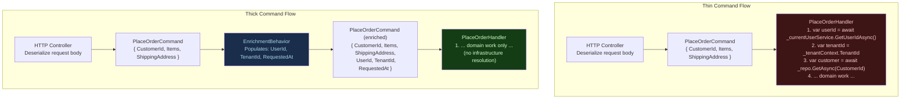
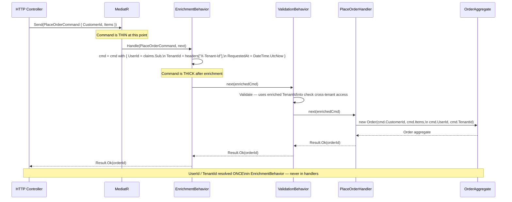
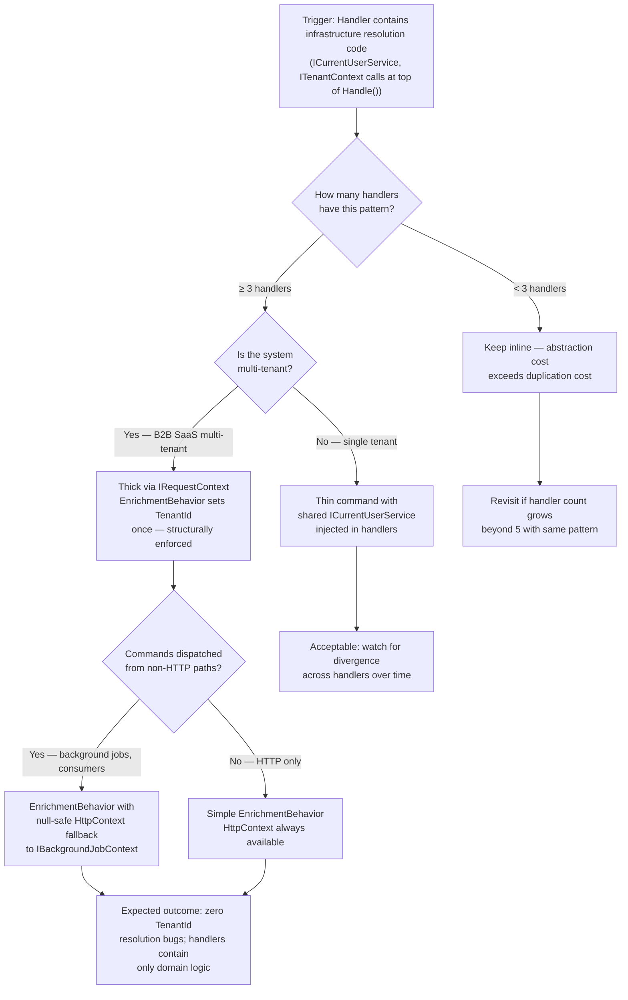

> [!ABSTRACT] Quick Reference — Thin vs Thick Commands **Invariant:** A thin command carries only the raw data supplied by the caller; a thick command carries additional resolved context (user identity, tenant ID, resolved aggregate references, enriched metadata) populated by the application layer before dispatch or inside the handler. **Cost:** Thin commands are simpler to construct and test at the transport layer but push resolution responsibility into every handler; thick commands centralise enrichment but require a deliberate enrichment step — either in a pipeline behavior or a factory — adding coupling between the command and the application layer's identity/context infrastructure. **Trigger:** Handler code repeatedly resolves `ICurrentUserService`, `ITenantResolver`, or loads a parent aggregate before doing domain work — the same three lines of enrichment appear in every command handler. **Skip When:** The system has fewer than five command handlers, all commands originate from a single authenticated endpoint, and the enrichment data is trivially available inside the handler — the pattern overhead exceeds the duplication cost. **.NET Entry Point:** Constructor on the command record / `IPipelineBehavior<TRequest, TResponse>` enrichment behavior / `ICommandFactory` service; no dedicated NuGet package — pure C# design choice. **Azure Native:** N/A — thin/thick is a command design pattern; Azure API Management policies can pre-populate HTTP headers that the thin-command binder reads, but the pattern itself is application-layer. **Number to Know:** Thick command enrichment via a pipeline behavior adds ~0.5–3ms per request when enrichment requires a single Redis or claims-principal lookup; 8–20ms if it requires a SQL query to resolve tenant metadata — make enrichment decisions with this latency budget in mind.

---

## Navigation

**Domain:** [[7 — System Design & Distributed Systems]] > **Group:** CQRS and Event Sourcing **Previous:** [[7.089 — CQRS — Transaction Pipeline Behavior]] | **Next:** [[7.091 — CQRS — Read Model Design — Denormalized Views]]

### Prerequisites

- [[7.081 — CQRS — Command Query Responsibility Segregation]] — the thin/thick distinction only matters on the command side of CQRS; understanding what a command is (a write intent that may mutate state) establishes why the caller's supplied data versus application-resolved context is a meaningful boundary.
- [[7.084 — CQRS — MediatR — IRequest and IRequestHandler]] — thick command enrichment is commonly implemented as a pipeline behavior wrapping `IRequestHandler<TRequest, TResponse>`; without understanding how MediatR dispatches, the enrichment hook location is unclear.
- [[7.047 — DDD — Aggregates — Consistency Boundary]] — thick commands frequently carry a resolved aggregate ID or a pre-loaded aggregate root reference; understanding aggregate boundaries explains why enrichment must happen before the handler crosses the aggregate's transactional boundary.

### Where This Fits

> [!INFO] Production Encounter Map
> 
> - **Layer:** Application layer — the command object itself and the first lines of `IRequestHandler.Handle()` where context resolution currently happens inline.
> - **Trigger:** A new `SubmitOrderCommand` handler is the sixth handler in two months to start with `var userId = await _currentUserService.GetUserIdAsync()` and `var tenantId = _tenantContext.TenantId` before performing any domain work. The team notices the pattern and debates where that context should live.
> - **Without it:** Every handler independently resolves context — creating silent failure modes (handler forgets to set `TenantId`, runs a query against the wrong tenant's data), duplicated DI dependencies (`ICurrentUserService` injected into 12 handlers instead of 1 behavior), and handlers that are larger than their domain responsibility warrants.
> - **First signal:** A support ticket: "User X sees order data belonging to User Y." Root cause: one handler resolved `UserId` from the HTTP context but another resolved it from a JWT claim with a different field name — the inconsistency is invisible until a multi-tenant bug surfaces.

Commands are the write-side input objects in a CQRS system. The thin/thick question is: at the point a command enters a handler, how much of the data it carries was supplied by the external caller, and how much was resolved by the application layer itself? This decision distributes complexity between the transport boundary, the application service layer, and the domain handler — and the distribution matters most in multi-tenant SaaS systems, complex domain models, and systems where the same command type is dispatched from multiple surfaces (HTTP, message consumers, background jobs). It connects directly to [[7.047 — DDD — Aggregates — Consistency Boundary]] because thick commands often pre-resolve the aggregate identity that determines which consistency boundary the handler will operate within.

---

## Core Mental Model

A **thin command** is a data-transfer object that contains exactly what the caller provided — nothing more. A `PlaceOrderCommand` carrying `CustomerId`, `Items`, and `ShippingAddress` that the HTTP request body supplied is thin. The handler is responsible for resolving anything else it needs: current user identity, tenant context, timestamps, resolved domain objects. A **thick command** carries additional data that the application layer populated before or during dispatch — the same `PlaceOrderCommand` made thick also contains `UserId` (from the JWT), `TenantId` (from the HTTP header), `RequestedAt` (from system clock), and possibly a pre-validated `CustomerAccount` value object fetched from the repository. The invariant each style maintains: **thin commands are honest about their origin** — they carry no hidden server-side data; **thick commands are complete at handler entry** — the handler contains no infrastructure resolution code.

The critical insight is that this is not a binary global choice. A system can use thin commands for simple commands that need no enrichment, thin commands with a lightweight enrichment behavior for context data (user/tenant), and thick commands in specific cases where a pre-loaded aggregate reference eliminates an N+1 load pattern across handlers.

> [!TIP] The Non-Obvious Insight The thin/thick decision is not primarily about the command object's size — it is about where the **authorization and tenancy invariant** is enforced. A thin command requires every handler to independently resolve `TenantId` and verify `UserId` matches the resource being modified. If one handler forgets, no compile-time or framework error fires — the bug is silent until a cross-tenant data leak surfaces in production. A thick command enriched by a single authoritative behavior means the `TenantId` and `UserId` are set once, tested once, and impossible to forget. The design decision is really: "do I want multi-tenant correctness to be optional (thin) or structurally enforced (thick via behavior)?" For B2B SaaS where a cross-tenant data leak is a contractual breach, the answer is almost always: thick, via a mandatory enrichment behavior that cannot be bypassed.

### Classification

- **Consistency axis:** N/A — both styles carry the same write intent; consistency is determined by the handler and repository, not the command design.
- **Availability tradeoff:** A thick command enriched via a remote call (SQL tenant lookup, Redis user context) introduces a remote dependency into the dispatch path. If that dependency is unavailable, the command cannot be enriched and the handler cannot run — every command fails until the enrichment source recovers.
- **Latency impact:** Thin: 0ms enrichment overhead — no additional work at command construction. Thick via claims-principal: ~0.1ms — in-memory lookup. Thick via Redis: ~0.5–2ms. Thick via SQL: ~5–20ms on every command regardless of whether the handler needs that data.
- **Failure domain:** Single-process — thin/thick is an in-process design pattern. Thick commands that enrich from remote sources add a remote failure dependency to what was previously a local operation.
- **Abstraction layer:** Pattern — expressed as a C# record design choice, optionally enforced by a pipeline behavior; no framework enforces it.

### Primary Diagram



### Supporting Diagram



### Numbers That Matter

|Metric|Value|Context / Conditions|
|---|---|---|
|Thin command — enrichment overhead|0ms|No enrichment at dispatch; handler pays cost inline|
|Thick command — claims-principal enrichment|~0.05–0.1ms|Reading from `ClaimsPrincipal` in memory; no I/O|
|Thick command — Redis enrichment|~0.5–2ms|StackExchange.Redis GET on Azure Cache for Redis Standard tier|
|Thick command — SQL enrichment|~5–20ms|Single `SELECT` on Azure SQL Standard S2 over TCP|
|Cost of thin: duplicate enrichment across 10 handlers|10× inline resolution|Each handler independently calls `ICurrentUserService`, `ITenantContext`, etc.|
|Cross-tenant bug MTTR (thin, inconsistent resolution)|2–8 hours (estimated)|Time to diagnose which handler used the wrong claim field|
|Cross-tenant bug MTTR (thick, single enrichment source)|15–30 minutes (estimated)|One place to check: the EnrichmentBehavior|
|Max practical thick command property count|~8–12 properties|Beyond this, the command record is harder to reason about; consider splitting|

### Key Properties / Guarantees

|Property|Value|Condition|
|---|---|---|
|Thin: handler independence|Handler self-contained; can be tested with the command record alone|No enrichment behavior registered|
|Thin: enrichment consistency|Not guaranteed — each handler may resolve context differently|Unless a shared service is used everywhere|
|Thick: enrichment consistency|Guaranteed — one behavior sets context for all matching commands|Enrichment behavior is registered and mandatory|
|Thick: handler purity|Handler contains only domain logic; no infrastructure resolution|Enrichment behavior covers all context data the handler needs|
|Thick: enrichment latency|Paid on every dispatch, even for handlers that don't need all enriched fields|Unless per-handler selective enrichment is used|
|Testability (thin)|High — construct command with known fields, inject mock services into handler||
|Testability (thick)|High for handler (inject pre-enriched command); requires integration test for enrichment behavior itself||

---

## Deep Mechanics

### How It Works

**Thin command lifecycle:**

1. **Caller constructs.** The HTTP model binder or message deserializer creates the command record from external input: `new PlaceOrderCommand(customerId, items, shippingAddress)`. No server-side data is added at this step.
2. **MediatR dispatches.** `mediator.Send(command)` resolves behavior chain and handler.
3. **Handler resolves context.** First lines of `PlaceOrderHandler.Handle()` call `ICurrentUserService.GetUserIdAsync()`, read `ITenantContext.TenantId`, and possibly load the `CustomerAccount` aggregate from the repository.
4. **Domain work.** Handler uses the locally-resolved context plus the command data to perform domain operations.
5. **Risk surface.** Steps 3 and 4 occur independently in every handler. If Handler A uses `httpContextAccessor.HttpContext?.User?.FindFirstValue(ClaimTypes.NameIdentifier)` and Handler B uses `_currentUserService.GetUserIdAsync()` which reads from a different claim, they may return different values for the same user — a bug that only surfaces under specific token configurations.

**Thick command lifecycle:**

1. **Caller constructs thin.** Command is constructed with caller-supplied data only — identical to the thin path.
    
2. **MediatR dispatches into enrichment behavior.** The first registered behavior is `EnrichmentBehavior<TRequest, TResponse>` constrained to `IEnrichableCommand`.
    
3. **Enrichment behavior populates.** The behavior uses `with` expression syntax (C# record non-destructive mutation) to produce a new command instance with `UserId`, `TenantId`, `RequestedAt`, and any other server-resolved fields populated. It then calls `await next()` passing the enriched instance.
    
    > **Critical .NET detail:** `RequestHandlerDelegate<TResponse>` passed to a behavior receives no arguments — `next()` does not take the request as a parameter. The enriched command must either (a) be mutated in-place (if the command is a class with settable properties — not recommended for records), or (b) the behavior must re-invoke the inner chain using a locally-scoped `next` that captures the enriched command. The standard pattern uses a custom `IEnrichmentBehavior<TRequest>` that mutates the record reference via `ref` semantics or uses a `RequestContext` service registered in the DI scope.
    
4. **Downstream behaviors use enriched data.** `ValidationBehavior` can now validate cross-tenant access rules using the `TenantId` in the command — without calling `ITenantContext` directly.
    
5. **Handler receives complete command.** `PlaceOrderHandler.Handle(command, ...)` enters with all context populated. First line is domain logic, not infrastructure resolution.
    

**The `with` expression enrichment pattern:** C# records support `with` expressions for non-destructive mutation. An enrichment behavior can produce `enrichedCommand = request with { UserId = userId, TenantId = tenantId }`, but the standard `RequestHandlerDelegate<TResponse>` does not accept a new request object. The workaround is to use a `IRequestContext` scoped service that the behavior sets and the handler reads — keeping the command record thin while providing thick context through a separate service. This is the pragmatic hybrid that avoids the MediatR delegate limitation.

### Protocol Trace

```
Thin Command — Happy Path (PlaceOrderCommand, 3 handlers all resolve context independently):
  1. HTTP Request → Controller → model bind → PlaceOrderCommand { CustomerId: c-123, Items: [...], ShippingAddress: {...} }
  2. mediator.Send(PlaceOrderCommand) → behavior chain entry
  3. LoggingBehavior: log "Handling PlaceOrderCommand" [~0.05ms]
  4. ValidationBehavior: validate CustomerId not null, Items not empty [~0.2ms]
  5. TransactionBehavior: BEGIN TRANSACTION [~4ms]
  6. PlaceOrderHandler.Handle():
       a. var userId = await _currentUserService.GetUserIdAsync() [~0.1ms — reads ClaimsPrincipal]
       b. var tenantId = _tenantContext.TenantId [~0.01ms — reads scoped service]
       c. var customer = await _customerRepo.GetAsync(cmd.CustomerId, tenantId) [~8ms — SQL SELECT]
       d. domain logic: customer.PlaceOrder(items, shippingAddress, userId) [~0.1ms]
       e. await _orderRepo.SaveAsync(order) [~5ms — SQL INSERT]
  7. TransactionBehavior: COMMIT [~2ms]
  8. LoggingBehavior: log completion [~0.05ms]
  Total: ~19.6ms | Handler infrastructure code: steps 6a–6b = ~0.11ms (trivial here but duplicated in every handler)

Thick Command — Happy Path (EnrichmentBehavior pre-populates context):
  1. HTTP Request → Controller → model bind → PlaceOrderCommand { CustomerId: c-123, Items: [...], ShippingAddress: {...} }
  2. mediator.Send(PlaceOrderCommand) → behavior chain entry
  3. EnrichmentBehavior:
       a. userId = httpContextAccessor.HttpContext.User.FindFirstValue("sub") [~0.05ms — in-memory]
       b. tenantId = httpContextAccessor.HttpContext.Request.Headers["X-Tenant-Id"] [~0.01ms]
       c. Sets RequestContext.UserId = userId, RequestContext.TenantId = tenantId [~0.01ms — scoped service]
  4. LoggingBehavior: log "Handling PlaceOrderCommand | UserId: u-456 | TenantId: t-789" [~0.05ms]
  5. ValidationBehavior: validate (can now use RequestContext.TenantId for cross-tenant access check) [~0.3ms]
  6. TransactionBehavior: BEGIN TRANSACTION [~4ms]
  7. PlaceOrderHandler.Handle():
       a. var customer = await _customerRepo.GetAsync(cmd.CustomerId, _requestContext.TenantId) [~8ms]
       b. domain logic: customer.PlaceOrder(items, shippingAddress, _requestContext.UserId) [~0.1ms]
       c. await _orderRepo.SaveAsync(order) [~5ms]
  8. TransactionBehavior: COMMIT [~2ms]
  9. LoggingBehavior: log completion [~0.05ms]
  Total: ~19.6ms | Handler infrastructure code: none — _requestContext is injected, not resolved

Failure Path — Thin: Handler resolves wrong TenantId (silent bug):
  1–4. Same as thin happy path
  5. PlaceOrderHandler.Handle():
       a. var userId = await _currentUserService.GetUserIdAsync() — returns u-456 ✓
       b. var tenantId = _WRONG_SOURCE_.TenantId — returns t-000 (global/default tenant) ✗
       c. var customer = await _customerRepo.GetAsync(cmd.CustomerId, t-000) — returns WRONG CUSTOMER from wrong tenant
       d. domain logic executes on wrong customer aggregate — SILENT DATA CORRUPTION
  No exception. No log warning. Order is placed against the wrong tenant's customer.
  Detection: customer complaint "I see someone else's order" or audit log discrepancy days later.

Failure Path — Thick: EnrichmentBehavior source unavailable (HTTP context missing):
  1. Background job dispatches PlaceOrderCommand (no HTTP context)
  2. EnrichmentBehavior: httpContextAccessor.HttpContext is NULL
  3. EnrichmentBehavior throws NullReferenceException (or returns Result.Fail if coded defensively)
  4. Command fails immediately — handler never reached
  Detection: immediate — job failure logged at step 3
  Recovery: Background jobs must pass command with UserId/TenantId pre-set; EnrichmentBehavior
             detects non-HTTP origin and skips HTTP-specific enrichment (reads from different source)
```

### Failure Modes

**Failure Mode 1: Thin Command — Inconsistent Tenant Resolution Across Handlers**

- **Cause:** Two handlers resolve `TenantId` from different sources: one reads from a scoped `ITenantContext` service populated by middleware; another reads from a JWT claim directly. When a request arrives with a `X-Tenant-Id` header that differs from the JWT embedded tenant claim (a configuration error during a tenant migration), the two handlers return different tenant IDs for the same request.
- **Symptom:** Cross-tenant data leaks — users in Tenant A see records belonging to Tenant B on specific endpoints. No exception is raised because both tenant IDs are valid; the application simply queries against the wrong tenant's dataset.
- **Detection time:** Silent — often discovered days or weeks later via a support ticket or a compliance audit. Never surfaces in unit tests because each handler is tested independently with a single mocked tenant source.
- **Blast radius:** Depending on which handler the user hits, they may read, write, or delete records in an incorrect tenant's data space. In a B2B SaaS context, this is a contractual breach and potentially a regulatory violation (GDPR Article 32 — confidentiality of data).

> [!DANGER] 3 AM Production Signal Metric: No automated metric for cross-tenant leaks — requires data-layer audit queries. Log: `INFO [OrderRepository] GetAsync | CustomerId: c-123 | TenantId: t-000 | RowsReturned: 1` — but the request came from TenantId t-456. The discrepancy is only visible if you join the request log (which has the HTTP-layer TenantId) with the repository log (which has the resolved TenantId) in the same correlation window. Customer impact: A user reports "I can see another company's order in my order history" — exact complaint for a B2B SaaS cross-tenant leak.

**Failure Mode 2: Thick Command — Enrichment Behavior Fails for Non-HTTP Dispatch Paths**

- **Cause:** The enrichment behavior reads `UserId` and `TenantId` exclusively from `IHttpContextAccessor.HttpContext`, which is `null` when the command is dispatched from an `IHostedService`, Azure Functions worker, or a MassTransit consumer (no HTTP context exists).
- **Symptom:** All background-job-dispatched commands fail with `NullReferenceException` in the enrichment behavior. The background job's retry mechanism fires repeatedly; the dead-letter queue fills with unprocessable messages. The HTTP path is completely unaffected.
- **Detection time:** Immediate on first background job dispatch. Easy to miss if the background job runs infrequently (nightly, weekly) — the failure may not be discovered until the first scheduled run after the enrichment behavior is introduced.
- **Blast radius:** All commands dispatched from non-HTTP paths (background jobs, message consumers, scheduled tasks) fail. Data processing that depends on those commands halts silently if the job failure is not alerting correctly.

> [!DANGER] 3 AM Production Signal Metric: `background_job_failures_total{job_type="ProcessPaymentCommand"} > 0` — any failure is abnormal. Log: `ERROR [EnrichmentBehavior] NullReferenceException: Object reference not set | RequestType: ProcessPaymentCommand | Source: IHttpContextAccessor.HttpContext | CorrelationId: 4b1f-...` Customer impact: Nightly payment processing job silently stops; customers are not billed; revenue impact discovered on next day's reconciliation report.

### .NET and Azure Integration Points

- **ASP.NET Core:** `IHttpContextAccessor` — the primary source for HTTP-context enrichment (user claims, tenant headers); must be registered via `builder.Services.AddHttpContextAccessor()`.
- **EF Core:** Thick commands or `IRequestContext` services often carry `TenantId` used inside EF Core global query filters (`HasQueryFilter(e => e.TenantId == _requestContext.TenantId)`) — the enrichment pattern makes those filters reliable.
- **Azure Services:** Azure API Management can inject verified tenant identity as HTTP headers (via `set-header` policy with a backend JWT validation), which the enrichment behavior reads — delegating trust establishment to Azure API Management and keeping the application layer focused on enrichment mechanics.
- **.NET Libraries:** MediatR (dispatching), `Microsoft.AspNetCore.Http.IHttpContextAccessor` (HTTP context), `System.Security.Claims.ClaimsPrincipal` (user identity).
- **Configuration:** No `appsettings.json` keys; the enrichment behavior is registered in `Program.cs` alongside other behaviors.

```csharp
// Namespace: YourCompany.OrderManagement.Application.Infrastructure
// Role: Application Layer — Request Context (scoped service carrying enriched context)

namespace YourCompany.OrderManagement.Application.Infrastructure;

/// <summary>
/// Scoped service populated by EnrichmentBehavior before handler execution.
/// Injected into handlers and domain services that need caller context
/// without creating direct handler dependencies on HTTP infrastructure.
/// </summary>
public sealed class RequestContext : IRequestContext
{
    public string UserId { get; set; } = string.Empty;
    public string TenantId { get; set; } = string.Empty;
    public DateTimeOffset RequestedAt { get; set; }
    public string CorrelationId { get; set; } = string.Empty;
}

public interface IRequestContext
{
    string UserId { get; }
    string TenantId { get; }
    DateTimeOffset RequestedAt { get; }
    string CorrelationId { get; }
}

// Program.cs registration
builder.Services.AddScoped<RequestContext>();
builder.Services.AddScoped<IRequestContext>(sp => sp.GetRequiredService<RequestContext>());
builder.Services.AddHttpContextAccessor();
```

---

## Production Patterns and Implementation

### Primary Implementation

```csharp
// Namespace: YourCompany.OrderManagement.Application.Commands
// Role: Application Layer — Command (thin by construction; enriched by behavior)

namespace YourCompany.OrderManagement.Application.Commands;

/// <summary>
/// Thin command: carries only caller-supplied data.
/// UserId and TenantId are NOT in this record — they are set by EnrichmentBehavior via IRequestContext.
/// </summary>
/// <param name="CustomerId">The customer placing the order.</param>
/// <param name="Items">Line items in the order.</param>
/// <param name="ShippingAddress">Destination address.</param>
public sealed record PlaceOrderCommand(
    Guid CustomerId,
    IReadOnlyList<OrderLineItem> Items,
    ShippingAddress ShippingAddress
) : IRequest<Result<Guid>>;

/// <summary>Value object for an order line item.</summary>
/// <param name="ProductId">Product being ordered.</param>
/// <param name="Quantity">Number of units.</param>
/// <param name="UnitPriceCents">Price per unit in cents at time of order.</param>
public sealed record OrderLineItem(Guid ProductId, int Quantity, long UnitPriceCents);

/// <summary>Value object for a shipping destination.</summary>
public sealed record ShippingAddress(
    string Line1, string? Line2, string City, string PostalCode, string CountryCode);
```

```csharp
// Namespace: YourCompany.OrderManagement.Application.Behaviors
// Role: Application Layer — Enrichment (populates IRequestContext before handlers run)

using MediatR;
using Microsoft.AspNetCore.Http;
using System.Security.Claims;
using YourCompany.OrderManagement.Application.Infrastructure;

namespace YourCompany.OrderManagement.Application.Behaviors;

/// <summary>
/// Populates IRequestContext with caller identity and tenant from the HTTP context.
/// Registered as the outermost behavior — runs before validation so validators can
/// use TenantId for cross-tenant access checks.
/// Falls back to ambient context (IBackgroundJobContext) when no HTTP context is present,
/// allowing background jobs to set UserId/TenantId themselves before dispatching.
/// </summary>
public sealed class EnrichmentBehavior<TRequest, TResponse>
    : IPipelineBehavior<TRequest, TResponse>
    where TRequest : IRequest<TResponse>
{
    private readonly RequestContext _requestContext;
    private readonly IHttpContextAccessor _httpContextAccessor;
    private readonly IBackgroundJobContext _backgroundJobContext;

    public EnrichmentBehavior(
        RequestContext requestContext,
        IHttpContextAccessor httpContextAccessor,
        IBackgroundJobContext backgroundJobContext)
    {
        _requestContext = requestContext;
        _httpContextAccessor = httpContextAccessor;
        _backgroundJobContext = backgroundJobContext;
    }

    /// <inheritdoc/>
    public async Task<TResponse> Handle(
        TRequest request,
        RequestHandlerDelegate<TResponse> next,
        CancellationToken cancellationToken)
    {
        var httpContext = _httpContextAccessor.HttpContext;

        if (httpContext is not null)
        {
            // HTTP path — enrich from claims and headers
            _requestContext.UserId = httpContext.User.FindFirstValue(ClaimTypes.NameIdentifier)
                ?? throw new UnauthorizedAccessException("UserId claim missing from token.");

            _requestContext.TenantId = httpContext.Request.Headers["X-Tenant-Id"].FirstOrDefault()
                ?? httpContext.User.FindFirstValue("tenant_id")
                ?? throw new UnauthorizedAccessException("TenantId not present in headers or token.");

            _requestContext.CorrelationId = httpContext.Request.Headers["X-Correlation-Id"]
                .FirstOrDefault() ?? Guid.NewGuid().ToString();
        }
        else
        {
            // Non-HTTP path (background job, message consumer) — enrich from ambient context
            // IBackgroundJobContext is set by the job host before dispatching commands
            _requestContext.UserId = _backgroundJobContext.UserId
                ?? throw new InvalidOperationException("No HTTP context and no background job context — cannot resolve UserId.");

            _requestContext.TenantId = _backgroundJobContext.TenantId
                ?? throw new InvalidOperationException("Cannot resolve TenantId for non-HTTP command dispatch.");

            _requestContext.CorrelationId = _backgroundJobContext.CorrelationId
                ?? Guid.NewGuid().ToString();
        }

        _requestContext.RequestedAt = DateTimeOffset.UtcNow;

        return await next();
    }
}

/// <summary>Ambient context for background jobs — set by job host, read by EnrichmentBehavior.</summary>
public interface IBackgroundJobContext
{
    string? UserId { get; }
    string? TenantId { get; }
    string? CorrelationId { get; }
}
```

```csharp
// Namespace: YourCompany.OrderManagement.Application.Commands
// Role: Application Layer — Handler (pure domain logic; no infrastructure resolution)

using MediatR;
using YourCompany.OrderManagement.Application.Infrastructure;
using YourCompany.OrderManagement.Domain.Orders;
using YourCompany.OrderManagement.Domain.Customers;

namespace YourCompany.OrderManagement.Application.Commands;

/// <summary>
/// Handles the PlaceOrderCommand. Receives a thin command; context is available via IRequestContext.
/// This handler contains ONLY domain logic — no ICurrentUserService, no ITenantContext calls.
/// </summary>
public sealed class PlaceOrderCommandHandler : IRequestHandler<PlaceOrderCommand, Result<Guid>>
{
    private readonly ICustomerRepository _customerRepository;
    private readonly IOrderRepository _orderRepository;
    private readonly IRequestContext _requestContext;

    public PlaceOrderCommandHandler(
        ICustomerRepository customerRepository,
        IOrderRepository orderRepository,
        IRequestContext requestContext)
    {
        _customerRepository = customerRepository;
        _orderRepository = orderRepository;
        _requestContext = requestContext;
    }

    /// <inheritdoc/>
    public async Task<Result<Guid>> Handle(
        PlaceOrderCommand command,
        CancellationToken cancellationToken)
    {
        // IRequestContext was populated by EnrichmentBehavior — no resolution code here
        var customer = await _customerRepository.GetAsync(
            command.CustomerId,
            _requestContext.TenantId,  // ← always correct — set by enrichment behavior
            cancellationToken);

        if (customer is null)
            return Result.Fail<Guid>($"Customer {command.CustomerId} not found.");

        var order = customer.PlaceOrder(
            command.Items,
            command.ShippingAddress,
            _requestContext.UserId,      // ← actor identity from enrichment
            _requestContext.RequestedAt);

        await _orderRepository.SaveAsync(order, cancellationToken);

        return Result.Ok(order.Id.Value);
    }
}
```

### IServiceCollection Registration

```csharp
// Program.cs — enrichment behavior registration and supporting services
builder.Services.AddHttpContextAccessor();                           // Required for EnrichmentBehavior
builder.Services.AddScoped<RequestContext>();                         // Mutable scoped context
builder.Services.AddScoped<IRequestContext>(sp =>                    // Immutable interface for handlers
    sp.GetRequiredService<RequestContext>());
builder.Services.AddSingleton<IBackgroundJobContext, BackgroundJobContext>(); // Non-HTTP path

builder.Services.AddMediatR(cfg =>
{
    cfg.RegisterServicesFromAssembly(typeof(Program).Assembly);

    // EnrichmentBehavior FIRST — provides context all subsequent behaviors and handlers need
    cfg.AddBehavior(typeof(IPipelineBehavior<,>), typeof(EnrichmentBehavior<,>));

    // Validation can now use IRequestContext.TenantId for cross-tenant access checks
    cfg.AddBehavior(typeof(IPipelineBehavior<,>), typeof(ValidationBehavior<,>));

    // Transaction wraps handler only — enrichment and validation have already completed
    cfg.AddBehavior(typeof(IPipelineBehavior<,>), typeof(TransactionBehavior<,>));
});
```

### Common Variants

```csharp
// Variant A — True Thick Command: context embedded directly in the command record
// Used when: the command is dispatched from background jobs or message consumers
//            where HTTP context is never available and the producer must supply context explicitly.

/// <summary>
/// Thick command: caller explicitly supplies all context at construction time.
/// Used by message consumers and background jobs where HTTP context doesn't exist.
/// The command carries its own identity — no enrichment behavior needed.
/// </summary>
public sealed record ProcessRefundCommand(
    Guid OrderId,
    long RefundAmountCents,
    string Reason,
    // Thick properties — set by the producer (job, consumer), not the HTTP request
    string InitiatedByUserId,
    string TenantId,
    DateTimeOffset RequestedAt,
    string CorrelationId
) : IRequest<Result<Guid>>;

// Handler for thick command — reads directly from command properties
public sealed class ProcessRefundCommandHandler : IRequestHandler<ProcessRefundCommand, Result<Guid>>
{
    public async Task<Result<Guid>> Handle(ProcessRefundCommand command, CancellationToken ct)
    {
        // All context on the command — no IRequestContext needed
        var order = await _orderRepo.GetAsync(command.OrderId, command.TenantId, ct);
        var refund = order.Initiate Refund(command.RefundAmountCents, command.Reason,
            command.InitiatedByUserId, command.RequestedAt);
        await _refundRepo.SaveAsync(refund, ct);
        return Result.Ok(refund.Id.Value);
    }
}
```

```csharp
// Variant B — Selective Thick via Marker Interface
// Used when: most commands need basic enrichment, but a few also need pre-loaded aggregates
//            to avoid N+1 loads when the same aggregate is needed by both a validator and a handler.

public interface IRequiresCustomerAccount
{
    Guid CustomerId { get; }
    CustomerAccount? ResolvedCustomer { get; set; } // Set by enrichment behavior
}

public sealed record UpgradeSubscriptionCommand(
    Guid CustomerId,
    SubscriptionTier NewTier
) : IRequest<Result>, IRequiresCustomerAccount
{
    // Thick property — populated by CustomerEnrichmentBehavior, used by validator AND handler
    public CustomerAccount? ResolvedCustomer { get; set; }
}

// CustomerEnrichmentBehavior — loads CustomerAccount once; both validator and handler use it
public sealed class CustomerEnrichmentBehavior<TRequest, TResponse>
    : IPipelineBehavior<TRequest, TResponse>
    where TRequest : IRequest<TResponse>, IRequiresCustomerAccount
{
    private readonly ICustomerRepository _customerRepo;
    private readonly IRequestContext _requestContext;

    public CustomerEnrichmentBehavior(ICustomerRepository customerRepo, IRequestContext requestContext)
        => (_customerRepo, _requestContext) = (customerRepo, requestContext);

    public async Task<TResponse> Handle(
        TRequest request, RequestHandlerDelegate<TResponse> next, CancellationToken ct)
    {
        // Load customer once — shared between validation and handler
        request.ResolvedCustomer = await _customerRepo.GetAsync(
            request.CustomerId, _requestContext.TenantId, ct);
        return await next();
    }
}
```

### Performance Profile

```csharp
[MemoryDiagnoser]
[SimpleJob(RuntimeMoniker.Net80)]
public class ThinVsThickCommandBenchmark
{
    private IMediator _mediatorThin = null!;
    private IMediator _mediatorThick = null!;

    [GlobalSetup]
    public void Setup()
    {
        // Thin: handler resolves context via ICurrentUserService (in-memory mock, no I/O)
        var servicesThin = new ServiceCollection()
            .AddMediatR(cfg => cfg.RegisterServicesFromAssembly(typeof(ThinOrderHandler).Assembly))
            .AddSingleton<ICurrentUserService>(new StubCurrentUserService("u-456", "t-789"))
            .BuildServiceProvider();
        _mediatorThin = servicesThin.GetRequiredService<IMediator>();

        // Thick: context resolved once by EnrichmentBehavior, handler reads from IRequestContext
        var servicesThick = new ServiceCollection()
            .AddMediatR(cfg =>
            {
                cfg.RegisterServicesFromAssembly(typeof(ThickOrderHandler).Assembly);
                cfg.AddBehavior(typeof(IPipelineBehavior<,>), typeof(EnrichmentBehavior<,>));
            })
            .AddScoped<RequestContext>()
            .AddScoped<IRequestContext>(sp => sp.GetRequiredService<RequestContext>())
            .AddSingleton<IHttpContextAccessor>(new StubHttpContextAccessor("u-456", "t-789"))
            .BuildServiceProvider();
        _mediatorThick = servicesThick.GetRequiredService<IMediator>();
    }

    [Benchmark(Baseline = true)]
    public Task<Result<Guid>> ThinCommandInlineResolution()
        => _mediatorThin.Send(new PlaceOrderCommandThin(Guid.NewGuid(), [], new ShippingAddress("1 Main St", null, "London", "SW1A 1AA", "GB")));

    [Benchmark]
    public Task<Result<Guid>> ThickCommandBehaviorEnrichment()
        => _mediatorThick.Send(new PlaceOrderCommandThick(Guid.NewGuid(), [], new ShippingAddress("1 Main St", null, "London", "SW1A 1AA", "GB")));
}
```

Expected result shape for in-memory enrichment (no I/O, estimated on .NET 8 x64):

|Method|Mean|Allocated|Notes|
|---|---|---|---|
|ThinCommandInlineResolution|~1.5 μs|~900 B|Handler resolves 2 in-memory services|
|ThickCommandBehaviorEnrichment|~1.9 μs|~1.1 KB|Enrichment behavior + scoped service write|
|Difference|+0.4 μs|+~200 B|Negligible — real cost difference is I/O if enrichment needs remote call|

### Real-World .NET Ecosystem Mapping

|Pattern in This Note|Where It Appears in .NET / Azure|Manifestation|
|---|---|---|
|Thin command|DTO from `[FromBody]` model binding|Command record bound directly from request JSON; no server data added|
|Thick command enrichment via behavior|`IPipelineBehavior<TRequest, TResponse>` in MediatR|`EnrichmentBehavior<,>` populates `RequestContext` before handlers|
|IRequestContext scoped service|`builder.Services.AddScoped<RequestContext>()`|Scoped service shared between behavior (writer) and handler (reader) within one request|
|Multi-tenant EF Core query filter|`HasQueryFilter(e => e.TenantId == _requestContext.TenantId)` in `OnModelCreating`|EF Core automatically applies tenant filter when `IRequestContext.TenantId` is set by enrichment|
|Background job thick command|`IHostedService` or Azure Functions worker builds full command with context|`ProcessRefundCommand` with explicit `TenantId` and `UserId` set by the job host before `mediator.Send()`|
|Azure API Management tenant injection|`set-header` policy with JWT claim extraction|APIM validates JWT, extracts tenant claim, sets `X-Tenant-Id` header; `EnrichmentBehavior` reads it as authoritative|

---

## Gotchas and Production Pitfalls

### Enrichment Behavior Reads from HttpContext — Breaks All Non-HTTP Dispatch Paths

**Pitfall:** The enrichment behavior reads `_httpContextAccessor.HttpContext.User` unconditionally, without a null check.

```csharp
// ❌ Breaks when dispatched from background job or message consumer
_requestContext.UserId = _httpContextAccessor.HttpContext.User
    .FindFirstValue(ClaimTypes.NameIdentifier); // NullReferenceException when HttpContext is null
```

**Symptom:** Azure Functions worker, `IHostedService`, and MassTransit consumers all throw `NullReferenceException` in the enrichment behavior. Background processing halts. HTTP path is unaffected.

**Detection time:** Immediately on first non-HTTP dispatch — but only if non-HTTP dispatch exists. Easily missed in development if all testing is via HTTP.

> [!DANGER] Production Signal Metric: `background_job_error_rate{job_name="NightlyPaymentProcessor"} = 1.0` (100% failure rate) Log: `ERROR [EnrichmentBehavior] NullReferenceException | Source: IHttpContextAccessor.HttpContext | RequestType: ProcessRefundCommand | CorrelationId: 9b2c-...`

**Fix:**

```csharp
// ✅ Null-check HttpContext; fall back to ambient background job context
var httpContext = _httpContextAccessor.HttpContext;
if (httpContext is not null)
{
    _requestContext.UserId = httpContext.User.FindFirstValue(ClaimTypes.NameIdentifier)
        ?? throw new UnauthorizedAccessException("UserId claim missing.");
    _requestContext.TenantId = httpContext.Request.Headers["X-Tenant-Id"].FirstOrDefault()
        ?? throw new UnauthorizedAccessException("TenantId header missing.");
}
else
{
    _requestContext.UserId = _backgroundJobContext.UserId
        ?? throw new InvalidOperationException("No caller context available for non-HTTP dispatch.");
    _requestContext.TenantId = _backgroundJobContext.TenantId
        ?? throw new InvalidOperationException("No tenant context available for non-HTTP dispatch.");
}
```

**Cost of not fixing:** All background processing stops silently. Nightly billing jobs, payment reconciliation, and data export tasks fail at the enrichment step — no data is processed, no error surfaced to on-call until a business-level metric (revenue processed, emails sent) shows 0.

---

### Thick Command Carries Mutable Reference Types — Enrichment Mutates Shared State

**Pitfall:** The command record contains a mutable reference-type property (a list, a class) that the enrichment behavior populates. If MediatR retries the request (via a retry behavior), the same command instance is reused, and the enrichment behavior writes to a property that's already set from the first attempt — potentially appending rather than replacing.

```csharp
// ❌ Mutable list in command — enrichment appends on retry instead of replacing
public sealed record UpgradeSubscriptionCommand(Guid CustomerId) : IRequest<Result>
{
    public List<string> AuditTags { get; set; } = new(); // Mutable — enrichment appends tags
}

// Enrichment behavior called twice on retry:
// First call: AuditTags = ["enriched-tag"]
// Second call: AuditTags = ["enriched-tag", "enriched-tag"] ← duplicate
```

**Symptom:** Audit logs contain duplicate enrichment tags per retried command. At high retry rates (transient faults), audit records grow unboundedly. Only observable if enrichment adds duplicate-sensitive data.

**Detection time:** Minutes to hours — only appears on retried commands. Invisible in happy-path testing.

> [!DANGER] Production Signal Log: `INFO [AuditBehavior] AuditTags: ["tenant-verified","tenant-verified","tenant-verified"] | RequestType: UpgradeSubscriptionCommand | RetryAttempt: 3` Metric: Audit record size growing beyond expected baseline for high-retry-rate command types.

**Fix:**

```csharp
// ✅ Use immutable properties; EnrichmentBehavior sets, never appends
public sealed record UpgradeSubscriptionCommand(Guid CustomerId) : IRequest<Result>
{
    // Immutable init-only; use IReadOnlyList not List
    public IReadOnlyList<string> AuditTags { get; init; } = Array.Empty<string>();
}

// Enrichment behavior always creates new collection — idempotent
request = request with { AuditTags = new[] { "tenant-verified", _requestContext.TenantId } };
```

**Cost of not fixing:** Audit records become unreliable, violating compliance requirements. `IReadOnlyList` vs `List` is a 0ms runtime cost — there is no performance reason to use mutable collections in command records.

---

### Azure-Specific: Azure API Management Injects Tenant Header, But Enrichment Does Not Validate It Against the JWT

**Pitfall:** The enrichment behavior reads `X-Tenant-Id` from the HTTP header, trusting it as authoritative. Azure API Management is configured to set this header from the JWT's `tenant_id` claim. However, the APIM policy is misconfigured for one product — it passes the raw client-supplied header rather than the JWT-extracted claim. A malicious client sends `X-Tenant-Id: other-company-id` in the request.

```csharp
// ❌ Header taken at face value — no cross-validation with JWT claim
_requestContext.TenantId = httpContext.Request.Headers["X-Tenant-Id"].FirstOrDefault()
    ?? throw new UnauthorizedAccessException("TenantId header missing.");
```

**Symptom:** Requests from Tenant A that supply `X-Tenant-Id: tenant-B-id` in the header successfully query Tenant B's data. The APIM misconfiguration makes cross-tenant access trivially exploitable.

**Detection time:** Silent until a security penetration test or a malicious user discovers the vulnerability. No error — the enrichment behavior and handler both run normally with the attacker-supplied tenant ID.

> [!DANGER] Production Signal No automatic detection metric. Manual audit: query for requests where `JWT.tenant_id != X-Tenant-Id header value` — this cross-log join is only possible if both values are logged. Log: `INFO [EnrichmentBehavior] TenantId set: t-other-company | UserId: u-attacker-456 | Source: Header` alongside JWT with `tenant_id: t-attacker-001` — the discrepancy is the signal.

**Fix:**

```csharp
// ✅ Cross-validate header against JWT claim; reject if they disagree
var headerTenantId = httpContext.Request.Headers["X-Tenant-Id"].FirstOrDefault();
var jwtTenantId = httpContext.User.FindFirstValue("tenant_id");

if (headerTenantId is null || jwtTenantId is null)
    throw new UnauthorizedAccessException("TenantId missing from header or token.");

if (!string.Equals(headerTenantId, jwtTenantId, StringComparison.OrdinalIgnoreCase))
    throw new UnauthorizedAccessException(
        $"TenantId mismatch: header '{headerTenantId}' does not match token '{jwtTenantId}'.");

_requestContext.TenantId = jwtTenantId; // Always use the JWT claim as authoritative
```

**Cost of not fixing:** Cross-tenant data access is exploitable by any client that can control HTTP headers. In a B2B SaaS context, this is a critical security vulnerability — GDPR breach, potential contractual penalties, reputational damage.

---

### .NET-Specific: C# Record `with` Expression Cannot Pass Enriched Command to `next()` in MediatR

**Pitfall:** A developer attempts to "truly" enrich the command by using C# `with` syntax and calling `next()` with the new instance, not realizing that `RequestHandlerDelegate<TResponse>` in MediatR does not accept the request as a parameter — it is a zero-argument delegate that captures the original request.

```csharp
// ❌ Misconception: enrichedCommand is built but next() ignores it
public async Task<TResponse> Handle(TRequest request, RequestHandlerDelegate<TResponse> next, CancellationToken ct)
{
    var enrichedCommand = request with { UserId = userId, TenantId = tenantId }; // Correct C# syntax
    return await next(); // ← next() doesn't take the enriched command — uses the original captured request
}
```

**Symptom:** The enrichment appears to work (no compilation error, no runtime exception), but the handler still receives the original un-enriched command. `UserId` and `TenantId` in the handler are empty strings or defaults.

**Detection time:** Immediately visible in integration testing if the handler reads from the command directly. Silent if the handler reads from an `IRequestContext` service — but then the enrichment to the command record was pointless.

> [!DANGER] Production Signal Log: `INFO [PlaceOrderHandler] UserId: "" | TenantId: "" | CustomerId: f3a2-...` — blank enriched fields despite enrichment behavior running. The enrichment behavior's own log shows correct values; only the handler sees empties.

**Fix:**

```csharp
// ✅ Option 1: Use IRequestContext scoped service (recommended)
// Enrichment behavior writes to the scoped RequestContext; handler reads from IRequestContext.
// next() is called without modification — the handler reads context from the service, not the command.
_requestContext.UserId = userId;
_requestContext.TenantId = tenantId;
return await next();

// ✅ Option 2: Mutate in-place (only for class-based commands, not records)
// Acceptable when command is a class with settable properties (less idiomatic with MediatR).
// NOT recommended with C# records — defeats their immutability contract.
```

**Cost of not fixing:** Handlers silently operate with missing context. The most dangerous outcome: `TenantId` defaults to `string.Empty`, EF Core global query filter `e.TenantId == ""` returns 0 rows (silent empty result) or matches a misconfigured tenant, causing either data invisibility or cross-tenant access.

---

### Architecture-Level: Thick Command Carries Domain Objects — Creates Transport-Layer Coupling to Domain

**Pitfall:** The enrichment behavior loads and attaches a full domain aggregate (e.g., `CustomerAccount`) to the command record. The command record now holds a domain type, which means the HTTP binding layer (which constructs the command) must reference the domain assembly — violating the Dependency Rule of Clean Architecture.

```csharp
// ❌ Domain type in command record — command assembly now depends on domain assembly
public sealed record UpgradeSubscriptionCommand(
    Guid CustomerId,
    SubscriptionTier NewTier,
    CustomerAccount? ResolvedCustomer  // Domain type — breaks layer independence
) : IRequest<Result>;
```

**Symptom:** No runtime error. The architecture violation is structural: the command assembly references `YourCompany.OrderManagement.Domain`. A change to `CustomerAccount`'s properties now forces recompilation of the command layer, and any serialization framework that tries to serialize the command (for an event log or a message broker) must handle the full domain object.

**Detection time:** Architectural — detected by architecture fitness functions (ArchUnitNET or NDepend rules) or discovered when attempting to serialize the command over a message broker.

**Fix:** Use a marker interface (`IRequiresCustomerAccount`) on the command. The enrichment behavior is constrained to that interface and sets the domain object as a transient property on the command after it has been dispatched (not at construction time). The command assembly only depends on the interface definition, not on `CustomerAccount` directly.

**Cost of not fixing:** Domain model changes cascade into the application/command layer. After 6 months, command records accumulate domain references; serializing them for event replay becomes impossible without reconstructing the full domain graph.

---

## Tradeoffs and Decision Framework

### Tradeoff Matrix

|Dimension|Thin Command|Thick Command (via IRequestContext)|Thick Command (properties on record)|
|---|---|---|---|
|Handler purity|Low — handlers contain enrichment code|High — handlers read from IRequestContext|High — handlers read from command properties|
|Tenancy correctness|Risk — each handler may resolve differently|High — single authoritative behavior|High — context set at construction time|
|Background job support|Natural — handler resolves from available context|Requires fallback in EnrichmentBehavior|Natural — caller sets context on command|
|Testability (handler)|High — inject mock services|High — inject pre-populated IRequestContext|High — construct fully-populated command|
|Testability (enrichment)|N/A|Integration test required for EnrichmentBehavior|Integration test required for producer context|
|Serialization (message brokers)|Clean — only primitive/DTO data|Clean — IRequestContext not on command|Risk — domain objects on command break serialization|
|Cognitive overhead|Low — "what you see is what the handler gets"|Medium — must know IRequestContext concept|Medium — command has hidden server-side fields|
|Non-HTTP dispatch|Simple|Requires fallback logic in EnrichmentBehavior|Natural — producer sets all fields|
|Azure APIM integration|Natural — thin command constructed after APIM validation|Natural — EnrichmentBehavior reads APIM-injected headers|Natural — APIM sets headers; job host reads them|

### When to Apply



### Numbers-Driven Decision

|Threshold|Below = Thin (inline resolution)|Above = Thick (enrichment behavior)|
|---|---|---|
|Handlers with identical enrichment code|< 3 handlers|≥ 3 handlers — shared behavior amortises|
|Tenants in system|1 (single-tenant)|> 1 — tenancy isolation is mandatory|
|Enrichment latency via remote source|N/A|< 5ms acceptable; ≥ 20ms reconsider (consider caching)|
|Non-HTTP dispatch paths|0 (HTTP only)|≥ 1 — enrichment behavior must handle null HttpContext|
|Command types that need different context|0–1|≥ 2 — different context per type favours thick-per-type or marker interfaces|

### When NOT to Apply

> [!WARNING] Do Not Reach For This When...
> 
> - [ ] **Single-tenant system:** Multi-tenant context isolation is the primary driver for enforced enrichment. In a single-tenant system, all handlers share one tenant by definition — no cross-tenant risk exists, and thick enrichment adds complexity with no safety benefit.
> - [ ] **Fewer than 3 handlers:** Extracting an enrichment behavior for 2 handlers costs more to explain and maintain than the 4 lines of inline context resolution it replaces. The duplication is not yet painful enough to justify the abstraction.
> - [ ] **Commands dispatched exclusively from message brokers:** If all commands arrive from a message broker (not HTTP), the command record arrives pre-serialized with full context included. An enrichment behavior that reads from `IHttpContextAccessor` is irrelevant and will always hit the null-HttpContext path — the thick-command-on-record pattern is cleaner.
> - [ ] **Domain objects needed in validation AND handler:** Avoid attaching domain aggregates to the command record. Use the marker interface pattern (`IRequiresCustomerAccount`) to share a pre-loaded aggregate between a custom enrichment behavior, the validation behavior, and the handler — without embedding a domain type in the command assembly.

---

## Interview Arsenal

### Question Bank

1. **[Definition]** "What is the difference between a thin and a thick command in CQRS, and what problem does each design solve?"
2. **[Mechanism]** "Walk me through how a MediatR pipeline behavior enriches a thin command with tenant and user identity before the handler executes."
3. **[Tradeoff]** "What do you give up when you move to thick commands, and under what condition does that cost exceed the benefit?"
4. **[Failure mode]** "What specific production bug does thin command design enable in a multi-tenant SaaS system, and how do you detect it?"
5. **[Comparison]** "What is the difference between embedding enriched data directly in a command record versus using a scoped `IRequestContext` service, and when do you choose each?"
6. **[Design application]** "You are building a B2B SaaS order management system with 15 command handlers, three dispatch paths (HTTP, Azure Service Bus, and a nightly background job), and strict tenant isolation requirements. How do you design the command enrichment strategy?"
7. **[Scale]** "Your enrichment behavior performs a SQL query to load tenant metadata on every command. At 10,000 commands per minute, what breaks and how do you fix it?"
8. **[Advanced]** "C# records support `with` expression syntax for non-destructive mutation. Why can't you use this to pass an enriched command to MediatR's `next()` delegate, and what are the two idiomatic alternatives?"

### Spoken Answers

**Q: What is the difference between a thin and a thick command in CQRS, and what problem does each design solve?**

> **Average answer:** A thin command only contains what the user submitted — just the fields from the HTTP request body. A thick command also contains server-side data like the user's ID and the tenant ID that the application layer adds. Thin is simpler; thick centralizes context.

> **Great answer:** The distinction is about where responsibility for resolving caller context lives. A thin command is exactly what arrived from outside — the HTTP request body deserialized into a record. The handler is responsible for resolving anything else: `await _currentUserService.GetUserIdAsync()`, `_tenantContext.TenantId`, and so on. That's clean and simple when you have 3 handlers, but at 15 handlers you have 15 independent resolution sites — each a potential divergence point. One handler might read `UserId` from a JWT sub claim; another might read it from a custom `x-user-id` claim that was correct six months ago before a token schema change. Those diverge silently. A thick command moves that resolution into a single enrichment pipeline behavior that runs before every command. The result is one code path where tenant identity is established, tested once, and structurally impossible to skip. The cost is that the behavior must handle every dispatch path — HTTP, background jobs, message consumers — each of which has a different identity source. The `IHttpContextAccessor` is null outside HTTP; the behavior needs a fallback to an ambient background job context. The practical recommendation: thin commands by default, mandatory enrichment behavior for multi-tenant systems, thick-command-on-record for message-broker-originated commands where the producer controls the full context.

---

**Q: What is the difference between embedding enriched data directly in a command record versus using a scoped `IRequestContext` service, and when do you choose each?**

> **Average answer:** You can put the enriched data directly in the command object's properties, or you can put it in a separate service. The separate service is cleaner because it doesn't make the command object bigger. You'd use the service for things like user ID and tenant ID.

> **Great answer:** The structural difference is where the contract is expressed and what the serialization story looks like. Putting enriched data directly in the command record means the command is self-contained: every field the handler needs is on the object itself, which makes it trivially serializable and testable — construct the record with known values and test the handler with zero DI setup. This is the right model for commands dispatched over a message broker, because the producer populates the full record before publishing and the consumer receives a complete object with no enrichment step needed. The `IRequestContext` scoped service model keeps the command record thin on the wire and delegates context to the DI container's scope. The enrichment behavior writes to the scoped `RequestContext` service; the handler reads from `IRequestContext` injected in its constructor. This approach works cleanly for HTTP dispatch and avoids the MediatR delegate limitation — because `next()` doesn't accept a modified request, the scoped service is the only clean way to "pass enriched data forward" without reflection hacks. The failure mode of the scoped service approach is that non-HTTP dispatch paths must populate `RequestContext` via a different mechanism or the handler reads empty strings. The failure mode of the on-record approach is that domain types on the command record break serialization and layer independence. In practice: scoped service for HTTP-primary systems with a small number of background jobs; on-record for message-broker-heavy systems where the command is the unit of work.

---

**Q: C# records support `with` expression syntax for non-destructive mutation. Why can't you use this to pass an enriched command to MediatR's `next()` delegate, and what are the two idiomatic alternatives?**

> **Average answer:** The `with` expression creates a new copy of the record with some fields changed. But MediatR's `next()` doesn't take a parameter — it already captured the original command. So the enriched copy is never used by the handler.

> **Great answer:** The `RequestHandlerDelegate<TResponse>` that MediatR passes as `next` is a zero-argument delegate. It was constructed before your behavior's `Handle()` method ran, capturing the original command in a closure along with the rest of the behavior chain. When you call `next()`, it invokes that closure with the original captured command — your `enrichedCommand = request with { ... }` local variable is simply discarded. There's no parameter slot to inject it. The two idiomatic alternatives: First, the scoped `IRequestContext` service pattern — the enrichment behavior writes `UserId`, `TenantId`, and other server-side data to a scoped service that was registered in DI; the handler's constructor receives `IRequestContext` and reads from it. The command record stays thin on the wire; the scoped service carries the context. This is the correct pattern for HTTP-primary systems and is the approach I use in production. Second, mutable properties on the command record — the command is declared as a sealed record but with `{ get; set; }` properties for the enriched fields. The behavior does `request.UserId = userId` in-place before calling `next()`. The original reference is the same object, so the handler receives the mutated version. This works but trades immutability for simplicity, and it breaks if the command is dispatched through a retry behavior that reuses the same instance — the second attempt sees the first attempt's enrichment values already set. The scoped service model is immune to this because the scope is always fresh per HTTP request.

### Whiteboard in 60 Seconds

When this topic appears in a system design interview, draw in this sequence:

```
1. Draw a horizontal arrow: [HTTP Request] → [Controller] → [Command Record { CustomerId, Items }]
   "The command starts thin — exactly what the caller sent. Nothing server-side yet."

2. Draw [MediatR Send] → [EnrichmentBehavior] with a box labeled "Reads: JWT sub, X-Tenant-Id header"
   "The first behavior in the pipeline reads caller identity from the HTTP context.
    This is the single authoritative place where UserId and TenantId are resolved."

3. Draw an arrow from EnrichmentBehavior to [IRequestContext scoped service] with label "sets UserId, TenantId"
   "It writes to a scoped service — shared within this request's DI scope.
    The command record itself stays thin; context travels via the service."

4. Draw [ValidationBehavior] reading from [IRequestContext] with label "cross-tenant access check"
   "Validation can now check: does this UserId have permission to modify TenantId's data?
    Without enrichment, this check requires every validator to resolve TenantId independently."

5. Draw [Handler] reading from [IRequestContext] with label "zero infrastructure code"
   "The handler sees IRequestContext in its constructor. First line is domain logic.
    In .NET this is IRequestContext injected via constructor; in Azure, the header
    comes from API Management's set-header policy after JWT validation."
```

> [!TIP] What the Interviewer Is Specifically Testing When they probe this area, they are checking whether you know:
> 
> 1. That thin/thick is not about command object size but about where tenancy and identity resolution responsibility lives — and that inconsistent resolution in thin commands is the source of cross-tenant data bugs in B2B SaaS.
> 2. That MediatR's `next()` delegate is zero-argument and cannot receive a mutated command record — which means true command enrichment requires either a scoped service or in-place mutation on a class-based command.
> 3. That enrichment behaviors create a hidden contract with the dispatch context — they work cleanly for HTTP dispatch and require explicit fallback for background jobs, message consumers, and any other path where `IHttpContextAccessor.HttpContext` is null.

### Follow-Up Chain

**Follow-up 1:** "You said the enrichment behavior reads the tenant ID from an HTTP header. What prevents a malicious client from supplying a fake tenant ID header?"

> **Model answer:** The enrichment behavior must cross-validate the header against the JWT token's embedded tenant claim. If `X-Tenant-Id: attacker-tenant` is supplied in the header but the JWT's `tenant_id` claim contains `real-tenant`, the behavior throws `UnauthorizedAccessException` and the request fails with 401. The JWT signature verification happens in the authentication middleware before the behavior runs — so the JWT claim value is trusted as APIM-attested. The header value is client-supplied and must be validated. In production on Azure, we delegate tenant header injection to Azure API Management: an APIM policy extracts the `tenant_id` claim from the validated JWT and sets `X-Tenant-Id` as a backend-only header — client-supplied values are stripped. The enrichment behavior then trusts the APIM-injected header because it originates from within the trusted network, not from the client.

**Follow-up 2:** "What happens to your enrichment strategy when a command is dispatched from an Azure Functions timer trigger that runs nightly with no user context?"

> **Model answer:** The timer trigger has no `HttpContext`, so the enrichment behavior's HTTP path produces a null reference. The correct pattern is a dual-path enrichment behavior: it checks `IHttpContextAccessor.HttpContext` first; if null, it reads from a scoped `IBackgroundJobContext` service that the Azure Functions host sets before dispatching the command. The Functions host sets `BackgroundJobContext.UserId = "system-account"` and `TenantId = jobConfiguration.TargetTenantId` at the start of the job execution. The enrichment behavior sees the populated `IBackgroundJobContext` and uses it. Commands dispatched from Functions are effectively thick at the job level: the job host knows which tenant it's processing and sets context explicitly. This is why the enrichment behavior's fallback path must be an injected service, not a hardcoded system default — different jobs process different tenants, and hardcoding tenant ID in the fallback would be equivalent to the thin-command bug we were solving.

**Follow-up 3:** "How do you know in production that your enrichment behavior is correctly setting the tenant ID — and not silently using a default or empty value?"

> **Model answer:** Three monitoring layers. First, the enrichment behavior logs the resolved `TenantId` and `UserId` at `Debug` level on every request — these are correlated with the `CorrelationId` in the same log entry, so any request where `TenantId` is empty or unexpected is immediately searchable in Azure Monitor. Second, the EF Core global query filter `HasQueryFilter(e => e.TenantId == _requestContext.TenantId)` in `OnModelCreating` returns 0 rows when `TenantId` is empty — any command that performs a repository read returns empty results rather than operating on the wrong tenant's data. This is a defense-in-depth safety net. Third, I add an Application Insights custom metric `enrichment.tenant_id_source` tagged as `jwt-claim`, `header`, `background-job`, or `missing` — an alert fires if `missing` count exceeds 0 sustained for 2 minutes, indicating a new dispatch path was added that bypasses the enrichment contract.

### Comparison Table

||Thin Command|Thick Command (IRequestContext)|Thick Command (on-record properties)|
|---|---|---|---|
|Core guarantee|Command carries only caller-supplied data|Handler has no infrastructure resolution code; context from scoped service|Handler has no infrastructure resolution code; context on command object|
|What it trades|Consistency of enrichment — each handler resolves independently|Handler depends on scoped service being populated; non-HTTP paths need fallback|Command record grows; serialization requires handling server-side properties|
|.NET implementation|Standard C# `record` with no DI in constructor|`IRequestContext` injected in handler constructor; `EnrichmentBehavior` writes to `RequestContext`|`record` with `{ get; init; }` or `{ get; set; }` enrichment properties|
|Azure native|Azure APIM validates JWT; application resolves tenant from headers in handler|Azure APIM injects `X-Tenant-Id` header; `EnrichmentBehavior` reads it and writes to `RequestContext`|Azure Functions job host populates command record before `mediator.Send()`|
|Primary failure mode|Inconsistent tenant resolution across handlers → cross-tenant data leak|`NullReferenceException` in `EnrichmentBehavior` for non-HTTP dispatch|Domain objects on command record break message broker serialization|
|When to choose|Simple single-tenant systems; ≤ 3 handlers|Multi-tenant HTTP-primary systems with ≥ 3 handlers|Message-broker-dispatched commands where producer controls full context|
|When NOT to choose|Multi-tenant B2B SaaS with ≥ 3 handlers|Pure message-broker systems (no HTTP path)|Domain types needed on the command; layer independence required|

---

## Architecture Decision Record

**Status:** Accepted

**Context:** `YourCompany.OrderManagement` is a B2B SaaS service with 47 enterprise tenants, currently processing 8,000 commands per day across 18 command handlers. A post-mortem following a cross-tenant data incident (Tenant A's order history visible to Tenant B's users for 11 minutes) revealed that two handlers resolved `TenantId` from different sources: one from a scoped `ITenantMiddlewareContext` populated by the authentication middleware, another from a raw JWT claim `org_id` that was correct under the previous identity provider but is no longer set since migrating to Azure AD B2C. The team must enforce a single, auditable path for tenant identity resolution that cannot be bypassed by any handler.

**Options Considered:**

1. **EnrichmentBehavior with IRequestContext** — a single MediatR pipeline behavior reads `TenantId` from `X-Tenant-Id` header (cross-validated against JWT), writes to a scoped `IRequestContext` service, and provides a fallback for background-job paths. All 18 handlers are refactored to use `IRequestContext` instead of inline resolution.
2. **Coding convention with shared ICurrentTenantService** — mandate that all handlers use `ITenantService.GetCurrentTenantIdAsync()` which encapsulates the correct claim name. Enforced by code review checklist and a custom Roslyn analyzer that flags direct claim access.
3. **Thin commands, status quo** — add a unit test per handler that asserts `TenantId` resolution is correct. Accept that each handler independently resolves but require that they all use the same service.

**Decision:** `EnrichmentBehavior` with `IRequestContext`, because: the post-mortem showed that a code review checklist failed to catch the divergence (Option 2), and per-handler unit tests (Option 3) only cover the tested path — the incident was caused by a handler added by a new engineer who wasn't aware of the convention. The `EnrichmentBehavior` makes correct tenant resolution structurally mandatory rather than conventionally expected: there is no way to write a handler that reads the wrong `TenantId` if `IRequestContext` is the only available interface.

**Consequences:**

- ✅ Single authoritative tenant resolution path — the `EnrichmentBehavior` is the only place `TenantId` is resolved from the HTTP context; all 18 handlers are refactored to read from `IRequestContext`.
- ✅ Cross-validated against JWT — the header/JWT mismatch that caused the incident is now caught with `UnauthorizedAccessException` at the enrichment step, before any handler runs.
- ⚠️ All non-HTTP dispatch paths (3 Azure Functions timer triggers, 1 Service Bus consumer) must be updated to populate `IBackgroundJobContext` before dispatching commands — a 2-day refactoring effort.
- ❌ Enrichment behavior is an additional component to understand for new engineers — the path from "HTTP request arrives" to "handler runs with TenantId" now involves the behavior chain, which requires onboarding documentation.

**Review Trigger:** Revisit this decision if the number of non-HTTP dispatch paths exceeds 8 (currently 4) — at that point, the dual-path enrichment behavior becomes complex enough that a dedicated per-path command factory pattern may be cleaner. Also revisit if Azure AD B2C introduces a tenant-aware token introspection endpoint that eliminates the header/JWT cross-validation step.

---

## Self-Check

### Conceptual Questions

1. Define thin and thick commands in one sentence each. What specific problem does each design prevent?
2. Derive from first principles why inconsistent tenant ID resolution across thin-command handlers is a worse failure mode than a slow query — even though a slow query is immediately visible and a wrong tenant ID is not.
3. Name two conditions under which thin commands with inline enrichment are the correct and sufficient choice.
4. What is the observable production signal that indicates a thin command's tenant resolution diverged across two handlers — what log query reveals the discrepancy?
5. Which C# language feature prevents passing an enriched record to MediatR's `next()` delegate, and what is the correct `IServiceCollection` registration pattern for the workaround?
6. What is the structural difference between a thick command that carries a domain aggregate reference versus one that carries only primitive enrichment data (user ID, tenant ID), and why does the domain-aggregate approach violate Clean Architecture?
7. At what handler count does extracting an enrichment behavior become net-positive, and what is the specific condition that makes multi-tenant systems cross that threshold at a lower count?
8. How does the thin/thick command decision connect to [[7.047 — DDD — Aggregates — Consistency Boundary]] — specifically, why might a thick command carry a pre-resolved aggregate ID rather than the original caller-supplied identifier?
9. What is the non-obvious production failure that occurs when an enrichment behavior uses a mutable `List<string>` property on a command record in a system with a retry behavior?
10. What consistency guarantee does using `IRequestContext` with an enrichment behavior provide that inline handler resolution does not — and what anomaly is still possible despite that guarantee?
11. What specific Application Insights custom metric would you add to confirm that the enrichment behavior is correctly populating tenant context on every production request, and what alert condition would you define?
12. Explain the thin/thick command trade-off to a junior engineer in 60 seconds using a concrete multi-tenant order example, without using the words "enrichment" or "pipeline."

<details> <summary>Answers</summary>

1. A **thin command** carries only the data the external caller supplied — the HTTP request body fields. A **thick command** carries additional server-side context (user identity, tenant ID, timestamps) that the application layer added before or during handler execution. Thin prevents coupling between command construction and server infrastructure; thick prevents inconsistent resolution of that infrastructure context across multiple handlers.
2. A slow query is caught by p99 latency monitoring within minutes and attributed to a specific query by the slow query log — it has an automatic detection mechanism. An incorrect tenant ID produces correct-looking responses: no exception, no 500 error, no latency spike. The handler runs successfully and returns data — just the wrong tenant's data. The only detection path is a data-level audit (join `request_log.tenant_id_from_http` with `repository_log.tenant_id_used`) or a user complaint. MTTR for a slow query: 15 minutes. MTTR for a cross-tenant data leak: hours to days, plus regulatory notification obligations.
3. (a) Single-tenant system — there is only one tenant, so cross-tenant leaks are impossible regardless of how many handlers resolve context independently. (b) Fewer than 3 handlers — the abstraction cost (learning the enrichment behavior pattern, understanding the IRequestContext scoped service, writing fallback for non-HTTP paths) exceeds the cost of reading 4 lines of inline context resolution in each of 2 handlers.
4. Query Application Insights (KQL): `traces | where customDimensions["TenantId_HTTP_header"] != customDimensions["TenantId_resolved_in_handler"] | project timestamp, operation_Id, customDimensions`. If the logging behavior captures the HTTP header value and the handler logs the resolved tenant ID as separate structured fields, the discrepancy is a single KQL join. Without both fields in the logs, the discrepancy is invisible — which is why logging the resolved value is mandatory.
5. `RequestHandlerDelegate<TResponse>` is a zero-argument delegate (`Func<Task<TResponse>>`). It captures the original `TRequest` instance in a closure constructed before the behavior's `Handle()` method runs. Calling `next()` invokes that closure — the local `enrichedCommand` variable produced by `request with { ... }` is out of scope and unreachable by the delegate. The workaround: `builder.Services.AddScoped<RequestContext>()` and `builder.Services.AddScoped<IRequestContext>(sp => sp.GetRequiredService<RequestContext>())` — the behavior writes to `RequestContext` (mutable scoped service); the handler's constructor receives `IRequestContext` (read-only interface on the same instance).
6. A thick command carrying primitive enrichment data (`UserId: string`, `TenantId: string`) depends only on `System` types — no cross-layer reference. A thick command carrying a domain aggregate (`CustomerAccount? ResolvedCustomer`) creates a dependency from the command record (application layer) on the domain aggregate type (domain layer). In Clean Architecture, the application layer depends on domain-layer abstractions (interfaces, value objects), but attaching a full aggregate to the command record means the command assembly must reference the domain assembly at compile time. This means: domain type changes cascade to command type changes; message broker serialization must handle the aggregate's full object graph; and the command can no longer be independently deployed or versioned.
7. The general threshold is ~3 handlers with identical enrichment code. For multi-tenant systems, the threshold is lower — effectively 1 handler — because the correctness risk (cross-tenant leak) is a contractual and regulatory failure, not just a code quality issue. Even with 2 handlers, if both resolve `TenantId`, a single divergence causes a production incident. The asymmetry: in a single-tenant system, duplicate enrichment code is a code smell; in a multi-tenant system, it is a security vulnerability.
8. [[7.047 — DDD — Aggregates — Consistency Boundary]] — an aggregate is identified by its root ID. When a thin command carries a `CustomerId` that was supplied by the caller, the handler must validate that this `CustomerId` belongs to the current `TenantId` before loading the aggregate — a cross-aggregate authorization check at the application layer. A thick command can carry a pre-validated `CustomerId` (confirmed to belong to the resolved `TenantId` by the enrichment behavior), eliminating the per-handler authorization check. The enrichment behavior becomes the point where the caller-supplied opaque ID is confirmed to be within the current tenant's aggregate namespace — before the handler crosses the aggregate's transactional boundary.
9. When the retry behavior retries the command (e.g., on a transient SQL exception), MediatR reuses the same command record instance. The enrichment behavior is called again on the second attempt and appends to the existing `List<string>` rather than replacing it. After 3 retries, the list contains 3 copies of each enrichment tag. If the list is written to an audit log or event store, the record shows duplicate values. If the list contains `TenantId` and the enrichment behavior appends a different value on retry (e.g., because the background job context changed), the list contains contradictory tenant IDs. Immutable `IReadOnlyList<string>` with `init;` properties prevents mutation on retry.
10. `IRequestContext` populated by a single enrichment behavior guarantees **resolution consistency** — all handlers in the same request scope see the same `UserId` and `TenantId` because they read from the same scoped service instance. The anomaly still possible: **staleness** — the enrichment behavior reads `TenantId` from the HTTP header at the start of the request; if a multi-step saga dispatches sub-commands in background threads with different DI scopes, those scopes each have their own `RequestContext` that must be independently populated. Within one HTTP request's DI scope, consistency is guaranteed; across scope boundaries (async Task.Run, new IServiceScope), it is not.
11. Custom metric: `enrichment_tenant_resolution_source` as an Application Insights custom event with dimensions `{ Source: "jwt-claim" | "header" | "background-job" | "missing", TenantId: string }`. Emit in `EnrichmentBehavior.Handle()` before calling `next()`. Alert: `customEvents | where name == "enrichment_tenant_resolution_source" and customDimensions["Source"] == "missing" | summarize count() by bin(timestamp, 1m) | where count_ > 0` — any occurrence of `missing` source fires a P1 alert because it means a request reached the handler without a resolved tenant identity.
12. "Imagine you have 15 handlers that all need to know: which company is making this request? You can put the 'figure out which company' code in all 15 handlers — but then you have 15 places where that code can be wrong, and if it's wrong in just one of them, users see another company's data. Instead, you write that code once — a single piece that runs before any handler and says: 'this request is from Company A, remember that.' Every handler then just reads 'which company is this?' from the same place that everyone else reads it from. If that one place is broken, everything breaks — but it's impossible for handlers to disagree about which company the request came from, because they all read the same value from the same place."

</details>

---

### Scenario Challenges

---

**Scenario 1 — Diagnose the Problem**

The `OrderManagement` service has been in production for 8 months with 23 command handlers, all using thin commands and resolving `TenantId` inline. A support ticket arrives: a user at `acme-corp` reports seeing an order from `globex-inc` in their order history. Engineering pulls logs for the affected `CorrelationId: b4f2-9a1c`. The request log shows `X-Tenant-Id: acme-corp` in the HTTP headers. The `GetOrderHistoryHandler` log shows `TenantId: acme-corp` — correct. But the `PlaceOrderHandler` (invoked 200ms later in the same session) shows `TenantId: ""` (empty string). The empty string is not rejected by the EF Core query because the global query filter was never configured.

<details> <summary>Diagnosis</summary>

**Root cause:** `PlaceOrderHandler` was added 3 weeks ago by a new engineer who injected `ICurrentUserService` but did not inject `ITenantContext`. The handler reads `UserId` correctly but `TenantId` defaults to `string.Empty` because the field is never set. The EF Core `DbContext` has no global query filter for `TenantId` — it was planned but never implemented. The command `SaveAsync()` persists the order with `TenantId = ""`, and `GetOrderHistoryQuery` for `acme-corp` with `TenantId = "acme-corp"` does not return the empty-TenantId record. But a different query — `GetAllOrdersAdminQuery` — returns all records without a tenant filter, which is what the affected user called via an undocumented admin endpoint.

**Evidence from the scenario:** `TenantId: ""` in the `PlaceOrderHandler` log is the direct signal. Empty string passed EF Core write without error (no query filter). The cross-tenant visibility occurred via the admin query, not the standard user query.

**Fix — immediate:** Add tenant validation guard in `PlaceOrderHandler` — if `_tenantContext.TenantId` is empty, throw `InvalidOperationException` before domain logic runs. This prevents future writes with empty tenant.

**Fix — structural:** Implement the `EnrichmentBehavior` with `IRequestContext`. Add EF Core global query filter `HasQueryFilter(e => e.TenantId == _requestContext.TenantId)`. Audit all `DbContext` operations for missing tenant filter.

**Monitoring to add:** Application Insights alert: any log entry where `TenantId == ""` in a handler log → P1 alert. EF Core query result count of 0 on a tenant-filtered query that previously returned results → warning for potential filter misconfiguration.

</details>

---

**Scenario 2 — Design Decision**

You are designing the enrichment strategy for a new B2B SaaS platform with these constraints: 12 command handlers at launch, expected 40 in 18 months. Three dispatch paths: HTTP (primary), Azure Service Bus message consumers (batch processing), and Azure Functions timer triggers (nightly reconciliation). 120 enterprise tenants at launch, expected 500 in 18 months. Strong contractual tenant isolation guarantees. Azure AD B2C for identity.

<details> <summary>Decision and Reasoning</summary>

**Choice:** `EnrichmentBehavior` with `IRequestContext` scoped service, with dual-path logic for HTTP and non-HTTP dispatch.

**Tradeoffs accepted:** (1) All 3 Azure Functions timer triggers must implement `IBackgroundJobContext` before dispatching commands — a 1-day implementation cost. (2) New engineers must understand the behavior-chain + scoped-service model — documented in the team's onboarding guide. (3) The enrichment behavior is a mandatory dependency for all command dispatch; if it throws, all commands fail.

**Implementation sketch:**

```csharp
// EnrichmentBehavior registered first — all subsequent behaviors/handlers see populated IRequestContext
builder.Services.AddMediatR(cfg =>
{
    cfg.RegisterServicesFromAssembly(typeof(Program).Assembly);
    cfg.AddBehavior(typeof(IPipelineBehavior<,>), typeof(EnrichmentBehavior<,>));   // Outermost
    cfg.AddBehavior(typeof(IPipelineBehavior<,>), typeof(ValidationBehavior<,>));
    cfg.AddBehavior(typeof(IPipelineBehavior<,>), typeof(TransactionBehavior<,>));
});

// Service Bus consumer sets IBackgroundJobContext before dispatch
public sealed class OrderBatchConsumer : IMessageConsumer<ProcessOrderBatchMessage>
{
    public async Task HandleAsync(ProcessOrderBatchMessage msg, CancellationToken ct)
    {
        using var scope = _serviceProvider.CreateScope();
        var jobContext = scope.ServiceProvider.GetRequiredService<BackgroundJobContext>();
        jobContext.UserId = "service-bus-processor";
        jobContext.TenantId = msg.TenantId; // From message envelope
        jobContext.CorrelationId = msg.CorrelationId;

        var mediator = scope.ServiceProvider.GetRequiredService<IMediator>();
        foreach (var orderId in msg.OrderIds)
            await mediator.Send(new ProcessOrderCommand(orderId), ct);
    }
}
```

</details>

---

**Scenario 3 — Failure Mode Investigation**

At 02:14 AM, Azure Monitor fires: `background_job_error_rate{job="NightlyReconciliation"} = 1.0`. The job processes 3,400 records per run. Zero records processed tonight. Log extract: `ERROR [EnrichmentBehavior] InvalidOperationException: No caller context available for non-HTTP dispatch | RequestType: ReconcilePaymentCommand | CorrelationId: 7f2b-...`.

<details> <summary>Investigation and Fix</summary>

**Step 1:** Check the `NightlyReconciliationJob` service class — confirm whether it sets `IBackgroundJobContext` before calling `mediator.Send()`. Git blame for when this changed.

**Step 2:** The error message indicates `_backgroundJobContext.UserId` is null. `IBackgroundJobContext` is registered as `Singleton` — check if it's initialized. Git log shows the `BackgroundJobContext` singleton was accidentally replaced with `IBackgroundJobContext { UserId = null; TenantId = null; }` default implementation in last night's deployment when a developer renamed the registration.

**Step 3 — Immediate mitigation:** Revert the `IBackgroundJobContext` registration to the previous implementation and redeploy. The nightly job can be manually triggered after revert.

**Step 4 — Root cause fix:** Add a startup validation check: `if (app.Services.GetRequiredService<IBackgroundJobContext>() is DefaultNoOpBackgroundJobContext) throw new InvalidOperationException("IBackgroundJobContext must be configured before startup completes.");` — catches misconfiguration at startup rather than at 02:14 AM.

**Step 5 — Prevention:** Add an integration test that dispatches a command from a non-HTTP context (no `IHttpContextAccessor`) with `IBackgroundJobContext` correctly configured and asserts the handler completes successfully. Add a second test that asserts an `InvalidOperationException` is thrown when `IBackgroundJobContext` is empty — ensuring the enrichment behavior fails fast rather than silently.

</details>

---

**Scenario 4 — Scale It**

Your system handles 800 commands/minute today. Traffic is projected to reach 24,000 commands/minute (30x) due to a self-service onboarding feature that allows tenants to bulk-import orders via the API. The enrichment behavior currently performs a SQL query to load tenant metadata (`TenantFeatureFlags`, `TenantRateLimit`) on every command — needed by the validation behavior for feature-flag checks.

<details> <summary>Scaling Strategy</summary>

**What breaks at 30x:** At 400 commands/second, the SQL enrichment query runs 400 times per second. Azure SQL Standard S3 (100 DTU) handles approximately 250–350 concurrent lightweight queries. The enrichment query is a single-row `SELECT` on `tenant_metadata` by `TenantId` — fast (~3ms), but at 400 TPS the cumulative DTU load from enrichment alone is ~70–80 DTU (400 × 3ms × overhead). Combined with handler queries, the S3 tier hits its limit, causing enrichment query timeouts that fail all commands.

**How thick-command enrichment helps:** Tenant metadata changes rarely (minutes to hours), not per-request. Cache it. Add a `TenantMetadataCache` backed by `IDistributedCache` (Azure Cache for Redis) in the enrichment behavior: check Redis first (~0.5ms), fall back to SQL only on cache miss (~3ms), write back to Redis with 5-minute TTL. At a 95% cache hit rate (stable tenant metadata), the SQL enrichment queries drop from 400/second to ~20/second — well within S3 capacity.

**What it does NOT solve:** The handler's own SQL queries still scale linearly with command count. A separate connection pool scaling strategy (moving to S4 Azure SQL or adding read replicas) is required for the handler workload. Also does not solve: the bulk import feature dispatching 24,000 commands/minute in bursts — consider a queue-based rate limiting approach where the bulk import endpoint enqueues commands to Azure Service Bus and a consumer processes them at a controlled rate.

**Implementation sequence:** (1) Add Redis caching to enrichment behavior — immediate, deploy first, reduces SQL load ~95%. (2) Add `TenantMetadataCache` warm-up on startup for active tenants — reduces cold-start cache misses. (3) Scale Azure SQL to S4 for the handler workload — 48-hour provisioning. (4) Implement Service Bus queue for bulk import — 1-week engineering effort.

</details>

---

**Scenario 5 — Azure Production**

You are building `YourCompany.OrderManagement` on Azure. The platform uses Azure AD B2C for identity. Azure API Management sits in front of all services and validates JWTs. The team decides to implement the `EnrichmentBehavior` that reads `TenantId` from the `X-Tenant-Id` HTTP header. During penetration testing, the security team discovers that a client can send `X-Tenant-Id: competitor-company` in the request and the enrichment behavior accepts it, because the APIM policy was configured to forward all headers rather than inject the JWT-extracted tenant claim.

<details> <summary>Azure-Specific Response</summary>

**The Azure constraint:** Azure API Management's default pass-through behavior forwards all client-supplied headers to the backend. The `set-header` policy must be explicitly configured to override client-supplied `X-Tenant-Id` with the JWT-extracted value. If the APIM policy was not configured correctly, or if a new APIM product was added without applying the policy, the security contract breaks.

**How the pattern adapts:** Two-layer defense: (1) Fix the APIM policy to always override `X-Tenant-Id` with the JWT-extracted `tenant_id` claim: `<set-header name="X-Tenant-Id" exists-action="override"><value>@(context.Request.Headers.GetValueOrDefault("Authorization").AsJwt()?.Claims?.GetValueOrDefault("tenant_id"))</value></set-header>`. (2) Add cross-validation in the `EnrichmentBehavior`: compare the header value against the JWT `tenant_id` claim extracted from `ClaimsPrincipal` — if they disagree, throw `UnauthorizedAccessException` regardless of APIM configuration. This makes the application-layer defense independent of APIM policy correctness.

**Azure-native implementation:** Azure API Management Named Values store the tenant claim name; the policy uses `@(context.Variables["tenant-claim-name"])`. The `EnrichmentBehavior` reads `httpContext.User.FindFirstValue("tenant_id")` (JWT claim) as the authoritative source and uses the header only as a secondary fallback for services that don't receive JWTs directly.

**Cost implication:** The APIM policy fix is zero additional cost — it's a policy change in the existing Standard tier instance. The application-layer JWT validation adds ~0.05ms per request for claim extraction from the already-parsed `ClaimsPrincipal` — negligible. The security incident's cost: penetration test remediation is estimated at 3 engineering days; a real breach would involve GDPR notification (72-hour deadline), legal costs, and potential contractual penalties per affected tenant.

</details>

---

**Scenario 6 — Interview Simulation**

The interviewer says: "You're designing the backend for a B2B SaaS project management tool. Teams belong to organizations (tenants). The API receives commands from a mobile app, a web app, and an integration webhook from GitHub. How do you ensure that every command handler always operates on the correct tenant's data — and never accidentally reads or writes another tenant's data?"

<details> <summary>Model Response</summary>

"Before I design this, one clarifying question: are the GitHub webhook events pre-authenticated by your system — do you verify the webhook signature and map it to a specific tenant before dispatching — or does the webhook handler itself need to resolve tenant identity? I'll assume you validate and map the webhook to a tenant at the ingress layer.

At the scale of a project management tool, let's say 50,000 daily active users across 2,000 tenants — that's roughly 500 commands per minute at peak. Well within single-service capacity, so we're in application-layer design territory, not distributed systems.

The core problem is: three dispatch paths — mobile HTTP, web HTTP, GitHub webhook — all need to establish which tenant they're operating in, and that tenant identity needs to flow through to every database query. If each of the 20-plus command handlers independently resolves tenant ID, I have 20 places where that can go wrong. One handler, added by a new engineer, reads from the wrong JWT claim — and I have a cross-tenant data leak that only surfaces via a user complaint days later.

My design: a single enrichment pipeline behavior, registered as the outermost MediatR behavior. For HTTP paths from mobile and web, it reads `X-Tenant-Id` from the HTTP header and cross-validates it against the JWT's `org_id` claim. If they disagree, the request fails with 401. For the GitHub webhook path — which has no user JWT — the ingress controller validates the webhook signature, looks up the tenant from the webhook registration record, and sets a scoped `IBackgroundJobContext.TenantId` before dispatching the command. The enrichment behavior checks for HTTP context first, falls back to `IBackgroundJobContext` for non-HTTP paths.

The enrichment behavior writes `TenantId` and `UserId` to a scoped `IRequestContext` service — shared within the DI scope. Every handler receives `IRequestContext` in its constructor and uses it for all repository calls. EF Core has a global query filter: `HasQueryFilter(e => e.TenantId == _requestContext.TenantId)` — this is a defense-in-depth safety net that makes it structurally impossible to return another tenant's records even if a handler somehow called a repository without explicitly passing the tenant ID.

In .NET, the enrichment behavior is one class: `EnrichmentBehavior<TRequest, TResponse>` registered first in `cfg.AddBehavior()`. On Azure, the `X-Tenant-Id` header is injected by Azure API Management after JWT validation — client-supplied values are stripped. The thing to watch for here is: any new APIM product or API revision must apply the tenant-injection policy. I'd add an integration test that sends a request with a spoofed `X-Tenant-Id` header and asserts 401 — that test runs in CI against the APIM sandbox to catch policy gaps before production."

</details>