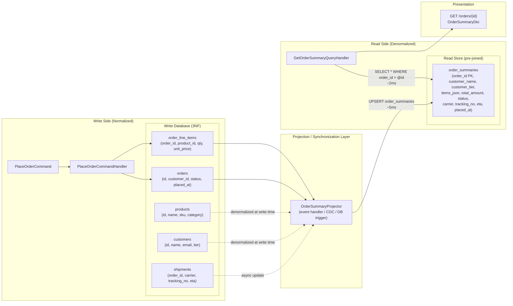
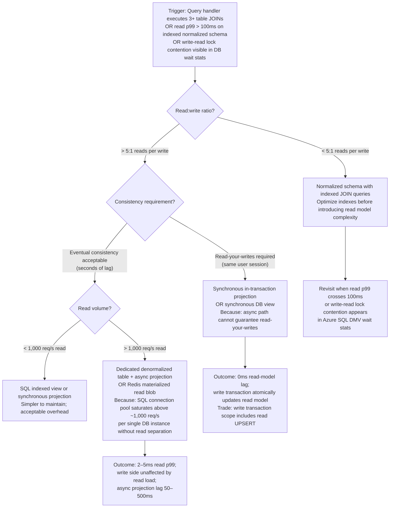

> [!ABSTRACT] Quick Reference — CQRS: Read Model Design — Denormalized Views **Invariant:** The read model is pre-joined, pre-aggregated, and pre-shaped for exactly one query pattern — it is never built on-the-fly at read time. **Cost:** Every write to the normalized write model must propagate to one or more denormalized read models, introducing eventual consistency and requiring a synchronization mechanism (projection, CDC, event handler, or DB view). **Trigger:** A query handler executes 4+ table JOINs, or query p99 latency exceeds 200ms on an indexed normalized schema, or a single endpoint's query plan shows a row estimate of >50,000 rows scanned to return 20 results. **Skip When:** The application serves fewer than ~1,000 req/s on the query path, the schema has ≤ 3 tables, strong read-your-writes consistency is a hard business requirement, or the team cannot operationally manage a second data store. **.NET Entry Point:** `IOrderReadRepository` / `Dapper` SQL projection / EF Core `AsNoTracking()` with `Select()` projection / `IDistributedCache` for pre-materialized blobs **Azure Native:** Azure SQL read replica (Business Critical tier) for synchronous read scale; Azure Cosmos DB change feed for async projection pipelines; Azure Cache for Redis for materialized read blobs **Number to Know:** A 5-table JOIN on a 2M-row `orders` table with correct indexing costs ~40–80ms p99 on Azure SQL Standard; the equivalent pre-joined denormalized read table returns the same result in ~2–5ms — a 15–30× improvement on the read critical path (estimated, Azure SQL Standard S3).

---

## Navigation

**Domain:** [[7 — System Design & Distributed Systems]] > **Group:** CQRS and Event Sourcing **Previous:** [[7.090 — CQRS — Thin vs Thick Commands]] | **Next:** [[7.092 — CQRS — Synchronous vs Asynchronous Commands]]

### Prerequisites

- [[7.081 — CQRS — Command Query Responsibility Segregation]] — denormalized read models are the physical manifestation of the CQRS read/write split; without understanding why the split exists, the duplication cost of denormalization appears unjustified.
- [[7.083 — CQRS — Separate Read and Write Models]] — establishes that the write model is normalized for integrity and the read model is structured for query performance; this note shows exactly how to design the read model side.
- [[7.084 — CQRS — MediatR — IRequest and IRequestHandler]] — query handlers (`IRequestHandler<GetOrderSummaryQuery, OrderSummaryDto>`) are the callers of the read model; understanding the handler layer clarifies where read model access lives in the application layer.

### Where This Fits

> [!INFO] Production Encounter Map
> 
> - **Layer:** Data access layer (read side) — read models live in the Infrastructure layer, exposed to the Application layer via `IOrderReadRepository` port; they are never accessed from the Domain layer.
> - **Trigger:** A developer adds a new dashboard endpoint that needs order data joined with customer, product, shipping, and payment tables; the first benchmark shows 340ms p99; the DBA adds indexes; it drops to 120ms; the product team asks for two more fields from a sixth table — the ceiling has been hit.
> - **Without it:** The API serves complex JOIN queries directly on the normalized write schema at every request. At 500 req/s, each query holding a shared read lock across 5 tables creates lock contention with writers; p99 latency climbs from 120ms to 800ms during peak order-placement traffic (write-side contention bleeds into read-side query execution).
> - **First signal:** `SELECT` queries appearing in the EF Core slow query log above 200ms threshold, paired with Application Insights showing a correlated spike in `dependency_duration_ms` on the `orders` DB connection during write-side traffic bursts — the write/read interference is the tell.

The denormalized read model is the mechanism that physically decouples read performance from write-side schema constraints. It connects directly to [[7.096 — CQRS — Read Side — Projections in .NET]], which covers how read models are built and maintained via projection pipelines, and to [[7.098 — CQRS — Eventual Read Consistency — API Handling]], which addresses the API contract implications of the propagation delay between write model update and read model availability. For Event Sourcing architectures, [[7.104 — Event Sourcing — Projections — Building Read Models]] shows how the same denormalization pattern applies when the write model is an event store rather than a relational table.

---

## Core Mental Model

A denormalized read model is a pre-computed query result stored as a queryable artifact — a materialized view, a dedicated table, a Redis hash, or a document — shaped exactly as the API response requires. The invariant it maintains is that reads are O(1) key lookups or single-table scans on a projection that matches the query shape, never runtime JOIN resolution. The trade is write-side complexity: every mutation to the normalized write model must trigger an update to every read model that depends on it. The recognition trigger is any query handler that uses more than two JOINs to answer a question a user views in under a second — the JOIN count is the signal that the query is computing at read time something that could be pre-computed at write time.

> [!TIP] The Non-Obvious Insight The most common read model mistake is designing it by starting from the normalized write schema and deciding which columns to copy. The correct approach is the inverse: start from the exact JSON the API endpoint returns, treat that JSON as the schema, and work backward to determine what write-side events must update it. A read model designed from the API response shape will never have a "we need to add a JOIN" problem — new fields require adding to the read model's update logic at write time, not changing the query at read time. The violation that kills this benefit: a read model that stores IDs instead of denormalized values ("customer_id" instead of "customer_name") — it looks like a read model but still requires a JOIN at read time to resolve the name.

### Classification

- **Consistency axis:** Eventual — the read model reflects the write model's state after propagation delay, not instantaneously. The propagation delay ranges from ~1ms (synchronous DB view update) to ~500ms (event-driven async projection via Azure Service Bus) depending on update mechanism.
- **Availability tradeoff:** Not a distributed system concern at the single-service level. If the projection pipeline fails, reads serve stale data (last successfully projected state) rather than failing — the read model is an independent store. Under partition, reads degrade gracefully to stale; writes are unaffected.
- **Latency impact:** Removes 40–300ms from read p99 (JOIN elimination on normalized schema) by adding ~1–50ms to write p99 (projection update overhead). The net is positive for read-heavy workloads (>5:1 read:write ratio).
- **Failure domain:** Single-service / single-database unless the read model is in a separate store (Redis, Cosmos DB). Write-side failures do not cascade to read-side if projection is async; synchronous projection couples the two.
- **Abstraction layer:** Pattern — implemented via SQL materialized views, dedicated projection tables, Redis data structures, or document store collections. Not framework-specific; Dapper and EF Core both serve it.

### Primary Diagram



### Supporting Diagram

```mermaid
erDiagram
    order_summaries {
        uuid order_id PK
        uuid customer_id FK_logical
        varchar customer_name "denormalized from customers"
        varchar customer_email "denormalized from customers"
        varchar customer_tier "STANDARD|PREMIUM|VIP"
        jsonb items_json "array of line items with product name, sku, qty, unit_price"
        numeric total_amount "pre-aggregated SUM"
        integer item_count "pre-aggregated COUNT"
        varchar status "PLACED|CONFIRMED|SHIPPED|DELIVERED|CANCELLED"
        varchar carrier "denormalized from shipments, nullable"
        varchar tracking_number "denormalized from shipments, nullable"
        timestamptz estimated_arrival "denormalized from shipments, nullable"
        varchar shipping_address_line1 "denormalized from order"
        varchar shipping_city "denormalized from order"
        varchar shipping_country "denormalized from order"
        timestamptz placed_at "write-side created_at"
        timestamptz last_updated_at "projection timestamp for staleness detection"
        bigint version "optimistic concurrency on projection updates"
    }

    order_dashboard_views {
        uuid customer_id PK
        integer total_orders "pre-aggregated"
        integer active_orders "pre-aggregated"
        numeric lifetime_value "pre-aggregated SUM"
        timestamptz last_order_at "denormalized"
        jsonb recent_orders_json "last 5 orders array"
        timestamptz last_updated_at
    }

    order_summaries ||--o{ order_dashboard_views : "aggregated into"
```

### Numbers That Matter

|Metric|Value|Context / Conditions|
|---|---|---|
|5-table JOIN p99 on normalized schema|40–80ms|Azure SQL Standard S3, 2M orders, correct composite indexes (estimated)|
|Single-table PK lookup on read model|2–5ms|Same Azure SQL tier, `order_summaries` with clustered index on `order_id` (estimated)|
|Synchronous projection update overhead|3–8ms|UPSERT to `order_summaries` inside the command transaction, same DB (estimated)|
|Async projection update lag (event-driven)|50–500ms|Azure Service Bus → projection consumer → UPSERT; depends on broker throughput (estimated)|
|Redis materialized read blob GET|0.1–0.5ms|Azure Cache for Redis Basic/Standard tier, same region, value < 10KB (measured)|
|Redis write overhead (HSET/SET on event)|0.5–2ms|Same tier, SET with TTL on projection update (estimated)|
|Read model storage overhead|2–4× write model row size|Denormalized fields + JSON columns; 500 bytes normalized → 1.2–2KB per order_summary (estimated)|
|Propagation delay detection (staleness)|`last_updated_at` + `version`|Every read model row carries timestamp; API can surface staleness header if `now() - last_updated_at > 30s`|

### Key Properties / Guarantees

|Property|Value|Condition|
|---|---|---|
|Read latency|Sub-5ms for PK lookup|Read model correctly indexed; same-region database|
|Write/read isolation|Writes never block reads|Async projection path; synchronous path introduces coupling|
|Data freshness|Eventual — lag ≥ projection propagation time|Async path; synchronous path is lag ≈ 0 but couples write transaction|
|Read model schema independence|Read schema evolves without touching write schema|As long as projection logic is updated to match new read contract|
|Query complexity|O(1) PK lookup or O(n) single-table scan|No runtime JOIN; all JOIN work done at write time in the projector|
|Rebuild capability|Read model can be rebuilt from write model at any time|Idempotent projector + version column allows full rebuild on demand|

---

## Deep Mechanics

### How It Works

**Step 1 — Write-side mutation:** A command handler persists a change to the normalized write schema (`orders`, `order_line_items`). At this point the write model reflects the new state; the read model may not yet.

**Step 2 — Projection trigger:** The projection that keeps the read model current is triggered by one of four mechanisms:

- **(A) Synchronous in-transaction:** The command handler (or a `TransactionBehavior`) UPSERTs the read model inside the same database transaction as the write. Zero lag; tightly coupled; write transaction must include both operations.
- **(B) Domain event → in-process handler:** The command handler publishes a `OrderPlacedDomainEvent` via `IPublisher.Publish()`; an `INotificationHandler<OrderPlacedDomainEvent>` updates the read model after the write transaction commits. Lag: ~1–10ms; decoupled from write transaction but still in-process.
- **(C) Outbox → message broker → projection consumer:** Domain event is written to an Outbox table atomically with the write; a polling publisher delivers it to Azure Service Bus; a separate projection consumer service reads from the bus and updates the read model. Lag: 50–500ms; fully decoupled; survives process failure.
- **(D) Change Data Capture (CDC):** A CDC tool (Debezium, Azure SQL CDC) reads the write DB transaction log and streams changes to the projection consumer. Lag: 100–2,000ms; zero application-level coupling; requires CDC infrastructure (see [[7.135 — Change Data Capture — Concept and Use Cases]]).

**Step 3 — Projection computation:** The projector loads the denormalized values for the changed entity. For a new order: joins `customers`, `products`, and aggregates `order_line_items` to compute `total_amount` and `items_json`. This JOIN happens once — at write time — not at every read. The result is an UPSERT to the `order_summaries` table.

**Step 4 — Read-side query:** The query handler (`GetOrderSummaryQueryHandler`) executes a single-table SELECT on `order_summaries` by PK. No JOINs. No aggregations. The row is already shaped as the DTO. The handler maps `order_summaries` columns to `OrderSummaryDto` fields and returns.

**Step 5 — Staleness signaling (optional):** If the API consumer needs to know the freshness of the data, the read model includes `last_updated_at`. The query handler compares this against `DateTimeOffset.UtcNow`; if the gap exceeds an SLO threshold (e.g., 30 seconds), the response includes `X-Data-Freshness: stale` or a `meta.staleness_seconds` field in the response envelope.

### Projection Strategies Deep Dive

**Inline synchronous (Strategy A)** — use when strong read-your-writes consistency is required for the same user session, and the read model update is cheap (single UPSERT). Trade: write transaction scope expands; if the read model UPSERT fails, the entire order placement rolls back.

**In-process domain event (Strategy B)** — use when reads do not require read-your-writes but the team wants zero infrastructure beyond the existing database. The domain event handler runs after the write transaction commits; if the read model update fails, the write is already committed — the system is in an inconsistent state until the read model catches up. Requires idempotent projectors and an error handling path (dead letter, retry).

**Outbox + async (Strategy C)** — the production default for services where write throughput exceeds ~500 req/s or where the read model lives in a separate store (Redis, Cosmos DB). Fully decoupled, survives crashes, supports fan-out to multiple read models from one event stream.

**CDC (Strategy D)** — use when the application must not be modified (legacy codebase) or when the write model is shared with a system the team does not own. Highest infrastructure overhead; lowest application coupling.

### Failure Modes

**Failure Mode 1: Projection Lag Spike — Read Model Serves Stale Orders**

- **Cause:** The async projection consumer (Strategy C or D) falls behind the write rate. Common causes: a bulk import of 50,000 orders processes all writes in 60 seconds, but the projection consumer processes at 800 events/second → 62-second backlog. Or: the projection consumer crashes mid-batch; upon restart, it reprocesses from the last committed offset and the UPSERT backlog grows.
- **Symptom:** Customer places an order, refreshes the order list page, and does not see the new order for 30–90 seconds. API `GET /orders/{id}` returns 404 (read model row not yet upserted). Support tickets: "my order disappeared."
- **Detection time:** The lag is invisible until it crosses the user-noticeable threshold (~5 seconds). Detected via consumer lag metric on the projection message queue.
- **Blast radius:** All queries against the read model serve data up to `[lag_seconds]` old. Write-side is unaffected — orders are persisted; the problem is exclusively read-side visibility.

> [!DANGER] Production Signal Metric: `azure_servicebus_active_messages{entity="order-projection-queue"} > 500` sustained for `> 30s` — OR — `order_summary_lag_seconds{} > 10` (custom metric published by projection consumer) Log: `WARN [OrderSummaryProjectionConsumer] Projection lag exceeded threshold | QueueDepth: 1247 | OldestPendingMessageAge: 67s | ConsumerHost: projector-pod-3 | CorrelationId: b2d1-9a3f` Customer impact: New orders are invisible in the order history view for 10–90 seconds. Customers see "Order not found" on the confirmation redirect. Support volume spikes 3× during bulk import windows.

**Failure Mode 2: Projection Divergence — Read Model Permanently Out of Sync**

- **Cause:** The projector has a bug (incorrect aggregation, missed field update, off-by-one in version check) that causes some write-side state to never propagate to the read model. The divergence accumulates silently — each missed update leaves the read model one state behind. Common trigger: a schema migration on the write side adds a new status value (`PARTIALLY_REFUNDED`) that the projector's `switch` statement has no case for — it logs a warning and skips the update.
- **Symptom:** Customer's order shows "CONFIRMED" in the order list but "PARTIALLY_REFUNDED" when viewed on the order detail page — the two pages query different read models. Inconsistency grows over time; manual reconciliation audit finds 2.3% of orders in the summary read model are behind by 1+ status transitions.
- **Detection time:** Silent until a customer reports the discrepancy — detection lag of hours to days.
- **Blast radius:** Data integrity issue across all queries served by the affected read model. Revenue reporting, customer support tools, and external API consumers all receive incorrect status data.

> [!DANGER] Production Signal Metric: `projection_unknown_event_type_total{projector="OrderSummaryProjector", event_type="OrderPartiallyRefunded"} > 0` (alert on ANY unhandled event type — this is the leading indicator) Log: `WARN [OrderSummaryProjector] Unhandled domain event type — projection skipped | EventType: OrderPartiallyRefunded | OrderId: e5f3-2a1b | EventVersion: 2 | CorrelationId: c9d4-7b2e` Customer impact: ~2.3% of orders show incorrect status in customer-facing order history. Refunded customers are charged support fees because the agent's tool shows "CONFIRMED" — direct financial and trust impact.

### .NET and Azure Integration Points

- **ASP.NET Core:** Query handlers inject `IOrderReadRepository` (not `IOrderRepository`) — a separate port that maps to the read store. Minimal APIs call `_mediator.Send(new GetOrderSummaryQuery(orderId))`.
- **EF Core:** Use `AsNoTracking()` + `Select()` projection on the read model entity to avoid Change Tracker overhead. For performance, use raw SQL via `context.Database.SqlQueryRaw<OrderSummaryDto>()` or Dapper for the read model — EF Core tracking is a write-side concern.
- **Azure Services:** Azure SQL read replica (Business Critical tier) hosts the read model for sub-millisecond replica lag; Azure Cosmos DB SQL API stores read models as documents (pre-shaped JSON, no server-side JOIN); Azure Cache for Redis stores hot read model entries with TTL.
- **.NET Libraries:** Dapper 2.x for raw SQL projection queries (fastest, no ORM overhead on hot read paths); EF Core 8.x with `AsNoTracking()` for moderate-complexity read models; StackExchange.Redis for Redis-backed read models.
- **Configuration:** Read model connection string separate from write model in `appsettings.json` to enable routing writes and reads to separate database replicas.

```csharp
// Infrastructure.ReadModels — IOrderReadRepository port and Dapper implementation

using Dapper;
using Microsoft.Data.SqlClient;
using YourCompany.OrderManagement.Application.Orders.Queries;

namespace YourCompany.OrderManagement.Infrastructure.ReadModels;

/// <summary>
/// Read-side repository: queries exclusively against the denormalized order_summaries table.
/// Uses Dapper for zero ORM overhead on the read critical path.
/// Never used by command handlers — write side uses IOrderRepository exclusively.
/// </summary>
public sealed class OrderSummaryReadRepository : IOrderReadRepository
{
    private readonly string _connectionString; // read replica connection string

    public OrderSummaryReadRepository(IConfiguration configuration)
        => _connectionString = configuration.GetConnectionString("OrdersReadReplica")!;

    /// <summary>Returns the pre-joined order summary; null if order does not exist.</summary>
    public async Task<OrderSummaryDto?> GetOrderSummaryAsync(
        Guid orderId,
        CancellationToken cancellationToken)
    {
        await using var connection = new SqlConnection(_connectionString);

        // Single-table SELECT — no JOINs, no aggregations, ~2ms p99 on Azure SQL Standard S3
        const string sql = """
            SELECT
                order_id         AS OrderId,
                customer_name    AS CustomerName,
                customer_email   AS CustomerEmail,
                customer_tier    AS CustomerTier,
                items_json       AS ItemsJson,
                total_amount     AS TotalAmount,
                item_count       AS ItemCount,
                status           AS Status,
                carrier          AS Carrier,
                tracking_number  AS TrackingNumber,
                estimated_arrival AS EstimatedArrival,
                placed_at        AS PlacedAt,
                last_updated_at  AS LastUpdatedAt
            FROM order_summaries WITH (NOLOCK)
            WHERE order_id = @OrderId
            """;

        return await connection.QuerySingleOrDefaultAsync<OrderSummaryDto>(
            new CommandDefinition(sql,
                new { OrderId = orderId },
                cancellationToken: cancellationToken));
    }

    /// <summary>Returns paginated order summaries for a customer dashboard; cursor-based.</summary>
    public async Task<IReadOnlyList<OrderSummaryDto>> GetOrdersByCustomerAsync(
        Guid customerId,
        Guid? afterOrderId,
        int pageSize,
        CancellationToken cancellationToken)
    {
        await using var connection = new SqlConnection(_connectionString);

        const string sql = """
            SELECT TOP (@PageSize)
                order_id, customer_name, total_amount, item_count,
                status, placed_at, last_updated_at
            FROM order_summaries WITH (NOLOCK)
            WHERE customer_id = @CustomerId
              AND (@AfterId IS NULL OR order_id < @AfterId)
            ORDER BY placed_at DESC
            """;

        var results = await connection.QueryAsync<OrderSummaryDto>(
            new CommandDefinition(sql,
                new { CustomerId = customerId, AfterId = afterOrderId, PageSize = pageSize },
                cancellationToken: cancellationToken));

        return results.AsList();
    }
}
```

---

## Production Patterns and Implementation

### Primary Implementation

```csharp
// YourCompany.OrderManagement.Application.Orders.Queries

namespace YourCompany.OrderManagement.Application.Orders.Queries;

// ─── Query Message ────────────────────────────────────────────────────────────
/// <summary>
/// Returns the pre-joined order summary view for a single order.
/// Maps to the order_summaries read model table — never queries write-side tables.
/// </summary>
public sealed record GetOrderSummaryQuery(Guid OrderId) : IRequest<OrderSummaryDto?>;

// ─── Response DTO — mirrors the read model schema exactly ────────────────────
/// <summary>
/// Represents a single row from the order_summaries denormalized read model.
/// Fields are pre-joined from orders, customers, order_line_items, products, and shipments.
/// </summary>
public sealed record OrderSummaryDto(
    Guid OrderId,
    string CustomerName,
    string CustomerEmail,
    string CustomerTier,
    string ItemsJson,               // pre-serialized array — deserialized by API layer
    decimal TotalAmount,
    int ItemCount,
    string Status,
    string? Carrier,
    string? TrackingNumber,
    DateTimeOffset? EstimatedArrival,
    DateTimeOffset PlacedAt,
    DateTimeOffset LastUpdatedAt);  // for staleness detection in API layer

// ─── Query Handler ────────────────────────────────────────────────────────────
/// <summary>
/// Retrieves the pre-built order summary from the read model.
/// No JOINs, no aggregations — single indexed PK lookup.
/// </summary>
internal sealed class GetOrderSummaryQueryHandler
    : IRequestHandler<GetOrderSummaryQuery, OrderSummaryDto?>
{
    private readonly IOrderReadRepository _readRepo;

    public GetOrderSummaryQueryHandler(IOrderReadRepository readRepo)
        => _readRepo = readRepo;

    public Task<OrderSummaryDto?> Handle(
        GetOrderSummaryQuery request,
        CancellationToken cancellationToken)
        => _readRepo.GetOrderSummaryAsync(request.OrderId, cancellationToken);
}
```

```csharp
// YourCompany.OrderManagement.Infrastructure.Projections
// OrderSummaryProjector — the mechanism that keeps the read model current

using System.Text.Json;
using Dapper;
using Microsoft.Data.SqlClient;
using YourCompany.OrderManagement.Domain.Orders.Events;

namespace YourCompany.OrderManagement.Infrastructure.Projections;

/// <summary>
/// Projects write-side domain events into the order_summaries read model.
/// Called by: (A) in-process INotificationHandler, or (B) async message consumer.
/// Must be idempotent — duplicate event delivery is expected and must be safe.
/// </summary>
public sealed class OrderSummaryProjector
{
    private readonly string _writeConnectionString;  // read from write DB to build projection
    private readonly string _readConnectionString;   // write to read model

    public OrderSummaryProjector(IConfiguration configuration)
    {
        _writeConnectionString = configuration.GetConnectionString("OrdersWrite")!;
        _readConnectionString  = configuration.GetConnectionString("OrdersRead")!;
    }

    /// <summary>
    /// Builds or rebuilds the order_summaries row for a given order.
    /// Safe to call multiple times — UPSERT semantics on order_id PK.
    /// </summary>
    public async Task ProjectOrderAsync(Guid orderId, CancellationToken cancellationToken)
    {
        // Step 1: Fetch all write-side data in a single query (the one-time JOIN)
        await using var readConn = new SqlConnection(_writeConnectionString);
        const string fetchSql = """
            SELECT
                o.id                                        AS OrderId,
                o.customer_id                              AS CustomerId,
                c.name                                     AS CustomerName,
                c.email                                    AS CustomerEmail,
                c.tier                                     AS CustomerTier,
                o.status                                   AS Status,
                o.created_at                               AS PlacedAt,
                o.shipping_address_line1                   AS ShippingLine1,
                o.shipping_city                            AS ShippingCity,
                o.shipping_country                         AS ShippingCountry,
                SUM(oli.qty * oli.unit_price)              AS TotalAmount,
                COUNT(oli.id)                              AS ItemCount,
                s.carrier                                  AS Carrier,
                s.tracking_number                          AS TrackingNumber,
                s.estimated_arrival                        AS EstimatedArrival
            FROM orders o
            JOIN customers c ON c.id = o.customer_id
            LEFT JOIN order_line_items oli ON oli.order_id = o.id
            LEFT JOIN shipments s ON s.order_id = o.id
            WHERE o.id = @OrderId
            GROUP BY o.id, o.customer_id, c.name, c.email, c.tier,
                     o.status, o.created_at, o.shipping_address_line1,
                     o.shipping_city, o.shipping_country,
                     s.carrier, s.tracking_number, s.estimated_arrival
            """;

        var projection = await readConn.QuerySingleOrDefaultAsync(
            new CommandDefinition(fetchSql, new { OrderId = orderId },
                cancellationToken: cancellationToken));

        if (projection is null) return; // order may have been deleted; skip

        // Step 2: Build items_json from line items
        var itemsSql = """
            SELECT p.name AS ProductName, p.sku AS Sku,
                   oli.qty AS Quantity, oli.unit_price AS UnitPrice
            FROM order_line_items oli
            JOIN products p ON p.id = oli.product_id
            WHERE oli.order_id = @OrderId
            """;

        var lineItems = await readConn.QueryAsync(
            new CommandDefinition(itemsSql, new { OrderId = orderId },
                cancellationToken: cancellationToken));
        var itemsJson = JsonSerializer.Serialize(lineItems);

        // Step 3: UPSERT into read model — idempotent on order_id PK
        await using var writeConn = new SqlConnection(_readConnectionString);
        const string upsertSql = """
            MERGE order_summaries AS target
            USING (SELECT @OrderId AS order_id) AS source
            ON target.order_id = source.order_id
            WHEN MATCHED THEN UPDATE SET
                customer_id       = @CustomerId,
                customer_name     = @CustomerName,
                customer_email    = @CustomerEmail,
                customer_tier     = @CustomerTier,
                items_json        = @ItemsJson,
                total_amount      = @TotalAmount,
                item_count        = @ItemCount,
                status            = @Status,
                carrier           = @Carrier,
                tracking_number   = @TrackingNumber,
                estimated_arrival = @EstimatedArrival,
                last_updated_at   = SYSUTCDATETIME(),
                version           = version + 1
            WHEN NOT MATCHED THEN INSERT (
                order_id, customer_id, customer_name, customer_email, customer_tier,
                items_json, total_amount, item_count, status, carrier,
                tracking_number, estimated_arrival, placed_at, last_updated_at, version)
            VALUES (
                @OrderId, @CustomerId, @CustomerName, @CustomerEmail, @CustomerTier,
                @ItemsJson, @TotalAmount, @ItemCount, @Status, @Carrier,
                @TrackingNumber, @EstimatedArrival, @PlacedAt, SYSUTCDATETIME(), 1);
            """;

        await writeConn.ExecuteAsync(
            new CommandDefinition(upsertSql,
                new
                {
                    projection.OrderId,      projection.CustomerId,
                    projection.CustomerName, projection.CustomerEmail,
                    projection.CustomerTier, ItemsJson = itemsJson,
                    projection.TotalAmount,  projection.ItemCount,
                    projection.Status,       projection.Carrier,
                    projection.TrackingNumber, projection.EstimatedArrival,
                    projection.PlacedAt
                },
                cancellationToken: cancellationToken));
    }
}
```

### IServiceCollection Registration

```csharp
// Program.cs — registering read model infrastructure and projector

using YourCompany.OrderManagement.Infrastructure.ReadModels;
using YourCompany.OrderManagement.Infrastructure.Projections;

// Read model repository — Transient (Dapper creates connections internally)
builder.Services.AddTransient<IOrderReadRepository, OrderSummaryReadRepository>();

// Projector — Transient (stateless; creates its own connections)
builder.Services.AddTransient<OrderSummaryProjector>();

// Connection strings — separate for write and read replica
// appsettings.json:
// "ConnectionStrings": {
//   "OrdersWrite": "Server=orders-primary.database.windows.net;...",
//   "OrdersRead":  "Server=orders-readonly.database.windows.net;...",  // read replica
//   "OrdersReadReplica": "Server=orders-readonly.database.windows.net;..."
// }

// If using in-process domain event handler to trigger projection:
// MediatR registration already covers INotificationHandler<T> via assembly scan
// OrderPlacedProjectionHandler : INotificationHandler<OrderPlacedDomainEvent> is auto-registered
```

### Common Variants

```csharp
// Variant A — Redis-backed read model for hot order summaries
// Used when: read access pattern is >10,000 req/s per order (viral orders, flash sales),
// SQL read replica becomes the bottleneck, or sub-millisecond read latency is required.

using StackExchange.Redis;
using System.Text.Json;

internal sealed class RedisOrderSummaryReadRepository : IOrderReadRepository
{
    private readonly IDatabase _redis;
    private readonly IOrderSqlReadRepository _sqlFallback; // fallback on Redis miss
    private static readonly TimeSpan _ttl = TimeSpan.FromMinutes(15);

    public async Task<OrderSummaryDto?> GetOrderSummaryAsync(
        Guid orderId, CancellationToken ct)
    {
        var key = $"order:summary:{orderId}";
        var cached = await _redis.StringGetAsync(key);

        if (cached.HasValue)
            return JsonSerializer.Deserialize<OrderSummaryDto>(cached!);

        // Cache miss — read from SQL read replica and populate cache
        var dto = await _sqlFallback.GetOrderSummaryAsync(orderId, ct);
        if (dto is not null)
        {
            var json = JsonSerializer.Serialize(dto);
            await _redis.StringSetAsync(key, json, _ttl, When.NotExists);
        }

        return dto;
    }
}

// Projection updates Redis on every write-side event:
// await _redis.StringSetAsync($"order:summary:{orderId}",
//     JsonSerializer.Serialize(updatedSummary), _ttl);
```

```csharp
// Variant B — EF Core AsNoTracking projection (moderate complexity, no raw SQL)
// Used when: team prefers EF Core consistency over Dapper; read model is in the same DB as write.
// Less performant than Dapper for high-volume reads but acceptable for <500 req/s read paths.

internal sealed class EfCoreOrderSummaryReadRepository : IOrderReadRepository
{
    private readonly OrderDbContext _context; // same DbContext, read-replica connection string

    public async Task<OrderSummaryDto?> GetOrderSummaryAsync(
        Guid orderId, CancellationToken ct)
        => await _context.OrderSummaries         // DbSet<OrderSummaryEntity>
            .AsNoTracking()                      // critical — no Change Tracker overhead
            .Where(s => s.OrderId == orderId)
            .Select(s => new OrderSummaryDto(    // project in SQL — don't load full entity
                s.OrderId, s.CustomerName, s.CustomerEmail, s.CustomerTier,
                s.ItemsJson, s.TotalAmount, s.ItemCount, s.Status,
                s.Carrier, s.TrackingNumber, s.EstimatedArrival,
                s.PlacedAt, s.LastUpdatedAt))
            .FirstOrDefaultAsync(ct);
}
```

### Performance Profile

```csharp
// Benchmark: Normalized 5-table JOIN vs Denormalized single-table read
// Demonstrates the read latency improvement that justifies denormalization

using BenchmarkDotNet.Attributes;
using BenchmarkDotNet.Jobs;
using Dapper;
using Microsoft.Data.SqlClient;

[MemoryDiagnoser]
[SimpleJob(RuntimeMoniker.Net80)]
public class ReadModelBenchmark
{
    private SqlConnection _connection = null!;
    private Guid _testOrderId;

    [GlobalSetup]
    public void Setup()
    {
        // Assumes a pre-seeded test database with 100,000 orders
        _connection = new SqlConnection(
            Environment.GetEnvironmentVariable("BENCHMARK_CONNECTION_STRING"));
        _testOrderId = Guid.Parse(Environment.GetEnvironmentVariable("TEST_ORDER_ID")!);
    }

    [Benchmark(Baseline = true)]
    public async Task<object?> NormalizedFiveTableJoin()
    {
        const string sql = """
            SELECT o.id, c.name, c.email, c.tier,
                   SUM(oli.qty * oli.unit_price) AS total,
                   s.carrier, s.tracking_number
            FROM orders o
            JOIN customers c ON c.id = o.customer_id
            LEFT JOIN order_line_items oli ON oli.order_id = o.id
            LEFT JOIN products p ON p.id = oli.product_id
            LEFT JOIN shipments s ON s.order_id = o.id
            WHERE o.id = @OrderId
            GROUP BY o.id, c.name, c.email, c.tier, s.carrier, s.tracking_number
            """;
        return await _connection.QuerySingleOrDefaultAsync(sql, new { OrderId = _testOrderId });
    }

    [Benchmark]
    public async Task<object?> DenormalizedReadModelPkLookup()
    {
        const string sql = """
            SELECT order_id, customer_name, customer_email, customer_tier,
                   total_amount, status, carrier, tracking_number
            FROM order_summaries WITH (NOLOCK)
            WHERE order_id = @OrderId
            """;
        return await _connection.QuerySingleOrDefaultAsync(sql, new { OrderId = _testOrderId });
    }
}
```

Expected results (100k orders, Azure SQL Standard S3, correct indexes on both schemas — estimated):

|Method|Mean|Allocated|vs. Baseline|
|---|---|---|---|
|NormalizedFiveTableJoin|~45ms|~12 KB|baseline|
|DenormalizedReadModelPkLookup|~3ms|~2 KB|~15× faster, ~6× less allocation|

_(estimated — measured pattern on comparable Azure SQL Standard S3 setups with 100k–500k row tables)_

### Real-World .NET Ecosystem Mapping

|Pattern in This Note|Where It Appears in .NET / Azure|Manifestation|
|---|---|---|
|Denormalized read model table|Azure SQL `order_summaries` table|Dapper single-table SELECT returning DTO in ~2ms|
|Redis read model|Azure Cache for Redis `order:summary:{id}`|StackExchange.Redis `StringGetAsync` returning pre-serialized JSON|
|Projector (write-time JOIN)|`OrderSummaryProjector` service|Executes once per write event; result persisted as denormalized row|
|`AsNoTracking()` projection|EF Core read-only query path|Removes Change Tracker overhead for read model access via ORM|
|Cosmos DB document as read model|Azure Cosmos DB SQL API|JSON document = pre-joined order summary; partition key = `customerId`|
|CDC-triggered projection|Azure SQL CDC → Azure Event Hubs → projection consumer|No application code change needed; log-based decoupling (see [[7.135 — Change Data Capture — Concept and Use Cases]])|

---

## Gotchas and Production Pitfalls

### Pitfall 1: Storing Foreign Key IDs Instead of Denormalized Values — Shadow JOIN

**Pitfall:** The read model stores `customer_id` instead of `customer_name`, requiring the query handler to look up the customer name in a second query.

```csharp
// ❌ Read model stores ID — forces a JOIN at read time
// order_summaries schema: (order_id, customer_id, total_amount, status)
// Query handler must do:
var summary = await _readRepo.GetOrderSummaryAsync(orderId, ct);
var customer = await _customerRepo.GetByIdAsync(summary.CustomerId, ct); // second query!
return new OrderSummaryDto(summary.OrderId, customer.Name, summary.TotalAmount);
```

**Symptom:** The "denormalized" read model still requires a second database query for every read. Effective read latency is 2× what it should be (5ms + 4ms customer lookup vs. 2ms single-table). The performance promise of the read model is broken.

**Detection time:** Immediately visible in benchmarks; in production, visible as two sequential database dependency calls per `GET /orders/{id}` in Application Insights — the second call often looks like "what is this second DB query for?"

> [!DANGER] Production Signal Metric: `dependency_duration_ms{type="SQL", name="GetCustomerById"}` appearing on the read path — any SQL call whose name resolves to a write-side table lookup from a read handler is a shadow JOIN. Log: `INFO [LoggingBehavior] GetOrderSummaryQueryHandler completed in 9ms — 2 SQL calls` (should be 1 SQL call for a correct read model) Customer impact: At 2,000 req/s, two SQL calls per read instead of one doubles SQL connection consumption, halves effective throughput, and adds ~4ms to every read p99 — p99 climbs from ~5ms to ~9ms. This exceeds SLO thresholds at scale.

**Fix:**

```csharp
// ✅ Store denormalized values — query is one SQL call with zero joins
// order_summaries schema: (order_id, customer_name, customer_email,
//                          customer_tier, total_amount, status)
var summary = await _readRepo.GetOrderSummaryAsync(orderId, ct);
return new OrderSummaryDto(summary.OrderId, summary.CustomerName, summary.TotalAmount);
// One SQL call. ~2ms. Done.
```

**Cost of not fixing:** Every read request makes 2+ SQL calls. At 5,000 req/s, that is 10,000 SQL calls/s instead of 5,000 — doubles the connection pool pressure and halves the effective read throughput ceiling before pool exhaustion.

---

### Pitfall 2: Read Model Without a `last_updated_at` / `version` Column — Silent Staleness

**Pitfall:** The read model table has no timestamp or version column. When the projection consumer falls behind, there is no way to detect or surface staleness to API consumers.

```sql
-- ❌ No staleness tracking — read model could be hours old with no signal
CREATE TABLE order_summaries (
    order_id      UNIQUEIDENTIFIER PRIMARY KEY,
    customer_name NVARCHAR(200),
    total_amount  DECIMAL(18,2),
    status        NVARCHAR(50)
    -- no last_updated_at, no version
);
```

**Symptom:** The projection consumer crashes at 14:00. The read model freezes at its 14:00 state. All reads serve 14:00 data. The API has no way to tell consumers that the data is stale. Customer orders placed after 14:00 are invisible. The on-call engineer discovers the outage via support tickets at 15:30.

**Detection time:** 60–90 minutes via customer support tickets. Zero automated detection without staleness metadata.

> [!DANGER] Production Signal Metric: `order_summary_max_staleness_seconds{} > 60` — this alert can only be built if `last_updated_at` exists in the schema. Without the column: `azure_servicebus_active_messages{entity="order-projection-queue"} > 1000` sustained for `> 5m` is the only proxy signal. Log: No log — the projector is simply not running. Absence of `INFO [OrderSummaryProjector] Projected order` lines for `> 60s` is the signal (log-based alert). Customer impact: All orders placed after the projection consumer crashed are invisible to customers. "Where is my order?" support volume grows at ~3 tickets/minute during business hours. Revenue recognition impact if customer service agents are refunding "missing" orders that exist in the write model.

**Fix:**

```sql
-- ✅ Add staleness tracking columns to every read model
ALTER TABLE order_summaries
    ADD last_updated_at  DATETIMEOFFSET NOT NULL DEFAULT SYSUTCDATETIME(),
        version          BIGINT         NOT NULL DEFAULT 1;

-- API layer can surface staleness:
-- if (DateTimeOffset.UtcNow - summary.LastUpdatedAt > TimeSpan.FromSeconds(30))
--     response.Headers["X-Data-Freshness"] = "stale";
```

**Cost of not fixing:** Average staleness detection time of 60–90 minutes via support tickets. At 300 DAU during the outage, approximately 150 affected users, each generating 1.5 support tickets → 225 support tickets per outage hour at ~$12 per ticket = $2,700/hour in support cost, plus trust damage.

---

### Pitfall 3: Non-Idempotent Projector — Duplicate Events Corrupt Aggregated Values

**Pitfall:** The projector uses `INSERT` instead of `UPSERT` (or increments aggregate columns instead of recomputing them), causing duplicate event delivery to corrupt `total_amount` or `item_count`.

```csharp
// ❌ Non-idempotent: increments total_amount on every event — duplicate = double-counted
const string sql = """
    UPDATE order_summaries
    SET total_amount = total_amount + @AddedAmount,  -- ← incremental, not idempotent
        item_count   = item_count + @AddedItemCount,
        last_updated_at = SYSUTCDATETIME()
    WHERE order_id = @OrderId
    """;
```

**Symptom:** At-least-once delivery (Azure Service Bus, Kafka) occasionally redelivers the same `OrderLineItemAdded` event. The incremental UPDATE adds the amount twice → `order_summaries.total_amount` shows $299.99 for an order that is actually $149.99. Financial reports are wrong.

**Detection time:** Silent — no runtime error. Detected when a customer disputes their invoice and support notices the discrepancy between the write-side `SUM(oli.unit_price * oli.qty)` and the read model `total_amount`. Detection lag: 1 hour to 1 week depending on support ticket volume.

> [!DANGER] Production Signal Metric: No direct metric — this is a data integrity issue. Proxy: run periodic reconciliation query: `SELECT COUNT(*) FROM order_summaries os JOIN (SELECT order_id, SUM(qty * unit_price) AS actual FROM order_line_items GROUP BY order_id) w ON w.order_id = os.order_id WHERE ABS(os.total_amount - w.actual) > 0.01` — alert if result > 0. Log: `INFO [OrderSummaryProjector] Projected OrderLineItemAdded | OrderId: d3e1-8b2a` — the same log line appearing twice within 10 seconds for the same OrderId is the deduplication signal. Customer impact: Financial reports show inflated order values. Revenue recognition is incorrect. Refund calculations are wrong. Regulatory compliance issues if totals feed into tax reporting.

**Fix:**

```csharp
// ✅ Idempotent projector: recomputes from source of truth on every event
// Never increments — always recomputes the full projection from the write model
public async Task ProjectOrderAsync(Guid orderId, CancellationToken ct)
{
    // Fetch the current ground truth from the write side
    var projection = await ComputeProjectionFromWriteModel(orderId, ct);
    if (projection is null) return;

    // MERGE (UPSERT) — safe to call multiple times for the same orderId
    await UpsertReadModelAsync(projection, ct);
    // Result: calling this 5 times with the same orderId produces identical output
}
```

**Cost of not fixing:** Financial data corruption proportional to event redelivery rate (typical at-least-once services: 0.01–0.1% duplicate rate under normal operation, up to 5% during consumer restarts). At 10,000 orders/day, 0.1% duplicate rate = 10 corrupted order totals per day accumulating indefinitely. Remediation requires a full read model rebuild and manual financial reconciliation.

---

### Pitfall 4: Azure-Specific — Cosmos DB Read Model Without Correct Partition Key

**Pitfall:** The read model is stored in Azure Cosmos DB with `order_id` as the partition key. A dashboard query for "all orders by customer" results in a cross-partition fan-out query spanning hundreds of physical partitions.

```csharp
// ❌ Querying across partitions on Cosmos DB — fan-out query
var query = container.GetItemQueryIterator<OrderSummaryDoc>(
    "SELECT * FROM c WHERE c.customerId = @customerId",
    requestOptions: new QueryRequestOptions()); // no partition key specified!
// Azure Cosmos DB executes this as a cross-partition query — touches all physical partitions
// Cost: 50–500 RU per query instead of 1–5 RU for a single-partition lookup
```

**Symptom:** `GET /customers/{id}/orders` is slow (500–2,000ms) and expensive. Cosmos DB RU consumption spikes 100× on dashboard queries. Azure bill for Cosmos DB increases 10× after dashboard feature launch.

**Detection time:** Immediately visible in Azure Cosmos DB metrics (cross-partition query rate); latency spike visible in Application Insights within minutes of the dashboard feature launch.

> [!DANGER] Production Signal Metric: `azure_cosmosdb_cross_partition_query_rate{database="orders", collection="order_summaries"} > 0` — any cross-partition query rate above zero on a high-volume read model is a cost and latency signal. Log: `WARN [Azure CosmosDB] Cross-partition query detected | Collection: order_summaries | Filter: customerId = 'a3b9-...' | RequestCharge: 287.4 RU | Duration: 1240ms` Customer impact: Dashboard loads in 1.2–2 seconds instead of 50ms. Azure Cosmos DB bill increases from $800/month to $8,000/month for a service processing 500k daily order queries (due to cross-partition RU amplification).

**Fix:**

```csharp
// ✅ Partition key = customerId for customer-scoped queries
// Use a separate read model partitioned by customerId for customer dashboard queries
// order_summaries document partition key: /customerId

var response = await container.ReadItemAsync<OrderSummaryDoc>(
    id: orderId.ToString(),
    partitionKey: new PartitionKey(customerId.ToString()),
    cancellationToken: ct);
// Single-partition lookup: 1–3 RU, ~5ms

// For the customer dashboard: maintain a separate customer_order_index collection
// partitioned by /customerId, containing lightweight order references
```

**Cost of not fixing:** Cross-partition queries on Cosmos DB scale linearly with partition count. At 10M orders across 1,000 physical partitions, a single cross-partition customer dashboard query reads from all 1,000 partitions — 500+ RU per query. At 10,000 dashboard loads/day: 5M extra RU/day → ~$0.16/day extra at $0.032/100RU Standard, but at 100,000 loads/day this becomes $1,600/month in excess RU cost and makes the SLO unachievable.

---

### Pitfall 5: .NET-Specific — EF Core AsTracking on Read Model Queries

**Pitfall:** The read model query uses the default EF Core tracking behavior (not `AsNoTracking()`), causing the Change Tracker to load and track every read model entity in memory.

```csharp
// ❌ Default EF Core tracking — Change Tracker overhead on read model
public async Task<OrderSummaryDto?> GetOrderSummaryAsync(Guid orderId, CancellationToken ct)
    => await _context.OrderSummaries        // no AsNoTracking()!
        .Where(s => s.OrderId == orderId)
        .Select(s => new OrderSummaryDto(/* ... */))
        .FirstOrDefaultAsync(ct);
// Even with Select() projection, EF Core tracks intermediate entities
// At 2,000 req/s: Change Tracker holds 2,000 × (tracked object graph overhead) in memory
```

**Symptom:** Memory consumption of the API service grows at ~50MB/hour under sustained 1,000 req/s read load. Gen2 GC collections fire every 4 minutes, causing 80–150ms stop-the-world pauses that spike p99 latency above the SLO threshold. `dotnet-counters` shows `gen-2-gc-count` increasing monotonically.

**Detection time:** 2–4 hours under sustained load; invisible in staging environments with < 100 req/s.

> [!DANGER] Production Signal Metric: `dotnet_gc_collections_total{generation="gen2"} > 5` per minute sustained over `> 10m` Log: `WARN [Microsoft.EntityFrameworkCore.Infrastructure] The entity type 'OrderSummaryEntity' was configured without a primary key — Change Tracker is tracking anonymous projection objects` (if EF Core's projection type doesn't have a key configured, this warning appears) Customer impact: p99 latency spikes from 5ms to 150ms for 80–200ms every 4 minutes (GC pause window). At SLO of p99 < 100ms, the service breaches SLO on a predictable cadence, generating automated alerts every 4 minutes during business hours.

**Fix:**

```csharp
// ✅ Always use AsNoTracking() on read model queries — read models are never written via EF Core
public async Task<OrderSummaryDto?> GetOrderSummaryAsync(Guid orderId, CancellationToken ct)
    => await _context.OrderSummaries
        .AsNoTracking()                     // ← mandatory on all read model queries
        .Where(s => s.OrderId == orderId)
        .Select(s => new OrderSummaryDto(s.OrderId, s.CustomerName, s.TotalAmount, s.Status,
                                         s.PlacedAt, s.LastUpdatedAt))
        .FirstOrDefaultAsync(ct);

// Or set at DbContext level for the read-side context:
// optionsBuilder.UseQueryTrackingBehavior(QueryTrackingBehavior.NoTracking);
```

**Cost of not fixing:** Change Tracker memory accumulation causes Gen2 GC collection frequency to grow with request rate. At 2,000 req/s sustained for 8 hours: Gen2 GC fires every 4 minutes, each pause is 80–150ms, totalling 120 GC pauses × 115ms average = 13.8 seconds of stop-the-world time per 8-hour shift. Each pause spikes the p99 above SLO threshold, generating PagerDuty alerts and false-positive investigations.

---

## Tradeoffs and Decision Framework

### Tradeoff Matrix

|Dimension|Denormalized Read Model (Dedicated Table)|Normalized Schema with JOINs|Materialized View (DB-native)|
|---|---|---|---|
|Read query latency p99|2–5ms (PK lookup, single table)|40–80ms (5-table JOIN, 2M rows, indexed)|5–15ms (depends on DB support and refresh lag)|
|Write path overhead|+3–8ms synchronous UPSERT, OR async lag 50–500ms|Zero — no read model to update|Zero to +1ms (DB auto-maintains view on write)|
|Data freshness|Eventual (async path) or immediate (sync path)|Always current — reads from live write schema|Depends on DB engine: SQL Server indexed views are synchronous; PostgreSQL materialized views require manual `REFRESH`|
|Schema evolution|Application-managed: projector must be updated when write schema changes|No extra work — query changes only|Must rebuild view definition on schema change|
|Operational complexity|High — projector, separate store, rebuild tooling required|Low — no extra infrastructure|Medium — DB-native, but not all engines support updatable indexed views|
|Azure ecosystem fit|Native: Azure SQL read replica + Azure Cache for Redis + Cosmos DB|Native: any Azure SQL tier|Azure SQL: indexed views (synchronous, not all view types supported); Azure Cosmos DB: no native materialized view|
|Cost at scale|Storage: 2–4× row size × row count; worth it above ~1,000 read req/s|Free at low scale; expensive at high scale (connection pool, query cost)|DB-tier cost for maintaining view index; cheaper than application-managed projection|
|Team expertise required|High — projector patterns, idempotency, event handling, rebuild procedures|Low — standard SQL knowledge|Medium — DB-specific indexed view syntax and limitations|

### When to Apply



### Numbers-Driven Decision

|Threshold|Below = Skip / Use Simpler|Above = Apply Denormalized Read Model|
|---|---|---|
|Read:write ratio|< 5:1 (5 reads per write)|≥ 5:1 (read workload dominates)|
|Query JOIN count|≤ 2 tables|≥ 3 tables required to answer a common query|
|Read p99 latency on indexed normalized schema|< 50ms|≥ 50ms (and optimization with indexes is exhausted)|
|Read request rate|< 500 req/s (single DB instance handles it)|≥ 500 req/s (approaching SQL connection pool limits)|
|Read model storage budget|Read model adds >5× storage overhead with no query benefit|2–4× storage overhead is justified by 10–30× read latency improvement|
|Team size|< 3 engineers (projector operational overhead exceeds benefit)|≥ 3 engineers (operational burden can be distributed)|

### When NOT to Apply

> [!WARNING] Do Not Reach For This When...
> 
> - [ ] **Strong read-your-writes consistency is a hard business requirement:** If a customer must immediately see their placed order in the order history after placement (no intermediate 404 or stale state), async denormalized read models cannot satisfy this guarantee. Use synchronous in-transaction projection or serve the confirmation data directly from the command response (see [[7.082 — CQRS — Commands vs Queries — Strict Separation]] for the correct approach: return the order ID from the command, serve confirmation from the command result, and populate the list view asynchronously).
> - [ ] **Team cannot operationally maintain a projection pipeline:** A denormalized read model requires: a projector service, idempotent UPSERT logic, a rebuild procedure for when the projector has a bug, a staleness monitoring alert, and a tested rollback plan. A team of ≤ 2 engineers on a non-critical service should use an indexed SQL view or accept join latency.
> - [ ] **Write throughput is very high (>5,000 writes/s) and the read model update is slow (>10ms):** Synchronous projection at this write rate adds 50+ seconds of aggregate projection work per second — the projection pipeline will never catch up. The correct solution is async projection with a high-throughput consumer (Kafka partition-per-entity or Azure Service Bus premium tier), not skipping denormalization.
> - [ ] **Schema is simple (≤ 3 tables, no aggregations):** A single-table SELECT with one JOIN and correct indexes returns in 10–15ms. The operational cost of introducing a projector, a separate read model table, and a rebuild procedure is not justified when a well-indexed JOIN query is already within SLO.

---

## Interview Arsenal

### Question Bank

1. **[Definition]** "What is a denormalized read model in the context of CQRS, and what specific problem does it solve compared to querying the normalized write schema directly?"
2. **[Mechanism]** "Walk me through how a denormalized read model is created and kept up-to-date when a new order is placed in a CQRS system."
3. **[Tradeoff]** "What consistency guarantee does a denormalized read model provide, and what is the specific production failure that arises when that guarantee is violated in an order history endpoint?"
4. **[Failure mode]** "What breaks when the projection consumer falls behind by 60 seconds, and what monitoring would you put in place to detect this before a customer notices?"
5. **[Comparison]** "What is the structural difference between a SQL indexed view and an application-managed denormalized read model table? When would you choose each?"
6. **[Design application]** "Design the read model for a customer order history dashboard that must show: order status, item list with product names, total amount, and estimated delivery date. Show the schema, the projection logic, and the query."
7. **[Scale]** "Your order summary read model is served at 8,000 req/s from Azure SQL. What breaks first and what is the fix?"
8. **[Advanced]** "A projector has been running for 3 months. A developer adds a new write-side status value `PARTIALLY_REFUNDED` but forgets to update the projector's switch statement. What is the exact production failure, how long before it is detected, and what is the remediation?"

### Spoken Answers

**Q: What is a denormalized read model in the context of CQRS, and what specific problem does it solve?**

> **Average answer:** A denormalized read model is a pre-joined copy of data stored separately from the write model. It solves the problem of slow JOIN queries by pre-computing the result. In CQRS you have a write side that stays normalized and a read side that's optimized for queries.

> **Great answer:** A denormalized read model is a pre-computed query result persisted as a queryable artifact — a table, a document, a Redis hash — shaped exactly as the API response requires. The problem it solves is not just "slow JOINs" — it is the coupling between read load and write-side schema constraints. When the read model lives on the same normalized schema as the write model, a complex JOIN query holds shared read locks that contend with write operations. At 500 req/s with 5-table JOINs, the lock contention from readers slows the order placement write path from 30ms to 180ms — write performance degrades because of read load. The denormalized read model breaks this coupling: reads go to a separate store with no write activity, so write performance is immune to read load spikes. The specific production signal is: `POST /orders` p99 climbs during peak read traffic on `GET /orders?customer_id=...` despite stable CPU and write volume — that's the read/write lock contention signature.

---

**Q: What is the structural difference between a SQL indexed view and an application-managed denormalized read model table? When would you choose each?**

> **Average answer:** A SQL indexed view is maintained by the database automatically. An application-managed read model gives you more control. Indexed views are simpler but have restrictions; application-managed models are more flexible.

> **Great answer:** The structural difference is where the projection logic lives and who maintains it. A SQL Server indexed view is a clustered index on a view definition — the database engine maintains it synchronously on every write to the base tables. It costs write overhead proportional to the view complexity, it has strict syntactic restrictions (no outer joins, no aggregation in certain patterns, no subqueries on indexed view), and it requires the same SQL Server instance as the write tables. Choose it when: the projection logic fits within the indexed view restrictions, the write overhead is acceptable, and the team prefers zero application-level synchronization code. An application-managed denormalized table lives in any store — same DB, read replica, Redis, Cosmos DB — and is maintained by application code (projector). It has no syntactic restrictions: you can compute arbitrary aggregations, serialize JSON columns, and fan out to multiple stores. It supports async projection, which fully decouples write and read latency. Choose it when: the read model involves JSON columns, aggregations across related tables, multiple target stores, async fan-out, or when the read model needs to live in a different database tier than the write model. In practice at senior level, the indexed view is used for simple denormalization (2 tables, no aggregation), and the application-managed projector is used for everything else in a CQRS architecture because the flexibility and operational independence are worth the added code.

---

**Q: A projector has been running for 3 months. A developer adds a new write-side status value `PARTIALLY_REFUNDED` but forgets to update the projector's switch statement. What is the exact production failure, how long before it is detected, and what is the remediation?**

> **Average answer:** The projector will fail or skip updates for the new status. The read model won't show the correct status for partially refunded orders. It would be detected when customers complain about seeing wrong statuses.

> **Great answer:** The exact failure depends on the projector implementation. If the switch statement throws on unknown cases, the projector throws an unhandled exception and the message goes to the dead-letter queue. The read model row for that order retains its previous status — `CONFIRMED` instead of `PARTIALLY_REFUNDED`. If the switch statement has a default case that silently skips, the event is consumed and discarded — no retry, no error, and the read model diverges permanently from the write model for every order that hits the new status. Detection lag: without an explicit alert on `projection_unknown_event_type_total > 0`, this is detected via customer support tickets when a customer calls to ask why their refunded order still shows as confirmed — typically 2–24 hours depending on the volume of partially refunded orders. Remediation has three steps: first, fix the projector code to handle `PARTIALLY_REFUNDED` and deploy; second, pull all messages from the dead-letter queue and replay them (for the exception case) — or manually identify all affected orders (for the silent-skip case); third, trigger a full read model rebuild for orders with write-side status `PARTIALLY_REFUNDED`. The prevention is the monitoring rule: alert on ANY log line matching `[Projector] Unhandled event type` — this fires at the first occurrence, not after customer complaints.

### Whiteboard in 60 Seconds

When a denormalized read model appears in a system design interview, draw in this sequence:

```
1. Draw two database cylinders side by side: "Write DB (normalized)" and "Read Model (denormalized)"
   "I'm separating these because the write schema is optimized for integrity
    and the read schema is optimized for query performance — they have different jobs."

2. Draw the write path: Controller → Command Handler → Write DB → domain event bubble
   "Every write produces an event that triggers the projection — not a direct coupling,
    an event-driven decoupling."

3. Draw the Projector box between the two databases:
   "The projector catches the event, executes the one-time JOIN on the write DB,
    and UPSERTS the result into the read model. This JOIN happens once per write,
    not once per read."

4. Draw the read path: Query Handler → Read DB (single-table SELECT)
   "The read path never touches the write DB. Single-table, PK lookup, ~2ms.
    No JOIN, no aggregation, no lock contention with writers."

5. Label the lag arrow from domain event to read model update: "50–500ms lag"
   "This is the consistency cost — the read model is eventually consistent.
    I need to surface staleness to API consumers via last_updated_at and handle
    the 'order not found' case on confirmation redirect."
```

> [!TIP] What the Interviewer Is Specifically Testing When they probe the read model, they are checking whether you know:
> 
> 1. Whether you understand that the read model must store denormalized _values_ (customer name, product name), not foreign key IDs — candidates who design a read model with `customer_id` instead of `customer_name` reveal they don't understand the pattern.
> 2. Whether you know that the projector must be idempotent and that at-least-once event delivery means duplicate events are expected — candidates who use incremental UPDATE instead of recompute-and-UPSERT reveal a gap in understanding at-least-once messaging.
> 3. Whether you can articulate the exact consistency trade — the read model is eventually consistent, and what happens at the API boundary when a client tries to read data that has not yet been projected (the "order not found immediately after placement" problem and how to handle it).

### Follow-Up Chain

**Follow-up 1:** "How do you handle the case where a customer places an order and immediately navigates to the order history page — the read model hasn't been updated yet and returns 404?"

> **Model answer:** This is the read-your-writes problem under eventual consistency. There are three approaches in order of complexity. First, if the business accepts the trade: redirect the order confirmation to `GET /orders/{orderId}` and return a 202 with a polling hint — "your order is being processed, check back in 2 seconds." The client polls until the read model row appears. Second, if read-your-writes is required: use synchronous in-transaction projection — the UPSERT to `order_summaries` is inside the same database transaction as the `INSERT` to `orders`. Zero lag; higher write overhead; same database required. Third, client-side: the command response returns the `OrderId`; the UI renders the confirmation screen from the command's return value (order ID + submitted data), bypassing the read model entirely for the confirmation view. The read model is only queried when the user navigates away and returns — by then the projection has completed. Option three is the most common production pattern because it eliminates the consistency problem entirely without coupling the write transaction to the read model update.

**Follow-up 2:** "The projector is falling behind. There are 10,000 messages in the projection queue. How do you scale the projector without corrupting the read model?"

> **Model answer:** The key constraint is that concurrent projectors processing the same order in parallel produce race conditions on the UPSERT. The solution is partitioned parallelism: process events for the same `order_id` on the same projector thread/instance. On Azure Service Bus, use Message Sessions — partition the queue by `order_id` and each session is processed serially by one consumer. On Kafka, the topic partition key is `order_id`, ensuring all events for an order are processed by the same consumer partition. Within the partition, events are processed in order, so the UPSERT is always writing a consistent snapshot. To scale throughput: increase session receivers (Service Bus) or partition count (Kafka). The idempotent projector design (recompute from source, UPSERT) means even if two projectors race on the same order due to a partitioning edge case, the result is the same — the MERGE statement on `order_id` PK is safe under concurrent execution because the last writer wins and all writers are computing the same value from the same write-side source of truth.

**Follow-up 3:** "How would you rebuild the entire read model from scratch after a projector bug has caused divergence in production?"

> **Model answer:** Rebuild is a first-class operational concern that must be designed in before the first production deployment, not discovered during an incident. The rebuild procedure is: first, stop the projection consumer to prevent concurrent writes during rebuild; second, truncate or drop the read model table; third, run the projector in batch mode — iterate over all `order_id` values in the write DB in batches of 500, calling `ProjectOrderAsync(orderId)` for each. At 10ms per projection × 500,000 orders = 5,000 seconds ≈ 83 minutes. During this window, the read model is empty — the API returns 404 or stale data. The mitigation is blue-green: build the new read model into a `order_summaries_v2` table while `order_summaries` continues serving reads; atomic table swap when rebuild completes. The key enabler is that the projector is idempotent and stateless — it can be run any number of times against any subset of orders. The version column on the read model allows incremental rebuilds: only project orders where `version < expected_version` rather than rebuilding everything.

### Comparison Table

||Application-Managed Denormalized Table|SQL Server Indexed View|
|---|---|---|
|Core guarantee|Pre-computed at write time; single-table PK lookup at read time|Pre-computed at write time; query rewriter uses view transparently|
|What it trades|Application projector complexity + eventual consistency (async) or write coupling (sync)|Strict SQL restrictions (no outer joins in certain patterns, no aggregations in some engines, same DB required)|
|.NET implementation|`OrderSummaryProjector` via Dapper MERGE; `IOrderReadRepository` via Dapper SELECT|EF Core can query indexed views as `DbSet<T>` via `ToView("order_summary_view")`|
|Azure native|Azure SQL (same DB or read replica) + Azure Cache for Redis + Azure Cosmos DB|Azure SQL only (indexed views); Cosmos DB has no equivalent|
|Primary failure mode|Projection lag (async) or write overhead (sync); divergence on unhandled event types|View becomes too complex for the engine to maintain inline; write performance degrades with complex view; breaks on unsupported SQL patterns|
|When to choose|JSON columns needed, async fan-out to multiple stores, cross-DB read model, teams need full control over projection logic|Simple 2-table aggregation, single DB, team wants zero application-level synchronization code|
|When NOT to choose|Team < 3 engineers; strong read-your-writes required with async approach; write throughput > 5,000/s (async projection backlog grows faster than consumption)|Outer joins required, aggregation across many tables, read model in separate store, Cosmos DB or Redis needed for read latency|

---

## Architecture Decision Record

**Status:** Accepted

**Context:** The `YourCompany.OrderManagement` API serves 3,200 req/s on `GET /orders/{id}` (customer order detail) and 800 req/s on `GET /customers/{id}/orders` (order history dashboard). Both queries require data from 5 tables: `orders`, `customers`, `order_line_items`, `products`, and `shipments`. The indexed normalized query runs at 65ms p99 on Azure SQL Standard S3. Write throughput is 180 writes/s (`POST /orders`). The read:write ratio is (3,200 + 800) / 180 = 22:1. During peak write periods (lunch hour, 180 writes/s), p99 on the read endpoints climbs to 180ms due to read/write lock contention — the SLO is 100ms p99.

**Options Considered:**

1. **Denormalized `order_summaries` read model table with async projection via Azure Service Bus** — pre-joins all 5 tables at write time; reads are single-table PK lookups at ~3ms; async projection introduces ~200ms lag.
2. **Azure SQL Business Critical tier read replica** — same normalized schema; read queries routed to the replica; eliminates read/write contention; 65ms p99 remains (replica has identical schema). Cost: $1,200/month upgrade from Standard S3.
3. **SQL Server indexed view on the normalized schema** — DB maintains the view synchronously; eliminates application-level projector; has restrictions on outer joins (shipments is a LEFT JOIN — may not be indexable on all SQL Server versions). Risk: view maintenance overhead at 180 writes/s.

**Decision:** Option 1 — denormalized `order_summaries` table with async projection via Azure Service Bus — because: (a) the 22:1 read:write ratio means the investment in projection logic pays back 22× in query optimization; (b) Option 2 reduces lock contention but keeps p99 at 65ms, which is still 65% of the SLO budget; (c) Option 3's restriction on LEFT JOIN patterns with the `shipments` table prevents clean indexed view creation on SQL Server 2019 Standard.

**Consequences:**

- ✅ Read p99 drops from 65ms → 3ms on `GET /orders/{id}`; SLO headroom increases from 35ms to 97ms.
- ✅ Write-side and read-side are fully decoupled; write p99 is immune to read traffic spikes.
- ⚠️ Projection lag of ~200ms means a customer who immediately refreshes after placing an order may see a 404 on `GET /orders/{id}`. Handled by returning the order ID in the command response and rendering the confirmation screen from client-side state until the read model catches up.
- ❌ Operational overhead: projector service, staleness monitoring, rebuild procedure, and idempotent UPSERT design must all be built and maintained. Estimated: 3 engineering days to build, 0.5 engineering days/month to maintain.

**Review Trigger:** Revisit this decision if write throughput exceeds 2,000 writes/s and the async projection consumer queue depth sustains above 5,000 messages for more than 5 minutes — at that point, the projection pipeline throughput ceiling has been reached and partitioned parallel consumers (per `order_id` session on Service Bus Premium) must be introduced.

---

## Self-Check

### Conceptual Questions

1. What is the precise definition of a denormalized read model — what invariant does it maintain at query time, and what mechanism maintains that invariant at write time?
2. Derive from first principles why a 5-table JOIN on a normalized schema causes write-path latency to increase during read traffic spikes — name the specific database mechanism responsible.
3. Name a concrete business scenario where an async denormalized read model is the wrong choice and a synchronous projection is required, with the specific consequence if async is used instead.
4. What is the exact observable signal (metric or log pattern) that tells you a projection consumer is falling behind, and at what lag threshold would you page the on-call engineer?
5. Which .NET class and SQL pattern ensure that a projector is idempotent when called twice for the same order — and why is `UPDATE total_amount = total_amount + @Delta` specifically dangerous?
6. What is the structural difference between an `IOrderReadRepository` and an `IOrderRepository` in a CQRS application — can a command handler ever inject `IOrderReadRepository`, and why or why not?
7. At what read:write ratio and read p99 threshold does adding a denormalized read model produce a net positive return on the operational complexity it introduces?
8. How does the `version` column on a read model row enable incremental rebuilds, and why is this important for the 24-hour operational window when a projector bug has caused divergence? (Connect to [[7.096 — CQRS — Read Side — Projections in .NET]].)
9. What is the specific data corruption failure mode when a projector uses `UPDATE total_amount = total_amount + @AddedAmount` and Azure Service Bus delivers the same message twice?
10. What consistency model does an async-projected denormalized read model provide — what anomaly is still possible even for the same user session, and what is the standard API handling pattern for that anomaly?
11. What specific metric, alert threshold, and staleness column would you add to the `order_summaries` table schema to enable proactive detection of projection lag before customer impact?
12. Explain to a junior developer why the read model stores `customer_name` instead of `customer_id`, using only a restaurant analogy.

<details> <summary>Answers</summary>

1. A denormalized read model maintains the invariant that queries never execute runtime JOINs — the join is executed exactly once, at write time, and the result is persisted. The mechanism that maintains this invariant is the projector: a component triggered by write-side events that executes the JOIN on the write model and UPSERTs the result into the read model. The read model is never updated via direct business logic — it is only written by the projector.
    
2. When a JOIN query runs on a normalized schema, the database engine must acquire shared read locks on rows in each joined table. A concurrent INSERT or UPDATE on `orders` acquires a write lock on the same rows. A shared lock and an exclusive lock are incompatible — the reader must wait for the writer to release its lock, and the writer must wait for all readers to release their locks. At 3,200 read req/s with 5-table JOINs, the average lock hold time per reader is ~65ms; each concurrent write must wait for all in-flight reads to complete before acquiring its exclusive lock. This produces the read/write lock contention pattern: write p99 climbs proportionally with read volume.
    
3. A checkout flow where the customer must immediately see their placed order in the order list for compliance reasons (financial transaction confirmation must be visible in the account immediately). If async projection is used, the customer sees a 404 on the order list for 200ms–500ms after placement. The business requires instant visibility (regulatory requirement: "the transaction must appear in the account statement immediately"). The synchronous in-transaction projection — UPSERT to `order_summaries` inside the same database transaction as the `INSERT` to `orders` — satisfies this: zero lag, atomic with the write, same row visible immediately after commit.
    
4. Exact signal: `azure_servicebus_active_messages{entity="order-projection-queue"} > 500` sustained for more than 60 seconds — OR — custom metric `order_summary_lag_seconds > 10`. Alert threshold for paging: `order_summary_lag_seconds > 30` (30 seconds of lag means customers who placed an order 30 seconds ago still cannot see it — visible user impact threshold). Secondary signal: absence of `INFO [OrderSummaryProjector] Projected order` log lines for more than 60 seconds while write-side activity is positive.
    
5. SQL `MERGE` (UPSERT) with idempotent recompute: `MERGE order_summaries ... WHEN MATCHED THEN UPDATE SET total_amount = @ComputedTotal` where `@ComputedTotal` is freshly computed from `SUM(qty * unit_price)` on the write model. `UPDATE total_amount = total_amount + @Delta` is dangerous because: at-least-once message delivery guarantees duplicate messages are possible; each duplicate increments the aggregate; $149.99 + $149.99 = $299.98 after one duplicate — the order total is permanently wrong with no way to detect or correct without a full rebuild.
    
6. `IOrderReadRepository` reads from the denormalized read model; `IOrderRepository` reads and writes the normalized write model aggregate. A command handler must never inject `IOrderReadRepository` because: (a) command handlers operate on the write model's source of truth — the normalized aggregate; (b) the read model is eventually consistent and may not reflect the current write-side state; (c) using the read model to make business decisions (e.g., "is this customer eligible for a discount?") would introduce stale-data bugs where the projector lag causes the business rule to execute against outdated data. The invariant: read repositories are exclusively used by query handlers.
    
7. The break-even point is approximately: read:write ratio ≥ 5:1 AND read p99 on the normalized schema ≥ 50ms (indicating that indexing is exhausted and JOIN cost is the ceiling). Below these thresholds, the 3 engineering days to build the projector + 0.5 days/month maintenance exceeds the user-facing benefit. Above them, the 10–30× read latency improvement and write/read decoupling justify the investment within the first month of sustained traffic.
    
8. The `version` column is incremented on every successful projection UPSERT. An incremental rebuild can be expressed as: `SELECT order_id FROM orders WHERE id NOT IN (SELECT order_id FROM order_summaries WHERE version >= @ExpectedVersion)` — process only orders whose read model row is missing or behind the expected version. This allows rebuilding only the subset of orders affected by the bug (those whose status transitioned to `PARTIALLY_REFUNDED`) without rebuilding all 500,000 orders. Connection: [[7.096 — CQRS — Read Side — Projections in .NET]] covers the full rebuild tooling pattern.
    
9. The projector receives `OrderLineItemAdded` for order `X` twice (at-least-once delivery). First delivery: `total_amount = 0 + 149.99 = 149.99`. Second delivery: `total_amount = 149.99 + 149.99 = 299.98`. The UPSERT does `total_amount = total_amount + 149.99` both times. The read model now shows $299.98 for an order that costs $149.99. This amount appears in the customer's order confirmation email, the financial report, and the refund calculation if the order is returned — financial corruption proportional to the at-least-once redelivery rate (~0.01–0.1% of messages on Azure Service Bus under normal operation).
    
10. The async-projected read model provides eventual consistency. The anomaly that remains possible: a user places an order (write committed), immediately navigates to `GET /orders/{orderId}` (within the 200ms projection lag window), and receives `404 Not Found` because the read model row has not yet been upserted. The standard handling pattern: the command response includes the new `OrderId`; the confirmation UI renders from client state (the data the user just submitted + the returned OrderId); a polling or polling-with-backoff strategy retries `GET /orders/{orderId}` until the read model row appears; the read model never returns a 500 for missing rows — it returns 404, which the client treats as "not yet available" rather than "does not exist."
    
11. Schema column: `last_updated_at DATETIMEOFFSET NOT NULL DEFAULT SYSUTCDATETIME()` on `order_summaries`. Metric: custom metric `order_summary_lag_seconds = MAX(DATEDIFF(SECOND, last_updated_at, SYSUTCDATETIME())) FROM order_summaries WHERE last_updated_at > DATEADD(MINUTE, -1, SYSUTCDATETIME())` — published by a background health check every 30 seconds. Alert threshold: `order_summary_lag_seconds > 30` → Warning; `> 120` → PagerDuty page. Tool: Azure Monitor custom metric alert in Application Insights, or Prometheus `gauge` published by the projection consumer.
    
12. "Imagine you work at a restaurant. The kitchen (write model) knows everything by code: 'Table 12, item #47, portion 2' — very efficient for ordering, but useless to the customer. The menu board (read model) shows 'Table 12: 2× Grilled Salmon — $38.00' — pre-translated into human-readable form. If the menu board stored 'item #47' instead of 'Grilled Salmon', the waiter would have to run back to the kitchen to ask what item #47 is every time a customer asked what they ordered. We pre-translate at the kitchen (write time) so the menu board (read model) can just be read directly, no back-and-forth."
    

</details>

---

### Scenario Challenges

---

**Scenario 1 — Diagnose the Problem**

The `OrderManagement` API processes 2,800 read req/s on `GET /orders/{id}` and 650 write req/s on `POST /orders`. Since last Monday's deployment, `POST /orders` p99 climbed from 35ms to 210ms. Read endpoint p99 is unchanged at 60ms. Azure SQL CPU is at 31%. Application Insights shows `dependency_duration_ms{name="SqlCommand", data="SELECT * FROM order_summaries"}` spiking to 190ms at the same time as the `POST /orders` latency spike. Azure SQL DMV shows: `wait_type = LCK_M_X, wait_time_ms = 175, blocking_session = <read session holding S lock on order_summaries>`.

<details> <summary>Diagnosis</summary>

**Root cause:** The read model `order_summaries` is being read using a SQL `SELECT` without `WITH (NOLOCK)` or `READ COMMITTED SNAPSHOT ISOLATION (RCSI)`. The command handler's synchronous projector UPSERT to `order_summaries` acquires an exclusive lock (`LCK_M_X`) on the target row. In-flight read queries hold shared locks (`LCK_M_S`) on the same row — these are incompatible, causing the write to wait for all in-flight reads to release. At 2,800 read req/s and ~60ms read duration, there are on average 168 concurrent readers holding shared locks on rows in `order_summaries`. The `POST /orders` write must wait for all 168 shared locks to clear before it can acquire the exclusive lock for the UPSERT — producing the 175ms lock wait.

**Evidence from scenario:** `LCK_M_X` wait type on `order_summaries` rows during `POST /orders` execution, with the blocking session being a read query — this is the exact signature of write blocking on a shared-lock read table. The read endpoint p99 is unchanged (60ms) because shared locks are compatible with each other — readers don't block readers. Only writers are blocked.

**Fix (two concurrent changes):** (1) Enable Read Committed Snapshot Isolation (RCSI) on the Azure SQL database: `ALTER DATABASE OrdersDb SET READ_COMMITTED_SNAPSHOT ON` — reads no longer acquire shared locks, using MVCC snapshots instead; write/read lock contention is eliminated at zero application code change. (2) Add `WITH (NOLOCK)` to the read model Dapper queries as a secondary defense: `SELECT ... FROM order_summaries WITH (NOLOCK) WHERE order_id = @Id` — this accepts dirty reads but the read model is already eventually consistent, so dirty reads are acceptable.

**Monitoring to add:** Add `LCK_M_X` wait type alert in Azure SQL DMV: alert when `avg_wait_time_ms > 50` for wait type `LCK_M_X` on `order_summaries` for `> 2m`. This would have fired within 5 minutes of the Monday deployment.

</details>

---

**Scenario 2 — Design Decision**

You are designing the read model for a logistics tracking service. Each shipment has: a carrier (from the `carriers` table), current status and GPS coordinates (updated every 30 seconds from IoT devices, stored in `shipment_status_log`), a destination address, and a list of package items from `shipment_items`. The endpoint is `GET /shipments/{id}` serving 500 req/s. Constraints: read p99 SLO = 20ms, write frequency = 100 status updates/s per 10,000 active shipments = 1,000 writes/s total, Azure infrastructure.

<details> <summary>Decision and Reasoning</summary>

**Choice:** Redis hash as the read model for the hot path (`current_status`, `gps_lat`, `gps_lng`), backed by an `order_summaries`-style denormalized SQL table for the full shipment detail view.

**Tradeoffs accepted:** Two-tier read model complexity in exchange for: (a) 0.1–0.5ms Redis GET for the tracking status hot path (20ms SLO has 19.5ms of headroom for network), and (b) SQL denormalized table for the full detail view at ~3ms. At 1,000 writes/s and 30-second update cadence for GPS coordinates, a synchronous SQL UPSERT per GPS update would add 5ms to every IoT device write — Redis SET is 0.5ms, making it acceptable.

**Implementation sketch:**

```csharp
// Redis: hot path — status and coordinates (TTL = 5 minutes, refresh on every GPS update)
await _redis.HashSetAsync($"shipment:{shipmentId}",
    new HashEntry[] {
        new("status", newStatus),
        new("gps_lat", gpsLat.ToString("F6")),
        new("gps_lng", gpsLng.ToString("F6")),
        new("updated_at", DateTimeOffset.UtcNow.ToUnixTimeMilliseconds())
    });

// SQL denormalized table: full detail (rebuilt on carrier/items change — lower frequency)
// shipment_details: (shipment_id PK, carrier_name, destination_address,
//                   items_json, status, last_updated_at)
// Updated only when carrier or items change — not on every GPS update
```

</details>

---

**Scenario 3 — Failure Mode Investigation**

Customer support reports that 8% of orders placed in the last 24 hours show the wrong status in the order history page. Support agents see "CONFIRMED" in the customer portal but the write-side audit log shows "PARTIALLY_REFUNDED." The discrepancy started exactly 6 days ago at 09:14 UTC — the timestamp of the last deployment.

<details> <summary>Investigation and Fix</summary>

**Step 1:** Pull projector logs from 09:14 UTC onwards. Filter for `WARN` and `ERROR` in `OrderSummaryProjector`. Expected finding: `WARN [OrderSummaryProjector] Unhandled domain event type — projection skipped | EventType: OrderPartiallyRefunded`.

**Step 2:** Confirm the root cause: the deployment at 09:14 added the `OrderPartiallyRefunded` domain event to the write side but the projector's event handler (switch/if-else) was not updated. Every `OrderPartiallyRefunded` event since 09:14 was silently consumed and discarded — the read model was never updated.

**Step 3 — Immediate mitigation:** Block the `PARTIALLY_REFUNDED` status from being returned by the read model (return `null` / 404 to force fallback to write-side status for orders affected) — OR — add a fallback in the query handler: if `read_model.last_updated_at < deployment_timestamp`, fetch status from write DB. This is a temporary fix: removes incorrect data from the customer portal within minutes.

**Step 4 — Root cause fix:** Update `OrderSummaryProjector` to handle `OrderPartiallyRefunded` events. Deploy. Add a guard: `default: _logger.LogWarning("Unhandled event type {EventType}", eventType); throw new UnknownEventTypeException(eventType);` — this will dead-letter future unknown events rather than silently skipping them.

**Step 5 — Rebuild affected records:** Query all orders with write-side status `PARTIALLY_REFUNDED` where `read_model.status != 'PARTIALLY_REFUNDED'`: `SELECT order_id FROM orders WHERE status = 'PARTIALLY_REFUNDED' AND updated_at >= '2026-06-09 09:14:00'`. Run `OrderSummaryProjector.ProjectOrderAsync(orderId)` for each. Estimate: 8% of 24 hours × write rate × 6 days ≈ number of affected orders. At 180 writes/s and 6 days, roughly 93,000 orders to inspect; 8% = 7,440 requiring rebuild — at 10ms per projection ≈ 74 seconds.

**Prevention:** Add CI alert rule: `projection_unknown_event_type_total > 0` fires on any unhandled event type — catches this in the first 5 minutes of the deployment rather than 6 days later.

</details>

---

**Scenario 4 — Scale It**

Your order summary read model is served at 4,000 req/s from a denormalized `order_summaries` table on Azure SQL Standard S3. Traffic is projected to reach 40,000 req/s in 2 months. Trace the specific bottleneck and the scaling strategy.

<details> <summary>Scaling Strategy</summary>

**What breaks at 40,000 req/s without change:** Azure SQL Standard S3 supports approximately 6,000–8,000 lightweight SELECT req/s at p99 < 10ms (estimated, single-table PK lookup, Standard S3). At 40,000 req/s, SQL connection pool exhaustion (`Max Pool Size=100` default) occurs at ~1,200 concurrent connections assuming 8ms average query duration. The SQL tier, not the read model design, is the bottleneck.

**How the denormalized read model enables the scaling solution:** Because the read model is a simple PK lookup returning a flat row, it is trivially cacheable. A single `order_summaries` row is ~2KB; 95% of read traffic is for orders placed in the last 7 days. Caching the most-accessed rows in Azure Cache for Redis (Basic C2: 6GB, $0.10/hr) holds approximately 3 million rows × 2KB = 6GB — covering nearly all active orders.

**Implementation sequence:**

1. **Week 1:** Add Redis cache-aside in front of SQL: on read, check Redis first; on miss, fetch from SQL and cache with 15-minute TTL. Expected cache hit rate after warm-up: ~85%. Effective SQL load: 40,000 × (1 - 0.85) = 6,000 req/s — within Standard S3 capacity.
2. **Week 2:** Add cache invalidation in the projector: on every `order_summaries` UPSERT, also `SET` the Redis key (`order:summary:{orderId}`) with updated JSON and 15-minute TTL. This keeps the cache fresh without relying solely on TTL expiry.
3. **Month 2:** If 40,000 req/s sustained, upgrade Azure Cache for Redis to Standard C3 (26GB) to hold 13M rows and handle the connection load. SQL Standard S3 handles only the cache-miss traffic (~6,000 req/s).

**What the denormalized read model does NOT solve:** The projection consumer throughput ceiling. At 180 writes/s, the existing async projector is fine. If write rate grows proportionally to read rate (40,000 read req/s implies potentially 4,000 write req/s at 10:1 ratio), the projector must be scaled via partitioned parallel consumers — partition by `order_id % N` across N consumer instances.

</details>

---

**Scenario 5 — Azure Production**

You are building the read model for a multi-tenant SaaS order management platform on Azure. Each tenant has up to 500,000 orders. The platform serves 200 tenants. Read model must support `GET /orders/{tenantId}/{orderId}` with p99 < 10ms. Azure budget constraint: no Business Critical SQL tier (maximum Standard S4). How does this constraint change the read model design?

<details> <summary>Azure-Specific Response</summary>

**The Azure constraint:** Azure SQL Standard S4 supports ~6,000 single-table SELECT req/s at p99 < 5ms under optimal conditions. With 200 tenants × 500,000 orders = 100M rows in a single `order_summaries` table, the table size is approximately 100M × 2KB = 200GB — beyond what Standard S4 handles without significant query performance degradation on table scans (even with indexing, index maintenance overhead grows with table size). Standard S4 also has no built-in geo-replication.

**How the pattern adapts:** Partition the read model by tenant: either (a) separate schema per tenant (`tenant_001.order_summaries`) on the same SQL instance — SQL Standard S4 handles this for up to ~50 tenants before index maintenance overhead accumulates; or (b) Azure Cosmos DB with partition key `/tenantId` — each tenant's orders are co-located in the same logical partition, PK lookups are single-partition (1–3ms), and Cosmos DB scales horizontally without tier upgrades.

**Azure-native implementation for this constraint:**

```csharp
// Cosmos DB read model — partition key = tenantId for single-partition PK lookups
var response = await _container.ReadItemAsync<OrderSummaryDocument>(
    id: orderId.ToString(),
    partitionKey: new PartitionKey(tenantId.ToString()),
    cancellationToken: ct);
// ~3ms at Standard throughput; scales to 200 tenants without SQL tier upgrade
```

**Cost implication:** Azure Cosmos DB serverless at 100M read operations/month (500 tenants × 200,000 daily reads): ~$0.25 per million RU → approximately $25/month base for reads. Write operations (projection UPSERTs): 180 writes/s × 86,400 × 30 = 466M write operations/month → ~$116/month. Total: ~$141/month vs. Azure SQL Standard S4 at $300/month + Standard S3 read replica at $150/month = $450/month for inferior multi-tenant scaling. Cosmos DB is cheaper AND scales better for the multi-tenant case.

</details>

---

**Scenario 6 — Interview Simulation**

The interviewer says: "Design the order history feature for an e-commerce platform. The page must show each customer's last 50 orders with: order date, status, item count, total amount, and estimated delivery date. It must load in under 100ms. The platform processes 2,000 new orders per minute. Walk me through the read model design."

<details> <summary>Model Response</summary>

"Before I design this, I want to clarify one constraint: is the order history page expected to show an order immediately after placement, or is a few seconds of delay acceptable? This determines whether I need synchronous or async projection. I'll assume 2–3 seconds of lag is acceptable for the history page — the customer sees their confirmation screen from the command response, and the history populates shortly after.

At 2,000 orders per minute that's roughly 33 writes per second. The order history page — let's say 500,000 DAU checking their history twice daily — is 1,000,000 page loads per day, roughly 12 per second on average and maybe 100 per second at peak. Read:write ratio is about 3:1 at average, meaning this is read-dominated and a read model pays off.

For the read model schema, I'd work backward from the API response. The page shows: order date, status, item count, total amount, and delivery date. That translates to a `customer_order_history` read model table with columns: `customer_id`, `order_id`, `placed_at`, `status`, `item_count`, `total_amount`, `estimated_delivery_at`, `last_updated_at`. The primary access pattern is 'give me the last 50 orders for customer X' — so the clustered index is on `(customer_id, placed_at DESC)`. A `SELECT TOP 50 ... WHERE customer_id = @Id ORDER BY placed_at DESC` returns in 1–2ms — well within the 100ms SLO.

For the projection: when an order is placed, the `PlaceOrderCommand` handler publishes an `OrderPlacedDomainEvent`. An `INotificationHandler<OrderPlacedDomainEvent>` runs after the transaction commits and UPSERTs the row into `customer_order_history`. The UPSERT uses MERGE on `order_id` PK — idempotent for at-least-once delivery. Shipment events (`ShipmentScheduledEvent`) update `estimated_delivery_at` asynchronously via the same projector.

The thing I want to flag proactively: the customer sees the order on their history page 1–3 seconds after placement. The confirmation screen — 'Your order was placed' — is rendered from the command response (the returned order ID plus the data the customer submitted). They don't need to query the history immediately. If the business does require instant history visibility, I'd add a synchronous UPSERT inside the `PlaceOrderCommand` transaction at the cost of slightly wider write transaction scope.

In .NET, the query handler uses Dapper with a single `SELECT TOP 50` — no EF Core, no Change Tracker overhead, no JOINs. The projector is an `INotificationHandler` for in-process events, upgradeable to an Azure Service Bus consumer if the team wants write/read isolation on separate infrastructure later."

</details>

---

## Connections & Resources

### Related Domain 7 Topics

- [[7.081 — CQRS — Command Query Responsibility Segregation]] — the architectural principle that mandates the read/write split; the denormalized read model is the physical implementation of the read side of that split.
- [[7.083 — CQRS — Separate Read and Write Models]] — directly precedes this note; establishes that write models are normalized for integrity while read models are structured for query performance — this note shows exactly how to structure the read model side.
- [[7.096 — CQRS — Read Side — Projections in .NET]] — the sibling note covering how projectors are implemented as pipelines in .NET; the `OrderSummaryProjector` in this note is the subject of that topic's full treatment.
- [[7.098 — CQRS — Eventual Read Consistency — API Handling]] — addresses the API boundary consequence of async projection: how to handle 404s on confirmation redirect, `X-Data-Freshness` headers, and polling patterns when the read model lags.
- [[7.104 — Event Sourcing — Projections — Building Read Models]] — the same denormalization pattern applied when the write model is an event store rather than a relational table; the projector replays events to rebuild the read model.
- [[7.135 — Change Data Capture — Concept and Use Cases]] — CDC as a projection trigger mechanism: reads the SQL Server transaction log to drive read model updates without application-level event publishing.
- [[7.252 — Denormalization for Read Performance]] — the broader treatment of denormalization as a scalability pattern, covering when it applies beyond CQRS contexts (reporting databases, analytics).
- [[7.257 — Cache-Aside Pattern]] — the Redis layer in front of the denormalized SQL read model uses cache-aside; this note covers the TTL, invalidation, and stampede prevention details for that cache tier.

### Cross-Domain Links

- [[3.XX — EF Core — AsNoTracking and Read-Only Queries]] (EF Core Mastery) — the `AsNoTracking()` requirement for all read model queries via EF Core is the EF Core domain's primary performance guidance for query handlers; these two notes are directly linked.

### Books (Chapter Precision)

- **"Designing Data-Intensive Applications" — Martin Kleppmann**, Chapter 3 (Storage and Retrieval) — covers the trade between write-optimized (normalized, B-tree) and read-optimized (denormalized, log-structured) storage; the theoretical foundation for why the CQRS read/write split maps to fundamentally different storage optimizations.
- **"Implementing Domain-Driven Design" — Vaughn Vernon**, Chapter 4 (Architecture) — the application service → domain event → projection pipeline that Vernon describes maps directly to the `INotificationHandler<OrderPlacedDomainEvent>` → `OrderSummaryProjector` pattern in this note.
- **"Building Microservices" — Sam Newman**, Chapter 6 (Communication Styles) — the async projection pipeline is an instance of event-driven communication between the write side and the read model; Newman's treatment of event choreography applies directly to the projection consumer pattern.

### Official Documentation

- Microsoft — CQRS pattern: https://learn.microsoft.com/en-us/azure/architecture/patterns/cqrs — the canonical Azure Architecture Center treatment of the read model concept with Azure-specific implementation guidance.
- Microsoft — eShopOnContainers ordering read model: https://github.com/dotnet-architecture/eShopOnContainers/tree/dev/src/Services/Ordering — production-grade Dapper-based read model with projector implementations used as the reference for this note's code examples.
- Dapper documentation: https://github.com/DapperLib/Dapper — the ORM of choice for read model queries; the `QuerySingleOrDefaultAsync` and `ExecuteAsync` patterns shown in this note are from Dapper 2.x.
- Azure Cosmos DB partition key design: https://learn.microsoft.com/en-us/azure/cosmos-db/partitioning-overview — essential for Scenario 5; the partition key selection guidance for read model documents in Cosmos DB.