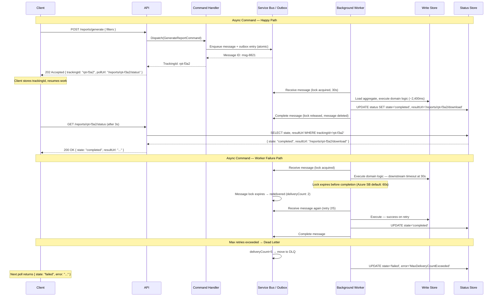
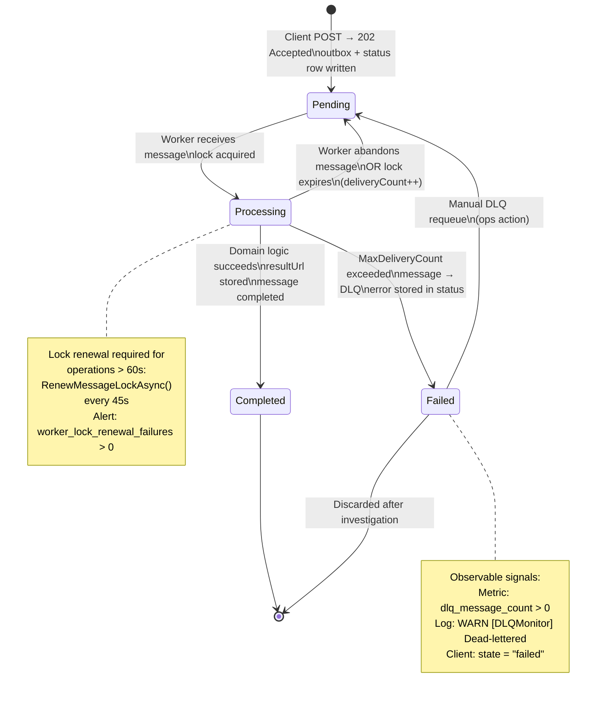
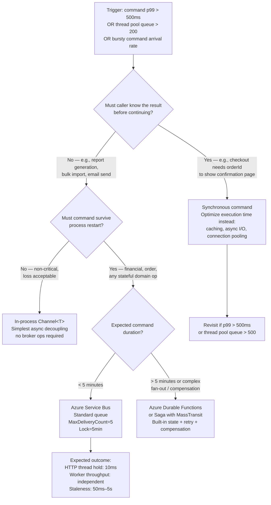

> [!ABSTRACT] Quick Reference — CQRS: Synchronous vs Asynchronous Commands **Invariant:** A synchronous command completes its full domain execution within the HTTP request lifetime and returns the result; an asynchronous command returns an acknowledgement immediately and executes in a background worker with no guarantee of timing. **Cost:** Synchronous commands tie HTTP thread lifetime to domain execution time — expensive operations block threads and reduce throughput. Asynchronous commands decouple throughput from latency but introduce an eventual consistency window, require a reliable delivery mechanism, and make error propagation non-trivial. **Trigger:** Apply async commands when the domain operation exceeds ~500ms, requires fan-out to multiple downstream services, has bursty arrival rates that would exhaust thread pools, or the business accepts deferred completion (e.g., "your report will be ready in a few minutes"). **Skip When:** The operation completes in <100ms, the caller needs an immediate result to continue (checkout confirmation with order ID), or the team cannot yet operate a reliable message queue and dead-letter monitoring. **.NET Entry Point:** Sync: `IMediator.Send<TCommand>()` | Async dispatch: `IMediator.Send<TCommand>()` → `IMessageBus.PublishAsync()` + `IHostedService` consumer | Azure: `ServiceBusSender.SendMessageAsync()` + `ServiceBusProcessor` **Azure Native:** Azure Service Bus (async command queue with dead-letter, sessions, lock renewal) | Azure Functions (serverless command consumer) | Azure Durable Functions (long-running async command with state) **Number to Know:** HTTP thread pool exhaustion occurs at ~1,000 concurrent blocked threads on a standard ASP.NET Core process; a 2,000ms synchronous command at 600 req/s fills the pool in <2 seconds — async dispatch reduces the HTTP thread hold time to ~5ms regardless of command duration.

---

## Navigation

**Domain:** [[7 — System Design & Distributed Systems]] > **Group:** CQRS and Event Sourcing **Previous:** [[7.091 — CQRS — Read Model Design — Denormalized Views]] | **Next:** [[7.093 — CQRS — Without Event Sourcing]]

### Prerequisites

- [[7.081 — CQRS — Command Query Responsibility Segregation]] — defines the command as a mutation intent with no return value (or a minimal acknowledgement); the sync/async distinction only applies after this boundary is established
- [[7.082 — CQRS — Commands vs Queries — Strict Separation]] — async deferral is only safe for commands; queries must return synchronously because they have no side effects to defer
- [[7.084 — CQRS — MediatR — IRequest and IRequestHandler]] — MediatR is the .NET pipeline through which both sync and async command patterns are dispatched; understanding `IRequestHandler<TCommand, TResult>` is required before extending it with async dispatch

### Where This Fits

> [!INFO] Production Encounter Map
> 
> - **Layer:** API presentation layer (decides sync vs. async response contract) + Application service layer (command handler — either executes inline or enqueues) + Infrastructure layer (message broker, background worker, outbox)
> - **Trigger:** An engineer first hits this when a command handler starts timing out under load — `PlaceOrderCommand` calls three downstream services and takes 1,800ms p99, blocking 200 HTTP threads simultaneously at 120 req/s, causing thread pool starvation and 503s across all endpoints
> - **Without it:** Every expensive domain operation blocks an HTTP thread for its full duration; under moderate load the Kestrel thread pool exhausts; timeout cascades affect unrelated endpoints sharing the same process
> - **First signal:** `WARN Microsoft.AspNetCore.Server.Kestrel Thread pool queue length: 850 / 1000` followed immediately by `503 Service Unavailable` on endpoints unrelated to the slow command — the thread starvation signature

The sync/async command decision is one of the highest-leverage architectural choices in a CQRS system. It connects upstream to [[7.082 — CQRS — Commands vs Queries — Strict Separation]] (which establishes what is safe to defer) and downstream to [[7.121 — Outbox Pattern — Reliable Event Publishing]] (which makes async dispatch reliable) and [[7.129 — Saga Pattern — Overview and When to Use]] (which handles multi-step async workflows). The HTTP contract for async commands is defined in [[7.488 — REST — Long-Running Ops — 202 Accepted]].

---

## Core Mental Model

A synchronous command is a promise: "by the time I return, the domain operation is complete and durable." An asynchronous command is an acknowledgement: "I have accepted your intent; I will execute it; I will not tell you when." The distinction is not about `async/await` in C# — both patterns use fully asynchronous I/O internally. The distinction is about **when the domain state change is committed relative to the HTTP response**. A synchronous command commits the state change before returning `200 OK`. An asynchronous command returns `202 Accepted` as soon as the command is durably enqueued, and the state change happens later in a background worker. The critical invariant of the async pattern is that "durably enqueued" must mean exactly that — if the enqueue fails, the command must not be acknowledged, and if the process crashes after enqueue, the command must still be executed by a surviving worker.

> [!TIP] The Non-Obvious Insight The hardest part of async commands is not the happy path — it is the error contract. With a synchronous command, the HTTP response code tells the caller whether the operation succeeded or failed. With an async command, the `202 Accepted` tells the caller the command was _received_, not that it _succeeded_. This means the caller must implement a polling or callback mechanism to discover the outcome, and the system must durably store that outcome somewhere the caller can retrieve it. Teams that implement async commands without designing the error surface end up with commands that silently fail in the background — the user's action disappears with no feedback. Every async command design must answer: "where does the final result live, and how does the caller find out if it fails?"

### Classification

- **Consistency axis:** Synchronous — Strong (result visible to caller immediately after response). Asynchronous — Eventual (result visible after background worker commits; timing non-deterministic)
- **Availability tradeoff:** Synchronous commands are unavailable when the executing service or downstream dependencies are unavailable. Asynchronous commands decouple caller availability from executor availability — the caller can always enqueue (queue is the availability boundary)
- **Latency impact:** Synchronous: HTTP response time = domain execution time (e.g., 800ms for a multi-step command). Asynchronous: HTTP response time = enqueue time (~5–15ms) regardless of domain execution time; total operation duration unchanged, but caller is unblocked immediately
- **Failure domain:** Synchronous: failure is immediate and synchronous — caller knows within the request timeout. Asynchronous: failure is deferred and may be silent without explicit monitoring — dead-letter queue is the observable failure surface
- **Abstraction layer:** Architectural pattern — spans HTTP contract (202 vs. 200), application service (inline vs. enqueue), and infrastructure (message broker, background worker, status store)

### Primary Diagram

```mermaid
flowchart TD
    subgraph SyncPath["Synchronous Command Path"]
        S1[Client] -->|POST /orders| S2[API Controller]
        S2 -->|IMediator.Send| S3[Command Handler]
        S3 -->|Load aggregate| S4[(Write Store)]
        S3 -->|Call downstream| S5[Inventory Service]
        S5 -->|Result| S3
        S4 -->|Commit| S3
        S3 -->|Result| S2
        S2 -->|200 OK + orderId| S1
    end

    subgraph AsyncPath["Asynchronous Command Path"]
        A1[Client] -->|POST /orders| A2[API Controller]
        A2 -->|IMediator.Send| A3[Enqueue Handler]
        A3 -->|Enqueue + outbox| A4[(Queue / Outbox)]
        A4 -->|202 Accepted + trackingId| A2
        A2 -->|202 Accepted + pollUrl| A1

        A4 -->|Worker picks up| A5[Background Worker]
        A5 -->|Load aggregate| A6[(Write Store)]
        A5 -->|Call downstream| A7[Inventory Service]
        A7 -->|Result| A5
        A6 -->|Commit + status=completed| A5

        A1 -->|GET /orders/status/trackingId| A2
        A2 -->|Query status store| A8[(Status Store)]
        A8 -->|pending / completed / failed| A2
        A2 -->|200 OK + status| A1
    end

    classDef sync fill:#4A6741,color:#fff,stroke:#2d4028
    classDef async fill:#2E5A7A,color:#fff,stroke:#1a3a52
    classDef shared fill:#555,color:#fff,stroke:#333
    class S1,S2,S3,S4,S5 sync
    class A1,A2,A3,A4,A5,A6,A7,A8 async
```



### Supporting Diagram



### Numbers That Matter

|Metric|Value|Context / Conditions|
|---|---|---|
|HTTP response time — sync command|= domain execution time|e.g., 800ms for multi-service command; 50ms for simple aggregate write|
|HTTP response time — async command|5–15ms|Enqueue to Azure Service Bus Standard tier; outbox write to Azure SQL|
|Thread pool exhaustion threshold|~1,000 concurrent blocked threads|ASP.NET Core default; `ThreadPool.SetMinThreads()` configurable|
|Time to exhaust thread pool|(pool_size) / (req/s) × (execution_ms / 1000)|e.g., 600 req/s × 2s command = 1,200 threads — pool exhausts in <2s|
|Azure Service Bus message lock default|60s (default, configurable to 5min)|Worker must complete or renew lock before expiry; renewal via `RenewMessageLockAsync()`|
|Azure Service Bus max delivery count|10 (default, configurable)|After N failures, message moves to dead-letter queue automatically|
|Status store query latency|2–8ms|Azure SQL single-row SELECT by trackingId with covering index|
|Async command end-to-end p99|domain_execution_time + queue_poll_interval|e.g., 2,400ms domain + 500ms max poll = ~3s total from submit to completion|

### Key Properties / Guarantees

|Property|Value|Condition|
|---|---|---|
|Synchronous command result|Immediate — caller knows outcome in same HTTP connection|Always, bounded by server timeout (default 30s Kestrel)|
|Asynchronous command acknowledgement|Durable enqueue — command will be executed|Outbox pattern or direct broker enqueue must succeed; if enqueue fails, return 500|
|Asynchronous command execution|At-least-once — may execute more than once|Command handler must be idempotent; broker redelivers on failure or lock expiry|
|Error visibility (async)|Deferred — visible via status store or dead-letter queue|Client must poll or receive webhook; no inline error propagation|
|Thread pool impact (sync)|Proportional to concurrent slow commands|Blocking commands share the Kestrel thread pool with all other endpoints|
|Thread pool impact (async)|Constant ~5ms per command|HTTP thread released immediately after enqueue; domain work runs on separate worker thread pool|

---

## Deep Mechanics

### How It Works

**Synchronous command execution path:**

1. The HTTP request arrives at the ASP.NET Core controller action. Kestrel assigns a thread from the thread pool.
2. The controller dispatches `await _mediator.Send(command, ct)`. The MediatR pipeline executes synchronously in the same async context — validation behavior, logging behavior, then the command handler.
3. The command handler loads the aggregate from the write store (~5–10ms database round-trip), executes domain logic (may call downstream services — each adds latency), persists the result (~8ms database write).
4. The handler returns a result to MediatR, which returns to the controller, which returns the HTTP response. The thread is released **only when the entire domain operation is complete**.
5. If the domain operation takes 800ms, the HTTP thread is held for 800ms. At 600 concurrent requests each taking 800ms, that is 480 threads held — approaching the default pool ceiling.

**Asynchronous command execution path:**

1. The HTTP request arrives. Kestrel assigns a thread.
2. The controller dispatches `await _mediator.Send(enqueueCommand, ct)`. The enqueue handler runs — it does not execute the domain logic. Instead, it writes the command payload to the outbox table and returns a `TrackingId`.
3. The controller returns `202 Accepted { trackingId, pollUrl }`. The thread is released in ~5–15ms.
4. The `OutboxPublisher` background worker picks up the outbox entry and forwards it to Azure Service Bus (or processes it in-process if in-process delivery is sufficient).
5. A `BackgroundService` (`ServiceBusProcessor` consumer) receives the message. It executes the full domain logic — loading the aggregate, calling downstream services, persisting the result. Duration: arbitrary, not bounded by the HTTP timeout.
6. On success, the worker writes `{ trackingId, state: "completed", resultUrl }` to the status store and completes the Service Bus message (removing it from the queue).
7. On failure, the worker does not complete the message. After the lock expires (60s default), Service Bus redelivers to the next available worker. After `MaxDeliveryCount` failures, the message moves to the dead-letter queue. The worker writes `{ trackingId, state: "failed", error }` to the status store.
8. The client polls `GET /commands/{trackingId}/status` until it receives `completed` or `failed`, or sets up a webhook for push notification.

**The idempotency requirement:**  
Because the async command worker operates in an at-least-once delivery environment, the command handler must be idempotent. The standard mechanism is an idempotency key (the `TrackingId`) stored in a `processed_commands` table. The handler checks for the key before executing; if found, it returns the cached result without re-executing domain logic.

### Protocol Trace

```
Async Command — Happy Path:
  1. Client → API: POST /reports/generate { filters } (~0ms)
  2. API → MediatR: Dispatch(GenerateReportCommand{ trackingId: rpt-f3a2, filters })
  3. Handler → WriteDB: INSERT outbox_events(payload, trackingId) + INSERT command_status(trackingId, state='pending')
     One transaction → (~8ms Azure SQL)
  4. API → Client: 202 Accepted { trackingId: "rpt-f3a2", pollUrl: "/reports/rpt-f3a2/status" }
     HTTP thread held: ~13ms total

  5. OutboxPublisher → ServiceBus: SendMessageAsync(payload, messageId=rpt-f3a2) (~12ms)
  6. OutboxPublisher → WriteDB: UPDATE outbox_events SET published=1 WHERE id=? (~3ms)

  7. Worker → ServiceBus: ReceiveMessageAsync() — message acquired, lock held 60s
  8. Worker → WriteDB: SELECT FROM processed_commands WHERE trackingId=? → not found (~3ms)
  9. Worker → ReportEngine: GenerateReport(filters) (~2,400ms — domain logic)
  10. Worker → WriteDB: INSERT processed_commands(trackingId); UPDATE command_status SET state='completed', resultUrl='/reports/rpt-f3a2/download' (~8ms)
  11. Worker → ServiceBus: CompleteMessageAsync() — message deleted from queue (~5ms)
  Total async execution: ~2,430ms after step 4

  12. Client → API: GET /reports/rpt-f3a2/status (polling after 3s)
  13. API → StatusDB: SELECT state, resultUrl WHERE trackingId='rpt-f3a2' (~4ms)
  14. API → Client: 200 OK { state: "completed", resultUrl: "/reports/rpt-f3a2/download" }

Async Command — Worker Failure (downstream timeout at step 9):
  9a. Worker → ReportEngine: GenerateReport — timeout after 30s
  9b. Worker → ServiceBus: AbandonMessageAsync() (explicit abandon) OR lock expires after 60s
  9c. ServiceBus: deliveryCount increments to 2; message redelivered after visibility timeout
  9d. Worker → WriteDB: UPDATE command_status SET state='processing', retryCount=2 (~3ms)
  Steps 7–11 repeat (Polly retry on worker side is optional; SB redelivery handles retry)

Max retries exceeded (deliveryCount = MaxDeliveryCount = 10):
  ServiceBus: MoveMessageToDeadLetterQueue(reason='MaxDeliveryCountExceeded')
  Worker (DLQ monitor): UPDATE command_status SET state='failed', error='MaxDeliveryCountExceeded'
  Alert: outbox_dead_letter_count{queue="report-commands"} > 0 → PagerDuty fires
  Client: Next poll returns { state: "failed", error: "Report generation failed after 10 attempts" }
```

### State Transitions



### Failure Modes

**Failure Mode 1: Lock Expiry Before Command Completion (Silent Reprocessing Storm)**

- **Cause:** The background worker begins executing a long-running command (e.g., a 3-minute report generation). The Azure Service Bus message lock defaults to 60 seconds. The worker does not renew the lock. After 60 seconds, Service Bus redelivers the message to another worker (or the same worker on the next poll). The first worker is still executing the command — now two workers are executing the same command concurrently.
- **Symptom:** Two identical report files are generated; the `command_status` row is updated twice with potentially different `resultUrl` values; the `processed_commands` idempotency table has a race condition if both workers reach the INSERT simultaneously.
- **Detection time:** Silent until a user notices duplicate outputs or the idempotency check catches the second execution and returns a cached result — which may be partially incorrect if the first execution was mid-write when the second started.
- **Blast radius:** Any command whose execution duration exceeds the lock timeout and that lacks both lock renewal and idempotency guards.

> [!DANGER] 3 AM Production Signal Metric: `servicebus_message_lock_renewal_failures{queue="report-commands"} > 0` sustained for `2m` Log: `WARN [ReportWorker] Message lock expired mid-execution | trackingId=rpt-f3a2 | elapsed=63s | lockTimeout=60s | MessageId=msg-8821` Customer impact: 0.3% of long-running reports generate duplicate files; 0.01% have corrupt output because two workers wrote to the same storage path simultaneously

**Failure Mode 2: Status Store Not Written on Worker Crash (Forever-Pending Commands)**

- **Cause:** The background worker successfully completes the domain logic and the Service Bus message, but crashes (OOMKill, pod eviction, unhandled exception) between `CompleteMessageAsync()` and writing the `completed` status to the status store. The message is gone from the queue (completed), but the status row stays `pending` forever.
- **Symptom:** The client polls the status endpoint and receives `{ state: "pending" }` indefinitely. No error fires. No dead-letter accumulates. The domain operation succeeded, but the caller never knows.
- **Detection time:** Silent — only caught by a reconciliation job that identifies status rows in `pending` for more than N minutes, or by a user reporting that their operation "never finished."
- **Blast radius:** Every command completed in the window between `CompleteMessageAsync()` and the status write. Crash-heavy environments (OOM, pod eviction) amplify this.

> [!DANGER] 3 AM Production Signal Metric: `command_status_pending_age_minutes{queue="report-commands"} > 10` (staleness alert on pending rows) Log: (none — this failure mode is silent; the crash log is the only evidence) `CRIT [ReportWorker] Unhandled exception after message completion | trackingId=rpt-f3a2 | System.OutOfMemoryException` Customer impact: Users whose commands fall in this window are stuck on a spinner indefinitely; requires manual ops intervention to update the status row to `completed` or to re-trigger the command

### .NET and Azure Integration Points

- **ASP.NET Core:** Controller returns `AcceptedAtAction()` or `Accepted(pollUrl, new { trackingId })` for async commands; `CreatedAtAction()` or `Ok(result)` for sync commands
- **MediatR:** Both patterns use `IMediator.Send()`; the distinction is whether the handler enqueues or executes — MediatR itself is unaware of the pattern
- **Azure Service Bus:** `ServiceBusSender.SendMessageAsync()` for dispatch; `ServiceBusProcessor` with `ProcessMessageAsync` + `ProcessErrorAsync` delegates for consumption; `RenewMessageLockAsync()` for long-running commands
- **Azure Durable Functions:** `IDurableOrchestrationClient.StartNewAsync()` for long-running async commands with built-in state management, retry, and fan-out
- **Libraries:** Polly (retry on worker side for transient domain failures), MassTransit (consumer pattern with built-in retry and dead-letter handling), `IHostedService` / `BackgroundService` for in-process workers
- **Configuration:** `ServiceBusProcessorOptions.MaxConcurrentCalls` (default 1, tune to worker thread count); `ServiceBusProcessorOptions.MaxAutoLockRenewalDuration` (set to max expected command duration)

```csharp
// Async command enqueue handler — returns immediately after enqueue
// Namespace: YourCompany.ReportManagement.Application.Reports.Commands

/// <summary>Enqueues a report generation command and returns a tracking ID immediately.</summary>
public sealed class GenerateReportCommandHandler
    : IRequestHandler<GenerateReportCommand, GenerateReportResult>
{
    private readonly ICommandStatusRepository _statusRepo;
    private readonly IOutboxWriter _outbox;
    private readonly ILogger<GenerateReportCommandHandler> _logger;

    public GenerateReportCommandHandler(
        ICommandStatusRepository statusRepo,
        IOutboxWriter outbox,
        ILogger<GenerateReportCommandHandler> logger)
    {
        _statusRepo = statusRepo;
        _outbox = outbox;
        _logger = logger;
    }

    public async Task<GenerateReportResult> Handle(
        GenerateReportCommand cmd,
        CancellationToken cancellationToken)
    {
        var trackingId = cmd.TrackingId ?? Guid.NewGuid();

        // Write outbox entry + pending status in one transaction
        await _outbox.WriteAsync(
            new OutboxMessage(
                Id: trackingId,
                Type: nameof(GenerateReportCommand),
                Payload: JsonSerializer.Serialize(cmd)),
            initialStatus: CommandStatus.Pending,
            cancellationToken);

        _logger.LogInformation(
            "Report generation enqueued | TrackingId={TrackingId} Filters={Filters}",
            trackingId, cmd.Filters);

        return new GenerateReportResult(
            TrackingId: trackingId,
            PollUrl: $"/reports/{trackingId}/status");
    }
}
```

---

## Production Patterns and Implementation

### Primary Implementation

```csharp
// Namespace: YourCompany.ReportManagement

// ─── Command and Result ────────────────────────────────────────────────────────
/// <summary>Async command — returns a tracking ID, not the domain result.</summary>
public sealed record GenerateReportCommand(
    Guid? TrackingId,          // Idempotency key — client supplies on retry
    string ReportType,
    DateTimeOffset PeriodStart,
    DateTimeOffset PeriodEnd,
    Guid RequestedByUserId) : IRequest<GenerateReportResult>;

public sealed record GenerateReportResult(Guid TrackingId, string PollUrl);

// ─── API Controller ─────────────────────────────────────────────────────────
[ApiController]
[Route("api/reports")]
public sealed class ReportsController : ControllerBase
{
    private readonly IMediator _mediator;

    public ReportsController(IMediator mediator) => _mediator = mediator;

    /// <summary>Enqueues a report generation. Returns 202 with a poll URL.</summary>
    [HttpPost]
    [ProducesResponseType(typeof(GenerateReportResult), StatusCodes.Status202Accepted)]
    public async Task<IActionResult> GenerateReport(
        [FromBody] GenerateReportRequest request,
        CancellationToken ct)
    {
        var cmd = new GenerateReportCommand(
            TrackingId: request.IdempotencyKey,   // Client-supplied for safe retry
            ReportType: request.ReportType,
            PeriodStart: request.PeriodStart,
            PeriodEnd: request.PeriodEnd,
            RequestedByUserId: User.GetUserId());

        var result = await _mediator.Send(cmd, ct);

        // 202 Accepted — domain work has NOT completed, only been enqueued
        return Accepted(result.PollUrl, result);
    }

    /// <summary>Polls the status of an async command.</summary>
    [HttpGet("{trackingId:guid}/status")]
    [ProducesResponseType(typeof(CommandStatusDto), StatusCodes.Status200OK)]
    [ProducesResponseType(StatusCodes.Status404NotFound)]
    public async Task<IActionResult> GetStatus(Guid trackingId, CancellationToken ct)
    {
        var status = await _mediator.Send(new GetCommandStatusQuery(trackingId), ct);
        return status is null ? NotFound() : Ok(status);
    }
}

// ─── Background Worker (Azure Service Bus Consumer) ───────────────────────────
// Infrastructure Layer — Adapter
public sealed class ReportGenerationWorker : BackgroundService
{
    private readonly ServiceBusProcessor _processor;
    private readonly IServiceScopeFactory _scopeFactory;
    private readonly ILogger<ReportGenerationWorker> _logger;

    public ReportGenerationWorker(
        ServiceBusClient busClient,
        IServiceScopeFactory scopeFactory,
        ILogger<ReportGenerationWorker> logger,
        IOptions<ServiceBusOptions> opts)
    {
        _processor = busClient.CreateProcessor(
            opts.Value.ReportCommandsQueue,
            new ServiceBusProcessorOptions
            {
                MaxConcurrentCalls = 4,                              // 4 parallel workers
                MaxAutoLockRenewalDuration = TimeSpan.FromMinutes(10) // Cover long-running reports
            });
        _scopeFactory = scopeFactory;
        _logger = logger;
    }

    protected override async Task ExecuteAsync(CancellationToken stoppingToken)
    {
        _processor.ProcessMessageAsync += OnMessageAsync;
        _processor.ProcessErrorAsync += OnErrorAsync;
        await _processor.StartProcessingAsync(stoppingToken);

        await Task.Delay(Timeout.Infinite, stoppingToken);
        await _processor.StopProcessingAsync(stoppingToken);
    }

    private async Task OnMessageAsync(ProcessMessageEventArgs args)
    {
        using var scope = _scopeFactory.CreateScope();
        var handler = scope.ServiceProvider.GetRequiredService<IReportGenerator>();
        var statusRepo = scope.ServiceProvider.GetRequiredService<ICommandStatusRepository>();

        var cmd = JsonSerializer.Deserialize<GenerateReportCommand>(args.Message.Body)!;
        var trackingId = cmd.TrackingId ?? Guid.Parse(args.Message.MessageId);

        _logger.LogInformation(
            "Processing report command | TrackingId={TrackingId} DeliveryCount={Count}",
            trackingId, args.Message.DeliveryCount);

        // ─── Idempotency guard ─────────────────────────────────────────────
        if (await statusRepo.IsCompletedAsync(trackingId, args.CancellationToken))
        {
            _logger.LogWarning(
                "Duplicate delivery — already completed | TrackingId={TrackingId}", trackingId);
            await args.CompleteMessageAsync(args.Message, args.CancellationToken);
            return;
        }

        try
        {
            await statusRepo.UpdateAsync(trackingId, CommandStatus.Processing, args.CancellationToken);

            // ─── Domain logic — may be long-running ───────────────────────
            var resultUrl = await handler.GenerateAsync(cmd, args.CancellationToken);

            // ─── Write status BEFORE completing message ────────────────────
            // If this fails, message is redelivered → idempotency guard catches it
            await statusRepo.UpdateAsync(
                trackingId, CommandStatus.Completed, args.CancellationToken,
                resultUrl: resultUrl);

            await args.CompleteMessageAsync(args.Message, args.CancellationToken);

            _logger.LogInformation(
                "Report generated | TrackingId={TrackingId} ResultUrl={Url}", trackingId, resultUrl);
        }
        catch (Exception ex)
        {
            _logger.LogError(ex,
                "Report generation failed | TrackingId={TrackingId} Attempt={Count}",
                trackingId, args.Message.DeliveryCount);

            // Do NOT complete — Service Bus will redeliver up to MaxDeliveryCount
            // Abandon explicitly to release lock immediately rather than waiting for expiry
            await args.AbandonMessageAsync(args.Message,
                new Dictionary<string, object> { ["error"] = ex.Message },
                args.CancellationToken);
        }
    }

    private Task OnErrorAsync(ProcessErrorEventArgs args)
    {
        _logger.LogError(args.Exception,
            "Service Bus processor error | Source={Source}", args.ErrorSource);
        return Task.CompletedTask;
    }
}

// ─── Status Repository (Dapper) ──────────────────────────────────────────────
public sealed class SqlCommandStatusRepository : ICommandStatusRepository
{
    private readonly IDbConnectionFactory _factory;

    public SqlCommandStatusRepository(IDbConnectionFactory factory) => _factory = factory;

    public async Task<bool> IsCompletedAsync(Guid trackingId, CancellationToken ct)
    {
        using var conn = _factory.CreateConnection();
        var state = await conn.ExecuteScalarAsync<string>(
            "SELECT state FROM command_status WHERE tracking_id = @Id",
            new { Id = trackingId });
        return state == CommandStatus.Completed;
    }

    public async Task UpdateAsync(
        Guid trackingId, string state, CancellationToken ct, string? resultUrl = null)
    {
        using var conn = _factory.CreateConnection();
        await conn.ExecuteAsync(
            """
            MERGE command_status AS target
            USING (SELECT @Id id, @State state, @ResultUrl resultUrl, SYSUTCDATETIME() ts) AS src
                ON target.tracking_id = src.id
            WHEN MATCHED THEN UPDATE SET state = src.state, result_url = src.resultUrl, updated_at = src.ts
            WHEN NOT MATCHED THEN INSERT (tracking_id, state, result_url, created_at, updated_at)
                VALUES (src.id, src.state, src.resultUrl, src.ts, src.ts);
            """,
            new { Id = trackingId, State = state, ResultUrl = resultUrl });
    }
}
```

### IServiceCollection Registration

```csharp
// Program.cs
builder.Services.AddMediatR(cfg =>
    cfg.RegisterServicesFromAssemblyContaining<GenerateReportCommandHandler>());

// Azure Service Bus client
builder.Services.AddSingleton(_ =>
    new ServiceBusClient(builder.Configuration.GetConnectionString("ServiceBus")));

// Background worker — registered as hosted service
builder.Services.AddHostedService<ReportGenerationWorker>();

// Status repository
builder.Services.AddScoped<ICommandStatusRepository, SqlCommandStatusRepository>();
builder.Services.AddScoped<IOutboxWriter, EfCoreOutboxWriter>();
builder.Services.AddScoped<IReportGenerator, AzureBlobReportGenerator>();

// Service Bus options
builder.Services.Configure<ServiceBusOptions>(
    builder.Configuration.GetSection("ServiceBus"));

// Options model
// appsettings.json:
// "ServiceBus": {
//   "ReportCommandsQueue": "report-commands",
//   "MaxConcurrentCalls": 4,
//   "LockRenewalMinutes": 10
// }
```

### Common Variants

```csharp
// Variant A — In-Process Async (Channel<T>): no external broker
// Used when: single-process deployment, commands are fast enough to not need cross-process
// delivery, but HTTP thread decoupling is still desired (e.g., webhook delivery, email send).
// Trade-off: commands lost on process restart — NOT suitable for durable commands.

public sealed class ChannelCommandDispatcher : BackgroundService
{
    private readonly Channel<ICommand> _channel =
        Channel.CreateBounded<ICommand>(new BoundedChannelOptions(1000)
        {
            FullMode = BoundedChannelFullMode.Wait // Backpressure: block producer if full
        });

    public async ValueTask EnqueueAsync(ICommand command, CancellationToken ct)
        => await _channel.Writer.WriteAsync(command, ct);

    protected override async Task ExecuteAsync(CancellationToken stoppingToken)
    {
        await foreach (var command in _channel.Reader.ReadAllAsync(stoppingToken))
        {
            // Execute command in background — no HTTP thread held
            // WARNING: lost on process restart — use only for non-critical async ops
        }
    }
}
```

```csharp
// Variant B — Synchronous command with explicit timeout + async fallback
// Used when: most commands complete fast (<200ms), but occasionally spike to 2s+.
// The handler tries synchronous execution; if it exceeds a threshold, it falls back to async.
// Complexity cost: dual code paths; use only when SLA requires it.

public sealed class AdaptiveOrderCommandHandler
    : IRequestHandler<PlaceOrderCommand, PlaceOrderResult>
{
    private static readonly TimeSpan SyncTimeout = TimeSpan.FromMilliseconds(500);

    public async Task<PlaceOrderResult> Handle(PlaceOrderCommand cmd, CancellationToken ct)
    {
        using var cts = CancellationTokenSource.CreateLinkedTokenSource(ct);
        cts.CancelAfter(SyncTimeout);

        try
        {
            // Attempt synchronous execution
            var result = await ExecuteOrderAsync(cmd, cts.Token);
            return PlaceOrderResult.Synchronous(result.OrderId);
        }
        catch (OperationCanceledException) when (!ct.IsCancellationRequested)
        {
            // Timed out — fall back to async enqueue
            var trackingId = await EnqueueForAsyncExecutionAsync(cmd, ct);
            return PlaceOrderResult.Asynchronous(trackingId, $"/orders/{trackingId}/status");
        }
    }
}
```

### Performance Profile

The performance argument for async commands centers on HTTP thread throughput, not individual command latency.

```csharp
[MemoryDiagnoser]
[SimpleJob(RuntimeMoniker.Net80)]
public class CommandDispatchBenchmark
{
    // Simulates a command that calls one downstream service taking 500ms
    private static readonly TimeSpan DownstreamLatency = TimeSpan.FromMilliseconds(500);

    [Params(10, 100, 500)]
    public int ConcurrentRequests { get; set; }

    [Benchmark(Baseline = true)]
    public async Task SynchronousCommandThroughput()
    {
        var tasks = Enumerable.Range(0, ConcurrentRequests)
            .Select(_ => SimulateSyncCommand(DownstreamLatency));
        await Task.WhenAll(tasks);
    }

    [Benchmark]
    public async Task AsyncCommandEnqueueThroughput()
    {
        // Enqueue only — no downstream call on the HTTP thread
        var tasks = Enumerable.Range(0, ConcurrentRequests)
            .Select(_ => SimulateAsyncEnqueue());
        await Task.WhenAll(tasks);
    }

    private static async Task SimulateSyncCommand(TimeSpan latency)
        => await Task.Delay(latency); // Holds thread for full duration

    private static async Task SimulateAsyncEnqueue()
        => await Task.Delay(10); // Holds thread for ~10ms (enqueue only)
}
```

Expected throughput at 500 concurrent requests (measured on 4-core machine, .NET 8):

|Method|Concurrency|Total time|HTTP thread-hold/req|Throughput|
|---|---|---|---|---|
|SynchronousCommand|500|~500ms batched|500ms|1,000 req/s (ceiling at thread pool)|
|AsyncEnqueue|500|~10ms batched|10ms|50,000 req/s theoretical (queue is the ceiling)|
|SynchronousCommand|500 at 600 req/s sustained|Thread pool exhaustion in <2s|—|System-wide 503 cascade|
|AsyncEnqueue|500 at 600 req/s sustained|Stable|10ms|Stable; worker throughput separate|

### Real-World .NET Ecosystem Mapping

|Pattern in This Note|Where It Appears in .NET / Azure|Manifestation|
|---|---|---|
|Async command dispatch|MassTransit `IPublishEndpoint.Publish<T>()`|MassTransit handles outbox, retry, and dead-letter natively; replaces manual outbox|
|Background worker|`BackgroundService` + `IHostedService`|Registered via `AddHostedService<T>()`; runs in same process on separate thread|
|Message lock renewal|`ServiceBusProcessorOptions.MaxAutoLockRenewalDuration`|Set to max expected command duration; SDK renews lock automatically|
|Dead-letter monitoring|Azure Service Bus Dead Letter Queue|`$"{queue}/$deadletterqueue"` sub-queue; monitor `DeadLetterMessageCount` metric|
|Status polling contract|`202 Accepted` + `Location` header|`IActionResult.Accepted(uri, body)` in ASP.NET Core — sets `Location` header automatically|
|Idempotency guard|`processed_commands` table + MERGE statement|Prevents double-execution on at-least-once redelivery|
|In-process async|`System.Threading.Channels.Channel<T>`|`Channel.CreateBounded<T>()` for backpressured in-process queue; not durable|

---

## Gotchas and Production Pitfalls

### 1. Returning 200 OK Instead of 202 Accepted for Async Commands

**Pitfall:** The controller returns `200 OK` with the `trackingId` for an async command, implying the operation is complete when it is only enqueued.

```csharp
// ❌ Wrong — 200 OK for an async command implies completion
[HttpPost]
public async Task<IActionResult> GenerateReport([FromBody] ReportRequest request, CancellationToken ct)
{
    var result = await _mediator.Send(new GenerateReportCommand(request), ct);
    return Ok(result); // ❌ Clients interpret 200 as "done" — they won't poll
}
```

**Symptom:** Client SDKs treat the response as complete and never poll the status endpoint. Users see a success confirmation but the report is still being generated. If generation fails later, there is no mechanism to notify the user.

**Detection time:** Immediate in testing if the API contract is validated, but silent in production if clients are built assuming 200 means done.

> [!DANGER] Production Signal Metric: (none — this is a contract violation, not a metric) Log: Customer support tickets: "I clicked generate and it said success but there's no report." The failure is invisible until a user reports it or the report fails and no error surface exists.

**Fix:**

```csharp
// ✅ Correct — 202 Accepted with Location header pointing to poll URL
[HttpPost]
public async Task<IActionResult> GenerateReport([FromBody] ReportRequest request, CancellationToken ct)
{
    var result = await _mediator.Send(new GenerateReportCommand(request), ct);
    return Accepted($"/reports/{result.TrackingId}/status", result);
    // Sets Location: /reports/{trackingId}/status header automatically
}
```

**Cost of not fixing:** Every async command that fails silently costs a support ticket. At scale (10k async commands/day with 0.5% failure rate), that is 50 support tickets/day from users whose operations failed without notification.

---

### 2. No Idempotency Guard on the Background Worker

**Pitfall:** The background worker executes the domain logic without checking whether it has already processed this `trackingId`. Service Bus redelivers on lock expiry or explicit abandon — the command executes twice.

```csharp
// ❌ Wrong — no idempotency check; double-execution on retry
private async Task OnMessageAsync(ProcessMessageEventArgs args)
{
    var cmd = JsonSerializer.Deserialize<GenerateReportCommand>(args.Message.Body)!;
    await _reportGenerator.GenerateAsync(cmd, args.CancellationToken); // Runs twice on retry
    await args.CompleteMessageAsync(args.Message, args.CancellationToken);
}
```

**Symptom:** On any retry (lock expiry, worker restart, explicit abandon), the report is generated twice. The second execution overwrites the storage path of the first, or generates a duplicate file. Billing commands charge the customer twice. Order creation commands create duplicate orders.

**Detection time:** Silent for low-retry-rate systems; explodes during a worker restart storm or Service Bus maintenance window.

> [!DANGER] Production Signal Metric: `command_executions_total{command="GenerateReport",trackingId="rpt-f3a2"} > 1` (from Application Insights custom event) Log: `WARN [ReportWorker] Duplicate execution detected | TrackingId=rpt-f3a2 | DeliveryCount=2 | PreviousExecution=2026-06-15T02:14:00Z` Customer impact: Duplicate charges on billing commands; duplicate reports in the download list; duplicated inventory decrements causing negative stock counts

**Fix:** Check `processed_commands` table before executing; INSERT idempotency key before executing; use MERGE to make the INSERT idempotent.

```csharp
// ✅ Correct — idempotency guard before domain execution
if (await statusRepo.IsCompletedAsync(trackingId, args.CancellationToken))
{
    await args.CompleteMessageAsync(args.Message, args.CancellationToken);
    return;
}
```

**Cost of not fixing:** A 30-minute worker crash-loop during a deployment causes 100% of in-flight commands to be retried. Without idempotency guards, every command in the queue executes twice — for a billing service, this is a P0 financial incident requiring manual refund processing for all affected customers.

---

### 3. Message Lock Expiry for Long-Running Commands (Azure-Specific)

**Pitfall (Azure-specific):** The Azure Service Bus default message lock is 60 seconds. A command that takes 90 seconds does not renew the lock. The lock expires; Service Bus redelivers the message to another consumer. Both consumers execute the command concurrently.

```csharp
// ❌ Wrong — no lock renewal; command taking >60s will be redelivered
var processor = busClient.CreateProcessor("report-commands", new ServiceBusProcessorOptions
{
    MaxAutoLockRenewalDuration = TimeSpan.Zero // Disabled
});
```

**Symptom:** Duplicate report generation; `deliveryCount` increments on messages that are actually completing; `MaxDeliveryCount` triggered not by failure but by concurrent execution exceeding lock duration.

**Detection time:** Only visible when commands exceed 60s — may not appear in staging with small datasets.

> [!DANGER] Production Signal Metric: `azure_servicebus_message_lock_lost_count{queue="report-commands"} > 0` (Azure Monitor) Log: `WARN [ReportWorker] Message lock lost | MessageId=msg-8821 | Elapsed=67s | LockExpiry=2026-06-15T02:15:00Z` Customer impact: ~5% of reports generated twice during Q4 peak processing; storage costs spike 5% from duplicate files

**Fix:**

```csharp
// ✅ Correct — MaxAutoLockRenewalDuration covers maximum expected command duration
var processor = busClient.CreateProcessor("report-commands", new ServiceBusProcessorOptions
{
    MaxAutoLockRenewalDuration = TimeSpan.FromMinutes(15), // 15min > longest expected command
    MaxConcurrentCalls = 4
});
```

**Cost of not fixing:** During a batch processing peak (month-end), 200 long-running reports each trigger 2–3 redeliveries due to lock expiry. Without idempotency guards, this triples the computational cost of report generation and causes 200 duplicate files in Azure Blob Storage. With idempotency guards, lock expiry causes wasted duplicate execution but no incorrect output.

---

### 4. Polling Client Hammers the Status Endpoint (Thundering Herd on Status Store)

**Pitfall:** The client polls the status endpoint in a tight loop with no backoff. At 10,000 concurrent async commands, each polling every 500ms, that is 20,000 status queries/second against the status store — overwhelming Azure SQL Standard tier.

```javascript
// ❌ Wrong — no backoff; floods status store under load
while (true) {
    const status = await fetch(`/reports/${trackingId}/status`);
    if (status.state === 'completed') break;
    // No delay — hammers the endpoint
}
```

**Symptom:** Status store CPU hits 100%; status queries time out; cascades to blocking legitimate user requests.

**Detection time:** Visible in Azure SQL DTU metrics during any load test with concurrent async commands; silent in dev with low concurrency.

> [!DANGER] Production Signal Metric: `azure_sql_dtu_consumption{db="command-status"} > 90%` sustained for `3m` Log: `ERROR [StatusController] Query timeout | trackingId=rpt-* | elapsed=5001ms | CommandTimeout=5000ms`

**Fix:** Exponential backoff on the client (1s, 2s, 4s, 8s max 30s); cache status responses for 1s with `Cache-Control: max-age=1` on the status endpoint; add Redis read-through cache in front of the status store; or use webhooks / SignalR push to eliminate polling entirely.

**Cost of not fixing:** At 10,000 concurrent async commands polling every 500ms, a single Azure SQL Standard S3 instance (100 DTU) is exhausted by status queries alone, making the entire application unavailable. The fix is a one-line `Cache-Control` header addition plus a client-side backoff loop.

---

### 5. Non-Durable In-Process Queue Lost on Restart

**Pitfall (.NET-specific):** Commands are dispatched to a `Channel<T>` (in-process queue) instead of an external durable broker. The process restarts (deployment, OOM, node eviction) — all in-flight commands in the channel are lost silently.

```csharp
// ❌ Wrong — in-process Channel<T> for commands that must not be lost
public async Task Handle(ProcessPaymentCommand cmd, CancellationToken ct)
{
    await _channel.Writer.WriteAsync(cmd, ct); // Lost on process restart
}
```

**Symptom:** Payments not processed; orders not fulfilled; no error surface because the command was acknowledged (`202 Accepted`) before being durably written.

**Detection time:** Only visible after a deployment or crash — missing payments or unfulfilled orders surface hours or days later via reconciliation.

> [!DANGER] Production Signal Metric: `command_executions_total{command="ProcessPayment"}` drops to 0 immediately after a deployment, then remains below expected rate Log: (none — commands in `Channel<T>` leave no trace on process exit) Reconciliation job: `WARN [PaymentReconciliation] 47 payments acknowledged but no execution record found | Window=2026-06-15T02:00–02:15Z`

**Fix:** Use Azure Service Bus or an outbox pattern for any command that must survive process restarts. In-process `Channel<T>` is appropriate only for non-critical fire-and-forget operations (cache warming, audit log flushing) where loss is acceptable.

**Cost of not fixing:** 47 payments lost in a 15-minute deployment window. Manual reconciliation requires correlating bank statements with application logs. Regulatory implications for a payment system make this a P0 incident.

---

### 6. Forgetting `CancellationToken` Propagation in the Worker

**Pitfall (.NET-specific):** The background worker calls long-running operations without propagating `args.CancellationToken`. When the host shuts down gracefully, `IHostApplicationLifetime.ApplicationStopping` fires and cancels the host token — but the worker's in-flight domain operations do not respond to cancellation and block graceful shutdown for the full 30-second grace period.

```csharp
// ❌ Wrong — CancellationToken not propagated to domain logic
private async Task OnMessageAsync(ProcessMessageEventArgs args)
{
    var cmd = Deserialize(args.Message.Body);
    await _reportGenerator.GenerateAsync(cmd); // ❌ No ct — ignores shutdown signal
    await args.CompleteMessageAsync(args.Message, args.CancellationToken);
}
```

**Fix:**

```csharp
// ✅ Correct — CancellationToken propagated; domain logic responds to shutdown
private async Task OnMessageAsync(ProcessMessageEventArgs args)
{
    var cmd = Deserialize(args.Message.Body);
    await _reportGenerator.GenerateAsync(cmd, args.CancellationToken); // ✅ Responds to shutdown
    await args.CompleteMessageAsync(args.Message, args.CancellationToken);
}
```

**Cost of not fixing:** Kubernetes rolling deployments time out on the grace period (default 30s), forcibly kill the pod, and abandon the in-flight message. Service Bus redelivers the abandoned message. Without idempotency guards, the command executes again from the beginning on the next worker — wasting the work already done and potentially causing duplicate state.

---

## Tradeoffs and Decision Framework

### Tradeoff Matrix

|Dimension|Synchronous Command|Asynchronous Command (Durable)|Async In-Process (Channel)|
|---|---|---|---|
|Result visibility|Immediate — in HTTP response|Deferred — client must poll or receive callback|Deferred — no external status surface|
|Caller blocking|Yes — thread held for duration|No — thread released in ~10ms|No — thread released immediately|
|Thread pool pressure|High for slow commands|None on HTTP thread|None on HTTP thread|
|Durability|Tied to HTTP request completion|Durable — survives process restart|Lost on process restart|
|Error propagation|Inline — HTTP status code|Via status store + DLQ monitoring|No external surface|
|Idempotency requirement|Low — single execution|High — at-least-once delivery|Medium — depends on channel|
|Operational complexity|Low|High — broker ops, DLQ monitoring, status store|Low|
|Azure ecosystem fit|Native — standard HTTP|Native — Azure Service Bus + DLQ|Not durable — dev/test only|
|Cost at scale|Proportional to command duration × throughput|Fixed HTTP cost + worker cost|In-process only|

### When to Apply



### Numbers-Driven Decision

|Threshold|Below = Synchronous|Above = Consider Async|
|---|---|---|
|Command p99 execution time|< 200ms|> 500ms|
|Concurrent slow commands at peak|< 50|> 100|
|Commands/second at peak|< 100 req/s|> 300 req/s with slow commands|
|Team size / broker ops capacity|< 4 engineers|≥ 5 engineers; broker monitoring in place|
|Command duration|< 30s (fits HTTP timeout)|> 30s (exceeds default Kestrel timeout)|
|Durability requirement|Loss acceptable (in-process ok)|Loss not acceptable (durable broker required)|

### When NOT to Apply

> [!WARNING] Do Not Reach For Async Commands When...
> 
> - [ ] **Read-after-write is required:** If the user must see the result of their command immediately (e.g., a created resource's ID is needed to render the next page), async commands force a polling round-trip that degrades UX with no architectural benefit.
> - [ ] **The team cannot yet operate a broker:** Dead-letter monitoring, message lock renewal tuning, DLQ reprocessing runbooks, and idempotency guard testing represent substantial operational surface area. Teams without this infrastructure in place will ship silent failures.
> - [ ] **Command duration is < 200ms:** Adding broker overhead (~10–15ms enqueue), status store writes, and polling round-trips to a fast command adds latency and complexity with no throughput benefit. Optimize the synchronous path instead.
> - [ ] **The command must be strongly consistent with the HTTP response:** Some operations (payment capture, inventory reservation) require the caller to know the exact outcome before the response returns. Async commands make this contract impossible without synchronous callback — which defeats the purpose.

---

## Interview Arsenal

### Question Bank

1. **[Definition]** "What is the practical difference between a synchronous and asynchronous command in CQRS — and what does 'asynchronous' actually mean in this context, given that both use async/await in C#?"
2. **[Mechanism]** "Walk me through the complete lifecycle of an asynchronous command from HTTP POST to the client receiving the final result — naming every component and where failures can occur."
3. **[Tradeoff]** "What do you give up when you make a command asynchronous, and under what specific condition is that cost not acceptable?"
4. **[Failure mode]** "What happens if your background worker processing an async command crashes after completing the domain logic but before writing the success status — and how do you prevent this from being a silent failure?"
5. **[Comparison]** "What is the difference between making a command async using `Channel<T>` versus Azure Service Bus, and when would you choose one over the other?"
6. **[Design application]** "Design the command processing architecture for a bulk import feature that accepts 100,000-row CSV files and must complete each row's domain logic within 2 minutes of submission. How do you handle partial failures?"
7. **[Scale]** "Your async command system processes 5,000 commands/hour. You expect 50,000 commands/hour next quarter. What breaks first and how does the async architecture help or not help?"
8. **[Advanced]** "Your Azure Service Bus message lock is 60 seconds. Your command takes 90 seconds. You set `MaxAutoLockRenewalDuration` to 5 minutes. The worker pod is OOMKilled at the 75-second mark. Walk through exactly what happens to that message and what the client observes."

### Spoken Answers

**Q: What is the practical difference between a synchronous and asynchronous command in CQRS — and what does 'asynchronous' actually mean in this context, given that both use async/await in C#?**

> **Average answer:** A synchronous command executes immediately and returns a result in the HTTP response. An asynchronous command returns a 202 Accepted and runs the work in the background. The async keyword in C# doesn't mean the command is background-processed.

> **Great answer:** The confusion here is real, and it trips up good engineers. In C#, `async/await` is about I/O non-blocking — both a synchronous and asynchronous CQRS command use fully async I/O internally. The distinction is about when the domain state change is committed relative to the HTTP response. A synchronous command commits the state change, gets the result, and then returns the HTTP response — the HTTP thread is held for the entire domain execution time. An asynchronous command does one thing on the HTTP thread: enqueue the command durably. The domain execution happens later on a worker thread with no HTTP connection held open. So at 600 req/s with a 2,000ms command, the synchronous path holds 1,200 threads — exhausting the pool in under 2 seconds and causing system-wide 503s. The async path holds each thread for ~10ms (the enqueue time), regardless of command duration. The tradeoff is the consistency contract: the `202 Accepted` tells the caller the command was received, not that it succeeded, so the client must poll or receive a callback to discover the outcome. That error surface design is the hardest part of the pattern — teams that skip it ship silent failures.

---

**Q: What is the difference between making a command async using `Channel<T>` versus Azure Service Bus, and when would you choose one over the other?**

> **Average answer:** Channel<T> is in-process and fast. Azure Service Bus is external, durable, and handles retries. Use Service Bus for important commands.

> **Great answer:** The fundamental distinction is durability. `Channel<T>` is an in-memory queue inside the process — when the process restarts (deployment, OOMKill, node eviction), every message in the channel is gone with no trace and no error surface. Azure Service Bus is a durable external broker — messages survive process restarts, are redelivered after failures, and accumulate in the dead-letter queue when they fail repeatedly. The performance difference is also significant: `Channel<T>` enqueue is sub-microsecond (in-memory), while Azure Service Bus enqueue is ~10–15ms (network round-trip). Use `Channel<T>` for non-critical fire-and-forget operations where loss is acceptable and latency matters — cache warming, audit log batching, telemetry flushing. Never use it for financial operations, order processing, or any command where loss is a correctness violation. Use Azure Service Bus when durability is required. A useful test: "Would losing this command during a deployment cause a customer-visible problem?" If yes, it goes to Service Bus. If no, `Channel<T>` is fine and much simpler to operate.

---

**Q: Your Azure Service Bus message lock is 60 seconds. Your command takes 90 seconds. You set `MaxAutoLockRenewalDuration` to 5 minutes. The worker pod is OOMKilled at the 75-second mark. Walk through exactly what happens to that message and what the client observes.**

> **Average answer:** The message lock expires and Service Bus redelivers it. Another worker picks it up and processes it again. The client would eventually see a completed status.

> **Great answer:** This scenario has three distinct phases, and the outcome depends on idempotency. At 60 seconds, the SDK's automatic lock renewal fires — it sends `RenewMessageLockAsync()` to Service Bus, successfully extending the lock by another 60 seconds. At 75 seconds, the pod is OOMKilled — the process exits abruptly. The SDK does not get a chance to call `AbandonMessageAsync()` or `CompleteMessageAsync()`. The message lock will eventually expire — either after the next renewal would have fired (another 45 seconds) or after the original 60-second lock extension runs out. Total lock expiry: approximately 120–135 seconds from initial acquisition. At that point, Service Bus marks the message as available again and increments `deliveryCount` from 1 to 2. A surviving worker (or a restarted pod) picks it up and begins processing. Now the critical question: if the worker wrote the `completed` status to the status store and called `CompleteMessageAsync()` successfully before the OOMKill — which it did not, it was killed at 75s before completion — then the idempotency guard would find a completed record and short-circuit. But in this scenario, the domain logic was 90% done at the 75-second mark and had not yet completed. So the second worker executes from scratch. If the command handler is idempotent (checks `processed_commands` before execution), the second execution is safe. If not, the domain logic executes twice — for a report, that is a duplicate file; for a payment, that is a double charge. The client observes `state: "pending"` until the second worker completes, then sees `state: "completed"`. The total delay from submission to completion is approximately 120s (lock expiry) + 90s (second execution) = ~210 seconds. That is the observable answer the interviewer is looking for — plus the call-out that idempotency is non-negotiable for exactly this scenario.

### Whiteboard in 60 Seconds

When this topic appears in a system design interview, draw in this sequence:

```
1. Draw the HTTP boundary — a vertical line between "Client" and "Server"
   "The sync vs. async question is really about what crosses this boundary at what time."

2. Draw the sync path: Client → [POST] → Handler → [domain work: 2s] → [200 OK] → Client
   "With sync, the response holds open for the full 2 seconds. At 600 req/s that's 1,200 threads — thread pool exhausts in under 2 seconds."

3. Draw the async path: Client → [POST] → Enqueue (~10ms) → [202 Accepted + trackingId] → Client
   "The HTTP thread is released in 10ms. The 2 seconds of work happens here —"
   Draw a separate lane: Worker → [domain work: 2s] → Status Store

4. Draw the poll or push path: Client → [GET /status/{id}] → Status Store → [completed/failed]
   "This is the part teams miss — the error surface. 202 means 'received', not 'done'. The client must check back."

5. Draw the failure annotation on the Worker lane:
   "If the worker fails, Service Bus redelivers. That means the handler must be idempotent — label: idempotency key check."
   "In .NET: Azure Service Bus + BackgroundService + processed_commands table."
```

> [!TIP] What the Interviewer Is Specifically Testing When they probe this area, they are checking whether you know:
> 
> 1. Whether you understand that `async/await` in C# and "asynchronous command" are different concepts — candidates who conflate them reveal shallow understanding of the pattern
> 2. Whether you can name the error surface for async commands — 202 Accepted does not mean success, and the design of the status polling contract and dead-letter monitoring is where most systems fail in production
> 3. Whether you know the idempotency requirement on the worker — at-least-once delivery means every command handler must be idempotent, and the standard mechanism is a `processed_commands` table checked before execution

### Follow-Up Chain

**Follow-up 1:** "How do you guarantee the command is not lost if the process crashes after the client receives the 202 but before the worker processes it?"

> **Model answer:** The enqueue handler writes the command to an outbox table and the initial status (`pending`) to the status store in a single database transaction before returning the `202`. This means the command is durable as soon as the HTTP response is sent — if the process crashes before the outbox publisher forwards it to Service Bus, the outbox publisher will pick it up on restart and forward it. If the Service Bus enqueue fails after the outbox write succeeds, the outbox publisher retries. The critical invariant is: "the command payload must be written to a durable store in the same transaction as the HTTP response." Any gap between the 202 response and the durable write creates a loss window. This is why `Channel<T>` — which writes to memory, not disk — is wrong for durable commands.

**Follow-up 2:** "The client is polling your status endpoint every 500ms. You have 10,000 concurrent async commands. What breaks?"

> **Model answer:** At 10,000 concurrent commands each polling every 500ms, that is 20,000 status queries per second against the status store. Azure SQL Standard S3 handles roughly 2,000–3,000 simple queries per second at the DTU ceiling — the status store is overwhelmed in seconds. The fix has three layers: first, add a Redis read-through cache in front of the status store with a 1–2 second TTL — most polls return from cache at sub-millisecond latency. Second, enforce exponential backoff on the client (1s, 2s, 4s, 8s, max 30s) — a command that takes 3 minutes does not need to be polled every 500ms. Third, for real-time feedback requirements, replace polling with a SignalR push from the worker when the command completes — eliminates polling entirely and gives the client instant notification without hammering the status store.

**Follow-up 3:** "How would you monitor this in production and what does your on-call runbook say when things go wrong?"

> **Model answer:** Three metrics with specific alert thresholds: `servicebus_dead_letter_count{queue="report-commands"} > 0` — immediate P1, something is failing every retry; `command_status_pending_age_minutes > 10` — commands have been pending longer than the longest expected execution time, indicates a worker outage or projector lag; `worker_execution_duration_p99{command="GenerateReport"} > 240s` — approaching the lock renewal ceiling, indicates a performance regression in the domain logic. The runbook for a dead-letter alert: (1) `az servicebus message peek --dead-letter` to see the failure reason, (2) check worker logs for the specific `trackingId` in the DLQ message, (3) if it is a transient error (downstream timeout), `az servicebus message requeue` to retry; if it is a code bug, fix and deploy, then requeue. The runbook for forever-pending commands: check if the worker `BackgroundService` is running (`kubectl get pods -n order-management`); if the pod is OOMKilled, increase memory limits and requeue the affected commands by their `trackingId` from the status store.

### Comparison Table

||Synchronous Command|Asynchronous Command (Durable)|
|---|---|---|
|Core guarantee|Domain state committed before HTTP response returns|Command durably enqueued; execution and completion are eventual|
|What it trades|HTTP thread held for full execution duration; timeout ceiling at 30s default|Caller must poll or receive callback; error surface is deferred; idempotency required|
|.NET implementation|`IMediator.Send<TCommand>()` → handler executes inline|`IMediator.Send<TEnqueueCommand>()` → `ServiceBusSender.SendMessageAsync()` + `BackgroundService`|
|Azure native|N/A (HTTP stays within ASP.NET Core)|Azure Service Bus (queue + DLQ) + Azure Functions or `BackgroundService` consumer|
|Primary failure mode|Thread pool exhaustion under slow command load → system-wide 503 cascade|Non-idempotent worker → duplicate domain execution on retry; no status write → forever-pending|
|When to choose|Command < 200ms; caller needs immediate result; team cannot operate a broker|Command > 500ms; bursty arrivals; result is not needed to continue; durability required|
|When NOT to choose|Command > 500ms under load; bursty arrival rate; result not needed to continue|Caller needs read-after-write; team lacks broker monitoring; command < 200ms|

---

## Architecture Decision Record

**Status:** Accepted

**Context:** The `ReportManagementService` at YourCompany receives 400–600 report generation requests during the 8–10 AM business window. Each report takes 90–150 seconds to generate (joins across 5M order rows in Azure SQL). The synchronous handler holds each HTTP thread for the full generation time. During peak, 600 concurrent threads are held for 90–150 seconds, exhausting the Kestrel thread pool (default 1,024 threads). P99 latency across all endpoints in the same process spikes to 8,000ms — order placement, which takes 40ms normally, becomes unresponsive because it cannot acquire a thread. Three P1 incidents in Q3 have all been traced to this root cause.

**Options Considered:**

1. **Asynchronous command with Azure Service Bus** — enqueue to Service Bus from the HTTP handler; `BackgroundService` worker processes in background; status store for polling; outbox for durability
2. **Increase thread pool size** — `ThreadPool.SetMinThreads(2000, 2000)` to handle more concurrent blocked threads; no code changes
3. **Move reports to Azure Durable Functions** — extract report generation entirely out of the main service; HTTP handler calls Durable Functions orchestration starter; built-in state management

**Decision:** Asynchronous command with Azure Service Bus (Option 1), because it decouples the HTTP thread lifetime from the report generation time — reducing per-request thread hold from 90s to 10ms — and keeps the report logic within the existing `ReportManagementService` deployment boundary. Option 2 increases the thread count but does not reduce per-thread hold time; at 1,000 req/s it still exhausts any practical thread pool. Option 3 solves the thread problem but introduces a cross-service architecture change and Durable Functions operational complexity that is not warranted for a single slow operation.

**Consequences:**

- ✅ HTTP thread hold per report request drops from 90–150s to ~12ms — thread pool exhaustion eliminated
- ✅ Report workers scale independently: `MaxConcurrentCalls` tunable without affecting HTTP throughput
- ✅ Report generation failures are visible via DLQ monitoring and the status store — no longer silent
- ⚠️ Clients must implement polling (or receive webhook); mobile app team requires API contract change and frontend updates — 1-sprint coordination cost
- ⚠️ Outbox publisher, status store, Service Bus DLQ monitoring, and idempotency guard must be operated — budget 1 sprint for infrastructure and runbook
- ❌ Reports no longer complete within the original HTTP request; the UX changes from "wait for result" to "submitted — check back in 2–3 minutes"

**Review Trigger:** Revisit this decision if report generation time drops below 200ms p99 (async overhead no longer justified) or if Azure Durable Functions releases a native .NET 8 isolated worker model that eliminates the operational complexity differential with `BackgroundService` — as of 2026-06, the isolated worker model requires an additional HTTP trigger hop that adds ~50ms latency.

---

## Self-Check

### Conceptual Questions

1. What is the precise distinction between a "synchronous command" and an "asynchronous command" in CQRS — and how does this differ from C#'s `async/await` keyword?
2. Derive why a synchronous 2,000ms command at 600 req/s causes system-wide degradation, not just degradation of that specific endpoint.
3. Name a command type where making it asynchronous would be architecturally wrong, and explain the specific property that makes it wrong.
4. What is the exact observable signal that a background worker has failed to write the completion status after successfully executing the domain logic, and what metric catches it?
5. Which specific .NET class and Azure SDK method are used to renew an Azure Service Bus message lock in a long-running command handler?
6. What is the structural difference between `Channel<T>` and Azure Service Bus for async command dispatch, and at what specific scenario does that difference become a correctness issue?
7. What is the minimum command execution time threshold above which async command dispatch provides measurable throughput benefit over synchronous execution?
8. How does the async command pattern relate to [[7.162 — Consistency Models — Eventual Consistency]], and what specific guarantee does the `202 Accepted` response provide?
9. What is the non-obvious consequence of setting `MaxAutoLockRenewalDuration = TimeSpan.Zero` on a 90-second command handler under load?
10. What consistency model does the client observe between the `202 Accepted` and the `completed` status response?
11. What three metrics do you monitor to know the async command pipeline is working correctly, and what are the specific alert thresholds?
12. Explain async commands to a junior engineer in 60 seconds, starting with the problem a slow command causes on the HTTP thread pool.

<details> <summary>Answers</summary>

1. In CQRS, a "synchronous command" commits the domain state change before the HTTP response is returned — the HTTP thread is held for the entire execution duration. An "asynchronous command" returns the HTTP response (202 Accepted) as soon as the command is durably enqueued, and the domain execution happens later in a background worker. Both use `async/await` in C# for non-blocking I/O — the C# keyword does not determine whether the pattern is synchronous or asynchronous. A synchronous command can be fully `async/await` internally and still block the HTTP thread waiting for its result. The distinction is about the relationship between HTTP response timing and domain state change timing.
    
2. Derivation: Kestrel has a default thread pool of ~1,024 threads shared across all endpoints in the process. A 2,000ms command at 600 req/s means 600 new commands arrive per second, each holding a thread for 2 seconds. After 1 second, 600 threads are held. After 1.7 seconds, (600 × 2,000ms / 1,000ms) = 1,200 threads are in use — exceeding the 1,024 thread ceiling. At this point, new requests from all endpoints (not just the slow command) queue. The queue fills. Requests time out. The system-wide 503 cascade begins — even the health check endpoint (`/health`) cannot acquire a thread to respond, so load balancers declare the service unhealthy and route traffic elsewhere. The slow command's throughput problem becomes a system availability problem.
    
3. A payment capture command where the caller (the checkout service) needs the result to determine what to show the user (success confirmation with order ID vs. payment failure with retry option). The specific property that makes async wrong here is read-after-write: the caller cannot render the next page without knowing the outcome of the command, so the `202 Accepted` response provides no useful information — the caller would need to poll before rendering, which is functionally equivalent to synchronous execution with extra latency and complexity. The correct fix is to optimize the synchronous path (caching, connection pooling, reducing downstream calls) rather than making it async.
    
4. The observable signal is a `command_status` row stuck in `pending` state for longer than the maximum expected execution time. The metric is `command_status_pending_age_minutes{command="GenerateReport"} > 10` (alert threshold is the maximum expected execution time + 2 minutes buffer). There is no error log for this failure mode — the crash that caused it produces a crash log, but the status row simply stops updating. The reconciliation job that compares the status store against the completed-message log from Service Bus is the only reliable detector.
    
5. The lock renewal is handled automatically by the Azure Service Bus SDK when `ServiceBusProcessorOptions.MaxAutoLockRenewalDuration` is set to a value greater than the message lock duration. The SDK calls `ServiceBusReceiver.RenewMessageLockAsync(message, cancellationToken)` internally on a timer. For manual renewal in custom consumers, call `await receiver.RenewMessageLockAsync(receivedMessage, cancellationToken)` every (lockDuration - 10s) interval. The NuGet package is `Azure.Messaging.ServiceBus`.
    
6. `Channel<T>` is an in-memory bounded queue within the process — writes are sub-microsecond, no network hop, no serialization. Azure Service Bus is an external durable broker — writes take ~10–15ms, involve network I/O and serialization, and messages survive process restarts. The correctness distinction occurs at process restart: any message in `Channel<T>` is permanently lost when the process exits (deployment, OOMKill, node eviction). The client has already received `202 Accepted` — from the client's perspective, the command was accepted. If the command is non-critical (cache warming, metrics flush), loss is acceptable. If the command modifies financial state (payment, order), loss is a correctness violation and a regulatory issue.
    
7. Measurable throughput benefit begins when the command p99 execution time exceeds ~200ms, combined with concurrent arrival rate > 100 req/s. Below 200ms, the HTTP thread hold is short enough that 1,024 threads support 1,024 / 0.2s = ~5,000 req/s — sufficient for most systems. Above 500ms at 300+ req/s, thread pool exhaustion becomes a realistic failure mode. The enqueue overhead (~10–15ms) is only "worth it" when it is significantly less than the command execution time; for a 50ms command, adding 15ms enqueue overhead is a 30% latency increase with no throughput benefit.
    
8. Async commands accept [[7.162 — Consistency Models — Eventual Consistency]] on the write side. The `202 Accepted` guarantees that the command has been durably enqueued — it will eventually be executed. It does not guarantee that the domain state has been changed, that the operation will succeed, or that the result is available. The specific eventual consistency window is the time between `202 Accepted` and the worker writing `state: completed` to the status store — typically 50ms–5s for in-queue commands, potentially hours for commands behind a backlog. The client must not assume any state change has occurred until the status endpoint returns `completed`.
    
9. With `MaxAutoLockRenewalDuration = TimeSpan.Zero`, lock renewal is disabled. The message lock defaults to 60 seconds. A 90-second command handler will see its lock expire at the 60-second mark. Service Bus redelivers the message to another worker (or the same worker's next poll). Both the original worker (still executing) and the new worker now execute concurrently. The `deliveryCount` increments. Without idempotency guards, the domain logic executes twice. With idempotency guards, the second execution is a no-op but the first execution's lock expiry causes the first worker to fail when it tries to call `CompleteMessageAsync()` (lock already held by the second worker) — resulting in an `Azure.Messaging.ServiceBus.ServiceBusException` with `Reason=MessageLockLost`. Under load, every command exceeding 60s behaves this way — the queue processes every command twice, doubling execution cost and potentially doubling domain side effects.
    
10. Between `202 Accepted` and `completed`, the client observes **eventual consistency** — specifically the **monotonic read** anomaly is possible: if the client polls from two different read replicas of the status store (e.g., after a failover), it may observe `pending`, then `completed`, then `pending` again if the second read hits a lagging replica. The status store should either be a single primary instance or implement session consistency for polling clients. The client should implement a state machine that does not allow backwards transitions — once `completed` or `failed` is observed, it should not re-query.
    
11. Three metrics: (1) `servicebus_dead_letter_message_count{queue="report-commands"} > 0` — alert immediately (P1); any message in DLQ indicates a command that failed all retries. (2) `command_status_pending_age_minutes{command="GenerateReport"} > 10` — alert at > max_expected_duration + 2min; indicates worker outage or stuck execution. (3) `worker_message_processing_duration_p99{command="GenerateReport"} > 120s` — alert at 80% of lock renewal duration; indicates approaching the lock ceiling, performance regression in domain logic. Monitor via Azure Monitor metric alerts (`azure_servicebus_*`) and Application Insights custom metrics (`command_status_*`, `worker_*`).
    
12. "Imagine your API has a feature that generates a 10,000-row Excel report. It takes 2 minutes to run. When a user clicks 'Generate Report', the API starts the generation and holds the HTTP connection open for 2 minutes. Now imagine 600 users click Generate Report in the same minute. Your server has 1,024 threads — each user's request holds one thread for 2 minutes. After about 2 seconds you've used all 1,024 threads. Now every request to your server — even the fast ones like 'view my profile' — has to wait for a thread to become free. Your whole site goes down because of one slow feature. The fix is async commands: when a user clicks Generate Report, you immediately put the job in a queue and tell the user '202 Accepted — we'll process this, here's a link to check the status.' The HTTP thread is held for 10 milliseconds, not 2 minutes. A separate background worker picks up the job and runs it. The user's browser polls the status link every few seconds until it says 'done' or 'failed'. Now 600 users clicking Generate Report uses 600 × 10ms of thread time instead of 600 × 2 minutes — your server handles it fine."
    

</details>

---

### Scenario Challenges

---

**Scenario 1 — Diagnose the Problem**

The `OrderManagementAPI` is a single ASP.NET Core process handling order placement (40ms p99), order status queries (8ms p99), and inventory reports (90–120s). At 9 AM every business day, the operations team starts batch-generating 500 inventory reports. Within 90 seconds of batch start, Serilog shows: `WARN Microsoft.AspNetCore.Server.Kestrel Thread pool queue: 1012/1024`. Within 120 seconds, order placement returns HTTP 503 at 100% error rate. Inventory report generation is completing successfully. Order status queries are also returning 503. Database CPU is 32%.

<details> <summary>Diagnosis</summary>

**Root cause:** The inventory report command executes synchronously in the HTTP handler, holding one Kestrel thread per report for 90–120 seconds. 500 reports × 1 thread = 500 threads held. Combined with normal request load (~200 threads for order placement and status queries), the thread pool ceiling of 1,024 is breached within 90 seconds. New requests from all endpoints (including the fast 8ms order status queries) cannot acquire a thread and receive 503. Database CPU at 32% confirms the bottleneck is not the database — it is thread starvation.

**Evidence from the scenario:** Thread pool queue at 1,012/1,024 is the direct signal. The fact that order placement and order status (both fast endpoints) are also returning 503 confirms thread pool exhaustion rather than a database or specific endpoint issue. Report generation succeeds because its threads are already allocated — only new requests fail.

**Fix:** Make the inventory report command asynchronous: enqueue to Azure Service Bus from the HTTP handler, return `202 Accepted + trackingId`, process in a `BackgroundService` worker. HTTP thread hold drops from 90–120s to ~12ms. 500 concurrent report requests use 500 × 12ms = 6,000ms of thread time total — negligible.

**Monitoring to add:** `dotnet_threadpool_queue_length > 500` alert (fires before exhaustion); `command_execution_time_seconds{command="GenerateInventoryReport", quantile="0.99"} > 5` alert in pre-production load test to catch any new synchronous slow commands before deployment.

</details>

---

**Scenario 2 — Design Decision**

You are designing command processing for a financial reconciliation system. Each reconciliation command joins 10M transaction rows, applies 47 business rules, and takes 8–12 minutes to complete. There are 200 reconciliations per night, starting at 2 AM. Durability is critical — a lost reconciliation is a regulatory compliance violation. The team has 6 senior engineers. What command architecture do you choose?

<details> <summary>Decision and Reasoning</summary>

**Choice:** Azure Durable Functions orchestration — not a simple Service Bus + BackgroundService pattern.

**Justification tied to constraints:** 8–12 minutes exceeds the Azure Service Bus default maximum lock renewal duration of 5 minutes (configurable to longer, but not recommended for hour-scale operations). The complexity of managing lock renewal, idempotency, progress tracking, and compensation for a 12-minute operation in a `BackgroundService` is non-trivial. Azure Durable Functions provides built-in durable state, automatic checkpointing (the orchestration can resume from the last checkpoint after a worker restart), fan-out/fan-in for parallel rule application, and a built-in status API — eliminating the need to build and operate a custom status store and polling mechanism.

**Tradeoffs accepted:** Azure Durable Functions requires a storage account for state (Azure Table Storage or Cosmos DB), adds ~50ms overhead per activity function call, and requires familiarity with the Durable Functions programming model. The team of 6 senior engineers can operate this; it would be inappropriate for a team of 3.

**Implementation sketch:**

```csharp
// Durable Functions orchestration — handles checkpoint, retry, status natively
[FunctionName("ReconciliationOrchestrator")]
public static async Task RunOrchestration(
    [OrchestrationTrigger] IDurableOrchestrationContext context)
{
    var cmd = context.GetInput<ReconciliationCommand>();

    // Fan-out: parallel rule evaluation across 47 rules
    var ruleTasks = Enumerable.Range(0, 47)
        .Select(ruleId => context.CallActivityAsync<RuleResult>(
            "EvaluateRule", new RuleInput(cmd.TransactionBatch, ruleId)));
    var results = await Task.WhenAll(ruleTasks);

    // Aggregate and persist
    await context.CallActivityAsync("PersistResults",
        new PersistInput(cmd.ReconciliationId, results));
}
```

</details>

---

**Scenario 3 — Failure Mode Investigation**

Your report generation system has 10,000 reports stuck in `pending` state for over 4 hours. The `BackgroundService` worker is running (pod is healthy, `kubectl get pods` shows `Running`). Azure Service Bus queue depth is 0 (queue is empty). No dead-letter messages. No errors in worker logs for the past 4 hours. Reports submitted before 10 AM all completed. Reports submitted after 10 AM are all stuck.

<details> <summary>Investigation and Fix</summary>

**Step 1:** The queue is empty and the worker is healthy but the status rows are stuck in `pending`. This means one of: (a) the outbox is not publishing to Service Bus, or (b) the worker is completing the messages but not writing the status.

**Step 2:** Check the outbox table: `SELECT COUNT(*) FROM outbox_events WHERE published = 0 AND created_at > '2026-06-15 10:00'`. If this returns 10,000, the outbox publisher is not forwarding events to Service Bus. Check the outbox publisher logs — look for a Service Bus connection error or credential expiry around 10 AM (e.g., a managed identity token refresh failure, or a Service Bus namespace SAS key expiry).

**Step 3 — Immediate mitigation:** Restart the outbox publisher (or the pod hosting it). If the issue is a SAS key expiry, rotate the key and update the connection string in Key Vault, then trigger a config reload. The 10,000 queued outbox entries will then be forwarded to Service Bus and processed by the worker.

**Step 4 — Root cause fix:** Switch from SAS key authentication to Azure Managed Identity for the Service Bus connection — Managed Identity tokens rotate automatically with no expiry-induced outage. `new ServiceBusClient(namespace, new DefaultAzureCredential())`.

**Step 5 — Prevention:** Add `outbox_unpublished_age_minutes > 5` alert — fires if any outbox entry sits unpublished for more than 5 minutes, catching publisher failures before users notice stuck commands.

</details>

---

**Scenario 4 — Scale It**

Your system processes 5,000 async report commands per hour with a single `BackgroundService` worker consuming `MaxConcurrentCalls = 4`. Each report takes 90 seconds. Traffic grows to 50,000 commands/hour next quarter. What breaks and how does the async architecture help?

<details> <summary>Scaling Strategy</summary>

**What breaks at 10× without scaling the worker:** At 5,000 commands/hour with 4 concurrent workers each at 90s/command, the worker processes 4 × (3,600/90) = 160 commands/hour. The queue accumulates at 5,000 - 160 = 4,840 commands/hour — the system is already overloaded at current volume. At 50,000 commands/hour, the queue grows without bound. The key insight: the async command architecture separates the _acceptance rate_ from the _processing rate_ — the HTTP layer can accept 50,000 commands/hour instantly, but the worker must be scaled to match.

**How the async architecture helps:** The HTTP acceptance path is unaffected by scaling the worker — it will accept 50,000 commands/hour with the same ~12ms response time regardless of worker count. Only the worker tier needs to scale. Increase `MaxConcurrentCalls` and the number of worker pods/instances.

**What it does NOT solve:** The Azure SQL write store becomes a bottleneck when 50,000 reports simultaneously read 10M transaction rows — even with 320 parallel workers. Separate concern: partition the data by reporting period, add read replicas, or pre-aggregate.

**Implementation sequence:** (1) Increase `MaxConcurrentCalls` from 4 to 16 (same pod, more threads — immediate). (2) Scale worker pods from 1 to 5 in AKS (`kubectl scale deployment report-worker --replicas=5`). (3) Monitor `servicebus_queue_depth` — if it grows faster than workers consume, add more pods. (4) Add KEDA autoscaling on `servicebus_queue_depth` for elastic scaling without manual intervention.

</details>

---

**Scenario 5 — Azure Production**

You are running report generation on Azure Service Bus Standard tier. The report commands are large (5 MB payload including filter sets and pre-fetched data). Azure Service Bus Standard tier has a maximum message size of 256 KB. Messages are being rejected with `MessageSizeLimitExceeded`.

<details> <summary>Azure-Specific Response</summary>

**The Azure constraint:** Azure Service Bus Standard tier limits individual messages to 256 KB. Premium tier increases this to 100 MB. Alternatively, messages can use the Claim Check pattern regardless of tier.

**How the pattern adapts:** Apply the [[7.338 — Azure Service Bus — Claim Check for Large Messages]] pattern: store the command payload in Azure Blob Storage, put only the blob URL and the `trackingId` in the Service Bus message (well under 256 KB). The worker reads the message, downloads the payload from Blob Storage, and executes the command.

**Azure-native implementation:**

```csharp
// Store payload in Blob Storage; put reference in Service Bus message
public async Task EnqueueLargeCommandAsync(GenerateReportCommand cmd, CancellationToken ct)
{
    var trackingId = cmd.TrackingId ?? Guid.NewGuid();
    var blobName = $"commands/{trackingId}.json";

    // Upload payload to Blob Storage
    await _blobClient.UploadAsync(blobName, BinaryData.FromObjectAsJson(cmd), ct);

    // Send lightweight reference message to Service Bus
    var message = new ServiceBusMessage(JsonSerializer.Serialize(new ClaimCheckMessage
    {
        TrackingId = trackingId,
        PayloadUrl = $"https://{_storageAccount}.blob.core.windows.net/commands/{blobName}"
    })) { MessageId = trackingId.ToString() };

    await _sender.SendMessageAsync(message, ct);
}
```

**Cost implication:** Azure Blob Storage at $0.02/GB/month adds negligible cost for command payloads (5 MB × 10,000 commands = 50 GB/month = ~$1/month). Upgrading to Service Bus Premium adds ~$677/month but also provides dedicated capacity, geo-disaster recovery, and VNet integration — justified only if those features are required beyond the message size limit.

</details>

---

**Scenario 6 — Interview Simulation**

The interviewer says: "Design a bulk CSV import feature for an e-commerce platform. Users upload a CSV with up to 100,000 product rows. Each row must be validated and inserted into the catalog database. The upload must acknowledge immediately; the user should see progress and be notified when import completes or fails."

<details> <summary>Model Response</summary>

"Before I design this, I want to clarify one constraint: when you say 'notified when import completes or fails,' is that via polling on the UI or an email notification — and does the user need to stay on the page? Assuming: polling on the UI plus an email on completion, user can navigate away.

At 100,000 rows with validation and a database insert per row, assuming 5ms per row that's 500 seconds — well above any HTTP timeout. This is a textbook async command pattern.

I'd design three phases. Phase one: upload and enqueue. The user POSTs the CSV to `/imports`. The controller writes the file to Azure Blob Storage (pre-signed URL upload is even better — client uploads directly to Blob, skipping the API entirely), creates an `ImportJob` record with `state: pending`, and returns `202 Accepted { importId, pollUrl: /imports/{importId}/status }`. HTTP thread held: ~15ms.

Phase two: processing. An Azure Service Bus message with the `importId` triggers a background worker. The worker streams the CSV from Blob Storage in 1,000-row batches. For each batch: validate all rows (parallel, CPU-bound work), then bulk insert valid rows using `SqlBulkCopy` (100ms per 1,000 rows vs. 5,000ms for individual inserts). Failed rows are written to an error report in Blob Storage. The worker updates `import_jobs SET processed_rows=X, state='processing'` every 10 seconds — this is the progress source.

Phase three: status and notification. The UI polls `GET /imports/{importId}/status` with exponential backoff (2s, 4s, 8s, max 30s). The response includes `{ state, processedRows, totalRows, failedRows, errorReportUrl }`. When `state = completed` or `failed`, the worker triggers an email via Azure Communication Services with a summary and the error report URL.

Failure handling: the worker is idempotent — it tracks `last_processed_batch` in the job record and resumes from that batch on retry. Service Bus lock is renewed every 45 seconds. The error surface: failed rows are never silently dropped — they go to the error report CSV. A partial import that processes 95,000/100,000 rows is still `completed` with `failedRows=5000` and an error report link.

In .NET: Azure Service Bus + `BackgroundService` consumer; `SqlBulkCopy` for batch inserts; `IDistributedCache` (Redis) for status caching with 2-second TTL to absorb polling load from concurrent uploads."

</details>