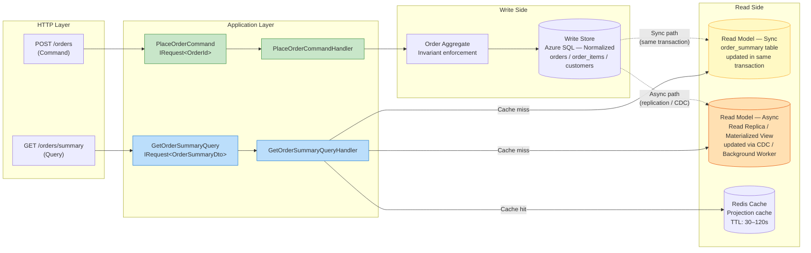
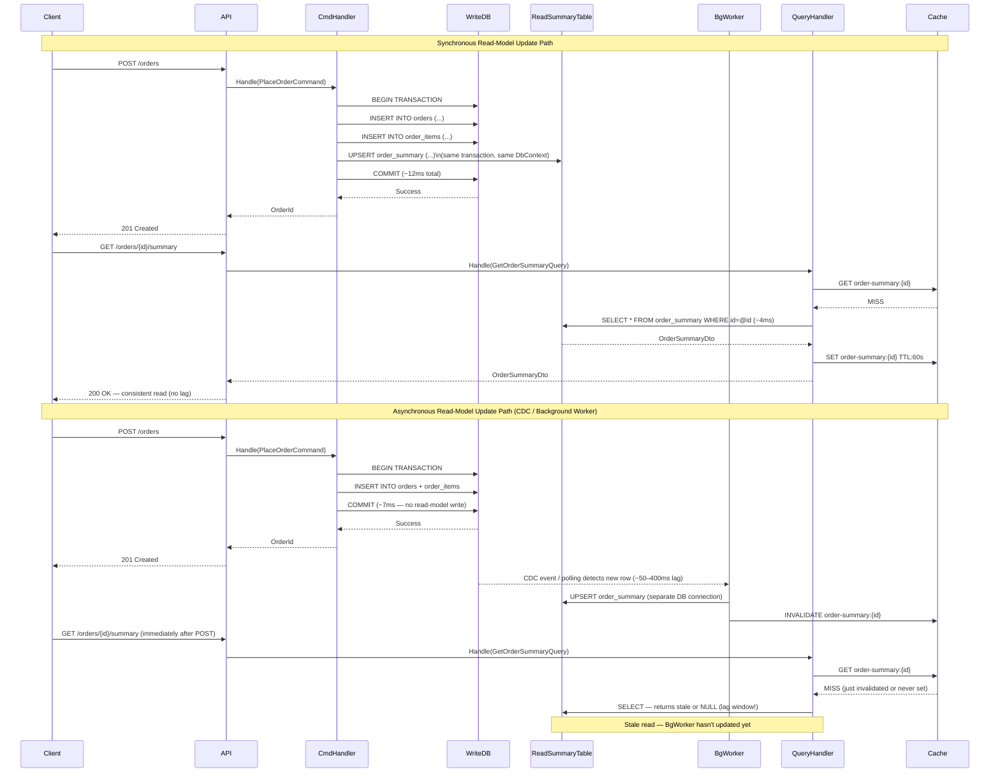
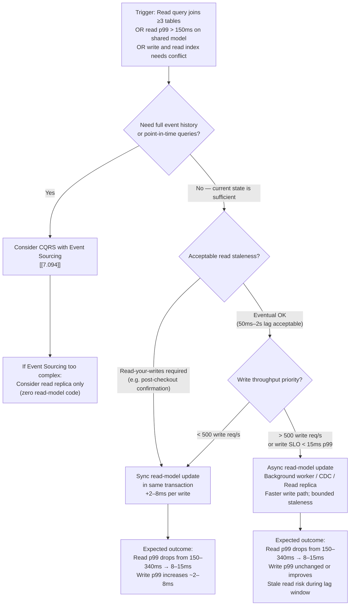

> [!ABSTRACT] Quick Reference — CQRS Without Event Sourcing **Invariant:** The write model persists current state into a normalized relational store; the read model is a separate, denormalized projection updated synchronously (same transaction) or asynchronously (background sync / read replica). No event log is the source of truth — the latest row is. **Cost:** Read-model staleness (async path) or write-transaction overhead (sync path); two schemas to maintain; eventual consistency requires client tolerance or read-your-writes routing. **Trigger:** Read and write query shapes have diverged so severely that the ORM join cost is measurably degrading write throughput, or the read model needs to be shaped for a specific consumer (mobile client, dashboard) that would otherwise require a 6-table JOIN on every request. **Skip When:** Read and write models are identical (pure CRUD), or the system is <200 req/s with a single team — the dual-model overhead exceeds the benefit. **.NET Entry Point:** `IRequest<TResult>` (MediatR) / `DbContext` write + `IDbConnection` Dapper read / `NuGet: MediatR, Dapper` **Azure Native:** Azure SQL Active Geo-Replication (read replica) + Azure Cache for Redis (projection cache); Azure SQL Hyperscale for large read replica pools **Number to Know:** Synchronous read-model update in the same `SaveChangesAsync` transaction adds ~2–8ms per write at p99 (one extra `UPSERT` to a summary table on Azure SQL Standard S3) versus ~50–400ms replication lag for an async read-replica approach.

---

## Navigation

**Domain:** [[7 — System Design & Distributed Systems]] > **Group:** CQRS and Event Sourcing **Previous:** [[7.092 — CQRS — Synchronous vs Asynchronous Commands]] | **Next:** [[7.094 — CQRS — With Event Sourcing]]

### Prerequisites

- [[7.081 — CQRS — Command Query Responsibility Segregation]] — establishes the conceptual separation of read and write concerns; this note shows how to implement that separation when the write store is a conventional relational database rather than an event log
- [[7.082 — CQRS — Commands vs Queries — Strict Separation]] — the EF Core DbContext split and MediatR dispatch discipline required before a separate read model can safely coexist with the write model
- [[7.083 — CQRS — Separate Read and Write Models]] — defines the two model shapes; this note operationalises how to keep those shapes synchronized without an event store

### Where This Fits

> [!INFO] Production Encounter Map
> 
> - **Layer:** Application layer (command/query handlers) + Infrastructure layer (read-model synchronization mechanism — SQL trigger, background worker, or read replica connection string)
> - **Trigger:** An engineer profiling a slow dashboard endpoint finds a 7-table JOIN running 340ms at p99; the same tables are written by 12 different commands; extracting a denormalized `order_summary` table would reduce the read to a single-table SELECT, but the team does not want to adopt event sourcing for this service
> - **Without it:** The read path shares the write schema, requiring complex ORM projections or raw SQL joins on every request; write throughput is indirectly limited by the index structures needed to make those reads fast; dashboards and write endpoints compete for the same lock chains on hot tables
> - **First signal:** `sqlserver_query_duration_p99{table="orders"} > 250ms` while `sqlserver_write_duration_p99{table="orders"} < 30ms` — the read and write workloads have different optimal index layouts but share the same physical indexes

This note is specifically scoped to systems that already use — or want to use — CQRS but are not ready or willing to adopt Event Sourcing (see [[7.094 — CQRS — With Event Sourcing]] for that variant). It is the most common production form of CQRS in .NET shops: relational write store, denormalized read store or replica, no event log as source of truth.

---

## Core Mental Model

CQRS without Event Sourcing means: the write side persists the _current state_ of aggregates into a normalized relational schema (or document store), and the read side exposes a _different schema_ optimized purely for query shapes. The write model owns the invariants; the read model owns the latency. The two models diverge in structure: the write model is normalized (Orders, OrderItems, Customers, Products as separate tables with FK relationships), the read model is denormalized (a single `order_summary` view or materialized table with customer name, item count, and total pre-computed). State transitions happen on the write model. The read model derives from the write model — either synchronously within the same transaction, or asynchronously via replication, a background worker polling a change table, or a CDC feed. The critical distinction from CQRS-with-Event-Sourcing is that the write model has no memory of how it got to its current state. There is no event log to replay. If the read model is corrupted, you rebuild it by re-projecting from the current write-side rows — not from a history of domain events.

> [!TIP] The Non-Obvious Insight The most dangerous assumption in CQRS-without-Event-Sourcing is treating synchronous and asynchronous read-model update as equivalent choices with only a latency difference. They are fundamentally different consistency contracts. Synchronous update (within the same `SaveChangesAsync` transaction) means the read model is always consistent with the write model — but every command now pays the write cost of maintaining the read model, and a bug in the read-model update logic rolls back the command. Asynchronous update (background worker, CDC, read replica) means the read model may lag by milliseconds to seconds — but the command path is clean and the read-model update cannot poison the command. The hidden trap: teams start with the synchronous path because it is simpler, then switch to async when write performance degrades — and discover they have clients that assumed read-your-writes consistency throughout. Changing the consistency model in production, with existing clients, is an incident waiting to happen.

### Classification

- **Consistency axis:** Write side — Strong (within aggregate + optional read-model update in same transaction). Read side — Strong if sync update; Eventual if async (replication lag or background worker interval)
- **Availability tradeoff:** Under partition from write DB, commands fail; read model may continue to serve stale cached data from last successful sync
- **Latency impact:** Write: +2–8ms if read model updated synchronously (one extra UPSERT). Read: -30–200ms vs shared-model ORM joins (single-table SELECT on denormalized projection)
- **Failure domain:** Single-service (same process); can be split to separate read-model service with its own DB if read scale demands it
- **Abstraction layer:** Pattern applied at Application layer; enforced via separate EF Core DbContext or Dapper connection; sync vs async distinction lives in Infrastructure layer

### Primary Diagram



### Supporting Diagram



### Numbers That Matter

|Metric|Value|Context / Conditions|
|---|---|---|
|Synchronous read-model UPSERT cost|+2–8ms per write|Single UPSERT to `order_summary` on Azure SQL Standard S3; covering index on `order_id` (estimated)|
|Async read-model lag (read replica)|1ms–5s|Azure SQL Active Geo-Replication; typically <50ms; spikes to seconds under heavy write load (measured, Azure docs)|
|Async read-model lag (CDC background worker)|50ms–2s|Polling interval 500ms default; can be reduced to 50ms with SQL Server Change Tracking (default, configurable)|
|Denormalized single-table SELECT vs 6-table ORM JOIN|8ms vs 120–340ms p99|`order_summary` covering index vs EF Core Include chain; 50-row result set; Azure SQL S3 (estimated)|
|Redis cache hit latency for read projection|~0.3–0.8ms|Azure Cache for Redis C1 Standard tier; compressed JSON payload <2KB (measured)|
|Read-model rebuild time from write store|5–90 minutes|10M rows in `orders`; batch UPSERT to `order_summary`; throttled at 50% primary CPU to avoid write starvation (estimated)|
|MediatR dispatch overhead (both sides)|~0.05–0.2ms|In-process; no pipeline behaviors; .NET 8 (measured)|

### Key Properties / Guarantees

|Property|Value|Condition|
|---|---|---|
|Write-model consistency|Strong — ACID within transaction boundary|Single `SaveChangesAsync` call; EF Core concurrency token enforced|
|Read-model consistency (sync)|Strong — reads always match write model|Read model updated in same DB transaction as write; fails if UPSERT fails|
|Read-model consistency (async)|Eventual — bounded staleness|Lag bounded by replication delay or CDC polling interval|
|Source of truth|Current row state in write store|NOT the read model; read model is a derived projection|
|Read-model rebuild capability|Full rebuild from write store at any time|No event history required; re-project from current normalized rows|
|Write throughput degradation (sync)|~10–15% at p99|Extra UPSERT per command; mitigated by covering index on projection table|

---

## Deep Mechanics

### How It Works

**CQRS-without-Event-Sourcing has two flavors of read-model maintenance. The choice between them is the central architectural decision of this pattern.**

**Flavor 1 — Synchronous read-model update (same transaction):**

1. The command handler opens a single EF Core `DbContext` unit of work (write-tracking context).
2. It loads the aggregate (or constructs it), enforces invariants, and applies the state change.
3. Before calling `SaveChangesAsync`, it also writes the updated denormalized projection to the read model table — using either EF Core's tracked `OrderSummary` entity or a raw SQL `UPSERT` via `ExecuteSqlRawAsync`.
4. `SaveChangesAsync` flushes both: the normalized write-model rows and the read-model projection row in a single atomic transaction.
5. If the read-model UPSERT fails (constraint violation, projection bug), the entire transaction rolls back. The command fails visibly. This is safe — but it means a bug in the projection logic blocks writes.
6. The query handler reads directly from the `order_summary` table — no lag, no stale data possible.

**Flavor 2 — Asynchronous read-model update (background sync):**

1. The command handler writes _only_ to the normalized write-model tables. Read model is not touched.
2. `SaveChangesAsync` is fast — no extra work beyond what the domain requires.
3. A background mechanism detects the change: SQL Server Change Tracking, a CDC tool (Debezium), an Outbox poll, or a simple polling query against a `last_modified` column.
4. A background worker picks up the change and projects the updated denormalized row into the read-model table.
5. If the background worker fails, it retries with backoff — the write was already committed and is not affected. The read model is eventually consistent.
6. The query handler reads from the read-model table and may see stale data during the lag window.

**What "no event sourcing" means for rebuild:**

When the read model needs to be rebuilt (schema change, bug fix, new consumer added), there is no event log to replay. Instead, a batch job queries the normalized write-model tables directly — `SELECT o.*, c.FullName, SUM(oi.total) FROM orders o JOIN ... GROUP BY ...` — and bulk-inserts into the read-model table. This is simpler than event replay but slower for large datasets, and it can only reconstruct the _current state_ — not historical projections at a point in time.

**Read routing for read-your-writes:**

On the async path, the standard mitigation for post-command stale reads is a session token: the command response includes a `dataVersion` (EF Core row version or a monotonic sequence). The query handler checks the read model's current version against the requested version; if behind, it falls back to the primary write store for that single query. After one successful version-aware read, the client stops sending the token and replica reads take over.

### Protocol Trace

```
Synchronous Path — Command with inline read-model update:

  1. HTTP POST /api/orders → Mediator.Send(PlaceOrderCommand) (~0.05ms dispatch)
  2. ValidationBehavior (FluentValidation) → all rules pass (~0.3ms)
  3. CommandHandler → BEGIN TRANSACTION (implicit via EF Core)
  4. CommandHandler → WriteDB: INSERT INTO orders + INSERT INTO order_items
     (~5ms LAN, Azure SQL S3)
  5. CommandHandler → WriteDB: UPSERT order_summary SET customer_name=..., total=...
     WHERE order_id=@id  (~3ms LAN — same transaction)
  6. CommandHandler → SaveChangesAsync() → COMMIT (~1ms round-trip)
     Total write latency: ~9ms
  7. Cache.InvalidateAsync("order-summary:{id}") — fire-and-forget (~0.5ms Redis)
  8. Return OrderId → 201 Created

Synchronous Path — UPSERT failure (projection bug in step 5):
  5b. UPSERT throws constraint violation (e.g., NOT NULL column missing in projection)
  6b. EF Core rolls back entire transaction — orders row NOT committed
  7b. CommandHandler throws exception → pipeline returns 500
  Caller observes: 500 with ProblemDetails; order was NOT placed
  Detection: Immediate — 500 error rate on command endpoint spikes
  Recovery: Fix projection logic; no compensating action needed (write never committed)

Asynchronous Path — Command (clean write, no read-model update):

  1. HTTP POST /api/orders → Mediator.Send(PlaceOrderCommand) (~0.05ms)
  2. ValidationBehavior passes (~0.3ms)
  3. CommandHandler → BEGIN TRANSACTION
  4. CommandHandler → WriteDB: INSERT INTO orders + INSERT INTO order_items (~5ms)
  5. CommandHandler → SaveChangesAsync() → COMMIT (~1ms)
     Total write latency: ~6ms (faster — no read-model UPSERT)
  6. Return OrderId → 201 Created

Asynchronous Path — Background worker syncing read model:

  7. SQL Server Change Tracking / CDC detects new orders row (~50–500ms polling lag)
  8. BackgroundWorker → SELECT denormalized data for order_id
     JOIN customers, order_items, products (~8ms)
  9. BackgroundWorker → UPSERT order_summary (separate connection, separate transaction)
     (~3ms)
  10. BackgroundWorker → Cache.InvalidateAsync("order-summary:{id}") (~0.5ms Redis)

Asynchronous Path — Stale read during lag window (steps 7–10 not yet complete):
  Client GET /api/orders/{id}/summary immediately after POST
  QueryHandler reads order_summary → returns NULL or previous state
  Caller observes: 404 (if NULL) or stale DTO — no visible error
  Detection time: Silent — no metric fires for stale reads
  Mitigation: Client sends X-Min-Version header; QueryHandler routes to primary write DB
              if read model version < requested version
  Recovery: Background worker catches up within polling interval (50–500ms)
```

### State Transitions

```mermaid
stateDiagram-v2
    [*] --> WriteCommitted : SaveChangesAsync() succeeds\n(write-model row persisted)

    WriteCommitted --> ReadModelSynced_Sync : Sync path — UPSERT in same transaction\n(read model always consistent)
    WriteCommitted --> ReadModelStale : Async path — commit completed\nread model not yet updated

    ReadModelStale --> ReadModelUpdating : CDC / Background worker\ndetects change (50–500ms)
    ReadModelUpdating --> ReadModelSynced_Async : UPSERT to order_summary\ncomplete; cache invalidated

    ReadModelSynced_Sync --> CacheInvalidated : Redis INVALIDATE fired\n(fire-and-forget)
    ReadModelSynced_Async --> CacheInvalidated : Redis INVALIDATE fired

    CacheInvalidated --> [*] : Next read will re-populate cache\nfrom up-to-date read model

    ReadModelUpdating --> UpdateFailed : Worker crash / transient DB error
    UpdateFailed --> ReadModelUpdating : Retry with exponential backoff\n(max 3 attempts)
    UpdateFailed --> DeadLettered : Retry budget exhausted\n→ alert fires; manual review

    note right of ReadModelStale
        Window: 50–500ms (CDC polling)
        to 1–5s (replica replication)
        Queries see stale or NULL data
        No metric fires automatically
    end note

    note right of DeadLettered
        Alert: read_model_sync_failures_total > 0
        On-call reviews failed projections
        Manual rebuild for affected rows
    end note
```



### Failure Modes

**Failure Mode 1: Read-Model Divergence — Silent Inconsistency from Failed Background Sync**

- **Cause:** The background worker projects an incorrect value into `order_summary` due to a race condition — a second command modifies the order (e.g., item added) between when the first command committed and when the worker reads the denormalized state. The worker reads the intermediate state and writes a `total` that reflects only the first command. The second command's worker run then correctly updates. But if the second run fails silently (worker crash, DB timeout), the read model permanently shows a stale total.
- **Symptom:** `order_summary.total_amount` does not match `SUM(order_items.line_total)` for the same `order_id`. Customer-visible: "My order total looks wrong." Finance reconciliation finds discrepancies.
- **Detection time:** Hours to days — silent unless a reconciliation job runs nightly
- **Blast radius:** Customer trust erosion; potential financial reporting errors; compliance failure if the read model is used for invoicing

> [!DANGER] 3 AM Production Signal Metric: `read_model_reconciliation_discrepancies_total > 0` (nightly job comparing `order_summary.total` vs `SUM(order_items.line_total)`) Log: `ERROR [ReadModelReconciliationJob] Discrepancy detected | OrderId: ord-3a91 | SummaryTotal: 142.50 | ActualTotal: 189.75 | Delta: 47.25 | CorrelationId: b2f3-1c77` Customer impact: Invoice PDF shows £142.50; payment captured £189.75; chargeback risk for 0.3% of orders with concurrent modifications during lag window

**Failure Mode 2: Synchronous Read-Model Bug Blocks All Writes**

- **Cause:** A code change in the command handler introduces a null reference in the read-model UPSERT logic. Because the UPSERT runs inside the same transaction as the command, every `SaveChangesAsync` call throws a `NullReferenceException`. EF Core rolls back. All write operations on the affected endpoint fail.
- **Symptom:** 100% error rate on `POST /orders`. The write store is untouched (no rows were committed). The read model is also untouched. The service is effectively down for writes.
- **Detection time:** Immediate — error rate spikes to 100% within seconds
- **Blast radius:** All new orders rejected. Revenue impact is immediate and total for the duration of the incident.

> [!DANGER] 3 AM Production Signal Metric: `http_response_status_total{status="500",handler="PlaceOrderCommandHandler"} = 100%` sustained for >1min Log: `ERROR [PlaceOrderCommandHandler] Unhandled exception during SaveChangesAsync | Exception: System.NullReferenceException | at OrderSummaryProjector.Project(Order order) line 42 | CorrelationId: c3d4-2e88` Customer impact: Checkout is completely broken for all users; 0 orders placed during incident window

### .NET and Azure Integration Points

- **ASP.NET Core:** MediatR pipeline; separate `IOrderWriteRepository` (EF Core, tracking) and `IOrderReadRepository` (Dapper / EF Core `AsNoTracking`, read replica connection string)
- **EF Core:** Write DbContext with full Change Tracker. For sync read-model: add `OrderSummary` entity to the same `DbContext` so it participates in the same transaction. For async read-model: use a completely separate `OrderReadDbContext` pointing to the read replica.
- **Azure Services:** Azure SQL Active Geo-Replication for the async read-model path; Azure Cache for Redis (`IDistributedCache`) for projection caching; Azure SQL Change Tracking or Debezium on Azure Event Hubs for CDC-based async sync
- **.NET Libraries:** Dapper for raw SQL projections in query handlers; MassTransit (if domain events drive async read-model updates); Polly for resilient background worker retry

```csharp
// Infrastructure — read-model synchronization options
// Option A (Sync): OrderSummary entity registered in WriteDbContext
// Option B (Async): IHostedService background worker polls change tracking table

// IOrderSummaryProjector — port for sync path
namespace YourCompany.OrderManagement.Application.Ports;

/// <summary>Projects an Order aggregate into the read-model summary table.</summary>
public interface IOrderSummaryProjector
{
    /// <summary>Updates the denormalized order summary within the current unit of work.</summary>
    Task ProjectAsync(Order order, CancellationToken cancellationToken);
}
```

---

## Production Patterns and Implementation

### Primary Implementation

```csharp
// Namespace: YourCompany.OrderManagement
// Demonstrates CQRS-without-Event-Sourcing with:
//   (A) Synchronous read-model update inside the command transaction
//   (B) Dapper-based query handler reading from the denormalized table

using Dapper;
using MediatR;
using Microsoft.Data.SqlClient;
using Microsoft.EntityFrameworkCore;
using YourCompany.OrderManagement.Domain.Orders;

namespace YourCompany.OrderManagement.Application.Commands;

// ─── COMMAND ─────────────────────────────────────────────────────────────────

/// <summary>Places a new order; updates the denormalized read model in the same transaction.</summary>
public sealed record PlaceOrderCommand(
    Guid CustomerId,
    IReadOnlyList<OrderItemRequest> Items
) : IRequest<OrderId>;

/// <summary>
/// Handles <see cref="PlaceOrderCommand"/>.
/// Write side: EF Core tracking DbContext → normalized schema.
/// Read model: synchronous UPSERT to order_summary in the same transaction.
/// </summary>
public sealed class PlaceOrderCommandHandler : IRequestHandler<PlaceOrderCommand, OrderId>
{
    private readonly OrderManagementDbContext _context;            // Adapter — write + read-model sync
    private readonly IOrderSummaryProjector   _projector;         // Infrastructure — projection logic

    public PlaceOrderCommandHandler(
        OrderManagementDbContext context,
        IOrderSummaryProjector projector)
    {
        _context   = context;
        _projector = projector;
    }

    /// <inheritdoc/>
    public async Task<OrderId> Handle(
        PlaceOrderCommand command,
        CancellationToken cancellationToken)
    {
        // Domain — build aggregate, enforce invariants
        var order = Order.Place(
            customerId: new CustomerId(command.CustomerId),
            items: command.Items
                .Select(i => new OrderItem(new ProductId(i.ProductId), i.Quantity, i.UnitPrice))
                .ToList(),
            placedAt: DateTimeOffset.UtcNow);

        _context.Orders.Add(order);

        // Infrastructure — sync read-model projection INSIDE the transaction
        // If this throws, the entire command rolls back — safe but fragile
        await _projector.ProjectAsync(order, cancellationToken);

        // Single SaveChangesAsync commits BOTH the write model and the read-model UPSERT
        await _context.SaveChangesAsync(cancellationToken);

        return order.Id;
    }
}

// ─── PROJECTOR — Sync path ────────────────────────────────────────────────────

namespace YourCompany.OrderManagement.Infrastructure.ReadModel;

/// <summary>
/// Updates the denormalized <c>order_summary</c> table within the caller's EF Core transaction.
/// Uses raw SQL UPSERT for performance — avoids a round-trip SELECT before the INSERT.
/// </summary>
public sealed class SqlOrderSummaryProjector : IOrderSummaryProjector
{
    private readonly OrderManagementDbContext _context;

    public SqlOrderSummaryProjector(OrderManagementDbContext context)
        => _context = context;

    /// <inheritdoc/>
    public async Task ProjectAsync(Order order, CancellationToken cancellationToken)
    {
        // Raw SQL UPSERT — participates in the ambient EF Core transaction
        await _context.Database.ExecuteSqlRawAsync(
            """
            MERGE order_summary WITH (HOLDLOCK) AS target
            USING (SELECT @OrderId AS order_id) AS source ON target.order_id = source.order_id
            WHEN MATCHED THEN
                UPDATE SET
                    status         = @Status,
                    item_count     = @ItemCount,
                    total_amount   = @TotalAmount,
                    updated_at     = @UpdatedAt
            WHEN NOT MATCHED THEN
                INSERT (order_id, customer_id, status, item_count, total_amount, placed_at, updated_at)
                VALUES (@OrderId, @CustomerId, @Status, @ItemCount, @TotalAmount, @PlacedAt, @UpdatedAt);
            """,
            new SqlParameter("@OrderId",     order.Id.Value),
            new SqlParameter("@CustomerId",  order.CustomerId.Value),
            new SqlParameter("@Status",      order.Status.ToString()),
            new SqlParameter("@ItemCount",   order.Items.Count),
            new SqlParameter("@TotalAmount", order.Items.Sum(i => i.Quantity * i.UnitPrice)),
            new SqlParameter("@PlacedAt",    order.PlacedAt),
            new SqlParameter("@UpdatedAt",   DateTimeOffset.UtcNow));
    }
}

// ─── QUERY HANDLER — Read from denormalized table ────────────────────────────

namespace YourCompany.OrderManagement.Application.Queries;

/// <summary>Returns the denormalized order summary for display.</summary>
/// <param name="OrderId">Order to retrieve.</param>
public sealed record GetOrderSummaryQuery(Guid OrderId) : IRequest<OrderSummaryDto?>;

/// <summary>
/// Reads from <c>order_summary</c> via Dapper — no EF Core tracking, no JOIN overhead.
/// Targets the read replica when available; falls back to primary under high replica lag.
/// </summary>
public sealed class GetOrderSummaryQueryHandler
    : IRequestHandler<GetOrderSummaryQuery, OrderSummaryDto?>
{
    private readonly string _readConnectionString;

    public GetOrderSummaryQueryHandler(IConfiguration config)
        => _readConnectionString = config.GetConnectionString("OrderManagementReadReplica")!;

    /// <inheritdoc/>
    public async Task<OrderSummaryDto?> Handle(
        GetOrderSummaryQuery query,
        CancellationToken cancellationToken)
    {
        await using var conn = new SqlConnection(_readConnectionString);

        // Single-table SELECT — no ORM overhead, no Change Tracker, covering index on order_id
        const string sql = """
            SELECT order_id   AS OrderId,
                   customer_id AS CustomerId,
                   status,
                   item_count  AS ItemCount,
                   total_amount AS TotalAmount,
                   placed_at   AS PlacedAt
            FROM   order_summary WITH (NOLOCK)
            WHERE  order_id = @OrderId
            """;

        return await conn.QuerySingleOrDefaultAsync<OrderSummaryDto>(
            new CommandDefinition(sql, new { OrderId = query.OrderId },
                cancellationToken: cancellationToken));
    }
}

// ─── DTOs ─────────────────────────────────────────────────────────────────────

public sealed record OrderSummaryDto(
    Guid    OrderId,
    Guid    CustomerId,
    string  Status,
    int     ItemCount,
    decimal TotalAmount,
    DateTimeOffset PlacedAt);

public sealed record OrderItemRequest(Guid ProductId, int Quantity, decimal UnitPrice);
```

### IServiceCollection Registration

```csharp
// Program.cs

// ─── MediatR ─────────────────────────────────────────────────────────────────
builder.Services.AddMediatR(cfg =>
{
    cfg.RegisterServicesFromAssembly(typeof(PlaceOrderCommand).Assembly);
    cfg.AddBehavior(typeof(IPipelineBehavior<,>), typeof(ValidationBehavior<,>));
    cfg.AddBehavior(typeof(IPipelineBehavior<,>), typeof(LoggingBehavior<,>));
    // TransactionBehavior applies only to ICommand<T> — not to queries
    cfg.AddBehavior(typeof(IPipelineBehavior<,>), typeof(TransactionBehavior<,>));
});

// ─── Write DbContext (tracking ON, primary connection) ────────────────────────
builder.Services.AddDbContext<OrderManagementDbContext>(options =>
    options.UseSqlServer(
        builder.Configuration.GetConnectionString("OrderManagementPrimary"),
        sql => sql.EnableRetryOnFailure(maxRetryCount: 3,
                                         maxRetryDelay: TimeSpan.FromSeconds(5),
                                         errorNumbersToAdd: null)));

// ─── Read-model projector (sync path — shares write DbContext) ────────────────
builder.Services.AddScoped<IOrderSummaryProjector, SqlOrderSummaryProjector>();

// ─── Background worker (async path — alternative to sync projector) ───────────
// builder.Services.AddHostedService<OrderSummaryProjectionWorker>();

// ─── Redis cache for query results ───────────────────────────────────────────
builder.Services.AddStackExchangeRedisCache(options =>
{
    options.Configuration        = builder.Configuration["Redis:ConnectionString"];
    options.InstanceName         = "order-management:";
});

// ─── Dapper read connection (read replica, separate from write DbContext) ──────
// Connection string injected directly into query handler via IConfiguration
// (or register a named IDbConnectionFactory for testability)
builder.Services.AddSingleton<IDbConnectionFactory>(
    new SqlConnectionFactory(
        builder.Configuration.GetConnectionString("OrderManagementReadReplica")!));
```

### Common Variants

```csharp
// Variant A — Async path via Background Worker with SQL Server Change Tracking
// Used when: write throughput is critical; eventual consistency (50–500ms) is acceptable

public sealed class OrderSummaryProjectionWorker : BackgroundService
{
    private readonly IServiceScopeFactory _scopeFactory;
    private readonly ILogger<OrderSummaryProjectionWorker> _logger;

    protected override async Task ExecuteAsync(CancellationToken stoppingToken)
    {
        while (!stoppingToken.IsCancellationRequested)
        {
            try
            {
                await ProjectPendingChangesAsync(stoppingToken);
            }
            catch (Exception ex)
            {
                _logger.LogError(ex, "Read-model projection worker faulted — retrying in 5s");
            }
            // Polling interval: tune based on acceptable lag
            await Task.Delay(TimeSpan.FromMilliseconds(500), stoppingToken);
        }
    }

    private async Task ProjectPendingChangesAsync(CancellationToken ct)
    {
        await using var scope = _scopeFactory.CreateAsyncScope();
        var projector = scope.ServiceProvider.GetRequiredService<IOrderSummaryProjector>();

        // SQL Server Change Tracking: CHANGETABLE(CHANGES orders, @lastVersion)
        // Returns only rows modified since last sync version
        await projector.ProjectChangesAsync(ct);
    }
}
```

```csharp
// Variant B — Read-model as Azure SQL Indexed View (zero application code for sync)
// Used when: the projection is a simple aggregation the DB can maintain automatically;
//            no CDC worker needed; read model updated in-DB as part of the write transaction
// Limitation: Azure SQL indexed views have strict restrictions (no subqueries, no outer joins,
//             SCHEMABINDING required, no nondeterministic functions)

// In migration:
// CREATE VIEW order_summary WITH SCHEMABINDING AS
// SELECT o.order_id, o.customer_id, o.status, o.placed_at,
//        COUNT_BIG(*) AS item_count,
//        SUM(oi.unit_price * oi.quantity) AS total_amount
// FROM dbo.orders o
// JOIN dbo.order_items oi ON oi.order_id = o.order_id
// GROUP BY o.order_id, o.customer_id, o.status, o.placed_at;
//
// CREATE UNIQUE CLUSTERED INDEX IX_order_summary_order_id
//     ON order_summary (order_id);

// Query handler reads from the indexed view exactly like a table
// SQL Server maintains the view synchronously on every write — zero application code
```

### Performance Profile

```csharp
[MemoryDiagnoser]
[SimpleJob(RuntimeMoniker.Net80)]
public class CqrsReadModelBenchmark
{
    private SqlConnection _conn = null!;

    [GlobalSetup]
    public void Setup()
    {
        _conn = new SqlConnection("Server=localhost;Database=orders_bench;...");
        // Pre-seeded: 500k orders, 5 line items each
    }

    [Benchmark(Baseline = true)]
    public async Task<OrderSummaryDto?> OrmJoinQuery_SharedModel()
    {
        // ❌ Shared-model approach: EF Core with 3-table join, tracking ON
        using var ctx = new OrderManagementDbContext(/* ... */);
        return await ctx.Orders
            .Include(o => o.Items)
            .Include(o => o.Customer)
            .Where(o => o.Id == _knownOrderId)
            .Select(o => new OrderSummaryDto(
                o.Id.Value, o.CustomerId.Value,
                o.Status.ToString(), o.Items.Count,
                o.Items.Sum(i => i.Quantity * i.UnitPrice),
                o.PlacedAt))
            .FirstOrDefaultAsync();
    }

    [Benchmark]
    public async Task<OrderSummaryDto?> DapperProjection_DenormalizedTable()
    {
        // ✅ CQRS read model: Dapper, single-table SELECT, no tracking
        const string sql = "SELECT * FROM order_summary WITH (NOLOCK) WHERE order_id = @Id";
        return await _conn.QuerySingleOrDefaultAsync<OrderSummaryDto>(
            sql, new { Id = _knownOrderId });
    }

    [GlobalCleanup]
    public void Cleanup() => _conn.Dispose();

    private static readonly Guid _knownOrderId = Guid.Parse("...");
}
```

Expected result shape (estimated on Azure D4s v3, 500k-row dataset):

|Method|Mean|Allocated|Notes|
|---|---|---|---|
|OrmJoinQuery_SharedModel|95–340ms|1.8–4.2 MB|3-table join; ORM mapping; Change Tracker snapshots|
|DapperProjection_DenormalizedTable|4–12ms|28–42 KB|Single-table SELECT; no ORM; covering index|

### Real-World .NET Ecosystem Mapping

|Pattern in This Note|Where It Appears in .NET / Azure|Manifestation|
|---|---|---|
|Write model — normalized schema|EF Core `DbContext` with aggregate entities|`Orders`, `OrderItems`, `Customers` as separate tracked entities|
|Read model — denormalized projection|Dapper `IDbConnection` + raw SQL|`order_summary` table or indexed view; no ORM overhead|
|Sync read-model update|`ExecuteSqlRawAsync` in same DbContext scope|MERGE statement inside `SaveChangesAsync` transaction|
|Async read-model update|`BackgroundService` + SQL Server Change Tracking|`IHostedService` polls `CHANGETABLE(CHANGES ...)`|
|Indexed view (zero-code sync)|Azure SQL / SQL Server indexed view|DB maintains denormalized view automatically on writes|
|Projection cache|`IDistributedCache` → `StackExchange.Redis`|`CachingBehavior<TQuery, TResponse>` in MediatR pipeline|
|Read replica routing|`IDbConnectionFactory` with two connection strings|Primary for commands; geo-replica for queries|

---

## Gotchas and Production Pitfalls

### Sync Read-Model Update Creates a Write-Blocking Single Point of Failure

**Pitfall:** A projection bug or schema change on the `order_summary` table (e.g., adding a NOT NULL column without a default) causes every write transaction to fail until the code is fixed and deployed.

```csharp
// ❌ Read-model UPSERT inside the command transaction — one bug = 100% write outage
await _context.Database.ExecuteSqlRawAsync(
    "MERGE order_summary ... SET new_required_column = @Value ...",
    new SqlParameter("@Value", (string?)null)); // throws — NOT NULL constraint
await _context.SaveChangesAsync(ct); // never reached
```

**Symptom:** 100% 500 error rate on all write endpoints simultaneously after deployment of a read-model schema migration.

**Detection time:** Immediate — within seconds of first write attempt after deploy.

> [!DANGER] Production Signal Metric: `http_response_status_total{status="500"} = 1.0` ratio on all command endpoints Log: `ERROR [PlaceOrderCommandHandler] SaveChangesAsync failed | SqlException: Cannot insert NULL into column 'new_required_column' of table 'order_summary' | CorrelationId: d4e5-3f99`

**Fix:**

```csharp
// ✅ Strategy 1: Add column with a default value in the migration BEFORE deploying code
// ALTER TABLE order_summary ADD new_required_column NVARCHAR(50) NOT NULL DEFAULT 'unknown'

// ✅ Strategy 2: Wrap sync read-model update in try-catch that logs and continues
// (trade strong consistency for write availability — acceptable if read model has nightly reconciliation)
try
{
    await _projector.ProjectAsync(order, cancellationToken);
}
catch (Exception ex)
{
    _logger.LogError(ex, "Read-model projection failed — write will commit; read model stale | OrderId: {Id}", order.Id);
    // Increment counter: read_model_sync_failures_total
}
await _context.SaveChangesAsync(cancellationToken);
```

**Cost of not fixing:** Every write outage lasts until a hotfix is deployed. At peak (500 write req/s), a 10-minute outage = 300,000 failed orders. Recovery time depends entirely on deployment pipeline speed (typically 5–20 minutes).

---

### Async Path — No Reconciliation Job Means Silent Drift

**Pitfall:** The async background worker occasionally fails (transient DB timeout, pod restart during update) and the failure is swallowed. No reconciliation job compares `order_summary` to the source-of-truth `orders` table. Drift accumulates invisibly.

```csharp
// ❌ Worker swallows exceptions — silent drift
protected override async Task ExecuteAsync(CancellationToken ct)
{
    while (!ct.IsCancellationRequested)
    {
        try { await ProjectPendingChangesAsync(ct); }
        catch { /* suppressed */ } // ← silent failure
        await Task.Delay(500, ct);
    }
}
```

**Symptom:** `order_summary` rows show stale totals or missing orders. Customer support tickets: "My order history is incomplete." Finance: "Nightly export is missing 0.2% of orders."

**Detection time:** Days to weeks — silent unless a reconciliation job runs.

> [!DANGER] Production Signal Metric: `read_model_worker_consecutive_failures_total > 5` (counter incremented per swallowed exception) Log: (nothing — that's the problem. After fix:) `ERROR [OrderSummaryProjectionWorker] Projection failed for order_id: ord-7b2c | Attempt 3/3 | Moving to dead-letter | CorrelationId: e5f6-4a00`

**Fix:**

```csharp
// ✅ Structured retry with dead-letter counter and reconciliation job
protected override async Task ExecuteAsync(CancellationToken ct)
{
    while (!ct.IsCancellationRequested)
    {
        try
        {
            await ProjectPendingChangesAsync(ct);
        }
        catch (Exception ex)
        {
            _logger.LogError(ex, "Projection worker faulted");
            _metrics.IncrementWorkerFailures(); // Prometheus counter
            await Task.Delay(TimeSpan.FromSeconds(5), ct); // backoff before retry
        }
        await Task.Delay(TimeSpan.FromMilliseconds(500), ct);
    }
}
// + Nightly reconciliation job: SELECT order_id FROM orders WHERE NOT EXISTS
//   (SELECT 1 FROM order_summary WHERE order_summary.order_id = orders.order_id)
```

**Cost of not fixing:** Undetected drift compounds. At 0.1% failure rate on 1,000 write req/s, 86,400 orders/day → 86 missed projections per day → 600 per week before anyone notices. Finance close is delayed; customer trust eroded; manual data correction required.

---

### Azure-Specific — Read Replica Connection String Not Configured in Production

**Pitfall:** The read replica connection string is correct in `appsettings.Development.json` but accidentally left pointing to the primary in `appsettings.Production.json` (or the Azure App Service environment variable is missing). All reads hit the primary. The CQRS separation provides no infrastructure benefit.

```json
// ❌ appsettings.Production.json — accidentally uses primary for reads
{
  "ConnectionStrings": {
    "OrderManagementPrimary":     "Server=orders.database.windows.net;...",
    "OrderManagementReadReplica": "Server=orders.database.windows.net;..." // same server!
  }
}
```

**Symptom:** Azure SQL primary DTU runs at 90%+ when it should be at 30–40% with the read load offloaded to the replica. No errors — queries succeed, just on the wrong server.

**Detection time:** Weeks — no functional test fails; discovered only when primary starts throttling.

> [!DANGER] Production Signal Metric: `azure_sql_dtu_consumption_percent{server="orders-primary"} > 85` sustained for >5min while read QPS is high Log: (Azure SQL audit log) `Connection from app-service to orders.database.windows.net [primary] for SELECT on order_summary` — should show `orders-secondary.database.windows.net`

**Fix:** Add a startup health-check that verifies the read replica connection string resolves to a different server than the primary:

```csharp
// Startup validation in Program.cs
var primaryServer   = new SqlConnectionStringBuilder(
    config.GetConnectionString("OrderManagementPrimary")).DataSource;
var replicaServer   = new SqlConnectionStringBuilder(
    config.GetConnectionString("OrderManagementReadReplica")).DataSource;

if (primaryServer.Equals(replicaServer, StringComparison.OrdinalIgnoreCase) &&
    Environment.GetEnvironmentVariable("ASPNETCORE_ENVIRONMENT") == "Production")
{
    throw new InvalidOperationException(
        "Read replica connection string must not point to the primary in Production.");
}
```

**Cost of not fixing:** Primary DTU exhaustion at peak load → query throttling → 503s on both reads and writes → cascading timeout failures. Fixing mid-incident requires an App Service configuration change and rolling restart (~3–5 min downtime).

---

### .NET-Specific — EF Core AsNoTracking Missing on Read DbContext Causes Stale Cache

**Pitfall:** The read `DbContext` is registered without `UseQueryTrackingBehavior(QueryTrackingBehavior.NoTracking)`. A query handler loads an entity, AutoMapper maps it, but the tracked entity remains in the DbContext's Change Tracker. A subsequent write on the same scoped DbContext (if reused, which happens with a poorly configured DI scope) persists the mapped value back.

```csharp
// ❌ Read DbContext registered with tracking ON (default)
builder.Services.AddDbContext<OrderReadDbContext>(options =>
    options.UseSqlServer(config.GetConnectionString("ReadReplica")));
    // Missing: .UseQueryTrackingBehavior(QueryTrackingBehavior.NoTracking)
```

**Symptom:** Memory leak from Change Tracker accumulation on the read path. Potential phantom writes if the same DbContext is shared with a command handler (see 7.082 pitfall).

**Detection time:** Days — memory leak is gradual; phantom writes require concurrent request conditions.

> [!DANGER] Production Signal Metric: `process_working_set_bytes > 1.5e9` growing 200MB/hour with no corresponding traffic increase Log: `WARN [DiagnosticMiddleware] EF Core ChangeTracker entries: 4821 in current scope | IsReadContext: true | CorrelationId: f6a7-5b11`

**Fix:**

```csharp
// ✅ Read DbContext registered with tracking OFF globally
builder.Services.AddDbContext<OrderReadDbContext>(options =>
    options.UseSqlServer(config.GetConnectionString("OrderManagementReadReplica"))
           .UseQueryTrackingBehavior(QueryTrackingBehavior.NoTracking)); // explicit, global
```

**Cost of not fixing:** At 500 query req/s, 20-entity graphs, Change Tracker retains 10,000 entities per second. Pod OOMKill within 2–4 hours. Full pod restart required; 30–90s downtime per pod in rolling restart.

---

### Read-Model Schema Migration Without Coordinated Deployment Causes Outage Window

**Pitfall:** A developer adds a new column to `order_summary` and deploys the migration before deploying the code that populates it. The existing running code tries to UPSERT without the new column — either SQL error (if NOT NULL without default) or silent missing data (if nullable).

**Symptom:** Depends on column nullability. NOT NULL: immediate write failure (100% 500s). Nullable: silent data gap — new column is NULL for all orders placed between migration and code deploy.

**Detection time:** NOT NULL: immediate. Nullable: discovered during QA or data audit.

> [!DANGER] Production Signal Metric: `http_response_status_total{status="500",endpoint="/api/orders"} > 0` after migration deployment Log: `ERROR [SqlOrderSummaryProjector] Invalid column name 'new_category_label' | CorrelationId: a7b8-6c22`

**Fix:** Follow expand-contract for read-model columns. Add column with `NULL` default → deploy code that populates it → backfill existing rows → add NOT NULL constraint in a final migration.

**Cost of not fixing:** Every read-model schema change becomes a potential write outage. At 2 schema changes per sprint, the blast radius compounds — a 10-minute write outage per change at peak hours accumulates 20+ minutes of downtime per sprint.

---

## Tradeoffs and Decision Framework

### Tradeoff Matrix

|Dimension|CQRS Without Event Sourcing|CQRS With Event Sourcing|Shared Model (no CQRS)|
|---|---|---|---|
|Consistency (write)|Strong — ACID transaction|Strong within aggregate; async projection|Strong — single DbContext|
|Read model consistency|Strong (sync) or Eventual (async)|Eventual — projection from event stream|Strong — but joins at query time|
|Source of truth|Current row state in write tables|Event log — full history preserved|Current row state — shared schema|
|Historical queries (point-in-time)|Not possible without separate audit log|Native — replay events to any point|Not possible|
|Read-model rebuild|Batch re-project from current write rows|Full event replay (can be slow for years of history)|N/A — no separate model|
|Read latency p99|Low — denormalized table, single SELECT|Low once projected; high during rebuild|Medium–High — ORM joins|
|Write complexity|Medium — projection maintenance|High — event store, snapshot, versioning|Low — one DbContext|
|Operational complexity|Medium|High|Low|
|Azure ecosystem fit|Native — SQL read replica, Redis|Good — Cosmos DB change feed, Event Hub|Native — single SQL connection string|
|Team expertise required|Mid-level|Senior|Junior-friendly|

### When to Apply



### Numbers-Driven Decision

|Threshold|Below = Use Simpler Approach|Above = Apply CQRS Without Event Sourcing|
|---|---|---|
|Read query join count|≤ 2 tables|≥ 3 tables — denormalized projection eliminates join cost|
|Read latency p99 (shared model)|< 50ms|> 50ms — read model reduces to single-table SELECT|
|Write req/s|< 200|> 200 — projection maintenance cost is amortized; ORM join on write critical path becomes visible|
|Read-to-write ratio|< 3:1|> 3:1 — read load justifies dedicated optimized store|
|Team size|< 4 engineers|> 4 engineers — separate read/write ownership becomes valuable|
|Read-model rebuild time tolerance|< 1 hour (can rebuild from current rows)|> 1 hour or point-in-time needed → Event Sourcing instead|

### When NOT to Apply

> [!WARNING] Do Not Reach For This When...
> 
> - [ ] **Write model and read model are identical:** If every read returns the same fields that were written (pure CRUD forms, admin panels editing entities directly), a separate read model adds zero value — you are maintaining two copies of the same schema.
> - [ ] **Team has no operational bandwidth for read-model maintenance:** Two schemas, two DbContext registrations, a projection mechanism (sync or async), a reconciliation job, and a cache invalidation strategy add meaningful operational overhead. A team of 2–3 engineers building an MVP should not carry this.
> - [ ] **Strong read-your-writes required AND write throughput is critical:** The sync path satisfies read-your-writes but adds write overhead. The async path preserves write throughput but allows stale reads. If both constraints are hard requirements simultaneously, neither flavor works cleanly — you need a different architecture (e.g., write to primary, force read to primary for the session owner only, serve rest from replica).
> - [ ] **The domain has no complex read projections yet:** Do not add a separate read model speculatively. Wait until a specific query is measurably slow or structurally diverged from the write model. The classic YAGNI trap: engineers add CQRS projections before any query has a performance problem, then spend a sprint maintaining projection bugs instead of building product.

---

## Interview Arsenal

### Question Bank

1. **[Definition]** "What does CQRS without Event Sourcing mean, and how is the read model kept synchronized with the write model?"
2. **[Mechanism]** "Walk me through the synchronous read-model update path — what happens if the projection logic has a bug?"
3. **[Tradeoff]** "What do you give up when you choose the async read-model update path over the synchronous path, and under what specific condition does that cost matter most?"
4. **[Failure mode]** "What is the riskiest operational failure in CQRS without Event Sourcing, and what monitoring would you add to detect it before customers do?"
5. **[Comparison]** "What is the fundamental difference between CQRS without Event Sourcing and CQRS with Event Sourcing, and when would you choose the simpler form?"
6. **[Design application]** "You're designing an order management system. The dashboard query joins 6 tables and runs at 340ms p99. How would you redesign the read path using CQRS without Event Sourcing, and what mechanism keeps the read model current?"
7. **[Scale]** "Your system processes 2,000 write req/s with a synchronous read-model update. The team wants to add 5 more denormalized projections for new dashboard views. What breaks and how do you address it?"
8. **[Advanced]** "If the read model in CQRS-without-Event-Sourcing is corrupted or lost, how do you rebuild it, and what does that tell you about the fundamental constraint of not having an event log?"
9. **[Bonus]** "How would you handle a client that issues a GET immediately after a POST and must see the result of that specific POST, when your read model is updated asynchronously?"

### Spoken Answers

**Q: What does CQRS without Event Sourcing mean, and how is the read model kept synchronized with the write model?**

> **Average answer:** CQRS without Event Sourcing means you have separate read and write models, but instead of an event store, you use a normal relational database for writes. The read model is kept in sync either synchronously in the same transaction or asynchronously with a background process.

> **Great answer:** CQRS-without-Event-Sourcing is the most common production form of the pattern in .NET — you have a normalized relational write store with full ACID transactions, and a separate denormalized read store optimized for your query shapes. The distinction from Event Sourcing is critical: the write store holds _current state_, not history. There is no event log. The read model is a derived projection of that current state, not a replay of past transitions. Synchronization works in one of two ways. The synchronous path updates the read-model table inside the same `SaveChangesAsync` transaction as the write — zero lag, but a projection bug rolls back the entire command and takes down writes. The asynchronous path uses SQL Server Change Tracking, a CDC tool like Debezium, or a background worker polling a `last_modified` column — the write path is fast and clean, but the read model lags by 50ms to 2 seconds under normal conditions, longer under load. The choice between them isn't just a latency question — it's a consistency contract that affects every client that reads from this model. Changing from sync to async in production with existing clients is an incident waiting to happen, because clients often assume read-your-writes without being explicit about it.

---

**Q: What is the fundamental difference between CQRS without Event Sourcing and CQRS with Event Sourcing, and when would you choose the simpler form?**

> **Average answer:** Without Event Sourcing you store current state; with Event Sourcing you store events. Without Event Sourcing is simpler. I'd choose it when I don't need audit history.

> **Great answer:** The fundamental difference is what acts as the source of truth. Without Event Sourcing, the source of truth is the _current row_ in the write store — a `SELECT * FROM orders WHERE id = @id` gives you everything authoritative about that order right now. The read model is a derived, dispensable cache of that row's data in a different shape. If the read model is corrupted, you rebuild it by re-projecting from the write-store rows. You can only reconstruct the _current_ state — you have no history of how it got there. With Event Sourcing, the source of truth is the _event stream_ — the `OrderPlaced`, `ItemAdded`, `OrderConfirmed` events. The current state is derived from replaying those events. The read model is rebuilt by replaying the event stream to the projection. You can reconstruct state at any point in time. I'd choose the simpler form — without Event Sourcing — when the business does not need point-in-time historical queries, audit trails are handled by a separate audit log rather than the domain model, the team is not yet fluent in projection management and event versioning, and the write model is a conventional ORM-backed relational schema that the team knows how to operate. The event-sourcing form adds considerable operational complexity — event schema versioning, snapshot management, projection replay infrastructure — that is only justified when the business genuinely needs the capabilities it provides.

---

**Q: If the read model in CQRS-without-Event-Sourcing is corrupted or lost, how do you rebuild it, and what does that tell you about the fundamental constraint of not having an event log?**

> **Average answer:** You rebuild it by running a batch job that reads from the write store and re-populates the read model. Without an event log you can only reconstruct current state.

> **Great answer:** Rebuilding is a batch re-projection: query the normalized write-model tables — `SELECT o.*, c.FullName, SUM(oi.line_total) FROM orders o JOIN customers c ... JOIN order_items oi ... GROUP BY ...` — and bulk-UPSERT into the read-model table. For 10 million orders, throttled to 50% primary CPU, this takes 5–90 minutes depending on table size and index maintenance cost. During that window you serve stale or empty reads — which exposes a design weakness: you have no clean way to serve reads from a "known-good earlier state" because you don't have one. You either take the read model offline (show a maintenance page) or serve stale cached data from Redis. This rebuild capability exposes the fundamental constraint precisely: without an event log, you can only reconstruct _current state_. You cannot answer "what did this order look like 6 hours ago before the batch discount was applied?" You cannot replay projections to test a new read model against historical data without a production traffic replay tool. You cannot answer audit questions like "who changed this and when?" without a separate audit log. That tells you that CQRS-without-Event-Sourcing is genuinely the right choice when those capabilities are not needed — but it's a permanent architectural decision. Retrofitting an event log into a system that has been mutating current state for 3 years is a major project. The engineering team needs to be clear-eyed about what they are giving up when they choose the simpler path.

### Whiteboard in 60 Seconds

When this topic appears in a system design interview, draw in this sequence:

```
1. Draw two boxes: "Write Store" (normalized — orders / order_items / customers)
   and "Read Store" (denormalized — order_summary)
   "I'm separating the write schema from the read schema — the read store is shaped for the query,
   not for relational integrity"

2. Draw an arrow from Write Store to Read Store labeled "Sync (same TX) OR Async (CDC/worker)"
   "This arrow is the central design decision. Sync = strong consistency but projection bugs
   block writes. Async = fast writes but bounded staleness."

3. Draw the command path: Controller → Command → CommandHandler → Write Store (+ Read Store if sync)
   "The command handler returns only an ID — no read-back of the written data"

4. Draw the query path: Controller → Query → QueryHandler → Read Store → Redis Cache
   "The query handler hits the denormalized table directly — single SELECT, no JOIN, covering index"

5. Add a dotted "Rebuild" arrow from Write Store to Read Store
   "If the read model is lost, we rebuild by re-projecting from the write store. This is why
   we don't have point-in-time history — for that you'd need Event Sourcing."
```

> [!TIP] What the Interviewer Is Specifically Testing When they probe this area, they are checking whether you know:
> 
> 1. Whether you can articulate the sync vs async synchronization tradeoff as a _consistency contract_ choice, not just a latency preference — and what happens to existing clients when you switch
> 2. Whether you know the rebuild procedure and what it implies about the loss of historical data — and that this is a permanent architectural constraint, not a temporary gap
> 3. Whether you know the specific failure mode unique to the sync path (projection bug = write outage) and the specific failure mode unique to the async path (silent drift from undetected worker failures)

### Follow-Up Chain

**Follow-up 1:** "How would you detect that your asynchronous read-model update worker has fallen behind without alerting on every transient failure?"

> **Model answer:** Two-layer detection. First, a counter: `read_model_worker_lag_rows` — the count of rows in the write store modified since `last_projection_run_at` that haven't been reflected in the read model yet. Alert if this exceeds 100 for more than 60 seconds. Second, a heartbeat: every projection run writes a `last_successful_projection_at` timestamp to a health table. A separate watchdog checks this timestamp every 30 seconds and fires a PagerDuty P2 if the gap exceeds 5 minutes. In Azure, this is wired to an Azure Monitor metric alert on a custom Application Insights telemetry event: `_projectionWorker.TrackMetric("LagSeconds", lag.TotalSeconds)`. Alert threshold: `customMetrics/value[name="ProjectionLagSeconds"] > 30` sustained for 2 minutes.

**Follow-up 2:** "A new business requirement says the order history page must show the order total as it was at the time of placing, even if prices have since changed. How does this affect your CQRS-without-Event-Sourcing design?"

> **Model answer:** This requirement breaks the core assumption of the pattern. CQRS-without-Event-Sourcing derives the read model from current write-store state — and the current `products.price` column reflects today's price, not the price at order placement. There are two options within the current pattern. Option one: denormalize the price at the time of order placement into the `order_items` table itself — `unit_price_at_placement DECIMAL(18,2)` — so the read model projects the historical price directly. This works if you capture it at write time, which you should be doing anyway for financial accuracy. Option two: if prices must reflect both current and historical views, the read-model approach becomes insufficient and you need a time-series approach — either a separate `price_history` table or, more cleanly, Event Sourcing, where `OrderPlaced(items: [{productId, priceSnapshot}])` captures the price at event time and the projection reads from the event. The requirement is a signal: if temporal queries on business data start accumulating, the team should evaluate whether the "without Event Sourcing" constraint is still justified.

**Follow-up 3:** "How does Azure SQL Active Geo-Replication behave differently from a manually maintained read-model table, and when would you prefer one over the other?"

> **Model answer:** Azure SQL Active Geo-Replication is a managed read replica — it replicates _the entire primary database_ asynchronously with typically <50ms lag, rising to seconds under peak write load. It requires zero application code for synchronization. You point the query handler's connection string at the secondary endpoint and you're done. The read schema is identical to the write schema — you still need ORM joins or raw SQL projections in the query handler, but the replica handles the load. A manually maintained read-model table, by contrast, has a _different schema_ from the write model — it's denormalized, pre-joined, pre-computed. Reads are single-table SELECTs with no join overhead. I'd prefer the read replica when: the read schema matches the write schema well, operational simplicity is the priority, and a 50ms–2s lag is acceptable. I'd prefer the manually maintained read-model table when: query shapes are significantly different from the write schema (e.g., a dashboard aggregation), query latency SLO is below 15ms (single-table SELECT on covering index vs multi-table join on replica), or the read model needs to be shaped specifically for one consumer (a mobile API needing a flat structure different from both the write schema and any other read consumer).

### Comparison Table

||CQRS Without Event Sourcing|CQRS With Event Sourcing|
|---|---|---|
|Core guarantee|Current state is correct; read model is a derived cache|Event log is complete and authoritative; current state and read model are derived|
|What it trades|No historical queries; read model can only show current state|Higher write complexity; projection lag; event schema versioning required|
|.NET implementation|`DbContext` (write) + Dapper (read) + `ExecuteSqlRawAsync` (projection)|`IEventStore` + `IProjection<TEvent>` + EventStoreDB / Marten|
|Azure native|Azure SQL + Active Geo-Replication + Redis Cache|Cosmos DB Change Feed / Azure Event Hubs + Cosmos DB read container|
|Primary failure mode|Projection bug blocks writes (sync) or silent drift (async)|Projection rebuild takes hours; event version mismatch breaks handlers|
|When to choose|Most production .NET services; no need for point-in-time history|Audit trail is a core domain requirement; point-in-time queries needed|
|When NOT to choose|Temporal/historical queries are a business requirement|Team < 5 engineers; domain model is stable CRUD with no complex state transitions|

---

## Architecture Decision Record

**Status:** Accepted

**Context:** The `OrderManagementService` serves an order history dashboard consumed by 6 internal teams and the customer mobile app. The dashboard query joins `orders`, `order_items`, `customers`, `products`, `shipping_addresses`, and `promotions` — 6 tables — and runs at 340ms p99. The write path processes 800 write req/s (order placement, modification, cancellation). Both paths share the same Azure SQL S6 primary at 82% DTU during peak. The service team of 7 engineers does not want to introduce Event Sourcing — the domain model is stable, no point-in-time historical queries are required, and the team lacks event-sourcing operational experience.

**Options Considered:**

1. **CQRS without Event Sourcing — synchronous read-model update:** Denormalize an `order_summary` table; update it inside the same `SaveChangesAsync` transaction as the command; query handlers read from `order_summary` via Dapper single-table SELECT
2. **CQRS without Event Sourcing — async read-model update via CDC:** Same denormalized `order_summary` table; background worker using SQL Server Change Tracking updates projections; write path untouched
3. **Add Azure SQL read replica, keep shared schema:** Route all SELECT queries to the read replica; no new read-model table; ORM joins remain but run on replica; primary DTU offloaded

**Decision:** Option 2 — async CDC-based read-model update, because the write SLO (p99 < 15ms) cannot absorb the +2–8ms synchronous projection overhead at 800 write req/s sustained, and the dashboard consumer (6 internal teams + mobile app) has explicitly stated that 500ms read staleness is acceptable for dashboard data. Option 3 was rejected because the 6-table ORM join produces 340ms p99 even on a read replica under load — the join complexity, not the server load, is the bottleneck.

**Consequences:**

- ✅ Dashboard read p99 drops from 340ms to ~10ms (single-table SELECT on `order_summary` with covering index on `order_id`)
- ✅ Write p99 unchanged at ~9ms — no projection work on the write critical path
- ✅ Azure SQL primary DTU drops from 82% to ~35% (read load offloaded to read-model table; writes remain on primary)
- ⚠️ 50–500ms eventual consistency window on `order_summary`; mobile app team must not use this endpoint for read-your-writes post-placement confirmation (dedicated primary-read endpoint required for that flow)
- ⚠️ SQL Server Change Tracking must be enabled on `orders` and `order_items` — tested and validated to add <1% overhead on write throughput at current scale
- ⚠️ Nightly reconciliation job required to detect and alert on projection drift
- ❌ Historical state queries (e.g., "what did this order look like before the discount was applied?") are not possible without a separate audit log — accepted; the business has confirmed no requirement for this now or in the next 12 months

**Review Trigger:** Revisit this decision if (a) the business requires point-in-time historical order queries (signals: product roadmap item or compliance requirement), (b) the nightly reconciliation job finds drift >0.5% of rows for 3 consecutive nights (signals projection worker reliability problem requiring a more robust mechanism), or (c) the write throughput exceeds 5,000 req/s and SQL Server Change Tracking polling overhead exceeds 3% of primary DTU.

---

## Self-Check

### Conceptual Questions

1. What is the precise definition of CQRS without Event Sourcing — specifically, what is the source of truth and what is the read model in relation to it?
2. Derive from first principles why the synchronous read-model update (in the same transaction) provides stronger consistency than the async path, and what the exact failure mode is if the projection logic throws.
3. Name a specific scenario where CQRS without Event Sourcing is the wrong choice even though the read performance problem it solves is real.
4. What is the exact observable signal — metric name and log pattern — that the asynchronous background worker has silently stopped updating the read model?
5. Which .NET types are used for the write-side DbContext and the read-side projection query in a typical CQRS-without-Event-Sourcing implementation?
6. What is the structural distinction between using an Azure SQL Active Geo-Replication replica versus a manually maintained denormalized read-model table, and when does each outperform the other?
7. Below what write request rate is CQRS without Event Sourcing typically overkill, and what simpler alternative achieves most of the read performance benefit?
8. How does the read-model rebuild procedure in CQRS-without-Event-Sourcing connect to [[7.094 — CQRS — With Event Sourcing]], and what does the rebuild limitation reveal about the tradeoff between the two?
9. What non-obvious production consequence occurs when a developer adds a NOT NULL column to the `order_summary` table and deploys the migration before the application code that populates it?
10. What consistency model does the async read-model path provide, and what specific anomaly is possible during the lag window that would not be possible on the synchronous path?
11. What specific metric, alert threshold, and monitoring tool would you use to detect that the read model has drifted from the write model in production?
12. Teach CQRS without Event Sourcing to a junior engineer in 60 seconds, starting with the problem it solves.

<details> <summary>Answers</summary>

1. CQRS without Event Sourcing means: the source of truth is the _current row state_ in the write store (a normalized relational schema containing the latest values for each entity). The read model is a _derived projection_ — a denormalized copy of some subset of that data, restructured for query performance. The read model is dispensable: if lost, it can be fully rebuilt from the current write-store rows. It cannot be used to reconstruct historical state because there is no record of how the current state was reached.
    
2. In the synchronous path, the read-model UPSERT executes inside the same database transaction as the write-model INSERT/UPDATE. Both succeed or both fail together — atomically. If the projection logic throws (NullReferenceException, SQL constraint violation), the exception propagates before `SaveChangesAsync` calls `COMMIT`. EF Core rolls back the transaction. Neither the write-model row nor the read-model row is persisted. The command returns a 500 error. The system state is unchanged. This is the strongest consistency guarantee possible — the read model is always in sync because the write cannot succeed without the projection succeeding. The exact failure mode is: a bug in the projection logic (step 5 of the synchronous trace) causes 100% write failure on all commands that invoke that projector, until the bug is fixed and deployed.
    
3. CQRS without Event Sourcing is wrong when the business requires point-in-time historical queries — e.g., "show me the order as it appeared to the customer at the moment it was placed, using prices that were valid at that time." The denormalized read model can only show the _current_ state. If product prices have been updated since the order was placed, and the `order_items` table stores only the current product price (not the price at placement), the read model will show incorrect historical totals. The correct solution here is either (a) to capture the price at order-placement time as a snapshot in `order_items.unit_price_at_placement`, or (b) to use Event Sourcing where `OrderPlaced` captures the price snapshot in the event payload.
    
4. Metric: `read_model_worker_last_successful_run_seconds_ago > 300` (time since last successful projection run exceeds 5 minutes). Alert: PagerDuty P2. Log pattern after fix: `ERROR [OrderSummaryProjectionWorker] Projection failed for batch starting at version {version} | Consecutive failures: {count} | CorrelationId: {id}`. Without the fix, there is _no log_ — the problem is the exception is swallowed. The monitoring must be proactive (heartbeat / lag metric) rather than reactive (error log).
    
5. Write-side: `OrderManagementDbContext` (inherits `DbContext`) with `Add<Order>()`, `SaveChangesAsync()`; registered with `AddDbContext<T>` pointing to the primary connection string; Change Tracker enabled (default). Read-side projection: `IDbConnection` (`SqlConnection`) via Dapper; `QuerySingleOrDefaultAsync<OrderSummaryDto>()` with raw SQL; optionally `OrderReadDbContext` with `UseQueryTrackingBehavior(QueryTrackingBehavior.NoTracking)` for teams that prefer EF Core syntax.
    
6. Azure SQL Active Geo-Replication: managed async replica of the _entire primary schema_; zero application synchronization code; replication lag 1ms–5s; read schema identical to write schema (joins still needed on reads); best when query shapes are close to the write schema or when operational simplicity is priority. Manually maintained denormalized read-model table: _different schema_ from write model — pre-joined, pre-aggregated; single-table SELECT on reads with covering index; 4–12ms p99 vs 50–340ms ORM join; requires synchronization code (sync UPSERT or async worker) but achieves read latency that a replica with ORM joins cannot. Prefer replica when: schema match, simplicity needed. Prefer denormalized table when: query shape radically differs from write schema, or p99 read SLO < 20ms.
    
7. Below ~200 write req/s, or when read queries join ≤ 2 tables. The simpler alternative: add `AsNoTracking()` to all read methods in the existing service class and route reads to an Azure SQL read replica. This captures the server-load benefit (reads off the primary) with zero schema duplication. The read latency will still reflect ORM join cost, but at <200 req/s that cost is rarely the bottleneck.
    
8. [[7.094 — CQRS — With Event Sourcing]] solves exactly the limitation that CQRS-without-Event-Sourcing exposes during a read-model rebuild: with Event Sourcing, rebuilding a read model means replaying the event log — you can reconstruct state at any point in time, test new projections against historical data, and produce multiple different read models from the same events. Without Event Sourcing, rebuild means re-projecting from the current write-store rows — you can only reconstruct the _current state_, and the rebuild time is bounded by the size of the write store rather than the event stream. The rebuild limitation reveals the fundamental tradeoff: CQRS-without-Event-Sourcing is simpler to operate and understand, but it permanently sacrifices the ability to answer "what did this look like at time T?" without a separate audit log.
    
9. Every write transaction that invokes the synchronous projector immediately fails with a SQL error: `Cannot insert NULL into column 'new_required_column'`. This propagates through `ExecuteSqlRawAsync`, through the EF Core transaction, and out of `SaveChangesAsync` as an `SqlException`. The command handler returns 500. 100% of write operations on that endpoint fail until either (a) the migration is reverted, (b) the column is given a default value, or (c) the new code populating the column is deployed. This is a write outage — revenue impact begins immediately.
    
10. The async read-model path provides eventual consistency: the read model converges to match the write model within the lag window (50ms–2s for CDC/polling; up to 5s for Azure SQL geo-replication). The specific anomaly possible during the lag window that cannot occur on the synchronous path is a _stale read_: a client places an order, immediately issues a GET for that order, and receives either a 404 (row not yet projected) or a DTO reflecting the order's state before the command was executed (if a previous version of the row was already projected). On the synchronous path, the read model is updated in the same transaction as the write — stale reads are impossible for any order that was successfully placed.
    
11. Metric: `read_model_reconciliation_discrepancies_total` — a Prometheus counter incremented by a nightly batch job that runs `SELECT COUNT(*) FROM orders WHERE NOT EXISTS (SELECT 1 FROM order_summary WHERE order_summary.order_id = orders.order_id) OR orders.updated_at > order_summary.updated_at + INTERVAL 10 SECONDS`. Alert threshold: `> 0` for the reconciliation discrepancy counter → PagerDuty P3 ticket for next-business-day review. Alert threshold: `> 100` → PagerDuty P2 for same-day investigation. Tool: Azure Monitor custom metrics alert or Prometheus AlertManager rule. Secondary metric: `read_model_worker_lag_rows > 50 for 2m` → P2.
    
12. "Imagine your database is a filing cabinet. Every time you take an order, you file it in the 'Orders' drawer — normalized, clean, one row per order. Now imagine your dashboard needs to show a summary: customer name, item count, total, status. To get that from the 'Orders' drawer, you have to open 6 other drawers too (customers, items, products...) and calculate the total. That takes 300ms. So we create a second filing cabinet drawer called 'Order Summaries'. Every time an order is filed in the first drawer, we also write a one-line summary to the second drawer — pre-calculated, pre-joined. Now the dashboard just opens one drawer and reads one line: 10ms. The trick is keeping the two drawers in sync. Either you update both in the same moment (slow your filing a tiny bit, but always accurate), or you have an assistant who updates the summary drawer shortly after (faster filing, but the assistant might be 1 second behind). That's CQRS without Event Sourcing."
    

</details>

---

### Scenario Challenges

---

**Scenario 1 — Diagnose the Problem**

The `OrderManagementService` processes 600 write req/s and 3,200 read req/s. Since Monday's deployment, support tickets report: "The dashboard shows my order as 'Pending' but I already got a confirmation email saying it was 'Confirmed'." The write endpoint returns 201 within 8ms. The `GetOrderSummaryQuery` handler returns data from the `order_summary` table. Application Insights shows: `WARN [OrderSummaryProjectionWorker] Projection worker skipped 3 batches — DB connection pool exhausted | PoolSize: 100/100 | CorrelationId: (none)`. The Monday deployment added 2 new query handlers that each open a `SqlConnection` for every request — without connection pooling configuration.

<details> <summary>Diagnosis</summary>

**Root cause:** The 2 new query handlers introduced on Monday each open a `SqlConnection` per request without returning connections to the pool promptly (missing `await using` / `using` — connections not disposed until GC). At 3,200 read req/s with 2 new handlers, the SQL connection pool (default max 100 connections) is exhausted. The `OrderSummaryProjectionWorker` cannot obtain a connection to run its `CHANGETABLE` query and is skipping batches. The result: `order_summary` is not being updated, so all reads return the last-successfully-projected state — `Pending` — even though the write model has transitioned the order to `Confirmed`.

**Evidence from the scenario:** `Pool: 100/100` (all 100 connections in use) + `Projection worker skipped 3 batches` directly confirms the root cause. The stale `Pending` status is the downstream symptom.

**Fix:** (1) Add `await using` to all `SqlConnection` usages in the new handlers — dispose immediately after query. (2) Add `MaxPoolSize=200` to the read connection string to accommodate the additional handlers. (3) Register a shared `IDbConnectionFactory` with proper lifetime management to prevent future accidental connection leaks.

**Monitoring to add:** `sqlserver_connection_pool_active_connections{instance="read"}` alert at >80% pool usage (80 of 100) for >30s → PagerDuty P2. `read_model_worker_skipped_batches_total` counter alert at >3 in 5 minutes → PagerDuty P2.

</details>

---

**Scenario 2 — Design Decision**

You are designing the read path for a B2B order portal. Write traffic: 300 write req/s (order creation, modification). Read traffic: 4,500 read req/s (order listing pages, detail views, export CSV). Consistency: the business has stated that customers may see their order status 2–3 seconds after it changes — this is explicitly acceptable. Team: 6 engineers. Azure SQL Standard S4. Must not introduce Event Sourcing.

<details> <summary>Decision and Reasoning</summary>

**Choice:** CQRS without Event Sourcing with async read-model update via SQL Server Change Tracking background worker. Two denormalized tables: `order_list_view` (for paginated list pages — order_id, customer, status, total, placed_at) and `order_detail_view` (for detail pages — all line items, shipping address, promotion details pre-joined).

**Tradeoffs accepted:** 50–500ms lag for list/detail views — explicitly accepted by business. No point-in-time historical queries — not required. Two read-model tables to maintain — acceptable for a 6-engineer team with the operational overhead justified by the 10x read-to-write ratio.

**Implementation sketch:**

```csharp
// Background worker — SQL Server Change Tracking polling
public sealed class OrderReadModelWorker : BackgroundService
{
    protected override async Task ExecuteAsync(CancellationToken ct)
    {
        long lastSyncVersion = await GetLastSyncVersionAsync();

        while (!ct.IsCancellationRequested)
        {
            await using var conn = new SqlConnection(_connString);
            var changes = await conn.QueryAsync<OrderChange>(
                "SELECT o.order_id FROM CHANGETABLE(CHANGES orders, @lastVersion) ct " +
                "JOIN orders o ON o.order_id = ct.order_id",
                new { lastVersion = lastSyncVersion });

            foreach (var change in changes)
                await ProjectOrderAsync(change.OrderId, conn, ct);

            lastSyncVersion = await GetCurrentVersionAsync(conn);
            await Task.Delay(250, ct); // 250ms polling → <500ms max lag
        }
    }
}
```

</details>

---

**Scenario 3 — Failure Mode Investigation**

Your order management service has used CQRS without Event Sourcing (sync path) for 6 months without incident. This morning, after a routine deployment adding a promotional discount field to the `order_summary` table, the order placement error rate jumped to 100% within 30 seconds of deployment. `POST /orders` returns 500 for all requests. No database errors appear in the pre-deployment smoke test (smoke test only runs GET requests). The write database shows no locked rows.

<details> <summary>Investigation and Fix</summary>

**Step 1:** Check Application Insights → `PlaceOrderCommandHandler` exceptions: `SqlException: The value NULL cannot be inserted into column 'discount_label', table 'order_summary'. Column does not allow nulls.`

**Step 2:** Confirm the migration added `discount_label NVARCHAR(50) NOT NULL` without a default value. The migration ran before the new application code that populates `discount_label` in the projector.

**Step 3 — Immediate mitigation:** Two options. (A) Rollback deployment to previous version (5 minutes via Azure App Service deployment slots — swap back to the previous slot). (B) Deploy a hotfix migration: `ALTER TABLE order_summary ALTER COLUMN discount_label NVARCHAR(50) NOT NULL DEFAULT 'none'` — this allows the existing code to continue without the new field until the proper fix is deployed.

**Step 4 — Root cause fix:** Add `DEFAULT 'none'` to the migration. Deploy the migration first; verify writes succeed; then deploy the code that populates the field correctly; then remove the default in a final migration.

**Step 5 — Prevention:** Add a migration integration test to the CI pipeline that runs `POST /orders` against a migrated schema before deploying the application. Add a rule: read-model columns must always be nullable or have a default value until the populating code is proven in production. Document in the team ADR: "Read-model schema changes follow expand-contract — add nullable first, deploy code, add constraint last."

</details>

---

**Scenario 4 — Scale It**

Your system handles 800 write req/s and 5,000 read req/s using CQRS-without-Event-Sourcing with a synchronous read-model update. The business expects 10x growth to 8,000 write req/s in 6 months. Trace the scaling strategy.

<details> <summary>Scaling Strategy</summary>

**What breaks at 10X with the synchronous path:** At 8,000 write req/s, the synchronous UPSERT to `order_summary` inside every command transaction adds ~6ms per write. This consumes `8,000 × 6ms = 48 seconds` of DB write time per second across all connections — vastly exceeding what Azure SQL Standard tier can sustain. Write latency climbs as connection pool saturation begins. The primary DB becomes the bottleneck, not the application.

**How CQRS-without-Event-Sourcing helps the read side:** Moving to 50,000 read req/s, the denormalized `order_summary` table (covering index, single-table SELECT) handles this on a read replica pool — 3 Azure SQL named replicas each handling ~17,000 req/s comfortably.

**What it does NOT solve:** The write bottleneck at 8,000 req/s. For that, the synchronous read-model update must be converted to async (CDC background worker) to reclaim the +6ms per write. Additionally, the `orders` table at 8,000 writes/s will need partitioning or a move to Azure SQL Hyperscale for unlimited log throughput.

**Implementation sequence:** (1) Switch sync projector to async CDC worker — reduces write latency from ~15ms to ~9ms. (2) Add Azure SQL named replicas (start with 2, scale to 4 as needed). (3) Route all read connections to replica pool via `IDbConnectionFactory` with round-robin selection. (4) Add nightly reconciliation job for drift detection. (5) Evaluate Azure SQL Hyperscale if write log throughput exceeds Standard tier limits (>45 MB/s log generation).

</details>

---

**Scenario 5 — Azure Production**

You are running CQRS-without-Event-Sourcing on Azure. The `order_summary` read model is updated by a background worker using SQL Server Change Tracking. During a recent Azure SQL maintenance window (planned, ~30s), the background worker lost its connection, failed 3 retries, and stopped polling. It did not restart automatically because the exception handling exited the `ExecuteAsync` loop. The `IHostedService` remained "running" (no crash) but the worker was effectively dead. Read model drift was undetected for 4 hours.

<details> <summary>Azure-Specific Response</summary>

**The Azure constraint:** `BackgroundService` in .NET — if `ExecuteAsync` returns (without `stoppingToken` being cancelled), the hosted service is marked as `Completed` but ASP.NET Core does not restart it or alert on it. An unhandled exception that exits the `while` loop causes silent death of the worker.

**How the pattern adapts:** Wrap the entire `ExecuteAsync` body in a `try-catch` that logs and re-enters the loop, with exponential backoff on repeated failures. Never let the `while` loop exit except via `stoppingToken`. Separately, configure Azure SQL retry logic in the worker's `SqlConnection` with `ConnectRetryCount=3, ConnectRetryInterval=10` to survive the planned maintenance window automatically.

**Azure-native implementation:**

```csharp
protected override async Task ExecuteAsync(CancellationToken ct)
{
    while (!ct.IsCancellationRequested) // ← loop never exits on exception
    {
        try
        {
            await ProjectPendingChangesAsync(ct);
            _consecutiveFailures = 0;
            await Task.Delay(250, ct);
        }
        catch (OperationCanceledException) { throw; } // let shutdown proceed
        catch (Exception ex)
        {
            _consecutiveFailures++;
            _logger.LogError(ex, "Worker faulted — attempt {Count}", _consecutiveFailures);
            _metrics.Increment("read_model_worker_failures");
            var delay = TimeSpan.FromSeconds(Math.Min(Math.Pow(2, _consecutiveFailures), 60));
            await Task.Delay(delay, ct); // exponential backoff, max 60s
        }
    }
}
```

**Cost implication:** Azure SQL planned maintenance windows last 20–30 seconds; the `ConnectRetryCount=3, ConnectRetryInterval=10` default handles this within 30 seconds at no extra cost. Unplanned failovers (Azure SQL Business Critical tier — automatic failover within 15–30s) require the same retry logic. No additional Azure service cost; the fix is purely application-code resilience.

</details>

---

**Scenario 6 — Interview Simulation**

The interviewer says: "You need to build the order history page for an e-commerce platform. Each order summary requires data from 6 different tables. The page must load in under 50ms at p99 for 5,000 concurrent users. Walk me through your design."

<details> <summary>Model Response</summary>

Before I design, one quick clarification: does "load in under 50ms" mean the API response time, or the full page load including browser rendering? I'll assume API p99 < 50ms for the order list endpoint.

At 5,000 concurrent users, even assuming a conservative 2 requests per user per minute on the history page, that's ~170 req/s sustained, with peaks 3–5x higher at ~500–850 req/s. That's well within territory where a 6-table JOIN on every request at p99 will be problematic — complex joins on a normalized schema typically run 80–340ms p99 under that load.

I'd use CQRS without Event Sourcing with a denormalized read model. The write side stays unchanged — `orders`, `order_items`, `customers`, `products`, `shipping_addresses`, `promotions` remain normalized for write integrity. The read side gets a new `order_summary` table: `order_id`, `customer_name`, `status`, `item_count`, `total_amount`, `placed_at` — pre-computed at write time, single-table SELECT at read time, covering index on `(customer_id, placed_at DESC)` for paginated history queries.

The read model is updated asynchronously by a background worker using SQL Server Change Tracking — it polls every 250ms, detects which order rows changed since the last run, and UPSERTs the denormalized summary. This gives a worst-case lag of ~500ms, which is acceptable for a history page.

The query handler uses Dapper, not EF Core, against the `order_summary` table directly: `SELECT * FROM order_summary WHERE customer_id = @id ORDER BY placed_at DESC OFFSET @skip ROWS FETCH NEXT 20 ROWS ONLY`. Expected p99: 6–12ms. With a Redis projection cache (TTL: 30s, invalidated on background worker update), cache-hit latency drops to ~1ms. Cache hits absorb the vast majority of history-page traffic — most users look at the same page repeatedly without placing new orders.

The risk to call out: the background worker silently dying means stale order history indefinitely. I'd add a heartbeat metric — `last_projection_run_at` compared against `NOW()` — and alert if the gap exceeds 2 minutes. A nightly reconciliation job validates projection completeness against the write store.

On Azure, this maps to: Azure SQL primary for writes, one named read replica for the `order_summary` table under load, Azure Cache for Redis C1 for the projection cache. If order history traffic grows beyond what one replica handles, Hyperscale supports up to 4 named replicas transparently.

</details>