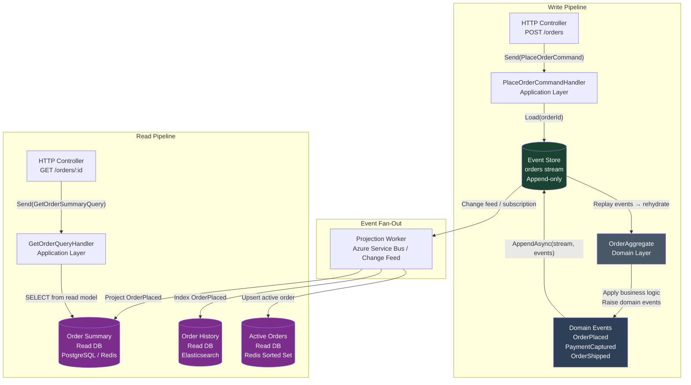
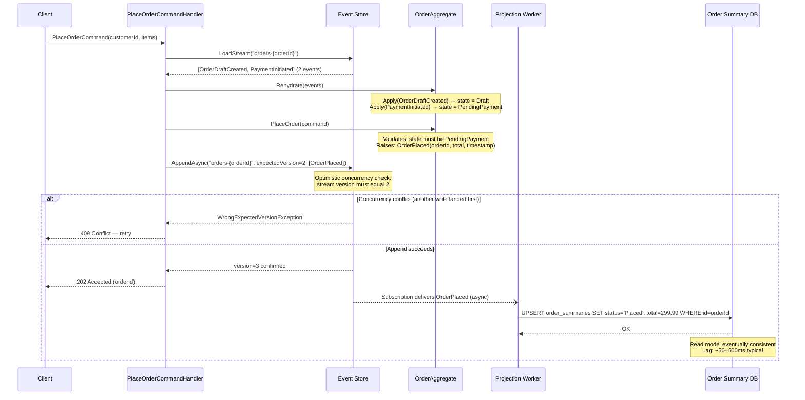
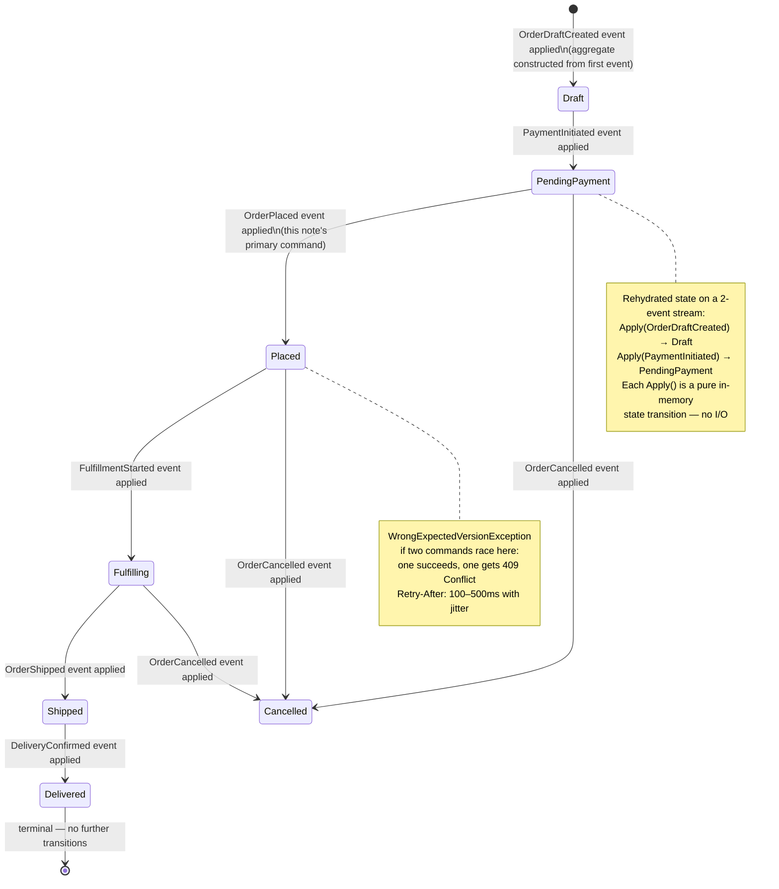
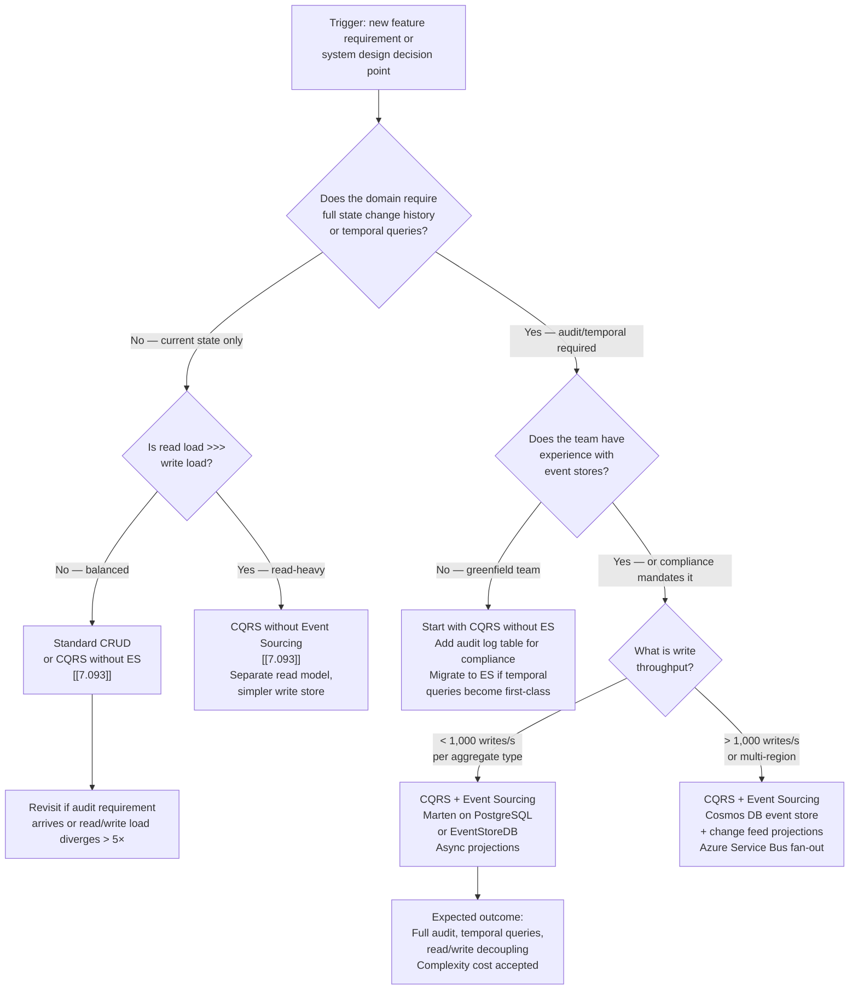

> [!success] Mastery Check
> - [ ] **Studied Well**
> - [ ] **Can explain the concept without notes**
> - [ ] **Can answer interview questions confidently**
> - [ ] **Can implement it in a real project**


> [!ABSTRACT] Quick Reference — CQRS With Event Sourcing
> **Invariant:** Every state change to an aggregate is recorded as an immutable, ordered event in the event store; the current state is always derivable by replaying those events from the beginning (or from a snapshot); queries are served from independent read-model projections, never from the event store directly.
> **Cost:** Eventual consistency between the write side and all read-model projections; added infrastructure complexity (event store + projection workers + separate read databases); no in-place update or delete of business state; debugging requires event replay tooling.
> **Trigger:** The system requires a full, auditable history of every state change; or the read and write load profiles diverge dramatically enough that a single relational model cannot serve both; or you need temporal queries (point-in-time state reconstruction) as a first-class feature.
> **Skip When:** The domain has no meaningful history requirement, read/write load is balanced on a single relational schema, or the team lacks experience operating event stores and projection infrastructure — CQRS without Event Sourcing (7.093) serves most teams adequately.
> **.NET Entry Point:** `IEventStore` (custom abstraction) / `Marten` NuGet (PostgreSQL-backed event store) / `EventStoreDB` SDK / `MediatR.IRequestHandler<TCommand>` for the write side
> **Azure Native:** Azure Cosmos DB (append-only event store via change feed) + Azure Service Bus / Event Hubs (event fan-out to projections) + Azure SQL / Cosmos DB read models
> **Number to Know:** Aggregate rehydration by replaying 1,000 events from PostgreSQL (Marten) takes ~15–40ms; with a snapshot at event 900, rehydration drops to ~2–5ms for the remaining 100 events — snapshots are mandatory above ~500 events per aggregate.

---

## Navigation

**Domain:** [[7 — System Design & Distributed Systems]] > **Group:** CQRS and Event Sourcing
**Previous:** [[7.093 — CQRS — Without Event Sourcing]] | **Next:** [[7.095 — CQRS — When It Adds Value vs Complexity]]

### Prerequisites

- [[7.081 — CQRS — Command Query Responsibility Segregation]] — required because CQRS with Event Sourcing is the full-fidelity version of the CQRS pattern; understanding what CQRS separates (write model from read model) is the foundation for understanding what Event Sourcing adds to that separation
- [[7.083 — CQRS — Separate Read and Write Models]] — required because the read-write model split is the structural basis; Event Sourcing replaces the write model's storage mechanism with an append-only event log
- [[7.101 — Event Sourcing — Events as the Source of Truth]] — required because the event store is the write side of this pattern; understanding that events are the authoritative record (not the current-state table) is the central invariant this note builds on
- [[7.047 — DDD — Aggregates — Consistency Boundary]] — required because the aggregate is the unit of event sourcing; understanding aggregate consistency boundaries explains why the event store is keyed by aggregate ID and why cross-aggregate queries go to read models, not the event store

### Where This Fits

> [!INFO] Production Encounter Map
> - **Layer:** Domain layer (aggregate + domain events) + Application layer (command handlers + projection workers) + Infrastructure layer (event store adapter + read-model writers)
> - **Trigger:** Engineers first encounter this architecture when a business requirement arrives that a standard CRUD system cannot satisfy: "show me the complete history of this order and who changed what and when" — or "reconstruct the state of this account as of 14:32 last Thursday for the compliance audit"
> - **Without it:** The current state of an entity is stored; history is lost on each update; auditing requires separate audit tables that drift from the business model; temporal queries require backfilling from backup snapshots; read and write load compete on the same relational schema
> - **First signal:** Compliance team reports that the audit log table is missing four state transitions that "definitely happened"; or a product requirement for "undo last action" requires a full schema change because the previous state was overwritten; or the order history endpoint causes 900ms p99 because it joins 12 tables on the same schema that writes use

Two adjacent notes define the boundary: [[7.093 — CQRS — Without Event Sourcing]] is the simpler path that separates read and write models using a relational DB for writes and a denormalized read DB; this note covers what changes when the write side becomes an event store. [[7.102 — Event Sourcing — Event Store Design]] covers event store implementation internals independently of CQRS.

---

## Core Mental Model

CQRS with Event Sourcing separates the system into two completely independent pipelines joined only by events. The **write pipeline** receives a command, loads an aggregate by replaying its events from the store, validates the command against the aggregate's current state, applies business logic, produces new domain events, and appends those events to the event store atomically. The aggregate never reads from a read model; the handler never writes to one. The **read pipeline** is driven by projection workers that consume events from the store (via polling, change feed, or subscription), transform them into denormalized read models optimized for specific query patterns, and persist those read models into query-optimized stores (Redis, Elasticsearch, PostgreSQL read tables, Cosmos DB). Queries always hit read models — never the event store. The invariant: the event store is the single source of truth for all business state; every other data store in the system is a derived, eventually-consistent view.

> [!TIP] The Non-Obvious Insight
> The most dangerous misconception about CQRS with Event Sourcing is that the event store is a message broker. It is not. A message broker delivers messages to consumers and then discards or archives them. The event store is the primary database — it is the record of what happened, permanently. Replaying from the event store is not a recovery operation; it is how every aggregate loads its current state on every command. The implication: the event store must have the durability, consistency, and performance characteristics of a primary database, not a message broker. Azure Event Hubs has the right append-only semantics but the wrong durability guarantees (7-day default retention, data loss at max retention without archive). Azure Cosmos DB with an append-only partition key pattern or EventStoreDB are correct choices. Using Azure Service Bus as an event store will destroy your data.

### Classification

- **Consistency axis:** Write side is strongly consistent within a single aggregate (atomic append to event store); read models are eventually consistent — projection lag is typically 10ms–5s depending on infrastructure
- **Availability tradeoff:** Under partition: the write side (event store) prioritizes consistency over availability — a write that cannot confirm durability should not succeed. Read models may serve stale data (last successfully projected state) which is often acceptable depending on the query's staleness tolerance
- **Latency impact:** Write path: command → rehydrate aggregate (~5–40ms depending on event count and snapshot availability) + append events (~2–10ms on EventStoreDB or Cosmos DB) + publish notification to projection workers (~1–5ms via Service Bus) = ~8–55ms total write latency. Read path: query hits denormalized read model — 1–10ms (Redis) to 5–50ms (SQL/Cosmos DB) depending on read store
- **Failure domain:** Write side failures are confined to the event store; read model projection failures degrade query freshness without affecting write correctness; a projection worker crash causes read-side staleness, not data loss (events are still in the store)
- **Abstraction layer:** Architecture pattern — spans domain model (aggregates + events), application layer (command/query handlers, projection workers), and infrastructure (event store, read databases, message fan-out)

### Primary Diagram



### Supporting Diagram



### Numbers That Matter

| Metric | Value | Context / Conditions |
|---|---|---|
| Aggregate rehydration — no snapshot | 15–40ms | 1,000 events per aggregate stream; EventStoreDB or Marten on PostgreSQL; LAN latency |
| Aggregate rehydration — with snapshot | 2–5ms | Snapshot at event N-100; only 100 events replayed; Marten snapshot store |
| Event append latency | 2–8ms | EventStoreDB single-node; Cosmos DB RU-provisioned (100 RU/write event); LAN |
| Projection lag — Service Bus subscription | 50–500ms (default, configurable) | Azure Service Bus Standard; single projection worker; typical event size 1–4 KB |
| Projection lag — Cosmos DB change feed | 10–100ms | Cosmos DB change feed processor; dedicated worker pod; sub-100ms is achievable |
| Snapshot threshold | ~500 events per stream (default, configurable) | Above this, rehydration latency crosses 20ms; snapshot recommended; Marten default is 500 |
| Read model query latency | 1–10ms (Redis) / 5–30ms (PostgreSQL) | Indexed read model; simple primary-key or indexed query; no joins |
| Maximum practical event stream length (no snapshot) | ~2,000 events | Beyond this, rehydration becomes a p99 concern; snapshots mandatory |
| Optimistic concurrency check overhead | <1ms | EventStoreDB version check is an in-memory stream metadata lookup |
| Projection worker throughput | 2,000–10,000 events/s per worker | EventStoreDB persistent subscription; Cosmos DB change feed; depends on read DB write speed |

### Key Properties / Guarantees

| Property | Value | Condition |
|---|---|---|
| Write-side consistency | Strong — single aggregate; atomic append with optimistic concurrency | Per-aggregate stream; cross-aggregate consistency requires Saga pattern (7.129) |
| Read-side consistency | Eventual — projection lag 10ms–5s typical | Depends on projection worker throughput and subscription delivery latency |
| Audit completeness | Complete — every state transition is a permanent event | As long as event store has sufficient retention; EventStoreDB default: unlimited |
| Temporal query capability | Full point-in-time state reconstruction | Replay stream up to a specific event position or timestamp |
| Read model recoverability | Full — any read model can be rebuilt by replaying all events from position 0 | As long as all events are retained in the event store |
| Write-side scalability | Per-aggregate-stream parallelism | Different aggregate streams are independent; same aggregate stream is serialized |
| Idempotency | Requires explicit idempotency keys on command handlers | Event store appends are not automatically idempotent — duplicate commands produce duplicate events without deduplication logic |

---

## Deep Mechanics

### How It Works

**Write Path — Command Processing:**

1. **Command arrives:** `PlaceOrderCommandHandler` receives `PlaceOrderCommand` via `ISender.Send()`. The command carries the `orderId` (or the handler generates one).

2. **Stream load:** Handler calls `IEventStore.LoadStreamAsync("orders-{orderId}")`. The event store returns an ordered list of all domain events for that aggregate, plus the current stream version (e.g., version 2 means 2 events appended so far).

3. **Aggregate rehydration:** Handler constructs a new `OrderAggregate` and calls `Rehydrate(events)`. The aggregate applies each event in order, transitioning its internal state: `Apply(OrderDraftCreated)` sets `Status = Draft`; `Apply(PaymentInitiated)` sets `Status = PendingPayment`. No database read besides the event stream.

4. **Business logic validation:** Handler calls `aggregate.PlaceOrder(command)`. The aggregate validates preconditions against its rehydrated state (`Status must be PendingPayment`, `Items must be non-empty`, etc.). If invalid, throws a domain exception — no events are produced.

5. **Event production:** If valid, `PlaceOrder()` calls `RaiseDomainEvent(new OrderPlaced(orderId, items, total, timestamp))`. The event is added to an internal `UncommittedEvents` list on the aggregate — not yet persisted.

6. **Atomic append:** Handler calls `IEventStore.AppendAsync("orders-{orderId}", expectedVersion: 2, aggregate.UncommittedEvents)`. The event store checks: is the stream currently at version 2? If yes, appends `OrderPlaced` and increments to version 3. If another writer raced and the stream is at version 3, throws `WrongExpectedVersionException` — the command handler returns 409 and the client retries.

7. **Fan-out trigger:** The event store (or a transactional outbox) publishes `OrderPlaced` to a message bus or change feed. Projection workers consume this asynchronously.

8. **Response:** Command handler returns a result (typically the new aggregate ID or version) to the caller. The read model is not yet updated — eventual consistency begins here.

**Read Path — Query Processing:**

1. **Query arrives:** `GetOrderSummaryQueryHandler` receives `GetOrderSummaryQuery(orderId)` via `ISender.Send()`.

2. **Read model lookup:** Handler queries the `order_summaries` read table (PostgreSQL, Redis, or Cosmos DB — depending on query pattern). This is a simple primary-key or indexed lookup. No event replay.

3. **Response:** Returns the denormalized `OrderSummaryDto` directly. Handler has no knowledge of the event store.

**Projection Worker — Read Model Maintenance:**

1. Worker subscribes to the event store's persistent subscription or Cosmos DB change feed.
2. Receives `OrderPlaced` event.
3. Dispatches to `OrderPlacedProjection.Handle(event)`.
4. Projection writes to the read store: `UPDATE order_summaries SET status = 'Placed', total = event.Total, placed_at = event.Timestamp WHERE id = event.OrderId`.
5. Acknowledges the event (advances checkpoint). If the worker crashes before acknowledgement, the event is redelivered — the projection must be idempotent (upsert semantics).

### Protocol Trace

```
Write Path — Happy Path (PlaceOrderCommand):

  1. Client → PlaceOrderCommandHandler: PlaceOrderCommand(orderId: ord-991, customerId: cust-42) (~0ms)
  2. CommandHandler → EventStore: LoadStream("orders-ord-991") (~3ms — PostgreSQL SELECT all events for stream)
  3. EventStore → CommandHandler: [OrderDraftCreated(v1), PaymentInitiated(v2)], currentVersion=2 (~1ms deserialization)
  4. CommandHandler → OrderAggregate: Rehydrate([OrderDraftCreated, PaymentInitiated])
     - Apply(OrderDraftCreated): Status=Draft, CustomerId=cust-42
     - Apply(PaymentInitiated): Status=PendingPayment, PaymentId=pay-77
     (~0.5ms in-memory)
  5. CommandHandler → OrderAggregate: PlaceOrder(command) → validates state (~0.1ms)
  6. OrderAggregate raises: OrderPlaced(orderId=ord-991, total=299.99, placedAt=2025-01-15T14:22:01Z)
     - Added to UncommittedEvents list
  7. CommandHandler → EventStore: AppendAsync("orders-ord-991", expectedVersion=2, [OrderPlaced]) (~5ms)
     - EventStore confirms stream is at v2 → appends → stream now at v3
  8. EventStore → Change Feed / Service Bus: delivers OrderPlaced notification (~1ms enqueue)
  9. CommandHandler → Client: { orderId: "ord-991", version: 3 } (202 Accepted)
  Total write-path latency: ~10–11ms (LAN; 2-event stream; no snapshot needed)

Write Path — Concurrency Conflict (two handlers race on same aggregate):

  1–6. Handler A and Handler B both call LoadStream("orders-ord-991") → both see version=2
  7a. Handler A → EventStore: AppendAsync("orders-ord-991", expectedVersion=2, [OrderPlaced]) → succeeds, stream=v3
  7b. Handler B → EventStore: AppendAsync("orders-ord-991", expectedVersion=2, [OrderPlaced]) → FAILS
      EventStore returns: WrongExpectedVersionException (stream is now v3, not v2)
  8b. CommandHandler B → Client: 409 Conflict with Retry-After: 100ms
  Recovery: Client retries → Handler B reloads stream (now v3) → rehydrates 3 events →
            business logic re-evaluates → if still valid, appends at expectedVersion=3

Projection Failure Path (worker crashes mid-projection):

  1. ProjectionWorker receives OrderPlaced from Service Bus, begins processing
  2. Worker writes to order_summaries read table: UPDATE ... → succeeds
  3. Worker crashes before acknowledging the message (lock expires after 30s default on ASB)
  4. Service Bus redelivers OrderPlaced to surviving/new worker instance
  5. Worker processes again → UPDATE order_summaries ... (idempotent upsert — no duplicate state)
  6. Worker acknowledges message → checkpoint advanced
  Caller observes: stale read model for up to 30s (lock timeout) + redelivery processing time
  Read-side impact: queries return previous state during redelivery window
  Write-side impact: none — event is permanently in store regardless of projection state
```

### State Transitions



### Failure Modes

**Failure Mode 1: Projection Worker Lag — Read Models Stale Under Event Burst**

- **Cause:** A batch command operation (e.g., bulk price update triggering 50,000 `ProductPriceChanged` events in 30 seconds) overwhelms the projection worker's throughput capacity. The worker can process 3,000 events/s but receives 1,667 events/s average — it keeps up under normal load. During the burst it falls behind; the checkpoint advances slowly; read models reflect prices from 2–15 minutes ago.
- **Symptom:** `GET /api/products/{id}` returns stale prices; customers see prices that have already changed; conversion metrics drop as price display diverges from checkout totals; Azure Service Bus shows `active_message_count` growing instead of staying near zero
- **Detection time:** 2–5 minutes — the lag grows gradually and only becomes user-visible when it exceeds the business-acceptable staleness window
- **Blast radius:** All queries that depend on the `product_summaries` read model return stale data; if the projection writes to a Redis cache, cache entries reflect stale state for TTL duration even after the worker catches up

> [!DANGER] 3 AM Production Signal
> Metric: `azure_servicebus_active_message_count{topic="domain-events",subscription="product-projection"} > 5000` sustained for `> 3 minutes`
> Log: `WARN [ProductProjectionWorker] Projection lag detected | checkpoint_position: 142800 | store_head: 149200 | lag_events: 6400 | lag_estimated_ms: 128000 | CorrelationId: d4a2-9f1c`
> Customer impact: Product prices on listing pages are 2–8 minutes stale; add-to-cart for out-of-stock items succeeds at the read layer but fails at checkout validation — ~3% cart abandonment increase during the lag window

**Failure Mode 2: Aggregate Stream Explosion — Rehydration Latency Crosses SLO**

- **Cause:** A high-churn aggregate (e.g., a `ShoppingCart` that is modified 20 times per minute during a user session) accumulates 10,000+ events over its lifetime without snapshot creation. An `AddItemToCart` command now requires loading and replaying 10,000 events before it can validate and append.
- **Symptom:** `POST /api/cart/{id}/items` p99 latency rises from 45ms to 800ms+ for long-lived cart sessions; EF Core / Marten logs show individual stream loads exceeding 700ms; no errors — just extreme latency for specific aggregate IDs
- **Detection time:** Silent until a long-lived session triggers it; typically surfaces as a customer support ticket ("checkout is really slow for me") traced to a specific cart ID with thousands of events; 2–4 hours to identify without proactive event count monitoring
- **Blast radius:** Only affects aggregates with event counts above ~2,000; other aggregates are unaffected; but a single customer with a very large cart creates a p99 spike visible in aggregate metrics — misleading because p50 is fine

> [!DANGER] 3 AM Production Signal
> Metric: `mediatr_handler_duration_p99_ms{handler="AddItemToCartCommandHandler"} > 500` while `p50 < 50ms`
> Log: `WARN [Marten] Stream load exceeded threshold | stream_id: cart-usr-99841 | event_count: 11240 | load_ms: 890 | CorrelationId: 7e3b-...`
> Customer impact: Specific users (those with long-lived carts or high-activity sessions) experience 800ms–2s latency on every cart modification; affects ~0.1% of users but those are high-value repeat customers

**Fix:** Configure snapshot creation at 500-event intervals. For Marten: `options.Events.AddAggregateSnapshot<ShoppingCart>(SnapshotLifecycle.Inline)`.

### .NET and Azure Integration Points

- **Marten (PostgreSQL event store):** `Marten` NuGet + `Weasel.Postgresql`; `IDocumentStore` for event operations; `IEventStore` interface for stream operations; projection registration via `options.Projections.Add<OrderSummaryProjection>()`
- **EventStoreDB:** `EventStore.Client` NuGet; `EventStoreClient.AppendToStreamAsync()` for writes; `EventStoreClient.SubscribeToStreamAsync()` for projections
- **Azure Cosmos DB as event store:** `Microsoft.Azure.Cosmos` NuGet; partition key = aggregateId; sort key = version; change feed for projection fan-out
- **Azure Service Bus fan-out:** `Azure.Messaging.ServiceBus` NuGet; `ServiceBusSender` from command handler after event append; `ServiceBusProcessor` in projection workers
- **ASP.NET Core:** `ISender` (MediatR) for command dispatch; no direct event store access from controllers
- **MassTransit (saga as process manager):** `MassTransit` NuGet; `SagaStateMachine<TState>` when cross-aggregate workflows required by [[7.129 — Saga Pattern — Overview and When to Use]]

```csharp
// Program.cs — Marten event store + CQRS registration
using Marten;
using Marten.Events.Projections;
using YourCompany.OrderManagement.Application;

builder.Services.AddMediatR(cfg =>
    cfg.RegisterServicesFromAssembly(typeof(PlaceOrderCommandHandler).Assembly));

builder.Services.AddMarten(options =>
{
    options.Connection(builder.Configuration.GetConnectionString("EventStore")!);
    options.Events.StreamIdentity = StreamIdentity.AsString;  // "orders-{orderId}"

    // Inline projection — synchronous with the write transaction (strong consistency option)
    options.Projections.Add<OrderSummaryProjection>(ProjectionLifecycle.Inline);

    // Async projection — separate worker process (eventual consistency, better write throughput)
    options.Projections.Add<OrderHistoryProjection>(ProjectionLifecycle.Async);

    options.Events.AddAggregateSnapshot<OrderAggregate>(SnapshotLifecycle.Inline);
})
.UseLightweightSessions()
.AddAsyncDaemon(DaemonMode.HotCold);  // Background projection daemon
```

---

## Production Patterns and Implementation

### Primary Implementation

```csharp
// YourCompany.OrderManagement.Domain/Aggregates/OrderAggregate.cs
// Role: Aggregate Root | Domain Layer

namespace YourCompany.OrderManagement.Domain.Aggregates;

/// <summary>
/// Order aggregate — maintains consistency boundary for all order state transitions.
/// State is derived entirely from replayed domain events; no direct property setters.
/// </summary>
public sealed class OrderAggregate
{
    // Private state — only mutated via Apply()
    public Guid Id { get; private set; }
    public Guid CustomerId { get; private set; }
    public OrderStatus Status { get; private set; }
    public Money Total { get; private set; }
    public int Version { get; private set; }

    // Uncommitted events — appended to event store by the command handler
    private readonly List<IDomainEvent> _uncommittedEvents = [];
    public IReadOnlyList<IDomainEvent> UncommittedEvents => _uncommittedEvents;

    // Private constructor — only rehydrated via static factory or Marten
    private OrderAggregate() { }

    /// <summary>
    /// Rehydrates the aggregate by replaying all events from the event store stream.
    /// </summary>
    public static OrderAggregate Rehydrate(IEnumerable<IDomainEvent> events)
    {
        var aggregate = new OrderAggregate();
        foreach (var @event in events)
            aggregate.Apply(@event);
        return aggregate;
    }

    /// <summary>
    /// Places a confirmed order. Validates state preconditions before raising domain event.
    /// </summary>
    /// <exception cref="InvalidOrderStateException">Thrown if order is not in PendingPayment state.</exception>
    public void PlaceOrder(PlaceOrderCommand command)
    {
        if (Status is not OrderStatus.PendingPayment)
            throw new InvalidOrderStateException(
                $"Cannot place order in status {Status}. Order must be in PendingPayment.");

        if (command.Items is null || !command.Items.Any())
            throw new InvalidOrderStateException("Order must contain at least one item.");

        Raise(new OrderPlaced(
            OrderId: Id,
            CustomerId: CustomerId,
            Items: command.Items,
            Total: Total,
            PlacedAt: DateTimeOffset.UtcNow));
    }

    // ─── Event Application (pure state transitions — no I/O, no side effects) ───

    private void Apply(IDomainEvent @event)
    {
        switch (@event)
        {
            case OrderDraftCreated e:
                Id = e.OrderId;
                CustomerId = e.CustomerId;
                Status = OrderStatus.Draft;
                break;

            case PaymentInitiated e:
                Status = OrderStatus.PendingPayment;
                Total = e.Total;
                break;

            case OrderPlaced:
                Status = OrderStatus.Placed;
                break;

            case OrderCancelled:
                Status = OrderStatus.Cancelled;
                break;

            case OrderShipped:
                Status = OrderStatus.Shipped;
                break;
        }

        Version++;
    }

    private void Raise(IDomainEvent @event)
    {
        Apply(@event);           // Immediately update in-memory state
        _uncommittedEvents.Add(@event);  // Stage for persistence
    }
}

public enum OrderStatus { Draft, PendingPayment, Placed, Fulfilling, Shipped, Delivered, Cancelled }
```

```csharp
// YourCompany.OrderManagement.Application/Commands/PlaceOrderCommandHandler.cs
// Role: Command Handler | Application Layer

using MediatR;
using YourCompany.OrderManagement.Domain.Aggregates;
using YourCompany.OrderManagement.Application.Abstractions;

namespace YourCompany.OrderManagement.Application.Commands;

/// <summary>
/// Handles PlaceOrderCommand by loading the order aggregate from the event store,
/// applying business logic, and appending resulting domain events.
/// </summary>
public sealed class PlaceOrderCommandHandler(
    IEventStore eventStore,
    ILogger<PlaceOrderCommandHandler> logger)
    : IRequestHandler<PlaceOrderCommand, PlaceOrderResult>
{
    /// <inheritdoc/>
    public async Task<PlaceOrderResult> Handle(
        PlaceOrderCommand command,
        CancellationToken cancellationToken)
    {
        // 1. Load event stream — returns all events + current version
        var (events, currentVersion) = await eventStore
            .LoadStreamAsync<IDomainEvent>(
                streamId: $"orders-{command.OrderId}",
                cancellationToken);

        if (!events.Any())
            throw new OrderNotFoundException(command.OrderId);

        // 2. Rehydrate aggregate from events
        var order = OrderAggregate.Rehydrate(events);

        // 3. Execute business logic — raises domain events internally
        order.PlaceOrder(command);

        // 4. Append uncommitted events with optimistic concurrency check
        //    WrongExpectedVersionException propagates as 409 to caller
        await eventStore.AppendAsync(
            streamId: $"orders-{command.OrderId}",
            expectedVersion: currentVersion,
            events: order.UncommittedEvents,
            cancellationToken);

        logger.LogInformation(
            "Order placed successfully | OrderId: {OrderId} | Version: {Version} | Total: {Total}",
            command.OrderId, currentVersion + order.UncommittedEvents.Count, order.Total);

        return new PlaceOrderResult(command.OrderId, order.Total);
    }
}
```

```csharp
// YourCompany.OrderManagement.Infrastructure/EventStore/MartenEventStore.cs
// Role: Event Store Adapter | Infrastructure Layer

using Marten;
using YourCompany.OrderManagement.Application.Abstractions;

namespace YourCompany.OrderManagement.Infrastructure.EventStore;

/// <summary>
/// Marten (PostgreSQL) implementation of the event store abstraction.
/// Handles stream loading with version tracking and optimistic concurrency on append.
/// </summary>
public sealed class MartenEventStore(IDocumentSession session) : IEventStore
{
    /// <inheritdoc/>
    public async Task<(IReadOnlyList<TEvent> Events, long Version)> LoadStreamAsync<TEvent>(
        string streamId,
        CancellationToken cancellationToken = default)
        where TEvent : class
    {
        var streamState = await session.Events.FetchStreamStateAsync(streamId, cancellationToken);
        if (streamState is null)
            return ([], 0);

        var events = await session.Events.FetchStreamAsync(streamId, token: cancellationToken);
        return (events.Select(e => (TEvent)e.Data).ToList(), streamState.Version);
    }

    /// <inheritdoc/>
    public async Task AppendAsync(
        string streamId,
        long expectedVersion,
        IEnumerable<object> events,
        CancellationToken cancellationToken = default)
    {
        // Marten uses int for version; EventStoreDB uses long
        session.Events.Append(streamId, (int)expectedVersion, events.ToArray());

        // SaveChangesAsync validates expectedVersion and throws
        // Marten.Exceptions.EventStreamUnexpectedMaxEventIdException on conflict
        await session.SaveChangesAsync(cancellationToken);
    }
}
```

```csharp
// YourCompany.OrderManagement.Application/Projections/OrderSummaryProjection.cs
// Role: Read Model Projection | Application/Infrastructure Layer

using Marten.Events.Projections;
using YourCompany.OrderManagement.Domain.Events;
using YourCompany.OrderManagement.Application.ReadModels;

namespace YourCompany.OrderManagement.Application.Projections;

/// <summary>
/// Projects domain events into the OrderSummary read model.
/// Registered as Async (eventual consistency) or Inline (strong consistency) in Marten.
/// All Apply() methods must be idempotent — they may be called multiple times on redelivery.
/// </summary>
public sealed class OrderSummaryProjection : MultiStreamProjection<OrderSummaryReadModel, Guid>
{
    public OrderSummaryProjection()
    {
        // Tell Marten which events this projection cares about
        Identity<OrderDraftCreated>(e => e.OrderId);
        Identity<PaymentInitiated>(e => e.OrderId);
        Identity<OrderPlaced>(e => e.OrderId);
        Identity<OrderCancelled>(e => e.OrderId);
        Identity<OrderShipped>(e => e.OrderId);
    }

    /// <summary>Creates the initial read model when the first event arrives.</summary>
    public OrderSummaryReadModel Create(OrderDraftCreated @event) =>
        new()
        {
            Id = @event.OrderId,
            CustomerId = @event.CustomerId,
            Status = "Draft",
            CreatedAt = @event.CreatedAt
        };

    /// <summary>Updates status when payment is initiated.</summary>
    public void Apply(OrderSummaryReadModel model, PaymentInitiated @event)
    {
        model.Status = "PendingPayment";
        model.Total = @event.Total.Amount;
        model.Currency = @event.Total.Currency;
    }

    /// <summary>Updates status when order is placed.</summary>
    public void Apply(OrderSummaryReadModel model, OrderPlaced @event)
    {
        model.Status = "Placed";
        model.PlacedAt = @event.PlacedAt;
    }

    /// <summary>Updates status when order is cancelled.</summary>
    public void Apply(OrderSummaryReadModel model, OrderCancelled @event)
    {
        model.Status = "Cancelled";
        model.CancelledAt = @event.CancelledAt;
        model.CancellationReason = @event.Reason;
    }

    /// <summary>Updates status when order is shipped.</summary>
    public void Apply(OrderSummaryReadModel model, OrderShipped @event)
    {
        model.Status = "Shipped";
        model.ShippedAt = @event.ShippedAt;
        model.TrackingNumber = @event.TrackingNumber;
    }
}
```

### IServiceCollection Registration

```csharp
// Program.cs — complete CQRS + Event Sourcing registration with Marten

builder.Services.AddMediatR(cfg =>
    cfg.RegisterServicesFromAssembly(typeof(PlaceOrderCommandHandler).Assembly));

// Pipeline behaviors: Logging → Transaction (Marten handles this via SaveChangesAsync) → Validation
builder.Services.AddTransient(typeof(IPipelineBehavior<,>), typeof(LoggingBehavior<,>));
builder.Services.AddTransient(typeof(IPipelineBehavior<,>), typeof(ValidationBehavior<,>));
builder.Services.AddValidatorsFromAssembly(typeof(PlaceOrderCommandValidator).Assembly);

// Marten event store — PostgreSQL backend
builder.Services.AddMarten(options =>
{
    options.Connection(builder.Configuration.GetConnectionString("EventStore")!);
    options.DatabaseSchemaName = "order_events";

    // Stream identity: string-based ("orders-{guid}") for domain readability
    options.Events.StreamIdentity = StreamIdentity.AsString;

    // Snapshot every 500 events to keep rehydration under 5ms
    options.Events.AddAggregateSnapshot<OrderAggregate>(SnapshotLifecycle.Inline);

    // Async projection daemon — runs as background service
    options.Projections.Add<OrderSummaryProjection>(ProjectionLifecycle.Async);
    options.Projections.Add<OrderHistoryProjection>(ProjectionLifecycle.Async);
})
.UseLightweightSessions()
.AddAsyncDaemon(DaemonMode.HotCold);  // Leader election for multi-pod deployment

// Infrastructure: event store abstraction
builder.Services.AddScoped<IEventStore, MartenEventStore>();

// Azure Service Bus for cross-service event fan-out (beyond Marten projections)
builder.Services.AddAzureServiceBusClient(
    builder.Configuration.GetConnectionString("ServiceBus")!);
```

### Common Variants

```csharp
// Variant A — Inline Projection (strong consistency): used when queries must
// immediately reflect the result of a command in the same request — e.g., a UI
// that redirects to order details after placing the order and expects to see "Placed" status.
// Cost: write throughput reduced ~20–40% (projection is part of SaveChangesAsync transaction).

options.Projections.Add<OrderSummaryProjection>(ProjectionLifecycle.Inline);
// Inline: projection runs inside the same Marten IDocumentSession.SaveChangesAsync()
// The read model and events are written in the same PostgreSQL transaction.
// Query immediately after command returns consistent data — no eventual consistency gap.
```

```csharp
// Variant B — Async Projection with Change Feed (eventual consistency + high write throughput):
// used when write throughput is the priority and the UI can tolerate 50–500ms staleness.
// Projection worker runs as a separate process (Marten async daemon or custom Azure Function).

options.Projections.Add<OrderSummaryProjection>(ProjectionLifecycle.Async);
options.Projections.Add<OrderAnalyticsProjection>(ProjectionLifecycle.Async);
// Marten async daemon handles checkpointing, retries, and catch-up on restart.
// Multiple projections run concurrently from the same event stream.
// Write path: AppendAsync() returns immediately after event storage — no projection work.
```

```csharp
// Variant C — Cosmos DB as Event Store (Azure-native, globally distributed):
// used when multi-region write capability or native Azure integration is required.
// Partition key = aggregateId; document id = "{aggregateId}:{version}".

container.CreateItemAsync(new EventDocument
{
    Id = $"{orderId}:{expectedVersion + 1}",
    PartitionKey = orderId.ToString(),
    EventType = nameof(OrderPlaced),
    EventData = JsonSerializer.Serialize(@event),
    Version = expectedVersion + 1,
    Timestamp = DateTimeOffset.UtcNow
}, new PartitionKey(orderId.ToString()), cancellationToken: cancellationToken);
// Cosmos DB unique index on (partitionKey, version) enforces optimistic concurrency.
// Change feed drives projections automatically — no separate polling needed.
```

### Performance Profile

```csharp
[MemoryDiagnoser]
[SimpleJob(RuntimeMoniker.Net80)]
public class AggregateRehydrationBenchmark
{
    private static readonly List<IDomainEvent> _events100 = GenerateEvents(100);
    private static readonly List<IDomainEvent> _events500 = GenerateEvents(500);
    private static readonly List<IDomainEvent> _events1000 = GenerateEvents(1000);

    [Params(100, 500, 1000)]
    public int EventCount { get; set; }

    private List<IDomainEvent> _eventSet = null!;

    [GlobalSetup]
    public void Setup() => _eventSet = EventCount switch
    {
        100 => _events100,
        500 => _events500,
        _ => _events1000
    };

    [Benchmark(Baseline = true)]
    public OrderAggregate RehydrateFromEvents()
        => OrderAggregate.Rehydrate(_eventSet);

    private static List<IDomainEvent> GenerateEvents(int count)
    {
        var events = new List<IDomainEvent> { new OrderDraftCreated(Guid.NewGuid(), Guid.NewGuid(), DateTimeOffset.UtcNow) };
        for (var i = 1; i < count; i++)
            events.Add(new ItemAddedToOrder(Guid.NewGuid(), $"SKU-{i}", 1, new Money(9.99m, "USD")));
        return events;
    }
}
```

Expected result shape (in-memory rehydration only — no I/O; estimated on .NET 8, Apple M2):

| EventCount | Mean | Allocated | Notes |
|---|---|---|---|
| 100 events | 0.12ms | 48 KB | Typical short-lived aggregate — no snapshot needed |
| 500 events | 0.61ms | 240 KB | Marten default snapshot threshold — borderline |
| 1,000 events | 1.22ms | 480 KB | Snapshot mandatory; add 3–5ms DB load + 0.6ms replay for remaining 100 events |

Note: These numbers are in-memory only. Add 3–10ms for PostgreSQL stream load (network + deserialization) to get real-world command handler latency.

### Real-World .NET Ecosystem Mapping

| Pattern in This Note | Where It Appears in .NET / Azure | Manifestation |
|---|---|---|
| `IEventStore.AppendAsync(expectedVersion)` | Marten `IEventStore.Append()` + `IDocumentSession.SaveChangesAsync()` | Marten throws `EventStreamUnexpectedMaxEventIdException` on version conflict — map to 409 |
| `OrderAggregate.Rehydrate(events)` | Marten `IEventStore.AggregateStreamAsync<T>()` | Marten calls the same `Apply()` dispatch internally; Marten can own rehydration if aggregate implements `IAggregate` |
| `OrderSummaryProjection : MultiStreamProjection` | Marten `IProjection` / `MultiStreamProjection<TDoc, TId>` | Marten's projection DSL handles event routing and read-model document management |
| Async projection daemon | Marten `AddAsyncDaemon(DaemonMode.HotCold)` | Leader election via PostgreSQL advisory locks — only one pod runs the daemon at a time |
| Optimistic concurrency | EventStoreDB `ExpectedRevision.StreamExists` / `ExpectedRevision.Any` | EventStoreDB has a richer optimistic concurrency API; Marten uses integer stream version |
| Cross-aggregate saga | MassTransit `SagaStateMachine<TState>` + Marten saga repository | [[7.129 — Saga Pattern — Overview and When to Use]] covers the full pattern |

---

## Gotchas and Production Pitfalls

### Querying the Event Store Directly for Read Concerns

**Pitfall:** Writing query handlers that load and replay aggregate events from the event store to answer read queries — treating the event store like a database of current state.

```csharp
// ❌ Event store is not a read database — this is the #1 architectural violation
public async Task<OrderSummaryDto> Handle(GetOrderSummaryQuery query, CancellationToken ct)
{
    var events = await _eventStore.LoadStreamAsync($"orders-{query.OrderId}", ct);
    var aggregate = OrderAggregate.Rehydrate(events.Events);
    return new OrderSummaryDto(aggregate.Id, aggregate.Status, aggregate.Total);  // ← Wrong
    // At 10,000 events per aggregate: 890ms latency per GET request
}
```

**Symptom:** GET endpoints have the same latency profile as command handlers; latency grows proportionally with order age/activity; no caching is possible because the "read model" is always recomputed from the event stream; at scale, the event store becomes a read bottleneck

**Detection time:** Immediately visible in load testing; often not caught in development where aggregate streams are small

> [!DANGER] Production Signal
> Metric: `mediatr_handler_duration_p99_ms{handler="GetOrderSummaryQueryHandler"} > 500` growing over time as event streams age
> Log: `WARN [MartenEventStore] Stream load | stream_id: orders-{id} | event_count: 8420 | load_ms: 743 | CorrelationId: a1f3-...`

**Fix:**

```csharp
// ✅ Query handler reads from the dedicated read model — never from the event store
public async Task<OrderSummaryDto> Handle(GetOrderSummaryQuery query, CancellationToken ct)
{
    var readModel = await _readDb.OrderSummaries
        .AsNoTracking()
        .FirstOrDefaultAsync(o => o.Id == query.OrderId, ct);

    return readModel is null
        ? throw new OrderNotFoundException(query.OrderId)
        : new OrderSummaryDto(readModel.Id, readModel.Status, readModel.Total);
    // p99: 5–15ms — simple indexed lookup, no event replay
}
```

**Cost of not fixing:** At 2,000 GET /api/orders requests/s with a 5,000-event average stream depth: 2,000 full stream replays/s → event store CPU saturates → write path degrades as event store becomes read-contended → command handlers begin timing out → cascade to 5xx errors on both read and write endpoints at ~500 req/s write load.

---

### Missing Idempotency on Projection Workers — Duplicate Read Model Entries

**Pitfall:** Projection `Apply()` methods that use `INSERT` instead of `UPSERT` semantics, so that a redelivered event (after worker crash) creates a duplicate read model record.

```csharp
// ❌ INSERT creates duplicate rows on redelivery
public async Task Apply(OrderPlaced @event, CancellationToken ct)
{
    await _db.OrderSummaries.AddAsync(new OrderSummaryReadModel
    {
        Id = @event.OrderId,
        Status = "Placed",
        Total = @event.Total.Amount
    }, ct);
    await _db.SaveChangesAsync(ct);  // Throws on second delivery: unique constraint violation
}
```

**Symptom:** Service Bus messages in dead-letter queue with `SqlException: Violation of PRIMARY KEY constraint`; worker enters crash-restart loop; read model stops updating for all orders, not just the conflicting one; projection lag grows unboundedly

**Detection time:** Immediate — appears in first deployment to an environment with message redelivery enabled; often only surfaces when a worker pod restarts (which is routine in Kubernetes)

> [!DANGER] Production Signal
> Metric: `azure_servicebus_dead_letter_message_count{subscription="order-projection"} > 0` sustained for `> 5 minutes`
> Log: `ERROR [OrderSummaryProjection] SqlException: Violation of PRIMARY KEY constraint 'PK_order_summaries' | Table: order_summaries | OrderId: ord-9912 | CorrelationId: b8c2-...`

**Fix:**

```csharp
// ✅ UPSERT semantics — idempotent regardless of redelivery count
public async Task Apply(OrderPlaced @event, CancellationToken ct)
{
    await _db.Database.ExecuteSqlInterpolatedAsync(
        $"""
        INSERT INTO order_summaries (id, status, total, placed_at)
        VALUES ({@event.OrderId}, 'Placed', {@event.Total.Amount}, {@event.PlacedAt})
        ON CONFLICT (id) DO UPDATE
            SET status = EXCLUDED.status,
                total = EXCLUDED.total,
                placed_at = EXCLUDED.placed_at
        """, ct);
}
// Or use EF Core ExecuteUpdate for the same idempotency guarantee.
```

**Cost of not fixing:** First worker pod restart (routine in K8s rolling update) dead-letters the in-flight event batch → projection stops → read models freeze → all GET /api/orders return stale data → 3 AM escalation for what is fundamentally a missing UPSERT keyword.

---

### .NET-Specific: Marten Session Lifetime — Scoped vs Transient Conflict

**Pitfall:** Injecting `IDocumentSession` (which Marten registers as `Scoped`) into a singleton projection worker or background service, causing session disposal and connection errors.

```csharp
// ❌ Singleton background service captures scoped IDocumentSession
public sealed class ProjectionWorker(IDocumentSession session) : BackgroundService
{
    // session is captured once at DI resolution — disposed after the first HTTP request scope ends
    // All subsequent calls throw: ObjectDisposedException
}
```

**Symptom:** `ObjectDisposedException: Cannot access a disposed object. Object name: 'Npgsql.NpgsqlConnection'` appearing in logs 60–300 seconds after service startup; projection stops processing; no alert until lag detection fires

**Detection time:** 1–5 minutes after first scoped session disposal; invisible in development if the worker is rarely restarted

> [!DANGER] Production Signal
> Log: `ERROR [ProjectionWorker] ObjectDisposedException: Cannot access a disposed object | Object name: Npgsql.NpgsqlConnection | CorrelationId: none`

**Fix:**

```csharp
// ✅ Use IServiceScopeFactory to create a fresh scope per event batch
public sealed class ProjectionWorker(IServiceScopeFactory scopeFactory) : BackgroundService
{
    protected override async Task ExecuteAsync(CancellationToken stoppingToken)
    {
        while (!stoppingToken.IsCancellationRequested)
        {
            await using var scope = scopeFactory.CreateAsyncScope();
            var session = scope.ServiceProvider.GetRequiredService<IDocumentSession>();
            // session is fresh per iteration — correct scoping
            await ProcessNextBatch(session, stoppingToken);
        }
    }
}
// Or: use Marten's built-in async daemon (AddAsyncDaemon) which handles session scoping correctly.
```

**Cost of not fixing:** Projection worker fails silently within 5 minutes of startup; read models freeze; lag grows unboundedly; first indication is a support ticket ("orders not showing recent status") 15 minutes later.

---

### Azure-Specific: Cosmos DB Change Feed Losing Events — Missing Lease Container

**Pitfall:** Running multiple projection worker instances against a Cosmos DB change feed without a properly configured lease container, causing multiple workers to process the same events or some events to be skipped entirely.

```csharp
// ❌ No lease container — multiple workers fight over the change feed
var changeFeedProcessor = container.GetChangeFeedProcessorBuilder<EventDocument>(
    processorName: "order-projection",
    onChangesDelegate: HandleChangesAsync)
    .WithInstanceName(Environment.MachineName)
    // Missing: .WithLeaseContainer(leaseContainer) ← workers have no coordination
    .Build();
```

**Symptom:** Same `OrderPlaced` event applied twice to the read model (idempotent projections survive this; non-idempotent projections corrupt data); or events processed by one pod and not visible to another pod's in-memory checkpoint — partition coverage gaps appear as missing orders in read models

**Detection time:** Silent for idempotent projections; visible as data inconsistency for non-idempotent ones; only detected through read model reconciliation or customer complaint

> [!DANGER] Production Signal
> Metric: `cosmos_change_feed_events_processed{processor="order-projection",instance="pod-1"} != cosmos_change_feed_events_processed{instance="pod-2"}` — unequal processing rates between pods for the same partition range
> Log: `WARN [CosmosProjectionWorker] Lease acquisition failed | processor: order-projection | partition: 3 | owner: pod-2 | CorrelationId: c5d7-...`

**Fix:**

```csharp
// ✅ Dedicated lease container with proper instance naming
var leaseContainer = cosmosClient.GetContainer("order-events-db", "leases");

var changeFeedProcessor = container.GetChangeFeedProcessorBuilder<EventDocument>(
    processorName: "order-projection",
    onChangesDelegate: HandleChangesAsync)
    .WithInstanceName($"pod-{Environment.MachineName}")
    .WithLeaseContainer(leaseContainer)      // ← Coordinates partition ownership across pods
    .WithStartTime(DateTime.UtcNow.AddHours(-1))  // Catch up on restart
    .Build();
// Each pod owns specific partitions; Cosmos DB lease protocol handles rebalancing on pod add/remove.
```

**Cost of not fixing:** In a 3-pod deployment, read model corruption (non-idempotent projections) or double-processing waste (idempotent projections consuming 3× CPU/DTU for the same event stream) — at 50,000 events/day this adds $180–$500/month in unnecessary Cosmos DB RU consumption.

---

### Architecture-Level Pitfall: Eventual Consistency Exposed in API Without Client Guidance

**Pitfall:** Returning `200 OK` with the new state after a command when that state has not yet been projected to the read model, causing the client to immediately `GET` the resource and receive stale data.

```csharp
// ❌ Returns 200 with full order DTO — but the read model is not yet updated
[HttpPost("orders/{id}/place")]
public async Task<IActionResult> PlaceOrder(Guid id, PlaceOrderCommand command)
{
    var result = await _sender.Send(command);
    // Client immediately calls GET /api/orders/{id} and sees Status="PendingPayment" (stale)
    return Ok(result);  // This implies the state is immediately queryable — it is not
}
```

**Symptom:** UI shows "Placing order…" then immediately shows "PendingPayment" status after the command returns; user thinks the place command failed and clicks again → duplicate command → idempotency key must catch it; customer support receives "I clicked place twice" tickets

**Detection time:** Immediately visible in UI testing; often missed in API-only testing; surfaces as a product bug report, not a technical alert

**Fix:**

```csharp
// ✅ Return 202 Accepted with self-link — signals async processing to the client
[HttpPost("orders/{id}/place")]
public async Task<IActionResult> PlaceOrder(Guid id, PlaceOrderCommand command)
{
    var result = await _sender.Send(command);

    // 202 Accepted: the command was received and processed; the read model will reflect it soon
    return Accepted(
        uri: Url.Action(nameof(GetOrder), new { id }),
        value: new { orderId = result.OrderId, message = "Order is being processed." });
    // Client polls GET /api/orders/{id} until status transitions — or uses WebSocket/SSE for push
}
```

**Cost of not fixing:** Under a 5% duplicate-click rate at 800 orders/day → 40 duplicate `PlaceOrder` commands/day → idempotency key handler must deduplicate each one → 40 event store reloads + rejections → without idempotency keys, 40 duplicate `OrderPlaced` events/day corrupt order history and trigger duplicate fulfillment requests.

---

## Tradeoffs and Decision Framework

### Tradeoff Matrix

| Dimension | CQRS + Event Sourcing | CQRS Without Event Sourcing | Standard CRUD |
|---|---|---|---|
| Write model storage | Append-only event store (immutable) | Relational DB (current state, mutable) | Relational DB (current state, mutable) |
| Read model | Independent denormalized projections | Separate read DB or same DB with read queries | Same table as write — no read/write split |
| Audit completeness | Full history — every transition recorded | No history unless audit table added separately | No history unless added separately |
| Temporal queries | Native — replay to any point in time | Not possible without additional audit log | Not possible |
| Write latency | 10–55ms (rehydrate + append + fan-out) | 5–20ms (write to relational DB + update read model) | 2–10ms (single UPDATE statement) |
| Read latency p99 | 1–30ms (denormalized read model) | 1–30ms (denormalized read model) | 5–50ms (normalized query, potentially with joins) |
| Operational complexity | High — event store + projection workers + read DBs + snapshot management | Medium — dual database + projection job | Low — single database |
| Team expertise required | High — event store semantics, projection patterns, eventual consistency handling | Medium — CQRS patterns, dual database | Low — standard ORM patterns |
| Schema migration | No migration of existing data — add new event types; old events immutable | Standard DB migration | Standard DB migration |
| Azure ecosystem fit | Good — Cosmos DB + Service Bus + SQL read models | Good — SQL + read replica | Native — Azure SQL / Cosmos DB |
| Cost at scale | Medium-high — dedicated event store DB + read DBs + worker pods | Medium — dual database + read replica | Low — single database |
| Debugging | Hard — requires event replay tooling; no direct "what is in the DB" inspection | Medium — read DB is inspectable directly | Easy — direct table inspection |

### When to Apply



### Numbers-Driven Decision

| Threshold | Below = Use Simpler Approach | Above = CQRS + Event Sourcing |
|---|---|---|
| Audit requirement | No history needed — current state sufficient | Full history required; temporal queries needed |
| State transition complexity | < 5 aggregate states; simple lifecycle | > 8 states; complex lifecycle requiring event-driven audit |
| Read/write load divergence | Read load < 10× write load | Read load > 10× write load (independent scaling needed) |
| Write throughput per aggregate type | < 100 commands/s — relational DB handles it | > 500 commands/s — append-only scales better under write load |
| Team experience with event stores | < 1 engineer with ES production experience | ≥ 2 engineers with ES + projection infrastructure experience |
| Compliance requirement | No point-in-time reconstruction required | SOX, PCI-DSS, GDPR right-to-erasure (erasure implemented via compensating events) |

### When NOT to Apply

> [!WARNING] Do Not Reach For This When...
> - [ ] **No meaningful history requirement:** If the business cannot articulate what they would do with the event history beyond "it's good to have" — the operational complexity of an event store is not justified; use CQRS without Event Sourcing or standard CRUD
> - [ ] **Small team, first CQRS project:** Adding Event Sourcing to a team's first CQRS implementation doubles the learning surface; ship CQRS without ES first, establish projection patterns, then consider adding the event store when the domain demands it
> - [ ] **Simple CRUD-heavy domains:** Reference data management (product categories, country codes, configuration tables) that changes infrequently and has no meaningful history is wrong for Event Sourcing; use a standard relational store
> - [ ] **Strict read-your-writes SLO on all endpoints:** If every command must be immediately queryable (user places order → redirect to order detail → status must show "Placed") and the team cannot use async polling or inline projections, eventual consistency is incompatible with the UX requirement — or requires inline projection mode which reduces write throughput to parity with standard CRUD

---

## Interview Arsenal

### Question Bank

1. **[Definition]** "What does adding Event Sourcing to CQRS change about the write model, and what specific capability does that unlock that standard CQRS cannot provide?"
2. **[Mechanism]** "Walk me through exactly what happens when a `PlaceOrderCommand` is processed in a CQRS + Event Sourcing system — from the HTTP request to the read model update."
3. **[Tradeoff]** "What are the two most significant costs of combining CQRS with Event Sourcing, and under what conditions are those costs acceptable?"
4. **[Failure mode]** "What breaks in a CQRS + Event Sourcing system when the projection worker falls behind, and how would you detect it and recover without data loss?"
5. **[Comparison]** "What is the structural difference between CQRS with Event Sourcing and CQRS without Event Sourcing? When would you choose each?"
6. **[Design application]** "Design the order management backend for an e-commerce platform at 50,000 orders/day. Where does Event Sourcing add value, and where is it overkill?"
7. **[Scale]** "Your CQRS + Event Sourcing system has aggregates with 5,000+ events per stream. What breaks first at 2,000 commands/second and how do you fix it?"
8. **[Advanced]** "Two concurrent `PlaceOrderCommand` requests arrive for the same order at the same millisecond. Walk through exactly what happens in the event store and what the second request's caller observes."

### Spoken Answers

**Q: What does adding Event Sourcing to CQRS change about the write model, and what specific capability does that unlock?**

> **Average answer:** Event Sourcing means you store events instead of current state. So instead of updating a row in the orders table, you append an OrderPlaced event. This gives you a history of everything that happened. You can use this for auditing.

> **Great answer:** In standard CQRS, the write model is typically a relational table holding current state — an `orders` table with a `status` column that gets `UPDATE`d. Adding Event Sourcing replaces that write store with an append-only event stream: instead of `UPDATE orders SET status='Placed'`, you `INSERT` an `OrderPlaced` event into the `orders-{id}` stream. The current state no longer exists as a stored value — it's derived by replaying events from the beginning. What this unlocks that standard CQRS cannot provide: temporal queries. If I want the state of order `ord-991` as of 14:32 last Thursday, I replay only the events up to that timestamp. This is impossible with a mutable write model without keeping a separate audit table that must be maintained in sync. The second capability is event-driven fan-out: the event store is the single source of truth, and any number of read models can be derived from it by running projections over the same event stream — an order summary projection, a fulfillment projection, an analytics projection — all independently reconstructible from the event log. The cost is that the aggregate must rehydrate on every command by loading and replaying its event stream, which makes snapshot management mandatory above ~500 events per aggregate.

---

**Q: What is the structural difference between CQRS with Event Sourcing and CQRS without Event Sourcing? When would you choose each?**

> **Average answer:** CQRS without Event Sourcing uses a regular database for writes and a separate read database. CQRS with Event Sourcing uses an event store for writes. Event Sourcing gives you history. Use it when you need auditing.

> **Great answer:** The structural distinction is what the write model persists. Without Event Sourcing, the write model persists current state — an `orders` table is `UPDATE`d and read models are maintained by a synchronization job or CDC. With Event Sourcing, the write model persists transitions — an `OrderPlaced` event is appended and the current state only exists as a derived view. The operational consequences differ sharply. Without Event Sourcing: schema migrations are straightforward (`ALTER TABLE orders ADD COLUMN shipped_at TIMESTAMP`); debugging is direct (query the write DB); temporal queries require a purpose-built audit table. With Event Sourcing: schema migration is additive only (new event types, never modify existing events); debugging requires event replay tooling; temporal queries are native; read models can be rebuilt from scratch by replaying all events — which means a read model schema change is `DROP TABLE → rebuild from events` rather than `ALTER TABLE + backfill`. Choose without Event Sourcing when the team is building its first CQRS system, the domain has no meaningful temporal query requirement, or compliance does not mandate it. Choose with Event Sourcing when audit completeness is a business requirement, when you need temporal state reconstruction as a product feature, or when the domain is complex enough that having the full history of what happened is genuinely valuable for debugging and analytics.

---

**Q: Two concurrent PlaceOrderCommand requests arrive for the same order at the same millisecond. Walk through exactly what happens.**

> **Average answer:** There would be a concurrency conflict. Event sourcing uses optimistic concurrency so one would succeed and one would fail. The failing one would retry.

> **Great answer:** Both handlers begin simultaneously. Both call `LoadStreamAsync("orders-{id}")` and both receive the stream at version 2, with `expectedVersion = 2`. Both rehydrate the aggregate from the same 2 events, both call `PlaceOrder()`, both produce an `OrderPlaced` event in their `UncommittedEvents` list. Now both attempt `AppendAsync("orders-{id}", expectedVersion=2, [OrderPlaced])`. The event store processes these sequentially — not concurrently — because appending to a stream is serialized. Handler A arrives first: the event store checks `current stream version == 2` → matches → appends `OrderPlaced` → stream is now at version 3 → commits. Handler B arrives: the event store checks `current stream version == 2` → stream is now at version 3 → mismatch → throws `WrongExpectedVersionException`. Handler B propagates this as a 409 Conflict response to its caller with a `Retry-After: 100ms` header. The client retries: Handler B now loads the stream at version 3 (which includes Handler A's `OrderPlaced`), rehydrates the aggregate — state is now `Placed` — calls `PlaceOrder()`, and the aggregate throws `InvalidOrderStateException("Cannot place order in status Placed")` because the order is already placed. Handler B returns 422 Unprocessable Entity to the client: "Order is already placed." The end result: exactly one `OrderPlaced` event in the stream, strong consistency maintained, no data corruption. This is exactly what `expectedVersion` (optimistic concurrency) is for — it prevents the lost update problem that would occur if both appends succeeded.

### Whiteboard in 60 Seconds

When CQRS + Event Sourcing appears in a system design interview, draw in this sequence:

```
1. Draw two vertical lanes: "Write Pipeline" and "Read Pipeline"
   "CQRS + Event Sourcing has two completely independent pipelines"

2. In the Write lane, draw: Command → Handler box → Event Store cylinder (append-only)
   "The handler loads the aggregate from the event store, applies logic, appends new events"
   "Arrow into Event Store is labeled 'AppendAsync(expectedVersion=N)' — this is optimistic concurrency"

3. Draw an arrow from the Event Store to a small box between the two lanes: "Fan-Out / Change Feed"
   "Events fan out asynchronously to projection workers — this is where eventual consistency begins"

4. In the Read lane, draw: Fan-Out → Projection Worker → Read DB cylinder → Query Handler → Client
   "Read models are derived views of the event stream — optimized for queries, never updated by commands"

5. Add the failure callout: draw a clock symbol on the fan-out arrow
   "The gap here is projection lag — 50–500ms typical — reads may be stale immediately after a write"
   "In .NET: Marten AsyncDaemon or Cosmos DB change feed processor handles this automatically"
```

> [!TIP] What the Interviewer Is Specifically Testing
> 1. Whether you know that the event store is a primary database (not a message broker) and can explain why using Azure Service Bus or Event Hubs as an event store is wrong — retention, durability, and the concept of "replaying from position 0"
> 2. Whether you can explain optimistic concurrency in the event store precisely — `expectedVersion` prevents the lost update problem — and what the second caller observes when a conflict occurs (409, not 500)
> 3. Whether you understand that read models are eventually consistent and can articulate the engineering consequence: queries immediately after commands may return stale data, and the API contract must communicate this via 202 Accepted rather than 200 OK with the new state

### Follow-Up Chain

**Follow-up 1:** "How does the aggregate get its current state in Event Sourcing — and what happens when it has 50,000 events?"

> **Model answer:** The aggregate loads its current state by replaying all events from the beginning of its stream. Each event is applied via an `Apply()` method that transitions the in-memory state — `Apply(OrderDraftCreated)` sets `Status = Draft`, etc. At 50,000 events, rehydration from raw events would take 10–20 seconds — completely unacceptable for a synchronous command handler. The fix is snapshots: at every N events (typically 500), the current aggregate state is serialized and stored alongside the event stream. On the next load, the event store returns the snapshot plus only the events that occurred after it — typically 0–499 events instead of 50,000. Rehydration drops from 15 seconds to 2–5ms. In Marten: `options.Events.AddAggregateSnapshot<OrderAggregate>(SnapshotLifecycle.Inline)` enables this automatically. The snapshot is not the source of truth — if the snapshot is lost, the system can reconstruct it by replaying from position 0. This is different from a CRUD database backup, where losing the data means losing the data.

**Follow-up 2:** "What happens to your read models when you need to add a new field to the OrderSummary — say, a `fulfillment_partner_id` derived from a new `FulfillmentAssigned` event?"

> **Model answer:** This is where Event Sourcing's read model rebuild capability becomes genuinely valuable. The process: first, add the `FulfillmentAssigned` event type to the domain model. Second, add the `Apply(OrderSummaryReadModel model, FulfillmentAssigned event)` method to the `OrderSummaryProjection`. Third, add the `fulfillment_partner_id` column to the read model table. Fourth — and this is the key step — rebuild the read model from scratch by replaying all events from position 0 in the event store. Marten's async daemon can do this with `daemon.RebuildProjectionAsync<OrderSummaryProjection>()`. The event store contains all events including every `FulfillmentAssigned` that ever fired. The rebuilt read model is complete and accurate as of the rebuild start time. In a standard CRUD system, adding this field would require a backfill migration that scans the orders table and joins to a fulfillment table — and if the data wasn't stored, it's simply gone. With Event Sourcing, as long as the event was captured, no historical data is ever lost.

**Follow-up 3:** "How would you monitor that this system is healthy in production — specifically, how do you know the read models are fresh?"

> **Model answer:** Three metrics form the core health picture. First, projection lag: `projection_lag_events{projection="order-summary"}` — the number of events in the store that have not yet been applied to the read model. Alert if this exceeds 1,000 events sustained for more than 2 minutes. In Marten, the async daemon exposes this as a built-in metric. Second, projection worker throughput: `projection_events_processed_total{projection="order-summary"}` as a rate — if this drops to near zero while the event store is still receiving writes, the worker is stuck. Alert on rate drop > 80% for 60 seconds. Third, dead letter queue depth: `azure_servicebus_dead_letter_message_count{subscription="order-projection"} > 0` sustained for 5 minutes — means events are failing to project and the projection is falling further behind. On Azure: Application Insights custom metrics from the projection worker's `ILogger` calls, plus Azure Monitor alert on Service Bus dead letter count. A Grafana dashboard with event store write rate, projection ingestion rate, and lag in events gives a live picture of system health.

### Comparison Table

| | CQRS + Event Sourcing | CQRS Without Event Sourcing (7.093) |
|---|---|---|
| Core guarantee | Every state transition is permanently recorded; current state is always replayable from events | Read and write models are separated; current state is stored in write DB; no inherent history |
| What it trades | Eventual consistency on reads; operational complexity; rehydration latency per command | Simpler infrastructure; no event store management; no rehydration overhead |
| .NET implementation | `Marten` / `EventStoreDB` SDK + `MultiStreamProjection` + `AddAsyncDaemon` | EF Core write DB + read replica or separate read PostgreSQL + CDC or sync job |
| Azure native | Cosmos DB (append-only) + change feed + Service Bus | Azure SQL + read replica + Azure SQL Data Sync or CDC |
| Primary failure mode | Projection worker lag → stale read models; aggregate stream explosion → rehydration SLO breach | Read/write sync failure → stale read models (same symptom, different cause); write DB becomes read bottleneck |
| When to choose | Full audit trail required; temporal queries; complex lifecycle with many state transitions; compliance mandates | Read/write separation needed but history is not required; team is new to CQRS; operational simplicity preferred |
| When NOT to choose | Simple domain; no temporal query requirement; small team without event store experience | Full history required; point-in-time reconstruction is a product feature; compliance needs append-only audit |

---

## Architecture Decision Record

**Status:** Accepted

**Context:**
`YourCompany.OrderManagement` processes 12,000 orders/day on a standard CRUD relational schema. The compliance team has mandated that within 6 months, the system must support point-in-time order state reconstruction for PCI-DSS Level 1 audit responses — specifically, "show the complete state of this order at 14:32 on date X including every change and who made it." The existing `orders` table has been `UPDATE`d in place for 3 years; no history exists beyond a `last_modified_at` timestamp. Additionally, the fraud analytics team needs real-time access to order events for ML feature computation without querying the operational database. A tack-on audit table was evaluated but would require backfilling 3 years of data that was never captured and would create a second write path that must remain in sync.

**Options Considered:**

1. **CQRS + Event Sourcing (Marten + PostgreSQL)** — replace the write model with an append-only event store; all state changes become events; temporal queries are native; projection workers maintain existing read models and new analytics feeds; no data loss of current events
2. **CQRS without Event Sourcing + Audit Table** — maintain the current relational write model; add a separate `order_audit_log` table written in the same transaction as every `UPDATE`; write a backfill job to reconstruct approximate history from `last_modified_at` columns (will have gaps)
3. **Status quo + CDC (Change Data Capture)** — add Debezium or Azure SQL CDC to capture row-level changes to the `orders` table going forward; no event semantics; no domain event types; analytics feed receives generic row-change records, not typed domain events

**Decision:** CQRS + Event Sourcing with Marten on PostgreSQL, because the PCI-DSS requirement for point-in-time reconstruction cannot be satisfied with Option 2's backfill approach (3 years of data is irrecoverably absent) or Option 3's generic CDC (CDC provides row diffs, not typed domain events; fraud analytics require `OrderPlaced`, `PaymentCaptured`, `ShipmentInitiated` semantics, not `status_changed_from_PendingPayment_to_Placed`). Marten is selected over EventStoreDB because the team already operates PostgreSQL on Azure Database for PostgreSQL Flexible Server; adding a second database engine (EventStoreDB) would require new operational expertise and additional Azure infrastructure cost of ~$400/month.

**Consequences:**

- ✅ Full point-in-time order state reconstruction — PCI-DSS audit requirement satisfied without approximation
- ✅ Fraud analytics team receives typed domain events via Marten async projections → Azure Service Bus → ML feature pipeline; no operational database query load
- ✅ All future read models can be rebuilt from event history — adding a new analytics projection requires no backfill migration
- ⚠️ Write path now includes aggregate rehydration (2–10ms per command) — acceptable at 12,000 orders/day (~0.14 orders/s average), negligible overhead
- ⚠️ Projection workers (Marten async daemon) must be monitored for lag and dead-letter accumulation — new operational surface requiring Grafana dashboard and PagerDuty alerts
- ❌ Three years of historical data cannot be retroactively event-sourced — the event log starts from go-live; audit responses before that date require retrieval from database backups

**Review Trigger:** Revisit this decision if the order volume exceeds 500,000 orders/day (5.8 orders/s) and aggregate rehydration latency grows above 50ms p99, indicating snapshot tuning or event store sharding is needed — or if PostgreSQL Flexible Server cannot sustain the combined event store + projection worker write load at that volume.

---

## Self-Check

### Conceptual Questions

1. Define the write model in CQRS with Event Sourcing without using the word "event store." What does it store and what does it never store?
2. Derive why optimistic concurrency (`expectedVersion`) is required on the event store append — what problem does it prevent, and what does the second concurrent writer observe?
3. Name a domain where CQRS with Event Sourcing is actively wrong (not just overkill) — be specific about why Event Sourcing's model is incompatible with that domain's requirements.
4. What is the specific observable signal that an aggregate stream has grown large enough to breach the command handler's latency SLO? Name the metric and realistic threshold.
5. What NuGet package provides a PostgreSQL-backed event store for .NET, and what method does it use to register async projection workers in `Program.cs`?
6. What is the structural difference between an inline projection and an async projection in Marten, and when would you choose each?
7. What is the minimum event count per aggregate stream at which snapshot creation becomes mandatory, and why does that number represent the threshold?
8. How does CQRS with Event Sourcing connect to [[7.129 — Saga Pattern — Overview and When to Use]]? Specifically, what does a saga provide that the event store cannot?
9. What is the non-obvious consequence of a projection worker that uses `INSERT` instead of `UPSERT` semantics when processing events — and why does this surface specifically when a pod restarts?
10. What consistency model does the write side of a CQRS + Event Sourcing system provide within a single aggregate, and what consistency model does the read side provide across aggregates?
11. What three metrics would you monitor on a production CQRS + Event Sourcing system to know that projections are healthy, and what are the alert thresholds for each?
12. Explain CQRS with Event Sourcing to a junior engineer in 60 seconds using only concepts they already know (database, save, history, log).

<details>
<summary>Answers</summary>

1. The write model stores immutable records of what happened — transitions (e.g., "order was placed at 14:32"), not states (e.g., "order status is Placed"). It never stores current state as a value; current state is always derived by replaying the recorded transitions. Each record is permanent — once written, it cannot be modified or deleted.

2. Without `expectedVersion`, two concurrent handlers can both read the stream at version N, both produce a new event, and both append successfully — resulting in two events at version N+1 in the stream (a lost update). The second concurrent writer's command appears to succeed but its result is based on a stale state view. With `expectedVersion`: Handler A appends at expectedVersion=2 → stream moves to v3. Handler B attempts to append at expectedVersion=2 → the store sees current version is 3, not 2 → throws `WrongExpectedVersionException`. Handler B's caller receives 409 Conflict and retries by reloading the stream from v3 — now with full knowledge of Handler A's event — and re-evaluates business logic with the updated state.

3. A reference data management domain — product categories, country codes, tax rates, configuration values — where records are changed infrequently (< 10 times per year), never need point-in-time reconstruction, and the business value of history is zero. Event Sourcing would create an event store with sparse streams, a rehydration path that replays 1–10 events (trivial), and projection workers that add operational overhead for no benefit. Additionally, any domain where records are "corrected" rather than transitioned — e.g., a typo fix to a product name — creates awkward event semantics (`ProductNameCorrected` vs `ProductNameChanged`) because the Event Sourcing model treats both identically.

4. Metric: `mediatr_handler_duration_p99_ms{handler="[AggregateCommandHandler]"} > [latency SLO]` while p50 remains low. Realistic threshold: if SLO is 100ms and handler p99 crosses 80ms, investigate event count per stream. Marten log: `WARN [Marten] Stream load | event_count: [N] | load_ms: [M]` where N > 500 and M > 20ms. The threshold is ~500 events because PostgreSQL stream load of 500 events takes ~15–20ms on Azure Database for PostgreSQL — consuming 15–20% of a 100ms SLO budget.

5. `Marten` NuGet package (by Jeremy Miller). Async projection workers registered via `.AddAsyncDaemon(DaemonMode.HotCold)` in the Marten `AddMarten()` fluent configuration in `Program.cs`. `DaemonMode.HotCold` enables leader election across multiple pods via PostgreSQL advisory locks.

6. Inline projection: runs inside the same `IDocumentSession.SaveChangesAsync()` call as the event append — both the event and the read model update are written in the same PostgreSQL transaction. Strongly consistent — a query immediately after the command sees the updated read model. Cost: write throughput reduced ~20–40% because the projection work is part of the commit path. Async projection: runs in a separate background daemon process; the event is appended and committed first; the projection worker processes it asynchronously. Eventual consistency — read models may lag 50–500ms behind events. Use inline when the UI requires read-your-writes on the same request; use async when write throughput is the priority and the UI can tolerate staleness.

7. ~500 events per stream. Below 500 events, PostgreSQL stream load takes 5–15ms — acceptable as a fraction of a 50–100ms command SLO. Above 500 events, load time begins crossing 20ms, consuming too much of the handler's latency budget. The number is not magical — it depends on event size, PostgreSQL network latency, and handler SLO — but 500 is the widely adopted default in Marten because it matches the empirical observation that 500 events × ~30 bytes average = ~15KB stream load, which PostgreSQL reads in one round-trip.

8. [[7.129 — Saga Pattern — Overview and When to Use]] provides cross-aggregate consistency. The event store guarantees atomic append within a single aggregate stream — it cannot atomically coordinate state transitions across two different aggregate streams (e.g., decrementing inventory in `InventoryAggregate` at the same time as advancing `OrderAggregate` to `Fulfilling`). A saga subscribes to `OrderPlaced` events, initiates the inventory check as a separate command, receives `InventoryReserved` or `InventoryInsufficient`, and either continues the order lifecycle or compensates (cancels the order). The saga is the cross-aggregate workflow coordinator; the event store is the single-aggregate consistency mechanism.

9. Service Bus delivers a message and holds a lock. The projection worker processes the event (runs `INSERT INTO order_summaries`) and then acknowledges. If the worker crashes after the `INSERT` but before the acknowledgement, Service Bus redelivers the event after the lock expires (30 seconds default). The second delivery attempts the same `INSERT` — which throws a primary key constraint violation because the row already exists — causing the worker to dead-letter the message and stop processing the affected aggregate's events. The specific window: crash between DB write and message ack is common in K8s rolling updates and OOMKill events, so this surfaces specifically on pod restarts.

10. Write side: strong consistency within a single aggregate stream — the `expectedVersion` optimistic concurrency check prevents lost updates; the append is atomic; all readers of the stream see the same ordered event sequence. Read side: eventual consistency across aggregates and between write and read models — projection lag means the read model may reflect a state that is 50–500ms behind the write model; there is no cross-aggregate transactional guarantee; a query for orders + inventory counts may reflect states at different projection checkpoints.

11. Three metrics: (1) `projection_lag_events{projection="order-summary"} > 1000` sustained for `> 2 minutes` → PagerDuty: projection worker overwhelmed or crashed, read models drifting stale. (2) `azure_servicebus_dead_letter_message_count{subscription="order-projection"} > 0` sustained for `> 5 minutes` → PagerDuty: event failing to project (likely non-idempotent Apply() method or schema mismatch), projection stopped. (3) `projection_events_processed_rate{projection="order-summary"} < 10% of baseline` for `> 60 seconds` → Warning: projection throughput collapsed; check worker pod health and Service Bus connectivity.

12. "You know how a bank account works? The bank doesn't just store your current balance — they store every deposit and withdrawal as a permanent transaction record. Your balance is calculated by adding them all up. Event Sourcing works the same way in software: instead of saving 'the order status is Placed', you save 'at 14:32, the order was placed.' The status is calculated whenever you need it by running through the history. This means you can always ask 'what was the state at any point in the past?' CQRS means we split the system into two parts: one that only writes (and stores the history of events), and one that only reads (and works from a pre-calculated summary so it's fast). The summary is kept up to date automatically in the background by a worker that watches for new events."

</details>

---

### Scenario Challenges

---

**Scenario 1 — Diagnose the Problem**

The `PaymentService` handles `CapturePaymentCommand` for an e-commerce checkout flow. In production since March, the service processed fine at average load. Starting this Monday, p99 latency on `POST /api/payments/capture` rose from 38ms to 1,200ms for approximately 0.3% of requests. Database CPU on Azure Database for PostgreSQL Flexible Server is at 18% (unchanged). Error rate is 0.01%. Marten logs show: `INFO [Marten] Stream load | stream_id: payment-usr-10042 | event_count: 9841 | load_ms: 1140 | snapshot_count: 0 | CorrelationId: e7f2-1a3b`. Most streams for other users show event counts of 40–200.

<details>
<summary>Diagnosis</summary>

**Root cause:** User `usr-10042` (and a small cohort of similar high-activity users) has a `PaymentAggregate` stream with ~10,000 events accumulated since account creation — likely a high-volume merchant or automated testing account that has been active since launch. No snapshot has ever been created for this stream (note `snapshot_count: 0` in the Marten log). Every `CapturePaymentCommand` for this user causes a full replay of 9,841 events, taking 1,140ms — exceeding the SLO. The 0.3% of affected requests corresponds to the fraction of traffic from users with similarly long-lived accounts.

**Evidence from the scenario:** `event_count: 9841` with `snapshot_count: 0` and `load_ms: 1140` directly confirms the diagnosis. The latency is proportional to event count, not DB CPU or error rate. Low DB CPU rules out a query performance problem. The 0.3% affected rate matches a small cohort of high-activity users.

**Fix:** (1) Immediately: configure Marten inline snapshots — `options.Events.AddAggregateSnapshot<PaymentAggregate>(SnapshotLifecycle.Inline)` and redeploy. (2) Run a one-time snapshot rebuild for all streams with > 500 events: `await daemon.RebuildProjectionAsync<PaymentAggregateSnapshot>()`. (3) After rebuild: rehydration for `usr-10042` loads the snapshot (event 9,841 state) and 0 additional events → load_ms drops to ~3ms.

**Monitoring to add:** Alert on `Marten stream load | event_count > 500 | snapshot_count = 0` for any stream — this catches the problem in staging before it reaches production. Add a Prometheus gauge `marten_stream_event_count{stream_id}` sampled for the 99th percentile across all streams; alert when p99 > 300 events.

</details>

---

**Scenario 2 — Design Decision**

You are designing a compliance audit system for a financial services firm on Azure. Requirements: (1) every state change to a `LoanApplication` must be permanently recorded with timestamp and user ID; (2) point-in-time state reconstruction must be available for any loan, any date, within 200ms; (3) an underwriting team read model needs to show "all open applications in pending review" with sub-50ms query latency; (4) write load: 5,000 loan state changes/day. What persistence architecture do you choose for the write model and how do you design the read model?

<details>
<summary>Decision and Reasoning</summary>

**Choice:** CQRS + Event Sourcing with Marten on Azure Database for PostgreSQL Flexible Server (event store) + an `underwriting_queue` read model in Azure SQL (read model for the underwriting team).

**Reasoning tied to constraints:** (1) Permanent recording with timestamp and user ID: Event Sourcing is the only architecture that satisfies this without a separate audit table — the event itself carries `userId`, `timestamp`, and the specific state transition type. (2) 200ms point-in-time reconstruction: at 5,000 changes/day, the longest-lived loan application after 1 year has at most 365 events (1 change/day average) — well below the 500-event snapshot threshold. Rehydration to event N takes 5–15ms PostgreSQL load time. Filter events by timestamp during replay: `FetchStreamAsync(streamId, timestamp: pointInTime)` — Marten supports this natively. Target: 15–40ms for temporal queries, well within 200ms SLO. (3) Sub-50ms underwriting read model: Async projection writes a denormalized `underwriting_queue` table in Azure SQL whenever `LoanApplicationStatusChanged` events arrive. The underwriting query handler runs `SELECT * FROM underwriting_queue WHERE status = 'PendingReview' ORDER BY submitted_at` — indexed lookup, 5–20ms. (4) 5,000 changes/day ≈ 0.058 changes/second — negligible throughput for any event store; PostgreSQL handles this without partition tuning or connection pool optimization.

**Implementation sketch:**

```csharp
// Write: Marten event store
options.Events.StreamIdentity = StreamIdentity.AsString;  // "loans-{loanId}"
// No snapshot needed at this write volume — max 500 events/year per aggregate

// Read: async projection → Azure SQL underwriting_queue table
options.Projections.Add<UnderwritingQueueProjection>(ProjectionLifecycle.Async);

// Temporal query in query handler:
var events = await session.Events.FetchStreamAsync(
    streamId: $"loans-{loanId}",
    timestamp: pointInTime,  // Marten filters events up to this timestamp
    token: ct);
var aggregate = LoanApplicationAggregate.Rehydrate(events);
```

</details>

---

**Scenario 3 — Failure Mode Investigation**

At 09:14 on a Tuesday, PagerDuty fires: `azure_servicebus_dead_letter_message_count{subscription="order-summary-projection"} = 47`. The `OrderSummaryProjection` worker is running (pod shows `Running`). Logs show: `ERROR [OrderSummaryProjection] Marten.Exceptions.EventStreamUnexpectedMaxEventIdException | Expected: 8, Actual: 9 | stream_id: orders-ord-8812 | CorrelationId: f1a2-...`. New orders are still processing (write side is healthy). Order summary read model for `ord-8812` has not updated since 09:12.

<details>
<summary>Investigation and Fix</summary>

**Step 1:** The `EventStreamUnexpectedMaxEventIdException` in the projection worker is misleading — this is a Marten version conflict exception, but it's appearing inside the projection worker (read side), not the command handler (write side). This means the `OrderSummaryProjection` is incorrectly attempting to write to the event store rather than to the read model. Examine the projection code: `Apply()` method is calling `session.Events.Append()` — a developer accidentally used the event store session in the projection instead of the document session.

**Step 2:** The dead-lettered messages represent the 47 events that failed to project while the bug was present. The projection worker's inner retry loop exhausted retries and sent messages to the dead-letter queue. These 47 orders have stale read models.

**Step 3 — Immediate mitigation:** Patch the projection's `Apply()` method to use `session.Store(readModelDocument)` (document store) instead of `session.Events.Append()` (event store). Deploy the fix. The projection worker will begin processing new events correctly. Dead-letter queue messages must be moved back to the active queue for reprocessing.

**Step 4 — Root cause fix:** In code review, add a linting rule or architecture test asserting that projection classes never have a reference to `IEventStore` — projections must only reference document session types. Add a test: `ProjectionClasses_ShouldNotDependOn_IEventStore()`.

**Step 5 — Reprocess dead-lettered messages:** Use Azure Service Bus Explorer or SDK to move 47 dead-lettered messages back to the active subscription. The projection will reprocess them. Because `Apply()` now uses UPSERT semantics, reprocessing is idempotent — no duplicate data. Monitor `azure_servicebus_dead_letter_message_count` returning to 0 within 2 minutes of reprocessing.

**Prevention:** Add `projection_dead_letter_count > 0` for `> 2 minutes` as a PagerDuty alert (already existed — caught it). Add architecture test to CI preventing event store dependencies in projection classes.

</details>

---

**Scenario 4 — Scale It**

Your CQRS + Event Sourcing `InventoryService` handles 500 `ReserveInventoryCommand` requests/second across 200,000 active `InventoryItem` aggregates. Each aggregate averages 150 events. Traffic is growing to 5,000 commands/second in 3 months. Trace the bottlenecks and the scaling strategy for both the write and projection pipelines.

<details>
<summary>Scaling Strategy</summary>

**What breaks at 10× without changes:** Three bottlenecks in order of impact.

(1) **Event store write throughput:** At 5,000 commands/s, each command appends 1 event → 5,000 writes/s to PostgreSQL. Azure Database for PostgreSQL Flexible Server (4 vCores, 16GB) handles ~3,000–4,000 simple INSERT/s — event store inserts saturate at ~4,000/s. The event store becomes the write bottleneck.

(2) **Projection worker throughput:** The `InventorySummaryProjection` worker must process 5,000 events/s. A single Marten async daemon worker processes ~2,000–5,000 events/s depending on read DB write speed. Borderline — read DB writes to Azure SQL may become the secondary bottleneck.

(3) **Connection pool exhaustion:** 5,000 commands/s × 1 DB connection per command for 10ms each = 50 concurrent connections required minimum. Default PostgreSQL Flexible Server connection limit is 539 for 4 vCores — not immediately a bottleneck but must be monitored.

**How Event Sourcing helps:** Each `InventoryItem` aggregate is an independent stream (`inventory-{itemId}`). Writes to different streams are fully parallel — `ReserveInventoryCommand` for `item-1` and `item-2` never contend. Horizontal scaling of command handler pods scales throughput linearly until the event store DB becomes the bottleneck.

**Scaling sequence:**

1. Scale PostgreSQL to 8 vCores (handles ~8,000 writes/s) — immediate fix for event store write throughput.
2. Scale projection worker to 3 pods — Marten async daemon `DaemonMode.HotCold` elects one leader per projection; use `DaemonMode.Solo` with Kubernetes partition assignment if horizontal projection scaling needed.
3. Monitor connection pool: add PgBouncer connection pooler between pods and PostgreSQL to reduce connection overhead from 5,000 idle connections to ~50 pooled connections.
4. If event store write throughput still limits at 8,000/s: shard by item category (electronics → PostgreSQL instance 1; apparel → instance 2) — consistent hashing on item category.

**What Event Sourcing does NOT solve:** Cross-aggregate inventory checks — "is the total of reserved items for all SKUs in warehouse W below capacity?" This query cannot be answered from the event store; it requires a projection that aggregates across 200,000 item streams. Build a `WarehouseCapacityProjection` that maintains this view. Updating it on every reservation at 5,000/s creates a hot-spot write on a single row — use a batch aggregation approach (update every 100 events or every 1 second, not per-event).

</details>

---

**Scenario 5 — Azure Production**

You are running CQRS + Event Sourcing with Cosmos DB as the event store on Azure. Your `OrderAggregate` streams are partitioned by `orderId`. You have 3 projection worker pods consuming the Cosmos DB change feed to update read models in Azure SQL. During a deployment, two pods restart simultaneously, and 15 minutes later a customer support ticket arrives: "order `ord-7743` shows status 'PendingPayment' but the customer confirmed payment 20 minutes ago." Walk through the Azure-specific failure and fix.

<details>
<summary>Azure-Specific Response</summary>

**The Azure constraint:** Cosmos DB change feed processor uses a lease container to coordinate partition ownership between pods. When two pods restart simultaneously, there is a window (~15–30 seconds) where no pod holds the leases for the partitions previously owned by the restarting pods. Events written to Cosmos DB during this window are not consumed by any worker. Once the pods restart and reacquire leases, they resume from their last checkpoint — but the checkpoint was recorded before the restart, meaning the events written during the gap should be redelivered.

**What actually happened:** The lease container's `leaseExpirationInterval` defaults to 60 seconds. The two pods restarted and came back online within 30 seconds. The lease coordinator detected the pods' heartbeats had missed and reassigned their partitions to the surviving pod. However, the surviving pod was already at capacity (processing its own partitions) and the lease reassignment took 45 seconds. During those 45 seconds, `ord-7743`'s `PaymentCaptured` event was appended to Cosmos DB but not consumed. After the surviving pod acquired the orphaned partition, it processed the event and updated the read model. The 20-minute gap in the customer's ticket is suspicious — it suggests the surviving pod's processing queue was backed up, causing an extended lag rather than a simple 45-second delay.

**Immediate mitigation:** Manually trigger a read model rebuild for `ord-7743`: query Cosmos DB for all events in the `orders` partition for `orderId = ord-7743`, replay them through `OrderSummaryProjection`, and write the correct state to Azure SQL. Customer support confirms status is now "PaymentCaptured."

**Root cause fix:** Set `leaseExpirationInterval` to 15 seconds (from default 60) so that orphaned partition leases are redistributed within 15 seconds of a pod restart — reducing the maximum event processing gap from ~60s to ~20s. Additionally, configure Kubernetes `PodDisruptionBudget` to prevent simultaneous restart of more than 1 projection worker pod during deployments: `maxUnavailable: 1`.

**Azure-native implementation:**

```csharp
var changeFeedProcessor = container.GetChangeFeedProcessorBuilder<EventDocument>(
    processorName: "order-projection",
    onChangesDelegate: HandleChangesAsync)
    .WithInstanceName($"worker-{Environment.MachineName}")
    .WithLeaseContainer(leaseContainer)
    .WithLeaseConfiguration(
        leaseExpirationInterval: TimeSpan.FromSeconds(15),    // Faster orphan detection
        leaseRenewInterval: TimeSpan.FromSeconds(5))          // More frequent heartbeat
    .Build();
```

**Cost implication:** Azure Cosmos DB change feed processor with 15-second lease intervals generates ~4 lease container reads/minute per partition per pod — at 50 partitions × 3 pods = 600 reads/minute. At $0.00008 per read operation in Cosmos DB (Serverless), this adds ~$2.60/month in lease overhead — negligible.

</details>

---

**Scenario 6 — Interview Simulation**

The interviewer says: "Design the backend for a payment processing system that must never lose a payment record, support chargebacks (which require the full payment history), and scale to 10,000 payments/day. Walk me through the part where a user initiates a payment and we need to ensure idempotency on retry."

<details>
<summary>Model Response</summary>

"Before committing to the architecture, let me confirm one constraint: you said 10,000 payments/day — that's ~0.12 payments/second average, so throughput is not the driver here. The key requirements are durability ('never lose a payment record') and chargeback support ('full payment history'). Is that correct?

Good. At 0.12 payments/second but with a compliance requirement for full history and chargeback support, I'd design this as CQRS with Event Sourcing. The write model stores payment events — `PaymentInitiated`, `PaymentCaptured`, `PaymentFailed`, `ChargebackOpened`, `ChargebackResolved` — in an event store. Current state is derived by replaying those events. A chargeback query replays the payment's event stream to show the complete lifecycle. This is impossible with a standard CRUD model unless you add a separate audit table, which risks drift.

For idempotency on retry: the client generates an idempotency key (UUID, typically from their side) and sends it with `InitiatePaymentCommand`. The command handler queries an `idempotency_records` table before any event store operation: `SELECT result FROM idempotency_records WHERE key = @key`. If a record exists, return the previously recorded result immediately — no event store write, no duplicate `PaymentInitiated` event. If no record, proceed with the full command: load the `PaymentAggregate`, validate, append `PaymentInitiated`, and write the idempotency record in the same transaction as the event store append (or use Marten's inline projection to write both atomically).

The specific pitfall to avoid: writing the idempotency record after the event store append but not in the same transaction. A crash between those two writes means the second request creates a duplicate `PaymentInitiated` event. The record must be written atomically with the event. On Azure, I'd use Marten with PostgreSQL — the idempotency record and event append are in the same `IDocumentSession.SaveChangesAsync()` call, which is one PostgreSQL transaction.

The failure mode to call out proactively: even with idempotency keys, two concurrent requests with the same key arrive simultaneously. Both check the idempotency table before either writes — both see no record — both proceed to append. The event store's `expectedVersion` optimistic concurrency prevents the duplicate append: one succeeds, one gets a conflict and retries — at which point it finds the idempotency record from the first request and returns that result. Defense in depth: idempotency record + optimistic concurrency together prevent duplicates; neither alone is sufficient."

</details>