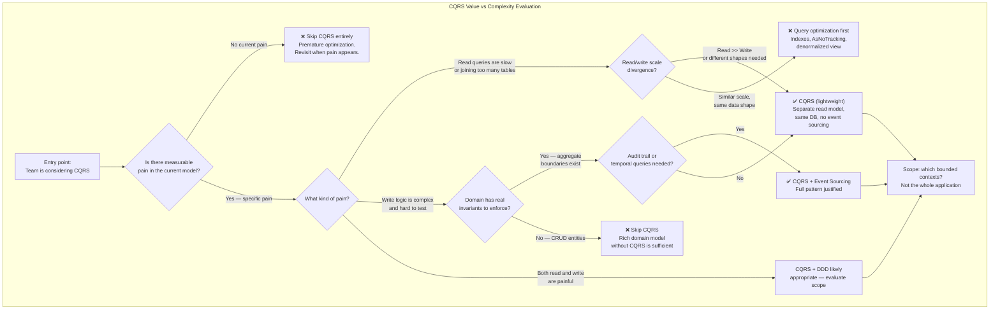
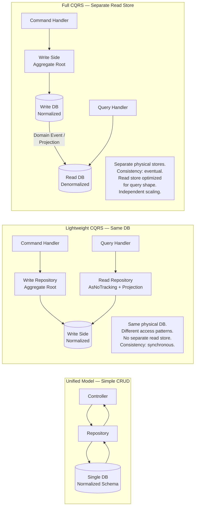
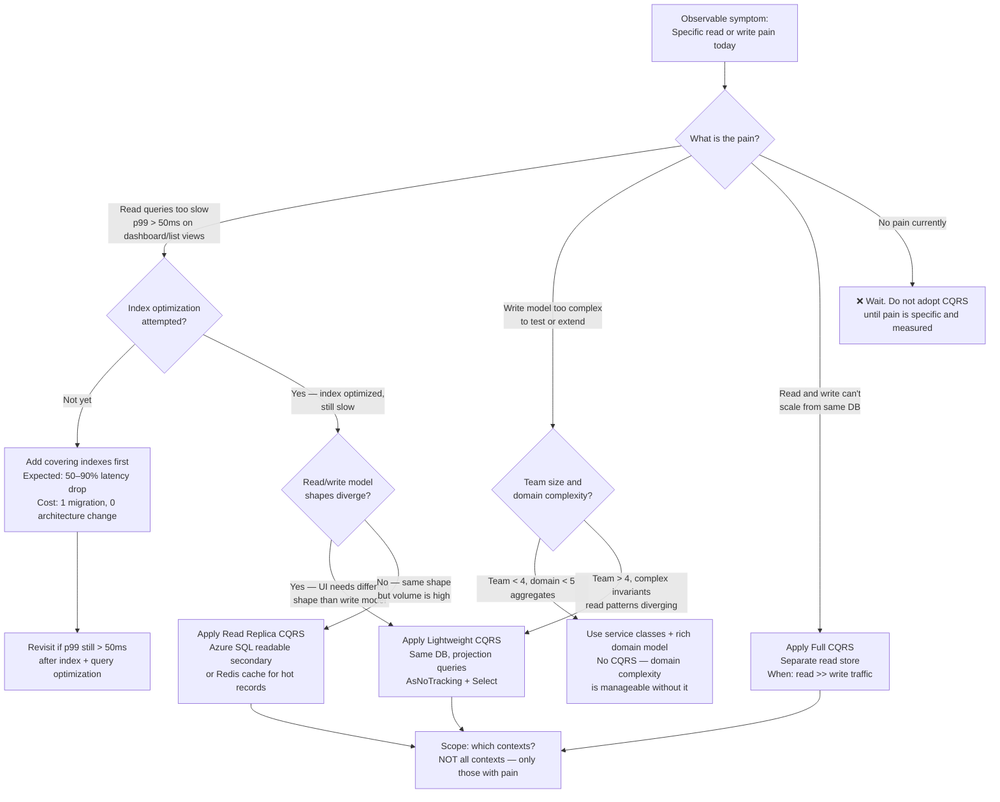

> [!success] Mastery Check
> - [ ] **Studied Well**
> - [ ] **Can explain the concept without notes**
> - [ ] **Can answer interview questions confidently**
> - [ ] **Can implement it in a real project**


> [!ABSTRACT] Quick Reference — CQRS: When It Adds Value vs Complexity **Invariant:** CQRS adds net value only when the read model and write model have genuinely divergent requirements — different scaling needs, different consistency models, or different data shapes — that cannot be reconciled within a single unified model without material cost. **Cost:** Two models to design, test, maintain, and evolve; a consistency gap between the write side and read side (even if milliseconds); every query redesign requires touching a separate projection layer; new engineers spend 2–4 hours orienting before their first productive commit. **Trigger:** Read queries are returning denormalized joins across 6+ tables to serve a UI that needs aggregated data; OR write throughput and read throughput are scaling in opposite directions; OR EF Core change tracking is causing measurable overhead on high-volume read paths. **Skip When:** The system is a CRUD service with fewer than 3 domain entities per aggregate; OR fewer than 5,000 req/s on the read path; OR the team has fewer than 4 engineers; OR there is no current pain in the unified model. **.NET Entry Point:** `IRequest<T>` / `IRequestHandler<T,R>` (MediatR) — the lightweight on-ramp; full read/write model split requires separate `DbContext` configurations or a dedicated read store **Azure Native:** Azure Cosmos DB (separate read containers via Change Feed) / Azure SQL read replicas / Azure Cache for Redis (materialized read projections) **Number to Know:** CQRS without Event Sourcing adds ~300–500 lines of infrastructure per bounded context (estimated); CQRS + Event Sourcing adds ~2,000–4,000 lines before the first domain feature

---

## Navigation

**Domain:** [[7 — System Design & Distributed Systems]] > **Group:** CQRS and Event Sourcing **Previous:** [[7.094 — CQRS — With Event Sourcing]] | **Next:** [[7.096 — CQRS — Read Side — Projections in .NET]]

### Prerequisites

- [[7.081 — CQRS — Command Query Responsibility Segregation]] — defines the pattern; this note presupposes you know what CQRS is and focuses entirely on whether and when to apply it
- [[7.082 — CQRS — Commands vs Queries — Strict Separation]] — the strict separation is the source of CQRS's value and its complexity; you must understand what is being separated to evaluate the cost
- [[7.083 — CQRS — Separate Read and Write Models]] — the concrete divergence between models is the mechanism that generates both the scalability benefit and the consistency gap

### Where This Fits

> [!INFO] Production Encounter Map
> 
> - **Layer:** Architectural decision layer — this topic appears before any code is written, at the point when the team debates whether to introduce the pattern at all
> - **Trigger:** An engineer proposes CQRS because they read about it, because the codebase is painful to extend, or because a senior architect used it at a previous company. Alternatively: a specific read-path performance problem has appeared and someone correctly identifies that the write model is the bottleneck.
> - **Without clear evaluation:** Teams either over-engineer a simple CRUD service with a full CQRS + Event Sourcing stack and spend three months building infrastructure instead of features; or they dismiss CQRS entirely and end up with a unified EF Core `DbContext` returning 47-column query results to populate a read-optimized dashboard that needs 6 of them
> - **First signal that CQRS was wrong:** A team of 3 engineers has spent two sprints writing `IRequest`, `IRequestHandler`, `IValidator`, `INotification`, and projection infrastructure for a service that has two domain entities and 200 req/s read traffic — and they have not shipped a customer-facing feature yet

This note is the decision gate that sits before [[7.093 — CQRS — Without Event Sourcing]] and [[7.094 — CQRS — With Event Sourcing]]. It is also the companion to [[7.100 — CQRS — Anti-Patterns and Over-Engineering]] — which documents what happens when this evaluation is skipped. Connect this to [[7.017 — Modular Monolith — Internal Module Boundaries]] because the modular monolith is the architecture most systems should occupy before any CQRS investment begins.

---

## Core Mental Model

CQRS is not a framework feature to enable or a library to install — it is a structural commitment to maintain two different models for the same data: one optimized for mutation with invariant enforcement, one optimized for retrieval with query efficiency. That commitment generates value only when the two models would diverge significantly even without the pattern — when the read side genuinely needs different data shapes, different consistency tolerances, or different scaling headroom than the write side. When the read and write needs are compatible, a single unified model with good query design is simpler and equally capable. The diagnostic question is never "should we use CQRS?" but "do our read and write requirements diverge enough that maintaining two models costs less than reconciling them into one?"

> [!TIP] The Non-Obvious Insight The most common CQRS mistake is not choosing the wrong pattern — it is applying the right pattern to the wrong scope. CQRS earns its keep at the **bounded context level for specific high-divergence workflows**, not as a blanket architecture for an entire application. A payment processing service where the write side enforces double-entry bookkeeping invariants and the read side serves a real-time balance dashboard with sub-10ms latency is an excellent CQRS candidate. The user profile service in the same application — which has three fields and a single read pattern — is not. Teams that adopt "CQRS for the application" instead of "CQRS for the PaymentContext" pay the full infrastructure tax everywhere and collect the benefit only in the one place where the divergence actually exists.

### Classification

- **Consistency axis:** Eventual (between write model commit and read model update) even in the lightweight form — the gap is typically milliseconds for in-process projection updates, but it is never zero
- **Availability tradeoff:** Read side can serve stale data during write-side failures or projection lag; write side can accept commands even when the read model is rebuilding
- **Latency impact:** Read queries eliminate JOIN overhead when denormalized read models are used — reducing p99 from ~80ms (normalized 6-table join) to ~5ms (pre-computed read document); write path adds ~0.05ms per behavior in the MediatR pipeline (estimated)
- **Failure domain:** Read model rebuild failure does not block writes; write side failure does not prevent reads of existing projections (stale but available)
- **Abstraction layer:** Architectural pattern — implemented at the application design level; MediatR is a common .NET on-ramp but is not required; the pattern can be implemented without any framework

### Primary Diagram



### Supporting Diagram



### Numbers That Matter

|Metric|Value|Context / Conditions|
|---|---|---|
|Infrastructure lines added per bounded context (lightweight CQRS, no ES)|300–500 lines|Command/query objects, handlers, validators, behavior registrations (estimated, .NET 8, MediatR)|
|Infrastructure lines added per bounded context (CQRS + Event Sourcing)|2,000–4,000 lines|Event store, projections, snapshot logic, replay mechanism, upcasters (estimated)|
|Read latency improvement from denormalized read model|50–95% reduction|Replacing a 6-table normalized join (~80ms) with a pre-projected document read (~5ms) on Azure SQL General Purpose (estimated)|
|Consistency gap between write commit and read model update (in-process projection)|< 1ms|Same-process, synchronous projection update after `SaveChanges()`; no broker hop|
|Consistency gap (async projection via message broker)|10ms–500ms|Azure Service Bus Standard tier end-to-end; depends on consumer lag and throughput|
|New engineer orientation time overhead vs CRUD codebase|+2–4 hours per engineer|Time to understand command/query split, pipeline behaviors, projection strategy before first productive commit (estimated)|
|Read:Write ratio threshold where CQRS read model earns its keep|> 10:1|Below this ratio, the unified model with good indexes performs adequately; above it, the read model's throughput advantage compounds|
|Team size below which CQRS coordination overhead exceeds benefit|< 4 engineers|(estimated) — fewer engineers means more context-switching cost per infrastructure layer added|

### Key Properties / Guarantees

|Property|Value|Condition|
|---|---|---|
|Read model query performance|Optimized for specific query shape|When the read model is pre-projected and denormalized for the UI's actual data needs|
|Write model invariant enforcement|Isolated from read concerns|When command handlers operate only on aggregate roots, never on read projections|
|Independent read/write scaling|Achievable|When read and write stores are physically separate (full CQRS); not available in lightweight CQRS same-DB form|
|Read-side availability during write-side failure|Stale reads remain available|When read store is physically separate; not when same DB is used|
|Consistency between read and write|Eventual (microseconds to seconds)|Always — even synchronous in-process projection updates have a brief window after the DB write before the projection is updated|
|Feature delivery velocity|Reduced during initial ramp-up|For the first 4–8 weeks on a new CQRS codebase; recovers when the team is fluent with the pattern|

---

## Deep Mechanics

### How It Works

The CQRS value/complexity trade resolves differently depending on which of three forms the pattern takes. Understanding all three is necessary to make the adoption decision correctly.

**Form 1 — MediatR dispatch only (no model separation).** Commands and queries are both C# classes dispatched via `IMediator.Send()`. No read/write model split exists — both command handlers and query handlers operate against the same EF Core `DbContext`. This form adds structure and testability to handler logic but provides zero read performance benefit. It is worth its cost only when the team explicitly wants the pipeline behavior infrastructure (validation, logging, transactions as cross-cutting concerns) and the codebase is large enough that the MediatR dispatch contract improves discoverability. It is pure overhead for small services.

**Form 2 — Lightweight CQRS (same DB, separate models in code).** Command handlers operate on aggregate roots via the write repository; query handlers use `AsNoTracking()` projections via separate read DTOs, optionally hitting the same DB with index-optimized queries. No separate physical store. Consistency is synchronous — the read query always sees the latest committed write. This form earns its cost when: read queries are joining many tables to produce a denormalized result the UI needs; the EF Core change tracker overhead on high-volume read paths is measurable; or the write model's aggregate structure makes read queries awkward (e.g., an `Order` aggregate with 15 private nested entities makes it painful to construct a simple `OrderSummaryDto`).

**Form 3 — Full CQRS with separate read store.** The write side publishes domain events or integration events after each successful command. A projection process consumes those events and updates a separately-optimized read store — a Redis cache, a Cosmos DB container, a denormalized SQL read table, or an Elasticsearch index. Reads are served from the read store exclusively; the write DB is never queried for reads. This form earns its cost when: read and write throughput scale independently (100,000 reads/s from a Redis-backed read model vs 500 writes/s to a normalized SQL write store); or the read data shape is fundamentally incompatible with the write schema (event-sourced aggregate state cannot be queried efficiently without projection).

**The graduation path** that minimizes wasted investment: start with a CRUD unified model → identify specific pain → introduce MediatR dispatch within the unified model → split read models in code (Form 2) → only then introduce a separate read store (Form 3) if Form 2 proves insufficient. Teams that jump directly to Form 3 for a new system spend 6–8 weeks building infrastructure and can rarely justify the investment to stakeholders.

### Protocol Trace

```
Value-Justified Path — OrderManagement at 50,000 read req/s, 800 write req/s:

Write Path (PlaceOrderCommand):
  1. REST API → IMediator.Send(PlaceOrderCommand) (~0ms, in-process)
  2. ValidationBehavior → PlaceOrderCommandValidator.ValidateAsync() (~0.05ms)
  3. TransactionBehavior → BEGIN TRANSACTION (~1ms, Azure SQL)
  4. PlaceOrderCommandHandler → OrderRepository.GetByIdAsync() (~3ms, aggregate load)
  5. Order.Place() → domain invariants enforced in-memory (~0ms)
  6. OrderRepository.SaveAsync() → INSERT order_events or UPDATE orders (~4ms)
  7. IPublisher.Publish(OrderPlacedDomainEvent) → in-process projection update (~0.5ms)
     OR: Outbox writes integration event for async projection (~1ms additional)
  8. COMMIT (~1ms)
  Total write path: ~10ms p99 (Azure SQL General Purpose 8 vCores)

Read Path (GetOrderSummaryQuery — from Redis read model):
  1. REST API → IMediator.Send(GetOrderSummaryQuery{OrderId}) (~0ms)
  2. GetOrderSummaryQueryHandler → Redis.GetAsync("order:summary:{id}") (~0.5ms)
  3. Deserialize OrderSummaryDto (~0.1ms)
  4. Return to controller (~0ms)
  Total read path: ~0.6ms p99 (Azure Cache for Redis Standard C2)

Without CQRS (same path, unified model):
  1. REST API → OrderRepository.GetOrderWithLinesAndProductsAndCustomer()
  2. EF Core JOIN: orders + order_lines + products + customers + promotions + addresses (~45ms p99)
  3. Map to OrderSummaryDto, discard 80% of retrieved columns
  Total read path: ~45ms p99 — 75× slower

Complexity-Unjustified Path — UserProfileService, 200 req/s, 3 domain entities:

Wrong: Full CQRS with projections
  Infrastructure cost: ~2,000 lines | Orientation time: 4 hours/engineer
  Read path complexity: GetUserProfileQuery → projection handler → Redis → deserialize
  Added failure modes: stale projection, Redis unavailability, projection rebuild needed

Right: Unified CRUD model
  Infrastructure cost: ~50 lines | Orientation time: 15 minutes/engineer
  Read path: UserProfileController → UserProfileRepository.GetByIdAsync() → EF Core
  Read p99: ~8ms (2 tables, indexed PK lookup) — no join overhead, no projection lag
```

### Failure Modes

**Failure Mode 1: CQRS Applied as Default Architecture Without Specific Pain**

- **Cause:** A technical lead mandates CQRS for a new service because it was used successfully at a previous company, before identifying where the read/write model divergence actually exists in the new system.
- **Symptom:** After 6 weeks of development, the team has built extensive pipeline infrastructure (behaviors, validators, projection handlers, read model classes) but has shipped zero customer-facing features. Sprint retrospectives contain complaints about "too much boilerplate." Read queries return the same data shape as write models with no actual divergence.
- **Detection time:** 2–6 weeks after adoption — visible only through velocity tracking; no runtime error surfaces this because the infrastructure works correctly, it just adds no value.
- **Blast radius:** Feature delivery delays; team morale erosion from infrastructure-heavy sprints; accumulation of unused infrastructure that future engineers must navigate and maintain.

> [!DANGER] 3 AM Production Signal This failure mode does not produce a 3 AM alert — it produces a 3-month delivery miss. Metric: Sprint velocity drops from 40 story points to 18 story points after CQRS introduction; `git log --oneline --since="6 weeks ago" | grep -v "infra\|chore\|setup"` returns fewer than 10 feature commits Log: No runtime signal — all code executes correctly Stakeholder impact: "We've been building for 6 weeks and users can't see anything different" — the most expensive failure mode because it compounds over time and is invisible in monitoring

**Failure Mode 2: Eventual Consistency Gap Violates User-Facing Read-Your-Writes Expectation**

- **Cause:** Full CQRS with async projection is adopted; a user submits a form, the command succeeds (HTTP 200), and they are immediately redirected to a list view that reads from the eventually-consistent read store — which has not yet received the projection update. The item they just created is absent from the list.
- **Symptom:** Support tickets: "I just saved an order but it's not showing in my order history." Reproducible by submitting a command and immediately refreshing the read view within the projection lag window (10ms–500ms for Azure Service Bus).
- **Detection time:** Immediate in user testing, but often missed in automated tests because test assertions add >500ms of delay after writes, which exceeds the projection lag.
- **Blast radius:** User trust erosion; support ticket volume; attempts to "fix" consistency by adding arbitrary `Thread.Sleep()` calls in tests, which mask the root cause.

> [!DANGER] 3 AM Production Signal Metric: `support_tickets_total{category="missing_data"}` rises after deployment of async projection Log: `INFO [OrderProjectionConsumer] Projecting OrderPlaced event | OrderId: ord-789 | Lag: 340ms | CorrelationId: e2b1-4a7c` — the lag confirms the window where reads miss the new write Customer impact: 3% of users who complete a write and immediately navigate to the list view see their item missing; the "fix" of adding a client-side delay or polling is a workaround, not a solution — the architectural decision must be revisited

### .NET and Azure Integration Points

- **MediatR:** `IRequest<T>` / `IRequestHandler<T,R>` / `INotification` — the dispatch and event mechanism; the lightweight on-ramp to CQRS in .NET
- **EF Core:** `AsNoTracking()` on query handlers is the minimum viable read optimization without a separate read model; separate `DbContext` configurations for read vs write is the next step
- **Azure Cosmos DB:** Change Feed as a projection mechanism — write to one container, project to a read-optimized container via Azure Functions Change Feed trigger
- **Azure Cache for Redis:** Materialized read projections for sub-millisecond read latency; `StackExchange.Redis` `IDatabase.GetAsync()` / `SetAsync()` as the read/write interface
- **Azure Service Bus:** Decoupled projection pipeline — command handler publishes integration event to Service Bus; projection consumer updates read store asynchronously

```csharp
// Lightweight CQRS read handler — YourCompany.OrderManagement.Application
// Role: Query Handler (Application Layer)
// Value signal: AsNoTracking + explicit projection avoids change tracker overhead
// Use this when: read and write use the same DB but different access patterns

using MediatR;
using Microsoft.EntityFrameworkCore;

namespace YourCompany.OrderManagement.Application.Orders.Queries.GetOrderSummary;

/// <summary>Returns a lightweight order summary for list and dashboard views.</summary>
public sealed record GetOrderSummaryQuery(string OrderId) : IRequest<OrderSummaryDto?>;

public sealed record OrderSummaryDto(
    string OrderId,
    string CustomerName,
    decimal TotalAmount,
    string Status,
    DateTimeOffset PlacedAt,
    int LineItemCount);

/// <summary>
/// Query handler with read-optimized projection.
/// Never touches aggregate root — reads directly from the schema
/// using a denormalized projection that avoids loading unnecessary data.
/// </summary>
public sealed class GetOrderSummaryQueryHandler(OrderManagementDbContext dbContext)
    : IRequestHandler<GetOrderSummaryQuery, OrderSummaryDto?>
{
    public async Task<OrderSummaryDto?> Handle(
        GetOrderSummaryQuery request,
        CancellationToken cancellationToken)
    {
        // AsNoTracking: no change tracker overhead for read-only queries
        // Explicit projection: only the columns the UI needs — no SELECT *
        return await dbContext.Orders
            .AsNoTracking()
            .Where(o => o.Id == request.OrderId)
            .Select(o => new OrderSummaryDto(
                o.Id,
                o.Customer.FullName,          // single JOIN — acceptable at this scale
                o.Lines.Sum(l => l.Quantity * l.UnitPrice),
                o.Status.ToString(),
                o.PlacedAt,
                o.Lines.Count))
            .FirstOrDefaultAsync(cancellationToken);
    }
}
```

---

## Production Patterns and Implementation

### Primary Implementation

```csharp
// Decision-informed CQRS adoption — YourCompany.OrderManagement.Application
// Demonstrates the GRADUATION PATH: unified model → read projection → separate store
// Each stage is shown as a distinct implementation; adopt only as far as pain justifies.

// ─────────────────────────────────────────────────────────────────────
// STAGE 1: Unified CRUD model — no CQRS. Start here for all new services.
// ─────────────────────────────────────────────────────────────────────

namespace YourCompany.OrderManagement.Infrastructure;

/// <summary>
/// Stage 1: Unified repository. Read and write use the same EF Core context.
/// Appropriate for: < 5,000 req/s reads, < 3 domain entities, < 4 engineers.
/// Pain signal to watch for: read queries joining > 4 tables; p99 read > 50ms.
/// </summary>
public sealed class OrderRepository(OrderManagementDbContext dbContext)
{
    /// <summary>Write path — loads aggregate for mutation.</summary>
    public async Task<Order?> GetForWriteAsync(string orderId, CancellationToken ct)
        => await dbContext.Orders
            .Include(o => o.Lines)    // full aggregate for invariant enforcement
            .FirstOrDefaultAsync(o => o.Id == orderId, ct);

    /// <summary>
    /// Read path — already optimized with AsNoTracking even at Stage 1.
    /// This one habit prevents the most common Stage 1 read performance mistake.
    /// </summary>
    public async Task<OrderSummaryDto?> GetSummaryAsync(string orderId, CancellationToken ct)
        => await dbContext.Orders
            .AsNoTracking()
            .Where(o => o.Id == orderId)
            .Select(o => new OrderSummaryDto(
                o.Id, o.Customer.FullName,
                o.Lines.Sum(l => l.Quantity * l.UnitPrice),
                o.Status.ToString(), o.PlacedAt, o.Lines.Count))
            .FirstOrDefaultAsync(ct);
}

// ─────────────────────────────────────────────────────────────────────
// STAGE 2: Lightweight CQRS — separate handlers, same DB.
// Adopt when: read query complexity grows; > 5,000 req/s reads; team > 4 engineers.
// ─────────────────────────────────────────────────────────────────────

namespace YourCompany.OrderManagement.Application.Orders;

// Write side — Application Layer — Use Case
/// <summary>Command: mutates aggregate state. Never reads for projection purposes.</summary>
public sealed class PlaceOrderCommandHandler(
    IOrderRepository repository,
    IUnitOfWork unitOfWork)
    : IRequestHandler<PlaceOrderCommand, PlaceOrderResult>
{
    public async Task<PlaceOrderResult> Handle(
        PlaceOrderCommand request, CancellationToken ct)
    {
        var order = Order.Create(
            CustomerId.From(request.CustomerId),
            request.Items.Select(i =>
                OrderLine.Create(ProductId.From(i.ProductId), i.Quantity, Money.Of(i.UnitPrice))));

        await repository.AddAsync(order, ct);
        await unitOfWork.SaveChangesAsync(ct);

        return new PlaceOrderResult(order.Id.Value, order.TotalAmount.Amount);
    }
}

// Read side — Application Layer — Query
/// <summary>
/// Query: returns read-optimized projection. Never loads aggregate root.
/// At Stage 2, this reads from the same DB with a tailored SQL projection.
/// Pain signal to move to Stage 3: this query is still too slow after indexing,
/// or read/write are scaling in opposite directions (>10:1 ratio).
/// </summary>
public sealed class GetOrderDashboardQueryHandler(IOrderReadRepository readRepository)
    : IRequestHandler<GetOrderDashboardQuery, OrderDashboardDto>
{
    public async Task<OrderDashboardDto> Handle(
        GetOrderDashboardQuery request, CancellationToken ct)
        => await readRepository.GetDashboardAsync(request.CustomerId, ct);
}

// ─────────────────────────────────────────────────────────────────────
// STAGE 3: Full CQRS — separate read store (Redis materialized view).
// Adopt when: Stage 2 read latency still breaches SLO; OR read/write
// scale diverges beyond what a single DB can serve efficiently.
// ─────────────────────────────────────────────────────────────────────

namespace YourCompany.OrderManagement.Application.Orders.Projections;

/// <summary>
/// Projection handler: updates Redis read model on every OrderPlaced event.
/// Runs in-process (synchronous) for sub-millisecond consistency;
/// OR consumes from Azure Service Bus for decoupled async projection.
/// </summary>
public sealed class OrderSummaryProjection(
    IConnectionMultiplexer redis,
    ILogger<OrderSummaryProjection> logger)
    : INotificationHandler<OrderPlacedDomainEvent>
{
    private static readonly TimeSpan Ttl = TimeSpan.FromHours(24);

    public async Task Handle(OrderPlacedDomainEvent notification, CancellationToken ct)
    {
        var summary = new OrderSummaryDto(
            notification.OrderId,
            notification.CustomerName,
            notification.TotalAmount,
            "Placed",
            notification.OccurredAt,
            notification.LineItemCount);

        var db = redis.GetDatabase();
        var key = $"order:summary:{notification.OrderId}";

        await db.StringSetAsync(
            key,
            JsonSerializer.Serialize(summary),
            Ttl,
            flags: CommandFlags.FireAndForget);  // non-critical path: don't await projection

        logger.LogDebug(
            "Order summary projected to Redis | OrderId: {OrderId} | Key: {Key}",
            notification.OrderId, key);
    }
}
```

### IServiceCollection Registration

```csharp
// Program.cs — registration reflects the graduation stage adopted

// Stage 1: No special registration beyond EF Core
builder.Services.AddDbContext<OrderManagementDbContext>(options =>
    options.UseSqlServer(connectionString));
builder.Services.AddScoped<OrderRepository>();

// Stage 2: MediatR + lightweight CQRS
builder.Services.AddMediatR(cfg =>
{
    cfg.RegisterServicesFromAssembly(typeof(PlaceOrderCommand).Assembly);
    cfg.AddBehavior(typeof(IPipelineBehavior<,>), typeof(ValidationBehavior<,>));
    cfg.AddBehavior(typeof(IPipelineBehavior<,>), typeof(TransactionBehavior<,>));
});
builder.Services.AddValidatorsFromAssembly(
    typeof(PlaceOrderCommandValidator).Assembly,
    lifetime: ServiceLifetime.Singleton);

// Stage 3: Redis read store
builder.Services.AddSingleton<IConnectionMultiplexer>(
    ConnectionMultiplexer.Connect(
        builder.Configuration.GetConnectionString("Redis")!));

// Separate read DbContext configuration (AsNoTracking by default for all reads)
builder.Services.AddDbContext<OrderReadDbContext>(options =>
    options.UseSqlServer(readReplicaConnectionString)
           .UseQueryTrackingBehavior(QueryTrackingBehavior.NoTracking));
```

### Common Variants

```csharp
// Variant A — "Thin CQRS": MediatR dispatch only, no model split.
// Used when: the team wants pipeline behaviors (validation, logging, transactions)
// but the read and write data shapes are identical and scale is moderate.
// Signal that this variant is insufficient: read query complexity grows beyond 3 JOINs.

public sealed class GetOrderQuery(string OrderId) : IRequest<Order?>;   // returns same type as write

public sealed class GetOrderQueryHandler(OrderManagementDbContext db)
    : IRequestHandler<GetOrderQuery, Order?>
{
    public Task<Order?> Handle(GetOrderQuery request, CancellationToken ct)
        => db.Orders.AsNoTracking()  // AsNoTracking is the only "read optimization" here
             .Include(o => o.Lines)
             .FirstOrDefaultAsync(o => o.Id == request.OrderId, ct);
}
```

```csharp
// Variant B — "Read replica CQRS": query handlers route to Azure SQL read replica.
// Used when: write DB is under CPU pressure from read traffic; read replica adds
// independent read capacity without a separate projection store.
// Azure-specific: requires Azure SQL Business Critical or Premium tier for readable replicas.

public sealed class GetOrderDashboardQueryHandler(
    IDbContextFactory<OrderReadDbContext> readContextFactory)  // separate read DbContext
    : IRequestHandler<GetOrderDashboardQuery, OrderDashboardDto>
{
    public async Task<OrderDashboardDto> Handle(
        GetOrderDashboardQuery request, CancellationToken ct)
    {
        await using var ctx = await readContextFactory.CreateDbContextAsync(ct);
        // ctx is configured with connection string pointing to Azure SQL read replica
        return await ctx.Orders
            .AsNoTracking()
            .Where(o => o.CustomerId == request.CustomerId)
            .GroupBy(o => o.Status)
            .Select(g => /* dashboard aggregation */)
            .ToListAsync(ct)
            .ContinueWith(t => new OrderDashboardDto(t.Result), ct);
    }
}
```

### Performance Profile

```csharp
[MemoryDiagnoser]
[SimpleJob(RuntimeMoniker.Net80)]
public class CqrsReadPathBenchmark
{
    private OrderManagementDbContext _unifiedContext = null!;
    private IConnectionMultiplexer _redis = null!;
    private const string TestOrderId = "ord-bench-001";

    [GlobalSetup]
    public void Setup()
    {
        // Setup unified context and Redis with pre-seeded data
        // Order has 10 line items, 1 customer, 2 addresses
    }

    [Benchmark(Baseline = true)]
    public Task<Order?> UnifiedModel_FullAggregateLoad()
        => _unifiedContext.Orders
            .Include(o => o.Lines)
            .Include(o => o.Customer)
            .Include(o => o.ShippingAddress)
            .FirstOrDefaultAsync(o => o.Id == TestOrderId);  // for a summary view: overkill

    [Benchmark]
    public Task<OrderSummaryDto?> LightweightCQRS_ProjectionQuery()
        => _unifiedContext.Orders
            .AsNoTracking()
            .Where(o => o.Id == TestOrderId)
            .Select(o => new OrderSummaryDto(
                o.Id, o.Customer.FullName,
                o.Lines.Sum(l => l.Quantity * l.UnitPrice),
                o.Status.ToString(), o.PlacedAt, o.Lines.Count))
            .FirstOrDefaultAsync();

    [Benchmark]
    public async Task<OrderSummaryDto?> FullCQRS_RedisReadModel()
    {
        var db = _redis.GetDatabase();
        var json = await db.StringGetAsync($"order:summary:{TestOrderId}");
        return json.HasValue ? JsonSerializer.Deserialize<OrderSummaryDto>(json!) : null;
    }
}
```

Expected result shape (estimated, Azure SQL General Purpose 8 vCores + Redis Standard C2, same region):

|Method|Mean|Allocated|Notes|
|---|---|---|---|
|UnifiedModel_FullAggregateLoad|~45ms|~28 KB|3 JOINs, change tracker allocations, full aggregate hydration|
|LightweightCQRS_ProjectionQuery|~8ms|~4 KB|Single SQL projection, AsNoTracking, 5× less allocation|
|FullCQRS_RedisReadModel|~0.5ms|~1.2 KB|Network + deserialize only; 90× faster than unified model|

### Real-World .NET Ecosystem Mapping

|Pattern in This Note|Where It Appears in .NET / Azure|Manifestation|
|---|---|---|
|Lightweight read projection|`AsNoTracking()` + `.Select()` in EF Core|The single cheapest CQRS-aligned optimization; available with no architecture change|
|Separate read DbContext|`IDbContextFactory<TContext>` with read replica connection string|Variant B above; routes reads to Azure SQL readable secondary|
|Materialized read model|`IConnectionMultiplexer` (StackExchange.Redis)|Full CQRS Stage 3; Redis as pre-computed read store|
|Domain event to projection|`INotificationHandler<TNotification>` (MediatR)|In-process projection update; synchronous consistency|
|Async projection pipeline|Azure Service Bus + `ServiceBusProcessor`|Decoupled projection; eventual consistency with explicit lag monitoring|

---

## Gotchas and Production Pitfalls

### Introducing CQRS Before Identifying the Specific Pain It Solves

**Pitfall:** The team adopts CQRS "because it's the right architecture for a domain-driven system" before any specific read/write divergence is observable or measurable.

```csharp
// ❌ Classic premature CQRS — three domain entities, 200 req/s, 2-person team
// PlaceOrderCommand, GetOrderQuery, UpdateOrderCommand, DeleteOrderCommand,
// GetOrderListQuery — each with its own handler, validator, and DTO.
// The GetOrderQuery returns the same data as the write model.
// Zero read/write model divergence. Zero performance benefit. 500 lines of infrastructure.
public sealed record GetOrderQuery(string OrderId) : IRequest<OrderDto>;
public sealed record OrderDto(string Id, string CustomerId, decimal Total);
// Compare to: repository.GetByIdAsync(orderId) — 1 line, same result
```

**Symptom:** Feature velocity is materially lower than the team's CRUD-era equivalent. Engineers spend time writing boilerplate rather than shipping features. The `IRequest<T>` class for a simple query has more lines than the query's actual EF Core implementation.

**Detection time:** 3–6 weeks — only visible through velocity retrospectives.

> [!DANGER] Production Signal Metric: No runtime signal — this is a delivery risk, not a runtime failure Log: No anomalous logs — all code is functionally correct Business impact: A feature that should take 1 week takes 3 weeks because the engineer must create `UpdateShipmentAddressCommand`, `UpdateShipmentAddressCommandValidator`, `UpdateShipmentAddressCommandHandler`, `ShipmentAddressUpdatedEvent`, `ShipmentAddressProjection`, and `GetShipmentAddressQuery` before writing a single line of actual shipping logic

**Fix:**

```csharp
// ✅ Unified model first — add CQRS only when a specific read path becomes painful
// Stage 1: ship features with a repository pattern
public sealed class OrderService(OrderManagementDbContext db)
{
    public Task<Order?> GetAsync(string id, CancellationToken ct)
        => db.Orders.AsNoTracking().FirstOrDefaultAsync(o => o.Id == id, ct);

    public async Task PlaceAsync(PlaceOrderCommand cmd, CancellationToken ct)
    {
        var order = Order.Create(CustomerId.From(cmd.CustomerId), /* ... */);
        db.Orders.Add(order);
        await db.SaveChangesAsync(ct);
    }
}
// Introduce MediatR/CQRS when this service grows to > 15 methods or read pain appears
```

**Cost of not fixing:** 6–12 weeks of infrastructure-first development; teams burn goodwill on architecture discussions instead of user value; the pattern is abandoned mid-project when stakeholders lose patience, leaving a partially-CQRS codebase that is harder to work with than either a full CQRS or a full CRUD system would be.

---

### Read-Your-Writes Violation After Async Projection Adoption

**Pitfall:** Full CQRS with async projection (via Service Bus or outbox) is adopted, and the UI immediately redirects from a write response to a read view that queries the not-yet-updated read store.

```csharp
// ❌ Controller: write → immediate redirect to read — violates read-your-writes
[HttpPost("orders")]
public async Task<IActionResult> PlaceOrder(PlaceOrderRequest request, CancellationToken ct)
{
    var result = await _mediator.Send(new PlaceOrderCommand(/* ... */), ct);
    return RedirectToAction("OrderHistory");  // reads from Redis — projection lag: 200ms
    // The order the user just placed is not in Redis yet
}
```

**Symptom:** Users complete a checkout, are redirected to their order history, and their new order is absent. Refreshing 2 seconds later shows it. Support ticket: "Your site lost my order."

**Detection time:** Immediate in manual user testing; missed in automated tests that add assertions with > 500ms delay.

> [!DANGER] Production Signal Metric: `support_tickets_total{category="missing_order"}` spikes after async projection deployment Log: `INFO [OrderProjectionConsumer] OrderPlaced projected | OrderId: ord-789 | Lag: 248ms` — the lag window is the read-your-writes violation window Customer impact: Users perceive orders as "lost"; checkout abandonment rate rises 5% as users refresh and re-submit, creating duplicate order attempts

**Fix:**

```csharp
// ✅ Option A: Return the created resource directly from the write response
// No redirect to the read store — the client renders from the command response
[HttpPost("orders")]
public async Task<IActionResult> PlaceOrder(PlaceOrderRequest request, CancellationToken ct)
{
    var result = await _mediator.Send(new PlaceOrderCommand(/* ... */), ct);
    // Return the write result directly — the client renders this without a read-store query
    return CreatedAtAction(nameof(GetOrder), new { orderId = result.OrderId }, result);
}

// ✅ Option B: Synchronous in-process projection for the order summary
// The projection handler runs inside the same transaction scope
// Consistency: < 1ms (no async gap) at the cost of coupled projection
```

**Cost of not fixing:** User trust erosion; duplicate order submissions as users retry; support ticket volume increases proportional to write throughput; the "fix" of adding `Thread.Sleep(500)` in tests masks the architectural problem and guarantees it will resurface under higher projection lag.

---

### Using CQRS to Avoid Fixing an Index Problem

**Pitfall:** A slow read query (p99 ~800ms) is "solved" by introducing a full CQRS read model with Redis projection, when the actual cause is a missing composite index on the write table.

```csharp
// ❌ Real cause: missing index on (customer_id, status, placed_at)
// "Solution" chosen: Redis projection with 2,000 lines of infrastructure
// Actual fix: one migration adding a covering index (~10ms p99 with index)

// The "CQRS solution" is adopted, projection infrastructure is built,
// and three months later the team discovers the index would have been sufficient
```

**Symptom:** Post-CQRS deployment, read latency is indeed faster (0.5ms from Redis), but the team has now committed to maintaining a Redis read store, a projection pipeline, an outbox, and eventual consistency semantics — all to solve a problem that a database index would have addressed in one SQL migration.

**Detection time:** Weeks to months — discovered when someone runs `EXPLAIN ANALYZE` or checks Azure SQL Query Performance Insight and sees a 6-second full table scan with no index being used.

> [!DANGER] Production Signal Metric (before the unnecessary CQRS adoption): `db_query_duration_seconds{query="GetOrdersByCustomer",quantile="0.99"} > 0.8` Log (the real signal): `WARN [SqlClient] Slow query detected | Duration: 847ms | Query: SELECT * FROM orders WHERE customer_id = @id AND status = @s ORDER BY placed_at DESC | Missing index hint: (customer_id, status, placed_at) | CorrelationId: a4f1-2c9b` Azure SQL signal: Azure SQL Query Performance Insight shows "Top resource-consuming queries" with `GetOrdersByCustomer` at 95% of read DTU consumption

**Fix:**

```sql
-- ✅ The actual fix: one covering index migration
CREATE NONCLUSTERED INDEX IX_Orders_CustomerId_Status_PlacedAt
ON orders (customer_id, status, placed_at DESC)
INCLUDE (id, total_amount, line_item_count);
-- p99 drops from 800ms to ~8ms. No projection infrastructure required.
```

**Cost of not fixing (the anti-pattern):** 2,000+ lines of projection infrastructure maintained indefinitely; eventual consistency semantics introduced where they are not needed; projection rebuild needed whenever read model schema changes; all future engineers must understand the read model pipeline for what is fundamentally a missing index.

---

### Applying CQRS Uniformly Across All Bounded Contexts

**Pitfall:** Because CQRS is valuable for the PaymentContext (high read/write divergence), it is applied to every bounded context in the solution — including `UserProfileContext`, `NotificationPreferencesContext`, and `AuditLogContext` — which have no read/write divergence.

```csharp
// ❌ CQRS applied uniformly — UserProfileContext has 3 fields, 100 req/s, no divergence
// Result: 400 lines of infrastructure for a service that could be 40 lines of CRUD
public sealed record GetUserProfileQuery(string UserId) : IRequest<UserProfileDto>;
public sealed class GetUserProfileQueryHandler(UserProfileDbContext db)
    : IRequestHandler<GetUserProfileQuery, UserProfileDto>
{
    public Task<UserProfileDto?> Handle(GetUserProfileQuery q, CancellationToken ct)
        => db.Profiles.AsNoTracking()
               .Where(p => p.UserId == q.UserId)
               .Select(p => new UserProfileDto(p.UserId, p.DisplayName, p.AvatarUrl))
               .FirstOrDefaultAsync(ct);
    // 20 lines to do what db.Profiles.FindAsync(userId) achieves in 1 line
}
```

**Symptom:** The solution has 15 bounded contexts and 12 of them use full CQRS despite having simple CRUD semantics. The codebase has 15,000 lines of infrastructure code and 8,000 lines of actual business logic. Onboarding takes two weeks instead of two days.

**Detection time:** 3–6 months — visible when onboarding new engineers who ask "why does `UpdateEmailAddress` need 6 files?"

> [!DANGER] Production Signal Metric: No runtime signal — infrastructure over-application is a developer experience and velocity problem Indicator: `find . -name "*Command*.cs" | wc -l` returns 847 files | `find . -name "*Query*.cs" | wc -l` returns 623 files | actual domain logic files: 94 Team impact: Engineers spend more time navigating infrastructure than writing business logic; the codebase has more ceremony than a system 10× its complexity

**Fix:** Audit each bounded context for read/write divergence. For contexts without divergence, replace the full CQRS stack with a service class + EF Core repository. Reserve CQRS for the 2–3 contexts where the pattern earns its infrastructure cost.

**Cost of not fixing:** Permanently elevated maintenance burden; every new feature in any bounded context requires the full CQRS ceremony; the infrastructure becomes "weight" that slows the team on every sprint, compounding over the system's lifetime.

---

### Forgetting to Monitor Projection Lag in Production

**Pitfall:** A full CQRS system with async projection is deployed to production with no monitoring on the gap between write commit time and read model update time. Projection lag silently grows during high-load periods without any alert firing.

```csharp
// ❌ Projection consumer with no lag metric
public sealed class OrderSummaryProjectionConsumer(IConnectionMultiplexer redis)
    : INotificationHandler<OrderPlacedDomainEvent>
{
    public async Task Handle(OrderPlacedDomainEvent evt, CancellationToken ct)
    {
        var db = redis.GetDatabase();
        await db.StringSetAsync($"order:summary:{evt.OrderId}", JsonSerializer.Serialize(/* ... */));
        // No lag metric recorded — no way to know how stale the read model is
    }
}
```

**Symptom:** During a traffic spike, Azure Service Bus consumer lag grows to 45 seconds. Users are experiencing the read-your-writes violation for 45 seconds after each write. No alert fires because no metric tracks projection lag.

**Detection time:** Discovered via support tickets or user complaints — potentially hours after the lag began.

> [!DANGER] Production Signal Metric: Azure Service Bus metric: `ActiveMessages` > 500 for `order-summary-projection` subscription sustained 10m (Azure Monitor alert) Log: `INFO [OrderSummaryProjection] Projected | EventOccurredAt: 14:30:05 | ProjectedAt: 14:30:50 | LagMs: 45234 | CorrelationId: f1c2-8a3b` Customer impact: All users who placed orders in the last 45 seconds see "missing" orders in their history; customer service inbound call volume spikes

**Fix:**

```csharp
// ✅ Projection consumer with lag metric
public sealed class OrderSummaryProjectionConsumer(
    IConnectionMultiplexer redis,
    IMeterFactory meterFactory)
    : INotificationHandler<OrderPlacedDomainEvent>
{
    private readonly Histogram<double> _lagMs =
        meterFactory.Create("order.management").CreateHistogram<double>(
            "projection_lag_milliseconds",
            unit: "ms",
            description: "Lag between event occurrence and read model update");

    public async Task Handle(OrderPlacedDomainEvent evt, CancellationToken ct)
    {
        var db = redis.GetDatabase();
        await db.StringSetAsync($"order:summary:{evt.OrderId}",
            JsonSerializer.Serialize(/* ... */));

        var lagMs = (DateTimeOffset.UtcNow - evt.OccurredAt).TotalMilliseconds;
        _lagMs.Record(lagMs, new TagList { { "event_type", "OrderPlaced" } });
        // Alert: projection_lag_milliseconds_p99 > 5000 → Page on-call
    }
}
```

**Cost of not fixing:** Invisible consistency degradation during traffic spikes; user-visible data staleness with no operational visibility; inability to distinguish "projection is working but slow" from "projection has stopped"; SLO breaches go undetected until users complain.

---

## Tradeoffs and Decision Framework

### Tradeoff Matrix

|Dimension|CQRS (Lightweight — same DB)|CQRS (Full — separate read store)|Unified CRUD Model|
|---|---|---|---|
|Consistency|Synchronous (zero lag)|Eventual (10ms–500ms lag)|Synchronous (zero lag)|
|Availability under partition|Read DB failure blocks all reads|Read store failure → stale reads still available|DB failure blocks all reads and writes|
|Read latency p99|~5–15ms with indexed projection query|~0.5–2ms from Redis/Cosmos|~8–80ms depending on join complexity|
|Write latency p99|~10ms (same as unified)|~11ms (+1ms for outbox/event publish)|~10ms|
|Operational complexity|Medium — two handler types, pipeline behaviors|High — projection pipeline, read store ops, lag monitoring, replay tooling|Low — single repository, single DbContext|
|Team expertise required|MediatR, pipeline ordering, EF Core projections|All of lightweight + event sourcing or outbox, Redis/Cosmos ops|EF Core, SQL indexes|
|Azure ecosystem fit|Native (EF Core + SQL)|Native (Redis + Cosmos DB Change Feed + Service Bus)|Native (EF Core + SQL)|
|Cost at scale|Same as unified (same DB infra)|Higher — Redis C2 ~$107/mo + Service Bus Premium ~$677/mo|Lowest — single DB|

### When to Apply



### Numbers-Driven Decision

|Threshold|Below = Skip CQRS / Use Simpler|Above = Consider CQRS|
|---|---|---|
|Read:Write request ratio|< 5:1 (unified model scales)|> 10:1 (read model earns independent optimization)|
|Read query JOIN count|≤ 3 JOINs (index-optimized query sufficient)|> 5 JOINs producing data the UI doesn't need|
|Read p99 after index optimization|< 30ms (acceptable for most SLOs)|> 50ms after indexing (structural mismatch)|
|Write req/s on same DB as reads|< 500 write req/s (DB handles both)|> 2,000 write req/s (writes competing with reads for I/O)|
|Team size|< 4 engineers (overhead outweighs coordination benefit)|> 4 engineers (explicit contracts help parallel development)|
|Domain aggregates per bounded context|< 5 aggregates (unified model is coherent)|> 10 aggregates with divergent access patterns|
|Read model shape divergence from write model|< 20% columns differ (projection adds little)|> 50% columns differ (separate model earns its cost)|

### When NOT to Apply

> [!WARNING] Do Not Reach For CQRS When...
> 
> - [ ] **No specific pain exists today:** "We might need it later" is not a trigger. CQRS is retrofit-friendly — it can be introduced to a CRUD system gradually. Adding it speculatively delays features and accumulates infrastructure debt that may never be needed.
> - [ ] **Team has fewer than 4 engineers:** The coordination benefit of explicit command/query contracts does not outweigh the context-switching cost of maintaining two models when one person is both writing commands and writing queries.
> - [ ] **The read and write data shapes are the same:** If your read DTO contains the same fields as your aggregate root with the same structure, there is no model divergence to exploit. `AsNoTracking()` on the existing repository gives you 80% of the read performance benefit at 0% of the architectural cost.
> - [ ] **The system has fewer than 3 domain aggregates per bounded context:** A bounded context this small does not have enough complexity to justify the ceremony of separate models. A service class with a repository is sufficient.
> - [ ] **A database index or query rewrite would fix the read problem:** Always rule out the simpler solution first. A covering index on `(customer_id, status, placed_at)` can drop a read query from 800ms to 8ms with one migration file. CQRS cannot match that ROI.
> - [ ] **The business requires read-your-writes consistency and async projection is the plan:** If users must immediately see the result of their own writes — checkout confirmation, inventory reservation, profile update — async CQRS projection is architecturally incompatible with that requirement without additional client-side compensation (polling, optimistic UI update, redirect from write response).

---

## Interview Arsenal

### Question Bank

1. **[Definition]** "What problem does CQRS solve, and under what conditions does it fail to be worth the complexity it introduces?"
2. **[Mechanism]** "Walk me through the three forms of CQRS — from MediatR dispatch-only to full read/write store separation — and what each one costs and provides."
3. **[Tradeoff]** "What consistency guarantee do you give up when you adopt full CQRS with an async projection pipeline, and what specific user-facing failure mode does that create?"
4. **[Failure mode]** "A team deploys full CQRS with a Redis read model. Users report that orders placed via checkout are sometimes missing from their order history immediately after placing. What is the root cause and how do you fix it?"
5. **[Comparison]** "What is the difference between solving a slow read query by adding a database index versus solving it by introducing a CQRS read model, and when is each the right choice?"
6. **[Design application]** "Design the data access strategy for an e-commerce platform where the checkout write path requires strong consistency and the product catalog read path serves 100,000 req/s."
7. **[Scale]** "A service starts with a unified CRUD model at 500 req/s. Traffic grows to 50,000 req/s reads and 1,000 req/s writes. Trace exactly which parts of the unified model fail first and how CQRS addresses each."
8. **[Advanced]** "A senior engineer on your team says 'we should apply CQRS to the whole platform.' What is the specific risk in that framing, and how would you structure the conversation to reach a better decision?"

### Spoken Answers

**Q: What problem does CQRS solve, and under what conditions does it fail to be worth the complexity it introduces?**

> **Average answer:** "CQRS separates reads and writes so you can optimize them independently. It adds complexity through two models, but it solves performance problems when reads and writes have different needs. It's not worth it for simple CRUD services."

> **Great answer:** "CQRS solves two distinct problems, and you need to identify which one you have before adopting it. The first is read/write model divergence — when the data shape your domain writes in and the data shape your queries need are genuinely incompatible. A payment aggregate enforcing double-entry accounting invariants and a real-time balance dashboard needing sub-10ms response are incompatible enough to justify two models. The second is read/write scale divergence — when your read and write traffic grow in opposite directions and a single database can't serve both efficiently. At 100,000 reads/s and 500 writes/s, a Redis-backed read model for reads and a normalized SQL write store for writes is the right architecture; a single Azure SQL database cannot efficiently handle both at that ratio. CQRS fails to earn its cost when neither of these conditions exists — when a team of three engineers is building a service with two domain entities and 200 req/s that has the same read and write data shapes. In that case, the infrastructure cost is ~500 lines of boilerplate per bounded context, the consistency model becomes eventual where you don't need it, and feature velocity drops while the team builds plumbing instead of product. The diagnostic question is not 'should we use CQRS' but 'do our read and write requirements diverge enough that two models cost less than one?'"

---

**Q: What is the difference between solving a slow read query by adding a database index versus solving it by introducing a CQRS read model, and when is each the right choice?**

> **Average answer:** "An index makes the existing query faster. A CQRS read model is a pre-computed view that's even faster. You use an index first and then CQRS if the index isn't enough."

> **Great answer:** "An index is a write-time investment in read-time performance — SQL Server builds and maintains the index incrementally on every write, and queries use it to avoid full table scans. A CQRS read model is an architectural investment — you maintain a separate data structure, a separate storage layer, and a projection pipeline that keeps them in sync. The ROI comparison is stark: a covering index on `(customer_id, status, placed_at)` on the `orders` table can drop a query from 800ms to 8ms with one migration file and zero code changes. A Redis-backed CQRS read model achieves 0.5ms on the same query but requires a Redis instance, a projection handler, an outbox or event pipeline, eventual consistency monitoring, and a read model rebuild strategy for schema changes. The index is the right choice when: the query's join structure is fixed, the data shape is the same as what you write, and the bottleneck is scan cost. The read model is the right choice when: the query shape is fundamentally incompatible with the write schema — a Cosmos DB document that aggregates data from 5 normalized tables — or when read throughput is orders of magnitude beyond what the write database can serve. In practice, index optimization first, read model as a last resort after proving the index is insufficient."

---

**Q: A senior engineer says 'we should apply CQRS to the whole platform.' What is the specific risk in that framing?**

> **Average answer:** "Applying it everywhere is over-engineering. CQRS is complex and not every service needs it. You should only use it where the benefit is clear."

> **Great answer:** "The risk in 'apply CQRS to the whole platform' is that it confuses 'CQRS is valuable in the contexts where it solves a real problem' with 'CQRS is the default architecture for everything.' The pattern earns its cost in bounded contexts with genuine read/write divergence — high read:write ratios, incompatible data shapes, independent scaling requirements. Those might be 2 out of 15 bounded contexts in a platform. Applying it to the other 13 means paying the full infrastructure cost — 300–500 lines per context, eventual consistency where you don't need it, two models to design and maintain — without collecting any of the benefit. The compounding effect is worse: every new feature in every bounded context now requires navigating the CQRS ceremony, even for a simple profile update with one field. The way to structure the conversation productively is to ask: 'In which specific bounded context do we have a measurable read/write mismatch today?' If the answer is 'the PaymentContext, where our balance dashboard reads 50,000 times per second and our write path is 200 commands per second,' then CQRS is justified there — scoped to that context, with explicit reasoning. If the answer is 'we just think we might need it,' the right response is to defer until the pain is observable and quantifiable."

### Whiteboard in 60 Seconds

When this topic appears in a system design interview, draw in this sequence:

```
1. Draw a single box: "Unified Model — Controller → Repository → DB"
   "I'm going to start with the simplest thing and show when it breaks"

2. Label the unified model with a specific bottleneck:
   "At 50,000 reads/s and 500 writes/s, this single DB is now doing two jobs
    with incompatible access patterns"

3. Split the box into two paths: Write Path and Read Path
   Write Path: "Command Handler → Aggregate → Normalized Write DB"
   Read Path: "Query Handler → Pre-projected Read Store (Redis / Cosmos)"
   "The arrow between them is the projection pipeline — this is where consistency
    goes from synchronous to eventual"

4. Mark the consistency gap explicitly:
   "The gap between the write commit and the read model update is the cost.
    It's milliseconds in-process, up to 500ms with an async broker.
    I want to name that upfront because it's a real tradeoff."

5. Add the scope label:
   "I'd apply this to the PaymentContext and the CatalogContext — not every
    bounded context in the system. The UserProfileService doesn't need it."
   "In .NET, the write side is MediatR + EF Core aggregate, the read side is
    StackExchange.Redis or Cosmos DB SDK, the projection is an INotificationHandler"
```

> [!TIP] What the Interviewer Is Specifically Testing
> 
> 1. **Whether you know that CQRS is a scoped decision, not a global one** — engineers who say "I'd use CQRS for the whole system" reveal that they treat it as a framework choice rather than an architectural tradeoff calibrated to specific pain
> 2. **Whether you can articulate the consistency gap** — the eventual consistency between write commit and read model update is the fundamental cost; engineers who say "reads are always fast" without mentioning the consistency gap haven't operated this in production
> 3. **Whether you know the index-vs-read-model decision boundary** — the interviewer is checking if you'd reach for a covering index before building a projection pipeline; the correct answer to "reads are slow" is always "index first, read model only if indexing is insufficient"

### Follow-Up Chain

**Follow-up 1:** "You've said CQRS introduces eventual consistency. How do you handle a user who places an order and immediately wants to see it in their order history?"

> **Model answer:** The correct mitigation depends on the projection lag. For in-process synchronous projections (lag < 1ms), the problem doesn't exist in practice — the Redis write happens inside the same request as the command handler. For async projections via a broker (lag 10ms–500ms), the solution is to not redirect the user through the read model immediately after a write. Instead, return the created resource directly from the write response and have the client render it optimistically from the command response body — the order ID and summary are already in the `PlaceOrderResult`. The client can poll the read store until it reflects the new order, or the write response can include enough data for the UI to render without a read-store query. What you should not do is add `Thread.Sleep(500)` or arbitrary delays — that masks the architectural gap rather than solving it.

**Follow-up 2:** "At what point would you consider removing CQRS from a bounded context — rolling it back to a unified model?"

> **Model answer:** Three conditions would make me evaluate removal: the read/write ratio converges (the read-heavy pattern driving the separate model is no longer present, perhaps because the feature was deprecated); the team drops below the size where the coordination benefit of explicit contracts exceeds the orientation overhead; or the read model's consistency requirements tighten to the point where the eventual consistency gap becomes intolerable for the use case (a new business requirement that explicitly demands read-your-writes). Removal is not a failure — it's the pattern working as intended by being scoped to conditions where it earns its cost. In .NET, rolling back to a unified model is a matter of removing the projection pipeline and redirecting query handlers to the write DB with `AsNoTracking()` projections — the write side is unchanged.

**Follow-up 3:** "How do you know in production whether your CQRS read model is healthy?"

> **Model answer:** Three specific metrics. First, `projection_lag_milliseconds` recorded inside every projection handler as a histogram — the P99 lag tells you the worst-case staleness window users are experiencing. Alert at > 2,000ms for Service Bus-backed projections. Second, a `read_model_version` stored in the Redis read store alongside each projected document, compared against the write-side `event_sequence_number` — a diverging gap indicates a stuck consumer. Third, `projection_consumer_lag` from Azure Service Bus (the `ActiveMessages` metric on the Service Bus namespace) — a growing queue means the projection consumer is falling behind the write rate. On a Grafana dashboard, I'd show these three metrics on a single panel alongside the `http_request_duration_seconds` p99 for read endpoints, so projection health and read latency are visually correlated.

### Comparison Table

||CQRS (Full — Separate Read Store)|Unified CRUD with Read Optimization|
|---|---|---|
|Core guarantee|Read model is optimized for query shape and can scale independently|Single consistent model; reads always see latest writes|
|What it trades|Eventual consistency; projection infrastructure; eventual consistency monitoring|Read performance limited by write schema; cannot independently scale reads|
|.NET implementation|`IRequestHandler` + `INotificationHandler` + `IConnectionMultiplexer` / Cosmos DB SDK|`DbContext.AsNoTracking().Select<Dto>()` + covering indexes|
|Azure native|Azure Cache for Redis + Cosmos DB Change Feed + Azure Service Bus|Azure SQL with read replicas (Azure SQL Business Critical)|
|Primary failure mode|Projection lag causing read-your-writes violation; stale read model after projection consumer failure|Read query performance degradation as schema grows; write DB I/O competition under high read load|
|When to choose|Read:write ratio > 10:1; data shapes incompatible; independent scaling required|Read:write ratio < 10:1; same data shape; team < 4 engineers; index optimization still has headroom|
|When NOT to choose|Read-your-writes required without client-side compensation; team < 4 engineers; no measurable divergence|Read traffic > 100,000 req/s; read and write schemas fundamentally incompatible; separate read scaling required|

---

## Architecture Decision Record

**Status:** Accepted

**Context:** The OrderManagement service currently runs a unified EF Core model at 1,200 write req/s and 18,000 read req/s. The two primary read patterns are: an order history list (returns the last 50 orders for a customer — 5-table JOIN, p99 ~240ms) and a real-time order status dashboard for the operations team (polls every 2 seconds per session, 3,000 concurrent sessions — total 6,000 req/s against the same Azure SQL General Purpose 8 vCore instance). The write DB is at 78% DTU utilization. Adding a read replica to Azure SQL requires upgrading to Business Critical at 3× the cost. The dashboard read pattern and the order aggregate write model have divergent data shapes — the dashboard needs aggregated counts and status breakdowns that require GROUP BY queries against normalized tables.

**Options Considered:**

1. **Lightweight CQRS with read replica (same DB tier):** Separate query handlers reading from an Azure SQL readable secondary via a second DbContext connection string; no separate projection. Consistency: synchronous. Read latency: ~30ms (index-optimized query on read replica). Azure SQL Business Critical required: yes — readable secondaries require Business Critical tier.
    
2. **Full CQRS with Redis read model for dashboard:** Command handlers publish domain events; a projection consumer updates pre-aggregated dashboard data in Azure Cache for Redis Standard C2. Consistency: eventual (~50ms average). Read latency: ~0.5ms. Write path: unchanged. Azure SQL tier: unchanged (General Purpose). Dashboard reads move entirely to Redis, freeing the SQL instance.
    
3. **Index optimization only:** Add covering indexes on `(customer_id, status, placed_at)` and a denormalized `order_summary` table maintained by a DB trigger or application-level update. Read latency: ~15ms (estimated). No architecture change. No eventual consistency introduced.
    

**Decision:** Option 2 (Full CQRS with Redis read model for the dashboard only), because: the dashboard's aggregated read shape is fundamentally incompatible with the normalized write schema — a GROUP BY query across 50,000 orders per customer cannot be covered by an index efficiently; the 6,000 req/s dashboard polling rate would require Business Critical SQL at 3× cost; and the dashboard explicitly tolerates 30-second stale data (operations team SLA). Option 3 index optimization is applied to the order history list view (Option 1 for that specific query), which has a compatible data shape and needs strong consistency for the customer-facing view.

**Consequences:**

- ✅ Dashboard read latency drops from ~240ms to ~0.5ms; SQL DTU utilization drops from 78% to 42% as 6,000 req/s dashboard reads move to Redis
- ✅ Azure SQL remains on General Purpose tier — estimated $890/month cost avoidance vs Business Critical upgrade
- ⚠️ Dashboard data is eventually consistent with a ~50ms projection lag; operations team must accept that dashboard metrics trail real-time by up to 2 seconds under high load
- ⚠️ Projection pipeline must be monitored for consumer lag; a new `projection_lag_milliseconds` alert must be configured in Azure Monitor
- ❌ Read model rebuild is now required whenever the dashboard schema changes — estimated 4–8 hours of developer time per schema change for projection rebuild and validation

**Review Trigger:** Revisit this decision if: dashboard projection lag sustainably exceeds 2,000ms P99 during peak trading hours (indicating the projection consumer is underpowered and needs either horizontal scaling or migration to a Kafka-backed pipeline); or if the operations team SLA tightens to require read-your-writes consistency for dashboard data, at which point the async projection approach is architecturally incompatible and the write path must synchronously update Redis within the same transaction scope.

---

## Self-Check

### Conceptual Questions

1. State the precise diagnostic question that determines whether CQRS adds net value — not "should we use CQRS?" but the question that reveals whether the pattern is justified.
2. Derive from first principles why a read:write ratio above 10:1 is the threshold where a separate read model begins to earn its infrastructure cost.
3. Name a concrete system property that makes CQRS wrong even at 100,000 read req/s — a case where the scale alone is not sufficient justification.
4. What is the exact user-facing failure mode created by adopting async projection without handling the read-your-writes expectation, and what metric reveals it in production?
5. Name the specific EF Core API that provides 70–80% of the CQRS read performance benefit with zero architectural change.
6. What is the structural difference between "CQRS lightweight (same DB)" and "CQRS full (separate read store)" at the failure domain level — what breaks in one that doesn't break in the other?
7. Below what team size does CQRS coordination benefit consistently fail to exceed its orientation overhead, and what is the mechanism of that failure?
8. How does the CQRS decision framework connect to [[7.017 — Modular Monolith — Internal Module Boundaries]], specifically the graduation path?
9. What non-obvious production consequence occurs when a team applies CQRS uniformly to 15 bounded contexts when only 2 have genuine read/write divergence?
10. What consistency model does full CQRS with async projection provide between the write commit and the read model update?
11. What specific metric, alert threshold, and Azure service would you use to detect projection lag exceeding acceptable bounds in production?
12. Teach the CQRS value/complexity decision to a junior engineer in 60 seconds — start with the pain it solves, explain why it might not be worth it, and give the single test question that determines whether to adopt it.

<details> <summary>Answers</summary>

1. "Do our read and write requirements diverge enough that maintaining two models costs less than reconciling them into one?" — This question forces identification of the specific divergence (data shape, scale, consistency tolerance) rather than defaulting to "CQRS is a good pattern."
    
2. Derivation: a unified model serves reads and writes from the same physical store. Read throughput and write throughput compete for the same I/O budget (DTU, IOPS, connections). At 1:1 ratio, the DB serves both efficiently. As the ratio grows, read traffic increasingly competes with writes for I/O. At 10:1, the DB is spending 90% of its capacity on reads and 10% on writes, but both must respect the same serialization constraints (row-level locking, MVCC, connection pool). A separate read model breaks the I/O competition: reads go to Redis (0 SQL I/O), writes go to SQL (full I/O budget available for writes). Below 10:1, the I/O competition is manageable via indexing and read replicas without a separate store; above 10:1, the cost of the separate read model (projection pipeline, eventual consistency, monitoring) is justified by the I/O relief on the write DB.
    
3. When the business requirement is read-your-writes consistency for the high-traffic read endpoint. At 100,000 read req/s with an async projection pipeline, every user sees their own writes only after the projection lag window. If the product requirement is "users must immediately see the results of their own actions," the async projection model is architecturally incompatible regardless of scale. Synchronous in-process projection can restore read-your-writes at the cost of coupling the projection to the write transaction, but then the read model can no longer scale independently.
    
4. Failure mode: user submits a write (e.g., places an order); command succeeds (HTTP 200); UI redirects to a read view (order history list) that reads from the eventually-consistent read store; the new order is absent because the projection has not yet been updated. The metric that reveals it: `support_tickets_total{category="missing_data_after_write"}` — or more proactively, `projection_lag_milliseconds_p99` > acceptable_lag_threshold tracked inside the projection consumer.
    
5. `AsNoTracking()` with `.Select(x => new Dto(...))` in EF Core. `AsNoTracking()` eliminates change tracker allocation and overhead (no entity snapshot, no identity map lookup, no proxy generation). Combined with an explicit `.Select()` projection that retrieves only the columns the query needs, this can reduce read allocation by 5–10× and latency by 50–80% compared to loading full tracked aggregates — with zero architectural change, no new infrastructure, no eventual consistency.
    
6. Failure domain difference: in lightweight CQRS (same DB), if the database fails, both the write path and the read path fail simultaneously — the read store is not independent. In full CQRS (separate read store), if the write DB fails, the read store (Redis, Cosmos) continues serving reads from its last-projected state — reads remain available (stale but available). Conversely, if the projection consumer fails, the write path continues operating and the read store becomes increasingly stale, but reads are still served. The failure domains are physically separated, enabling independent degradation rather than simultaneous failure.
    
7. Below approximately 4 engineers. The mechanism: CQRS's coordination benefit comes from explicit command/query contracts that allow multiple engineers to work on different parts of the system without stepping on each other — an engineer working on the read model and an engineer working on the write model can proceed in parallel with clear interface boundaries. With fewer than 4 engineers, there is rarely a scenario where two engineers are simultaneously working on the read and write sides of the same bounded context; instead, one engineer is context-switching between both, paying the orientation cost of navigating two models without gaining the parallelism benefit.
    
8. [[7.017 — Modular Monolith — Internal Module Boundaries]] describes the modular monolith as the architecture most systems should occupy before splitting into microservices. CQRS fits on the same graduation path: start with a unified CRUD model inside a module boundary → identify specific read/write divergence within a module → introduce lightweight CQRS (read/write handlers, same DB) within that module → only then introduce a separate read store if lightweight CQRS is insufficient. The modular monolith's module boundaries are the scope within which CQRS operates; CQRS should not span module boundaries (that creates a distributed system problem), it should refine the internal structure of one module where divergence exists.
    
9. The non-obvious consequence is compounding orientation cost. Applying CQRS to 15 contexts where 13 don't need it means every new engineer must learn the CQRS ceremony for all 15 contexts before contributing productively — including the 13 where the ceremony adds no value. The codebase accumulates ~500 lines × 13 unnecessary contexts = ~6,500 lines of infrastructure that must be navigated and maintained indefinitely. Every feature in the 13 non-divergent contexts requires creating the full CQRS artifact set (command, validator, handler, DTO, query, query handler) rather than modifying one service class. The 2 justified contexts pay the expected cost; the 13 unjustified contexts accumulate permanent maintenance debt.
    
10. Full CQRS with async projection provides **eventual consistency** between the write commit and the read model update. The exact consistency model depends on the projection mechanism: in-process synchronous projection achieves near-synchronous consistency (< 1ms gap) but couples the projection to the write transaction; async broker-based projection (Service Bus, outbox) provides eventual consistency with a 10ms–500ms gap. In either case, there is no instant that exists where both the write DB and the read store are guaranteed to reflect the same state simultaneously — the consistency model is eventual, not linearizable.
    
11. Metric: `projection_lag_milliseconds` as a histogram (P99 label) — recorded inside the projection consumer handler as `(DateTimeOffset.UtcNow - event.OccurredAt).TotalMilliseconds`. Alert threshold: P99 > 2,000ms for 5 minutes → Page on-call (for a 2-second dashboard SLA). Supporting metric: Azure Service Bus `ActiveMessages` count for the projection subscription — alert when > 500 messages queued for 10 minutes (indicates consumer falling behind). Azure service: Azure Monitor metric alert on the Service Bus namespace metric `ActiveMessages`, plus Application Insights custom metric for `projection_lag_milliseconds` from within the application.
    
12. "Imagine you're building an e-commerce site. Your checkout page writes orders — 500 per second. Your homepage shows a product catalog — 100,000 reads per second. If you try to serve both from the same database, the reads crowd out the writes and vice versa. CQRS says: use two completely separate data stores. Writes go to a normalized SQL database with strict rules. Reads go to a fast cache — Redis — pre-calculated and ready to go in half a millisecond. The catch: there's a tiny gap between when a write is saved and when the cache is updated. Usually that's 50 milliseconds — fast enough that nobody notices. CQRS is worth it when your reads and writes grow at different speeds and a single database can't serve both. It's not worth it when your service is small, your reads and writes need the same data shape, or you only have a few engineers — the extra complexity slows you down more than it helps."
    

</details>

---

### Scenario Challenges

---

**Scenario 1 — Diagnose the Problem**

A team of 6 engineers is building a SaaS order management platform. After 4 months of development, they have shipped 3 customer-facing features. In the same period, they have created 847 files in the project: `*Command.cs` (142 files), `*CommandHandler.cs` (142 files), `*CommandValidator.cs` (142 files), `*Query.cs` (139 files), `*QueryHandler.cs` (139 files), `*Dto.cs` (143 files). Sprint retrospectives consistently mention "too much boilerplate." The architecture uses full CQRS across all 8 bounded contexts. Reviewing the read models: 6 out of 8 contexts return `QueryHandler` results with the same fields as the corresponding write model aggregates. Read traffic is 800 req/s. Write traffic is 150 req/s.

<details> <summary>Diagnosis</summary>

**Root cause:** CQRS has been applied uniformly to all 8 bounded contexts without evaluating whether each context has read/write divergence. In 6 out of 8 contexts, the read and write models carry the same data — no model divergence exists. At 800 req/s reads and 150 req/s writes (5.3:1 ratio), a unified model with `AsNoTracking()` projections is sufficient; the CQRS infrastructure is adding ceremony without providing performance or structural benefit.

**Evidence from the scenario:** 847 infrastructure files for 3 customer-facing features — a ~280:1 ratio of infrastructure to features. Six contexts with identical read/write shapes — no CQRS benefit in those contexts. 5.3:1 read:write ratio — below the 10:1 threshold where a separate read model earns its infrastructure cost.

**Fix:** Audit each bounded context for genuine read/write divergence. For the 6 contexts with identical shapes, collapse the CQRS stack: remove the `IRequest`/`IRequestHandler` plumbing and replace with a service class + EF Core repository using `AsNoTracking()` projections. Retain CQRS only for the 2 contexts that demonstrate measurable divergence (different data shapes, scaling requirements, or domain complexity that benefits from explicit command/query separation). This removes ~750 files and replaces them with ~80 service + repository files, restoring feature velocity.

**Monitoring to add:** Track sprint velocity (story points delivered per sprint) and infrastructure-to-feature file ratio. Set a team norm: if infrastructure files exceed feature files by more than 3:1, trigger an architecture review.

</details>

---

**Scenario 2 — Design Decision**

You are designing a financial reporting service. Functional requirements: (1) accountants submit journal entries (write: 200 req/s, strong consistency required, double-entry validation enforced); (2) CFO views a real-time P&L dashboard (read: 8,000 req/s, 30-second staleness acceptable, aggregates data from 12 normalized tables). Constraints: Azure SQL General Purpose 4 vCores (current), latency SLO for dashboard: < 5ms p99, latency SLO for journal entry: < 50ms p99, team: 7 engineers, strong consistency required for journal entry confirmation.

<details> <summary>Decision and Reasoning</summary>

**Choice:** Full CQRS with separate read store for the dashboard; lightweight CQRS with same DB for journal entry confirmation.

**Justification:** The dashboard and journal entry paths have profoundly different requirements — the strongest possible signal for CQRS. Dashboard: 8,000 req/s, 30-second staleness acceptable, 12-table aggregation (data shape incompatible with write schema), < 5ms SLO. Journal entry: 200 req/s, strong consistency required (double-entry validation), < 50ms SLO. A unified Azure SQL General Purpose 4 vCores cannot serve 8,000 read req/s against a 12-table aggregation query at < 5ms — the I/O budget is exhausted. Read:write ratio of 40:1 strongly justifies a separate read store.

**Tradeoffs accepted:** Dashboard data is eventually consistent (30-second acceptable lag meets the CFO's stated SLA). Journal entry confirmation must not use the eventual read store — the accountant must see their submitted entry immediately after posting (read-your-writes). Journal entry confirmation reads from the write DB synchronously.

**Implementation sketch:**

```csharp
// Write path — journal entry with synchronous confirmation
public sealed class PostJournalEntryCommandHandler(
    IJournalRepository repository,
    IUnitOfWork unitOfWork,
    IPublisher publisher)
    : IRequestHandler<PostJournalEntryCommand, JournalEntryConfirmation>
{
    public async Task<JournalEntryConfirmation> Handle(
        PostJournalEntryCommand cmd, CancellationToken ct)
    {
        var entry = JournalEntry.Create(/* double-entry validation in domain */);
        await repository.AddAsync(entry, ct);
        await unitOfWork.SaveChangesAsync(ct);
        // Outbox publishes event for async P&L projection — eventually consistent
        await publisher.Publish(new JournalEntryPostedEvent(entry.Id, entry.PostedAt), ct);
        // Confirmation reads from write DB — strong consistency for accountant UX
        return new JournalEntryConfirmation(entry.Id, entry.PostedAt);
    }
}

// Read path — P&L dashboard from Redis pre-aggregate
public sealed class GetPnlDashboardQueryHandler(IConnectionMultiplexer redis)
    : IRequestHandler<GetPnlDashboardQuery, PnlDashboardDto>
{
    public async Task<PnlDashboardDto> Handle(GetPnlDashboardQuery q, CancellationToken ct)
    {
        var db = redis.GetDatabase();
        var json = await db.StringGetAsync($"pnl:dashboard:{q.PeriodKey}");
        return json.HasValue
            ? JsonSerializer.Deserialize<PnlDashboardDto>(json!)!
            : PnlDashboardDto.Empty;
    }
}
```

</details>

---

**Scenario 3 — Failure Mode Investigation**

After deploying a full CQRS architecture with async projection (Azure Service Bus consumer updating a Redis read model), the customer service team reports: "Customers are calling in saying their orders are missing from the website. It happens about 2 minutes after they place them, but if they wait 3 minutes and refresh, the orders appear." Operations monitoring shows the Azure Service Bus subscription `order-summary-projection` has 12,000 active messages. `projection_lag_milliseconds_p99` is reading 127,000ms (127 seconds).

<details> <summary>Investigation and Fix</summary>

**Step 1:** Check Azure Service Bus metrics — `ActiveMessages` for `order-summary-projection` subscription is 12,000 and growing at ~200 messages/minute. The consumer is processing fewer messages than are being published. `DeadLetterMessageCount` is 0 — messages are not failing, they're queuing.

**Step 2:** Check the projection consumer application logs — `INFO [OrderSummaryProjectionConsumer] Processing | Rate: 120/min | PublishRate: 320/min`. The consumer is processing at 120 messages/minute but the write path is publishing at 320/minute. The consumer is falling behind at 200 messages/minute.

**Step 3 — Immediate mitigation:** Scale the projection consumer horizontally. Azure Service Bus supports competing consumers — deploy 3 consumer instances in parallel. Each handles `320/3 ≈ 107 messages/minute`; combined throughput: ~320/minute = parity with publish rate. The backlog of 12,000 messages will drain at `3 × 120 - 320 = 40 messages/minute net clearance` — drain time: ~300 minutes. For immediate relief, scale to 5 consumers to drain faster: `5 × 120 - 320 = 280/minute net clearance` — drain time: ~43 minutes.

**Step 4 — Root cause fix:** The projection consumer is doing synchronous Redis writes without batching. Each message requires one `StringSetAsync()` call. At 120/minute, Redis round-trips are the bottleneck. Use `IBatch` to pipeline Redis writes: batch 10 messages per round-trip, reducing Redis overhead by 10×. Expected throughput after batching: ~600 messages/minute per consumer — 2 consumers sufficient for 320 publish rate with headroom.

**Step 5 — Prevention:** Add alert: `projection_consumer_throughput < (publish_rate * 0.9)` sustained 5 minutes → PagerDuty. Add dashboard panel showing `publish_rate` vs `consumer_throughput` as two lines on the same chart. Add auto-scaling rule: `ActiveMessages > 1,000` for 5 minutes → scale projection consumer deployment to `max(current, 3)` instances. Add to runbook: "If `ActiveMessages` grows continuously, add consumer replicas first, check for Redis `StringSetAsync` latency second."

</details>

---

**Scenario 4 — Scale It**

The OrderManagement service currently handles 2,000 req/s reads and 400 req/s writes using lightweight CQRS (same DB, separate handlers, `AsNoTracking()` projections). Traffic is projected to reach 20,000 reads/s and 4,000 writes/s in 9 months. The current Azure SQL General Purpose 8 vCores is at 62% DTU utilization. Trace how the system degrades and what the CQRS graduation path looks like.

<details> <summary>Scaling Strategy</summary>

**What breaks at 10X without further change:** At 20,000 reads/s + 4,000 writes/s, Azure SQL General Purpose 8 vCores reaches ~100% DTU utilization. Reads and writes compete for I/O budget. The first observable symptom: read p99 latency rises from ~8ms to ~80ms as write-side locking (row-level locks during `ORDER INSERT`, index maintenance during writes) blocks read queries. Then: connection pool saturation — 20,000 + 4,000 = 24,000 logical req/s × average 5ms query duration = 120 concurrent connections needed; General Purpose 8 vCores supports ~100 max useful connections before queuing. Connection pool wait time becomes the dominant latency component.

**How CQRS graduation addresses each bottleneck:**

Stage A (months 1–3): Upgrade to Azure SQL Business Critical 8 vCores — adds a readable secondary that lightweight CQRS query handlers can route to. Separates read I/O from write I/O physically. Buys 3–4 months of headroom. Query handlers point to read replica connection string via `OrderReadDbContext`. Cost: ~2× SQL tier cost.

Stage B (months 4–6): Identify the top 3 read query patterns by volume. Pre-project them into Azure Cache for Redis (Standard C2 or C3 depending on memory need). These 3 patterns typically account for 60–70% of read traffic (Pareto distribution of query patterns). Projection consumer publishes to Redis via in-process `INotificationHandler` for sub-50ms lag. Read handlers for these queries route to Redis; remaining reads still hit the read replica. SQL utilization on the write primary drops from 100% to ~45%.

Stage C (months 7–9): If 4,000 write req/s saturates the write primary (EF Core batch insert overhead, index maintenance during ORDER INSERT), introduce Cosmos DB for the write store or partition the write DB by order date range (range-based sharding). This is a larger architectural change and should only be pursued if Stage A + B prove insufficient.

**What CQRS does NOT solve:** The connection pool problem at 24,000 req/s is partly addressed by routing reads to Redis (each Redis read is a different connection pool — `ConnectionMultiplexer` manages this), but write connections still need pooling. Configure `Max Pool Size=200` in the write SQL connection string; use `IDbContextFactory` for all write paths to respect pool boundaries.

**Implementation sequence:** Stage A first (2 weeks — connection string change + read DbContext), then Stage B (4 weeks — Redis projection for top 3 queries), defer Stage C unless write DB shows saturation at 4,000 write req/s (monitor with Azure SQL Query Performance Insight).

</details>

---

**Scenario 5 — Azure Production**

You are building the inventory management service on Azure. The write side must maintain strong consistency — inventory reservations must be atomic and cannot oversell. The read side serves a warehouse mobile app that polls current stock levels every 5 seconds across 500 concurrent users (2,500 read req/s total). Budget constraint: Azure SQL is already committed at Standard S3 tier (100 DTU). The Standard S3 tier does not support readable secondaries.

<details> <summary>Azure-Specific Response</summary>

**The Azure constraint:** Azure SQL Standard tier has no readable secondary. The only options within Standard tier are: (1) read and write from the same primary (DTU competition); (2) introduce a separate read store at the application layer. At 2,500 read req/s (warehouse app polls every 5s × 500 users) plus inventory reservation writes, S3 100 DTU is under pressure — each reservation write requires row-level locking that blocks concurrent stock-level reads.

**How the pattern adapts:** Full CQRS with Azure Cache for Redis as the read store, using in-process synchronous projection for acceptable consistency. When an inventory reservation succeeds, the command handler publishes an `InventoryReservedDomainEvent`; an `INotificationHandler` immediately updates the Redis read model for that SKU (`inventory:stock:{skuId}`). The warehouse app's `GetStockLevelQuery` reads exclusively from Redis — 0 SQL reads from warehouse app polling.

**Consistency analysis:** In-process synchronous projection (not async broker) ensures the Redis update happens within the same request scope as the SQL write. The warehouse app sees updated stock levels within milliseconds of a reservation — acceptable for the 5-second poll interval. Strong consistency is maintained for the reservation itself (SQL write with row-level lock); the read model reflects that reservation within the same HTTP response cycle.

**Azure-native implementation:**

```csharp
// In-process synchronous projection — no broker lag
public sealed class InventoryStockProjection(IConnectionMultiplexer redis)
    : INotificationHandler<InventoryReservedDomainEvent>
{
    public async Task Handle(InventoryReservedDomainEvent evt, CancellationToken ct)
    {
        var db = redis.GetDatabase();
        // Atomic decrement — thread-safe Redis operation
        await db.StringDecrementAsync($"inventory:stock:{evt.SkuId}", evt.ReservedQuantity);
        await db.KeyExpireAsync($"inventory:stock:{evt.SkuId}", TimeSpan.FromHours(1));
    }
}

// Read handler — 0 SQL I/O from warehouse app
public sealed class GetStockLevelQueryHandler(IConnectionMultiplexer redis)
    : IRequestHandler<GetStockLevelQuery, StockLevelDto>
{
    public async Task<StockLevelDto> Handle(GetStockLevelQuery q, CancellationToken ct)
    {
        var db = redis.GetDatabase();
        var stock = (int?)await db.StringGetAsync($"inventory:stock:{q.SkuId}");
        return new StockLevelDto(q.SkuId, stock ?? 0);
    }
}
```

**Cost implication:** Azure Cache for Redis Standard C1 (1GB, 1,000 ops/sec) sufficient for 500 SKUs × 2,500 read req/s at $0.068/hour (~$49/month). SQL S3 remains at Standard tier — no tier upgrade required. Total additional cost: ~$49/month vs ~$450/month for Azure SQL Business Critical tier upgrade. Redis-based read model is the cost-optimal solution given the Standard SQL tier constraint.

</details>

---

**Scenario 6 — Interview Simulation**

The interviewer says: "I'm building a marketplace platform. Sellers can list products (write: 500 req/s), and buyers browse a product catalog (read: 80,000 req/s). How would you design the data layer, and would you use CQRS?"

<details> <summary>Model Response</summary>

"Before I answer the architecture question: one clarifying question — when a seller updates a product listing, how quickly must that update be visible to buyers? If the answer is 'immediately' or 'within seconds,' that constrains the eventual consistency window I can accept on the read side. I'll assume the business accepts up to 30 seconds of catalog staleness — typical for a marketplace — but I want to flag this as the key constraint that determines the read architecture.

At 80,000 read req/s and 500 write req/s, the ratio is 160:1. This is one of the clearest cases I know of where CQRS at the read/write split level is fully justified — not as a default pattern but because the traffic characteristics make a unified model impossible. Azure SQL at any tier cannot serve 80,000 catalog reads per second while also processing 500 listing mutations that require index maintenance and FK validation.

My design: the write side is an Azure SQL database with a normalized product schema — sellers updating listings, pricing, inventory counts. The domain layer enforces listing invariants: price must be positive, at least one image required, category must be valid. When a listing change is committed, the write path publishes a `ProductListingUpdatedEvent` to an outbox, which an Azure Service Bus consumer picks up and projects into a Redis Cluster read store — pre-serialized product catalog documents, one per listing, keyed by `catalog:{productId}`.

The read side is pure Redis. A buyer's catalog query hits the query handler, which fetches a set of pre-projected `ProductCatalogDto` documents from Redis. Redis Cluster with 3 shards handles 80,000 ops/sec comfortably. Latency: ~0.5ms per read. The projection lag is the accepted trade: 30-second staleness is within the business requirement.

The thing to call out proactively: when a seller updates a listing and immediately views their own listing page — they expect to see their change. That's a read-your-writes requirement. I'd handle it by returning the write result directly in the update command response, and having the seller UI update the local view from the command response body rather than immediately re-querying the catalog. No polling, no read-my-writes violation.

In .NET, the write side is MediatR + EF Core + outbox. The read side is StackExchange.Redis with a `GetProductCatalogQueryHandler` that calls `redis.GetDatabase().StringGetAsync()`. On Azure, the projection consumer is an Azure Function on a Consumption plan with a Service Bus trigger — scales automatically with queue depth."

</details>