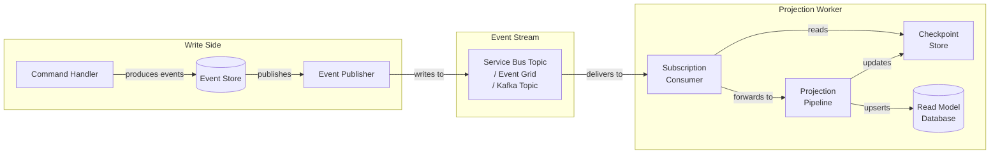
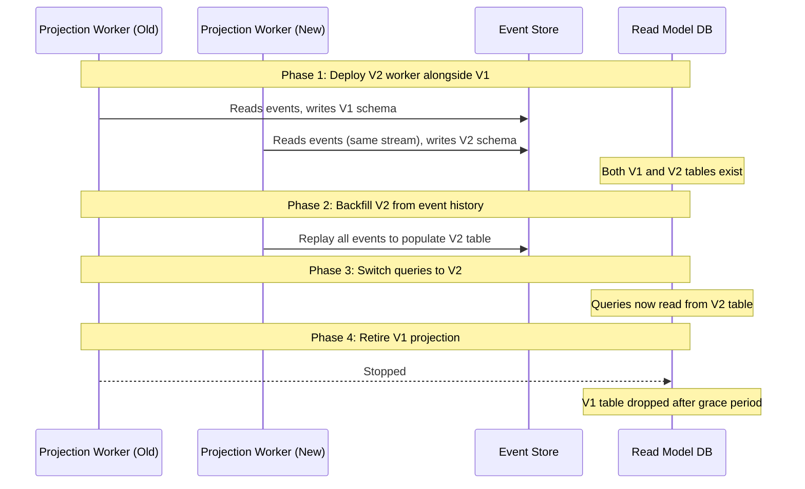

> [!success] Mastery Check
> - [ ] **Studied Well**
> - [ ] **Can explain the concept without notes**
> - [ ] **Can answer interview questions confidently**
> - [ ] **Can implement it in a real project**


# 7.096 — CQRS — Read Side — Projections in .NET

**Group:** `CQRS and Event Sourcing`  
**Priority:** 2 (Foundation → Read Side)  
**Prerequisites:** [[7.091 — CQRS — Read Model Design — Denormalized Views]]  
**Related Notes:** [[7.094 — CQRS — Event Sourcing — Event Store Patterns in .NET]] | [[7.104 — CQRS — Read Side — Caching Strategies]] | [[7.105 — CQRS — Read Side — Materialized Views with Azure Cosmos DB]] | [[7.107 — CQRS — Read Side — GraphQL Projections]]  
**Associated ADR:** [[7.096a — ADR — Projection Engine Selection — .NET]]  
**Version:** 2.0  
**Last Updated:** 2026-06-13  

---

## Table of Contents

1. [Foundations & Terminology](#1-foundations--terminology)
2. [Event-Driven Projection Handlers](#2-event-driven-projection-handlers)
3. [Subscription to Event Streams](#3-subscription-to-event-streams)
4. [Upserting Read Models](#4-upserting-read-models)
5. [Idempotent Projections](#5-idempotent-projections)
6. [Projection Restart & Replay](#6-projection-restart--replay)
7. [Multi-Reader Safety & Concurrency](#7-multi-reader-safety--concurrency)
8. [Checkpoint Management](#8-checkpoint-management)
9. [Projection Versioning & Schema Evolution](#9-projection-versioning--schema-evolution)
10. [Production Concerns & Observability](#10-production-concerns--observability)
11. [Architecture Decision Record (ADR)](#11-architecture-decision-record-adr)
12. [Common Pitfalls](#12-common-pitfalls)
13. [Interview Questions](#13-interview-questions)
14. [Self-Check](#14-self-check)

---

## 1. Foundations & Terminology

### 1.1 What Is a Projection?

A **projection** is the read-side mechanism that consumes events from the write side (command model) and transforms them into one or more denormalized read models. In CQRS, the read side is optimized for queries and presentation, while the write side handles commands and domain logic. Projections are the bridge between these two sides.

**Key characteristics of projections:**

| Characteristic | Description |
|---|---|
| **Event-driven** | Projections react to events published by the write side |
| **Asynchronous** | Projections run independently from the command pipeline |
| **Idempotent** | Processing the same event twice yields the same result |
| **Replayable** | Projections can rebuild read models from scratch by replaying event history |
| **Stateless-ish** | Projections maintain no in-memory state beyond checkpoints |
| **Scalable** | Multiple projection instances can process different partitions |

### 1.2 Projection vs. Read Model vs. View

| Term | Definition |
|---|---|
| **Event** | An immutable fact that has occurred in the domain (e.g., `OrderSubmitted`) |
| **Projection** | The handler/logic that processes events and updates read models |
| **Read Model** | The denormalized data structure consumed by queries and UI (e.g., `OrderSummaryDto`) |
| **View** | The presentation of a read model, often shaped for a specific client or query |

### 1.3 Projection Types

| Type | Description | Use Case |
|---|---|---|
| **Inline (Synchronous)** | Projection runs within the command transaction | Simple, low-latency, same-process |
| **Asynchronous (Event-Driven)** | Projection runs in a separate process/worker | High-scale, decoupled, fault-tolerant |
| **Batch (Catch-Up)** | Projection processes events in batches | Bulk rebuilds, reporting, analytics |
| **Streaming (Continuous)** | Projection processes events as they arrive | Real-time dashboards, live queries |
| **Materialized View** | Projection writes to a persistent store | Traditional CQRS read models |
| **Transient (In-Memory)** | Projection exists only in memory | Caching, session-scoped views |

### 1.4 .NET Ecosystem for Projections

| Library/Tool | Description | When to Use |
|---|---|---|
| **`System.Threading.Channels`** | In-process producer/consumer channels | Single-node, lightweight projections |
| **`Microsoft.Extensions.Hosting`** + `BackgroundService` | Long-running worker services | ASP.NET Core, Azure Functions, containerized |
| **Azure.Messaging.ServiceBus** | Service Bus topic/subscription processing | Azure-hosted event streams |
| **Azure.Messaging.EventGrid** | Event Grid event subscription | Cloud-native event routing |
| **Confluent.Kafka** / **Kafka.NET** | Apache Kafka consumer | High-throughput, multi-subscriber |
| **Npgsql** / **EF Core** | Database upsert for read models | Relational read stores |
| **Azure Cosmos DB SDK** | Document DB upsert | NoSQL read stores |
| **Martendb** | Event Store + projection engine | Full .NET event sourcing |
| **EventStoreDB** gRPC client | ESDB subscription | Dedicated event store |
| **Dapr** | Pub/sub with state management | Multi-runtime, cloud-agnostic |

---

## 2. Event-Driven Projection Handlers

### 2.1 The `ProjectionHandler<TEvent>` Abstraction

At the heart of every projection is a handler that maps an incoming event to one or more read-model mutations. We define a generic abstraction:

```csharp
// Base event marker
public interface IEvent
{
    Guid EventId { get; }
    Guid AggregateId { get; }
    long SequenceNumber { get; }
    DateTime OccurredAt { get; }
    string EventType { get; }
}

// Trace metadata carried with every event
public record EventMetadata(
    Guid EventId,
    Guid CorrelationId,
    Guid CausationId,
    DateTime OccurredAtUtc,
    long GlobalSequenceNumber,
    string TenantId,
    int SchemaVersion);

public interface IProjectionHandler<in TEvent>
    where TEvent : IEvent
{
    string ProjectionName { get; }
    string HandledEventType { get; }
    Task HandleAsync(
        TEvent @event,
        EventMetadata metadata,
        CancellationToken cancellationToken);
}

public abstract class ProjectionHandler<TEvent> : IProjectionHandler<TEvent>
    where TEvent : IEvent
{
    public abstract string ProjectionName { get; }
    public string HandledEventType => typeof(TEvent).Name;

    public abstract Task HandleAsync(
        TEvent @event,
        EventMetadata metadata,
        CancellationToken cancellationToken);
}
```

### 2.2 Concrete Projection Handler

```csharp
// Events consumed by the projection
public sealed record OrderSubmitted(
    Guid EventId,
    Guid AggregateId,
    long SequenceNumber,
    DateTime OccurredAt,
    string EventType,
    Guid OrderId,
    string CustomerId,
    string CustomerName,
    decimal TotalAmount,
    string Currency,
    IReadOnlyList<OrderLineItem> Items,
    string ShippingAddress) : IEvent;

public sealed record OrderShipped(
    Guid EventId,
    Guid AggregateId,
    long SequenceNumber,
    DateTime OccurredAt,
    string EventType,
    Guid OrderId,
    DateTime ShippedAt,
    string Carrier,
    string TrackingNumber) : IEvent;

public sealed record OrderDelivered(
    Guid EventId,
    Guid AggregateId,
    long SequenceNumber,
    DateTime OccurredAt,
    string EventType,
    Guid OrderId,
    DateTime DeliveredAt) : IEvent;

// Target read model
public sealed class OrderSummaryReadModel
{
    public Guid OrderId { get; set; }
    public string CustomerId { get; set; } = string.Empty;
    public string CustomerName { get; set; } = string.Empty;
    public string Status { get; set; } = string.Empty;
    public decimal TotalAmount { get; set; }
    public string Currency { get; set; } = string.Empty;
    public int ItemCount { get; set; }
    public DateTime SubmittedAt { get; set; }
    public DateTime? ShippedAt { get; set; }
    public DateTime? DeliveredAt { get; set; }
    public string Carrier { get; set; } = string.Empty;
    public string TrackingNumber { get; set; } = string.Empty;
    public string ShippingAddress { get; set; } = string.Empty;
    public long LastProcessedSequence { get; set; }
    public string LastProcessedEventType { get; set; } = string.Empty;
    public DateTime LastProcessedAt { get; set; }
    public byte[] RowVersion { get; set; } = [];
    public string TenantId { get; set; } = string.Empty;
}

public sealed class OrderSummaryProjectionHandler
    : ProjectionHandler<OrderSubmitted>,
      IProjectionHandler<OrderShipped>,
      IProjectionHandler<OrderDelivered>
{
    private readonly IReadModelRepository<OrderSummaryReadModel> _repository;
    private readonly ILogger<OrderSummaryProjectionHandler> _logger;

    public OrderSummaryProjectionHandler(
        IReadModelRepository<OrderSummaryReadModel> repository,
        ILogger<OrderSummaryProjectionHandler> logger)
    {
        _repository = repository;
        _logger = logger;
    }

    public override string ProjectionName => "OrderSummary";

    public override async Task HandleAsync(
        OrderSubmitted @event,
        EventMetadata metadata,
        CancellationToken ct)
    {
        var model = new OrderSummaryReadModel
        {
            OrderId = @event.OrderId,
            CustomerId = @event.CustomerId,
            CustomerName = @event.CustomerName,
            Status = "Submitted",
            TotalAmount = @event.TotalAmount,
            Currency = @event.Currency,
            ItemCount = @event.Items.Count,
            SubmittedAt = @event.OccurredAt,
            ShippingAddress = @event.ShippingAddress,
            LastProcessedSequence = metadata.GlobalSequenceNumber,
            LastProcessedEventType = @event.EventType,
            LastProcessedAt = DateTime.UtcNow,
            TenantId = metadata.TenantId
        };

        await _repository.UpsertAsync(model, ct);
    }

    public async Task HandleAsync(
        OrderShipped @event,
        EventMetadata metadata,
        CancellationToken ct)
    {
        var loaded = await _repository.FindByIdAsync(@event.OrderId.ToString(), ct);
        if (loaded is null)
        {
            _logger.LogWarning(
                "OrderSummary not found for shipment: {OrderId}. " +
                "This may indicate out-of-order event delivery.",
                @event.OrderId);
            return;
        }

        loaded.Status = "Shipped";
        loaded.ShippedAt = @event.ShippedAt;
        loaded.Carrier = @event.Carrier;
        loaded.TrackingNumber = @event.TrackingNumber;
        loaded.LastProcessedSequence = metadata.GlobalSequenceNumber;
        loaded.LastProcessedEventType = @event.EventType;
        loaded.LastProcessedAt = DateTime.UtcNow;

        await _repository.UpsertAsync(loaded, ct);
    }

    public async Task HandleAsync(
        OrderDelivered @event,
        EventMetadata metadata,
        CancellationToken ct)
    {
        var loaded = await _repository.FindByIdAsync(@event.OrderId.ToString(), ct);
        if (loaded is null)
        {
            _logger.LogWarning(
                "OrderSummary not found for delivery: {OrderId}.",
                @event.OrderId);
            return;
        }

        loaded.Status = "Delivered";
        loaded.DeliveredAt = @event.DeliveredAt;
        loaded.LastProcessedSequence = metadata.GlobalSequenceNumber;
        loaded.LastProcessedEventType = @event.EventType;
        loaded.LastProcessedAt = DateTime.UtcNow;

        await _repository.UpsertAsync(loaded, ct);
    }
}
```

### 2.3 Multi-Event Handler Registration

When a single handler processes multiple event types, we register it with the DI container for each event type:

```csharp
// Program.cs — Registration
builder.Services.AddSingleton<OrderSummaryProjectionHandler>();

builder.Services.AddSingleton<IProjectionHandler<OrderSubmitted>>(
    sp => sp.GetRequiredService<OrderSummaryProjectionHandler>());
builder.Services.AddSingleton<IProjectionHandler<OrderShipped>>(
    sp => sp.GetRequiredService<OrderSummaryProjectionHandler>());
builder.Services.AddSingleton<IProjectionHandler<OrderDelivered>>(
    sp => sp.GetRequiredService<OrderSummaryProjectionHandler>());
```

### 2.4 Projection Handler with Aggregate (Multiple Events → One Model)

```csharp
public sealed class CustomerOrderHistoryProjectionHandler :
    IProjectionHandler<OrderSubmitted>,
    IProjectionHandler<OrderCancelled>,
    IProjectionHandler<OrderRefunded>
{
    private readonly ICosmosReadModelRepository _repository;
    private readonly ILogger<CustomerOrderHistoryProjectionHandler> _logger;

    public string ProjectionName => "CustomerOrderHistory";

    public CustomerOrderHistoryProjectionHandler(
        ICosmosReadModelRepository repository,
        ILogger<CustomerOrderHistoryProjectionHandler> logger)
    {
        _repository = repository;
        _logger = logger;
    }

    public async Task HandleAsync(
        OrderSubmitted @event,
        EventMetadata metadata,
        CancellationToken ct)
    {
        var history = await _repository.GetOrCreateAsync(
            $"customer_{@event.CustomerId}",
            ct);

        history.TotalOrders++;
        history.TotalSpent += @event.TotalAmount;
        history.LastOrderDate = @event.OccurredAt;
        history.LastOrderId = @event.OrderId;
        history.LastProcessedSequence = metadata.GlobalSequenceNumber;
        history.LastProcessedAt = DateTime.UtcNow;

        await _repository.UpsertAsync(history, ct);
    }

    // ... similar handlers for OrderCancelled, OrderRefunded
}
```

### 2.5 Handler Pipeline & Middleware

```csharp
public interface IProjectionMiddleware
{
    Task InvokeAsync<TEvent>(
        TEvent @event,
        EventMetadata metadata,
        Func<TEvent, EventMetadata, CancellationToken, Task> next,
        CancellationToken ct) where TEvent : IEvent;
}

public sealed class LoggingProjectionMiddleware : IProjectionMiddleware
{
    private readonly ILogger<LoggingProjectionMiddleware> _logger;

    public LoggingProjectionMiddleware(ILogger<LoggingProjectionMiddleware> logger)
        => _logger = logger;

    public async Task InvokeAsync<TEvent>(
        TEvent @event,
        EventMetadata metadata,
        Func<TEvent, EventMetadata, CancellationToken, Task> next,
        CancellationToken ct) where TEvent : IEvent
    {
        using var scope = _logger.BeginScope(new Dictionary<string, object>
        {
            ["EventId"] = metadata.EventId,
            ["EventType"] = typeof(TEvent).Name,
            ["Projection"] = "unknown",
            ["Sequence"] = metadata.GlobalSequenceNumber
        });

        var sw = Stopwatch.StartNew();

        try
        {
            await next(@event, metadata, ct);
            sw.Stop();
            _logger.LogInformation(
                "Processed {EventType} in {ElapsedMs}ms",
                typeof(TEvent).Name, sw.ElapsedMilliseconds);
        }
        catch (Exception ex)
        {
            sw.Stop();
            _logger.LogError(ex,
                "Failed to process {EventType} after {ElapsedMs}ms",
                typeof(TEvent).Name, sw.ElapsedMilliseconds);
            throw;
        }
    }
}

public sealed class RetryProjectionMiddleware : IProjectionMiddleware
{
    private readonly ILogger<RetryProjectionMiddleware> _logger;

    public RetryProjectionMiddleware(ILogger<RetryProjectionMiddleware> logger)
        => _logger = logger;

    public async Task InvokeAsync<TEvent>(
        TEvent @event,
        EventMetadata metadata,
        Func<TEvent, EventMetadata, CancellationToken, Task> next,
        CancellationToken ct) where TEvent : IEvent
    {
        const int maxRetries = 3;
        var delay = TimeSpan.FromMilliseconds(100);

        for (var attempt = 1; attempt <= maxRetries; attempt++)
        {
            try
            {
                await next(@event, metadata, ct);
                return;
            }
            catch (Exception ex) when (attempt < maxRetries && IsTransient(ex))
            {
                _logger.LogWarning(ex,
                    "Transient failure processing event {EventId} " +
                    "(attempt {Attempt}/{MaxRetries}). Retrying...",
                    metadata.EventId, attempt, maxRetries);

                await Task.Delay(delay, ct);
                delay *= 2;
            }
        }
    }

    private static bool IsTransient(Exception ex)
        => ex is TimeoutException
           or DbUpdateException
           or Npgsql.NpgsqlException { IsTransient: true }
           or HttpRequestException;
}

public sealed class ProjectionPipeline
{
    private readonly IReadOnlyList<IProjectionMiddleware> _middlewares;
    private readonly IProjectionHandlerResolver _handlerResolver;
    private readonly ILogger<ProjectionPipeline> _logger;

    public ProjectionPipeline(
        IEnumerable<IProjectionMiddleware> middlewares,
        IProjectionHandlerResolver handlerResolver,
        ILogger<ProjectionPipeline> logger)
    {
        _middlewares = middlewares.ToList();
        _handlerResolver = handlerResolver;
        _logger = logger;
    }

    public async Task ProcessAsync<TEvent>(
        TEvent @event,
        EventMetadata metadata,
        CancellationToken ct) where TEvent : IEvent
    {
        var handler = _handlerResolver.Resolve<TEvent>();
        if (handler is null)
        {
            _logger.LogWarning(
                "No handler registered for event type {EventType}",
                typeof(TEvent).Name);
            return;
        }

        async Task InnerHandler(TEvent e, EventMetadata m, CancellationToken c)
            => await handler.HandleAsync(e, m, c);

        Func<TEvent, EventMetadata, CancellationToken, Task> pipeline = InnerHandler;

        for (var i = _middlewares.Count - 1; i >= 0; i--)
        {
            var middleware = _middlewares[i];
            var next = pipeline;

            pipeline = (e, m, c) =>
                middleware.InvokeAsync(e, m, next, c);
        }

        await pipeline(@event, metadata, ct);
    }
}

// Resolver for type-safe handler lookup
public interface IProjectionHandlerResolver
{
    IProjectionHandler<TEvent>? Resolve<TEvent>() where TEvent : IEvent;
}

public sealed class ProjectionHandlerResolver : IProjectionHandlerResolver
{
    private readonly IServiceProvider _serviceProvider;

    public ProjectionHandlerResolver(IServiceProvider serviceProvider)
        => _serviceProvider = serviceProvider;

    public IProjectionHandler<TEvent>? Resolve<TEvent>() where TEvent : IEvent
        => _serviceProvider.GetService<IProjectionHandler<TEvent>>();
}
```

---

## 3. Subscription to Event Streams

### 3.1 Subscription Architecture Overview



### 3.2 Azure Service Bus Subscription (BackgroundService)

```csharp
public sealed class ServiceBusProjectionWorker : BackgroundService
{
    private readonly ServiceBusProcessor _processor;
    private readonly ProjectionPipeline _pipeline;
    private readonly ICheckpointStore _checkpointStore;
    private readonly IEventSerializer _serializer;
    private readonly ILogger<ServiceBusProjectionWorker> _logger;

    public ServiceBusProjectionWorker(
        ServiceBusProcessor processor,
        ProjectionPipeline pipeline,
        ICheckpointStore checkpointStore,
        IEventSerializer serializer,
        ILogger<ServiceBusProjectionWorker> logger)
    {
        _processor = processor;
        _pipeline = pipeline;
        _checkpointStore = checkpointStore;
        _serializer = serializer;
        _logger = logger;
    }

    protected override async Task ExecuteAsync(CancellationToken stoppingToken)
    {
        _processor.ProcessMessageAsync += HandleMessageAsync;
        _processor.ProcessErrorAsync += HandleErrorAsync;

        _logger.LogInformation(
            "Starting ServiceBus processor for projection worker");

        await _processor.StartProcessingAsync(stoppingToken);

        try
        {
            await Task.Delay(Timeout.Infinite, stoppingToken);
        }
        catch (OperationCanceledException)
        {
            _logger.LogInformation("Projection worker stopping...");
        }
        finally
        {
            await _processor.StopProcessingAsync();
            _processor.ProcessMessageAsync -= HandleMessageAsync;
            _processor.ProcessErrorAsync -= HandleErrorAsync;
        }
    }

    private async Task HandleMessageAsync(
        ProcessMessageEventArgs args)
    {
        var ct = args.CancellationToken;
        var body = args.Message.Body.ToString();

        _logger.LogDebug("Received message: {MessageId}", args.Message.MessageId);

        try
        {
            var (eventData, metadata) = _serializer.Deserialize(body);
            var checkpointer = _checkpointStore.ForEvent(eventData, metadata);

            if (await checkpointer.IsAlreadyProcessed(ct))
            {
                _logger.LogDebug(
                    "Skipping already-processed event {EventId}",
                    metadata.EventId);
                await args.CompleteMessageAsync(args.Message, ct);
                return;
            }

            await _pipeline.ProcessAsync(eventData, metadata, ct);

            await checkpointer.SaveCheckpoint(ct);
            await args.CompleteMessageAsync(args.Message, ct);
        }
        catch (Exception ex)
        {
            _logger.LogError(ex, "Failed to process message {MessageId}",
                args.Message.MessageId);

            // Dead-letter after retries exhausted
            await args.DeadLetterMessageAsync(
                args.Message,
                "ProjectionError",
                ex.Message,
                ct);
        }
    }

    private Task HandleErrorAsync(ProcessErrorEventArgs args)
    {
        _logger.LogError(args.Exception,
            "ServiceBus processor error: {ErrorSource}, {EntityPath}",
            args.ErrorSource, args.EntityPath);
        return Task.CompletedTask;
    }
}
```

**Registration:**

```csharp
// Program.cs
var serviceBusConnectionString = builder.Configuration["ServiceBus:ConnectionString"];
var topicName = builder.Configuration["ServiceBus:TopicName"];
var subscriptionName = builder.Configuration["ServiceBus:SubscriptionName"];

var client = new ServiceBusClient(serviceBusConnectionString);
var processor = client.CreateProcessor(topicName, subscriptionName, new ServiceBusProcessorOptions
{
    AutoCompleteMessages = false,
    MaxConcurrentCalls = 8,
    MaxDeliveryCount = 10,
    PrefetchCount = 100,
    ReceiveMode = ServiceBusReceiveMode.PeekLock
});

// Receive only projected event types
processor.SubscribeToEventTypes([
    "OrderSubmitted",
    "OrderShipped",
    "OrderDelivered",
    "OrderCancelled"
]);

builder.Services.AddSingleton(processor);
builder.Services.AddHostedService<ServiceBusProjectionWorker>();
```

### 3.3 Kafka Subscription (Confluent.Kafka)

```csharp
public sealed class KafkaProjectionWorker : BackgroundService
{
    private readonly IConsumer<string, string> _consumer;
    private readonly ProjectionPipeline _pipeline;
    private readonly ICheckpointStore _checkpointStore;
    private readonly IEventSerializer _serializer;
    private readonly ILogger<KafkaProjectionWorker> _logger;
    private readonly string _topic;

    public KafkaProjectionWorker(
        IConfiguration configuration,
        ProjectionPipeline pipeline,
        ICheckpointStore checkpointStore,
        IEventSerializer serializer,
        ILogger<KafkaProjectionWorker> logger)
    {
        _pipeline = pipeline;
        _checkpointStore = checkpointStore;
        _serializer = serializer;
        _logger = logger;

        var config = new ConsumerConfig
        {
            BootstrapServers = configuration["Kafka:BootstrapServers"],
            GroupId = configuration["Kafka:ConsumerGroupId"],
            AutoOffsetReset = AutoOffsetReset.Earliest,
            EnableAutoCommit = false,
            EnablePartitionEof = false,
            SessionTimeoutMs = 30000,
            MaxPollIntervalMs = 300000,
            FetchMinBytes = 1,
            FetchMaxBytes = 52428800,
            PartitionAssignmentStrategy = PartitionAssignmentStrategy.CooperativeSticky
        };

        _consumer = new ConsumerBuilder<string, string>(config)
            .SetErrorHandler((_, e) =>
                logger.LogError("Kafka consumer error: {Reason}", e.Reason))
            .SetStatisticsHandler((_, json) =>
                logger.LogDebug("Kafka statistics: {Stats}", json))
            .Build();

        _topic = configuration["Kafka:Topic"]!;
    }

    protected override async Task ExecuteAsync(CancellationToken stoppingToken)
    {
        _consumer.Subscribe(_topic);

        _logger.LogInformation(
            "Kafka projection worker started, subscribed to {Topic}", _topic);

        try
        {
            while (!stoppingToken.IsCancellationRequested)
            {
                try
                {
                    var result = _consumer.Consume(stoppingToken);

                    if (result is null || result.IsPartitionEOF)
                        continue;

                    _logger.LogDebug(
                        "Received Kafka message: [{Partition}:{Offset}]",
                        result.Partition, result.Offset);

                    var (eventData, metadata) =
                        _serializer.Deserialize(result.Message.Value);

                    var checkpointer = _checkpointStore.ForEvent(eventData, metadata);

                    if (await checkpointer.IsAlreadyProcessed(stoppingToken))
                    {
                        _logger.LogDebug(
                            "Skipping already-processed event {EventId}",
                            metadata.EventId);

                        // Commit offset even for skipped events
                        _consumer.Commit(result);
                        continue;
                    }

                    await _pipeline.ProcessAsync(eventData, metadata, stoppingToken);

                    await checkpointer.SaveCheckpoint(stoppingToken);
                    _consumer.Commit(result);
                }
                catch (ConsumeException ex) when (ex.Error.IsFatal)
                {
                    _logger.LogError(ex, "Fatal Kafka error: {Reason}", ex.Error.Reason);
                    throw;
                }
                catch (ConsumeException ex)
                {
                    _logger.LogWarning(ex,
                        "Non-fatal Kafka error: {Reason}", ex.Error.Reason);
                    await Task.Delay(1000, stoppingToken);
                }
            }
        }
        finally
        {
            _consumer.Close();
            _consumer.Dispose();
        }
    }

    public override void Dispose()
    {
        _consumer?.Dispose();
        base.Dispose();
    }
}
```

### 3.4 Event Grid Subscription (Event Grid Hubs)

```csharp
// Azure Functions-based Event Grid subscription
public static class OrderProjectionFunction
{
    [Function("OrderProjectionFunction")]
    public static async Task Run(
        [EventGridTrigger] EventGridEvent eventGridEvent,
        [ServiceBus("projections-checkpoints", Connection = "ServiceBusConnection")]
        IAsyncCollector<CheckpointMessage> checkpointCollector,
        FunctionContext context)
    {
        var logger = context.GetLogger("OrderProjectionFunction");
        var handler = context.InstanceServices
            .GetRequiredService<IProjectionHandlerResolver>();

        logger.LogInformation(
            "Event Grid event received: {EventType}, Subject: {Subject}",
            eventGridEvent.EventType,
            eventGridEvent.Subject);

        try
        {
            var eventData = DeserializeEvent(eventGridEvent);
            var metadata = ExtractMetadata(eventGridEvent);

            var typedHandlerType = typeof(IProjectionHandler<>)
                .MakeGenericType(eventData.GetType());

            var handlerInstance = handler.Resolve(eventData.GetType());
            if (handlerInstance is null)
            {
                logger.LogWarning(
                    "No handler for event type {EventType}",
                    eventData.GetType().Name);
                return;
            }

            await ((dynamic)handlerInstance).HandleAsync(
                (dynamic)eventData, metadata, CancellationToken.None);

            await checkpointCollector.AddAsync(
                new CheckpointMessage
                {
                    EventId = metadata.EventId,
                    SequenceNumber = metadata.GlobalSequenceNumber,
                    ProjectionName = handlerInstance.ProjectionName,
                    ProcessedAt = DateTime.UtcNow
                });
        }
        catch (Exception ex)
        {
            logger.LogError(ex, "Failed to process Event Grid event");
            throw;
        }
    }
}
```

### 3.5 Event Stream Abstraction

```csharp
public interface IEventStreamSubscriber : IDisposable
{
    string StreamName { get; }
    Task SubscribeAsync(
        Func<IEvent, EventMetadata, CancellationToken, Task> onEvent,
        CancellationToken ct);
    Task UnsubscribeAsync(CancellationToken ct);
}

public interface IEventStreamConsumer
{
    Task StartAsync(CancellationToken ct);
    Task StopAsync(CancellationToken ct);
    Task<StreamConsumeResult> ConsumeAsync(CancellationToken ct);
    Task CommitAsync(CancellationToken ct);
}

// Strategy pattern for stream-specific implementations
public interface IEventStreamConsumerFactory
{
    IEventStreamConsumer CreateConsumer(string streamName);
}
```

---

## 4. Upserting Read Models

### 4.1 The Upsert Pattern

Upsert (insert or update) is the fundamental write operation for read models. Because events arrive in order (or can be replayed), the projection must be able to create a read model on first event and update it on subsequent events.

```csharp
public interface IReadModelRepository<TReadModel>
    where TReadModel : class
{
    Task<TReadModel?> FindByIdAsync(string id, CancellationToken ct);
    Task UpsertAsync(TReadModel model, CancellationToken ct);
    Task DeleteAsync(string id, CancellationToken ct);
    IAsyncEnumerable<TReadModel> GetAllAsync(CancellationToken ct);
}
```

### 4.2 EF Core Upsert Implementation

```csharp
public sealed class EfCoreReadModelRepository<TReadModel>
    : IReadModelRepository<TReadModel>
    where TReadModel : class
{
    private readonly ReadModelDbContext _context;
    private readonly ILogger<EfCoreReadModelRepository<TReadModel>> _logger;

    public EfCoreReadModelRepository(
        ReadModelDbContext context,
        ILogger<EfCoreReadModelRepository<TReadModel>> logger)
    {
        _context = context;
        _logger = logger;
    }

    public async Task<TReadModel?> FindByIdAsync(string id, CancellationToken ct)
        => await _context.Set<TReadModel>().FindAsync([id], ct);

    public async Task UpsertAsync(TReadModel model, CancellationToken ct)
    {
        var entry = _context.Entry(model);

        if (entry.State == EntityState.Detached)
        {
            var existing = await _context.Set<TReadModel>().FindAsync(
                GetKeyValues(model), ct);

            if (existing is not null)
            {
                _context.Entry(existing).CurrentValues.SetValues(model);
                _logger.LogTrace(
                    "Updated existing read model {Type}: {Id}",
                    typeof(TReadModel).Name, GetKeyValues(model));
            }
            else
            {
                _context.Set<TReadModel>().Add(model);
                _logger.LogTrace(
                    "Inserted new read model {Type}: {Id}",
                    typeof(TReadModel).Name, GetKeyValues(model));
            }
        }

        await _context.SaveChangesAsync(ct);
    }

    public async Task DeleteAsync(string id, CancellationToken ct)
    {
        var existing = await _context.Set<TReadModel>().FindAsync([id], ct);
        if (existing is not null)
        {
            _context.Set<TReadModel>().Remove(existing);
            await _context.SaveChangesAsync(ct);
        }
    }

    public async IAsyncEnumerable<TReadModel> GetAllAsync(
        [EnumeratorCancellation] CancellationToken ct)
    {
        await foreach (var item in _context.Set<TReadModel>()
            .AsNoTracking()
            .AsAsyncEnumerable()
            .WithCancellation(ct))
        {
            yield return item;
        }
    }

    private static object[] GetKeyValues(TReadModel model)
    {
        // Uses EF Core's key discovery
        var entityType = model.GetType();
        var keyProperties = entityType
            .GetProperties()
            .Where(p => p.GetCustomAttribute<KeyAttribute>() is not null)
            .ToList();

        if (keyProperties.Count == 0)
        {
            keyProperties = entityType
                .GetProperties()
                .Where(p => p.Name.Equals("Id", StringComparison.OrdinalIgnoreCase)
                         || p.Name.EndsWith("Id", StringComparison.OrdinalIgnoreCase))
                .Take(1)
                .ToList();
        }

        return keyProperties
            .Select(p => p.GetValue(model)!)
            .ToArray();
    }
}
```

### 4.3 Native PostgreSQL Upsert (Npgsql)

```csharp
public sealed class NpgsqlReadModelRepository<TReadModel>
    : IReadModelRepository<TReadModel>
    where TReadModel : class
{
    private readonly INpgsqlConnectionFactory _connectionFactory;
    private readonly ILogger<NpgsqlReadModelRepository<TReadModel>> _logger;

    private static readonly string TableName =
        typeof(TReadModel).Name switch
        {
            "OrderSummaryReadModel" => "order_summaries",
            "CustomerOrderHistory" => "customer_order_histories",
            _ => typeof(TReadModel).Name.ToSnakeCase()
        };

    public NpgsqlReadModelRepository(
        INpgsqlConnectionFactory connectionFactory,
        ILogger<NpgsqlReadModelRepository<TReadModel>> logger)
    {
        _connectionFactory = connectionFactory;
        _logger = logger;
    }

    public async Task<TReadModel?> FindByIdAsync(string id, CancellationToken ct)
    {
        await using var conn = await _connectionFactory.CreateAsync(ct);
        await using var cmd = new NpgsqlCommand(
            $"SELECT * FROM {TableName} WHERE id = @Id", conn);
        cmd.Parameters.AddWithValue("Id", id);

        await using var reader = await cmd.ExecuteReaderAsync(ct);
        if (!await reader.ReadAsync(ct))
            return null;

        return MapReaderToModel(reader);
    }

    public async Task UpsertAsync(TReadModel model, CancellationToken ct)
    {
        await using var conn = await _connectionFactory.CreateAsync(ct);
        var properties = typeof(TReadModel)
            .GetProperties(BindingFlags.Public | BindingFlags.Instance)
            .Where(p => p.CanWrite && p.Name != nameof(IEvent.SequenceNumber))
            .ToList();

        var columnNames = properties.Select(p => p.Name.ToSnakeCase()).ToList();
        var paramNames = properties.Select(p => $"@{p.Name}").ToList();
        var updateClauses = columnNames
            .Zip(paramNames, (col, param) => $"{col} = EXCLUDED.{col}")
            .ToList();

        // PostgreSQL INSERT ... ON CONFLICT DO UPDATE
        var sql = $"""
            INSERT INTO {TableName} ({string.Join(", ", columnNames)})
            VALUES ({string.Join(", ", paramNames)})
            ON CONFLICT (id) DO UPDATE SET
                {string.Join(", ", updateClauses)}
            """;

        await using var cmd = new NpgsqlCommand(sql, conn);

        foreach (var prop in properties)
        {
            var value = prop.GetValue(model);
            cmd.Parameters.AddWithValue(
                $"@{prop.Name}", value ?? DBNull.Value);
        }

        await cmd.ExecuteNonQueryAsync(ct);

        _logger.LogTrace(
            "Upserted {Rows} row(s) in {Table} for {ModelType}",
            1, TableName, typeof(TReadModel).Name);
    }

    public async Task DeleteAsync(string id, CancellationToken ct)
    {
        await using var conn = await _connectionFactory.CreateAsync(ct);
        await using var cmd = new NpgsqlCommand(
            $"DELETE FROM {TableName} WHERE id = @Id", conn);
        cmd.Parameters.AddWithValue("Id", id);
        await cmd.ExecuteNonQueryAsync(ct);
    }

    public async IAsyncEnumerable<TReadModel> GetAllAsync(
        [EnumeratorCancellation] CancellationToken ct)
    {
        await using var conn = await _connectionFactory.CreateAsync(ct);
        await using var cmd = new NpgsqlCommand(
            $"SELECT * FROM {TableName}", conn);
        await using var reader = await cmd.ExecuteReaderAsync(ct);

        while (await reader.ReadAsync(ct))
        {
            yield return MapReaderToModel(reader);
        }
    }

    private static TReadModel MapReaderToModel(NpgsqlDataReader reader)
    {
        var model = Activator.CreateInstance<TReadModel>();
        var properties = typeof(TReadModel)
            .GetProperties(BindingFlags.Public | BindingFlags.Instance)
            .Where(p => p.CanWrite);

        foreach (var prop in properties)
        {
            var columnName = prop.Name.ToSnakeCase();
            var ordinal = reader.GetOrdinal(columnName);
            var value = reader.GetValue(ordinal);

            if (value is not DBNull)
            {
                prop.SetValue(model, Convert.ChangeType(
                    value, Nullable.GetUnderlyingType(prop.PropertyType)
                           ?? prop.PropertyType));
            }
        }

        return model;
    }
}
```

### 4.4 Cosmos DB Upsert

```csharp
public sealed class CosmosReadModelRepository<TReadModel>
    : IReadModelRepository<TReadModel>
    where TReadModel : class
{
    private readonly Container _container;
    private readonly ILogger<CosmosReadModelRepository<TReadModel>> _logger;

    public CosmosReadModelRepository(
        CosmosClient cosmosClient,
        string databaseName,
        string containerName,
        ILogger<CosmosReadModelRepository<TReadModel>> logger)
    {
        _container = cosmosClient.GetContainer(databaseName, containerName);
        _logger = logger;
    }

    public async Task<TReadModel?> FindByIdAsync(string id, CancellationToken ct)
    {
        try
        {
            var response = await _container.ReadItemAsync<TReadModel>(
                id, new PartitionKey(id), cancellationToken: ct);
            return response.Resource;
        }
        catch (CosmosException ex) when (ex.StatusCode == HttpStatusCode.NotFound)
        {
            return null;
        }
    }

    public async Task UpsertAsync(TReadModel model, CancellationToken ct)
    {
        var response = await _container.UpsertItemAsync(
            model, cancellationToken: ct);

        _logger.LogTrace(
            "Cosmos DB upsert: {StatusCode} for {Type}",
            response.StatusCode, typeof(TReadModel).Name);
    }

    public async Task DeleteAsync(string id, CancellationToken ct)
    {
        try
        {
            await _container.DeleteItemAsync<TReadModel>(
                id, new PartitionKey(id), cancellationToken: ct);
        }
        catch (CosmosException ex) when (ex.StatusCode == HttpStatusCode.NotFound)
        {
            // Already deleted — ok for idempotency
        }
    }

    public async IAsyncEnumerable<TReadModel> GetAllAsync(
        [EnumeratorCancellation] CancellationToken ct)
    {
        var iterator = _container.GetItemQueryIterator<TReadModel>();

        while (iterator.HasMoreResults)
        {
            var page = await iterator.ReadNextAsync(ct);
            foreach (var item in page)
                yield return item;
        }
    }
}
```

### 4.5 Batch Upsert for Bulk Projections

```csharp
public sealed class BatchUpsertRepository<TReadModel>
    where TReadModel : class
{
    private readonly IReadModelRepository<TReadModel> _inner;
    private readonly Channel<(TReadModel Model, TaskCompletionSource Completion)> _channel;
    private readonly int _batchSize;
    private readonly TimeSpan _flushInterval;

    public BatchUpsertRepository(
        IReadModelRepository<TReadModel> inner,
        int batchSize = 100,
        int flushIntervalMs = 1000)
    {
        _inner = inner;
        _batchSize = batchSize;
        _flushInterval = TimeSpan.FromMilliseconds(flushIntervalMs);
        _channel = Channel.CreateBounded<(TReadModel, TaskCompletionSource)>(
            new BoundedChannelOptions(10000)
            {
                FullMode = BoundedChannelFullMode.Wait,
                SingleWriter = false,
                SingleReader = true
            });
    }

    public async Task EnqueueUpsertAsync(TReadModel model, CancellationToken ct)
    {
        var tcs = new TaskCompletionSource(TaskCreationOptions.RunContinuationsAsynchronously);

        await _channel.Writer.WriteAsync((model, tcs), ct);
        await tcs.Task.WaitAsync(ct);
    }

    public async Task RunBatchProcessorAsync(CancellationToken ct)
    {
        var batch = new List<(TReadModel Model, TaskCompletionSource Completion)>(_batchSize);
        var timer = new PeriodicTimer(_flushInterval);

        try
        {
            while (!ct.IsCancellationRequested)
            {
                var timeout = await timer.WaitForNextTickAsync(ct);
                if (!timeout) break;

                while (batch.Count < _batchSize
                       && _channel.Reader.TryRead(out var item))
                {
                    batch.Add(item);
                }

                if (batch.Count == 0)
                    continue;

                await FlushBatchAsync(batch, ct);
                batch.Clear();
            }
        }
        finally
        {
            // Flush remaining
            while (_channel.Reader.TryRead(out var item))
                batch.Add(item);

            if (batch.Count > 0)
                await FlushBatchAsync(batch, ct);
        }
    }

    private async Task FlushBatchAsync(
        List<(TReadModel Model, TaskCompletionSource Completion)> batch,
        CancellationToken ct)
    {
        ParallelQuery<TReadModel> models;

        try
        {
            models = batch
                .Select(x => x.Model)
                .AsParallel()
                .WithDegreeOfParallelism(4);

            await Parallel.ForEachAsync(
                models,
                new ParallelOptions
                {
                    MaxDegreeOfParallelism = 4,
                    CancellationToken = ct
                },
                async (model, c) =>
                {
                    await _inner.UpsertAsync(model, c);
                });

            foreach (var (_, completion) in batch)
                completion.TrySetResult();
        }
        catch (Exception ex)
        {
            foreach (var (_, completion) in batch)
                completion.TrySetException(ex);
        }
    }
}
```

---

## 5. Idempotent Projections

### 5.1 Why Idempotency Matters

In distributed systems, events can be delivered more than once (at-least-once delivery). Projections must handle duplicate deliveries without corrupting read models.

**Sources of duplicate delivery:**

1. **At-least-once semantics** from message brokers (Service Bus, Kafka, Event Grid)
2. **Producer retries** — same event published multiple times
3. **Consumer restarts** — event processed but checkpoint not persisted before crash
4. **Replay operations** — same events replayed during projection rebuild

### 5.2 Dedup with Event ID Tracking

```csharp
public interface IDeduplicationStore
{
    Task<bool> IsDuplicateAsync(
        string projectionName,
        Guid eventId,
        CancellationToken ct);
    Task MarkProcessedAsync(
        string projectionName,
        Guid eventId,
        long sequenceNumber,
        CancellationToken ct);
    Task CleanupAsync(
        string projectionName,
        long upToSequence,
        CancellationToken ct);
}

public sealed class DatabaseDeduplicationStore : IDeduplicationStore
{
    private readonly ReadModelDbContext _context;
    private readonly ILogger<DatabaseDeduplicationStore> _logger;

    public DatabaseDeduplicationStore(
        ReadModelDbContext context,
        ILogger<DatabaseDeduplicationStore> logger)
    {
        _context = context;
        _logger = logger;
    }

    public async Task<bool> IsDuplicateAsync(
        string projectionName,
        Guid eventId,
        CancellationToken ct)
    {
        return await _context.ProcessedEvents
            .AsNoTracking()
            .AnyAsync(e =>
                e.ProjectionName == projectionName
                && e.EventId == eventId, ct);
    }

    public async Task MarkProcessedAsync(
        string projectionName,
        Guid eventId,
        long sequenceNumber,
        CancellationToken ct)
    {
        _context.ProcessedEvents.Add(new ProcessedEvent
        {
            ProjectionName = projectionName,
            EventId = eventId,
            GlobalSequenceNumber = sequenceNumber,
            ProcessedAt = DateTime.UtcNow
        });

        await _context.SaveChangesAsync(ct);
    }

    public async Task CleanupAsync(
        string projectionName,
        long upToSequence,
        CancellationToken ct)
    {
        await _context.ProcessedEvents
            .Where(e => e.ProjectionName == projectionName
                     && e.GlobalSequenceNumber <= upToSequence)
            .ExecuteDeleteAsync(ct);
    }
}

// ProcessedEvent entity
public sealed class ProcessedEvent
{
    [Key]
    public Guid Id { get; set; } = Guid.NewGuid();
    public string ProjectionName { get; set; } = string.Empty;
    public Guid EventId { get; set; }
    public long GlobalSequenceNumber { get; set; }
    public DateTime ProcessedAt { get; set; }

    // Composite index on (ProjectionName, EventId) should be created
}
```

### 5.3 Read Model Sequence Tracking (Alternative)

Rather than a separate dedup table, track the last processed sequence number on the read model itself. This avoids a second write and is simpler for single-stream-per-aggregate projections.

```csharp
public sealed class OrderSummaryReadModel
{
    // ... other properties ...

    public long LastProcessedSequence { get; set; }
    public string LastProcessedEventType { get; set; } = string.Empty;
    public DateTime LastProcessedAt { get; set; }

    public bool ShouldProcess(long sequenceNumber, Guid eventId)
    {
        // If sequence is higher than last processed, it's a new event
        // (handles both first-time and forward-only processing)
        return sequenceNumber > LastProcessedSequence;
    }
}

public sealed class SequenceTrackingProjectionHandler<TEvent>
    where TEvent : IEvent
{
    private readonly IReadModelRepository<OrderSummaryReadModel> _repository;

    public async Task HandleWithDedupAsync(
        OrderSummaryReadModel model,
        TEvent @event,
        EventMetadata metadata,
        Func<TEvent, EventMetadata, OrderSummaryReadModel, Task> applyFunc,
        CancellationToken ct)
    {
        if (!model.ShouldProcess(metadata.GlobalSequenceNumber, metadata.EventId))
        {
            return; // Already processed
        }

        await applyFunc(@event, metadata, model);

        model.LastProcessedSequence = metadata.GlobalSequenceNumber;
        model.LastProcessedEventType = @event.EventType;
        model.LastProcessedAt = DateTime.UtcNow;

        await _repository.UpsertAsync(model, ct);
    }
}
```

### 5.4 Idempotent Upsert (Database-Level)

The most robust form of idempotency embeds dedup into the database operation itself:

```sql
-- PostgreSQL upsert with sequence check
INSERT INTO order_summaries (
    order_id, customer_id, status, total_amount,
    last_processed_sequence, last_processed_event_type,
    last_processed_at)
VALUES (
    @OrderId, @CustomerId, @Status, @TotalAmount,
    @LastProcessedSequence, @LastProcessedEventType,
    @LastProcessedAt)
ON CONFLICT (order_id)
DO UPDATE SET
    status              = CASE
                            WHEN EXCLUDED.last_processed_sequence > order_summaries.last_processed_sequence
                            THEN EXCLUDED.status
                            ELSE order_summaries.status
                          END,
    last_processed_sequence = CASE
                                WHEN EXCLUDED.last_processed_sequence > order_summaries.last_processed_sequence
                                THEN EXCLUDED.last_processed_sequence
                                ELSE order_summaries.last_processed_sequence
                              END,
    -- ... other columns with same pattern ...
    last_processed_at   = CASE
                            WHEN EXCLUDED.last_processed_sequence > order_summaries.last_processed_sequence
                            THEN EXCLUDED.last_processed_at
                            ELSE order_summaries.last_processed_at
                          END
WHERE EXCLUDED.last_processed_sequence > order_summaries.last_processed_sequence;
```

### 5.5 In-Memory Dedup Cache (Short Window)

```csharp
public sealed class InMemoryDeduplicationCache : IDeduplicationStore, IDisposable
{
    private readonly ConcurrentDictionary<string, HashSet<Guid>> _cache = new();
    private readonly TimeSpan _retentionPeriod;
    private readonly Timer _cleanupTimer;

    public InMemoryDeduplicationCache(TimeSpan? retentionPeriod = null)
    {
        _retentionPeriod = retentionPeriod ?? TimeSpan.FromMinutes(5);
        _cleanupTimer = new Timer(
            CleanupExpired, null,
            _retentionPeriod, _retentionPeriod);
    }

    public Task<bool> IsDuplicateAsync(
        string projectionName,
        Guid eventId,
        CancellationToken ct)
    {
        var processed = _cache.GetOrAdd(projectionName, _ => new HashSet<Guid>());
        return Task.FromResult(processed.Contains(eventId));
    }

    public Task MarkProcessedAsync(
        string projectionName,
        Guid eventId,
        long sequenceNumber,
        CancellationToken ct)
    {
        var processed = _cache.GetOrAdd(projectionName, _ => new HashSet<Guid>());
        processed.Add(eventId);
        return Task.CompletedTask;
    }

    public Task CleanupAsync(
        string projectionName,
        long upToSequence,
        CancellationToken ct)
    {
        _cache.TryRemove(projectionName, out _);
        return Task.CompletedTask;
    }

    // Decorator to also store in persistent storage
    public void Dispose() => _cleanupTimer.Dispose();

    private void CleanupExpired(object? state)
    {
        // Periodically clear cache to avoid unbounded growth
        _cache.Clear();
    }
}
```

### 5.6 Composite Dedup Strategy

```csharp
public sealed class CompositeDeduplicationStore : IDeduplicationStore
{
    private readonly IDeduplicationStore _primary;
    private readonly IDeduplicationStore _secondary;

    public CompositeDeduplicationStore(
        [FromKeyedServices("primary")] IDeduplicationStore primary,
        [FromKeyedServices("secondary")] IDeduplicationStore secondary)
    {
        _primary = primary;
        _secondary = secondary;
    }

    public async Task<bool> IsDuplicateAsync(
        string projectionName,
        Guid eventId,
        CancellationToken ct)
    {
        if (await _primary.IsDuplicateAsync(projectionName, eventId, ct))
            return true;

        if (await _secondary.IsDuplicateAsync(projectionName, eventId, ct))
        {
            // Backfill primary cache
            await _primary.MarkProcessedAsync(
                projectionName, eventId, 0, ct);
            return true;
        }

        return false;
    }

    public async Task MarkProcessedAsync(
        string projectionName,
        Guid eventId,
        long sequenceNumber,
        CancellationToken ct)
    {
        await _primary.MarkProcessedAsync(
            projectionName, eventId, sequenceNumber, ct);
        await _secondary.MarkProcessedAsync(
            projectionName, eventId, sequenceNumber, ct);
    }

    public async Task CleanupAsync(
        string projectionName,
        long upToSequence,
        CancellationToken ct)
    {
        await _primary.CleanupAsync(projectionName, upToSequence, ct);
        await _secondary.CleanupAsync(projectionName, upToSequence, ct);
    }
}
```

---

## 6. Projection Restart & Replay

### 6.1 The Replay Contract

Projections must support **full replay** (rebuild from scratch) and **partial replay** (catch up from a given checkpoint). This is essential for:

- **Schema migrations** — When the read model schema changes, rebuild from event history
- **Bug fixes** — Correct state after a projection bug corrupted the read model
- **New projections** — Building a read model from scratch for a newly deployed projection
- **Disaster recovery** — Rebuilding read models after data loss or corruption

### 6.2 Replay Orchestrator

```csharp
public sealed class ProjectionReplayOrchestrator
{
    private readonly ICheckpointStore _checkpointStore;
    private readonly IEventStorePlayer _eventStorePlayer;
    private readonly ProjectionPipeline _pipeline;
    private readonly IReadModelCleanupService _cleanupService;
    private readonly IProjectionRegistry _projectionRegistry;
    private readonly ILogger<ProjectionReplayOrchestrator> _logger;

    public ProjectionReplayOrchestrator(
        ICheckpointStore checkpointStore,
        IEventStorePlayer eventStorePlayer,
        ProjectionPipeline pipeline,
        IReadModelCleanupService cleanupService,
        IProjectionRegistry projectionRegistry,
        ILogger<ProjectionReplayOrchestrator> logger)
    {
        _checkpointStore = checkpointStore;
        _eventStorePlayer = eventStorePlayer;
        _pipeline = pipeline;
        _cleanupService = cleanupService;
        _projectionRegistry = projectionRegistry;
        _logger = logger;
    }

    public async Task<ReplayResult> ReplayAsync(
        string projectionName,
        ReplayOptions options,
        CancellationToken ct)
    {
        _logger.LogInformation(
            "Starting replay for projection {ProjectionName} " +
            "from sequence {StartSequence}",
            projectionName, options.StartSequence);

        using var activity = Telemetry.Source
            .StartActivity("ProjectionReplay")
            ?.AddTag("projection", projectionName);

        try
        {
            if (options.ClearExistingData)
            {
                _logger.LogInformation(
                    "Clearing existing read model data for {ProjectionName}",
                    projectionName);
                await _cleanupService.ClearProjectionDataAsync(
                    projectionName, ct);
            }

            var checkpoint = await _checkpointStore
                .GetCheckpointAsync(projectionName, ct);

            long processedCount = 0;
            var sequenceNumber = options.StartSequence ?? checkpoint?.SequenceNumber ?? 0;

            await foreach (var (eventData, metadata) in
                _eventStorePlayer.ReadEventsFromSequenceAsync(
                    sequenceNumber,
                    options.BatchSize,
                    ct))
            {
                await _pipeline.ProcessAsync(eventData, metadata, ct);
                processedCount++;

                if (processedCount % 1000 == 0)
                {
                    _logger.LogInformation(
                        "Replay progress: {ProcessedCount} events processed " +
                        "for {ProjectionName}",
                        processedCount, projectionName);
                }
            }

            _logger.LogInformation(
                "Replay completed for {ProjectionName}: " +
                "{ProcessedCount} events processed",
                projectionName, processedCount);

            return new ReplayResult(
                projectionName,
                Success: true,
                processedCount,
                null);
        }
        catch (OperationCanceledException)
        {
            _logger.LogWarning(
                "Replay cancelled for {ProjectionName}", projectionName);
            throw;
        }
        catch (Exception ex)
        {
            _logger.LogError(ex,
                "Replay failed for {ProjectionName}", projectionName);
            return new ReplayResult(
                projectionName,
                Success: false,
                0,
                ex.Message);
        }
    }
}

public sealed record ReplayOptions(
    long? StartSequence = null,
    bool ClearExistingData = true,
    int BatchSize = 500);

public sealed record ReplayResult(
    string ProjectionName,
    bool Success,
    long ProcessedCount,
    string? ErrorMessage);
```

### 6.3 Event Store Player (Sequential Reader)

```csharp
public interface IEventStorePlayer
{
    IAsyncEnumerable<(IEvent Event, EventMetadata Metadata)>
        ReadEventsFromSequenceAsync(
            long fromSequenceInclusive,
            int batchSize,
            CancellationToken ct);

    IAsyncEnumerable<(IEvent Event, EventMetadata Metadata)>
        ReadEventsByAggregateAsync(
            Guid aggregateId,
            CancellationToken ct);

    IAsyncEnumerable<(IEvent Event, EventMetadata Metadata)>
        ReadEventsByTypeAsync(
            string eventType,
            long fromSequenceInclusive,
            CancellationToken ct);
}

public sealed class EventStorePlayer : IEventStorePlayer
{
    private readonly IEventStoreConnection _eventStore;
    private readonly IEventSerializer _serializer;
    private readonly ILogger<EventStorePlayer> _logger;

    public EventStorePlayer(
        IEventStoreConnection eventStore,
        IEventSerializer serializer,
        ILogger<EventStorePlayer> logger)
    {
        _eventStore = eventStore;
        _serializer = serializer;
        _logger = logger;
    }

    public async IAsyncEnumerable<(IEvent, EventMetadata)>
        ReadEventsFromSequenceAsync(
            long fromSequenceInclusive,
            int batchSize,
            [EnumeratorCancellation] CancellationToken ct)
    {
        long position = fromSequenceInclusive;
        bool hasMore = true;

        while (hasMore && !ct.IsCancellationRequested)
        {
            var slice = await _eventStore.ReadAllEventsForwardAsync(
                Position.FromInt64(position),
                batchSize,
                resolveLinkTos: false,
                userCredentials: null);

            foreach (var resolvedEvent in slice.Events)
            {
                var (eventData, metadata) = _serializer.Deserialize(
                    resolvedEvent.Event.Data,
                    resolvedEvent.Event.Metadata);

                yield return (eventData, metadata);
                position = resolvedEvent.OriginalPosition!.Value.ToInt64();
            }

            hasMore = !slice.IsEndOfStream;
        }
    }

    // ... other implementations omitted for brevity
}
```

### 6.4 Automatic Catch-Up on Startup

```csharp
public sealed class AutoCatchUpProjectionWorker : BackgroundService
{
    private readonly ICheckpointStore _checkpointStore;
    private readonly IEventStorePlayer _eventStorePlayer;
    private readonly ProjectionPipeline _pipeline;
    private readonly string _projectionName;
    private readonly ILogger<AutoCatchUpProjectionWorker> _logger;

    public AutoCatchUpProjectionWorker(
        ICheckpointStore checkpointStore,
        IEventStorePlayer eventStorePlayer,
        ProjectionPipeline pipeline,
        IConfiguration configuration,
        ILogger<AutoCatchUpProjectionWorker> logger)
    {
        _checkpointStore = checkpointStore;
        _eventStorePlayer = eventStorePlayer;
        _pipeline = pipeline;
        _projectionName = configuration["Projection:Name"]!;
        _logger = logger;
    }

    protected override async Task ExecuteAsync(CancellationToken stoppingToken)
    {
        _logger.LogInformation(
            "AutoCatchUp worker starting for {ProjectionName}",
            _projectionName);

        var checkpoint = await _checkpointStore
            .GetCheckpointAsync(_projectionName, stoppingToken);

        var lastSequence = checkpoint?.SequenceNumber ?? 0;
        _logger.LogInformation(
            "Current checkpoint: {SequenceNumber}", lastSequence);

        // Read unprocessed events from event store
        long processedCount = 0;
        await foreach (var (eventData, metadata) in
            _eventStorePlayer.ReadEventsFromSequenceAsync(
                lastSequence + 1,
                batchSize: 500,
                stoppingToken))
        {
            await _pipeline.ProcessAsync(eventData, metadata, stoppingToken);
            processedCount++;

            if (processedCount % 100 == 0)
            {
                await _checkpointStore.SaveCheckpointAsync(
                    _projectionName,
                    metadata.GlobalSequenceNumber,
                    stoppingToken);
            }
        }

        _logger.LogInformation(
            "Catch-up completed: {ProcessedCount} events. " +
            "Switching to live stream...",
            processedCount);

        // Now subscribe to live events via the stream consumer
        await SubscribeToLiveStream(stoppingToken);
    }

    private async Task SubscribeToLiveStream(CancellationToken ct)
    {
        // Delegate to ServiceBus/Kafka subscription logic
        // (See Section 3)
        await Task.CompletedTask;
    }
}
```

### 6.5 Parallel Replay with Partitioning

For high-throughput replay scenarios, you can partition the event stream and replay in parallel:

```csharp
public sealed class ParallelReplayOrchestrator
{
    private readonly int _parallelism;
    private readonly Func<int, int, IProjectionReplayWorker> _workerFactory;

    public ParallelReplayOrchestrator(
        int parallelism,
        Func<int, int, IProjectionReplayWorker> workerFactory)
    {
        _parallelism = parallelism;
        _workerFactory = workerFactory;
    }

    public async Task ReplayAllPartitionsAsync(
        CancellationToken ct)
    {
        var tasks = Enumerable
            .Range(0, _parallelism)
            .Select(partition =>
            {
                var worker = _workerFactory(partition, _parallelism);
                return worker.ReplayPartitionAsync(ct);
            });

        await Task.WhenAll(tasks);
    }
}

public interface IProjectionReplayWorker
{
    Task ReplayPartitionAsync(CancellationToken ct);
}

public sealed class KafkaPartitionedReplayWorker : IProjectionReplayWorker
{
    private readonly int _partitionId;
    private readonly int _totalPartitions;
    private readonly IConsumer<string, string> _consumer;
    private readonly ProjectionPipeline _pipeline;
    private readonly ICheckpointStore _checkpointStore;
    private readonly IEventSerializer _serializer;
    private readonly ILogger<KafkaPartitionedReplayWorker> _logger;

    public KafkaPartitionedReplayWorker(
        int partitionId,
        int totalPartitions,
        IConsumer<string, string> consumer,
        ProjectionPipeline pipeline,
        ICheckpointStore checkpointStore,
        IEventSerializer serializer,
        ILogger<KafkaPartitionedReplayWorker> logger)
    {
        _partitionId = partitionId;
        _totalPartitions = totalPartitions;
        _consumer = consumer;
        _pipeline = pipeline;
        _checkpointStore = checkpointStore;
        _serializer = serializer;
        _logger = logger;
    }

    public async Task ReplayPartitionAsync(CancellationToken ct)
    {
        var topicPartition = new TopicPartition(
            _consumer.Name, _partitionId);

        _consumer.Assign([topicPartition]);
        _consumer.Seek(topicPartition, Offset.Beginning);

        long processed = 0;
        while (!ct.IsCancellationRequested)
        {
            try
            {
                var result = _consumer.Consume(TimeSpan.FromSeconds(1));
                if (result is null) break;

                var (eventData, metadata) =
                    _serializer.Deserialize(result.Message.Value);

                await _pipeline.ProcessAsync(eventData, metadata, ct);

                processed++;
                if (processed % 1000 == 0)
                {
                    _logger.LogInformation(
                        "Partition {Partition}: {Processed} events processed",
                        _partitionId, processed);
                }
            }
            catch (ConsumeException ex) when (ex.Error.IsLocal)
            {
                break; // No more messages in this partition
            }
        }

        _logger.LogInformation(
            "Partition {Partition} replay completed: {Processed} events",
            _partitionId, processed);
    }
}
```

---

## 7. Multi-Reader Safety & Concurrency

### 7.1 Concurrency Concerns

| Issue | Description | Mitigation |
|---|---|---|
| **Duplicate updates** | Two workers process the same event | Idempotent handlers, dedup |
| **Lost updates** | Two workers overwrite each other's changes | Optimistic concurrency, row version |
| **Out-of-order** | Events arrive out of sequence | Sequence number check |
| **Partial writes** | Worker crashes mid-update | Transactional checkpoint + upsert |
| **Read-skew** | Read model inconsistent during batch update | Snapshot isolation, atomic replace |

### 7.2 Optimistic Concurrency with RowVersion

```csharp
// SQL Server / EF Core
public sealed class RowVersionOrderSummaryReadModel
{
    [Key]
    public Guid OrderId { get; set; }

    // ... other properties ...

    [ConcurrencyCheck]
    public long LastProcessedSequence { get; set; }

    [Timestamp]
    public byte[] RowVersion { get; set; } = [];
}

// Handler with optimistic concurrency retry
public abstract class OptimisticProjectionHandler<TEvent> : IProjectionHandler<TEvent>
    where TEvent : IEvent
{
    private readonly ILogger _logger;
    private const int MaxRetries = 5;

    protected OptimisticProjectionHandler(ILogger logger)
        => _logger = logger;

    public abstract string ProjectionName { get; }

    public async Task HandleAsync(
        TEvent @event,
        EventMetadata metadata,
        CancellationToken ct)
    {
        for (var attempt = 1; attempt <= MaxRetries; attempt++)
        {
            try
            {
                await HandleInternalAsync(@event, metadata, ct);
                return;
            }
            catch (DbUpdateConcurrencyException ex)
            {
                if (attempt == MaxRetries)
                {
                    _logger.LogError(ex,
                        "Concurrency conflict after {MaxRetries} retries " +
                        "for event {EventId}",
                        MaxRetries, metadata.EventId);
                    throw;
                }

                _logger.LogWarning(ex,
                    "Concurrency conflict processing event {EventId} " +
                    "(attempt {Attempt}/{MaxRetries}). Retrying...",
                    metadata.EventId, attempt, MaxRetries);

                // Refresh the read model from DB before retry
                await RefreshAsync(@event, ct);
            }
        }
    }

    protected abstract Task HandleInternalAsync(
        TEvent @event,
        EventMetadata metadata,
        CancellationToken ct);

    protected abstract Task RefreshAsync(
        TEvent @event,
        CancellationToken ct);
}
```

### 7.3 PostgreSQL Advisory Lock (Cooperative Locking)

```csharp
public sealed class AdvisoryLockProjectionWorker : IAsyncDisposable
{
    private readonly NpgsqlConnection _connection;
    private readonly string _lockId;
    private readonly ILogger<AdvisoryLockProjectionWorker> _logger;
    private bool _lockAcquired;

    public AdvisoryLockProjectionWorker(
        NpgsqlConnection connection,
        string projectionName,
        ILogger<AdvisoryLockProjectionWorker> logger)
    {
        _connection = connection;
        _lockId = $"projection:{projectionName}";
        _logger = logger;
    }

    public async Task<bool> TryAcquireLockAsync(CancellationToken ct)
    {
        // Hash the lock name to an integer (PostgreSQL advisory lock key)
        var lockKey = (long)_lockId.GetDeterministicHashCode();

        await using var cmd = new NpgsqlCommand(
            "SELECT pg_try_advisory_lock(@LockKey)", _connection);
        cmd.Parameters.AddWithValue("LockKey", lockKey);

        var result = await cmd.ExecuteScalarAsync(ct);
        _lockAcquired = result is true;

        if (_lockAcquired)
        {
            _logger.LogInformation(
                "Advisory lock acquired for {Projection}", _lockId);
        }

        return _lockAcquired;
    }

    public async ValueTask DisposeAsync()
    {
        if (_lockAcquired && _connection.State == ConnectionState.Open)
        {
            var lockKey = (long)_lockId.GetDeterministicHashCode();
            await using var cmd = new NpgsqlCommand(
                "SELECT pg_advisory_unlock(@LockKey)", _connection);
            cmd.Parameters.AddWithValue("LockKey", lockKey);
            await cmd.ExecuteNonQueryAsync();
            _lockAcquired = false;

            _logger.LogInformation(
                "Advisory lock released for {Projection}", _lockId);
        }
    }
}
```

### 7.4 Distributed Lock (Redis-Based)

```csharp
public sealed class RedisProjectionLock : IDistributedProjectionLock
{
    private readonly IConnectionMultiplexer _redis;
    private readonly IDatabase _database;
    private readonly ILogger<RedisProjectionLock> _logger;

    public RedisProjectionLock(
        IConnectionMultiplexer redis,
        ILogger<RedisProjectionLock> logger)
    {
        _redis = redis;
        _database = redis.GetDatabase();
        _logger = logger;
    }

    public async Task<IDisposable?> AcquireAsync(
        string projectionName,
        TimeSpan? ttl = null,
        CancellationToken ct = default)
    {
        ttl ??= TimeSpan.FromSeconds(30);
        var lockKey = $"lock:projection:{projectionName}";
        var instanceId = Guid.NewGuid().ToString();

        // Redlock-style lock acquisition with retry
        for (var attempt = 1; attempt <= 5; attempt++)
        {
            var acquired = await _database.LockTakeAsync(
                lockKey, instanceId, ttl.Value);

            if (acquired)
            {
                _logger.LogInformation(
                    "Redis lock acquired for {ProjectionName} " +
                    "(instance: {InstanceId})",
                    projectionName, instanceId);

                return new RedisLockHandle(
                    _database, lockKey, instanceId, _logger);
            }

            await Task.Delay(200 * attempt, ct);
        }

        _logger.LogWarning(
            "Failed to acquire Redis lock for {ProjectionName} " +
            "after 5 attempts",
            projectionName);

        return null;
    }

    private sealed class RedisLockHandle : IDisposable
    {
        private readonly IDatabase _db;
        private readonly string _key;
        private readonly string _instanceId;
        private readonly ILogger _logger;
        private bool _disposed;

        public RedisLockHandle(
            IDatabase db,
            string key,
            string instanceId,
            ILogger logger)
        {
            _db = db;
            _key = key;
            _instanceId = instanceId;
            _logger = logger;
        }

        public void Dispose()
        {
            if (_disposed) return;
            _disposed = true;

            // Only release if we still hold the lock
            var script = @"
                if redis.call('GET', KEYS[1]) == ARGV[1] then
                    return redis.call('DEL', KEYS[1])
                end
                return 0
            ";

            _db.ScriptEvaluate(script, [_key], [_instanceId]);

            _logger.LogDebug(
                "Redis lock released: {Key} (instance: {InstanceId})",
                _key, _instanceId);
        }
    }
}
```

### 7.5 Idempotent Upsert with Concurrency (Complete Solution)

```csharp
public sealed class SafeReadModelUpdater
{
    private readonly ReadModelDbContext _context;
    private readonly ILogger<SafeReadModelUpdater> _logger;

    public SafeReadModelUpdater(
        ReadModelDbContext context,
        ILogger<SafeReadModelUpdater> logger)
    {
        _context = context;
        _logger = logger;
    }

    public async Task UpdateOrThrowAsync<TReadModel>(
        string id,
        Func<TReadModel?, Task> updateAction,
        long expectedSequence,
        CancellationToken ct)
        where TReadModel : class, ISequencedReadModel
    {
        await using var transaction = await _context.Database
            .BeginTransactionAsync(IsolationLevel.Snapshot, ct);

        try
        {
            var model = await _context.Set<TReadModel>()
                .FindAsync([id], ct);

            if (model is not null)
            {
                // Guard: reject stale updates
                if (model.LastProcessedSequence >= expectedSequence)
                {
                    _logger.LogWarning(
                        "Stale update rejected for {Type}:{Id}. " +
                        "Current={CurrentSeq}, Expected={ExpectedSeq}",
                        typeof(TReadModel).Name, id,
                        model.LastProcessedSequence, expectedSequence);
                    return;
                }
            }

            await updateAction(model);

            await _context.SaveChangesAsync(ct);
            await transaction.CommitAsync(ct);
        }
        catch
        {
            await transaction.RollbackAsync(ct);
            throw;
        }
    }
}

public interface ISequencedReadModel
{
    long LastProcessedSequence { get; set; }
    string LastProcessedEventType { get; set; }
    DateTime LastProcessedAt { get; set; }
}

public sealed class SequencedReadModelBase : ISequencedReadModel
{
    public long LastProcessedSequence { get; set; }
    public string LastProcessedEventType { get; set; } = string.Empty;
    public DateTime LastProcessedAt { get; set; }
}
```

### 7.6 Single Active Instance (Leader Election)

```csharp
public sealed class LeaderElectionBackgroundService : BackgroundService
{
    private readonly string _projectionName;
    private readonly string _instanceId;
    private readonly IDistributedProjectionLock _lock;
    private readonly IServiceScopeFactory _scopeFactory;
    private readonly ILogger<LeaderElectionBackgroundService> _logger;
    private IDisposable? _lockHandle;

    public LeaderElectionBackgroundService(
        IConfiguration config,
        IDistributedProjectionLock projectionLock,
        IServiceScopeFactory scopeFactory,
        ILogger<LeaderElectionBackgroundService> logger)
    {
        _projectionName = config["Projection:Name"]!;
        _instanceId = $"{Environment.MachineName}:{Guid.NewGuid():N}";
        _lock = projectionLock;
        _scopeFactory = scopeFactory;
        _logger = logger;
    }

    protected override async Task ExecuteAsync(CancellationToken stoppingToken)
    {
        _logger.LogInformation(
            "Leader election starting for {ProjectionName} " +
            "(instance: {InstanceId})",
            _projectionName, _instanceId);

        while (!stoppingToken.IsCancellationRequested)
        {
            var handle = await _lock.AcquireAsync(
                _projectionName,
                ttl: TimeSpan.FromSeconds(30),
                ct: stoppingToken);

            if (handle is not null)
            {
                _lockHandle = handle;
                _logger.LogInformation(
                    "Became leader for {ProjectionName}. " +
                    "Starting projection worker.",
                    _projectionName);

                await RunProjectionLoopAsync(stoppingToken);
            }
            else
            {
                _logger.LogInformation(
                    "Standby mode for {ProjectionName}. " +
                    "Retrying leadership...",
                    _projectionName);

                await Task.Delay(
                    TimeSpan.FromSeconds(5), stoppingToken);
            }
        }
    }

    private async Task RunProjectionLoopAsync(CancellationToken ct)
    {
        // Periodic lock renewal
        using var renewalTimer = new PeriodicTimer(
            TimeSpan.FromSeconds(15));

        var renewalTask = RenewLockAsync(renewalTimer, ct);
        var projectionTask = ExecuteProjectionAsync(ct);

        await Task.WhenAny(renewalTask, projectionTask);
    }

    private async Task RenewLockAsync(
        PeriodicTimer timer, CancellationToken ct)
    {
        while (await timer.WaitForNextTickAsync(ct))
        {
            // Refresh the lock
            _lockHandle?.Dispose();
            _lockHandle = await _lock.AcquireAsync(
                _projectionName,
                ttl: TimeSpan.FromSeconds(30),
                ct: ct);

            if (_lockHandle is null)
            {
                _logger.LogWarning(
                    "Lost leadership for {ProjectionName}. " +
                    "Stopping projection.",
                    _projectionName);
                break;
            }
        }
    }

    private async Task ExecuteProjectionAsync(CancellationToken ct)
    {
        // Create the actual projection worker within the scope
        using var scope = _scopeFactory.CreateScope();
        var worker = scope.ServiceProvider
            .GetRequiredService<IEventStreamConsumer>();

        await worker.StartAsync(ct);
    }

    public override async Task StopAsync(CancellationToken ct)
    {
        _lockHandle?.Dispose();
        await base.StopAsync(ct);
    }
}
```

---

## 8. Checkpoint Management

### 8.1 Checkpoint Model and Store

```csharp
public sealed class ProjectionCheckpoint
{
    [Key]
    public string ProjectionName { get; set; } = string.Empty;
    public long SequenceNumber { get; set; }
    public Guid? LastEventId { get; set; }
    public DateTime? LastEventOccurredAt { get; set; }
    public DateTime LastCheckpointedAt { get; set; }
    public int Version { get; set; }
    public string? ErrorState { get; set; }
    public int ErrorCount { get; set; }
    public bool IsPaused { get; set; }
    public string? TenantId { get; set; }
    public byte[]? RowVersion { get; set; }

    // Partition-aware checkpoint
    public int? PartitionId { get; set; }
    public long? PartitionOffset { get; set; }

    // Schema migration tracking
    public int ProjectionSchemaVersion { get; set; }
    public int LastMigratedVersion { get; set; }
    public DateTime? LastMigrationCompletedAt { get; set; }
}

public interface ICheckpointStore
{
    Task<ProjectionCheckpoint?> GetCheckpointAsync(
        string projectionName,
        CancellationToken ct);

    Task SaveCheckpointAsync(
        string projectionName,
        long sequenceNumber,
        CancellationToken ct,
        Guid? lastEventId = null,
        DateTime? lastEventOccurredAt = null);

    Task SavePartitionCheckpointAsync(
        string projectionName,
        int partitionId,
        long offset,
        CancellationToken ct);

    Task<IReadOnlyList<ProjectionCheckpoint>> GetAllCheckpointsAsync(
        CancellationToken ct);

    Task ResetCheckpointAsync(
        string projectionName,
        CancellationToken ct);

    Task PauseProjectionAsync(
        string projectionName,
        CancellationToken ct);

    Task ResumeProjectionAsync(
        string projectionName,
        CancellationToken ct);
}
```

### 8.2 EF Core Checkpoint Store

```csharp
public sealed class EfCoreCheckpointStore : ICheckpointStore
{
    private readonly ReadModelDbContext _context;
    private readonly ILogger<EfCoreCheckpointStore> _logger;

    public EfCoreCheckpointStore(
        ReadModelDbContext context,
        ILogger<EfCoreCheckpointStore> logger)
    {
        _context = context;
        _logger = logger;
    }

    public async Task<ProjectionCheckpoint?> GetCheckpointAsync(
        string projectionName,
        CancellationToken ct)
    {
        return await _context.ProjectionCheckpoints
            .AsNoTracking()
            .FirstOrDefaultAsync(
                c => c.ProjectionName == projectionName, ct);
    }

    public async Task SaveCheckpointAsync(
        string projectionName,
        long sequenceNumber,
        CancellationToken ct,
        Guid? lastEventId = null,
        DateTime? lastEventOccurredAt = null)
    {
        var checkpoint = await _context.ProjectionCheckpoints
            .FirstOrDefaultAsync(c => c.ProjectionName == projectionName, ct);

        if (checkpoint is null)
        {
            checkpoint = new ProjectionCheckpoint
            {
                ProjectionName = projectionName,
                SequenceNumber = sequenceNumber,
                LastEventId = lastEventId,
                LastEventOccurredAt = lastEventOccurredAt,
                LastCheckpointedAt = DateTime.UtcNow,
                Version = 1
            };

            _context.ProjectionCheckpoints.Add(checkpoint);
        }
        else
        {
            // Guard against stale updates
            if (sequenceNumber <= checkpoint.SequenceNumber)
            {
                _logger.LogWarning(
                    "Ignoring stale checkpoint update for {ProjectionName}: " +
                    "{NewSequence} <= {CurrentSequence}",
                    projectionName, sequenceNumber, checkpoint.SequenceNumber);
                return;
            }

            checkpoint.SequenceNumber = sequenceNumber;
            checkpoint.LastEventId = lastEventId;
            checkpoint.LastEventOccurredAt = lastEventOccurredAt;
            checkpoint.LastCheckpointedAt = DateTime.UtcNow;
            checkpoint.Version++;
        }

        await _context.SaveChangesAsync(ct);

        _logger.LogTrace(
            "Checkpoint saved for {ProjectionName}: {SequenceNumber}",
            projectionName, sequenceNumber);
    }

    public async Task SavePartitionCheckpointAsync(
        string projectionName,
        int partitionId,
        long offset,
        CancellationToken ct)
    {
        var key = $"{projectionName}:p{partitionId}";
        await SaveCheckpointAsync(key, offset, ct);
    }

    public async Task<IReadOnlyList<ProjectionCheckpoint>>
        GetAllCheckpointsAsync(CancellationToken ct)
    {
        return await _context.ProjectionCheckpoints
            .AsNoTracking()
            .ToListAsync(ct);
    }

    public async Task ResetCheckpointAsync(
        string projectionName,
        CancellationToken ct)
    {
        var checkpoint = await _context.ProjectionCheckpoints
            .FirstOrDefaultAsync(c => c.ProjectionName == projectionName, ct);

        if (checkpoint is not null)
        {
            _context.ProjectionCheckpoints.Remove(checkpoint);
            await _context.SaveChangesAsync(ct);
        }

        _logger.LogInformation(
            "Checkpoint reset for {ProjectionName}", projectionName);
    }

    public async Task PauseProjectionAsync(
        string projectionName,
        CancellationToken ct)
    {
        var checkpoint = await GetOrCreateCheckpointAsync(
            projectionName, ct);
        checkpoint.IsPaused = true;
        await _context.SaveChangesAsync(ct);

        _logger.LogInformation(
            "Projection {ProjectionName} paused", projectionName);
    }

    public async Task ResumeProjectionAsync(
        string projectionName,
        CancellationToken ct)
    {
        var checkpoint = await _context.ProjectionCheckpoints
            .FirstOrDefaultAsync(c => c.ProjectionName == projectionName, ct);

        if (checkpoint is not null)
        {
            checkpoint.IsPaused = false;
            await _context.SaveChangesAsync(ct);
        }

        _logger.LogInformation(
            "Projection {ProjectionName} resumed", projectionName);
    }

    private async Task<ProjectionCheckpoint> GetOrCreateCheckpointAsync(
        string projectionName, CancellationToken ct)
    {
        var checkpoint = await _context.ProjectionCheckpoints
            .FirstOrDefaultAsync(c => c.ProjectionName == projectionName, ct);

        if (checkpoint is null)
        {
            checkpoint = new ProjectionCheckpoint
            {
                ProjectionName = projectionName,
                SequenceNumber = 0,
                LastCheckpointedAt = DateTime.UtcNow,
                Version = 1
            };
            _context.ProjectionCheckpoints.Add(checkpoint);
        }

        return checkpoint;
    }
}
```

### 8.3 Checkpoint Persistence with Memory-Mapped File (Fast Dev/Test)

```csharp
public sealed class FileBasedCheckpointStore : ICheckpointStore
{
    private readonly string _filePath;
    private readonly ConcurrentDictionary<string, ProjectionCheckpoint> _cache;
    private readonly SemaphoreSlim _fileLock = new(1, 1);
    private readonly ILogger<FileBasedCheckpointStore> _logger;

    public FileBasedCheckpointStore(
        string basePath,
        ILogger<FileBasedCheckpointStore> logger)
    {
        _filePath = Path.Combine(basePath, "projection_checkpoints.json");
        _logger = logger;
        _cache = new ConcurrentDictionary<string, ProjectionCheckpoint>();

        LoadFromFile();
    }

    public Task<ProjectionCheckpoint?> GetCheckpointAsync(
        string projectionName,
        CancellationToken ct)
    {
        _cache.TryGetValue(projectionName, out var checkpoint);
        return Task.FromResult(checkpoint);
    }

    public async Task SaveCheckpointAsync(
        string projectionName,
        long sequenceNumber,
        CancellationToken ct,
        Guid? lastEventId = null,
        DateTime? lastEventOccurredAt = null)
    {
        var checkpoint = _cache.GetOrAdd(
            projectionName,
            _ => new ProjectionCheckpoint
            {
                ProjectionName = projectionName,
                Version = 1
            });

        if (sequenceNumber > checkpoint.SequenceNumber)
        {
            checkpoint.SequenceNumber = sequenceNumber;
            checkpoint.LastEventId = lastEventId;
            checkpoint.LastEventOccurredAt = lastEventOccurredAt;
            checkpoint.LastCheckpointedAt = DateTime.UtcNow;
            checkpoint.Version++;

            await PersistToFileAsync(ct);
        }
    }

    public Task SavePartitionCheckpointAsync(
        string projectionName,
        int partitionId,
        long offset,
        CancellationToken ct)
    {
        var key = $"{projectionName}:p{partitionId}";
        return SaveCheckpointAsync(key, offset, ct);
    }

    public Task<IReadOnlyList<ProjectionCheckpoint>> GetAllCheckpointsAsync(
        CancellationToken ct)
    {
        return Task.FromResult<IReadOnlyList<ProjectionCheckpoint>>(
            _cache.Values.ToList());
    }

    public Task ResetCheckpointAsync(
        string projectionName,
        CancellationToken ct)
    {
        _cache.TryRemove(projectionName, out _);
        return PersistToFileAsync(ct);
    }

    public Task PauseProjectionAsync(
        string projectionName,
        CancellationToken ct)
    {
        if (_cache.TryGetValue(projectionName, out var cp))
            cp.IsPaused = true;
        return PersistToFileAsync(ct);
    }

    public Task ResumeProjectionAsync(
        string projectionName,
        CancellationToken ct)
    {
        if (_cache.TryGetValue(projectionName, out var cp))
            cp.IsPaused = false;
        return PersistToFileAsync(ct);
    }

    private void LoadFromFile()
    {
        if (!File.Exists(_filePath)) return;

        try
        {
            var json = File.ReadAllText(_filePath);
            var checkpoints = JsonSerializer.Deserialize<
                List<ProjectionCheckpoint>>(json);

            if (checkpoints is not null)
            {
                foreach (var cp in checkpoints)
                    _cache[cp.ProjectionName] = cp;
            }
        }
        catch (Exception ex)
        {
            _logger.LogWarning(ex,
                "Failed to load checkpoints from {Path}", _filePath);
        }
    }

    private async Task PersistToFileAsync(CancellationToken ct)
    {
        await _fileLock.WaitAsync(ct);
        try
        {
            var json = JsonSerializer.Serialize(
                _cache.Values.ToList(),
                new JsonSerializerOptions { WriteIndented = true });

            Directory.CreateDirectory(
                Path.GetDirectoryName(_filePath)!);

            await File.WriteAllTextAsync(_filePath, json, ct);

            _logger.LogTrace(
                "Checkpoints persisted to {Path}", _filePath);
        }
        finally
        {
            _fileLock.Release();
        }
    }
}
```

### 8.4 Checkpoint Metrics & Monitoring

```csharp
public sealed class CheckpointMetricsService
{
    private readonly ICheckpointStore _checkpointStore;
    private readonly ILogger<CheckpointMetricsService> _logger;

    // Metrics counters
    private static readonly Counter CheckpointSaveCount = Metrics
        .CreateCounter("projection_checkpoints_saved_total",
            "Total number of checkpoints saved");

    private static readonly Gauge CheckpointLag = Metrics
        .CreateGauge("projection_checkpoint_lag_seconds",
            "Time since last checkpoint was saved");

    private static readonly Gauge CheckpointSequence = Metrics
        .CreateGauge("projection_checkpoint_sequence",
            "Current checkpoint sequence number per projection");

    public CheckpointMetricsService(
        ICheckpointStore checkpointStore,
        ILogger<CheckpointMetricsService> logger)
    {
        _checkpointStore = checkpointStore;
        _logger = logger;
    }

    public async Task RecordMetricsAsync(CancellationToken ct)
    {
        var checkpoints = await _checkpointStore
            .GetAllCheckpointsAsync(ct);

        foreach (var cp in checkpoints)
        {
            CheckpointSaveCount.Add(1,
                new KeyValuePair<string, object?>("projection", cp.ProjectionName));

            var lag = DateTime.UtcNow - cp.LastCheckpointedAt;
            CheckpointLag.Set(lag.TotalSeconds,
                new KeyValuePair<string, object?>("projection", cp.ProjectionName));

            CheckpointSequence.Set(cp.SequenceNumber,
                new KeyValuePair<string, object?>("projection", cp.ProjectionName));
        }
    }
}
```

---

## 9. Projection Versioning & Schema Evolution

### 9.1 Versioned Projection Handler

```csharp
public interface IVersionedProjectionHandler
{
    string ProjectionName { get; }
    int HandlerVersion { get; }
    int TargetReadModelVersion { get; }
    Task MigrateReadModelAsync(
        int fromVersion,
        int toVersion,
        CancellationToken ct);
}

public abstract class VersionedProjectionHandler<TEvent> :
    ProjectionHandler<TEvent>,
    IVersionedProjectionHandler
    where TEvent : IEvent
{
    public abstract int HandlerVersion { get; }
    public abstract int TargetReadModelVersion { get; }
    public abstract Task MigrateReadModelAsync(
        int fromVersion,
        int toVersion,
        CancellationToken ct);
}

public sealed class V2OrderSummaryProjectionHandler :
    VersionedProjectionHandler<OrderSubmitted>
{
    private readonly IReadModelRepository<OrderSummaryReadModel> _repository;
    private readonly ICheckpointStore _checkpointStore;

    public override string ProjectionName => "OrderSummary";
    public override int HandlerVersion => 2;
    public override int TargetReadModelVersion => 2;

    public V2OrderSummaryProjectionHandler(
        IReadModelRepository<OrderSummaryReadModel> repository,
        ICheckpointStore checkpointStore)
    {
        _repository = repository;
        _checkpointStore = checkpointStore;
    }

    public override async Task HandleAsync(
        OrderSubmitted @event,
        EventMetadata metadata,
        CancellationToken ct)
    {
        var model = new OrderSummaryReadModel
        {
            OrderId = @event.OrderId,
            CustomerId = @event.CustomerId,
            CustomerName = @event.CustomerName,
            Status = "Submitted",
            TotalAmount = @event.TotalAmount,
            Currency = @event.Currency,
            ItemCount = @event.Items.Count,
            SubmittedAt = @event.OccurredAt,
            ShippingAddress = @event.ShippingAddress,
            LastProcessedSequence = metadata.GlobalSequenceNumber,
            LastProcessedEventType = @event.EventType,
            LastProcessedAt = DateTime.UtcNow,
            TenantId = metadata.TenantId
        };

        // V2 added: CustomerTier (derived from CustomerId prefix)
        model.CustomerTier = DetermineCustomerTier(@event.CustomerId);

        await _repository.UpsertAsync(model, ct);
    }

    public override async Task MigrateReadModelAsync(
        int fromVersion,
        int toVersion,
        CancellationToken ct)
    {
        if (fromVersion == 1 && toVersion == 2)
        {
            // Migration from V1 to V2: add CustomerTier
            var checkpoint = await _checkpointStore
                .GetCheckpointAsync(ProjectionName, ct);

            // Force replay of all events to populate CustomerTier
            await _checkpointStore.ResetCheckpointAsync(ProjectionName, ct);

            // Request replay orchestration
            _logger.LogInformation(
                "V1 -> V2 migration queued for {ProjectionName}. " +
                "Replay required to populate CustomerTier.",
                ProjectionName);
        }
    }

    private static string DetermineCustomerTier(string customerId)
        => customerId.StartsWith("VIP", StringComparison.Ordinal)
            ? "Premium"
            : "Standard";
}
```

### 9.2 Schema Migration Runner

```csharp
public sealed class ProjectionSchemaMigrator
{
    private readonly IProjectionRegistry _registry;
    private readonly ICheckpointStore _checkpointStore;
    private readonly ILogger<ProjectionSchemaMigrator> _logger;

    public ProjectionSchemaMigrator(
        IProjectionRegistry registry,
        ICheckpointStore checkpointStore,
        ILogger<ProjectionSchemaMigrator> logger)
    {
        _registry = registry;
        _checkpointStore = checkpointStore;
        _logger = logger;
    }

    public async Task<MigrationResult> RunPendingMigrationsAsync(
        CancellationToken ct)
    {
        var results = new List<MigrationResult>();
        var projections = _registry.GetAllVersionedProjections();

        foreach (var projection in projections)
        {
            var checkpoint = await _checkpointStore
                .GetCheckpointAsync(projection.ProjectionName, ct);

            var currentVersion = checkpoint?.ProjectionSchemaVersion ?? 1;
            var targetVersion = projection.TargetReadModelVersion;

            if (currentVersion >= targetVersion)
            {
                _logger.LogDebug(
                    "Projection {Name} is up-to-date " +
                    "(version {Version})",
                    projection.ProjectionName, currentVersion);
                continue;
            }

            _logger.LogInformation(
                "Migrating projection {Name} from v{FromVersion} " +
                "to v{ToVersion}",
                projection.ProjectionName,
                currentVersion,
                targetVersion);

            try
            {
                await projection.MigrateReadModelAsync(
                    currentVersion, targetVersion, ct);

                // Update schema version in checkpoint
                var cp = await _checkpointStore
                    .GetCheckpointAsync(projection.ProjectionName, ct);

                // Track migration
                await _checkpointStore.SaveCheckpointAsync(
                    projection.ProjectionName,
                    cp?.SequenceNumber ?? 0,
                    ct);

                results.Add(new MigrationResult(
                    projection.ProjectionName,
                    currentVersion,
                    targetVersion,
                    Success: true,
                    null));
            }
            catch (Exception ex)
            {
                _logger.LogError(ex,
                    "Migration failed for projection {Name}",
                    projection.ProjectionName);

                results.Add(new MigrationResult(
                    projection.ProjectionName,
                    currentVersion,
                    targetVersion,
                    Success: false,
                    ex.Message));
            }
        }

        return results.LastOrDefault()
            ?? new MigrationResult("none", 0, 0, true, null);
    }
}

public sealed record MigrationResult(
    string ProjectionName,
    int FromVersion,
    int ToVersion,
    bool Success,
    string? ErrorMessage);
```

### 9.3 Backward-Compatible Read Models

```csharp
// V1 read model columns must remain for backward compatibility
public sealed class OrderSummaryReadModel
{
    [Key]
    public Guid OrderId { get; set; }

    // V1 fields
    public string CustomerId { get; set; } = string.Empty;
    public string CustomerName { get; set; } = string.Empty;
    public string Status { get; set; } = string.Empty;
    public decimal TotalAmount { get; set; }
    public string Currency { get; set; } = string.Empty;
    public int ItemCount { get; set; }
    public DateTime SubmittedAt { get; set; }

    // V2 added (nullable for backward compat during migration)
    public string? CustomerTier { get; set; }

    // V3 added
    public string? PreferredLanguage { get; set; }
    public string? Region { get; set; }

    // Metadata (always present)
    public long LastProcessedSequence { get; set; }
    public string LastProcessedEventType { get; set; } = string.Empty;
    public DateTime LastProcessedAt { get; set; }
    public byte[] RowVersion { get; set; } = [];
    public string TenantId { get; set; } = string.Empty;
}
```

### 9.4 Projection Registry

```csharp
public interface IProjectionRegistry
{
    void Register<TEvent>(IProjectionHandler<TEvent> handler)
        where TEvent : IEvent;
    IProjectionHandler<TEvent>? Resolve<TEvent>()
        where TEvent : IEvent;
    IReadOnlyList<IVersionedProjectionHandler> GetAllVersionedProjections();
    IReadOnlyList<(string EventType, string ProjectionName)> GetMappings();
}

public sealed class ProjectionRegistry : IProjectionRegistry
{
    private readonly ConcurrentDictionary<Type, object> _handlers = new();
    private readonly ConcurrentBag<IVersionedProjectionHandler> _versioned = new();
    private readonly ConcurrentBag<(string, string)> _mappings = new();

    public void Register<TEvent>(IProjectionHandler<TEvent> handler)
        where TEvent : IEvent
    {
        _handlers[typeof(TEvent)] = handler;
        _mappings.Add((typeof(TEvent).Name, handler.ProjectionName));

        if (handler is IVersionedProjectionHandler versioned)
            _versioned.Add(versioned);
    }

    public IProjectionHandler<TEvent>? Resolve<TEvent>()
        where TEvent : IEvent
    {
        return _handlers.TryGetValue(typeof(TEvent), out var handler)
            ? handler as IProjectionHandler<TEvent>
            : null;
    }

    public IReadOnlyList<IVersionedProjectionHandler>
        GetAllVersionedProjections()
        => _versioned.ToList();

    public IReadOnlyList<(string EventType, string ProjectionName)>
        GetMappings()
        => _mappings.ToList();
}
```

### 9.5 Zero-Downtime Schema Change Strategy



### 9.6 Blue-Green Projection Deployment

```csharp
public sealed class BlueGreenProjectionManager
{
    private readonly IProjectionRegistry _registry;
    private readonly ICheckpointStore _checkpointStore;
    private readonly ILogger<BlueGreenProjectionManager> _logger;

    public async Task<bool> SwitchProjectionVersionAsync(
        string projectionName,
        string versionTag,
        CancellationToken ct)
    {
        _logger.LogInformation(
            "Switching projection {ProjectionName} to version {VersionTag}",
            projectionName, versionTag);

        var checkpoint = await _checkpointStore
            .GetCheckpointAsync(projectionName, ct);

        if (checkpoint is null)
        {
            _logger.LogError(
                "Cannot switch version: checkpoint not found " +
                "for {ProjectionName}",
                projectionName);
            return false;
        }

        // Tag the checkpoint with the active version
        await _checkpointStore.SaveCheckpointAsync(
            projectionName,
            checkpoint.SequenceNumber,
            ct);

        _logger.LogInformation(
            "Projection {ProjectionName} switched to {VersionTag}",
            projectionName, versionTag);

        return true;
    }
}
```

---

## 10. Production Concerns & Observability

### 10.1 Health Checks

```csharp
public sealed class ProjectionHealthCheck : IHealthCheck
{
    private readonly ICheckpointStore _checkpointStore;
    private readonly TimeSpan _staleThreshold;
    private readonly ILogger<ProjectionHealthCheck> _logger;

    public ProjectionHealthCheck(
        ICheckpointStore checkpointStore,
        IConfiguration config,
        ILogger<ProjectionHealthCheck> logger)
    {
        _checkpointStore = checkpointStore;
        _staleThreshold = TimeSpan.FromMinutes(
            config.GetValue<int>("Projection:StaleThresholdMinutes", 5));
        _logger = logger;
    }

    public async Task<HealthCheckResult> CheckHealthAsync(
        HealthCheckContext context,
        CancellationToken ct = default)
    {
        var allCheckpoints = await _checkpointStore
            .GetAllCheckpointsAsync(ct);

        var unhealthy = new List<string>();
        var degraded = new List<string>();

        foreach (var cp in allCheckpoints)
        {
            var elapsed = DateTime.UtcNow - cp.LastCheckpointedAt;

            if (elapsed > _staleThreshold)
            {
                if (cp.IsPaused)
                {
                    degraded.Add(
                        $"{cp.ProjectionName} (paused, lag: {elapsed.TotalMinutes:F1}m)");
                }
                else
                {
                    unhealthy.Add(
                        $"{cp.ProjectionName} (lag: {elapsed.TotalMinutes:F1}m)");
                }
            }
        }

        if (unhealthy.Count > 0)
        {
            return HealthCheckResult.Unhealthy(
                $"Projection(s) stale: {string.Join("; ", unhealthy)}");
        }

        if (degraded.Count > 0)
        {
            return HealthCheckResult.Degraded(
                $"Projection(s) paused: {string.Join("; ", degraded)}");
        }

        return HealthCheckResult.Healthy("All projections current");
    }
}
```

### 10.2 OpenTelemetry Instrumentation

```csharp
public static class ProjectionTelemetry
{
    public static readonly ActivitySource Source = new(
        "Projections",
        "2.0.0");

    private static readonly Histogram<double> ProcessingDuration = Metrics
        .CreateHistogram<double>(
            "projection_event_processing_duration_ms",
            "Time taken to process a single event in a projection");

    private static readonly Counter ProcessedEventsTotal = Metrics
        .CreateCounter<long>(
            "projection_events_processed_total",
            "Total number of events processed by projections");

    private static readonly Counter SkippedEventsTotal = Metrics
        .CreateCounter<long>(
            "projection_events_skipped_total",
            "Total number of events skipped (duplicate/stale)");

    private static readonly Counter ErrorEventsTotal = Metrics
        .CreateCounter<long>(
            "projection_events_failed_total",
            "Total number of events that failed processing");

    private static readonly Gauge EventsLag = Metrics
        .CreateGauge<long>(
            "projection_events_lag",
            "Number of events behind the event store head");
}

// Instrumented projection pipeline middleware
public sealed class TelemetryProjectionMiddleware : IProjectionMiddleware
{
    private readonly ILogger<TelemetryProjectionMiddleware> _logger;

    public TelemetryProjectionMiddleware(ILogger<TelemetryProjectionMiddleware> logger)
        => _logger = logger;

    public async Task InvokeAsync<TEvent>(
        TEvent @event,
        EventMetadata metadata,
        Func<TEvent, EventMetadata, CancellationToken, Task> next,
        CancellationToken ct) where TEvent : IEvent
    {
        using var activity = ProjectionTelemetry.Source
            .StartActivity("ProcessEvent", ActivityKind.Consumer)
            ?.AddTag("event.type", typeof(TEvent).Name)
            ?.AddTag("event.id", metadata.EventId)
            ?.AddTag("event.sequence", metadata.GlobalSequenceNumber)
            ?.AddTag("aggregate.id", @event.AggregateId);

        var sw = Stopwatch.StartNew();

        try
        {
            await next(@event, metadata, ct);

            sw.Stop();
            ProjectionTelemetry.ProcessingDuration.Record(
                sw.ElapsedMilliseconds,
                new KeyValuePair<string, object?>("event.type", typeof(TEvent).Name));

            ProjectionTelemetry.ProcessedEventsTotal.Add(1,
                new KeyValuePair<string, object?>("event.type", typeof(TEvent).Name));
        }
        catch (Exception ex)
        {
            sw.Stop();
            ProjectionTelemetry.ErrorEventsTotal.Add(1,
                new KeyValuePair<string, object?>("event.type", typeof(TEvent).Name));

            activity?.SetStatus(ActivityStatusCode.Error, ex.Message);
            throw;
        }
    }
}
```

### 10.3 Dead Letter & Error Handling

```csharp
public sealed class DeadLetterService
{
    private readonly ReadModelDbContext _context;
    private readonly ILogger<DeadLetterService> _logger;

    public DeadLetterService(
        ReadModelDbContext context,
        ILogger<DeadLetterService> logger)
    {
        _context = context;
        _logger = logger;
    }

    public async Task RecordDeadLetterAsync(
        string projectionName,
        string eventType,
        string eventPayload,
        string errorMessage,
        int retryCount,
        Guid? eventId,
        CancellationToken ct)
    {
        _context.DeadLetterEvents.Add(new DeadLetterEvent
        {
            Id = Guid.NewGuid(),
            ProjectionName = projectionName,
            EventType = eventType,
            EventPayload = eventPayload,
            ErrorMessage = errorMessage,
            RetryCount = retryCount,
            EventId = eventId,
            FailedAt = DateTime.UtcNow,
            Status = "Pending"
        });

        await _context.SaveChangesAsync(ct);

        _logger.LogWarning(
            "Dead-lettered event {EventId} for projection {ProjectionName}: {Error}",
            eventId, projectionName, errorMessage);
    }

    public async Task<IReadOnlyList<DeadLetterEvent>> GetPendingDeadLettersAsync(
        CancellationToken ct)
    {
        return await _context.DeadLetterEvents
            .Where(d => d.Status == "Pending")
            .OrderBy(d => d.FailedAt)
            .Take(100)
            .ToListAsync(ct);
    }

    public async Task ReplayDeadLetterAsync(
        Guid deadLetterId,
        CancellationToken ct)
    {
        var deadLetter = await _context.DeadLetterEvents
            .FindAsync([deadLetterId], ct);

        if (deadLetter is null) return;

        // TODO: Deserialize event and re-inject into projection pipeline
        deadLetter.Status = "Replayed";
        deadLetter.ReplayedAt = DateTime.UtcNow;
        await _context.SaveChangesAsync(ct);
    }
}

public sealed class DeadLetterEvent
{
    [Key]
    public Guid Id { get; set; }
    public string ProjectionName { get; set; } = string.Empty;
    public string EventType { get; set; } = string.Empty;
    public string EventPayload { get; set; } = string.Empty;
    public string ErrorMessage { get; set; } = string.Empty;
    public int RetryCount { get; set; }
    public Guid? EventId { get; set; }
    public DateTime FailedAt { get; set; }
    public string Status { get; set; } = "Pending";
    public DateTime? ReplayedAt { get; set; }
}
```

### 10.4 Projection Lifecycle Management Dashboard (API)

```csharp
[ApiController]
[Route("api/projections")]
public sealed class ProjectionManagementController : ControllerBase
{
    private readonly ICheckpointStore _checkpointStore;
    private readonly ProjectionReplayOrchestrator _replayOrchestrator;
    private readonly ProjectionSchemaMigrator _schemaMigrator;
    private readonly IProjectionRegistry _registry;
    private readonly ILogger<ProjectionManagementController> _logger;

    public ProjectionManagementController(
        ICheckpointStore checkpointStore,
        ProjectionReplayOrchestrator replayOrchestrator,
        ProjectionSchemaMigrator schemaMigrator,
        IProjectionRegistry registry,
        ILogger<ProjectionManagementController> logger)
    {
        _checkpointStore = checkpointStore;
        _replayOrchestrator = replayOrchestrator;
        _schemaMigrator = schemaMigrator;
        _registry = registry;
        _logger = logger;
    }

    [HttpGet]
    public async Task<IActionResult> GetAllProjections()
    {
        var checkpoints = await _checkpointStore
            .GetAllCheckpointsAsync(HttpContext.RequestAborted);

        var mappings = _registry.GetMappings();

        var result = checkpoints.Select(cp => new
        {
            cp.ProjectionName,
            cp.SequenceNumber,
            cp.LastCheckpointedAt,
            cp.IsPaused,
            cp.Version,
            cp.ErrorState,
            cp.ErrorCount,
            cp.ProjectionSchemaVersion,
            Events = mappings
                .Where(m => m.ProjectionName == cp.ProjectionName)
                .Select(m => m.EventType)
                .ToList()
        });

        return Ok(result);
    }

    [HttpPost("{projectionName}/replay")]
    public async Task<IActionResult> ReplayProjection(
        string projectionName,
        [FromBody] ReplayRequest request)
    {
        var options = new ReplayOptions(
            request.StartSequence,
            request.ClearExistingData,
            request.BatchSize);

        var result = await _replayOrchestrator.ReplayAsync(
            projectionName, options, HttpContext.RequestAborted);

        return result.Success
            ? Ok(result)
            : StatusCode(500, result);
    }

    [HttpPost("{projectionName}/pause")]
    public async Task<IActionResult> PauseProjection(string projectionName)
    {
        await _checkpointStore.PauseProjectionAsync(
            projectionName, HttpContext.RequestAborted);
        return Ok();
    }

    [HttpPost("{projectionName}/resume")]
    public async Task<IActionResult> ResumeProjection(string projectionName)
    {
        await _checkpointStore.ResumeProjectionAsync(
            projectionName, HttpContext.RequestAborted);
        return Ok();
    }

    [HttpPost("{projectionName}/reset-checkpoint")]
    public async Task<IActionResult> ResetCheckpoint(string projectionName)
    {
        await _checkpointStore.ResetCheckpointAsync(
            projectionName, HttpContext.RequestAborted);
        return Ok();
    }

    [HttpPost("run-migrations")]
    public async Task<IActionResult> RunMigrations()
    {
        var result = await _schemaMigrator.RunPendingMigrationsAsync(
            HttpContext.RequestAborted);
        return Ok(result);
    }
}

public sealed record ReplayRequest(
    long? StartSequence = null,
    bool ClearExistingData = true,
    int BatchSize = 500);
```

### 10.5 Performance Tuning

| Parameter | Recommendation | Rationale |
|---|---|---|
| `MaxConcurrentCalls` (Service Bus) | 4–16 per partition | Higher values increase throughput but risk DB contention |
| `PrefetchCount` (Service Bus) | 100–500 | Prefetches messages to reduce network latency |
| `FetchMinBytes` (Kafka) | 1 (default) | Minimizes latency at low throughput |
| `FetchMaxBytes` (Kafka) | 50 MB | Prevents oversized message batches |
| `MaxPollIntervalMs` (Kafka) | 300000 (5 min) | Must exceed max processing time per batch |
| `BatchSize` (replay) | 500–2000 | Balances memory and throughput |
| `Dedup cache TTL` | 5 minutes | Long enough to catch duplicates from retries |
| Checkpoint interval | Every 100–1000 events | Reduces write load; loss on crash limited to window |
| DB connection pool | Equal to max concurrent calls | Prevents connection starvation |

### 10.6 Production Runbook

**Startup sequence:**
1. Load checkpoint from store
2. Catch-up: replay unprocessed events from event store
3. Subscribe to live event stream
4. Report health as "Ready"

**Crash recovery:**
1. On restart, load checkpoint (last committed sequence)
2. Replay from `lastCommittedSequence + 1`
3. Dedup handles any events that were processed but not checkpointed

**Throttling / backpressure:**
1. Projection pipeline monitors queue depth
2. If depth > threshold, reduce prefetch count
3. If depth > critical, pause subscription, drain queue, resume

**Stale projection alerting:**
1. Health check monitors `lastCheckpointedAt`
2. If lag > threshold (e.g., 5 min), alert
3. If lag > critical (e.g., 30 min), page on-call

---

## 11. Architecture Decision Record (ADR)

See [[7.096a — ADR — Projection Engine Selection — .NET]] for the full ADR document.

### ADR Summary: Projection Engine Selection

| Decision | Context | Consequence |
|---|---|---|
| **Custom projection pipeline** (not Marten/ESDB built-in) | Need event-agnostic pipeline that works with Service Bus, Kafka, Event Grid | Higher initial effort, full control over middleware, transport-agnostic |
| **EF Core for read model persistence** | Relational store with upsert support, concurrency control | Familiar ORM, row version support, migration tooling |
| **Composite dedup** (in-memory + DB) | Avoid DB lookup on every event, crash-safe | 2–5x throughput improvement over DB-only dedup |
| **Sequence-based checkpoint** (not timestamp) | Exactly-once semantics within a partition | Natural ordering, easy replay, tolerant to clock skew |
| **Projection versioning via handler classes** (not DB migrations) | Each projection version is a separate C# class | Clear separation, testable, can run side-by-side |

---

## 12. Common Pitfalls

### Pitfall 1: Out-of-Order Event Delivery
**Symptom:** `OrderShipped` arrives before `OrderSubmitted`. The read model doesn't exist yet.  
**Fix:** Make handlers tolerant — if the read model doesn't exist, either buffer the event or create a minimal placeholder. Use `Kafka` partitions or `EventStoreDB` streams to guarantee per-aggregate ordering. For cross-aggregate projections, accept eventual consistency.

### Pitfall 2: Non-Idempotent Handlers
**Symptom:** Duplicate events cause duplicate charges, double-counting, or constraint violations.  
**Fix:** Every handler must be idempotent. Track `LastProcessedSequence` on the read model. Use `ON CONFLICT DO UPDATE` or `INSERT ... WHERE NOT EXISTS`. Use the dedup store.

### Pitfall 3: Lost Updates from Concurrent Workers
**Symptom:** Two workers process events for the same aggregate simultaneously. One overwrites the other's changes.  
**Fix:** Use optimistic concurrency (row version) or pessimistic locking (advisory locks, distributed locks). Ensure single-writer per partition when using Kafka/Event Hubs.

### Pitfall 4: Checkpoint Saved Before Read Model
**Symptom:** Crash between checkpoint save and read model write. On restart, the event is skipped permanently.  
**Fix:** Save checkpoint **after** the read model upsert (transactionally if possible). Use the same database transaction for read model write + checkpoint save. Or use a "prepare-then-commit" pattern.

### Pitfall 5: Blocking on DB in Event Loop
**Symptom:** High latency, connection pool exhaustion, slow catch-up.  
**Fix:** Use async I/O everywhere. Use `batch upsert` for catch-up replay. Consider replicating from event store to a dedicated projection database. Use `System.Threading.Channels` to decouple event deserialization from DB writes.

### Pitfall 6: Schema Migration Without Replay
**Symptom:** Projection code is updated but read models still use the old schema. Queries break.  
**Fix:** Always replay after schema changes (or run data migration scripts). Use the `VersionedProjectionHandler` pattern with explicit migration steps. Never assume old read models are compatible.

### Pitfall 7: Unbounded Dead-Letter Queue
**Symptom:** Poison events keep failing, dead-letter queue grows indefinitely, alerts fatigue.  
**Fix:** Implement a circuit breaker per event type. After N consecutive failures, pause the projection and alert. Provide manual replay through the management API. Set a max retry count and archive dead letters after 30 days.

### Pitfall 8: Projection Storms
**Symptom:** A large number of events published simultaneously triggers all projections to replay from scratch, overwhelming the system.  
**Fix:** Implement projection startup staggering. Use a semaphore to limit concurrent replays. Use `Polly` bulkhead isolation per projection. Consider warm standby projections.

### Pitfall 9: Incompatible Event Schema Changes
**Symptom:** Old events cannot be deserialized by the new projection code.  
**Fix:** Use event versioning (e.g., `EventType` with version suffix like `OrderSubmittedV2`). Register multiple deserializers. Never delete old event types. Use `OneOf` or discriminated unions for polymorphic deserialization.

### Pitfall 10: Assuming Immediate Consistency
**Symptom:** UI shows stale data after a command completes. Users reload and see old state.  
**Fix:** Projections are **eventually consistent** by design. Educate stakeholders. Use UI polling, SignalR push, or GraphQL subscriptions. Show "last updated" timestamps on the UI. Consider read-your-writes consistency for user-facing scenarios.

---

## 13. Interview Questions

### Q1: How do you guarantee exactly-once processing in projections?
**Answer:** Exactly-once processing is achieved through **idempotent handlers** combined with **checkpoint tracking**. Each event carries a global sequence number. The handler checks `LastProcessedSequence` on the read model before applying any mutation. If the incoming sequence is less than or equal to the last processed, the event is skipped. The checkpoint is updated **after** the read model write (preferably in the same transaction). This ensures that even if an event is delivered multiple times, the read model state is deterministic. No distributed transaction is needed.

### Q2: What's the difference between a projection and a saga/process manager?
**Answer:** A **projection** is a read-side concern — it transforms events into denormalized read models for querying. It never issues commands. A **saga/process manager** is a write-side concern — it orchestrates long-running business processes by consuming events and issuing commands. Sagas maintain state and drive workflow; projections only build views. Both consume events but have fundamentally different purposes and side effects.

### Q3: How would you design a projection that needs to join events from multiple aggregates?
**Answer:** Use a **stateful projection** that maintains an in-memory or database-backed buffer. For example, an `OrderSummary` projection might join `OrderSubmitted` (order aggregate) with `PaymentCompleted` (payment aggregate). The projection stores partial state (event sourced) and when all required events have arrived, it builds or updates the read model. Use a key that correlates across aggregates (e.g., `OrderId`). Handle out-of-order delivery by using sequence numbers — if `PaymentCompleted` arrives before `OrderSubmitted`, create a placeholder read model and update it when the other event arrives.

### Q4: Explain the difference between inline and asynchronous projections. When would you use each?
**Answer:** **Inline (synchronous) projections** run within the command handler's transaction. They are simple, strongly consistent (read model is immediately up-to-date), and have low latency. However, they couple the write side to the read store, increase command latency, and don't scale independently. Use them for low-volume, simple, co-located projections. **Asynchronous projections** run in separate processes/workers. They provide full CQRS decoupling, independent scaling, fault isolation, and support replay. Use them for high-volume, complex, or multi-subscriber projections. In practice, most CQRS systems use asynchronous projections.

### Q5: How do you handle projection versioning and schema evolution in production?
**Answer:** Use a **versioned projection handler** pattern. Each projection handler has a `HandlerVersion` and `TargetReadModelVersion`. The checkpoint stores the current schema version. On deployment, the schema migrator compares versions and runs migration logic (e.g., replay events, backfill columns). During the migration window, both old and new read model schemas coexist (blue-green). Queries are switched to the new schema after migration completes. Old columns are dropped after a grace period. This allows zero-downtime schema changes.

### Q6: What metrics would you monitor for projections in production?
**Answer:** Key metrics: (1) **Event processing latency** — time from event publish to projection update. (2) **Lag** — difference between event store head sequence and checkpoint sequence, per projection. (3) **Throughput** — events per second per projection. (4) **Error rate** — failed events / total events. (5) **Checkpoint age** — time since last checkpoint. (6) **Queue depth** — for Kafka/Service Bus consumer lag. (7) **Dedup hit rate** — how many events are skipped as duplicates. (8) **Replay duration** — time to rebuild a projection from scratch.

### Q7: How do you ensure that a catch-up replay doesn't overwhelm the system?
**Answer:** Use **backpressure** and **rate limiting**. (1) Process events in batches (e.g., 500 events) rather than one at a time. (2) Use a semaphore or bulkhead to limit concurrent DB writes. (3) Monitor read model DB performance metrics (DTU, IOPS, connection count) and dynamically adjust throughput. (4) Use a separate "replay connection" that doesn't compete with live traffic. (5) Consider writing to a staging table and then swapping partitions atomically. (6) For very large replays, run them during maintenance windows with reduced query load.

### Q8: When would you choose Kafka over Azure Service Bus for projection event streams?
**Answer:** Choose **Kafka** when: (1) You need high throughput (>100K msg/s). (2) You need long-term event retention for replay from arbitrary points. (3) You need exactly-once semantics within partitions. (4) You need lower per-message cost at scale. (5) You need multi-subscriber fan-out with independent consumer groups. Choose **Service Bus** when: (1) You're already in Azure ecosystem. (2) You need features like sessions, dead-letter queues, scheduled delivery. (3) You need auto-scaling with Functions. (4) You don't want to manage Kafka infrastructure. (5) Throughput requirements are moderate (<10K msg/s).

---

## 14. Self-Check

### Basic Understanding (12 Questions)

1. What is the difference between a projection, a read model, and a view in CQRS?
2. Explain the purpose of the `ProjectionHandler<TEvent>` abstraction.
3. What are the four main event stream technologies discussed in this note?
4. How does the `SafeReadModelUpdater` in Section 7 prevent stale updates?
5. What is the difference between checkpoint-based dedup and read-model-sequence dedup?
6. Explain the replay orchestrator pattern. When is it used?
7. How does the composite deduplication strategy (Section 5.6) improve performance?
8. What concurrency mechanisms are available for multi-reader safety?
9. How does the `LeaderElectionBackgroundService` ensure single active instance?
10. Explain the blue-green projection deployment strategy.
11. What OpenTelemetry metrics are captured by `ProjectionTelemetry`?
12. What is a dead-letter event and how is it managed?

### Advanced Application (6 Questions)

13. **Design a projection that supports both real-time updates and batch catch-up.**  
    Outline the architecture, component interactions, and how you'd switch modes.

14. **Your projection has a bug that corrupted the read model for the last 24 hours. Describe the recovery steps.**  
    Include how you identify the affected events, how you fix the bug, how you replay, and how you minimize downtime.

15. **A new version of an event schema drops a field that an existing projection depends on. How do you handle this without downtime?**  
    Discuss event versioning, deserialization strategies, projection migration, and handling of old events still in the stream.

16. **Design a multi-region active-active projection deployment.**  
    Cover event stream replication, conflict resolution, checkpoint management across regions, and read model synchronization.

17. **You need to build a projection that joins data from three different event streams with different partition keys. How would you approach this?**  
    Discuss correlation strategies, buffering, partial state management, and handling out-of-order delivery.

18. **Explain how you would test a projection handler.**  
    Cover unit tests (handler with fake repository), integration tests (with real DB and event store), replay tests, and chaos tests (duplicate events, out-of-order, crashes).

---

## Quick Reference

### Event Type Naming Conventions

| Convention | Example | When to Use |
|---|---|---|
| `{Aggregate}{Action}` (Past tense) | `OrderSubmitted` | Standard |
| `{Aggregate}{Action}V{N}` | `OrderSubmittedV2` | Schema evolution |
| `{Domain}.{Aggregate}.{Action}` | `Sales.Order.Submitted` | Multi-domain, namespaced |
| `{Version}.{Aggregate}.{Action}.{Sequence}` | `V1.Order.Submitted.001` | Fine-grained versioning |

### Projection Naming Conventions

| Convention | Example | Description |
|---|---|---|
| `{ReadModel}Projection` | `OrderSummaryProjection` | Maps to a single read model |
| `{Domain}Projection` | `SalesProjection` | Groups related events |
| `{ReadModel}ViewProjection` | `OrderSummaryListViewProjection` | Multiple read models |
| `{QueryPurpose}Projection` | `CustomerDashboardProjection` | UI-specific projection |

### Common Event Store Sequence Patterns

| Pattern | Description | Idempotency Key |
|---|---|---|
| **Global sequence** | Monotonically increasing across all events | `GlobalSequenceNumber` |
| **Aggregate sequence** | Per-aggregate sequence (version) | `AggregateId` + `AggregateVersion` |
| **Stream sequence** | Per-stream (partition) sequence | `StreamName` + `StreamSequence` |
| **Timestamp + producer** | Wall-clock time + producer ID | `OccurredAt` + `ProducerId` |

### Key Terms Glossary

| Term | Definition |
|---|---|
| **Projection** | Event handler that builds/maintains a read model |
| **Read Model** | Denormalized data structure optimized for queries |
| **Checkpoint** | Persistent position marker for event stream consumption |
| **Upsert** | Insert or update — the core read model write operation |
| **Catch-Up** | Replaying unprocessed events to bring a projection current |
| **Replay** | Rebuilding a projection's read model from event history |
| **Dedup** | Deduplication — preventing double processing of the same event |
| **Lag** | The gap between the head of the event stream and the projection's checkpoint |
| **Backpressure** | Mechanism to slow down event consumption when downstream is saturated |
| **Idempotent** | Property where processing the same input multiple times yields the same result |
| **Dead Letter** | Event that failed processing after exhausting retry attempts |
| **Leader Election** | Process of selecting a single active instance among replicas |

---

## References

- **Related Notes:** [[7.091 — CQRS — Read Model Design — Denormalized Views]] | [[7.094 — CQRS — Event Sourcing — Event Store Patterns in .NET]] | [[7.104 — CQRS — Read Side — Caching Strategies]] | [[7.105 — CQRS — Read Side — Materialized Views with Azure Cosmos DB]] | [[7.107 — CQRS — Read Side — GraphQL Projections]] | [[7.096a — ADR — Projection Engine Selection — .NET]]
- **External:** [Microsoft: CQRS Pattern](https://learn.microsoft.com/en-us/azure/architecture/patterns/cqrs) | [Event Sourcing Pattern](https://martinfowler.com/eaaDev/EventSourcing.html) | [Azure Service Bus](https://learn.microsoft.com/en-us/azure/service-bus-messaging/) | [Confluent.Kafka](https://github.com/confluentinc/confluent-kafka-dotnet) | [EventStoreDB](https://www.eventstore.com/) | [MartenDB](https://martendb.io/) | [.NET BackgroundService](https://learn.microsoft.com/en-us/dotnet/core/extensions/workers)
- **Books:** "Building Event-Driven Microservices" by Adam Bellemare | "Designing Data-Intensive Applications" by Martin Kleppmann | "Domain-Driven Design" by Eric Evans | "Implementing Domain-Driven Design" by Vaughn Vernon
