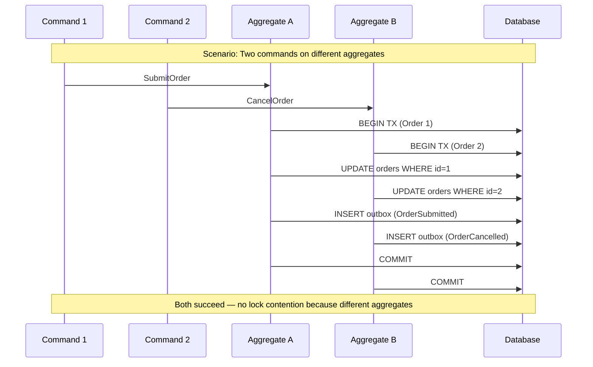
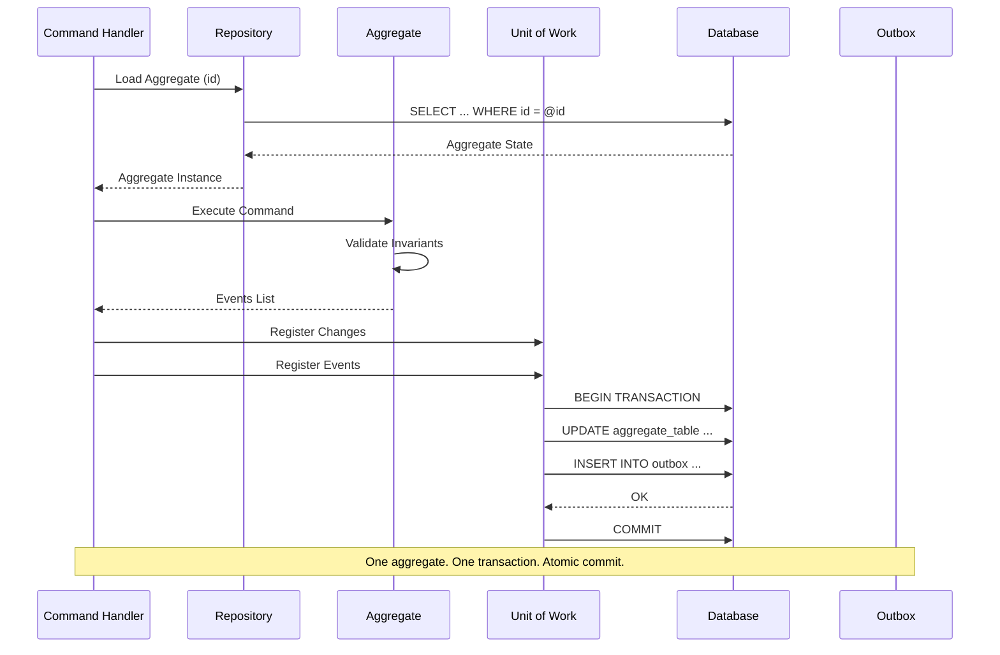
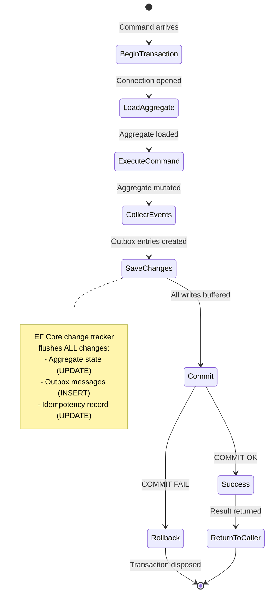

> [!success] Mastery Check
> - [ ] **Studied Well**
> - [ ] **Can explain the concept without notes**
> - [ ] **Can answer interview questions confidently**
> - [ ] **Can implement it in a real project**


# 7.097 — CQRS — Write Side — Transactional Boundary

YAML: `group:"CQRS and Event Sourcing"` `priority:2` `prerequisites: [[7.083 — CQRS — Separate Read and Write Models]]` `related: [[7.089 — CQRS — Event Sourcing Basics]]|[[7.094 — CQRS — Read Side — Projections and Materialized Views]]|[[7.098 — CQRS — Idempotency and Deduplication]]`

---

## Table of Contents

1. [[#1 — Core Concept — The Write-Side Transactional Boundary]]
2. [[#2 — One Aggregate Per Transaction Rule]]
3. [[#3 — Unit of Work Pattern in CQRS Write Side]]
4. [[#4 — The Dual-Write Problem]]
5. [[#5 — Transactional Outbox Pattern]]
6. [[#6 — Outbox Table Design and Schema]]
7. [[#7 — Outbox Background Processor — Polling and CDC]]
8. [[#8 — Idempotency in Command Handlers]]
9. [[#9 — Pitfalls and Anti-Patterns]]
10. [[#10 — ADR — Transactional Outbox vs Two-Phase Commit vs Saga]]
11. [[#11 — Interview Questions]]
12. [[#12 — Self-Check Exercises]]
13. [[#13 — Summary Decision Matrix]]
14. [[#14 — Testing the Write-Side Transactional Boundary]]

---

## 1 — Core Concept — The Write-Side Transactional Boundary

### 1.1 Why the Transactional Boundary Matters

In a CQRS architecture, the **write side** (also called the command side) is responsible for accepting commands, validating business rules, and persisting changes. The **transactional boundary** defines the scope within which all state changes are guaranteed to be atomic, consistent, isolated, and durable (ACID).

In a traditional CRUD system, a single database transaction typically wraps one HTTP request. In CQRS, the write model is optimized for **command processing**, not querying. The write side is intentionally kept narrow in scope — it handles one command at a time, loads one aggregate, validates invariants, mutates state, and persists both the state and resulting events in a single atomic operation. This shift introduces several constraints:

- Commands mutate state through **aggregates** (Domain-Driven Design tactical patterns). The aggregate is the single entry point for all state changes within its boundary.
- Each command must succeed or fail atomically — partial state is not acceptable. If the command fails halfway through, no trace of the operation should remain in the persistent store.
- The write side must **publish events** after successful persistence so that the read side and other subscribers can react. These events are the contract between the write side and the rest of the system.
- The write transaction must be short-lived. Holding locks while waiting for external systems, user input, or long computations leads to contention and poor throughput.
- The write side must be resilient to failures at every point — client disconnection, database outage, message broker unavailability, and process crashes.

Without a well-defined transactional boundary, you risk:

- **Inconsistent state**: The database is updated but the event is not published (or vice versa).
- **Duplicate processing**: The same command is applied twice because the handler did not detect the replay.
- **Orphaned events**: Events are published but the corresponding state change was rolled back.

### 1.2 Distinction from ACID in Monolithic CRUD

In a traditional monolithic CRUD application, ACID transactions often span multiple tables, multiple entities, and occasionally multiple databases. The transaction is, ideally, the entire request. In CQRS, the write side deliberately **shrinks** the transaction scope:

| Characteristic | Monolithic CRUD | CQRS Write Side |
|---|---|---|
| Transaction scope | Entire request (often multi-entity) | Single aggregate |
| Lock duration | Milliseconds to seconds (external calls) | Milliseconds (no external calls) |
| Consistency model | Strong (all readers see committed data) | Strong within aggregate, eventual across system |
| Side effects | Within transaction (emails, API calls) | Via outbox events (outside transaction) |
| Concurrency unit | Table or row | Aggregate instance |
| Scalability strategy | Vertical (bigger DB) or read replicas | Horizontal (partition by aggregate) |

### 1.3 The Write Side Pipeline

The complete write-side processing pipeline, from command arrival to event publication:

```
Command arrives
  │
  ├── 1. Authentication / Authorization
  │     └── Validate caller can issue this command
  │
  ├── 2. Deserialization & Validation
  │     └── Parse command, validate fields (syntax), reject malformed
  │
  ├── 3. Idempotency Check
  │     └── Is this CommandId already processed? Return cached result if yes.
  │
  ├── 4. Load Aggregate
  │     └── Repository loads aggregate from DB (or event store)
  │         └── Optimistic concurrency: check expected version
  │
  ├── 5. Execute Business Logic
  │     └── Aggregate validates invariants, mutates state, raises domain events
  │
  ├── 6. Persist Changes (Transaction)
  │     ├── Save aggregate state (UPDATE / INSERT)
  │     ├── Append domain events to outbox (INSERT)
  │     ├── Update idempotency record (mark completed)
  │     └── COMMIT
  │
  ├── 7. Return Result to Caller
  │     └── Success with aggregate ID or failure with error details
  │
  └── 8. Outbox Processor (async)
        └── Poll outbox → publish to broker → mark processed
```

Each step has specific failure modes. Step 6 is the critical moment for the transactional boundary — at commit time, either everything persists or nothing does.

### 1.4 Scope of the Transactional Boundary

The transactional boundary in CQRS write side spans:

| Scope | Includes | Excludes |
|---|---|---|
| Aggregate state | One or more entities within the aggregate root | Entities outside the aggregate |
| Event persistence | Events appended to the event store or outbox | Read model updates (eventual consistency) |
| Command validation | Business rule checks, concurrency guards | External system calls (idempotent-safe only) |

### 1.3 Relationship to [[7.083 — CQRS — Separate Read and Write Models]]

The separation of read and write models implies that the write side does not serve queries. This frees the write transaction to be **short-lived** and **narrow in scope**. The read side eventually catches up via event subscriptions, which is why the transactional boundary must guarantee **at-least-once event delivery**.

```mermaid
graph TB
    subgraph "Write Side Transactional Boundary"
        C[Command] --> V[Validate Business Rules]
        V --> A[Load Aggregate]
        A --> M[Mutate Aggregate State]
        M --> P[Persist Events]
        P --> O[Transactional Outbox]
    end
    
    subgraph "Outside Boundary"
        O --> B[Background Processor]
        B --> E[Event Broker]
        E --> R1[Read Side Projection]
        E --> R2[Read Side Projection]
    end
    
    style Write Side Transactional Boundary fill:#1a1a2e,stroke:#e94560,stroke-width:2px
    style Outside Boundary fill:#16213e,stroke:#0f3460,stroke-width:1px
```



---

## 2 — One Aggregate Per Transaction Rule

### 2.1 The Rule

> **One command handler must load and modify exactly one aggregate instance within a single transaction.**

This is a fundamental constraint of domain-driven design applied to CQRS. It is not a technical limitation — it is a **design discipline** that forces clear aggregate boundaries.

### 2.2 Rationale

- **Consistency boundary**: The aggregate is the consistency boundary. All invariants within the aggregate must be consistent at the end of each transaction. Spreading a single transaction across multiple aggregates violates this principle and often leads to locking problems or eventual inconsistency that is hard to reason about. In DDD terms, the aggregate root is the only object that external clients can reference directly — it guarantees that all internal parts (entities, value objects) are in a valid state.

- **Scalability**: Aggregates are natural units of concurrency. By restricting transactions to one aggregate, you minimize lock contention and enable horizontal scaling (e.g., each aggregate on a different partition). If you violate this rule and modify two aggregates in one transaction, they both need to be on the same database partition, which prevents independent scaling.

- **Event sourcing compatibility**: In event-sourced systems, each aggregate has its own event stream. A transaction spanning multiple aggregates would need to atomically append to multiple streams, which is not supported by most event stores (EventStoreDB, Marten, and others enforce single-stream transactions).

- **Reduced deadlock risk**: A transaction touching one aggregate locks one row (or one partition of rows). Multiple transactions touching different aggregates can proceed in parallel without interfering. With multi-aggregate transactions, locks are acquired in arbitrary order, increasing deadlock probability.

- **Clear failure semantics**: When a single-aggregate transaction fails, you know exactly which aggregate was affected and can retry just that operation. Multi-aggregate failures require complex compensation logic.

- **Testability**: Commands that modify one aggregate are easier to unit test. The test sets up one aggregate, issues one command, and asserts one outcome. Multi-aggregate command tests require orchestrating multiple entities and understanding cross-aggregate invariants.



### 2.3 Concurrency Strategies Per Aggregate Type

Different aggregate types have different concurrency characteristics:

| Aggregate Type | Contention Level | Concurrency Strategy | Example |
|---|---|---|---|
| **Customer Account** | High (many concurrent operations on same account) | Optimistic concurrency with retry | Debit/Credit operations |
| **Shopping Cart** | Low (single user typically) | Optimistic concurrency | Add/Remove items |
| **Product Inventory** | Very High (many orders claim stock) | Pessimistic lock or reserved stock pattern | Reserve stock on order |
| **Payment Transaction** | Low (each transaction is unique) | Idempotency key + optimistic | Process payment |
| **Configuration** | Very Low (rarely changes) | Optimistic concurrency | Update settings |

For high-contention aggregates, consider:
- **Command batching**: Combine multiple operations into one command (e.g., `DebitAccount` with multiple line items rather than many single debits).
- **Temporal decoupling**: Use a process manager that queues operations and applies them sequentially.
- **Partitioning**: Split a hot aggregate into multiple sub-aggregates (e.g., per-year order history).

### 2.3 When to Break the Rule (and How)

There are rare scenarios where multiple aggregates must be modified together:

- **Saga / Process Manager**: A long-running process coordinates multiple aggregates but does so through **eventual consistency**. Each step in the saga modifies one aggregate and publishes an event that triggers the next step.
- **Domain service**: A domain service orchestrates multiple aggregates but delegates mutation to each aggregate individually, using a **unit of work** to batch the writes only if they are all expected to succeed independently (though this is controversial — most practitioners recommend sagas instead).



### 2.4 Code Example — Aggregate Load + Command Execution

```csharp
// Aggregate root in C# 12 / .NET 8
public sealed class OrderAggregate : AggregateRoot
{
    private OrderId _id;
    private OrderStatus _status;
    private List<OrderLine> _lines;
    private int _version;

    private OrderAggregate() { } // EF Core constructor

    public static OrderAggregate Create(OrderId id, CustomerId customerId)
    {
        var order = new OrderAggregate
        {
            _id = id,
            _status = OrderStatus.Pending,
            _lines = new List<OrderLine>(),
            _version = 1
        };
        order.AddEvent(new OrderCreatedEvent(id, customerId, DateTime.UtcNow));
        return order;
    }

    public void AddLine(ProductId productId, Money price, int quantity)
    {
        if (_status != OrderStatus.Pending)
            throw new DomainException("Cannot modify a non-pending order.");

        var line = new OrderLine(productId, price, quantity);
        _lines.Add(line);
        _version++;

        AddEvent(new OrderLineAddedEvent(_id, productId, price, quantity));
    }

    public void Submit()
    {
        if (_status != OrderStatus.Pending)
            throw new DomainException("Order is not in pending state.");
        if (_lines.Count == 0)
            throw new DomainException("Cannot submit an empty order.");

        _status = OrderStatus.Submitted;
        _version++;

        AddEvent(new OrderSubmittedEvent(_id, DateTime.UtcNow));
    }
}
```

### 2.5 Concurrency Control

Since only one aggregate is modified per transaction, optimistic concurrency is straightforward — use an aggregate version number:

```csharp
public abstract class AggregateRoot
{
    private readonly List<object> _events = [];
    public int Version { get; protected set; }

    protected void AddEvent(object @event)
    {
        _events.Add(@event);
    }

    public IReadOnlyList<object> FlushEvents()
    {
        var events = _events.ToList();
        _events.Clear();
        return events;
    }
}

// EF Core configuration
public class OrderAggregateConfiguration : IEntityTypeConfiguration<OrderAggregate>
{
    public void Configure(EntityTypeBuilder<OrderAggregate> builder)
    {
        builder.ToTable("Orders");
        builder.HasKey(o => o._id);
        builder.Property(o => o._id).HasConversion<OrderIdConverter>();
        builder.Property(o => o._version).IsConcurrencyToken();
        builder.Ignore(o => o.Version); // exposed property with backing field
    }
}
```

**Optimistic concurrency in practice**:
```csharp
public async Task<Result> Handle(AddOrderLineCommand command, CancellationToken ct)
{
    await using var tx = await _db.Database.BeginTransactionAsync(ct);
    try
    {
        var order = await _db.Orders
            .Include(o => o._lines)
            .FirstOrDefaultAsync(o => o._id == command.OrderId, ct);

        if (order is null)
            return Result.NotFound($"Order {command.OrderId} not found");

        order.AddLine(command.ProductId, command.Price, command.Quantity);

        _db.Outbox.AddRange(order.FlushEvents().Select(MapToOutboxMessage));
        await _db.SaveChangesAsync(ct); // throws DbUpdateConcurrencyException on version mismatch
        await tx.CommitAsync(ct);

        return Result.Success();
    }
    catch (DbUpdateConcurrencyException)
    {
        await tx.RollbackAsync(ct);
        return Result.Conflict("Order was modified by another request.");
    }
}
```

---

## 3 — Unit of Work Pattern in CQRS Write Side

### 3.1 Definition

The **Unit of Work** (UoW) pattern maintains a list of objects affected by a business transaction and coordinates the writing out of changes and the resolution of concurrency problems. In CQRS, the UoW typically:

- Tracks loaded aggregate instances
- Collects domain events raised during command execution
- Coordinates the atomic write of both state changes and event records

### 3.2 EF Core DbContext as Unit of Work

EF Core's `DbContext` is a natural Unit of Work implementation. In a CQRS write side:

```csharp
public sealed class CommandDbContext : DbContext
{
    public DbSet<OrderAggregate> Orders => Set<OrderAggregate>();
    public DbSet<OutboxMessage> Outbox => Set<OutboxMessage>();

    public CommandDbContext(DbContextOptions<CommandDbContext> options)
        : base(options) { }

    protected override void OnModelCreating(ModelBuilder modelBuilder)
    {
        modelBuilder.ApplyConfigurationsFromAssembly(
            typeof(CommandDbContext).Assembly);
    }
}
```

**Registration** (Program.cs — .NET 8):
```csharp
builder.Services.AddDbContext<CommandDbContext>(options =>
    options.UseSqlServer(
        builder.Configuration.GetConnectionString("CommandDb"),
        sqlOptions =>
        {
            sqlOptions.MigrationsHistoryTable("__EFMigrationsHistory", "cmd");
            sqlOptions.EnableRetryOnFailure(3);
            sqlOptions.UseQuerySplittingBehavior(QuerySplittingBehavior.SplitQuery);
        }));
```

**DbContext pooling for high-throughput write scenarios**:

```csharp
builder.Services.AddDbContextPool<CommandDbContext>(options =>
    options.UseSqlServer(builder.Configuration.GetConnectionString("CommandDb")),
    poolSize: 128);
```

### 3.3 Unit of Work Lifecycle in a Command Handler

The UoW lifecycle in a command handler follows a predictable pattern:

1. **Begin**: Open connection and start database transaction.
2. **Load**: Repository fetches aggregate from DB, attaching it to the UoW context (EF Core change tracker).
3. **Execute**: Command method on aggregate mutates state and raises domain events (accumulated in memory).
4. **Collect**: The handler (or UoW decorator) collects domain events from the aggregate and maps them to outbox message entities.
5. **Save**: All tracked changes (aggregate state + outbox rows) are flushed to the database in one `SaveChangesAsync` call.
6. **Commit**: Database transaction is committed. At this point, both aggregate state and events are durably stored.
7. **Dispose**: If commit succeeds, clean up. If commit fails, rollback and dispose the transaction.



### 3.3 Explicit UoW for Non-EF Systems

If you are not using EF Core (e.g., raw ADO.NET, Marten, or a custom event store), implement an explicit `IUnitOfWork`:

```csharp
public interface IUnitOfWork : IAsyncDisposable
{
    Task BeginTransactionAsync(CancellationToken ct = default);
    Task CommitAsync(CancellationToken ct = default);
    Task RollbackAsync(CancellationToken ct = default);
    Task<int> SaveChangesAsync(CancellationToken ct = default);
}

public sealed class AdoUnitOfWork : IUnitOfWork
{
    private readonly SqlConnection _connection;
    private SqlTransaction? _transaction;

    public AdoUnitOfWork(SqlConnection connection)
    {
        _connection = connection;
    }

    public async Task BeginTransactionAsync(CancellationToken ct = default)
    {
        await _connection.OpenAsync(ct);
        _transaction = await _connection.BeginTransactionAsync(ct);
    }

    public async Task CommitAsync(CancellationToken ct = default)
    {
        if (_transaction is not null)
            await _transaction.CommitAsync(ct);
    }

    public async Task RollbackAsync(CancellationToken ct = default)
    {
        if (_transaction is not null)
            await _transaction.RollbackAsync(ct);
    }

    public ValueTask DisposeAsync()
    {
        _transaction?.Dispose();
        _connection?.Dispose();
        return ValueTask.CompletedTask;
    }

    // SaveChangesAsync is a no-op in raw ADO.NET; the caller writes directly.
    public Task<int> SaveChangesAsync(CancellationToken ct = default)
        => Task.FromResult(0);
}
```

### 3.4 Combining Unit of Work with Domain Event Dispatching

A common pattern is to collect domain events, save them to the outbox, and optionally dispatch them immediately to an in-memory bus for the **same process** (e.g., for validators that need post-commit hooks). However, this must be done **after commit** to avoid dispatching events that are later rolled back.

```csharp
public sealed class PostCommitEventDispatcher
{
    private readonly CommandDbContext _db;
    private readonly IEventBus _eventBus;
    private readonly ILogger<PostCommitEventDispatcher> _logger;

    public PostCommitEventDispatcher(
        CommandDbContext db,
        IEventBus eventBus,
        ILogger<PostCommitEventDispatcher> logger)
    {
        _db = db;
        _eventBus = eventBus;
        _logger = logger;
    }

    public async Task DispatchOutstandingEventsAsync(CancellationToken ct)
    {
        // Read events that were committed in the current transaction
        // (detached from change tracker, but we can query by correlation)
        var pendingEvents = _db.ChangeTracker
            .Entries<AggregateRoot>()
            .SelectMany(e => e.Entity.FlushEvents())
            .ToList();

        foreach (var @event in pendingEvents)
        {
            try
            {
                await _eventBus.PublishAsync(@event, ct);
                _logger.LogDebug("Dispatched event {EventType} in-process",
                    @event.GetType().Name);
            }
            catch (Exception ex)
            {
                // In-process dispatch failure does NOT roll back the transaction
                // The event is still in the outbox for the background processor
                _logger.LogWarning(ex,
                    "In-process dispatch failed for {EventType}; " +
                    "outbox processor will retry",
                    @event.GetType().Name);
            }
        }
    }
}

// Used in the UoW decorator after commit:
public async Task<Result> Handle(TCommand command, CancellationToken ct)
{
    await using var tx = await _db.Database.BeginTransactionAsync(ct);
    try
    {
        var result = await _inner.Handle(command, ct);
        if (result.IsSuccess)
        {
            await _db.SaveChangesAsync(ct);
            await tx.CommitAsync(ct);

            // Post-commit: dispatch events in-process (fire-and-forget safe)
            await _eventDispatcher.DispatchOutstandingEventsAsync(ct);
        }
        else
        {
            await tx.RollbackAsync(ct);
        }
        return result;
    }
    catch
    {
        await tx.RollbackAsync(ct);
        throw;
    }
}
```

### 3.5 Ambient Unit of Work via Command Handler Decorator

A decorator can wrap every command handler to manage the UoW lifecycle:

```csharp
public sealed class UnitOfWorkDecorator<TCommand> : ICommandHandler<TCommand>
    where TCommand : ICommand
{
    private readonly ICommandHandler<TCommand> _inner;
    private readonly CommandDbContext _db;

    public UnitOfWorkDecorator(
        ICommandHandler<TCommand> inner,
        CommandDbContext db)
    {
        _inner = inner;
        _db = db;
    }

    public async Task<Result> Handle(TCommand command, CancellationToken ct)
    {
        await using var tx = await _db.Database.BeginTransactionAsync(ct);
        try
        {
            var result = await _inner.Handle(command, ct);
            if (result.IsSuccess)
            {
                await _db.SaveChangesAsync(ct);
                await tx.CommitAsync(ct);
            }
            else
            {
                await tx.RollbackAsync(ct);
            }
            return result;
        }
        catch
        {
            await tx.RollbackAsync(ct);
            throw;
        }
    }
}
```

**DI Registration** (with Scrutor for decorators):
```csharp
builder.Services.Scan(scan =>
    scan.FromAssemblies(typeof(ICommandHandler<>).Assembly)
        .AddClasses(classes => classes.AssignableTo(typeof(ICommandHandler<>)))
        .AsImplementedInterfaces()
        .WithScopedLifetime());

// Decorate all ICommandHandler<T> with UnitOfWorkDecorator
builder.Services.Decorate(typeof(ICommandHandler<>), typeof(UnitOfWorkDecorator<>));
```

---

## 4 — The Dual-Write Problem

### 4.1 Problem Statement

The **dual-write problem** occurs when a single business operation must write to two independent systems and keep them consistent. In CQRS, this arises when the command handler:

1. Writes the new aggregate state to the **command database**
2. Publishes events to a **message broker** (e.g., Azure Service Bus, RabbitMQ, Kafka)

If these two writes are not coordinated, a crash or network failure between step 1 and step 2 can leave the system in an inconsistent state.

### 4.2 Failure Scenarios

| Scenario | DB Write | Event Publish | Outcome |
|---|---|---|---|
| Success | ✅ | ✅ | Consistent |
| Crash after DB write, before publish | ✅ | ❌ | Event lost — read side never updated |
| Crash after publish, before DB write | ❌ | ✅ | Ghost event — read side sees state not in DB |
| Network partition during publish | ✅ | ❌ | Event lost — silent data divergence |
| Duplicate publish (retry) | ✅ | ✅ (twice) | Read side may apply duplicate (idempotency required) |

### 4.3 Naive Dual-Write — Do Not Do This

```csharp
// ANTI-PATTERN — Dual write without coordination
public async Task<Result> Handle_Bad(SubmitOrderCommand command, CancellationToken ct)
{
    var order = await _db.Orders.FindAsync([command.OrderId], ct);
    order.Submit();

    await _db.SaveChangesAsync(ct); // Write to DB

    // If the broker is down, the event is lost and the DB is already updated
    await _messageBroker.PublishAsync(new OrderSubmittedEvent(order.Id), ct);

    return Result.Success();
}
```

### 4.4 Formal Definition of the Dual-Write Problem

Formally, a dual-write scenario involves two resource managers (RM₁ and RM₂) that must agree on the outcome of a transaction. In CQRS:

- **RM₁** = Command Database (SQL Server, PostgreSQL, Cosmos DB)
- **RM₂** = Message Broker (Azure Service Bus, RabbitMQ, Kafka)
- **Transaction T** = "Save aggregate state AND publish event"

For T to be atomic, either both RMs commit or neither does. Without a coordinator:

- If RM₁ commits but RM₂ does not, the system is in state S₁ (DB updated, event lost).
- If RM₂ commits but RM₁ does not, the system is in state S₂ (event published, DB unchanged).
- Both S₁ and S₂ are inconsistent states.

The outbox pattern introduces a **third resource manager** — the outbox table within RM₁ — that acts as the single source of truth. The background processor then becomes a separate transaction (RM₁ read → RM₂ write) that can be retried independently.

### 4.5 Why Not Distributed Transactions (2PC)?

Two-Phase Commit (2PC) is theoretically a solution, but in practice:

- **Azure SQL + Azure Service Bus**: 2PC is not supported across these services. Microsoft's `TransactionScope` with distributed transactions was deprecated and does not work with PaaS services. The `System.Transactions` namespace in .NET relies on MSDTC, which is not available in Azure SQL Managed Instance (and never was in Azure SQL Database).
- **Performance**: 2PC holds locks across resources during the prepare phase. The coordinator sends "prepare" to all participants and waits for all to respond "yes" before sending "commit". During this window, all participants hold their locks. As the number of participants grows, the window widens and contention increases.
- **Availability**: The coordinator is a single point of failure. If it crashes during phase 2 (after some participants have committed but before all have), resources are locked until recovery. The coordinator must write its decision to a durable log before proceeding, which adds latency.
- **Cloud-native**: Modern cloud architectures avoid distributed transactions — the CAP theorem and fallacies of distributed computing make them impractical at scale. Network partitions are a reality, and 2PC blocks during partitions.
- **Limited protocol support**: Most modern message brokers (Azure Service Bus, RabbitMQ, Kafka) do not support XA transactions. Kafka has exactly-once semantics within its own ecosystem but does not participate in external XA transactions.

### 4.6 Alternative: Two-Phase Commit with the Outbox (Hybrid)

Some teams attempt a hybrid approach: use 2PC between the command database and a **dedicated outbox database**, then publish from the outbox database to the broker without 2PC. This is marginally better (2PC stays within the database realm) but adds operational complexity and still has the coordinator problem. The consensus in the CQRS community is to avoid 2PC entirely.

### 4.7 Why Compensating Transactions Are Not Enough

A common naïve solution is: "If publishing the event fails, execute a compensating transaction to undo the database change." This is dangerous because:

1. The compensating transaction may also fail.
2. The database state may have changed between the original write and the compensation.
3. Other processes may have observed the intermediate state.
4. The compensation introduces its own dual-write problem (undo + notify).

Compensating transactions are appropriate in sagas where each step is a separate transaction and the overall workflow spans bounded contexts. They are not appropriate for the atomic write within a single command handler.

### 4.5 The Solution — Transactional Outbox

Instead of writing to two systems, write to **one system** (the database) and have a separate **background processor** deliver events to the message broker. This converts a dual-write problem into a single-write plus reliable delivery.

---

## 5 — Transactional Outbox Pattern

### 5.1 Concept

The **Transactional Outbox** pattern ensures reliable event publishing by storing events in the same database transaction as the aggregate state. A background process then reads unpublished events from the outbox table and publishes them to the message broker.

```
┌──────────────────────────────────────────┐
│          Command Handler                  │
│                                          │
│   BEGIN TRANSACTION                      │
│   │                                      │
│   ├── 1. Load Aggregate                  │
│   ├── 2. Execute Command                 │
│   ├── 3. Save Aggregate State ──────┐    │
│   ├── 4. Insert Events into Outbox ──┤    │
│   │                                │ │    │
│   └── COMMIT ──────────────────────┼─┼────┤
│                                    │ │    │
└────────────────────────────────────┼─┼────┘
                                     │ │
                                     ▼ ▼
                            ┌──────────────────┐
                            │  Command Database │
                            │  ┌──────────────┐ │
                            │  │ Orders       │ │
                            │  │ Outbox       │ │
                            │  └──────────────┘ │
                            └──────────────────┘
                                     │
                                     │ (background poll / CDC)
                                     ▼
                            ┌──────────────────┐
                            │ Outbox Processor  │
                            └──────────────────┘
                                     │
                                     ▼
                            ┌──────────────────┐
                            │ Event Broker     │
                            │ (Service Bus /   │
                            │  Kafka / RMQ)    │
                            └──────────────────┘
```

### 5.2 Delivery Guarantees

- **At-least-once delivery**: The outbox processor may publish the same event more than once. Event consumers must be idempotent.
- **Ordering within aggregate**: Events from the same aggregate are published in the order they were raised (use a monotonically increasing sequence number).
- **No ordering across aggregates**: Cross-aggregate ordering is not guaranteed — design your read side accordingly.

### 5.3 Variants

| Variant | Approach | Pros | Cons |
|---|---|---|---|
| **Polling** | Background service periodically queries `Outbox` table for unsent messages | Simple, minimal infrastructure | Polling delay, DB load |
| **CDC (Change Data Capture)** | Uses SQL Server CDC, Debezium, or similar to stream outbox changes | Near real-time, minimal DB impact | Infrastructure complexity, CDC setup |
| **PostgreSQL LISTEN/NOTIFY** | DB trigger sends notification; app listens | Real-time, simple setup | PostgreSQL only, notification delivery not guaranteed |
| **Dedicated outbox DB** | Separate lightweight DB (e.g., SQLite, DynamoDB) for outbox only | Reduced impact on command DB | Additional infrastructure |

---

## 6 — Outbox Table Design and Schema

### 6.1 Core Columns

```sql
CREATE TABLE [cmd].[OutboxMessages] (
    [Id]                UNIQUEIDENTIFIER NOT NULL DEFAULT NEWSEQUENTIALID(),
    [AggregateId]       NVARCHAR(128)    NOT NULL,
    [AggregateType]     NVARCHAR(256)    NOT NULL,
    [EventType]         NVARCHAR(512)    NOT NULL,
    [EventData]         NVARCHAR(MAX)    NOT NULL,  -- JSON serialized event
    [ContentType]       NVARCHAR(128)    NOT NULL DEFAULT 'application/json',
    [CreatedAt]         DATETIME2(7)     NOT NULL DEFAULT SYSUTCDATETIME(),
    [ProcessedAt]       DATETIME2(7)     NULL,
    [CorrelationId]     UNIQUEIDENTIFIER NOT NULL,
    [CausationId]       UNIQUEIDENTIFIER NULL,
    [SequenceNumber]    BIGINT           NOT NULL IDENTITY(1,1),
    [RetryCount]        INT              NOT NULL DEFAULT 0,
    [LastError]         NVARCHAR(MAX)    NULL,
    [LockExpiresAt]     DATETIME2(7)     NULL,
    [LockInstanceId]    NVARCHAR(128)    NULL,

    CONSTRAINT [PK_OutboxMessages] PRIMARY KEY NONCLUSTERED ([Id])
);

CREATE CLUSTERED INDEX [IX_OutboxMessages_CreatedAt]
    ON [cmd].[OutboxMessages] ([CreatedAt]);

CREATE NONCLUSTERED INDEX [IX_OutboxMessages_ProcessedAt]
    ON [cmd].[OutboxMessages] ([ProcessedAt])
    INCLUDE ([Id], [AggregateId], [EventType], [SequenceNumber])
    WHERE [ProcessedAt] IS NULL;
```

### 6.2 EF Core Entity

```csharp
[Table("OutboxMessages", Schema = "cmd")]
public sealed class OutboxMessage
{
    public Guid Id { get; init; } = Guid.NewGuid();
    public string AggregateId { get; init; } = string.Empty;
    public string AggregateType { get; init; } = string.Empty;
    public string EventType { get; init; } = string.Empty;
    public string EventData { get; init; } = string.Empty;
    public string ContentType { get; init; } = "application/json";
    public DateTime CreatedAt { get; init; } = DateTime.UtcNow;
    public DateTime? ProcessedAt { get; set; }
    public Guid CorrelationId { get; init; }
    public Guid? CausationId { get; set; }
    public long SequenceNumber { get; init; }
    public int RetryCount { get; set; }
    public string? LastError { get; set; }
    public DateTime? LockExpiresAt { get; set; }
    public string? LockInstanceId { get; set; }
}

public sealed class OutboxMessageConfiguration : IEntityTypeConfiguration<OutboxMessage>
{
    public void Configure(EntityTypeBuilder<OutboxMessage> builder)
    {
        builder.ToTable("OutboxMessages", "cmd");
        builder.HasKey(m => m.Id);
        builder.Property(m => m.Id).ValueGeneratedNever();
        builder.Property(m => m.AggregateId).HasMaxLength(128);
        builder.Property(m => m.AggregateType).HasMaxLength(256);
        builder.Property(m => m.EventType).HasMaxLength(512);
        builder.Property(m => m.EventData).HasColumnType("nvarchar(max)");
        builder.Property(m => m.ContentType).HasMaxLength(128);
        builder.Property(m => m.LockInstanceId).HasMaxLength(128);
        builder.Property(m => m.SequenceNumber)
            .ValueGeneratedOnAdd()
            .UseIdentityColumn();
        builder.HasIndex(m => m.ProcessedAt)
            .HasFilter("[ProcessedAt] IS NULL")
            .IncludeProperties(m => new
            {
                m.Id,
                m.AggregateId,
                m.EventType,
                m.SequenceNumber
            });
    }
}
```

### 6.3 Handling Large Events

For events > 8 KB (Azure Service Bus max message size is 256 KB, Kafka default is 1 MB):

```sql
-- Split oversized events into a reference table
CREATE TABLE [cmd].[OutboxMessagePayloads] (
    [OutboxMessageId] UNIQUEIDENTIFIER NOT NULL,
    [EventData]       VARBINARY(MAX)   NOT NULL,
    [CompressionType] NVARCHAR(32)     NOT NULL DEFAULT 'gzip',
    CONSTRAINT [PK_OutboxMessagePayloads] PRIMARY KEY ([OutboxMessageId]),
    CONSTRAINT [FK_OutboxMessagePayloads_OutboxMessages]
        FOREIGN KEY ([OutboxMessageId]) REFERENCES [cmd].[OutboxMessages]([Id])
);
```

### 6.4 Event Serialization

```csharp
public sealed class EventSerializer
{
    private static readonly JsonSerializerOptions Options = new()
    {
        TypeInfoResolver = new DefaultJsonTypeInfoResolver
        {
            Modifiers =
            {
                static typeInfo =>
                {
                    if (typeInfo.Type.IsAssignableTo(typeof(IDomainEvent)))
                    {
                        typeInfo.PolymorphismOptions = new JsonPolymorphismOptions
                        {
                            TypeDiscriminatorPropertyName = "$type",
                            IgnoreUnrecognizedTypeDiscriminators = true,
                            UnknownDerivedTypeHandling = JsonUnknownDerivedTypeHandling.FailSerialization,
                            DerivedTypes =
                            {
                                new JsonDerivedType(typeof(OrderCreatedEvent), "orderCreated"),
                                new JsonDerivedType(typeof(OrderLineAddedEvent), "orderLineAdded"),
                                new JsonDerivedType(typeof(OrderSubmittedEvent), "orderSubmitted"),
                            }
                        };
                    }
                }
            }
        },
        PropertyNamingPolicy = JsonNamingPolicy.CamelCase,
        WriteIndented = false
    };

    public static string Serialize<T>(T @event) where T : IDomainEvent
        => JsonSerializer.Serialize(@event, Options);

    public static T Deserialize<T>(string data) where T : IDomainEvent
        => JsonSerializer.Deserialize<T>(data, Options)!;

    public static object Deserialize(string data, Type eventType)
        => JsonSerializer.Deserialize(data, eventType, Options)!;
}
```

---

## 7 — Outbox Background Processor — Polling and CDC

### 7.1 Polling Processor — Implementation

The polling-based outbox processor is a `BackgroundService` that periodically queries for unpublished events and publishes them.

```csharp
public sealed class PollingOutboxProcessor : BackgroundService
{
    private readonly IServiceScopeFactory _scopeFactory;
    private readonly IMessageBroker _broker;
    private readonly ILogger<PollingOutboxProcessor> _logger;
    private readonly OutboxOptions _options;

    public PollingOutboxProcessor(
        IServiceScopeFactory scopeFactory,
        IMessageBroker broker,
        IOptions<OutboxOptions> options,
        ILogger<PollingOutboxProcessor> logger)
    {
        _scopeFactory = scopeFactory;
        _broker = broker;
        _options = options.Value;
        _logger = logger;
    }

    protected override async Task ExecuteAsync(CancellationToken stoppingToken)
    {
        _logger.LogInformation("Outbox processor started. Poll interval: {Interval}s",
            _options.PollIntervalSeconds);

        while (!stoppingToken.IsCancellationRequested)
        {
            try
            {
                await ProcessBatchAsync(stoppingToken);
            }
            catch (OperationCanceledException)
            {
                break;
            }
            catch (Exception ex)
            {
                _logger.LogError(ex, "Outbox processing cycle failed");
            }

            await Task.Delay(
                TimeSpan.FromSeconds(_options.PollIntervalSeconds),
                stoppingToken);
        }
    }

    private async Task ProcessBatchAsync(CancellationToken ct)
    {
        using var scope = _scopeFactory.CreateScope();
        var db = scope.ServiceProvider.GetRequiredService<CommandDbContext>();

        var batch = await db.Outbox
            .Where(m => m.ProcessedAt == null)
            .Where(m => m.LockExpiresAt == null || m.LockExpiresAt < DateTime.UtcNow)
            .OrderBy(m => m.SequenceNumber)
            .Take(_options.BatchSize)
            .ToListAsync(ct);

        if (batch.Count == 0) return;

        var instanceId = Environment.MachineName + ":" + Guid.NewGuid().ToString("N");

        // Acquire locks
        foreach (var message in batch)
        {
            message.LockInstanceId = instanceId;
            message.LockExpiresAt = DateTime.UtcNow.AddMinutes(1);
        }
        await db.SaveChangesAsync(ct);

        foreach (var message in batch)
        {
            try
            {
                var eventType = Type.GetType(message.EventType);
                if (eventType is null)
                {
                    _logger.LogWarning("Unknown event type: {EventType}", message.EventType);
                    message.ProcessedAt = DateTime.UtcNow;
                    continue;
                }

                var domainEvent = EventSerializer.Deserialize(message.EventData, eventType);

                await _broker.PublishAsync(domainEvent, message.CorrelationId, ct);

                message.ProcessedAt = DateTime.UtcNow;
                message.LastError = null;
                message.RetryCount = 0;
                message.LockExpiresAt = null;
                message.LockInstanceId = null;
            }
            catch (Exception ex)
            {
                message.RetryCount++;
                message.LastError = $"{ex.GetType().Name}: {ex.Message}";
                message.LockExpiresAt = null;
                message.LockInstanceId = null;

                _logger.LogWarning(ex,
                    "Failed to publish outbox message {Id} (retry {Retry})",
                    message.Id, message.RetryCount);

                if (message.RetryCount >= _options.MaxRetries)
                {
                    message.ProcessedAt = DateTime.UtcNow; // Move to DLQ
                    _logger.LogError("Outbox message {Id} moved to DLQ after {Retry} retries",
                        message.Id, message.RetryCount);
                }
            }

            await db.SaveChangesAsync(ct);
        }
    }
}
```

### 7.2 CDC-Based Processor — Azure SQL Change Tracking

For near-real-time processing with minimal DB impact, use SQL Server Change Tracking:

```csharp
public sealed class CdcOutboxProcessor : BackgroundService
{
    private readonly string _connectionString;
    private readonly IMessageBroker _broker;
    private readonly ILogger<CdcOutboxProcessor> _logger;
    private long _lastVersion;

    public CdcOutboxProcessor(
        IConfiguration configuration,
        IMessageBroker broker,
        ILogger<CdcOutboxProcessor> logger)
    {
        _connectionString = configuration.GetConnectionString("CommandDb")!;
        _broker = broker;
        _logger = logger;
    }

    protected override async Task ExecuteAsync(CancellationToken stoppingToken)
    {
        // Ensure change tracking is enabled on the outbox table
        await EnableChangeTrackingAsync(stoppingToken);
        _lastVersion = await GetCurrentVersionAsync(stoppingToken);

        while (!stoppingToken.IsCancellationRequested)
        {
            try
            {
                var changes = await PollChangesAsync(stoppingToken);
                foreach (var change in changes)
                {
                    await _broker.PublishAsync(change.Event, change.CorrelationId, stoppingToken);
                    _lastVersion = change.Version;
                }
            }
            catch (OperationCanceledException) { break; }
            catch (Exception ex)
            {
                _logger.LogError(ex, "CDC outbox polling failed");
                await Task.Delay(1000, stoppingToken);
            }
        }
    }

    private async Task EnableChangeTrackingAsync(CancellationToken ct)
    {
        await using var conn = new SqlConnection(_connectionString);
        await conn.OpenAsync(ct);
        var cmd = conn.CreateCommand();

        // Enable at database level
        cmd.CommandText = """
            IF NOT EXISTS (SELECT 1 FROM sys.change_tracking_databases
                           WHERE database_id = DB_ID())
                ALTER DATABASE CURRENT SET CHANGE_TRACKING = ON
                (CHANGE_RETENTION = 7 DAYS, AUTO_CLEANUP = ON);
            """;
        await cmd.ExecuteNonQueryAsync(ct);

        // Enable on the outbox table
        cmd.CommandText = """
            IF NOT EXISTS (SELECT 1 FROM sys.change_tracking_tables
                           WHERE object_id = OBJECT_ID('cmd.OutboxMessages'))
                ALTER TABLE [cmd].[OutboxMessages]
                ENABLE CHANGE_TRACKING WITH (TRACK_COLUMNS_UPDATED = OFF);
            """;
        await cmd.ExecuteNonQueryAsync(ct);
    }

    private async Task<long> GetCurrentVersionAsync(CancellationToken ct)
    {
        await using var conn = new SqlConnection(_connectionString);
        await conn.OpenAsync(ct);
        var cmd = new SqlCommand("SELECT CHANGE_TRACKING_CURRENT_VERSION()", conn);
        var result = await cmd.ExecuteScalarAsync(ct);
        return result is DBNull ? 0 : (long)result;
    }

    private async Task<List<(object Event, Guid CorrelationId, long Version)>> PollChangesAsync(
        CancellationToken ct)
    {
        // Implementation uses CHANGETABLE(CHANGES ...) to detect new/modified rows
        // then reads EventData and CorrelationId from the outbox table
        // (omitted for brevity — follows same pattern as polling but uses CDC)
        return [];
    }
}
```

### 7.3 Configuration

```csharp
public sealed class OutboxOptions
{
    public const string SectionName = "Outbox";

    public int PollIntervalSeconds { get; init; } = 5;
    public int BatchSize { get; init; } = 100;
    public int MaxRetries { get; init; } = 5;
    public int LockTimeoutMinutes { get; init; } = 1;
}

// appsettings.json
{
  "Outbox": {
    "PollIntervalSeconds": 3,
    "BatchSize": 200,
    "MaxRetries": 10,
    "LockTimeoutMinutes": 2
  }
}
```

### 7.4 Outbox Processor — Kafka-Specific Publish with Exactly-Once Semantics

When using Kafka as the event broker, you can leverage Kafka's idempotent producer and transactional API for stronger guarantees:

```csharp
public sealed class KafkaOutboxPublisher : IOutboxPublisher
{
    private readonly IProducer<string, string> _producer;
    private readonly ILogger<KafkaOutboxPublisher> _logger;

    public KafkaOutboxPublisher(
        IProducer<string, string> producer,
        ILogger<KafkaOutboxPublisher> logger)
    {
        _producer = producer;
        _logger = logger;
    }

    public async Task PublishAsync(
        OutboxMessage message,
        CancellationToken ct)
    {
        var headers = new Headers
        {
            new Header("eventType", Encoding.UTF8.GetBytes(message.EventType)),
            new Header("correlationId",
                Encoding.UTF8.GetBytes(message.CorrelationId.ToString())),
            new Header("aggregateId",
                Encoding.UTF8.GetBytes(message.AggregateId))
        };

        var kafkaMessage = new Message<string, string>
        {
            Key = message.AggregateId, // Partition key — events for same aggregate go to same partition
            Value = message.EventData,
            Headers = headers,
            Timestamp = new Timestamp(message.CreatedAt, TimestampType.CreateTime)
        };

        var deliveryResult = await _producer.ProduceAsync(
            TopicForEventType(message.EventType),
            kafkaMessage,
            ct);

        if (deliveryResult.Status != PersistenceStatus.Persisted)
        {
            throw new KafkaPublishException(
                $"Message {message.Id} was not persisted. " +
                $"Status: {deliveryResult.Status}");
        }

        _logger.LogDebug(
            "Published outbox message {Id} to Kafka topic {Topic} " +
            "at offset {Offset} partition {Partition}",
            message.Id, deliveryResult.Topic,
            deliveryResult.Offset, deliveryResult.Partition);
    }

    private static string TopicForEventType(string eventType)
        => eventType switch
        {
            nameof(OrderCreatedEvent) => "orders.created",
            nameof(OrderSubmittedEvent) => "orders.submitted",
            _ => "events.unknown"
        };
}
```

### 7.5 Outbox Processor — RabbitMQ-Specific Publishing with Confirms

For RabbitMQ, use publisher confirms to ensure the broker has persisted the message:

```csharp
public sealed class RabbitMqOutboxPublisher : IOutboxPublisher
{
    private readonly IConnection _connection;
    private readonly ILogger<RabbitMqOutboxPublisher> _logger;

    public async Task PublishAsync(OutboxMessage message, CancellationToken ct)
    {
        await using var channel = await _connection.CreateChannelAsync(
            cancellationToken: ct);

        var props = new BasicProperties
        {
            Persistent = true,
            MessageId = message.Id.ToString(),
            Type = message.EventType,
            Timestamp = new AmqpTimestamp(
                new DateTimeOffset(message.CreatedAt).ToUnixTimeSeconds()),
            Headers = new Dictionary<string, object?>
            {
                ["correlation-id"] = message.CorrelationId.ToString(),
                ["aggregate-id"] = message.AggregateId
            }
        };

        var body = Encoding.UTF8.GetBytes(message.EventData);

        // Enable publisher confirms
        await channel.ConfirmSelectAsync(ct);

        await channel.BasicPublishAsync(
            exchange: "commands",
            routingKey: RoutingKeyForEventType(message.EventType),
            mandatory: true,
            basicProperties: props,
            body: body,
            cancellationToken: ct);

        // Wait for broker acknowledgment
        var acked = await channel.WaitForConfirmsAsync(ct);

        if (!acked)
        {
            throw new RabbitMqPublishException(
                $"Broker did not confirm message {message.Id}");
        }
    }

    private static string RoutingKeyForEventType(string eventType)
        => eventType switch
        {
            nameof(OrderCreatedEvent) => "order.created",
            nameof(OrderSubmittedEvent) => "order.submitted",
            _ => "event.unknown"
        };
}
```

### 7.6 Poison Message Handling and Dead-Letter Queue

Messages that repeatedly fail are moved to a dead-letter state (marked as processed with `LastError` populated). Consider:

1. **Fixed retry count**: After N retries, mark as dead letter.
2. **Exponential backoff**: Increase polling delay for retried messages using `Task.Delay(minDelay * 2^retryCount)`.
3. **Manual intervention alert**: Log a critical alert for dead-letter messages. Monitor with a dedicated health check.
4. **Separate DLQ table**: Move dead-letter messages to `OutboxDeadLetters` table for investigation and replay.
5. **DLQ replay console**: Build a simple admin tool that lists dead-letter messages and allows an operator to replay them after fixing the root cause.

```csharp
// Exponential backoff for retried messages
private TimeSpan CalculateBackoff(int retryCount)
{
    // Base delay: 1 second, doubles each retry, max 5 minutes
    var delay = TimeSpan.FromSeconds(Math.Pow(2, retryCount));
    return delay > TimeSpan.FromMinutes(5)
        ? TimeSpan.FromMinutes(5)
        : delay;
}

// Modified processing loop with backoff
private async Task ProcessWithBackoffAsync(
    OutboxMessage message,
    CancellationToken ct)
{
    try
    {
        await PublishAsync(message, ct);
        MarkProcessed(message);
    }
    catch (Exception ex) when (message.RetryCount < _options.MaxRetries)
    {
        message.RetryCount++;
        message.LastError = $"{ex.GetType().Name}: {ex.Message}";

        var backoff = CalculateBackoff(message.RetryCount);
        _logger.LogWarning(ex,
            "Publish failed for message {Id}. " +
            "Retry {Retry}/{MaxRetries} after {Delay}s",
            message.Id, message.RetryCount,
            _options.MaxRetries, backoff.TotalSeconds);

        // Let the message be picked up again after backoff
        message.LockExpiresAt = DateTime.UtcNow.Add(backoff);
        message.LockInstanceId = null;
    }
    catch (Exception ex) when (message.RetryCount >= _options.MaxRetries)
    {
        message.ProcessedAt = DateTime.UtcNow; // Dead letter
        message.LastError = $"FINAL: {ex.GetType().Name}: {ex.Message}";

        _logger.LogCritical(ex,
            "Outbox message {Id} moved to DLQ after {Retry} retries",
            message.Id, message.RetryCount);
    }
}
```

### 7.7 Outbox Processor — Health Check and Monitoring

```csharp
public sealed class OutboxHealthCheck : IHealthCheck
{
    private readonly CommandDbContext _db;
    private readonly IOptions<OutboxOptions> _options;

    public OutboxHealthCheck(
        CommandDbContext db,
        IOptions<OutboxOptions> options)
    {
        _db = db;
        _options = options;
    }

    public async Task<HealthCheckResult> CheckHealthAsync(
        HealthCheckContext context,
        CancellationToken ct = default)
    {
        var deadLetterCount = await _db.Outbox
            .CountAsync(m =>
                m.ProcessedAt != null &&
                m.LastError != null &&
                m.RetryCount >= _options.Value.MaxRetries,
                ct);

        var pendingCount = await _db.Outbox
            .CountAsync(m => m.ProcessedAt == null, ct);

        var oldestPending = await _db.Outbox
            .Where(m => m.ProcessedAt == null)
            .MinAsync(m => (DateTime?)m.CreatedAt, ct);

        var data = new Dictionary<string, object>
        {
            ["pendingCount"] = pendingCount,
            ["deadLetterCount"] = deadLetterCount,
            ["oldestPending"] = oldestPending?.ToString("O") ?? "none"
        };

        if (deadLetterCount > 100)
        {
            return HealthCheckResult.Degraded(
                $"Outbox has {deadLetterCount} dead-letter messages",
                data: data);
        }

        if (pendingCount > 10000)
        {
            return HealthCheckResult.Degraded(
                $"Outbox has {pendingCount} pending messages — " +
                "processor may be falling behind",
                data: data);
        }

        if (oldestPending.HasValue &&
            (DateTime.UtcNow - oldestPending.Value).TotalMinutes > 30)
        {
            return HealthCheckResult.Degraded(
                $"Oldest pending message is " +
                $"{(DateTime.UtcNow - oldestPending.Value).TotalMinutes:F0} minutes old",
                data: data);
        }

        return HealthCheckResult.Healthy("Outbox processor operating normally", data);
    }
}

// Register in DI:
builder.Services.AddHealthChecks()
    .AddCheck<OutboxHealthCheck>("outbox_processor");
```

**Monitoring metrics to emit** (Prometheus / App Metrics):

```csharp
public sealed class OutboxMetrics
{
    private readonly Counter _publishedCounter;
    private readonly Counter _failedCounter;
    private readonly Gauge _pendingGauge;
    private readonly Gauge _deadLetterGauge;
    private readonly Histogram _publishLatency;

    public OutboxMetrics(IMeterFactory meterFactory)
    {
        var meter = meterFactory.Create("Cqrs.Outbox");

        _publishedCounter = meter.CreateCounter<long>(
            "outbox.events.published",
            description: "Number of events successfully published");

        _failedCounter = meter.CreateCounter<long>(
            "outbox.events.failed",
            description: "Number of events that failed to publish");

        _pendingGauge = meter.CreateGauge<int>(
            "outbox.events.pending",
            description: "Number of events waiting to be published");

        _deadLetterGauge = meter.CreateGauge<int>(
            "outbox.events.dead_letter",
            description: "Number of events in dead-letter state");

        _publishLatency = meter.CreateHistogram<double>(
            "outbox.publish.latency_ms",
            description: "Event publish latency in milliseconds");
    }

    public void EventPublished() => _publishedCounter.Add(1);
    public void EventFailed() => _failedCounter.Add(1);
    public void SetPending(int count) => _pendingGauge.Record(count);
    public void SetDeadLetter(int count) => _deadLetterGauge.Record(count);
    public void RecordPublishLatency(TimeSpan latency) =>
        _publishLatency.Record(latency.TotalMilliseconds);
}
```

### 7.8 Outbox Cleanup Strategies

| Strategy | Mechanism | Pros | Cons |
|---|---|---|---|
| **Scheduled DELETE** | `DELETE FROM Outbox WHERE ProcessedAt < @RetentionThreshold` | Simple, one SQL statement | Can cause index fragmentation, transaction log growth, deadlocks |
| **Batch DELETE** | `DELETE TOP(@BatchSize) FROM Outbox WHERE ...` in loop | Limits transaction size, reduces locking | Requires loop, slower |
| **Table partitioning** | SWITCH PARTITION to archive, then TRUNCATE | Instant partition switch, no lock contention | Requires SQL Server Enterprise, setup complexity |
| **Separate archive DB** | Move processed rows to a different database | Keeps command DB small, archive independently scalable | Cross-database ETL |
| **TTL-based (Cosmos DB)** | Set `ttl` property on document | Automatic, no code | Only for Cosmos DB / Azure Cosmos |

**Example batch cleanup with EF Core**:

```csharp
public sealed class OutboxCleanupJob : BackgroundService
{
    private readonly IServiceScopeFactory _scopeFactory;
    private readonly ILogger<OutboxCleanupJob> _logger;

    private static readonly TimeSpan CleanupInterval = TimeSpan.FromHours(4);
    private const int BatchSize = 1000;

    protected override async Task ExecuteAsync(CancellationToken stoppingToken)
    {
        while (!stoppingToken.IsCancellationRequested)
        {
            try
            {
                await CleanupAsync(stoppingToken);
            }
            catch (Exception ex)
            {
                _logger.LogError(ex, "Outbox cleanup failed");
            }

            await Task.Delay(CleanupInterval, stoppingToken);
        }
    }

    private async Task CleanupAsync(CancellationToken ct)
    {
        using var scope = _scopeFactory.CreateScope();
        var db = scope.ServiceProvider.GetRequiredService<CommandDbContext>();
        var retentionCutoff = DateTime.UtcNow.AddDays(-7);

        int totalDeleted = 0;
        int batchDeleted;

        do
        {
            batchDeleted = await db.Outbox
                .Where(m => m.ProcessedAt != null &&
                            m.CreatedAt < retentionCutoff)
                .Take(BatchSize)
                .ExecuteDeleteAsync(ct);

            totalDeleted += batchDeleted;

            _logger.LogInformation(
                "Cleaned {Batch} outbox records (total: {Total})",
                batchDeleted, totalDeleted);

            if (batchDeleted == BatchSize)
                await Task.Delay(100, ct);
        }
        while (batchDeleted == BatchSize && !ct.IsCancellationRequested);
    }
}
```

### 7.9 Comparing Polling vs CDC on Key Dimensions

| Dimension | Polling | CDC |
|---|---|---|
| **Latency** | Poll interval (typically 1-10s) | Sub-second (near real-time) |
| **DB Load** | Regular SELECT queries on outbox table | Minimal — reads change tracking metadata |
| **Complexity** | Simple background service | Requires CDC setup, permissions, version tracking |
| **Error Recovery** | Simple — just re-query unprocessed | Must manage change versions cursor |
| **Schema Changes** | Ignores schema — just reads EventData | May break if CDC tracked columns change |
| **Scale Ceiling** | ~10K events/sec before query overhead | 100K+ events/sec with proper tuning |
| **Cloud Support** | Any SQL DB | Azure SQL, SQL Server, PostgreSQL (via wal2json), MySQL |
| **Operational Cost** | None | CDC retention storage, version tracking state |

**Decision heuristic**: Use polling if latency > 5s is acceptable and throughput is < 1K events/sec. Use CDC if sub-second delivery is required or if the outbox table grows too large for efficient polling queries.

---

## 8 — Idempotency in Command Handlers

### 8.1 Why Idempotency Is Required

Even with the transactional outbox, events may be published at-least-once. Command handlers must be idempotent because:

- **Client retries**: The client may send the same command twice (network timeout).
- **Message broker redelivery**: The broker may redeliver a command due to unacknowledged processing.
- **Outbox processor replay**: If the processor crashes after publishing but before marking the outbox message as processed, it will publish again on restart.

### 8.2 Idempotency Key Patterns

| Pattern | Mechanism | Pros | Cons |
|---|---|---|---|
| **Command ID** | Client generates a unique ID per command | Simple, works cross-service | Requires client cooperation |
| **Idempotency token** | Server returns token post-first-execution; client sends it on retry | No client changes needed | Requires token storage |
| **Aggregate version** | Command includes expected aggregate version; reject if version changed | Natural fit with event sourcing | Only for state-based idempotency |
| **Business key** | Deduplicate based on business data (e.g., invoice number) | No extra fields needed | Complex matching logic |

### 8.3 IdempotentCommandHandler — Generic Implementation

```csharp
public interface ICommandHandler<in TCommand>
    where TCommand : ICommand
{
    Task<Result> Handle(TCommand command, CancellationToken ct = default);
}

public interface IIdempotentCommand
{
    Guid CommandId { get; }
}

// Idempotency storage table
public sealed class CommandIdempotency
{
    public Guid CommandId { get; init; }
    public string CommandType { get; init; } = string.Empty;
    public string HandlerName { get; init; } = string.Empty;
    public string? ResultJson { get; set; }
    public DateTime CreatedAt { get; init; } = DateTime.UtcNow;
    public DateTime? CompletedAt { get; set; }
    public bool IsCompleted { get; set; }
}

// EF Core configuration
public sealed class CommandIdempotencyConfiguration
    : IEntityTypeConfiguration<CommandIdempotency>
{
    public void Configure(EntityTypeBuilder<CommandIdempotency> builder)
    {
        builder.ToTable("CommandIdempotency", "cmd");
        builder.HasKey(i => i.CommandId);
        builder.Property(i => i.CommandType).HasMaxLength(512);
        builder.Property(i => i.HandlerName).HasMaxLength(512);
        builder.Property(i => i.ResultJson).HasColumnType("nvarchar(max)");
        builder.HasIndex(i => new { i.CommandId, i.CommandType, i.IsCompleted });
    }
}

// Generic idempotent decorator
public sealed class IdempotentCommandHandlerDecorator<TCommand> : ICommandHandler<TCommand>
    where TCommand : ICommand, IIdempotentCommand
{
    private readonly ICommandHandler<TCommand> _inner;
    private readonly CommandDbContext _db;
    private readonly ILogger<IdempotentCommandHandlerDecorator<TCommand>> _logger;

    public IdempotentCommandHandlerDecorator(
        ICommandHandler<TCommand> inner,
        CommandDbContext db,
        ILogger<IdempotentCommandHandlerDecorator<TCommand>> logger)
    {
        _inner = inner;
        _db = db;
        _logger = logger;
    }

    public async Task<Result> Handle(TCommand command, CancellationToken ct)
    {
        var idempotencyKey = new
        {
            command.CommandId,
            CommandType = typeof(TCommand).FullName!
        };

        // Check if already processed
        var existing = await _db.Set<CommandIdempotency>()
            .FirstOrDefaultAsync(i =>
                i.CommandId == command.CommandId &&
                i.CommandType == typeof(TCommand).FullName! &&
                i.IsCompleted,
                ct);

        if (existing is not null)
        {
            _logger.LogInformation(
                "Command {CommandId} ({CommandType}) already processed. Returning cached result.",
                command.CommandId, typeof(TCommand).Name);

            return Result.Deserialize(existing.ResultJson!);
        }

        // Check if currently in progress (prevent concurrent processing)
        var inProgress = await _db.Set<CommandIdempotency>()
            .FirstOrDefaultAsync(i =>
                i.CommandId == command.CommandId &&
                i.CommandType == typeof(TCommand).FullName! &&
                !i.IsCompleted,
                ct);

        if (inProgress is not null)
        {
            return Result.Conflict("Command is already being processed.");
        }

        // Register as in-progress
        var entry = new CommandIdempotency
        {
            CommandId = command.CommandId,
            CommandType = typeof(TCommand).FullName!,
            HandlerName = typeof(TCommand).Name,
            IsCompleted = false
        };
        _db.Set<CommandIdempotency>().Add(entry);
        await _db.SaveChangesAsync(ct); // UOW will handle transactional integrity

        try
        {
            var result = await _inner.Handle(command, ct);

            // Mark as completed
            entry.IsCompleted = true;
            entry.CompletedAt = DateTime.UtcNow;
            entry.ResultJson = result.Serialize();
            await _db.SaveChangesAsync(ct);

            return result;
        }
        catch (Exception ex)
        {
            _logger.LogError(ex,
                "Command {CommandId} ({CommandType}) failed. Removing idempotency record.",
                command.CommandId, typeof(TCommand).Name);

            _db.Set<CommandIdempotency>().Remove(entry);
            await _db.SaveChangesAsync(ct);
            throw;
        }
    }
}
```

### 8.4 IdempotentCommand — Base Record

```csharp
public abstract record IdempotentCommand : ICommand, IIdempotentCommand
{
    public Guid CommandId { get; init; } = Guid.NewGuid();
    public DateTime RequestedAt { get; init; } = DateTime.UtcNow;
}

// Example concrete command
public sealed record SubmitOrderCommand : IdempotentCommand
{
    public Guid OrderId { get; init; }
    public DateTime SubmittedAt { get; init; }
}

// Registration
builder.Services.Decorate(
    typeof(ICommandHandler<>),
    typeof(IdempotentCommandHandlerDecorator<>));
```

### 8.5 Idempotency TTL and Cleanup

Idempotency records accumulate over time. Implement cleanup:

```sql
-- Cleanup records older than retention period
CREATE PROCEDURE [cmd].[CleanupIdempotencyRecords]
    @RetentionHours INT = 24
AS
    DELETE FROM [cmd].[CommandIdempotency]
    WHERE [CreatedAt] < DATEADD(HOUR, -@RetentionHours, SYSUTCDATETIME())
    AND [IsCompleted] = 1;
```

```csharp
public sealed class IdempotencyCleanupJob : BackgroundService
{
    private readonly IServiceScopeFactory _scopeFactory;
    private readonly ILogger<IdempotencyCleanupJob> _logger;

    private static readonly TimeSpan CleanupInterval = TimeSpan.FromHours(1);

    public IdempotencyCleanupJob(
        IServiceScopeFactory scopeFactory,
        ILogger<IdempotencyCleanupJob> logger)
    {
        _scopeFactory = scopeFactory;
        _logger = logger;
    }

    protected override async Task ExecuteAsync(CancellationToken stoppingToken)
    {
        while (!stoppingToken.IsCancellationRequested)
        {
            try
            {
                await CleanupAsync(stoppingToken);
            }
            catch (Exception ex)
            {
                _logger.LogError(ex, "Idempotency cleanup failed");
            }

            await Task.Delay(CleanupInterval, stoppingToken);
        }
    }

    private async Task CleanupAsync(CancellationToken ct)
    {
        using var scope = _scopeFactory.CreateScope();
        var db = scope.ServiceProvider.GetRequiredService<CommandDbContext>();
        var retention = DateTime.UtcNow.AddHours(-24);

        var deleted = await db.Set<CommandIdempotency>()
            .Where(i => i.CreatedAt < retention && i.IsCompleted)
            .ExecuteDeleteAsync(ct);

        if (deleted > 0)
        {
            _logger.LogInformation("Cleaned up {Count} idempotency records", deleted);
        }
    }
}
```

---

## 9 — Pitfalls and Anti-Patterns

### 9.1 Azure SQL + Service Bus Dual-Write Without Outbox

**Problem**: Writing to Azure SQL and publishing to Azure Service Bus in the same scope without a transactional outbox.

```csharp
// PITFALL — Azure SQL + Service Bus dual-write
public async Task Handle_Pitfall(CreateOrderCommand command, CancellationToken ct)
{
    var order = OrderAggregate.Create(command.OrderId, command.CustomerId);

    // EF Core transaction — works
    _db.Orders.Add(order);
    await _db.SaveChangesAsync(ct);

    // Azure Service Bus publish — NOT covered by the DB transaction
    await _serviceBusSender.SendMessageAsync(
        new ServiceBusMessage(JsonSerializer.Serialize(order.Events)),
        ct);
}
```

**Why it fails**: `SaveChangesAsync` and `SendMessageAsync` are independent. If the service bus is unreachable, the order is committed but the event is lost. If `SendMessageAsync` succeeds but the response is lost, the handler may retry and create a duplicate order.

**Fix**: Use the [[#5 — Transactional Outbox Pattern|Transactional Outbox Pattern]].

### 9.2 .NET TransactionScope with Azure PaaS

**Problem**: Using `TransactionScope` with distributed transactions across Azure SQL and Azure Service Bus.

```csharp
// PITFALL — TransactionScope with cloud services
using (var scope = new TransactionScope(TransactionScopeAsyncFlowOption.Enabled))
{
    // Azure SQL — enlisted automatically with DTC
    await _db.SaveChangesAsync(ct);

    // Azure Service Bus — cannot enlist in DTC
    await _serviceBusSender.SendMessageAsync(message, ct);

    scope.Complete(); // May throw or silently degrade
}
```

**Why it fails**: `TransactionScope` with multiple resource managers requires the Microsoft Distributed Transaction Coordinator (MSDTC). Azure SQL does not support MSDTC. Azure Service Bus does not support MSDTC. The transaction silently falls back to a local transaction on the first resource and leaves the second resource outside the transaction scope.

**Fix**: Do not use `TransactionScope` across cloud PaaS resources. Use [[#5 — Transactional Outbox Pattern|Transactional Outbox]] or [[[[#10 — ADR — Transactional Outbox vs Two-Phase Commit vs Saga|Saga Pattern]].

### 9.3 Dual Outbox Processors Competing for Messages

**Problem**: Multiple instances of the polling outbox processor pick up the same messages.

```csharp
// PITFALL — No locking, duplicate publishes
var messages = await db.Outbox
    .Where(m => m.ProcessedAt == null)
    .OrderBy(m => m.SequenceNumber)
    .Take(100)
    .ToListAsync(ct);

foreach (var msg in messages)
{
    await broker.PublishAsync(msg.EventData, ct);
    msg.ProcessedAt = DateTime.UtcNow;
}
await db.SaveChangesAsync(ct);
```

**Why it fails**: Instance A reads messages 1-100. Instance B reads messages 1-100 (not yet processed). Both publish the same events.

**Fix**: Use pessimistic locking (`UPDLOCK`, `ROWLOCK` in SQL Server), or implement a lock column with a lease time (see the `LockInstanceId`/`LockExpiresAt` columns in the [[#6.1 Core Columns|outbox schema]]).

### 9.4 Outbox Growth and Index Fragmentation

**Problem**: The outbox table grows unboundedly, slowing queries on `ProcessedAt IS NULL`.

**Fix**: Implement partitioning or scheduled cleanup:

```sql
-- Partition outbox by date range (SQL Server 2019+)
CREATE PARTITION FUNCTION [OutboxDateRangePF] (DATETIME2(7))
    AS RANGE RIGHT FOR VALUES (
        '2025-01-01', '2025-04-01', '2025-07-01',
        '2025-10-01', '2026-01-01');

CREATE PARTITION SCHEME [OutboxDateRangePS]
    AS PARTITION [OutboxDateRangePF]
    ALL TO ([PRIMARY]);

CREATE TABLE [cmd].[OutboxMessages] (
    -- ... same schema ...
) ON [OutboxDateRangePS]([CreatedAt]);

-- Switch out old partitions
ALTER TABLE [cmd].[OutboxMessages]
    SWITCH PARTITION 1 TO [cmd].[OutboxMessages_Archive];
```

### 9.5 Event Serialization with Type Binding

**Problem**: Using `Type.GetType(message.EventType)` for deserialization can fail if the assembly is not loaded or the type is internal.

**Fix**: Use a type registry or map:

```csharp
public static class EventTypeRegistry
{
    private static readonly Dictionary<string, Type> _map = new()
    {
        ["OrderCreated"] = typeof(OrderCreatedEvent),
        ["OrderLineAdded"] = typeof(OrderLineAddedEvent),
        ["OrderSubmitted"] = typeof(OrderSubmittedEvent),
    };

    public static Type GetType(string eventType)
        => _map.TryGetValue(eventType, out var type)
            ? type
            : throw new InvalidOperationException(
                $"Unknown event type: {eventType}");
}
```

### 9.6 Command Handlers That Call External APIs

**Problem**: The command handler calls an external API (payment gateway, SMS, email) inside the transaction.

```csharp
// PITFALL — External call inside transaction
[UnitOfWork]
public async Task<Result> Handle(ChargePaymentCommand command)
{
    var invoice = await _db.Invoices.FindAsync(command.InvoiceId);

    // External API call — may take seconds or fail
    var paymentResult = await _paymentGateway.ChargeAsync(
        invoice.Amount, command.CardToken);

    invoice.MarkPaid(paymentResult.TransactionId);
    await _db.SaveChangesAsync(); // Long-running transaction!

    return Result.Success();
}
```

**Why it fails**: The database transaction holds locks while waiting for the external API. This increases contention, lock escalation risk, and deadlock probability. If the API call fails, the transaction rolls back, but the external system may have already processed the payment (no compensation).

**Fix**: Execute the command in two phases — validate + persist in transaction, publish event, then execute external call in a saga/process manager:

```csharp
// Better — transactional outbox + saga
[UnitOfWork]
public async Task<Result> Handle(ChargePaymentCommand command)
{
    var invoice = await _db.Invoices.FindAsync(command.InvoiceId);
    invoice.MarkPaymentPending(); // Just change local state
    // Raise event — outbox will persist it atomically
    invoice.AddEvent(new PaymentInitiatedEvent(invoice.Id, invoice.Amount));
    return Result.Success();
}

// Saga handler listens for PaymentInitiatedEvent and calls the external API
```

### 9.7 Mixing Read and Write Models in Same Transaction

**Problem**: Updating a read-side projection inside the write transaction.

```csharp
// PITFALL — Mixing read and write in same transaction
[UnitOfWork]
public async Task<Result> Handle(UpdateInventoryCommand command)
{
    var inventory = await _db.Inventory.FindAsync(command.ProductId);
    inventory.AdjustQuantity(command.Delta);

    // DON'T — updating read model in same transaction
    var productView = await _readDb.ProductViews.FindAsync(command.ProductId);
    productView.Quantity += command.Delta;

    await _db.SaveChangesAsync();

    return Result.Success();
}
```

**Why it fails**: This couples the read and write schemas, making it impossible to evolve them independently. It also forces the read-side to use the same concurrency and scalability characteristics as the write side.

**Fix**: Let the read side catch up via event subscriptions. Accept eventual consistency.

### 9.8 Assuming Synchronous Event Delivery

**Problem**: Publishing an event and immediately querying the read model in the same request.

```csharp
// PITFALL — Expecting synchronous read-after-write
public async Task<OrderViewModel> Handle(CreateOrderCommand command)
{
    var order = OrderAggregate.Create(/*...*/);
    _db.Orders.Add(order);

    // Publish event
    _db.Outbox.Add(MapToOutboxMessage(order.Events));
    await _db.SaveChangesAsync();

    // BUG: Read model has NOT been updated yet!
    var view = await _readRepo.GetOrderAsync(order.Id);

    return view; // Returns stale or no data
}
```

**Fix**: Return the order ID and have the client poll the read model or use a response from the write side itself (without the read side):

```csharp
public async Task<CreateOrderResponse> Handle(CreateOrderCommand command)
{
    var order = OrderAggregate.Create(/*...*/);
    _db.Orders.Add(order);
    _db.Outbox.Add(MapToOutboxMessage(order.Events));
    await _db.SaveChangesAsync();

    // Return the aggregate's own data — no read model needed
    return new CreateOrderResponse(order.Id, order.Status, order.Total);
}
```

### 9.9 Using Ambient TransactionScope Instead of Explicit Transaction

**Problem**: Relying on ambient `TransactionScope` that may escalate to distributed transactions.

```csharp
// PITFALL — Ambient TransactionScope
using (var scope = new TransactionScope(
    TransactionScopeOption.Required,
    new TransactionOptions { IsolationLevel = IsolationLevel.ReadCommitted },
    TransactionScopeAsyncFlowOption.Enabled))
{
    await _db1.SaveChangesAsync(ct); // Enlists in ambient tx
    await _db2.SaveChangesAsync(ct); // Escalates to distributed tx!
    scope.Complete();
}
```

**Why it fails**: When `SaveChangesAsync` is called on two different DbContext instances (or two different connections), the ambient transaction escalates to a distributed transaction requiring MSDTC. In cloud environments (Azure SQL), this fails. Even on-premise, DTC is fragile and a common source of production incidents.

**Fix**: Use explicit `BeginTransactionAsync` / `CommitAsync` on a single `DbContext`. If you need to involve multiple databases, use the outbox pattern or a saga.

### 9.10 Over-Retrying in the Outbox Processor Without Backoff

**Problem**: The outbox processor retries failed messages immediately in a tight loop, overwhelming the broker or the database.

```csharp
// PITFALL — Retry storm
while (!stoppingToken.IsCancellationRequested)
{
    var messages = await db.Outbox
        .Where(m => m.ProcessedAt == null)
        .ToListAsync(ct);

    foreach (var msg in messages)
    {
        try
        {
            await broker.PublishAsync(msg.EventData, ct);
            msg.ProcessedAt = DateTime.UtcNow;
        }
        catch
        {
            // Immediately retried on next loop iteration
        }
    }

    await db.SaveChangesAsync(ct);
}
```

**Why it fails**: If the broker is down, every polling cycle retries every message. This creates a retry storm that can worsen the outage by saturating network connections, consuming CPU, and filling logs.

**Fix**: Implement exponential backoff via `LockExpiresAt` (see [[#7.6 Poison Message Handling and Dead-Letter Queue|poison message handling]]). Track `RetryCount` and only reprocess after a delay proportional to the attempt number.

### 9.11 Storing Sensitive Data in EventData

**Problem**: Domain events serialized to the outbox table contain sensitive data (PII, credit card numbers, passwords).

```csharp
// PITFALL — Sensitive data in outbox
public sealed record PaymentProcessedEvent(
    Guid PaymentId,
    string CreditCardNumber,    // PII — should not be in events
    string CVV,                 // Secret — should never be stored
    decimal Amount);
```

**Why it fails**: The outbox table is a database table. Anyone with database access (DBAs, backup operators, attackers who breach the DB) can read sensitive event data. The outbox also persists in database backups, which may be retained for years.

**Fix**: Never include sensitive data in domain events. Include only identifiers and non-sensitive metadata. Sensitive data should be stored in a dedicated, encrypted store and referenced by ID:

```csharp
// CORRECT — No sensitive data in event
public sealed record PaymentProcessedEvent(
    Guid PaymentId,
    string MaskedCardNumber,    // "************1234"
    decimal Amount,
    DateTime ProcessedAt);
```

### 9.12 In-Memory Event Bus Without Outbox Fallback

**Problem**: Using an in-memory event bus (e.g., MediatR `INotification`) to dispatch events in-process, without also writing to the outbox.

```csharp
// PITFALL — In-memory dispatch only
public async Task<Result> Handle(SubmitOrderCommand command, CancellationToken ct)
{
    var order = await _repo.LoadAsync(command.OrderId, ct);
    order.Submit();

    await _db.SaveChangesAsync(ct);

    // In-memory dispatch — no outbox
    foreach (var @event in order.FlushEvents())
        await _mediator.Publish(@event, ct);

    return Result.Success();
}
```

**Why it fails**: If the process crashes after `SaveChangesAsync` but before or during the in-memory dispatch, events are lost. The read side never receives them. In-memory dispatch also couples the write side to the read side's processing time — a slow event handler delays the command response.

**Fix**: Always persist events to the outbox table in the same transaction. Use in-memory dispatch as an optimization for **same-process** handlers, but only after the transaction commits and with the outbox as a fallback guarantee:

```csharp
// CORRECT — Outbox + optional in-memory dispatch
public async Task<Result> Handle(SubmitOrderCommand command, CancellationToken ct)
{
    var order = await _repo.LoadAsync(command.OrderId, ct);
    order.Submit();

    var events = order.FlushEvents().ToList();

    // 1. Persist events to outbox (atomic with aggregate state)
    _db.Outbox.AddRange(events.Select(MapToOutboxMessage));
    await _db.SaveChangesAsync(ct);

    // 2. Optionally dispatch in-memory (fire-and-forget, best-effort)
    _ = Task.Run(async () =>
    {
        foreach (var @event in events)
        {
            try { await _mediator.Publish(@event, CancellationToken.None); }
            catch { /* logged, outbox guarantees eventual delivery */ }
        }
    }, CancellationToken.None);

    return Result.Success();
}
```

---

## 10 — ADR — Transactional Outbox vs Two-Phase Commit vs Saga

### 10.1 Context

We need to ensure atomicity between writing aggregate state to the command database and publishing events to the message broker. Multiple approaches exist.

### 10.2 Decision

**Adopt the Transactional Outbox Pattern with a polling-based background processor.** Reject Two-Phase Commit (2PC) and distributed transactions. Use Saga/Process Manager only for multi-step workflows spanning multiple aggregates or bounded contexts.

### 10.3 Options Considered

#### Option A — Transactional Outbox (Chosen)

| Aspect | Assessment |
|---|---|
| Consistency | Strong consistency between aggregate state and outbox (same DB transaction) |
| Complexity | Moderate — requires background processor, idempotency, and cleanup |
| Performance | Low latency for command handler; outbox publishing is async |
| Scalability | Write side scales independently; outbox processor can be scaled |
| Cloud compatibility | Works with all cloud databases and message brokers |
| Failure handling | At-least-once delivery; needs consumer idempotency |
| Operational cost | Additional DB storage for outbox table; polling adds load |

#### Option B — Two-Phase Commit (2PC)

| Aspect | Assessment |
|---|---|
| Consistency | Strong — XA transaction coordinates DB and broker |
| Complexity | High — requires XA-compatible broker and DTC |
| Performance | High latency due to prepare/commit round-trips |
| Scalability | Poor — locks held during prepare phase; DTC is a bottleneck |
| Cloud compatibility | **Unusable** — Azure SQL + Service Bus do not support XA |
| Failure handling | Coordinator crash can orphan in-doubt transactions |
| Operational cost | DTC infrastructure; in-doubt transaction monitoring |

#### Option C — Saga / Process Manager

| Aspect | Assessment |
|---|---|
| Consistency | Eventual — compensating actions required for rollback |
| Complexity | High — requires compensation logic and saga state machine |
| Performance | Best latency — no distributed coordination |
| Scalability | Excellent — sagas are naturally distributed |
| Cloud compatibility | Works with any broker |
| Failure handling | Complex — must handle partial failures with compensating events |
| Operational cost | Saga state persistence; compensation logic |

### 10.4 Decision Rationale

1. The transactional outbox pattern provides **strong consistency** within the write side without requiring distributed transaction coordinators.
2. It is **cloud-native** — works with Azure SQL, Cosmos DB, PostgreSQL, and any message broker.
3. The added complexity (background processor, idempotency) is well-understood and has established implementation patterns.
4. 2PC is not viable in cloud environments — Azure SQL + Service Bus do not support distributed transactions.
5. Sagas are reserved for cross-aggregate workflows, not for the single-aggregate transaction problem.

### 10.5 Decision Matrix — When to Use Each Approach

| Scenario | Transactional Outbox | 2PC | Saga |
|---|---|---|---|
| Single aggregate, single DB, one event broker | ✅ **Best** | ❌ Overkill | ❌ Overkill |
| Single aggregate, single DB, multiple brokers | ✅ **Best** (write to one outbox) | ❌ Overkill | ❌ Overkill |
| Multiple aggregates, single bounded context | ❌ Not suitable | ❌ Not supported | ✅ **Best** |
| Multiple bounded contexts | ❌ Not suitable | ❌ Not supported | ✅ **Best** |
| Legacy system with DTC support on-prem | 🔶 Possible | ✅ Works | 🔶 Possible |
| Cloud-native (Azure SQL + Service Bus) | ✅ **Best** | ❌ Not possible | 🔶 Only for cross-aggregate |
| High-throughput (10K+ events/sec) | ✅ **Best** (CDC variant) | ❌ Bottleneck | ✅ Good |
| Eventually consistent read models | ✅ **Best** | ❌ Overkill | ✅ Good |

### 10.6 Consequences

- All command handlers must write events to the outbox table within the same transaction as aggregate state changes.
- All event consumers must be idempotent (at-least-once delivery).
- The outbox table must be monitored for growth and dead-letter messages.
- The background processor must handle instance scaling (multiple processors).
- Events may be delayed by up to `PollIntervalSeconds` + processing time.
- The outbox table increases the write-side database size (typically 1-5% overhead on transaction volume).

### 10.7 Implementation Checklist

When implementing the transactional outbox pattern, follow this checklist:

1. [ ] Define `OutboxMessage` entity with columns for id, aggregate id, event type, event data, timestamps, lock fields, and retry fields.
2. [ ] Create filtered index on `ProcessedAt IS NULL` for efficient polling.
3. [ ] Configure EF Core to save `OutboxMessage` within the same transaction as aggregate state.
4. [ ] Implement `ICommandHandler<T>` and ensure all handlers add events to the outbox.
5. [ ] Implement `UnitOfWorkDecorator<TCommand>` to wrap handlers in transactions.
6. [ ] Implement `PollingOutboxProcessor` or `CdcOutboxProcessor` as a `BackgroundService`.
7. [ ] Implement lease-based locking (`LockInstanceId`/`LockExpiresAt`) for multi-instance safety.
8. [ ] Add exponential backoff and dead-letter logic for poison messages.
9. [ ] Implement `OutboxCleanupJob` to delete or archive processed records.
10. [ ] Add `OutboxHealthCheck` and metrics for alerting and monitoring.
11. [ ] Ensure all event consumers are idempotent.
12. [ ] Verify the solution handles process crash between publish and marking as processed.
13. [ ] Load test with expected peak throughput to validate polling interval and batch size.

---

## 11 — Interview Questions

### 11.1 Fundamental Questions

**Q1: What is the dual-write problem in CQRS, and how does the transactional outbox pattern solve it?**

The dual-write problem occurs when a command handler must atomically update the write database and publish events to a message broker. Without coordination, a crash can leave the database updated without a published event (lost event) or an event published without a corresponding database update (ghost event). The transactional outbox solves this by storing events in the same database transaction as the aggregate state, ensuring atomicity. A separate background process reads unpublished events from the outbox and publishes them to the broker, providing at-least-once delivery.

**Q2: Why is "one aggregate per transaction" important in CQRS write side?**

It enforces clear consistency boundaries. Each aggregate is responsible for maintaining its own invariants. Spanning multiple aggregates in one transaction couples their consistency models, makes concurrency harder (multiple locks), and prevents independent scaling. Cross-aggregate workflows should use sagas or process managers with eventual consistency.

**Q3: What delivery guarantees does the transactional outbox provide?**

At-least-once delivery. The outbox processor may publish the same event more than once if it crashes after publishing but before marking the event as processed. Event consumers must be idempotent. Ordering is guaranteed within a single aggregate (by sequence number) but not across aggregates.

### 11.2 Implementation Questions

**Q4: How do you handle concurrent processing of the same outbox message in a scaled-out outbox processor?**

Use pessimistic locking with `UPDLOCK` and `ROWLOCK` hints, or implement a lease-based lock system with `LockInstanceId` and `LockExpiresAt` columns. Each processor picks up messages where `LockExpiresAt IS NULL OR LockExpiresAt < UTC_NOW` and sets its instance ID with a short lease. Failed processors' leases expire, allowing another instance to retry.

**Q5: Describe the idempotency strategy for command handlers in a CQRS system with transactional outbox.**

Each command carries a unique `CommandId`. Before executing, the handler checks an idempotency table for an existing record with the same `CommandId` and command type. If found and completed, return the cached result. If found but not completed, return a conflict (another instance is processing). If not found, insert an in-progress record, execute the handler, then mark completed. The idempotency table is cleaned up after a retention period.

**Q6: How do you handle large events in the outbox table?**

Store the event metadata in the main outbox table and the payload in a separate `OutboxMessagePayloads` table with compression (gzip). The main table includes a `HasPayload` flag. For messages under the broker size limit, store the payload inline. For larger payloads, the outbox processor reads from the payload table before publishing.

### 11.3 Design Questions

**Q7: When would you choose CDC-based outbox processing over polling-based processing?**

CDC is preferred when: (1) near-real-time event delivery is required (sub-second latency), (2) the command database has high write throughput and polling queries add unacceptable load, or (3) the system already uses CDC for other purposes (audit, data sync). Polling is simpler and preferred when: (1) latency requirements are relaxed (seconds), (2) infrastructure simplicity is valued, or (3) the database platform does not support CDC.

**Q8: How do you handle the scenario where the outbox processor fails to publish an event after all retries?**

After N retries (configured via `MaxRetries`), mark the event as processed with a `LastError` and a `RetryCount` at max. This moves it to a dead-letter state. Log a critical alert for manual inspection. Optionally move the record to a separate `OutboxDeadLetter` table. Build a monitoring dashboard showing dead-letter count and age. Investigate the root cause (invalid event data, broker misconfiguration, schema change) and either replay or fix the event.

**Q9: Compare the transactional outbox pattern with Change Data Capture (CDC) for event publishing in a CQRS system.**

Transactional outbox stores events in a dedicated table alongside the aggregate data, with a background processor polling for new rows. CDC uses database change tracking (e.g., SQL Server CDC, PostgreSQL logical replication, Debezium) to stream changes from the aggregate tables themselves. Outbox is simpler to implement and understand, works with any database, and provides clear semantics. CDC offers lower latency (near real-time), reduces database query load, and can capture changes from any table without modifying application code. However, CDC requires infrastructure setup, handles schema changes poorly, and may capture changes that are not domain events (e.g., internal state updates). Many production systems use outbox for its simplicity and CDC only when sub-second latency is critical.

**Q10: How do you test the transactional boundary of a CQRS write side?**

Test at three levels:
1. **Unit**: Test the aggregate in isolation — create, mutate, assert events raised and invariants enforced. No database involved.
2. **Integration (repository)**: Test that the aggregate can be loaded from and saved to the database. Use a real database (or test container). Verify that events are persisted in the outbox table within the same transaction.
3. **Integration (command handler)**: Send a command through the full pipeline (handler + UoW + outbox). Verify the aggregate state is persisted, events are in the outbox, and the idempotency record is written. Force failures (DB connection drop, constraint violation) and verify the transaction rolls back completely — no partial state.
4. **End-to-end**: Deploy the system with the outbox processor. Send a command, wait for processing, and verify the event arrives at the broker and the read model is updated.

**Key test scenarios**:
- Happy path: Command succeeds, outbox contains events, broker receives events.
- Duplicate command: Same CommandId sent twice; second call returns cached result, aggregate not modified.
- Concurrent commands: Two commands on the same aggregate with staggered timing; one succeeds, one gets concurrency conflict.
- Outbox failure: Broker is down; outbox accumulates events; when broker recovers, events are delivered.
- Process crash: Simulate crash after SaveChangesAsync but before outbox processor marks message as processed; on restart, event is published again (consumer idempotency handles it).
- Dead letter: Configure MaxRetries=1, make broker reject messages; verify event moves to dead-letter state after one retry.

---

## 12 — Self-Check Exercises

### 12.1 Multiple Choice — 12 Questions

**1. What is the primary purpose of the transactional outbox pattern?**
a) Reduce database write latency
b) Ensure atomic writes between aggregate state and event publishing
c) Replace the message broker with database polling
d) Eliminate the need for idempotency

<details><summary>Answer</summary>b) Ensure atomic writes between aggregate state and event publishing. The outbox pattern wraps both writes in a single database transaction and uses a background processor to deliver events.</details>

**2. How many aggregates should a single command handler transaction modify?**
a) 0 (commands never touch aggregates)
b) 1
c) 2-3 (bounded by transaction size)
d) Unlimited (the transaction handles all)

<details><summary>Answer</summary>b) 1. One aggregate per transaction is a core CQRS/DDD constraint to preserve consistency boundaries.</details>

**3. Which of the following is NOT a valid solution to the dual-write problem in cloud CQRS?**
a) Transactional outbox
b) Two-Phase Commit (2PC)
c) CDC-based outbox
d) Saga with compensating actions

<details><summary>Answer</summary>b) Two-Phase Commit (2PC) is not viable in cloud environments — PaaS services like Azure SQL and Azure Service Bus do not support it.</details>

**4. What delivery guarantee does the transactional outbox pattern provide?**
a) Exactly-once
b) At-most-once
c) At-least-once
d) Best-effort

<details><summary>Answer</summary>c) At-least-once. The processor may publish duplicates on crash/restart. Consumers must be idempotent.</details>

**5. What column is essential for preventing duplicate processing in a scaled-out polling outbox processor?**
a) `AggregateId`
b) `EventType`
c) `LockInstanceId` / `LockExpiresAt`
d) `CorrelationId`

<details><summary>Answer</summary>c) `LockInstanceId` and `LockExpiresAt` allow instances to claim messages and prevent dual processing.</details>

**6. What is the correct way to handle an idempotency key for a command that is already being processed?**
a) Execute the command again (the last write wins)
b) Return a 409 Conflict status
c) Wait and retry the idempotency check
d) Delete the in-progress record and re-execute

<details><summary>Answer</summary>b) Return 409 Conflict. Another instance is actively processing the command.</details>

**7. Which EF Core feature makes it a natural Unit of Work in CQRS?**
a) Lazy loading
b) Change tracker + SaveChanges
c) Migration tooling
d) Query filters

<details><summary>Answer</summary>b) The change tracker collects all modifications, and `SaveChangesAsync` writes them atomically.</details>

**8. What is the main risk of calling an external API inside the write transaction?**
a) The external API may be slower than the database
b) The transaction holds locks during the external call, increasing contention and deadlock risk
c) The external API may not support JSON
d) The database connection may time out

<details><summary>Answer</summary>b) External API calls inside transactions extend lock duration, causing contention, escalation, and deadlocks.</details>

**9. In a CDC-based outbox processor, what SQL Server feature detects new outbox rows?**
a) `CHANGETABLE(CHANGES ...)`
b) `OUTPUT INSERTED`
c) `TRIGGER`
d) `sys.dm_db_index_usage_stats`

<details><summary>Answer</summary>a) `CHANGETABLE(CHANGES ...)` is the CDC function that returns changes since a version.</details>

**10. Why should you NOT update the read model in the same transaction as the write model?**
a) The read model might have a different schema
b) It couples the read and write models, preventing independent evolution and scaling
c) The read model is read-only by definition
d) It violates the CAP theorem

<details><summary>Answer</summary>b) Updating the read model in the write transaction couples their schemas and scaling characteristics, negating the benefits of CQRS separation.</details>

**11. What happens to an outbox message when it exceeds the `MaxRetries` limit?**
a) It is deleted
b) It is moved to a dead-letter state and logged for manual investigation
c) It is retried indefinitely with exponential backoff
d) The background processor crashes

<details><summary>Answer</summary>b) The message is marked as processed with `LastError` set. A critical alert should be raised for manual inspection.</details>

**12. Which pattern should replace the single-transaction approach for workflows spanning multiple aggregates?**
a) Transactional outbox with multiple records
b) Saga or Process Manager
c) Nested TransactionScope
d) Distributed lock across aggregates

<details><summary>Answer</summary>b) Saga or Process Manager coordinates multi-aggregate workflows with eventual consistency and compensating actions.</details>

### 12.2 Scenario-Based — 6 Questions

**S1. You deploy a CQRS system with a polling outbox processor scaled to 3 instances. After deployment, you notice duplicate events in the broker. What went wrong?**

The outbox processors lack a locking mechanism. Each instance queries for `ProcessedAt IS NULL` and picks the same messages. Fix: Implement lease-based locking with `LockInstanceId` and `LockExpiresAt` columns, or use `UPDLOCK`/`ROWLOCK` in SQL Server to atomically claim messages.

**S2. Your command handler uses `TransactionScope` to coordinate a write to Azure SQL and a publish to Azure Service Bus. The system works in development but fails unpredictably in production. Why?**

`TransactionScope` with multiple resource managers requires MSDTC. Azure SQL and Azure Service Bus do not support MSDTC. The transaction silently falls back to a local transaction on the first resource only. The Service Bus publish is not covered by the transaction. Fix: Replace with transactional outbox.

**S3. The outbox table has 50 million processed rows and queries for unprocessed messages are becoming slow. What do you do?**

Implement partitioning on `CreatedAt` (e.g., monthly partitions) and regularly switch out old partitions to archive. Add a filtered index on `ProcessedAt IS NULL` with included columns. Schedule a cleanup job to delete or archive processed records older than the retention period.

**S4. A command handler needs to update an aggregate and send an email notification. How should you handle the email notification?**

Do not send the email inside the command transaction. Instead, raise a domain event (e.g., `OrderConfirmedEvent`), persist it in the outbox, and have a separate event handler (saga or process manager) that listens for the event and sends the email. This keeps the write transaction fast and isolated from external API failures.

**S5. Your outbox processor publishes events but occasionally crashes between publishing and marking the outbox message as processed. How do you handle the resulting duplicate events?**

Accept the duplicate and ensure all event consumers are idempotent. Track processed event IDs in the consumer. Alternatively, use exactly-once semantics at the consumer level by storing processed event IDs in the read database and checking before applying changes.

**S6. A client sends the same `CreateOrderCommand` twice due to a network timeout. The first call succeeded but the response was lost. How does the system handle the second call?**

The `IdempotentCommandHandlerDecorator` checks the idempotency table for the `CommandId`. It finds the record marked as completed and returns the cached success result without executing the command again. The client receives the same response as the first call.

---

## 13 — Summary Decision Matrix

| Concern | Recommendation | Reasoning |
|---|---|---|
| **Transaction coordination** | Transactional Outbox | Atomic write to DB; async publish to broker |
| **Aggregate scope** | One per transaction | Consistency boundary; concurrency unit |
| **Database** | EF Core with SQL Server / PostgreSQL | UoW built in; change tracking support |
| **Outbox implementation** | Polling (simple) or CDC (low latency) | Based on latency and throughput requirements |
| **Locking** | Lease-based (`LockInstanceId` + `LockExpiresAt`) | Scales horizontally; no DB lock escalation |
| **Event delivery** | At-least-once | Simpler than exactly-once; consumers handle idempotency |
| **Command idempotency** | Command ID in idempotency table | Reliable; works with client retries |
| **External API calls** | Never inside transaction | Use saga/process manager + outbox events |
| **Read model sync** | Eventual consistency via projections | Decoupled evolution and scaling |
| **Outbox cleanup** | Partition + scheduled archive | Prevents unbounded growth; maintains query perf |
| **Monitoring** | Dead-letter count and age | Alerts on persistent publish failures |
| **Multi-aggregate workflows** | Saga / Process Manager | Eventual consistency with compensation |

---

## 14 — Testing the Write-Side Transactional Boundary

The transactional boundary is a critical correctness property. Testing it requires verifying that the ACID guarantees hold under normal operation and failure scenarios.

### 14.1 Test Categories

| Test Level | What It Validates | Tech | Scope |
|---|---|---|---|
| **Unit (Aggregate)** | Business rules, invariants, event generation | xUnit + FluentAssertions | No DB |
| **Integration (Repository)** | Aggregate load/save, concurrency, versioning | Testcontainers (SQL Server) | DB only |
| **Integration (Handler)** | Full command pipeline, transaction atomicity, rollback | Testcontainers + wiremock | DB + broker |
| **End-to-End** | Outbox → broker → read model propagation | Testcontainers + broker container | Full system |

### 14.2 Unit Testing the Aggregate

Test that aggregate methods enforce invariants and raise the correct events:

```csharp
public class OrderAggregateTests
{
    [Fact]
    public void Submit_WhenOrderHasLines_SetsStatusToSubmitted()
    {
        var order = OrderAggregate.Create(
            OrderId.New(), CustomerId.New());
        order.AddLine(ProductId.New(), Money.Usd(10), 2);

        order.Submit();

        order.Status.Should().Be(OrderStatus.Submitted);
    }

    [Fact]
    public void Submit_WhenOrderHasLines_RaisesOrderSubmittedEvent()
    {
        var order = OrderAggregate.Create(
            OrderId.New(), CustomerId.New());
        order.AddLine(ProductId.New(), Money.Usd(10), 2);

        order.Submit();

        var events = order.FlushEvents();
        events.Should().ContainSingle(e => e is OrderSubmittedEvent);
    }

    [Fact]
    public void AddLine_WhenOrderIsSubmitted_ThrowsDomainException()
    {
        var order = OrderAggregate.Create(
            OrderId.New(), CustomerId.New());
        order.AddLine(ProductId.New(), Money.Usd(10), 2);
        order.Submit();

        var act = () => order.AddLine(ProductId.New(), Money.Usd(5), 1);

        act.Should().Throw<DomainException>()
            .WithMessage("*non-pending*");
    }

    [Fact]
    public void Submit_WhenOrderIsEmpty_ThrowsDomainException()
    {
        var order = OrderAggregate.Create(
            OrderId.New(), CustomerId.New());

        var act = () => order.Submit();

        act.Should().Throw<DomainException>()
            .WithMessage("*empty order*");
    }

    [Fact]
    public void Submit_WhenAlreadySubmitted_ThrowsDomainException()
    {
        var order = OrderAggregate.Create(
            OrderId.New(), CustomerId.New());
        order.AddLine(ProductId.New(), Money.Usd(10), 2);
        order.Submit();

        var act = () => order.Submit();

        act.Should().Throw<DomainException>()
            .WithMessage("*not in pending state*");
    }
}
```

### 14.3 Integration Testing the Repository

Use Testcontainers to spin up a real SQL Server instance:

```csharp
public class OrderRepositoryTests : IAsyncLifetime
{
    private readonly SqlServerContainer _container = new SqlServerBuilder()
        .WithImage("mcr.microsoft.com/mssql/server:2022-latest")
        .Build();

    private CommandDbContext _db = null!;

    public async Task InitializeAsync()
    {
        await _container.StartAsync();
        var options = new DbContextOptionsBuilder<CommandDbContext>()
            .UseSqlServer(_container.GetConnectionString())
            .Options;

        _db = new CommandDbContext(options);
        await _db.Database.EnsureCreatedAsync();
    }

    public async Task DisposeAsync()
    {
        await _db.DisposeAsync();
        await _container.DisposeAsync();
    }

    [Fact]
    public async Task SaveAndLoad_PreservesAggregateState()
    {
        var order = OrderAggregate.Create(
            OrderId.New(), CustomerId.New());
        order.AddLine(ProductId.New(), Money.Usd(10), 2);
        order.Submit();

        _db.Orders.Add(order);
        await _db.SaveChangesAsync();

        // Clear change tracker
        _db.ChangeTracker.Clear();

        var loaded = await _db.Orders
            .Include(o => o._lines)
            .FirstOrDefaultAsync(o => o._id == order._id);

        loaded.Should().NotBeNull();
        loaded!._status.Should().Be(OrderStatus.Submitted);
        loaded._lines.Should().HaveCount(1);
        loaded.Version.Should().Be(3); // Created + Line + Submit
    }

    [Fact]
    public async Task ConcurrencyConflict_WhenVersionMismatch_ThrowsDbUpdateConcurrencyException()
    {
        var order = OrderAggregate.Create(
            OrderId.New(), CustomerId.New());
        _db.Orders.Add(order);
        await _db.SaveChangesAsync();

        // Simulate concurrent modification
        using (var otherDb = new CommandDbContext(
            new DbContextOptionsBuilder<CommandDbContext>()
                .UseSqlServer(_container.GetConnectionString())
                .Options))
        {
            var otherOrder = await otherDb.Orders
                .FirstAsync(o => o._id == order._id);
            otherOrder.AddLine(ProductId.New(), Money.Usd(5), 1);
            await otherDb.SaveChangesAsync();
        }

        // Now modify the original tracked entity (stale version)
        order.AddLine(ProductId.New(), Money.Usd(3), 2);

        var act = () => _db.SaveChangesAsync();

        await act.Should().ThrowAsync<DbUpdateConcurrencyException>();
    }
}
```

### 14.4 Testing Transactional Atomicity

The most important test: verify that the commit is atomic. If the database write fails, the outbox events must NOT be persisted.

```csharp
public class TransactionalAtomicityTests : IAsyncLifetime
{
    // ... setup similar to above ...

    [Fact]
    public async Task WhenSaveChangesFails_OutboxIsEmpty()
    {
        var order = OrderAggregate.Create(
            OrderId.New(), CustomerId.New());
        order.AddLine(ProductId.New(), Money.Usd(10), 2);
        order.Submit();

        _db.Orders.Add(order);
        _db.Outbox.AddRange(
            order.FlushEvents().Select(EventSerializer.Serialize));

        // Force a constraint violation by inserting a duplicate
        // (e.g., violate a unique constraint)
        var duplicate = new OutboxMessage
        {
            Id = Guid.NewGuid(),
            AggregateId = "force-failure",
            EventData = "{}"
        };
        _db.Outbox.Add(duplicate);
        // In real code, add a unique constraint to test against

        var act = () => _db.SaveChangesAsync();
        await act.Should().ThrowAsync<Exception>();

        // Verify no partial state was committed
        var outboxCount = await _db.Outbox.CountAsync();
        outboxCount.Should().Be(0); // Assuming clean DB per test
    }

    [Fact]
    public async Task OutboxAndAggregateState_AreCommittedInSameTransaction()
    {
        var orderId = OrderId.New();
        var order = OrderAggregate.Create(
            orderId, CustomerId.New());
        order.Submit();

        var outboxEvents = order.FlushEvents()
            .Select(EventSerializer.Serialize)
            .ToList();

        _db.Orders.Add(order);
        _db.Outbox.AddRange(outboxEvents);
        await _db.SaveChangesAsync();

        // Both should be visible now
        var savedOrder = await _db.Orders.FindAsync(orderId);
        savedOrder.Should().NotBeNull();

        var savedOutbox = await _db.Outbox
            .Where(m => m.AggregateId == orderId.ToString())
            .ToListAsync();
        savedOutbox.Should().HaveCount(outboxEvents.Count);
    }
}
```

### 14.5 Testing Idempotency

```csharp
public class IdempotencyTests : IAsyncLifetime
{
    // ... setup ...

    [Fact]
    public async Task DuplicateCommand_ReturnsCachedResult_AndDoesNotModifyAggregate()
    {
        var command = new SubmitOrderCommand
        {
            OrderId = Guid.NewGuid(),
            CommandId = Guid.NewGuid()
        };

        // First execution
        var result1 = await _handler.Handle(command, CancellationToken.None);
        result1.IsSuccess.Should().BeTrue();

        var orderVersion1 = (await _db.Orders.FindAsync(command.OrderId)).Version;

        // Second execution (same CommandId)
        var result2 = await _handler.Handle(command, CancellationToken.None);
        result2.IsSuccess.Should().BeTrue();

        // Aggregate should not have been modified
        var orderAfter = await _db.Orders.FindAsync(command.OrderId);
        orderAfter.Version.Should().Be(orderVersion1);

        // Outbox should have only one set of events
        var outboxCount = await _db.Outbox
            .CountAsync(m => m.AggregateId == command.OrderId.ToString());
        outboxCount.Should().Be(1);
    }

    [Fact]
    public async Task ConcurrentDuplicate_ReturnsConflict()
    {
        var command = new SubmitOrderCommand
        {
            OrderId = Guid.NewGuid(),
            CommandId = Guid.NewGuid()
        };

        // Simulate concurrent processing by inserting in-progress record
        _db.Set<CommandIdempotency>().Add(new CommandIdempotency
        {
            CommandId = command.CommandId,
            CommandType = typeof(SubmitOrderCommand).FullName!,
            IsCompleted = false
        });
        await _db.SaveChangesAsync();

        var result = await _handler.Handle(command, CancellationToken.None);
        result.Status.Should().Be(ResultStatus.Conflict);
    }
}
```

### 14.6 Testing the Outbox Processor

```csharp
public class OutboxProcessorTests : IAsyncLifetime
{
    private readonly SqlServerContainer _dbContainer = new SqlServerBuilder()
        .WithImage("mcr.microsoft.com/mssql/server:2022-latest")
        .Build();

    private readonly IBusContainer _busContainer = new BusContainer(); // RabbitMQ test container

    private ServiceProvider _provider = null!;
    private CommandDbContext _db = null!;

    public async Task InitializeAsync()
    {
        await Task.WhenAll(
            _dbContainer.StartAsync(),
            _busContainer.StartAsync());

        var services = new ServiceCollection();
        services.AddDbContext<CommandDbContext>(opts =>
            opts.UseSqlServer(_dbContainer.GetConnectionString()));
        services.AddSingleton<IMessageBroker>(_ =>
            new RabbitMqBroker(_busContainer.GetConnectionString()));
        services.AddHostedService<PollingOutboxProcessor>();
        services.Configure<OutboxOptions>(o =>
        {
            o.PollIntervalSeconds = 1;
            o.BatchSize = 10;
            o.MaxRetries = 2;
        });

        _provider = services.BuildServiceProvider();
        _db = _provider.GetRequiredService<CommandDbContext>();
        await _db.Database.EnsureCreatedAsync();
    }

    [Fact]
    public async Task OutboxProcessor_PublishesPendingEvents()
    {
        // Arrange: Insert a message directly into the outbox
        _db.Outbox.Add(new OutboxMessage
        {
            Id = Guid.NewGuid(),
            AggregateId = "test-1",
            AggregateType = "Order",
            EventType = "OrderSubmitted",
            EventData = """{"orderId":"test-1"}""",
            CorrelationId = Guid.NewGuid()
        });
        await _db.SaveChangesAsync();

        // Act: Wait for the processor to pick it up
        await Task.Delay(3000); // Allow polling cycle

        // Assert: Message should be processed
        var message = await _db.Outbox.FirstAsync();
        message.ProcessedAt.Should().NotBeNull();
        message.RetryCount.Should().Be(0);
    }

    [Fact]
    public async Task OutboxProcessor_DeadLetterAfterMaxRetries()
    {
        // Arrange: Insert a message with a non-existent event type
        _db.Outbox.Add(new OutboxMessage
        {
            Id = Guid.NewGuid(),
            AggregateId = "test-2",
            AggregateType = "Unknown",
            EventType = "NonExistentEvent",
            EventData = "{}",
            CorrelationId = Guid.NewGuid()
        });
        await _db.SaveChangesAsync();

        // Act: Wait for processor to fail and retry
        await Task.Delay(8000); // Multiple polling cycles

        // Assert: Message should be dead-lettered
        var message = await _db.Outbox.FirstAsync();
        message.ProcessedAt.Should().NotBeNull();
        message.RetryCount.Should().Be(2);
        message.LastError.Should().Contain("Unknown event type");
    }

    public async Task DisposeAsync()
    {
        await _provider.DisposeAsync();
        await _dbContainer.DisposeAsync();
        await _busContainer.DisposeAsync();
    }
}
```

---

## References

- [[7.083 — CQRS — Separate Read and Write Models]]
- [[7.089 — CQRS — Event Sourcing Basics]]
- [[7.094 — CQRS — Read Side — Projections and Materialized Views]]
- [[7.098 — CQRS — Idempotency and Deduplication]]
- [Microsoft — Transactional Outbox Pattern](https://learn.microsoft.com/en-us/azure/architecture/patterns/transactional-outbox)
- [Chris Richardson — Eventuate Tram](https://eventuate.io/)
- [Udi Dahan — Clarified CQRS](https://udidahan.com/2009/12/09/clarified-cqrs/)
- [Pat Helland — Data on the Outside Versus Data on the Inside](https://queue.acm.org/detail.cfm?id=3415034)

---

**Next**: [[7.098 — CQRS — Idempotency and Deduplication]]  
**Previous**: [[7.094 — CQRS — Read Side — Projections and Materialized Views]]
