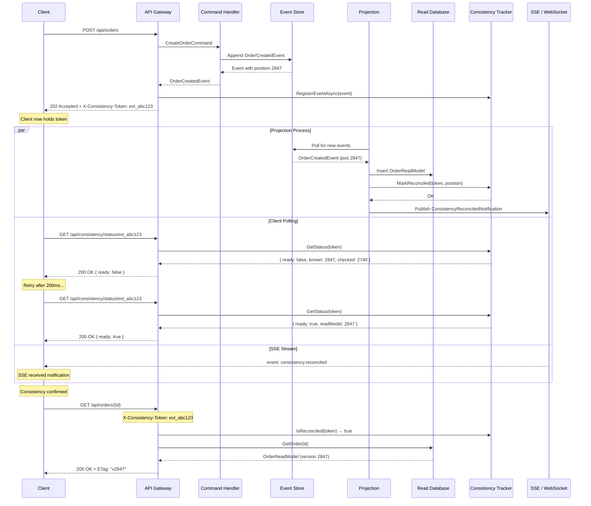
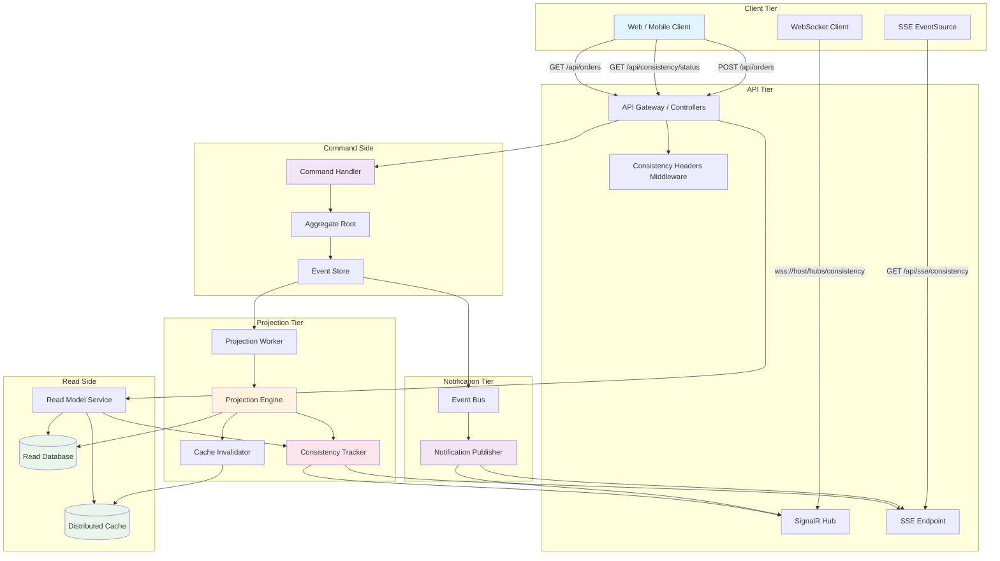
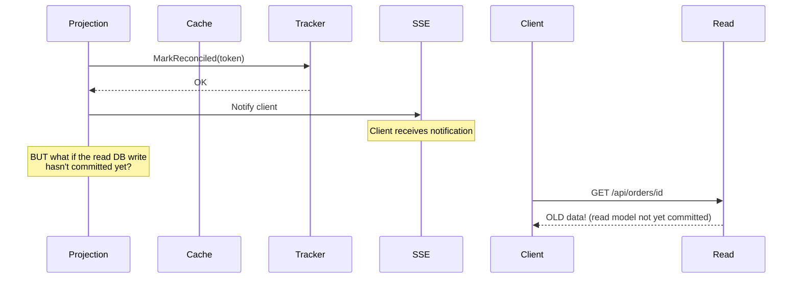

> [!success] Mastery Check
> - [ ] **Studied Well**
> - [ ] **Can explain the concept without notes**
> - [ ] **Can answer interview questions confidently**
> - [ ] **Can implement it in a real project**


# 7.098 — CQRS — Eventual Read Consistency — API Handling

> **group:** CQRS and Event Sourcing
> **priority:** 2
> **prerequisites:** [[7.083 — CQRS — Separate Read and Write Models]]
> **related:** [[7.091 — CQRS — Event Sourcing — Event Store Implementation]] / [[7.092 — CQRS — Projections and Denormalizers]] / [[7.096 — CQRS — Versioning and Schema Evolution]] / [[7.097 — CQRS — At-Least-Once Delivery and Idempotency]]

---

## Table of Contents

1.  [The Read-After-Write Consistency Gap](#1-the-read-after-write-consistency-gap)
2.  [Strategies Overview](#2-strategies-overview)
3.  [Status (Consistency) Endpoints](#3-status-consistency-endpoints)
4.  [Polling Strategy](#4-polling-strategy)
5.  [Server-Sent Events (SSE)](#5-server-sent-events-sse)
6.  [WebSocket Push](#6-websocket-push)
7.  [Optimistic UI Updates](#7-optimistic-ui-updates)
8.  [Consistency Headers & HTTP Status Codes](#8-consistency-headers--http-status-codes)
9.  [Cache-Aside Patterns for Stale Reads](#9-cache-aside-patterns-for-stale-reads)
10. [Compensating UI Messages & User Experience](#10-compensating-ui-messages--user-experience)
11. [C# 12 / .NET 8 — Full API Implementation](#11-c-12--net-8--full-api-implementation)
12. [Mermaid Diagrams](#12-mermaid-diagrams)
13. [Pitfalls & Anti-Patterns](#13-pitfalls--anti-patterns)
14. [Interview Questions](#14-interview-questions)
15. [Architecture Decision Record (ADR)](#15-architecture-decision-record-adr)
16. [Self-Check Questions (12+6)](#16-self-check-questions-12-6)

---

## 1. The Read-After-Write Consistency Gap

In a [[7.083 — CQRS — Separate Read and Write Models|CQRS architecture]], the write model (command side) publishes events that are asynchronously projected into one or more read models. Between the moment a command commits and the moment the corresponding projection updates the read store, there is a **consistency window** — a period during which a subsequent read request returns **stale data**.

```text
Time axis
  Command commits ──────────────────────────────────────────────►
                    ↑                                    ↑
              Write completes                    Read model updated
                    ├───────── CONSISTENCY GAP ──────────┤
                    │    Client sees OLD data here        │
                    └─────────────────────────────────────┘
```

### 1.1 Causes

| Cause | Description |
|---|---|
| Projection latency | Event bus delivery, projection handler queue, DB write time |
| Network round trips | Between services, between service and read store |
| Batch processing | Projections may run on batches/tickers instead of per-event |
| Replication lag | If read store is a replica of the write store |
| Cache staleness | Read-model cache TTL not yet expired |

### 1.2 Business Impact

| Domain | Risk |
|---|---|
| E-commerce | Customer places order → redirects to order page → "No orders found" |
| Banking | Transfer initiates → balance still shows old value |
| Booking | Seat reserved → availability still shows seat as free |
| Social | Post created → feed does not show it for seconds |
| SaaS | Config updated → downstream still uses old config |

### 1.3 CAP Trade-Off Reminder

CQRS with eventual consistency optimises for **availability and partition tolerance** over strong consistency. The read-after-write gap is an intentional consequence of this choice. The API layer must manage the user's expectation and experience within this constraint.

---

## 2. Strategies Overview

| # | Strategy | Latency | Complexity | UX | Best For |
|---|---|---|---|---|---|
| 1 | **Status/consistency endpoint** | Medium | Low | Explicit wait | Workflows with a natural "processing" step |
| 2 | **Polling** | Configurable | Low | Degraded | Simple CRUD, non-interactive clients |
| 3 | **Server-Sent Events** | Near-real-time | Medium | Smooth | Dashboards, live feeds |
| 4 | **WebSocket push** | Real-time | High | Seamless | Collaborative apps, gaming, finance |
| 5 | **Optimistic UI** | Instant | Medium | Magical | Consumer-facing UIs with rollback support |
| 6 | **Consistency headers** | N/A | Low | Transparent | API-first / SPA architectures |
| 7 | **Cache-aside + version** | Low | Medium | Acceptable | Heavy-read / light-write systems |

---

## 3. Status (Consistency) Endpoints

A **status endpoint** returns the *event-consistency position* of the read model. The client writes and immediately polls (or is told to poll) this endpoint until the expected event has been incorporated.

### 3.1 Concept

- The write command returns a **tracking identifier** (event ID, aggregate version, or Lamport timestamp).
- The read model exposes `/consistency/status?after={position}` which returns `{ ready: true/false, currentPosition: 123 }`.
- The client polls this endpoint, then performs the actual read once consistency is confirmed.

### 3.2 Variants

- **Write-returns-position**: `POST /orders` → `202 Accepted` + `Location: /consistency/status/evt_abc123`
- **Poll-for-position**: Client calls `GET /consistency/status/evt_abc123` until `ready === true`
- **Conditional read**: `GET /orders/{id}?consistentAfter={position}` — server blocks or returns `425 Too Early`

### 3.3 API Design

```text
POST /api/orders
  Request: { items: [...] }
  Response: 202 Accepted
    Headers:
      X-Consistency-Token: evt_G8a7H3kQ
      Location: /api/consistency/status/evt_G8a7H3kQ

GET /api/consistency/status/evt_G8a7H3kQ
  Response: 200 OK
    Body: {
      "consistencyToken": "evt_G8a7H3kQ",
      "ready": true,
      "knownPosition": 2847,
      "checkedPosition": 2847
    }

GET /api/orders?consistentAfter=evt_G8a7H3kQ
  Response: 200 OK  (server waited or confirmed)
```

### 3.4 Position Tracking Mechanisms

| Mechanism | Pros | Cons |
|---|---|---|
| Global sequence counter | Simple to compare | Single point of bottleneck |
| Event ID per aggregate | No contention | Client must know aggregate ID |
| Lamport clock | Decentralised | Requires clock sync understanding |
| Hybrid Logical Clock (HLC) | Decentralised + wall-clock | More complex to implement |
| Version vector | Full ordering info | Larger payload per event |

---

## 4. Polling Strategy

### 4.1 Client-Side Polling

The simplest approach: after a write, the client polls the read endpoint at a fixed or exponential-backoff interval.

```typescript
async function createThenPoll(): Promise<Order> {
  const { consistencyToken } = await api.post("/orders", orderData);
  for (let attempt = 0; attempt < MAX_RETRIES; attempt++) {
    const result = await api.get(`/orders/${orderData.id}?token=${consistencyToken}`);
    if (result.status === 200 && !result.isStale) return result.data;
    await sleep(Math.min(100 * Math.pow(2, attempt), 2000));
  }
  throw new Error("Consistency timeout");
}
```

### 4.2 Server-Supported Conditional Polling

```csharp
// GET /api/orders/{id}?afterVersion={version}
// Returns 425 Too Early if read model is not yet at that version
// Returns 200 OK with data when consistent
// Returns 409 Conflict if the version will never be reached (error)
```

### 4.3 Polling Intervals

| Scenario | Initial Interval | Max Interval | Max Retries |
|---|---|---|---|
| Real-time UI | 50ms | 500ms | 40 (2s) |
| Standard web | 200ms | 2000ms | 15 (6s) |
| Background job | 1000ms | 10000ms | 60 (60s) |
| Mobile data | 500ms | 5000ms | 20 (20s) |

### 4.4 Backoff Strategies

- **Fixed**: `interval = 500ms` — simple but wasteful
- **Linear**: `interval = 100 * attempt` — moderate
- **Exponential**: `interval = 100 * 2^attempt` — efficient, standard
- **Jittered**: `interval = random(0, 100 * 2^attempt)` — prevents thundering herd
- **Fibonacci**: `interval = fib(attempt) * 50` — smoother curve

---

## 5. Server-Sent Events (SSE)

SSE provides a unidirectional channel from server to client over HTTP. The server pushes events as they are processed by the projection.

### 5.1 How It Works

1. Client opens an `EventSource` connection to an SSE endpoint.
2. Client subscribes to events for a specific aggregate type or ID.
3. When the projection commits to the read store, it publishes a notification.
4. The SSE controller picks up the notification and writes to the open connection.
5. Client receives the event and performs the read.

### 5.2 SSE Endpoint Design

```text
GET /api/consistency/stream?after=evt_G8a7H3kQ

Headers:
  Accept: text/event-stream
  Cache-Control: no-cache
  Connection: keep-alive

Response stream:
  event: consistency.reconciled
  data: {"consistencyToken":"evt_G8a7H3kQ","aggregateType":"order","aggregateId":"ord_987","knownPosition":2847}

  event: heartbeat
  data: {"ts":"2026-06-13T12:00:00Z"}
```

### 5.3 SSE vs WebSocket

| Aspect | SSE | WebSocket |
|---|---|---|
| Direction | Server → Client | Bidirectional |
| Protocol | HTTP | WS/WSS |
| Reconnection | Built-in (EventSource) | Manual |
| Binary data | Text only | Text + Binary |
| Max connections (HTTP/1.1) | 6 per browser | Unlimited (but costly) |
| HTTP/2 multiplexing | Yes (shared connection) | No (separate sockets) |
| Complexity | Low | High |
| Use case | Push notifications, status feeds | Chat, real-time collaboration |

### 5.4 SSE for Consistency — Pitfalls

- HTTP/1.1 browser connection limit (6 per origin) — use HTTP/2
- Proxies may buffer responses — disable buffering (e.g., `X-Accel-Buffering: no`)
- Long-poll fallback needed for browsers that don't support SSE (IE/Edge legacy)
- Server must handle connection lifecycle (cleanup on disconnect)

---

## 6. WebSocket Push

### 6.1 Architecture

```
Client                  API Gateway              Projection          Read Store
  │                        │                        │                   │
  │── WS Connect ─────────►│                        │                   │
  │◄── Accepted ──────────│                        │                   │
  │── Subscribe(aggId) ───►│                        │                   │
  │                        │                        │── Write ─────────►│
  │                        │◄── Event Notification ─│                   │
  │◄── consistent(evtId) ─│                        │                   │
  │── GET /orders/{id} ───►│──── Read ──────────────│─────────────►────│
  │◄── 200 OK + data ────│                        │                   │
```

### 6.2 SignalR Hub (.NET 8)

```csharp
public class ConsistencyHub : Hub
{
    private readonly IConsistencyTracker _tracker;

    public ConsistencyHub(IConsistencyTracker tracker)
    {
        _tracker = tracker;
    }

    public async Task SubscribeToAggregate(string aggregateType, string aggregateId)
    {
        await Groups.AddToGroupAsync(Context.ConnectionId, $"{aggregateType}:{aggregateId}");
    }

    public async Task SubscribeToConsistencyToken(string consistencyToken)
    {
        // The token-based subscription is used when a client has just
        // performed a write and wants to know when it becomes visible.
        await Groups.AddToGroupAsync(Context.ConnectionId, $"token:{consistencyToken}");
    }

    public async Task<ConsistencyStatus> CheckStatus(string consistencyToken)
    {
        return await _tracker.GetStatusAsync(consistencyToken);
    }
}
```

### 6.3 Client-Side (TypeScript with SignalR)

```typescript
import * as signalR from "@microsoft/signalr";

class ConsistencyAwareClient {
  private connection: signalR.HubConnection;

  constructor(private apiBase: string) {
    this.connection = new signalR.HubConnectionBuilder()
      .withUrl(`${apiBase}/hubs/consistency`)
      .withAutomaticReconnect()
      .build();
  }

  async connect(): Promise<void> {
    await this.connection.start();
  }

  async writeThenRead<T>(writeAction: () => Promise<string>, readAction: () => Promise<T>): Promise<T> {
    const token = await writeAction();

    return new Promise<T>((resolve, reject) => {
      const timeout = setTimeout(() => reject(new Error("Consistency timeout")), 10000);

      this.connection.on("ConsistencyReconciled", async (data) => {
        if (data.consistencyToken === token) {
          clearTimeout(timeout);
          this.connection.off("ConsistencyReconciled");
          try {
            const result = await readAction();
            resolve(result);
          } catch (e) {
            reject(e);
          }
        }
      });

      this.connection.send("SubscribeToConsistencyToken", token);
    });
  }

  async disconnect(): Promise<void> {
    await this.connection.stop();
  }
}
```

---

## 7. Optimistic UI Updates

The client **immediately updates its local state** with the expected result of the write, before the server confirms consistency. If the read model later returns different data, the UI reconciles.

### 7.1 Pattern

```typescript
async function createOrder(items: Item[]) {
  // 1. Optimistic update
  const tempOrder: Order = {
    id: `temp_${Date.now()}`,
    items,
    status: "pending",
    createdAt: new Date().toISOString(),
  };
  store.addOrder(tempOrder);
  ui.showOrder(tempOrder);

  try {
    // 2. Actual write
    const { id, consistencyToken } = await api.post("/orders", { items });

    // 3. Wait for consistency
    await waitForConsistency(consistencyToken);

    // 4. Read real data
    const realOrder = await api.get(`/orders/${id}`);

    // 5. Reconcile: replace temp with real
    store.replaceOrder(tempOrder.id, realOrder);
    ui.updateOrder(realOrder);
  } catch (error) {
    // 6. Rollback
    store.removeOrder(tempOrder.id);
    ui.removeOrder(tempOrder.id);
    ui.showError("Order creation failed. Please try again.");
  }
}
```

### 7.2 Reconciliation Strategies

| Strategy | Description | Risk |
|---|---|---|
| Full replace | Replace entire local object with server response | UI flash if data is identical |
| Merge | Merge server fields into local state (keep local if field changed by user) | Conflict if user edits stale data |
| Version-gated | Only apply server update if local version <= server version | Race conditions with concurrent edits |
| Discard local | Always discard local and show server data | Lose transient UI state |

### 7.3 When Optimistic UI Is Appropriate

| Criteria | Good | Bad |
|---|---|---|
| Write-then-read frequency | High | Low / rare |
| Consistency window | <500ms | >5s |
| Rollback cost | Low (undo add) | High (financial transfer) |
| Data criticality | Display-only | Decision-making |
| Client trust | High (well-behaved server) | Low (unreliable API) |

---

## 8. Consistency Headers & HTTP Status Codes

### 8.1 Request Headers (Client → Server)

| Header | Description | Example |
|---|---|---|
| `X-Consistency-Token` | Token returned from a previous write | `evt_G8a7H3kQ` |
| `X-Consistency-Level` | Requested consistency level | `eventual` / `read-your-writes` / `strong` |
| `If-None-Match` | ETag from previous read (cache validation) | `"v2846"` |
| `Prefer: wait-ms=500` | Server should wait up to N ms for consistency | `wait-ms=1000` |

### 8.2 Response Headers (Server → Client)

| Header | Description | Example |
|---|---|---|
| `X-Consistency-Token` | Current position token for this response | `evt_G8a7H3kQ` |
| `X-Consistent-At` | The position at which data was read | `2847` |
| `X-Stale-If-Not-Reconciled` | Indicates data may be stale | `1` |
| `ETag` | Version of the returned data | `"v2847"` |
| `Retry-After` | Hint for polling interval (seconds) | `0.5` |
| `Cache-Control: no-cache` | Prevent intermediate caching of stale data | — |

### 8.3 HTTP Status Codes for Consistency Scenarios

| Status Code | Meaning | When to Use |
|---|---|---|
| `200 OK` | Data is current | Read model at or beyond requested position |
| `202 Accepted` | Write accepted, processing | Command endpoint (async) |
| `425 Too Early` | Read model not yet consistent | Early draft RFC 8470 — "Too Early" |
| `409 Conflict` | Write version conflict / position unreachable | Optimistic concurrency failure |
| `412 Precondition Failed` | `If-Match` ETag doesn't match | Conditional write |
| `503 Service Unavailable` | Read model temporarily behind / rebuilding | Projection lag > SLA |

### 8.4 425 Too Early — RFC 8470

```csharp
[HttpGet("{id:guid}")]
[ProducesResponseType(typeof(OrderReadModel), StatusCodes.Status200OK)]
[ProducesResponseType(StatusCodes.Status425TooEarly)]
public async Task<IActionResult> GetOrder(
    Guid id,
    [FromHeader(Name = "X-Consistency-Token")] string? consistencyToken)
{
    var order = await _readStore.GetOrderAsync(id);

    if (consistencyToken != null && !await _tracker.IsReconciledAsync(consistencyToken))
    {
        // Read model hasn't caught up yet
        return StatusCode(StatusCodes.Status425TooEarly, new
        {
            message = "Requested consistency level not yet reached. Retry or use polling.",
            consistencyToken,
            currentPosition = await _tracker.GetCurrentPositionAsync()
        });
    }

    return Ok(order);
}
```

### 8.5 Client-Side Handling of 425

```typescript
async function getOrderWithConsistency(id: string, token: string): Promise<Order> {
  const MAX_WAIT = 5000;
  const start = Date.now();

  while (Date.now() - start < MAX_WAIT) {
    const response = await api.get(`/orders/${id}`, {
      headers: { "X-Consistency-Token": token },
    });

    if (response.status === 200) return response.data;
    if (response.status !== 425) throw new Error(`Unexpected status: ${response.status}`);

    await sleep(200);
  }

  // Fallback: return whatever we have (possibly stale)
  const fallback = await api.get(`/orders/${id}`);
  return fallback.data;
}
```

---

## 9. Cache-Aside Patterns for Stale Reads

### 9.1 Versioned Cache-Aside

```csharp
public class VersionedCacheAsideReadService
{
    private readonly IDistributedCache _cache;
    private readonly IReadStore _readStore;
    private readonly IConsistencyTracker _tracker;
    private readonly ILogger<VersionedCacheAsideReadService> _logger;

    public VersionedCacheAsideReadService(
        IDistributedCache cache,
        IReadStore readStore,
        IConsistencyTracker tracker,
        ILogger<VersionedCacheAsideReadService> logger)
    {
        _cache = cache;
        _readStore = readStore;
        _tracker = tracker;
        _logger = logger;
    }

    public async Task<OrderReadModel?> GetOrderAsync(Guid orderId, string? consistencyToken = null)
    {
        // 1. Try cache
        var cached = await _cache.GetStringAsync($"order:{orderId}");
        if (cached != null)
        {
            var cachedOrder = JsonSerializer.Deserialize<OrderReadModel>(cached);
            if (cachedOrder != null && consistencyToken == null)
                return cachedOrder;

            // Check if cached version meets consistency requirement
            if (cachedOrder != null && consistencyToken != null)
            {
                var isCachedConsistent = await _tracker.IsPositionAtOrAfterAsync(
                    cachedOrder.Version, consistencyToken);
                if (isCachedConsistent)
                    return cachedOrder;
            }
        }

        // 2. Cache miss or stale cache — read from store
        var order = await _readStore.GetOrderAsync(orderId);
        if (order == null) return null;

        // 3. Check consistency
        if (consistencyToken != null)
        {
            var isConsistent = await _tracker.IsPositionAtOrAfterAsync(
                order.Version, consistencyToken);
            if (!isConsistent)
                return null; // Caller should retry or use 425
        }

        // 4. Update cache
        var serialized = JsonSerializer.Serialize(order);
        var cacheOptions = new DistributedCacheEntryOptions
        {
            AbsoluteExpirationRelativeToNow = TimeSpan.FromSeconds(30)
        };
        await _cache.SetStringAsync($"order:{orderId}", serialized, cacheOptions);

        return order;
    }
}
```

### 9.2 Write-Through Invalidation

```
                      Write Model
                         │
                         ▼
                   Command Handler
                         │
                         ▼
                 Event Store / Bus
                         │
              ┌──────────┼──────────┐
              ▼          ▼          ▼
         Projection  Projection  Cache Invalidator
              │          │          │
              ▼          ▼          ▼
          Read DB    Read DB    Distributed Cache
                                (remove key)
```

```csharp
public class CacheInvalidationProjection : IEventHandler<OrderCreatedEvent>
{
    private readonly IDistributedCache _cache;

    public CacheInvalidationProjection(IDistributedCache cache)
    {
        _cache = cache;
    }

    public async Task HandleAsync(OrderCreatedEvent @event, CancellationToken ct)
    {
        await _cache.RemoveAsync($"order:{@event.OrderId}", ct);
        // Don't invalidate until AFTER projection commits
        // Use a delayed invalidation or version-stamped cache
    }
}
```

### 9.3 Stale-While-Revalidate

```csharp
public async Task<StaleResult<OrderReadModel>> GetOrderStaleWhileRevalidateAsync(
    Guid orderId, CancellationToken ct)
{
    // 1. Attempt fast cache read
    var cached = await _cache.GetStringAsync($"order:{orderId}", ct);
    OrderReadModel? order = null;

    if (cached != null)
    {
        order = JsonSerializer.Deserialize<OrderReadModel>(cached);

        // 2. Check if stale (TTL expired but within grace period)
        var meta = await _cache.GetStringAsync($"order:{orderId}:meta", ct);
        if (meta != null)
        {
            var metadata = JsonSerializer.Deserialize<CacheMetadata>(meta);
            if (metadata!.ExpiresAt < DateTimeOffset.UtcNow &&
                metadata.ExpiresAt > DateTimeOffset.UtcNow.AddSeconds(-30))
            {
                // Stale but within grace period — trigger async revalidation
                _ = RevalidateAsync(orderId, ct);
                return new StaleResult<OrderReadModel>(order, isStale: true);
            }
        }
    }

    if (order == null)
    {
        // Hard miss — read from store
        order = await _readStore.GetOrderAsync(orderId);
        if (order != null)
            await SetCacheAsync(orderId, order, ct);
    }

    return new StaleResult<OrderReadModel>(order, isStale: false);
}

private async Task RevalidateAsync(Guid orderId, CancellationToken ct)
{
    try
    {
        var fresh = await _readStore.GetOrderAsync(orderId);
        if (fresh != null)
            await SetCacheAsync(orderId, fresh, ct);
    }
    catch (Exception ex)
    {
        _logger.LogWarning(ex, "Background revalidation failed for order {OrderId}", orderId);
    }
}
```

### 9.4 Cache Stampede Protection

```csharp
private readonly SemaphoreSlim _revalidationLock = new(1, 1);

private async Task RevalidateWithMutexAsync(Guid orderId, CancellationToken ct)
{
    if (!await _revalidationLock.WaitAsync(0, ct))
        return; // Another thread is already revalidating

    try
    {
        var fresh = await _readStore.GetOrderAsync(orderId);
        if (fresh != null)
            await SetCacheAsync(orderId, fresh, ct);
    }
    finally
    {
        _revalidationLock.Release();
    }
}
```

---

## 10. Compensating UI Messages & User Experience

### 10.1 Message Catalog

| Scenario | UI Message | Type | Duration |
|---|---|---|---|
| Read returns stale after write | "Your changes are being applied. This page will update automatically." | Info banner | Until consistent |
| Consistency timeout | "It's taking longer than expected. Please refresh in a moment." | Warning | Dismissable |
| Optimistic update rollback | "Something went wrong. Your changes could not be saved." | Error | Persistent |
| Read model rebuilding | "Some data may be temporarily out of date. We're catching up." | Info bar | Until complete |
| Projection lag alert | "Showing data from {time} ago." | Subtle badge | Persistent |

### 10.2 Implementation Pattern

```typescript
type ConsistencyState =
  | { status: "consistent" }
  | { status: "pending"; token: string; startTime: number }
  | { status: "timeout"; token: string }
  | { status: "error"; message: string }
  | { status: "stale"; age: number };

function ConsistencyBanner({ state }: { state: ConsistencyState }) {
  switch (state.status) {
    case "consistent":
      return null;
    case "pending":
      return (
        <div className="alert alert-info" role="alert">
          <Spinner size="sm" /> Your changes are being applied.
          This page will update automatically.
        </div>
      );
    case "timeout":
      return (
        <div className="alert alert-warning" role="alert">
          It's taking longer than expected.{" "}
          <button onClick={() => window.location.reload()}>Refresh</button>
        </div>
      );
    case "error":
      return (
        <div className="alert alert-danger" role="alert">
          {state.message}
        </div>
      );
    case "stale":
      return (
        <div className="text-muted small">
          Showing data from {formatTimeAgo(state.age)} ago.
        </div>
      );
  }
}
```

### 10.3 UX Guidelines

1. **Never surprise the user** — if data may be stale, indicate it visibly but non-intrusively.
2. **Auto-resolve when possible** — banners should disappear automatically when consistency is reached.
3. **Provide an escape hatch** — always allow manual refresh / explicit re-read.
4. **Avoid blocking flows** — let users continue working while consistency resolves in the background.
5. **Consistency timeout != error** — show a warning, not an error, and guide the user to retry.
6. **Mobile considerations** — stale banners take up precious screen space; use thin bars or status icons.
7. **Accessibility** — stale/loading announcements should be sent to screen readers via `aria-live` regions.

### 10.4 Aria-Live Implementation

```tsx
function LiveConsistencyRegion({ state }: { state: ConsistencyState }) {
  const message = state.status === "pending"
    ? "Your changes are being applied."
    : state.status === "timeout"
      ? "Update is taking longer than expected."
      : null;

  return (
    <div aria-live="polite" aria-atomic="true" className="sr-only">
      {message}
    </div>
  );
}
```

---

## 11. C# 12 / .NET 8 — Full API Implementation

### 11.1 Domain Events

```csharp
// Events/OrderEvents.cs
public interface IDomainEvent
{
    Guid EventId { get; }
    DateTimeOffset OccurredAt { get; }
    string AggregateType { get; }
    string AggregateId { get; }
    long Version { get; }
}

public record OrderCreatedEvent : IDomainEvent
{
    public Guid EventId { get; init; } = Guid.NewGuid();
    public DateTimeOffset OccurredAt { get; init; } = DateTimeOffset.UtcNow;
    public string AggregateType => "order";
    public required string AggregateId { get; init; }
    public long Version { get; init; }
    public required Guid OrderId { get; init; }
    public required string CustomerId { get; init; }
    public required IReadOnlyList<OrderItem> Items { get; init; }
    public decimal TotalAmount { get; init; }
}

public record OrderShippedEvent : IDomainEvent
{
    public Guid EventId { get; init; } = Guid.NewGuid();
    public DateTimeOffset OccurredAt { get; init; } = DateTimeOffset.UtcNow;
    public string AggregateType => "order";
    public required string AggregateId { get; init; }
    public long Version { get; init; }
    public required Guid OrderId { get; init; }
    public required string TrackingNumber { get; init; }
    public DateTimeOffset ShippedAt { get; init; }
}
```

### 11.2 Consistency Tracker

```csharp
// Services/ConsistencyTracker.cs
public interface IConsistencyTracker
{
    Task<bool> IsReconciledAsync(string consistencyToken);
    Task<bool> IsPositionAtOrAfterAsync(long readModelPosition, string consistencyToken);
    Task<long> GetCurrentPositionAsync();
    Task<ConsistencyStatus> GetStatusAsync(string consistencyToken);
    Task RegisterEventAsync(IDomainEvent @event);
}

public class ConsistencyTracker : IConsistencyTracker
{
    private readonly IDistributedCache _cache;
    private readonly IEventStore _eventStore;
    private readonly ILogger<ConsistencyTracker> _logger;

    private static readonly TimeSpan TokenTtl = TimeSpan.FromMinutes(5);

    public ConsistencyTracker(
        IDistributedCache cache,
        IEventStore eventStore,
        ILogger<ConsistencyTracker> logger)
    {
        _cache = cache;
        _eventStore = eventStore;
        _logger = logger;
    }

    public async Task RegisterEventAsync(IDomainEvent @event)
    {
        var token = @event.EventId.ToString("N");
        var entry = new ConsistencyTokenEntry
        {
            ConsistencyToken = token,
            EventPosition = @event.Version,
            AggregateType = @event.AggregateType,
            AggregateId = @event.AggregateId,
            RegisteredAt = DateTimeOffset.UtcNow,
            IsReconciled = false
        };

        await _cache.SetStringAsync(
            $"consistency:token:{token}",
            JsonSerializer.Serialize(entry),
            new DistributedCacheEntryOptions
            {
                AbsoluteExpirationRelativeToNow = TokenTtl
            });

        await _cache.SetStringAsync(
            $"consistency:agg:{@event.AggregateType}:{@event.AggregateId}:latest",
            token,
            new DistributedCacheEntryOptions
            {
                AbsoluteExpirationRelativeToNow = TokenTtl
            });
    }

    public async Task MarkReconciledAsync(string consistencyToken, long position)
    {
        var cached = await _cache.GetStringAsync($"consistency:token:{consistencyToken}");
        if (cached == null) return;

        var entry = JsonSerializer.Deserialize<ConsistencyTokenEntry>(cached);
        if (entry == null) return;

        entry.IsReconciled = true;
        entry.ReadModelPosition = position;
        entry.ReconciledAt = DateTimeOffset.UtcNow;

        await _cache.SetStringAsync(
            $"consistency:token:{consistencyToken}",
            JsonSerializer.Serialize(entry),
            new DistributedCacheEntryOptions
            {
                AbsoluteExpirationRelativeToNow = TokenTtl
            });

        _logger.LogInformation(
            "Consistency token {Token} reconciled at position {Position}",
            consistencyToken, position);
    }

    public async Task<bool> IsReconciledAsync(string consistencyToken)
    {
        var cached = await _cache.GetStringAsync($"consistency:token:{consistencyToken}");
        if (cached == null) return false;

        var entry = JsonSerializer.Deserialize<ConsistencyTokenEntry>(cached);
        return entry?.IsReconciled ?? false;
    }

    public async Task<bool> IsPositionAtOrAfterAsync(long readModelPosition, string consistencyToken)
    {
        // Direct position comparison without needing a cache entry
        // Useful when read models carry their own version
        var cached = await _cache.GetStringAsync($"consistency:token:{consistencyToken}");
        if (cached == null) return false;

        var entry = JsonSerializer.Deserialize<ConsistencyTokenEntry>(cached);
        if (entry == null) return false;

        return readModelPosition >= entry.EventPosition;
    }

    public async Task<long> GetCurrentPositionAsync()
    {
        return await _eventStore.GetGlobalPositionAsync();
    }

    public async Task<ConsistencyStatus> GetStatusAsync(string consistencyToken)
    {
        var cached = await _cache.GetStringAsync($"consistency:token:{consistencyToken}");
        if (cached == null)
        {
            return new ConsistencyStatus
            {
                ConsistencyToken = consistencyToken,
                Ready = false,
                KnownPosition = 0,
                CheckedPosition = 0,
                Error = "Token not found or expired"
            };
        }

        var entry = JsonSerializer.Deserialize<ConsistencyTokenEntry>(cached);
        if (entry == null)
        {
            return new ConsistencyStatus
            {
                ConsistencyToken = consistencyToken,
                Ready = false,
                KnownPosition = 0,
                CheckedPosition = 0,
                Error = "Invalid token entry"
            };
        }

        var currentPosition = await _eventStore.GetGlobalPositionAsync();

        return new ConsistencyStatus
        {
            ConsistencyToken = consistencyToken,
            Ready = entry.IsReconciled,
            KnownPosition = entry.EventPosition,
            CheckedPosition = currentPosition,
            ReadModelPosition = entry.ReadModelPosition
        };
    }
}

public class ConsistencyTokenEntry
{
    public required string ConsistencyToken { get; init; }
    public long EventPosition { get; init; }
    public required string AggregateType { get; init; }
    public required string AggregateId { get; init; }
    public DateTimeOffset RegisteredAt { get; init; }
    public bool IsReconciled { get; set; }
    public long ReadModelPosition { get; set; }
    public DateTimeOffset? ReconciledAt { get; set; }
}

public class ConsistencyStatus
{
    public required string ConsistencyToken { get; init; }
    public bool Ready { get; init; }
    public long KnownPosition { get; init; }
    public long CheckedPosition { get; init; }
    public long ReadModelPosition { get; init; }
    public string? Error { get; init; }
}
```

### 11.3 Projection with Consistency Notification

```csharp
// Projections/OrderProjection.cs
public interface IProjection
{
    Task ProjectAsync(IDomainEvent @event, CancellationToken ct);
    Task<long> GetLastProjectedPositionAsync();
}

public class OrderProjection : IProjection
{
    private readonly IReadStore _readStore;
    private readonly IConsistencyTracker _tracker;
    private readonly IEventBus _eventBus;
    private readonly ILogger<OrderProjection> _logger;

    public OrderProjection(
        IReadStore readStore,
        IConsistencyTracker tracker,
        IEventBus eventBus,
        ILogger<OrderProjection> logger)
    {
        _readStore = readStore;
        _tracker = tracker;
        _eventBus = eventBus;
        _logger = logger;
    }

    public async Task ProjectAsync(IDomainEvent @event, CancellationToken ct)
    {
        switch (@event)
        {
            case OrderCreatedEvent e:
                await HandleOrderCreated(e, ct);
                break;
            case OrderShippedEvent e:
                await HandleOrderShipped(e, ct);
                break;
        }
    }

    private async Task HandleOrderCreated(OrderCreatedEvent @event, CancellationToken ct)
    {
        _logger.LogInformation("Projecting OrderCreated {OrderId}", @event.OrderId);

        var readModel = new OrderReadModel
        {
            Id = @event.OrderId,
            CustomerId = @event.CustomerId,
            Items = @event.Items,
            TotalAmount = @event.TotalAmount,
            Status = OrderStatus.Pending,
            Version = @event.Version,
            CreatedAt = @event.OccurredAt,
            UpdatedAt = @event.OccurredAt
        };

        await _readStore.SaveOrderAsync(readModel, ct);

        // Notify consistency tracker
        await _tracker.MarkReconciledAsync(
            @event.EventId.ToString("N"),
            @event.Version);

        // Publish notification for SSE/WebSocket subscribers
        await _eventBus.PublishAsync(new ConsistencyReconciledNotification
        {
            ConsistencyToken = @event.EventId.ToString("N"),
            AggregateType = @event.AggregateType,
            AggregateId = @event.AggregateId,
            Position = @event.Version
        }, ct);
    }

    private async Task HandleOrderShipped(OrderShippedEvent @event, CancellationToken ct)
    {
        _logger.LogInformation("Projecting OrderShipped {OrderId}", @event.OrderId);

        var readModel = await _readStore.GetOrderAsync(@event.OrderId, ct);
        if (readModel == null)
        {
            _logger.LogWarning("Order {OrderId} not found for projection", @event.OrderId);
            return;
        }

        readModel.Status = OrderStatus.Shipped;
        readModel.TrackingNumber = @event.TrackingNumber;
        readModel.Version = @event.Version;
        readModel.UpdatedAt = @event.OccurredAt;

        await _readStore.SaveOrderAsync(readModel, ct);

        await _tracker.MarkReconciledAsync(
            @event.EventId.ToString("N"),
            @event.Version);

        await _eventBus.PublishAsync(new ConsistencyReconciledNotification
        {
            ConsistencyToken = @event.EventId.ToString("N"),
            AggregateType = @event.AggregateType,
            AggregateId = @event.AggregateId,
            Position = @event.Version
        }, ct);
    }

    public async Task<long> GetLastProjectedPositionAsync()
    {
        // Could be from a checkpoint store
        return await _readStore.GetLastCheckpointAsync();
    }
}

public record ConsistencyReconciledNotification
{
    public required string ConsistencyToken { get; init; }
    public required string AggregateType { get; init; }
    public required string AggregateId { get; init; }
    public long Position { get; init; }
}
```

### 11.4 Command Endpoint with Consistency Token

```csharp
// Controllers/OrdersController.cs
[ApiController]
[Route("api/[controller]")]
public class OrdersController : ControllerBase
{
    private readonly IMediator _mediator;
    private readonly IConsistencyTracker _tracker;
    private readonly ILogger<OrdersController> _logger;

    public OrdersController(
        IMediator mediator,
        IConsistencyTracker tracker,
        ILogger<OrdersController> logger)
    {
        _mediator = mediator;
        _tracker = tracker;
        _logger = logger;
    }

    /// <summary>
    /// Creates an order and returns a consistency token.
    /// Client should poll GET /api/consistency/status/{token} until ready.
    /// </summary>
    [HttpPost]
    [ProducesResponseType(typeof(CreateOrderResponse), StatusCodes.Status202Accepted)]
    [ProducesResponseType(StatusCodes.Status400BadRequest)]
    public async Task<IActionResult> CreateOrder(
        [FromBody] CreateOrderRequest request,
        CancellationToken ct)
    {
        if (!ModelState.IsValid)
            return BadRequest(ModelState);

        var command = new CreateOrderCommand
        {
            CustomerId = request.CustomerId,
            Items = request.Items
        };

        var result = await _mediator.Send(command, ct);

        // Register the consistency token from the resulting event
        await _tracker.RegisterEventAsync(result.DomainEvent);

        var response = new CreateOrderResponse
        {
            OrderId = result.OrderId,
            ConsistencyToken = result.DomainEvent.EventId.ToString("N")
        };

        Response.Headers["X-Consistency-Token"] = response.ConsistencyToken;
        Response.Headers.Location = Url.Action(nameof(ConsistencyController.GetStatus),
            "Consistency", new { token = response.ConsistencyToken })
            ?? $"/api/consistency/status/{response.ConsistencyToken}";

        return Accepted(response);
    }

    [HttpPost("{id:guid}/ship")]
    [ProducesResponseType(StatusCodes.Status202Accepted)]
    [ProducesResponseType(StatusCodes.Status404NotFound)]
    [ProducesResponseType(StatusCodes.Status409Conflict)]
    public async Task<IActionResult> ShipOrder(
        Guid id,
        [FromBody] ShipOrderRequest request,
        [FromHeader(Name = "If-Match")] string? ifMatch,
        CancellationToken ct)
    {
        var command = new ShipOrderCommand
        {
            OrderId = id,
            TrackingNumber = request.TrackingNumber,
            ExpectedVersion = ifMatch != null ? long.Parse(ifMatch.Trim('"')) : null
        };

        var result = await _mediator.Send(command, ct);

        if (!result.Success)
        {
            return result.Conflict
                ? Conflict(new { message = "Order was modified by another request.",
                    currentVersion = result.CurrentVersion })
                : NotFound();
        }

        await _tracker.RegisterEventAsync(result.DomainEvent!);

        var token = result.DomainEvent!.EventId.ToString("N");
        Response.Headers["X-Consistency-Token"] = token;

        return Accepted(new ShipOrderResponse
        {
            OrderId = id,
            ConsistencyToken = token
        });
    }
}

public record CreateOrderRequest
{
    public required string CustomerId { get; init; }
    public required IReadOnlyList<OrderItem> Items { get; init; }
}

public record CreateOrderResponse
{
    public required Guid OrderId { get; init; }
    public required string ConsistencyToken { get; init; }
}

public record ShipOrderRequest
{
    public required string TrackingNumber { get; init; }
}

public record ShipOrderResponse
{
    public required Guid OrderId { get; init; }
    public required string ConsistencyToken { get; init; }
}
```

### 11.5 Read Endpoint with Consistency Header Support

```csharp
// Controllers/OrdersController.cs (continued)
[HttpGet("{id:guid}")]
[ProducesResponseType(typeof(OrderReadModel), StatusCodes.Status200OK)]
[ProducesResponseType(StatusCodes.Status404NotFound)]
[ProducesResponseType(StatusCodes.Status425TooEarly)]
[ProducesResponseType(StatusCodes.Status304NotModified)]
public async Task<IActionResult> GetOrder(
    Guid id,
    [FromHeader(Name = "X-Consistency-Token")] string? consistencyToken,
    [FromHeader(Name = "If-None-Match")] string? ifNoneMatch,
    [FromHeader(Name = "Prefer")] string? prefer,
    CancellationToken ct)
{
    // Parse optional wait preference
    int? waitMs = null;
    if (prefer?.StartsWith("wait-ms=", StringComparison.OrdinalIgnoreCase) == true)
    {
        var value = prefer["wait-ms=".Length..];
        if (int.TryParse(value, out var parsed) && parsed is >= 0 and <= 5000)
            waitMs = parsed;
    }

    // If a consistency token is provided, wait (up to waitMs) for reconciliation
    if (consistencyToken != null)
    {
        var reconciled = await WaitForConsistencyWithTimeoutAsync(
            consistencyToken, waitMs ?? 1000, ct);

        if (!reconciled)
        {
            return StatusCode(StatusCodes.Status425TooEarly, new
            {
                message = "Requested consistency level not yet reached.",
                consistencyToken,
                retryAfterMs = 500
            });
        }
    }

    var order = await _readStore.GetOrderAsync(id, ct);
    if (order == null)
        return NotFound();

    // ETag-based conditional request
    var etag = $"\"v{order.Version}\"";
    if (ifNoneMatch == etag)
        return StatusCode(StatusCodes.Status304NotModified);

    Response.Headers["ETag"] = etag;
    Response.Headers["X-Consistent-At"] = order.Version.ToString();
    Response.Headers["X-Consistency-Token"] = consistencyToken
        ?? (await _tracker.GetCurrentPositionAsync()).ToString();

    if (consistencyToken != null)
    {
        var isStale = !await _tracker.IsPositionAtOrAfterAsync(order.Version, consistencyToken);
        if (isStale)
            Response.Headers["X-Stale-If-Not-Reconciled"] = "1";
    }

    return Ok(order);
}

private async Task<bool> WaitForConsistencyWithTimeoutAsync(
    string token, int timeoutMs, CancellationToken ct)
{
    using var cts = CancellationTokenSource.CreateLinkedTokenSource(ct);
    cts.CancelAfter(timeoutMs);

    try
    {
        var pollInterval = Math.Min(50, timeoutMs / 10);
        while (!cts.Token.IsCancellationRequested)
        {
            if (await _tracker.IsReconciledAsync(token))
                return true;

            await Task.Delay(pollInterval, cts.Token);
        }
    }
    catch (OperationCanceledException)
    {
        // Timeout
    }

    return false;
}
```

### 11.6 Consistency Status Endpoint (Polling)

```csharp
// Controllers/ConsistencyController.cs
[ApiController]
[Route("api/[controller]")]
public class ConsistencyController : ControllerBase
{
    private readonly IConsistencyTracker _tracker;
    private readonly ILogger<ConsistencyController> _logger;

    public ConsistencyController(
        IConsistencyTracker tracker,
        ILogger<ConsistencyController> logger)
    {
        _tracker = tracker;
        _logger = logger;
    }

    /// <summary>
    /// Get the reconciliation status for a consistency token.
    /// Client polls this until ready == true.
    /// </summary>
    [HttpGet("status/{token}")]
    [ProducesResponseType(typeof(ConsistencyStatusResponse), StatusCodes.Status200OK)]
    [ProducesResponseType(StatusCodes.Status404NotFound)]
    public async Task<IActionResult> GetStatus(string token)
    {
        var status = await _tracker.GetStatusAsync(token);

        if (status.Error?.Contains("not found") == true)
            return NotFound(new { message = status.Error });

        var response = new ConsistencyStatusResponse
        {
            ConsistencyToken = status.ConsistencyToken,
            Ready = status.Ready,
            KnownPosition = status.KnownPosition,
            CheckedPosition = status.CheckedPosition,
            ReadModelPosition = status.ReadModelPosition
        };

        if (!status.Ready)
        {
            var behind = status.CheckedPosition - status.KnownPosition;
            Response.Headers["Retry-After"] = behind > 1000
                ? "2"     // Far behind — poll less frequently
                : "0.2";  // Close — poll frequently
        }

        return Ok(response);
    }

    /// <summary>
    /// Batch status check for multiple tokens (useful for list views).
    /// </summary>
    [HttpPost("status/batch")]
    [ProducesResponseType(typeof(Dictionary<string, ConsistencyStatusResponse>), StatusCodes.Status200OK)]
    public async Task<IActionResult> GetBatchStatus(
        [FromBody] BatchStatusRequest request)
    {
        var results = new Dictionary<string, ConsistencyStatusResponse>();

        foreach (var token in request.Tokens.Distinct())
        {
            var status = await _tracker.GetStatusAsync(token);
            results[token] = new ConsistencyStatusResponse
            {
                ConsistencyToken = status.ConsistencyToken,
                Ready = status.Ready,
                KnownPosition = status.KnownPosition,
                CheckedPosition = status.CheckedPosition,
                ReadModelPosition = status.ReadModelPosition
            };
        }

        return Ok(results);
    }

    /// <summary>
    /// Returns the current global position for comparison.
    /// </summary>
    [HttpGet("position")]
    public async Task<IActionResult> GetCurrentPosition()
    {
        var position = await _tracker.GetCurrentPositionAsync();
        return Ok(new GlobalPositionResponse { Position = position });
    }
}

public record ConsistencyStatusResponse
{
    public required string ConsistencyToken { get; init; }
    public bool Ready { get; init; }
    public long KnownPosition { get; init; }
    public long CheckedPosition { get; init; }
    public long ReadModelPosition { get; init; }
}

public record BatchStatusRequest
{
    public required IReadOnlyList<string> Tokens { get; init; }
}

public record GlobalPositionResponse
{
    public long Position { get; init; }
}
```

### 11.7 SSE Controller

```csharp
// Controllers/SseController.cs
[ApiController]
[Route("api/sse")]
public class SseController : ControllerBase
{
    private readonly IEventBus _eventBus;
    private readonly IConsistencyTracker _tracker;
    private readonly ILogger<SseController> _logger;

    public SseController(
        IEventBus eventBus,
        IConsistencyTracker tracker,
        ILogger<SseController> logger)
    {
        _eventBus = eventBus;
        _tracker = tracker;
        _logger = logger;
    }

    /// <summary>
    /// SSE endpoint for receiving consistency notifications.
    /// The client opens this connection after a write to be notified
    /// when the read model is consistent.
    /// </summary>
    [HttpGet("consistency")]
    [Produces("text/event-stream")]
    public async Task GetConsistencyStream(
        [FromQuery] string? token,
        [FromQuery] string? aggregateType,
        [FromQuery] string? aggregateId,
        CancellationToken ct)
    {
        Response.Headers["Content-Type"] = "text/event-stream";
        Response.Headers["Cache-Control"] = "no-cache";
        Response.Headers["Connection"] = "keep-alive";
        Response.Headers["X-Accel-Buffering"] = "no"; // NGINX
        Response.Headers["X-Content-Type-Options"] = "nosniff";

        // If a specific token is provided, check it immediately
        if (token != null)
        {
            if (await _tracker.IsReconciledAsync(token))
            {
                await WriteSseEventAsync(Response, "consistency.reconciled", new
                {
                    consistencyToken = token,
                    ready = true
                }, ct);
                return;
            }
        }

        // Subscribe to reconciliation events
        var subscription = await _eventBus.SubscribeAsync<ConsistencyReconciledNotification>(ct);

        try
        {
            // Send initial heartbeat
            await WriteSseEventAsync(Response, "heartbeat", new
            {
                ts = DateTimeOffset.UtcNow,
                subscribed = true
            }, ct);

            await foreach (var notification in subscription
                .WithCancellation(ct)
                .ConfigureAwait(false))
            {
                // Apply filters
                if (token != null && notification.ConsistencyToken != token)
                    continue;

                if (aggregateType != null && notification.AggregateType != aggregateType)
                    continue;

                if (aggregateId != null && notification.AggregateId != aggregateId)
                    continue;

                await WriteSseEventAsync(Response, "consistency.reconciled", new
                {
                    consistencyToken = notification.ConsistencyToken,
                    aggregateType = notification.AggregateType,
                    aggregateId = notification.AggregateId,
                    position = notification.Position,
                    ready = true,
                    ts = DateTimeOffset.UtcNow
                }, ct);

                // If we were waiting for a specific token, we can stop
                if (token != null)
                    break;
            }
        }
        catch (OperationCanceledException)
        {
            // Client disconnected
            _logger.LogDebug("SSE connection closed by client");
        }
        finally
        {
            await _eventBus.UnsubscribeAsync(subscription);
            await Response.Body.FlushAsync(ct);
        }
    }

    private static async Task WriteSseEventAsync(
        HttpResponse response,
        string eventType,
        object data,
        CancellationToken ct)
    {
        var json = JsonSerializer.Serialize(data);
        await response.WriteAsync($"event: {eventType}\n", ct);
        await response.WriteAsync($"data: {json}\n\n", ct);
        await response.Body.FlushAsync(ct);
    }
}
```

### 11.8 SignalR Hub

```csharp
// Hubs/ConsistencyHub.cs
public interface IConsistencyClient
{
    Task ConsistencyReconciled(ConsistencyReconciledMessage message);
    Task Heartbeat(HeartbeatMessage message);
    Task Error(string errorMessage);
}

public record ConsistencyReconciledMessage
{
    public required string ConsistencyToken { get; init; }
    public string? AggregateType { get; init; }
    public string? AggregateId { get; init; }
    public long Position { get; init; }
    public bool Ready { get; init; }
    public DateTimeOffset Timestamp { get; init; }
}

public record HeartbeatMessage
{
    public DateTimeOffset Timestamp { get; init; }
}

// Simplified — full implementation in [[7.098a — CQRS — Consistency — SignalR Hub]]
```

### 11.9 Middleware for Automatic Consistency Headers

```csharp
// Middleware/ConsistencyHeadersMiddleware.cs
public class ConsistencyHeadersMiddleware
{
    private readonly RequestDelegate _next;
    private readonly ILogger<ConsistencyHeadersMiddleware> _logger;

    public ConsistencyHeadersMiddleware(
        RequestDelegate next,
        ILogger<ConsistencyHeadersMiddleware> logger)
    {
        _next = next;
        _logger = logger;
    }

    public async Task InvokeAsync(HttpContext context)
    {
        // Capture the incoming consistency token if present
        var incomingToken = context.Request.Headers["X-Consistency-Token"].FirstOrDefault();

        // Add the response header regardless
        if (incomingToken != null)
        {
            context.Response.OnStarting(() =>
            {
                if (!context.Response.Headers.ContainsKey("X-Consistency-Token"))
                {
                    context.Response.Headers["X-Consistency-Token"] = incomingToken;
                }
                return Task.CompletedTask;
            });
        }

        // Track if this response should include consistency info
        context.Items["X-Consistency-Token-In"] = incomingToken;

        await _next(context);
    }
}

// Extension method for clean registration
public static class ConsistencyHeadersMiddlewareExtensions
{
    public static IApplicationBuilder UseConsistencyHeaders(
        this IApplicationBuilder builder)
    {
        return builder.UseMiddleware<ConsistencyHeadersMiddleware>();
    }
}
```

### 11.10 Program.cs — Full Setup

```csharp
// Program.cs
using System.Text.Json;
using System.Text.Json.Serialization;

var builder = WebApplication.CreateBuilder(args);

// Services
builder.Services.AddControllers()
    .AddJsonOptions(options =>
    {
        options.JsonSerializerOptions.PropertyNamingPolicy = JsonNamingPolicy.CamelCase;
        options.JsonSerializerOptions.Converters.Add(new JsonStringEnumConverter());
        options.JsonSerializerOptions.DefaultIgnoreCondition =
            JsonIgnoreCondition.WhenWritingNull;
    });

builder.Services.AddEndpointsApiExplorer();
builder.Services.AddSwaggerGen(options =>
{
    options.SwaggerDoc("v1", new()
    {
        Title = "CQRS Consistency API",
        Version = "v1",
        Description = "API demonstrating CQRS eventual read consistency patterns"
    });

    // Document consistency headers
    options.AddSecurityDefinition("ConsistencyToken", new()
    {
        Name = "X-Consistency-Token",
        Type = Microsoft.OpenApi.Models.SecuritySchemeType.ApiKey,
        In = Microsoft.OpenApi.Models.ParameterLocation.Header,
        Description = "Consistency token from a previous write operation"
    });
});

// Infrastructure
builder.Services.AddDistributedMemoryCache(); // Use Redis in production
builder.Services.AddSingleton<IConsistencyTracker, ConsistencyTracker>();
builder.Services.AddSingleton<IEventStore, InMemoryEventStore>();
builder.Services.AddSingleton<IReadStore, InMemoryReadStore>();
builder.Services.AddSingleton<IEventBus, InMemoryEventBus>();
builder.Services.AddScoped<IProjection, OrderProjection>();

// MediatR for command handling
builder.Services.AddMediatR(config =>
{
    config.RegisterServicesFromAssemblyContaining<Program>();
});

// SignalR for WebSocket-based consistency push
builder.Services.AddSignalR()
    .AddJsonProtocol(options =>
    {
        options.PayloadSerializerOptions.PropertyNamingPolicy = JsonNamingPolicy.CamelCase;
    });

// Background projection worker
builder.Services.AddHostedService<ProjectionWorker>();

var app = builder.Build();

// Middleware pipeline
app.UseConsistencyHeaders();

if (app.Environment.IsDevelopment())
{
    app.UseSwagger();
    app.UseSwaggerUI();
}

app.UseRouting();
app.MapControllers();
app.MapHub<ConsistencyHub>("/hubs/consistency");

// Minimal API example for quick consistency check
app.MapGet("/api/consistency/quick/{token}", async (
    string token,
    IConsistencyTracker tracker) =>
{
    var status = await tracker.GetStatusAsync(token);
    return status.Ready
        ? Results.Ok(new { ready = true, position = status.ReadModelPosition })
        : Results.StatusCode(425);
})
.WithName("QuickConsistencyCheck")
.WithOpenApi();

app.Run();

// Background worker that processes events through projections
public class ProjectionWorker : BackgroundService
{
    private readonly IServiceProvider _services;
    private readonly ILogger<ProjectionWorker> _logger;

    public ProjectionWorker(
        IServiceProvider services,
        ILogger<ProjectionWorker> logger)
    {
        _services = services;
        _logger = logger;
    }

    protected override async Task ExecuteAsync(CancellationToken stoppingToken)
    {
        _logger.LogInformation("Projection worker started");

        using var scope = _services.CreateScope();
        var projection = scope.ServiceProvider.GetRequiredService<IProjection>();
        var eventStore = scope.ServiceProvider.GetRequiredService<IEventStore>();

        var lastPosition = await projection.GetLastProjectedPositionAsync();

        while (!stoppingToken.IsCancellationRequested)
        {
            try
            {
                var events = await eventStore.GetEventsAfterAsync(
                    lastPosition, 100, stoppingToken);

                foreach (var @event in events)
                {
                    await projection.ProjectAsync(@event, stoppingToken);
                    lastPosition = @event.Version;
                }

                if (events.Count == 0)
                    await Task.Delay(100, stoppingToken);
            }
            catch (OperationCanceledException)
            {
                break;
            }
            catch (Exception ex)
            {
                _logger.LogError(ex, "Projection worker error at position {Position}", lastPosition);
                await Task.Delay(1000, stoppingToken);
            }
        }

        _logger.LogInformation("Projection worker stopped");
    }
}
```

### 11.11 Testable Consistency Helpers

```csharp
// Tests/ConsistencyTestHelpers.cs
public static class ConsistencyTestHelpers
{
    /// <summary>
    /// Waits for a consistency token to be reconciled, with a timeout.
    /// Useful in integration tests.
    /// </summary>
    public static async Task<bool> WaitForConsistencyAsync(
        IConsistencyTracker tracker,
        string token,
        int timeoutMs = 5000)
    {
        using var cts = new CancellationTokenSource(timeoutMs);
        try
        {
            while (!cts.Token.IsCancellationRequested)
            {
                if (await tracker.IsReconciledAsync(token))
                    return true;
                await Task.Delay(50, cts.Token);
            }
        }
        catch (OperationCanceledException) { }

        return false;
    }

    /// <summary>
    /// Creates a standardised consistency test fixture that writes an event
    /// and waits for the projection to catch up.
    /// </summary>
    public static async Task<ConsistencyTestFixture> CreateConsistencyFixtureAsync(
        IServiceProvider services)
    {
        var tracker = services.GetRequiredService<IConsistencyTracker>();
        var mediator = services.GetRequiredService<IMediator>();

        // Register a test event
        var testEvent = new OrderCreatedEvent
        {
            AggregateId = Guid.NewGuid().ToString("N"),
            OrderId = Guid.NewGuid(),
            CustomerId = "test_customer",
            Items = new List<OrderItem>
            {
                new() { ProductId = "prod_1", Quantity = 1, UnitPrice = 19.99m }
            },
            TotalAmount = 19.99m,
            Version = 1
        };

        await tracker.RegisterEventAsync(testEvent);

        return new ConsistencyTestFixture
        {
            ConsistencyToken = testEvent.EventId.ToString("N"),
            AggregateId = testEvent.AggregateId,
            OrderId = testEvent.OrderId
        };
    }
}

public record ConsistencyTestFixture
{
    public required string ConsistencyToken { get; init; }
    public required string AggregateId { get; init; }
    public required Guid OrderId { get; init; }
}
```

---

## 12. Mermaid Diagrams

### 12.1 Consistency Resolution Flow (Sequence Diagram)



### 12.2 Architecture Overview (Component Diagram)



---

## 13. Pitfalls & Anti-Patterns

### 13.1 Blocking the Command Response

**Anti-pattern**: The command endpoint waits synchronously for the projection to complete before returning.

```csharp
// BAD
[HttpPost]
public async Task<IActionResult> CreateOrder(CreateOrderRequest request)
{
    var orderId = await _mediator.Send(command);
    await Task.Delay(2000); // "Wait for projection"
    var order = await _readStore.GetOrderAsync(orderId);
    return Ok(order);
}
```

**Why it's wrong**: Defeats the purpose of CQRS. Ties up server threads. Writes become as slow as the slowest projection. Eliminates the availability benefit.

**Fix**: Return `202 Accepted` immediately with a consistency token.

### 13.2 Polling Without Backoff

```csharp
// BAD
while (!reconciled)
{
    var status = await client.GetConsistencyStatus(token);
    await Task.Delay(50); // Fixed aggressive polling
}
```

**Why it's wrong**: Wastes server resources, increases database load, can trigger rate limiting. Under high concurrency, thundering herd causes cascading failures.

**Fix**: Use exponential backoff with jitter. Respect `Retry-After` headers.

### 13.3 Infinite Polling / No Timeout

```typescript
// BAD
async function waitForever(token: string) {
    while (true) { // No timeout!
        const status = await checkStatus(token);
        if (status.ready) return;
    }
}
```

**Why it's wrong**: If the event is lost (or projection fails), the client hangs indefinitely. Resource leak on both client and server.

**Fix**: Always set a maximum poll duration. Show a meaningful message to the user on timeout.

### 13.4 Ignoring Stale Data Warnings

```typescript
// BAD
const order = await api.get(`/orders/${id}`, {
    headers: { "X-Consistency-Token": token }
});
// Use order without checking if it might be stale
console.log(order.total); // Could be wrong!
```

**Why it's wrong**: The API may return `200 OK` with stale data if the server-side wait timeout expires. The client must check the `X-Stale-If-Not-Reconciled` header.

**Fix**: Always check consistency headers on the response.

```typescript
// GOOD
const response = await api.get(`/orders/${id}`, { headers });
if (response.headers["x-stale-if-not-reconciled"]) {
    showStaleDataBanner();
}
```

### 13.5 Over-Engineering for Low-Latency Requirements

**Anti-pattern**: Implementing SSE + WebSocket + polling + optimistic UI for a form that's submitted once per day.

**Why it's wrong**: Adds unnecessary complexity. Increases maintenance burden. Each channel has its own failure modes.

**Fix**: Match the consistency strategy to the actual consistency requirements. Use the simplest strategy that meets the SLA.

### 13.6 Not Handling Token Expiry

```csharp
// BAD
var entry = await _cache.GetAsync(consistencyToken);
return entry?.IsReconciled ?? false; // Always returns false for expired
```

**Why it's wrong**: If the token expires (because the projection is slow), the client can never confirm consistency. The polling loop runs until timeout, then shows an error — even though the data may already be consistent.

**Fix**: Use a fallback check: if token is not found, check the read model's version directly against the event store position.

```csharp
if (cached == null)
{
    // Token expired — check read model version against event store
    var readModelVersion = await _readStore.GetOrderVersionAsync(orderId);
    var lastEventVersion = await _eventStore.GetLastEventVersionAsync(aggregateId);
    return readModelVersion >= lastEventVersion;
}
```

### 13.7 SSE Connection Limit Exhaustion (HTTP/1.1)

```
GET /api/sse/consistency
→ Opens an HTTP connection per browser tab

Browser HTTP/1.1 limit: 6 connections per origin
→ 6 tabs open with SSE → no more connections for other API calls
```

**Fix**: Use HTTP/2 (multiplexing), use a single shared SSE connection, or use WebSocket with SignalR (which handles connection multiplexing).

### 13.8 Projection Behind Notification



**Root cause**: Notification is sent before the read store write is durable. If the notification arrives before the read replica has applied the write, the client gets stale data despite being told it's consistent.

**Fix**: Only mark reconciled AFTER the read store transaction commits. Use transactional outbox on the projection side.

```csharp
public async Task ProjectAsync(IDomainEvent @event, CancellationToken ct)
{
    // 1. Write to read store
    await _readStore.SaveOrderAsync(readModel, ct);

    // 2. Mark reconciled AFTER successful write
    await _tracker.MarkReconciledAsync(token, @event.Version);

    // 3. Then notify
    await _eventBus.PublishAsync(notification, ct);
}
```

### 13.9 Race Condition — Multiple Projections

When two projections handle the same event (e.g., one for orders read model, one for search index), they may reconcile at different times. A token registered for one projection might not wait for the other.

**Fix**: Use separate consistency tokens per projection, or use a shared position counter that advances only when all projections have processed the event.

### 13.10 Client-Side Clock Skew

If the client uses wall-clock time to bound consistency waits (e.g., "wait 5 seconds"), and the server's clock is ahead, the client may timeout prematurely.

**Fix**: Use server-provided timestamps and `Retry-After` headers instead of local clock calculations for consistency decisions.

---

## 14. Interview Questions

### Q1: What is the read-after-write consistency gap in CQRS, and why does it occur?

**A**: The read-after-write consistency gap is the period between when a command commits an event to the write model and when the event is projected into the read model. It occurs because CQRS separates the write and read models and uses asynchronous event propagation. The gap exists by design — it's the consequence of choosing eventual consistency (and thus higher availability and scalability) over strong consistency.

### Q2: Compare polling and SSE for consistency resolution. When would you choose one over the other?

**A**: Polling is simpler to implement, works over any HTTP infrastructure, and doesn't require persistent connections, but it introduces latency (up to the poll interval) and wastes resources with repeated requests. SSE provides near-real-time push with lower overhead per update, supports automatic reconnection (EventSource API), and works over standard HTTP. Choose polling for: simple CRUD with low-frequency writes, non-browser clients (mobile apps with intermittent connectivity), or when infrastructure doesn't support long-lived connections. Choose SSE for: real-time dashboards, live monitoring, browser-based applications where HTTP/2 multiplexing is available, or high-frequency updates.

### Q3: Explain the 425 Too Early status code and how it relates to CQRS consistency.

**A**: RFC 8470 defines `425 Too Early` to indicate that the server is unwilling to process a request because it might be replayed. In CQRS, we repurpose this status code to signal that the read model has not yet reached the consistency position requested by the client via the `X-Consistency-Token` header. The server returns 425 when the read model's version is behind the event version referenced by the token. The client should retry after a short delay. This pattern is cleaner than returning 200 with stale data and a header because it triggers explicit retry logic in the client.

### Q4: How would you handle consistency in a multi-tenant SaaS application where different tenants have different SLA requirements?

**A**: Implement a tiered consistency approach:
- **Tenant-level configuration**: Each tenant has a `consistencyLevel` setting (eventual, read-your-writes, strong).
- **Per-request override via headers**: Power users can request stronger consistency with `X-Consistency-Level: read-your-writes`.
- **Projection priority queues**: Premium tenants' events go to a high-priority projection queue with dedicated resources.
- **SLA monitoring**: Track p99 consistency delay per tenant. Alert when premium tenants exceed SLA.
- **Billing**: Map consistency level to pricing tier. Stronger consistency = more infrastructure cost.

### Q5: Describe the "optimistic UI with rollback" pattern. What are its failure modes?

**A**: The pattern immediately updates the UI with the expected result of a write, before server confirmation. If the server eventually confirms, the optimistic update is kept (possibly reconciled with the server response). If the write fails, the optimistic update is rolled back and an error is shown.
**Failure modes**:
1. **False optimism**: The write succeeds but the read model returns different data than expected — the UI flashes when reconciling.
2. **Rollback complexity**: Nested optimistic updates (user edits field A, then field B while A is pending) make rollback difficult.
3. **State explosion**: Tracking pending/confirmed/rolled-back state for every optimistic update.
4. **Accessibility issues**: Screen readers may not detect the UI change or rollback.

### Q6: How would you test CQRS consistency handling?

**A**: Test layers:
1. **Unit tests**: Test consistency tracker logic (token registration, reconciliation marking, position comparison). Mock the cache and event store.
2. **Integration tests**: Spin up the full stack (in-memory event store, read store, projection worker). Write a command, wait for projection, verify read model is consistent.
3. **Chaos tests**: Introduce artificial latency in projections, test that the API correctly returns 425 and that the client recovers.
4. **E2E tests**: Browser-based tests that verify UI banners (pending/timeout/stale) appear and disappear correctly.
5. **Performance tests**: Measure consistency delay under load. Verify that polling + jitter prevents thundering herd.
6. **Property-based tests**: Random event sequences, verify that read model eventually converges to correct state.

### Q7: What happens to consistency when projections need to be rebuilt from scratch?

**A**: During a projection rebuild:
1. The read store is truncated (or a new projection is built in parallel).
2. All events from the beginning are replayed through the projection.
3. During rebuild, consistency tokens registered after the rebuild started will wait for the projection to catch up.
4. The API should return a `503 Service Unavailable` or `425 Too Early` for read requests during rebuild, or serve from a secondary/fallback read model.
5. Status endpoint should indicate `rebuilding: true` so clients know to extend their poll timeouts.
6. Use blue-green projection deployments to serve reads from the old projection while the new one builds.

### Q8: Design a consistency-aware API for a ticket booking system.

**A**: 
**Endpoints**:
- `POST /api/bookings` — Creates booking, returns `202 Accepted` + `X-Consistency-Token: bkg_evt_x1`.
- `GET /api/consistency/status/bkg_evt_x1` — Returns `{ ready: true/false }`.
- `GET /api/bookings/{id}?consistentAfter=bkg_evt_x1` — Returns booking data or `425 Too Early`.
- `GET /api/availability?show=2026-06-20&consistentAfter=xxx` — Returns seat availability with consistency check.

**Consistency strategy**: Tiered:
- **Standard users**: Poll `/consistency/status/{token}` with exponential backoff (max 10s).
- **Premium users**: SSE stream (`GET /api/sse/consistency?token=bkg_evt_x1`).
- **Internal services**: WebSocket push via SignalR hub.

**UX**: 
- After booking: Show animated ticket confirmation with spinner overlay.
- Spinner resolves when consistency token is reconciled or 10s timeout (whichever comes first).
- On timeout: Show "Booking confirmed, but seat map may take a moment to update" banner.
- On conflict (double-booking): Show error, release seats from local state.

**Edge cases**:
- Two users book the last seat simultaneously → one gets `409 Conflict` → optimistic UI rolls back.
- Seat availability projection is 2s behind → API returns `425` → client polls → eventually gets consistent data.

---

## 15. Architecture Decision Record (ADR)

### ADR-007: Consistency Resolution Strategy for CQRS Read Models

**Status**: Accepted
**Date**: 2026-06-13
**Deciders**: Architecture Team, Platform Engineering
**Technical Story**: As a developer building on the CQRS platform, I need a standardised approach to handle eventual read consistency at the API layer so that client applications can reliably read their own writes without coupling to the projection implementation.

### Context

CQRS separates commands and queries. The read model is updated asynchronously by projections. Clients that write and then immediately read may see stale data. We need a strategy that:

- Allows clients to wait for their writes to become visible.
- Does not couple clients to the projection implementation.
- Works across different client types (web, mobile, server-to-server).
- Scales to thousands of concurrent consistency requests.
- Provides good developer experience with clear documentation and client libraries.

### Decision Drivers

1. **Developer experience**: Must be easy to implement correctly.
2. **Protocol neutrality**: Should work over HTTP, WebSocket, and gRPC.
3. **Scalability**: Must not create hot spots or bottlenecks.
4. **Resilience**: Must handle projection failures without client hangs.
5. **Observability**: Must allow monitoring of consistency lag.

### Considered Options

| Option | Description | Pros | Cons |
|---|---|---|---|
| **A** | Synchronous projection (wait for write to read store) | Simple, strong consistency | Defeats CQRS purpose, increases write latency |
| **B** | Client-side polling (recommended baseline) | Works everywhere, simple | Wastes resources, adds latency |
| **C** | SSE push with polling fallback (selected) | Real-time, standard HTTP, automatic reconnect | Requires HTTP/2 for multi-tab, 6-connection limit on HTTP/1.1 |
| **D** | WebSocket push via SignalR | Bidirectional, .NET-native, connection multiplexing | More complex, needs WebSocket support on proxies |
| **E** | Consistency headers + 425 Too Early | Clean HTTP protocol, works with REST | Requires custom client logic |
| **F** | Eventual-only (no consistency guarantee) | Simplest | Poor UX, users see stale data |

### Decision

**Chosen approach**: Hybrid of options C and E — **SSE push with polling fallback** combined with **consistency headers and 425 status code**.

Rationale:

1. **Primary channel**: SSE provides near-real-time push for modern browsers and HTTP/2-capable clients. The `EventSource` API handles reconnection automatically.
2. **Fallback channel**: Clients that cannot use SSE (mobile SDKs, legacy browsers) fall back to polling `/consistency/status/{token}` with exponential backoff.
3. **Protocol-level consistency**: The `X-Consistency-Token` header and `425 Too Early` status code allow any HTTP client (including non-browser) to participate in consistency resolution without SSE or WebSocket.
4. **No event bus coupling**: The consistency tracker is a thin cache layer — it doesn't require the client to connect to the event bus or understand the projection topology.
5. **Progressive enhancement**: Each client chooses the mechanism that matches its capabilities and requirements. A mobile SDK might use polling; a real-time dashboard uses SSE.

### Consequences

**Positive**:
- ✓ Clients have a clear, standardised path to read-your-writes consistency.
- ✓ SSE provides excellent real-time UX for modern browsers.
- ✓ Polling fallback ensures backward compatibility.
- ✓ Consistency headers make the protocol self-documenting.
- ✓ The solution is language-agnostic.

**Negative**:
- ✗ SSE requires HTTP/2 for efficient multi-tab support (HTTP/1.1: 6 connections/origin).
- ✗ The consistency tracker cache adds operational complexity (Redis required in production).
- ✗ Token expiry handling adds edge-case complexity.

**Risks**:
- Risk: Projection may notify before read store commit (see Pitfall 13.8). Mitigation: Always mark reconciled after read store transaction.
- Risk: Token collision (extremely unlikely with GUIDs). Mitigation: Use GUIDs/CUIDs for tokens.
- Risk: SSE proxy buffering in corporate networks. Mitigation: Set `X-Accel-Buffering: no`, test with common proxies.

### Implementation Plan

1. **Phase 1** (immediate): Implement consistency tracker + polling endpoint + headers.
2. **Phase 2** (next sprint): Add SSE endpoint + client library (TypeScript).
3. **Phase 3** (backlog): Add SignalR hub for .NET clients that need bidirectional communication.
4. **Phase 4** (monitoring): Add consistency delay metrics, dashboard, and alerts.

### Compliance

All new CQRS services exposed via HTTP APIs MUST:
- Return `X-Consistency-Token` on write endpoints (202 responses).
- Implement `GET /consistency/status/{token}` for polling.
- Honour `X-Consistency-Token` request header on read endpoints.
- Return `425 Too Early` when consistency is not yet reached.
- Serve SSE endpoint at `GET /sse/consistency` for push notifications.

---

## 16. Self-Check Questions (12+6)

### Core Knowledge (12 Questions)

1.  **What causes the read-after-write consistency gap in CQRS?**
    > *Answer*: The asynchronous nature of event propagation from the write model through projections to the read model. The gap exists between event commit and read model update.

2.  **Name three strategies for handling eventual consistency at the API layer.**
    > *Answer*: Polling (client polls status endpoint), Server-Sent Events (SSE push), WebSocket push (SignalR), consistency headers + 425, optimistic UI updates.

3.  **What HTTP status code is most appropriate when a read model is not yet consistent with a requested token?**
    > *Answer*: `425 Too Early` (RFC 8470).

4.  **How does the `X-Consistency-Token` header work in a request/response cycle?**
    > *Answer*: The write (POST) returns the token in the response. The client includes it in subsequent read requests to indicate the consistency level it expects. The server compares the read model's version against the token's event position.

5.  **What is the purpose of the `Prefer: wait-ms=500` header in consistency-aware APIs?**
    > *Answer*: It tells the server to wait up to 500ms for the read model to become consistent before responding. If consistency is reached within that window, the server returns 200 with the data. Otherwise, it returns 425.

6.  **Explain the difference between SSE and WebSocket for consistency push.**
    > *Answer*: SSE is unidirectional (server-to-client) over standard HTTP, with automatic browser reconnection via EventSource. WebSocket is bidirectional, requires a dedicated handshake, and doesn't auto-reconnect. SSE is simpler for push-only scenarios.

7.  **What problem does the "stale-while-revalidate" cache pattern solve in CQRS reads?**
    > *Answer*: It allows serving stale cached data immediately while asynchronously refreshing the cache from the read store. This reduces read latency and read store load while still eventually serving fresh data.

8.  **Why should a command endpoint never block while waiting for projections?**
    > *Answer*: Blocking defeats the scalability benefits of CQRS, ties up server threads, makes write latency dependent on projection performance, and couples the write path to the read path.

9.  **How does optimistic UI handle consistency, and what happens if the server rejects the write?**
    > *Answer*: The UI updates immediately with the expected result. If the server rejects the write, the optimistic update is rolled back (removed or reversed), and an error is shown to the user.

10. **What is a thundering herd problem in the context of consistency polling?**
    > *Answer*: When many clients poll the same endpoint simultaneously (e.g., after a mass-update event), causing a spike in server load. Prevented with jittered exponential backoff.

11. **Why might a consistency token expire before the projection completes?**
    > *Answer*: If the projection is slow (large backlog, high load, failure/retry) and the token TTL (e.g., 5 minutes) is exceeded. Solution: use token expiry fallback (check read model version directly against event store position).

12. **What HTTP header indicates that the returned data may be stale despite a 200 OK?**
    > *Answer*: `X-Stale-If-Not-Reconciled: 1`

### Deep Understanding (6 Advanced Questions)

13. **How would you design a consistency mechanism for a microservices ecosystem where each service has its own read model and projections?**
    > *Answer*: Use a distributed consistency tracker that correlates events across service boundaries via a global event position (e.g., Kafka offset, global sequence). Each service's read endpoint returns its own consistency position. The orchestrator client tracks the maximum position across all required services and polls until all have reached the required threshold. Alternatively, use a saga pattern with compensating actions for distributed eventual consistency.

14. **Describe a scenario where SSE push for consistency might deliver a false positive (telling the client data is ready when it isn't). How would you prevent it?**
    > *Answer*: The scenario described in Pitfall 13.8 — the projection notifies the SSE endpoint after writing to the consistency tracker cache but before the read store transaction commits. Prevention: only publish the notification after the read store transaction is committed (use a transactional outbox or commit hook).

15. **How does CQRS consistency handling differ in an event-sourced system vs. a system using a state-based write model?**
    > *Answer*: In event-sourced systems, consistency tokens map directly to event versions/positions, making it easy to determine if a read model includes a specific event. In state-based systems, the write model stores the current state (versioned), and the consistency token represents a state version — the read model must track which version of the aggregate it has projected. Event sourcing provides a more natural consistency tracking mechanism.

16. **Design a rate-limiting strategy for the consistency polling endpoint to prevent abuse.**
    > *Answer*: 
    > - Per-token: max 1 request per 100ms per token (using token bucket).
    > - Per-client: max 10 concurrent token status checks per API key.
    > - Backoff enforcement: honour `Retry-After` headers, reject clients that poll faster than indicated.
    > - Adaptive: if the consistency tracker detects the read model is far behind (>10k events), scale the polling interval up.
    > - Use the `Retry-After` response header to tell the client exactly when to poll next.

17. **What metrics would you monitor to measure the health of your consistency resolution system?**
    > *Answer*:
    > - **Consistency delay**: p50/p95/p99 time from event commit to read model reconciliation.
    > - **Polling volume**: requests/second to `/consistency/status`.
    > - **425 rate**: percentage of reads returning 425 (measure of how often reads are premature).
    > - **Polling efficiency**: average number of polls before consistency confirmed.
    > - **SSE connection count**: active SSE connections per node.
    > - **Token expiry rate**: percentage of consistency tokens that expire before reconciliation.
    > - **Projection lag**: difference between last event position and last projected position.
    > - **Fallback usage**: how often clients fall back from SSE to polling.

18. **How would you add consistency support to a GraphQL API in a CQRS system?**
    > *Answer*:
    > - **Mutations** return a `ConsistencyToken` scalar in the response payload.
    > - **Queries** accept an optional `consistentAfter: ConsistencyToken` argument.
    > - Root fields check consistency: if `consistentAfter` is provided and not yet reached, the field resolver returns a `ConsistencyPending` union type instead of the requested type.
    > - **Subscriptions** (GraphQL over SSE/WebSocket) push `ConsistencyReconciled` events when tokens become ready.
    > - Add a `consistencyStatus(token: String!): ConsistencyStatus` query field for manual polling.
    > - Use GraphQL directives: `@consistency(required: READ_YOUR_WRITES)` on fields that depend on recent writes.
    > - Implement a `@live` directive (similar to Apollo) that automatically refreshes the field when the consistency token is reconciled.

---

## Appendix A: Client Library (TypeScript) Quick Reference

```typescript
// sdk/consistency-client.ts
export class CqrsConsistencyClient {
    constructor(private readonly http: HttpClient) {}

    async writeAndWait<TWrite, TRead>(
        writeEndpoint: string,
        writeData: TWrite,
        readEndpoint: string,
        options?: ConsistencyOptions
    ): Promise<TRead> {
        const writeResponse = await this.http.post(writeEndpoint, writeData);
        const token = writeResponse.headers["x-consistency-token"];
        if (!token) return this.http.get(readEndpoint);

        const maxWait = options?.maxWaitMs ?? 5000;
        const strategy = options?.strategy ?? "polling";

        if (strategy === "sse") {
            await this.waitViaSse(token, maxWait);
        } else {
            await this.waitViaPolling(token, maxWait);
        }

        const readResponse = await this.http.get(readEndpoint, {
            headers: { "X-Consistency-Token": token }
        });

        if (readResponse.status === 425) {
            throw new ConsistencyTimeoutError(token, maxWait);
        }

        return readResponse.data;
    }

    private async waitViaPolling(token: string, maxWait: number): Promise<void> {
        const start = Date.now();
        let attempt = 0;

        while (Date.now() - start < maxWait) {
            const status = await this.http.get(`/consistency/status/${token}`);
            if (status.data.ready) return;

            const retryAfter = status.headers["retry-after"];
            const delay = retryAfter
                ? parseFloat(retryAfter) * 1000
                : Math.min(100 * Math.pow(2, attempt) + Math.random() * 50, 2000);

            await sleep(delay);
            attempt++;
        }

        throw new ConsistencyTimeoutError(token, maxWait);
    }

    private async waitViaSse(token: string, maxWait: number): Promise<void> {
        return new Promise((resolve, reject) => {
            const timeout = setTimeout(() => {
                eventSource.close();
                reject(new ConsistencyTimeoutError(token, maxWait));
            }, maxWait);

            const eventSource = new EventSource(`/api/sse/consistency?token=${token}`);

            eventSource.addEventListener("consistency.reconciled", (event) => {
                const data = JSON.parse(event.data);
                if (data.consistencyToken === token && data.ready) {
                    clearTimeout(timeout);
                    eventSource.close();
                    resolve();
                }
            });

            eventSource.addEventListener("error", () => {
                // EventSource will auto-reconnect
                // If it fails permanently, fall back to polling
                eventSource.close();
                clearTimeout(timeout);
                this.waitViaPolling(token, maxWait).then(resolve).catch(reject);
            });
        });
    }
}

export interface ConsistencyOptions {
    strategy?: "polling" | "sse";
    maxWaitMs?: number;
}

export class ConsistencyTimeoutError extends Error {
    constructor(public readonly token: string, public readonly maxWaitMs: number) {
        super(`Consistency not reached for token ${token} within ${maxWaitMs}ms`);
        this.name = "ConsistencyTimeoutError";
    }
}
```

## Appendix B: Configuration Reference

```jsonc
// consistency-settings.json
{
    "$schema": "./consistency-settings.schema.json",
    "tracker": {
        "tokenTtlMinutes": 5,
        "cacheProvider": "Redis",
        "redisConnectionString": "localhost:6379",
        "fallbackPositionCheckEnabled": true
    },
    "polling": {
        "defaultMaxPollMs": 5000,
        "initialIntervalMs": 50,
        "maxIntervalMs": 2000,
        "backoffMultiplier": 2.0,
        "jitterFactor": 0.1,
        "respectRetryAfter": true
    },
    "sse": {
        "enabled": true,
        "heartbeatIntervalMs": 15000,
        "clientDisconnectTimeoutMs": 30000,
        "maxConnectionsPerNode": 1000
    },
    "http": {
        "staleHeaderEnabled": true,
        "use425StatusCode": true,
        "preferWaitMaxMs": 5000
    },
    "projection": {
        "notifyAfterCommit": true,
        "notificationTimeoutMs": 500
    }
}
```

## Appendix C: Related ADRs

- [[7.083 — CQRS — Separate Read and Write Models|ADR-001: CQRS Model Separation]]
- [[7.091 — CQRS — Event Sourcing — Event Store Implementation|ADR-003: Event Store Selection]]
- [[7.092 — CQRS — Projections and Denormalizers|ADR-004: Projection Design]]
- [[7.096 — CQRS — Versioning and Schema Evolution|ADR-009: Schema Evolution Strategy]]
- [[7.097 — CQRS — At-Least-Once Delivery and Idempotency|ADR-010: Delivery Guarantees]]

---

> **Next**: [[7.099 — CQRS — Consistency — Testing Strategies]]
> **Previous**: [[7.097 — CQRS — At-Least-Once Delivery and Idempotency]]
> **Up**: [[7.083 — CQRS — Separate Read and Write Models]]
