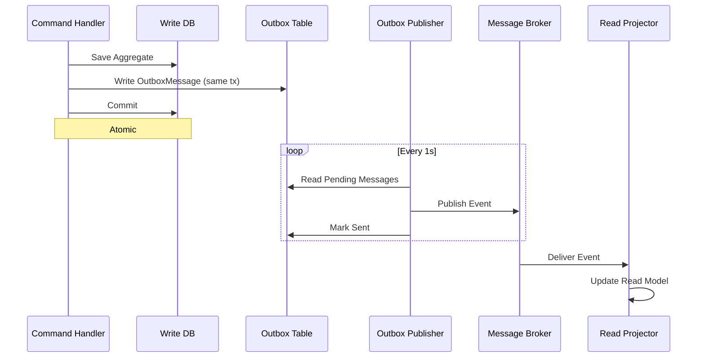

> [!success] Mastery Check
> - [ ] **Studied Well**
> - [ ] **Can explain the concept without notes**
> - [ ] **Can answer interview questions confidently**
> - [ ] **Can implement it in a real project**


# 7.100 — CQRS — Anti-Patterns and Over-Engineering

> **Anti-patterns are the graveyard of good intentions. CQRS, applied to the wrong problem or wired without discipline, yields a system more tangled than the monolith it replaced.**

---

## META

```yaml
group:
  - "CQRS and Event Sourcing"
priority: 2
prerequisites:
  - 7.081 — CQRS — Command Query Responsibility Segregation
related:
  - 7.093 — Event Sourcing — Anti-Patterns
  - 7.095 — CQRS — Testing Strategies
  - 7.097 — CQRS — Integration with Message Brokers
  - 7.098 — CQRS — Projections and Read Models
status: published
version: 2.0
updated: 2026-06-13
```

**Domain**: System Design / CQRS & Event Sourcing  
**Focus**: Misapplication, over-separation, consistency traps, wiring mistakes  
**Audience**: Engineers who already grasp CQRS basics and now need to recognise and refactor broken implementations

---

## TABLE OF CONTENTS

1. [When CQRS Should Not Be Used](#1-when-cqrs-should-not-be-used)
2. [Mixing Read and Write Models](#2-mixing-read-and-write-models)
3. [Commands Returning Domain State](#3-commands-returning-domain-state)
4. [Queries with Side Effects](#4-queries-with-side-effects)
5. [Over-Separation — One Handler per Field](#5-over-separation--one-handler-per-field)
6. [Ignoring Eventual Consistency](#6-ignoring-eventual-consistency)
7. [Dual-Write Without an Outbox](#7-dual-write-without-an-outbox)
8. [CQRS Without Bounded Context Alignment](#8-cqrs-without-bounded-context-alignment)
9. [Architecture Decision Record](#9-architecture-decision-record)
10. [Interview Questions & Answers](#10-interview-questions--answers)
11. [Self-Check Questions](#11-self-check-questions)
12. [Further Reading & References](#12-further-reading--references)

---

## 1. When CQRS Should Not Be Used

### 1.1 The Diagnostic

CQRS is a **pattern of last resort** for the command-query side, not a default architectural choice. Introducing separate command and query stacks — distinct handlers, separate databases, different object models — carries significant complexity cost. The decision must be driven by evidenced need, not aesthetic preference.

**Signs CQRS is being misapplied:**

- The system is a CRUD wrapper around a database with no domain logic
- Read and write shapes are nearly identical (≤ 20% divergence)
- The team cannot articulate a reason other than "it scales better"
- There is no contention, no concurrency conflict, no access-control asymmetry

### 1.2 Bad Example — CQRS for a Simple CRUD Notes App

```csharp
// ❌ BAD: CQRS overhead for a trivial CRUD operation with no domain logic

// -- Command --
public sealed record CreateNoteCommand(string Title, string Body)
    : IRequest<Guid>;

public sealed class CreateNoteHandler(IWriteRepository<Note> repo)
    : IRequestHandler<CreateNoteCommand, Guid>
{
    public async Task<Guid> Handle(CreateNoteCommand cmd, CancellationToken ct)
    {
        var note = new Note { Id = Guid.NewGuid(), Title = cmd.Title, Body = cmd.Body };
        await repo.AddAsync(note, ct);
        return note.Id;
    }
}

// -- Query --
public sealed record GetNoteQuery(Guid Id)
    : IRequest<NoteDto>;

public sealed class GetNoteHandler(IReadRepository<NoteDto> repo)
    : IRequestHandler<GetNoteQuery, NoteDto>
{
    public async Task<NoteDto> Handle(GetNoteQuery query, CancellationToken ct)
        => await repo.GetByIdAsync(query.Id, ct);
}

// -- DTO is a projection of the same fields --
public sealed record NoteDto(Guid Id, string Title, string Body, DateTime CreatedAt);
```

**What is wrong:** The `Note` entity and `NoteDto` share identical fields. There is no domain behaviour — no invariants, no rules, no events. The write side does nothing but persist; the read side does nothing but fetch. Two handler classes, two interfaces, two registrations — all for what a single minimal API endpoint would do in two lines.

### 1.3 The Fix — Don't Use CQRS Here

```csharp
// ✅ FIX: Plain minimal API — CQRS would be over-engineering

public static class NotesEndpoints
{
    public static void Map(WebApplication app)
    {
        app.MapPost("/notes", async (CreateNoteRequest req, AppDbContext db) =>
        {
            var note = new Note
            {
                Id = Guid.NewGuid(),
                Title = req.Title,
                Body = req.Body,
                CreatedAt = DateTime.UtcNow
            };
            db.Notes.Add(note);
            await db.SaveChangesAsync();
            return Results.Created($"/notes/{note.Id}", note);
        });

        app.MapGet("/notes/{id:guid}", async (Guid id, AppDbContext db) =>
        {
            var note = await db.Notes.FindAsync(id);
            return note is null ? Results.NotFound() : Results.Ok(note);
        });
    }
}

public sealed record CreateNoteRequest(string Title, string Body);
```

**Decision rule** — ask three questions before introducing CQRS:

1. Do commands and queries operate on meaningfully different shapes? (≥ 30% structural divergence)
2. Is there **domain logic** in the write path — invariants, rules, state transitions beyond CRUD?
3. Do reads need a **different data model** than writes — denormalised views, aggregated projections, materialised caches?

If all three are "no", do not use CQRS.

---

## 2. Mixing Read and Write Models

### 2.1 The Diagnostic

CQRS derives its power from **complete separation** of the command stack from the query stack. When a shared entity, shared repository, or shared database table serves both paths, the separation is cosmetic and the benefits — independent scaling, optimised schemas, security isolation — are forfeit.

**Common contamination patterns:**

- The command handler reads from the query database
- The query handler writes to a read-optimised store as part of the query
- Aggregates and DTOs share a base class or interface
- A single `IRepository<T>` is used for both reads and writes
- The read model is populated synchronously in the command handler

### 2.2 Bad Example — Shared Repository

```csharp
// ❌ BAD: Single generic repository used for both command and query paths

public interface IRepository<T>
{
    Task<T?> GetByIdAsync(Guid id);
    Task AddAsync(T entity);
    Task UpdateAsync(T entity);
    Task<IEnumerable<T>> QueryAsync(Expression<Func<T, bool>> predicate);
}

// Used for commands — requires transactional behaviour
public sealed class PlaceOrderHandler(IRepository<Order> repo)
    : IRequestHandler<PlaceOrderCommand>
{
    public async Task Handle(PlaceOrderCommand cmd, CancellationToken ct)
    {
        var order = await repo.GetByIdAsync(cmd.OrderId);   // reads from the same store
        order.AddItem(cmd.ProductId, cmd.Quantity);
        await repo.UpdateAsync(order);
    }
}

// Used for queries — requires query-optimised access
public sealed class GetOrderSummaryHandler(IRepository<Order> repo)
    : IRequestHandler<GetOrderSummaryQuery, OrderSummaryDto>
{
    public async Task<OrderSummaryDto> Handle(GetOrderSummaryQuery q, CancellationToken ct)
    {
        var order = await repo.GetByIdAsync(q.OrderId);
        return new OrderSummaryDto(order.Id, order.Total, order.Status.ToString());
    }
}
```

**What is wrong:** `IRepository<Order>` couples both sides to the same data access strategy. If the write side needs optimistic concurrency and the read side needs a denormalised join, the shared interface forces compromise — usually the read side suffers because the write side's transactional guarantees are non-negotiable.

### 2.3 The Fix — Separate Interfaces, Separate Stores

```csharp
// ✅ FIX: Dedicated command and query abstractions with independent backends

// -- Write side --
public interface IOrderCommands
{
    Task<Order?> LoadAsync(Guid orderId, CancellationToken ct);
    Task SaveAsync(Order order, CancellationToken ct);
}

// Uses an event-sourced or relational store with transactional guarantees
public sealed class PlaceOrderHandler(IOrderCommands writeStore)
    : IRequestHandler<PlaceOrderCommand>
{
    public async Task Handle(PlaceOrderCommand cmd, CancellationToken ct)
    {
        var order = await writeStore.LoadAsync(cmd.OrderId, ct);
        order.AddItem(cmd.ProductId, cmd.Quantity);
        await writeStore.SaveAsync(order, ct);
    }
}

// -- Read side --
public interface IOrderQueries
{
    Task<OrderSummaryDto?> GetSummaryAsync(Guid orderId, CancellationToken ct);
    Task<IReadOnlyList<OrderSummaryDto>> ListForUserAsync(
        Guid userId, int page, int size, CancellationToken ct);
}

// Uses a denormalised read store — could be a different RDBMS, NoSQL, or cache
public sealed class GetOrderSummaryHandler(IOrderQueries readStore)
    : IRequestHandler<GetOrderSummaryQuery, OrderSummaryDto>
{
    public async Task<OrderSummaryDto> Handle(GetOrderSummaryQuery q, CancellationToken ct)
        => await readStore.GetSummaryAsync(q.OrderId, ct)
           ?? throw new NotFoundException("Order not found");
}
```

**Design principle:** The write store should be optimised for consistency (normalised, transactional, concurrency-aware). The read store should be optimised for retrieval (denormalised, indexed, potentially cached). They should share no interface, no base class, and no schema.

---

## 3. Commands Returning Domain State

### 3.1 The Diagnostic

CQRS defines a clear semantic boundary: **commands express intent** (they do not return domain data), and **queries retrieve state** (they do not mutate). A command that returns domain state — the created entity, the updated aggregate, computed values — blurs this boundary and introduces coupling between the caller and the write model's internal representation.

**Why this is harmful:**

- The caller can bypass the query path, learning to depend on the command's return shape
- It incentivises embedding query logic in the command pipeline
- It breaks the `void`/`Result<Unit>` semantic that makes commands idempotent-safe
- It forces the command infrastructure to carry projection logic

### 3.2 Bad Example — Command Returning the Created Order

```csharp
// ❌ BAD: Command returns a rich domain object

public sealed record SubmitOrderCommand(Guid CartId, Guid CustomerId)
    : IRequest<Order>;  // returns the full aggregate

public sealed class SubmitOrderHandler(IOrderRepository repo)
    : IRequestHandler<SubmitOrderCommand, Order>
{
    public async Task<Order> Handle(SubmitOrderCommand cmd, CancellationToken ct)
    {
        var order = Order.Create(cmd.CustomerId);
        // ... populate from cart ...
        await repo.SaveAsync(order, ct);
        return order;   // exposes entire aggregate to caller
    }
}

// Caller:
var order = await mediator.Send(new SubmitOrderCommand(cartId, customerId));
Console.WriteLine(order.Total);            // reads domain state from command result
await mediator.Send(new GetOrderQuery(order.Id));   // makes redundant query
```

**What is wrong:** The caller receives the full `Order` aggregate and can inspect its internals, properties, and methods. The command handler is now coupled to the response mapping. If the aggregate changes — say `Order.Total` becomes computed differently — any caller that read `order.Total` from the command result is silently broken.

### 3.3 The Fix — Return Only a Correlation Identifier

```csharp
// ✅ FIX: Command returns only an identifier or Unit

public sealed record SubmitOrderCommand(Guid CartId, Guid CustomerId)
    : IRequest<Guid>;   // returns only the new entity's ID

public sealed class SubmitOrderHandler(IOrderRepository repo)
    : IRequestHandler<SubmitOrderCommand, Guid>
{
    public async Task<Guid> Handle(SubmitOrderCommand cmd, CancellationToken ct)
    {
        var order = Order.Create(cmd.CustomerId);
        // ... populate from cart ...
        await repo.SaveAsync(order, ct);
        return order.Id;   // identifier only — any further state comes from a query
    }
}

// Caller:
var orderId = await mediator.Send(new SubmitOrderCommand(cartId, customerId));
var summary = await mediator.Send(new GetOrderQuery(orderId));  // explicit query
```

**Compromise:** If the caller genuinely needs a few values immediately after a command (e.g., a generated order number), return a small, immutable **result DTO** that contains only data available at command completion — never the full aggregate.

```csharp
public sealed record SubmitOrderResult(Guid OrderId, string OrderNumber);

public sealed record SubmitOrderCommand(Guid CartId, Guid CustomerId)
    : IRequest<SubmitOrderResult>;
```

**Guideline:** A command result should never exceed 3–5 scalar fields. If you need more, the caller should issue a dedicated query.

---

## 4. Queries with Side Effects

### 4.1 The Diagnostic

A query that mutates state is no longer a query — it is a command disguised as a query. Side effects in the query path break idempotency, surprise callers, and violate the **Principle of Least Astonishment**.

**Common manifestations:**

- `GET /reports/generate` that creates a background job
- A query handler that increments a `view_count` column
- A read-model materialiser that fires domain events
- A query that writes to a cache and then fails silently if the cache is unavailable

### 4.2 Bad Example — Query That Materialises a Projection

```csharp
// ❌ BAD: Query handler writes to a materialised view as a side effect

public sealed record GetCustomerDashboardQuery(Guid CustomerId)
    : IRequest<DashboardDto>;

public sealed class GetCustomerDashboardHandler(
    IReadRepository<DashboardDto> readRepo,
    IProjectionWriter projectionWriter)
    : IRequestHandler<GetCustomerDashboardQuery, DashboardDto>
{
    public async Task<DashboardDto> Handle(GetCustomerDashboardQuery q, CancellationToken ct)
    {
        var cached = await readRepo.GetByIdAsync(q.CustomerId, ct);
        if (cached is not null)
            return cached;

        // ❌ Side effect: materialising the projection during a query
        await projectionWriter.MaterialiseAsync(q.CustomerId, ct);

        return await readRepo.GetByIdAsync(q.CustomerId, ct)
               ?? throw new NotFoundException("Dashboard not found");
    }
}
```

**What is wrong:** The query handler has a `MaterialiseAsync` call — a write operation. If the caller issues a `GET` request and receives a `500`, they will not retry because "it was just a read." If they do retry, the materialisation runs again (no idempotency guard). The query path now has write dependencies, making it slower and less reliable.

### 4.3 The Fix — Separate Materialisation from Querying

```csharp
// ✅ FIX: Materialisation is a background command; the query reads only

// Dedicated command to materialise — idempotent, traceable
public sealed record MaterialiseCustomerDashboardCommand(Guid CustomerId)
    : IRequest;

public sealed class MaterialiseCustomerDashboardHandler(
    IEventStore eventStore,
    IProjectionWriter projectionWriter)
    : IRequestHandler<MaterialiseCustomerDashboardCommand>
{
    public async Task Handle(MaterialiseCustomerDashboardCommand cmd, CancellationToken ct)
    {
        var events = await eventStore.GetAggregateEventsAsync(cmd.CustomerId, ct);
        var projection = CustomerDashboardProjector.Project(events);
        await projectionWriter.WriteAsync(cmd.CustomerId, projection, ct);
    }
}

// Pure query — no side effects
public sealed record GetCustomerDashboardQuery(Guid CustomerId)
    : IRequest<DashboardDto>;

public sealed class GetCustomerDashboardHandler(
    IReadRepository<DashboardDto> readRepo)
    : IRequestHandler<GetCustomerDashboardQuery, DashboardDto>
{
    public async Task<DashboardDto> Handle(GetCustomerDashboardQuery q, CancellationToken ct)
        => await readRepo.GetByIdAsync(q.CustomerId, ct)
           ?? throw new NotFoundException("Dashboard not materialised");
}
```

**Rule:** Every query handler must pass this test — "If I call this handler twice in a row with the same input, can every side effect be omitted safely?" If the answer is no, the side effect must be extracted into a command.

---

## 5. Over-Separation — One Handler per Field

### 5.1 The Diagnostic

CQRS's command-query separation is about *paths* (read vs write), not *granularity*. Creating one command per field — `UpdateFirstNameCommand`, `UpdateLastNameCommand`, `UpdateEmailCommand` — explodes the surface area without providing proportional benefit. Each command incurs infrastructure cost: handler class, registration, validation, tests.

**Why this happens:**

- Misunderstanding CQRS as "one command per atomic change"
- Overzealous application of small aggregates
- Confusion between *unit of work* and *command boundary*

### 5.2 Bad Example — Field-Level Commands

```csharp
// ❌ BAD: One command handler per mutable field on a Customer aggregate

public sealed record UpdateCustomerFirstNameCommand(Guid CustomerId, string FirstName)
    : IRequest;
public sealed record UpdateCustomerLastNameCommand(Guid CustomerId, string LastName)
    : IRequest;
public sealed record UpdateCustomerEmailCommand(Guid CustomerId, string Email)
    : IRequest;
public sealed record UpdateCustomerPhoneCommand(Guid CustomerId, string Phone)
    : IRequest;
public sealed record UpdateCustomerMarketingOptInCommand(Guid CustomerId, bool OptIn)
    : IRequest;

// Each needs its own handler, validator, and test:
public sealed class UpdateCustomerFirstNameHandler(ICustomerRepository repo)
    : IRequestHandler<UpdateCustomerFirstNameCommand>
{
    public async Task Handle(UpdateCustomerFirstNameCommand cmd, CancellationToken ct)
    {
        var customer = await repo.LoadAsync(cmd.CustomerId, ct);
        customer.FirstName = cmd.FirstName;   // direct property set — no domain behaviour
        await repo.SaveAsync(customer, ct);
    }
}
// ... four more nearly identical handlers ...
```

**What is wrong:** Five commands that all do the same thing — load, set, save — but each is a separate code path. The domain has no invariant that ties these fields together at a finer granularity. This is not CQRS; it is an anemic domain model dressed up with ceremony.

### 5.3 The Fix — Group by Domain Behaviour

```csharp
// ✅ FIX: Commands aligned to domain use cases, not fields

// The domain operation is "update profile" — one coherent change
public sealed record UpdateCustomerProfileCommand(
    Guid CustomerId,
    string FirstName,
    string LastName,
    string Email,
    string? Phone = null)
    : IRequest;

public sealed class UpdateCustomerProfileHandler(ICustomerRepository repo)
    : IRequestHandler<UpdateCustomerProfileCommand>
{
    public async Task Handle(UpdateCustomerProfileCommand cmd, CancellationToken ct)
    {
        var customer = await repo.LoadAsync(cmd.CustomerId, ct);
        customer.UpdateProfile(cmd.FirstName, cmd.LastName, cmd.Email, cmd.Phone);
        await repo.SaveAsync(customer, ct);
    }
}

// Separate concern — marketing opt-in is a different domain behaviour
public sealed record UpdateMarketingPreferenceCommand(Guid CustomerId, bool OptIn)
    : IRequest;

public sealed class UpdateMarketingPreferenceHandler(ICustomerRepository repo)
    : IRequestHandler<UpdateMarketingPreferenceCommand>
{
    public async Task Handle(UpdateMarketingPreferenceCommand cmd, CancellationToken ct)
    {
        var customer = await repo.LoadAsync(cmd.CustomerId, ct);
        customer.SetMarketingOptIn(cmd.OptIn);
        await repo.SaveAsync(customer, ct);
    }
}
```

**Guideline:** A command should correspond to a **user-facing use case** or **domain behaviour**, not to a column in the database. If the UI sends five fields in one form submission, it should be one command — irrespective of how many database columns are affected.

---

## 6. Ignoring Eventual Consistency

### 6.1 The Diagnostic

CQRS with separate read and write stores is an **eventually consistent** architecture by nature. The write model commits the command; the read model is updated asynchronously. Teams that ignore this reality treat the read store as though it is always immediately consistent with the write store — leading to bugs, corrupted UX, and confused users.

**Symptoms of ignored eventual consistency:**

- The UI shows stale data immediately after a command succeeds
- Integration tests assert read-model state directly after a write and fail flakily
- The team introduces "refresh" buttons that are really just polling loops
- Business logic leaks into the read model to "fix" consistency problems

### 6.2 Bad Example — Asserting Read-Model Consistency After Write

```csharp
// ❌ BAD: Integration test assumes read model is immediately consistent

[Fact]
public async Task After_order_submission_dashboard_shows_order()
{
    // Arrange
    var customerId = Guid.NewGuid();
    var cartId = Guid.NewGuid();
    await SeedCartAsync(cartId, customerId);

    // Act
    await Mediator.Send(new SubmitOrderCommand(cartId, customerId));

    // Assert — flaky! The read model may not have caught up yet
    var dashboard = await Mediator.Send(new GetCustomerDashboardQuery(customerId));
    dashboard.Orders.Should().ContainSingle();
}
```

**What is wrong:** The `SubmitOrderCommand` commits to the write store. The dashboard read model is updated asynchronously via a projection. There is no guarantee — and should be no expectation — that the projection has processed the event by the time the `GetCustomerDashboardQuery` executes. This test will pass locally (because of timing coincidences) and fail in CI or under load.

### 6.3 The Fix — Test at the Correct Boundary

```csharp
// ✅ FIX: Write-side test verifies command behaviour; read-side test verifies projection

[Fact]
public async Task SubmitOrderCommand_creates_order_in_write_store()
{
    // Arrange
    var customerId = Guid.NewGuid();
    var cartId = Guid.NewGuid();
    await SeedCartAsync(cartId, customerId);

    // Act
    var orderId = await Mediator.Send(new SubmitOrderCommand(cartId, customerId));

    // Assert — test against the write store, not the read store
    var order = await WriteStore.LoadAsync<Order>(orderId);
    order.Should().NotBeNull();
    order.Items.Should().NotBeEmpty();
    order.Status.Should().Be(OrderStatus.Submitted);
}

[Fact]
public async Task OrderSubmittedEvent_is_consumed_by_dashboard_projection()
{
    // Arrange
    var customerId = Guid.NewGuid();
    var @event = new OrderSubmittedEvent(
        OrderId: Guid.NewGuid(),
        CustomerId: customerId,
        Total: 150.00m);

    // Act — feed the event directly to the projector
    var projector = new CustomerDashboardProjector(DbContext);
    await projector.HandleAsync(@event, CancellationToken.None);

    // Assert — test the projection logic in isolation
    var dashboard = await DbContext.CustomerDashboards.FindAsync(customerId);
    dashboard.Should().NotBeNull();
    dashboard.Orders.Should().ContainSingle(o => o.Total == 150.00m);
}
```

### 6.4 Handling Eventual Consistency in the UI

```csharp
// ✅ FIX: UI patterns for eventual consistency

// Option 1 — Optimistic update
public class OrderService(HttpClient http)
{
    public async Task<Guid> SubmitOrderAsync(Guid cartId, Guid customerId)
    {
        var orderId = await http.PostAsJsonAsync<Guid>("/orders/submit", ...);

        // Immediately show a pending state in the UI
        Publish(new OrderSubmittedLocally(orderId, Status.Pending));

        return orderId;
    }
}

// Option 2 — Poll or push for confirmation
public class OrderStatusPolling(HttpClient http, Guid orderId)
{
    public async Task WaitForConsistencyAsync(CancellationToken ct)
    {
        while (!ct.IsCancellationRequested)
        {
            var dto = await http.GetFromJsonAsync<OrderDto>($"/orders/{orderId}", ct);
            if (dto?.Status != "Pending")
                return;
            await Task.Delay(500, ct);
        }
    }
}

// Option 3 — Server-Sent Events / SignalR push
public class OrderDashboardHub : Hub
{
    public async Task NotifyOrderPlaced(Guid customerId, OrderSummaryDto dto)
        => await Clients.User(customerId.ToString())
               .SendAsync("OrderPlaced", dto);
}
```

**Principle:** Design the system — including tests and UX — from the assumption that the read model *will lag*. Measure the lag; make it observable; build compensating strategies when lag exceeds business tolerance.

---

## 7. Dual-Write Without an Outbox

### 7.1 The Diagnostic

A dual-write problem occurs when a single operation must write to two independent stores (e.g., the write database and a message queue) atomically. Without an **outbox pattern**, the operation becomes non-atomic: the database write succeeds but the message publish fails (or vice versa), leaving the system in an inconsistent state.

**The dual-write problem manifests when:**

- A command handler saves an aggregate and then publishes an event to a message broker
- A query handler writes to a cache and then updates a materialised view
- A saga participant writes to its local store and then sends a compensating command

### 7.2 Bad Example — Publishing Outside the Transaction

```csharp
// ❌ BAD: Dual-write — database and message broker are not coordinated

public sealed class SubmitOrderHandler(
    IOrderRepository repo,
    IMessageBus bus)      // RabbitMQ, Azure Service Bus, etc.
    : IRequestHandler<SubmitOrderCommand>
{
    public async Task Handle(SubmitOrderCommand cmd, CancellationToken ct)
    {
        var order = Order.Create(cmd.CustomerId);
        // ... populate ...
        await repo.SaveAsync(order, ct);        // ✅ database write succeeds

        await bus.PublishAsync(                  // ❌ what if this fails?
            new OrderSubmittedEvent(order.Id, order.CustomerId, order.Total),
            ct);
    }
}
```

**What is wrong:** If `SaveAsync` succeeds and `PublishAsync` throws (network blip, broker restart, authentication expiry), the order is persisted but no downstream projection is notified. The read model is permanently stale. There is no retry mechanism and no compensating action.

### 7.3 The Fix — Transactional Outbox

```csharp
// ✅ FIX: Outbox pattern ensures atomic dual-write

// Step 1 — Write event to an outbox table within the same transaction
public sealed class SubmitOrderHandler(
    IOrderRepository repo,
    IOutboxWriter outbox)
    : IRequestHandler<SubmitOrderCommand>
{
    public async Task Handle(SubmitOrderCommand cmd, CancellationToken ct)
    {
        var order = Order.Create(cmd.CustomerId);
        // ... populate ...

        using var tx = await repo.BeginTransactionAsync(ct);
        try
        {
            await repo.SaveAsync(order, ct);

            // Write the event to the outbox within the same transaction
            await outbox.WriteAsync(
                new OutboxMessage
                {
                    Id = Guid.NewGuid(),
                    Type = nameof(OrderSubmittedEvent),
                    Payload = JsonSerializer.Serialize(
                        new OrderSubmittedEvent(order.Id, order.CustomerId, order.Total)),
                    CreatedAt = DateTime.UtcNow
                },
                ct);

            await tx.CommitAsync(ct);
        }
        catch
        {
            await tx.RollbackAsync(ct);
            throw;
        }
    }
}

// Step 2 — Background process publishes outbox messages
public sealed class OutboxPublisher(
    IOutboxReader outbox,
    IMessageBus bus,
    ILogger<OutboxPublisher> logger)
    : BackgroundService
{
    protected override async Task ExecuteAsync(CancellationToken ct)
    {
        while (!ct.IsCancellationRequested)
        {
            try
            {
                var messages = await outbox.ReadPendingAsync(ct);
                foreach (var msg in messages)
                {
                    await bus.PublishAsync(msg, ct);
                    await outbox.MarkSentAsync(msg.Id, ct);
                }
            }
            catch (Exception ex)
            {
                logger.LogWarning(ex, "Outbox publish cycle failed — will retry");
            }

            await Task.Delay(1000, ct);
        }
    }
}
```



**Variants:**

| Variant | Approach | When to use |
|---------|----------|-------------|
| **Database outbox** | Events written to a table in the same DB transaction | Single write database; simplest setup |
| **Change Data Capture (CDC)** | Debezium / PostgreSQL logical replication captures changes | High throughput; avoids polling |
| **DynamoDB Transactions** | TransactWriteItems for table + event stream | AWS ecosystem; managed |
| **Kafka transactional producer** | Exactly-once semantics with idempotent producer | Kafka-native event-driven systems |

---

## 8. CQRS Without Bounded Context Alignment

### 8.1 The Diagnostic

CQRS is a **within-context** pattern — it separates read from write inside a single [[7.030 — Bounded Contexts and Ubiquitous Language|bounded context]]. When teams apply CQRS *across* bounded contexts without proper context mapping, they create coupling that defeats the purpose of both patterns.

**Common cross-context CQRS mistakes:**

- A command in one context directly manipulates an aggregate in another context
- The read model in Context A pulls data directly from Context B's write database
- Shared command DTOs are defined in a common library used by multiple contexts
- Event propagation between contexts is synchronous (in-process, not via broker)

### 8.2 Bad Example — Direct Cross-Context Command

```csharp
// ❌ BAD: Billing context directly invokes Shipping context's aggregate

// Defined in Billing context:
public sealed record ProcessPaymentCommand(Guid OrderId, decimal Amount)
    : IRequest;

public sealed class ProcessPaymentHandler(
    IBillingRepo billingRepo,
    IShippingRepo shippingRepo)     // ❌ references Shipping's repository
    : IRequestHandler<ProcessPaymentCommand>
{
    public async Task Handle(ProcessPaymentCommand cmd, CancellationToken ct)
    {
        var payment = new Payment(cmd.OrderId, cmd.Amount);
        await billingRepo.SaveAsync(payment, ct);

        // ❌ Directly updates Shipping's aggregate
        var shipment = await shippingRepo.LoadByOrderAsync(cmd.OrderId, ct);
        shipment.MarkAsPaid();
        await shippingRepo.SaveAsync(shipment, ct);
    }
}
```

**What is wrong:** The `Billing` context has taken a direct dependency on the `Shipping` context's repository. Changes to the Shipping aggregate's interface or persistence strategy break Billing. The two contexts are now deployment-coupled — they must be released together. The bounded context boundary is functionally meaningless.

### 8.3 The Fix — Propagate via Domain Events

```csharp
// ✅ FIX: Billing publishes an event; Shipping subscribes via its own handler

// --- In Billing context ---

public sealed record ProcessPaymentCommand(Guid OrderId, decimal Amount)
    : IRequest;

public sealed class ProcessPaymentHandler(IBillingRepo repo, IEventBus bus)
    : IRequestHandler<ProcessPaymentCommand>
{
    public async Task Handle(ProcessPaymentCommand cmd, CancellationToken ct)
    {
        var payment = new Payment(cmd.OrderId, cmd.Amount);
        await repo.SaveAsync(payment, ct);

        // Publish domain event — no knowledge of who consumes it
        await bus.PublishAsync(
            new PaymentProcessedEvent(cmd.OrderId, cmd.Amount),
            ct);
    }
}

// --- In Shipping context (separate assembly, separate deployment) ---

public sealed class PaymentProcessedHandler(IShippingRepo repo)
    : IEventHandler<PaymentProcessedEvent>
{
    public async Task Handle(PaymentProcessedEvent @event, CancellationToken ct)
    {
        var shipment = await repo.LoadByOrderAsync(@event.OrderId, ct);
        shipment.MarkAsPaid();
        await repo.SaveAsync(shipment, ct);
    }
}
```

**Context mapping guidelines for CQRS:**

| Relationship | Recommended Pattern | Reason |
|---|---|---|
| **Conformist** (upstream dictates) | CQRS within each context; anticorruption layer at boundary | Prevents upstream model from leaking into downstream |
| **Customer/Supplier** | Event-driven integration; each context owns its events | Loose coupling; independent deployment |
| **Partnership** | Shared kernel for event schemas only; separate write models | Avoids shared aggregate coupling |
| **Open Host Service** | Published language via separate read model API | Consumers query a public read model; never the write store |

```mermaid
flowchart LR
    subgraph Billing Context
        BC[Command: ProcessPayment]
        BA[Aggregate: Payment]
        BE[Event: PaymentProcessed]
    end

    subgraph Shipping Context
        SC[Command: PrepareShipment]
        SA[Aggregate: Shipment]
        SE[Event: ShipmentPrepared]
    end

    subgraph Read Models
        RB[Billing Read Model]
        RS[Shipping Read Model]
    end

    BC -->|writes| BA
    BA -->|publishes| BE
    BE -->|async| SC
    SC -->|writes| SA
    SA -->|publishes| SE
    SE -->|projects| RS
    BE -.->|projects| RB

    Note over BillingContext,ShippingContext: No direct DB access across contexts
```

---

## 9. Architecture Decision Record

### ADR-100: CQRS Adoption Criteria and Anti-Pattern Guardrails

| Field | Value |
|---|---|
| **ID** | ADR-100 |
| **Title** | CQRS Adoption Criteria and Anti-Pattern Guardrails |
| **Status** | Accepted |
| **Date** | 2026-06-13 |
| **Context** | Teams adopt CQRS without systematic evaluation, leading to over-engineered CRUD systems and consistency bugs. |
| **Decision** | Adopt CQRS only when at least two of three criteria are met: (a) ≥ 30% read/write shape divergence, (b) non-trivial domain logic on the write side, (c) read models require independent optimisation. Mandate outbox pattern for all dual-writes. |
| **Consequences** | Positive: Reduced CQRS misapplication; clearer architectural guidance. Negative: Teams may need to retrofit outbox into existing pipelines. |
| **Compliance** | Architecture review gate requires ADR-100 checklist sign-off for all new CQRS modules. |
| **Review Date** | 2026-09-13 |

---

## 10. Interview Questions & Answers

### Q1: When would you *reject* CQRS in an architecture review?

**Answer:** If the system is primarily CRUD — same shapes for read and write, no domain invariants — CQRS adds ceremony without benefit. Also reject if the team cannot commit to the operational complexity: two storage strategies, eventual consistency discipline, outbox infrastructure. CQRS is a tool, not a trophy.

### Q2: What is the dual-write problem and how does the outbox pattern solve it?

**Answer:** Dual-write occurs when a single operation must atomically update two independent stores (e.g., a database and a message queue). The outbox pattern writes the event to a table in the *same database transaction* as the aggregate. A background process reads the outbox and publishes events. This guarantees at-least-once delivery without distributed transactions.

### Q3: A command handler returns the full aggregate. Is this a problem?

**Answer:** Yes — it violates CQRS's separation, couples callers to the aggregate's internal shape, and encourages bypassing the query path. A command should return either `Unit`, an identifier, or a minimal result DTO (≤ 5 scalar fields). The caller issues a separate query for any further data.

### Q4: How do you test a CQRS system when reads and writes are eventually consistent?

**Answer:** Test each side independently against its own store. Write-side tests verify command behaviour against the write database. Read-side tests verify projections by feeding them events directly and asserting the read model state. Integration tests that cross the consistency boundary should use polling, retries, or a test harness that waits for the projection to catch up.

### Q5: Should every microservice use CQRS?

**Answer:** No. CQRS is a per-service decision, not an architectural mandate. A simple data service (e.g., a reference-data lookup) gains nothing from CQRS. Apply it only where read/write divergence exists *within that service's bounded context*.

### Q6: What is the difference between CQRS and Event Sourcing? Can you have one without the other?

**Answer:** CQRS separates read and write *paths*. Event Sourcing persists state as a sequence of events. They are independent: you can have CQRS without Event Sourcing (e.g., separate SQL databases for reads and writes) and Event Sourcing without CQRS (e.g., loading and projecting events in the same class). They complement each other but do not require each other.

### Q7: How do you handle cross-context consistency when each context has its own read model?

**Answer:** Each context publishes domain events; subscribing contexts project those events into their own read models. Consistency is eventual. If a context needs strongly consistent cross-context data, it should own a copy of that data (replicated via events) or query the owning context's public API — never its write database.

### Q8: What is "over-separation" in CQRS and how do you spot it in a codebase?

**Answer:** Over-separation is creating one command/query handler per data field or per trivial mutation. It is detectable by counting handler classes versus domain use cases. A healthy ratio is 1–2 handlers per use case. If a single profile-update screen maps to 5+ handlers, it is over-separated. Fix by grouping handlers by domain behaviour, not by database columns.

---

## 11. Self-Check Questions

### 11.1 Quick Check (12 items)

<details>
<summary>Q1: True or False — CQRS is a good default choice for any new service.</summary>

**False.** CQRS should be adopted only when evidenced read/write divergence, domain complexity, or independent scaling needs justify its overhead.
</details>

<details>
<summary>Q2: True or False — A command should never return domain state.</summary>

**True.** Commands express intent; any needed state after the command should be obtained via a separate query. (An identifier or minimal result DTO is acceptable.)
</details>

<details>
<summary>Q3: True or False — You can safely skip the outbox pattern if your message broker guarantees delivery.</summary>

**False.** The problem is not broker delivery — it is the gap between the database commit and the broker publish. Even a guaranteed-delivery broker does not help if the publish call never reaches it.
</details>

<details>
<summary>Q4: True or False — A CQRS query handler must not write to any store.</summary>

**True.** Any write operation in the query path is a side effect. Extract it into a separate command.
</details>

<details>
<summary>Q5: True or False — CQRS forces eventual consistency.</summary>

**Not necessarily.** CQRS with separate stores is eventually consistent, but CQRS can be implemented with a single store (different in-memory models) where consistency is immediate.
</details>

<details>
<summary>Q6: True or False — Event Sourcing is required for CQRS.</summary>

**False.** They are independent patterns. CQRS can use any write model (relational, document, event-sourced). Event Sourcing can be used without separate read models.
</details>

<details>
<summary>Q7: Which of the following is NOT a valid CQRS anti-pattern?</summary>

A) Commands returning domain state  
B) Queries with side effects  
C) Using the outbox pattern  
D) One handler per field  

**Answer: C.** The outbox pattern is the *fix* for the dual-write anti-pattern.
</details>

<details>
<summary>Q8: What is the minimum read/write shape divergence that warrants considering CQRS?</summary>

A) 5%  
B) 15%  
C) 30%  
D) 50%  

**Answer: C.** Approximately 30% structural divergence is a reasonable heuristic.
</details>

<details>
<summary>Q9: Which test approach is correct for an eventually consistent CQRS system?</summary>

A) Always assert read model state immediately after a command  
B) Test the write side against the write store and projections against events  
C) Use Thread.Sleep to wait for consistency  
D) Only test the query side  

**Answer: B.** Write-side and read-side tests should use their respective stores independently.
</details>

<details>
<summary>Q10: Which pattern solves the dual-write problem in CQRS?</summary>

A) Saga  
B) Outbox  
C) Process Manager  
D) Eventual consistency  

**Answer: B.** The outbox pattern ensures atomicity between the aggregate store and the event publication.
</details>

<details>
<summary>Q11: What should you do when a query handler starts with "if cache miss, materialise"?</summary>

A) Keep it — it is an optimisation  
B) Add a distributed lock  
C) Extract materialisation into a separate command  
D) Remove the cache — it is not CQRS-compliant  

**Answer: C.** Materialisation is a write operation and belongs in a command.
</details>

<details>
<summary>Q12: Which is the strongest signal that CQRS is over-engineering for a component?</summary>

A) The read model uses a different database than the write model  
B) The command handler only loads and saves an aggregate with no behaviour  
C) The team has written 200 tests for the CQRS infrastructure  
D) Events are published via an outbox  

**Answer: B.** If the command handler does nothing but load -> set -> save, there is no domain behaviour to justify CQRS complexity.
</details>

### 11.2 Deep Dive (6 items)

<details>
<summary>Q13: Design a dual-write-safe command that updates a customer's email and publishes an EmailChanged event. Assume no distributed transaction coordinator is available.</summary>

**Solution:** Use the transactional outbox pattern.

```csharp
public sealed record ChangeCustomerEmailCommand(Guid CustomerId, string NewEmail)
    : IRequest;

public sealed class ChangeCustomerEmailHandler(ICustomerRepository repo, IOutboxWriter outbox)
    : IRequestHandler<ChangeCustomerEmailCommand>
{
    public async Task Handle(ChangeCustomerEmailCommand cmd, CancellationToken ct)
    {
        using var tx = await repo.BeginTransactionAsync(ct);
        try
        {
            var customer = await repo.LoadAsync(cmd.CustomerId, ct);
            customer.ChangeEmail(cmd.NewEmail);
            await repo.SaveAsync(customer, ct);

            await outbox.WriteAsync(
                new OutboxMessage
                {
                    Id = Guid.NewGuid(),
                    Type = nameof(CustomerEmailChanged),
                    Payload = JsonSerializer.Serialize(
                        new CustomerEmailChanged(cmd.CustomerId, cmd.NewEmail)),
                    CreatedAt = DateTime.UtcNow
                },
                ct);

            await tx.CommitAsync(ct);
        }
        catch
        {
            await tx.RollbackAsync(ct);
            throw;
        }
    }
}
```

The aggregate, the outbox entry, and the event are atomically persisted. A background publisher reads the outbox and forwards events to the broker.
</details>

<details>
<summary>Q14: A team has 12 command handlers for a single user profile screen (one per field). How would you refactor? What trade-offs exist?</summary>

**Refactor:** Collapse into 2–3 commands aligned to domain behaviour:
- `UpdateProfileCommand` (FirstName, LastName, Email, Phone)
- `UpdateAvatarCommand` (Image data)
- `UpdatePreferencesCommand` (Marketing opt-in, notification settings)

**Trade-offs:** The UI form submits more fields than may have changed — possible over-posting of data. Mitigate by having the aggregate's `UpdateProfile` method apply only changed values. The benefit is drastically fewer handlers, simpler testing, and one transaction per form submission instead of five.
</details>

<details>
<summary>Q15: Explain how to handle a query that needs to return data from two bounded contexts, each with their own read model.</summary>

**Option 1 — Aggregator service:** Create a third service that subscribes to events from both contexts, builds a composite read model, and exposes it via its own query API.

**Option 2 — API composition:** The query handler calls each context's query API (HTTP, gRPC) and merges results. This adds latency but avoids data duplication.

**Option 3 — Local copy with events:** One context projects the other's events into its own read model, keeping a local copy of the foreign data.

**Recommendation:** Option 1 (dedicated aggregator) is preferred when the composite is a distinct bounded concept. Option 2 is simpler when latency and availability tolerance are high. Option 3 introduces coupling and is recommended only when latency is critical.
</details>

<details>
<summary>Q16: Your integration test for an order-submission flow is flaky because the read model is not updated immediately. Describe three strategies to fix it without removing the test coverage.</summary>

1. **Test each side independently** — Verify the command against the write store; verify the projection by feeding it events directly. This eliminates cross-side flakiness.

2. **Use a `TestAsyncProjectionWaiter`** — After the command, poll the read store with a timeout (e.g., 5 seconds, 100ms intervals). This makes the test tolerant of projection lag without arbitrary sleeps.

3. **Eventual-consistency test harness** — Expose a `WaitForProjectionAsync` endpoint (disabled in production) that blocks until the projection catches up or a timeout expires. Use this only in test environments.

**Recommendation:** Strategy 1 is purest and fastest. Strategy 2 is a pragmatic compromise. Strategy 3 is a last resort as it adds test-only code.
</details>

<details>
<summary>Q17: Two microservices (Inventory and Orders) both need to know the current stock level. Inventory owns that data. What is the correct CQRS-compliant approach?</summary>

Inventory owns the stock-level aggregate in its write model. It publishes `StockLevelChanged` events. Orders projects these events into its own read model — a local copy of stock levels optimised for its query patterns. Orders never reads from Inventory's write database nor invokes Inventory commands.

If Orders needs *strongly consistent* stock checks at order time, it queries Inventory's public API (a separate query endpoint, not the write database). The UI can acknowledge this latency or display the local (potentially stale) read-model value.
</details>

<details>
<summary>Q18: A developer argues that CQRS is always beneficial because "it separates concerns." How do you respond?</summary>

CQRS does separate concerns — but separation is not free. Every command handler, query handler, separate store, and projection adds code, tests, deployment complexity, and cognitive load. For a CRUD system with no domain logic, the cost exceeds the benefit. The principle of "separating concerns" is best applied where concerns actually diverge. Apply CQRS where it solves a measurable problem, not where it "feels cleaner."
</details>

---

## 12. Further Reading & References

### Internal (wiki-links)

- [[7.081 — CQRS — Command Query Responsibility Segregation]]
- [[7.093 — Event Sourcing — Anti-Patterns]]
- [[7.095 — CQRS — Testing Strategies]]
- [[7.097 — CQRS — Integration with Message Brokers]]
- [[7.098 — CQRS — Projections and Read Models]]
- [[7.030 — Bounded Contexts and Ubiquitous Language]]
- [[7.040 — Context Mapping]]
- [[7.070 — Domain Events]]

### External References

- Fowler, M. (2010). *CQRS*. martinfowler.com/bliki/CQRS.html
- Fowler, M. (2005). *Eventual Consistency*. martinfowler.com/articles/microservices
- Young, G. (2010). *CQRS Documents*. github.com/gregoryyoung/mj-r-t-cqrs
- Microsoft. (2023). *Transactional Outbox Pattern*. learn.microsoft.com/en-us/azure/architecture/patterns/transactional-outbox
- Debezium. (2024). *Change Data Capture Outbox*. debezium.io/documentation
- Richardson, C. (2019). *Microservices Patterns*. Manning. (Chapter 4 — Transactional Outbox)
- Vernon, V. (2013). *Implementing Domain-Driven Design*. Addison-Wesley. (Chapters 7 — CQRS, 10 — Events)
- Mendonca, R. (2022). *CQRS Myths and Anti-Patterns*. InfoQ.

---

> **The path from CQRS to chaos is paved with commands that return aggregates, queries that materialise views, and read models that ignore the clock. Discipline the command. Honour the query. Mind the gap.**
