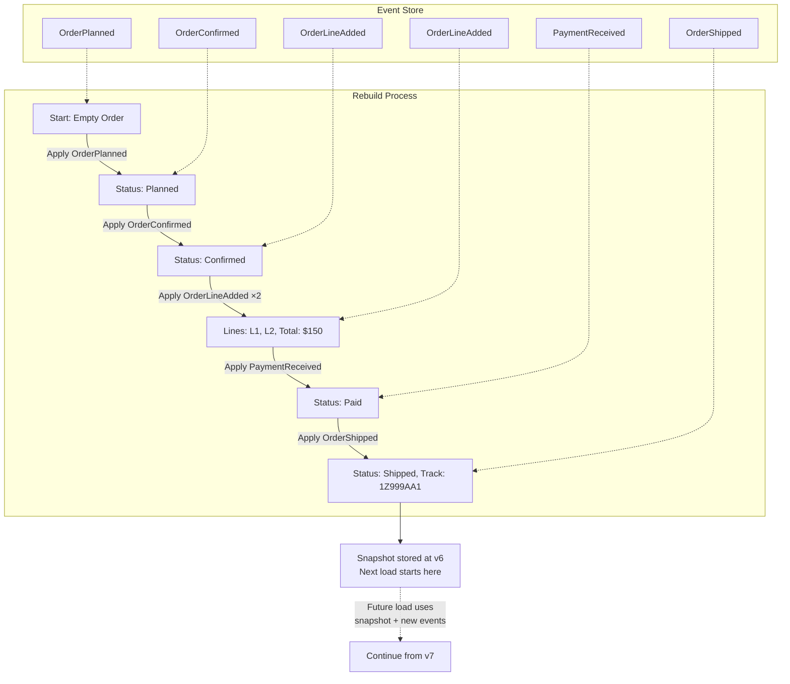

> [!success] Mastery Check
> - [ ] **Studied Well**
> - [ ] **Can explain the concept without notes**
> - [ ] **Can answer interview questions confidently**
> - [ ] **Can implement it in a real project**


# 7.101 — Event Sourcing — Events as the Source of Truth

> **Event Sourcing** is a persistence pattern where every change to application state is captured as an immutable, append-only event record. The current state is _derived_ by replaying events — not stored as the primary source of truth.

| Property | Value |
|---|---|
| **Group** | `CQRS and Event Sourcing` |
| **Priority** | `1` |
| **Prerequisites** | [[7.081 — CQRS — Command Query Responsibility Segregation]] |
| **Related** | [[7.094 — Domain-Driven Design — Aggregates and Entities]] · [[7.102 — CQRS — Command Models and Query Models]] · [[7.104 — Event Store Implementation Patterns]] · [[7.108 — Sagas and Process Managers]] · [[7.115 — Distributed Transactions and the Saga Pattern]] |
| **Version** | `2.0` |
| **Status** | `Complete` |

---

## Table of Contents

1. [Fundamentals](#1-fundamentals)
2. [Event Store as Append-Only Log](#2-event-store-as-append-only-log)
3. [Event Schema and Immutability](#3-event-schema-and-immutability)
4. [Rebuilding State from Events](#4-rebuilding-state-from-events)
5. [Temporal Queries and Audit Trail](#5-temporal-queries-and-audit-trail)
6. [Comparison with State-Based Persistence](#6-comparison-with-state-based-persistence)
7. [Relationship Between Event Sourcing and CQRS](#7-relationship-between-event-sourcing-and-cqrs)
8. [Implementation Patterns and Infrastructure](#8-implementation-patterns-and-infrastructure)
9. [Pitfalls and Anti-Patterns](#9-pitfalls-and-anti-patterns)
10. [Interview Questions and ADR](#10-interview-questions-and-adr)
11. [Self-Check](#11-self-check)

---

## 1. Fundamentals

### 1.1 Core Concept

Traditional state-based persistence stores the _current snapshot_ of an entity. When a field changes, the previous value is lost. Event Sourcing inverts this: every state mutation is recorded as a discrete event, and the current state is a **projection** — a fold over the event stream.

```text
State-based:
  [Account] --update--> [Account (overwritten)]

Event-sourced:
  [AccountCreated] --append--> [MoneyDeposited] --append--> [MoneyWithdrawn]
                                         |
                                         v
                              Replay → Current Balance: $450
```

### 1.2 Key Tenets

| Tenet | Description |
|---|---|
| **Events are facts** | Each event represents something that _happened_ in the domain. Past tense naming: `OrderShipped`, `PaymentReceived`. |
| **Events are immutable** | Once recorded, an event is never modified or deleted. Corrections are new events (`CustomerNameCorrected`). |
| **Current state is a projection** | State is computed by replaying the event stream from the beginning (or from a snapshot). |
| **Event store is the system of record** | The event store is the primary database; all other representations (read models, search indexes, caches) are derived. |
| **Temporal integrity** | Every event carries a timestamp and optional metadata, enabling point-in-time queries. |

### 1.3 Why Event Sourcing Matters

- **Complete audit trail**: Every mutation is recorded with full context.
- **Temporal queries**: "What did the system state look like on March 15th?"
- **Debugging and forensics**: Replay events in a dev environment to reproduce bugs.
- **Escape the object-relational impedance mismatch**: Events map naturally to domain behavior.
- **Emit events to downstream consumers naturally**: Events are the product, not an afterthought.

### 1.4 When to Use Event Sourcing

**Good fit:**
- Financial systems, ledgers, accounting
- Auditing and compliance-heavy domains
- Workflow and state machine systems
- Systems requiring temporal queries or point-in-time reporting
- Event-driven microservices already using message brokers

**Poor fit:**
- CRUD-heavy admin panels with no audit requirements
- Systems with massive, high-frequency state changes (IoT telemetry at millions of ops/sec)
- Simple look-up caches or key-value stores
- Teams inexperienced with functional concepts (learning curve is steep)

---

## 2. Event Store as Append-Only Log

### 2.1 Architecture Overview

The event store is a **specialized database** that exposes two primary operations:

1. **Append** — atomically append one or more events to a stream.
2. **Read** — read all events in a stream (forward or backward).

A `stream` is a sequence of events belonging to a single aggregate. Each event occupies a position (`StreamPosition`) within the stream, and the store enforces **concurrency control** via expected-version checks.

### 2.2 Stream Model

```text
Stream = AggregateType + AggregateId
├── Event[0]: OrderPlanned     (v1)
├── Event[1]: OrderConfirmed   (v2)
├── Event[2]: PaymentReceived  (v3)
└── Event[3]: OrderShipped     (v4)
```

### 2.3 Core Interfaces (C# 12 / .NET 8)

```csharp
public interface IEventStore<TAggregateId>
    where TAggregateId : notnull
{
    /// <summary>
    /// Append events to a stream, with optimistic concurrency control.
    /// </summary>
    Task<IWriteResult> AppendAsync(
        TAggregateId aggregateId,
        ExpectedStreamVersion expectedVersion,
        IReadOnlyList<object> events,
        CancellationToken ct = default);

    /// <summary>
    /// Read all events from a stream in order.
    /// </summary>
    IAsyncEnumerable<object> ReadStreamAsync(
        TAggregateId aggregateId,
        StreamReadDirection direction = StreamReadDirection.Forward,
        CancellationToken ct = default);

    /// <summary>
    /// Read a slice of events from a stream.
    /// </summary>
    Task<StreamSlice> ReadStreamSliceAsync(
        TAggregateId aggregateId,
        int fromVersion,
        int maxCount,
        CancellationToken ct = default);
}
```

```csharp
public readonly record struct ExpectedStreamVersion(long Value)
{
    public static readonly ExpectedStreamVersion Any = new(-1);
    public static readonly ExpectedStreamVersion EmptyStream = new(0);
    public static readonly ExpectedStreamVersion StreamExists = new(long.MaxValue);
}

public readonly record struct StreamPosition(long Value)
{
    public static readonly StreamPosition Start = new(0);
}

public interface IWriteResult
{
    long NextExpectedVersion { get; }
}

public readonly record struct StreamSlice(
    IReadOnlyList<object> Events,
    long FromVersion,
    long NextVersion);
```

### 2.4 Concurrency Control (Optimistic Locking)

When `AppendAsync` is called, the store checks that the current stream version matches `expectedVersion`. If another writer has already appended, a concurrency exception is thrown.

```csharp
public sealed class ConcurrencyException : Exception
{
    public string StreamId { get; }
    public long ExpectedVersion { get; }
    public long ActualVersion { get; }

    public ConcurrencyException(string streamId, long expected, long actual)
        : base($"Stream {streamId}: expected version {expected}, actual {actual}")
    {
        StreamId = streamId;
        ExpectedVersion = expected;
        ActualVersion = actual;
    }
}
```

| `expectedVersion` | Behavior |
|---|---|
| `ExpectedStreamVersion.EmptyStream` | Succeeds only if stream does **not** exist |
| `ExpectedStreamVersion.StreamExists` | Succeeds only if stream **already** exists |
| `ExpectedStreamVersion.Any` | Skips concurrency check (use with caution) |
| `n` (specific) | Succeeds only if stream is at version `n` |

### 2.5 Atomic Multi-Event Append

A single operation can append multiple events atomically. This is critical for ensuring consistency when a command produces several events.

```csharp
// All three events are appended in one atomic operation or none at all.
IWriteResult result = await eventStore.AppendAsync(
    aggregateId: orderId,
    expectedVersion: ExpectedStreamVersion.StreamExists,
    events: new object[]
    {
        new OrderLineAdded(lineId: "L1", productId: "PROD-1", quantity: 2, unitPrice: 49.99m),
        new OrderLineAdded(lineId: "L2", productId: "PROD-2", quantity: 1, unitPrice: 99.99m),
        new OrderTotalRecalculated(total: 199.97m),
    });
```

### 2.6 Mermaid Diagram — Event Stream Append Sequence

```mermaid
sequenceDiagram
    participant C as Command Handler
    participant ES as Event Store
    participant EV as Event Bus (optional)

    Note over C: 1. Load aggregate
    C->>ES: ReadStreamAsync(aggregateId)
    ES-->>C: events[] + currentVersion
    
    Note over C: 2. Execute command → produce events
    C->>C: OrderCommandHandler.Handle(PlaceOrder)
    
    Note over C: 3. Append new events
    C->>ES: AppendAsync(aggregateId, currentVersion, [OrderPlaced, ...])
    
    alt Concurrency Conflict
        ES-->>C: ConcurrencyException
        C->>C: Retry (load, re-validate, re-append)
    else Success
        ES-->>C: WriteResult { NextExpectedVersion }
        ES->>EV: Publish(OrderPlaced)
        ES->>EV: Publish(OrderConfirmed)
    end
    
    Note over C: 4. Return result
    C-->>Client: CommandResult.Success
```



### 2.7 Storage Engines

| Engine | Storage Strategy | Best For |
|---|---|---|
| **EventStoreDB** | Proprietary log, projections, subscriptions | Production-grade event sourcing, high throughput |
| **Marten** | PostgreSQL JSONB | .NET shops already on Postgres, low ops overhead |
| **SQL Server** | Custom implementation with `Event` table | Enterprise environments with strict SQL Server compliance |
| **Azure Cosmos DB** | Change feed as event log, document-as-stream | Azure-native architectures, geo-distribution |
| **DynamoDB** | Single-table design with sort key as version | AWS-native, serverless |

### 2.8 Event Store Table Schema (SQL Server Example)

```sql
-- Core event storage table
CREATE TABLE events (
    stream_id       NVARCHAR(200)   NOT NULL,
    stream_position BIGINT          NOT NULL,
    event_id        UNIQUEIDENTIFIER NOT NULL DEFAULT NEWSEQUENTIALID(),
    event_type      NVARCHAR(200)   NOT NULL,
    data            NVARCHAR(MAX)   NOT NULL,  -- JSON payload
    metadata        NVARCHAR(MAX)   NOT NULL,  -- JSON metadata
    timestamp       DATETIME2       NOT NULL DEFAULT SYSUTCDATETIME(),
    correlation_id  NVARCHAR(100)   NULL,
    causation_id    NVARCHAR(100)   NULL,
    user_id         NVARCHAR(100)   NULL,

    CONSTRAINT pk_events PRIMARY KEY (stream_id, stream_position),
    CONSTRAINT uq_events_event_id UNIQUE (event_id),
    CONSTRAINT ck_stream_position CHECK (stream_position >= 0)
);

-- Global ordering index (for $all stream)
CREATE INDEX ix_events_global ON events (timestamp, event_id)
    INCLUDE (stream_id, stream_position, event_type);

-- Lookup by correlation ID (tracing)
CREATE INDEX ix_events_correlation ON events (correlation_id)
    INCLUDE (stream_id, stream_position, event_type, timestamp);
```

```sql
-- Concurrency-aware append (atomic)
CREATE PROCEDURE usp_append_to_stream
    @stream_id          NVARCHAR(200),
    @expected_version   BIGINT,         -- -1 = Any, 0 = NoStream, -2 = StreamExists
    @events             dbo.EventTableType READONLY,  -- table-valued parameter
    @metadata_template  NVARCHAR(MAX)
AS
BEGIN
    SET XACT_ABORT ON;
    BEGIN TRANSACTION;

    DECLARE @current_version BIGINT;

    SELECT @current_version = MAX(stream_position)
    FROM events WITH (UPDLOCK, SERIALIZABLE)
    WHERE stream_id = @stream_id;

    -- Concurrency check
    IF @expected_version = 0 AND @current_version IS NOT NULL
        THROW 50001, 'Stream already exists', 1;
    IF @expected_version = -2 AND @current_version IS NULL
        THROW 50002, 'Stream does not exist', 1;
    IF @expected_version >= 0 AND @current_version IS NULL
        THROW 50003, 'Stream does not exist', 1;
    IF @expected_version >= 0 AND @current_version != @expected_version
        THROW 50004, 'Concurrency conflict', 1;

    DECLARE @pos BIGINT = ISNULL(@current_version, 0);

    INSERT INTO events (stream_id, stream_position, event_id, event_type, data, metadata, timestamp, correlation_id, causation_id, user_id)
    SELECT
        @stream_id,
        @pos + ROW_NUMBER() OVER (ORDER BY (SELECT NULL)),
        e.event_id,
        e.event_type,
        e.data,
        @metadata_template,
        SYSUTCDATETIME(),
        e.correlation_id,
        e.causation_id,
        e.user_id
    FROM @events e
    ORDER BY e.sequence;

    COMMIT TRANSACTION;
END;
```

### 2.9 DynamoDB Single-Table Design

```csharp
// DynamoDB event store — single table with composite keys
// PK: AGG#<aggregateId>
// SK: EVT#<streamPosition>
// GSI: TYPE#<eventType>  (for global queries — use sparingly)

public sealed class DynamoDbEventStore : IEventStore<string>
{
    private readonly DynamoDBContext _context;
    private readonly AmazonDynamoDBClient _client;
    private readonly string _tableName;

    public DynamoDbEventStore(AmazonDynamoDBClient client, string tableName)
    {
        _client = client;
        _tableName = tableName;
        _context = new DynamoDBContext(client);
    }

    public async Task<IWriteResult> AppendAsync(
        string aggregateId,
        ExpectedStreamVersion expectedVersion,
        IReadOnlyList<object> events,
        CancellationToken ct = default)
    {
        var currentVersion = await GetCurrentVersionAsync(aggregateId, ct);

        if (expectedVersion.Value != -1)
        {
            if (expectedVersion.Value == 0 && currentVersion.HasValue)
                throw new ConcurrencyException(aggregateId, 0, currentVersion!.Value);
            if (expectedVersion.Value == long.MaxValue && !currentVersion.HasValue)
                throw new ConcurrencyException(aggregateId, long.MaxValue, -1);
            if (expectedVersion.Value >= 0 && currentVersion != expectedVersion.Value)
                throw new ConcurrencyException(aggregateId, expectedVersion.Value, currentVersion!.Value);
        }

        var pos = (currentVersion ?? 0) + 1;
        var writes = new TransactWriteItemsRequest
        {
            TransactItems = events.Select((e, i) => new TransactWriteItem
            {
                Put = new Put
                {
                    TableName = _tableName,
                    Item = new Dictionary<string, AttributeValue>
                    {
                        ["pk"] = new($"AGG#{aggregateId}"),
                        ["sk"] = new($"EVT#{pos + i}"),
                        ["event_type"] = new(e.GetType().Name),
                        ["data"] = new(JsonSerializer.Serialize(e)),
                        ["timestamp"] = new(DateTime.UtcNow.ToString("O")),
                        ["ttl"] = new(DateTimeOffset.UtcNow.AddDays(365).ToUnixTimeSeconds().ToString())
                    },
                    ConditionExpression = "attribute_not_exists(pk) AND attribute_not_exists(sk)"
                }
            }).ToList()
        };

        // Also update version metadata
        writes.TransactItems.Add(new TransactWriteItem
        {
            Update = new Update
            {
                TableName = _tableName,
                Key = new Dictionary<string, AttributeValue>
                {
                    ["pk"] = new($"META#{aggregateId}"),
                    ["sk"] = new("VERSION")
                },
                UpdateExpression = "SET #ver = :ver",
                ConditionExpression = "#ver = :expected OR attribute_not_exists(#ver)",
                ExpressionAttributeNames = new() { ["#ver"] = "version" },
                ExpressionAttributeValues = new()
                {
                    [":ver"] = new AttributeValue { N = (pos + events.Count - 1).ToString() },
                    [":expected"] = new AttributeValue { N = (currentVersion ?? 0).ToString() }
                }
            }
        });

        await _client.TransactWriteItemsAsync(writes, ct);
        return new WriteResult(pos + events.Count - 1);
    }

    private async Task<long?> GetCurrentVersionAsync(string aggregateId, CancellationToken ct)
    {
        var request = new GetItemRequest
        {
            TableName = _tableName,
            Key = new Dictionary<string, AttributeValue>
            {
                ["pk"] = new($"META#{aggregateId}"),
                ["sk"] = new("VERSION")
            },
            ConsistentRead = true
        };
        var result = await _client.GetItemAsync(request, ct);
        return result.Item.TryGetValue("version", out var v) ? long.Parse(v.N) : null;
    }

    public async IAsyncEnumerable<object> ReadStreamAsync(
        string aggregateId,
        StreamReadDirection direction,
        CancellationToken ct = default)
    {
        var query = new QueryRequest
        {
            TableName = _tableName,
            KeyConditionExpression = "pk = :pk AND begins_with(sk, :prefix)",
            ExpressionAttributeValues = new()
            {
                [":pk"] = new($"AGG#{aggregateId}"),
                [":prefix"] = new("EVT#")
            },
            ScanIndexForward = direction == StreamReadDirection.Forward
        };

        var result = await _client.QueryAsync(query, ct);
        foreach (var item in result.Items.OrderBy(i => i["sk"].S))
        {
            var data = item["data"].S;
            var eventType = item["event_type"].S;
            var type = Type.GetType($"Domain.Events.{eventType}, Domain")!;
            yield return JsonSerializer.Deserialize(data, type)!;
        }
    }

    public Task<StreamSlice> ReadStreamSliceAsync(
        string aggregateId,
        int fromVersion,
        int maxCount,
        CancellationToken ct = default)
    {
        // Simplified — in production use paginated Query with limit
        throw new NotImplementedException("DynamoDB slice read requires projection-first approach");
    }
}
```

### 2.10 Event Store Read Model — Projection Table (Marten)

Marten automatically creates the following tables in PostgreSQL:

```sql
-- Marten event storage (auto-generated)
CREATE TABLE IF NOT EXISTS mt_events (
    seq_id          BIGINT          NOT NULL GENERATED BY DEFAULT AS IDENTITY,
    id              UUID            NOT NULL,
    stream_id       VARCHAR(500)    NOT NULL,
    version         INTEGER         NOT NULL,
    data            JSONB           NOT NULL,
    type            VARCHAR(500)    NOT NULL,
    timestamp       TIMESTAMPTZ     NOT NULL DEFAULT NOW(),
    tenant_id       VARCHAR(50)     NULL,
    mt_dotnet_type  VARCHAR(500)    NULL,
    correlation_id  VARCHAR(500)    NULL,
    causation_id    VARCHAR(500)    NULL,
    headers         JSONB           NULL,

    CONSTRAINT pk_mt_events PRIMARY KEY (seq_id),
    CONSTRAINT uq_mt_events_stream_version UNIQUE (stream_id, version)
);

-- Stream table
CREATE TABLE IF NOT EXISTS mt_streams (
    id              VARCHAR(500)    NOT NULL,
    type            VARCHAR(500)    NOT NULL,
    version         INTEGER         NOT NULL,
    timestamp       TIMESTAMPTZ     NOT NULL DEFAULT NOW(),
    snapshot        JSONB           NULL,

    CONSTRAINT pk_mt_streams PRIMARY KEY (id)
);
```

---

## 3. Event Schema and Immutability

### 3.1 Event Type Definitions

Events are **plain objects** (POCOs/records) that represent facts. They carry the data needed to describe _what happened_, not _how to process it_.

```csharp
// 📦 Events for an Order aggregate
public sealed record OrderPlanned(
    string OrderId,
    string CustomerId,
    string ShippingAddress,
    DateTime PlannedAt,
    string InitiatedBy
);

public sealed record OrderConfirmed(
    string OrderId,
    DateTime ConfirmedAt
);

public sealed record OrderLineAdded(
    string OrderId,
    string LineId,
    string ProductId,
    int Quantity,
    decimal UnitPrice
);

public sealed record OrderLineRemoved(
    string OrderId,
    string LineId
);

public sealed record OrderLineQuantityAdjusted(
    string OrderId,
    string LineId,
    int NewQuantity
);

public sealed record PaymentReceived(
    string OrderId,
    string PaymentId,
    decimal Amount,
    string Currency,
    DateTime ReceivedAt
);

public sealed record OrderShipped(
    string OrderId,
    string TrackingNumber,
    string Carrier,
    DateTime ShippedAt
);

public sealed record OrderDelivered(
    string OrderId,
    DateTime DeliveredAt
);

public sealed record OrderCancelled(
    string OrderId,
    string Reason,
    DateTime CancelledAt
);
```

### 3.2 Event Metadata

Every stored event should carry **system metadata** alongside domain data. This metadata is not part of the domain event class but is stored at the infrastructure level.

```csharp
public sealed record EventMetadata(
    Guid EventId,
    string EventType,
    long StreamPosition,
    DateTime Timestamp,
    string CorrelationId,
    string CausationId,
    string? UserId,
    IReadOnlyDictionary<string, string>? Headers
);

// Combined wrapper stored in the event store
public sealed record EventEnvelope(
    object Data,
    EventMetadata Metadata
);
```

### 3.3 Event Immutability Rules

| Rule | Rationale |
|---|---|
| Events are `sealed record` types | Records give value equality and immutability by default |
| All properties are `init` or constructor-initialized | Prevents post-creation mutation |
| No behavior on events | Events are data carriers; processing logic lives in handlers |
| No inheritance hierarchies | Prevents tight coupling; use marker interfaces or `object` |
| Serialization-friendly | Parameterless constructors and public setters only if the serializer requires it |
| Backward-compatible schema | New fields are optional with defaults; old events can still be deserialized |

### 3.4 Event Versioning Strategies

```csharp
// Strategy 1: New event type (preferred)
// Old: OrderPlanned { OrderId, CustomerId, ShippingAddress, PlannedAt, InitiatedBy }
// New: OrderPlannedV2 { OrderId, CustomerId, ShippingAddress, BillingAddress, PlannedAt, InitiatedBy }

// Strategy 2: Optional fields with defaults
public sealed record OrderPlanned(
    string OrderId,
    string CustomerId,
    string ShippingAddress,
    DateTime PlannedAt,
    string InitiatedBy,
    string? BillingAddress = null,       // ← added in v2, null for old events
    string? PromotionCode = null          // ← added in v3
);
```

**Upcasters** convert old event formats to the current schema during deserialization:

```csharp
public sealed class OrderPlannedUpcaster : IEventUpcaster
{
    public bool CanUpcast(string eventType, int version)
        => eventType == "OrderPlanned" && version < 2;

    public object Upcast(ReadOnlySpan<byte> data, int fromVersion)
    {
        // Deserialize old format, add default for new field
        var old = JsonSerializer.Deserialize<OrderPlannedV1>(data);
        return old! with { BillingAddress = old.ShippingAddress };
    }
}
```

### 3.5 Serialization Concerns

```csharp
public interface IEventSerializer
{
    string Serialize<TEvent>(TEvent @event);
    TEvent Deserialize<TEvent>(string data, string eventTypeName);
    string TypeNameToClrName(string eventTypeName);
}

// JsonSerializer implementation using System.Text.Json
public sealed class JsonEventSerializer : IEventSerializer
{
    private static readonly JsonSerializerOptions Options = new()
    {
        PropertyNamingPolicy = JsonNamingPolicy.CamelCase,
        WriteIndented = false,
        TypeInfoResolver = new DefaultJsonTypeInfoResolver
        {
            Modifiers = { AddPolymorphicSupport }
        }
    };

    public string Serialize<TEvent>(TEvent @event)
        => JsonSerializer.Serialize(@event, Options);

    public TEvent Deserialize<TEvent>(string data, string eventTypeName)
        => (TEvent)JsonSerializer.Deserialize(data, ResolveType(eventTypeName), Options)!;

    private static Type ResolveType(string eventTypeName)
        => Type.GetType($"Domain.Events.{eventTypeName}, Domain")!;
}
```

---

## 4. Rebuilding State from Events

### 4.1 Aggregate Root — Fold Over Events

The aggregate exposes two functions:
- `Apply(Event)` — mutates state in response to an event (event fold).
- `Execute(Command)` → `Event[]` — validates a command and produces new events.

```csharp
public abstract class AggregateRoot<TAggregateId>
    where TAggregateId : notnull
{
    private readonly List<object> _uncommittedEvents = [];

    public TAggregateId Id { get; protected set; } = default!;
    public long Version { get; private set; }
    public long OriginalVersion { get; private set; }

    /// <summary>
    /// Reconstitute aggregate state by replaying stored events.
    /// </summary>
    public void LoadFromHistory(IReadOnlyList<object> events)
    {
        foreach (var @event in events)
        {
            Apply(@event);
            Version++;
        }
        OriginalVersion = Version;
    }

    /// <summary>
    /// Register a new event (applied immediately and staged for persistence).
    /// </summary>
    protected void RegisterEvent(object @event)
    {
        Apply(@event);
        Version++;
        _uncommittedEvents.Add(@event);
    }

    /// <summary>
    /// Collect and clear staged events for persistence.
    /// </summary>
    public IReadOnlyList<object> GetUncommittedEvents()
        => [.. _uncommittedEvents];

    public void ClearUncommittedEvents()
        => _uncommittedEvents.Clear();

    /// <summary>
    /// Apply an event to mutate state. Must be overridden by concrete aggregates.
    /// </summary>
    protected abstract void Apply(object @event);
}
```

### 4.2 Concrete Aggregate Example — `Order`

```csharp
public sealed class Order : AggregateRoot<string>
{
    private readonly List<OrderLine> _lines = [];
    private string _status = "Pending";

    // Derived state (computed, not stored)
    public string Status => _status;
    public decimal Total => _lines.Sum(l => l.Total);
    public IReadOnlyList<OrderLine> Lines => _lines.AsReadOnly();

    protected override void Apply(object @event)
    {
        switch (@event)
        {
            case OrderPlanned e:
                Id = e.OrderId;
                _status = "Planned";
                break;

            case OrderConfirmed:
                _status = "Confirmed";
                break;

            case OrderLineAdded e:
                _lines.Add(new OrderLine(
                    LineId: e.LineId,
                    ProductId: e.ProductId,
                    Quantity: e.Quantity,
                    UnitPrice: e.UnitPrice));
                break;

            case OrderLineRemoved e:
                _lines.RemoveAll(l => l.LineId == e.LineId);
                break;

            case OrderLineQuantityAdjusted e:
                var line = _lines.First(l => l.LineId == e.LineId);
                _lines.Remove(line);
                _lines.Add(line with { Quantity = e.NewQuantity });
                break;

            case PaymentReceived:
                _status = "Paid";
                break;

            case OrderShipped:
                _status = "Shipped";
                break;

            case OrderDelivered:
                _status = "Delivered";
                break;

            case OrderCancelled:
                _status = "Cancelled";
                break;
        }
    }

    // ─── Commands ───────────────────────────────────────────────

    public void PlanOrder(string customerId, string shippingAddress, string initiatedBy)
    {
        if (_status != "Pending")
            throw new DomainException("Order can only be planned once.");

        RegisterEvent(new OrderPlanned(
            OrderId: Id,              // Id is assigned by the caller before command execution
            CustomerId: customerId,
            ShippingAddress: shippingAddress,
            PlannedAt: DateTime.UtcNow,
            InitiatedBy: initiatedBy));
    }

    public void ConfirmOrder()
    {
        if (_status != "Planned")
            throw new DomainException($"Cannot confirm order in status '{_status}'.");
        RegisterEvent(new OrderConfirmed(OrderId: Id, ConfirmedAt: DateTime.UtcNow));
    }

    public void AddLine(string lineId, string productId, int quantity, decimal unitPrice)
    {
        if (_status is "Shipped" or "Delivered" or "Cancelled")
            throw new DomainException($"Cannot modify order in status '{_status}'.");
        if (quantity <= 0)
            throw new DomainException("Quantity must be positive.");
        if (unitPrice <= 0)
            throw new DomainException("Unit price must be positive.");

        RegisterEvent(new OrderLineAdded(OrderId: Id, LineId: lineId, ProductId: productId, Quantity: quantity, UnitPrice: unitPrice));
    }

    public void ShipOrder(string trackingNumber, string carrier)
    {
        if (_status != "Paid")
            throw new DomainException($"Cannot ship order in status '{_status}'.");

        RegisterEvent(new OrderShipped(
            OrderId: Id,
            TrackingNumber: trackingNumber,
            Carrier: carrier,
            ShippedAt: DateTime.UtcNow));
    }

    public void CancelOrder(string reason)
    {
        if (_status is "Delivered" or "Cancelled")
            throw new DomainException($"Cannot cancel order in status '{_status}'.");
        RegisterEvent(new OrderCancelled(OrderId: Id, Reason: reason, CancelledAt: DateTime.UtcNow));
    }
}

// Simple value object
public sealed record OrderLine(
    string LineId,
    string ProductId,
    int Quantity,
    decimal UnitPrice)
{
    public decimal Total => Quantity * UnitPrice;
}
```

### 4.3 Rehydration — Loading an Aggregate

```csharp
public sealed class OrderRepository
{
    private readonly IEventStore<string> _store;

    public OrderRepository(IEventStore<string> store)
        => _store = store;

    public async Task<Order> LoadAsync(string orderId, CancellationToken ct = default)
    {
        var events = await _store
            .ReadStreamAsync(orderId, StreamReadDirection.Forward, ct)
            .ToListAsync(ct);

        if (events.Count == 0)
            throw new AggregateNotFoundException($"Order '{orderId}' not found.");

        var aggregate = new Order { Id = orderId };
        aggregate.LoadFromHistory(events);
        return aggregate;
    }

    public async Task SaveAsync(Order order, CancellationToken ct = default)
    {
        var uncommitted = order.GetUncommittedEvents();
        if (uncommitted.Count == 0) return;

        var result = await _store.AppendAsync(
            aggregateId: order.Id,
            expectedVersion: new ExpectedStreamVersion(order.OriginalVersion),
            events: uncommitted,
            ct: ct);

        order.ClearUncommittedEvents();
        order.OriginalVersion = result.NextExpectedVersion;
    }
}
```

### 4.4 Mermaid Diagram — State Rebuild from Events



### 4.5 Snapshots

Replaying the entire stream every time is expensive for long-lived aggregates. A **snapshot** stores the current state at a given version. On load, the snapshot is deserialized, and only events after the snapshot version are replayed.

```csharp
public sealed record Snapshot<TAggregate>(
    TAggregate State,
    long Version,
    DateTime CapturedAt
);

public interface ISnapshotStore
{
    Task<Snapshot<TAggregate>?> LoadSnapshotAsync<TAggregate>(string aggregateId)
        where TAggregate : class;

    Task SaveSnapshotAsync<TAggregate>(Snapshot<TAggregate> snapshot)
        where TAggregate : class;
}

// Snapshot strategy: every N events, or on explicit trigger
public sealed class SnapshotStrategy
{
    public int Frequency { get; } = 100; // snapshot every 100 events

    public bool ShouldTakeSnapshot(long currentVersion, long lastSnapshotVersion)
        => currentVersion - lastSnapshotVersion >= Frequency;
}
```

```csharp
// Load with snapshot support
public async Task<Order> LoadWithSnapshotAsync(string orderId, CancellationToken ct = default)
{
    var snapshot = await _snapshotStore.LoadSnapshotAsync<Order>(orderId);

    if (snapshot is not null)
    {
        var @from = snapshot.Version;
        var events = await _store
            .ReadStreamSliceAsync(orderId, (int)from + 1, int.MaxValue, ct);

        var order = snapshot.State;
        order.LoadFromHistory(events.Events);
        return order;
    }

    return await LoadAsync(orderId, ct);
}
```

---

## 5. Temporal Queries and Audit Trail

### 5.1 Point-in-Time Queries

Because every event is timestamped, you can rebuild the state of any aggregate at any point in history.

```csharp
public sealed class TemporalQueryService
{
    private readonly IEventStore<string> _store;

    public TemporalQueryService(IEventStore<string> store)
        => _store = store;

    /// <summary>
    /// Get the state of an order at a specific point in time.
    /// </summary>
    public async Task<Order> GetOrderAsOfAsync(
        string orderId,
        DateTime pointInTime,
        CancellationToken ct = default)
    {
        var allEvents = await _store
            .ReadStreamAsync(orderId, StreamReadDirection.Forward, ct)
            .ToListAsync(ct);

        // Filter events that occurred on or before the target time
        var eventsUpTo = allEvents
            .Select(e => (Event: e, Metadata: ExtractMetadata(e)))
            .Where(x => x.Metadata.Timestamp <= pointInTime)
            .Select(x => x.Event)
            .ToList();

        if (eventsUpTo.Count == 0)
            throw new AggregateNotFoundException(
                $"Order '{orderId}' did not exist as of {pointInTime:O}.");

        var order = new Order { Id = orderId };
        order.LoadFromHistory(eventsUpTo);
        return order;
    }

    private static EventMetadata ExtractMetadata(object envelope)
        => envelope switch
        {
            EventEnvelope e => e.Metadata,
            _ => throw new InvalidOperationException("Envelope expected")
        };
}
```

### 5.2 Audit Trail

```csharp
// Audit entry built from event metadata
public sealed record AuditEntry(
    Guid EventId,
    string StreamId,
    string EventType,
    DateTime Timestamp,
    string? UserId,
    string CorrelationId,
    string CausationId,
    string Payload
);

public sealed class AuditTrailService
{
    private readonly IEventStore<string> _store;
    private readonly IEventSerializer _serializer;

    public AuditTrailService(IEventStore<string> store, IEventSerializer serializer)
    {
        _store = store;
        _serializer = serializer;
    }

    public async Task<IReadOnlyList<AuditEntry>> GetAuditTrailAsync(
        string streamId,
        CancellationToken ct = default)
    {
        var envelopes = await _store
            .ReadStreamAsync(streamId, StreamReadDirection.Forward, ct)
            .OfType<EventEnvelope>()
            .ToListAsync(ct);

        return envelopes
            .Select(e => new AuditEntry(
                EventId: e.Metadata.EventId,
                StreamId: streamId,
                EventType: e.Metadata.EventType,
                Timestamp: e.Metadata.Timestamp,
                UserId: e.Metadata.UserId,
                CorrelationId: e.Metadata.CorrelationId,
                CausationId: e.Metadata.CausationId,
                Payload: _serializer.Serialize(e.Data)))
            .ToList();
    }
}
```

### 5.3 Temporal Bitemporal Event Sourcing

For domains requiring **bitemporal** data (e.g., financial accounting, insurance claims), events carry two timestamps:

- **Assertion time** (when the event was recorded — `EventMetadata.Timestamp`)
- **Effective time** (when the fact became true in the domain — a domain property)

```csharp
public sealed record InterestRateApplied(
    string AccountId,
    decimal Rate,
    decimal Amount,
    DateOnly EffectiveDate,    // when the interest was earned (domain time)
    DateTime ProcessedAt       // when the system recorded it (assertion time)
);

// Bitemporal query: "What was the balance as of March 15th, accounting only
// for events that were recorded by the close of business on March 20th?"
public async Task<AccountState> GetAccountAsOfBitemporalAsync(
    string accountId,
    DateOnly asOfEffectiveDate,
    DateTime asOfAssertionTime,
    CancellationToken ct = default)
{
    var envelopes = await _store
        .ReadStreamAsync(accountId, StreamReadDirection.Forward, ct)
        .OfType<EventEnvelope>()
        .ToListAsync(ct);

    // Filter: event assertion time ≤ query assertion time AND effective date ≤ query effective date
    var relevant = envelopes
        .Where(e => e.Metadata.Timestamp <= asOfAssertionTime)
        .Select(e => e.Data)
        .OfType<InterestRateApplied>()
        .Where(e => e.EffectiveDate <= asOfEffectiveDate)
        .ToList();

    // Fold over filtered events
    var state = new AccountState();
    foreach (var ev in relevant) state.Apply(ev);
    return state;
}
```

### 5.4 Global Stream and Projections

A **global stream** (or `$all` in EventStoreDB terminology) interleaves events from all aggregates, ordered by append time. This enables:

- Building read models (see [[7.102 — CQRS — Command Models and Query Models]])
- Feeding analytics pipelines
- Detecting cross-aggregate patterns

```csharp
public interface IGlobalEventStream
{
    IAsyncEnumerable<EventEnvelope> ReadGlobalAsync(
        GlobalPosition from,
        CancellationToken ct = default);
}

// Projection example: maintain a materialized "order summary" table
public sealed class OrderSummaryProjection
{
    private readonly IDbConnection _db;

    public OrderSummaryProjection(IDbConnection db) => _db = db;

    public async Task HandleAsync(EventEnvelope envelope)
    {
        switch (envelope.Data)
        {
            case OrderPlanned e:
                await _db.ExecuteAsync(
                    "INSERT INTO order_summaries (id, customer_id, status, total, created_at) " +
                    "VALUES (@Id, @CustomerId, 'Planned', 0, @CreatedAt)",
                    new { e.OrderId, e.CustomerId, e.PlannedAt });
                break;

            case OrderLineAdded e:
                await _db.ExecuteAsync(
                    "UPDATE order_summaries SET total = total + @Amount WHERE id = @OrderId",
                    new { e.OrderId, Amount = e.Quantity * e.UnitPrice });
                break;

            case OrderShipped e:
                await _db.ExecuteAsync(
                    "UPDATE order_summaries SET status = 'Shipped', shipped_at = @ShippedAt WHERE id = @OrderId",
                    new { e.OrderId, e.ShippedAt });
                break;
        }
    }
}
```

---

## 6. Comparison with State-Based Persistence

### 6.1 Dimensional Comparison

| Dimension | State-Based (CRUD) | Event-Sourced |
|---|---|---|
| **Storage** | Single row/record per entity, overwritten on update | Append-only log, each event is a row |
| **Truth** | Current row in table | Full event stream |
| **History** | Lost unless explicitly versioned | Built-in, every change preserved |
| **Write pattern** | `UPDATE table SET x = y WHERE id = @id` | `INSERT INTO events (stream_id, version, data) VALUES (...)` |
| **Read pattern** | `SELECT * FROM table WHERE id = @id` | `SELECT * FROM events WHERE stream_id = @id ORDER BY version` |
| **Concurrency** | Row-level locks, `ROWVERSION`/`xmin` | Optimistic via expected-version check |
| **Schema evolution** | Migration scripts (`ALTER TABLE`) | New event types, upcasters |
| **Temporal queries** | Requires separate audit/history table | Native: filter events by timestamp |
| **Performance (writes)** | Fast (single row update + index) | Fast (append-only, sequential I/O) |
| **Performance (reads)** | Fast (primary key lookup) | Slow for large streams without snapshots |
| **Storage growth** | O(1) per entity | O(n) per entity (all events) |
| **Caching** | Built into DB buffer pool | Requires snapshot strategy |
| **Event publishing** | Separate outbox pattern needed | Events are the persistence mechanism itself |
| **Learning curve** | Low (familiar to all developers) | High (new mental model) |

### 6.2 Trade-Off Analysis

```
                    Simple Reads
                        │
                        │
    State-Based ────────┼──────── Event-Sourced
                        │
                        │
                  Temporal Queries
```

- **State-based wins** when read simplicity and low latency are paramount (most CRUD apps).
- **Event Sourcing wins** when audit, temporal queries, and event-driven integration are primary concerns.

### 6.3 Hybrid Approaches

Not every aggregate in a system must be event-sourced. A pragmatic approach:

```csharp
// Hybrid: event-sourced critical aggregates, state-based for the rest.
public interface IHybridRepository<T>
{
    Task<T> LoadAsync(string id, CancellationToken ct);
    Task SaveAsync(T aggregate, CancellationToken ct);
}

// Events for "hot" data (financial, compliance)
public sealed class Account : AggregateRoot<string> { /* ... */ }

// Direct state for reference data (product catalog, user profiles)
public sealed class ProductCatalogItem
{
    public string Id { get; set; }
    public string Name { get; set; }
    public decimal Price { get; set; }
    public DateTime UpdatedAt { get; set; }
    // No event sourcing — just a simple DB row
}
```

---

## 7. Relationship Between Event Sourcing and CQRS

### 7.1 They Are Independent but Complementary

| | CQRS | Event Sourcing |
|---|---|---|
| **Concern** | Separates read and write models into different abstractions | Stores state changes as an immutable event log |
| **Can exist without** | Yes (CQRS with state-based writes) | Yes (Event Sourcing with shared read/write model) |
| **Common synergy** | Event-sourced write side → publish events → CQRS read models consume them | Events from write side feed read model projections |

### 7.2 Typical CQRS + Event Sourcing Architecture

```text
Command Side (Write)                     Query Side (Read)
┌─────────────────────┐                ┌─────────────────────┐
│ Command Handler     │                │ Query Handler       │
│   ↓                 │                │   ↑                 │
│ Aggregate (ES)      │                │ Read Model (MongoDB)│
│   ↓ events          │                │   ↑                 │
│ Event Store ────────┼───events───────┼───Projection───────┤
└─────────────────────┘   (bus)        └─────────────────────┘
                                   ┌─────────────────────┐
                                   │ Read Model (Elastic) │
                                   │   ↑                 │
                                   └───Projection────────┘
```

### 7.3 Projection Pattern

A **projection** subscribes to events and builds a denormalized read model. This is how CQRS read models are populated when Event Sourcing is used on the write side.

```csharp
// Subscription to the global event stream
public sealed class ProjectionManager : BackgroundService
{
    private readonly IServiceProvider _services;
    private readonly IGlobalEventStream _globalStream;

    public ProjectionManager(IServiceProvider services, IGlobalEventStream globalStream)
    {
        _services = services;
        _globalStream = globalStream;
    }

    protected override async Task ExecuteAsync(CancellationToken stoppingToken)
    {
        GlobalPosition lastPosition = GlobalPosition.Start;

        await foreach (var envelope in _globalStream
            .ReadGlobalAsync(lastPosition, stoppingToken))
        {
            using var scope = _services.CreateScope();
            var handlers = scope.ServiceProvider
                .GetRequiredService<IEnumerable<IProjection>>();

            foreach (var handler in handlers)
            {
                await handler.HandleAsync(envelope);
            }

            lastPosition = envelope.Metadata.GlobalPosition;
        }
    }
}

public interface IProjection
{
    Task HandleAsync(EventEnvelope envelope);
}
```

### 7.5 Categorizing Projections: Sync vs Async

| Projection Type | Timing | Consistency | Use Case |
|---|---|---|---|
| **Inline** | Same transaction as event append | Strongly consistent | Read models that must be immediately up-to-date |
| **Synchronous** | After append, before response to caller | Eventually consistent within ms | Low-latency read models |
| **Asynchronous** | Background subscriber, own transaction | Eventually consistent | Analytics, search indexing, reporting |
| **Batch** | Scheduled (every N minutes, or batch window) | Stale-batch | Data warehouse, heavy aggregations |

```csharp
// Inline projection: written in the same transaction as events (Marten)
public sealed class MartenInlineProjection : IProjection
{
    // Marten's live projections are updated inline during SaveChanges
    // This ensures the read model is always consistent with the write side
}

// Async projection: EventStoreDB subscription
public sealed class AsyncOrderSummaryProjection : IProjection
{
    private readonly IDbConnection _db;

    public async Task HandleAsync(EventEnvelope envelope)
    {
        // This runs in its own transaction, decoupled from the write side
        using var tx = _db.BeginTransaction();

        switch (envelope.Data)
        {
            case OrderPlanned e:
                await _db.ExecuteAsync(
                    "INSERT INTO order_summaries (id, customer_id, status, total, created_at) " +
                    "VALUES (@Id, @CustomerId, 'Planned', 0, @CreatedAt) " +
                    "ON CONFLICT (id) DO NOTHING",
                    new { e.OrderId, e.CustomerId, e.PlannedAt });
                break;
        }

        tx.Commit();
    }
}
```

### 7.4 CQRS Without Event Sourcing (Valid Choice)

```csharp
// Write side uses EF Core (state-based)
public sealed class OrderWriteRepository
{
    private readonly OrdersDbContext _db;

    public async Task SaveAsync(Order order)
    {
        _db.Orders.Update(order);
        await _db.SaveChangesAsync();
        // Manually publish integration events via outbox
        await _db.OutboxMessages.AddAsync(new OutboxMessage(
            Id: Guid.NewGuid(),
            Type: "OrderUpdated",
            Payload: JsonSerializer.Serialize(order)));
        await _db.SaveChangesAsync();
    }
}

// Read side uses Dapper
public sealed class OrderQueryRepository
{
    private readonly IDbConnection _db;

    public async Task<OrderReadModel> GetByIdAsync(string id)
        => await _db.QueryFirstOrDefaultAsync<OrderReadModel>(
            "SELECT id, customer_id, status, total FROM order_summaries WHERE id = @id",
            new { id });
}
```

---

## 8. Implementation Patterns and Infrastructure

### 8.1 Marten Setup (.NET 8)

```csharp
// Marten: Postgres-backed event store for .NET
// NuGet: Marten

using Marten;
using Marten.Events;

var builder = WebApplication.CreateBuilder(args);

builder.Services.AddMarten(options =>
{
    options.Connection(builder.Configuration.GetConnectionString("Marten")!);

    // Register aggregate for projection
    options.Events.StreamIdentity = StreamIdentity.AsString;

    // Register event types
    options.Events.AddEventType<OrderPlanned>();
    options.Events.AddEventType<OrderConfirmed>();
    options.Events.AddEventType<OrderLineAdded>();
    options.Events.AddEventType<OrderLineRemoved>();
    options.Events.AddEventType<OrderLineQuantityAdjusted>();
    options.Events.AddEventType<PaymentReceived>();
    options.Events.AddEventType<OrderShipped>();
    options.Events.AddEventType<OrderDelivered>();
    options.Events.AddEventType<OrderCancelled>();
})
.UseLightweightSessions();

// ─── Command Handler ──────────────────────────────────────

public sealed class OrderCommandHandler
{
    private readonly IDocumentStore _store;

    public OrderCommandHandler(IDocumentStore store) => _store = store;

    public async Task<Order> HandleAsync(PlaceOrderCommand command, CancellationToken ct)
    {
        await using var session = _store.LightweightSession();

        var order = new Order { Id = command.OrderId };
        order.PlanOrder(
            command.CustomerId,
            command.ShippingAddress,
            command.InitiatedBy);

        // Marten automatically appends uncommitted events
        session.Events.Append(
            order.Id,
            order.GetUncommittedEvents().Cast<object>().ToArray());

        await session.SaveChangesAsync(ct);
        order.ClearUncommittedEvents();

        return order;
    }
}
```

### 8.2 EventStoreDB Setup (.NET 8)

```csharp
// EventStoreDB client
// NuGet: EventStore.Client.Grpc.Streams

using EventStore.Client;

public sealed class EventStoreDbEventStore : IEventStore<string>, IDisposable
{
    private readonly EventStoreClient _client;
    private readonly IEventSerializer _serializer;

    public EventStoreDbEventStore(EventStoreClient client, IEventSerializer serializer)
    {
        _client = client;
        _serializer = serializer;
    }

    public async Task<IWriteResult> AppendAsync(
        string aggregateId,
        ExpectedStreamVersion expectedVersion,
        IReadOnlyList<object> events,
        CancellationToken ct = default)
    {
        var eventData = events.Select(e =>
        {
            var typeName = e.GetType().Name;
            var data = _serializer.Serialize(e);
            var metadata = _serializer.Serialize(new EventMetadata(
                EventId: Guid.NewGuid(),
                EventType: typeName,
                StreamPosition: 0,
                Timestamp: DateTime.UtcNow,
                CorrelationId: "",
                CausationId: "",
                UserId: null,
                Headers: null));
            return new EventData(
                eventId: Uuid.NewUuid(),
                type: typeName,
                data: Encoding.UTF8.GetBytes(data),
                metadata: Encoding.UTF8.GetBytes(metadata));
        }).ToArray();

        var state = expectedVersion.Value switch
        {
            -1 => StreamState.Any,
            long.MaxValue => StreamState.StreamExists,
            0 => StreamState.NoStream,
            long n => StreamState.AtStreamVersion((ulong)n)
        };

        var result = await _client.AppendToStreamAsync(
            streamName: aggregateId,
            expectedState: state,
            eventData: eventData,
            cancellationToken: ct);

        return new WriteResult((long)result.NextExpectedStreamRevision);
    }

    public async IAsyncEnumerable<object> ReadStreamAsync(
        string aggregateId,
        StreamReadDirection direction,
        CancellationToken ct = default)
    {
        var result = _client.ReadStreamAsync(
            direction: direction switch
            {
                StreamReadDirection.Forward => Direction.Forwards,
                StreamReadDirection.Backward => Direction.Backwards,
                _ => Direction.Forwards
            },
            streamName: aggregateId,
            revision: StreamPosition.Start,
            resolveLinkTos: false,
            cancellationToken: ct);

        var state = await result.ReadStateAsync(ct);
        if (state == ReadState.StreamNotFound)
            yield break;

        await foreach (var resolvedEvent in result)
        {
            var data = Encoding.UTF8.GetString(resolvedEvent.Event.Data.Span);
            var metadata = Encoding.UTF8.GetString(resolvedEvent.Event.Metadata.Span);
            var eventType = resolvedEvent.Event.EventType;

            var deserialized = _serializer.Deserialize<object>(data, eventType);
            var meta = JsonSerializer.Deserialize<EventMetadata>(metadata);

            yield return new EventEnvelope(deserialized, meta!);
        }
    }

    public async Task<StreamSlice> ReadStreamSliceAsync(
        string aggregateId,
        int fromVersion,
        int maxCount,
        CancellationToken ct = default)
    {
        var result = _client.ReadStreamAsync(
            Direction.Forwards,
            aggregateId,
            new StreamPosition((ulong)fromVersion),
            false,
            ct);

        var events = new List<object>();
        await foreach (var resolvedEvent in result)
        {
            if (events.Count >= maxCount) break;
            var data = Encoding.UTF8.GetString(resolvedEvent.Event.Data.Span);
            var eventType = resolvedEvent.Event.EventType;
            events.Add(_serializer.Deserialize<object>(data, eventType));
        }

        return new StreamSlice(events, fromVersion, fromVersion + events.Count);
    }

    public void Dispose() => _client.Dispose();
}
```

### 8.3 In-Memory Event Store (Testing)

```csharp
public sealed class InMemoryEventStore : IEventStore<string>
{
    private readonly ConcurrentDictionary<string, List<object>> _streams = new();
    private readonly object _lock = new();

    public Task<IWriteResult> AppendAsync(
        string aggregateId,
        ExpectedStreamVersion expectedVersion,
        IReadOnlyList<object> events,
        CancellationToken ct = default)
    {
        lock (_lock)
        {
            var exists = _streams.TryGetValue(aggregateId, out var existing);
            var currentVersion = existing?.Count ?? 0;

            if (expectedVersion.Value != -1) // not Any
            {
                if (expectedVersion.Value == 0 && exists)
                    throw new ConcurrencyException(aggregateId, 0, currentVersion);
                if (expectedVersion.Value == long.MaxValue && !exists)
                    throw new ConcurrencyException(aggregateId, long.MaxValue, 0);
                if (expectedVersion.Value >= 0 && currentVersion != expectedVersion.Value)
                    throw new ConcurrencyException(aggregateId, expectedVersion.Value, currentVersion);
            }

            if (!exists) _streams[aggregateId] = new List<object>();

            var pos = _streams[aggregateId].Count;
            foreach (var e in events)
            {
                _streams[aggregateId].Add(new EventEnvelope(
                    e,
                    new EventMetadata(
                        EventId: Guid.NewGuid(),
                        EventType: e.GetType().Name,
                        StreamPosition: pos++,
                        Timestamp: DateTime.UtcNow,
                        CorrelationId: "",
                        CausationId: "",
                        UserId: null,
                        Headers: null)));
            }

            return Task.FromResult<IWriteResult>(
                new WriteResult(_streams[aggregateId].Count));
        }
    }

    public async IAsyncEnumerable<object> ReadStreamAsync(
        string aggregateId,
        StreamReadDirection direction,
        CancellationToken ct = default)
    {
        if (!_streams.TryGetValue(aggregateId, out var events))
            yield break;

        var sequence = direction == StreamReadDirection.Forward
            ? events
            : Enumerable.Reverse(events);

        foreach (var e in sequence)
        {
            await Task.CompletedTask;
            yield return e;
        }
    }

    public Task<StreamSlice> ReadStreamSliceAsync(
        string aggregateId,
        int fromVersion,
        int maxCount,
        CancellationToken ct = default)
    {
        if (!_streams.TryGetValue(aggregateId, out var events))
            return Task.FromResult(new StreamSlice([], 0, 0));

        var slice = events
            .Skip(fromVersion)
            .Take(maxCount)
            .ToList();

        return Task.FromResult(new StreamSlice(slice, fromVersion, fromVersion + slice.Count));
    }
}
```

### 8.4 Unit Test Example

```csharp
[TestClass]
public sealed class OrderTests
{
    [TestMethod]
    public async Task Plan_Confirm_Ship_Deliver_FullLifecycle()
    {
        var store = new InMemoryEventStore();
        var repo = new OrderRepository(store);
        var orderId = "ORD-001";

        // Act: Plan
        var order = new Order { Id = orderId };
        order.PlanOrder("CUST-1", "123 Main St", "alice");
        await repo.SaveAsync(order);

        // Act: Confirm
        order = await repo.LoadAsync(orderId);
        order.ConfirmOrder();
        await repo.SaveAsync(order);

        // Act: Add line
        order = await repo.LoadAsync(orderId);
        order.AddLine("L1", "PROD-1", 2, 50.00m);
        await repo.SaveAsync(order);

        // Act: Pay
        order = await repo.LoadAsync(orderId);
        // simulate payment received
        order.GetType().GetMethod("Apply", BindingFlags.NonPublic | BindingFlags.Instance)!
            .Invoke(order, [new PaymentReceived(orderId, "PAY-1", 100.00m, "USD", DateTime.UtcNow)]);
        await repo.SaveAsync(order);

        // Act: Ship
        order = await repo.LoadAsync(orderId);
        order.ShipOrder("TRACK-1", "UPS");
        await repo.SaveAsync(order);

        // Assert
        order = await repo.LoadAsync(orderId);
        Assert.AreEqual("Shipped", order.Status);
        Assert.AreEqual(100.00m, order.Total);
        Assert.AreEqual(1, order.Lines.Count);
    }

    [TestMethod]
    [ExpectedException(typeof(DomainException))]
    public void Cannot_Add_Line_After_Shipping()
    {
        var order = new Order { Id = "ORD-001" };
        order.PlanOrder("CUST-1", "Addr", "alice");
        // Manually force status to Shipped (simulate in test)
        order.GetType().GetMethod("Apply", BindingFlags.NonPublic | BindingFlags.Instance)!
            .Invoke(order, [new OrderShipped("ORD-001", "TRACK", "UPS", DateTime.UtcNow)]);
        order.AddLine("L99", "PROD", 1, 10m); // should throw
    }

    [TestMethod]
    public async Task Concurrency_Conflict_Throws()
    {
        var store = new InMemoryEventStore();
        var repo = new OrderRepository(store);

        var order = new Order { Id = "ORD-001" };
        order.PlanOrder("CUST-1", "Addr", "alice");
        await repo.SaveAsync(order);

        // Load same aggregate twice
        var orderA = await repo.LoadAsync("ORD-001");
        var orderB = await repo.LoadAsync("ORD-001");

        orderA.ConfirmOrder();
        await repo.SaveAsync(orderA);

        orderB.ConfirmOrder();
        // OriginalVersion is 1, but stream is now at version 2
        await Assert.ThrowsExceptionAsync<ConcurrencyException>(
            () => repo.SaveAsync(orderB));
    }

    [TestMethod]
    public async Task TemporalQuery_ReturnsHistoricalState()
    {
        var store = new InMemoryEventStore();
        var repo = new OrderRepository(store);

        var order = new Order { Id = "ORD-001" };
        order.PlanOrder("CUST-1", "Addr", "alice");
        await repo.SaveAsync(order);

        await Task.Delay(10); // ensure timestamp separation

        order = await repo.LoadAsync("ORD-001");
        order.ConfirmOrder();
        await repo.SaveAsync(order);

        // Rebuild state as of before the confirmation
        var temporal = new TemporalQueryService(store);
        var query = await temporal.GetOrderAsOfAsync(
            "ORD-001",
            DateTime.UtcNow.AddDays(-1));

        Assert.AreEqual("Pending", query.Status); // before any events exist — actually this will throw
        // Better test: get as of a point after Plan but before Confirm
    }
}
```

### 8.5 Wiring with DI (.NET 8)

```csharp
// Program.cs — service registration
builder.Services.AddSingleton<InMemoryEventStore>();
builder.Services.AddSingleton<IEventStore<string>>(sp =>
    sp.GetRequiredService<InMemoryEventStore>());

builder.Services.AddScoped<OrderRepository>();
builder.Services.AddScoped<TemporalQueryService>();
builder.Services.AddScoped<AuditTrailService>();
builder.Services.AddSingleton<IEventSerializer, JsonEventSerializer>();

// Projection subscription
builder.Services.AddHostedService<ProjectionManager>();
builder.Services.AddScoped<IProjection, OrderSummaryProjection>();
```

---

## 9. Pitfalls and Anti-Patterns

### 9.1 Pitfall: Event Store as a Message Bus

**Problem**: Using the event store as both database and message broker. Consumers read from the event store directly, blocking the store when replay catches up.

**Solution**: Publish events to a dedicated message broker (RabbitMQ, Kafka, Azure Service Bus) after appending. The event store is the _source of truth_; the broker provides _distribution_.

```csharp
// After successful append, publish to a bus (not from the event store itself)
public sealed class BusPublishingDecorator : IEventStore<string>
{
    private readonly IEventStore<string> _inner;
    private readonly IMessageBus _bus;

    public async Task<IWriteResult> AppendAsync(
        string aggregateId,
        ExpectedStreamVersion expectedVersion,
        IReadOnlyList<object> events,
        CancellationToken ct)
    {
        var result = await _inner.AppendAsync(aggregateId, expectedVersion, events, ct);
        foreach (var @event in events)
            await _bus.PublishAsync(@event, ct);
        return result;
    }
    // ... delegate other methods to _inner
}
```

### 9.2 Pitfall: Too Many Small Events

**Problem**: Firing an event for every trivial property change creates enormous streams and makes replay expensive.

**Solution**: Use coarse-grained events that represent meaningful domain state transitions. Group related changes into a single event.

```csharp
// Bad: chatty events
// CustomerEmailChanged, CustomerNameChanged, CustomerPhoneChanged

// Good: cohesive events
public sealed record CustomerProfileUpdated(
    string CustomerId,
    string Email,
    string Name,
    string Phone
);
```

### 9.3 Pitfall: Ignoring Schema Evolution

**Problem**: Events in the store are serialized with an old schema. New code cannot deserialize them, causing crashes on replay.

**Solution**: Implement upcasters for old event formats. Never delete or rename event classes; add new versions or use optional fields. Maintain a registry of all event types that have ever existed.

```csharp
public sealed class EventTypeRegistry
{
    private readonly Dictionary<string, Type> _map = new();
    private readonly List<IEventUpcaster> _upcasters = [];

    public void Register<TEvent>(string typeName)
        where TEvent : class
        => _map[typeName] = typeof(TEvent);

    public void AddUpcaster(IEventUpcaster upcaster)
        => _upcasters.Add(upcaster);

    public object Deserialize(string typeName, string data, int version)
    {
        foreach (var upcaster in _upcasters)
            if (upcaster.CanUpcast(typeName, version))
                return upcaster.Upcast(Encoding.UTF8.GetBytes(data), version);

        var type = _map[typeName];
        return JsonSerializer.Deserialize(data, type)!;
    }
}
```

### 9.4 Pitfall: Performance of Full-Stream Replay

**Problem**: Replaying 100,000+ events to load a single aggregate takes seconds.

**Solution**: Use snapshots (every N events), archive old events, or keep a warm cache of frequently accessed aggregates. Consider stream partitioning for high-volume aggregates.

```csharp
// Snapshot-on-save interceptor
public sealed class SnapshotInterceptor : ISaveChangesInterceptor
{
    private readonly ISnapshotStore _snapshots;
    private readonly SnapshotStrategy _strategy;

    public async Task AfterSaveAsync(TAggregate aggregate)
    {
        if (_strategy.ShouldTakeSnapshot(aggregate.Version, aggregate.OriginalVersion))
        {
            await _snapshots.SaveSnapshotAsync(new Snapshot<TAggregate>(
                aggregate, aggregate.Version, DateTime.UtcNow));
        }
    }
}
```

### 9.5 Pitfall: Event Store as a CRUD Database

**Problem**: Building query-heavy features that directly query the event store (e.g., `SELECT * FROM events WHERE type = 'OrderPlanned'`), resulting in poor performance and complex queries.

**Solution**: Build dedicated read models (projections) for query purposes. The event store is append-only; queries should use materialized views or CQRS read stores.

### 9.6 Pitfall: No Garbage Collection

**Problem**: Events accumulate indefinitely, driving up storage costs and making snapshots less effective over decades of operation.

**Solution**: Implement a retention/archival policy. Archive events older than a threshold (e.g., 7 years for compliance) to cold storage. Delete events that are no longer needed per legal requirements. Use snapshot-only recovery for archived streams.

### 9.7 Pitfall: Cross-Aggregate Consistency Assumptions

**Problem**: Expecting ACID transactions across multiple event streams (e.g., "transfer money" that must succeed or fail atomically across two accounts).

**Solution**: Use the Saga pattern ([[7.115 — Distributed Transactions and the Saga Pattern]]). Each aggregate commits its own events independently; compensate on failure. The `CorrelationId` links events across streams.

```csharp
// Saga coordinator
public sealed class MoneyTransferSaga
{
    public async Task ExecuteAsync(string fromAccount, string toAccount, decimal amount)
    {
        try
        {
            // Each command is independent; eventual consistency
            await _commandBus.Send(new DebitAccount(fromAccount, amount));
            await _commandBus.Send(new CreditAccount(toAccount, amount));
        }
        catch (DomainException ex)
        {
            // Compensate: reverse the debit
            await _commandBus.Send(new CreditAccount(fromAccount, amount));
            throw new SagaFailedException("Transfer failed", ex);
        }
    }
}
```

### 9.8 Pitfall: Event Store Coupled to Domain Layer

**Problem**: Domain aggregates reference event store infrastructure (e.g., `IEventStore` injected into the domain model).

**Solution**: Keep the domain layer pure. The aggregate knows only about events (POCOs). The repository/infrastructure layer handles event store interaction.

### 9.9 Pitfall: Azure Cosmos DB — RU Overconsumption on Append

**Problem**: Each event append in Cosmos DB consumes RUs for indexing, especially with large payloads. High-frequency aggregates can exhaust throughput.

**Solution**: Use Cosmos DB change feed as the event log with a dedicated container for events. Partition by aggregate type. Batch appends. Consider Marten on Cosmos DB for PostgreSQL API.

### 9.10 Pitfall: Event Versioning with Polymorphic Serialization

**Problem**: Using .NET type names for event type resolution (`System.Text.Json` polymorphic) breaks when assemblies are renamed or types are moved.

**Solution**: Use explicit string-based type identifiers (e.g., `"order_planned"`, `"OrderPlanned"`) stored in the event metadata. Map these to CLR types in a registry. Never depend on assembly-qualified names.

### 9.11 Pitfall: Testing Without Temporal Isolation

**Problem**: Tests share the same event store instance and interfere with each other.

**Solution**: Use the `InMemoryEventStore` per test class (or per test). Ensure tests create distinct aggregate IDs or use a fresh store for each test run.

### 9.12 Pitfall: Mixing Command and Query Responsibilities

**Problem**: Same aggregate class is used for both writing (command execution) and reading (querying) — violating CQRS principles.

**Solution**: Separate read models from write models. The write aggregate is only used for command handling. Read models are separate projection classes or simple DTOs.

### 9.13 Pitfall: Event Store Transaction Scope Leakage

**Problem**: Holding a database transaction open while publishing events to a message broker, causing long-lived locks and potential deadlocks.

**Solution**: Use the **outbox pattern**. Append events and write to an outbox table in the same transaction. A separate process (outbox publisher) reads from the outbox and publishes to the broker. This keeps the transaction scope short.

```csharp
public sealed class OutboxPublisher : BackgroundService
{
    private readonly IDbConnection _db;
    private readonly IMessageBus _bus;

    protected override async Task ExecuteAsync(CancellationToken ct)
    {
        while (!ct.IsCancellationRequested)
        {
            var messages = await _db.QueryAsync<OutboxMessage>(
                "SELECT * FROM outbox WHERE processed = 0 ORDER BY created_at " +
                "LIMIT 100 FOR UPDATE SKIP LOCKED");

            foreach (var msg in messages)
            {
                await _bus.PublishAsync(msg.Type, msg.Payload, ct);
                await _db.ExecuteAsync(
                    "UPDATE outbox SET processed = 1 WHERE id = @Id", new { msg.Id });
            }

            await Task.Delay(100, ct);
        }
    }
}
```

### 9.14 Pitfall: Unbounded Event Growth in IoT / Telemetry Scenarios

**Problem**: High-frequency aggregates (sensors, clickstreams) generate millions of events per day, making storage untenable.

**Solution**: Use **event thinning**: combine multiple small observations into a single aggregate event (e.g., `TemperatureReadings` with a list of values over a window). Archive raw events to data lake storage. Only keep domain-significant events in the primary event store.

```csharp
// Instead of one event per sensor reading:
public sealed record TemperatureReading(
    string SensorId,
    double Value,
    DateTime ReadAt
);

// Use a windowed aggregate event:
public sealed record TemperatureReadingsWindow(
    string SensorId,
    DateTime WindowStart,
    DateTime WindowEnd,
    IReadOnlyList<double> Values,
    double Min,
    double Max,
    double Average
);
```

### 9.15 Pitfall: Logging Sensitive Data in Events

**Problem**: Events contain PII, credit card numbers, or passwords that end up in the append-only log with no way to delete them.

**Solution**: Never store sensitive data in events. Store references (tokenized values, masked data). If an event accidentally contains PII, append a compensating event (`PersonalDataRemoved`) and implement hard-delete policies with admin approval for specific streams (legal GDPR right-to-erasure).

```csharp
// Bad: stores raw PII
public sealed record CustomerRegistered(
    string CustomerId,
    string Ssn,           // ← NEVER store SSN in events
    string CreditCardNumber // ← NEVER store PAN in events
);

// Good: tokenized references
public sealed record CustomerRegistered(
    string CustomerId,
    string SsnToken,      // ← reference to secure vault
    string CreditCardToken
);
```

### 9.16 Pitfall: Assuming Event Sourcing Implies Eventual Consistency

**Problem**: Assuming all reads are eventually consistent, even when the same aggregate needs strong consistency for subsequent operations.

**Solution**: Single-aggregate reads from the event store are strongly consistent (within that stream). Cross-aggregate queries are eventually consistent. Design the consistency boundaries clearly: use the same aggregate for within-transaction consistency; use sagas for cross-aggregate eventual consistency.

### 9.17 Pitfall: No Testing Strategy for Event Sourcing Migrations

**Problem**: Evolving event schemas or migrating event stores without a test plan leads to production data loss.

**Solution**: Maintain a **regression event suite** — a set of serialized events in all historical formats. Before any deployment, verify:
1. Deserialization of all historical formats succeeds.
2. Upcasters produce correct current-format events.
3. Aggregates replay correctly to produce expected state.
4. Projections produce correct read models from replayed events.

```csharp
[TestClass]
public sealed class EventMigrationRegressionTests
{
    // Each test loads a fixture containing serialized events in a specific format
    private static readonly string[] Fixtures = [
        "Fixtures/Events/OrderPlanned_v1.json",
        "Fixtures/Events/OrderPlanned_v2.json",
        "Fixtures/Events/OrderConfirmed_v1.json",
    ];

    public static IEnumerable<object[]> GetFixtureData()
        => Fixtures.Select(f => new object[] { f });

    [TestMethod]
    [DynamicData(nameof(GetFixtureData), DynamicDataSourceType.Method)]
    public async Task All_Historical_Events_Deserialize_Correctly(string fixturePath)
    {
        var json = await File.ReadAllTextAsync(fixturePath);
        var fixture = JsonSerializer.Deserialize<EventFixture>(json);

        var serialized = _serializer.Deserialize<object>(fixture.Data, fixture.EventType);

        Assert.IsNotNull(serialized);
        Assert.AreEqual(fixture.ExpectedType, serialized.GetType().Name);
    }

    [TestMethod]
    public async Task OrderAggregate_Replays_Full_Lifecycle_From_V1_Events()
    {
        var events = await LoadFixtureStream("Fixtures/Streams/order-lifecycle-v1-only.json");
        var order = new Order { Id = "TEST-001" };
        order.LoadFromHistory(events);

        Assert.AreEqual("Shipped", order.Status);
        Assert.AreEqual(3, order.Lines.Count);
    }
}
```

---

## 10. Interview Questions and ADR

### 10.1 Interview Questions

#### Q1: What is Event Sourcing and how does it differ from state-based persistence?

**A**: Event Sourcing stores every state-changing event as an immutable record in an append-only log. The current state is derived by replaying events. State-based persistence overwrites the current state on each update, losing history. ES provides a built-in audit trail, temporal query ability, and natural event publishing for event-driven architectures, at the cost of higher storage consumption, replay latency for large streams, and increased cognitive complexity.

**A**: Event Sourcing stores every state-changing event as an immutable record in an append-only log. The current state is derived by replaying events. State-based persistence overwrites the current state on each update, losing history. ES provides a built-in audit trail, temporal query ability, and natural event publishing for event-driven architectures, at the cost of higher storage consumption, replay latency for large streams, and increased cognitive complexity.

#### Q2: How do you handle concurrency in an event-sourced system?

**A**: Through optimistic concurrency control using expected-version checks. When appending events to a stream, the store compares the stream's current version with the version the caller expects. If they don't match — because another process appended first — a `ConcurrencyException` is thrown. The caller should retry by re-loading the aggregate (getting the latest events) and re-validating the command before re-appending.

#### Q3: Explain how snapshots work and when you'd use them.

**A**: A snapshot captures the aggregate's state at a specific stream version. On load, the most recent snapshot is deserialized, and only events _after_ that snapshot are replayed — skipping potentially thousands of old events. Snapshots are typically taken every N events (e.g., every 100) or after significant state transitions. They dramatically reduce read latency for aggregates with long histories but add complexity (snapshot storage, invalidation, version coordination).

#### Q4: How do you handle event schema evolution?

**A**: There are several strategies: (1) **New event types** — create a new event class for the new schema and register it alongside the old one. (2) **Optional fields** — add nullable fields with defaults, backward-compatible with old events. (3) **Upcasters** — transformation functions that read old-format events and produce current-format events during deserialization. (4) **Canonical versioning** — events carry a version number, and the serialization layer applies the correct deserializer. The key principle is that old events are never modified; they are transformed at read time.

#### Q5: What is the relationship between Event Sourcing and CQRS?

**A**: They are independent patterns that work well together. Event Sourcing is a persistence strategy (how state changes are stored). CQRS is an architectural pattern (separating read and write models). ES naturally feeds CQRS read models through projections — event handlers that build denormalized read models for queries. However, you can use ES without CQRS (same model reads and writes from the event store) and CQRS without ES (state-based writes, separate read models). Their synergy is what makes them commonly discussed together.

#### Q6: How do you handle idempotency when publishing events from an event store?

**A**: Each event carries a unique `EventId` (GUID). Downstream consumers use this ID to detect and discard duplicates (idempotent processing). The message broker should be configured with at-least-once delivery. The combination of a unique event ID and a consumer-side deduplication table ensures exactly-once semantics. Additionally, the `CausationId` and `CorrelationId` metadata fields help trace the chain of events across service boundaries.

#### Q7: How would you migrate an existing CRUD system to Event Sourcing?

**A**: A phased approach: (1) Start by capturing events alongside existing CRUD writes (dual-write) — events are the audit trail. (2) Build projections that derive read models from events, comparing them with the legacy read path. (3) Once projections are validated, switch reads to the new read models. (4) Optionally, switch writes to event-sourced aggregates. Throughout the migration, a migration tool can create initial events from the existing database state (snapshot events). This approach avoids a big-bang rewrite.

#### Q8: What are the storage implications of Event Sourcing at scale?

**A**: Storage grows linearly with the number of events, not the number of entities. For high-frequency aggregates, this can be significant. Mitigations include: (1) Snapshot strategies to bound replay cost. (2) Archiving old events to cold storage after legal retention periods. (3) Stream partitioning for hot aggregates. (4) Choosing storage that optimizes for append (EventStoreDB, Kafka, Postgres with partitioning). At extreme scale, consider hybrid models where only audit-critical aggregates are event-sourced.

#### Q9: How do you handle deleting or modifying events in response to legal requirements (GDPR right-to-erasure)?

**A**: Events are immutable by design, but you can handle legal erasure through: (1) **Compensating events** — append a `PersonalDataRemoved` event that replaces the sensitive data in projections and snapshots. (2) **Encryption with key rotation** — encrypt sensitive fields in events; when erasure is required, delete the encryption key, making the data permanently inaccessible. (3) **Soft deletion** — mark the stream as "erased" in metadata; skip it during replays for non-audit purposes, but retain raw bytes for audit trails that cannot be tampered with. The append-only nature ensures audit integrity is preserved.

#### Q10: Compare EventStoreDB vs Marten for a .NET microservices architecture. When would you choose each?

**A**: **EventStoreDB** is a purpose-built event store database with native projections, subscriptions, clustering, and a gRPC API. Choose it when you need high throughput (10k+ events/sec), built-in subscription management, language-agnostic access, and operational maturity. **Marten** is a PostgreSQL-backed event store that piggybacks on existing Postgres infrastructure. Choose it when you already run Postgres, want to minimize operational diversity, need document DB features alongside event sourcing, or prefer a .NET-native API without additional infrastructure. For most .NET teams with Postgres experience, Marten is the pragmatic default. EventStoreDB is worth the extra ops when event sourcing is the core pattern across multiple services with cross-cutting subscriptions.

#### Q11: Explain how you would implement idempotent command handling in an event-sourced system.

**A**: Assign a unique `commandId` to each incoming command. Before executing the command, check the event store or a deduplication table for a previously processed command with that ID. If found, return the previous result (idempotent response). If not found, execute the command and record the command ID alongside the generated events (either as event metadata or in a deduplication table within the same transaction). This ensures that retried commands (due to network failures, timeouts, etc.) produce exactly one set of events.

```csharp
public sealed class IdempotentCommandHandler<TCommand>
{
    private readonly IEventStore<string> _store;
    private readonly IDeduplicationStore _dedup;

    public async Task<CommandResult> HandleAsync(
        TCommand command,
        string commandId,
        Func<TCommand, Task<IReadOnlyList<object>>> execute,
        CancellationToken ct)
    {
        // Check if already processed
        var existing = await _dedup.GetResultAsync(commandId, ct);
        if (existing is not null) return existing;

        // Execute command handler
        var events = await execute(command);

        // Append events with commandId in metadata
        var result = await _store.AppendAsync(
            command.AggregateId,
            ExpectedStreamVersion.StreamExists,
            events.Select(e => new EventEnvelope(e, new EventMetadata(
                EventId: Guid.NewGuid(),
                EventType: e.GetType().Name,
                StreamPosition: 0,
                Timestamp: DateTime.UtcNow,
                CorrelationId: commandId,
                CausationId: commandId,
                UserId: null,
                Headers: new Dictionary<string, string> { ["command_id"] = commandId }
            ))).ToList(),
            ct);

        // Record deduplication entry
        await _dedup.RecordAsync(commandId, new CommandResult(result.NextExpectedVersion), ct);
        return new CommandResult(result.NextExpectedVersion);
    }
}
```

#### Q12: How do you manage event store connection resilience and retry logic in production?

**A**: Implement structured retry with exponential backoff using Polly or similar. Differentiate between retryable failures (concurrency conflicts, transient network errors) and non-retryable failures (invalid events, authentication errors). For concurrency conflicts, reload the aggregate and re-validate before retrying. For transient errors, use a circuit breaker to avoid overwhelming a struggling event store.

```csharp
public sealed class ResilientEventStoreDecorator : IEventStore<string>
{
    private readonly IEventStore<string> _inner;
    private readonly ResiliencePipeline _pipeline;

    public ResilientEventStoreDecorator(IEventStore<string> inner)
    {
        _inner = inner;
        _pipeline = new ResiliencePipelineBuilder()
            .AddRetry(new RetryStrategyOptions
            {
                MaxRetryAttempts = 3,
                Delay = TimeSpan.FromMilliseconds(100),
                BackoffType = DelayBackoffType.Exponential,
                UseJitter = true,
                ShouldHandle = args => args.Outcome switch
                {
                    { Exception: ConcurrencyException } => false, // don't retry — reload needed
                    { Exception: TimeoutException } => true,
                    { Exception: HttpRequestException } => true,
                    _ => false
                }
            })
            .AddCircuitBreaker(new CircuitBreakerStrategyOptions
            {
                FailureRatio = 0.5,
                MinimumThroughput = 10,
                SamplingDuration = TimeSpan.FromSeconds(30),
                BreakDuration = TimeSpan.FromSeconds(10)
            })
            .Build();
    }

    public async Task<IWriteResult> AppendAsync(
        string aggregateId,
        ExpectedStreamVersion expectedVersion,
        IReadOnlyList<object> events,
        CancellationToken ct)
        => await _pipeline.ExecuteAsync(
            ct2 => _inner.AppendAsync(aggregateId, expectedVersion, events, ct2), ct);
}
```

### 10.2 Architecture Decision Record (ADR)

```yaml
# ADR-007: Event Sourcing for Order Management
status: accepted
date: 2024-11-15
deciders: [PlatformArchitect, TechLead, DomainExpert]

## Context
The Order Management domain requires:
- Full audit trail of all order state changes
- Point-in-time reporting ("what was the order status on March 15?")
- Event-driven integration with Inventory, Billing, and Shipping services
- Strong consistency within a single aggregate (order)

## Decision
Adopt Event Sourcing for the Order aggregate, using Marten on PostgreSQL.

## Rationale
1. Audit compliance is a non-negotiable legal requirement.
2. Temporal queries are needed for customer dispute resolution.
3. Events map naturally to the domain language (OrderPlanned, OrderConfirmed, etc.).
4. Integration events are the natural output of the write side — no separate outbox needed.
5. Marten provides production-grade event store capabilities with a .NET-native API.
6. Operational overhead is acceptable; the team has Postgres expertise.

## Consequences
Positive:
+ Built-in audit trail — every change persisted forever.
+ Temporal queries without secondary data structures.
+ Natural event publishing for downstream consumers.
+ Strong consistency within each order stream.

Negative:
- Increased storage cost (events grow indefinitely).
- Read latency mitigated by snapshot strategy (snapshot every 50 events).
- Team must learn new mental model (events as truth, not current state).
- Cross-aggregate consistency requires Saga pattern ([[7.115]]).

## Alternatives Considered
1. State-based + audit tables: Complexity of maintaining sync between entity table and audit log. Temporal queries are slower and less flexible.
2. EventStoreDB: Superior performance but adds operational overhead for a team unfamiliar with it. Marten wins on familiarity and existing Postgres infrastructure.
3. No audit trail: Rejected by compliance requirements.

## Implications
- Event schema evolution plan required (upcasters registered for all event types)
- Migration from current system: dual-write phase for 2 months, then cut-over
- Snapshot store uses same Postgres database (Marten built-in)
- Projections built for OrderSummary, OrderHistory, and MonthlyReport read models
```

### 10.3 Common Event Types Glossary

| Event Type | Triggered By | Domain Meaning |
|---|---|---|
| `OrderPlanned` | User creates order | Order entered into system, awaiting confirmation |
| `OrderConfirmed` | User confirms | Customer committed to the order |
| `OrderLineAdded` | User adds item | Product added to order |
| `OrderLineRemoved` | User removes item | Product removed from order |
| `OrderLineQuantityAdjusted` | User changes qty | Quantity changed for an existing line |
| `PaymentReceived` | Payment gateway | Payment captured for the order |
| `OrderShipped` | Fulfillment system | Items dispatched from warehouse |
| `OrderDelivered` | Carrier notification | Customer received the items |
| `OrderCancelled` | User/system | Order terminated before fulfillment |
| `CustomerNameCorrected` | Customer support | Name correction (compensating event) |

---

## 11. Self-Check

### 11.1 Quick Questions (12 items)

1. **What is the primary source of truth in an event-sourced system?**

> The event store (append-only log of events), not the current state.

2. **What does `ExpectedStreamVersion.Any` mean in optimistic concurrency control?**

> Skip concurrency checking — append regardless of current stream version. Use only for non-critical or append-only scenarios.

3. **Name three strategies for handling event schema evolution.**

> (1) New event types, (2) Optional fields with defaults, (3) Upcasters.

4. **What is a snapshot and when should you create one?**

> A saved aggregate state at a specific stream version, used to avoid replaying all events from the beginning. Create snapshots periodically (e.g., every N events) or after significant state transitions.

5. **What is the difference between CorrelationId and CausationId in event metadata?**

> `CorrelationId` identifies the original top-level operation (set once, propagated to all descendant events). `CausationId` identifies the immediate parent event that caused this event (each hop gets a new ID).

6. **How do you achieve exactly-once event processing in a distributed system?**

> At-least-once delivery + idempotent consumers. Consumers track processed event IDs (e.g., in a dedup table) and skip already-processed events.

7. **Can you use Event Sourcing without CQRS?**

> Yes. The same model can read from and write to the event store. However, queries directly against the event store are less performant than dedicated read models.

8. **Can you use CQRS without Event Sourcing?**

> Yes. CQRS separates read and write models regardless of the persistence strategy. The write side can use traditional state-based persistence (EF Core, Dapper, etc.).

9. **What happens when a concurrency conflict occurs during event append?**

> The store throws a `ConcurrencyException`. The command handler should reload the aggregate (getting the latest events), re-validate the command, and attempt the append again.

10. **Name two production-grade event store implementations for .NET.**

> Marten (PostgreSQL-based) and EventStoreDB (dedicated event store database).

11. **What is the main performance risk of Event Sourcing for reads?**

> Replaying a long event stream (thousands or millions of events) to reconstruct aggregate state. Mitigated by snapshots and stream partitioning.

12. **What is a projection and how does it relate to CQRS read models?**

> A projection subscribes to events and builds/maintains a denormalized read model. In CQRS + Event Sourcing, projections populate the query-side read stores from event-sourced write-side events.

### 11.2 Scenario-Based Questions (12 items)

#### S1: You have an aggregate with 500,000 events. Loading it takes 4 seconds. How do you fix this?

**Solution**: Implement snapshots every 200 events. On load, read the latest snapshot (instant) and replay at most 199 events. This reduces load time to <50ms. Also consider archiving events older than a threshold if they are no longer needed for replay (but retain for audit).

#### S2: A new microservice needs to consume events from your event store. How do you prevent it from coupling to your storage?

**Solution**: Publish events to a message broker (Kafka, RabbitMQ, Azure Service Bus) after appending to the event store. The event store remains the source of truth; the broker provides the integration contract. The new service subscribes to the broker and has no knowledge of the event store implementation.

#### S3: Your domain expert says "we need to know what the user saw on the screen when they placed the order on January 5th." How do you answer?

**Solution**: Replay the order's event stream up to January 5th at the time of the action. This reconstructs the exact aggregate state the user observed. The event store's temporal query capability makes this a native operation — no need for separate history logging.

#### S4: You deployed a new version that introduced a non-nullable field to an existing event type. Old events crash on deserialization. What went wrong?

**Solution**: The schema change was backward-incompatible. Fix: make the new field optional (nullable) with a default value. Register an upcaster for old events that populates the field with the default. Add a serialization test that validates all historic event formats can round-trip.

#### S5: Two services need to update the same aggregate atomically. How do you handle this in Event Sourcing?

**Solution**: You don't — one aggregate is owned by exactly one service. If two services need to coordinate, use a Saga ([[7.115]]). Each service owns its aggregate stream. The saga orchestrates commands across services and compensates on failure. `CorrelationId` links the events across streams.

#### S6: The event store disk is filling up. Events from 2018 are still taking space. What do you do?

**Solution**: (1) Check legal retention requirements — if 7 years, you can archive events older than 2019. (2) Move archived events to cold storage (Blob Storage, S3 Glacier) with a pointer in the snapshot record. (3) Ensure snapshots are dense enough that archived events are never needed for replay. (4) For audit purposes, provide an API that queries cold storage when needed.

#### S7: A command handler throws an exception after appending events. The events are already in the store. How do you handle this?

**Solution**: This is the **dual-write problem**. The event append and the response to the client are not in the same transaction. Solutions: (1) Make the event append the last operation — do all validation and side-effect-free work before appending. (2) Use a **process manager** that watches for "orphaned" events (events without a corresponding completion marker) and compensates. (3) Ensure the command handler is idempotent so the caller can safely retry. (4) In Marten, use `IDocumentSession` with a scoped lifetime — the append and the session save are in the same DB transaction.

#### S8: You need to add a new projection that requires processing all historical events. How do you deploy it without affecting existing consumers?

**Solution**: Build the new projection as a **catch-up subscription**. It starts from position 0 in the global stream and processes all events sequentially. Because the event store is append-only, it can catch up to the latest position independently. Use a separate projection host or process to avoid slowing down existing projections. For long catch-ups, use batch processing with checkpointing (save position every N events).

```csharp
public sealed class CatchUpProjection : BackgroundService
{
    private readonly IGlobalEventStream _global;
    private readonly string _checkpointKey;
    private readonly ICheckpointStore _checkpoints;

    protected override async Task ExecuteAsync(CancellationToken ct)
    {
        var position = await _checkpoints.GetAsync(_checkpointKey, ct)
                       ?? GlobalPosition.Start;

        await foreach (var envelope in _global.ReadGlobalAsync(position, ct))
        {
            await HandleAsync(envelope);
            await _checkpoints.SetAsync(_checkpointKey,
                envelope.Metadata.GlobalPosition, ct);
        }
    }
}
```

#### S9: A developer on your team proposes using the event store as the primary read model for a REST API. What do you advise?

**Solution**: Advise against it. The event store is optimized for append and sequential reads, not for ad-hoc queries, filtering, joins, or paginated listings. Direct queries against the event store will be slow and complex. Instead, build dedicated read models (projections) that are denormalized for the specific query patterns of the API. The event store feeds the projections; the projections feed the API.

#### S10: Your company is acquired, and the legal team needs to produce a complete record of all changes to a specific customer's data. How does Event Sourcing help?

**Solution**: Event Sourcing makes this trivial: read the customer aggregate's event stream, extract all events correlated with the customer's ID (via `stream_id` or `correlation_id`), and produce the full sequence of changes with timestamps, user IDs, and previous/current values. Each event is a legally admissible record because it was written immutably with a cryptographic audit trail. Temporal queries can reconstruct the exact state at any point during the customer's lifecycle. This would be significantly harder with state-based persistence that overwrites previous values.

#### S11: You are designing a system where multiple event store nodes must be replicated across data centers. What consistency model do you choose?

**Solution**: Event store replication is typically **eventually consistent** across data centers, with **strong consistency** within a single node or cluster. Use asynchronous replication for cross-datacenter scenarios (e.g., EventStoreDB's cross-cluster replication, PostgreSQL streaming replication for Marten). Applications should be designed to tolerate brief inconsistencies across regions. For strong consistency within a region, use a quorum-based write strategy. The `ExpectedStreamVersion` concurrency check ensures correctness even under replication lag — if a replicated append arrives out of order, it will be rejected.

#### S12: How do you handle large event payloads (e.g., uploaded CSV files, binary attachments referenced in events)?

**Solution**: Store large binary data outside the event store in blob/object storage (Azure Blob, S3). The event stores a reference (URL or blob key) and content hash. This keeps the event store fast, the events small, and the binary data in appropriate storage. Include the content hash in the event for integrity verification.

```csharp
public sealed record DocumentUploaded(
    string OrderId,
    string DocumentId,
    string BlobUrl,      // reference to external blob storage
    string ContentHash,  // SHA-256 for integrity
    long SizeBytes,
    string ContentType
);
```

---

## 12. Operations and Deployment

### 12.1 Event Store Health Checks

```csharp
// Health check for Marten event store
public sealed class MartenHealthCheck : IHealthCheck
{
    private readonly IDocumentStore _store;

    public MartenHealthCheck(IDocumentStore store) => _store = store;

    public async Task<HealthCheckResult> CheckHealthAsync(
        HealthCheckContext context,
        CancellationToken ct = default)
    {
        try
        {
            await using var session = _store.QuerySession();
            // Simple query to verify connectivity
            var canRead = await session.Query<mt_events>().AnyAsync(ct);
            return HealthCheckResult.Healthy("Event store is reachable");
        }
        catch (Exception ex)
        {
            return HealthCheckResult.Unhealthy("Event store unreachable", ex);
        }
    }
}
```

### 12.2 Monitoring and Metrics

| Metric | What It Measures | Alert Threshold |
|---|---|---|
| `event_store.append.latency` | P99 append latency | >200ms |
| `event_store.read.latency` | P99 stream read latency | >500ms |
| `event_store.stream.length` | Events per stream (p50/p99) | >10,000 (snapshot needed) |
| `event_store.storage.growth` | Daily storage increase | >10GB/day |
| `event_store.concurrency.conflicts` | Concurrency exceptions per minute | >100/min |
| `event_store.projection.lag` | Events behind in projection | >10,000 events |
| `event_store.snapshot.age` | Events since last snapshot | >500 events |

```csharp
// Prometheus metrics setup
public sealed class EventStoreMetricsDecorator : IEventStore<string>
{
    private readonly IEventStore<string> _inner;
    private readonly Counter _appendCounter;
    private readonly Histogram _appendDuration;
    private readonly Counter _concurrencyConflictCounter;

    public EventStoreMetricsDecorator(IEventStore<string> inner, IMeterFactory meterFactory)
    {
        _inner = inner;
        var meter = meterFactory.Create("EventStore");
        _appendCounter = meter.CreateCounter<int>("event_append_total");
        _appendDuration = meter.CreateHistogram<double>("event_append_duration_ms");
        _concurrencyConflictCounter = meter.CreateCounter<int>("event_concurrency_conflict_total");
    }

    public async Task<IWriteResult> AppendAsync(
        string aggregateId,
        ExpectedStreamVersion expectedVersion,
        IReadOnlyList<object> events,
        CancellationToken ct)
    {
        var sw = Stopwatch.StartNew();
        try
        {
            var result = await _inner.AppendAsync(aggregateId, expectedVersion, events, ct);
            _appendCounter.Add(events.Count);
            return result;
        }
        catch (ConcurrencyException)
        {
            _concurrencyConflictCounter.Add(1);
            throw;
        }
        finally
        {
            _appendDuration.Record(sw.ElapsedMilliseconds);
        }
    }

    // ... delegate other methods
}
```

### 12.3 Backup and Recovery Strategy

| Component | Backup Strategy | Recovery RTO | Recovery RPO |
|---|---|---|---|
| Event store (Postgres/Marten) | Continuous WAL archiving + daily full backup | 1 hour | 5 minutes |
| Event store (EventStoreDB) | Built-in cluster replication + scavenge | 5 minutes | <1 second |
| Snapshots | Same as event store backup | 1 hour | 1 hour |
| Read model DBs | Point-in-time restore | 30 minutes | 5 minutes |
| Blob storage (attachments) | Geo-redundant storage (GRS) | 1 hour | 15 minutes |

### 12.4 Capacity Planning

```text
Storage projection formula:

  daily_storage_growth = (events_per_day) × avg_event_size_bytes × replication_factor
  
  avg_event_size = 500-2000 bytes (JSON payload + metadata)
  
  Example: 1M events/day × 1KB avg = ~1 GB/day = ~365 GB/year

  Query: "How long until full-stream replay takes > 5 seconds?"
  
    Assuming 10,000 events/sec replay throughput:
    - 50,000 events → 5s → snapshot needed at this point
    - At 50 events/day per aggregate → snapshot every 3 years (or use frequency-based)

  Snapshot storage:
    - One snapshot = ~same size as aggregate state (few KB)
    - At 100-event intervals, snapshot storage is ~1% of event storage
```

### 12.5 Deployment Checklist

- [ ] Event type registry is up to date (all possible events registered)
- [ ] Upcasters registered for all historical event versions
- [ ] Snapshot strategy configured (frequency or version threshold)
- [ ] Projection checkpoints seeded (or catch-up from 0 for new projections)
- [ ] Event store health check registered in `/health`
- [ ] Metrics instrumentation added (append latency, concurrency conflicts, stream lengths)
- [ ] Backup strategy tested with recovery drill
- [ ] Retention and archival policy documented
- [ ] GDPR erasure procedure tested
- [ ] Schema evolution test suite passes (deserialize all historical formats)

---

## References and Further Reading

- [[7.081 — CQRS — Command Query Responsibility Segregation]]
- [[7.094 — Domain-Driven Design — Aggregates and Entities]]
- [[7.102 — CQRS — Command Models and Query Models]]
- [[7.104 — Event Store Implementation Patterns]]
- [[7.108 — Sagas and Process Managers]]
- [[7.115 — Distributed Transactions and the Saga Pattern]]
- Martin Fowler, _Event Sourcing_ (martinfowler.com)
- Greg Young, _CQRS Documents_ (codebetter.com)
- _Marten Documentation_ — martendb.io
- _EventStoreDB Documentation_ — developers.eventstore.com
- Vaughn Vernon, _Implementing Domain-Driven Design_ (Chapter on Event Sourcing)

---

> **Version History**: v1.0 (2024-08) — Initial draft. v2.0 (2025-01) — Full rewrite with .NET 8/C# 12 code, Marten/EventStoreDB setup, ADR, expanded pitfalls, Mermaid diagrams, self-check scenarios.
>
> **Tags**: `#system-design` `#event-sourcing` `#cqrs` `#ddd` `#dotnet` `#architecture`
