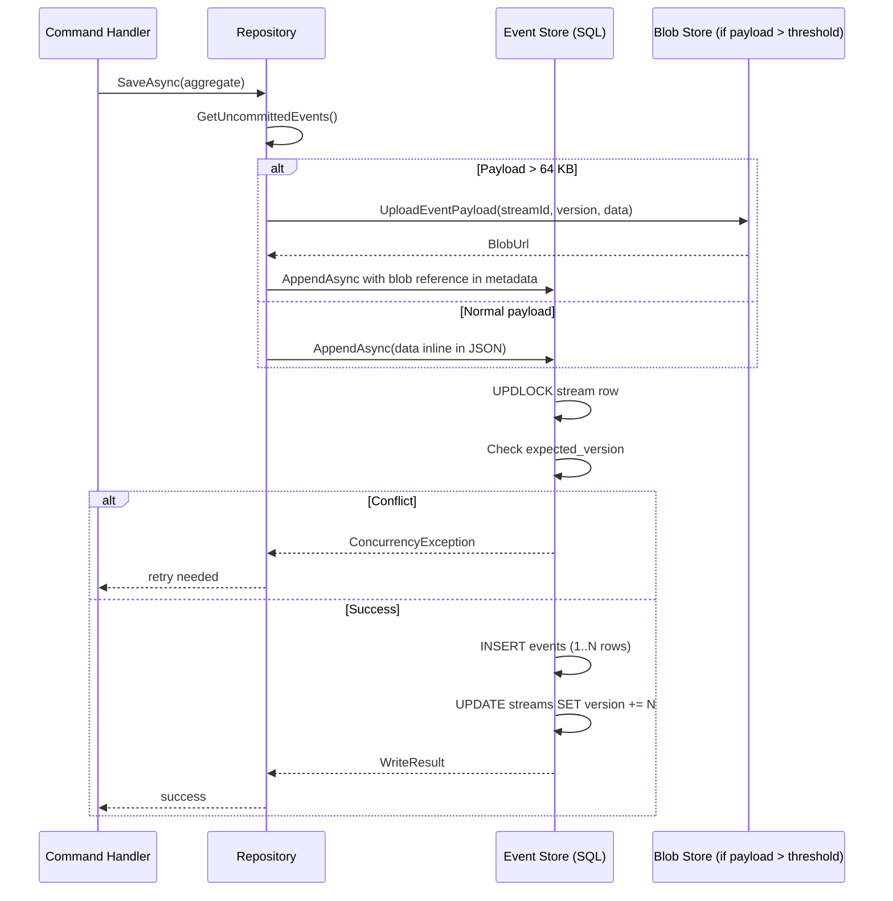

> [!success] Mastery Check
> - [ ] **Studied Well**
> - [ ] **Can explain the concept without notes**
> - [ ] **Can answer interview questions confidently**
> - [ ] **Can implement it in a real project**


# 7.102 — Event Sourcing — Event Store Design

> **Event Store Design** covers the physical and logical schema decisions for persisting an append-only event log: table structure, natural keys, indexing, partitioning, blob offloading, retention, archival, and change-data-capture integration. A well-designed event store is the foundation of any production-grade event-sourced system.

| Property | Value |
|---|---|
| **Group** | `CQRS and Event Sourcing` |
| **Priority** | `2` |
| **Prerequisites** | [[7.101 — Event Sourcing — Events as the Source of Truth]] |
| **Related** | [[7.103 — CQRS — Command Models and Query Models]] · [[7.104 — Event Store Implementation Patterns]] · [[7.106 — Projections and Read Models]] · [[7.115 — Distributed Transactions and the Saga Pattern]] |
| **Version** | `2.0` |
| **Status** | `Complete` |

---

## Table of Contents

1. [Fundamentals and Design Goals](#1-fundamentals-and-design-goals)
2. [Core Table Schema — Events, Streams, Snapshots](#2-core-table-schema--events-streams-snapshots)
3. [Append-Only Schema and Insert-Only / Read-Many Patterns](#3-append-only-schema-and-insert-only--read-many-patterns)
4. [Indexing Strategies](#4-indexing-strategies)
5. [Partitioning for Azure SQL and Cosmos DB](#5-partitioning-for-azure-sql-and-cosmos-db)
6. [Blob Storage for Large Event Payloads](#6-blob-storage-for-large-event-payloads)
7. [Retention Policies and Archival](#7-retention-policies-and-archival)
8. [CDC Integration for Projections](#8-cdc-integration-for-projections)
9. [Pitfalls and Anti-Patterns](#9-pitfalls-and-anti-patterns)
10. [Interview Questions and ADR](#10-interview-questions-and-adr)
11. [Self-Check](#11-self-check)

---

## 1. Fundamentals and Design Goals

### 1.1 What an Event Store Must Do

An event store is a **specialised database** that exposes exactly two write-side operations:

| Operation | Description | SQL Equivalent |
|---|---|---|
| **Append** | Atomically insert one or more events into a stream with an optimistic-concurrency guard | `INSERT` with version check |
| **Read (stream)** | Read all (or a slice of) events for a given stream, in order | `SELECT … WHERE stream_id = @id ORDER BY version` |

There is **no `UPDATE`**, no `DELETE` (except for retention/archival), and no schema-level mutation of recorded facts.

### 1.2 Design Goals

| Goal | Why It Matters |
|---|---|
| **Append throughput** | The store must sustain peak command load; every aggregate mutation is an append |
| **Stream read latency** | Loading an aggregate means reading its entire stream — this must stay under 10–50 ms |
| **Global read scalability** | Projections read the global (interleaved) stream; the store must support ordered scans at scale |
| **Storage efficiency** | Events accumulate forever (or for long retention windows) — storage must tier and compress |
| **Concurrency correctness** | Lost updates are unacceptable; expected-version checks must be serializable |
| **Observability** | Every append should carry metadata (correlation ID, causation ID, user) for tracing |
| **Separation of concerns** | Event payloads (domain data) and infrastructure metadata live in separate columns |

### 1.3 Logical Data Model

```
┌─────────────────────────────────────────────────┐
│                 Event Store                      │
│                                                   │
│  ┌──────────────┐   ┌──────────────┐             │
│  │   Streams    │   │   Events     │             │
│  │──────────────│   │──────────────│             │
│  │ stream_id PK │──→│ stream_id FK │             │
│  │ stream_type  │   │ position PK  │             │
│  │ version      │   │ event_id UQ  │             │
│  │ created_at   │   │ event_type   │             │
│  │ last_updated │   │ data         │─ → Blob     │
│  └──────────────┘   │ metadata     │   Store     │
│                      │ timestamp    │             │
│  ┌──────────────┐   │ correlation  │             │
│  │  Snapshots   │   │ causation    │             │
│  │──────────────│   │ user_id      │             │
│  │ stream_id FK │   └──────────────┘             │
│  │ version PK   │                                │
│  │ state JSONB  │                                │
│  │ captured_at  │                                │
│  └──────────────┘                                │
└─────────────────────────────────────────────────┘
```

---

## 2. Core Table Schema — Events, Streams, Snapshots

### 2.1 Events Table — The Append-Only Log

The `Events` table is the **single source of truth**. Every domain event that ever happened lives here.

```sql
-- Events table — append-only, never updated or deleted outside retention/archival
CREATE TABLE events (
    -- Natural key: (stream_id, stream_position)
    stream_id           NVARCHAR(200)    NOT NULL,
    stream_position     BIGINT           NOT NULL,

    -- Surrogate / business identifiers
    event_id            UNIQUEIDENTIFIER NOT NULL DEFAULT NEWSEQUENTIALID(),

    -- Event type descriptor (used for deserialisation routing)
    event_type          NVARCHAR(200)    NOT NULL,

    -- Payloads (JSON)
    data                NVARCHAR(MAX)    NOT NULL,  -- domain event body
    metadata            NVARCHAR(MAX)    NOT NULL,  -- infrastructure metadata

    -- Temporal & tracing columns
    timestamp           DATETIME2        NOT NULL DEFAULT SYSUTCDATETIME(),
    correlation_id      NVARCHAR(100)    NULL,
    causation_id        NVARCHAR(100)    NULL,
    user_id             NVARCHAR(100)    NULL,

    -- Concurrency guard (row-level, part of PK)
    CONSTRAINT pk_events PRIMARY KEY CLUSTERED (stream_id, stream_position),

    -- Event ID must be globally unique (for idempotency, deduplication)
    CONSTRAINT uq_events_event_id UNIQUE NONCLUSTERED (event_id),

    -- Version must be non-negative
    CONSTRAINT ck_events_stream_position CHECK (stream_position >= 0)
);
```

**Why `(stream_id, stream_position)` as the clustered PK?**

| Reason | Detail |
|---|---|
| **Append locality** | New events for the same stream are inserted physically adjacent — minimises page splits and index fragmentation |
| **Stream reads are range scans** | `SELECT … WHERE stream_id = @id ORDER BY stream_position` is a single clustered-index seek + sequential scan |
| **No hot-spot on a single identity column** | The natural key distributes writes across streams; no last-page contention (though you must still handle high-frequency single-stream writes) |
| **Concurrency check is trivial** | `MAX(stream_position)` or `WHERE stream_position = @expected` is a point-lookup on the PK |

**Column design rationale:**

| Column | Choice | Rationale |
|---|---|---|
| `stream_position` `BIGINT` | 8 bytes, supports 9+ quintillion events per stream | No risk of overflow even at 100k events/sec for centuries |
| `event_id` `UNIQUEIDENTIFIER` | `NEWSEQUENTIALID()` avoids index fragmentation of `NEWID()` | Provides global uniqueness for deduplication |
| `data` `NVARCHAR(MAX)` | JSON — no fixed schema, serializer-independent | Avoids schema-on-write; schema-on-read via event type |
| `metadata` `NVARCHAR(MAX)` | JSON blob for correlation, causation, user, headers | Separates domain data from infrastructure data |
| `timestamp` `DATETIME2` | 7–8 bytes, 100 ns precision | Good enough for ordering; use `SYSUTCDATETIME()` for UTC |
| `correlation_id` / `causation_id` | Indexed for tracing | See [[7.081 — CQRS — Command Query Responsibility Segregation]] |

### 2.2 Streams Table — Stream Metadata

The `Streams` table tracks per-stream metadata and **avoids a `SELECT MAX()` scan** for version checking.

```sql
CREATE TABLE streams (
    stream_id       NVARCHAR(200)    NOT NULL,
    stream_type     NVARCHAR(200)    NOT NULL,   -- e.g. "Order", "Account"
    stream_version  BIGINT           NOT NULL DEFAULT 0,   -- current expected version
    created_at      DATETIME2        NOT NULL DEFAULT SYSUTCDATETIME(),
    last_updated    DATETIME2        NOT NULL DEFAULT SYSUTCDATETIME(),

    CONSTRAINT pk_streams PRIMARY KEY CLUSTERED (stream_id),
    CONSTRAINT ck_streams_stream_version CHECK (stream_version >= 0)
);

-- Index for global stream queries (interleaved across all streams)
CREATE INDEX ix_streams_last_updated ON streams (last_updated DESC)
    INCLUDE (stream_id, stream_type, stream_version);
```

**Why a separate `Streams` table?**

| With separate `Streams` | Without (infer from `Events`) |
|---|---|
| `SELECT stream_version FROM streams WHERE stream_id = @id` — single point lookup, 1–2 ms | `SELECT MAX(stream_position) FROM events WHERE stream_id = @id` — range scan over PK, slower for long streams |
| Atomic `UPDATE streams SET stream_version = @new WHERE stream_id = @id AND stream_version = @expected` | Requires `UPDLOCK, SERIALIZABLE` on events table |
| Explicit stream creation on first event | Stream existence is implicit (first event creates it) |

**Writing the stream record:**

```sql
-- Upsert pattern for first event or subsequent append
CREATE PROCEDURE usp_ensure_stream
    @stream_id      NVARCHAR(200),
    @stream_type    NVARCHAR(200)
AS
BEGIN
    SET NOCOUNT ON;
    SET XACT_ABORT ON;

    MERGE streams AS target
    USING (SELECT @stream_id AS stream_id) AS source
    ON target.stream_id = source.stream_id
    WHEN NOT MATCHED THEN
        INSERT (stream_id, stream_type)
        VALUES (@stream_id, @stream_type);
END;
```

### 2.3 Snapshots Table

Snapshots capture the aggregate state at a given version. They **short-circuit replay** when loading an aggregate.

```sql
CREATE TABLE snapshots (
    stream_id       NVARCHAR(200)    NOT NULL,
    stream_version  BIGINT           NOT NULL,   -- version at which this snapshot was taken
    state           NVARCHAR(MAX)    NOT NULL,   -- serialised aggregate state (JSON)
    captured_at     DATETIME2        NOT NULL DEFAULT SYSUTCDATETIME(),

    CONSTRAINT pk_snapshots PRIMARY KEY CLUSTERED (stream_id, stream_version DESC),

    -- Snapshots reference a valid stream
    CONSTRAINT fk_snapshots_stream
        FOREIGN KEY (stream_id) REFERENCES streams(stream_id)
);

-- Get the latest snapshot for a stream
CREATE INDEX ix_snapshots_latest ON snapshots (stream_id, stream_version DESC);
```

**Snapshot retrieval (latest only):**

```sql
-- Fetch the most recent snapshot
SELECT TOP 1 state, stream_version
FROM snapshots
WHERE stream_id = @stream_id
ORDER BY stream_version DESC;
```

**Snapshot strategy:**

```csharp
public sealed class SnapshotStrategy
{
    /// <summary>Take a snapshot every N events (configurable per aggregate type).</summary>
    public int Frequency { get; init; } = 100;

    /// <summary>Threshold for triggering snapshot based on event-count gap.</summary>
    public bool ShouldTakeSnapshot(long currentVersion, long snapshotVersion)
        => currentVersion - snapshotVersion >= Frequency;

    /// <summary>Maximum age of a snapshot before forced refresh.</summary>
    public TimeSpan? MaxAge { get; init; } = TimeSpan.FromHours(24);
}
```

### 2.4 Entity Framework Core — Event Store DbContext

```csharp
using Microsoft.EntityFrameworkCore;
using Microsoft.EntityFrameworkCore.Metadata.Builders;

public sealed class EventStoreDbContext : DbContext
{
    public DbSet<EventRow> Events => Set<EventRow>();
    public DbSet<StreamRow> Streams => Set<StreamRow>();
    public DbSet<SnapshotRow> Snapshots => Set<SnapshotRow>();

    public EventStoreDbContext(DbContextOptions<EventStoreDbContext> options)
        : base(options) { }

    protected override void OnModelCreating(ModelBuilder modelBuilder)
    {
        modelBuilder.ApplyConfiguration(new EventRowConfig());
        modelBuilder.ApplyConfiguration(new StreamRowConfig());
        modelBuilder.ApplyConfiguration(new SnapshotRowConfig());
    }
}

// ─── Row Entities ────────────────────────────────────────

public sealed class EventRow
{
    public string StreamId { get; set; } = string.Empty;
    public long StreamPosition { get; set; }
    public Guid EventId { get; set; }
    public string EventType { get; set; } = string.Empty;
    public string Data { get; set; } = string.Empty;       // JSON
    public string Metadata { get; set; } = string.Empty;   // JSON
    public DateTime Timestamp { get; set; }
    public string? CorrelationId { get; set; }
    public string? CausationId { get; set; }
    public string? UserId { get; set; }
}

public sealed class StreamRow
{
    public string StreamId { get; set; } = string.Empty;
    public string StreamType { get; set; } = string.Empty;
    public long StreamVersion { get; set; }
    public DateTime CreatedAt { get; set; }
    public DateTime LastUpdated { get; set; }
}

public sealed class SnapshotRow
{
    public string StreamId { get; set; } = string.Empty;
    public long StreamVersion { get; set; }
    public string State { get; set; } = string.Empty;     // JSON
    public DateTime CapturedAt { get; set; }
}

// ─── Fluent Configuration ────────────────────────────────

public sealed class EventRowConfig : IEntityTypeConfiguration<EventRow>
{
    public void Configure(EntityTypeBuilder<EventRow> builder)
    {
        builder.ToTable("events", "es");
        builder.HasKey(e => new { e.StreamId, e.StreamPosition });

        builder.Property(e => e.StreamId).HasMaxLength(200).IsRequired();
        builder.Property(e => e.StreamPosition).IsRequired();
        builder.Property(e => e.EventId).HasDefaultValueSql("NEWSEQUENTIALID()");
        builder.Property(e => e.EventType).HasMaxLength(200).IsRequired();
        builder.Property(e => e.Data).HasColumnType("nvarchar(max)").IsRequired();
        builder.Property(e => e.Metadata).HasColumnType("nvarchar(max)").IsRequired();
        builder.Property(e => e.Timestamp).HasDefaultValueSql("SYSUTCDATETIME()");
        builder.Property(e => e.CorrelationId).HasMaxLength(100);
        builder.Property(e => e.CausationId).HasMaxLength(100);
        builder.Property(e => e.UserId).HasMaxLength(100);

        builder.HasIndex(e => e.EventId).IsUnique();
        builder.HasIndex(e => e.CorrelationId);
        builder.HasIndex(e => e.Timestamp);
    }
}

public sealed class StreamRowConfig : IEntityTypeConfiguration<StreamRow>
{
    public void Configure(EntityTypeBuilder<StreamRow> builder)
    {
        builder.ToTable("streams", "es");
        builder.HasKey(s => s.StreamId);

        builder.Property(s => s.StreamId).HasMaxLength(200).IsRequired();
        builder.Property(s => s.StreamType).HasMaxLength(200).IsRequired();
        builder.Property(s => s.StreamVersion).HasDefaultValue(0);
        builder.Property(s => s.CreatedAt).HasDefaultValueSql("SYSUTCDATETIME()");
        builder.Property(s => s.LastUpdated).HasDefaultValueSql("SYSUTCDATETIME()");

        builder.HasIndex(s => s.LastUpdated);
    }
}

public sealed class SnapshotRowConfig : IEntityTypeConfiguration<SnapshotRow>
{
    public void Configure(EntityTypeBuilder<SnapshotRow> builder)
    {
        builder.ToTable("snapshots", "es");
        builder.HasKey(s => new { s.StreamId, s.StreamVersion });

        builder.Property(s => s.StreamId).HasMaxLength(200).IsRequired();
        builder.Property(s => s.StreamVersion).IsRequired();
        builder.Property(s => s.State).HasColumnType("nvarchar(max)").IsRequired();
        builder.Property(s => s.CapturedAt).HasDefaultValueSql("SYSUTCDATETIME()");

        builder.HasIndex(s => new { s.StreamId, s.StreamVersion });
    }
}
```

---

## 3. Append-Only Schema and Insert-Only / Read-Many Patterns

### 3.1 The Golden Rule: Insert-Only, Never Update

Event store schema is fundamentally **insert-only**. Every operation is an `INSERT` into the `events` table. There is:

- No `UPDATE events SET data = @newData`
- No `DELETE FROM events WHERE stream_id = @id`
- No `ALTER COLUMN` on event payloads (schema-on-read)

The only exceptions are **retention** (expired-event deletion) and **archival** (move to cold storage) — see Section 7.

### 3.2 Atomic Append — Stored Procedure (SQL Server)

```sql
CREATE TYPE dbo.EventTableType AS TABLE (
    sequence        INT              NOT NULL,   -- ordinal within the batch
    event_id        UNIQUEIDENTIFIER NOT NULL,
    event_type      NVARCHAR(200)    NOT NULL,
    data            NVARCHAR(MAX)    NOT NULL,
    correlation_id  NVARCHAR(100)    NULL,
    causation_id    NVARCHAR(100)    NULL,
    user_id         NVARCHAR(100)    NULL
);
```

```sql
CREATE PROCEDURE es.usp_append_to_stream
    @stream_id          NVARCHAR(200),
    @stream_type        NVARCHAR(200),
    @expected_version   BIGINT,            -- -1 = Any, 0 = NoStream, -2 = StreamExists
    @events             dbo.EventTableType READONLY,
    @metadata_template  NVARCHAR(MAX)      = '{}'
AS
BEGIN
    SET NOCOUNT ON;
    SET XACT_ABORT ON;

    DECLARE @actual_version BIGINT;
    DECLARE @new_version   BIGINT;
    DECLARE @now           DATETIME2 = SYSUTCDATETIME();

    BEGIN TRANSACTION;

    -- Lock the stream row for the duration of the append (prevents phantom inserts)
    SELECT @actual_version = stream_version
    FROM es.streams WITH (UPDLOCK, ROWLOCK, SERIALIZABLE)
    WHERE stream_id = @stream_id;

    -- ── Concurrency check ────────────────────────────────────────
    IF @expected_version = 0 AND @actual_version IS NOT NULL
        THROW 51001, 'StreamAlreadyExists', 1;
    IF @expected_version = -2 AND @actual_version IS NULL
        THROW 51002, 'StreamNotFound', 1;
    IF @expected_version >= 0 AND @actual_version IS NULL
        THROW 51002, 'StreamNotFound', 1;
    IF @expected_version >= 0 AND @actual_version != @expected_version
        THROW 51003, 'ConcurrencyConflict', 1;

    -- ── Create stream if not exists ─────────────────────────────
    IF @actual_version IS NULL
    BEGIN
        INSERT INTO es.streams (stream_id, stream_type, stream_version, created_at, last_updated)
        VALUES (@stream_id, @stream_type, 0, @now, @now);

        SET @actual_version = 0;
    END;

    -- ── Insert events ───────────────────────────────────────────
    SET @new_version = @actual_version;

    INSERT INTO es.events (stream_id, stream_position, event_id, event_type, data, metadata, timestamp, correlation_id, causation_id, user_id)
    SELECT
        @stream_id,
        @new_version + e.sequence,
        e.event_id,
        e.event_type,
        e.data,
        @metadata_template,
        DATEADD(ms, e.sequence, @now),   -- ensure unique timestamps within batch
        e.correlation_id,
        e.causation_id,
        e.user_id
    FROM @events e
    ORDER BY e.sequence;

    SET @new_version = @new_version + (SELECT COUNT(*) FROM @events);

    -- ── Update stream metadata ──────────────────────────────────
    UPDATE es.streams
    SET stream_version = @new_version,
        last_updated = @now
    WHERE stream_id = @stream_id;

    COMMIT TRANSACTION;

    -- Return current version for client-side cache update
    SELECT @new_version AS NewStreamVersion;
END;
```

**Why `UPDLOCK, ROWLOCK, SERIALIZABLE`?**

| Lock hint | Purpose |
|---|---|
| `UPDLOCK` | Takes update lock (prevents deadlocks with concurrent readers) |
| `ROWLOCK` | Prevents lock escalation to page/table level |
| `SERIALIZABLE` | Range lock — prevents phantom inserts (another session inserting between check and write) |

### 3.3 EF Core — Append Implementation

```csharp
public sealed class EfCoreEventStore : IEventStore<string>
{
    private readonly EventStoreDbContext _db;
    private readonly IEventSerializer _serializer;

    public EfCoreEventStore(EventStoreDbContext db, IEventSerializer serializer)
    {
        _db = db;
        _serializer = serializer;
    }

    public async Task<IWriteResult> AppendAsync(
        string aggregateId,
        ExpectedStreamVersion expectedVersion,
        IReadOnlyList<object> events,
        CancellationToken ct = default)
    {
        await using var tx = await _db.Database
            .BeginTransactionAsync(System.Data.IsolationLevel.Serializable, ct);

        // 1. Load current stream version (with UPDLOCK via EF raw SQL)
        var stream = await _db.Streams
            .FromSqlRaw(
                "SELECT * FROM es.streams WITH (UPDLOCK, ROWLOCK, SERIALIZABLE) WHERE stream_id = {0}",
                aggregateId)
            .FirstOrDefaultAsync(ct);

        var actualVersion = stream?.StreamVersion ?? 0;
        var isNew = stream is null;

        // 2. Concurrency check
        if (expectedVersion.Value == ExpectedStreamVersion.EmptyStream.Value && stream is not null)
            throw new ConcurrencyException(aggregateId, 0, actualVersion);
        if (expectedVersion.Value == ExpectedStreamVersion.StreamExists.Value && stream is null)
            throw new ConcurrencyException(aggregateId, long.MaxValue, -1);
        if (expectedVersion.Value >= 0 && actualVersion != expectedVersion.Value)
            throw new ConcurrencyException(aggregateId, expectedVersion.Value, actualVersion);

        // 3. Create stream row if first event
        if (isNew)
        {
            stream = new StreamRow
            {
                StreamId = aggregateId,
                StreamType = ResolveStreamType(events[0]),
                StreamVersion = 0
            };
            _db.Streams.Add(stream);
        }

        // 4. Append events
        var now = DateTime.UtcNow;
        var eventRows = events.Select((e, i) => new EventRow
        {
            StreamId = aggregateId,
            StreamPosition = actualVersion + i + 1,
            EventId = Guid.NewGuid(),
            EventType = e.GetType().Name,
            Data = _serializer.Serialize(e),
            Metadata = _serializer.Serialize(new EventMetadata(
                EventId: Guid.NewGuid(),
                EventType: e.GetType().Name,
                StreamPosition: actualVersion + i + 1,
                Timestamp: now,
                CorrelationId: "",
                CausationId: "",
                UserId: null,
                Headers: null)),
            Timestamp = now.AddMilliseconds(i),
            CorrelationId = null,
            CausationId = null,
            UserId = null
        }).ToList();

        _db.Events.AddRange(eventRows);

        // 5. Update stream version
        stream!.StreamVersion = actualVersion + events.Count;
        stream.LastUpdated = now;

        await _db.SaveChangesAsync(ct);
        await tx.CommitAsync(ct);

        return new WriteResult(stream.StreamVersion);
    }

    private static string ResolveStreamType(object @event)
    {
        // Convention: event type full name → aggregate type
        var eventTypeName = @event.GetType().Name;
        return eventTypeName
            .Replace("Planned", "")
            .Replace("Added", "")
            .Replace("Removed", "")
            .Replace("Adjusted", "")
            .Replace("Confirmed", "")
            .Replace("Received", "")
            .Replace("Shipped", "")
            .Replace("Delivered", "")
            .Replace("Cancelled", "");
    }
}
```

### 3.4 Read-Many — Stream and Global Read Patterns

```csharp
public sealed class EfCoreEventStoreReader
{
    private readonly EventStoreDbContext _db;
    private readonly IEventSerializer _serializer;

    public EfCoreEventStoreReader(EventStoreDbContext db, IEventSerializer serializer)
    {
        _db = db;
        _serializer = serializer;
    }

    /// <summary>Read entire stream forward.</summary>
    public async Task<IReadOnlyList<object>> ReadStreamAsync(
        string streamId, CancellationToken ct = default)
    {
        var rows = await _db.Events
            .Where(e => e.StreamId == streamId)
            .OrderBy(e => e.StreamPosition)
            .AsNoTracking()
            .ToListAsync(ct);

        return rows.Select(r => _serializer.Deserialize(r.Data, r.EventType)).ToList();
    }

    /// <summary>Read stream slice from a given version.</summary>
    public async Task<StreamSlice> ReadStreamSliceAsync(
        string streamId, int fromVersion, int maxCount, CancellationToken ct = default)
    {
        var rows = await _db.Events
            .Where(e => e.StreamId == streamId && e.StreamPosition >= fromVersion)
            .OrderBy(e => e.StreamPosition)
            .Take(maxCount)
            .AsNoTracking()
            .ToListAsync(ct);

        var events = rows.Select(r => _serializer.Deserialize(r.Data, r.EventType)).ToList();
        var next = rows.Count > 0
            ? rows[^1].StreamPosition + 1
            : fromVersion;

        return new StreamSlice(events, fromVersion, next);
    }

    /// <summary>Read global stream (all events, interleaved).</summary>
    public async IAsyncEnumerable<EventEnvelope> ReadGlobalAsync(
        GlobalPosition from, CancellationToken ct = default)
    {
        var pageSize = 1000;
        var lastSeq = from.Value;

        while (true)
        {
            var rows = await _db.Events
                .Where(e => e.StreamPosition > lastSeq)  // Note: this is per-stream position, not global
                .OrderBy(e => e.Timestamp)
                .ThenBy(e => e.EventId)
                .Take(pageSize)
                .AsNoTracking()
                .ToListAsync(ct);

            if (rows.Count == 0) yield break;

            foreach (var row in rows)
            {
                var data = _serializer.Deserialize(row.Data, row.EventType);
                var meta = _serializer.Deserialize<EventMetadata>(row.Metadata);
                yield return new EventEnvelope(data, meta with
                {
                    StreamPosition = row.StreamPosition,
                    Timestamp = row.Timestamp
                });
            }

            // In production, track global position via a dedicated sequence or
            // use a timestamp+eventId cursor instead of per-stream position.
            lastSeq = rows[^1].StreamPosition;

            if (rows.Count < pageSize) yield break;
        }
    }
}
```

**Important:** A true global stream requires a **global, monotonically increasing sequence** — not per-stream `stream_position`. Options:

| Approach | Mechanism | Trade-off |
|---|---|---|
| **`SEQUENCE` object** | SQL Server `CREATE SEQUENCE es.global_seq` | Single point of contention at high throughput; cached values (CACHE 1000) reduce contention |
| **Timestamp + EventId cursor** | `ORDER BY timestamp, event_id` + `WHERE (timestamp, event_id) > (@lastTs, @lastId)` | Page splits can reorder events; adequate for eventually-consistent projections |
| **Dedicated global log table** | Separate `global_events` table with `IDENTITY BIGINT` PK; insert via trigger | Double-write overhead; exactly-once semantics |
| **EventStoreDB $all stream** | Built-in global ordering | Proprietary; no custom schema control |

### 3.5 Mermaid Diagram — Append-Only Write Path



---

## 4. Indexing Strategies

### 4.1 Indexes Required for Core Operations

| Query Pattern | Index | Type | Columns | Includes |
|---|---|---|---|---|
| Stream read (range scan) | `pk_events` (clustered) | Clustered | `stream_id, stream_position` | — |
| Event lookup by ID | `uq_events_event_id` | Unique nonclustered | `event_id` | — |
| Global stream (`$all`) | `ix_events_global` | Nonclustered | `timestamp, event_id` | `stream_id, stream_position, event_type` |
| Correlation tracing | `ix_events_correlation` | Nonclustered | `correlation_id` | `stream_id, stream_position, event_type, timestamp` |
| Causation tracing | `ix_events_causation` | Nonclustered | `causation_id` | `stream_id, stream_position, event_type, timestamp` |
| Stream metadata lookup | `pk_streams` (clustered) | Clustered | `stream_id` | — |
| Stream list (global) | `ix_streams_last_updated` | Nonclustered | `last_updated DESC` | `stream_id, stream_type, stream_version` |
| Latest snapshot | `ix_snapshots_latest` | Nonclustered | `stream_id, stream_version DESC` | `state` |

### 4.2 Global Stream Index Design

The global stream index must support **ordered iteration by append order**:

```sql
-- Global stream index: ordered by (timestamp, event_id)
-- INCLUDE covers the most common query columns without key lookup
CREATE INDEX ix_events_global ON events (timestamp, event_id)
    INCLUDE (stream_id, stream_position, event_type, data, metadata)
    WHERE data IS NOT NULL;   -- filtered index: only rows with payload
```

**Why `(timestamp, event_id)` and not `(stream_position)` alone?**

| Argument | Counter-argument |
|---|---|
| `stream_position` is per-stream, not global | Correct — you must use a global ordering column |
| `timestamp` has duplicates | `event_id` as tie-breaker ensures total order |
| `NEWSEQUENTIALID()` is monotonically increasing | Guarantees physical order matches logical order within the same timestamp |

**Alternative: Global Sequence Object**

```sql
CREATE SEQUENCE es.global_seq
    AS BIGINT
    START WITH 1
    INCREMENT BY 1
    CACHE 1000;   -- cache to reduce contention

-- Add global_position column to events table (populated during insert)
ALTER TABLE events ADD global_position BIGINT NULL;

CREATE UNIQUE INDEX ix_events_global_seq ON events (global_position)
    WHERE global_position IS NOT NULL;
```

### 4.3 Covering Indexes vs Included Columns

| Strategy | SQL Server syntax | Use case |
|---|---|---|
| **Covering (INCLUDE)** | `CREATE INDEX … INCLUDE (col1, col2)` | Avoid key lookup for queries that select specific columns |
| **Key column** | `CREATE INDEX … (col1, col2)` | Columns used in WHERE, JOIN, ORDER BY |
| **Filtered index** | `CREATE INDEX … WHERE col IS NOT NULL` | Smaller index for sparse data (e.g., non-null correlation_id) |

```sql
-- Example: filtered index for correlation lookups
CREATE INDEX ix_events_correlation_filtered ON events (correlation_id)
    INCLUDE (stream_id, stream_position, event_type, timestamp)
    WHERE correlation_id IS NOT NULL;
```

### 4.4 Index Maintenance

| Index | Maintenance | Frequency |
|---|---|---|
| Clustered PK `(stream_id, stream_position)` | REBUILD/REORGANIZE | Weekly or at 30% fragmentation |
| `ix_events_global` | REORGANIZE (online) | Monthly |
| `ix_events_correlation` | Minimal fragmentation (sequential IDs) | Quarterly |
| `ix_streams_last_updated` | REORGANIZE | Monthly |

```sql
-- Check fragmentation
SELECT
    s.name AS schema_name,
    t.name AS table_name,
    i.name AS index_name,
    ips.avg_fragmentation_in_percent
FROM sys.dm_db_index_physical_stats(
    DB_ID(), NULL, NULL, NULL, 'LIMITED') ips
JOIN sys.indexes i ON ips.object_id = i.object_id AND ips.index_id = i.index_id
JOIN sys.tables t ON i.object_id = t.object_id
JOIN sys.schemas s ON t.schema_id = s.schema_id
WHERE ips.avg_fragmentation_in_percent > 10
ORDER BY ips.avg_fragmentation_in_percent DESC;
```

### 4.5 Avoiding the "Hot Spot" Index Problem

When using an auto-increment `BIGINT IDENTITY` as the clustered key, the last page of the index becomes a hot spot under concurrent inserts. The `(stream_id, stream_position)` natural key **distributes** writes across many pages, but a single high-frequency stream (e.g., a global `$all` stream) can still cause contention.

| Solution | Mechanism | Performance impact |
|---|---|---|
| **Hash partitioning** by `stream_id` | Place events on different physical files | Eliminates last-page contention at the cost of cross-partition queries |
| **Application-level batching** | Append 10–100 events per batch | Reduces lock duration |
| **Memory-optimized table** for hot streams | SQL Server `MEMORY_OPTIMIZED` table | Dramatically reduces latch contention; some feature restrictions |
| **Use `NEWSEQUENTIALID()`** for global ordering | Sequential GUID as global key | Reduces fragmentation compared to `NEWID()` |

---

## 5. Partitioning for Azure SQL and Cosmos DB

### 5.1 Azure SQL Database — Table Partitioning

Table partitioning splits the `Events` table across physical filegroups based on a partition key. This enables **partition-elimination queries**, **incremental archival**, and **sliding-window retention**.

```sql
-- 1. Create partition function (daily or monthly ranges)
CREATE PARTITION FUNCTION pf_events_date (DATETIME2)
AS RANGE RIGHT FOR VALUES (
    '2025-01-01', '2025-02-01', '2025-03-01', '2025-04-01',
    '2025-05-01', '2025-06-01', '2025-07-01', '2025-08-01',
    '2025-09-01', '2025-10-01', '2025-11-01', '2025-12-01',
    '2026-01-01', '2026-02-01', '2026-03-01', '2026-04-01',
    '2026-05-01', '2026-06-01', '2026-07-01', '2026-08-01',
    '2026-09-01', '2026-10-01', '2026-11-01', '2026-12-01'
);

-- 2. Create partition scheme mapping to filegroups
CREATE PARTITION SCHEME ps_events_date
AS PARTITION pf_events_date
ALL TO ([PRIMARY]);   -- In production, map to separate filegroups per month

-- 3. Create partitioned events table
CREATE TABLE es.events_partitioned (
    stream_id           NVARCHAR(200)    NOT NULL,
    stream_position     BIGINT           NOT NULL,
    event_id            UNIQUEIDENTIFIER NOT NULL,
    event_type          NVARCHAR(200)    NOT NULL,
    data                NVARCHAR(MAX)    NOT NULL,
    metadata            NVARCHAR(MAX)    NOT NULL,
    timestamp           DATETIME2        NOT NULL,
    correlation_id      NVARCHAR(100)    NULL,
    causation_id        NVARCHAR(100)    NULL,
    user_id             NVARCHAR(100)    NULL,

    CONSTRAINT pk_events_partitioned PRIMARY KEY CLUSTERED (stream_id, stream_position, timestamp)
) ON ps_events_date(timestamp);

-- 4. Aligned index on the same partition scheme
CREATE INDEX ix_events_partitioned_global
    ON es.events_partitioned (timestamp, event_id)
    INCLUDE (stream_id, stream_position, event_type)
    ON ps_events_date(timestamp);
```

**Benefits of date-based partitioning:**

| Benefit | Detail |
|---|---|
| **Sliding-window retention** | `TRUNCATE TABLE` on a partition is a metadata-only operation — instant drop of old data |
| **Partition-elimination queries** | Queries with `WHERE timestamp >= @start AND timestamp < @end` scan only relevant partitions |
| **Incremental archival** | `SWITCH PARTITION` to an archive table, then move to blob storage |
| **Parallel I/O** | Each partition can reside on a separate filegroup/disk |

**Partition switching for archival:**

```sql
-- 1. Create an archive table with identical schema
CREATE TABLE es.events_archive (
    stream_id           NVARCHAR(200)    NOT NULL,
    stream_position     BIGINT           NOT NULL,
    event_id            UNIQUEIDENTIFIER NOT NULL,
    event_type          NVARCHAR(200)    NOT NULL,
    data                NVARCHAR(MAX)    NOT NULL,
    metadata            NVARCHAR(MAX)    NOT NULL,
    timestamp           DATETIME2        NOT NULL,
    correlation_id      NVARCHAR(100)    NULL,
    causation_id        NVARCHAR(100)    NULL,
    user_id             NVARCHAR(100)    NULL,

    CONSTRAINT pk_events_archive PRIMARY KEY CLUSTERED (stream_id, stream_position, timestamp)
) ON [PRIMARY];

-- 2. Switch the oldest partition to archive table
ALTER TABLE es.events_partitioned
    SWITCH PARTITION 1 TO es.events_archive;

-- 3. Truncate the archive (or move to blob storage)
TRUNCATE TABLE es.events_archive;
```

### 5.2 Azure Cosmos DB — Container Design for Event Sourcing

Cosmos DB is a **document database with a change feed** — a natural fit for event sourcing when you don't want to manage SQL Server infrastructure.

**Core design decisions:**

| Decision | Recommendation | Rationale |
|---|---|---|
| **Partition key** | `/streamId` | All events for a stream reside in one physical partition; range queries over stream_position are efficient |
| **Document model** | One document per event (or per batch) | Simple, aligns with append pattern |
| **ID** | `{stream_position}-{eventId}` | Uniqueness within partition |
| **Change feed** | Poll the `_etag`-based change feed for projections | Built-in CDC; no need for triggers or outbox |
| **TTL** | Event-level TTL for automatic expiry | Retention enforcement without custom jobs |
| **Throughput** | Autoscale or manual 10,000+ RU/s for production | Event sourcing is write-heavy; each append consumes RU |

```csharp
// Cosmos DB container setup for event sourcing
using Microsoft.Azure.Cosmos;

public sealed class CosmosEventStore : IEventStore<string>
{
    private readonly Container _container;
    private readonly IEventSerializer _serializer;

    public CosmosEventStore(CosmosClient client, string databaseName, string containerName)
    {
        _container = client.GetContainer(databaseName, containerName);
    }

    public async Task<IWriteResult> AppendAsync(
        string aggregateId,
        ExpectedStreamVersion expectedVersion,
        IReadOnlyList<object> events,
        CancellationToken ct = default)
    {
        // Read current stream metadata via point read
        var streamMetaId = $"meta-{aggregateId}";
        StreamMetadata meta;

        try
        {
            var metaResponse = await _container.ReadItemAsync<StreamMetadata>(
                streamMetaId, new PartitionKey(aggregateId), cancellationToken: ct);
            meta = metaResponse.Resource;
        }
        catch (CosmosException ex) when (ex.StatusCode == System.Net.HttpStatusCode.NotFound)
        {
            meta = new StreamMetadata
            {
                Id = streamMetaId,
                StreamId = aggregateId,
                StreamVersion = 0,
                StreamType = ResolveStreamType(events[0])
            };
        }

        var currentVersion = meta.StreamVersion;

        // Concurrency check
        if (expectedVersion.Value == ExpectedStreamVersion.EmptyStream.Value && currentVersion > 0)
            throw new ConcurrencyException(aggregateId, 0, currentVersion);
        if (expectedVersion.Value == ExpectedStreamVersion.StreamExists.Value && currentVersion == 0)
            throw new ConcurrencyException(aggregateId, long.MaxValue, -1);
        if (expectedVersion.Value >= 0 && currentVersion != expectedVersion.Value)
            throw new ConcurrencyException(aggregateId, expectedVersion.Value, currentVersion);

        // Batch transaction: append events + update metadata
        var batch = _container.CreateTransactionalBatch(new PartitionKey(aggregateId));

        var now = DateTime.UtcNow;
        var pos = currentVersion;

        foreach (var (ev, i) in events.Select((e, i) => (e, i)))
        {
            var eventDoc = new EventDocument
            {
                Id = $"{pos + i + 1:D10}-{Guid.NewGuid():N}",
                StreamId = aggregateId,
                StreamPosition = pos + i + 1,
                EventId = Guid.NewGuid(),
                EventType = ev.GetType().Name,
                Data = _serializer.Serialize(ev),
                Timestamp = now.AddMilliseconds(i),
                CorrelationId = null,
                CausationId = null,
                UserId = null,
                Ttl = 7776000  // 90 days in seconds
            };

            // Use optimistic concurrency via IfMatch on etag (precondition)
            batch.CreateItem(eventDoc);
        }

        // Upsert metadata with version bump
        meta.StreamVersion = pos + events.Count;
        batch.UpsertItem(meta, new TransactionalBatchItemRequestOptions
        {
            IfMatchEtag = meta.Etag  // optimistic concurrency on metadata doc
        });

        using var response = await batch.ExecuteAsync(ct);
        if (!response.IsSuccessStatusCode)
        {
            var failure = response.GetErrorMessage();
            throw new ConcurrencyException(aggregateId, expectedVersion.Value, currentVersion);
        }

        return new WriteResult(meta.StreamVersion);
    }

    public async IAsyncEnumerable<object> ReadStreamAsync(
        string aggregateId,
        StreamReadDirection direction = StreamReadDirection.Forward,
        CancellationToken ct = default)
    {
        var query = new QueryDefinition(
            "SELECT * FROM c WHERE c.streamId = @streamId AND c.streamPosition >= 0 " +
            "ORDER BY c.streamPosition " + (direction == StreamReadDirection.Forward ? "ASC" : "DESC"))
            .WithParameter("@streamId", aggregateId);

        using var iterator = _container.GetItemQueryIterator<EventDocument>(query);
        while (iterator.HasMoreResults)
        {
            var page = await iterator.ReadNextAsync(ct);
            foreach (var doc in page)
            {
                yield return _serializer.Deserialize(doc.Data, doc.EventType);
            }
        }
    }

    // ─── Document Types ─────────────────────────────────────

    private sealed class EventDocument
    {
        public string Id { get; set; } = "";
        public string StreamId { get; set; } = "";
        public long StreamPosition { get; set; }
        public Guid EventId { get; set; }
        public string EventType { get; set; } = "";
        public string Data { get; set; } = "";
        public DateTime Timestamp { get; set; }
        public string? CorrelationId { get; set; }
        public string? CausationId { get; set; }
        public string? UserId { get; set; }
        public int Ttl { get; set; }
        // Partition key (must be populated)
        public string PartitionKey => StreamId;
    }

    private sealed class StreamMetadata
    {
        public string Id { get; set; } = "";
        public string StreamId { get; set; } = "";
        public long StreamVersion { get; set; }
        public string StreamType { get; set; } = "";
        public string Etag { get; set; } = "";
    }
}
```

**Cosmos DB container creation (manual):**

```csharp
public async Task<Container> CreateEventStoreContainerAsync(CosmosClient client)
{
    var database = await client.CreateDatabaseIfNotExistsAsync("eventstore", ThroughputProperties.CreateAutoscaleThroughput(10000));

    var containerProperties = new ContainerProperties
    {
        Id = "events",
        PartitionKeyPath = "/streamId",
        DefaultTimeToLive = 7776000,  // 90 days (can be overridden per item)
        IndexingPolicy = new IndexingPolicy
        {
            IndexingMode = IndexingMode.Lazy,  // Write-optimised; no query on event body
            IncludedPaths = { new IncludedPath { Path = "/streamId/?" } },
            ExcludedPaths = { new ExcludedPath { Path = "/data/*" } }  // Don't index event payload
        }
    };

    return await database.CreateContainerIfNotExistsAsync(containerProperties);
}
```

### 5.3 Partition Key Selection — Decision Matrix

| Partition Key | Pros | Cons | Best for |
|---|---|---|---|
| **`/streamId`** | All events for a stream in same partition; stream reads are cross-partition-query free | Single partition throughput capped at 10k RU/s; a hot stream can throttle | Low-to-medium per-stream throughput (< 1000 events/sec per stream) |
| **`/streamType`** | Distributes load across more partitions | Stream reads become fan-out queries; ordering across partitions is expensive | Systems with many small, low-throughput streams |
| **`/date` (daily/monthly)** | Even distribution; easy retention | All events for a stream are scattered; stream reads are fan-out | Global-stream-first systems (analytics, audit) |
| **Hash of `streamId`** | Uniform distribution; avoids hot spots | Stream reads still limited to one partition (good) | High-throughput, many-stream systems |

**Recommendation: Use `/streamId` for event sourcing.** Stream reads must be fast, and the partition key is the only dimension you can guarantee in a read query.

---

## 6. Blob Storage for Large Event Payloads

### 6.1 Problem: `NVARCHAR(MAX)` Size Limits

Event payloads can exceed reasonable database column sizes:

| Scenario | Typical payload size |
|---|---|
| Order placed (standard) | 2–5 KB |
| Document uploaded | 50 KB – 10 MB |
| Image metadata + thumbnail | 100 KB – 5 MB |
| Bulk import record | 500 KB – 50 MB |
| Binary attachment | 1 MB – 100 MB |

SQL Server `NVARCHAR(MAX)` supports up to 2 GB, but large in-row values degrade:

- **Page density**: A single row with 500 KB forces row-overflow storage, increasing I/O
- **Buffer pool pressure**: Large values evict other pages from memory
- **Backup/restore time**: Storing blobs in the database increases backup size
- **Index maintenance**: Non-clustered index rebuilds must read the large column

### 6.2 Solution: Blob Offload Pattern

Store the **payload in Azure Blob Storage** (or S3, GCS) and keep a **reference + content hash** in the events table.

```sql
-- Add blob storage columns to events table
ALTER TABLE events ADD
    blob_url        NVARCHAR(500)   NULL,    -- URL to blob (if payload > threshold)
    blob_hash       NVARCHAR(128)   NULL,    -- SHA-256 of the payload (for integrity check)
    content_type    NVARCHAR(100)   NULL,    -- "application/json", "application/octet-stream"
    content_length  BIGINT          NULL;    -- uncompressed byte count
```

```csharp
public interface IEventBlobStore
{
    Task<Uri> UploadAsync(
        string streamId,
        long streamPosition,
        Stream payload,
        string contentType,
        CancellationToken ct = default);

    Task<Stream> DownloadAsync(
        Uri blobUrl,
        CancellationToken ct = default);

    Task DeleteAsync(
        Uri blobUrl,
        CancellationToken ct = default);
}

public sealed class AzureBlobEventStore : IEventBlobStore
{
    private readonly BlobContainerClient _container;
    private const long ThresholdBytes = 64 * 1024;  // 64 KB

    public AzureBlobEventStore(string connectionString, string containerName)
    {
        var service = new BlobServiceClient(connectionString);
        _container = service.GetBlobContainerClient(containerName);
        _container.CreateIfNotExists();
    }

    public async Task<Uri> UploadAsync(
        string streamId,
        long streamPosition,
        Stream payload,
        string contentType,
        CancellationToken ct = default)
    {
        var blobName = $"{SanitizeStreamId(streamId)}/{streamPosition:D10}.json";
        var blob = _container.GetBlobClient(blobName);

        var headers = new BlobHttpHeaders
        {
            ContentType = contentType,
            ContentDisposition = $"attachment; filename=\"{blobName}\""
        };

        await blob.UploadAsync(payload, headers, cancellationToken: ct);
        return blob.Uri;
    }

    public async Task<Stream> DownloadAsync(Uri blobUrl, CancellationToken ct = default)
    {
        var blob = new BlobClient(blobUrl);
        var response = await blob.DownloadAsync(ct);
        return response.Value.Content;
    }

    public async Task DeleteAsync(Uri blobUrl, CancellationToken ct = default)
    {
        var blob = new BlobClient(blobUrl);
        await blob.DeleteIfExistsAsync(cancellationToken: ct);
    }

    private static string SanitizeStreamId(string streamId)
        => streamId.Replace('\\', '/').Replace("..", "");  // prevent path traversal
}
```

### 6.3 Integrated Append with Blob Offload

```csharp
public sealed class TieredEventStore : IEventStore<string>
{
    private readonly EfCoreEventStore _sqlStore;
    private readonly IEventBlobStore _blobStore;
    private readonly IEventSerializer _serializer;
    private const long ThresholdBytes = 64 * 1024;

    public TieredEventStore(
        EfCoreEventStore sqlStore,
        IEventBlobStore blobStore,
        IEventSerializer serializer)
    {
        _sqlStore = sqlStore;
        _blobStore = blobStore;
        _serializer = serializer;
    }

    public async Task<IWriteResult> AppendAsync(
        string aggregateId,
        ExpectedStreamVersion expectedVersion,
        IReadOnlyList<object> events,
        CancellationToken ct = default)
    {
        // Decorate events with blob metadata where needed
        var decoratedEvents = new List<object>();
        foreach (var ev in events)
        {
            var json = _serializer.Serialize(ev);
            var bytes = Encoding.UTF8.GetBytes(json);

            if (bytes.Length > ThresholdBytes)
            {
                using var stream = new MemoryStream(bytes);
                var blobUrl = await _blobStore.UploadAsync(
                    aggregateId,
                    0,  // position unknown until append
                    stream,
                    "application/json",
                    ct);

                // Wrap the event in a blob-reference envelope
                decoratedEvents.Add(new BlobStoredEvent
                {
                    EventType = ev.GetType().Name,
                    BlobUrl = blobUrl.ToString(),
                    ContentHash = ComputeSha256(bytes),
                    ContentLength = bytes.Length,
                    ContentType = "application/json"
                });
            }
            else
            {
                decoratedEvents.Add(ev);
            }
        }

        // Delegate to SQL store for concurrency check + append
        // (In production, the blob URL is stored in the metadata column or a dedicated column)
        return await _sqlStore.AppendAsync(aggregateId, expectedVersion, decoratedEvents, ct);
    }

    public async IAsyncEnumerable<object> ReadStreamAsync(
        string aggregateId,
        StreamReadDirection direction = StreamReadDirection.Forward,
        CancellationToken ct = default)
    {
        // In production: read from SQL, check blob_url column, fetch from blob if present
        var events = await _sqlStore.ReadStreamAsync(aggregateId, direction, ct);
        foreach (var ev in events)
        {
            if (ev is BlobStoredEvent blobRef)
            {
                var blobStream = await _blobStore.DownloadAsync(new Uri(blobRef.BlobUrl), ct);
                using var reader = new StreamReader(blobStream);
                var json = await reader.ReadToEndAsync(ct);
                var type = Type.GetType($"Domain.Events.{blobRef.EventType}, Domain")!;
                yield return _serializer.Deserialize(json, blobRef.EventType);
            }
            else
            {
                yield return ev;
            }
        }
    }

    private static string ComputeSha256(byte[] data)
    {
        var hash = System.Security.Cryptography.SHA256.HashData(data);
        return Convert.ToHexString(hash).ToLowerInvariant();
    }
}

// Blob-reference envelope (stored in SQL data column for large payloads)
public sealed record BlobStoredEvent
{
    public required string EventType { get; init; }
    public required string BlobUrl { get; init; }
    public required string ContentHash { get; init; }
    public required long ContentLength { get; init; }
    public required string ContentType { get; init; }
}
```

### 6.4 Blob Storage Lifecycle and Cost

| Storage tier | Cost/GB/month | Access latency | Retention use |
|---|---|---|---|
| **Hot** | ~$0.018 | 1–5 ms | Events < 90 days |
| **Cool** | ~$0.010 | 15–30 ms | Events 90–365 days |
| **Cold** | ~$0.004 | 15–60 sec | Events 1–7 years |
| **Archive** | ~$0.001 | 1–15 hours (rehydrate) | Events > 7 years / compliance archival |

```csharp
// Set blob tier based on event age
public async Task ApplyRetentionPolicyAsync(BlobClient blob, DateTime eventTimestamp)
{
    var age = DateTime.UtcNow - eventTimestamp;

    var tier = age.TotalDays switch
    {
        <= 90 => AccessTier.Hot,
        <= 365 => AccessTier.Cool,
        <= 7 * 365 => AccessTier.Cold,
        _ => AccessTier.Archive
    };

    await blob.SetAccessTierAsync(tier);
}
```

---

## 7. Retention Policies and Archival

### 7.1 Why Retention Matters

Event-sourced storage grows **monotonically**. Without a retention strategy, the events table will eventually consume all allocated storage and degrade backup/restore performance.

| Event volume | Retention period | Storage consumed |
|---|---|---|
| 1,000 events/sec × 86,400 sec/day | 30 days | ~150 GB (assuming 2 KB/event including indexes) |
| 1,000 events/sec × 86,400 sec/day | 365 days | ~1.8 TB |
| 10,000 events/sec × 86,400 sec/day | 7 years | ~44 TB |

### 7.2 Retention Strategy Options

| Strategy | Mechanism | Pros | Cons |
|---|---|---|---|
| **Hard delete** | `DELETE FROM events WHERE timestamp < @cutoff` | Frees storage immediately | No recovery; breaks temporal queries past cutoff |
| **Soft delete** | `UPDATE events SET is_deleted = 1 WHERE timestamp < @cutoff` | Temporarily recoverable | Storage not reclaimed; still scanned |
| **Partition switch** | `SWITCH PARTITION` to archive table + drop | Metadata-only operation; instant | Requires partitioned table; fixed boundary |
| **TTL (Cosmos DB)** | Set `ttl` property on each document | Automatic; no custom jobs | Irreversible once `ttl` expires |
| **Archival to blob** | Move events to blob storage + delete from primary table | Tiered storage; query of old data via blob | Application must know to query blob store |

### 7.3 Recommended: Archive + Partition Switch

```sql
-- Retention job: archive events older than N days to blob storage
CREATE PROCEDURE es.usp_archive_partition
    @partition_number   INT,
    @archive_date       DATETIME2
AS
BEGIN
    SET NOCOUNT ON;
    SET XACT_ABORT ON;

    DECLARE @archive_table NVARCHAR(200) = N'es.events_partition_' + CAST(@partition_number AS NVARCHAR);
    DECLARE @sql NVARCHAR(MAX);

    -- 1. Switch partition to archive table
    SET @sql = N'
        CREATE TABLE ' + @archive_table + N' (
            stream_id           NVARCHAR(200)    NOT NULL,
            stream_position     BIGINT           NOT NULL,
            event_id            UNIQUEIDENTIFIER NOT NULL,
            event_type          NVARCHAR(200)    NOT NULL,
            data                NVARCHAR(MAX)    NOT NULL,
            metadata            NVARCHAR(MAX)    NOT NULL,
            timestamp           DATETIME2        NOT NULL,
            correlation_id      NVARCHAR(100)    NULL,
            causation_id        NVARCHAR(100)    NULL,
            user_id             NVARCHAR(100)    NULL,

            CONSTRAINT pk_' + @archive_table + N' PRIMARY KEY CLUSTERED (stream_id, stream_position, timestamp)
        ) ON [PRIMARY];

        ALTER TABLE es.events_partitioned
            SWITCH PARTITION ' + CAST(@partition_number AS NVARCHAR) + N' TO ' + @archive_table + N';';

    EXEC sp_executesql @sql;

    -- 2. Export archive table to blob storage (background job)
    --    (Use Azure Data Factory, SSIS, or a custom .NET service)

    -- 3. Drop archive table after successful export
    -- SET @sql = 'DROP TABLE ' + @archive_table + ';';
    -- EXEC sp_executesql @sql;
END;
```

### 7.4 Application-Level Archival Job

```csharp
public sealed class EventArchivalService : BackgroundService
{
    private readonly EventStoreDbContext _db;
    private readonly IEventBlobStore _blobStore;
    private readonly ILogger<EventArchivalService> _logger;

    public EventArchivalService(
        EventStoreDbContext db,
        IEventBlobStore blobStore,
        ILogger<EventArchivalService> logger)
    {
        _db = db;
        _blobStore = blobStore;
        _logger = logger;
    }

    protected override async Task ExecuteAsync(CancellationToken stoppingToken)
    {
        while (!stoppingToken.IsCancellationRequested)
        {
            try
            {
                await ArchiveExpiredEventsAsync(stoppingToken);
            }
            catch (Exception ex)
            {
                _logger.LogError(ex, "Event archival failed");
            }

            await Task.Delay(TimeSpan.FromHours(1), stoppingToken);
        }
    }

    private async Task ArchiveExpiredEventsAsync(CancellationToken ct)
    {
        var cutoff = DateTime.UtcNow.AddDays(-90);  // 90-day retention
        var batchSize = 1000;

        while (true)
        {
            var events = await _db.Events
                .Where(e => e.Timestamp < cutoff)
                .OrderBy(e => e.Timestamp)
                .Take(batchSize)
                .AsNoTracking()
                .ToListAsync(ct);

            if (events.Count == 0) break;

            foreach (var ev in events)
            {
                // Upload to blob with compression
                var dataBytes = Encoding.UTF8.GetBytes(ev.Data);
                using var compressed = new MemoryStream();
                using (var gzip = new GZipStream(compressed, CompressionMode.Compress))
                {
                    await gzip.WriteAsync(dataBytes, ct);
                }
                compressed.Position = 0;

                var blobUrl = await _blobStore.UploadAsync(
                    $"archived/{ev.EventType}",
                    ev.StreamPosition,
                    compressed,
                    "application/gzip",
                    ct);

                _logger.LogInformation(
                    "Archived event {EventId} ({EventType} v{Position}) to {BlobUrl}",
                    ev.EventId, ev.EventType, ev.StreamPosition, blobUrl);
            }

            // Delete archived events
            _db.Events.RemoveRange(events);
            await _db.SaveChangesAsync(ct);
        }
    }
}
```

### 7.5 Retention Policy Configuration

```csharp
public sealed record RetentionPolicy
{
    /// <summary>How long events remain in the primary event store.</summary>
    public TimeSpan HotRetention { get; init; } = TimeSpan.FromDays(90);

    /// <summary>How long archived events remain accessible via blob storage.</summary>
    public TimeSpan? ColdRetention { get; init; } = TimeSpan.FromDays(365 * 7);

    /// <summary>Whether to snapshot the aggregate before archiving old events.</summary>
    public bool ForceSnapshotBeforeArchival { get; init; } = true;

    /// <summary>Grace period before hard-deleting soft-deleted events.</summary>
    public TimeSpan? SoftDeletePeriod { get; init; } = TimeSpan.FromDays(30);
}
```

### 7.6 Snapshot Retention

Snapshots also accumulate. Keep only the **N most recent** snapshots per stream.

```sql
-- Keep only the last 5 snapshots per stream
DELETE s
FROM es.snapshots s
WHERE s.stream_version NOT IN (
    SELECT TOP 5 ss.stream_version
    FROM es.snapshots ss
    WHERE ss.stream_id = s.stream_id
    ORDER BY ss.stream_version DESC
);
```

```csharp
public sealed class SnapshotCleanupService : BackgroundService
{
    private readonly EventStoreDbContext _db;
    private const int MaxSnapshotsPerStream = 5;

    protected override async Task ExecuteAsync(CancellationToken stoppingToken)
    {
        while (!stoppingToken.IsCancellationRequested)
        {
            var streams = await _db.Snapshots
                .GroupBy(s => s.StreamId)
                .Where(g => g.Count() > MaxSnapshotsPerStream)
                .Select(g => g.Key)
                .ToListAsync(stoppingToken);

            foreach (var streamId in streams)
            {
                var toDelete = await _db.Snapshots
                    .Where(s => s.StreamId == streamId)
                    .OrderByDescending(s => s.StreamVersion)
                    .Skip(MaxSnapshotsPerStream)
                    .ToListAsync(stoppingToken);

                _db.Snapshots.RemoveRange(toDelete);
            }

            await _db.SaveChangesAsync(stoppingToken);
            await Task.Delay(TimeSpan.FromHours(6), stoppingToken);
        }
    }
}
```

---

## 8. CDC Integration for Projections

### 8.1 Why CDC Instead of Dual-Writes

A projection that subscribes to events directly from the application suffers from the **dual-write problem**: the event append and the read-model update are two separate transactions that can fail independently.

**Change Data Capture (CDC)** reads the transaction log of the event store and pushes changes to a downstream queue. This gives:

- **Exactly-once delivery semantics** (when paired with idempotent handlers)
- **No application-level outbox** — the transaction log is the outbox
- **Decoupled projections** — projection lag does not affect write throughput
- **No code changes** for new subscribers — CDC is infrastructure-level

### 8.2 SQL Server CDC Setup

```sql
-- 1. Enable CDC on the database
EXEC sys.sp_cdc_enable_db;

-- 2. Enable CDC on the events table
EXEC sys.sp_cdc_enable_table
    @source_schema     = 'es',
    @source_name       = 'events',
    @role_name         = NULL,   -- no access restriction
    @filegroup_name    = N'PRIMARY',
    @supports_net_changes = 0;   -- we want all changes, not just net

-- 3. Check CDC status
SELECT * FROM cdc.change_tables;
SELECT * FROM cdc.captured_columns;
```

**CDC capture instance creates two system tables:**

| Table | Purpose |
|---|---|
| `cdc.es_events_CT` | Change table: every insert to `events` produces one row |
| `cdc.lsn_time_mapping` | Maps LSN (log sequence number) to commit time |

### 8.3 CDC Change Table Schema (SQL Server)

```sql
-- The change table includes all source columns plus CDC metadata:
-- __$start_lsn     - LSN of the change
-- __$operation     - 1=delete, 2=insert, 3=update (pre-image), 4=update (post-image)
-- __$update_mask   - bitmask of updated columns
-- __$command_id    - command ID within the LSN

-- Reading changes since last checkpoint
DECLARE @from_lsn BINARY(10) = sys.fn_cdc_get_min_lsn('es_events');
DECLARE @to_lsn   BINARY(10) = sys.fn_cdc_get_max_lsn();

SELECT
    __$start_lsn,
    __$operation,
    stream_id,
    stream_position,
    event_id,
    event_type,
    data,
    metadata,
    timestamp
FROM cdc.fn_cdc_get_all_changes_es_events(@from_lsn, @to_lsn, N'all');
```

### 8.4 .NET CDC Consumer (SqlTableDependency / Custom)

```csharp
using Microsoft.Data.SqlClient;
using System.Data;

public sealed class CdcProjectionWorker : BackgroundService
{
    private readonly string _connectionString;
    private readonly IServiceScopeFactory _scopeFactory;
    private readonly ILogger<CdcProjectionWorker> _logger;

    // Track last-processed LSN per partition
    private byte[] _lastLsn = [];

    public CdcProjectionWorker(
        string connectionString,
        IServiceScopeFactory scopeFactory,
        ILogger<CdcProjectionWorker> logger)
    {
        _connectionString = connectionString;
        _scopeFactory = scopeFactory;
        _logger = logger;
    }

    protected override async Task ExecuteAsync(CancellationToken stoppingToken)
    {
        // Restore last checkpoint
        _lastLsn = await LoadCheckpointAsync(stoppingToken);

        while (!stoppingToken.IsCancellationRequested)
        {
            try
            {
                await ProcessCdcBatchAsync(stoppingToken);
            }
            catch (Exception ex)
            {
                _logger.LogError(ex, "CDC batch processing failed");
                await Task.Delay(TimeSpan.FromSeconds(5), stoppingToken);
            }
        }
    }

    private async Task ProcessCdcBatchAsync(CancellationToken ct)
    {
        await using var conn = new SqlConnection(_connectionString);
        await conn.OpenAsync(ct);

        // Get min & max LSN
        BinaryReader reader;

        using (var cmd = conn.CreateCommand())
        {
            cmd.CommandText = "SELECT sys.fn_cdc_get_min_lsn('es_events'), sys.fn_cdc_get_max_lsn()";
            using var r = await cmd.ExecuteReaderAsync(ct);
            await r.ReadAsync(ct);
            var minLsn = (byte[])r[0];
            var maxLsn = (byte[])r[1];
            r.Close();

            if (_lastLsn.Length == 0) _lastLsn = minLsn;

            if (BinaryCompare(_lastLsn, maxLsn) >= 0)
            {
                await Task.Delay(TimeSpan.FromSeconds(1), ct);
                return;
            }

            // Read changes
            cmd.CommandText = @"
                SELECT
                    __$start_lsn,
                    __$operation,
                    stream_id,
                    stream_position,
                    event_id,
                    event_type,
                    data,
                    metadata,
                    timestamp,
                    correlation_id,
                    causation_id,
                    user_id
                FROM cdc.fn_cdc_get_all_changes_es_events(@from_lsn, @to_lsn, N'all update')
                ORDER BY __$start_lsn, __$command_id";

            cmd.Parameters.AddWithValue("@from_lsn", _lastLsn);
            cmd.Parameters.AddWithValue("@to_lsn", maxLsn);

            using var changes = await cmd.ExecuteReaderAsync(ct);

            while (await changes.ReadAsync(ct))
            {
                var lsn = (byte[])changes["__$start_lsn"];
                var operation = (int)changes["__$operation"];

                if (operation != 2) continue;  // only inserts

                var envelope = new EventEnvelope(
                    Data: DeserializeEvent(
                        (string)changes["event_type"],
                        (string)changes["data"]),
                    Metadata: new EventMetadata(
                        EventId: (Guid)changes["event_id"],
                        EventType: (string)changes["event_type"],
                        StreamPosition: (long)changes["stream_position"],
                        Timestamp: (DateTime)changes["timestamp"],
                        CorrelationId: changes["correlation_id"] as string ?? "",
                        CausationId: changes["causation_id"] as string ?? "",
                        UserId: changes["user_id"] as string,
                        Headers: null));

                // Dispatch to projection handlers
                using var scope = _scopeFactory.CreateScope();
                var projections = scope.ServiceProvider.GetRequiredService<IEnumerable<IProjection>>();
                foreach (var projection in projections)
                {
                    await projection.HandleAsync(envelope);
                }

                _lastLsn = lsn;
            }
        }

        // Persist checkpoint
        await SaveCheckpointAsync(_lastLsn, ct);
    }

    private static int BinaryCompare(byte[] a, byte[] b)
    {
        for (int i = 0; i < a.Length && i < b.Length; i++)
        {
            var cmp = a[i].CompareTo(b[i]);
            if (cmp != 0) return cmp;
        }
        return a.Length.CompareTo(b.Length);
    }

    private async Task<byte[]> LoadCheckpointAsync(CancellationToken ct)
    {
        // In production: read from a checkpoint table or blob storage
        await using var conn = new SqlConnection(_connectionString);
        await conn.OpenAsync(ct);
        using var cmd = conn.CreateCommand();
        cmd.CommandText = "SELECT TOP 1 lsn FROM es.cdc_checkpoint ORDER BY id DESC";
        var result = await cmd.ExecuteScalarAsync(ct);
        return result is byte[] bytes ? bytes : [];
    }

    private async Task SaveCheckpointAsync(byte[] lsn, CancellationToken ct)
    {
        await using var conn = new SqlConnection(_connectionString);
        await conn.OpenAsync(ct);
        using var cmd = conn.CreateCommand();
        cmd.CommandText = "INSERT INTO es.cdc_checkpoint (lsn) VALUES (@lsn)";
        cmd.Parameters.AddWithValue("@lsn", lsn);
        await cmd.ExecuteNonQueryAsync(ct);
    }
}
```

### 8.5 Cosmos DB Change Feed as CDC

Cosmos DB has **built-in change feed** support — no need for SQL Server CDC.

```csharp
using Microsoft.Azure.Cosmos;

public sealed class CosmosChangeFeedProcessor
{
    private readonly Container _container;
    private readonly Container _leaseContainer;

    public CosmosChangeFeedProcessor(
        CosmosClient client,
        string databaseName,
        string containerName)
    {
        _container = client.GetContainer(databaseName, containerName);
        _leaseContainer = client.GetContainer(databaseName, "leases");
        _leaseContainer.CreateIfNotExistsAsync().GetAwaiter().GetResult();
    }

    public async Task StartAsync()
    {
        var processor = _container
            .GetChangeFeedProcessorBuilder<EventDocument>(
                processorName: "event-projections",
                onChangesDelegate: HandleChangesAsync)
            .WithInstanceName(Environment.MachineName)
            .WithLeaseContainer(_leaseContainer)
            .Build();

        await processor.StartAsync();
    }

    private async Task HandleChangesAsync(
        IReadOnlyCollection<EventDocument> changes,
        CancellationToken cancellationToken)
    {
        foreach (var doc in changes)
        {
            var envelope = new EventEnvelope(
                Data: DeserializeEvent(doc.EventType, doc.Data),
                Metadata: new EventMetadata(
                    EventId: doc.EventId,
                    EventType: doc.EventType,
                    StreamPosition: doc.StreamPosition,
                    Timestamp: doc.Timestamp,
                    CorrelationId: doc.CorrelationId ?? "",
                    CausationId: doc.CausationId ?? "",
                    UserId: doc.UserId,
                    Headers: null));

            // In production: scope + dispatch to IProjection handlers
            await DispatchToProjectionsAsync(envelope, cancellationToken);
        }
    }
}
```

### 8.6 CDC vs Outbox vs Event Bus — Decision Matrix

| Integration method | Consistency | Latency | Infrastructure | Best for |
|---|---|---|---|---|
| **CDC (SQL Server)** | Strong (log-based) | Low (seconds) | SQL Server + CDC enabled | Existing SQL Server event store |
| **CDC (Cosmos Change Feed)** | Strong (built-in) | Low (seconds) | Cosmos DB only | Azure-native, Cosmos-backed event store |
| **Transactional outbox** (table) | Strong (same DB txn) | Medium (poll-based) | Outbox table + background worker | Single-DB deployments |
| **Dual-write (app-level)** | Weak (eventual) | Low (inline) | No extra infra | Dev/test; not recommended for prod |
| **Change tracking** (SQL) | Weak (polled) | Medium | `CHANGETABLE` | Smaller scale, no CDC license |

---

## 9. Pitfalls and Anti-Patterns

### 9.1 Pitfall 1: Updating Events After They Are Written

```csharp
// ANTI-PATTERN: "Let me fix that incorrect event data in-place"
await db.Events
    .Where(e => e.EventId == badEventId)
    .ExecuteUpdateAsync(setters => setters
        .SetProperty(e => e.Data, correctedJson));
```

**Why it fails:** Event immutability is the **core contract** of event sourcing. Once you allow in-place mutation, every downstream projection, snapshot, and audit report becomes suspect. The event ceases to be a fact.

**Correct approach:** Append a **compensating event** (e.g., `CustomerNameCorrected`) that the aggregate applies on replay. Old events remain untouched.

### 9.2 Pitfall 2: `SELECT MAX(StreamPosition)` Without Proper Locking

```csharp
// ANTI-PATTERN: Read-then-write without locking
var maxPos = await db.Events
    .Where(e => e.StreamId == id)
    .MaxAsync(e => (long?)e.StreamPosition) ?? 0;

await db.Events.AddAsync(new EventRow
{
    StreamId = id,
    StreamPosition = maxPos + 1,
    // ...
});
await db.SaveChangesAsync(ct);
```

**Why it fails:** Between the `MaxAsync` and `SaveChangesAsync`, another concurrent request can also read `maxPos` and write at `maxPos + 1` — producing two events with the same `stream_position`. The unique constraint catches this at `SaveChanges`, but the error is unpredictable.

**Correct approach:** Use `UPDLOCK, SERIALIZABLE` or an atomic `UPDATE ... SET stream_version = stream_version + 1 OUTPUT ...` to get the next version inside the same transaction.

### 9.3 Pitfall 3: Storing Entire Event Payloads in Index Key Columns

```csharp
// ANTI-PATTERN: Indexing the data column
builder.HasIndex(e => e.Data);  // NVARCHAR(MAX) in a key column — 900-byte limit exceeded!
```

**Why it fails:** SQL Server limits index key columns to 900 bytes. `NVARCHAR(MAX)` will exceed this, causing the index creation to fail (or silently truncate).

**Correct approach:** Use `INCLUDE` columns for payload data, or create a **filtered index** on a smaller column (like `event_type`). Never put large payload columns in index keys.

### 9.4 Pitfall 4: Ignoring Partition Hot Spots in Cosmos DB

```csharp
// ANTI-PATTERN: Using /date as partition key
// This scatters events for the same stream across multiple partitions
// Stream reads become expensive cross-partition queries
```

**Why it fails:** A stream read must query every partition, then merge results ordered by stream_position. As data grows, this becomes prohibitively slow (> 10 seconds for streams with thousands of events).

**Correct approach:** Use `/streamId` as the partition key, ensuring stream reads hit a single partition. If a single stream exceeds 20 GB (Cosmos DB logical partition limit), use a **composite partition key** or a sub-partitioning strategy (`/streamId` + `stream_position` bucket).

### 9.5 Pitfall 5: No Compaction Strategy for Long-Running Aggregates

An aggregate that accumulates 1M+ events over years:

- Stream read takes > 30 seconds (even with correct indexes)
- Snapshot bootstrap is slow (reading large JSON from snapshots table)
- Archival is complex (cannot delete individual events without breaking the stream)

**Solutions:**

| Approach | When to use |
|---|---|
| **Stream splitting** | Partition the aggregate into sub-streams (e.g., `Order-2025`, `Order-2026`) |
| **Event compaction** | Collapse semantically obsolete events (e.g., remove `OrderLineQuantityAdjusted` events older than 2 years) |
| **Snapshot-only retrieval** | Serve most queries from snapshot; only replay events for write operations |
| **Aggregate archival** | Move entire stream to cold storage; keep only the latest snapshot in hot store |

```csharp
public sealed record CompactionRule
{
    /// <summary>Event types that can be safely removed after a threshold.</summary>
    public string[] ObsoleteEventTypes { get; init; } = [];

    /// <summary>Age after which events can be compacted.</summary>
    public TimeSpan AgeThreshold { get; init; } = TimeSpan.FromDays(365);

    /// <summary>Replacement event that summarises the compacted range.</summary>
    public string? SummaryEventType { get; init; }
}
```

### 9.6 Pitfall 6: Single Table for Normal and Large Payloads Without Tiering

Storing large binary payloads (images, PDFs) directly in the events table:

- Blows up backup size
- Causes page-split churn
- Makes index rebuilds slow and memory-intensive

**Solution:** Always offload payloads > 64 KB to blob storage (see Section 6). The event data column stores only a metadata reference.

### 9.7 Pitfall 7: CDC Without Idempotent Handlers

CDC guarantees **at-least-once delivery**. If the consumer crashes after processing an event but before committing the checkpoint, the event is replayed.

```csharp
// ANTI-PATTERN: Non-idempotent projection handler
public async Task HandleAsync(EventEnvelope envelope)
{
    await _db.ExecuteAsync(
        "INSERT INTO order_summaries (id, total) VALUES (@Id, @Total)",
        new { Id = id, Total = 100 });
    // If this runs twice → duplicate key error or double-counted total
}

// CORRECT: Idempotent handler with upsert
public async Task HandleAsync(EventEnvelope envelope)
{
    await _db.ExecuteAsync(@"
        MERGE order_summaries AS target
        USING (SELECT @Id AS id) AS source
        ON target.id = source.id
        WHEN MATCHED THEN UPDATE SET total = @Total
        WHEN NOT MATCHED THEN INSERT (id, total) VALUES (@Id, @Total)");
}
```

**Every projection must be idempotent.** Use `MERGE` / `INSERT … ON CONFLICT DO UPDATE` / conditional writes.

### 9.8 Pitfall 8: No Monitoring on Append Latency

In a production event store, p99 append latency should be monitored. Common causes of latency spikes:

| Cause | Symptom | Fix |
|---|---|---|
| Index maintenance concurrent with append | Lock waits | Use `ONLINE = ON` for index rebuilds |
| Log IO contention (transaction log) | Log flush waits | Separate transaction log to faster disk (Premium SSD v2) |
| Blob offload timeout | Event > 64 KB triggers blob upload | Make blob offload async; store inline until upload completes |
| Lock escalation | `UPDLOCK` escalates to page/table lock | Use `ROWLOCK` hint; batch appends |
| TempDB contention | Sorting for global stream queries | Optimise global stream index; use `INCLUDE` |

---

## 10. Interview Questions and ADR

### 10.1 Interview Questions

#### Q1: Why `(stream_id, stream_position)` as the clustered primary key instead of a single `BIGINT IDENTITY` column?

**A:** The natural key provides **append locality** — events for the same stream are stored physically adjacent, making stream reads a single clustered-index seek + sequential scan. A surrogate `IDENTITY` key scatters events across the table, turning stream reads into a bookmark-lookup per row. Additionally, the natural key prevents duplicate `stream_position` values within a stream, which is the core invariant of event ordering.

#### Q2: How do you handle global stream ordering when using a natural-key clustered index?

**A:** Add a **global ordering index** on `(timestamp, event_id)` — the timestamp provides coarse ordering, and `NEWSEQUENTIALID()` on `event_id` provides a monotonic tiebreaker. For strongly-ordered global reads, consider a `SEQUENCE` object or a dedicated global-log table. See Section 4.2.

#### Q3: What happens when an aggregate stream grows to 10M events? How do you keep load times fast?

**A:** Three strategies:
1. **Snapshots** — save aggregate state every N events. Load from the latest snapshot + replay only events after it.
2. **Stream splitting** — partition the stream by time window (e.g., `Account-2025`, `Account-2026`).
3. **Compaction** — summarise obsolete events into a single replacement event.
4. **Snapshot-only retrieval** — serve read queries from snapshot; only replay events on write commands.

#### Q4: How do you architect retention for an event store that must keep 10 years of data?

**A:** Use a **tiered storage** strategy:
1. **Hot tier** (0–90 days): Primary SQL Server / Cosmos DB events table.
2. **Warm tier** (90 days – 2 years): Events archived to Azure Blob (Cool) with reference URL in the events table.
3. **Cold tier** (2–10 years): Events archived to Blob Cold or Archive tier.
4. **Snapshot preservation**: Keep the final snapshot before archival in the hot tier for legal/compliance.
5. **Partition switching** on SQL Server for zero-impact removal of old partitions.

#### Q5: How does CDC differ from an application-level outbox pattern for feeding projections?

**A:** CDC reads the **database transaction log** — it captures every commit to the events table without application code changes. An outbox requires the application to write to both the events table and an outbox table in the same transaction. CDC is infrastructure-level, zero-code, and works even for events written by non-.NET tools. The outbox is application-level, more portable across databases, and gives the application explicit control over which events go to which bus.

#### Q6: What is the impact of blob offload on read latency for large events?

**A:** When an event payload is stored in blob storage, reading the event requires:
1. SQL point-lookup on events table (1–3 ms)
2. HTTP GET to blob storage (10–100 ms, varies with blob tier)
3. Decompression (if gzip) + deserialisation (1–5 ms)

This adds ~15–100 ms to the stream read for large events. Mitigations:
- Cache recently-read blobs in memory (`IMemoryCache`)
- Use blob **content-hash** in the SQL row to serve cached objects
- Batch blob reads when loading a stream that contains multiple large events

#### Q7: Describe how you would test an event store implementation at the integration level.

**A:**
1. **Concurrency tests** — launch 10 concurrent appends to the same stream with the same `expected_version`; verify only one succeeds and others get `ConcurrencyException`.
2. **Append-order tests** — append 1000 events; verify `stream_position` is contiguous with no gaps.
3. **Snapshot tests** — verify that loading from a snapshot + replay produces the same aggregate state as a full replay.
4. **Blob offload tests** — append an event > 64 KB; verify data is stored in blob and retrievable.
5. **CDC tests** — insert events; verify the CDC consumer receives them with correct ordering.
6. **Retention tests** — set a 1-minute TTL/retention; verify events are archived after expiry.
7. **Global-stream tests** — verify that `$all` stream returns events in global append order.

#### Q8: Your team wants to store all events in a single Cosmos DB container with `/streamId` as the partition key. A business-critical stream receives 20,000 events/sec. What do you advise?

**A:** A single Cosmos DB physical partition is capped at 10,000 RU/s. At 20,000 events/sec, each event must consume no more than 0.5 RU to stay within 10k RU — likely impossible. Solutions:
1. **Sub-partition the stream**: use a composite partition key like `/streamId` + bucket (`/streamId` + `/(streamPosition % 10)`), spreading the stream across 10 partitions.
2. **Batch appends**: combine 10–50 events per append to reduce RU/event.
3. **Shard the event store**: use multiple Cosmos DB containers, each responsible for a shard of streams.
4. **Use SQL Server or EventStoreDB** for this stream — Cosmos DB may not be the right tool for ultra-high-throughput single-stream workloads.

### 10.2 ADR — Event Store Table Design

```text
# ADR-007: Event Store Table Design (2025-06-13)

## Context
We need to persist domain events for an event-sourced order management system.
The system must support 1,000 events/sec peak, 500M events in the first year,
and be able to replay any stream to its current state within 500 ms.

## Decision 1: Natural Key Clustered PK
We will use (stream_id, stream_position) as the clustered primary key for the
events table.

Consequences:
  (+) Stream reads are clustered-index seeks — fast.
  (+) Append locality — new events for a stream go to the same page.
  (-) Per-stream version must be managed explicitly (separate streams table).
  (-) Hot streams can cause last-page contention.

## Decision 2: Separate Streams Table
We will maintain a streams table that tracks current stream_version, avoiding
a SELECT MAX() scan on every append.

Consequences:
  (+) Version check is a 1-row point lookup.
  (+) Stream metadata (type, created_at) is queryable without scanning events.
  (-) Extra write per append (UPDATE streams).
  (-) Must keep streams table in sync with events (same transaction).

## Decision 3: Partition by Date in SQL Server
Events will be partitioned monthly by timestamp, enabling sliding-window
retention via partition switching.

Consequences:
  (+) Truncating old data is a metadata-only operation.
  (+) Incremental archival via SWITCH PARTITION.
  (-) Partition alignment requires the timestamp column in the clustered PK.
  (-) Partition function maintenance (add new partitions quarterly).

## Decision 4: Blob Offload at 64 KB Threshold
Event payloads exceeding 64 KB will be stored in Azure Blob Storage (Hot tier)
with a metadata reference and SHA-256 hash in the SQL row.

Consequences:
  (+) Protects buffer pool from large-row pressure.
  (+) Keeps index rebuilds fast.
  (-) Added latency for blob reads (mitigated with cache).
  (-) Application must handle blob-storage failures.

## Decision 5: SQL Server CDC for Projections
We will use SQL Server Change Data Capture to push events to projection
handlers, rather than an application-level outbox.

Consequences:
  (+) Zero-code change capture — no outbox table or dual-write worries.
  (+) Exactly-once semantics (with idempotent handlers).
  (-) Requires SQL Server Enterprise or Standard for CDC.
  (-) CDC adds ~5–10% overhead to insert throughput.

## Status
Accepted.

## Compliance
- [x] Clustered PK on (stream_id, stream_position)
- [x] Streams table with version tracking
- [x] Monthly partitioning on timestamp
- [x] Blob offload for payloads > 64 KB
- [x] CDC enabled on es.events
- [x] Indexes: global (timestamp, event_id), correlation, causation
```

### 10.3 ADR — Cosmos DB Container Design

```text
# ADR-015: Cosmos DB Event Store Container Design (2025-06-13)

## Context
A new service in the Azure cloud must store events for a multi-tenant SaaS
platform. The team prefers a managed, serverless database.

## Decision 1: Partition Key = /streamId
Events for each aggregate stream will share a partition.

Consequences:
  (+) Stream reads are single-partition.
  (-) A hot tenant stream can throttle the partition.

## Decision 2: Lazy Indexing
Only index /streamId; exclude /data/* from the indexing path.

Consequences:
  (+) Writes use less RU (no index maintenance on large payloads).
  (-) Cannot query by event body fields without a separate index.

## Decision 3: TTL-Based Retention
Set DefaultTimeToLive to 90 days. Override per-item TTL for compliance streams.

Consequences:
  (+) Automatic deletion — no background jobs needed.
  (-) Hard delete — no recovery after TTL expiry.
  (-) TTL is per-document; can't selectively keep the last snapshot.

## Decision 4: Transactional Batch for Multi-Event Append
Use Cosmos DB transactional batch to append events + update stream metadata
atomically.

Consequences:
  (+) Atomic multi-event append within a partition.
  (-) Batch is limited to 100 operations and 4 MB total.
  (-) All operations must target the same partition key.

## Status
Accepted.

## Compliance
- [x] Container partition key = /streamId
- [x] Lazy indexing with /data/* excluded
- [x] TTL = 90 days (can be overridden)
- [x] Transactional batch for append
```

---

## 11. Self-Check

### Section 1-2: Fundamentals and Schema (12 questions)

1. What are the two primary operations an event store exposes? <!-- Append (atomic multi-event insert with concurrency check) and Read (stream read by natural-key range scan) -->

2. Why is `(stream_id, stream_position)` preferred as the clustered PK over a surrogate `IDENTITY` column? <!-- Append locality — events for the same stream are physically adjacent; stream reads are a single seek + sequential scan -->

3. What is the purpose of the separate `Streams` table? <!-- Avoid SELECT MAX() scan on events; provide fast version check; store stream metadata -->

4. What columns are stored in the `Events` table? <!-- stream_id, stream_position, event_id, event_type, data (JSON), metadata (JSON), timestamp, correlation_id, causation_id, user_id -->

5. When should `NVARCHAR(MAX)` be avoided for event payloads? <!-- When payload exceeds 64 KB — offload to blob storage -->

6. What lock hints are required for atomic append in SQL Server? <!-- UPDLOCK, ROWLOCK, SERIALIZABLE — prevents phantom reads and lost updates -->

7. How does `NEWSEQUENTIALID()` differ from `NEWID()` in terms of index fragmentation? <!-- NEWSEQUENTIALID() produces monotonically increasing GUIDs; reduces page splits and fragmentation -->

8. What is the purpose of the snapshot table? <!-- Store serialised aggregate state at a version to short-circuit replay on load -->

9. How does a snapshot strategy decide when to take a snapshot? <!-- Every N events (configurable per aggregate type) or after a certain age threshold -->

10. What is the snapshot retention policy? <!-- Keep only the N most recent snapshots per stream (default 5) -->

11. Why is `SERIALIZABLE` isolation level required for the append procedure? <!-- Prevents phantom inserts — ensures no other session inserts between the version check and the actual insert -->

12. How do you handle event ordering within a single append batch? <!-- Use a `sequence` column in the table-valued parameter; assign increasing `stream_position` values based on sequence order -->

### Section 3-5: Append-Only / Indexing / Partitioning (6 questions)

13. What is the "hot spot" index problem in a high-throughput event store? <!-- Last-page contention when using a monotonically increasing clustered key; mitigated by natural-key distribution -->

14. How do you implement a global stream (`$all`) query across all streams? <!-- Index on (timestamp, event_id) or a dedicated SEQUENCE column; cursor-based pagination -->

15. What is the partition key recommendation for Cosmos DB event store? <!-- `/streamId` — ensures stream reads hit a single partition -->

16. How does date-based partitioning in Azure SQL enable sliding-window retention? <!-- Old partitions are truncated (metadata operation) after switching to archive table; data removal is instant -->

17. What is a filtered index and when would you use it in an event store? <!-- Index on a subset of rows; e.g., `WHERE correlation_id IS NOT NULL` for sparse tracing lookups -->

18. What is partition switching and how is it used for archival? <!-- ALTER TABLE … SWITCH PARTITION moves an entire partition to an archive table — a metadata-only operation requiring identical schemas -->

### Section 6-8: Blob / Retention / CDC (6 questions)

19. What is the threshold for offloading event payloads to blob storage? <!-- 64 KB — above this, store inline in SQL causes page overflow and buffer pool pressure -->

20. How do you verify blob-stored event integrity? <!-- Store SHA-256 hash in the events table; compare on read -->

21. What is the recommended hot-tier retention period? <!-- 90 days — balances query performance with storage cost -->

22. How does SQL Server CDC differ from an application-level outbox? <!-- CDC reads the transaction log at the database level (infrastructure, zero-code); outbox is application-level (portable, explicit control) -->

23. What guarantees does CDC provide for event delivery? <!-- At-least-once — the consumer must be idempotent to handle duplicates -->

24. How do you track CDC checkpoint (last processed LSN) across restarts? <!-- Persist LSN in a checkpoint table; update atomically after processing each batch -->

### Section 9: Pitfalls (6 bonus)

25. What is the consequence of updating an event in place? <!-- Breaks the immutability contract; all downstream projections, snapshots, and audit reports become suspect -->

26. What happens if you use `SELECT MAX()` without proper locking? <!-- Race condition — two concurrent appends can read the same max version and conflict at SaveChanges -->

27. Why is it dangerous to include `NVARCHAR(MAX)` in an index key? <!-- Exceeds 900-byte key limit; index creation fails or silently truncates -->

28. What is the risk of using `/date` as a partition key in Cosmos DB? <!-- Stream reads become cross-partition queries — slow and expensive -->

29. Why must CDC projection handlers be idempotent? <!-- CDC delivers at-least-once; duplicate events must not corrupt the read model -->

30. What happens to append latency if blob offload is synchronous for every large event? <!-- Append latency increases by 50–500 ms per large event; use async blob upload with fallback to inline storage -->
