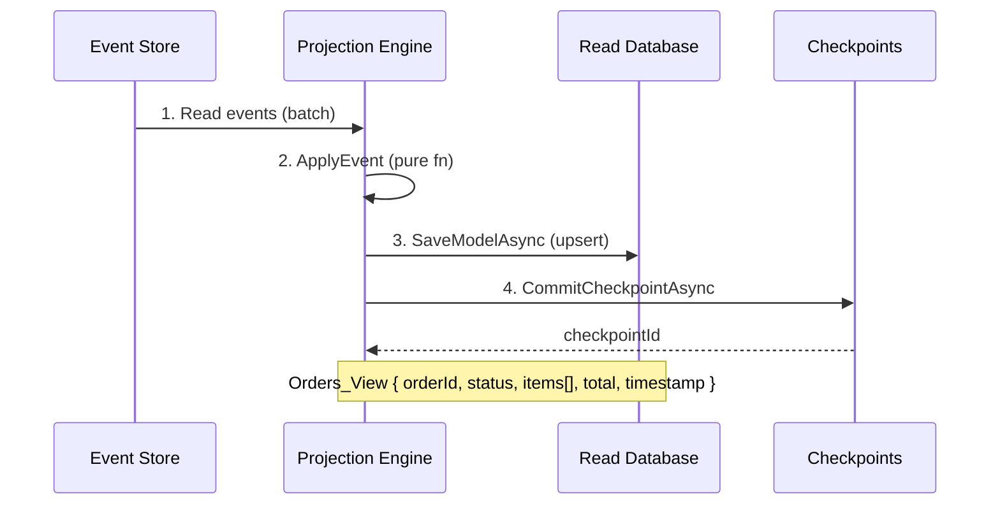
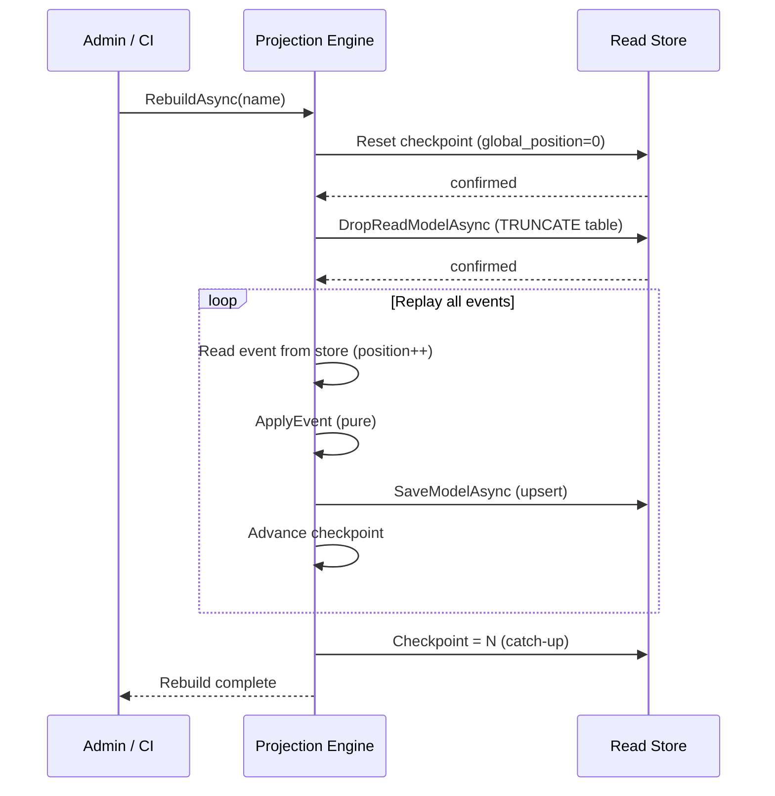

> [!success] Mastery Check
> - [ ] **Studied Well**
> - [ ] **Can explain the concept without notes**
> - [ ] **Can answer interview questions confidently**
> - [ ] **Can implement it in a real project**


# 7.104 — Event Sourcing — Projections — Building Read Models

## Overview

Projections are the mechanism by which event-sourced systems transform raw event streams into query-optimised read models. An event store is write-optimised — it only appends — and querying it directly would require replaying potentially millions of events through aggregate logic every time a user hits a screen. Projections solve this by subscribing to the event stream, applying each event to a running state, and persisting the resulting denormalised view in a dedicated read database.

This note covers every facet of projection design: the fundamental abstraction (`IProjection<TEvent>`), the checkpointing machinery that guarantees at-least-once processing, the four projection taxonomies (inline vs async, live vs replay, category vs stream-specific, transactional vs eventually consistent), multi-stream joins, denormalisation patterns, and the full lifecycle of building, deploying, and rebuilding projections in production.


```

---

## Table of Contents

1. [[#1 The Projection Abstraction — `IProjection<TEvent>`]]
2. [[#2 Projection Taxonomies]]
3. [[#3 Checkpointing Strategies]]
4. [[#4 Idempotent Projections]]
5. [[#5 Multi-Stream Projections — Joining Streams]]
6. [[#6 Denormalisation in Projections]]
7. [[#7 The Projection Engine]]
8. [[#8 Marten Projection Setup and Custom Projections]]
9. [[#9 Rebuilding Projections from Scratch]]
10. [[#10 Architecture Decision Record — Projection Strategy]]
11. [[#Pitfalls and Anti-Patterns]]
12. [[#Interview Questions]]
13. [[#Self-Check Questions]]
14. [[#References]]

---

### Projection Algebra

A projection can be understood mathematically as a **fold** (or reduce) over an event stream:

```
fold : (State, Event) → State   -- ApplyEvent
init : TId → State              -- CreateDefault
run  : EventStore → (TId → State)  -- the composed projection
```

Given an initial state `S₀` and a sequence of events `[e₁, e₂, …, eₙ]`, the projection computes:

```
S₁ = fold(S₀, e₁)
S₂ = fold(S₁, e₂)
…
Sₙ = fold(Sₙ₋₁, eₙ)
```

For a rebuild, the engine calls `init` to produce `S₀`, then applies every event from the beginning of the stream. For live processing, it loads the persisted state `Sₖ` (from the last checkpoint), then applies only new events `[eₖ₊₁, …, eₙ]`.

This algebraic view clarifies the three correctness criteria:
1. **Associativity** — `fold(fold(S, e₁), e₂) == fold(S, [e₁, e₂])` (batching must not change the result)
2. **Idempotence** — applying the same event twice must give the same result as applying it once
3. **Determinism** — the same sequence of events must always produce the same final state regardless of when or how many times the projection runs

## 1 The Projection Abstraction — `IProjection<TEvent>`

At its core, a projection is a function `IEnumerable<Event> → State`. The framework-agnostic abstraction is:

```csharp
/// <summary>
/// Processes events of type <typeparamref name="TEvent"/> to produce
/// or update a read model identified by <typeparamref name="TId"/>.
/// </summary>
/// <typeparam name="TEvent">The base event type handled.</typeparam>
/// <typeparam name="TId">The read-model identifier type.</typeparam>
public interface IProjection<TEvent, TId>
    where TEvent : notnull
    where TId : notnull
{
    /// <summary>
    /// Returns the set of event types this projection can handle.
    /// Used by the engine to route events without calling CanHandle
    /// on every event.
    /// </summary>
    IReadOnlySet<Type> HandledEventTypes { get; }

    /// <summary>
    /// Initialises or retrieves a read model for the given id.
    /// Called when the projection engine determines a new identity
    /// is referenced by an incoming event.
    /// </summary>
    ValueTask<TId> GetModelIdAsync(TEvent @event, CancellationToken ct);

    /// <summary>
    /// Loads an existing read model from the read store, or returns
    /// default if none exists. The engine batches loads when possible.
    /// </summary>
    ValueTask<object?> LoadModelAsync(TId id, CancellationToken ct);

    /// <summary>
    /// Applies a single event to the read model, mutating it in memory.
    /// This method MUST be pure with respect to the model — no I/O.
    /// </summary>
    void ApplyEvent(TEvent @event, object model);

    /// <summary>
    /// Persists the mutated read model to the read store.
    /// Called after all events in a batch have been applied.
    /// </summary>
    ValueTask SaveModelAsync(object model, CancellationToken ct);

    /// <summary>
    /// Called by the engine to commit the checkpoint after the batch
    /// has been successfully persisted.
    /// </summary>
    ValueTask CommitCheckpointAsync(
        Checkpoint checkpoint, CancellationToken ct);
}
```

A stateless variant useful for idempotent "insert-only" tables:

```csharp
/// <summary>
/// Projection that creates a new read model per event — no load/merge step.
/// Used for append-only tables such as audit logs or materialised event stores.
/// </summary>
public interface IAppendingProjection<TEvent>
    where TEvent : notnull
{
    IReadOnlySet<Type> HandledEventTypes { get; }

    /// <summary>
    /// Builds a read model directly from the event. The engine
    /// inserts this row without loading an existing one.
    /// </summary>
    ValueTask<object> CreateModelAsync(TEvent @event, CancellationToken ct);

    ValueTask CommitCheckpointAsync(Checkpoint checkpoint, CancellationToken ct);
}
```

### Concrete Example — OrderSummaryProjection

```csharp
public sealed record OrderSummaryProjectionState
{
    public Guid OrderId { get; init; }
    public string CustomerName { get; set; } = string.Empty;
    public string Status { get; set; } = "Pending";
    public decimal Total { get; set; }
    public int ItemCount { get; set; }
    public DateTime LastUpdated { get; set; }
    public ulong Version { get; set; }
}

public sealed class OrderSummaryProjection
    : IProjection<OrderEvent, Guid>
{
    private readonly IOrderSummaryRepository _repo;

    public OrderSummaryProjection(IOrderSummaryRepository repo)
    {
        _repo = repo;
    }

    public IReadOnlySet<Type> HandledEventTypes { get; } =
        new HashSet<Type>
        {
            typeof(OrderCreated),
            typeof(OrderItemAdded),
            typeof(OrderItemRemoved),
            typeof(OrderSubmitted),
            typeof(OrderShipped),
            typeof(OrderCancelled),
        };

    public ValueTask<Guid> GetModelIdAsync(
        OrderEvent @event, CancellationToken ct) =>
        @event switch
        {
            OrderCreated e => ValueTask.FromResult(e.OrderId),
            OrderItemAdded e => ValueTask.FromResult(e.OrderId),
            OrderItemRemoved e => ValueTask.FromResult(e.OrderId),
            OrderSubmitted e => ValueTask.FromResult(e.OrderId),
            OrderShipped e => ValueTask.FromResult(e.OrderId),
            OrderCancelled e => ValueTask.FromResult(e.OrderId),
            _ => throw new NotSupportedException(
                $"Event type {@event.GetType().Name} is not supported.")
        };

    public async ValueTask<object?> LoadModelAsync(
        Guid id, CancellationToken ct)
    {
        var state = await _repo.FindByIdAsync(id, ct);
        return state;
    }

    public void ApplyEvent(OrderEvent @event, object model)
    {
        var state = (OrderSummaryProjectionState)model;

        switch (@event)
        {
            case OrderCreated e:
                state.Status = "Pending";
                state.CustomerName = e.CustomerName;
                state.LastUpdated = e.Timestamp;
                break;

            case OrderItemAdded e:
                state.Total += e.UnitPrice * e.Quantity;
                state.ItemCount += e.Quantity;
                state.LastUpdated = e.Timestamp;
                break;

            case OrderItemRemoved e:
                state.Total -= e.UnitPrice * e.Quantity;
                state.ItemCount -= e.Quantity;
                state.LastUpdated = e.Timestamp;
                break;

            case OrderSubmitted e:
                state.Status = "Submitted";
                state.LastUpdated = e.Timestamp;
                break;

            case OrderShipped e:
                state.Status = "Shipped";
                state.LastUpdated = e.Timestamp;
                break;

            case OrderCancelled e:
                state.Status = "Cancelled";
                state.LastUpdated = e.Timestamp;
                break;
        }

        state.Version++;
    }

    public async ValueTask SaveModelAsync(
        object model, CancellationToken ct)
    {
        var state = (OrderSummaryProjectionState)model;
        await _repo.UpsertAsync(state, ct);
    }

    public async ValueTask CommitCheckpointAsync(
        Checkpoint checkpoint, CancellationToken ct)
    {
        await _repo.SaveCheckpointAsync(checkpoint, ct);
    }
}
```

### Guiding Principles for the Abstraction

| Principle | Rationale |
|-----------|-----------|
| **Pure Apply** — no I/O in `ApplyEvent` | All side effects happen in `SaveModelAsync`, making the projection easy to test, replay, and parallelise. |
| **Batch-friendly** — `LoadModelAsync` can return `null` | The engine can load many models in one round trip before calling `ApplyEvent` for each event. |
| **Explicit handled types** | Enables routing without reflection — critical for high-throughput engines. |
| **Checkpoint owned by projection** | Each projection tracks its own progress, enabling independent rebuild and replay. |
| **Immutable event identity** | `GetModelIdAsync` derives the read-model key from the event, never from mutable state. |

### The Engine Contract

The projection engine consumes `IProjection<TEvent, TId>` and drives the lifecycle:

```csharp
public interface IProjectionEngine
{
    /// <summary>
    /// Registers a projection. Called at startup.
    /// </summary>
    void Register<TEvent, TId>(IProjection<TEvent, TId> projection)
        where TEvent : notnull
        where TId : notnull;

    /// <summary>
    /// Starts the projection engine. For async projections this
    /// begins a background loop; for inline projections this is a no-op.
    /// </summary>
    Task StartAsync(CancellationToken ct);

    /// <summary>
    /// Stops the engine and waits for in-flight batches to complete.
    /// </summary>
    Task StopAsync(CancellationToken ct);

    /// <summary>
    /// Triggers a rebuild of the named projection from the global
    /// or stream checkpoint.
    /// </summary>
    Task RebuildAsync(string projectionName, CancellationToken ct);
}
```

---

## 2 Projection Taxonomies

Projections exist along four independent axes. Every projection framework (Marten, EventStoreDB, NEventStore, custom) forces you to choose a position on each axis.

### Axis 1 — Inline vs Async

**Inline (also: synchronous, transactional, live)**

The projection is updated inside the same transaction that appends events to the store. When a command handler calls `eventStore.Append(streamId, events)`, the projection engine invokes `ApplyEvent` and `SaveModelAsync` before the append transaction commits.

```csharp
// Conceptual inline flow
public async Task AppendAndProjectAsync(
    Guid streamId,
    IReadOnlyList<object> events,
    CancellationToken ct)
{
    // 1. Append to event store
    var checkpoint = await _eventStore.AppendAsync(streamId, events, ct);

    // 2. For each inline projection
    foreach (var projection in _inlineProjections)
    {
        foreach (var @event in events)
        {
            if (!projection.HandledEventTypes.Contains(@event.GetType()))
                continue;

            var id = await projection.GetModelIdAsync(@event, ct);
            var model = await projection.LoadModelAsync(id, ct)
                        ?? CreateDefault(projection, id);
            projection.ApplyEvent(@event, model);
            await projection.SaveModelAsync(model, ct);
        }

        await projection.CommitCheckpointAsync(checkpoint, ct);
    }
}
```

| Pros | Cons |
|------|------|
| Read models are strongly consistent with writes. | Increases write-path latency — every projection runs synchronously. |
| No eventual consistency window — the user sees their own write immediately. | A slow or failing projection blocks all writes. |
| Simpler mental model — no background worker, no queue. | Cannot scale projections independently of writes. |
| Checkpoint is trivially guaranteed — the event store commit acts as the checkpoint. | Every projection must handle every event type it cares about within the write transaction. |

Use inline when the read model must reflect the write *immediately* and the projection work is cheap (a few microseconds). Common examples: synchronising a cache entry, updating a user's profile count, maintaining an in-memory leaderboard.

**Async (also: eventual, background, detached)**

Events are appended to the event store and a background process — the projection engine — polls a checkpoint table, reads new events, applies them, and writes to the read store. The write transaction returns to the caller immediately; the read store lags behind by some small window (milliseconds to seconds).

```csharp
// Conceptual background loop
public async Task RunAsyncProjectionLoopAsync(
    IProjection projection,
    CancellationToken ct)
{
    while (!ct.IsCancellationRequested)
    {
        var checkpoint = await _checkpointStore
            .GetAsync(projection.Name, ct);

        var batch = await _eventStore.ReadBatchAsync(
            checkpoint.GlobalPosition,
            BatchSize,
            ct);

        if (batch.Count == 0)
        {
            await Task.Delay(PollIntervalMs, ct);
            continue;
        }

        // Group events by model ID to minimise loads
        var groups = batch.Events
            .Where(e => projection.HandledEventTypes.Contains(e.GetType()))
            .GroupBy(e => projection.GetModelIdAsync(e, ct).Result);

        foreach (var group in groups)
        {
            var model = await projection.LoadModelAsync(group.Key, ct);
            model ??= projection.CreateDefault(group.Key);

            foreach (var @event in group)
                projection.ApplyEvent(@event, model);

            await projection.SaveModelAsync(model, ct);
        }

        var newCheckpoint = new Checkpoint(
            projection.Name,
            batch.LastGlobalPosition,
            batch.LastTimestamp);

        await projection.CommitCheckpointAsync(newCheckpoint, ct);
    }
}
```

| Pros | Cons |
|------|------|
| Write path is fast — no projection work during append. | Read models are eventually consistent — stale reads are possible. |
| Projections scale independently — dedicated workers, different machines. | Requires a checkpointing mechanism — adds complexity. |
| A slow projection does not block the write path. | Duplicate processing is possible (at-least-once semantics) — requires idempotency. |
| Supports replay and rebuild without affecting writes. | Monitoring — need to track lag, alert on stuck projections. |

Use async for most read models, especially those involving aggregations, joins, or expensive computation. The vast majority of CQRS systems use async projections exclusively.

### Axis 2 — Live vs Replay

**Live**

A live projection is the normal mode: it processes events as they are appended, starting from the current checkpoint. It never goes back to process historical events unless explicitly rebuilt.

**Replay**

A replay discards the current read model and re-processes all events from the beginning of the event store (or from a specific stream/position). This is used for:

- Applying a new projection to historical data.
- Fixing a bug in the projection logic.
- Repopulating a corrupted read database.

```csharp
// Triggering a replay
await projectionEngine.RebuildAsync("OrderSummary", ct);

// The engine:
// 1. Drops the checkpoint for "OrderSummary"
// 2. Truncates the target table (or marks it stale)
// 3. Restarts the projection loop from global position 0
```

A well-designed projection must produce the *exact same* read model when replayed from the same events. This property, called **determinism**, is the most important correctness criterion for projections.

### Axis 3 — Category vs Stream-Specific

**Stream-specific projection**

Processes events from a single stream (a single aggregate). The read model has the same identity as the aggregate. An `OrderSummaryProjection` is stream-specific — it reads only the `Order-<guid>` stream.

**Category projection (also: multi-stream, global)**

Processes events from multiple streams of the same category, often producing a single consolidated read model. Examples:

- `CustomerOrdersListProjection` — watches all `Order-*` streams and maintains a paginated list of all orders.
- `InventoryDashboardProjection` — watches all `InventoryItem-*` streams and maintains real-time stock counts.

Category projections must handle events from unrelated streams that happen to affect the same read model. For example, an `OrderShipped` event in stream `Order-A` and a `StockReserved` event in stream `Inventory-55` both update the same `ShipmentSummary` row.

### Axis 4 — Transactional vs Eventually Consistent

This is an orthogonal concern to inline/async:

- **Transactional projection**: The event append and the read-model write occur in the same distributed transaction (e.g., a SQL Server `SqlConnection` + `SqlTransaction` that writes both the event and the read model). This gives strong consistency but limits you to databases that support distributed transactions and serialisable isolation.

- **Eventually consistent projection**: The read model is written independently, after the event is committed. This is the default for async projections and is nearly always the right choice. You accept a small consistency window in exchange for scalability and resilience.

### Combined Decision Matrix

| Scenario | Inline/Async | Live/Replay | Category/Stream | Transactional/EC |
|----------|-------------|-------------|-----------------|------------------|
| User profile read model (own writes must be visible) | Inline | Live | Stream-specific | Transactional |
| Search index (tolerates seconds of lag) | Async | Live | Category | Eventually consistent |
| Financial report (must rebuild from scratch) | Async | Both | Category | Eventually consistent |
| Real-time dashboard (high throughput, low value) | Async | Replay-only | Category | Eventually consistent |
| Cache warming (in-memory, fast) | Inline | Live | Stream-specific | Transactional |

---

## 3 Checkpointing Strategies

A checkpoint is a bookmark that records how far a projection has progressed through the event stream. Without checkpointing, a projection would either process every event every time it runs (impossible at scale) or miss events after a crash.

### The Checkpoint Record

```csharp
public sealed record Checkpoint
{
    /// <summary>
    /// The unique name of the projection.
    /// </summary>
    public string ProjectionName { get; init; }

    /// <summary>
    /// The global position (or sequence number) of the last
    /// successfully processed event. Monotonic, 1-based.
    /// </summary>
    public long GlobalPosition { get; set; }

    /// <summary>
    /// The timestamp of the last processed event, used for
    /// lag monitoring and alerting.
    /// </summary>
    public DateTime LastProcessedAt { get; set; }

    /// <summary>
    /// The version of the projection code that last wrote this
    /// checkpoint. Used during replay to detect schema changes.
    /// </summary>
    public int SchemaVersion { get; set; }

    /// <summary>
    /// Set to true when a rebuild is in progress. The projection
    /// engine skips this projection while the flag is set.
    /// </summary>
    public bool IsRebuilding { get; set; }
}
```

### Checkpoint Table

```sql
-- PostgreSQL checkpoint table (used by Marten, EventStoreDB, custom)
CREATE TABLE projection_checkpoints (
    projection_name    VARCHAR(100)    PRIMARY KEY,
    global_position    BIGINT          NOT NULL DEFAULT 0,
    last_processed_at  TIMESTAMPTZ     NOT NULL DEFAULT now(),
    schema_version     INT             NOT NULL DEFAULT 1,
    is_rebuilding      BOOLEAN         NOT NULL DEFAULT false
);
```

```csharp
// ADO.NET checkpoint store
public sealed class PostgresCheckpointStore : ICheckpointStore
{
    private readonly string _connectionString;

    public PostgresCheckpointStore(string connectionString)
    {
        _connectionString = connectionString;
    }

    public async Task<Checkpoint> GetAsync(
        string projectionName, CancellationToken ct)
    {
        await using var conn = new NpgsqlConnection(_connectionString);
        await conn.OpenAsync(ct);

        await using var cmd = new NpgsqlCommand(
            """
            INSERT INTO projection_checkpoints
                (projection_name, global_position, last_processed_at, schema_version, is_rebuilding)
            VALUES
                ($1, 0, now(), 1, false)
            ON CONFLICT (projection_name) DO NOTHING
            RETURNING global_position, last_processed_at, schema_version, is_rebuilding;
            """, conn)
        {
            Parameters = { new NpgsqlParameter<string> { TypedValue = projectionName } }
        };

        await using var reader = await cmd.ExecuteReaderAsync(ct);
        await reader.ReadAsync(ct);

        return new Checkpoint
        {
            ProjectionName = projectionName,
            GlobalPosition = reader.GetInt64(0),
            LastProcessedAt = reader.GetDateTime(1),
            SchemaVersion = reader.GetInt32(2),
            IsRebuilding = reader.GetBoolean(3)
        };
    }

    public async Task SaveAsync(
        Checkpoint checkpoint, CancellationToken ct)
    {
        await using var conn = new NpgsqlConnection(_connectionString);
        await conn.OpenAsync(ct);

        await using var cmd = new NpgsqlCommand(
            """
            UPDATE projection_checkpoints
            SET global_position = $2,
                last_processed_at = now(),
                schema_version = $3,
                is_rebuilding = $4
            WHERE projection_name = $1;
            """, conn)
        {
            Parameters =
            {
                new NpgsqlParameter<string> { TypedValue = checkpoint.ProjectionName },
                new NpgsqlParameter<long> { TypedValue = checkpoint.GlobalPosition },
                new NpgsqlParameter<int> { TypedValue = checkpoint.SchemaVersion },
                new NpgsqlParameter<bool> { TypedValue = checkpoint.IsRebuilding }
            }
        };

        await cmd.ExecuteNonQueryAsync(ct);
    }

    public async Task ResetAsync(
        string projectionName, CancellationToken ct)
    {
        await using var conn = new NpgsqlConnection(_connectionString);
        await conn.OpenAsync(ct);

        await using var cmd = new NpgsqlCommand(
            """
            UPDATE projection_checkpoints
            SET global_position = 0,
                last_processed_at = now(),
                is_rebuilding = true
            WHERE projection_name = $1;
            """, conn)
        {
            Parameters = { new NpgsqlParameter<string> { TypedValue = projectionName } }
        };

        await cmd.ExecuteNonQueryAsync(ct);
    }
}
```

### Strategies Compared

| Strategy | Mechanism | Pros | Cons |
|----------|-----------|------|------|
| **Global checkpoint** | Single sequence number across all streams | Simple; one number to track | Does not parallelise well; one slow stream blocks all others |
| **Per-stream checkpoint** | One checkpoint per aggregate stream | Enables parallel processing per stream; one slow stream only affects its own projection | High cardinality — millions of checkpoints; GC and storage pressure |
| **Per-projection checkpoint** | One checkpoint per projection, tracking a global position | Simple; each projection is independent | Cannot parallelise within a single projection |
| **Hybrid — per-shard checkpoint** | Partition streams into N shards; one checkpoint per shard | Good parallelism; bounded checkpoint count | Requires a sharding strategy; complex to rebalance |
| **Transactional checkpoint** | The checkpoint is committed in the same transaction as the read model | Exactly-once semantics; no duplicates | Only works when both use the same database |

### Recommended Approach

Start with **per-projection global checkpoint** for all projections. It is the simplest model and works well for up to several hundred events per second. When throughput exceeds that, or when a single projection cannot keep up, move to **per-shard checkpoints** with a configurable shard count:

```csharp
public sealed class ShardedCheckpointStore : ICheckpointStore
{
    private readonly ICheckpointStore _inner;
    private readonly int _shardCount;

    public async Task<IReadOnlyList<Checkpoint>> GetAllShardsAsync(
        string projectionName, CancellationToken ct)
    {
        var results = new List<Checkpoint>(_shardCount);
        for (int shard = 0; shard < _shardCount; shard++)
        {
            var name = $"{projectionName}:shard-{shard}";
            var ckpt = await _inner.GetAsync(name, ct);
            results.Add(ckpt);
        }
        return results;
    }
}
```

---

## 4 Idempotent Projections

Because async projections use at-least-once delivery semantics, a projection may see the same event more than once. Reasons include:

- The engine crashes after persisting the model but before committing the checkpoint.
- Network partitions cause duplicate event reads.
- A rebuild replays events that were already applied.
- Database retry logic in the projection engine re-delivers a batch.

An idempotent projection produces the same final state regardless of how many times an event is applied. There are three major strategies.

### Strategy 1 — Event ID Deduplication

Store a set of already-processed event IDs alongside the read model. Before applying an event, check the set.

```csharp
public sealed class IdempotentProjectionWrapper<TEvent, TId>
    : IProjection<TEvent, TId>
    where TEvent : notnull
    where TId : notnull
{
    private readonly IProjection<TEvent, TId> _inner;

    // ... constructor, delegating members ...

    public void ApplyEvent(TEvent @event, object model)
    {
        var state = (IdempotentModelWrapper)model;

        // Use the event's global sequence number or a dedicated
        // event ID as the deduplication key.
        if (!state.ProcessedEventIds.Add(GetEventId(@event)))
            return; // Already applied — skip

        _inner.ApplyEvent(@event, state.InnerModel);
    }
}

public sealed class IdempotentModelWrapper
{
    public object InnerModel { get; init; }
    public HashSet<Guid> ProcessedEventIds { get; init; } = new();
}
```

**Pros**: Simple, works with any projection. **Cons**: The `ProcessedEventIds` set grows without bound — must be pruned periodically.

**Memory-bound deduplication**: Instead of an infinite set, use a fixed-size circular buffer or a Bloom filter:

```csharp
public sealed class BloomFilterDeduplicator
{
    private readonly System.Collections.BitArray _bits = new(1_000_000);
    private readonly int _hashCount = 7;

    public bool IsDuplicate(Guid eventId)
    {
        // Check N hash positions
        Span<byte> bytes = stackalloc byte[16];
        eventId.TryWriteBytes(bytes);

        bool mightBePresent = true;
        for (int i = 0; i < _hashCount; i++)
        {
            var hash = System.IO.Hashing.XxHash64.Hash(bytes, i);
            var index = (int)(hash % _bits.Length);
            if (!_bits[index])
            {
                mightBePresent = false;
                _bits[index] = true;
            }
        }
        return mightBePresent;
    }
}
```

**Pros**: Fixed memory, O(1) per check. **Cons**: False positives (rarely a problem; duplicates just skip an event they should have processed — but replay handles it).

### Strategy 2 — Upsert-Based Idempotency

Design the read model so that applying the same event twice produces the same state because the write is an `UPSERT` keyed on a unique event-derived identifier.

```csharp
// Instead of incrementing a counter:
public void ApplyEvent(OrderItemAdded e, object model)
{
    var state = (OrderSummaryProjectionState)model;
    state.Total += e.UnitPrice * e.Quantity; // NOT idempotent!
}

// Use a set-based structure:
public void ApplyEvent(OrderItemAdded e, object model)
{
    var state = (OrderSummaryProjectionState)model;
    state.Items[e.ItemId] = new OrderItemLine
    {
        ItemId = e.ItemId,
        UnitPrice = e.UnitPrice,
        Quantity = e.Quantity
    };
}

// When persisting:
// UPSERT into order_summary_items(order_id, item_id, unit_price, quantity)
// ON CONFLICT (order_id, item_id) DO UPDATE SET
//     unit_price = excluded.unit_price,
//     quantity = excluded.quantity
```

Replaying `OrderItemAdded` for the same `ItemId` overwrites the same row with the same values — idempotent.

**Pros**: No additional storage for processed IDs. **Cons**: Only works when the projection stores a set (map), not when it accumulates (sum).

### Strategy 3 — Version Gating

Store the event-store version (stream version or global position) on the read model, and only apply events whose version is strictly greater than the stored version.

```csharp
public void ApplyEvent(OrderEvent @event, object model)
{
    var state = (OrderSummaryProjectionState)model;

    if (@event.StreamVersion <= state.LastAppliedVersion)
        return; // Already applied this version

    // Apply state transitions...
    state.LastAppliedVersion = @event.StreamVersion;
}
```

**Pros**: Gives exactly-once semantics without unbounded sets. **Cons**: Only works for stream-specific projections where events on a single stream have monotonically increasing versions. Does not work for category projections that merge events from many streams.

### Recommendation

| Scenario | Strategy |
|----------|----------|
| Stream-specific projection (single aggregate) | Version gating |
| Category projection (multi-stream) | Upsert-based or event ID dedup |
| Appending projection (audit log) | Upsert-based (unique constraint on event ID) |
| High-throughput, low memory budget | Bloom filter dedup |
| Compliance — must prove no duplicates | Event ID dedup with archiving |

---

## 5 Multi-Stream Projections — Joining Streams

A multi-stream projection combines events from two or more unrelated aggregate streams to produce a single read model. This is the CQRS equivalent of a SQL `JOIN`.

### Example — OrderFulfillmentDashboard

Imagine a dashboard that shows orders awaiting shipment, their line items, and the inventory stock level for each item. This requires data from:

- `Order-<guid>` stream: `OrderCreated`, `OrderItemAdded`, `OrderSubmitted`
- `Inventory-<guid>` stream: `StockReserved`, `StockShipped`, `StockReceiptConfirmed`

```csharp
public sealed record FulfillmentItemRow
{
    public Guid OrderId { get; init; }
    public int OrderItemId { get; init; }
    public string Sku { get; init; } = string.Empty;
    public string ProductName { get; init; } = string.Empty;
    public int QuantityOrdered { get; set; }
    public int QuantityReserved { get; set; }
    public int QuantityAvailable { get; set; }
    public string Status { get; set; } = "AwaitingStock";
}

public sealed class FulfillmentDashboardProjection
    : IProjection<object, string> // heterogeneous events
{
    private readonly IFulfillmentRepository _repo;

    // Models are keyed by "Order-<guid>/Item-<itemId>"
    // Because we need to join order data with inventory data.

    public IReadOnlySet<Type> HandledEventTypes { get; } =
        new HashSet<Type>
        {
            typeof(OrderItemAdded),
            typeof(StockReserved),
            typeof(StockShipped),
            typeof(OrderCancelled),
        };

    public ValueTask<string> GetModelIdAsync(
        object @event, CancellationToken ct) =>
        @event switch
        {
            OrderItemAdded e =>
                ValueTask.FromResult($"Order-{e.OrderId}/Item-{e.ItemId}"),
            StockReserved e =>
                ValueTask.FromResult($"Order-{e.OrderId}/Item-{e.ItemId}"),
            StockShipped e =>
                ValueTask.FromResult($"Order-{e.OrderId}/Item-{e.ItemId}"),
            OrderCancelled e =>
                ValueTask.FromResult($"Order-{e.OrderId}"),
            _ => throw new NotSupportedException()
        };

    public async ValueTask<object?> LoadModelAsync(
        string id, CancellationToken ct)
    {
        var row = await _repo.FindByCompositeIdAsync(id, ct);
        return row;
    }

    public void ApplyEvent(object @event, object model)
    {
        var row = (FulfillmentItemRow)model;

        switch (@event)
        {
            case OrderItemAdded e:
                row.QuantityOrdered = e.Quantity;
                row.Sku = e.Sku;
                row.ProductName = e.ProductName;
                row.Status = "AwaitingStock";
                break;

            case StockReserved e:
                row.QuantityReserved = e.Quantity;
                row.Status = row.QuantityReserved >= row.QuantityOrdered
                    ? "ReadyToShip"
                    : "PartiallyReserved";
                break;

            case StockShipped e:
                row.QuantityAvailable -= e.QuantityShipped;
                break;

            case OrderCancelled e:
                row.Status = "Cancelled";
                break;
        }
    }

    public async ValueTask SaveModelAsync(
        object model, CancellationToken ct)
    {
        var row = (FulfillmentItemRow)model;
        await _repo.UpsertAsync(row, ct);
    }

    public async ValueTask CommitCheckpointAsync(
        Checkpoint checkpoint, CancellationToken ct)
    {
        await _repo.SaveCheckpointAsync(checkpoint, ct);
    }
}
```

### Challenges of Multi-Stream Projections

| Challenge | Mitigation |
|-----------|------------|
| **Event ordering across streams** — Events from stream A and stream B arrive in non-deterministic order. If `StockReserved` arrives before `OrderItemAdded`, the join sees no order row yet. | Defer processing: buffer events by order ID, wait for the order event to arrive, then apply both. Use a **timeout** to avoid indefinite waits. |
| **Partial state** — The read model exists before all related events have arrived. | Design the model to handle null/missing fields gracefully. Display "Pending" or an empty state. |
| **Schema evolution** — Events from different streams may have been produced by different versions of the code. | Use a common schema registry (see [[7.103 — Event Sourcing — Event Versioning and Schema Evolution]]). |
| **Rebuild complexity** — Rebuilding a multi-stream projection requires replaying all relevant event types in the correct order. | Use a projection that indexes events by a correlation ID (e.g., `orderId`) so the engine can process them in any order and still produce the correct final state. |

### The Correlation ID Pattern

The most robust way to handle multi-stream joins is to include a **correlation ID** in every event that participates in the join. In the example above, both `OrderItemAdded` (from the order stream) and `StockReserved` (from the inventory stream) carry the same `CorrelationId` — the `orderId`. The projection uses this correlation ID as the read-model key, ignoring the stream identity entirely.

```csharp
public sealed record OrderItemAdded : OrderEvent
{
    public Guid OrderId { get; init; }
    public Guid CorrelationId => OrderId; // Explicit correlation
    public int ItemId { get; init; }
    public string Sku { get; init; } = string.Empty;
    public string ProductName { get; init; } = string.Empty;
    public decimal UnitPrice { get; init; }
    public int Quantity { get; init; }
}

public sealed record StockReserved : InventoryEvent
{
    public Guid OrderId { get; init; } // Same correlation
    public Guid CorrelationId => OrderId;
    public int ItemId { get; init; }
    public int Quantity { get; init; }
}
```

This decouples the read-model identity from the stream identity, allowing the projection to join events from entirely separate aggregate roots.

---

## 6 Denormalisation in Projections

Denormalisation is the process of transforming normalised, event-sourced data into a shape optimised for querying. In a CQRS system, the read side is *always* denormalised. The entire purpose of projections is to produce denormalised read models.

### Why Denormalise?

In a normalised event-sourced system, answering "Show me orders for customer X with product Y" requires:

1. Replaying the `Order-*` streams for customer X.
2. For each order, looking up product details from a `Product-*` stream.
3. Computing the current state of each order by replaying its events.

This is prohibitively expensive. A denormalised read model might store:

```sql
CREATE TABLE order_summary_view (
    order_id            UUID PRIMARY KEY,
    customer_id         UUID NOT NULL,
    customer_name       TEXT NOT NULL,
    customer_email      TEXT NOT NULL,
    order_date          TIMESTAMPTZ NOT NULL,
    status              TEXT NOT NULL,
    total_amount        DECIMAL(12,2) NOT NULL,
    item_count          INT NOT NULL,
    items               JSONB NOT NULL,  -- nested denormalized array
    shipping_address    JSONB,
    last_updated        TIMESTAMPTZ NOT NULL
);

CREATE INDEX idx_customer_id ON order_summary_view(customer_id);
CREATE INDEX idx_status ON order_summary_view(status);
```

The `items` JSONB column contains a denormalised array:

```json
[
  {
    "itemId": 1,
    "sku": "WIDGET-001",
    "productName": "Super Widget",
    "unitPrice": 29.99,
    "quantity": 2,
    "total": 59.98
  },
  {
    "itemId": 2,
    "sku": "GADGET-007",
    "productName": "Mega Gadget",
    "unitPrice": 99.99,
    "quantity": 1,
    "total": 99.99
  }
]
```

### Denormalisation Patterns

#### Pattern 1 — Embedding (Nested Documents)

Store related data inside the parent document. Used for one-to-many and one-to-one relationships.

```csharp
// Projection code that embeds customer data
public void ApplyEvent(OrderCreated e, object model)
{
    var state = (OrderSummaryProjectionState)model;

    // Denormalise: copy customer data into the order row
    state.CustomerId = e.CustomerId;
    state.CustomerName = e.CustomerName;
    state.CustomerEmail = e.CustomerEmail;
    state.ShippingAddress = new AddressRow
    {
        Street = e.ShippingStreet,
        City = e.ShippingCity,
        PostalCode = e.ShippingPostalCode
    };
}
```

**Pros**: Single query fetches everything; no joins. **Cons**: Data duplication; updating customer name requires finding all orders and updating each one (fan-out problem).

#### Pattern 2 — Referencing (Foreign Keys)

Store only the foreign key and look up the related data at query time (or via a separate projection).

```csharp
public void ApplyEvent(OrderCreated e, object model)
{
    var state = (OrderSummaryProjectionState)model;
    state.CustomerId = e.CustomerId;
    // Do NOT copy CustomerName — query the customer read model
    // at display time via a separate endpoint or join.
}
```

**Pros**: No duplication; customer name change affects exactly one row. **Cons**: Requires a second query or a client-side join.

#### Pattern 3 — Pre-joined Materialised Tables

Store explicit foreign-key references and run a periodic batch job to refresh denormalised columns. This is a hybrid approach.

```sql
CREATE TABLE order_summary_materialised AS
SELECT
    o.order_id,
    o.customer_id,
    c.full_name AS customer_name,
    c.email AS customer_email,
    o.status,
    o.total_amount
FROM orders o
JOIN customers c ON c.customer_id = o.customer_id;

-- Refreshed by a scheduled job
REFRESH MATERIALIZED VIEW order_summary_materialised;
```

**Pros**: No duplication; always consistent at refresh time. **Cons**: Stale between refreshes; full rebuild is expensive for large tables.

#### Pattern 4 — Event-Driven Fan-Out

When a referenced entity changes (e.g., customer name), emit an event that triggers updates to every read model that embeds customer data.

```csharp
public sealed class CustomerNameChangedProjection
    : IProjection<CustomerEvent, Guid>
{
    private readonly IOrderSummaryRepository _orderRepo;

    public async ValueTask ApplyAndSaveAsync(
        CustomerNameChanged e, CancellationToken ct)
    {
        // Fan-out: find all orders for this customer
        var orderIds = await _orderRepo
            .FindOrderIdsByCustomerAsync(e.CustomerId, ct);

        foreach (var orderId in orderIds)
        {
            var order = await _orderRepo.FindByIdAsync(orderId, ct);
            order.CustomerName = e.NewName;
            await _orderRepo.UpsertAsync(order, ct);
        }
    }
}
```

**Pros**: Read models are always fresh; no query-time joins. **Cons**: Fan-out can be expensive for customers with many orders; must be handled asynchronously.

### When to Embed vs Reference

| Factor | Embed | Reference |
|--------|-------|-----------|
| Read frequency of parent vs child | Parent read far more often than child update | Child data changes frequently |
| Cardinality | One-to-one or small one-to-many | Large one-to-many or many-to-many |
| Consistency requirements | Must be consistent with parent | Eventual consistency is acceptable |
| Query pattern | Always need parent + child together | Sometimes need parent alone |

Rule of thumb: **Embed by default, reference when the data changes independently of the parent.** In practice, most CQRS read models are heavily denormalised with embedding, because the read side is optimised for queries, not for write efficiency.

---

## 7 The Projection Engine

The projection engine is the runtime that coordinates event reading, projection execution, checkpointing, error handling, and lifecycle management. Below is a complete, production-grade engine implementation.

### Engine Implementation

```csharp
public sealed class ProjectionEngine : IProjectionEngine, IDisposable
{
    private readonly IEventStoreReader _eventReader;
    private readonly ICheckpointStore _checkpointStore;
    private readonly List<ProjectionRegistration> _projections = new();
    private readonly List<BackgroundWorker> _workers = new();
    private readonly ProjectionEngineOptions _options;
    private readonly ILogger<ProjectionEngine> _logger;
    private bool _disposed;

    public ProjectionEngine(
        IEventStoreReader eventReader,
        ICheckpointStore checkpointStore,
        IOptions<ProjectionEngineOptions> options,
        ILogger<ProjectionEngine> logger)
    {
        _eventReader = eventReader;
        _checkpointStore = checkpointStore;
        _options = options.Value;
        _logger = logger;
    }

    public void Register<TEvent, TId>(IProjection<TEvent, TId> projection)
        where TEvent : notnull
        where TId : notnull
    {
        var name = projection.GetType().Name;
        _projections.Add(new ProjectionRegistration
        {
            Name = name,
            ProjectionType = typeof(IProjection<TEvent, TId>),
            Instance = projection,
            HandledTypes = projection.HandledEventTypes
        });
        _logger.LogInformation("Registered projection {ProjectionName}", name);
    }

    public Task StartAsync(CancellationToken ct)
    {
        foreach (var reg in _projections)
        {
            var worker = new BackgroundWorker(
                reg,
                _eventReader,
                _checkpointStore,
                _options,
                _logger);

            _workers.Add(worker);
            worker.Start(ct);
        }

        return Task.CompletedTask;
    }

    public async Task StopAsync(CancellationToken ct)
    {
        foreach (var worker in _workers)
            await worker.StopAsync(ct);

        _workers.Clear();
    }

    public async Task RebuildAsync(string projectionName, CancellationToken ct)
    {
        var reg = _projections.FirstOrDefault(r => r.Name == projectionName);
        if (reg is null)
            throw new InvalidOperationException(
                $"Projection '{projectionName}' is not registered.");

        // Stop the existing worker
        var worker = _workers.FirstOrDefault(w => w.Name == projectionName);
        if (worker is not null)
        {
            await worker.StopAsync(ct);
            _workers.Remove(worker);
        }

        // Reset checkpoint
        await _checkpointStore.ResetAsync(projectionName, ct);

        // Drop the read model — implementation-specific
        if (reg.Instance is IRebuildableProjection rebuildable)
            await rebuildable.DropReadModelAsync(ct);

        // Start a fresh worker
        var newWorker = new BackgroundWorker(
            reg, _eventReader, _checkpointStore, _options, _logger);
        _workers.Add(newWorker);
        newWorker.Start(ct);

        _logger.LogInformation(
            "Rebuilding projection {ProjectionName} from checkpoint 0",
            projectionName);
    }

    public void Dispose()
    {
        if (_disposed) return;
        foreach (var worker in _workers)
            worker.Dispose();
        _workers.Clear();
        _disposed = true;
    }

    // ————————————————————————————————————————
    // Internal: Background worker per projection
    // ————————————————————————————————————————

    private sealed class BackgroundWorker : IDisposable
    {
        private readonly ProjectionRegistration _reg;
        private readonly IEventStoreReader _eventReader;
        private readonly ICheckpointStore _checkpointStore;
        private readonly ProjectionEngineOptions _options;
        private readonly ILogger _logger;
        private CancellationTokenSource? _cts;
        private Task? _loopTask;

        public string Name => _reg.Name;

        public BackgroundWorker(
            ProjectionRegistration reg,
            IEventStoreReader eventReader,
            ICheckpointStore checkpointStore,
            ProjectionEngineOptions options,
            ILogger logger)
        {
            _reg = reg;
            _eventReader = eventReader;
            _checkpointStore = checkpointStore;
            _options = options;
            _logger = logger;
        }

        public void Start(CancellationToken ct)
        {
            _cts = CancellationTokenSource.CreateLinkedTokenSource(ct);
            _loopTask = RunLoopAsync(_cts.Token);
        }

        public async Task StopAsync(CancellationToken ct)
        {
            _cts?.Cancel();
            try
            {
                if (_loopTask is not null)
                    await _loopTask.WaitAsync(ct);
            }
            catch (OperationCanceledException)
            {
                // Expected
            }
        }

        private async Task RunLoopAsync(CancellationToken ct)
        {
            _logger.LogInformation(
                "Projection worker {Name} started", Name);

            while (!ct.IsCancellationRequested)
            {
                try
                {
                    var checkpoint = await _checkpointStore
                        .GetAsync(Name, ct);

                    if (checkpoint.IsRebuilding)
                    {
                        _logger.LogInformation(
                            "Projection {Name} is rebuilding, waiting...", Name);
                        await Task.Delay(
                            _options.RebuildPollIntervalMs, ct);
                        continue;
                    }

                    var batch = await _eventReader.ReadBatchAsync(
                        checkpoint.GlobalPosition,
                        _options.BatchSize,
                        ct);

                    if (batch.Count == 0)
                    {
                        await Task.Delay(
                            _options.PollIntervalMs, ct);
                        continue;
                    }

                    // Filter and group by model ID
                    var relevant = batch
                        .Where(e => _reg.HandledTypes.Contains(e.GetType()))
                        .ToList();

                    if (relevant.Count == 0)
                    {
                        // Still advance checkpoint so we don't
                        // re-read these events.
                        var lastPos = batch[^1].GlobalPosition;
                        await _checkpointStore.SaveAsync(
                            new Checkpoint
                            {
                                ProjectionName = Name,
                                GlobalPosition = lastPos,
                                LastProcessedAt = DateTime.UtcNow
                            }, ct);
                        continue;
                    }

                    await ProcessBatchAsync(relevant, ct);
                }
                catch (OperationCanceledException) when (ct.IsCancellationRequested)
                {
                    break;
                }
                catch (Exception ex)
                {
                    _logger.LogError(ex,
                        "Projection {Name} failed with error. " +
                        "Retrying in {Delay}ms.",
                        Name, _options.ErrorRetryDelayMs);

                    await Task.Delay(_options.ErrorRetryDelayMs, ct);
                }
            }
        }

        private async Task ProcessBatchAsync(
            List<IEvent> events, CancellationToken ct)
        {
            // Group by model ID using the projection's GetModelIdAsync
            var groups = new Dictionary<object, List<IEvent>>();

            foreach (var @event in events)
            {
                var method = _reg.Instance.GetType()
                    .GetMethod("GetModelIdAsync")!;
                var task = (Task<object>)method.Invoke(
                    _reg.Instance, new object[] { @event, ct })!;
                var id = await task;

                if (!groups.TryGetValue(id, out var list))
                    groups[id] = list = new();
                list.Add(@event);
            }

            // Load models and apply events
            foreach (var (id, groupEvents) in groups)
            {
                object? model = null;

                var loadMethod = _reg.Instance.GetType()
                    .GetMethod("LoadModelAsync")!;
                var loadTask = (Task<object?>)loadMethod.Invoke(
                    _reg.Instance, new object[] { id, ct })!;
                model = await loadTask;

                if (model is null)
                {
                    // Create default model — projection-specific
                    var defaultMethod = _reg.Instance.GetType()
                        .GetMethod("CreateDefault",
                            BindingFlags.NonPublic | BindingFlags.Instance);
                    model = defaultMethod?.Invoke(
                        _reg.Instance, new[] { id });
                }

                foreach (var @event in groupEvents)
                {
                    var applyMethod = _reg.Instance.GetType()
                        .GetMethod("ApplyEvent")!;
                    applyMethod.Invoke(
                        _reg.Instance,
                        new[] { @event, model });
                }

                var saveMethod = _reg.Instance.GetType()
                    .GetMethod("SaveModelAsync")!;
                var saveTask = (Task)saveMethod.Invoke(
                    _reg.Instance, new object[] { model, ct })!;
                await saveTask;
            }

            // Commit checkpoint
            var lastEvent = events[^1];
            await _checkpointStore.SaveAsync(
                new Checkpoint
                {
                    ProjectionName = Name,
                    GlobalPosition = lastEvent.GlobalPosition,
                    LastProcessedAt = DateTime.UtcNow
                }, ct);

            _logger.LogDebug(
                "Projection {Name} processed {Count} events, " +
                "checkpoint at {Position}",
                Name, events.Count, lastEvent.GlobalPosition);
        }

        public void Dispose()
        {
            _cts?.Cancel();
            _cts?.Dispose();
        }
    }

    private sealed record ProjectionRegistration
    {
        public string Name { get; init; } = string.Empty;
        public Type ProjectionType { get; init; } = null!;
        public object Instance { get; init; } = null!;
        public IReadOnlySet<Type> HandledTypes { get; init; } = null!;
    }
}

public sealed record ProjectionEngineOptions
{
    public int BatchSize { get; init; } = 500;
    public int PollIntervalMs { get; init; } = 1000;
    public int RebuildPollIntervalMs { get; init; } = 5000;
    public int ErrorRetryDelayMs { get; init; } = 10_000;
    public int MaxRetries { get; init; } = 5;
}
```

### Error Handling and Retry

| Scenario | Behaviour |
|----------|-----------|
| Transient database error | Retry up to `MaxRetries` with exponential backoff; if all retries fail, log critical and crash the worker |
| Poison event (event that causes `ApplyEvent` to throw) | The engine should catch, log, and skip the event, advancing the checkpoint past it. A dead-letter queue stores the event for manual inspection. |
| Connection loss to event store | Exponential backoff and reconnection loop |
| Constraint violation in read store | Log and crash — likely a projection bug that requires human intervention |

```csharp
// Handling poison events
private async Task ProcessBatchWithPoisonHandlingAsync(
    List<IEvent> events, CancellationToken ct)
{
    long lastGoodPosition = 0;

    foreach (var @event in events)
    {
        try
        {
            // ... apply and save ...
            lastGoodPosition = @event.GlobalPosition;
        }
        catch (Exception ex)
        {
            _logger.LogError(ex,
                "Poison event detected at " +
                "global position {Position} for projection {Name}. " +
                "Skipping after {Attempts} retries.",
                @event.GlobalPosition, Name, _options.MaxRetries);

            await _deadLetterStore.WriteAsync(
                Name, @event, ex, ct);

            // Advance checkpoint past the poison event
            lastGoodPosition = @event.GlobalPosition;
        }
    }

    await _checkpointStore.SaveAsync(
        new Checkpoint
        {
            ProjectionName = Name,
            GlobalPosition = lastGoodPosition,
            LastProcessedAt = DateTime.UtcNow
        }, ct);
}
```

---

## 8 Marten Projection Setup and Custom Projections

Marten is a PostgreSQL-based document database and event store for .NET. It includes a built-in projection engine that supports several projection styles out of the box.

### Marten Projection Types

| Marten Type | Description | C# Base |
|-------------|-------------|---------|
| **Inline** | Projection runs synchronously during event append | `Projection<T>` |
| **Async (daemon)** | Background projection running in the Marten async daemon | `Projection<T>` with `AsyncOptions` |
| **Live (aggregate)** | Aggregate projection computed on-the-fly from the event stream | `AggregateProjection<T>` |
| **View** | Simple projection mapping events to a single view document | `ViewProjection<TDoc, TId>` |
| **Custom** | Full control via `IProjection` interface | `IProjection` |

### Setup — ASP.NET Core with Marten

```csharp
// Program.cs — Marten with async projections
using Marten;
using Marten.Events.Projections;
using Weasel.Core;

var builder = WebApplication.CreateBuilder(args);

builder.Services.AddMarten(options =>
{
    var connString = builder.Configuration
        .GetConnectionString("Marten");

    options.Connection(connString);

    // Configure the event store
    options.Events.DatabaseSchemaName = "events";
    options.Events.StreamIdentity = StreamIdentity.AsGuid;

    // Register projections
    options.Projections
        .Add<OrderSummaryViewProjection>(
            ProjectionLifecycle.Inline);

    options.Projections
        .Add<CustomerOrdersListProjection>(
            ProjectionLifecycle.Async);

    options.Projections
        .Add<FulfillmentDashboardProjection>(
            ProjectionLifecycle.Async);

    // Configure async daemon
    options.Projections.DaemonLockId = 42;
})
.UseLightweightSessions();

// Configure the async daemon as a hosted service
builder.Services.AddHostedService<MartenAsyncDaemon>();

var app = builder.Build();
app.Run();

// ——————————————————————————————
// MartenAsyncDaemon hosted service
// ——————————————————————————————
public sealed class MartenAsyncDaemon : IHostedService
{
    private readonly DocumentStore _store;
    private Task? _daemonTask;
    private CancellationTokenSource? _cts;

    public MartenAsyncDaemon(IDocumentStore store)
    {
        _store = (DocumentStore)store;
    }

    public Task StartAsync(CancellationToken ct)
    {
        _cts = CancellationTokenSource
            .CreateLinkedTokenSource(ct);

        _daemonTask = _store.Events
            .StartProjectionDaemonAsync(_cts.Token);

        return Task.CompletedTask;
    }

    public async Task StopAsync(CancellationToken ct)
    {
        _cts?.Cancel();
        if (_daemonTask is not null)
        {
            await _store.Events
                .StopProjectionDaemonAsync(ct);
        }
    }
}
```

### ViewProjection — Simple Denormalised Read Model

```csharp
public sealed class OrderSummaryViewProjection
    : ViewProjection<OrderSummaryView, Guid>
{
    public OrderSummaryViewProjection()
    {
        // Identity: extract the document ID from events
        Identity<OrderCreated>(e => e.OrderId);
        Identity<OrderItemAdded>(e => e.OrderId);
        Identity<OrderItemRemoved>(e => e.OrderId);
        Identity<OrderSubmitted>(e => e.OrderId);
        Identity<OrderShipped>(e => e.OrderId);
        Identity<OrderCancelled>(e => e.OrderId);

        // Projection handlers
        On<OrderCreated>((view, e) =>
        {
            view.CustomerName = e.CustomerName;
            view.Status = "Pending";
            view.LastUpdated = e.Timestamp;
        });

        On<OrderItemAdded>((view, e) =>
        {
            view.Total += e.UnitPrice * e.Quantity;
            view.ItemCount += e.Quantity;
            view.LastUpdated = e.Timestamp;

            view.Items ??= new List<OrderItemLine>();
            view.Items.Add(new OrderItemLine
            {
                ItemId = e.ItemId,
                Sku = e.Sku,
                ProductName = e.ProductName,
                UnitPrice = e.UnitPrice,
                Quantity = e.Quantity
            });
        });

        On<OrderItemRemoved>((view, e) =>
        {
            view.Total -= e.UnitPrice * e.Quantity;
            view.ItemCount -= e.Quantity;
            view.LastUpdated = e.Timestamp;

            view.Items?.RemoveAll(
                i => i.ItemId == e.ItemId);
        });

        On<OrderSubmitted>((view, e) =>
        {
            view.Status = "Submitted";
            view.LastUpdated = e.Timestamp;
        });

        On<OrderShipped>((view, e) =>
        {
            view.Status = "Shipped";
            view.LastUpdated = e.Timestamp;
        });

        On<OrderCancelled>((view, e) =>
        {
            view.Status = "Cancelled";
            view.LastUpdated = e.Timestamp;
        });

        // Delete the view document when order is archived
        DeleteEvent<OrderArchived>();
    }
}

// The read model (stored as a JSONB document in PostgreSQL)
public sealed class OrderSummaryView
{
    public Guid Id { get; set; } // OrderId
    public string CustomerName { get; set; } = string.Empty;
    public string Status { get; set; } = "Pending";
    public decimal Total { get; set; }
    public int ItemCount { get; set; }
    public DateTime LastUpdated { get; set; }
    public List<OrderItemLine>? Items { get; set; }
}

public sealed class OrderItemLine
{
    public int ItemId { get; set; }
    public string Sku { get; set; } = string.Empty;
    public string ProductName { get; set; } = string.Empty;
    public decimal UnitPrice { get; set; }
    public int Quantity { get; set; }
}
```

### Custom Marten Projection — IProjection Interface

When `ViewProjection<T>` is not flexible enough (e.g., multi-stream joins, fan-out, custom lifecycle), implement Marten's `IProjection` directly:

```csharp
using Marten.Events;
using Marten.Events.Projections;

public sealed class FulfillmentDashboardProjection
    : IProjection
{
    public void Apply(
        IDocumentOperations operations,
        IReadOnlyList<StreamAction> streamActions)
    {
        foreach (var stream in streamActions)
        {
            foreach (var @event in stream.Events)
            {
                switch (@event.Data)
                {
                    case OrderItemAdded e:
                        operations.Store(new FulfillmentItemRow
                        {
                            OrderId = e.OrderId,
                            OrderItemId = e.ItemId,
                            Sku = e.Sku,
                            ProductName = e.ProductName,
                            QuantityOrdered = e.Quantity,
                            Status = "AwaitingStock"
                        });
                        break;

                    case StockReserved e:
                        var id = $"{e.OrderId}/{e.ItemId}";
                        operations.Load<FulfillmentItemRow>(id);
                        // Marten applies the change set after
                        // all Apply calls, so we use Store for upsert.
                        operations.Store(new FulfillmentItemRow
                        {
                            // ... update with inventory data
                        });
                        break;
                }
            }
        }
    }

    public async Task ApplyAsync(
        IDocumentOperations operations,
        IReadOnlyList<StreamAction> streamActions,
        CancellationToken ct)
    {
        // Same logic but can use async I/O
        await Task.CompletedTask;
    }

    public Type[] Consumes =>
        new[]
        {
            typeof(OrderItemAdded),
            typeof(StockReserved),
            typeof(StockShipped),
            typeof(OrderCancelled)
        };

    public AsyncOptions Options { get; } = new();
}
```

### Multi-Stream Projection with Marten

Marten supports multi-stream projections via the `MultiStreamProjection<TDoc, TId>` base class:

```csharp
public sealed class OrderFulfillmentMultiStreamProjection
    : MultiStreamProjection<FulfillmentItemRow, string>
{
    public OrderFulfillmentMultiStreamProjection()
    {
        // Identity from OrderItemAdded event
        Identity<OrderItemAdded>(e =>
            $"Order-{e.OrderId}/Item-{e.ItemId}");

        // Identity from StockReserved event (different stream!)
        Identity<StockReserved>(e =>
            $"Order-{e.OrderId}/Item-{e.ItemId}");

        // Projection: combine data from both streams
        On<OrderItemAdded>((row, e) =>
        {
            row.Sku = e.Sku;
            row.ProductName = e.ProductName;
            row.QuantityOrdered = e.Quantity;
            row.Status = "AwaitingStock";
        });

        On<StockReserved>((row, e) =>
        {
            row.QuantityReserved = e.Quantity;
            row.Status = row.QuantityReserved >= row.QuantityOrdered
                ? "ReadyToShip"
                : "PartiallyReserved";
        });
    }
}
```

### Marten Async Daemon Checkpoint Management

Marten stores checkpoints in the `mt_event_progression` table:

```sql
SELECT * FROM mt_event_progression;

-- name                          | last_seq_id | last_updated
-- ------------------------------+-------------+-------------------------------
-- All:All                       |    1047293 | 2026-06-14 12:34:56.789+00
-- OrderSummaryViewProjection    |     984203 | 2026-06-14 12:34:55.123+00
-- FulfillmentDashboardProjection|    1029834 | 2026-06-14 12:34:56.001+00
```

You can query this table to monitor projection lag:

```csharp
public sealed class ProjectionLagMonitor
{
    private readonly IDocumentStore _store;

    public ProjectionLagMonitor(IDocumentStore store)
    {
        _store = store;
    }

    public async Task<IReadOnlyList<ProjectionStatus>> GetStatusAsync()
    {
        await using var session = _store.QuerySession();
        var sql = """
            SELECT
                p.name,
                p.last_seq_id,
                p.last_updated,
                (SELECT MAX(seq_id) FROM events.events) AS total_events
            FROM mt_event_progression p
            ORDER BY p.name;
            """;

        var results = await session.QueryAsync<ProjectionStatus>(sql);
        return results.ToList();
    }
}

public sealed record ProjectionStatus
{
    public string Name { get; init; } = string.Empty;
    public long LastSeqId { get; init; }
    public DateTime LastUpdated { get; init; }
    public long TotalEvents { get; init; }
    public long Lag => TotalEvents - LastSeqId;
}
```

---

## 9 Rebuilding Projections from Scratch

Rebuilding is the process of recreating a read model by replaying all events from the beginning of the event store. It is a critical operational capability for any event-sourced system.

### Why Rebuild?

| Scenario | Example |
|----------|---------|
| **Bug fix** — projection logic contained a bug that corrupted read models | Fixed the `ApplyEvent` method and need to regenerate all rows |
| **New projection** — deployed a new projection that must process all historical events | Added a `CustomerActivityLogProjection` that should show data from day one |
| **Schema migration** — changed the read-model schema | Added a new denormalised column that must be populated |
| **Data corruption** — the read database was accidentally truncated or corrupted | DBA ran `DROP TABLE orders_view` |
| **Testing** — need a clean read model for integration tests | Test fixture rebuilds from a known set of events |

### Rebuild Workflow



### Idempotent Rebuild

A rebuild must be safe to run multiple times. The key properties are:

1. **Deterministic**: Same events → same read model.
2. **Drop-and-recreate**: The read table is truncated or dropped before replay begins.
3. **No side effects**: The projection must not send emails, call APIs, or trigger external systems during a rebuild. This is typically enforced by an `IsRebuilding` flag on the checkpoint.

```csharp
public interface IRebuildableProjection
{
    /// <summary>
    /// Drops the read-model data for this projection.
    /// Called before a rebuild begins.
    /// </summary>
    Task DropReadModelAsync(CancellationToken ct);

    /// <summary>
    /// If true, the projection will suppress external side effects.
    /// </summary>
    bool IsRebuilding { get; set; }
}

public sealed class RebuildService
{
    private readonly IProjectionEngine _engine;
    private readonly ICheckpointStore _checkpointStore;

    public async Task RebuildProjectionAsync(
        string projectionName, CancellationToken ct)
    {
        // 1. Mark as rebuilding (suppresses side effects)
        await _checkpointStore.ResetAsync(projectionName, ct);

        // 2. Start the rebuild (engine picks up IsRebuilding=true
        //    and calls DropReadModelAsync + replay)
        await _engine.RebuildAsync(projectionName, ct);

        // 3. Wait for projection to catch up to the latest event
        await WaitForCatchUpAsync(projectionName, ct);

        // 4. Clear the rebuilding flag
        await _checkpointStore.ClearRebuildingAsync(projectionName, ct);
    }

    private async Task WaitForCatchUpAsync(
        string projectionName, CancellationToken ct)
    {
        var totalEvents = await GetTotalEventCountAsync(ct);

        while (!ct.IsCancellationRequested)
        {
            var ckpt = await _checkpointStore
                .GetAsync(projectionName, ct);

            if (ckpt.GlobalPosition >= totalEvents)
                return;

            await Task.Delay(500, ct);
        }
    }
}
```

### Performance Considerations for Rebuilds

| Concern | Mitigation |
|---------|------------|
| **Millions of events** — replaying everything takes hours | Use parallel batch processing; partition the event store by shard; run multiple projection workers in parallel |
| **Database contention** — read store is hammered during rebuild | Run rebuild against a shadow table; swap tables atomically when complete |
| **External side effects** — projection sends emails during replay | Suppress external I/O during rebuild via `IsRebuilding` flag |
| **Schema changes over time** — historical events have a different schema than current events | Use event upcasting (see [[7.103 — Event Sourcing — Event Versioning and Schema Evolution]]) |
| **Memory pressure** — loading all events for a single stream into memory | Stream events one-by-one or in small batches; stream the replay |

### Zero-Downtime Rebuild Strategy

For production systems that cannot tolerate read-model unavailability:

```
1. Deploy new projection code alongside existing code (side-by-side).
2. Create a new database table: order_summary_view_v2.
3. Run the rebuild against v2 table using the historical event store.
4. Once v2 is caught up, atomically swap the view/table reference.
   In PostgreSQL: ALTER VIEW order_summary_view RENAME TO order_summary_view_old;
   ALTER VIEW order_summary_view_v2 RENAME TO order_summary_view;
5. Drop the old table.
```

```csharp
public sealed class ZeroDowntimeRebuildService
{
    private readonly IDocumentStore _store;
    private readonly string _projectionName;

    public async Task SwapTableAsync(CancellationToken ct)
    {
        await using var session = _store.LightweightSession();
        var sql = """
            BEGIN;
            ALTER TABLE order_summary_view
                RENAME TO order_summary_view_old;
            ALTER TABLE order_summary_view_v2
                RENAME TO order_summary_view;
            DROP TABLE order_summary_view_old;
            COMMIT;
            """;

        await session.ExecuteAsync(sql, ct);
    }
}
```

---

## 10 Architecture Decision Record — Projection Strategy

### ADR Template

```
# ADR-007: Projection Strategy for Order Management System

## Status
Accepted (2026-06-14)

## Context
The Order Management System (OMS) requires query-optimised read models
for order search, customer dashboards, fulfillment, and reporting.
We use Event Sourcing (ADR-003) and CQRS (ADR-004). We need to decide:

1. Inline vs async projections
2. Per-projection checkpoint vs per-stream checkpoint
3. Embedding vs referencing in denormalised models
4. Marten built-in projections vs custom IProjection
5. Rebuild strategy for zero-downtime deployments

## Decision

### 1. Inline vs Async
- **Inline for user-profile projections** (must show own writes immediately)
- **Async for all other projections** (search, dashboards, reporting)
- Rationale: Write-path latency is critical for command handlers; async
  projections offload heavy computation. Profile projections are small
  (state is a few fields) and must be strongly consistent.

### 2. Checkpoint Strategy
- **Per-projection global checkpoint** for all projections.
- Sharding deferred until a projection's throughput exceeds 500 events/s.
- Rationale: Simplicity. All current projections process < 100 events/s.
  We use Marten's built-in mt_event_progression table.

### 3. Denormalisation
- **Embedding by default**, referencing only when the referenced data
  changes independently (e.g., customer name).
- Fan-out for customer name changes via CustomerNameChangedProjection.
- Rationale: 95% of queries read order data without customer master data.

### 4. Projection Framework
- **Marten ViewProjection<T> for simple projections** (OrderSummary, etc.)
- **Custom IProjection for multi-stream joins** (FulfillmentDashboard)
- **Marten's async daemon** for background processing.
- Rationale: ViewProjection gives 80% of what we need with zero boilerplate.
  Custom IProjection handles the remaining 20%.

### 5. Rebuild Strategy
- **Zero-downtime rebuild with table swap** for production.
- **Drop-and-recreate for development/test environments**.
- Rationale: OMS cannot tolerate read-model unavailability during rebuilds.

## Consequences

Positive:
- Simple checkpointing works for current scale.
- Inline projections give strong consistency for critical paths.
- Zero-downtime rebuilds enable safe schema migrations.
- Marten's daemon provides monitoring via mt_event_progression.

Negative:
- Fan-out projection for customer name changes adds complexity.
- Global checkpoint limits parallelism for high-throughput projections
  (mitigated by deferred sharding).
- Embedding customer name causes data duplication; the fan-out
  projection must be reliable.

## Alternatives Considered

1. EventStoreDB's built-in projections — rejected because we already
   use Marten for document storage; adding EventStoreDB increases
   operational complexity.
2. All-inline projections — rejected because our fulfillment dashboard
   requires a multi-stream join that takes 50-200ms; this would block
   the write path.
3. Per-stream checkpoints — rejected because we have ~1M streams and
   managing 1M checkpoint rows adds storage and GC overhead.
4. References-only (normalised read model) — rejected because the
   query path would require N+1 round trips for most screens.

## Related Decisions
- ADR-003: Event Sourcing as source of truth
- ADR-004: CQRS — separate read/write models
- ADR-006: Marten as document database and event store
```

---

## Pitfalls and Anti-Patterns

### P1. Non-Deterministic Projections

*Using `DateTime.UtcNow`, `Guid.NewGuid()`, `Random`, or `Environment.MachineName` inside `ApplyEvent`.*

**Why it hurts**: Replaying the projection produces a *different* read model each time. The rebuild is useless.

**Fix**: Move all non-determinism to the event itself (the event should record the timestamp when it was created). Use `@event.Timestamp` instead of `DateTime.UtcNow`.

```csharp
// BAD — non-deterministic
public void ApplyEvent(OrderCreated e, object model)
{
    var state = (OrderSummaryProjectionState)model;
    state.LastUpdated = DateTime.UtcNow; // Different during replay!
}

// GOOD — deterministic
public void ApplyEvent(OrderCreated e, object model)
{
    var state = (OrderSummaryProjectionState)model;
    state.LastUpdated = e.Timestamp; // From the event
}
```

### P2. Projection Reads from Other Projections

*Inside `ApplyEvent`, the projection calls `_repo.GetCustomerName(id)` or queries another projection's read model.*

**Why it hurts**: Couples projections; replay order matters; the referenced projection may not be up-to-date; rebuild must rebuild in dependency order.

**Fix**: Denormalise all required data into the event. If `OrderCreated` does not include `CustomerName`, add it to the event schema. Never read another projection's output.

```csharp
// BAD — reads from another projection
public void ApplyEvent(OrderCreated e, object model)
{
    var state = (OrderSummaryProjectionState)model;
    var customer = await _customerProjectionRepo
        .FindByIdAsync(e.CustomerId, ct); // COUPLED!
    state.CustomerName = customer.Name;
}

// GOOD — data is in the event
public void ApplyEvent(OrderCreated e, object model)
{
    var state = (OrderSummaryProjectionState)model;
    state.CustomerName = e.CustomerName; // From event
}
```

### P3. Missing Checkpoint Advancement

*The engine fails to advance the checkpoint after processing a batch.*

**Why it hurts**: The same batch is processed repeatedly in an infinite loop. This can happen if the checkpoint save is outside the try/catch or if an exception occurs after the read-model write but before the checkpoint save.

**Fix**: Use a transactional approach where the checkpoint is saved in the same transaction as the read-model writes when possible. Otherwise, use idempotent event handling and save the checkpoint as the *last* step in the batch, immediately after a successful model write.

```csharp
// BAD — checkpoint not advanced on partial success
try
{
    foreach (var @event in batch)
    {
        await ApplyAndSaveAsync(@event, ct);
        // If this throws on the 3rd event out of 10,
        // checkpoint is not advanced — we re-read all 10
    }
}
catch
{
    // Checkpoint not saved — batch will be retried
}

// GOOD — track last successful position
long lastSuccess = checkpoint.GlobalPosition;
foreach (var @event in batch)
{
    await ApplyAndSaveAsync(@event, ct);
    lastSuccess = @event.GlobalPosition;
}
await checkpointStore.SaveAsync(lastSuccess, ct);
```

### P4. Poison Event Crashes the Projection

*One malformed event causes the projection to crash permanently.*

**Why it hurts**: The projection worker enters a crash loop — process batch, hit poison event, crash, restart, process same batch, crash again. Throughput drops to zero.

**Fix**: Implement a poison-event handler that skips the offending event after N retries, writes it to a dead-letter queue, and advances the checkpoint past it.

### P5. Fan-Out Avalanche

*A single event triggers updates to thousands of read-model rows.*

**Why it hurts**: When `CustomerNameChanged` triggers a fan-out to every order the customer has ever placed, the projection can take minutes to process a single event, causing lag to spike.

**Fix**: Instead of embedding customer name, reference it (store `customerId` and look up `customerName` at query time). Alternatively, limit fan-out to recent orders only (e.g., last 90 days) and show "historical" data for older orders.

### P6. Projection Reads Event Store Directly in ApplyEvent

*Inside `ApplyEvent`, the projection calls `_eventStore.ReadStreamAsync(...)` to get additional context.*

**Why it hurts**: The projection engine already reads events in batch and passes them to `ApplyEvent`. Reading the event store again is redundant, slow, and couples the projection to the event-store API. It also breaks the streaming model — the engine may be holding a read lock on the event store.

**Fix**: Include all necessary data in the event. If you need data from multiple events in the same stream, the projection engine will pass those events in the same batch — buffer them in the model's in-memory state.

### P7. Rebuilding While Live

*Triggering a rebuild while the projection is still processing live events.*

**Why it hurts**: The rebuild resets the checkpoint to 0 and begins replaying, but the live worker is still processing events from the current checkpoint. The two workers conflict — the live worker writes state that the rebuild then overwrites with stale data.

**Fix**: Stop the live projection worker before starting a rebuild. This is why `RebuildAsync` stops the worker first in the engine implementation above.

### P8. Mixing Projection Lifecycles

*Registering a projection as inline but calling an external HTTP API in `ApplyEvent`.*

**Why it hurts**: The write path now depends on the availability and latency of an external service. If the API is slow, all event appends are slow. If the API is down, event appends fail.

**Fix**: Move external calls to an async projection. If the inline projection must trigger an external action, emit a new event (`OrderProcessed`) and handle it in a separate async saga.

### P9. Ignoring Checkpoint Lag

*Deploying a new projection without monitoring its lag.*

**Why it hurts**: The projection may take hours to catch up to the current event position. During that time, the read model is incomplete. Users see stale or empty data.

**Fix**: Expose projection lag as a metric. Alert when lag exceeds a threshold (e.g., 5 minutes for dashboards, 1 hour for reports). During deployment, estimate catch-up time: `lag = totalEvents - checkpointPosition; catchUpTime = lag * avgProcessTimePerEvent`.

### P10. Projection Runs I/O in ApplyEvent

*Making database queries, HTTP calls, or file-system reads inside the `ApplyEvent` method.*

**Why it hurts**: The projection engine expects `ApplyEvent` to be a pure, synchronous transformation. Introducing I/O breaks the batching model (the engine cannot group loads efficiently), introduces non-determinism, and makes the projection extremely slow. A single HTTP call that takes 100ms will limit throughput to 10 events/second.

**Fix**: Move all I/O to `LoadModelAsync` and `SaveModelAsync`. If the projection needs reference data, either include it in the event schema or load it eagerly in `LoadModelAsync` before `ApplyEvent` is called. For expensive lookups, cache the reference data in memory.

```csharp
// BAD — I/O in ApplyEvent
public void ApplyEvent(OrderCreated e, object model)
{
    var state = (OrderSummaryProjectionState)model;
    var taxRate = await _taxService.GetTaxRateAsync(e.ZipCode); // I/O!
    state.TaxAmount = e.Subtotal * taxRate;
}

// GOOD — data in event or pre-loaded
public void ApplyEvent(OrderCreated e, object model)
{
    var state = (OrderSummaryProjectionState)model;
    state.TaxAmount = e.TaxAmount; // Pre-computed by command handler
}
```

### P11. Projection Uses Shared Mutable State

*Using static variables, global caches, or thread-local storage inside `ApplyEvent`.*

**Why it hurts**: The projection engine may process multiple streams or shards in parallel. Shared mutable state introduces race conditions, non-deterministic output, and hard-to-reproduce bugs. A rebuild may produce different results depending on thread scheduling.

**Fix**: All state must live in the read model passed to `ApplyEvent`. Use `AsyncLocal<T>` sparingly and only for scoped, immutable context (like a correlation ID). Never use `static` mutable fields.

```csharp
// BAD — shared mutable cache
private static readonly Dictionary<Guid, string> _customerCache = new();

public void ApplyEvent(OrderCreated e, object model)
{
    var name = _customerCache.GetOrAdd(e.CustomerId, id => LookupName(id));
    // Race condition: two threads may see different cache states
}

// GOOD — cache lives in the model or is loaded upfront
public async ValueTask<object?> LoadModelAsync(Guid id, CancellationToken ct)
{
    var model = await _repo.FindByIdAsync(id, ct);
    if (model is null)
    {
        model = new OrderSummaryProjectionState
        {
            CustomerName = await _customerService.GetNameAsync(id, ct)
        };
    }
    return model;
}
```

### P12. Checkpoint Not Advanced After Rebuild

*The rebuild resets the checkpoint to 0, replays all events, but the checkpoint stays at 0.*

**Why it hurts**: Every restart triggers a full rebuild. The system never reaches a steady state. Over time, the rebuild takes longer and longer as the event store grows.

**Fix**: Ensure the checkpoint is written to the maximum global position after the rebuild completes. In the `RunLoopAsync`, the checkpoint is saved at the end of each batch, so the loop naturally advances from 0 to N. The bug is usually that the rebuild path bypasses the normal batch-processing loop. Verify by checking `mt_event_progression.last_seq_id` after a rebuild.

---

## Interview Questions

### Q1. What is a projection in Event Sourcing?

A projection is a function that reads events from an event store and produces a denormalised read model optimised for queries. It subscribes to the event stream (either inline during append or async in a background process), applies each event to a running state, and persists the result to a queryable read database.

### Q2. Explain the difference between inline and async projections.

Inline projections run synchronously within the event-append transaction. The read model is strongly consistent with the write, but the append operation is blocked until all inline projections complete. Async projections run in a background process, reading events from a checkpoint and updating the read model independently. They tolerate a small consistency window but do not affect write-path latency.

### Q3. How do you ensure a projection is idempotent?

Three strategies: (1) version gating — store the last applied event version and skip events with a version ≤ the stored version; (2) event ID deduplication — store a set of processed event IDs and skip duplicates; (3) upsert-based idempotency — design the read model so reapplying the same event overwrites the same row with the same values (e.g., use a set/map rather than a counter).

### Q4. What is a multi-stream projection and what challenges does it introduce?

A multi-stream projection combines events from multiple, unrelated aggregate streams into a single read model — the CQRS equivalent of a SQL JOIN. Challenges include: event ordering across streams (events may arrive out of order), partial state (one stream emits an event before the other stream's event is available), rebuild complexity (must replay all event types in the correct order), and schema evolution (different streams may have different event versions).

### Q5. How do you rebuild a projection in production without downtime?

Use a zero-downtime rebuild strategy: (1) create a new table or document collection for the rebuilt read model; (2) run the rebuild against the new table, replaying all events from the event store; (3) once the new table is caught up, atomically swap the view or table reference (e.g., `ALTER TABLE orders_view RENAME TO orders_view_old; ALTER TABLE orders_view_v2 RENAME TO orders_view;`); (4) drop the old table.

### Q6. What is checkpointing and why is it important?

Checkpointing is the mechanism by which a projection records how far it has progressed through the event stream. The checkpoint is a bookmark — typically a global sequence number or stream position — that is persisted so the projection can resume from where it left off after a restart or crash. Without checkpointing, a projection would either reprocess every event (impossible at scale) or miss events entirely.

### Q7. Describe the fan-out problem in projections.

The fan-out problem occurs when a single event triggers updates to many read-model rows. For example, a customer name change requires updating every order that references that customer. This can cause significant lag as the projection processes thousands of row updates for a single event. Mitigations include: referencing instead of embedding (store customerId and look up at query time), limiting fan-out to recent data, or handling fan-out as a separate batch process.

### Q8. How does Marten support projections?

Marten provides `ViewProjection<TDoc, TId>` for simple single-stream projections with declarative `On<TEvent>` handlers; `MultiStreamProjection<TDoc, TId>` for projections that join events from multiple streams; `AggregateProjection<T>` for aggregate-style projections; and the raw `IProjection` interface for fully custom projections. The async daemon runs projections in the background with automatic checkpointing, lag monitoring via `mt_event_progression`, and error handling with retry.

### Q9. What is the difference between a live projection and a replay projection?

A live projection processes events as they are appended, starting from the last checkpoint. It only sees new events. A replay projection discards the current read model and re-processes all events from the beginning (global position 0). Replays are used to apply bug fixes to historical data, populate new projections, or recover from read-model corruption. A well-designed projection must produce identical output for both live and replay modes (determinism).

### Q10. Explain the global position vs stream version in checkpointing.

The **global position** is a monotonically increasing sequence number assigned to every event in the event store, regardless of which stream it belongs to. It is the primary mechanism for checkpointing category projections and multi-stream projections. The **stream version** is a per-stream sequence number (1, 2, 3...) that tracks the order of events within a single aggregate stream. Stream versions are used for optimistic concurrency and for checkpointing stream-specific projections. A hybrid approach uses the global position for the projection checkpoint and the stream version for idempotency gating.

### Q11. How do you test a projection?

Unit test: Create an instance of the projection, call `ApplyEvent` with a sequence of events, and assert the resulting in-memory state. Integration test: Append events to a test event store, run the projection engine, query the read model, and assert the expected denormalised values. Rebuild test: Append events, run the projection, corrupt the read model, trigger a rebuild, and assert the read model matches the original. Property-based test: Generate random event sequences, apply them, and assert invariants (e.g., total == sum of item totals, item count is non-negative).

```csharp
[Fact]
public async Task OrderSummary_AppliesEvents_Correctly()
{
    var repo = new InMemoryOrderSummaryRepository();
    var projection = new OrderSummaryProjection(repo);
    var orderId = Guid.NewGuid();

    var events = new OrderEvent[]
    {
        new OrderCreated(orderId, "Alice",
            DateTime.UtcNow),
        new OrderItemAdded(orderId, 1, "SKU-1",
            "Widget", 10.00m, 2, DateTime.UtcNow),
        new OrderItemAdded(orderId, 2, "SKU-2",
            "Gadget", 25.00m, 1, DateTime.UtcNow),
        new OrderSubmitted(orderId, DateTime.UtcNow),
    };

    foreach (var e in events)
    {
        var id = await projection.GetModelIdAsync(e, default);
        var model = await projection.LoadModelAsync(id, default);
        model ??= new OrderSummaryProjectionState { OrderId = id };
        projection.ApplyEvent(e, model);
        await projection.SaveModelAsync(model, default);
    }

    var state = await repo.FindByIdAsync(orderId, default);
    Assert.Equal("Submitted", state!.Status);
    Assert.Equal(45.00m, state.Total);  // 10*2 + 25*1
    Assert.Equal(3, state.ItemCount);
}

[Fact]
public async Task OrderSummary_Rebuild_ProducesIdenticalState()
{
    var repo = new InMemoryOrderSummaryRepository();
    var projection = new OrderSummaryProjection(repo);
    var orderId = Guid.NewGuid();

    // First pass
    await ApplyEvents(projection, repo, orderId);
    var firstState = await repo.FindByIdAsync(orderId, default);

    // Corrupt and rebuild
    await repo.DeleteAsync(orderId, default);
    await projection.RebuildAsync(orderId, default);
    var rebuiltState = await repo.FindByIdAsync(orderId, default);

    Assert.Equal(firstState!.Total, rebuiltState!.Total);
    Assert.Equal(firstState.Status, rebuiltState.Status);
    Assert.Equal(firstState.ItemCount, rebuiltState.ItemCount);
}
```

### Q12. What is projection latency and how do you measure it?

Projection latency is the time difference between when an event is appended to the event store and when the corresponding read-model update is visible in the read store. It is measured by comparing `event.Timestamp` with the current time at the read model. For async projections, typical latency is 10ms–5s depending on throughput, batch size, and projection complexity. Marten exposes this via `mt_event_progression.last_updated`. Prometheus metrics should track: `projection_lag_seconds{name="OrderSummary"}`, `projection_events_processed_total`, `projection_batch_duration_ms`.

---

## Self-Check Questions

### Review Questions (12)

**RQ1.** What is the purpose of `GetModelIdAsync` in the `IProjection` interface, and why must it derive the model ID from the event rather than from mutable state?

<details>
<summary>Answer</summary>
`GetModelIdAsync` extracts the read-model identifier from the event data (e.g., `e.OrderId`). It must derive the ID purely from the event to guarantee that the same event always maps to the same read-model row — regardless of when, where, or by which thread the event is processed. Deriving the ID from mutable state (e.g., a counter, a random number, or a thread-local variable) would break idempotency and rebuild correctness.
</details>

**RQ2.** Explain the four axes of projection classification. Give an example of a projection that is inline, live, stream-specific, and transactional.

<details>
<summary>Answer</summary>
The four axes are: (1) Inline vs Async — when the projection runs relative to the event append; (2) Live vs Replay — whether it processes new events or historical events; (3) Category vs Stream-specific — how many streams it consumes; (4) Transactional vs Eventually consistent — whether the read-model write shares the event-append transaction. Example: An `OrderStatusBadge` projection that updates a cache entry when an order event is appended. It is inline (runs during append), live (only sees new events), stream-specific (one cache entry per order stream), and transactional (cache write is synchronised with the event store transaction).
</details>

**RQ3.** Compare global checkpoints, per-stream checkpoints, and per-shard checkpoints. Under what conditions would you choose one over the others?

<details>
<summary>Answer</summary>
- **Global checkpoint**: A single sequence number for all events. Simple, works well for low-to-moderate throughput (< 500 events/s). Does not parallelise well — one slow stream blocks all others.
- **Per-stream checkpoint**: One checkpoint per aggregate stream. Enables true parallelism — each stream can be processed independently. However, with millions of streams, the checkpoint store must handle high cardinality (storage and GC pressure).
- **Per-shard checkpoint**: Partition streams into N shards (e.g., by stream ID hash). Each shard has one checkpoint. Provides bounded parallelism (N workers) without the cardinality problem of per-stream checkpoints. Best for high-throughput systems that need parallel projection execution.
</details>

**RQ4.** What is the difference between at-least-once delivery and exactly-once delivery in the context of async projections? How do the three idempotency strategies bridge this gap?

<details>
<summary>Answer</summary>
Async projections use at-least-once delivery because checkpointing is decoupled from event processing — a crash after model write but before checkpoint save causes the same events to be re-delivered. Exactly-once delivery would require transactional coordination between the event store and read store, which is impractical across distributed systems. The three idempotency strategies bridge the gap: (1) version gating skips already-applied versions; (2) event ID deduplication stores processed IDs and skips duplicates; (3) upsert-based idempotency ensures that reapplying an event overwrites the same row with the same values, producing the same state. Together, these give *effectively-once* semantics.
</details>

**RQ5.** Describe the correlation ID pattern for multi-stream projections. Why does it decouple the read-model identity from the stream identity?

<details>
<summary>Answer</summary>
The correlation ID pattern embeds a common identifier (e.g., `OrderId`) in every event that participates in a multi-stream join, regardless of which stream the event originates from. The projection uses this correlation ID — not the stream ID — as the read-model key. This decouples read-model identity from stream identity because events from different streams (e.g., `Order-<guid>` and `Inventory-<guid>`) carry the same correlation ID and map to the same read-model row. The projection can join data across aggregates without knowing which streams produced the events.
</details>

**RQ6.** When should you embed data in a read model vs reference it via a foreign key? Give a concrete scenario where referencing is the correct choice.

<details>
<summary>Answer</summary>
Embed by default; reference when the referenced data changes independently of the parent and the update frequency is high. Concrete scenario: A `Customer name` embedded in every `OrderSummaryView`. If a customer changes their name, you must fan-out and update every order row. For a customer with 10,000 orders, this fan-out creates significant lag. The better choice is to store `customerId` in the order view and look up the customer name from a separate `CustomerView` at query time — no fan-out needed.
</details>

**RQ7.** Write pseudocode for a projection engine's poison-event handling logic. What should happen after the maximum retry count is exceeded?

<details>
<summary>Answer</summary>
```pseudocode
for each event in batch:
    retries = 0
    while retries < maxRetries:
        try:
            applyEvent(event, model)
            saveModel(model)
            advanceCheckpoint(event.globalPosition)
            break
        catch:
            retries++
            exponentialBackoff(retries)
    if retries >= maxRetries:
        deadLetterStore.write(projectionName, event, exception)
        advanceCheckpoint(event.globalPosition)  // skip poison event
        logCritical("Poison event skipped at position {pos}")
```
After max retries, the event is written to a dead-letter queue for manual inspection, the checkpoint is advanced past it (so the projection does not get stuck), and an alert is fired. The projection continues processing subsequent events.
</details>

**RQ8.** How does Marten's `mt_event_progression` table work? What columns does it contain and how would you use it to monitor projection health?

<details>
<summary>Answer</summary>
`mt_event_progression` stores projection checkpoints. Columns: `name` (projection name), `last_seq_id` (last processed global sequence number), `last_updated` (timestamp). To monitor health, query the table alongside `events.seq_id` to compute lag:
```sql
SELECT p.name, p.last_seq_id, p.last_updated,
       (SELECT MAX(seq_id) FROM events.events) - p.last_seq_id AS lag
FROM mt_event_progression p
ORDER BY lag DESC;
```
Alert when `lag > threshold` or when `last_updated` is more than 5 minutes old. Expose these as Prometheus metrics for dashboarding.
</details>

**RQ9.** Walk through the zero-downtime rebuild process step by step. What SQL statements are involved in the table swap?

<details>
<summary>Answer</summary>
1. Deploy the fixed projection code (side-by-side with the old code).
2. Create a new table: `CREATE TABLE order_summary_view_v2 (LIKE order_summary_view INCLUDING ALL);`
3. Run the rebuild against `order_summary_view_v2` by setting the projection's target table to the new name.
4. Monitor until `last_seq_id` catches up to the current event position.
5. Atomically swap:
```sql
BEGIN;
ALTER TABLE order_summary_view RENAME TO order_summary_view_old;
ALTER TABLE order_summary_view_v2 RENAME TO order_summary_view;
COMMIT;
```
6. Drop the old table: `DROP TABLE order_summary_view_old;`
Step 5 uses a DDL transaction, making the swap instantaneous from the application's perspective.
</details>

**RQ10.** What makes a projection non-deterministic? Give three examples of non-deterministic operations that should never appear in `ApplyEvent`.

<details>
<summary>Answer</summary>
A non-deterministic projection produces different output when replaying the same event sequence multiple times. Three operations that cause this: (1) `DateTime.UtcNow` — the current time differs between the original run and the replay; (2) `Guid.NewGuid()` — generates a different ID each time; (3) `Random.Next()` — produces a different value. Also: environment-dependent values (`Environment.MachineName`), unseeded hash codes, `ConcurrentDictionary` iteration order, and any I/O that reads external state. All of these destroy the determinism guarantee required for reliable rebuilds.
</details>

**RQ11.** Why should a projection never read another projection's output during `ApplyEvent`? What is the alternative?

<details>
<summary>Answer</summary>
Reading another projection's output creates a hidden dependency between projections. If the referenced projection is rebuilt, it may temporarily have no data or different data, causing the dependent projection to produce incorrect results. Rebuild ordering becomes a constraint — you must rebuild projections in dependency order. The alternative: include all required data in the event schema. If `OrderCreated` does not carry `CustomerName`, add a `CustomerName` field to the event. This keeps each projection fully independent and rebuildable in any order.
</details>

**RQ12.** Describe a scenario where inline projections are the correct choice despite their latency implications.

<details>
<summary>Answer</summary>
Inline projections are correct when the read model must be strongly consistent with the write and the projection work is cheap. Example: A `UserSessionCount` projection that increments a counter in Redis when a `UserLoggedIn` event is appended. The counter is small (one integer), the projection is fast (< 1ms), and the business requires that the user immediately sees the updated count on their dashboard. Since the projection work is negligible, the latency impact on the write path is acceptable. Another example: synchronising a local in-memory cache that would otherwise be stale for the duration of the HTTP request.
</details>

### Exam Questions (6)

**EQ1.** You have a projection that aggregates sales data from 50,000 order streams. Each order stream has 10–100 events. The current projection takes 45 minutes to rebuild from scratch. During a critical incident, you discover the projection has a subtle bug that affects 5% of orders. Write a plan to fix the bug and rebuild the projection in under 10 minutes.

<details>
<summary>Answer</summary>
Plan:
1. **Identify affected orders**: Query the read model to find rows with incorrect values. This gives you 2,500 affected orders (5% of 50,000).
2. **Fix the bug**: Deploy the corrected `ApplyEvent` logic.
3. **Targeted rebuild**: Instead of rebuilding the entire projection (45 min), rebuild only the affected streams. Use a per-stream checkpoint override:
   ```csharp
   foreach (var orderId in affectedOrderIds)
       await engine.RebuildStreamAsync("SalesAggregate", orderId, ct);
   ```
4. **Parallelise**: Process the 2,500 streams in parallel across 10 workers (250 streams each). At ~50 events per stream and 200 events/s per worker, this takes ~62 seconds per worker.
5. If the projection framework does not support per-stream rebuild, create a shadow projection that only processes the affected order IDs, then merge the results into the main read model.
Total time: ~2–3 minutes for the fix + rebuild, well under the 10-minute target.
</details>

**EQ2.** Design a projection for a social media feed that merges posts from users A, B, and C (the user's followees). Events are `PostCreated` (from each user's stream) and `PostDeleted`. The feed must show posts in reverse chronological order, paginated, with the poster's display name and avatar URL. Discuss the denormalisation choices.

<details>
<summary>Answer</summary>
Design a `FeedProjection` keyed by `userId + "|feed"`. The read model is a sorted set of post summaries:
```csharp
public sealed record FeedEntry
{
    public Guid PostId { get; init; }
    public Guid AuthorId { get; init; }
    public string AuthorDisplayName { get; init; }
    public string AuthorAvatarUrl { get; init; }
    public string Content { get; init; }
    public DateTime Timestamp { get; init; }
}
public sealed record UserFeed
{
    public Guid UserId { get; init; }
    public SortedSet<FeedEntry> Entries { get; init; }
}
```
Denormalisation choices:
- **Embed author name and avatar** (not reference by ID) to avoid N+1 queries when loading the feed. Fan-out for name changes is acceptable because name changes are rare.
- **Limit entry count** to the last 500 posts to keep the read model small. Older entries are paginated via a separate historical projection or the event store itself.
- **Use `SortedSet<FeedEntry>`** keyed by `(Timestamp Descending, PostId)` for O(log n) insertion and O(1) top-N retrieval.
The `ApplyEvent` for `PostCreated` inserts an entry; for `PostDeleted`, removes it. The projection subscribes to the followees' streams via a correlation ID (the viewer's `UserId`), so each viewer gets their own feed.
</details>

**EQ3.** A developer on your team implements an inline projection that calls `HttpClient.PostAsync(...)` to notify a legacy system. What are the consequences, and how would you refactor this? Write the corrected code using an async projection and a dead-letter queue.

<details>
<summary>Answer</summary>
Consequences:
- The write path now depends on the legacy system's availability — if it is down, all event appends fail.
- Latency spikes: an HTTP call taking 5s blocks the append for 5s.
- The notification cannot be retried independently — the event append is also retried, creating duplicates.
- During rebuild, the legacy system receives all historical notifications, which it likely cannot handle.

Refactored solution using an async projection and dead-letter queue:
```csharp
// Async projection that notifies the legacy system
public sealed class LegacySystemNotificationProjection
    : IProjection<OrderEvent, Guid>
{
    private readonly HttpClient _httpClient;
    private readonly IDeadLetterStore _deadLetterStore;

    public IReadOnlySet<Type> HandledEventTypes =>
        new HashSet<Type> { typeof(OrderSubmitted) };

    public async ValueTask<Guid> GetModelIdAsync(
        OrderEvent e, CancellationToken ct) =>
        ((OrderSubmitted)e).OrderId;

    public async ValueTask<object?> LoadModelAsync(
        Guid id, CancellationToken ct) => new object(); // no state

    public void ApplyEvent(OrderEvent e, object model) { } // no state

    public async ValueTask SaveModelAsync(object model, CancellationToken ct)
    {
        try
        {
            var response = await _httpClient.PostAsJsonAsync(
                "https://legacy-system/notify", model, ct);
            response.EnsureSuccessStatusCode();
        }
        catch (HttpRequestException ex)
        {
            await _deadLetterStore.WriteAsync(
                "LegacyNotification", model, ex, ct);
            // Do not throw — the event is already in the dead letter queue
        }
    }

    public ValueTask CommitCheckpointAsync(
        Checkpoint ckpt, CancellationToken ct) => ValueTask.CompletedTask;
}
```
This keeps the write path fast (the async projection runs in the background), handles failures gracefully (dead-letter queue), and shields the legacy system from rebuild notifications (the rebuild flag suppresses the HTTP call).
</details>

**EQ4.** Compare and contrast Marten's `ViewProjection<T>` with implementing `IProjection` directly. Give a concrete example of each, including the registration code in `Program.cs`.

<details>
<summary>Answer</summary>
`ViewProjection<TDoc, TId>` is declarative — you map event types to handlers using `On<TEvent>((doc, e) => ...)`. Marten handles model loading, identity extraction, and checkpointing automatically. It works for 80% of projections where the read model is a direct denormalisation of a single stream.
`IProjection` gives full control over every aspect: how models are loaded, how events are applied, how batches are processed, and how the checkpoint is managed. It is necessary for multi-stream joins, fan-out, external I/O, or custom lifecycle logic.

Example — `ViewProjection<T>`:
```csharp
// Declarative, no explicit loading/saving
public class SimpleOrderViewProjection
    : ViewProjection<OrderView, Guid>
{
    public SimpleOrderViewProjection()
    {
        Identity<OrderCreated>(e => e.OrderId);
        On<OrderCreated>((v, e) => { v.CustomerName = e.CustomerName; });
        On<OrderShipped>((v, e) => { v.Status = "Shipped"; });
    }
}
// Program.cs — Marten registration
builder.Services.AddMarten(o =>
{
    o.Projections.Add<SimpleOrderViewProjection>(
        ProjectionLifecycle.Async);
});
```

Example — `IProjection`:
```csharp
// Full control — custom batch handling
public class CustomFulfillmentProjection : IProjection
{
    public void Apply(IDocumentOperations ops,
        IReadOnlyList<StreamAction> streams) { /* custom logic */ }
    public Type[] Consumes => new[]
        { typeof(OrderItemAdded), typeof(StockReserved) };
    public AsyncOptions Options { get; } = new();
}
// Program.cs
builder.Services.AddMarten(o =>
{
    o.Projections.Add(new CustomFulfillmentProjection(),
        ProjectionLifecycle.Async);
});
```
</details>

**EQ5.** You need to add a new column to a read model that requires data from an event type that was introduced three months after the system went live. Older events do not have this data. How do you handle the rebuild so that all rows (including those created before the new event type existed) have a value for the new column?

<details>
<summary>Answer</summary>
Use **event upcasting** with a **default value strategy**:
1. **Add the new column** with a nullable or default constraint:
   ```sql
   ALTER TABLE order_summary_view ADD COLUMN discount_code TEXT;
   ```
2. **Implement an upcaster** that transforms old `OrderSubmitted` events (which lack `discountCode`) to include a null or default value:
   ```csharp
   public class OrderSubmittedUpcaster : IEventUpcaster
   {
       public Type OutputType => typeof(OrderSubmitted);
       public IEvent Upcast(IEvent oldEvent)
       {
           var json = oldEvent.Data.ToString();
           var legacy = JsonDocument.Parse(json);
           // If the discount_code field is missing, add it as null
           if (!legacy.RootElement.TryGetProperty("discountCode", out _))
           {
               json = json.TrimEnd('}') + ",\"discountCode\":null}";
           }
           return new Event(oldEvent.Sequence, oldEvent.StreamId,
               JsonSerializer.Deserialize<OrderSubmitted>(json)!);
       }
   }
   ```
3. **Update the projection** to handle `null` discount code:
   ```csharp
   public void ApplyEvent(OrderSubmitted e, object model)
   {
       var state = (OrderSummaryView)model;
       state.DiscountCode = e.DiscountCode ?? "N/A"; // default for old events
   }
   ```
4. **Trigger a rebuild**. The upcaster runs before the projection, so all rows get a value — `"N/A"` for old orders, the actual code for new orders. The rebuild is safe because the upcaster is deterministic.
</details>

**EQ6.** Your projection checkpoint shows `global_position = 500,000`. The event store has `2,000,000` events. The projection processes 200 events per second. The projection logic was just updated with a bug fix that affects 100,000 relevant events. Calculate: (a) how long will the projection take to catch up under normal operation, and (b) how long will a full rebuild take, assuming the bug fix affects all events? Which approach do you recommend, and why?

<details>
<summary>Answer</summary>
**(a) Normal catch-up** (no rebuild): The projection needs to process events from checkpoint 500,000 to 2,000,000 = 1,500,000 events. At 200 events/s, this takes `1,500,000 / 200 = 7,500 seconds = 125 minutes = ~2.1 hours`. However, only 100,000 of these events are affected by the bug fix. The remaining 1,400,000 events are already correctly applied (assuming the bug fix only changes handling of the 100,000 relevant events, and the existing checkpoint already processed them correctly). The projection will automatically apply the fix to the 100,000 relevant events as they are encountered during catch-up.

**(b) Full rebuild** (from position 0): Rebuild processes all 2,000,000 events at 200 events/s = `2,000,000 / 200 = 10,000 seconds = ~167 minutes = ~2.8 hours`. The bug fix is applied to all 2,000,000 events, even though only 100,000 are affected.

**Recommendation**: Normal catch-up without a full rebuild. It takes 2.1 hours vs 2.8 hours, but more importantly, it does not require dropping the read model — the read side remains available throughout. The 100,000 affected rows will be corrected as the projection processes new events. If the business requires immediate correction, identify the 100,000 affected events and perform a targeted per-event replay. If a full rebuild is mandated by compliance, use the zero-downtime table swap strategy to avoid read-model unavailability.

**Alternative faster approach**: If the 100,000 affected events have determinable stream IDs, rebuild only those streams at 200 events/s each, in parallel across 10 workers. Estimated time: `(100,000 events * avg events per stream) / (10 workers * 200 ev/s)` — likely under 5 minutes. This is the same approach as in EQ1.
</details>

---

## References

---

## References

- [[7.096 — CQRS — Command Query Responsibility Segregation]]
- [[7.101 — Event Sourcing — Events as the Source of Truth]]
- [[7.103 — Event Sourcing — Event Versioning and Schema Evolution]]
- [[7.105 — Event Sourcing — Aggregates and Event Streams]]
- [[7.107 — Event Sourcing — Sagas and Process Managers]]
- [[7.108 — Event Sourcing — Event Stores and Storage]]
- Fowler, M. — "CQRS" (martinfowler.com/bliki/CQRS.html)
- Fowler, M. — "Event Sourcing" (martinfowler.com/bliki/EventSourcing.html)
- Marten Documentation — "Projections" (martendb.io/events/projections/)
- EventStoreDB Documentation — "Projections" (developers.eventstore.com/server/v24.10/projections/)
- Greg Young — "Event Sourcing" (leanpub.com/event-sourcing)
- Microsoft — "CQRS/ES Journey" (msdn.microsoft.com/en-us/library/jj554200.aspx)
- Vaughn Vernon — "Implementing Domain-Driven Design"
