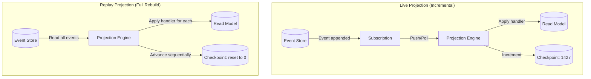
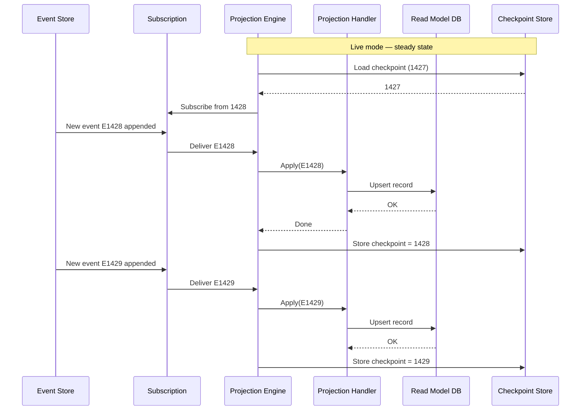
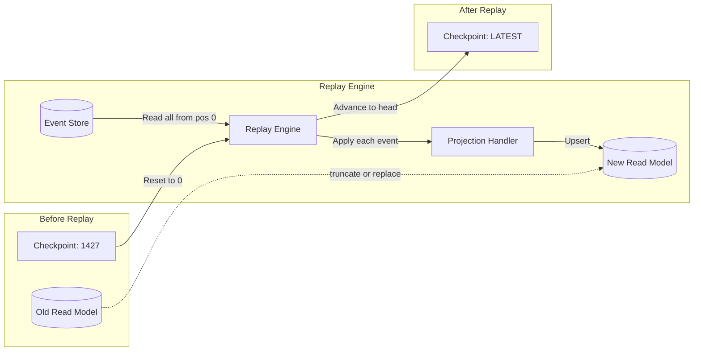
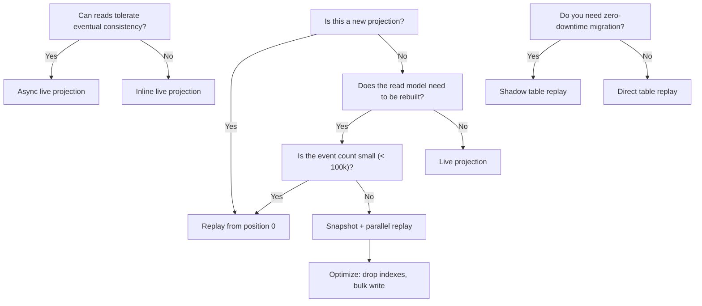

> [!success] Mastery Check
> - [ ] **Studied Well**
> - [ ] **Can explain the concept without notes**
> - [ ] **Can answer interview questions confidently**
> - [ ] **Can implement it in a real project**


# 7.105 — Event Sourcing — Projections — Live vs Replay

> **Live projections** consume events incrementally as they are appended, building read models in near-real time. **Replay projections** reprocess the entire event stream — or a portion of it — from a given position to rebuild, correct, or backfill read models. Understanding when and how to use each mode is critical for building resilient, performant event-sourced systems.

| Property | Value |
|---|---|
| **Group** | CQRS and Event Sourcing |
| **Priority** | 2 |
| **Prerequisites** | [[7.104 — Event Sourcing — Projections — Building Read Models]] |
| **Related** | [[7.107 — Event Sourcing — Event Replay — Full and Partial]] · [[7.108 — Event Sourcing — Temporal Queries — Point-in-Time]] · [[7.109 — Event Sourcing — Event Versioning — Upcasting]] |
| **Version** | 2.0 |
| **Status** | Complete |

---

## Table of Contents

1. [Fundamentals — Live vs Replay Projections](#1-fundamentals--live-vs-replay-projections)
2. [Live Projections — Incremental Real-Time Processing](#2-live-projections--incremental-real-time-processing)
3. [Replay Projections — Re-Processing the Event Stream](#3-replay-projections--re-processing-the-event-stream)
4. [When to Use Each — Decision Framework](#4-when-to-use-each--decision-framework)
5. [Replay Safety — Idempotency Guarantees](#5-replay-safety--idempotency-guarantees)
6. [Replay Performance Optimization](#6-replay-performance-optimization)
7. [Zero-Downtime Projection Migration](#7-zero-downtime-projection-migration)
8. [Projection Engine Implementation](#8-projection-engine-implementation)
9. [Pitfalls and Anti-Patterns](#9-pitfalls-and-anti-patterns)
10. [Interview Questions, ADR, and Self-Check](#10-interview-questions-adr-and-self-check)

---

## 1. Fundamentals — Live vs Replay Projections

### 1.1 Two Modes, One Contract

A **projection** is a function `f: Event[] → ReadModel`. The question is when and how that function executes.

| Mode | Processing Model | Trigger | State | Typical Latency |
|---|---|---|---|---|
| **Live** | Incremental — each event is applied immediately after append | Event store subscription or notification | Stored checkpoint advances monotonically | Milliseconds to seconds |
| **Replay** | Batch — entire stream (or range) is re-processed from a known position | Explicit invocation (rebuild, migration, correction) | Checkpoint reset to 0 or specific position | Minutes to hours |

Both modes share the same projection handler logic. The difference is in **how events are dispatched** and **how checkpoints are managed**.



### 1.2 What Stays the Same

- **Projection handler code** — the same `Apply(OrderPlanned)` method runs in both modes
- **Event schema** — the event types and their serialization format
- **Read model schema** — the output table, document, or index structure
- **Idempotency requirements** — both modes must handle duplicate delivery

### 1.3 What Changes

| Concern | Live | Replay |
|---|---|---|
| Event source | Subscription (push or long-poll) | Bulk read (paging, streaming) |
| Checkpoint | Persisted after each batch | Reset then re-advanced |
| Error handling | Pause, retry, dead-letter | Abort batch, skip, or repair |
| Performance target | Sub-second per event | High throughput (thousands/sec) |
| Read model access | Hot — serving production queries | Cold or shadow — swap on completion |
| Resource consumption | Low, steady | High, burst |

### 1.4 The Checkpoint as the Differentiator

The checkpoint is the single piece of state that distinguishes live from replay:

```csharp
public sealed record ProjectionCheckpoint
{
    public string ProjectionName { get; init; }
    public ulong GlobalPosition { get; set; }
    public DateTime LastUpdatedAt { get; set; }
    public string? Error { get; set; }
    public int RetryCount { get; set; }

    public bool IsBehind(ulong latestPosition) =>
        GlobalPosition < latestPosition;

    public ulong Lag(ulong latestPosition) =>
        latestPosition - GlobalPosition;
}
```

- **Live mode**: checkpoint advances forward by one batch at a time. When a new event is appended, the subscription wakes the projection, processes the event, and saves checkpoint + 1.
- **Replay mode**: checkpoint is reset to 0 (or a specific position). The replay engine reads the event store from that position and processes events as fast as possible, advancing the checkpoint as it goes. When the checkpoint reaches the head of the stream, the projection transitions back to live mode.

### 1.5 Key Insight

> A replay is just a live projection that started from a different position and runs without waiting for new events. The projection handler does **not** know whether it is in live or replay mode — and it should not need to know.

This separation of concerns allows the same `IProjection<TEvent>` implementation to be used in both modes, with the engine abstracting the dispatch mechanics.

---

## 2. Live Projections — Incremental Real-Time Processing

### 2.1 Architecture

A live projection runs as a **background service** or **daemon** that subscribes to the event store. When new events arrive, they are dispatched to the projection handler, which updates the read model and persists the new checkpoint position.



### 2.2 Push vs Pull Subscriptions

| Type | Mechanism | Latency | Complexity | Example |
|---|---|---|---|---|
| **Push** | Event store notifies subscribers via gRPC, HTTP callback, or message queue | Low (milliseconds) | Medium | EventStoreDB `SubscribeToAll` |
| **Pull** | Projection polls the event store at a fixed interval | Variable (poll interval) | Low | Marten async daemon |
| **Transaction log tail** | Reads the database transaction log directly | Very low | High | Debezium, PostgreSQL logical replication |

```csharp
// Push subscription — EventStoreDB gRPC
public sealed class EventStoreDbLiveSubscription
{
    private readonly EventStorePersistentSubscriptionsClient _client;

    public EventStoreDbLiveSubscription(
        EventStorePersistentSubscriptionsClient client)
    {
        _client = client;
    }

    public async Task SubscribeAsync(
        string subscriptionGroup,
        Func<ResolvedEvent, CancellationToken, Task> onEvent,
        CancellationToken ct)
    {
        await _client.SubscribeToAllAsync(
            subscriptionGroup,
            (subscription, resolvedEvent, cancellationToken) =>
            {
                if (resolvedEvent.Event.EventType.StartsWith("$"))
                    return Task.CompletedTask;
                return onEvent(resolvedEvent, cancellationToken);
            },
            userCredentials: new UserCredentials("admin", "changeit"),
            cancellationToken: ct);
    }
}
```

```csharp
// Pull subscription — periodic polling
public sealed class PollingLiveSubscription
{
    private readonly IEventStore _eventStore;
    private readonly TimeSpan _pollInterval;
    private readonly ILogger _logger;

    public PollingLiveSubscription(
        IEventStore eventStore,
        TimeSpan pollInterval,
        ILogger logger)
    {
        _eventStore = eventStore;
        _pollInterval = pollInterval;
        _logger = logger;
    }

    public async Task PollForeverAsync(
        Func<IReadOnlyList<EventEnvelope>, CancellationToken, Task> onBatch,
        Func<CancellationToken, Task<ulong>> getLastCheckpoint,
        CancellationToken ct)
    {
        while (!ct.IsCancellationRequested)
        {
            try
            {
                var checkpoint = await getLastCheckpoint(ct);
                var batch = await _eventStore.ReadAllEventsForwardAsync(
                    checkpoint + 1,
                    maxCount: 100,
                    ct);

                if (batch.Count == 0)
                {
                    await Task.Delay(_pollInterval, ct);
                    continue;
                }

                await onBatch(batch, ct);
            }
            catch (OperationCanceledException)
            {
                break;
            }
            catch (Exception ex)
            {
                _logger.LogError(ex, "Poll subscription error");
                await Task.Delay(TimeSpan.FromSeconds(5), ct);
            }
        }
    }
}
```

### 2.3 Live Projection Handler Example

```csharp
public sealed class OrderSummaryLiveProjection
{
    private readonly IReadModelDbContext _db;

    public OrderSummaryLiveProjection(IReadModelDbContext db)
    {
        _db = db;
    }

    public async Task ApplyAsync(EventEnvelope envelope, CancellationToken ct)
    {
        switch (envelope.Event)
        {
            case OrderPlanned e:
                await ApplyAsync(e, ct);
                break;
            case OrderConfirmed e:
                await ApplyAsync(e, ct);
                break;
            case OrderShipped e:
                await ApplyAsync(e, ct);
                break;
            case OrderLineAdded e:
                await ApplyAsync(e, ct);
                break;
            case OrderLineRemoved e:
                await ApplyAsync(e, ct);
                break;
            case OrderCancelled e:
                await ApplyAsync(e, ct);
                break;
        }
    }

    public async Task ApplyAsync(OrderPlanned @event, CancellationToken ct)
    {
        _db.OrderSummaries.Add(new OrderSummary
        {
            Id = @event.OrderId,
            CustomerId = @event.CustomerId,
            Status = "Planned",
            Total = 0m,
            ItemCount = 0,
            PlannedAt = @event.Timestamp,
            LastModifiedAt = @event.Timestamp,
            Version = 1
        });
        await _db.SaveChangesAsync(ct);
    }

    public async Task ApplyAsync(OrderConfirmed @event, CancellationToken ct)
    {
        var summary = await _db.OrderSummaries.FindAsync(
            new object[] { @event.OrderId }, ct);
        if (summary is null) return;

        summary.Status = "Confirmed";
        summary.LastModifiedAt = @event.Timestamp;
        summary.Version = @event.Version;
        await _db.SaveChangesAsync(ct);
    }

    public async Task ApplyAsync(OrderShipped @event, CancellationToken ct)
    {
        var summary = await _db.OrderSummaries.FindAsync(
            new object[] { @event.OrderId }, ct);
        if (summary is null) return;

        summary.Status = "Shipped";
        summary.ShippedAt = @event.Timestamp;
        summary.Carrier = @event.Carrier;
        summary.TrackingNumber = @event.TrackingNumber;
        summary.LastModifiedAt = @event.Timestamp;
        summary.Version = @event.Version;
        await _db.SaveChangesAsync(ct);
    }

    public async Task ApplyAsync(OrderLineAdded @event, CancellationToken ct)
    {
        var summary = await _db.OrderSummaries.FindAsync(
            new object[] { @event.OrderId }, ct);
        if (summary is null) return;

        summary.Total += @event.UnitPrice * @event.Quantity;
        summary.ItemCount += @event.Quantity;
        summary.LastModifiedAt = @event.Timestamp;
        summary.Version = @event.Version;
        await _db.SaveChangesAsync(ct);
    }

    public async Task ApplyAsync(OrderLineRemoved @event, CancellationToken ct)
    {
        var summary = await _db.OrderSummaries.FindAsync(
            new object[] { @event.OrderId }, ct);
        if (summary is null) return;

        summary.Total -= @event.UnitPrice * @event.Quantity;
        summary.ItemCount -= @event.Quantity;
        summary.LastModifiedAt = @event.Timestamp;
        summary.Version = @event.Version;
        await _db.SaveChangesAsync(ct);
    }

    public async Task ApplyAsync(OrderCancelled @event, CancellationToken ct)
    {
        var summary = await _db.OrderSummaries.FindAsync(
            new object[] { @event.OrderId }, ct);
        if (summary is null) return;

        summary.Status = "Cancelled";
        summary.CancellationReason = @event.Reason;
        summary.CancelledAt = @event.Timestamp;
        summary.LastModifiedAt = @event.Timestamp;
        summary.Version = @event.Version;
        await _db.SaveChangesAsync(ct);
    }
}
```

### 2.4 Live Subscription Engine

```csharp
public sealed class LiveProjectionHost : BackgroundService
{
    private readonly IProjectionCheckpointRepository _checkpoints;
    private readonly IEventStoreReader _eventStore;
    private readonly IServiceScopeFactory _scopeFactory;
    private readonly ILogger<LiveProjectionHost> _logger;
    private readonly string _projectionName;

    public LiveProjectionHost(
        string projectionName,
        IProjectionCheckpointRepository checkpoints,
        IEventStoreReader eventStore,
        IServiceScopeFactory scopeFactory,
        ILogger<LiveProjectionHost> logger)
    {
        _projectionName = projectionName;
        _checkpoints = checkpoints;
        _eventStore = eventStore;
        _scopeFactory = scopeFactory;
        _logger = logger;
    }

    protected override async Task ExecuteAsync(CancellationToken ct)
    {
        _logger.LogInformation("Live projection {Name} starting", _projectionName);

        var checkpoint = await _checkpoints.GetAsync(_projectionName, ct);
        var position = checkpoint?.GlobalPosition ?? 0UL;

        _logger.LogInformation("Resuming from position {Position}", position);

        var batchSize = 100;
        var pollInterval = TimeSpan.FromMilliseconds(500);

        while (!ct.IsCancellationRequested)
        {
            try
            {
                var batch = await _eventStore.ReadBatchAsync(
                    position + 1, batchSize, ct);

                if (batch.Count == 0)
                {
                    await Task.Delay(pollInterval, ct);
                    continue;
                }

                using var scope = _scopeFactory.CreateScope();
                var handler = scope.ServiceProvider
                    .GetRequiredKeyedService<IProjectionHandler>(_projectionName);

                foreach (var envelope in batch)
                {
                    await handler.HandleAsync(envelope, handler.DbContext, ct);
                    position = envelope.Metadata.GlobalPosition;
                }

                await _checkpoints.SaveAsync(
                    _projectionName, position, ct);
            }
            catch (OperationCanceledException)
            {
                break;
            }
            catch (Exception ex)
            {
                _logger.LogError(ex, "Projection {Name} error, retrying in 5s",
                    _projectionName);
                await Task.Delay(TimeSpan.FromSeconds(5), ct);
            }
        }
    }
}
```

### 2.5 Live Projection Consistency Levels

| Level | Behavior | Tradeoff |
|---|---|---|
| **At-most-once** | Event may be skipped if projection crashes before checkpoint write | Tolerable for idempotent rebuilds |
| **At-least-once** | Event is guaranteed to be processed at least once; duplicates possible | Requires idempotent handlers |
| **Exactly-once** | Event is processed exactly once (checkpoint + dedup table) | Higher latency, more storage |

Most production systems target **at-least-once** delivery with idempotent handlers, which gives exactly-once semantics without the coordination overhead of a distributed transaction.

### 2.6 Live Projection Batching

Processing events one at a time can be too slow for high-throughput systems. Batching groups multiple events into a single database transaction:

```csharp
public sealed class BatchedLiveProjection<TReadModel>
    where TReadModel : class, IReadModel
{
    private readonly IProjectionHandler<TReadModel> _handler;
    private readonly int _batchSize;

    public BatchedLiveProjection(
        IProjectionHandler<TReadModel> handler,
        int batchSize = 50)
    {
        _handler = handler;
        _batchSize = batchSize;
    }

    public async Task ProcessBatchAsync(
        IReadOnlyList<EventEnvelope> batch,
        IReadModelDbContext db,
        CancellationToken ct)
    {
        foreach (var envelope in batch)
        {
            await _handler.HandleAsync(envelope, db, ct);
        }

        await db.SaveChangesAsync(ct);
    }
}
```

Batching reduces the number of database round-trips at the cost of losing partial progress if the batch fails mid-way. With idempotent handlers and a deduplication table, partially applied batches can be retried safely.

---

## 3. Replay Projections — Re-Processing the Event Stream

### 3.1 Architecture

A replay projection reads events from the event store **from a specific position** and processes them sequentially (or in parallel, with care) to produce a complete or corrected read model.



### 3.2 When to Replay

| Scenario | Why Replay |
|---|---|
| **New projection** | A new read model needs to be built from all historical events |
| **Schema migration** | A read model column or structure changed; re-derive from events |
| **Bug fix in handler** | A handler had incorrect logic; fix the handler and replay |
| **Data corruption** | Read model was corrupted by a bad deployment or manual DB change |
| **Consistency check** | Verify that the read model matches the event stream (audit) |
| **Disaster recovery** | Entire read model database was lost; rebuild from events |
| **Temporal query** | Replay to a specific point in time for debugging or reporting |

### 3.3 Replay Engine — Sequential Implementation

```csharp
public sealed class SequentialReplayEngine
{
    private readonly IEventStoreReader _eventStore;
    private readonly IProjectionCheckpointRepository _checkpoints;
    private readonly IServiceScopeFactory _scopeFactory;
    private readonly ILogger<SequentialReplayEngine> _logger;
    private readonly string _projectionName;
    private readonly ReplayOptions _options;

    public sealed record ReplayOptions
    {
        public ulong StartPosition { get; init; } = 0;
        public ulong? EndPosition { get; init; }
        public int BatchSize { get; init; } = 500;
        public bool TruncateFirst { get; init; } = true;
        public bool ValidateReadModel { get; init; } = true;
        public int MaxRetries { get; init; } = 3;
    }

    public SequentialReplayEngine(
        string projectionName,
        IEventStoreReader eventStore,
        IProjectionCheckpointRepository checkpoints,
        IServiceScopeFactory scopeFactory,
        ILogger<SequentialReplayEngine> logger,
        ReplayOptions? options = null)
    {
        _projectionName = projectionName;
        _eventStore = eventStore;
        _checkpoints = checkpoints;
        _scopeFactory = scopeFactory;
        _logger = logger;
        _options = options ?? new ReplayOptions();
    }

    public async Task<ReplayResult> ExecuteAsync(CancellationToken ct)
    {
        _logger.LogInformation(
            "Replay starting for {Name} from position {Start}",
            _projectionName, _options.StartPosition);

        var stopwatch = Stopwatch.StartNew();
        var totalEvents = 0L;
        var failedEvents = 0L;

        if (_options.TruncateFirst)
        {
            _logger.LogInformation("Truncating read model for {Name}", _projectionName);
            using (var scope = _scopeFactory.CreateScope())
            {
                var cleaner = scope.ServiceProvider
                    .GetRequiredKeyedService<IReadModelCleaner>(_projectionName);
                await cleaner.TruncateAsync(ct);
            }

            await _checkpoints.SaveAsync(
                _projectionName, _options.StartPosition, ct);
        }

        var position = _options.StartPosition;
        var endPosition = _options.EndPosition ?? ulong.MaxValue;

        while (!ct.IsCancellationRequested && position < endPosition)
        {
            IReadOnlyList<EventEnvelope> batch;
            try
            {
                batch = await _eventStore.ReadBatchAsync(
                    position + 1, _options.BatchSize, ct);

                if (batch.Count == 0)
                    break;
            }
            catch (Exception ex)
            {
                _logger.LogError(ex, "Failed to read events at position {Pos}", position);
                return new ReplayResult(
                    false, totalEvents, failedEvents, stopwatch.Elapsed,
                    position, "Event store read failed");
            }

            using var scope = _scopeFactory.CreateScope();
            var handler = scope.ServiceProvider
                .GetRequiredKeyedService<IReplayProjectionHandler>(_projectionName);
            var db = scope.ServiceProvider
                .GetRequiredService<IReadModelDbContext>();

            foreach (var envelope in batch)
            {
                try
                {
                    await handler.HandleAsync(envelope, db, ct);
                    position = envelope.Metadata.GlobalPosition;
                    totalEvents++;
                }
                catch (Exception ex)
                {
                    _logger.LogError(ex,
                        "Replay failed at event {EventType} position {Pos}",
                        envelope.Metadata.EventType,
                        envelope.Metadata.GlobalPosition);

                    failedEvents++;

                    if (failedEvents >= _options.MaxRetries)
                    {
                        return new ReplayResult(
                            false, totalEvents, failedEvents,
                            stopwatch.Elapsed, position,
                            "Failed after {failedEvents} errors");
                    }

                    break;
                }
            }

            await db.SaveChangesAsync(ct);
            await _checkpoints.SaveAsync(_projectionName, position, ct);

            _logger.LogInformation(
                "Replay progress: {Total} events at position {Pos}",
                totalEvents, position);
        }

        if (_options.ValidateReadModel && totalEvents > 0)
        {
            _logger.LogInformation("Validating read model after replay");
            using var scope = _scopeFactory.CreateScope();
            var validator = scope.ServiceProvider
                .GetRequiredKeyedService<IReadModelValidator>(_projectionName);
            var (isValid, errors) = await validator.ValidateAsync(ct);

            if (!isValid)
            {
                return new ReplayResult(
                    false, totalEvents, failedEvents,
                    stopwatch.Elapsed, position,
                    "Validation failed: {string.Join(\"; \", errors)}");
            }
        }

        stopwatch.Stop();
        _logger.LogInformation(
            "Replay complete for {Name}: {Total} events in {Elapsed:mm\\:ss}",
            _projectionName, totalEvents, stopwatch.Elapsed);

        return new ReplayResult(
            true, totalEvents, failedEvents,
            stopwatch.Elapsed, position, null);
    }
}

public sealed record ReplayResult(
    bool Success,
    long TotalEvents,
    long FailedEvents,
    TimeSpan Elapsed,
    ulong FinalPosition,
    string? Error);
```

### 3.4 Parallel Replay Engine

```csharp
public sealed class ParallelReplayEngine
{
    private readonly IEventStoreReader _eventStore;
    private readonly IProjectionCheckpointRepository _checkpoints;
    private readonly IServiceScopeFactory _scopeFactory;
    private readonly ILogger<ParallelReplayEngine> _logger;
    private readonly string _projectionName;
    private readonly ParallelReplayOptions _options;

    public sealed record ParallelReplayOptions
    {
        public int DegreeOfParallelism { get; init; } = 4;
        public int EventsPerPartition { get; init; } = 50000;
        public int BatchSize { get; init; } = 500;
        public bool TruncateFirst { get; init; } = true;
        public bool MergeAfterParallel { get; init; } = true;
        public TimeSpan HandlerTimeout { get; init; } = TimeSpan.FromMinutes(5);
    }

    public ParallelReplayEngine(
        string projectionName,
        IEventStoreReader eventStore,
        IProjectionCheckpointRepository checkpoints,
        IServiceScopeFactory scopeFactory,
        ILogger<ParallelReplayEngine> logger,
        ParallelReplayOptions? options = null)
    {
        _projectionName = projectionName;
        _eventStore = eventStore;
        _checkpoints = checkpoints;
        _scopeFactory = scopeFactory;
        _logger = logger;
        _options = options ?? new ParallelReplayOptions();
    }

    public async Task<ReplayResult> ExecuteAsync(CancellationToken ct)
    {
        var stopwatch = Stopwatch.StartNew();

        var totalEvents = await _eventStore.GetGlobalPositionAsync(ct);
        if (totalEvents == 0)
        {
            return new ReplayResult(true, 0, 0, TimeSpan.Zero, 0, null);
        }

        _logger.LogInformation(
            "Parallel replay for {Name}: {Total} events, {Dop} workers",
            _projectionName, totalEvents, _options.DegreeOfParallelism);

        if (_options.TruncateFirst)
        {
            using var scope = _scopeFactory.CreateScope();
            var cleaner = scope.ServiceProvider
                .GetRequiredKeyedService<IReadModelCleaner>(_projectionName);
            await cleaner.TruncateAsync(ct);
            await _checkpoints.SaveAsync(_projectionName, 0, ct);
        }

        var partitions = BuildPartitions(totalEvents, _options.EventsPerPartition);

        _logger.LogInformation(
            "Created {Count} partitions of ~{Size} events each",
            partitions.Count, _options.EventsPerPartition);

        var semaphore = new SemaphoreSlim(_options.DegreeOfParallelism);
        var failedPartitions = new ConcurrentBag<(int Id, string Error)>();
        var processedCount = 0L;

        var tasks = partitions.Select(async partition =>
        {
            await semaphore.WaitAsync(ct);
            try
            {
                var (start, end) = partition;
                using var scope = _scopeFactory.CreateScope();
                var handler = scope.ServiceProvider
                    .GetRequiredKeyedService<IParallelReplayHandler>(_projectionName);
                var db = scope.ServiceProvider
                    .GetRequiredService<IReadModelDbContext>();

                var position = start;

                while (position < end && !ct.IsCancellationRequested)
                {
                    var batch = await _eventStore.ReadBatchAsync(
                        position + 1, _options.BatchSize, ct);

                    if (batch.Count == 0) break;

                    foreach (var envelope in batch)
                    {
                        if (envelope.Metadata.GlobalPosition > end)
                            break;

                        try
                        {
                            using var cts = CancellationTokenSource.CreateLinkedTokenSource(ct);
                            cts.CancelAfter(_options.HandlerTimeout);

                            await handler.HandleAsync(
                                envelope, db, cts.Token);

                            Interlocked.Increment(ref processedCount);
                            position = envelope.Metadata.GlobalPosition;
                        }
                        catch (Exception ex)
                        {
                            failedPartitions.Add((
                                partition.GetHashCode(),
                                "Event {envelope.Metadata.EventType} " +
                                "at {envelope.Metadata.GlobalPosition}: {ex.Message}"));
                            break;
                        }
                    }

                    await db.SaveChangesAsync(ct);
                }

                await _checkpoints.SavePartitionProgressAsync(
                    _projectionName, partition.GetHashCode(), position, ct);
            }
            finally
            {
                semaphore.Release();
            }
        });

        await Task.WhenAll(tasks);

        var finalPosition = await _eventStore.GetGlobalPositionAsync(ct);
        await _checkpoints.SaveAsync(_projectionName, finalPosition, ct);

        stopwatch.Stop();

        _logger.LogInformation(
            "Parallel replay complete: {Processed} events in {Elapsed}",
            processedCount, stopwatch.Elapsed);

        return new ReplayResult(
            failedPartitions.IsEmpty,
            processedCount,
            failedPartitions.Count,
            stopwatch.Elapsed,
            finalPosition,
            failedPartitions.IsEmpty
                ? null
                : "{failedPartitions.Count} partition(s) failed");
    }

    private static List<(ulong Start, ulong End)> BuildPartitions(
        ulong totalEvents, int eventsPerPartition)
    {
        var partitions = new List<(ulong Start, ulong End)>();
        ulong start = 0;

        while (start < totalEvents)
        {
            var end = Math.Min(start + (ulong)eventsPerPartition, totalEvents);
            partitions.Add((start, end));
            start = end + 1;
        }

        return partitions;
    }
}
```

### 3.5 Checkpoint Reset

Resetting the checkpoint is the trigger for a replay. This must be a controlled operation, especially in production.

```csharp
public sealed class CheckpointResetService
{
    private readonly IProjectionCheckpointRepository _checkpoints;
    private readonly IProjectionRegistry _registry;
    private readonly ILogger<CheckpointResetService> _logger;

    public CheckpointResetService(
        IProjectionCheckpointRepository checkpoints,
        IProjectionRegistry registry,
        ILogger<CheckpointResetService> logger)
    {
        _checkpoints = checkpoints;
        _registry = registry;
        _logger = logger;
    }

    public sealed class ResetOptions
    {
        public ulong? TargetPosition { get; init; }
        public bool RequireConfirmation { get; init; } = true;
        public bool PauseProjectionFirst { get; init; } = true;
        public TimeSpan? MaxPauseDuration { get; init; }
        public string? Reason { get; init; }
    }

    public sealed record ResetResult(
        string ProjectionName,
        ulong PreviousPosition,
        ulong NewPosition,
        DateTime ResetAt,
        bool Success,
        string? Error);

    public async Task<ResetResult> ResetAsync(
        string projectionName,
        ResetOptions? options = null,
        CancellationToken ct = default)
    {
        options ??= new ResetOptions();

        if (!_registry.IsRegistered(projectionName))
        {
            return new ResetResult(
                projectionName, 0, 0, DateTime.UtcNow,
                false, "Projection '{projectionName}' not registered");
        }

        if (string.IsNullOrWhiteSpace(options.Reason) &&
            options.RequireConfirmation)
        {
            return new ResetResult(
                projectionName, 0, 0, DateTime.UtcNow,
                false, "Reset reason is required");
        }

        if (options.PauseProjectionFirst)
        {
            _logger.LogInformation(
                "Pausing projection {Name} before reset", projectionName);

            await _registry.PauseAsync(projectionName, ct);

            await _registry.WaitForDrainAsync(
                projectionName,
                options.MaxPauseDuration ?? TimeSpan.FromSeconds(30),
                ct);
        }

        var existing = await _checkpoints.GetAsync(projectionName, ct);
        var previousPosition = existing?.GlobalPosition ?? 0UL;

        var newPosition = options.TargetPosition ?? 0UL;
        await _checkpoints.SaveAsync(projectionName, newPosition, ct);

        _logger.LogWarning(
            "Checkpoint reset for {Name}: {Previous} -> {New}. Reason: {Reason}",
            projectionName, previousPosition, newPosition,
            options.Reason ?? "No reason provided");

        await _checkpoints.AuditResetAsync(new ResetAuditEntry
        {
            ProjectionName = projectionName,
            PreviousPosition = previousPosition,
            NewPosition = newPosition,
            Reason = options.Reason ?? "Not specified",
            ResetAt = DateTime.UtcNow,
            ResetBy = Environment.MachineName
        }, ct);

        return new ResetResult(
            projectionName, previousPosition, newPosition,
            DateTime.UtcNow, true, null);
    }

    public async Task ResumeAsync(
        string projectionName, CancellationToken ct = default)
    {
        await _registry.ResumeAsync(projectionName, ct);
        _logger.LogInformation("Projection {Name} resumed", projectionName);
    }
}
```

### 3.6 Partial Replay

Not all replays need to start from position 0. Partial replay processes a specific range:

```csharp
public sealed class PartialReplayEngine
{
    private readonly IEventStoreReader _eventStore;
    private readonly IProjectionCheckpointRepository _checkpoints;
    private readonly IServiceScopeFactory _scopeFactory;
    private readonly ILogger<PartialReplayEngine> _logger;
    private readonly string _projectionName;

    public PartialReplayEngine(
        string projectionName,
        IEventStoreReader eventStore,
        IProjectionCheckpointRepository checkpoints,
        IServiceScopeFactory scopeFactory,
        ILogger<PartialReplayEngine> logger)
    {
        _projectionName = projectionName;
        _eventStore = eventStore;
        _checkpoints = checkpoints;
        _scopeFactory = scopeFactory;
        _logger = logger;
    }

    public async Task<ReplayResult> ReplayRangeAsync(
        ulong fromPosition,
        ulong? toPosition = null,
        CancellationToken ct = default)
    {
        if (fromPosition == 0)
        {
            return await new SequentialReplayEngine(
                _projectionName, _eventStore, _checkpoints,
                _scopeFactory, _logger).ExecuteAsync(ct);
        }

        _logger.LogInformation(
            "Partial replay {Name} from {From} to {To}",
            _projectionName, fromPosition, toPosition?.ToString() ?? "HEAD");

        var stopwatch = Stopwatch.StartNew();
        var totalEvents = 0L;
        var position = fromPosition;
        var endPosition = toPosition ?? ulong.MaxValue;

        using var scope = _scopeFactory.CreateScope();
        var handler = scope.ServiceProvider
            .GetRequiredKeyedService<IReplayProjectionHandler>(_projectionName);
        var db = scope.ServiceProvider
            .GetRequiredService<IReadModelDbContext>();

        while (position < endPosition && !ct.IsCancellationRequested)
        {
            var batch = await _eventStore.ReadBatchAsync(
                position + 1, 500, ct);

            if (batch.Count == 0) break;

            foreach (var envelope in batch)
            {
                if (envelope.Metadata.GlobalPosition > endPosition)
                    break;

                await handler.HandleAsync(envelope, db, ct);
                position = envelope.Metadata.GlobalPosition;
                totalEvents++;
            }

            await db.SaveChangesAsync(ct);
            await _checkpoints.SaveAsync(_projectionName, position, ct);
        }

        stopwatch.Stop();

        return new ReplayResult(
            true, totalEvents, 0, stopwatch.Elapsed, position, null);
    }
}
```

---

## 4. When to Use Each — Decision Framework

### 4.1 Decision Matrix

| Condition | Live | Replay | Hybrid |
|---|---|---|---|
| Read model is new (no data exists) | Needs catch-up (replay from 0) | Preferred | Catch-up first, then live |
| Read model exists and is up-to-date | Preferred | Overkill | — |
| Handler logic has a bug | Must be fixed and replayed | Required | Replay after fix |
| Schema migration on read model | Cannot handle | Required | Shadow table + replay |
| Event volume is low (<10K total) | Live from start is fine | Not needed | — |
| Event volume is very high (>10M) | Handles new events only | Replay is expensive | Snapshot + incremental |
| Consistency audit needed | Cannot verify | Required | Compare mode |
| Latency requirement is <10ms reads | Live (pre-built read model) | Not suitable | — |
| Disaster recovery | Not applicable | Required | — |
| Adding a new index or query view | Cannot add history | Required | Replay to build, then live |

### 4.2 Decision Flow



### 4.3 Hybrid Mode — Catch-Up Then Live

Most projections start in **catch-up** mode (replay from last checkpoint) and transition seamlessly to **live** mode when they reach the head of the stream.

```csharp
public sealed class CatchUpThenLiveProjection : BackgroundService
{
    private readonly IEventStoreReader _eventStore;
    private readonly IProjectionCheckpointRepository _checkpoints;
    private readonly IServiceScopeFactory _scopeFactory;
    private readonly ILogger<CatchUpThenLiveProjection> _logger;
    private readonly string _projectionName;
    private readonly int _catchUpBatchSize;

    private const int LivePollIntervalMs = 500;

    public CatchUpThenLiveProjection(
        string projectionName,
        IEventStoreReader eventStore,
        IProjectionCheckpointRepository checkpoints,
        IServiceScopeFactory scopeFactory,
        ILogger<CatchUpThenLiveProjection> logger,
        int catchUpBatchSize = 1000)
    {
        _projectionName = projectionName;
        _eventStore = eventStore;
        _checkpoints = checkpoints;
        _scopeFactory = scopeFactory;
        _logger = logger;
        _catchUpBatchSize = catchUpBatchSize;
    }

    protected override async Task ExecuteAsync(CancellationToken ct)
    {
        var checkpoint = await _checkpoints.GetAsync(_projectionName, ct);
        var currentPosition = checkpoint?.GlobalPosition ?? 0UL;
        var latestPosition = await _eventStore.GetGlobalPositionAsync(ct);

        var isCatchUp = currentPosition < latestPosition;

        if (isCatchUp)
        {
            _logger.LogInformation(
                "Catch-up mode: {Pos} -> {Latest} ({Lag} events behind)",
                currentPosition, latestPosition, latestPosition - currentPosition);
        }

        while (!ct.IsCancellationRequested)
        {
            var batch = await _eventStore.ReadBatchAsync(
                currentPosition + 1,
                isCatchUp ? _catchUpBatchSize : 100,
                ct);

            if (batch.Count == 0)
            {
                if (isCatchUp)
                {
                    isCatchUp = false;
                    _logger.LogInformation(
                        "Caught up at position {Pos}, switching to live mode",
                        currentPosition);
                }

                await Task.Delay(LivePollIntervalMs, ct);
                continue;
            }

            using var scope = _scopeFactory.CreateScope();
            var handler = scope.ServiceProvider
                .GetRequiredKeyedService<IProjectionHandler>(_projectionName);
            var db = scope.ServiceProvider
                .GetRequiredService<IReadModelDbContext>();

            foreach (var envelope in batch)
            {
                await handler.HandleAsync(envelope, db, ct);
                currentPosition = envelope.Metadata.GlobalPosition;
            }

            await db.SaveChangesAsync(ct);
            await _checkpoints.SaveAsync(_projectionName, currentPosition, ct);
        }
    }
}
```

### 4.4 When Live Projections Are Insufficient

Live projections **cannot**:

- Build a read model from historical events that predate the projection's creation
- Recover from a handler bug that produced incorrect data (the incorrect data is already written)
- Recover from read model database corruption
- Support read model schema migrations that change how existing data is represented
- Provide point-in-time queries against historical event state (for that, see [[7.108 — Event Sourcing — Temporal Queries — Point-in-Time]])

In all these cases, a replay projection is required.

### 4.5 When Replay Projections Are Overkill

Replay is not needed when:

- The read model is a simple cache that can be cleared and rebuilt from a snapshot
- The projection is used for ephemeral reasoning (e.g., in-memory process manager state)
- The event stream is empty or trivially small (just let live projection catch up)
- Data can be repaired via direct database manipulation (though this is risky — events should remain the source of truth)

---

## 5. Replay Safety — Idempotency Guarantees

### 5.1 Why Idempotency Matters in Replay

During a replay, every event in the stream is processed — potentially for the second, third, or hundredth time. If the projection handler is not idempotent, replay will produce **incorrect** read model state.

**Non-idempotent example** (broken for replay):

```csharp
// BAD: Non-idempotent — adds a new row every time
public async Task ApplyAsync(OrderPlanned @event, CancellationToken ct)
{
    _db.OrderSummaries.Add(new OrderSummary
    {
        Id = @event.OrderId,
        CustomerId = @event.CustomerId,
        Status = "Planned",
        Total = 0m
    });
    await _db.SaveChangesAsync(ct);
}
```

**Idempotent example** (safe for replay):

```csharp
// GOOD: Idempotent — uses UPSERT
public async Task ApplyAsync(OrderPlanned @event, CancellationToken ct)
{
    await _db.Database.ExecuteSqlInterpolatedAsync($@"
        INSERT INTO order_summaries (id, customer_id, status, total, item_count, version)
        VALUES ({@event.OrderId}, {@event.CustomerId}, 'Planned', 0, 0, 1)
        ON CONFLICT (id) DO UPDATE SET
            customer_id = EXCLUDED.customer_id,
            status = EXCLUDED.status,
            total = EXCLUDED.total,
            version = EXCLUDED.version
    ", ct);
}
```

### 5.2 Idempotency Strategies

#### 5.2.1 UPSERT (Primary Strategy)

```csharp
public static class IdempotentUpsert
{
    public static async Task UpsertAsync<TKey>(
        this IReadModelDbContext db,
        string tableName,
        TKey id,
        object values,
        CancellationToken ct)
        where TKey : notnull
    {
        var sql = BuildUpsertSql(tableName, values);
        await db.Database.ExecuteSqlRawAsync(sql, ct);
    }

    private static string BuildUpsertSql(string tableName, object values)
    {
        var props = values.GetType().GetProperties();
        var columns = string.Join(", ", props.Select(p => p.Name));
        var placeholders = string.Join(", ", props.Select(p => "@{p.Name}"));
        var updates = string.Join(", ",
            props.Select(p => "{p.Name} = EXCLUDED.{p.Name}"));

        return $@"
            INSERT INTO {tableName} ({columns})
            VALUES ({placeholders})
            ON CONFLICT (id) DO UPDATE SET {updates}";
    }
}
```

#### 5.2.2 Version Check (Optimistic)

```csharp
public sealed class VersionCheckedProjection
{
    public async Task ApplyAsync(
        OrderShipped @event, IReadModelDbContext db, CancellationToken ct)
    {
        var row = await db.OrderSummaries.FindAsync(
            new object[] { @event.OrderId }, ct);

        if (row is null)
        {
            db.OrderSummaries.Add(new OrderSummary
            {
                Id = @event.OrderId,
                Status = "Shipped",
                ShippedAt = @event.Timestamp,
                Version = @event.Version
            });
        }
        else if (@event.Version > row.Version)
        {
            row.Status = "Shipped";
            row.ShippedAt = @event.Timestamp;
            row.Version = @event.Version;
        }
    }
}
```

#### 5.2.3 Deduplication Table

```csharp
public sealed class DeduplicationGuard
{
    private readonly IReadModelDbContext _db;
    private readonly string _projectionName;
    private readonly TimeSpan _retention;

    public DeduplicationGuard(
        IReadModelDbContext db,
        string projectionName,
        TimeSpan? retention = null)
    {
        _db = db;
        _projectionName = projectionName;
        _retention = retention ?? TimeSpan.FromDays(7);
    }

    public async Task<bool> IsAlreadyProcessedAsync(
        Guid eventId, CancellationToken ct)
    {
        return await _db.ProcessedEvents
            .AnyAsync(e => e.EventId == eventId
                && e.ProjectionName == _projectionName, ct);
    }

    public async Task MarkProcessedAsync(
        Guid eventId, ulong position, CancellationToken ct)
    {
        _db.ProcessedEvents.Add(new ProcessedEvent
        {
            EventId = eventId,
            ProjectionName = _projectionName,
            GlobalPosition = position,
            ProcessedAt = DateTime.UtcNow
        });

        await _db.Database.ExecuteSqlInterpolatedAsync($@"
            DELETE FROM processed_events
            WHERE projection_name = {_projectionName}
                AND processed_at < NOW() - {_retention}
        ", ct);
    }

    public async Task<bool> TryProcessOnceAsync(
        Guid eventId,
        ulong position,
        Func<Task> process,
        CancellationToken ct)
    {
        if (await IsAlreadyProcessedAsync(eventId, ct))
            return false;

        await process();
        await MarkProcessedAsync(eventId, position, ct);
        return true;
    }
}
```

### 5.3 Comparison of Idempotency Approaches

| Strategy | Complexity | Performance | Safety | Storage Overhead |
|---|---|---|---|---|
| **UPSERT** | Low | High (single SQL op) | Good | None |
| **Version check** | Medium | Medium (SELECT then INSERT/UPDATE) | Strong | Version column |
| **Deduplication table** | Medium | Lower (two writes per event) | Strongest | Dedup table (bounded by TTL) |
| **Combined (UPSERT + version + dedup)** | High | Lower | Maximum | All three |

### 5.4 Event Ordering During Replay

During replay, events must be processed **in the same order they were originally appended**.

```csharp
public sealed class OrderingValidator
{
    private ulong _lastPosition;

    public bool IsInOrder(EventEnvelope envelope)
    {
        if (envelope.Metadata.GlobalPosition <= _lastPosition)
            return false;

        _lastPosition = envelope.Metadata.GlobalPosition;
        return true;
    }

    public void Reset() => _lastPosition = 0;
}
```

### 5.5 Replay and Deduplication Table Growth

```csharp
public sealed class BatchDeduplicationWriter
{
    private readonly IReadModelDbContext _db;
    private readonly string _projectionName;
    private readonly List<ProcessedEvent> _buffer = new();
    private readonly int _flushSize;
    private readonly TimeSpan _retention;

    public BatchDeduplicationWriter(
        IReadModelDbContext db,
        string projectionName,
        int flushSize = 1000,
        TimeSpan? retention = null)
    {
        _db = db;
        _projectionName = projectionName;
        _flushSize = flushSize;
        _retention = retention ?? TimeSpan.FromDays(1);
    }

    public async Task TrackAsync(
        Guid eventId, ulong position, CancellationToken ct)
    {
        _buffer.Add(new ProcessedEvent
        {
            EventId = eventId,
            ProjectionName = _projectionName,
            GlobalPosition = position,
            ProcessedAt = DateTime.UtcNow
        });

        if (_buffer.Count >= _flushSize)
        {
            await FlushAsync(ct);
        }
    }

    public async Task FlushAsync(CancellationToken ct)
    {
        if (_buffer.Count == 0) return;

        _db.ProcessedEvents.AddRange(_buffer);
        await _db.SaveChangesAsync(ct);

        if (_buffer.Count > 0)
        {
            await _db.Database.ExecuteSqlInterpolatedAsync($@"
                DELETE FROM processed_events
                WHERE projection_name = {_projectionName}
                    AND processed_at < NOW() - {_retention}
            ", ct);
        }

        _buffer.Clear();
    }

    public async Task SkipDedupDuringReplayAsync(
        IReadOnlyList<EventEnvelope> batch,
        Func<EventEnvelope, CancellationToken, Task> process,
        CancellationToken ct)
    {
        foreach (var envelope in batch)
        {
            await process(envelope, ct);
            await TrackAsync(
                envelope.Metadata.EventId,
                envelope.Metadata.GlobalPosition,
                ct);
        }
    }
}
```

### 5.6 Replay Safety Checklist

| Check | Implementation |
|---|---|
| **All handlers are idempotent** | Use UPSERT or version-checked updates |
| **Event ordering is preserved** | Read events in global position order |
| **Checkpoint is persisted atomically** | Same transaction as read model update |
| **Partially applied batches are safe** | Idempotent handlers allow retry |
| **Deduplication table has bounded growth** | TTL-based cleanup or batch purge |
| **Handler logic is deterministic** | No random values, no current-time-as-data |
| **Parallel partitions are isolated** | Each partition writes to non-overlapping keys |
| **Replay can be interrupted and resumed** | Checkpoint saved after each batch |

---

## 6. Replay Performance Optimization

### 6.1 Performance Metrics

| Metric | Sequential Replay | Parallel Replay | Optimized |
|---|---|---|---|
| Events per second (SQL DB) | 500–2,000 | 2,000–20,000 | 10,000–100,000+ |
| Events per second (NoSQL) | 1,000–5,000 | 5,000–50,000 | 20,000–200,000+ |
| 10M events (SQL, sequential) | ~2–5 hours | ~10–30 minutes | ~2–10 minutes |
| 10M events (NoSQL, parallel) | ~30–60 minutes | ~5–15 minutes | ~1–3 minutes |

### 6.2 Batch Sizing

```csharp
public sealed class AdaptiveBatchSizer
{
    private readonly int _minBatch;
    private readonly int _maxBatch;
    private readonly TimeSpan _targetDuration;
    private int _currentBatch;

    public AdaptiveBatchSizer(
        int minBatch = 50,
        int maxBatch = 5000,
        int initialBatch = 500,
        TimeSpan? targetDuration = null)
    {
        _minBatch = minBatch;
        _maxBatch = maxBatch;
        _currentBatch = initialBatch;
        _targetDuration = targetDuration ?? TimeSpan.FromSeconds(2);
    }

    public int CurrentBatch => _currentBatch;

    public void RecordBatchDuration(TimeSpan duration)
    {
        if (duration > _targetDuration * 1.5)
        {
            _currentBatch = Math.Max(_minBatch, _currentBatch / 2);
        }
        else if (duration < _targetDuration * 0.5)
        {
            _currentBatch = Math.Min(_maxBatch, _currentBatch * 2);
        }
    }

    public void Reset() => _currentBatch = 500;
}
```

### 6.3 Read Model Write Optimization

```csharp
public sealed class BulkReplayWriter<TReadModel>
    where TReadModel : class
{
    private readonly IReadModelDbContext _db;
    private readonly List<TReadModel> _buffer = new();
    private readonly int _bulkThreshold;

    public BulkReplayWriter(
        IReadModelDbContext db,
        int bulkThreshold = 1000)
    {
        _db = db;
        _bulkThreshold = bulkThreshold;
    }

    public async Task StageAsync(TReadModel model, CancellationToken ct)
    {
        _buffer.Add(model);

        if (_buffer.Count >= _bulkThreshold)
        {
            await FlushAsync(ct);
        }
    }

    public async Task FlushAsync(CancellationToken ct)
    {
        if (_buffer.Count == 0) return;

        _db.Set<TReadModel>().AddRange(_buffer);
        await _db.SaveChangesAsync(ct);
        _buffer.Clear();
    }
}
```

### 6.4 Index Strategy During Replay

```csharp
public sealed class ReplayIndexManager
{
    private readonly IReadModelDbContext _db;

    public async Task DropNonPrimaryIndexesAsync(
        string tableName, CancellationToken ct)
    {
        var indexes = await GetSecondaryIndexesAsync(tableName, ct);
        foreach (var idx in indexes)
        {
            await _db.Database.ExecuteSqlInterpolatedAsync(
                "DROP INDEX IF EXISTS {idx}", ct);
        }
    }

    public async Task RebuildIndexesAsync(
        string tableName, CancellationToken ct)
    {
        var definitions = await GetIndexDefinitionsAsync(tableName, ct);
        foreach (var (name, definition) in definitions)
        {
            await _db.Database.ExecuteSqlInterpolatedAsync(
                "CREATE INDEX {name} ON {tableName} {definition}", ct);
        }
    }

    private async Task<List<string>> GetSecondaryIndexesAsync(
        string tableName, CancellationToken ct)
    {
        return await _db.Database.SqlQuery<string>($@"
            SELECT index_name FROM information_schema.indexes
            WHERE table_name = {tableName}
                AND index_type != 'primary'
        ").ToListAsync(ct);
    }

    private async Task<Dictionary<string, string>> GetIndexDefinitionsAsync(
        string tableName, CancellationToken ct)
    {
        return new Dictionary<string, string>
        {
            ["idx_order_status"] = "(status)",
            ["idx_order_customer"] = "(customer_id)",
            ["idx_order_created"] = "(created_at DESC)"
        };
    }
}
```

### 6.5 Disable Triggers and Constraints Temporarily

```csharp
public sealed class ReplayConstraintManager
{
    private readonly IReadModelDbContext _db;

    public async Task DisableConstraintsAsync(
        string tableName, CancellationToken ct)
    {
        await _db.Database.ExecuteSqlInterpolatedAsync($@"
            ALTER TABLE {tableName} DISABLE TRIGGER ALL
        ", ct);
    }

    public async Task EnableConstraintsAsync(
        string tableName, CancellationToken ct)
    {
        await _db.Database.ExecuteSqlInterpolatedAsync($@"
            ALTER TABLE {tableName} ENABLE TRIGGER ALL
        ", ct);
    }
}
```

### 6.6 Event Store Read Optimization

```csharp
public sealed class PrefetchingEventStoreReader : IEventStoreReader
{
    private readonly IEventStoreReader _inner;
    private readonly int _prefetchCount;
    private readonly Channel<EventEnvelope> _channel;
    private readonly CancellationTokenSource _prefetchCts;
    private ulong _nextPosition;
    private Task? _prefetchTask;

    public PrefetchingEventStoreReader(
        IEventStoreReader inner,
        int prefetchCount = 1000,
        int channelCapacity = 10000)
    {
        _inner = inner;
        _prefetchCount = prefetchCount;
        _channel = Channel.CreateBounded<EventEnvelope>(
            new BoundedChannelOptions(channelCapacity)
            {
                FullMode = BoundedChannelFullMode.Wait
            });
        _prefetchCts = new CancellationTokenSource();
    }

    public async Task<IReadOnlyList<EventEnvelope>> ReadBatchAsync(
        ulong fromPosition, int maxCount, CancellationToken ct)
    {
        if (_prefetchTask is null || _prefetchTask.IsCompleted)
        {
            _nextPosition = fromPosition;
            _prefetchTask = PrefetchAsync(_prefetchCts.Token);
        }

        var batch = new List<EventEnvelope>(maxCount);
        var cts = CancellationTokenSource.CreateLinkedTokenSource(ct);
        cts.CancelAfter(TimeSpan.FromSeconds(10));

        try
        {
            for (int i = 0; i < maxCount; i++)
            {
                if (!await _channel.Reader.WaitToReadAsync(cts.Token))
                    break;

                if (_channel.Reader.TryRead(out var envelope))
                {
                    batch.Add(envelope);
                }
            }
        }
        catch (OperationCanceledException) { }

        return batch;
    }

    private async Task PrefetchAsync(CancellationToken ct)
    {
        while (!ct.IsCancellationRequested)
        {
            var batch = await _inner.ReadBatchAsync(
                _nextPosition, _prefetchCount, ct);

            if (batch.Count == 0)
                break;

            foreach (var envelope in batch)
            {
                await _channel.Writer.WriteAsync(envelope, ct);
                _nextPosition = envelope.Metadata.GlobalPosition + 1;
            }
        }
    }

    public void Dispose()
    {
        _prefetchCts.Cancel();
        _prefetchCts.Dispose();
    }
}
```

### 6.7 Memory Considerations

```csharp
public sealed class MemoryBoundedReplay<TReadModel>
    where TReadModel : class
{
    private readonly List<TReadModel> _buffer = new();
    private readonly long _maxMemoryBytes;
    private readonly Func<TReadModel, CancellationToken, Task> _flushAction;

    public MemoryBoundedReplay(
        long maxMemoryMB,
        Func<TReadModel, CancellationToken, Task> flushAction)
    {
        _maxMemoryBytes = maxMemoryMB * 1024 * 1024;
        _flushAction = flushAction;
    }

    public async Task AddAsync(
        TReadModel model, CancellationToken ct)
    {
        _buffer.Add(model);

        var currentMemory = GC.GetAllocatedBytesForCurrentThread();
        if (currentMemory >= _maxMemoryBytes)
        {
            await DrainAsync(ct);
        }
    }

    public async Task DrainAsync(CancellationToken ct)
    {
        foreach (var model in _buffer)
        {
            await _flushAction(model, ct);
        }
        _buffer.Clear();
        GC.Collect();
    }
}
```

### 6.8 Measuring Replay Performance

```csharp
public sealed class ReplayPerformanceTracker
{
    private readonly ILogger _logger;
    private readonly string _projectionName;
    private readonly Stopwatch _stopwatch = new();
    private long _eventCount;
    private long _batchCount;
    private long _totalReadTimeMs;
    private long _totalWriteTimeMs;
    private long _totalProcessTimeMs;

    public ReplayPerformanceTracker(
        ILogger logger, string projectionName)
    {
        _logger = logger;
        _projectionName = projectionName;
    }

    public IDisposable MeasureRead() =>
        new MeasuredOperation(t => _totalReadTimeMs += t);

    public IDisposable MeasureWrite() =>
        new MeasuredOperation(t => _totalWriteTimeMs += t);

    public IDisposable MeasureProcess() =>
        new MeasuredOperation(t => _totalProcessTimeMs += t);

    public void RecordBatch(int count)
    {
        _eventCount += count;
        _batchCount++;
    }

    public ReplayStats GetStats()
    {
        var elapsed = _stopwatch.Elapsed;
        return new ReplayStats
        {
            ProjectionName = _projectionName,
            TotalEvents = _eventCount,
            TotalBatches = _batchCount,
            Elapsed = elapsed,
            EventsPerSecond = elapsed.TotalSeconds > 0
                ? _eventCount / elapsed.TotalSeconds
                : 0,
            ReadTimeMs = _totalReadTimeMs,
            WriteTimeMs = _totalWriteTimeMs,
            ProcessTimeMs = _totalProcessTimeMs
        };
    }

    public void LogSummary()
    {
        var stats = GetStats();
        _logger.LogInformation(
            "Replay {Name}: {Events:N0} events in {Elapsed:mm\\:ss} " +
            "({Rate:N0} evt/s). Read: {Read}ms, " +
            "Process: {Process}ms, Write: {Write}ms",
            stats.ProjectionName, stats.TotalEvents,
            stats.Elapsed, stats.EventsPerSecond,
            stats.ReadTimeMs, stats.ProcessTimeMs,
            stats.WriteTimeMs);
    }

    private sealed class MeasuredOperation : IDisposable
    {
        private readonly Action<long> _record;
        private readonly Stopwatch _sw = Stopwatch.StartNew();
        public MeasuredOperation(Action<long> record) => _record = record;
        public void Dispose()
        {
            _sw.Stop();
            _record(_sw.ElapsedMilliseconds);
        }
    }
}

public sealed record ReplayStats
{
    public string ProjectionName { get; init; }
    public long TotalEvents { get; init; }
    public long TotalBatches { get; init; }
    public TimeSpan Elapsed { get; init; }
    public double EventsPerSecond { get; init; }
    public long ReadTimeMs { get; init; }
    public long WriteTimeMs { get; init; }
    public long ProcessTimeMs { get; init; }
}
```

---

## 7. Zero-Downtime Projection Migration

### 7.1 The Problem

Switching a read model from an old projection version to a new one typically requires truncating the read model, resetting the checkpoint, replaying all events, and resuming live processing. During this process, the read model is **unavailable** or **stale**. For systems that require 24/7 availability, this is unacceptable.

### 7.2 Shadow Table Strategy

The shadow table pattern eliminates downtime by building the new read model alongside the old one, then atomically swapping them.

Phase 1 — Build Shadow: Replay engine builds new read model in shadow table while live projection continues updating old table.
Phase 2 — Atomic Swap: Brief pause of live projection (sub-second), rename tables atomically.
Phase 3 — Resume: Live projection continues against new table. Old table kept as rollback.

### 7.3 Shadow Table Implementation

```csharp
public sealed class ShadowTableMigration
{
    private readonly IReadModelDbContext _db;
    private readonly string _projectionName;
    private readonly string _tableName;
    private readonly ILogger<ShadowTableMigration> _logger;

    public ShadowTableMigration(
        IReadModelDbContext db,
        string projectionName,
        string tableName,
        ILogger<ShadowTableMigration> logger)
    {
        _db = db;
        _projectionName = projectionName;
        _tableName = tableName;
        _logger = logger;
    }

    public async Task<ShadowTableMigrationResult> ExecuteAsync(
        Func<Task> buildShadow,
        CancellationToken ct)
    {
        var shadowName = "{_tableName}_shadow_{DateTime.UtcNow:yyyyMMdd_HHmmss}";

        _logger.LogInformation(
            "Starting shadow table migration for {Table}. Shadow: {Shadow}",
            _tableName, shadowName);

        await _db.Database.ExecuteSqlInterpolatedAsync($@"
            CREATE TABLE {shadowName} (LIKE {_tableName} INCLUDING ALL)
        ", ct);

        var buildStopwatch = Stopwatch.StartNew();
        await buildShadow();
        buildStopwatch.Stop();

        _logger.LogInformation("Pausing live projection for swap");

        var catchUpStopwatch = Stopwatch.StartNew();
        await CatchUpShadowAsync(shadowName, ct);
        catchUpStopwatch.Stop();

        await _db.Database.ExecuteSqlInterpolatedAsync($@"
            BEGIN;
                ALTER TABLE {_tableName} RENAME TO {_tableName}_old;
                ALTER TABLE {shadowName} RENAME TO {_tableName};
            COMMIT;
        ", ct);

        _ = Task.Run(async () =>
        {
            await Task.Delay(TimeSpan.FromHours(1), ct);
            try
            {
                await _db.Database.ExecuteSqlInterpolatedAsync(
                    "DROP TABLE IF EXISTS {_tableName}_old");
                _logger.LogInformation("Old table cleaned up");
            }
            catch (Exception ex)
            {
                _logger.LogWarning(ex, "Failed to drop old table");
            }
        }, CancellationToken.None);

        _logger.LogInformation("Shadow table migration complete");

        return new ShadowTableMigrationResult(
            true, shadowName, _tableName,
            buildStopwatch.Elapsed, catchUpStopwatch.Elapsed);
    }

    private async Task CatchUpShadowAsync(
        string shadowName, CancellationToken ct)
    {
        var latestCheckpoint = await _db.Checkpoints
            .Where(c => c.ProjectionName == _projectionName)
            .Select(c => (ulong?)c.GlobalPosition)
            .FirstOrDefaultAsync(ct) ?? 0UL;

        await Task.CompletedTask;
    }
}

public sealed record ShadowTableMigrationResult(
    bool Success,
    string ShadowTableName,
    string FinalTableName,
    TimeSpan BuildDuration,
    TimeSpan CatchUpDuration);
```

### 7.4 Blue-Green Projection Deployment

```csharp
public sealed record BlueGreenProjectionConfig
{
    public string ProjectionName { get; init; }
    public string BlueReadModelConnection { get; init; }
    public string GreenReadModelConnection { get; init; }
    public bool BlueIsActive { get; set; } = true;

    public string ActiveConnection => BlueIsActive
        ? BlueReadModelConnection
        : GreenReadModelConnection;

    public string StandbyConnection => BlueIsActive
        ? GreenReadModelConnection
        : BlueReadModelConnection;

    public async Task SwapAsync()
    {
        BlueIsActive = !BlueIsActive;
        await Task.CompletedTask;
    }
}
```

### 7.5 In-Place Replay

For smaller datasets, a simpler approach is to replay into the existing table while it is still serving reads, relying on UPSERT idempotency:

```csharp
public sealed class InPlaceReplay
{
    private readonly IEventStoreReader _eventStore;
    private readonly IProjectionCheckpointRepository _checkpoints;
    private readonly IServiceScopeFactory _scopeFactory;
    private readonly ILogger<InPlaceReplay> _logger;

    public InPlaceReplay(
        IEventStoreReader eventStore,
        IProjectionCheckpointRepository checkpoints,
        IServiceScopeFactory scopeFactory,
        ILogger<InPlaceReplay> logger)
    {
        _eventStore = eventStore;
        _checkpoints = checkpoints;
        _scopeFactory = scopeFactory;
        _logger = logger;
    }

    public async Task ReplayInPlaceAsync(
        string projectionName,
        CancellationToken ct)
    {
        var checkpoint = await _checkpoints.GetAsync(projectionName, ct);
        var currentPosition = checkpoint?.GlobalPosition ?? 0UL;

        _logger.LogInformation(
            "In-place replay for {Name} from position 0", projectionName);

        await _checkpoints.SaveAsync(projectionName, 0, ct);

        // The live projection engine will now catch up from 0.
        // Because handlers use UPSERT, existing rows are overwritten correctly.
        // No truncation needed — the table remains available for reads.
    }
}
```

### 7.6 Canary Replay

For high-risk migrations, replay a small subset of events first to validate correctness:

```csharp
public sealed class CanaryReplayValidator
{
    private readonly IEventStoreReader _eventStore;
    private readonly IReadModelDbContext _db;
    private readonly ILogger<CanaryReplayValidator> _logger;

    public async Task<CanaryResult> ValidateAsync(
        IProjectionHandler newHandler,
        IProjectionHandler oldHandler,
        int sampleSize = 1000,
        CancellationToken ct = default)
    {
        var sample = await _eventStore.ReadBatchAsync(1, sampleSize, ct);
        var mismatches = new List<CanaryMismatch>();

        foreach (var envelope in sample)
        {
            var oldDb = CreateInMemoryContext();
            await oldHandler.HandleAsync(envelope, oldDb, ct);

            var newDb = CreateInMemoryContext();
            await newHandler.HandleAsync(envelope, newDb, ct);

            var oldState = oldDb.GetState(envelope.Metadata.StreamId);
            var newState = newDb.GetState(envelope.Metadata.StreamId);

            if (!oldState.Equals(newState))
            {
                mismatches.Add(new CanaryMismatch(
                    envelope.Metadata.GlobalPosition,
                    envelope.Metadata.EventType,
                    oldState, newState));
            }
        }

        return new CanaryResult(sampleSize, mismatches.Count, mismatches);
    }

    private static IReadModelDbContext CreateInMemoryContext()
    {
        throw new NotImplementedException("Use EF Core InMemory or a mock");
    }
}

public sealed record CanaryMismatch(
    ulong Position, string EventType,
    object OldState, object NewState);

public sealed record CanaryResult(
    int SampleSize, int MismatchCount,
    List<CanaryMismatch> Mismatches);
```

---

## 8. Projection Engine Implementation

### 8.1 Unified Projection Engine (Live + Replay)

```csharp
public sealed class UnifiedProjectionEngine : BackgroundService
{
    private readonly IEventStoreReader _eventStore;
    private readonly IProjectionCheckpointRepository _checkpoints;
    private readonly IServiceScopeFactory _scopeFactory;
    private readonly ILogger<UnifiedProjectionEngine> _logger;
    private readonly string _projectionName;
    private readonly ProjectionModeOptions _options;

    public enum ProjectionMode { Live, Replay, CatchUpThenLive }

    public sealed record ProjectionModeOptions
    {
        public ProjectionMode Mode { get; init; } = ProjectionMode.Live;
        public ulong ReplayFromPosition { get; init; } = 0;
        public ulong? ReplayToPosition { get; init; }
        public int LiveBatchSize { get; init; } = 100;
        public int ReplayBatchSize { get; init; } = 1000;
        public int DegreeOfParallelism { get; init; } = 1;
        public bool TruncateBeforeReplay { get; init; } = true;
        public bool ValidateAfterReplay { get; init; } = true;
        public TimeSpan LivePollInterval { get; init; } = TimeSpan.FromMilliseconds(500);
    }

    public UnifiedProjectionEngine(
        string projectionName,
        IEventStoreReader eventStore,
        IProjectionCheckpointRepository checkpoints,
        IServiceScopeFactory scopeFactory,
        ILogger<UnifiedProjectionEngine> logger,
        ProjectionModeOptions? options = null)
    {
        _projectionName = projectionName;
        _eventStore = eventStore;
        _checkpoints = checkpoints;
        _scopeFactory = scopeFactory;
        _logger = logger;
        _options = options ?? new ProjectionModeOptions();
    }

    protected override async Task ExecuteAsync(CancellationToken ct)
    {
        _logger.LogInformation(
            "Projection {Name} starting in {Mode} mode",
            _projectionName, _options.Mode);

        switch (_options.Mode)
        {
            case ProjectionMode.Replay:
                await ExecuteReplayAsync(ct);
                break;

            case ProjectionMode.CatchUpThenLive:
                await ExecuteCatchUpAsync(ct);
                goto case ProjectionMode.Live;

            case ProjectionMode.Live:
                await ExecuteLiveAsync(ct);
                break;
        }
    }

    private async Task ExecuteReplayAsync(CancellationToken ct)
    {
        if (_options.TruncateBeforeReplay)
        {
            using var scope = _scopeFactory.CreateScope();
            var cleaner = scope.ServiceProvider
                .GetRequiredKeyedService<IReadModelCleaner>(_projectionName);
            await cleaner.TruncateAsync(ct);
        }

        await _checkpoints.SaveAsync(
            _projectionName, _options.ReplayFromPosition, ct);

        if (_options.DegreeOfParallelism > 1)
        {
            var parallelEngine = new ParallelReplayEngine(
                _projectionName, _eventStore, _checkpoints,
                _scopeFactory, _logger,
                new ParallelReplayEngine.ParallelReplayOptions
                {
                    DegreeOfParallelism = _options.DegreeOfParallelism,
                    BatchSize = _options.ReplayBatchSize,
                    TruncateFirst = false
                });

            await parallelEngine.ExecuteAsync(ct);
        }
        else
        {
            var sequentialEngine = new SequentialReplayEngine(
                _projectionName, _eventStore, _checkpoints,
                _scopeFactory, _logger,
                new SequentialReplayEngine.ReplayOptions
                {
                    StartPosition = _options.ReplayFromPosition,
                    EndPosition = _options.ReplayToPosition,
                    BatchSize = _options.ReplayBatchSize,
                    TruncateFirst = false,
                    ValidateReadModel = _options.ValidateAfterReplay
                });

            await sequentialEngine.ExecuteAsync(ct);
        }

        _logger.LogInformation("Replay completed for {Name}", _projectionName);
    }

    private async Task ExecuteCatchUpAsync(CancellationToken ct)
    {
        var checkpoint = await _checkpoints.GetAsync(_projectionName, ct);
        var current = checkpoint?.GlobalPosition ?? 0UL;
        var latest = await _eventStore.GetGlobalPositionAsync(ct);

        if (current >= latest)
        {
            _logger.LogInformation("Already caught up at {Pos}", current);
            return;
        }

        _logger.LogInformation(
            "Catching up {Name} from {Pos} to {Latest}",
            _projectionName, current, latest);

        var replayEngine = new SequentialReplayEngine(
            _projectionName, _eventStore, _checkpoints,
            _scopeFactory, _logger,
            new SequentialReplayEngine.ReplayOptions
            {
                StartPosition = current,
                EndPosition = latest,
                BatchSize = _options.ReplayBatchSize,
                TruncateFirst = false,
                ValidateReadModel = false
            });

        await replayEngine.ExecuteAsync(ct);
        _logger.LogInformation("Catch-up complete for {Name}", _projectionName);
    }

    private async Task ExecuteLiveAsync(CancellationToken ct)
    {
        var checkpoint = await _checkpoints.GetAsync(_projectionName, ct);
        var position = checkpoint?.GlobalPosition ?? 0UL;

        while (!ct.IsCancellationRequested)
        {
            try
            {
                var batch = await _eventStore.ReadBatchAsync(
                    position + 1, _options.LiveBatchSize, ct);

                if (batch.Count == 0)
                {
                    await Task.Delay(_options.LivePollInterval, ct);
                    continue;
                }

                using var scope = _scopeFactory.CreateScope();
                var handler = scope.ServiceProvider
                    .GetRequiredKeyedService<IProjectionHandler>(_projectionName);
                var db = scope.ServiceProvider
                    .GetRequiredService<IReadModelDbContext>();

                foreach (var envelope in batch)
                {
                    await handler.HandleAsync(envelope, db, ct);
                    position = envelope.Metadata.GlobalPosition;
                }

                await db.SaveChangesAsync(ct);
                await _checkpoints.SaveAsync(_projectionName, position, ct);
            }
            catch (OperationCanceledException) { break; }
            catch (Exception ex)
            {
                _logger.LogError(ex, "Live projection error");
                await Task.Delay(TimeSpan.FromSeconds(5), ct);
            }
        }
    }

    public async Task TriggerReplayAsync(
        ulong? fromPosition = null, CancellationToken ct = default)
    {
        var position = fromPosition ?? 0UL;
        await _checkpoints.SaveAsync(_projectionName, position, ct);
        _logger.LogWarning("Replay triggered for {Name} from {Pos}",
            _projectionName, position);
    }
}
```

### 8.2 Projection Registry and Lifecycle Management

```csharp
public sealed class ProjectionRegistry : IProjectionRegistry
{
    private readonly ConcurrentDictionary<string, ProjectionRegistration> _registrations = new();
    private readonly ILogger<ProjectionRegistry> _logger;

    public ProjectionRegistry(ILogger<ProjectionRegistry> logger)
    {
        _logger = logger;
    }

    public void Register<TProjection>(string name)
        where TProjection : IProjectionHandler
    {
        if (!_registrations.TryAdd(name, new ProjectionRegistration
        {
            Name = name,
            HandlerType = typeof(TProjection),
            Status = ProjectionStatus.Registered,
            RegisteredAt = DateTime.UtcNow
        }))
        {
            _logger.LogWarning("Projection {Name} already registered", name);
        }
    }

    public bool IsRegistered(string name) =>
        _registrations.ContainsKey(name);

    public async Task PauseAsync(string name, CancellationToken ct)
    {
        if (_registrations.TryGetValue(name, out var reg))
        {
            reg.Status = ProjectionStatus.Paused;
            _logger.LogInformation("Projection {Name} paused", name);
        }
        await Task.CompletedTask;
    }

    public async Task ResumeAsync(string name, CancellationToken ct)
    {
        if (_registrations.TryGetValue(name, out var reg))
        {
            reg.Status = ProjectionStatus.Running;
            _logger.LogInformation("Projection {Name} resumed", name);
        }
        await Task.CompletedTask;
    }

    public async Task WaitForDrainAsync(
        string name, TimeSpan timeout, CancellationToken ct)
    {
        await Task.Delay(timeout, ct);
    }

    public ProjectionStatus GetStatus(string name) =>
        _registrations.TryGetValue(name, out var reg)
            ? reg.Status
            : ProjectionStatus.Unknown;

    public IReadOnlyDictionary<string, ProjectionRegistration> GetAll() =>
        _registrations.ToDictionary(kvp => kvp.Key, kvp => kvp.Value);
}

public sealed class ProjectionRegistration
{
    public string Name { get; init; }
    public Type HandlerType { get; init; }
    public ProjectionStatus Status { get; set; }
    public DateTime RegisteredAt { get; init; }
}

public enum ProjectionStatus
{
    Unknown, Registered, Running, Paused, Replaying, Failed, Disposed
}

public interface IProjectionRegistry
{
    void Register<TProjection>(string name) where TProjection : IProjectionHandler;
    bool IsRegistered(string name);
    Task PauseAsync(string name, CancellationToken ct);
    Task ResumeAsync(string name, CancellationToken ct);
    Task WaitForDrainAsync(string name, TimeSpan timeout, CancellationToken ct);
    ProjectionStatus GetStatus(string name);
    IReadOnlyDictionary<string, ProjectionRegistration> GetAll();
}
```

### 8.3 Checkpoint Repository Implementations

```csharp
public sealed class PostgresCheckpointRepository : IProjectionCheckpointRepository
{
    private readonly string _connectionString;

    public PostgresCheckpointRepository(string connectionString)
    {
        _connectionString = connectionString;
    }

    public async Task<ProjectionCheckpoint?> GetAsync(
        string projectionName, CancellationToken ct)
    {
        await using var conn = new NpgsqlConnection(_connectionString);
        await conn.OpenAsync(ct);

        await using var cmd = new NpgsqlCommand(@"
            SELECT projection_name, global_position, last_updated_at, error, retry_count
            FROM projection_checkpoints
            WHERE projection_name = @name", conn);

        cmd.Parameters.AddWithValue("@name", projectionName);

        await using var reader = await cmd.ExecuteReaderAsync(ct);
        if (await reader.ReadAsync(ct))
        {
            return new ProjectionCheckpoint
            {
                ProjectionName = reader.GetString(0),
                GlobalPosition = (ulong)reader.GetInt64(1),
                LastUpdatedAt = reader.GetDateTime(2),
                Error = reader.IsDBNull(3) ? null : reader.GetString(3),
                RetryCount = reader.GetInt32(4)
            };
        }

        return null;
    }

    public async Task SaveAsync(
        string projectionName, ulong position, CancellationToken ct)
    {
        await using var conn = new NpgsqlConnection(_connectionString);
        await conn.OpenAsync(ct);

        await using var cmd = new NpgsqlCommand(@"
            INSERT INTO projection_checkpoints (projection_name, global_position, last_updated_at)
            VALUES (@name, @position, NOW())
            ON CONFLICT (projection_name)
            DO UPDATE SET
                global_position = @position,
                last_updated_at = NOW(),
                error = NULL,
                retry_count = 0", conn);

        cmd.Parameters.AddWithValue("@name", projectionName);
        cmd.Parameters.AddWithValue("@position", (long)position);

        await cmd.ExecuteNonQueryAsync(ct);
    }

    public async Task SaveErrorAsync(
        string projectionName, string error, CancellationToken ct)
    {
        await using var conn = new NpgsqlConnection(_connectionString);
        await conn.OpenAsync(ct);

        await using var cmd = new NpgsqlCommand(@"
            INSERT INTO projection_checkpoints (projection_name, error, retry_count, last_updated_at)
            VALUES (@name, @error, 1, NOW())
            ON CONFLICT (projection_name)
            DO UPDATE SET
                error = @error,
                retry_count = projection_checkpoints.retry_count + 1,
                last_updated_at = NOW()", conn);

        cmd.Parameters.AddWithValue("@name", projectionName);
        cmd.Parameters.AddWithValue("@error", error);

        await cmd.ExecuteNonQueryAsync(ct);
    }
}
```

```csharp
public sealed class RedisCheckpointRepository : IProjectionCheckpointRepository
{
    private readonly ConnectionMultiplexer _redis;
    private readonly string _keyPrefix = "checkpoint:";

    public RedisCheckpointRepository(ConnectionMultiplexer redis)
    {
        _redis = redis;
    }

    public async Task<ProjectionCheckpoint?> GetAsync(
        string projectionName, CancellationToken ct)
    {
        var db = _redis.GetDatabase();
        var value = await db.StringGetAsync("{_keyPrefix}{projectionName}");

        if (value.IsNullOrEmpty) return null;

        return new ProjectionCheckpoint
        {
            ProjectionName = projectionName,
            GlobalPosition = (ulong)(long)value,
            LastUpdatedAt = DateTime.UtcNow
        };
    }

    public async Task SaveAsync(
        string projectionName, ulong position, CancellationToken ct)
    {
        var db = _redis.GetDatabase();
        await db.StringSetAsync(
            "{_keyPrefix}{projectionName}",
            (long)position);
    }

    public async Task SaveErrorAsync(
        string projectionName, string error, CancellationToken ct)
    {
        var db = _redis.GetDatabase();
        await db.StringSetAsync(
            "{_keyPrefix}{projectionName}:error",
            error,
            TimeSpan.FromHours(1));
    }
}
```

### 8.4 DI Registration and Management API

```csharp
// Program.cs
using ProjectionEngine.Projections;
using ProjectionEngine.Projections.Checkpoints;
using ProjectionEngine.Projections.Handlers;
using ProjectionEngine.Projections.Infrastructure;
using ProjectionEngine.Projections.Migrations;

var builder = WebApplication.CreateBuilder(args);

// Checkpoint Store
var checkpointProvider = builder.Configuration["CheckpointProvider"] ?? "postgres";

if (checkpointProvider == "postgres")
{
    builder.Services.AddSingleton<IProjectionCheckpointRepository>(
        sp => new PostgresCheckpointRepository(
            builder.Configuration.GetConnectionString("Checkpoints")!));
}
else
{
    builder.Services.AddSingleton<IProjectionCheckpointRepository>(
        sp => new RedisCheckpointRepository(
            ConnectionMultiplexer.Connect(
                builder.Configuration.GetConnectionString("Redis")!)));
}

// Event Store Reader
builder.Services.AddSingleton<IEventStoreReader, EventStoreDbReader>();

// Projection Registry
builder.Services.AddSingleton<IProjectionRegistry, ProjectionRegistry>();

// Projection Handlers
builder.Services.AddKeyedScoped<IProjectionHandler, OrderSummaryProjectionHandler>("OrderSummary");
builder.Services.AddKeyedScoped<IReplayProjectionHandler, OrderSummaryProjectionHandler>("OrderSummary");
builder.Services.AddKeyedScoped<IParallelReplayHandler, OrderSummaryProjectionHandler>("OrderSummary");
builder.Services.AddKeyedScoped<IReadModelCleaner, OrderSummaryReadModelCleaner>("OrderSummary");
builder.Services.AddKeyedScoped<IReadModelValidator, OrderSummaryReplayValidator>("OrderSummary");

// Projection Hosts
builder.Services.AddHostedService<UnifiedProjectionEngine>(sp =>
{
    var options = new UnifiedProjectionEngine.ProjectionModeOptions
    {
        Mode = UnifiedProjectionEngine.ProjectionMode.CatchUpThenLive,
        LiveBatchSize = 100,
        ReplayBatchSize = 1000,
        DegreeOfParallelism = 4
    };

    return new UnifiedProjectionEngine(
        "OrderSummary",
        sp.GetRequiredService<IEventStoreReader>(),
        sp.GetRequiredService<IProjectionCheckpointRepository>(),
        sp.GetRequiredService<IServiceScopeFactory>(),
        sp.GetRequiredService<ILogger<UnifiedProjectionEngine>>(),
        options);
});

// Migration / Replay Services
builder.Services.AddSingleton<CheckpointResetService>();
builder.Services.AddSingleton<ShadowTableMigration>();
builder.Services.AddSingleton<InPlaceReplay>();
builder.Services.AddSingleton<CanaryReplayValidator>();

// Monitoring
builder.Services.AddSingleton<ReplayPerformanceTracker>();

var app = builder.Build();

// Management Endpoints
app.MapGet("/projections", (IProjectionRegistry registry) =>
{
    return registry.GetAll().Select(kvp => new
    {
        kvp.Value.Name, kvp.Value.Status,
        kvp.Value.HandlerType.Name, kvp.Value.RegisteredAt
    });
});

app.MapPost("/projections/{name}/replay", async (
    string name,
    IProjectionCheckpointRepository checkpoints,
    ILogger<Program> logger) =>
{
    await checkpoints.SaveAsync(name, 0, default);
    logger.LogWarning("Replay triggered for {Name}", name);
    return Results.Accepted("/projections/{name}/status");
});

app.MapGet("/projections/{name}/checkpoint", async (
    string name,
    IProjectionCheckpointRepository checkpoints) =>
{
    var cp = await checkpoints.GetAsync(name, default);
    return cp is not null ? Results.Ok(cp) : Results.NotFound();
});

app.Run();
```

### 8.5 Projection Health and Lag Monitoring

```csharp
public sealed class ProjectionHealthCheckHost : IHostedService
{
    private readonly IProjectionCheckpointRepository _checkpoints;
    private readonly IEventStoreReader _eventStore;
    private readonly IEnumerable<string> _projectionNames;
    private readonly ILogger<ProjectionHealthCheckHost> _logger;
    private Timer? _timer;

    public ProjectionHealthCheckHost(
        IProjectionCheckpointRepository checkpoints,
        IEventStoreReader eventStore,
        IEnumerable<string> projectionNames,
        ILogger<ProjectionHealthCheckHost> logger)
    {
        _checkpoints = checkpoints;
        _eventStore = eventStore;
        _projectionNames = projectionNames;
        _logger = logger;
    }

    public Task StartAsync(CancellationToken ct)
    {
        _timer = new Timer(
            async _ => await CheckLagAsync(),
            null, TimeSpan.Zero, TimeSpan.FromSeconds(10));
        return Task.CompletedTask;
    }

    public Task StopAsync(CancellationToken ct)
    {
        _timer?.Dispose();
        return Task.CompletedTask;
    }

    private async Task CheckLagAsync()
    {
        try
        {
            var latest = await _eventStore.GetGlobalPositionAsync(default);

            foreach (var name in _projectionNames)
            {
                var cp = await _checkpoints.GetAsync(name, default);
                var lag = cp is not null ? latest - cp.GlobalPosition : latest;

                _logger.LogInformation(
                    "Projection {Name}: position {Pos}, lag {Lag}",
                    name, cp?.GlobalPosition ?? 0, lag);

                ProjectionMetrics.ProjectionLag
                    .WithLabels(name)
                    .Set((double)lag);
            }
        }
        catch (Exception ex)
        {
            _logger.LogWarning(ex, "Failed to check projection lag");
        }
    }
}

public static class ProjectionMetrics
{
    public static readonly Gauge ProjectionLag = Metrics.CreateGauge(
        "projection_lag", "Number of events the projection is behind",
        new GaugeConfiguration { LabelNames = new[] { "projection" } });

    public static readonly Counter EventsProcessed = Metrics.CreateCounter(
        "projection_events_processed_total", "Total events processed by projection",
        new CounterConfiguration { LabelNames = new[] { "projection", "mode" } });

    public static readonly Histogram EventProcessingDuration = Metrics.CreateHistogram(
        "projection_event_processing_duration_ms", "Event processing duration in ms",
        new HistogramConfiguration
        {
            LabelNames = new[] { "projection", "mode" },
            Buckets = new[] { 1.0, 5.0, 10.0, 25.0, 50.0, 100.0, 250.0, 500.0, 1000.0 }
        });

    public static readonly Counter ReplayCount = Metrics.CreateCounter(
        "projection_replay_total", "Total number of replays triggered",
        new CounterConfiguration { LabelNames = new[] { "projection" } });
}
```

---

## 9. Pitfalls and Anti-Patterns

### 9.1 Non-Idempotent Handlers in Replay

**Problem**: A projection handler that increments a counter or appends to a list without deduplication produces incorrect results when replayed.

```csharp
// BROKEN: Counter increments on every replay
public async Task ApplyAsync(OrderLineAdded @event, IReadModelDbContext db, CancellationToken ct)
{
    var summary = await db.OrderSummaries.FindAsync(@event.OrderId, ct);
    summary.ItemCount++;                                                                    // Wrong — double-counts on replay
    summary.Total += @event.UnitPrice * @event.Quantity;                                    // Wrong — double-adds on replay
}

// FIX: Re-derive from event data, don't increment
public async Task ApplyAsync(OrderLineAdded @event, IReadModelDbContext db, CancellationToken ct)
{
    var summary = await db.OrderSummaries.FindAsync(@event.OrderId, ct);
    if (summary is not null && @event.Version > summary.Version)
    {
        summary.ItemCount += @event.Quantity;
        summary.Total += @event.UnitPrice * @event.Quantity;
    }
}
```

### 9.2 Mixing Current Time or Randomness in Handlers

**Problem**: Handlers that use `DateTime.UtcNow` or `Random` produce different results on each replay.

```csharp
// BROKEN: Non-deterministic handler
public async Task ApplyAsync(OrderConfirmed @event, IReadModelDbContext db, CancellationToken ct)
{
    var summary = await db.OrderSummaries.FindAsync(@event.OrderId, ct);
    summary.ProcessedAt = DateTime.UtcNow;                                                  // Different on each replay
    summary.TtlDays = Random.Shared.Next(1, 30);                                            // Different on each replay
}

// FIX: Use event timestamp, never generate random data in a projection
public async Task ApplyAsync(OrderConfirmed @event, IReadModelDbContext db, CancellationToken ct)
{
    var summary = await db.OrderSummaries.FindAsync(@event.OrderId, ct);
    summary.ProcessedAt = @event.Timestamp;                                                 // Deterministic
    summary.TtlDays = 30;                                                                   // Constant or derived from event data
}
```

### 9.3 Out-of-Order Events During Replay

**Problem**: Parallel replay partitions may process events for the same aggregate out of order, producing incorrect state.

**Solution**: Ensure events for the same aggregate stream are processed in the same partition, or use optimistic concurrency (version check).

```csharp
public sealed class StreamAwarePartitioner
{
    private readonly int _partitionCount;

    public StreamAwarePartitioner(int partitionCount)
    {
        _partitionCount = partitionCount;
    }

    public int GetPartition(string streamId)
    {
        return Math.Abs(streamId.GetHashCode()) % _partitionCount;
    }

    public (ulong Start, ulong End) GetPartitionRange(
        int partitionIndex, ulong totalEvents)
    {
        var eventsPerPartition = totalEvents / (ulong)_partitionCount;
        var start = (ulong)partitionIndex * eventsPerPartition;
        var end = partitionIndex == _partitionCount - 1
            ? totalEvents
            : start + eventsPerPartition - 1;
        return (start, end);
    }
}
```

### 9.4 Checkpoint Drift in Parallel Replay

**Problem**: Multiple workers each advance the checkpoint independently, causing the checkpoint to jump ahead of what has actually been processed.

```csharp
public sealed class PartitionProgressTracker
{
    private readonly ConcurrentDictionary<int, ulong> _progress = new();
    private readonly int _totalPartitions;

    public PartitionProgressTracker(int totalPartitions)
    {
        _totalPartitions = totalPartitions;
    }

    public void ReportProgress(int partitionId, ulong position)
    {
        _progress.AddOrUpdate(partitionId, position, (_, _) => position);
    }

    public ulong GetMinimumProgress()
    {
        return _progress.Count < _totalPartitions
            ? 0UL
            : _progress.Values.Min();
    }

    public bool AllCompleted => _progress.Count >= _totalPartitions;

    public void Reset() => _progress.Clear();
}
```

### 9.5 Infinite Replay Loop

**Problem**: A replay that fails mid-way and is retried from the beginning repeatedly, never making progress.

```csharp
public sealed class ReplayCircuitBreaker
{
    private readonly int _failureThreshold;
    private readonly TimeSpan _resetTimeout;
    private int _failureCount;
    private DateTime _lastFailure;
    private bool _isOpen;

    public ReplayCircuitBreaker(
        int failureThreshold = 10,
        TimeSpan? resetTimeout = null)
    {
        _failureThreshold = failureThreshold;
        _resetTimeout = resetTimeout ?? TimeSpan.FromMinutes(5);
    }

    public bool IsOpen => _isOpen;

    public async Task ExecuteAsync(
        Func<Task> action,
        Func<Task> onFailure,
        CancellationToken ct)
    {
        if (_isOpen)
        {
            if (DateTime.UtcNow - _lastFailure > _resetTimeout)
            {
                _isOpen = false;
                _failureCount = 0;
            }
            else
            {
                throw new CircuitBreakerOpenException("Replay circuit breaker is open");
            }
        }

        try
        {
            await action();
            _failureCount = 0;
        }
        catch (Exception ex)
        {
            _failureCount++;
            _lastFailure = DateTime.UtcNow;

            if (_failureCount >= _failureThreshold)
            {
                _isOpen = true;
                await onFailure();
            }

            throw;
        }
    }
}

public sealed class CircuitBreakerOpenException : Exception
{
    public CircuitBreakerOpenException(string message) : base(message) { }
}
```

### 9.6 Shadow Table Swap Race Condition

**Problem**: Events that arrive between the end of the shadow build and the table swap are lost or processed twice.

```csharp
public sealed class SwapCoordinator
{
    private readonly IProjectionRegistry _registry;
    private readonly ILogger<SwapCoordinator> _logger;
    private readonly SemaphoreSlim _lock = new(1, 1);

    public SwapCoordinator(
        IProjectionRegistry registry,
        ILogger<SwapCoordinator> logger)
    {
        _registry = registry;
        _logger = logger;
    }

    public async Task<SwapLease> AcquireSwapLeaseAsync(
        string projectionName, CancellationToken ct)
    {
        await _lock.WaitAsync(ct);

        try
        {
            await _registry.PauseAsync(projectionName, ct);
            await _registry.WaitForDrainAsync(
                projectionName, TimeSpan.FromSeconds(10), ct);

            _logger.LogInformation("Swap lease acquired for {Name}", projectionName);

            return new SwapLease(projectionName, this, ct);
        }
        catch
        {
            _lock.Release();
            throw;
        }
    }

    public async Task ReleaseSwapLeaseAsync(
        string projectionName, CancellationToken ct)
    {
        try
        {
            await _registry.ResumeAsync(projectionName, ct);
            _logger.LogInformation("Swap lease released for {Name}", projectionName);
        }
        finally
        {
            _lock.Release();
        }
    }
}

public sealed class SwapLease : IAsyncDisposable
{
    private readonly string _projectionName;
    private readonly SwapCoordinator _coordinator;
    private readonly CancellationToken _ct;
    private bool _released;

    public SwapLease(
        string projectionName,
        SwapCoordinator coordinator,
        CancellationToken ct)
    {
        _projectionName = projectionName;
        _coordinator = coordinator;
        _ct = ct;
    }

    public async ValueTask DisposeAsync()
    {
        if (!_released)
        {
            _released = true;
            await _coordinator.ReleaseSwapLeaseAsync(_projectionName, _ct);
        }
    }
}
```

### 9.7 Index Bloat During Replay

**Problem**: Replaying millions of events against a table with many indexes causes index fragmentation and slow writes.

```csharp
public sealed class ReplayIndexOptimizer
{
    private readonly IReadModelDbContext _db;
    private readonly ILogger<ReplayIndexOptimizer> _logger;

    public async Task OptimizeForReplayAsync(
        string tableName, CancellationToken ct)
    {
        _logger.LogInformation("Optimizing indexes for replay on {Table}", tableName);

        var indexes = await GetIndexesAsync(tableName, ct);
        foreach (var idx in indexes)
        {
            await _db.Database.ExecuteSqlInterpolatedAsync(
                "DROP INDEX IF EXISTS {idx}", ct);
        }

        await _db.Database.ExecuteSqlInterpolatedAsync(
            "ALTER TABLE {tableName} DISABLE TRIGGER ALL", ct);
    }

    public async Task RestoreAfterReplayAsync(
        string tableName, IEnumerable<string> indexDefinitions, CancellationToken ct)
    {
        foreach (var def in indexDefinitions)
        {
            await _db.Database.ExecuteSqlRawAsync(def, ct);
        }

        await _db.Database.ExecuteSqlInterpolatedAsync(
            "ALTER TABLE {tableName} ENABLE TRIGGER ALL", ct);

        await _db.Database.ExecuteSqlInterpolatedAsync(
            "ANALYZE {tableName}", ct);

        _logger.LogInformation("Indexes restored for {Table}", tableName);
    }

    private async Task<List<string>> GetIndexesAsync(
        string tableName, CancellationToken ct)
    {
        return await _db.Database.SqlQuery<string>($@"
            SELECT index_name FROM information_schema.indexes
            WHERE table_name = {tableName}
                AND index_type != 'primary'
        ").ToListAsync(ct);
    }
}
```

### 9.8 Not Validating After Replay

**Problem**: A replay completes successfully but produces incorrect data because the handler logic has a bug that was not caught.

```csharp
public sealed class OrderSummaryReplayValidator : IReadModelValidator
{
    private readonly IReadModelDbContext _db;
    private readonly IEventStoreReader _eventStore;
    private readonly ILogger<OrderSummaryReplayValidator> _logger;

    public async Task<(bool IsValid, string[] Errors)> ValidateAsync(
        CancellationToken ct)
    {
        var errors = new List<string>();

        var summaryCount = await _db.OrderSummaries.CountAsync(ct);
        var aggregateCount = await GetDistinctAggregateCountAsync(ct);

        if (summaryCount != aggregateCount)
        {
            errors.Add("Row count mismatch: {summaryCount} rows vs {aggregateCount} aggregates");
        }

        var incomplete = await _db.OrderSummaries
            .Where(s => s.CustomerId == Guid.Empty)
            .CountAsync(ct);

        if (incomplete > 0)
        {
            errors.Add("{incomplete} orders have empty CustomerId");
        }

        var sampleIds = await _db.OrderSummaries
            .OrderBy(s => s.Id)
            .Take(100)
            .Select(s => s.Id)
            .ToListAsync(ct);

        foreach (var id in sampleIds)
        {
            var isValid = await VerifyOrderAsync(id, ct);
            if (!isValid)
            {
                errors.Add("Order {id} failed verification");
            }
        }

        _logger.LogInformation(
            "Validation: {Valid} with {Errors} errors",
            errors.Count == 0, errors.Count);

        return (errors.Count == 0, errors.ToArray());
    }

    private async Task<bool> VerifyOrderAsync(Guid orderId, CancellationToken ct)
    {
        var events = await _eventStore.ReadStreamAsync(
            "Order-{orderId}", ct: ct);

        var expected = new OrderSummary { Id = orderId };
        foreach (var envelope in events)
        {
            ApplyEvent(expected, envelope.Event);
        }

        var actual = await _db.OrderSummaries.FindAsync(
            new object[] { orderId }, ct);

        if (actual is null) return false;

        return expected.Status == actual.Status
            && expected.Total == actual.Total
            && expected.ItemCount == actual.ItemCount;
    }

    private static void ApplyEvent(OrderSummary summary, object @event)
    {
        switch (@event)
        {
            case OrderPlanned e:
                summary.Status = "Planned"; summary.PlannedAt = e.Timestamp; break;
            case OrderConfirmed e:
                summary.Status = "Confirmed"; break;
            case OrderLineAdded e:
                summary.Total += e.UnitPrice * e.Quantity; summary.ItemCount += e.Quantity; break;
            case OrderLineRemoved e:
                summary.Total -= e.UnitPrice * e.Quantity; summary.ItemCount -= e.Quantity; break;
            case OrderShipped e:
                summary.Status = "Shipped"; summary.ShippedAt = e.Timestamp; break;
            case OrderCancelled e:
                summary.Status = "Cancelled"; break;
        }
    }

    private async Task<int> GetDistinctAggregateCountAsync(CancellationToken ct)
    {
        return await _eventStore.GetDistinctStreamCountAsync("Order", ct);
    }
}
```

### 9.9 Pitfall Summary

| # | Pitfall | Severity | Mitigation |
|---|---|---|---|
| 1 | Non-idempotent handler during replay | Critical | Use UPSERT or version-checked updates |
| 2 | Non-deterministic handler (DateTime.UtcNow, Random) | High | Use event timestamps, derive all values from events |
| 3 | Out-of-order events in parallel replay | High | Partition by stream ID, or use sequential replay per partition |
| 4 | Checkpoint drift in parallel replay | High | Use partition-level progress tracking, merge after all complete |
| 5 | Infinite replay loop on failure | Medium | Dead-letter queue, circuit breaker, max retry limit |
| 6 | Shadow table swap race condition | Medium | Pause projection during swap, use distributed lock |
| 7 | Index bloat slows down replay | Medium | Drop non-primary indexes before replay, rebuild after |
| 8 | No validation after replay | Medium | Automated post-replay validation (count, sample, business rules) |
| 9 | Starting replay without truncating first | Medium | Truncate or use shadow table; in-place replay requires UPSERT |
| 10 | Deduplication table unbounded growth | Low | TTL-based cleanup, partition by projection name |
| 11 | Live projection competing with replay on same table | Low | Use separate shadow table for replay, swap atomically |
| 12 | Not monitoring replay progress | Low | Log progress, emit metrics, expose status endpoint |

---

## 10. Interview Questions, ADR, and Self-Check

### 10.1 Interview Questions

#### Q1: What is the difference between live and replay projections?

**A**: A live projection processes events incrementally as they are appended to the event store. It maintains a checkpoint that advances forward one batch at a time, and the read model is updated in near-real time. A replay projection re-processes events from a specific position (typically 0) to rebuild the entire read model. Replay is used for new projections, handler bug fixes, schema migrations, data corruption recovery, or disaster recovery. The same projection handler code serves both modes — the difference is in the dispatch mechanism and checkpoint management.

#### Q2: When would you choose replay over live?

**A**: Replay is required when: (1) adding a new projection that has no existing read model, (2) fixing a bug in a projection handler that produced incorrect data, (3) migrating the read model schema, (4) recovering from data corruption or database loss, (5) performing a consistency audit to verify the read model matches the event stream. Live is preferred for steady-state operation after the initial build or after a replay completes.

#### Q3: How do you ensure idempotency during a replay?

**A**: Three main strategies: (1) **UPSERT** — use `INSERT ON CONFLICT DO UPDATE` so re-applying the same event overwrites the existing row with the same values. (2) **Version check** — store the last applied event version in the read model row and only apply events with a newer version. (3) **Deduplication table** — track processed event IDs in a separate table with TTL-based cleanup. The most robust approach combines UPSERT (for the read model) with a deduplication table (for exactly-once guarantees).

#### Q4: How do you perform a zero-downtime projection migration?

**A**: The **shadow table pattern** is the standard approach: (1) Create a shadow table with the new schema alongside the existing table. (2) Run a replay that reads all events and populates the shadow table. (3) Briefly pause the live projection (milliseconds). (4) Atomically swap the tables using a rename operation. (5) Resume the live projection. The old table is kept as a rollback option and dropped after a verification period. An alternative is the **in-place replay** approach, which uses UPSERT handlers to replay directly into the existing table without truncation — no downtime, but requires fully idempotent handlers.

#### Q5: How do you optimize replay performance for millions of events?

**A**: Several techniques: (1) **Parallel replay** — partition the event stream and process partitions concurrently, with stream-aware partitioning to preserve order within aggregate streams. (2) **Batch sizing** — use large batches (500–5000 events) with adaptive sizing based on processing duration. (3) **Index management** — drop non-primary indexes before replay and rebuild them after. (4) **Disable triggers and constraints** during replay, re-enable afterward. (5) **Bulk write operations** — use AddRange or SQL bulk insert instead of single-row operations. (6) **Prefetch events** — read the next batch while the current batch is being processed. (7) **Dedup table optimization** — skip dedup checks for UPSERT-based handlers during replay.

#### Q6: How do you handle partial replays?

**A**: A partial replay processes events from a specific position to another specific position (e.g., from position 500,000 to 550,000) without reprocessing the entire stream. This is useful when: (1) only a specific time range of events needs correction, (2) a projection fell behind and needs to catch up from its current checkpoint, (3) testing a handler change on a subset of events before full replay. The implementation reads events from the start position, applies handlers, and stops at the end position or at the head of the stream. The checkpoint is updated to the final processed position.

#### Q7: What metrics should you monitor for live and replay projections?

**A**: **For live projections**: checkpoint position, lag (events behind the stream head), events processed per second, average processing latency per event, error rate, deduplication table size. **For replay projections**: total events processed, events per second (throughput), estimated time to completion, error count per partition, read model row count vs expected, replay duration. Both modes should expose health check endpoints and integrate with monitoring systems (Prometheus, Grafana, Datadog).

#### Q8: How do you transition a projection from replay to live mode seamlessly?

**A**: The **catch-up then live** pattern handles this automatically: (1) Load the checkpoint. (2) If the checkpoint is behind the stream head, enter catch-up mode (replay from checkpoint with large batches). (3) When the checkpoint reaches the head of the stream, switch to live mode (small batches, poll interval). (4) The projection handler is the same in both modes — only the batch size and polling behavior change. This is typically implemented in a single BackgroundService that dynamically adjusts its behavior based on whether it has caught up.

### 10.2 Architecture Decision Record (ADR)

```yaml
# ADR-025: Live vs Replay Projection Strategy for Order Management
status: accepted
date: 2025-06-01
deciders: [PlatformArchitect, TechLead, SRE]

## Context
The Order Management system has five projections: OrderSummary, CustomerAggregate,
DailySales, SearchIndex, and InventoryLevels. Each has different requirements for
freshness, rebuild speed, and zero-downtime migration.

Key constraints:
- Read models must be available 24/7 (no downtime for migrations)
- Event store has 50M+ events growing at 500K/month
- Handler bugs must be fixable without data loss
- Some projections (DailySales) are computationally expensive

## Decision
1. **All projections use the CatchUpThenLive pattern** — start in replay mode for
   initial build or after reset, transition to live mode at the stream head.

2. **Shadow table migration** for schema changes or handler logic changes:
   - Build shadow table in parallel with live table
   - Pause projection for <1 second for atomic swap
   - Keep old table for 7 days as rollback

3. **In-place replay** for minor handler fixes (idempotent handlers only):
   - Reset checkpoint to 0
   - Do not truncate — UPSERT overwrites existing rows
   - No downtime, no swap needed

4. **Parallel replay** for DailySales and SearchIndex (computationally expensive):
   - DegreeOfParallelism = 4 (matching CPU cores)
   - Stream-aware partitioning to preserve order
   - Indexes dropped before replay, rebuilt after

5. **Sequential replay** for OrderSummary and CustomerAggregate (I/O-bound):
   - Batch size = 1000 with adaptive sizing
   - Prefetch next batch while current batch writes

## Rationale
1. CatchUpThenLive is the simplest pattern that covers both initial build and
   steady-state operation without manual mode switching.
2. Shadow tables provide the strongest safety guarantee for schema migrations
   because the old table is preserved until verified.
3. In-place replay is the fastest recovery path for handler bugs because it
   requires no table creation, no swap, and no downtime.
4. Parallel replay is necessary for computationally expensive projections —
   sequential replay of 50M events for DailySales would take >10 hours.
5. Sequential replay is sufficient for I/O-bound projections because the
   bottleneck is the database write, not CPU.

## Consequences
Positive:
+ All projections use the same engine with configurable options.
+ Zero-downtime migrations are supported for all projection types.
+ Handler bugs can be fixed by deploying new code and triggering a replay.
+ Replay performance is predictable and measurable.

Negative:
- Shadow table migrations require ~2x storage for the read model during migration.
- Parallel replay requires careful partition management to avoid out-of-order issues.
- In-place replay only works with fully idempotent UPSERT-based handlers.
- Replay of 50M events still takes 30+ minutes even with optimization.

## Alternatives Considered
1. **All live, no replay**: Rejected because handler bugs and schema migrations
   require rebuilding the read model.
2. **All replay, no live**: Rejected because live projections provide lower
   latency and lower resource consumption during steady state.
3. **External replay tool (custom CLI)**: Rejected because integrated replay
   support in the projection engine provides a unified management experience.
4. **EventStoreDB built-in projections**: Rejected because custom projections
   need polyglot persistence (SQL, Elasticsearch, Redis).
5. **Kafka Connect + ksqlDB**: Rejected because the team already uses
   EventStoreDB and the added infrastructure complexity was not justified.

## Implications
- All new projections must implement idempotent handlers (UPSERT or version check).
- Projection names are versioned: OrderSummary_v2, etc.
- Replay triggers require SRE approval in production (audit log entry).
- Replay timeout is set to 4 hours maximum (circuit breaker after 3 failures).
- Shadow table cleanup is automated (7-day TTL, cron job).
- All projections expose: /health, /checkpoint, /replay-status endpoints.
- Integration tests validate replay correctness for each projection.
```

### 10.3 Self-Check — Foundation (12 Questions)

**Q1**: What is the fundamental difference between a live projection and a replay projection?
<answer>Live processes events incrementally as they arrive (checkpoint advances forward). Replay re-processes events from a specific position (typically 0) to rebuild the entire read model. The projection handler code is the same; the difference is in how events are dispatched and how the checkpoint is managed.</answer>

**Q2**: What is a checkpoint and how does it control live vs replay mode?
<answer>A checkpoint records the global position in the event stream up to which a projection has processed events. In live mode, the checkpoint advances forward by one batch at a time. In replay mode, the checkpoint is reset to 0 (or a specific position) and then re-advanced as events are re-processed. When the checkpoint reaches the stream head, the projection can transition to live mode.</answer>

**Q3**: Name three scenarios where a replay projection is required.
<answer>(1) Adding a new projection that has no existing read model. (2) Fixing a bug in a projection handler that produced incorrect data. (3) Recovering from read model database corruption or loss.</answer>

**Q4**: What is the shadow table pattern and why is it used?
<answer>The shadow table pattern builds the new read model in a separate table (shadow) while the old table continues serving reads. After the shadow is complete, an atomic rename swaps the tables. This provides zero-downtime migration for schema changes or handler logic changes.</answer>

**Q5**: How do you ensure idempotency in a replay projection?
<answer>Three strategies: (1) UPSERT — INSERT ON CONFLICT DO UPDATE overwrites the row with the same values on re-apply. (2) Version check — only apply events with a version higher than the last applied version. (3) Deduplication table — track processed event IDs in a separate table with TTL-based cleanup. The most robust approach combines UPSERT with a deduplication table.</answer>

**Q6**: Why is it dangerous to use DateTime.UtcNow or Random in a projection handler?
<answer>These produce non-deterministic output. When events are replayed, the timestamp or random value will differ from the original processing, causing the read model to have different data than it had the first time. Handlers must be deterministic — they should use event timestamps and derive all values from event data.</answer>

**Q7**: What is the catch-up phase in a hybrid projection?
<answer>The catch-up phase is an initial replay from the current checkpoint to the head of the event stream, using large batches for throughput. Once the checkpoint reaches the head, the projection switches to live mode with small batches and poll intervals. This allows a projection to start from any checkpoint and reach the live state without manual intervention.</answer>

**Q8**: How do you prevent out-of-order events in parallel replay?
<answer>Use stream-aware partitioning: hash the stream ID to determine the partition, ensuring all events for the same aggregate go to the same partition. Within each partition, events are processed sequentially. This preserves order within each aggregate stream while allowing parallel processing across different aggregates.</answer>

**Q9**: What tradeoff does batch size affect in replay performance?
<answer>Larger batches improve throughput by reducing database round-trips and allowing bulk operations, but increase the risk of re-processing many events if the batch fails mid-way. Smaller batches provide finer-grained progress and reduce the cost of retries but have lower throughput. Adaptive batch sizing adjusts the batch size based on observed processing duration.</answer>

**Q10**: When would you use in-place replay vs shadow table migration?
<answer>In-place replay is used when the handler change is minor and the handler is fully idempotent (UPSERT-based) — the table is not truncated, events are replayed, and UPSERT overwrites existing rows. Shadow table migration is used for schema changes or high-risk changes where a rollback capability is needed — a new table is built alongside the old one and atomically swapped.</answer>

**Q11**: What is a canary replay and why is it useful?
<answer>A canary replay processes a small sample of events (e.g., 1,000) through both old and new handlers, comparing the output to detect differences before performing a full replay. It catches regressions and logic errors early, reducing the risk of a costly full replay that produces incorrect data.</answer>

**Q12**: How does the deduplication table ensure exactly-once processing during replay?
<answer>The deduplication table records the EventId and projection name for every processed event. Before processing an event, the handler checks if the EventId already exists in the dedup table. If it does, the event is skipped. If not, the event is processed and the EventId is recorded. This ensures each event is applied exactly once, even if the same batch is retried due to a crash.</answer>

### 10.4 Self-Check — Advanced Application (6 Questions)

**Q13**: Implement a `CheckpointResetService` that safely resets a projection's checkpoint, pauses the live projection, waits for drain, resets the checkpoint, and logs an audit entry. Include guardrails against accidental reset.
<answer>
```csharp
public sealed class CheckpointResetService
{
    private readonly IProjectionCheckpointRepository _checkpoints;
    private readonly IProjectionRegistry _registry;
    private readonly ILogger<CheckpointResetService> _logger;

    public CheckpointResetService(
        IProjectionCheckpointRepository checkpoints,
        IProjectionRegistry registry,
        ILogger<CheckpointResetService> logger)
    {
        _checkpoints = checkpoints;
        _registry = registry;
        _logger = logger;
    }

    public async Task<ResetResult> ResetAsync(
        string projectionName,
        ulong? targetPosition = null,
        string? reason = null,
        CancellationToken ct = default)
    {
        if (string.IsNullOrWhiteSpace(reason))
        {
            return new ResetResult(false, "Reset reason is required");
        }

        var existing = await _checkpoints.GetAsync(projectionName, ct);
        var previous = existing?.GlobalPosition ?? 0UL;
        var newPos = targetPosition ?? 0UL;

        await _registry.PauseAsync(projectionName, ct);
        await _registry.WaitForDrainAsync(
            projectionName, TimeSpan.FromSeconds(30), ct);

        await _checkpoints.SaveAsync(projectionName, newPos, ct);

        _logger.LogWarning(
            "Checkpoint reset for {Name}: {Prev} -> {New}. Reason: {Reason}",
            projectionName, previous, newPos, reason);

        return new ResetResult(true, null);
    }

    public sealed record ResetResult(bool Success, string? Error);
}
```
</answer>

**Q14**: Design a `ParallelReplayEngine` that partitions the event stream by position ranges and processes partitions concurrently. Show how you ensure events within a single aggregate stream are not processed out of order.
<answer>
```csharp
public sealed class ParallelReplayEngine
{
    private readonly int _degreeOfParallelism;
    private readonly int _batchSize;

    public ParallelReplayEngine(int degreeOfParallelism = 4, int batchSize = 500)
    {
        _degreeOfParallelism = degreeOfParallelism;
        _batchSize = batchSize;
    }

    public async Task<ReplayResult> ExecuteByStreamAsync(
        IReadOnlyList<string> streamIds,
        Func<string, IAsyncEnumerable<EventEnvelope>> readStream,
        Func<EventEnvelope, CancellationToken, Task> process,
        CancellationToken ct)
    {
        var semaphore = new SemaphoreSlim(_degreeOfParallelism);

        var tasks = streamIds.Select(async streamId =>
        {
            await semaphore.WaitAsync(ct);
            try
            {
                await foreach (var envelope in readStream(streamId))
                {
                    await process(envelope, ct);
                }
            }
            finally
            {
                semaphore.Release();
            }
        });

        await Task.WhenAll(tasks);
    }
}
```

Stream-aware partitioning (via `ExecuteByStreamAsync`) ensures events within a single stream are sequential because `readStream(streamId)` returns events in order. Different streams are processed in parallel, which is safe because aggregate streams are independent.
</answer>

**Q15**: A production replay of 10M events is taking 8 hours. Identify the bottlenecks and propose specific optimizations with code examples.
<answer>Bottlenecks and optimizations:

1. **Batch size too small**: Increase from 100 to 1000+ with adaptive sizing.
2. **Index bloat**: Drop non-primary indexes before replay, rebuild after.
3. **Single-threaded processing**: Use parallel replay with stream-aware partitioning.
4. **Individual INSERTs**: Use bulk insert (AddRange + SaveChanges) or SQL bulk copy.
5. **Event store reads are slow**: Use prefetching to overlap read and write.
6. **Dedup checks on every event**: Skip dedup during replay if handler uses UPSERT.
7. **Triggers and constraints**: Disable during replay, re-enable after.

```csharp
public async Task<ReplayResult> OptimizedReplayAsync(CancellationToken ct)
{
    await _indexManager.DropNonPrimaryIndexesAsync("order_summaries", ct);
    await _constraintManager.DisableConstraintsAsync("order_summaries", ct);

    var engine = new ParallelReplayEngine(4, 2000);
    var result = await engine.ExecuteByStreamAsync(
        streamIds,
        id => _eventStore.ReadStreamAsync(id, ct: ct),
        (envelope, token) => _handler.HandleAsync(envelope, _db, token),
        ct);

    await _indexManager.RebuildIndexesAsync("order_summaries", ct);
    await _constraintManager.EnableConstraintsAsync("order_summaries", ct);

    return result;
}
```
</answer>

**Q16**: Design a projection migration strategy for adding a `LoyaltyTier` field to `CustomerAggregate` read model. The field should be derived from a new `CustomerTierUpgraded` event and also backfilled from existing order history events. Requires zero downtime.
<answer>

Strategy: Shadow table with dual-write during catch-up.

Phase 1 — Deploy new handler code:
- Deploy updated projection handler that understands `CustomerTierUpgraded`
- New handler does NOT write to the existing read model yet
- New events are logged but not applied to the old table

Phase 2 — Build shadow table:
- Create `customer_aggregates_v2` with the new `LoyaltyTier` column
- Run partial replay from position 0 through all events
- Derive LoyaltyTier from order history: Silver (1–5 orders), Gold (6–20), Platinum (21+)
- Apply CustomerTierUpgraded events where they exist

Phase 3 — Catch up:
- During shadow build, new events continue to arrive
- After the initial replay, run a catch-up phase for events that arrived during build
- Apply any CustomerTierUpgraded events that arrived during the build window

Phase 4 — Atomic swap:
- Pause live projection (sub-second)
- Verify shadow table is consistent
- Rename customer_aggregates to customer_aggregates_old
- Rename customer_aggregates_v2 to customer_aggregates
- Resume live projection

Phase 5 — Cleanup:
- Keep old table for 7 days for rollback
- Drop old table after verification period
- Update monitoring dashboards for new schema

The dual-write approach (old handler writes to old table, new handler writes to shadow) ensures no events are lost during migration.
</answer>

**Q17**: A developer argues that replay projections are unnecessary because you can always fix the read model directly with SQL UPDATE statements. Write a counter-argument explaining why.
<answer>
Direct SQL updates to the read model have several critical flaws compared to replay:

1. **No audit trail**: SQL updates silently change data. There is no record of what was changed, why, or who changed it. With replay, the event stream remains the source of truth, and the fix is captured in the new handler version.

2. **No repeatability**: A SQL fix is a one-time operation. If the read model needs to be rebuilt (e.g., for a new environment, disaster recovery, or additional projection), the SQL fix must be re-applied manually — but you may not remember or document it. Replay produces the correct output every time because the handler logic is deterministic and version-controlled.

3. **Risk of drift**: After several SQL fixes, the read model drifts from what the events would produce. Over time, you lose confidence that the read model accurately represents the event stream. Replay guarantees the read model is always derivable from the events.

4. **Schema changes**: SQL fixes cannot handle schema migrations. Adding a new column derived from event data requires scanning and re-processing events — which is exactly what replay does. A SQL UPDATE can populate the column once, but future rebuilds require replay.

5. **Complex transformations**: Some projections involve aggregations, joins across streams, or business-rule calculations that are difficult or error-prone to express as SQL updates. The projection handler in C# is testable, type-safe, and maintainable.

6. **Operational safety**: SQL updates in production are dangerous — a mistyped WHERE clause can corrupt millions of rows. Replay is a controlled, auditable, and testable process.

The replay approach keeps all transformation logic in version-controlled, tested code and guarantees that the read model is always derivable from the immutable event stream. Direct SQL should be reserved for emergency hotfixes only, with a replay scheduled as the permanent fix.
</answer>

**Q18**: Write an integration test for a replay engine that verifies the read model matches the event store after a full replay from position 0.
<answer>
```csharp
[Test]
public async Task Replay_FromPosition0_ReadModelMatchesEventStream()
{
    // Arrange
    await using var fixture = new EventStoreFixture();
    var projectionName = "OrderSummary";
    var checkpointRepo = new InMemoryCheckpointRepository();
    var eventStore = fixture.CreateEventStore();
    var scopeFactory = fixture.CreateScopeFactory();

    // Seed events
    var orderId = Guid.NewGuid();
    await eventStore.AppendAsync(new OrderPlanned(orderId, Guid.NewGuid(), DateTime.UtcNow));
    await eventStore.AppendAsync(new OrderLineAdded(orderId, "ITEM-1", 2, 50.00m, DateTime.UtcNow));
    await eventStore.AppendAsync(new OrderLineAdded(orderId, "ITEM-2", 1, 150.00m, DateTime.UtcNow));
    await eventStore.AppendAsync(new OrderConfirmed(orderId, DateTime.UtcNow));
    await eventStore.AppendAsync(new OrderShipped(orderId, "FedEx", "TRACK-123", DateTime.UtcNow));

    var engine = new SequentialReplayEngine(
        projectionName, eventStore, checkpointRepo,
        scopeFactory, NullLogger<SequentialReplayEngine>.Instance,
        new SequentialReplayEngine.ReplayOptions
        {
            StartPosition = 0,
            BatchSize = 100,
            TruncateFirst = true,
            ValidateReadModel = false
        });

    // Act
    var result = await engine.ExecuteAsync(default);

    // Assert
    Assert.That(result.Success, Is.True);
    Assert.That(result.TotalEvents, Is.EqualTo(5));

    var db = scopeFactory.CreateScope().ServiceProvider
        .GetRequiredService<IReadModelDbContext>();
    var summary = await db.OrderSummaries.FindAsync(orderId);

    Assert.That(summary, Is.Not.Null);
    Assert.That(summary!.Status, Is.EqualTo("Shipped"));
    Assert.That(summary.Total, Is.EqualTo(250.00m));
    Assert.That(summary.ItemCount, Is.EqualTo(3));
    Assert.That(summary.Carrier, Is.EqualTo("FedEx"));
    Assert.That(summary.TrackingNumber, Is.EqualTo("TRACK-123"));
}

public sealed class InMemoryCheckpointRepository : IProjectionCheckpointRepository
{
    private readonly Dictionary<string, ProjectionCheckpoint> _store = new();

    public Task<ProjectionCheckpoint?> GetAsync(string name, CancellationToken ct)
    {
        _store.TryGetValue(name, out var cp);
        return Task.FromResult(cp);
    }

    public Task SaveAsync(string name, ulong position, CancellationToken ct)
    {
        _store[name] = new ProjectionCheckpoint
        {
            ProjectionName = name,
            GlobalPosition = position,
            LastUpdatedAt = DateTime.UtcNow
        };
        return Task.CompletedTask;
    }

    public Task SaveErrorAsync(string name, string error, CancellationToken ct)
    {
        return Task.CompletedTask;
    }
}
```
</answer>

---
