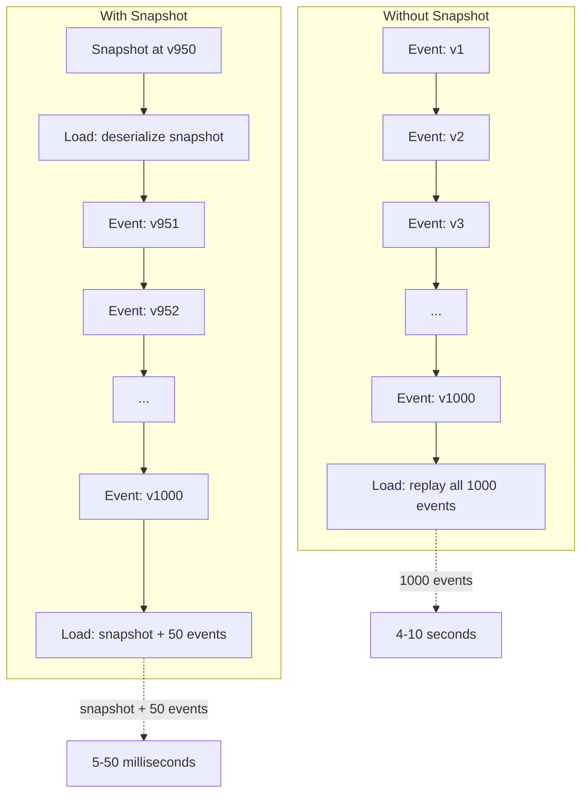
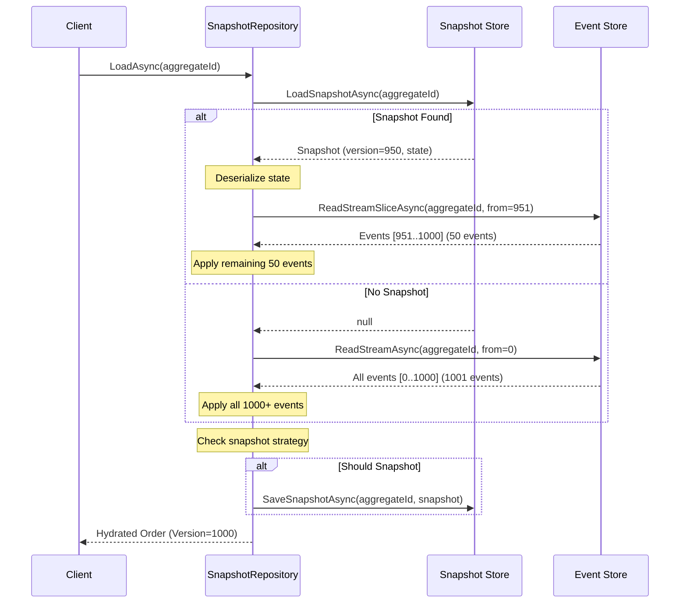

> [!success] Mastery Check
> - [ ] **Studied Well**
> - [ ] **Can explain the concept without notes**
> - [ ] **Can answer interview questions confidently**
> - [ ] **Can implement it in a real project**


# 7.106 — Event Sourcing — Snapshots — Performance Optimization

> **Snapshots** are the primary performance optimization for event-sourced systems. Without them, every aggregate load replays the entire event stream — an O(n) operation that becomes untenable as streams grow into thousands or millions of events. A snapshot captures aggregate state at a point in time, allowing the load path to deserialize one record and replay only the delta of events after that point.

| Property | Value |
|---|---|
| **Group** | `CQRS and Event Sourcing` |
| **Priority** | `2` |
| **Prerequisites** | [[7.101 — Event Sourcing — Events as the Source of Truth]] |
| **Related** | [[7.102 — Event Sourcing — Event Store Design]] · [[7.107 — Event Sourcing — Event Replay — Full and Partial]] · [[7.115 — Event Sourcing — Aggregate Rehydration]] · [[7.117 — Event Sourcing — Testing Event-Sourced Aggregates]] |
| **Version** | `2.0` |
| **Status** | `Complete` |

---

## Table of Contents

1. [Fundamentals](#1-fundamentals)
2. [When to Snapshot — Frequency and Interval Strategies](#2-when-to-snapshot--frequency-and-interval-strategies)
3. [Snapshot Storage — Table, Blob, Separate Database](#3-snapshot-storage--table-blob-separate-database)
4. [Loading Aggregate from Snapshot + Remaining Events](#4-loading-aggregate-from-snapshot--remaining-events)
5. [Snapshot Serialization](#5-snapshot-serialization)
6. [Snapshot Migration](#6-snapshot-migration)
7. [Tradeoff — Storage vs Replay Speed](#7-tradeoff--storage-vs-replay-speed)
8. [Snapshot Background Creation and Lifecycle](#8-snapshot-background-creation-and-lifecycle)
9. [Pitfalls and Anti-Patterns](#9-pitfalls-and-anti-patterns)
10. [Interview Questions and ADR](#10-interview-questions-and-adr)
11. [Self-Check](#11-self-check)

---

## 1. Fundamentals

### 1.1 The Replay Problem

In Event Sourcing, aggregate state is reconstructed by replaying every event in the stream from position 0. For streams that span thousands of events, this O(n) operation dominates read latency:

| Stream Size | Events | Replay Time (100k ev/s) | User-visible latency |
|---|---|---|---|
| Small | 10 | 0.1 ms | Instant |
| Medium | 1,000 | 10 ms | Acceptable |
| Large | 50,000 | 500 ms | Noticeable |
| Very Large | 500,000 | 5,000 ms | Unacceptable |
| Extreme | 5,000,000 | 50,000 ms | Broken |

A **snapshot** is a serialised copy of the aggregate's in-memory state at a specific stream version. Loading becomes:

```text
Without snapshot:  Load = Replay(0 → N)
With snapshot:     Load = DeserializeSnapshot + Replay(SnapshotVersion → N)
```

If snapshot version is 950 and stream is at version 1000, only 50 events are replayed instead of 1000.

### 1.2 Core Concepts

| Concept | Definition |
|---|---|
| **Snapshot** | A serialised representation of the aggregate state at a specific stream version |
| **Snapshot version** | The stream position (`Version`) at which the snapshot was captured |
| **Delta** | The set of events that occurred after the snapshot version |
| **Snapshot strategy** | Rules that determine when a new snapshot is taken |
| **Snapshot store** | The persistence mechanism for snapshots (may differ from event store) |
| **Snapshot age** | Number of events (or wall-clock time) since the last snapshot |

### 1.3 What a Snapshot Contains

A snapshot must capture enough information to reconstitute the aggregate's full state without replaying any prior events:

```csharp
public sealed record Snapshot<TAggregate>(
    TAggregate State,
    long Version,
    DateTime CapturedAt,
    string? AggregateType = null,
    IReadOnlyDictionary<string, string>? Metadata = null
);
```

| Field | Purpose |
|---|---|
| `State` | The fully hydrated aggregate instance (serialised) |
| `Version` | The stream version at which this snapshot was taken |
| `CapturedAt` | Timestamp for staleness checks |
| `AggregateType` | Discriminator for serialisation routing |
| `Metadata` | Extensible bag (e.g., checksum, serializer version, tenant ID) |

### 1.4 Mermaid — Snapshot Load vs Full Replay



---

## 2. When to Snapshot — Frequency and Interval Strategies

### 2.1 Strategy Design Space

The snapshot strategy answers two questions:
1. **When** should a snapshot be taken?
2. **Who** triggers it (synchronous on-save vs background job)?

### 2.2 Event-Count Threshold (Most Common)

Take a snapshot every N events committed to the stream.

```csharp
public interface ISnapshotStrategy
{
    bool ShouldTakeSnapshot(long currentVersion, long lastSnapshotVersion, DateTime lastSnapshotAt);
}

public sealed class EventCountSnapshotStrategy : ISnapshotStrategy
{
    private readonly int _frequency;

    public EventCountSnapshotStrategy(int frequency = 100)
    {
        _frequency = frequency > 0 ? frequency
            : throw new ArgumentOutOfRangeException(nameof(frequency));
    }

    public bool ShouldTakeSnapshot(long currentVersion, long lastSnapshotVersion, DateTime lastSnapshotAt)
        => currentVersion - lastSnapshotVersion >= _frequency;
}
```

| Frequency | Use Case |
|---|---|
| 10–20 | High-read aggregates where load speed is critical (e.g., active trading account) |
| 50–100 | General purpose — good balance for most domains |
| 200–500 | Large aggregates with cheap replay; write-heavy savings |
| 1000+ | Rare snapshotting for append-only aggregates rarely loaded |

### 2.3 Time-Based Threshold

Take a snapshot if the latest snapshot is older than a specified duration.

```csharp
public sealed class TimeBasedSnapshotStrategy : ISnapshotStrategy
{
    private readonly TimeSpan _maxAge;

    public TimeBasedSnapshotStrategy(TimeSpan maxAge)
        => _maxAge = maxAge;

    public bool ShouldTakeSnapshot(long currentVersion, long lastSnapshotVersion, DateTime lastSnapshotAt)
        => DateTime.UtcNow - lastSnapshotAt >= _maxAge;
}
```

| Max Age | Use Case |
|---|---|
| 1 hour | High-frequency aggregates (trading, IoT) |
| 6 hours | Business-day-paced aggregates |
| 24 hours | General purpose — ensures at least daily snapshot |
| 7 days | Slowly changing aggregates (reference data) |

### 2.4 Hybrid Strategy (Recommended)

Combine count and time thresholds: snapshot when _either_ condition is met.

```csharp
public sealed class HybridSnapshotStrategy : ISnapshotStrategy
{
    private readonly int _frequency;
    private readonly TimeSpan _maxAge;

    public HybridSnapshotStrategy(int frequency = 100, TimeSpan? maxAge = null)
    {
        _frequency = frequency;
        _maxAge = maxAge ?? TimeSpan.FromHours(24);
    }

    public bool ShouldTakeSnapshot(long currentVersion, long lastSnapshotVersion, DateTime lastSnapshotAt)
    {
        var eventCountDelta = currentVersion - lastSnapshotVersion;
        var age = DateTime.UtcNow - lastSnapshotAt;

        return eventCountDelta >= _frequency || age >= _maxAge;
    }
}
```

### 2.5 Explicit-Trigger Strategy

Snapshot only when explicitly requested (e.g., by a background job or admin API).

```csharp
public sealed class ExplicitSnapshotStrategy : ISnapshotStrategy
{
    public bool ShouldTakeSnapshot(long currentVersion, long lastSnapshotVersion, DateTime lastSnapshotAt)
        => false; // snapshots only taken via manual trigger
}

// Usage: background job calls this
public sealed class SnapshotJob
{
    private readonly ISnapshotStore _store;
    private readonly IEventStore<string> _events;

    public async Task TakeSnapshotAsync(string aggregateId, CancellationToken ct)
    {
        var snapshot = await _store.LoadSnapshotAsync<Order>(aggregateId);
        var fromVersion = snapshot?.Version ?? 0;

        var slice = await _events.ReadStreamSliceAsync(aggregateId, (int)fromVersion + 1, int.MaxValue, ct);
        var order = snapshot?.State ?? new Order { Id = aggregateId };
        order.LoadFromHistory(slice.Events);

        await _store.SaveSnapshotAsync(new Snapshot<Order>(
            order, order.Version, DateTime.UtcNow), ct);
    }
}
```

### 2.6 Comparison of Strategies

| Strategy | Deterministic | Bounds Max Replay | Bounds Storage | Complexity |
|---|---|---|---|---|
| Event-count | Yes | Yes (N events) | Yes | Low |
| Time-based | No | No (depends on write frequency) | Yes | Low |
| Hybrid | Yes | Yes (N events) | Yes | Medium |
| Explicit | No | No | No (manual) | Low |
| On-load | N/A (taken after load) | Yes | No | Medium |
| Rolling (use last N) | Yes | Yes | No (deletes old) | Medium |

### 2.7 On-Load Snapshotting

Take a snapshot immediately after loading an aggregate if the delta exceeds threshold.

```csharp
// Inside repository, after loading:
public async Task<Order> LoadAsync(string orderId, CancellationToken ct = default)
{
    var snapshot = await _snapshotStore.LoadSnapshotAsync<Order>(orderId);
    Order order;

    if (snapshot is not null)
    {
        var events = await _eventStore.ReadStreamSliceAsync(
            orderId, (int)snapshot.Version + 1, int.MaxValue, ct);
        order = snapshot.State;
        order.LoadFromHistory(events.Events);
    }
    else
    {
        order = await LoadFromScratchAsync(orderId, ct);
    }

    // Trigger snapshot if the delta is large enough
    if (_strategy.ShouldTakeSnapshot(order.Version, snapshot?.Version ?? 0, snapshot?.CapturedAt ?? DateTime.MinValue))
    {
        await _snapshotStore.SaveSnapshotAsync(order, ct);
    }

    return order;
}
```

---

## 3. Snapshot Storage — Table, Blob, Separate Database

### 3.1 Storage Options Overview

| Storage | Latency | Complexity | Cost | Durability | Best For |
|---|---|---|---|---|---|
| Same DB as events (table) | Low (1–5 ms) | Low | Included | Same as event store | Most systems |
| Separate snapshot DB | Medium (2–10 ms) | Medium | Additional | Independent | High-read scalability |
| Blob/object store | Medium-High (5–50 ms) | Low | Very low | High | Large aggregates, archival |
| In-memory cache (Redis) | Very low (<1 ms) | High | Additional | Volatile | Hot aggregates |
| Embedded (file system) | Low | Low | Very low | Low | Development, single-node |

### 3.2 Option 1: Same Database Snapshot Table

Keeps snapshots in the same database as events, in a dedicated table.

```sql
CREATE TABLE snapshots (
    stream_id       NVARCHAR(200)    NOT NULL,
    stream_version  BIGINT           NOT NULL,
    state           NVARCHAR(MAX)    NOT NULL,   -- serialised aggregate (JSON/BSON)
    aggregate_type  NVARCHAR(200)    NOT NULL,
    captured_at     DATETIME2        NOT NULL DEFAULT SYSUTCDATETIME(),
    snapshot_version INT             NOT NULL DEFAULT 1,  -- for migration
    checksum        NVARCHAR(64)     NULL,       -- SHA-256 for integrity
    metadata        NVARCHAR(MAX)    NULL,       -- extensible JSON bag

    CONSTRAINT pk_snapshots PRIMARY KEY CLUSTERED (stream_id, stream_version DESC)
);

-- Fast lookup: get latest snapshot
CREATE INDEX ix_snapshots_latest ON snapshots (stream_id, captured_at DESC)
    INCLUDE (state, stream_version, aggregate_type);
```

**EF Core entity:**

```csharp
public sealed class SnapshotRow
{
    public string StreamId { get; set; } = string.Empty;
    public long StreamVersion { get; set; }
    public string State { get; set; } = string.Empty;
    public string AggregateType { get; set; } = string.Empty;
    public DateTime CapturedAt { get; set; }
    public int SnapshotVersion { get; set; } = 1;
    public string? Checksum { get; set; }
    public string? Metadata { get; set; }
}
```

**Retrieve latest snapshot:**

```csharp
public async Task<Snapshot<TAggregate>?> LoadSnapshotAsync<TAggregate>(
    string streamId, CancellationToken ct = default)
    where TAggregate : class
{
    var row = await _db.Snapshots
        .Where(s => s.StreamId == streamId)
        .OrderByDescending(s => s.StreamVersion)
        .AsNoTracking()
        .FirstOrDefaultAsync(ct);

    if (row is null) return null;

    var state = _serializer.Deserialize<TAggregate>(row.State);
    return new Snapshot<TAggregate>(
        state, row.StreamVersion, row.CapturedAt);
}
```

### 3.3 Option 2: Blob Storage

Large aggregates or systems that want to keep the event database lean can store snapshots in blob storage.

```csharp
public sealed class BlobSnapshotStore : ISnapshotStore
{
    private readonly BlobContainerClient _container;
    private readonly IEventSerializer _serializer;

    public BlobSnapshotStore(BlobContainerClient container, IEventSerializer serializer)
    {
        _container = container;
        _serializer = serializer;
    }

    public async Task<Snapshot<TAggregate>?> LoadSnapshotAsync<TAggregate>(
        string streamId, CancellationToken ct = default)
        where TAggregate : class
    {
        var blob = _container.GetBlobClient(GetBlobName<TAggregate>(streamId));

        try
        {
            var response = await blob.DownloadContentAsync(ct);
            var snapshot = _serializer.Deserialize<Snapshot<TAggregate>>(
                response.Value.Content.ToString());
            return snapshot;
        }
        catch (RequestFailedException ex) when (ex.Status == 404)
        {
            return null;
        }
    }

    public async Task SaveSnapshotAsync<TAggregate>(
        string streamId, Snapshot<TAggregate> snapshot, CancellationToken ct = default)
        where TAggregate : class
    {
        var blob = _container.GetBlobClient(GetBlobName<TAggregate>(streamId));
        var json = _serializer.Serialize(snapshot);
        using var stream = new MemoryStream(Encoding.UTF8.GetBytes(json));

        await blob.UploadAsync(stream, overwrite: true, cancellationToken: ct);
    }

    private static string GetBlobName<TAggregate>(string streamId)
        => $"snapshots/{typeof(TAggregate).Name}/{Sanitize(streamId)}.json";

    private static string Sanitize(string streamId)
        => streamId.Replace("\\", "/").Replace("..", "");
}
```

**Blob naming scheme:**

```text
snapshots/
├── Order/
│   ├── ORD-001.json
│   ├── ORD-002.json
│   └── ...
├── Account/
│   ├── ACC-100.json
│   └── ...
└── Invoice/
    └── INV-5000.json
```

**Pros:**
- Zero impact on event database storage
- Cheap storage ($0.018/GB for Azure Blob hot tier)
- Easy archival and lifecycle policies
- Can store large snapshots (up to 4.75 TB)

**Cons:**
- Higher read latency (network hop)
- No transactional consistency with event append
- Eventual consistency between events and snapshots

### 3.4 Option 3: Separate Snapshot Database (Dedicated)

Use a separate database instance or cluster for snapshots, scaled independently.

```csharp
// Separate DbContext for snapshots
public sealed class SnapshotDbContext : DbContext
{
    public DbSet<SnapshotRow> Snapshots => Set<SnapshotRow>();

    public SnapshotDbContext(DbContextOptions<SnapshotDbContext> options) : base(options) { }

    protected override void OnModelCreating(ModelBuilder modelBuilder)
    {
        modelBuilder.Entity<SnapshotRow>(entity =>
        {
            entity.ToTable("snapshots", "es");
            entity.HasKey(e => new { e.StreamId, e.StreamVersion });
            entity.Property(e => e.StreamId).HasMaxLength(200);
            entity.Property(e => e.State).HasColumnType("nvarchar(max)");
            entity.Property(e => e.AggregateType).HasMaxLength(200);
            entity.Property(e => e.SnapshotVersion).HasDefaultValue(1);

            entity.HasIndex(e => new { e.StreamId, e.StreamVersion })
                .IsDescending(false, true);
        });
    }
}
```

```csharp
public sealed class DedicatedDbSnapshotStore : ISnapshotStore
{
    private readonly IDbConnection _db;

    public DedicatedDbSnapshotStore(IDbConnection db) => _db = db;

    public async Task<Snapshot<TAggregate>?> LoadSnapshotAsync<TAggregate>(
        string streamId, CancellationToken ct = default)
        where TAggregate : class
    {
        var row = await _db.QueryFirstOrDefaultAsync<SnapshotRow>(
            "SELECT TOP 1 state, stream_version, captured_at " +
            "FROM es.snapshots WITH (NOLOCK) " +
            "WHERE stream_id = @StreamId AND aggregate_type = @Type " +
            "ORDER BY stream_version DESC",
            new { StreamId = streamId, Type = typeof(TAggregate).Name });

        if (row is null) return null;

        var state = JsonSerializer.Deserialize<TAggregate>(row.State);
        return new Snapshot<TAggregate>(state!, row.StreamVersion, row.CapturedAt);
    }

    public async Task SaveSnapshotAsync<TAggregate>(
        string streamId, Snapshot<TAggregate> snapshot, CancellationToken ct = default)
        where TAggregate : class
    {
        var json = JsonSerializer.Serialize(snapshot.State);
        await _db.ExecuteAsync(
            "INSERT INTO es.snapshots (stream_id, stream_version, state, aggregate_type, captured_at) " +
            "VALUES (@StreamId, @Version, @State, @Type, @CapturedAt)",
            new
            {
                StreamId = streamId,
                Version = snapshot.Version,
                State = json,
                Type = typeof(TAggregate).Name,
                snapshot.CapturedAt
            });
    }
}
```

### 3.5 Option 4: In-Memory Cache (Redis + Persistent Store)

For hot aggregates, layer a cache in front of the persistent snapshot store.

```csharp
public sealed class CachedSnapshotStore : ISnapshotStore
{
    private readonly ISnapshotStore _inner;
    private readonly IDistributedCache _cache;
    private readonly IEventSerializer _serializer;
    private readonly TimeSpan _cacheTtl;

    public CachedSnapshotStore(
        ISnapshotStore inner,
        IDistributedCache cache,
        IEventSerializer serializer,
        TimeSpan? cacheTtl = null)
    {
        _inner = inner;
        _cache = cache;
        _serializer = serializer;
        _cacheTtl = cacheTtl ?? TimeSpan.FromMinutes(5);
    }

    public async Task<Snapshot<TAggregate>?> LoadSnapshotAsync<TAggregate>(
        string streamId, CancellationToken ct = default)
        where TAggregate : class
    {
        var cacheKey = $"snapshot:{typeof(TAggregate).Name}:{streamId}";

        var cached = await _cache.GetStringAsync(cacheKey, ct);
        if (cached is not null)
            return _serializer.Deserialize<Snapshot<TAggregate>>(cached);

        var snapshot = await _inner.LoadSnapshotAsync<TAggregate>(streamId, ct);
        if (snapshot is not null)
        {
            var json = _serializer.Serialize(snapshot);
            await _cache.SetStringAsync(cacheKey, json, new DistributedCacheEntryOptions
            {
                AbsoluteExpirationRelativeToNow = _cacheTtl
            }, ct);
        }

        return snapshot;
    }

    public async Task SaveSnapshotAsync<TAggregate>(
        string streamId, Snapshot<TAggregate> snapshot, CancellationToken ct = default)
        where TAggregate : class
    {
        await _inner.SaveSnapshotAsync(streamId, snapshot, ct);

        var cacheKey = $"snapshot:{typeof(TAggregate).Name}:{streamId}";
        var json = _serializer.Serialize(snapshot);
        await _cache.SetStringAsync(cacheKey, json, new DistributedCacheEntryOptions
        {
            AbsoluteExpirationRelativeToNow = _cacheTtl
        }, ct);
    }
}
```

### 3.6 Storage Decision Matrix

| Criterion | Same DB Table | Blob Storage | Separate DB | In-Memory Cache |
|---|---|---|---|---|
| Read latency | ★★★ Low | ★★ Medium | ★★★ Low | ★★★★ Lowest |
| Write latency | ★★★ Low | ★ Medium | ★★★ Low | ★★★ Low |
| Storage cost | ★★ Medium | ★★★★ Low | ★★ Medium | ★ (RAM cost) |
| Operational complexity | ★★★★★ None | ★★★ Setup | ★★★ Setup | ★★ Setup |
| Transactional with events | Yes | No | No | No |
| Multi-region | Via DB replica | Native CDN | Via DB replica | Via global cache |
| Snapshot size limit | DB row limit | 4.75 TB | DB row limit | Memory limit |
| Best for | Most systems | Large snapshots | High-read scale | Hot aggregates |

---

## 4. Loading Aggregate from Snapshot + Remaining Events

### 4.1 The Load Algorithm

The canonical algorithm for loading an aggregate with snapshot support:

```csharp
public sealed class SnapshotRepository
{
    private readonly IEventStore<string> _eventStore;
    private readonly ISnapshotStore _snapshotStore;
    private readonly ISnapshotStrategy _strategy;
    private readonly IEventSerializer _serializer;

    public SnapshotRepository(
        IEventStore<string> eventStore,
        ISnapshotStore snapshotStore,
        ISnapshotStrategy strategy,
        IEventSerializer serializer)
    {
        _eventStore = eventStore;
        _snapshotStore = snapshotStore;
        _strategy = strategy;
        _serializer = serializer;
    }

    public async Task<Order> LoadAsync(string orderId, CancellationToken ct = default)
    {
        // 1. Attempt to load snapshot
        var snapshot = await _snapshotStore.LoadSnapshotAsync<Order>(orderId);

        Order order;

        if (snapshot is not null)
        {
            // 2a. Deserialize state from snapshot
            order = snapshot.State;

            // 3a. Replay only events after snapshot version
            var remainingEvents = await _eventStore
                .ReadStreamSliceAsync(orderId, (int)snapshot.Version + 1, int.MaxValue, ct);

            if (remainingEvents.Events.Count > 0)
            {
                order.LoadFromHistory(remainingEvents.Events);
            }

            // Set original version to the latest event applied
            order.OriginalVersion = snapshot.Version + remainingEvents.Events.Count;
        }
        else
        {
            // 2b. No snapshot — full replay from beginning
            var allEvents = await _eventStore
                .ReadStreamAsync(orderId, StreamReadDirection.Forward, ct)
                .ToListAsync(ct);

            if (allEvents.Count == 0)
                throw new AggregateNotFoundException($"Order '{orderId}' not found.");

            order = new Order { Id = orderId };
            order.LoadFromHistory(allEvents);
            order.OriginalVersion = allEvents.Count;
        }

        // 4. (Optional) Trigger snapshot after load if threshold exceeded
        var lastSnapshotVersion = snapshot?.Version ?? 0;
        if (_strategy.ShouldTakeSnapshot(
            order.Version, lastSnapshotVersion, snapshot?.CapturedAt ?? DateTime.MinValue))
        {
            await _snapshotStore.SaveSnapshotAsync(orderId,
                new Snapshot<Order>(order, order.Version, DateTime.UtcNow), ct);
        }

        return order;
    }
}
```

### 4.2 Mermaid — Aggregate Load Sequence



### 4.3 Edge Cases

**Case 1: Snapshot version is ahead of event store version.**

This can happen if a snapshot was taken but the event append transaction was rolled back.

```csharp
// Solution: pin snapshot version to confirmed event version
public async Task<Order> LoadWithVersionGuardAsync(string orderId, CancellationToken ct = default)
{
    var snapshot = await _snapshotStore.LoadSnapshotAsync<Order>(orderId);

    if (snapshot is not null)
    {
        // Verify snapshot version is <= latest event version
        var streamInfo = await _eventStore.GetStreamInfoAsync(orderId, ct);
        var latestEventVersion = streamInfo?.Version ?? 0;

        var safeSnapshotVersion = Math.Min(snapshot.Version, latestEventVersion);

        if (safeSnapshotVersion < snapshot.Version)
        {
            // Snapshot is ahead — discard it and reload from scratch
            snapshot = null;
        }
    }

    // ... continue with standard load ...
}
```

**Case 2: Events between snapshot and current version are empty (aggregate has not changed).**

```csharp
if (remainingEvents.Events.Count == 0)
{
    order = snapshot.State;
    order.OriginalVersion = snapshot.Version;
    return order; // fast path — no replay needed
}
```

**Case 3: Snapshot exists but its schema is incompatible.**

Handle via version field in snapshot metadata and an upcaster/populator:

```csharp
if (snapshot.SnapshotVersion < CurrentSnapshotVersion)
{
    order = MigrateSnapshot(snapshot.State, snapshot.SnapshotVersion);
}
else
{
    order = snapshot.State;
}
```

### 4.4 Batch Load Optimization

When loading many aggregates (e.g., reporting, batch processing), batch snapshot reads:

```csharp
public sealed class BatchSnapshotLoader
{
    private readonly ISnapshotStore _snapshotStore;
    private readonly IEventStore<string> _eventStore;

    public async Task<IReadOnlyDictionary<string, Order>> LoadBatchAsync(
        IReadOnlyList<string> orderIds, CancellationToken ct = default)
    {
        // 1. Load all snapshots in parallel
        var snapshotTasks = orderIds
            .Select(id => _snapshotStore.LoadSnapshotAsync<Order>(id, ct));
        var snapshots = await Task.WhenAll(snapshotTasks);

        var result = new Dictionary<string, Order>(orderIds.Count);

        // 2. For each aggregate, load deltas in parallel
        var loadTasks = orderIds.Select(async (id, i) =>
        {
            var snapshot = snapshots[i];

            if (snapshot is not null)
            {
                var events = await _eventStore.ReadStreamSliceAsync(
                    id, (int)snapshot.Version + 1, int.MaxValue, ct);
                var order = snapshot.State;
                order.LoadFromHistory(events.Events);
                result[id] = order;
            }
            else
            {
                // Full replay
                var allEvents = await _eventStore
                    .ReadStreamAsync(id, StreamReadDirection.Forward, ct)
                    .ToListAsync(ct);
                var order = new Order { Id = id };
                order.LoadFromHistory(allEvents);
                result[id] = order;
            }
        });

        await Task.WhenAll(loadTasks);
        return result;
    }
}
```

### 4.5 Snapshot-Aware Repository Pattern

Complete generic repository with snapshot support:

```csharp
public sealed class SnapshotRepository<TAggregate, TAggregateId>
    where TAggregate : AggregateRoot<TAggregateId>, new()
    where TAggregateId : notnull
{
    private readonly IEventStore<TAggregateId> _eventStore;
    private readonly ISnapshotStore _snapshotStore;
    private readonly ISnapshotStrategy _strategy;

    public SnapshotRepository(
        IEventStore<TAggregateId> eventStore,
        ISnapshotStore snapshotStore,
        ISnapshotStrategy strategy)
    {
        _eventStore = eventStore;
        _snapshotStore = snapshotStore;
        _strategy = strategy;
    }

    public async Task<TAggregate> LoadAsync(TAggregateId id, CancellationToken ct = default)
    {
        var snapshot = await _snapshotStore.LoadSnapshotAsync<TAggregate>(id, ct);

        TAggregate aggregate;

        if (snapshot is not null)
        {
            aggregate = snapshot.State;
            var slice = await _eventStore.ReadStreamSliceAsync(
                id, (int)snapshot.Version + 1, int.MaxValue, ct);
            if (slice.Events.Count > 0)
                aggregate.LoadFromHistory(slice.Events);
        }
        else
        {
            var events = await _eventStore
                .ReadStreamAsync(id, StreamReadDirection.Forward, ct)
                .ToListAsync(ct);
            if (events.Count == 0)
                throw new AggregateNotFoundException($"Aggregate '{id}' not found.");
            aggregate = new TAggregate { Id = id };
            aggregate.LoadFromHistory(events);
        }

        return aggregate;
    }

    public async Task SaveAsync(TAggregate aggregate, CancellationToken ct = default)
    {
        var uncommitted = aggregate.GetUncommittedEvents();
        if (uncommitted.Count == 0) return;

        var result = await _eventStore.AppendAsync(
            aggregate.Id,
            new ExpectedStreamVersion(aggregate.OriginalVersion),
            uncommitted,
            ct);

        aggregate.ClearUncommittedEvents();
        aggregate.OriginalVersion = result.NextExpectedVersion;

        // Snapshot after save if threshold exceeded
        var lastSnap = await _snapshotStore.LoadSnapshotAsync<TAggregate>(aggregate.Id, ct);
        if (_strategy.ShouldTakeSnapshot(
            aggregate.Version,
            lastSnap?.Version ?? 0,
            lastSnap?.CapturedAt ?? DateTime.MinValue))
        {
            await _snapshotStore.SaveSnapshotAsync(aggregate.Id,
                new Snapshot<TAggregate>(aggregate, aggregate.Version, DateTime.UtcNow), ct);
        }
    }
}
```

---

## 5. Snapshot Serialization

### 5.1 Serialization Requirements

| Requirement | Rationale |
|---|---|
| **Complete state capture** | Must serialize all fields needed to rebuild aggregate without replay |
| **Version tolerance** | Must handle schema changes over time (forward/backward compat) |
| **Performant** | Snapshot serialization happens on every save; deserialization on every load |
| **Compact** | Large snapshots increase storage cost and read latency |
| **Secure** | Must not leak sensitive data (PII, secrets) |

### 5.2 Serialization Formats

| Format | Size Ratio | Speed | Schema Evolution | Human Readable |
|---|---|---|---|---|
| JSON (UTF-8) | 1× (baseline) | Fast | Good (optional fields) | Yes |
| JSON (compressed) | 0.2–0.4× | Medium (compress/decompress) | Good | No (gzip) |
| MessagePack | 0.5–0.7× | Very fast | Good | No |
| Protobuf | 0.3–0.5× | Very fast | Good (field numbers) | No |
| BSON | 0.8–1.0× | Fast | Good | Partial |
| Binary (custom) | 0.2–0.3× | Fastest | Poor (hand-coded) | No |

### 5.3 JSON Serialization (Default Choice)

```csharp
public sealed class SnapshotSerializer : ISnapshotSerializer
{
    private static readonly JsonSerializerOptions WriteOptions = new()
    {
        PropertyNamingPolicy = JsonNamingPolicy.CamelCase,
        WriteIndented = false,
        IgnoreReadOnlyProperties = false,
        IncludeFields = true,
        ReferenceHandler = ReferenceHandler.IgnoreCycles,
        Converters = { new JsonStringEnumConverter(JsonNamingPolicy.CamelCase) }
    };

    private static readonly JsonSerializerOptions ReadOptions = new()
    {
        PropertyNamingPolicy = JsonNamingPolicy.CamelCase,
        PropertyNameCaseInsensitive = true,
        IncludeFields = true,
        Converters = { new JsonStringEnumConverter(JsonNamingPolicy.CamelCase) }
    };

    public string Serialize<TAggregate>(TAggregate state)
        => JsonSerializer.Serialize(state, WriteOptions);

    public TAggregate Deserialize<TAggregate>(string json)
        => JsonSerializer.Deserialize<TAggregate>(json, ReadOptions)
           ?? throw new InvalidOperationException("Deserialized snapshot state is null");
}
```

**Snapshot-specific JSON options:**

```csharp
public static class SnapshotJsonOptions
{
    // Snapshot serialization must include private fields,
    // whereas event serialization only needs public properties.
    public static readonly JsonSerializerOptions Options = new()
    {
        IncludeFields = true,           // private fields on aggregate
        IgnoreReadOnlyProperties = false, // computed properties may be needed
        ReferenceHandler = ReferenceHandler.IgnoreCycles,
        PropertyNamingPolicy = JsonNamingPolicy.CamelCase,
        Converters =
        {
            new JsonStringEnumConverter(),
            new VersionConverter(),
            new DecimalConverter(),
            new ReadOnlyCollectionConverter()
        }
    };
}
```

### 5.4 Compressed JSON (Large Snapshots)

```csharp
public sealed class CompressedJsonSnapshotSerializer : ISnapshotSerializer
{
    private readonly ISnapshotSerializer _inner;

    public CompressedJsonSnapshotSerializer(ISnapshotSerializer? inner = null)
        => _inner = inner ?? new SnapshotSerializer();

    public string Serialize<TAggregate>(TAggregate state)
    {
        var json = _inner.Serialize(state);
        var bytes = Encoding.UTF8.GetBytes(json);
        var compressed = Compress(bytes);
        return Convert.ToBase64String(compressed);
    }

    public TAggregate Deserialize<TAggregate>(string data)
    {
        var compressed = Convert.FromBase64String(data);
        var bytes = Decompress(compressed);
        var json = Encoding.UTF8.GetString(bytes);
        return _inner.Deserialize<TAggregate>(json);
    }

    private static byte[] Compress(byte[] data)
    {
        using var output = new MemoryStream();
        using var gzip = new GZipStream(output, CompressionLevel.Fastest);
        gzip.Write(data);
        gzip.Flush();
        return output.ToArray();
    }

    private static byte[] Decompress(byte[] data)
    {
        using var input = new MemoryStream(data);
        using var gzip = new GZipStream(input, CompressionMode.Decompress);
        using var output = new MemoryStream();
        gzip.CopyTo(output);
        return output.ToArray();
    }
}
```

| Aggregate Size | Uncompressed | GZip (Fastest) | GZip (Optimal) |
|---|---|---|---|
| Small (Order, 10 lines) | 2 KB | 0.8 KB | 0.6 KB |
| Medium (Account, 100 txns) | 15 KB | 4 KB | 3 KB |
| Large (Document, 100 pages) | 200 KB | 30 KB | 20 KB |

### 5.5 MessagePack Serialization

```csharp
using MessagePack;
using MessagePack.Resolvers;

public sealed class MessagePackSnapshotSerializer : ISnapshotSerializer
{
    private static readonly MessagePackSerializerOptions Options =
        MessagePackSerializerOptions.Standard
            .WithResolver(ContractlessStandardResolver.Instance)
            .WithCompression(MessagePackCompression.Lz4BlockArray);

    public string Serialize<TAggregate>(TAggregate state)
    {
        var bytes = MessagePackSerializer.Serialize(state, Options);
        return Convert.ToBase64String(bytes);
    }

    public TAggregate Deserialize<TAggregate>(string data)
    {
        var bytes = Convert.FromBase64String(data);
        return MessagePackSerializer.Deserialize<TAggregate>(bytes, Options);
    }
}
```

### 5.6 Serialization Concerns

**Circular references in aggregate state:**

```csharp
[JsonIgnore]
public Order ParentOrder { get; set; } // break circular ref

// Or use ReferenceHandler.IgnoreCycles in options
```

**Large collections (1000+ items):**

```csharp
// Use paginated or limited collections in snapshots
public sealed class OrderSnapshot
{
    public string OrderId { get; init; }
    public string Status { get; init; }
    public decimal Total { get; init; }
    public int LineCount { get; init; }
    // Avoid: public List<OrderLine> Lines { get; init; }  (10,000 lines)
}
```

**Sensitive data:**

```csharp
[JsonIgnore]
public string CreditCardNumber { get; set; } // never serialize

// Or use a custom converter that masks the field
public sealed class SensitiveDataConverter : JsonConverter<string>
{
    public override string? Read(ref Utf8JsonReader reader, Type type, JsonSerializerOptions options)
        => reader.GetString();

    public override void Write(Utf8JsonWriter writer, string value, JsonSerializerOptions options)
        => writer.WriteStringValue("****-****-****-" + value[^4..]);
}
```

### 5.7 Snapshot Size Tradeoffs

```text
Snapshot size directly impacts:
- Storage cost (permanent, every snapshot)
- Read latency (deserialization time)
- Write latency (serialization time)
- Network transfer (if store is remote)

Rule of thumb:
  Keep snapshot size < 50 KB uncompressed
  If > 100 KB, consider:
    - Trimming unnecessary fields
    - Using a separate snapshot DTO (not the full aggregate)
    - Compressing before storage
```

**Snapshot DTO pattern (lightweight):**

```csharp
// Full aggregate has behavior, collections, computed properties
public sealed class Order : AggregateRoot<string>
{
    private readonly List<OrderLine> _lines = [];
    private decimal _total;
    private string _status = "Pending";
    public string Status => _status;
    public decimal Total => _total;
    public IReadOnlyList<OrderLine> Lines => _lines.AsReadOnly();
    public string CustomerId { get; private set; }
    // ... 20 more fields, methods, validation ...
}

// Snapshot DTO — only the state needed to reconstitute
public sealed record OrderSnapshotData(
    string OrderId,
    string CustomerId,
    string Status,
    decimal Total,
    List<OrderLineData> Lines
);

public sealed record OrderLineData(
    string LineId,
    string ProductId,
    int Quantity,
    decimal UnitPrice
);

// Mapping
public static OrderSnapshotData FromAggregate(Order order)
    => new(
        OrderId: order.Id,
        CustomerId: order.CustomerId,
        Status: order.Status,
        Total: order.Total,
        Lines: order.Lines.Select(l => new OrderLineData(
            l.LineId, l.ProductId, l.Quantity, l.UnitPrice)).ToList()
    );

public static void ApplyToAggregate(Order order, OrderSnapshotData data)
{
    // Private reflection or internal method to set state
    order.GetType().GetField("_status", BindingFlags.NonPublic | BindingFlags.Instance)!
        .SetValue(order, data.Status);
    // ... set other fields ...
}
```

---

## 6. Snapshot Migration

### 6.1 Why Snapshots Need Migration

As the aggregate's state schema evolves, existing snapshots become incompatible:

| Event | Snapshot Impact |
|---|---|
| New field added to aggregate | Old snapshot lacks the field → default value on deserialization |
| Field renamed | Old snapshot has old name → value lost on deserialization |
| Field type changed | Deserialization throws exception |
| Field removed | Old snapshot has extra data → ignored (if tolerant serializer) |
| Collection type changed | Deserialization may fail |
| Enum values changed | Deserialization may throw for unknown values |

### 6.2 Snapshot Versioning

Each snapshot carries a version number. The serializer uses this to apply the correct migration.

```csharp
public sealed record Snapshot<TAggregate>(
    TAggregate State,
    long Version,
    DateTime CapturedAt,
    int SnapshotSchemaVersion = 1  // ← schema version for migration
);
```

**Version tracking in storage:**

```sql
ALTER TABLE snapshots ADD snapshot_version INT NOT NULL DEFAULT 1;
CREATE INDEX ix_snapshots_version ON snapshots (snapshot_version);
```

### 6.3 Migration Registry

```csharp
public interface ISnapshotMigrator
{
    int FromVersion { get; }
    int ToVersion { get; }
    string Migrate(string snapshotJson);
}

public sealed class SnapshotMigrationEngine
{
    private readonly IReadOnlyList<ISnapshotMigrator> _migrators;

    public SnapshotMigrationEngine(IEnumerable<ISnapshotMigrator> migrators)
    {
        _migrators = migrators
            .OrderBy(m => m.FromVersion)
            .ToList();
    }

    public string MigrateToLatest(string snapshotJson, int fromVersion, int targetVersion)
    {
        var current = fromVersion;
        var data = snapshotJson;

        while (current < targetVersion)
        {
            var migrator = _migrators.FirstOrDefault(m => m.FromVersion == current);
            if (migrator is null)
                throw new SnapshotMigrationException(
                    $"No migrator found from version {current} to {current + 1}");

            data = migrator.Migrate(data);
            current = migrator.ToVersion;
        }

        return data;
    }
}
```

### 6.4 Migration Examples

**Migration v1 → v2: Add CustomerEmail field**

```csharp
public sealed class SnapshotV1ToV2Migrator : ISnapshotMigrator
{
    public int FromVersion => 1;
    public int ToVersion => 2;

    public string Migrate(string snapshotJson)
    {
        var doc = JsonDocument.Parse(snapshotJson);
        var root = doc.RootElement;

        using var stream = new MemoryStream();
        using var writer = new Utf8JsonWriter(stream, new JsonWriterOptions { Indented = false });

        writer.WriteStartObject();

        // Copy all existing properties
        foreach (var prop in root.EnumerateObject())
        {
            if (prop.NameEquals("customerEmail")) continue; // skip if already present
            prop.WriteTo(writer);
        }

        // Add new field with default value
        writer.WriteString("customerEmail", "unknown@migrated.local");

        writer.WriteEndObject();
        writer.Flush();

        return Encoding.UTF8.GetString(stream.ToArray());
    }
}
```

**Migration v2 → v3: Change collection type**

```csharp
public sealed class SnapshotV2ToV3Migrator : ISnapshotMigrator
{
    public int FromVersion => 2;
    public int ToVersion => 3;

    public string Migrate(string snapshotJson)
    {
        // In v2, lines were stored as { "lines": [ { "id": "...", "qty": 2, "price": 10 } ] }
        // In v3, lines are stored as { "lineItems": [ { "lineId": "...", "quantity": 2, "unitPrice": 10 } ] }
        var doc = JsonDocument.Parse(snapshotJson);
        var root = doc.RootElement;

        using var stream = new MemoryStream();
        using var writer = new Utf8JsonWriter(stream, new JsonWriterOptions { Indented = false });

        writer.WriteStartObject();

        foreach (var prop in root.EnumerateObject())
        {
            if (prop.NameEquals("lines"))
            {
                writer.WriteStartArray("lineItems");
                foreach (var line in prop.Value.EnumerateArray())
                {
                    writer.WriteStartObject();
                    writer.WriteString("lineId", line.GetProperty("id").GetString());
                    writer.WriteNumber("quantity", line.GetProperty("qty").GetInt32());
                    writer.WriteNumber("unitPrice", line.GetProperty("price").GetDecimal());
                    writer.WriteEndObject();
                }
                writer.WriteEndArray();
            }
            else
            {
                prop.WriteTo(writer);
            }
        }

        writer.WriteEndObject();
        writer.Flush();

        return Encoding.UTF8.GetString(stream.ToArray());
    }
}
```

### 6.5 Forward Compatibility with Optional Fields

The simplest migration strategy: always add new fields as optional with defaults.

```csharp
public sealed class OrderSnapshotData
{
    public string OrderId { get; init; }
    public string CustomerId { get; init; }
    public string Status { get; init; }

    // v1 fields
    public decimal Total { get; init; }

    // v2: added later — default value ensures old snapshots still deserialize
    public string? CustomerEmail { get; init; } = null;

    // v3: added later
    public string? CurrencyCode { get; init; } = "USD";
}
```

**Deserialization tolerant to extra/missing fields:**

```csharp
private static readonly JsonSerializerOptions TolerantOptions = new()
{
    PropertyNameCaseInsensitive = true,
    UnmappedMemberHandling = JsonUnmappedMemberHandling.Skip, // .NET 8
};
```

### 6.6 Snapshot Re-creation (Reset)

When migrations become too complex, regenerate snapshots from scratch:

```csharp
public sealed class SnapshotRebuilder
{
    private readonly IEventStore<string> _eventStore;
    private readonly ISnapshotStore _snapshotStore;

    public async Task RebuildSnapshotAsync<TAggregate>(
        string streamId, CancellationToken ct = default)
        where TAggregate : AggregateRoot<string>, new()
    {
        // 1. Load all events from the stream
        var allEvents = await _eventStore
            .ReadStreamAsync(streamId, StreamReadDirection.Forward, ct)
            .ToListAsync(ct);

        if (allEvents.Count == 0) return;

        // 2. Rebuild aggregate from scratch
        var aggregate = new TAggregate { Id = streamId };
        aggregate.LoadFromHistory(allEvents);

        // 3. Save new snapshot with current schema version
        await _snapshotStore.SaveSnapshotAsync(streamId,
            new Snapshot<TAggregate>(aggregate, aggregate.Version, DateTime.UtcNow),
            ct);
    }

    public async Task RebuildAllSnapshotsAsync<TAggregate>(
        IAsyncEnumerable<string> streamIds, CancellationToken ct = default)
        where TAggregate : AggregateRoot<string>, new()
    {
        await foreach (var streamId in streamIds.WithCancellation(ct))
        {
            await RebuildSnapshotAsync<TAggregate>(streamId, ct);
        }
    }
}
```

### 6.7 Migration Strategy Comparison

| Strategy | Effort | Safety | When to Use |
|---|---|---|---|
| **Optional fields** | Low | Very safe | Adding new fields |
| **Snapshot DTO versioning** | Medium | Safe | Renaming/restructuring fields |
| **Custom migrator** | High | Requires tests | Complex type changes |
| **Rebuild from events** | Very high | Very safe (source of truth) | Last resort, or periodic maintenance |

---

## 7. Tradeoff — Storage vs Replay Speed

### 7.1 The Fundamental Tradeoff

```text
More frequent snapshots = more storage, faster loads
Less frequent snapshots = less storage, slower loads
```

| Snapshot Frequency | Storage Cost (1M aggregates, 100K events each) | Replay at Load |
|---|---|---|
| Every 50 events | 20K snapshots × 5 KB = ~100 MB per aggregate | 0–49 events |
| Every 200 events | 5K snapshots × 5 KB = ~25 MB per aggregate | 0–199 events |
| Every 1000 events | 1K snapshots × 5 KB = ~5 MB per aggregate | 0–999 events |
| Never (no snapshots) | 0 | 100K events |

### 7.2 Storage Cost Model

```csharp
public static class SnapshotStorageEstimator
{
    /// <summary>
    /// Estimate snapshot storage requirements.
    /// </summary>
    public static SnapshotStorageEstimate Estimate(
        long aggregateCount,
        long avgEventsPerAggregate,
        int snapshotFrequency,
        int avgSnapshotSizeBytes,
        bool keepAllSnapshots = false)
    {
        var snapshotsPerAggregate = avgEventsPerAggregate / snapshotFrequency;
        var totalSnapshots = aggregateCount * snapshotsPerAggregate;

        if (!keepAllSnapshots)
        {
            // Only keep the latest snapshot per aggregate
            totalSnapshots = aggregateCount;
        }

        var totalStorageBytes = totalSnapshots * avgSnapshotSizeBytes;
        var avgReplayCount = snapshotFrequency / 2.0;

        return new SnapshotStorageEstimate
        {
            TotalSnapshots = totalSnapshots,
            TotalStorageMB = totalStorageBytes / (1024.0 * 1024.0),
            AvgReplayEvents = avgReplayCount,
            MaxReplayEvents = snapshotFrequency,
            SnapshotsPerAggregate = snapshotsPerAggregate
        };
    }
}

public sealed record SnapshotStorageEstimate
{
    public long TotalSnapshots { get; init; }
    public double TotalStorageMB { get; init; }
    public double AvgReplayEvents { get; init; }
    public int MaxReplayEvents { get; init; }
    public double SnapshotsPerAggregate { get; init; }
}
```

### 7.3 Example Calculations

| Scenario | Aggregates | Events/Agg | Frequency | Snapshot Size | Storage | Avg Replay |
|---|---|---|---|---|---|---|
| E-commerce orders | 10M | 200 | 100 | 3 KB | ~30 GB (keep latest) | 50 events |
| Banking accounts | 100K | 50K | 500 | 8 KB | ~800 MB (keep latest) | 250 events |
| IoT device state | 1M | 10K | 200 | 1 KB | ~1 GB (keep latest) | 100 events |
| Document history | 500K | 1K | 50 | 20 KB | ~10 GB (keep latest) | 25 events |

### 7.4 Snapshot Retention (Pruning Old Snapshots)

Keeping every historical snapshot wastes storage. Most use cases only need the latest snapshot.

```csharp
public sealed class SnapshotPruningPolicy
{
    /// <summary>Keep only the latest N snapshots per stream (0 = keep all).</summary>
    public int MaxSnapshotsPerStream { get; init; } = 1;

    /// <summary>Minimum age before pruning (keep recent even if extra).</summary>
    public TimeSpan MinAgeBeforePrune { get; init; } = TimeSpan.FromDays(7);

    /// <summary>If true, keep at least one snapshot regardless of age.</summary>
    public bool KeepLatestAlways { get; init; } = true;
}

public sealed class SnapshotPruningJob : BackgroundService
{
    private readonly ISnapshotStore _snapshotStore;
    private readonly SnapshotPruningPolicy _policy;
    private readonly ILogger<SnapshotPruningJob> _logger;

    public SnapshotPruningJob(
        ISnapshotStore snapshotStore,
        SnapshotPruningPolicy policy,
        ILogger<SnapshotPruningJob> logger)
    {
        _snapshotStore = snapshotStore;
        _policy = policy;
        _logger = logger;
    }

    protected override async Task ExecuteAsync(CancellationToken stoppingToken)
    {
        while (!stoppingToken.IsCancellationRequested)
        {
            try
            {
                await PruneOldSnapshotsAsync(stoppingToken);
            }
            catch (Exception ex)
            {
                _logger.LogError(ex, "Snapshot pruning failed");
            }

            await Task.Delay(TimeSpan.FromHours(24), stoppingToken);
        }
    }

    private async Task PruneOldSnapshotsAsync(CancellationToken ct)
    {
        // In production, this would query for streams with excess snapshots
        // and delete old ones. Implementation depends on snapshot store.
        _logger.LogInformation("Snapshot pruning cycle started");

        // Example: DELETE FROM snapshots
        // WHERE stream_id IN (
        //   SELECT stream_id FROM snapshots
        //   GROUP BY stream_id
        //   HAVING COUNT(*) > @MaxPerStream
        // )
        // AND stream_version NOT IN (
        //   SELECT TOP(@MaxPerStream) stream_version FROM snapshots s2
        //   WHERE s2.stream_id = snapshots.stream_id
        //   ORDER BY stream_version DESC
        // )
    }
}
```

### 7.5 Archive + Snapshot Strategy

For very old streams where events are archived to cold storage, snapshots become the sole source for loading:

```text
┌──────────────────────────────────────────────────┐
│                   Snapshot                        │
│  (kept in hot storage, contains full state)      │
└──────────────────────────────────────────────────┘
                        │
                        ▼
            ┌─────────────────────────┐
            │  Remaining Events       │
            │  (recent, in hot store) │
            └─────────────────────────┘
                        │
                        ▼
            ┌─────────────────────────┐
            │  Archived Events        │
            │  (cold storage, never   │
            │   replayed if snapshot  │
            │   covers them)          │
            └─────────────────────────┘
```

### 7.6 Cost-Benefit Decision Matrix

| Factor | Favor More Snapshots | Favor Fewer Snapshots |
|---|---|---|
| Read frequency | High (aggregate loaded often) | Low (rarely loaded) |
| Aggregate size | Small deserialization cost | Large deserialization cost |
| Event replay cost | Expensive (complex Apply) | Cheap (simple state transitions) |
| Storage cost tolerance | High (budget available) | Low (cost-sensitive) |
| Write frequency | Low (snapshot writes are infrequent) | High (every write is costly) |
| Regulatory | Needs fast recovery | Long recovery acceptable |
| Network latency (to store) | High (minimize round trips) | Low (fast connection) |

### 7.7 Practical Guidance

```text
General recommendation:
  - Default: snapshot every 100 events, keep only latest
  - For read-heavy aggregates: snapshot every 20-50 events
  - For write-heavy aggregates with fast replay: snapshot every 200-500 events
  - For aggregates rarely loaded (e.g., audit-only): snapshot every 1000 events
  - Archive old snapshots: N/A (keep latest always)
  - Snapshot size target: under 50 KB uncompressed

  Monitoring: alert if replay count > 3× snapshot frequency
```

---

## 8. Snapshot Background Creation and Lifecycle

### 8.1 Synchronous (On-Save) Snapshotting

Snapshot is taken immediately after events are appended, in the same request path.

```csharp
public sealed class SynchronousSnapshotDecorator : IEventStore<string>
{
    private readonly IEventStore<string> _inner;
    private readonly ISnapshotStore _snapshotStore;
    private readonly ISnapshotStrategy _strategy;
    private readonly Func<string, object> _aggregateFactory;

    public SynchronousSnapshotDecorator(
        IEventStore<string> inner,
        ISnapshotStore snapshotStore,
        ISnapshotStrategy strategy,
        Func<string, object> aggregateFactory)
    {
        _inner = inner;
        _snapshotStore = snapshotStore;
        _strategy = strategy;
        _aggregateFactory = aggregateFactory;
    }

    public async Task<IWriteResult> AppendAsync(
        string aggregateId,
        ExpectedStreamVersion expectedVersion,
        IReadOnlyList<object> events,
        CancellationToken ct = default)
    {
        var result = await _inner.AppendAsync(aggregateId, expectedVersion, events, ct);

        // Check if snapshot is needed
        if (ShouldSnapshot(aggregateId, result.NextExpectedVersion))
        {
            // Rebuild aggregate from full stream (or latest snapshot + new events)
            var aggregate = await RebuildAggregateAsync(aggregateId, ct);
            await _snapshotStore.SaveSnapshotAsync(aggregateId,
                new Snapshot<object>(aggregate, result.NextExpectedVersion, DateTime.UtcNow), ct);
        }

        return result;
    }

    private bool ShouldSnapshot(string aggregateId, long newVersion)
    {
        var lastSnap = _snapshotStore.LoadSnapshotAsync<object>(aggregateId)
            .GetAwaiter().GetResult();
        return _strategy.ShouldTakeSnapshot(
            newVersion, lastSnap?.Version ?? 0, lastSnap?.CapturedAt ?? DateTime.MinValue);
    }

    private async Task<object> RebuildAggregateAsync(string aggregateId, CancellationToken ct)
    {
        var allEvents = await _inner
            .ReadStreamAsync(aggregateId, StreamReadDirection.Forward, ct)
            .ToListAsync(ct);

        var aggregate = _aggregateFactory(aggregateId);
        var loadMethod = aggregate.GetType().GetMethod("LoadFromHistory");
        loadMethod!.Invoke(aggregate, [allEvents]);
        return aggregate;
    }

    public IAsyncEnumerable<object> ReadStreamAsync(
        string aggregateId, StreamReadDirection direction, CancellationToken ct)
        => _inner.ReadStreamAsync(aggregateId, direction, ct);

    public Task<StreamSlice> ReadStreamSliceAsync(
        string aggregateId, int fromVersion, int maxCount, CancellationToken ct)
        => _inner.ReadStreamSliceAsync(aggregateId, fromVersion, maxCount, ct);
}
```

**Pros:**
- Simple to implement
- Snapshot is always up-to-date
- No eventual consistency between events and snapshot

**Cons:**
- Adds latency to the write path (replay + serialize + store)
- May cause thundering herd on snapshot store under high write volume
- Inefficient if aggregate is rarely read

### 8.2 Asynchronous (Background) Snapshotting

Snapshot is created by a background job that processes streams needing new snapshots.

```csharp
public sealed class BackgroundSnapshotJob : BackgroundService
{
    private readonly ISnapshotStore _snapshotStore;
    private readonly IEventStore<string> _eventStore;
    private readonly ISnapshotStrategy _strategy;
    private readonly IServiceProvider _services;
    private readonly ILogger<BackgroundSnapshotJob> _logger;

    public BackgroundSnapshotJob(
        ISnapshotStore snapshotStore,
        IEventStore<string> eventStore,
        ISnapshotStrategy strategy,
        IServiceProvider services,
        ILogger<BackgroundSnapshotJob> logger)
    {
        _snapshotStore = snapshotStore;
        _eventStore = eventStore;
        _strategy = strategy;
        _services = services;
        _logger = logger;
    }

    protected override async Task ExecuteAsync(CancellationToken stoppingToken)
    {
        _logger.LogInformation("Background snapshot job started");

        while (!stoppingToken.IsCancellationRequested)
        {
            try
            {
                await ProcessPendingSnapshotsAsync(stoppingToken);
            }
            catch (OperationCanceledException) when (stoppingToken.IsCancellationRequested)
            {
                break;
            }
            catch (Exception ex)
            {
                _logger.LogError(ex, "Background snapshot job failed");
            }

            await Task.Delay(TimeSpan.FromSeconds(30), stoppingToken);
        }
    }

    private async Task ProcessPendingSnapshotsAsync(CancellationToken ct)
    {
        // 1. Find streams that need snapshots
        // Implementation varies by store — polling, stream index, etc.
        var pendingStreams = await GetStreamsNeedingSnapshotsAsync(ct);

        // 2. Process in parallel with bounded concurrency
        var parallelOptions = new ParallelOptions
        {
            MaxDegreeOfParallelism = 4,
            CancellationToken = ct
        };

        await Parallel.ForEachAsync(pendingStreams, parallelOptions,
            async (streamId, token) =>
            {
                try
                {
                    await TakeSnapshotAsync(streamId, token);
                }
                catch (Exception ex)
                {
                    _logger.LogWarning(ex,
                        "Failed to take snapshot for stream {StreamId}", streamId);
                }
            });
    }

    private async Task TakeSnapshotAsync(string streamId, CancellationToken ct)
    {
        // Load from snapshot + remaining events
        var snapshot = await _snapshotStore.LoadSnapshotAsync<object>(streamId, ct);
        object aggregate;

        if (snapshot is not null)
        {
            var slice = await _eventStore.ReadStreamSliceAsync(
                streamId, (int)snapshot.Version + 1, int.MaxValue, ct);
            aggregate = snapshot.State;
            var loadMethod = aggregate.GetType().GetMethod("LoadFromHistory");
            loadMethod!.Invoke(aggregate, [slice.Events]);
        }
        else
        {
            var allEvents = await _eventStore
                .ReadStreamAsync(streamId, StreamReadDirection.Forward, ct)
                .ToListAsync(ct);
            if (allEvents.Count == 0) return;

            // Need the aggregate type to create instance
            aggregate = CreateAggregateFromStream(allEvents);
        }

        var version = (long)aggregate.GetType().GetProperty("Version")!.GetValue(aggregate)!;
        await _snapshotStore.SaveSnapshotAsync(streamId,
            new Snapshot<object>(aggregate, version, DateTime.UtcNow), ct);

        _logger.LogDebug("Snapshot taken for stream {StreamId} at v{Version}",
            streamId, version);
    }

    private async Task<IReadOnlyList<string>> GetStreamsNeedingSnapshotsAsync(CancellationToken ct)
    {
        // Strategy-dependent: query streams where
        // (stream_version - last_snapshot_version) >= threshold
        // OR (now - last_snapshot_time) >= max_age
        //
        // Implementation example using a stream metadata table:
        var sql = @"
            SELECT s.stream_id
            FROM streams s
            LEFT JOIN (
                SELECT stream_id, MAX(stream_version) AS snap_version,
                       MAX(captured_at) AS snap_time
                FROM snapshots
                GROUP BY stream_id
            ) sn ON s.stream_id = sn.stream_id
            WHERE (s.stream_version - COALESCE(sn.snap_version, 0)) >= @Frequency
               OR (DATEDIFF(HOUR, sn.snap_time, GETUTCDATE()) >= @MaxAgeHours)";

        // In memory-store, scan all streams
        return [];
    }

    private static object CreateAggregateFromStream(IReadOnlyList<object> events)
    {
        // Determine aggregate type from first event's namespace convention
        // This is highly implementation-specific
        throw new NotImplementedException("Aggregate factory required");
    }
}
```

**Pros:**
- Write path is not impacted
- Can batch and deduplicate snapshot writes
- Scales independently

**Cons:**
- Eventual consistency between events and snapshots
- More complex to implement and monitor
- Background job adds operational burden

### 8.3 Snapshot Lifecycle

```text
                        ┌──────────┐
                        │ Aggregate │
                        │  Created  │
                        └─────┬─────┘
                              │
                              ▼
                    ┌─────────────────┐
                    │  Event Appended  │◄──────────── (repeat)
                    └────────┬────────┘
                             │
                             ▼
                 ┌──────────────────────┐
                 │ Check Snapshot       │
                 │ Strategy             │
                 └──────┬───────────────┘
                        │
            ┌───────────┴───────────┐
            │                       │
            ▼                       ▼
    ┌──────────────┐      ┌──────────────────┐
    │ Take Snapshot │      │ Skip (no threshold│
    │ (sync/async)  │      │ reached)          │
    └──────┬───────┘      └──────────────────┘
           │
           ▼
    ┌──────────────┐      ┌──────────────────┐
    │ Snapshot      │─────►│ Retention Check  │
    │ Persisted     │      │ (prune old)      │
    └──────────────┘      └──────────────────┘
```

### 8.4 Snapshot Metadata and Auditing

```csharp
public sealed record SnapshotMetadata
{
    public DateTime CapturedAt { get; init; }
    public long StreamVersion { get; init; }
    public int EventCountSinceLastSnapshot { get; init; }
    public TimeSpan ReplayDuration { get; init; }
    public string? Trigger { get; init; } // "save", "background", "manual"
    public string? SerializerVersion { get; init; }
    public string? Checksum { get; init; }
}

// Store metadata alongside snapshot for observability
public sealed class AuditedSnapshotStore : ISnapshotStore
{
    private readonly ISnapshotStore _inner;
    private readonly ILogger<AuditedSnapshotStore> _logger;

    public async Task<Snapshot<TAggregate>?> LoadSnapshotAsync<TAggregate>(
        string streamId, CancellationToken ct = default)
        where TAggregate : class
    {
        var sw = Stopwatch.StartNew();
        var result = await _inner.LoadSnapshotAsync<TAggregate>(streamId, ct);
        sw.Stop();

        if (result is not null)
        {
            _logger.LogDebug(
                "Snapshot loaded for {StreamId} at v{Version} in {ElapsedMs}ms",
                streamId, result.Version, sw.ElapsedMilliseconds);
        }

        return result;
    }

    public async Task SaveSnapshotAsync<TAggregate>(
        string streamId, Snapshot<TAggregate> snapshot, CancellationToken ct = default)
        where TAggregate : class
    {
        var sw = Stopwatch.StartNew();
        await _inner.SaveSnapshotAsync(streamId, snapshot, ct);
        sw.Stop();

        _logger.LogInformation(
            "Snapshot saved for {StreamId} at v{Version} ({SizeBytes} bytes, {ElapsedMs}ms)",
            streamId, snapshot.Version,
            EstimateSize(snapshot.State),
            sw.ElapsedMilliseconds);
    }

    private static long EstimateSize<TAggregate>(TAggregate state)
    {
        // Rough estimate based on serialized size
        return System.Text.Json.JsonSerializer.Serialize(state).Length;
    }
}
```

---

## 9. Pitfalls and Anti-Patterns

### 9.1 Pitfall: Snapshot Is Ahead of Events

**Problem:** A snapshot is saved with version N, but events at version N have not yet been committed (e.g., snapshot created before event transaction commits, or snapshot store is updated independently).

**Risk:** On load, the snapshot is used, but the events at version N are missing. The aggregate state is incomplete or inconsistent.

**Solution:** Always save snapshots **after** events are successfully committed. Use the `NextExpectedVersion` returned by the event store as the snapshot version. Never compute snapshot version independently.

```csharp
// Correct ordering
var writeResult = await eventStore.AppendAsync(id, expectedVersion, events, ct);
// writeResult.NextExpectedVersion — only now are events committed

await snapshotStore.SaveSnapshotAsync(id, new Snapshot<Order>(
    order, writeResult.NextExpectedVersion, DateTime.UtcNow), ct);
```

### 9.2 Pitfall: Stale Snapshot Used After Event Rollback

**Problem:** The event store append succeeds, but the snapshot save fails (network error, storage full). On the next load, the snapshot is behind the events. The aggregate replays from the stale snapshot, skipping events that were committed.

**Solution:** Use the snapshot only as a **starting point**, not a complete state. Always replay events after the snapshot version. If the snapshot version is behind, the extra events are replayed and catch the aggregate up. No data is lost.

```csharp
// Safe even if snapshot is stale:
var fromVersion = snapshot.Version; // 950
var events = await eventStore.ReadStreamSliceAsync(id, fromVersion + 1, ...);
// events at 951..1000 are replayed, even if snapshot was at 950
```

### 9.3 Pitfall: Snapshot Does Not Include Transient State

**Problem:** The aggregate has computed/derived fields or cached data that is not serialized to the snapshot. After loading from snapshot, these fields are missing or incorrect.

```csharp
public class Account : AggregateRoot<string>
{
    private readonly List<Transaction> _transactions = [];
    private decimal _balance;  // stored explicitly

    // Computed — not stored in events, must be restored from snapshot
    public decimal AvailableBalance => _balance - PendingReservations;
    private decimal PendingReservations; // ← NOT in snapshot!
}
```

**Solution:** Ensure the snapshot serializes ALL state fields, including transient and computed backing fields. Use `IncludeFields = true` or a comprehensive snapshot DTO.

```csharp
[JsonInclude]
private decimal PendingReservations; // now serialized
```

### 9.4 Pitfall: Snapshot Every Event (Over-Snapshotting)

**Problem:** Taking a snapshot on every append. This defeats the purpose — you're doing the replay work on every write, and storage grows linearly with event count.

**Solution:** Use a strategy that balances read vs write cost. A snapshot every 100 events means 1% overhead on writes but 99% reduction on reads (for 100-event streams).

```csharp
// Bad: snapshot on every append
if (true) // always true
    await SaveSnapshotAsync(...);

// Good: snapshot only when threshold reached
if (shouldSnapshot)
    await SaveSnapshotAsync(...);
```

### 9.5 Pitfall: Large Snapshot Payloads

**Problem:** Aggregates with large collections (10,000+ items) produce snapshots that are megabytes in size. Loading becomes slow due to deserialization cost.

**Solution:**
1. Use snapshot DTOs that trim unnecessary data
2. Compress snapshots
3. Store in blob storage instead of database
4. Paginate collections within the aggregate

```csharp
// Large snapshot
public class Order
{
    public List<OrderLine> Lines { get; set; } // 50,000 lines → 5 MB JSON
}

// Better: snapshot DTO with summary
public sealed record OrderSnapshot
{
    public int LineCount { get; init; }
    public decimal Total { get; init; }
    // Full line details stored separately, loaded on demand
    public string? LinesBlobUrl { get; init; }
}
```

### 9.6 Pitfall: Snapshot Schema Drift

**Problem:** The aggregate class is refactored (fields renamed, types changed). Old snapshots in the store cannot be deserialized into the new class.

**Solution:**
1. Maintain `SnapshotSchemaVersion` in each snapshot
2. Write migration functions for each version change
3. Use optional fields with default values for backward compatibility
4. Run snapshot rebuild after major refactors

```csharp
// v1 snapshot had "FirstName" and "LastName"
// v2 aggregate uses "FullName"
// Migration:
public sealed class V1ToV2Migrator : ISnapshotMigrator
{
    public string Migrate(string json)
    {
        var doc = JsonDocument.Parse(json);
        var firstName = doc.RootElement.GetProperty("firstName").GetString();
        var lastName = doc.RootElement.GetProperty("lastName").GetString();

        return $$"""{"fullName":"{{firstName}} {{lastName}}","snapshotVersion":2}""";
    }
}
```

### 9.7 Pitfall: Ignoring Snapshot Integrity

**Problem:** Snapshot is corrupted (storage bit rot, partial write). Loading from corrupted snapshot produces wrong state or crashes.

**Solution:** Store a checksum with each snapshot and validate on load.

```csharp
public sealed class IntegrityCheckedSnapshotStore : ISnapshotStore
{
    private readonly ISnapshotStore _inner;

    public async Task<Snapshot<TAggregate>?> LoadSnapshotAsync<TAggregate>(
        string streamId, CancellationToken ct = default)
        where TAggregate : class
    {
        var snapshot = await _inner.LoadSnapshotAsync<TAggregate>(streamId, ct);
        if (snapshot is null) return null;

        // Validate checksum if available
        var metadata = snapshot.Metadata;
        if (metadata?.TryGetValue("checksum", out var storedChecksum) == true)
        {
            var computed = ComputeChecksum(snapshot.State);
            if (!string.Equals(storedChecksum, computed, StringComparison.Ordinal))
            {
                // Checksum mismatch — discard snapshot, fall back to full replay
                return null;
            }
        }

        return snapshot;
    }

    public async Task SaveSnapshotAsync<TAggregate>(
        string streamId, Snapshot<TAggregate> snapshot, CancellationToken ct = default)
        where TAggregate : class
    {
        var checksum = ComputeChecksum(snapshot.State);
        var metadata = snapshot.Metadata ?? new Dictionary<string, string>();
        metadata["checksum"] = checksum;

        var checkedSnapshot = snapshot with { Metadata = metadata };
        await _inner.SaveSnapshotAsync(streamId, checkedSnapshot, ct);
    }

    private static string ComputeChecksum<TAggregate>(TAggregate state)
    {
        var json = JsonSerializer.Serialize(state);
        var bytes = Encoding.UTF8.GetBytes(json);
        var hash = System.Security.Cryptography.SHA256.HashData(bytes);
        return Convert.ToHexString(hash);
    }
}
```

### 9.8 Pitfall: Not Invalidating Snapshot After Compensating Events

**Problem:** A compensating event (e.g., `CustomerNameCorrected`) is appended to fix incorrect data. The snapshot still contains the old, incorrect data. If the snapshot is loaded without replaying the compensating event, the fix is lost.

**Solution:** Always replay events from the snapshot version forward. A compensating event will be replayed and overwrite the incorrect state. The snapshot + replay is correct as long as ALL events (including compensations) are in the event store.

```csharp
// Correct: snapshot + all remaining events including compensations
var events = await eventStore.ReadStreamSliceAsync(
    id, snapshot.Version + 1, int.MaxValue, ct);
aggregate.LoadFromHistory(events.Events); // includes compensating events
```

### 9.9 Pitfall: Snapshot Store Becoming a Bottleneck

**Problem:** Every aggregate load hits the snapshot store. Under high read load, the snapshot store becomes the bottleneck.

**Solution:**
1. Add caching layer (Redis, in-memory)
2. Scale snapshot store independently
3. Use read replicas
4. Batch snapshot reads when loading multiple aggregates

### 9.10 Pitfall: Cross-Stream Snapshot Consistency

**Problem:** A saga or process manager needs consistent state across multiple aggregates. Each aggregate loads from its snapshot independently. The snapshots may be at different versions, causing inconsistent reads.

**Solution:** For cross-aggregate reads, do NOT use snapshots. Use dedicated read models (projections) that are built from the global event stream and are consistent across aggregates.

---

## 10. Interview Questions and ADR

### 10.1 Interview Questions

#### Q1: What problem do snapshots solve in Event Sourcing?

**A:** Snapshots solve the aggregate rehydration performance problem. Without snapshots, loading an aggregate requires replaying its entire event stream from position 0 — an O(n) operation. For streams with thousands or millions of events, this becomes prohibitively slow (seconds to minutes). A snapshot captures the aggregate's state at a point in time, enabling load to become O(1) for snapshot deserialization + O(delta) for remaining events. The delta is bounded by the snapshot frequency.

#### Q2: How do you determine the optimal snapshot frequency?

**A:** The optimal frequency balances read and write costs. Read-heavy aggregates benefit from frequent snapshots (every 20–50 events). Write-heavy aggregates with cheap replay can use less frequent snapshots (every 200–500 events). The target is to keep average replay count under 100 events and snapshot storage under reasonable bounds. Monitor P99 aggregate load latency — if it exceeds 100ms, increase snapshot frequency. Monitor snapshot storage growth — if it exceeds budget, decrease frequency or prune old snapshots.

#### Q3: Compare storing snapshots in the same database vs blob storage vs a separate database.

**A:** Same database (table) is the simplest and lowest latency, suitable for most systems. Blob storage is cheapest and best for large snapshots but adds network latency. A separate database provides independent scaling and isolation but adds operational complexity. The choice depends on snapshot size, latency requirements, and operational budget. For most systems, start with the same database and only move to blob storage if snapshots exceed 100 KB or storage costs become significant.

#### Q4: Describe the algorithm for loading an aggregate using snapshots.

**A:** The algorithm has four steps: (1) Attempt to load the latest snapshot from the snapshot store. (2) If found, deserialize the aggregate state from the snapshot; if not found, create a new empty aggregate. (3) Read all events from the event store starting at (snapshot version + 1). (4) Replay those remaining events onto the aggregate. The result is a fully hydrated aggregate. Optionally, after loading, check the snapshot strategy — if the delta since last snapshot exceeds the threshold, take a new snapshot.

#### Q5: How do you handle snapshot schema evolution?

**A:** Three strategies: (1) **Optional fields** — add new fields with defaults; old snapshots deserialize with missing fields populated by defaults. (2) **Snapshot version + migrators** — each snapshot carries a schema version; on load, chained migrators transform old-format JSON to the current format. (3) **Rebuild from events** — discard all snapshots and regenerate them from the event store (the source of truth). Strategy 1 is preferred for simple additions; strategy 2 for breaking changes; strategy 3 as a last resort for complex migrations.

#### Q6: What happens if the snapshot save fails but the event append succeeded?

**A:** The system remains correct. On the next load, the old snapshot (if any) is used, and the events since that snapshot are replayed — including the events that triggered the failed snapshot save. The aggregate is fully hydrated regardless. The snapshot is essentially a cache; losing a snapshot write does not lose data. A background job can retry the failed snapshot creation.

#### Q7: Should you keep all historical snapshots or only the latest?

**A:** For most use cases, keep only the latest snapshot per aggregate. Historical snapshots are rarely needed because the event store is the source of truth. Keeping only the latest minimizes storage. Exceptions: (1) if snapshots are used for point-in-time queries (load state as of snapshot version), keep the relevant historical snapshots; (2) if events are archived to cold storage, keeping a snapshot at the archive boundary enables load without fetching archived events.

#### Q8: How do snapshots interact with temporal (point-in-time) queries?

**A:** Snapshots complicate temporal queries because a snapshot at version N represents state with all events up to N applied. To query "state as of time T", you cannot simply use the latest snapshot — it may include events after T. Instead: (1) Find the latest snapshot whose timestamp ≤ T. (2) Replay events from that snapshot up to the event at time T. This is still faster than full replay from the beginning. An alternative is to store time-based snapshots (e.g., daily) specifically for temporal queries.

### 10.2 Architecture Decision Record (ADR)

```yaml
# ADR-012: Snapshot Strategy for Order Management
status: accepted
date: 2025-06-15
deciders: [PlatformArchitect, TechLead, SRE]

## Context
The Order Management system uses Event Sourcing (Marten on PostgreSQL).
Order aggregates grow to an average of 200 events over their lifetime,
but some customer accounts accumulate 50,000+ events. Loading a 50K-event
aggregate takes 2-5 seconds, causing timeouts in the API gateway (3s limit).

Snapshot strategy must:
- Reduce P99 aggregate load latency to <100ms
- Bound storage growth (target: <50 GB for first year)
- Not add significant latency to the write path
- Be maintainable by the platform team

## Decision
Adopt a hybrid snapshot strategy with the following parameters:

1. **Snapshot frequency**: Every 100 events (or 24 hours, whichever comes first)
2. **Storage**: Same PostgreSQL database, `snapshots` table (separate schema)
3. **Retention**: Keep only the latest snapshot per stream
4. **Trigger**: Asynchronous background job (runs every 30 seconds)
5. **Serialization**: JSON with `IncludeFields = true`, compressed with GZip for
   snapshots exceeding 50 KB
6. **On-load fallback**: If no snapshot exists or snapshot fails to load, fall back
   to full replay

## Rationale
1. 100-event frequency bounds worst-case replay to 99 events (~2-5ms).
2. Same DB keeps operational complexity low (no additional infrastructure).
3. Async trigger avoids write-path latency (critical for high-throughput order intake).
4. Keeping only the latest snapshot bounds storage to O(aggregates) not O(events).
5. JSON serialization is simple, debuggable, and compatible with existing tooling.
6. Daily time-bound ensures snapshots are refreshed even for slowly-changing
   aggregates with long gaps between events.

## Consequences
Positive:
+ P99 load latency drops from 2-5s to <100ms
+ Storage costs bounded at ~1 snapshot per aggregate × ~3 KB average = ~3 GB for 1M orders
+ No changes to the write path (async snapshotting)
+ Snapshots are easily inspectable in the database

Negative:
- Snapshots are eventually consistent with events (up to 30-second lag)
- Background job adds operational overhead (monitoring, retries, alerting)
- Snapshot schema migration must be maintained alongside aggregate changes
- Initial snapshot population requires a one-time backfill job for existing aggregates

## Alternatives Considered
1. **Sync snapshotting**: Rejected because it adds 5-50ms to every write, which
   conflicts with peak throughput requirements (10K orders/min).
2. **Blob storage (Azure Blob)**: Rejected due to additional network latency on
   read (snapshot + blob = two network hops). Consider if snapshots exceed 100 KB.
3. **Redis cache**: Rejected for first iteration due to operational complexity.
   May be added later for hot aggregates.
4. **No snapshots**: Rejected — exceeds API gateway timeout.
5. **Snapshot every 50 events**: Storage doubles; marginal latency benefit (<2ms).
   Accepted 100-event boundary.

## Implementation Plan
1. Week 1: Snapshot table schema, `ISnapshotStore` interface + Marten implementation
2. Week 2: `BackgroundSnapshotJob` with polling + snapshot strategy
3. Week 3: Repository changes to use snapshots on load; backfill job
4. Week 4: Monitoring (snapshot age, load latency percentiles, storage growth)
5. Week 5: Load test with 10K orders, 50K-event streams; tune frequency if needed
```

---

## 11. Self-Check

### 11.1 Quick Questions (12 items)

1. **What is the primary performance benefit of snapshots in Event Sourcing?**

> They reduce aggregate load time from O(n) where n is total events to O(delta) where delta is events since last snapshot — typically <100 instead of >50,000.

2. **What three inputs does a snapshot strategy typically use?**

> Current stream version, last snapshot version, and last snapshot timestamp.

3. **What is the most common snapshot frequency for general-purpose use?**

> Every 100 events.

4. **What happens during load when no snapshot exists for an aggregate?**

> The system falls back to full replay — reading and applying all events from position 0.

5. **Why should snapshots be saved after events are committed, not before?**

> To ensure the snapshot version corresponds to a committed event. If the snapshot is saved before events and the event append fails, the snapshot refers to non-existent events.

6. **What is the recommendation for snapshot retention in most systems?**

> Keep only the latest snapshot per aggregate. Delete old snapshots.

7. **How does compression help with large snapshots?**

> GZip compression typically reduces snapshot size by 60-80%, reducing storage cost and network transfer time at the cost of CPU for compress/decompress.

8. **What field should every snapshot include to handle schema evolution?**

> A `snapshotVersion` (or `schemaVersion`) integer that tracks the serialization format.

9. **What is the risk of not including all aggregate fields in a snapshot?**

> After loading from snapshot, the missing fields have default values (null/zero), which may cause incorrect behavior or null-reference exceptions.

10. **How do compensating events interact with snapshot correctness?**

> Compensating events that occurred after the snapshot are replayed during load, correctly modifying state. The snapshot + replay model handles compensations transparently.

11. **What happens if the snapshot store is unavailable during aggregate load?**

> The system should fall back to full replay from the event store. The snapshot is a performance optimization, not a correctness requirement.

12. **What is the difference between a snapshot DTO and the full aggregate class?**

> A snapshot DTO contains only the state fields needed to reconstitute the aggregate, omitting behavior, computed properties, and methods. The full aggregate includes all domain logic.

### 11.2 Scenario-Based Questions (12 items)

#### S1: An aggregate has 200,000 events. Loading takes 8 seconds. Snapshots are taken every 1000 events. What changes do you recommend?

**Solution**: Three options: (1) Increase snapshot frequency to every 100 events — max replay drops to 99 events, load time ~5-10ms. (2) Add a time-based trigger (e.g., 1 hour) to ensure snapshots are refreshed even if the aggregate is not actively written to. (3) Implement on-load snapshotting — if the delta since last snapshot exceeds threshold, take a new snapshot during load. Implement all three for robustness.

#### S2: Your team accidentally deployed a breaking change to the aggregate class. Old snapshots fail to deserialize. How do you recover?

**Solution**: (1) Roll back the deployment to restore the old aggregate class. (2) Implement a snapshot migration (version 1 → 2) that transforms old-format JSON to the new format without data loss. (3) Rebuild snapshots from events for all affected streams. (4) Add regression tests that validate snapshot deserialization with historical formats. (5) Add `snapshotVersion` field to prevent future silent breaks.

#### S3: The snapshot store is on the same database as events, and it's causing write contention during peak load. What do you do?

**Solution**: (1) Move snapshot writes to a background job (async) so they don't impact the write path. (2) If sync snapshots are required, move snapshots to a separate database or blob storage. (3) Implement a write queue for snapshot writes with backpressure. (4) Use NOLOCK hints for snapshot reads (acceptable since eventual consistency is tolerable for snapshots).

#### S4: You need to load 1000 aggregates for a batch report. Loading each individually with snapshot check takes 100ms per aggregate = 100 seconds total. How do you optimize?

**Solution**: Implement batch loading: (1) Load all 1000 snapshots in a single query (`WHERE stream_id IN (...)`). (2) Load all event deltas in parallel using `Task.WhenAll`. (3) Alternatively, maintain a materialized report table (projection) that is built from events and updated incrementally — no aggregate loading needed for reports.

#### S5: A snapshot is 2 MB because the aggregate contains a large collection. Load times are still slow even with snapshots. What do you do?

**Solution**: (1) Create a lightweight snapshot DTO that excludes the large collection — store only count and aggregated values (sum, average). (2) Store the full collection in blob storage and include a reference URL in the snapshot. (3) Compress the snapshot. (4) Consider whether the large collection should be a separate aggregate.

#### S6: The background snapshot job is falling behind. Snapshots are 2 hours old and aggregates are loading 7000+ events. How do you fix this?

**Solution**: (1) Increase the parallelism of the background job (more workers). (2) Prioritize streams by read frequency — hot aggregates get snapshots first. (3) Implement on-load snapshotting as a safety net: if load detects a stale snapshot, take a new snapshot after loading (this self-heals frequently-read streams). (4) Add monitoring and alerting on snapshot age.

#### S7: During a disaster recovery test, you restore events from backup but snapshots are 6 hours older. Loaded aggregates show stale data. Is this acceptable?

**Solution**: Snapshots are derived from events, so they must be rebuilt after restore, not restored from backup. During DR: (1) Restore event store from backup (source of truth). (2) Rebuild all snapshots from events (background job). (3) Until snapshots are rebuilt, loads fall back to full replay. This is correct but slow. Solution: snapshot rebuild should be part of the DR runbook with estimated time based on total event count.

#### S8: Your aggregate has 20 fields, but only 5 are needed to reconstitute it from a snapshot. Should you store the full aggregate or a subset?

**Solution**: Store a subset (snapshot DTO) with only the 5 fields needed. This reduces snapshot size by ~75%, speeds up serialization/deserialization, and reduces storage cost. However, ensure that if a future version needs more fields, the snapshot DTO is updated accordingly. The primary consideration: any field needed by `Apply()` during event replay must be in the snapshot.

#### S9: Two different saga instances try to load the same aggregate concurrently. Both see no snapshot and trigger full replay. The second load could have used the first's snapshot. How do you avoid this duplicate work?

**Solution**: (1) Use a distributed lock (or advisory lock in PostgreSQL) around snapshot creation to prevent duplicate work. (2) Implement load-then-check — after creating a snapshot, check if another process already created a newer one. (3) Accept the duplicate as rare and low-cost (snapshot frequency bounds the cost). For most systems, option 3 is sufficient.

#### S10: You have a GDPR right-to-erasure request. The snapshot contains the user's personal data. How do you handle this?

**Solution**: (1) Append a `PersonalDataRemoved` compensating event to the stream. (2) Delete the snapshot (or recreate it without PII). (3) When loading the aggregate, the compensating event will be replayed, masking the PII in the in-memory state. (4) The event store retains the original events (immutable by law), but encryption key rotation makes the PII in older events inaccessible. (5) For the snapshot, the PII is gone after deletion/recreation.

#### S11: You are designing a multi-tenant system. Should tenants share a snapshot store or have isolated stores?

**Solution**: For most systems, a shared snapshot store with a `tenant_id` column is simpler and more efficient. Isolated stores (separate databases or containers per tenant) provide stronger isolation and are required for compliance in some industries (finance, healthcare). The snapshot store should mirror the event store's tenancy model. If events are per-tenant databases, snapshots should be too.

#### S12: Your aggregate uses an external system's state (e.g., current exchange rate) that is not captured in events. When you load from a 1-week-old snapshot, the cached exchange rate is stale. How do you handle this?

**Solution**: This is a design smell — external state should not be in the aggregate's snapshot. Instead: (1) Remove external state from the snapshot — load it fresh on demand. (2) Or, include the external state only if it was captured in an event (e.g., `ExchangeRateUpdated`). (3) For time-sensitive external data, the aggregate should always fetch the latest value from the external system during command execution, not rely on snapshot state. The snapshot should only contain domain state that is derived from events.
