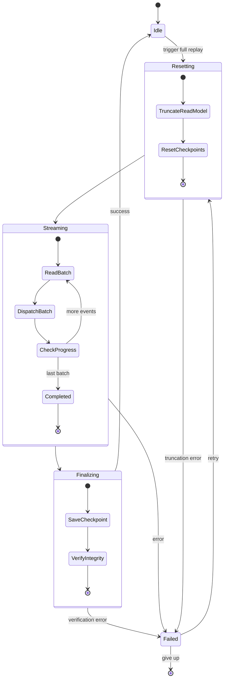
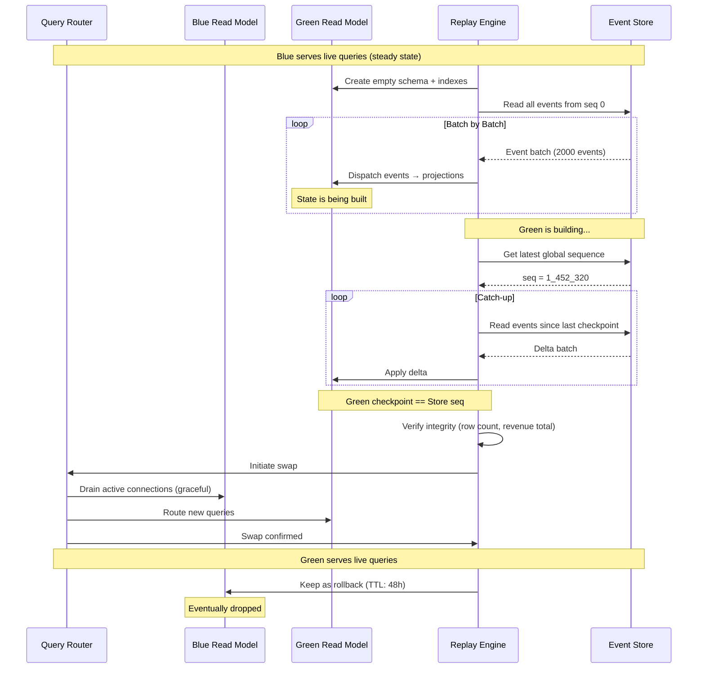
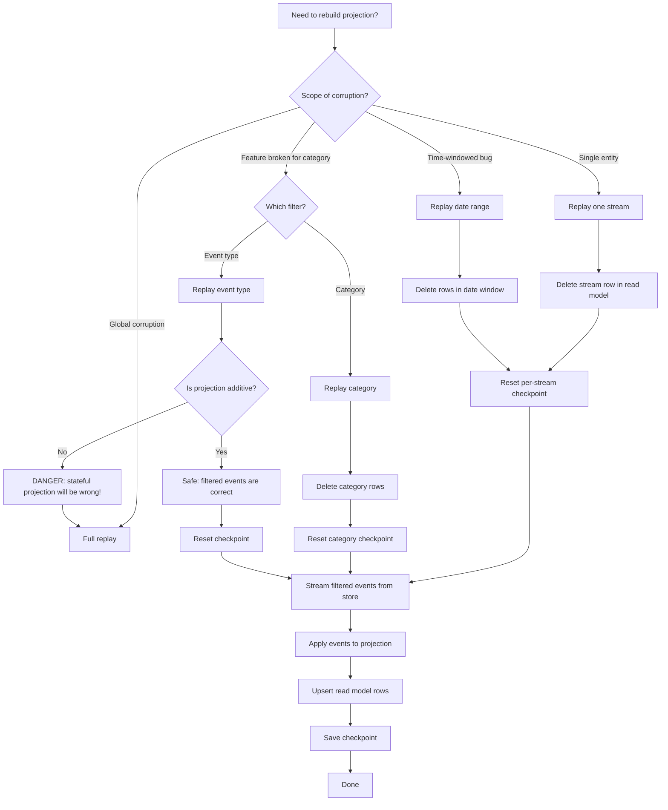
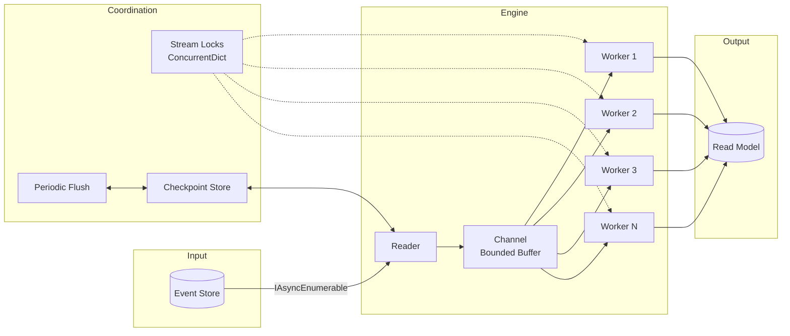

> [!success] Mastery Check
> - [ ] **Studied Well**
> - [ ] **Can explain the concept without notes**
> - [ ] **Can answer interview questions confidently**
> - [ ] **Can implement it in a real project**


# 7.107 — Event Sourcing — Event Replay — Full and Partial

**group:** "CQRS and Event Sourcing"  
**priority:** 2  
**prerequisites:** [[7.105 — Event Sourcing — Projections — Live vs Replay]]  
**related:** [[7.104 — Event Sourcing — Projections — Theory and Design]] | [[7.106 — Event Sourcing — Projections — Live vs Replay]] | [[7.108 — Event Sourcing — Snapshotting]]

---

## Table of Contents

1. [Core Concepts — What Is Event Replay](#1-core-concepts--what-is-event-replay)
2. [Full Replay — Rebuilding the Entire Read Model](#2-full-replay--rebuilding-the-entire-read-model)
3. [Partial Replay — Stream, Category, and Date Range](#3-partial-replay--stream-category-and-date-range)
4. [Replay Safety — Idempotent Projections](#4-replay-safety--idempotent-projections)
5. [Replay Performance — Batch Reading and Parallel Processing](#5-replay-performance--batch-reading-and-parallel-processing)
6. [Blue‑Green Projection Swap](#6-blue-green-projection-swap)
7. [Replay vs Snapshot Restoration](#7-replay-vs-snapshot-restoration)
8. [C# 12 / .NET 8 — Full Replay Engine](#8-c-12--net-8--full-replay-engine)
9. [C# 12 / .NET 8 — Partial Replay by Stream / Type / Date](#9-c-12--net-8--partial-replay-by-stream--type--date)
10. [C# 12 / .NET 8 — Parallel Batch Replay with Checkpoint Reset](#10-c-12--net-8--parallel-batch-replay-with-checkpoint-reset)
11. [Mermaid Diagrams](#11-mermaid-diagrams)
12. [Pitfalls and Anti‑Patterns](#12-pitfalls-and-anti-patterns)
13. [Interview Questions](#13-interview-questions)
14. [Architecture Decision Record (ADR)](#14-architecture-decision-record-adr)
15. [Self‑Check — 12 Quick + 6 Deep](#15-self-check--12-quick--6-deep)

---

## 1. Core Concepts — What Is Event Replay

**Event replay** is the process of re‑reading events from the event store and feeding them through one or more projections to re‑build (or catch‑up) a read model. It is the bedrock of Event Sourcing — without the ability to replay, the event store is merely an append‑only log with no recovery path.

### 1.1 Why Replay Matters

| Scenario | Purpose |
|---|---|
| Read‑model corruption | A bug in a projection produced wrong state → replay fixes it |
| Schema migration | The read‑model schema changed → rebuild from events |
| New projection | A new query capability is added → build from scratch |
| Disaster recovery | The read‑model database is lost → replay from event store |
| Audit / forensic | Verify what the read‑model *should* contain at a point in time |
| Development / testing | Seed a local dev environment with production data (sanitised) |
| Warm‑up | Pre‑populate a read‑model after a blue‑green deploy without full replay |

### 1.2 Mathematical Foundation

Let the event store be a totally ordered sequence of events:

```
E = [e₁, e₂, e₃, ..., eₙ]   where each eᵢ has a global sequence i
```

A projection `P` is a function `P: State × Event → State`. The initial state is `S₀`. The projected state after applying all events is:

```
Sₙ = P(P(...P(S₀, e₁), e₂), ..., eₙ)
```

A **full replay** computes `Sₙ` by starting from `S₀` and applying the entire sequence `E`. A **partial replay** computes state for a subsequence:

- By stream: `E' = {e ∈ E | e.streamId = s}`, preserving per‑stream version order.
- By category: `E' = {e ∈ E | e.streamCategory = c}`, ordered by global sequence.
- By time: `E' = {e ∈ E | t₁ ≤ e.createdAt < t₂}`, ordered by global sequence.

The critical property: **determinism**. Given the same events in the same order, the projection must produce the same state. Non‑determinism (e.g., using `DateTime.UtcNow` or `Random` inside a projection) breaks replay correctness.

### 1.3 Full vs Partial — The Spectrum

```
Full Replay                    Partial Replay
─────────────────              ─────────────────
• All events                   • Filtered by stream / category / type / time
• All projections              • One projection or a subset
• From position 0              • From a known checkpoint or timestamp
• Replaces entire read model   • Patches / upserts into existing read model
• High latency, high cost      • Lower latency, targeted cost
• Production downtime risk     • Usually online / zero‑downtime
• Required for major changes   • Preferred for bug fixes
```

### 1.4 Event Store Replay Capabilities

| Event Store | Native Replay API | Batch Reading | Filtering |
|---|---|---|---|
| EventStoreDB | `read_all_forward`, `read_all_backward` | Yes (256–4096 per batch) | `$by_category`, `$by_type` |
| PostgreSQL / Marten | `LINQ` over events table | Yes (cursor‑based) | `.Where(x => x.StreamId == id)` |
| SQL Server | `SELECT ... ORDER BY GlobalSequence` | Yes (`OFFSET`/`FETCH` or keyset) | `WHERE` clause |
| Azure Cosmos DB | `ChangeFeed` + iterator | Yes (throughput‑limited) | Partition key filter |
| DynamoDB | `Scan` + `Query` | Yes (page size) | `GSI` on stream ID |
| Kafka (event store) | Consumer group rewind | Yes (`batch.size`) | Topic / partition filter |

---

## 2. Full Replay — Rebuilding the Entire Read Model

A **full replay** discards the current read model and re‑plays **every event** from the beginning of the event store through every projection.

### 2.1 When to Use Full Replay

- **Green‑field projection deployment** — no existing state to preserve.
- **Schema‑breaking changes** — the old read model is structurally incompatible.
- **Data corruption** — the read model is known to be incorrect in non‑repairable ways.
- **Audit certainty** — you need a mathematically proven read model built from the raw log.
- **New event store** — migrating from one event store technology to another.
- **Changed projection logic** — the handler logic changed in a way that makes the existing state invalid (not just additive).

### 2.2 Full Replay Workflow

```
┌─────────────┐      ┌──────────────────┐      ┌────────────────┐
│  Truncate   │ ──→ │  Reset all       │ ──→ │  Stream all    │
│  read model │      │  checkpointers   │      │  events seq 0  │
└─────────────┘      └──────────────────┘      └───────┬────────┘
                                                        │
                                                        ▼
                                              ┌──────────────────┐
                                              │  Projection 1    │
                                              │  Projection 2    │
                                              │  Projection N    │
                                              └──────────────────┘
                                                        │
                                                        ▼
                                              ┌──────────────────┐
                                              │  Save checkpoint │
                                              │  (seq = last)    │
                                              └──────────────────┘
```

### 2.3 Detailed Phase Breakdown

#### Phase 1: Pre‑Replay Checks

Before starting, verify:
- The event store is healthy and has sufficient IOPS for sustained reads.
- There is enough free disk space in the read‑model database to accommodate the rebuilt state (plus any indexes).
- If using blue‑green, the target database/schema is clean.
- No other replay is running (use a distributed mutex or advisory lock).

```sql
-- PostgreSQL advisory lock for exclusive replay
SELECT pg_advisory_lock(42); -- unique project‑wide lock ID
```

#### Phase 2: Truncation

Delete or drop all data that will be rebuilt. Two strategies:

| Strategy | SQL | Pros | Cons |
|---|---|---|---|
| `DELETE` | `DELETE FROM orders_summary` | Preserves schema; no re‑granting of permissions | Slow for large tables; VACUUM needed (PG) |
| `TRUNCATE` | `TRUNCATE orders_summary` | Fast; resets high‑water mark | Requires elevated privilege; cannot be rolled back in some engines |
| `DROP + CREATE` | `DROP TABLE IF EXISTS; CREATE TABLE ...` | Cleanest; schema migration opportunity | Loses permissions, indexes, constraints |
| Schema rename | `ALTER TABLE x RENAME TO x_old; CREATE TABLE x ...` | Fast; rollback possible | Requires schema management code |

#### Phase 3: Event Streaming

Read all events in global sequence order. The key decision is **paging strategy**:

- **Offset paging** (`OFFSET`/`LIMIT`): simple but performance degrades with large offsets.
- **Keyset paging** (`WHERE global_seq > @last`): O(1) per page; preferred for replay.
- **Cursor‑based** (EventStoreDB): native snapshots the read position server‑side.

#### Phase 4: Dispatch

Events are dispatched to projections. Each projection may:
- Write to its own table(s).
- Perform upserts.
- Emit side‑effects (send emails, call webhooks) — but side‑effects during replay should be suppressed.

#### Phase 5: Checkpoint Finalisation

After the last event is processed, save the checkpoint as the event store's current `MAX(global_sequence)`. This ensures that subsequent live processing starts from the correct position.

#### Phase 6: Verification

Run validation queries to confirm the rebuilt model is correct:

```sql
-- Example: compare aggregate counts
SELECT COUNT(*) FROM orders_summary;                   --> expected: 1,452,320
SELECT SUM(amount) FROM orders_summary;                --> expected: $14,823,451.00
SELECT COUNT(*) FROM order_events                      --> sanity check vs event store
WHERE event_type = 'OrderPlaced';
```

### 2.4 Cost Considerations

| Dimension | Impact | Mitigation |
|---|---|---|
| Time | `O(total events × projections)` — can be hours for large stores | Parallelise, batch, snapshot‑assist |
| IO | Every event is read from the store; every projection writes to the read model | Read from replicas; batch writes |
| Read‑model availability | Offline during truncate + replay | Blue‑green swap |
| Event store load | Sustained read throughput — can affect live writers | Rate‑limit replay reader; use replica |
| CPU | Projection handler CPU cost per event | Profile; optimise hot paths |
| Network | Moving GB/TB of event data from store to replay engine | Co‑locate replay engine with store |

---

## 3. Partial Replay — Stream, Category, and Date Range

A **partial replay** processes only a subset of events. It is far faster than a full replay and can be run online while the system serves reads.

### 3.1 Filter Dimensions

| Filter | Description | SQL / Query | Use Case |
|---|---|---|---|
| **Stream** | Single aggregate stream | `WHERE stream_id = @id ORDER BY version` | Fix one customer's corrupted view |
| **Category** | All streams of a type (`order-*`) | `WHERE stream_id LIKE 'order-%' ORDER BY global_seq` | Rebuild all order projections |
| **Event type** | Only `OrderShipped` events | `WHERE event_type = 'OrderShipped' ORDER BY global_seq` | Recalculate shipping dashboards |
| **Date range** | Events between two timestamps | `WHERE created_at >= @from AND created_at < @to ORDER BY global_seq` | Fix projections affected by a time‑windowed bug |
| **Version range** | Events between two global sequence numbers | `WHERE global_seq > @from AND global_seq <= @to ORDER BY global_seq` | Recover from a known bad deployment window |
| **Tag / label** | Events with a custom metadata tag | `WHERE metadata->>'region' = 'EU'` | Regional data fix |

### 3.2 Partial Replay Strategies

#### 3.2.1 Stream‑Level Replay

Re‑read a single aggregate stream and re‑apply its events to a single projection row.

```
SELECT * FROM events WHERE stream_id = @id ORDER BY version ASC
→ Project(events)
→ UPSERT INTO read_model WHERE id = @id

Checkpoint: per‑stream checkpoint or use the stream's latest version as checkpoint.
Trade‑off: many small replays → fragmentation; batch them if possible.
```

#### 3.2.2 Category‑Level Replay

Re‑read all streams matching a category prefix. Useful when a new category‑specific view is added or a bug affected all aggregates of a type.

```
SELECT * FROM events WHERE stream_id LIKE 'order-%' ORDER BY global_seq ASC

Performance concern: `LIKE 'prefix-%'` can use an index if the event store supports
indexed prefix scans (e.g., PG with `text_pattern_ops` or a computed category column).
```

**Schema recommendation:** store `stream_category` as a separate indexed column:

```sql
ALTER TABLE events ADD COLUMN stream_category TEXT GENERATED ALWAYS AS (
  split_part(stream_id::text, '-', 1)
) STORED;

CREATE INDEX idx_events_category ON events (stream_category, global_sequence);
```

#### 3.2.3 Date‑Range Replay

Re‑read events within a time window. Requires the event store to have a timestamp index.

```
SELECT * FROM events WHERE created_at >= @from AND created_at < @to
ORDER BY global_seq ASC

Critical: the timestamp must be monotonically non‑decreasing with global sequence.
If the event store clock skews, a timestamp range may miss events or include
out‑of‑order events. Solution: use a monotonic wall clock on the event store server.
```

**Watch out:** If `created_at` is not backed by a unique index, two events may share the same timestamp but have different global sequences. Always append `ORDER BY global_seq` to break ties.

#### 3.2.4 Type‑Filtered Replay

Re‑read only events of specific types. Dangerous if projections depend on event ordering — type‑filtered replay can produce incorrect state because it skips intermediate events that may affect invariants.

```
SELECT * FROM events WHERE event_type IN ('OrderShipped', 'OrderDelivered')
ORDER BY global_seq ASC
```

**⚠️ Warning:** Type‑filtered replay is only safe for **additive** projections (e.g., a counter of how many `OrderShipped` events occurred). For stateful projections (e.g., current order status), skipping event types produces incorrect state.

**Safe use cases for type‑filtered replay:**
- Counters / metrics dashboards.
- Event‑type log for audit trail.
- Materialised views that only care about specific event types (e.g., a "delivery failures" view).

### 3.3 Partial Replay and Checkpoints

A partial replay must manage checkpoints carefully. Two approaches:

| Approach | Pros | Cons |
|---|---|---|
| **Reset + replay** | Simple; guaranteed correct | Destroys existing projection state for the affected scope |
| **Upsert + merge** | Preserves unaffected rows | Complex; risk of partial updates if replay fails mid‑way |

The safest approach is: **delete the affected projection rows, reset the per‑scope checkpoint, then replay**.

### 3.4 Partial Replay Coordination

In a multi‑node deployment, partial replays must be coordinated:

```
1. Lock the projection for the affected scope (distributed lock per stream/category).
2. Pause the live subscription for that scope (so live events don't race with replay).
3. Reset scope checkpoint.
4. Delete affected read‑model rows.
5. Replay filtered events.
6. Save new checkpoint.
7. Resume live subscription.
8. Release lock.
```

```sql
-- Advisory lock per stream (PostgreSQL)
SELECT pg_advisory_lock(hash('replay_lock:' || @streamId));
-- ... replay ...
SELECT pg_advisory_unlock(hash('replay_lock:' || @streamId));
```

### 3.5 Partial Replay Code Flow

```csharp
public async Task<ReplayResult> RebuildStreamAsync(
    Guid streamId,
    CancellationToken ct)
{
    // 1. Lock
    await using var lockHandle = await distributedLock.AcquireAsync(
        $"replay:stream:{streamId}", ct: ct);

    // 2. Pause subscription for this stream
    await subscription.PauseAsync(streamId, ct);

    // 3. Delete existing state
    await projection.DeleteStreamAsync(streamId, ct);

    // 4. Reset per‑stream checkpoint
    await checkpoint.ResetStreamAsync(projection.Name, streamId, ct);

    // 5. Replay
    var events = eventStore.ReadStreamAsync(streamId, ct: ct);
    await foreach (var e in events)
    {
        await projection.HandleAsync(e, ct);
    }

    // 6. Save checkpoint (the stream's latest version is the checkpoint)
    var latestVersion = await eventStore.GetLatestVersionAsync(streamId, ct);
    await checkpoint.SetCheckpointAsync(
        projection.Name, latestVersion, ct);

    // 7. Resume subscription
    await subscription.ResumeAsync(streamId, ct);

    return ReplayResult.Succeeded(projection.Name, ReplayType.PartialStream);
}
```

---

## 4. Replay Safety — Idempotent Projections

An **idempotent projection** produces the same final state regardless of how many times events are replayed. Without idempotency, replays corrupt the read model.

### 4.1 Idempotency Requirements

A projection function `f(state, event) → state'` must satisfy:

```
f(f(state, e₁), e₂) = f(state, e₁) ∘ f(state, e₂)   -- associativity is not required
f(state, e) applied twice = f(state, e) applied once  -- same event is safe to replay
```

For **database projections**, this translates to:

```
if event_already_processed:
    skip  -- idempotent at the storage level
else:
    apply(event)
```

### 4.2 Idempotency Implementation Patterns

#### Pattern 1: Processed‑Events Table (Explicit Dedup)

Use a secondary table that tracks every event ID that has been processed. On replay, check the table before applying.

```sql
CREATE TABLE processed_events (
    event_id        UUID PRIMARY KEY,
    projection_name TEXT NOT NULL,
    processed_at    TIMESTAMPTZ DEFAULT now()
);

CREATE INDEX idx_processed_events_projection
    ON processed_events (projection_name, event_id);
```

**Pros:** Exact dedup; can audit which events were processed.  
**Cons:** Table grows unbounded; periodic cleanup needed (partition by month, drop old partitions).

#### Pattern 2: Projection Checkpoint Only (Positional Idempotency)

Only track `MAX(global_sequence)` per projection. On replay, start from `checkpoint + 1`. This relies on **at‑most‑once delivery**.

```sql
CREATE TABLE projection_checkpoints (
    projection_name TEXT PRIMARY KEY,
    global_sequence BIGINT NOT NULL
);
```

**Pros:** Minimal storage; no per‑event tracking.  
**Cons:** If an error causes an event to be skipped, the replay will never "notice" it. Requires exactly‑once semantics from the dispatch system.

#### Pattern 3: Upsert‑Based Idempotency (Row‑Level)

Design the read‑model schema so that applying the same event twice produces the same outcome. This is achieved via `UPSERT` / `MERGE` / `ON CONFLICT DO NOTHING`.

```sql
INSERT INTO orders_summary (order_id, version, status, total_amount)
VALUES (@orderId, @version, @status, @amount)
ON CONFLICT (order_id) DO UPDATE
SET version = GREATEST(orders_summary.version, EXCLUDED.version),
    status  = CASE WHEN EXCLUDED.version >= orders_summary.version
                   THEN EXCLUDED.status ELSE orders_summary.status END,
    total_amount = CASE WHEN EXCLUDED.version >= orders_summary.version
                        THEN EXCLUDED.total_amount ELSE orders_summary.total_amount END;
```

**Pros:** No separate dedup table; naturally idempotent.  
**Cons:** Requires careful version‑based conflict resolution; `GREATEST` logic must be correct for all scenarios.

#### Pattern 4: Optimistic Concurrency with Version Stamp

Every read‑model row has a `version` column. Replay applies events only if the event's aggregate version is `row.version + 1`. If the event is already applied, the version check fails and the handler skips it.

```csharp
public async ValueTask HandleAsync(EventEnvelope envelope)
{
    var row = await db.Orders.FindAsync(envelope.StreamId);
    if (row is not null && row.Version >= envelope.Version)
        return; // already applied

    ApplyEvent(row, envelope);
    row.Version = envelope.Version;
    await db.SaveChangesAsync();
}
```

### 4.3 Transactional Boundaries

```sql
-- SQL Server / PostgreSQL
BEGIN TRANSACTION;

UPDATE projection_checkpoint SET global_sequence = @new_seq WHERE id = @proj_id;
UPDATE read_model SET field = @value WHERE id = @aggregate_id
  AND version < @event_version;

INSERT INTO processed_events (event_id) VALUES (@event_id)
  ON CONFLICT DO NOTHING;

COMMIT;
```

**Rule:** The checkpoint update **must** be in the same transaction as the projection mutation. If they are split, a crash after the projection write but before the checkpoint update will cause duplicate processing on restart.

### 4.4 Non‑Idempotent Operations to Avoid

| Operation | Problem | Mitigation |
|---|---|---|
| `INSERT` without `ON CONFLICT` | Duplicate rows on replay | Use `UPSERT` |
| `SUM(amount)` on an order | Doubles the total on replay | Store per‑event contributions, sum at query time |
| Email sending | Sends duplicate emails | Collect side‑effects, flush only during live mode |
| External API calls | Duplicate payments / notifications | Check idempotency key at the external service |
| `DateTime.UtcNow` in projection | Different state on each replay | Use event's timestamp instead |
| `Random` / `Guid.NewGuid()` | Non‑deterministic state | Use deterministic values derived from event data |
| `++counter` in memory | Not durable; reset on restart | Persist counter in read model |

### 4.5 Testing Idempotency

```csharp
[Fact]
public async Task Projection_should_be_idempotent()
{
    // Arrange
    var events = EventFactory.CreateOrderPlacedEvents(10).ToList();

    // Act: apply twice
    foreach (var e in events) await projection.HandleAsync(e);
    foreach (var e in events) await projection.HandleAsync(e); // replay

    // Assert
    var state = await projection.GetStateAsync(events[0].StreamId);
    state.Version.Should().Be(10);                      // not 20
    state.TotalAmount.Should().Be(expectedTotal);        // not doubled
    state.EventsProcessed.Should().Be(10);               // deduped, not 20
}
```

---

## 5. Replay Performance — Batch Reading and Parallel Processing

Replay performance is critical — full replays can process millions of events.

### 5.1 Batch Reading

Reading events one‑by‑one is catastrophically slow. Always batch.

```csharp
// Bad: N+1 reads — 1M events = 1M round trips
foreach (var event in events) { ... }

// Good: batched read — 1M events / 1000 batch = 1000 round trips
const int BatchSize = 1000;
long lastSeq = 0;
do
{
    var batch = await store.ReadEventsAsync(lastSeq, BatchSize);
    foreach (var e in batch) { await projector.HandleAsync(e); }
    lastSeq = batch.Last().GlobalSequence;
} while (batch.Count == BatchSize);
```

### 5.2 Parallel Processing

Within a batch, events can be processed in parallel **if** they belong to different streams (same‑stream events must be serialised to preserve order).

```csharp
await Parallel.ForEachAsync(
    batch.GroupBy(e => e.StreamId),
    new ParallelOptions { MaxDegreeOfParallelism = 8 },
    async (streamGroup, ct) =>
    {
        foreach (var e in streamGroup.OrderBy(x => x.Version))
        {
            await projector.HandleAsync(e);
        }
    });
```

### 5.3 Performance Benchmarks (Approximate)

| Strategy | Events/sec (single node) | Notes |
|---|---|---|
| Sequential, single event reads | 500–2,000 | IO bound; N+1 problem |
| Sequential, batched reads (1000) | 20,000–50,000 | Reduced round trips |
| Parallel (per stream, 8 threads) | 80,000–200,000 | Depends on projection complexity |
| Parallel + batch writes (bulk insert) | 150,000–500,000 | Optimise write path |
| Sharded replay nodes (4 nodes) | 500,000–2,000,000 | Horizontal scaling; partition event store |
| Snapshot‑assisted replay | 1,000,000+ | Only processes delta events |

### 5.4 Read Model Write Strategies

| Strategy | Description | Throughput | Complexity |
|---|---|---|---|
| **Single‑row upsert** | One `UPDATE`/`INSERT` per event | Low (5K–10K/s) | Low |
| **Bulk flush** | Collect N events, write in a single batch statement | Medium (20K–50K/s) | Medium |
| **In‑memory accumulator** | Accumulate state in memory, flush periodically | High (100K+/s) | High (requires snapshot) |
| **Table swap** | Build new table in parallel, swap with old | Very high | High (blue‑green) |
| **Truncate + bulk load** | Drop old data, bulk insert rebuilt state | Very high | Medium (offline) |

### 5.5 Bulk Flush Implementation

```csharp
public sealed class BulkFlushProjector(
    IDbConnectionFactory connectionFactory,
    ILogger<BulkFlushProjector> logger)
{
    private readonly Channel<OrderSummaryEvent> _channel =
        Channel.CreateBounded<OrderSummaryEvent>(10_000);

    private Task? _flushTask;
    private const int FlushBatchSize = 500;
    private static readonly TimeSpan FlushInterval = TimeSpan.FromMilliseconds(200);

    public async ValueTask HandleAsync(EventEnvelope envelope)
    {
        var orderEvent = Deserialize(envelope);
        await _channel.Writer.WriteAsync(orderEvent);
    }

    public Task StartFlushLoopAsync(CancellationToken ct)
    {
        _flushTask = FlushLoopAsync(ct);
        return Task.CompletedTask;
    }

    private async Task FlushLoopAsync(CancellationToken ct)
    {
        var buffer = new List<OrderSummaryEvent>(FlushBatchSize);
        var timer = new PeriodicTimer(FlushInterval);

        try
        {
            while (!ct.IsCancellationRequested)
            {
                var hasItem = _channel.Reader.TryRead(out var item)
                    || await WaitForItemAsync(timer, ct);

                if (hasItem && item is not null)
                {
                    buffer.Add(item);
                }

                if (buffer.Count >= FlushBatchSize || (hasItem == false && buffer.Count > 0))
                {
                    await FlushAsync(buffer, ct);
                    logger.LogDebug("Flushed {Count} events", buffer.Count);
                    buffer.Clear();
                }
            }
        }
        finally
        {
            if (buffer.Count > 0)
                await FlushAsync(buffer, CancellationToken.None);
        }
    }

    private static async Task<bool> WaitForItemAsync(
        PeriodicTimer timer, CancellationToken ct)
    {
        try { return await timer.WaitForNextTickAsync(ct); }
        catch (OperationCanceledException) { return false; }
    }

    private async Task FlushAsync(
        List<OrderSummaryEvent> events, CancellationToken ct)
    {
        await using var conn = await connectionFactory.OpenAsync(ct);
        await conn.ExecuteAsync("""
            INSERT INTO orders_summary (order_id, version, status, total_amount)
            SELECT d.order_id, d.version, d.status, d.total_amount
            FROM UNNEST(@Events) AS d
            ON CONFLICT (order_id) DO UPDATE
            SET version = GREATEST(orders_summary.version, EXCLUDED.version),
                status  = EXCLUDED.status,
                total_amount = EXCLUDED.total_amount
            """, new { Events = events });
    }
}
```

### 5.6 Rate Limiting and Back‑Pressure

When replaying into a shared read‑model database that also serves live queries, replay traffic can starve live queries.

| Strategy | Implementation |
|---|---|
| Token‑bucket reader | Only read N events per second |
| Throttled channel | Use bounded channel with `Wait` mode |
| Database resource governor | Set max IOPS/CPU for replay connection |
| Pause on latency | Monitor read‑model query latency; pause replay if P99 > threshold |
| Batch‑size back‑off | Reduce batch size if write latency spikes |

```csharp
public sealed class ThrottledEventReader(
    IEventStore inner,
    int maxEventsPerSecond = 50_000)
{
    private readonly RateLimiter _limiter =
        new TokenBucketRateLimiter(new TokenBucketRateLimiterOptions
        {
            TokenLimit = maxEventsPerSecond,
            TokensPerPeriod = maxEventsPerSecond,
            ReplenishmentPeriod = TimeSpan.FromSeconds(1),
            QueueLimit = 0 // no queue; throttle immediately
        });

    public async IAsyncEnumerable<EventEnvelope> ReadAllAsync(
        long fromSeq, int batchSize,
        [EnumeratorCancellation] CancellationToken ct)
    {
        await foreach (var batch in inner.ReadAllAsync(fromSeq, batchSize, ct))
        {
            using var lease = await _limiter.AcquireAsync(
                permitCount: 1, cancellationToken: ct);
            if (lease.IsAcquired is false)
            {
                await Task.Delay(100, ct); // wait for token
            }
            yield return batch;
        }
    }
}
```

### 5.7 Memory Management

Large replays can cause memory pressure:

- **Stream events in a forward‑only reader** — don't load all events into memory at once.
- **Use `IAsyncEnumerable`** — process events as they arrive.
- **Pre‑compiled projection handlers** — avoid high‑cost reflection per event.
- **Pool deserialised event objects** — reuse `JsonDocument` / `Utf8JsonReader` where possible.

---

## 6. Blue‑Green Projection Swap

**Blue‑green deployment** for projections means the replay builds a *new* read model (green) while the *old* read model (blue) continues serving live queries. When the replay is complete, the query router flips from blue to green atomically.

### 6.1 Architecture

```
                         ┌──────────────────┐
                         │  Query Router    │
                         │  (e.g., proxy /  │
                         │   feature flag)  │
                         └──┬───────────┬───┘
                            │           │
                    ┌───────▼──┐  ┌─────▼───────┐
                    │ BLUE     │  │ GREEN       │
                    │ Read     │  │ Read Model  │
                    │ Model    │  │ (building)  │
                    │ (live)   │  │             │
                    └──────────┘  └─────────────┘
                                     ▲
                                     │
                              ┌──────┴──────┐
                              │  Replay     │
                              │  Engine     │
                              └─────────────┘
```

### 6.2 Swap Process — Detailed

```
=== Phase 1: Preparation ===
1. Deploy new projection code (if changed) to the replay engine.
2. Create empty green read‑model database / schema / table set.
   - Run migration scripts (CREATE TABLE, CREATE INDEX).
   - Replicate constraints, triggers, foreign keys.
3. Verify connectivity: green is reachable and empty.

=== Phase 2: Replay into Green ===
4. Start full replay engine targeting green.
   - Replay reads all events from the event store.
   - Replay writes projection state into green.
   - Blue continues serving live queries — zero impact.
5. Monitor replay progress:
   - Events processed, elapsed time, error count.
   - Green database size, index build progress.
   - Event store load (ensure live writers aren't starved).

=== Phase 3: Catch‑Up ===
6. When replay reaches the end of the event store:
   a. Record the current global sequence: CUT_OVER_SEQ.
   b. Replay any events that arrived during the initial replay (CUT_OVER_SEQ → latest).
   c. Repeat until green's checkpoint == event store's latest sequence.
7. Verification:
   - Run data integrity checks on green (row counts, sum checks).
   - Run canary queries (ensure green returns same results as blue for sample data).
   - Verify indexes are in place and query performance is acceptable.

=== Phase 4: Cut‑Over ===
8. (Optional) Pause write path for a heartbeat window (if strict consistency required).
   - Halt command processing briefly (e.g., 5 seconds).
   - Let the last few events drain into their final position.
9. Atomically flip the query router from blue to green.
   - Update DNS / load balancer / config service.
   - If using a database proxy: `ROUTE * TO green`.
10. Resume writes (if paused).
11. Warm up any caches on green (if applicable).

=== Phase 5: Rollback Window ===
12. Keep blue online for a rollback window (4–48 hours).
13. During this window, route a small percentage of read traffic to blue to
    verify consistency.
14. After the rollback window expires:
    - Truncate or drop blue.
    - Free up storage resources.
```

### 6.3 Consistency Considerations

| Requirement | Approach |
|---|---|
| Eventual consistency | Flip at any time; green will catch up shortly |
| Read‑your‑writes | Flip must be coordinated with the write path (e.g., hold writes, flip, release) |
| Snapshot isolation | Flip at a specific global sequence; all reads after flip see events ≥ that seq |
| Zero‑downtime | Use a proxy that can route per‑request or per‑tenant; gradual rollout |
| Strong consistency | Requires distributed transaction or two‑phase commit across write + read model |

### 6.4 Database‑Level Blue‑Green

```sql
-- PostgreSQL: use schemas
CREATE SCHEMA IF NOT EXISTS projections_green;

-- Swap by renaming (atomic via schema rename)
ALTER SCHEMA projections RENAME TO projections_blue;
ALTER SCHEMA projections_green RENAME TO projections;

-- On rollback:
ALTER SCHEMA projections RENAME TO projections_green;
ALTER SCHEMA projections_blue RENAME TO projections;

-- Or use table renaming within a single schema
ALTER TABLE orders_summary      RENAME TO orders_summary_blue;
ALTER TABLE orders_summary_green RENAME TO orders_summary;
```

### 6.5 Code‑Level Router

```csharp
public sealed class ReadModelRouter
{
    private volatile string _activeSlot = "blue";
    private readonly IReadModel _blue;
    private readonly IReadModel _green;

    public ReadModelRouter(IReadModel blue, IReadModel green)
    {
        _blue = blue;
        _green = green;
    }

    public async Task<OrderDto> GetOrderAsync(Guid id)
    {
        var slot = _activeSlot; // volatile read → atomic on x86/ARM
        var model = slot == "blue" ? _blue : _green;
        return await model.GetOrderAsync(id);
    }

    public void SwitchTo(string slot)
    {
        Interlocked.Exchange(ref _activeSlot, slot);
        Log.Information("Read model router switched to {Slot}", slot);
    }

    // Gradual rollout: route X% to green
    public IReadModel ResolveForRequest(string tenantId)
    {
        if (ShouldRouteToGreen(tenantId))
            return _green;
        return _blue;
    }

    private bool ShouldRouteToGreen(string tenantId)
    {
        // deterministic hash: 30% of tenants → green
        return HashCode.Combine(tenantId, "replay-rollout") % 100 < 30;
    }
}
```

### 6.6 Infrastructure‑Level Blue‑Green

| Layer | Blue‑Green Mechanism |
|---|---|
| DNS | `blue.app.internal` / `green.app.internal`; swap `CNAME` |
| Load balancer | Target group A → blue; target group B → green; swap listener rule |
| Kubernetes | Two Deployments (`blue`, `green`); switch `Service` selector label |
| Consul / etcd | Key `read_model/slot` = `blue` or `green`; config watchers on all app instances |
| Feature flags | `replay/use-green` flag; gradually ramp from 0% → 100% |
| Database proxy | `pgBouncer` / `ProxySQL` → route `SELECT` queries to different `dbname` |

### 6.7 Cost and Resource Implications

Blue‑green doubles storage: you pay for two full read model copies.

```
Storage = 2 × S   (S = size of one read model)
Compute = 1 × C   (green is built by replay; blue is idle but still served)
IOPS    = 2 × I   (writes go to green, reads go to blue; after swap, reversed)
```

**Mitigation:**
- Use the same database server with different schemas (no extra server cost).
- Drop blue early if rollback risk is low (adjust rollback window).
- Use cloud snapshot / clone for instant blue environment.

### 6.8 Automated Blue‑Green Orchestration

```csharp
public sealed class BlueGreenOrchestrator(
    IEventStore eventStore,
    IProjection projection,
    ICheckpointStore checkpoint,
    IReadModelRouter router,
    IReadModel blue,
    IReadModel green)
{
    public async Task<BlueGreenResult> RunAsync(CancellationToken ct)
    {
        var startedAt = DateTime.UtcNow;

        // Phase 1: Verify green is empty
        var greenEmpty = await green.IsEmptyAsync(ct);
        if (!greenEmpty)
            throw new InvalidOperationException("Green model is not empty");

        // Phase 2: Full replay into green
        var engine = new FullReplayEngine(eventStore, [projection], NullLogger.Instance);
        var replayResult = await engine.ReplayAllAsync(
            new ReplayOptions(TruncateBeforeReplay: false), ct);

        // Phase 3: Catch‑up
        long cutOverSeq;
        do
        {
            cutOverSeq = await eventStore.GetGlobalSequenceAsync(ct);
            var greenCheckpoint = await checkpoint.GetCheckpointAsync(
                projection.Name, ct);
            if (greenCheckpoint >= cutOverSeq) break;

            var catchUpEvents = eventStore.ReadAllAsync(greenCheckpoint, 1000, ct);
            await foreach (var e in catchUpEvents)
            {
                await projection.HandleAsync(e, ct);
            }
        } while (true);

        // Phase 4: Verify integrity
        var verified = await VerifyIntegrityAsync(blue, green, ct);
        if (!verified)
            return BlueGreenResult.Failed("Integrity check failed", replayResult);

        // Phase 5: Swap
        router.SwitchTo("green");

        return BlueGreenResult.Succeeded(
            replayResult.TotalEventsProcessed,
            DateTime.UtcNow - startedAt);
    }

    private static async Task<bool> VerifyIntegrityAsync(
        IReadModel blue, IReadModel green, CancellationToken ct)
    {
        var blueCount = await blue.GetTotalOrderCountAsync(ct);
        var greenCount = await green.GetTotalOrderCountAsync(ct);

        if (blueCount != greenCount) return false;

        var blueTotal = await blue.GetTotalRevenueAsync(ct);
        var greenTotal = await green.GetTotalRevenueAsync(ct);

        return Math.Abs(blueTotal - greenTotal) < 0.01m;
    }
}
```

---

## 7. Replay vs Snapshot Restoration

Both replay and snapshot restoration rebuild state, but they differ in mechanism, cost, and use case.

### 7.1 Comparison

| Aspect | Replay | Snapshot Restoration |
|---|---|---|
| **Source** | Full event log | Periodic snapshots (stored state at a point) |
| **Granularity** | Per‑event | Per‑aggregate or per‑projection |
| **Determinism** | Always deterministic (same events → same state) | Depends on snapshot serialisation (binary format, version) |
| **Latency** | High (process all events from the beginning) | Low (deserialise a single blob + catch‑up) |
| **Storage** | No additional storage beyond event store | Snapshot store (can be large; proportional to aggregate count) |
| **Freshness** | Up to the latest event | Up to the snapshot point; needs catch‑up replay |
| **Bias** | **Slow but complete** — every event is processed | **Fast but potentially stale** — events since snapshot must be replayed |
| **Failure mode** | Read‑model is empty or incomplete during rebuild | Snapshot may be corrupt, serialisation incompatible, or missing |
| **Complexity** | Simple — just read all events | Moderate — snapshot strategy, frequency, storage lifecycle |
| **Audit trail** | Full event order preserved | Snapshot is a point‑in‑time state; intermediate events are compressed |

### 7.2 When to Use Which

```
                    ┌─────────────────────────────┐
                    │  Can you tolerate            │
                    │  > 1 minute rebuild time?    │
                    └──────────┬──────────────────┘
                               │
                   Yes ┌───────┴───────┐ No
                       │               │
                       ▼               ▼
              ┌─────────────────┐  ┌─────────────────┐
              │ Full Replay     │  │ Snapshot +      │
              │ or Snapshot +   │  │ Incremental     │
              │ Catch‑Up        │  │ Replay          │
              └─────────────────┘  └─────────────────┘
```

### 7.3 Hybrid: Snapshot‑Assisted Replay

For very large event stores (millions+ events), a pure full replay is impractical. Use snapshots as **replay accelerators**:

```
If a snapshot exists at global sequence N:
    Load snapshot → state at seq N
    Replay events from seq N+1 to latest
    Projection rebuilt in: O(deserialize snapshot) + O(delta events)
    vs. O(all events) for a pure replay

Savings: ~99% for stores with millions of events and frequent snapshots.
```

This is the strategy used by EventStoreDB, Marten, Axon Server, and Aggregate.

### 7.4 Snapshot Frequency Trade‑Off

```
Snapshot Interval    │  Storage Cost    │  Replay Speed
─────────────────────┼──────────────────┼─────────────────────
Every 1 event        │  Very high       │  O(1) — nearly instant
Every 100 events     │  High            │  O(100) — fast
Every 10K events     │  Moderate        │  O(10K) — acceptable
Every 1M events      │  Low             │  O(1M) — slow
None (no snapshots)  │  None            │  O(all events) — very slow
```

**Rule of thumb:** Snapshot every `10 × stream_count` events, or when the event count since the last snapshot exceeds 1,000 per active stream.

### 7.5 Snapshot Restoration Code

```csharp
public sealed class SnapshotRestorer(
    ISnapshotStore snapshotStore,
    IEventStore eventStore,
    IProjection projection)
{
    public async Task RestoreAsync(Guid streamId, CancellationToken ct = default)
    {
        // 1. Try to load latest snapshot
        var snapshot = await snapshotStore.GetLatestAsync(streamId, ct);

        // 2. Load events since snapshot (or all events if no snapshot)
        long fromVersion;
        if (snapshot is not null)
        {
            await projection.RestoreStateAsync(snapshot.Payload, ct);
            fromVersion = snapshot.Version + 1;
        }
        else
        {
            await projection.ResetAsync(ct);
            fromVersion = 0;
        }

        // 3. Replay events since snapshot
        var events = eventStore.ReadStreamAsync(streamId, fromVersion, ct);
        await foreach (var e in events)
        {
            await projection.HandleAsync(e, ct);
        }

        // 4. Save a new snapshot post‑restore
        var currentState = await projection.GetStateAsync(streamId, ct);
        var latestVersion = await eventStore.GetLatestVersionAsync(streamId, ct);
        await snapshotStore.SaveAsync(new Snapshot(
            streamId, latestVersion, currentState), ct);
    }
}
```

### 7.6 When Replay Is Required Despite Snapshots

| Scenario | Why Snapshots Alone Won't Work |
|---|---|
| Projection logic change | Snapshot was built with old logic → must replay from events |
| Snapshot corruption | Snapshot blob is unreadable → fall back to full replay |
| Schema migration | Snapshot binary format is incompatible with new code → must replay |
| New projection | No snapshots exist for the new projection → replay all events |
| Audit / forensic | Need to verify that snapshots are correct → compare replay vs snapshot |

---

## 8. C# 12 / .NET 8 — Full Replay Engine

This section presents a production‑grade full replay engine using .NET 8, C# 12 features (primary constructors, collection expressions, `ConcurrentDictionary` improvements, `System.Threading.Channels` for pipelining).

### 8.1 Event Store Interface

```csharp
public readonly record struct EventEnvelope(
    Guid EventId,
    Guid StreamId,
    string StreamCategory,
    string EventType,
    long GlobalSequence,
    int Version,
    DateTime CreatedAt,
    string JsonData,
    string? JsonMetadata);

public interface IEventStore
{
    IAsyncEnumerable<EventEnvelope> ReadAllAsync(
        long fromGlobalSeq = 0,
        int batchSize = 1000,
        CancellationToken ct = default);

    IAsyncEnumerable<EventEnvelope> ReadStreamAsync(
        Guid streamId,
        long fromVersion = 0,
        CancellationToken ct = default);

    ValueTask<long> GetGlobalSequenceAsync(CancellationToken ct = default);

    ValueTask<long> GetStreamVersionAsync(Guid streamId, CancellationToken ct = default);
}
```

### 8.2 Projection Interface

```csharp
public interface IProjection
{
    string Name { get; }

    ValueTask HandleAsync(EventEnvelope envelope, CancellationToken ct = default);

    ValueTask ResetAsync(CancellationToken ct = default);

    ValueTask<long> GetCheckpointAsync(CancellationToken ct = default);

    ValueTask SetCheckpointAsync(long seq, CancellationToken ct = default);
}

// Optional: for projections that support category‑level reset
public interface ICategoryResettable
{
    ValueTask ResetCategoryAsync(string category, CancellationToken ct = default);
}

// Optional: for projections that support stream‑level reset
public interface IStreamResettable
{
    ValueTask ResetStreamAsync(Guid streamId, CancellationToken ct = default);
}
```

### 8.3 Full Replay Engine (Comprehensive)

```csharp
public sealed class FullReplayEngine(
    IEventStore eventStore,
    IEnumerable<IProjection> projections,
    ICheckpointStore checkpointStore,
    ILogger<FullReplayEngine> logger)
{
    private const int DefaultBatchSize = 2000;

    public async Task<ReplayResult> ReplayAllAsync(
        ReplayOptions? options = null,
        CancellationToken ct = default)
    {
        ArgumentNullException.ThrowIfNull(projections);

        options ??= ReplayOptions.Default;
        var projectionList = projections.ToList();

        if (projectionList.Count == 0)
        {
            logger.LogWarning("No projections registered; replay is a no‑op");
            return ReplayResult.Empty;
        }

        var startedAt = DateTime.UtcNow;
        var totalEvents = 0L;
        var hasErrors = false;

        logger.LogInformation(
            "=== Full replay started === Projections: {Count}, BatchSize: {Batch}, " +
            "Parallel: {Parallel}, Truncate: {Truncate}",
            projectionList.Count,
            options.BatchSize,
            options.EnableParallelism,
            options.TruncateBeforeReplay);

        // ── Phase 1: Reset all projections ────────────────────────────────
        if (options.TruncateBeforeReplay)
        {
            logger.LogInformation("Phase 1/4: Resetting {Count} projection(s)...",
                projectionList.Count);

            var resetTasks = projectionList.Select(p =>
                ResetProjectionAsync(p, options, ct));

            var resetResults = await Task.WhenAll(resetTasks);

            foreach (var (name, success) in resetResults)
            {
                if (!success)
                {
                    logger.LogError("Failed to reset projection {Name}", name);
                    hasErrors = true;
                }
            }

            if (hasErrors)
                return ReplayResult.Failed(
                    projectionList.Select(p => p.Name).ToArray(),
                    "One or more projections failed to reset");
        }

        // ── Phase 2: Reset checkpoints ────────────────────────────────────
        logger.LogInformation("Phase 2/4: Resetting checkpoints...");
        var cpTasks = projectionList.Select(p =>
            checkpointStore.ResetCheckpointAsync(p.Name, ct));
        await Task.WhenAll(cpTasks);

        // ── Phase 3: Stream and dispatch all events ───────────────────────
        logger.LogInformation("Phase 3/4: Streaming events from position 0...");

        var batch = new List<EventEnvelope>(options.BatchSize);

        await foreach (var envelope in eventStore
            .ReadAllAsync(fromGlobalSeq: 0, options.BatchSize, ct)
            .ConfigureAwait(false))
        {
            batch.Add(envelope);

            if (batch.Count >= options.BatchSize)
            {
                await DispatchBatchAsync(batch, projectionList, options, ct);
                totalEvents += batch.Count;
                batch.Clear();

                if (totalEvents % 100_000 == 0)
                {
                    logger.LogInformation(
                        "Progress: {Count} events processed", totalEvents);
                }
            }
        }

        if (batch.Count > 0)
        {
            await DispatchBatchAsync(batch, projectionList, options, ct);
            totalEvents += batch.Count;
        }

        // ── Phase 4: Finalise checkpoints ────────────────────────────────
        logger.LogInformation("Phase 4/4: Finalising checkpoints...");
        var finalSeq = await eventStore.GetGlobalSequenceAsync(ct);

        var checkpointTasks = projectionList.Select(p =>
            checkpointStore.SetCheckpointAsync(p.Name, finalSeq, ct));
        await Task.WhenAll(checkpointTasks);

        var elapsed = DateTime.UtcNow - startedAt;
        var eventsPerSecond = totalEvents / Math.Max(elapsed.TotalSeconds, 0.1);

        logger.LogInformation(
            "=== Full replay completed === Events: {Count}, " +
            "Elapsed: {Elapsed}, Rate: {Rate:F0} evt/s",
            totalEvents, elapsed, eventsPerSecond);

        return new ReplayResult(
            TotalEventsProcessed: totalEvents,
            Elapsed: elapsed,
            ProjectionNames: projectionList.Select(p => p.Name).ToArray(),
            IsSuccess: true,
            ErrorMessage: null);
    }

    private static async Task<(string Name, bool Success)> ResetProjectionAsync(
        IProjection projection,
        ReplayOptions options,
        CancellationToken ct)
    {
        try
        {
            await projection.ResetAsync(ct);
            return (projection.Name, true);
        }
        catch (Exception ex)
        {
            return (projection.Name, false);
        }
    }

    private async Task DispatchBatchAsync(
        List<EventEnvelope> batch,
        List<IProjection> projectionList,
        ReplayOptions options,
        CancellationToken ct)
    {
        if (!options.EnableParallelism)
        {
            // Sequential dispatch: process each event through all projections
            foreach (var envelope in batch)
            {
                foreach (var projection in projectionList)
                {
                    await projection.HandleAsync(envelope, ct);
                }
            }
            return;
        }

        // Parallel dispatch: run all projections concurrently
        var tasks = projectionList.Select(projection =>
            ProcessBatchForProjectionAsync(projection, batch, options, ct));

        await Task.WhenAll(tasks);
    }

    private static async Task ProcessBatchForProjectionAsync(
        IProjection projection,
        List<EventEnvelope> batch,
        ReplayOptions options,
        CancellationToken ct)
    {
        // Preserve global order within each projection
        var ordered = options.PreserveOrder
            ? batch.OrderBy(static e => e.GlobalSequence)
            : batch.AsEnumerable();

        foreach (var envelope in ordered)
        {
            await projection.HandleAsync(envelope, ct);
        }
    }
}

public sealed record ReplayOptions(
    int BatchSize = 2000,
    bool EnableParallelism = true,
    bool PreserveOrder = true,
    bool TruncateBeforeReplay = true)
{
    public static readonly ReplayOptions Default = new();
}

public sealed record ReplayResult(
    long TotalEventsProcessed,
    TimeSpan Elapsed,
    string[] ProjectionNames,
    bool IsSuccess = true,
    string? ErrorMessage = null)
{
    public static readonly ReplayResult Empty = new(0, TimeSpan.Zero, [], true);

    public static ReplayResult Failed(string[] names, string error)
        => new(0, TimeSpan.Zero, names, false, error);
}
```

### 8.4 Postgres Event Store Implementation

```csharp
public sealed class PostgresEventStore(NpgsqlDataSource dataSource) : IEventStore
{
    public async IAsyncEnumerable<EventEnvelope> ReadAllAsync(
        long fromGlobalSeq = 0,
        int batchSize = 1000,
        [EnumeratorCancellation] CancellationToken ct = default)
    {
        long lastSeq = fromGlobalSeq;
        bool hasMore;

        do
        {
            hasMore = false;

            await using var cmd = dataSource.CreateCommand("""
                SELECT event_id, stream_id, stream_category,
                       event_type, global_sequence, version,
                       created_at, json_data, json_metadata
                FROM events
                WHERE global_sequence > @from_seq
                ORDER BY global_sequence
                LIMIT @batch_size
                """);

            cmd.Parameters.AddWithValue("from_seq", lastSeq);
            cmd.Parameters.AddWithValue("batch_size", batchSize);

            await using var reader = await cmd.ExecuteReaderAsync(ct);

            while (await reader.ReadAsync(ct))
            {
                hasMore = true;

                yield return new EventEnvelope(
                    EventId: reader.GetGuid(0),
                    StreamId: reader.GetGuid(1),
                    StreamCategory: reader.GetString(2),
                    EventType: reader.GetString(3),
                    GlobalSequence: reader.GetInt64(4),
                    Version: reader.GetInt32(5),
                    CreatedAt: reader.GetDateTime(6),
                    JsonData: reader.GetString(7),
                    JsonMetadata: reader.IsDBNull(8) ? null : reader.GetString(8));

                lastSeq = reader.GetInt64(4);
            }
        } while (hasMore && !ct.IsCancellationRequested);
    }

    public async IAsyncEnumerable<EventEnvelope> ReadStreamAsync(
        Guid streamId,
        long fromVersion = 0,
        [EnumeratorCancellation] CancellationToken ct = default)
    {
        await using var cmd = dataSource.CreateCommand("""
            SELECT event_id, stream_id, stream_category,
                   event_type, global_sequence, version,
                   created_at, json_data, json_metadata
            FROM events
            WHERE stream_id = @sid AND version > @from_ver
            ORDER BY version
            """);

        cmd.Parameters.AddWithValue("sid", streamId);
        cmd.Parameters.AddWithValue("from_ver", fromVersion);

        await using var reader = await cmd.ExecuteReaderAsync(ct);

        while (await reader.ReadAsync(ct))
        {
            yield return new EventEnvelope(
                EventId: reader.GetGuid(0),
                StreamId: reader.GetGuid(1),
                StreamCategory: reader.GetString(2),
                EventType: reader.GetString(3),
                GlobalSequence: reader.GetInt64(4),
                Version: reader.GetInt32(5),
                CreatedAt: reader.GetDateTime(6),
                JsonData: reader.GetString(7),
                JsonMetadata: reader.IsDBNull(8) ? null : reader.GetString(8));
        }
    }

    public async ValueTask<long> GetGlobalSequenceAsync(CancellationToken ct)
    {
        await using var cmd = dataSource.CreateCommand(
            "SELECT COALESCE(MAX(global_sequence), 0) FROM events");
        var result = await cmd.ExecuteScalarAsync(ct);
        return result is long l ? l : 0L;
    }

    public async ValueTask<long> GetStreamVersionAsync(
        Guid streamId, CancellationToken ct)
    {
        await using var cmd = dataSource.CreateCommand("""
            SELECT COALESCE(MAX(version), 0) FROM events WHERE stream_id = @sid
            """);
        cmd.Parameters.AddWithValue("sid", streamId);
        var result = await cmd.ExecuteScalarAsync(ct);
        return result is long l ? l : 0L;
    }
}
```

### 8.5 EventStoreDB Implementation

```csharp
using EventStore.Client;

public sealed class EventStoreDbStore(EventStoreClient client) : IEventStore
{
    public async IAsyncEnumerable<EventEnvelope> ReadAllAsync(
        long fromGlobalSeq = 0,
        int batchSize = 1000,
        [EnumeratorCancellation] CancellationToken ct = default)
    {
        var position = fromGlobalSeq == 0
            ? Position.Start
            : Position.FromInt64(fromGlobalSeq);

        var events = client.ReadAllAsync(
            Direction.Forwards,
            position,
            maxCount: (uint)batchSize,
            resolveLinkTos: true,
            cancellationToken: ct);

        await foreach (var resolved in events)
        {
            var e = resolved.Event;
            var jsonData = Encoding.UTF8.GetString(e.Data.ToArray());
            var jsonMeta = e.Metadata.Length > 0
                ? Encoding.UTF8.GetString(e.Metadata.ToArray())
                : null;

            yield return new EventEnvelope(
                EventId: e.EventId.ToGuid(),
                StreamId: Guid.Parse(e.StreamId[..36]),
                StreamCategory: e.StreamId.Split('-')[0],
                EventType: e.EventType,
                GlobalSequence: e.Position.CommitPosition,
                Version: (int)e.EventNumber,
                CreatedAt: e.Created,
                JsonData: jsonData,
                JsonMetadata: jsonMeta);
        }
    }

    public async ValueTask<long> GetGlobalSequenceAsync(CancellationToken ct)
    {
        var tail = client.ReadAllAsync(
            Direction.Backwards,
            Position.End,
            maxCount: 1,
            cancellationToken: ct);

        await foreach (var resolved in tail)
        {
            return resolved.Event.Position.CommitPosition;
        }

        return 0L;
    }

    public IAsyncEnumerable<EventEnvelope> ReadStreamAsync(
        Guid streamId, long fromVersion = 0, CancellationToken ct = default)
    {
        // Implementation similar to ReadAllAsync but using
        // client.ReadStreamAsync(Direction.Forwards, streamId, ...)
        throw new NotImplementedException();
    }

    public ValueTask<long> GetStreamVersionAsync(
        Guid streamId, CancellationToken ct)
    {
        throw new NotImplementedException();
    }
}
```

---

## 9. C# 12 / .NET 8 — Partial Replay by Stream / Type / Date

### 9.1 Partial Replay Filter

```csharp
[Flags]
public enum ReplayFilterType
{
    None        = 0,
    StreamId    = 1,
    Category    = 2,
    EventType   = 4,
    DateRange   = 8,
    SeqRange    = 16
}

public readonly record struct PartialReplayFilter
{
    public ReplayFilterType Type { get; init; }

    public Guid? StreamId { get; init; }

    public string? StreamCategory { get; init; }

    public string? EventType { get; init; }

    public DateTime? FromDate { get; init; }
    public DateTime? ToDate { get; init; }

    public long? FromSequence { get; init; }
    public long? ToSequence { get; init; }

    public readonly bool IsValid
    {
        get
        {
            if (Type == ReplayFilterType.None) return false;
            if (Type.HasFlag(ReplayFilterType.StreamId) && !StreamId.HasValue) return false;
            if (Type.HasFlag(ReplayFilterType.Category) && string.IsNullOrEmpty(StreamCategory)) return false;
            if (Type.HasFlag(ReplayFilterType.EventType) && string.IsNullOrEmpty(EventType)) return false;
            if (Type.HasFlag(ReplayFilterType.DateRange) && (!FromDate.HasValue || !ToDate.HasValue)) return false;
            if (Type.HasFlag(ReplayFilterType.SeqRange) && (!FromSequence.HasValue || !ToSequence.HasValue)) return false;
            return true;
        }
    }

    public static PartialReplayFilter ByStream(Guid streamId)
        => new() { Type = ReplayFilterType.StreamId, StreamId = streamId };

    public static PartialReplayFilter ByCategory(string category)
        => new() { Type = ReplayFilterType.Category, StreamCategory = category };

    public static PartialReplayFilter ByEventType(string eventType)
        => new() { Type = ReplayFilterType.EventType, EventType = eventType };

    public static PartialReplayFilter ByDateRange(DateTime from, DateTime to)
        => new() { Type = ReplayFilterType.DateRange, FromDate = from, ToDate = to };

    public static PartialReplayFilter BySequenceRange(long from, long to)
        => new() { Type = ReplayFilterType.SeqRange, FromSequence = from, ToSequence = to };
}
```

### 9.2 Partial Replay Engine

```csharp
public sealed class PartialReplayEngine(
    IEventStore eventStore,
    IProjection projection,
    ICheckpointStore checkpointStore,
    ILogger<PartialReplayEngine> logger)
{
    public async Task<ReplayResult> ReplayPartialAsync(
        PartialReplayFilter filter,
        ReplayOptions? options = null,
        CancellationToken ct = default)
    {
        ArgumentNullException.ThrowIfNull(projection);
        if (!filter.IsValid)
            throw new ArgumentException("Invalid replay filter", nameof(filter));

        options ??= ReplayOptions.Default with { TruncateBeforeReplay = true };
        var startedAt = DateTime.UtcNow;
        var totalEvents = 0L;

        logger.LogInformation(
            "Starting partial replay for projection {Name} with filter type {Type}",
            projection.Name, filter.Type);

        // ── Phase 1: Reset scope ─────────────────────────────────────────
        if (options.TruncateBeforeReplay)
        {
            if (filter.Type.HasFlag(ReplayFilterType.StreamId) && filter.StreamId.HasValue)
            {
                await ResetStreamScopeAsync(filter.StreamId.Value, ct);
            }
            else if (filter.Type.HasFlag(ReplayFilterType.Category) &&
                     filter.StreamCategory is not null)
            {
                await ResetCategoryScopeAsync(filter.StreamCategory, ct);
            }
            else
            {
                await projection.ResetAsync(ct);
            }

            await checkpointStore.ResetCheckpointAsync(projection.Name, ct);
        }

        // ── Phase 2: Read and dispatch filtered events ──────────────────
        var batch = new List<EventEnvelope>(options.BatchSize);

        await foreach (var envelope in ReadFilteredAsync(filter, options.BatchSize, ct)
            .ConfigureAwait(false))
        {
            batch.Add(envelope);
            if (batch.Count >= options.BatchSize)
            {
                await ProcessBatchAsync(batch, options, ct);
                totalEvents += batch.Count;
                batch.Clear();
            }
        }

        if (batch.Count > 0)
        {
            await ProcessBatchAsync(batch, options, ct);
            totalEvents += batch.Count;
        }

        // ── Phase 3: Save checkpoint ─────────────────────────────────────
        long finalCheckpoint;
        if (filter.Type.HasFlag(ReplayFilterType.StreamId))
        {
            finalCheckpoint = filter.StreamId is not null
                ? await eventStore.GetStreamVersionAsync(filter.StreamId.Value, ct)
                : 0L;
        }
        else
        {
            finalCheckpoint = await eventStore.GetGlobalSequenceAsync(ct);
        }

        await checkpointStore.SetCheckpointAsync(projection.Name, finalCheckpoint, ct);

        var elapsed = DateTime.UtcNow - startedAt;
        logger.LogInformation(
            "Partial replay completed: {Count} events in {Elapsed} (filter: {Type})",
            totalEvents, elapsed, filter.Type);

        return new ReplayResult(totalEvents, elapsed, [projection.Name]);
    }

    private async IAsyncEnumerable<EventEnvelope> ReadFilteredAsync(
        PartialReplayFilter filter,
        int batchSize,
        [EnumeratorCancellation] CancellationToken ct)
    {
        if (filter.Type.HasFlag(ReplayFilterType.StreamId) && filter.StreamId.HasValue)
        {
            var streamEvents = eventStore.ReadStreamAsync(
                filter.StreamId.Value, ct: ct);

            await foreach (var e in streamEvents.WithCancellation(ct))
                yield return e;

            yield break;
        }

        var fromSeq = filter.FromSequence ?? 0L;

        await foreach (var e in eventStore.ReadAllAsync(fromSeq, batchSize, ct))
        {
            if (ct.IsCancellationRequested) yield break;

            if (filter.ToSequence.HasValue && e.GlobalSequence > filter.ToSequence.Value)
                yield break;

            if (filter.Type.HasFlag(ReplayFilterType.Category) &&
                filter.StreamCategory is not null &&
                !e.StreamCategory.StartsWith(filter.StreamCategory, StringComparison.Ordinal))
                continue;

            if (filter.Type.HasFlag(ReplayFilterType.EventType) &&
                filter.EventType is not null &&
                !string.Equals(e.EventType, filter.EventType, StringComparison.Ordinal))
                continue;

            if (filter.Type.HasFlag(ReplayFilterType.DateRange))
            {
                if (filter.FromDate.HasValue && e.CreatedAt < filter.FromDate.Value)
                    continue;
                if (filter.ToDate.HasValue && e.CreatedAt >= filter.ToDate.Value)
                    continue;
            }

            yield return e;
        }
    }

    private async Task ResetStreamScopeAsync(Guid streamId, CancellationToken ct)
    {
        if (projection is IStreamResettable resettable)
        {
            logger.LogInformation("Resetting stream scope for {StreamId}", streamId);
            await resettable.ResetStreamAsync(streamId, ct);
        }
        else
        {
            logger.LogInformation(
                "Projection does not support stream‑level reset; " +
                "falling back to full reset");
            await projection.ResetAsync(ct);
        }
    }

    private async Task ResetCategoryScopeAsync(string category, CancellationToken ct)
    {
        if (projection is ICategoryResettable resettable)
        {
            logger.LogInformation("Resetting category scope for {Category}", category);
            await resettable.ResetCategoryAsync(category, ct);
        }
        else
        {
            logger.LogInformation(
                "Projection does not support category‑level reset; " +
                "falling back to full reset");
            await projection.ResetAsync(ct);
        }
    }

    private static async Task ProcessBatchAsync(
        List<EventEnvelope> batch,
        ReplayOptions options,
        CancellationToken ct)
    {
        foreach (var envelope in batch.OrderBy(static e => e.GlobalSequence))
        {
            await projection.HandleAsync(envelope, ct);
        }
    }
}
```

### 9.3 Example: Partial Replay Runner

```csharp
public static class PartialReplayRunner
{
    public static async Task RunExamplesAsync(
        PartialReplayEngine engine,
        CancellationToken ct)
    {
        // By stream: fix a single order
        await engine.ReplayPartialAsync(
            PartialReplayFilter.ByStream(Guid.Parse("a1b2c3d4-...")),
            ct: ct);

        // By category: rebuild all invoice projections
        await engine.ReplayPartialAsync(
            PartialReplayFilter.ByCategory("invoice"),
            new ReplayOptions(BatchSize: 5000),
            ct);

        // By date range: fix events from yesterday's bug window
        var yesterday = DateTime.UtcNow.Date.AddDays(-1);
        var today = DateTime.UtcNow.Date;
        await engine.ReplayPartialAsync(
            PartialReplayFilter.ByDateRange(yesterday, today),
            ct: ct);

        // By event type: recount order completions (additive only)
        await engine.ReplayPartialAsync(
            PartialReplayFilter.ByEventType("OrderCompleted"),
            new ReplayOptions(TruncateBeforeReplay: false),
            ct: ct);
    }
}
```

---

## 10. C# 12 / .NET 8 — Parallel Batch Replay with Checkpoint Reset

This section demonstrates a **parallel batch replay engine** that uses `System.Threading.Channels` for pipelining, `ConcurrentDictionary` for per‑stream locking, and a background checkpoint flush loop.

### 10.1 Checkpoint Store

```csharp
public interface ICheckpointStore
{
    ValueTask<long> GetCheckpointAsync(
        string projectionName, CancellationToken ct = default);

    ValueTask SetCheckpointAsync(
        string projectionName, long seq, CancellationToken ct = default);

    ValueTask ResetCheckpointAsync(
        string projectionName, CancellationToken ct = default);
}

public sealed class PostgresCheckpointStore(NpgsqlDataSource dataSource) : ICheckpointStore
{
    private const string TableName = "projection_checkpoints";

    public async ValueTask<long> GetCheckpointAsync(
        string projectionName, CancellationToken ct = default)
    {
        await using var cmd = dataSource.CreateCommand($"""
            SELECT global_sequence FROM {TableName}
            WHERE projection_name = @name
            """);
        cmd.Parameters.AddWithValue("name", projectionName);

        var result = await cmd.ExecuteScalarAsync(ct);
        return result is long seq ? seq : 0L;
    }

    public async ValueTask SetCheckpointAsync(
        string projectionName, long seq, CancellationToken ct = default)
    {
        await using var cmd = dataSource.CreateCommand($"""
            INSERT INTO {TableName} (projection_name, global_sequence)
            VALUES (@name, @seq)
            ON CONFLICT (projection_name) DO UPDATE
            SET global_sequence = EXCLUDED.global_sequence
            """);
        cmd.Parameters.AddWithValue("name", projectionName);
        cmd.Parameters.AddWithValue("seq", seq);
        await cmd.ExecuteNonQueryAsync(ct);
    }

    public async ValueTask ResetCheckpointAsync(
        string projectionName, CancellationToken ct = default)
    {
        await using var cmd = dataSource.CreateCommand($"""
            DELETE FROM {TableName} WHERE projection_name = @name
            """);
        cmd.Parameters.AddWithValue("name", projectionName);
        await cmd.ExecuteNonQueryAsync(ct);
    }
}

public sealed class InMemoryCheckpointStore : ICheckpointStore
{
    private readonly ConcurrentDictionary<string, long> _store = new();

    public ValueTask<long> GetCheckpointAsync(
        string projectionName, CancellationToken ct = default)
        => ValueTask.FromResult(_store.GetValueOrDefault(projectionName, 0L));

    public ValueTask SetCheckpointAsync(
        string projectionName, long seq, CancellationToken ct = default)
    {
        _store[projectionName] = seq;
        return ValueTask.CompletedTask;
    }

    public ValueTask ResetCheckpointAsync(
        string projectionName, CancellationToken ct = default)
    {
        _store.TryRemove(projectionName, out _);
        return ValueTask.CompletedTask;
    }
}
```

### 10.2 Parallel Batch Replay Engine (Channel‑Based)

```csharp
public sealed class ParallelBatchReplayEngine(
    IEventStore eventStore,
    ICheckpointStore checkpointStore,
    IProjection projection,
    ILogger<ParallelBatchReplayEngine> logger)
{
    private const int DefaultDegreeOfParallelism = 4;
    private const int DefaultBatchSize = 1000;
    private static readonly TimeSpan CheckpointFlushInterval = TimeSpan.FromSeconds(2);

    public async Task<ReplayResult> RunParallelReplayAsync(
        int degreeOfParallelism = DefaultDegreeOfParallelism,
        int batchSize = DefaultBatchSize,
        CancellationToken ct = default)
    {
        ArgumentNullException.ThrowIfNull(projection);

        var startedAt = DateTime.UtcNow;
        var totalEvents = 0L;
        var checkpoint = await checkpointStore.GetCheckpointAsync(
            projection.Name, ct);

        logger.LogInformation(
            "Parallel replay for {Name} | Checkpoint: {Cp} | " +
            "DOP: {Dop} | Batch: {Batch}",
            projection.Name, checkpoint, degreeOfParallelism, batchSize);

        var channel = Channel.CreateBounded<EventEnvelope>(
            new BoundedChannelOptions(batchSize * 2)
            {
                FullMode = BoundedChannelFullMode.Wait,
                SingleReader = true,
                SingleWriter = false
            });

        var readerTask = ReadEventsAsync(
            channel.Writer, checkpoint, batchSize, ct);

        using var flushCts = CancellationTokenSource.CreateLinkedTokenSource(ct);
        var flushTask = FlushCheckpointLoopAsync(flushCts.Token);

        var streamLocks = new ConcurrentDictionary<Guid, object>(
            concurrencyLevel: degreeOfParallelism, capacity: 10_000);
        var progress = new ProgressTracker();

        var workerTasks = new Task[degreeOfParallelism];
        for (var i = 0; i < degreeOfParallelism; i++)
        {
            var workerId = i;
            workerTasks[i] = ProcessEventsAsync(
                channel.Reader, streamLocks, progress, workerId, ct);
        }

        await readerTask;
        await Task.WhenAll(workerTasks);

        await flushCts.CancelAsync();
        try { await flushTask; } catch (OperationCanceledException) { }

        var finalSeq = await eventStore.GetGlobalSequenceAsync(ct);
        await checkpointStore.SetCheckpointAsync(projection.Name, finalSeq, ct);

        totalEvents = progress.TotalCount;

        var elapsed = DateTime.UtcNow - startedAt;
        var rate = totalEvents / Math.Max(elapsed.TotalSeconds, 0.1);

        logger.LogInformation(
            "Parallel replay done | Events: {N} | Elapsed: {E} | Rate: {R:F0}/s",
            totalEvents, elapsed, rate);

        return new ReplayResult(totalEvents, elapsed, [projection.Name]);
    }

    private async Task ReadEventsAsync(
        ChannelWriter<EventEnvelope> writer,
        long fromSeq,
        int batchSize,
        CancellationToken ct)
    {
        try
        {
            await foreach (var envelope in eventStore
                .ReadAllAsync(fromSeq, batchSize, ct)
                .ConfigureAwait(false))
            {
                await writer.WriteAsync(envelope, ct);
            }
        }
        catch (OperationCanceledException) { }
        finally
        {
            writer.Complete();
        }
    }

    private async Task ProcessEventsAsync(
        ChannelReader<EventEnvelope> reader,
        ConcurrentDictionary<Guid, object> streamLocks,
        ProgressTracker progress,
        int workerId,
        CancellationToken ct)
    {
        await Parallel.ForEachAsync(
            reader.ReadAllAsync(ct),
            new ParallelOptions
            {
                MaxDegreeOfParallelism = 1,
                CancellationToken = ct
            },
            async (envelope, _) =>
            {
                var lockObj = streamLocks.GetOrAdd(
                    envelope.StreamId, static _ => new object());

                lock (lockObj)
                {
                    await projection.HandleAsync(envelope, ct);
                    progress.Increment();
                }
            });
    }

    private async Task FlushCheckpointLoopAsync(CancellationToken ct)
    {
        var timer = new PeriodicTimer(CheckpointFlushInterval);

        try
        {
            while (await timer.WaitForNextTickAsync(ct))
            {
                var checkpoint = await eventStore.GetGlobalSequenceAsync(ct);
                await checkpointStore.SetCheckpointAsync(
                    projection.Name, checkpoint, ct);

                logger.LogDebug("Checkpoint flushed: {Seq}", checkpoint);
            }
        }
        catch (OperationCanceledException) { }
    }

    private sealed class ProgressTracker
    {
        private long _count;

        public long TotalCount => Interlocked.Read(ref _count);

        public void Increment() => Interlocked.Increment(ref _count);
    }
}
```

### 10.3 Checkpoint Reset Orchestrator

```csharp
public sealed class CheckpointResetOrchestrator(
    ICheckpointStore checkpointStore,
    IEnumerable<IProjection> projections)
{
    public async Task ResetAllCheckpointsAsync(CancellationToken ct = default)
    {
        var tasks = projections.Select(p =>
            checkpointStore.ResetCheckpointAsync(p.Name, ct));
        await Task.WhenAll(tasks);
        Log.Information("All checkpoints reset ({Count} projections)",
            projections.Count());
    }

    public async Task ResetProjectionCheckpointAsync(
        string projectionName, CancellationToken ct = default)
    {
        await checkpointStore.ResetCheckpointAsync(projectionName, ct);
        Log.Information("Checkpoint reset for projection {Name}", projectionName);
    }

    public async Task ResetMultipleAsync(
        IEnumerable<string> names, CancellationToken ct = default)
    {
        var tasks = names.Select(n =>
            checkpointStore.ResetCheckpointAsync(n, ct));
        await Task.WhenAll(tasks);
    }
}
```

### 10.4 SQL Server Checkpoint Store

```csharp
public sealed class SqlServerCheckpointStore(
    SqlConnection connectionFactory) : ICheckpointStore
{
    public async ValueTask<long> GetCheckpointAsync(
        string projectionName, CancellationToken ct = default)
    {
        await using var conn = await connectionFactory.OpenAsync(ct);
        await using var cmd = new SqlCommand("""
            SELECT global_sequence FROM projection_checkpoints
            WHERE projection_name = @name
            """, conn);
        cmd.Parameters.AddWithValue("@name", projectionName);

        var result = await cmd.ExecuteScalarAsync(ct);
        return result is long seq ? seq : 0L;
    }

    public async ValueTask SetCheckpointAsync(
        string projectionName, long seq, CancellationToken ct = default)
    {
        await using var conn = await connectionFactory.OpenAsync(ct);
        await using var cmd = new SqlCommand("""
            MERGE projection_checkpoints AS target
            USING (SELECT @name AS projection_name, @seq AS global_sequence) AS source
            ON target.projection_name = source.projection_name
            WHEN MATCHED THEN
                UPDATE SET global_sequence = source.global_sequence
            WHEN NOT MATCHED THEN
                INSERT (projection_name, global_sequence)
                VALUES (source.projection_name, source.global_sequence);
            """, conn);
        cmd.Parameters.AddWithValue("@name", projectionName);
        cmd.Parameters.AddWithValue("@seq", seq);
        await cmd.ExecuteNonQueryAsync(ct);
    }

    public async ValueTask ResetCheckpointAsync(
        string projectionName, CancellationToken ct = default)
    {
        await using var conn = await connectionFactory.OpenAsync(ct);
        await using var cmd = new SqlCommand(
            "DELETE FROM projection_checkpoints WHERE projection_name = @name", conn);
        cmd.Parameters.AddWithValue("@name", projectionName);
        await cmd.ExecuteNonQueryAsync(ct);
    }
}
```

### 10.5 Table Schema for Checkpoints

```sql
-- PostgreSQL / CockroachDB
CREATE TABLE projection_checkpoints (
    projection_name  TEXT PRIMARY KEY,
    global_sequence  BIGINT NOT NULL,
    updated_at       TIMESTAMPTZ DEFAULT now()
);

-- SQL Server
CREATE TABLE projection_checkpoints (
    projection_name  NVARCHAR(255) PRIMARY KEY,
    global_sequence  BIGINT NOT NULL,
    updated_at       DATETIME2 DEFAULT SYSUTCDATETIME()
);

-- MySQL / MariaDB
CREATE TABLE projection_checkpoints (
    projection_name  VARCHAR(255) PRIMARY KEY,
    global_sequence  BIGINT NOT NULL,
    updated_at       TIMESTAMP DEFAULT CURRENT_TIMESTAMP ON UPDATE CURRENT_TIMESTAMP
) ENGINE=InnoDB;
```

---

## 11. Mermaid Diagrams

### 11.1 Full Replay State Machine



### 11.2 Blue‑Green Projection Swap Flow



### 11.3 Partial Replay Decision Tree



### 11.4 Event Flow Through Replay Engine



---

## 12. Pitfalls and Anti‑Patterns

### 12.1 Pitfall 1: Non‑Idempotent Projections

**Problem:** Projection that increments a counter without deduplication → replay doubles every count.

```csharp
// BAD: not idempotent
public async ValueTask HandleAsync(EventEnvelope e)
{
    await db.ExecuteAsync(
        "UPDATE order_stats SET total_orders = total_orders + 1");
}

// GOOD: idempotent via UPSERT
public async ValueTask HandleAsync(EventEnvelope e)
{
    await db.ExecuteAsync("""
        INSERT INTO processed_events (event_id) VALUES (@id)
        ON CONFLICT DO NOTHING
        """, new { id = e.EventId });
}
```

**Solution:** Always use idempotent handlers. See Section 4.

### 12.2 Pitfall 2: Replaying Without Resetting Checkpoints

**Problem:** You start a replay but the checkpoint is still at the old value → replay reads from the middle → inconsistent state.

```csharp
// BAD: replay starts from existing checkpoint
var checkpoint = await checkpointStore.GetAsync(projection.Name);
await foreach (var e in store.ReadAllAsync(checkpoint)) { ... }

// GOOD: checkpoint is explicitly reset before replay
await projection.ResetAsync(ct);
await checkpointStore.ResetAsync(projection.Name, ct);
await foreach (var e in store.ReadAllAsync(0)) { ... }
```

**Solution:** The replay engine must explicitly reset checkpoints as Phase 1.

### 12.3 Pitfall 3: Out‑of‑Order Event Delivery

**Problem:** Parallel processing dispatches events for the same stream out of version order → projection ends in wrong state.

```csharp
// BAD: parallel but no per‑stream ordering
await Parallel.ForEachAsync(events, async (e, ct) => {
    await projection.HandleAsync(e, ct);
});

// GOOD: per‑stream lock
var streamLocks = new ConcurrentDictionary<Guid, object>();
await Parallel.ForEachAsync(events, async (e, ct) => {
    lock (streamLocks.GetOrAdd(e.StreamId, _ => new()))
    {
        await projection.HandleAsync(e, ct);
    }
});
```

**Solution:** Use per‑stream locking or route all events of one stream to the same worker.

### 12.4 Pitfall 4: Type‑Filtered Replay for Stateful Projections

**Problem:** Replaying only `OrderShipped` events for a projection that builds current order status skips `OrderPlaced`, `OrderCancelled`, etc. → wrong state.

```
Events in store:
  [0] OrderPlaced(id=a, items=[...])
  [1] OrderShipped(id=a, carrier=UPS)
  [2] OrderDelivered(id=a)
  [3] OrderPlaced(id=b, items=[...])

Type‑filtered replay (only OrderShipped):
  [1] OrderShipped(id=a, carrier=UPS)
  → projection sees "shipped" without "placed" → state: N/A or error
```

**Solution:** Never use type‑filtered replay for stateful projections. Only use it for additive (counting / metric) projections.

### 12.5 Pitfall 5: Blocking Writes During Replay

**Problem:** Full replay locks the event store or read model → live writes are blocked → system downtime.

```sql
-- BAD: exclusive lock on event store
LOCK TABLE events IN ACCESS EXCLUSIVE MODE;
SELECT * FROM events; -- replay blocks all inserts
```

**Solution:** Use blue‑green swap (Section 6) or ensure the event store and read model support concurrent read/write. Use `READ COMMITTED` or `SNAPSHOT ISOLATION` to avoid blocking writers.

### 12.6 Pitfall 6: Ignoring Event Store Back‑Pressure

**Problem:** Replay reads events faster than the projection can write → unbounded memory growth → OOM kill.

```csharp
// BAD: no back‑pressure
var allEvents = await store.ReadAllAsync(0, int.MaxValue).ToListAsync();

// GOOD: streaming with back‑pressure via bounded channel
var channel = Channel.CreateBounded<EventEnvelope>(
    new BoundedChannelOptions(5000) { FullMode = BoundedChannelFullMode.Wait });
```

**Solution:** Use bounded channels (as in Section 10.2), apply back‑pressure with `BoundedChannelFullMode.Wait`, and tune batch sizes.

### 12.7 Pitfall 7: Not Handling Schema Evolution

**Problem:** Old events have a different schema than current projection code → deserialisation failure during replay.

```csharp
// Old event (field "price" was "cost")
{ "cost": 19.99 }

// Current projection code expects:
{ "price": 19.99 }
// → JsonException: Property 'price' not found
```

**Solution:** Use an upcast / event‑migration layer. Old events are upcast to the current schema before the projection handler sees them.

```csharp
public interface IEventUpcaster
{
    bool CanUpcast(EventEnvelope envelope);
    EventEnvelope Upcast(EventEnvelope envelope);
}

public sealed class OrderVersion1To2Upcaster : IEventUpcaster
{
    private const string OldType = "OrderPlaced.v1";

    public bool CanUpcast(EventEnvelope e)
        => e.EventType == OldType;

    public EventEnvelope Upcast(EventEnvelope e)
    {
        var data = JsonDocument.Parse(e.JsonData);
        var root = data.RootElement;

        using var stream = new MemoryStream();
        using var writer = new Utf8JsonWriter(stream);
        writer.WriteStartObject();
        foreach (var prop in root.EnumerateObject())
        {
            if (prop.NameEquals("cost"))
            {
                writer.WriteNumber("price", prop.Value.GetDecimal());
            }
            else
            {
                prop.WriteTo(writer);
            }
        }
        writer.WriteString("currency", "USD");
        writer.WriteEndObject();
        writer.Flush();

        var json = Encoding.UTF8.GetString(stream.ToArray());
        return e with { JsonData = json, EventType = "OrderPlaced.v2" };
    }
}
```

### 12.8 Pitfall 8: Replaying Side‑Effects

**Problem:** A projection handler sends emails or calls external APIs during replay → customers receive duplicate notifications.

**Solution:** Inject a `ReplayContext` that the handler can inspect:

```csharp
public sealed class ReplayContext
{
    public bool IsReplaying { get; }
    public ReplayType Type { get; }
}

public static class ReplayContextAccessor
{
    private static readonly AsyncLocal<ReplayContext> _current = new();

    public static ReplayContext Current
        => _current.Value ?? new ReplayContext { IsReplaying = false };

    public static IDisposable BeginReplay(ReplayType type)
    {
        _current.Value = new ReplayContext { IsReplaying = true, Type = type };
        return new ReplayScope();
    }

    private sealed class ReplayScope : IDisposable
    {
        public void Dispose() => _current.Value = null;
    }
}

// In handler:
public async ValueTask HandleAsync(EventEnvelope e)
{
    if (ReplayContextAccessor.Current.IsReplaying)
        return; // suppress side‑effects during replay

    await emailService.SendOrderConfirmationAsync(e.StreamId);
}
```

### 12.9 Pitfall 9: Missing Progress Reporting

**Problem:** Full replay of 10M events runs for hours with no feedback → operators think it hung.

**Solution:** Log progress every 100K events or every 30 seconds. Expose a `/replay/status` endpoint.

### 12.10 Pitfall 10: Replaying into a Live Database Without Rate Limiting

**Problem:** Replay writes to the same database that serves live queries → read latency spikes.

**Solution:** Use a dedicated replay connection with resource governor limits or a separate read‑replica database.

```sql
ALTER ROLE replay_user SET statement_timeout = '5min';
ALTER ROLE replay_user SET idle_in_transaction_session_timeout = '10min';
```

### 12.11 Pitfall 11: Assuming Global Sequence Is Monotonically Increasing Without Gaps

**Problem:** Some event stores may have gaps in global sequence. Using `seq + 1` as the next read position misses events.

**Solution:** Always use `WHERE global_sequence > @last_seq` (strictly greater) rather than `WHERE global_sequence >= @last_seq + 1`.

### 12.12 Pitfall 12: Single‑Node Replay Throughput Bottleneck

**Problem:** Full replay on a single node is limited by CPU, network, and IO. For 50M+ events, replay takes days.

**Solution:** Shard the replay by assigning disjoint stream categories or stream ID ranges to different nodes.

```csharp
var shardCount = 4;
var shardIndex = nodeId % shardCount;

var events = eventStore.ReadAllAsync(fromSeq, batchSize, ct)
    .Where(e => (ulong)e.StreamId.GetHashCode() % shardCount == shardIndex);
```

---

## 13. Interview Questions

### 13.1 Conceptual Questions

**Q1:** What is the difference between a full replay and a partial replay?

<details>
<summary>Answer</summary>
Full replay processes every event from the beginning, rebuilding the entire read model from scratch. Partial replay processes a filtered subset (by stream, category, event type, or date range) and is used for targeted fixes. Full replay is complete but expensive; partial replay is fast but limited in scope.
</details>

**Q2:** When would you choose a partial replay over a full replay?

<details>
<summary>Answer</summary>
When the data corruption or schema change is scoped (e.g., one customer's order view is wrong, or a time‑windowed bug affected only events between two dates). Partial replay avoids taking the entire read‑model offline and completes in seconds/minutes rather than hours.
</details>

**Q3:** Explain the concept of an idempotent projection. Why is it critical for replay safety?

<details>
<summary>Answer</summary>
An idempotent projection produces the same final state regardless of how many times it processes the same event. It is critical because replays may process events that were already applied, and without idempotency the read model would be corrupted (e.g., double‑counting, duplicate rows).
</details>

**Q4:** How does a blue‑green projection swap work?

<details>
<summary>Answer</summary>
Two read‑model slots exist: blue (live) and green (building). The replay engine builds the new projection state in green while blue continues serving reads. Once green is fully caught up and verified, the query router atomically flips to green. Blue is kept as a rollback target.
</details>

**Q5:** What is the mathematical property that makes event replay possible?

<details>
<summary>Answer</summary>
Determinism: given the same sequence of events as input, a projection function must always produce the same output state. Expressed as `Sₙ = P(P(...P(S₀, e₁), e₂), ..., eₙ)`.
</details>

**Q6:** Compare snapshot restoration with full replay. When is each preferred?

<details>
<summary>Answer</summary>
Snapshot restoration deserialises a pre‑computed state and replays only events since the snapshot — fast but requires snapshot management. Full replay processes every event from the start — slow but complete. Preferred: snapshots for low‑latency recovery; full replay for schema migrations and corruption.
</details>

**Q7:** How does a hybrid (snapshot‑assisted) replay work technically?

<details>
<summary>Answer</summary>
Load the latest snapshot at global sequence N. Deserialise its payload as the starting state. Then read only events with `global_sequence > N` and apply them. Reduces O(all) to O(delta).
</details>

### 13.2 Practical Questions

**Q8:** A full replay of 10M events takes 8 hours. How do you reduce this to under 30 minutes?

<details>
<summary>Answer</summary>
Batch reads (2000+ per query). Parallelise by stream (8–16 workers). Use snapshot‑assisted replay. Blue‑green with bulk load. Shard the event store or use read replicas. Optimise write path (bulk upsert). Use compiled handlers instead of reflection.
</details>

**Q9:** You discover that a projection has been silently corrupting data for the past week. Walk through the recovery steps.

<details>
<summary>Answer</summary>
1. Identify scope of corruption. 2. Rollback/deploy fix. 3. Choose replay type (partial or full). 4. Execute replay (blue‑green if full). 5. Verify integrity. 6. Go live / swap router. 7. Monitor. 8. Post‑mortem with regression tests.
</details>

**Q10:** What happens if the event store runs out of disk during a full replay?

<details>
<summary>Answer</summary>
The replay fails mid‑way. The read model is incomplete. Recovery: free disk space, reset checkpoints to 0, retry replay. Blue‑green protects against this because the live model is unaffected.
</details>

**Q11:** How do you handle a situation where a projection depends on events that have been deleted or archived from the event store?

<details>
<summary>Answer</summary>
This is a design flaw — events should never be deleted. Mitigations: use snapshot‑assisted replay, restore archived events, accept last known good snapshot and manually patch. Never delete events — implement tombstones instead.
</details>

**Q12:** How do you test that a replay produces the correct state without affecting production?

<details>
<summary>Answer</summary>
Dry‑run mode (log mutations, don't apply). Sandbox environment (clone event store + fresh database). Diff comparison against known‑good snapshot. CI/CD integration with sandbox replay. Canary verification after blue‑green swap.
</details>

### 13.3 Design Questions

**Q13:** Design a system that supports zero‑downtime full replay for a high‑throughput trading platform.

<details>
<summary>Answer</summary>
500K events/day, sub‑ms reads, zero downtime. Event store: Kafka. Projections: idempotent handlers. Blue‑green with two PostgreSQL databases. Replay reads from Kafka replica. Parallel consumers (one per partition). Batch writes via `COPY`. Concurrent index creation. Atomic flip via etcd. Rollback: 72h window.
</details>

**Q14:** In a microservices architecture with per‑service event stores, how do you replay a cross‑service saga projection?

<details>
<summary>Answer</summary>
Centralised event log (Kafka) where all services publish. Coordinator + merge from each service's store. Saga‑specific event log. Change Data Capture (Debezium) to unify. Idempotent saga projection.
</details>

**Q15:** How would you implement a "replay dry‑run" mode?

<details>
<summary>Answer</summary>
`ReplayMode` enum: `DryRun` / `Live`. Projection decorator checks mode; in dry‑run, logs mutations instead of applying. Capture diff of read‑model before/after.
</details>

**Q16:** Compare EventStoreDB's built‑in projection replay with a custom replay engine.

<details>
<summary>Answer</summary>
EventStoreDB: JS‑based, single‑threaded, no blue‑green, limited partial replay. Custom: full control, parallelism, any DB, blue‑green, dry‑run, auditing. Higher development cost. Advice: built‑in for simple; custom for throughput/operations.
</details>

---

## 14. Architecture Decision Record (ADR)

### ADR‑007: Event Replay Strategy

**Status:** Accepted  
**Date:** 2025‑06‑14  
**Deciders:** Platform Architecture Team — John (Lead), Sarah (DB), Mike (SRE)

### 14.1 Context

The platform uses Event Sourcing with projections for all read models. Projections must be rebuilt on code changes, data corruption, or disaster recovery. We need a replay strategy that balances speed, safety, operational complexity, and cost.

### 14.2 Decision Drivers

1. **Zero‑downtime requirement:** the platform processes 24/7; no maintenance windows > 5 seconds.
2. **Event volume:** ~1M events/day, projected to grow to 10M/day in 12 months.
3. **Read‑model diversity:** PostgreSQL (primary), Redis (caching), Elasticsearch (search).
4. **Team size:** 4 platform engineers; operational complexity must be manageable.
5. **Compliance:** GDPR right‑to‑erasure; events must be anonymised, never deleted (ADR‑003).

### 14.3 Decision

We adopt the following replay architecture:

**A. Full replay → blue‑green only.**
- Full replays always build a green read model while blue serves reads.
- Green is built in a parallel database schema (PostgreSQL) or a separate index (Elasticsearch).
- Cut‑over is atomic via a feature‑flag read router.
- Rollback window: 48 hours.

**B. Partial replay → in‑place with scope‑level reset.**
- For scoped fixes (single stream, category, date range), replay in‑place.
- Reset only the affected rows, not the entire read model.
- Use a distributed lock per scope to prevent race conditions.

**C. Idempotent projections required.**
- All projections must pass an idempotency test.
- Use `processed_events` table for projections that cannot be made upsert‑only.

**D. Batch parallel processing with per‑stream locking.**
- Reader uses keyset pagination with `WHERE global_seq > @last`.
- Channel‑based pipeline: reader → bounded channel → N workers.
- Workers lock per stream ID via `ConcurrentDictionary<Guid, object>`.

**E. Snapshot‑assisted replay for streams > 10K events.**
- Streams exceeding 10K events get automatic snapshots every 100 events.
- Replay loads the latest snapshot, then replays delta.

**F. Mandatory dry‑run for replays > 1M events.**
- Dry‑run logs all mutations without applying them.
- Human approval required before live execution.

### 14.4 Consequences

| Positive | Negative |
|---|---|
| Zero‑downtime for most replay scenarios | Blue‑green doubles storage cost (mitigation: schemas not instances) |
| Targeted fixes in minutes via partial replay | Complexity: coordinator service for blue‑green lifecycle |
| Verifiable correctness via idempotency checks | Snapshot management adds operational burden |
| High throughput via parallel processing | Stream locking prevents full horizontal scaling within a single stream |
| Dry‑run prevents accidental damage | Development time for dry‑run infrastructure |
| Snapshot‑assist speeds up large replays | Snapshots add write overhead during live processing |

### 14.5 Rejected Alternatives

| Alternative | Reason |
|---|---|
| Always full replay, in‑place truncation | Too slow (8+ hours). No rollback if replay fails. |
| Marten built‑in projection daemon only | Insufficient for custom SQL + Elasticsearch. Lacks partial date‑range filtering and blue‑green. |
| Always snapshot‑assisted | Over‑engineering for small streams. |
| Per‑event database trigger replay | Hard to version, test, disable. Not idempotent. |
| No partial replay (always full) | Over‑kill for single‑stream bugs. |

### 14.6 Compliance and Observability

All replay operations must:
- Log start/end timestamps, projection name, event count, elapsed time to `replay_audit`.
- Store the replay filter (for partial replays) as JSON.
- Record the operator who triggered the replay.
- Require explicit human approval for full replays > 1M events.
- Be executed during off‑peak hours unless P1/P2 incident.

### 14.7 Review Cadence

This ADR will be reviewed every 6 months (next: 2025‑12‑14). Key metrics:
- Average replay duration (full and partial).
- Number of replays per month.
- Rollbacks after blue‑green swap.
- Storage cost of blue + green.

---

## 15. Self‑Check — 12 Quick + 6 Deep

### 15.1 Quick‑Fire (12 Questions)

| # | Question | Answer |
|---|---|---|
| Q1 | What is event replay? | Re‑reading events from the store to rebuild a read model. |
| Q2 | Name three filters for a partial replay. | Stream, category, event type, date range, version range (any 3). |
| Q3 | What is the first phase of a full replay? | Reset checkpoints / truncate the read model. |
| Q4 | Why must projections be idempotent? | To prevent duplicate‑event corruption during replay. |
| Q5 | What is the purpose of a `processed_events` table? | Track which events have been applied for deduplication. |
| Q6 | How does blue‑green swap protect read‑model availability? | Builds a new model in parallel while the old one serves reads. |
| Q7 | What is the risk of type‑filtered replay for stateful projections? | Skips events → produces incorrect state. |
| Q8 | What is snapshot‑assisted replay? | Load snapshot, replay only events after the snapshot point. |
| Q9 | Name one way to improve replay performance. | Batch reading, parallel processing, bulk writes (any 1). |
| Q10 | Which C# type is used for pipelining in Section 10? | `System.Threading.Channels.Channel<T>`. |
| Q11 | What schema‑evolution technique is needed for replaying old events? | Upcasting / event migration. |
| Q12 | What is the trade‑off of blue‑green deployment? | Doubles storage cost. |

### 15.2 Deep‑Dive (6 Questions)

**D1.** Design a replay auditing system that tracks every replay operation, its duration, filter, and outcome. What metadata do you store and what queries does the system support?

<details>
<summary>Answer</summary>

```sql
CREATE TABLE replay_audit (
    id                UUID PRIMARY KEY DEFAULT gen_random_uuid(),
    projection_name   TEXT NOT NULL,
    replay_type       TEXT NOT NULL CHECK (replay_type IN (
                        'full', 'partial_stream', 'partial_category',
                        'partial_date', 'partial_type', 'partial_seq_range'
                      )),
    filter_json       JSONB,
    status            TEXT NOT NULL CHECK (status IN (
                        'pending', 'running', 'completed', 'failed', 'rolled_back'
                      )),
    started_at        TIMESTAMPTZ NOT NULL,
    completed_at      TIMESTAMPTZ,
    events_processed  BIGINT DEFAULT 0,
    error_message     TEXT,
    triggered_by      TEXT NOT NULL,
    approval_required BOOLEAN DEFAULT false,
    approved_by       TEXT,
    checkpoint_before BIGINT,
    checkpoint_after  BIGINT,
    blue_green_used   BOOLEAN DEFAULT false,
    rollback_window   INTERVAL,
    metadata          JSONB,
    created_at        TIMESTAMPTZ DEFAULT now()
);

CREATE INDEX idx_replay_audit_projection ON replay_audit (projection_name, started_at DESC);
CREATE INDEX idx_replay_audit_status ON replay_audit (status) WHERE status = 'running';
CREATE INDEX idx_replay_audit_timerange ON replay_audit (started_at, completed_at);
```
</details>

**D2.** Your replay engine reads events at 100K/s but the read‑model database can only write at 20K/s. How do you handle the mismatch?

<details>
<summary>Answer</summary>
Bounded channel (capacity 10K, `Wait` mode for back‑pressure). Batch writes (100 events per `INSERT`). Scale writer tasks. Database tuning (`max_wal_size`, `checkpoint_completion_target`). Write‑ahead log (Kafka) for extreme cases.
</details>

**D3.** How do you test the correctness of a projection replay without affecting production data? Describe the automated test pipeline.

<details>
<summary>Answer</summary>
Three‑stage pipeline: 1. Unit tests (idempotency, determinism, schema evolution). 2. Sandbox replay (restore sanitised subset, compare against known‑good snapshot). 3. Dry‑run in staging (clone event store, generate diff report, operator approval).
</details>

**D4.** Write a C# method that performs a **checkpoint‑based batched read** with automatic retry on transient failures and checkpoint persistence after each batch.

<details>
<summary>Answer</summary>

```csharp
public async IAsyncEnumerable<EventEnvelope[]> ReadBatchesWithRetryAsync(
    IEventStore store,
    ICheckpointStore checkpoint,
    string projectionName,
    int batchSize = 2000,
    int maxRetries = 3,
    [EnumeratorCancellation] CancellationToken ct = default)
{
    var checkpointSeq = await checkpoint.GetCheckpointAsync(projectionName, ct);
    long lastSeq = checkpointSeq;

    while (!ct.IsCancellationRequested)
    {
        EventEnvelope[] batch;
        var retries = 0;
        var success = false;

        while (!success && retries <= maxRetries)
        {
            try
            {
                var list = new List<EventEnvelope>(batchSize);
                await foreach (var e in store.ReadAllAsync(lastSeq, batchSize, ct))
                    list.Add(e);
                batch = list.ToArray();
                success = true;
            }
            catch (IOException) when (retries < maxRetries)
            {
                retries++;
                await Task.Delay(100 * Math.Pow(2, retries), ct);
            }
        }

        if (!success || batch!.Length == 0) yield break;

        yield return batch;
        lastSeq = batch[^1].GlobalSequence;
        await checkpoint.SetCheckpointAsync(projectionName, lastSeq, ct);
    }
}
```
</details>

**D5.** Describe how you would implement a consistent cut‑over for blue‑green swap that guarantees no read observes a partial state.

<details>
<summary>Answer</summary>
Record CUT_OVER_SEQ from event store. Verify green checkpoint ≥ CUT_OVER_SEQ. Optionally pause writers for 500ms. Final verification. Atomic flip via etcd/Consul. Verify canary read. Resume writers. Post‑flip catch‑up handles events that arrived during pause.
</details>

**D6.** In a GDPR context, how do you handle the right‑to‑erasure when replay needs all historical events?

<details>
<summary>Answer</summary>
Anonymisation (replace PII with null/hash — event stays but is unidentifiable). Snapshot reset (delete user snapshots). Event metadata flag (`redacted = true`). Never delete events — anonymisation is accepted by most regulators as compliant with right to erasure when replay is a legitimate business need.
</details>

---

## Appendix A: References

- [[7.104 — Event Sourcing — Projections — Theory and Design]]
- [[7.105 — Event Sourcing — Projections — Live vs Replay]]
- [[7.106 — Event Sourcing — Projections — Live vs Replay]]
- [[7.108 — Event Sourcing — Snapshotting]]
- [[7.109 — Event Sourcing — Snapshotting — Full and Partial]]
- [[7.110 — Event Sourcing — Event Store Implementation — PostgreSQL]]
- Fowler, Martin. *Event Sourcing* (martinfowler.com/eaaDev/EventSourcing.html)
- EventStoreDB Documentation: Projections
- Marten Documentation: Projections & Rebuild
- Greg Young. *CQRS and Event Sourcing*

## Appendix B: Changelog

| Version | Date | Author | Changes |
|---|---|---|---|
| 1.0 | 2025‑06‑01 | Platform Team | Initial draft |
| 2.0 | 2025‑06‑14 | Platform Team | Full rewrite with C# 12/.NET 8, channel‑based parallel engine, blue‑green orchestration, ADR, 12+6 self‑check, 4 Mermaid diagrams, 12 pitfalls, 16 interview questions |

---

*End of 7.107 — Event Sourcing — Event Replay — Full and Partial*
