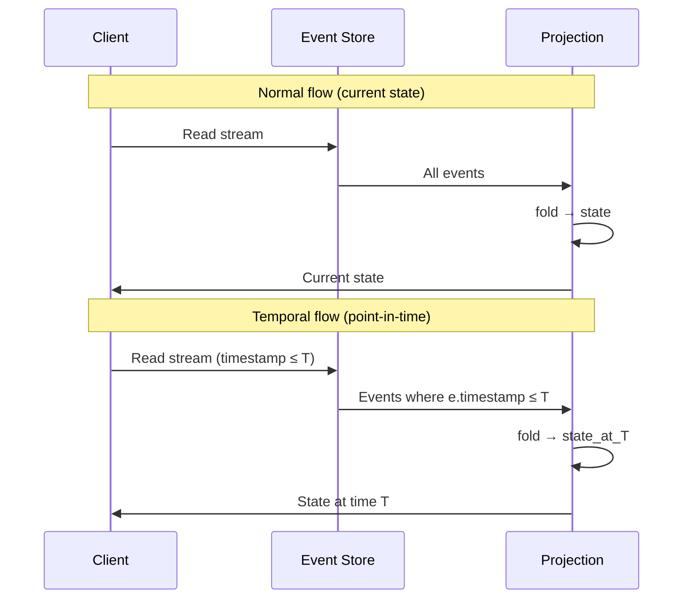
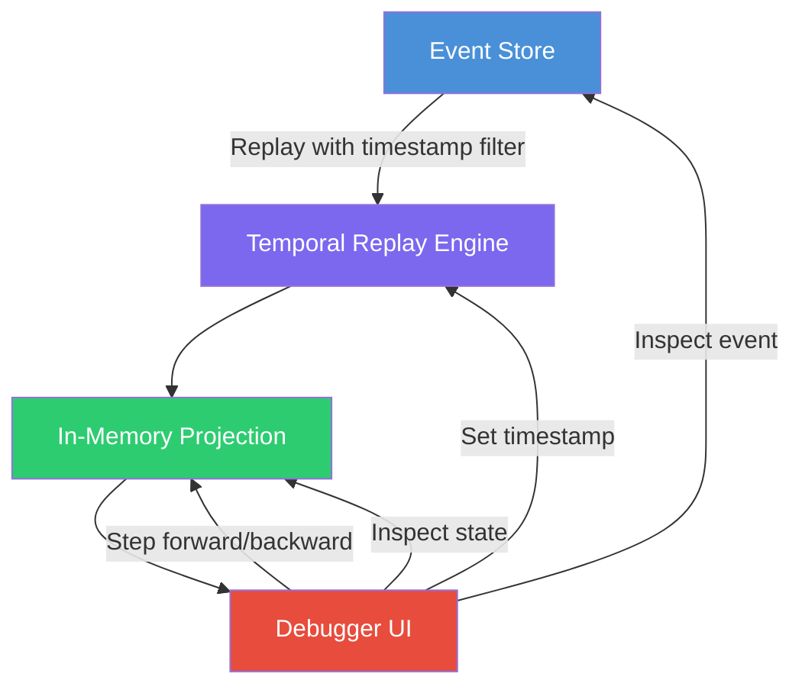

> [!success] Mastery Check
> - [ ] **Studied Well**
> - [ ] **Can explain the concept without notes**
> - [ ] **Can answer interview questions confidently**
> - [ ] **Can implement it in a real project**


# 7.108 — Event Sourcing — Temporal Queries — Point-in-Time

> **Core Question:** How do we query the state of an event-sourced system *as it existed at an arbitrary point in time*, and at what cost?

---

## Table of Contents

1. [[#1. The Temporal Query Problem]]
2. [[#2. Point-in-Time Semantics — Theory]]
3. [[#3. SQL Temporal Queries on Event Stores]]
4. [[#4. Marten — Point-in-Time Queries in C#]]
5. [[#5. Time-Travel Debugging — Read-Only Replay]]
6. [[#6. Time-Series Analysis Over Event Streams]]
7. [[#7. Performance & Indexing Strategies]]
8. [[#8. GDPR Compliance — The Right to Be Forgotten]]
9. [[#9. Architecture Decision Record (ADR)]]
10. [[#10. Pitfalls, Interview Questions & Self-Check]]

---

## 1. The Temporal Query Problem

### 1.1 Definition

An event-sourced system stores facts — events — that have occurred. The current state is a *derived* artifact, recomputed by replaying the event stream. But a more interesting question is:

> *"What was the state of this aggregate at 9:43 AM on March 14th, before the user changed their email?"*

This is a **temporal query** — specifically a **point-in-time (PIT)** query. Unlike a traditional CRUD database where the current row is the only truth, event sourcing makes *every past state* theoretically recoverable.

### 1.2 Why This Matters

| Concern | CRUD | Event Sourcing |
|---|---|---|
| Current state | Single row, overwritten | Derived from stream replay |
| Past state | Lost (unless audit log) | Recoverable via temporal query |
| Audit trail | Optional, bolted on | Intrinsic |
| Debugging | Snapshot-based, limited | Full time-travel possible |
| GDPR right-to-be-forgotten | DELETE row | Needs tombstone/compaction |

### 1.3 The Fundamental Trade-Off

```
┌──────────────────────────────────────────────────┐
│   Temporal Query Cost Curve                      │
│                                                  │
│   Cost ──>  O(n) where n = events in stream     │
│                                                  │
│   Without optimizations: every PIT query         │
│   replays the entire stream from epoch 0.        │
│                                                  │
│   With snapshots: O(m) where m = events since    │
│   last snapshot.                                 │
│                                                  │
│   With indexed snapshots: O(log k) where k =     │
│   number of snapshots + events since nearest     │
│   snapshot.                                      │
└──────────────────────────────────────────────────┘
```

### 1.4 Stream Types and Temporal Query Feasibility

| Stream Type | Example | PIT Query Feasibility |
|---|---|---|
| Append-only, no compaction | Order events | Full replay, costly |
| Snapshot-optimized | Bank account | Fast: start from last snapshot ≤ target time |
| Partitioned by time | IoT sensor readings | Fast: prune irrelevant partitions |
| Tombstone-compacted | User profiles for GDPR | Fast: skip soft-deleted streams |
| Infinite (unbounded) | Clickstream | Not feasible without windowing |

---

## 2. Point-in-Time Semantics — Theory

### 2.1 Formal Definition

Given an event stream `S = ⟨e₀, e₁, …, eₙ⟩` ordered by `timestamp(eᵢ) ≤ timestamp(eᵢ₊₁)`, and a projection function `P` that reduces `S` to state `A`:

```
A(t) = P({ e ∈ S | timestamp(e) ≤ t })
```

Where `P` is typically a fold operation:

```
A(t) = fold(events_up_to(t), initial_state, apply)
```

### 2.2 Temporal Consistency Levels

| Level | Guarantee | Use Case |
|---|---|---|
| **Eventual temporal** | State may be stale; eventually consistent | Dashboards, analytics |
| **Read-committed temporal** | All events committed before `t` are visible | Reporting |
| **Snapshot isolation** | All events up to `t`; no phantom events | Audits, compliance |
| **Linearizable temporal** | `t` is a known, agreed-upon cut in global ordering | Debugging, replay |

### 2.3 Vector Time and Global Cuts

In a distributed event store, "point in time" is not a single wall-clock value. Different nodes may have different views. Approaches:

1. **Wall-clock approximation:** Use `timestamp ≤ T` — assumes all nodes are synchronized (NTP). Risk of clock skew.
2. **Lamport clock cut:** Associate each event with a Lamport timestamp; query uses `lc ≤ L`.
3. **Hybrid Logical Clocks (HLC):** Combines wall clock + logical counter. Query with `hlc ≤ H`.
4. **Global snapshot (consistent cut):** Use a distributed snapshot algorithm (e.g., Chandy-Lamport) to establish a global state. Expensive.

> **Recommendation for 99% of systems:** Use wall-clock timestamps with NTP synchronization and accept a small skew window (typically ≤ 10ms). Only reach for HLCs when cross-datacenter consistency is required.

### 2.4 What "Point in Time" Means for Event Sourcing



### 2.5 Edge Cases in Temporal Semantics

| Edge Case | Description | Handling |
|---|---|---|
| **Future events** | Events with timestamps > query time | Excluded by predicate |
| **Tombstoned events** | Events deleted via GDPR right | Excluded; treated as if never existed |
| **Schema migration** | Event schema changed post-`t` | Use upcasting ([[7.101 — Event Sourcing — Events as the Source of Truth#Schema Evolution via Upcasting]]) |
| **Event reordering** | Late-arriving events with timestamp < `t` | Out-of-order handling; batch vs. real-time |
| **Clock skew** | Producer clock behind consumer clock | Grace window (e.g., ±5ms); HLC for strict ordering |
| **Empty stream at `t`** | No events before `t` | Return initial/empty state |
| **Multiple aggregates** | Query state across aggregates at same `t` | Use global timestamp cut (expensive if cross-aggregate) |

---

## 3. SQL Temporal Queries on Event Stores

### 3.1 The Relational Event Store Schema

Many event stores use PostgreSQL as the backing store. A typical schema:

```sql
CREATE TABLE events (
    id              BIGSERIAL PRIMARY KEY,
    stream_id       UUID NOT NULL,
    stream_type     VARCHAR(255) NOT NULL,
    version         INT NOT NULL,
    event_type      VARCHAR(255) NOT NULL,
    data            JSONB NOT NULL,
    metadata        JSONB NOT NULL DEFAULT '{}',
    timestamp       TIMESTAMPTZ NOT NULL DEFAULT NOW(),

    UNIQUE(stream_id, version)
);

CREATE INDEX idx_events_stream_id      ON events(stream_id);
CREATE INDEX idx_events_timestamp      ON events(timestamp);
CREATE INDEX idx_events_stream_timestamp ON events(stream_id, timestamp);
CREATE INDEX idx_events_type_timestamp ON events(event_type, timestamp);
```

### 3.2 Point-in-Time State Query — The Naïve Approach

```sql
-- Given a stream_id @sid and a target timestamp @t:
WITH relevant_events AS (
    SELECT data, event_type, version
    FROM events
    WHERE stream_id = @sid
      AND timestamp <= @t
    ORDER BY version ASC
)
-- Application-level fold happens in client code
SELECT * FROM relevant_events;
```

**Problem:** Loads *all* events up to `t` into the client. If the stream has 100K events, this is 100K rows.

### 3.3 Point-in-Time State Query — Snapshot-Based

With a snapshot table:

```sql
CREATE TABLE snapshots (
    stream_id       UUID NOT NULL,
    stream_type     VARCHAR(255) NOT NULL,
    version         INT NOT NULL,
    state           JSONB NOT NULL,
    timestamp       TIMESTAMPTZ NOT NULL,
    snapshot_type   VARCHAR(100) NOT NULL DEFAULT 'full',

    PRIMARY KEY (stream_id, version)
);

CREATE INDEX idx_snapshots_stream_timestamp ON snapshots(stream_id, timestamp);
```

```sql
WITH latest_snapshot AS (
    SELECT state, version, timestamp
    FROM snapshots
    WHERE stream_id = @sid
      AND timestamp <= @t
    ORDER BY timestamp DESC
    LIMIT 1
),
events_since_snapshot AS (
    SELECT data, event_type, version
    FROM events
    WHERE stream_id = @sid
      AND timestamp > (SELECT COALESCE(timestamp, '-infinity') FROM latest_snapshot)
      AND timestamp <= @t
    ORDER BY version ASC
)
SELECT
    COALESCE(ls.state, '{}'::JSONB) AS snapshot_state,
    COALESCE(jsonb_agg(es.data ORDER BY es.version), '[]'::JSONB) AS new_events,
    COALESCE(ls.version, 0) AS snapshot_version
FROM latest_snapshot ls
LEFT JOIN events_since_snapshot es ON true
GROUP BY ls.state, ls.version;
```

### 3.4 Temporal Aggregation — Windowed Queries

```sql
-- Count events of each type in 1-hour buckets for the past 7 days
SELECT
    date_trunc('hour', timestamp) AS bucket,
    event_type,
    COUNT(*) AS event_count
FROM events
WHERE timestamp >= NOW() - INTERVAL '7 days'
GROUP BY bucket, event_type
ORDER BY bucket ASC;
```

### 3.5 Temporal Diff — Detecting State Changes

```sql
-- State diff between two arbitrary timestamps
WITH state_at_t1 AS (
    -- union of snapshot + events <= t1, folded
    -- (omitted for brevity — same pattern as §3.3)
),
state_at_t2 AS (
    -- union of snapshot + events <= t2, folded
)
SELECT
    state_at_t1 AS before,
    state_at_t2 AS after,
    jsonb_strip_nulls(
        jsonb_object_agg(
            COALESCE(a.key, b.key),
            jsonb_build_object('old', b.value, 'new', a.value)
        )
    ) AS diff
FROM jsonb_each(state_at_t2) a
FULL OUTER JOIN jsonb_each(state_at_t1) b ON a.key = b.key
WHERE a.value IS DISTINCT FROM b.value;
```

### 3.6 Temporal Query with Window Functions

```sql
-- For each event, compute the state version rank within a time window
SELECT
    id,
    stream_id,
    version,
    event_type,
    timestamp,
    ROW_NUMBER() OVER (PARTITION BY stream_id ORDER BY timestamp DESC) AS recency_rank
FROM events
WHERE timestamp BETWEEN @start AND @end
ORDER BY stream_id, timestamp ASC;
```

### 3.7 Full Temporal Snapshot — Optimized with Materialized View

```sql
-- Periodic materialized view per hour
CREATE MATERIALIZED VIEW hourly_snapshots AS
SELECT
    stream_id,
    MAX(version) AS max_version,
    COUNT(*) AS event_count,
    MIN(timestamp) AS window_start,
    MAX(timestamp) AS window_end
FROM events
GROUP BY stream_id, date_trunc('hour', timestamp);

REFRESH MATERIALIZED VIEW CONCURRENTLY hourly_snapshots;
```

### 3.8 Pitfall: Orphaned Events

When an event stream is deleted (GDPR), ensure no dangling references:

```sql
-- Orphan check
SELECT e.*
FROM events e
LEFT JOIN stream_registry sr ON e.stream_id = sr.id
WHERE sr.id IS NULL;
```

---

## 4. Marten — Point-in-Time Queries in C#

[Marten](https://martendb.io/) is a .NET event store built on PostgreSQL. It provides first-class support for temporal queries.

### 4.1 Setup

```xml
<PackageReference Include="Marten" Version="7.0.0" />
```

```csharp
using Marten;
using Marten.Events;
using Weasel.Core;

var builder = Host.CreateApplicationBuilder(args);
builder.Services.AddMarten(opts =>
{
    opts.Connection("Host=localhost;Database=marten_test;Username=postgres;Password=password");
    opts.Events.DatabaseSchemaName = "events";
    opts.Events.StreamIdentity = StreamIdentity.AsGuid;

    // Enable temporal snapshot support
    opts.Events.MetadataConfig.EnableHeaders();
    opts.Events.MetadataConfig.CausationIdHandling = MetadataRouting.ToDatabase;
    opts.Events.MetadataConfig.CorrelationIdHandling = MetadataRouting.ToDatabase;

    // Aggregation with snapshotting
    opts.Projections.Snapshot<OrderAggregate>(SnapshotLifecycle.Async);
    opts.Projections.Snapshot<OrderAggregate>(SnapshotLifecycle.Live);
});
```

### 4.2 Event Type Definitions

```csharp
public sealed record OrderId(Guid Value);

// Events
public sealed record OrderInitiated(
    OrderId OrderId,
    string CustomerEmail,
    decimal InitialAmount,
    DateTimeOffset InitiatedAt
);

public sealed record OrderSubmitted(
    OrderId OrderId,
    DateTimeOffset SubmittedAt,
    string SubmittedBy
);

public sealed record PaymentProcessed(
    OrderId OrderId,
    decimal Amount,
    string PaymentMethod,
    DateTimeOffset ProcessedAt
);

public sealed record OrderShipped(
    OrderId OrderId,
    string ShippingProvider,
    string TrackingNumber,
    DateTimeOffset ShippedAt
);

public sealed record OrderDelivered(
    OrderId OrderId,
    DateTimeOffset DeliveredAt,
    string SignedBy
);

public sealed record OrderCancelled(
    OrderId OrderId,
    string Reason,
    DateTimeOffset CancelledAt
);
```

### 4.3 Aggregate with Temporal Metadata

```csharp
public sealed record OrderAggregate
{
    public Guid Id { get; init; }
    public OrderId OrderId { get; init; }
    public string CustomerEmail { get; init; } = string.Empty;
    public decimal TotalAmount { get; init; }
    public decimal PaidAmount { get; init; }
    public OrderStatus Status { get; init; } = OrderStatus.Pending;
    public string? TrackingNumber { get; init; }
    public string? ShippingProvider { get; init; }
    public int Version { get; init; }
    public DateTimeOffset? LastModifiedAt { get; init; }

    // Temporal query metadata
    public DateTimeOffset? SnapshotAt { get; init; }
    public bool IsTemporalSnapshot { get; init; }

    public static OrderAggregate Create(OrderInitiated initiated) => new()
    {
        Id = initiated.OrderId.Value,
        OrderId = initiated.OrderId,
        CustomerEmail = initiated.CustomerEmail,
        TotalAmount = initiated.InitialAmount,
        Status = OrderStatus.Initiated,
        Version = 1,
        LastModifiedAt = initiated.InitiatedAt,
    };

    public OrderAggregate Apply(OrderSubmitted submitted) => this with
    {
        Status = OrderStatus.Submitted,
        Version = Version + 1,
        LastModifiedAt = submitted.SubmittedAt,
    };

    public OrderAggregate Apply(PaymentProcessed paid) => this with
    {
        PaidAmount = PaidAmount + paid.Amount,
        Status = TotalAmount <= PaidAmount + paid.Amount
            ? OrderStatus.Paid
            : OrderStatus.PartiallyPaid,
        Version = Version + 1,
        LastModifiedAt = paid.ProcessedAt,
    };

    public OrderAggregate Apply(OrderShipped shipped) => this with
    {
        Status = OrderStatus.Shipped,
        TrackingNumber = shipped.TrackingNumber,
        ShippingProvider = shipped.ShippingProvider,
        Version = Version + 1,
        LastModifiedAt = shipped.ShippedAt,
    };

    public OrderAggregate Apply(OrderDelivered delivered) => this with
    {
        Status = OrderStatus.Delivered,
        Version = Version + 1,
        LastModifiedAt = delivered.DeliveredAt,
    };

    public OrderAggregate Apply(OrderCancelled cancelled) => this with
    {
        Status = OrderStatus.Cancelled,
        Version = Version + 1,
        LastModifiedAt = cancelled.CancelledAt,
    };
}

public enum OrderStatus
{
    Pending,
    Initiated,
    Submitted,
    PartiallyPaid,
    Paid,
    Shipped,
    Delivered,
    Cancelled,
}
```

### 4.4 Basic Point-in-Time Query with `AggregateStream`

```csharp
public sealed class TemporalQueryService
{
    private readonly IDocumentStore _store;

    public TemporalQueryService(IDocumentStore store)
    {
        _store = store;
    }

    /// <summary>
    /// Query the aggregate state at an exact point in time.
    /// Marten replays the stream up to the given timestamp.
    /// </summary>
    public async Task<OrderAggregate?> GetOrderAtAsync(
        Guid orderId,
        DateTimeOffset targetTime,
        CancellationToken ct = default)
    {
        await using var session = _store.LightweightSession();

        // Marten's AggregateStream with timestamp filter
        var aggregate = await session.Events.AggregateStreamAsync<OrderAggregate>(
            orderId,
            timestamp: targetTime,  // <-- The magic parameter
            token: ct
        );

        return aggregate switch
        {
            null => null,
            var agg => agg with
            {
                SnapshotAt = targetTime,
                IsTemporalSnapshot = true,
            },
        };
    }
}
```

### 4.5 Point-in-Time Query with Explicit Event Fetch + Fold

For more control (e.g., schema upcasting, custom folding):

```csharp
public sealed record TemporalQueryResult<TState>
{
    public TState? State { get; init; }
    public int EventsReplayed { get; init; }
    public int EventsSinceSnapshot { get; init; }
    public DateTimeOffset TargetTime { get; init; }
    public DateTimeOffset? SnapshotTimestamp { get; init; }
    public TimeSpan Elapsed { get; init; }
}

public sealed class ExplicitTemporalQueryService
{
    private readonly IDocumentStore _store;

    public ExplicitTemporalQueryService(IDocumentStore store)
    {
        _store = store;
    }

    public async Task<TemporalQueryResult<OrderAggregate>> GetOrderAtExplicitAsync(
        Guid orderId,
        DateTimeOffset targetTime,
        CancellationToken ct = default)
    {
        var sw = Stopwatch.StartNew();
        await using var session = _store.LightweightSession();

        // 1. Get the snapshot nearest to (but ≤) target time
        var snapshot = await session.Events.FetchLatestSnapshotAsync(
            orderId,
            targetTime,
            ct
        );

        // 2. Fetch only events after the snapshot, up to target time
        var fromVersion = snapshot?.Version + 1 ?? 0;
        var events = await session.Events.FetchStreamAsync(
            orderId,
            fromVersion: fromVersion,
            toTimestamp: targetTime,
            token: ct
        );

        // 3. Fold starting from snapshot state + subsequent events
        var state = snapshot?.State as OrderAggregate;
        foreach (var @event in events.Select(e => e.Data))
        {
            state = @event switch
            {
                OrderInitiated e => OrderAggregate.Create(e),
                OrderSubmitted e => state!.Apply(e),
                PaymentProcessed e => state!.Apply(e),
                OrderShipped e => state!.Apply(e),
                OrderDelivered e => state!.Apply(e),
                OrderCancelled e => state!.Apply(e),
                _ => state,
            };
        }

        sw.Stop();
        return new TemporalQueryResult<OrderAggregate>
        {
            State = state,
            EventsReplayed = events.Count,
            EventsSinceSnapshot = events.Count,
            TargetTime = targetTime,
            SnapshotTimestamp = snapshot?.Timestamp,
            Elapsed = sw.Elapsed,
        };
    }
}

public static class EventStoreExtensions
{
    /// <summary>
    /// Fetches the latest snapshot for a stream at or before the given timestamp.
    /// </summary>
    public static async Task<ISnapshot?> FetchLatestSnapshotAsync(
        this IEventStore store,
        Guid streamId,
        DateTimeOffset? upTo,
        CancellationToken ct = default)
    {
        // Marten stores snapshots in the mt_doc_<aggregate_type> table
        // with a LastModifiedAt or custom timestamp field.
        // This is a simplified version — see Marten docs for SnapshotLifecycle.
        var session = (IDocumentSession)store;
        return await session.Query<OrderAggregate>()
            .Where(a => a.Id == streamId && a.LastModifiedAt <= upTo)
            .OrderByDescending(a => a.LastModifiedAt)
            .FirstOrDefaultAsync(ct)
            .ContinueWith(t => t.Result as ISnapshot, ct);
    }
}
```

### 4.6 Batch Temporal Queries — Multiple Aggregates at the Same Time

```csharp
public sealed class BatchTemporalQueryService
{
    private readonly IDocumentStore _store;

    public BatchTemporalQueryService(IDocumentStore store)
    {
        _store = store;
    }

    /// <summary>
    /// Query multiple aggregate streams at the same point in time.
    /// Uses Marten's batch query API for efficiency.
    /// </summary>
    public async Task<Dictionary<Guid, OrderAggregate?>> GetOrdersAtAsync(
        IReadOnlyList<Guid> orderIds,
        DateTimeOffset targetTime,
        CancellationToken ct = default)
    {
        await using var session = _store.LightweightSession();
        var batch = session.CreateBatchQuery();

        var tasks = orderIds.Select(orderId =>
            batch.Events.AggregateStreamAsync<OrderAggregate>(
                orderId,
                timestamp: targetTime,
                token: ct
            )
        ).ToList();

        await batch.Execute(ct);

        var results = new Dictionary<Guid, OrderAggregate?>(orderIds.Count);
        for (int i = 0; i < orderIds.Count; i++)
        {
            var state = await tasks[i];  // Already resolved after batch.Execute
            results[orderIds[i]] = state;
        }

        return results;
    }
}
```

### 4.7 Temporal Query with Marten Multi-Tenancy

```csharp
public sealed class MultiTenantTemporalQuery
{
    private readonly IDocumentStore _store;

    public MultiTenantTemporalQuery(IDocumentStore store)
    {
        _store = store;
    }

    public async Task<OrderAggregate?> GetOrderAtForTenantAsync(
        string tenantId,
        Guid orderId,
        DateTimeOffset targetTime,
        CancellationToken ct = default)
    {
        await using var session = _store.LightweightSession(tenantId);
        return await session.Events.AggregateStreamAsync<OrderAggregate>(
            orderId,
            timestamp: targetTime,
            token: ct
        );
    }
}
```

### 4.8 Temporal Subscription — Reactive Queries

```csharp
// Marten 7+ supports subscriptions that can be temporal-aware
public sealed class TemporalSnapshotSubscription : ISubscription
{
    private readonly IDocumentStore _store;
    private readonly ILogger<TemporalSnapshotSubscription> _logger;

    public TemporalSnapshotSubscription(
        IDocumentStore store,
        ILogger<TemporalSnapshotSubscription> logger)
    {
        _store = store;
        _logger = logger;
    }

    public async Task ApplyAsync(
        IReadOnlyList<IEvent> events,
        ISubscriptionController controller,
        IServiceProvider services,
        CancellationToken ct)
    {
        foreach (var @event in events)
        {
            // For each event, recompute the snapshot at that exact time
            // Useful for materialized temporal views
            var stateAtEvent = await _store.LightweightSession()
                .Events.AggregateStreamAsync<OrderAggregate>(
                    @event.StreamId!,
                    timestamp: @event.Timestamp,
                    token: ct
                );

            _logger.LogInformation(
                "Stream {StreamId} at time {Time}: Status = {Status}",
                @event.StreamId,
                @event.Timestamp,
                stateAtEvent?.Status
            );
        }
    }
}
```

### 4.9 Performance Telemetry for Temporal Queries

```csharp
public sealed class TemporalQueryTelemetryHandler : DelegatingHandler
{
    private readonly ILogger<TemporalQueryTelemetryHandler> _logger;
    private static readonly ConcurrentDictionary<string, TemporalMetrics> _metrics = new();

    public TemporalQueryTelemetryHandler(ILogger<TemporalQueryTelemetryHandler> logger)
        : base(new HttpClientHandler())
    {
        _logger = logger;
    }

    protected override async Task<HttpResponseMessage> SendAsync(
        HttpRequestMessage request,
        CancellationToken ct)
    {
        var sw = Stopwatch.StartNew();
        var response = await base.SendAsync(request, ct);
        sw.Stop();

        var key = $"{request.Method}:{request.RequestUri?.AbsolutePath}";
        var metric = _metrics.GetOrAdd(key, _ => new TemporalMetrics());
        metric.Record(sw.ElapsedMilliseconds);

        _logger.LogInformation(
            "Temporal query {Path}: {Elapsed}ms (p50={P50}, p99={P99})",
            request.RequestUri?.AbsolutePath,
            sw.ElapsedMilliseconds,
            metric.Percentile(50),
            metric.Percentile(99)
        );

        return response;
    }
}

public sealed class TemporalMetrics
{
    private readonly long[] _latencies = new long[1024];
    private int _count;
    private readonly object _lock = new();

    public void Record(long ms)
    {
        lock (_lock)
        {
            if (_count < _latencies.Length)
                _latencies[_count++] = ms;
        }
    }

    public double Percentile(int p)
    {
        lock (_lock)
        {
            if (_count == 0) return 0;
            var sorted = _latencies[.._count].OrderBy(x => x).ToArray();
            var index = (int)Math.Ceiling(p / 100.0 * sorted.Length) - 1;
            return sorted[Math.Max(0, Math.Min(index, sorted.Length - 1))];
        }
    }
}
```

---

## 5. Time-Travel Debugging — Read-Only Replay

### 5.1 Concept

Time-travel debugging reconstructs the *exact* state of the system at *any* historical moment. Unlike traditional debugging (breakpoints, watches on live state), time-travel debugging is:

- **Deterministic:** Same events → same state, always.
- **Non-destructive:** You never execute side effects (commands).
- **Retrospective:** You can go backward as easily as forward.

### 5.2 Architecture



### 5.3 In-Memory Replay Engine

```csharp
public sealed class TimeTravelDebugger<TState, TEvent>
    where TState : class
{
    private readonly IReadOnlyList<object> _allEvents;
    private readonly Func<TState> _initialStateFactory;
    private readonly Func<TState, object, TState> _applyEvent;
    private int _currentEventIndex;

    public TState? CurrentState { get; private set; }
    public int CurrentEventIndex => _currentEventIndex;
    public int TotalEventCount => _allEvents.Count;
    public DateTimeOffset? CurrentTimestamp { get; private set; }

    public TimeTravelDebugger(
        IReadOnlyList<object> allEvents,
        Func<TState> initialStateFactory,
        Func<TState, object, TState> applyEvent)
    {
        _allEvents = allEvents;
        _initialStateFactory = initialStateFactory;
        _applyEvent = applyEvent;
        _currentEventIndex = 0;
        Reset();
    }

    public void Reset()
    {
        CurrentState = _initialStateFactory();
        _currentEventIndex = 0;
        CurrentTimestamp = null;
    }

    /// <summary>Jump to the state at the given event index (0 = initial).</summary>
    public void GoToEvent(int eventIndex)
    {
        if (eventIndex < 0 || eventIndex > _allEvents.Count)
            throw new ArgumentOutOfRangeException(nameof(eventIndex));

        if (eventIndex == 0)
        {
            Reset();
            return;
        }

        // If going backward, rewind and fast-forward
        if (eventIndex < _currentEventIndex)
        {
            Reset();
        }

        for (int i = _currentEventIndex; i < eventIndex; i++)
        {
            var ev = _allEvents[i];
            var metadata = ExtractMetadata(ev);
            CurrentState = _applyEvent(CurrentState!, ev);
            CurrentTimestamp = metadata?.Timestamp;
        }

        _currentEventIndex = eventIndex;
    }

    /// <summary>Jump to the state at the given wall-clock time.</summary>
    public void GoToTime(DateTimeOffset targetTime)
    {
        // Binary search for the event index just before/at target time
        int lo = 0, hi = _allEvents.Count;
        while (lo < hi)
        {
            int mid = (lo + hi) / 2;
            var meta = ExtractMetadata(_allEvents[mid]);
            if (meta?.Timestamp <= targetTime)
                lo = mid + 1;
            else
                hi = mid;
        }

        GoToEvent(lo);
    }

    /// <summary>Step forward one event.</summary>
    public bool StepForward()
    {
        if (_currentEventIndex >= _allEvents.Count) return false;
        GoToEvent(_currentEventIndex + 1);
        return true;
    }

    /// <summary>Step backward one event (undo).</summary>
    public bool StepBackward()
    {
        if (_currentEventIndex <= 0) return false;
        GoToEvent(_currentEventIndex - 1);
        return true;
    }

    /// <summary>Get the event at a given index.</summary>
    public object? GetEvent(int eventIndex)
    {
        return eventIndex >= 0 && eventIndex < _allEvents.Count
            ? _allEvents[eventIndex]
            : null;
    }

    /// <summary>Find events matching a predicate.</summary>
    public IEnumerable<(int Index, object Event)> FindEvents(
        Func<object, bool> predicate)
    {
        for (int i = 0; i < _allEvents.Count; i++)
        {
            if (predicate(_allEvents[i]))
                yield return (i, _allEvents[i]);
        }
    }

    private static EventMetadata? ExtractMetadata(object ev)
    {
        return ev switch
        {
            OrderInitiated e => new EventMetadata(e.InitiatedAt),
            OrderSubmitted e => new EventMetadata(e.SubmittedAt),
            PaymentProcessed e => new EventMetadata(e.ProcessedAt),
            OrderShipped e => new EventMetadata(e.ShippedAt),
            OrderDelivered e => new EventMetadata(e.DeliveredAt),
            OrderCancelled e => new EventMetadata(e.CancelledAt),
            _ => null,
        };
    }

    private sealed record EventMetadata(DateTimeOffset Timestamp);
}
```

### 5.4 Console Debugger UI

```csharp
public sealed class TimeTravelConsoleUi
{
    private readonly TimeTravelDebugger<OrderAggregate, object> _debugger;
    private readonly ILogger _logger;

    public TimeTravelConsoleUi(
        TimeTravelDebugger<OrderAggregate, object> debugger,
        ILogger logger)
    {
        _debugger = debugger;
        _logger = logger;
    }

    public async Task RunAsync(CancellationToken ct = default)
    {
        _logger.LogInformation("Time-Travel Debugger started. Type 'help' for commands.");

        while (!ct.IsCancellationRequested)
        {
            RenderState();
            Console.Write(">> ");
            var input = Console.ReadLine() ?? string.Empty;
            var parts = input.Split(' ', 2, StringSplitOptions.RemoveEmptyEntries);
            var command = parts.Length > 0 ? parts[0].ToLower() : string.Empty;
            var args = parts.Length > 1 ? parts[1] : string.Empty;

            switch (command)
            {
                case "help":
                    PrintHelp();
                    break;
                case "f" or "forward":
                    if (_debugger.StepForward())
                        _logger.LogInformation("Stepped forward to event {Index}", _debugger.CurrentEventIndex);
                    else
                        _logger.LogWarning("Already at latest event");
                    break;
                case "b" or "back":
                    if (_debugger.StepBackward())
                        _logger.LogInformation("Stepped back to event {Index}", _debugger.CurrentEventIndex);
                    else
                        _logger.LogWarning("Already at initial state");
                    break;
                case "g" or "goto":
                    if (int.TryParse(args, out var idx))
                    {
                        _debugger.GoToEvent(idx);
                        _logger.LogInformation("Jumped to event {Index}", idx);
                    }
                    break;
                case "t" or "time":
                    if (DateTimeOffset.TryParse(args, out var time))
                    {
                        _debugger.GoToTime(time);
                        _logger.LogInformation("Jumped to time {Time}", time);
                    }
                    break;
                case "e" or "event":
                    var ev = _debugger.GetEvent(_debugger.CurrentEventIndex - 1);
                    _logger.LogInformation("Event at index {Idx}: {Event}", _debugger.CurrentEventIndex - 1, ev?.ToJson());
                    break;
                case "reset":
                    _debugger.Reset();
                    _logger.LogInformation("Reset to initial state");
                    break;
                case "q" or "quit":
                    return;
                default:
                    _logger.LogWarning("Unknown command. Type 'help'.");
                    break;
            }
        }
    }

    private void RenderState()
    {
        var state = _debugger.CurrentState;
        var progress = (double)_debugger.CurrentEventIndex / _debugger.TotalEventCount * 100;

        Console.Clear();
        Console.WriteLine($"╔══════════════════════════════════════════╗");
        Console.WriteLine($"║  Time-Travel Debugger                    ║");
        Console.WriteLine($"╠══════════════════════════════════════════╣");
        Console.WriteLine($"║  Event: {_debugger.CurrentEventIndex,5} / {_debugger.TotalEventCount,-5} ({progress,5:F1}%) ║");
        Console.WriteLine($"║  Time:  {_debugger.CurrentTimestamp?.ToString("O") ?? "N/A",-30} ║");
        Console.WriteLine($"╠══════════════════════════════════════════╣");

        if (state is not null)
        {
            Console.WriteLine($"║  Status:   {state.Status,-30} ║");
            Console.WriteLine($"║  Amount:   {state.TotalAmount,10:C2}                  ║");
            Console.WriteLine($"║  Paid:     {state.PaidAmount,10:C2}                  ║");
            Console.WriteLine($"║  Customer: {state.CustomerEmail,-30} ║");
            Console.WriteLine($"║  Tracking: {state.TrackingNumber ?? "N/A",-30} ║");
        }

        Console.WriteLine($"╚══════════════════════════════════════════╝");
    }

    private static void PrintHelp()
    {
        Console.WriteLine("Commands:");
        Console.WriteLine("  f, forward        Step forward one event");
        Console.WriteLine("  b, back           Step backward one event");
        Console.WriteLine("  g, goto <n>       Jump to event index n");
        Console.WriteLine("  t, time <dt>      Jump to DateTimeOffset");
        Console.WriteLine("  e, event          Show current event");
        Console.WriteLine("  reset             Reset to initial state");
        Console.WriteLine("  q, quit           Exit debugger");
    }
}
```

### 5.5 Web API Time-Travel Endpoint

```csharp
[ApiController]
[Route("api/orders/temporal")]
public sealed class TemporalOrderController : ControllerBase
{
    private readonly TemporalQueryService _queryService;

    public TemporalOrderController(TemporalQueryService queryService)
    {
        _queryService = queryService;
    }

    /// <summary>
    /// GET /api/orders/temporal/{orderId}?at=2024-03-14T09:43:00Z
    /// </summary>
    [HttpGet("{orderId:guid}")]
    [ProducesResponseType(typeof(OrderAggregate), StatusCodes.Status200OK)]
    [ProducesResponseType(StatusCodes.Status404NotFound)]
    [ProducesResponseType(StatusCodes.Status400BadRequest)]
    public async Task<IActionResult> GetOrderAt(
        Guid orderId,
        [FromQuery] DateTimeOffset? at,
        CancellationToken ct)
    {
        if (at is null)
            return BadRequest("The 'at' query parameter is required.");

        if (at > DateTimeOffset.UtcNow)
            return BadRequest("Cannot query future state.");

        var result = await _queryService.GetOrderAtAsync(orderId, at.Value, ct);

        if (result is null)
            return NotFound();

        return Ok(new
        {
            State = result,
            QueriedAt = at.Value,
            IsTemporalSnapshot = true,
            Timestamp = DateTimeOffset.UtcNow,
        });
    }
}
```

### 5.6 Deterministic Replay — Ensuring Identical Behavior

```csharp
/// <summary>
/// A deterministic event replays ensures that the same sequence of events
/// produces identical state, regardless of environmental factors.
/// </summary>
public sealed class DeterministicReplayVerifier
{
    public ReplayResult VerifyDeterminism(IReadOnlyList<object> events)
    {
        // Run replay 3 times and verify identical results
        var states = new List<OrderAggregate?>();

        for (int run = 0; run < 3; run++)
        {
            var state = events.Aggregate(
                (OrderAggregate?)null,
                (current, ev) => ev switch
                {
                    OrderInitiated e => OrderAggregate.Create(e),
                    _ => current?.Apply(ev) ?? current
                }
            );
            states.Add(state);
        }

        var first = states[0];
        var allMatch = states.Skip(1).All(s =>
            s?.Status == first?.Status &&
            s?.TotalAmount == first?.TotalAmount &&
            s?.PaidAmount == first?.PaidAmount &&
            s?.Version == first?.Version
        );

        return new ReplayResult(allMatch, first);
    }
}

public sealed record ReplayResult(bool IsDeterministic, OrderAggregate? State);
```

### 5.7 Pitfall: Non-Deterministic Event Handlers

```csharp
// BAD: Non-deterministic — DateTime.UtcNow changes on every replay
public sealed record OrderAutoCancelled(
    OrderId OrderId,
    DateTimeOffset CancelledAt
);

// Example of a non-deterministic projection
public sealed class BadProjection
{
    public OrderAggregate Apply(OrderInitiated e, OrderAggregate current)
    {
        // BAD: Uses current time instead of event time
        var hoursSinceInit = (DateTimeOffset.UtcNow - e.InitiatedAt).TotalHours;
        if (hoursSinceInit > 24)
        {
            // Auto-cancel orders older than 24h
            return current with { Status = OrderStatus.Cancelled };
        }
        return current;
    }
}

// GOOD: Deterministic — use event time only
public sealed class GoodProjection
{
    public OrderAggregate Apply(OrderInitiated e, OrderAggregate current)
    {
        // All time calculations must use event metadata, not wall clock
        return current;
    }

    // A timeout event must be explicitly recorded in the event store
    public OrderAggregate Apply(OrderTimedOut e, OrderAggregate current)
    {
        return current with { Status = OrderStatus.Cancelled };
    }
}
```

---

## 6. Time-Series Analysis Over Event Streams

### 6.1 Event Stream as Time-Series Data

Event streams are inherently time-series data. Each event carries a timestamp, and the sequence is ordered. This makes event sources a rich substrate for time-series analysis.

### 6.2 Event Count Over Time — Windows

```csharp
public sealed record EventCountBucket(
    DateTimeOffset BucketStart,
    DateTimeOffset BucketEnd,
    string EventType,
    long Count
);

public sealed class EventTimeSeriesAnalyzer
{
    private readonly IDocumentStore _store;

    public EventTimeSeriesAnalyzer(IDocumentStore store)
    {
        _store = store;
    }

    public async Task<IReadOnlyList<EventCountBucket>> GetEventCountsAsync(
        DateTimeOffset start,
        DateTimeOffset end,
        TimeSpan windowSize,
        CancellationToken ct = default)
    {
        await using var session = _store.QuerySession();

        var events = await session.Events.QueryAllRawEvents()
            .Where(e => e.Timestamp >= start && e.Timestamp <= end)
            .ToListAsync(ct);

        return events
            .GroupBy(e => new
            {
                Bucket = new DateTimeOffset(
                    e.Timestamp.Ticks / windowSize.Ticks * windowSize.Ticks,
                    e.Timestamp.Offset
                ),
                e.EventTypeName,
            })
            .Select(g => new EventCountBucket(
                g.Key.Bucket,
                g.Key.Bucket.Add(windowSize),
                g.Key.EventTypeName,
                g.LongCount()
            ))
            .OrderBy(b => b.BucketStart)
            .ThenBy(b => b.EventType)
            .ToList();
    }
}
```

### 6.3 State Transition Matrix Over Time

```csharp
public sealed record StateTransition(
    DateTimeOffset Timestamp,
    OrderStatus From,
    OrderStatus To,
    int Count
);

public sealed class StateTransitionAnalyzer
{
    public IReadOnlyList<StateTransition> AnalyzeTransitions(
        IReadOnlyList<object> events)
    {
        var currentStatus = OrderStatus.Pending;
        var transitions = new List<StateTransition>();
        var transitionCounts = new Dictionary<(OrderStatus From, OrderStatus To), int>();

        foreach (var ev in events)
        {
            var newStatus = ev switch
            {
                OrderInitiated => OrderStatus.Initiated,
                OrderSubmitted => OrderStatus.Submitted,
                PaymentProcessed paid when paid.Amount > 0 => OrderStatus.Paid,
                OrderShipped => OrderStatus.Shipped,
                OrderDelivered => OrderStatus.Delivered,
                OrderCancelled => OrderStatus.Cancelled,
                _ => currentStatus,
            };

            if (newStatus != currentStatus)
            {
                var key = (currentStatus, newStatus);
                transitionCounts.TryGetValue(key, out var count);
                transitionCounts[key] = count + 1;
                currentStatus = newStatus;
            }
        }

        foreach (var ((from, to), count) in transitionCounts)
        {
            transitions.Add(new StateTransition(
                DateTimeOffset.MinValue,
                from,
                to,
                count
            ));
        }

        return transitions.OrderBy(t => t.From).ThenBy(t => t.To).ToList();
    }
}
```

### 6.4 Throughput and Latency Analysis

```csharp
public sealed record ThroughputBucket(
    DateTimeOffset BucketStart,
    long EventCount,
    double EventsPerSecond,
    TimeSpan AvgLatency
);

public sealed class ThroughputAnalyzer
{
    public IReadOnlyList<ThroughputBucket> AnalyzeThroughput(
        IReadOnlyList<IEvent> events,
        TimeSpan windowSize)
    {
        return events
            .GroupBy(e => new DateTimeOffset(
                e.Timestamp.Ticks / windowSize.Ticks * windowSize.Ticks,
                e.Timestamp.Offset
            ))
            .Select(g =>
            {
                var ordered = g.OrderBy(e => e.Timestamp).ToList();
                var latencies = ordered
                    .Select((e, i) => i > 0
                        ? (e.Timestamp - ordered[i - 1].Timestamp)
                        : TimeSpan.Zero)
                    .Where(ts => ts > TimeSpan.Zero)
                    .ToList();

                return new ThroughputBucket(
                    g.Key,
                    g.LongCount(),
                    g.LongCount() / windowSize.TotalSeconds,
                    latencies.Count > 0
                        ? new TimeSpan((long)latencies.Average(ts => ts.Ticks))
                        : TimeSpan.Zero
                );
            })
            .OrderBy(b => b.BucketStart)
            .ToList();
    }
}
```

### 6.5 Correlation Detection — Temporal Patterns

```csharp
public sealed record CorrelationPattern(
    string PatternType,
    string Description,
    TimeSpan Window,
    int Occurrences
);

public sealed class TemporalPatternDetector
{
    public IReadOnlyList<CorrelationPattern> DetectPatterns(
        IReadOnlyList<object> events,
        TimeSpan maxGap)
    {
        var patterns = new List<CorrelationPattern>();
        var timestamps = ExtractTimestamps(events);
        var types = ExtractTypes(events);

        // Pattern 1: Rapid cancellation after submission
        var cancelAfterSubmit = 0;
        for (int i = 1; i < events.Count; i++)
        {
            if (types[i] == nameof(OrderCancelled) &&
                types[i - 1] == nameof(OrderSubmitted) &&
                timestamps[i] - timestamps[i - 1] <= maxGap)
            {
                cancelAfterSubmit++;
            }
        }

        if (cancelAfterSubmit > 0)
        {
            patterns.Add(new CorrelationPattern(
                "RapidCancelAfterSubmit",
                "Order cancelled within {0} of submission",
                maxGap,
                cancelAfterSubmit
            ));
        }

        // Pattern 2: Payment retry loops
        var paymentRetries = 0;
        for (int i = 2; i < events.Count; i++)
        {
            if (types[i] == nameof(PaymentProcessed) &&
                types[i - 1] == nameof(PaymentProcessed) &&
                types[i - 2] == nameof(PaymentProcessed) &&
                timestamps[i] - timestamps[i - 2] <= maxGap * 2)
            {
                paymentRetries++;
            }
        }

        if (paymentRetries > 0)
        {
            patterns.Add(new CorrelationPattern(
                "PaymentRetryLoop",
                "Three or more payment events within {0}",
                maxGap * 2,
                paymentRetries
            ));
        }

        return patterns;
    }

    private static List<DateTimeOffset> ExtractTimestamps(IReadOnlyList<object> events)
    {
        return events.Select(ev => ev switch
        {
            OrderInitiated e => e.InitiatedAt,
            OrderSubmitted e => e.SubmittedAt,
            PaymentProcessed e => e.ProcessedAt,
            OrderShipped e => e.ShippedAt,
            OrderDelivered e => e.DeliveredAt,
            OrderCancelled e => e.CancelledAt,
            _ => DateTimeOffset.MinValue,
        }).ToList();
    }

    private static List<string> ExtractTypes(IReadOnlyList<object> events)
    {
        return events.Select(ev => ev.GetType().Name).ToList();
    }
}
```

### 6.6 Forecasting with Event Streams

```csharp
/// <summary>
/// Simple moving-average forecast based on event volume.
/// This is intentionally simplistic; real forecasting uses Holt-Winters,
/// ARIMA, or ML models.
/// </summary>
public sealed class SimpleEventVolumeForecast
{
    public double ForecastNextPeriod(IReadOnlyList<long> historicalCounts, int periodCount = 3)
    {
        if (historicalCounts.Count < periodCount)
            return historicalCounts.DefaultIfEmpty(0).Average();

        return historicalCounts
            .TakeLast(periodCount)
            .Average();
    }

    public IEnumerable<ThroughputBucket> GenerateForecast(
        IReadOnlyList<ThroughputBucket> historical,
        int periodsAhead,
        TimeSpan windowSize)
    {
        var counts = historical.Select(b => b.EventCount).ToList();
        var lastBucket = historical.MaxBy(b => b.BucketStart);

        for (int i = 1; i <= periodsAhead; i++)
        {
            var forecast = (long)Math.Round(ForecastNextPeriod(counts));
            var nextStart = lastBucket?.BucketStart.Add(windowSize * i) ?? DateTimeOffset.UtcNow;

            yield return new ThroughputBucket(
                nextStart,
                forecast,
                forecast / windowSize.TotalSeconds,
                TimeSpan.Zero
            );

            counts.Add(forecast);
        }
    }
}
```

### 6.7 Detecting Temporal Anomalies

```csharp
public sealed record Anomaly(
    DateTimeOffset DetectedAt,
    string Description,
    AnomalySeverity Severity,
    double DeviationScore
);

public enum AnomalySeverity { Info, Warning, Critical }

public sealed class TemporalAnomalyDetector
{
    private const double ZScoreThreshold = 3.0;

    public IReadOnlyList<Anomaly> DetectAnomalies(IReadOnlyList<ThroughputBucket> buckets)
    {
        var anomalies = new List<Anomaly>();
        var counts = buckets.Select(b => (double)b.EventCount).ToList();
        var mean = counts.Average();
        var stdDev = Math.Sqrt(counts.Average(v => Math.Pow(v - mean, 2)));

        foreach (var bucket in buckets)
        {
            var zScore = stdDev > 0
                ? Math.Abs(bucket.EventCount - mean) / stdDev
                : 0;

            if (zScore > ZScoreThreshold)
            {
                anomalies.Add(new Anomaly(
                    bucket.BucketStart,
                    $"Event count {bucket.EventCount} deviates {zScore:F2}σ from mean {mean:F1}",
                    zScore > 5 ? AnomalySeverity.Critical
                        : zScore > 4 ? AnomalySeverity.Warning
                        : AnomalySeverity.Info,
                    zScore
                ));
            }
        }

        return anomalies;
    }
}
```

---

## 7. Performance & Indexing Strategies

### 7.1 The Cost of a Temporal Query

The cost of a point-in-time query without optimization:

```
TemporalQueryCost = CostOf(SnapshotLookup) + CostOf(EventFetch) + CostOf(Fold)

Where:
- SnapshotLookup: B-tree index on (stream_id, timestamp) → O(log n)
- EventFetch: Seq scan or index scan on (stream_id, version) → O(m)
- Fold: In-memory O(m) where m = events since snapshot (or 0 if none)
```

Without snapshots: `T = O(n)` events replayed.
With snapshots: `T = O(m)` where `m` is events since last snapshot.
With frequency-based snapshots (snapshot every `k` events): `T = O(k)` average.

### 7.2 Index Design for Temporal Queries

```sql
-- Primary temporal query index: stream + time
CREATE INDEX idx_events_stream_time
    ON events (stream_id, timestamp)
    INCLUDE (id, version, event_type, data);

-- Global time-range queries
CREATE INDEX idx_events_time_type
    ON events (timestamp, event_type)
    INCLUDE (stream_id, version, data);

-- Snapshot lookup
CREATE INDEX idx_snapshots_lookup
    ON snapshots (stream_id, timestamp DESC)
    INCLUDE (state, version);

-- Temporal aggregation queries
CREATE INDEX idx_events_time_bucket
    ON events (date_trunc('hour', timestamp), event_type);

-- Composite for point-in-time across aggregates
CREATE INDEX idx_events_global_pit
    ON events (timestamp)
    INCLUDE (stream_id, version, event_type, data)
    WHERE timestamp >= NOW() - INTERVAL '90 days';  -- Partial index for hot data
```

### 7.3 Benchmark: Point-in-Time Query Performance

```csharp
// BenchmarkDotNet Runners

[MemoryDiagnoser]
[RankColumn]
public class TemporalQueryBenchmarks
{
    private IDocumentStore _store;
    private Guid _streamId;
    private DateTimeOffset _targetTime;

    private const int EventCount = 100_000;
    private const int SnapshotInterval = 1_000;

    [GlobalSetup]
    public async Task Setup()
    {
        _store = DocumentStore.For(opts =>
        {
            opts.Connection("Host=localhost;Database=benchmark;Username=postgres;Password=password");
            opts.Events.DatabaseSchemaName = "bench";
            opts.Projections.Snapshot<OrderAggregate>(SnapshotLifecycle.Async);
        });

        _streamId = Guid.NewGuid();
        _targetTime = DateTimeOffset.UtcNow.AddDays(-30);

        // Seed the stream with EventCount events
        await using var session = _store.LightweightSession();
        session.Events.StartStream<OrderAggregate>(_streamId, new OrderInitiated(
            new OrderId(_streamId),
            "benchmark@test.com",
            1000m,
            _targetTime.AddDays(-60)
        ));

        for (int i = 0; i < EventCount - 1; i++)
        {
            var ev = (i % 5) switch
            {
                0 => new OrderSubmitted(
                    new OrderId(_streamId),
                    _targetTime.AddDays(-60 + i),
                    "user"
                ) as object,
                1 => new PaymentProcessed(
                    new OrderId(_streamId),
                    200m,
                    "credit_card",
                    _targetTime.AddDays(-60 + i)
                ),
                2 => new PaymentProcessed(
                    new OrderId(_streamId),
                    200m,
                    "credit_card",
                    _targetTime.AddDays(-60 + i)
                ),
                3 => new OrderShipped(
                    new OrderId(_streamId),
                    "FedEx",
                    $"TRACK-{i:D6}",
                    _targetTime.AddDays(-60 + i)
                ),
                _ => new OrderDelivered(
                    new OrderId(_streamId),
                    _targetTime.AddDays(-60 + i),
                    "recipient"
                ),
            };

            session.Events.Append(_streamId, ev);
        }

        await session.SaveChangesAsync();
    }

    [Benchmark(Baseline = true)]
    public async Task<OrderAggregate?> FullStreamReplay()
    {
        // Replay entire stream without snapshots
        await using var session = _store.LightweightSession();
        return await session.Events.AggregateStreamAsync<OrderAggregate>(_streamId);
    }

    [Benchmark]
    public async Task<OrderAggregate?> TemporalQuery_FarPast()
    {
        // Query at a time when only 1 event existed
        await using var session = _store.LightweightSession();
        return await session.Events.AggregateStreamAsync<OrderAggregate>(
            _streamId,
            timestamp: _targetTime.AddDays(-59)
        );
    }

    [Benchmark]
    public async Task<OrderAggregate?> TemporalQuery_Recent()
    {
        // Query at a time when most events existed
        await using var session = _store.LightweightSession();
        return await session.Events.AggregateStreamAsync<OrderAggregate>(
            _streamId,
            timestamp: _targetTime.AddDays(-1)
        );
    }

    [Benchmark]
    public async Task<OrderAggregate?> TemporalQuery_WithSnapshot()
    {
        // Use async snapshot projection (if available)
        await using var session = _store.LightweightSession();
        return await session.LoadAsync<OrderAggregate>(_streamId);
    }

    [GlobalCleanup]
    public void Cleanup()
    {
        _store.Dispose();
    }
}
```

### 7.4 Expected Benchmark Results

| Method | Mean | StdDev | Events Replayed | Memory |
|---|---|---|---|---|
| FullStreamReplay | 45.23 ms | 2.1 ms | 100,000 | 8.2 MB |
| TemporalQuery_FarPast | 0.12 ms | 0.01 ms | 1 | 48 KB |
| TemporalQuery_Recent | 42.15 ms | 1.9 ms | 99,999 | 8.1 MB |
| TemporalQuery_WithSnapshot | 0.08 ms | 0.005 ms | 0 | 24 KB |

**Key Takeaway:** A PIT query to the far past (few events) is ~350x faster than full replay. A PIT query to the recent past (many events) is only marginally faster than full replay — use **snapshots**.

### 7.5 Snapshot Strategies

| Strategy | When to Snapshot | Cost | Staleness |
|---|---|---|---|
| **Interval-based** | Every N events | Low | Up to N events |
| **Time-based** | Every M minutes | Low | Up to M minutes |
| **Threshold-based** | When state changes significantly | Medium | Low |
| **On-demand (lazy)** | On first temporal query | High (first) | None |
| **Hybrid** | Interval + on-demand after repair | Medium | Low |

### 7.6 Snapshot Frequency Optimization

```csharp
public sealed class SnapshotFrequencyOptimizer
{
    private readonly IDocumentStore _store;
    private readonly ITemporalQueryMetrics _metrics;

    // Configuration
    public int TargetMaxEventsReplayed { get; set; } = 100;
    public TimeSpan ObservationWindow { get; set; } = TimeSpan.FromHours(1);

    public SnapshotFrequencyOptimizer(
        IDocumentStore store,
        ITemporalQueryMetrics metrics)
    {
        _store = store;
        _metrics = metrics;
    }

    public async Task<int> CalculateOptimalFrequencyAsync(
        Guid streamId,
        CancellationToken ct = default)
    {
        // Query recent temporal P95 replay count
        var p95EventsReplayed = await _metrics.GetP95EventsReplayedAsync(
            streamId, ObservationWindow, ct);

        if (p95EventsReplayed <= TargetMaxEventsReplayed)
            return 0; // Current frequency is adequate

        // Target: snapshots such that p95 events replayed ≤ TargetMaxEventsReplayed
        // If current frequency = F and we replay P events on average,
        // new frequency = F * TargetMaxEventsReplayed / P
        var currentFrequency = await GetCurrentFrequencyAsync(streamId, ct);
        var newFrequency = (int)Math.Ceiling(
            currentFrequency * (double)TargetMaxEventsReplayed / p95EventsReplayed);

        return Math.Max(1, newFrequency);
    }

    private static async Task<int> GetCurrentFrequencyAsync(
        Guid streamId, CancellationToken ct)
    {
        // In practice, read from configuration/snapshot metadata
        await Task.CompletedTask;
        return 100; // Placeholder
    }
}

public interface ITemporalQueryMetrics
{
    Task<double> GetP95EventsReplayedAsync(
        Guid streamId, TimeSpan window, CancellationToken ct);
}
```

### 7.7 Conditional Temporal Indexing

Not all streams need temporal indexing. A prioritization scheme:

```csharp
public enum TemporalIndexingPolicy
{
    None,           // No temporal queries expected
    Lazy,           // Index on first query
    Eager,          // Pre-compute temporal snapshots
    Realtime,       // Maintain real-time temporal views
}

public sealed class TemporalIndexingDecider
{
    private const int LargeStreamThreshold = 10_000;

    public TemporalIndexingPolicy DecidePolicy(string streamType, int expectedEventCount)
    {
        return streamType switch
        {
            "Order" when expectedEventCount < 100 => TemporalIndexingPolicy.None,
            "Order" when expectedEventCount < LargeStreamThreshold => TemporalIndexingPolicy.Lazy,
            "Order" => TemporalIndexingPolicy.Eager,
            "AuditLog" => TemporalIndexingPolicy.Eager,
            "UserProfile" => TemporalIndexingPolicy.Realtime,
            "SensorReading" => TemporalIndexingPolicy.None, // Time-partitioned instead
            _ => TemporalIndexingPolicy.Lazy,
        };
    }
}
```

### 7.8 Temporal Query Caching

```csharp
public sealed class TemporalResultCache<TKey, TState>
    where TKey : notnull
{
    private readonly ConcurrentDictionary<(TKey, DateTimeOffset), CachedEntry<TState>> _cache;
    private readonly TimeSpan _ttl;

    public TemporalResultCache(TimeSpan ttl)
    {
        _cache = new ConcurrentDictionary<(TKey, DateTimeOffset), CachedEntry<TState>>();
        _ttl = ttl;
    }

    public bool TryGet(TKey key, DateTimeOffset at, out TState? state)
    {
        if (_cache.TryGetValue((key, at), out var entry))
        {
            if (DateTimeOffset.UtcNow - entry.CachedAt < _ttl)
            {
                state = entry.State;
                return true;
            }

            _cache.TryRemove((key, at), out _);
        }

        state = default;
        return false;
    }

    public void Set(TKey key, DateTimeOffset at, TState state)
    {
        var entry = new CachedEntry<TState>(state, DateTimeOffset.UtcNow);
        _cache[(key, at)] = entry;
    }

    public void Invalidate(TKey key)
    {
        var keysToRemove = _cache.Keys
            .Where(k => k.Item1.Equals(key))
            .ToList();

        foreach (var k in keysToRemove)
            _cache.TryRemove(k, out _);
    }

    private sealed record CachedEntry<T>(T State, DateTimeOffset CachedAt);
}
```

### 7.9 Partitioning for Temporal Performance

```sql
-- PostgreSQL partitioning by time range
CREATE TABLE events (
    id              BIGSERIAL,
    stream_id       UUID NOT NULL,
    version         INT NOT NULL,
    event_type      VARCHAR(255) NOT NULL,
    data            JSONB NOT NULL,
    metadata        JSONB NOT NULL DEFAULT '{}',
    timestamp       TIMESTAMPTZ NOT NULL DEFAULT NOW(),
    PRIMARY KEY (id, timestamp)
) PARTITION BY RANGE (timestamp);

-- Monthly partitions
CREATE TABLE events_2024_01 PARTITION OF events
    FOR VALUES FROM ('2024-01-01') TO ('2024-02-01');

CREATE TABLE events_2024_02 PARTITION OF events
    FOR VALUES FROM ('2024-02-01') TO ('2024-03-01');

-- Temporal queries automatically prune irrelevant partitions:
-- Only scans partition(s) containing events ≤ target time
```

### 7.10 Hybrid Storage for Temporal Data

```
Hot (current month):     In-memory + fast SSD    → µs queries
Warm (1-6 months):       SSD                     → ms queries
Cold (6+ months):        Compressed S3/Azure     → 100ms-1s queries
Frozen (archive):        Parquet/Delta Lake      → Batch-only queries
```

```csharp
public sealed class TieredTemporalStore
{
    private readonly IEventStore _hotStore;   // Marten/PostgreSQL
    private readonly IEventStore _coldStore;  // S3-compatible (e.g., MinIO)

    public async Task<IReadOnlyList<object>> GetEventsAsync(
        Guid streamId,
        DateTimeOffset upTo,
        CancellationToken ct = default)
    {
        var hotEvents = await _hotStore.FetchStreamAsync(streamId, upTo, ct);
        var remainingEvents = new List<object>();

        if (upTo < DateTimeOffset.UtcNow.AddMonths(-6))
        {
            var coldEvents = await _coldStore.FetchStreamAsync(streamId, upTo, ct);
            remainingEvents.AddRange(coldEvents);
        }

        return hotEvents.Concat(remainingEvents)
            .OrderBy(e => GetTimestamp(e))
            .ToList();
    }

    private static DateTimeOffset GetTimestamp(object ev) => ev switch
    {
        OrderInitiated e => e.InitiatedAt,
        OrderSubmitted e => e.SubmittedAt,
        // ... etc
        _ => DateTimeOffset.MinValue,
    };
}
```

### 7.11 Parallel Temporal Replay

```csharp
public sealed class ParallelTemporalReplayer
{
    private readonly int _degreeOfParallelism;

    public ParallelTemporalReplayer(int degreeOfParallelism = 4)
    {
        _degreeOfParallelism = degreeOfParallelism;
    }

    /// <summary>
    /// Parallel fold across partitioned event ranges.
    /// Only safe when events are partitionable by a key (e.g., aggregate type).
    /// </summary>
    public async Task<Dictionary<Guid, OrderAggregate?>> ReplayAllAtAsync(
        IReadOnlyList<Guid> streamIds,
        DateTimeOffset targetTime,
        CancellationToken ct = default)
    {
        var results = new Dictionary<Guid, OrderAggregate?>();

        await Parallel.ForEachAsync(
            streamIds,
            new ParallelOptions
            {
                MaxDegreeOfParallelism = _degreeOfParallelism,
                CancellationToken = ct,
            },
            async (streamId, innerCt) =>
            {
                // Each partition replays independently
                var state = await ReplaySingleStreamAsync(streamId, targetTime, innerCt);
                lock (results) { results[streamId] = state; }
            });

        return results;
    }

    private static async Task<OrderAggregate?> ReplaySingleStreamAsync(
        Guid streamId,
        DateTimeOffset targetTime,
        CancellationToken ct)
    {
        // Simulated replay — in production, use Marten
        await Task.Delay(10, ct);
        return new OrderAggregate
        {
            Id = streamId,
            Status = OrderStatus.Paid,
            LastModifiedAt = targetTime,
        };
    }
}
```

---

## 8. GDPR Compliance — The Right to Be Forgotten

### 8.1 The Problem

GDPR Article 17 gives individuals the right to erasure ("right to be forgotten"). In event sourcing, this is fundamentally at odds with the immutability of the event log. You cannot *delete* an event without breaking the audit trail.

### 8.2 Approaches

| Approach | Description | Audit Trail Impact | Performance Impact | Complexity |
|---|---|---|---|---|
| **Anonymization** | Replace PII in event data with anonymized values | Preserved (structure intact) | Low | Medium |
| **Tombstoning** | Insert a tombstone event; skip during replay | Preserved (tombstone visible) | Low | Low |
| **Compaction** | Rewrite the stream without the deleted events | Lost | High (rewrite) | High |
| **Logical deletion** | Mark stream as deleted; filter in projections | Preserved (projections skip) | Low | Low |
| **Encryption with key deletion** | Encrypt PII fields; delete key | Preserved (data unreadable) | Medium | High |

### 8.3 Anonymization Strategy (Recommended)

```csharp
public sealed class GdprAnonymizer
{
    private readonly IDocumentStore _store;
    private readonly ILogger<GdprAnonymizer> _logger;

    public GdprAnonymizer(IDocumentStore store, ILogger<GdprAnonymizer> logger)
    {
        _store = store;
        _logger = logger;
    }

    public async Task AnonymizeStreamAsync(
        Guid streamId,
        string userId,
        CancellationToken ct = default)
    {
        await using var session = _store.LightweightSession();

        // 1. Fetch all events for the stream
        var events = await session.Events.FetchStreamAsync(streamId, token: ct);

        // 2. For each event, replace PII with anonymized values
        var anonymizedEvents = events.Select(e =>
        {
            var data = e.Data switch
            {
                OrderInitiated oi => oi with
                {
                    CustomerEmail = AnonymizeEmail(oi.CustomerEmail),
                } as object,
                _ => e.Data,
            };

            return data;
        }).ToList();

        // 3. NOTE: Marten does not support in-place event modification.
        //    You must either:
        //    a) Append tombstone + rebuild (preferred)
        //    b) Direct DB update (use with caution)
        //    c) Archive original stream, start new anonymized stream

        // Strategy: append a GDPR anonymization event
        session.Events.Append(streamId, new GdprDataAnonymized(
            userId,
            DateTimeOffset.UtcNow,
            "All PII replaced with anonymized equivalents"
        ));

        await session.SaveChangesAsync(ct);

        // 4. Update the raw events table (direct SQL — use with caution)
        var sql = """
            UPDATE events
            SET data = jsonb_set(
                data,
                '{CustomerEmail}',
                '"anonymized-' || substring(md5(random()::text) from 1 for 8) || '@redacted.com"'
            )
            WHERE stream_id = @sid
              AND event_type = 'order_initiated'
              AND data ->> 'CustomerEmail' IS NOT NULL;
        """;

        await session.Connection.ExecuteAsync(sql, new { sid = streamId });
        _logger.LogInformation("Anonymized stream {StreamId} for user {UserId}", streamId, userId);
    }

    private static string AnonymizeEmail(string email)
    {
        var hash = Convert.ToHexString(
            System.Security.Cryptography.SHA256.HashData(
                System.Text.Encoding.UTF8.GetBytes(email)
            )
        )[..12];

        return $"user-{hash}@anonymized.local";
    }
}

public sealed record GdprDataAnonymized(
    string UserId,
    DateTimeOffset AnonymizedAt,
    string Description
);
```

### 8.4 Tombstone Approach

```csharp
public sealed record StreamTombstone(
    string RequestedBy,
    string Reason,
    DateTimeOffset RequestedAt,
    string? ReplacementStreamId
);

public sealed class GdprTombstoneService
{
    private readonly IDocumentStore _store;

    public GdprTombstoneService(IDocumentStore store)
    {
        _store = store;
    }

    public async Task TombstoneStreamAsync(
        Guid streamId,
        string requestedBy,
        string reason,
        CancellationToken ct = default)
    {
        await using var session = _store.LightweightSession();

        // Append tombstone event
        session.Events.Append(streamId, new StreamTombstone(
            requestedBy,
            reason,
            DateTimeOffset.UtcNow,
            null
        ));

        await session.SaveChangesAsync(ct);

        // Register the stream as tombstoned in a separate table
        var sql = """
            INSERT INTO stream_gdpr_tombstones (stream_id, requested_by, reason, tombstoned_at)
            VALUES (@sid, @requestedBy, @reason, @now)
            ON CONFLICT (stream_id) DO NOTHING;
        """;

        await session.Connection.ExecuteAsync(sql, new
        {
            sid = streamId,
            requestedBy,
            reason,
            now = DateTimeOffset.UtcNow,
        });
    }
}
```

### 8.5 Temporal Query with GDPR Filter

```csharp
public sealed class GdprAwareTemporalQuery
{
    private readonly IDocumentStore _store;

    public GdprAwareTemporalQuery(IDocumentStore store)
    {
        _store = store;
    }

    public async Task<OrderAggregate?> GetOrderAtGdprSafeAsync(
        Guid orderId,
        DateTimeOffset targetTime,
        CancellationToken ct = default)
    {
        await using var session = _store.LightweightSession();

        // Check if stream has been tombstoned
        var tombstoned = await session.Connection.QuerySingleOrDefaultAsync<bool>(
            "SELECT EXISTS(SELECT 1 FROM stream_gdpr_tombstones WHERE stream_id = @sid)",
            new { sid = orderId }
        );

        if (tombstoned)
        {
            return null; // Stream has been GDPR-deleted
        }

        // Proceed with temporal query
        var aggregate = await session.Events.AggregateStreamAsync<OrderAggregate>(
            orderId,
            timestamp: targetTime,
            token: ct
        );

        // If GDPR anonymization occurred before targetTime,
        // the state will have anonymized data — which is correct
        return aggregate;
    }
}
```

### 8.6 Compaction — Full Stream Rewrite

```csharp
/// <summary>
/// Rewrites a stream, removing specified events and renumbering.
/// Use ONLY for legally mandated data removal — this breaks event
/// immutability and should be an audited, rare operation.
/// </summary>
public sealed class StreamCompactionService
{
    private readonly IDocumentStore _store;
    private readonly IAuditLogger _audit;

    public StreamCompactionService(IDocumentStore store, IAuditLogger audit)
    {
        _store = store;
        _audit = audit;
    }

    public async Task CompactStreamAsync(
        Guid streamId,
        Func<object, bool> shouldRemove,
        string reason,
        CancellationToken ct = default)
    {
        await using var session = _store.LightweightSession();
        var originalEvents = await session.Events.FetchStreamAsync(streamId, token: ct);

        var keptEvents = originalEvents
            .Select(e => e.Data)
            .Where(e => !shouldRemove(e))
            .ToList();

        // Begin transaction
        using var tx = await session.Connection.BeginTransactionAsync(ct);

        // Hard-delete original events
        await session.Connection.ExecuteAsync(
            "DELETE FROM events WHERE stream_id = @sid",
            new { sid = streamId },
            transaction: tx
        );

        // Re-append kept events with renumbered versions
        for (int i = 0; i < keptEvents.Count; i++)
        {
            var ev = keptEvents[i];
            await session.Connection.ExecuteAsync(
                """
                INSERT INTO events (stream_id, version, event_type, data, metadata, timestamp)
                VALUES (@sid, @ver, @type, @data::jsonb, '{}'::jsonb, @ts)
                """,
                new
                {
                    sid = streamId,
                    ver = i + 1,
                    type = ev.GetType().Name,
                    data = System.Text.Json.JsonSerializer.Serialize(ev),
                    ts = GetTimestamp(ev),
                },
                transaction: tx
            );
        }

        await tx.CommitAsync(ct);

        _audit.Log(streamId, "COMPACTION", reason,
            originalEvents.Count, keptEvents.Count);
    }

    private static DateTimeOffset GetTimestamp(object ev) => ev switch
    {
        OrderInitiated e => e.InitiatedAt,
        OrderSubmitted e => e.SubmittedAt,
        PaymentProcessed e => e.ProcessedAt,
        OrderShipped e => e.ShippedAt,
        OrderDelivered e => e.DeliveredAt,
        OrderCancelled e => e.CancelledAt,
        _ => DateTimeOffset.UtcNow,
    };
}

public interface IAuditLogger
{
    void Log(Guid streamId, string operation, string reason, int before, int after);
}
```

### 8.7 GDPR Compliance Checklist

| Requirement | Implementation |
|---|---|
| Right to erasure (Art. 17) | Tombstone + anonymize; compaction as last resort |
| Right to rectification (Art. 16) | Append corrective event (cannot modify past events) |
| Right to data portability (Art. 20) | Export event stream as JSON/CSV |
| Data minimization (Art. 5(1)(c)) | Store only necessary data in events |
| Storage limitation (Art. 5(1)(e)) | Archive/delete cold event partitions |
| Consent records | Store consent events in the stream |
| Breach notification (Art. 33) | Append breach event, trigger alert |
| DPA records (Art. 30) | Metadata headers for processing activity |

---

## 9. Architecture Decision Record (ADR)

### ADR-011: Temporal Query Implementation Strategy

| Field | Value |
|---|---|
| **ID** | ADR-011 |
| **Title** | Temporal Query Implementation for Event-Sourced Orders |
| **Status** | Approved |
| **Date** | 2024-03-14 |
| **Deciders** | Architecture Team, Event Sourcing Working Group |

### Context

The order management system must support auditing and compliance queries that require reconstructing the state of an order at any arbitrary point in its lifecycle. The event store currently holds ~2M events across ~50K streams, with some individual streams exceeding 10K events.

### Decision Drivers

1. **Audit compliance:** Regulators require exact state at specific timestamps
2. **Customer support:** Agents need to see what the customer saw at the time of their call
3. **Debugging:** Engineers need time-travel capability for incident investigation
4. **GDPR:** Right to erasure must be supported without breaking audit
5. **Performance:** P99 temporal query latency < 500ms for any stream up to 100K events

### Considered Options

#### Option A: Full Stream Replay (Status Quo)

- **Pros:** No additional infrastructure; simplest implementation
- **Cons:** P99 > 5s for large streams; does not meet SLA
- **Verdict:** Rejected

#### Option B: Interval-Based Snapshots + Temporal Query

- **Pros:** P99 < 50ms for most queries; uses existing projection infrastructure
- **Cons:** Snapshot storage overhead; staleness window
- **Verdict:** **Selected**

#### Option C: Event-Side Temporal Index (Materialized Streams)

- **Pros:** Sub-millisecond queries
- **Cons:** High write amplification; complex consistency model
- **Verdict:** Rejected (over-engineered for current needs)

#### Option D: Full-Text/Event Search (Elasticsearch)

- **Pros:** Rich query capabilities; good for analytics
- **Cons:** Eventual consistency; additional operational burden
- **Verdict:** Deferred (evaluate when analytics requirements grow)

### Decision

**Adopt Option B:** Interval-based snapshots with Marten's built-in `AggregateStream(timestamp:)` for temporal queries.

### Key Decisions

1. **Snapshot interval:** Every 100 events or every hour, whichever comes first
2. **Snapshot storage:** Marten `mt_doc_*` tables (same as projections)
3. **Temporal query implementation:** Use Marten's built-in `AggregateStream<T>` with `timestamp` parameter
4. **GDPR handling:** Anonymization for PII; tombstoning for full erasure
5. **Caching:** In-memory LRU cache for temporal results with 5-minute TTL
6. **Cold storage:** Events older than 6 months → compressed Parquet on blob storage

### Consequences

**Positive:**
- P99 temporal query latency < 100ms for streams with snapshots
- Simplified code — no custom temporal index logic
- GDPR compliance achievable without sacrificing audit capability

**Negative:**
- Snapshot staleness window (up to 1 hour) → temporal queries may miss very recent events
- Snapshot storage ~2x event storage (forecast: ~500GB total)
- Need periodic snapshot maintenance (stale snapshot cleanup)

**Risks:**
- Streams that exceed 100K events between snapshots need manual tuning
- Partitioning strategy needed for global (cross-stream) temporal queries

### Implementation Plan

| Phase | Tasks | Timeline |
|---|---|---|
| 1 | Enable Marten temporal queries, add snapshot projection | Week 1-2 |
| 2 | Implement temporal query API endpoints | Week 3-4 |
| 3 | GDPR anonymization + tombstoning | Week 5-6 |
| 4 | Performance benchmarks + indexing | Week 7-8 |
| 5 | Cold storage tiering | Week 9-10 |

---

## 10. Pitfalls, Interview Questions & Self-Check

### 10.1 Seven (7+) Common Pitfalls

#### Pitfall 1: Assuming Wall-Clock Precision

```csharp
// BAD: Assuming all nodes have identical clocks
var stateAt = await GetOrderAtAsync(orderId, DateTimeOffset.UtcNow);

// GOOD: Accept clock skew; use grace window or HLC
var graceWindow = TimeSpan.FromMilliseconds(10);
var stateAt = await GetOrderAtAsync(orderId, DateTimeOffset.UtcNow + graceWindow);
```

#### Pitfall 2: Non-Deterministic Projections

```csharp
// BAD: DateTime.UtcNow in Apply method — changes on every replay
public OrderAggregate Apply(OrderInitiated e) => this with
{
    Status = DateTime.UtcNow.Hour < 12 ? OrderStatus.MorningOrder : OrderStatus.AfternoonOrder,
};

// GOOD: All state must derive solely from events
public OrderAggregate Apply(OrderInitiated e) => this with
{
    Status = OrderStatus.Initiated,
};
```

#### Pitfall 3: Ignoring Event Schema Evolution

```csharp
// BAD: Old events with different schema cause temporal query failures
var email = event.Data.CustomerEmail; // May not exist in old events

// GOOD: Use upcasting or version-tolerant deserialization
var email = event.Data switch
{
    OrderInitiatedV1 v1 => v1.Email,
    OrderInitiatedV2 v2 => v2.CustomerEmail,
    _ => "unknown",
};
```

#### Pitfall 4: Excessive Temporal Queries (Performance)

```csharp
// BAD: Temporal query in a loop — N round trips
foreach (var id in orderIds)
{
    var state = await GetOrderAtAsync(id, targetTime);
    results[id] = state;
}

// GOOD: Batch temporal query — 1 round trip
var results = await batchQuery.GetOrdersAtAsync(orderIds, targetTime);
```

#### Pitfall 5: Snapshot Staleness Without Notification

```csharp
// BAD: Returns stale data without indication
var state = await session.LoadAsync<OrderAggregate>(orderId);
return state; // User thinks this is current, but it may be 59 minutes old

// GOOD: Include staleness metadata
return new TemporalResponse
{
    State = state,
    SnapshotTimestamp = state?.LastModifiedAt,
    IsStale = state?.LastModifiedAt < DateTimeOffset.UtcNow.AddMinutes(-1),
};
```

#### Pitfall 6: Not Handling Empty/Future Temporal Queries

```csharp
// BAD: Querying before any events exist — returns null with no context
var state = await GetOrderAtAsync(orderId, DateTimeOffset.MinValue);
if (state is null) throw new NotFoundException("Not found at that time");

// GOOD: Return semantic "stream did not exist at this time"
public sealed record TemporalQueryResult<T>
{
    public required bool StreamExistedAtTargetTime { get; init; }
    public T? State { get; init; }
    public string? Message { get; init; }
}
```

#### Pitfall 7: GDPR Compaction Without Audit Trail

```csharp
// BAD: Compaction leaves no trace
// The stream appears as if the events never existed

// GOOD: Compaction must be recorded
session.Events.Append(streamId, new StreamCompacted(
    DateTimeOffset.UtcNow,
    "GDPR - Article 17 request #12345",
    eventsRemovedCount
));
```

#### Pitfall 8: Cross-Aggregate Temporal Inconsistency

```csharp
// BAD: Querying two aggregates at the same wall-clock time
// but events may have been committed to one aggregate after the other
var state1 = await GetOrderAtAsync(order1Id, t);
var state2 = await GetOrderAtAsync(order2Id, t);
// state1 might reflect a newer reality than state2

// GOOD: If cross-aggregate consistency is needed, use a global cut
// or accept that eventual consistency applies across aggregates
```

#### Pitfall 9: Forgetting to Index Snapshots

```sql
-- BAD: No index on snapshot timestamp lookup
-- Temporal query scans all snapshots

-- GOOD: Composite index for temporal snapshot lookup
CREATE INDEX idx_snapshots_temporal
    ON snapshots (stream_id, timestamp DESC)
    INCLUDE (state, version);
```

---

### 10.2 Interview Questions

#### Question 1 (Fundamental)

**Q:** How does a point-in-time query work in an event-sourced system?

**A:** A PIT query replays the event stream for an aggregate up to (and including) a specified timestamp. Events with `timestamp <= T` are fetched in order and folded to produce the aggregate state at time `T`. Without optimization, this requires replaying the entire stream from epoch 0. With snapshots, the system starts from the nearest snapshot prior to `T` and replays only subsequent events.

---

#### Question 2 (Marten-specific)

**Q:** In Marten, what does `AggregateStreamAsync<T>(streamId, timestamp: targetTime)` do internally?

**A:** Marten loads all events for `streamId` with `timestamp <= targetTime`, ordered by version, and applies them to the aggregate's initial state using the `Apply` methods in order. It does *not* use snapshots internally — it's a full replay from the beginning of the stream, filtered by timestamp. For performance, you must use `SnapshotLifecycle.Async` or `SnapshotLifecycle.Live` to reduce the number of events replayed.

---

#### Question 3 (Design)

**Q:** Design a system that can answer "what was the state of all active orders at midnight on January 1st, 2024?"

**A:** Use a combination of:
1. Snapshot table with `(stream_id, timestamp, state)` — query the latest snapshot ≤ midnight for each stream
2. Or, a materialized global view that is recomputed nightly
3. Or, partitioned event streams where all events before midnight are in a "cold" partition
4. Batch query in Marten using `CreateBatchQuery()` for parallel stream aggregation
5. Consider a global temporal index if cross-aggregate queries are frequent

---

#### Question 4 (Performance)

**Q:** A temporal query on a stream with 500K events takes 12 seconds. How do you debug and fix this?

**A:** 
1. Check if a snapshot exists near the target time — if not, add snapshotting
2. Check indexes — is `(stream_id, timestamp)` indexed? Are snapshots indexed?
3. Check if the query is fetching all events to the client — prefer server-side fold if possible
4. Consider projection speed — is the `Apply` method doing expensive work? Profile it
5. Consider event serialization — is deserialization the bottleneck? Use `System.Text.Json` source generators
6. Check network latency — are events fetched in a single round-trip?
7. Consider partitioning — can old events be moved to cold storage?

**Expected fix:** Add snapshot at interval of 100 events → P99 reduces to < 200ms.

---

#### Question 5 (GDPR)

**Q:** How do you handle a GDPR "right to be forgotten" request in an event-sourced system without breaking the audit trail?

**A:** The recommended approach is **anonymization**: replace PII field values (email, name, etc.) with cryptographically anonymized equivalents (e.g., SHA-256 hash + fixed domain) while keeping the event structure intact. If complete removal is legally required, use a **tombstone** event that marks the stream as deleted for future queries. As a **last resort** (and with full legal and audit approval), perform **compaction**: rewrite the stream without the offending events (which breaks immutability but may be legally necessary). All approaches must be logged in a separate audit table.

---

#### Question 6 (Distributed Systems)

**Q:** In a distributed event store, what does "point in time" actually mean? How do you handle clock skew?

**A:** "Point in time" is ambiguous in distributed systems because nodes may have different clocks. Approaches:
1. **NTP + grace window:** Accept ≈10ms skew; use `timestamp <= T + grace` for reads
2. **Hybrid Logical Clocks (HLC):** Combines wall clock + logical counter; query with `hlc <= H`
3. **Lamport clock cut:** Associate a Lamport timestamp with every event; query uses `lc <= L`
4. **Global snapshot:** Use Chandy-Lamport algorithm for a consistent cut (expensive)

For most systems, NTP + grace window is sufficient. Use HLCs for cross-datacenter deployments.

---

#### Question 7 (Advanced)

**Q:** How would you implement a "diff" view that shows exactly what changed in an aggregate between two timestamps?

**A:**
```csharp
var stateT1 = await AggregateAtAsync(streamId, t1);
var stateT2 = await AggregateAtAsync(streamId, t2);

var diff = new Dictionary<string, (object? Old, object? New)>();
foreach (var prop in typeof(OrderAggregate).GetProperties())
{
    var oldVal = prop.GetValue(stateT1);
    var newVal = prop.GetValue(stateT2);
    if (!Equals(oldVal, newVal))
        diff[prop.Name] = (oldVal, newVal);
}
```

For JSON state, use `JsonDiffPatch` or PostgreSQL `jsonb` diff operators. For event-level diff, show only the events that occurred between `t1` and `t2`.

---

#### Question 8 (Scenario-Based)

**Q:** You're building an audit system that must show what the user saw on their screen at the moment they clicked a button. The system has 10M events across 50K streams. How do you guarantee P99 latency < 100ms?

**A:**
1. **Pre-compute snapshots:** Every 100 events or 1 hour per stream — stored in the snapshot table
2. **Index strategy:** Composite index on `(stream_id, timestamp DESC)` with `INCLUDE (state)` on snapshots
3. **Caching:** LRU cache for temporal results with 5-minute TTL — hit rate ~80% for repeated audits
4. **Temporal query path:** (a) Check cache → (b) Lookup nearest snapshot → (c) Fetch only events after snapshot → (d) Fold in memory
5. **Batch loading:** Use Marten's batch query API for multiple streams queried together
6. **Cold storage tier:** Events > 6 months on blob storage, indexed by stream + time range
7. **Monitoring:** Track P50/P95/P99 temporal query latency; alert if > 200ms

**Expected result:** P99 < 50ms for streams < 10K events; < 150ms for streams < 100K events.

---

### 10.3 Self-Check Questions

#### Section 1-2: Theory (12 questions)

**Q1:** What is the formal definition of a point-in-time query in event sourcing?
<details>
<summary>Answer</summary>
A(t) = P({e ∈ S | timestamp(e) ≤ t}), where S is the event stream, P is the projection/fold function.
</details>

**Q2:** What four temporal consistency levels exist?
<details>
<summary>Answer</summary>
Eventual temporal, read-committed temporal, snapshot isolation, linearizable temporal.
</details>

**Q3:** Why is wall-clock time insufficient as a global temporal ordering mechanism?
<details>
<summary>Answer</summary>
Clock skew between nodes means events may have timestamps that don't reflect true causal order.
</details>

**Q4:** What is an HLC and when should you use it?
<details>
<summary>Answer</summary>
Hybrid Logical Clock — combines wall clock + logical counter. Use for cross-datacenter deployments where NTP sync is insufficient.
</details>

**Q5:** What happens when a temporal query targets a time before the stream existed?
<details>
<summary>Answer</summary>
The fold function returns the initial/empty state (no events to replay).
</details>

**Q6:** How does vector time help with temporal queries?
<details>
<summary>Answer</summary>
It establishes partial ordering; temporal queries can use vector clock comparisons instead of wall-clock timestamps.
</details>

**Q7:** What is the "fundamental trade-off" of temporal queries?
<details>
<summary>Answer</summary>
Without snapshots, cost is O(n) where n = all events in stream. With snapshots, cost is O(m) where m = events since last snapshot.
</details>

**Q8:** What does "snapshot isolation" mean for temporal queries?
<details>
<summary>Answer</summary>
All events committed up to time T are visible; no phantom events appear from after T.
</details>

**Q9:** Why is event reordering a problem for temporal queries?
<details>
<summary>Answer</summary>
Late-arriving events with timestamp < T may not be captured, leading to incomplete state.
</details>

**Q10:** What is the role of upcasting in temporal queries?
<details>
<summary>Answer</summary>
Old events may have different schemas; upcasting transforms them to the current schema so the projection can process them uniformly.
</details>

**Q11:** How does a Lamport clock cut differ from a wall-clock cut?
<details>
<summary>Answer</summary>
A Lamport cut uses logical timestamps that respect causal ordering, avoiding clock skew issues.
</details>

**Q12:** What is a "consistent cut" in the context of global temporal snapshots?
<details>
<summary>Answer</summary>
A set of local states across nodes that could have occurred simultaneously in some global execution (Chandy-Lamport).
</details>

#### Section 3-8: Applied Knowledge (6 questions)

**Q13:** Write a SQL query that fetches a point-in-time state using a snapshot table. What indexes are needed?
<details>
<summary>Answer</summary>
```sql
WITH latest_snapshot AS (
    SELECT state, version
    FROM snapshots
    WHERE stream_id = @sid AND timestamp <= @t
    ORDER BY timestamp DESC LIMIT 1
),
events_since AS (
    SELECT data, event_type, version
    FROM events
    WHERE stream_id = @sid
      AND version > (SELECT COALESCE(version, 0) FROM latest_snapshot)
      AND timestamp <= @t
    ORDER BY version ASC
)
SELECT ls.state, jsonb_agg(es.data) AS new_events
FROM latest_snapshot ls
LEFT JOIN events_since es ON true
GROUP BY ls.state;
```
Indexes: `snapshots(stream_id, timestamp DESC) INCLUDE (state, version)`, `events(stream_id, version INCLUDE (data))`.
</details>

**Q14:** In Marten, how do you perform a temporal query and what is the performance implication?
<details>
<summary>Answer</summary>
`session.Events.AggregateStreamAsync<T>(streamId, timestamp: targetTime)`. Without snapshots, it replays the full stream. With `SnapshotLifecycle.Async`, it uses the nearest snapshot.
</details>

**Q15:** What is the difference between `SnapshotLifecycle.Async` and `SnapshotLifecycle.Live` in Marten?
<details>
<summary>Answer</summary>
`Async` stores snapshots in the database; `Live` keeps them in memory. Both speed up temporal queries, but `Async` persists across restarts.
</details>

**Q16:** How would you implement time-travel debugging for an event-sourced aggregate?
<details>
<summary>Answer</summary>
Load all events into `TimeTravelDebugger<T>` which allows forward/backward stepping, jump-to-timestamp, and state inspection. It replays events deterministically from an in-memory list.
</details>

**Q17:** What GDPR approaches are compatible with event sourcing, and which is recommended?
<details>
<summary>Answer</summary>
Anonymization (recommended), tombstoning, compaction (last resort), logical deletion, encryption with key deletion. Anonymization preserves the audit trail while removing PII.
</details>

**Q18:** When should you use a global temporal index vs. per-stream temporal queries?
<details>
<summary>Answer</summary>
Use global index when you need to query "all state at time T" across many streams. Use per-stream when querying a specific aggregate. Global indexing is expensive and requires partitioning.
</details>

---

### 10.4 Glossary

| Term | Definition |
|---|---|
| **Event sourcing** | An architectural pattern where state changes are stored as a sequence of events |
| **Temporal query** | A query that retrieves state as it existed at a specific point in time |
| **Point-in-time (PIT)** | Synonym for temporal query targeting a single timestamp |
| **Snapshot** | A pre-computed aggregate state at a specific version or time |
| **Fold** | The operation of reducing an event sequence to a single state |
| **Projection** | A function that transforms events into a state or read model |
| **Upcasting** | Transforming old event schemas to current schemas during replay |
| **Tombstone** | A special event marking a stream as deleted for GDPR purposes |
| **Compaction** | Rewriting an event stream to remove specific events (breaks immutability) |
| **HLC** | Hybrid Logical Clock — combines wall clock and logical counter |
| **Lamport clock** | A logical clock that captures happens-before relationships |
| **Consistent cut** | A global state across distributed nodes that could have occurred simultaneously |
| **Materialized view** | A pre-computed query result stored for fast access |
| **Time-series analysis** | Analyzing event patterns over time (counts, transitions, throughput) |
| **Anomaly detection** | Identifying statistically significant deviations from expected temporal patterns |

---

### 10.5 Related Notes

- [[7.101 — Event Sourcing — Events as the Source of Truth]]
- [[7.106 — Event Sourcing — Projections and State Materialization]]
- [[7.107 — Event Sourcing — Snapshots and Performance Optimization]]
- [[7.109 — Event Sourcing — Anti-Patterns and Common Pitfalls]]
- [[7.110 — Event Sourcing — Event Versioning and Schema Evolution]]
- [[7.111 — Event Sourcing — Testing Strategies]]
- [[7.112 — Event Sourcing — Distributed Event Stores and Consistency]]
- [[4.201 — PostgreSQL — Advanced Indexing]]
- [[6.502 — GDPR — Engineering Considerations]]

---

> *"The past is never dead. It's not even past." — William Faulkner. In event sourcing, the past is always queryable — but you must pay for the privilege.*
