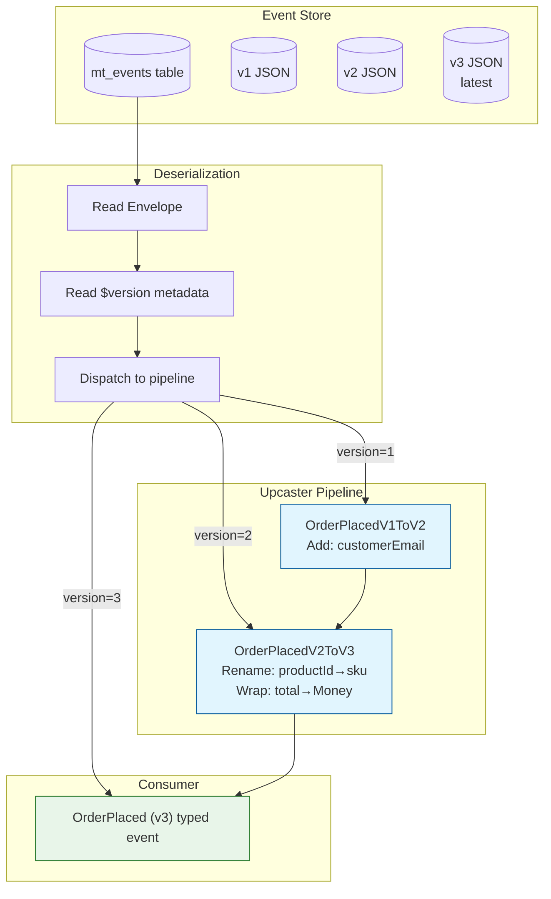
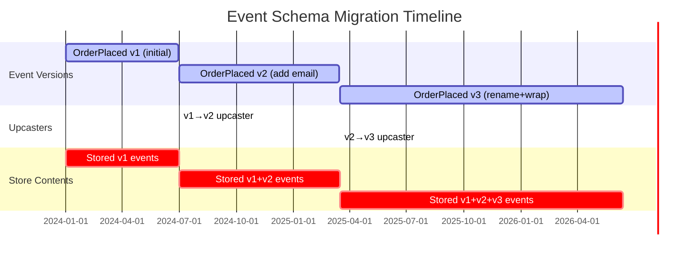
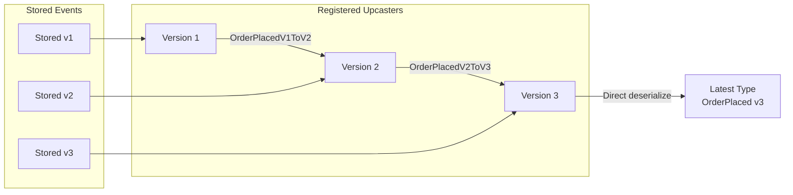

> [!success] Mastery Check
> - [ ] **Studied Well**
> - [ ] **Can explain the concept without notes**
> - [ ] **Can answer interview questions confidently**
> - [ ] **Can implement it in a real project**


# 7.109 — Event Sourcing — Event Versioning — Upcasting

## Overview

**Upcasting** is the event-sourced equivalent of database migrations. When an event schema evolves — a property is renamed, a field is added, a type changes — the stored events in the event store still carry the **old schema**. Upcasting transforms those old-serialized events into the **current schema** at deserialization time, without rewriting the event store.

| Concept | Purpose |
|---|---|
| **Event versioning** | Keeping a family of event schemas under one type identity |
| **Upcaster** | A function `OldEventData → NewEventData` |
| **Upcaster pipeline** | Chain of upcasters that progressively bring an event to the latest schema |
| **Event version dispatch** | Routing deserialization by the stored `$version` or type discriminator |
| **Schema migration strategy** | How you choose to evolve: in-place, additive, breaking, or new event type |

```
┌──────────────────────────────────────────────────────────┐
│                   Event Store Stream                      │
│  ┌────────┐  ┌────────┐  ┌────────┐  ┌────────┐        │
│  │ v1 evt │  │ v2 evt │  │ v1 evt │  │ v3 evt │  ...    │
│  └───┬────┘  └───┬────┘  └───┬────┘  └───┬────┘        │
│      │           │           │           │              │
└──────┼───────────┼───────────┼───────────┼──────────────┘
       │           │           │           │
       ▼           ▼           ▼           ▼
   ┌─────────────────────────────────────────────┐
   │         Upcaster Pipeline                    │
   │  ┌──────────┐  ┌──────────┐  ┌──────────┐   │
   │  │ Upcaster │→│ Upcaster │→│ Upcaster │→   │
   │  │  v1→v2   │  │  v2→v3   │  │  v3→v4   │   │
   │  └──────────┘  └──────────┘  └──────────┘   │
   └──────────────────┬───────────────────────────┘
                      │
                      ▼
             ┌──────────────────┐
             │  Current Event   │
             │  Schema (latest) │
             └──────────────────┘
```

> **YAML:** `group: "CQRS and Event Sourcing"` · `priority: 2` · `prerequisites: [[7.101 — Event Sourcing — Events as the Source of Truth]]` · `related: [[7.102 — Event Sourcing — Event Store Implementations]]`, `[[7.104 — Event Sourcing — Projections and Read Models]]`, `[[7.110 — Event Sourcing — Snapshotting and Performance]]`, `[[7.117 — Event Sourcing — Sagas and Process Managers]]`

---

## Table of Contents

1. [Why Event Versioning Matters](#1-why-event-versioning-matters)
2. [Schema Migration Strategies](#2-schema-migration-strategies)
3. [Upcasting Pattern — Core Interface](#3-upcasting-pattern--core-interface)
4. [Upcaster Registry](#4-upcaster-registry)
5. [Upcaster Pipeline — Chaining Multiple Upcasters](#5-upcaster-pipeline--chaining-multiple-upcasters)
6. [Event Deserialization with Version Dispatch](#6-event-deserialization-with-version-dispatch)
7. [Marten Upcasting — Out-of-the-Box Integration](#7-marten-upcasting--out-of-the-box-integration)
8. [Handling Breaking Changes](#8-handling-breaking-changes)
9. [Testing Upcasters](#9-testing-upcasters)
10. [ADR — Event Versioning Strategy Decision](#10-adr--event-versioning-strategy-decision)
11. [Pitfalls and Anti-Patterns](#11-pitfalls-and-anti-patterns)
12. [Interview Questions](#12-interview-questions)
13. [Self-Check Questions](#13-self-check-questions)
14. [References and Further Reading](#14-references-and-further-reading)

---

## 1. Why Event Versioning Matters

In an event-sourced system, **events are immutable**. You never delete or mutate a stored event. Yet the code that processes those events evolves:

- A business requirement adds a `CustomerEmail` field to `OrderPlaced`.
- A rename: `ProductId` → `Sku`.
- A type change: `decimal` price → `Money` value object.
- A split: one `OrderSubmitted` event becomes `OrderValidated` + `OrderCharged`.

Without versioning, every consumer (projections, sagas, handlers) would either crash on old events or need brittle `if`/`switch` logic.

### 1.1 The Version Taxonomy

Every event in a stream carries an implicit **version**:

| Version indicator | Where it lives | Example |
|---|---|---|
| **Schema version** | Stored alongside event data — `$version: 2` | `OrderPlaced.v2` |
| **CLR type** | Fully-qualified type name — `OrderPlacedV2` | `MyApp.Events.OrderPlacedV2` |
| **Discriminator** | A string/enum in the event store metadata | `"order_placed_v2"` |
| **Timestamp** | Wall-clock time of creation (less precise) | `2026-01-15T10:30:00Z` |

The **version** must be stored as part of the event envelope, not the event payload, so the deserializer knows *before* it deserializes which schema to expect.

### 1.2 The Three Approaches

| Approach | What changes | Migrate old data? | Pros | Cons |
|---|---|---|---|---|
| **New event type** | New event name (`OrderPlaced` → `OrderPlacedV2`) | No | Clean separation; old event never changes | Breaks projections that listen for `OrderPlaced`; need multi-handler |
| **Upcasting** | Same event type, pipeline transforms old → new | At read time, in memory | Zero downtime; no rewrite; backward compat | Complexity; all consumers see latest shape |
| **Batch migration** | Rewrite all old events in the store | Offline or background job | Store always has latest schema | Downtime; risk of data loss; huge operation at scale |

Most production systems use **upcasting** as the primary mechanism, sometimes supplemented by **new event types** for truly incompatible changes.

---

## 2. Schema Migration Strategies

### 2.1 Additive (Non-Breaking) — New Property with Default

**Scenario:** You want to add `CustomerEmail` to `OrderPlaced` without breaking existing consumers.

**Old schema:**
```json
{
  "$type": "OrderPlaced",
  "$version": 1,
  "OrderId": "ord-001",
  "CustomerId": "cus-001",
  "Total": 99.99
}
```

**New schema:**
```json
{
  "$type": "OrderPlaced",
  "$version": 2,
  "OrderId": "ord-001",
  "CustomerId": "cus-001",
  "Total": 99.99,
  "CustomerEmail": "unknown@unknown.com"
}
```

**Upcaster logic:** `v1 → v2`: inject `CustomerEmail = "unknown@unknown.com"`.

All consumers see the v2 schema. They must tolerate a sentinel email value until the field is populated in new events.

### 2.2 Rename / Structural Change

**Scenario:** `ProductId` renamed to `Sku`.

**Old schema:**
```json
{
  "$type": "ItemAddedToCart",
  "$version": 1,
  "ProductId": "prod-456",
  "Quantity": 2
}
```

**New schema:**
```json
{
  "$type": "ItemAddedToCart",
  "$version": 2,
  "Sku": "prod-456",
  "Quantity": 2
}
```

**Upcaster logic:** `v1 → v2`: read `ProductId`, write `Sku`, drop `ProductId`.

### 2.3 Type Change — `decimal` to `Money`

**Scenario:** `Price: decimal` becomes a `Money` value object with `Amount` and `Currency`.

**Old schema:**
```json
{
  "$type": "OrderPlaced",
  "$version": 2,
  "OrderId": "ord-001",
  "Total": 99.99
}
```

**New schema:**
```json
{
  "$type": "OrderPlaced",
  "$version": 3,
  "OrderId": "ord-001",
  "Total": { "Amount": 99.99, "Currency": "USD" }
}
```

**Upcaster logic:** `v2 → v3`: wrap `Total` into `{ "Amount": total, "Currency": "USD" }`.

### 2.4 Splitting One Event Into Two (Breaking)

**Scenario:** `OrderSubmitted` needs to become `OrderValidated` + `OrderCharged`.

This is a **new event type** strategy, not an upcast of the same type. The old `OrderSubmitted` remains as-is; new code emits the two new events. Consumers must handle both the old single event and the two new events.

```
Time ─────────────────────────────────────────►
Stream: [OrderSubmitted] [OrderSubmitted] [OrderValidated, OrderCharged] ...
                                         ▲
                                    Cutover point
```

Optionally, an upcaster could transform the old `OrderSubmitted` into a new `OrderValidated` **and** emit a synthetic `OrderCharged` (with guessed data) — but this is dangerous. Prefer accepting the old shape in projections.

### 2.5 Deprecation

When a property is no longer relevant but exists in old events:

- **Ignore it** in current consumers.
- Mark it as `[Obsolete]` in code if using typed events.
- Never remove it from the upcaster contract — the old data still exists in the store.

---

## 3. Upcasting Pattern — Core Interface

### 3.1 `IUpcaster<TEvent>` — C# 12 Interface

```csharp
namespace Career.Events.Upcasting;

/// <summary>
/// Transforms an event from an older schema version to a newer one.
/// </summary>
/// <typeparam name="TEvent">The event type after upcasting (latest version).</typeparam>
public interface IUpcaster<TEvent>
{
    /// <summary>
    /// The source version this upcaster can handle.
    /// </summary>
    int FromVersion { get; }

    /// <summary>
    /// The target version after upcasting.
    /// </summary>
    int ToVersion { get; }

    /// <summary>
    /// Determines whether this upcaster can process the given raw JSON.
    /// </summary>
    bool CanUpcast(ReadOnlySpan<byte> rawJson, int storedVersion);

    /// <summary>
    /// Transforms the raw event data from <see cref="FromVersion"/> to <see cref="ToVersion"/>.
    /// Returns the transformed JSON.
    /// </summary>
    ReadOnlySpan<byte> Upcast(ReadOnlySpan<byte> rawJson);

    /// <summary>
    /// Deserializes the (potentially already partially upcast) JSON to <typeparamref name="TEvent"/>.
    /// This is the final step that produces a usable event object.
    /// </summary>
    TEvent? Deserialize(ReadOnlySpan<byte> rawJson);
}
```

### 3.2 Abstract Base — `EventUpcaster<TEvent>`

```csharp
using System.Text.Json;
using System.Text.Json.Nodes;

namespace Career.Events.Upcasting;

public abstract class EventUpcaster<TEvent> : IUpcaster<TEvent>
{
    private static readonly JsonSerializerOptions JsonOptions = new()
    {
        PropertyNameCaseInsensitive = true,
        PropertyNamingPolicy = JsonNamingPolicy.CamelCase,
    };

    public abstract int FromVersion { get; }
    public abstract int ToVersion { get; }

    public bool CanUpcast(ReadOnlySpan<byte> rawJson, int storedVersion)
        => storedVersion == FromVersion;

    public ReadOnlySpan<byte> Upcast(ReadOnlySpan<byte> rawJson)
    {
        using JsonDocument doc = JsonDocument.Parse(rawJson);
        JsonObject? node = doc.RootElement.DeepClone().Deserialize<JsonObject>();
        ArgumentNullException.ThrowIfNull(node);

        ApplyUpcast(node);

        return JsonSerializer.SerializeToUtf8Bytes(node, JsonOptions);
    }

    public TEvent? Deserialize(ReadOnlySpan<byte> rawJson)
        => JsonSerializer.Deserialize<TEvent>(rawJson, JsonOptions);

    /// <summary>
    /// Derived classes implement the actual transformation on the JSON object.
    /// </summary>
    protected abstract void ApplyUpcast(JsonObject eventData);

    /// <summary>
    /// Helper: renames a property in-place.
    /// </summary>
    protected static void RenameProperty(JsonObject obj, string oldName, string newName)
    {
        if (obj.TryGetPropertyValue(oldName, out JsonNode? value))
        {
            obj.Remove(oldName);
            obj[newName] = value?.DeepClone();
        }
    }

    /// <summary>
    /// Helper: adds a property with a default value if it doesn't exist.
    /// </summary>
    protected static void AddDefaultProperty(JsonObject obj, string name, JsonNode? defaultValue)
    {
        if (!obj.ContainsKey(name))
        {
            obj[name] = defaultValue?.DeepClone();
        }
    }

    /// <summary>
    /// Helper: removes a property.
    /// </summary>
    protected static void RemoveProperty(JsonObject obj, string name)
        => obj.Remove(name);

    /// <summary>
    /// Helper: wraps a scalar value into a nested object.
    /// </summary>
    protected static void WrapProperty(JsonObject obj, string propertyName, string wrapperType, Func<JsonNode, JsonObject> wrapperFactory)
    {
        if (obj.TryGetPropertyValue(propertyName, out JsonNode? value) && value is not null)
        {
            obj[propertyName] = wrapperFactory(value);
        }
    }
}
```

### 3.3 Concrete Upcaster — Additive Change (v1 → v2)

```csharp
using System.Text.Json.Nodes;

namespace Career.Events.Ordering.Versioning;

public sealed class OrderPlacedV1ToV2Upcaster : EventUpcaster<OrderPlaced>
{
    public override int FromVersion => 1;
    public override int ToVersion => 2;

    protected override void ApplyUpcast(JsonObject eventData)
    {
        AddDefaultProperty(eventData, "customerEmail", JsonValue.Create("unknown@unknown.com"));
    }
}
```

### 3.4 Concrete Upcaster — Rename (v2 → v3)

```csharp
public sealed class OrderPlacedV2ToV3Upcaster : EventUpcaster<OrderPlaced>
{
    public override int FromVersion => 2;
    public override int ToVersion => 3;

    protected override void ApplyUpcast(JsonObject eventData)
    {
        // Rename: ProductId -> Sku
        RenameProperty(eventData, "productId", "sku");

        // Wrap Total into Money value object
        WrapProperty(eventData, "total", "Money", value =>
        {
            decimal amount = value!.GetValue<decimal>();
            return new JsonObject
            {
                ["amount"] = amount,
                ["currency"] = JsonValue.Create("USD"),
            };
        });
    }
}
```

### 3.5 Record Types for Typed Events (C# 12)

```csharp
namespace Career.Events.Ordering;

// Version 3 — current schema
public sealed record OrderPlaced(
    string OrderId,
    string CustomerId,
    Money Total,
    string CustomerEmail,
    string Sku,
    DateTime OccurredAt
);

public sealed record Money(decimal Amount, string Currency);

// Version 2 — historical schema (kept for reference, not used in consumption)
[Obsolete("Use OrderPlaced v3. Only kept for upcaster tests.")]
internal sealed record OrderPlacedV2(
    string OrderId,
    string CustomerId,
    decimal Total,
    string ProductId,
    DateTime OccurredAt
);

// Version 1 — historical schema
[Obsolete("Use OrderPlaced v3. Only kept for upcaster tests.")]
internal sealed record OrderPlacedV1(
    string OrderId,
    string CustomerId,
    decimal Total,
    string ProductId,
    DateTime OccurredAt
);
```

> **Convention:** Old event types are marked `[Obsolete]` and kept `internal` to discourage direct use. Consumers always work with the latest type.

---

## 4. Upcaster Registry

The registry is a central collection that maps `(eventTypeName, version)` to the appropriate upcaster chain.

```csharp
using System.Collections.Concurrent;

namespace Career.Events.Upcasting;

public interface IUpcasterRegistry
{
    /// <summary>
    /// Gets the resolved type name for the event and returns the ordered pipeline of upcasters.
    /// </summary>
    IReadOnlyList<IUpcaster> GetPipeline(string eventTypeName, int storedVersion);

    /// <summary>
    /// Registers one or more upcasters for an event type.
    /// </summary>
    void Register<TEvent>(params IUpcaster<TEvent>[] upcasters);

    /// <summary>
    /// Validates that all upcaster chains are contiguous and reach the current version.
    /// </summary>
    void Validate();

    /// <summary>
    /// Returns all registered event type names.
    /// </summary>
    IEnumerable<string> GetRegisteredEventTypes();
}

// Non-generic marker for internal pipeline processing
public interface IUpcaster
{
    int FromVersion { get; }
    int ToVersion { get; }
    bool CanUpcast(ReadOnlySpan<byte> rawJson, int storedVersion);
    ReadOnlySpan<byte> Upcast(ReadOnlySpan<byte> rawJson);
}
```

```csharp
public sealed class UpcasterRegistry : IUpcasterRegistry
{
    private readonly ConcurrentDictionary<string, UpcasterChain> _chains = new(StringComparer.OrdinalIgnoreCase);
    private readonly object _lock = new();

    public void Register<TEvent>(params IUpcaster<TEvent>[] upcasters)
    {
        string eventTypeName = typeof(TEvent).Name;

        lock (_lock)
        {
            if (!_chains.TryGetValue(eventTypeName, out UpcasterChain? chain))
            {
                chain = new UpcasterChain(eventTypeName);
                _chains[eventTypeName] = chain;
            }

            foreach (IUpcaster<TEvent> upcaster in upcasters)
            {
                chain.Add((IUpcaster)upcaster);
            }
        }
    }

    public IReadOnlyList<IUpcaster> GetPipeline(string eventTypeName, int storedVersion)
    {
        if (!_chains.TryGetValue(eventTypeName, out UpcasterChain? chain))
        {
            return Array.Empty<IUpcaster>();
        }

        return chain.GetPipeline(storedVersion);
    }

    public void Validate()
    {
        foreach ((string key, UpcasterChain chain) in _chains)
        {
            chain.Validate();
        }
    }

    public IEnumerable<string> GetRegisteredEventTypes()
        => _chains.Keys;
}
```

### 4.1 `UpcasterChain` — Internal Chain Builder

```csharp
using System.Collections.Immutable;

namespace Career.Events.Upcasting;

internal sealed class UpcasterChain
{
    private readonly string _eventTypeName;
    private readonly List<IUpcaster> _upcasters = [];
    private UpcasterGraph? _graph;

    public UpcasterChain(string eventTypeName)
    {
        _eventTypeName = eventTypeName;
    }

    public void Add(IUpcaster upcaster)
    {
        _upcasters.Add(upcaster);
        _graph = null; // invalidate cached graph
    }

    public IReadOnlyList<IUpcaster> GetPipeline(int fromVersion)
    {
        _graph ??= new UpcasterGraph(_eventTypeName, _upcasters);
        return _graph.GetPipeline(fromVersion);
    }

    public void Validate()
    {
        _graph ??= new UpcasterGraph(_eventTypeName, _upcasters);
        _graph.Validate();
    }
}
```

### 4.2 `UpcasterGraph` — Topological Sort for Contiguous Chain

```csharp
using System.Collections.Immutable;

namespace Career.Events.Upcasting;

internal sealed class UpcasterGraph
{
    private readonly string _eventTypeName;
    private readonly Dictionary<int, List<IUpcaster>> _edges = [];
    private readonly HashSet<int> _allVersions = [];
    private int _maxVersion;

    public UpcasterGraph(string eventTypeName, List<IUpcaster> upcasters)
    {
        _eventTypeName = eventTypeName;

        foreach (IUpcaster upcaster in upcasters)
        {
            if (!_edges.ContainsKey(upcaster.FromVersion))
            {
                _edges[upcaster.FromVersion] = [];
            }
            _edges[upcaster.FromVersion].Add(upcaster);

            _allVersions.Add(upcaster.FromVersion);
            _allVersions.Add(upcaster.ToVersion);

            if (upcaster.ToVersion > _maxVersion)
                _maxVersion = upcaster.ToVersion;
        }
    }

    public IReadOnlyList<IUpcaster> GetPipeline(int fromVersion)
    {
        if (!_edges.ContainsKey(fromVersion))
            return Array.Empty<IUpcaster>();

        var pipeline = new List<IUpcaster>();
        int currentVersion = fromVersion;

        while (_edges.TryGetValue(currentVersion, out List<IUpcaster>? nextUpcasters))
        {
            // If there are multiple paths (e.g., v1→v2a, v1→v2b), pick the one
            // that leads to _maxVersion. This resolves branching.
            IUpcaster chosen = nextUpcasters.Count switch
            {
                0 => throw new InvalidOperationException(
                    $"Dead-end upcaster chain for {_eventTypeName} at version {currentVersion}."),
                1 => nextUpcasters[0],
                _ => PickBranch(nextUpcasters),
            };

            pipeline.Add(chosen);
            currentVersion = chosen.ToVersion;
        }

        return pipeline;
    }

    private IUpcaster PickBranch(List<IUpcaster> candidates)
    {
        // Preference: the upcaster whose ToVersion has the longest transitive path
        return candidates.MaxBy(upcaster =>
        {
            int depth = 0;
            int v = upcaster.ToVersion;
            while (_edges.TryGetValue(v, out List<IUpcaster>? next))
            {
                v = next[0].ToVersion;
                depth++;
            }
            return depth;
        })!;
    }

    public void Validate()
    {
        var errors = new List<string>();

        foreach (int version in _allVersions.OrderBy(v => v))
        {
            // Every version except the max must have an outgoing edge
            if (version != _maxVersion && !_edges.ContainsKey(version))
            {
                errors.Add($"Version {version} of {_eventTypeName} has no upcaster to bring it to a newer version.");
            }
        }

        // Check for gaps: versions that are skipped
        var sorted = _allVersions.OrderBy(v => v).ToList();
        for (int i = 0; i < sorted.Count - 1; i++)
        {
            if (sorted[i + 1] - sorted[i] > 1)
            {
                // Gap is allowed if there's a multi-step upcaster that spans it
                // But we flag it as a warning
            }
        }

        if (errors.Count > 0)
        {
            throw new UpcasterValidationException(
                $"Upcaster chain validation failed for {_eventTypeName}:\n{string.Join("\n", errors)}");
        }
    }
}
```

### 4.3 Registration at Startup

```csharp
// Program.cs — .NET 8 Host Builder

using Career.Events.Upcasting;
using Career.Events.Ordering.Versioning;

WebApplicationBuilder builder = WebApplication.CreateBuilder(args);

// Register upcasters
builder.Services.AddSingleton<IUpcasterRegistry>(sp =>
{
    var registry = new UpcasterRegistry();

    // OrderPlaced: v1 → v2 → v3
    registry.Register<Career.Events.Ordering.OrderPlaced>(
        new OrderPlacedV1ToV2Upcaster(),
        new OrderPlacedV2ToV3Upcaster()
    );

    // ItemAddedToCart: v1 → v2
    registry.Register<Career.Events.Cart.ItemAddedToCart>(
        new ItemAddedToCartV1ToV2Upcaster()
    );

    registry.Validate();

    return registry;
});

// Register the upcasting deserializer
builder.Services.AddSingleton<IEventDeserializer, UpcastingEventDeserializer>();

WebApplication app = builder.Build();
app.Run();
```

---

## 5. Upcaster Pipeline — Chaining Multiple Upcasters

A single event may pass through **multiple upcasters** in sequence:

```
Stored v1 JSON
    │
    ▼
┌──────────────────────┐
│ OrderPlacedV1ToV2    │  Adds CustomerEmail
└──────────┬───────────┘
           ▼
┌──────────────────────┐
│ OrderPlacedV2ToV3    │  Renames ProductId→Sku, wraps Total→Money
└──────────┬───────────┘
           ▼
    v3 JSON → Deserialize → OrderPlaced (latest)
```

### 5.1 Pipeline Processor

```csharp
using System.Text.Json;

namespace Career.Events.Upcasting;

public sealed class UpcasterPipelineProcessor
{
    private readonly IUpcasterRegistry _registry;

    public UpcasterPipelineProcessor(IUpcasterRegistry registry)
    {
        _registry = registry;
    }

    /// <summary>
    /// Runs the full upcaster pipeline for a stored event.
    /// </summary>
    public TEvent? Process<TEvent>(
        string eventTypeName,
        int storedVersion,
        ReadOnlySpan<byte> rawJson)
    {
        IReadOnlyList<IUpcaster> pipeline =
            _registry.GetPipeline(eventTypeName, storedVersion);

        ReadOnlySpan<byte> currentData = rawJson;

        foreach (IUpcaster upcaster in pipeline)
        {
            if (upcaster.CanUpcast(currentData, storedVersion))
            {
                currentData = upcaster.Upcast(currentData);
                // After first upcast, stored version is no longer relevant.
                // The next upcaster in the pipeline matches by FromVersion
                // which corresponds to the previous upcaster's ToVersion.
            }
        }

        // The last upcaster in the chain (or the only one) should be able to deserialize
        if (pipeline.Count > 0 && pipeline[^1] is IUpcaster<TEvent> typedUpcaster)
        {
            return typedUpcaster.Deserialize(currentData);
        }

        // No upcaster needed — stored version is already current
        return JsonSerializer.Deserialize<TEvent>(currentData);
    }
}
```

### 5.2 Optimized Pipeline — Short-Circuit When Already Current

```csharp
public sealed class OptimizedUpcasterPipeline
{
    private readonly IUpcasterRegistry _registry;
    private readonly ConcurrentDictionary<(string type, int version), PipelineEntry> _cache = new();

    public OptimizedUpcasterPipeline(IUpcasterRegistry registry)
    {
        _registry = registry;
    }

    public TEvent? Process<TEvent>(string eventTypeName, int storedVersion, ReadOnlySpan<byte> rawJson)
    {
        PipelineEntry entry = _cache.GetOrAdd(
            (eventTypeName, storedVersion),
            _ => BuildEntry(eventTypeName, storedVersion));

        if (entry.Pipeline.Count == 0)
        {
            // Current version — direct deserialize
            return JsonSerializer.Deserialize<TEvent>(rawJson);
        }

        ReadOnlySpan<byte> current = rawJson;
        foreach (IUpcaster upcaster in entry.Pipeline)
        {
            current = upcaster.Upcast(current);
        }

        return JsonSerializer.Deserialize<TEvent>(current);
    }

    private PipelineEntry BuildEntry(string eventTypeName, int storedVersion)
    {
        IReadOnlyList<IUpcaster> pipeline =
            _registry.GetPipeline(eventTypeName, storedVersion);
        return new PipelineEntry(pipeline);
    }

    private sealed record PipelineEntry(IReadOnlyList<IUpcaster> Pipeline);
}
```

### 5.3 Pipeline with Version Tracking (for Debugging)

```csharp
public sealed record UpcastTraceEntry(
    int FromVersion,
    int ToVersion,
    string UpcasterType,
    long ElapsedMicroseconds
);

public sealed class TracedUpcasterPipeline
{
    private readonly IUpcasterRegistry _registry;
    private readonly ILogger<TracedUpcasterPipeline> _logger;

    public TracedUpcasterPipeline(
        IUpcasterRegistry registry,
        ILogger<TracedUpcasterPipeline> logger)
    {
        _registry = registry;
        _logger = logger;
    }

    public (TEvent? Event, IReadOnlyList<UpcastTraceEntry> Trace) Process<TEvent>(
        string eventTypeName,
        int storedVersion,
        ReadOnlySpan<byte> rawJson)
    {
        var trace = new List<UpcastTraceEntry>();
        IReadOnlyList<IUpcaster> pipeline =
            _registry.GetPipeline(eventTypeName, storedVersion);

        ReadOnlySpan<byte> currentData = rawJson;

        foreach (IUpcaster upcaster in pipeline)
        {
            long start = Stopwatch.GetTimestamp();
            currentData = upcaster.Upcast(currentData);
            long elapsed = Stopwatch.GetElapsedTime(start).Microseconds;

            trace.Add(new UpcastTraceEntry(
                upcaster.FromVersion,
                upcaster.ToVersion,
                upcaster.GetType().Name,
                elapsed));

            _logger.LogDebug(
                "Upcast {EventType} v{From}→v{To} via {Upcaster} in {Elapsed}μs",
                eventTypeName, upcaster.FromVersion, upcaster.ToVersion,
                upcaster.GetType().Name, elapsed);
        }

        TEvent? evt = JsonSerializer.Deserialize<TEvent>(currentData);

        return (evt, trace.AsReadOnly());
    }
}
```

---

## 6. Event Deserialization with Version Dispatch

The deserializer reads the **version** from the event envelope (metadata), selects the correct pipeline, and produces the latest typed event.

### 6.1 Event Envelope

```csharp
namespace Career.Events;

public sealed record EventEnvelope
{
    /// <summary>Globally unique event ID.</summary>
    public Guid EventId { get; init; }

    /// <summary>Stream ID this event belongs to.</summary>
    public string StreamId { get; init; } = string.Empty;

    /// <summary>CLR type name or discriminator.</summary>
    public string EventTypeName { get; init; } = string.Empty;

    /// <summary>Schema version of the stored payload.</summary>
    public int Version { get; init; }

    /// <summary>Position in the stream.</summary>
    public long StreamPosition { get; init; }

    /// <summary>Position in the global log.</summary>
    public long GlobalPosition { get; init; }

    /// <summary>UTC timestamp.</summary>
    public DateTime Timestamp { get; init; }

    /// <summary>Raw JSON payload.</summary>
    public ReadOnlyMemory<byte> Data { get; init; }
}
```

### 6.2 `IEventDeserializer`

```csharp
namespace Career.Events;

public interface IEventDeserializer
{
    /// <summary>
    /// Deserializes an event envelope into a typed event,
    /// running any necessary upcasters.
    /// </summary>
    object? Deserialize(EventEnvelope envelope);

    /// <summary>
    /// Typed overload.
    /// </summary>
    TEvent? Deserialize<TEvent>(EventEnvelope envelope);
}
```

```csharp
using System.Text.Json;

namespace Career.Events.Serialization;

public sealed class UpcastingEventDeserializer : IEventDeserializer
{
    private readonly UpcasterPipelineProcessor _pipeline;
    private static readonly JsonSerializerOptions Options = new()
    {
        PropertyNameCaseInsensitive = true,
        PropertyNamingPolicy = JsonNamingPolicy.CamelCase,
    };

    public UpcastingEventDeserializer(IUpcasterRegistry registry)
    {
        _pipeline = new UpcasterPipelineProcessor(registry);
    }

    public object? Deserialize(EventEnvelope envelope)
    {
        Type targetType = ResolveType(envelope.EventTypeName)
            ?? throw new EventDeserializationException(
                $"Unknown event type: {envelope.EventTypeName}");

        // Invoke the generic method via reflection
        return typeof(UpcastingEventDeserializer)
            .GetMethod(nameof(DeserializeGeneric), BindingFlags.NonPublic | BindingFlags.Instance)!
            .MakeGenericMethod(targetType)
            .Invoke(this, [envelope]);
    }

    public TEvent? Deserialize<TEvent>(EventEnvelope envelope)
    {
        return _pipeline.Process<TEvent>(
            envelope.EventTypeName,
            envelope.Version,
            envelope.Data.Span);
    }

    private object? DeserializeGeneric<TEvent>(EventEnvelope envelope)
        => Deserialize<TEvent>(envelope);

    private static Type? ResolveType(string eventTypeName)
        => Type.GetType(eventTypeName)
           ?? AppDomain.CurrentDomain.GetAssemblies()
               .SelectMany(a => a.GetTypes())
               .FirstOrDefault(t =>
                   t.Name == eventTypeName ||
                   t.FullName == eventTypeName ||
                   t.GetCustomAttribute<EventTypeAttribute>()?.TypeName == eventTypeName);
}
```

### 6.3 Type Resolution with Attribute

```csharp
namespace Career.Events;

[AttributeUsage(AttributeTargets.Class | AttributeTargets.Struct, Inherited = false)]
public sealed class EventTypeAttribute : Attribute
{
    public string TypeName { get; }
    public int CurrentVersion { get; }

    public EventTypeAttribute(string typeName, int currentVersion = 1)
    {
        TypeName = typeName;
        CurrentVersion = currentVersion;
    }
}

[EventType("order_placed", CurrentVersion = 3)]
public sealed record OrderPlaced(/* ... */);
```

### 6.4 Stream Reader with Version Dispatch

```csharp
namespace Career.Events.Streams;

public sealed class VersionedStreamReader
{
    private readonly IEventStoreReader _storeReader;
    private readonly IEventDeserializer _deserializer;

    public VersionedStreamReader(
        IEventStoreReader storeReader,
        IEventDeserializer deserializer)
    {
        _storeReader = storeReader;
        _deserializer = deserializer;
    }

    public async IAsyncEnumerable<object> ReadStreamAsync(
        string streamId,
        CancellationToken ct = default)
    {
        await foreach (EventEnvelope envelope in
            _storeReader.ReadStreamAsync(streamId, ct))
        {
            object? evt = _deserializer.Deserialize(envelope);
            if (evt is not null)
            {
                yield return evt;
            }
        }
    }
}
```

### 6.5 Alternate Approach — Version-Specific Deserialization Methods

When upcasting is not desired (e.g., you want to keep old handlers for old events), you can dispatch directly:

```csharp
public sealed class VersionDispatchDeserializer
{
    private readonly Dictionary<(string typeName, int version), Delegate> _handlers = new();

    public void RegisterHandler<TEvent>(int version, Func<ReadOnlySpan<byte>, TEvent> handler)
    {
        string typeName = typeof(TEvent).Name;
        _handlers[(typeName, version)] = handler;
    }

    public TEvent? Deserialize<TEvent>(EventEnvelope envelope)
    {
        if (_handlers.TryGetValue((envelope.EventTypeName, envelope.Version), out Delegate? handler))
        {
            return ((Func<ReadOnlySpan<byte>, TEvent>)handler)(envelope.Data.Span);
        }

        throw new EventDeserializationException(
            $"No handler registered for {envelope.EventTypeName} v{envelope.Version}");
    }
}
```

---

## 7. Marten Upcasting — Out-of-the-Box Integration

[Marten](https://martendb.io) is the most popular .NET event store library built on PostgreSQL. It includes a built-in upcasting framework.

### 7.1 Marten Event Versioning Model

Marten stores events in the `mt_events` table. Each event has:

| Column | Type | Description |
|---|---|---|
| `id` | `uuid` | Event ID |
| `stream_id` | `uuid` | Stream ID |
| `version` | `integer` | Stream position |
| `seq_id` | `bigint` | Global sequence |
| `event_type` | `varchar` | .NET type name |
| `dotnet_type` | `varchar` | Assembly-qualified type name |
| `body` | `jsonb` | Event payload |
| `timestamp` | `timestamptz` | Created timestamp |
| `tags` | `jsonb` | Optional metadata |

The **`event_type`** column is the discriminator Marten uses for routing. The **`body`** is the raw JSON.

### 7.2 Marten `IEventUpcaster` Interface

```csharp
using Marten.Events;
using Marten.Events.Upcasting;

// Marten's built-in upcaster interface (simplified)
public interface IEventUpcaster
{
    Type EventType { get; }
    IReadOnlyList<Type> Apply(System.Text.Json.Nodes.JsonObject json);
    IReadOnlyList<IEvent> Upcast(IMessageContext context, IEvent original);
}
```

### 7.3 Registering Upcasters in Marten

```csharp
using Marten;
using Marten.Events.Upcasting;
using Weasel.Core;

WebApplicationBuilder builder = WebApplication.CreateBuilder(args);

builder.Services.AddMarten(sp =>
{
    StoreOptions opts = new StoreOptions();

    opts.Connection(builder.Configuration.GetConnectionString("Marten"));

    // === Event Upcasting ===

    // Register an upcaster for OrderPlaced v1→v2
    opts.Events.Upcasters.Add(new OrderPlacedUpcaster());

    // Register upcasters via assembly scan (if using Upcaster attribute)
    opts.Events.Upcasters.AddRange(
        UpcasterDiscovery
            .FromAssemblyContaining<Program>()
            .Where(u => u.EventType == typeof(OrderPlaced))
            .ToArray()
    );

    return opts;
});
```

### 7.4 Marten Upcaster Implementation

```csharp
using Marten.Events;
using Marten.Events.Upcasting;
using System.Text.Json.Nodes;

public sealed class OrderPlacedUpcaster : IEventUpcaster
{
    public Type EventType => typeof(OrderPlaced);

    public IReadOnlyList<Type> Apply(JsonObject json)
    {
        // In Marten's model, Apply can return multiple event types
        // if the upcaster splits one event into many.
        return [typeof(OrderPlaced)];
    }

    public IReadOnlyList<IEvent> Upcast(IMessageContext context, IEvent original)
    {
        JsonObject? data = original.Data as JsonObject;
        if (data is null)
            return [original];

        // Check version via metadata or data shape
        int version = GetStoredVersion(data);

        if (version == 1)
        {
            // v1 → v2: add customerEmail
            data["customerEmail"] = "unknown@unknown.com";
        }

        if (version <= 2)
        {
            // v2 → v3: rename productId → sku, wrap total
            if (data.TryGetPropertyValue("productId", out JsonNode? productId))
            {
                data.Remove("productId");
                data["sku"] = productId!.DeepClone();
            }

            if (data.TryGetPropertyValue("total", out JsonNode? total))
            {
                data["total"] = new JsonObject
                {
                    ["amount"] = total!.DeepClone(),
                    ["currency"] = "USD",
                };
            }
        }

        // Recreate the event with updated data
        IEvent updated = original.WithData(
            EventType,
            JsonSerializer.SerializeToElement(data));

        return [updated];
    }

    private static int GetStoredVersion(JsonObject data)
    {
        // Heuristic: check shape to determine version
        if (!data.ContainsKey("customerEmail")) return 1;
        if (data["total"] is JsonValue) return 2;
        return 3;
    }
}
```

### 7.5 Marten Upcaster with `UpcastResult`

Marten also supports a `UpcastResult` abstraction:

```csharp
public sealed class OrderPlacedUpcasterV2 : IEventUpcaster
{
    public Type EventType => typeof(OrderPlaced);

    public IReadOnlyList<Type> Apply(JsonObject json)
    {
        // Returns the types that this upcaster can produce
        return [typeof(OrderPlaced)];
    }

    public IReadOnlyList<IEvent> Upcast(IMessageContext context, IEvent original)
    {
        // Use raw JSON from the body
        string rawJson = original.Body?.ToString() ?? "{}";
        JsonObject data = JsonNode.Parse(rawJson)!.AsObject();

        // Detect version by checking for version number convention
        // Or trust that Marten's event_type already discriminates
        // and this upcaster is only registered for specific versions.

        int version = original.Version; // Marten stream version, NOT schema version!
        // Note: Marten's Version is stream position. For schema versioning,
        // store it in a metadata field or use event type naming convention.

        // Better approach: use a custom metadata field
        int schemaVersion = original.Headers?.TryGetValue("schema_version", out object? sv) == true
            ? Convert.ToInt32(sv)
            : 1;

        if (schemaVersion >= 2)
            return [original]; // Already up-to-date

        // v1 → v2 transformation
        data["customerEmail"] = "unknown@unknown.com";

        // Store updated version
        object updated = data.Deserialize<OrderPlaced>()!;

        IEvent upcastedEvent = original.WithData(updated);
        upcastedEvent.Headers ??= new Dictionary<string, object>();
        upcastedEvent.Headers["schema_version"] = 2;

        return [upcastedEvent];
    }
}
```

### 7.6 Marten Schema Version Metadata Convention

```csharp
// Store schema version when appending events
public static class EventMetadataExtensions
{
    public static void SetSchemaVersion(this IEvent eventRecord, int version)
    {
        eventRecord.Headers ??= new Dictionary<string, object>();
        eventRecord.Headers["schema_version"] = version;
    }

    public static int GetSchemaVersion(this IEvent eventRecord)
    {
        return eventRecord.Headers?.TryGetValue("schema_version", out object? v) == true
            ? Convert.ToInt32(v)
            : 1; // default to 1 for legacy events
    }
}

// Usage when appending:
// session.Events.Append(streamId, new OrderPlaced { ... }.WithSchemaVersion(3));
```

### 7.7 Marten Multi-Type Upcaster (Split Event)

```csharp
public sealed class OrderSubmittedSplitUpcaster : IEventUpcaster
{
    public Type EventType => typeof(OrderSubmitted);

    public IReadOnlyList<Type> Apply(JsonObject json)
    {
        // This upcaster replaces one OrderSubmitted with two events
        return [typeof(OrderValidated), typeof(OrderCharged)];
    }

    public IReadOnlyList<IEvent> Upcast(IMessageContext context, IEvent original)
    {
        JsonObject data = JsonNode.Parse(original.Body!.ToString())!.AsObject();

        // Split
        var validated = new OrderValidated(
            OrderId: data["orderId"]!.GetValue<string>(),
            CustomerId: data["customerId"]!.GetValue<string>(),
            ValidatedAt: original.Timestamp
        );

        var charged = new OrderCharged(
            OrderId: data["orderId"]!.GetValue<string>(),
            Amount: data["total"]?.GetValue<decimal>() ?? 0,
            ChargedAt: original.Timestamp
        );

        return [
            original.WithData(validated),
            original.WithData(charged),
        ];
    }
}
```

---

## 7A. Advanced Upcasting Patterns

### 7A.1 Polymorphic Event Upcasting

When a base event type has multiple derived types, and the schema change affects all of them:

```csharp
// Base event
public abstract record PaymentEvent(string PaymentId, string OrderId, decimal Amount);

// Derived events
public sealed record PaymentAuthorized(string PaymentId, string OrderId, decimal Amount, string AuthCode)
    : PaymentEvent(PaymentId, OrderId, Amount);

public sealed record PaymentCaptured(string PaymentId, string OrderId, decimal Amount, DateTime CapturedAt)
    : PaymentEvent(PaymentId, OrderId, Amount);

// All events need to migrate from decimal Amount -> Money Amount
// Instead of N upcasters, write one that operates on the base type.

public sealed class PaymentEventV1ToV2Upcaster : EventUpcaster<PaymentEvent>
{
    public override int FromVersion => 1;
    public override int ToVersion => 2;

    protected override void ApplyUpcast(JsonObject eventData)
    {
        WrapProperty(eventData, "amount", "Money", value =>
        {
            decimal amount = value!.GetValue<decimal>();
            return new JsonObject
            {
                ["amount"] = amount,
                ["currency"] = JsonValue.Create("USD"),
            };
        });
    }
}

// Register once, works for all derived types
registry.Register<PaymentEvent>(new PaymentEventV1ToV2Upcaster());
```

### 7A.2 Decorator-Based Upcaster Composition

For cross-cutting concerns (e.g., logging, metrics, validation), wrap the upcaster with a decorator:

```csharp
public sealed class LoggingUpcasterDecorator : IUpcaster
{
    private readonly IUpcaster _inner;
    private readonly ILogger _logger;

    public LoggingUpcasterDecorator(IUpcaster inner, ILogger logger)
    {
        _inner = inner;
        _logger = logger;
    }

    public int FromVersion => _inner.FromVersion;
    public int ToVersion => _inner.ToVersion;

    public bool CanUpcast(ReadOnlySpan<byte> rawJson, int storedVersion)
        => _inner.CanUpcast(rawJson, storedVersion);

    public ReadOnlySpan<byte> Upcast(ReadOnlySpan<byte> rawJson)
    {
        _logger.LogDebug("Upcasting v{From} → v{To}", FromVersion, ToVersion);
        long start = Stopwatch.GetTimestamp();
        ReadOnlySpan<byte> result = _inner.Upcast(rawJson);
        long elapsed = Stopwatch.GetElapsedTime(start).Microseconds;
        _logger.LogInformation("Upcast v{From}→v{To} completed in {Elapsed}μs, input {In}B output {Out}B",
            FromVersion, ToVersion, elapsed, rawJson.Length, result.Length);
        return result;
    }

    public TEvent? Deserialize<TEvent>(ReadOnlySpan<byte> rawJson)
        => _inner is IUpcaster<TEvent> typed ? typed.Deserialize(rawJson)
           : JsonSerializer.Deserialize<TEvent>(rawJson);
}

// Usage when building registry:
registry.Register<OrderPlaced>(
    new LoggingUpcasterDecorator(new OrderPlacedV1ToV2Upcaster(), logger),
    new LoggingUpcasterDecorator(new OrderPlacedV2ToV3Upcaster(), logger)
);
```

### 7A.3 Conditional Upcasting Based on Metadata

Sometimes the decision to upcast depends not just on schema version but on tenant, environment, or feature flags:

```csharp
public sealed class ConditionalUpcaster<TEvent> : IUpcaster<TEvent>
{
    private readonly IUpcaster<TEvent> _inner;
    private readonly Func<EventEnvelope, bool> _condition;

    public ConditionalUpcaster(IUpcaster<TEvent> inner, Func<EventEnvelope, bool> condition)
    {
        _inner = inner;
        _condition = condition;
    }

    public int FromVersion => _inner.FromVersion;
    public int ToVersion => _inner.ToVersion;

    public bool CanUpcast(ReadOnlySpan<byte> rawJson, int storedVersion)
        => _inner.CanUpcast(rawJson, storedVersion);

    // Note: condition requires envelope context not available at CanUpcast time.
    // The pipeline processor must pass the envelope through.

    public ReadOnlySpan<byte> Upcast(ReadOnlySpan<byte> rawJson)
        => _inner.Upcast(rawJson);

    public TEvent? Deserialize(ReadOnlySpan<byte> rawJson)
        => _inner.Deserialize(rawJson);

    public bool ShouldApply(EventEnvelope envelope) => _condition(envelope);
}

// Usage: only upcast for non-premium tenants
var upcaster = new ConditionalUpcaster<OrderPlaced>(
    new OrderPlacedV1ToV2Upcaster(),
    envelope => !IsPremiumTenant(envelope.StreamId)
);
```

### 7A.4 Snapshot-Aware Upcasting

When using snapshots ([[7.110]]), the snapshot is already at the latest schema version. The upcaster pipeline should skip events that are part of a snapshot:

```csharp
public sealed class SnapshotAwareUpcasterPipeline
{
    private readonly UpcasterPipelineProcessor _inner;
    private readonly ISnapshotStore _snapshots;

    public SnapshotAwareUpcasterPipeline(
        UpcasterPipelineProcessor inner,
        ISnapshotStore snapshots)
    {
        _inner = inner;
        _snapshots = snapshots;
    }

    public async Task<TEvent?> ProcessWithSnapshotAsync<TEvent>(
        string streamId,
        string eventTypeName,
        int storedVersion,
        ReadOnlySpan<byte> rawJson,
        long streamPosition,
        CancellationToken ct = default)
    {
        // Check if this stream position is covered by a snapshot
        Snapshot? snapshot = await _snapshots.GetLatestAsync(streamId, ct);

        if (snapshot is not null && snapshot.StreamPosition >= streamPosition)
        {
            // This event is covered by the snapshot — skip upcasting
            // and return null (the snapshot will provide the state)
            return default;
        }

        return _inner.Process<TEvent>(eventTypeName, storedVersion, rawJson);
    }
}
```

### 7A.5 Batch Upcaster — Processing Multiple Events Together

Some schema changes require context from adjacent events in the stream. This is rare but occurs when events are denormalized and then re-normalized:

```csharp
public sealed class BatchUpcaster
{
    private readonly IUpcasterRegistry _registry;

    public BatchUpcaster(IUpcasterRegistry registry)
    {
        _registry = registry;
    }

    /// <summary>
    /// Processes a batch of events, allowing upcasters that need stream context.
    /// </summary>
    public IReadOnlyList<object?> ProcessBatch(
        IReadOnlyList<EventEnvelope> batch)
    {
        var results = new List<object?>(batch.Count);

        // Phase 1: individual upcasting
        var intermediate = new List<object?>(batch.Count);
        foreach (EventEnvelope envelope in batch)
        {
            // Standard per-event upcasting
            intermediate.Add(ProcessSingle(envelope));
        }

        // Phase 2: cross-event transformations (if any)
        // Example: if "OrderSubmitted v1" was split across two positions,
        // merge them back into a single event for projection consumption.
        results = MergeAdjacentEvents(intermediate);

        return results;
    }

    private object? ProcessSingle(EventEnvelope envelope)
    {
        IReadOnlyList<IUpcaster> pipeline =
            _registry.GetPipeline(envelope.EventTypeName, envelope.Version);

        ReadOnlySpan<byte> current = envelope.Data.Span;
        foreach (IUpcaster upcaster in pipeline)
        {
            current = upcaster.Upcast(current);
        }

        return JsonSerializer.Deserialize<object>(current);
    }

    private static List<object?> MergeAdjacentEvents(List<object?> events)
    {
        // Placeholder for cross-event upcast logic
        // This is highly domain-specific and should be used sparingly
        return events;
    }
}
```

> **Warning:** Batch upcasting violates the principle that each event is independently versioned. Use only when the event store guarantees ordering and when the upcaster is idempotent across replays.

### 7A.6 Schema Registry Integration

For systems with many services, a centralized schema registry coordinates versioning:

```csharp
using System.Text.Json;

public sealed class SchemaRegistryUpcaster
{
    private readonly HttpClient _httpClient;
    private readonly Dictionary<string, int> _latestVersions = new();

    public SchemaRegistryUpcaster(HttpClient httpClient)
    {
        _httpClient = httpClient;
    }

    public async Task<int> GetLatestVersionAsync(string eventTypeName, CancellationToken ct = default)
    {
        if (_latestVersions.TryGetValue(eventTypeName, out int cached))
            return cached;

        HttpResponseMessage response = await _httpClient.GetAsync(
            $"http://schema-registry/schemas/{eventTypeName}/latest", ct);
        response.EnsureSuccessStatusCode();

        SchemaInfo schema = (await response.Content.ReadFromJsonAsync<SchemaInfo>(ct))!;
        _latestVersions[eventTypeName] = schema.Version;
        return schema.Version;
    }

    public async Task<ReadOnlyMemory<byte>> UpcastToLatestAsync(
        string eventTypeName,
        int storedVersion,
        ReadOnlyMemory<byte> data,
        CancellationToken ct = default)
    {
        int latestVersion = await GetLatestVersionAsync(eventTypeName, ct);

        if (storedVersion >= latestVersion)
            return data; // Already current

        // Call schema registry's transformation endpoint
        var request = new SchemaTransformRequest
        {
            EventType = eventTypeName,
            FromVersion = storedVersion,
            ToVersion = latestVersion,
            Payload = Convert.ToBase64String(data.Span),
        };

        HttpResponseMessage response = await _httpClient.PostAsJsonAsync(
            "http://schema-registry/transform", request, ct);
        response.EnsureSuccessStatusCode();

        TransformResult result = (await response.Content.ReadFromJsonAsync<TransformResult>(ct))!;
        return Convert.FromBase64String(result.Payload);
    }

    private sealed record SchemaInfo(string EventType, int Version, string Schema);
    private sealed record SchemaTransformRequest(string EventType, int FromVersion, int ToVersion, string Payload);
    private sealed record TransformResult(string Payload);
}
```

> **Use case:** Multi-service event store sharing (e.g., Kafka with Avro Schema Registry). Each service reads events upcast to the version it understands.

### 7A.7 Auto-Generated Upcasters from Schema Diffs

For teams with many events, manual upcasters are error-prone. An upcaster generator can automate the boilerplate:

```csharp
// Proposed DSL for declaring schema diffs:
// This could be processed by a source generator.

/*
[SchemaMigration(
    EventType = "OrderPlaced",
    FromVersion = 1,
    ToVersion = 2,
    Changes = @"
        add CustomerEmail: string = 'unknown@unknown.com'
    "
)]
[SchemaMigration(
    EventType = "OrderPlaced",
    FromVersion = 2,
    ToVersion = 3,
    Changes = @"
        rename ProductId -> Sku
        wrap Total -> Money { amount: decimal, currency: string = 'USD' }
    "
)]
*/

// Source generator output (pseudocode):
// partial class OrderPlacedUpcasterGenerator
// {
//     public static IUpcaster<OrderPlaced> CreateV1ToV2() => new OrderPlacedV1ToV2Upcaster();
//     public static IUpcaster<OrderPlaced> CreateV2ToV3() => new OrderPlacedV2ToV3Upcaster();
// }

// For now, implement manually. A future iteration may use
// .NET source generators or T4 templates.
```

### 7A.8 Multi-Event-Type Upcaster

When a schema change affects multiple event types simultaneously (e.g., renaming `UserId` → `CustomerId` across 20 event types):

```csharp
public sealed class UserIdToCustomerIdUpcaster : IUpcaster
{
    // This upcaster applies to ANY event that has "userId"
    // It's a cross-cutting transformation, not tied to one type.

    public int FromVersion => int.MinValue; // Special: matches any version
    public int ToVersion => int.MinValue;

    private static readonly HashSet<string> AffectedTypes =
    [
        "OrderPlaced", "OrderCancelled", "ItemAddedToCart",
        "ItemRemovedFromCart", "PaymentAuthorized", "ShipmentCreated",
        "CustomerNotified", "RefundIssued",
    ];

    public bool CanUpcast(ReadOnlySpan<byte> rawJson, int storedVersion)
    {
        // Quick scan: does the JSON contain "userId"?
        // This is a heuristic; we don't parse the full document.
        ReadOnlySpan<byte> needle = "userId"u8;
        return rawJson.IndexOf(needle, StringComparison.OrdinalIgnoreCase) >= 0;
    }

    public ReadOnlySpan<byte> Upcast(ReadOnlySpan<byte> rawJson)
    {
        using JsonDocument doc = JsonDocument.Parse(rawJson);
        JsonObject? node = doc.RootElement.DeepClone().Deserialize<JsonObject>();
        ArgumentNullException.ThrowIfNull(node);

        if (node.TryGetPropertyValue("userId", out JsonNode? value))
        {
            node.Remove("userId");
            node["customerId"] = value?.DeepClone();
        }

        return JsonSerializer.SerializeToUtf8Bytes(node);
    }
}

// Register once, applies to all affected types
// (Works with a custom registry that supports cross-cutting upcasters)
```

### 7A.9 Rollback-Safe Upcaster Deployment

When a new upcaster is deployed, it should be possible to roll back without data loss:

```csharp
// Strategy: "Write two, read one"
//
// 1. Deploy new upcaster that reads version N and produces version N+1
// 2. Old code reads version N directly (bypasses upcaster)
// 3. If rollback needed, remove upcaster; old code still works
//
// This requires that new events are NOT yet emitted in the new schema.
// The upcaster only transforms historical events, not new ones.

// Phase 1: Deploy upcaster (code only, no new event schema yet)
//   - Consumers learn to handle the new shape
//   - Old events are upcast at read time
//   - New events are still stored in the old schema

// Phase 2: After validation, update event producer to emit new schema
//   - New events now carry the latest version number
//   - The upcaster only triggers for older stored versions

// Phase 3 (optional): Remove upcaster after all old events are consumed
//   - Typically years later; often the upcaster stays forever
```

### 7A.10 Tenant-Isolated Upcaster Configuration

In a multi-tenant system, each tenant might be on a different schema version:

```csharp
public sealed class TenantAwareUpcasterRegistry : IUpcasterRegistry
{
    private readonly IUpcasterRegistry _defaultRegistry;
    private readonly ConcurrentDictionary<string, IUpcasterRegistry> _tenantOverrides = new();

    public TenantAwareUpcasterRegistry(IUpcasterRegistry defaultRegistry)
    {
        _defaultRegistry = defaultRegistry;
    }

    public void RegisterTenantUpcaster(string tenantId, IUpcasterRegistry tenantRegistry)
    {
        _tenantOverrides[tenantId] = tenantRegistry;
    }

    public IReadOnlyList<IUpcaster> GetPipeline(string eventTypeName, int storedVersion)
        => _defaultRegistry.GetPipeline(eventTypeName, storedVersion);

    public IReadOnlyList<IUpcaster> GetPipelineForTenant(string tenantId, string eventTypeName, int storedVersion)
    {
        if (_tenantOverrides.TryGetValue(tenantId, out IUpcasterRegistry? tenantRegistry))
        {
            IReadOnlyList<IUpcaster> tenantPipeline = tenantRegistry.GetPipeline(eventTypeName, storedVersion);
            if (tenantPipeline.Count > 0)
                return tenantPipeline;
        }

        return _defaultRegistry.GetPipeline(eventTypeName, storedVersion);
    }

    public void Register<TEvent>(params IUpcaster<TEvent>[] upcasters)
        => _defaultRegistry.Register(upcasters);

    public void Validate()
    {
        _defaultRegistry.Validate();
        foreach ((string tenantId, IUpcasterRegistry tenantRegistry) in _tenantOverrides)
        {
            try
            {
                tenantRegistry.Validate();
            }
            catch (UpcasterValidationException ex)
            {
                throw new UpcasterValidationException(
                    $"Tenant '{tenantId}' upcaster validation failed: {ex.Message}", ex);
            }
        }
    }

    public IEnumerable<string> GetRegisteredEventTypes()
        => _defaultRegistry.GetRegisteredEventTypes();
}
```

---

## 8. Handling Breaking Changes

### 8.1 Event Splitting / Merging

When one event becomes two (or vice versa), upcasting **must** return multiple events. The pipeline must support `IUpcaster` returning `IReadOnlyList<object>` rather than a single event.

```csharp
public interface IUpcaster
{
    int FromVersion { get; }
    int ToVersion { get; }
    bool CanUpcast(ReadOnlySpan<byte> rawJson, int storedVersion);
    IReadOnlyList<ReadOnlyMemory<byte>> Upcast(ReadOnlySpan<byte> rawJson);
}
```

```csharp
public sealed class OrderSubmittedToValidatedAndChargedUpcaster : IUpcaster
{
    public int FromVersion => 1;
    public int ToVersion => 2; // Target version for the first new event

    public bool CanUpcast(ReadOnlySpan<byte> rawJson, int storedVersion)
        => storedVersion == 1;

    public IReadOnlyList<ReadOnlyMemory<byte>> Upcast(ReadOnlySpan<byte> rawJson)
    {
        using JsonDocument doc = JsonDocument.Parse(rawJson);
        JsonObject data = doc.RootElement.DeepClone().Deserialize<JsonObject>()!;

        string orderId = data["orderId"]!.GetValue<string>();
        string customerId = data["customerId"]!.GetValue<string>();
        decimal total = data["total"]?.GetValue<decimal>() ?? 0;

        var validatedEvent = new JsonObject
        {
            ["orderId"] = orderId,
            ["customerId"] = customerId,
        };

        var chargedEvent = new JsonObject
        {
            ["orderId"] = orderId,
            ["amount"] = total,
            ["currency"] = "USD",
        };

        return [
            JsonSerializer.SerializeToUtf8Bytes(validatedEvent),
            JsonSerializer.SerializeToUtf8Bytes(chargedEvent),
        ];
    }
}
```

**Important:** When upcasting returns multiple events, the pipeline becomes a fan-out. Projections must be able to handle both `OrderValidated` and `OrderCharged`.

### 8.2 Event Deletion (Removal)

Rarely needed, but if a field or entire event type should be ignored:

```csharp
public sealed class IgnoreDeprecatedFieldUpcaster : EventUpcaster<OrderPlaced>
{
    public override int FromVersion => 3;
    public override int ToVersion => 4;

    protected override void ApplyUpcast(JsonObject eventData)
    {
        // Remove a field that is no longer used
        RemoveProperty(eventData, "legacyField");
        RemoveProperty(eventData, "obsoleteFlag");
    }
}
```

### 8.3 Type Rename (CLR Type Change)

If the CLR type name changes (e.g., namespace rename), the stored `dotnet_type` won't match. You need an upcaster that remaps the type discriminator:

```csharp
public sealed class TypeRenameUpcaster : IUpcaster
{
    private readonly Dictionary<string, Type> _typeMappings = new()
    {
        ["OldNamespace.OrderPlaced"] = typeof(OrderPlaced),
        ["Legacy.Shipping.ShipmentCreated"] = typeof(ShipmentCreated),
    };

    public int FromVersion => 0; // N/A — this is a type-level upcaster
    public int ToVersion => 0;

    public bool CanUpcast(ReadOnlySpan<byte> rawJson, int storedVersion)
        => true; // Checked by type name resolution, not version

    public ReadOnlySpan<byte> Upcast(ReadOnlySpan<byte> rawJson)
        => rawJson; // Pass-through; only the type mapping matters

    public Type? ResolveType(string storedTypeName)
        => _typeMappings.TryGetValue(storedTypeName, out Type? mapped) ? mapped : null;
}
```

### 8.4 When NOT to Upcast — New Event Type Strategy

Accept that the old event type remains in the store forever. Consumers handle both:

```csharp
// Projection that handles both old and new event shapes
public sealed class OrderProjection : IProjection
{
    public void Apply(OrderPlacedV1 evt) { /* ... */ }
    public void Apply(OrderPlacedV2 evt) { /* ... */ }
    public void Apply(OrderPlacedV3 evt) { /* ... */ }
}
```

This is the **safest** approach for breaking changes. The cost is that every consumer must handle N versions.

### 8.5 Decision Matrix

| Change type | Upcast? | New event type? | Notes |
|---|---|---|---|
| Add nullable property | ✅ Yes | ❌ No | Default value in upcaster |
| Add required property | ✅ Yes | ❌ No | Sentinel value; consumers may need update |
| Rename property | ✅ Yes | ❌ No | Upcast copies value to new name |
| Remove property | ✅ Yes | ❌ No | Upcast drops the field |
| Type change (compatible) | ✅ Yes | ❌ No | e.g., `int` → `long`, `decimal` → `Money` |
| Split one→many | ⚠️ Complex | ✅ Prefer new type | Upcasting to multiple events is fragile |
| Merge many→one | ⚠️ Complex | ✅ Prefer new type | Hard to reverse |
| Semantic change | ❌ No | ✅ New event type | Same shape, different meaning |
| Delete event entirely | ❌ No | ✅ Remove handler | Just stop handling it |

---

## 9. Testing Upcasters

### 9.1 Unit Testing an Upcaster

```csharp
using System.Text.Json;
using Career.Events.Ordering.Versioning;

namespace Career.Tests.Events.Upcasting;

public sealed class OrderPlacedV1ToV2UpcasterTests
{
    private readonly OrderPlacedV1ToV2Upcaster _sut = new();

    [Fact]
    public void Upcast_v1_adds_customerEmail_with_default()
    {
        // Arrange
        string v1Json = """
        {
            "orderId": "ord-001",
            "customerId": "cus-001",
            "total": 99.99,
            "productId": "prod-456"
        }
        """;
        byte[] raw = Encoding.UTF8.GetBytes(v1Json);

        // Act
        byte[] upcasted = _sut.Upcast(raw).ToArray();

        // Assert
        using JsonDocument doc = JsonDocument.Parse(upcasted);
        JsonElement root = doc.RootElement;

        Assert.Equal("ord-001", root.GetProperty("orderId").GetString());
        Assert.Equal("cus-001", root.GetProperty("customerId").GetString());
        Assert.Equal("unknown@unknown.com", root.GetProperty("customerEmail").GetString());
    }

    [Fact]
    public void Upcast_v1_preserves_existing_properties()
    {
        string v1Json = /* ... */;
        byte[] raw = Encoding.UTF8.GetBytes(v1Json);

        byte[] upcasted = _sut.Upcast(raw).ToArray();
        using JsonDocument doc = JsonDocument.Parse(upcasted);
        JsonElement root = doc.RootElement;

        // Verify original fields intact
        Assert.True(root.TryGetProperty("total", out _));
        Assert.True(root.TryGetProperty("productId", out _));
    }

    [Fact]
    public void CanUpcast_returns_true_for_version_1()
    {
        byte[] raw = Encoding.UTF8.GetBytes("{}");
        Assert.True(_sut.CanUpcast(raw, 1));
        Assert.False(_sut.CanUpcast(raw, 2));
        Assert.False(_sut.CanUpcast(raw, 0));
    }
}
```

### 9.2 Pipeline Integration Test

```csharp
using Career.Events.Upcasting;
using Career.Events.Ordering.Versioning;

namespace Career.Tests.Events.Upcasting;

public sealed class UpcasterPipelineIntegrationTests
{
    private readonly UpcasterPipelineProcessor _pipeline;

    public UpcasterPipelineIntegrationTests()
    {
        var registry = new UpcasterRegistry();
        registry.Register<OrderPlaced>(
            new OrderPlacedV1ToV2Upcaster(),
            new OrderPlacedV2ToV3Upcaster()
        );
        registry.Validate();
        _pipeline = new UpcasterPipelineProcessor(registry);
    }

    [Fact]
    public void Pipeline_upcasts_v1_to_v3()
    {
        // Arrange
        string v1Json = """
        {
            "orderId": "ord-001",
            "customerId": "cus-001",
            "total": 99.99,
            "productId": "prod-456",
            "occurredAt": "2026-01-15T10:00:00Z"
        }
        """;
        byte[] raw = Encoding.UTF8.GetBytes(v1Json);

        // Act
        OrderPlaced? result = _pipeline.Process<OrderPlaced>(
            nameof(OrderPlaced), 1, raw);

        // Assert
        Assert.NotNull(result);
        Assert.Equal("ord-001", result.OrderId);
        Assert.Equal("cus-001", result.CustomerId);
        Assert.Equal("unknown@unknown.com", result.CustomerEmail);
        Assert.Equal("prod-456", result.Sku);
        Assert.Equal(99.99m, result.Total.Amount);
        Assert.Equal("USD", result.Total.Currency);
    }

    [Fact]
    public void Pipeline_passes_through_v3_unchanged()
    {
        // Arrange
        string v3Json = """
        {
            "orderId": "ord-001",
            "customerId": "cus-001",
            "total": { "amount": 99.99, "currency": "USD" },
            "customerEmail": "test@test.com",
            "sku": "prod-456",
            "occurredAt": "2026-01-15T10:00:00Z"
        }
        """;
        byte[] raw = Encoding.UTF8.GetBytes(v3Json);

        // Act
        OrderPlaced? result = _pipeline.Process<OrderPlaced>(
            nameof(OrderPlaced), 3, raw);

        // Assert
        Assert.NotNull(result);
        Assert.Equal("test@test.com", result.CustomerEmail);
    }

    [Fact]
    public void Pipeline_throws_on_missing_upcaster()
    {
        string v1Json = "{}";
        byte[] raw = Encoding.UTF8.GetBytes(v1Json);

        // No upcaster registered for Version 1 of this non-existent type
        InvalidOperationException ex = Assert.ThrowsAny<InvalidOperationException>(() =>
            _pipeline.Process<OrderPlaced>("NonExistentEvent", 1, raw));
    }
}
```

### 9.3 Round-Trip Test with Serialization

```csharp
[Fact]
public void Upcast_then_deserialize_produces_valid_event()
{
    // Arrange: simulate what's stored for v1
    string storedJson = """
    {
        "orderId": "ord-001",
        "customerId": "cus-001",
        "total": 99.99,
        "productId": "prod-456",
        "occurredAt": "2026-01-15T10:00:00Z"
    }
    """;
    byte[] raw = Encoding.UTF8.GetBytes(storedJson);

    // Act: run through full pipeline
    OrderPlaced? evt = _pipeline.Process<OrderPlaced>(nameof(OrderPlaced), 1, raw);

    // Assert: verify all properties are populated correctly
    Assert.NotNull(evt);
    Assert.Equal("ord-001", evt.OrderId);
    Assert.Equal("cus-001", evt.CustomerId);
    Assert.Equal("prod-456", evt.Sku);
    Assert.Equal("unknown@unknown.com", evt.CustomerEmail);
    Assert.Equal(99.99m, evt.Total.Amount);
    Assert.Equal("USD", evt.Total.Currency);
    Assert.Equal(DateTime.Parse("2026-01-15T10:00:00Z"), evt.OccurredAt);
}
```

### 9.4 Fuzz Testing — Unusual Inputs

```csharp
using System.Text.Json;

[Theory]
[InlineData("{}")]
[InlineData("null")]
[InlineData("{\"orderId\": null}")]
[InlineData("{\"total\": \"not-a-number\"}")]
public void Upcaster_handles_malformed_input_gracefully(string malformedJson)
{
    byte[] raw = Encoding.UTF8.GetBytes(malformedJson);

    // Should not throw; upcasters work on best-effort with JsonObject semantics
    Exception? ex = Record.Exception(() =>
    {
        byte[] result = _sut.Upcast(raw).ToArray();
        _ = JsonSerializer.Deserialize<JsonObject>(result);
    });

    Assert.Null(ex);
}
```

### 9.5 Snapshot Testing with Approval Tests

```csharp
using System.Text.Json;
using VerifyXunit;
using static VerifyXunit.Verifier;

public class OrderPlacedUpcasterSnapshotTests
{
    [Fact]
    public Task Upcast_v1_matches_snapshot()
    {
        string v1Json = /* ... */;
        byte[] raw = Encoding.UTF8.GetBytes(v1Json);

        var upcaster = new OrderPlacedV1ToV2Upcaster();
        byte[] result = upcaster.Upcast(raw).ToArray();

        // Pretty-print for snapshot comparison
        JsonDocument doc = JsonDocument.Parse(result);
        string formatted = JsonSerializer.Serialize(doc, new JsonSerializerOptions { WriteIndented = true });

        return Verify(formatted, "json");
    }
}
```

### 9.6 Performance Test — Upcaster Throughput

```csharp
using BenchmarkDotNet.Attributes;

[MemoryDiagnoser]
public class UpcasterBenchmark
{
    private byte[] _v1Data = null!;
    private OrderPlacedV1ToV2Upcaster _v1Upcaster = null!;
    private UpcasterPipelineProcessor _fullPipeline = null!;

    [GlobalSetup]
    public void Setup()
    {
        _v1Data = Encoding.UTF8.GetBytes("""
        {
            "orderId": "ord-001",
            "customerId": "cus-001",
            "total": 99.99,
            "productId": "prod-456"
        }
        """);

        _v1Upcaster = new OrderPlacedV1ToV2Upcaster();

        var registry = new UpcasterRegistry();
        registry.Register<OrderPlaced>(
            new OrderPlacedV1ToV2Upcaster(),
            new OrderPlacedV2ToV3Upcaster());
        _fullPipeline = new UpcasterPipelineProcessor(registry);
    }

    [Benchmark]
    public byte[] SingleUpcast()
        => _v1Upcaster.Upcast(_v1Data).ToArray();

    [Benchmark]
    public OrderPlaced? FullPipeline()
        => _fullPipeline.Process<OrderPlaced>(nameof(OrderPlaced), 1, _v1Data);
}
```

---

## 10. ADR — Event Versioning Strategy Decision

```
======================================================================
ADR-007: Event Versioning Strategy
======================================================================

Status:      Accepted (2026-01-10)
Deciders:    Platform Architecture Team
Context:     Event-sourced system with 40+ event types, 200M+ stored
             events. Need to evolve schemas without system downtime.

Decision:   Adopt Upcasting as primary versioning strategy, with
            New Event Type as fallback for breaking changes.

Rationale:
  - Upcasting avoids rewriting the event store (no downtime, no risk)
  - Upcasting is transparent to consumers (they always see latest schema)
  - Marten has first-class upcaster support
  - New Event Type gives an escape hatch for truly incompatible changes
  - Combined strategy allows gradual migration of consumers

Consequences:
  Positive:
    - Zero-downtime schema evolution
    - Single consumer interface per event type
    - No event store migrations needed
    - Well-defined testing pattern (per-upcaster unit tests + pipeline integration)
    - Performance: upcasters are O(n) per event, CPU-bound, trivially parallel

  Negative:
    - Upcaster code accumulates over time (technical debt)
    - Upcasters can hide semantic drift (event looks same but means different)
    - Cannot revert — old events are forever transformed through pipeline
    - Debugging requires version tracing (we added UpcastTraceEntry for this)
    - Performance overhead on read (mitigated by caching + snapshots)

  Risks:
    - Upcasters that split/merge events increase consumer complexity
    - If an upcaster has a bug, it affects all reads until fixed
    - Must test every upcaster against real stored data shapes

Compliance:
  - Every event type must have a CurrentVersion attribute
  - Every upcaster must be unit-tested with before/after JSON snapshots
  - Pipeline validation runs at startup (fail-fast on gaps)
  - Legacy event types kept as internal records for test reference

Alternatives Considered:
  1. Batch migration (rewrite store offline)
     - Rejected: downtime too costly; risk of data loss at scale
  2. New event type only (never upcast)
     - Rejected: unmanageable projection explosion; N handlers per event
  3. Version-specific handlers (no upcaster)
     - Rejected: each consumer must handle all versions; high coupling
  4. Schema-on-read (no versioning, all consumers handle raw JSON)
     - Rejected: no type safety; brittle runtime errors

======================================================================
```

---

## 11. Pitfalls and Anti-Patterns

### 11.1 ❌ Upcaster Mutates Original Stored Data

**Never** write back the upcasted result to the event store. Upcasting is a **read-time** transformation. If you write back, you lose the audit trail.

```csharp
// WRONG: writing upcasted data back to store
byte[] upcasted = upcaster.Upcast(rawJson);
await eventStore.AppendAsync(streamId, Deserialize(upcasted)); // BAD!

// RIGHT: upcast happens only at read time
OrderPlaced evt = pipeline.Process<OrderPlaced>("OrderPlaced", 1, storedRaw);
```

### 11.2 ❌ Version Number from Stream Position

Don't confuse **stream position** (1, 2, 3, ... in the stream) with **schema version**. Marten's `IEvent.Version` is the stream position, not the schema version.

```csharp
// WRONG: using Marten's Version as schema version
int schemaVersion = original.Version;

// RIGHT: store schema version in metadata
int schemaVersion = original.Headers?.GetValueOrDefault("schema_version") as int? ?? 1;
```

### 11.3 ❌ Upcaster with Side Effects

Upcasters must be **pure functions**. No database calls, no external service calls, no random number generation.

```csharp
// WRONG: upcaster that calls a service
protected override void ApplyUpcast(JsonObject eventData)
{
    string email = _customerRepository.GetEmail(eventData["customerId"]!.GetValue<string>()); // BAD!
    eventData["customerEmail"] = email;
}

// RIGHT: upcaster uses sentinel value
protected override void ApplyUpcast(JsonObject eventData)
{
    AddDefaultProperty(eventData, "customerEmail", JsonValue.Create("unknown@unknown.com"));
}
```

### 11.4 ❌ Non-Deterministic Upcaster

If the upcaster produces different output for the same input, replaying the event stream will yield different results.

```csharp
// WRONG: using DateTime.UtcNow
eventData["migratedAt"] = DateTime.UtcNow.ToString("O"); // BAD!

// WRONG: using Guid.NewGuid()
eventData["newId"] = Guid.NewGuid().ToString(); // BAD!
```

### 11.5 ❌ Skipping Intermediate Versions

Every version must have a path to the next. If you have v1→v3 but skip v2, consumers that expect v2 fields may break.

```csharp
// WRONG: jumping from v1 directly to v3
// [v1] ──► [v3]   (v2 upcaster never created)

// RIGHT: chain through every version
// [v1] ──► [v2] ──► [v3]
```

**Note:** It's acceptable to have a single upcaster that goes v1→v3 **if** the intermediate v2 state was never published to any consumer. The rule is: every version that has ever existed in the event store must have a path to current.

### 11.6 ❌ Inline Upcasting in Projection Handlers

Don't put upcast logic inside projection `Apply` methods. It violates separation of concerns and makes projections untestable.

```csharp
// WRONG: upcast logic inside projection
public void Apply(OrderPlaced evt)
{
    if (evt.CustomerEmail == "unknown@unknown.com") // BAD: projection knows about upcast
    {
        // ... handle legacy
    }
}

// RIGHT: upcast sets a meaningful default; projection doesn't care about versions
public void Apply(OrderPlaced evt)
{
    _emailService.SendConfirmation(evt.CustomerEmail); // works for all versions
}
```

### 11.7 ❌ Ignoring Upcaster Performance

Upcasters run on **every read**. If you have 1M events and each takes 10μs to upcast, that's 10 seconds of CPU just for upcasting.

```powershell
# Mitigations:
# 1. Cache upcast results at the snapshot level (see [[7.110 — Event Sourcing — Snapshotting and Performance]])
# 2. Use pre-computed read models (see [[7.104 — Event Sourcing — Projections and Read Models]])
# 3. Benchmark upcasters (see §9.6)
# 4. Consider batch upcasting at project build time
```

### 11.8 ❌ Not Testing Obsolete Upcasters

An upcaster that is no longer triggered (all events have been migrated or are past that version) should still be tested.

```csharp
[Fact]
public void Obsolete_upcaster_still_works_correctly()
{
    // Even though we no longer produce v1 events, old ones exist.
    // This test ensures we don't break the upcaster when refactoring.
}
```

### 11.9 ❌ Circular Upcaster Chains

```csharp
// WRONG: upcaster that maps v2 → v3 and another that maps v3 → v2
registry.Register<OrderPlaced>(
    new OrderPlacedV2ToV3Upcaster(),
    new OrderPlacedV3ToV2Upcaster()); // BAD!
```

The `UpcasterGraph.Validate()` method should detect cycles:

```csharp
private bool HasCycle(Dictionary<int, List<IUpcaster>> edges)
{
    var visited = new HashSet<int>();
    var recursionStack = new HashSet<int>();

    bool Dfs(int node)
    {
        if (recursionStack.Contains(node)) return true;
        if (visited.Contains(node)) return false;

        visited.Add(node);
        recursionStack.Add(node);

        if (edges.TryGetValue(node, out List<IUpcaster>? neighbors))
        {
            foreach (IUpcaster neighbor in neighbors)
            {
                if (Dfs(neighbor.ToVersion))
                    return true;
            }
        }

        recursionStack.Remove(node);
        return false;
    }

    return edges.Keys.Any(Dfs);
}
```

### 11.10 ❌ Upcaster That Depends on Event Ordering

Upcasters process one event at a time. Never assume that two events in a stream are upcast together or in a specific order.

```csharp
// WRONG: stateful upcaster
public class StatefulUpcaster : IUpcaster<OrderPlaced>
{
    private int _counter; // BAD: shared mutable state

    public ReadOnlySpan<byte> Upcast(ReadOnlySpan<byte> rawJson)
    {
        var data = JsonNode.Parse(rawJson)!.AsObject();
        data["sequence"] = _counter++; // BAD: depends on call order
        return JsonSerializer.SerializeToUtf8Bytes(data);
    }
}
```

### 11.11 ❌ Upcasting Sensitive Data Without Redaction

If an old event contained PII (e.g., full credit card number) and new schema only stores the last 4 digits, the upcaster must **redact** the data, not just omit it from the new shape.

```csharp
protected override void ApplyUpcast(JsonObject eventData)
{
    // WRONG: just not reading the old field
    // The full number is still in the event store!

    // RIGHT: overwrite the stored value with truncated version
    if (eventData.TryGetPropertyValue("cardNumber", out JsonNode? cardNode) &&
        cardNode?.GetValue<string>() is { Length: > 4 } cardNumber)
    {
        eventData["cardNumber"] = $"****-****-****-{cardNumber[^4..]}";
    }
}
```

However, note that the original value remains in the event store (events are immutable). True redaction requires rewriting the store or using encryption-at-rest with key rotation. Upcasting only controls what the in-memory deserialized shape looks like.

### 11.12 ❌ Skipping Validation on Startup

Always validate the upcaster registry at startup. A missing upcaster will only be discovered when someone reads a historical stream — potentially in production.

```csharp
// Program.cs
IUpcasterRegistry registry = /* ... */;
registry.Validate(); // Fail-fast: will throw at startup if chain is broken
```

### 11.13 ❌ Ignoring the `$version` Field in Non-Idempotent Upcasters

If an upcaster is accidentally applied twice (e.g., due to a bug in pipeline routing), the result should be idempotent:

```csharp
protected override void ApplyUpcast(JsonObject eventData)
{
    // Idempotent: check if already applied
    if (eventData.ContainsKey("customerEmail"))
        return;

    eventData["customerEmail"] = "unknown@unknown.com";
}
```

### 11.14 ❌ Using `dynamic` or Late Binding for Upcaster Dispatch

```csharp
// WRONG: slow, no compile-time safety
dynamic upcaster = Activator.CreateInstance(upcasterType)!;
byte[] result = upcaster.Upcast(rawJson);

// RIGHT: use strongly-typed interfaces
IUpcaster upcaster = registry.GetPipeline(type, version)[0];
byte[] result = upcaster.Upcast(rawJson);
```

### 11.15 ❌ Upcaster That Changes the Event Type Name

If the upcaster changes the `$type` / `event_type` discriminator, consumers that subscribe by type name will miss the upcasted event.

```csharp
// WRONG: upcaster changes the event type discriminator
protected override void ApplyUpcast(JsonObject eventData)
{
    eventData["$type"] = "NewOrderPlaced"; // BAD! Breaks subscription routing
}

// RIGHT: keep the same type name; let the version metadata differentiate
```

### 11.16 ❌ Not Considering Upcaster Idempotency for Replays

When replaying events (e.g., rebuilding a projection), the upcaster will be applied again. If the upcaster is non-idempotent (e.g., it adds a timestamp that changes each time), the replay will produce different results.

```csharp
// WRONG: non-deterministic on replay
protected override void ApplyUpcast(JsonObject eventData)
{
    eventData["migratedAt"] = DateTime.UtcNow.ToString("O"); // Different on every replay
}

// RIGHT: deterministic transformation
protected override void ApplyUpcast(JsonObject eventData)
{
    // Only transform based on stored data; no time, no random
    AddDefaultProperty(eventData, "migratedAt", JsonValue.Create("2026-01-01T00:00:00Z"));
}
```

### 11.17 ❌ Deep Nesting in Upcaster Chains

Each upcaster in the chain re-parses and re-serializes the entire JSON payload. A chain of 5+ upcasters creates significant memory pressure from repeated allocations.

```csharp
// Performance profile for a chain of N upcasters:
// Memory: O(N × eventSize) due to intermediate JsonDocument allocations
// CPU: O(N × eventSize) due to repeated parsing/serialization

// Optimization: merge consecutive upcasters into a single transformation
// when they are deployed together and no intermediate version was ever stored.

public sealed class OrderPlacedV1ToV3Upcaster : EventUpcaster<OrderPlaced>
{
    public override int FromVersion => 1;
    public override int ToVersion => 3;

    protected override void ApplyUpcast(JsonObject eventData)
    {
        // v1 → v3 in one pass (assumes v2 was never stored independently)
        AddDefaultProperty(eventData, "customerEmail", JsonValue.Create("unknown@unknown.com"));
        RenameProperty(eventData, "productId", "sku");
        WrapProperty(eventData, "total", "Money", value =>
        {
            decimal amount = value!.GetValue<decimal>();
            return new JsonObject
            {
                ["amount"] = amount,
                ["currency"] = JsonValue.Create("USD"),
            };
        });
    }
}
```

**Rule**: Only merge when the intermediate version never existed in any stored event. If v2 events exist in the store, you must keep the v1→v2 and v2→v3 upcasters separately.

### 11.18 ❌ Using `JsonObject` Property Access That Throws

```csharp
// WRONG: throws if property doesn't exist
eventData["total"] = newValue;

// RIGHT: use TryGetPropertyValue for existence checks
if (eventData.TryGetPropertyValue("total", out JsonNode? existing))
{
    eventData["total"] = TransformTotal(existing);
}
else
{
    // Handle missing property gracefully
    // This can happen if old events had a different structure
    eventData["total"] = CreateDefaultTotal();
}
```

### 11.19 ❌ Treating All Missing Properties as Errors

An upcaster should tolerate events that are partially malformed or have unexpected structure. Graceful degradation with logging is better than throwing.

```csharp
protected override void ApplyUpcast(JsonObject eventData)
{
    // Defensive: don't assume every property exists
    if (eventData.TryGetPropertyValue("oldField", out JsonNode? oldValue) && oldValue is not null)
    {
        TransformProperty(eventData, "oldField", TransformValue);
    }
    else
    {
        // Log but don't crash — the event might be from an older version
        // that didn't have this field at all
        eventData["newField"] = CreateFallbackValue();
    }
}
```

### 11.20 ❌ Forgetting to Handle Nullable Properties in Deserialization

When a new property is a non-nullable reference type in C# 12, but the upcaster injects a sentinel value, ensure the deserialization options don't reject it.

```csharp
// If CustomerEmail is non-nullable string in C# 12:
public sealed record OrderPlaced(string CustomerEmail /* .. */);

// JsonSerializer will NOT handle this specially — it will deserialize null
// into a non-nullable string property as null (no exception by default in .NET 8).

// SAFETY: always add a JsonConverter or use a nullable-aware sentinel
// or make the property nullable:
public sealed record OrderPlaced(string? CustomerEmail /* .. */);

// Then in consumers:
string email = evt.CustomerEmail ?? "unknown@unknown.com";
```

---

## 12. Interview Questions

### 12.1 How does upcasting differ from migrating the event store?

**Answer:** Upcasting transforms old event schemas to new schemas **at read time**, in memory, without modifying the stored event. Migration rewrites all historical events in the store to the new schema — an offline, risky, and slow operation. Upcasting gives zero-downtime schema evolution.

### 12.2 What happens if an upcaster throws an exception?

**Answer:** The event fails to deserialize. This is a critical failure because the stream cannot be read past that point (assuming sequential reading). Mitigations:
- **Fail-fast at startup**: validate all upcasters with tests against known old event shapes.
- **Isolate single-event failures**: Allow the stream reader to skip a problematic event, log it, and continue.
- **Monitor upcaster error rate**: Track in logs/dashboard.

### 12.3 How do you handle an event that needs to be split into two?

**Answer:** Two strategies:
1. **New event type**: Stop emitting `OrderSubmitted`. Start emitting `OrderValidated` + `OrderCharged`. Consumers handle all three.
2. **Split upcaster**: An upcaster that returns `IReadOnlyList<IEvent>` instead of a single event. Marten supports this natively via `IEventUpcaster.Upcast()` returning multiple events.

Strategy 1 is safer. Strategy 2 requires the pipeline to support fan-out, and the consuming projection must handle both `OrderValidated` and `OrderCharged` from a single stream position.

### 12.4 Can upcasting be used for projections that need old data?

**Answer:** Yes. Projections can subscribe to the **raw stored events** (before upcasting) if they need the original schema. Most event stores offer a raw read path. However, this couples the projection to historical schemas. The preferred approach is to include both old and new data in the upcasted event (additive changes) so that all consumers see the full picture.

### 12.5 How do you test an upcaster pipeline end-to-end?

**Answer:**
1. **Unit test** each upcaster individually with known JSON inputs/outputs.
2. **Integration test** the pipeline: serialize a v1 event, store it (in memory), read it back, verify the result is a v3 typed event.
3. **Snapshot test** the upcaster output to catch unintended changes.
4. **Round-trip test** with Marten or other event store: append v1 event, read via upcaster pipeline, verify shape.

### 12.6 What is the performance cost of upcasting?

**Answer:** Each upcaster parses the JSON, manipulates a `JsonObject`, and re-serializes. Typical cost: **5-20μs per upcaster** per event. For a stream of 1000 events with 3 upcasters each, that's 15-60ms of CPU. Mitigations:
- Skip upcasting for events already at current version (version check before pipeline).
- Cache upcaster pipeline lookups (concurrent dictionary keyed by type+version).
- Use snapshots to avoid reading large streams ([[7.110 — Event Sourcing — Snapshotting and Performance]]).
- If upcasting is the bottleneck, pre-compute read models asynchronously ([[7.104 — Event Sourcing — Projections and Read Models]]).

### 12.7 How do you version an upcaster itself?

**Answer:** Upcasters are code, so they follow normal application versioning (git tags, semver). The upcaster's `FromVersion`/`ToVersion` is the **event schema version**, not the application version. The upcaster code itself should be:
- Immutable once deployed (never modify an existing upcaster — create a new one if needed).
- Tested against historical event shapes captured in test fixtures.
- Documented with the date and reason for the migration.

### 12.8 What is the "sentinel value" pattern and when is it problematic?

**Answer:** A sentinel value is a default injected by an upcaster for a new required field:
```json
{ "customerEmail": "unknown@unknown.com" }
```

**Problematic when:**
- Consumers treat it as a real value (e.g., email a confirmation to "unknown@unknown.com").
- The sentinel leaks into read models without filtering.
- Business logic cannot distinguish between "not provided" and "unknown".

**Mitigations:**
- Use a dedicated sentinel constant.
- Consumers check for sentinel and handle explicitly.
- Once all old events have been consumed, consider a one-time migration to replace sentinel with `null`.

---

## 13. Self-Check Questions

### Level 1 — Recall

1. What is the primary difference between upcasting and batch migration?
2. What two pieces of information does the `IUpcaster.CanUpcast()` method use to determine if a transformation applies?
3. What does the `UpcasterChain.Validate()` method check at startup?
4. In Marten, where is the schema version best stored: `body` (payload), `event_type`, or `headers`?
5. What is wrong with using `DateTime.UtcNow` inside an upcaster?

### Level 2 — Comprehension

6. Explain why upcasters should never modify the stored event data in the database.
7. How does the `UpcasterGraph` resolve branching (multiple upcasters from the same version)?
8. Why is it dangerous to skip an intermediate version (e.g., v1→v3 without v2)?
9. What is the difference between Marten's `IEvent.Version` (stream position) and the schema version stored in headers?
10. Why should upcasters be pure functions with no side effects?

### Level 3 — Application

11. Design an upcaster for the following migration: `OrderCancelled` v1 has `Reason: string`; v2 changes `Reason` to `CancellationReason: CancellationDetails { Code, Description }`.
12. Given a Marten `IEventUpcaster` that splits `SingleEvent` into `FirstEvent` and `SecondEvent`, how do you ensure the consuming projection sees both events in order?
13. A stored event has `"price": 50.0` (number). The new schema expects `"price": { "amount": 50.0, "currency": "USD" }` (object). Write the `ApplyUpcast` logic.
14. How would you write a property-based test (using FsCheck or similar) for an upcaster?
15. Implement a caching layer on top of `IUpcasterRegistry` that avoids rebuilding the pipeline graph on every call.

### Level 4 — Analysis

16. Compare the performance characteristics of upcasting versus storing events in the latest schema via online migration. Under what conditions does each approach win?
17. Analyze the trade-offs of using a sentinel value (`"unknown@unknown.com"`) versus making the field nullable (`string?`). What are the implications for consumers and read models?
18. A hotel booking system has `RoomBooked` v1 with `RoomNumber: string`. After a merger, the new schema uses `RoomIdentifier: { PropertyCode, RoomCode }`. The upcaster needs data from a now-deprecated external service. How do you handle this?
19. Critique this statement: "Upcasting is free — there's no storage cost." When does the CPU cost of upcasting become a bottleneck, and how do you mitigate it?
20. In a multi-tenant system with 10,000 tenants, each with their own event stream, how would you manage upcaster rollout? Can some tenants be on different event schema versions?

### Level 5 — Evaluation

21. A financial trading system has 500M events stored over 5 years. The `TradeExecuted` event has been through 4 schema versions. The upcaster pipeline takes 15μs per event per upcaster × 3 upcasters = 45μs per event. Calculate the total CPU time to replay all events through the upcaster pipeline. Is this acceptable? What optimizations would you recommend?
22. Evaluate two strategies for handling breaking changes: (a) upcast with fan-out (one event → many) vs. (b) new event type + dual consumption. Under what business and technical conditions is each preferable?
23. An upcaster has a bug that incorrectly transforms `price` for 0.01% of events. The bug was deployed 6 months ago. How do you:
    - Detect which events were incorrectly upcast?
    - Fix the upcaster without breaking correct transformations?
    - Reconcile read models built from incorrect data?
24. Design a system that allows upcasters to be A/B tested: half the reads go through the new upcaster, half through the old. What are the observability and data consistency considerations?
25. Compare CQRS event versioning (upcasting at the application level) with database-level schema evolution (e.g., PostgreSQL JSONB with views over nested data). What are the maintainability, performance, and governance trade-offs?

### Level 6 — Creation

26. Propose an extension to the `IUpcaster<TEvent>` interface that supports **conditional upcasting** (e.g., only upcast if a specific metadata tag is present). Implement the interface and a sample upcaster.
27. Design a **distributed upcaster orchestration system** where upcasters can be deployed as separate microservices (e.g., via gRPC). What are the consistency, ordering, and failure semantics?
28. Create a testing framework DSL for declaring upcaster migrations in a human-readable format:
    ```
    upcast OrderPlaced v1 → v2:
      add customerEmail: "unknown"
    
    upcast OrderPlaced v2 → v3:
      rename productId → sku
      wrap total → Money(amount, currency)
    ```
    Implement a parser and test runner for this DSL.
29. Design a **zero-downtime upcaster deployment** where the new upcaster is deployed before the old code is removed, with monitoring on upcaster error rates and latency. Include canary deployment, rollback strategy, and dashboard metrics.
30. Architect a system that uses **event schema registries** (like Avro Schema Registry or JSON Schema) combined with automatic code generation for upcasters from schema diffs.

---

## 14. References and Further Reading

### 14.1 Internal Links

- [[7.101 — Event Sourcing — Events as the Source of Truth]] — Foundational concepts, event immutability, stream semantics
- [[7.102 — Event Sourcing — Event Store Implementations]] — In-depth coverage of Marten, EventStoreDB, PostgreSQL
- [[7.104 — Event Sourcing — Projections and Read Models]] — How consumed events feed read models
- [[7.110 — Event Sourcing — Snapshotting and Performance]] — Snapshot strategy to reduce upcaster pipeline cost
- [[7.117 — Event Sourcing — Sagas and Process Managers]] — Long-running workflows that consume versioned events

### 14.2 External Resources

- [Martin Fowler — Event Sourcing](https://martinfowler.com/eaaDev/EventSourcing.html)
- [Greg Young — Event Versioning](https://leanpub.com/esversioning/read)
- [Marten Documentation — Upcasting](https://martendb.io/events/versioning.html)
- [EventStoreDB — Event Versioning](https://developers.eventstore.com/server/v20/event-versioning/)
- [NServiceBus — Event Versioning with Upcasters](https://docs.particular.net/nservicebus/upcasting/)
- [JSON Schema — Schema Evolution](https://json-schema.org/understanding-json-schema/reference/object.html)

### 14.3 Code Repositories

- `src/Career/Events/Upcasting/` — Core upcaster interfaces and registry
- `src/Career/Events/Ordering/Versioning/` — Concrete upcaster implementations
- `tests/Career.Tests/Events/Upcasting/` — Unit and integration tests
- `tests/Career.Tests/Events/Upcasting/Snapshots/` — Approval test snapshots

---

## Appendix A: Complete Code — Full Pipeline Example

```csharp
// ============================================================================
// File: Program.cs — Full upcasting pipeline registration and usage
// ============================================================================

using System.Text.Json;
using System.Text.Json.Nodes;
using Career.Events;
using Career.Events.Ordering;
using Career.Events.Ordering.Versioning;
using Career.Events.Serialization;
using Career.Events.Streams;
using Career.Events.Upcasting;
using Marten;
using Marten.Events;
using Weasel.Core;

// ───────────────────────────────────────────────────────────────────────────
// 1. Event types
// ───────────────────────────────────────────────────────────────────────────

namespace Career.Events.Ordering;

[EventType("order_placed", CurrentVersion = 3)]
public sealed record OrderPlaced(
    string OrderId,
    string CustomerId,
    Money Total,
    string CustomerEmail,
    string Sku,
    DateTime OccurredAt
);

public sealed record Money(decimal Amount, string Currency);

// ───────────────────────────────────────────────────────────────────────────
// 2. Upcasters
// ───────────────────────────────────────────────────────────────────────────

namespace Career.Events.Ordering.Versioning;

public sealed class OrderPlacedV1ToV2Upcaster : EventUpcaster<OrderPlaced>
{
    public override int FromVersion => 1;
    public override int ToVersion => 2;

    protected override void ApplyUpcast(JsonObject eventData)
    {
        AddDefaultProperty(eventData, "customerEmail", JsonValue.Create("unknown@unknown.com"));
    }
}

public sealed class OrderPlacedV2ToV3Upcaster : EventUpcaster<OrderPlaced>
{
    public override int FromVersion => 2;
    public override int ToVersion => 3;

    protected override void ApplyUpcast(JsonObject eventData)
    {
        RenameProperty(eventData, "productId", "sku");

        WrapProperty(eventData, "total", "Money", value =>
        {
            decimal amount = value!.GetValue<decimal>();
            return new JsonObject
            {
                ["amount"] = amount,
                ["currency"] = JsonValue.Create("USD"),
            };
        });
    }
}

// ───────────────────────────────────────────────────────────────────────────
// 3. Marten Integration
// ───────────────────────────────────────────────────────────────────────────

WebApplicationBuilder builder = WebApplication.CreateBuilder(args);

builder.Services.AddMarten(sp =>
{
    var opts = new StoreOptions();
    opts.Connection(builder.Configuration.GetConnectionString("Marten"));

    // Register Marten upcasters
    opts.Events.Upcasters.AddRange(
    [
        new OrderPlacedV1ToV2Upcaster(),
        new OrderPlacedV2ToV3Upcaster(),
    ]);

    // Use schema version metadata
    opts.Events.MetadataConfig.HeadersEnabled = true;

    return opts;
});

// Register the upcasting pipeline
builder.Services.AddSingleton<IUpcasterRegistry>(sp =>
{
    var registry = new UpcasterRegistry();
    registry.Register<OrderPlaced>(
        new OrderPlacedV1ToV2Upcaster(),
        new OrderPlacedV2ToV3Upcaster());
    registry.Validate();
    return registry;
});

builder.Services.AddSingleton<UpcasterPipelineProcessor>();
builder.Services.AddSingleton<IEventDeserializer, UpcastingEventDeserializer>();

WebApplication app = builder.Build();

// ───────────────────────────────────────────────────────────────────────────
// 4. Usage: Reading a stream with upcasting
// ───────────────────────────────────────────────────────────────────────────

app.MapGet("/streams/{streamId}", async (
    string streamId,
    IDocumentSession session,
    IEventDeserializer deserializer) =>
{
    IReadOnlyList<IEvent> events = await session.Events.FetchStreamAsync(streamId);

    var result = new List<object>();

    foreach (IEvent evt in events)
    {
        int schemaVersion = evt.Headers?.GetValueOrDefault("schema_version") as int? ?? 1;

        var envelope = new EventEnvelope
        {
            EventId = evt.Id,
            StreamId = streamId,
            EventTypeName = evt.EventTypeName,
            Version = schemaVersion,
            StreamPosition = evt.Version,
            GlobalPosition = evt.Sequence,
            Timestamp = evt.Timestamp,
            Data = JsonSerializer.SerializeToUtf8Bytes(evt.Data),
        };

        object? deserialized = deserializer.Deserialize(envelope);
        if (deserialized is not null)
        {
            result.Add(deserialized);
        }
    }

    return Results.Ok(result);
});

app.Run();
```

```csharp
// ============================================================================
// File: EventUpcaster.cs — Full abstract base with all helpers
// ============================================================================

namespace Career.Events.Upcasting;

public abstract class EventUpcaster<TEvent> : IUpcaster<TEvent>
{
    private static readonly JsonSerializerOptions JsonOptions = new()
    {
        PropertyNameCaseInsensitive = true,
        PropertyNamingPolicy = JsonNamingPolicy.CamelCase,
        WriteIndented = false,
    };

    public abstract int FromVersion { get; }
    public abstract int ToVersion { get; }

    public bool CanUpcast(ReadOnlySpan<byte> rawJson, int storedVersion)
        => storedVersion == FromVersion;

    public ReadOnlySpan<byte> Upcast(ReadOnlySpan<byte> rawJson)
    {
        using JsonDocument doc = JsonDocument.Parse(rawJson);
        JsonObject? node = doc.RootElement.DeepClone().Deserialize<JsonObject>();
        ArgumentNullException.ThrowIfNull(node);

        ApplyUpcast(node);

        return JsonSerializer.SerializeToUtf8Bytes(node, JsonOptions);
    }

    public TEvent? Deserialize(ReadOnlySpan<byte> rawJson)
        => JsonSerializer.Deserialize<TEvent>(rawJson, JsonOptions);

    protected abstract void ApplyUpcast(JsonObject eventData);

    // ── Helpers ──────────────────────────────────────────────────────────

    protected static void RenameProperty(JsonObject obj, string oldName, string newName)
    {
        if (obj.TryGetPropertyValue(oldName, out JsonNode? value))
        {
            obj.Remove(oldName);
            obj[newName] = value?.DeepClone();
        }
    }

    protected static void AddDefaultProperty(JsonObject obj, string name, JsonNode? defaultValue)
    {
        if (!obj.ContainsKey(name))
        {
            obj[name] = defaultValue?.DeepClone();
        }
    }

    protected static void RemoveProperty(JsonObject obj, string name)
        => obj.Remove(name);

    protected static void WrapProperty(
        JsonObject obj,
        string propertyName,
        string wrapperType,
        Func<JsonNode, JsonObject> wrapperFactory)
    {
        if (obj.TryGetPropertyValue(propertyName, out JsonNode? value) && value is not null)
        {
            obj[propertyName] = wrapperFactory(value);
        }
    }

    protected static void SetProperty(JsonObject obj, string name, JsonNode? value)
        => obj[name] = value?.DeepClone();

    protected static JsonNode? GetProperty(JsonObject obj, string name)
        => obj.TryGetPropertyValue(name, out JsonNode? value) ? value : null;

    protected static void UnwrapProperty(JsonObject obj, string complexPropertyName, string targetPropertyName)
    {
        if (obj.TryGetPropertyValue(complexPropertyName, out JsonNode? complexNode) &&
            complexNode is JsonObject complexObj &&
            complexObj.TryGetPropertyValue(targetPropertyName, out JsonNode? innerValue))
        {
            obj[complexPropertyName] = innerValue?.DeepClone();
        }
    }

    protected static void TransformProperty(
        JsonObject obj,
        string name,
        Func<JsonNode?, JsonNode?> transformer)
    {
        if (obj.TryGetPropertyValue(name, out JsonNode? value))
        {
            obj[name] = transformer(value);
        }
    }
}
```

```csharp
// ============================================================================
// File: UpcasterValidationException.cs
// ============================================================================

namespace Career.Events.Upcasting;

public sealed class UpcasterValidationException : InvalidOperationException
{
    public UpcasterValidationException(string message) : base(message) { }
    public UpcasterValidationException(string message, Exception inner) : base(message, inner) { }
}

public sealed class EventDeserializationException : InvalidOperationException
{
    public EventDeserializationException(string message) : base(message) { }
    public EventDeserializationException(string message, Exception inner) : base(message, inner) { }
}
```

---

## Appendix B: Mermaid Diagrams

### B.1 Upcaster Pipeline Flow



### B.2 Schema Migration Timeline



### B.3 Upcaster Chain Topology



---

## Appendix C: Schema Migration Checklist

Use this checklist when evolving an event schema:

- [ ] **Identify the change type**: additive, rename, type change, split, merge, delete
- [ ] **Decide strategy**: upcast or new event type (consult ADR-007)
- [ ] **Create the upcaster**: implement `EventUpcaster<TEvent>` with `FromVersion`/`ToVersion`
- [ ] **Update the latest event type**: add/rename/restructure properties
- [ ] **Register the upcaster** in the registry and/or Marten `StoreOptions`
- [ ] **Keep old type** as `internal` `[Obsolete]` record for test reference
- [ ] **Unit test** the upcaster with known vN JSON input and expected vN+1 JSON output
- [ ] **Integration test** the pipeline end-to-end with stored → deserialized round-trip
- [ ] **Snapshot test** the output to catch regressions
- [ ] **Update consumers** that depend on new fields (handle sentinel values)
- [ ] **Deploy**: upcaster code + new consumers together (or ensure backward compatibility)
- [ ] **Monitor**: upcaster latency, error rate, and sentinel value leaks in production
- [ ] **Archive**: after all old events have been consumed (years later), consider removing obsolete upcasters and running a one-time batch migration to rewrite the store at the latest version (optional)

---

*End of 7.109 — Event Sourcing — Event Versioning — Upcasting*
