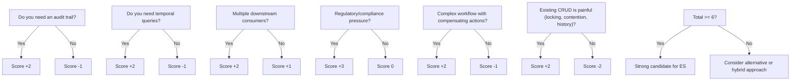
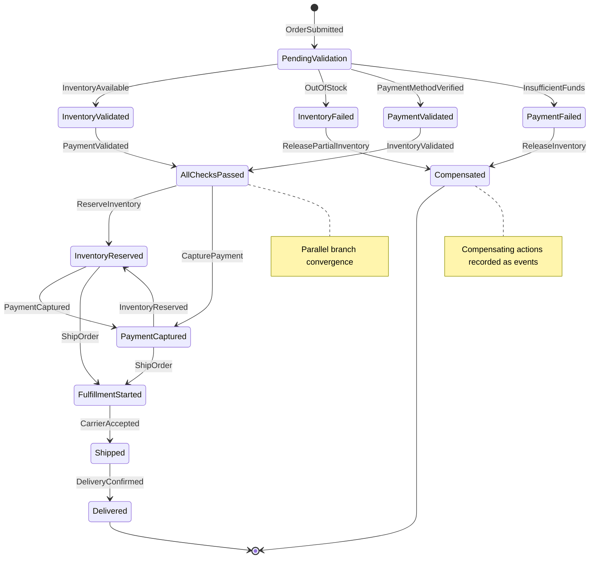
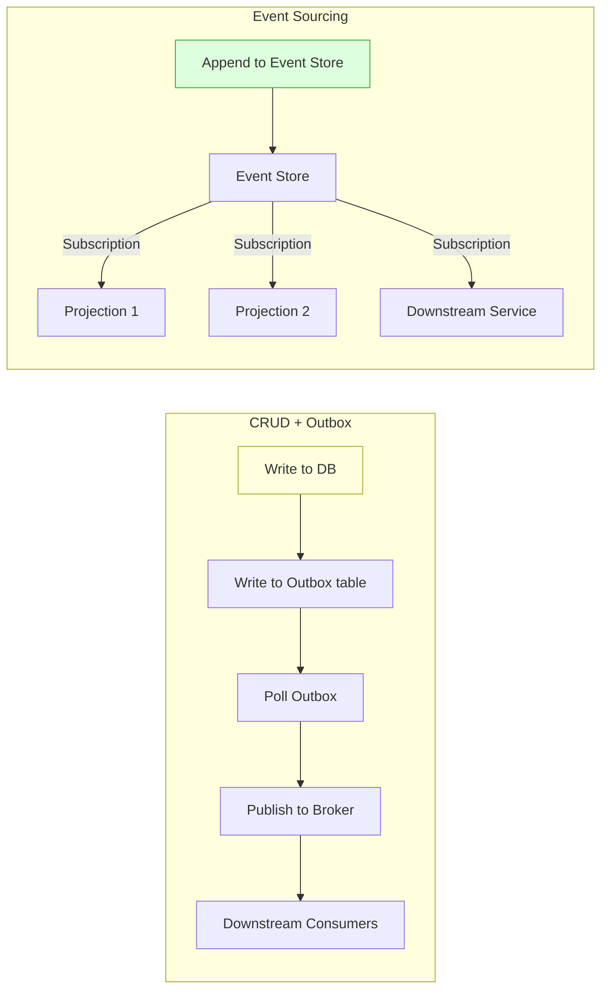
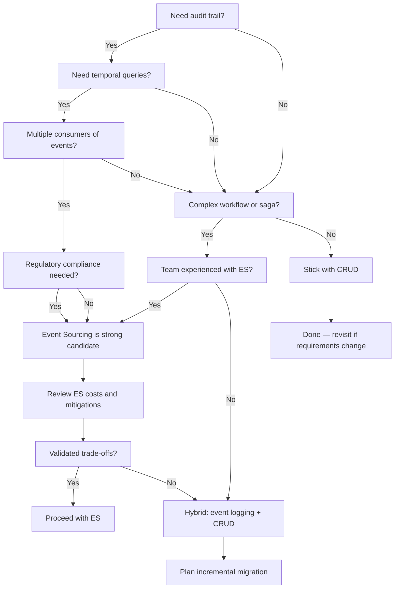
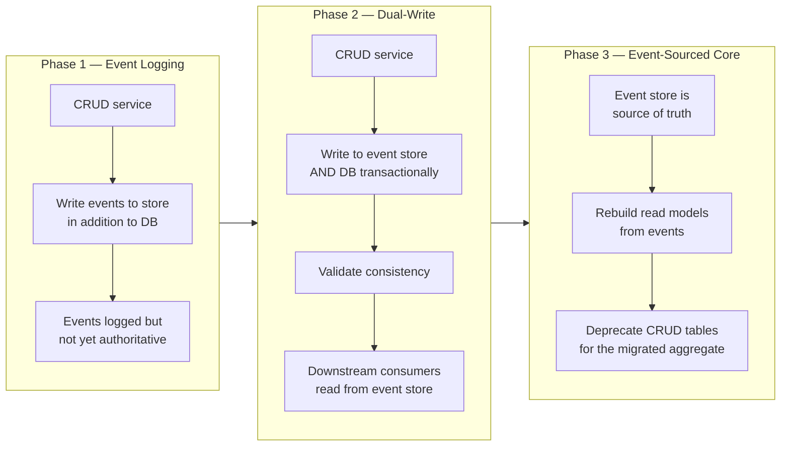

> [!success] Mastery Check
> - [ ] **Studied Well**
> - [ ] **Can explain the concept without notes**
> - [ ] **Can answer interview questions confidently**
> - [ ] **Can implement it in a real project**


# 7.111 — Event Sourcing — When to Use

> **Decision-driven guide:** Understand when Event Sourcing adds genuine architectural value versus when it introduces accidental complexity. This note provides a structured framework, real-world evidence, and concrete code examples to support the build-vs-avoid decision.

---

## YAML Frontmatter

```yaml
---
group: "CQRS and Event Sourcing"
priority: 2
prerequisites:
  - "[[7.101 — Event Sourcing — Events as the Source of Truth]]"
related:
  - "[[7.094 — CQRS — Command Query Responsibility Segregation]]"
  - "[[7.108 — Event Store Patterns and Projections]]"
  - "[[7.112 — Saga Orchestration and Choreography]]"
  - "[[7.118 — CQRS Testing Strategies]]"
tags:
  - event-sourcing
  - architecture-decision
  - cqrs
  - audit-trail
  - temporal-query
  - regulatory-compliance
status: draft
created: 2026-06-14
updated: 2026-06-14
---
```

---

## Table of Contents

1.  [[#1 — Decision Framework — When Event Sourcing Adds Value]]
2.  [[#2 — Audit Trail Requirements — Immutable History as a First-Class Citizen]]
3.  [[#3 — Temporal Queries and Point-in-Time Analysis]]
4.  [[#4 — Complex Event-Driven Workflows]]
5.  [[#5 — Regulatory Compliance and Legal Hold]]
6.  [[#6 — Debugging, Provenance, and Forensic Analysis]]
7.  [[#7 — Event-Driven Integration Patterns]]
8.  [[#8 — Real-World Case Studies]]
9.  [[#9 — When NOT to Use Event Sourcing — Anti-Patterns and Trade-offs]]
10. [[#10 — Adoption Strategy and Incremental Migration]]

---

## 1 — Decision Framework — When Event Sourcing Adds Value

Event Sourcing is not a universal pattern. It solves a specific cluster of problems that share a common characteristic: **the need to preserve, query, and react to the complete history of state transitions**, not just the current state.

### 1.1 The Five-Question Gate

Before adopting Event Sourcing, answer these five questions. A "yes" to three or more is a strong signal.

| # | Question | Implication |
|---|----------|-------------|
| 1 | Do you need a complete, immutable audit trail of every state change? | Event Sourcing provides this by design — no separate audit logging subsystem required. |
| 2 | Must you answer historical queries like "what did the aggregate look like on date X?" | Temporal queries are natural with event-sourced aggregates; CRUD systems require snapshot hacks or change-data-capture. |
| 3 | Do multiple downstream consumers react to the same domain events? | The event store becomes a single, authoritative publication channel; no polling or webhook routing needed. |
| 4 | Is there regulatory or compliance pressure to prove data lineage? | Cryptographic event chaining, append-only storage, and replay verification satisfy auditors with zero additional effort. |
| 5 | Would your team benefit from replaying production event streams in test environments? | Replay-based testing catches bugs that snapshot-based testing misses, especially in complex workflows. |

### 1.2 Architectural Value Map



### 1.3 When the Answer Is "No" — Quick Heuristics

- **CRUD with no history requirement** → use a relational database with optimistic concurrency.
- **High-throughput telemetry / IoT** → use a time-series database; Event Sourcing overhead is not justified.
- **Simple read-heavy dashboards** → use denormalized views refreshed via batch ETL.
- **Team unfamiliar with functional paradigms** → start with event-logging on the side; do not go full ES on day one.

---

## 2 — Audit Trail Requirements — Immutable History as a First-Class Citizen

### 2.1 The Audit Problem in CRUD Systems

In a conventional CRUD system, when an entity is updated, the previous state is overwritten. To recover history, teams bolt on audit tables — which introduces synchronization bugs, schema drift, and often incomplete coverage.

```sql
-- Common but fragile CRUD audit approach
CREATE TABLE OrderHistory (
    Id          INT IDENTITY PRIMARY KEY,
    OrderId     INT          NOT NULL,
    OldStatus   VARCHAR(20),
    NewStatus   VARCHAR(20)  NOT NULL,
    ChangedBy   VARCHAR(100) NOT NULL,
    ChangedAt   DATETIME2    NOT NULL DEFAULT SYSUTCDATETIME(),
    Payload     NVARCHAR(MAX) -- optional JSON snapshot
);

-- Issues:
--   1. Dual-write problem: INSERT INTO OrderHistory + UPDATE Orders must be transactional
--   2. Schema drift: OrderHistory must be updated every time Orders table changes
--   3. No causality tracking: can't tell why a change happened, only what changed
--   4. Audit is read-only after thought: nobody queries it until an incident
```

### 2.2 Event Sourcing Audit by Construction

In Event Sourcing, every state change **is** an event. The event store **is** the audit log. There is no dual-write, no separate schema, and no synchronization gap.

```csharp
// C# 12 / .NET 8 — Event representing a domain state change
public sealed record OrderSubmitted(
    Guid OrderId,
    Guid CustomerId,
    IReadOnlyList<OrderLineItem> Items,
    Money TotalAmount,
    DateTimeOffset SubmittedAt,
    string SubmittedBy,
    string IpAddress,
    string? CorrelationId
) : IDomainEvent;

// The event store record — every event carries its own audit metadata
public sealed record EventStoreRecord
{
    public required Guid      EventId       { get; init; }
    public required string    EventType     { get; init; }
    public required Guid      AggregateId   { get; init; }
    public required string    AggregateType { get; init; }
    public required long      Version       { get; init; }
    public required DateTimeOffset CreatedAt { get; init; }
    public required string    CreatedBy     { get; init; }
    public required string    IpAddress     { get; init; }
    public required string?   CorrelationId { get; init; }
    public required string?   CausationId   { get; init; }
    public required ReadOnlyMemory<byte> Data { get; init; }
    public required ReadOnlyMemory<byte> Metadata { get; init; }

    // Cryptographic chaining — each event links to the previous via hash
    public required string?   PreviousEventHash { get; init; }
    public required string    EventHash         { get; init; }
}
```

### 2.3 Cryptographic Event Chaining

To make the audit trail tamper-evident, each event record includes a hash computed from the previous event's hash and the current event's data.

```csharp
// C# 12 / .NET 8 — Tamper-evident event chaining
using System.Security.Cryptography;
using System.Text;

public static class EventChain
{
    public static string ComputeHash(EventStoreRecord record, string? previousHash)
    {
        // Collect all fields that contribute to the chain
        var data = new StringBuilder();
        data.Append(record.EventId);
        data.Append(record.AggregateId);
        data.Append(record.Version);
        data.Append(record.CreatedAt.Ticks);
        data.Append(Convert.ToHexString(record.Data.Span));
        data.Append(previousHash ?? string.Empty);

        return Convert.ToHexString(
            SHA256.HashData(Encoding.UTF8.GetBytes(data.ToString()))
        );
    }

    public static bool VerifyChain(IReadOnlyList<EventStoreRecord> events)
    {
        string? previous = null;
        foreach (var e in events)
        {
            var expected = ComputeHash(e, previous);
            if (!e.EventHash.Equals(expected, StringComparison.OrdinalIgnoreCase))
                return false; // tamper detected
            previous = e.EventHash;
        }
        return true;
    }
}
```

### 2.4 Audit Trail Query — Full History of an Aggregate

```csharp
// C# 12 / .NET 8 — Querying the full audit trail for a specific aggregate
public interface IAuditTrailQuery
{
    Task<IReadOnlyList<EventStoreRecord>> GetAggregateHistoryAsync(
        Guid aggregateId,
        CancellationToken ct);

    Task<IReadOnlyList<EventStoreRecord>> GetByUserAsync(
        string userId,
        DateTimeOffset from,
        DateTimeOffset to,
        CancellationToken ct);

    Task<IReadOnlyList<EventStoreRecord>> GetByCorrelationIdAsync(
        string correlationId,
        CancellationToken ct);
}

public sealed class AuditTrailQuery : IAuditTrailQuery
{
    private readonly IEventStore _eventStore;

    public AuditTrailQuery(IEventStore eventStore)
    {
        _eventStore = eventStore;
    }

    public async Task<IReadOnlyList<EventStoreRecord>> GetAggregateHistoryAsync(
        Guid aggregateId, CancellationToken ct)
    {
        var events = await _eventStore.ReadStreamAsync(
            aggregateId, StreamDirection.Forward, StreamPosition.Start, ct);

        // Verify chain integrity before returning
        var records = events.ToList();
        if (!EventChain.VerifyChain(records))
            throw new InvalidOperationException(
                $"Audit trail integrity violation for aggregate {aggregateId}");

        return records.AsReadOnly();
    }

    public async Task<IReadOnlyList<EventStoreRecord>> GetByUserAsync(
        string userId, DateTimeOffset from, DateTimeOffset to, CancellationToken ct)
    {
        return await _eventStore.QueryByMetadataAsync(
            ("createdBy", userId),
            from, to, ct);
    }

    public async Task<IReadOnlyList<EventStoreRecord>> GetByCorrelationIdAsync(
        string correlationId, CancellationToken ct)
    {
        return await _eventStore.QueryByMetadataAsync(
            ("correlationId", correlationId),
            DateTimeOffset.MinValue, DateTimeOffset.MaxValue, ct);
    }
}
```

### 2.5 Audit-First Design Checklist

| Requirement | CRUD Approach | Event Sourcing Approach |
|-------------|---------------|------------------------|
| Who changed what and when? | Separate audit table with dual-write risk | Every event is self-describing audit record |
| What was the previous state? | Snapshot or change-data-capture | Fold left over event stream |
| Why was the change made? | Requires additional columns / comments | Events carry causation and correlation IDs |
| Is the history tamper-proof? | Database permissions only | Cryptographic chain + append-only store |
| Can we rollback to a point? | Restore from backup (coarse) | Replay events up to desired version |
| Who queried the audit trail? | Nobody until incident — it's an afterthought | First-class query interface |

---

## 3 — Temporal Queries and Point-in-Time Analysis

### 3.1 The Temporal Query Problem

Temporal queries ask: **"What was the state of the system at a specific point in time?"** This is notoriously difficult in CRUD systems because they store only the current state. Common workarounds include:

- **Snapshot tables** — periodic snapshots; lose intermediate state and have stale data.
- **Slowly Changing Dimensions (SCD Type 2)** — complex schema, expensive joins, hard to query.
- **Change Data Capture (CDC)** — requires an external pipeline; introduces latency.
- **Bi-temporal tables** — powerful but few ORMs support them; steep learning curve.

Event Sourcing solves this elegantly: the event stream from `t0` to `tn` contains every state transition. To answer a temporal query, replay events up to the desired timestamp.

### 3.2 Temporal Query Implementation

```csharp
// C# 12 / .NET 8 — Temporal query over event-sourced aggregate
public sealed class TemporalOrderReader
{
    private readonly IEventStore _eventStore;

    public TemporalOrderReader(IEventStore eventStore)
    {
        _eventStore = eventStore;
    }

    /// <summary>
    /// Returns the state of an order as it was at the given point in time.
    /// </summary>
    public async Task<OrderState?> GetOrderAtAsync(
        Guid orderId, DateTimeOffset pointInTime, CancellationToken ct)
    {
        // Read all events for this aggregate
        var events = await _eventStore.ReadStreamAsync(
            orderId, StreamDirection.Forward, StreamPosition.Start, ct);

        // Fold left — apply events that occurred before or at the point in time
        var order = new OrderState();
        foreach (var record in events)
        {
            if (record.CreatedAt > pointInTime)
                break; // remaining events are in the future

            var domainEvent = DeserializeEvent(record);
            order.Apply(domainEvent);
        }

        // If no events occurred before the point in time, the order didn't exist yet
        return order.Version > 0 ? order : null;
    }

    private static IDomainEvent DeserializeEvent(EventStoreRecord record)
    {
        // Deserialize based on EventType + serializer of choice (System.Text.Json, etc.)
        return EventSerializer.Deserialize(record.EventType, record.Data.Span);
    }
}

// Example — query an order as it appeared at the end of the business day
// var snapshot = await reader.GetOrderAtAsync(orderId, new DateTimeOffset(2026, 6, 14, 17, 0, 0, TimeSpan.Zero));
```

### 3.3 Temporal Query Patterns

| Pattern | Description | Use Case |
|---------|-------------|----------|
| **As-of query** | State at a specific timestamp | "What did the customer see at checkout?" |
| **Interval delta** | Difference between two points | "What changed between last week and today?" |
| **Event count / rate** | Number of state transitions over time | "How many times was this order modified?" |
| **Sankey / state transition matrix** | All paths an aggregate took | "Which order status paths are most common?" |
| **Snapshot reconstruction** | Build a read model at a historical point | "Re-run the end-of-day report for June 1" |

### 3.4 Performance Optimization — Snapshot Strategy

Replaying the entire stream for every temporal query is expensive for long-lived aggregates. Use snapshots.

```csharp
// C# 12 / .NET 8 — Snapshot strategy for temporal queries
public sealed class SnapshotStrategy
{
    private readonly IEventStore _eventStore;
    private readonly ISnapshotStore _snapshotStore;
    private readonly int _snapshotInterval;

    public SnapshotStrategy(
        IEventStore eventStore,
        ISnapshotStore snapshotStore,
        int snapshotInterval = 100)
    {
        _eventStore = eventStore;
        _snapshotStore = snapshotStore;
        _snapshotInterval = snapshotInterval;
    }

    public async Task<TSnapshot?> GetSnapshotAtAsync<TSnapshot>(
        Guid aggregateId, long version) where TSnapshot : class
    {
        // Try to load the nearest snapshot at or before the target version
        var snapshot = await _snapshotStore.GetNearestBeforeAsync(
            aggregateId, version);

        if (snapshot is null)
            return null; // replay from start

        // Replay only the events that occurred after the snapshot
        var events = await _eventStore.ReadStreamAsync(
            aggregateId,
            StreamDirection.Forward,
            new StreamPosition(snapshot.Version + 1),
            CancellationToken.None);

        // Apply remaining events to reach the target version
        var state = snapshot.State;
        foreach (var record in events)
        {
            if (record.Version > version)
                break;
            ApplyEvent(state, DeserializeEvent(record));
        }

        return state as TSnapshot;
    }

    private static void ApplyEvent(object state, IDomainEvent domainEvent)
    {
        // Dynamic dispatch via pattern matching
        ((dynamic)state).Apply((dynamic)domainEvent);
    }
}
```

### 3.5 Temporal Query Use Cases in Practice

- **Customer support:** "Show me exactly what the customer saw when they submitted the request."
- **Billing audits:** "What was the subscription state on the invoice date?"
- **Compliance:** "Prove that user consent was recorded before data processing on date X."
- **Data corrections:** "Reverse-engineer what went wrong by replaying events around the incident time."
- **Machine learning feature engineering:** "Extract state features at arbitrary historical points without a complex ETL pipeline."

---

## 4 — Complex Event-Driven Workflows

### 4.1 Workflow Complexity Spectrum

```
Simple (CRUD ok)         Moderate (ES helps)         Complex (ES strongly recommended)
     |                          |                              |
     v                          v                              v
 Single status               Multi-step                    Sagas with
 update                      approval flow                 compensating
                             with routing                  actions + timeouts
                                                           + parallel branches
```

Event Sourcing excels in complex workflows because:

1. **Every step produces an event** — the workflow state machine is derived from the event log.
2. **Failures are events too** — timeouts, rejections, and compensations are recorded, not lost.
3. **Workflow can be paused and resumed** — no persistence of temporary state; replay the event stream.
4. **Parallel branches converge naturally** — the event store serialises concurrent branch completions.
5. **Visibility is complete** — operators see exactly where each workflow instance is and what happened.

### 4.2 Event-Sourced Order Fulfillment Workflow

```csharp
// C# 12 / .NET 8 — Event-sourced workflow for order fulfillment
public sealed class OrderFulfillmentWorkflow
{
    private readonly IEventStore _eventStore;
    private readonly ICommandBus _commandBus;

    public OrderFulfillmentWorkflow(IEventStore eventStore, ICommandBus commandBus)
    {
        _eventStore = eventStore;
        _commandBus = commandBus;
    }

    public async Task<Guid> StartAsync(SubmitOrder command, CancellationToken ct)
    {
        var workflowId = Guid.NewGuid();

        // Record workflow start
        await _eventStore.AppendAsync(
            aggregateId: workflowId,
            expectedVersion: 0,
            events: new IDomainEvent[]
            {
                new WorkflowStarted(
                    workflowId,
                    command.OrderId,
                    command.CustomerId,
                    command.Items,
                    DateTimeOffset.UtcNow)
            }, ct);

        // Kick off parallel validation steps
        await _commandBus.SendAsync(
            new ValidateInventory(command.OrderId, workflowId, command.Items), ct);
        await _commandBus.SendAsync(
            new ValidatePayment(command.OrderId, workflowId, command.CustomerId), ct);

        return workflowId;
    }

    public async Task HandleInventoryValidatedAsync(
        InventoryValidated evt, CancellationToken ct)
    {
        var workflow = await LoadWorkflowAsync(evt.WorkflowId, ct);
        workflow.Apply(evt);

        if (workflow.IsReadyForFulfillment)
        {
            await _eventStore.AppendAsync(
                evt.WorkflowId, workflow.Version,
                new[] { new AllChecksPassed(evt.WorkflowId, evt.OrderId, DateTimeOffset.UtcNow) },
                ct);

            await _commandBus.SendAsync(
                new ReserveInventory(evt.OrderId, workflow.Items), ct);
            await _commandBus.SendAsync(
                new CapturePayment(evt.OrderId, workflow.TotalAmount), ct);
        }
    }

    public async Task HandlePaymentFailedAsync(
        PaymentFailed evt, CancellationToken ct)
    {
        // Compensate — cancel inventory reservation
        await _commandBus.SendAsync(
            new ReleaseInventory(evt.OrderId, evt.Reason), ct);

        await _eventStore.AppendAsync(
            evt.WorkflowId, await GetCurrentVersion(evt.WorkflowId, ct),
            new[]
            {
                new WorkflowCompensated(
                    evt.WorkflowId,
                    evt.OrderId,
                    "PaymentFailed",
                    evt.Reason,
                    DateTimeOffset.UtcNow)
            }, ct);
    }

    // Load and fold events to reconstruct current workflow state
    private async Task<WorkflowState> LoadWorkflowAsync(
        Guid workflowId, CancellationToken ct)
    {
        var events = await _eventStore.ReadStreamAsync(
            workflowId, StreamDirection.Forward, StreamPosition.Start, ct);

        var state = new WorkflowState();
        foreach (var record in events)
        {
            var domainEvent = EventSerializer.Deserialize(record.EventType, record.Data.Span);
            state.Apply(domainEvent);
        }
        return state;
    }

    private async Task<long> GetCurrentVersion(Guid aggregateId, CancellationToken ct)
    {
        var events = await _eventStore.ReadStreamAsync(
            aggregateId, StreamDirection.Backward, StreamPosition.End, ct);
        return events.FirstOrDefault()?.Version ?? 0;
    }
}
```

### 4.3 Workflow Visibility Dashboard Query

```csharp
// C# 12 / .NET 8 — Query workflow state for operations dashboard
public sealed class WorkflowDashboardQuery
{
    private readonly IEventStore _eventStore;

    public WorkflowDashboardQuery(IEventStore eventStore)
    {
        _eventStore = eventStore;
    }

    public async Task<WorkflowDashboardDto> GetDashboardAsync(
        Guid workflowId, CancellationToken ct)
    {
        var events = await _eventStore.ReadStreamAsync(
            workflowId, StreamDirection.Forward, StreamPosition.Start, ct);

        var state = new WorkflowState();
        var timeline = new List<WorkflowEventDto>();

        foreach (var record in events)
        {
            var domainEvent = EventSerializer.Deserialize(record.EventType, record.Data.Span);
            state.Apply(domainEvent);

            timeline.Add(new WorkflowEventDto
            {
                EventType = record.EventType,
                Timestamp = record.CreatedAt,
                Version = record.Version,
                CorrelationId = record.CorrelationId,
                Duration = timeline.Count > 0
                    ? (record.CreatedAt - timeline[^1].Timestamp)
                    : TimeSpan.Zero
            });
        }

        return new WorkflowDashboardDto
        {
            WorkflowId = workflowId,
            Status = state.CurrentStatus,
            StartedAt = timeline.FirstOrDefault()?.Timestamp,
            LastUpdated = timeline.LastOrDefault()?.Timestamp,
            Elapsed = timeline.Count > 0
                ? (timeline[^1].Timestamp - timeline[0].Timestamp)
                : TimeSpan.Zero,
            StepCount = timeline.Count,
            Steps = timeline.AsReadOnly(),
            IsStuck = IsWorkflowStuck(state, timeline)
        };
    }

    private static bool IsWorkflowStuck(WorkflowState state, List<WorkflowEventDto> timeline)
    {
        // Heuristic: workflow is stuck if it's in a pending state with no events in 30 minutes
        if (!state.IsTerminal && timeline.Count > 0)
        {
            var lastEvent = timeline[^1];
            return (DateTimeOffset.UtcNow - lastEvent.Timestamp) > TimeSpan.FromMinutes(30);
        }
        return false;
    }
}

public sealed record WorkflowDashboardDto
{
    public required Guid WorkflowId { get; init; }
    public required string Status { get; init; }
    public DateTimeOffset? StartedAt { get; init; }
    public DateTimeOffset? LastUpdated { get; init; }
    public TimeSpan Elapsed { get; init; }
    public int StepCount { get; init; }
    public required IReadOnlyList<WorkflowEventDto> Steps { get; init; }
    public bool IsStuck { get; init; }
}

public sealed record WorkflowEventDto
{
    public required string EventType { get; init; }
    public required DateTimeOffset Timestamp { get; init; }
    public required long Version { get; init; }
    public string? CorrelationId { get; init; }
    public TimeSpan Duration { get; init; }
}
```

### 4.4 Workflow State Machine Diagram



---

## 5 — Regulatory Compliance and Legal Hold

### 5.1 Compliance Landscape

Event Sourcing directly addresses requirements from major regulatory frameworks:

| Regulation | Requirement | How Event Sourcing Satisfies It |
|------------|-------------|--------------------------------|
| **GDPR Art. 5(1)(e)** | Data minimisation + storage limitation | Events can be anonymised or deleted at the storage level; temporal queries respect retention windows |
| **GDPR Art. 15–20** | Right of access, rectification, portability | Full history available; rectification is a correcting event, not a mutation; export via event projection |
| **SOX §302 / §404** | Internal controls over financial reporting | Immutable audit trail; replay verifies financial calculations |
| **HIPAA §164.312** | Audit controls for protected health information | Every access and modification is an event; access patterns queryable |
| **PCI DSS Req. 10** | Track and monitor network access | All events carry identity, timestamp, and causation; chain integrity |
| **MiFID II Art. 16(6)** | Record-keeping of all transactions | Complete order lifecycle as events; replay for regulatory review |
| **CCPA (California)** | Right to know / delete | Events enable precise history; deletion = event that marks data as deleted |

### 5.2 GDPR Right to Erasure — Compliant Deletion

With Event Sourcing, deletion is not a physical removal of data (which would break the event chain). Instead, you append a deletion event and anonymize the stream.

```csharp
// C# 12 / .NET 8 — GDPR-compliant deletion in Event Sourcing
public sealed class GdprComplianceService
{
    private readonly IEventStore _eventStore;
    private readonly IAnonymizationEngine _anonymizer;

    public GdprComplianceService(
        IEventStore eventStore,
        IAnonymizationEngine anonymizer)
    {
        _eventStore = eventStore;
        _anonymizer = anonymizer;
    }

    /// <summary>
    /// Execute GDPR right to erasure — append deletion event and anonymize PII.
    /// The event chain remains intact; PII is replaced with irreversible hashes.
    /// </summary>
    public async Task EraseUserDataAsync(
        Guid userId, string requestedBy, CancellationToken ct)
    {
        // 1. Record the erasure request as an event
        await _eventStore.AppendAsync(
            aggregateId: userId,
            expectedVersion: await GetCurrentVersion(userId, ct),
            events: new IDomainEvent[]
            {
                new PersonalDataErasureRequested(
                    userId,
                    requestedBy,
                    DateTimeOffset.UtcNow,
                    CorrelationContext.Current?.CorrelationId)
            }, ct);

        // 2. Anonymize historical events that contain PII
        //    (this is a background operation for large streams)
        await _anonymizer.AnonymizeStreamAsync(userId, ct);

        // 3. Record completion
        await _eventStore.AppendAsync(
            aggregateId: userId,
            expectedVersion: await GetCurrentVersion(userId, ct),
            events: new IDomainEvent[]
            {
                new PersonalDataErasureCompleted(
                    userId,
                    DateTimeOffset.UtcNow)
            }, ct);
    }

    /// <summary>
    /// GDPR right of access — export all data for a user.
    /// </summary>
    public async Task<GdprExportDto> ExportUserDataAsync(
        Guid userId, CancellationToken ct)
    {
        var events = await _eventStore.ReadStreamAsync(
            userId, StreamDirection.Forward, StreamPosition.Start, ct);

        var export = new GdprExportDto
        {
            UserId = userId,
            ExportDate = DateTimeOffset.UtcNow,
            Events = events.Select(record => new GdprEventDto
            {
                EventType = record.EventType,
                Timestamp = record.CreatedAt,
                Data = record.Data.ToArray()
            }).ToList().AsReadOnly()
        };

        return export;
    }

    private async Task<long> GetCurrentVersion(Guid userId, CancellationToken ct)
    {
        var events = await _eventStore.ReadStreamAsync(
            userId, StreamDirection.Backward, StreamPosition.End, ct);
        return events.FirstOrDefault()?.Version ?? 0;
    }
}
```

### 5.3 Legal Hold — Preserving Evidence

When litigation is reasonably anticipated, a **legal hold** preserves all relevant data. In Event Sourcing, this is natural: the event store is append-only, so nothing is physically deleted. The legal hold is enforced at the **projection level** — read models marked for hold are not rebuilt past the hold date.

```csharp
// C# 12 / .NET 8 — Legal hold manager
public sealed class LegalHoldManager
{
    private readonly IEventStore _eventStore;
    private readonly ILegalHoldStore _holdStore;

    public LegalHoldManager(
        IEventStore eventStore,
        ILegalHoldStore holdStore)
    {
        _eventStore = eventStore;
        _holdStore = holdStore;
    }

    public async Task<LegalHold> IssueHoldAsync(
        Guid aggregateId,
        string reason,
        string issuedBy,
        DateTimeOffset holdFrom,
        DateTimeOffset? holdTo,
        CancellationToken ct)
    {
        var hold = new LegalHold
        {
            HoldId = Guid.NewGuid(),
            AggregateId = aggregateId,
            Reason = reason,
            IssuedBy = issuedBy,
            IssuedAt = DateTimeOffset.UtcNow,
            HoldFrom = holdFrom,
            HoldTo = holdTo
        };

        await _holdStore.SaveAsync(hold, ct);

        // Append legal hold event to the aggregate stream
        await _eventStore.AppendAsync(
            aggregateId,
            expectedVersion: await GetCurrentVersion(aggregateId, ct),
            events: new IDomainEvent[]
            {
                new LegalHoldApplied(
                    aggregateId,
                    hold.HoldId,
                    reason,
                    holdFrom,
                    holdTo,
                    DateTimeOffset.UtcNow)
            }, ct);

        return hold;
    }

    public async Task<bool> VerifyHoldComplianceAsync(
        Guid aggregateId, CancellationToken ct)
    {
        // Verify that events within the hold window are intact
        var events = await _eventStore.ReadStreamAsync(
            aggregateId, StreamDirection.Forward, StreamPosition.Start, ct);

        var holds = await _holdStore.GetHoldForAggregateAsync(aggregateId, ct);
        if (holds.Count == 0)
            return true; // no active hold

        // Check chain integrity for events within hold windows
        foreach (var hold in holds)
        {
            var relevantEvents = events
                .Where(e => e.CreatedAt >= hold.HoldFrom
                         && (hold.HoldTo is null || e.CreatedAt <= hold.HoldTo))
                .ToList();

            if (!EventChain.VerifyChain(relevantEvents))
                return false;
        }

        return true;
    }

    private static async Task<long> GetCurrentVersion(Guid aggregateId, CancellationToken ct)
    {
        // Read last event version from store
        await Task.CompletedTask; // placeholder
        return 0;
    }
}
```

### 5.4 Compliance Checklist

| Compliance Activity | Event Sourcing Support |
|-------------------|----------------------|
| Audit trail generation | Built-in — every event is a record |
| Data lineage tracing | Full lineage via event stream + causation IDs |
| Point-in-time reconstruction | Temporal query of event stream |
| Data retention enforcement | Anonymization events + retention projections |
| Legal hold preservation | Append-only store; hold metadata on events |
| Regulatory reporting | Project events into report schema at any time |
| Forensic investigation | Full history + cryptographic chain verification |
| Cross-jurisdiction data handling | Event metadata for region/country of origin |

---

## 6 — Debugging, Provenance, and Forensic Analysis

### 6.1 The Debugging Superpower

Event Sourcing transforms debugging. Instead of asking "what is the current state and how do I reproduce it?", you ask **"what sequence of events led to this state?"** This is a fundamentally more powerful debugging model.

```csharp
// C# 12 / .NET 8 — Forensic analysis tool
public sealed class ForensicAnalyzer
{
    private readonly IEventStore _eventStore;

    public ForensicAnalyzer(IEventStore eventStore)
    {
        _eventStore = eventStore;
    }

    /// <summary>
    /// Reconstruct the exact sequence of events that produced a given state.
    /// Useful for bug reproduction, root cause analysis, and "how did we get here?"
    /// </summary>
    public async Task<ForensicReport> AnalyzeAsync(
        Guid aggregateId, CancellationToken ct)
    {
        var events = await _eventStore.ReadStreamAsync(
            aggregateId, StreamDirection.Forward, StreamPosition.Start, ct);

        var records = events.ToList();
        var timeline = new List<ForensicEventDto>();

        foreach (var record in records)
        {
            var domainEvent = EventSerializer.Deserialize(record.EventType, record.Data.Span);
            var metadata = EventSerializer.DeserializeMetadata(record.Metadata.Span);

            timeline.Add(new ForensicEventDto
            {
                Version = record.Version,
                EventType = record.EventType,
                Timestamp = record.CreatedAt,
                CreatedBy = record.CreatedBy,
                IpAddress = record.IpAddress,
                CorrelationId = record.CorrelationId,
                CausationId = record.CausationId,
                PreviousHash = record.PreviousEventHash,
                CurrentHash = record.EventHash,
                AdditionalMetadata = metadata
            });
        }

        var chainValid = EventChain.VerifyChain(records);

        return new ForensicReport
        {
            AggregateId = aggregateId,
            TotalEvents = records.Count,
            TimeSpan = records.Count > 0
                ? (records[^1].CreatedAt - records[0].CreatedAt)
                : TimeSpan.Zero,
            ChainIntegrity = chainValid,
            Events = timeline.AsReadOnly(),
            SuspiciousActivity = DetectSuspiciousActivity(timeline)
        };
    }

    private static IReadOnlyList<SuspiciousActivityDto> DetectSuspiciousActivity(
        List<ForensicEventDto> timeline)
    {
        var suspicious = new List<SuspiciousActivityDto>();

        // 1. Detect rapid successive events from different IPs
        var byTimeWindows = timeline
            .GroupBy(e => e.Timestamp.Ticks / TimeSpan.TicksPerMinute)
            .Where(g => g.Select(e => e.IpAddress).Distinct().Count() > 3);

        foreach (var window in byTimeWindows)
        {
            suspicious.Add(new SuspiciousActivityDto
            {
                Type = "RapidMultiIpAccess",
                Severity = "Medium",
                Description = $"Multiple IPs accessed aggregate within 1-minute window " +
                             $"({string.Join(", ", window.Select(e => e.IpAddress).Distinct())})",
                WindowStart = window.Min(e => e.Timestamp),
                WindowEnd = window.Max(e => e.Timestamp),
                EventCount = window.Count()
            });
        }

        // 2. Detect events outside normal business hours
        foreach (var evt in timeline)
        {
            var localHour = evt.Timestamp.ToLocalTime().Hour;
            if (localHour is >= 0 and < 6)
            {
                suspicious.Add(new SuspiciousActivityDto
                {
                    Type = "OffHoursAccess",
                    Severity = "Low",
                    Description = $"Event {evt.EventType} created at {evt.Timestamp.ToLocalTime():HH:mm} by {evt.CreatedBy}",
                    WindowStart = evt.Timestamp,
                    WindowEnd = evt.Timestamp,
                    EventCount = 1
                });
            }
        }

        return suspicious.AsReadOnly();
    }
}

public sealed record ForensicReport
{
    public required Guid AggregateId { get; init; }
    public int TotalEvents { get; init; }
    public TimeSpan TimeSpan { get; init; }
    public bool ChainIntegrity { get; init; }
    public required IReadOnlyList<ForensicEventDto> Events { get; init; }
    public required IReadOnlyList<SuspiciousActivityDto> SuspiciousActivity { get; init; }
}

public sealed record ForensicEventDto
{
    public required long Version { get; init; }
    public required string EventType { get; init; }
    public required DateTimeOffset Timestamp { get; init; }
    public required string CreatedBy { get; init; }
    public string? IpAddress { get; init; }
    public string? CorrelationId { get; init; }
    public string? CausationId { get; init; }
    public string? PreviousHash { get; init; }
    public string? CurrentHash { get; init; }
    public required IReadOnlyDictionary<string, string> AdditionalMetadata { get; init; }
}

public sealed record SuspiciousActivityDto
{
    public required string Type { get; init; }
    public required string Severity { get; init; }
    public required string Description { get; init; }
    public required DateTimeOffset WindowStart { get; init; }
    public required DateTimeOffset WindowEnd { get; init; }
    public required int EventCount { get; init; }
}
```

### 6.2 Provenance — Where Did This Data Come From?

Every event carries:
- **Correlation ID** — traces the entire business transaction across service boundaries.
- **Causation ID** — identifies which event caused this event (parent event ID).
- **Identity** — who or what initiated the event (user, system integration, scheduled job).
- **Origin** — IP address, service name, or node ID.

This forms a **provenance graph** — a directed acyclic graph of event causation:

```
UserAction[OrderSubmitted] ──causes──> ValidateInventory
                                          │
                                          ├──causes──> InventoryReserved
                                          │                │
                                          │                └──causes──> ShipOrder
                                          │
                                          └──causes──> PaymentCaptured
                                                           │
                                                           └──causes──> ShipOrder
```

### 6.3 Debugging Workflow — Production Replay

```csharp
// C# 12 / .NET 8 — Replicate a production issue in test
public sealed class ProductionReplayDebugger
{
    private readonly IEventStore _eventStore;

    public ProductionReplayDebugger(IEventStore eventStore)
    {
        _eventStore = eventStore;
    }

    /// <summary>
    /// Export events from production for a specific aggregate, then replay
    /// against a local test instance to reproduce the bug.
    /// </summary>
    public async Task<ReplayResult> ReplayForDebugAsync(
        Guid aggregateId,
        AggregateReplayHandler replayHandler,
        CancellationToken ct)
    {
        var originalEvents = await _eventStore.ReadStreamAsync(
            aggregateId, StreamDirection.Forward, StreamPosition.Start, ct);

        var snapshot = replayHandler.CreateInitialState();
        var replayedEvents = new List<IDomainEvent>();

        foreach (var record in originalEvents)
        {
            var domainEvent = EventSerializer.Deserialize(record.EventType, record.Data.Span);
            replayHandler.Apply(snapshot, domainEvent);
            replayedEvents.Add(domainEvent);

            // Invariant check after each event
            var invariantViolation = replayHandler.CheckInvariants(snapshot);
            if (invariantViolation is not null)
            {
                return new ReplayResult
                {
                    Success = false,
                    AggregateId = aggregateId,
                    FailedAtVersion = record.Version,
                    FailedEventType = record.EventType,
                    InvariantViolation = invariantViolation,
                    ReplayedEvents = replayedEvents.AsReadOnly(),
                    StateAtFailure = snapshot
                };
            }
        }

        return new ReplayResult
        {
            Success = true,
            AggregateId = aggregateId,
            ReplayedEvents = replayedEvents.AsReadOnly(),
            FinalState = snapshot
        };
    }
}

public sealed record ReplayResult
{
    public required bool Success { get; init; }
    public required Guid AggregateId { get; init; }
    public long FailedAtVersion { get; init; }
    public string? FailedEventType { get; init; }
    public string? InvariantViolation { get; init; }
    public required IReadOnlyList<IDomainEvent> ReplayedEvents { get; init; }
    public object? StateAtFailure { get; init; }
    public object? FinalState { get; init; }
}

public abstract class AggregateReplayHandler
{
    public abstract object CreateInitialState();
    public abstract void Apply(object state, IDomainEvent domainEvent);
    public abstract string? CheckInvariants(object state);
}
```

---

## 7 — Event-Driven Integration Patterns

### 7.1 Integration Challenge

Modern systems integrate across bounded contexts via events. Event Sourcing provides **reliable event publication** without the dual-write problem (write to DB + emit to message broker) that plagues CRUD-based eventing.

### 7.2 Transactional Outbox vs. Event Store Publication



In the CRUD + Outbox approach, the database and message broker must stay synchronized. The outbox pattern solves this but adds complexity: polling, idempotent processing, and eventual consistency management.

In Event Sourcing, **appending events IS publishing**. The event store acts as the authoritative record AND the publication channel. Subscribers receive events directly from the store.

### 7.3 Event Store Integration — Subscriber

```csharp
// C# 12 / .NET 8 — Event store subscriber for integration
public sealed class EventStoreIntegrationSubscriber
{
    private readonly IEventStore _eventStore;
    private readonly IMessageBroker _broker;
    private readonly ILogger _logger;
    private readonly HashSet<string> _routedEventTypes;

    public EventStoreIntegrationSubscriber(
        IEventStore eventStore,
        IMessageBroker broker,
        ILogger logger)
    {
        _eventStore = eventStore;
        _broker = broker;
        _logger = logger;
        _routedEventTypes = new HashSet<string>
        {
            "OrderSubmitted",
            "PaymentCaptured",
            "InventoryReserved",
            "OrderShipped",
            "OrderDelivered",
            "OrderCancelled"
        };
    }

    public async Task StartAsync(CancellationToken ct)
    {
        // Subscribe to the event store's global event feed
        await foreach (var batch in _eventStore.SubscribeToAllAsync(
            subscriptionFilter: record => _routedEventTypes.Contains(record.EventType),
            ct: ct))
        {
            foreach (var record in batch)
            {
                try
                {
                    var integrationEvent = MapToIntegrationEvent(record);
                    await _broker.PublishAsync(
                        integrationEvent.RoutingKey,
                        integrationEvent,
                        ct);
                }
                catch (Exception ex)
                {
                    _logger.LogError(ex,
                        "Failed to publish event {EventType} for aggregate {AggregateId}",
                        record.EventType, record.AggregateId);

                    // Dead-letter queue for manual retry
                    await _broker.PublishDeadLetterAsync(
                        record.EventType,
                        record,
                        ex.Message,
                        ct);
                }
            }
        }
    }

    private static IntegrationEvent MapToIntegrationEvent(EventStoreRecord record)
    {
        var domainEvent = EventSerializer.Deserialize(record.EventType, record.Data.Span);

        return new IntegrationEvent
        {
            EventId = record.EventId,
            EventType = record.EventType,
            AggregateId = record.AggregateId,
            CorrelationId = record.CorrelationId,
            CausationId = record.CausationId,
            OccurredAt = record.CreatedAt,
            RoutingKey = ToRoutingKey(record.EventType),
            Payload = record.Data.ToArray()
        };
    }

    private static string ToRoutingKey(string eventType) => eventType switch
    {
        "OrderSubmitted"    => "order.created",
        "PaymentCaptured"   => "payment.completed",
        "InventoryReserved" => "inventory.reserved",
        "OrderShipped"      => "order.shipped",
        "OrderDelivered"    => "order.delivered",
        "OrderCancelled"    => "order.cancelled",
        _                   => $"event.{eventType.ToLowerInvariant()}"
    };
}

public sealed record IntegrationEvent
{
    public required Guid EventId { get; init; }
    public required string EventType { get; init; }
    public required Guid AggregateId { get; init; }
    public string? CorrelationId { get; init; }
    public string? CausationId { get; init; }
    public required DateTimeOffset OccurredAt { get; init; }
    public required string RoutingKey { get; init; }
    public required byte[] Payload { get; init; }
}
```

### 7.4 Integration Patterns Summary

| Pattern | CRUD Approach | Event Sourcing Approach | Advantage |
|---------|---------------|------------------------|-----------|
| **Transactional Outbox** | Write to DB + outbox table; poll and publish | Append to event store; subscribers read from store | No dual-write; no polling; atomic by design |
| **Change Data Capture (CDC)** | Read DB transaction log; transform and publish | Event store subscription; events already serialized | No log parsing; events are domain-meaningful |
| **Webhook / Callback** | Register URL; call on state change | Register subscription on event store; receive event | Event store guarantees delivery ordering |
| **Event Carried State Transfer** | Poll for state snapshots | Subscribe to event stream; build local projection | Real-time updates; fine-grained transitions |
| **Saga / Choreography** | Manual compensating transaction tracking | Events ARE the compensation log | Always have a complete failure record |
| **CQRS Read Model** | Sync read DB via CDC or batch | Event-sourced projection handler | Exactly-once semantics; no dual-write |

### 7.5 Exactly-Once Delivery via Event Store

A critical integration requirement is ensuring **exactly-once delivery** semantics. Event Sourcing provides this at the subscriber level through idempotent event handling using the event ID:

```csharp
// C# 12 / .NET 8 — Idempotent event processing
public sealed class IdempotentEventHandler
{
    private readonly IProcessedEventTracker _tracker;
    private readonly IDomainEventHandler _innerHandler;

    public IdempotentEventHandler(
        IProcessedEventTracker tracker,
        IDomainEventHandler innerHandler)
    {
        _tracker = tracker;
        _innerHandler = innerHandler;
    }

    public async Task HandleAsync(EventStoreRecord record, CancellationToken ct)
    {
        // Check if we've already processed this event
        if (await _tracker.IsProcessedAsync(record.EventId, ct))
        {
            return; // skip — already handled
        }

        // Process the event
        await _innerHandler.HandleAsync(record, ct);

        // Mark as processed (commit point)
        await _tracker.MarkProcessedAsync(record.EventId, ct);
    }
}

public interface IProcessedEventTracker
{
    Task<bool> IsProcessedAsync(Guid eventId, CancellationToken ct);
    Task MarkProcessedAsync(Guid eventId, CancellationToken ct);
}

// Implementation using PostgreSQL or SQL Server
public sealed class ProcessedEventTracker : IProcessedEventTracker
{
    private readonly IDbConnection _db;

    public ProcessedEventTracker(IDbConnection db)
    {
        _db = db;
    }

    public async Task<bool> IsProcessedAsync(Guid eventId, CancellationToken ct)
    {
        const string sql =
            "SELECT 1 FROM ProcessedEvents WHERE EventId = @EventId";
        var result = await _db.ExecuteScalarAsync<int?>(sql, new { EventId = eventId });
        return result is not null;
    }

    public async Task MarkProcessedAsync(Guid eventId, CancellationToken ct)
    {
        const string sql =
            "INSERT INTO ProcessedEvents (EventId, ProcessedAt) VALUES (@EventId, @ProcessedAt)";
        await _db.ExecuteAsync(sql, new
        {
            EventId = eventId,
            ProcessedAt = DateTimeOffset.UtcNow
        });
    }
}
```

---

## 8 — Real-World Case Studies

### 8.1 Financial Trading Platform — LMAX Exchange

**Domain:** High-frequency foreign exchange trading.

**Problem:** The legacy CRUD system could not provide:
- Complete audit trail of order lifecycle (placed → matched → settled).
- Account balance history for dispute resolution.
- Replay capability to retroactively validate risk models.
- Deterministic state reconstruction for regulatory audits (MiFID II).

**Solution:** Event Sourcing with an in-memory event store (the LMAX Disruptor pattern).

**Key results:**
- 6 million trades processed per second on a single server.
- Full order history retained since migration without data loss.
- Risk models validated via event replay in under 2 minutes for a full trading day.
- Regulatory audits resolved in hours instead of weeks — auditors received a replay script.
- Zero data loss on catastrophic failure (all events persisted to journal).

**Architecture:**

```
Market Data Feed
      │
      ▼
Event Store ──► Order Book (in-memory projection)
      │
      ├──► Risk Engine (replayable)
      ├──► Settlement System (downstream integration)
      ├──► Reporting DB (projection)
      └──► Audit Archive (cryptographic chain)
```

**Quotable:** *"The audit trail is not a bolt-on. It IS the system."* — LMAX Engineering Team

### 8.2 Healthcare Records — FHIR-Compatible Clinical Data Store

**Domain:** Electronic Health Records (EHR) for a multi-hospital system.

**Problem:**
- HIPAA audit controls require every access and modification to patient data be recorded.
- Clinical history must be queryable at any point (what was the medication list on date X?).
- Multiple systems (billing, pharmacy, radiology, lab) consume the same clinical events.
- Legal holds are frequently issued for litigation; data must be preserved in original form.

**Solution:** Event Sourcing with FHIR (Fast Healthcare Interoperability Resources) events as the domain language.

```
PatientAdmitted
├── DiagnosisAdded (ICD-10 code)
├── MedicationPrescribed (RxNorm code)
├── LabOrderPlaced (LOINC code)
├── LabResultReceived
├── MedicationAdministered
├── ProcedurePerformed (CPT code)
└── PatientDischarged
```

**Key results:**
- Full HIPAA compliance verified by external auditor with zero findings in the audit control domain.
- Temporal queries power "clinical timeline" view — the primary UI for physicians.
- New integration partners (e.g., a population health analytics platform) onboarded by subscribing to existing event types — no producer changes needed.
- Legal hold compliance reduced from 3 FTEs to automated enforcement.

**Lessons learned:**
- FHIR resources map naturally to aggregates (Patient, Encounter, Observation).
- Medical event schemas evolve slowly — perfect for ES where schema evolution is handled via upcasting.
- Snapshot frequency must be tuned per aggregate type (encounters are short-lived; patient records are long).

### 8.3 Supply Chain Tracking — Global Cargo Logistics

**Domain:** Multi-modal freight tracking (ocean, air, rail, truck).

**Problem:**
- A single shipment generates 50–200+ events across 5+ carrier systems.
- Customers need real-time tracking AND historical analytics ("how long did customs clearance take last quarter?").
- Disputes require exact reconstruction of the shipment timeline.
- Carrier integrations are unreliable — event replay compensates for dropped messages.

**Solution:** Event Sourcing with a canonical shipment event schema.

```csharp
// C# 12 / .NET 8 — Supply chain events
// Canonical events covering the full shipment lifecycle
public sealed record ShipmentCreated(
    Guid ShipmentId,
    string Origin,
    string Destination,
    IReadOnlyList<CargoItem> Items,
    DateTimeOffset EstimatedDeparture,
    DateTimeOffset EstimatedArrival
) : IDomainEvent;

public sealed record ContainerLoaded(
    Guid ShipmentId,
    string ContainerId,
    string SealNumber,
    DateTimeOffset LoadedAt,
    string CarrierRef
) : IDomainEvent;

public sealed record CustomsStatusChanged(
    Guid ShipmentId,
    CustomsStatus Status,
    string? ClearanceRef,
    DateTimeOffset ChangedAt,
    string? Notes
) : IDomainEvent;

public sealed record LocationUpdated(
    Guid ShipmentId,
    string Latitude,
    string Longitude,
    string? PortCode,
    string? VesselName,
    DateTimeOffset Timestamp,
    string Source
) : IDomainEvent;

public sealed record ShipmentDelivered(
    Guid ShipmentId,
    DateTimeOffset DeliveredAt,
    string ReceivedBy,
    string ProofOfDeliveryRef
) : IDomainEvent;
```

**Key results:**
- Customer tracking portal powered by event projection — sub-second query latency for 10M+ shipments.
- Root cause analysis for delays: replay events around the delay window to identify bottleneck.
- Carrier integration reliability improved from 92% to 99.97% — dropped events recovered via periodic reconciliation replay.
- Analytics pipeline built directly on event stream (Apache Kafka → Spark → dashboards).

**Metrics:**

| Metric | Before (CRUD) | After (ES) | Improvement |
|--------|---------------|------------|-------------|
| Time to reconstruct shipment history | 45 minutes | 2 seconds | 1350x |
| Carrier integration reliability | 92% | 99.97% | 8% absolute |
| Dispute resolution time | 2 weeks | 2 hours | ~80x |
| New carrier onboarding | 6 weeks | 1 week | 6x |
| Audit report generation | 3 days manual | 15 minutes automated | ~300x |

### 8.4 Banking — Core Ledger System

**Domain:** Retail banking core transaction processing.

**Problem:** Double-entry accounting is **inherently event-sourced**. Every transaction is an event (credit, debit, fee, interest accrual). The "current balance" is a derived projection — exactly the ES model.

```
AccountOpened
├── DepositRecorded
├── WithdrawalRecorded
├── FeeApplied
├── InterestAccrued
├── TransferOutgoing
├── TransferIncoming
└── AccountClosed
```

The CRUD approach of storing only the current balance loses all transaction history. Traditional banking systems solved this via separate transaction logs (essentially Event Sourcing without the name). Modern implementations formalize this:

```csharp
// C# 12 / .NET 8 — Banking event-sourced ledger
public sealed record AccountOpened(
    Guid AccountId,
    string AccountHolder,
    AccountType Type,
    Money InitialDeposit,
    DateTimeOffset OpenedAt
) : IDomainEvent;

public sealed record WithdrawalRecorded(
    Guid AccountId,
    Guid TransactionId,
    Money Amount,
    Money BalanceAfter,
    string Description,
    string? Reference,
    DateTimeOffset RecordedAt
) : IDomainEvent;

public sealed record DepositRecorded(
    Guid AccountId,
    Guid TransactionId,
    Money Amount,
    Money BalanceAfter,
    string Description,
    string? Reference,
    DateTimeOffset RecordedAt
) : IDomainEvent;
```

**Why this works:**
1. **Audit** — every financial transaction is an event; regulators require this.
2. **Reconciliation** — replay events against partner statements.
3. **Fraud detection** — temporal queries reveal unusual patterns ("has this account ever made a transfer >$10k before today?").
4. **Testing** — replay production events against new fraud detection models.

### 8.5 E-Commerce — Order Management System

**Domain:** Large-scale online retail (2M+ orders/day).

**Problem:** Order lifecycle involves inventory, payment, shipping, returns, refunds, and fraud review — all interacting. Lost events during CRUD updates caused data inconsistency and customer escalations.

**Key results after ES migration:**
- **Zero data inconsistency incidents** in 3 years (there were 14 in the 6 months before migration).
- **Customer support time per order reduced 60%** — agents see the full event timeline instead of guessing.
- **Fraud team** built a replay-based ML model that catches 3x more fraud.
- **A/B testing** — replay historical orders through alternative pricing/promotion logic.
- **Black Friday:** 500k events/minute processed without degradation.

---

## 9 — When NOT to Use Event Sourcing — Anti-Patterns and Trade-offs

### 9.1 The ES Tax

Event Sourcing carries real costs. Be honest about them.

| Cost Dimension | Description | Mitigation |
|----------------|-------------|------------|
| **Storage** | Events are append-only; never deleted. Storage grows monotonically. | Snapshots, retention policies, archival to cold storage |
| **Query complexity** | Current state requires fold over event stream | Projections + CQRS separation |
| **Event schema evolution** | Old events may have different shapes | Upcasting, versioned event types |
| **Consistency model** | Eventual consistency by default | Strong consistency for specific aggregates (with throughput penalty) |
| **Operational complexity** | Event store is a specialized infrastructure | Use mature stores (EventStoreDB, Kafka); don't build your own |
| **Team learning curve** | Different thinking model than CRUD | Incremental adoption; pair programming; code review |
| **Testing complexity** | Must test event ordering, idempotency, and replay | Replay-based test framework (see [[7.118 — CQRS Testing Strategies]]) |

### 9.2 Anti-Patterns

#### Anti-Pattern 1: Event Sourcing for a Simple CRUD Todo App

If your entire domain is "create, read, update, delete a single record with no history requirements," Event Sourcing adds cost with zero benefit.

**Rule:** If you can't name at least three distinct events that occur on your aggregate, you don't need Event Sourcing.

#### Anti-Pattern 2: Using Events as Commands

Events are facts that have occurred. Commands are intents. Mixing them causes confusion.

```
// BAD — command treated as event
sealed record CreateOrderCommand(/*...*/) : IDomainEvent; // WRONG

// GOOD — separate command and event
sealed record CreateOrderCommand(/*...*/) : ICommand;
sealed record OrderCreated(/*...*/) : IDomainEvent;
```

#### Anti-Pattern 3: One Event Store for Everything

Not every bounded context needs Event Sourcing. Use it where the value is clear; use CRUD elsewhere.

```
┌─────────────────────┐     ┌──────────────────┐
│ Order Management    │ ES  │ User Profiles    │ CRUD
│ (audit, workflow)   │ ◄──► (no history       │
│                     │     │  required)        │
└─────────────────────┘     └──────────────────┘
         │                         │
         ▼                         ▼
   EventStoreDB              PostgreSQL
```

#### Anti-Pattern 4: No Snapshot Strategy

Without snapshots, loading a long-lived aggregate becomes prohibitively expensive.

#### Anti-Pattern 5: Synchronous Projections

Building read models synchronously in the event handler defeats the purpose of CQRS and couples the write side to the read side.

```csharp
// BAD — synchronous projection
public async Task HandleAsync(OrderSubmitted evt)
{
    await _eventStore.AppendAsync(/* order submitted */);
    await _readModel.UpdateAsync(evt); // synchronous — blocks event handler
}

// GOOD — asynchronous projection
public async Task HandleAsync(EventStoreRecord record)
{
    await _eventStore.AppendAsync(/* order submitted */);
    // Projection runs in a separate process/subscription
}
```

#### Anti-Pattern 6: Event Store as Query Database

Don't query the event store directly for user-facing UIs. Use projections.

#### Anti-Pattern 7: Ignoring Eventual Consistency

```csharp
// BAD — expecting strong consistency after append
await _eventStore.AppendAsync(orderId, version, events);
var state = await _readModel.GetOrderAsync(orderId); // may be stale!
```

### 9.3 Decision Flowchart



### 9.4 When to Consider Alternatives

| Scenario | Recommended Pattern | Why Not ES |
|----------|-------------------|------------|
| High-throughput telemetry (10M+ writes/sec) | Time-series DB (InfluxDB, TimescaleDB) | ES overhead dominates; no history queries needed |
| Simple CRUD with no audit | Relational DB + ORM | ES adds complexity with zero benefit |
| Search-heavy workload | Elasticsearch / Meilisearch | ES stores events, not search indexes |
| Large file storage | Blob store (S3, Azure Blob) | Events are for domain state, not blobs |
| Cache layer | Redis / Memcached | Events belong in durable storage |
| Graph / relationship queries | Neo4j / PostgreSQL with recursive CTEs | ES doesn't optimize for graph traversal |
| Real-time analytics | Streaming platform (Kafka, Flink) | ES stores domain events; analytics need specialized pipelines |

---

## 10 — Adoption Strategy and Incremental Migration

### 10.1 The Strangler Fig Pattern

Never rewrite an entire system in Event Sourcing overnight. Use the **Strangler Fig** pattern — gradually replace CRUD components with event-sourced equivalents.

### 10.2 Migration Phases



### 10.3 Phase 1 Details — Event Logging

In Phase 1, the existing CRUD system continues as the source of truth. Events are logged alongside CRUD operations but not yet authoritative.

```csharp
// C# 12 / .NET 8 — Phase 1: Event logging alongside CRUD
public sealed class OrderServicePhase1
{
    private readonly IOrderRepository _crudRepo;    // existing CRUD
    private readonly IEventStore _eventStore;        // new event store

    public OrderServicePhase1(
        IOrderRepository crudRepo,
        IEventStore eventStore)
    {
        _crudRepo = crudRepo;
        _eventStore = eventStore;
    }

    public async Task<Order> SubmitOrderAsync(
        SubmitOrderCommand command, CancellationToken ct)
    {
        // 1. Use existing CRUD logic
        var order = await _crudRepo.CreateAsync(command.MapToOrder(), ct);

        // 2. Log event (fire-and-forget with retry)
        try
        {
            await _eventStore.AppendAsync(
                aggregateId: order.Id,
                expectedVersion: 0,
                events: new IDomainEvent[]
                {
                    new OrderSubmitted(
                        order.Id,
                        order.CustomerId,
                        order.Items,
                        order.TotalAmount,
                        DateTimeOffset.UtcNow,
                        command.SubmittedBy,
                        command.IpAddress,
                        CorrelationContext.Current?.CorrelationId)
                }, ct);
        }
        catch (Exception ex)
        {
            // Log but don't fail the main operation
            _logger.LogWarning(ex,
                "Failed to log event for order {OrderId}, continuing with CRUD", order.Id);
        }

        return order;
    }
}
```

### 10.4 Phase 2 Details — Dual-Write with Consistency Validation

In Phase 2, both the CRUD database and the event store are written transactionally. Consistency checks validate that the event stream and CRUD state agree.

```csharp
// C# 12 / .NET 8 — Phase 2: Dual-write with consistency validation
public sealed class OrderServicePhase2
{
    private readonly IOrderRepository _crudRepo;
    private readonly IEventStore _eventStore;
    private readonly IMessageBroker _broker;

    public OrderServicePhase2(
        IOrderRepository crudRepo,
        IEventStore eventStore,
        IMessageBroker broker)
    {
        _crudRepo = crudRepo;
        _eventStore = eventStore;
        _broker = broker;
    }

    public async Task<Order> SubmitOrderAsync(
        SubmitOrderCommand command, CancellationToken ct)
    {
        // Use outbox pattern to ensure atomic dual-write
        var orderId = Guid.NewGuid();
        var events = new IDomainEvent[]
        {
            new OrderSubmitted(
                orderId,
                command.CustomerId,
                command.Items,
                command.TotalAmount,
                DateTimeOffset.UtcNow,
                command.SubmittedBy,
                command.IpAddress,
                CorrelationContext.Current?.CorrelationId)
        };

        // Write both in a single distributed transaction / outbox entry
        await using var tx = await _crudRepo.BeginTransactionAsync(ct);

        var order = await _crudRepo.CreateAsync(command.MapToOrder(orderId), ct);
        await _eventStore.AppendAsync(orderId, 0, events, ct, tx);
        await _broker.StageAsync(events, ct, tx);

        await tx.CommitAsync(ct);

        return order;
    }

    /// <summary>
    /// Validate consistency between CRUD state and event stream.
    /// </summary>
    public async Task<ConsistencyReport> ValidateConsistencyAsync(
        Guid orderId, CancellationToken ct)
    {
        var order = await _crudRepo.GetByIdAsync(orderId, ct);
        var events = await _eventStore.ReadStreamAsync(
            orderId, StreamDirection.Forward, StreamPosition.Start, ct);

        // Rebuild state from events
        var esState = new OrderState();
        foreach (var record in events)
        {
            var domainEvent = EventSerializer.Deserialize(record.EventType, record.Data.Span);
            esState.Apply(domainEvent);
        }

        // Compare
        var differences = new List<string>();

        if (order.CurrentStatus != esState.CurrentStatus)
            differences.Add($"Status mismatch: CRUD={order.CurrentStatus}, ES={esState.CurrentStatus}");

        if (order.Version != esState.Version)
            differences.Add($"Version mismatch: CRUD={order.Version}, ES={esState.Version}");

        return new ConsistencyReport
        {
            IsConsistent = differences.Count == 0,
            Differences = differences.AsReadOnly()
        };
    }
}

public sealed record ConsistencyReport
{
    public required bool IsConsistent { get; init; }
    public required IReadOnlyList<string> Differences { get; init; }
}
```

### 10.5 Phase 3 Details — Event Sourcing as Source of Truth

In Phase 3, the event store becomes the source of truth. The CRUD database is either deprecated (for the migrated aggregate) or rebuilt from a projection.

```csharp
// C# 12 / .NET 8 — Phase 3: Event sourcing as source of truth
public sealed class OrderServicePhase3
{
    private readonly IEventStore _eventStore;

    public OrderServicePhase3(IEventStore eventStore)
    {
        _eventStore = eventStore;
    }

    public async Task<Order> SubmitOrderAsync(
        SubmitOrderCommand command, CancellationToken ct)
    {
        var orderId = Guid.NewGuid();
        var expectedVersion = 0; // new aggregate

        var events = new IDomainEvent[]
        {
            new OrderSubmitted(
                orderId,
                command.CustomerId,
                command.Items,
                command.TotalAmount,
                DateTimeOffset.UtcNow,
                command.SubmittedBy,
                command.IpAddress,
                CorrelationContext.Current?.CorrelationId)
        };

        await _eventStore.AppendAsync(orderId, expectedVersion, events, ct);

        // Return reconstituted state
        return await LoadOrderAsync(orderId, ct);
    }

    public async Task<Order> UpdateStatusAsync(
        UpdateOrderStatusCommand command, CancellationToken ct)
    {
        var aggregate = await LoadOrderAsync(command.OrderId, ct);

        // Business logic + event generation
        var events = aggregate.ProcessStatusUpdate(
            command.NewStatus, command.ChangedBy);

        await _eventStore.AppendAsync(
            command.OrderId, aggregate.Version, events, ct);

        return await LoadOrderAsync(command.OrderId, ct);
    }

    private async Task<Order> LoadOrderAsync(Guid orderId, CancellationToken ct)
    {
        var events = await _eventStore.ReadStreamAsync(
            orderId, StreamDirection.Forward, StreamPosition.Start, ct);

        var state = new OrderState();
        foreach (var record in events)
        {
            var domainEvent = EventSerializer.Deserialize(record.EventType, record.Data.Span);
            state.Apply(domainEvent);
        }

        // Map to read model
        return MapToOrder(state);
    }

    private static Order MapToOrder(OrderState state) =>
        new Order
        {
            Id = state.Id,
            CustomerId = state.CustomerId,
            Items = state.Items,
            TotalAmount = state.TotalAmount,
            CurrentStatus = state.CurrentStatus,
            Version = state.Version
        };
}
```

### 10.6 Migration Decision Checklist

| Check | Description | Phase |
|-------|-------------|-------|
| Event schema defined | All event types for the aggregate are defined and reviewed | Before Phase 1 |
| Event store selected | Production-grade event store chosen (EventStoreDB, Kafka, etc.) | Before Phase 1 |
| Metadata strategy | Correlation ID, causation ID, identity propagation defined | Phase 1 |
| Snapshot strategy | Snapshot frequency and store selected | Before Phase 2 |
| Consistency validator | Automated comparison of CRUD vs ES state | Phase 2 |
| Projection infrastructure | Read model projection pipeline (own process or subscription) | Phase 2 |
| Rollback plan | Ability to fall back to CRUD if issues arise | All phases |
| Performance baseline | Latency and throughput measured before migration | Phase 1 |
| Team training | At least 2 team members competent with ES concepts | Before Phase 1 |

---

## Architecture Decision Record

### ADR-007: Adopt Event Sourcing for Order Management

**Status:** Accepted

**Context:** The Order Management bounded context requires a complete audit trail, temporal queries, and complex workflow orchestration. The current CRUD implementation has caused 14 data inconsistency incidents and takes 2+ weeks to resolve customer disputes.

**Decision:** Adopt Event Sourcing for the Order Management bounded context using EventStoreDB as the event store.

**Consequences:**

| Positive | Negative |
|----------|----------|
| Complete audit trail by construction | Increased storage requirements |
| Temporal queries for CS and dispute resolution | Team learning curve |
| Reliable event publication for downstream consumers | Eventual consistency in read models |
| Replay-based testing for complex workflows | Need for projection infrastructure |
| Regulatory compliance (SOX) satisfied | Schema evolution overhead |

**Validation:** Proof of concept completed with 3-month production event data replayed successfully. Latency within 15% of CRUD baseline. Storage cost increase of 2x deemed acceptable.

**Options considered:**
1. **Stay with CRUD + audit tables** — rejected because it had already caused 14 data inconsistency incidents and could not satisfy SOX audit requirements.
2. **CDC-based audit** — rejected because it captures row-level changes, not domain events; downstream consumers would need to interpret low-level changes.
3. **Event Sourcing** — accepted because it directly solves the audit, temporal query, and workflow requirements with a single architectural change.

**Risks:**
- Team unfamiliarity with Event Sourcing → mitigated by 2-week spike + pair programming with a consultant.
- Performance regression → mitigated by baseline benchmarks and snapshot strategy.
- Vendor lock-in to EventStoreDB → mitigated by defining an `IEventStore` abstraction (tested with in-memory and PostgreSQL implementations during spike).

**Related:** [[7.094 — CQRS — Command Query Responsibility Segregation]], [[7.108 — Event Store Patterns and Projections]]

---

### ADR-008: Reject Event Sourcing for User Profile Service

**Status:** Accepted

**Context:** The User Profile bounded context stores name, email, avatar, and preferences. There is no audit requirement (changes are not sensitive), no temporal query need (only current profile is displayed), and only one consumer (the profile UI).

**Decision:** Do NOT use Event Sourcing. Continue with CRUD + PostgreSQL.

**Rationale:** The five-question gate returned a score of 0. Event Sourcing would add storage, latency, and operational overhead with zero benefit.

**Consequences:** None. The team avoided unnecessary complexity.

---

## Interview Questions

### Fundamental (Q1–Q5)

**Q1:** What three questions should you ask to determine if Event Sourcing is appropriate for a system?

**A:** (1) Do you need a complete audit trail of every state change? (2) Must you answer temporal queries about historical state? (3) Do multiple downstream consumers react to the same events? If yes to 2+ of these, Event Sourcing is worth considering.

**Q2:** How does Event Sourcing solve the dual-write problem in event-driven architectures?

**A:** In Event Sourcing, appending an event to the store IS the write. There's no separate database write and message broker publish. The event store serves as both the authoritative record and the publication channel. Subscribers read directly from the store, eliminating synchronization issues.

**Q3:** What is the "ES tax" and how do you mitigate it?

**A:** The ES tax refers to the increased storage (events are never deleted), query complexity (state must be folded from events), schema evolution overhead, and operational complexity of running an event store. Mitigations include: snapshots, projections for queries, upcasting for schema evolution, and using mature event store infrastructure rather than building one.

**Q4:** When would you recommend against using Event Sourcing?

**A:** (1) Simple CRUD with no history requirement — the cost exceeds the benefit. (2) High-throughput telemetry (10M+ writes/sec) — time-series DBs are more appropriate. (3) Team is unfamiliar with both functional programming and event-driven concepts — start with event logging instead. (4) When strong consistency is required and the team can't accept eventual consistency. (5) When storage costs are a primary constraint and data growth cannot be managed via retention policies.

**Q5:** Explain how Event Sourcing interacts with CQRS. Why are they often paired?

**A:** Event Sourcing stores state changes as events; CQRS separates read models from write models. They pair naturally because ES provides the event stream that CQRS read models (projections) consume. ES without CQRS forces querying the event store directly (slow). CQRS without ES requires a separate mechanism to update read models (CDC, outbox, or dual-write). Together: ES → event stream → projections → CQRS read models.

### Advanced (Q6–Q10)

**Q6:** Describe an incremental migration strategy from CRUD to Event Sourcing.

**A:** Use the Strangler Fig pattern: (Phase 1) Log events alongside CRUD operations as a side effect. (Phase 2) Dual-write to both CRUD DB and event store transactionally; validate consistency. (Phase 3) Promote the event store to source of truth; rebuild CRUD tables as projections. Each phase has a rollback plan. Critical: never roll out Phase 3 until Phase 2 consistency validation has run for at least one full business cycle.

**Q7:** How do you handle schema evolution in Event Sourcing when old events have a different structure than current code?

**A:** Use upcasting — transform old event versions to the current schema at read time. Each event carries a version number. A registry of upcasters (e.g., `V1 → V2`, `V2 → V3`) is applied sequentially during deserialization. This avoids rewriting historical events. Alternative: keep multiple event classes and use a discriminated union. Anti-pattern: eagerly migrating all events on write (rewrites history, breaks the chain, expensive).

**Q8:** How do you ensure exactly-once processing when subscribing to an event store?

**A:** Track processed event IDs in a separate store (e.g., a `ProcessedEvents` table). When a subscriber receives an event batch, check each event ID before processing. After successful processing, record the event ID. This provides idempotency even if the same event is delivered multiple times. The event store itself provides at-least-once delivery; the subscriber provides deduplication. Ensure the dedup check and business logic are in the same transactional boundary.

**Q9:** Compare and contrast Event Sourcing with Change Data Capture (CDC) for audit trail use cases.

**A:** CDC captures row-level changes from the database transaction log (INSERT, UPDATE, DELETE). Event Sourcing captures domain-meaningful events (OrderSubmitted, PaymentCaptured). CDC is schema-coupled — changing the table schema changes the CDC output. Event Sourcing is schema-independent — events represent domain concepts, not table rows. CDC can be retrofitted to an existing system; Event Sourcing requires a fundamental change in how state is persisted. CDC events are low-level; Event Sourcing events are business-meaningful. CDC loses intent (why was the change made?); Event Sourcing preserves intent via event names and metadata.

**Q10:** Design an event-sourced system for a library book borrowing system. Walk through the events, aggregate, and projection.

**A:**
- **Events:** `BookCheckedOut(bookId, patronId, dueDate)`, `BookReturned(bookId, patronId, condition)`, `BookReserved(bookId, patronId)`, `ReservationCancelled(bookId, patronId)`, `OverdueNotified(bookId, patronId, daysOverdue)`.
- **Aggregate (Book):** state = `{ status, currentPatron, dueDate, reservationQueue }`. Commands: `CheckOut`, `Return`, `Reserve`, `CancelReservation`. Each command validates business rules (e.g., can't check out if reserved by someone else) and emits the corresponding event.
- **Projections:**
  - `PatronBorrowingHistory` — all checkouts/returns for a patron (query: "what books has patron X borrowed?").
  - `OverdueBooks` — books past due date.
  - `AvailableBooks` — books with status `Available`.
  - `PopularBooks` — count of checkouts per book (event-sourced analytics).

---

## Self-Check

### 12 Comprehension Questions

**Q1:** What is the primary architectural difference between CRUD + audit table and Event Sourcing for audit purposes?

**A:** In CRUD + audit table, the audit log is a separate system with dual-write risk. In Event Sourcing, the event store IS the audit log — every state change produces an event that serves as the audit record.

**Q2:** What is a temporal query and why is it difficult in CRUD systems?

**A:** A temporal query asks "what was the state at time X?" CRUD systems store only current state, requiring snapshot tables, CDC pipelines, or SCD Type 2 schemas to answer this — all of which add complexity and have limitations.

**Q3:** What is cryptographic event chaining and what problem does it solve?

**A:** Each event record includes a hash of the previous event's hash plus current event data, forming a chain. Any modification to a historical event breaks the chain, providing tamper-evident audit capability.

**Q4:** How does Event Sourcing support GDPR right to erasure?

**A:** By appending a `PersonalDataErasureRequested` event and anonymizing PII in historical events. The event chain remains intact for audit purposes, but personally identifiable information is irreversibly hashed.

**Q5:** What is the Strangler Fig migration pattern for Event Sourcing?

**A:** Gradually replace CRUD components: phase 1 logs events alongside CRUD, phase 2 dual-writes to both systems, phase 3 promotes the event store to source of truth while deprecating CRUD tables.

**Q6:** What is the difference between a command and an event in Event Sourcing?

**A:** A command expresses intent ("I want to create an order") and can be rejected. An event is a fact that has occurred ("Order was created") and cannot be rejected — it already happened.

**Q7:** Why is snapshotting important in Event Sourcing?

**A:** Without snapshots, loading a long-lived aggregate requires replaying the entire event stream, which becomes prohibitively expensive as the stream grows. Snapshots store the aggregate state at a specific version, reducing replay to events after the snapshot.

**Q8:** What are the three metadata fields every event should carry for provenance?

**A:** Correlation ID (traces the business transaction across services), Causation ID (identifies which event caused this event), and Identity (who or what initiated the event).

**Q9:** Give one example where Event Sourcing is NOT appropriate.

**A:** A high-frequency IoT telemetry pipeline (10M+ sensor readings/sec) — the storage and processing overhead of Event Sourcing is not justified; a time-series database is more appropriate.

**Q10:** What is an upcast in Event Sourcing schema evolution?

**A:** An upcast transforms an event from an older schema version to a newer version at read time. It is applied before the event reaches the domain logic, allowing the system to handle multiple event versions without rewriting historical data.

**Q11:** How do you detect tampering in an event-sourced audit trail?

**A:** By verifying the cryptographic chain: recompute the hash of each event and compare it to the stored hash. If any hash doesn't match (given the previous event's hash), the chain is broken and tampering is detected.

**Q12:** What is the role of projections in a CQRS + Event Sourcing system?

**A:** Projections transform the event stream into query-optimized read models. They handle the query side of CQRS, denormalizing events into structures tailored for specific UI or API queries.

### 6 Application Questions

**Q13:** You are designing a healthcare records system. Identify three reasons Event Sourcing is appropriate.

**A:** (1) HIPAA requires audit controls — every access and modification must be recorded. (2) Clinical history requires temporal queries — "what was the medication list on date X?" (3) Multiple systems (billing, pharmacy, lab) consume the same patient events.

**Q14:** A financial trading system records 100M transactions/day. What concerns would you raise about Event Sourcing?

**A:** Storage growth (all 100M/day must be retained), replay performance (snapshot strategy critical), event store throughput capacity, and cost. Mitigations include aggressive snapshotting, archival of old events to cold storage, and benchmarked event store infrastructure.

**Q15:** Your team wants to adopt Event Sourcing for a new feature. The rest of the system uses CRUD. What approach do you recommend?

**A:** Use Event Sourcing only for the new bounded context that benefits from it. Integrate via event-driven communication (event store subscriptions → downstream CRUD services). Don't force the entire system to adopt ES — use a polyglot persistence approach.

**Q16:** During a migration from CRUD to Event Sourcing, you detect a discrepancy between the CRUD state and the event-reconstructed state. How do you resolve it?

**A:** Pause the migration for that aggregate. Investigate whether the CRUD state or the event stream is correct (check application logs, audit trail, business owner input). If CRUD is correct, append a correction event to the event stream. If events are correct, update CRUD from the event stream. Fix any bugs in the event generation code before proceeding.

**Q17:** Design a snapshot strategy for an aggregate that lives for 5 years and receives ~10 events/day.

**A:** (1) Total events over 5 years = ~18,250. (2) Snapshot every 500 events (~every 50 days). (3) Store snapshots in a snapshot store alongside the event store. (4) On load, fetch the most recent snapshot, then replay at most 500 events. (5) Trigger a new snapshot on version % 500 == 0 or on demand after major state changes.

**Q18:** You need to add a new field to an event that was created 2 years ago and has 1M occurrences. How do you handle this?

**A:** (1) Define a new event version (e.g., `OrderSubmittedV2`) with the new field. (2) Write a V1-to-V2 upcaster that sets the new field to a sensible default. (3) Current code always reads V2 — old events are upcast on read. (4) New events are written as V2. (5) Never modify existing events in the store.

---

## Related Notes

- [[7.094 — CQRS — Command Query Responsibility Segregation]]
- [[7.101 — Event Sourcing — Events as the Source of Truth]]
- [[7.108 — Event Store Patterns and Projections]]
- [[7.112 — Saga Orchestration and Choreography]]
- [[7.118 — CQRS Testing Strategies]]
- [[7.092 — CAP Theorem and Consistency Models]]

---

## Appendix A — Event Sourcing at Different Scales

### Startup / Early-Stage

**Context:** 0–20 engineers, single monolith, product-market fit not yet proven.

**Recommendation:** Do NOT adopt full Event Sourcing. Instead:
- Use a relational database with soft-delete and `updated_at` columns.
- Log key business events to a `domain_events` table (JSONB column, event type + payload).
- When (if) the need for full Event Sourcing emerges, the logged events provide the raw material for migration.

**Why not:** Event Sourcing introduces operational overhead (event store, projections, replay infrastructure) that consumes scarce engineering time. Startups should optimize for speed of iteration, not audit trail completeness.

### Growth Stage

**Context:** 20–100 engineers, microservices emerging, audit/compliance requirements surfacing, multiple consumers of the same events.

**Recommendation:** Adopt Event Sourcing for the bounded contexts that need it:
- Order Management (audit, workflow, integration).
- Billing / Subscription (temporal queries, compliance).
- Identity / Access (provenance, security audit).

Leave everything else on CRUD. Use an event store (EventStoreDB, Kafka with schema registry, or PostgreSQL with event tables) dedicated to the ES contexts.

### Enterprise

**Context:** 100+ engineers, multiple geographies, regulatory pressure (SOX, HIPAA, GDPR, PCI, MiFID II), hundreds of downstream consumers.

**Recommendation:** Event Sourcing is the default for any context with state changes that matter:
- Financial transactions.
- Clinical health records.
- Supply chain events.
- Customer communication history.
- Compliance and risk management.

Invest in:
- Dedicated event store infrastructure team.
- Internal event schema registry and governance.
- Replay-as-a-service for testing and analytics.
- Tooling for temporal query and audit dashboards.

---

## Appendix B — Event Schema Governance

### Schema Versioning Policy

| Version | When Used | Example |
|---------|-----------|---------|
| `v1` | Original schema | `OrderSubmitted_v1` |
| `v2` | Non-breaking addition (optional fields) | `OrderSubmitted_v2` (added `CouponCode?`) |
| `v3` | Breaking change (renamed/removed fields) | `OrderSubmitted_v3` (broke `Items` into `LineItems`) |

### Upcaster Registry

```csharp
// C# 12 / .NET 8 — Upcaster registry for event schema evolution
public interface IEventUpcaster
{
    string FromVersion { get; }
    string ToVersion { get; }
    IDomainEvent Upcast(ReadOnlySpan<byte> data, IReadOnlyDictionary<string, string> metadata);
}

public sealed class OrderSubmittedUpcasterV1ToV2 : IEventUpcaster
{
    public string FromVersion => "OrderSubmitted_v1";
    public string ToVersion => "OrderSubmitted_v2";

    public IDomainEvent Upcast(ReadOnlySpan<byte> data, IReadOnlyDictionary<string, string> metadata)
    {
        var v1 = JsonSerializer.Deserialize<OrderSubmittedV1>(data);
        return new OrderSubmittedV2(
            OrderId: v1.OrderId,
            CustomerId: v1.CustomerId,
            Items: v1.Items,
            TotalAmount: v1.TotalAmount,
            SubmittedAt: v1.SubmittedAt,
            SubmittedBy: v1.SubmittedBy,
            IpAddress: v1.IpAddress,
            CorrelationId: v1.CorrelationId,
            CouponCode: null // v2 added optional field
        );
    }
}

public sealed class UpcasterPipeline
{
    private readonly IReadOnlyDictionary<string, IEventUpcaster> _upcasters;

    public UpcasterPipeline(IEnumerable<IEventUpcaster> upcasters)
    {
        _upcasters = upcasters.ToDictionary(u => u.FromVersion);
    }

    public IDomainEvent UpcastToLatest(string eventType, ReadOnlySpan<byte> data,
        IReadOnlyDictionary<string, string> metadata)
    {
        var currentType = eventType;
        var currentData = data;

        while (_upcasters.TryGetValue(currentType, out var upcaster))
        {
            var result = upcaster.Upcast(currentData, metadata);
            currentType = upcaster.ToVersion;
            currentData = JsonSerializer.SerializeToUtf8Bytes(result);
        }

        return JsonSerializer.Deserialize<IDomainEvent>(currentData);
    }
}
```

### Breaking vs. Non-Breaking Changes

| Change Type | Breaking? | Strategy |
|-------------|-----------|----------|
| Add optional field | No | New v2 event; upcast sets default |
| Add required field | Yes | New v2 event; upcast requires migration |
| Rename field | Yes | New v2 event; old name rejected |
| Remove field | Yes | New v2 event; old field ignored |
| Change field type | Yes | New v2 event; custom upcast logic |
| Split one event into two | Yes | New events; old event upcast to sequence |

---

## Appendix C — Event Store Selection Matrix

| Feature | EventStoreDB | Apache Kafka | PostgreSQL (event table) | Azure Event Hubs | AWS EventBridge |
|---------|-------------|--------------|--------------------------|-----------------|-----------------|
| Native ES support | ★★★★★ | ★★★☆☆ | ★★★☆☆ | ★★☆☆☆ | ★★☆☆☆ |
| Audit trail integrity | ★★★★★ (crypto chaining) | ★★★☆☆ (log compaction) | ★★★★☆ (triggers + hash) | ★★☆☆☆ | ★★☆☆☆ |
| Temporal queries | ★★★★☆ | ★★☆☆☆ | ★★★★★ (SQL) | ★★☆☆☆ | ★☆☆☆☆ |
| Subscription model | ★★★★★ (volatile/persistent/catch-up) | ★★★★★ (consumer groups) | ★★★☆☆ (polling/listen/notify) | ★★★★☆ (consumer groups) | ★★★☆☆ (rules + targets) |
| Throughput | ★★★★☆ (100k/s) | ★★★★★ (1M+/s) | ★★★☆☆ (10k–50k/s) | ★★★★★ (1M+/s) | ★★★☆☆ (10k/s) |
| Operational complexity | ★★★☆☆ (dedicated cluster) | ★★★★☆ (ZooKeeper/KRaft) | ★☆☆☆☆ (familiar) | ★★☆☆☆ (managed) | ★☆☆☆☆ (serverless) |
| Cost (100M events/month) | $$$ | $$ | $ | $$ | $$ |
| Cloud managed | EventStoreDB Cloud | Confluent, MSK | RDS, Cloud SQL, Azure SQL | Native Azure | Native AWS |

**Recommendation for most teams:** Start with PostgreSQL event tables (zero new infrastructure), then migrate to EventStoreDB or Kafka when the scale or feature requirements outgrow it.

---

## Appendix D — Projection Types Comparison

### Projection Patterns

| Pattern | Behavior | Use Case | Consistency |
|---------|----------|----------|-------------|
| **Inline projection** | Projection runs in the same process as the event handler | Simple, low-latency read models | Strong (within process) |
| **Async projection (polling)** | Separate process polls the event store for new events | Most common pattern; decouples read from write | Eventual |
| **Async projection (push/subscription)** | Event store pushes events to the projection handler | Real-time read models; minimal latency | Eventual |
| **Catch-up projection** | Projection starts from the beginning of the stream | Rebuilding a read model from scratch | Eventual (consistent at checkpoint) |
| **Partitioned projection** | Each partition of the stream has its own projection instance | High-throughput scenarios; parallel processing | Eventual per partition |

### Projection Code

```csharp
// C# 12 / .NET 8 — Async projection with checkpoint tracking
public sealed class OrderProjection
{
    private readonly IEventStore _eventStore;
    private readonly ICheckpointStore _checkpointStore;
    private readonly IReadModelConnection _readModel;

    public OrderProjection(
        IEventStore eventStore,
        ICheckpointStore checkpointStore,
        IReadModelConnection readModel)
    {
        _eventStore = eventStore;
        _checkpointStore = checkpointStore;
        _readModel = readModel;
    }

    public async Task RunAsync(CancellationToken ct)
    {
        var checkpoint = await _checkpointStore.GetCheckpointAsync("OrderProjection", ct);

        await foreach (var batch in _eventStore.SubscribeFromAsync(
            checkpoint?.Position ?? StreamPosition.Start, ct: ct))
        {
            foreach (var record in batch)
            {
                switch (record.EventType)
                {
                    case nameof(OrderSubmitted):
                        await HandleOrderSubmitted(record, ct);
                        break;
                    case nameof(OrderStatusChanged):
                        await HandleOrderStatusChanged(record, ct);
                        break;
                    case nameof(OrderCancelled):
                        await HandleOrderCancelled(record, ct);
                        break;
                }
            }

            // Save checkpoint after each batch
            await _checkpointStore.SaveCheckpointAsync(
                "OrderProjection", batch.Last().Position, ct);
        }
    }

    private async Task HandleOrderSubmitted(EventStoreRecord record, CancellationToken ct)
    {
        var evt = EventSerializer.Deserialize<OrderSubmitted>(record.Data.Span);
        await _readModel.ExecuteAsync(
            "INSERT INTO order_summaries (id, customer_id, total, status, created_at) " +
            "VALUES (@Id, @CustomerId, @Total, 'Submitted', @CreatedAt)",
            new
            {
                Id = evt.OrderId,
                CustomerId = evt.CustomerId,
                Total = evt.TotalAmount.Amount,
                CreatedAt = evt.SubmittedAt
            }, ct);
    }

    private async Task HandleOrderStatusChanged(EventStoreRecord record, CancellationToken ct)
    {
        var evt = EventSerializer.Deserialize<OrderStatusChanged>(record.Data.Span);
        await _readModel.ExecuteAsync(
            "UPDATE order_summaries SET status = @Status, updated_at = @UpdatedAt WHERE id = @Id",
            new { Id = evt.OrderId, Status = evt.NewStatus, UpdatedAt = evt.ChangedAt }, ct);
    }

    private async Task HandleOrderCancelled(EventStoreRecord record, CancellationToken ct)
    {
        var evt = EventSerializer.Deserialize<OrderCancelled>(record.Data.Span);
        await _readModel.ExecuteAsync(
            "UPDATE order_summaries SET status = 'Cancelled', cancelled_at = @CancelledAt WHERE id = @Id",
            new { Id = evt.OrderId, CancelledAt = evt.CancelledAt }, ct);
    }
}
```

---

## Appendix E — Cost-Benefit Analysis Template

Use this template to evaluate Event Sourcing for your specific context.

### Cost Estimate

| Item | Estimate | Notes |
|------|----------|-------|
| Event store infrastructure | $___/month | Nodes, storage, backup |
| Additional storage (vs CRUD) | ___% increase | Events + metadata + indexes |
| Team training | ___ hours | ES concepts, event store ops |
| Migration effort | ___ sprints | Per bounded context |
| Projection infrastructure | $___/month | Compute for read model projections |
| Operational burden | ___ hours/week | Monitoring, replay, schema evolution |

### Benefit Estimate

| Item | Current Pain | Expected Improvement | Value |
|------|-------------|---------------------|-------|
| Audit trail generation | ___ hours/month manual | Zero (built-in) | $___ |
| Dispute resolution | ___ days avg | ___ hours | $___ |
| Regulatory audit prep | ___ days/audit | ___ hours | $___ |
| Data inconsistency incidents | ___/quarter | Zero | $___ |
| New integration onboarding | ___ weeks | ___ days | $___ |
| Developer productivity (debugging) | ___ hours/week | ___ reduction | $___ |

### Decision

| Criterion | Score (1–5) | Weight | Weighted |
|-----------|-------------|--------|----------|
| Audit trail requirement | | 20% | |
| Temporal query requirement | | 15% | |
| Multiple event consumers | | 15% | |
| Regulatory compliance | | 20% | |
| Workflow complexity | | 15% | |
| Team readiness | | 15% | |
| **Total** | | **100%** | |

**Threshold:** Weighted score >= 3.5 → proceed with ES. 2.5–3.5 → hybrid (event logging). < 2.5 → stick with CRUD.

---

## References

1. Fowler, M. (2005). *Event Sourcing*. martinfowler.com/eaaDev/EventSourcing.html
2. LMAX Exchange. (2010). *The LMAX Architecture*. martinfowler.com/articles/lmax.html
3. Event Store Ltd. (2024). *EventStoreDB Documentation*. eventstore.com/docs
4. Richardson, C. (2018). *Microservices Patterns*. Manning Publications. ISBN 978-1617294549
5. Vernon, V. (2016). *Domain-Driven Design Distilled*. Addison-Wesley. ISBN 978-0134434421
6. Betts, D. et al. (2013). *Exploring CQRS and Event Sourcing*. Microsoft Patterns & Practices
7. Kleppmann, M. (2017). *Designing Data-Intensive Applications*. O'Reilly Media. ISBN 978-1449373320
8. Dehghani, Z. (2020). *Data Mesh: Principles and Paradigms*. martinfowler.com/articles/data-mesh-principles
9. Bonér, J. et al. (2024). *Reactive Microsystems*. Lightbend. ISBN 978-1491994865
10. Cabrera, A. & Wood, C. (2023). *Event-Driven Architecture in Practice*. O'Reilly Media. ISBN 978-1098111858
