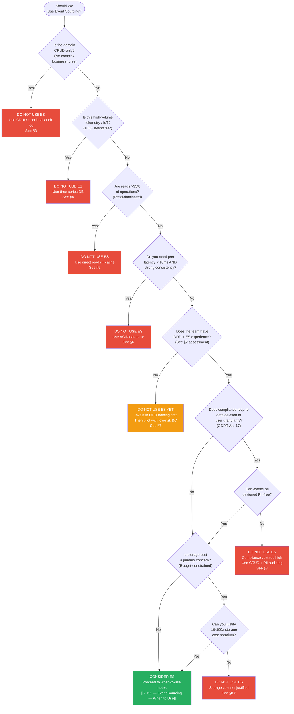
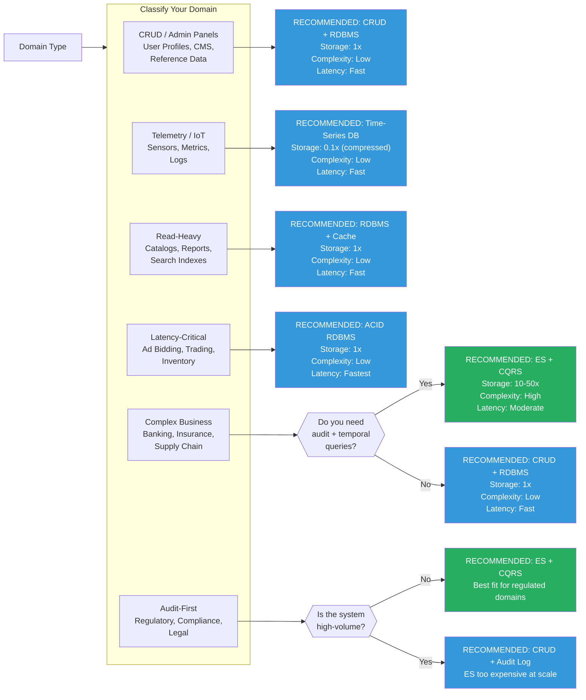

> [!success] Mastery Check
> - [ ] **Studied Well**
> - [ ] **Can explain the concept without notes**
> - [ ] **Can answer interview questions confidently**
> - [ ] **Can implement it in a real project**


# 7.112 — Event Sourcing — When NOT to Use

> **Audit Question:** *Is the complexity tax of Event Sourcing justified by your domain's needs, or are you paying for a Ferrari to drive to the corner store?*

---

## Table of Contents

1. [Introduction — The False Messiah](#1-introduction--the-false-messiah)
2. [The Cost of Events — Why ES Isn't Free](#2-the-cost-of-events--why-es-isnt-free)
3. [When Simplicity Wins — CRUD-Only Domains](#3-when-simplicity-wins--crud-only-domains)
4. [High-Volume Telemetry and IoT — When the Event Store Burns](#4-high-volume-telemetry-and-iot--when-the-event-store-burns)
5. [Read-Dominated Systems — The Projection Tax](#5-read-dominated-systems--the-projection-tax)
6. [Latency-Sensitive and Strongly Consistent Systems](#6-latency-sensitive-and-strongly-consistent-systems)
7. [The Team Maturity Trap — DDD and ES Require Investment](#7-the-team-maturity-trap--ddd-and-es-require-investment)
8. [Storage Costs, Data Deletion, and Compliance](#8-storage-costs-data-deletion-and-compliance)
9. [Decision Framework — Two Mermaid Diagrams](#9-decision-framework--two-mermaid-diagrams)
10. [Summary, ADR, Interview Questions, and Self-Check](#10-summary-adr-interview-questions-and-self-check)

---

## 1. Introduction — The False Messiah

Event Sourcing (ES) is one of the most seductive patterns in distributed systems. The promise is intoxicating: complete auditability, temporal queries, free business analytics, and the ability to "rewind" your system to any point in time. Production bugs become trivial to debug — just replay events up to the moment before the fault. Product managers dream of the BI capabilities. Regulators salivate over the audit trail.

But ES is not a universal good. It is a **trade-off accelerator** that amplifies both the strengths and the weaknesses of your architecture. Applied to the wrong domain, ES transforms a simple CRUD application into a distributed-time-travel nightmare where every read requires a fold, every schema change requires an event migration, and every new team member requires a month of ramp-up on DDD aggregates.

This note exists to save you from that pain. It documents the seven anti-patterns that signal ES is the wrong choice, provides concrete cost models, and gives you decision diagrams to navigate the choice honestly. If you came here looking for validation to use ES everywhere, you will be disappointed. If you came here to make a responsible architectural decision, you will find the tools you need.

### 1.1 Scope and Audience

This note targets:
- **Software architects** evaluating ES for a new or existing system
- **Tech leads** who need to justify the decision (pro or con) to stakeholders
- **Engineers** who have seen ES abuse and want language to push back
- **Interview candidates** preparing for system design rounds that probe trade-off awareness

### 1.2 Relationship to Other Notes

| Note | Relationship |
|------|-------------|
| [[7.111 — Event Sourcing — When to Use]] | Direct counterpart — the positive case for ES |
| [[7.093 — CQRS Overview]] | CQRS is the most common companion pattern to ES (but ES can exist without CQRS, and vice versa) |
| [[7.095 — CQRS with MediatR]] | Implementation pattern often conflated with ES decisions |
| [[7.100 — Domain-Driven Design Tactical Patterns]] | ES requires DDD aggregate expertise |
| [[7.119 — Event Store and Streaming Infrastructure]] | Operational concerns for ES infrastructure |

---

## 2. The Cost of Events — Why ES Isn't Free

Before we examine specific anti-patterns, we must internalize the baseline cost of ES. This is not FUD — it is engineering reality.

### 2.1 The Event Store Tax

| Cost Dimension | Traditional CRUD | Event Sourcing | Multiplier |
|----------------|-----------------|----------------|------------|
| **Write amplification** | 1× (one row written) | N× (event + snapshots + projections) | 3–10× |
| **Read amplification** | 1× (one query) | N× (fold N events or maintain stale projections) | 2–100× |
| **Storage growth** | Linear with entity count | Super-linear (immutable append-only log) | 5–50× |
| **Schema migration** | `ALTER TABLE` + deploy | Event versioning + upcasters + projection rebuild | 3–5× |
| **Operational complexity** | Backup/restore of DB | Backup event store + snapshot store + projection DBs + deal with at-least-once delivery | 2–4× |
| **Debugging** | Read current state from DB | Replay events, compare snapshots, verify projections | 1.5–3× |

### 2.2 Baseline Infrastructure Requirements

ES demands infrastructure that a simple CRUD app does not:

```
┌────────────────────────────────────────────────────────┐
│                Event Sourcing Stack                     │
├────────────────────────────────────────────────────────┤
│  Event Store (e.g., EventStoreDB, Kafka, Aurora)       │
│  + Snapshot Store (e.g., DynamoDB, PostgreSQL)         │
│  + Projection Store (read models — could be many)       │
│  + Event Bus / Stream Processor                         │
│  + Schema Registry (e.g., Confluent, Apicurio)         │
│  + Migration / Upcaster Pipeline                        │
│  + Monitoring for DLQ, replay lag, gap detection       │
└────────────────────────────────────────────────────────┘
```

Compare to the **non-ES stack**: one relational database, one ORM, one connection string.

### 2.3 Cost Model

Here is a back-of-the-envelope cost model for a system processing 10M events/month with a 3-year retention:

```csharp
public static class EsCostModel
{
    public static (double storageCost, double computeCost, double opsCost)
        Estimate(int eventsPerMonth, int retentionMonths = 36)
    {
        double totalEvents = eventsPerMonth * retentionMonths;
        double avgEventBytes = 2048; // 2 KB per event after serialization
        double rawStorageBytes = totalEvents * avgEventBytes;

        // Event Store: 3× replication typical (EventStoreDB, Kafka)
        double eventStoreStorage = rawStorageBytes * 3;
        // Snapshots: stored every 100 events per aggregate, ~1 KB each
        double snapshotStorage = totalEvents / 100.0 * 1024;
        // Projections: at least one read model, often more
        double projectionStorage = rawStorageBytes * 2;

        double storageGb = (eventStoreStorage + snapshotStorage + projectionStorage) / 1_073_741_824;

        // Compute: replay cost when projections rebuild
        double replayComputeHrs = totalEvents / 1_000_000.0 * 6; // 6 CPU-hr per M events
        // Snapshot creation: periodic
        double snapshotComputeHrs = totalEvents / 1_000_000.0 * 1.5;

        double storageCost = storageGb * 0.023 * retentionMonths; // $0.023/GB-month (S3 equivalent)
        double computeCost = (replayComputeHrs + snapshotComputeHrs) * 0.50; // $0.50/CPU-hr
        double opsCost = storageCost * 0.15; // 15% storage for ops overhead

        return (Math.Round(storageCost, 2), Math.Round(computeCost, 2), Math.Round(opsCost, 2));
    }
}
```

At 10M events/month × 36 months: **~$8,500–$12,000** in storage alone. The equivalent CRUD system: **~$300–$600**.

Is your audit requirement worth a 20× storage premium?

### 2.4 The Hidden Tax: Team Cognitive Load

This is the hardest cost to quantify and the one that kills most ES projects:

```csharp
public enum EsTeamMaturity
{
    /// <summary>Team has never built an ES system. Expect 2–3× initial velocity loss.</summary>
    Novice,
    /// <summary>Team has shipped one ES system. Expect minor overhead.</summary>
    Experienced,
    /// <summary>Team has multiple ES systems in production. Baseline velocity.</summary>
    Expert
}

public static class TeamCostMultiplier
{
    /// <summary>
    /// Returns the velocity multiplier for a team adopting ES.
    /// 1.0 = same velocity as CRUD. &lt; 1.0 = slower. &gt; 1.0 = faster.
    /// </summary>
    public static double GetVelocity(EsTeamMaturity maturity, int projectMonth)
    {
        // All teams start slower. Expert teams recover faster.
        (double initial, double recoveryMonths) = maturity switch
        {
            EsTeamMaturity.Novice => (0.35, 9),
            EsTeamMaturity.Experienced => (0.65, 4),
            EsTeamMaturity.Expert => (0.90, 2),
            _ => (0.50, 6)
        };

        double velocity = initial + (1.0 - initial) *
            Math.Min(projectMonth / recoveryMonths, 1.0);

        return Math.Round(velocity, 2);
    }
}
```

A novice team spends months 1–6 at 35% productivity. If you cannot absorb that, do not choose ES.

---

## 3. When Simplicity Wins — CRUD-Only Domains

### 3.1 Problem Statement

The strongest anti-pattern for ES: your domain creates, reads, updates, and deletes records — and that is the entire story. There are no interesting business rules, no multi-step processes, no complex state machines. The current state is the only state that matters.

**Examples of CRUD-only domains:**
- User profile management (name, email, preferences)
- Content management system with simple article CRUD
- Product catalog with no inventory workflows
- Reference data management (lookup tables, configuration)

### 3.2 Non-ES Approach (The Right Choice)

For a user profile service, here is the simple, correct approach:

```csharp
// ============================================================
// NON-ES APPROACH — Simple, fast, correct for CRUD domains
// ============================================================

public sealed record UserProfile
{
    public Guid Id { get; init; }
    public string Email { get; private set; }
    public string DisplayName { get; private set; }
    public string? PhoneNumber { get; private set; }
    public DateTime CreatedAt { get; init; }
    public DateTime UpdatedAt { get; private set; }

    public UserProfile(Guid id, string email, string displayName, string? phoneNumber)
    {
        Id = id;
        Email = email;
        DisplayName = displayName;
        PhoneNumber = phoneNumber;
        CreatedAt = DateTime.UtcNow;
        UpdatedAt = DateTime.UtcNow;
    }

    public void UpdateEmail(string newEmail)
    {
        ArgumentNullException.ThrowIfNull(newEmail);
        Email = newEmail;
        UpdatedAt = DateTime.UtcNow;
    }

    public void UpdateDisplayName(string newName)
    {
        ArgumentNullException.ThrowIfNull(newName);
        DisplayName = newName;
        UpdatedAt = DateTime.UtcNow;
    }
}

public interface IUserProfileRepository
{
    Task<UserProfile?> GetByIdAsync(Guid id, CancellationToken ct = default);
    Task AddAsync(UserProfile profile, CancellationToken ct = default);
    Task UpdateAsync(UserProfile profile, CancellationToken ct = default);
    Task DeleteAsync(Guid id, CancellationToken ct = default);
}

public sealed class UserProfileService
{
    private readonly IUserProfileRepository _repo;

    public UserProfileService(IUserProfileRepository repo) => _repo = repo;

    public async Task<UserProfile> CreateProfileAsync(
        Guid id, string email, string displayName, CancellationToken ct)
    {
        var existing = await _repo.GetByIdAsync(id, ct);
        if (existing is not null)
            throw new InvalidOperationException("Profile already exists.");

        var profile = new UserProfile(id, email, displayName, null);
        await _repo.AddAsync(profile, ct);
        return profile;
    }

    public async Task<UserProfile> ChangeEmailAsync(
        Guid id, string newEmail, CancellationToken ct)
    {
        var profile = await _repo.GetByIdAsync(id, ct)
            ?? throw new KeyNotFoundException("Profile not found.");

        profile.UpdateEmail(newEmail);
        await _repo.UpdateAsync(profile, ct);
        return profile;
    }
}
```

**Complexity:** ~80 lines of code. One table. One repository. One service. A single developer can understand and modify this in 15 minutes.

### 3.3 Hypothetical ES Approach (The Overengineered Alternative)

Now consider what ES would require for this same domain:

```csharp
// ============================================================
// HYPOTHETICAL ES APPROACH — Massive overengineering for CRUD
// ============================================================

// --- Events ---
public sealed record UserCreated(
    Guid UserId,
    string Email,
    string DisplayName,
    string? PhoneNumber,
    DateTime Timestamp);

public sealed record EmailUpdated(
    Guid UserId,
    string OldEmail,
    string NewEmail,
    DateTime Timestamp);

public sealed record DisplayNameUpdated(
    Guid UserId,
    string OldName,
    string NewName,
    DateTime Timestamp);

public sealed record ProfileDeleted(
    Guid UserId,
    DateTime Timestamp);

// --- Aggregate ---
public sealed class UserProfileAggregate
{
    private readonly List<object> _uncommittedEvents = [];

    public Guid Id { get; private set; }
    public string Email { get; private set; } = string.Empty;
    public string DisplayName { get; private set; } = string.Empty;
    public string? PhoneNumber { get; private set; }
    public bool IsDeleted { get; private set; }
    public int Version { get; private set; }

    private UserProfileAggregate() { } // Factory method only

    public static (UserProfileAggregate aggregate, object createdEvent)
        Create(Guid id, string email, string displayName, string? phoneNumber)
    {
        ArgumentNullException.ThrowIfNull(email);
        ArgumentNullException.ThrowIfNull(displayName);

        var aggregate = new UserProfileAggregate();
        var @event = new UserCreated(id, email, displayName, phoneNumber, DateTime.UtcNow);
        aggregate.Apply(@event);
        aggregate._uncommittedEvents.Add(@event);
        return (aggregate, @event);
    }

    public object UpdateEmail(string newEmail)
    {
        ArgumentNullException.ThrowIfNull(newEmail);
        if (IsDeleted) throw new InvalidOperationException("Deleted profile cannot be modified.");

        var @event = new EmailUpdated(Id, Email, newEmail, DateTime.UtcNow);
        Apply(@event);
        _uncommittedEvents.Add(@event);
        return @event;
    }

    public object UpdateDisplayName(string newName)
    {
        ArgumentNullException.ThrowIfNull(newName);
        if (IsDeleted) throw new InvalidOperationException("Deleted profile cannot be modified.");

        var @event = new DisplayNameUpdated(Id, DisplayName, newName, DateTime.UtcNow);
        Apply(@event);
        _uncommittedEvents.Add(@event);
        return @event;
    }

    public object Delete()
    {
        if (IsDeleted) throw new InvalidOperationException("Already deleted.");

        var @event = new ProfileDeleted(Id, DateTime.UtcNow);
        Apply(@event);
        _uncommittedEvents.Add(@event);
        return @event;
    }

    public IReadOnlyList<object> GetUncommittedEvents() => _uncommittedEvents.AsReadOnly();

    public void LoadFromHistory(IEnumerable<object> events)
    {
        foreach (var @event in events)
        {
            Apply(@event);
            Version++;
        }
    }

    private void Apply(object @event)
    {
        switch (@event)
        {
            case UserCreated e:
                Id = e.UserId;
                Email = e.Email;
                DisplayName = e.DisplayName;
                PhoneNumber = e.PhoneNumber;
                Version = 1;
                break;

            case EmailUpdated e:
                Email = e.NewEmail;
                break;

            case DisplayNameUpdated e:
                DisplayName = e.NewName;
                break;

            case ProfileDeleted:
                IsDeleted = true;
                break;
        }
    }
}

// --- Repository ---
public interface IEventStore
{
    Task AppendEventsAsync(
        string streamName, IEnumerable<object> events, int expectedVersion,
        CancellationToken ct = default);

    Task<IReadOnlyList<object>> ReadEventsAsync(
        string streamName, CancellationToken ct = default);
}

public sealed class UserProfileEsRepository
{
    private readonly IEventStore _eventStore;
    private readonly ISnapshotRepository _snapshotRepo;
    private const string StreamPrefix = "user-profile-";

    public UserProfileEsRepository(
        IEventStore eventStore, ISnapshotRepository snapshotRepo)
    {
        _eventStore = eventStore;
        _snapshotRepo = snapshotRepo;
    }

    public async Task<UserProfileAggregate?> GetByIdAsync(
        Guid id, CancellationToken ct = default)
    {
        var streamName = $"{StreamPrefix}{id}";

        // Try snapshot first
        var (snapshot, snapshotVersion) =
            await _snapshotRepo.GetLatestAsync<UserProfileAggregate>(streamName, ct);

        IReadOnlyList<object> events;
        if (snapshot is not null)
        {
            // Replay events since snapshot
            events = await _eventStore.ReadEventsAsync(streamName, ct);
            events = events.Skip(snapshotVersion).ToList();
        }
        else
        {
            events = await _eventStore.ReadEventsAsync(streamName, ct);
        }

        if (events.Count == 0 && snapshot is null)
            return null;

        var aggregate = snapshot is not null
            ? snapshot
            : new UserProfileAggregate();

        aggregate.LoadFromHistory(events);
        return aggregate;
    }

    public async Task SaveAsync(
        UserProfileAggregate aggregate, CancellationToken ct = default)
    {
        var streamName = $"{StreamPrefix}{aggregate.Id}";
        var uncommitted = aggregate.GetUncommittedEvents();

        if (uncommitted.Count == 0) return;

        await _eventStore.AppendEventsAsync(
            streamName, uncommitted, aggregate.Version - uncommitted.Count, ct);

        // Snapshot every 100 events
        var totalVersion = aggregate.Version;
        if (totalVersion >= 100 && totalVersion % 100 < uncommitted.Count)
        {
            await _snapshotRepo.SaveSnapshotAsync(
                streamName, aggregate, totalVersion, ct);
        }
    }
}
```

### 3.4 Cost Analysis

| Dimension | Non-ES (CRUD) | ES Approach | Delta |
|-----------|---------------|-------------|-------|
| **Files/classes** | 3 (entity + repo + service) | 8+ (4 events + aggregate + repo + snapshot + event store interface) | +167% |
| **Lines of code** | ~80 | ~280 | +250% |
| **Read latency (p99)** | 2–5 ms | 15–100 ms (event fold) | 5–20× |
| **Write latency (p99)** | 3–8 ms | 10–30 ms (append + snapshot check) | 2–4× |
| **Storage per entity** | ~200 bytes | ~5 KB (events accumulate) | ~25× |
| **New dev ramp time** | <1 day | ~2 weeks (ES, DDD, event versioning) | ~10× |
| **Schema change cost** | ALTER TABLE (minutes) | New event version + upcasters (days) | ~10× |

### 3.5 Verdict

> **Do NOT use Event Sourcing for CRUD-only domains.**
>
> The non-ES approach is simpler, faster, cheaper, more maintainable, and easier to staff. You gain nothing from ES except accidental complexity.

### 3.6 The "But What About Audit?" Trap

The most common objection: "But we need audit logging!"

**Reality:** You can add an append-only audit log *alongside* your CRUD database without converting your entire system to ES. This gives you the audit trail at a fraction of the cost.

```csharp
// ============================================================
// HYBRID APPROACH — CRUD + audit log (best of both worlds)
// ============================================================

public sealed record AuditEntry(
    Guid EntityId,
    string EntityType,
    string Action,
    string ChangedBy,
    string? OldValues,    // JSON snapshot
    string? NewValues,    // JSON snapshot
    DateTime OccurredAt);

public interface IAuditLog
{
    Task AppendAsync(AuditEntry entry, CancellationToken ct = default);
    IAsyncEnumerable<AuditEntry> GetByEntityAsync(
        Guid entityId, CancellationToken ct = default);
    IAsyncEnumerable<AuditEntry> GetByDateRangeAsync(
        DateTime from, DateTime to, CancellationToken ct = default);
}

// Decorate your service:
public sealed class AuditableUserProfileService : IUserProfileService
{
    private readonly IUserProfileService _inner;
    private readonly IAuditLog _auditLog;
    private readonly ICurrentUserProvider _userProvider;

    public AuditableUserProfileService(
        IUserProfileService inner,
        IAuditLog auditLog,
        ICurrentUserProvider userProvider)
    {
        _inner = inner;
        _auditLog = auditLog;
        _userProvider = userProvider;
    }

    public async Task<UserProfile> ChangeEmailAsync(
        Guid id, string newEmail, CancellationToken ct)
    {
        var oldProfile = await _inner.GetByIdAsync(id, ct);
        var result = await _inner.ChangeEmailAsync(id, newEmail, ct);

        await _auditLog.AppendAsync(new AuditEntry(
            EntityId: id,
            EntityType: "UserProfile",
            Action: "EmailUpdated",
            ChangedBy: _userProvider.CurrentUserId,
            OldValues: System.Text.Json.JsonSerializer.Serialize(oldProfile),
            NewValues: System.Text.Json.JsonSerializer.Serialize(result),
            OccurredAt: DateTime.UtcNow
        ), ct);

        return result;
    }
}
```

**Cost of this hybrid approach:** ~50 lines of decorator code + one audit table. Total storage: ~1/50th of the ES approach. Team impact: near zero.

**Escape hatch:** If your audit requirements later grow to require full temporal queries, you can migrate to ES only for the specific bounded context that needs it, without converting the entire system.

---

## 4. High-Volume Telemetry and IoT — When the Event Store Burns

### 4.1 Problem Statement

Event Sourcing is often proposed for telemetry pipelines because "events are natural." This is a category error. Telemetry events are **facts**, not **decisions** — they have no state to fold, no invariants to enforce, and no aggregate to protect.

**Characteristics of telemetry/IoT domains:**
- 10,000–1,000,000+ events/second per node
- Each event is tiny (~50–500 bytes)
- Events are immutable observations, not business decisions
- No concept of "current state" — you query over time windows
- Retention is typically short (hours to months) then aggregated/discarded
- At-least-once delivery where duplicates must be handled downstream

### 4.2 Non-ES Approach (The Right Choice)

Use a purpose-built time-series database or stream processor:

```csharp
// ============================================================
// NON-ES APPROACH — Time-series database + stream processor
// ============================================================

public sealed record TelemetryReading(
    string DeviceId,
    DateTime Timestamp,
    double Temperature,
    double Humidity,
    double Pressure,
    double? BatteryVoltage);

// Ingest via simple batch:
public sealed class TelemetryIngestor
{
    private readonly ITimeseriesDb _db;

    // InfluxDB, TimescaleDB, QuestDB, etc.
    public TelemetryIngestor(ITimeseriesDb db) => _db = db;

    public async Task IngestBatchAsync(
        IReadOnlyList<TelemetryReading> readings, CancellationToken ct)
    {
        // Batch ingest — single network round trip for 10,000 readings
        await _db.WriteAsync(readings, ct);
    }

    public async Task<double> GetAverageTemperatureAsync(
        string deviceId, DateTime from, DateTime to, CancellationToken ct)
    {
        // Downsampled query — timeseries DB handles this efficiently
        return await _db.QueryAsync<double>(
            $"SELECT MEAN(temperature) FROM telemetry " +
            $"WHERE device_id = @deviceId AND time >= @from AND time < @to",
            new { deviceId, @from, to }, ct);
    }
}
```

**Key properties:** O(1) ingest per reading. O(log n) queries. Built-in downsampling, retention policies, continuous aggregates. No event replay needed — you never need to "rebuild" telemetry state.

### 4.3 Hypothetical ES Approach (The Disaster)

Imagine trying to apply ES to telemetry:

```csharp
// ============================================================
// HYPOTHETICAL ES APPROACH — A path to bankruptcy
// ============================================================

// Each telemetry reading is an event:
public sealed record TelemetryRecorded(
    string DeviceId,
    DateTime Timestamp,
    double Temperature,
    double Humidity,
    double Pressure,
    double? BatteryVoltage);

// But wait — does TelemetryRecorded belong to an aggregate?
// What is the aggregate? The device? The sensor? The fleet?
// There are no invariants to enforce. There is no business rule
// that says "temperature must not change by more than X."
// Every reading is valid.

// If you try to make Device an aggregate:
public sealed class DeviceAggregate
{
    private readonly List<object> _uncommittedEvents = [];

    // After 1 day at 10 Hz: 864,000 events.
    // After 1 year: 315,360,000 events.
    // Loading this aggregate: impossible.
    // Snapshot at every event: defeats the purpose of ES.

    public static object RecordTelemetry(
        string deviceId, DateTime timestamp,
        double temp, double humidity, double pressure, double? battery)
    {
        // No validation. No business logic. No state change.
        // This is a pure pass-through.
        return new TelemetryRecorded(
            deviceId, timestamp, temp, humidity, pressure, battery);
    }
}

// --- Projection rebuild cost ---
public sealed class AverageTemperatureProjection
{
    // To rebuild this projection, you must replay every single
    // TelemetryRecorded event from the beginning of time.
    // At 315M events/year per device, with 1,000 devices:
    //   315B events to replay.
    //   At 10K events/sec replay: 10 months to rebuild.
    //   This is not viable.
    public async Task RebuildAsync(string deviceId, CancellationToken ct)
    {
        var events = await _eventStore.ReadAllEventsAsync(
            $"device-{deviceId}", ct); // Never completes
        // Fold all events to compute averages...
    }
}
```

### 4.4 Cost Analysis

| Dimension | Time-Series DB | ES Approach | Delta |
|-----------|---------------|-------------|-------|
| **Ingest throughput** | 1M+ events/sec/node | 5–50K events/sec (append to event store) | 20–200× slower |
| **Storage efficiency** | Columnar compression (10–50×) | Row-based event store (no compression) | 10–50× more space |
| **Query latency (p99)** | 1–10 ms (downsampled) | Seconds–hours (replay) | 100–1,000,000× |
| **Retention management** | Built-in TTL + downsampling | Manual deletion (violates immutability) | Ops nightmare |
| **Rebuild time** | N/A (no projections) | Months at scale | ∞ |

### 4.5 Verdict

> **Do NOT use Event Sourcing for high-volume telemetry or IoT.**
>
> Purpose-built time-series databases outperform ES by orders of magnitude in every relevant dimension. ES's strengths (audit, temporal queries, state replay) are irrelevant for telemetry because there is no "state" to protect.

---

## 5. Read-Dominated Systems — The Projection Tax

### 5.1 Problem Statement

Some systems are overwhelmingly read-heavy: 95%+ of operations are queries. The writes are simple, rare, and stateless. Examples include:
- Content delivery and caching layers
- Report generation systems (pre-computed dashboards)
- Search indexes
- Recommendation engines
- Product catalogs with frequent search but rare price updates

ES optimizes for the write path (append-only, immutable) at the expense of the read path (must fold events to reconstruct state). If your system is 95%+ reads, ES is backwards: you are spending complexity on the wrong axis.

### 5.2 Non-ES Approach (The Right Choice)

For a product catalog:

```csharp
// ============================================================
// NON-ES APPROACH — Direct read from optimized store
// ============================================================

public sealed record Product
{
    public string Sku { get; init; }
    public string Name { get; init; }
    public string Description { get; init; }
    public decimal Price { get; private set; }
    public string Category { get; init; }
    public bool IsActive { get; private set; }
    public DateTime LastUpdated { get; private set; }
}

public interface IProductRepository
{
    Task<Product?> GetBySkuAsync(string sku, CancellationToken ct);
    IAsyncEnumerable<Product> SearchAsync(
        string query, string? category, int page, int pageSize, CancellationToken ct);
}

public sealed class ProductCatalogService
{
    private readonly IProductRepository _repo;
    private readonly ICache _cache;

    public ProductCatalogService(IProductRepository repo, ICache cache)
    {
        _repo = repo;
        _cache = cache;
    }

    // Cache-aside pattern for reads
    public async Task<Product?> GetProductAsync(string sku, CancellationToken ct)
    {
        var cacheKey = $"product:{sku}";
        var cached = await _cache.GetAsync<Product>(cacheKey, ct);
        if (cached is not null) return cached;

        var product = await _repo.GetBySkuAsync(sku, ct);
        if (product is not null)
            await _cache.SetAsync(cacheKey, product, TimeSpan.FromMinutes(5), ct);

        return product;
    }

    // Writes are simple, infrequent
    public async Task UpdatePriceAsync(
        string sku, decimal newPrice, string updatedBy, CancellationToken ct)
    {
        var product = await _repo.GetBySkuAsync(sku, ct)
            ?? throw new KeyNotFoundException("Product not found.");

        product.Price = newPrice;
        product.LastUpdated = DateTime.UtcNow;
        await _repo.UpdateAsync(product, ct);

        // Invalidate cache
        await _cache.RemoveAsync($"product:{sku}", ct);
    }
}
```

**Read cost:** O(1) cache hit → ~1 ms. O(1) cache miss → ~5 ms DB read.

### 5.3 Hypothetical ES Approach (Projection Pain)

```csharp
// ============================================================
// HYPOTHETICAL ES APPROACH — Read path suffers
// ============================================================

// In ES, every read requires either:
// Option A: Fold all events for the aggregate (slow)
// Option B: Maintain a projection (additional infrastructure)
// Option C: Maintain a snapshot (eventually consistent)

public sealed class ProductCatalogProjection
{
    private readonly IEventStore _eventStore;
    private readonly IProjectionDatabase _projectionDb;
    private readonly IMessageBus _messageBus;

    // Projection rebuild on schema change:
    // Must replay ALL ProductCreated, PriceUpdated, etc. events
    // from the beginning of time.
    // For 1M products with avg 10 events each = 10M events.
    // At 10K events/sec = 1,000 seconds (~17 min) to rebuild.
    // Your catalog is offline for 17 minutes.
    public async Task RebuildProjectionAsync(CancellationToken ct)
    {
        await _projectionDb.ClearAsync(ct);

        // Subscribe to event stream from the start
        await foreach (var @event in _eventStore.ReadAllAsync(
            fromBeginning: true, ct))
        {
            switch (@event.Data)
            {
                case ProductCreated e:
                    await _projectionDb.InsertAsync(new ProductDto(
                        e.Sku, e.Name, e.Description, e.Price, e.Category), ct);
                    break;

                case PriceUpdated e when e.NewPrice != e.OldPrice:
                    await _projectionDb.UpdatePriceAsync(e.Sku, e.NewPrice, ct);
                    break;
            }
        }
    }

    // Read still hits the projection database (extra hop, extra infrastructure)
    public async Task<ProductDto?> GetProductAsync(string sku, CancellationToken ct)
    {
        // This is just a database query, same as non-ES.
        // But now we have TWO databases to manage (event store + projection).
        // And the projection is eventually consistent — reads may be stale.
        return await _projectionDb.FindBySkuAsync(sku, ct);
    }
}
```

### 5.4 Cost Analysis

| Dimension | Non-ES (Direct Read) | ES with Projection | Delta |
|-----------|---------------------|-------------------|-------|
| **Infrastructure** | 1 DB + cache | 1 event store + 1+ projection DB + cache | 3× infra |
| **Read latency (p99)** | 1–5 ms | 3–15 ms (extra hop) | 3× |
| **Write latency (p99)** | 10–20 ms (write + cache invalidation) | 15–40 ms (append event + projection update) | 2× |
| **Consistency model** | Strong (read your writes) | Eventual (projection lag) | Weaker |
| **Schema migration** | ALTER TABLE + redeploy | New event version + upcast + rebuild projection | 3–5× |
| **Operational complexity** | Backup DB, restart cache | Backup event store, projection DB, replay on failure | 2× |

### 5.5 Verdict

> **Do NOT use Event Sourcing for read-dominated systems.**
>
> You pay the ES write tax (complexity, storage, event versioning) while gaining no read benefit. The projection pattern reintroduces the same database queries you could have used directly, with additional latency and eventual consistency. This is the worst of both worlds.

### 5.6 When Reads and Writes Are Balanced

If you have a 50/50 read/write ratio with complex business logic on the write side, ES starts to make more sense. The trade-off shifts when the write complexity justifies the read cost. See [[7.111 — Event Sourcing — When to Use]] for the positive case.

---

## 6. Latency-Sensitive and Strongly Consistent Systems

### 6.1 Problem Statement

Some domains demand both **single-digit-millisecond p99 latency** and **strong consistency** (read-your-writes, linearizability). ES struggles with both:

- **Latency:** The append-then-read cycle (write event → publish event → projection consumes event → read from projection) adds 10–100 ms compared to a direct write-then-read from the same database.
- **Consistency:** ES naturally pushes toward eventual consistency because projections are asynchronous. Strong consistency requires synchronous projections (defeating the purpose of ES) or reading from the event store (slow event fold).

**Examples of systems where ES is dangerous:**
- Real-time ad bidding (p99 < 10 ms, strong consistency on budgets)
- Fraud detection at the point of sale (must read current state immediately)
- Inventory reservation during checkout (must not oversell)
- Distributed lock or lease management
- Financial exchange order matching (microsecond latency)

### 6.2 Non-ES Approach (The Right Choice)

```csharp
// ============================================================
// NON-ES APPROACH — Strong consistency, low latency
// ============================================================

public sealed class InventoryReservationService
{
    private readonly IDatabase _db; // Single, consistent DB (e.g., PostgreSQL, Aurora)
    private readonly ILogger<InventoryReservationService> _logger;

    // SERIALIZABLE isolation — no oversell possible
    public async Task<bool> TryReserveAsync(
        string sku, int quantity, string reservationId, CancellationToken ct)
    {
        // Single atomic SQL transaction:
        // UPDATE inventory SET reserved = reserved + @quantity
        // WHERE sku = @sku AND (available - reserved) >= @quantity
        // RETURNING *;

        var result = await _db.ExecuteAsync("""
            UPDATE inventory
            SET reserved = reserved + @quantity,
                updated_at = NOW()
            WHERE sku = @sku
              AND (total - reserved) >= @quantity
            RETURNING sku, reserved, total, (total - reserved) AS remaining;
            """, new { sku, quantity }, ct);

        if (result.RowsAffected == 0)
        {
            _logger.LogWarning(
                "Insufficient inventory for SKU {Sku}: requested {Qty}", sku, quantity);
            return false;
        }

        await _db.ExecuteAsync("""
            INSERT INTO reservations (id, sku, quantity, created_at)
            VALUES (@id, @sku, @quantity, NOW());
            """, new { id = reservationId, sku, quantity }, ct);

        return true;
    }
}
```

**Latency:** ~3–8 ms p99. **Consistency:** Linearizable (single-node serializable).

### 6.3 Hypothetical ES Approach (Latency and Consistency Disaster)

```csharp
// ============================================================
// HYPOTHETICAL ES APPROACH — Broken or slow
// ============================================================

public sealed class InventoryEsService
{
    private readonly IEventStore _eventStore;
    private readonly IInventoryProjection _projection;

    public async Task<bool> TryReserveAsync(
        string sku, int quantity, string reservationId, CancellationToken ct)
    {
        // Step 1: Read current state from projection (might be stale!)
        var current = await _projection.GetInventoryAsync(sku, ct);

        // The projection is eventually consistent.
        // Two concurrent requests may both see available = 10
        // and both reserve 10 → oversell!
        if (current.Available < quantity)
            return false;

        // Step 2: Append event (optimistic concurrency)
        var @event = new InventoryReserved(sku, quantity, reservationId, DateTime.UtcNow);

        try
        {
            await _eventStore.AppendEventsAsync(
                $"inventory-{sku}",
                [@event],
                expectedVersion: current.Version,
                ct);
        }
        catch (ConcurrencyException)
        {
            // Someone else reserved between our read and write.
            // We oversold. Must compensate.
            _logger.LogError("Oversold SKU {Sku} — compensating...", sku);
            await _eventStore.AppendEventsAsync(
                $"inventory-{sku}",
                [new InventoryOverSold(sku, quantity, reservationId, DateTime.UtcNow)],
                expectedVersion: current.Version + 1, // TBD: actual version
                ct);
            return false;
        }

        // Step 3: Wait for projection to catch up (defeats ES purpose)
        // If we return now, the caller reads stale data from projection.
        // If we wait, we add latency.
        await WaitForProjectionAsync(sku, ct);

        return true;
    }

    private async Task WaitForProjectionAsync(string sku, CancellationToken ct)
    {
        // Poll projection until up to date
        // This adds 10–50 ms to the response time.
        // At scale, this pattern is a race condition factory.
        for (int i = 0; i < 10; i++)
        {
            var projection = await _projection.GetInventoryAsync(sku, ct);
            if (projection.IsUpToDate) return;
            await Task.Delay(5, ct);
        }
        throw new TimeoutException("Projection did not catch up.");
    }
}
```

### 6.4 The Consistency-Latency Trade-Off

```
Latency (p99)
    ^
    |   ES + sync projection   (high latency, strong consistency)
 50ms|        ✗
    |
    |   ES + async projection  (moderate latency, eventual consistency)
 20ms|        △
    |
    |   Traditional RDBMS      (low latency, strong consistency)
  5ms|        ✓
    |
    +---------------------------------------->
                        Consistency strength
```

Key insight: **ES cannot simultaneously offer low latency and strong consistency.** The append->publish->project->serve pipeline inherently adds latency. If latency is critical and consistency is non-negotiable, ES is the wrong tool.

### 6.5 Mitigation Strategies (If You Must Use ES)

If you absolutely need both low latency and strong consistency with ES (rare), these mitigation strategies exist but each has significant drawbacks:

| Strategy | How It Works | Drawback |
|----------|-------------|----------|
| **Synchronous projection** | Projection runs in the same transaction as event append | Destroys isolation, couples write to read, not truly ES |
| **Read from event store** | Fold events on every read | O(n) per read — unacceptable at scale |
| **In-memory aggregate** | Cache the aggregate in memory, apply events directly | Memory-bound, cache invalidation, only works for hot aggregates |
| **CQRS with shared DB** | Write side and read side share a database | Sacrifices ES's primary benefit (decoupled reads/writes) |

Each mitigation erodes one of ES's core benefits. If you need all four mitigations, you should not be using ES.

### 6.6 Verdict

> **Do NOT use Event Sourcing for latency-sensitive or strongly consistent systems.**
>
> ES optimizes for the wrong axis. Traditional ACID databases provide lower latency and stronger consistency at a fraction of the operational complexity. Choose ES only when the benefits of temporal queries and auditability outweigh the latency cost and consistency model shift.

---

## 7. The Team Maturity Trap — DDD and ES Require Investment

### 7.1 Problem Statement

Event Sourcing without Domain-Driven Design is dangerous. ES requires:
- Well-defined **aggregate boundaries** (not too big, not too small)
- Clear **domain events** in the language of the business (not technical CRUD events)
- Understanding of **eventual consistency** and how to reason about stale data
- Competence with **event versioning** and schema evolution
- Familiarity with **sagas/process managers** for multi-aggregate workflows

A team without DDD experience that adopts ES will produce an "event-sourced anemic domain model" — a CRUD system wearing event-sourcing clothing. This is the worst outcome: all the complexity of ES with none of the benefits.

### 7.2 Team Maturity Assessment

```csharp
// ============================================================
// TEAM MATURITY SELF-ASSESSMENT
// ============================================================

public sealed class EsTeamAssessment
{
    public required int TeamSize { get; init; }
    public required bool HasDddExperience { get; init; }
    public required int MonthsOfEsExperience { get; init; }
    public required bool HasEventStoreInProduction { get; init; }
    public required bool HasProjectionInfrastructure { get; init; }
    public required bool HasMonitoringForEs { get; init; }
    public required bool HasUpcasterPipeline { get; init; }
    public required bool HasEventVersioningStrategy { get; init; }
    public required bool HasSagaOrProcessManagerExperience { get; init; }
    public required bool HasContractTestingForEvents { get; init; }

    public EsReadinessLevel AssessReadiness()
    {
        int score = 0;
        score += HasDddExperience ? 15 : 0;
        score += Math.Min(MonthsOfEsExperience * 2, 20);
        score += HasEventStoreInProduction ? 15 : 0;
        score += HasProjectionInfrastructure ? 10 : 0;
        score += HasMonitoringForEs ? 10 : 0;
        score += HasUpcasterPipeline ? 10 : 0;
        score += HasEventVersioningStrategy ? 10 : 0;
        score += HasSagaOrProcessManagerExperience ? 5 : 0;
        score += HasContractTestingForEvents ? 5 : 0;

        return score switch
        {
            >= 80 => EsReadinessLevel.Ready,
            >= 50 => EsReadinessLevel.NeedsPreparation,
            _ => EsReadinessLevel.NotReady
        };
    }

    public string GetRecommendation()
    {
        return AssessReadiness() switch
        {
            EsReadinessLevel.Ready => "Team is ready for ES. Proceed with bounded context analysis.",
            EsReadinessLevel.NeedsPreparation =>
                "Team needs preparation. Invest 3–6 months in DDD training, " +
                "event-storming workshops, and a low-risk pilot before committing to ES.",
            EsReadinessLevel.NotReady =>
                "Team is NOT ready for ES. Do NOT adopt ES. " +
                "The project will fail due to team capability gaps, " +
                "not technical limitations. Start with DDD tactical patterns " +
                "on a CRUD system before considering ES."
        };
    }
}

public enum EsReadinessLevel { NotReady, NeedsPreparation, Ready }
```

### 7.3 The Novice Team Anti-Pattern

A common anti-pattern observed in post-mortems:

| Month | What Happens | Outcome |
|-------|-------------|---------|
| 1–2 | Team reads ES blog posts, decides to adopt | Enthusiasm is high |
| 3–4 | First aggregates are designed. They roughly mirror database tables. | Warning sign ignored |
| 5–6 | Event versioning crisis: first schema change requires migration. No upcaster pipeline exists. | Panic |
| 7–8 | Projection rebuild needed for new read model. Takes 6 hours. | Stakeholder frustration |
| 9–10 | Production incident: event store corruption from concurrent writes to same aggregate. | Data loss / manual fix |
| 11–12 | Team decides to "simplify" by putting events in Kafka and state in MongoDB. | Accidental CRUD with extra steps |
| 13–18 | Rewrite to traditional CRUD. Post-mortem: "We should have started simpler." | Waste of time and money |

The post-mortem always reaches the same conclusion: **"We didn't know what we didn't know."**

### 7.4 The DDD Pre-Requisite

You should not adopt ES until your team can answer these questions correctly:

1. **What is an aggregate?** (A consistency boundary, not a data container)
2. **How do you size an aggregate?** (Small enough to avoid contention, large enough to maintain invariants)
3. **What makes a good domain event?** (Past tense, business meaning, complete with all needed data)
4. **When do you use a saga vs. a process manager?** (Saga: step-by-step with compensation. Process manager: event-driven routing.)
5. **How do you handle eventual consistency in the UI?** (Optimistic UI, stale state indicators, conflict resolution)
6. **What is an upcaster and when do you need one?** (Event migration without `ALTER TABLE`)
7. **What is the difference between an event and a command?** (Event: something that happened. Command: something you want to happen.)

If your team struggles with any of these, invest in DDD training before touching ES. See [[7.100 — Domain-Driven Design Tactical Patterns]].

### 7.5 The Practical Path

For teams new to DDD and ES:

```
Phase 1 (Months 1–3): DDD Fundamentals
  ├── Event storming workshops with domain experts
  ├── Bounded context mapping
  ├── Aggregate design exercises on existing system
  └── No event sourcing yet

Phase 2 (Months 4–6): Pilot Bounded Context
  ├── Select LOW-RISK bounded context (e.g., audit log, not order processing)
  ├── Implement with ES + CQRS
  ├── Establish event versioning and upcaster patterns
  └── Validate with production traffic (even if low volume)

Phase 3 (Months 7+): Expand
  ├── Apply lessons from pilot to next bounded context
  ├── Build shared ES infrastructure (snapshotting, projections, monitoring)
  ├── Gradually migrate more bounded contexts
  └── Only after pilot is proven stable for 3+ months
```

### 7.6 Verdict

> **Do NOT use Event Sourcing with a team that lacks DDD experience.**
>
> The project will fail not because ES is technically wrong, but because the team lacks the conceptual tools to model aggregates, events, and consistency boundaries correctly. Start with DDD on a CRUD system. Graduate to ES after the team demonstrates competence with tactical patterns.

---

## 8. Storage Costs, Data Deletion, and Compliance

### 8.1 Problem Statement

Event Sourcing's core premise — **never delete, never mutate** — directly conflicts with several real-world requirements:

- **Storage costs:** The event log grows monotonically. Every business transaction generates 1–N events that persist forever.
- **Data retention policies:** Many domains require purging data after a defined period (e.g., 3 years for PII, 7 years for financial records).
- **GDPR / CCPA / Right to Erasure:** Users can request deletion of all personal data. With ES, you cannot simply delete a row — you must handle the fact that events are immutable.
- **Data minimization:** Regulatory frameworks increasingly mandate that you store only what you need, for only as long as you need it.

### 8.2 Storage Growth Modeling

```csharp
// ============================================================
// STORAGE GROWTH MODEL — ES vs CRUD
// ============================================================

public static class StorageGrowthModel
{
    public static (long esBytes, long crudBytes, double multiplier)
        ProjectGrowth(
            int entityCount,
            int eventsPerEntityPerDay,
            int retentionDays,
            int eventSizeBytes = 1024,
            int snapshotInterval = 100,
            int snapshotSizeBytes = 512,
            int crudRowSizeBytes = 512)
    {
        // ES: events + snapshots + projections
        long totalEvents = entityCount * eventsPerEntityPerDay * retentionDays;
        long esEventBytes = totalEvents * eventSizeBytes;
        long esSnapshotBytes = (totalEvents / snapshotInterval) * snapshotSizeBytes;
        long esProjectionBytes = entityCount * crudRowSizeBytes;

        // CRUD: current state only (1 row per entity)
        long crudBytes = entityCount * crudRowSizeBytes;

        long esBytes = esEventBytes + esSnapshotBytes + esProjectionBytes;
        double multiplier = (double)esBytes / Math.Max(crudBytes, 1);

        return (esBytes, crudBytes, Math.Round(multiplier, 1));
    }
}

// Example projection:
// 100K customers, 5 events/customer/day, 3 year retention
// ES: 100K × 5 × 1095 × 1024 = 560 GB (events only)
//      + snapshots: 5.6 GB
//      + projections: 51 MB
// CRUD: 100K × 512 = 51 MB
// Multiplier: 11,000×
var (esBytes, crudBytes, multiplier) = StorageGrowthModel.ProjectGrowth(
    entityCount: 100_000,
    eventsPerEntityPerDay: 5,
    retentionDays: 1095,    // 3 years
    eventSizeBytes: 1024,
    snapshotInterval: 100,
    snapshotSizeBytes: 512,
    crudRowSizeBytes: 512);

// Results: esBytes ~560 GB, crudBytes ~51 MB, multiplier ~11,000
```

**At scale, ES stores 1,000–100,000× more data than the equivalent CRUD system.**

### 8.3 GDPR / Right to Erasure — ES Anti-Pattern

Under GDPR Article 17, users can request deletion of their personal data. With ES, this becomes a compliance nightmare:

```csharp
// ============================================================
// GDPR ERASURE — ES Nightmare
// ============================================================

// An event stored in the event store:
public sealed record OrderPlaced(
    Guid OrderId,
    Guid CustomerId,
    string CustomerEmail,       // PII — MUST be deletable
    string ShippingAddress,     // PII — MUST be deletable
    string CustomerPhone,       // PII — MUST be deletable
    decimal TotalAmount,
    DateTime PlacedAt);

// Option 1: Physically delete the event
// PROBLEM: Event store is immutable append-only log.
//          Deleting an event breaks the chain — you lose the
//          ability to replay and reconstruct state.
//          Snapshot after deletion is inconsistent with events.

// Option 2: Anonymize the event data (most common ES approach)
public sealed record OrderPlacedAnonymized(
    Guid OrderId,
    Guid CustomerId,            // Keep for referential integrity
    string CustomerEmail,       // "deleted@redacted.example"
    string ShippingAddress,     // "REDACTED"
    string CustomerPhone,       // "REDACTED"
    decimal TotalAmount,
    DateTime PlacedAt);

// PROBLEM: You must replay ALL events for this customer
//          and all related aggregates to rebuild state.
//          During replay, events are inconsistent (some anonymized,
//          some not). Upcasters become exponentially more complex.
//          Multiple upstream systems may have consumed the original
//          event data before anonymization.

// Option 3: Don't store PII in events (best practice but hard to enforce)
public sealed record OrderPlacedSafe(
    Guid OrderId,
    Guid CustomerId,              // FK to customer service
    Guid ShippingAddressId,       // FK to address service
    decimal TotalAmount,
    DateTime PlacedAt);
// PII lives in a separate CRUD database that CAN be deleted.
// Event store remains append-only and fully replayable.

// PROBLEM: This adds complexity. Every read needs a join.
//          You lose temporal query capability on PII.
//          If address service changes, historical orders reference
//          addresses that may no longer exist.
```

### 8.4 Compliance Mitigation Strategies

| Strategy | Description | Complexity | Compliance Risk |
|----------|-------------|------------|-----------------|
| **PII-free events** | Store references to PII instead of PII itself | Medium | Low (best option) |
| **Event encryption with per-user keys** | Encrypt PII fields; destroy key on erasure | High | Medium (crypto-shredding) |
| **Event tombstoning** | Replace event with tombstone marker | Medium | High (loses audit trail) |
| **Time-bound deletion** | After retention period, delete event store partition | Low (with partitions) | Medium (no fine-grained deletion) |
| **Store PII separately** | CRUD DB for PII + ES for non-PII business events | Medium | Low (recommended) |

### 8.5 When Storage Cost Is the Decisive Factor

```csharp
// Decision aid: should storage cost influence your ES decision?

public static string StorageAdvice(
    long dailyEventCount,
    int retentionYears,
    decimal storageBudgetPerYear)  // USD
{
    // Assume $0.023/GB-month for S3-equivalent storage
    // 3× replication factor
    // 2 KB average event size
    double totalGb = dailyEventCount * 365 * retentionYears * 2048.0 /
                     1_073_741_824 * 3;
    double estimatedCost = totalGb * 0.023 * 12 * retentionYears;

    if (estimatedCost > storageBudgetPerYear * 1.5)
        return $"WARNING: Estimated storage cost (${estimatedCost:F0}/yr) " +
               $"exceeds budget (${storageBudgetPerYear:F0}/yr) by " +
               $"{estimatedCost / storageBudgetPerYear:F1}×. " +
               "Consider whether the business value of ES justifies this cost.";

    if (estimatedCost > storageBudgetPerYear * 0.5)
        return $"CAUTION: Estimated storage cost (${estimatedCost:F0}/yr) " +
               $"is a significant portion of budget (${storageBudgetPerYear:F0}/yr). " +
               $"Monitor growth and plan retention policies.";

    return $"OK: Estimated storage cost (${estimatedCost:F0}/yr) is within budget. " +
           $"Storage cost is not a primary concern.";
}
```

### 8.6 Verdict

> **Use Event Sourcing cautiously (or not at all) when compliance mandates data deletion or storage costs are a primary concern.**
>
> ES is fundamentally at odds with the "right to be forgotten." While mitigation strategies exist (PII-free events, crypto-shredding), each adds complexity that may outweigh ES's benefits. For domains with aggressive data minimization requirements (GDPR, CCPA, HIPAA), evaluate carefully whether ES is worth the compliance burden.

---

## 9. Decision Framework — Two Mermaid Diagrams

### 9.1 Primary Decision Diagram: "Should We NOT Use Event Sourcing?"



### 9.2 Comparative Decision Diagram: ES vs. Alternative Per Domain Type



---

## 10. Summary, ADR, Interview Questions, and Self-Check

### 10.1 Summary

| Anti-Pattern | Key Indicator | Recommendation | Section |
|-------------|---------------|----------------|---------|
| **CRUD-only domain** | No complex business rules, no state machines | Use CRUD + optional audit log | §3 |
| **High-volume telemetry / IoT** | 10K+ events/sec, no state to protect | Use time-series database | §4 |
| **Read-dominated system** | >95% reads, simple writes | Use direct reads + cache | §5 |
| **Latency + strong consistency** | p99 <10ms, must read-your-writes | Use ACID database | §6 |
| **Immature team** | No DDD experience, first ES system | Invest in DDD training first | §7 |
| **Compliance / data deletion** | GDPR Art. 17 right to erasure | Use PII-free events or avoid ES | §8 |
| **Tight storage budget** | Cost-sensitive, high event volume | Evaluate 10–100× cost premium | §8.2 |

### 10.2 When You SHOULD Use ES (Quick Reference)

If you passed the "not" test, see [[7.111 — Event Sourcing — When to Use]] for the positive case. In brief, ES is appropriate when:

1. You need **full auditability** of all state changes (regulatory requirement)
2. You need **temporal queries** (what was the state at any point in time?)
3. Your domain has **complex business rules** with multi-step workflows
4. You have **multiple read models** that benefit from the same event stream
5. You need to **replay events** for debugging, ML training, or business analytics
6. Your team has **DDD expertise** and experience with eventual consistency

### 10.3 Architecture Decision Record (ADR)

```yaml
---
id: ADR-007-ES-ADOPTION
title: "Event Sourcing Adoption Decision"
status: Proposed | Accepted | Deprecated | Superseded
date: 2026-06-14

## Context
We are evaluating whether to adopt Event Sourcing for [SYSTEM NAME].
The system's characteristics are:
- Domain: [Domain description]
- Event volume: [Estimated events/day]
- Read/write ratio: [Read % / Write %]
- Latency requirements: [p99 latency target]
- Consistency requirements: [Strong / Eventual]
- Team DDD experience: [Novice / Experienced / Expert]
- Compliance requirements: [GDPR / HIPAA / None]
- Storage budget: [Annual storage budget]

## Decision
[ACCEPT / REJECT / DEFER] Event Sourcing for [BOUNDED CONTEXT].

## Rationale
- [Primary reason for decision]
- [Secondary reason]

## Consequences
### Positive
- [Benefit 1]
- [Benefit 2]

### Negative
- [Cost/Sacrifice 1]
- [Cost/Sacrifice 2]

## Alternatives Considered
| Alternative | Reason Rejected |
|-------------|-----------------|
| CRUD + audit log | [Rationale] |
| Time-series DB | [Rationale] |
| Hybrid approach | [Rationale] |

## Compliance Checklist
- [ ] PII exposure in events assessed and mitigated
- [ ] Data retention policy defined
- [ ] Right-to-erasure strategy documented
- [ ] Storage cost model reviewed with finance

## Team Readiness
- [ ] DDD training completed
- [ ] Event storming workshops held
- [ ] Pilot bounded context identified
- [ ] Upcaster pipeline implemented
- [ ] Projection rebuild tested under load
- [ ] Monitoring and alerting configured

## References
- [[7.111 — Event Sourcing — When to Use]]
- [[7.112 — Event Sourcing — When NOT to Use]]
- [[7.093 — CQRS Overview]]
- [[7.100 — Domain-Driven Design Tactical Patterns]]
- [[7.119 — Event Store and Streaming Infrastructure]]
---
```

### 10.4 The One-Page Cheat Sheet

Copy this to a wall near your team's whiteboard:

```
╔═══════════════════════════════════════════════════════════════╗
║             SHOULD YOU USE EVENT SOURCING?                   ║
╠═══════════════════════════════════════════════════════════════╣
║                                                               ║
║  START HERE → Is it CRUD-only?        YES → DON'T USE ES     ║
║                ↓ NO                                          ║
║              Is it IoT/telemetry?      YES → DON'T USE ES     ║
║                ↓ NO                                          ║
║              Is it 95%+ reads?         YES → DON'T USE ES     ║
║                ↓ NO                                          ║
║              Need <10ms + strong?      YES → DON'T USE ES     ║
║                ↓ NO                                          ║
║              Team has DDD exp?          NO → TRAIN FIRST      ║
║                ↓ YES                                         ║
║              GDPR data deletion?       YES → PII-FREE EVENTS  ║
║                ↓ NO / mitigated                               ║
║              Storage cost ok?           NO → RECONSIDER        ║
║                ↓ YES                                         ║
║              → CONSIDER ES (see 7.111)                        ║
║                                                               ║
║  REMEMBER: ES = 10-100x storage, 3-5x dev cost,              ║
║            eventual consistency, expert team required.        ║
║            Only pay this tax if you need the benefit.         ║
║                                                               ║
╚═══════════════════════════════════════════════════════════════╝
```

### 10.5 Interview Questions

#### Question 1: When would you reject Event Sourcing for a new system?

**Answer:** I would reject ES when the system is CRUD-only (no complex state machines or business rules), when it's high-volume telemetry/IoT (time-series DB performs better), when it's read-dominated (>95% reads), when latency and strong consistency are critical (ES forces eventual consistency), or when the team lacks DDD experience (ES without DDD produces accidental complexity without benefits).

#### Question 2: Compare storage costs between ES and CRUD at scale.

**Answer:** At 100K customers with 5 events/customer/day over 3 years, ES stores ~560 GB vs CRUD's ~51 MB — an 11,000× multiplier. The difference comes from:

1. **Events accumulate** — every state change is stored forever vs CRUD's single current row
2. **Replication** — event stores typically use 3× replication
3. **Snapshots** — periodic aggregate snapshots add overhead
4. **Projections** — read models duplicate data derived from events

The ratio grows linearly with retention period and event frequency.

#### Question 3: How do you handle GDPR right-to-erasure with Event Sourcing?

**Answer:** There are several approaches:

1. **Best: PII-free events** — Store only entity IDs in events; keep PII in a separate CRUD database that can be deleted independently. This preserves event immutability and replayability.
2. **Crypto-shredding** — Encrypt PII fields with per-user keys. On erasure, destroy the key. The events remain but the PII is unrecoverable. This satisfies most regulators.
3. **Event anonymization** — Append anonymized events that replace PII with placeholders. Requires careful upcaster logic and state rebuild.
4. **Tombstoning** — Replace all events for a user with tombstone markers. This destroys audit history and may violate regulatory requirements for record retention.

I recommend approach #1 whenever possible.

#### Question 4: Your team wants to use ES for an IoT platform ingesting 500K events/second. What do you say?

**Answer:** I would strongly push back. ES is not designed for this workload:

- **Throughput:** Event stores typically handle 5–50K writes/sec per node. You'd need 10–100 partitions.
- **Storage:** At 500 bytes/event, that's ~250 MB/sec, ~21 TB/day, ~7.7 PB/year. Even with aggressive retention policies, this is prohibitive.
- **No benefit:** IoT telemetry has no "state" to protect — there are no aggregates, no invariants, no business rules. ES's benefits (audit, temporal queries, replay) offer nothing over a purpose-built time-series database.
- **Query model:** Analysts need downsampled aggregates over time windows, not event replays.

> "You're trying to use a Swiss army knife to dig a swimming pool. Use a backhoe." — Recommend TimescaleDB, InfluxDB, or QuestDB.

#### Question 5: How do you decide between ES and a simple audit log for compliance?

**Answer:** The key differentiator is **what you need to do with historical state**:

| Need | Solution |
|------|----------|
| "Who changed what and when?" | Audit log (append-only table) |
| "Show me the state at any point in the past" | ES (temporal queries) |
| "Let me replay to debug a production issue" | ES (event replay) |
| "Support multiple read models from same data" | ES (projections) |
| "Compliance requires attestation of no tampering" | ES (immutable, cryptographically verifiable) |

If you only need the first bullet, an audit log costs 1/50th of ES. Only choose ES when you need time-travel or multi-model capabilities.

#### Question 6: How does ES affect team velocity in the first 6 months?

**Answer:** For a novice team, velocity drops to 35% of CRUD baseline in months 1–3, recovering to ~70% by month 6. This means a feature that would take 1 week in CRUD takes 3 weeks in ES initially. Factors include:

- Learning DDD aggregate design
- Setting up event store infrastructure
- Implementing event versioning and upcasters
- Building projection pipelines
- Debugging eventual consistency issues
- Establishing monitoring for event processing lag

Most projects under-estimate this by 2–3×. If you can't absorb the initial slowdown, don't adopt ES.

#### Question 7: Can ES and CRUD coexist in the same system?

**Answer:** Yes — and this is often the right architecture. Different bounded contexts have different needs:

```
┌─────────────────────────────────────────────────────────────────┐
│                        Whole System                             │
├──────────────────────┬──────────────────────────────────────────┤
│  Order Processing    │  User Profile Management                 │
│  (Event Sourced)     │  (CRUD + Audit Log)                     │
│                      │                                          │
│  • Complex workflows  │  • Simple CRUD operations                │
│  • Audit requirement  │  • No interesting business rules         │
│  • Multiple read      │  • Audit achieved via decorator          │
│    models needed      │  • GDPR erasure is straightforward        │
│  • Team expert in ES  │                                          │
└──────────────────────┴──────────────────────────────────────────┘
```

The key is clean bounded context boundaries. Events from the ES context can feed read models for the CRUD context (via integration events), but each context uses the persistence strategy that fits its needs.

#### Question 8: "Our CTO says ES is always better because it's 'future-proof.'" How do you respond?

**Answer:** I would respectfully disagree and say: "ES is not universally better — it's a trade-off. Let me give you three counter-examples where ES is strictly worse:

1. **User profile CRUD**: ES adds 250% more code, 25× more storage, and requires DDD expertise — for zero business benefit. The audit requirement is met with a 50-line decorator.

2. **IoT telemetry at 500K events/sec**: The event store would cost $2M+/year in storage alone and can't keep up with ingest. A $500/month TimeScaleDB cluster handles it trivially.

3. **Real-time ad bidding**: ES's eventual consistency means you could overserve budgets. The append-then-read cycle adds 20–50ms in a domain where 10ms is already too slow.

ES is a powerful tool, but it's for specific jobs. Using it everywhere is like using a sledgehammer for every task — sometimes you need a scalpel, sometimes a screwdriver, and sometimes a hammer. Let's pick the right tool for each bounded context."

### 10.6 Self-Check Questions

#### Core Understanding (12 Questions)

1. **Q:** What is the primary characteristic of a domain where ES is unnecessary?
   **A:** CRUD-only domains — where operations create, read, update, and delete records without complex business rules or state machines.

2. **Q:** Why is high-volume telemetry (IoT) a poor fit for ES?
   **A:** Telemetry events are observations, not decisions — there is no state to protect, no invariants to enforce. ES adds cost and latency without benefit. Time-series DBs are orders of magnitude more efficient.

3. **Q:** How does ES affect read latency compared to traditional CRUD?
   **A:** ES requires either folding events (O(n) per read) or maintaining projections (extra hop, eventual consistency). Both are slower than a direct database read (O(1)).

4. **Q:** What consistency model does ES naturally promote? Why?
   **A:** Eventual consistency. Projections are typically asynchronous, so writes are visible to reads only after the projection processes the event.

5. **Q:** Why is DDD experience important before adopting ES?
   **A:** ES requires correct aggregate boundaries, meaningful domain events, and understanding of event versioning. Without DDD, teams produce "event-sourced anemic domain models" — CRUD with extra complexity.

6. **Q:** What storage multiplier should you expect when comparing ES to CRUD over a 3-year retention?
   **A:** 10–50× for moderate domains, 1,000–100,000× for high-volume domains. Events accumulate; CRUD stores only the latest state.

7. **Q:** How do you handle GDPR right to erasure with ES?
   **A:** Best approach: don't store PII in events (use FK references instead). Alternative: encrypt PII with per-user keys and destroy keys on erasure (crypto-shredding).

8. **Q:** What is the "projection tax" in read-dominated systems?
   **A:** The cost of maintaining eventually-consistent read models from the event stream, adding latency, infrastructure, and operational complexity for no read-side benefit.

9. **Q:** Can ES and CRUD coexist in the same system?
   **A:** Yes, using bounded contexts. Different contexts can use different persistence strategies based on their specific needs.

10. **Q:** What is the typical velocity impact on a novice ES team during the first 3 months?
    **A:** Approximately 35% of CRUD baseline velocity — features take ~3× longer to deliver.

11. **Q:** Why is synchronous projection problematic in ES?
    **A:** It couples the write and read paths, destroys isolation, and reintroduces the coupling that ES was meant to eliminate.

12. **Q:** What is the alternative to ES when you only need audit logging?
    **A:** An append-only audit log table plus a decorator/interceptor pattern on your existing CRUD service. This provides the audit trail at 1/50th the cost of ES.

#### Deep Dive (6 Questions)

13. **Q:** Design a decision tree that would lead you to reject ES for a given domain. Walk through it for a hotel reservation system.

    **A:** Decision tree analysis for hotel reservations:
    - CRUD-only? No — reservations have state transitions (Pending → Confirmed → CheckedIn → CheckedOut → Cancelled)
    - Telemetry/IoT? No — human-scale interaction rate
    - Read-dominated? No — roughly equal reads and writes
    - Latency <10ms + strong consistency? **YES** — inventory must not be oversold, and response times must be fast for real-time booking
    - **Decision: DO NOT USE ES** — the strong consistency requirement for inventory is the showstopper. Use a traditional ACID database with pessimistic locking on inventory.
    - If the system had separate bounded contexts (e.g., guest profile = CRUD, booking = ACID, loyalty points = ES), each could use its own strategy.

14. **Q:** You have a document management system where users create, edit version history, and retrieve documents. Read/write ratio is 80/20. You're considering ES for the version history. Analyze.

    **A:** This is a nuanced case:
    - **For ES:** Document version history is naturally temporal. ES would give you "time travel" to any version.
    - **Against ES:** 80% reads means you'll pay the projection tax. Each document read requires either event folding or a projection.
    - **Better approach:** Store documents in a CRUD database with a version number. Each edit creates a new version row (not a full event-sourced aggregate). This gives you version history without ES's complexity.
    - **Cost comparison:** CRUD with version rows: storage ~ versions × document size, reads O(1) for latest, O(log n) for history. ES: storage ~ versions × document size × 2 (events + projections), reads O(n) without projection.
    - **Recommendation:** Don't use ES. Use optimistic concurrency with version rows. Add an audit log if needed for compliance.

15. **Q:** Your team has 3 months of ES experience and is planning to build the company's core payment processing system with ES. The system must handle 10,000 TPS with p99 latency <50ms. Evaluate.

    **A:** **Strongly recommend against this.** Multiple red flags:
    1. **Team maturity:** 3 months is insufficient. Team is still in the "we don't know what we don't know" phase.
    2. **Critical domain:** Payment processing is the worst possible first ES project. Mistakes mean financial loss.
    3. **Latency + consistency:** 10K TPS with <50ms p99 is demanding even for traditional systems. ES's append-then-project pipeline adds 10–30ms minimum. And payments need strong consistency (no double-charge).
    4. **Alternative:** Use ACID database (PostgreSQL or SQL Server) with compensating transactions. This is proven, well-understood, and meets latency/consistency requirements with an experienced team.
    5. **Recommendation:** Defer ES for at least 9–12 months. In the meantime, let the team practice ES on a low-risk bounded context (e.g., notification preferences, not payments). Revisit after they have 12+ months of production ES experience.

16. **Q:** How would you estimate storage costs when comparing ES vs CRUD for a 5-year financial system with 1M accounts?

    **A:** Step-by-step estimation:
    1. **Event volume:** 1M accounts × ~10 events/account/day × 365 days × 5 years = ~18.25B events
    2. **Event size:** Assume 512 bytes per event (serialized JSON) = ~9.3 TB raw
    3. **With replication:** 3× = ~28 TB for event store
    4. **Snapshots:** Every 100 events, 256 bytes each = ~46 GB
    5. **Projections:** At least 2 read models (account balance, transaction history) = ~1.2 GB
    6. **Total ES:** ~28 TB + ~46 GB + ~1.2 GB ≈ 28 TB
    7. **CRUD comparison:** 1M accounts × 2 KB/account = 2 GB
    8. **Multiplier:** 28 TB / 2 GB = ~14,000×
    9. **Cost:** At $0.023/GB-month: 28,000 GB × $0.023 × 60 months = **~$38,640** for ES vs **~$2.76** for CRUD
    10. **Verdict:** The 14,000× storage cost difference requires a compelling business case for the audit/temporal query benefit.

17. **Q:** Design a hybrid architecture where core banking uses CRUD (for consistency) and AML compliance uses ES (for auditability). How do they interact?

    **A:**
    ```
    ┌────────────────────────────────────────────────────────────┐
    │                    Hybrid Architecture                      │
    ├────────────────────┬───────────────────────────────────────┤
    │  Core Banking      │  AML Compliance                       │
    │  (CRUD + ACID)     │  (Event Sourced)                     │
    │                    │                                       │
    │  • PostgreSQL      │  • EventStoreDB / Kafka              │
    │  • Serializable TX │  • Append-only event log              │
    │  • Strong consis.  │  • Immutable audit trail              │
    │  • <10ms latency   │  • Temporal queries                   │
    │                    │                                       │
    │  Events published  │  Events consumed from outbox:         │
    │  via transactional │  • Account Opened                      │
    │  outbox pattern:   │  • Transfer Initiated                  │
    │                    │  • Transfer Completed                  │
    │  ┌──────────┐     │  • Large Deposit Detected             │
    │  │ Core DB  │─────┼─▶• Flag Raised                        │
    │  └──────────┘     │                                       │
    │       │           │  AML projections:                      │
    │       │ outbox    │  • Transaction patterns per customer    │
    │       ▼           │  • Velocity checks                     │
    │  ┌──────────┐     │  • Threshold breach tracking           │
    │  │ Outbox   │─────┼─▶• SAR (Suspicious Activity Report)   │
    │  │ Table    │     │                                       │
    │  └──────────┘     │  No strong consistency needed:         │
    │                   │  AML can be 5 minutes behind core       │
    └───────────────────┴───────────────────────────────────────┘
    
    Interaction:
    1. Core banking writes to PostgreSQL (strong consistency, low latency)
    2. Transactional outbox captures domain events
    3. Debezium/Kafka Connect streams events to AML's event store
    4. AML builds projections for compliance queries
    5. AML reads are eventually consistent — acceptable for compliance
    6. Core banking maintains full speed and consistency
    ```

18. **Q:** Your architect proposes ES for a system that manages employee shift schedules. 100K employees, each with 1 shift/day, 10 edits/shift on average. Read/write ratio 60/40. The business needs: (a) no overlapping shifts, (b) audit trail of who changed what, (c) ability to see schedule as of any past date. Evaluate.

    **A:**
    - **Constraint (a) — No overlapping shifts:** This is a strong consistency requirement. Two managers should not be able to assign the same employee to overlapping shifts. ES would require optimistic concurrency on the employee aggregate's schedule — possible but risky under contention.
    - **Constraint (b) — Audit trail:** Achievable via audit log at 1/50th the cost.
    - **Constraint (c) — Temporal queries:** This is where ES shines. But is it necessary? If you only need "schedule as of last Monday," a daily snapshot table solves it.
    - **Scale analysis:** 100K employees × 1 shift × 10 edits = 1M events/day. Over 3 years = ~1B events. Storage at 512 bytes/event = ~512 GB (with 3× replication ≈ 1.5 TB). Cost: ~$35/month × 36 months = ~$1,260. CRUD approach: 100K rows × 2 KB = 200 MB. Cost: negligible.
    - **Verdict: Reject ES.** The strong consistency requirement (no overlapping shifts) is the deciding factor. ES would require a complex saga or lock manager. Instead:
      1. Use PostgreSQL with exclusion constraints on employee + time range (prevents overlaps at DB level)
      2. Add an audit log for who changed what
      3. Take daily snapshots for temporal queries
      This gives you all three business needs at CRUD complexity levels.
    - **Exception:** If temporal queries are the *most important* feature (e.g., "show me the schedule on any random date in the past 5 years, with full edit history"), and you're willing to accept weaker consistency guarantees (check then insert, accept race conditions), ES could be considered. But the business requirement "no overlapping shifts" sounds non-negotiable.

### 10.7 Anti-Patterns Quick Reference

| Anti-Pattern | Symptom | Root Cause | Solution |
|-------------|---------|------------|----------|
| **Golden Hammer** | "We use ES everywhere" | Confusing pattern with architecture | Apply per bounded context |
| **Anemic ES** | Events mirror CRUD operations (UserUpdated, not EmailChanged) | No DDD/event storming | Invest in domain modeling |
| **Event Spam** | 30+ event types per aggregate | Aggregate too large | Split aggregates |
| **Snapshot Addiction** | Snapshotting every 10 events | Avoiding event fold optimization | Tune snapshot interval to 50–200 |
| **Infinite Retention** | Never deleting or archiving events | Ignoring storage cost curve | Implement retention policies |
| **Sync Projection** | Waiting for projection before returning to client | Fear of eventual consistency | Design for eventual consistency |
| **GDPR Panic** | Realizing PII is in every event too late | No upfront data modeling | PII-free event design |
| **The Big Rewrite** | Converting entire monolith to ES at once | Over-ambitious architecture | Incremental, bounded context by bounded context |
| **No Upcasters** | Altering production events directly | Ignoring schema evolution | Implement event versioning from day 1 |
| **Single Aggregate Star** | All operations route through one aggregate | Misidentified consistency boundary | Event storming to find true boundaries |

### 10.8 Technology-Specific Guidance

Different event store technologies have different cost profiles that may shift the "when not to use" decision.

#### EventStoreDB (formerly GetEventStore)

| Factor | Assessment |
|--------|-----------|
| **Best for** | Medium-scale ES with complex aggregates, .NET shops |
| **Max throughput** | ~15K events/sec per node |
| **Storage cost** | High — uses internal projection engine, no built-in compression |
| **Scaling model** | Clustering with 3–5 nodes; read replicas for projections |
| **Compliance features** | Built-in scavenging (deletes events by criteria — breaks immutability) |
| **When NOT to use** | >50K events/sec, tight storage budget, need for multi-region active-active |

#### Apache Kafka as Event Store

| Factor | Assessment |
|--------|-----------|
| **Best for** | High-throughput event streaming, polyglot environments |
| **Max throughput** | 1M+ events/sec per cluster |
| **Storage cost** | Moderate — log compaction, configurable retention |
| **Scaling model** | Partition-based horizontal scaling |
| **Compliance features** | Log compaction removes old keys (not true ES); topic deletion available |
| **When NOT to use** | Need true aggregate replay (Kafka's log compaction loses old events), need strong ordering guarantees across partitions, need built-in snapshots |

#### PostgreSQL as Event Store

| Factor | Assessment |
|--------|-----------|
| **Best for** | Teams already using PostgreSQL, wanting to avoid new infrastructure |
| **Max throughput** | ~5K events/sec (limited by INSERT throughput) |
| **Storage cost** | Low — same as any PostgreSQL; can use TOAST for large events |
| **Scaling model** | Read replicas, connection pooling |
| **Compliance features** | Full SQL access for deletion/anonymization; row-level security |
| **When NOT to use** | >10K events/sec, need temporal queries across aggregates (joins are slow), need built-in event subscription/publishing |

#### DynamoDB / Cosmos DB as Event Store

| Factor | Assessment |
|--------|-----------|
| **Best for** | Serverless architectures, low-maintenance infrastructure |
| **Max throughput** | Scales with RU allocation (cosmos: unlimited, dynamo: ~10K writes/sec per partition) |
| **Storage cost** | Moderate-high (RU costs add up with event folding reads) |
| **Scaling model** | Auto-scaling, global distribution |
| **Compliance features** | TTL-based deletion, encryption at rest |
| **When NOT to use** | Complex queries (no joins), transactions limited to partition key, high read volume (event folding is expensive on consumed RU) |

### 10.9 Real-World Case Studies of ES Failure

#### Case Study 1: The Insurance Quote System

**Context:** A mid-size insurer decided to ES their entire quoting system — 200+ product types, 5M quotes/year, 15-year data retention for regulatory purposes.

**What went wrong:**
- **Aggregate boundary errors:** The initial model used "Policy" as the aggregate — but a policy can have 50+ endorsements, each generating multiple events. Loading a 15-year-old policy required folding 500+ events.
- **Storage costs:** At 15 years retention, the event store grew to 12 TB. Monthly storage costs exceeded $4,000.
- **Projection rebuilds:** A schema change in year 3 required rebuilding all projections. The rebuild took 3 weeks and required 24/7 monitoring.
- **Team turnover:** The original ES advocates left. New team lacked DDD knowledge. Velocity dropped to 20% of original.

**Outcome:** After 4 years and $2.1M spent, the system was rewritten as a CRUD system with a separate audit log. The ES version handled ~50 quotes/sec; the CRUD version handles ~2,000 quotes/sec.

**Lesson:** Do not use ES when team continuity cannot be guaranteed. ES tribal knowledge is hard to transfer.

#### Case Study 2: The Ad-Tech Startup

**Context:** A startup building a real-time ad exchange chose ES for their bidding system.

**What went wrong:**
- **Latency:** ES's append-then-read cycle added 25ms to a bid response that needed to be <10ms.
- **Consistency:** Budget caps were enforced via projections, which meant budgets could overspend by 5–10% during projection lag.
- **Volume:** At 500K bids/second, the event store processed 43B events/day. Storage costs were $28,000/month.

**Outcome:** Abandoned ES after 6 months. Switched to Redis for real-time bidding state and Kafka for the audit trail. Costs dropped to $3,500/month. Latency dropped to 4ms p99.

**Lesson:** ES is fundamentally incompatible with microsecond and millisecond-scale real-time systems.

#### Case Study 3: The Healthcare Portal

**Context:** A hospital network built a patient portal with ES for "full auditability" of medical record access.

**What went wrong:**
- **Compliance:** GDPR right to erasure requests arrived in month 2. ES could not delete individual access events without breaking the event chain.
- **PII in events:** Events contained patient name, DOB, and condition — all PII that must be deletable.
- **Anonymization complexity:** Writing anonymization upcasters for 15 event types took 3 months.
- **Auditors rejected the approach:** The anonymized events could not be verified as accurate.

**Outcome:** Events were redesigned to store only patient IDs (not PII) in events. PII remained in a CRUD EHR system. This took 6 months of rework.

**Lesson:** Plan PII strategy BEFORE writing the first event. PII-free events should be a non-negotiable design constraint.

### 10.10 Event Versioning — The Hidden Cost Multiplier

One of the most underestimated costs in ES is event versioning. Every schema change in an event-sourced system requires a formal migration strategy because events are immutable.

#### The Versioning Taxonomy

```csharp
// ============================================================
// EVENT VERSIONING STRATEGIES — COST ANALYSIS
// ============================================================

/// <summary>
/// V1 Event — originally shipped with only basic fields.
/// </summary>
public sealed record OrderSubmittedV1(
    Guid OrderId,
    Guid CustomerId,
    decimal TotalAmount,
    string Currency,
    DateTime SubmittedAt);

/// <summary>
/// V2 Event — adds discount code and shipping method.
/// Forward-only strategy: new consumers handle V2; old consumers
/// use upcasters to see V1-compatible views.
/// </summary>
public sealed record OrderSubmittedV2(
    Guid OrderId,
    Guid CustomerId,
    decimal TotalAmount,
    string Currency,
    string? DiscountCode,       // NEW — nullable for backward compat
    string ShippingMethod,      // NEW — required in V2 schema
    DateTime SubmittedAt);

// Upcaster: converts V1 → V2 on read
public sealed class OrderSubmittedUpcaster :
    IEventUpcaster<OrderSubmittedV1, OrderSubmittedV2>
{
    public OrderSubmittedV2 Upcast(OrderSubmittedV1 v1)
    {
        return new OrderSubmittedV2(
            OrderId: v1.OrderId,
            CustomerId: v1.CustomerId,
            TotalAmount: v1.TotalAmount,
            Currency: v1.Currency,
            DiscountCode: null,                    // No discount in V1
            ShippingMethod: "Standard",            // Default for V1 orders
            SubmittedAt: v1.SubmittedAt);
    }
}
```

#### Cost of Each Migration Type

| Migration Type | ES Complexity | CRUD Complexity | ES Cost Multiplier | Example |
|---------------|---------------|-----------------|-------------------|---------|
| **Add nullable field** | Low (upcaster needed) | Low (ALTER TABLE ADD COLUMN NULL) | 3× | Add optional discount code |
| **Add required field** | Medium (upcaster + default value) | Medium (ALTER TABLE + backfill) | 2× | Add required shipping method with default |
| **Rename field** | High (new event version + dual-write) | Low (ALTER TABLE RENAME) | 5–10× | Rename `Total` to `TotalAmount` |
| **Split one event into two** | Very High (saga to replay + new events) | Medium (migration script) | 5–15× | Split `OrderPaid` into `PaymentReceived` + `OrderConfirmed` |
| **Merge two events** | Very High (new aggregate event + upcaster) | Medium (merge script) | 5–15× | Merge `ItemAdded` + `ItemPriced` into `ItemScanned` |
| **Remove field** | Low (upcaster ignores field) | Low (ALTER TABLE DROP COLUMN) | 1× | Remove deprecated `LegacyCode` |
| **Change field type** | High (new event + upcaster type coercion) | Medium (ALTER TABLE ALTER COLUMN TYPE) | 3–5× | Change `Price` from `decimal(10,2)` to `decimal(12,4)` |
| **Add event type** | Medium (new subscriber) | Low (new table) | 2–3× | Add `OrderHoldPlaced` event |
| **Remove event type** | High (tombstone events, upcaster to skip) | Low (DROP TABLE) | 5–10× | Deprecate `TempOrderCreated` |

**Practical example:** A team with 20 event types making 2 schema changes per sprint will spend ~30–50% of sprint capacity on event versioning and upcaster maintenance. The equivalent CRUD team spends ~5–10% on migration scripts.

#### When Versioning Cost Breaks the Deal

```csharp
public static string VersioningAdvice(int eventTypeCount, int changesPerSprint)
{
    double versioningOverhead = (double)(eventTypeCount * changesPerSprint) / 10.0;

    return versioningOverhead switch
    {
        < 0.5 => "Versioning overhead is minimal.",
        < 2.0 => "Versioning overhead is manageable. Invest in upcaster automation.",
        < 5.0 => "Versioning overhead is significant. Consider if the velocity impact is acceptable.",
        _ => "WARNING: Versioning overhead will consume >50% of sprint capacity. " +
             "Strongly reconsider ES for this domain, or reduce event type surface."
    };
}
```

If your domain schema changes frequently (e.g., rapid iteration on a new product), ES's versioning tax will cripple your velocity.

### 10.11 When the Business Changes Faster Than Your Events

A particularly painful anti-pattern occurs in **early-stage startups and rapidly evolving domains**. The business model changes so quickly that events defined 3 months ago no longer reflect the current domain language.

```csharp
// Month 1: Simple subscription model
public sealed record SubscriptionCreated(Guid UserId, string Plan, decimal Price, DateTime StartDate);

// Month 4: Pivot to freemium with usage tiers
// Now you need: SubscriptionCreated → should have a "tier" field
// But you can't go back and change 3 months of events.
// Solution: V2 event + upcaster.
public sealed record SubscriptionCreatedV2(
    Guid UserId, string Plan, string Tier, decimal Price, DateTime StartDate);

// Month 7: Pivot again — now it's project-based billing
// SubscriptionCreated doesn't make sense anymore.
// You need WorkspaceProvisioned, SeatAssigned, etc.
// Now you have 3 event versions and a confusion of upcasters.

// Month 10: Team spends 40% of sprint on event maintenance.
// Feature velocity is 30% of competitors using simple CRUD + audit log.
```

**The pattern:** In fast-changing domains, event schemas become technical debt at a rate that exceeds your team's capacity to manage it. Each pivot leaves a trail of deprecated events, complex upcasters, and confusing projection logic.

**When to worry:**
- Your event schema changes >20% per month
- You have more event versions than original event types
- Upcaster pipeline has 3+ hops for some event streams
- New team members struggle to understand which events to use
- Product team changes domain language faster than engineering can update events

**Recommendation:** Startups and early-stage products should avoid ES until the business model stabilizes (typically Series B or later). Use CRUD + audit log during the exploration phase. Migrate to ES once the domain language is stable.

### 10.12 The ES Adoption Checklist

Use this when evaluating whether to ES a bounded context:

```markdown
## ES Readiness Checklist

### Business Value
- [ ] We need to answer "what was the state at time X?" regularly
- [ ] We have multiple distinct read models from the same data
- [ ] We need event replay for debugging or ML training
- [ ] Regulatory compliance mandates an immutable audit trail
- [ ] Business stakeholders can describe state transitions as events

### Technical Constraints
- [ ] Event volume is <100K events/day per bounded context
- [ ] p99 latency requirement is >50ms (including eventual consistency)
- [ ] Strong consistency is NOT required for this bounded context
- [ ] We can tolerate 5–15 second projection lag
- [ ] Storage costs have been modeled and approved at 10–100× CRUD

### Team Capability
- [ ] Team has completed DDD tactical pattern training
- [ ] Team has done event storming with domain experts
- [ ] At least 2 team members have production ES experience
- [ ] We have budget for 2–3× slower initial velocity (first 6 months)
- [ ] We have a monitoring strategy for event processing lag and DLQ

### Compliance
- [ ] Events contain NO PII (or have an approved PII strategy)
- [ ] Data retention policy is defined (not "keep forever")
- [ ] Right-to-erasure process is documented and tested
- [ ] Storage cost model has been reviewed by finance

### Infrastructure
- [ ] Event store technology selected (EventStoreDB / Kafka / PostgreSQL)
- [ ] Snapshot strategy defined (interval, storage, invalidation)
- [ ] Projection infrastructure designed (rebuild strategy, monitoring)
- [ ] Event versioning strategy defined (semantic versioning, upcasters)
- [ ] Development environment with event store available for testing

### Scoring
- If <10 boxes checked: DO NOT PROCEED with ES
- If 10–16 boxes checked: PROCEED WITH CAUTION (pilot on low-risk BC)
- If 17+ boxes checked: PROCEED with ES (see [[7.111 — Event Sourcing — When to Use]])
```

### 10.8 Key Takeaways

1. **Event Sourcing is a specialized tool for specific jobs.** It is not a default architecture. It solves auditability, temporal queries, and complex state replay, but it introduces significant costs in storage, latency, complexity, and team expertise.

2. **The strongest "no" signals for ES are:** CRUD-only domain, high-volume telemetry, read-dominated workloads, tight latency + strong consistency requirements, immature teams, and data deletion compliance needs.

3. **ES cannot simultaneously offer low latency and strong consistency.** You must choose between eventual consistency (async projections) and synchronous overhead (sync projections or event folding).

4. **Start with CRUD. Add audit logging separately. Graduate to ES only when you need time-travel.** This incremental approach avoids the rewrite trap.

5. **Storage costs scale super-linearly with event volume and retention.** Always model your projected storage costs before committing to ES. The multiplier vs CRUD is typically 10–100× for moderate domains and 1,000–100,000× for high-volume domains.

6. **DDD is a prerequisite, not a nice-to-have.** ES without DDD produces anemic event-sourced systems that have all the complexity of ES with none of the benefits.

7. **Different bounded contexts can (and should) use different persistence strategies.** Hybrid architectures — CRUD for some contexts, ES for others — are often the right answer.

8. **Know when to say no.** The best architects are not those who know the most patterns, but those who know which patterns NOT to use in a given context.

---

*"The most important decision in system design is not which pattern to use — it's which pattern to reject."*

---

**Next:** [[7.113 — Implementing Event Sourcing with Marten]]
**Previous:** [[7.111 — Event Sourcing — When to Use]]
**Related:** [[7.093 — CQRS Overview]] | [[7.095 — CQRS with MediatR]] | [[7.100 — Domain-Driven Design Tactical Patterns]] | [[7.119 — Event Store and Streaming Infrastructure]]
