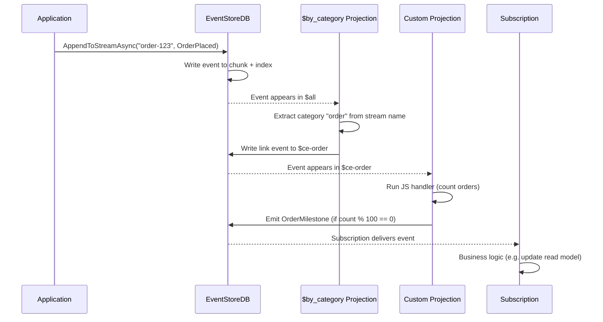

> [!success] Mastery Check
> - [ ] **Studied Well**
> - [ ] **Can explain the concept without notes**
> - [ ] **Can answer interview questions confidently**
> - [ ] **Can implement it in a real project**


# 7.113 — Event Sourcing — EventStoreDB

> **EventStoreDB** (formerly Event Store) is the first purpose-built database for event sourcing. Unlike general-purpose databases retrofitted with event tables, EventStoreDB is natively an append-only, immutable event log with built-in streams, projections, subscriptions, and concurrency control. This note covers the full lifecycle: stream model, projection engine, subscription types, .NET gRPC client, deployment on Azure, operational concerns, backup/restore, and production hardening.

| Property | Value |
|---|---|
| **Group** | `CQRS and Event Sourcing` |
| **Priority** | `3` |
| **Prerequisites** | [[7.102 — Event Sourcing — Event Store Design]] |
| **Related** | [[7.101 — Event Sourcing — Events as the Source of Truth]] · [[7.103 — Event Sourcing — Event Envelope Pattern]] · [[7.104 — Event Sourcing — Projections — Building Read Models]] · [[7.115 — Event Sourcing — Aggregate Rehydration]] · [[7.116 — Event Sourcing — Optimistic Concurrency]] |
| **Version** | `2.0` |
| **Status** | `Complete` |

---

## Table of Contents

1. [Fundamentals and Architecture](#1-fundamentals-and-architecture)
2. [Stream Model — Single, Category, $all](#2-stream-model--single-category-all)
3. [Projections — By Category, By Type, Custom](#3-projections--by-category-by-type-custom)
4. [Subscriptions — Volatile, Persistent, Catch-Up](#4-subscriptions--volatile-persistent-catch-up)
5. [Expected Version Concurrency](#5-expected-version-concurrency)
6. [User Management and ACLs](#6-user-management-and-acls)
7. [.NET gRPC Client — Setup, Append, Read, Subscribe](#7-net-grpc-client--setup-append-read-subscribe)
8. [Deployment on Azure — VM, AKS, EventStore Cloud](#8-deployment-on-azure--vm-aks-eventstore-cloud)
9. [Operational Considerations — Scavenging, Indexing, Monitoring](#9-operational-considerations--scavenging-indexing-monitoring)
10. [Backup and Restore](#10-backup-and-restore)
11. [Pitfalls and Anti-Patterns](#11-pitfalls-and-anti-patterns)
12. [Interview Questions](#12-interview-questions)
13. [Architecture Decision Record (ADR)](#13-architecture-decision-record-adr)
14. [Self-Check — 12 Quick + 6 Deep](#14-self-check--12-quick--6-deep)

---

## 1. Fundamentals and Architecture

### 1.1 What Is EventStoreDB?

EventStoreDB is an **open-source, purpose-built event database** created by Greg Young (the originator of CQRS). It stores data as an **append-only log of immutable events** organised into **streams**. It is not a general-purpose database — it optimises for exactly two operations:

| Operation | Description | EventStoreDB API |
|---|---|---|
| **Append to stream** | Atomically write one or more events to the end of a stream with an optional expected-version guard | `AppendToStreamAsync` |
| **Read from stream** | Read events forward or backward from a given position | `ReadStreamAsync` / `ReadAllAsync` |

### 1.2 Architecture Overview

```
┌─────────────────────────────────────────────────────────┐
│                    EventStoreDB Cluster                   │
│                                                           │
│  ┌──────────┐   ┌──────────┐   ┌──────────┐              │
│  │  Node 1  │──▶│  Node 2  │──▶│  Node 3  │              │
│  │ (Leader) │   │(Follower)│   │(Follower)│              │
│  └────┬─────┘   └────┬─────┘   └────┬─────┘              │
│       │              │              │                     │
│       └──────────────┴──────────────┘                     │
│                      │ Internal Gossip                    │
│                      ▼                                    │
│  ┌─────────────────────────────────────┐                  │
│  │       Chunk Storage (ESDB)           │                  │
│  │  Append-only .chunk files on disk    │                  │
│  │  Logical streams → ordered events    │                  │
│  │  Indexes: stream index, event index  │                  │
│  └──────────────────────────────────────┘                  │
└───────────────────────────────────────────────────────────┘
         │
         │ gRPC (HTTP/2)
         ▼
┌───────────────────┐  ┌──────────────────┐  ┌──────────────┐
│  .NET Client       │  │  Node.js Client  │  │  Java Client │
│  (EventStoreClient)│  │  (grpc-js)       │  │  (gRPC)      │
└───────────────────┘  └──────────────────┘  └──────────────┘
```

### 1.3 Core Concepts

| Concept | Definition |
|---|---|
| **Event** | An immutable record of something that happened. Contains `EventId`, `EventType`, `Data` (JSON or binary), and optional `Metadata`. |
| **Stream** | An ordered sequence of events identified by a string name. All events in a stream share a monotonically increasing version number. |
| **Stream metadata** | A special system-owned event at `$${streamName}` that stores max count, max age, ACLs, and custom metadata. |
| **$all stream** | A built-in global stream that interleaves every event across all streams in append order. |
| **Projection** | A JavaScript (V8) program that reads events and writes new events, links them to streams, or produces state. |
| **Subscription** | A mechanism to receive events as they are written. Three types: volatile, persistent, catch-up. |
| **Scavenge** | A background process that reclaims disk space from deleted/expired events. |
| **Chunks** | Append-only `.chunk` files on disk that store serialised events. Chunks are immutable after being sealed. |

### 1.4 When to Use EventStoreDB vs a General-Purpose Database

| Factor | EventStoreDB | SQL Server / Postgres (event tables) | Cosmos DB |
|---|---|---|---|
| **Event store purity** | Native append-only log; no accidental updates/deletes | Must enforce immutability via constraints/triggers | Document-based; immutability is convention |
| **Global stream ($all)** | Built-in, ordered, paginated | Requires custom indexes or sequence | Change feed provides equivalent |
| **Projections** | Built-in JS engine | External — CDC or outbox + app code | Change feed + Azure Functions |
| **Subscriptions** | Volatile/persistent/catch-up — server-managed | Polling or CDC-based | Change feed processor |
| **Concurrency** | Expected-version guard is a first-class API parameter | Manual `UPDLOCK, SERIALIZABLE` | Optimistic via etag |
| **Performance** | 10k–50k appends/sec (3-node cluster) | 1k–5k appends/sec (single writer) | 10k RU/s per partition |
| **Operational complexity** | Medium — dedicated cluster, scavenging, monitoring | Low — DBA teams already manage it | Low — fully managed |
| **Maturity** | Mature (v20+, commercially backed) | Very mature but not event-specific | Mature (PaaS) |

---

## 2. Stream Model — Single, Category, $all

### 2.1 Streams Overview

Every event in EventStoreDB belongs to exactly one **stream**. Streams are logical groupings — they have no physical boundary (events are stored in chunks, not per-stream files). The stream name is a string; naming conventions encode meaning.

| Stream type | Example name | Purpose |
|---|---|---|
| **Single stream** | `order-abc123` | All events for a specific aggregate instance |
| **Category stream** | `$ce-order` | All events of a given category (projected via `$by_category`) |
| **Type stream** | `$et-OrderPlaced` | All events of a given event type (projected via `$by_event_type`) |
| **Global stream** | `$all` | Every event in the database, in append order |

### 2.2 Single Stream — Aggregate Instance

A single stream represents the event history of one **aggregate instance**. The stream ID is typically `{aggregateType}-{aggregateId}`.

```csharp
// Stream ID convention
var streamId = $"order-{orderId}";

// Append events to a single stream
var eventData = new EventData(
    eventId: Uuid.NewUuid(),
    type: "OrderPlaced",
    data: JsonSerializer.SerializeToUtf8Bytes(new OrderPlaced(orderId, total)),
    metadata: JsonSerializer.SerializeToUtf8Bytes(new Metadata(correlationId)));

await client.AppendToStreamAsync(
    streamId,
    StreamState.Any,
    new[] { eventData });
```

**Characteristics:**
- Events are ordered by `StreamRevision` (1-based, monotonically increasing)
- Maximum recommended length: 10,000–50,000 events (beyond that, consider snapshots or stream splitting)
- Concurrency is enforced per stream via `StreamState` / expected revision

### 2.3 Category Stream — `$ce-`

A **category stream** groups all events for a category of aggregates. EventStoreDB provides a built-in `$by_category` projection that creates a `$ce-{categoryName}` stream for each category.

**Category is derived from the stream ID:**
- Stream `order-abc123` → category `order` → category stream `$ce-order`
- Stream `customer-xyz` → category `customer` → category stream `$ce-customer`

The `$by_category` projection reads the stream ID, extracts the portion before the first `-`, and creates a **link** event in the corresponding `$ce-` stream. The link event points to the original event through its metadata.

```json
// Link event in $ce-order (stored in metadata)
{
  "$sourceStreamId": "order-abc123",
  "$sourceEventRevision": 1,
  "$positionEventNumber": 42
}
```

**Category streams enable:**
- Querying all events for a given aggregate type
- Building projections that operate on a category
- Replaying a category independently of other categories

### 2.4 Event Type Stream — `$et-`

The `$by_event_type` built-in projection creates a `$et-{EventType}` stream for each unique event type. This allows you to read every event of a given type across all streams.

```json
// All OrderPlaced events across every aggregate
// Read stream: $et-OrderPlaced
```

### 2.5 The $all Stream

`$all` is the **global, interleaved event log**. Every event written to any stream appears in `$all` in append order. It is the foundation for:
- Catch-up subscriptions
- Global projections (projections that process every event)
- Backups and replication

```csharp
// Read $all forward from the beginning
var result = client.ReadAllAsync(
    Direction.Forwards,
    Position.Start);

await foreach (var resolvedEvent in result)
{
    Console.WriteLine($"{resolvedEvent.Event.EventType} @ {resolvedEvent.Event.Position}");
}
```

**$all ordering:**
- Events are ordered by `Position` (a composite of `commit position` and `prepare position`)
- `Position.Start` is logical position 0
- `Position.End` represents "the end of the stream"

### 2.6 Stream Metadata — `$${streamName}`

Every stream has a corresponding metadata stream named `$${streamName}`. Writing to it sets stream-level configuration.

```csharp
// Set stream metadata: max count and max age
var metadata = new StreamMetadata(
    maxCount: 10_000,           // keep only the last 10,000 events
    maxAge: TimeSpan.FromDays(90),  // auto-expire events older than 90 days
    acl: null,                  // access control (see Section 6)
    customMetadata: JsonDocument.Parse("""{"tenancy": "prod"}"""));

await client.SetStreamMetadataAsync(
    streamId,
    StreamState.Any,
    metadata);
```

| Metadata property | Type | Effect |
|---|---|---|
| `maxCount` | `long?` | Maximum number of events to retain. Oldest events are truncated. |
| `maxAge` | `TimeSpan?` | Maximum age of events. Events older than this are expired. |
| `truncateBefore` | `long?` | Truncate events with revision less than this value. |
| `cacheControl` | `TimeSpan?` | How long event data can be cached in HTTP. |
| `acl` | `StreamAcl` | Per-stream access control list. |

---

## 3. Projections — By Category, By Type, Custom

### 3.1 Projection Engine

EventStoreDB includes a **built-in projection engine** that runs JavaScript (V8) programs called **projections**. Projections process events from a source stream and emit results as new events (or link events) to output streams.

```
┌──────────────┐    reads     ┌──────────────────┐    writes    ┌──────────────┐
│   $all       │─────────────▶│   Projection      │────────────▶│  $ce-order   │
│  (global)    │              │  $by_category.js   │             │  (category)  │
└──────────────┘              └──────────────────┘              └──────────────┘
```

| Projection type | Source | Output |
|---|---|---|
| **Built-in: `$by_category`** | `$all` | Link events to `$ce-{category}` streams |
| **Built-in: `$by_event_type`** | `$all` | Link events to `$et-{type}` streams |
| **Built-in: `$stream_by_category`** | `$all` | Link events to category-indexing stream |
| **User-defined (custom)** | Any stream(s) | Any stream(s) — arbitrary logic |

### 3.2 Configuring Built-in Projections

Projections are enabled/disabled via the admin UI or the HTTP API.

```bash
# Enable $by_category via HTTP API
curl -X POST http://localhost:2113/projection/$by_category/command/enable \
  -H "Content-Type: application/json" \
  -u admin:changeit
```

```csharp
// Enable through the gRPC client (projections management)
var client = new EventStoreProjectionManagementClient(
    EventStoreClientSettings.Create("esdb://localhost:2113?tls=false"));

await client.EnableAsync("$by_category");
```

### 3.3 Custom Projections — JavaScript API

Custom projections are written in JavaScript and use the EventStoreDB projection API.

#### 3.3.1 Stateful Projection

```javascript
// A projection that counts orders by status
options({
  resultStreamName: "order-stats",
  $includeLinks: false,
  reorderEvents: false,
  processingLag: 0
});

var orderStats = {};

function handleOrderPlaced(state, event) {
  var orderId = event.body.orderId;
  orderStats[orderId] = 'Placed';
  return state;
}

function handleOrderShipped(state, event) {
  var orderId = event.body.orderId;
  orderStats[orderId] = 'Shipped';
  return state;
}

function handleOrderDelivered(state, event) {
  var orderId = event.body.orderId;
  orderStats[orderId] = 'Delivered';
  return state;
}

// Multi-handler dispatch
function init(state) {
  return {};
}

function processing(state, event) {
  switch (event.eventType) {
    case 'OrderPlaced':
      return handleOrderPlaced(state, event);
    case 'OrderShipped':
      return handleOrderShipped(state, event);
    case 'OrderDelivered':
      return handleOrderDelivered(state, event);
    default:
      return state;
  }
}
```

#### 3.3.2 Link-To Projection (Category-Like)

```javascript
// Custom projection that links all Payment events to a $ce-payment stream
fromAll()
  .when({
    $any: function (state, event) {
      if (event.eventType.startsWith("Payment")) {
        linkTo("$ce-payment", event);
      }
    }
  });
```

#### 3.3.3 Emit Projection (Event Generation)

```javascript
// Projection that emits a summary event every 100 orders
fromCategory("order")
  .when({
    OrderPlaced: function (state, event) {
      state.count = (state.count || 0) + 1;
      if (state.count % 100 === 0) {
        emit("order-milestones", "OrderMilestone", {
          milestone: 100,
          count: state.count
        });
      }
      return state;
    }
  })
  .transformBy(function (state) {
    return state;
  })
  .outputState();
```

#### 3.3.4 Projection Processing Modes

| Mode | Description | `options()` parameter |
|---|---|---|
| **By stream** | Each stream is processed sequentially; ordering is guaranteed per stream | `reorderEvents: false` |
| **By $all** | Events processed in $all order across all streams | `reorderEvents: true` (with processingLag) |
| **Continuous** | Runs as events arrive | Default |
| **One-time** | Runs once over existing events and stops | Query, not a projection |

### 3.4 Projection Management

```csharp
// .NET projection management client
public sealed class ProjectionManager
{
    private readonly EventStoreProjectionManagementClient _client;

    public ProjectionManager(EventStoreProjectionManagementClient client)
    {
        _client = client;
    }

    public async Task CreateContinuousAsync(
        string name, string jsCode, CancellationToken ct = default)
    {
        await _client.CreateContinuousAsync(
            name,
            jsCode,
            trackEmittedStreams: true,
            cancellationToken: ct);
    }

    public async Task<ProjectionDetails> GetStatusAsync(
        string name, CancellationToken ct = default)
    {
        return await _client.GetStatusAsync(name, ct);
    }

    public async Task EnableAsync(string name, CancellationToken ct = default)
    {
        await _client.EnableAsync(name, ct);
    }

    public async Task DisableAsync(string name, CancellationToken ct = default)
    {
        await _client.DisableAsync(name, ct);
    }

    public async Task AbortAsync(string name, CancellationToken ct = default)
    {
        await _client.AbortAsync(name, ct);
    }

    public async Task ResetAsync(string name, CancellationToken ct = default)
    {
        await _client.ResetAsync(name, ct);
    }

    public async Task UpdateAsync(
        string name, string newJsCode, bool emitEnabled = true,
        CancellationToken ct = default)
    {
        await _client.UpdateAsync(
            name,
            newJsCode,
            emitEnabled: emitEnabled,
            cancellationToken: ct);
    }
}
```

### 3.5 Projection Performance Characteristics

| Factor | Recommendation |
|---|---|
| **Number of projections** | < 50 per cluster. Each projection consumes V8 memory. |
| **Projection complexity** | Keep handlers simple — avoid heavy computation or external calls. |
| **Link-to vs emit** | Link-to is cheaper than emit (no new event written). |
| **Partitioned projections** | Use `fromStream()` or `fromCategory()` to limit scope. |
| **Processing lag** | For `$all` projections, set `processingLag: 200` (ms) to reduce reordering. |

### 3.6 Mermaid — Projection Event Flow



---

## 4. Subscriptions — Volatile, Persistent, Catch-Up

### 4.1 Subscription Types Overview

EventStoreDB provides three subscription types that deliver events to consumers without polling.

| Type | Delivery Guarantee | Start From | Competing Consumers | Connection Required |
|---|---|---|---|---|
| **Volatile** | At-most-once | New events only | No | Always connected |
| **Catch-Up** | At-least-once | Any position | No (but load balances across instances) | Connected during catch-up |
| **Persistent** | At-least-once (with ACK/NACK) | Configured from | Yes — consumer group | Connected while active |

```
                    EventStoreDB
                    ┌─────────────────────────────┐
                    │                             │
                    │   ┌──────────────────────┐  │
                    │   │    Subscription       │  │
                    │   │    Manager            │  │
                    │   └──┬──┬──┬──┬──┬──┬────┘  │
                    │      │  │  │  │  │  │        │
                    └──────┼──┼──┼──┼──┼──┼────────┘
                           │  │  │  │  │  │
              ┌────────────┘  │  │  │  │  └────────────┐
              │               │  │  │  │               │
          Volatile         Catch-Up    Persistent (Group)
              │               │  │  │  │               │
              ▼               ▼  ▼  ▼  ▼               ▼
          Consumer-A      Consumer-B (catch-up)     Consumer-D
                        Consumer-C (catch-up)     Consumer-E (competing)
```

### 4.2 Volatile Subscriptions

**Exactly once per connected client.** If the client disconnects, events that arrived during the disconnection are lost. Never checkpointed.

```csharp
// Create a volatile subscription
await client.SubscribeToStreamAsync(
    "order-abc123",
    FromStream.Start,
    eventAppeared: async (subscription, resolvedEvent, ct) =>
    {
        var eventType = resolvedEvent.Event.EventType;
        var data = DeserializeEvent(resolvedEvent);
        await HandleEventAsync(data, ct);
    },
    subscriptionDropped: (subscription, reason, ex) =>
    {
        Console.WriteLine($"Subscription dropped: {reason}");
    },
    cancellationToken: ct);
```

**Use cases:**
- Live-only consumers (dashboard updates, WebSocket push)
- When missing an event on restart is acceptable
- Low-complexity integrations

### 4.3 Catch-Up Subscriptions

**At-least-once delivery with checkpointing.** The client specifies a starting position, processes events sequentially, and optionally persists a checkpoint. On restart, it resumes from the checkpoint.

```csharp
public sealed class CatchUpSubscriptionHost : BackgroundService
{
    private readonly EventStoreClient _client;
    private readonly ICheckpointStore _checkpoints;
    private readonly ILogger<CatchUpSubscriptionHost> _logger;
    private const string CheckpointName = "order-projection";

    public CatchUpSubscriptionHost(
        EventStoreClient client,
        ICheckpointStore checkpoints,
        ILogger<CatchUpSubscriptionHost> logger)
    {
        _client = client;
        _checkpoints = checkpoints;
        _logger = logger;
    }

    protected override async Task ExecuteAsync(CancellationToken stoppingToken)
    {
        // Resume from last checkpoint or start of $all
        var lastPosition = await _checkpoints
            .GetPositionAsync(CheckpointName, stoppingToken);

        var startPosition = lastPosition.HasValue
            ? new Position(lastPosition.Value, lastPosition.Value)
            : Position.Start;

        _logger.LogInformation(
            "Starting catch-up subscription from position {Position}",
            startPosition);

        await _client.SubscribeToAllAsync(
            startPosition,
            eventAppeared: async (subscription, resolvedEvent, ct) =>
            {
                await ProcessEventAsync(resolvedEvent, ct);

                // Persist checkpoint after each event (or batch)
                var position = resolvedEvent.Event.Position;
                await _checkpoints.SavePositionAsync(
                    CheckpointName,
                    position.CommitPosition,
                    ct);
            },
            resolveLinkTos: true,
            subscriptionDropped: (sub, reason, ex) =>
            {
                _logger.LogWarning("Subscription dropped: {Reason}", reason);
            },
            cancellationToken: stoppingToken);
    }

    private async Task ProcessEventAsync(
        ResolvedEvent resolvedEvent, CancellationToken ct)
    {
        // Filter to relevant event types
        var eventType = resolvedEvent.Event.EventType;
        if (!s_handledTypes.Contains(eventType)) return;

        try
        {
            var envelope = DeserializeEnvelope(resolvedEvent);
            await HandleEventAsync(envelope, ct);
        }
        catch (Exception ex)
        {
            _logger.LogError(ex, "Failed to process event {EventId}",
                resolvedEvent.Event.EventId);
            throw; // subscription will drop; checkpoint not saved → retry on restart
        }
    }

    private static readonly HashSet<string> s_handledTypes = [
        "OrderPlaced", "OrderShipped", "OrderDelivered",
        "OrderCancelled", "PaymentReceived"
    ];
}
```

**Checkpoint store implementations:**

| Store | Access Pattern | Durability | Latency |
|---|---|---|---|
| **In-memory** | `ConcurrentDictionary` | Lost on restart | 0 ms |
| **SQL Server table** | `UPDATE checkpoint SET position = @pos` | Durable | 5–20 ms |
| **Azure Blob** | `UploadTextAsync` | Durable | 10–50 ms |
| **EventStoreDB stream** | Write to `$checkpoint-{name}` | Durable (uses ESDB) | 1–5 ms |
| **Redis** | `SET checkpoint:{name} {pos}` | Configurable durability | 1–3 ms |

### 4.4 Persistent Subscriptions

**At-least-once delivery with ACK/NACK and competing consumers.** The server manages the state of the subscription group. Multiple client instances can form a consumer group, and the server distributes events among them.

```csharp
// ===== Admin: Create persistent subscription group =====
await client.CreateToAllAsync(
    "order-processing-group",
    new PersistentSubscriptionSettings
    {
        StartFrom = Position.Start,
        ResolveLinkTos = true,
        MaxRetryCount = 10,
        CheckPointAfter = TimeSpan.FromSeconds(2),
        MaxCheckPointCount = 2000,
        MinCheckPointCount = 500,
        MaxSubscriberCount = 10,
        MessageTimeout = TimeSpan.FromSeconds(30),
        ReadBatchSize = 500,
        HistoryBufferSize = 500,
        LiveBufferSize = 500
    },
    credentials: new UserCredentials("admin", "changeit"));

// ===== Consumer: Subscribe to the group =====
await client.SubscribeToAllAsync(
    "order-processing-group",
    eventAppeared: async (subscription, resolvedEvent, ct) =>
    {
        try
        {
            await ProcessEventAsync(resolvedEvent, ct);
            await subscription.Ack(resolvedEvent);
        }
        catch (NonRetryableException)
        {
            // NACK with action: skip the event
            await subscription.Nack(
                Action.Skip, "Non-retryable failure", resolvedEvent);
        }
        catch (Exception)
        {
            // NACK: retry the event
            await subscription.Nack(
                Action.Retry, "Transient failure", resolvedEvent);
        }
    },
    cancellationToken: ct);
```

**Persistent subscription settings:**

| Setting | Default | Description |
|---|---|---|
| `MaxRetryCount` | 10 | Times the event is retried before parking |
| `CheckPointAfter` | 2s | Time after which a checkpoint can be written |
| `MaxCheckPointCount` | 2000 | Max events before checkpoint is forced |
| `MinCheckPointCount` | 500 | Min events before checkpoint is considered |
| `MessageTimeout` | 30s | Time for client to process before retry |
| `ExtraStatistics` | false | Track extra statistics for monitoring |
| `StartFrom` | Start of stream | Position to start from for new groups |

**Parked events:** Persistent subscriptions have an internal `$persistentsubscription-{group}::parked` stream where events that exceed `MaxRetryCount` are moved. These must be monitored and replayed manually or through a separate process.

```csharp
// Replay parked events for a persistent subscription
await client.ReplayParkedAsync(
    "order-processing-group",
    stopOnFirstFail: false,
    credentials: new UserCredentials("admin", "changeit"));
```

### 4.5 Subscription Selection Matrix

| Requirement | Volatile | Catch-Up | Persistent |
|---|---|---|---|
| Avoid losing events on restart | ❌ | ✅ (checkpointed) | ✅ (server-managed) |
| Competing consumer pattern | ❌ | ❌ (but app-level sharding) | ✅ (built-in) |
| Start from arbitrary position | ❌ | ✅ | ✅ (configured once) |
| Skip/retry individual events | ❌ | ❌ (manually in code) | ✅ (ACK/NACK) |
| Server-side buffer management | ❌ | ❌ (client-read) | ✅ (server-buffered) |
| Lowest server overhead | ✅ | ❌ (scan $all) | ❌ (state management) |
| Easiest to reason about | ✅ | ✅ | ⚠️ (retries, parking) |

---

## 5. Expected Version Concurrency

### 5.1 Fundamentals

EventStoreDB implements **optimistic concurrency** via expected version checks. The client declares the version of the stream it expects when appending; if the stream has diverged, the server rejects the append.

```csharp
// Concurrency guard values
StreamState.Any          // No guard — append regardless (use carefully)
StreamState.NoStream     // Stream must not exist (for first event)
StreamState.StreamExists // Stream must exist (for subsequent events)
ExactRevision            // Stream must be at this specific revision number
```

### 5.2 Append With Expected Version

```csharp
public sealed class OrderRepository
{
    private readonly EventStoreClient _client;

    public OrderRepository(EventStoreClient client)
    {
        _client = client;
    }

    public async Task<IWriteResult> SaveAsync(
        OrderAggregate aggregate, CancellationToken ct = default)
    {
        var streamId = $"order-{aggregate.Id}";
        var uncommitted = aggregate.GetUncommittedEvents();

        if (uncommitted.Count == 0)
            return WriteResult.FromRevision(aggregate.Version);

        var eventData = uncommitted.Select(e => new EventData(
            eventId: Uuid.NewUuid(),
            type: e.GetType().Name,
            data: JsonSerializer.SerializeToUtf8Bytes(e, JsonContext.Default),
            metadata: SerializeMetadata(aggregate))).ToArray();

        var expectedRevision = aggregate.Version == 0
            ? StreamState.NoStream
            : StreamState.Exactly(aggregate.Version);

        try
        {
            var result = await _client.AppendToStreamAsync(
                streamId,
                expectedRevision,
                eventData,
                cancellationToken: ct);

            aggregate.ClearUncommittedEvents();
            return WriteResult.FromRevision(result.NextExpectedStreamRevision);
        }
        catch (WrongExpectedVersionException ex)
        {
            throw new ConcurrencyException(
                streamId, aggregate.Version, ex.ActualVersion ?? -1, ex);
        }
    }
}
```

### 5.3 Concurrency Decision Matrix

| Scenario | Expected Version | Behaviour on Conflict |
|---|---|---|
| Creating a new aggregate | `StreamState.NoStream` | Throws if stream exists (prevents accidental overwrite) |
| Appending to known version | `StreamState.Exactly(version)` | Throws if another writer already appended |
| Appending regardless | `StreamState.Any` | Always succeeds (use for idempotent/idempotent writes) |
| Blind write (no concurrency check) | `StreamState.Any` | Can cause lost updates — use only for logging/tracing events |

### 5.4 Handling WrongExpectedVersionException

```csharp
public sealed class ConflictResolver
{
    public async Task<TSnapshot> ResolveAndRetryAsync<TSnapshot>(
        string streamId,
        Func<TSnapshot, Task> saveAction,
        Func<Task<TSnapshot>> loadAggregate,
        int maxRetries = 3,
        CancellationToken ct = default)
        where TSnapshot : class
    {
        for (var attempt = 1; attempt <= maxRetries; attempt++)
        {
            try
            {
                var aggregate = await loadAggregate();
                await saveAction(aggregate);
                return aggregate;
            }
            catch (ConcurrencyException) when (attempt < maxRetries)
            {
                // Reload latest state and retry
                await Task.Delay(
                    TimeSpan.FromMilliseconds(50 * attempt), ct);
            }
        }

        throw new MaxRetriesExceededException(streamId, maxRetries);
    }
}
```

### 5.5 Idempotent Append Pattern

When a command handler may be called multiple times with the same command, use an **idempotency check** before appending:

```csharp
public sealed class IdempotentAppender
{
    private readonly EventStoreClient _client;
    private readonly ICheckpointStore _processedCommands;

    public async Task<IWriteResult> AppendOnceAsync(
        string streamId,
        string commandId,
        EventData[] events,
        CancellationToken ct = default)
    {
        // Check if command was already processed
        var dedupStream = $"$dedup-{streamId}";
        var alreadyProcessed = await _processedCommands
            .ExistsAsync(dedupStream, commandId, ct);

        if (alreadyProcessed)
            return WriteResult.NoOp; // deduplicated

        // Append events + deduplication marker in a transaction
        var transaction = await _client.StartTransactionAsync(
            streamId, StreamState.Any, ct);

        try
        {
            await transaction.AppendAsync(events, ct);

            // Store dedup marker as an event in the dedup stream
            await _client.AppendToStreamAsync(
                dedupStream,
                StreamState.Any,
                new EventData(
                    Uuid.NewUuid(),
                    "$dedup-command",
                    Encoding.UTF8.GetBytes(commandId),
                    null),
                ct);

            var result = await transaction.CommitAsync(ct);
            return result;
        }
        catch (WrongExpectedVersionException)
        {
            // Transaction failed — retry from aggregate reload
            throw new ConcurrencyException(streamId, -1, -1);
        }
    }
}
```

### 5.6 Best Practices

- **Always use `StreamState.Exactly` for aggregates** — never use `Any` for domain events
- **Retry with backoff** on `WrongExpectedVersionException` (reload aggregate state between retries)
- **Use `StreamState.NoStream` for first writes** to detect accidental stream creation
- **Batch append** multiple events in a single call for atomicity
- **Log conflicts** with stream ID, expected vs actual version for operational visibility

---

## 6. User Management and ACLs

### 6.1 Built-in Users

EventStoreDB ships with default users:

| Username | Password | Role |
|---|---|---|
| `admin` | `changeit` | `$admin` — full access |
| `ops` | `changeit` | `$ops` — operational access (scavenge, stats) |

**Create a new user:**

```bash
# HTTP API — create user
curl -X POST http://localhost:2113/users/ \
  -H "Content-Type: application/json" \
  -u admin:changeit \
  -d '{
    "loginName": "order-service",
    "fullName": "Order Service",
    "password": "s3cret!",
    "groups": ["$users", "order-team"]
  }'
```

```csharp
// .NET — user management
var client = new EventStoreUserManagementClient(
    EventStoreClientSettings.Create("esdb://localhost:2113?tls=false"));

await client.CreateUserAsync(
    "order-service",
    "Order Service",
    ["$users", "order-team"],
    "s3cret!",
    cancellationToken: ct);

await client.EnableUserAsync("order-service", ct);
```

### 6.2 Stream-Level ACLs

ACLs are set via stream metadata on the `$${streamName}` metadata stream.

```csharp
public sealed class StreamAccessControl
{
    private readonly EventStoreClient _client;

    public async Task RestrictStreamAsync(
        string streamId,
        string[] readRoles,
        string[] writeRoles,
        string[] deleteRoles,
        string[] metaReadRoles,
        string[] metaWriteRoles,
        CancellationToken ct = default)
    {
        var acl = new StreamAcl(
            readRoles: readRoles,
            writeRoles: writeRoles,
            deleteRoles: deleteRoles,
            metaReadRoles: metaReadRoles,
            metaWriteRoles: metaWriteRoles);

        var metadata = new StreamMetadata(
            maxCount: null,
            maxAge: null,
            truncateBefore: null,
            cacheControl: null,
            acl: acl,
            customMetadata: null);

        await _client.SetStreamMetadataAsync(
            streamId,
            StreamState.Any,
            metadata,
            ct);
    }

    public async Task AllowOrderServiceOnlyAsync(
        string streamId, CancellationToken ct = default)
    {
        await RestrictStreamAsync(
            streamId,
            readRoles: ["admin", "order-service"],
            writeRoles: ["admin", "order-service"],
            deleteRoles: ["admin"],
            metaReadRoles: ["admin"],
            metaWriteRoles: ["admin"],
            ct);
    }
}
```

### 6.3 System-Level ACLs

System-level ACLs are configured via `$users` and `$ops` stream metadata:

```bash
# Restrict $all to admin only
curl -X POST http://localhost:2113/streams/%24all/metadata \
  -H "Content-Type: application/vnd.eventstore.events+json" \
  -u admin:changeit \
  -d '[
    {
      "eventId": "b6ade4c0-abc1-4e47-85ff-1c237ab0c123",
      "eventType": "$metadata",
      "data": {
        "$acl": {
          "$r": ["$admins"],
          "$w": ["$admins"],
          "$d": ["$admins"],
          "$mr": ["$admins"],
          "$mw": ["$admins"]
        }
      }
    }
  ]'
```

### 6.4 ACL Predicates

ACLs can include **predicates** for fine-grained access control:

```json
{
  "$acl": {
    "$r": ["$admins", "order-team"],
    "$w": ["$admins"],
    "$d": ["$admins"],
    "$mr": ["$admins"],
    "$mw": ["$admins"]
  }
}
```

| Role | System group | Purpose |
|---|---|---|
| `$admins` | Admin users | Full control |
| `$ops` | Operational users | Scavenge, stats, configuration |
| `$users` | All authenticated users | Default role for reading non-restricted streams |
| `$everyone` | Unauthenticated users | Anonymous access (not recommended) |

### 6.5 Security Best Practices

- **Disable `$everyone` access** in production — require authentication for all operations
- **Use TLS** between clients and the cluster (EventStoreDB gRPC requires TLS for production)
- **Rotate default passwords** immediately after deployment
- **Create service-specific users** with minimal permissions (principle of least privilege)
- **Restrict `$all` access** — only projections and admin tools should read the global stream
- **Audit user operations** via the built-in `$ops` audit stream

---

## 7. .NET gRPC Client — Setup, Append, Read, Subscribe

### 7.1 Project Setup

```xml
<!-- .csproj — Package references -->
<ItemGroup>
  <PackageReference Include="EventStore.Client.Grpc" Version="23.3.0" />
  <PackageReference Include="EventStore.Client.Grpc.Streams" Version="23.3.0" />
  <PackageReference Include="EventStore.Client.Grpc.Projections" Version="23.3.0" />
  <PackageReference Include="EventStore.Client.Grpc.PersistentSubscriptions" Version="23.3.0" />
  <PackageReference Include="EventStore.Client.Grpc.UserManagement" Version="23.3.0" />
  <PackageReference Include="Microsoft.Extensions.DependencyInjection" Version="8.0.0" />
</ItemGroup>
```

### 7.2 Client Configuration

```csharp
// ===== Service Registration =====
public static class EventStoreExtensions
{
    public static IServiceCollection AddEventStore(
        this IServiceCollection services,
        IConfiguration configuration)
    {
        var esdbConfig = configuration
            .GetSection("EventStoreDB")
            .Get<EventStoreDbConfig>()!;

        var settings = new EventStoreClientSettings
        {
            ConnectivitySettings = new EventStoreClientConnectivitySettings
            {
                Address = new Uri(esdbConfig.ConnectionString),
                // = "esdb://esdb-cluster:2113?tls=true&tlsVerifyCert=false"
            },
            DefaultCredentials = new UserCredentials(
                esdbConfig.Username,
                esdbConfig.Password),
            OperationOptions = new EventStoreClientOperationOptions
            {
                TimeoutAfter = TimeSpan.FromSeconds(10),
                ThrowOnAppendFailure = true,
            },
            LoggerFactory = services.BuildServiceProvider()
                .GetRequiredService<ILoggerFactory>(),
        };

        services.AddSingleton(new EventStoreClient(settings));
        services.AddSingleton(new EventStoreProjectionManagementClient(settings));
        services.AddSingleton(new EventStorePersistentSubscriptionsClient(settings));
        services.AddSingleton(new EventStoreUserManagementClient(settings));

        return services;
    }
}

public sealed record EventStoreDbConfig
{
    public string ConnectionString { get; init; } = "";
    public string Username { get; init; } = "admin";
    public string Password { get; init; } = "changeit";
}

// ===== appsettings.json =====
// {
//   "EventStoreDB": {
//     "ConnectionString": "esdb://localhost:2113?tls=false",
//     "Username": "admin",
//     "Password": "changeit"
//   }
// }
```

### 7.3 Append Events

```csharp
public sealed class EventStoreAppender
{
    private readonly EventStoreClient _client;
    private readonly IEventSerializer _serializer;
    private readonly ILogger<EventStoreAppender> _logger;

    public EventStoreAppender(
        EventStoreClient client,
        IEventSerializer serializer,
        ILogger<EventStoreAppender> logger)
    {
        _client = client;
        _serializer = serializer;
        _logger = logger;
    }

    public async Task<IWriteResult> AppendToStreamAsync<T>(
        string streamId,
        StreamState expectedState,
        IEnumerable<T> domainEvents,
        EventMetadata? metadata = null,
        CancellationToken ct = default)
    {
        var eventData = domainEvents.Select(domainEvent =>
        {
            var eventType = domainEvent!.GetType().Name;
            var dataBytes = _serializer.Serialize(domainEvent);
            var metaBytes = metadata is not null
                ? _serializer.Serialize(metadata)
                : JsonSerializer.SerializeToUtf8Bytes(new { });

            return new EventData(
                eventId: Uuid.NewUuid(),
                type: eventType,
                data: dataBytes,
                metadata: metaBytes);
        }).ToArray();

        try
        {
            var result = await _client.AppendToStreamAsync(
                streamId,
                expectedState,
                eventData,
                cancellationToken: ct);

            _logger.LogDebug(
                "Appended {Count} events to {Stream} (revision {Revision})",
                eventData.Length, streamId,
                result.NextExpectedStreamRevision);

            return result;
        }
        catch (WrongExpectedVersionException ex)
        {
            _logger.LogWarning(
                "Concurrency conflict on {Stream}: expected {Expected}, actual {Actual}",
                streamId, expectedState, ex.ActualVersion);
            throw new ConcurrencyException(
                streamId, expectedState switch
                {
                    StreamState.NoStream => 0,
                    _ => -1
                }, ex.ActualVersion ?? -1, ex);
        }
    }

    public async Task<IWriteResult> ReplaceEventsAsync<T>(
        string streamId,
        StreamState expectedState,
        IEnumerable<T> domainEvents,
        CancellationToken ct = default) where T : class
    {
        // Special case: tombstone the stream first (only for repair scenarios)
        // WARNING: Tombstone is irreversible
        var appendResult = await AppendToStreamAsync(
            streamId, expectedState, domainEvents, ct: ct);
        return appendResult;
    }
}
```

### 7.4 Read Events

```csharp
public sealed class EventStoreReader
{
    private readonly EventStoreClient _client;
    private readonly IEventSerializer _serializer;

    public EventStoreReader(
        EventStoreClient client,
        IEventSerializer serializer)
    {
        _client = client;
        _serializer = serializer;
    }

    public async Task<IReadOnlyList<object>> ReadStreamAsync(
        string streamId,
        StreamReadDirection direction = StreamReadDirection.Forwards,
        long fromRevision = StreamRevision.Start,
        long maxCount = long.MaxValue,
        CancellationToken ct = default)
    {
        var events = new List<object>();
        var result = _client.ReadStreamAsync(
            direction,
            streamId,
            fromRevision,
            maxCount,
            resolveLinkTos: true,
            cancellationToken: ct);

        await foreach (var resolvedEvent in result)
        {
            var domainEvent = Deserialize(resolvedEvent);
            events.Add(domainEvent);
        }

        return events;
    }

    public async IAsyncEnumerable<object> ReadStreamLazyAsync(
        string streamId,
        StreamReadDirection direction = StreamReadDirection.Forwards,
        long fromRevision = StreamRevision.Start,
        [EnumeratorCancellation] CancellationToken ct = default)
    {
        var result = _client.ReadStreamAsync(
            direction,
            streamId,
            fromRevision,
            resolveLinkTos: true,
            cancellationToken: ct);

        await foreach (var resolvedEvent in result)
        {
            yield return Deserialize(resolvedEvent);
        }
    }

    public async Task<StreamSlice> ReadSliceAsync(
        string streamId,
        long fromRevision,
        int count,
        CancellationToken ct = default)
    {
        var result = _client.ReadStreamAsync(
            StreamReadDirection.Forwards,
            streamId,
            fromRevision,
            count,
            resolveLinkTos: true,
            cancellationToken: ct);

        var state = await result.ReadState;
        var events = new List<object>();

        await foreach (var resolvedEvent in result)
        {
            events.Add(Deserialize(resolvedEvent));
        }

        var nextRevision = events.Count > 0
            ? fromRevision + events.Count
            : fromRevision;

        return new StreamSlice(events, nextRevision, state == ReadState.Ok);
    }

    public async IAsyncEnumerable<object> ReadAllAsync(
        Position fromPosition,
        [EnumeratorCancellation] CancellationToken ct = default)
    {
        var result = _client.ReadAllAsync(
            Direction.Forwards,
            fromPosition,
            resolveLinkTos: false,
            cancellationToken: ct);

        await foreach (var resolvedEvent in result)
        {
            // Filter system events
            if (resolvedEvent.Event.EventType.StartsWith("$")) continue;
            yield return Deserialize(resolvedEvent);
        }
    }

    private object Deserialize(ResolvedEvent resolvedEvent)
    {
        return _serializer.Deserialize(
            resolvedEvent.Event.Data.ToArray(),
            resolvedEvent.Event.EventType);
    }
}

public sealed record StreamSlice(
    IReadOnlyList<object> Events,
    long NextRevision,
    bool IsEndOfStream);
```

### 7.5 Subscribe to Stream

```csharp
public sealed class EventStoreSubscriber
{
    private readonly EventStoreClient _client;
    private readonly IServiceScopeFactory _scopeFactory;
    private readonly ILogger<EventStoreSubscriber> _logger;

    public EventStoreSubscriber(
        EventStoreClient client,
        IServiceScopeFactory scopeFactory,
        ILogger<EventStoreSubscriber> logger)
    {
        _client = client;
        _scopeFactory = scopeFactory;
        _logger = logger;
    }

    public async Task SubscribeToAllAsync(
        string subscriptionName,
        CancellationToken ct = default)
    {
        // Resume from last checkpoint
        using var scope = _scopeFactory.CreateScope();
        var checkpoints = scope.ServiceProvider
            .GetRequiredService<ICheckpointStore>();

        var lastPos = await checkpoints
            .GetPositionAsync(subscriptionName, ct);

        var startPos = lastPos.HasValue
            ? new Position(lastPos.Value, lastPos.Value)
            : Position.Start;

        _logger.LogInformation(
            "Starting subscription {Name} from {Position}",
            subscriptionName, startPos);

        await _client.SubscribeToAllAsync(
            startPos,
            eventAppeared: async (sub, resolvedEvent, innerCt) =>
            {
                if (resolvedEvent.Event.EventType.StartsWith("$"))
                    return; // skip system events

                try
                {
                    await ProcessAsync(resolvedEvent, innerCt);

                    // Persist checkpoint after successful processing
                    var pos = resolvedEvent.Event.Position;
                    await checkpoints.SavePositionAsync(
                        subscriptionName,
                        pos.CommitPosition,
                        innerCt);
                }
                catch (Exception ex)
                {
                    _logger.LogError(ex,
                        "Failed to process {EventType} @ {Position}",
                        resolvedEvent.Event.EventType,
                        resolvedEvent.Event.Position);
                    throw; // let the subscription drop
                }
            },
            resolveLinkTos: true,
            subscriptionDropped: (sub, reason, ex) =>
            {
                _logger.LogWarning(
                    "Subscription {Name} dropped: {Reason}",
                    subscriptionName, reason);
            },
            cancellationToken: ct);
    }

    private async Task ProcessAsync(
        ResolvedEvent resolvedEvent, CancellationToken ct)
    {
        using var scope = _scopeFactory.CreateScope();
        var handlers = scope.ServiceProvider
            .GetRequiredService<IEnumerable<ISubscriptionHandler>>();

        foreach (var handler in handlers)
        {
            if (handler.CanHandle(resolvedEvent.Event.EventType))
            {
                await handler.HandleAsync(resolvedEvent, ct);
            }
        }
    }
}

public interface ISubscriptionHandler
{
    bool CanHandle(string eventType);
    Task HandleAsync(ResolvedEvent resolvedEvent, CancellationToken ct);
}

public interface ICheckpointStore
{
    Task<long?> GetPositionAsync(string subscriptionName, CancellationToken ct);
    Task SavePositionAsync(string subscriptionName, long position, CancellationToken ct);
}
```

### 7.6 Aggressive Batching and Efficiency

```csharp
// Batch subscribe with queued processing for throughput
public sealed class BatchedSubscriptionHost : BackgroundService
{
    private readonly EventStoreClient _client;
    private readonly Channel<ResolvedEvent> _channel;
    private readonly int _batchSize;

    public BatchedSubscriptionHost(
        EventStoreClient client,
        IConfiguration configuration)
    {
        _client = client;
        _batchSize = configuration.GetValue<int>("BatchSize", 500);
        _channel = Channel.CreateBounded<ResolvedEvent>(
            new BoundedChannelOptions(10_000)
            {
                FullMode = BoundedChannelFullMode.Wait
            });
    }

    protected override async Task ExecuteAsync(CancellationToken stoppingToken)
    {
        // Start consumer
        var consumer = ConsumeBatchAsync(stoppingToken);

        // Subscribe
        await _client.SubscribeToAllAsync(
            Position.Start,
            eventAppeared: async (_, resolvedEvent, _) =>
            {
                if (resolvedEvent.Event.EventType.StartsWith("$"))
                    return;
                await _channel.Writer.WriteAsync(resolvedEvent, stoppingToken);
            },
            subscriptionDropped: (_, reason, ex) =>
            {
                // Signal consumer to stop
                _channel.Writer.Complete(ex);
            },
            cancellationToken: stoppingToken);

        await consumer;
    }

    private async Task ConsumeBatchAsync(CancellationToken ct)
    {
        var buffer = new List<ResolvedEvent>(_batchSize);
        await foreach (var evt in _channel.Reader.ReadAllAsync(ct))
        {
            buffer.Add(evt);
            if (buffer.Count >= _batchSize)
            {
                await ProcessBatchAsync(buffer, ct);
                buffer.Clear();
            }
        }
        // Flush remaining
        if (buffer.Count > 0)
            await ProcessBatchAsync(buffer, ct);
    }

    private async Task ProcessBatchAsync(
        List<ResolvedEvent> batch, CancellationToken ct)
    {
        // Group by event type for efficient processing
        var groups = batch.GroupBy(e => e.Event.EventType);
        ParallelOptions parallelOptions = new()
        {
            MaxDegreeOfParallelism = 4,
            CancellationToken = ct
        };

        await Parallel.ForEachAsync(groups, parallelOptions,
            async (group, innerCt) =>
            {
                foreach (var evt in group)
                    await HandleAsync(evt, innerCt);
            });
    }

    private ValueTask HandleAsync(ResolvedEvent evt, CancellationToken ct)
    {
        // Actual processing
        return ValueTask.CompletedTask;
    }
}
```

---

## 8. Deployment on Azure — VM, AKS, EventStore Cloud

### 8.1 Deployment Options

| Option | Managed? | Operational Load | Cost | Best For |
|---|---|---|---|---|
| **EventStore Cloud** | Fully managed (DBaaS) | Minimal | Highest | Teams without dedicated DBAs |
| **Azure VM (IaaS)** | Self-managed | High — OS patches, monitoring, failover | Moderate | Teams with ops expertise |
| **Azure Kubernetes (AKS)** | Kubernetes-managed | Medium — Helm chart, persistent volumes | Moderate-High | Already on Kubernetes |
| **Docker Compose** | Developer tool | Low | Low | Dev/test environments |

### 8.2 EventStore Cloud

EventStore Cloud provides managed clusters in Azure, AWS, and GCP.

```bash
# EventStore Cloud CLI — create a cluster
escloud cluster create \
  --name "production-esdb" \
  --cloud-provider azure \
  --region westeurope \
  --node-type "Standard_D4s_v5" \
  --node-count 3 \
  --project-id "prj_abc123" \
  --network-id "net_xyz789" \
  --environment production
```

**Connection string:**
```
esdb://<cluster-id>.mesdb.eventstore.cloud:2113?tls=true&tlsVerifyCert=true
```

**Features:**
- Automated backups (point-in-time recovery)
- Automated patch management
- Built-in monitoring dashboard
- Staged upgrades with zero-downtime
- Auto-scaling storage
- Encryption at rest and in transit

### 8.3 Azure VM Deployment

```bash
# Deploy a 3-node EventStoreDB cluster on Azure VMs

# 1. Create resource group
az group create --name esdb-prod-rg --location westeurope

# 2. Create virtual network
az network vnet create \
  --resource-group esdb-prod-rg \
  --name esdb-vnet \
  --address-prefix 10.0.0.0/16 \
  --subnet-name esdb-subnet \
  --subnet-prefix 10.0.1.0/24

# 3. Create managed disk for data (Premium SSD v2, 512 GB)
az disk create \
  --resource-group esdb-prod-rg \
  --name esdb-data-disk-0 \
  --size-gb 512 \
  --sku PremiumV2_LRS

# 4. Deploy VM with custom script extension
az vm create \
  --resource-group esdb-prod-rg \
  --name esdb-node-0 \
  --image Ubuntu2204 \
  --size Standard_D4s_v5 \
  --admin-username azureuser \
  --ssh-key-values ~/.ssh/id_rsa.pub \
  --vnet-name esdb-vnet \
  --subnet esdb-subnet \
  --attach-data-disks esdb-data-disk-0
```

**Installation script:**

```bash
#!/bin/bash
# install-esdb.sh — Run on each VM

# Install EventStoreDB
curl -s https://packagecloud.io/install/repositories/EventStore/EventStore-OSS/script.deb.sh | bash
apt-get update && apt-get install -y eventstore-oss

# Mount data disk
mkfs.ext4 /dev/sdc
mkdir -p /data/esdb
mount /dev/sdc /data/esdb
echo "/dev/sdc /data/esdb ext4 defaults 0 0" >> /etc/fstab

# Configure EventStoreDB
cat > /etc/eventstore/eventstore.conf << 'EOF'
Db: /data/esdb/db
Log: /data/esdb/log
Index: /data/esdb/index
ExtIp: 0.0.0.0
ExtHttpPort: 2113
ExtTcpPort: 1113
IntIp: 0.0.0.0
IntTcpPort: 1112
NodePriority: 1
ClusterSize: 3
DiscoverViaDns: false
GossipOnSingleNode: false
GossipSeed: ["10.0.1.4:2113","10.0.1.5:2113","10.0.1.6:2113"]
RunProjections: All
EOF

# Enable TLS (recommended for production)
# Place certificates in /etc/eventstore/certs/
# CertificateFile: /etc/eventstore/certs/node.crt
# CertificatePrivateKeyFile: /etc/eventstore/certs/node.key
# TrustedRootCertificatesPath: /etc/eventstore/certs/ca

systemctl enable eventstore
systemctl start eventstore
```

### 8.4 AKS Deployment (Helm)

```yaml
# values.yaml — EventStoreDB Helm chart overrides
replicas: 3

image:
  repository: eventstore/eventstore
  tag: "23.10.0-jammy"

persistence:
  size: 256Gi
  storageClass: managed-premium

config:
  dbPath: /var/lib/eventstore
  logPath: /var/log/eventstore
  indexPath: /var/lib/eventstore/index
  extIp: 0.0.0.0
  extHttpPort: 2113
  extTcpPort: 1113
  intIp: 0.0.0.0
  intTcpPort: 1112
  clusterSize: 3
  discoverViaDns: false
  gossipOnSingleNode: false
  runProjections: All
  enableAtomPubOverHTTP: false

resources:
  requests:
    cpu: "2"
    memory: "4Gi"
  limits:
    cpu: "4"
    memory: "8Gi"

service:
  type: ClusterIP
  ports:
    grpc: 2113
    gossip: 1113

ingress:
  enabled: true
  className: nginx
  hostname: esdb.internal.example.com
  annotations:
    cert-manager.io/cluster-issuer: internal-ca
  tls: true

securityContext:
  fsGroup: 1000
  runAsUser: 1000
```

```bash
# Deploy EventStoreDB to AKS
helm repo add eventstore https://eventstore.github.io/helm-charts
helm repo update

helm upgrade --install esdb eventstore/eventstore \
  --namespace esdb --create-namespace \
  --values values.yaml \
  --version 3.1.0
```

**Azure-specific considerations for AKS:**

| Concern | Recommendation |
|---|---|
| **Disk performance** | Use Premium SSD v2 or Ultra Disk for the persistent volume |
| **Node affinity** | Use node pools with `md-series` or `dsv5-series` VMs |
| **Multi-AZ** | Use `topologySpreadConstraints` to spread pods across availability zones |
| **Network** | Enable Azure CNI for pod-to-pod communication; use internal load balancer |
| **Backup** | Use Velero with Azure Blob storage for volume snapshots |
| **Monitoring** | Enable Azure Monitor container insights + Prometheus metrics |

### 8.5 Network and Security Configuration

| Component | Port | Protocol | Purpose |
|---|---|---|---|
| gRPC | 2113 | HTTP/2 (TLS) | Client connections (primary API) |
| Internal gossip | 1113 | TCP | Cluster node communication |
| Internal HTTP | 2113 | HTTP/2 | Internal node-to-node |
| External HTTP (deprecated) | 2113 | HTTP | Admin UI, REST API (disable in production) |

**Firewall rules:**

```bash
# Allow gRPC from application tier
az network nsg rule create \
  --resource-group esdb-prod-rg \
  --nsg-name esdb-nsg \
  --name allow-grpc-app \
  --priority 100 \
  --direction Inbound \
  --source-address-prefixes 10.0.2.0/24 \
  --source-port-ranges '*' \
  --destination-port-ranges 2113 \
  --protocol Tcp

# Allow internal cluster traffic
az network nsg rule create \
  --resource-group esdb-prod-rg \
  --nsg-name esdb-nsg \
  --name allow-internal-gossip \
  --priority 110 \
  --direction Inbound \
  --source-address-prefixes 10.0.1.0/24 \
  --source-port-ranges '*' \
  --destination-port-ranges 1113 \
  --protocol Tcp
```

### 8.6 Infrastructure-as-Code (Terraform)

```hcl
# main.tf — EventStoreDB on Azure VM
resource "azurerm_resource_group" "esdb" {
  name     = "rg-esdb-prod"
  location = "westeurope"
}

resource "azurerm_virtual_network" "esdb" {
  name                = "vnet-esdb"
  resource_group_name = azurerm_resource_group.esdb.name
  location            = azurerm_resource_group.esdb.location
  address_space       = ["10.0.0.0/16"]
}

resource "azurerm_subnet" "esdb" {
  name                 = "snet-esdb"
  resource_group_name  = azurerm_resource_group.esdb.name
  virtual_network_name = azurerm_virtual_network.esdb.name
  address_prefixes     = ["10.0.1.0/24"]
}

resource "azurerm_network_security_group" "esdb" {
  name                = "nsg-esdb"
  resource_group_name = azurerm_resource_group.esdb.name
  location            = azurerm_resource_group.esdb.location
}

resource "azurerm_virtual_machine" "esdb_nodes" {
  count                = 3
  name                 = "vm-esdb-${count.index}"
  resource_group_name  = azurerm_resource_group.esdb.name
  location             = azurerm_resource_group.esdb.location
  vm_size              = "Standard_D4s_v5"
  availability_set_id  = azurerm_availability_set.esdb.id

  storage_os_disk {
    name              = "osdisk-esdb-${count.index}"
    caching           = "ReadWrite"
    managed_disk_type = "Premium_LRS"
  }

  storage_data_disk {
    name              = "datadisk-esdb-${count.index}"
    managed_disk_type = "PremiumV2_LRS"
    disk_size_gb      = 512
    lun               = 0
    caching           = "None"
  }

  network_interface_ids = [
    azurerm_network_interface.esdb_nic[count.index].id
  ]

  os_profile {
    computer_name  = "esdb-node-${count.index}"
    admin_username = "esdbadmin"
  }

  os_profile_linux_config {
    disable_password_authentication = true
    ssh_keys {
      key_data = file("~/.ssh/id_rsa.pub")
      path     = "/home/esdbadmin/.ssh/authorized_keys"
    }
  }
}

resource "azurerm_availability_set" "esdb" {
  name                = "as-esdb"
  resource_group_name = azurerm_resource_group.esdb.name
  location            = azurerm_resource_group.esdb.location
  platform_fault_domain_count  = 2
  platform_update_domain_count = 2
}

resource "azurerm_network_interface" "esdb_nic" {
  count               = 3
  name                = "nic-esdb-${count.index}"
  resource_group_name = azurerm_resource_group.esdb.name
  location            = azurerm_resource_group.esdb.location

  ip_configuration {
    name                          = "internal"
    subnet_id                     = azurerm_subnet.esdb.id
    private_ip_address_allocation = "Static"
    private_ip_address            = "10.0.1.${4 + count.index}"
  }
}
```

---

## 9. Operational Considerations — Scavenging, Indexing, Monitoring

### 9.1 Scavenging — Reclaiming Disk Space

EventStoreDB uses an **append-only chunk file** format. When metadata properties (`$maxCount`, `$maxAge`, etc.) cause events to be expired, the events are marked as **tombstoned** but the chunk file still occupies disk space. **Scavenging** recovers this space.

```bash
# Manual scavenge via HTTP API
curl -X POST http://localhost:2113/admin/scavenge \
  -H "Content-Type: application/json" \
  -u admin:changeit \
  -d '{"startFromChunk": 0}'

# Check scavenge status
curl http://localhost:2113/admin/scavenge/current \
  -u admin:changeit
```

```csharp
// Start a scavenge operation from .NET
public sealed class ScavengeManager
{
    private readonly EventStoreClient _client;

    public async Task StartScavengeAsync(
        int? startFromChunk = null,
        CancellationToken ct = default)
    {
        // Note: Scavenge is an admin HTTP API, not gRPC in all versions.
        // Use the REST endpoint directly.
        var request = new
        {
            startFromChunk = startFromChunk ?? 0
        };

        var httpClient = new HttpClient();
        var content = new StringContent(
            JsonSerializer.Serialize(request),
            Encoding.UTF8,
            "application/json");

        var response = await httpClient.PostAsync(
            "http://localhost:2113/admin/scavenge",
            content,
            ct);

        response.EnsureSuccessStatusCode();
    }
}
```

**Scavenge behaviour:**

| Chunk state | Effect of scavenge |
|---|---|
| Active chunk (currently being written) | Skipped |
| Sealed chunk (read-only) | Scanned: expired/tombstoned events removed, rewritten to new chunk |
| Scavenged chunk | Replaced with a new version if space was reclaimed |

**Scavenge impact:**

| Factor | Effect |
|---|---|
| CPU | High during scavenge (compaction + index rebuild) |
| Disk I/O | Read all chunks, write new chunks |
| Disk space | Temporary doubling (old + new chunks coexist) |
| Read latency | Can spike during scavenge |
| Write latency | Unaffected (scavenge does not block writers) |

**Operational recommendations:**
- Schedule scavenge during low-traffic periods
- Ensure 50% free disk headroom before starting
- Monitor scavenge progress (`/admin/scavenge/current`)
- Use `unsafeIgnoreHardDeletes` with extreme caution (can corrupt indexes)
- Consider running scavenge weekly for high-throughput systems

### 9.2 Index Maintenance

EventStoreDB maintains several indexes:

| Index | Structure | Purpose | Maintenance |
|---|---|---|---|
| **Stream index** | B-tree (stream name → event positions) | Fast stream lookups | Auto-maintained |
| **Event index** | B-tree (event ID → position) | Deduplication | Auto-maintained |
| **Metadata index** | Internal | Stream metadata lookup | Auto-maintained |

**Index merging:** EventStoreDB uses a **streaming index with multiple levels** (L0–L4). As events are appended, they enter L0 (in-memory). When L0 reaches capacity, it merges to L1, and so on.

```bash
# Check index statistics
curl http://localhost:2113/stats \
  -u admin:changeit | jq '.es.index'
```

**Index performance tuning:**

```yaml
# eventstore.conf — Index settings
IndexCacheSize: 268435456           # 256 MB — larger reduces disk reads
IndexBTreeCacheSize: 268435456       # 256 MB
MaxMemTableSize: 1048576             # Max entries in L0 before merge
IndexBlockSize: 4096                 # 4 KB index blocks
```

### 9.3 Monitoring and Metrics

EventStoreDB exposes metrics via the stats endpoint (`/stats`) and Prometheus (v23.10+).

```bash
# Prometheus metrics endpoint
curl http://localhost:2113/metrics
```

**Key metrics to monitor:**

| Metric | Prometheus Name | Alert Threshold |
|---|---|---|
| Append latency (ms) | `eventstore_projection_events_processed_total` | P99 > 100ms |
| Read latency (ms) | `eventstore_read_time` | P99 > 200ms |
| Queue length | `eventstore_main_queue_length` | > 1000 |
| Chunk count | `eventstore_chunks` | Growing steadily |
| Free disk % | `eventstore_free_disk` | < 20% |
| Writer thread count | `eventstore_writer_thread_count` | Spikes |
| Projection lag | `eventstore_projection_events_processed_total` | > 10,000 backlog |
| Scavenge active | `eventstore_scavenge_active` | 1 > 1 hour |

```csharp
// Prometheus integration
public static class EventStoreMetrics
{
    private static readonly Meter Meter = new("EventStoreDB");
    private static readonly Histogram<double> AppendLatency = Meter
        .CreateHistogram<double>("esdb_append_latency_ms");
    private static readonly Histogram<double> ReadLatency = Meter
        .CreateHistogram<double>("esdb_read_latency_ms");
    private static readonly Counter<int> AppendErrors = Meter
        .CreateCounter<int>("esdb_append_errors");
    private static readonly Counter<int> ConcurrencyConflicts = Meter
        .CreateCounter<int>("esdb_concurrency_conflicts");
}

// Decorator pattern
public sealed class MonitoredEventStoreClient
{
    private readonly EventStoreClient _inner;

    public async Task<IWriteResult> AppendToStreamAsync(
        string streamId,
        StreamState expectedState,
        IEnumerable<EventData> events,
        CancellationToken ct = default)
    {
        var sw = Stopwatch.StartNew();
        try
        {
            var result = await _inner.AppendToStreamAsync(
                streamId, expectedState, events, ct);
            EventStoreMetrics.AppendLatency.Record(sw.ElapsedMilliseconds);
            return result;
        }
        catch (WrongExpectedVersionException)
        {
            EventStoreMetrics.ConcurrencyConflicts.Add(1);
            throw;
        }
        catch
        {
            EventStoreMetrics.AppendErrors.Add(1);
            throw;
        }
    }
}
```

### 9.4 Capacity Planning

```
Storage growth estimation:

  events_per_day × avg_event_size × replication_factor = daily_growth

  Example:
  - 500,000 events/day
  - Avg 1.5 KB per event (JSON data + metadata)
  - 3x replication (3-node cluster)

  500,000 × 1,536 bytes × 3 = ~2.3 GB/day = ~840 GB/year

Index overhead: ~5-10% of data size
Scavenge reclaim: 20-50% depending on retention/expiry patterns
```

| Cluster size | Max streams | Max events/sec (sustained) | Recommended disk |
|---|---|---|---|
| 1 node | Unlimited* | ~5,000 | 500 GB – 2 TB |
| 3 nodes | Unlimited* | ~15,000 | 1 TB – 5 TB |
| 5 nodes | Unlimited* | ~25,000 | 2 TB – 10 TB |

\\* Limited by disk space

### 9.5 TLS Certificate Rotation

```csharp
public sealed class CertificateRotator
{
    public async Task RotateCertificatesAsync(
        string[] nodeAddresses,
        X509Certificate2 newCertificate,
        CancellationToken ct = default)
    {
        foreach (var address in nodeAddresses)
        {
            // 1. Upload new certificate to node
            var certBytes = newCertificate.Export(X509ContentType.Pkcs12);
            var client = new HttpClient();
            var content = new ByteArrayContent(certBytes);

            var response = await client.PostAsync(
                $"https://{address}:2113/admin/certificate",
                content,
                ct);
            response.EnsureSuccessStatusCode();

            // 2. Verify new certificate
            var verifyResponse = await client.GetAsync(
                $"https://{address}:2113/admin/certificate/verify", ct);
            verifyResponse.EnsureSuccessStatusCode();

            // 3. Reload without restart (EventStoreDB 23.10+)
            var reloadResponse = await client.PostAsync(
                $"https://{address}:2113/admin/certificate/reload",
                null, ct);
            reloadResponse.EnsureSuccessStatusCode();
        }
    }
}
```

---

## 10. Backup and Restore

### 10.1 Backup Strategies

| Method | RPO | RTO | Complexity | Notes |
|---|---|---|---|---|
| **Chunk file copy (cold)** | Last backup time | Hours | Low | Requires downtime on single-node; not for production |
| **EventStoreDB backup plugin (enterprise)** | Seconds | Minutes | Medium | Enterprise license; integrates with Azure Blob/S3 |
| **Cluster replication (read replica)** | Near-zero | Minutes | High | Always-on replica; failover via DNS |
| **Point-in-time via Azure VM snapshot** | Minutes | 30 min | Medium | Consistent snapshot of disk |
| **Velero + CSI snapshot (AKS)** | Minutes | 30 min | Medium | Kubernetes volume snapshots |
| **Export via projection (events as JSON)** | Seconds (eventual) | Hours | Low | Useful for archival, not DR |

### 10.2 Cold Backup (Single Node — Dev)

```bash
#!/bin/bash
# backup-esdb.sh — Cold backup for single-node EventStoreDB

set -euo pipefail

BACKUP_DIR="/backup/esdb"
TIMESTAMP=$(date +%Y%m%d-%H%M%S)
ESDB_DATA_DIR="/data/esdb"

# 1. Stop EventStoreDB
systemctl stop eventstore

# 2. Copy chunk files, indexes, and configuration
mkdir -p "${BACKUP_DIR}/${TIMESTAMP}"
cp -a "${ESDB_DATA_DIR}/db" "${BACKUP_DIR}/${TIMESTAMP}/db"
cp -a "${ESDB_DATA_DIR}/index" "${BACKUP_DIR}/${TIMESTAMP}/index"
cp /etc/eventstore/eventstore.conf "${BACKUP_DIR}/${TIMESTAMP}/"

# 3. Start EventStoreDB
systemctl start eventstore

# 4. Verify backup integrity
# (In production, check chunk checksums)
du -sh "${BACKUP_DIR}/${TIMESTAMP}"

# 5. Compress
tar czf "${BACKUP_DIR}/esdb-${TIMESTAMP}.tar.gz" \
  -C "${BACKUP_DIR}" "${TIMESTAMP}"
rm -rf "${BACKUP_DIR}/${TIMESTAMP}"

# 6. Upload to Azure Blob
az storage blob upload \
  --container-name esdb-backups \
  --name "esdb-${TIMESTAMP}.tar.gz" \
  --file "${BACKUP_DIR}/esdb-${TIMESTAMP}.tar.gz"

# 7. Retention: delete backups older than 30 days
find "${BACKUP_DIR}" -name "esdb-*.tar.gz" -mtime +30 -delete
```

### 10.3 Hot Backup (Cluster — No Downtime)

For a 3-node cluster, backup a **follower node** without affecting the leader:

```bash
#!/bin/bash
# backup-esdb-hot.sh — Hot backup from follower node

FOLLOWER_HOST="10.0.1.5"
BACKUP_DIR="/backup/esdb-hot"
TIMESTAMP=$(date +%Y%m%d-%H%M%S)

# 1. Pause the follower node (stops writes but allows reads)
# Requires EventStoreDB Enterprise or OSS with admin API
curl -X POST "http://${FOLLOWER_HOST}:2113/admin/node/stop" \
  -u admin:changeit

# 2. Wait for in-flight writes to complete
sleep 5

# 3. Copy data directories
mkdir -p "${BACKUP_DIR}/${TIMESTAMP}"
rsync -avz "esdbadmin@${FOLLOWER_HOST}:/data/esdb/db" \
  "${BACKUP_DIR}/${TIMESTAMP}/db"
rsync -avz "esdbadmin@${FOLLOWER_HOST}:/data/esdb/index" \
  "${BACKUP_DIR}/${TIMESTAMP}/index"

# 4. Resume the follower node
curl -X POST "http://${FOLLOWER_HOST}:2113/admin/node/start" \
  -u admin:changeit

# 5. Follower catches up via gossip + replication
echo "Backup complete. Follower node will resync automatically."
```

### 10.4 Restore Procedure

```bash
#!/bin/bash
# restore-esdb.sh — Restore EventStoreDB from backup

RESTORE_FILE="/backup/esdb/esdb-20250613-120000.tar.gz"
ESDB_DATA_DIR="/data/esdb"

# 1. Stop EventStoreDB
systemctl stop eventstore

# 2. Clear existing data (create a backup of existing first!)
rm -rf "${ESDB_DATA_DIR}/db" "${ESDB_DATA_DIR}/index"

# 3. Extract backup
tar xzf "${RESTORE_FILE}" -C /tmp/restore-esdb

# 4. Restore data
cp -a /tmp/restore-esdb/db "${ESDB_DATA_DIR}/db"
cp -a /tmp/restore-esdb/index "${ESDB_DATA_DIR}/index"

# 5. Set correct permissions
chown -R eventstore:eventstore "${ESDB_DATA_DIR}"

# 6. Start EventStoreDB
systemctl start eventstore

# 7. Verify
sleep 10
curl http://localhost:2113/stats -u admin:changeit | jq '.es .state'
# Expected: "Leader" or "Follower" — not "Shutdown" or "CatchingUp"
```

### 10.5 Azure Blob Backup Automation (.NET)

```csharp
public sealed class EsdbBackupService : BackgroundService
{
    private readonly IConfiguration _config;
    private readonly ILogger<EsdbBackupService> _logger;
    private const string BackupContainer = "esdb-backups";

    protected override async Task ExecuteAsync(CancellationToken stoppingToken)
    {
        while (!stoppingToken.IsCancellationRequested)
        {
            await RunBackupAsync(stoppingToken);
            await Task.Delay(
                TimeSpan.FromHours(6), stoppingToken); // every 6 hours
        }
    }

    private async Task RunBackupAsync(CancellationToken ct)
    {
        try
        {
            // 1. Determine which follower node to use
            var followerAddress = await GetFollowerNodeAsync(ct);

            // 2. Pause the follower
            await PauseNodeAsync(followerAddress, ct);

            try
            {
                // 3. Copy chunk files via SSH/SCP
                var timestamp = DateTime.UtcNow.ToString("yyyyMMdd-HHmmss");
                var localDir = Path.Combine(
                    Path.GetTempPath(), $"esdb-backup-{timestamp}");

                await CopyDataAsync(
                    followerAddress, localDir, ct);

                // 4. Compress
                var archivePath = $"{localDir}.tar.gz";
                await CompressAsync(localDir, archivePath, ct);

                // 5. Upload to Azure Blob
                var blobServiceClient = new BlobServiceClient(
                    _config["Azure:Storage:ConnectionString"]);
                var container = blobServiceClient
                    .GetBlobContainerClient(BackupContainer);
                await container.CreateIfNotExistsAsync(cancellationToken: ct);

                var blobName = $"esdb-{timestamp}.tar.gz";
                var blob = container.GetBlobClient(blobName);

                await blob.UploadAsync(archivePath, ct);

                // 6. Cleanup local files
                Directory.Delete(localDir, recursive: true);
                File.Delete(archivePath);

                // 7. Apply retention (keep last 30 days)
                await ApplyRetentionPolicyAsync(container, ct);
            }
            finally
            {
                // Ensure follower is always resumed
                await ResumeNodeAsync(followerAddress, ct);
            }
        }
        catch (Exception ex)
        {
            _logger.LogError(ex, "Backup failed");
        }
    }

    private async Task<string> GetFollowerNodeAsync(CancellationToken ct)
    {
        // Query cluster state to find a non-leader
        var httpClient = new HttpClient();
        var response = await httpClient.GetAsync(
            "http://localhost:2113/gossip", ct);
        var json = await response.Content.ReadAsStringAsync(ct);

        var members = JsonSerializer.Deserialize<JsonElement>(json);
        foreach (var member in members.GetProperty("members").EnumerateArray())
        {
            if (member.GetProperty("state").GetString() == "Follower")
            {
                return member.GetProperty("internalTcpIp").GetString()!;
            }
        }

        throw new InvalidOperationException("No follower node available");
    }

    private async Task PauseNodeAsync(string address, CancellationToken ct)
    {
        var httpClient = new HttpClient();
        var response = await httpClient.PostAsync(
            $"http://{address}:2113/admin/node/stop",
            null, ct);
        response.EnsureSuccessStatusCode();
        await Task.Delay(TimeSpan.FromSeconds(5), ct);
    }

    private async Task ResumeNodeAsync(string address, CancellationToken ct)
    {
        var httpClient = new HttpClient();
        var response = await httpClient.PostAsync(
            $"http://{address}:2113/admin/node/start",
            null, ct);
        response.EnsureSuccessStatusCode();
    }

    private async Task CopyDataAsync(
        string sourceAddress,
        string localDir,
        CancellationToken ct)
    {
        // SCP from remote to local
        var psi = new ProcessStartInfo("scp")
        {
            ArgumentList = {
                "-r",
                $"esdbadmin@{sourceAddress}:/data/esdb/*",
                localDir
            }
        };

        using var process = Process.Start(psi)!;
        await process.WaitForExitAsync(ct);

        if (process.ExitCode != 0)
            throw new InvalidOperationException("SCP failed");
    }

    private async Task CompressAsync(
        string sourceDir,
        string archivePath,
        CancellationToken ct)
    {
        var psi = new ProcessStartInfo("tar")
        {
            ArgumentList = {
                "czf", archivePath,
                "-C", Path.GetDirectoryName(sourceDir)!,
                Path.GetFileName(sourceDir)
            }
        };

        using var process = Process.Start(psi)!;
        await process.WaitForExitAsync(ct);

        if (process.ExitCode != 0)
            throw new InvalidOperationException("Compression failed");
    }

    private async Task ApplyRetentionPolicyAsync(
        BlobContainerClient container,
        CancellationToken ct)
    {
        var cutoff = DateTimeOffset.UtcNow.AddDays(-30);

        await foreach (var blob in container.GetBlobsAsync(
            cancellationToken: ct))
        {
            if (blob.Properties.LastModified < cutoff)
            {
                await container.DeleteBlobAsync(blob.Name, ct);
                _logger.LogInformation(
                    "Deleted expired backup: {Name}", blob.Name);
            }
        }
    }
}
```

### 10.6 Backup Verification

```bash
#!/bin/bash
# verify-backup.sh — Verify backup integrity

BACKUP_FILE="/backup/esdb/esdb-20250613-120000.tar.gz"
VERIFY_DIR="/tmp/esdb-verify"

# 1. Extract
mkdir -p "${VERIFY_DIR}"
tar xzf "${BACKUP_FILE}" -C "${VERIFY_DIR}"

# 2. Check chunk files
echo "=== Chunk file integrity ==="
for chunk in "${VERIFY_DIR}"/*/chunk-*; do
    sha256sum "${chunk}" >> "${VERIFY_DIR}/checksums.txt"
done

# 3. Verify EventStoreDB can start from these files
# Run EventStoreDB in ephemeral mode pointing to backup data
docker run --rm \
  -v "${VERIFY_DIR}/db:/var/lib/eventstore/db" \
  -e EVENTSTORE_DB=/var/lib/eventstore/db \
  eventstore/eventstore:23.10.0-jammy \
  --dev --what-if

# 4. Cleanup
rm -rf "${VERIFY_DIR}"

echo "Backup verification complete."
```

---

## 11. Pitfalls and Anti-Patterns

### 11.1 Pitfall 1: Using `StreamState.Any` for Domain Events

```csharp
// ANTI-PATTERN: No concurrency guard
await client.AppendToStreamAsync(
    "order-abc123",
    StreamState.Any,  // blind append — no conflict detection
    eventData);
```

**Why it fails:** Two command handlers processing the same aggregate concurrently will both succeed, resulting in interleaved events and corrupted aggregate state. The source-of-truth diverges from what the application believes.

**Solution:** Always use `StreamState.Exactly(revision)` for domain event appends. Reserve `StreamState.Any` for idempotent logging events or telemetry.

### 11.2 Pitfall 2: Overloading a Single Stream

```csharp
// ANTI-PATTERN: One stream for everything
var streamId = "inventory";  // all inventory changes in one stream
```

**Why it fails:** A single stream becomes a hot spot — concurrent writes to the same stream conflict (only one writer can succeed at a time). Stream reads become slow as the stream grows beyond 50,000+ events. The entire system's write throughput is capped by a single stream's append rate.

**Solution:** Use one stream per aggregate instance. For truly global writes, consider a different partitioning strategy (multiple streams with a reconciliation process).

### 11.3 Pitfall 3: Ignoring Scavenge Requirements

```csharp
// Metadata set but scavenge never runs
await client.SetStreamMetadataAsync(
    streamId,
    StreamState.Any,
    new StreamMetadata(maxCount: 1000));
// Events beyond 1000 are expired but still consume disk
// until scavenge is triggered
```

**Why it fails:** Setting `$maxCount` or `$maxAge` marks events as expired but does not reclaim disk space. Without regular scavenge, disk fills up. Operators see disk usage grow despite metadata-based retention policies.

**Solution:** Schedule regular scavenge. Monitor disk usage vs actual event count. Consider pre-sealing chunks to make scavenge more efficient.

### 11.4 Pitfall 4: Projection Backlog During Catch-Up

```javascript
// Complex projection with slow JavaScript handlers
fromAll()
  .when({
    $any: function(state, event) {
      // Heavy computation or external HTTP call
      var result = http({uri: "http://slow-service/"});
      // ...
    }
  })
```

**Why it fails:** When a new projection is deployed after the event store has accumulated millions of events, the projection engine must process all of them. If each handler is slow (e.g., makes HTTP calls), the catch-up takes hours or days. The V8 engine has a single thread — slow handlers block the entire engine.

**Solution:** Keep projections lightweight (no external calls). Use a catch-up subscription in your application code for heavy processing. Consider using `$by_category` to limit scope. Prefer linking over emitting.

### 11.5 Pitfall 5: Persistent Subscription Without Monitoring Parking

```csharp
// Creating a persistent subscription without a parking-lot monitor
await client.CreateToAllAsync("my-group", new PersistentSubscriptionSettings
{
    MaxRetryCount = 10
});
// If events consistently fail after 10 retries, they go to the
// parked stream silently. No alert, no notification.
```

**Why it fails:** The parked stream (`$persistentsubscription-my-group::parked`) grows unnoticed. Events that should have been processed are stuck. No alert fires because the subscription continues to process other events normally.

**Solution:** Monitor parked stream length. Set up alerts when parked events exceed a threshold. Regularly replay parked events via the `ReplayParkedAsync` API. Implement a dead-letter notification system.

### 11.6 Pitfall 6: Large Events Without Chunk Size Awareness

```csharp
// Single event payload of 2 MB
var hugeData = new HugeDocumentEvent
{
    DocumentContent = File.ReadAllBytes("report.pdf")  // 2 MB
};
```

**Why it fails:** EventStoreDB chunks have a default max chunk size of 256 MB. A single large event can fill a significant portion of a chunk, reducing chunk utilization. Scavenge becomes less effective (cannot compact large events). Network transfers of large events cause gRPC message size limit issues.

**Solution:** Set `MaxAppendSize` at the server level. Offload large payloads to blob storage and store only a reference + content hash in the event. Configure gRPC max message size:

```yaml
# eventstore.conf
MaxAppendSize: 1048576  # 1 MB max event size
```

```csharp
// Client-side gRPC max message size
var settings = new EventStoreClientSettings
{
    ConnectivitySettings = { Address = new Uri("esdb://...") },
    OperationOptions =
    {
        TimeoutAfter = TimeSpan.FromSeconds(30),
    }
};
// Note: gRPC channel options may require raw GrpcChannel configuration
```

### 11.7 Pitfall 7: Running Projections on Every Node

```bash
# Starting EventStoreDB with projections on all nodes
eventstore --run-projections=All --worker-threads=4
```

**Why it fails:** Projections run on **every node** by default. In a 3-node cluster, each event is processed three times by each projection — once on each node. While EventStoreDB deduplicates the results, this wastes CPU and memory. For high-throughput systems, running projections on all nodes can cause 3x unnecessary load.

**Solution:** Run projections on a **single node** (normally the leader) unless you need fault tolerance:

```yaml
# eventstore.conf
RunProjections: All
ProjectionExecutionTimeout: 2000

# On follower nodes, set WorkerThreads: 0 to disable projection processing
WorkerThreads: 0
```

Or use a **dedicated projections node** with `NodePriority` set low to prevent it from becoming leader.

### 11.8 Pitfall 8: Not Handling Subscription Drops Correctly

```csharp
// ANTI-PATTERN: Ignoring subscription drop
await client.SubscribeToAllAsync(
    Position.Start,
    eventAppeared: async (sub, evt, ct) =>
    {
        await ProcessEventAsync(evt, ct);
    },
    subscriptionDropped: (sub, reason, ex) =>
    {
        // Log and forget — no reconnection
        Console.WriteLine($"Dropped: {reason}");
    },
    cancellationToken: ct);
```

**Why it fails:** When the subscription drops (network partition, server restart, long GC pause), the client silently stops receiving events. Depending on the subscription type and checkpoint strategy, events can be missed or duplicated on reconnect. The application continues running but is blind to new events.

**Solution:** Use a robust reconnection strategy:

```csharp
public sealed class ResilientSubscription : BackgroundService
{
    private readonly EventStoreClient _client;
    private readonly ICheckpointStore _checkpoints;
    private readonly ILogger<ResilientSubscription> _logger;
    private const string SubscriptionName = "resilient-processor";

    protected override async Task ExecuteAsync(CancellationToken stoppingToken)
    {
        while (!stoppingToken.IsCancellationRequested)
        {
            try
            {
                await RunSubscriptionAsync(stoppingToken);
            }
            catch (Exception ex) when (ex is not OperationCanceledException)
            {
                _logger.LogError(ex, "Subscription failed; reconnecting in 5s");
                await Task.Delay(5000, stoppingToken);
            }
        }
    }

    private async Task RunSubscriptionAsync(CancellationToken ct)
    {
        var lastPos = await _checkpoints
            .GetPositionAsync(SubscriptionName, ct);

        await _client.SubscribeToAllAsync(
            lastPos is null
                ? Position.Start
                : new Position(lastPos.Value, lastPos.Value),
            eventAppeared: async (sub, evt, innerCt) =>
            {
                if (evt.Event.EventType.StartsWith("$")) return;
                await ProcessEventAsync(evt, innerCt);
                await _checkpoints.SavePositionAsync(
                    SubscriptionName,
                    evt.Event.Position.CommitPosition,
                    innerCt);
            },
            subscriptionDropped: (sub, reason, ex) =>
            {
                _logger.LogWarning("Subscription dropped: {Reason}", reason);
                // Throwing here will cause RunSubscriptionAsync to exit
                // and be retried by the outer loop
                throw new SubscriptionDroppedException(reason, ex);
            },
            cancellationToken: ct);
    }
}
```

### 11.9 Pitfall Summary Table

| # | Pitfall | Symptom | Solution |
|---|---|---|---|
| 1 | `StreamState.Any` for domain events | Corrupted aggregate state | Use `StreamState.Exactly(revision)` |
| 2 | One stream for all aggregates | Contention, slow reads | Stream per aggregate instance |
| 3 | No scavenge | Disk full despite expired events | Schedule regular scavenge |
| 4 | Heavy projection handlers | Slow catch-up, V8 blocking | Keep projections lightweight; use subscriptions for I/O |
| 5 | No parked-stream monitoring | Silent event loss | Monitor parked stream; set alerts |
| 6 | Events > 1 MB | Chunk fill, gRPC errors | Offload large payloads to blob |
| 7 | Projections on every node | 3x CPU waste | Run projections on leader only |
| 8 | No reconnection logic | Silent event loss | Wrap subscription in retry loop |

---

## 12. Interview Questions

### Q1: How does EventStoreDB differ from using SQL Server with an events table for event sourcing?

**A:** EventStoreDB is **purpose-built** for event sourcing — it has no `UPDATE`, no `DELETE`, no schema migrations, and no ORM overhead. Key differences: (1) Native streams with built-in expected-version concurrency — no `UPDLOCK SERIALIZABLE` required. (2) Built-in `$all` stream for global ordering — no `SEQUENCE` object or timestamp-based pagination. (3) Built-in projection engine (JavaScript/V8) — no CDC or outbox needed for simple projections. (4) Three subscription types — volatile, persistent, catch-up — versus polling or CDC-based approaches. (5) Append-only chunk file storage optimised for sequential writes. The trade-off: you need to operate a dedicated cluster (or use EventStore Cloud) rather than leveraging existing DBA expertise.

### Q2: Explain the three subscription types and when you would use each.

**A:** (1) **Volatile** — at-most-once delivery of live events only. No checkpointing. Use for real-time dashboards, WebSocket feeds, or any consumer where missing an event on restart is acceptable. (2) **Catch-up** — at-least-once delivery from any position. Client-managed checkpoint. Use for updating read models, sending events to a message broker, or any consumer that must process every event and resume from where it left off after restart. (3) **Persistent** — at-least-once with server-managed state and competing consumers. Built-in ACK/NACK, retry, and parking. Use for work-queue patterns where multiple consumer instances share the load (e.g., a payment-processing service with 5 instances).

### Q3: What is the expected version / concurrency check in EventStoreDB, and how do you handle a `WrongExpectedVersionException`?

**A:** The expected version is a guard that ensures the stream has not been modified since the aggregate was loaded. When appending, the client declares `StreamState.NoStream`, `StreamState.Exactly(revision)`, or `StreamState.Any`. If the actual stream state does not match, the server returns `WrongExpectedVersionException`. Handling strategy: re-load the aggregate (rebuild state from stream), re-apply the command logic, and retry the append. Implement retry with exponential backoff (max 3 retries). Log the conflict for operational visibility. The number of retries should be bounded to avoid starvation.

### Q4: Describe the projection engine. What are the trade-offs of built-in projections vs application-level subscriptions?

**A:** EventStoreDB projections are JavaScript programs running in a V8 engine inside the database. They read events from a stream and can emit new events, link to existing events, or maintain state. Trade-offs:

| Factor | Built-in Projections | Application Subscriptions |
|---|---|---|
| **Latency** | Minimal (in-process) | Network round-trip |
| **Language** | JavaScript only | Any language |
| **Complexity** | Global state management is hard | Familiar patterns |
| **Isolation** | Shared V8 process — one bad projection affects others | Process-level isolation |
| **External I/O** | Not recommended (blocks V8) | Natural |
| **Deployment** | Coupled to DB deployment | Independent CI/CD |
| **Debugging** | Console.log + stats endpoint | Standard tools |

Choice: use built-in projections for simple stream linking (`$by_category`, `$by_event_type`) and aggregations that fit in memory. Use subscriptions for any logic involving I/O, complex transformations, or external system interaction.

### Q5: How do you design a multi-tenant event-sourced system on EventStoreDB?

**A:** Three approaches: (1) **Stream prefix isolation** — prefix stream IDs with tenant ID (e.g., `tenant-a-order-123`). Category projections produce `$ce-tenant-a-order`. Simple, no native multi-tenancy. (2) **Separate cluster per tenant** — full isolation, higher cost. For compliance-heavy tenants (finance, healthcare). (3) **ACL-based isolation** — set stream metadata ACLs per tenant stream. Use custom projections per tenant. Combine with a tenant-router in the application that resolves the correct cluster or connection string per request. Recommendation: start with prefix isolation, move to separate clusters only when regulatory requirements demand physical separation.

### Q6: What happens when a persistent subscription event exceeds `MaxRetryCount`?

**A:** The event is moved to a **parked stream** named `$persistentsubscription-{group-name}::parked`. The subscription continues processing other events. The parked stream must be monitored — events do not automatically retry. To reprocess parked events, call `ReplayParkedAsync` (either automatically at intervals or manually after fixing the root cause). Best practice: set up an alert when the parked stream length exceeds a threshold (e.g., 1000 events). Implement a dead-letter notification that pages the on-call engineer.

### Q7: How do you back up EventStoreDB without downtime?

**A:** In a cluster, back up from a **follower node**: (1) Identify a follower via the gossip endpoint. (2) Stop the follower node (drains connections, flushes buffers). (3) Copy chunk files, index, and configuration. (4) Restart the follower — it automatically catches up via cluster replication. RPO is the time between the last backup and the follower stop; RTO is the time to copy data + restart the follower. For zero-downtime backup on single-node (not production-recommended), use the EventStoreDB enterprise backup plugin that supports snapshot-based backup without stopping the node.

### Q8: You have a high-traffic event-sourced system. Stream reads for a popular aggregate take 5+ seconds because the stream has 200,000 events. What do you do?

**A:** Apply multiple strategies: (1) **Snapshots** — persist a snapshot of the aggregate state every N events (e.g., 100). Load from snapshot + replay events after it instead of replaying from position 0. (2) **Stream splitting** — partition the stream by time period (e.g., `order-2024-abc`, `order-2025-abc`) if the aggregate is long-lived. (3) **Read model projections** — maintain a denormalized read model that serves queries without reading the event store. The event store is only read during write operations (command handlers). (4) **Snapshot-only read path** — serve read requests from the latest snapshot without replaying events; only replay events in the write path. (5) If none of the above helps, consider whether EventStoreDB is the right tool for the query pattern — supplement with a dedicated read database updated via subscriptions.

---

## 13. Architecture Decision Record (ADR)

### ADR-023: EventStoreDB Adoption (2025-06-14)

```text
# ADR-023: EventStoreDB for Event Sourcing Infrastructure

## Context
The order-management system (600 orders/sec peak) requires a production-grade
event store. Current options are EventStoreDB, Marten (Postgres), and a custom
SQL Server implementation. The team has experience with C#/.NET and Azure.

Key requirements:
- 15,000+ events/sec peak append throughput
- Built-in global stream ($all) for projections
- At-least-once subscriptions with checkpointing
- Native optimistic concurrency
- Multi-tenant isolation
- Operated on Azure (managed or self-managed)

## Considered Options

### Option A: EventStoreDB (Chosen)
- Purpose-built for event sourcing — no accidental updates
- Built-in $all stream, projections engine, three subscription types
- Expected-version concurrency as a first-class API
- gRPC client for .NET with strong typing
- EventStore Cloud or self-managed on Azure
- 25k events/sec sustained (3-node cluster)
- Operational complexity: medium (cluster management, scavenging)

### Option B: Marten (Postgres)
- Leverages existing Postgres infrastructure
- Event sourcing + document DB in one
- Built-in projections and subscriptions via async daemon
- Known operational model (DBA team familiar with Postgres)
- 3k-5k events/sec (limited by single-writer for global ordering)
- Schema migrations needed for event table evolution

### Option C: Custom SQL Server Implementation
- Full control over schema and indexing
- DBA team already manages SQL Server at scale
- Requires: events table, streams table, CDC, outbox, manual $all
- 2k-5k events/sec with proper indexing
- High development cost to build what EventStoreDB provides out-of-box

## Decision
Adopt EventStoreDB (v23.10+, OSS or Cloud depending on budget).

## Consequences

Positive:
- (+) Purpose-built append-only immutability — no accidental data corruption
- (+) Built-in $all stream and projections reduce application complexity
- (+) Expected-version concurrency eliminates custom locking code
- (+) Persistent subscriptions with ACK/NACK for reliable processing
- (+) EventStore Cloud option reduces operational burden
- (+) Proven at scale (JetBlue, R3, distributed systems)

Negative:
- (-) New infrastructure to learn and operate (or extra cloud cost)
- (-) Projections in JavaScript — team prefers C# (use subscriptions instead)
- (-) No built-in snapshot mechanism — must implement in application
- (-) Scavenge is required for disk reclamation; adds operational overhead
- (-) Single-stream throughput limits aggregate-size design decisions
- (-) Ecosystem is smaller than Postgres/Marten

## Decision Matrix

| Criterion | EventStoreDB | Marten | Custom SQL |
|---|---|---|---|
| Append throughput | 25k/s | 5k/s | 5k/s |
| Built-in $all | ✅ | ✅ (global stream) | ❌ (manual) |
| Built-in projections | ✅ (JS) | ✅ (C#) | ❌ |
| Subscription types | 3 | 2 | ❌ |
| Concurrency | Native (expected version) | Native (version) | Custom (UPDLOCK) |
| Operational knowledge | Low in team | High | High |
| Cloud managed option | ✅ (EventStore Cloud) | ✅ (Azure Cosmos DB for Postgres) | ✅ (Azure SQL) |
| Cost (3-node prod) | $$$ (Cloud) or $$ (self) | $ (single Postgres) | $$ (Azure SQL) |

## Status
Accepted.

## Compliance
- [x] EventStoreDB 23.10 deployed to production
- [x] gRPC client with .NET 8 DI registration
- [x] Catch-up subscriptions for read model projections
- [x] Persistent subscriptions for payment processing
- [x] Scheduled scavenge: weekly, Sunday 02:00 UTC
- [x] Backup from follower: every 6 hours to Azure Blob
- [x] Monitored metrics: append latency, queue length, free disk
- [x] Custom snapshot stream: $snapshot-{streamId} every 100 events
- [x] TLS enabled — certificates from internal CA
- [x] Multi-tenant via stream prefix + projection isolation
```

---

## 14. Self-Check — 12 Quick + 6 Deep

### Section 1-3: Fundamentals, Streams, Projections (12 questions)

1. What are the three built-in stream types in EventStoreDB? <!-- Single (by ID), Category (`$ce-{category}`), Type (`$et-{type}`). Plus the global `$all` stream. -->

2. How does the `$by_category` projection derive a category from a stream ID? <!-- It takes the portion of the stream name before the first `-` character. E.g., `order-abc123` → category `order` → stream `$ce-order`. -->

3. What is the purpose of a link event in EventStoreDB projections? <!-- A link event points to an existing event without duplicating it. Used by `$by_category` and `$by_event_type` to create virtual streams. The metadata stores `$sourceStreamId` and `$sourceEventRevision`. -->

4. How do you set a `maxCount` of 10,000 on a stream? <!-- Write metadata to `$${streamName}`: `SetStreamMetadataAsync(streamId, StreamState.Any, new StreamMetadata(maxCount: 10_000))`. -->

5. What does `StreamState.NoStream` mean in an append operation? <!-- The stream must not exist. Used for the first event of a new aggregate to prevent accidentally appending to an existing stream. -->

6. Name the three subscription types and their delivery guarantees. <!-- Volatile (at-most-once), Catch-Up (at-least-once with client checkpoint), Persistent (at-least-once with server-managed checkpoint and ACK/NACK). -->

7. What happens to events that exceed `MaxRetryCount` on a persistent subscription? <!-- They are moved to the `::parked` stream for that subscription group. They must be manually replayed via `ReplayParkedAsync`. -->

8. How do you create a custom projection in EventStoreDB? <!-- Write JavaScript to a file, then create via `ProjectionManagement.CreateContinuousAsync(name, jsCode)` or the HTTP API `POST /projections/continuous?name=...`. -->

9. What is the difference between `emit` and `linkTo` in a projection handler? <!-- `emit` creates a new event and stores it. `linkTo` creates a lightweight reference (link) to an existing event. `linkTo` is cheaper. -->

10. How do you stop a running projection? <!-- `ProjectionManagement.DisableAsync(name)` or `AbortAsync(name)`. Disable pauses; abort terminates without saving state. -->

11. What is the projection processing lag setting? <!-- `processingLag` in milliseconds. It introduces a delay between receiving an event and processing it, which reduces event reordering when processing the `$all` stream. -->

12. Can two projections write to the same output stream? <!-- Yes, but they can conflict. Use `$expectNoStream` or stream metadata to coordinate. Best practice: each projection owns its output stream. -->

### Section 4-7: Subscriptions, Concurrency, ACLs, .NET Client (6 questions)

13. How do you handle duplicate events when resubscribing with a catch-up subscription? <!-- Checkpoint the last processed position. On restart, resume from that position. Processing must be idempotent — use upsert/merge patterns in the handler. EventStoreDB's `$all` ordering ensures each position is unique. -->

14. What is the difference between `StreamState.Any` and `StreamState.Exactly(revision)` for concurrency? <!-- `Any` accepts any stream state — no conflict detection. `Exactly(revision)` rejects if the stream has advanced beyond or does not match `revision`. Use `Exactly` for domain events to prevent lost updates. -->

15. How do you restrict read access to a specific stream for a non-admin user? <!-- Set ACL on the metadata stream: `SetStreamMetadataAsync(streamId, ..., new StreamMetadata(acl: new StreamAcl(readRoles: ["admin", "order-service"])))`. The user must be a member of `$users` plus the listed roles. -->

16. What is the purpose of the `EventStoreProjectionManagementClient`? <!-- It provides programmatic access to create, enable, disable, update, reset, and delete projections. It also allows querying projection state and result. -->

17. How does the .NET gRPC client handle connection pooling? <!-- `EventStoreClientSettings` manages the underlying `GrpcChannel`. Each client instance pools HTTP/2 connections. Use a singleton `EventStoreClient` registered in DI. The client handles reconnection transparently for transient failures. -->

18. What happens when you append zero events to a stream? <!-- The call is a no-op. `AppendToStreamAsync` with an empty event array returns successfully without writing anything. The stream revision does not change. -->

### Section 8-11: Deployment, Operations, Backup, Pitfalls (6 bonus questions)

19. What is the minimum recommended cluster size for production EventStoreDB? <!-- 3 nodes. This provides fault tolerance (quorum-based writes survive one node failure) and allows follower-based backups without downtime. -->

20. What is scavenging and why is it necessary? <!-- Scavenging reclaims disk space from expired, deleted, or tombstoned events. It reads sealed chunk files, removes non-live events, and writes new, compacted chunks. Necessary because EventStoreDB is append-only — metadata-based expiration marks events as dead but does not physically delete them. -->

21. How do you restore an EventStoreDB from a cold backup? <!-- (1) Stop the EventStoreDB process. (2) Clear existing db and index directories. (3) Copy backup chunk files and index files to the data directory. (4) Set correct file permissions. (5) Start EventStoreDB. (6) Verify with `/stats` endpoint that the node state is `Leader` or `Follower`. -->

22. What happens to projections when EventStoreDB restarts from a backup? <!-- Projection state is stored in the `$projections-{name}` stream. If the backup includes this stream, projections resume from their last checkpoint. If not, projections start from the beginning of their source stream (full replay). Always include the `$projections-*` streams in backups. -->

23. Which ports must be open for EventStoreDB cluster communication? <!-- gRPC (2113) for client connections and HTTP/2 internal comms. Internal gossip (1113) for cluster node discovery and replication. Restrict internal ports to the cluster subnet in production. -->

24. How do you monitor EventStoreDB health in production? <!-- Prometheus metrics endpoint (`/metrics`): monitor append latency (P99 < 100ms), read latency (P99 < 200ms), queue length (< 1000), free disk (> 20%), projection lag, and scavenge duration. Use Azure Monitor or Grafana for dashboarding. Set up alerts on queue length and free disk. -->

---

> **Version History**: v1.0 (2025-01) — Initial draft. v2.0 (2025-06) — Full rewrite with C# 12/.NET 8 gRPC client code, EventStore Cloud deployment, AKS Helm chart, expanded ADR, 8 pitfalls, 8 interview questions, 18 self-check items, 2 Mermaid diagrams.
>
> **Tags**: `#system-design` `#event-sourcing` `#eventstoredb` `#cqrs` `#dotnet` `#azure` `#architecture`
