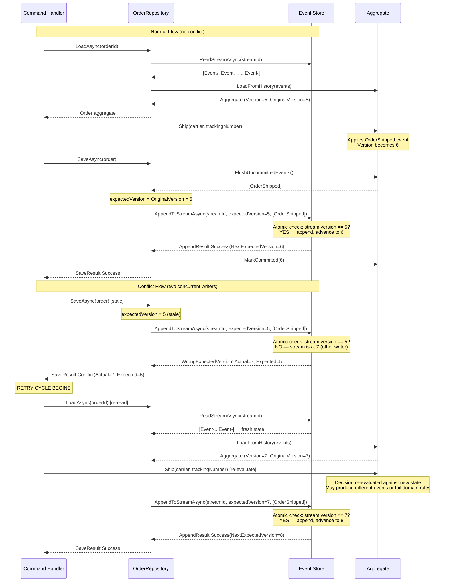
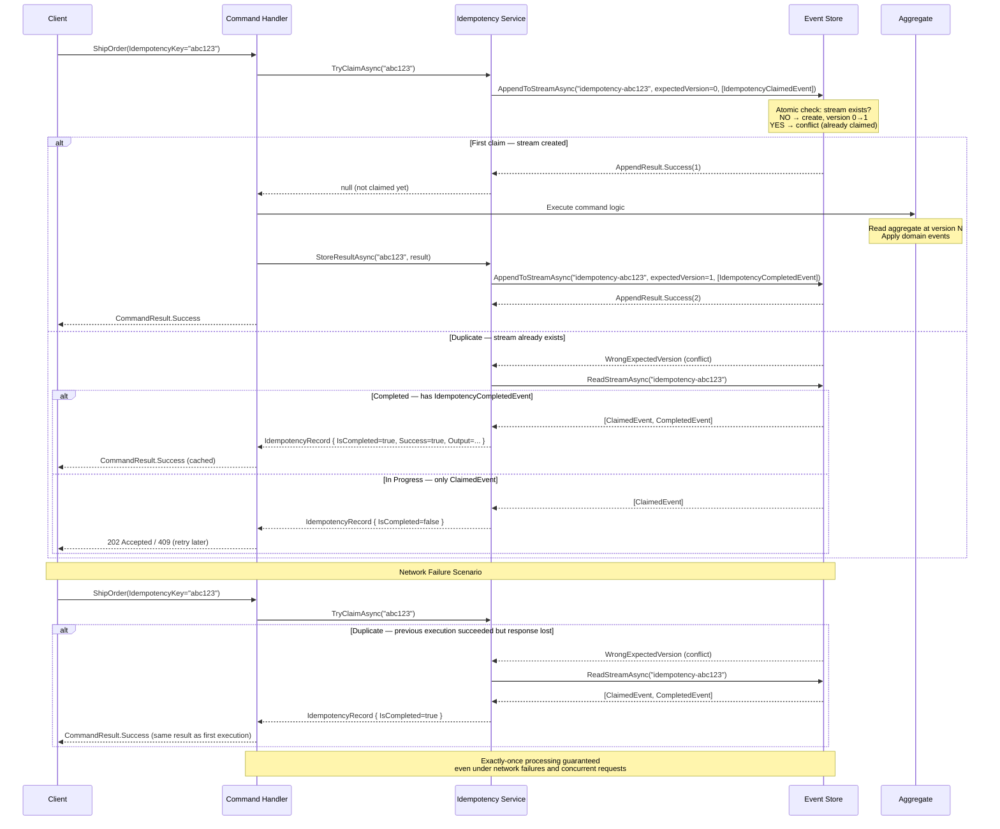

> [!success] Mastery Check
> - [ ] **Studied Well**
> - [ ] **Can explain the concept without notes**
> - [ ] **Can answer interview questions confidently**
> - [ ] **Can implement it in a real project**


# 7.116 — Event Sourcing — Optimistic Concurrency

**Group:** CQRS and Event Sourcing  
**Priority:** 2  
**Prerequisites:** [[7.115 — Event Sourcing — Aggregate Rehydration]]  
**Related:** [[7.101 — CQRS — Command-Query Separation]], [[7.102 — CQRS — Command Models]], [[7.107 — CQRS — Idempotency]], [[7.113 — Event Sourcing — Append-Only Log]], [[7.114 — Event Sourcing — Event Store Patterns]], [[7.117 — Event Sourcing — Projections]]

---

## Table of Contents

1. [[#1. Overview — The Concurrency Problem in Event Stores]]
2. [[#2. Stream Versioning Theory]]
3. [[#3. Expected Version Semantics — Protocol Details]]
4. [[#4. Appending Events with Expected Version — C# 12 /.NET 8 Implementation]]
5. [[#5. Concurrency Conflict Detection and Handling]]
6. [[#6. Retry Strategies with Rehydration]]
7. [[#7. Idempotent Command Handling — Idempotency Key Pattern]]
8. [[#8. Last-Writer-Wins vs Merge Strategies]]
9. [[#9. EventStoreDB and Marten Expected Version Semantics]]
10. [[#10. Architecture Decision Record — Optimistic Concurrency in Event Sourcing]]
11. [[#11. Pitfalls and Anti-Patterns]]
12. [[#12. Interview Questions]]
13. [[#13. Self-Check — 12 Core + 6 Advanced]]
14. [[#14. Mermaid Diagrams]]

---

## 1. Overview — The Concurrency Problem in Event Stores

Event Sourcing persists state changes as an immutable, append-only log of events. Unlike a state-oriented database where you UPDATE a row (last write wins), Event Sourcing **appends** new events to a stream. This structural difference fundamentally changes how concurrent writes must be handled.

### 1.1 The Core Problem

When two or more actors (commands, HTTP requests, background processors) attempt to append events to the **same stream** at the same logical time, we face a write conflict. Without coordination, one writer silently overwrites or interleaves events, corrupting the aggregate's history.

```text
Time ──────────────────────────────────►

Actor A: reads stream  → version 5    → appends EventA → expects version 5→6
Actor B: reads stream  → version 5    → appends EventB → expects version 5→6

Without optimistic concurrency:
  Stream ends as: [v1, v2, v3, v4, v5, EventA, EventB]  — both succeed, log is wrong
  OR: [v1, v2, v3, v4, v5, EventA]  — EventB silently lost (last-write-wins)

With optimistic concurrency:
  One succeeds:  [v1, v2, v3, v4, v5, EventA]  (version 6)
  One fails:     Actor B gets WrongExpectedVersionException
```

### 1.2 Why Standard Database Concurrency Models Don't Map Directly

| Mechanism | How It Works | Why It's Insufficient for Event Sourcing |
|-----------|-------------|----------------------------------------|
| Row-level locks | Lock the row on read | Event stores don't update rows; they append. Locking only helps if you hold a lock across a transaction, which doesn't scale. |
| Table-level locks | Lock entire table | Catastrophic for performance in an append-only log. |
| `SELECT ... FOR UPDATE` | Pessimistic lock on read | Works against current state, but event streams are append-only; the "row" doesn't exist yet. |
| MVCC (Multi-Version Concurrency Control) | Each tx sees a snapshot | Postgres MVCC prevents lost updates on the *same row*, but appending new rows to a stream is an insert, not an update. |

Optimistic concurrency is the **natural fit** because it aligns with Event Sourcing's immutable, append-only nature — we don't lock anything, we just verify at append time that the stream hasn't moved since we last read it.

### 1.3 Terminology

| Term | Definition |
|------|-----------|
| **Stream** | An ordered sequence of events representing the history of a single aggregate. Identified by a stream ID (e.g., `order-abc123`). |
| **Stream Version** | A monotonically increasing integer representing the current length of the stream (1-based or 0-based depending on the store). |
| **Expected Version** | The version the client **expects** the stream to be at when the append request is processed. |
| **WrongExpectedVersion** | The error/exception returned when the actual version differs from the expected version. |
| **Append-Only Log** | The underlying storage model — events are never modified or deleted, only appended. |
| **Aggregate** | A cluster of domain objects treated as a single unit, rehydrated by replaying its event stream. See [[7.115 — Event Sourcing — Aggregate Rehydration]]. |
| **Idempotency Key** | A unique identifier for a command that allows safe retry without duplicate side effects. See [[7.107 — CQRS — Idempotency]]. |

---

## 2. Stream Versioning Theory

### 2.1 What Is a Stream Version?

A stream version is a monotonically increasing integer counter. Each appended event increments it by exactly 1. The version represents the **sequence number** of the last event in the stream.

**1-based versioning** (most common, used by EventStoreDB, Marten default):
- Stream with 0 events → version 0 (empty)
- First event appended → stream is at version 1
- Fifth event appended → stream is at version 5

**0-based versioning** (used by some stores like GetEventStore pre-20.x, and some custom stores):
- Stream with 0 events → version -1 or 0 (depends on convention)
- First event appended → stream is at version 0

### 2.2 The Version as a Causal Dependency

When a command handler reads an aggregate, it reads all events in the stream, rehydrates the aggregate state, and makes a decision. The **stream version at read time** captures the causal history that the decision was based on. If another writer appends events between read and write, the decision's causal assumptions are invalidated.

```text
Read stream (version = N)  ──►  Business Decision  ──►  Append(version = N)
                                      │
                          ┌───────────┴──────────────┐
                          │                            │
                    Concurrent writer                 Concurrent writer
                    appends (N→N+1)                  appends (N→N+1)
                          │                            │
                          ▼                            ▼
              Our append fails:               Our append fails:
              expected=N, actual=N+1          expected=N, actual=N+1
```

This is **optimistic** because we assume conflicts are rare — no locks are held during the decision-making window.

### 2.3 Version Comparisons Across Different Event Stores

| Event Store | Empty Stream Sentinel | First Append Expected Version | Native Exception Type |
|------------|----------------------|-------------------------------|----------------------|
| EventStoreDB (ESDB) v20+ | `StreamState.NoStream` or `Any` | `ExpectedVersion = 1` (for first event), or use `StreamState.StreamExists` | `WrongExpectedVersionException` |
| Marten (Postgres) | `ExpectedVersion = 0` for first event (or use `@` syntax) | `ExpectedVersion = 1` | `ConcurrencyException` |
| Custom SQL (e.g., Postgres with `pg_sequence` or `SERIAL`) | No row in `events` table → version 0 | `expected_version = 0` for first event | Check `ROW_COUNT = 0` |
| Azure Cosmos DB Event Sourcing | Stream property `_etag` | Use `etag` for conditional append | `PreconditionFailedException` |

### 2.4 Expected Version Semantics: NoStream, Any, StreamExists

Modern event stores expose special sentinel values for expected version:

- **`StreamState.NoStream`** (ESDB): The stream must NOT exist. Use for first append to a new stream. Fails if stream already exists.
- **`StreamState.Any`**: Accept any current version. Skips concurrency check entirely — last-write-wins semantics. Useful for system events, telemetry, or append-only streams with no aggregate boundary.
- **`StreamState.StreamExists`**: The stream must already exist. Use for appending to an existing stream without specifying the exact version. Less safe than exact version but still ensures the stream isn't created by accident.

---

## 3. Expected Version Semantics — Protocol Details

### 3.1 The Conditional Append Contract

The fundamental contract between the client and the event store:

```
IF stream_version_at_store == expected_version
  THEN append events, increment stream version
  ELSE reject with WrongExpectedVersion
```

This is implemented atomically by the event store. The check-and-append happens in a single transactional operation, preventing TOCTOU (Time-of-Check-Time-of-Use) race conditions.

### 3.2 Atomic Check-and-Append

Every event store that supports optimistic concurrency implements the check-and-append as a single atomic operation:

**EventStoreDB:** Uses the `ExpectedVersion` parameter on `AppendToStreamAsync`. The server atomically checks the stream's current version against the expected version in its internal write-ahead log (a Paxos-based cluster). If mismatch, the commit is rejected before hitting the storage engine.

**Marten (Postgres):** Uses `pg_try_advisory_xact_lock` combined with a version check in a serializable transaction:

```sql
-- Simplified — Marten's actual implementation
UPDATE mt_streams SET version = version + :delta
WHERE id = :stream_id AND version = :expected_version;

INSERT INTO mt_events (stream_id, version, data)
SELECT :stream_id, :expected_version + 1, :event_data
WHERE EXISTS (
  SELECT 1 FROM mt_streams
  WHERE id = :stream_id AND version = :expected_version
);
```

If `ROW_COUNT = 0` after the update, no rows matched — the version was wrong — and the append is rejected.

### 3.3 Validation — Client-Side vs Server-Side

| Aspect | Client-Side Check | Server-Side Check (Event Store) |
|--------|------------------|----------------------------------|
| **When** | After read, before append | During append |
| **Mechanism** | Compare `aggregate.Version` with expected | Event store version check |
| **Can prevent conflict?** | No — race still possible | **Yes** — this is the source of truth |
| **Purpose** | Early exit, avoids wasted round-trips | Atomic serialization point |
| **Is it sufficient?** | Never — must always use server-side check | **Yes** — the single source of truth |

**Rule:** Client-side version checks are purely an optimization. Server-side expected version is mandatory.

### 3.4 When the Check Is Skipped

Some appends intentionally skip concurrency checking:

1. **System events** (e.g., `UserLoggedIn`, `PageVisited`) — no aggregate boundary, append-only telemetry.
2. **Idempotency re-check events** — events stored to mark a command as already processed.
3. **Snapshot writes** — snapshots are a caching concern, not source of truth; overwriting a snapshot is safe.
4. **Event projection checkpoints** — tracking which position a projection has processed.

In these cases, use `StreamState.Any` or equivalent — but document the decision explicitly.

---

## 4. Appending Events with Expected Version — C# 12 /.NET 8 Implementation

### 4.1 Domain Model Base

```csharp
namespace EventSourcing.Core;

public abstract record DomainEvent(Guid EventId, DateTimeOffset Timestamp);

public record StreamEvent(
    string StreamId, long Version, DomainEvent Event, long? Position = null);

public readonly record struct AppendResult
{
    public long? NextExpectedVersion { get; }
    public AppendError? Error { get; }

    private AppendResult(long? nextExpectedVersion, AppendError? error)
    {
        NextExpectedVersion = nextExpectedVersion;
        Error = error;
    }

    public static AppendResult Succeeded(long nextVersion) =>
        new(nextVersion, null);

    public static AppendResult Failed(AppendError error) =>
        new(null, error);

    public bool IsSuccess => Error is null;
    public bool IsConflict => Error?.Type == AppendErrorType.WrongExpectedVersion;
}

public readonly record struct AppendError(
    AppendErrorType Type, string Message,
    long? ActualVersion = null, long? ExpectedVersion = null);

public enum AppendErrorType { WrongExpectedVersion, StreamDeleted, AccessDenied, StorageUnavailable }
```

### 4.2 Event Store Abstraction Interface

```csharp
namespace EventSourcing.Core.EventStore;

public interface IEventStore
{
    Task<AppendResult> AppendToStreamAsync(
        string streamId, long expectedVersion,
        IReadOnlyList<DomainEvent> events,
        CancellationToken cancellationToken = default);

    Task<IReadOnlyList<StreamEvent>> ReadStreamAsync(
        string streamId, CancellationToken cancellationToken = default);

    Task<IReadOnlyList<StreamEvent>> ReadStreamFromVersionAsync(
        string streamId, long fromVersion,
        CancellationToken cancellationToken = default);
}
```

### 4.3 Aggregate Root — Version Tracking

```csharp
namespace EventSourcing.Core.Domain;

public abstract class AggregateRoot
{
    private readonly List<DomainEvent> _uncommittedEvents = [];
    private readonly Dictionary<Type, Action<DomainEvent>> _handlers = [];

    public string Id { get; protected set; } = string.Empty;
    public long Version { get; private set; }
    public long OriginalVersion { get; private set; }

    protected void Register<TEvent>(Action<TEvent> handler) where TEvent : DomainEvent
    {
        _handlers[typeof(TEvent)] = e => handler((TEvent)e);
    }

    protected void Apply(DomainEvent @event) => ApplyEvent(@event, isNew: true);

    private void ApplyEvent(DomainEvent @event, bool isNew)
    {
        var eventType = @event.GetType();
        if (_handlers.TryGetValue(eventType, out var handler))
            handler(@event);
        Version++;
        if (isNew) _uncommittedEvents.Add(@event);
    }

    public void LoadFromHistory(IReadOnlyList<StreamEvent> history)
    {
        foreach (var streamEvent in history)
            ApplyEvent(streamEvent.Event, isNew: false);
        OriginalVersion = Version;
    }

    public IReadOnlyList<DomainEvent> FlushUncommittedEvents()
    {
        var events = _uncommittedEvents.ToList();
        _uncommittedEvents.Clear();
        return events;
    }

    public long GetExpectedVersion() => OriginalVersion;

    public void MarkCommitted(long newVersion)
    {
        OriginalVersion = newVersion;
        Version = newVersion;
    }
}
```

### 4.4 Concrete Aggregate — Order Example

```csharp
namespace EventSourcing.Orders.Domain;

// ─── Events ────────────────────────────────────────────────────────

public sealed record OrderCreated(
    Guid EventId, DateTimeOffset Timestamp, string OrderId, string CustomerId,
    decimal TotalAmount, IReadOnlyList<OrderLineItem> LineItems) : DomainEvent(EventId, Timestamp);

public sealed record OrderShipped(
    Guid EventId, DateTimeOffset Timestamp, string OrderId,
    DateTimeOffset ShippedAt, string Carrier, string TrackingNumber) : DomainEvent(EventId, Timestamp);

public sealed record OrderDelivered(
    Guid EventId, DateTimeOffset Timestamp,
    string OrderId, DateTimeOffset DeliveredAt) : DomainEvent(EventId, Timestamp);

public sealed record OrderCancelled(
    Guid EventId, DateTimeOffset Timestamp,
    string OrderId, string Reason) : DomainEvent(EventId, Timestamp);

public sealed record OrderItemAdded(
    Guid EventId, DateTimeOffset Timestamp,
    string OrderId, OrderLineItem LineItem) : DomainEvent(EventId, Timestamp);

public sealed record OrderLineItem(string ProductId, string ProductName, int Quantity, decimal UnitPrice);

public enum OrderStatus { Pending, Shipped, Delivered, Cancelled }

// ─── Aggregate ─────────────────────────────────────────────────────

public sealed class Order : AggregateRoot
{
    public string CustomerId { get; private set; } = string.Empty;
    public decimal TotalAmount { get; private set; }
    public OrderStatus Status { get; private set; } = OrderStatus.Pending;
    public List<OrderLineItem> LineItems { get; } = [];
    public DateTimeOffset? ShippedAt { get; private set; }
    public DateTimeOffset? DeliveredAt { get; private set; }
    public string? CancellationReason { get; private set; }

    public Order()
    {
        Register<OrderCreated>(Handle);
        Register<OrderShipped>(Handle);
        Register<OrderDelivered>(Handle);
        Register<OrderCancelled>(Handle);
        Register<OrderItemAdded>(Handle);
    }

    // ─── Factory Method ────────────────────────────────────────────

    public static Order Create(string orderId, string customerId, IReadOnlyList<OrderLineItem> lineItems)
    {
        var order = new Order { Id = orderId };
        var @event = new OrderCreated(
            EventId: Guid.NewGuid(),
            Timestamp: DateTimeOffset.UtcNow,
            OrderId: orderId,
            CustomerId: customerId,
            TotalAmount: lineItems.Sum(li => li.Quantity * li.UnitPrice),
            LineItems: lineItems
        );
        order.Apply(@event);
        return order;
    }

    // ─── Command-Driven Behavior ───────────────────────────────────

    public void AddLineItem(string productId, string productName, int quantity, decimal unitPrice)
    {
        if (Status != OrderStatus.Pending)
        {
            throw new DomainException("Cannot add items to a non-pending order.");
        }

        var lineItem = new OrderLineItem(productId, productName, quantity, unitPrice);

        var @event = new OrderItemAdded(
            EventId: Guid.NewGuid(),
            Timestamp: DateTimeOffset.UtcNow,
            OrderId: Id,
            LineItem: lineItem
        );

        Apply(@event);
    }

    public void Ship(string carrier, string trackingNumber)
    {
        if (Status == OrderStatus.Shipped)
        {
            throw new DomainException("Order is already shipped.");
        }

        if (Status == OrderStatus.Delivered)
        {
            throw new DomainException("Cannot ship a delivered order.");
        }

        if (Status == OrderStatus.Cancelled)
        {
            throw new DomainException("Cannot ship a cancelled order.");
        }

        var @event = new OrderShipped(
            EventId: Guid.NewGuid(),
            Timestamp: DateTimeOffset.UtcNow,
            OrderId: Id,
            ShippedAt: DateTimeOffset.UtcNow,
            Carrier: carrier,
            TrackingNumber: trackingNumber
        );

        Apply(@event);
    }

    public void Deliver()
    {
        if (Status != OrderStatus.Shipped)
        {
            throw new DomainException("Only shipped orders can be delivered.");
        }

        var @event = new OrderDelivered(
            EventId: Guid.NewGuid(),
            Timestamp: DateTimeOffset.UtcNow,
            OrderId: Id,
            DeliveredAt: DateTimeOffset.UtcNow
        );

        Apply(@event);
    }

    public void Cancel(string reason)
    {
        if (Status is OrderStatus.Delivered or OrderStatus.Cancelled)
        {
            throw new DomainException($"Cannot cancel an order in {Status} state.");
        }

        var @event = new OrderCancelled(
            EventId: Guid.NewGuid(),
            Timestamp: DateTimeOffset.UtcNow,
            OrderId: Id,
            Reason: reason
        );

        Apply(@event);
    }

    // ─── Event Handlers ────────────────────────────────────────────

    private void Handle(OrderCreated @event)
    {
        Id = @event.OrderId;
        CustomerId = @event.CustomerId;
        TotalAmount = @event.TotalAmount;
        LineItems.AddRange(@event.LineItems);
        Status = OrderStatus.Pending;
    }

    private void Handle(OrderShipped @event)
    {
        Status = OrderStatus.Shipped;
        ShippedAt = @event.ShippedAt;
    }

    private void Handle(OrderDelivered @event)
    {
        Status = OrderStatus.Delivered;
        DeliveredAt = @event.DeliveredAt;
    }

    private void Handle(OrderCancelled @event)
    {
        Status = OrderStatus.Cancelled;
        CancellationReason = @event.Reason;
    }

    private void Handle(OrderItemAdded @event)
    {
        LineItems.Add(@event.LineItem);
        TotalAmount = LineItems.Sum(li => li.Quantity * li.UnitPrice);
    }
}

public sealed class DomainException : Exception
{
    public DomainException(string message) : base(message) { }
}
```

### 4.5 Repository with Optimistic Concurrency

```csharp
namespace EventSourcing.Orders.Persistence;

/// <summary>
/// Repository for Order aggregate with full optimistic concurrency support.
/// Every Save operation uses the aggregate's OriginalVersion as the expected version.
/// </summary>
public sealed class OrderRepository
{
    private readonly IEventStore _eventStore;
    private readonly ILogger<OrderRepository> _logger;

    public OrderRepository(IEventStore eventStore, ILogger<OrderRepository> logger)
    {
        _eventStore = eventStore;
        _logger = logger;
    }

    /// <summary>
    /// Load an Order aggregate by replaying its event stream.
    /// Returns null if the stream doesn't exist.
    /// </summary>
    public async Task<Order?> LoadAsync(string orderId, CancellationToken ct = default)
    {
        var streamId = GetStreamId(orderId);
        var events = await _eventStore.ReadStreamAsync(streamId, ct);

        if (events.Count == 0)
        {
            return null;
        }

        var order = new Order();
        order.LoadFromHistory(events);
        return order;
    }

    /// <summary>
    /// Save the aggregate's uncommitted events using optimistic concurrency.
    /// Throws ConcurrencyConflictException if the expected version doesn't match.
    /// </summary>
    public async Task<SaveResult> SaveAsync(
        Order order,
        CancellationToken ct = default)
    {
        var streamId = GetStreamId(order.Id);
        var uncommittedEvents = order.FlushUncommittedEvents();

        if (uncommittedEvents.Count == 0)
        {
            return SaveResult.NoChanges;
        }

        var expectedVersion = order.GetExpectedVersion();

        _logger.LogDebug(
            "Appending {EventCount} event(s) to stream {StreamId} with expected version {ExpectedVersion}",
            uncommittedEvents.Count, streamId, expectedVersion);

        var result = await _eventStore.AppendToStreamAsync(
            streamId,
            expectedVersion,
            uncommittedEvents,
            ct);

        if (result.IsSuccess)
        {
            order.MarkCommitted(result.NextExpectedVersion!.Value);
            _logger.LogInformation(
                "Successfully appended to stream {StreamId}. New version: {Version}",
                streamId, result.NextExpectedVersion);
            return SaveResult.Success;
        }

        if (result.IsConflict)
        {
            _logger.LogWarning(
                "Concurrency conflict on stream {StreamId}. Expected: {Expected}, Actual: {Actual}",
                streamId, expectedVersion, result.Error!.ActualVersion);
            return SaveResult.Conflict(
                result.Error!.ActualVersion!.Value,
                expectedVersion);
        }

        _logger.LogError(
            "Failed to append to stream {StreamId}: {Error}",
            streamId, result.Error!.Message);
        return SaveResult.Failure(result.Error!.Message);
    }

    private static string GetStreamId(string orderId) => $"order-{orderId}";
}

/// <summary>
/// Result type for save operations, including conflict details.
/// </summary>
public readonly record struct SaveResult
{
    public SaveResultType Type { get; }
    public long? ActualVersion { get; }
    public long? ExpectedVersion { get; }
    public string? ErrorMessage { get; }

    private SaveResult(
        SaveResultType type,
        long? actualVersion = null,
        long? expectedVersion = null,
        string? errorMessage = null)
    {
        Type = type;
        ActualVersion = actualVersion;
        ExpectedVersion = expectedVersion;
        ErrorMessage = errorMessage;
    }

    public static readonly SaveResult NoChanges = new(SaveResultType.NoChanges);
    public static readonly SaveResult Success = new(SaveResultType.Success);
    public static SaveResult Conflict(long actual, long expected) =>
        new(SaveResultType.Conflict, actual, expected);
    public static SaveResult Failure(string message) =>
        new(SaveResultType.Failure, errorMessage: message);

    public bool IsSuccess => Type is SaveResultType.Success or SaveResultType.NoChanges;
}

public enum SaveResultType
{
    Success,
    NoChanges,
    Conflict,
    Failure
}
```

### 4.6 EventStoreDB Implementation

```csharp
using EventStore.Client;
using EventSourcing.Core;
using EventSourcing.Core.EventStore;
using System.Text.Json;

namespace EventSourcing.Infrastructure.EventStoreDB;

public sealed class EsdbEventStore : IEventStore
{
    private readonly EventStoreClient _client;
    private readonly JsonSerializerOptions _jsonOptions = new()
    {
        PropertyNamingPolicy = JsonNamingPolicy.CamelCase,
        WriteIndented = false
    };

    public EsdbEventStore(EventStoreClient client) => _client = client;

    public async Task<AppendResult> AppendToStreamAsync(
        string streamId, long expectedVersion,
        IReadOnlyList<DomainEvent> events, CancellationToken ct = default)
    {
        try
        {
            var eventData = events.Select(ToEventData).ToArray();
            var state = expectedVersion == 0 ? StreamState.NoStream : StreamState.StreamExists;

            var writeResult = await _client.AppendToStreamAsync(
                streamId, state, eventData, cancellationToken: ct);

            return AppendResult.Succeeded(writeResult.NextExpectedStreamRevision.ToInt64());
        }
        catch (WrongExpectedVersionException ex)
        {
            return AppendResult.Failed(new AppendError(
                Type: AppendErrorType.WrongExpectedVersion,
                Message: ex.Message,
                ActualVersion: TryParseActualVersion(ex),
                ExpectedVersion: expectedVersion));
        }
        catch (StreamDeletedException ex)
        {
            return AppendResult.Failed(new AppendError(
                Type: AppendErrorType.StreamDeleted, Message: ex.Message));
        }
        catch (Exception ex)
        {
            return AppendResult.Failed(new AppendError(
                Type: AppendErrorType.StorageUnavailable, Message: ex.Message));
        }
    }

    public async Task<IReadOnlyList<StreamEvent>> ReadStreamAsync(
        string streamId, CancellationToken ct = default) =>
        await ReadStreamFromVersionAsync(streamId, 0, ct);

    public async Task<IReadOnlyList<StreamEvent>> ReadStreamFromVersionAsync(
        string streamId, long fromVersion, CancellationToken ct = default)
    {
        try
        {
            var result = _client.ReadStreamAsync(
                Direction.Forwards, streamId,
                fromVersion == 0 ? StreamPosition.Start : StreamPosition.FromInt64(fromVersion),
                cancellationToken: ct);

            var events = new List<StreamEvent>();
            await foreach (var resolvedEvent in result)
            {
                var domainEvent = DeserializeEvent(resolvedEvent);
                if (domainEvent is not null)
                    events.Add(new StreamEvent(
                        StreamId: streamId,
                        Version: resolvedEvent.Event.EventNumber.ToInt64(),
                        Event: domainEvent,
                        Position: resolvedEvent.Event.Position?.CommitPosition));
            }
            return events;
        }
        catch (StreamNotFoundException) { return []; }
    }

    private EventData ToEventData(DomainEvent @event)
    {
        var typeName = @event.GetType().Name;
        var json = JsonSerializer.Serialize(@event, @event.GetType(), _jsonOptions);
        return new EventData(
            eventId: Uuid.FromGuid(@event.EventId),
            type: typeName,
            data: Encoding.UTF8.GetBytes(json),
            metadata: SerializeMetadata(@event));
    }

    private static byte[] SerializeMetadata(DomainEvent @event) =>
        JsonSerializer.SerializeToUtf8Bytes(new Dictionary<string, object>
        {
            ["clrType"] = @event.GetType().AssemblyQualifiedName!,
            ["timestamp"] = @event.Timestamp.ToString("O")
        });

    private DomainEvent? DeserializeEvent(ResolvedEvent resolvedEvent)
    {
        var metadataJson = Encoding.UTF8.GetString(resolvedEvent.Event.Metadata.Span);
        var metadata = JsonSerializer.Deserialize<Dictionary<string, string>>(metadataJson);
        if (metadata is null || !metadata.TryGetValue("clrType", out var clrType)) return null;
        var type = Type.GetType(clrType, throwOnError: false);
        if (type is null) return null;
        var dataJson = Encoding.UTF8.GetString(resolvedEvent.Event.Data.Span);
        return JsonSerializer.Deserialize(dataJson, type, _jsonOptions) as DomainEvent;
    }

    private static long? TryParseActualVersion(WrongExpectedVersionException ex)
    {
        try
        {
            var match = System.Text.RegularExpressions.Regex.Match(
                ex.Message, @"Actual\s+version:\s*(\d+)",
                System.Text.RegularExpressions.RegexOptions.IgnoreCase);
            if (match.Success && long.TryParse(match.Groups[1].Value, out var actual))
                return actual;
            return null;
        }
        catch { return null; }
    }
}
```

### 4.7 Marten Implementation

```csharp
using Marten;
using Marten.Exceptions;
using EventSourcing.Core;
using EventSourcing.Core.EventStore;

namespace EventSourcing.Infrastructure.Marten;

public sealed class MartenEventStore : IEventStore
{
    private readonly IDocumentSession _session;
    private readonly ILogger<MartenEventStore> _logger;

    public MartenEventStore(IDocumentSession session, ILogger<MartenEventStore> logger)
    {
        _session = session;
        _logger = logger;
    }

    public async Task<AppendResult> AppendToStreamAsync(
        string streamId, long expectedVersion,
        IReadOnlyList<DomainEvent> events, CancellationToken ct = default)
    {
        try
        {
            if (expectedVersion == 0)
                _session.Events.StartStream(streamId, events.Cast<object>());
            else
                _session.Events.Append(streamId, expectedVersion, events.Cast<object>());

            await _session.SaveChangesAsync(ct);
            var streamState = await _session.Events.FetchStreamStateAsync(streamId, ct);
            return AppendResult.Succeeded(streamState!.Version);
        }
        catch (ConcurrencyException ex)
        {
            _logger.LogWarning(ex, "Concurrency conflict on stream {StreamId}", streamId);
            return AppendResult.Failed(new AppendError(
                Type: AppendErrorType.WrongExpectedVersion, Message: ex.Message,
                ActualVersion: TryGetActualVersion(ex), ExpectedVersion: expectedVersion));
        }
        catch (Exception ex) when (ex is not ConcurrencyException)
        {
            _logger.LogError(ex, "Failed to append to stream {StreamId}", streamId);
            return AppendResult.Failed(new AppendError(
                Type: AppendErrorType.StorageUnavailable, Message: ex.Message));
        }
    }

    public async Task<IReadOnlyList<StreamEvent>> ReadStreamAsync(
        string streamId, CancellationToken ct = default) =>
        await ReadStreamFromVersionAsync(streamId, 0, ct);

    public async Task<IReadOnlyList<StreamEvent>> ReadStreamFromVersionAsync(
        string streamId, long fromVersion, CancellationToken ct = default)
    {
        try
        {
            var events = await _session.Events.FetchStreamAsync(
                streamId, version: fromVersion == 0 ? 0 : (int)fromVersion, token: ct);
            return events.Select(e => new StreamEvent(
                StreamId: streamId, Version: e.Version,
                Event: (DomainEvent)e.Data, Position: e.SequenceNumber)).ToList();
        }
        catch (StreamNotFoundException) { return []; }
    }

    private static long? TryGetActualVersion(ConcurrencyException ex)
    {
        var match = System.Text.RegularExpressions.Regex.Match(
            ex.Message, @"Expecting\s+(\d+)\s+but\s+is\s+(\d+)",
            System.Text.RegularExpressions.RegexOptions.IgnoreCase);
        if (match.Success && long.TryParse(match.Groups[2].Value, out var actual)) return actual;
        return null;
    }
}
```

### 4.8 Command Handler with Explicit Expected Version

```csharp
using EventSourcing.Orders.Domain;
using EventSourcing.Orders.Persistence;

namespace EventSourcing.Orders.Application;

public sealed record ShipOrderCommand(
    string OrderId,
    string Carrier,
    string TrackingNumber,
    string? IdempotencyKey = null
);

public sealed record CommandResult<T>
{
    public bool Success { get; init; }
    public T? Result { get; init; }
    public string? Error { get; init; }
    public bool IsConflict { get; init; }

    public static CommandResult<T> Ok(T result) =>
        new() { Success = true, Result = result };

    public static CommandResult<T> Fail(string error) =>
        new() { Success = false, Error = error };

    public static CommandResult<T> Conflict(string error) =>
        new() { Success = false, Error = error, IsConflict = true };
}

public sealed class ShipOrderHandler
{
    private readonly OrderRepository _repository;

    public ShipOrderHandler(OrderRepository repository) => _repository = repository;

    public async Task<CommandResult<Order>> HandleAsync(
        ShipOrderCommand command, CancellationToken ct = default)
    {
        var order = await _repository.LoadAsync(command.OrderId, ct);
        if (order is null) return CommandResult<Order>.Fail($"Order {command.OrderId} not found.");

        order.Ship(command.Carrier, command.TrackingNumber);
        var saveResult = await _repository.SaveAsync(order, ct);

        return saveResult.Type switch
        {
            SaveResultType.Success or SaveResultType.NoChanges => CommandResult<Order>.Ok(order),
            SaveResultType.Conflict => CommandResult<Order>.Conflict(
                $"Concurrency conflict on order {command.OrderId}. " +
                $"Expected v{saveResult.ExpectedVersion}, actual v{saveResult.ActualVersion}. Retry."),
            SaveResultType.Failure => CommandResult<Order>.Fail(
                $"Failed to save order {command.OrderId}: {saveResult.ErrorMessage}"),
            _ => CommandResult<Order>.Fail("Unknown save result.")
        };
    }
}
```

---

## 5. Concurrency Conflict Detection and Handling

### 5.1 Detection Points

A concurrency conflict can be detected at three levels:

**Level 1 — Event Store (mandatory):** The store rejects the append with `WrongExpectedVersion`. This is the definitive detection point.

**Level 2 — Repository (advisory):** The repository compares `originalVersion` before and after the business operation. A mismatch indicates that the aggregate was modified during the handler's execution.

**Level 3 — Application (safety check):** The command handler can catch `WrongExpectedVersion` at the application boundary and translate it into a user-facing response (e.g., HTTP 409 Conflict).

### 5.2 Conflict Response Patterns

| Pattern | Description | When to Use |
|---------|-------------|-------------|
| **Reject** | Return HTTP 409 / error to caller. Caller must retry. | User-facing commands where retry is safe and expected. |
| **Retry (Client-Side)** | Caller retries the entire command after re-reading state. | Short-lived conflicts, low contention. |
| **Retry (Server-Side)** | Handler catches conflict, re-reads aggregate, re-runs business logic, retries append. | Background processing, high-value operations. See Section 6. |
| **Queue** | Enqueue the command for later processing. | High contention, or when retry budgeting is needed. |
| **Fail Fast** | Abort immediately without retry. | Read-only or eventually-consistent operations. |

### 5.3 HTTP Semantics — 409 Conflict

```csharp
// ASP.NET Core filter that translates concurrency conflicts to HTTP 409
public sealed class ConcurrencyConflictFilter : IActionFilter, IOrderedFilter
{
    public int Order => int.MaxValue - 10;

    public void OnActionExecuting(ActionExecutingContext context) { }

    public void OnActionExecuted(ActionExecutedContext context)
    {
        if (context.Result is ObjectResult { Value: CommandResult<object> { IsConflict: true } } objResult)
        {
            var conflict = (CommandResult<object>)objResult.Value!;

            context.Result = new ConflictObjectResult(new ProblemDetails
            {
                Title = "Concurrency Conflict",
                Detail = conflict.Error,
                Status = StatusCodes.Status409Conflict,
                Type = "https://datatracker.ietf.org/doc/html/rfc7231#section-6.5.8",
                Instance = context.HttpContext?.Request.Path
            });
        }
    }
}
```

### 5.4 Conflict Details in Responses

Always include enough information in the conflict response for the caller to make decisions:

```json
{
  "title": "Concurrency Conflict",
  "detail": "Expected version 5, actual version 7.",
  "status": 409,
  "instance": "/orders/ord-001/ship",
  "extensions": {
    "streamId": "order-ord-001",
    "expectedVersion": 5,
    "actualVersion": 7,
    "conflictingCommand": "ShipOrder"
  }
}
```

### 5.5 Observability — Logging and Metrics

```csharp
public sealed class ConcurrencyMetrics
{
    private readonly Counter<int> _conflictCounter;
    private readonly Histogram<double> _conflictResolutionDuration;
    private readonly Counter<int> _retryCounter;
    private readonly Counter<int> _abandonedCounter;

    public ConcurrencyMetrics(IMeterFactory meterFactory)
    {
        var meter = meterFactory.Create("EventSourcing.Concurrency");
        _conflictCounter = meter.CreateCounter<int>("conflicts.total");
        _conflictResolutionDuration = meter.CreateHistogram<double>("conflict.resolution.duration_ms");
        _retryCounter = meter.CreateCounter<int>("conflicts.retries");
        _abandonedCounter = meter.CreateCounter<int>("conflicts.abandoned");
    }

    public void RecordConflict(string streamId, long expected, long actual)
    {
        _conflictCounter.Add(1,
            new KeyValuePair<string, object?>("stream_id", streamId),
            new KeyValuePair<string, object?>("expected_version", expected),
            new KeyValuePair<string, object?>("actual_version", actual));
    }

    public IDisposable MeasureResolutionDuration() =>
        _conflictResolutionDuration.Measure();

    public void RecordRetry() => _retryCounter.Add(1);
    public void RecordAbandoned() => _abandonedCounter.Add(1);
}
```

---

## 6. Retry Strategies with Rehydration

### 6.1 Why Retry?

A concurrency conflict means the aggregate's base state changed between read and write. The correct response is to **re-read the latest state, re-apply the business logic, and re-attempt the append**. This is safe because the command's intent is re-evaluated against the current state.

### 6.2 The Retry Loop Pattern

```csharp
public sealed class RetryHandler<TCommand, TOutput>
{
    private readonly Func<TCommand, CancellationToken, Task<CommandResult<TOutput>>> _handler;
    private readonly ILogger _logger;
    private readonly ConcurrencyMetrics _metrics;

    private const int MaxRetries = 3;
    private static readonly TimeSpan[] RetryDelays =
        [TimeSpan.FromMilliseconds(50), TimeSpan.FromMilliseconds(150), TimeSpan.FromMilliseconds(500)];

    public RetryHandler(
        Func<TCommand, CancellationToken, Task<CommandResult<TOutput>>> handler,
        ILogger logger, ConcurrencyMetrics metrics)
    {
        _handler = handler; _logger = logger; _metrics = metrics;
    }

    public async Task<CommandResult<TOutput>> ExecuteWithRetryAsync(
        TCommand command, CancellationToken ct = default)
    {
        var attempt = 0;
        while (true)
        {
            attempt++;
            var result = await _handler(command, ct);

            if (result.IsConflict && attempt <= MaxRetries)
            {
                _metrics.RecordRetry();
                var delay = RetryDelays[Math.Min(attempt - 1, RetryDelays.Length - 1)];
                _logger.LogWarning("Conflict on attempt {A}/{M}. Retrying in {D}ms. {E}",
                    attempt, MaxRetries, delay.TotalMilliseconds, result.Error);
                await Task.Delay(delay, ct);
                continue;
            }

            if (result.IsConflict) _metrics.RecordAbandoned();
            return result;
        }
    }
}
```

### 6.3 Full Retry Pipeline with Rehydration

```csharp
namespace EventSourcing.Orders.Application.Pipeline;

public sealed class ConcurrencyRetryPipeline<TCommand, TOutput> where TCommand : class
{
    private readonly IServiceProvider _serviceProvider;
    private readonly ILogger<ConcurrencyRetryPipeline<TCommand, TOutput>> _logger;
    private static readonly TimeSpan MaxRetryDuration = TimeSpan.FromSeconds(10);

    public ConcurrencyRetryPipeline(
        IServiceProvider sp, ILogger<ConcurrencyRetryPipeline<TCommand, TOutput>> logger)
    {
        _serviceProvider = sp; _logger = logger;
    }

    public async Task<CommandResult<TOutput>> ExecuteAsync(
        TCommand command,
        Func<TCommand, CancellationToken, Task<CommandResult<TOutput>>> handler,
        CancellationToken ct = default)
    {
        var startTime = DateTimeOffset.UtcNow;
        var attempt = 0;

        while (true)
        {
            attempt++;
            var result = await handler(command, ct);
            if (result.IsSuccess) return result;
            if (!result.IsConflict) return result;
            if (DateTimeOffset.UtcNow - startTime > MaxRetryDuration)
            {
                _logger.LogError("Retry duration exceeded for {T}. Abandoning.", typeof(TCommand).Name);
                return result;
            }

            _logger.LogWarning("Conflict on attempt {A}. Retrying. {E}", attempt, result.Error);
            var delay = CalculateBackoff(attempt);
            await Task.Delay(delay, ct);

            if (_serviceProvider.GetService<IDocumentSession>() is { } session)
                session.EjectAll();
        }
    }

    private static TimeSpan CalculateBackoff(int attempt)
    {
        var baseMs = Math.Min(50 * Math.Pow(2, attempt - 1), 2000);
        var jitter = (Random.Shared.NextDouble() * 0.5) + 0.75;
        return TimeSpan.FromMilliseconds(baseMs * jitter);
    }
}
```

### 6.4 Safe Retry Rules

| Rule | Rationale |
|------|-----------|
| **Retry only on WrongExpectedVersion** | Other errors (stream deleted, storage unavailable) require different handling. |
| **Re-read the aggregate fresh each retry** | The identity map / unit of work must be cleared. Using stale state defeats the purpose. |
| **Re-run business logic** | Do NOT reuse the previous decision. The aggregate state has changed; the command may now succeed, fail with a different domain error, or produce different events. |
| **Limit retries** | Hard cap on attempts (e.g., 3) or total duration (e.g., 10s). Otherwise retry storms can cascade. |
| **Use exponential backoff with jitter** | Prevents thundering herd when multiple handlers conflict on the same aggregate. |
| **Log every retry** | Retries are a signal of contention. Monitor retry rates. |
| **Consider idempotency keys** | If the command is re-executed after a network timeout, the first execution might have succeeded. See Section 7. |

### 6.5 Retry vs Resubmit

| Aspect | Retry | Resubmit |
|--------|-------|----------|
| **Who triggers it** | The handler itself (server-side) | The caller (client-side) |
| **When** | Immediately on conflict | After receiving 409 |
| **Rehydration** | Automatic (same process) | Caller must re-fetch state |
| **Best for** | Background jobs, internal commands | User-facing HTTP APIs |
| **State reuse** | Cleared identity map | Fresh HTTP request |
| **Complexity** | Medium (pipeline pattern) | Low (standard HTTP workflow) |

---

## 7. Idempotent Command Handling — Idempotency Key Pattern

### 7.1 The Problem

When a client sends a command, a network failure may cause the client to retry. If the first attempt succeeded but the response was lost, the retry will re-execute the command — potentially duplicating events.

**Without idempotency:**
```text
Client          Server          Event Store
  │               │                 │
  ├── ShipOrder ──►                 │
  │               ├── Append ──────►│  ← succeeds, version 5→6
  │               │◄── OK ─────────┤
  │◄── TIMEOUT ───┤                 │  ← response lost
  │               │                 │
  ├── ShipOrder ──►                 │  ← retry!
  │               ├── Append ──────►│  ← appends DUPLICATE event
```

### 7.2 The Idempotency Key Pattern

The client generates a unique `idempotencyKey` for each command and sends it with the request. Before processing the command, the server checks if this key has already been processed. If yes, it returns the stored result; if no, it processes and stores the result keyed by the idempotency key.

**Key properties:**
- The idempotency key must be **unique per command** (UUID v4 or similar).
- The idempotency check must be **atomic with the command execution**.
- The stored result must include the **output** so retries get the same response.

### 7.3 The Idempotency Check Must Be Inside the Optimistic Concurrency Boundary

This is the most important design rule:

```
If idempotency check and event append are NOT in the same
atomic operation, you have a TOCTOU race:

  Thread A: idempotency check → not found  → append events
  Thread B: idempotency check → not found  → append events  ← DUPLICATE!
```

**Solution:** Use the event store itself to store idempotency records, or use a transactional outbox that combines the check and append in a single database transaction.

### 7.4 Implementation — Idempotency via Dedicated Streams (EventStoreDB Pattern)

```csharp
namespace EventSourcing.Core.Idempotency;

public sealed class IdempotencyService
{
    private readonly IEventStore _eventStore;
    private readonly ILogger<IdempotencyService> _logger;

    public IdempotencyService(IEventStore eventStore, ILogger<IdempotencyService> logger)
    {
        _eventStore = eventStore; _logger = logger;
    }

    public async Task<IdempotencyRecord?> TryClaimAsync(
        IdempotencyKey key, CommandEnvelope envelope, CancellationToken ct = default)
    {
        var streamId = GetStreamId(key);
        var claimEvent = new IdempotencyClaimedEvent(
            Guid.NewGuid(), DateTimeOffset.UtcNow,
            key.Value, envelope.CommandId, envelope.CommandType, envelope.Payload);

        var result = await _eventStore.AppendToStreamAsync(
            streamId, expectedVersion: 0, [claimEvent], ct);

        if (result.IsSuccess)
        {
            _logger.LogDebug("Claimed idempotency key {Key}", key.Value);
            return null;
        }

        if (result.IsConflict)
        {
            _logger.LogInformation("Idempotency key {Key} already claimed.", key.Value);
            return await ReadIdempotencyRecordAsync(streamId, ct);
        }

        throw new IdempotencyStoreException($"Failed to claim key {key.Value}: {result.Error!.Message}");
    }

    public async Task StoreResultAsync(
        IdempotencyKey key, CommandResult<object> result, CancellationToken ct = default)
    {
        var streamId = GetStreamId(key);
        var completionEvent = new IdempotencyCompletedEvent(
            Guid.NewGuid(), DateTimeOffset.UtcNow,
            key.Value, result.Success, result.Result, result.Error);

        var appendResult = await _eventStore.AppendToStreamAsync(
            streamId, expectedVersion: 1, [completionEvent], ct);

        if (!appendResult.IsSuccess)
            _logger.LogError("Failed to store result for key {Key}: {Error}",
                key.Value, appendResult.Error!.Message);
    }

    private async Task<IdempotencyRecord?> ReadIdempotencyRecordAsync(string streamId, CancellationToken ct)
    {
        var events = await _eventStore.ReadStreamAsync(streamId, ct);
        if (events.Count == 0) return null;

        var claim = events.OfType<StreamEvent>().First(e => e.Event is IdempotencyClaimedEvent).Event as IdempotencyClaimedEvent;
        if (claim is null) return null;

        var completion = events.OfType<StreamEvent>().FirstOrDefault(e => e.Event is IdempotencyCompletedEvent);
        var compEvent = completion?.Event as IdempotencyCompletedEvent;

        return new IdempotencyRecord
        {
            Key = claim.Key, CommandId = claim.CommandId, CommandType = claim.CommandType,
            IsCompleted = compEvent is not null,
            Success = compEvent?.Success ?? false,
            Output = compEvent?.Output, Error = compEvent?.Error,
            CreatedAt = claim.Timestamp
        };
    }

    private static string GetStreamId(IdempotencyKey key) => $"idempotency-{key.Value}";
}

public sealed record IdempotencyKey(string Value)
{
    public static IdempotencyKey New() => new(Guid.NewGuid().ToString("N"));
}

public sealed record CommandEnvelope(string CommandId, string CommandType, string Payload);

public sealed class IdempotencyRecord
{
    public string Key { get; init; } = string.Empty;
    public string CommandId { get; init; } = string.Empty;
    public string CommandType { get; init; } = string.Empty;
    public bool IsCompleted { get; init; }
    public bool Success { get; init; }
    public object? Output { get; init; }
    public string? Error { get; init; }
    public DateTimeOffset CreatedAt { get; init; }
}

public sealed record IdempotencyClaimedEvent(
    Guid EventId, DateTimeOffset Timestamp, string Key,
    string CommandId, string CommandType, string CommandPayload) : DomainEvent(EventId, Timestamp);

public sealed record IdempotencyCompletedEvent(
    Guid EventId, DateTimeOffset Timestamp, string Key,
    bool Success, object? Output, string? Error) : DomainEvent(EventId, Timestamp);

public sealed class IdempotencyStoreException : Exception
{
    public IdempotencyStoreException(string message) : base(message) { }
}
```

### 7.5 Idempotency Command Handler Decorator

```csharp
namespace EventSourcing.Core.Idempotency.Decorator;

public sealed class IdempotentCommandHandler<TCommand, TOutput> where TCommand : class
{
    private readonly IdempotencyService _idempotencyService;
    private readonly Func<TCommand, CancellationToken, Task<CommandResult<TOutput>>> _innerHandler;
    private readonly ILogger _logger;

    public IdempotentCommandHandler(
        IdempotencyService idempotencyService,
        Func<TCommand, CancellationToken, Task<CommandResult<TOutput>>> innerHandler,
        ILogger<IdempotentCommandHandler<TCommand, TOutput>> logger)
    {
        _idempotencyService = idempotencyService;
        _innerHandler = innerHandler;
        _logger = logger;
    }

    public async Task<CommandResult<TOutput>> HandleAsync(TCommand command, CancellationToken ct = default)
    {
        var idempotencyKey = ExtractKey(command);
        if (idempotencyKey is null) return await _innerHandler(command, ct);

        var envelope = new CommandEnvelope(
            Guid.NewGuid().ToString("N"), typeof(TCommand).Name,
            System.Text.Json.JsonSerializer.Serialize(command));

        var existing = await _idempotencyService.TryClaimAsync(idempotencyKey, envelope, ct);

        if (existing is not null)
        {
            _logger.LogInformation("Idempotency key {Key} hit. Completed: {C}, Success: {S}",
                idempotencyKey.Value, existing.IsCompleted, existing.Success);

            if (!existing.IsCompleted)
                return CommandResult<TOutput>.Conflict("Command already being processed. Retry later.");

            return new CommandResult<TOutput>
            {
                Success = existing.Success,
                Error = existing.Error,
                Result = existing.Output is TOutput output ? output : default
            };
        }

        var result = await _innerHandler(command, ct);

        await _idempotencyService.StoreResultAsync(
            idempotencyKey,
            new CommandResult<object> { Success = result.Success, Result = result.Result, Error = result.Error },
            ct);

        return result;
    }

    private static IdempotencyKey? ExtractKey(TCommand command)
    {
        var prop = typeof(TCommand).GetProperty("IdempotencyKey");
        if (prop?.GetValue(command) is string keyValue && !string.IsNullOrEmpty(keyValue))
            return new IdempotencyKey(keyValue);
        return null;
    }
}

public interface IHasIdempotencyKey { string? IdempotencyKey { get; } }
```

### 7.6 Idempotency via Expected Version (Alternative Pattern)

Instead of a separate idempotency stream, you can encode the idempotency key into the event itself and use the expected version to detect duplicates:

```csharp
/// <summary>
/// Alternative idempotency strategy: encode the command's idempotency key
/// into a special "anchor" event in the aggregate stream.
/// The expected version prevents double-append of the anchor.
/// </summary>
public sealed class IdempotencyAnchorHandler
{
    private readonly OrderRepository _repository;

    public async Task<CommandResult<Order>> HandleAsync(
        ShipOrderCommand command,
        CancellationToken ct = default)
    {
        // Use the idempotency key as a pseudo-event GUID.
        // If the same key is used twice, the event ID collision
        // or a dedicated anchor event prevents duplication.
        var anchorEventId = Guid.Parse(command.IdempotencyKey!);

        var order = await _repository.LoadAsync(command.OrderId, ct);
        if (order is null)
        {
            return CommandResult<Order>.Fail("Order not found.");
        }

        // Check if the anchor event already exists in the stream
        // This requires iterating the event history — O(n) per request.
        // Not ideal for large streams. Use a separate index instead.
        if (order.HasEvent(anchorEventId))
        {
            return CommandResult<Order>.Ok(order);
        }

        order.Ship(command.Carrier, command.TrackingNumber);

        // The expected version prevents double-append even if this
        // check is raced. The second append will get WrongExpectedVersion.
        return await _repository.SaveAsync(order, ct) switch
        {
            { IsSuccess: true } => CommandResult<Order>.Ok(order),
            { Type: SaveResultType.Conflict } => CommandResult<Order>.Conflict("Conflict."),
            _ => CommandResult<Order>.Fail("Failed.")
        };
    }
}
```

**Warning:** This pattern is fragile — it requires scanning the stream for the anchor event and doesn't handle the case where the first append succeeded but the response was lost (the second append will fail with WrongExpectedVersion, not return the previous result). Prefer the dedicated idempotency stream approach.

---

## 8. Last-Writer-Wins vs Merge Strategies

### 8.1 Last-Writer-Wins (LWW)

**What:** When a conflict is detected, discard the loser's events and keep the winner's. "Winner" is determined by write order (whoever's append succeeds first).

**When to use:**
- System events / telemetry (e.g., `UserHeartbeat`)
- Event-carried state transfer where causality doesn't matter
- Projection checkpoint updates
- Non-aggregate streams

**When NOT to use:**
- Domain aggregates where event ordering encodes causality
- Financial transactions
- Any state that must be fully deterministic

**Implementation:** Use `StreamState.Any` as the expected version:

```csharp
// Last-writer-wins append — no expected version check
await _client.AppendToStreamAsync(
    "telemetry-system-health",
    StreamState.Any,
    eventData,
    cancellationToken: ct
);
```

### 8.2 Merge Strategies

**What:** When a conflict is detected, attempt to merge both sets of events into a consistent order. The merge logic is domain-specific and cannot be generic.

**Types of merges:**

| Strategy | Description | Example |
|----------|-------------|---------|
| **Commutative Merge** | Events that commute (order doesn't matter) can be merged trivially. | `ItemAddedToCart` + `ItemAddedToCart` — order doesn't change the result. |
| **Causal Merge** | Events from independent causal paths can be ordered deterministically (e.g., by timestamp or Lamport clock). | `UserUpdatedProfile` + `AdminLockedAccount` — the admin action causally supersedes. |
| **CRDT Merge** | Conflict-Free Replicated Data Types allow automatic merging via mathematical properties. | `ShoppingCart` as a G-Set (grow-only set) — items can only be added, never removed. |
| **Application-Level Merge** | The application defines custom merge logic for conflicting events. | A `BankTransfer` and `BankDeposit` on the same account can be merged by summing. |

### 8.3 CRDT-Inspired Event Sourcing

```csharp
/// <summary>
/// Example of a grow-only set (G-Set) for a shopping cart.
/// Since items can only be added (never removed), concurrent
/// additions commute and can be safely merged.
/// </summary>
public sealed class ShoppingCart : AggregateRoot
{
    private readonly HashSet<string> _productIds = [];

    public IReadOnlySet<string> ProductIds => _productIds;

    public ShoppingCart()
    {
        Register<ProductAddedToCart>(Handle);
    }

    public void AddProduct(string productId)
    {
        if (_productIds.Contains(productId))
        {
            return; // idempotent — already added
        }

        Apply(new ProductAddedToCart(
            EventId: Guid.NewGuid(),
            Timestamp: DateTimeOffset.UtcNow,
            CartId: Id,
            ProductId: productId
        ));
    }

    private void Handle(ProductAddedToCart @event)
    {
        _productIds.Add(@event.ProductId);
    }
}

public sealed record ProductAddedToCart(
    Guid EventId,
    DateTimeOffset Timestamp,
    string CartId,
    string ProductId
) : DomainEvent(EventId, Timestamp);
```

In a CRDT-style aggregate, conflict resolution during retry is trivial — re-applying the same event is idempotent, and concurrent writes from different actors produce events that commute.

### 8.4 Decision Matrix

| Scenario | Strategy | Rationale |
|----------|----------|-----------|
| Order fulfillment (ship/cancel) | **Optimistic concurrency, no merge** | Ship and Cancel are semantically conflicting. The loser must retry and see the new state. |
| Shopping cart add-to-cart | **Commutative merge** | Adding items to a cart commutes. Use LWW or any-order merge. |
| User profile update | **Last-writer-wins** | Only the latest profile matters; previous writes are stale. |
| Bank account operations | **Optimistic concurrency, no merge** | Balance-affecting operations must be strictly ordered. |
| Collaborative document editing | **CRDT merge** | Multiple editors must converge to the same state without centralized ordering. |
| Inventory reservation | **Optimistic concurrency, no merge** | Double-booking must be prevented. Optimistic concurrency with retry is the correct model. |

### 8.5 When Merge Is Dangerous

```csharp
// ❌ DANGEROUS — implicit merge via last-writer-wins on financial data
public sealed class BankAccount : AggregateRoot
{
    public decimal Balance { get; private set; }

    public void Deposit(decimal amount)
    {
        Balance += amount;
        Apply(new Deposited(EventId.New(), Timestamp.Now, Id, amount));
    }

    public void Withdraw(decimal amount)
    {
        if (Balance < amount)
            throw new InsufficientFundsException();

        Balance -= amount;
        Apply(new Withdrew(EventId.New(), Timestamp.Now, Id, amount));
    }
}

// Two concurrent commands:
// Thread A: Deposit(100)   — reads balance 0, deposits to 100
// Thread B: Withdraw(50)   — reads balance 0, tries to withdraw

// With expected version (optimistic):
//   One succeeds, one gets WrongExpectedVersion → correct

// Without expected version (LWW / merge):
//   Both succeed → balance becomes 100 or 50 (depending on order)
//   Withdraw(50) succeeds without enough funds! → INCONSISTENT!
```

**Never use LWW or automatic merge for aggregates with invariants.** The merge may violate domain constraints.

---

## 9. EventStoreDB and Marten Expected Version Semantics

### 9.1 EventStoreDB (ESDB) — gRPC API

EventStoreDB uses a gRPC-based API. The `AppendToStreamAsync` method accepts a `StreamState` or `StreamRevision` as the expected version.

**StreamState sentinels:**

| Sentinel | Meaning | When to Use |
|----------|---------|-------------|
| `StreamState.NoStream` | Stream must NOT exist (version 0) | First event in a new stream |
| `StreamState.Any` | Stream can be at any version — skip concurrency check | System events, telemetry |
| `StreamState.StreamExists` | Stream must exist, but exact version doesn't matter | Appending to existing streams without exact check |

**StreamRevision (exact version):**

```csharp
// Append expecting stream to be at version 5
var revision = StreamRevision.FromInt64(5);
await client.AppendToStreamAsync(
    "order-abc",
    revision,
    eventData,
    cancellationToken: ct
);
```

**Reading current stream version:**

```csharp
// Get the current version of a stream without reading all events
var state = await client.ReadStreamAsync(
    Direction.Forwards,
    "order-abc",
    StreamPosition.Start,
    maxCount: 1,  // read only 1 event to get the position
    cancellationToken: ct
);

// Check if stream exists
if (await state.ReadState == ReadState.StreamNotFound)
{
    // Stream does not exist — version 0
}
else
{
    // Stream exists — get the last event number
    await foreach (var resolvedEvent in state)
    {
        var currentVersion = resolvedEvent.Event.EventNumber.ToInt64();
        // currentVersion is the stream's latest version
        break;
    }
}
```

**Subscriptions and expected version:**

When using EventStoreDB subscriptions (volatile, catch-up, or persistent), events are delivered in order. The subscription checkpoint itself is a position in the global log, not a stream version. If you process events and append commands based on them, you must still provide the expected version for each aggregate stream.

### 9.2 Marten (Postgres-backed)

Marten is a Postgres-based event store library for .NET. It uses a combination of advisory locks and version checks.

**Stream creation and appending:**

```csharp
// Marten auto-creates streams on first append
// Expected version:
//   - 0 or less: Marten treats as "start new stream"
//   - positive: append to existing stream at that version

// Start a new stream
var streamId = session.Events.StartStream<Order>(orderCreated).Id;
await session.SaveChangesAsync();

// Append to existing stream with expected version
session.Events.Append(streamId, expectedVersion, orderShipped);
await session.SaveChangesAsync();
```

**Marten's internal mechanism:**

1. Marten uses an `mt_streams` table with a `version` column.
2. On append, it runs an `UPDATE mt_streams SET version = version + N WHERE id = :id AND version = :expected`.
3. If `ROW_COUNT = 0`, it throws `ConcurrencyException`.
4. The update and event inserts happen in a single Postgres transaction with `SERIALIZABLE` isolation (configurable).

**Marten identity map:**

By default, Marten's `IDocumentSession` has an identity map (first-level cache). When you call `FetchStreamAsync`, the session caches the events. On retry, you MUST eject the session's identity map:

```csharp
// On retry, eject cached documents and events
session.EjectAll();
```

**Marten projection support:**

Marten's projections (inline, async) are processed in the same transaction as the event append. This means:
- Inline projections happen atomically with the append.
- If the projection fails, the event append is rolled back.
- Async projections use a separate process and may lag behind.

### 9.3 Comparison — ESDB vs Marten

| Aspect | EventStoreDB | Marten |
|--------|-------------|--------|
| **Storage** | Proprietary (Paxos cluster) or in-memory | Postgres |
| **Expected version sentinel** | `NoStream`, `Any`, `StreamExists` | `0` (for new stream) |
| **Exact version** | `StreamRevision.FromInt64(N)` | `long N` (positive) |
| **Exception on conflict** | `WrongExpectedVersionException` | `ConcurrencyException` |
| **Atomicity** | Server-side write-ahead log | Postgres transaction (SERIALIZABLE) |
| **Identity map** | None (stateless client) | `IDocumentSession` caches events |
| **Max append size** | ~4 MB per append (configurable) | Limited by Postgres row size |
| **Cluster mode** | Built-in (Raft/Paxos) | Requires Postgres HA (Patroni, etc.) |
| **Projection support** | Built-in (JS-based) or custom | Built-in (inline, async, live) |
| **gRPC / HTTP** | gRPC (native) + HTTP (management) | ADO.NET / Npgsql |
| **Deployment** | Separate server process | Embedded in application or separate Postgres |

### 9.4 Expected Version Pitfalls by Store

**EventStoreDB:**
- Using `StreamState.StreamExists` vs exact version: `StreamExists` only checks that the stream is not empty. Two concurrent appends can both pass the check but interleave events. Use exact version (StreamRevision) for strict ordering.
- `WrongExpectedVersionException` can be thrown even on the first event if another writer already created the stream.

**Marten:**
- Passing `expectedVersion = 0` on every append (instead of the actual version) will silently create new streams rather than checking concurrency. Marten interprets version ≤ 0 as "start new stream."
- The identity map can cause stale reads on retry — call `EjectAll()` before rehydrating.

### 9.5 Using EventStoreDB with Projection-Based Conflict Detection

EventStoreDB supports projections (JavaScript-based stream processing). You can write a projection that detects conflicting events and emits a notification:

```javascript
// EventStoreDB projection to detect rapid succession of
// concurrency conflicts on the same stream
fromStream('$ce-order')
  .when({
    $any: function (state, ev) {
      var stream = ev.streamId;
      if (!state.streams) state.streams = {};

      if (!state.streams[stream]) {
        state.streams[stream] = { lastEvent: ev.sequenceNumber, count: 0 };
      }

      state.streams[stream].count++;

      if (state.streams[stream].count > 10) {
        // Emit alert — high contention on this stream
        emit('$alerts', 'HighContentionDetected', {
          streamId: stream,
          eventCount: state.streams[stream].count,
          lastSequenceNumber: ev.sequenceNumber
        });
      }
    }
  });
```

**Note:** This is a monitoring tool, not a replacement for client-side optimistic concurrency.

---

## 10. Architecture Decision Record — Optimistic Concurrency in Event Sourcing

### ADR-2026-001: Optimistic Concurrency Strategy

**Status:** Accepted  
**Date:** 2026-06-14  
**Deciders:** Architecture Team  
**References:** [[7.113 — Event Sourcing — Append-Only Log]], [[7.115 — Event Sourcing — Aggregate Rehydration]]

### Context

We are adopting Event Sourcing for the Order Management domain. Multiple command handlers may attempt to update the same aggregate concurrently (e.g., two admin users trying to ship the same order, or a background job and an API handler). We need a concurrency control strategy that is correct, performant, and aligns with Event Sourcing's append-only nature.

### Decision

We will use **optimistic concurrency with expected stream version** as the primary concurrency control mechanism.

**Key decisions:**

1. **Write-time conflict detection:** Every append to the event store will include the expected version of the stream. The store atomically checks the version. If mismatched, the append is rejected.

2. **Read-timestamp version tracking:** Each aggregate tracks `OriginalVersion` (version at last read) and `Version` (current version after applying uncommitted events). The expected version sent with the append is `OriginalVersion`.

3. **Server-side retry with rehydration:** The command handler pipeline will catch `WrongExpectedVersion` and retry up to 3 times with exponential backoff. On each retry, the aggregate is re-read from the store and the command is re-evaluated.

4. **Idempotency via dedicated streams:** Idempotency keys are stored in separate streams (one per key). The expected version check (`NoStream`) atomically claims the key. This prevents duplicate command processing without coupling to the aggregate stream.

5. **No automatic merge:** Domain aggregates use strict ordering — no last-writer-wins, no automatic merge. All merges are explicit in domain logic (e.g., CRDT-style aggregates where events commute).

6. **Last-writer-wins for non-aggregate streams:** System events, telemetry, projection checkpoints use `StreamState.Any` / expected version = `Any` to skip concurrency checking.

### Consequences

**Positive:**
- Correctness: Invariants are preserved because conflicting writes are rejected.
- Scalability: No locks are held across business operations.
- Simplicity: The model maps naturally to event stores (ESDB, Marten).
- Auditability: Every rejected write is logged with expected vs actual version.

**Negative:**
- Retry overhead: On conflict, the aggregate must be re-read and the command re-executed.
- Latency variance: Under contention, commands may experience delays due to retries.
- Client complexity: Clients must handle 409 responses and implement retry logic.

### Alternatives Considered

| Alternative | Reason for Rejection |
|-------------|---------------------|
| **Pessimistic locking** (lock the stream on read) | Does not scale; violates Event Sourcing principles; locks held across business logic are fragile. |
| **Last-writer-wins** | Unsafe for domain aggregates with invariants. |
| **Two-phase commit (2PC)** | Too heavyweight; event stores are not transactional coordinators. |
| **Sagas / distributed transactions** | Event Sourcing already handles eventual consistency; sagas orchestrate but don't prevent conflicts. |
| **Kafka-style partitioning** (same partition = same writer) | Limits throughput to a single writer per aggregate; incompatible with multiple command handlers. |

### Related Decisions

- [[7.101 — CQRS — Command-Query Separation]]: Commands that modify state go through the optimistic concurrency pipeline. Queries bypass it entirely.
- [[7.107 — CQRS — Idempotency]]: Idempotency keys are mandatory for all mutation commands.
- [[7.114 — Event Sourcing — Event Store Patterns]]: Event store selection (EventStoreDB vs Marten) affects the exact API but not the concurrency strategy.

---

## 11. Pitfalls and Anti-Patterns

### 11.1 ❌ Using Expected Version as a Sequence Number Instead of a Concurrency Guard

```csharp
// ❌ BAD: Incrementing expected version manually
var currentVersion = await GetLatestStreamVersion(streamId);
var result = await eventStore.AppendToStreamAsync(
    streamId,
    currentVersion + 1,  // WRONG — this is never the right expected version
    events,
    ct);
```

**Why it's wrong:** The expected version must be the version **at which the aggregate was read**, not a predicted version. Incrementing manually does not protect against concurrent writes — the check should verify that the stream hasn't changed since the read occurred.

**Correct:**
```csharp
// ✅ CORRECT: Expected version is the aggregate's OriginalVersion
var result = await eventStore.AppendToStreamAsync(
    streamId,
    aggregate.OriginalVersion,  // the version we read at
    events,
    ct);
```

### 11.2 ❌ Ignoring the Conflict Exception

```csharp
// ❌ BAD: Swallowing WrongExpectedVersion
try
{
    await eventStore.AppendToStreamAsync(streamId, expectedVersion, events, ct);
}
catch (WrongExpectedVersionException)
{
    // Silently ignored — events are lost!
}
```

**Why it's wrong:** Ignoring the conflict means events are silently dropped. The aggregate's state diverges from the event store. This is data corruption.

### 11.3 ❌ Using Auto-Increment Instead of Expected Version

```csharp
// ❌ BAD: Database auto-increment as version
// SQL: INSERT INTO events (version, data) VALUES (DEFAULT, @data)
// No expected version check at all!
```

**Why it's wrong:** Auto-increment assigns the next number regardless of what any other writer did. Two concurrent inserts both succeed, and the event order is determined by the database's serial execution order — not by the application's intended order.

### 11.4 ❌ Reading Version Outside the Transaction

```csharp
// ❌ BAD: TOCTOU race
var version = await GetStreamVersion(streamId);  // Read
// ... business logic ...
await AppendWithExpectedVersion(streamId, version, events);  // Write
// Between read and write, another writer can modify the stream!
```

**Why it's wrong:** The time between reading the version and appending creates a window for concurrent modifications. The expected version check on the **append** is what prevents the race — but only if the correct version is passed. The version read here is stale by the time the append happens.

**Mitigation:** This is why you must re-read the aggregate on every retry (see Section 6).

### 11.5 ❌ Reusing a Single Expected Version Across Multiple Appends

```csharp
// ❌ BAD: Same expected version for multiple appends
var version = aggregate.OriginalVersion;

await SaveToStreamA(streamA, version, eventsA);  // succeeds, version becomes version+1
await SaveToStreamB(streamB, version, eventsB);  // FAILS — version is now outdated
```

**Why it's wrong:** An aggregate belongs to a single stream. Do not share expected versions across streams. Each stream has its own independent version counter.

### 11.6 ❌ Expected Version Confusion with EventStoreDB's StreamState

```csharp
// ❌ BAD: Using StreamState.StreamExists when exact version is needed
await client.AppendToStreamAsync(
    "order-abc",
    StreamState.StreamExists,
    eventData,
    ct);

// Two concurrent callers both pass the StreamExists check!
```

**Why it's wrong:** `StreamState.StreamExists` only verifies the stream exists, not its exact version. Two concurrent append operations can both check existence, see the stream exists, and both append — interleaving events. Use `StreamRevision` for strict ordering.

### 11.7 ❌ Retry Without Rehydration

```csharp
// ❌ BAD: Retrying the append with the same version
public async Task<SaveResult> SaveWithRetry(Order order, int retries = 3)
{
    for (int i = 0; i < retries; i++)
    {
        var result = await SaveAsync(order, ct);
        if (result.IsSuccess) return result;
        // Wait and retry — but order.OriginalVersion is still the old value!
    }
    return SaveResult.Failure("Exhausted retries");
}
```

**Why it's wrong:** Retrying with the same expected version will always fail because the stream version has already changed. You must re-read the aggregate to get the new `OriginalVersion`, then re-apply the command logic against the fresh state.

### 11.8 ❌ Infinite Retry Loop

```csharp
// ❌ BAD: No retry limit
while (true)
{
    var result = await SaveAsync(order, ct);
    if (result.IsSuccess) break;
    await Task.Delay(100);
}
```

**Why it's wrong:** Without a retry limit or timeout, a constantly conflicting stream (e.g., a popular aggregate like a "trending counter") can cause infinite retries. Always set a maximum retry count and maximum total duration.

### 11.9 ❌ Checking Idempotency Outside the Event Store Transaction

```csharp
// ❌ BAD: Idempotency check in Redis before appending to event store
var alreadyProcessed = await redis.StringGetAsync(idempotencyKey);
if (alreadyProcessed.HasValue)
{
    return cachedResult;
}

// Append to event store — but if the append succeeds and Redis crashes,
// the key is lost. A retry will append duplicate events.
await eventStore.AppendToStreamAsync(...);
await redis.StringSetAsync(idempotencyKey, result);  // This could fail!
```

**Why it's wrong:** The idempotency check and the event append must be in the same transactional boundary. Using a separate store (Redis, MongoDB, etc.) for idempotency keys breaks atomicity. Use the event store itself to store idempotency keys, or use a distributed transaction coordinator.

### 11.10 ❌ Not Handling Stream Deletion

```csharp
// ❌ BAD: Assuming WrongExpectedVersion is always a conflict
catch (WrongExpectedVersionException ex)
{
    // Could also mean the stream was deleted!
    HandleConflict();
}
```

**Why it's wrong:** EventStoreDB throws `WrongExpectedVersionException` when the stream was deleted and the expected version doesn't match `StreamState.NoStream`. The exception type alone doesn't distinguish between a conflict and a deletion. Check the stream's metadata to confirm existence.

### 11.11 ❌ Using Expected Version for Ordering Across Aggregates

```csharp
// ❌ BAD: Trying to order events across different streams by version
var versionA = streamA.CurrentVersion;
var versionB = streamB.CurrentVersion;

// These versions are unrelated — don't compare them!
```

**Why it's wrong:** Stream versions are local to each stream. Event ordering across streams requires a global position, not stream-specific version numbers. Use `Position` or `GlobalSequenceNumber` for cross-stream ordering.

---

## 12. Interview Questions

### Q1: Explain how optimistic concurrency works in Event Sourcing. How is it different from pessimistic locking?

**Answer:** Optimistic concurrency in Event Sourcing works by associating a version number with each event stream. When a command handler reads an aggregate, it records the stream's current version. When it writes new events, it sends the recorded version as the "expected version." The event store atomically checks this version against the stream's actual version. If they match, the events are appended and the version increments. If they don't match, the append is rejected with `WrongExpectedVersion`.

This differs from pessimistic locking because no locks are held during business logic execution. Pessimistic locking locks the resource on read and holds the lock until write, which prevents concurrent access but reduces throughput. Optimistic concurrency assumes conflicts are rare and detects them at write time, which scales better but requires retry logic on conflict.

### Q2: What happens if two commands try to modify the same aggregate simultaneously? Walk through the sequence.

**Answer:**
1. Both command handlers read the aggregate stream at version 5.
2. Both handlers execute business logic and produce events.
3. Handler A's append reaches the event store first with expected version 5.
4. The store checks: stream is at version 5, expected is 5 — match. Events are appended, stream advances to version 7 (if two events).
5. Handler B's append arrives with expected version 5.
6. The store checks: stream is now at version 7, expected is 5 — mismatch. Append is rejected with `WrongExpectedVersionException`.
7. Handler B must now re-read the stream (versions 1-7), rehydrate the aggregate, re-run the business logic against the new state, and retry the append with expected version 7.

### Q3: How do you implement retry with rehydration for concurrency conflicts?

**Answer:** Retry with rehydration involves:
1. Catch `WrongExpectedVersionException` (or result).
2. Clear any cached/identity-mapped data (e.g., Marten's `session.EjectAll()`).
3. Re-read the full event stream from the store.
4. Rehydrate the aggregate from the fresh events.
5. Re-execute the command's business logic against the new state.
6. Append the new events with the updated expected version.
7. Add exponential backoff with jitter between retries.
8. Cap retries at a maximum (e.g., 3 attempts or 10 seconds total).
9. Log every retry for observability.

### Q4: Why is it dangerous to use an auto-increment column as the event version in an Event Sourcing system?

**Answer:** Auto-increment assigns the next sequential number regardless of what any concurrent transaction is doing. Two concurrent inserts both receive different auto-increment values and both succeed. This means there is no concurrency protection — both commands' events are committed, potentially violating aggregate invariants.

Auto-increment also doesn't allow the application to specify an "expected" value. The database assigns the number, not the application. Optimistic concurrency requires the application to say "I expect the stream to be at version N" and the store to verify this before committing.

### Q5: How do you handle idempotency when using optimistic concurrency in Event Sourcing?

**Answer:** There are two main approaches:

**Approach 1 — Dedicated idempotency streams:** Before processing a command, the handler creates an `IdempotencyClaimedEvent` in a dedicated stream named after the idempotency key. The expected version is `NoStream` (or 0 for a new stream). Only the first writer succeeds — all other writers get a conflict and return the cached result from the existing idempotency stream. This atomically claims the key.

**Approach 2 — Event-based deduplication:** The command's idempotency key is embedded in the event data. On retry, the handler checks if an event with this key already exists in the aggregate stream. This is less reliable because it requires scanning the stream and has a TOCTOU window.

The first approach is preferred because it leverages the event store's atomicity for the idempotency claim.

### Q6: What is the difference between `StreamState.NoStream`, `StreamState.Any`, and `StreamState.StreamExists` in EventStoreDB? When would you use each?

**Answer:**

- **`StreamState.NoStream`:** The stream must NOT exist. Used for the first event appended to a new aggregate stream. If another writer already created the stream, the append fails.

- **`StreamState.Any`:** Accept any stream version — skip the concurrency check entirely. Used for system events, telemetry, projection checkpoint updates, or any non-aggregate stream where ordering doesn't matter.

- **`StreamState.StreamExists`:** The stream must exist, but its exact version doesn't matter. Less safe than an exact version check because two concurrent writers can both pass the existence check and interleave events. Use only when you need to ensure the stream exists but strict ordering is not required.

### Q7: Design an idempotent command handler for an Event Sourcing system that uses optimistic concurrency. How do you ensure exactly-once processing?

**Answer:**
```csharp
public sealed class IdempotentHandler<TCommand, TOutput>
{
    private readonly IEventStore _eventStore;
    private readonly Func<TCommand, CancellationToken, Task<CommandResult<TOutput>>> _inner;

    public async Task<CommandResult<TOutput>> HandleAsync(TCommand command, CancellationToken ct)
    {
        var key = ExtractKey(command);
        if (key is null) return await _inner(command, ct);

        // 1. Try to claim the idempotency key atomically
        var claimStreamId = $"idempotency-{key.Value}";

        var claimResult = await _eventStore.AppendToStreamAsync(
            claimStreamId,
            expectedVersion: 0,  // NoStream — first writer wins
            [new IdempotencyClaimedEvent(/* ... */)],
            ct);

        if (claimResult.IsConflict)
        {
            // 2. Key already claimed — read and return existing result
            var events = await _eventStore.ReadStreamAsync(claimStreamId, ct);
            return MapToResult(events);
        }

        // 3. First claim — execute command
        var result = await _inner(command, ct);

        // 4. Store result in idempotency stream
        await _eventStore.AppendToStreamAsync(
            claimStreamId,
            expectedVersion: 1,  // expect the claim event is there
            [new IdempotencyCompletedEvent(/* ... */)],
            ct);

        return result;
    }
}
```

This ensures exactly-once because:
- The idempotency claim is atomic (event store's expected version).
- Two concurrent executors cannot both claim the same key.
- The result is stored in the same event store — no separate system.
- Even if the executor crashes after the claim but before storing the result, the next attempt will see the incomplete claim and can either wait or compute the result.

### Q8: In a high-contention scenario (e.g., a "like" counter on a popular post), how do you handle the high rate of WrongExpectedVersion exceptions?

**Answer:** High contention on a single aggregate stream is a sign of a modeling problem. Options:

1. **Structural decomposition:** Split the "likes" into a separate, non-aggregate stream. Use last-writer-wins for the count, maintaining correctness through a CRDT or by recomputing from a separate event log.

2. **Command batching:** Buffer commands to the same aggregate and batch them into a single append. Reduces the number of concurrent writers.

3. **Switch to non-blocking:** Use `StreamState.Any` and handle eventual consistency. The "like count" is displayed with "N+" semantics and corrected asynchronously.

4. **Use a partitioned aggregate:** Instead of one "post" aggregate, use N "post-shard" aggregates where each shard handles a subset of likes. The total is the sum across shards.

5. **Accept retries as the cost of correctness:** For most aggregates, contention is low (< 1% conflict rate). For high-contention aggregates, the retry cost is acceptable if the aggregate is modeled correctly.

The correct answer depends on the business requirements. For a "like" counter — eventual consistency is often acceptable. For a seat reservation system — strict ordering is mandatory and the aggregate must not be redesigned for performance.

---

## 13. Self-Check — 12 Core + 6 Advanced

### Core Questions (12)

**C1.** What is the expected version in Event Sourcing, and what problem does it solve?

<details>
<summary>Answer</summary>
The expected version is the stream version that the client expects the stream to be at when the append request is processed. It solves the problem of concurrent writes to the same stream by allowing the event store to atomically check that the stream hasn't changed since the client read it. If the actual version differs, the append is rejected, preventing silent data corruption.
</details>

**C2.** What is the difference between `expectedVersion = 0` for a new stream vs `expectedVersion = 0` for an existing stream in Marten?

<details>
<summary>Answer</summary>
In Marten, `expectedVersion = 0` is interpreted as "start a new stream." If a stream with the given ID already exists, Marten will NOT append to it — instead it either creates a new stream or throws a `ConcurrencyException` depending on configuration. For an existing stream, you must pass the actual current version (positive integer). Using 0 for an existing stream is a common mistake that bypasses concurrency checking.
</details>

**C3.** Why can't you use a simple auto-increment column as the event version?

<details>
<summary>Answer</summary>
Auto-increment assigns sequential numbers without checking the application's expected version. Two concurrent inserts both succeed with different auto-increment values, so there is no concurrency protection. The application cannot specify "I expect this insert to be the N+1th event" — the database always assigns the next number regardless of invariants.
</details>

**C4.** What is the difference between client-side and server-side version validation? Which one is sufficient?

<details>
<summary>Answer</summary>
Client-side validation compares the aggregate's version with what the application expects before sending the append request. Server-side validation is the atomic check performed by the event store. Server-side validation is the only sufficient check because it's the single serialization point. Client-side validation is merely an optimization to avoid wasted round-trips.
</details>

**C5.** What happens during a "retry with rehydration" cycle?

<details>
<summary>Answer</summary>
When a `WrongExpectedVersionException` is caught: (1) Clear any cached data (e.g., identity map). (2) Re-read the entire event stream from the store. (3) Rehydrate the aggregate from the fresh events. (4) Re-apply the command's business logic against the new state. (5) Attempt the append again with the updated expected version. (6) Add backoff delay between retries.
</details>

**C6.** Why should idempotency checking be inside the event store's transactional boundary?

<details>
<summary>Answer</summary>
If idempotency checking is outside the event store (e.g., Redis, a separate database), there is a TOCTOU race between the check and the append. Two concurrent requests could both pass the check and both append events. Additionally, if the external store fails, the idempotency guarantee is lost. Storing idempotency records inside the event store leverages the store's atomic check-and-append for the idempotency claim itself.
</details>

**C7.** When would you use `StreamState.Any` in EventStoreDB?

<details>
<summary>Answer</summary>
Use `StreamState.Any` for non-aggregate streams where exact ordering doesn't matter: system telemetry, event-carried state transfer snapshots, projection checkpoint records, and any append-only log where last-writer-wins is acceptable. Never use it for domain aggregate streams where invariants must be preserved.
</details>

**C8.** How do you implement exponential backoff with jitter for concurrency retries?

<details>
<summary>Answer</summary>
```csharp
var baseDelay = TimeSpan.FromMilliseconds(50 * Math.Pow(2, attempt - 1));
var jitter = Random.Shared.NextDouble() * 0.5 + 0.75; // ±25%
var delay = baseDelay.TotalMilliseconds * jitter;
await Task.Delay((int)delay, ct);
```
The exponential component prevents overwhelming the store, and jitter prevents the thundering herd problem when multiple handlers retry simultaneously.
</details>

**C9.** What is the difference between `WrongExpectedVersionException` and `StreamDeletedException` in EventStoreDB?

<details>
<summary>Answer</summary>
`WrongExpectedVersionException` means the stream exists but its version doesn't match the expected version — this is a concurrency conflict. `StreamDeletedException` means the stream was permanently deleted (tombstoned) and no further events can be appended. A soft-deleted stream (truncated) still exists and can receive events — appending returns a different exception.
</details>

**C10.** Can two different aggregates share the same stream? What are the implications for expected version?

<details>
<summary>Answer</summary>
No — each aggregate should have its own stream. Sharing a stream between two aggregates couples their version counters: appending to aggregate A increments the version for aggregate B, causing unnecessary conflicts. Each aggregate stream is an independent consistency boundary. See [[7.115 — Event Sourcing — Aggregate Rehydration]] for the aggregate-per-stream rule.
</details>

**C11.** Why is retrying with the same expected version guaranteed to fail?

<details>
<summary>Answer</summary>
Once an append succeeds with expected version N, the stream advances to N + K (where K is the number of appended events). All subsequent appends with expected version N will fail because the stream is now at N + K, not N. You must re-read the stream to obtain the new version before retrying.
</details>

**C12.** What is the impact of a high conflict rate on system performance?

<details>
<summary>Answer</summary>
High conflict rates (e.g., > 10% of appends) cause: (1) Increased latency due to retry cycles. (2) Increased load on the event store from repeated re-reads. (3) Higher CPU utilization from re-executing business logic. (4) Potential retry storms that cascade to other services. (5) User-facing errors (409 Conflict) if retries are exhausted. Mitigation involves aggregate redesign or switching to an eventually consistent model for the contested data.
</details>

### Advanced Questions (6)

**A1.** Implement a C# decorator that adds automatic retry with rehydration to any command handler. Show the key abstractions.

<details>
<summary>Answer</summary>
```csharp
public sealed class RetryDecorator<TCommand, TOutput>
{
    private readonly IServiceProvider _services;
    private readonly ILogger _logger;
    private const int MaxRetries = 3;

    public async Task<CommandResult<TOutput>> ExecuteAsync(
        TCommand cmd,
        Func<TCommand, CancellationToken, Task<CommandResult<TOutput>>> handler,
        CancellationToken ct)
    {
        for (int attempt = 1; attempt <= MaxRetries; attempt++)
        {
            var result = await handler(cmd, ct);
            if (result.IsSuccess) return result;
            if (!result.IsConflict) return result;
            if (attempt == MaxRetries) return result;

            var delay = TimeSpan.FromMilliseconds(
                50 * Math.Pow(2, attempt - 1) * (0.75 + Random.Shared.NextDouble() * 0.5));

            _logger.LogWarning("Conflict on attempt {A}. Retrying in {D}ms.", attempt, delay.TotalMilliseconds);

            // Eject identity map if Marten
            if (_services.GetService<IDocumentSession>() is { } session)
                session.EjectAll();

            await Task.Delay(delay, ct);
        }

        return CommandResult<TOutput>.Fail("Max retries exceeded.");
    }
}
```
Key abstractions: (1) A result type that distinguishes conflict from failure. (2) An IOC-backed service provider for ejecting identity maps. (3) Exponential backoff with jitter. (4) A re-entrant handler function that re-reads the aggregate on each call.
</details>

**A2.** Design an event-sourced inventory system where multiple warehouses can reserve the same SKU concurrently. How do you use optimistic concurrency to prevent overselling? What happens when two warehouses reserve the same unit?

<details>
<summary>Answer</summary>
Each SKU is modeled as an aggregate with its own stream. Reserving inventory means appending a `StockReserved` event to the SKU's stream. The expected version protects the total available quantity. If warehouse A reserves 5 units (stream goes from v10 to v11) and warehouse B tries to reserve 5 units with expected version 10, B's append fails because the actual version is now 11. B rehydrates, sees only 2 units left (if total was 12), and either reserves the remaining 2 or fails with "insufficient stock." This guarantees no overselling regardless of how many warehouses attempt concurrent reservations.
</details>

**A3.** How would you implement a `TryClaim` pattern for distributed locks using EventStoreDB's expected version semantics?

<details>
<summary>Answer</summary>
```csharp
public sealed class DistributedLock
{
    private readonly IEventStore _store;

    public async Task<bool> TryAcquireAsync(string lockName, string holder, TimeSpan ttl)
    {
        var streamId = $"lock-{lockName}";

        var result = await _store.AppendToStreamAsync(
            streamId,
            expectedVersion: 0, // NoStream — only the first writer
            [new LockAcquired(Guid.NewGuid(), DateTimeOffset.UtcNow, lockName, holder, ttl)],
            CancellationToken.None);

        if (result.IsSuccess) return true;

        // Lock exists — check if it's expired
        var events = await _store.ReadStreamAsync(streamId);
        var lastEvent = events.Last().Event as LockAcquired;

        if (lastEvent is not null &&
            lastEvent.AcquiredAt + lastEvent.Ttl < DateTimeOffset.UtcNow)
        {
            // Expired — attempt to release and re-acquire
            // This requires the current version
            var currentVersion = events.Count;
            // ... release logic
        }

        return false;
    }
}
```
The expected version check (`NoStream`) atomically claims the lock. Only the first writer succeeds, making this a distributed mutex with the event store as the authority.
</details>

**A4.** Compare and contrast EventStoreDB's expected version semantics with Marten's. Give two concrete scenarios where the difference matters.

<details>
<summary>Answer</summary>
EventStoreDB uses sentinels (`NoStream`, `Any`, `StreamExists`) and explicit `StreamRevision`. Marten uses numeric expected version where ≤ 0 means "new stream" and > 0 means "existing stream at that version."

**Scenario 1 — Idempotency claim with NoStream:**
In ESDB, `StreamState.NoStream` atomically checks that the stream doesn't exist. In Marten, there is no direct equivalent — passing 0 will create a new stream or throw depending on configuration. This makes the idempotency key pattern simpler in ESDB.

**Scenario 2 — Stream existence check:**
In ESDB, `StreamState.StreamExists` checks existence without checking exact version. In Marten, there's no direct equivalent — you must either pass the exact version or 0 (which creates a new stream). To check existence in Marten, you must read the stream state separately, which adds a round-trip and is not atomic.
</details>

**A5.** Explain the relationship between the `OriginalVersion` property on an aggregate and the expected version sent to the event store. What happens if they get out of sync?

<details>
<summary>Answer</summary>
`OriginalVersion` is the aggregate's stream version at the time it was last rehydrated from the store. The expected version sent to the store must equal `OriginalVersion`. If they get out of sync — e.g., the aggregate is modified outside the rehydration cycle — the expected version may be stale (too low) or invalid (too high). A stale expected version (too low) causes `WrongExpectedVersionException` because the stream has advanced since the aggregate was read. An invalid expected version (too high) also fails because the stream hasn't reached that version yet. The aggregate must always be rehydrated from the store before use.
</details>

**A6.** Write a C# integration test that verifies optimistic concurrency correctly rejects concurrent appends to the same stream.

<details>
<summary>Answer</summary>
```csharp
[Fact]
public async Task AppendToStream_WithStaleExpectedVersion_ShouldFail()
{
    // Arrange
    var streamId = $"test-{Guid.NewGuid()}";
    var event1 = new OrderCreated(/* ... */);
    var event2 = new OrderShipped(/* ... */);

    // First append succeeds (expected version 0 = new stream)
    var result1 = await _store.AppendToStreamAsync(
        streamId, expectedVersion: 0, [event1], CancellationToken.None);
    Assert.True(result1.IsSuccess);

    // Act — attempt second append with stale version 0 (stream is now at 1)
    var result2 = await _store.AppendToStreamAsync(
        streamId, expectedVersion: 0, [event2], CancellationToken.None);

    // Assert
    Assert.True(result2.IsConflict);
    Assert.Equal(AppendErrorType.WrongExpectedVersion, result2.Error!.Type);
}

[Fact]
public async Task ConcurrentAppends_SameVersion_OneWins()
{
    // Arrange
    var streamId = $"test-{Guid.NewGuid()}";
    var semaphore = new SemaphoreSlim(0, 2);
    var results = new ConcurrentBag<AppendResult>();

    // Seed the stream at version 1
    await _store.AppendToStreamAsync(
        streamId, 0, [new OrderCreated(/* ... */)], CancellationToken.None);

    // Act — two concurrent appends both expecting version 1
    var tasks = Enumerable.Range(0, 2).Select(_ => Task.Run(async () =>
    {
        var e = new OrderShipped(Guid.NewGuid(), DateTimeOffset.UtcNow, "1", "UPS", "TRK");
        var result = await _store.AppendToStreamAsync(
            streamId, expectedVersion: 1, [e], CancellationToken.None);
        results.Add(result);
    }));

    await Task.WhenAll(tasks);

    // Assert — exactly one succeeds, one fails
    Assert.Equal(2, results.Count);
    Assert.Single(results.Where(r => r.IsSuccess));
    Assert.Single(results.Where(r => r.IsConflict));
}
```
This test verifies: (1) Appending with a stale version is rejected. (2) Two concurrent appends with the same expected version produce exactly one success and one conflict.
</details>

---

## 14. Mermaid Diagrams

### Diagram 1: Optimistic Concurrency Flow — Read, Decide, Append, Conflict, Retry



### Diagram 2: Idempotency Key — Atomic Claim, Execute, Complete



---

## Quick Reference

### Expected Version Cheat Sheet

| Scenario | EventStoreDB Expected Version | Marten Expected Version |
|----------|------------------------------|------------------------|
| New stream, first event | `StreamState.NoStream` | `0` |
| Existing stream, exact version N | `StreamRevision.FromInt64(N)` | `N` (the actual version) |
| Skip concurrency check | `StreamState.Any` | N/A (use version 0 with caution) |
| Stream must exist (no version check) | `StreamState.StreamExists` | N/A (must provide version) |
| After conflict, retry | Re-read, use new version | Re-read, use new version (call `EjectAll()`) |

### Conflict Response Codes

| Code | Meaning | When |
|------|---------|------|
| 409 Conflict | Concurrency conflict | Writer lost the expected version race |
| 202 Accepted | Command accepted, pending | Idempotency key claimed but not completed |
| 412 Precondition Failed | Precondition not met | Alternative HTTP semantic for idempotency |
| 503 Service Unavailable | Storage unavailable | Event store unreachable, retry later |

### Retry Configuration Template

```csharp
public sealed class ConcurrencyRetryOptions
{
    public int MaxAttempts { get; set; } = 3;
    public TimeSpan MaxTotalDuration { get; set; } = TimeSpan.FromSeconds(10);
    public TimeSpan BaseDelay { get; set; } = TimeSpan.FromMilliseconds(50);
    public double BackoffMultiplier { get; set; } = 2.0;
    public double JitterFactor { get; set; } = 0.5; // ±50%
    public bool EjectIdentityMapOnRetry { get; set; } = true;
}
```

### Common Exception Mapping

| Store | Exception | Cause |
|-------|-----------|-------|
| EventStoreDB | `WrongExpectedVersionException` | Version mismatch or stream deleted (check message) |
| EventStoreDB | `StreamDeletedException` | Stream permanently deleted |
| EventStoreDB | `AccessDeniedException` | Insufficient permissions |
| Marten | `ConcurrencyException` | Version mismatch (check message for expected vs actual) |
| Marten | `StreamNotFoundException` | Stream not found |
| Marten | `InvalidStreamException` | Stream operation invalid (e.g., version ≤ 0 for existing) |

---

**Next:** [[7.117 — Event Sourcing — Projections]]  
**Previous:** [[7.115 — Event Sourcing — Aggregate Rehydration]]  
**Back to Group:** [[Group 3 — CQRS and Event Sourcing]]
