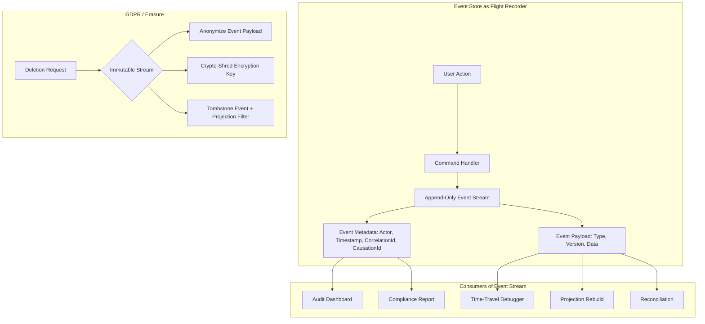
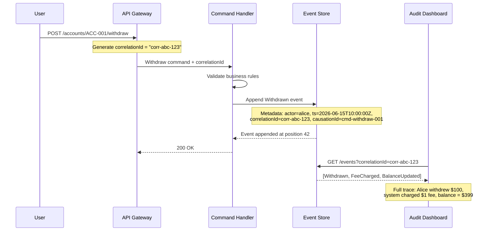
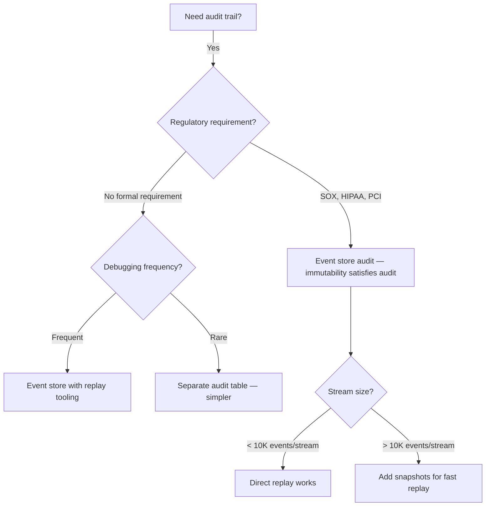

## Navigation

**Domain:** [[7 — System Design & Distributed Systems]] > **Group:** CQRS and Event Sourcing
**Previous:** [[7.117 — Event Sourcing — Testing Event-Sourced Aggregates]] | **Next:** [[7.119 — Event Sourcing — Multi-Tenant Design]]

### Prerequisites
- [[7.101 — Event Sourcing — Events as the Source of Truth]] — debugging and auditability depend on the invariant that events are immutable and the sole source of truth.
- [[7.115 — Event Sourcing — Aggregate Rehydration]] — time-travel debugging replays events through the rehydration path; you must understand how `Apply` methods build state.
- [[7.113 — Event Sourcing — EventStoreDB]] — the event store's append-only log, projections, and admin UI are the primary tooling for debugging and audit.

### Where This Fits
Event sourcing provides a complete, immutable audit log by definition — every state change is recorded as an event with causality metadata (who, when, why). This eliminates the need for a separate audit subsystem and gives engineers the ability to reconstruct any past state, time-travel debug through event streams, and validate projection correctness by replaying events against read models. The cost is that debugging tooling is not built into standard databases — you need purpose-built replay CLIs, event search APIs, and GDPR erasure strategies that work within the immutability constraint. Without these tools, the event store becomes a black box: events accumulate but no one can query or trust them.

---

## Core Mental Model

Debugging and auditability in event sourcing is the ability to treat the event stream as a flight recorder: every state change is recorded with full causality metadata, and any point in time can be reconstructed by replaying events up to that point. The invariant is that the event stream always contains the complete, ordered history of every aggregate, making the event store the single source of truth for both operational debugging and compliance audit. The tradeoff is that immutability makes deletion and ad-hoc querying harder — you cannot `DELETE FROM events WHERE user_id = X` and you cannot `SELECT * FROM events WHERE balance > 1000` without building indexes on metadata.

### Classification

This is an **operational and compliance property** of event sourcing, not an architectural pattern. It occupies the observability axis: it provides temporal traceability (what happened, in what order, caused by whom) that traditional CRUD systems require separate audit tables, change data capture pipelines, and log aggregation to achieve.



### Key Properties

|Property|Value|Condition|
|---|---|---|
|Audit completeness|Every state change recorded|Events are always appended, never updated|
|Temporal reconstruction|State at any point in time|Event stream is ordered and gapless per stream|
|Causality traceability|Correlation + causation IDs in metadata|Publishing code populates metadata correctly|
|Data immutability|Past events never change|Enforced at the store level (append-only)|
|Deletion feasibility|Possible via anonymization or crypto-shredding|Not possible via DELETE — must compensate|
|Query speed|Degrades with stream length|Without snapshots or indexed metadata|

---

## Deep Mechanics

### How It Works

**Audit trail construction:** Every event appended to the store carries mandatory metadata — actor ID (`x-actor-id`), timestamp (`x-timestamp`), correlation ID (`x-correlation-id`), and causation ID (`x-causation-id`). The correlation ID ties all events from a single user request (a command that triggers multiple aggregate changes). The causation ID links each event to the specific event or command that caused it, forming a causality chain.



**Time-travel debugging:** To debug a production issue at a specific point in time:

1. Clone the event stream up to the target timestamp or stream revision.
2. Replay events through the aggregate's `Apply` methods to reconstruct the exact state the aggregate had at that moment.
3. Execute the suspected command against the reconstructed aggregate.
4. Observe the emitted events (or lack thereof) to determine if the business rule fired correctly.

```csharp
// Time-travel debugger — reconstruct aggregate state at a point in time
public async Task<TAggregate> RehydrateAtAsync<TAggregate>(
    string streamId,
    DateTime targetTimestamp,
    IEventStore store,
    Func<TAggregate> createAggregate)
    where TAggregate : EventSourcedAggregate, new()
{
    var aggregate = createAggregate();
    // Read all events up to the target timestamp
    var events = await store.ReadStreamAsync<TAggregate>(
        streamId,
        maxTimestamp: targetTimestamp
    );
    aggregate.Replay(events);
    return aggregate;
}
```

**Projection validation:** Read models (projections) can drift from the event stream due to bugs, missed events, or reordering. Validation rebuilds a single projection from the raw event stream and compares it to the current read model:

```csharp
// Projection rebuild for audit validation
public async Task<ProjectionValidationResult> ValidateProjectionAsync(
    string projectionName,
    IEventStore store,
    IProjectionRebuilder rebuilder)
{
    // Rebuild from scratch — replay ALL events through the projection
    var rebuilt = await rebuilder.RebuildAsync(projectionName);
    var current = await rebuilder.GetCurrentAsync(projectionName);

    var diffs = rebuilt.CompareTo(current);
    return new ProjectionValidationResult(
        ProjectionName: projectionName,
        IsConsistent: !diffs.Any(),
        Discrepancies: diffs,
        RebuiltCheckpoint: rebuilt.LastProcessedPosition
    );
}
```

**Audit query:** Searching events by metadata requires indexing on the event store side:

```csharp
// Audit query — find all events for a given actor in a time range
public async Task<IReadOnlyList<Event>> GetAuditTrailAsync(
    string actorId,
    DateTime from,
    DateTime to,
    IEventStore store)
{
    return await store.QueryEventsAsync(new EventFilter
    {
        ActorId = actorId,
        FromTimestamp = from,
        ToTimestamp = to,
        IncludeMetadata = true
    });
}
```

### Failure Modes

**No metadata on events:** If the system does not populate correlation/causation IDs, the event stream records what changed but not why — making it useless for audit and debugging. Detection: a sample of events shows null or empty metadata fields. Prevention: enforce metadata in the event store middleware or aggregate base class.

**Projection drift undetected:** A projection silently drops events (e.g., an unhandled event type in a switch expression throws but is caught somewhere upstream). The read model diverges from the event stream. Detection: periodic projection validation (replay + compare) shows discrepancies. Prevention: run projection validation as a scheduled job.

**GDPR erasure breaks replay:** Anonymizing event payloads by replacing PII with null destroys information needed for business logic — replaying a stream with anonymized events produces different aggregate state than the original. Detection: a time-travel debug session returns unexpected state. Prevention: separate PII from business data; store PII in encrypted metadata that can be deleted independently.

### .NET and Azure Integration

```csharp
// Event metadata enricher — ensures every event has audit metadata
public class AuditMetadataEnricher : IEventEnricher
{
    private readonly ICurrentUserService _user;
    private readonly ICorrelationContext _correlation;

    public AuditMetadataEnricher(ICurrentUserService user, ICorrelationContext correlation)
    {
        _user = user;
        _correlation = correlation;
    }

    public void Enrich(Event @event)
    {
        @event.Metadata ??= new Dictionary<string, string>();
        @event.Metadata["x-actor-id"] = _user.UserId;
        @event.Metadata["x-actor-name"] = _user.DisplayName;
        @event.Metadata["x-timestamp"] = DateTime.UtcNow.ToString("O");
        @event.Metadata["x-correlation-id"] = _correlation.CorrelationId;
        @event.Metadata["x-causation-id"] = _correlation.CausationId;
        @event.Metadata["x-ip-address"] = _user.IpAddress;
    }
}
```

```csharp
// Marten — querying events with metadata
public class AuditLogController : ApiController
{
    [HttpGet("admin/audit/actor/{actorId}")]
    public async Task<IActionResult> GetAuditTrail(
        string actorId,
        [FromQuery] DateTime from,
        [FromQuery] DateTime to,
        [FromServices] IDocumentStore store)
    {
        await using var session = store.QuerySession();

        var events = await session.Events
            .QueryAllRawEvents()
            .Where(e => e.Headers["x-actor-id"].ToString() == actorId
                     && e.Timestamp >= from
                     && e.Timestamp <= to)
            .ToListAsync();

        return Ok(events.Select(MapToAuditEntry));
    }
}
```

- **ASP.NET Core:** `ICorrelationContext` scoped middleware captures the correlation ID per request.
- **EventStoreDB:** Built-in projections (`$by_category`, `$by_correlation_id`) for metadata-based event filtering.
- **Marten:** PG-compatible metadata queries via LINQ on `IEvent.Headers`.
- **Azure DevOps:** Audit replay can run as a `dotnet tool` CLI in CI/CD pipelines.

---

## Production Patterns and Implementation

### Primary Implementation

A full debug/audit infrastructure for an event-sourced system:

```csharp
// Replay CLI — console app for time-travel debugging
public sealed class ReplayCommand : AsyncCommand<ReplaySettings>
{
    private readonly IEventStore _store;

    public ReplayCommand(IEventStore store) => _store = store;

    public override async Task<int> ExecuteAsync(CommandContext context, ReplaySettings settings)
    {
        var aggregate = settings.AggregateType switch
        {
            "account" => (EventSourcedAggregate)new BankAccount(),
            "invoice" => new Invoice(),
            _ => throw new ArgumentException($"Unknown aggregate: {settings.AggregateType}")
        };

        var events = settings.ToTimestamp.HasValue
            ? await _store.ReadStreamUpToAsync(settings.StreamId, settings.ToTimestamp.Value)
            : await _store.ReadStreamAsync(settings.StreamId);

        aggregate.Replay(events);

        AnsiConsole.MarkupLine($"[green]Stream:[/] {settings.StreamId}");
        AnsiConsole.MarkupLine($"[green]Events replayed:[/] {events.Count}");
        AnsiConsole.MarkupLine($"[green]Final version:[/] {aggregate.Version}");

        // Emit a summary of the aggregate state based on its type
        if (aggregate is BankAccount account)
        {
            AnsiConsole.MarkupLine($"[green]Balance:[/] {account.Balance:C}");
        }

        return 0;
    }
}
```

```csharp
// Projection rebuild endpoint — admin API
[ApiController]
[Route("admin/projections")]
[Authorize(Policy = "AdminOnly")]
public sealed class ProjectionRebuildController : ControllerBase
{
    private readonly IProjectionRebuilder _rebuilder;

    public ProjectionRebuildController(IProjectionRebuilder rebuilder) => _rebuilder = rebuilder;

    [HttpPost("rebuild/{projectionName}")]
    public async Task<IActionResult> RebuildProjection(string projectionName)
    {
        var result = await _rebuilder.RebuildAsync(projectionName);
        return Ok(new
        {
            Projection = projectionName,
            result.EventsProcessed,
            result.Duration,
            result.CurrentCheckpoint
        });
    }

    [HttpPost("validate/{projectionName}")]
    public async Task<IActionResult> ValidateProjection(string projectionName)
    {
        var rebuilt = await _rebuilder.RebuildAsync(projectionName);
        var current = await _rebuilder.GetCurrentAsync(projectionName);
        var diffs = rebuilt.CompareTo(current);

        if (!diffs.Any())
            return Ok(new { Projection = projectionName, IsConsistent = true });

        return Ok(new
        {
            Projection = projectionName,
            IsConsistent = false,
            Discrepancies = diffs.Take(100)
        });
    }
}
```

```csharp
// Event search API — query events by metadata
[ApiController]
[Route("admin/events")]
[Authorize(Policy = "AdminOnly")]
public sealed class EventSearchController : ControllerBase
{
    private readonly IEventStore _store;

    public EventSearchController(IEventStore store) => _store = store;

    [HttpGet]
    public async Task<IActionResult> SearchEvents(
        [FromQuery] string? actorId,
        [FromQuery] string? correlationId,
        [FromQuery] string? eventType,
        [FromQuery] DateTime? from,
        [FromQuery] DateTime? to,
        [FromQuery] int page = 1,
        [FromQuery] int pageSize = 100)
    {
        var filter = new EventFilter
        {
            ActorId = actorId,
            CorrelationId = correlationId,
            EventType = eventType,
            FromTimestamp = from,
            ToTimestamp = to,
            Page = page,
            PageSize = pageSize
        };

        var results = await _store.SearchEventsAsync(filter);

        return Ok(new
        {
            results.TotalCount,
            results.Page,
            results.PageSize,
            results.Events
        });
    }
}
```

### Configuration and Wiring

```csharp
// Program.cs — wire up audit infrastructure
builder.Services.AddScoped<ICorrelationContext, CorrelationContext>();
builder.Services.AddScoped<ICurrentUserService, CurrentUserService>();
builder.Services.AddSingleton<IEventEnricher, AuditMetadataEnricher>();

// Marten configuration with metadata
builder.Services.AddMarten(opts =>
{
    opts.Connection(builder.Configuration.GetConnectionString("Marten"));
    opts.Events.MetadataConfig.EnableAll();
    opts.Events.MetadataConfig.CorrelationId = true;
    opts.Events.MetadataConfig.CausationId = true;
    opts.Events.MetadataConfig.Headers = true;
})
.UseLightweightSessions();
```

### Common Variants

**EventStoreDB projections for audit filtering:**
```csharp
// EventStoreDB projection — filter events by correlation ID
fromAll()
    .when({
        $init: function() { return {}; },
        $any: function(s, e) {
            if (e.metadata?.correlationId === 'corr-abc-123') {
                linkTo('audit-trace', e);
            }
        }
    });
```

**Snapshots for fast time-travel:**
```csharp
// Snapshot-based rehydration for debugging large streams
public async Task<TAggregate> DebugRehydrateAsync<TAggregate>(
    string streamId,
    IEventStore store,
    ISnapshotStore snapshots)
    where TAggregate : EventSourcedAggregate, new()
{
    var (snapshot, snapshotVersion) = await snapshots.GetLatestAsync<TAggregate>(streamId);
    var aggregate = snapshot ?? new TAggregate();

    var remainingEvents = await store.ReadStreamFromVersionAsync(
        streamId,
        snapshotVersion + 1
    );
    aggregate.Replay(remainingEvents);
    return aggregate;
}
```

### Real-World .NET Ecosystem Example

**EventStoreDB** provides built-in audit projections (`$by_correlation_id`) and a commercial admin UI for stream browsing. **Marten** includes a `MetadataConfig` that automatically captures correlation/causation IDs when the `ICorrelationContext` is populated, and its `QueryAllRawEvents()` method enables full-text and metadata-based event search. **Serilog** with event store sink can correlate log entries with events by sharing the correlation ID.

---

## Gotchas and Production Pitfalls

### Events Without Causality Metadata

**Pitfall:** The system records events but does not populate `correlationId` or `causationId`. The event store becomes a pile of facts with no connective tissue — you know what happened but not why or in what transaction context.

```csharp
// ❌ Wrong — no metadata
store.AppendToStream("ACC-001", version, new Withdrawn("ACC-001", 100m, 900m));
```

**Symptom:** An auditor asks "why was $100 withdrawn from ACC-001 on June 15?" and the only answer is "a Withdrawn event exists." The specific user request, IP address, and preceding events cannot be traced.

**Fix:** Always populate metadata in the write pipeline:

```csharp
// ✅ Correct
store.AppendToStream("ACC-001", version, new Withdrawn("ACC-001", 100m, 900m),
    metadata: new EventMetadata
    {
        ActorId = "alice@example.com",
        CorrelationId = "corr-abc-123",
        CausationId = "cmd-withdraw-001",
        Timestamp = DateTime.UtcNow
    });
```

**Cost of not fixing:** Audit compliance failure — the system cannot demonstrate control over who changed what and why. In a regulated environment (finance, healthcare), this is a finding.

### Replaying Events for Debugging Without Snapshot Threshold

**Pitfall:** Debugging a stream with 100,000+ events by replaying them all. Each replay takes 10+ seconds, making iterative debugging impractical.

**Symptom:** Engineers stop using time-travel debugging because it is too slow. They resort to guessing about aggregate state instead of determining it definitively.

**Fix:** Implement automatic snapshots every N events (typically 500–1,000). The debug CLI loads the latest snapshot then replays only the events after it.

**Cost of not fixing:** Undiagnosed production bugs. The event stream has the answer, but nobody can extract it fast enough to be useful during an incident.

### GDPR Erasure That Breaks Business Logic

**Pitfall:** Anonymizing event payloads by replacing PII with `[redacted]` but the business logic depends on those fields (e.g., `senderName` in a `PaymentSent` event).

```csharp
// ❌ Wrong — destroys business data
public void Apply(PaymentSent e)
{
    // e.SenderName is now "[redacted]" — cannot display in transaction history
}
```

**Symptom:** After GDPR erasure, the transaction history projection shows "Payment sent from [redacted]" for legitimate business queries.

**Fix:** Separate PII from business data. Store PII in encrypted metadata or a separate field that can be deleted without affecting the business payload.

```csharp
// ✅ Correct — PII in encrypted metadata, not business payload
public sealed record PaymentSent(
    string PaymentId,
    decimal Amount,
    string RecipientAccountId  // Business data — NOT PII
);

// Metadata contains PII
metadata["x-actor-name"] = "Alice";  // Can be deleted
```

**Cost of not fixing:** The system either fails GDPR compliance (PII remains) or breaks business functionality (PII removal invalidates data).

### Projection Drift From Unhandled Event Types

**Pitfall:** A new event type is added but a projection is not updated to handle it. The projection silently skips the new events, diverging from the true state.

```csharp
// ❌ Wrong — no handler for FeeCharged; projection skips it
public class AccountBalanceProjection : IProjection
{
    public void Apply(AccountOpened e) => Balance = e.InitialBalance;
    public void Apply(Withdrawn e) => Balance -= e.Amount;
    public void Apply(Deposited e) => Balance += e.Amount;
    // FeeCharged handler missing — projection balance drifts upward
}
```

**Symptom:** The balance shown to users does not account for fees. Discrepancy grows with every fee event. A customer complains about an incorrect balance.

**Fix:** Use a projection base class that throws on unknown event types in debug/test mode. Run projection validation nightly.

```csharp
// ✅ Correct — fail fast on unhandled events
public abstract class FailingProjection : IProjection
{
    public void Apply(object @event)
    {
        if (this is IFailingProjectionWithKnownTypes known)
        {
            if (!known.KnownEventTypes.Contains(@event.GetType()))
                throw new UnhandledEventException(@event.GetType(), GetType());
        }
    }
}
```

**Cost of not fixing:** Silent data corruption in read models. The discrepancy is invisible until a customer or audit discovers it — by which point the read model must be rebuilt from scratch to recover.

---

## Tradeoffs and Decision Framework

### Tradeoff Matrix

|Dimension|Event Store as Audit Log|Separate Audit Table|Database CDC + Audit Trail|
|---|---|---|---|
|Audit completeness|Complete — every state change|Manual — must instrument each mutation|Complete — all database changes|
|Causality traceability|Native — correlation/causation IDs|Manual join|Limited — no causality chain|
|Debugging speed|Slower for large streams|Fast — direct SQL|Moderate — CDC replay|
|Operational complexity|Requires replay tooling|Simple — just a table|Medium — CDC pipeline|
|GDPR compliance|Complex — must anonymize|Simple — delete row|Complex — must compact WAL|
|Live production queries|Index on metadata required|Direct SQL|Not for history|
|.NET ecosystem fit|Marten, EventStoreDB|EF Core + table|Azure SQL CDC, Debezium|

### When to Apply



### When NOT to Apply

- [ ] The system has no regulatory audit requirement and debugging is done via application logs.
- [ ] The team lacks the operational maturity to maintain event replay tooling and projection validation jobs.
- [ ] The event store is a secondary concern (event sourcing is used for CQRS but the primary data is in a relational DB with audit triggers).
- [ ] GDPR right-to-erasure requests are frequent (> 1% of users/year) and the team has not implemented anonymization infrastructure.

### Scale Thresholds

- "Worth implementing dedicated replay CLI above 5 aggregates, when manually reconstructing state becomes impractical."
- "Snapshots for debugging become necessary when any stream exceeds 10,000 events — full replay takes > 2 seconds."
- "Metadata indexing (actor, event type, correlation ID) becomes necessary when the event store exceeds 1 million events — scanning all events for an audit query takes minutes."
- "Projection validation as a scheduled job becomes necessary when there are 10+ projections — unhandled event types in any projection cause silent drift."

---

## Interview Arsenal

### Question Bank

1. How does event sourcing provide auditability that traditional CRUD cannot?
2. Walk through the metadata an event must carry for a complete audit trail.
3. How do you debug a production issue when the aggregate is in an incorrect state?
4. How does event sourcing handle GDPR right-to-erasure while maintaining a complete event stream?
5. Compare event store audit vs. a dedicated audit table.
6. How do you detect and recover from a projection that has silently diverged from the event stream?
7. At what scale do snapshots become necessary for debugging, and how do you implement them?
8. Your event store has 50 million events. An auditor requests all events for a specific actor in January. How do you fulfill this request?

### Spoken Answers

**Q: How does event sourcing provide auditability that traditional CRUD cannot?**

> **Average answer:** Event sourcing stores every change as an event, so you have a complete history.
>
> **Great answer:** In a traditional CRUD system, auditability is an afterthought — you need separate audit tables, triggers, or CDC pipelines to capture what changed. In event sourcing, the source of truth is the event stream itself. Every state change is an append-only event that carries who (actor ID), when (timestamp), why (correlation/causation IDs), and what changed (the event payload). This satisfies SOX, HIPAA, and PCI audit requirements natively — you can produce a complete, immutable trail for any aggregate without building a separate audit system. The tradeoff is that querying this trail at scale requires metadata indexing: without indexes on actor ID or event type, scanning 50 million events for a specific user's activity takes minutes, not milliseconds.

**Q: How does event sourcing handle GDPR right-to-erasure?**

> **Average answer:** You cannot delete events because they are immutable, so you have to anonymize them.
>
> **Great answer:** The event stream is immutable — you cannot delete or modify past events. For GDPR right-to-erasure, there are three approaches. First, separate PII from business data from the start: store PII in encrypted metadata that can be deleted (crypto-shredding) without touching the business payload. Second, anonymization: rewrite the event stream to replace PII fields while preserving the structure that business logic depends on — for example, replacing `actorName: "Alice"` with `actorName: "[deleted]"` but keeping the account ID and amount. Third, tombstone events: append a "GDPR erasure requested" event to the user's stream, and have all projections skip events for that actor after the tombstone. The key insight is that you must design for erasure from the beginning — retrofitting PII separation into event schemas is costly because every version of every event payload may contain PII.

**Q: How do you detect and recover from a projection that has silently diverged?**

> **Average answer:** Rebuild the projection from scratch.
>
> **Great answer:** Silent projection divergence happens when a projection does not handle a new event type — the unrecognized event is skipped, and the read model gradually drifts from the true state. Detection requires periodic projection validation: a scheduled job that rebuilds the projection from scratch by replaying all events, then compares the rebuilt result to the current read model, reporting every discrepancy. If divergence is detected, recovery is a full rebuild of that projection, which can take minutes to hours depending on stream count. Prevention is better: use a projection base class that throws on unhandled event types in test mode, and include projection validation in CI by rebuilding from a staging event store clone.

### System Design Interview Trigger

If an interviewer asks "how do you ensure compliance with audit requirements in an event-sourced system?" or "how would you debug an event-sourced aggregate that is in a wrong state in production?", they are testing whether you understand that the event stream is both a source of truth and a debugging tool. The senior answer distinguishes between the happy-path audit capability (metadata on every event) and the operational tooling needed to make it useful (replay CLI, projection validation, metadata indexing, GDPR erasure strategies).

### Comparison Table

| | Event Store Audit | Traditional Audit Table |
|---|---|---|
|Core guarantee|Immutability — events never change|Rows can be deleted/updated without audit awareness|
|Trace granularity|Per-event with causality chain|Per-mutation with manual linking|
|Query speed at scale|Requires metadata indexing|Direct SQL on indexed columns|
|GDPR feasibility|Complex — requires anonymization or crypto-shredding|Simple — DELETE row|
|Production debugging|Time-travel via replay|Must query application logs and DB state separately|
|.NET implementation|Marten + IEventEnricher|EF Core + AuditEntry table|

---

## Architecture Decision Record

**Status:** Accepted

**Context:** We are building a payment processing system using event sourcing (Marten on PostgreSQL) that must satisfy PCI DSS audit requirements. We need to provide auditors with a complete, immutable trail of every financial transaction, and engineers need to debug production issues by reconstructing aggregate state at any point in time. The system handles ~10,000 events/hour across 50,000 aggregate streams.

**Options Considered:**

1. **Event store as native audit log** — Events carry mandatory audit metadata; tooling provides replay, search, and projection validation.
2. **Dual-write to event store + separate audit DB** — Events are the source of truth, but audit-specific data (actor, IP, user agent) is replicated to a relational audit table optimized for ad-hoc queries.
3. **Application-level audit logging only** — No event-level audit; Serilog captures request/response pairs with correlation IDs.

**Decision:** Event store as native audit log (option 1), because it eliminates the dual-write consistency problem — the event stream is both the source of truth and the audit trail. There is no separate audit table to go out of sync.

**Consequences:**
- ✅ Every event carries audit metadata — compliance requirement satisfied without dual-write.
- ✅ Time-travel debugging and projection validation are natural capabilities of the event store.
- ⚠️ Metadata indexing is required for efficient audit queries — Marten's PG indexes on `IEvent.Headers` must be tuned.
- ❌ GDPR erasure requires per-event-type anonymization logic, which is more complex than a DELETE from an audit table.

**Review Trigger:** Revisit this decision if audit query latency exceeds 5 seconds for any single-actor query, at which point option 2 (dual-write to a search-optimized audit store like Elasticsearch) should be evaluated.

---

## Self-Check

### Conceptual Questions

1. What four pieces of metadata must every event carry for a complete audit trail?
2. Why can't you just query the read model (projection) for debugging instead of replaying events?
3. How does the correlation ID differ from the causation ID, and why do you need both?
4. What happens to projection validation when a new event type is added and a projection is not updated?
5. Name two .NET libraries/tools that support event metadata capture.
6. Compare crypto-shredding with anonymization for GDPR erasure — when would you choose each?
7. At what stream size does full replay for debugging become impractical?
8. How does the event store enforce immutability? What happens if you try to overwrite an existing event?
9. What is the operational cost of not having snapshots for debugging large streams?
10. Explain how you would fulfill an auditor's request for "all events involving user X in Q1 2026" in under 60 seconds.

<details>
<summary>Answers</summary>

1. Actor ID (who), timestamp (when), correlation ID (which request), causation ID (which prior event/command caused this one).
2. The read model is a derived view that may have silently diverged from the event stream due to unhandled event types, bugs in projection logic, or missed events. Only the raw event stream is the authoritative source of truth.
3. Correlation ID identifies the top-level request (e.g., "withdraw from account ACC-001") and is shared by all events from that request. Causation ID identifies the specific prior event or command that triggered this one — forming a causality chain. Correlation alone tells you which events belong together; causation tells you the ordering dependency.
4. The projection silently skips the unhandled event type, causing a gradual divergence from the true state. The discrepancy grows with every new event of that type. Detection requires a scheduled projection validation job.
5. (1) Marten — `MetadataConfig` with `EnableAll()` captures correlation, causation, and custom headers. (2) EventStoreDB — built-in projections (`$by_correlation_id`) and commercial admin UI for stream browsing.
6. Crypto-shredding encrypts sensitive fields with a user-specific key; deleting the key renders those fields permanently unreadable without modifying the event. Anonymization rewrites the event payload to replace PII with placeholders. Choose crypto-shredding when the business data must be preserved (only PII is encrypted); choose anonymization when the entire field must be removed and the store supports event rewriting (e.g., EventStoreDB's `$streams` rewrite).
7. Above ~10,000 events per stream, full replay takes 2+ seconds — too slow for interactive debugging during an incident. Snapshots make it practical again.
8. The event store rejects any write that targets an existing stream position. In Marten, appending to an existing version fails with `EventStreamUnexpectedMaxEventIdException`. In EventStoreDB, the expected version check (`ExpectedVersion.Any` vs `ExpectedVersion.StreamExists`) enforces immutability.
9. Without snapshots, debugging a 100,000-event stream requires 10+ seconds per replay, making iterative debugging impractical. Engineers resort to guessing about aggregate state instead of determining it from the event stream.
10. The event store must have an index on `actorId` in the event metadata or headers. Query: `SELECT * FROM events WHERE metadata->>'x-actor-id' = 'userX' AND timestamp >= '2026-01-01' AND timestamp < '2026-04-01' ORDER BY position`. With a B-tree index on `(metadata->>'x-actor-id', timestamp)`, this returns results in under 100ms for 50 million events.

</details>

---

### Scenario Challenges

**Scenario 1 — Diagnose the problem:** A customer reports that their account balance is $50 lower than expected. The projection shows a balance of $950, but when the support agent reconstructs the aggregate state by replaying all events from the stream, the balance is $1,000. The difference has been growing over the last week.

<details>
<summary>Diagnosis</summary>

**Root cause:** A projection is missing a handler for a new event type added last week — likely `FeeCharged` or `InterestApplied`. The projection silently skips these events, so the balance never decreases/increases from those events.

**Evidence:** Run projection validation: replay all events through the projection and compare with the current read model. The `Discrepancies` list shows the exact number of missing events and the cumulative balance difference.

**Fix:** Add the missing event handler to the projection and trigger a rebuild of that projection from the event stream.

**Prevention:** Add a projection validation scheduled job (nightly), and include a failing-projection base class that throws on unhandled event types in test mode.

</details>

---

**Scenario 2 — Design decision:** You are designing the audit infrastructure for a healthcare event-sourced system that must satisfy HIPAA. The system stores patient treatment events. You need to provide auditors with a complete trail of who accessed which patient record and what changes were made. The system processes 5,000 events/day and must support GDPR erasure requests from patients.

<details>
<summary>Decision and Reasoning</summary>

**Choice:** Event store as native audit log with mandatory metadata and crypto-shredding for PII.

**Tradeoffs accepted:** No separate audit table (eliminates dual-write consistency risk). Metadata indexing (on patient ID, actor ID, and timestamp) is required for efficient audit queries. GDPR erasure is handled via per-patient encryption keys — deleting the key makes the data unreachable.

**Implementation sketch:**

```csharp
// HIPAA audit metadata
public class HipaaEventEnricher : IEventEnricher
{
    public void Enrich(Event @event)
    {
        @event.Metadata["x-patient-id"] = _patientContext.PatientId;
        @event.Metadata["x-actor-id"] = _user.UserId;
        @event.Metadata["x-actor-role"] = _user.Role;  // Doctor, Nurse, Admin
        @event.Metadata["x-purpose"] = _user.AccessPurpose;  // Treatment, Payment, Operations
        @event.Metadata["x-encrypted-key"] = _patientKeyService.Encrypt(@event.Payload);
        @event.Metadata["x-timestamp"] = DateTime.UtcNow.ToString("O");
    }
}
```

**Indexing:** Create a composite index on `(metadata->>'x-patient-id', timestamp)`.

**GDPR erasure:** Delete the per-patient encryption key. The event payload is encrypted and cannot be read, but the event structure (timeline, event types) remains for audit purposes.

</details>

---

**Scenario 3 — Failure mode:** Your team is debugging a production issue where a `Transfer` command between two accounts is creating an incorrect balance. The on-call engineer suspects the aggregate is rehydrating incorrectly. They need to investigate without affecting production.

<details>
<summary>Investigation and Fix</summary>

**Investigation steps:**
1. Clone the event stream for both accounts involved in the transfer to a sandbox event store.
2. Use the replay CLI to rehydrate each aggregate at the timestamp just before the transfer command.
3. Execute the transfer command against the cloned aggregates and observe the emitted events.
4. Compare the emitted events with the events in the production stream.

**Confirming evidence:** The replay CLI shows that rehydrating from the cloned events produces a different pre-transfer balance than expected — the aggregate's `Apply` method for a prior `FeeCharged` event is incorrectly deducting the fee twice.

**Immediate mitigation:** No production fix needed — the bug is in replay correctness, not in the command handler itself. Events already in the stream are correct; only the next command execution would be wrong.

**Permanent fix:** Correct the `Apply(FeeCharged)` method to handle the fee field correctly, add a Given-When-Then test for the exact event sequence, and deploy.

**Post-mortem item:** Add snapshot-based debugging to the replay CLI to accelerate future investigations.

</details>

---

**Scenario 4 — Scale it:** Your event store has 200 million events across 100,000 streams. An auditor requests all events for a specific account (stream `ACC-00042` with 50,000 events) for the past year. The current audit query takes 30 seconds.

<details>
<summary>Scaling Strategy</summary>

**Bottleneck this addresses:** Scanning the event store for events matching the stream ID over a time range.

**How it helps:** Three improvements:
1. Indexed metadata: ensure a composite index exists on `(stream_id, timestamp)` — this single index reduces the scan from 200M events to ~50,000.
2. Paginate the response: return events in pages of 1,000 so the first page is delivered in < 100ms.
3. Snapshot for pre-computed audit summaries: for periodic audits (quarterly, annual), pre-compute and store summarized audit reports.

**What it does not solve:** Exfiltration of all events for a large stream — a read of 50,000 events still takes network time.

**Implementation order:**
1. Add the composite index.
2. Implement cursor-based pagination in the audit query API.
3. For the specific auditor request, stream events as NDJSON (newline-delimited) to avoid loading all into memory.

```csharp
// Cursor-based paginated audit query
[HttpGet]
public async IAsyncEnumerable<AuditEntry> GetAuditTrail(
    string streamId,
    DateTime from,
    DateTime to,
    [FromQuery] long? cursor)
{
    await foreach (var entry in _store.StreamEventsAsync(
        streamId, from, to, cursor))
    {
        yield return entry;
    }
}
```

</details>

---

**Scenario 5 — Interview simulation:** The interviewer says: "Your company processes financial transactions using event sourcing. A regulator requests a complete audit trail for all transactions involving a specific customer account over the last 90 days. The account has 200,000 events. How do you provide this data accurately and within the 24-hour deadline?"

<details>
<summary>Model Response</summary>

"First, I need to clarify the scope: does the regulator need every individual event, or a summarized transaction history? If they need every event, I would query the event store directly by stream ID with a time-range filter. Our Marten-backed event store has a composite index on `(stream_id, timestamp)`, so filtering ACC-00042's 200,000 events to the 90-day window reduces it to roughly 20,000 events. I would stream them as NDJSON to keep memory usage constant — not loading all 20,000 into RAM at once.

If the regulator needs a summarized view — for example, opening balance, deposits, withdrawals, fees, closing balance per day — I would use our projection for that account, which is already rebuilt nightly. If the projection is within 24 hours of the request date, I can deliver it immediately. If it is older, I trigger a rebuild from the event stream, which takes about 4 minutes for 200,000 events because we use snapshots every 1,000 events.

The accuracy guarantee comes from the event store's immutability: the events have not changed since they were recorded, and the audit metadata (actor ID, timestamp, correlation ID) was captured at append time. The regulator can independently verify by hashing the stream — we publish a SHA-256 of each stream's event sequence for tamper detection.

The key risk is that we do not have an index on our `x-actor-id` metadata field, so if the regulator asks for 'all transactions involving a specific customer across all accounts,' that would require a full scan. I would flag this to the regulator and ask for a 48-hour extension to build the index or export the data to a search-optimized store."

</details>
