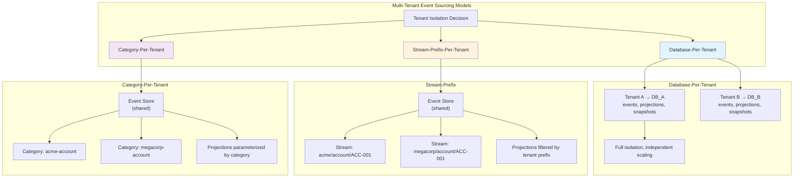
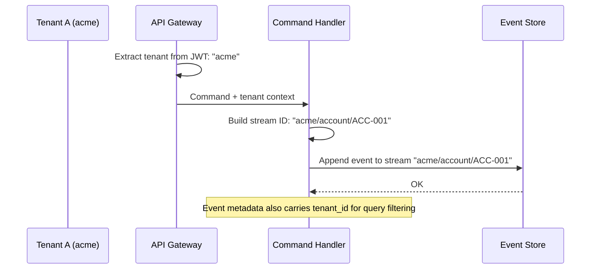
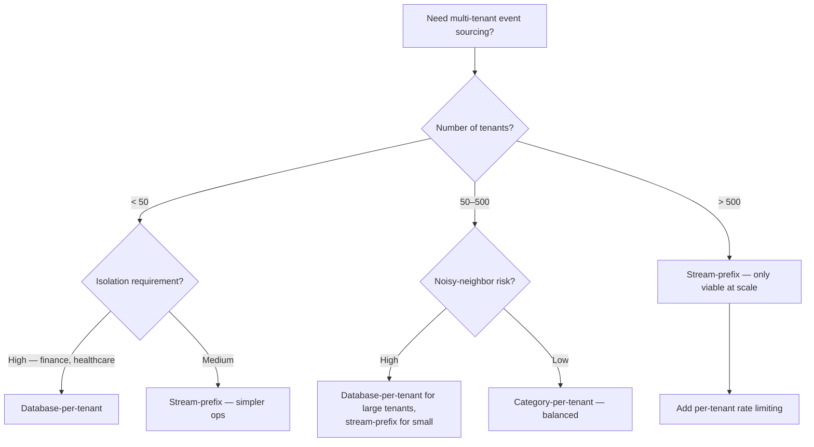

## Navigation

**Domain:** [[7 — System Design & Distributed Systems]] > **Group:** CQRS and Event Sourcing
**Previous:** [[7.118 — Event Sourcing — Debugging and Auditability]] | **Next:** [[7.120 — Event Sourcing — Integration with Message Brokers]]

### Prerequisites
- [[7.101 — Event Sourcing — Events as the Source of Truth]] — multi-tenancy decisions assume the event stream is the sole source of truth; isolation models affect how streams are named, stored, and queried.
- [[7.113 — Event Sourcing — EventStoreDB]] — the event store's features (stream ACLs, projections, category-based filtering) determine which isolation models are viable.
- [[7.104 — Event Sourcing — Projections — Building Read Models]] — each tenant has its own projections or filtered views; the projection infrastructure must be tenant-aware.

### Where This Fits
Multi-tenancy in event sourcing addresses how to isolate event streams, projections, and infrastructure between customers (tenants) in a SaaS system. The core tension is between isolation (no tenant can see another's data) and operational efficiency (shared infrastructure reduces cost). The event sourcing model shifts the isolation decision from the database schema level to the stream naming and projection routing level, introducing options (stream-prefix isolation, category-per-tenant) that have no equivalent in traditional CRUD multi-tenancy. Getting this wrong causes cross-tenant data leaks, noisy-neighbor problems where one tenant's load degrades all others, and complex migration paths when a tenant outgrows the shared tier.

---

## Core Mental Model

Multi-tenant event sourcing is the problem of partitioning event streams and projections such that each tenant's data is isolated, queriable, and independently operable while sharing as much infrastructure as possible. The invariant is that a tenant's events must never appear in another tenant's projection output or query results. The tradeoff is shaped by three dimensions: isolation level (database-per-tenant → shared store with prefix), projection ownership (shared → per-tenant → sharded), and operational complexity (which increases with the number of isolated units).

### Classification

This is a **multi-tenancy architecture pattern** specific to event-sourced systems. It occupies the operational axis: it determines how tenants share or separate the event store, projection runners, and snapshot stores.



### Key Properties

|Property|Database-Per-Tenant|Stream-Prefix|Category-Per-Tenant|
|---|---|---|---|
|Data isolation|Full — separate DB|Logical — prefix in stream ID|Logical — category namespace|
|Operational cost|High — N databases|Low — one database|Medium — category routing|
|Noisy-neighbor protection|Yes|No|Partial — per-category throughput|
|Tenant migration|Copy entire DB|Export/import by prefix|Export/import by category|
|Cross-tenant queries|Impossible|Filter by prefix|Filter by category|
|Max tenants|~100 (practical limit)|Thousands|Hundreds|
|GDPR per-tenant deletion|Drop database|Anonymize events by prefix|Anonymize events by category|

---

## Deep Mechanics

### How It Works

**Stream identity with tenant prefix:** Each tenant's streams are namespaced by a tenant identifier. The stream ID becomes `{tenant}/{aggregate-type}/{aggregate-id}`. The command handler resolves the tenant from the request context and prepends it to the aggregate ID.



**Projection routing:** Projections must be tenant-aware. The two approaches:

1. **Single projection with tenant filter** — one projection runner processes all events but filters by tenant prefix when the projection is per-tenant or when querying:

```csharp
// Tenant-filtered read — all tenants share the projection reader
public async Task<AccountBalance> GetBalanceAsync(string tenantId, string accountId)
{
    var streamId = $"{tenantId}/account/{accountId}";
    var aggregate = await _store.AggregateStreamAsync<BankAccount>(streamId);
    return new AccountBalance(aggregate.Id, aggregate.Balance);
}
```

2. **Per-tenant projection instances** — each tenant has its own projection runner with its own checkpoint:

```csharp
// Per-tenant projection runner
public class TenantProjectionRunner<TProjection>
    where TProjection : IProjection, new()
{
    private readonly string _tenantId;
    private readonly IEventStore _store;
    private readonly IProjectionStore _projectionStore;

    public async Task RunAsync(CancellationToken ct)
    {
        var checkpoint = await _projectionStore.GetCheckpointAsync(_tenantId);
        var events = await _store.ReadAllEventsAsync(
            checkpoint,
            filter: e => e.StreamId.StartsWith($"{_tenantId}/")
        );

        var projection = new TProjection();
        foreach (var e in events)
        {
            projection.Apply(e);
        }
        await _projectionStore.SaveCheckpointAsync(_tenantId, events.Last().Position);
        await _projectionStore.SaveProjectionAsync(_tenantId, projection);
    }
}
```

**Tenant-aware event metadata:** Every event stores the tenant ID in metadata so that even with stream-prefix isolation, a backup query or cross-stream audit can filter by tenant:

```csharp
// Metadata enricher — adds tenant ID to every event
public class TenantMetadataEnricher : IEventEnricher
{
    private readonly ITenantContext _tenant;

    public TenantMetadataEnricher(ITenantContext tenant) => _tenant = tenant;

    public void Enrich(Event @event)
    {
        @event.Metadata["x-tenant-id"] = _tenant.TenantId;
    }
}
```

### Failure Modes

**Cross-tenant data leak via projection:** A shared projection that does not filter by tenant prefix reads events from all tenants and writes them to a single read model table without tenant partitioning. Tenant A's user can query the read model and see Tenant B's data.

Detection: A penetration test or customer report of seeing another tenant's data. The read model table lacks a `tenant_id` column or filter.

Prevention: Always include `tenant_id` in the projection output schema. In the shared projection, add a where clause or stream ID prefix filter. In per-tenant projections, the checkpoint itself scopes the projection to one tenant.

**Noisy neighbor in shared event store:** One tenant with high write throughput (10,000 events/second) saturates the event store's I/O, causing latency spikes for all other tenants.

Detection: P99 append latency for Tenant B increases from 5ms to 500ms when Tenant A runs its nightly batch job.

Mitigation: Database-per-tenant for high-throughput tenants. For shared stores, implement per-tenant rate limiting at the command handler level and consider Marten's per-database connection pooling or EventStoreDB's node-per-tenant in extreme cases.

**Tenant migration corruption:** Migrating a tenant's events from a shared store to a dedicated database misses some events because the export query did not use the same prefix filter as the write path.

Detection: After migration, the tenant's balance projection does not match. Replaying events from the source shows a discrepancy.

Prevention: Use the tenant ID from event metadata (not just the stream prefix) as the authoritative filter. After export, verify event count and checksum before import.

### .NET and Azure Integration

```csharp
// Tenant resolution in ASP.NET Core
public class TenantContextMiddleware
{
    private readonly RequestDelegate _next;

    public TenantContextMiddleware(RequestDelegate next) => _next = next;

    public async Task InvokeAsync(HttpContext context, ITenantContext tenantContext)
    {
        // Extract tenant from JWT claim or subdomain
        var tenantId = context.Request.Headers["X-Tenant-Id"].FirstOrDefault()
                    ?? context.User.FindFirst("tenant_id")?.Value;

        if (string.IsNullOrEmpty(tenantId))
        {
            context.Response.StatusCode = 400;
            await context.Response.WriteAsync("Tenant ID is required.");
            return;
        }

        tenantContext.SetTenant(tenantId);
        await _next(context);
    }
}

// Registration
builder.Services.AddScoped<ITenantContext, TenantContext>();
builder.Services.AddSingleton<IEventEnricher, TenantMetadataEnricher>();
```

```csharp
// Tenant-aware Marten configuration — database-per-tenant
public static void ConfigureTenantStore(IServiceCollection services, string tenantId)
{
    var connectionString = GetConnectionStringForTenant(tenantId);

    services.AddMarten(opts =>
    {
        opts.Connection(connectionString);
        opts.Events.StreamIdentity = StreamIdentity.AsString;
        opts.Events.MetadataConfig.EnableAll();
    })
    .UseLightweightSessions();
}
```

- **ASP.NET Core:** Middleware extracts tenant from JWT claim, subdomain, or header; scoped `ITenantContext` makes it available to command handlers and enrichers.
- **Marten:** Supports `StoreOptions` per database connection; use `AddMarten` per tenant or a multi-tenant store with `IDocumentStore.OpenSession(tenantId)`.
- **EventStoreDB:** Stream ACLs at the `$ce-{category}` projection level; user-managed node clustering for database-per-tenant.
- **Azure:** Elastic Database Pool for database-per-tenant; Azure SQL for shared stores; Event Hubs namespace per tenant for high-isolation scenarios.

---

## Production Patterns and Implementation

### Primary Implementation

A multi-tenant event sourcing infrastructure with stream-prefix isolation (the most common model for SaaS at scale):

```csharp
// Tenant-scoped command handler — resolves stream ID from tenant context
public sealed class WithdrawCommandHandler : IRequestHandler<WithdrawCommand, WithdrawResult>
{
    private readonly IEventStore _store;
    private readonly ITenantContext _tenant;

    public WithdrawCommandHandler(IEventStore store, ITenantContext tenant)
    {
        _store = store;
        _tenant = tenant;
    }

    public async Task<WithdrawResult> Handle(WithdrawCommand command, CancellationToken ct)
    {
        // Build tenant-scoped stream ID
        var streamId = $"{_tenant.TenantId}/account/{command.AccountId}";

        // Read events, rehydrate aggregate
        var events = await _store.ReadStreamAsync(streamId, ct);
        var account = new BankAccount();
        account.Replay(events);

        // Execute command
        account.Withdraw(command.Amount, command.Timestamp);

        // Append new events
        await _store.AppendToStreamAsync(streamId, account.Version, account.PendingEvents, ct);

        return new WithdrawResult(account.Balance);
    }
}
```

```csharp
// Tenant-isolated projection — shared infrastructure, filtered per tenant
public sealed class MultiTenantProjectionHost : BackgroundService
{
    private readonly ITenantStore _tenantStore;
    private readonly IServiceProvider _services;

    public MultiTenantProjectionHost(ITenantStore tenantStore, IServiceProvider services)
    {
        _tenantStore = tenantStore;
        _services = services;
    }

    protected override async Task ExecuteAsync(CancellationToken ct)
    {
        var tenants = await _tenantStore.GetActiveTenantsAsync();

        // Option A: one projection per tenant (full isolation)
        var tasks = tenants.Select(tenant => RunTenantProjectionAsync(tenant, ct));
        await Task.WhenAll(tasks);
    }

    private async Task RunTenantProjectionAsync(string tenantId, CancellationToken ct)
    {
        using var scope = _services.CreateScope();
        var store = scope.ServiceProvider.GetRequiredService<IEventStore>();
        var projectionStore = scope.ServiceProvider.GetRequiredService<IProjectionStore>();

        var checkpoint = await projectionStore.GetCheckpointAsync(tenantId);
        var events = await store.ReadAllEventsAsync(
            checkpoint,
            filter: e => e.StreamId.StartsWith($"{tenantId}/")
        );

        var projection = new AccountBalanceProjection();
        foreach (var e in events)
        {
            projection.Apply(e);
        }

        await projectionStore.SaveCheckpointAsync(tenantId, events.LastOrDefault()?.Position ?? checkpoint);
        await projectionStore.SaveProjectionAsync(tenantId, projection);
    }
}
```

```csharp
// Tenant store — manages tenant registration and connection routing
public interface ITenantStore
{
    Task<IReadOnlyList<string>> GetActiveTenantsAsync();
    Task<string> GetConnectionStringAsync(string tenantId);
    Task<TenantIsolationLevel> GetIsolationLevelAsync(string tenantId);
}

public enum TenantIsolationLevel
{
    SharedPrefix,   // Stream-prefix-per-tenant in shared DB
    DatabasePerTenant // Dedicated database
}
```

### Configuration and Wiring

```csharp
// Program.cs — multi-tenant wiring
builder.Services.AddScoped<ITenantContext, TenantContext>();
builder.Services.AddSingleton<ITenantStore, TenantStore>();
builder.Services.AddSingleton<IEventEnricher, TenantMetadataEnricher>();

// Marten — shared store with tenant data in metadata
builder.Services.AddMarten(opts =>
{
    opts.Connection(builder.Configuration.GetConnectionString("EventStore"));
    opts.Events.StreamIdentity = StreamIdentity.AsString;
    opts.Events.MetadataConfig.EnableAll();
})
.UseLightweightSessions();

// For database-per-tenant, register Marten per tenant dynamically
// (see TenantStore implementation)
```

### Common Variants

**Database-per-tenant with dynamic Marten registration:**
```csharp
// Database-per-tenant — create tenant-scoped document store on demand
public class TenantDocumentStore : ITenantDocumentStore
{
    private readonly ConcurrentDictionary<string, IDocumentStore> _stores = new();

    public IDocumentStore GetStore(string tenantId)
    {
        return _stores.GetOrAdd(tenantId, tid =>
        {
            var conn = _tenantStore.GetConnectionStringAsync(tid).Result;
            return DocumentStore.For(opts =>
            {
                opts.Connection(conn);
                opts.Events.StreamIdentity = StreamIdentity.AsString;
            });
        });
    }
}
```

**EventStoreDB category-per-tenant with projections:**
```javascript
// EventStoreDB projection — one category per tenant
fromCategory('acme-account')
    .when({
        $any: function(s, e) {
            linkTo('acme-account-balance', e);
        }
    });
```

### Real-World .NET Ecosystem Example

**Marten** supports multi-tenancy natively through its `ITenantContext` integration and per-database `IDocumentStore` instances. The Marten team recommends stream-prefix isolation for most SaaS scenarios and provides an `IEventEnricher` interface for adding tenant metadata. **EventStoreDB** supports stream-level ACLs and category projections that enable per-tenant stream partitioning. **Azure SQL Elastic Pool** is the recommended Azure service for database-per-tenant event stores, providing resource governance per database.

---

## Gotchas and Production Pitfalls

### Stream Prefix Mismatch Between Write and Read

**Pitfall:** The write path uses `{tenant}/{aggregate-type}/{id}` but the read or replay path uses `{aggregate-type}/{tenant}/{id}` or omits the tenant prefix. Events land in a different stream than queries expect.

```csharp
// ❌ Wrong — inconsistent prefix
// Handler writes to: "acme/account/ACC-001"
// Replay reads from: "account/acme/ACC-001"
```

**Symptom:** Projections show empty or partial data for a tenant. Events exist in the store but queries never find them.

**Fix:** Enforce the prefix convention in a single place — a stream ID factory:

```csharp
// ✅ Correct — centralized stream ID construction
public static class StreamId
{
    public static string For<T>(string tenantId, string aggregateId)
        => $"{tenantId}/{typeof(T).Name.ToLowerInvariant()}/{aggregateId}";
}

// Usage — always call StreamId.For<T>(tenant, id), never concatenate manually
```

**Cost of not fixing:** Silent data loss — events are stored but invisible to projections. Requires a data migration to read from the correct streams.

### Projection Checkpoint Sharing Across Tenants

**Pitfall:** A single projection runner processes all tenants but uses one global checkpoint. When a new tenant is added, the runner must replay all events from the beginning of time to catch up, slowing processing for existing tenants.

```csharp
// ❌ Wrong — single checkpoint for all tenants
var checkpoint = await store.GetGlobalCheckpointAsync();
```

**Symptom:** Adding a tenant triggers a full replay that takes hours, during which all tenants' projections lag.

**Fix:** Per-tenant checkpoints:

```csharp
// ✅ Correct — per-tenant checkpoint
var checkpoint = await store.GetCheckpointAsync(tenantId);
```

**Cost of not fixing:** Operational pain with tenant onboarding. Each new tenant causes a global projection rebuild, impacting all existing tenants.

### Tenant ID in Event Payload Instead of Metadata

**Pitfall:** The tenant ID is stored in the event payload (e.g., `AccountOpened.TenantId`) instead of metadata. When querying by tenant, the event store must deserialize every event's payload to filter — a full scan even with indexes.

```csharp
// ❌ Wrong — tenant in payload
public sealed record AccountOpened(string TenantId, string AccountId, decimal Balance);
```

**Symptom:** Audit queries for "all events for tenant X" take minutes on a 10M-event store because the tenant filter cannot use an index.

**Fix:** Store tenant ID in event metadata (indexed) and optionally in the payload for projection convenience:

```csharp
// ✅ Correct — tenant in metadata (queryable) + payload
public sealed record AccountOpened(string AccountId, decimal InitialBalance);
// metadata["x-tenant-id"] = "acme" → indexed
```

**Cost of not fixing:** Inability to run tenant-level queries at scale. Every GDPR erasure, audit, or support request requires a full event store scan.

### Not Planning for Tenant Migration

**Pitfall:** The system is built with stream-prefix isolation, but the first enterprise customer requires a dedicated database. Migrating from shared to dedicated is not anticipated and requires ad-hoc scripting.

**Symptom:** The migration team spends weeks building export/import tooling while the customer waits.

**Fix:** From day one, build the tenant migration workflow:

```csharp
// Tenant migration pipeline — available from launch
public async Task MigrateTenantAsync(string tenantId, TenantIsolationLevel target)
{
    var sourceDb = await _tenantStore.GetConnectionStringAsync(tenantId);
    var targetDb = target == TenantIsolationLevel.DatabasePerTenant
        ? await ProvisionDatabaseAsync(tenantId)
        : sourceDb;

    // Export all events for the tenant (filter by metadata)
    var events = await _sourceStore.QueryEventsAsync(
        filter: e => e.Metadata["x-tenant-id"] == tenantId
    );

    // Import to target store
    await _targetStore.AppendEventsAsync(events);

    // Rebuild projections
    await _projectionRebuilder.RebuildAsync(tenantId);

    // Update routing
    await _tenantStore.SetConnectionStringAsync(tenantId, targetDb);
}
```

**Cost of not fixing:** High-touch, error-prone migrations that require manual scripting and extended downtime for each tenant upgrade.

---

## Tradeoffs and Decision Framework

### Tradeoff Matrix

|Dimension|Database-Per-Tenant|Stream-Prefix (Shared)|Category-Per-Tenant|
|---|---|---|---|
|Data isolation|Full — separate DB per tenant|Logical — prefix convention|Logical — category namespace|
|Noisy-neighbor protection|Complete — independent hardware|None — shared I/O|Partial — per-category throughput limits|
|Operational cost|High — N DBs to manage|Low — single DB|Medium — routing layer|
|Max tenants|~100 (practical limit)|Thousands|Hundreds|
|Tenant migration|Easy — copy DB|Moderate — export/import by prefix|Moderate — export/import by category|
|Projection isolation|Full — per-tenant projections|Shared or per-tenant|Per-category projections|
|Cross-tenant analytics|Requires union query|Filter by prefix|Filter by category|
|GDPR per-tenant deletion|Drop database|Anonymize by prefix|Anonymize by category|
|Snapshot management|Per database|Shared + tenant prefix key|Per category|

### When to Apply



### When NOT to Apply

- [ ] The system has fewer than 5 tenants and no regulatory isolation requirement — stream-prefix is premature.
- [ ] The team does not have operational capability to manage per-tenant checkpoints and projection routing.
- [ ] The tenants have wildly different throughput profiles (10:1 ratio or more) and the team refuses database-per-tenant for high-volume tenants.
- [ ] Cross-tenant analytics is the primary use case — event sourcing with stream-prefix isolation makes cross-tenant queries slower than a shared relational schema.

### Scale Thresholds

- "Stream-prefix isolation becomes necessary above ~10 tenants — a single flat namespace of aggregate IDs risks collision."
- "Database-per-tenant becomes economically viable when a single tenant exceeds ~$5,000/month in infrastructure cost, or when regulatory compliance demands it."
- "Per-tenant checkpoints become necessary when the slowest tenant's catch-up delays all others — typically above 20 tenants with uneven event volumes."
- "Per-tenant rate limiting on the event store becomes necessary when one tenant generates more than 50% of total event volume."

---

## Interview Arsenal

### Question Bank

1. What are the three main multi-tenancy models for event sourcing?
2. How does stream-prefix isolation prevent cross-tenant data leaks?
3. Compare database-per-tenant vs. shared-store multi-tenancy for event sourcing.
4. How do you handle projection isolation when tenants have different event volumes?
5. What happens to event replay when a new tenant joins a shared event store?
6. How does GDPR erasure differ between the three tenant isolation models?
7. What is the noisy-neighbor problem in multi-tenant event sourcing and how do you mitigate it?
8. Design a tenant migration workflow from shared prefix to dedicated database.

### Spoken Answers

**Q: What are the three main multi-tenancy models for event sourcing?**

> **Average answer:** Database-per-tenant, schema-per-tenant, and shared table.
>
> **Great answer:** Event sourcing has three isolation models that map to the stream namespace. Database-per-tenant gives complete isolation — each tenant gets its own event store database with independent projections, snapshots, and operational characteristics. This is right for fewer than 100 tenants with regulatory requirements or noisy-neighbor risk. Stream-prefix-per-tenant uses a single shared event store where stream IDs carry the tenant prefix — for example, `acme/account/ACC-001`. This scales to thousands of tenants but provides no isolation at the storage layer: one tenant's batch job can saturate the shared I/O. Category-per-tenant is a middle ground: the event store's category mechanism groups streams per tenant, enabling per-category projections and throughput routing without separate databases. Each model makes different tradeoffs between isolation, operational cost, and maximum tenant count.

**Q: How do you handle projection isolation when tenants have different event volumes?**

> **Average answer:** Use separate projections per tenant.
>
> **Great answer:** There are three approaches. Per-tenant projection instances provide full isolation — each tenant has its own projection runner, checkpoint, and read model store. This is the right choice when tenant volumes vary by 10x or more because the high-volume tenant's events never block the low-volume tenant's projections. Shared projections with per-tenant checkpoints use a single runner but maintain separate checkpoints per tenant, so adding a new tenant does not force a full replay. Sharded projections use consistent hashing to route tenants to projection runners — a compromise between isolation and operational overhead. I usually start with shared projections and per-tenant checkpoints, then migrate high-volume tenants to dedicated projection instances when their event rate exceeds 100 events/second.

**Q: How does GDPR erasure differ between the three tenant isolation models?**

> **Average answer:** You delete the tenant's data from the event store.
>
> **Great answer:** With database-per-tenant, GDPR erasure is straightforward — you drop the entire database. With stream-prefix isolation, you cannot drop a subset of a shared database. Instead, you must anonymize the tenant's events by rewriting them — replacing PII fields with placeholders — or use crypto-shredding where encrypted metadata fields are rendered unreadable by deleting the tenant-specific encryption key. Category-per-tenant is similar to stream-prefix, but the event store's category projection can filter out the tenant's streams at the checkpoint level, making the anonymization process simpler because you can target a specific category. The key challenge with shared stores is that GDPR erasure must not break the replayability of other tenants' streams — anonymizing events in a shared stream namespace requires careful filtering to avoid accidentally affecting events that belong to other tenants.

### System Design Interview Trigger

If an interviewer asks "design a multi-tenant event-sourced system for a SaaS platform," they are testing whether you understand that multi-tenancy in event sourcing is not about database schemas but about stream namespace isolation and projection routing. The senior answer names specific tenant isolation models, explains the scaling limitations of each, and addresses the operational concerns (noisy neighbor, tenant migration, projection isolation) before being prompted.

### Comparison Table

| | Event Sourcing (Stream-Prefix) | Traditional CRUD (Shared DB) |
|---|---|---|
|Isolation mechanism|Stream ID prefix convention|WHERE tenant_id = @tid on every query|
|Leak risk|Projection without prefix filter|Missing WHERE clause in SQL|
|Migration|Export/import by prefix filter|Extract by tenant_id + table|
|Projection isolation|Per-tenant or shared|N/A — queries filter|
|GDPR erasure|Anonymize by metadata filter|DELETE FROM tables WHERE tenant_id = @tid|
|Scaling limit|Event store I/O|Database query throughput|

---

## Architecture Decision Record

**Status:** Accepted

**Context:** We are building a SaaS invoicing platform with event sourcing. We have 50 tenants today, expecting 500 within 2 years. Most tenants generate < 1,000 events/day, but our top 5 tenants generate 100,000 events/day each (enterprise customers with high transaction volume). The system must prevent any cross-tenant data access and support tenant migration to dedicated infrastructure.

**Options Considered:**

1. **Stream-prefix isolation** — Single Marten-backed event store with tenant-prefixed stream IDs. Per-tenant checkpoints for projections. Rate limiting at the command handler level.
2. **Database-per-tenant** — Dedicated Marten database per tenant. Top 5 enterprise tenants get isolated DBs immediately; smaller tenants share a pooled DB.
3. **Category-per-tenant** — EventStoreDB with per-tenant categories and category-scoped projections.

**Decision:** Stream-prefix isolation (option 1) with per-tenant checkpoints and a migration path to database-per-tenant for the top 5 high-volume tenants, because it minimizes operational overhead for 50+ tenants while the migration path addresses the noisy-neighbor risk from high-volume tenants.

**Consequences:**
- ✅ Single event store to operate, backup, and monitor.
- ✅ Per-tenant checkpoints allow independent projection catch-up per tenant.
- ⚠️ Rate limiting must be implemented at the command handler level to prevent noisy-neighbor issues.
- ❌ Top 5 tenants share I/O with smaller tenants until migration — migration workflow must be built before the first enterprise tenant complains.

**Review Trigger:** Revisit this decision when any single tenant exceeds 50% of total event store throughput, at which point that tenant should be migrated to database-per-tenant using the migration pipeline.

---

## Self-Check

### Conceptual Questions

1. What are the three multi-tenancy models for event sourcing, and what drives the choice between them?
2. Why is stream identity the central concern in multi-tenant event sourcing?
3. What happens if a projection does not filter by tenant prefix in a shared event store?
4. How does the noisy-neighbor problem manifest in event sourcing, and what are two mitigations?
5. Name the .NET interface or pattern used to add tenant ID to every event.
6. Compare the GDPR erasure process for database-per-tenant vs. stream-prefix isolation.
7. At what tenant count does per-tenant projection checkpointing become necessary?
8. How does Marten support multi-tenancy natively?
9. What is the migration workflow for moving a tenant from shared to dedicated event store?
10. Why should tenant ID be stored in event metadata rather than the event payload?

<details>
<summary>Answers</summary>

1. (1) Database-per-tenant — full isolation, high ops cost, max ~100 tenants. (2) Stream-prefix — shared store, tenant namespace in stream ID, scales to thousands. (3) Category-per-tenant — balanced, per-category projections, hundreds of tenants. Choice driven by tenant count, isolation requirements, and throughput variance.
2. The stream ID is the only namespacing mechanism in a shared event store. Every read, write, and projection filter uses the stream ID prefix to scope operations to a tenant. Inconsistency between write and read prefixes causes data leaks or missing data.
3. The projection reads events from all tenants and writes them to a shared read model without tenant partitioning. Tenant A's users can query and see Tenant B's data — a cross-tenant data leak.
4. One tenant's high write throughput saturates the event store's I/O, increasing append latency for all tenants. Mitigations: (1) database-per-tenant for high-volume tenants, (2) per-tenant rate limiting at the command handler, (3) prioritized event store queues (if supported by the store).
5. `IEventEnricher` (Marten, custom) with a `TenantMetadataEnricher` that adds `x-tenant-id` to event metadata.
6. Database-per-tenant: drop the entire database. Stream-prefix: anonymize or crypto-shred events filtered by metadata `x-tenant-id`. Stream-prefix is more complex because you cannot drop a subset of a shared database.
7. Above ~20 tenants with uneven event volumes. Without per-tenant checkpoints, adding a new tenant forces a full event store replay that delays all tenants' projections.
8. Marten supports multi-tenancy through per-database `IDocumentStore` instances (database-per-tenant) and through `IEventEnricher` for tenant metadata injection (shared store). It does not have built-in stream-prefix routing but the convention is straightforward with `StreamId.For<T>()`.
9. (1) Query all events for the tenant by metadata `x-tenant-id`. (2) Provision the target database. (3) Import events preserving order and metadata. (4) Rebuild projections from scratch. (5) Update the tenant store's connection string. (6) Run reconciliation (event count, checksum, projection comparison).
10. Metadata is indexable by the event store (Marten queries `IEvent.Headers`, EventStoreDB indexes stream metadata). Payload storage is opaque — filtering by payload requires deserializing every event, which is a full scan at any scale.

</details>

---

### Scenario Challenges

**Scenario 1 — Diagnose the problem:** A SaaS platform uses event sourcing with stream-prefix isolation. Customer support reports that Tenant B's users sometimes see Tenant A's invoice data in their dashboard. The issue is intermittent and affects only the "recent invoices" view.

<details>
<summary>Diagnosis</summary>

**Root cause:** The "recent invoices" projection runner is not filtering by tenant prefix. It reads the global event stream, applies all invoice-related events to a single projection instance, and surfaces the combined data. The frontend's API call does include a `tenantId` parameter, but the projection query does not filter by it — so Tenant B's query returns Tenant A's invoices that happened to be projected into the same read model.

**Evidence:** Run the "recent invoices" query without a tenant filter: the result set contains invoices from multiple tenants. Check the projection's `Apply` method: it does not check `e.StreamId.StartsWith(tenantId)`.

**Fix:** Add tenant filtering to the projection's event processing: only apply events whose stream ID starts with the target tenant prefix. Add a `tenant_id` column to the projection output and filter all queries by it.

**Prevention:** Every new projection must include tenant filtering as part of the definition. Code review checklist item: "Does the projection filter by tenant?"

</details>

---

**Scenario 2 — Design decision:** Your company has 200 tenants using stream-prefix isolation on a single Marten event store. The top 5 tenants each produce 50,000+ events/day. The other 195 produce < 100 events/day. During the top tenants' peak hours, P99 event append latency for all tenants increases from 5ms to 800ms. You need to fix the noisy-neighbor problem.

<details>
<summary>Decision and Reasoning</summary>

**Choice:** Migrate the top 5 tenants to database-per-tenant. Keep the remaining 195 on the shared store with per-tenant rate limiting added at the command handler.

**Tradeoffs accepted:** Operational complexity increases (5 more databases to manage, monitor, and back up), but the top 5 tenants' throughput is isolated — their nightly batch jobs no longer affect the other 195 tenants. The shared store for the remaining 195 tenants stays simple and low-cost.

**Implementation sketch:**

```csharp
// Rate limiting for shared-store tenants (the 195)
public class TenantRateLimitingHandler : DelegatingHandler
{
    private readonly Dictionary<string, RateLimiter> _limiters = new();

    protected override async Task<HttpResponseMessage> SendAsync(
        HttpRequestMessage request, CancellationToken ct)
    {
        var tenantId = request.Headers.GetValues("X-Tenant-Id").First();
        var limiter = _limiters.GetOrAdd(tenantId, _ =>
            new TokenBucketRateLimiter(new TokenBucketRateLimiterOptions
            {
                TokenLimit = 100,  // 100 requests per second
                QueueLimit = 10,
                ReplenishmentPeriod = TimeSpan.FromSeconds(1),
                TokensPerPeriod = 100
            }));

        using var lease = await limiter.AcquireAsync(cancelletionToken: ct);
        if (!lease.IsAcquired)
            return new HttpResponseMessage(429);

        return await base.SendAsync(request, ct);
    }
}
```

**Tenant routing:** Use the `ITenantStore` to resolve which event store to use per tenant. Add a `TenantIsolationLevel` column.

</details>

---

**Scenario 3 — Failure mode:** After migrating a tenant from shared stream-prefix isolation to a dedicated database, the tenant reports their account balance is $1,000 less than expected. The migration completed without errors and the team verified event counts matched.

<details>
<summary>Investigation and Fix</summary>

**Investigation steps:**
1. Compare the source's last checkpoint position with the target's last appended event position.
2. Check whether the export query used `metadata["x-tenant-id"]` or stream prefix filtering — if the tenant had events stored under a different prefix pattern before a naming convention change, some events may have been missed.
3. Rebuild the projection from scratch in the target and compare with the source projection.
4. Verify snapshot consistency if snapshots were also migrated.

**Confirming evidence:** The export filter used `streamId.StartsWith("acme/")` but some older events were stored with the pattern `acme/account/ACC-001` while newer events used `acme/ACC-001` (a change in the naming convention was not accounted for). The export missed ~200 events.

**Immediate mitigation:** Rewrite the export query to use `metadata["x-tenant-id"] == "acme"` which captures all events regardless of naming convention.

**Permanent fix:** The export query should always use metadata-based filtering (authoritative) and stream-prefix filtering as a fallback check. Verify counts from both before migration.

**Post-mortem item:** Add a pre-migration validation step that compares event count by metadata filter vs. stream-prefix filter. If they differ, flag the discrepancy.

</details>

---

**Scenario 4 — Scale it:** Your shared event store now has 2,000 tenants, each with 10,000–100,000 events. The single Marten PostgreSQL database has 200 million events. Write throughput is falling because of index maintenance on the massive events table.

<details>
<summary>Scaling Strategy</summary>

**Bottleneck this addresses:** PostgreSQL B-tree index maintenance on the events table. With 200M rows, inserts are slowed by index page splits and WAL growth.

**How it helps:** Three strategies, applied in order:
1. **Table partitioning by tenant hash** — Partition the events table by `HASH(tenant_id) % 16`. Each partition has 12.5M events and its own indexes. Write throughput improves 2-4x because each insert touches a smaller index.
2. **Database-per-tenant for the top 20 tenants by volume** — Move the largest tenants to dedicated databases. This reduces the shared store to 1,980 tenants and ~150M events.
3. **Read replica for projections** — Move all projection reads to a read replica. The primary handles only appends.

**What it does not solve:** The total aggregate storage 200M events is still in one logical database. For $5M+ events, consider migrating to EventStoreDB which is purpose-built for high-volume event storage.

**Implementation order:**
1. Partition the events table (online migration, no downtime).
2. Identify top 20 tenants and prepare migration to dedicated databases.
3. Add a read replica and point all projection runners to it.

</details>

---

**Scenario 5 — Interview simulation:** The interviewer says: "Design a multi-tenant event-sourced system for a SaaS analytics platform where each tenant's data must be completely isolated. The system has 200 tenants today, expects to grow to 5,000, and each tenant generates 1,000–100,000 events per day."

<details>
<summary>Model Response</summary>

"I would use two isolation tiers. For the majority of tenants, stream-prefix isolation on a shared Marten event store. Each stream ID follows the convention `{tenant}/{aggregate-type}/{id}`, and every event carries tenant ID in indexed metadata. Projections use per-tenant checkpoints so one tenant's catch-up never blocks another's.

For tenants exceeding $5,000/month in infrastructure cost or regulatory requirements, I would pre-build a database-per-tenant migration path. The shared-to-dedicated migration pipeline exports events by metadata filter, imports to a new Marten database, rebuilds projections, and updates a routing table — all without downtime.

The key operational concerns are noisy-neighbor protection and tenant migration. Noise is mitigated by per-tenant rate limiting at the command handler, and by using a connection pool that isolates tenant traffic. For projection isolation, each tenant gets a dedicated checkpoint, and high-volume tenants can get a dedicated projection runner.

For the 5,000-tenant scale, I would partition the shared event store by tenant hash into 16 PostgreSQL partitions, keeping each partition under 50M events. I would also move projection reads to a read replica. The total system cost would be approximately $500/month for the shared store plus $200/month per dedicated tenant — about $1,500/month at 5 tenants dedicated, $5,000/month at 20.

The most important non-functional requirement is that tenant migration must be built before the first enterprise customer signs — because when they need isolation, they need it immediately, not after a two-month development cycle."

</details>
