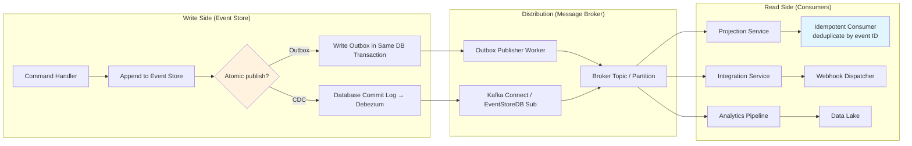
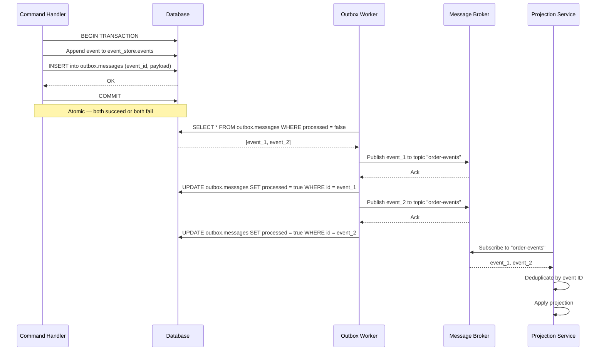
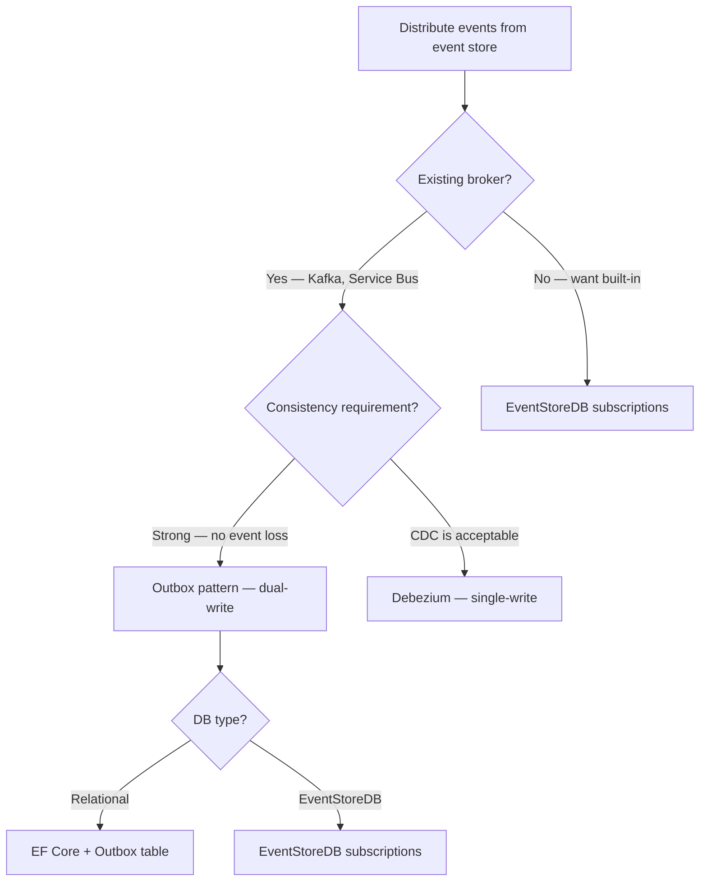

## Navigation

**Domain:** [[7 — System Design & Distributed Systems]] > **Group:** CQRS and Event Sourcing
**Previous:** [[7.119 — Event Sourcing — Multi-Tenant Design]] | **Next:** [[7.121 — Outbox Pattern — Reliable Event Publishing]]

### Prerequisites
- [[7.101 — Event Sourcing — Events as the Source of Truth]] — the event store owns the canonical event log; the broker is a distribution channel, not a source of truth.
- [[7.121 — Outbox Pattern — Reliable Event Publishing]] — the outbox is the primary mechanism for atomic event append + publish to broker.
- [[7.104 — Event Sourcing — Projections — Building Read Models]] — projections are the primary consumers of the distributed event stream; they must handle idempotency and ordering.

### Where This Fits
Event sourcing and message brokers are natural partners: the event store captures the canonical event log, and the broker distributes events to projections, downstream services, webhook integrations, and analytics pipelines. The fundamental problem is that appending to an event store and publishing to a broker cannot be atomic without coordination — the event may be stored but not published (message loss) or published but not stored (phantom event). The outbox pattern and CDC solve this. Ordering guarantees differ between the event store (per-stream total order) and the broker (per-partition order), so routing events to the correct partition is the central engineering decision. Getting this wrong causes duplicate events, out-of-order processing, and silent data loss in read models.

---

## Core Mental Model

Integration between event sourcing and message brokers is a reliable event distribution pipeline: events are appended to the store, atomically forwarded to a broker, and consumed by downstream projections and services with exactly-once processing semantics. The invariant is that every event appended to the store is delivered to every interested consumer exactly once, in the order the aggregate emitted them. The tradeoff is that this guarantee requires either an outbox (dual-write with a transaction coordinator) or CDC (tight coupling to the event store's storage engine), and the ordering guarantee is limited to per-partition ordering on the broker side — global ordering is not practical at scale.

### Classification

This is an **integration pattern** at the boundary between the write side (event store) and the read/distribution side (message broker). It occupies the reliability and ordering axes: it ensures no events are lost between store and consumers, and that per-aggregate ordering is preserved.



### Key Properties

|Property|Outbox Pattern|CDC (Debezium)|EventStoreDB Subscriptions|
|---|---|---|---|
|Atomicity|Distributed transaction + outbox table|Same DB transaction — event + log append|Native — subscription reads committed events|
|Latency|Polling interval (e.g., 100ms)|Near-real-time (WAL flush)|Real-time (push-based)|
|Broker dependency|Any broker|Kafka typically|None — ES is own broker|
|Ordering guarantee|Per-stream preserved|Per-table preserved|Per-stream guaranteed|
|Delivery semantics|At-least-once|At-least-once|At-least-once (volatile) / Exactly-once (persistent)|
|Operational complexity|Medium — outbox cleanup|High — CDC connector management|Low — built into EventStoreDB|

---

## Deep Mechanics

### How It Works

**Outbox-based distribution:**

1. Command handler appends event to the event store and inserts an OutboxMessage into the outbox table within the same database transaction.
2. A background worker polls the outbox table for unprocessed messages.
3. The worker publishes each message to the message broker (Kafka topic, RabbitMQ exchange, Azure Service Bus topic).
4. After the broker acknowledges receipt, the worker marks the outbox message as processed or deletes it.
5. If the worker crashes before acknowledgment, the next poll retries — ensuring at-least-once delivery.



**CDC-based distribution:**

When the event store is backed by PostgreSQL, logical replication captures every append to the events table and streams it to Kafka via Debezium. This avoids the dual-write entirely — events are distributed as a side effect of the database commit.

```csharp
// Debezium connector configuration (JSON)
{
  "name": "event-store-connector",
  "config": {
    "connector.class": "io.debezium.connector.postgresql.PostgresConnector",
    "database.hostname": "postgres",
    "database.port": "5432",
    "database.dbname": "eventstore",
    "database.server.name": "eventstore",
    "table.include.list": "events.streams",
    "plugin.name": "pgoutput",
    "transforms": "unwrap",
    "transforms.unwrap.type": "io.debezium.transforms.ExtractNewRecordState"
  }
}
```

**Partition routing for ordering:** To preserve per-aggregate ordering, events must be published to the same broker partition based on the aggregate ID (or a hash of it):

```csharp
// Partition key = aggregate ID — ensures per-aggregate ordering
public class KafkaPartitionRouter
{
    public string GetPartitionKey(Event @event, string aggregateId)
    {
        // Same aggregate ID always → same partition → ordered delivery
        return aggregateId;
    }
}

// Producer configuration
var producer = new ProducerBuilder<string, string>(producerConfig)
    .SetKeySerializer(Serializers.Utf8)
    .Build();

// Publish with aggregate ID as the message key
await producer.ProduceAsync("order-events",
    new Message<string, string>
    {
        Key = aggregateId,       // Partition key
        Value = JsonSerializer.Serialize(@event)
    });
```

### Failure Modes

**Outbox message never published:** The outbox worker crashes after committing the event+outbox transaction but before publishing to the broker. On restart, the worker polls and finds the unprocessed outbox message — it publishes. This is safe because the consumer is idempotent.

Detection: Monitor the outbox table for age of oldest unprocessed message. Alert if any message is older than 5 minutes.

**Duplicate publication:** The outbox worker publishes a message, the broker acknowledges, but the worker crashes before marking the outbox message as processed. On restart, the worker publishes the same message again. Consumer must deduplicate by event ID.

Detection: Log at the consumer side the number of duplicate event IDs received per hour. A spike indicates an outbox worker that is retrying excessively.

**CDC lag causes stale projections:** Debezium falls behind during peak event volume. Projections are minutes behind the event store, and users see stale data.

Detection: Monitor the Debezium lag metric (`kafka.consumer.lag`). Alert if lag exceeds the projection SLO (e.g., 10 seconds).

**Wrong partition key breaks ordering:** Events for the same aggregate are published to different Kafka partitions because the partition key is not the aggregate ID (e.g., using a random key or timestamp). Consumers in different partitions process events concurrently, breaking per-aggregate ordering.

Detection: A log entry at the projection side shows events applied out of order (e.g., `Withdrawn` applied before `Deposited` for the same account). The projection version check fails.

Prevention: Always use the aggregate ID (or a hash of it) as the Kafka message key. Verify in staging that events for the same aggregate land in the same partition.

### .NET and Azure Integration

```csharp
// Outbox publisher background service with Azure Service Bus
public sealed class OutboxPublisher : BackgroundService
{
    private readonly IServiceScopeFactory _scopeFactory;
    private readonly ServiceBusSender _sender;

    public OutboxPublisher(IServiceScopeFactory scopeFactory, ServiceBusSender sender)
    {
        _scopeFactory = scopeFactory;
        _sender = sender;
    }

    protected override async Task ExecuteAsync(CancellationToken ct)
    {
        while (!ct.IsCancellationRequested)
        {
            using var scope = _scopeFactory.CreateScope();
            var db = scope.ServiceProvider.GetRequiredService<EventStoreDbContext>();

            var messages = await db.OutboxMessages
                .Where(m => !m.Processed)
                .OrderBy(m => m.CreatedAt)
                .Take(100)
                .ToListAsync(ct);

            foreach (var msg in messages)
            {
                var serviceBusMessage = new ServiceBusMessage(msg.Payload)
                {
                    MessageId = msg.EventId.ToString(),
                    PartitionKey = msg.AggregateId  // Ensures per-aggregate ordering
                };

                try
                {
                    await _sender.SendMessageAsync(serviceBusMessage, ct);
                    msg.Processed = true;
                    msg.PublishedAt = DateTime.UtcNow;
                }
                catch (Exception ex)
                {
                    Logger.LogError(ex, "Failed to publish outbox message {EventId}", msg.EventId);
                    // Leave as unprocessed — will retry on next poll
                }
            }

            await db.SaveChangesAsync(ct);
            await Task.Delay(100, ct);  // Poll interval
        }
    }
}
```

```csharp
// Azure Function — consumer with idempotency
public class OrderProjectionFunction
{
    private readonly IProjectionStore _store;

    [Function("OrderProjection")]
    public async Task Run(
        [ServiceBusTrigger("order-events", Connection = "ServiceBusConnection")]
        ServiceBusReceivedMessage message)
    {
        var eventId = message.MessageId;
        var @event = JsonSerializer.Deserialize<Event>(message.Body.ToString());

        // Idempotency check
        if (await _store.IsEventProcessed(eventId))
            return;

        await _store.ApplyProjectionAsync(@event);
        await _store.MarkEventProcessed(eventId);
    }
}
```

- **ASP.NET Core:** `IHostedService` / `BackgroundService` for outbox publisher.
- **Azure Service Bus:** Sessions + partition key for per-aggregate ordering.
- **Azure Event Hubs:** Event Hubs with partition key = aggregate ID.
- **Kafka:** `Confluent.Kafka` .NET client with `ProducerBuilder` and message key.
- **MassTransit:** Built-in outbox support (`MassTransit.EntityFrameworkCoreOutbox`) with Marten or EF Core.
- **Debezium:** Kafka Connect connector for PostgreSQL CDC; `Azure SQL` CDC via change tracking.

---

## Production Patterns and Implementation

### Primary Implementation

A complete outbox-based event distribution pipeline with Kafka:

```csharp
// Event + outbox append in a single transaction
public sealed class EventAppender
{
    private readonly EventStoreDbContext _db;
    private readonly IEventSerializer _serializer;

    public EventAppender(EventStoreDbContext db, IEventSerializer serializer)
    {
        _db = db;
        _serializer = serializer;
    }

    public async Task AppendAsync(
        string streamId,
        int expectedVersion,
        IReadOnlyList<Event> events,
        CancellationToken ct)
    {
        await using var transaction = await _db.Database.BeginTransactionAsync(ct);

        // 1. Append events to event store
        foreach (var @event in events)
        {
            _db.Events.Add(new EventRecord
            {
                StreamId = streamId,
                Version = expectedVersion++,
                EventType = @event.GetType().Name,
                Payload = _serializer.Serialize(@event),
                Metadata = @event.Metadata,
                CreatedAt = DateTime.UtcNow
            });
        }

        // 2. Write outbox messages in same transaction
        foreach (var @event in events)
        {
            _db.OutboxMessages.Add(new OutboxMessage
            {
                EventId = @event.Id,
                AggregateId = streamId,
                EventType = @event.GetType().Name,
                Payload = _serializer.Serialize(@event),
                CreatedAt = DateTime.UtcNow,
                Processed = false
            });
        }

        await _db.SaveChangesAsync(ct);
        await transaction.CommitAsync(ct);
    }
}
```

```csharp
// Kafka outbox publisher worker
public sealed class KafkaOutboxPublisher : BackgroundService
{
    private readonly IServiceScopeFactory _scopeFactory;
    private readonly IProducer<string, string> _producer;

    public KafkaOutboxPublisher(IServiceScopeFactory scopeFactory, IProducer<string, string> producer)
    {
        _scopeFactory = scopeFactory;
        _producer = producer;
    }

    protected override async Task ExecuteAsync(CancellationToken ct)
    {
        while (!ct.IsCancellationRequested)
        {
            using var scope = _scopeFactory.CreateScope();
            var db = scope.ServiceProvider.GetRequiredService<EventStoreDbContext>();

            var batch = await db.OutboxMessages
                .Where(m => !m.Processed)
                .OrderBy(m => m.CreatedAt)
                .Take(50)
                .ToListAsync(ct);

            foreach (var msg in batch)
            {
                var result = await _producer.ProduceAsync(
                    "event-sourcing.events",
                    new Message<string, string>
                    {
                        Key = msg.AggregateId,   // Partition key → ordering
                        Value = msg.Payload,
                        Headers = new Headers
                        {
                            { "event_id", Encoding.UTF8.GetBytes(msg.EventId.ToString()) },
                            { "event_type", Encoding.UTF8.GetBytes(msg.EventType) }
                        }
                    }, ct);

                msg.Processed = true;
                msg.PublishedAt = DateTime.UtcNow;
                msg.BrokerOffset = result.Offset.Value.ToString();
            }

            await db.SaveChangesAsync(ct);
            await Task.Delay(200, ct);  // Poll interval
        }
    }

    public override async Task StopAsync(CancellationToken ct)
    {
        _producer.Flush(TimeSpan.FromSeconds(5));
        await base.StopAsync(ct);
    }
}
```

```csharp
// Idempotent consumer — Kafka consumer with deduplication
public sealed class EventConsumer : BackgroundService
{
    private readonly IConsumer<string, string> _consumer;
    private readonly IProjectionStore _projectionStore;

    public EventConsumer(IConsumer<string, string> consumer, IProjectionStore projectionStore)
    {
        _consumer = consumer;
        _projectionStore = projectionStore;
    }

    protected override async Task ExecuteAsync(CancellationToken ct)
    {
        _consumer.Subscribe("event-sourcing.events");

        while (!ct.IsCancellationRequested)
        {
            var result = _consumer.Consume(ct);

            var eventId = Guid.Parse(
                Encoding.UTF8.GetString(result.Message.Headers.GetLastBytes("event_id")));

            // Idempotency check
            if (await _projectionStore.IsEventProcessed(eventId))
                continue;

            var @event = DeserializeEvent(result.Message);
            await _projectionStore.ApplyAsync(@event);
            await _projectionStore.MarkEventProcessed(eventId);

            _consumer.Commit(result);
        }
    }
}
```

### Configuration and Wiring

```csharp
// Program.cs — wire up outbox + Kafka producer
builder.Services.AddScoped<EventAppender>();

builder.Services.AddSingleton<IProducer<string, string>>(sp =>
{
    var config = new ProducerConfig
    {
        BootstrapServers = "localhost:9092",
        EnableIdempotence = true,           // Exactly-once producer semantics
        Acks = Acks.All,                     // Wait for all replicas
        MessageSendMaxRetries = 3
    };
    return new ProducerBuilder<string, string>(config).Build();
});

builder.Services.AddHostedService<KafkaOutboxPublisher>();
builder.Services.AddHostedService<EventConsumer>();

// MassTransit with EF Core outbox
builder.Services.AddMassTransit(x =>
{
    x.AddEntityFrameworkOutbox<EventStoreDbContext>(o =>
    {
        o.DuplicateDetectionWindow = TimeSpan.FromMinutes(5);
        o.QueryDelay = TimeSpan.FromMilliseconds(100);
    });

    x.UsingAzureServiceBus((context, cfg) =>
    {
        cfg.Host(builder.Configuration["ServiceBus:ConnectionString"]);
    });
});
```

### Common Variants

**MassTransit with EF Core outbox (no manual outbox table):**
```csharp
// MassTransit handles the outbox automatically
public class SubmitOrderHandler : IConsumer<SubmitOrder>
{
    public async Task Consume(ConsumeContext<SubmitOrder> context)
    {
        // Append event + publish — MassTransit outbox enqueues the publish
        await eventStore.AppendAsync(orderEvent);
        await context.Publish(new OrderSubmitted(orderEvent.Id));

        // Outbox flushed atomically when the consumer completes
    }
}
```

**EventStoreDB persistent subscriptions (no external broker needed):**
```csharp
// EventStoreDB persistent subscription — built-in reliable distribution
var settings = new PersistentSubscriptionSettings
{
    ResolveLinkTos = true,
    StartFrom = Position.Start,
    MaxRetryCount = 10,
    MessageTimeout = TimeSpan.FromSeconds(30)
};

await connection.CreatePersistentSubscriptionAsync(
    "$ce-account", "projection-group", settings, creds);

connection.ConnectToPersistentSubscription(
    "$ce-account", "projection-group",
    (subscription, resolvedEvent) =>
    {
        var @event = DeserializeEvent(resolvedEvent);
        return projection.ApplyAsync(@event);
    },
    (subscription, dropReason, ex) =>
    {
        Logger.LogError(ex, "Subscription dropped: {Reason}", dropReason);
    },
    creds);
```

### Real-World .NET Ecosystem Example

**MassTransit** provides a production-ready outbox implementation integrated with EF Core and Marten, handling the dual-write transaction and background publication automatically. **Confluent.Kafka** is the standard .NET Kafka client for low-level producer/consumer control. **Azure Functions** with Service Bus trigger automatically handle checkpointing and retry for consumers. **EventStoreDB** persistent subscriptions are the simplest option when no external broker is needed — they provide at-least-once delivery with consumer group semantics built in.

---

## Gotchas and Production Pitfalls

### Outbox Polling Interval Too Long

**Pitfall:** Setting the outbox publisher poll interval to 5 seconds or more. Events sit in the outbox table for seconds before reaching the broker, adding latency to the entire event-driven pipeline.

```csharp
// ❌ Wrong — 5 second poll interval
await Task.Delay(5000, ct);
```

**Symptom:** Projections lag 5+ seconds behind the event store. Users see stale data after performing an action.

**Fix:** Reduce poll interval to 50–200ms, or use a database notification mechanism (PostgreSQL NOTIFY, SQL Server Query Notifications) to trigger immediate publication.

```csharp
// ✅ Correct — 100ms poll interval + trigger-based wake-up
await Task.Delay(100, ct);

// For PostgreSQL, use NOTIFY to wake the worker immediately
using var conn = new NpgsqlConnection(connectionString);
await conn.OpenAsync(ct);
conn.Notification += (_, e) => pulse.Set();  // ManualResetEventSlim
await conn.ExecuteAsync("LISTEN outbox_channel", ct);
```

**Cost of not fixing:** Perceived system latency equal to the poll interval. For a 5-second poll, every write-then-read user flow feels delayed.

### Consumer Not Handling Duplicates

**Pitfall:** The consumer applies projection state changes without checking whether the event was already processed. At-least-once delivery from the outbox means the same event can arrive twice.

```csharp
// ❌ Wrong — no idempotency check
public async Task ApplyAsync(Event @event)
{
    await _db.AccountBalances
        .Where(a => a.AccountId == @event.AccountId)
        .ExecuteUpdateAsync(b => b.SetProperty(a => a.Balance, @event.NewBalance));
}
```

**Symptom:** Occasional double-application of events, causing incorrect balance in the read model. Hard to reproduce because duplicates are rare and timing-dependent.

**Fix:** Maintain a processed-events table and check it before applying:

```csharp
// ✅ Correct — idempotency by event ID
public async Task ApplyAsync(Event @event)
{
    if (await _db.ProcessedEvents.AnyAsync(e => e.EventId == @event.Id))
        return;

    await _db.AccountBalances
        .Where(a => a.AccountId == @event.AccountId)
        .ExecuteUpdateAsync(b => b.SetProperty(a => a.Balance, @event.NewBalance));

    _db.ProcessedEvents.Add(new ProcessedEvent { EventId = @event.Id });
    await _db.SaveChangesAsync();
}
```

**Cost of not fixing:** Silent data corruption in read models that is hard to detect and harder to recover from (requires full projection rebuild).

### Wrong Message Key for Partitioning

**Pitfall:** Using a random or timestamp-based message key when publishing to a partitioned broker. Events for the same aggregate land in different partitions, and consumers process them concurrently — breaking per-aggregate ordering.

```csharp
// ❌ Wrong — random partition key
await producer.ProduceAsync("orders", new Message<string, string>
{
    Key = Guid.NewGuid().ToString(),  // Each event → different partition
    Value = payload
});
```

**Symptom:** A `Withdrawn` event for account ACC-001 is processed before the `Deposited` event that preceded it at the aggregate level. The projection shows incorrect balance.

**Fix:** Use the aggregate ID as the message key:

```csharp
// ✅ Correct — aggregate ID as partition key
await producer.ProduceAsync("orders", new Message<string, string>
{
    Key = streamId,   // Same aggregate → same partition → ordered
    Value = payload
});
```

**Cost of not fixing:** Order-dependent bugs in projections that manifest only under load when messages from different partitions arrive interleaved.

### Outbox Table Growth Without Cleanup

**Pitfall:** Processed outbox messages accumulate indefinitely. The outbox table grows to millions of rows, slowing `SELECT` queries and increasing disk usage.

**Symptom:** Outbox publisher queries take seconds because they scan millions of already-processed rows. The database runs out of disk.

**Fix:** Add a TTL-based cleanup job that deletes processed messages older than 24 hours. Partition the outbox table by creation date for efficient bulk deletion.

```csharp
// ✅ Correct — outbox cleanup job
public sealed class OutboxCleanup : BackgroundService
{
    protected override async Task ExecuteAsync(CancellationToken ct)
    {
        while (!ct.IsCancellationRequested)
        {
            using var scope = _scopeFactory.CreateScope();
            var db = scope.ServiceProvider.GetRequiredService<EventStoreDbContext>();

            var cutoff = DateTime.UtcNow.AddHours(-24);
            await db.OutboxMessages
                .Where(m => m.Processed && m.CreatedAt < cutoff)
                .ExecuteDeleteAsync(ct);

            await Task.Delay(TimeSpan.FromHours(1), ct);
        }
    }
}
```

**Cost of not fixing:** Database performance degradation over time, culminating in disk-full incidents or outbox publisher timeouts.

---

## Tradeoffs and Decision Framework

### Tradeoff Matrix

|Dimension|Outbox Pattern|CDC (Debezium)|EventStoreDB Subscriptions|
|---|---|---|---|
|Consistency|Strong — same DB transaction|Strong — same DB txn|Strong — append + notify in single call|
|Latency|100ms–5s (poll interval)|Near-real-time (WAL flush)|Real-time (push-based)|
|Broker coupling|Any broker|Kafka (primary)|None — native|
|Operational complexity|Medium — outbox cleanup|High — CDC infrastructure|Low — built-in|
|Consumer group support|Broker-managed|Kafka consumer groups|Built-in persistent subscriptions|
|Per-stream ordering|Partition key required|Partition key required|Guaranteed by stream|
|DB support|Any relational DB|PostgreSQL, MySQL, SQL Server|EventStoreDB only|
|Max throughput|DB write capacity|DB + Kafka connector capacity|EventStoreDB throughput|

### When to Apply



### When NOT to Apply

- [ ] The event store is the only consumer (no downstream services, no external projections) — no broker needed; EventStoreDB subscriptions or Marten live projections suffice.
- [ ] The system uses Marten with its built-in async daemon projections — Marten handles event distribution internally, making an external broker redundant for projection-only consumers.
- [ ] Throughput requirements exceed the outbox DB's write capacity (e.g., 50,000 events/second) — CDC avoids the dual-write bottleneck but adds its own operational complexity.

### Scale Thresholds

- "Outbox pattern becomes necessary above ~100 events/second when the risk of missed broker publications during a crash is unacceptable."
- "CDC becomes preferable to outbox above ~1,000 events/second because the dual-write overhead (DB txn + outbox insert) adds ~2ms latency per event."
- "EventStoreDB persistent subscriptions are sufficient for up to ~10,000 events/second per subscription group."
- "Kafka partitioning per aggregate type becomes necessary above ~50,000 events/second to distribute consumer load across partitions."

---

## Interview Arsenal

### Question Bank

1. How do you ensure every event appended to the event store is also delivered to the message broker?
2. Compare the outbox pattern with CDC for event distribution.
3. How do you preserve per-aggregate event ordering when publishing to a partitioned broker?
4. A consumer receives the same event twice. How does it handle it?
5. What happens to the outbox table over time and how do you manage it?
6. Compare EventStoreDB persistent subscriptions with Kafka for event distribution.
7. How do you handle broker downtime in the outbox pattern?
8. Design an event distribution pipeline for 100,000 events/second.

### Spoken Answers

**Q: How do you ensure every event is delivered to the broker?**

> **Average answer:** Publish to the broker after appending to the event store.
>
> **Great answer:** Direct publish after append has a window where the event is stored but the publish fails — or the event append fails but the publish succeeded. The outbox pattern solves this by writing the event and an outbox message in the same database transaction. A background worker polls the outbox and publishes to the broker. If the worker crashes after publishing but before marking the outbox as processed, the event is published again — which is safe because the consumer is idempotent. If the worker crashes before publishing, it retries on restart. This guarantees at-least-once delivery without dual-write inconsistency. The tradeoff is added latency: the poll interval adds 100–200ms to the distribution path, and the outbox table requires cleanup to prevent unbounded growth.

**Q: How do you preserve per-aggregate ordering in a partitioned broker?**

> **Average answer:** Use the aggregate ID as the partition key.
>
> **Great answer:** In a partitioned broker like Kafka or Event Hubs, ordering is only guaranteed within a partition. To preserve per-aggregate ordering, you use the aggregate ID as the message key — Kafka hashes the key to select a partition, and all messages with the same key go to the same partition and are consumed in order. The key insight is that the partition key must be the aggregate ID or stream ID, never a random value or timestamp. If you use a random key, the same aggregate's events land in different partitions and are consumed concurrently — breaking ordering. On the consumer side, a single consumer per partition (or a consumer group with one consumer per partition) ensures events are processed sequentially. If you need ordering across aggregates, you put them all in the same partition — but that limits parallelism.

**Q: Compare EventStoreDB persistent subscriptions with Kafka for event distribution.**

> **Average answer:** EventStoreDB subscriptions are simpler; Kafka is more scalable.
>
> **Great answer:** EventStoreDB persistent subscriptions are the simplest distribution mechanism when you are already using EventStoreDB as the event store. They provide at-least-once delivery, consumer group semantics (competing consumers per subscription group), and per-stream ordering natively — no outbox, no external broker. The limitation is throughput: a single EventStoreDB node handles roughly 10,000 events/second per subscription group, and scaling beyond that requires clustering and multiple subscription groups. Kafka excels at high throughput (millions of events/second), long retention, and integration with stream processing (Kafka Streams, ksqlDB). The tradeoff is operational complexity: you need to run and manage Kafka, plus the outbox or CDC pipeline to bridge the event store to Kafka. I would use EventStoreDB subscriptions for internal projections and Kafka for external integrations, analytics, and high-throughput scenarios.

### System Design Interview Trigger

If an interviewer asks "how do you distribute events from an event-sourced system to downstream services?" they are testing your understanding of the dual-write problem and its solutions. The senior answer names the outbox pattern, explains why direct publish is unsafe, addresses ordering guarantees through partition keys, and describes consumer idempotency as a required complement to at-least-once delivery.

### Comparison Table

| | Outbox + Kafka | CDC + Kafka | EventStoreDB Subscriptions |
|---|---|---|---|
|Delivery guarantee|At-least-once|At-least-once|At-least-once (persistent)|
|Ordering|Per-partition (key-based)|Per-table|Per-stream guaranteed|
|Latency|Poll interval (~100ms)|WAL flush (~10ms)|Push-based (~1ms)|
|Operational overhead|Medium — outbox cleanup|High — connector management|Low — built-in|
|Max throughput|DB-bound (~5K/s)|Kafka connector-bound (~50K/s)|Store-bound (~10K/s)|
|External consumers|Yes — any Kafka client|Yes — Kafka only|EventStoreDB client only|

---

## Architecture Decision Record

**Status:** Accepted

**Context:** We are building an event-sourced order management system that produces ~500 events/second. Events must be distributed to a projection service (read models), an analytics pipeline (data lake), and an external webhook integration. The system uses Marten on PostgreSQL as the event store. We need at-least-once delivery with per-aggregate ordering and consumer idempotency.

**Options Considered:**

1. **Outbox + Kafka** — Event + outbox message in same PostgreSQL transaction. Background worker publishes to Kafka. Consumers use Kafka consumer groups for competing consumers.
2. **Outbox + Azure Service Bus** — Same dual-write approach but with Service Bus sessions enabled for per-aggregate ordering.
3. **EventStoreDB subscriptions** — Migrate from Marten to EventStoreDB and use its built-in persistent subscriptions for all three consumer types.
4. **Marten async daemon only** — Use Marten's built-in projection daemon for read models; no external broker for the analytics and webhook use cases.

**Decision:** Outbox + Kafka (option 1), because it decouples the event store from consumers (allowing independent scaling), supports the analytics pipeline (which requires Kafka as the data lake ingestion endpoint), and the outbox fits naturally with Marten's PostgreSQL backing.

**Consequences:**
- ✅ All three consumer types (projection, analytics, webhooks) can consume from Kafka independently.
- ✅ Per-aggregate ordering preserved via Kafka message key = aggregate ID.
- ⚠️ Outbox cleanup job required to prevent table growth.
- ❌ Added 100ms latency from outbox poll interval — acceptable for the 500 events/second throughput.

**Review Trigger:** Revisit this decision if event throughput exceeds 5,000 events/second, at which point the dual-write overhead of the outbox may warrant evaluating CDC (Debezium) as the distribution mechanism.

---

## Self-Check

### Conceptual Questions

1. What is the dual-write problem in event sourcing + broker integration?
2. How does the outbox pattern solve the dual-write problem?
3. What delivery semantics does the outbox pattern provide, and what must the consumer add to achieve exactly-once processing?
4. Why must the message key (partition key) be the aggregate ID when publishing to a partitioned broker?
5. What happens if the outbox worker crashes after publishing to the broker but before marking the outbox message as processed?
6. Compare CDC (Debezium) with the outbox pattern for event distribution.
7. At what throughput does dual-write overhead become a concern?
8. Name two .NET libraries that implement the outbox pattern.
9. How do you prevent unbounded growth of the outbox table?
10. When would you use EventStoreDB persistent subscriptions instead of an external broker?

<details>
<summary>Answers</summary>

1. Appending to the event store and publishing to the broker are two separate operations. If one succeeds and the other fails, the system is inconsistent: events can be stored without being published (message loss) or published without being stored (phantom event). Neither is acceptable.
2. The outbox pattern writes the event and a corresponding outbox message in the same database transaction. A background worker reads the outbox and publishes to the broker. If the worker crashes, it retries on restart. This guarantees at-least-once delivery without dual-write inconsistency.
3. At-least-once delivery. To achieve exactly-once processing, the consumer must deduplicate by event ID (store processed event IDs and check before applying).
4. In a partitioned broker, ordering is only guaranteed within a partition. Using the aggregate ID as the key ensures all events for that aggregate land in the same partition and are processed in order by consumers.
5. The outbox message remains unprocessed. On restart, the worker republishes the message. The consumer receives a duplicate and must deduplicate by event ID to avoid double-application.
6. CDC (Debezium) reads the database's commit log — no dual-write required. The event store's append IS the write; CDC captures it. Latency is lower (WAL flush time instead of poll interval). Operational complexity is higher (connector deployment, schema evolution, offset management). CDC is preferable at higher throughputs (>1,000 events/second).
7. Above ~1,000 events/second, the dual-write overhead (~2ms per event for outbox insert + transaction) starts to consume noticeable write capacity. At ~5,000 events/second, CDC becomes worth evaluating.
8. (1) MassTransit with `EntityFrameworkOutbox` or `MartenOutbox`. (2) NServiceBus with its built-in outbox. (3) Custom `BackgroundService` with EF Core.
9. Run a periodic cleanup job that deletes processed outbox messages older than a TTL (e.g., 24 hours). Partition the outbox table by creation date for efficient bulk deletion.
10. Use EventStoreDB persistent subscriptions when: (a) there is no external broker requirement, (b) all consumers can use the EventStoreDB gRPC client, (c) throughput is below 10,000 events/second per subscription group, and (d) you want to minimize operational complexity.

</details>

---

### Scenario Challenges

**Scenario 1 — Diagnose the problem:** A projection that reads from Kafka shows the account balance is occasionally wrong — off by exactly one withdrawal amount. The error appears approximately once every 10,000 events. The event store is correct (replaying from the store shows the right balance).

<details>
<summary>Diagnosis</summary>

**Root cause:** The outbox publisher occasionally publishes the same event twice (crashes after broker ack but before marking the outbox message as processed). The consumer does not deduplicate by event ID.

**Evidence:** Check the projection's processed-events log — no deduplication is implemented. Check the outbox table for messages with `processed = false` that are actually published — these are the duplicates.

**Fix:** Add an idempotency check to the consumer: before applying an event, check if its event ID exists in the processed-events table. If it does, skip.

**Prevention:** Always implement consumer idempotency when using at-least-once delivery. Add a monitoring metric for duplicate event rate.

</details>

---

**Scenario 2 — Design decision:** You are building an event-sourced payment system that must integrate with an external fraud detection service. The fraud service consumes events via Kafka. You need to ensure that payment events are delivered to Kafka exactly once and in order per payment.

<details>
<summary>Decision and Reasoning</summary>

**Choice:** Outbox pattern with Kafka. Event + outbox message in the same database transaction. Kafka message key = payment ID. Consumer idempotency on the fraud service side.

**Tradeoffs accepted:** 100ms outbox poll latency (acceptable for fraud detection — they batch-process batches anyway). If the outbox worker crashes before marking a message processed, the fraud service receives a duplicate and must deduplicate.

**Implementation sketch:**

```csharp
// Payment event appender with outbox
public async Task RecordPaymentAsync(PaymentEvent @event)
{
    await using var tx = await _db.Database.BeginTransactionAsync();

    _db.Events.Add(new EventRecord { ... });
    _db.OutboxMessages.Add(new OutboxMessage
    {
        EventId = @event.Id,
        AggregateId = @event.PaymentId,
        Topic = "payments",
        Payload = JsonSerializer.Serialize(@event)
    });

    await _db.SaveChangesAsync();
    await tx.CommitAsync();
}
```

**Fraud service consumer:** Read from `payments` topic. Before processing, check if `eventId` is already in the processed-events cache (Redis TTL 24h). If not, process and record.

</details>

---

**Scenario 3 — Failure mode:** The outbox table has grown to 50 million rows. The outbox publisher's `SELECT ... WHERE processed = false ORDER BY CreatedAt` query now takes 30 seconds. Events are delayed by minutes.

<details>
<summary>Investigation and Fix</summary>

**Investigation steps:**
1. Check the outbox cleanup job — it may have been disabled or its TTL set too high.
2. Check the execution plan of the outbox SELECT query — likely a full scan on an unindexed table.
3. Check whether processed messages are being deleted or just marked with a flag.

**Confirming evidence:** The outbox table has no index on `(processed, CreatedAt)`. The cleanup job is not running because an exception in the cleanup loop caused it to exit silently.

**Immediate mitigation:** Run a manual DELETE of processed messages older than 1 hour. Add a composite index on `(processed, CreatedAt)`.

**Permanent fix:** Fix the cleanup job exception handling (add try/catch + retry), reduce TTL to 24 hours, and add monitoring on outbox table size.

**Post-mortem item:** Add an alert when outbox table exceeds 1M rows or oldest unprocessed message is older than 5 minutes.

</details>

---

**Scenario 4 — Scale it:** Your event store produces 10,000 events/second. The outbox dual-write is adding 2ms latency per event, and the outbox publisher cannot keep up with the volume. Consumers are falling behind by millions of events.

<details>
<summary>Scaling Strategy</summary>

**Bottleneck this addresses:** Dual-write overhead (event + outbox insert per transaction) and single-threaded outbox publisher throughput.

**How it helps:**
1. Batch outbox writes: instead of one outbox message per event, batch 100 events in a single outbox insert transaction.
2. Parallel outbox publishers: run 4 outbox publisher instances with `sp_getapplock` or `FOR UPDATE SKIP LOCKED` to partition the outbox table across workers.
3. Migrate from outbox to CDC: use Debezium to capture events from the PostgreSQL WAL, eliminating the outbox insert entirely.

**What it does not solve:** If the bottleneck shifts to Kafka producer throughput, increase the number of partitions and parallel producers.

**Implementation order:**
1. Add `FOR UPDATE SKIP LOCKED` to enable parallel outbox publishers.
2. Batch outbox inserts — 100 per transaction.
3. Evaluate Debezium deployment if step 1+2 are insufficient (likely around 50K events/second).

```csharp
// Parallel outbox publisher with SKIP LOCKED
var batch = await db.OutboxMessages
    .Where(m => !m.Processed)
    .OrderBy(m => m.CreatedAt)
    .Take(100)
    .ForUpdate()                    // Custom extension for SKIP LOCKED
    .SkipLocked()
    .ToListAsync(ct);
```

</details>

---

**Scenario 5 — Interview simulation:** The interviewer says: "Your team is building an event-sourced order processing system. Orders must be distributed to a search index (Elasticsearch), a notification service (email/SMS), and an analytics pipeline (data lake). How do you design the event distribution pipeline?"

<details>
<summary>Model Response</summary>

"I would use the outbox pattern with Kafka as the distribution backbone. Each command handler appends events to the event store and inserts corresponding outbox messages in a single PostgreSQL transaction. A background worker polls the outbox and publishes to Kafka topics partitioned by aggregate type — orders go to the `orders` topic, payments to `payments`, and so on.

The Kafka message key is the aggregate ID, which preserves per-aggregate ordering within a partition. Each downstream consumer runs as a Kafka consumer group: the search indexer consumes from `orders` and updates Elasticsearch, the notification service consumes from multiple topics and dispatches emails/SMS, and the analytics pipeline consumes from all topics and ingests into the data lake via Kafka Connect to S3 or Azure Data Lake Storage.

All consumers implement idempotency by storing processed event IDs. The search indexer stores them in a Redis cache with a 24-hour TTL, the notification service stores them in its own database, and the analytics pipeline uses Kafka's exactly-once semantics with transactional producer + consumer.

For the outbox, I'd use MassTransit's built-in EF Core outbox to avoid writing the boilerplate worker ourselves. The outbox cleanup is a simple hosted service that deletes processed messages older than 24 hours.

At our expected scale of 500 events/second, this handles the load easily. If we grow to 10,000 events/second, I would evaluate switching from outbox to Debezium CDC to eliminate the dual-write overhead."

</details>
