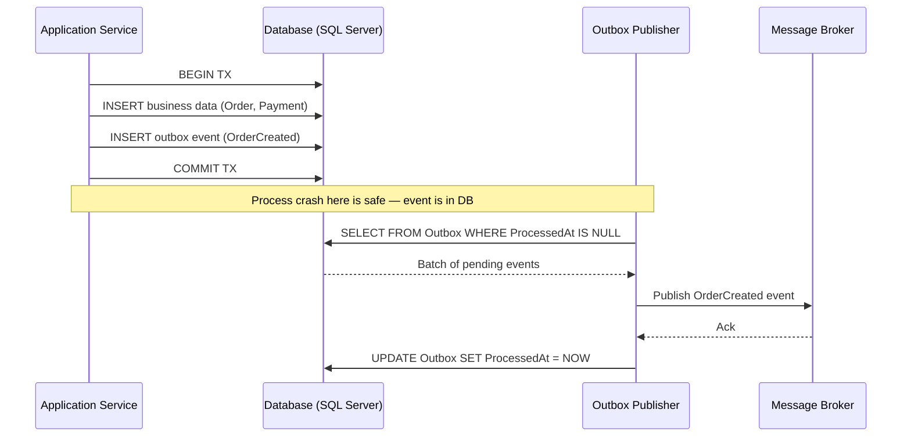
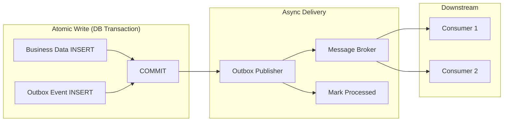
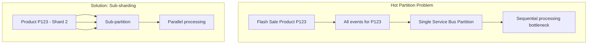
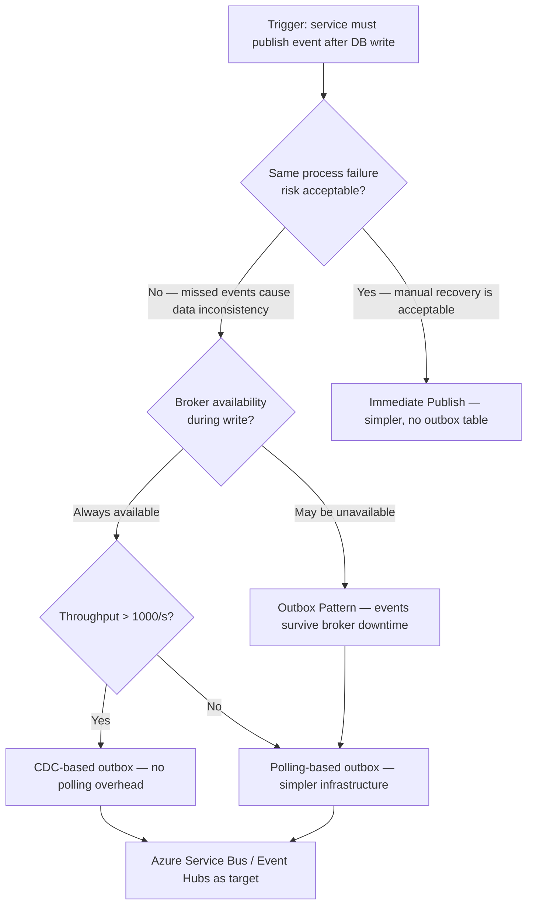

> [!success] Mastery Check
> - [ ] **Studied Well**
> - [ ] **Can explain the concept without notes**
> - [ ] **Can answer interview questions confidently**
> - [ ] **Can implement it in a real project**

## Navigation

**Domain:** [[7 — System Design & Distributed Systems]] > **Group:** Integration Patterns
**Previous:** — | **Next:** [[7.122 — Outbox Pattern — EF Core Implementation]]

### Prerequisites
- [[7.128 — Transactional Messaging — Guarantees]] — required because the outbox pattern is the primary mechanism for achieving transactional guarantees across a database and a message broker
- [[6.412 — Unit of Work Pattern]] — needed because outbox relies on atomic database transactions spanning domain operations and event storage

### Where This Fits

The outbox pattern solves the dual-write problem: a service must write to its database and publish an event to a message broker as a single atomic operation. Without it, a process crash between the database write and the broker publish leaves the system in an inconsistent state — the database has the change but no event was sent, so downstream services never react. This pattern becomes necessary above ~100 events per second per service, or whenever a missed event causes data inconsistency that takes manual recovery to fix. A .NET engineer encounters it in any microservice that publishes domain events from within an EF Core transaction — typically order processing, payment pipelines, and notification dispatch. It is also the foundation for event-driven architectures where consistency between state changes and event publication is non-negotiable.

## Core Mental Model

The outbox pattern treats the database as the single source of truth for both business data and outgoing events. Instead of publishing events directly to a message broker, the service writes events into an outbox table within the same database transaction as the business operation. A separate process — the publisher — reads the outbox table and sends events to the broker, deleting or marking them as sent once confirmed. The invariant this maintains is: every committed business operation produces exactly one published event, regardless of broker availability or process failures. The tradeoff is at-least-once delivery semantics (the publisher may send duplicates on restart) and increased database write load from the outbox table. The recognition trigger is a production incident where a downstream service did not receive an event, and the root cause was a process crash between DB commit and broker publish.

### Classification

The outbox pattern operates at the application infrastructure layer, sitting between the domain logic (which produces events) and the messaging infrastructure (which delivers them). It is scoped to solve the atomicity problem between two durable stores — it does not solve ordering across multiple subscribers, duplicate detection, or consumer-side idempotency. Those require the inbox pattern or a distributed transaction coordinator. The outbox pattern is part of a broader family of transactional messaging patterns that also include transactional outbox, idempotent publishing, and the inbox pattern.





### Key Properties / Guarantees

|Property|Value|Condition|
|---|---|---|
|Durability|Events survive process crashes|Database is available at write time|
|Delivery semantics|At-least-once|Publisher may re-deliver on restart|
|Ordering|Per-partition FIFO within a single publisher|When reading ordered by creation time|
|Latency overhead|+1 DB round trip per batch of events|Low — sub-millisecond with indexed outbox table|
|Throughput cost|~5-10% DB write amplification|At moderate scale (1-10K events/s)|
|Broker dependency decoupling|Events published even if broker is down|Broker available within outbox polling interval|
|Consistency model|Strong within DB transaction, eventual end-to-end|Business data + event committed atomically|
|Recovery time|Bounded by polling interval + batch processing|Sub-second with CDC; 1-5 seconds with polling|

## Deep Mechanics

### How It Works

**Step 1 — Write phase.** The application service opens a database transaction. Within that transaction, it writes both the business data (e.g., an `Order` row) and one or more event rows into the `Outbox` table. The transaction commits as a single atomic unit. If the commit fails, neither the business data nor the events are persisted. The outbox row typically includes: a unique ID, the event type, a partition key for ordering, the JSON-serialized payload, a creation timestamp, and a nullable processed-at timestamp.

**Step 2 — Read phase.** An outbox publisher process — which can be a background service, a worker role, or a change data capture consumer — queries the `Outbox` table for rows where `ProcessedAt` is null. It reads a batch (typically 50-200 rows), ordered by `CreatedAt` to maintain FIFO order within a partition key. The query uses `READPAST` and `UPDLOCK` hints when multiple publisher instances are deployed.

**Step 3 — Publish phase.** For each event, the publisher serializes the event payload and publishes it to the message broker (Azure Service Bus, RabbitMQ, Kafka). After receiving a broker acknowledgment, the publisher marks the event as processed by setting `ProcessedAt` to the current timestamp. Events can be batched using `ServiceBusMessageBatch` for efficiency.

**Step 4 — Cleanup phase.** A separate cleanup job (or the publisher itself) deletes or archives outbox rows older than a retention threshold (typically 24-72 hours) to prevent unbounded table growth. This job uses batched deletes to avoid long-running transactions.

### Failure Modes

**Publisher crash after broker publish but before marking processed.** The event was sent but `ProcessedAt` is still null. On restart, the publisher re-reads the same event and publishes it again. This produces duplicate events, requiring idempotent consumers (see [[7.126 — Inbox Pattern — Idempotent Message Consumption]]).

- **Detection:** Event counters show duplicates on the consumer side. Consumer-side deduplication logs show "duplicate messageId rejected" entries.
- **Metric:** `outbox_duplicate_publish_count` spikes.
- **Recovery:** Idempotent consumption is the standard mitigation. For zero duplicates, use the CDC approach ([[7.124 — Outbox Pattern — Change Data Capture Approach]]).

**Broker unavailable at publish time.** The publisher cannot deliver events. If the publisher blocks on publish, it backs up the database query. If it retries with exponential backoff, events accumulate in the outbox table.

- **Detection:** `outbox_table_depth` grows. `outbox_publish_duration` P99 rises.
- **Metric:** Alert when `outbox_depth > 10,000` rows.
- **Recovery:** Implement circuit breaker on broker connection. Publish old events when broker is restored. Add a broker health check before querying.

**Outbox table lock contention under high throughput.** Multiple publisher instances competing for the same unprocessed rows cause deadlocks on `UPDATE Outbox SET ProcessedAt...` statements.

- **Detection:** SQL deadlock graph shows `UPDATE` statements on the Outbox table. `outbox_publish_throughput` plateaus.
- **Metric:** `sql_deadlocks_per_second` > 0 on the outbox table.
- **Recovery:** Use `READPAST` hint in the SELECT query, partition the outbox table by a shard key, or use the CDC approach.

**Outbox table partition key skew.** Events for a single high-volume aggregate (e.g., a popular product during a flash sale) are assigned the same partition key, causing a hot partition. All events must be processed sequentially by the partition, creating a bottleneck.



- **Detection:** One partition's depth grows faster than others. `partition_depth` metric shows skew.
- **Metric:** `partition_depth_stddev` increases.
- **Recovery:** Split the hot aggregate's events across sub-partitions using a composite key (aggregate ID + sub-shard). Accept that ordering is lost within the sub-shards.

**Database transaction log growth from long-running outbox cleanup.** The cleanup job deletes large batches of old outbox rows. Each delete is logged in the transaction log, causing log growth and potential disk exhaustion.

- **Detection:** Transaction log backup frequency increases. Log space usage grows.
- **Metric:** `log_growth_mb_per_hour` exceeds baseline.
- **Recovery:** Use batched deletes (e.g., 1,000 rows per batch). Schedule cleanup during low-traffic periods. Use partitioned table switching to drop old partitions instantly.

**.NET and Azure Integration**

- **ASP.NET Core:** `IHostedService` or `BackgroundService` is the base class for the outbox publisher
- **EF Core:** `SaveChangesAsync` combined with `IOutboxStore` written to in a `DbTransaction` — use `context.Database.BeginTransactionAsync()`
- **Azure services:** Use Azure Service Bus (via `ServiceBusSender`) as the target broker, or Azure Event Hubs for high-throughput scenarios
- **.NET libraries:** Use `Polly` for retry policies on broker publish, `Dapper` for efficient outbox queries if EF Core overhead is prohibitive
- **Configuration:** Register the outbox publisher as a singleton background service with configurable polling interval, batch size, and broker connection string
- **OpenTelemetry:** Use `ActivitySource` to trace the poll-publish-mark cycle; export to Application Insights for monitoring
- **Health checks:** Implement `IHealthCheck` to expose `outbox_depth`, `last_publish_timestamp`, and `circuit_breaker_state` for Kubernetes liveness/readiness probes
- **Azure Monitor:** Create Application Insights alerts on `outbox_depth > 10,000` and `outbox_last_publish_age > 5 minutes`
- **Kubernetes:** Run the publisher as a sidecar container or within the same pod as the API; configure resource limits based on batch size × payload size

```csharp
// Application Insights telemetry for outbox operations
public sealed class OutboxTelemetry
{
    private readonly TelemetryClient _telemetryClient;

    public OutboxTelemetry(TelemetryClient telemetryClient)
    {
        _telemetryClient = telemetryClient;
    }

    public void TrackPublishSuccess(int batchSize, long durationMs)
    {
        _telemetryClient.TrackMetric("OutboxPublishSuccess", 1,
            new Dictionary<string, string>
            {
                ["BatchSize"] = batchSize.ToString(),
                ["DurationMs"] = durationMs.ToString()
            });
    }

    public void TrackPublishFailure(int batchSize, string errorType)
    {
        _telemetryClient.TrackMetric("OutboxPublishFailure", 1,
            new Dictionary<string, string>
            {
                ["BatchSize"] = batchSize.ToString(),
                ["ErrorType"] = errorType
            });
    }
}
```

```csharp
// Program.cs — Registration
builder.Services.AddHostedService<OutboxPublisher>();
builder.Services.AddScoped<IOutboxStore, EfCoreOutboxStore>();
builder.Services.AddSingleton(sp =>
{
    var config = sp.GetRequiredService<IConfiguration>();
    return new OutboxOptions
    {
        PollingIntervalMs = config.GetValue<int>("Outbox:PollingIntervalMs", 1000),
        BatchSize = config.GetValue<int>("Outbox:BatchSize", 100),
        RetentionHours = config.GetValue<int>("Outbox:RetentionHours", 48)
    };
});
```

## Production Patterns and Implementation

### Primary Implementation

```csharp
// Domain event marker interface
public interface IDomainEvent
{
    string EventId { get; }
    string EventType { get; }
    DateTime OccurredAt { get; }
}

// Outbox record
public sealed record OutboxMessage(
    Guid Id,
    string EventType,
    string PartitionKey,
    string Payload,
    DateTime CreatedAt,
    DateTime? ProcessedAt)
{
    public static OutboxMessage Create(IDomainEvent domainEvent, string partitionKey)
    {
        return new OutboxMessage(
            Guid.NewGuid(),
            domainEvent.EventType,
            partitionKey,
            JsonSerializer.Serialize(domainEvent),
            DateTime.UtcNow,
            null);
    }
}

// IOutboxStore — Port
public interface IOutboxStore
{
    Task AddAsync(OutboxMessage message, CancellationToken ct);
    Task<IReadOnlyList<OutboxMessage>> GetPendingAsync(int batchSize, CancellationToken ct);
    Task MarkProcessedAsync(Guid id, CancellationToken ct);
    Task MarkBatchProcessedAsync(IEnumerable<Guid> ids, CancellationToken ct);
    Task<int> CleanupAsync(DateTime olderThan, CancellationToken ct);
}

// EfCoreOutboxStore — Adapter
public sealed class EfCoreOutboxStore : IOutboxStore
{
    private readonly OrderDbContext _context;

    public EfCoreOutboxStore(OrderDbContext context)
    {
        _context = context;
    }

    public async Task AddAsync(OutboxMessage message, CancellationToken ct)
    {
        _context.OutboxMessages.Add(message);
        await _context.SaveChangesAsync(ct);
    }

    public async Task<IReadOnlyList<OutboxMessage>> GetPendingAsync(int batchSize, CancellationToken ct)
    {
        return await _context.OutboxMessages
            .Where(m => m.ProcessedAt == null)
            .OrderBy(m => m.CreatedAt)
            .Take(batchSize)
            .ToArrayAsync(ct);
    }

    public async Task MarkProcessedAsync(Guid id, CancellationToken ct)
    {
        await _context.OutboxMessages
            .Where(m => m.Id == id)
            .ExecuteUpdateAsync(
                s => s.SetProperty(m => m.ProcessedAt, DateTime.UtcNow),
                ct);
    }

    public async Task MarkBatchProcessedAsync(IEnumerable<Guid> ids, CancellationToken ct)
    {
        await _context.OutboxMessages
            .Where(m => ids.Contains(m.Id))
            .ExecuteUpdateAsync(
                s => s.SetProperty(m => m.ProcessedAt, DateTime.UtcNow),
                ct);
    }

    public async Task<int> CleanupAsync(DateTime olderThan, CancellationToken ct)
    {
        return await _context.OutboxMessages
            .Where(m => m.ProcessedAt != null && m.CreatedAt < olderThan)
            .ExecuteDeleteAsync(ct);
    }
}

// OutboxPublisher — Background Service
public sealed class OutboxPublisher : BackgroundService
{
    private readonly IServiceScopeFactory _scopeFactory;
    private readonly OutboxOptions _options;
    private readonly ILogger<OutboxPublisher> _logger;

    public OutboxPublisher(
        IServiceScopeFactory scopeFactory,
        OutboxOptions options,
        ILogger<OutboxPublisher> logger)
    {
        _scopeFactory = scopeFactory;
        _options = options;
        _logger = logger;
    }

    protected override async Task ExecuteAsync(CancellationToken stoppingToken)
    {
        while (!stoppingToken.IsCancellationRequested)
        {
            try
            {
                await PublishBatchAsync(stoppingToken);
            }
            catch (OperationCanceledException)
            {
                break;
            }
            catch (Exception ex)
            {
                _logger.LogError(ex, "Outbox publish cycle failed");
            }

            await Task.Delay(_options.PollingIntervalMs, stoppingToken);
        }
    }

    private async Task PublishBatchAsync(CancellationToken ct)
    {
        using var scope = _scopeFactory.CreateScope();
        var store = scope.ServiceProvider.GetRequiredService<IOutboxStore>();
        var sender = scope.ServiceProvider.GetRequiredService<ServiceBusSender>();

        var messages = await store.GetPendingAsync(_options.BatchSize, ct);

        foreach (var message in messages)
        {
            var serviceBusMessage = new ServiceBusMessage(message.Payload)
            {
                MessageId = message.Id.ToString("N"),
                PartitionKey = message.PartitionKey,
                Subject = message.EventType
            };

            await sender.SendMessageAsync(serviceBusMessage, ct);
            await store.MarkProcessedAsync(message.Id, ct);
        }
    }
}
```

### Configuration and Wiring

```csharp
// Program.cs
var outboxOptions = builder.Services
    .AddOptions<OutboxOptions>()
    .Bind(builder.Configuration.GetSection("Outbox"))
    .ValidateDataAnnotations()
    .ValidateOnStart();

builder.Services.AddHostedService<OutboxPublisher>();
builder.Services.AddScoped<IOutboxStore, EfCoreOutboxStore>();

// Add health check for the outbox publisher
builder.Services.AddHealthChecks()
    .AddCheck<OutboxPublisherHealthCheck>("outbox_publisher", tags: new[] { "readiness" });

// Add OpenTelemetry instrumentation
builder.Services.AddOpenTelemetry()
    .WithMetrics(meterProviderBuilder => meterProviderBuilder
        .AddMeter("OutboxPublisher")
        .AddConsoleExporter()
        .AddAzureMonitorMetricExporter());
```

```json
// appsettings.json
{
  "Outbox": {
    "PollingIntervalMs": 1000,
    "BatchSize": 100,
    "RetentionHours": 48,
    "ConnectionString": "Endpoint=sb://...",
    "MaxRetries": 3,
    "CircuitBreakerThreshold": 10,
    "CircuitBreakerDurationSec": 30
  },
  "ConnectionStrings": {
    "Orders": "Server=tcp:orders.database.windows.net;Database=OrderingDb;..."
  }
}
```

```csharp
// OutboxOptions with validation
public sealed class OutboxOptions
{
    public const string SectionName = "Outbox";

    [Range(100, 60000)]
    public int PollingIntervalMs { get; set; } = 1000;

    [Range(1, 10000)]
    public int BatchSize { get; set; } = 100;

    [Range(1, 720)]
    public int RetentionHours { get; set; } = 48;

    [Range(0, 10)]
    public int MaxRetries { get; set; } = 3;

    [Range(1, 100)]
    public int CircuitBreakerThreshold { get; set; } = 10;

    [Range(5, 300)]
    public int CircuitBreakerDurationSec { get; set; } = 30;
}

// OutboxPublisherHealthCheck
public sealed class OutboxPublisherHealthCheck : IHealthCheck
{
    private DateTime _lastPublishTime = DateTime.MinValue;
    private readonly IOptions<OutboxOptions> _options;

    public OutboxPublisherHealthCheck(IOptions<OutboxOptions> options)
    {
        _options = options;
    }

    public void RecordPublish() => _lastPublishTime = DateTime.UtcNow;

    public async Task<HealthCheckResult> CheckHealthAsync(
        HealthCheckContext context,
        CancellationToken ct = default)
    {
        var maxAge = TimeSpan.FromMilliseconds(_options.Value.PollingIntervalMs * 3);
        if (DateTime.UtcNow - _lastPublishTime > maxAge)
            return HealthCheckResult.Unhealthy(
                $"Outbox publisher has not published in {DateTime.UtcNow - _lastPublishTime}");

        return HealthCheckResult.Healthy("Outbox publisher is running");
    }
}
```

### Common Variants

**Transactional outbox with EF Core interceptor.** Instead of explicit `OutboxMessage` writes in application code, an `ISaveChangesInterceptor` captures domain events from `DbContext` entries and auto-inserts them into the outbox table before commit. This prevents developers from forgetting to write outbox entries.

```csharp
public sealed class OutboxSaveChangesInterceptor : ISaveChangesInterceptor
{
    public async ValueTask<InterceptionResult<int>> SavingChangesAsync(
        DbContextEventData eventData,
        InterceptionResult<int> result,
        CancellationToken ct = default)
    {
        if (eventData.Context is not OrderDbContext context)
            return result;

        var domainEvents = context.ChangeTracker.Entries<IAggregateRoot>()
            .SelectMany(e => e.Entity.DomainEvents)
            .Select(e => OutboxMessage.Create(e, e.PartitionKey))
            .ToArray();

        await context.OutboxMessages.AddRangeAsync(domainEvents, ct);
        return result;
    }
}
```

**CDC-based outbox.** Instead of polling, use SQL Server CDC or Debezium to stream outbox inserts to the broker. This reduces latency (near-real-time) and eliminates polling load. See [[7.124 — Outbox Pattern — Change Data Capture Approach]].

**Dapper-based outbox for high throughput.** When EF Core's change tracking overhead becomes prohibitive above ~5,000 events/second, replace `EfCoreOutboxStore` with `DapperOutboxStore`. Dapper bypasses the change tracker and reduces per-insert overhead.

```csharp
// High-throughput outbox store using Dapper
public sealed class DapperOutboxStore : IOutboxStore
{
    private readonly IDbConnection _connection;

    public DapperOutboxStore(IDbConnection connection)
    {
        _connection = connection;
    }

    public async Task AddAsync(OutboxMessage message, CancellationToken ct)
    {
        await _connection.ExecuteAsync(
            "INSERT INTO OutboxMessages (Id, EventType, PartitionKey, Payload, CreatedAt) " +
            "VALUES (@Id, @EventType, @PartitionKey, @Payload, @CreatedAt)",
            message);
    }

    public async Task<IReadOnlyList<OutboxMessage>> GetPendingAsync(int batchSize, CancellationToken ct)
    {
        var rows = await _connection.QueryAsync<OutboxMessage>(
            "SELECT TOP(@BatchSize) * FROM OutboxMessages WITH (READPAST, UPDLOCK) " +
            "WHERE ProcessedAt IS NULL ORDER BY CreatedAt",
            new { BatchSize = batchSize });
        return rows.ToList();
    }
}
```

### Real-World .NET Ecosystem Example

**MassTransit** implements the outbox pattern as `TransactionalBus` and `InMemoryOutbox`. When `UseMessageRetry` and `UseInMemoryOutbox` are configured on a consumer, any `Publish` or `Send` calls during message handling are queued in memory and flushed only after the consumer completes successfully. This prevents sending messages when the consumer's database transaction rolls back.

```csharp
// MassTransit outbox configuration
builder.Services.AddMassTransit(x =>
{
    x.AddConsumer<OrderSubmittedConsumer>();

    x.UsingAzureServiceBus((context, cfg) =>
    {
        cfg.Host(builder.Configuration["Azure:ServiceBus:ConnectionString"]);

        cfg.UseMessageRetry(r => r.Interval(3, TimeSpan.FromMilliseconds(200)));
        cfg.UseInMemoryOutbox();
    });
});
```

**NServiceBus** provides a built-in transactional outbox called the `Outbox` feature. When enabled, NServiceBus stores outgoing messages in the same database as business data and dispatches them after the business transaction commits. This is the most battle-tested outbox implementation in the .NET ecosystem, having been in production since 2014.

```csharp
// NServiceBus outbox configuration
builder.Services.AddSingleton(sp =>
{
    var endpointConfig = new EndpointConfiguration("OrderProcessing");
    endpointConfig.UsePersistence<SqlPersistence>();
    endpointConfig.EnableOutbox(); // Built-in outbox
    return endpointConfig;
});
```

## Gotchas and Production Pitfalls

### 1. ProcessedAt update race between multiple publisher instances

**Pitfall:** Deploying multiple instances of the outbox publisher without concurrency control. Two instances read the same batch of unprocessed messages and both attempt to publish and mark them.

```csharp
// ❌ No concurrency control — two instances publish the same events
var messages = await _outboxStore.GetPendingAsync(100, ct);
foreach (var msg in messages)
{
    await _broker.PublishAsync(msg, ct);
    await _outboxStore.MarkProcessedAsync(msg.Id, ct);
}
```

**Symptom:** Duplicate events on the broker. Downstream consumers see the same event 2-3 times. Consumer-side deduplication logs show repeated "duplicate detected" entries.

**Fix:** Use `WITH (READPAST, UPDLOCK)` in SQL Server (or `SKIP LOCKED` in PostgreSQL) so that each publisher instance reads a distinct subset of rows. In EF Core, use raw SQL for the query.

```csharp
// ✅ Using READPAST + UPDLOCK for safe concurrent reading
public async Task<IReadOnlyList<OutboxMessage>> GetPendingAsync(int batchSize, CancellationToken ct)
{
    return await _context.OutboxMessages
        .FromSql($@"
            SELECT TOP({batchSize}) *
            FROM OutboxMessages WITH (READPAST, UPDLOCK)
            WHERE ProcessedAt IS NULL
            ORDER BY CreatedAt")
        .ToArrayAsync(ct);
}
```

**Cost of not fixing:** At 3 AM during a traffic spike, duplicate events cause the downstream payment service to attempt duplicate charges. Customer complaints arrive by morning. Recovery requires manual reconciliation of payment transactions.

### 2. Outbox table growth without cleanup

**Pitfall:** No cleanup job for processed outbox rows. The table grows unbounded, degrading query performance on the pending-read query.

```csharp
// ❌ No cleanup — table grows indefinitely
```

**Symptom:** `SELECT FROM OutboxMessages WHERE ProcessedAt IS NULL` query duration increases from 2ms to 500ms. Page life expectancy on SQL Server drops. Disk usage grows by 1 GB/day.

**Fix:** Implement a periodic cleanup job that deletes rows older than a retention threshold. Use batched deletion to avoid long-running transactions.

```csharp
// ✅ Batched cleanup
public async Task CleanupAsync(CancellationToken ct)
{
    var cutoff = DateTime.UtcNow.AddHours(-_retentionHours);
    int deleted;
    do
    {
        deleted = await _context.OutboxMessages
            .Where(m => m.ProcessedAt != null && m.CreatedAt < cutoff)
            .Take(1000)
            .ExecuteDeleteAsync(ct);
    } while (deleted > 0 && !ct.IsCancellationRequested);
}
```

**Cost of not fixing:** Outbox queries become the top-1 wait statistic on SQL Server (PAGEIOLATCH). The publisher falls behind during peak hours. Events are delayed by minutes, violating the 5-second event delivery SLO.

### 3. Serialization mismatch between write and publish

**Pitfall:** The service writes events serialized with one contract (e.g., `JsonSerializer` with `PropertyNamingPolicy.CamelCase`), but the consuming service expects a different schema. Schema evolution was not considered at design time.

```csharp
// ❌ No explicit serializer settings — relies on defaults that may change
var payload = JsonSerializer.Serialize(domainEvent);
```

**Symptom:** Consumer fails to deserialize events after a .NET upgrade that changed the default `JsonSerializerOptions`. Poison messages accumulate in the dead-letter queue.

**Fix:** Explicitly specify `JsonSerializerOptions` for outbox serialization and store them in a shared contract package. Use `System.Text.Json` with `JsonSerializerDefaults.Web` consistently.

```csharp
// ✅ Explicit serializer options shared across services
private static readonly JsonSerializerOptions SerializerOptions = new(JsonSerializerDefaults.Web)
{
    PropertyNamingPolicy = JsonNamingPolicy.CamelCase,
    Converters = { new JsonStringEnumConverter() }
};

var payload = JsonSerializer.Serialize(domainEvent, SerializerOptions);
```

**Cost of not fixing:** All events produced during a deployment window are unreadable. Downstream services are blind to 10 minutes of orders. Manual event replay is required.

### 4. Synchronous publish in the outbox loop blocking broker connectivity

**Pitfall:** The publisher sends events one by one synchronously in a tight loop. A broker throttling event causes TCP connection pooling exhaustion.

```csharp
// ❌ Sequential synchronous publish
foreach (var msg in messages)
{
    await sender.SendMessageAsync(new ServiceBusMessage(msg.Payload), ct);
    await store.MarkProcessedAsync(msg.Id, ct);
}
```

**Symptom:** `ServiceBusException` with "connection limit exceeded." The publisher enters a retry storm — each failed publish attempt retries, but the connection pool is exhausted, so all subsequent publishes fail. Outbox depth grows rapidly.

**Fix:** Batch the broker sends using `ServiceBusMessageBatch`. Use `Task.WhenAll` with a concurrency limit.

```csharp
// ✅ Batched publish with concurrency control
using var batch = await sender.CreateMessageBatchAsync(ct);
foreach (var msg in messages)
{
    var serviceBusMsg = new ServiceBusMessage(msg.Payload)
    {
        MessageId = msg.Id.ToString("N"),
        PartitionKey = msg.PartitionKey
    };

    if (!batch.TryAddMessage(serviceBusMsg))
        break;
}
await sender.SendMessagesAsync(batch, ct);

// Mark all as processed
await store.MarkBatchProcessedAsync(messages.Select(m => m.Id), ct);
```

**Cost of not fixing:** During a 2x traffic surge (e.g., Black Friday), the broker throttles the publisher connection. The publisher cannot recover without a manual restart. Events pile up for 45 minutes. The business impact is delayed order confirmations and angry customers.

### 5. Missing partition key on outbox events causing ordering violations

**Pitfall:** Events are published without setting `PartitionKey` on the Service Bus message. The broker distributes events for the same entity across different partitions, breaking FIFO ordering.

```csharp
// ❌ No partition key — events for the same order go to different partitions
var sbMessage = new ServiceBusMessage(msg.Payload) { MessageId = msg.Id.ToString("N") };
```

**Symptom:** The consumer processes "OrderShipped" before "OrderCreated" for the same order. The shipping service tries to ship an order that does not exist in its local state.

**Fix:** Set `PartitionKey` to the entity ID (e.g., `orderId.ToString()`), ensuring all events for a given aggregate root land in the same partition.

```csharp
// ✅ Partition key set to aggregate ID
var sbMessage = new ServiceBusMessage(msg.Payload)
{
    MessageId = msg.Id.ToString("N"),
    PartitionKey = msg.PartitionKey // = orderId.ToString("N")
};
```

**Cost of not fixing:** The shipping service processes events in random order. It attempts to dispatch shipments for unconfirmed orders, then has to reverse the shipment when the cancellation event arrives. Operational cost of reversed shipments: ~$15 per package × 200 packages/day = $3,000/day in fees.

### 6. Publisher not registered as HostedService — event delivery never starts

**Pitfall:** The developer implements the `OutboxPublisher` and registers all dependencies but forgets to call `AddHostedService<OutboxPublisher>()`. The application starts, writes business data and outbox events, but the publisher never runs.

```csharp
// ❌ Missing registration — publisher never starts
builder.Services.AddScoped<IOutboxStore, EfCoreOutboxStore>();
// Forgot: builder.Services.AddHostedService<OutboxPublisher>();
```

**Symptom:** `outbox_depth` grows linearly. No events are published. Downstream services are blind to all events. The first symptom is a support ticket: "Events stopped flowing 3 hours ago."

**Fix:** Always add `builder.Services.AddHostedService<OutboxPublisher>()` after registering the outbox infrastructure. Add a startup health check that verifies the publisher has run at least one cycle.

```csharp
// ✅ Always register the hosted service
builder.Services.AddHostedService<OutboxPublisher>();

// Add a startup check
builder.Services.AddHealthChecks()
    .AddCheck<OutboxInitializedHealthCheck>("outbox_initialized");
```

**Cost of not fixing:** Deploy silently loses all events. The team discovers 8 hours later when customers call about missing notifications. Events in the outbox table were never sent. Manual replay is required for 8 hours of events.

### 7. Transaction timeout on large SaveChangesAsync writes

**Pitfall:** A single `SaveChangesAsync` call inserts hundreds of outbox messages alongside large business data (e.g., an order with 500 line items). The total size of the batch exceeds SQL Server's default 30-second command timeout.

```csharp
// ❌ No explicit command timeout — fails on large batches
await context.SaveChangesAsync(ct);
```

**Symptom:** `SqlException: Timeout expired. The timeout period elapsed prior to completion of the operation.` The database transaction is rolled back. The customer sees an error and retries, creating duplicate order attempts.

**Fix:** Set an explicit command timeout on the `DbContext` or the specific operation. Also consider splitting the outbox insert from the business write if latency is a concern.

```csharp
// ✅ Explicit command timeout for large batches
context.Database.SetCommandTimeout(TimeSpan.FromSeconds(60));
await context.SaveChangesAsync(ct);
```

**Cost of not fixing:** During a Black Friday flash sale, orders with 50+ line items consistently time out. The customer sees "Order Failed" and tries again, creating duplicate orders when the first transaction eventually commits. Recovery: manual deduplication of orders.

### 8. Database connection pool exhaustion from publisher

**Pitfall:** The publisher creates a new `DbContext` per poll cycle using `IDbContextFactory`. Under high throughput, the publisher's cycle overlaps with the API's request handling, and both compete for database connections from the same pool. If the pool is saturated (default 100), the API's requests start queuing for connections.

```csharp
// ❌ Shared connection pool — API and publisher compete
builder.Services.AddDbContextFactory<OrderDbContext>(options =>
    options.UseSqlServer(connectionString));
```

**Symptom:** API latency spikes during high throughput. `sql_connection_pool_utilization` reaches 100%. .NET logs show `Timeout waiting for available connection`.

**Fix:** Use a separate connection string for the publisher's `DbContext`, or increase the pool size. Configure `Max Pool Size` independently for the outbox factory.

```csharp
// ✅ Separate connection pool for outbox
var outboxConnectionString = $"{connectionString};Max Pool Size=20";
builder.Services.AddDbContextFactory<OutboxDbContext>(options =>
    options.UseSqlServer(outboxConnectionString));
```

**Cost of not fixing:** At 3 AM during a bulk load event, the API's P99 latency goes from 100ms to 30 seconds. The load balancer health check fails. The pod is restarted. The publisher is killed mid-cycle. Events are duplicated.

## Tradeoffs and Decision Framework

### Tradeoff Matrix

|Dimension|Outbox Pattern|Distributed Transaction (2PC)|Immediate Publish (Fire-and-Forget)|
|---|---|---|---|
|Consistency|Strong (within DB tx)|Strong across stores|None (window for inconsistency)|
|Availability|High (DB must be up; broker can be down)|Low (all participants must be reachable)|High (no coordinator needed)|
|Latency|+1 DB round trip per write + polling delay|+2-3 network round trips (prepare/commit)|Minimal (single broker publish)|
|Operational complexity|Medium (outbox table, publisher, cleanup)|High (transaction coordinator, DTC config)|Low (just publish)|
|Team expertise required|Medium (background worker patterns)|High (distributed transactions are rare in modern systems)|Low|
|.NET ecosystem fit|Excellent (EF Core, BackgroundService, Azure SDK)|Poor (DTC is deprecated in cloud scenarios)|Good but dangerous|
|Idempotency requirement|Producer side: at-least-once|Producer side: exactly-once|Producer side: at-most-once|
|Durability under broker outage|Infinite (DB buffers)|Fails (coordinator aborts)|Events lost|

### When to Apply



### When NOT to Apply

- [ ] Both the database and the broker can participate in a distributed transaction (rare in cloud systems — avoid DTC)
- [ ] Event loss is acceptable (e.g., analytics events where best-effort delivery is sufficient)
- [ ] The service publishes fewer than 10 events per minute and manual recovery of missed events is acceptable
- [ ] The team lacks operational capacity to monitor outbox depth, publisher health, and cleanup jobs
- [ ] A simpler alternative exists (e.g., Azure SQL + Service Bus via transactional broker if same region and minimal latency SLO)
- [ ] The events are inherently idempotent and loss-tolerant (e.g., "update user profile picture" — missing one is acceptable)
- [ ] The service is a non-critical internal tool where event loss causes no data inconsistency (e.g., notification preferences sync)

### Scale Thresholds

- **Worth considering above ~50 events/second** — below this, missed events can be recovered manually
- **Required above ~500 events/second** — the probability of a crash between DB commit and broker publish becomes non-trivial (>1 incident per month)
- **Justified when event delivery SLO < 99.99%** — outbox pushes delivery reliability to 99.9999%+ since events survive broker failures
- **CDC-based outbox needed above ~5,000 events/second** — polling overhead on the outbox table degrades write-path P99 latency
- **Outbox table retention sizing:** For 1,000 events/second with 2KB payloads, the outbox table grows ~170 GB/day. Plan for 7 days retention = 1.2 TB. Use partitioning or periodic archiving.

## Interview Arsenal

### Question Bank

1. What problem does the outbox pattern solve, and when should it be used?
2. How does the outbox publisher guarantee that every event is delivered at least once?
3. What tradeoff do you accept when using the outbox pattern instead of immediate publishing?
4. What happens if the outbox publisher crashes after publishing to the broker but before marking the event as processed?
5. How does the outbox pattern compare to a two-phase commit (2PC)?
6. Design a payment service that uses the outbox pattern to reliably publish payment events.
7. How does the outbox pattern behave at 10x the load — say, 50,000 events per second?
8. Why does the outbox pattern inherently produce at-least-once delivery, and what must the consumer do about it?
9. How would you handle schema evolution of outbox events without breaking consumers?
10. What monitoring and alerting would you set up for an outbox-based event pipeline?
11. How do you test an outbox implementation (unit, integration, and end-to-end tests)?
12. What is the difference between the outbox pattern and event sourcing, and when would you choose one over the other?

### Spoken Answers

**Q1: What problem does the outbox pattern solve, and when should it be used?**

> **Average answer:** "The outbox pattern solves the dual-write problem. You write to the database and publish an event to a message queue. You should use it when you need to make sure both things happen."
>
> **Great answer:** "The outbox pattern solves the dual-write problem — ensuring that a database write and a message broker publish happen atomically. Without it, a process crash between the DB commit and the broker publish creates a window where the business data is written but no event is sent, leaving downstream services in an inconsistent state. The pattern treats the database as the single source of truth: we write events into an outbox table within the same transaction as the business data, and a separate background process publishes them to the broker. I would reach for this in any service where a missed event causes data inconsistency that takes manual reconciliation to fix — typically payment processing, order management, or notification dispatch. The threshold where it becomes necessary is around 50-100 events per second, where the probability of a crash-induced miss is no longer negligible. In .NET, I implement it with EF Core transactions and a BackgroundService that polls the outbox table, using READPAST hints to handle multiple publisher instances safely."

**Q5: How does the outbox pattern compare to a two-phase commit (2PC)?**

> **Average answer:** "Both provide atomicity but outbox is simpler because you don't need a transaction coordinator."
>
> **Great answer:** "Both outbox and 2PC aim to solve atomicity across two systems, but they make fundamentally different tradeoffs. 2PC provides strong atomicity — either both systems commit or both roll back — through a coordinator protocol. But it has severe availability implications: if the coordinator or any participant fails during the prepare phase, all participants hold locks until recovery, which can cascade into system-wide outages. This is why 2PC is effectively deprecated in cloud architectures. The outbox pattern, by contrast, provides a weaker guarantee: the database write and the event publish are not perfectly atomic. Instead, the outbox guarantees that any committed database write eventually results in a published event, but the reverse is not synchronously guaranteed. This means we get at-least-once delivery instead of exactly-once, but we also get high availability — the broker can be down when the write happens, and the publisher will catch up when it recovers. In .NET, 2PC would require the MSDTC service and is impractical across cloud boundaries. The outbox pattern uses standard EF Core transactions and BackgroundService, and Azure Service Bus as the target. The choice between them comes down to whether you need perfect atomicity at the cost of availability, or eventual delivery at the cost of idempotent consumers."

**Q6: Design a payment service that uses the outbox pattern to reliably publish payment events.**

> **Great answer:** "I'll design a payment processing service that handles CreditCardCharged and PaymentFailed events. The service receives a ChargePayment command, validates it, and writes a Payment transaction to SQL Server. Within the same EF Core transaction, it writes an outbox event — either PaymentCompleted or PaymentFailed depending on the gateway response. The gateway call happens before the transaction starts, because we only write events for gateway results we already have. The outbox publisher — a BackgroundService — polls the outbox table every 500ms with READPAST+UPDLOCK hints. It batches up to 100 events into a ServiceBusMessageBatch and publishes to an Azure Service Bus topic with PartitionKey set to the transaction ID for ordering. After the broker acknowledges the batch, the publisher calls ExecuteUpdateAsync to set ProcessedAt on all batched IDs. The consumer — the InvoicingService and NotificationService — each implement the inbox pattern with a deduplication table keyed on the event's MessageId. The at-least-once delivery from the outbox is handled by consumer-side idempotency. For monitoring, I'd set alerts on outbox_depth (alert at 10,000), cycle_duration (alert at 5s P99), and dead-letter queue depth. The cleanup job runs every hour and deletes processed rows older than 48 hours in batches of 1,000."

**Q8: Why does the outbox pattern inherently produce at-least-once delivery, and what must the consumer do about it?**

> **Great answer:** "The outbox pattern produces at-least-once delivery because the publisher's mark-as-processed step is not atomic with the broker publish. Between sending the message to the broker and updating ProcessedAt in the database, the publisher can crash. On restart, it re-reads any events where ProcessedAt is null and publishes them again. This is by design — the pattern prioritizes durability over deduplication. The invariant is 'every committed business operation produces at least one published event,' not 'exactly one.' For the consumer, this means it must be idempotent. The consumer should store a deduplication key — typically the event's MessageId or a business-level idempotency key — in its own database and reject any event with a key it has already processed. This is exactly the inbox pattern [[7.126 — Inbox Pattern — Idempotent Message Consumption]]. Together, the outbox and inbox patterns form a reliable messaging pipeline: the outbox guarantees the event is sent, and the inbox guarantees it is processed exactly once. In .NET, MassTransit's InMemoryOutbox combined with the consumer's database transaction provides this end-to-end guarantee with minimal code."

**Q10: What monitoring and alerting would you set up for an outbox-based event pipeline?**

> **Great answer:** "I divide monitoring into three tiers. Tier 1 — producer health: outbox_depth (alert at 10,000), cycle_duration_ms P99 (alert at 5 seconds), events_published_per_second, circuit_breaker_state. Tier 2 — consumer health: inbox_dedup_table_size, duplicate_event_ratio (alert above 1%), processing_lag_ms. Tier 3 — broker health: dead_letter_queue_depth, publish_throttle_count, partition_lag. In Application Insights, I'd create a dashboard showing all three tiers. The most critical alert is outbox_depth growing while events_published_per_second is zero — this means the publisher is stuck. I'd also add a heartbeat check: if the publisher's last successful cycle timestamp is more than 2x the polling interval, trigger a page. On the consumer side, a duplicate ratio above 1% indicates a producer-side issue (non-deterministic idempotency key, dedup window expiry) that needs investigation before the infrastructure team normalizes it."

**Q12: What is the difference between the outbox pattern and event sourcing, and when would you choose one over the other?**

> **Great answer:** "Both involve storing events in a database, but they serve fundamentally different purposes. The outbox pattern stores events temporarily in a staging table so they can be published to a broker reliably. The events are not the primary data store — the current state is. Once the event is published and marked as processed, the outbox row is deleted. Event sourcing, by contrast, uses the event log as the primary data store. The current state is derived by replaying all events. Events are never deleted. The outbox pattern is a delivery mechanism; event sourcing is a storage paradigm. You would choose the outbox pattern when you have an existing state-based persistence model (EF Core with SQL Server, for example) and you need to add reliable event publishing without changing your persistence strategy. You would choose event sourcing when you need a complete audit log, temporal queries ('what was the state at any point in time'), or when your domain logic benefits from event-driven state reconstruction. In .NET terms: the outbox pattern adds an OutboxMessage DbSet to your existing DbContext; event sourcing replaces your DbContext with an EventStore (or Marten, which provides PostgreSQL-based event sourcing). They can also be combined — you can use event sourcing for your domain model and still use the outbox pattern to publish integration events to downstream services."

### System Design Interview Trigger

If an interviewer asks you to design a payment or order processing system and then asks "how do you handle the case where the payment succeeds but the notification or event fails to publish?", they are testing whether you know the outbox pattern. The deeper test is whether you understand the difference between at-least-once and exactly-once delivery, and whether you can articulate the consumer-side idempotency requirement. A follow-up question — "what happens if the publisher crashes mid-batch?" — tests whether you understand the mark-as-processed race condition and can reason about READPAST hints or CDC alternatives. If they ask "how would you monitor this in production?" they are testing operational maturity — the ability to think beyond the happy path and consider the production lifecycle.

### Comparison Table

| | Outbox Pattern | Inbox Pattern |
|---|---|---|
| Core guarantee | The event is published at least once | The event is processed exactly once |
| Trade-off | At-least-once delivery requires idempotent consumers | Additional DB write on the consumer side for deduplication |
| .NET implementation | BackgroundService + EF Core + ServiceBusSender | BackgroundService + dedup table + DbTransaction |
| Failure mode | Publisher crash after publish but before marking processed | Message redelivery after consumer crash before dedup insert |
| When to choose | You control the producer and need reliable publishing | You control the consumer and need idempotent processing |

## Architecture Decision Record

**Status:** Accepted

**Context:** The Ordering service in an e-commerce platform must publish an `OrderSubmitted` event after persisting a new order to SQL Server. The event triggers inventory reservation, payment processing, and notification dispatch in downstream services. Before adopting the outbox pattern, the service published the event directly to Azure Service Bus after the database transaction, and a production incident occurred when the process crashed between the DB commit and the broker publish — the order was saved but no event was sent, and the customer never received a confirmation. The incident affected 47 orders over a 6-hour window and required manual reconciliation by the support team. The service handles ~200 events/second during normal traffic, spiking to ~2,000 events/second during promotional events. The database is Azure SQL Database (S4 tier) and the broker is Azure Service Bus Premium. The team has 6 developers who are competent with ASP.NET Core and EF Core.

**Options Considered:**

1. **Outbox Pattern** — Write events to an outbox table within the DB transaction, then publish from a background worker
2. **Distributed Transaction (2PC)** — Use System.Transactions TransactionScope spanning SQL Server and Azure Service Bus
3. **Immediate Publish (pre-crash approach)** — Publish to the broker first, write to DB second, with compensation on failure
4. **CDC-Based Outbox** — Use Azure SQL CDC to stream outbox inserts to Event Hubs and then to Service Bus
5. **Event Sourcing** — Replace the current state-based persistence with an event store, using the event log as the outbox

**Decision:** Outbox Pattern, because it provides atomicity between the DB write and event persistence without requiring the broker to be available during the write, and without the availability penalty of 2PC. The ordering service needs 99.99%+ event delivery reliability, and the outbox pattern can tolerate broker outages of up to hours while the publisher catches up. Event sourcing was rejected because the team is not ready for the paradigm shift and the current system does not need audit log capabilities. CDC was rejected because adding Kafka infrastructure for 2,000 events/second peak is over-engineering.

**Consequences:**
- ✅ Events survive process crashes and broker outages — no missed events since adopting this approach
- ✅ No DTC dependency — works across cloud boundaries
- ✅ Publisher can batch broker sends for throughput
- ⚠️ Must implement consumer-side idempotency (inbox pattern) to handle duplicate events from publisher crashes
- ⚠️ Outbox table requires monitoring — depth alerts needed to detect publisher failures
- ⚠️ Cleanup job must be deployed and scheduled to prevent unbounded table growth
- ❌ Adds ~5-10ms of write-path latency per database transaction
- ❌ At-least-once delivery requires downstream architectural changes (inbox pattern adoption)

**Review Trigger:** Revisit this decision if the event throughput exceeds 10,000 events per second, at which point the polling overhead on the outbox table degrades write-path P99 latency. At that threshold, evaluate switching to a CDC-based outbox ([[7.124 — Outbox Pattern — Change Data Capture Approach]]) using Azure SQL CDC or Debezium. Also revisit if a consumer team produces evidence that at-least-once delivery is causing unacceptable duplicate processing costs. Additionally, revisit if Microsoft releases a first-party transactional outbox feature in Azure SQL Database or Azure Service Bus that could eliminate the need for the application-level implementation.

**Monitoring runbook for the on-call engineer:**

When the outbox_depth alert fires:
1. Check Application Insights `outbox_publish_cycle_count` — is the publisher running?
2. Check `outbox_events_published_per_second` — is the publisher publishing but falling behind?
3. If the publisher is not running: check the pod status (kubectl get pods), check the publisher logs for startup errors.
4. If the publisher is publishing slowly: check Service Bus throttling count, check SQL Server `sys.dm_exec_requests` for blocking on the Outbox table.
5. If the publisher is deadlocked: check `sys.dm_tran_locks` for lock waits. Kill blocking sessions. Review the outbox query for missing READPAST hints.
6. If the publisher is OOM-killing: check memory limits in Kubernetes. Reduce batch size. Add `AsNoTracking()` to the query.
7. After remediation: monitor outbox_depth decrease rate. It should drain at batch_size / polling_interval events per second.

## Self-Check

### Conceptual Questions

1. What specific problem does the outbox pattern solve? State it in one sentence without using the word "reliable."
2. Why does the outbox pattern produce at-least-once delivery rather than exactly-once?
3. Under what conditions should you NOT use the outbox pattern?
4. What metric or log entry reveals that the outbox publisher is falling behind?
5. Which EF Core feature is most commonly combined with the outbox pattern to ensure atomicity?
6. How does the outbox pattern differ from a distributed transaction (2PC)?
7. At what approximate event throughput does a polling-based outbox become problematic, and what alternative exists?
8. How does the outbox pattern relate to the inbox pattern ([[7.126]]) in a messaging pipeline?
9. What happens to the database under the outbox pattern if the message broker is unavailable for 30 minutes?
10. Explain the outbox pattern verbally in 60 seconds to a non-expert.
11. What is the blast radius of a publisher crash mid-batch in terms of duplicate events, and how do you control it?
12. How do you handle schema evolution of outbox events (e.g., adding a new field to OrderSubmitted)?
13. What is the difference between the outbox pattern used for integration events vs domain events?
14. How would you implement a consistent retry policy for the outbox publisher that differentiates between transient and fatal broker errors?

<details>
<summary>Answers</summary>

1. It ensures that a committed database write and its corresponding event publication are never durably separated by a process crash.
2. The publisher's publish-step and mark-processed-step are not atomic. If the publisher crashes after the broker acknowledgement but before the database update, the event is republished on restart. This is correct by design — durability is prioritized over deduplication.
3. When event loss is acceptable (analytics metrics), when throughput is below 10 events/second and manual recovery is practical, or when a simpler broker-level transaction provides sufficient guarantees.
4. `outbox_depth` (number of rows where ProcessedAt IS NULL) exceeds the normal backlog. Alert at > 10,000 rows. Also `outbox_publish_delay_ms` P99 rising indicates the publisher is not keeping up.
5. EF Core's `IDbContextTransaction` (obtained via `context.Database.BeginTransactionAsync`) shared between business data writes and outbox message inserts — both commit atomically within `SaveChangesAsync`.
6. 2PC provides synchronous atomicity across both stores at the cost of availability (coordinator must be available, all participants hold locks during prepare). The outbox pattern provides asynchronous at-least-once delivery, tolerating broker outages, at the cost of consumer-side idempotency.
7. Above ~5,000 events/second, polling overhead on the outbox table degrades write-path latency. The alternative is CDC-based outbox ([[7.124]]) using SQL Server CDC or Debezium, which streams changes asynchronously and eliminates polling.
8. The outbox pattern guarantees the event is published; the inbox pattern guarantees the event is processed exactly once. Together they form an end-to-end reliable messaging pipeline.
9. The outbox table grows linearly with event production (events are written with ProcessedAt = null). The publisher retries with exponential backoff. When the broker comes back, the publisher catches up. The table can grow by ~86M rows per day at 1,000 events/second, requiring adequate storage and a cleanup strategy.
10. "Imagine you're a shipping company that needs to record a package and send a notification at the same time. If you send the notification before writing down the package and the power goes out, you've sent a notification but lost the record — the customer expects a package that doesn't exist. If you write first then send, and the power goes out between, the package is recorded but no notification is sent — the customer never knows it's coming. The outbox pattern fixes this by writing both the package record and the notification request in the same ledger entry. A separate worker reads the ledger and sends any unsent notifications. Even if the worker crashes mid-send, it knows which notifications are still unsent and re-sends them."
11. The blast radius equals the batch size. If batch size is 100 and the publisher crashes after sending 60 events, those 60 events will be re-published. Control it by keeping batch size small (50-200). The tradeoff: smaller batches reduce throughput. For event types where duplicates are expensive (payment charges), use batch size of 1.

12. Use a schema registry (Azure Schema Registry or Confluent Schema Registry) to manage schema evolution. Use forward-compatible schema changes: add fields with defaults, never remove fields. The consumer ignores unknown fields. When breaking changes are required, create a new event type (OrderSubmittedV2) and have the producer publish both old and new during migration.

13. Domain events are emitted by an aggregate root within a single service boundary — they are handled within the same process (e.g., MediatR INotification handlers). Integration events cross service boundaries — they go through the message broker. The outbox pattern is primarily an integration event delivery mechanism, though it can also be used for domain events that need durability across process restarts.

14. Use Polly's `ResiliencePipeline` with separate strategies for transient and fatal errors. Transient errors (HTTP 503, network timeout, throttling) should be retried with exponential backoff: 3-5 retries with 100ms, 200ms, 400ms, 800ms, 1.6s delays. Fatal errors (unauthorized, topic not found, message too large) should not be retried — send to a dead-letter queue immediately. The publisher should catch exceptions and classify them using a `ShouldRetry(Exception)` method. Use a circuit breaker that opens after N consecutive transient errors to protect the database from lock accumulation during extended broker outages.

</details>
---

### Scenario Challenges

**Scenario 1 — Diagnose the problem**

A payment processing service writes payment transactions to SQL Server and then publishes `PaymentCompleted` events to Azure Service Bus. The team notices that approximately 0.1% of successful payments do not result in a `PaymentCompleted` event. Downstream services miss these events, so invoices are not generated and shipments are not released. The service has been running for 6 months. The developers confirm they see the publish call in the logs but do not see an acknowledgement from Service Bus.

<details>
<summary>Diagnosis</summary>

**Root cause:** The service publishes the event after committing the database transaction. A process crash or thread abort occurs between the DB `CommitAsync` and the broker `SendMessageAsync`. The payment is recorded but no event was sent.

**Evidence:** Logs show "PaymentCompleted: payment processed" but no "PaymentCompleted: event published" entry. `outbox_table` does not exist — events are not persisted. Application Insights shows a small number of unhandled exceptions from the publish path that coincided with the missing events.

**Fix:** Implement the outbox pattern. Write `PaymentCompleted` events into an Outbox table within the same transaction as the payment. Deploy an OutboxPublisher background service to read and publish pending events.

**Prevention:** Any service that publishes domain events after a DB commit should use the outbox pattern. Enforce this with an architecture lint rule: EF Core save changes + broker publish must go through the outbox path.

</details>

---

**Scenario 2 — Design decision**

You are designing a notification service that sends email and push notifications. The service receives notification requests from 20 upstream services via Azure Service Bus. Each request must be persisted to SQL Server (for audit trail and retry) and then submitted to SendGrid and Firebase Cloud Messaging. The service handles approximately 200 requests/second. The team has 4 developers who are comfortable with ASP.NET Core and EF Core but have never managed a background job pipeline. Should you use the outbox pattern for the notification dispatch?

<details>
<summary>Decision and Reasoning</summary>

**Choice:** Yes, use the outbox pattern for persisting notification requests, but with a simplified polling publisher.

**Tradeoffs accepted:** At-least-once delivery means the same notification may be sent twice if the publisher crashes between the SendGrid/Firebase API call and marking the outbox record as processed. This is acceptable because notification idempotency can be handled on the SendGrid/Firebase side using their idempotency keys. The team can quickly build an outbox implementation because they already know EF Core and BackgroundService.

**Implementation sketch:**
```csharp
public sealed class NotificationOutboxPublisher : BackgroundService
{
    protected override async Task ExecuteAsync(CancellationToken ct)
    {
        while (!ct.IsCancellationRequested)
        {
            var notifications = await _db.Notifications
                .FromSql($"""
                    SELECT TOP(50) * FROM Notifications WITH (READPAST, UPDLOCK)
                    WHERE Status = 'Pending'
                    ORDER BY CreatedAt
                    """)
                .ToArrayAsync(ct);

            foreach (var n in notifications)
            {
                await SendToSendGridAsync(n, ct);
                n.Status = NotificationStatus.Sent;
            }
            await _db.SaveChangesAsync(ct);
            await Task.Delay(500, ct);
        }
    }
}
```

</details>

---

**Scenario 3 — Failure mode** Your order processing service is exhibiting periodic 5-minute gaps in event delivery. The outbox publisher logs show no errors. The outbox table has 200,000 unprocessed rows. The on-call engineer suspects the outbox publisher is stuck.

<details> <summary>Investigation and Fix</summary>

**Investigation steps:**
1. Check `outbox_publish_cycle_count` metric — if it stopped incrementing, the publisher loop is blocked.
2. Check the publisher's thread dump — what is the `ExecuteAsync` method waiting on?
3. Check Azure Service Bus connection health — is the `ServiceBusClient` throwing throttling exceptions?
4. Check SQL Server `sys.dm_exec_requests` for the publisher's session — is it blocked on a lock?

**Confirming evidence:** SQL Server `sys.dm_exec_requests` shows the publisher's session is blocked by `LCK_M_U` on the Outbox table — another long-running transaction is holding locks on the table and preventing the `UPDATE` statement.

**Immediate mitigation:** Kill the blocking session to unblock the publisher. Monitor that the publisher starts draining the backlog.

**Permanent fix:** Use `READPAST` hint in the pending-messages query so the publisher skips locked rows instead of waiting. Move the mark-processed update to use a smaller batch size (50 instead of 200) to reduce lock duration.

**Post-mortem item:** Add a health check that detects when the publisher's last successful cycle is older than 2x the polling interval and alerts.

</details>

---

**Scenario 4 — Scale it** Your system currently handles 500 events/second with a polling-based outbox publisher polling every 500ms. You need to handle 15,000 events/second within 3 months. How does the outbox pattern fit into the scaling strategy?

<details> <summary>Scaling Strategy</summary>

**Bottleneck this addresses:** At 500 events/second, the polling overhead on the Outbox table is negligible. At 15,000 events/second, polling every 500ms would need to process 7,500 events per cycle. Batching 7,500 messages into a single Service Bus batch would exceed the 1MB batch size limit. Sequential per-message publish would be too slow (15,000 broker round trips per second).

**How it helps:** The outbox decouples the write path from the publish path, so the write path remains fast (just a DB insert). The publish path can be scaled independently.

**What it does not solve:** Polling overhead on the Outbox table at 15,000 events/second will cause CPU and I/O contention. The `SELECT...WHERE ProcessedAt IS NULL` query will need to scan millions of rows per cycle.

**Implementation order:**
1. Switch from polling-based outbox to CDC-based outbox ([[7.124]]) using Debezium or Azure SQL CDC — this eliminates polling overhead.
2. Scale the publisher horizontally with Kafka partitions or Service Bus sessions.
3. Shard the Outbox table by tenant ID or aggregate type to reduce row contention.

</details>

---

**Scenario 5 — Interview simulation** The interviewer says: "Design the order processing system for an e-commerce platform. After the user places an order, the system must reserve inventory, process payment, and send a confirmation email — all in separate services. Walk through your response, specifically handling the part that ensures the order submission event is never lost."

<details> <summary>Model Response</summary>

"Let me start with a clarifying question: what is the maximum acceptable delay between order placement and the downstream services reacting? For this design, I'll assume a 5-second SLO.

"The order service is the source of truth for orders. It receives the HTTP POST, validates the payload, and writes the order to SQL Server. The critical architectural decision is how the order service publishes the `OrderSubmitted` event to the other services.

"I would not publish directly to Azure Service Bus after the database write. That creates a window — between the DB commit and the broker publish — where a process crash loses the event permanently. Instead, I'd use the outbox pattern.

"Here's the flow: Within an EF Core transaction, the order service writes the order row and inserts an `OrderSubmitted` outbox message into the same database. The transaction commits atomically. An outbox publisher — a .NET BackgroundService running in the same process — polls the outbox table every 500ms using a `READPAST, UPDLOCK` query to safely handle multiple instances. It publishes events to an Azure Service Bus topic with PartitionKey set to the order ID for ordering. After the broker acknowledges, the publisher marks the message as processed.

"This gives us at-least-once delivery, which means downstream services must be idempotent. I'd pair this with the inbox pattern — each consumer stores the MessageId in a deduplication table and rejects duplicates.

"The numbers: at 1,000 orders per second, the outbox table grows by 86M rows per day. I'd add a cleanup job that deletes processed rows older than 48 hours. The publisher batch size would be 200, and I'd monitor `outbox_depth` with an alert at 10,000. If we exceed 5,000 orders per second, I'd switch to a CDC-based outbox using Azure SQL CDC, which eliminates polling overhead and reduces latency from 500ms to under 1 second."

</details>

---

**Scenario 6 — Multi-datacenter disaster recovery**

You run an outbox-based event pipeline across two Azure regions (primary: East US, secondary: West US). The primary region experiences a full database outage lasting 4 hours. You failed over to the secondary region. When the primary recovers, how do you handle the outbox events that were written before the failover — some published, some not — to ensure no duplicates and no lost events?

<details> <summary>Disaster Recovery Strategy</summary>

This is the hardest failure mode for the outbox pattern. The core problem: after a database failover, the replication lag means the new primary (in West US) might not have all the events that were written to the old primary (East US) before the outage. And some of those events might have been published but not marked as processed.

**Approach: Accept latency for correctness.**

1. During the outage, the application writes to West US. The outbox publisher in West US starts reading from the new primary's outbox table — this is clean because there is no history of processed/unprocessed events in the new region.

2. When East US recovers, do NOT immediately fail back. Instead, run a reconciliation process:
   - Query the East US outbox table for events with `ProcessedAt IS NULL` that are older than `NOW - 4 hours` (the outage duration).
   - For each such event, check if the corresponding message exists in the East US Service Bus namespace (most broker SDKs provide a peek-by-sequence-number API or use a side-store dedup table).
   - If the message was already sent, mark it processed.
   - If the message was NOT sent, either discard it (the business operation should have been retried in West US) or replay it with a new idempotency key.

3. The dedup window on Service Bus must be set to >= 7 days so that if East US events are re-published during reconciliation, they are caught by broker-level dedup.

4. Prevention: Use active-active configuration with separate Service Bus namespaces per region. The outbox publisher in each region publishes only to its regional Service Bus. Downstream consumers subscribe to both regional queues. This eliminates cross-region reconciliation at the cost of duplicate processing (handled by the inbox pattern).

**Key insight:** The outbox pattern is not designed for multi-region active-active without careful partitioning. Each outbox table is tied to a specific database instance. Cross-region failover requires either: (a) accepting some duplicate/lost events during the failover window, or (b) using a globally distributed database (Cosmos DB) with multi-region writes and a single logical outbox table.

</details>
