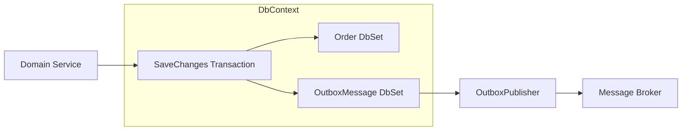
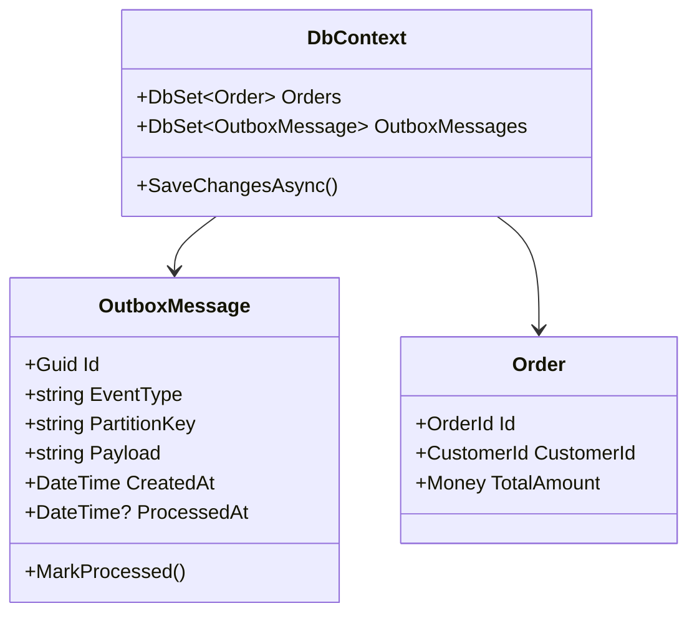
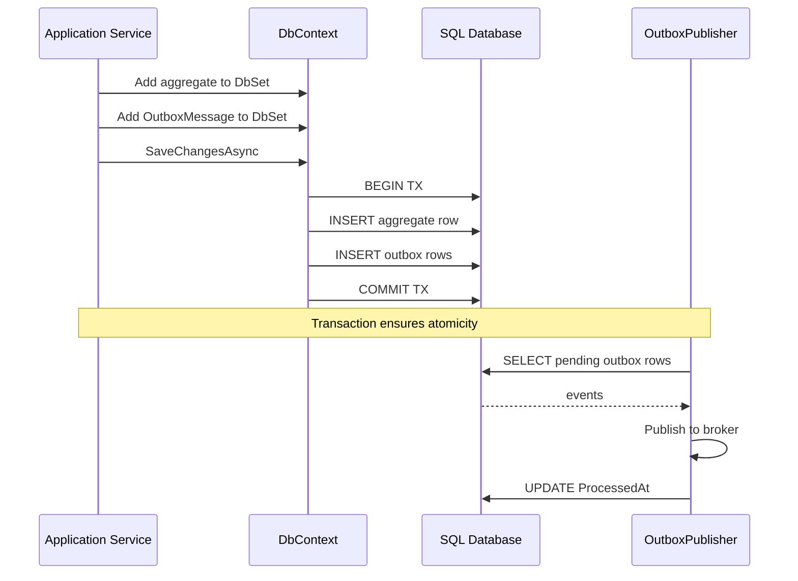
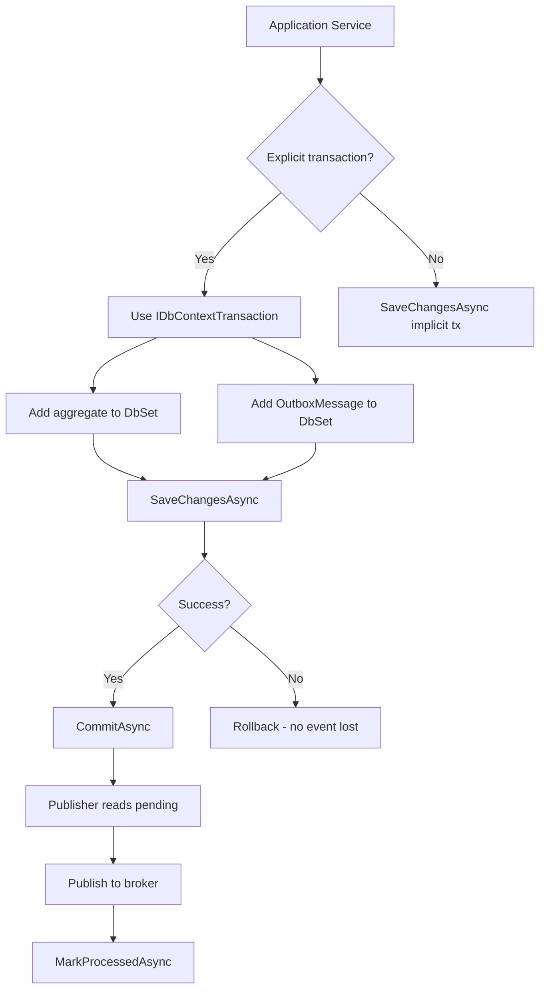
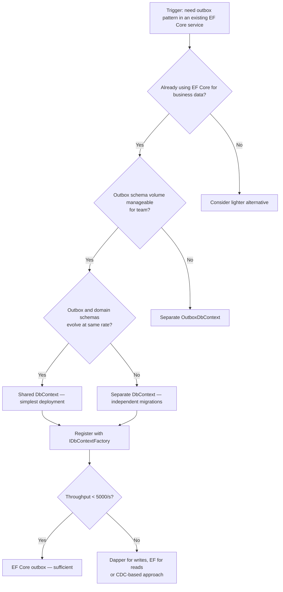

> [!success] Mastery Check
> - [ ] **Studied Well**
> - [ ] **Can explain the concept without notes**
> - [ ] **Can answer interview questions confidently**
> - [ ] **Can implement it in a real project**

## Navigation

**Domain:** [[7 — System Design & Distributed Systems]] > **Group:** Integration Patterns
**Previous:** [[7.121 — Outbox Pattern — Reliable Event Publishing]] | **Next:** [[7.123 — Outbox Pattern — Polling Publisher]]

### Prerequisites
- [[7.121 — Outbox Pattern — Reliable Event Publishing]] — required because this note builds on the conceptual outbox pattern with EF Core-specific implementation details
- [[6.412 — Unit of Work Pattern]] — needed because EF Core's `DbContext` is the unit of work that provides the transaction boundary for atomically writing business data and outbox events

### Where This Fits

The outbox pattern requires a storage mechanism for pending events. EF Core is the natural choice in .NET applications using SQL Server, PostgreSQL, or SQLite as the primary store. This note covers the specific EF Core patterns — `ISaveChangesInterceptor`, `DbTransaction`, `IDbContextFactory`, and execute-update APIs — that make the outbox implementation maintainable at production scale. A .NET engineer encounters this when adding event publishing to an existing service that already uses EF Core and needs to avoid introducing a separate storage technology for the outbox table. The EF Core outbox implementation is the most common approach in production .NET systems because it requires zero additional infrastructure beyond what the service already uses.

## Core Mental Model

EF Core implements the outbox pattern by extending the `DbContext`'s transaction boundary to include event storage. Instead of writing events through a separate storage mechanism, the EF Core implementation adds an `OutboxMessage` DbSet to the existing `DbContext`. The same `SaveChangesAsync` call that persists business data also persists outbox events. The invariant is: within a single `DbContext` transaction, every committed aggregate root write produces a corresponding outbox row. The tradeoff is tight coupling between the domain data schema and the infrastructure outbox schema — both live in the same database and are migrated together. The recognition trigger is an existing EF Core service that urgently needs reliable event publishing without adding a new database or infrastructure component.





### Classification

This implementation sits at the persistence infrastructure layer of a clean architecture. The `IOutboxStore` interface is a port (driven adapter); the `EfCoreOutboxStore` is the adapter implementation. It solves the problem of where to store outbox events — co-locating them with business data in the same EF Core model. It does not solve publisher reliability, deduplication, or consumer idempotency — those are separate concerns handled by [[7.123]] and [[7.126]].





### Key Properties / Guarantees

|Property|Value|Condition|
|---|---|---|
|Atomicity|Business data + events commit together|Same DbContext, same connection|
|Transaction scope|Single database transaction|SQL Server, PostgreSQL, or SQLite|
|Migration coupling|Tight — outbox migrates with domain schema|Both in same EF Core model|
|Queryability|Events queryable via LINQ|EF Core provider must support it|
|Write amplification|+1 row per event|Per SaveChangesAsync call|
|Change tracking overhead|~5% per tracked entity|Normal for EF Core workloads|
|Connection management|IDbContextFactory for background services|Prevents ObjectDisposedException|

## Deep Mechanics

### How It Works

**Step 1 — Model the outbox message.** Add an `OutboxMessage` entity to the `DbContext`. The entity stores the event type, serialized payload, partition key, creation timestamp, and processed-at timestamp. A composite index on `(ProcessedAt, CreatedAt)` enables efficient pending-message queries. The index should be a filtered index (WHERE ProcessedAt IS NULL) if the database supports it to minimize index size.

**Step 2 — Write atomically.** In the application service, open an explicit `IDbContextTransaction` (or rely on `SaveChangesAsync`'s implicit transaction when `EnsureCreated` or migrations are applied). Within the transaction, add both the aggregate root to its DbSet and the outbox messages to the `OutboxMessages` DbSet. Call `SaveChangesAsync` once. This ensures both writes commit or both roll back as a single atomic unit.

**Step 3 — Read pending.** The outbox publisher creates a fresh `DbContext` via `IDbContextFactory` and queries rows where `ProcessedAt == null`, ordered by `CreatedAt`. Use `ExecuteUpdateAsync` to mark processed rows without loading them into memory. The query uses raw SQL with `READPAST, UPDLOCK` hints to handle concurrent publisher instances safely.

**Step 4 — Cleanup.** A periodic job uses `ExecuteDeleteAsync` with batched deletes to remove processed rows older than the retention window. Each batch deletes 1,000 rows to avoid long-running transactions and log growth.

### Failure Modes

**Transaction timeout on large outbox batches.** If a single `SaveChangesAsync` call inserts hundreds of outbox messages alongside business data, the transaction may exceed the database's `COMMIT_TIMEOUT` (default 30 seconds in SQL Server).

- **Detection:** SqlException with error 1222 (lock request time out) or timeout in the application logs. `sql_batch_completed` duration spikes.
- **Metric:** `ef_savechanges_duration_seconds` histogram shows P99 > 10s.
- **Recovery:** Set `CommandTimeout` explicitly on the DbContext. Batch event creation: if an aggregate emits more than 50 events, flush them in a separate batch.

**DbContext disposed after outbox write but before publisher reads.** The `DbContext` used by the application service is scoped per request and disposed. The publisher needs its own `DbContext` instance — injecting `IDbContextFactory` rather than `DbContext` directly is required.

- **Detection:** `ObjectDisposedException` on the publisher's first query. Only surfaces when the publisher is deployed alongside a request-scoped DI registration.
- **Metric:** Exception count on the publisher's health check endpoint.
- **Recovery:** Register `IDbContextFactory<OrderDbContext>` in DI and create a fresh context per publisher cycle.

**Schema migration conflicts.** Domain migrations and outbox migrations are coupled. Adding an index on the outbox table requires a migration that runs with domain migrations. A failed migration of the outbox table blocks domain data access.

- **Detection:** `DbMigrationError` in CI/CD pipeline.
- **Metric:** Pipeline failure rate.
- **Recovery:** Split the outbox table into a separate DbContext (and thus a separate migration history table) if the outbox schema evolves independently.

**Change tracker staleness after SaveChangesAsync failure.** If `SaveChangesAsync` fails (e.g., unique constraint violation), EF Core does not reset the change tracker. All tracked entities remain in their current state (Added, Modified). If the caller retries `SaveChangesAsync` on the same context instance, EF Core attempts to insert the same entities again.

- **Detection:** `DbUpdateException` with inner exception showing duplicate key violation on retry.
- **Metric:** `ef_savechanges_retry_failure_count`.
- **Recovery:** Dispose the failed DbContext and create a new one from `IDbContextFactory`. Never reuse a DbContext after a SaveChangesAsync failure.

**.NET and Azure Integration**

- **ASP.NET Core:** `IDbContextFactory<T>` is the correct registration mode for background services; request-scoped `DbContext` is for controllers/middleware
- **EF Core:** `ISaveChangesInterceptor` auto-captures domain events before commit (OutboxSaveChangesInterceptor); `ExecuteUpdateAsync`/`ExecuteDeleteAsync` for batch mark/cleanup
- **Azure services:** Azure SQL Database or Azure PostgreSQL Flexible Server as the backing store; Azure Service Bus as the broker target
- **.NET libraries:** Polly for retry on broker publish; MediatR's `INotification` if domain events flow through a mediator pipeline before reaching the outbox
- **Connection resilience:** Use `EnableRetryOnFailure` on the SQL Server connection to handle transient database failures
- **Azure Monitor:** Track `ef_savechanges_duration_ms`, `ef_connection_pool_utilization`, and `outbox_depth` in Application Insights

```csharp
// Program.cs — Register outbox infrastructure
builder.Services.AddDbContextFactory<OrderDbContext>(options =>
    options.UseSqlServer(builder.Configuration.GetConnectionString("Orders")));

builder.Services.AddScoped<IOutboxStore, EfCoreOutboxStore>();
builder.Services.AddHostedService<OutboxPublisher>();
```

```csharp
// EF Core connection resilience configuration
builder.Services.AddDbContextFactory<OrderDbContext>(options =>
    options.UseSqlServer(
        builder.Configuration.GetConnectionString("Orders"),
        sqlOptions =>
        {
            sqlOptions.EnableRetryOnFailure(
                maxRetryCount: 3,
                maxRetryDelay: TimeSpan.FromSeconds(10),
                errorNumbersToAdd: null);
            sqlOptions.CommandTimeout(30);
        }));
```

## Production Patterns and Implementation

### Outbox Table Schema and Indexing Strategy

The performance of the EF Core outbox implementation depends heavily on the database schema design. Here is the recommended schema with a detailed rationale for each component:

```sql
-- SQL Server outbox table schema
CREATE TABLE dbo.OutboxMessages (
    Id UNIQUEIDENTIFIER NOT NULL PRIMARY KEY CLUSTERED,
    EventType NVARCHAR(256) NOT NULL,
    PartitionKey NVARCHAR(128) NOT NULL,
    Payload NVARCHAR(MAX) NOT NULL,
    CreatedAt DATETIME2 NOT NULL,
    ProcessedAt DATETIME2 NULL,
    
    -- Optimistic concurrency guard (optional)
    RowVersion ROWVERSION NOT NULL
);

-- Critical index for the pending-query
-- Filtered index keeps only unprocessed rows in the index
CREATE NONCLUSTERED INDEX IX_OutboxMessages_Pending
ON dbo.OutboxMessages (CreatedAt ASC)
INCLUDE (EventType, PartitionKey, Payload)
WHERE ProcessedAt IS NULL;

-- Index for cleanup queries
CREATE NONCLUSTERED INDEX IX_OutboxMessages_Cleanup
ON dbo.OutboxMessages (CreatedAt ASC)
WHERE ProcessedAt IS NOT NULL;
```

**Schema design rationale:**
- `Id` as GUID: Enables offline generation and avoids identity column contention. Use `NEWSEQUENTIALID()` for clustered index ordering if concerned about fragmentation.
- `EventType` as NVARCHAR(256): Stores the full .NET type name or a short event name. 256 characters provides room for nested type names.
- `PartitionKey` as NVARCHAR(128): Matches Service Bus partition key limits. Must be non-null for ordering guarantees.
- `Payload` as NVARCHAR(MAX): JSON-serialized event data. JSON is preferred over binary for debuggability and schema evolution.
- `RowVersion` (optional): Enables optimistic concurrency in case the publisher needs to detect whether a row was updated by another instance.
- **Filtered index on `(CreatedAt)` WHERE `ProcessedAt IS NULL`**: This is the most important performance optimization. A regular index on `(ProcessedAt, CreatedAt)` would include billions of processed rows over time. The filtered index excludes processed rows entirely, keeping the index small and the pending query fast.

```csharp
// EF Core configuration for the filtered index
public sealed class OutboxMessageConfiguration : IEntityTypeConfiguration<OutboxMessage>
{
    public void Configure(EntityTypeBuilder<OutboxMessage> builder)
    {
        builder.ToTable("OutboxMessages");
        builder.HasKey(m => m.Id);

        builder.Property(m => m.EventType)
            .HasMaxLength(256).IsRequired();
        builder.Property(m => m.PartitionKey)
            .HasMaxLength(128).IsRequired();
        builder.Property(m => m.Payload)
            .HasColumnType("nvarchar(max)").IsRequired();
        builder.Property(m => m.CreatedAt)
            .IsRequired();
        builder.Property(m => m.ProcessedAt);

        // Filtered index for pending query performance
        builder.HasIndex(m => m.CreatedAt)
            .HasDatabaseName("IX_OutboxMessages_Pending")
            .HasFilter("[ProcessedAt] IS NULL")
            .IncludeProperties(m => new { m.EventType, m.Payload, m.PartitionKey });

        // Index for cleanup
        builder.HasIndex(m => m.CreatedAt)
            .HasDatabaseName("IX_OutboxMessages_Cleanup")
            .HasFilter("[ProcessedAt] IS NOT NULL");
    }
}
```

### Primary Implementation

```csharp
// OutboxMessage entity
public sealed class OutboxMessage
{
    public Guid Id { get; private set; }
    public string EventType { get; private set; }
    public string PartitionKey { get; private set; }
    public string Payload { get; private set; }
    public DateTime CreatedAt { get; private set; }
    public DateTime? ProcessedAt { get; private set; }

    private OutboxMessage() { } // EF Core constructor

    public OutboxMessage(string eventType, string partitionKey, string payload)
    {
        Id = Guid.NewGuid();
        EventType = eventType;
        PartitionKey = partitionKey;
        Payload = payload;
        CreatedAt = DateTime.UtcNow;
    }

    public void MarkProcessed()
    {
        ProcessedAt = DateTime.UtcNow;
    }
}

// EF Core configuration
public sealed class OutboxMessageConfiguration : IEntityTypeConfiguration<OutboxMessage>
{
    public void Configure(EntityTypeBuilder<OutboxMessage> builder)
    {
        builder.ToTable("OutboxMessages");
        builder.HasKey(m => m.Id);
        builder.Property(m => m.EventType).HasMaxLength(256).IsRequired();
        builder.Property(m => m.PartitionKey).HasMaxLength(128).IsRequired();
        builder.Property(m => m.Payload).HasColumnType("nvarchar(max)").IsRequired();
        builder.Property(m => m.CreatedAt).IsRequired();
        builder.Property(m => m.ProcessedAt);

        builder.HasIndex(m => new { m.ProcessedAt, m.CreatedAt })
            .HasDatabaseName("IX_OutboxMessages_Pending")
            .IncludeProperties(m => new { m.EventType, m.Payload, m.PartitionKey });
    }
}

// DbContext with the OutboxMessage DbSet
public class OrderDbContext : DbContext
{
    public DbSet<Order> Orders => Set<Order>();
    public DbSet<OutboxMessage> OutboxMessages => Set<OutboxMessage>();

    public OrderDbContext(DbContextOptions<OrderDbContext> options) : base(options) { }

    protected override void OnModelCreating(ModelBuilder modelBuilder)
    {
        modelBuilder.ApplyConfiguration(new OutboxMessageConfiguration());
        modelBuilder.ApplyConfiguration(new OrderConfiguration());
    }
}

// IOutboxStore based on EF Core
public sealed class EfCoreOutboxStore : IOutboxStore
{
    private readonly IDbContextFactory<OrderDbContext> _contextFactory;

    public EfCoreOutboxStore(IDbContextFactory<OrderDbContext> contextFactory)
    {
        _contextFactory = contextFactory;
    }

    public async Task AddAsync(OutboxMessage message, CancellationToken ct)
    {
        await using var context = await _contextFactory.CreateDbContextAsync(ct);
        context.OutboxMessages.Add(message);
        await context.SaveChangesAsync(ct);
    }

    public async Task<IReadOnlyList<OutboxMessage>> GetPendingAsync(int batchSize, CancellationToken ct)
    {
        await using var context = await _contextFactory.CreateDbContextAsync(ct);
        return await context.OutboxMessages
            .FromSql($"""
                SELECT TOP({batchSize}) *
                FROM OutboxMessages WITH (READPAST, UPDLOCK)
                WHERE ProcessedAt IS NULL
                ORDER BY CreatedAt
                """)
            .AsNoTracking()
            .ToArrayAsync(ct);
    }

    public async Task MarkProcessedAsync(Guid id, CancellationToken ct)
    {
        await using var context = await _contextFactory.CreateDbContextAsync(ct);
        await context.OutboxMessages
            .Where(m => m.Id == id)
            .ExecuteUpdateAsync(
                s => s.SetProperty(m => m.ProcessedAt, DateTime.UtcNow),
                ct);
    }

    public async Task MarkBatchProcessedAsync(IEnumerable<Guid> ids, CancellationToken ct)
    {
        await using var context = await _contextFactory.CreateDbContextAsync(ct);
        await context.OutboxMessages
            .Where(m => ids.Contains(m.Id))
            .ExecuteUpdateAsync(
                s => s.SetProperty(m => m.ProcessedAt, DateTime.UtcNow),
                ct);
    }

    public async Task<int> CleanupAsync(DateTime olderThan, CancellationToken ct)
    {
        await using var context = await _contextFactory.CreateDbContextAsync(ct);
        return await context.OutboxMessages
            .Where(m => m.ProcessedAt != null && m.CreatedAt < olderThan)
            .Take(1000)
            .ExecuteDeleteAsync(ct);
    }
}

// Application service using the outbox
public sealed class OrderService
{
    private readonly OrderDbContext _context;
    private readonly ILogger<OrderService> _logger;

    public OrderService(OrderDbContext context, ILogger<OrderService> logger)
    {
        _context = context;
        _logger = logger;
    }

    public async Task<OrderId> SubmitOrderAsync(SubmitOrderCommand command, CancellationToken ct)
    {
        await using var transaction = await _context.Database
            .BeginTransactionAsync(ct);

        var order = Order.Create(command.CustomerId, command.LineItems);
        _context.Orders.Add(order);

        var @event = new OrderSubmitted(
            order.Id.Value,
            command.CustomerId,
            order.TotalAmount);
        var outboxMessage = new OutboxMessage(
            @event.GetType().FullName!,
            order.Id.Value.ToString("N"),
            JsonSerializer.Serialize(@event, SerializerOptions));
        _context.OutboxMessages.Add(outboxMessage);

        await _context.SaveChangesAsync(ct);
        await transaction.CommitAsync(ct);

        _logger.LogInformation("Order {OrderId} submitted with outbox event", order.Id);
        return order.Id;
    }
}
```

### Configuration and Wiring

```csharp
// Program.cs
builder.Services.AddDbContextFactory<OrderDbContext>(options =>
{
    var connectionString = builder.Configuration.GetConnectionString("Orders");
    options.UseSqlServer(connectionString, sql =>
    {
        sql.CommandTimeout(30);
        sql.EnableRetryOnFailure(3);
    });
});

builder.Services.AddScoped<IOutboxStore>(sp =>
{
    var factory = sp.GetRequiredService<IDbContextFactory<OrderDbContext>>();
    return new EfCoreOutboxStore(factory);
});

builder.Services.Configure<OutboxOptions>(builder.Configuration.GetSection("Outbox"));
builder.Services.AddHostedService<OutboxPublisher>();
```

### Common Variants

**OutboxSaveChangesInterceptor variant.** Use an `ISaveChangesInterceptor` to auto-discover `IDomainEvent` entries on `IAggregateRoot` entities in the change tracker and insert them as outbox messages before the transaction commits. This eliminates the risk of application code forgetting to write outbox messages.

```csharp
public sealed class OutboxSaveChangesInterceptor : ISaveChangesInterceptor
{
    public async ValueTask<InterceptionResult<int>> SavingChangesAsync(
        DbContextEventData eventData,
        InterceptionResult<int> result,
        CancellationToken ct = default)
    {
        if (eventData.Context is not OrderDbContext context)
            return result;

        var events = context.ChangeTracker.Entries<IAggregateRoot>()
            .SelectMany(e => e.Entity.DomainEvents)
            .Select(e => new OutboxMessage(
                e.GetType().FullName!,
                e.PartitionKey,
                JsonSerializer.Serialize(e, SerializerOptions)))
            .ToArray();

        context.OutboxMessages.AddRange(events);
        return result;
    }
}
```

**Shared DbContext variant.** For simpler deployments, inject `DbContext` directly (not `IDbContextFactory`) and use `IServiceScopeFactory` in the publisher. This is acceptable when the publisher and API are deployed together and the `DbContext` registration is scoped.

**PostgreSQL variant with SKIP LOCKED.** For PostgreSQL, replace `READPAST, UPDLOCK` with `SKIP LOCKED`. PostgreSQL does not support `READPAST` — it uses `SKIP LOCKED` on `FOR UPDATE` queries to achieve the same effect.

```csharp
// PostgreSQL SKIP LOCKED variant
public async Task<IReadOnlyList<OutboxMessage>> GetPendingAsync(int batchSize, CancellationToken ct)
{
    await using var context = await _contextFactory.CreateDbContextAsync(ct);
    return await context.OutboxMessages
        .FromSql($"""
            SELECT * FROM "OutboxMessages"
            WHERE "ProcessedAt" IS NULL
            ORDER BY "CreatedAt"
            LIMIT {batchSize}
            FOR UPDATE SKIP LOCKED
            """)
        .AsNoTracking()
        .ToArrayAsync(ct);
}
```

**Cosmos DB variant with Change Feed.** For globally distributed scenarios, use Cosmos DB as the outbox store. The Change Feed provides a built-in CDC mechanism that replaces the polling publisher. This eliminates the need for `READPAST` hints entirely.

```csharp
// Cosmos DB outbox — Change Feed processor
public sealed class CosmosOutboxPublisher : IChangeFeedProcessor
{
    public async Task ProcessChangesAsync(
        IReadOnlyCollection<OutboxMessage> changes,
        CancellationToken ct)
    {
        foreach (var message in changes)
        {
            await _sender.SendMessageAsync(
                new ServiceBusMessage(message.Payload)
                {
                    MessageId = message.Id.ToString("N"),
                    PartitionKey = message.PartitionKey
                }, ct);
        }
    }
}
```

### Real-World .NET Ecosystem Example

**MassTransit's EF Core outbox** (`MassTransit.EntityFrameworkCore`) provides a complete implementation where `BusOutboxMessage` is an entity in the `ISagaDbContext`. MassTransit uses EF Core interceptor support to flush the outbox automatically when the consumer's saga transaction commits. This is the most widely deployed EF Core outbox implementation in the .NET ecosystem.

```csharp
// MassTransit EF Core outbox registration — production proven
builder.Services.AddMassTransit(x =>
{
    x.AddEntityFrameworkOutbox<OrderDbContext>(o =>
    {
        o.QueryDelay = TimeSpan.FromSeconds(1);
        o.UseBusOutbox();
    });

    x.UsingAzureServiceBus((context, cfg) =>
    {
        cfg.ConfigureEndpoints(context);
    });
});
```

**NServiceBus's SQL Persistence outbox.** NServiceBus has supported the outbox pattern since 2014 through its SQL Persistence package. It stores outgoing messages in the `NServiceBus.Outbox` table within the same SQL transaction as business data. The NServiceBus transport dispatches the messages only after the business transaction commits.

```csharp
// NServiceBus SQL outbox
builder.Services.AddSingleton(sp =>
{
    var endpointConfig = new EndpointConfiguration("OrderProcessing");
    endpointConfig.UsePersistence<SqlPersistence>();
    endpointConfig.EnableOutbox();
    return Endpoint.Start(endpointConfig).GetAwaiter().GetResult();
});
```

## Gotchas and Production Pitfalls

### 1. Injecting scoped DbContext directly into a singleton publisher

**Pitfall:** The `OutboxPublisher` is registered as a singleton `BackgroundService`, but the `DbContext` is registered as scoped. The publisher captures the scoped `DbContext` in its constructor, which is resolved once and then used for the lifetime of the application.

```csharp
// ❌ Scoped DbContext injected into singleton publisher
public sealed class OutboxPublisher : BackgroundService
{
    private readonly OrderDbContext _context; // Captures first scoped instance — wrong
    public OutboxPublisher(OrderDbContext context) => _context = context;
}
```

**Symptom:** `ObjectDisposedException` on the `_context` after the first HTTP request completes. Intermittent failures depending on the DI container's disposal timing.

**Fix:** Inject `IDbContextFactory<OrderDbContext>` and create a fresh `DbContext` per cycle.

```csharp
// ✅ IDbContextFactory creates a new context per cycle
public sealed class OutboxPublisher : BackgroundService
{
    private readonly IDbContextFactory<OrderDbContext> _contextFactory;
    public OutboxPublisher(IDbContextFactory<OrderDbContext> contextFactory) => _contextFactory = contextFactory;
}
```

**Cost of not fixing:** At 3 AM during a deployment, the publisher stops processing events silently. The outbox depth grows to 100,000 rows. Customer notifications are delayed by hours.

### 2. Missing READPAST hint causes publisher deadlocks

**Pitfall:** The `GetPendingAsync` query does not use `READPAST` and `UPDLOCK` hints. Multiple publisher instances try to read and update the same rows simultaneously.

```csharp
// ❌ No locking hints — concurrent publishers deadlock
var messages = await context.OutboxMessages
    .Where(m => m.ProcessedAt == null)
    .OrderBy(m => m.CreatedAt)
    .Take(100)
    .ToArrayAsync(ct);
```

**Symptom:** SQL Server deadlock graph shows two sessions both holding shared locks and requesting update locks on the OutboxMessages table. Publisher throughput drops to zero during deadlock resolution.

**Fix:** Use `FromSql` with the `READPAST, UPDLOCK` hint.

```csharp
// ✅ READPAST + UPDLOCK for safe concurrent reading
var messages = await context.OutboxMessages
    .FromSql($"""
        SELECT TOP(100) *
        FROM OutboxMessages WITH (READPAST, UPDLOCK)
        WHERE ProcessedAt IS NULL
        ORDER BY CreatedAt
        """)
    .AsNoTracking()
    .ToArrayAsync(ct);
```

**Cost of not fixing:** During a traffic surge, the autoscaler spins up 3 additional publisher instances. All 4 instances deadlock. Outbox depth spikes. Recovery requires manual scale-in of publisher instances.

### 3. Large outbox payloads inflate the database

**Pitfall:** Domain events include full entity snapshots (the entire `Order` object graph) in the payload. The outbox table grows rapidly and backups take longer.

```csharp
// ❌ Serializing the full order object graph
var payload = JsonSerializer.Serialize(order);
var message = new OutboxMessage("OrderSubmitted", order.Id.ToString(), payload);
```

**Symptom:** Outbox table size reaches 50 GB in one week for a system processing 500 events/second. SQL Server backup duration increases from 10 minutes to 2 hours. Restore time breaches the RTO.

**Fix:** Store only the minimal event data — what the subscriber needs, not what the producer has.

```csharp
// ✅ Minimal event data only
var @event = new OrderSubmitted(order.Id, order.CustomerId, order.TotalAmount);
var payload = JsonSerializer.Serialize(@event);
```

**Cost of not fixing:** The database restore time during disaster recovery exceeds the 4-hour RTO. The business cannot process orders for 6 hours.

### 4. Implicit transaction wrapping conflicting with explicit outbox transaction

**Pitfall:** The `OutboxSaveChangesInterceptor` adds events within an explicit `BeginTransactionAsync` block. The interceptor also calls `SaveChangesAsync`, which EF Core wraps in an implicit transaction. When both are active, EF Core throws an `InvalidOperationException`.

```csharp
// ❌ Nested transactions — interceptor + explicit transaction
await using var tx = await context.Database.BeginTransactionAsync(ct);
// ... business logic ...
await context.SaveChangesAsync(ct); // Interceptor runs here — but nested tx already exists
await tx.CommitAsync(ct);
```

**Symptom:** `InvalidOperationException: "The connection is already in a transaction."` at runtime.

**Fix:** The interceptor should only add events to the change tracker — not call `SaveChangesAsync`. The caller's `SaveChangesAsync` is the single flush point.

**Cost of not fixing:** The application fails to process any write operation. No events are published. System is down until the interceptor is fixed and redeployed.

### 5. Migration conflicts between domain and outbox schemas

**Pitfall:** Adding a new index to the `OutboxMessages` table requires an EF Core migration. If the domain data model and the outbox model share the same `DbContext`, a failed outbox migration blocks all domain data access.

```csharp
// ❌ One migration set for both domain and outbox
public class OrderDbContext : DbContext
{
    public DbSet<Order> Orders => Set<Order>();
    public DbSet<OutboxMessage> OutboxMessages => Set<OutboxMessage>();
}
```

**Symptom:** A migration that adds a column to `OutboxMessages` fails because of a naming conflict with an existing index. The migration tool rolls back, but the migration history table is corrupted. All subsequent `dotnet ef database update` commands fail.

**Fix:** Consider splitting the outbox into a separate `DbContext` if the schemas evolve at different rates.

```csharp
// ✅ Separate DbContext for outbox — independent migrations
public class OutboxDbContext : DbContext
{
    public DbSet<OutboxMessage> OutboxMessages => Set<OutboxMessage>();
    public OutboxDbContext(DbContextOptions<OutboxDbContext> options) : base(options) { }
}
```

**Cost of not fixing:** A failed migration blocks deployments for 2 days. The deployment pipeline is red. Emergency fix requires manual SQL scripts to repair the migration history.

### 6. Change tracker memory leak from AsNoTracking omission

**Pitfall:** The `GetPendingAsync` query omits `AsNoTracking()`. EF Core loads all outbox rows into the change tracker. Over many poll cycles, the change tracker accumulates thousands of tracked entities, causing memory growth and eventual OOM.

```csharp
// ❌ No AsNoTracking — entities tracked in memory
var messages = await context.OutboxMessages
    .FromSql($"""SELECT TOP(100) * FROM OutboxMessages ...""")
    .ToArrayAsync(ct);
// Every row is now tracked by the change tracker
```

**Symptom:** Publisher memory usage grows by ~2 KB per tracked entity per poll cycle. After 1 hour at 1 poll/second with batch size 100, the change tracker holds 360,000 entities — ~700 MB of memory.

**Fix:** Always add `AsNoTracking()` to the `GetPendingAsync` query since the publisher never modifies the loaded entities.

```csharp
// ✅ AsNoTracking prevents memory leak
var messages = await context.OutboxMessages
    .FromSql($"""SELECT TOP(100) * FROM OutboxMessages ...""")
    .AsNoTracking()
    .ToArrayAsync(ct);
```

**Cost of not fixing:** The publisher OOM-restarts every 45 minutes during peak hours. Each restart loses the in-flight batch, causing event delivery gaps and duplicate publishes.

### 7. Missing filtered index causes slow pending queries

**Pitfall:** The composite index on `(ProcessedAt, CreatedAt)` includes ProcessedAt which can be NULL for millions of rows. The index grows large and the pending query still scans too many rows.

```csharp
// ❌ Unfiltered index — large, less efficient
builder.HasIndex(m => new { m.ProcessedAt, m.CreatedAt });
```

**Symptom:** `GetPendingAsync` query duration grows over time as the outbox table accumulates processed rows. At 10M processed rows, the query takes 500ms instead of 2ms.

**Fix:** Use a filtered index (WHERE ProcessedAt IS NULL) to keep the index small and targeted.

```csharp
// ✅ Filtered index — only indexes unprocessed rows
builder.HasIndex(m => m.CreatedAt)
    .HasDatabaseName("IX_OutboxMessages_Pending_Unprocessed")
    .HasFilter("[ProcessedAt] IS NULL");
```

**Cost of not fixing:** At 5,000 events/second, the publisher spends 500ms per poll cycle just scanning the index. The effective throughput drops, and the publisher falls behind during peak hours.

## Tradeoffs and Decision Framework

### Tradeoff Matrix

|Dimension|EF Core Outbox (Shared DbContext)|EF Core Outbox (Separate DbContext)|CDC-Based Outbox|Dapper Outbox|
|---|---|---|---|---|
|Consistency model|Strong (same DB transaction)|Strong (same DB transaction)|Eventual (log streaming)|Strong (same DB transaction)|
|Migration coupling|Tight — one migration set|Loose — independent migrations|None — CDC is schema-aware|None — no ORM migrations|
|Write latency|+1 insert per event (minimal)|+1 insert per event (minimal)|Minimal (log write is fast)|+1 insert per event (fastest)|
|Operational complexity|Low — same connection string|Low-Medium — two contexts|High — CDC infrastructure|Medium — raw SQL management|
|Team expertise required|Low — standard EF Core patterns|Low — standard EF Core patterns|Medium-High — Debezium/Kafka|Medium — Dapper + SQL|
|Query capability|Full LINQ on outbox|Full LINQ on outbox|Limited (capture stream)|Full SQL on outbox|
|Change tracking overhead|Yes (5-10% per entity)|Yes (5-10% per entity)|None|None|

### When to Apply



### When NOT to Apply

- [ ] The team cannot use `IDbContextFactory` correctly (singleton publisher + scoped context is a common mistake)
- [ ] The outbox table requires a different database engine (e.g., Event Store for auditing, Cosmos DB for global distribution)
- [ ] The volume exceeds 10,000 events/second — CDC-based outbox ([[7.124]]) or dedicated streaming is better
- [ ] The existing DbContext has dozens of entity configurations already; adding the outbox model makes the context file unwieldy
- [ ] Database-level separation is required for compliance reasons (domain data and event data in different DB instances)
- [ ] The team uses a micro-ORM like Dapper for all data access — introducing EF Core just for the outbox is disproportionate complexity
- [ ] The database is not relational (Cosmos DB, MongoDB, DynamoDB) — the EF Core outbox pattern does not apply; use Change Feed or CDC instead

### Scale Thresholds

- **Worth considering above ~50 events/second** — at lower volumes, write an event table manually without a formal outbox
- **Up to ~5,000 events/second** — EF Core outbox with `READPAST` + `IDbContextFactory` handles this comfortably on a single SQL Server instance with 4 vCores
- **Above ~5,000 events/second** — consider CDC-based outbox ([[7.124]]) or sharding the outbox table by tenant
- **Outbox table cleanup needed at ~1M rows/day** — `ExecuteDeleteAsync` batch cleanup of 1,000 rows per cycle handles this in under 10ms per batch
- **IDbContextFactory lifecycle:** Create and dispose a context per cycle. At 1 poll/second with batch size 100, this is 1 context creation/disposal per second — negligible overhead (sub-millisecond) with ADO.NET connection pooling

## Interview Arsenal

### Question Bank

1. How do you implement the outbox pattern in EF Core without introducing a new database?
2. Why must the outbox publisher use `IDbContextFactory` rather than a scoped `DbContext`?
3. What does the `READPAST, UPDLOCK` hint do in the outbox context, and why is it important?
4. Compare shared DbContext vs separate DbContext for the outbox table — when do you choose each?
5. How does `ExecuteUpdateAsync` improve outbox publisher performance compared to loading entities?
6. Design an EF Core save interceptor that decouples domain events from the outbox write.
7. How do you test an EF Core outbox implementation (unit test vs integration test)?
8. What happens to the EF Core change tracker state when an outbox message insert fails?
9. How does the PostgreSQL `SKIP LOCKED` variant differ from SQL Server's `READPAST`?
10. What metrics from EF Core would you monitor to detect outbox performance degradation?
11. How would you implement the outbox pattern with Cosmos DB instead of SQL Server?
12. What happens if the `OutboxSaveChangesInterceptor` throws an exception during `SavingChangesAsync`?

### Spoken Answers

**Q1: How do you implement the outbox pattern in EF Core without introducing a new database?**

> **Average answer:** "Add an OutboxMessage DbSet to your existing DbContext and write events to it in the same transaction."
>
> **Great answer:** "You add an `OutboxMessage` entity to the same `DbContext` that holds your business entities — for example, `OrderDbContext` gets a `DbSet<OutboxMessage>` alongside `DbSet<Order>`. The entity stores the event type, a JSON-serialized payload, a partition key for ordering guarantees, a creation timestamp, and a nullable processed-at timestamp. You configure a filtered composite index on `(ProcessedAt, CreatedAt)` to make the pending-query efficient. Then in the application service, you open an explicit `IDbContextTransaction`, add both the domain entity and the outbox message to their respective DbSets, and call `SaveChangesAsync` once. The database transaction ensures that both the business data and the event are committed or rolled back together. The publisher uses `IDbContextFactory<OrderDbContext>` — not a scoped `DbContext` — because the publisher is a singleton `BackgroundService` and needs a fresh context per poll cycle. The `EfCoreOutboxStore` implements `GetPendingAsync` using a raw SQL query with `READPAST, UPDLOCK` hints to prevent deadlocks when multiple publisher instances compete for rows. This requires zero additional databases — everything lives in the same SQL Server instance the service already uses."

**Q3: What does the READPAST, UPDLOCK hint do in the outbox context, and why is it important?**

> **Great answer:** "`READPAST` tells SQL Server to skip rows that are locked by other transactions instead of waiting for the locks to be released. `UPDLOCK` takes update locks on the rows being read instead of shared locks. Together, they solve two problems in the outbox publisher. First, when multiple publisher instances read pending events simultaneously, without `UPDLOCK` they both take shared locks and can read the same rows. Then when they try to update `ProcessedAt`, they create a deadlock — session A holds a shared lock on row 1 and wants an update lock on row 2, while session B holds a shared lock on row 2 and wants an update lock on row 1. The deadlock manager picks a victim, and one publisher's batch fails. With `READPAST, UPDLOCK`, each session reads only rows that are not locked by another session, and the update lock ensures the rows are exclusively owned by the reading session. The query takes the form: `SELECT TOP(N) * FROM OutboxMessages WITH (READPAST, UPDLOCK) WHERE ProcessedAt IS NULL ORDER BY CreatedAt`. In EF Core, you must use `FromSql` because the LINQ provider doesn't generate table hints directly."

**Q5: How does ExecuteUpdateAsync improve outbox publisher performance compared to loading entities?**

> **Great answer:** "Before EF Core 7, the publisher would load each OutboxMessage entity into memory, set `ProcessedAt = DateTime.UtcNow`, and call `SaveChangesAsync`. This loaded the full entity, tracked it in the change tracker, and generated an UPDATE statement for each entity. `ExecuteUpdateAsync` generates a single server-side `UPDATE SET ProcessedAt = @now WHERE Id IN (...)` statement. It never brings entities into memory, never adds them to the change tracker, and executes in a single database round trip. For a batch of 200 events, this reduces memory allocation from ~200 KB (entity objects) to near zero, and reduces database round trips from 200 to 1. It also eliminates the change tracker overhead — no DetectChanges, no state management. The only caveat is that `ExecuteUpdateAsync` does not respect the change tracker or interceptor pipeline — it operates directly on the database. This is correct behavior for the outbox publisher because we don't need any interceptor logic when marking events as processed."

**Q7: How do you test an EF Core outbox implementation?**

> **Great answer:** "I use three levels of testing. First, unit tests for the `OutboxMessage` entity logic — creation, marking as processed — these use plain constructors and are fast. Second, integration tests using the EF Core InMemory provider or SQLite for the `EfCoreOutboxStore`. I write a test that creates a DbContext, inserts an outbox message, verifies it was saved, then queries pending messages and verifies the READPAST logic works. The InMemory provider does not support `FromSql`, so for the READPAST query I use SQLite with a real database file. Third, end-to-end tests that spin up a test container (Testcontainers for SQL Server), deploy the full publisher pipeline, and verify that an event written to the outbox table eventually appears in a test Service Bus queue. The most important test is the concurrent publisher test: start two publisher instances reading from the same outbox table and verify that each event is published exactly once (at-most-once from the publisher's perspective, at-least-once from the end-to-end perspective). I also add a migration test that verifies the outbox index is created correctly."

**Q8: What happens to the EF Core change tracker state when an outbox message insert fails?**

> **Great answer:** "If the `SaveChangesAsync` call fails — for example, a SQL constraint violation on the outbox table — EF Core does not automatically reset the change tracker state. The `OutboxMessage` entity remains in the `Added` state. The `Order` entity, also added in the same batch, stays in the `Added` state. The `DbTransaction` is rolled back at the database level, but the change tracker still thinks these entities are pending. If the caller retries `SaveChangesAsync` on the same `DbContext` instance, EF Core will try to insert the same entities again, and the database will either succeed (if the previous transaction truly rolled back — fine) or fail with a different error (if a partial write succeeded — unlikely with transactions, but possible with certain provider behaviors). The safest pattern is to treat the `DbContext` as invalid after any `SaveChangesAsync` failure. The service should create a new `DbContext` from the factory for the retry attempt. This is why `IDbContextFactory` is particularly important — it allows creating a fresh, clean context for retries without needing to reset the change tracker state manually."

**Q10: What metrics from EF Core would you monitor to detect outbox performance degradation?**

> **Great answer:** "I monitor four key metrics. First, `ef_savechanges_duration_ms` — specifically the P99 for the outbox write path. If this exceeds 500ms, the change tracking overhead from large aggregates or many outbox events per transaction is the bottleneck. Second, `ef_connection_pool_utilization` — the percentage of active connections from the outbox factory's pool. If this exceeds 80%, the publisher is competing with the API for connections and needs a separate pool. Third, `ef_query_duration_ms` for the `GetPendingAsync` query — if this exceeds 100ms at P99, the filtered index is missing or the outbox table has grown too large. Fourth, `outbox_table_size_mb` — track the growth rate. If it exceeds the expected rate (batch_size × payload_size × events_per_second), the cleanup job may not be keeping up. In Application Insights, I set up a dashboard with all four metrics and alert when any exceeds the threshold."

**Q12: What happens if the OutboxSaveChangesInterceptor throws an exception during SavingChangesAsync?**

> **Great answer:** "If the interceptor's `SavingChangesAsync` throws, EF Core propagates the exception to the caller of `SaveChangesAsync`. The database transaction — whether explicit (IDbContextTransaction) or implicit (SaveChangesAsync's auto-transaction) — is not affected because SaveChangesAsync has not started its database work yet. The transaction was not yet committed, so the caller catches the exception, logs it, and can retry the entire operation with a fresh DbContext. This is correct behavior: the interceptor should only add events to the change tracker; it should not call SaveChangesAsync itself. If the interceptor performs I/O (e.g., looking up additional data), that I/O should be protected by a try-catch and the interceptor should handle failures gracefully. The worst-case scenario: the interceptor throws after adding some events to the change tracker but before adding others. Those events remain in the change tracker in Added state. On retry with the same DbContext, EF Core would try to insert the previously added events again — causing either duplicate key violations or duplicate events. This is another reason to dispose the DbContext after any SaveChangesAsync failure."

### System Design Interview Trigger

When an interviewer asks you to design a system that involves database writes followed by event publishing — especially in payment processing or order management — they expect you to bring up the outbox pattern. The EF Core implementation is a follow-up question to test whether your knowledge is theoretical or pragmatic. They ask "how would you implement this in a .NET service using Entity Framework?" to see if you understand `IDbContextFactory`, `ISaveChangesInterceptor`, and the locking considerations of the pending-query. The follow-up question "what happens during scale-up?" tests whether you know the `READPAST` hint's role in horizontal scaling.

### Comparison Table

| | EF Core Outbox | BackgroundService + Dapper | CDC Outbox | Cosmos DB Change Feed |
|---|---|---|---|---|
| ORM dependency | Requires EF Core | Any data access | None — database-level | None — Cosmos SDK |
| Query expressiveness | Full LINQ | Raw SQL | None on pending rows | Change Feed queries |
| Performance overhead | ~5% write overhead from change tracking | Minimal (no change tracker) | Minimal (log-based) | Minimal (Change Feed) |
| Integration difficulty | Low for EF Core projects | Medium — introduce Dapper alongside | High — Debezium/Kafka | Medium — Cosmos SDK |
| Testing | Mockable with InMemory provider | Mockable with abstractions | Integration-test heavy | Emulator-based testing |
| Cloud provider lock-in | Low — works with any SQL DB | Low — works with any SQL DB | Medium — specific CDC features | High — Cosmos DB only |

## Architecture Decision Record

**Status:** Accepted

**Context:** The Ordering service needs an outbox implementation for reliable event publishing. The service already uses EF Core with SQL Server for all data access. The team of 5 developers is proficient in EF Core but has no experience with CDC infrastructure or Kafka. The event throughput is approximately 200 events/second with occasional spikes to 2,000 events/second during promotions. The outbox table must be deployed and managed by the same CI/CD pipeline that deploys the domain schema. The database is Azure SQL Database S4 tier (100 DTU). The team owns the full migration pipeline and runs `dotnet ef migrations` as part of the CI/CD process.

**Options Considered:**

1. **EF Core Outbox (Shared DbContext)** — Add `OutboxMessage` to the existing `OrderDbContext`
2. **EF Core Outbox (Separate DbContext)** — Create a new `OutboxDbContext` with its own migration history
3. **CDC-Based Outbox** — Use Azure SQL CDC + Azure Functions to stream outbox changes
4. **Dapper Outbox** — Add Dapper alongside EF Core for high-performance outbox writes
5. **MassTransit EF Core Outbox** — Use the MassTransit.EntityFrameworkCore package

**Decision:** EF Core Outbox with a shared DbContext, because the team already owns the EF Core schema and migration pipeline, the event volume is within EF Core comfort range, and the operational complexity of adding CDC infrastructure is not justified at 200 events/second. The shared context keeps the deployment minimal — one database, one migration set, one connection string. MassTransit was not chosen because the team does not currently use MassTransit for messaging and introducing it just for the outbox is disproportionate. Dapper was not chosen because the change tracking overhead at 200 events/second is negligible (less than 1ms per SaveChangesAsync).

**Consequences:**
- ✅ No new database or infrastructure dependencies
- ✅ Existing EF Core migration pipeline handles outbox schema changes
- ✅ Team can maintain the implementation with existing skills
- ⚠️ Outbox schema migration failures can block domain data access — mitigated by separating migrations if schema evolves rapidly
- ⚠️ Must enforce `IDbContextFactory` usage in the publisher via architecture tests
- ⚠️ Need to add `AsNoTracking()` to the pending query to prevent memory leaks
- ❌ Tight coupling — outbox table schema and domain schema share the same migration timeline

**Review Trigger:** Revisit this decision if event throughput consistently exceeds 5,000 events/second, at which point the write amplification from change tracking and the locking contention on the outbox table will require either a separate `OutboxDbContext` with its own connection pool or a migration to CDC-based outbox. Also revisit if the team adopts MassTransit — its built-in EF Core outbox would replace the custom implementation and reduce maintenance burden.

## Self-Check

### Conceptual Questions

1. Why must the outbox publisher use `IDbContextFactory` rather than constructor-injected `DbContext`?
2. What SQL Server hints are required for safe concurrent outbox reading, and what problem do they solve?
3. When would you choose a separate `OutboxDbContext` over adding to the existing domain DbContext?
4. What metric from the EF Core `DbContext` indicates the outbox write path is slowing down?
5. How does `ExecuteUpdateAsync` prevent the publisher from loading entire entities into memory?
6. What is the difference between an `ISaveChangesInterceptor` and `IDbContextTransaction` for outbox?
7. At what approximate throughput does the EF Core change tracker become a bottleneck for outbox writes?
8. How does this implementation relate to the `Repository` pattern in clean architecture?
9. What happens to a pending outbox query if the SQL Server resource governor throttles the publisher's session?
10. Explain in 60 seconds how you'd set up an EF Core outbox for a new service.
11. How would you test the concurrent publisher scenario (two publisher instances reading the same table)?
12. What is the impact of `AsNoTracking()` on the pending query and why is it critical for memory?

<details>
<summary>Answers</summary>

1. The publisher is a singleton `BackgroundService`. A scoped `DbContext` would be disposed after the first request completes. `IDbContextFactory` creates a fresh, correctly-scoped context per poll cycle, avoiding `ObjectDisposedException` and stale change tracker state.
2. `READPAST` (skip locked rows instead of waiting) and `UPDLOCK` (take exclusive update locks) prevent deadlocks between concurrent publisher instances. Without them, two instances can read the same rows and then deadlock on the simultaneous `UPDATE` for `ProcessedAt`.
3. When the outbox schema evolves independently from the domain schema (e.g., adding event metadata columns while the domain model is stable), or when a migration failure on one should not block the other.
4. `ef_savechanges_duration_seconds` P99. If it exceeds 500ms for the outbox write, the change tracking overhead from large numbers of tracked entities is likely the bottleneck.
5. `ExecuteUpdateAsync` generates a server-side `UPDATE SET ProcessedAt = ... WHERE Id IN (...)` statement that never brings entities into memory. This avoids change tracking overhead and reduces the publisher's memory footprint by ~10x for batches of 200 events.
6. The interceptor auto-discovers domain events from `IAggregateRoot` entries in the change tracker and adds them to `OutboxMessages` before `SaveChangesAsync` commits. The explicit transaction is an `IDbContextTransaction` that the application code manages to group business writes and outbox writes atomically. The interceptor removes the developer burden; the transaction ensures atomicity.
7. Above ~5,000 tracked entity changes per `SaveChangesAsync` call, the `DetectChanges` phase becomes the bottleneck (O(n) traversal of all tracked entries). At 200 events/second with typical aggregates of 10-20 tracked entities, this is negligible.
8. The `EfCoreOutboxStore` is an adapter for the `IOutboxStore` port. The repository pattern ([[4.232]]) would use the same `DbContext` for domain persistence, while the outbox store adapter handles infrastructure-level event persistence. Both operate on the same `DbContext` and transaction.
9. The query's `SELECT TOP(N) ... ORDER BY CreatedAt` is CPU-bound scanning unprocessed rows. Resource governor throttling causes the query to take longer than the polling interval, creating a cascade: each cycle reads fewer rows, backlog grows, and the query has to scan more rows the next time. Mitigation: add a `WHERE CreatedAt < @MaxAge` filter to limit the scan range.
10. "Add an `OutboxMessage` entity class and `DbSet<OutboxMessage>` to the existing `DbContext`. Create an `IOutboxStore` interface and an `EfCoreOutboxStore` that implements `AddAsync`, `GetPendingAsync`, and `MarkProcessedAsync` using raw SQL with READPAST hints. Register the DbContext with `AddDbContextFactory`. Build an `OutboxPublisher` background service that takes `IDbContextFactory`. Wire it with `AddHostedService`. Add an index on `(ProcessedAt, CreatedAt)` via migration. Test with an integration test that writes an event and asserts the publisher reads and delivers it."
11. Use Testcontainers for SQL Server. Start the container, create the outbox table, seed it with 1000 events. Start two publisher BackgroundService instances in the same test process, each with its own `IDbContextFactory`. Run for 10 cycles. Assert that each event was processed exactly once total across both publishers. Verify the deadlock count in SQL Server's `sys.dm_tran_locks` is zero.
12. Without `AsNoTracking()`, EF Core loads each `OutboxMessage` into the change tracker. For a batch of 200 events polled every second, the change tracker accumulates 200 entities/second — 720,000 entities per hour. Each entity consumes ~2 KB for state tracking. After 1 hour, the publisher uses 1.4 GB just for change tracker state. `AsNoTracking()` prevents this entirely by loading entities as read-only.

</details>

---

### Scenario Challenges

**Scenario 1 — Diagnose the problem**

A team deploys an outbox publisher that runs as a `BackgroundService` in the same process as an ASP.NET Core web API. The publisher is registered as a singleton. The `DbContext` is registered as scoped. After a few minutes of running, the publisher throws `ObjectDisposedException` intermittently when querying the outbox table. The team notices the problem occurs after the first HTTP request is processed.

<details>
<summary>Diagnosis</summary>

**Root cause:** The singleton publisher captures the first scoped `DbContext` instance in its constructor. That instance was created by the DI container for the first HTTP request scope. When the HTTP request completes, the DI container disposes the scope and the `DbContext`. The publisher continues to use the disposed context.

**Evidence:** Stack trace shows `ObjectDisposedException` at `SqlServerDatabaseCreator.CreateTables`. The exception's `DisposedObject` is the `DbContext`. The publisher's last successful cycle timestamp coincides with the first HTTP request timestamp.

**Fix:** Replace `DbContext` injection with `IDbContextFactory<OrderDbContext>` in the publisher.

**Prevention:** Add an architecture test that checks all `BackgroundService` implementations do not directly inject `DbContext`.

</details>

---

**Scenario 2 — Design decision**

You are designing an outbox implementation for a notification service that sends 5,000 events/second during peak hours. The service uses EF Core with PostgreSQL. The team has 3 developers who are comfortable with EF Core but inexperienced with message brokers. Should they use shared DbContext or separate DbContext for the outbox table?

<details>
<summary>Decision and Reasoning</summary>

**Choice:** Separate `OutboxDbContext` with its own connection pool, because at 5,000 events/second the outbox write path needs independent monitoring and tuning from the domain write path. A separate context allows configuring connection pool size, command timeout, and retry policy independently for the outbox workload.

**Tradeoffs accepted:** Two migration histories to manage. Slightly more complex DI registration. This is acceptable because the team will be able to tune the outbox connection pool without affecting the API's read path.

**Implementation sketch:**
```csharp
builder.Services.AddDbContextFactory<OutboxDbContext>(options =>
    options.UseNpgsql(builder.Configuration.GetConnectionString("Outbox"), sql =>
    {
        sql.CommandTimeout(15); // Shorter timeout for outbox
        sql.MaxBatchSize(500);  // Larger batch for throughput
    }));

builder.Services.AddDbContext<NotificationDbContext>(options =>
    options.UseNpgsql(builder.Configuration.GetConnectionString("Notifications")));
```

</details>

---

**Scenario 3 — Failure mode** The outbox publisher is throwing `DbUpdateConcurrencyException` intermittently. The outbox table has a rowversion/timestamp column. Multiple publisher instances are deployed. The `GetPendingAsync` query uses `READPAST, UPDLOCK` but the `MarkProcessedAsync` uses optimistic concurrency with `ExecuteUpdateAsync`.

<details> <summary>Investigation and Fix</summary>

**Investigation steps:**
1. Check the inner exception — is it a SQL Server 3960 (snapshot isolation violation) or a row-version mismatch?
2. Verify that `MarkProcessedAsync` does not include a `WHERE ProcessedAt IS NULL` condition that conflicts with the concurrent mark.
3. Check if `ExecuteUpdateAsync` is using the correct predicate.

**Confirming evidence:** Event count in `System.Transactions` log shows 2% of mark-processed calls fail because another instance already set `ProcessedAt`. The `ExecuteUpdateAsync` call uses `WHERE Id = @Id AND ProcessedAt IS NULL`, and the row was already updated.

**Immediate mitigation:** Remove the `AND ProcessedAt IS NULL` condition from `MarkProcessedAsync` — the `Id` is unique and sufficient.

**Permanent fix:** Change `MarkProcessedAsync` to use `ExecuteUpdateAsync` with only the `Id` predicate, accepting that duplicate marks are harmless.

```csharp
// ✅ No optimistic concurrency check — idempotent update
await _context.OutboxMessages
    .Where(m => m.Id == id)
    .ExecuteUpdateAsync(s => s.SetProperty(m => m.ProcessedAt, DateTime.UtcNow));
```

</details>

---

**Scenario 4 — Scale it** Your outbox implementation currently uses shared DbContext and polls every 1 second for 200 events/second. You need to handle 10,000 events/second. How does the EF Core outbox scale?

<details> <summary>Scaling Strategy</summary>

**Bottleneck this addresses:** The `SELECT TOP(N) FROM OutboxMessages WHERE ProcessedAt IS NULL ORDER BY CreatedAt` query at 10,000 events/second will need to scan millions of unprocessed rows.

**How it helps:** Partition the outbox table by a shard key. Use a separate publisher per partition. In EF Core, this means creating a `ShardedOutboxStore` that routes queries to the correct database shard based on the partition key.

**What it does not solve:** The EF Core change tracker overhead of tracking 10,000 entities per second. At this scale, switch to Dapper for outbox writes or use `ExecuteInsert` (bulk insert) via `SqlBulkCopy`.

**Implementation order:**
1. First, partition the outbox table by hash of `PartitionKey` (16 partitions).
2. Deploy 4 publisher instances, each responsible for 4 partitions.
3. Replace EF Core outbox writes with `SqlBulkCopy` for throughput.
4. If still insufficient, migrate to CDC-based outbox ([[7.124]]) which eliminates polling entirely.

</details>

---

**Scenario 5 — Interview simulation** The interviewer says: "You need to add reliable event publishing to an existing ASP.NET Core service that uses EF Core for order management. Walk through the implementation."

<details> <summary>Model Response</summary>

"I'll start with the scope: the service manages orders, and it publishes events like `OrderSubmitted` and `OrderCancelled` that downstream services consume. The events must not be lost even if the process crashes between writing to the database and publishing to the broker.

"First, I add an `OutboxMessage` entity to the existing `OrderDbContext` — a `DbSet<OutboxMessage>` alongside the existing `DbSet<Order>`. The entity has an Id, EventType, PartitionKey, Payload (JSON), CreatedAt, and nullable ProcessedAt. I configure a filtered index on `(ProcessedAt, CreatedAt)` to keep the pending query fast.

"Then I implement `IOutboxStore` as `EfCoreOutboxStore`. The `GetPendingAsync` method uses raw SQL with `READPAST, UPDLOCK` hints to safely support multiple publisher instances. The `MarkProcessedAsync` uses `ExecuteUpdateAsync` to avoid loading the entity into memory. The `AddAsync` adds the entity to the change tracker and calls `SaveChangesAsync`.

"Next, the publisher. I create an `OutboxPublisher` implementing `BackgroundService`. It takes `IDbContextFactory<OrderDbContext>` — not `DbContext` directly — because the publisher is singleton-scoped. Each cycle, it calls `GetPendingAsync` with a batch size of 100, publishes to Azure Service Bus via `ServiceBusSender`, and marks each message as processed after the broker acknowledges.

"Registration in Program.cs: `AddDbContextFactory` for the factory, `AddScoped<IOutboxStore, EfCoreOutboxStore>`, and `AddHostedService<OutboxPublisher>`. Configuration goes in appsettings.json: polling interval 1 second, batch size 100, retention 48 hours.

"For the application service, I wrap both the aggregate write and the outbox message insert in an `IDbContextTransaction`. Both go through the same `SaveChangesAsync` call — atomic commit.

"Key failure modes I address: the `READPAST` hint prevents deadlocks between publisher instances, `IDbContextFactory` prevents ObjectDisposedException, and a cleanup job deletes processed rows older than 48 hours to prevent table bloat."

</details>

---

**Scenario 6 — Integration testing strategy**

You need to write integration tests for the `EfCoreOutboxStore`. The team uses xUnit and Testcontainers. Design the test strategy including the SQL Server setup, test data seeding, and assertions for each method (AddAsync, GetPendingAsync, MarkProcessedAsync, CleanupAsync).

<details> <summary>Test Strategy</summary>

**Test infrastructure setup:**
```csharp
public sealed class OutboxIntegrationTests : IAsyncLifetime
{
    private readonly TestcontainerDatabase _sqlContainer = new TestcontainersBuilder<MsSqlTestcontainer>()
        .WithDatabase(new MsSqlTestcontainerConfiguration
        {
            Password = "OutboxTest_P@ssw0rd",
        })
        .Build();

    private OrderDbContext _context = null!;
    private EfCoreOutboxStore _store = null!;

    public async Task InitializeAsync()
    {
        await _sqlContainer.StartAsync();
        var options = new DbContextOptionsBuilder<OrderDbContext>()
            .UseSqlServer(_sqlContainer.ConnectionString)
            .Options;

        _context = new OrderDbContext(options);
        await _context.Database.EnsureCreatedAsync();

        _store = new EfCoreOutboxStore(
            new DbContextFactory<OrderDbContext>(options));
    }

    public async Task DisposeAsync() => await _sqlContainer.DisposeAsync();
}
```

**Test cases:**

1. **AddAsync test:** Create an `OutboxMessage`, call `AddAsync`, then query the table directly to verify the row exists with the correct values.

2. **GetPendingAsync test:** Insert 5 messages, mark 2 as processed, verify `GetPendingAsync(10)` returns only the 3 unprocessed messages in order.

3. **MarkProcessedAsync test:** Insert a message, mark it processed, verify `ProcessedAt` is not null and `GetPendingAsync` no longer returns it.

4. **Concurrent read test:** Start two tasks that simultaneously call `GetPendingAsync` on the same table with 100 messages. Verify each message appears in exactly one result set. This validates `READPAST, UPDLOCK` semantics.

5. **Batch cleanup test:** Insert messages with varying `CreatedAt` timestamps, mark some as processed, call `CleanupAsync` with a cutoff date, verify only the older processed rows are deleted.

6. **Edge case — empty table:** `GetPendingAsync` returns an empty list when no unprocessed messages exist.

7. **Edge case — all processed:** After all messages are marked processed, `GetPendingAsync` returns empty.

8. **Error handling — disposed context:** Verify that using a disposed `DbContext` throws `ObjectDisposedException`.

```csharp
[Fact]
public async Task GetPendingAsync_WithUnprocessedMessages_ReturnsOnlyUnprocessed()
{
    var messages = Enumerable.Range(0, 5).Select(i => new OutboxMessage(
        "OrderSubmitted", $"partition-{i}", "{}")).ToArray();

    foreach (var msg in messages)
        await _store.AddAsync(msg, CancellationToken.None);

    // Mark the first two as processed by directly updating the DB
    var processedIds = messages.Take(2).Select(m => m.Id).ToArray();
    await _context.OutboxMessages
        .Where(m => processedIds.Contains(m.Id))
        .ExecuteUpdateAsync(s => s.SetProperty(m => m.ProcessedAt, DateTime.UtcNow));

    var pending = await _store.GetPendingAsync(10, CancellationToken.None);

    Assert.Equal(3, pending.Count);
    Assert.DoesNotContain(pending, m => processedIds.Contains(m.Id));
}
```

</details>
