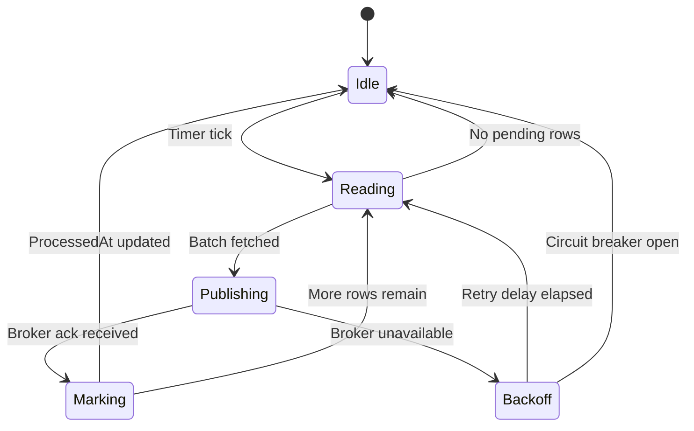
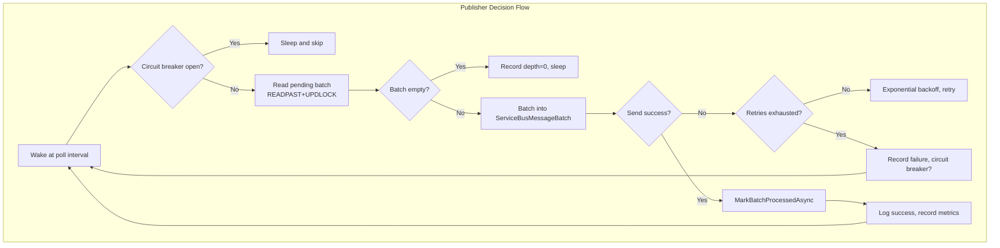
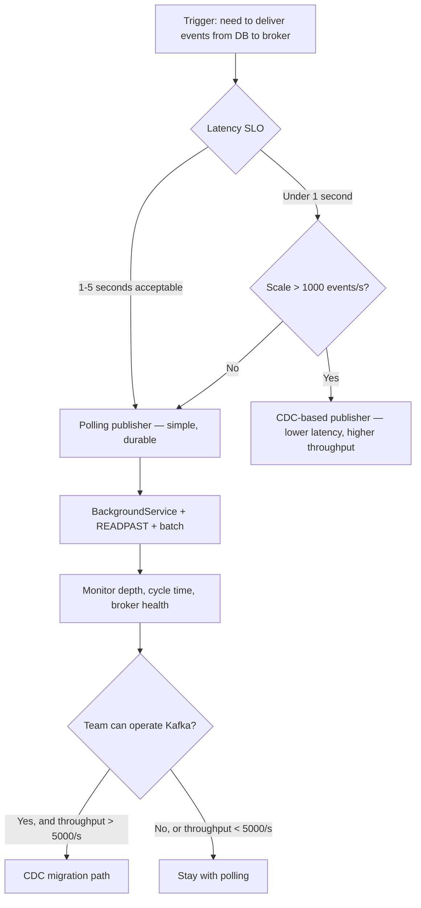

> [!success] Mastery Check
> - [ ] **Studied Well**
> - [ ] **Can explain the concept without notes**
> - [ ] **Can answer interview questions confidently**
> - [ ] **Can implement it in a real project**

## Navigation

**Domain:** [[7 — System Design & Distributed Systems]] > **Group:** Integration Patterns
**Previous:** [[7.122 — Outbox Pattern — EF Core Implementation]] | **Next:** [[7.124 — Outbox Pattern — Change Data Capture Approach]]

### Prerequisites
- [[7.121 — Outbox Pattern — Reliable Event Publishing]] — required because this note covers the publisher component that makes the outbox pattern work
- [[7.122 — Outbox Pattern — EF Core Implementation]] — needed because the publisher reads from the EF Core outbox store and must understand its schema and locking strategy

### Where This Fits

The polling publisher is the active component in a polling-based outbox implementation. It runs as a background process, reads pending outbox rows from the database, publishes them to a message broker, and marks them as processed. This is the component that determines the event delivery latency, throughput ceiling, and failure behavior of the entire outbox pipeline. A .NET engineer encounters it when building an `IHostedService` or `BackgroundService` that implements the outbox poll-publish-mark cycle. The design choices — polling interval, batch size, concurrency model, retry policy, health detection — directly determine production behavior at scale. The polling publisher is the most common outbox delivery mechanism because it requires zero infrastructure beyond what the service already uses: a database and a message broker.

## Core Mental Model

The polling publisher is a state machine that cycles through three phases: Read (query pending outbox rows), Publish (send events to the broker), and Mark (record success in the database). The invariant is: every outbox row eventually transitions from pending to processed, regardless of broker failures, process restarts, or scale changes. The tradeoff is latency: the maximum delay between an event being written and published is determined by the polling interval plus the batch processing time. The recognition trigger is a background service that needs to drain a queue stored in a database, not a message broker.





### Classification

The polling publisher is an infrastructure-level background worker. It implements the "message pump" pattern adapted for database-backed queues. It operates at the anti-corruption layer between the application's database and the messaging infrastructure. It solves the problem of reliable, asynchronous event delivery from a database to a broker. It does not solve event ordering across partitions, consumer idempotency, or schema evolution.

### Key Properties / Guarantees

|Property|Value|Condition|
|---|---|---|
|Latency (P99)|Polling interval + batch time + broker round trip|~1.1s with 1s poll interval, 100ms batch, 10ms broker|
|Throughput (max)|~5,000 events/second per instance|Single SQL Server, 100-batch, 1s interval|
|Delivery guarantee|At-least-once|Process crash between publish and mark causes redelivery|
|Broker fault tolerance|Events survive broker downtime of hours|Outbox table is durable storage|
|Idempotency|Publisher does not deduplicate|Downstream idempotency is required|
|Memory footprint|~batch_size × avg_payload_size + overhead|~10 MB for batch of 200 with 50 KB payloads|

## Deep Mechanics

### How It Works

**Phase 1 — Read.** The publisher wakes at the configured polling interval. It opens a transaction with `READPAST, UPDLOCK` hints and reads a batch of pending rows. These hints prevent two instances from processing the same row. The batch size balances throughput (larger batches reduce per-event overhead) against transaction duration (larger batches hold locks longer). The query isolates only unprocessed rows ordered by creation time, ensuring FIFO ordering within each partition.

**Phase 2 — Publish.** For each event in the batch, the publisher serializes the payload and sends it to the broker. The implementation can send events individually or batch them via the broker's native batching API (e.g., `ServiceBusMessageBatch`). The publisher waits for the broker acknowledgment before proceeding — this is the critical durability point. Using `ServiceBusMessageBatch` reduces network round trips from N to 1 and is strongly recommended for throughput above 100 events/second.

**Phase 3 — Mark.** After receiving the broker acknowledgment, the publisher updates `ProcessedAt` in the database. This transition is the only point where a crash produces a duplicate — event sent, mark not saved. On restart, the publisher re-reads the same row and sends it again. The mark operation should use `ExecuteUpdateAsync` for efficiency and should not include an optimistic concurrency check (no `WHERE ProcessedAt IS NULL`) to avoid unnecessary failures.

**Backoff and Circuit Breaker.** If the broker returns a transient error (throttling, network timeout), the publisher backs off exponentially. If errors exceed a threshold, the circuit breaker opens — the publisher stops reading and waits for a cooldown period. The outbox table buffers all events during this time. The circuit breaker protects the database from accumulating locked rows during prolonged broker outages.

### Failure Modes

**Broker throttling causes cascading backpressure.** The publisher's exponential backoff means events accumulate in the outbox table. When the circuit breaker opens, the backlog grows. After the broker recovers, the publisher catches up, but the catch-up velocity is bounded by batch size and broker throughput limits.

- **Detection:** `outbox_depth` grows linearly. `outbox_publish_throttled` counter increments. `circuit_breaker_state` shows "Open."
- **Metric:** Alert when `outbox_depth > 50,000` or `outbox_publish_delay_seconds > 30`.
- **Recovery:** The circuit breaker automatically half-opens and closes after the cooldown. For extended broker outages, manually increase the batch size and reduce the polling interval via configuration to accelerate catch-up.

**Publisher process crash mid-batch.** The process terminates after sending some events to the broker but before marking them processed. On restart, those events are re-read and re-published.

- **Detection:** Consumer-side deduplication logs show duplicate `MessageId` values. `outbox_duplicate_ratio` > 0%.
- **Metric:** `consumer_duplicate_events_total` from the consumer's perspective.
- **Recovery:** The publisher has no recovery to do — duplicates are expected. The consumer must handle them via the inbox pattern ([[7.126]]). Mitigation: reduce the batch size to limit the blast radius of a crash to fewer duplicates.

**Stale publisher cycle.** The publisher's timer fires, but the `ReadAsync` call blocks indefinitely on a database lock. Other publishers are also blocked. No events are published.

- **Detection:** `outbox_last_publish_timestamp` is older than 2x the polling interval. No errors in the publisher logs.
- **Metric:** `outbox_publisher_healthy` gauge = 0. Alert.
- **Recovery:** Add a `CancellationToken` with timeout to the read query. If the database operation exceeds the time budget, cancel and log a warning. The next iteration retries.

**Runaway publisher loop consuming all database connections.** If the publisher fails to obtain a database connection (pool exhausted), it retries immediately without a delay. Each retry attempt creates a new connection request, amplifying the pool exhaustion.

- **Detection:** `sql_connection_pool_utilization` reaches 100%. Publisher logs show repeated "Timeout waiting for available connection."
- **Metric:** `ef_connection_pool_exhaustion_count`.
- **Recovery:** Add a delay before retrying after a connection failure. Use a separate connection pool for the publisher (separate connection string with a dedicated pool).

**.NET and Azure Integration**

- **ASP.NET Core:** `BackgroundService` with `ExecuteAsync` overriding; `IHostedLifecycleService` for startup readiness
- **Azure Service Bus:** `ServiceBusSender.SendMessageAsync` and `ServiceBusSender.SendMessagesAsync` (batch); `ServiceBusMessageBatch` for efficient batching
- **Polly:** `ResiliencePipeline` for broker retries; `CircuitBreakerStrategyOptions` for broker fault isolation
- **Health checks:** `IHealthCheck` implementation exposing `outbox_depth`, `last_publish_timestamp`, `circuit_breaker_state`
- **OpenTelemetry:** ActivitySource for tracing the poll-publish-mark cycle; counters for events read, published, failed; histogram for cycle duration
- **Kubernetes:** Liveness probe on the publisher health check; resource limits based on batch_size × payload_size × MaxRetries memory estimation
- **Azure Monitor:** Application Insights dashboard showing outbox_depth, cycle_duration_ms, events_published_per_second, and circuit_breaker_state

```csharp
// Program.cs — Publisher registration with health checks
builder.Services.AddHostedService<OutboxPublisher>();
builder.Services.AddSingleton<OutboxMetrics>();
builder.Services.AddSingleton<OutboxCircuitBreaker>();
builder.Services.AddSingleton<OutboxPublisherHealthCheck>();

builder.Services.AddHealthChecks()
    .AddCheck<OutboxPublisherHealthCheck>("outbox_publisher", tags: ["readiness"]);
```

## Production Patterns and Implementation

### Primary Implementation

```csharp
public sealed class OutboxOptions
{
    public const string SectionName = "Outbox";

    public int PollingIntervalMs { get; set; } = 1000;
    public int BatchSize { get; set; } = 100;
    public int MaxRetries { get; set; } = 3;
    public int CircuitBreakerThreshold { get; set; } = 10;
    public int CircuitBreakerDurationSec { get; set; } = 30;
    public int DatabaseTimeoutSec { get; set; } = 10;
    public int MaxMemoryMb { get; set; } = 200;
}

public sealed class OutboxCircuitBreaker
{
    private readonly int _threshold;
    private readonly TimeSpan _duration;
    private int _failureCount;
    private DateTime _openUntil = DateTime.MinValue;
    private readonly object _lock = new();

    public OutboxCircuitBreaker(IOptions<OutboxOptions> options)
    {
        _threshold = options.Value.CircuitBreakerThreshold;
        _duration = TimeSpan.FromSeconds(options.Value.CircuitBreakerDurationSec);
    }

    public bool IsOpen()
    {
        lock (_lock)
        {
            if (_openUntil > DateTime.UtcNow) return true;
            if (_failureCount >= _threshold) return true;
            return false;
        }
    }

    public void RecordSuccess()
    {
        lock (_lock)
        {
            _failureCount = 0;
        }
    }

    public void RecordFailure()
    {
        lock (_lock)
        {
            _failureCount++;
            if (_failureCount >= _threshold)
                _openUntil = DateTime.UtcNow.Add(_duration);
        }
    }

    public string GetState()
    {
        lock (_lock)
        {
            if (_openUntil > DateTime.UtcNow) return "Open";
            if (_failureCount >= _threshold) return "HalfOpen";
            return "Closed";
        }
    }
}

public sealed class OutboxMetrics
{
    private readonly Counter<long> _eventsRead;
    private readonly Counter<long> _eventsPublished;
    private readonly Counter<long> _eventsFailed;
    private readonly Gauge<double> _depth;
    private readonly Histogram<double> _cycleDuration;

    public OutboxMetrics(IMeterFactory meterFactory)
    {
        var meter = meterFactory.Create("OutboxPublisher");
        _eventsRead = meter.CreateCounter<long>("outbox.events.read");
        _eventsPublished = meter.CreateCounter<long>("outbox.events.published");
        _eventsFailed = meter.CreateCounter<long>("outbox.events.failed");
        _depth = meter.CreateGauge<double>("outbox.depth");
        _cycleDuration = meter.CreateHistogram<double>("outbox.cycle.duration_ms");
    }

    public void EventsRead(int count) => _eventsRead.Add(count);
    public void EventsPublished(int count) => _eventsPublished.Add(count);
    public void EventsFailed(int count) => _eventsFailed.Add(count);
    public void SetDepth(long depth) => _depth.Record(depth);
    public IDisposable MeasureCycle() => _cycleDuration.Measure();
}

public sealed class OutboxPublisher : BackgroundService
{
    private readonly IServiceScopeFactory _scopeFactory;
    private readonly OutboxOptions _options;
    private readonly OutboxCircuitBreaker _circuitBreaker;
    private readonly OutboxMetrics _metrics;
    private readonly ILogger<OutboxPublisher> _logger;
    private readonly ResiliencePipeline _pipeline;

    public OutboxPublisher(
        IServiceScopeFactory scopeFactory,
        IOptions<OutboxOptions> options,
        OutboxCircuitBreaker circuitBreaker,
        OutboxMetrics metrics,
        ILogger<OutboxPublisher> logger)
    {
        _scopeFactory = scopeFactory;
        _options = options.Value;
        _circuitBreaker = circuitBreaker;
        _metrics = metrics;
        _logger = logger;

        _pipeline = new ResiliencePipelineBuilder()
            .AddRetry(new RetryStrategyOptions
            {
                MaxRetryAttempts = _options.MaxRetries,
                DelayGenerator = args => new ValueTask<TimeSpan?>(
                    TimeSpan.FromMilliseconds(Math.Pow(2, args.AttemptNumber) * 100)),
                OnRetry = args =>
                {
                    _logger.LogWarning("Retry {Attempt} after publish error: {Error}",
                        args.AttemptNumber, args.Outcome.Exception?.Message);
                    return default;
                }
            })
            .Build();
    }

    protected override async Task ExecuteAsync(CancellationToken stoppingToken)
    {
        _logger.LogInformation("OutboxPublisher started");

        while (!stoppingToken.IsCancellationRequested)
        {
            if (_circuitBreaker.IsOpen())
            {
                _logger.LogWarning("Circuit breaker {State} — skipping cycle",
                    _circuitBreaker.GetState());
                await Task.Delay(_options.PollingIntervalMs, stoppingToken);
                continue;
            }

            using var _ = _metrics.MeasureCycle();

            try
            {
                await ExecuteCycleAsync(stoppingToken);
                _circuitBreaker.RecordSuccess();
            }
            catch (OperationCanceledException) when (stoppingToken.IsCancellationRequested)
            {
                break;
            }
            catch (Exception ex)
            {
                _logger.LogError(ex, "Outbox publish cycle failed");
                _circuitBreaker.RecordFailure();
            }

            await Task.Delay(_options.PollingIntervalMs, stoppingToken);
        }
    }

    private async Task ExecuteCycleAsync(CancellationToken ct)
    {
        using var scope = _scopeFactory.CreateScope();
        var store = scope.ServiceProvider.GetRequiredService<IOutboxStore>();
        var sender = scope.ServiceProvider.GetRequiredService<ServiceBusSender>();

        var messages = await store.GetPendingAsync(_options.BatchSize, ct);
        _metrics.EventsRead(messages.Count);

        if (messages.Count == 0)
        {
            _metrics.SetDepth(0);
            return;
        }

        var remaining = messages.Count;

        using var batch = await sender.CreateMessageBatchAsync(ct);
        foreach (var msg in messages)
        {
            var serviceBusMsg = new ServiceBusMessage(msg.Payload)
            {
                MessageId = msg.Id.ToString("N"),
                PartitionKey = msg.PartitionKey,
                Subject = msg.EventType,
                ContentType = "application/json"
            };

            if (!batch.TryAddMessage(serviceBusMsg))
            {
                _logger.LogWarning("Batch size exceeded — {Count} events deferred", remaining);
                break;
            }
            remaining--;
        }

        if (batch.Count == 0)
        {
            _logger.LogWarning("Empty batch — possible serialization issue");
            return;
        }

        await _pipeline.ExecuteAsync(
            ct2 => sender.SendMessagesAsync(batch, ct2), ct);

        var publishedIds = messages.Take(batch.Count).Select(m => m.Id).ToArray();
        await store.MarkBatchProcessedAsync(publishedIds, ct);

        _metrics.EventsPublished(batch.Count);
        _metrics.SetDepth(await store.GetDepthAsync(ct));
    }
}

// Health check that exposes publisher state
public sealed class OutboxPublisherHealthCheck : IHealthCheck
{
    private DateTime _lastPublishTime = DateTime.MinValue;
    private DateTime _lastErrorTime = DateTime.MinValue;
    private readonly OutboxCircuitBreaker _circuitBreaker;

    public OutboxPublisherHealthCheck(OutboxCircuitBreaker circuitBreaker)
    {
        _circuitBreaker = circuitBreaker;
    }

    public void RecordPublish() => _lastPublishTime = DateTime.UtcNow;
    public void RecordError() => _lastErrorTime = DateTime.UtcNow;

    public async Task<HealthCheckResult> CheckHealthAsync(
        HealthCheckContext context,
        CancellationToken ct = default)
    {
        var data = new Dictionary<string, object>
        {
            ["LastPublishTime"] = _lastPublishTime,
            ["CircuitBreakerState"] = _circuitBreaker.GetState()
        };

        if (DateTime.UtcNow - _lastPublishTime > TimeSpan.FromMinutes(5))
            return HealthCheckResult.Unhealthy(
                "Outbox publisher has not published in 5 minutes", data: data);

        if (_circuitBreaker.IsOpen())
            return HealthCheckResult.Degraded(
                "Outbox circuit breaker is open", data: data);

        return HealthCheckResult.Healthy(data: data);
    }
}
```

### Configuration and Wiring

```csharp
// Program.cs — Full wiring
builder.Services.Configure<OutboxOptions>(
    builder.Configuration.GetSection(OutboxOptions.SectionName));

builder.Services.AddSingleton<OutboxCircuitBreaker>();
builder.Services.AddSingleton<OutboxMetrics>();
builder.Services.AddSingleton<OutboxPublisherHealthCheck>();
builder.Services.AddHostedService<OutboxPublisher>();

// Health check
builder.Services.AddHealthChecks()
    .AddCheck<OutboxPublisherHealthCheck>("outbox_publisher");

// OpenTelemetry
builder.Services.AddOpenTelemetry()
    .WithMetrics(meterProviderBuilder => meterProviderBuilder
        .AddMeter("OutboxPublisher")
        .AddConsoleExporter()
        .AddAzureMonitorMetricExporter());
```

```json
{
  "Outbox": {
    "PollingIntervalMs": 1000,
    "BatchSize": 100,
    "MaxRetries": 3,
    "CircuitBreakerThreshold": 10,
    "CircuitBreakerDurationSec": 30,
    "DatabaseTimeoutSec": 10,
    "MaxMemoryMb": 200
  }
}
```

```csharp
// OutboxPublisher DI registration — complete example
// In Program.cs:

var connectionString = builder.Configuration.GetConnectionString("Orders");

// Separate connection string for outbox to avoid connection pool contention
var outboxConnectionString = $"{connectionString};Application Name=OutboxPublisher;Max Pool Size=10";

builder.Services.AddDbContextFactory<OrderDbContext>(options =>
    options.UseSqlServer(connectionString));

builder.Services.AddDbContextFactory<OutboxDbContext>(options =>
    options.UseSqlServer(outboxConnectionString, sql =>
    {
        sql.CommandTimeout(15);
        sql.EnableRetryOnFailure(3);
    }));

builder.Services.AddSingleton<ServiceBusClient>(sp =>
{
    var config = sp.GetRequiredService<IConfiguration>();
    return new ServiceBusClient(config["Azure:ServiceBus:ConnectionString"]);
});

builder.Services.AddSingleton(sp =>
{
    var client = sp.GetRequiredService<ServiceBusClient>();
    return client.CreateSender("outbox-events");
});

builder.Services.AddHostedService<OutboxPublisher>();
```

### Common Variants

**Degenerate polling (no delay).** For latency-sensitive scenarios, the publisher polls continuously without a delay between cycles. After marking the batch, it immediately reads the next batch. This minimizes latency but increases database CPU. Use when P99 event delivery must be under 200ms.

```csharp
// No delay between cycles
while (!stoppingToken.IsCancellationRequested)
{
    await ExecuteCycleAsync(stoppingToken);
    // No Task.Delay — immediate next cycle
}
```

**Partitioned publishers.** For high throughput, deploy one publisher instance per partition key range. Each publisher reads only events for its assigned partitions. This eliminates `READPAST` contention and allows horizontal scaling.

```csharp
public sealed class PartitionedOutboxPublisher : BackgroundService
{
    private readonly string _assignedPartitionPrefix;

    public async Task<IReadOnlyList<OutboxMessage>> GetPendingAsync(int batchSize, CancellationToken ct)
    {
        return await _context.OutboxMessages
            .FromSql($"""
                SELECT TOP({batchSize}) *
                FROM OutboxMessages WITH (READPAST, UPDLOCK)
                WHERE ProcessedAt IS NULL
                  AND PartitionKey LIKE {_assignedPartitionPrefix + "%"}
                ORDER BY CreatedAt
                """)
            .AsNoTracking()
            .ToArrayAsync(ct);
    }
}
```

**Priority-based publisher.** For systems with multiple event priority levels, deploy two publishers: one with a short polling interval (200ms) for high-priority events (payment confirmations) and one with a longer interval (5s) for low-priority events (analytics). Add a `Priority` column to the outbox table.

```csharp
// High-priority publisher polls every 200ms
// Low-priority publisher polls every 5s
// Both use the same table, differentiated by WHERE Priority = 'High' | 'Low'
```

### Real-World .NET Ecosystem Example

**MassTransit's `InMemoryOutbox` + `DelayedMessageScheduler`** is the closest analog. When configured on a consumer, MassTransit delays the delivery of produced messages until the consumer's transaction succeeds. The messages are queued in memory and flushed to the transport after `SaveChangesAsync` commits. This is an in-process, non-durable outbox publisher — if the process crashes during the flush, the messages are lost (unlike a database-backed outbox).

```csharp
// MassTransit's approach — in-memory outbox publisher
builder.Services.AddMassTransit(x =>
{
    x.AddConsumer<OrderSubmittedConsumer>();

    x.UsingRabbitMq((context, cfg) =>
    {
        cfg.UseInMemoryOutbox(); // Queues messages, flushes on success
        cfg.ConfigureEndpoints(context);
    });
});
```

**NServiceBus's `Recoverability` and `Outbox`.** NServiceBus combines its outbox feature with a recoverability pipeline that automatically retries failed message deliveries. The recoverability policy can be configured to immediately retry (up to N times), then delay retry (with backoff), and finally move to the error queue. This is a production-proven pattern that has been running in enterprise .NET systems since 2014.

```csharp
// NServiceBus recoverability + outbox
var endpointConfig = new EndpointConfiguration("OrderProcessing");
endpointConfig.EnableOutbox();
endpointConfig.Recoverability()
    .Immediate(immediate => immediate.NumberOfRetries(3))
    .Delayed(delayed => delayed.NumberOfRetries(3).TimeIncrease(TimeSpan.FromSeconds(5)));
```

## Gotchas and Production Pitfalls

### 1. Timer drift in long-running BackgroundService

**Pitfall:** Using `Task.Delay` between cycles without accounting for the cycle execution time. If a cycle takes 5 seconds and the delay is 1 second, the effective interval is 6 seconds — not 1 second.

```csharp
// ❌ Cycle time adds to interval — actual interval = delay + cycle time
while (!ct.IsCancellationRequested)
{
    await ExecuteCycleAsync(ct); // Takes 5 seconds
    await Task.Delay(1000, ct);  // Wait 1 second
    // Actual interval: 6 seconds
}
```

**Symptom:** At 500 events/second, the publisher falls behind. `outbox_depth` grows because the effective throughput (batch size / 6s) is lower than the expected (batch size / 1s).

**Fix:** Use a stopwatch to compensate, or use `PeriodicTimer` (available in .NET 6+) which fires independent of cycle duration.

```csharp
// ✅ PeriodicTimer maintains consistent interval
using var timer = new PeriodicTimer(TimeSpan.FromMilliseconds(_options.PollingIntervalMs));
while (await timer.WaitForNextTickAsync(ct))
{
    await ExecuteCycleAsync(ct);
}
```

**Cost of not fixing:** After 2 hours at 500 events/second, the publisher is 10 minutes behind. The event delivery SLO of 5 seconds is violated. Production alert fires at 3 AM.

### 2. Backpressure from the broker is not communicated to the reader

**Pitfall:** The publisher reads a batch of 100 events from the database, then publishes them one by one. The broker throttles the 50th publish. The publisher retries the throttle error 3 times with exponential backoff, taking 30 seconds. Meanwhile, the database holds update locks on all 100 rows for 30 seconds.

```csharp
// ❌ Sequential publish holds DB locks for too long
foreach (var msg in messages)
{
    await ResilientPublishAsync(msg, ct); // May take 30 seconds on throttle
    await store.MarkProcessedAsync(msg.Id, ct);
}
```

**Symptom:** `LCK_M_U` wait times on the OutboxMessages table spike to 30 seconds. Other sessions querying the table time out.

**Fix:** Use broker batching to reduce the number of broker round trips. Set a short overall timeout for the publish phase.

```csharp
// ✅ Batch publish with overall timeout
using var cts = CancellationTokenSource.CreateLinkedTokenSource(ct);
cts.CancelAfter(TimeSpan.FromSeconds(5));

using var batch = await sender.CreateMessageBatchAsync(cts.Token);
foreach (var msg in messages)
    batch.TryAddMessage(new ServiceBusMessage(msg.Payload));

await sender.SendMessagesAsync(batch, cts.Token);
await store.MarkBatchProcessedAsync(messages.Select(m => m.Id), ct);
```

**Cost of not fixing:** A 30-second broker throttle causes a 30-second database lock. The API's write path (which also uses the Orders table) gets blocked because the OutboxMessages table shares the same database. API latency spikes to 30 seconds P99.

### 3. No health check for the publisher — silent failure

**Pitfall:** The publisher is deployed as a `BackgroundService` with no health check. If the `ExecuteAsync` method exits due to an unhandled exception, the process continues running but no publisher runs. The exception is logged, but nobody monitors the log.

```csharp
// ❌ No health check — silent failure
builder.Services.AddHostedService<OutboxPublisher>();
```

**Symptom:** `outbox_depth` grows. The first sign is a downstream service ticket: "Why didn't I get the event from 2 hours ago?"

**Fix:** Add a health check that exposes the publisher's last successful cycle timestamp.

```csharp
// ✅ Health check exposes publisher state
public sealed class OutboxPublisherHealthCheck : IHealthCheck
{
    private DateTime _lastPublishTime = DateTime.MinValue;

    public void RecordPublish() => _lastPublishTime = DateTime.UtcNow;

    public async Task<HealthCheckResult> CheckHealthAsync(
        HealthCheckContext context,
        CancellationToken ct = default)
    {
        if (DateTime.UtcNow - _lastPublishTime > TimeSpan.FromMinutes(5))
            return HealthCheckResult.Unhealthy("Outbox publisher has not published in 5 minutes");

        return HealthCheckResult.Healthy();
    }
}
```

**Cost of not fixing:** The publisher crashes silently at 2 AM. At 6 AM, the team discovers that 50,000 events were not delivered. Customer notifications for overnight orders were never sent.

### 4. Batch size too large causes memory pressure

**Pitfall:** Batch size is set to 10,000 for maximum throughput. Each event payload is ~10 KB. Reading 10,000 rows allocates 100 MB in a single cycle. Multiple concurrent cycles amplify this.

```csharp
// ❌ Batch size = 10,000 allocates 100 MB per cycle
options.BatchSize = 10_000;
```

**Symptom:** Gen 2 GC collections spike. Memory pressure causes the publisher container to OOMKill. The publisher restarts and immediately reads another 10,000-row batch, creating an OOM loop.

**Fix:** Set batch size based on typical payload size and available memory. Use `GC.AddMemoryPressure` to inform the runtime.

```csharp
// ✅ Batch size calibrated to payload size and memory
options.BatchSize = payloadSizeKb switch
{
    < 1 => 1000,
    < 10 => 200,
    _ => 50
};
```

**Cost of not fixing:** The publisher OOM-kills every 30 minutes during peak hours. Each restart loses the in-flight batch. The outbox tables backlog grows by 50,000 rows per hour.

### 5. Duplicate marking races causing non-deterministic behavior

**Pitfall:** `MarkBatchProcessedAsync` calls `ExecuteUpdateAsync` with a `WHERE Id IN (...) AND ProcessedAt IS NULL` clause. Two publisher instances both try to mark the same row — one succeeds, the other reports "0 rows affected" but does not throw.

```csharp
// ❌ Optimistic concurrency check causes silent failure
await _context.OutboxMessages
    .Where(m => ids.Contains(m.Id) && m.ProcessedAt == null)
    .ExecuteUpdateAsync(...);
```

**Symptom:** Some events are published but never marked as processed. The cleanup job never deletes them. The table grows unboundedly because rows with `ProcessedAt = null` are never cleaned up.

**Fix:** Remove the `ProcessedAt IS NULL` condition — the `Id` predicate is unique and sufficient.

```csharp
// ✅ Idempotent update — no concurrency check needed
await _context.OutboxMessages
    .Where(m => ids.Contains(m.Id))
    .ExecuteUpdateAsync(s => s.SetProperty(m => m.ProcessedAt, DateTime.UtcNow));
```

**Cost of not fixing:** The outbox table grows by 2x the expected rate. Disk fills up. The `GetPendingAsync` query (which orders by `CreatedAt`) has to scan twice as many rows, degrading latency.

### 6. PeriodicTimer not disposing correctly on shutdown

**Pitfall:** The `PeriodicTimer` is created in `ExecuteAsync` with `using`, but if `ExecuteAsync` is cancelled during `WaitForNextTickAsync`, the timer's disposal may deadlock because `WaitForNextTickAsync` returns `false` only after the timer fires or the CancellationToken is triggered.

```csharp
// ❌ Potential deadlock on shutdown
using var timer = new PeriodicTimer(TimeSpan.FromSeconds(1));
while (await timer.WaitForNextTickAsync(ct)) // ct cancels — does this throw or return false?
{
    await ExecuteCycleAsync(ct);
}
```

**Symptom:** On graceful shutdown, the publisher thread hangs for up to one polling interval. Kubernetes SIGTERM → SIGKILL timeout (30 seconds) may be exceeded, causing a forced kill.

**Fix:** Use a separate CancellationTokenSource for the timer to ensure clean shutdown.

```csharp
// ✅ Clean shutdown with timer
using var timer = new PeriodicTimer(TimeSpan.FromMilliseconds(_options.PollingIntervalMs));
try
{
    while (await timer.WaitForNextTickAsync(stoppingToken))
    {
        await ExecuteCycleAsync(stoppingToken);
    }
}
catch (OperationCanceledException)
{
    // Expected on shutdown
}
```

**Cost of not fixing:** During a rolling update, the old pod takes 30 seconds to shut down. Kubernetes kills it forcibly. The last batch of events is lost (sent to broker but not marked).

### 7. Publisher catches all exceptions including fatal ones

**Pitfall:** The publisher catches `Exception` in the main loop, logging and continuing. Fatal exceptions (OutOfMemoryException, StackOverflowException, AccessViolationException) are caught and the process continues in a corrupted state.

```csharp
// ❌ Catches fatal exceptions — process state corrupted
catch (Exception ex)
{
    _logger.LogError(ex, "Outbox publish cycle failed");
    // Process continues in potentially corrupted state
}
```

**Symptom:** After an OOM, the publisher continues running but allocates memory on a corrupted heap. Subsequent cycles throw `NullReferenceException` or `AccessViolationException`. The application is unhealthy but the health check reports healthy (because the publisher loop is still running).

**Fix:** Use exception filters to rethrow fatal exceptions.

```csharp
// ✅ Rethrow fatal exceptions — let the process crash and restart
catch (Exception ex) when (ex is not OutOfMemoryException
    and not StackOverflowException
    and not AccessViolationException)
{
    _logger.LogError(ex, "Outbox publish cycle failed");
}
```

**Cost of not fixing:** The publisher silently corrupts data. Events are published with corrupted payloads. Downstream consumers fail with deserialization errors. The corruption is discovered hours later during reconciliation.

## Tradeoffs and Decision Framework

### Tradeoff Matrix

|Dimension|Polling Publisher (Database)|Polling Publisher (Broker-Native)|CDC-Based Publisher|Stream Processor (Kafka)|
|---|---|---|---|---|
|Latency|Poll interval + batch time|Near-real-time (broker push)|Sub-second (log streaming)|Sub-second (Kafka consumer group)|
|Throughput|~5,000 evt/s per instance|Broker throughput (100K+/s)|Broker throughput (100K+/s)|Broker throughput (100K+/s)|
|DB impact|Read + write per cycle|None (broker-managed)|None (log reader)|None (log reader)|
|Operational complexity|Low — just a BackgroundService|Medium — broker consumers|High — Debezium/Kafka|High — Kafka cluster|
|Survives broker outage|Yes (outbox table buffers)|No (broker must be up)|Yes (log buffers)|Yes (Kafka buffers)|
|Consistency model|At-least-once|At-least-once (broker offset)|At-least-once (log offset)|At-least-once (consumer offset)|
|Monitoring maturity|Well-understood .NET patterns|Broker-specific metrics|CDC-specific infrastructure|Kafka ecosystem tools|

### When to Apply



### When NOT to Apply

- [ ] Latency SLO requires sub-100ms event delivery — polling introduces at least one polling interval of delay
- [ ] Database CPU is already the bottleneck — polling adds SELECT and UPDATE overhead per cycle
- [ ] The broker provides a native outbox-like feature (e.g., Azure Service Bus transactional forwarding)
- [ ] The team cannot monitor publisher health (depth, cycle time, circuit breaker state) — silent failures are inevitable
- [ ] Throughput exceeds 10,000 events/second and database I/O cannot be scaled further
- [ ] The publisher will run on a constrained environment (e.g., 256 MB Lambda function) — the memory overhead of batch processing is too high

### Scale Thresholds

- **Below 50 events/second:** A simple timer-based loop without batching or circuit breaker suffices
- **50 - 5,000 events/second:** Polling publisher with batch size 100, 1s interval, READPAST hints, and circuit breaker
- **5,000 - 20,000 events/second:** Partitioned publishers (one per partition key range) or CDC-based publisher
- **Above 20,000 events/second:** CDC-based publisher with Kafka as the transport layer
- **Memory sizing:** For batch size N and average payload size P KB, allocate (N × P × 3) KB for the publisher. The ×3 accounts for: (1) the database result set, (2) the Service Bus message batch, and (3) the JSON serialization overhead. For N=200, P=10 KB: 200 × 10 × 3 = 6 MB per cycle.

## Interview Arsenal

### Question Bank

1. What does the outbox publisher do and why is it necessary?
2. How does the publisher handle a broker outage without losing events?
3. What is the relationship between polling interval, batch size, and throughput?
4. What happens if two publisher instances read the same batch simultaneously?
5. Compare a polling-based publisher with a CDC-based publisher.
6. Design a publisher that handles backpressure from Azure Service Bus.
7. How does the publisher scale horizontally? What changes when you go from 1 to 10 instances?
8. What does the circuit breaker in a publisher protect, and how do you tune it?
9. How would you implement priority-based event delivery in a polling publisher?
10. What happens to the database connection pool when the publisher and API share the same connection string?

### Spoken Answers

**Q1: What does the outbox publisher do and why is it necessary?**

> **Average answer:** "It reads events from the database and sends them to the message queue."
>
> **Great answer:** "The outbox publisher is the active component that bridges the database and the message broker. It runs as a BackgroundService with a three-phase cycle: read pending events from the outbox table using a locking query that prevents duplicate processing across instances, publish them to the broker (typically Azure Service Bus), and mark them as processed in the database. It's necessary because the outbox pattern separates event storage from event delivery — without a publisher, events sit in the outbox table indefinitely and never reach downstream services. The publisher is also the durability mechanism: if the broker is down, events accumulate in the outbox table and the publisher retries. Once the broker recovers, the publisher drains the backlog. The key design parameters are the polling interval (determines latency), batch size (determines throughput), and the circuit breaker configuration (determines fault isolation behavior)."

**Q4: What happens if two publisher instances read the same batch simultaneously?**

> **Great answer:** "Without row-level locking hints, both instances would read the same batch, both would publish the events to the broker, and both would attempt to mark them as processed — producing duplicates and a deadlock on the UPDATE statement. To prevent this, the publisher's read query uses `READPAST` and `UPDLOCK` hints. `READPAST` instructs SQL Server to skip rows that are already locked by another session. `UPDLOCK` takes exclusive update locks on the rows being read, preventing other sessions from reading them. So when instance A reads a batch, it locks those rows. Instance B's read query skips those locked rows and reads the next available batch. The rows are distributed across instances without overlap. This enables horizontal scaling: deploying more publisher instances increases throughput thanks to the locking-based partitioning. The tradeoff is that each instance must have its own database connection pool configured to handle the locking overhead."

**Q6: Design a publisher that handles backpressure from Azure Service Bus.**

> **Great answer:** "Backpressure from Service Bus usually takes the form of throttling — Service Bus returns a `ServiceBusException` with `IsTransient = true` and a `RetryAfter` value. The publisher needs to honor this backpressure. My design has three layers. First, naive retry with exponential backoff: if a publish fails, retry 3 times with 100ms, 200ms, 400ms delays. This handles brief throttling. Second, circuit breaker: if 10 consecutive publish cycles fail, open the circuit breaker and stop publishing for 30 seconds. This protects the database from accumulating locked outbox rows while the broker is overloaded. Third, dynamic batch sizing: if the publisher detects increasing publish latency (P99 > 1 second), it reduces the batch size from 100 to 50. Smaller batches reduce the per-cycle broker load and increase the chance of successful delivery. When latency normalizes, the batch size increases back. The publisher also monitors the broker's `RetryAfter` header and backs off proportionally. The outbox table acts as an infinite buffer during the backpressure event, so no events are lost."

**Q8: What does the circuit breaker in a publisher protect, and how do you tune it?**

> **Great answer:** "The circuit breaker protects the database from a cascade failure when the broker is unhealthy. If the broker starts throttling or refusing connections, the publisher would normally retry each publish attempt. But the read query already holds database locks on the batch. The retry attempts extend the lock duration. If the broker is down for minutes, the database locks accumulate across multiple batches, eventually blocking the application's write path. The circuit breaker detects a threshold of consecutive publish failures — typically 5-10 — and opens. While open, the publisher skips the entire read-publish-mark cycle. It stops querying the database entirely. The outbox table acts as a buffer, accumulating events safely. After a cooldown period (typically 30-60 seconds), the circuit breaker half-opens and allows a single test cycle. If it succeeds, the breaker closes and normal operation resumes. The threshold is tuned to the broker's throttling behavior: if the broker throttles at 1,000 requests per minute, the threshold should be low enough that the breaker opens before the throttle causes prolonged lock contention."

**Q10: What happens to the database connection pool when the publisher and API share the same connection string?**

> **Great answer:** "By default, SQL Server connection pools are keyed by connection string. If the publisher and the API use the same connection string, they share a single pool (default max size 100). The publisher holds a connection during its read-publish-mark cycle — for a fast cycle, that's ~200ms. For a slow cycle (retry, circuit breaker), it can hold the connection for 30+ seconds. If the API has 80 requests in flight and the publisher holds 10 connections, only 10 connections remain for new requests. New requests queue for connections. The symptom is API latency spikes every time the publisher has a slow cycle. The fix is to use a separate connection string for the publisher (even pointing to the same database, but with a different `Application Name` or `Max Pool Size`). This creates a separate connection pool. I configure the API pool to 80 and the publisher pool to 10, isolating the impact."

### System Design Interview Trigger

When you describe the outbox pattern in a system design interview, the interviewer often follows up with "and how does the event actually get from the database to the broker?" This is the polling publisher question. They are testing whether you understand the operational details: polling vs CDC, batch semantics, locking, retry handling, and the at-least-once tradeoff. If they ask "what happens when the publisher crashes?" they want to hear about the mark-processed gap and consumer-side idempotency. If they ask "what happens during a traffic spike?" they want to hear about circuit breakers, backpressure, and connection pool isolation.

### Comparison Table

| | Polling Publisher | CDC Publisher | Event Sourcing Publisher | Broker-Native Consumer |
|---|---|---|---|---|
| Latency | Poll interval bound | Sub-second | Sub-second (event store stream) | Near-real-time |
| DB impact | SELECT + UPDATE per cycle | Minimal (log reader) | Append-only events | None (broker-managed) |
| Infrastructure | BackgroundService only | Debezium + Kafka | EventStoreDB | Broker consumer SDK |
| Failure handling | Retry + circuit breaker | Kafka consumer offset | Subscription checkpoint | Broker redelivery |
| Complexity | Low | High | Medium | Low |
| .NET code | BackgroundService | Stream processor | Event-sourced aggregates | Consumer handler |

## Architecture Decision Record

**Status:** Accepted

**Context:** The Ordering service's outbox publisher must handle 200-2,000 events/second with a maximum delivery latency of 5 seconds P99. The publisher runs in the same Kubernetes pod as the ASP.NET Core API (sidecar not an option). The broker is Azure Service Bus Premium tier. The team can deploy up to 3 replicas of the pod. The database is Azure SQL Database S4 tier. The team has 6 developers who are comfortable with .NET BackgroundService patterns but have no experience with CDC infrastructure or Kafka. The monitoring stack is Application Insights with PagerDuty integration.

**Options Considered:**

1. **Polling Publisher with READPAST** — BackgroundService polling every 1s, batch size 100, with circuit breaker
2. **Polling Publisher with Partitioned Sharding** — 3 publisher instances each responsible for a partition key range
3. **CDC Publisher** — Azure SQL CDC + Azure Functions to stream to Service Bus
4. **Degenerate Polling (No Delay)** — Continuous polling without interval for minimum latency

**Decision:** Polling Publisher with READPAST, because the throughput is within polling range, the team already has the BackgroundService pattern in production, and the latency SLO of 5 seconds is easily met with a 1-second poll interval. Partitioned sharding will be reserved for when throughput exceeds 5,000 events/second. CDC was rejected because adding Kafka infrastructure for 2,000 events/second peak is over-engineering. Degenerate polling was rejected because the latency SLO of 5 seconds does not justify the increased database CPU.

**Consequences:**
- ✅ Simple implementation — 200 lines of C#, well-understood pattern
- ✅ Deployable today — no new infrastructure (no Kafka, no Debezium)
- ✅ READPAST enables horizontal scaling to 3 replicas immediately
- ⚠️ Must monitor `outbox_depth`, `cycle_duration`, and `circuit_breaker_state`
- ⚠️ Must use separate connection pool for the publisher to avoid API connection starvation
- ⚠️ At 2,000 events/second peak, the publisher is at 20% utilization — headroom exists
- ❌ Latency floor is 1 second (polling interval) — sub-second SLO would require CDC

**Review Trigger:** Revisit if throughput consistently exceeds 5,000 events/second, or if a downstream service requirement demands sub-second event delivery. At that point, evaluate CDC-based publisher ([[7.124]]). Also revisit if the team's database CPU exceeds 60% during peak hours — the polling overhead may be contributing more than expected.

## Self-Check

### Conceptual Questions

1. What are the three phases of a polling publisher cycle?
2. Why does `READPAST` + `UPDLOCK` enable horizontal scaling of the publisher?
3. What metric would you alert on to detect a stalled publisher?
4. How does the circuit breaker protect the database during a broker outage?
5. What determines the maximum theoretical throughput of a polling publisher?
6. How does batch size affect both throughput and failure blast radius?
7. What happens to events that were published but not marked when the publisher restarts?
8. Compare polling publisher with CDC publisher ([[7.124]]) in terms of latency and complexity.
9. What change is needed to the publisher when scaling from 1 to 5 instances?
10. Explain the outbox publisher verbally in 60 seconds.
11. How do you configure the publisher's connection pool to avoid starving the API?
12. What happens if the `PeriodicTimer` fires while the previous cycle is still running?

<details>
<summary>Answers</summary>

1. Read (query pending rows with row-level locking), Publish (send to broker with retry), Mark (update ProcessedAt in database).
2. `READPAST` causes each instance to skip rows locked by other instances, naturally distributing the workload. `UPDLOCK` prevents two instances from reading the same rows. The aggregate throughput increases linearly with instance count until the database or broker becomes the bottleneck.
3. `outbox_last_publish_timestamp` — if older than 2x the polling interval, the publisher is stalled. Also `outbox_depth` growing when it should be stable or decreasing.
4. The circuit breaker stops the read-publish-mark cycle when consecutive publish failures exceed a threshold. This prevents the read query from locking outbox rows while the broker is unavailable, which would otherwise block the application's write path.
5. Minimum of: (batch size / polling interval), broker throughput limit, and database I/O throughput for the `SELECT` and `UPDATE` queries.
6. Larger batches increase throughput (amortize per-event overhead) but increase the blast radius of a crash (more events re-published) and increase memory allocation per cycle.
7. They are re-read and re-published on restart. The publisher has no durable memory of which events were published — it only knows which events have `ProcessedAt` set. This is by design and produces duplicates that the consumer must handle.
8. CDC publisher ([[7.124]]) eliminates the 1s latency floor (sub-second delivery), reduces database load (no polling queries), and handles higher throughput, but requires Debezium and Kafka infrastructure — significantly higher operational complexity.
9. No change to the publisher code — `READPAST` + `UPDLOCK` distributes rows across instances. However, each instance needs its own DI registration, and the polling interval should be tuned so that total queries/second to the database are reasonable (5 instances × 1 query/s = 5 QPS, which is fine).
10. "The outbox publisher is a background worker that connects the database to the message broker. Every second, it queries the outbox table for events that haven't been sent yet, carefully skipping rows that other publisher instances are already working on. It batches those events and sends them to Azure Service Bus. Only after the broker confirms receipt does it mark the events as sent in the database. If the broker is having problems, a circuit breaker stops the cycle to avoid piling database locks on top of broker failures. If the publisher itself crashes and restarts, it picks up any events that were sent but not marked — durable at-least-once delivery, with duplicates expected and handled by the consumer."
11. Use a separate connection string for the publisher's DbContext factory, with a different `Application Name` and a smaller `Max Pool Size` (e.g., 10). This creates a separate connection pool that does not compete with the API's connections.
12. `PeriodicTimer` ensures that `WaitForNextTickAsync` does not fire the next tick until the previous one completes. If the cycle takes 5 seconds and the interval is 1 second, the timer simply skips the missed ticks. The effective cycle rate becomes 1 cycle per 5 seconds, not 1 per second. This is correct behavior — the publisher is running at maximum capacity and the next cycle starts immediately after the previous one completes.

</details>

---

### Scenario Challenges

**Scenario 1 — Diagnose the problem**

The outbox publisher has been running for 4 months without issues. After a recent deployment that increased the batch size from 100 to 500, the publisher's memory usage grew from 200 MB to 1.2 GB, and it OOM-restarts every 2 hours. The event payloads average 8 KB each. The outbox depth grows by 15,000 rows per hour.

<details>
<summary>Diagnosis</summary>

**Root cause:** Batch size of 500 × 8 KB per payload = 4 MB per cycle. However, the publisher reads the batch with `AsNoTracking()` excluded — EF Core is tracking all 500 entities. Change tracking memory overhead is ~2 KB per entity, adding 1 MB. With 200 reads per hour (1 per second), allocation rate is 200 MB/hour. Gen 2 GC cannot keep up.

**Evidence:** Container OOM logs. Memory dump shows `OutboxMessage[]` in the large object heap. Change tracker state shows all entities as `Unchanged`.

**Fix:** Add `AsNoTracking()` to the `GetPendingAsync` query. Reduce batch size to 200.

**Prevention:** Load test the publisher before deploying batch size changes. Monitor `dotnet-counters` for `GC Heap Size` and `Gen 2 GC Count`.

</details>

---

**Scenario 2 — Design decision**

You are designing an outbox publisher for a service that sends 50 events/second with a latency SLO of 30 seconds. The team consists of 2 junior developers who have never written a background service. The database is SQL Server Standard tier. Which publisher design do you choose?

<details>
<summary>Decision and Reasoning</summary>

**Choice:** Simple polling publisher with no circuit breaker, no partitioning, polling every 5 seconds with a batch size of 50.

**Tradeoffs accepted:** No circuit breaker means a broker outage will cause database lock contention, but at 50 events/second the blast radius is small (250 rows locked during a 5-second cycle). No health check means the team must manually check logs, but the simplicity lets the junior team get it running in a day.

**Implementation sketch:**
```csharp
public sealed class SimpleOutboxPublisher : BackgroundService
{
    protected override async Task ExecuteAsync(CancellationToken ct)
    {
        while (!ct.IsCancellationRequested)
        {
            // Simplified cycle — no circuit breaker, no metrics
            var messages = await _store.GetPendingAsync(50, ct);
            foreach (var msg in messages)
            {
                await _sender.SendMessageAsync(
                    new ServiceBusMessage(msg.Payload), ct);
                await _store.MarkProcessedAsync(msg.Id, ct);
            }
            await Task.Delay(5000, ct);
        }
    }
}
```

</details>

---

**Scenario 3 — Failure mode** The publisher's `outbox_depth` is growing at 1,000 events/minute even though the publisher logs show no errors. The `outbox_publish_cycle_count` metric increments normally. The batch size is 100 and the polling interval is 1 second.

<details> <summary>Investigation and Fix</summary>

**Investigation steps:**
1. Check the effective throughput: is `outbox_events_published_per_cycle` matching `outbox_events_read_per_cycle`? If fewer events are published than read, some are being dropped.
2. Check the Service Bus batch — is `ServiceBusMessageBatch.TryAddMessage` returning `false` due to size limits?
3. Check the mark-processed phase — is `MarkBatchProcessedAsync` updating all rows or only a subset?

**Confirming evidence:** Publisher logs show "Batch size exceeded — N events deferred." The Service Bus batch size limit (1 MB) is being hit at ~80 events.

**Immediate mitigation:** Reduce batch size to 50 so all events fit in a single Service Bus batch.

**Permanent fix:** Implement fallback logic: if `TryAddMessage` fails, send the current batch, create a new batch, and continue with the remaining events.

```csharp
var pending = new List<OutboxMessage>();
foreach (var msg in messages)
{
    var sbMsg = new ServiceBusMessage(msg.Payload);
    if (!batch.TryAddMessage(sbMsg))
    {
        await sender.SendMessagesAsync(batch, ct);
        batch.Dispose();
        batch = await sender.CreateMessageBatchAsync(ct);
        batch.TryAddMessage(sbMsg);
    }
    pending.Add(msg);
}
```

</details>

---

**Scenario 4 — Scale it** Your polling publisher handles 2,000 events/second with a 1-second polling interval and a batch size of 200. The database CPU is at 40%. You need to handle 20,000 events/second. How does the publisher scale?

<details> <summary>Scaling Strategy</summary>

**Bottleneck this addresses:** The read query that scans for pending rows becomes slower as the outbox table grows. At 20,000 events/second, the `SELECT TOP(200) ... WHERE ProcessedAt IS NULL ORDER BY CreatedAt` query will need to scan millions of rows.

**How it helps:** Partition the outbox table by `PartitionKey` hash into 16 physical partitions. Deploy 4 publisher instances, each reading from 4 partitions. Each partition has a smaller pending-row set, so the scan is faster.

**What it does not solve:** The database CPU will increase from 40% to near 100% with 10x the throughput. At this point, the polling overhead itself becomes a problem.

**Implementation order:**
1. Partition the outbox table (Week 1).
2. Deploy partitioned publishers (Week 2).
3. Migrate to CDC-based outbox ([[7.124]]) to eliminate polling overhead entirely (Week 3-4).

</details>

---

**Scenario 5 — Interview simulation** The interviewer says: "You've described the outbox pattern for reliable event publishing. Walk me through the publisher component in detail — how does it work under the hood, and what happens when something fails?"

<details> <summary>Model Response</summary>

"The publisher runs as a .NET BackgroundService with a three-phase loop. Phase one: every 1 second, it opens a database transaction and reads the next batch of pending events using a `SELECT TOP 100 ... WITH READPAST, UPDLOCK` query. The `READPAST` hint skips rows that another publisher instance is already processing — this is what lets us horizontally scale. The `UPDLOCK` prevents two instances from reading the same rows. Phase two: I batch the events into a `ServiceBusMessageBatch` — this is important because sending 100 individual messages creates 100 network round trips, but a single batch of 100 messages is one round trip. I send the batch to Azure Service Bus and wait for the acknowledgment. Phase three: I call `ExecuteUpdateAsync` to set `ProcessedAt` on all successfully sent rows — this happens in a single server-side UPDATE, no entity loading needed.

"For failure handling: if the broker returns a transient error — throttle, timeout — a Polly retry pipeline retries up to 3 times with exponential backoff. If the errors exceed a threshold, a circuit breaker opens and the publisher stops querying the database entirely for 30 seconds. This prevents the database from accumulating locked rows while the broker is unavailable. If the publisher process itself crashes between phases two and three — the event was published but `ProcessedAt` was never set — the next cycle picks up the same row and publishes it again. This is why consumers must be idempotent. The at-least-once tradeoff is inherent in the design: durability is more important than deduplication.

"I add two health checks: one that exposes the last successful publish timestamp, and one that reports the circuit breaker state. These feed into Kubernetes liveness probes so the orchestrator restarts the pod if the publisher is stuck."

</details>
