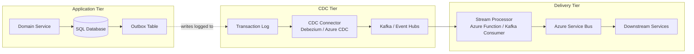
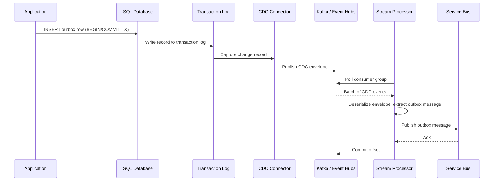

> [!success] Mastery Check
> - [ ] **Studied Well**
> - [ ] **Can explain the concept without notes**
> - [ ] **Can answer interview questions confidently**
> - [ ] **Can implement it in a real project**

## Navigation

**Domain:** [[7 — System Design & Distributed Systems]] > **Group:** Integration Patterns
**Previous:** [[7.123 — Outbox Pattern — Polling Publisher]] | **Next:** [[7.125 — Outbox Pattern — Idempotent Publishing]]

### Prerequisites
- [[7.121 — Outbox Pattern — Reliable Event Publishing]] — required because CDC is an alternative delivery mechanism for the outbox pattern, not a replacement for the outbox table itself
- [[7.135 — Change Data Capture — Concept and Use Cases]] — needed to understand how database transaction logs can be consumed as a stream of events

### Where This Fits

The CDC-based outbox approach replaces the polling publisher with a change data capture pipeline. Instead of a BackgroundService periodically querying the outbox table, a CDC connector (Debezium, Azure SQL CDC) streams every insert to the outbox table directly from the database transaction log. This eliminates polling overhead, reduces event delivery latency from seconds to sub-second, and decouples event delivery from application code. A .NET engineer encounters this when the polling publisher cannot keep up with throughput (>5,000 events/second), or when the latency SLO requires sub-second event delivery. It is also common in event sourcing architectures where the outbox table doubles as the event store. The CDC approach is the natural evolution of the outbox pattern for high-throughput systems because it leverages the database's built-in change tracking infrastructure.

## Core Mental Model

The CDC-based outbox treats the outbox table as a commit log. When the application writes an outbox row as part of its transaction, the database engine records that insert in its transaction log. A CDC connector reads the log asynchronously and publishes each insert as a message to the broker. The invariant is: every committed outbox row eventually appears as a message in the broker, with no polling, no application-level retry logic, and no explicit mark-processed step. The tradeoff is infrastructure complexity — you introduce CDC connectors, a streaming platform (typically Kafka), and the operational burden of managing them. The recognition trigger is a polling publisher whose database CPU usage grows with throughput because of the repeated `SELECT` queries on the outbox table.





### Classification

The CDC-based outbox sits at the intersection of database infrastructure and stream processing. It replaces the application-level polling publisher with an infrastructure-level log reader. It solves the problem of delivering events from a database to a broker without application-level polling. It does not solve the consistency problem that motivates the outbox pattern — the outbox table is still required. It only changes the delivery mechanism. The CDC approach is part of a family of streaming data patterns that also include event sourcing, materialized views, and CQRS projection.

### Key Properties / Guarantees

|Property|Value|Condition|
|---|---|---|
|Latency|Sub-second (100-500ms P99)|Enough CDC capacity provisioned|
|Throughput|100,000+ events/second|Kafka cluster sized appropriately|
|DB impact|Minimal (log reader, no queries)|CDC capture job + log size|
|Delivery guarantee|At-least-once (log offset tracking)|CDC connector commits offset after broker ack|
|Ordering|Per-table, per-row (capture order)|Single partition in Kafka|
|Operational complexity|High (Kafka, Debezium, stream processor)|Requires dedicated infrastructure team|
|Schema evolution impact|High — schema changes require CDC capture instance updates|Requires coordinated migration|
|Infrastructure cost|$500-2,000/month (Kafka + connectors)|3-node Kafka cluster minimum|

## Deep Mechanics

### How It Works

**Step 1 — Write to outbox table.** The application writes an `OutboxMessage` row within its database transaction, exactly as in the standard outbox pattern. No application-level publisher is needed. The outbox table does not need a `ProcessedAt` column because the CDC pipeline handles delivery — every row in the table is automatically "pending" from the moment it is committed.

**Step 2 — Transaction log capture.** The database engine records the insert in its transaction log. SQL Server CDC's capture job, PostgreSQL's logical replication slot, or MySQL's binlog reader picks up the change. For SQL Server CDC, the `cdc.dbo_OutboxMessages_CT` table receives one row per insert with `__$operation = 2` (insert). The capture job runs on a configurable polling interval (default 5 seconds, can be reduced to 1 second).

**Step 3 — Stream to Kafka/Event Hubs.** Debezium (or Azure SQL CDC's Kafka connector) reads from the capture table or logical replication slot and publishes each change event to a Kafka topic. The event payload includes the before/after images of the row, along with metadata (operation type, timestamp, LSN/offset). Debezium's `ExtractNewRecordState` transform flattens the envelope to include only the after-image.

**Step 4 — Transform and route.** A stream processor (Azure Function, Kafka Streams, or a small .NET console app running as a Kafka consumer) reads from the Kafka topic, deserializes the CDC envelope, extracts the outbox message payload, and publishes it to the target broker (Azure Service Bus, RabbitMQ). This step can also filter, transform, or enrich the event.

**Step 5 — Offset commit.** The CDC connector commits its offset (Kafka offset or LSN) after confirming the event was published to the Kafka topic. The stream processor commits its Kafka offset after confirming the event was published to the target broker. This provides end-to-end at-least-once delivery.

### Failure Modes

**CDC capture job falls behind.** The SQL Server CDC capture job runs as a SQL Agent job. Under high write load, the capture job may not keep up with the transaction log. The log grows, and CDC capture latency increases.

- **Detection:** `cdc_capture_latency_seconds` (time between a transaction commit and its capture). `log_growth_rate_mb_per_hour` increases.
- **Metric:** Alert when capture latency exceeds 60 seconds.
- **Recovery:** Increase the capture job's polling frequency. Add more CPU to the SQL Server instance. Partition the outbox table to parallelize capture.

**Kafka broker unavailable.** The CDC connector cannot publish to Kafka. It retries and eventually stops, retaining its offset position. When Kafka recovers, the connector resumes from the last committed offset.

- **Detection:** `kafka_connector_lag` (number of records not yet published). Connector task state shows "FAILED."
- **Metric:** Alert when connector lag exceeds 10,000 records.
- **Recovery:** The connector resumes automatically when Kafka is restored. For extended outages, the transaction log grows and must be monitored for log space exhaustion.

**Stream processor crash after publishing to target broker but before committing Kafka offset.** The event was delivered to Azure Service Bus, but the Kafka offset was not committed. On restart, the stream processor reads the same Kafka message and publishes the event again. This produces duplicates at the target broker.

- **Detection:** Consumer-side deduplication logs show duplicate events. Target broker queue depth shows unexpected re-deliveries.
- **Metric:** `stream_processor_duplicate_publish_ratio`.
- **Recovery:** Exactly the same as the polling publisher's mark-processed gap — consumer-side idempotency is required. The CDC approach does not eliminate duplicates; it just moves the gap from the publisher's mark-step to the stream processor's offset-commit-step.

**Logical replication slot growing unbounded.** PostgreSQL's logical replication slot retains WAL data that has not been consumed. If the CDC consumer is down for an extended period, the WAL grows until disk space is exhausted.

- **Detection:** `pg_replication_slots` shows `active = false` with `wal_lag_bytes > threshold`. Disk usage on the WAL volume approaches 100%.
- **Metric:** Alert when any replication slot's lag exceeds 10 GB.
- **Recovery:** Restart the consumer immediately. If the consumer cannot be recovered, drop and recreate the replication slot (losing unconsumed events). Monitor WAL disk space with a separate alert.

**CDC connector schema mismatch after outbox table schema change.** A new column is added to the `OutboxMessages` table. The CDC capture instance still uses the old schema. The Debezium connector fails when it receives events with unexpected columns.

- **Detection:** Debezium connector logs show "Schema mismatch" or "column not found." Connector task transitions to FAILED state.
- **Metric:** `cdc_connector_error_count`. Alert on any non-zero value.
- **Recovery:** Drop and recreate the CDC capture instance on the outbox table. Restart the Debezium connector with a new snapshot.

**.NET and Azure Integration**

- **ASP.NET Core:** No direct integration — the CDC pipeline operates outside the application process
- **Azure SQL Database CDC:** Built-in; enable with `sys.sp_cdc_enable_table` on the `OutboxMessages` table
- **Azure Event Hubs:** Acts as the Kafka-compatible streaming platform — use `EventHubsConsumerClient` with `PartitionReceiver` in the stream processor
- **Azure Functions:** Use `EventHubsTrigger` to consume CDC events directly from Event Hubs and publish to Service Bus
- **Debezium:** Deploy as a Kafka Connect connector; use `io.debezium.connector.sqlserver.SqlServerConnector`
- **.NET libraries:** `Azure.Messaging.EventHubs` for consuming from Event Hubs; `Confluent.Kafka` if using raw Kafka
- **Azure Monitor:** Track `cdc_capture_latency`, `kafka_connector_lag`, and `stream_processor_lag` in a unified dashboard
- **Azure Monitor KQL query for CDC pipeline health:**
  ```kusto
  // CDC pipeline health dashboard
  let window = 5m;
  Perf
  | where TimeGenerated > ago(window)
  | where CounterName in (
      "cdc_capture_latency_seconds",
      "kafka_connector_lag",
      "stream_processor_lag",
      "outbox_table_size_gb"
  )
  | summarize avg(CounterValue) by CounterName, bin(TimeGenerated, 1m)
  | render timechart
  ```
- **Azure Kubernetes Service:** Deploy Kafka (Strimzi operator or Confluent Operator) on AKS for managed Kafka on Azure

```csharp
// Azure Function that consumes CDC events from Event Hubs and routes to Service Bus
public sealed class OutboxCdcFunction
{
    private readonly ServiceBusSender _sender;

    public OutboxCdcFunction(ServiceBusClient serviceBusClient)
    {
        _sender = serviceBusClient.CreateSender("outbox-events");
    }

    [Function("OutboxCdcProcessor")]
    public async Task Run(
        [EventHubTrigger("outbox-cdc", Connection = "EventHubConnection")] 
        EventData[] events,
        CancellationToken ct)
    {
        foreach (var eventData in events)
        {
            var cdcEnvelope = JsonSerializer.Deserialize<CdcEnvelope>(eventData.EventBody);
            if (cdcEnvelope?.Payload?.After is null)
                continue;

            var outboxMessage = cdcEnvelope.Payload.After;
            var serviceBusMessage = new ServiceBusMessage(outboxMessage.Payload)
            {
                MessageId = outboxMessage.Id,
                PartitionKey = outboxMessage.PartitionKey,
                Subject = outboxMessage.EventType,
                ContentType = "application/json"
            };

            await _sender.SendMessageAsync(serviceBusMessage, ct);
        }
    }
}
```

## Production Patterns and Implementation

### Primary Implementation

The CDC-based outbox requires three infrastructure components and one application component:

**Infrastructure 1 — Enable CDC on the Outbox table.** For SQL Server:

```sql
-- Enable CDC on the database
EXEC sys.sp_cdc_enable_db;

-- Enable CDC on the OutboxMessages table
EXEC sys.sp_cdc_enable_table
    @source_schema = N'dbo',
    @source_name = N'OutboxMessages',
    @role_name = NULL,
    @filegroup_name = N'PRIMARY',
    @supports_net_changes = 1;

-- Verify
SELECT * FROM cdc.dbo_OutboxMessages_CT;

-- Monitor CDC capture job status
EXEC sys.sp_cdc_help_jobs;
```

**Infrastructure 2 — Debezium connector (Kafka Connect).** Deploy the Debezium SQL Server connector via Kafka Connect REST API:

```json
{
  "name": "outbox-connector",
  "config": {
    "connector.class": "io.debezium.connector.sqlserver.SqlServerConnector",
    "database.hostname": "orders-sql.database.windows.net",
    "database.port": "1433",
    "database.user": "cdc_user",
    "database.password": "${env:CDC_PASSWORD}",
    "database.dbname": "OrderingDb",
    "database.server.name": "ordering-server",
    "table.include.list": "dbo.OutboxMessages",
    "snapshot.mode": "initial",
    "offset.storage": "org.apache.kafka.connect.storage.KafkaOffsetBackingStore",
    "topic.prefix": "cdc-outbox",
    "transforms": "unwrap",
    "transforms.unwrap.type": "io.debezium.transforms.ExtractNewRecordState",
    "poll.interval.ms": "500"
  }
}
```

**Infrastructure 3 — Stream processor.** A .NET worker that consumes from the Kafka topic (or Event Hubs) and publishes to Service Bus:

```csharp
public sealed class OutboxCdcStreamProcessor : BackgroundService
{
    private readonly EventHubConsumerClient _consumer;
    private readonly ServiceBusSender _sender;
    private readonly ILogger<OutboxCdcStreamProcessor> _logger;

    public OutboxCdcStreamProcessor(
        EventHubConsumerClient consumer,
        ServiceBusSender sender,
        ILogger<OutboxCdcStreamProcessor> logger)
    {
        _consumer = consumer;
        _sender = sender;
        _logger = logger;
    }

    protected override async Task ExecuteAsync(CancellationToken stoppingToken)
    {
        await _consumer.ProcessEventsAsync(
            new PartitionReceiverOptions
            {
                Identifier = "outbox-processor",
                OwnerLevel = 0
            },
            async args =>
            {
                foreach (var eventData in args.Events)
                {
                    try
                    {
                        await ProcessEventAsync(eventData, stoppingToken);
                    }
                    catch (Exception ex)
                    {
                        _logger.LogError(ex, "Failed to process CDC event");
                        throw; // Let the consumer infrastructure handle retry
                    }
                }
            },
            stoppingToken);
    }

    private async Task ProcessEventAsync(EventData eventData, CancellationToken ct)
    {
        // Deserialize CDC envelope
        var envelope = eventData.EventBody.ToObjectFromJson<CdcEnvelope>();

        // Extract the outbox message (after-image of the insert)
        var outboxRecord = envelope?.Payload?.After;
        if (outboxRecord is null)
            return;

        // Publish to Service Bus
        var serviceBusMessage = new ServiceBusMessage(outboxRecord.Payload)
        {
            MessageId = outboxRecord.Id,
            PartitionKey = outboxRecord.PartitionKey,
            Subject = outboxRecord.EventType,
            ContentType = "application/json"
        };

        await _sender.SendMessageAsync(serviceBusMessage, ct);
        _logger.LogInformation("Delivered outbox event {EventId} via CDC", outboxRecord.Id);
    }
}

// CDC envelope model
public sealed record CdcEnvelope(
    string Schema,
    CdcPayload Payload);

public sealed record CdcPayload(
    string Op,        // "c" = create, "u" = update, "d" = delete
    long TsMs,
    OutboxRecord? Before,
    OutboxRecord? After);

public sealed record OutboxRecord(
    string Id,
    string EventType,
    string PartitionKey,
    string Payload,
    DateTime CreatedAt);
```

**Application — No publisher needed.** The application only writes to the outbox table within its transaction. No `OutboxPublisher` background service is deployed. The CDC pipeline handles delivery.

### Configuration and Wiring

```csharp
// Program.cs — Stream processor registration
builder.Services.AddSingleton(sp =>
{
    var config = sp.GetRequiredService<IConfiguration>();
    return new EventHubConsumerClient(
        "$Default",
        config["EventHub:ConnectionString"],
        config["EventHub:Name"]);
});

builder.Services.AddSingleton(sp =>
{
    var client = sp.GetRequiredService<ServiceBusClient>();
    return client.CreateSender(config["ServiceBus:OutboxTopic"]);
});

builder.Services.AddHostedService<OutboxCdcStreamProcessor>();

// Health checks for the CDC pipeline
builder.Services.AddHealthChecks()
    .AddCheck<CdcPipelineHealthCheck>("cdc_pipeline");
```

```json
{
  "EventHub": {
    "ConnectionString": "Endpoint=sb://...",
    "Name": "outbox-cdc"
  },
  "ServiceBus": {
    "OutboxTopic": "outbox-events"
  },
  "Cdc": {
    "CaptureIntervalSeconds": 1,
    "ConnectorTimeoutSeconds": 30,
    "MaxBatchSize": 100
  }
}
```

### Common Variants

**Azure SQL CDC → Azure Functions (no Kafka).** Skip Kafka entirely by using Azure SQL CDC with Azure Functions. The Function polls the CDC capture table or uses the SQL trigger (preview). This eliminates Kafka operational overhead for teams already on Azure.

```csharp
// Azure Function with SQL trigger (preview at time of writing)
public static class OutboxSqlFunction
{
    [FunctionName("OutboxSqlFunction")]
    public static async Task Run(
        [SqlTrigger("[dbo].[OutboxMessages]", ConnectionStringSetting = "SqlConnection")]
        IReadOnlyList<SqlChange<OutboxMessage>> changes,
        [ServiceBus("outbox-events", Connection = "ServiceBusConnection")]
        IAsyncCollector<ServiceBusMessage> output,
        ILogger log)
    {
        foreach (var change in changes.Where(c => c.Operation == SqlChangeOperation.Insert))
        {
            var message = new ServiceBusMessage(change.Item.Payload)
            {
                MessageId = change.Item.Id.ToString("N"),
                PartitionKey = change.Item.PartitionKey
            };
            await output.AddAsync(message);
        }
    }
}
```

**No-stream-processor variant (Debezium → Service Bus directly).** Use the Debezium Service Bus Sink Connector (community) to publish directly from Kafka to Service Bus, eliminating the stream processor entirely. Tradeoff: less control over message transformation.

**PostgreSQL logical replication variant.** For PostgreSQL, use logical replication slots and the `pgoutput` plugin instead of SQL Server CDC. Debezium's PostgreSQL connector uses the same architecture but reads from `pg_logical_slot_get_changes` instead of CDC tables.

```sql
-- PostgreSQL: Create publication for outbox table
CREATE PUBLICATION outbox_pub FOR TABLE dbo.OutboxMessages;
SELECT * FROM pg_create_logical_replication_slot('outbox_slot', 'pgoutput');
```

**Azure SQL Change Tracking (lighter alternative).** Change Tracking identifies changed rows but does not capture before/after images. It is simpler to set up but requires the stream processor to query the full row from the outbox table.

```csharp
// Azure SQL Change Tracking — lighter weight than CDC
public sealed class ChangeTrackingOutboxProcessor : BackgroundService
{
    private long _lastVersion;

    protected override async Task ExecuteAsync(CancellationToken ct)
    {
        while (!ct.IsCancellationRequested)
        {
            var changes = await QueryChangesAsync(_lastVersion, ct);
            foreach (var change in changes)
            {
                var message = await LoadOutboxMessageAsync(change.Id, ct);
                await _sender.SendMessageAsync(message, ct);
            }
            _lastVersion = changes.Any() ? changes.Max(c => c.Version) : _lastVersion;
            await Task.Delay(1000, ct);
        }
    }

    private async Task<IReadOnlyList<ChangeEntry>> QueryChangesAsync(long lastVersion, CancellationToken ct)
    {
        return await _context.Database.SqlQuery<ChangeEntry>(
            $"""
            SELECT ct.[Id], ct.[Version], ct.[OutboxMessageId]
            FROM CHANGETABLE(CHANGES dbo.OutboxMessages, {lastVersion}) ct
            """).ToArrayAsync(ct);
    }
}
```

### Real-World .NET Ecosystem Example

**Azure SQL Database with Change Tracking and Azure Functions** is the most common CDC-based outbox in the Azure + .NET ecosystem. Change Tracking (not CDC) is a lighter-weight alternative that identifies changed rows but does not capture the before/after image. Many .NET teams start with Change Tracking for simplicity and migrate to CDC when before-images are needed for conflict resolution.

**Debezium + Kafka Connect** is the most widely deployed CDC framework across all platforms. It supports SQL Server, PostgreSQL, MySQL, MongoDB, and Oracle. In the .NET ecosystem, it is typically used when the team already operates Kafka for other event streaming workloads. The Debezium SQL Server connector is the most battle-tested CDC connector for .NET + Azure environments.

**Azure Data Factory + Event Hubs** is an alternative for teams that prefer a managed CDC experience without managing Kafka Connect. ADF can be configured to continuously replicate changes from Azure SQL Database to Event Hubs, reducing operational burden.

**CDC with dual-write fallback.** For teams migrating from polling to CDC, a dual-write approach provides a safe transition. The application keeps the existing polling publisher running (at a reduced frequency — every 30 seconds instead of every second) while the CDC pipeline handles the primary delivery. The polling publisher acts as a fallback for any events the CDC pipeline misses. This is particularly useful during the initial migration when the CDC pipeline is still being tuned.

```csharp
public sealed class DualDeliveryOutboxPublisher : BackgroundService
{
    private readonly IOutboxStore _store;
    private readonly ServiceBusSender _sender;
    private readonly TimeSpan _fallbackInterval = TimeSpan.FromSeconds(30);
    private readonly TimeSpan _cdcLatencyThreshold = TimeSpan.FromSeconds(5);

    protected override async Task ExecuteAsync(CancellationToken ct)
    {
        while (!ct.IsCancellationRequested)
        {
            // Only poll for events that are older than the CDC latency threshold
            // If CDC is working, events younger than 5 seconds are handled by the pipeline
            var cutoff = DateTime.UtcNow - _cdcLatencyThreshold;
            var pending = await _store.GetPendingOlderThanAsync(cutoff, 200, ct);

            foreach (var msg in pending)
            {
                var sbMsg = new ServiceBusMessage(msg.Payload)
                {
                    MessageId = msg.IdempotencyKey,
                    PartitionKey = msg.PartitionKey,
                    Subject = msg.EventType
                };
                await _sender.SendMessageAsync(sbMsg, ct);
                await _store.MarkProcessedAsync(msg.Id, ct);
            }

            await Task.Delay(_fallbackInterval, ct);
        }
    }
}
```

The dual-write approach also provides a monitoring signal: the polling publisher's batch size should be near zero when CDC is healthy. Alert when the fallback batch consistently exceeds 10 events — this indicates CDC latency is degrading and investigation is needed.

## Gotchas and Production Pitfalls

### 1. Transaction log growth during CDC connector downtime

**Pitfall:** Kafka goes down for 2 hours. The Debezium connector stops consuming. SQL Server CDC retains the transaction log entries until the connector reads them. The log grows by 10 GB/hour at 1,000 events/second.

```sql
-- ❌ No monitoring on log growth
-- Transaction log grows until disk space exhausted
```

**Symptom:** SQL Server error 9002: "The transaction log for database 'OrderingDb' is full." All write operations fail.

**Fix:** Monitor log growth with an alert. Configure the CDC capture job to run more frequently. Set `ADDITIONAL_LOG_BACKUP` to ensure log truncation still happens (though this loses CDC data for the gap period).

```sql
-- ✅ Monitor log space
SELECT 
    name,
    log_size_mb = CAST(size/128.0 AS DECIMAL(10,2)),
    log_space_used_pct = CAST(FILEPROPERTY(name, 'SpaceUsed') / size * 100 AS DECIMAL(5,2))
FROM sys.database_files
WHERE type_desc = 'LOG';
```

**Cost of not fixing:** The database goes into read-only mode at 2 AM. All orders fail to process. Recovery requires a manual log backup and connector restart. Estimated downtime: 45 minutes.

### 2. CDC capture job cannot keep pace with write throughput

**Pitfall:** The application writes 20,000 events/second to the outbox table. The SQL Server CDC capture job (default: runs every 5 seconds) captures only 5,000 events/second. The backlog grows.

```sql
-- ❌ Default capture job interval — too slow
EXEC sys.sp_cdc_change_job @job_type = 'capture', @pollinginterval = 5;
```

**Symptom:** `cdc_capture_latency_seconds` grows to minutes. The Debezium connector reads events that are 5 minutes old, violating the sub-second latency SLO.

**Fix:** Increase the capture job's polling frequency. Add indexes on the CDC change table. Consider partitioning the outbox table.

```sql
-- ✅ Increase capture job frequency
EXEC sys.sp_cdc_change_job 
    @job_type = 'capture', 
    @pollinginterval = 1; -- Poll every 1 second

-- Add index on CDC change table
CREATE NONCLUSTERED INDEX IX_CDC_OutboxMessages_Operation
ON cdc.dbo_OutboxMessages_CT (__$start_lsn, __$operation);
```

**Cost of not fixing:** Event delivery latency degrades from 200ms to 5 minutes. The downstream inventory service runs stale inventory counts. Customer-facing "low stock" warnings are incorrect.

### 3. Schema changes to the outbox table break the CDC connector

**Pitfall:** A developer adds a column to the `OutboxMessages` table via EF Core migration. The CDC capture table is not automatically updated. The Debezium connector receives events with the new schema but cannot deserialize them.

```csharp
// ❌ Adding a column requires CDC schema update
public class OutboxMessage
{
    public string NewMetadata { get; set; } // Breaks CDC
}
```

**Symptom:** Debezium connector fails with `Schema mismatch` error. Connector task goes into FAILED state. Events stop flowing.

**Fix:** Before adding a column, update the CDC capture instance to include the new column.

```sql
-- ✅ Re-create CDC capture instance with new column
EXEC sys.sp_cdc_disable_table
    @source_schema = 'dbo',
    @source_name = 'OutboxMessages',
    @capture_instance = 'dbo_OutboxMessages';

EXEC sys.sp_cdc_enable_table
    @source_schema = 'dbo',
    @source_name = 'OutboxMessages',
    @role_name = NULL,
    @supports_net_changes = 1;
```

**Cost of not fixing:** A routine EF Core migration causes a production incident. The CDC pipeline is down for 2 hours while the team investigates the connector failure. Event delivery latency breaches SLO.

### 4. Duplicate events from stream processor restart

**Pitfall:** The stream processor crashes after publishing to Service Bus but before committing the Kafka offset. On restart, it re-reads the same Kafka message and publishes a duplicate.

```csharp
// ❌ No consumer-side idempotency — duplicates expected
// Stream processor just publishes whatever it reads from Kafka
```

**Symptom:** Downstream consumers see duplicate events. Consumer logs show "Duplicate messageId: xxx" entries.

**Fix:** Acknowledge that CDC-based outbox produces duplicates (same as polling-based outbox). The consumer must be idempotent via the inbox pattern ([[7.126]]). Additionally, enable idempotent publishing on the Service Bus sender:

```csharp
// ✅ Enable idempotent publishing (reduces but does not eliminate duplicates)
var sender = serviceBusClient.CreateSender("outbox-events", new ServiceBusSenderOptions
{
    EnableIdempotentPublishing = true
});
```

**Cost of not fixing:** Without consumer-side idempotency, duplicate events cause duplicate payment charges, duplicate notifications, or duplicate inventory deductions. Financial reconciliation is required.

### 5. Kafka topic partition count limits ordering scope

**Pitfall:** The outbox CDC topic is created with 6 partitions. Events for the same aggregate (same `PartitionKey`) are distributed across partitions because the default partitioner uses the key's hash. Events for the same order land in different partitions and are consumed out of order.

```bash
# ❌ Multiple partitions — no ordering guarantee per aggregate
kafka-topics --create --topic cdc-outbox --partitions 6 --replication-factor 3
```

**Symptom:** The stream processor emits "OrderShipped" before "OrderPlaced" for the same order. The shipping service attempts to ship an unconfirmed order.

**Fix:** Use a single partition for the outbox topic, or configure the producer to use the outbox message's `PartitionKey` as the Kafka message key so all events for the same aggregate go to the same partition.

```bash
# ✅ Single partition — guarantees ordering
kafka-topics --create --topic cdc-outbox --partitions 1 --replication-factor 3
```

**Cost of not fixing:** The e-commerce platform ships orders that were not confirmed. Operational cost: shipping fees + return logistics for 50 mis-shipped orders/day during peak season.

### 6. Debezium snapshot locks the outbox table

**Pitfall:** When a Debezium connector starts for the first time, it performs a snapshot of the outbox table. By default, this acquires a table-level lock. If the outbox table is large (millions of rows), the lock blocks application writes for the duration of the snapshot.

```sql
-- ❌ Default snapshot mode locks the table
-- snapshot.mode = "initial" locks the table during snapshot
```

**Symptom:** Application write latency spikes during connector initialization. The `Orders` table is also blocked because the outbox table shares the same database. API calls time out.

**Fix:** Use `snapshot.mode = "initial_only"` with a separate initial load, or use `"snapshot.mode": "no_data"` if only new changes are needed. For production, use `"snapshot.mode": "schema_only"` and backfill the outbox table data separately.

```json
{
  "snapshot.mode": "schema_only",
  "snapshot.lock.mode": "none"
}
```

**Cost of not fixing:** During a fresh deployment, the connector snapshot locks the outbox table for 10 minutes. The API is effectively down for 10 minutes. All orders fail during that window.

### 7. Outbox table has no ProcessedAt column — cleanup requires alternative strategy

**Pitfall:** Since CDC reads directly from inserts, the outbox table no longer needs a `ProcessedAt` column. But without it, there is no way to distinguish "pending" from "processed" rows for cleanup. All rows accumulate indefinitely.

```sql
-- ❌ All rows accumulate — no way to know what was processed
-- CDC table only captures inserts, not reads or marks
```

**Symptom:** The outbox table grows unbounded. Disk fills up. Queries on the outbox table become slower.

**Fix:** Add a `ConsumedAt` column that the stream processor (or a separate cleanup job) sets after delivery. Or use a partitioned table and drop partitions after the retention period. Or use a separate tracking table.

```sql
-- ✅ Add consumed tracking for cleanup
ALTER TABLE dbo.OutboxMessages ADD ConsumedAt DATETIME2 NULL;

-- Cleanup job
DELETE FROM dbo.OutboxMessages 
WHERE ConsumedAt IS NOT NULL 
  AND ConsumedAt < DATEADD(HOUR, -48, GETUTCDATE());
```

**Cost of not fixing:** The outbox table grows by 10 GB/day. After 30 days, the table is 300 GB. Database restore time exceeds the RTO. Index rebuilds take hours.

### 8. Debezium offset commit race on connector restart

**Pitfall:** The Debezium connector stores its offset in Kafka (`offset.storage = KafkaOffsetBackingStore`). On restart, the connector reads the last committed offset and resumes from that point. But if the connector processed a batch of changes and wrote some to Kafka before crashing, but had not committed the offset, the batch is partially published. On restart, the connector replays events from the last committed offset — producing duplicates for events already in the Kafka topic.

```json
{
  "offset.storage": "org.apache.kafka.connect.storage.KafkaOffsetBackingStore",
  "offset.flush.interval.ms": "60000"
}
```

**Symptom:** The Kafka topic contains duplicate events for a short window around the connector restart. Downstream consumers see duplicate messages. The duplicate count corresponds to the `offset.flush.interval.ms` window.

**Metric:** `kafka_topic_duplicate_ratio` spikes during connector restarts. Cross-reference with `connect_offset_flush_time_ms` to confirm the root cause.

**Fix:** Reduce the offset flush interval to minimize the replay window. Accept that CDC-based outbox still produces at-least-once delivery — consumers must be idempotent.

```json
{
  "offset.flush.interval.ms": "5000",
  "offset.flush.timeout.ms": "10000"
}
```

**Cost of not fixing:** A rolling update of the Kafka Connect cluster (6 workers, 30 seconds each) produces duplicate events for a 60-second window per worker. Total duplicate window: 3 minutes. Consumers receive 3,000+ duplicate events. Without consumer-side idempotency, this causes data inconsistencies.

**Pitfall:** Since CDC reads directly from inserts, the outbox table no longer needs a `ProcessedAt` column. But without it, there is no way to distinguish "pending" from "processed" rows for cleanup. All rows accumulate indefinitely.

```sql
-- ❌ All rows accumulate — no way to know what was processed
-- CDC table only captures inserts, not reads or marks
```

**Symptom:** The outbox table grows unbounded. Disk fills up. Queries on the outbox table become slower.

**Fix:** Add a `ConsumedAt` column that the stream processor (or a separate cleanup job) sets after delivery. Or use a partitioned table and drop partitions after the retention period. Or use a separate tracking table.

```sql
-- ✅ Add consumed tracking for cleanup
ALTER TABLE dbo.OutboxMessages ADD ConsumedAt DATETIME2 NULL;

-- Cleanup job
DELETE FROM dbo.OutboxMessages 
WHERE ConsumedAt IS NOT NULL 
  AND ConsumedAt < DATEADD(HOUR, -48, GETUTCDATE());
```

**Cost of not fixing:** The outbox table grows by 10 GB/day. After 30 days, the table is 300 GB. Database restore time exceeds the RTO. Index rebuilds take hours.

## Tradeoffs and Decision Framework

### Tradeoff Matrix

|Dimension|CDC-Based Outbox (Debezium+Kafka)|CDC-Based Outbox (Azure SQL+Functions)|Polling-Based Outbox|Direct Publish (No Outbox)|
|---|---|---|---|---|
|Latency|Sub-second (~200ms)|~1 second (poll interval)|Polling interval + batch time (~1.1s)|Immediate|
|Throughput|100,000+ events/s|10,000+ events/s|~5,000 events/s per instance|~10,000 events/s|
|DB impact|Minimal (log reader)|Minimal (log reader)|SELECT + UPDATE overhead per cycle|None (if no outbox table)|
|Infrastructure complexity|High (Kafka, Debezium, Kafka Connect)|Medium (Azure Functions, Event Hubs)|Low (BackgroundService only)|Low|
|Durability during broker outage|High (log retains events)|High (log retains events)|High (outbox table retains events)|None (events lost)|
|Operational skill required|Specialized (CDC, Kafka, Kafka Connect)|Medium (Azure Functions)|Standard .NET development|Standard .NET development|
|Schema evolution|Breaking (capture instance must be updated)|Breaking|Non-breaking (new columns ignored)|Non-breaking|
|Infrastructure cost|$1,000-2,000/month|$200-500/month|$0 (in-process)|$0|

### When to Apply

```mermaid
flowchart TD
    A[Trigger: outbox event delivery latency or throughput requirements] --> B{Latency SLO < 1 second?}
    B -->|Yes| C{Throughput > 5,000 events/s?}
    B -->|No| D[Polling publisher — simpler, sufficient]
    C -->|Yes| E{Team has CDC/Kafka expertise?}
    C -->|No| F{DB CPU > 60% from polling?}
    F -->|Yes| E
    F -->|No| D
    E -->|Yes| G{Existing Kafka infrastructure?}
    E -->|No| H[Partitioned polling or<br>Azure SQL CDC + Functions (no Kafka)]
    G -->|Yes| I[CDC-based outbox — Debezium + Kafka]
    G -->|No| H
    I --> J[Sub-second latency, high throughput]
    H --> J
```

### When NOT to Apply

- [ ] The team has no operational experience with Kafka, CDC, or stream processing — the learning curve is steep
- [ ] The event throughput is below 500 events/second — polling publisher with READPAST handles this easily
- [ ] The database transaction log is not retained long enough to support CDC offsets (e.g., frequent log backups that truncate before the connector reads)
- [ ] Schema changes to the outbox table are frequent — each schema change requires a CDC capture instance update
- [ ] The latency SLO is minutes, not seconds — polling publisher is simpler and adequate
- [ ] The infrastructure budget is constrained — Kafka clusters and Debezium connectors add significant cost
- [ ] The team does not have 24/7 coverage for Kafka cluster incidents — CDC pipeline failures require specialized knowledge to debug
- [ ] The outbox table is in a database that does not support CDC (e.g., Azure SQL Database Basic tier, SQL Server Standard without CDC license)

### Scale Thresholds

- **Below 500 events/second:** Polling publisher is the right choice. CDC adds complexity with no benefit.
- **500 — 5,000 events/second:** Polling publisher works but CDC is worth considering if the team already uses Kafka.
- **5,000 — 50,000 events/second:** CDC is strongly recommended. Polling causes significant database overhead at these volumes.
- **Above 50,000 events/second:** CDC is required. The polling approach cannot achieve the needed throughput without partitioning and even then the database scan overhead is prohibitive.
- **Kafka cluster sizing:** For 25,000 events/second with 2 KB payloads, a 3-node Kafka cluster with 100 GB disk per node handles the throughput with replication factor 3. Estimated cost: $1,200/month on Azure (3 × Standard_D2s_v3).

## Interview Arsenal

### Question Bank

1. What problem does the CDC-based outbox approach solve that polling does not?
2. How does CDC ensure at-least-once delivery of outbox events?
3. What happens if the CDC connector crashes and restarts? Where does it resume from?
4. Compare the CDC-based outbox with the polling-based outbox across 4 dimensions.
5. What is a common failure mode when the CDC relay (stream processor) crashes after publishing but before committing its offset?
6. Design a CDC pipeline for outbox events using Azure SQL Database.
7. How does CDC handle schema changes in the outbox table?
8. Why is the consumer still required to implement the inbox pattern even with CDC-based delivery?
9. What happens to the SQL Server transaction log if the CDC connector is down for 4 hours?
10. Compare Debezium + Kafka vs Azure SQL CDC + Functions for a .NET team on Azure.

### Spoken Answers

**Q1: What problem does the CDC-based outbox approach solve that polling does not?**

> **Average answer:** "CDC is faster than polling because it reads from the transaction log instead of querying the table."
>
> **Great answer:** "The CDC-based outbox solves two problems that polling does not. First, it eliminates the database overhead of polling. A polling publisher runs a `SELECT TOP N ... ORDER BY CreatedAt` query every second, scanning for unprocessed rows. At 5,000 events/second, this query becomes progressively slower as the outbox table grows, consuming database CPU and I/O. CDC reads from the transaction log — an append-only sequential structure — so it adds near-zero database overhead regardless of event volume. Second, CDC achieves sub-second latency. A polling publisher's minimum latency is the polling interval plus batch processing time — typically 1-1.5 seconds. CDC captures events as they are committed, so latency is bounded by the CDC capture job frequency plus the streaming pipeline delay — typically 100-500 milliseconds. The tradeoff is complexity: CDC requires a Kafka cluster, a Debezium connector, and a stream processor. For a team that already operates Kafka, the CDC approach is a natural fit. For a team that just needs a simple BackgroundService, polling is the right choice."

**Q4: Compare the CDC-based outbox with the polling-based outbox across 4 dimensions.**

> **Great answer:** "I'll compare across latency, database impact, operational complexity, and throughput. Latency: CDC delivers events in 100-500ms; polling delivers in 1-1.5 seconds (polling interval + batch time). Database impact: CDC reads from the transaction log, adding minimal load; polling runs SELECT + UPDATE queries per cycle, consuming ~10-20% database CPU at 5,000 events/second. Operational complexity: CDC requires Kafka, Debezium, and a stream processor — three infrastructure components to deploy, monitor, and troubleshoot; polling requires a single BackgroundService in the existing application. Throughput: CDC handles 100,000+ events/second with sufficient Kafka capacity; polling tops out around 5,000 events/second per database instance before the SELECT scan overhead becomes prohibitive. The decision framework: use polling unless you exceed 5,000 events/second, need sub-second latency, or already operate Kafka infrastructure."

**Q8: Why is the consumer still required to implement the inbox pattern even with CDC-based delivery?**

> **Great answer:** "Because CDC-based delivery still produces at-least-once semantics. The gap exists between the broker publish and the offset commit in the stream processor. When the stream processor publishes an event to Service Bus and then crashes before committing its Kafka offset, the event will be re-read and re-published on restart. Additionally, the CDC connector itself can produce duplicates if it restarts between writing to Kafka and committing its LSN offset. So two independent at-least-once gaps exist in the CDC pipeline: one at the CDC connector → Kafka stage, and one at the stream processor → Service Bus stage. Consumers must be idempotent regardless of which outbox delivery mechanism you choose — polling or CDC. The inbox pattern ([[7.126]]) stores a deduplication key and rejects duplicates. The CDC approach does not eliminate the duplicate problem; it just moves the gap from the publisher's mark-step to the stream processor's commit-step."

**Q7: How does CDC handle schema changes in the outbox table?**

> **Great answer:** "CDC does not handle schema changes automatically — this is one of its biggest operational pain points. When you add a column to the outbox table, the CDC capture table (e.g., `cdc.dbo_OutboxMessages_CT`) is not updated. The Debezium connector, which has cached the schema, receives events with unexpected columns and fails with a schema mismatch error. The recovery requires dropping and recreating the CDC capture instance on the table, then restarting the connector with a fresh schema snapshot. In production, schema migrations on CDC-enabled tables must be a coordinated multi-step process: first disable the CDC connector, then disable CDC on the table, apply the schema migration, re-enable CDC with the updated column list, and finally restart the connector. This means schema changes take 10-15 minutes of CDC downtime. Teams that make frequent schema changes to the outbox table — for example, adding metadata columns — should consider whether CDC is the right choice, or whether they should instead use a polling publisher that is resilient to schema changes."

**Q10: Compare Debezium + Kafka vs Azure SQL CDC + Functions for a .NET team on Azure.**

> **Great answer:** "Debezium + Kafka is the full-featured approach. It gives you schema management via the Schema Registry, advanced transformations via Kafka Connect SMTs, and multi-database support if you have MySQL, PostgreSQL, or Oracle alongside SQL Server. It requires significant operational expertise: Kafka Connect cluster management, connector configuration, schema evolution handling, and offset management. The infrastructure cost is higher: ~$1,200/month for a 3-node Kafka cluster on Azure. Azure SQL CDC + Functions is the managed approach. It eliminates Kafka and its operational burden. The Function handles deserialization and routing in a few lines of C#. You pay only for the Function executions and Event Hubs throughput — typically $200-500/month. The tradeoff is less flexibility: you are locked into Azure, the SQL trigger for Functions is still in preview, and advanced transformations require additional Function code. For a .NET team on Azure with no Kafka expertise, I recommend starting with Azure SQL CDC + Functions and migrating to Debezium + Kafka if they outgrow it."

**Q2: How does CDC ensure at-least-once delivery of outbox events?**

> **Great answer:** "CDC provides at-least-once delivery through offset tracking at each stage of the pipeline. The CDC connector (Debezium) reads from the database transaction log and tracks its position using a Log Sequence Number (LSN) for SQL Server, or a WAL position for PostgreSQL. After publishing a change event to Kafka, the connector commits the LSN to its offset store. If the connector crashes between publishing to Kafka and committing the offset, it resumes from the last committed LSN and re-publishes those events — producing duplicates. Similarly, the stream processor that reads from Kafka and publishes to Service Bus tracks its Kafka consumer offset. It commits the offset only after Service Bus acknowledges the message. A crash between the publish and the offset commit causes a re-publish. So CDC does not eliminate duplicates — it trades the polling publisher's mark-processed gap for a CDC connector offset gap and a stream processor offset gap. The at-least-once semantics are a property of offset-based consumption, not specific to CDC."

### System Design Interview Trigger

If an interviewer asks "your outbox publisher is polling the database every second and it's causing too much load — how would you fix it?" they are testing whether you know CDC as an alternative delivery mechanism. The follow-up questions will probe whether you understand the infrastructure tradeoffs: "what about the latency?" and "what happens when the CDC connector is down?" The interviewer wants to hear that you understand the operational burden of CDC and that you would not recommend it for a simple low-throughput scenario.

### Comparison Table

| | CDC-Based Outbox | Polling-Based Outbox | Event Sourcing | Azure SQL CDC + Functions |
|---|---|---|---|---|
| Delivery latency | ~200ms | ~1s+ | ~200ms (event store stream) | ~1s (poll-based trigger) |
| DB overhead | Minimal | Moderate | Low (append-only) | Minimal |
| Infrastructure | Kafka + Debezium + Stream Processor | BackgroundService | EventStoreDB | Azure Functions + Event Hubs |
| Duplicate behavior | At-least-once (connector + processor gaps) | At-least-once (mark gap) | At-least-once (subscription gap) | At-least-once (trigger offset gap) |
| .NET code needed | Stream processor only | BackgroundService | Event-sourced aggregates | Azure Function only |
| Infrastructure cost | High ($1,000+/month) | None | Medium ($500-1,000/month for EventStore Cloud) | Low ($200-500/month) |
| Lock-in level | Medium (Kafka ecosystem) | None (SQL-based) | High (EventStoreDB-specific) | High (Azure-specific) |

## Architecture Decision Record

**Status:** Superseded by [[7.123 — Outbox Pattern — Polling Publisher]] (recorded for future reference)

**Context:** The Inventory service handles 25,000 inventory events/second during peak hours. The polling-based outbox publisher consumes 40% of the SQL Server CPU just from the `SELECT TOP 200 ... WHERE ProcessedAt IS NULL ORDER BY CreatedAt` query. The latency SLO is 500ms P99, and the polling publisher achieves 1.2s P99. The team is migrating to an event-driven architecture where the outbox table serves as both an event delivery mechanism and an event store for audit. The team consists of 8 engineers, 3 of whom have prior experience with Kafka from a previous project. The database is Azure SQL Database S12 tier (300 DTU). The current event volume is 25,000 events/second with 3x growth expected within 18 months.

**Options Considered:**

1. **CDC-Based Outbox (Debezium + Kafka + Stream Processor)** — Transaction log capture with Kafka as the streaming backbone
2. **Partitioned Polling Publisher** — 4 publisher instances each responsible for a partition key range
3. **Azure SQL CDC + Event Hubs + Azure Functions** — Microsoft-managed CDC without Kafka
4. **Scale the Database** — Upgrade to S16 (400 DTU) to handle polling overhead
5. **Event Sourcing Migration** — Replace the outbox pattern with EventStoreDB as the primary store

**Decision:** CDC-Based Outbox with Debezium and Kafka, because the throughput and latency requirements exceed polling capabilities, and the team already operates a Kafka cluster for other event streaming workloads. The partition count on the outbox topic is set to 1 to maintain strict ordering. Azure SQL CDC + Functions was rejected because the SQL trigger (preview) is not production-ready for the throughput requirement. Scaling the database was rejected because it only postpones the problem. Event sourcing was rejected because the migration cost is too high for the existing state-based aggregates.

**Consequences:**
- ✅ Database CPU drops from 40% to 5% after removing polling queries
- ✅ Event delivery latency drops from 1.2s to 200ms P99
- ✅ Outbox table serves as a durable event store for audit — no need for explicit ProcessedAt tracking
- ⚠️ Schema changes to the outbox table require CDC capture instance updates — add a mandatory step in the migration runbook
- ⚠️ Kafka cluster must be sized for 25,000 events/second (3 brokers, 100 GB disk each, replication factor 3)
- ⚠️ Transaction log growth during connector downtime must be monitored with an alert at 80% log space usage
- ❌ Operational complexity increased significantly — Kafka Connect, Debezium, and schema registry require dedicated operational knowledge
- ❌ Added $1,200/month infrastructure cost for the Kafka cluster

**Review Trigger:** Revisit this decision if the team's Kafka operational costs exceed the cost of scaling the SQL Server instance to handle polling overhead. At 25,000 events/second, the CDC approach is justified; below 5,000 events/second, polling would be simpler and cheaper. Also revisit if Azure Functions SQL trigger reaches GA and matches the throughput requirements — it could replace Kafka and reduce operational costs.

## Self-Check

### Conceptual Questions

1. What is the core difference in how CDC and polling read events from the outbox table?
2. Why does CDC still produce at-least-once delivery, not exactly-once?
3. What happens to the SQL Server transaction log if the CDC connector is down for 4 hours?
4. What metric would you alert on to detect a failing CDC pipeline?
5. How does the stream processor relate to the polling publisher in terms of responsibility?
6. Compare the infrastructure costs of CDC vs polling at 1,000 events/second.
7. Why might you choose Azure SQL CDC + Event Hubs over Debezium + Kafka?
8. How does a schema migration on the outbox table affect a running CDC pipeline?
9. At what throughput threshold does CDC become compelling over polling?
10. Explain in 60 seconds how CDC delivers outbox events.
11. What is the difference between SQL Server CDC and SQL Server Change Tracking?
12. How do you handle the outbox table cleanup when using CDC (no ProcessedAt column)?
13. What monitoring signals indicate the CDC capture job is falling behind?
14. How does the dual-write fallback approach help during CDC migration?
15. Why might you choose Azure Data Factory over Debezium for CDC ingestion?

<details>
<summary>Answers</summary>

1. Polling queries the table with SELECT/UPDATE. CDC reads insert records from the transaction log — an append-only sequential structure that avoids table scans and locks.
2. Because two at-least-once gaps exist: (1) CDC connector → Kafka (connector writes to Kafka, then commits LSN offset) and (2) stream processor → target broker (processor publishes to Service Bus, then commits Kafka offset). A crash at either boundary causes redelivery.
3. The transaction log cannot be truncated because the CDC connector has not read those log records. The log grows until disk space is exhausted, potentially taking the database offline. Monitoring on log growth is essential when using CDC.
4. `cdc_capture_latency_seconds` > 60s, `kafka_connector_lag` > 10,000, `stream_processor_lag` > 1,000, or the connector task state shows FAILED.
5. Both are responsible for the same thing: receiving events from storage (outbox table or Kafka) and publishing to the broker. The stream processor in the CDC pipeline replaces the polling publisher's role.
6. At 1,000 events/second, polling requires no additional infrastructure (just a BackgroundService). CDC requires a Kafka cluster (3 small brokers), a Debezium connector in Kafka Connect, and a stream processor — estimated $500-1,000/month in Azure.
7. Azure SQL CDC + Event Hubs eliminates Kafka operational overhead (no cluster to manage) and integrates natively with Azure Functions. It's a good choice when the team is already on Azure and wants managed infrastructure. It's limiting if you need multi-cloud portability or advanced stream processing.
8. A schema change (column add/drop) on the outbox table does not automatically propagate to the CDC capture table. The Debezium connector may fail with schema mismatch. The CDC capture instance must be dropped and recreated with the new schema, which requires connector downtime.
9. CDC becomes compelling above ~5,000 events/second (where polling database overhead becomes significant) or when sub-second latency SLO is required. Below 500 events/second, CDC is over-engineering.
10. "When the application writes an event to the outbox table, the database records that insert in its transaction log. A tool like Debezium reads the log in real-time — not by querying the table but by reading the sequential log. It publishes each change to a Kafka topic. A stream processor, written in .NET, reads from Kafka and publishes each event to Azure Service Bus. If Kafka goes down, the transaction log holds the events. If the stream processor crashes, Kafka holds the unconsumed events. The same consumer-side idempotency pattern is needed because there are still at-least-once gaps between each stage."
11. SQL Server CDC captures full before/after images of changed rows and stores them in change tables. It requires SQL Server Enterprise or Standard edition. SQL Server Change Tracking only identifies which rows changed (version numbers) without capturing the actual data. Change Tracking is lighter-weight and works on all editions, but the application must query the full row separately.
12. CDC-based outbox removes the need for a ProcessedAt column — the CDC pipeline reads directly from inserts. But this means all rows accumulate in the table. Options: (a) add a ConsumedAt column that the stream processor sets after delivery, (b) use partitioned table switching to drop old partitions, or (c) run a periodic cleanup job that deletes rows older than the retention period based on CreatedAt.
13. Primary signals: `cdc_capture_latency_seconds` exceeds 60 seconds (time from commit to capture), `log_growth_rate_mb_per_hour` increasing above baseline, `kafka_connector_lag` growing despite adequate Kafka capacity, and the database transaction log file size approaching its maximum. Secondary signal: the dual-write fallback publisher (if configured) consistently finds events older than the CDC latency threshold.
14. Dual-write provides a safety net during CDC migration: the polling publisher catches events the CDC pipeline may have missed, preventing data loss during the transition. It also provides a monitoring signal — a non-zero fallback batch size indicates CDC latency is degrading. Teams can gradually reduce the polling publisher's frequency from 1 second to 30 seconds to once per hour, and eventually remove it when CDC has proven reliable for several weeks.
15. Azure Data Factory (ADF) offers a fully managed CDC experience without Kafka Connect configuration, connector version management, or offset tracking. It integrates directly with Azure SQL Database and Event Hubs with minimal setup. The tradeoffs are: less control over transformation logic, higher per-event cost at scale compared to self-managed Debezium, and vendor lock-in. ADF is a good choice for teams that want CDC with zero Kafka operational overhead and have the Azure budget to absorb the per-event cost.

</details>

---

### Scenario Challenges

**Scenario 1 — Diagnose the problem**

A team deployed a CDC-based outbox using Debezium and Kafka. After 2 weeks of smooth operation, event delivery stopped. The Debezium connector status shows "FAILED" with the error "Table 'OutboxMessages' not found in schema." No changes were made to the outbox table schema.

<details>
<summary>Diagnosis</summary>

**Root cause:** An EF Core migration renamed the `OutboxMessages` table to `OutboxEvents` (via `ToTable("OutboxEvents")` in `IEntityTypeConfiguration`). The CDC capture instance was still configured on `dbo.OutboxMessages`. When the table was renamed, the CDC capture job began failing because the source table no longer existed.

**Evidence:** Migration history shows `20260615_AddOutboxEventsTable` was applied. Debezium logs show "Table dbo.OutboxMessages not found." The old table was dropped by the migration.

**Fix:** The CDC capture must be disabled before the table rename and re-enabled on the new table name.

**Prevention:** Add a pre-migration check that detects CDC-enabled tables and blocks the rename. Include CDC disable/enable steps in the migration script.

</details>

---

**Scenario 2 — Design decision**

You are designing the event delivery mechanism for a startup's analytics platform. The platform generates 200 events/second during peak hours. The team of 4 engineers has experience with ASP.NET Core but not Kafka or Debezium. The latency SLO is 60 seconds. Should you use CDC-based outbox?

<details>
<summary>Decision and Reasoning</summary>

**Choice:** No — use a polling-based outbox ([[7.123]]).

**Tradeoffs accepted:** Polling overhead on the database is negligible at 200 events/second (a query every 5 seconds). The 60-second latency SLO allows a 10-second polling interval. The team can build a BackgroundService in one afternoon. Introducing Kafka + Debezium for 200 events/second would increase infrastructure cost by ~$500/month and require a significant learning investment.

**Implementation sketch:**
```csharp
builder.Services.AddHostedService<SimpleOutboxPublisher>();
// 10-second polling interval, batch size of 100
```

</details>

---

**Scenario 3 — Failure mode** The CDC connector's `kafka_connector_lag` shows 200,000 unconsumed records. The outbox topic in Kafka has 200,000 messages. But the stream processor is not consuming them — its consumer group lag is also 200,000.

<details> <summary>Investigation and Fix</summary>

**Investigation steps:**
1. Check the stream processor's process — is it running? Check `kafka_consumer_group --describe --group outbox-processor`.
2. Check the processor's logs for deserialization errors — if a single message fails deserialization, the processor may be stuck in a retry loop.
3. Check the processor's `while` loop — is an unhandled exception causing the consumer to exit?

**Confirming evidence:** The stream processor logs show `JsonException: "The JSON value could not be converted to OutboxRecord"` on every attempt. A new event type with a different schema was introduced and the processor's CDC envelope model was not updated.

**Immediate mitigation:** Skip the offending messages by advancing the consumer offset past them.

**Permanent fix:** Add a dead-letter queue in the stream processor for messages that fail deserialization. Log the raw payload and move on.

```csharp
try
{
    var envelope = eventData.EventBody.ToObjectFromJson<CdcEnvelope>();
    await ProcessEventAsync(envelope, ct);
}
catch (JsonException ex)
{
    _logger.LogError(ex, "Failed to deserialize CDC event — sending to DLQ");
    await _deadLetterSender.SendMessageAsync(
        new ServiceBusMessage(eventData.EventBody.ToArray()), ct);
}
```

</details>

---

**Scenario 4 — Scale it** Your CDC-based outbox currently handles 10,000 events/second with Debezium + Kafka (3 brokers, 1 partition). The business plans to grow to 100,000 events/second within 6 months. How does the CDC pipeline scale?

<details> <summary>Scaling Strategy</summary>

**Bottleneck this addresses:** The single-partition Kafka topic limits consumption to one stream processor instance. At 100,000 events/second, a single processor cannot keep up.

**How it helps:** Increase the topic partition count to 6 and use a consumer group with 6 stream processor instances. Each instance consumes from one partition, scaling throughput linearly.

**What it does not solve:** The Debezium connector itself is single-threaded per table. At 100,000 events/second, the connector may become the bottleneck. Mitigation: shard the outbox table (e.g., `OutboxMessages_0` through `OutboxMessages_15`) and run one Debezium connector per shard.

**Implementation order:**
1. Increase Kafka topic partition count (requires topic re-creation for partition count changes).
2. Deploy 6 stream processor instances.
3. If the connector bottlenecks, shard the outbox table and deploy 4 parallel connectors.

</details>

---

**Scenario 5 — Interview simulation** The interviewer says: "We're using the outbox pattern with a polling publisher, but at 10,000 events/second the database CPU is at 70% and the latency is 3 seconds. How would you redesign the delivery mechanism?"

<details> <summary>Model Response</summary>

"The bottleneck is the polling query. Every second, the publisher runs `SELECT TOP N ... WHERE ProcessedAt IS NULL ORDER BY CreatedAt`. At 10,000 events/second, the pending queue is always large, and the query has to scan millions of rows to find the next batch. This is fundamentally an O(outbox_size) scan on every poll.

"I would replace the polling publisher with a CDC-based delivery pipeline. Here's the design:

"The application continues writing to the outbox table — that does not change. We enable CDC on the outbox table in SQL Server — either CDC (SQL Server Enterprise) or Change Tracking. The CDC capture job records every insert in the `cdc.dbo_OutboxMessages_CT` table. We deploy a Debezium SQL Server connector in Kafka Connect, which reads the CDC capture table and publishes each outbox insert to a Kafka topic. The Kafka topic has a single partition — this preserves ordering, which is critical for the consumers that need FIFO semantics per aggregate.

"Then a stream processor — a .NET BackgroundService using the Kafka consumer — reads from the topic and publishes to Azure Service Bus. The processor batches events and publishes with idempotent semantics. It commits its Kafka offset only after the Service Bus acknowledgment.

"This eliminates database polling entirely. The database CPU drops from 70% to the baseline for transactional writes. Latency drops from 3 seconds to ~200ms. And the outbox table continues to serve as a durable event store.

"The cost is operational complexity. We need to manage a Kafka cluster, Debezium connectors, and a stream processor. But at 10,000 events/second with a 3-second latency violation, the complexity cost is justified. The downstream consumers still need the inbox pattern — CDC does not eliminate duplicates, it just changes where the at-least-once gap occurs."

</details>
