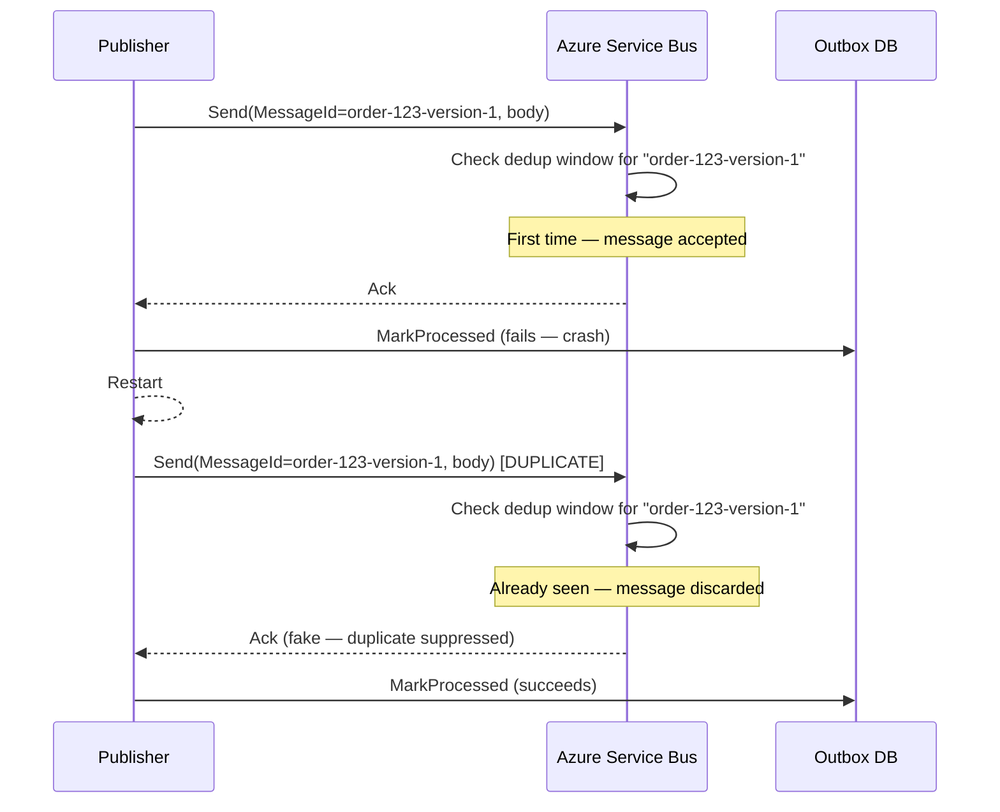
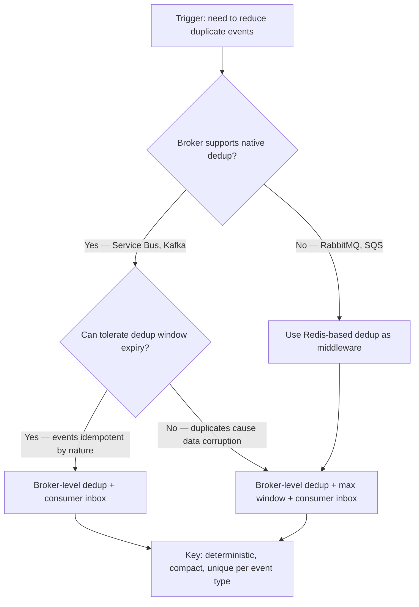

> [!success] Mastery Check
> - [ ] **Studied Well**
> - [ ] **Can explain the concept without notes**
> - [ ] **Can answer interview questions confidently**
> - [ ] **Can implement it in a real project**

## Navigation

**Domain:** [[7 — System Design & Distributed Systems]] > **Group:** Integration Patterns
**Previous:** [[7.124 — Outbox Pattern — Change Data Capture Approach]] | **Next:** [[7.126 — Inbox Pattern — Idempotent Message Consumption]]

### Prerequisites
- [[7.121 — Outbox Pattern — Reliable Event Publishing]] — required because idempotent publishing is a refinement of the outbox pattern, addressing the duplicate events it inherently produces
- [[4.212 — Idempotency Pattern]] — needed because the concept of idempotency (same operation applied N times has the same effect as once) is foundational to this note

### Where This Fits

Idempotent publishing ensures that publishing the same outbox event multiple times does not produce multiple distinct messages in the broker. The outbox pattern inherently produces at-least-once delivery — the publisher may crash after sending to the broker but before marking the event as processed, then re-sends on restart. Without idempotent publishing, each re-send produces a separate broker message, and the consumer sees duplicate events. .NET engineers encounter this in the gap between the publisher's send-step and mark-step — typically when deploying multiple publisher instances, or after any process restart. This note covers producer-side techniques (idempotent keys, broker deduplication) that reduce or eliminate duplicates before they reach the consumer.

## Core Mental Model

Idempotent publishing means that multiple deliveries of the same logical event produce the same observable effect in the broker. The publisher assigns a stable, unique, deterministic identifier — the idempotency key — to each event before sending. The broker (Azure Service Bus, Kafka, RabbitMQ with plugins) uses this key to detect and discard duplicates. The invariant is: for a given idempotency key, the broker stores at most one message. The tradeoff is that the idempotency key must be deterministic across publisher restarts — it must be derived from the business operation, not from a random GUID generated at send time. The recognition trigger is a consumer team complaining about duplicate events and asking the producer to "fix it on your side."



### Classification

Idempotent publishing is a producer-side concern operating at the messaging infrastructure layer. It is scoped to prevent duplicate broker messages from the same logical operation. It does not prevent duplicate consumption — that is the inbox pattern ([[7.126]]). It also does not prevent at-least-once delivery from becoming at-most-once in the presence of broker-level deduplication — it converts "at-least-once + dedup" to "effectively once" at the broker level.

### Key Properties / Guarantees

|Property|Value|Condition|
|---|---|---|
|Deduplication scope|Per idempotency key|Broker dedup window (e.g., Service Bus: 5 min — 7 days)|
|Key source|Business operation ID|Must survive restarts — no random values|
|Delivery semantics|Effectively-once (producer perspective)|Broker dedup enabled and key deterministic|
|Failure mode|Duplicate accepted if key non-deterministic|Publisher crash before mark, GUID-based key|
|Latency overhead|~1ms (hashing/idempotency check)|Negligible|

## Deep Mechanics

### How It Works

**Step 1 — Deterministic key generation.** The application generates a stable idempotency key for each event before writing it to the outbox table. The key is a combination of the aggregate root ID and a version number or a deterministic hash of the event content. Examples: `order-123-event-version-2`, `payment-txn-456-3`.

**Step 2 — Store the key in the outbox row.** The outbox table includes an `IdempotencyKey` column. The same key is used as the broker's `MessageId` when publishing.

**Step 3 — Publish with the key.** The publisher sends the event to the broker with the `MessageId` set to the idempotency key. Azure Service Bus, Kafka (with `enable.idempotence=true`), and RabbitMQ (with idempotent publishing plugin) check this key against a deduplication window.

**Step 4 — Broker deduplication.** If the broker receives a message with a `MessageId` it has already accepted within the deduplication window, it discards the duplicate and returns an acknowledgment as if it were a new message. The publisher never knows the message was a duplicate.

**Step 5 — Mark processed.** The publisher marks the outbox row as processed, exactly as before.

### Failure Modes

**Non-deterministic idempotency key.** The publisher generates a random GUID for `MessageId` at send time instead of deriving the key from the business operation. After a crash and restart, the publisher reads the same outbox row and generates a different `MessageId`. The broker sees two different keys and accepts both messages.

- **Detection:** Consumer sees duplicate events. Producer-side dedup logs show no duplicate rejections because the broker never saw a duplicate key.
- **Metric:** `producer_duplicate_ratio` = consumer duplicate count / producer publish count.
- **Recovery:** Change the key generation to use the outbox row's business-scoped identifier, not a random value.

**Broker dedup window too short.** Azure Service Bus deduplication window defaults to 5 minutes. If the publisher crash occurs more than 5 minutes after the first send, the broker has forgotten the `MessageId` and accepts the re-send as a new message.

- **Detection:** Duplicate events despite idempotent keys. The time between the original send and the re-send exceeds 5 minutes.
- **Metric:** `publisher_restart_time_to_live_minutes` histogram shows values > 5.
- **Recovery:** Increase the dedup window to the maximum (7 days for Service Bus Premium). Accept that at-least-once delivery may still produce duplicates if the dedup window expires.

**Idempotency key collision across different business operations.** Two different operations produce the same idempotency key. The broker sees the second operation as a duplicate of the first and discards it.

- **Detection:** A legitimate event never arrives at the consumer. No errors on the producer. No duplicates on the consumer — the second event was simply lost.
- **Metric:** Consumer event count for operation type is lower than producer event count.
- **Recovery:** Ensure the idempotency key includes a unique identifier per aggregate per operation type. Never use a domain-wide counter.

**Payload mutation between retries.** The publisher generates a deterministic idempotency key based on aggregate ID and version. The first publish attempt uses payload version A. The broker records the key. The publisher crashes before marking the event as processed. The application processes a compensating transaction that changes the event payload to version B. The publisher restarts and reads the outbox row — the same key but a different payload. It publishes the new payload with the same key. The broker sees the key, discards the publish as a duplicate, and the consumer never receives the updated payload.

- **Detection:** Consumer event payload does not reflect the latest state. The published event shows old data even though newer data exists in the source system.
- **Metric:** `consumer_stale_payload_count` — events whose `created_at` is significantly older than the current source aggregate timestamp.
- **Recovery:** Include a content hash or version discriminator in the idempotency key so that different payloads produce different keys. Or use an inbox pattern ([[7.126]]) that compares payload versions and rejects stale deliveries.

**Cross-region replication lag in geo-redundant broker configurations.** Azure Service Bus Premium with geo-replication maintains separate dedup histories in each region. The publisher in region A sends a message with idempotency key `K1`. The message is replicated to region B with a replication lag of 5 seconds. A failover occurs during those 5 seconds. The publisher retries in region B, which has no record of `K1` in its dedup history. The broker accepts the duplicate.

- **Detection:** Duplicate events only during cross-region failover events. The duplicate rate correlates with the geo-replication lag.
- **Metric:** `geo_replication_lag_seconds` > `publisher_retry_timeout` during failover windows.
- **Recovery:** Increase the dedup window to account for maximum geo-replication lag. Implement consumer-side idempotency with a shared dedup store (e.g., Cosmos DB) that spans both regions. Avoid relying solely on region-local broker dedup for geo-redundant deployments.

### .NET and Azure Integration

- **Azure Service Bus:** Enable deduplication at the queue/topic level — `RequiresDuplicateDetection = true`, `DuplicateDetectionHistoryTimeWindow = TimeSpan.FromDays(7)`
- **Azure Event Hubs:** `MessageId` is used for deduplication when idempotent publishing is enabled via `ServiceBusSenderOptions.EnableIdempotentPublishing = true`
- **Kafka (Confluent .NET):** `enable.idempotence=true` in producer config prevents duplicates within a producer session but not across restarts — cross-session dedup requires an external store
- **Redis-based dedup:** Implement a custom dedup check using `StringSet(key, "1", TimeSpan.FromHours(1), When.NotExists)` before publishing
- **Cosmos DB change feed as dedup store:** Use Cosmos DB as a cross-region dedup store. Insert the idempotency key as a document with TTL. The change feed can be used to monitor dedup activity. Cosmos DB's multi-region write support makes it suitable for geo-redundant dedup.
- **Azure SQL as dedup store:** For teams already using Azure SQL, the outbox table's unique constraint on `IdempotencyKey` can serve as a dedup mechanism. This is the simplest approach but couples dedup to the transactional database.
- **Dapr pub/sub with idempotency:** The Dapr runtime's pub/sub building block supports idempotent message delivery when configured with `spec.metadata.disableIdempotentHandling: false`. Dapr assigns a deterministic `Id` to each cloud event and handles broker-level dedup automatically.

```csharp
// Azure Service Bus — enabling deduplication at queue level
// Requires: Azure CLI or ARM template
/*
az servicebus queue create \
    --resource-group my-rg \
    --namespace-name my-ns \
    --name outbox-events \
    --enable-duplicate-detection true \
    --duplicate-detection-history-time-window PT24H
*/
```

```csharp
// Cosmos DB as cross-region dedup store
public sealed class CosmosDedupStore
{
    private readonly Container _container;
    private readonly TimeSpan _ttl;

    public CosmosDedupStore(CosmosClient client, TimeSpan ttl)
    {
        _container = client.GetContainer("DedupDb", "IdempotencyKeys");
        _ttl = ttl;
    }

    public async Task<bool> IsDuplicateAsync(string idempotencyKey, CancellationToken ct)
    {
        try
        {
            await _container.CreateItemAsync(
                new DedupEntry { Id = idempotencyKey, Ttl = (int)_ttl.TotalSeconds },
                new PartitionKey(idempotencyKey),
                new ItemRequestOptions { IfNotExists = true },
                ct);
            return false; // First time seeing this key — not a duplicate
        }
        catch (CosmosException ex) when (ex.StatusCode == HttpStatusCode.Conflict)
        {
            return true; // Key already exists — duplicate
        }
    }
}

public sealed record DedupEntry
{
    public string Id { get; init; }
    public int Ttl { get; init; }
}
```

```csharp
// Dapr pub/sub with idempotent publishing enabled
// In the component YAML:
/*
apiVersion: dapr.io/v1alpha1
kind: Component
metadata:
  name: outbox-pubsub
spec:
  type: pubsub.azure.servicebus
  metadata:
  - name: disableIdempotentHandling
    value: "false"
*/
// Dapr handles deterministic MessageId assignment automatically
```

## Production Patterns and Implementation

### Primary Implementation

The implementation combines three layers: deterministic key generation in the application service, idempotency-aware outbox storage, and broker-level deduplication.

**Layer 1 — Deterministic key generation:**

```csharp
public sealed class IdempotencyKeyGenerator
{
    public static string ForEvent<TAggregate>(TAggregate aggregate, int version)
        where TAggregate : IAggregateRoot
    {
        // Deterministic: same aggregate + same version = same key
        return $"{aggregate.Id}-v{version}";
    }

    public static string ForOperation(string operationId, string operationType)
    {
        // For operations that are not aggregate-scoped
        return $"{operationType}-{operationId}";
    }
}
```

**Layer 2 — Outbox table with idempotency key:**

```csharp
public sealed class OutboxMessage
{
    public Guid Id { get; private set; }
    public string EventType { get; private set; }
    public string PartitionKey { get; private set; }
    public string IdempotencyKey { get; private set; } // Unique, deterministic
    public string Payload { get; private set; }
    public DateTime CreatedAt { get; private set; }
    public DateTime? ProcessedAt { get; private set; }

    private OutboxMessage() { }

    public OutboxMessage(
        string eventType,
        string partitionKey,
        string idempotencyKey,
        string payload)
    {
        Id = Guid.NewGuid();
        EventType = eventType;
        PartitionKey = partitionKey;
        IdempotencyKey = idempotencyKey;
        Payload = payload;
        CreatedAt = DateTime.UtcNow;
    }
}

// EF Core configuration with unique constraint on IdempotencyKey
public sealed class OutboxMessageConfiguration : IEntityTypeConfiguration<OutboxMessage>
{
    public void Configure(EntityTypeBuilder<OutboxMessage> builder)
    {
        builder.ToTable("OutboxMessages");
        builder.HasKey(m => m.Id);
        builder.Property(m => m.IdempotencyKey).HasMaxLength(512).IsRequired();
        builder.HasIndex(m => m.IdempotencyKey).IsUnique()
            .HasFilter("[IdempotencyKey] IS NOT NULL");
    }
}
```

**Layer 3 — Publisher using broker dedup:**

```csharp
public sealed class IdempotentOutboxPublisher : BackgroundService
{
    protected override async Task ExecuteAsync(CancellationToken ct)
    {
        while (!ct.IsCancellationRequested)
        {
            var messages = await _store.GetPendingAsync(_options.BatchSize, ct);

            foreach (var msg in messages)
            {
                var serviceBusMsg = new ServiceBusMessage(msg.Payload)
                {
                    // MessageId IS the idempotency key — broker deduplicates
                    MessageId = msg.IdempotencyKey,
                    PartitionKey = msg.PartitionKey,
                    Subject = msg.EventType
                };

                await _sender.SendMessageAsync(serviceBusMsg, ct);
                await _store.MarkProcessedAsync(msg.Id, ct);
            }

            await Task.Delay(_options.PollingIntervalMs, ct);
        }
    }
}
```

### Configuration and Wiring

```csharp
// Program.cs
builder.Services.AddSingleton<IdempotencyKeyGenerator>();
builder.Services.AddScoped<IOutboxStore, EfCoreOutboxStore>();
builder.Services.AddHostedService<IdempotentOutboxPublisher>();

// Service Bus client with idempotent publishing enabled
builder.Services.AddSingleton(sp =>
{
    var config = sp.GetRequiredService<IConfiguration>();
    var client = new ServiceBusClient(config["ServiceBus:ConnectionString"]);
    return client.CreateSender("outbox-events", new ServiceBusSenderOptions
    {
        EnableIdempotentPublishing = true
    });
});
```

### Common Variants

**Dual-layer key strategy (short routing key + content hash).** Use a short idempotency key for broker-level dedup and a content hash for consumer-level payload validation. The publisher sets `MessageId` to a compact key like `O42-3` (for broker dedup index performance) and includes a SHA256 hash of the payload in a custom application property. The consumer checks the hash against the expected payload to detect payload mutation between retries.

```csharp
var message = new ServiceBusMessage(payload)
{
    MessageId = $"O{orderId}-v{version}",      // Compact key for broker dedup
    PartitionKey = orderId.ToString(),
    Subject = eventType,
    ApplicationProperties =
    {
        ["ContentHash"] = HashContent(payload)   // For consumer-side validation
    }
};
```

**Partition key + sequence number strategy.** For systems that cannot derive a global idempotency key, use a composite key of partition key and a monotonically increasing sequence number per partition. The broker deduplicates on the composite key. This is common in event sourcing systems where each aggregate has its own sequence.

```csharp
public string BuildIdempotencyKey(Guid aggregateId, long sequenceNumber)
{
    // Guaranteed unique per aggregate, monotonically increasing
    return $"agg-{aggregateId:N}-seq-{sequenceNumber}";
}
```

**Redis-based dedup (no broker support).** If the broker does not support native deduplication (e.g., RabbitMQ without plugins), use Redis as an external dedup store:

```csharp
public sealed class RedisDedupStore
{
    private readonly IDatabase _redis;
    private readonly TimeSpan _window;

    public async Task<bool> IsDuplicateAsync(string idempotencyKey)
    {
        return await _redis.StringSetAsync(
            $"outbox-dedup:{idempotencyKey}",
            "1",
            _window,
            When.NotExists) == false;
    }
}
```

**Cross-region idempotent publishing with a shared dedup store.** In multi-region deployments, each region has its own Service Bus namespace with dedup enabled. But the dedup history is local to each namespace. Use a shared Cosmos DB container (multi-region write enabled) as a cross-region dedup store. The publisher checks Cosmos DB before publishing, and writes the key after successful publish. This prevents duplicates during cross-region failover scenarios.

```csharp
public sealed class CrossRegionDedupPublisher
{
    private readonly CosmosDedupStore _dedupStore;
    private readonly ServiceBusSender _primarySender;
    private readonly ServiceBusSender _secondarySender;

    public async Task PublishIdempotentAsync(OutboxMessage msg, CancellationToken ct)
    {
        // Check cross-region dedup store first
        if (await _dedupStore.IsDuplicateAsync(msg.IdempotencyKey, ct))
            return; // Already published — skip

        // Publish to primary region
        var serviceBusMsg = new ServiceBusMessage(msg.Payload)
        {
            MessageId = msg.IdempotencyKey,
            PartitionKey = msg.PartitionKey,
            Subject = msg.EventType
        };

        try
        {
            await _primarySender.SendMessageAsync(serviceBusMsg, ct);
        }
        catch (ServiceBusException ex) when (ex.Reason == ServiceBusFailureReason.ServiceUnavailable)
        {
            // Primary region down — failover to secondary
            await _secondarySender.SendMessageAsync(serviceBusMsg, ct);
        }
    }
}
```

**Database-level dedup (no broker, no Redis).** Use the outbox table's unique constraint on `IdempotencyKey` to prevent duplicate insertions:

```csharp
// The unique constraint on IdempotencyKey prevents a second outbox row
// for the same operation — but this only helps if the publisher writes
// to the outbox table with a deterministic PK (IdempotencyKey, not random GUID).
```

### Key Management Best Practices

**Idempotency key versioning.** When the event schema changes, the idempotency key strategy must evolve. Include a version prefix in the key to allow co-existence of old and new key formats during rolling deployments. Example: `v1:OrderSubmitted-42-v3` transitions to `v2:OrderSubmitted-42-v3` when the key derivation algorithm changes. The publisher can detect the version from a feature flag or deployment label.

**Key derivation from event content hash.** For events that do not have a natural aggregate ID and version (e.g., integration events that are not entity-scoped), derive the key from a deterministic hash of the event payload. Use a stable serialization format (e.g., canonical JSON with sorted keys) to ensure the same event produces the same hash across serializer versions.

```csharp
public static string DeriveFromPayload<T>(T payload)
{
    // Canonical serialization: property order does not matter,
    // whitespace is normalized
    var json = JsonSerializer.Serialize(payload, _canonicalOptions);
    var hash = SHA256.HashData(Encoding.UTF8.GetBytes(json));
    return Convert.ToHexString(hash).ToLowerInvariant();
}
```

**Key rotation and deprecation.** When changing the idempotency key format in production, run both old and new key formats in parallel for one dedup window duration. The publisher checks both keys: if the old key exists in the dedup store, the event was already published. After one full dedup window, remove the old key check. This ensures no duplicates are introduced during the transition.

### Real-World .NET Ecosystem Example

**MassTransit's `MessageId` handling.** MassTransit automatically sets `MessageId` (a `Guid`) on every sent message. When combined with `UseInMemoryOutbox`, MassTransit assigns `MessageId` at the time the message is queued (before the DB transaction commits), so the `MessageId` is deterministic for the operation. If the consumer crashes and re-queues, MassTransit uses the same `MessageId`. However, MassTransit does not (by default) use a business-scoped idempotency key — the `MessageId` is a random GUID, not derived from the aggregate. So producer-side dedup via broker relies on the GUID being stable across retries within the same process scope.

```csharp
// MassTransit — MessageId is stable within the outbox scope
await context.Publish(new OrderSubmitted
{
    OrderId = order.Id,
    CustomerId = order.CustomerId
});
// MassTransit sets MessageId to a GUID generated once at in-memory-outbox flush time
```

**NServiceBus idempotency handling.** NServiceBus takes a different approach: it uses a combination of `MessageId` (GUID generated at send time) and a `CorrelationId` (business-scoped identifier). The `MessageId` is stable across retries within the same transport transaction, but not across process restarts — similar to MassTransit. NServiceBus also includes a `MessageIntent` header (`Send`, `Publish`, `Reply`) that helps distinguish message types. For true business-scoped idempotency, NServiceBus recommends using `SagaData` with a `CorrelationId` unique index — the saga deduplicates messages by checking whether the `CorrelationId` has already been processed.

```csharp
// NServiceBus saga with CorrelationId dedup
public class OrderSaga : Saga<OrderSagaData>,
    IAmStartedByMessages<OrderSubmitted>
{
    protected override void ConfigureHowToFindSaga(SagaPropertyMapper<OrderSagaData> mapper)
    {
        // NServiceBus automatically deduplicates by CorrelationId
        mapper.MapSaga(saga => saga.OrderId)
            .ToMessage<OrderSubmitted>(msg => msg.OrderId);
    }
}
```

### Debugging Idempotent Publishing Issues

When idempotent publishing fails, the symptoms are often subtle — duplicates appear intermittently or events are silently lost. Here is a systematic debugging approach:

**Step 1 — Verify key determinism.** Capture the `MessageId` of every publish attempt in application logs. Compare the `MessageId` of the first send and the retry send for the same outbox row. They must be identical. A difference confirms non-deterministic key generation. Fix: ensure the key is derived from business data, not from memory state.

**Step 2 — Check broker dedup statistics.** Azure Service Bus exposes dedup metrics via Azure Monitor. Query `DuplicateMessageDiscardedCount` for the topic/queue. If this count is zero despite confirmed duplicate scenarios, the dedup configuration is incorrect or the dedup window has expired.

```kusto
// Azure Monitor KQL — check dedup effectiveness
AzureDiagnostics
| where ResourceProvider == "MICROSOFT.SERVICEBUS"
| where OperationName == "SendMessage"
| summarize
    TotalSends = count(),
    DuplicateDiscards = countif(DuplicateMessageDiscardedCount > 0)
    by bin(TimeGenerated, 1h)
```

**Step 3 — Compare producer and consumer event counts.** For a given time window, count the events published by the producer (from the outbox table) and the events received by the consumer (from the inbox table). A mismatch indicates either duplicates (consumer count exceeds producer count) or lost events (producer count exceeds consumer count). Partition the mismatch by aggregate ID to identify the specific events affected.

**Step 4 — Enable verbose dedup logging.** Enable `ServiceBusClientOptions.EnableVerboseLogging` in non-production environments. This logs every dedup check decision — including the `MessageId`, whether it was accepted or suppressed, and the dedup window age. Use this to confirm the broker is receiving the expected `MessageId` values.

```csharp
var clientOptions = new ServiceBusClientOptions
{
    EnableVerboseLogging = true // Logs dedup decisions
};
```

**Common diagnostic traps:**
- Checking dedup metrics on the wrong topic/queue (the dedup topic is not the same as the main topic)
- Confusing `EnableIdempotentPublishing` (session-scoped) with `RequiresDuplicateDetection` (broker-scoped)
- Assuming the dedup window is set correctly when it was configured before a namespace migration

## Gotchas and Production Pitfalls

### 1. Using a random GUID as the idempotency key

**Pitfall:** The publisher generates a new `Guid.NewGuid()` for `MessageId` on every send attempt. After a crash, the re-send uses a different GUID, and the broker sees it as a new message.

```csharp
// ❌ Non-deterministic key — useless for dedup
var message = new ServiceBusMessage(payload)
{
    MessageId = Guid.NewGuid().ToString("N")
};
```

**Symptom:** Consumer sees 100% duplicate rate after every publisher restart. The broker dedup history shows zero duplicate rejections.

**Fix:** Derive `MessageId` from the business operation — the aggregate ID + version number, or a hash of the event content.

```csharp
// ✅ Deterministic key — survives restarts
var message = new ServiceBusMessage(payload)
{
    MessageId = $"{orderId}-v{eventVersion}"
};
```

**Cost of not fixing:** A rolling update of the publisher service (4 instances, 30 seconds of downtime each) produces 4 copies of every event published during that window. The consumer processes 4x the events. Payment service makes 4x the charges.

### 2. Broker dedup window expires before the retry

**Pitfall:** Azure Service Bus dedup window is set to the default of 5 minutes. The publisher crashes and restarts 10 minutes later. The broker has already evicted the `MessageId` from its dedup history.

```csharp
// ❌ Default dedup window — too short
new ServiceBusQueueOptions
{
    RequiresDuplicateDetection = true
    // DuplicateDetectionHistoryTimeWindow defaults to 5 minutes
}
```

**Symptom:** Duplicate events appear only when the time between original send and re-send exceeds 5 minutes. Intermittent duplicates — hard to reproduce.

**Fix:** Set the dedup window to the maximum (7 days for Service Bus Premium tier, 1 hour for Basic/Standard).

```csharp
// ✅ Maximum dedup window
new ServiceBusQueueOptions
{
    RequiresDuplicateDetection = true,
    DuplicateDetectionHistoryTimeWindow = TimeSpan.FromDays(7)
}
```

**Cost of not fixing:** A 10-minute database failover causes duplicate events for all operations that occurred in the 5 minutes before failover. Downstream teams file a recurring bug: "duplicate events during failover."

### 3. Idempotency key collision across unrelated operations

**Pitfall:** Two different event types use overlapping key spaces. `OrderSubmitted` and `PaymentCompleted` for the same `order-123` are both assigned `MessageId = "order-123"`.

```csharp
// ❌ Key collision — different event types, same key
orderSubmitted.MessageId = $"order-{orderId}";
paymentCompleted.MessageId = $"order-{orderId}";
// The payment event is discarded as a duplicate of the order event!
```

**Symptom:** `PaymentCompleted` events are silently lost after the corresponding `OrderSubmitted` event is published. The payment service never receives the payment event.

**Fix:** Include the event type in the idempotency key.

```csharp
// ✅ Key includes event type
orderSubmitted.MessageId = $"OrderSubmitted-{orderId}-{timestamp}";
paymentCompleted.MessageId = $"PaymentCompleted-{paymentId}-{timestamp}";
```

**Cost of not fixing:** Silent data loss. 100% of `PaymentCompleted` events are lost because they collide with `OrderSubmitted` keys. Payment reconciliation fails. The incident is discovered 24 hours later when the finance team asks why payments were not processed.

### 4. Assuming broker-level dedup eliminates consumer-side dedup

**Pitfall:** The team enables broker-level deduplication and removes the consumer-side inbox pattern, believing duplicates are impossible.

```csharp
// ❌ No consumer-side dedup — broker dedup is not absolute
// Broker dedup window can expire, key collisions can happen,
// and duplicate messages can arrive via different paths
```

**Symptom:** During a 3-day weekend, the dedup window expires. A publisher restart sends duplicate events. The consumer has no dedup mechanism and processes both.

**Fix:** Always pair producer-side idempotent publishing with consumer-side idempotent processing ([[7.126]]). They are complementary layers — not alternatives.

**Cost of not fixing:** A single production incident where duplicates slip through (due to window expiry, config change, or broker upgrade) causes data corruption that takes days to reconcile.

### 5. Idempotency key too large for broker throughput

**Pitfall:** The idempotency key is the full serialized event body hashed — 64-character hex string. Service Bus uses this key for indexing, and large keys reduce throughput.

```csharp
// ❌ Key too large — SHA256 hash of full payload
var hash = SHA256.HashData(Encoding.UTF8.GetBytes(payload));
message.MessageId = Convert.ToHexString(hash); // 64 characters
```

**Symptom:** Service Bus publish latency increases by 30% because the broker's dedup index (hash of `MessageId`) is computed on every message. Throughput drops.

**Fix:** Use a compact key — short namespace, aggregate ID, and version.

```csharp
// ✅ Compact key
message.MessageId = $"O{orderId}-{version}"; // e.g., "O42-3"
```

**Cost of not fixing:** You hit Service Bus throughput limits at a lower event rate. Need to scale up to Premium tier prematurely, increasing monthly cost by ~$1,500.

### 6. Idempotency key case-sensitivity mismatch across environments

**Pitfall:** The idempotency key is generated differently in two environments due to case-sensitivity. For example, the dev environment uses `OrderSubmitted-42-v3` while the production environment normalizes to `ordersubmitted-42-v3`. The broker sees them as different keys.

```csharp
// ❌ Case sensitivity differs across environments
string keyDev = $"OrderSubmitted-{orderId}-v{version}";
string keyProd = $"{eventType.ToLowerInvariant()}-{orderId}-v{version}";
```

**Symptom:** Duplicate events appear in production but not in dev. The team cannot reproduce the issue locally. Event tracing shows the same logical event with different `MessageId` values.

**Fix:** Establish a company-wide convention for idempotency key format and enforce it with a shared library or code analyzer. Always use the same casing strategy (preferably invariant lower-case) across all environments.

```csharp
// ✅ Consistent casing across all environments
public static string CreateKey(string eventType, string aggregateId, int version)
{
    return $"{eventType.ToLowerInvariant()}-{aggregateId.ToLowerInvariant()}-v{version}";
}
```

**Cost of not fixing:** Production incidents that cannot be reproduced in dev. The team wastes days comparing configuration files, only to find the root cause is a single `ToLowerInvariant()` call in the production deployment script.

### 7. Assuming idempotent publishing covers manual replay operations

**Pitfall:** An operator uses a manual replay tool to re-publish events from the dead-letter queue. The tool generates new `MessageId` values for each replayed event because it does not read the original `MessageId` from the outbox table — it generates fresh GUIDs.

```bash
# ❌ Replay tool generates new IDs — bypasses dedup
az servicebus topic subscription message replay \
    --subscription-name payments-sub \
    --resource-group my-rg \
    --namespace my-ns
# Service Bus replay feature preserves original MessageId,
# but custom replay tools often do not
```

**Symptom:** Every replayed event appears as a new message to downstream consumers. The dedup history has no record of the original `MessageId` because the replay generated new ones.

**Fix:** Any replay tool must read and preserve the original `MessageId` from the outbox table. If the `MessageId` is not available (e.g., replaying from a dead-letter queue), the tool must use a deterministic mapping from the event payload back to the original key.

**Cost of not fixing:** A manual replay of 10,000 events produces 10,000 duplicates. Downstream services process duplicate payments, duplicate inventory deductions, and duplicate notifications. The incident response team manually reverses the effects for 2 hours.

### 8. Race condition between dedup index check and outbox row insert

**Pitfall:** Two publisher instances running in parallel both read the same set of pending outbox rows.

**Context:** This is not a theoretical problem — it arises most commonly during Kubernetes rolling updates when old and new publisher pods overlap for 30-60 seconds, or when a blue-green deployment has both environments active simultaneously. The duplicate window is the overlap period multiplied by the batch processing rate. Both check the broker dedup index and both see no existing entry (because neither has published yet). Both publish the same event. The broker dedup window did not help because both publishes happened within milliseconds of each other, both checking the index before the first publish was fully committed.

```csharp
// ❌ Two instances run this code concurrently:
var pending = await store.GetPendingAsync(batchSize, ct);
foreach (var msg in pending)
{
    // Both instances reach here at the same time
    // Both check broker dedup index — no entry exists yet
    // Both publish — broker accepts both!
    await sender.SendMessageAsync(serviceBusMsg, ct);
    await store.MarkProcessedAsync(msg.Id, ct);
}
```

**Symptom:** Duplicate events appear in the broker even though dedup is enabled and keys are deterministic. The duplicates arrive within milliseconds of each other — too fast for the broker's dedup index to propagate.

**Fix:** Use optimistic concurrency on the outbox row: include a `version` or `rowversion` column and use `UPDATE ... WHERE Version = @expectedVersion` for `MarkProcessedAsync`. The second instance's update fails because the row version has changed, and the second publish is effectively discarded.

```csharp
// ✅ Use row version for optimistic concurrency
public async Task<bool> TryMarkProcessedAsync(Guid id, byte[] expectedVersion, CancellationToken ct)
{
    var rows = await _context.OutboxMessages
        .Where(m => m.Id == id && m.Version == expectedVersion)
        .ExecuteUpdateAsync(setters => setters
            .SetProperty(m => m.ProcessedAt, DateTime.UtcNow)
            .SetProperty(m => m.Version, m => m.Version + 1),
            ct);
    return rows > 0; // false if another instance already processed this row
}
```

**Cost of not fixing:** During Kubernetes rolling updates, multiple publisher instances briefly overlap and compete for the same pending rows. At 1,000 events/second with 3 overlapping instances, ~3 duplicate events/second escape broker dedup — 10,800 duplicates per hour.

## Tradeoffs and Decision Framework

### Tradeoff Matrix

**Broker-Level Dedup** is the simplest option for Azure Service Bus users — a single config flag. It covers all publisher instances but has a finite dedup window and depends on the broker's capacity. Best for teams on Service Bus Premium with moderate throughput (<10,000 events/second).

**Redis Dedup** is broker-agnostic and provides unlimited TTL-based dedup. It requires operating a Redis cluster, which adds cost and operational complexity. Best for multi-broker environments or when the broker does not support native dedup.

**Database Dedup** uses the outbox table's unique constraint to prevent duplicate outbox rows. It is the simplest option but only covers the outbox insert step — it does not prevent duplicate publishes of the same row. Best for low-throughput systems where the publisher processes each row exactly once.

**No Dedup** shifts all responsibility to the consumer via the inbox pattern. It is the simplest producer-side approach but wastes broker throughput on duplicate messages. Best when events are inherently idempotent or when the consumer team insists on owning idempotency.

|Dimension|Broker-Level Dedup|Redis Dedup|Database Dedup|No Dedup (Consumer Handles)|
|---|---|---|---|---|
|Latency overhead|~1ms|~3ms (network round trip)|~10ms (DB round trip)|None|
|Operational complexity|Low (config flag)|Medium (Redis cluster)|Low (existing DB)|Lowest|
|Dedup window limit|Broker-specific (Service Bus: 7 days)|Unlimited (TTL config)|Unlimited|N/A|
|Cross-session dedup|Yes|Yes|Yes|N/A|
|Completeness|Broker only|All paths|Outbox insert only|Consumer handles all|
|Cost|Included in broker SKU|Additional Redis|Negligible|None|

### When to Apply



### When NOT to Apply

- [ ] The consumer already implements perfect idempotency via the inbox pattern ([[7.126]]) — duplicates are handled there, and producer-side dedup is a nice-to-have
- [ ] The broker does not support native deduplication and adding Redis is over-engineering for the event volume (< 100 events/second)
- [ ] Events are inherently idempotent — "set account status to active" is safe to apply twice
- [ ] The team cannot guarantee deterministic key derivation across all event types
- [ ] The system uses a broker that charges per operation (e.g., AWS SQS) and dedup checks add cost without business value
- [ ] The event volume is below 50 events/second and the outbox table uses a unique constraint on the idempotency key — duplicates are prevented at the database level before the publisher even reads the row

### Scale Thresholds

- **Below 100 events/second:** Redis-based dedup is adequate and cheap. The 3ms latency overhead is negligible compared to the overall processing time.
- **100 — 10,000 events/second:** Broker-level dedup is the right approach — set max window. The dedup index overhead is within the broker's capacity and the operational simplicity of a single config flag is valuable.
- **10,000 — 50,000 events/second:** Broker-level dedup may impact throughput — test thoroughly with production-scale payloads. Consider partitioning the idempotency key space to distribute the dedup index load. Monitor dedup hit ratio — if it drops below 10%, the overhead may not be justified.
- **Above 50,000 events/second:** Remove broker-level dedup and rely solely on consumer-side idempotency with a high-performance dedup store (Redis Cluster or Cosmos DB). At this scale, the dedup index maintenance overhead exceeds the benefit of preventing the small percentage of duplicate events.
- **Dedup window sizing:** Set to at least 2x the maximum expected retry interval. If publisher restarts take 5 minutes, set window to at least 10 minutes. For production systems, use 24 hours minimum. Monitor `broker_dedup_miss_count` to validate the window is sufficient — if misses correlate with restarts, increase the window.

## Interview Arsenal

### Question Bank

1. What does idempotent publishing mean in the context of the outbox pattern?
2. How does Azure Service Bus deduplication work under the hood?
3. Why is a random GUID a bad choice for a deduplication key?
4. What happens if the broker dedup window expires before a retry?
5. Compare producer-side dedup (idempotent publishing) with consumer-side dedup (inbox pattern).
6. Design an idempotent publishing system that works even if the broker does not support native deduplication.
7. How do you derive a deterministic idempotency key for a domain event?
8. What is the difference between idempotent publishing and idempotent consumption? Why might you need both?
9. How would you handle idempotent publishing for a system that processes 100,000 events/second and cannot use broker-level dedup due to performance limitations?
10. Design a monitoring dashboard for idempotent publishing — what metrics would you show and what thresholds would you alert on?

### Spoken Answers

**Q1: What does idempotent publishing mean in the context of the outbox pattern?**

> **Average answer:** "It means publishing the same event multiple times has the same effect."
>
> **Great answer:** "Idempotent publishing means that if the outbox publisher sends the same event twice — which happens when it crashes after the broker acknowledges but before it marks the event as processed — the broker treats both sends as one. The key mechanism is a deterministic idempotency key that the publisher generates before the first send. This key must be stable across process restarts, so it's derived from the business operation — like OrderId + version number — not from a random GUID. When the publisher sends the event, it sets the broker's MessageId to this key. Azure Service Bus, for example, checks a deduplication window: if it has already accepted a message with that MessageId within the configured timeframe, it discards the duplicate and returns an acknowledgment. The publisher never knows the message was a duplicate. This converts the at-least-once delivery from the producer's perspective into effectively-once delivery at the broker level. However, this is not a substitute for consumer-side idempotency — the dedup window can expire, and duplicates can still reach the consumer through other paths."

**Q5: Compare producer-side dedup with consumer-side dedup.**

> **Great answer:** "Producer-side dedup — idempotent publishing — operates at the broker level. The broker checks an idempotency key and discards duplicates before they reach the queue. It prevents duplicates from being stored in the broker in the first place. Consumer-side dedup — the inbox pattern — operates at the database level. The consumer stores each processed MessageId in a deduplication table and rejects duplicates during processing. Producer-side dedup is a defense in depth layer, not a replacement for consumer-side dedup. The broker dedup window can expire — Azure Service Bus defaults to 5 minutes, with a maximum of 7 days. If the publisher retries after the window expires, the broker accepts the duplicate. The consumer dedup table, by contrast, has no expiration — once an ID is recorded, it stays. In a production .NET system, I use both: enable broker deduplication with a 7-day window on the Service Bus topic, and implement the inbox pattern on every consumer. The producer-side dedup eliminates the common case — within-window retries — and the consumer-side dedup catches the edge cases — window expiry, key collisions, and duplicate messages arriving via alternate paths."

**Q3: Why is a random GUID a bad choice for a deduplication key?**

> **Great answer:** "A random GUID fails as a deduplication key because it is non-deterministic across process restarts. The whole point of an idempotency key is that the same business operation always produces the same key. When the publisher generates a new `Guid.NewGuid()` on every send attempt, a crash between sending and marking-processed results in a different key on retry. The broker sees two distinct `MessageId` values and accepts both messages as new deliveries. The dedup mechanism never activates because the keys are different. A correct idempotency key is derived from immutable properties of the business operation — typically the aggregate root ID and a version number or sequence counter. For example, `order-42-v3` is deterministic: every time the publisher retries sending the event for version 3 of order 42, it uses the same key. The broker's dedup window catches the duplicate and suppresses it. The key must also be unique across event types — `order-submitted-42-v3` and `payment-completed-42-v3` are different keys for the same aggregate, avoiding accidental collisions."

**Q6: Design an idempotent publishing system that works even if the broker does not support native deduplication.**

> **Great answer:** "I would design a three-layer system. Layer 1 is the idempotency key generation in the application service — deterministic keys derived from aggregate ID, version, and event type. Layer 2 is a Redis-based dedup store that runs as middleware between the publisher and the broker. Before publishing, the publisher calls `StringSetAsync(key, "1", ttl, When.NotExists)` on Redis. If the result is false, the key already exists and this is a duplicate — skip the publish. If true, proceed to publish. Layer 3 is the consumer-side inbox pattern — a dedup table in the consumer's database that records every processed `MessageId` and rejects duplicates. The Redis dedup store replaces the broker-level dedup that a Service Bus or Kafka would provide natively. The TTL on the Redis key should be set to at least 2x the maximum expected retry interval — 24 hours for most systems. The Redis approach adds ~3ms of latency per publish (the network round trip to Redis), which is acceptable for most workloads. The key risks are Redis unavailability (the publisher must decide whether to fail-open or fail-closed) and the TTL expiring before all retries are exhausted. Consumer-side dedup catches both cases."

**Q8: What is the difference between idempotent publishing and idempotent consumption? Why might you need both?**

> **Great answer:** "Idempotent publishing is about the producer preventing duplicate messages from entering the broker. Idempotent consumption is about the consumer handling duplicate messages safely when they do arrive. They solve different problems at different layers. The outbox pattern inherently produces at-least-once delivery because the publish and the mark-processed steps are not atomic. Idempotent publishing reduces the duplicate rate by using broker-level deduplication — but it cannot eliminate duplicates entirely because the dedup window expires, and because the publisher may be partitioned from the broker longer than the window. Idempotent consumption catches the remaining duplicates and ensures the consumer processes them exactly once. In a .NET microservices system, the producer enables Service Bus deduplication with a 7-day window, and the consumer stores processed MessageIds in an inbox table within its own database transaction. Together, they provide end-to-end effectively-once processing. Using only producer-side dedup leaves a window of vulnerability; using only consumer-side dedup means the consumer bears the full cost of duplicate handling, including wasted broker storage and network bandwidth for duplicate messages."

**Q9: How would you handle idempotent publishing for a system that processes 100,000 events/second?**

> **Great answer:** "At 100,000 events/second, broker-level dedup is typically not viable. The dedup index maintenance overhead on the broker becomes a bottleneck. Azure Service Bus Standard, for example, handles 2,000 messages/second per partition — far below the requirement. I would use a two-pronged approach. First, remove broker-level dedup entirely to avoid the per-message index check overhead. Second, implement a high-throughput consumer-side idempotency layer using Redis Cluster with pipelining or Cosmos DB with point reads. The producer still generates deterministic idempotency keys and includes them in the message headers, but it does not wait for a dedup check before publishing — it publishes at broker-native throughput. The consumer checks the dedup store before processing, using a fast key-value read. At 100,000 events/second, even a 5ms dedup check per message would require 500 concurrent consumers to keep up, so the dedup store choice is critical. I would benchmark Redis Cluster (sub-millisecond reads) and Cosmos DB direct mode (2-5ms point reads) to determine which meets the throughput requirement. The key insight is that at high scale, you shift the dedup responsibility from the broker (where it adds latency to every publish) to the consumer (where it is a pre-processing check) and optimize the dedup store for read throughput."

**Q4: What happens if the broker dedup window expires before a retry?**

> **Great answer:** "When the broker dedup window expires, the broker no longer remembers the `MessageId`. The retried publish is treated as a new message — the duplicate is accepted and delivered to consumers. This is the primary limitation of producer-side dedup: it is bounded by time. The window is configurable per broker — Azure Service Bus allows up to 7 days on Premium tier, Kafka's idempotent producer is session-scoped (not time-scoped but resets on producer restart), and Redis-based dedup is bounded by the key TTL. In practice, the window should be sized to at least 2x the maximum expected retry interval. For a system with 5-minute recovery time objective, set the window to 10 minutes minimum. For production systems, 24 hours is a safe default. But no matter how large the window, it is finite. Consumer-side idempotency using an inbox pattern has no such time limit — once a `MessageId` is recorded in the inbox table, it is there forever. This is why I always pair producer-side dedup with consumer-side dedup. The producer eliminates the common case, and the consumer catches the edge cases where the window has expired."

**Q10: Design a monitoring dashboard for idempotent publishing.**

> **Great answer:** "I would design a dashboard with four panels. Panel 1 — Throughput: shows total publish attempts, broker dedup hits, and broker dedup misses over time. This panel reveals whether the dedup configuration is actually suppressing duplicates. Panel 2 — Latency: shows publish latency P50, P95, and P99 with and without broker dedup enabled. A sudden increase in the delta between the two indicates the dedup index is growing too large. Panel 3 — Consumer-side dedup: shows consumer duplicate received count and consumer dedup hit ratio (duplicates caught by the inbox pattern vs total received). If consumer dedup hits rise while broker dedup hits stay flat, the dedup window may be too short or key collisions may be occurring. Panel 4 — Key generation health: shows idempotency key collision count (two different operations producing the same key), key generation errors, and non-deterministic key rate. Alert immediately on any non-zero collision count — this is a data corruption risk. I would also set a SLO that broker dedup hit ratio must be above 0.1% (meaning at least 1 in 1,000 publishes is a suppressed duplicate — below this suggests the dedup window is too short or keys are non-deterministic) and consumer dedup hit ratio must be below 0.01% (meaning fewer than 1 in 10,000 messages is a duplicate that escaped broker dedup)."
> 
> ### Comparison Table: Broker Dedup Mechanisms

|Provider|Mechanism|Window|Scope|Cross-Session|Limitation|
|---|---|---|---|---|---|
|Azure Service Bus|`MessageId` dedup index|5 min — 7 days|Queue/Topic|Yes|Window expires|
|Kafka|`enable.idempotence=true`|Producer session lifetime|Producer instance|No|Resets on restart|
|RabbitMQ|Idempotent publishing plugin|Configurable|Queue|Yes|Plugin required|
|Redis (custom)|`StringSet` with `NX` flag|TTL-defined|Global (shared)|Yes|Redis must be available|
|AWS SQS|Message deduplication ID|5 minutes|Queue|Yes|5 min max window|
|Azure Event Hubs|Idempotent publish via sender|Session-scoped|Sender instance|No|Same as Kafka|


### System Design Interview Trigger

After describing the outbox pattern in a design interview, the interviewer often asks "but the publisher can send duplicates — how do you handle that?" This is the idempotent publishing question. The interviewer wants to hear two things: (1) you know that broker-level deduplication exists and how to configure it, and (2) you know that it is not a complete solution — you still need consumer-side idempotency. The candidate who says "we enable duplicate detection on the queue" without mentioning the inbox pattern is missing the nuance.

A more advanced follow-up: "What happens when the dedup window expires?" The candidate who says "we set the window to 7 days" gets partial credit. The candidate who says "we set the window to 7 days AND implement the inbox pattern on every consumer because the window can still expire, key collisions can occur, and manual replays bypass dedup entirely" gets full credit. The strongest candidates will also discuss monitoring: "I would track the broker dedup hit ratio and the consumer dedup hit ratio. If the broker dedup hit ratio drops, it might indicate the window is too short. If the consumer dedup hit ratio rises, it might indicate a key collision or expired window that needs investigation."

### Comparison Table

| | Idempotent Publishing | Idempotent Consumption (Inbox) |
|---|---|---|
| Layer | Producer / Broker | Consumer / Database |
| Mechanism | Broker dedup on MessageId | Dedup table + transaction |
| Duplicate eliminated | Before broker stores message | Before consumer processes message |
| Coverage | Limited by dedup window duration | Unlimited (data lives in DB) |
| .NET config | `RequiresDuplicateDetection = true` | Dedup DbSet + SaveChanges |
| Failure mode | Window expiry, key collision | DB transaction rollback |

## Architecture Decision Record

**Status:** Accepted

**Context:** The Ordering service uses the outbox pattern ([[7.121]]) with a polling publisher ([[7.123]]). After a Kubernetes rolling update, the publisher instances restart and re-publish the last batch of events that were sent but not marked as processed. The Payment service receives duplicate `PaymentCompleted` events and attempts duplicate charges. The customer support team handles 20 complaints per rolling update.

The system processes 3,000 events/second during peak hours. The business requires that duplicate payment charges must never occur — each duplicate charge costs ~$15 in customer compensation and support time. The payment processing latency SLO is 2 seconds P99, which allows for some additional dedup overhead. The team operates 6 microservices, each consuming events from the ordering service. Three of these services (Payment, Inventory, Notification) have expressed concern about duplicate handling. The remaining three (Analytics, Audit, Search) process events that are inherently idempotent.

The database is Azure SQL Database S10 tier. The application is deployed on AKS with 4 publisher instances. Rolling updates complete in approximately 3 minutes (4 nodes × 45 seconds per node). The maximum observed restart time for a publisher instance is 90 seconds.

**Options Considered:**

1. **Broker-level dedup only** — Enable `RequiresDuplicateDetection` on the Service Bus topic with a 7-day window
2. **Consumer-side dedup only** — Require the Payment service to implement the inbox pattern ([[7.127]])
3. **Both layers** — Enable broker dedup and implement consumer inbox pattern
4. **Postgres unique constraint** — Use the outbox table's `IdempotencyKey` unique index to prevent duplicate events before they reach the publisher
5. **Redis-based dedup middleware** — Deploy Redis as a shared dedup store between the publisher and Service Bus, bypassing broker-level dedup entirely
6. **Deterministic outbox row ID** — Use `IdempotencyKey` as the primary key of the outbox table, so the database itself prevents duplicate outbox rows within the same aggregate

**Decision:** Both layers (option 3). Enable broker deduplication on the Service Bus topic with a 24-hour dedup window, and require all consumers to implement the inbox pattern. The broker dedup eliminates the common case (within-window duplicates from restarts), and the inbox pattern catches the edge cases (window expiry, multi-path delivery).

**Rationale for rejecting other options:**
- Option 1 (broker only) leaves a 24-hour vulnerability window if the dedup history is ever cleared or if geo-replication lag causes cross-region duplicates.
- Option 2 (consumer only) is viable but wastes broker bandwidth on duplicate messages that could be prevented at the producer. At 3,000 events/second, even a 0.1% duplicate rate wastes 3 messages/second of throughput capacity.
- Option 4 (Postgres constraint) prevents duplicate outbox rows but does not prevent duplicate publishes — the same row can be published multiple times before being marked processed.
- Option 5 (Redis middleware) adds operational complexity (Redis cluster management, Redis availability concerns) and ~3ms latency per publish, with no benefit over native Service Bus dedup for the common case.
- Option 6 (deterministic PK) requires changing the entire outbox table schema and adds complexity if the same aggregate emits multiple event types with the same version.

**Consequences:**
- ✅ Rolling updates no longer produce duplicate charges — broker dedup covers the sub-24h restart window
- ✅ Consumer-side inbox pattern catches any duplicates that escape broker dedup
- ✅ Both layers are independently verifiable via tests
- ⚠️ Additional ~3ms latency per publish (broker dedup index check)
- ⚠️ Consumer teams must implement and maintain the inbox pattern — estimated 2-3 days of work per service
- ❌ Two layers of idempotency is redundant for events that are inherently idempotent (e.g., "set status to cancelled")
- ⚠️ Monitoring must track both layers — separate dashboards for broker dedup hit rate and consumer inbox dedup hit rate

**Review Trigger:** Revisit if broker dedup throughput becomes a bottleneck above 10,000 events/second. At that scale, consider removing broker dedup and relying solely on consumer-side idempotency with a Redis-based dedup cache for performance. Also revisit if a new service joins the ecosystem that cannot implement the inbox pattern (e.g., third-party SaaS integration) — in that case, broker-level dedup becomes the primary defense and the window should be set to 7 days.

## Self-Check

### Conceptual Questions

1. What makes an idempotency key "deterministic" in the outbox context?
2. Why does a random GUID fail as an idempotency key for outbox events?
3. What is the maximum dedup window in Azure Service Bus Premium?
4. How does the broker respond when it receives a duplicate message within the dedup window?
5. Why is broker-level dedup insufficient as the only mechanism for preventing duplicate processing?
6. How would you implement idempotent publishing for a RabbitMQ-based system?
7. What information must be included in an idempotency key to prevent collisions across event types?
8. How does `ServiceBusSenderOptions.EnableIdempotentPublishing` differ from `RequiresDuplicateDetection`?
9. What happens if the publisher uses a deterministic key but changes the event format between retries?
10. Explain the difference between at-least-once, at-most-once, and effectively-once in the context of idempotent publishing.
11. How would you design an idempotency key strategy for a multi-tenant system where different tenants may use overlapping ID spaces?
12. What monitoring metrics would you track to measure the effectiveness of idempotent publishing?
13. How does geo-replication affect the guarantees of broker-level deduplication?
14. What is the difference between `MessageId` and `PartitionKey` in Azure Service Bus in the context of idempotent publishing?
15. How would you test that idempotent publishing is working correctly in a staging environment?

<details>
<summary>Answers</summary>

1. The key is derived from immutable properties of the business operation — aggregate ID, version number, event type — so the same operation always produces the same key, even across process restarts.
2. After a process restart, `Guid.NewGuid()` generates a different value. The broker sees a new key and accepts the message as a new delivery. The idempotency guarantee is lost.
3. 7 days (set via `DuplicateDetectionHistoryTimeWindow`). Standard tier has a 5-minute minimum; Premium tier allows up to 7 days.
4. It silently discards the duplicate and returns a successful acknowledgment to the sender. The sender cannot distinguish between a new publish and a duplicate suppression.
5. Because the dedup window expires (maximum 7 days), key collisions can occur, and messages can arrive via alternate paths (e.g., manual replay, dead-letter queue redelivery) that bypass the dedup check.
6. Use Redis: before publishing to RabbitMQ, `StringSetAsync(key, "1", expiry, When.NotExists)`. If `false`, the message is a duplicate — skip. Set the expiry to the maximum expected retry interval.
7. The event type name (or a short code) plus a unique operation identifier. Example: `"OrderSubmitted-42-v3"` — includes event type, aggregate ID, and version.
8. `EnableIdempotentPublishing` (producer-side) causes the `ServiceBusSender` to automatically track sent `MessageId` values and refuse to send duplicates within the same sender session. `RequiresDuplicateDetection` (broker-side) is a queue/topic-level property that discards duplicate messages across all producers.
9. The first send and the retry send have the same `MessageId` but different payloads. The broker dedups by `MessageId` and delivers the first payload. The consumer receives the original payload, not the retry payload. This can cause data inconsistency if the retry payload was different.
10. At-least-once: the publisher may deliver the same message multiple times. At-most-once: the publisher delivers each message zero or one time (no retry). Effectively-once: combining at-least-once delivery with deduplication so the observable result is exactly once — this is what idempotent publishing + consumer-side dedup provides.
11. Include a tenant identifier in the idempotency key to namespace the dedup space. For example, `tenant-alpha:OrderSubmitted-42-v3` and `tenant-beta:OrderSubmitted-42-v3` are distinct keys. The tenant ID can be derived from the partition key or a custom application property. Without the tenant qualifier, two tenants with the same aggregate ID would collide. Alternatively, use a separate Service Bus topic per tenant, which avoids key collision entirely but increases operational overhead.
12. Key metrics: `producer_duplicate_publish_attempts` (total times the publisher attempted to send a message it had already sent), `broker_dedup_hit_count` (times the broker suppressed a duplicate), `broker_dedup_miss_count` (duplicates that entered the broker despite dedup being enabled), `consumer_duplicate_received_count` (times the consumer received a duplicate, tracked via the inbox pattern), and `producer_idempotency_key_collision_count` (times two different operations produced the same key — a bug that requires immediate investigation). Alert on any non-zero value for the collision metric.
13. Geo-replication copies messages from the primary region to secondary regions asynchronously. The dedup history is local to each region's Service Bus namespace. A message published with key `K1` in the primary region is recorded in the primary's dedup history. If a failover occurs before `K1` is replicated to the secondary, the secondary's dedup history has no record of `K1`. When the publisher retries in the secondary region (or when the DNS failover redirects the publisher to the secondary), the broker accepts the duplicate. Mitigation: use a cross-region dedup store (Cosmos DB with multi-region writes) or set the consumer-side inbox pattern as the primary defense in geo-redundant deployments.
14. `MessageId` is the idempotency key — it is checked by the broker's dedup mechanism. Two messages with the same `MessageId` are considered duplicates. `PartitionKey` determines which partition the message is routed to. It has no relationship to dedup. The two are often set to the same value (the aggregate ID) for operational simplicity, but they serve different purposes. Using the same value for both is safe: `MessageId` must be unique across all messages, and `PartitionKey` groups related messages for ordering. If you set both to `order-42-v3`, the dedup is keyed on the aggregate+version and the partition is the aggregate — both correct.
15. The most reliable way to test idempotent publishing is to simulate a crash-resume cycle. In a staging environment: publish a known set of events, kill the publisher process (simulate crash), restart it, and verify that no duplicate messages appear in the broker's dead-letter queue or consumer-side dedup logs. Assert that the broker dedup hit count equals the number of re-published events for crash scenarios. For deterministic verification, inject test messages with known `MessageId` values, simulate a crash by stopping the publisher service before `MarkProcessedAsync` completes, restart, and verify the broker's dedup history shows those `MessageId` values were accepted only once. Also test the negative case: verify that removing the deterministic key causes duplicates (confirms the dedup mechanism is working).
</details>

---

### Scenario Challenges

**Scenario 1 — Diagnose the problem**

A team configured `RequiresDuplicateDetection = true` on their Service Bus topic with the default 5-minute dedup window. After a 10-minute database outage, all publisher instances restarted and re-published approximately 5,000 events. The downstream services received duplicate events for every operation that occurred in the 5 minutes before the outage. The team suspects a bug in the publisher code because the dedup was supposed to prevent this.

<details>
<summary>Diagnosis</summary>

**Root cause:** The database outage lasted 10 minutes. The dedup window is 5 minutes. Events published in the first 5 minutes of the outage window (minutes -5 to 0 before outage end) were within the dedup window and properly suppressed. Events published in the 5-10 minute window (minutes -10 to -5 before outage end) had their dedup window expire during the outage. When the publisher restarted and re-published those events, the broker accepted them as new.

**Evidence:** The time between the original publish and the re-publish exceeds 5 minutes for the duplicate events. Event timestamps show the gap.

**Fix:** Increase the dedup window to match the maximum expected downtime. For a database with 10-minute RTO, set the window to at least 20 minutes.

**Prevention:** Size the dedup window to at least 2x the database RTO.

</details>

---

**Scenario 2 — Design decision**

You are designing an event publishing system for a social media company. Events include "user liked post" and "user followed profile." Duplicate events are harmless — the consumer can safely process a "like" twice (it's inherently idempotent). The system processes 50,000 events/second during peak hours. The team of 12 engineers includes 3 infrastructure specialists who could manage a Redis cluster if needed. The broker is a self-managed RabbitMQ cluster that does not support native deduplication. Should you implement idempotent publishing?

<details>
<summary>Decision and Reasoning</summary>

**Choice:** No — skip idempotent publishing. The events are inherently idempotent, and the cost and complexity of dedup infrastructure (Redis cluster management, key derivation logic, testing, monitoring) outweighs the benefit. RabbitMQ does not support native dedup, so any idempotent publishing solution would require running a Redis cluster — adding ~$300/month in infrastructure cost plus operational overhead.

**Tradeoffs accepted:** Some duplicate events will reach consumers. Each duplicate causes a redundant database write. At 50,000 events/second with 0.1% duplicate rate, that is 50 redundant writes/second — negligible for a social media platform where the "like" operation is a fire-and-forget counter increment. The consumer already implements idempotent processing (a "like" from the same user on the same post is a no-op if already recorded).

**Mitigation for non-idempotent events:** While "likes" and "follows" are inherently idempotent, future event types (e.g., "payment made") may not be. The team should establish a policy: all new event types must be reviewed for semantic idempotency. If a non-idempotent event type is introduced, the dedup infrastructure should be implemented at that point — not before.

**Implementation sketch:**
```csharp
// No dedup — events are inherently idempotent
await sender.SendMessageAsync(new ServiceBusMessage(payload));
```

</details>

---

**Scenario 3 — Failure mode** The publisher is configured with `ServiceBusSenderOptions.EnableIdempotentPublishing = true` but `RequiresDuplicateDetection` is not enabled on the Service Bus topic. After a rolling update, some events are never delivered. The consumer sees gaps in the event sequence. The team suspects the events were lost during the update.

<details> <summary>Investigation and Fix</summary>

**Investigation steps:**
1. Check the publisher logs — were publish attempts successful? Did the `SendMessageAsync` task complete?
2. Check the Service Bus dead-letter queue — are messages being sent to the DLQ?
3. Check the publisher's `ServiceBusSender` instance — did the rolling update create a new sender instance that lost the in-flight dedup state?

**Confirming evidence:** `EnableIdempotentPublishing` tracks sent `MessageId` values in memory within the sender instance. After a rolling update, the new sender instance has no memory of what was sent by the old instance. If the old instance sent message "X" but crashed before marking it processed, the new instance generates the same `MessageId` "X" (deterministic key). The new sender has no record of "X" in its in-memory tracking, so it sends it. Service Bus receives "X" — but the *old* sender already sent it. Service Bus delivers it. The event was not lost — the issue is that the new sender's in-memory tracking did not suppress it.

**Fix:** `EnableIdempotentPublishing` is session-scoped, not durable. It is not a substitute for `RequiresDuplicateDetection` (broker-level). The real fix is to enable broker-level dedup on the topic/queue.

```csharp
// ✅ Use broker-level dedup for cross-session coverage
// Queue/topic must have RequiresDuplicateDetection = true
```

</details>

---

**Scenario 4 — Scale it** Your idempotent publishing system uses Service Bus with a 7-day dedup window. The topic processes 50,000 events/second. The dedup index is growing faster than expected, and the broker's throughput is degrading. The operations team notices that publish latency has increased from 5ms to 150ms over the past month. The Service Bus namespace is approaching its throughput limit of 2,000 messages/second per partition on the Standard tier.

<details> <summary>Scaling Strategy</summary>

**Bottleneck this addresses:** The broker maintains a dedup history for 7 days. At 50,000 events/second, the dedup index stores 30 billion entries. The broker's throughput degrades because every publish must check the index.

**How it helps:** Reduce the dedup window to the minimum required for your recovery time. If the system recovers from failures within 1 hour, set the window to 1 hour. This reduces the index size by 168x.

**What it does not solve:** Even with a 1-hour window, the dedup index search is O(log N) and may still be a bottleneck.

**Implementation order:**
1. Reduce dedup window to 1 hour. Accept that after a >1 hour outage, duplicates may occur.
2. Strengthen consumer-side idempotency (inbox pattern) to handle the rare >1-hour duplicates.
3. If the broker is still throttled at 1 hour, remove broker-level dedup entirely and rely on consumer-side idempotency only.

</details>

---
**Scenario 5 — Interview simulation** The interviewer says: "Your outbox publisher can send the same event twice if it crashes between publishing to the queue and marking the event as processed. How do you prevent downstream services from processing duplicates?" The interviewer is a senior engineer who values defense-in-depth. They have previously been burned by a team that relied solely on broker dedup and discovered during an incident that the dedup window had expired. They want to hear that you understand both producer-side and consumer-side idempotency and can articulate the tradeoffs between them.

<details>
<summary>Model Response</summary>

"There are two layers of defense, and I use both.

"The first layer is producer-side: I enable duplicate detection on the Azure Service Bus topic by setting `RequiresDuplicateDetection` to true with a 24-hour dedup window. I assign a deterministic `MessageId` to each event at the time it is written to the outbox table — I derive it from the aggregate root ID and a version number, so the same business operation always produces the same `MessageId`. If the publisher crashes and re-publishes the same event, Service Bus sees the `MessageId`, finds it in the dedup history, and discards the duplicate. This eliminates duplicates from within-window restarts.

"But the dedup window has a maximum of 7 days. If the publisher is down longer than that, or if the message arrives via a different path — like a manual replay tool — the broker will not catch the duplicate. So the second layer is consumer-side: every consumer implements the inbox pattern. Before processing a message, the consumer tries to insert the `MessageId` into a deduplication table within its own database transaction. If the insert fails because the `MessageId` already exists, the consumer acknowledges the message without processing it. This catches every remaining duplicate, regardless of how it arrived.

"Together, these two layers provide effectively-once processing end-to-end. The producer-side layer eliminates the common case; the consumer-side layer handles the edge cases. In .NET, the producer configures the Service Bus topic with `RequiresDuplicateDetection`, and the consumer uses EF Core with a `ProcessedMessage` entity that has a unique index on `MessageId`."

</details>

---

**Scenario 6 — Multi-region failover** Your system runs in two Azure regions (East US and West US) with active-active publishers in both regions. Service Bus geo-replication replicates messages from the primary region (East US) to the secondary (West US) with a 3-second replication lag. During a regional outage, the publisher in West US takes over. The downstream payment service in West US starts seeing duplicate charges for orders that were placed in East US just before the failover.

<details>
<summary>Investigation and Fix</summary>

**Root cause:** The East US publisher published a message with idempotency key `K1` to the East US Service Bus namespace. The West US Service Bus namespace never received `K1` in its dedup history because geo-replication had not yet replicated the message when the East US region failed. The West US publisher, unaware of `K1`, published the same event to the West US Service Bus. The West US broker had no record of `K1` and accepted it as a new message.

**Investigation steps:**
1. Check geo-replication lag metrics for the Service Bus namespace at the time of failover.
2. Compare the `MessageId` values of duplicate events received by the payment service.
3. Check the dedup history in the West US Service Bus namespace — confirm `K1` was not present.
4. Verify the publisher's failover logic — did it attempt to retrieve the dedup state from the primary before switching?

**Fix:** Implement a cross-region dedup store using Cosmos DB with multi-region writes. The publisher checks Cosmos DB before publishing. Cosmos DB's multi-region support ensures the dedup state is available in both regions. Alternatively, use a single active Service Bus namespace with geo-recovery (failover-based, not active-active) to avoid the problem entirely — the dedup state is preserved during failover.

**Prevention:** In active-active configurations, never rely on region-local broker dedup alone. Use a shared dedup store or implement strong consumer-side idempotency that works across regions.

</details>
