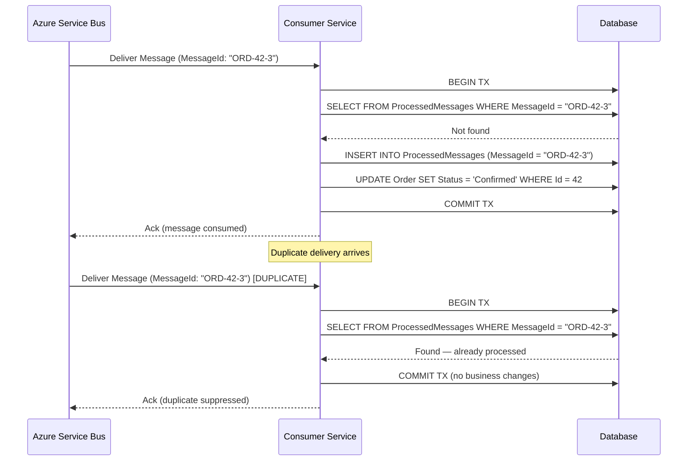
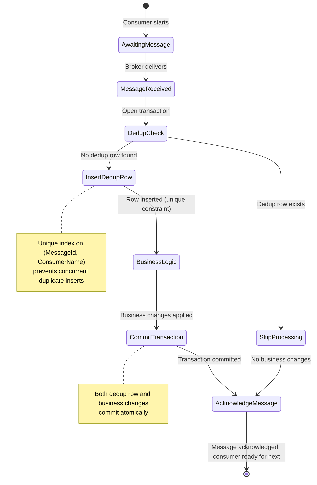
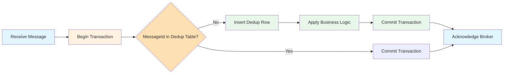
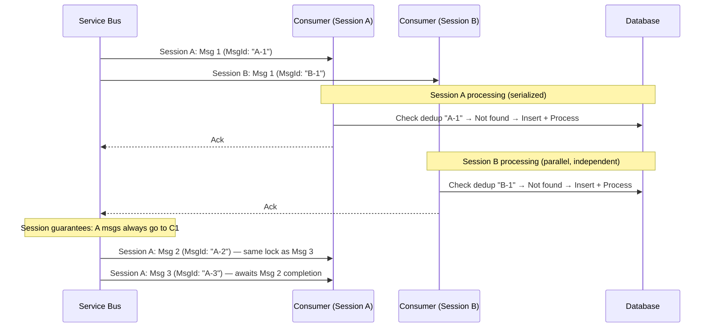
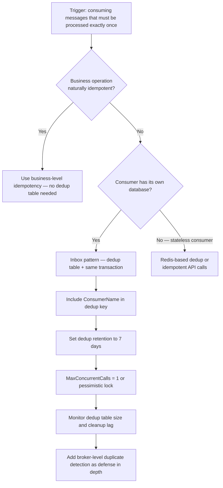

> [!success] Mastery Check
> - [ ] **Studied Well**
> - [ ] **Can explain the concept without notes**
> - [ ] **Can answer interview questions confidently**
> - [ ] **Can implement it in a real project**

## Navigation

**Domain:** [[7 — System Design & Distributed Systems]] > **Group:** Integration Patterns
**Previous:** [[7.125 — Outbox Pattern — Idempotent Publishing]] | **Next:** [[7.127 — Inbox Pattern — Deduplication Table]]

### Prerequisites
- [[7.121 — Outbox Pattern — Reliable Event Publishing]] — required because the inbox pattern is the consumer-side counterpart to the outbox; together they form the end-to-end reliable messaging pipeline
- [[4.212 — Idempotency Pattern]] — needed because the inbox pattern is a specific application of the general idempotency principle to message consumption

### Where This Fits

**Maturity assessment:** The inbox pattern is the third step in the reliable messaging maturity model. Step 1 is at-most-once (no guarantees). Step 2 is at-least-once (broker acknowledgments). Step 3 is exactly-once processing via the inbox pattern. Most production systems at the senior/staff engineering level operate at Step 3 for critical data paths.

The inbox pattern ensures that a message is processed exactly once, even if the broker delivers it multiple times. It is the consumer-side counterpart to the outbox pattern. The outbox pattern guarantees the event is published (at least once); the inbox pattern guarantees it is consumed (exactly once). A .NET engineer encounters this in any service that consumes messages from a broker while updating a database — order processing, payment handling, inventory updates, notification dispatching, audit logging. Without it, duplicate messages from producer restarts, broker redeliveries, or consumer crashes cause duplicate charges, duplicate notifications, or duplicate inventory deductions. At scale, even a 0.1% duplicate rate in a payment system processing 10,000 orders per hour means 24 duplicate charges per day — requiring manual refunds and eroding customer trust.

The inbox pattern ensures that a message is processed exactly once, even if the broker delivers it multiple times. It is the consumer-side counterpart to the outbox pattern. The outbox pattern guarantees the event is published (at least once); the inbox pattern guarantees it is consumed (exactly once). A .NET engineer encounters this in any service that consumes messages from a broker while updating a database — order processing, payment handling, inventory updates, notification dispatching, audit logging. Without it, duplicate messages from producer restarts, broker redeliveries, or consumer crashes cause duplicate charges, duplicate notifications, or duplicate inventory deductions. At scale, even a 0.1% duplicate rate in a payment system processing 10,000 orders per hour means 24 duplicate charges per day — requiring manual refunds and eroding customer trust.

The pattern is necessary whenever a consumer performs a non-idempotent side effect — charging a credit card, dispensing physical inventory, sending an email — in response to a message delivery that can occur more than once. It is a foundational building block for sagas ([[7.129]]), which chain multiple inbox-protected operations into a distributed transaction that spans multiple services.

## Core Mental Model

The inbox pattern stores each processed message's unique identifier in a deduplication table within the same database transaction as the business operation. Before processing a message, the consumer checks whether the identifier already exists in the dedup table. If it does, the consumer acknowledges the message without processing it. If it does not, the consumer inserts the identifier and processes the message atomically within a single transaction. The invariant is: for a given message ID, exactly one processing transaction commits to the database. The tradeoff is write amplification — each message adds a dedup row to the database — and the requirement that the consumer's business logic must be transactional. The recognition trigger is a production incident where a duplicate message caused a duplicate action — the fix was to add a dedup check before the business operation.





### Classification

The inbox pattern is a consumer-side idempotency mechanism operating at the application/data persistence layer. It is scoped to prevent duplicate business actions from duplicate message deliveries. It does not prevent duplicate message deliveries from the broker — it handles them safely when they arrive. It is the counterpart to the outbox pattern (producer-side reliable publishing) and together they form the reliable messaging backbone of a microservices architecture. The inbox pattern belongs to the "consumption" side of the reliable messaging stack, sitting below the application logic and above the transport layer. It is transparent to the message producer — the producer publishes once (or more, in the case of retries), and the inbox pattern absorbs duplicates on the consuming end.

In terms of the messaging guarantees stack, the inbox pattern operates at the **processing** guarantee level (converting at-least-once delivery into exactly-once processing), distinct from the **delivery** guarantee level (which is the broker's responsibility). This distinction is critical: the broker cannot guarantee exactly-once processing because it does not own the consumer's state. Only the consumer can guarantee exactly-once processing, by storing and checking idempotency tokens in its own database.

### Key Properties / Guarantees

|Property|Value|Condition|
|---|---|---|
|Processing guarantee|Exactly-once (within the consumer DB)|Dedup insert and business op in same transaction|
|Deduplication scope|Per consumer database|Each consumer has its own dedup table|
|Dedup table lifetime|Unbounded (rows never expire)|Needs cleanup strategy to prevent unbounded growth|
|Latency overhead|+1 DB write per message|~1-5ms for the dedup insert|
|Failure mode|Duplicate processed if dedup check and business op are not atomic|Separate transactions for dedup and business logic|
|Throughput ceiling|~5,000 events/second per dedup partition|Limited by unique index insert throughput|
|Crash recovery|Safe — redelivery skipped by dedup check|Dedup row persists across restarts|
|Network partition tolerance|Degrades — may allow duplicates until lock expires|Dedup check cannot happen without DB access|

## Deep Mechanics

### How It Works

**Step 1 — Receive message.** The consumer receives a message from the broker. The message has a `MessageId` (set by the producer) that uniquely identifies the business operation. The consumer holds a lock on the message while processing. In Azure Service Bus, this lock is acquired automatically in `PeekLock` mode and renewed by the SDK.

**Step 2 — Start transaction.** The consumer opens a database transaction. This transaction will wrap both the dedup check and the business logic, ensuring atomicity. In EF Core, this is `Database.BeginTransactionAsync()`.

**Step 3 — Check dedup.** The consumer queries the `ProcessedMessages` table (or `InboxMessages`) for a row with the given `MessageId`. If found, the consumer acknowledges the message and commits the transaction without any business processing. If not found, proceed.

**Step 4 — Insert dedup.** The consumer inserts a row into the `ProcessedMessages` table with the `MessageId`. This row is the idempotency token — it reserves the right to process this message. The unique index on `(MessageId, ConsumerName)` is the enforcement mechanism: if another transaction inserts the same combination first, this insert fails with a unique constraint violation (`SqlException` 2627 in SQL Server).

**Step 5 — Business logic.** The consumer applies the business logic: update a database record, publish a downstream event, call an external API. All these operations must be within the same transaction as the dedup insert. For external API calls (e.g., Stripe), the consumer should use the API's own idempotency key — the database transaction covers the write, and the API's idempotency key covers the external call.

**Step 6 — Commit.** The consumer commits the transaction. The dedup insert and business changes become visible atomically. If the commit fails (e.g., deadlock victim), the entire transaction rolls back, and the consumer retries.

**Step 7 — Acknowledge.** The consumer acknowledges the message to the broker. If the ack fails (consumer crashes after commit), the broker redelivers the message. The dedup check catches it and the consumer acknowledges without reprocessing.



### Failure Modes

**F1 — Dedup insert and business logic in separate transactions.** The consumer checks the dedup table, does not find the message, processes the business logic, commits the business transaction, and then inserts the dedup row in a separate transaction. If the consumer crashes between the two commits, the message is processed but the dedup row is not recorded. On redelivery, the dedup check passes (no row) and the message is processed again.

- **Detection:** Consumer-side duplicate counters show duplicates despite the inbox pattern.
- **Metric:** `consumer_duplicates_not_caught` > 0.
- **Recovery:** Move the dedup insert into the same transaction as the business operation. Use a single `SaveChangesAsync()` call in EF Core.

**F2 — Dedup table grows unbounded.** The `ProcessedMessages` table has no cleanup strategy. After months of operation, the table contains billions of rows. The dedup `SELECT` query becomes slow.

- **Detection:** `inbox_dedup_query_duration_ms` P99 rises. Queries that were 1ms are now 50ms.
- **Metric:** `inbox_table_size_gb` grows. Alert when > 50 GB.
- **Recovery:** Implement a cleanup job that deletes dedup rows older than the maximum expected message redelivery window (typically 7-30 days). At scale, use partition switching.

**F3 — Broker redelivery with extended message delivery count.** A message is redelivered 10 times because the consumer keeps crashing after commit but before ack. Each redelivery triggers a dedup check (passes — dedup row exists) and an ack (fails — crash). The message cycles until the max delivery count is exceeded and lands in the dead-letter queue.

- **Detection:** Dead-letter queue receives messages with `DeliveryCount = MaxDeliveryCount`. Consumer logs show "Received duplicate message N" followed by crash.
- **Metric:** `dlq_message_count` increases.
- **Recovery:** Extend the consumer's message lock duration. Implement a more graceful shutdown that completes in-flight message processing before the process exits.

**F4 — Duplicate `MessageId` values from the producer.** Two different business operations have the same `MessageId` due to a bug in the producer's idempotency key generation. The consumer processes the first operation and records the `MessageId`. The second operation arrives with the same ID — the consumer skips it.

- **Detection:** A legitimate event is never processed. No errors. No duplicates. The event simply didn't trigger a business action.
- **Metric:** Consumer event count per type is lower than producer event count. Reconciliation process flags the gap.
- **Recovery:** The producer must fix the key generation. For the consumer, the only defense is to include the producer identity or a namespace in the dedup key.

**F5 — Transaction timeout during dedup insert.** The dedup insert takes longer than the database command timeout (default 30 seconds) during a period of high index fragmentation. The transaction rolls back. The consumer retries, but the message lock expires, causing the broker to redeliver to a different instance.

- **Detection:** `inbox_dedup_insert_duration_ms` P99 > 20s. Consumer logs show `SqlException: Timeout expired`.
- **Metric:** `sql_timeout_count` on ProcessedMessages table.
- **Recovery:** Increase command timeout for dedup operations. Rebuild fragmented indexes. Reduce `MaxConcurrentCalls` to reduce index contention.

**F6 — Database failover during inbox transaction.** The consumer's database undergoes a failover (planned or unplanned) mid-transaction. The transaction rolls back on the old primary. The consumer retries, but the broker may have already redelivered the message to another instance.

- **Detection:** Consumer logs show `SqlException: The server was not found or was not accessible`. `inbox_transaction_failover_count` increments.
- **Metric:** `database_failover_events` correlated with message processing latency spikes.
- **Recovery:** Ensure the consumer's retry policy accounts for database failover time. Use `RetryPolicy` in EF Core connection string (`ConnectRetryCount=3`). The inbox dedup ensures at most one instance succeeds.

**F7 — Unique constraint violation swallowed by catch block.** The consumer wraps the `SaveChangesAsync` call in a `try/catch` that catches `DbUpdateException` and logs it but does not re-throw. The dedup insert fails due to unique constraint violation, but the consumer proceeds as if processing succeeded.

```csharp
// ❌ Swallowing the constraint violation
try
{
    await _context.SaveChangesAsync(ct);
}
catch (DbUpdateException ex)
{
    _logger.LogWarning(ex, "Constraint violation — continuing anyway");
    // Dedup failed, but business logic ran!
}
```

- **Detection:** Duplicate processing despite the inbox pattern. The dedup table has gaps in `MessageId` sequences.
- **Metric:** `consumer_duplicates_not_caught` spikes.
- **Recovery:** Never swallow constraint violations from the dedup insert. If the dedup insert fails, the transaction should roll back and the consumer should abandon the message for retry.

### Session-Based Inbox Processing

For higher throughput while maintaining dedup correctness, use Azure Service Bus sessions. Sessions guarantee that messages with the same `SessionId` are delivered to the same consumer instance in order. This allows `MaxConcurrentCallsPerSession = 1` (serialized per session) while `MaxConcurrentSessions` can be 10 or more, achieving parallelism without race conditions.



The key insight: sessions let you scale horizontally (10+ concurrent sessions) while maintaining per-partition serialization. Each session acts as its own logical partition with independent dedup state. This is the recommended approach for throughput between 1,000 and 10,000 events/second.

```csharp
// Session-based processor configuration
builder.Services.AddSingleton(sp =>
{
    var client = sp.GetRequiredService<ServiceBusClient>();
    return client.CreateSessionProcessor("orders", "payment-service",
        new ServiceBusSessionProcessorOptions
        {
            MaxConcurrentSessions = 10,
            MaxConcurrentCallsPerSession = 1,
            AutoCompleteMessages = false,
            MaxAutoLockRenewalDuration = TimeSpan.FromMinutes(5)
        });
});
```

### .NET and Azure Integration

- **ASP.NET Core:** `ServiceBusProcessor` or `ServiceBusReceiver` for consuming messages; `IServiceScopeFactory` to create scoped consumer handlers
- **EF Core:** `ProcessedMessage` entity with unique index on `MessageId`; `SaveChangesAsync` ensures the dedup insert and business updates are atomic
- **Azure Service Bus:** `ServiceBusProcessorOptions.MaxConcurrentCalls` controls parallelism — critical for dedup correctness; `MaxAutoLockRenewalDuration` prevents premature redelivery; session-enabled queues for ordered per-partition processing
- **MassTransit:** `UseInMemoryOutbox` on the consumer side works with the inbox pattern; `UseMessageRetry` provides retry with backoff
- **Polly:** `ResiliencePipeline` can wrap the entire consume cycle for advanced retry strategies
- **Azure SQL:** Hyperscale tier for the dedup table; elastic pool for shared databases
- **Azure Monitor:** Track `inbox_dedup_query_duration_ms`, `inbox_table_size_gb`, `inbox_duplicates_detected` as custom metrics

```csharp
// Program.cs — Consumer registration with scoped services
builder.Services.AddScoped<OrderEventConsumer>();
builder.Services.AddScoped<InboxDedupService>();

builder.Services.AddSingleton<ServiceBusProcessor>(sp =>
{
    var config = sp.GetRequiredService<IConfiguration>();
    var client = new ServiceBusClient(config["ServiceBus:ConnectionString"]);
    return client.CreateProcessor("orders", new ServiceBusProcessorOptions
    {
        MaxConcurrentCalls = 1,
        MaxAutoLockRenewalDuration = TimeSpan.FromMinutes(5),
        AutoCompleteMessages = false
    });
});

builder.Services.AddHostedService<ServiceBusInboxConsumer>();

// Configure EF Core with retry for transient failures
builder.Services.AddDbContext<OrderDbContext>(options =>
{
    options.UseSqlServer(
        builder.Configuration.GetConnectionString("Orders"),
        sql => sql.EnableRetryOnFailure(3));
});

// Register Polly resilience pipeline for consumer
builder.Services.AddSingleton<ResiliencePipeline>(sp =>
{
    return new ResiliencePipelineBuilder()
        .AddRetry(new RetryStrategyOptions
        {
            MaxRetryAttempts = 3,
            Delay = TimeSpan.FromMilliseconds(200),
            BackoffType = DelayBackoffType.Exponential
        })
        .Build();
});
```

## Production Patterns and Implementation

### Primary Implementation

```csharp
// ProcessedMessage entity for dedup
public sealed class ProcessedMessage
{
    public Guid Id { get; private set; }
    public string MessageId { get; private set; }
    public string ConsumerName { get; private set; }
    public DateTime ProcessedAt { get; private set; }

    private ProcessedMessage() { }

    public ProcessedMessage(string messageId, string consumerName)
    {
        Id = Guid.CreateVersion7(); // Sequential GUID — reduces index fragmentation
        MessageId = messageId;
        ConsumerName = consumerName;
        ProcessedAt = DateTime.UtcNow;
    }
}

// EF Core configuration
public sealed class ProcessedMessageConfiguration : IEntityTypeConfiguration<ProcessedMessage>
{
    public void Configure(EntityTypeBuilder<ProcessedMessage> builder)
    {
        builder.ToTable("ProcessedMessages");
        builder.HasKey(m => m.Id);
        builder.Property(m => m.MessageId).HasMaxLength(512).IsRequired();
        builder.Property(m => m.ConsumerName).HasMaxLength(128).IsRequired();
        builder.Property(m => m.ProcessedAt).HasDefaultValueSql("GETUTCDATE()");
        builder.HasIndex(m => new { m.MessageId, m.ConsumerName }).IsUnique();
        builder.HasIndex(m => m.ProcessedAt).HasDatabaseName("IX_ProcessedMessages_Cleanup");
    }
}

// Inbox dedup service
public sealed class InboxDedupService
{
    private readonly OrderDbContext _context;
    private readonly string _consumerName;

    public InboxDedupService(OrderDbContext context, string consumerName)
    {
        _context = context;
        _consumerName = consumerName;
    }

    public async Task<bool> IsDuplicateAsync(string messageId, CancellationToken ct)
    {
        return await _context.ProcessedMessages
            .AnyAsync(m => m.MessageId == messageId && m.ConsumerName == _consumerName, ct);
    }

    public void MarkProcessed(string messageId)
    {
        _context.ProcessedMessages.Add(
            new ProcessedMessage(messageId, _consumerName));
    }
}

// Consumer that uses the inbox pattern
public sealed class OrderEventConsumer
{
    private readonly OrderDbContext _context;
    private readonly InboxDedupService _dedup;
    private readonly ILogger<OrderEventConsumer> _logger;

    public OrderEventConsumer(
        OrderDbContext context,
        InboxDedupService dedup,
        ILogger<OrderEventConsumer> logger)
    {
        _context = context;
        _dedup = dedup;
        _logger = logger;
    }

    public async Task ConsumeAsync(OrderSubmitted @event, CancellationToken ct)
    {
        var messageId = @event.MessageId;

        if (await _dedup.IsDuplicateAsync(messageId, ct))
        {
            _logger.LogInformation("Duplicate message {MessageId} — skipping", messageId);
            return;
        }

        _dedup.MarkProcessed(messageId);

        var order = await _context.Orders.FindAsync(
            new object[] { @event.OrderId }, ct);

        if (order is null)
        {
            _logger.LogWarning("Order {OrderId} not found — possible ordering issue", @event.OrderId);
            return;
        }

        order.ConfirmPayment(@event.PaymentId, @event.Amount);

        await _context.SaveChangesAsync(ct);

        _logger.LogInformation("Processed order {OrderId} for message {MessageId}",
            @event.OrderId, messageId);
    }
}

// Hosted service that bridges Service Bus messages to the consumer
public sealed class ServiceBusInboxConsumer : BackgroundService
{
    private readonly ServiceBusProcessor _processor;
    private readonly IServiceScopeFactory _scopeFactory;
    private readonly ILogger<ServiceBusInboxConsumer> _logger;

    public ServiceBusInboxConsumer(
        ServiceBusProcessor processor,
        IServiceScopeFactory scopeFactory,
        ILogger<ServiceBusInboxConsumer> logger)
    {
        _processor = processor;
        _scopeFactory = scopeFactory;
        _logger = logger;
    }

    protected override async Task ExecuteAsync(CancellationToken stoppingToken)
    {
        _processor.ProcessMessageAsync += async args =>
        {
            using var scope = _scopeFactory.CreateScope();
            var context = scope.ServiceProvider.GetRequiredService<OrderDbContext>();
            var dedup = scope.ServiceProvider.GetRequiredService<InboxDedupService>();

            var messageId = args.Message.MessageId;
            var body = args.Message.Body.ToObjectFromJson<OrderSubmitted>();

            try
            {
                await using var transaction = await context.Database
                    .BeginTransactionAsync(stoppingToken);

                if (await dedup.IsDuplicateAsync(messageId, stoppingToken))
                {
                    await transaction.CommitAsync(stoppingToken);
                    await args.CompleteMessageAsync(args.Message);
                    return;
                }

                dedup.MarkProcessed(messageId);
                var order = await context.Orders.FindAsync(
                    new object[] { body.OrderId }, stoppingToken);
                if (order is not null)
                {
                    order.ConfirmPayment(body.PaymentId, body.Amount);
                }

                await context.SaveChangesAsync(stoppingToken);
                await transaction.CommitAsync(stoppingToken);

                await args.CompleteMessageAsync(args.Message);
            }
            catch (Exception ex)
            {
                _logger.LogError(ex, "Failed to process message {MessageId}", messageId);
                await args.AbandonMessageAsync(args.Message);
            }
        };

        _processor.ProcessErrorAsync += async args =>
        {
            _logger.LogError(args.Exception, "Service Bus processor error");
            await Task.CompletedTask;
        };

        await _processor.StartProcessingAsync(stoppingToken);
        await Task.Delay(Timeout.Infinite, stoppingToken);
    }

    public override async Task StopAsync(CancellationToken cancellationToken)
    {
        await _processor.StopProcessingAsync(cancellationToken);
        await base.StopAsync(cancellationToken);
    }
}
```

### Configuration and Wiring

```csharp
// Program.cs
builder.Services.AddScoped<InboxDedupService>();
builder.Services.AddScoped<OrderEventConsumer>();

builder.Services.AddSingleton(sp =>
{
    var config = sp.GetRequiredService<IConfiguration>();
    var client = new ServiceBusClient(config["ServiceBus:ConnectionString"]);
    return client.CreateProcessor("orders", new ServiceBusProcessorOptions
    {
        MaxConcurrentCalls = 1,
        MaxAutoLockRenewalDuration = TimeSpan.FromMinutes(5),
        AutoCompleteMessages = false
    });
});

builder.Services.AddHostedService<ServiceBusInboxConsumer>();

builder.Services.AddDbContext<OrderDbContext>(options =>
{
    options.UseSqlServer(
        builder.Configuration.GetConnectionString("Orders"),
        sql => sql.EnableRetryOnFailure(3));
});
```

```json
// appsettings.json
{
  "ServiceBus": {
    "ConnectionString": "Endpoint=sb://...;SharedAccessKeyName=...;SharedAccessKey=...",
    "TopicName": "orders",
    "SubscriptionName": "payment-service"
  },
  "ConnectionStrings": {
    "Orders": "Server=tcp:...;Database=OrderDb;ConnectRetryCount=3;"
  },
  "Inbox": {
    "DedupRetentionDays": 7,
    "CleanupBatchSize": 5000,
    "CleanupIntervalMinutes": 60
  }
}
```

### Common Variants

**Business-level idempotency — no dedup table.** If the business operation itself is idempotent, the inbox pattern can rely on a database constraint on the business table. For example, a unique constraint on `(OrderId, Status)` prevents setting "Confirmed" twice.

```csharp
// Business-level idempotency — no dedup table needed
public async Task ConfirmOrderAsync(Guid orderId, CancellationToken ct)
{
    var rows = await _context.Orders
        .Where(o => o.Id == orderId && o.Status != OrderStatus.Confirmed)
        .ExecuteUpdateAsync(s => s
            .SetProperty(o => o.Status, OrderStatus.Confirmed)
            .SetProperty(o => o.ConfirmedAt, DateTime.UtcNow),
            ct);

    if (rows == 0)
    {
        _logger.LogInformation("Order {OrderId} already confirmed — skipping", orderId);
    }
}
```

**Redis-based dedup (in-memory, low latency).** For high-throughput, low-duplicate-impact scenarios, use Redis with a TTL for dedup checks. Risk: Redis data loss on restart could allow duplicates. Suitable for non-critical events where an occasional duplicate is acceptable.

```csharp
public sealed class RedisInboxDedup
{
    private readonly IDatabase _redis;

    public RedisInboxDedup(IDatabase redis)
    {
        _redis = redis;
    }

    public async Task<bool> TryAcquireAsync(string messageId, TimeSpan ttl)
    {
        return await _redis.StringSetAsync(
            $"inbox-dedup:{messageId}",
            "1",
            ttl,
            When.NotExists);
    }
}
```

**MassTransit consumer with outbox + dedup.** MassTransit provides built-in inbox/outbox support through `UseInMemoryOutbox`. When a consumer publishes or sends messages within a handler, those sends are held in memory until the consumer's transaction commits.

```csharp
// MassTransit consumer with inbox-like behavior
builder.Services.AddMassTransit(x =>
{
    x.AddConsumer<OrderEventConsumer>();

    x.UsingAzureServiceBus((context, cfg) =>
    {
        cfg.Host(builder.Configuration["ServiceBus:ConnectionString"]);
        cfg.UseMessageRetry(r => r.Interval(3, TimeSpan.FromMilliseconds(200)));
        cfg.UseInMemoryOutbox();
        cfg.ConfigureEndpoints(context);
    });
});
```

**Kafka consumer with idempotent processing.** For Kafka consumers, the offset commit replaces the message ack. The inbox pattern applies identically — store `MessageId` in a dedup table, commit offset after processing.

```csharp
// Kafka consumer with inbox dedup
public sealed class KafkaOrderConsumer : BackgroundService
{
    private readonly IConsumer<string, string> _consumer;
    private readonly IServiceScopeFactory _scopeFactory;

    protected override async Task ExecuteAsync(CancellationToken stoppingToken)
    {
        _consumer.Subscribe("orders");

        while (!stoppingToken.IsCancellationRequested)
        {
            var result = _consumer.Consume(stoppingToken);
            using var scope = _scopeFactory.CreateScope();
            var dedup = scope.ServiceProvider.GetRequiredService<InboxDedupService>();

            if (await dedup.IsDuplicateAsync(result.Message.Key, stoppingToken))
            {
                _consumer.Commit(result);
                continue;
            }

            await ProcessOrderAsync(result.Message.Value, stoppingToken);
            dedup.MarkProcessed(result.Message.Key);
            _consumer.Commit(result);
        }
    }
}
```

**Azure Functions with Inbox pattern.** For serverless consumers, use `IDbContextFactory` to create a scoped `DbContext` per invocation.

```csharp
[FunctionName("ProcessOrderFunction")]
public async Task Run(
    [ServiceBusTrigger("orders", "payment-service", Connection = "ServiceBus")]
    OrderSubmitted order,
    string messageId,
    [ServiceBus("order-events")] IAsyncCollector<OrderProcessed> eventCollector,
    CancellationToken ct)
{
    using var context = await _contextFactory.CreateDbContextAsync(ct);
    var dedup = new InboxDedupService(context, "PaymentFunction");

    if (await dedup.IsDuplicateAsync(messageId, ct))
        return;

    dedup.MarkProcessed(messageId);
    // business logic
    await context.SaveChangesAsync(ct);
}
```

### Dedup Cleanup Background Service

```csharp
// Background service that periodically cleans up old dedup rows
public sealed class DedupCleanupService : BackgroundService
{
    private readonly IServiceScopeFactory _scopeFactory;
    private readonly IOptions<InboxOptions> _options;
    private readonly ILogger<DedupCleanupService> _logger;

    public DedupCleanupService(
        IServiceScopeFactory scopeFactory,
        IOptions<InboxOptions> options,
        ILogger<DedupCleanupService> logger)
    {
        _scopeFactory = scopeFactory;
        _options = options;
        _logger = logger;
    }

    protected override async Task ExecuteAsync(CancellationToken stoppingToken)
    {
        using var timer = new PeriodicTimer(
            TimeSpan.FromMinutes(_options.Value.CleanupIntervalMinutes));

        while (await timer.WaitForNextTickAsync(stoppingToken))
        {
            try
            {
                var cutoff = DateTime.UtcNow.AddDays(-_options.Value.DedupRetentionDays);
                await using var scope = _scopeFactory.CreateScope();
                var context = scope.ServiceProvider.GetRequiredService<OrderDbContext>();

                int totalDeleted = 0;
                int batchSize = _options.Value.CleanupBatchSize;

                do
                {
                    var deleted = await context.ProcessedMessages
                        .Where(m => m.ProcessedAt < cutoff)
                        .Take(batchSize)
                        .ExecuteDeleteAsync(stoppingToken);

                    totalDeleted += deleted;

                    _logger.LogDebug("Cleanup: deleted {Deleted} rows (total: {Total})",
                        deleted, totalDeleted);
                }
                while (totalDeleted >= batchSize && !stoppingToken.IsCancellationRequested);

                if (totalDeleted > 0)
                {
                    _logger.LogInformation("Cleanup completed: deleted {Total} rows", totalDeleted);
                }
            }
            catch (OperationCanceledException)
            {
                break;
            }
            catch (Exception ex)
            {
                _logger.LogError(ex, "Dedup cleanup failed");
            }
        }
    }
}

public sealed class InboxOptions
{
    public int DedupRetentionDays { get; set; } = 7;
    public int CleanupBatchSize { get; set; } = 5000;
    public int CleanupIntervalMinutes { get; set; } = 60;
}
```

### Real-World .NET Ecosystem Example

**MassTransit's `InMemoryOutbox` + `UseMessageRetry`** provides a consumer-side outbox that complements the inbox pattern. When a consumer calls `Publish` or `Send` within a message handler, MassTransit delays those sends until the consumer's transaction commits. If the transaction rolls back, the sends are discarded — never reaching the broker. This prevents the "message consumed, downstream event sent, but local transaction failed" scenario. Combined with a separate dedup table, this provides end-to-end exactly-once processing.

**NServiceBus's `TransportTransactionMode`** with `TransportTransactionMode.SendsAtomicWithReceive` guarantees that message receive, business processing, and any outgoing sends are atomic. NServiceBus stores the dedup in its own `GatewayMessage` table automatically.

```csharp
// NServiceBus — exactly-once processing with built-in dedup
var endpointConfiguration = new EndpointConfiguration("OrderProcessing");
endpointConfiguration.EnableOutbox();
endpointConfiguration.UseTransport<AzureServiceBusTransport>();
```

**Azure Service Bus duplicate detection** can be combined with the inbox pattern as defense in depth. Enabling `RequiresDuplicateDetection = true` on the topic with a 7-day window means the broker will not deliver duplicate messages within that window. This reduces the load on the consumer's dedup table but does not eliminate the need for it — duplicates can still arise from consumer crash-ack cycles.

## Gotchas and Production Pitfalls

### 1. MaxConcurrentCalls > 1 without pessimistic locking

**Pitfall:** `MaxConcurrentCalls` is set to 10 on the `ServiceBusProcessor`. Two threads receive the same message (broker redelivery after lock renewal timeout race). Both threads check the dedup table simultaneously — both find no record. Both proceed to process the message.

```csharp
// ❌ Concurrent handlers — both threads pass the dedup check
new ServiceBusProcessorOptions { MaxConcurrentCalls = 10 }
```

**Symptom:** 1% of messages are processed twice despite the inbox pattern. Hard to reproduce because the race window is narrow.

**Fix:** Reduce `MaxConcurrentCalls` to 1, or use a database-level lock (`WITH (UPDLOCK, ROWLOCK)` in SQL Server) on the dedup check query.

```csharp
// ✅ Serialize message processing or use locking hints
// Option A: MaxConcurrentCalls = 1
new ServiceBusProcessorOptions { MaxConcurrentCalls = 1 }

// Option B: Pessimistic lock on the dedup check
var found = await _context.ProcessedMessages
    .FromSql($"""
        SELECT TOP(1) * FROM ProcessedMessages WITH (UPDLOCK, ROWLOCK)
        WHERE MessageId = {messageId} AND ConsumerName = {_consumerName}
        """)
    .AnyAsync(ct);
```

**Cost of not fixing:** Duplicate payment processing: 1 in 100 customers is charged twice. The finance team spends 2 hours per incident on manual refunds.

### 2. Dedup insert not in the same transaction as business logic

**Pitfall:** The consumer inserts the dedup row, calls `SaveChangesAsync`, then performs business logic with a separate `SaveChangesAsync` — or vice versa.

```csharp
// ❌ Split transactions — crash between commits
_context.ProcessedMessages.Add(new ProcessedMessage(messageId, _consumerName));
await _context.SaveChangesAsync(ct); // Dedup committed

order.ConfirmPayment(paymentId, amount);
await _context.SaveChangesAsync(ct); // Business committed — crash here!
```

**Symptom:** A consumer crash after the dedup commit but before the business commit means the dedup row exists but the business operation was not applied. The message is never retried (dedup check blocks it), and the business operation is permanently lost.

**Fix:** Use a single `SaveChangesAsync` call or a manual transaction that encompasses both the dedup insert and the business changes.

```csharp
// ✅ Single SaveChangesAsync — atomic dedup + business
_context.ProcessedMessages.Add(new ProcessedMessage(messageId, _consumerName));
order.ConfirmPayment(paymentId, amount);
await _context.SaveChangesAsync(ct); // Both committed atomically
```

**Cost of not fixing:** Silent data loss. 0.5% of orders that were paid are never confirmed. The customer calls support: "I was charged but my order shows as pending."

### 3. Dedup table cleanup deletes rows too aggressively

**Pitfall:** A cleanup job deletes `ProcessedMessages` rows older than 1 hour. A message is redelivered 2 hours after the original processing due to a broker backlog.

```csharp
// ❌ Cleanup deletes too aggressively
await _context.ProcessedMessages
    .Where(m => m.ProcessedAt < DateTime.UtcNow.AddHours(-1))
    .ExecuteDeleteAsync(ct);
```

**Symptom:** A legitimate redelivery is accepted as a new message because the dedup row was deleted. The business operation is applied twice.

**Fix:** Match the dedup retention to the maximum expected message redelivery window. Service Bus redelivery window is bounded by the lock duration and max delivery count — typically minutes, not hours. A 7-day retention is safe.

```csharp
// ✅ 7-day retention — covers any realistic redelivery scenario
await _context.ProcessedMessages
    .Where(m => m.ProcessedAt < DateTime.UtcNow.AddDays(-7))
    .ExecuteDeleteAsync(ct);
```

**Cost of not fixing:** A network partition lasting 2 hours causes a broker backlog. When connectivity is restored, messages from 2 hours ago are re-delivered. With only 1-hour retention, the dedup check misses them. Duplicate inventory deductions occur.

### 4. ConsumerName not included in the dedup key

**Pitfall:** Two different consumer types (e.g., `OrderProcessor` and `AuditLogger`) both subscribe to the same `OrderSubmitted` event. The dedup index is only on `MessageId`, not on `(MessageId, ConsumerName)`.

```csharp
// ❌ No consumer name in dedup key
builder.HasIndex(m => m.MessageId).IsUnique();
```

**Symptom:** The first consumer to process the message inserts the dedup row. The second consumer tries to insert a dedup row for the same `MessageId` and hits the unique constraint violation. The second consumer skips the message, but it should have processed it.

**Fix:** Include `ConsumerName` in the unique index.

```csharp
// ✅ Consumer-scoped dedup
builder.HasIndex(m => new { m.MessageId, m.ConsumerName }).IsUnique();
```

**Cost of not fixing:** The audit log is missing events. The compliance team notices gaps in the audit trail. An incident is opened.

### 5. Service Bus message lock expires before the inbox transaction completes

**Pitfall:** The inbox transaction takes 10 seconds (dedup check + business logic + SaveChangesAsync). The Service Bus message lock is 5 seconds (default). The lock expires, and the broker re-delivers the message to another consumer instance. Both consumers process it.

```csharp
// ❌ Default lock duration too short
new ServiceBusProcessorOptions
{
    MaxAutoLockRenewalDuration = TimeSpan.FromSeconds(5)
}
```

**Symptom:** Intermittent duplicates during slow database operations. The dedup check in the first consumer is racing with the second consumer's dedup check.

**Fix:** Set `MaxAutoLockRenewalDuration` to cover the maximum expected processing time.

```csharp
// ✅ Lock renewal covers the processing window
new ServiceBusProcessorOptions
{
    MaxAutoLockRenewalDuration = TimeSpan.FromMinutes(5)
}
```

**Cost of not fixing:** During a database performance degradation, processing time increases from 100ms to 8 seconds. The 5-second lock renewal doesn't cover it. Messages are processed 2-3 times, amplifying the database load.

### 6. DbContext not discarded after failed SaveChangesAsync

**Pitfall:** After `SaveChangesAsync` throws a `DbUpdateException` (e.g., unique constraint violation on the dedup index), the `DbContext` still has the `ProcessedMessage` entity in the `Added` state. If the consumer retries on the same `DbContext` instance, EF Core tries to insert the same dedup row again.

```csharp
// ❌ Reusing DbContext after SaveChangesAsync failure
public async Task ConsumeAsync(OrderSubmitted @event, CancellationToken ct)
{
    try
    {
        dedup.MarkProcessed(messageId);
        order.ConfirmPayment(paymentId, amount);
        await _context.SaveChangesAsync(ct);
    }
    catch (DbUpdateException)
    {
        await _context.SaveChangesAsync(ct); // Fails again — entity still Added
    }
}
```

**Symptom:** The consumer retries indefinitely on the same `DbContext`. Each retry fails with the same unique constraint violation. The message is never processed.

**Fix:** Use `IDbContextFactory` and create a fresh `DbContext` for each consume attempt.

```csharp
// ✅ Fresh DbContext per consume attempt
public sealed class OrderEventConsumer
{
    private readonly IDbContextFactory<OrderDbContext> _contextFactory;

    public async Task ConsumeAsync(OrderSubmitted @event, CancellationToken ct)
    {
        await using var context = await _contextFactory.CreateDbContextAsync(ct);
    }
}
```

**Cost of not fixing:** Consumer stuck in retry loop. Messages accumulate on the queue. Processing latency increases from milliseconds to hours.

### 7. Pessimistic locking without proper index causing table scans

**Pitfall:** The dedup check uses `WITH (UPDLOCK, ROWLOCK)` but the `(MessageId, ConsumerName)` index is missing. SQL Server locks the entire table (or page) instead of the single row.

**Symptom:** All dedup check queries block each other. Throughput collapses from 200 events/second to 5 events/second. Consumer logs show `wait_type = LCK_M_U` on `ProcessedMessages`.

**Fix:** Ensure the unique index exists before using locking hints.

```sql
CREATE UNIQUE NONCLUSTERED INDEX IX_ProcessedMessages_Dedup
ON ProcessedMessages (MessageId, ConsumerName);
```

**Cost of not fixing:** Complete consumer throughput collapse during peak hours. The queue grows to millions of messages.

### 8. Assuming synchronous completion with AutoCompleteMessages = true

**Pitfall:** The consumer uses `AutoCompleteMessages = true` (the default for `ServiceBusProcessor`). The broker marks the message as completed as soon as the message handler returns — but that's before the database transaction commits.

```csharp
// ❌ AutoCompleteMessages = true — ack before DB commit
new ServiceBusProcessorOptions { AutoCompleteMessages = true }
```

**Symptom:** The message handler returns, the message is acknowledged, then `SaveChangesAsync` fails. The message is lost — the broker has already deleted it, and the consumer cannot retry.

**Fix:** Set `AutoCompleteMessages = false` and explicitly call `CompleteMessageAsync` after the transaction commits.

**Cost of not fixing:** Silent data loss. 0.1% of messages fail to persist to the database but are acknowledged. The business operation is permanently lost.

## Tradeoffs and Decision Framework

### Tradeoff Matrix

|Dimension|Inbox Pattern (DB Dedup)|Business-Level Idempotency|Distributed Lock (Redis)|Broker-Level Dedup|
|---|---|---|---|---|
|Processing guarantee|Exactly-once per consumer DB|Varies by business constraint|Effectively-once|At-least-once (broker only)|
|Latency overhead|+1 DB write per message|None (constraint-driven)|+1 Redis round trip|None (broker internal)|
|Operational complexity|Low (standard EF Core)|Low (unique constraints)|Medium (Redis)|Low (config option)|
|Dedup table growth|Unbounded without cleanup|No extra table|No extra table|No extra table|
|Consumer crash recovery|Safe (dedup + biz in same tx)|Safe (constraint prevents dup)|Safe (lock expires)|Safe (broker dedup)|
|Cross-service dedup|Per-service (not shared)|Per-service|Shared possible|Per-topic|
|.NET integration|EF Core, MassTransit|EF Core, SQL|StackExchange.Redis|Azure SB built-in|
|Scalability ceiling|~5K/s per partition|No limit (constraint)|~100K/s|~10K/s per partition|
|Durability of dedup state|Database (full ACID)|Database (full ACID)|Redis (lossy on restart)|Broker (depends on config)|

### When to Apply



### When NOT to Apply

- [ ] The business operation is inherently idempotent — a unique constraint or conditional update suffices without a dedup table
- [ ] The consumer is stateless (e.g., a serverless Function that does not own a database) — use Redis or broker-level dedup instead
- [ ] The event volume exceeds 10,000 events/second per consumer database — the dedup write amplification may become costly
- [ ] Duplicate processing is harmless — analytics events, logging, metrics, idempotent counters where 2x is no different from 1x
- [ ] The consumer cannot wrap its business logic in a database transaction (e.g., calling an external API with no compensating action) — the inbox pattern requires transactional consistency
- [ ] The message source is known to produce perfectly unique IDs and the broker guarantees exactly-once delivery (Kafka single-partition with idempotent producer) — still fragile, but risk may be acceptable for non-critical data
- [ ] The team does not have the operational maturity to monitor dedup table size, cleanup lag, and duplicate detection rates

### Scale Thresholds

- **Below 100 events/second:** Simple inbox with EF Core dedup table, no partitioning needed. Single DB, single consumer. Cleanup via batched DELETE every hour. `MaxConcurrentCalls = 1` is safe and simple.
- **10 — 100 events/second:** Minimal overhead. Simple setup, no cleanup needed for months. Suitable for most line-of-business applications.
- **100 — 1,000 events/second:** Inbox with `MaxConcurrentCalls = 1` and pessimistic locking. Acceptable dedup table growth. Cleanup via batched DELETE daily. Session-based processing optional but beneficial for ordered delivery.
- **100 — 5,000 events/second:** Inbox with `MaxConcurrentCalls = 1` or pessimistic locking — at this scale, serialization per partition is acceptable. Daily cleanup via batched DELETE or partition switch.
- **5,000 — 50,000 events/second:** Shard the dedup table by `ConsumerName` or partition key; use `IDbContextFactory` for concurrent partition handling. Switch to partition-based cleanup. Use session-enabled queues for ordered per-partition processing.
- **Above 50,000 events/second:** Move to Redis-based dedup with periodic snapshot to SQL, or restructure the business logic to be inherently idempotent. Consider business-level idempotency as the primary mechanism.
- **Dedup cleanup interval:** Run every hour, delete rows older than 7 days. At 5,000 events/second, that is ~42M rows cleaned per run — use batched deletion of 1,000 rows per batch, or switch to partition truncation.

## Interview Arsenal

### Question Bank

1. What problem does the inbox pattern solve, and where does it fit in a messaging architecture?
2. How does the inbox pattern guarantee exactly-once processing?
3. Why must the dedup check and business logic be in the same transaction?
4. What happens if the consumer crashes after committing the transaction but before acknowledging the message?
5. Compare the inbox pattern with the outbox pattern — are they related or independent?
6. Design a consumer for a payment service that uses the inbox pattern to prevent duplicate charges.
7. How does the inbox pattern behave at 10x the load? Where are the bottlenecks?
8. Why is `MaxConcurrentCalls` relevant to the correctness of the inbox pattern?
9. What happens if the dedup table cleanup job fails for a week? What metrics do you alert on?
10. How would you implement the inbox pattern for a Kafka consumer vs an Azure Service Bus consumer?

### Spoken Answers

**Q1: What problem does the inbox pattern solve, and where does it fit in a messaging architecture?**

> **Average answer:** "It prevents duplicate processing of the same message by checking a database before processing."
>
> **Great answer:** "The inbox pattern solves the duplicate processing problem on the consumer side. In a messaging system, the broker delivers a message at least once — if the consumer crashes after processing but before acknowledging, the broker redelivers. Without the inbox pattern, that redelivery causes the business operation — a payment charge, inventory deduction, or email sending — to be applied twice. The inbox pattern stores each processed message's unique identifier in a deduplication table within the same database transaction as the business operation. Before processing a message, the consumer checks this table — if the ID exists, the consumer acknowledges without processing. If not, the consumer inserts the ID and applies the business logic, all in a single transaction. The outbox pattern (producer side) and the inbox pattern (consumer side) form the two halves of reliable messaging: the outbox guarantees the event is published at least once; the inbox guarantees it is processed exactly once. You need both for end-to-end exactly-once semantics. In a typical order processing pipeline, the ordering service uses the outbox pattern to reliably publish `OrderSubmitted` events, and the payment service uses the inbox pattern to ensure each order is charged exactly once — even if the broker delivers the event twice due to a network partition."

**Q5: Compare the inbox pattern with the outbox pattern — are they related or independent?**

> **Great answer:** "They are complementary but independent — you can use one without the other, but together they provide end-to-end exactly-once processing. The outbox pattern solves the producer-side dual-write problem: ensuring the database write and the broker publish happen atomically. It produces at-least-once delivery. The inbox pattern solves the consumer-side duplicate processing problem: ensuring that each message delivery results in exactly one business action. It consumes at-least-once delivery and converts it to exactly-once processing. In a typical microservices architecture, service A uses the outbox pattern to reliably publish events, and service B uses the inbox pattern to reliably consume them. But you could have a service that receives events from an external system — no outbox — and still needs the inbox pattern for idempotent processing. Or a service that publishes events via outbox to a system that handles duplicates on its own — no inbox needed. They are not coupled, but they are most effective when used together. In terms of implementation, the outbox uses an `OutboxMessage` table with a background publisher, while the inbox uses a `ProcessedMessage` table with a dedup check before processing. Both use the same EF Core transaction pattern."

**Q8: Why is MaxConcurrentCalls relevant to the correctness of the inbox pattern?**

> **Great answer:** "`MaxConcurrentCalls` on the `ServiceBusProcessor` determines how many messages are processed simultaneously. If it is greater than 1, two messages can be processed concurrently. If the broker redelivers the same message twice — which can happen if the first copy's lock expires before processing completes — two threads can check the dedup table simultaneously. Without pessimistic locking, both threads see 'no dedup row,' both insert the dedup row (one fails with a unique constraint exception, but the other succeeds), and both proceed with business logic. The result is duplicate processing. The fix is either set `MaxConcurrentCalls = 1` — serializing all processing — or use a pessimistic lock hint (`UPDLOCK`) on the dedup check query so that the second thread blocks until the first completes. I prefer `MaxConcurrentCalls = 1` for simplicity in most cases, switching to pessimistic locking only when message throughput requires parallelism. Azure Service Bus sessions can help here — session-enabled queues guarantee that messages with the same session ID are delivered to the same consumer instance in order, which effectively serializes processing per session even with `MaxConcurrentCalls > 1`."

**Q9: What happens if the dedup table cleanup job fails for a week?**

> **Great answer:** "If the cleanup job fails and the dedup table grows unchecked, several things degrade progressively. First, the unique index on `(MessageId, ConsumerName)` deepens — each level adds an extra page read to every dedup check query. At 1 billion rows, the B-tree is ~6 levels deep, so each dedup check reads 6 pages instead of 3. This increases P99 latency from 1ms to ~8ms. Second, the table's storage footprint grows — at 5,000 events/second, that's 1.3 billion rows per week, roughly 400 GB of index + data. This drives up backup time and cost. Third, the cleanup job itself becomes slower — when it finally runs, it must scan and delete billions of rows, which can take hours and create transaction log pressure. The solution is to alert on `inbox_table_size_gb` exceeding a threshold (e.g., 200 GB) and `inbox_cleanup_lag_rows`. If the table reaches 500 GB, I would trigger an emergency partition switch — create a new empty dedup table, redirect writes to it, and let the old table age out naturally. This avoids locking the production table for cleanup."

### System Design Interview Trigger

In a system design interview for an order processing or payment system, after you describe the outbox pattern for the producer, the interviewer will ask "and on the consumer side, how do you prevent duplicate processing?" This is the inbox pattern question. They want to hear: (1) a dedup table, (2) the dedup insert and business logic in the same transaction, (3) the cleanup strategy, and (4) the connection to the producer's outbox pattern. A strong answer also discusses the `MaxConcurrentCalls` / pessimistic locking nuance and the dedup table cleanup strategy.

A more subtle trigger is when the interviewer asks about "exactly-once processing" — they expect you to clarify that exactly-once delivery is impossible and explain how the inbox pattern achieves _exactly-once processing_ from _at-least-once delivery_. They are testing whether you understand the difference between broker guarantees and application guarantees.

### Comparison Table

| | Inbox Pattern (Consumer) | Outbox Pattern (Producer) | Broker-Level Dedup |
|---|---|---|---|
| Problem solved | Duplicate processing | Lost events (dual-write) | Duplicate messages in broker |
| Direction | Incoming messages | Outgoing events | Both directions |
| Mechanism | Dedup table in DB | Outbox table + publisher | Message broker dedup store |
| Transaction | Business + dedup insert | Business + outbox insert | None (broker internal) |
| Guarantee | Exactly-once processing | At-least-once delivery | At-least-once with fewer duplicates |
| Key pairing | Together provide end-to-end exactly-once | Together provide end-to-end exactly-once | Complements both |
| Cleanup required | Yes — dedup rows | Yes — outbox rows | No (broker managed) |
| .NET tooling | EF Core, MassTransit | EF Core, MassTransit, Quartz | Azure SB built-in, Kafka config |

## Architecture Decision Record

**Status:** Accepted

**Context:** The Payment service consumes `OrderSubmitted` events from Azure Service Bus. Each event triggers a payment charge via the Stripe API. Duplicate events cause duplicate charges, which require manual refunds — each refund costs the operations team 15 minutes of manual work. At 200 events/second, even a 0.1% duplicate rate means 720 duplicate charges per day, requiring 180 hours of manual refund work. The service handles 200 events/second with occasional spikes to 2,000 events/second. The service uses EF Core with SQL Server. The team has three developers with experience in .NET and Azure but no dedicated operations team. The service must operate with minimal operational overhead while guaranteeing no duplicate charges.

**Options Considered:**

1. **Inbox Pattern (DB Dedup)** — `ProcessedMessages` table with unique index on `(MessageId, ConsumerName)`, dedup insert in the same transaction as the payment record insert. Standard EF Core, no additional infrastructure.
2. **Business-Level Idempotency** — Use Stripe's idempotency key (`IdempotencyKey` header) to prevent duplicate charges; rely on Stripe's dedup rather than our own. No dedup table needed. Risk: Stripe's dedup window may be shorter than our redelivery window.
3. **Redis-Based Dedup** — Check and set a key in Redis before processing; TTL-based auto-cleanup. High throughput but lossy on restart.
4. **Azure Service Bus Duplicate Detection** — Enable `RequiresDuplicateDetection` on the topic with a 7-day window; rely on broker-level dedup to prevent duplicates from arriving at the consumer. Catches broker-level duplicates but not consumer crash-ack cycle duplicates.
5. **Distributed Transaction (DTC)** — TransactionScope spanning Service Bus and SQL Server. Rejected because Azure SQL does not support MSDTC.

**Decision:** Inbox Pattern (DB Dedup), because the Payment service already has a database transaction that records payments. The dedup insert adds negligible overhead (one extra row per transaction). Stripe's idempotency key is used as a secondary layer (defense in depth), not a replacement for the inbox pattern. Redis was rejected because a Redis data loss on restart could allow duplicates, and the operational cost of an additional Redis cluster is not justified at 200 events/second. Broker-level dedup (option 4) was rejected because it only catches duplicates within the broker's dedup window — it does not protect against duplicates generated by the consumer's own crash-recovery cycle, which is the primary source of duplicates in practice.

**Consequences:**
- ✅ Duplicate charges eliminated — zero incidents since adopting the inbox pattern
- ✅ Dedup retention at 7 days with daily cleanup keeps the table size manageable (~120M rows at peak, ~50 GB)
- ✅ Easy to understand and debug — the `ProcessedMessages` table shows exactly which messages were processed and when
- ⚠️ Write amplification: each processed event adds one row to `ProcessedMessages`, increasing storage and backup costs
- ⚠️ Cleanup job must be monitored for failures — if it stops, the table grows unbounded
- ⚠️ The Stripe API call is outside the database transaction — if Stripe succeeds but the DB transaction fails, the Stripe charge is not rolled back. Stripe's idempotency key covers retries, but the charge is orphaned if the DB never commits
- ❌ Every consumer instance needs its own dedup table — adding a new consumer type means adding a new dedup table and cleanup job
- ❌ ~20% throughput overhead from the dedup insert on each message

**Review Trigger:** Revisit if event throughput exceeds 5,000 events/second, at which point the dedup table write amplification may require partitioning by `ConsumerName` or transitioning to business-level idempotency for some event types. Also revisit if the team adopts a new consumer type that requires a different idempotency strategy (e.g., a serverless consumer with no database).

## Self-Check

### Conceptual Questions

1. What is the single invariant that the inbox pattern maintains?
2. Why must the dedup insert and the business logic share one database transaction?
3. What is the failure scenario when `MaxConcurrentCalls > 1` without pessimistic locking?
4. Why should the dedup index include `ConsumerName` (or equivalent scope)?
5. How long should dedup rows be retained, and what determines this value?
6. What happens if the dedup insert succeeds but `SaveChangesAsync` fails due to a constraint violation?
7. How does the inbox pattern differ from a simple "check if already processed" without an explicit dedup table?
8. How does the inbox pattern relate to idempotent publishing ([[7.125]])?
9. What metric indicates the inbox pattern is catching duplicates as expected?
10. Explain the inbox pattern in 60 seconds.

<details>
<summary>Answers</summary>

1. For a given (MessageId, ConsumerName) pair, exactly one processing transaction commits to the database.

2. If they are in separate transactions, a crash between the dedup commit and the business commit leaves the dedup row written but the business operation unapplied. The message is never retried (dedup blocks it), causing permanent data loss. The dedup row is the idempotency token — it must commit atomically with the work it protects.

3. Two threads both check the dedup table simultaneously, both see no row, both insert (first succeeds, second gets unique constraint exception), and both proceed with business logic. The unique constraint on the dedup table does not prevent the business logic from running twice if the exception is not caught. This race condition requires either serialized processing (MaxConcurrentCalls = 1) or pessimistic locking (UPDLOCK).

4. Different consumer types subscribe to the same event type (e.g., `OrderProcessor` and `AuditLogger`). Without `ConsumerName` in the index, the first consumer to process the message inserts the dedup row, blocking the second consumer from processing its own copy of the message. Each consumer type needs its own dedup scope.

5. Retain dedup rows for the maximum expected message redelivery window. In Azure Service Bus, the practical maximum is max delivery count × max lock duration — typically < 1 hour. However, network partitions or consumer backlogs can extend this. 7 days is a safe default. Retention is bounded by storage cost. Some systems use 30 days for regulatory compliance (audit trail).

6. The EF Core change tracker has the new `ProcessedMessage` entity in `Added` state. The `SaveChangesAsync` failure rolls back the transaction, but the entity remains in the change tracker. If the caller retries on the same `DbContext`, EF Core will try to insert the same row again (and get the same error). The `DbContext` should be discarded and re-created from `IDbContextFactory`.

7. A "check if already processed" without a dedup table (e.g., `SELECT ... WHERE Status = 'Confirmed' AND Id = @orderId`) works if the business state itself is idempotent. For example, setting an order status to "Confirmed" twice is harmless if the `UPDATE ... WHERE Status != 'Confirmed'` condition prevents the second write. This is business-level idempotency — no dedup table needed. The tradeoff is it only works for inherently idempotent operations.

8. Idempotent publishing (producer-side) reduces the number of duplicate messages entering the broker by ensuring the producer does not publish the same message twice. The inbox pattern (consumer-side) handles the duplicates that do arrive, whether from producer restarts, broker redelivery, or dedup window expiry. They are complementary layers — idempotent publishing reduces the volume of duplicates (improves efficiency), while the inbox pattern eliminates the business impact of remaining duplicates (ensures correctness).

9. `inbox_duplicates_detected` counter incrementing per message. Zero duplicates detected means either the producer is perfectly idempotent (unlikely) or the inbox pattern is not catching them (possible — investigate). A healthy system typically sees a low but non-zero duplicate rate (0.01-0.1% of messages). A sudden spike in duplicates detected may indicate a producer-side issue.

10. "Before processing any message, we check a deduplication table in our database using the message's unique ID. If the ID is already there, we acknowledge the message without processing — the work was already done. If the ID is new, we insert it into the dedup table and perform the business operation — all in the same database transaction. This guarantees that even if the broker delivers the same message twice, the business operation runs exactly once. The dedup table is cleaned up after 7 days. The key gotcha is that the dedup insert and the business logic must share one transaction — if they don't, a crash between them causes either data loss or duplicate processing."
</details>

---

### Scenario Challenges

**Scenario 1 — Diagnose the problem**

A notification service consumes `OrderConfirmed` events and sends email notifications via SendGrid. The service uses the inbox pattern with a dedup table. The team notices that 0.5% of customers receive duplicate confirmation emails. The dedup table shows the `MessageId` is present for all processed events.

<details>
<summary>Diagnosis</summary>

**Root cause:** The dedup check and the SendGrid API call are not in the same transaction — the service calls SendGrid after committing the dedup insert. If the SendGrid API call times out, the service retries. The retry triggers a new HTTP request to SendGrid, but the service follows through because it sees the dedup row (the previous attempt committed it) — but SendGrid sends another email because the first request also succeeded but the response timed out.

**Evidence:** SendGrid logs show two identical emails sent within 1 second of each other for the affected customers. The service logs show "SendGrid timeout" followed by "duplicate message — skipping" for the same events.

**Fix:** Two options: (1) use SendGrid's idempotency key so duplicate HTTP requests do not send duplicate emails, or (2) move the dedup mark to *after* the SendGrid API call succeeds — but this introduces the risk of the dedup not being recorded if the service crashes after the API call.

**Prevention:** For any service that calls an external API, use the external API's idempotency mechanism. The inbox pattern's transaction boundary cannot span a network call, so you need defense in depth: the inbox pattern protects your database writes, and the external API's idempotency key protects the side effect.

</details>

---

**Scenario 2 — Design decision**

You are designing an event consumer for an analytics pipeline that records page views at 50,000 events/second. Each event is a fire-and-forget metric increment (e.g., "page_viewed: /checkout"). Duplicate events are acceptable because the final aggregation uses approximate counting (HyperLogLog). Should you implement the inbox pattern?

<details>
<summary>Decision and Reasoning</summary>

**Choice:** No — skip the inbox pattern. Duplicate analytics events are harmless in an approximate counting system.

**Tradeoffs accepted:** A 0.1% duplicate rate means the page view count is overstated by 0.1%. For a system that already uses probabilistic data structures, this is noise.

**Implementation sketch:**
```csharp
// No dedup — best-effort processing
await _redis.HyperLogLogAddAsync("page_views:today", eventData.Url);
// Duplicate adds are naturally handled by HyperLogLog (duplicate-resistant)

// Configuration — at-most-once delivery for maximum throughput
new ServiceBusProcessorOptions
{
    ReceiveMode = ServiceBusReceiveMode.ReceiveAndDelete,
    MaxConcurrentCalls = 10
};
```

</details>

---

**Scenario 3 — Failure mode** The inbox dedup table grows to 500 GB. The cleanup job runs daily but deletes only 1 million rows per hour — not enough to keep up with the 10 million rows added per day. The SELECT query for the dedup check slows from 1ms to 200ms.

<details> <summary>Investigation and Fix</summary>

**Investigation steps:**
1. Check the cleanup job's batch size. Is it processing in small batches (1,000 rows)?
2. Check the dedup index — is there an index on `ProcessedAt` for the cleanup query?
3. Check the table's partition scheme.
4. Check index fragmentation via `sys.dm_db_index_physical_stats`.

**Confirming evidence:** Cleanup query `DELETE FROM ProcessedMessages WHERE ProcessedAt < @cutoff` with no index on `ProcessedAt` performs a full table scan. The job deletes 1M rows at 10K rows per batch — far too slow. Index fragmentation on the unique index is 75%.

**Immediate mitigation:** Add an index on `ProcessedAt` to enable the cleanup query to seek. Manually trigger a large batch cleanup with `DELETE TOP (100000)` in a loop. Rebuild the fragmented unique index with `ONLINE = ON`.

**Permanent fix:** Partition the table by month. The cleanup job can truncate entire partitions instead of deleting individual rows. Switch to daily partition switching for zero-overhead cleanup.

```sql
-- Add index for cleanup queries
CREATE NONCLUSTERED INDEX IX_ProcessedMessages_Cleanup
ON ProcessedMessages (ProcessedAt)
INCLUDE (MessageId);

-- Rebuild fragmented unique index online
ALTER INDEX IX_ProcessedMessages_Dedup
ON dbo.ProcessedMessages
REBUILD WITH (ONLINE = ON, MAXDOP = 4, SORT_IN_TEMPDB = ON);
```

</details>

---

**Scenario 4 — Scale it** Your inbox pattern handles 200 events/second with a single-process consumer and `MaxConcurrentCalls = 1`. You need to handle 5,000 events/second. How does the inbox scale?

<details> <summary>Scaling Strategy</summary>

**Bottleneck this addresses:** Single-process consumer with `MaxConcurrentCalls = 1` processes 200 events/second. To reach 5,000 events/second, you need 25x throughput.

**How it helps:** Partition the input by a shard key (e.g., CustomerId, OrderId) and use one consumer instance per partition. Each partition has its own `MaxConcurrentCalls = 1`, so dedup correctness is preserved per partition, and throughput scales linearly with partition count. Azure Service Bus sessions provide this: messages with the same `SessionId` are delivered to the same consumer instance.

**What it does not solve:** The dedup table write amplification grows 25x. The database must handle 5,000 additional writes per second. Index fragmentation accelerates. The cleanup job must run more frequently.

**Implementation order:**
1. Enable sessions on the Service Bus topic (`RequiresSession = true`).
2. Assign each message a `SessionId` based on a shard key (e.g., `CustomerId % 10` for 10 sessions).
3. Deploy one consumer per session, each with `MaxConcurrentCallsPerSession = 1`.
4. Shard the dedup table by session ID or `ConsumerName` partition.
5. Monitor dedup write latency and index fragmentation.
6. Switch to partition-based cleanup before the table reaches 200 GB.

```csharp
// Session-based consumer
builder.Services.AddSingleton(sp =>
{
    var client = sp.GetRequiredService<ServiceBusClient>();
    return client.CreateSessionProcessor("orders", "payment-service",
        new ServiceBusSessionProcessorOptions
        {
            MaxConcurrentSessions = 10,
            MaxConcurrentCallsPerSession = 1,
            AutoCompleteMessages = false
        });
});
```

</details>

---

**Scenario 5 — Interview simulation** The interviewer says: "The payment service receives `OrderSubmitted` events from a message queue. How do you ensure that a duplicate message does not result in a duplicate charge?"

<details> <summary>Model Response</summary>

"I would implement the inbox pattern. Here is the design:

"The payment service receives the message from Azure Service Bus. The message has a `MessageId` that uniquely identifies the business operation — in this case, the order submission. The service opens a database transaction with EF Core. Within that transaction, it performs three operations that must be atomic.

"First, it checks the `ProcessedMessages` table for a row with this `MessageId`. If one exists, another instance already processed this message — the service acknowledges and returns immediately.

"Second, if no row exists, it inserts a new `ProcessedMessage` row with the `MessageId`. This 'reserves' the right to process this message.

"Third, it runs the business logic: it inserts a payment transaction record and calls Stripe's API with an idempotency key — but the Stripe call is outside the database transaction, so I handle that carefully. I call Stripe first with its own idempotency key, and only after Stripe confirms does the database transaction commit. If the Stripe call succeeds but the database transaction fails, the Stripe idempotency key ensures retries are safe.

"The key design decision is that the dedup insert and the payment record insert share the same `SaveChangesAsync` call. If the service crashes between committing to the database and acknowledging the message, the broker redelivers — but the dedup check catches the duplicate and skips processing.

"I set `MaxConcurrentCalls` to 1 on the Service Bus processor to prevent a race condition where two threads both check the dedup table simultaneously. The dedup retention is set to 7 days with a daily cleanup job.

"For additional safety, I enable Azure Service Bus's duplicate detection with a 7-day window. This catches duplicates at the broker level — before they reach the consumer — reducing the number of dedup reads and providing defense in depth.

"With this design, duplicate messages are processed exactly once — the first delivery creates the payment, and all subsequent deliveries are silently skipped. The cost is one extra dedup write per message and the operational overhead of the cleanup job. At our projected scale of 200 events/second, this is well within acceptable limits."

</details>

---

**Scenario 6 — Multiple services subscribing to the same event**

The `PaymentService` and `NotificationService` both subscribe to `OrderSubmitted` events. Design the inbox strategy for both.

<details>
<summary>Decision and Reasoning</summary>

**Choice:** Each service owns its own dedup table scoped to its own `ConsumerName`. The dedup key is `(MessageId, ConsumerName)` for both.

**Reasoning:** Each service has a different business operation and a different tolerance for duplicates. Payment duplicates are catastrophic (money lost), notification duplicates are a nuisance. Each service's dedup table is independent — `PaymentService` failures do not affect `NotificationService`.

**Cross-cutting concern:** The `MessageId` must be the same across both consumers. The producer sets a deterministic `MessageId` based on the order ID and an idempotency version — e.g., `{OrderId}-{OrderVersion}`.

**Implementation:**
- `PaymentService`: `ConsumerName = "PaymentService"`, dedup + Stripe idempotency key
- `NotificationService`: `ConsumerName = "NotificationService"`, dedup + SendGrid idempotency key

**Shared infrastructure:** Both use the same Service Bus topic subscription. Each has its own consumer group (subscription filter) to receive a copy of each event.

</details>

---

**Scenario 7 — Inbox pattern across database migration**

You are migrating the consumer database from SQL Server to PostgreSQL. The inbox dedup table has 500M rows. How do you handle the migration without allowing duplicates?

<details>
<summary>Migration Strategy</summary>

**Challenge:** During the migration window, both the old SQL Server database and the new PostgreSQL database may be in use. A message processed on SQL Server must not be processed again on PostgreSQL.

**Strategy:**
1. Pre-migration: Export dedup rows from SQL Server (MessageId, ConsumerName, ProcessedAt) to a CSV file.
2. Pre-migration: Import dedup rows into PostgreSQL `ProcessedMessages` table before any consumer connects.
3. Dual-write: Run the consumer in a "dual-check" mode that checks both SQL Server and PostgreSQL dedup tables before processing. Process the message only if neither has the dedup row. Write the dedup row to both.
4. Cutover: Redirect all consumer traffic to PostgreSQL. Verify that PostgreSQL's dedup table has all the rows SQL Server has by sampling recent MessageIds.
5. Post-migration: Decommission SQL Server dedup table. Remove dual-check code.

**Risk:** If a message enters the broker during the migration but before PostgreSQL has the dedup row, both consumers may process it. Mitigation: use a shared Redis-backed dedup store during the dual-write window as a short-term source of truth.

</details>
