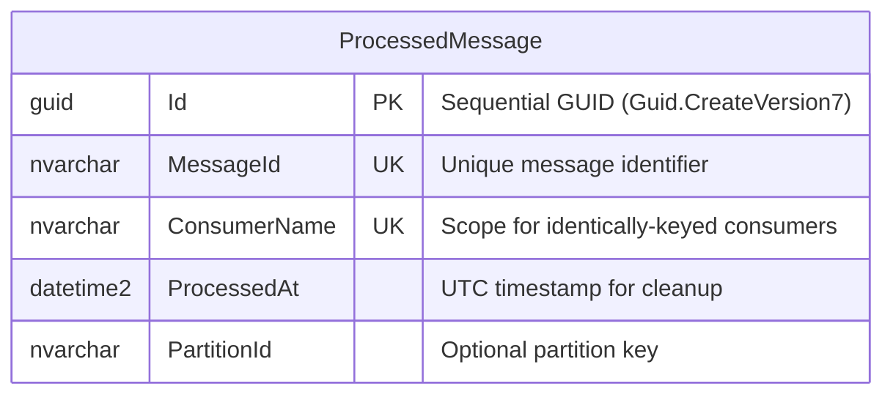
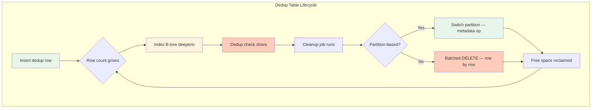
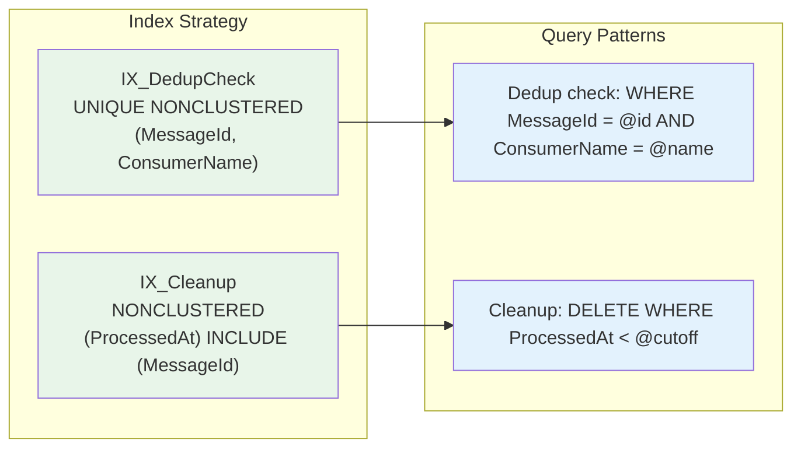
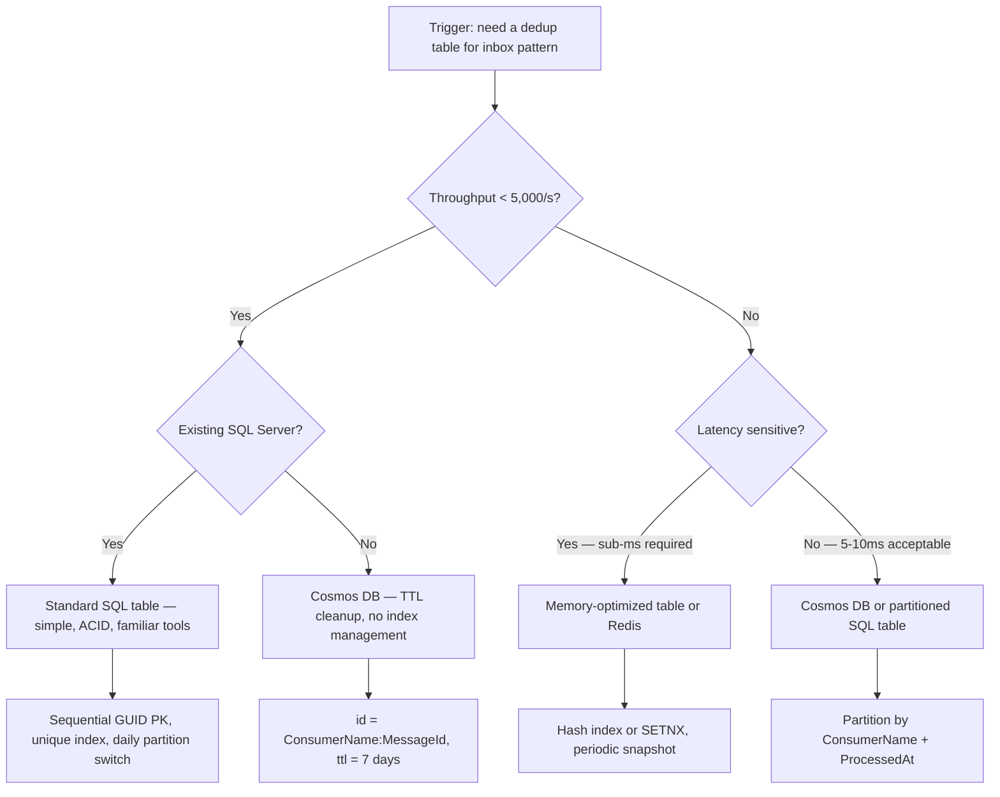

> [!success] Mastery Check
> - [ ] **Studied Well**
> - [ ] **Can explain the concept without notes**
> - [ ] **Can answer interview questions confidently**
> - [ ] **Can implement it in a real project**

## Navigation

**Domain:** [[7 — System Design & Distributed Systems]] > **Group:** Integration Patterns
**Previous:** [[7.126 — Inbox Pattern — Idempotent Message Consumption]] | **Next:** [[7.128 — Transactional Messaging — Guarantees]]

### Prerequisites
- [[7.126 — Inbox Pattern — Idempotent Message Consumption]] — required because this note covers the specific database table that the inbox pattern uses for deduplication
- [[6.411 — Database Indexing Strategies]] — needed because the dedup table's index design directly determines message processing throughput

### Where This Fits

**Maturity assessment:** The dedup table is a "day 2" concern. Most teams set it up incorrectly on day 1 (no cleanup index, random GUID PK) and discover the failure at month 3 when the table has grown to 200 GB and queries are timing out. A production-ready dedup table design accounts for this from the start: sequential GUID, cleanup index, partition strategy, and monitoring alerts are all part of the initial schema design. The dedup table is never "done" — it requires ongoing operational attention: index maintenance, cleanup job monitoring, and capacity planning for storage growth.

The deduplication table is the database artifact of the inbox pattern. It stores one row per processed message, keyed by a unique identifier that survives consumer restarts. The table's schema design, index strategy, partitioning scheme, and cleanup mechanism directly determine the inbox pattern's throughput ceiling and operational cost. A .NET engineer encounters this as the `ProcessedMessages` DbSet in EF Core — a seemingly simple entity that, at scale, requires careful index tuning, batch cleanup, and concurrency management. A poorly designed dedup table is the single most common cause of inbox pattern failure in production: the table grows unbounded, the index fragments, dedup checks slow down, and the consumer falls behind on message processing.

The deduplication table is the database artifact of the inbox pattern. It stores one row per processed message, keyed by a unique identifier that survives consumer restarts. The table's schema design, index strategy, partitioning scheme, and cleanup mechanism directly determine the inbox pattern's throughput ceiling and operational cost. A .NET engineer encounters this as the `ProcessedMessages` DbSet in EF Core — a seemingly simple entity that, at scale, requires careful index tuning, batch cleanup, and concurrency management. A poorly designed dedup table is the single most common cause of inbox pattern failure in production: the table grows unbounded, the index fragments, dedup checks slow down, and the consumer falls behind on message processing.

The dedup table sits at the infrastructure persistence layer alongside the outbox table and the audit log. It has no domain meaning — it is a pure infrastructure artifact whose sole purpose is idempotency enforcement.

## Core Mental Model

The dedup table is a write-once, read-many, time-bounded ledger of processed messages. Each row records that a specific message ID was processed by a specific consumer at a specific time. The index on `(MessageId, ConsumerName)` enforces the idempotency constraint. The table grows linearly with message throughput and must be periodically trimmed. The invariant is: a unique constraint on `(MessageId, ConsumerName)` prevents duplicate processing. The tradeoff is write amplification — every processed message generates one dedup row — and the operational overhead of cleanup. The recognition trigger is a `ProcessedMessages` table that has grown to 200 GB and the dedup check query is now taking 50ms instead of 1ms.





### Classification

The dedup table is a pure infrastructure artifact — it has no business meaning and no domain behavior. It is an append-only ledger (writes only, no updates) with periodic deletes. It is classified as a "transactional ledger" in database terminology. It sits at the persistence infrastructure layer, alongside the outbox table, as part of the reliable messaging infrastructure. In the C4 model, the dedup table is a container-level component within the consumer service's database.

The table's operational profile is unique: it receives mostly sequential inserts (sequential GUID), random point lookups (unique index seek on MessageId), and range scans for cleanup (index on ProcessedAt). This profile requires a specific index strategy — one B-tree index for point lookups and one B-tree index for range scans — and a cleanup strategy that does not interfere with the insert workload.

### Key Properties / Guarantees

|Property|Value|Condition|
|---|---|---|
|Write throughput|~5,000 inserts/second per table partition|Properly indexed, no fragmentation, sequential GUID|
|Read throughput|~50,000 checks/second (unique index seek)|Index in memory, no fragmentation|
|Row size|~300 bytes per dedup entry|MessageId (128), ConsumerName (128), ProcessedAt (8), overhead|
|Growth rate|~1 GB per 3M messages|At 5,000/s: ~11 GB/day, ~330 GB/month|
|Cleanup efficiency (DELETE)|~10,000 rows/second per batch|Batched, with proper index|
|Cleanup efficiency (SWITCH)|< 1 second per partition|Metadata operation, no data movement|
|Index fragmentation rate|~5-10% per day with random GUID|~0% with sequential GUID or NEWSEQUENTIALID|
|Deadlock probability|~0.1% under concurrent insert workload|Rises with fragmentation and page splits|
|Backup impact|+30 min per 500 GB table|Full backup includes entire dedup table|
|Restore time|2-4 hours for 500 GB table|Proportional to table size|
|Index rebuild window|Requires maintenance window|Can exceed SLA for large tables without ONLINE option|

## Deep Mechanics

### How It Works

**Schema Design.** The dedup table has four or five columns:
- `Id` — surrogate key (GUID, `NEWSEQUENTIALID()` or `Guid.CreateVersion7()` for clustered index friendliness)
- `MessageId` — the unique message identifier from the broker (`nvarchar(512)`, indexed for dedup check)
- `ConsumerName` — identifies which consumer type processed this message (`nvarchar(128)`, part of composite unique index)
- `ProcessedAt` — timestamp of processing (`datetime2`, indexed for cleanup)
- `PartitionId` — optional, for partitioned deployments where multiple consumer instances share one table

```sql
CREATE TABLE dbo.ProcessedMessages (
    Id UNIQUEIDENTIFIER NOT NULL DEFAULT NEWSEQUENTIALID(),
    MessageId NVARCHAR(512) NOT NULL,
    ConsumerName NVARCHAR(128) NOT NULL,
    ProcessedAt DATETIME2 NOT NULL DEFAULT GETUTCDATE(),
    PartitionId NVARCHAR(64) NULL,
    
    CONSTRAINT PK_ProcessedMessages PRIMARY KEY CLUSTERED (Id),
    CONSTRAINT UQ_ProcessedMessages_Dedup 
        UNIQUE NONCLUSTERED (MessageId, ConsumerName)
);

-- Cleanup support index
CREATE NONCLUSTERED INDEX IX_ProcessedMessages_Cleanup
ON dbo.ProcessedMessages (ProcessedAt)
INCLUDE (MessageId);
```

**Unique Constraint.** The composite unique index on `(MessageId, ConsumerName)` is the dedup enforcement mechanism. EF Core's `SaveChangesAsync` will throw `DbUpdateException` with a `SqlException` (2627 violation of unique constraint) if a duplicate is inserted. The consumer catches this as a secondary dedup check — if the dedup check query missed the row (due to race), the insert will fail, and the consumer rolls back the transaction.

**Insert Path.** When a consumer inserts a dedup row:
1. SQL Server navigates the unique non-clustered index B-tree to check for `(MessageId, ConsumerName)`.
2. If not found, it inserts the row into the clustered index (appending to the last page for sequential GUID).
3. It inserts the key into the unique non-clustered index.
4. The transaction log records the insert.
5. At commit, the changes are made durable.

The insert is fast (~1ms) when the index is not fragmented and the GUID is sequential. A random GUID causes each insert to land on a random page, splitting pages and fragmenting the index.

**Cleanup Path.** The cleanup job deletes rows where `ProcessedAt < @cutoff`. The index on `ProcessedAt` allows the query to seek to the oldest rows and delete in batches. Each batch of 5,000 rows acquires row-level locks and generates log records. At scale, partition switching is preferred: partitioning by day allows entire partitions to be switched out (metadata operation, < 1 second) and truncated.

### Index Design Deep Dive

The dedup table requires two distinct indexes serving different query patterns:

**Dedup check index (point lookup):** `UNIQUE NONCLUSTERED on (MessageId, ConsumerName)`. This index is used for the seek-based dedup check: find a single row by MessageId + ConsumerName. The index should be narrow (MessageId at 512 chars max, ConsumerName at 128 chars max) for efficient seeks. The `UNIQUE` constraint is the enforcement mechanism — it prevents two transactions from inserting the same MessageId.

**Cleanup index (range scan):** `NONCLUSTERED on (ProcessedAt) INCLUDE (MessageId)`. This index supports the range-based cleanup DELETE: find all rows older than a cutoff. The `INCLUDE` clause adds MessageId to the leaf level without increasing the index key width, allowing the cleanup query to be covered by the index.



**Avoid a third index on ProcessedAt alone without INCLUDE.** Without `INCLUDE (MessageId)`, the cleanup query needs a key lookup (RID lookup for heap, or clustered key lookup for clustered index) to get the MessageId for the DELETE operation. This doubles the I/O per row.

### Failure Modes

**F1 — Unique index fragmentation from random GUIDs.** The dedup table uses a regular `Guid.NewGuid()` as the primary key with a clustered index. Random GUIDs cause page splits on every insert — the new row rarely fits on the current page. Over time, the index becomes deeply fragmented.

- **Detection:** `sys.dm_db_index_physical_stats` shows `avg_fragmentation_in_percent > 30%` on the clustered index. `page_split_count` per second is elevated.
- **Metric:** `inbox_dedup_query_duration_ms` P99 rises. Insert latency goes from 1ms to 15ms.
- **Recovery:** Use `Guid.CreateVersion7()` (.NET 9+) or `NEWSEQUENTIALID()` in SQL Server default. Rebuild the clustered index offline during maintenance window.

**F2 — Cleanup job backlog from full table scans.** The cleanup job runs `DELETE FROM ProcessedMessages WHERE ProcessedAt < @cutoff` without an index on `ProcessedAt`. The query performs a full clustered index scan. At 500 GB, the scan takes 45 minutes. During that time, the table grows by 13 million rows (at 5,000/s).

- **Detection:** `inbox_table_size_gb` grows faster than the cleanup job can reclaim. `sys.dm_exec_query_stats` shows cleanup query with high logical reads.
- **Metric:** `inbox_cleanup_lag_rows` — the gap between the oldest retained row and the current cleanup cut-off.
- **Recovery:** Add an index on `ProcessedAt`. For SQL Server, use a filtered index: `WHERE ProcessedAt < DATEADD(DAY, -1, GETUTCDATE())`.

**F3 — Deadlock between dedup insert and cleanup delete.** The cleanup job's `DELETE` query and a consumer's `INSERT` query run concurrently. The DELETE holds a range lock on the `ProcessedAt` index pages, and the INSERT tries to insert into the same page range. A deadlock occurs.

- **Detection:** SQL Server deadlock graph shows `PAGELOCK` conflicts between cleanup and insert operations. `sql_deadlocks_per_second` > 0 on the ProcessedMessages table.
- **Metric:** `sql_deadlock_count` on ProcessedMessages table. Consumer retry rate increases.
- **Recovery:** Schedule cleanup during off-peak hours. Use `READ_COMMITTED_SNAPSHOT` isolation to reduce lock contention. Switch to partition-based cleanup to avoid deletes entirely.

**F4 — `MessageId` too long for unique index.** The `MessageId` column is `nvarchar(max)` or `nvarchar(2000)`. The unique index cannot be created because SQL Server limits index key columns to 900 bytes for non-clustered indexes.

- **Detection:** Migration fails with `SqlException: "Column 'MessageId' is too long to be used as a key column in an index."`
- **Metric:** None — the migration cannot proceed.
- **Recovery:** Limit `MessageId` to 512 characters. Hash long message IDs with `SHA2_256` and store the hash in a separate indexed column. The hash is 64 characters (hex) — well within the 900-byte limit.

```csharp
// Hash long message IDs for the index
builder.Property(m => m.MessageIdHash)
    .HasMaxLength(64)
    .IsRequired()
    .HasComputedColumnSql("CONVERT(NVARCHAR(64), HASHBYTES('SHA2_256', MessageId), 2)");

builder.HasIndex(m => new { m.MessageIdHash, m.ConsumerName }).IsUnique();
```

**F5 — Timezone mismatch in ProcessedAt.** The cleanup cutoff uses `DateTime.UtcNow`, but the `ProcessedAt` column stores `DateTime.Now` (local time). During daylight saving time transitions, the cleanup deletes too many or too few rows.

- **Detection:** During spring DST transition (clocks forward), 1 hour of dedup rows is incorrectly deleted. During fall DST transition (clocks back), 1 hour of rows is retained beyond the retention period.
- **Metric:** `inbox_duplicates_detected` spikes after DST transitions.
- **Recovery:** Always use `DateTime.UtcNow` in application code and `GETUTCDATE()` at the database level.

**F6 — Index rebuild blocking inserts.** The index rebuild (scheduled to defragment) acquires a schema modification lock (SCH-M). Concurrent inserts request schema stability locks (SCH-S). The rebuild cannot proceed until all inserts complete — but inserts never stop. The rebuild times out and fails.

- **Detection:** `ALTER INDEX REBUILD` fails with timeout. `sys.dm_exec_requests` shows the rebuild waiting for `LCK_M_SCH_M`.
- **Metric:** `index_rebuild_failure_count` in maintenance job logs.
- **Recovery:** Use `ONLINE = ON` for the rebuild (SQL Server Enterprise/Developer). Or partition the table — each partition's index is smaller and rebuilds faster with less blocking.

### Dapper-Based Cleanup for High Performance

For systems where EF Core's `ExecuteDeleteAsync` is too slow or generates suboptimal SQL, use Dapper for direct cleanup operations:

```csharp
// Dapper-based dedup cleanup — optimized for high throughput
public sealed class DapperDedupCleanup
{
    private readonly string _connectionString;

    public DapperDedupCleanup(string connectionString)
    {
        _connectionString = connectionString;
    }

    public async Task<int> BatchDeleteAsync(DateTime olderThan, int batchSize)
    {
        await using var conn = new SqlConnection(_connectionString);
        await conn.OpenAsync();

        // Batch delete with TOP — most efficient for cleanup
        var sql = """
            DELETE TOP (@BatchSize) FROM dbo.ProcessedMessages
            WHERE ProcessedAt < @OlderThan
            OPTION (RECOMPILE);
            """;

        return await conn.ExecuteAsync(sql, new
        {
            BatchSize = batchSize,
            OlderThan = olderThan
        });
    }

    public async Task SwitchPartitionAsync(DateTime partitionDate)
    {
        await using var conn = new SqlConnection(_connectionString);
        await conn.OpenAsync();
        using var tx = conn.BeginTransaction();

        // Create staging table
        await conn.ExecuteAsync("""
            CREATE TABLE #Staging (
                Id UNIQUEIDENTIFIER NOT NULL,
                MessageId NVARCHAR(512) NOT NULL,
                ConsumerName NVARCHAR(128) NOT NULL,
                ProcessedAt DATETIME2 NOT NULL,
                PartitionId NVARCHAR(64) NULL,
                CONSTRAINT PK_Staging PRIMARY KEY CLUSTERED (Id, ProcessedAt)
            );
            """, transaction: tx);

        // Switch partition
        await conn.ExecuteAsync($"""
            ALTER TABLE dbo.ProcessedMessages
            SWITCH PARTITION $PARTITION.PF_Daily('{partitionDate:yyyy-MM-dd}')
            TO #Staging;
            """, transaction: tx);

        // Truncate and drop staging
        await conn.ExecuteAsync("TRUNCATE TABLE #Staging;", transaction: tx);
        await conn.ExecuteAsync("DROP TABLE #Staging;", transaction: tx);

        await tx.CommitAsync();
    }

    public async Task<DedupTableHealth> GetHealthAsync()
    {
        await using var conn = new SqlConnection(_connectionString);
        
        var metrics = await conn.QuerySingleAsync("""
            SELECT
                COUNT_BIG(*) AS RowCount,
                MIN(ProcessedAt) AS OldestRow,
                MAX(ProcessedAt) AS NewestRow,
                AVG(1.0 * page_count * 8 / 1024) AS AvgIndexSizeMB
            FROM sys.dm_db_index_physical_stats(
                DB_ID(), OBJECT_ID('ProcessedMessages'), NULL, NULL, 'LIMITED')
            """);
        
        return new DedupTableHealth(
            metrics.RowCount,
            metrics.OldestRow,
            metrics.NewestRow,
            metrics.AvgIndexSizeMB);
    }
}

public sealed record DedupTableHealth(
    long RowCount,
    DateTime OldestRow,
    DateTime NewestRow,
    double AvgIndexSizeMB);
```

### .NET and Azure Integration

- **EF Core:** `ProcessedMessage` entity with `HasIndex(m => new { m.MessageId, m.ConsumerName }).IsUnique()` for dedup enforcement; `HasIndex(m => m.ProcessedAt)` for cleanup; `HasDefaultValueSql("GETUTCDATE()")` for ProcessedAt
- **Azure SQL:** Hyperscale tier for the dedup table, with automatic partitioning and fast cleanup; elastic pool if the dedup table is part of a shared database; serverless compute for low-throughput scenarios
- **Azure Cosmos DB:** Alternative for very high throughput — use `id` as `{ConsumerName}:{MessageId}` and `ttl` for automatic cleanup; no index management needed
- **Azure Redis Cache:** For sub-millisecond dedup with TTL-based auto-cleanup; risk of data loss on restart
- **.NET libraries:** `EFCore.BulkExtensions` for batch inserts if the dedup table write path becomes a bottleneck; `Dapper` for raw SQL cleanup operations when EF Core's `ExecuteDeleteAsync` is insufficient

```csharp
// EF Core model configuration — production-ready
public sealed class ProcessedMessageConfiguration : IEntityTypeConfiguration<ProcessedMessage>
{
    public void Configure(EntityTypeBuilder<ProcessedMessage> builder)
    {
        builder.ToTable("ProcessedMessages");
        builder.HasKey(m => m.Id)
            .IsClustered();

        builder.Property(m => m.MessageId)
            .HasMaxLength(512)
            .IsRequired();

        builder.Property(m => m.ConsumerName)
            .HasMaxLength(128)
            .IsRequired();

        builder.Property(m => m.ProcessedAt)
            .IsRequired()
            .HasDefaultValueSql("GETUTCDATE()");

        // Dedup enforcement index — unique constraint
        builder.HasIndex(m => new { m.MessageId, m.ConsumerName })
            .IsUnique()
            .IsClustered(false)
            .HasDatabaseName("IX_ProcessedMessages_Dedup");

        // Cleanup index
        builder.HasIndex(m => m.ProcessedAt)
            .IsClustered(false)
            .HasDatabaseName("IX_ProcessedMessages_Cleanup");

        // Optional: filtered index for partition-based cleanup
        builder.HasIndex(m => m.ProcessedAt)
            .IsClustered(false)
            .HasDatabaseName("IX_ProcessedMessages_Partitioned")
            .HasFilter("[ProcessedAt] > DATEADD(day, -1, GETUTCDATE())");
    }
}
```

## Production Patterns and Implementation

### Primary Implementation

```csharp
// ProcessedMessage entity with sequential GUID
public sealed class ProcessedMessage
{
    public Guid Id { get; private set; }
    public string MessageId { get; private set; }
    public string ConsumerName { get; private set; }
    public DateTime ProcessedAt { get; private set; }
    public string? PartitionId { get; private set; }

    private ProcessedMessage() { }

    public ProcessedMessage(string messageId, string consumerName, string? partitionId = null)
    {
        Id = Guid.CreateVersion7(); // Sequential GUID — reduces index fragmentation
        MessageId = messageId;
        ConsumerName = consumerName;
        ProcessedAt = DateTime.UtcNow;
        PartitionId = partitionId;
    }
}

// Batch dedup store — optimized for high throughput
public sealed class BatchInboxDedupStore
{
    private readonly IDbContextFactory<InboxDbContext> _contextFactory;

    public BatchInboxDedupStore(IDbContextFactory<InboxDbContext> contextFactory)
    {
        _contextFactory = contextFactory;
    }

    // Bulk-check which messages have already been processed
    public async Task<HashSet<string>> FilterProcessedAsync(
        IEnumerable<string> messageIds,
        string consumerName,
        CancellationToken ct)
    {
        await using var context = await _contextFactory.CreateDbContextAsync(ct);

        var processed = await context.ProcessedMessages
            .Where(m => m.ConsumerName == consumerName
                     && messageIds.Contains(m.MessageId))
            .Select(m => m.MessageId)
            .ToHashSetAsync(ct);

        return processed;
    }

    // Batch insert dedup rows — for high-throughput scenarios
    public async Task MarkProcessedAsync(
        IEnumerable<string> messageIds,
        string consumerName,
        CancellationToken ct)
    {
        await using var context = await _contextFactory.CreateDbContextAsync(ct);

        var messages = messageIds.Select(id =>
            new ProcessedMessage(id, consumerName));

        context.ProcessedMessages.AddRange(messages);

        try
        {
            await context.SaveChangesAsync(ct);
        }
        catch (DbUpdateException ex) when (ex.InnerException is SqlException sqlEx
            && sqlEx.Number == 2627) // Unique constraint violation
        {
            throw new DuplicateMessageDetectedException(
                "One or more messages were already processed", ex);
        }
    }

    // Batch dedup check with pessimistic lock — prevents race conditions
    public async Task<bool> TryAcquireWithLockAsync(
        string messageId,
        string consumerName,
        CancellationToken ct)
    {
        await using var context = await _contextFactory.CreateDbContextAsync(ct);

        // UPDLOCK + ROWLOCK prevents concurrent inserts of the same MessageId
        var exists = await context.ProcessedMessages
            .FromSql($"""
                SELECT Id, MessageId, ConsumerName, ProcessedAt, PartitionId
                FROM ProcessedMessages WITH (UPDLOCK, ROWLOCK)
                WHERE MessageId = {messageId} AND ConsumerName = {consumerName}
                """)
            .AnyAsync(ct);

        if (exists) return false;

        context.ProcessedMessages.Add(
            new ProcessedMessage(messageId, consumerName));
        await context.SaveChangesAsync(ct);
        return true;
    }

    // Cleanup — partition-based or batch delete
    public async Task<int> CleanupAsync(DateTime olderThan, int batchSize, CancellationToken ct)
    {
        await using var context = await _contextFactory.CreateDbContextAsync(ct);

        return await context.ProcessedMessages
            .Where(m => m.ProcessedAt < olderThan)
            .Take(batchSize)
            .ExecuteDeleteAsync(ct);
    }

    // Check table size metrics
    public async Task<DedupTableMetrics> GetMetricsAsync(CancellationToken ct)
    {
        await using var context = await _contextFactory.CreateDbContextAsync(ct);
        
        var rowCount = await context.ProcessedMessages.CountAsync(ct);
        var oldestRow = await context.ProcessedMessages
            .MinAsync(m => (DateTime?)m.ProcessedAt, ct);
        var newestRow = await context.ProcessedMessages
            .MaxAsync(m => (DateTime?)m.ProcessedAt, ct);

        return new DedupTableMetrics(
            rowCount,
            oldestRow ?? DateTime.MinValue,
            newestRow ?? DateTime.MinValue);
    }
}

public sealed record DedupTableMetrics(
    long RowCount,
    DateTime OldestRow,
    DateTime NewestRow);
```

### Configuration and Wiring

```csharp
// Program.cs — InboxDbContext and dedup store registration
builder.Services.AddDbContextFactory<InboxDbContext>(options =>
{
    options.UseSqlServer(builder.Configuration.GetConnectionString("Inbox"),
        sql => sql.CommandTimeout(30)
            .EnableRetryOnFailure(3));
});

builder.Services.AddSingleton<BatchInboxDedupStore>();

builder.Services.AddHostedService<DedupTableCleanupService>();

// Configuration
builder.Services.Configure<DedupCleanupOptions>(
    builder.Configuration.GetSection("InboxCleanup"));
```

```json
{
  "ConnectionStrings": {
    "Inbox": "Server=tcp:...;Database=OrderInboxDb;ConnectRetryCount=3;"
  },
  "InboxCleanup": {
    "RetentionDays": 7,
    "BatchSize": 5000,
    "IntervalMinutes": 60,
    "UsePartitionSwitch": true,
    "PartitionFileGroup": "SECONDARY"
  }
}
```

```csharp
// Cleanup background service
public sealed class DedupTableCleanupService : BackgroundService
{
    private readonly IDbContextFactory<InboxDbContext> _contextFactory;
    private readonly IOptions<DedupCleanupOptions> _options;
    private readonly ILogger<DedupTableCleanupService> _logger;

    public DedupTableCleanupService(
        IDbContextFactory<InboxDbContext> contextFactory,
        IOptions<DedupCleanupOptions> options,
        ILogger<DedupTableCleanupService> logger)
    {
        _contextFactory = contextFactory;
        _options = options;
        _logger = logger;
    }

    protected override async Task ExecuteAsync(CancellationToken stoppingToken)
    {
        using var timer = new PeriodicTimer(
            TimeSpan.FromMinutes(_options.Value.IntervalMinutes));

        while (await timer.WaitForNextTickAsync(stoppingToken))
        {
            try
            {
                await using var context = await _contextFactory.CreateDbContextAsync(stoppingToken);
                var cutoff = DateTime.UtcNow.AddDays(-_options.Value.RetentionDays);

                if (_options.Value.UsePartitionSwitch)
                {
                    await SwitchPartitionsAsync(context, cutoff, stoppingToken);
                }
                else
                {
                    await BatchDeleteAsync(context, cutoff, stoppingToken);
                }
            }
            catch (OperationCanceledException) { break; }
            catch (Exception ex)
            {
                _logger.LogError(ex, "Dedup cleanup failed");
            }
        }
    }

    private async Task BatchDeleteAsync(
        InboxDbContext context,
        DateTime cutoff,
        CancellationToken ct)
    {
        int total;
        do
        {
            total = await context.ProcessedMessages
                .Where(m => m.ProcessedAt < cutoff)
                .Take(_options.Value.BatchSize)
                .ExecuteDeleteAsync(ct);

            _logger.LogDebug("Deleted {Count} dedup rows", total);
        }
        while (total >= _options.Value.BatchSize && !ct.IsCancellationRequested);
    }

    private async Task SwitchPartitionsAsync(
        InboxDbContext context,
        DateTime cutoff,
        CancellationToken ct)
    {
        // Switch out partitions older than cutoff
        // Requires pre-configured partition scheme
        var partitionDate = cutoff.Date;
        await context.Database.ExecuteSqlAsync($"""
            DECLARE @partitionNumber INT = $PARTITION.PF_ProcessedMessages_Daily({partitionDate});
            
            -- Switch and truncate each old partition
            WHILE @partitionNumber > 0
            BEGIN
                -- Create staging table
                CREATE TABLE #Staging (
                    Id UNIQUEIDENTIFIER NOT NULL,
                    MessageId NVARCHAR(512) NOT NULL,
                    ConsumerName NVARCHAR(128) NOT NULL,
                    ProcessedAt DATETIME2 NOT NULL,
                    PartitionId NVARCHAR(64) NULL,
                    PRIMARY KEY CLUSTERED (Id, ProcessedAt)
                );
                
                -- Switch out partition
                ALTER TABLE dbo.ProcessedMessages
                SWITCH PARTITION @partitionNumber TO #Staging;
                
                TRUNCATE TABLE #Staging;
                DROP TABLE #Staging;
                
                SET @partitionNumber = @partitionNumber - 1;
            END
            """, ct);
        
        _logger.LogInformation("Partition switch completed for partitions before {Date}", cutoff);
    }
}

public sealed class DedupCleanupOptions
{
    public int RetentionDays { get; set; } = 7;
    public int BatchSize { get; set; } = 5000;
    public int IntervalMinutes { get; set; } = 60;
    public bool UsePartitionSwitch { get; set; }
    public string? PartitionFileGroup { get; set; }
}
```

### Common Variants

**Cosmos DB dedup table.** For very high throughput (>10,000 events/second per consumer), use Cosmos DB as the dedup store with TTL-based cleanup. Cosmos handles throughput scaling and index management automatically.

```csharp
// Cosmos DB dedup — TTL automatically deletes old entries
public sealed class CosmosDedupStore
{
    private readonly Container _container;

    public CosmosDedupStore(CosmosClient client)
    {
        _container = client.GetContainer("InboxDb", "ProcessedMessages");
    }

    public async Task<bool> TryAcquireAsync(string messageId, string consumerName)
    {
        try
        {
            var partitionKey = new PartitionKey(consumerName);
            await _container.CreateItemAsync(
                new
                {
                    id = $"{consumerName}:{messageId}",
                    consumerName,
                    messageId,
                    ttl = 604800 // 7 days in seconds — auto-cleanup!
                },
                partitionKey);
            return true;
        }
        catch (CosmosException ex) when (ex.StatusCode == System.Net.HttpStatusCode.Conflict)
        {
            return false;
        }
    }
}

// Register Cosmos client
builder.Services.AddSingleton(sp =>
{
    return new CosmosClient(
        builder.Configuration["Cosmos:ConnectionString"]);
});
builder.Services.AddSingleton<CosmosDedupStore>();
```

**SQL Server Memory-Optimized Table.** Use `MEMORY_OPTIMIZED_DATA` for the dedup table to achieve sub-millisecond inserts with hash indexes. Requires SQL Server Enterprise edition.

```sql
CREATE TABLE dbo.ProcessedMessages (
    Id UNIQUEIDENTIFIER NOT NULL,
    MessageId NVARCHAR(512) NOT NULL,
    ConsumerName NVARCHAR(128) NOT NULL,
    ProcessedAt DATETIME2 NOT NULL,
    CONSTRAINT PK_ProcessedMessages PRIMARY KEY NONCLUSTERED (Id),
    INDEX IX_DedupHash HASH (MessageId, ConsumerName) WITH (BUCKET_COUNT = 10000000)
) WITH (MEMORY_OPTIMIZED = ON, DURABILITY = SCHEMA_AND_DATA);
```

**Redis-based dedup.** In-memory, sub-millisecond dedup checks with TTL-based auto-cleanup. Risk of data loss on restart allows duplicates during the recovery window.

```csharp
// Redis dedup — sub-millisecond, auto-cleanup via TTL
public sealed class RedisDedupTable
{
    private readonly IDatabase _redis;
    private readonly TimeSpan _ttl;

    public RedisDedupTable(IDatabase redis, TimeSpan ttl)
    {
        _redis = redis;
        _ttl = ttl;
    }

    public async Task<bool> TryAcquireAsync(string messageId, string consumerName)
    {
        var key = $"inbox-dedup:{consumerName}:{messageId}";
        return await _redis.StringSetAsync(key, "1", _ttl, When.NotExists);
    }
}
```

### Real-World .NET Ecosystem Example

**NServiceBus' `GatewayDeduplication`** and **MassTransit's `InMemoryDeduplication`** both use a dedup table pattern. NServiceBus stores `TransportMessageId` in a `GatewayMessage` table to prevent duplicate processing across gateway endpoints. The table is automatically indexed on `Id` (which is the transport message ID). NServiceBus periodically cleans up messages older than the configured `TimeToLive`.

**MassTransit's `InMemoryOutbox`** uses a non-durable in-memory dedup set — it does not survive restarts but prevents duplicates within a single process lifetime. For durable dedup, MassTransit users implement their own `ISagaRepository` with dedup in the saga data.

```csharp
// NServiceBus uses this table for gateway deduplication
// Table: [dbo].[GatewayMessage]
// Index: UNIQUE NONCLUSTERED ([Id])
// NServiceBus periodically cleans up messages older than TimeToLive

// MassTransit saga with dedup via saga repository
public sealed class OrderProcessState : SagaStateMachineInstance
{
    public Guid CorrelationId { get; set; }
    public string CurrentState { get; set; }
    public HashSet<string> ProcessedMessageIds { get; set; } = new();
}
```

**Azure Service Bus's built-in duplicate detection** uses a broker-side dedup table with a configurable window (up to 7 days). This reduces the load on the consumer's dedup table but does not eliminate the need for it — broker-side dedup catches network-level duplicates, while the consumer-side dedup catches consumer crash-ack cycle duplicates. The combination provides defense in depth: broker-side dedup reduces the volume of duplicates reaching the consumer (improving efficiency), and consumer-side dedup ensures any remaining duplicates are handled safely.

**EF Core Plus Batch Operations** library provides `DeleteFromQuery` for high-performance bulk deletes without loading entities into memory:

```csharp
// Using EF Core Plus for bulk cleanup
await context.ProcessedMessages
    .Where(m => m.ProcessedAt < cutoff)
    .DeleteFromQueryAsync(ct);

// Using EF Core Plus for bulk insert
await context.ProcessedMessages.AddRangeAsync(messages, ct);
await context.BulkSaveChangesAsync(ct);
```

**Azure SQL Hyperscale with automatic partitioning.** For very large dedup tables (>500 GB), use Azure SQL Database Hyperscale tier. Hyperscale provides automatic partition management, fast backups, and the ability to scale compute independently of storage. The dedup table benefits from Hyperscale's nearly unlimited storage (up to 100 TB) and fast backup/restore (backup is file-snapshot based, not size-dependent).

**In-memory dedup table for testing.** For unit tests, replace the SQL dedup table with an in-memory implementation:

```csharp
// In-memory dedup for unit tests — ISet-based
public sealed class InMemoryDedupStore : IDedupStore
{
    private readonly HashSet<string> _processed = new();

    public Task<bool> IsDuplicateAsync(string messageId, string consumerName)
    {
        return Task.FromResult(
            _processed.Contains($"{consumerName}:{messageId}"));
    }

    public Task MarkProcessedAsync(string messageId, string consumerName)
    {
        _processed.Add($"{consumerName}:{messageId}");
        return Task.CompletedTask;
    }

    public Task ResetAsync()
    {
        _processed.Clear();
        return Task.CompletedTask;
    }
}
```

## Gotchas and Production Pitfalls

### 1. GUID clustered index causing page splits

**Pitfall:** The dedup table uses a regular `Guid.NewGuid()` as the primary key with a clustered index. Random GUIDs cause page splits on every insert — the new row rarely fits on the current page.

```csharp
// ❌ Random GUID — causes page splits
public ProcessedMessage()
{
    Id = Guid.NewGuid(); // Random — causes 50% page splits
}
```

**Symptom:** Index fragmentation reaches 60% within a day. Dedup inserts that should take 1ms take 15ms because of page split overhead. The transaction log grows 3x faster than expected.

**Fix:** Use a sequential GUID (`Guid.CreateVersion7()` in .NET 9+, or `NEWSEQUENTIALID()` in SQL Server).

```csharp
// ✅ Sequential GUID — reduces page splits
public ProcessedMessage()
{
    Id = Guid.CreateVersion7(); // Appends to the end of the index
}

// Or configure EF Core to use NEWSEQUENTIALID()
builder.Property(m => m.Id)
    .HasDefaultValueSql("NEWSEQUENTIALID()");
```

**Cost of not fixing:** At 5,000 inserts/second, page split overhead adds 50ms per insert. The database CPU is at 80% just for dedup inserts. The application write path is blocked. The consumer falls behind, the queue depth grows, and message processing latency increases from seconds to hours.

### 2. Cleanup query not using the index

**Pitfall:** The cleanup job runs `DELETE FROM ProcessedMessages WHERE ProcessedAt < @cutoff` without an index on `ProcessedAt`. The query performs a full clustered index scan.

```csharp
// ❌ No index on ProcessedAt — full scan
await context.ProcessedMessages
    .Where(m => m.ProcessedAt < olderThan)
    .ExecuteDeleteAsync(ct);
```

**Symptom:** The cleanup job takes 45 minutes, blocking other operations with table-level locks. The job times out after 30 minutes (default command timeout). The table grows unbounded.

**Fix:** Add a non-clustered index on `ProcessedAt`. For SQL Server, use a filtered index to only index rows eligible for cleanup.

```sql
-- ✅ Index specifically for cleanup queries
CREATE NONCLUSTERED INDEX IX_ProcessedMessages_Cleanup
ON ProcessedMessages (ProcessedAt)
INCLUDE (MessageId)
WHERE ProcessedAt < DATEADD(DAY, -1, GETUTCDATE());
```

**Cost of not fixing:** The table reaches 500 GB. The cleanup job has been failing for 2 weeks. The dedup check query (which was a fast index seek) now takes 200ms because SQL Server chooses to scan the fragmented clustered index.

### 3. Deadlock between dedup insert and cleanup delete

**Pitfall:** The cleanup job's `DELETE` query and a consumer's `INSERT` query run concurrently. The DELETE holds a range lock on the `ProcessedAt` index pages, and the INSERT tries to insert into the same page range. A deadlock occurs.

- **Symptom:** Intermittent deadlock errors in both the consumer logs and the cleanup job logs. `sql_deadlocks_per_second` shows 10-20 deadlocks during cleanup windows.
- **Metric:** `sql_deadlock_count` on ProcessedMessages table.
- **Fix:** Schedule the cleanup job during off-peak hours when message volume is low. Use `READ_COMMITTED_SNAPSHOT` to reduce lock contention. Or use partitioning to avoid deletes entirely.

```sql
-- ✅ Enable RCSI to reduce lock contention
ALTER DATABASE OrderingDb SET READ_COMMITTED_SNAPSHOT ON;
```

**Cost of not fixing:** Deadlocks cause consumer transactions to roll back. The consumer retries, and the message processing latency spikes. During peak hours, the deadlock rate reaches 5% of all dedup inserts.

### 4. `MessageId` too long for the unique index

**Pitfall:** The `MessageId` column is `nvarchar(max)` or `nvarchar(2000)`. The unique index cannot be created because SQL Server limits index key columns to 900 bytes for non-clustered indexes.

```csharp
// ❌ MessageId too long — cannot create unique index
builder.Property(m => m.MessageId).HasColumnType("nvarchar(max)");
builder.HasIndex(m => m.MessageId).IsUnique(); // Fails: key too long
```

**Symptom:** Migration fails with `SqlException: "Column 'MessageId' is too long to be used as a key column in an index."` The unique constraint cannot be enforced at the database level.

**Fix:** Limit `MessageId` to 512 characters. Hash long message IDs with a deterministic hash (SHA256 truncated) and store the hash in the index.

```csharp
// ✅ Hash long message IDs for the index
builder.Property(m => m.MessageIdHash)
    .HasMaxLength(64)
    .IsRequired()
    .HasComputedColumnSql("CONVERT(NVARCHAR(64), HASHBYTES('SHA2_256', MessageId), 2)");

builder.HasIndex(m => new { m.MessageIdHash, m.ConsumerName }).IsUnique();
```

**Cost of not fixing:** Without a unique index, the dedup enforcement relies on application-level locking — which has race conditions and allows duplicates.

### 5. Timezone mismatch in ProcessedAt for cleanup

**Pitfall:** The cleanup cutoff uses `DateTime.UtcNow`, but the `ProcessedAt` column stores `DateTime.Now` (local time). During daylight saving time transitions, the cleanup deletes too many or too few rows.

**Symptom:** During spring DST transition (clocks forward), 1 hour of dedup rows is incorrectly deleted. During fall DST transition (clocks back), 1 hour of rows is retained beyond the retention period.

**Fix:** Always use `DateTime.UtcNow` (or `GETUTCDATE()` at the database level).

```csharp
// ✅ UTC — no DST issues
entity.ProcessedAt = DateTime.UtcNow;
```

**Cost of not fixing:** A 1-hour gap in dedup coverage during DST transition allows duplicates to be processed. The incident is discovered 3 months later during the next DST transition.

### 6. Index rebuild blocking concurrent inserts

**Pitfall:** The nightly index rebuild job tries to rebuild the clustered index on `ProcessedMessages`. The rebuild requires a schema modification lock (SCH-M). Concurrent inserts (from consumers) hold schema stability locks (SCH-S). The rebuild waits for all inserts to finish, but inserts never stop — the rebuild times out after 30 minutes.

**Symptom:** Index rebuild fails every night. Index fragmentation reaches 80%. Dedup insert latency degrades from 1ms to 20ms. The consumer falls behind.

**Fix:** Use `ONLINE = ON` for the index rebuild (requires SQL Server Enterprise or Developer edition). Or partition the table — each partition's index is smaller and can be rebuilt individually with less blocking.

```sql
ALTER INDEX IX_ProcessedMessages_Dedup
ON dbo.ProcessedMessages
REBUILD WITH (ONLINE = ON, MAXDOP = 4, SORT_IN_TEMPDB = ON);
```

**Cost of not fixing:** Fragmentation continues to worsen. At 80% fragmentation, each dedup insert causes 2-3 page splits. The transaction log grows at double the rate. Backup times increase.

### 7. Partition key alignment mismatch in partitioned table

**Pitfall:** The table is partitioned by `ProcessedAt`, but the clustered primary key does not include `ProcessedAt`. Partitioning requires the partition key to be part of the clustered index.

```sql
-- ❌ Partition key not in PK
CREATE TABLE ProcessedMessages (
    Id UNIQUEIDENTIFIER NOT NULL,
    ProcessedAt DATETIME2 NOT NULL,
    ...
    PRIMARY KEY CLUSTERED (Id)  -- ProcessedAt not included!
) ON PS_Daily(ProcessedAt);  -- Error: partitioning column must be in PK
```

**Symptom:** `CREATE TABLE` fails with "The partition column must be part of the clustered index key."

**Fix:** Include `ProcessedAt` in the clustered primary key.

```sql
-- ✅ Partition key in PK
PRIMARY KEY CLUSTERED (Id, ProcessedAt)
```

**Cost of not fixing:** Cannot create the partitioned table. Must redesign the primary key. This changes the access pattern — all queries that seek by `Id` must now include `ProcessedAt` for partition elimination.

### 8. Disk space exhaustion from transaction log during cleanup

**Pitfall:** The cleanup job runs `DELETE FROM ProcessedMessages WHERE ProcessedAt < @cutoff` without batching. A single DELETE transaction deletes 50M rows. SQL Server logs each row deletion in the transaction log. The log grows to fill available disk space.

**Symptom:** The transaction log grows to 200 GB during cleanup. `DISK FULL` errors appear. The cleanup job fails. The database becomes read-only while the log is backed up.

**Fix:** Always batch cleanup operations. Use `DELETE TOP (@batchSize)` in a loop with `COMMIT` after each batch. Keep batch sizes at 5,000-10,000 rows to keep log growth manageable.

```sql
-- ✅ Batched delete — keeps log growth bounded
DECLARE @BatchSize INT = 5000;
DECLARE @Deleted INT = 1;

WHILE @Deleted > 0
BEGIN
    DELETE TOP (@BatchSize)
    FROM dbo.ProcessedMessages
    WHERE ProcessedAt < DATEADD(DAY, -7, GETUTCDATE());
    
    SET @Deleted = @@ROWCOUNT;
    CHECKPOINT; -- Truncate log (simple recovery) or backup log (full recovery)
END
```

**Cost of not fixing:** Database becomes read-only due to full transaction log. All consumer processing stops. Recovery takes 30 minutes to back up and truncate the log.

## Tradeoffs and Decision Framework

### Tradeoff Matrix

|Dimension|SQL Server Dedup (Standard)|Cosmos DB Dedup|Redis Dedup|Memory-Optimized Table|
|---|---|---|---|---|
|Latency (P99 check+insert)|~5ms|~10ms (RU-based)|~1ms|~0.5ms|
|Throughput (max)|~5,000/s per partition|~100,000 RU/s|~100,000/s|~50,000/s|
|Durability|Full ACID|Configurable (strong/eventual)|Lossy on restart|Full ACID|
|Cleanup|Partition switch / batch DELETE|TTL (automatic)|TTL (automatic)|Batch DELETE|
|Operational cost|Included in DB|Additional RU|Additional Redis|Requires SQL Enterprise|
|Complexity|Low|Low|Low|Medium|
|Index maintenance|Manual (rebuild)|Automatic|None|Manual|
|Cross-region replication|Always On AG|Built-in|Redis Enterprise|Not supported|

### When to Apply



### When NOT to Apply

- [ ] The business operation is inherently idempotent — no dedup table needed
- [ ] The message throughput is below 10/second and duplicates are manually reconciled — over-engineering
- [ ] The consumer has no database (serverless, ephemeral) — use Redis or broker-level dedup
- [ ] A shared dedup table across multiple services causes coupling — each service should own its dedup table
- [ ] The team lacks DBA expertise for index maintenance and partition management at scale

### Scale Thresholds

- **Below 1,000 events/second:** Standard SQL table with unique index. Cleanup via batched DELETE. No partitioning needed. Sequential GUID PK.
- **1,000 — 10,000 events/second:** Same table but with daily partition switching for cleanup. Sequential GUID PK. Filtered index on `ProcessedAt` for cleanup queries.
- **10,000 — 50,000 events/second:** Memory-optimized table or Cosmos DB. Partition by `ConsumerName`. Hash index for dedup check. TTL-based cleanup.
- **Above 50,000 events/second:** Redis-based dedup with periodic snapshot to SQL for durability. Or restructure to use business-level idempotency as primary mechanism.
- **Dedup table storage budget:** At 5,000/s with 7-day retention: 5,000 × 300 bytes × 86,400 × 7 = ~9 TB. Plan storage accordingly. Use compression (PAGE or COLUMNSTORE) to reduce footprint by 50-70%.

## Interview Arsenal

### Question Bank

1. What columns does a dedup table need, and why?
2. Why use a sequential GUID (or NEWSEQUENTIALID) for the dedup table's primary key?
3. How does the unique index on (MessageId, ConsumerName) enforce exactly-once processing?
4. What happens when the dedup table grows to 500 GB — how does it degrade the inbox pattern?
5. Compare partition-based cleanup with batch DELETE for the dedup table.
6. Design a dedup table for a system processing 50,000 events/second.
7. Why include ConsumerName in the dedup index? What goes wrong without it?
8. How does the dedup table interact with the dead-letter queue?
9. What index fragmentation level triggers a rebuild, and what rebuild strategy do you use?
10. How would you migrate a dedup table from SQL Server to Cosmos DB without losing dedup state?

### Spoken Answers

**Q1: What columns does a dedup table need, and why?**

> **Average answer:** "A MessageId column and a timestamp."
>
> **Great answer:** "A dedup table needs at minimum four columns. `Id` — a surrogate primary key, best implemented as a sequential GUID to reduce index fragmentation. `MessageId` — the unique message identifier from the broker, up to 512 characters. `ConsumerName` — identifies which consumer type processed this message, so that two different consumers subscribing to the same event type don't interfere with each other's dedup. `ProcessedAt` — a UTC timestamp for cleanup queries. Optionally a `PartitionId` column for partitioned deployments. The critical index is a unique composite index on `(MessageId, ConsumerName)` — this is what enforces the idempotency guarantee. The cleanup index on `(ProcessedAt)` is a supporting structure. The schema is simple, but the index design and cleanup strategy must be right — at scale, a poorly indexed dedup table can take down the consumer. I've seen a production incident where the dedup table's unique index was built on a random GUID clustered key, causing 70% fragmentation within a week and 15ms insert latency."

**Q4: What happens when the dedup table grows to 500 GB?**

> **Great answer:** "Several things degrade at scale. First, the unique index on `(MessageId, ConsumerName)` becomes deeply fragmented if the `Id` is a random GUID — page splits create physical fragmentation that slows seek operations from 1ms to 10ms+. Second, the dedup check query, which was a fast unique index seek, becomes slower as the B-tree depth increases — at 500 GB, the index has 5-7 levels. Third, the cleanup job performance degrades because the `ProcessedAt` index is also large and fragmented — batched deletes take progressively longer. Fourth, the table's size affects backup and restore times — a 500 GB table adds 30 minutes to the nightly backup. The solutions are: use a sequential GUID to minimize fragmentation, partition by day and switch out old partitions instead of deleting rows, and monitor index fragmentation to schedule regular rebuilds. If the table grows past 500 GB despite these measures, consider moving to Cosmos DB with TTL-based cleanup or using a memory-optimized table."

**Q6: Design a dedup table for a system processing 50,000 events/second.**

> **Great answer:** "At 50,000 events/second, a standard SQL Server table with a unique index will bottleneck on insert throughput. The index maintenance per insert — navigating the B-tree, enforcing uniqueness, maintaining page splits — caps out around 5,000-10,000 inserts/second per partition. I would design the dedup table as a memory-optimized table in SQL Server, which uses a lock-free hash index structure capable of 50,000+ inserts/second. The table is created with `DURABILITY = SCHEMA_AND_DATA` so that inserts survive restarts. The hash index bucket count is sized to 2x the expected row count — for 50,000/s × 7 days ≈ 30 billion rows, which is too large for a hash index on a memory-optimized table. Instead, I would partition by `ConsumerName` — each consumer type gets its own dedup table or at least its own partition. Each consumer type's throughput is much lower than the aggregate. The cleanup is a batch DELETE on a schedule. An alternative approach is Cosmos DB with the `id` set to `{ConsumerName}:{MessageId}` and a `ttl` of 7 days — Cosmos handles 50,000 RU/s natively with automatic index management and cleanup. The choice depends on whether the team already operates Cosmos DB or wants to stick with SQL Server."

### System Design Interview Trigger

When you mention the inbox pattern in a system design interview, the interviewer may drill into the database details: "What does the dedup table look like? How do you keep it from growing unbounded? What happens to performance when it gets large?" They are testing whether your knowledge of the inbox pattern is at the code/config level or at the infrastructure/operations level. The senior candidate discusses index design, partition strategy, and cleanup mechanisms — not just the entity class.

A common follow-up: "How does this table perform with GUID primary keys?" The interviewer wants to hear about sequential GUIDs, page splits, and fragmentation. Another follow-up: "How do you handle cleanup at scale?" This tests whether you know about partition switching vs batched deletes.

### Comparison Table

| | SQL Server Dedup | Cosmos DB Dedup | Redis Dedup |
|---|---|---|---|
| Consistency model | Strong (ACID) | Configurable | Eventual (lost on restart) |
| Max throughput | ~5K/s per partition | ~100K RU/s | ~100K/s |
| Cleanup mechanism | Partition switch / DELETE | TTL | TTL (volatile) |
| Index maintenance | Manual (rebuild) | Automatic | None |
| Cost per 1M rows | ~$0.50 (storage) | ~$5 (RU + storage) | ~$0.10 (memory) |
| .NET library | EF Core / Dapper | Cosmos SDK | StackExchange.Redis |
| Complexity | Low-Medium (requires DBA) | Low (fully managed) | Low-Medium (backup strategy) |

## Architecture Decision Record

**Status:** Accepted

**Context:** The Payment service consumes 200 events/second (spiking to 2,000) and uses the inbox pattern to prevent duplicate charges. The dedup table currently holds ~500M rows and is 150 GB. The batched cleanup job runs every 30 minutes and deletes rows older than 7 days, but it cannot keep up with the insert rate — the table grows by 2 GB/day. The dedup check query is slowing from 1ms to 5ms. The team uses SQL Server Standard edition and does not have dedicated DBA support.

**Options Considered:**

1. **Optimize Existing Table** — Sequential GUID PK, add cleanup index, tune batched cleanup batch size to 10,000 rows. Lowest operational cost but does not solve the fundamental cleanup scalability issue.
2. **Partitioned Table with Daily Switch** — Partition by day via `ProcessedAt`, switch out partitions older than 7 days using `ALTER TABLE SWITCH`. Requires adding `ProcessedAt` to the clustered primary key. Best for existing SQL Server investment.
3. **Memory-Optimized Table** — Move dedup to a memory-optimized table with hash index. Requires SQL Server Enterprise edition — the team uses Standard. Upgrade cost is significant.
4. **Cosmos DB** — Move dedup to Cosmos DB with TTL-based auto-cleanup. No index management, no cleanup job. Adds a new database technology to the stack. RU cost at 200 writes/second is low (~1,000 RU/s).

**Decision:** Partitioned Table with Daily Switch (option 2), because it eliminates the cleanup bottleneck entirely (partition switch is a metadata operation, not a row-by-row delete) and keeps the data in the existing SQL Server instance. The table is partitioned by `ProcessedAt` on a daily boundary. A SQL Agent job switches out and truncates the oldest partition each day. The primary key is changed to `(Id, ProcessedAt)` — a breaking change that requires a data migration.

**Consequences:**
- ✅ Cleanup is instant — no more batched DELETE. Partition switch takes < 1 second.
- ✅ Dedup check is fast — the unique index is per-partition, so each daily partition has only 17M rows (at 200/s) instead of 500M.
- ✅ No schema change to the application code — EF Core works transparently with partitioned tables for `FindAsync` and `AddAsync`.
- ⚠️ Partition management requires SQL Agent job configuration and monitoring.
- ⚠️ The primary key must include `ProcessedAt` for partitioning — changes the clustered index structure.
- ⚠️ Data migration to add `ProcessedAt` to the PK requires a maintenance window.
- ❌ The backup strategy must account for partition-level backups.
- ❌ Cannot use SQL Server Standard edition's built-in partitioning (requires Enterprise). Workaround: use a separate table per day and `UNION ALL` view — less elegant but works on Standard.

**Review Trigger:** Revisit if daily partition count exceeds 365 (1 year), at which point partition management becomes operationally heavy. At that point, consider moving to Cosmos DB with TTL-based auto-cleanup, which eliminates partition management entirely.

## Self-Check

### Conceptual Questions

1. What is the minimum schema for a dedup table?
2. Why is a random GUID problematic for the dedup table's clustered index?
3. How does the unique index on `(MessageId, ConsumerName)` enforce exactly-once processing?
4. What are the two failure modes if the cleanup job cannot keep up with inserts?
5. How does partition-based cleanup differ from batched DELETE in terms of performance and locks?
6. Why should `ProcessedAt` be in UTC rather than local time?
7. At what throughput does a standard SQL dedup table become a bottleneck?
8. How does the dedup table interact with the dead-letter queue?
9. What is the purpose of a filtered index on the dedup table?
10. Design the dedup table cleanup strategy for a service that consumes 10,000 events/second.

<details>
<summary>Answers</summary>

1. `Id` (PK, sequential GUID), `MessageId` (unique identifier), `ConsumerName` (scope), `ProcessedAt` (UTC timestamp for cleanup). Unique index on `(MessageId, ConsumerName)`. Index on `ProcessedAt` for cleanup.

2. Random GUIDs cause page splits in the clustered index — new rows rarely fit on the current page. Splits fragment the index and slow inserts by 5-10x. Sequential GUIDs (Guid.CreateVersion7, NEWSEQUENTIALID) append to the last page, avoiding splits.

3. When a consumer tries to insert a dedup row for a message that was already processed, the unique constraint violation throws `SqlException` 2627. The insert fails, the transaction rolls back, and the consumer skips processing. This is the database-level enforcement of idempotency — it catches cases where the application-level dedup check missed the duplicate (race condition).

4. First, the dedup table grows unbounded, increasing storage cost and backup time. Second, the dedup check query's unique index B-tree deepens, increasing seek time from 1ms to 10ms+. At extreme sizes, index rebuilds become impractical and page splits degrade insert throughput.

5. Partition switch is a metadata-only operation that takes milliseconds and uses schema modification locks (SCH-M). Batched DELETE acquires row-level locks, generates log records, and can deadlock with concurrent inserts. Partition switch is thousands of times faster and non-blocking for concurrent operations. Partition switch does not generate transaction log (the partition metadata change is minimally logged), while DELETE generates full log for each row.

6. Local time is subject to DST transitions. Spring DST skips 1 hour (potential under-retention — dedup rows deleted too early). Fall DST repeats 1 hour (potential over-retention — dedup rows never cleaned). UTC has no DST. Always use `DateTime.UtcNow` and `GETUTCDATE()`.

7. Around 5,000-10,000 inserts/second per partition of the unique index. Above this, the index's B-tree maintenance (page splits, memory pressure, lock contention) becomes the bottleneck. At 5,000/s, each second adds 5,000 rows, each requiring a B-tree traversal for uniqueness check and a page placement for the clustered index.

8. When a message fails processing and is sent to the dead-letter queue ([[7.154]]), the dedup table already has a row for it. If the DLQ message is re-processed, the dedup check skips it — so the DLQ message is effectively acknowledged without processing. The dedup row must be removed before re-processing DLQ messages. Alternatively, the DLQ re-processing can use a different `ConsumerName` to bypass the dedup.

9. A filtered index like `WHERE ProcessedAt > DATEADD(DAY, -1, GETUTCDATE())` indexes only recent rows — those most likely to be queried for dedup checks. This reduces index size and maintenance overhead for old rows that are only accessed by the cleanup job. The filtered index is also faster to rebuild.

10. Partition by day. Create a daily partition via `ALTER DATABASE SPLIT`. Switch out partitions older than 7 days. At 10,000/s, each daily partition has ~864M rows. The partition switch takes < 1 second. No batched DELETE needed. The 7 most recent daily partitions contain all data — dedup check queries scan only the relevant daily partition via partition elimination. Use a scheduled SQL Agent job to add a new partition at midnight and switch out the 8-day-old partition.
</details>

---

### Scenario Challenges

**Scenario 1 — Diagnose the problem**

The dedup check query `SELECT TOP(1) 1 FROM ProcessedMessages WHERE MessageId = @id AND ConsumerName = @name` takes 200ms. Six months ago it took 1ms. The table has 2 billion rows. The cleanup job runs every hour and deletes 10,000 rows per batch.

<details>
<summary>Diagnosis</summary>

**Root cause:** The cleanup job deletes 10,000 rows per hour but 36M rows are added per hour (10,000/s). The cleanup cannot keep up. The table grows by 311M rows per day. The unique index's B-tree has 8 levels. Every dedup check navigates 8 index pages.

**Evidence:** `sys.dm_db_index_physical_stats` shows `index_level = 8` and `avg_fragmentation = 65%`. The table has 2 billion rows. Cleanup job deletes 10,000 per batch × 12 batches/hour = 120,000/hour — far below the 36M/hour insertion rate.

**Fix:** Switch to partition-based cleanup. Partition by day. Switch out partitions older than 7 days. Add an index on `ProcessedAt` for the interim.

**Prevention:** Monitor `inbox_table_row_count` and `inbox_cleanup_rate_rows_per_hour`. If the cleanup rate is below the insert rate for 24 hours, alert. Set up a dashboard showing dedup table growth vs cleanup rate.

</details>

---

**Scenario 2 — Design decision**

You are designing the dedup table for a serverless Azure Function that consumes Service Bus messages. The Function is stateless and uses a Cosmos DB database for other purposes. Throughput is 500 events/second. Should you use Cosmos DB or SQL Server for the dedup table?

<details>
<summary>Decision and Reasoning</summary>

**Choice:** Cosmos DB, because the Function is already stateless and uses Cosmos DB for other data. Adding SQL Server would require managing a separate database, connection strings, and cleanup jobs. Cosmos DB's TTL feature provides automatic cleanup, eliminating the need for a cleanup job entirely.

**Tradeoffs accepted:** Cosmos DB write latency is ~10ms vs SQL Server's ~5ms. At 500 events/second, the 5ms difference is negligible — the total processing time is dominated by business logic, not the dedup write. RU cost for 500 writes/second is ~1,000 RU/s — well within the free tier for a small container.

**Implementation:**
```csharp
// Cosmos DB dedup with TTL — no cleanup job needed
public sealed class FunctionDedupStore
{
    private readonly Container _container;

    public FunctionDedupStore(CosmosClient client)
    {
        _container = client.GetContainer("InboxDb", "ProcessedMessages");
    }

    public async Task<bool> IsDuplicateAsync(string messageId, string consumerName)
    {
        try
        {
            var id = $"{consumerName}:{messageId}";
            var partitionKey = new PartitionKey(consumerName);
            var response = await _container.ReadItemAsync<dynamic>(id, partitionKey);
            return response.Resource != null;
        }
        catch (CosmosException ex) when (ex.StatusCode == System.Net.HttpStatusCode.NotFound)
        {
            return false;
        }
    }

    public async Task MarkProcessedAsync(string messageId, string consumerName)
    {
        try
        {
            await _container.CreateItemAsync(
                new { id = $"{consumerName}:{messageId}", consumerName, messageId, ttl = 604800 },
                new PartitionKey(consumerName));
        }
        catch (CosmosException ex) when (ex.StatusCode == System.Net.HttpStatusCode.Conflict)
        {
            // Already processed — expected for duplicates
        }
    }
}
```

</details>

---

**Scenario 3 — Failure mode** The dedup table's unique index has 80% fragmentation. The `ALTER INDEX REBUILD` command is scheduled to run nightly but has been failing for 3 days because it times out after 30 minutes.

<details> <summary>Investigation and Fix</summary>

**Investigation steps:**
1. Check the index rebuild command timeout — is it using the default 30 minutes?
2. Check the index size — how many rows? How many levels?
3. Check if the rebuild is blocking or being blocked by concurrent operations.
4. Use `sys.dm_exec_requests` to see what the rebuild is waiting on.

**Confirming evidence:** Index rebuild acquires a `SCH-M` (schema modification) lock. Concurrent dedup inserts (from consumers) request `SCH-S` (schema stability) locks. The rebuild waits for all concurrent operations to complete — but with 5,000 inserts/second, there are always active operations. The rebuild never gets the SCH-M lock and times out after 30 minutes.

**Immediate mitigation:** Stop the consumer temporarily (scale to 0 instances) to allow the rebuild to complete. Run the rebuild manually with extended timeout.

**Permanent fix:** Use `ONLINE = ON` for the index rebuild (SQL Server Enterprise/Developer) to avoid blocking. Or partition the table — each partition's index is smaller and rebuilds faster. Use `MAXDOP = 4` to parallelize the rebuild.

```sql
-- Online rebuild — doesn't block concurrent operations
ALTER INDEX IX_ProcessedMessages_Dedup
ON dbo.ProcessedMessages
REBUILD WITH (ONLINE = ON, MAXDOP = 4, SORT_IN_TEMPDB = ON);
```

**Post-mortem item:** Set up an alert that fires when index fragmentation exceeds 30%. Automate the rebuild with a SQL Agent job that checks fragmentation before deciding to rebuild.

</details>

---

**Scenario 4 — Scale it** Your dedup table handles 200 events/second. You need to handle 20,000 events/second. How does the dedup table scale?

<details> <summary>Scaling Strategy</summary>

**Bottleneck this addresses:** The unique index insert throughput — approximately 5,000 inserts/second per B-tree partition. At 20,000/s, a single table cannot keep up.

**How it helps:** Partition by `ConsumerName` and further by `ProcessedAt` date. Each consumer type's throughput is lower than the aggregate. Within a consumer type, partition by day. This gives you 20-50 partitions, each handling 400-1,000 inserts/second — well within the single-partition limit.

**What it does not solve:** The storage requirement of 20,000/s × 300 bytes × 7 days = ~3.6 TB. The database must have sufficient I/O throughput for this write volume. Backup and restore times increase proportionally.

**Implementation order:**
1. Create 20 logical partitions, each backed by a separate filegroup on fast storage (Premium SSD or Ultra Disk).
2. Route inserts to partitions based on `ConsumerName` hash — `hash(ConsumerName) % 20`.
3. Within each partition, use daily partition switching for cleanup.
4. Switch to memory-optimized tables for each partition for lock-free inserts.
5. After stabilization, evaluate Cosmos DB for built-in auto-scaling if operational overhead becomes too high.

**Alternative approach:** Move to Cosmos DB with 10,000 RU/s, using `ConsumerName` as partition key. No index fragmentation, no cleanup jobs. Cost may be higher than SQL Server but operational complexity is lower.

</details>

---

**Scenario 5 — Interview simulation** The interviewer says: "Tell me how you design the deduplication table for the inbox pattern. What does it look like, and how do you keep it from consuming all the storage in your database?"

<details> <summary>Model Response</summary>

"The dedup table has four columns: a sequential GUID primary key to minimize index fragmentation, the MessageId from the broker, the ConsumerName that identifies which service processed the message, and a UTC ProcessedAt timestamp. The critical piece is a unique composite index on (MessageId, ConsumerName) — this is the enforcement mechanism. When the consumer tries to insert a duplicate, the database rejects it with a unique constraint violation.

"For cleanup, I partition the table by day. Each day's data goes into its own partition. After 7 days, I switch the oldest partition to a staging table and truncate it — a metadata operation that takes milliseconds. This avoids the performance problems of row-by-row DELETE, which becomes catastrophic at scale — I've seen a 500 GB dedup table where a single cleanup DELETE transaction generated 200 GB of log and took 45 minutes.

"Without partitioning, I add a filtered index on ProcessedAt that only indexes recent rows — say, the last 24 hours. The cleanup job deletes in small batches of 5,000 rows with a brief delay between batches to avoid log growth and lock escalation. But this is a temporary measure — partition switching is the proper solution for any system processing more than 1,000 events per second.

"The table itself is simple — it's just a ledger. The complexity is all in the index strategy and the cleanup mechanism. At very high throughput — above 10,000 events/second — I'd consider moving the dedup to a memory-optimized table with a hash index, or to Cosmos DB with TTL-based auto-cleanup. Cosmos eliminates index fragmentation and cleanup jobs entirely, at the cost of higher per-operation latency (~10ms vs ~5ms).

"The key metrics to monitor are: table size in GB, dedup check P99 latency, cleanup lag (how far behind the retention cutoff the oldest row is), and index fragmentation percentage. I alert on any of these exceeding thresholds."
</details>

