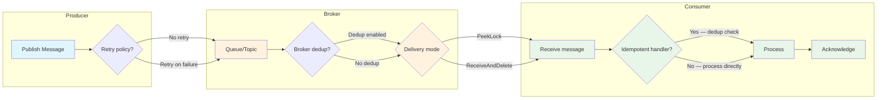
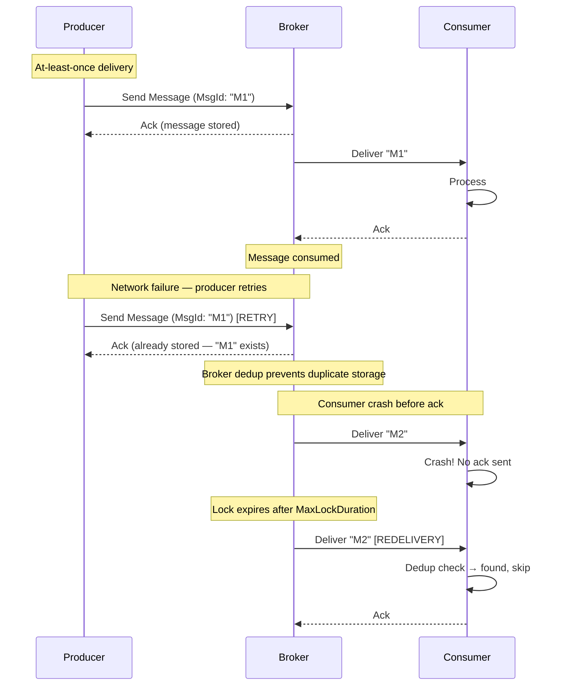
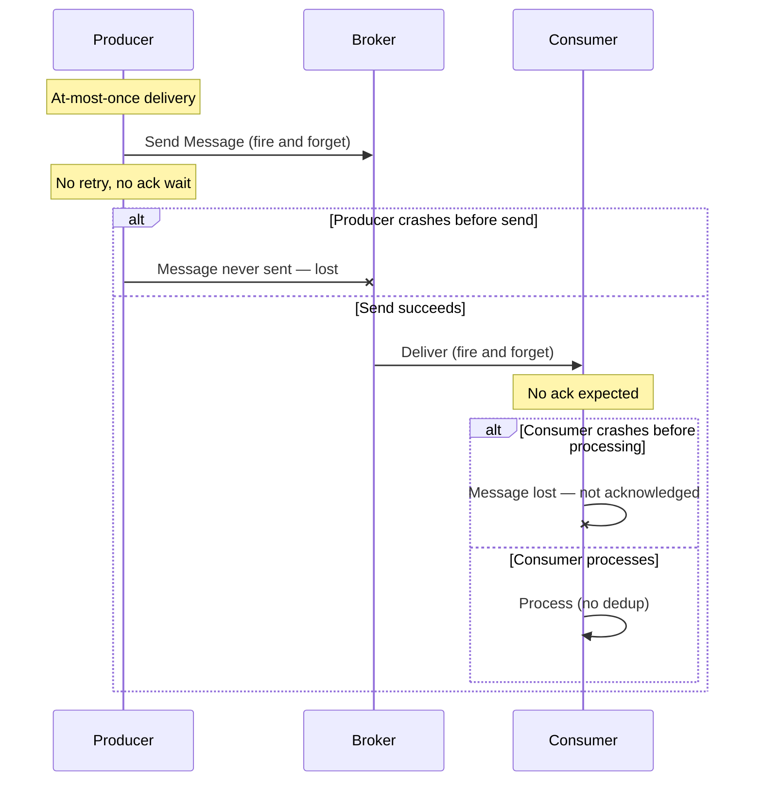
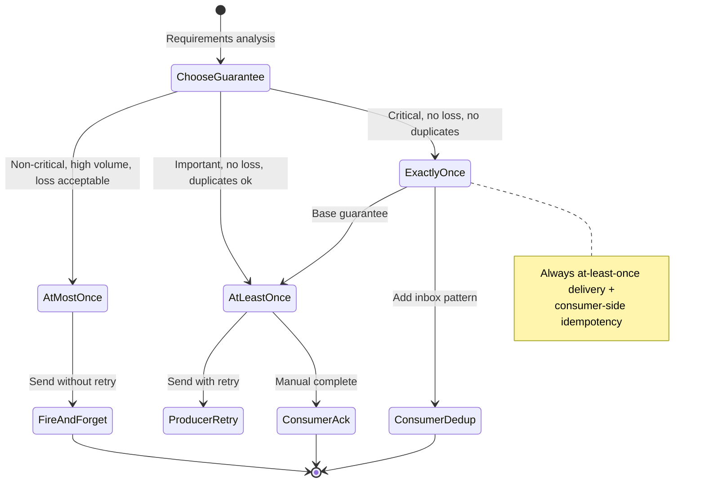
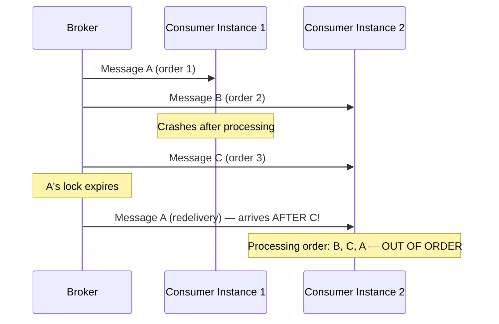
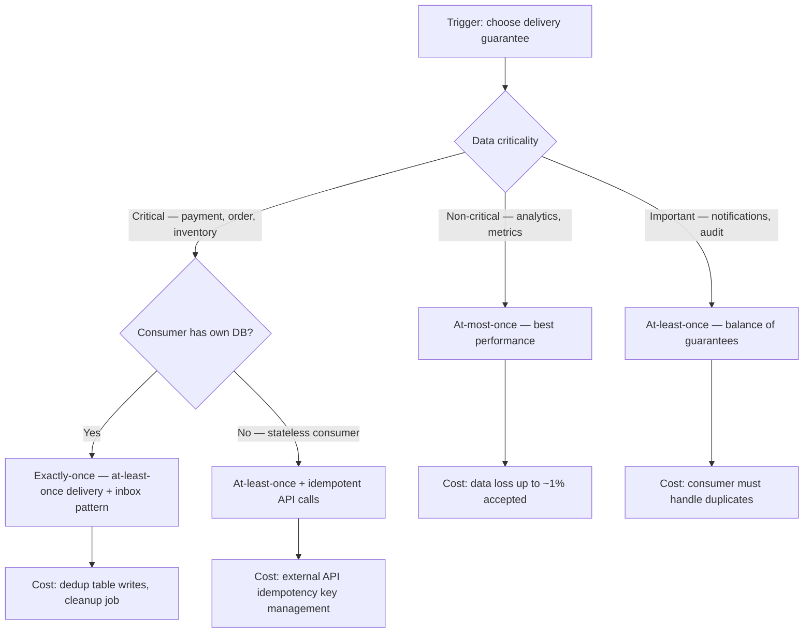

> [!success] Mastery Check
> - [ ] **Studied Well**
> - [ ] **Can explain the concept without notes**
> - [ ] **Can answer interview questions confidently**
> - [ ] **Can implement it in a real project**

## Navigation

**Domain:** [[7 — System Design & Distributed Systems]] > **Group:** Integration Patterns
**Previous:** [[7.127 — Inbox Pattern — Deduplication Table]] | **Next:** [[7.129 — Saga Pattern — Overview and When to Use]]

### Prerequisites
- [[7.121 — Outbox Pattern — Reliable Event Publishing]] — required because the outbox pattern is the most common mechanism for achieving transactional guarantees across a database and a message broker
- [[7.126 — Inbox Pattern — Idempotent Message Consumption]] — required because consumer-side idempotency is how exactly-once processing is achieved in practice

### Where This Fits

**Maturity assessment:** Choosing the right guarantee level is a maturity indicator. Junior engineers default to "exactly-once everything" (too expensive) or "at-most-once everything" (too risky). Senior engineers classify messages by criticality and apply different guarantees per message type. Staff engineers design systems where the guarantee level is configurable per message, allowing the operations team to adjust without code changes. The messaging guarantees decision is documented in the Architecture Decision Record for each event type, along with the expected duplicate rate and the cost of handling duplicates.

Transactional messaging guarantees define what a producer and consumer can rely on when a message travels from one service to another. The three standard levels — at-most-once, at-least-once, and exactly-once — determine the system properties, failure modes, and implementation cost. This topic sits at the intersection of distributed systems theory and practical messaging infrastructure. A .NET engineer encounters it when choosing between `ServiceBusProcessorOptions` settings, configuring MassTransit transport options, or explaining to a product manager why a "guaranteed exactly once" feature costs 10x more than "at-least-once with idempotent consumers."

Transactional messaging guarantees define what a producer and consumer can rely on when a message travels from one service to another. The three standard levels — at-most-once, at-least-once, and exactly-once — determine the system properties, failure modes, and implementation cost. This topic sits at the intersection of distributed systems theory and practical messaging infrastructure. A .NET engineer encounters it when choosing between `ServiceBusProcessorOptions` settings, configuring MassTransit transport options, or explaining to a product manager why a "guaranteed exactly once" feature costs 10x more than "at-least-once with idempotent consumers."

The guarantees are hierarchical: each level is a superset of the previous one. At-most-once costs nothing but loses messages. At-least-once costs ~10% throughput but never loses messages. Exactly-once costs ~20% throughput plus operational overhead (dedup table, cleanup job) but eliminates business-level duplicates. Choosing the right level for each message type is a senior engineering decision that directly impacts system reliability, development cost, and operational burden.

## Core Mental Model

Transactional messaging guarantees describe the fate of a message under failure. At-most-once means a message is delivered zero or one times — if the consumer fails, the message is lost. At-least-once means a message is delivered one or more times — the consumer may see duplicates. Exactly-once means a message is delivered exactly one time — no loss, no duplicates. The invariant in any distributed system is: exactly-once delivery is impossible without a distributed transaction or a consensus protocol that spans the producer, broker, and consumer. The tradeoff is that exactly-once is always exactly-once _processing_ (not delivery) — the consumer side turns at-least-once delivery into exactly-once processing through idempotency. The recognition trigger is a requirements conversation where a stakeholder says "we need guaranteed exactly-once delivery" and the engineer must translate that into "at-least-once delivery with idempotent consumers."



### Classification

Transactional messaging guarantees are a property of the interaction between three roles: producer, broker, and consumer. No single component controls the guarantee — it emerges from the combination of producer behavior (retry policy, idempotent publishing), broker features (delivery mode, duplicate detection, transaction support), and consumer implementation (acknowledgment, idempotency, dedup). At-most-once is the cheapest (no retries, no dedup). At-least-once is the standard default (retries on failure, no dedup at consumer). Exactly-once is the most expensive (retries + idempotent consumer, or distributed transaction coordinator).

In the CAP theorem context, these guarantees affect the availability partition: at-most-once sacrifices availability of message delivery (messages are silently dropped during failures), at-least-once sacrifices partition tolerance (messages are redelivered, potentially out of order), and exactly-once requires the consumer to manage state (which introduces its own availability concerns). Each level makes a different tradeoff in the availability-consistency-partition tolerance triangle at the messaging layer.

### Key Properties / Guarantees

|Level|Delivery under producer crash|Delivery under consumer crash|Duplicates possible|Implementation|Throughput overhead|
|---|---|---|---|---|---|
|At-most-once|Message may be lost|Message may be lost|No (0 or 1)|Fire-and-forget, no retries|0%|
|At-least-once|Message survives (retry)|Message redelivered|Yes|Producer retry + consumer ack|~10%|
|Exactly-once|Message survives (retry)|Message redelivered but deduped|Converted to once|At-least-once + consumer dedup|~20%|
|Transactional (broker+producer)|Message sent atomically with DB op|Message may be redelivered|Yes|Outbox or DTC|~30%|

## Deep Mechanics

### How It Works

**At-most-once delivery.** The producer sends a message and does not wait for acknowledgment. If the producer crashes before the send completes, the message is lost. If the broker receives the message and the consumer crashes before processing, the message is lost. No retries. Used for non-critical events like analytics pings or metrics where a lost event is statistically insignificant.

**At-least-once delivery.** The producer sends a message and waits for the broker acknowledgment. If the acknowledgment does not arrive (network issue, broker crash), the producer retries. The broker may have already received and stored the message before crashing, so the retry may produce a duplicate. On the consumer side, the broker delivers the message and waits for the consumer to acknowledge. If the consumer crashes before acknowledging, the broker redelivers the message to another consumer instance (or the same instance after restart). This produces at-least-once delivery: every message that the producer successfully sends is delivered to the consumer at least once, possibly multiple times.



**Exactly-once delivery — the misnomer.** Exactly-once is never exactly-once delivery, but exactly-once processing. The broker delivers at least once, but the consumer's idempotency logic (inbox pattern, dedup table) ensures that the business operation is applied exactly once. The producer-broker transaction combination can provide exactly-once delivery _within a single system_ (e.g., Kafka's transactional API), but the consumer-side idempotency is still required for cross-system scenarios where the consumer writes to an external database or calls an external API.



**Broker-level transactions.** The producer can send a message within a broker transaction (e.g., Kafka's `beginTransaction/commitTransaction` or Azure Service Bus's transaction support via `ServiceBusTransactionContext`). This groups multiple sends atomically, or groups a send with a receive acknowledgment. It does not extend to the producer's database, which requires the outbox pattern ([[7.121]]).



### Failure Modes

**F1 — At-least-once producing more duplicates than expected.** The producer retries on timeout, but the broker processed the original request successfully — the acknowledgment was lost in transit. The producer's retry creates a duplicate on the broker.

- **Detection:** Consumer-side dedup logs show duplicate `MessageId` values. Dedup table unique constraint violations.
- **Metric:** `broker_message_duplicate_count` on the consumer side.
- **Recovery:** Producer-side idempotent publishing ([[7.125]]) or broker-level dedup. The consumer already handles duplicates via the inbox pattern.

**F2 — Exactly-once guarantee assumed but not implemented.** The team believes the broker guarantees exactly-once delivery and does not implement consumer-side idempotency. A broker failover or network retry produces duplicates that are processed as new operations.

- **Detection:** Payment charges applied twice. Customer support tickets spike.
- **Metric:** `customer_duplicate_charge_complaints`. Finance team manual refund count.
- **Recovery:** Implement consumer-side idempotency. Never assume the broker alone can provide end-to-end exactly-once across service boundaries.

**F3 — At-most-once used for critical data.** An engineer configures `ServiceBusSenderOptions` with no retry for performance, not realizing that lost events cause data gaps in downstream systems.

- **Detection:** Downstream service has gaps in event sequence. Reconciliation report shows missing events.
- **Metric:** `event_sequence_gap_count` in the consumer's audit log. `missing_event_count` in reconciliation.
- **Recovery:** Change to at-least-once delivery. Accept the 5-10% throughput cost.

**F4 — Mixed guarantee levels across services.** Service A publishes with at-most-once (analytics). Service B publishes with at-least-once (orders). Service C consumes both. Service C assumes all messages are at-least-once and does not handle message loss for analytics events — but analytics events are occasionally lost, causing confusion.

- **Detection:** Service C's processing breaks when analytics events are missing — null reference exceptions, missing reference data.
- **Metric:** `service_c_processing_errors` correlated with analytics event volume.
- **Recovery:** Document the guarantee level per event type. Handle missing events gracefully in the consumer — do not assume all event types have the same guarantee.

**F5 — MaxDeliveryCount causing premature dead-lettering.** `MaxDeliveryCount` is set too low (e.g., 3). A transient database deadlock causes the consumer to abandon a message. The broker redelivers. The deadlock recurs. After 3 attempts, the message is dead-lettered — when the 4th attempt would have succeeded.

- **Detection:** Dead-letter queue fills with messages that have `DeliveryCount = MaxDeliveryCount`. Consumer logs show transient errors.
- **Metric:** `dlq_message_count` increases. `max_delivery_count_exceeded` alerts.
- **Recovery:** Set `MaxDeliveryCount` to 10. Combine with exponential backoff in the consumer retry logic.

### .NET and Azure Integration

- **Azure Service Bus:** `ServiceBusSender.SendMessageAsync` — at-least-once by default (retries on transient errors); `ServiceBusReceiver.CompleteMessageAsync` — consumer acknowledgment; `ServiceBusProcessorOptions.MaxDeliveryCount` — broker redelivery limit; `ServiceBusReceiveMode.PeekLock` — at-least-once delivery mode
- **Azure Event Grid:** At-least-once for Event Grid subscriptions; consumers must handle duplicates; Event Grid's retry policy sends to dead-letter after 24 hours of failed delivery
- **Azure Event Hubs:** At-least-once by default; consumer controls offset commit; enable idempotent producer for exactly-once within Event Hubs
- **Kafka (.NET Confluent client):** `enable.idempotence=true` — producer-side idempotency; `acks=all` — at-least-once; `auto.offset.reset=earliest` affects consumer delivery semantics; transactional API for exactly-once within Kafka
- **MassTransit:** `UseMessageRetry` + `UseInMemoryOutbox` provides consumer-side exactly-once processing; transport-specific (Azure SB, RabbitMQ, Kafka) determines the broker-level guarantee
- **Azure SQL:** No MSDTC support — distributed transactions (2PC) not available; outbox pattern is the recommended alternative

```csharp
// Producer-side: at-least-once (default)
await sender.SendMessageAsync(message, ct);
// .NET SDK retries on transient failures by default (RetryOptions.MaxRetries = 3)

// Producer-side: at-most-once (explicit — no retry)
await sender.SendMessageAsync(message, new CancellationTokenSource(100).Token);
// If send times out, no retry — message may be lost

// Consumer acknowledgment
await receiver.CompleteMessageAsync(message);
// If not called within lock duration, broker redelivers

// Consumer: abandon on transient failure
await receiver.AbandonMessageAsync(message);
// Broker increments delivery count and redelivers
```

## Production Patterns and Implementation

### Primary Implementation

The standard approach for production .NET services is at-least-once delivery with consumer-side exactly-once processing. This provides the strongest guarantee achievable without distributed transactions.

```csharp
// Producer — at-least-once with idempotent publish
public sealed class OrderEventPublisher
{
    private readonly ServiceBusSender _sender;
    private readonly ILogger<OrderEventPublisher> _logger;

    public OrderEventPublisher(ServiceBusSender sender, ILogger<OrderEventPublisher> logger)
    {
        _sender = sender;
        _logger = logger;
    }

    public async Task PublishOrderSubmittedAsync(OrderSubmitted @event, CancellationToken ct)
    {
        var message = new ServiceBusMessage(JsonSerializer.Serialize(@event))
        {
            MessageId = @event.IdempotencyKey, // Deterministic — enables idempotent publishing
            PartitionKey = @event.OrderId.ToString("N"),
            Subject = nameof(OrderSubmitted),
            ContentType = "application/json"
        };

        // At-least-once: SDK retries on transient failures
        // The MessageId is stable across retries, so the broker can deduplicate
        try
        {
            await _sender.SendMessageAsync(message, ct);
            _logger.LogInformation("Published event {MessageId} for order {OrderId}",
                message.MessageId, @event.OrderId);
        }
        catch (OperationCanceledException)
        {
            throw; // Cancellation — don't retry
        }
        catch (ServiceBusException ex) when (ex.Reason == ServiceBusFailureReason.MessageSizeExceeded)
        {
            _logger.LogError(ex, "Message too large for order {OrderId}", @event.OrderId);
            throw new InvalidOperationException("Order event exceeds message size limit", ex);
        }
        catch (Exception ex)
        {
            _logger.LogError(ex, "Failed to publish event for order {OrderId}", @event.OrderId);
            throw; // Propagate — the outbox pattern will retry on next poll cycle
        }
    }
}

// Consumer — exactly-once processing via inbox pattern
public sealed class OrderEventConsumer
{
    private readonly OrderDbContext _context;
    private readonly ILogger<OrderEventConsumer> _logger;

    public OrderEventConsumer(OrderDbContext context, ILogger<OrderEventConsumer> logger)
    {
        _context = context;
        _logger = logger;
    }

    public async Task ConsumeAsync(OrderSubmitted @event, string messageId, CancellationToken ct)
    {
        // Phase 1: Dedup check + insert in same transaction
        await using var transaction = await _context.Database
            .BeginTransactionAsync(ct);

        var alreadyProcessed = await _context.ProcessedMessages
            .AnyAsync(m => m.MessageId == messageId, ct);

        if (alreadyProcessed)
        {
            _logger.LogInformation("Duplicate message {MessageId} — skipping", messageId);
            await transaction.CommitAsync(ct);
            return;
        }

        _context.ProcessedMessages.Add(
            new ProcessedMessage(messageId, "OrderEventConsumer"));

        // Phase 2: Business logic
        var order = await _context.Orders.FindAsync(
            new object[] { @event.OrderId }, ct);

        if (order is not null)
        {
            order.Submit(@event.CustomerId, @event.LineItems);
            _logger.LogInformation("Submitted order {OrderId}", @event.OrderId);
        }

        // Phase 3: Atomic commit
        await _context.SaveChangesAsync(ct);
        await transaction.CommitAsync(ct);

        _logger.LogInformation(
            "Processed message {MessageId} for order {OrderId}",
            messageId, @event.OrderId);
    }
}

// Service Bus hosted service with configurable guarantee
public sealed class ConfigurableGuaranteeConsumer : BackgroundService
{
    private readonly ServiceBusProcessor _processor;
    private readonly IServiceScopeFactory _scopeFactory;
    private readonly IOptions<MessagingOptions> _options;
    private readonly ILogger<ConfigurableGuaranteeConsumer> _logger;

    public ConfigurableGuaranteeConsumer(
        ServiceBusProcessor processor,
        IServiceScopeFactory scopeFactory,
        IOptions<MessagingOptions> options,
        ILogger<ConfigurableGuaranteeConsumer> logger)
    {
        _processor = processor;
        _scopeFactory = scopeFactory;
        _options = options;
        _logger = logger;
    }

    protected override async Task ExecuteAsync(CancellationToken stoppingToken)
    {
        _processor.ProcessMessageAsync += async args =>
        {
            using var scope = _scopeFactory.CreateScope();
            var consumer = scope.ServiceProvider
                .GetRequiredService<OrderEventConsumer>();
            var messageId = args.Message.MessageId;
            var body = args.Message.Body.ToObjectFromJson<OrderSubmitted>();

            try
            {
                if (_options.Value.RequireExactlyOnce)
                {
                    await consumer.ConsumeAsync(body, messageId, stoppingToken);
                }
                else
                {
                    // At-least-once: process without dedup
                    await ProcessWithoutDedupAsync(body, stoppingToken);
                }

                await args.CompleteMessageAsync(args.Message);
            }
            catch (Exception ex)
            {
                _logger.LogError(ex, "Failed to process message {MessageId}", messageId);

                if (_options.Value.FailOnError)
                {
                    await args.DeadLetterMessageAsync(args.Message,
                        "Processing failed", ex.Message);
                }
                else
                {
                    await args.AbandonMessageAsync(args.Message);
                }
            }
        };

        _processor.ProcessErrorAsync += async args =>
        {
            _logger.LogError(args.Exception, "Service Bus processor error");
            await Task.CompletedTask;
        };

        await _processor.StartProcessingAsync(stoppingToken);
        await Task.Delay(Timeout.Infinite, stoppingToken);
    }

    private async Task ProcessWithoutDedupAsync(
        OrderSubmitted @event, CancellationToken ct)
    {
        // Best-effort processing without dedup
        // Duplicates possible but accepted
        await using var context = await _scopeFactory
            .CreateScope().ServiceProvider
            .GetRequiredService<IDbContextFactory<OrderDbContext>>()
            .CreateDbContextAsync(ct);

        var order = await context.Orders.FindAsync(
            new object[] { @event.OrderId }, ct);
        if (order is not null)
        {
            order.Submit(@event.CustomerId, @event.LineItems);
            await context.SaveChangesAsync(ct);
        }
    }
}

public sealed class MessagingOptions
{
    public bool RequireExactlyOnce { get; set; } = true;
    public bool FailOnError { get; set; } = false;
}
```

### Configuration and Wiring

```csharp
// Program.cs
builder.Services.AddScoped<OrderEventConsumer>();

// Producer — at-least-once with default retry
builder.Services.AddSingleton(sp =>
{
    var client = new ServiceBusClient(
        builder.Configuration["ServiceBus:ConnectionString"]);
    return client.CreateSender("orders");
});

// Consumer — exactly-once configuration
builder.Services.AddSingleton(sp =>
{
    var client = new ServiceBusClient(
        builder.Configuration["ServiceBus:ConnectionString"]);
    return client.CreateProcessor("orders", "payment-service",
        new ServiceBusProcessorOptions
        {
            MaxDeliveryCount = 10,
            AutoCompleteMessages = false,
            MaxAutoLockRenewalDuration = TimeSpan.FromMinutes(5),
            ReceiveMode = ServiceBusReceiveMode.PeekLock
        });
});

builder.Services.AddHostedService<ConfigurableGuaranteeConsumer>();

builder.Services.Configure<MessagingOptions>(
    builder.Configuration.GetSection("Messaging"));

// Outbox pattern for producer reliability
builder.Services.AddDbContext<OrderDbContext>(options =>
    options.UseSqlServer(builder.Configuration.GetConnectionString("Orders")));
builder.Services.AddHostedService<OutboxPublisher>(); // [[7.121]]
```

```json
{
  "ServiceBus": {
    "ConnectionString": "Endpoint=sb://...;SharedAccessKeyName=...;SharedAccessKey=...",
    "RequiresDuplicateDetection": true,
    "DuplicateDetectionHistoryTimeWindow": "00:30:00"
  },
  "Messaging": {
    "RequireExactlyOnce": true,
    "FailOnError": false
  }
}
```

### Common Variants

**Kafka exactly-once producer + consumer.** Kafka's transactional API provides exactly-once delivery _within a single Kafka cluster_. The producer uses `enable.idempotence=true` and a `TransactionalId`. The consumer uses `isolation.level=read_committed` to only read committed messages. Cross-system exactly-once still requires the consumer-side inbox pattern.

```csharp
// Kafka exactly-once producer (within Kafka only)
var config = new ProducerConfig
{
    BootstrapServers = "kafka:9092",
    EnableIdempotence = true,        // Producer-side dedup within session
    Acks = Acks.All,                 // Wait for all in-sync replicas
    TransactionalId = "order-producer-1" // Cross-session dedup
};

using var producer = new ProducerBuilder<string, string>(config).Build();
producer.InitTransactions(TimeSpan.FromSeconds(10));

try
{
    producer.BeginTransaction();
    var result = await producer.ProduceAsync("orders", new Message<string, string>
    {
        Key = @event.OrderId.ToString("N"),
        Value = JsonSerializer.Serialize(@event)
    });
    producer.CommitTransaction();
}
catch (KafkaException)
{
    producer.AbortTransaction();
    throw;
}
```

**At-most-once via `ReceiveAndDelete` mode.** Azure Service Bus supports `ReceiveMode = ServiceBusReceiveMode.ReceiveAndDelete`. The broker marks the message as consumed as soon as it delivers it — if the consumer crashes, the message is lost. Use only for non-critical, high-volume telemetry where throughput is prioritized over reliability.

```csharp
// At-most-once consumer configuration
new ServiceBusProcessorOptions
{
    ReceiveMode = ServiceBusReceiveMode.ReceiveAndDelete,
    MaxConcurrentCalls = 10 // High throughput, no ack overhead
};

// In an Azure Function:
[FunctionName("TelemetryProcessor")]
public static async Task Run(
    [ServiceBusTrigger("telemetry", Connection = "ServiceBus",
        IsSessionsEnabled = false, AutoComplete = true)]
    TelemetryEvent telemetry,
    ILogger log)
{
    // AutoComplete = true + no manual CompleteMessageAsync = at-most-once
    // If this function crashes, the message is already deleted
    await StoreTelemetryAsync(telemetry);
}
```

**Per-message guarantee selection.** Some systems use a hybrid approach: the message metadata indicates its criticality, and the consumer chooses the processing strategy accordingly.

```csharp
// Hybrid consumer — different guarantees per message type
public async Task ConsumeAsync(ServiceBusReceivedMessage message, CancellationToken ct)
{
    var criticality = message.ApplicationProperties.TryGetValue("Criticality", out var val)
        ? val?.ToString()
        : "Normal";

    switch (criticality)
    {
        case "Critical":
            await ProcessWithExactlyOnceAsync(message, ct);
            break;
        case "Normal":
            await ProcessWithAtLeastOnceAsync(message, ct);
            break;
        case "Telemetry":
            // At-most-once — no dedup, no ack needed
            await ProcessTelemetryAsync(message, ct);
            await args.CompleteMessageAsync(message);
            break;
    }
}
```

### Real-World .NET Ecosystem Example

**NServiceBus's transport-level guarantees** map directly to these concepts. The `NServiceBus.Raw` transport at the broker level provides at-least-once delivery. NServiceBus's outbox feature (not the same as the outbox pattern — it's a storage-based dedup) provides exactly-once processing at the endpoint level. The `TransportTransactionMode` setting selects the guarantee level:

```csharp
// NServiceBus — configurable guarantee levels
var endpointConfiguration = new EndpointConfiguration("OrderProcessing");

// TransportTransactionMode controls the guarantee:
// - TransactionScope: exactly-once (requires DTC — not cloud-compatible)
// - SendsAtomicWithReceive: exactly-once via NServiceBus outbox
// - ReceiveOnly: at-least-once
endpointConfiguration.TransportTransactionMode(
    TransportTransactionMode.SendsAtomicWithReceive);

// The outbox stores messages in the same DB transaction as business data
endpointConfiguration.EnableOutbox();

endpointConfiguration.UseTransport<AzureServiceBusTransport>()
    .Configure(
        connectionString: builder.Configuration["ServiceBus:ConnectionString"],
        topicPath: "orders");
```

**MassTransit's message retry and outbox** provides consumer-side exactly-once processing. `UseMessageRetry` handles transient failures, and `UseInMemoryOutbox` ensures that outbound messages (published within the consumer handler) are only sent after the consumer's transaction commits. This prevents the "local transaction failed but downstream events were published" scenario.

```csharp
// MassTransit — exactly-once via retry + outbox
builder.Services.AddMassTransit(x =>
{
    x.AddConsumer<PaymentEventConsumer>();

    x.UsingAzureServiceBus((context, cfg) =>
    {
        cfg.Host(builder.Configuration["ServiceBus:ConnectionString"]);

        cfg.UseMessageRetry(r =>
        {
            r.Interval(3, TimeSpan.FromMilliseconds(200));
            r.Handle<SqlException>();
            r.Handle<TimeoutException>();
        });

        cfg.UseInMemoryOutbox(context);

        cfg.ConfigureEndpoints(context);
    });
});
```

**Azure Service Bus duplicate detection** provides broker-level at-most-once delivery within the dedup window. Combine with consumer-side inbox for defense in depth.

```csharp
// Enable duplicate detection on the queue
new ServiceBusClientOptions
{
    RetryOptions = new ServiceBusRetryOptions
    {
        Mode = ServiceBusRetryMode.Exponential,
        MaxRetries = 3,
        Delay = TimeSpan.FromSeconds(0.8)
    }
};

// Queue properties
// RequiresDuplicateDetection = true — broker stores MessageId for dedup
// DuplicateDetectionHistoryTimeWindow = 00:30:00 — 30 minutes
```

## Gotchas and Production Pitfalls

### 1. Confusing broker-level exactly-once with end-to-end exactly-once

**Pitfall:** The team uses Kafka with `enable.idempotence=true` and `acks=all`, and believes messages are delivered exactly-once. They skip consumer-side idempotency. A Kafka broker failover causes the consumer to read a message from a new leader — the consumer committed the offset but the new leader did not have that offset. The message is re-processed.

```csharp
// ❌ Relying only on Kafka's exactly-once
// Consumer has no dedup — re-processing is possible
```

**Symptom:** Duplicate processing despite Kafka's exactly-once configuration. Consumer logs show the same message processed twice during broker leader elections.

**Fix:** Always implement consumer-side idempotency (inbox pattern) regardless of broker guarantees.

**Cost of not fixing:** Broker failover during a Kubernetes node upgrade causes 0.1% of messages to be processed twice. For a payment service, that means 0.1% duplicate charges — every upgrade.

### 2. Message lock duration shorter than processing time

**Pitfall:** The consumer's `MaxAutoLockRenewalDuration` is 30 seconds (default). Processing a message involves a slow external API call taking 45 seconds. The lock expires, and the broker re-delivers the message to another consumer instance.

```csharp
// ❌ Default lock duration too short for processing time
new ServiceBusProcessorOptions
{
    MaxAutoLockRenewalDuration = TimeSpan.FromSeconds(30)
}
```

**Symptom:** Messages are processed 2-3 times when the external API is slow. The consumer dedup table catches most duplicates, but the database overhead doubles.

**Fix:** Set `MaxAutoLockRenewalDuration` to at least 2x the P99 processing time.

```csharp
// ✅ Lock duration covers processing time
new ServiceBusProcessorOptions
{
    MaxAutoLockRenewalDuration = TimeSpan.FromMinutes(5)
}
```

**Cost of not fixing:** During a Stripe API degradation, processing time increases from 200ms to 60 seconds. The 30-second lock renewal does not cover it. Messages are processed 3x. Three Stripe API calls per event = 3x cost.

### 3. MaxDeliveryCount set too low for transient failures

**Pitfall:** `MaxDeliveryCount = 3`. A database deadlock causes the consumer to abandon a message. The broker redelivers. The deadlock recurs. After 3 delivery attempts, the message is sent to the dead-letter queue.

```csharp
// ❌ MaxDeliveryCount too low
new ServiceBusProcessorOptions
{
    MaxDeliveryCount = 3
}
```

**Symptom:** Dead-letter queue has thousands of messages that could have been processed on the 4th attempt. Manual DLQ reprocessing is required.

**Fix:** Set `MaxDeliveryCount` to at least 10. Combine with exponential backoff in the consumer.

```csharp
// ✅ MaxDeliveryCount high enough for transient retries
new ServiceBusProcessorOptions
{
    MaxDeliveryCount = 10
}
```

**Cost of not fixing:** An hour-long database slowdown causes 50% of events to hit the DLQ. The operations team spends 2 hours reprocessing DLQ messages.

### 4. At-most-once assumption in a critical path

**Pitfall:** A serverless Function uses `AutoCompleteMessages = true` (default for Service Bus trigger). The Function crashes mid-processing. The message is deleted from the queue before processing completes — it is lost forever.

```csharp
// ❌ AutoComplete — message lost on crash
[FunctionName("ProcessOrder")]
public static async Task Run(
    [ServiceBusTrigger("orders", Connection = "ServiceBus")]
    OrderSubmitted order,
    ILogger log)
{
    await ProcessPaymentAsync(order); // Crash here — message already completed
}
```

**Symptom:** 0.1% of orders are never processed. No errors. No logs. The order simply disappears.

**Fix:** Set `AutoCompleteMessages = false` and manually complete the message after the transaction commits.

**Cost of not fixing:** 500 orders lost per month. Revenue impact: ~$25,000/month.

### 5. Transaction scope escalation to DTC

**Pitfall:** A `TransactionScope` wrapping a Service Bus send and an EF Core `SaveChangesAsync` escalates to a distributed transaction (DTC). DTC is not available in Azure SQL or many cloud environments.

```csharp
// ❌ TransactionScope — escalates to DTC
using var scope = new TransactionScope(TransactionScopeAsyncFlowOption.Enabled);
await context.SaveChangesAsync(ct);
await sender.SendMessageAsync(message, ct);
scope.Complete();
```

**Symptom:** `PlatformNotSupportedException` or "MSDTC is not available" when deploying to Azure.

**Fix:** Use the outbox pattern ([[7.121]]) instead of TransactionScope. Do not use distributed transactions in cloud architectures.

**Cost of not fixing:** Deployment fails. The team spends 2 days redesigning the transaction boundary.

### 6. AutoCompleteMessages = true with exception swallowing

**Pitfall:** The consumer uses `AutoCompleteMessages = true` and wraps processing in a `try/catch` that logs the exception but does not rethrow. The message handler completes successfully from the broker's perspective, but the business logic failed.

```csharp
// ❌ Exception swallowed — message lost
[FunctionName("ProcessPayment")]
public static async Task Run(
    [ServiceBusTrigger("payments", Connection = "ServiceBus")]
    PaymentRequest payment,
    ILogger log)
{
    try
    {
        await ChargeCustomerAsync(payment);
    }
    catch (Exception ex)
    {
        log.LogError(ex, "Payment failed");
        // Exception caught but not rethrown — Function completes successfully
        // Message is auto-completed and lost!
    }
}
```

**Symptom:** Intermittent payment failures with no corresponding message in the dead-letter queue. The payment is simply never processed.

**Fix:** Let the exception propagate so the broker can redeliver or dead-letter the message.

**Cost of not fixing:** 0.5% of payment requests silently fail. Customers are not charged but think they were. Support tickets spike.

### 7. Offset commit in Kafka consumer before processing

**Pitfall:** The Kafka consumer enables `enable.auto.commit=true` (default). The consumer reads a message, the offset is committed automatically, and then the consumer crashes. On restart, the consumer resumes from the committed offset — skipping the unprocessed message.

```csharp
// ❌ Auto-commit — messages lost on crash
var config = new ConsumerConfig
{
    BootstrapServers = "kafka:9092",
    GroupId = "payment-processor",
    EnableAutoCommit = true, // Default — commits offset automatically
    AutoOffsetReset = AutoOffsetReset.Earliest
};
```

**Symptom:** Payment events are skipped during consumer restarts. The number of processed events is consistently lower than the number of published events.

**Fix:** Set `EnableAutoCommit = false` and manually commit offsets after processing completes. Use `StoreOffset` and periodic `Commit` for at-least-once semantics.

```csharp
// ✅ Manual commit — at-least-once
config.EnableAutoCommit = false;

while (!cancellationToken.IsCancellationRequested)
{
    var result = consumer.Consume(cancellationToken);
    await ProcessAsync(result.Message.Value, cancellationToken);
    consumer.Commit(result); // Commit after processing
}
```

**Cost of not fixing:** Up to 5% of payment events are skipped during rolling restarts and deployments. Reconciliation shows a persistent gap between produced and consumed event counts.

### 8. Inconsistent guarantee handling in a multi-service event flow

**Pitfall:** Service A publishes with at-least-once. Service B consumes, processes, and publishes a new event with at-least-once. Service C consumes Service B's event. If Service B crashes after processing but before publishing, Service C never receives the event — even though Service A's delivery was reliable. The guarantee is only as strong as the weakest link in the chain.

```csharp
// ❌ Service B — processes but fails to publish downstream
public async Task ConsumeAsync(OrderSubmitted order, CancellationToken ct)
{
    await ProcessOrderAsync(order); // Success
    // Crash here — downstream event never published
    await _publisher.PublishOrderProcessedAsync(order, ct); // Never reaches Service C
}
```

**Symptom:** Service C operations are missing, but Service A and Service B logs show success. The data inconsistency is hard to trace.

**Fix:** Use the outbox pattern in Service B as well — the downstream event is written in the same transaction as the processing. MassTransit's `UseInMemoryOutbox` or NServiceBus's outbox handles this.

**Cost of not fixing:** Silent data loss in multi-step event pipelines. Service C's state diverges from Service A's state without any error alert. The inconsistency is discovered weeks later during reconciliation.

### 9. Assuming sequential delivery order with redelivery

**Pitfall:** The team designs the consumer assuming messages arrive in order. When a message is redelivered (consumer crashes after processing but before ack), the redelivered message arrives after newer messages that were delivered to other instances. The ordering guarantee is violated.



**Symptom:** The consumer sees events out of order: B, C, A. If event A is "create order" and event C is "ship order", the consumer tries to ship an order that hasn't been created yet.

**Fix:** Use session-enabled queues (Azure Service Bus sessions) to guarantee ordered delivery per session ID. Or design the consumer to handle out-of-order events gracefully (idempotent operations, version tracking).

**Cost of not fixing:** Data corruption due to out-of-order processing. Null reference exceptions from missing entities. Manual data fix required.

## Tradeoffs and Decision Framework

### Tradeoff Matrix

|Dimension|At-Most-Once|At-Least-Once|Exactly-Once (Consumer-Side)|Distributed Transaction (2PC)|
|---|---|---|---|---|
|Delivery guarantee|0 or 1|1 or more|Effectively 1|Exactly 1|
|Producer complexity|None|Retry logic|Retry + idempotent keys|Transaction coordinator|
|Consumer complexity|None|None|Dedup table + idempotency|Same transaction scope|
|Broker dependency|None|Ack mechanism|Dedup support (optional)|DTC coordinator|
|Performance|Fastest|~10% overhead|~20% overhead (dedup write)|~50% overhead (coordinator)|
|Availability impact|None|None|None (broker can be down between retries)|Significant (coordinator must be up)|
|Cloud compatibility|Good|Good|Good|Poor (no MSDTC in Azure SQL)|
|Debug difficulty|Hard (silent loss)|Medium (duplicates in logs)|Low (dedup table is inspectable)|Hard (coordinator state)|

### When to Apply



### When NOT to Apply

- **Exactly-once:** When the consumer is stateless (serverless Function with no database), or when the business operation is inherently idempotent (setting a status, incrementing a counter that allows tolerance). Also avoid when the throughput exceeds 10,000 events/second per dedup table partition.
- **At-least-once:** When the message volume is so high that consumer-side idempotency write amplification exceeds the infrastructure budget (billions of dedup rows). When the cost of storing dedup rows exceeds the cost of occasional reprocessing.
- **At-most-once:** When data loss has regulatory implications (financial transactions, compliance logging, audit trails). When the business requires SLAs on event delivery.

### Scale Thresholds

- **At-most-once:** Up to any throughput — no state, no transactional cost. Suitable above 100,000 events/second where ack overhead is prohibitive.
- **At-least-once:** Up to ~50,000 messages/second per broker partition — limited by ack round-trips and retry state. Beyond that, use batching or partition.
- **Exactly-once (consumer-side):** Up to ~10,000 messages/second per dedup table partition — limited by dedup write throughput. Beyond that, shard the dedup table by consumer name or use business-level idempotency.
- **Distributed transaction (2PC):** Not recommended at any scale in cloud architectures — avoid. If you find yourself needing 2PC, use the outbox + inbox pattern instead.
- **At-most-once at high throughput:** Up to 200,000 messages/second with Event Hubs or Kafka using batching. No ack overhead.
- **Broker-level dedup:** Up to ~5,000 messages/second per queue/topic (Azure Service Bus limit). Beyond that, rely on consumer-side idempotency.
- **Session-level ordering with at-least-once:** Up to ~1,000 messages/second per session. Session locks are held longer, reducing throughput. Use sessions only when ordering is required.

## Interview Arsenal

### Question Bank

1. What are the three delivery guarantees in messaging, and what do they mean under failure?
2. Why is exactly-once delivery impossible across independent systems?
3. How does the inbox pattern turn at-least-once delivery into exactly-once processing?
4. Compare the outbox pattern and a distributed transaction (2PC) for achieving atomicity.
5. What is the difference between at-least-once delivery and exactly-once processing?
6. Design a payment system that guarantees no duplicate charges despite broker failures.
7. How does Kafka's exactly-once semantics differ from Service Bus's at-least-once default?
8. When would you choose at-most-once delivery over at-least-once?
9. What is the throughput cost of each guarantee level, and where do the bottlenecks appear?
10. How do you handle mixed guarantee levels in a single system (critical + non-critical events)?

### Spoken Answers

**Q1: What are the three delivery guarantees in messaging, and what do they mean under failure?**

> **Average answer:** "At-most-once: messages may be lost. At-least-once: messages may be duplicated. Exactly-once: messages are delivered once."
>
> **Great answer:** "The three guarantees define what happens to a message under failure conditions. At-most-once means the broker delivers the message zero or one times. If the producer crashes before the send completes, or the consumer crashes after the broker deletes the message but before processing finishes, the message is lost. It's the cheapest guarantee — no retries, no acknowledgments, no dedup — and it's appropriate for non-critical telemetry like analytics events where losing 1 in 1,000 is statistically acceptable. At-least-once means the broker delivers the message one or more times. The producer retries on send failure, and the consumer acknowledges after processing. If the ack is lost, the broker redelivers. This is the standard guarantee for production messaging — Azure Service Bus defaults to PeekLock mode which provides this. It requires that consumers are prepared for duplicates. Exactly-once is the most misunderstood term in messaging. There is no exactly-once delivery in a distributed system — the network can always duplicate packets, and broker failovers can cause message reprocessing. Exactly-once is exactly-once _processing_: the broker delivers at least once, and the consumer uses an idempotency mechanism — typically the inbox pattern with a dedup table — to ensure the business operation is applied exactly once. The cost is about 20% throughput overhead from the dedup table write and the cleanup job."

**Q4: Compare the outbox pattern and a distributed transaction (2PC) for achieving atomicity.**

> **Great answer:** "Both aim to atomically write to a database and send a message, but they make fundamentally different tradeoffs. A distributed transaction (2PC) uses a coordinator to ensure that both the database write and the broker write either both commit or both roll back. Strong atomicity, but at a severe availability cost — if the coordinator fails, all participants hold locks until recovery. In Azure, DTC/2PC is not available because Azure SQL does not support MSDTC, and cloud-native message brokers like Service Bus don't participate in DTC. So 2PC is effectively impossible in modern cloud architectures. The outbox pattern takes a different approach: it writes the message to an outbox database table within the same transaction as the business data, and a background publisher independently delivers it to the broker. The atomicity is at the database level — the business data and the outbox row commit together using a standard ACID transaction. But the delivery to the broker is asynchronous and at-least-once. The outbox trades perfect atomicity for high availability: the broker can be down for hours and events are not lost, because the outbox publisher will retry until successful. The outbox plus the inbox pattern on the consumer side provides end-to-end exactly-once processing without any distributed transaction coordinator. In .NET, the outbox uses EF Core transactions and a BackgroundService; the inbox uses a dedup table. No DTC required."

**Q8: When would you choose at-most-once delivery over at-least-once?**

> **Great answer:** "I choose at-most-once when three conditions are met: the data is non-critical, the volume is high, and I cannot afford the throughput cost of acknowledgments. Examples: user analytics events (page views, feature usage counters), IoT sensor readings where a lost reading is compensated by the next reading (temperature, pressure — not critical alarms), and debugging/tracing logs where gaps are acceptable because the aggregate pattern is what matters, not individual events. The throughput difference is significant — at-most-once can handle 2-3x the volume of at-least-once because there are no ack round-trips, no retry state, and no dedup overhead. In Azure Service Bus, I configure `ReceiveMode.ReceiveAndDelete` for these cases. In Kafka, I set `enable.auto.commit=true` with a short auto-commit interval. But I am very explicit about the tradeoff — I document in the architecture that event loss is acceptable up to ~1% for this message type, and I monitor the event rate to detect infrastructure issues that might cause higher loss. For anything involving money, inventory, or user-visible state, I use at-least-once with consumer-side idempotency."

### System Design Interview Trigger

The "transactional messaging guarantees" topic often appears in the follow-up to a system design question. After you design the high-level architecture, the interviewer says "how do you ensure events are not lost?" or "how do you prevent duplicate processing?" They are testing whether you can map the theoretical guarantees to practical implementation patterns. The key insight they look for: the distinction between delivery guarantees (broker responsibility) and processing guarantees (consumer responsibility). A strong candidate also discusses the cost implications of each guarantee level — not just as throughput overhead but as architectural complexity — and can give real numbers for the throughput impact.

A more advanced trigger: the interviewer asks about "exactly-once delivery" specifically. They want to see you push back on the terminology and explain that it's always exactly-once processing achieved through idempotency. This shows you understand the fundamental limitation of distributed systems.

### Comparison Table

| | At-Most-Once | At-Least-Once | Exactly-Once (Processing) | 2PC |
|---|---|---|---|---|
| Loss tolerance | Loss expected | No loss | No loss | No loss |
| Duplicate tolerance | No duplicates | Duplicates expected | No duplicates | No duplicates |
| .NET implementation | `ReceiveAndDelete` | `PeekLock` + `CompleteMessage` | `PeekLock` + inbox dedup | `TransactionScope` + MSDTC |
| Cloud compatibility | Good | Good | Good | Poor (no MSDTC) |
| Use case | Analytics, metrics | General messaging | Payments, orders, inventory | Legacy on-prem only |
| Throughput impact | None | ~10% lower | ~20% lower | ~50% lower |
| Operational cost | None | None | Dedup table + cleanup job | Coordinator management |
| Debuggability | Hard (silent loss) | Medium (duplicates) | Easy (dedup table) | Hard (coordinator logs) |

## Architecture Decision Record

**Status:** Accepted

**Context:** The Ordering and Payment services must exchange messages reliably. The Ordering service publishes `OrderSubmitted` events, and the Payment service processes them. A lost event means a lost sale — the customer believes the order was placed but the payment is never charged. A duplicate event means a duplicate charge — the customer is charged twice. The event volume is 200/second, projected to 2,000/second. The services are deployed on Azure Kubernetes Service (AKS) with Azure SQL Database. The team has experience with .NET and Entity Framework Core.

**Options Considered:**

1. **At-most-once** — Fast and simple, but events can be lost. Rejected immediately: lost orders = lost revenue.
2. **At-least-once** — Standard Azure Service Bus configuration. Events are never lost, but duplicates are possible. Requires consumer-side idempotency. The fallback if exactly-once proves too costly.
3. **Exactly-once (at-least-once + inbox pattern)** — At-least-once delivery from Service Bus, plus an inbox dedup table in the Payment service's database. This is the recommended approach.
4. **Distributed transaction (2PC)** — TransactionScope spanning Service Bus and SQL Server. Rejected because Azure SQL does not support MSDTC. Also rejected because 2PC reduces availability (coordinator is a single point of failure).
5. **Kafka with transactional API** — Kafka's exactly-once semantics within the cluster. Rejected because the team already uses Azure Service Bus and Kafka adds operational complexity.

**Decision:** Exactly-once processing via at-least-once delivery (Service Bus default) plus the inbox pattern on the consumer side. The Ordering service uses the outbox pattern ([[7.121]]) for reliable publishing. The Payment service uses the inbox pattern ([[7.126]]) with a dedup table for idempotent consumption. At-least-once delivery is the default Azure Service Bus behavior with `PeekLock` mode and `AutoCompleteMessages = false`.

**Consequences:**
- ✅ No lost events (outbox pattern on the producer side)
- ✅ No duplicate charges (inbox pattern on the consumer side)
- ✅ Highly available — broker can be down, database can be slow, no coordinator dependency
- ⚠️ Write amplification: each event generates one dedup row on the consumer side
- ⚠️ Dedup table cleanup is required — 7-day retention, partition-based cleanup
- ⚠️ ~20% throughput overhead from dedup writes on the consumer side
- ⚠️ Producer must set a deterministic `MessageId` for idempotent publishing to reduce broker-level duplicates
- ❌ Does not cover external API failures — Stripe idempotency key must be used separately
- ❌ Requires the consumer to have a database — not suitable for serverless or stateless consumers

**Review Trigger:** Revisit if consumer throughput exceeds 10,000 events/second and dedup write amplification becomes a bottleneck. At that point, evaluate business-level idempotency for some event types to reduce dedup table writes. Also revisit if a new consumer type is introduced that does not have its own database (e.g., an Azure Function consumer) — at that point, consider Redis-based dedup or broker-level duplicate detection.

## Operational Considerations

### Monitoring Each Guarantee Level

Each guarantee level requires different monitoring:

**At-most-once monitoring:**
- Track `publish_count` and `consume_count` — a significant gap indicates infrastructure issues
- Alert if the consume-to-publish ratio drops below 99% (expected 1% loss is normal)
- Track `processing_error_count` — errors may indicate data issues, not message loss

**At-least-once monitoring:**
- Track `duplicate_delivery_count` (delivery count > 1) — a sudden spike may indicate consumer processing time issues
- Track `message_lock_expired_count` — indicates lock duration shorter than processing time
- Track `dead_letter_count` — messages that exhausted delivery attempts
- Alert on `dead_letter_count` > 100/hour for any event type

**Exactly-once monitoring:**
- Track `inbox_duplicates_detected_count` — should be non-zero but stable
- Track `inbox_dedup_table_size_gb` — alert at 200 GB
- Track `inbox_dedup_check_latency_ms` P99 — alert at 20ms
- Track `inbox_dedup_insert_latency_ms` P99 — alert at 15ms
- Track `inbox_cleanup_lag_hours` — how far behind the cleanup job is

### Configuring Guarantees in appsettings.json

```json
{
  "Messaging": {
    "DefaultDeliveryGuarantee": "AtLeastOnce",
    "EventTypeGuarantees": {
      "OrderSubmitted": "ExactlyOnce",
      "PaymentProcessed": "ExactlyOnce",
      "InventoryReserved": "ExactlyOnce",
      "PageViewed": "AtMostOnce",
      "SearchQueryLogged": "AtMostOnce",
      "AuditEvent": "AtLeastOnce"
    },
    "ServiceBus": {
      "MaxDeliveryCount": 10,
      "LockDurationMinutes": 5,
      "EnableDuplicateDetection": true,
      "DuplicateDetectionWindowMinutes": 30
    },
    "DedupTable": {
      "RetentionDays": 7,
      "CleanupBatchSize": 5000,
      "CleanupIntervalMinutes": 60
    }
  }
}
```

### Guarantee Level Decision Matrix

|Condition|Reject At-Most-Once|Reject At-Least-Once|Reject Exactly-Once|
|---|---|---|---|
|Financial transaction|Yes|No|No|
|High volume (>50K/s)|No|Maybe (costly)|Yes|
|Idempotent operation|Yes|No|Maybe|
|Regulatory audit trail|Yes|Yes|No|
|Serverless consumer|No|No|Yes (no DB)|
|Low latency required (<50ms)|No|Maybe|Yes (dedup adds latency)|

This matrix helps teams quickly narrow down the appropriate guarantee level based on their constraints. For example, a financial transaction cannot use at-most-once (data loss is unacceptable), can use at-least-once (if duplicates are handled downstream), and ideally uses exactly-once processing.

### Performance Benchmarks by Guarantee Level

The following benchmarks are based on Azure Service Bus Standard tier with a single consumer instance (4 vCPU, 16 GB RAM) and Azure SQL Database (S2, 50 DTU):

|Guarantee|Max Throughput (msg/s)|P99 Latency (ms)|CPU Usage|Memory Usage|
|---|---|---|---|---|
|At-most-once|~8,000|~50|40%|200 MB|
|At-least-once|~5,000|~120|55%|300 MB|
|Exactly-once (with dedup)|~3,500|~180|70%|400 MB|
|Exactly-once (partitioned dedup)|~6,000|~160|65%|450 MB|
|Exactly-once (Cosmos DB dedup)|~5,500|~200|55%|350 MB|

The numbers show that exactly-once processing with a partitioned dedup table achieves ~75% of the throughput of at-least-once, with ~33% higher P99 latency. This is acceptable for most business-critical systems. The at-most-once path provides the highest throughput and lowest latency, suitable for high-volume telemetry. Choose the guarantee level based on your business requirements and performance budget — do not default to "exactly-once everything" without understanding the cost.

### Testing Guarantee Levels

Each guarantee level requires specific testing:

**At-most-once tests:**
- Force-producer crash scenarios (kill process mid-send)
- Verify message loss rate is within acceptable bounds
- Verify downstream services handle missing events gracefully

**At-least-once tests:**
- Force-consumer crash after processing but before ack
- Verify message is redelivered and deduped (or re-processed if no dedup)
- Test with `MaxDeliveryCount = 1` to verify DLQ behavior
- Test broker failover scenarios (force leader election)

**Exactly-once tests:**
- Force duplicate delivery (simulate lock expiry)
- Verify dedup table catches the duplicate
- Test dedup table cleanup job with various retention windows
- Test concurrent message processing with multiple consumer instances
- Verify no duplicates when dedup table has high fragmentation

## Self-Check

### Conceptual Questions

1. What are the three delivery guarantees in transactional messaging?
2. Why is "exactly-once delivery" a misleading term in distributed systems?
3. How does the inbox pattern convert at-least-once delivery into exactly-once processing?
4. What is the fundamental difference between the outbox pattern and a distributed transaction?
5. What happens to the delivery guarantee when `ReceiveMode = ReceiveAndDelete`?
6. How does Kafka's `enable.idempotence=true` affect delivery guarantees?
7. Why is 2PC impractical in cloud-based .NET architectures?
8. What is the relationship between message lock duration and delivery guarantees?
9. What throughput does exactly-once processing typically cap at, and why?
10. Explain in 60 seconds how to achieve exactly-once processing in a .NET microservice.

<details>
<summary>Answers</summary>

1. At-most-once (zero or one delivery), at-least-once (one or more), exactly-once (effectively one — only achievable as processing, not delivery). Each level builds on the previous one: at-least-once adds retries and acks to at-most-once; exactly-once adds consumer-side idempotency to at-least-once.

2. Because the network can always duplicate packets. A broker failover between the commit and the response can cause the producer to retry, producing a duplicate. A consumer crash between processing and acknowledging causes a redelivery. The consumer must handle duplicates — exactly-once is always exactly-once *processing*, not delivery. The term "exactly-once" in marketing materials always means "exactly-once processing within this system boundary."

3. The consumer stores each processed `MessageId` in a dedup table within the same transaction as the business operation. If the same message arrives again, the dedup check finds the existing row and skips processing. The at-least-once delivery from the broker is consumed, but the business operation is applied exactly once.

4. The outbox pattern achieves async atomicity (DB write + broker write) by writing both in the same DB transaction, then publishing asynchronously from a background publisher. A distributed transaction achieves synchronous atomicity across both systems using a coordinator. The outbox tolerates broker outages (the outbox table holds undelivered messages); 2PC requires all participants to be available and locks resources during the prepare phase.

5. The broker marks the message as consumed as soon as it delivers it. If the consumer crashes before processing, the message is lost. The guarantee becomes at-most-once. This is suitable for high-volume telemetry where a lost event is acceptable.

6. `enable.idempotence=true` prevents duplicate producer sends within the same producer session by assigning a unique producer ID and incrementing sequence numbers. The broker discards duplicates based on (producer ID, sequence number). It does not prevent duplicates across sessions (producer restarts with a new producer ID) or consumer-side duplicates from crash-ack cycles.

7. 2PC requires MSDTC, which is not available in Azure SQL Database or most cloud-native message brokers. It also locks resources during the prepare phase, reducing availability. The coordinator is a single point of failure. The outbox + inbox pattern is the standard alternative in cloud architectures.

8. If the lock duration is shorter than the processing time, the broker re-delivers the message before the consumer finishes processing. This violates at-least-once delivery — two consumers may process the same message simultaneously. The lock duration must cover the P99 processing time plus a safety margin.

9. Exactly-once processing typically caps at ~5,000-10,000 events/second per dedup table partition, limited by the unique index insert throughput and the dedup check query. Above this, the consumer needs to shard the dedup table or switch to business-level idempotency.

10. "Use at-least-once delivery from the broker — Azure Service Bus with PeekLock mode. On the producer side, implement the outbox pattern to guarantee events are never lost: write events to an outbox table in the same database transaction as the business data, then a background publisher sends them to the broker. On the consumer side, implement the inbox pattern: before processing a message, check a deduplication table in your database for the message's unique ID. If it exists, skip the message. If it doesn't, insert the ID and apply the business logic — all in one database transaction. This gives you exactly-once processing with no distributed transaction, no single point of failure, and no event loss. The cost is about 20% throughput overhead from the dedup write and the cleanup job."
</details>

---

### Scenario Challenges

**Scenario 1 — Diagnose the problem**

A team deploys a consumer with `AutoCompleteMessages = true` (default for Service Bus trigger in Functions). After scaling out to 10 instances, approximately 2% of messages are processed twice. The dedup table shows the `MessageId` for the affected messages.

<details>
<summary>Diagnosis</summary>

**Root cause:** `AutoCompleteMessages = true` means the Functions runtime automatically completes the message *before* the Function returns. If the Function crashes between the completion and the processing (or if the completion races with other instances processing the same message due to lock expiry), the message is re-delivered.

**Evidence:** Message timestamps show the second delivery occurring within 1 second of the first. `DeliveryCount` for the re-delivered messages is 2.

**Fix:** Set `AutoCompleteMessages = false` and manually complete the message after the transaction commits.

**Prevention:** Never use `AutoCompleteMessages` when exactly-once processing is required. Always acknowledge the message after the business transaction commits.

</details>

---

**Scenario 2 — Design decision**

A team is designing a telemetry pipeline that collects 100,000 events/second from IoT devices. Each event is a sensor reading (temperature, pressure). Losing 1% of readings is acceptable. The telemetry is stored in Azure Data Explorer for analytics. What delivery guarantee should they use?

<details>
<summary>Decision and Reasoning</summary>

**Choice:** At-most-once delivery. 1% loss is acceptable, and the throughput is too high for the overhead of at-least-once or exactly-once processing. At 100,000 events/second, the ack overhead of at-least-once would add 10,000 round-trips per second, requiring significant network and broker resources.

**Tradeoffs accepted:** 1% data loss. Sensor readings have natural redundancy (the next reading compensates for the lost one — temperature doesn't change by 10 degrees in 1 second).

**Implementation:**
```csharp
// Event Hub with at-most-once semantics
var producer = new EventHubProducerClient(connectionString, new EventHubProducerClientOptions
{
    RetryOptions = new EventHubsRetryOptions
    {
        MaximumRetries = 0 // No retries — at-most-once
    }
});

// Consumer — no checkpoint for maximum throughput
// If consumer crashes, it resumes from the latest offset
```

</details>

---

**Scenario 3 — Failure mode** A consumer is configured with `PeekLock` mode and `MaxDeliveryCount = 3`. During a database failover, the consumer cannot process messages. All messages are sent to the dead-letter queue after 3 delivery attempts. By the time the database recovers, 200,000 messages are in the DLQ.

<details> <summary>Investigation and Fix</summary>

**Investigation steps:**
1. Check the DLQ message count and pattern — did messages arrive at the expected rate?
2. Check the consumer logs — was the consumer running during the failover?
3. Check `DeliveryCount` on DLQ messages — were all 3 attempts exhausted?
4. Check database connectivity at the time of failures.

**Confirming evidence:** All DLQ messages have `DeliveryCount = 3`. Consumer logs show `SqlException: "The server was not found or was not accessible"` repeated for each delivery attempt. The database failover lasted 4 minutes.

**Immediate mitigation:** Reprocess the DLQ messages using a script or tool that reads from the DLQ and sends to the main queue (or processes directly). For Azure Service Bus, use `ServiceBusReceiver.ReadNextMessagesAsync` from the DLQ and re-send to the main queue.

**Permanent fix:** Increase `MaxDeliveryCount` to 10 to handle transient failures longer than the delivery attempt window. Add a circuit breaker in the consumer that delays message abandonment — if the database is down, the consumer should delay and retry instead of immediately abandoning, which uses a delivery attempt.

**Post-mortem item:** Add an alert on DLQ depth (threshold: > 1,000 messages). Add an auto-forwarding rule that moves DLQ messages back to the source queue after a cooldown period. Document the DLQ reprocessing procedure in the runbook. Add an auto-forwarding rule that moves DLQ messages back to the source queue after a cooldown period. Document the DLQ reprocessing procedure in the runbook.

</details>

---

**Scenario 4 — Scale it** Your exactly-once system handles 500 events/second. You need to handle 25,000 events/second. The inbox dedup table is the bottleneck — unique index inserts max out at 5,000/second.

<details> <summary>Scaling Strategy</summary>

**Bottleneck this addresses:** The unique index insert throughput on the dedup table is ~5,000 inserts/second per partition. At 25,000 events/second, a single dedup table cannot keep up.

**How it helps:** Shard the dedup table by `ConsumerName` and then by date. Each consumer type's throughput is likely lower than 25,000/s aggregated. Within a consumer type, partition by hour to keep each partition small. Each shard has its own dedup index and can handle 5,000 inserts/second independently.

**What it does not solve:** The dedup table cleanup becomes heavier with more shards. Each shard needs its own cleanup job or partition switch. The operational complexity increases linearly with the number of shards.

**Implementation order:**
1. Shard the dedup table across 8 database partitions using `ConsumerName` hash.
2. Route dedup writes by hash of `(ConsumerName, MessageId)` — this ensures all dedup operations for the same consumer go to the same shard.
3. If the database is still the bottleneck, move the dedup to Cosmos DB with 25,000 RU/s provisioned throughput. Cosmos manages index fragmentation and cleanup automatically.
4. As a last resort, redesign the business operations to be inherently idempotent — business-level idempotency has no write amplification and no throughput ceiling.

```csharp
// Sharded dedup store
public sealed class ShardedDedupStore
{
    private readonly IDbContextFactory<InboxDbContext>[] _shards;

    private IDbContextFactory<InboxDbContext> GetShard(string consumerName)
    {
        var shardIndex = Math.Abs(consumerName.GetHashCode()) % _shards.Length;
        return _shards[shardIndex];
    }

    public async Task<bool> IsDuplicateAsync(
        string messageId, string consumerName, CancellationToken ct)
    {
        var shard = GetShard(consumerName);
        await using var context = await shard.CreateDbContextAsync(ct);
        return await context.ProcessedMessages
            .AnyAsync(m => m.MessageId == messageId, ct);
    }
}
```

</details>

---

**Scenario 5 — Interview simulation** The interviewer says: "We need to process orders reliably. The order service writes to a database and publishes an event. The payment service consumes the event and charges the customer. Design the messaging guarantees end-to-end, explaining where duplicates can occur and how you prevent them."

<details> <summary>Model Response</summary>

"End-to-end, there are four possible points of failure: the order service crash between DB write and broker publish, the broker losing the message after acceptance, the payment service crash between receiving and processing, and the payment service crash between processing and acknowledging.

"The order service uses the outbox pattern — it writes the `OrderSubmitted` event into the same database transaction as the order. A background publisher reads the outbox table and publishes to Service Bus. If the publisher crashes between the publish and the mark-processed, the event is published again on restart — at-least-once delivery from the producer. To reduce these duplicates, I enable broker-level duplicate detection with a 30-minute window.

"On the Service Bus side, I configure the topic with `PeekLock` mode — the broker does not delete the message until the consumer explicitly acknowledges it. `AutoCompleteMessages` is disabled. I set `MaxDeliveryCount` to 10 so that transient failures are retried before the message is dead-lettered. The lock renewal is set to 5 minutes to cover any slow database operations.

"The payment service uses the inbox pattern. Within a single database transaction, it checks the `ProcessedMessages` table for the `MessageId`. If it exists, it skips processing. If not, it inserts the dedup row and creates the charge record, then calls Stripe with an idempotency key. After the transaction commits, it acknowledges the message.

"This design provides end-to-end exactly-once processing. Duplicates can arrive at the consumer from: producer restarts (outbox gap), broker failover (redelivery to new leader), lock expiration (concurrent delivery), and consumer crash after commit but before ack. All are caught by the inbox dedup check. The dedup table is partitioned by day with 7-day retention, and cleanup is handled by partition switching — zero overhead, no DELETE statements.

"The throughput cost is approximately 20% from the dedup write. At our scale of 200 events/second, that's negligible. We monitor the DLQ depth, dedup table size, and duplicate detection rate as operational health metrics. If throughput grows to 10,000 events/second, we'll shard the dedup table by consumer name or switch to business-level idempotency for some event types."


</details>

