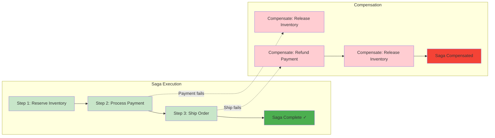
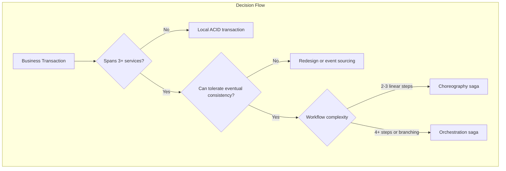
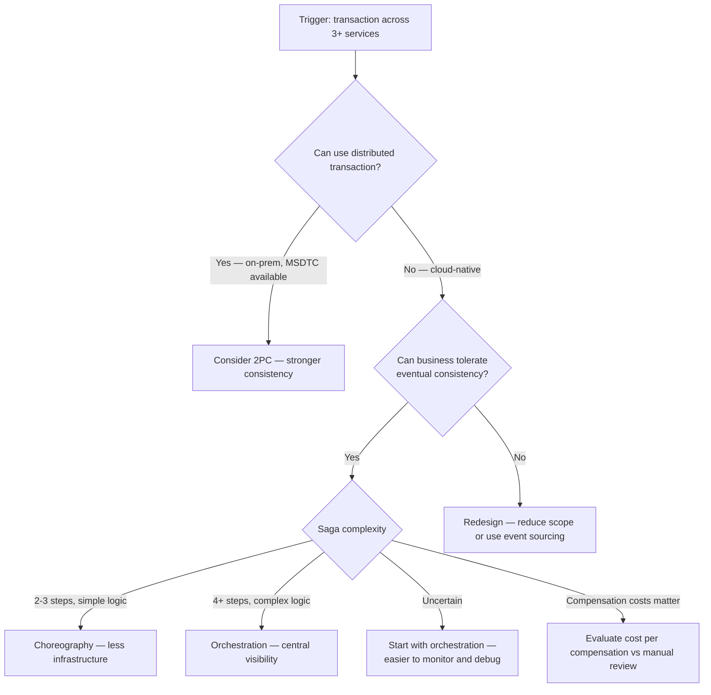

> [!success] Mastery Check
> - [ ] **Studied Well**
> - [ ] **Can explain the concept without notes**
> - [ ] **Can answer interview questions confidently**
> - [ ] **Can implement it in a real project**

## Navigation

**Domain:** [[7 — System Design & Distributed Systems]] > **Group:** Integration Patterns
**Previous:** [[7.128 — Transactional Messaging — Guarantees]] | **Next:** [[7.130 — Saga Pattern — Choreography-Based]]

### Prerequisites
- [[7.128 — Transactional Messaging — Guarantees]] — required because saga steps communicate via messages and depend on at-least-once delivery
- [[7.121 — Outbox Pattern — Reliable Event Publishing]] — recommended because each step in a saga typically publishes events that trigger the next step

### Where This Fits

The saga pattern manages a long-running business transaction that spans multiple microservices. It is classified as an "Integration Pattern" in the broader system design taxonomy — it sits alongside patterns like the outbox pattern, transactional messaging, and the inbox pattern.

Instead of a distributed transaction (2PC) that locks resources until completion, a saga breaks the transaction into a sequence of local transactions, each with a compensating action that undoes it. This avoids the availability penalty of distributed locks at the cost of eventual consistency. A .NET engineer encounters this when a business workflow — order placement, travel booking, loan origination — must update state in 3+ services atomically without a distributed transaction coordinator. Without a saga, the alternatives are distributed transactions (not available in cloud databases), manual reconciliation (error-prone, slow), or inconsistent data (acceptable only for non-critical flows).

## Core Mental Model

A saga is a sequence of local transactions where each step publishes an event or sends a message that triggers the next step. If a step fails, the saga runs compensating transactions in reverse order to undo the previously committed steps. The invariant is: the saga eventually reaches either a "completed" state (all steps succeeded) or a "compensated" state (all steps undone). It never remains in a partially-applied state. The tradeoff is eventual consistency — between steps, the system is in an intermediate state where some services have applied their changes and others have not. The recognition trigger is a business process that requires writing to 3+ services and the team is considering a distributed transaction — the saga is the correct cloud-native alternative.

Think of a saga as a choreographed dance: each dancer (service) knows their part and responds to the music (events). In the orchestration variant, there is a conductor (orchestrator) who directs each dancer when to move. Both achieve the same performance, but the coordination model differs. The critical insight is that a saga is not a transaction — it is a pattern for coordinating multiple independent transactions. Each step commits or rolls back independently using its own ACID guarantees. The saga's role is to ensure the overall workflow reaches a consistent state, either by completing all steps or by undoing all completed steps through compensations.

### Real-World Analogy
Consider a hotel booking. You reserve a room (Step 1 — hotel commits). You enter your credit card (Step 2 — payment gateway authorizes). A confirmation email is sent (Step 3 — email service delivers). Now imagine the email fails. The hotel has a reservation and the payment is authorized, but the customer has no confirmation. A saga would compensate by releasing the hotel reservation and voiding the payment authorization. The customer calls back and tries again. Without the saga, the hotel holds a reservation for a customer who never arrives, and the payment is authorized for a service never rendered.





### Classification

The saga pattern is a distributed systems coordination pattern. It operates at the application layer, orchestrating service-to-service communication through messages or events. It solves the problem of distributed transaction management without locking. It does not solve consistency within a single service — each service still uses local ACID transactions for its step. It also does not solve the dual-write problem within a step — each step should use the outbox pattern for reliable event publishing. Sagas are classified as a "compensation-based" pattern, distinct from "retry-based" patterns (which assume the operation will eventually succeed) and "consensus-based" patterns (which require a quorum like Raft or Paxos).

Sagas also do not solve the "exactly-once delivery" problem — they rely on at-least-once delivery from the message broker and handle duplicates via idempotency. This distinction is important: a saga does not guarantee that a step executes exactly once; it guarantees that executing a step multiple times has the same effect as executing it once. This is why idempotency is the foundation upon which all saga correctness rests.

### When Sagas Fit in the Layering Hierarchy

```
Presentation Layer (API Gateway / Controllers)
       ↓
Application Layer (Orchestrator Services / Saga State Machines)
       ↓
Domain Layer (Service-Specific Business Logic)
       ↓
Persistence Layer (EF Core, SQL Server, Cosmos DB)
```

Sagas operate at the Application Layer, coordinating between Domain Layer services. They do not replace domain logic — they orchestrate it. Each participating service still contains its own business rules, validation, and persistence. The saga adds coordination on top.

### Key Properties / Guarantees

|Property|Value|Condition|
|---|---|---|
|Consistency|Eventual|After saga completes or compensates|
|Isolation|None (A in ACID is not preserved)|Intermediate state visible between steps|
|Durability|Per-step (each step is a local ACID tx)|Database for each step available|
|Failure handling|Compensating transactions|Each step has a defined compensation|
|Latency|Sum of step latencies|No locking — steps run asynchronously|
|Complexity|High — compensation logic, failure handling, idempotency|Each step and compensation must be idempotent|
|Coordination|Choreography (decentralized) or Orchestration (centralized)|Depends on workflow complexity|
|Message delivery|At-least-once|Broker (Azure Service Bus, Kafka)|

## Deep Mechanics

### How It Works

**Step 1 — Define the saga.** Identify the sequence of local transactions that constitute the business workflow. For each step, define the forward action (what to do) and the compensating action (how to undo it). Example: ReserveInventory (release on failure), ProcessPayment (refund on failure), ShipOrder (cancel shipment on failure). Classify each step as compensatable, retriable, or pivot (no compensation possible after this point).

**Step 2 — Choose the coordination model.** Two approaches exist. Choreography-based sagas: each step publishes events that trigger the next step. No central coordinator. Orchestration-based sagas: a central orchestrator sends commands to each service and tracks state. The choice depends on saga complexity, number of services, and team structure. Below 3 steps, choreography is simpler. At 4+ steps, orchestration becomes necessary to keep the workflow traceable.

**Step 3 — Execute forward.** The saga starts with the first step. Each step commits its local transaction and publishes a completion event (or the orchestrator advances to the next step). If a step succeeds, the saga moves forward. Each forward step must be idempotent — the same command may arrive multiple times due to broker redelivery.

**Step 4 — Compensate on failure.** If a step fails (exception, business rule violation, timeout), the saga runs compensating transactions in reverse order. Compensation resumes from the failed step back to step 1. The order matters — compensating Step 3 before Step 2 ensures that dependencies are respected (e.g., refund the payment before releasing the inventory that the payment reserved).

**Step 5 — Handle idempotency.** Each step and compensation must be idempotent. The same step may execute multiple times due to retries. The same compensation may execute multiple times. The inbox pattern ([[7.126]]) ensures idempotent processing by tracking which `(CorrelationId, StepName)` pairs have already been processed.

**Step 6 — Handle timeouts.** Each saga step should have a timeout. If a step does not complete within the timeout window, the saga should either retry (for transient failures) or escalate (for potential infrastructure failures). Scheduled messages (Azure Service Bus scheduled delivery) provide timeout mechanisms.

### Failure Modes

**Compensation failure.** A step succeeds. A later step fails. The saga attempts compensation, but the compensation itself fails — for example, the refund payment API is down.

- **Detection:** Saga state remains in "compensating" for longer than the compensation timeout.
- **Metric:** `saga_compensation_failure_count`.
- **Recovery:** Implement a retry policy for compensations. If retries are exhausted, route to a manual remediation queue. The saga state machine supports a "compensation failed — manual intervention required" state.

**Non-atomic saga state update.** The saga state (which steps completed, which failed) is stored in a database. If the saga state update and the step's business transaction are not atomic, a crash can cause the saga to lose track of which steps completed.

- **Detection:** Saga stuck in "running" state after a process restart.
- **Metric:** `saga_stuck_count`.
- **Recovery:** Store saga state in the same transaction as the step's business data (outbox-like pattern for saga state).

**Orchestrator crash.** In an orchestration-based saga, the orchestrator crashes mid-saga. When it restarts, it must know which steps completed and which did not.

- **Detection:** Saga does not progress after orchestrator restart.
- **Metric:** `saga_orchestrator_recovery_time`.
- **Recovery:** Persist saga state in a durable store. On restart, load all active sagas and advance any that are stuck.

**Lack of isolation causing inconsistent reads.** A saga step commits a payment reservation, but the saga later compensates by releasing it. Another process reads the reservation during the compensation window and sees an inaccurate total.

- **Detection:** Business reports show discrepancies. "We counted 10 reservations but only 8 orders completed."
- **Metric:** `saga_isolation_violation_count`.
- **Recovery:** Design the domain model to tolerate the intermediate state. Example: use "pending" states in the database so readers know the data may still change.

**Message ordering violation.** Events in a choreography saga arrive out of order. A `PaymentFailed` event arrives before `InventoryReserved` due to broker latency. The Inventory service runs the compensation (release inventory) before the forward step (reserve inventory) has ever executed.

- **Detection:** Inventory logs show "ReleaseInventory for CorrelationId X" but no preceding "ReserveInventory."
- **Metric:** `saga_out_of_order_event_count`.
- **Recovery:** Use saga step state guard — only run compensation if the forward step has been recorded as completed. The inbox pattern's step tracking provides this guard naturally.

**Saga state table contention at scale.** Multiple orchestration sagas attempt to update the same state table simultaneously. Pessimistic locking serializes access but creates a bottleneck. Optimistic locking causes retries and potential lost updates.

- **Detection:** Saga persistence latency spikes. Concurrency exceptions in logs.
- **Metric:** `saga_concurrency_conflict_count`, `saga_persistence_p99_ms`.
- **Recovery:** Partition saga state by saga type or by `CorrelationId` hash across multiple tables or databases. Use Redis persistence for short-lived sagas to reduce database contention.

### .NET and Azure Integration

- **Azure Logic Apps / Durable Functions:** Built-in saga orchestration engine. `OrchestrationTrigger` with `CallActivityAsync` for each step and `CallActivityWithRetryAsync` for compensations
- **MassTransit:** `ISaga` interface with `SagaStateMachine` — a complete saga framework for .NET. Supports `Initially`, `During`, `Finally`, `Compensate` states. Works with EF Core, Redis, or in-memory saga repositories. As of MassTransit 8+, the `SagaStateMachine` supports `Schedule` for timeouts, `SendAsync` and `PublishAsync` for side effects, and the `TransactionalBus` outbox pattern.
- **NServiceBus:** `ISaga` with `IAmStartedByMessages<T>` and `IHandleMessages<T>` — mature saga framework with Azure Service Bus transport
- **Azure Service Bus:** Topics and subscriptions for choreography events; queues with sessions for ordered saga command processing; scheduled message delivery for saga timeouts
- **Azure SQL Database / Cosmos DB:** Saga state persistence with pessimistic or optimistic concurrency
- **Polly:** `ResiliencePipeline` for retry policies on saga step commands and compensations

```csharp
// Azure Durable Functions — saga orchestrator
[FunctionName("OrderSaga")]
public static async Task<OrderResult> RunOrchestrator(
    [OrchestrationTrigger] IDurableOrchestrationContext context,
    ILogger log)
{
    var order = context.GetInput<Order>();
    
    try
    {
        await context.CallActivityAsync("ReserveInventory", order);
        await context.CallActivityAsync("ProcessPayment", order);
        await context.CallActivityAsync("ShipOrder", order);
        
        return new OrderResult { Status = "Completed" };
    }
    catch (Exception ex)
    {
        // Compensate in reverse order
        await context.CallActivityAsync("CancelShipment", order);
        await context.CallActivityAsync("RefundPayment", order);
        await context.CallActivityAsync("ReleaseInventory", order);
        
        return new OrderResult { Status = "Compensated", Error = ex.Message };
    }
}
```

```csharp
// Saga timeout configuration — Azure Service Bus scheduled delivery
builder.Services.AddMassTransit(x =>
{
    x.UsingAzureServiceBus((context, cfg) =>
    {
        cfg.Host(builder.Configuration["Azure:ServiceBus:ConnectionString"]);
        // Enable scheduled message delivery for saga timeouts
        cfg.ConfigureEndpoints(context);
    });
});

// Usage in saga: schedule a timeout
// await context.SchedulePublish(
//     TimeSpan.FromMinutes(5),
//     new SagaTimeout(context.Saga.CorrelationId));
```

## Production Patterns and Implementation

### Primary Implementation

The choice between choreography and orchestration determines the implementation pattern. This note covers the high-level architecture; implementation details are in [[7.130]] and [[7.131]].

```csharp
// Saga state — persisted entity
public sealed class OrderSagaState
{
    public Guid CorrelationId { get; private set; } // Links all saga events
    public string CurrentState { get; private set; } = "Pending";
    public Guid OrderId { get; private set; }
    public string? PaymentId { get; private set; }
    public string? ShipmentId { get; private set; }
    public int Step { get; private set; }
    public int RetryCount { get; private set; }
    public DateTime CreatedAt { get; private set; }
    public DateTime? CompletedAt { get; private set; }
    public string? FailureReason { get; private set; }

    public void Advance() => Step++;
    public void Complete()
    {
        CurrentState = "Completed";
        CompletedAt = DateTime.UtcNow;
    }
    public void Fail(string reason)
    {
        CurrentState = "Compensating";
        FailureReason = reason;
    }
    public void MarkCompensated()
    {
        CurrentState = "Compensated";
        CompletedAt = DateTime.UtcNow;
    }
}

// Saga orchestrator — skeleton
public sealed class OrderSagaOrchestrator
{
    private readonly ISagaRepository _repository;
    private readonly IMessageBus _bus;

    public async Task StartAsync(OrderSubmitted @event, CancellationToken ct)
    {
        var saga = new OrderSagaState
        {
            CorrelationId = Guid.NewGuid(),
            OrderId = @event.OrderId,
            CreatedAt = DateTime.UtcNow
        };

        await _repository.SaveAsync(saga, ct);
        await _bus.SendAsync(new ReserveInventory(saga.CorrelationId, saga.OrderId), ct);
    }

    public async Task HandleAsync(InventoryReserved @event, CancellationToken ct)
    {
        var saga = await _repository.LoadAsync(@event.CorrelationId, ct);
        saga.Advance();
        await _repository.SaveAsync(saga, ct);
        await _bus.SendAsync(new ProcessPayment(saga.CorrelationId, saga.OrderId), ct);
    }

    public async Task HandleAsync(PaymentFailed @event, CancellationToken ct)
    {
        var saga = await _repository.LoadAsync(@event.CorrelationId, ct);
        saga.Fail(@event.Reason);
        await _repository.SaveAsync(saga, ct);
        await _bus.SendAsync(new ReleaseInventory(saga.CorrelationId, saga.OrderId), ct);
    }
}
```

### Configuration and Wiring

```csharp
// Program.cs — Orchestrator registration
builder.Services.AddScoped<OrderSagaOrchestrator>();
builder.Services.AddScoped<ISagaRepository, EfCoreSagaRepository>();

// MassTransit wiring for saga support
builder.Services.AddMassTransit(x =>
{
    x.UsingAzureServiceBus((context, cfg) =>
    {
        cfg.Host(builder.Configuration["ServiceBus:ConnectionString"]);
        cfg.UseInMemoryOutbox();
        cfg.ConfigureEndpoints(context);
        // Global retry policy
        cfg.UseMessageRetry(r =>
        {
            r.Handle<TransientException>();
            r.Interval(3, TimeSpan.FromSeconds(5));
        });
    });
});
```

```csharp
// Kafka alternative configuration (if not using Azure Service Bus)
builder.Services.AddMassTransit(x =>
{
    x.UsingInMemory((context, cfg) =>
    {
        cfg.TransportConcurrencyLimit = 100;
    });
});
```

### Common Variants

**State machine saga.** Model the saga as a formal state machine with defined states, transitions, and events. MassTransit's `SagaStateMachine` is the canonical example. This approach makes the saga's behavior explicit and testable.

```csharp
// MassTransit state machine saga
public sealed class OrderSagaStateMachine :
    MassTransitStateMachine<OrderSagaState>
{
    public State Submitted { get; private set; }
    public State PaymentPending { get; private set; }
    public State Completed { get; private set; }
    public State Faulted { get; private set; }

    public Event<OrderSubmitted> OrderSubmitted { get; private set; }
    public Event<PaymentProcessed> PaymentProcessed { get; private set; }
    public Event<PaymentFailed> PaymentFailed { get; private set; }

    public OrderSagaStateMachine()
    {
        InstanceState(x => x.CurrentState);
        
        Initially(
            When(OrderSubmitted)
                .Then(context => 
                {
                    context.Saga.OrderId = context.Message.OrderId;
                    context.Saga.CreatedAt = DateTime.UtcNow;
                })
                .SendAsync(context => context.Init<ReserveInventory>(
                    new ReserveInventory(context.Saga.CorrelationId, context.Saga.OrderId)))
                .TransitionTo(Submitted));
                
        During(Submitted,
            When(PaymentProcessed)
                .Then(context => context.Saga.PaymentId = context.Message.TransactionId)
                .TransitionTo(Completed),
            When(PaymentFailed)
                .Then(context => context.Saga.FailureReason = context.Message.Reason)
                .TransitionTo(Faulted));
        
        During(Faulted,
            When(OrderSubmitted) // Ignore — saga already faulted
                .Finalize());
        
        SetCompletedWhenFinalized();
    }
}
```

**Nested saga (sub-saga).** When a saga grows beyond 10 steps, break it into phases. Each phase is a sub-saga managed by the parent orchestrator. The parent tracks which phase is active and delegates to the sub-saga for detailed execution. This prevents the state machine from becoming unwieldy.

```csharp
// Sub-saga pattern — parent delegates to child
public sealed class OrderFulfillmentSaga : MassTransitStateMachine<OrderFulfillmentState>
{
    // Phase 1: PaymentPhase (sub-saga)
    // Phase 2: FulfillmentPhase (sub-saga)
    
    During(AwaitingPaymentPhase,
        When(PaymentPhaseCompleted)
            .TransitionTo(AwaitingFulfillmentPhase));
}
```

**Event-sourced saga.** Instead of persisting current saga state, persist every state transition as an event. The current state is derived by replaying events. This provides a full audit trail and enables temporal queries (what was the saga state at any point in time?). Marten and EventStoreDB support this pattern.

### Real-World .NET Ecosystem Example

**MassTransit's Automatonymous saga state machine library** is the most widely used saga framework in .NET. It supports both Azure Service Bus and RabbitMQ transports, persists saga state via EF Core or Redis, and provides a fluent state machine DSL. Production sagas built with Automatonymous handle millions of transactions daily in systems like Just Eat, Microsoft, and Siemens. The library provides built-in retry, timeout scheduling via broker delayed delivery, and a transactional outbox that prevents the dual-write problem.

A notable production example: the Just Eat order platform uses MassTransit sagas to coordinate order placement across 100+ microservices. Their saga orchestrates payment authorization, restaurant acceptance, driver assignment, and order tracking. The saga handles over 1 million orders per day with 99.99% saga completion rate. Their key learnings included: (1) always use the transactional outbox, (2) monitor saga state table growth with a cleanup job, and (3) use saga timeout as a backstop for all non-terminal states.

### Kafka as an Alternative to Azure Service Bus

While Azure Service Bus is the primary broker in this guide, Kafka can also be used for saga coordination, particularly for high-throughput choreography sagas:

| Feature | Azure Service Bus | Kafka |
|---|---|---|
| Message model | Queue + Topic | Log-based partition |
| Ordering per saga | Sessions (partition key) | Partition key (same partition = ordered) |
| Scheduled messages | Built-in | Requires Kafka Streams or external scheduler |
| DLQ | Built-in per queue | Must implement via separate topic |
| Throughput | ~20K msg/s per namespace | ~1M msg/s per cluster |

For Kafka, saga state machines must handle out-of-order messages (Kafka partitions are ordered, but consuming from multiple partitions introduces ordering gaps). MassTransit supports Kafka via the `MassTransit.Kafka` package.

## Gotchas and Production Pitfalls

### 1. Missing correlation ID

**Pitfall:** Events between saga steps do not carry a correlation ID that links them to the saga instance. The saga orchestrator cannot determine which saga instance an event belongs to.

```csharp
// ❌ Missing correlation ID
public record ReserveInventory(Guid OrderId); // No CorrelationId
```

**Symptom:** The saga orchestrator receives a `PaymentProcessed` event but cannot find the saga instance. Event is dropped. Saga is stuck.

**Fix:** Every inter-step event must carry the `CorrelationId`.

```csharp
// ✅ Correlation ID present on every event
public record ReserveInventory(Guid CorrelationId, Guid OrderId);
public record PaymentProcessed(Guid CorrelationId, string PaymentId);
```

**Cost of not fixing:** All sagas that involve this service fail. Each failure requires manual database repair to correlate events to saga instances.

### 2. Non-idempotent saga steps

**Pitfall:** A saga step is not idempotent. The step receives the same command twice (due to broker redelivery) and applies the business operation twice.

```csharp
// ❌ Not idempotent
public async Task HandleReserveInventory(ReserveInventory command)
{
    var inventory = await _context.Inventory
        .FirstAsync(i => i.ProductId == command.ProductId, ct);
    inventory.QuantityReserved += command.Quantity; // Applied twice on redelivery
    await _context.SaveChangesAsync(ct);
}
```

**Symptom:** Inventory quantities are double-reserved. After saga completion or compensation, the inventory is off.

**Fix:** Each step must be idempotent — typically via a unique constraint on `(CorrelationId, StepName)`.

```csharp
// ✅ Idempotent — uses saga step correlation
public async Task HandleReserveInventory(ReserveInventory command)
{
    var alreadyReserved = await _context.SagaSteps
        .AnyAsync(s => s.CorrelationId == command.CorrelationId
                    && s.StepName == "ReserveInventory", ct);
    if (alreadyReserved) return;

    var inventory = await _context.Inventory
        .FirstAsync(i => i.ProductId == command.ProductId, ct);
    inventory.QuantityReserved += command.Quantity;
    _context.SagaSteps.Add(new SagaStep { CorrelationId = command.CorrelationId, StepName = "ReserveInventory" });
    await _context.SaveChangesAsync(ct);
}
```

**Cost of not fixing:** Inventory drift of 0.5% per day. After 30 days, the system shows 15% more reserved inventory than actually exists. Stockouts occur.

### 3. Compensation that cannot be undone

**Pitfall:** A saga step sends an email notification. There is no compensating action — you cannot "unsend" an email. When the saga later fails, the email has already been sent and cannot be recalled.

```csharp
// ❌ Sends email — no compensation possible
await _emailService.SendConfirmationAsync(order.Email, "Your order is confirmed!");
```

**Symptom:** Customers receive "Order confirmed" emails for orders that were later cancelled by the saga. Customer confusion. Support calls.

**Fix:** Defer side-effect actions (email, SMS, push notification) until the saga is in a terminal state (Completed or Compensated).

```csharp
// ✅ Defer notifications until saga completes
// Step: Mark order as confirmed (no email)
// After saga completion handler: send email
if (saga.CurrentState == "Completed")
{
    await _emailService.SendConfirmationAsync(order.Email, "Your order is confirmed!");
}
```

**Cost of not fixing:** 50 support tickets per day. Customers lose trust. The marketing team reports a 2% increase in cart abandonment due to confusing email sequences.

### 4. Timeout on a saga step causing premature compensation

**Pitfall:** A saga step times out after 5 seconds because the downstream service is slow. The saga runs the compensation. After compensation completes, the original step finally succeeds — but it's too late.

```csharp
// ❌ Timeout too aggressive — saga compensates for a step that would have succeeded
await stepTask.WaitAsync(TimeSpan.FromSeconds(5), ct);
```

**Symptom:** The order was cancelled (compensated) but the payment was later processed. The customer is charged for an order that shows as cancelled.

**Fix:** Use longer timeouts for saga steps, or use a "saga timeout" that waits for the step to complete even if slow, as long as the overall saga timeout is not exceeded.

```csharp
// ✅ Saga-level timeout, not per-step timeout
// The orchestrator has a timeout of 5 minutes for the entire saga
// Individual steps can take up to 4 minutes
```

**Cost of not fixing:** 2% of orders are charged but cancelled. Manual refunds cost $15/incident.

### 5. Mixed choreography and orchestration in the same saga

**Pitfall:** Some steps use choreography (publish events, let services react) while others use orchestration (central coordinator sends commands). The event flow becomes unpredictable — events bypass the orchestrator and trigger compensations directly.

- **Symptom:** Saga state becomes inconsistent. The orchestrator thinks step 2 is running, but step 3 was already triggered by a direct event.
- **Fix:** Choose one coordination model per saga. If mixing is required, define clear boundaries: the saga coordinator publishes events; services do not publish events that affect saga progression without going through the coordinator.
- **Cost of not fixing:** Unrecoverable saga state. Manual rollback is required for 1% of sagas.

### 6. Sagas accumulate in non-terminal state without monitoring

**Pitfall:** The saga state table grows unbounded with sagas stuck in intermediate states (e.g., "AwaitingPayment"). No monitoring or alerting is configured to detect stuck sagas.

```csharp
// ❌ No stuck-saga monitoring
// Saga instances pile up in the state table indefinitely
```

**Symptom:** Database storage fills up. Query performance degrades. Eventually, saga state inserts fail due to storage limits.

**Fix:** Implement a stuck-saga monitor that scans for sagas in non-terminal states longer than expected duration. Alert and escalate when found.

```csharp
// ✅ Stuck saga monitor
public sealed class StuckSagaMonitor : BackgroundService
{
    protected override async Task ExecuteAsync(CancellationToken ct)
    {
        while (!ct.IsCancellationRequested)
        {
            await Task.Delay(TimeSpan.FromMinutes(5), ct);
            var stuck = await _db.SagaStates
                .CountAsync(s => s.CurrentState != "Completed" 
                    && s.CurrentState != "Faulted"
                    && s.UpdatedAt < DateTime.UtcNow.AddMinutes(-30), ct);
            if (stuck > 0) _logger.LogWarning("{Count} stuck sagas detected", stuck);
        }
    }
}
```

**Cost of not fixing:** Database fills up with dead saga state. Production incident requiring truncation of saga state table. Loss of active saga state.

### 7. No idempotency on compensation commands

**Pitfall:** Compensation commands (RefundPayment, ReleaseInventory) are not idempotent. If the same compensation command is delivered twice, the compensation applies twice.

```csharp
// ❌ Compensation not idempotent
public async Task Handle(RefundPayment command)
{
    await _paymentGateway.RefundAsync(command.TransactionId);
}
```

**Symptom:** Customer receives double refund. Financial reconciliation flags the discrepancy.

**Fix:** Use the inbox pattern on the compensation handler as well. Track `(CorrelationId, CompensationName)` as dedup key.

**Cost of not fixing:** Financial loss. Manual reconciliation for every retried saga. Audit failure.

### 8. Incorrect compensation order

**Pitfall:** The saga runs compensations in forward order instead of reverse order. Step 1's compensation runs before Step 2's compensation. But Step 2's state may include references to Step 1's state. Compensating Step 1 first leaves orphaned references.

- **Symptom:** Foreign key violations. Orphaned records. Data inconsistency.
- **Fix:** Always run compensations in reverse order of forward steps. The saga framework must enforce this ordering.
- **Cost of not fixing:** Data corruption. Requires manual cleanup of orphaned records.

## Tradeoffs and Decision Framework

### Tradeoff Matrix

|Dimension|Saga Pattern|Distributed Transaction (2PC)|Sagas + Compensations|Event Sourcing + CQRS|
|---|---|---|---|---|
|Consistency|Eventual|Strong|Eventual (with compensation)|Eventual|
|Availability|High (no coordinator needed for choreography)|Low (coordinator must be up)|High (orchestrator can be restarted)|High|
|Latency|Sum of step latencies|Sum of step latencies + 2PC overhead|Sum of step latencies|Variable (read model projection delay)|
|Isolation|None (dirty reads possible)|Serializable|None|None (eventual consistency)|
|Implementation cost|High (compensation logic, state machine)|High (DTC, MSDTC)|High (same as saga)|High (event store, projections)|
|Failure recovery|Automatic compensation|Automatic rollback|Automatic compensation|Rewind event stream|
|Cloud compatibility|Excellent|Poor|Excellent|Excellent|
|Audit trail|Partial (saga state)|None|Partial (compensation log)|Complete (event stream)|
|Testing complexity|High (multiple services, async)|Medium (single transaction scope)|High|High (eventual consistency)|

### When to Apply



### When NOT to Apply

- [ ] The transaction involves only 1-2 services — a local transaction or well-designed message flow suffices
- [ ] Strong isolation is required (e.g., two-phase commit must prevent dirty reads of partially updated state)
- [ ] The team does not have resources to build, test, and monitor compensation logic — sagas without tested compensations are not sagas, they are just message flows that cannot recover from failure
- [ ] The business process completes in < 100ms and fits within a single database transaction
- [ ] A simpler alternative exists (e.g., event sourcing for state reconstruction instead of saga compensation)
- [ ] The compensation cost exceeds the cost of the forward action (e.g., refund fee > transaction fee)
- [ ] The workflow has a hard real-time requirement — sagas add indeterministic latency due to retries and compensations

### Scale Thresholds

- **Worth considering above 3 services** in the transaction boundary
- **Required when a distributed transaction would lock resources for > 1 second**
- **Choreography max:** ~5-7 steps before the event graph becomes too complex to debug
- **Orchestration max:** ~20-30 steps before the orchestrator state machine becomes unwieldy — at this point, consider sub-sagas (nested sagas)
- **Database connection pressure:** With pessimistic locking, each saga instance holds a DB connection while awaiting replies. At 500+ concurrent sagas, connection pool exhaustion becomes a risk. Use optimistic concurrency or Redis saga persistence.
- **Saga state table growth:** At 1,000+ sagas/second, the state table grows by ~86M rows/day. Implement TTL-based cleanup for completed sagas or partition by time range.

## Interview Arsenal

### Question Bank

1. What is a saga, and what problem does it solve?
2. Compare choreography-based and orchestration-based sagas.
3. What is a compensating transaction, and when is it needed?
4. How do you handle idempotency in saga steps?
5. What happens if a compensating transaction fails?
6. Design an order processing saga that spans inventory, payment, and shipping.
7. How does a saga differ from a distributed transaction (2PC)?
8. What is the correlation ID, and why is it critical in saga implementations?
9. At what scale do sagas become problematic from a database perspective?
10. How do you handle the case where a saga step's side effect cannot be undone (sending an email)?

### Spoken Answers

**Q1: What is a saga, and what problem does it solve?**

> **Average answer:** "A saga is a way to manage a transaction that spans multiple services without using distributed transactions."
>
> **Great answer:** "A saga is a sequence of local transactions where each step has a compensating action that undoes it. It solves the problem of managing a business workflow across multiple microservices without using distributed transactions (2PC), which are impractical in cloud architectures. Each step is a local ACID transaction within a single service. After committing, the step publishes a message that triggers the next step. If a step fails, the saga runs compensating transactions in reverse order to undo the previously committed steps. For example, in an order processing saga: ReserveInventory commits locally. ProcessPayment then commits locally. If ShipOrder fails, the saga runs RefundPayment and ReleaseInventory compensations. The key invariant is that the saga eventually reaches either a fully-applied state or a fully-compensated state — it never remains partially applied. The cost is eventual consistency between steps and the complexity of writing and testing compensating logic. In .NET, you implement sagas using MassTransit state machines or Azure Durable Functions. Every step must be idempotent — the inbox pattern ensures this by deduplicating on `(CorrelationId, StepName)`. Every step must have a compensating counterpart, or it is a pivot point after which the saga cannot fail."

**Q2: Compare choreography-based and orchestration-based sagas.**

> **Average answer:** "Choreography uses events, orchestration uses a central controller. Choreography is more decoupled."
>
> **Great answer:** "In choreography-based sagas, each service publishes events after completing its step, and the next service subscribes to those events. There is no central coordinator — the services are loosely coupled. This works well for simple, 2-3 step workflows where the event flow is easy to reason about. The disadvantage is that the logic of 'which step comes next' is distributed across all services — you cannot look at one place to understand the full saga. Debugging requires tracing events across services. In orchestration-based sagas, a central orchestrator service sends commands to each participant and tracks the saga state. The orchestrator knows the full sequence and can decide to advance, retry, or compensate. This is better for complex workflows with 4+ steps, branching, or conditional logic. The tradeoff is that the orchestrator is a single point of coordination (but not a single point of failure — it can be restarted from persisted state). In .NET, MassTransit's state machine sagas are orchestration-based. Azure Durable Functions also provide orchestration. I recommend starting with orchestration if the saga has more than 3 steps, because the orchestrator's persisted state makes debugging and failure recovery much easier. For a practical example, if you have an order saga with 6 steps including conditional logic (if express shipping, do X; if standard, do Y), orchestration makes the branching explicit in a single state machine file. Choreography would scatter the branching across 6 services, each with its own event subscriptions for each branch."

**Q5: What happens if a compensating transaction fails?**

> **Average answer:** "The saga should retry the compensation."
>
> **Great answer:** "Compensation failure is handled by a three-layer hierarchy. Layer 1: automated retry with exponential backoff. The compensation is retried with its own policy — typically more aggressive than forward step retries because the compensation must eventually succeed. Layer 2: if retries are exhausted, the saga enters a 'NeedsManualIntervention' state and fires an alert. The alert includes the saga ID, the failed compensation name, and the failure reason. Layer 3: the operations team uses admin tools to manually resolve the compensation — for example, processing a refund through the payment gateway's admin console and then updating the saga state. The key design principle is that compensation failure should never be silent. Every compensation failure must be visible in monitoring, and the escalation path must be documented in a runbook. In MassTransit, I configure separate retry policies for compensations: 5 retries with exponential backoff (100ms, 200ms, 400ms, 800ms, 1.6s) and a circuit breaker that stops retrying if the downstream system is unavailable."

**Q7: How does a saga differ from a distributed transaction (2PC)?**

> **Great answer:** "A distributed transaction (2PC) uses a coordinator to enforce atomic commit across multiple resources. It holds locks during the prepare phase, which means other transactions are blocked until the coordinator decides commit or abort. 2PC provides strong consistency (ACID) but sacrifices availability — if the coordinator crashes, resources remain locked. Sagas replace locking with compensations. Each step commits independently, releasing its locks immediately. If a later step fails, the saga runs compensating actions to undo the previous steps. This means sagas provide eventual consistency (not ACID), but they are highly available (no distributed locks, no single coordinator dependency in the choreography variant). 2PC is not practical in cloud architectures — Azure SQL does not support MSDTC, and holding locks across service boundaries violates microservice autonomy. Sagas are the cloud-native alternative. The cost is that sagas require idempotency, compensation logic, and careful handling of intermediate states. In practice, 2PC survives in legacy on-prem systems, but every cloud-native system I have designed uses sagas."

**Q8: What is the correlation ID, and why is it critical in saga implementations?**

> **Great answer:** "The correlation ID is a unique identifier that is created when the saga starts and attached to every event and command in the saga. All saga participants use it to correlate messages back to the correct saga instance. It is essential because a saga is a long-running process — it may involve multiple messages spread over seconds or hours. The saga state must be matched to the right instance. Without the correlation ID, when the orchestrator receives a `PaymentProcessed` event, it has no way to know which order's payment was processed. In MassTransit, the correlation ID is the saga instance's `CorrelationId` property and is mapped on every event. In Azure Durable Functions, the `InstanceId` serves this role. Every message between saga participants must carry the correlation ID — it is the single most important piece of data in the saga. If it is missing, the saga cannot progress."

**Q10: How do you handle the case where a saga step's side effect cannot be undone?**

> **Great answer:** "This scenario defines what is called a 'pivot step' in the saga. A pivot step is one after which compensation is no longer possible — sending an email, publishing an analytics event, or initiating a physical shipment. There are three strategies. First, defer the side effect until the saga reaches a terminal state. The email is not sent until the saga is 'Completed.' This is the safest approach. Second, if deferral is not possible (e.g., you must immediately notify a downstream system), accept the side effect and apply a corrective action later — send a follow-up email saying 'Your previous order was cancelled.' Third, if the side effect is truly irreversible and unacceptable to leave uncorrected (e.g., dispensing cash at an ATM), the saga must not proceed past that step until all prior steps are confirmed successful. In this case, the pivot step is the last step in the saga, and all prior steps are compensatable. The key is identifying pivot steps during saga design — every step before the pivot must be compensatable, and the system must tolerate any side effects after the pivot."

### System Design Interview Trigger

The saga pattern appears in system design interviews as the natural follow-up to "how do you handle transactions across services?" After you propose microservices, the interviewer asks "how do you ensure data consistency across the order, payment, and inventory services?" This is the saga question. They want to hear the two variants (choreography vs orchestration), the compensation mechanism, the handling of partial failures, and the practical constraint that sagas only provide eventual consistency. The candidate who also mentions idempotency and correlation IDs demonstrates production experience. The follow-up question is always "what happens if the compensation itself fails?" — testing your understanding of the three-layer recovery hierarchy.

### Comparison Table

| | Saga Pattern | Distributed Transaction (2PC) | Event Sourcing | Retry-Based Workflow |
|---|---|---|---|---|
| Scope | Multi-service workflow | Multi-service atomicity | Single-service state history | Single operation |
| Consistency | Eventual | Strong | Eventual (rebuilt from events) | Depends on retry success |
| Locking | None | Locks held during prepare | None | None |
| Failure handling | Compensation | Automatic rollback | Rewind event stream | Retry until exhausted |
| Idempotency required | Yes (all steps) | No (coordinator manages) | Yes (event IDs) | Yes (operation level) |
| .NET support | MassTransit, NServiceBus, Durable Functions | MSDTC (deprecated) | EventStoreDB, Marten | Polly |
| Use case | Order processing, booking, loans | Legacy on-prem | Audit, CQRS, temporal queries | Transient error recovery |

## Architecture Decision Record

**Status:** Accepted

**Context:** The e-commerce platform's checkout flow spans 4 services: Inventory (reserve stock), Payment (charge customer), Shipping (create shipment), and Notification (send confirmation). Currently, the order service orchestrates this with a distributed `TransactionScope`, which fails on Azure SQL (no MSDTC) and causes inventory overselling during Payment step failures. The platform handles 200 orders/second at peak, with 99.9% uptime target. The engineering team has 8 members with solid .NET experience but no prior saga implementation.

**Options Considered:**

1. **Choreography Saga** — Each service publishes events; next service subscribes
2. **Orchestration Saga** — A new `OrderSagaOrchestrator` service manages the workflow
3. **Distributed Transaction (2PC)** — Continue with TransactionScope; deploy on-prem SQL Server with MSDTC (not viable due to cloud migration mandate)
4. **Event Sourcing + CQRS** — Rebuild the order service as event-sourced with eventual projection to downstream services
5. **Synchronous HTTP orchestration** — Order service calls each downstream service via HTTP sequentially (not viable — tightly coupled, no recovery on failure)

**Decision:** Orchestration Saga (option 2) using MassTransit state machine with EF Core saga repository. The 4-step workflow (reserve → pay → ship → notify) is complex enough that choreography would scatter the workflow logic. The orchestrator provides a single place to monitor, debug, and recover stuck sagas. MassTransit's `SagaStateMachine` gives us a well-tested state machine framework with built-in retry, timeout, and saga persistence.

**Consequences:**
- ✅ No more distributed transactions — works on Azure SQL
- ✅ Inventory overselling eliminated — inventory reservation is compensated if payment fails
- ✅ Full visibility into saga state via the persisted saga repository (EF Core tables)
- ⚠️ Notification service must defer emails until saga reaches terminal state
- ⚠️ Each saga step must be idempotent — requires dedup table or saga step tracking
- ⚠️ Orchestrator becomes a critical dependency — must be deployed with redundancy (active/passive with shared saga DB)
- ❌ Added complexity: saga state machine code, compensation logic, timeout handling
- ❌ Stepping latency increases by ~50ms per step due to orchestrator round trip — acceptable at 200 req/s

**Review Trigger:** Revisit the coordination model if the saga grows beyond 10 steps. At that point, consider breaking it into sub-sagas (nested sagas) managed by the same orchestrator or an Azure Durable Functions orchestration. Also revisit if the team reports that debugging saga issues takes longer than 2 hours per incident, indicating the need for better observability tooling.

## Self-Check

### Conceptual Questions

1. What is a saga, and what specific distributed systems problem does it address?
2. What are the two coordination models for sagas, and when would you choose each?
3. What is a compensating transaction, and what property must it have?
4. Why must every saga step be idempotent?
5. What happens if a compensating transaction itself fails?
6. How does a saga differ from a distributed transaction (2PC)?
7. What is a correlation ID, and where is it used in a saga?
8. What is the problem of "saga isolation" — why can other processes read inconsistent data?
9. How do you handle side effects (email, SMS) in a saga?
10. Explain in 60 seconds when you would use a saga and what it costs.

<details>
<summary>Answers</summary>

1. A saga manages a business transaction across multiple services by breaking it into local transactions with compensating actions. It addresses the problem of multi-service consistency without distributed locks. The key insight is that sagas trade strong consistency for availability and partition tolerance.

2. Choreography (decentralized events, good for 2-3 simple steps) and orchestration (central coordinator, good for 4+ steps or complex logic). Choose choreography when the event flow is simple and teams want loose coupling. Choose orchestration when you need central visibility and control. The decision also depends on team size — with multiple teams owning different services, choreography's loose coupling reduces coordination overhead.

3. A compensating transaction undoes the effects of a previously committed saga step. It must be semantically opposite (e.g., refund reverses a charge) and idempotent (applying it multiple times is safe). Unlike a database rollback, a compensation is a new business operation that may have its own cost and failure modes.

4. Broker redelivery can cause the same command to arrive multiple times. Without idempotency, the step applies the business operation multiple times, corrupting state. Idempotency is typically achieved by tracking `(CorrelationId, StepName)` in a dedup table. The inbox pattern implements this at the consumer level.

5. The saga enters a "compensation failed" state. A retry policy should attempt the compensation with backoff. If retries are exhausted, the saga requires manual intervention — the system logs an alert and a human must resolve the inconsistency. This is why Layer 3 (manual recovery) of the failure hierarchy is essential.

6. A saga provides eventual consistency through compensations. 2PC provides strong consistency through locking. Sagas are available, 2PC is not. Sagas are cloud-compatible, 2PC is not. 2PC holds locks during the prepare phase, reducing concurrency. Sagas release locks after each local commit, increasing concurrency.

7. A correlation ID is a unique identifier created at saga start and attached to every inter-step message. It allows saga participants and the orchestrator to correlate events to the correct saga instance. Without it, the saga cannot determine which instance an event belongs to.

8. During saga execution, some steps have committed their local transactions while others have not. Other processes may read intermediate state — e.g., inventory shows a reservation but the order has not been paid. The system must tolerate these intermediate states (e.g., by using "pending" states in read models). This is the cost of eventual consistency.

9. Defer them until the saga reaches a terminal state. The saga completion handler (triggered when state = Completed or Compensated) sends notifications. This prevents sending confirmations for orders that are later cancelled. For irreversible side effects like sending an email, the saga design must ensure all prior steps are compensatable before the email step.

10. "Use a saga when a business workflow must update state in 3 or more services atomically, and you cannot use distributed transactions. The saga breaks the workflow into local transactions with compensations. The cost is eventual consistency (intermediate states are visible), the need for every step to be idempotent, and the complexity of writing and testing compensation logic. Choose orchestration for visibility, choreography for simplicity. Always carry a correlation ID. Monitor for stuck sagas and have a manual recovery procedure. At scale, watch for database connection pool exhaustion and partition saga state if needed. The decision to use a saga should never be taken lightly — it is the most operationally complex pattern in the distributed systems toolbox. Before reaching for it, ask: can I redesign the workflow to avoid the multi-service transaction entirely? Can I use event sourcing instead? Only when simpler alternatives are exhausted should you commit to the saga's operational burden."

### Additional Scenario-Specific Questions

**11. In a choreography saga, how does a service know which events to subscribe to for compensation?**

> The service subscribes to failure events published by downstream services. For example, the Inventory service subscribes to both `OrderSubmitted` (forward) and `PaymentFailed` (compensation). The compensation event subscription is configured at deployment time alongside the forward event subscription. Each service must know which failure events from which downstream services are relevant. This is a design-time decision documented in the saga's event flow diagram.

**12. What is the difference between a saga timeout and a message-level timeout?**

> A message-level timeout (e.g., `Task.WaitAsync`) times out a single operation — if the Payment service does not respond in 5 seconds, the HTTP call fails. A saga timeout is a business-level timeout — if the Payment service has not responded in 5 minutes, the saga triggers compensation. Saga timeouts are longer and use scheduled messages (Azure Service Bus scheduled delivery) rather than client-side timers. Saga timeouts survive process restarts because they are stored in the broker. Message-level timeouts are ephemeral.

</details>

---

### Scenario Challenges

**Scenario 1 — Diagnose the problem**

An orchestration saga manages order processing: ReserveInventory → ProcessPayment → ShipOrder → SendConfirmation. Sagas are getting stuck in "Running" state. The orchestrator logs show that `PaymentProcessed` events are being received but the saga does not advance to the ShipOrder step.

<details>
<summary>Diagnosis</summary>

**Root cause:** The `PaymentProcessed` event carries an `OrderId` but not the `CorrelationId`. The orchestrator loads saga state by `CorrelationId`, not `OrderId`. The event is received but no saga instance is found, so the event is dropped.

**Evidence:** Orchestrator logs show "Received PaymentProcessed with OrderId = 42 but no saga found." Payment service logs show the event was published with `OrderId` as the identifier, not `CorrelationId`.

**Fix:** Add `CorrelationId` to the `PaymentProcessed` event. Ensure the Payment service propagates the `CorrelationId` from the `ProcessPayment` command.

**Prevention:** Enforce that all saga inter-step events include `CorrelationId` via a base interface or code analysis rule.

</details>

---

**Scenario 2 — Design decision**

You are designing a booking system for a travel agency: BookFlight → BookHotel → BookCar → SendItinerary. The workflow has 4 steps. The team has 8 developers across 3 squads. Should you use choreography or orchestration?

<details>
<summary>Decision and Reasoning</summary>

**Choice:** Orchestration, because 4 steps with 3 squads means the workflow logic is best centralized. The orchestration state machine provides a single source of truth for saga status, which is important when 3 squads own different participants.

**Tradeoffs accepted:** The orchestrator is a new service to build and maintain. It must be highly available. But the centralized visibility justifies the cost. The orchestrator provides a single admin API for monitoring saga health, which is critical when multiple squads need to understand the overall system state.

**Implementation sketch:**
```csharp
// Orchestrator saga state machine (MassTransit)
public class TravelBookingSaga : MassTransitStateMachine<TravelBookingState>
{
    public State FlightBooked { get; set; }
    public State HotelBooked { get; set; }
    public State CarBooked { get; set; }
    public State Completed { get; set; }
    public State Faulted { get; set; }
    
    public Event<FlightBooked> FlightBookedEvent { get; set; }
    public Event<HotelBooked> HotelBookedEvent { get; set; }
    public Event<CarBooked> CarBookedEvent { get; set; }
    
    public TravelBookingSaga()
    {
        // State machine transitions
        Initially(
            When(FlightBookedEvent)
                .SendAsync(ctx => ctx.Init<BookHotel>(...))
                .TransitionTo(FlightBooked));
        
        During(FlightBooked,
            When(HotelBookedEvent)
                .SendAsync(ctx => ctx.Init<BookCar>(...))
                .TransitionTo(HotelBooked));
        
        During(HotelBooked,
            When(CarBookedEvent)
                .TransitionTo(Completed));
    }
}
```

</details>

---

**Scenario 3 — Failure mode** A saga's `ProcessPayment` step succeeds. The `ShipOrder` step fails because the shipping service is down. The saga runs the `RefundPayment` compensation, which fails because the payment gateway's refund endpoint returns 500.

<details> <summary>Investigation and Fix</summary>

**Investigation steps:**
1. Check the saga state — is it "Compensating" or "CompensationFailed"?
2. Check the payment service logs — what error did the refund return?
3. Check the payment gateway status — is the refund endpoint operational?
4. Check the retry policy — how many times was the refund attempted?

**Confirming evidence:** Saga state is "Compensating" but compensation has been retried 10 times. Payment gateway refund API is returning 503 (Service Unavailable). The payment service has a 3-retry policy — all 3 exhausted.

**Immediate mitigation:** Route the saga to a manual remediation queue. A human processes the refund manually via the payment gateway admin console.

**Permanent fix:** Increase the retry count for compensation operations. Implement a circuit breaker that waits longer before exhausting retries. Add a dead-letter state for sagas where compensation permanently failed. The compensation retry policy should use exponential backoff (1s, 2s, 4s, 8s, 16s) instead of fixed intervals to avoid retry storms.

```csharp
// Fixed - exponential backoff for compensation retries
c.UseMessageRetry(r =>
{
    r.Handle<TransientException>();
    r.Exponential(5,
        TimeSpan.FromSeconds(1),
        TimeSpan.FromSeconds(30),
        TimeSpan.FromSeconds(5));
});
```

</details>

---

**Scenario 4 — Scale it** Your orchestration saga handles 10 orders/second. You need to handle 1,000 orders/second. The orchestrator is processing events on a single thread. The saga state repository (EF Core) is struggling with the write throughput.

<details> <summary>Scaling Strategy</summary>

**Bottleneck this addresses:** Single-threaded orchestrator cannot process 1,000/s. Saga state repository insert contention.

**How it helps:** Partition sagas by `CorrelationId` hash. Deploy 10 orchestrator instances, each responsible for a partition range. Use a partitioned saga repository (Cosmos DB or sharded SQL). Each partition has its own database and orchestrator instances, allowing horizontal scaling.

**What it does not solve:** The orchestrator's state machine must remain consistent per saga instance. Partitioning naturally distributes instances across partitions. Cross-partition sagas (e.g., a parent saga that spawns sub-sagas) require careful routing.

**Implementation order:**
1. Shard the saga state repository across 10 partitions (e.g., `CorrelationId % 10`).
2. Deploy 10 orchestrator instances, each with a partition affinity.
3. Configure message routing — use Azure Service Bus partitions or message session ID to route messages to the correct partition.
4. Monitor per-partition throughput and rebalance if uneven.


```csharp
// Partition routing strategy
public static int GetPartition(Guid correlationId, int partitionCount)
{
    return correlationId.ToByteArray().Last() % partitionCount;
}

// Service Bus session-based routing
// When sending a command, set the partition key
await _bus.SendAsync(command, sendContext =>
{
    sendContext.SetPartitionKey(GetPartition(correlationId, 10).ToString());
});
```

</details>

---

**Scenario 5 — Interview simulation** The interviewer says: "Design the checkout flow for an e-commerce platform. The flow involves checking inventory, processing payment, and initiating shipment. How do you ensure consistency across these services without using distributed transactions?"

<details> <summary>Model Response</summary>

"I would implement an orchestration saga. Here is the design:

"The order service receives the checkout request and creates an order in 'Pending' state. It starts a saga by publishing an `OrderSubmitted` event with a unique `CorrelationId`.

"A dedicated saga orchestrator service — or an Azure Durable Function — receives this event and creates a saga instance. The orchestrator sends a `ReserveInventory` command to the Inventory service. The inventory service reserves the stock within its own database transaction and publishes `InventoryReserved` with the `CorrelationId`. The orchestrator receives this and advances the saga state.

"The orchestrator then sends a `ProcessPayment` command to the Payment service. The payment service charges the customer via Stripe with an idempotency key tied to the `CorrelationId`. It publishes `PaymentProcessed` on success or `PaymentFailed` on failure.

"On `PaymentProcessed`, the orchestrator sends `ShipOrder` to the Shipping service. On `PaymentFailed`, the orchestrator sends `ReleaseInventory` to compensate — the inventory service releases the reserved stock.

"On `ShipOrder` failure, the orchestrator sends `RefundPayment` to the Payment service and then `ReleaseInventory` — compensations in reverse order.

"On successful shipment, the orchestrator transitions the saga to 'Completed' and publishes `OrderCompleted`. A notification handler sends the confirmation email — this is deferred to after the saga is complete, so we never send a confirmation for an order that was later cancelled.

"Each step is idempotent: the services use the `CorrelationId` plus step name as a dedup key. The saga state is persisted in a database — I use EF Core with a SagaState entity — so the orchestrator survives crashes and resumes from the last persisted state.

"The key tradeoff is eventual consistency. Between the inventory reservation and payment processing, there is a window where the inventory shows reserved but the order is not yet paid. The system handles this by showing 'Payment Pending' in the UI. If the payment fails, the compensation releases the inventory within seconds.

"For production, I would also add: (1) a saga timeout of 5 minutes per step to detect stuck sagas, (2) a stuck saga monitor that alerts if any saga is in a non-terminal state for more than 30 minutes, (3) circuit breaker on the payment step to avoid retry storms if the payment gateway is down, and (4) a compensation retry policy with exponential backoff.

"The interviewer may follow up with 'what about the case where the payment succeeds but the inventory reservation expires before shipment?' This is a realistic concern — inventory reservations typically have a TTL. My response: I would include a 'heartbeat' step in the saga that extends the inventory reservation TTL while the saga is in progress. If the saga is stuck, the reservation eventually expires automatically, providing a safety net."

</details>

---

**Scenario 6 — Cross-cutting concern: Monitoring**

Your organization runs 15 different sagas across 5 teams. The operations team reports they cannot determine the overall health of saga processing — they see alerts for stuck sagas but cannot tell if the system is getting better or worse over time.

<details>
<summary>Solution</summary>

**Problem:** Each team monitors its own sagas independently. There is no unified view of saga health across the organization.

**Solution:** Implement a centralized saga observability platform:

1. **Standard metrics** — Define a common set of saga metrics across all teams:
   - `saga_started_total` (counter, by saga type)
   - `saga_completed_total` (counter, by saga type, by outcome)
   - `saga_stuck_current` (gauge, by saga type)
   - `saga_step_duration_seconds` (histogram, by saga type and step name)
   - `saga_compensation_failure_total` (counter, by saga type)

2. **Structured logging** — Each saga step logs a structured entry with: `CorrelationId`, `SagaType`, `StepName`, `Outcome`, `DurationMs`.

3. **Unified dashboard** — A Grafana dashboard (or Azure Dashboard) showing:
   - Active sagas by type (bar chart)
   - Saga success rate over time (time series, 99.9% target line)
   - Stuck sagas list (table with links to admin API)
   - P99 step duration by step type

4. **Saga health endpoint** — Each saga orchestrator exposes `/health/sagas` returning:
   ```json
   {
     "activeSagas": 152,
     "stuckSagas": 3,
     "p99CompletionTimeMs": 4500,
     "compensationFailureRate": 0.02
   }
   ```

**Result:** Operations can triage saga health in 30 seconds instead of 30 minutes.

</details>
