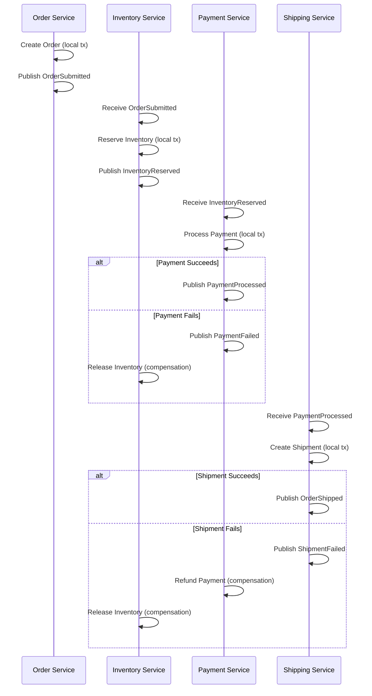
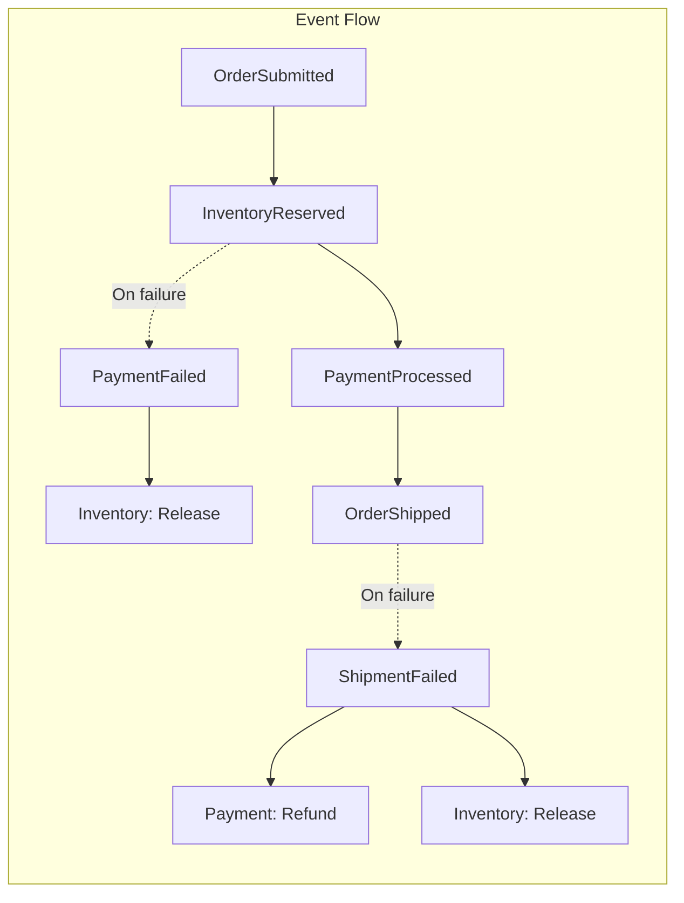
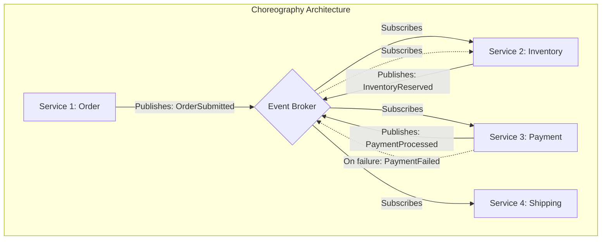
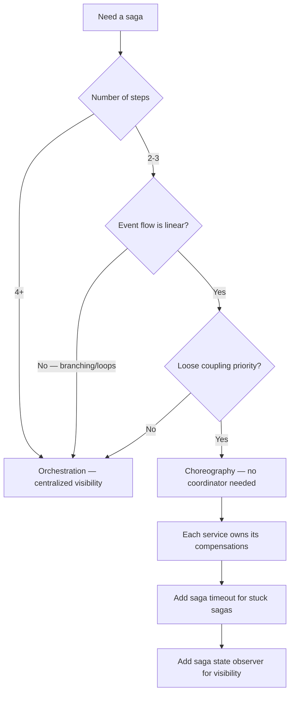
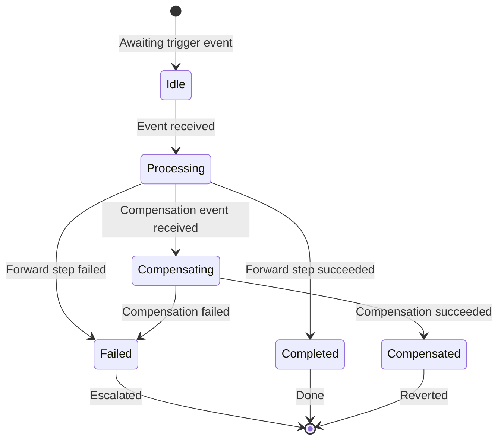
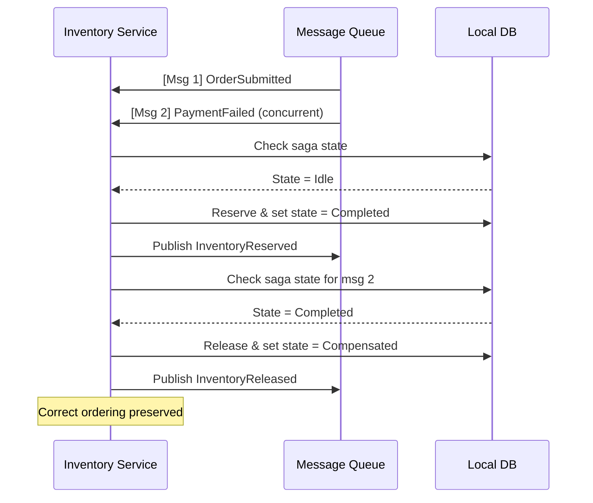

> [!success] Mastery Check
> - [ ] **Studied Well**
> - [ ] **Can explain the concept without notes**
> - [ ] **Can answer interview questions confidently**
> - [ ] **Can implement it in a real project**

## Navigation

**Domain:** [[7 — System Design & Distributed Systems]] > **Group:** Integration Patterns
**Previous:** [[7.129 — Saga Pattern — Overview and When to Use]] | **Next:** [[7.131 — Saga Pattern — Orchestration-Based]]

### Prerequisites
- [[7.129 — Saga Pattern — Overview and When to Use]] — required because this note covers one of the two saga variants in detail
- [[7.126 — Inbox Pattern — Idempotent Message Consumption]] — needed because each choreography step must be idempotent

### Where This Fits

Choreography-based sagas distribute the workflow logic across participating services. They belong to the broader class of event-driven coordination patterns and are a direct application of the publish-subscribe messaging model to distributed transaction management. Each service performs its local transaction, publishes a domain event, and subscribes to the events that trigger its next action. There is no central coordinator — the services coordinate through the event stream. A .NET engineer encounters this when the workflow is simple (2-3 steps), the services are owned by the same team or closely aligned teams, and the team wants to avoid the operational cost of a central orchestrator. It is commonly used in event-driven architectures where services already publish domain events. Without choreography, the alternative is orchestration (which adds a new service to deploy and manage) or synchronous HTTP calls (which couple services and don't handle failures gracefully).

## Core Mental Model

A choreography-based saga is an event-driven workflow where the event flow itself encodes the transaction order. When a service completes its step, it publishes a domain event. Other services react to that event: some execute the next step, some execute compensations. The invariant is: the set of event subscriptions and handlers must form a correct sequence that either completes the workflow or fully compensates it. The tradeoff is that the workflow logic is distributed — no single piece of code or database contains the full saga logic. Debugging requires tracing events across services. The recognition trigger is a 2-3 step workflow where the services already communicate via domain events and the team wants to avoid building a new orchestrator service.

Think of choreography as a jazz ensemble: each musician knows their part and listens to the others. When the saxophonist finishes their solo (publishes an event), the pianist knows it is their turn. There is no conductor. If the drummer misses a cue, the ensemble adapts — but it can be hard to tell who made the mistake after the fact. Similarly, in a choreography saga, a missed event or incorrect handler can cause the entire workflow to derail without a clear single point of blame.





### Classification

Choreography-based sagas are a distributed systems coordination pattern at the application layer. They sit within the event-driven architecture ([[7.142]]) of a microservices system. They solve the problem of multi-service transaction management without a central coordinator. They do not solve the dual-write problem (use the outbox pattern for that) or the consumer-side idempotency problem (use the inbox pattern for that). Choreography is classified as a "decentralized coordination" pattern, contrasting with orchestration's "centralized coordination." It is most similar to event-driven workflows but differs in that it guarantees eventual consistency through compensations rather than relying on the event stream to eventually produce the correct state.

### Key Properties / Guarantees

|Property|Value|Condition|
|---|---|---|
|Coordination model|Decentralized, event-driven|All services publish relevant domain events|
|Coupling|Loose (services don't know each other)|Requires shared event schema|
|Visibility|Low (workflow logic is distributed)|Requires event tracing across services|
|Debugging|Hard (need to trace event flow)|Event store or tracing infrastructure needed|
|Resilience|High (no SPOF)|Each service independently retries on failure|
|Step count limit|~2-5 (beyond that, event graph becomes intractable)|Proportional to event handler complexity|
|Compensation trigger|Failure event published by downstream service|Each service subscribes to relevant failure events|
|Schema evolution|Challenging — shared event contracts|Requires backward-compatible schema changes|



## Deep Mechanics

### How It Works

**Step 1 — The first service starts the saga.** The Order service receives a command, creates an order in its database, and publishes an `OrderSubmitted` event. The event includes the `CorrelationId` that all subsequent events will carry. The order service uses the outbox pattern to ensure the event is reliably published — the `OrderSubmitted` event is written to an outbox table in the same transaction as the order creation, then a background process delivers it to the broker.

**Step 2 — Services react to events.** The Inventory service subscribes to `OrderSubmitted`. It reserves inventory and publishes `InventoryReserved`. The Payment service subscribes to `InventoryReserved`. It processes the payment and publishes `PaymentProcessed` or `PaymentFailed`. Each service uses the inbox pattern to ensure idempotent processing of incoming events — a dedup table with `(CorrelationId, EventType)` as the unique key prevents duplicate processing.

**Step 3 — Services compensate on failure.** If the Payment service fails, it publishes `PaymentFailed`. The Inventory service subscribes to `PaymentFailed` and runs its compensation: release the reserved inventory. No central coordinator tells it to do this — the event subscription encodes the compensation logic. The Inventory service must know which events from downstream services are compensation triggers. This knowledge is configured at deployment time.

**Step 4 — The saga completes.** The final service (Shipping) publishes `OrderShipped`. Other services (Analytics, Notification) subscribe to this event as a terminal signal. The saga is complete. The saga state is distributed across all services — each service knows only its own step. An observer service can subscribe to all events to maintain a centralized saga state view.

**Step 5 — Handle timeout.** Choreography sagas need timeouts to prevent indefinite waiting. A service may publish a scheduled timeout event (e.g., `PaymentTimeout` after 5 minutes) when it publishes its forward event. If the next service does not respond before the timeout, the timeout handler runs the compensation. This requires the message broker to support scheduled message delivery.

### Failure Modes

**Missing compensation subscriber.** The Payment service publishes `PaymentFailed`, but no service subscribes to it. The inventory reservation remains locked forever.

- **Detection:** Inventory service has no handler for `PaymentFailed`. Saga analysis tool shows `PaymentFailed` events with zero subscribers.
- **Metric:** `unhandled_saga_compensation_events`.
- **Recovery:** Add the `PaymentFailed` subscription to the Inventory service. Use a saga analysis tool (event schema registry) that enforces each compensation event has at least one subscriber.

**Cyclic event dependencies.** Service A publishes an event that triggers Service B, which publishes an event that triggers Service A again. The saga loops indefinitely.

- **Detection:** Event stream shows the same `CorrelationId` cycling through the same services repeatedly.
- **Metric:** `event_cycle_detected` — same event type for same `CorrelationId` published > expected step count.
- **Recovery:** Design the choreography as a directed acyclic graph (DAG). Each service should only react to events from the previous step, not emit events that go backward. Use a schema validation tool that checks for event cycles at design time.

**Event ordering race.** `PaymentProcessed` and `PaymentFailed` are both published for the same `CorrelationId` due to a bug. The Inventory service receives `PaymentProcessed` first and calls the forward handler, then `PaymentFailed` and calls the compensation. The inventory is released incorrectly.

- **Detection:** Inventory service logs show "Reserved" then "Released" for the same `CorrelationId` within seconds.
- **Metric:** `saga_out_of_order_compensation_count`.
- **Recovery:** Use the saga state (which step the saga is on) as a guard. The inventory service should check whether the saga has already progressed past the compensation point. The inbox pattern's step tracking provides this guard naturally.

**Missing outbox on choreography services.** A common production mistake: the Order service creates an order and publishes `OrderSubmitted` in a non-atomic way — if the publish call fails after the order is created, the event is lost. Downstream services never know about the order. The order exists in isolation.

- **Detection:** Orders exist in the Order service database but no corresponding events in downstream service logs. The outbox table is empty (event was never stored).
- **Recovery:** A reconciliation job scans for orders older than 5 minutes that have no corresponding downstream events and re-publishes `OrderSubmitted`.
- **Prevention:** Always use the outbox pattern. The event must be stored in the same transaction as the business operation.

**Event loss due to broker outage.** The broker (Azure Service Bus) has a temporary outage. The Order service successfully commits the order but fails to publish `OrderSubmitted`. The saga never starts from the perspective of downstream services.

- **Detection:** Order exists in the Order service database but no downstream events are published. The Order service's outbox table has pending messages.
- **Recovery:** This is why the outbox pattern is essential. The outbox processor retries publishing until the broker is available. If the outbox delivery is delayed beyond a threshold, the saga may need to compensate the order (cancel it) or wait for recovery.

**Event duplication from broker.** Azure Service Bus's at-least-once delivery causes `InventoryReserved` to be delivered twice to the Payment service. Without idempotency, the payment is charged twice.

- **Detection:** Payment service logs show two `ProcessPayment` calls for the same `CorrelationId`.
- **Recovery:** The inbox pattern prevents this — the second delivery is caught by the dedup check and acknowledged without processing.
- **Prevention:** Always use inbox pattern on every choreography event handler. The dedup table must have a TTL that matches or exceeds the broker's maximum redelivery interval.

**Service crash after publishing forward event but before storing completion state.** The Inventory service reserves inventory, publishes `InventoryReserved`, then crashes before marking the step as completed in its local database. On restart, it receives `OrderSubmitted` again (broker redelivery). It runs the idempotency check — but the check says "not processed" because the completion state was lost. It reserves inventory again, double-reserving.

- **Detection:** Inventory count shows double reservations for the same `CorrelationId`.
- **Recovery:** The forward operation must be idempotent. For inventory reservation, this means setting an absolute value (e.g., `QuantityReserved = Quantity`) rather than incrementing (`QuantityReserved += Quantity`). Alternatively, the reservation should check existing reservations for the same `CorrelationId` and adjust accordingly.
- **Prevention:** The outbox pattern ensures the completion state is persisted before the event is published. The storage of the completion state must be atomic with the business operation.

### .NET and Azure Integration

- **ASP.NET Core:** Event handlers are `IConsumer<T>` implementations in MassTransit or `IHandleMessages<T>` in NServiceBus
- **Azure Service Bus Topics:** Each event type is published to a topic; services subscribe with filters on the event type; `CorrelationId` as the partition key ensures ordering per saga
- **Azure Event Grid:** For simpler sagas, Event Grid routes events to subscribers; no ordering guarantees, so not recommended for multi-step sagas
- **Polly:** `ResiliencePipeline` for retry on event publish failures — each service must reliably publish its completion event
- **Azure SQL Database:** Outbox and inbox tables for each service — the outbox guarantees event publication, the inbox guarantees idempotent consumption
- **OpenTelemetry:** Distributed tracing across choreography services — essential for debugging event flows
- **Kafka:** Alternative to Azure Service Bus with higher throughput but no native scheduled message support

```csharp
// Event definitions shared across services
public record OrderSubmitted(Guid CorrelationId, Guid OrderId, string CustomerId, decimal Amount);
public record InventoryReserved(Guid CorrelationId, Guid OrderId);
public record PaymentProcessed(Guid CorrelationId, string PaymentTransactionId);
public record PaymentFailed(Guid CorrelationId, string Reason);
public record OrderShipped(Guid CorrelationId, string TrackingNumber);

// Service bus topic per event type registration
builder.Services.AddMassTransit(x =>
{
    x.AddConsumer<OrderSubmittedConsumer>();
    x.AddConsumer<PaymentFailedConsumer>();
    
    x.UsingAzureServiceBus((context, cfg) =>
    {
        cfg.ReceiveEndpoint("inventory-service", e =>
        {
            e.ConfigureConsumer<OrderSubmittedConsumer>(context);
            e.ConfigureConsumer<PaymentFailedConsumer>(context);
        });
    });
});
```

```csharp
// Outbox + Inbox configuration for choreography services
// Each service must have both patterns configured
builder.Services.AddDbContext<OutboxDbContext>(options =>
    options.UseSqlServer(builder.Configuration.GetConnectionString("OutboxDb")));

builder.Services.AddDbContext<InboxDbContext>(options =>
    options.UseSqlServer(builder.Configuration.GetConnectionString("InboxDb")));

// MassTransit outbox
builder.Services.AddMassTransit(x =>
{
    x.AddEntityFrameworkOutbox<OutboxDbContext>(o =>
    {
        o.QueryDelay = TimeSpan.FromSeconds(1);
        o.UseBusOutbox();
    });
    
    x.UsingAzureServiceBus((context, cfg) =>
    {
        cfg.UseInMemoryOutbox(context);
        cfg.ConfigureEndpoints(context);
    });
});
```

## Production Patterns and Implementation

### Primary Implementation

A 3-step choreography saga: Order → Inventory → Payment. Each service is independent.

```csharp
// Order Service — starts the saga
public sealed class OrderService
{
    private readonly IPublishEndpoint _publisher;

    public async Task<Guid> SubmitOrderAsync(SubmitOrder command, CancellationToken ct)
    {
        var order = Order.Create(command.CustomerId, command.LineItems);
        // ... persist to DB within transaction ...
        
        await _publisher.Publish(new OrderSubmitted(
            CorrelationId: Guid.NewGuid(),
            OrderId: order.Id,
            CustomerId: order.CustomerId,
            Amount: order.TotalAmount), ct);
        
        return order.Id;
    }
}

// Inventory Service — step 2 + compensation
public sealed class OrderSubmittedConsumer : IConsumer<OrderSubmitted>
{
    public async Task ConsumeAsync(ConsumeContext<OrderSubmitted> context)
    {
        var msg = context.Message;
        
        // Idempotency check — skip if already processed for this CorrelationId
        if (await _dedup.AlreadyProcessedAsync(msg.CorrelationId, "ReserveInventory"))
            return;
        
        // Business logic
        await _inventoryService.ReserveAsync(msg.OrderId, ct);
        
        // Mark processed
        await _dedup.MarkProcessedAsync(msg.CorrelationId, "ReserveInventory");
        
        // Publish next event
        await context.Publish(new InventoryReserved(msg.CorrelationId, msg.OrderId));
    }
}

public sealed class PaymentFailedConsumer : IConsumer<PaymentFailed>
{
    public async Task ConsumeAsync(ConsumeContext<PaymentFailed> context)
    {
        var msg = context.Message;
        
        // Idempotency check
        if (await _dedup.AlreadyProcessedAsync(msg.CorrelationId, "ReleaseInventory"))
            return;
        
        // Compensation: release the reserved inventory
        await _inventoryService.ReleaseAsync(msg.OrderId, ct);
        
        await _dedup.MarkProcessedAsync(msg.CorrelationId, "ReleaseInventory");
    }
}

// Payment Service — step 3, publishes success or failure
public sealed class InventoryReservedConsumer : IConsumer<InventoryReserved>
{
    public async Task ConsumeAsync(ConsumeContext<InventoryReserved> context)
    {
        var msg = context.Message;
        
        if (await _dedup.AlreadyProcessedAsync(msg.CorrelationId, "ProcessPayment"))
            return;
        
        try
        {
            var paymentResult = await _paymentGateway.ChargeAsync(ct);
            
            await _dedup.MarkProcessedAsync(msg.CorrelationId, "ProcessPayment");
            
            await context.Publish(new PaymentProcessed(
                msg.CorrelationId, paymentResult.TransactionId));
        }
        catch (PaymentException ex)
        {
            await _dedup.MarkProcessedAsync(msg.CorrelationId, "ProcessPayment");
            
            await context.Publish(new PaymentFailed(
                msg.CorrelationId, ex.Message));
        }
    }
}
```

### Configuration and Wiring

```csharp
// Program.cs — each service registers its consumers independently
// Inventory Service
builder.Services.AddMassTransit(x =>
{
    x.AddConsumer<OrderSubmittedConsumer>();
    x.AddConsumer<PaymentFailedConsumer>();
    x.UsingAzureServiceBus((context, cfg) => { cfg.ConfigureEndpoints(context); });
});

// Payment Service
builder.Services.AddMassTransit(x =>
{
    x.AddConsumer<InventoryReservedConsumer>();
    x.UsingAzureServiceBus((context, cfg) => { cfg.ConfigureEndpoints(context); });
});
```

### Common Variants

**Saga state tracker as a separate service.** Even in a choreography saga, a "saga state watcher" service can subscribe to all events and maintain a read model of saga progress. This provides visibility without being a coordinator — it is a read-only observer.

```csharp
// Observer — subscribes to all saga events, no commands sent
public sealed class SagaStateObserver : IConsumer<OrderSubmitted>,
    IConsumer<InventoryReserved>, IConsumer<PaymentProcessed>,
    IConsumer<PaymentFailed>, IConsumer<OrderShipped>
{
    public async Task ConsumeAsync(ConsumeContext<OrderSubmitted> context)
    {
        await _db.SagaStates.AddAsync(new SagaState
        {
            CorrelationId = context.Message.CorrelationId,
            Status = "OrderSubmitted"
        });
        await _db.SaveChangesAsync();
    }
    // ... similar handlers for each event
}
```

**Timeout handling via scheduled messages.** For steps that must complete within a time limit, a service publishes a delayed message (e.g., "PaymentTimeout" in 5 minutes). If the payment is not processed before the timeout, the compensation runs.

```csharp
// Timeout handler — published when saga step starts
public sealed class InventoryReservedConsumer : IConsumer<InventoryReserved>
{
    public async Task ConsumeAsync(ConsumeContext<InventoryReserved> context)
    {
        var msg = context.Message;
        
        // Forward step logic
        // ...
        
        // Schedule a timeout — if payment not received in 5 min, compensate
        await context.SchedulePublish(
            TimeSpan.FromMinutes(5),
            new PaymentTimeout(msg.CorrelationId));
    }
}

// Timeout handler
public sealed class PaymentTimeoutConsumer : IConsumer<PaymentTimeout>
{
    public async Task ConsumeAsync(ConsumeContext<PaymentTimeout> context)
    {
        var msg = context.Message;
        
        // Check if payment has been processed (saga state)
        var state = await _sagaStateStore.GetStateAsync(msg.CorrelationId);
        if (state.Status == "AwaitingPayment")
        {
            // Payment not received — trigger compensation
            await context.Publish(new PaymentFailed(
                msg.CorrelationId, "Timeout: payment not received within 5 minutes"));
        }
        // else: payment was already processed, ignore timeout
    }
}
```

**Parallel step execution in choreography.** If two steps can run in parallel (e.g., ReserveInventory and ValidateCoupon), the preceding service publishes two events. Each triggers its respective service independently. The saga completes when both parallel tracks finish. This requires careful handling — a failure in one track must trigger compensation in both.

```csharp
// Parallel step trigger
public sealed class OrderSubmittedConsumer : IConsumer<OrderSubmitted>
{
    public async Task ConsumeAsync(ConsumeContext<OrderSubmitted> context)
    {
        var msg = context.Message;
        
        // Trigger two parallel steps
        await context.Publish(new ReserveInventory(msg.CorrelationId, msg.OrderId));
        await context.Publish(new ValidateCoupon(msg.CorrelationId, msg.OrderId, msg.CouponCode));
        
        // Both InventoryReserved and CouponValidated events must be received
        // before the saga can proceed to ProcessPayment
    }
}
```

**Choreography with event sourcing.** Instead of a relational outbox, use EventStoreDB or Marten as the event store. Each service's state is derived from its event stream. The saga events are part of the service's event stream, providing a complete audit trail. This variant provides stronger guarantees but higher complexity.

### Real-World .NET Ecosystem Example

**NServiceBus's Saga pattern** is choreography-based by default. Services implement `ISaga` with `IAmStartedByMessages<T>` and `IHandleMessages<T>`. NServiceBus automatically correlates messages by `CorrelationId` and persists saga state. This is the most battle-tested choreography saga implementation in the .NET ecosystem, used in financial services, logistics, and e-commerce systems for over a decade.

```csharp
// NServiceBus choreography saga
public class OrderSaga : Saga<OrderSagaData>,
    IAmStartedByMessages<OrderSubmitted>,
    IHandleMessages<InventoryReserved>,
    IHandleMessages<PaymentProcessed>,
    IHandleMessages<PaymentFailed>
{
    protected override void ConfigureHowToFindSaga(SagaPropertyMapper<OrderSagaData> mapper)
    {
        mapper.MapSaga(s => s.CorrelationId)
            .ToMessage<OrderSubmitted>(m => m.CorrelationId)
            .ToMessage<InventoryReserved>(m => m.CorrelationId);
    }
    
    public async Task Handle(OrderSubmitted message, IMessageHandlerContext context)
    {
        Data.OrderId = message.OrderId;
        await context.SendLocal(new ReserveInventory(Data.CorrelationId, Data.OrderId));
    }
}
```

**MassTransit also supports choreography-style sagas** through its `IConsumer<T>` pattern. While MassTransit's `SagaStateMachine` is typically used for orchestration, you can implement choreography by having services publish domain events and having other services consume them as regular consumers. While MassTransit's `SagaStateMachine` is typically used for orchestration, you can implement choreography by having services publish domain events and having other services consume them as regular consumers. The difference is that MassTransit does not provide a built-in saga instance for choreography — each service manages its own state independently, unlike NServiceBus where the saga instance is managed by the framework.

## Gotchas and Production Pitfalls

### 1. Event handler order ambiguity

**Pitfall:** The Inventory service handles both `OrderSubmitted` (forward step) and `PaymentFailed` (compensation). If `PaymentFailed` arrives before `OrderSubmitted` for the same `CorrelationId` (possible in async systems), the compensation runs before the forward step.

```csharp
// ❌ No ordering guard — compensation may run before forward step
public class PaymentFailedConsumer : IConsumer<PaymentFailed>
{
    public async Task ConsumeAsync(ConsumeContext<PaymentFailed> context)
    {
        await _inventoryService.ReleaseAsync(context.Message.OrderId, ct);
    }
}
```

**Symptom:** Inventory is released before it was reserved. The release succeeds (releases 0 items), but then the forward step reserves inventory. The inventory is never released.

**Fix:** Track saga step state per `CorrelationId`. Only run compensation if the forward step has already been applied.

```csharp
// ✅ Guard on saga progression
public async Task ConsumeAsync(ConsumeContext<PaymentFailed> context)
{
    var step = await _sagaStepRepo.GetAsync(context.Message.CorrelationId, "ReserveInventory");
    if (step is null || step.Status != "Completed")
    {
        _logger.LogWarning("Compensation skipped — forward step not yet applied");
        return;
    }
    await _inventoryService.ReleaseAsync(context.Message.OrderId, ct);
}
```

**Cost of not fixing:** Intermittent inventory overselling. 0.5% of orders cannot be fulfilled because inventory was incorrectly locked.

### 2. No timeout for stuck sagas

**Pitfall:** The Payment service is down. The saga is stuck at "Inventory Reserved — waiting for Payment." No timeout mechanism exists. The saga remains stuck indefinitely.

```csharp
// ❌ No timeout — saga stuck forever if a service is down
public class InventoryReservedConsumer : IConsumer<InventoryReserved>
{
    // Publishes PaymentProcessed or PaymentFailed, but if Payment is down,
    // the event is never consumed and no timeout fires
}
```

**Symptom:** An operations report shows sagas in "Reserved" state for days. Inventory is reserved but never released.

**Fix:** Add a `SagaTimeout` — a scheduled message published after a time delay that triggers compensation if the saga has not progressed.

```csharp
// ✅ Timeout via scheduled message
await context.Publish(new PaymentProcessed(msg.CorrelationId, txId));
// OR schedule a timeout
await context.SchedulePublish(
    TimeSpan.FromMinutes(5),
    new PaymentTimeout(msg.CorrelationId));
```

**Cost of not fixing:** Inventory is held for stuck sagas. After 1 week of 2% failure rate, 1,400 orders worth of inventory is stuck. Emergency manual release is required.

### 3. Compensation event published but no one handles it

**Pitfall:** The Payment service publishes `PaymentFailed`. The Inventory service has a bug in its handler — it throws an exception. The `PaymentFailed` event goes to the dead-letter queue. Nobody compensates.

**Symptom:** Inventory reservations are never released for failed payments. The Inventory service DLQ has `PaymentFailed` messages.

**Fix:** Monitor the DLQ for compensation events. Use a saga observability tool that catches unhandled compensation events.

```csharp
// ✅ DLQ redrive for compensation events
// Azure Function that redrives DLQ compensation events
[FunctionName("RedriveCompensationDLQ")]
public async Task Run(
    [ServiceBusTrigger("inventory-dlq", Connection = "ServiceBus")]
    ServiceBusReceivedMessage message)
{
    // Re-process the compensation event
    await _compensationHandler.HandleAsync(message);
}
```

**Cost of not fixing:** Silent failure. The inventory team does not know compensations are failing. Customer orders fail because inventory shows as reserved but payment never completed.

### 4. Shared event schema coupling

**Pitfall:** The `OrderSubmitted` event schema is shared across 5 services. Adding a field requires updating all services. A new field is added for the Shipping service, but the Inventory service deploys a version that rejects unknown fields.

```csharp
// ❌ Strict deserialization — rejects unknown fields
var order = JsonSerializer.Deserialize<OrderSubmitted>(json,
    new JsonSerializerOptions { UnmappedMemberHandling = JsonUnmappedMemberHandling.Disallow });
```

**Symptom:** The Inventory service fails to deserialize `OrderSubmitted` events after the Shipping team added a field. Inventory reservations stop.

**Fix:** Use tolerant deserialization. Consider schema registry (Azure Schema Registry with Avro or Protobuf) for versioned event schemas.

```csharp
// ✅ Tolerant deserialization
JsonSerializer.Deserialize<OrderSubmitted>(json,
    new JsonSerializerOptions { UnmappedMemberHandling = JsonUnmappedMemberHandling.Skip });
```

**Cost of not fixing:** A routine schema change causes a production outage. Deployment is blocked until all services are updated.

### 5. Event duplication causing double compensation

**Pitfall:** The Payment service publishes `PaymentFailed`. The broker redelivers it (dedup window expired). The Inventory service sees two `PaymentFailed` events and runs the compensation twice.

```csharp
// ❌ Compensation not idempotent
await _context.Inventory
    .Where(i => i.OrderId == orderId)
    .ExecuteUpdateAsync(s => s.SetProperty(i => i.QuantityReserved, 0));
```

**Symptom:** QuantityReserved is set to 0 on the first execution. The second execution also sets it to 0 — no harm if the compensation sets an absolute value. But if the compensation decrements (`QuantityReserved -= quantity`), it would decrement twice.

**Fix:** Make compensations idempotent — use saga step tracking.

**Cost of not fixing:** If compensations are not absolute (e.g., `+=` instead of `=`), double compensation corrupts inventory counts.

### 6. Adding a step requires touching multiple services

**Pitfall:** The choreography saga has 3 steps: Order → Inventory → Payment. The business requires a 4th step: Shipping. Adding it means: (1) the Payment service must now publish a new event type (`PaymentProcessed`), (2) a Shipping service must be deployed that subscribes to it, (3) the Payment service's existing publishing logic changes, and (4) the Shipping service must publish a failure event that the Inventory and Order services subscribe to. Two existing services change behavior for a new service.

**Symptom:** Deployment coordination becomes complex. The Payment service must be deployed before the Shipping service can receive events. Rollback requires careful sequencing.

**Fix:** Plan for evolution. Use an event schema registry that documents which services produce and consume which events. Consider starting with orchestration if you anticipate adding steps.

**Cost of not fixing:** Deployment coordination overhead. The team may avoid adding needed steps because the choreography change is too risky.

### 7. Distributed tracing becomes mandatory at scale

**Pitfall:** The choreography saga has 5 services. A saga fails — the Order service created the order, the Inventory service reserved stock, but the payment was never processed. To find the root cause, the engineer must check logs across 3 services, correlate events manually, and determine whether the Inventory service published `InventoryReserved`, whether the Payment service received it, and whether the Payment consumer failed.

**Symptom:** Mean time to diagnose a stuck saga is 2+ hours. The senior engineer who built the system is the only one who can trace the event flow.

**Fix:** Implement distributed tracing (OpenTelemetry) with the `CorrelationId` as the trace ID. Use a trace visualization tool (Jaeger, Azure Application Insights) to see the full event flow in one view.

**Cost of not fixing:** High operational burden. The team will resist adopting choreography for new workflows due to the debugging difficulty.

### 8. No mechanism to query overall saga progress

**Pitfall:** The Operations team asks "how many orders are currently in the checkout saga?" There is no way to answer this question — each service knows only its own step state. The Order service knows about `OrderSubmitted` events, the Inventory service knows about reservations, but no single query can correlate all sagas.

**Symptom:** Operations cannot determine whether a production issue affects all sagas or a subset. Incident response is reactive (customer complaints) rather than proactive.

**Fix:** Deploy a saga state observer service (see Common Variants) that subscribes to all events and maintains a centralized saga state read model.

**Cost of not fixing:** Operations blind spot. Stuck sagas are discovered through customer complaints, not monitoring.

## Tradeoffs and Decision Framework

### Tradeoff Matrix

|Dimension|Choreography Saga|Orchestration Saga|Distributed Transaction|Synchronous HTTP Workflow|
|---|---|---|---|---|
|Central coordinator|None|Dedicated orchestrator service|DTC coordinator|Order service itself|
|Visibility|Low (event tracing needed)|High (orchestrator state)|Low|Low (point-to-point)|
|Coupling|Loose (events only)|Tighter (orchestrator commands)|Very tight|Tight (HTTP API dependencies)|
|Step count limit|~2-5|~20-30|~2-5|~2-3 (timeout cascading)|
|Failure recovery|Decentralized compensations|Centralized compensation logic|Automatic rollback|Manual (caller must handle)|
|Debugging|Requires event tracing|Single state machine to inspect|Limited|HTTP logs per call|
|Team coordination|Shared event schema|Orchestrator owner defines API|Tight coordination|Per-service API contracts|
|Eventual consistency|Yes — intermediate states visible|Yes — but centralized state helps|No — strong consistency|No — synchronous|
|Scalability|Excellent (no coordinator bottleneck)|Good (coordinator is stateful)|Poor (coordinator bottleneck)|Poor (synchronous coupling)|
|Deployment independence|High — each service deploys independently|Medium — orchestrator changes affect participants|Low — coordinated deployments required|Low — API contract changes break consumers|

### When to Apply



### When NOT to Apply

- [ ] The workflow has 4+ steps — the event graph becomes too complex to debug
- [ ] The workflow has conditional branching or loops — orchestration handles this naturally
- [ ] Teams do not own the full event flow — one team's event change may break another team's saga
- [ ] The organization cannot invest in event tracing infrastructure — without tracing, debugging choreography sagas is guesswork
- [ ] Strong ordering required across all steps — Service Bus sessions can help but add complexity
- [ ] The team plans to add steps frequently — choreography's deployment coordination overhead becomes a burden
- [ ] The workflow requires parallel steps — choreography can handle this but the compensation logic becomes complex

### Scale Thresholds

- **2-3 steps, simple linear flow:** Choreography is the right choice
- **4+ steps, any complexity:** Orchestration is recommended
- **Event tracing cost:** Each step adds one more event to the trace — choreography generates N events per saga instance, orchestration generates 2N events (commands + responses)
- **Team size:** Choreography works best when the same team owns all services in the saga. Cross-team choreography requires careful event schema governance.
- **Event volume:** At > 1,000 events/second, the distributed tracing infrastructure must be robust enough to handle the volume. Azure Service Bus with partitioned topics can handle this, but the outbox processor must scale accordingly.

## Interview Arsenal

### Question Bank

1. What is a choreography-based saga, and how does it differ from orchestration?
2. How does a service in a choreography saga know which step to execute next?
3. How does compensation work in a choreography saga without a coordinator?
4. What happens if a service in a choreography saga crashes and loses its in-memory state?
5. Compare choreography and orchestration across coupling, visibility, and debugging.
6. Design a 3-step choreography saga for order placement.
7. How do you handle timeouts in a choreography saga?
8. What is the main debugging challenge with choreography sagas?
9. How does the outbox pattern relate to choreography sagas?
10. How do you add a new step to an existing choreography saga?

### Spoken Answers

**Q1: What is a choreography-based saga, and how does it differ from orchestration?**

> **Average answer:** "Choreography uses events, orchestration uses a central controller. Choreography is more decoupled."
>
> **Great answer:** "A choreography-based saga distributes the workflow logic across the participating services. Each service performs its local transaction, publishes a domain event, and subscribes to the events that trigger its next step. There is no central coordinator — the event flow itself encodes the transaction order. For example, the Order service publishes `OrderSubmitted`, the Inventory service consumes it, reserves stock, and publishes `InventoryReserved`, the Payment service consumes that, processes payment, and publishes `PaymentProcessed`. The key difference from orchestration is that in choreography, no single service knows the full workflow — each service only knows what to do after the previous event. This makes choreography more decoupled but harder to debug. Orchestration uses a central state machine that directs each step. Choreography is best for simple, linear flows of 2-3 steps where loose coupling is prioritized over visibility. Orchestration is better for complex workflows where you need a single place to monitor and manage saga state."

**Q2: How does a service in a choreography saga know which step to execute next?**

> **Great answer:** "The service does not know the full workflow — it only knows how to react to specific events. The mapping is configured at deployment time: the service subscribes to certain event types, and when one arrives, it executes its business logic and publishes the result. The service does not need to know which other services consume its events. This is what makes choreography loosely coupled. The tradeoff is that the 'saga logic' — the sequence of which step follows which — is implicit in the event subscriptions distributed across all services. There is no single definition of the workflow. If you want to understand the full saga, you must inspect every service's event subscriptions. This is why a saga diagram (like the Mermaid sequence diagram in this note) is essential documentation for any choreography saga. Without it, new team members cannot understand the event flow."

**Q4: What happens if a service in a choreography saga crashes and loses its in-memory state?**  

> **Great answer:** "This is the same as the consumer crash scenario in any messaging system — the broker redelivers the event, and the consumer uses the inbox pattern (dedup table) to ensure idempotent processing. The service stores saga-relevant state in its database — which steps have been processed for which `CorrelationId`. On restart, it may receive events that were already processed; the dedup check catches these and acknowledges them without reprocessing. The critical point is that the service must not have any in-memory-only saga state that cannot be recovered. The step completion — 'I have reserved inventory for CorrelationId X' — must be durably stored before the event is acknowledged. This is exactly why the outbox + inbox pattern pair is essential in sagas: the outbox ensures the completion event is reliably published, and the inbox ensures the step is reliably processed. Without both, a crash can cause the saga to lose track of which steps completed."

**Q5: Compare choreography and orchestration across coupling, visibility, and debugging.**

> **Average answer:** "Choreography is loosely coupled, orchestration is tightly coupled. Choreography is harder to debug."
>
> **Great answer:** "On coupling: choreography is looser because services only share event schemas — no service knows which other services consume its events. You can add a new consumer of an event without the producer knowing. Orchestration is tighter because the orchestrator defines command and reply schemas that every participant must implement. On visibility: orchestration wins decisively — you have a single database with saga state, a single state machine you can inspect. You can query 'how many sagas are stuck in PaymentPending?' in one SQL query. In choreography, you need distributed tracing across every service to understand saga health. On debugging: orchestration is easier because you can replay any saga by replaying its state through the state machine. The full workflow logic is in one file. In choreography, a bug in step 3 might be caused by something in step 1's event subscription, and the fix requires deploying a different service. The tradeoff is that orchestration requires deploying and operating a stateful service, while choreography only needs a message broker. For simple workflows (2-3 steps), choreography's operational simplicity outweighs the debugging cost. For anything more complex, orchestration's centralized state machine is worth the operational investment."

**Q6: Design a 3-step choreography saga for order placement.**  

> **Great answer:** "I have three services: Order, Inventory, and Payment. The Order service receives the checkout request, creates the order in its database, and publishes `OrderSubmitted` with a `CorrelationId`. The Inventory service subscribes to `OrderSubmitted` — it reserves the line items and publishes `InventoryReserved` with the same `CorrelationId`. The Payment service subscribes to `InventoryReserved` — it charges the customer and publishes `PaymentProcessed` on success or `PaymentFailed` on failure. If `PaymentFailed` is published, the Inventory service handles it by releasing the reserved inventory. Each service uses the inbox pattern — a dedup table with `(CorrelationId, StepName)` as the unique key — to ensure idempotent execution. Each service uses the outbox pattern to reliably publish its completion event. I add a saga timeout event — if the Payment service does not respond within 5 minutes, a scheduled timeout message triggers the compensation path. The main risk is that the event flow is implicit — if I need to add a step, I must update the service that publishes the preceding event to add a new subscriber. I limit this to 3 steps; beyond that, I switch to orchestration."

**Q9: How does the outbox pattern relate to choreography sagas?**

> **Great answer:** "The outbox pattern is critical in choreography because each step ends with publishing an event that triggers the next step. If the event is lost, the saga stops. The outbox pattern ensures reliable event publication by storing the event in a database table within the same transaction as the business operation. A background process reads the outbox table and delivers events to the broker. This guarantees that the event is published if and only if the business operation succeeded. Without the outbox, a crash after the business operation completes but before the event is published would leave the saga in an inconsistent state — the Inventory service has reserved stock, but the Payment service never receives `InventoryReserved`, so the saga never progresses. In a choreography saga, each service must implement the outbox pattern for its forward events and compensation events. This is a non-trivial infrastructure investment — which is why choreography is simpler in theory but requires significant plumbing in practice."

**Q10: How do you add a new step to an existing choreography saga?**

> **Great answer:** "Adding a step to a choreography saga affects the service that precedes the new step and the services that follow it. For example, if I add a Shipping step between Payment and Completion: (1) the Payment service must publish a new event type (`PaymentProcessed`) or modify its existing event to include data needed by the Shipping service, (2) the new Shipping service must be deployed and configured to subscribe to the Payment service's event, (3) the Shipping service must publish its own success/failure events, and (4) existing services that subscribed to the old completion event (e.g., Notification) must now subscribe to the Shipping service's completion event instead. This is 3-4 deployment changes for a single new step. In orchestration, adding a step means updating the orchestrator's state machine — one change in one service. The deployment coordination overhead is the main reason I recommend orchestration for workflows that are likely to evolve."

### System Design Interview Trigger

When the interviewer asks "how do you ensure consistency across services in a checkout flow?" and you propose a saga, the follow-up is "which type of saga — choreography or orchestration?" They want to hear that you know both variants and can articulate the tradeoff. The choreography answer must include: how events flow between services, how compensation works without a coordinator, the idempotency requirement, and the practical step-count limit. The interviewer will also probe: "how do you debug a stuck choreography saga?" — testing whether you understand the operational burden of distributed event flows.

### Comparison Table

| | Choreography Saga | Orchestration Saga | Event-Driven Workflow | Synchronous HTTP |
|---|---|---|---|---|
| Coordinator | None | Central orchestrator | None (event-driven) | Caller coordinates |
| Step trigger | Subscribed event | Orchestrator command | Domain event | HTTP response |
| Compensation | Event-driven (subscription) | Orchestrator-issued commands | Compensating event | Caller handles failure |
| Visibility | Per-service logs | Orchestrator state | Per-service logs | HTTP request/response logs |
| Coupling | Loose (schema only) | Tighter (orchestrator API) | Loose | Tight (direct calls) |
| Best for | 2-3 steps, simple flow | 4+ steps, complex logic | Simple pub/sub | Internal networks, low latency |
| .NET implementation | NServiceBus saga consumers | MassTransit state machine | Basic pub/sub | RestSharp, HttpClient |

## Architecture Decision Record

**Status:** Under Review

**Context:** The checkout flow in a startup's e-commerce platform has 3 steps: order creation (Order service), inventory reservation (Inventory service), and payment processing (Payment service). The team has 6 engineers across 3 squads. Event volume is 50 orders/second. The team values loose coupling — each squad should be able to deploy independently. The startup expects to add a 4th step (Shipping) within 6 months. The team currently has no distributed tracing infrastructure.

**Options Considered:**

1. **Choreography Saga** — Each service publishes events; the event flow drives the workflow
2. **Orchestration Saga** — A new orchestrator service coordinates the flow
3. **Distributed Transaction (2PC)** — Not viable in cloud (no MSDTC)
4. **Synchronous HTTP orchestration** — Order service calls Inventory via HTTP, then Payment via HTTP
5. **Event Sourcing + CQRS** — Each service becomes event-sourced; saga state is derived from event streams

**Decision:** Choreography Saga (option 1) for the initial 3-step workflow, with a plan to migrate to orchestration when the 4th step (Shipping) is added. The rationale: at 50 orders/second and 3 linear steps, choreography's loose coupling allows each squad to deploy independently. The team will invest in OpenTelemetry distributed tracing (minimal cost) to address the debugging challenge. When Shipping is added at month 6, the team will evaluate whether to build an orchestrator — at that point, the workflow will have 4 steps, which is the threshold where orchestration becomes recommended.

**Consequences:**
- ✅ No new orchestrator service to build
- ✅ Squads deploy independently — adding a field to `OrderSubmitted` requires coordination but is rare
- ✅ Each service's saga logic is colocated with its domain logic
- ⚠️ Debugging requires tracing events across 3 services — the team must invest in distributed tracing (OpenTelemetry)
- ⚠️ Adding a fourth step (Shipping) would require changes in 2+ services rather than 1 (orchestrator)
- ⚠️ No timeout mechanism initially — must be added as a separate effort
- ❌ No central view of saga state — an observer service will be added in the next sprint
- ❌ Without distributed tracing, the first stuck saga will take 2+ hours to debug

**Review Trigger:** Revisit if a 4th step is added to the checkout flow, or if the team reports that debugging saga issues takes longer than 2 hours per incident. At that point, switch to orchestration ([[7.131]]) using MassTransit state machine. Also revisit if the event volume exceeds 500 orders/second — at that point, the outbox processor may need scaling.

## Self-Check

### Conceptual Questions

1. How does a choreography saga differ from an orchestration saga?
2. How does compensation work in a choreography saga?
3. What is the maximum recommended number of steps in a choreography saga?
4. What happens if a service publishes a compensation event but no service subscribes to it?
5. How does idempotency work in a choreography saga step?
6. How do you implement a saga timeout in a choreography saga?
7. What are the debugging challenges specific to choreography sagas?
8. How does adding a new step to a choreography saga differ from adding one to an orchestration saga?
9. What is the role of the correlation ID in choreography?
10. Explain in 60 seconds when you would choose choreography over orchestration.

<details>
<summary>Answers</summary>

1. Choreography has no central coordinator — services react to events and publish events. Orchestration has a central state machine that sends commands to services. In choreography, each service implements its piece of the workflow independently. In orchestration, the orchestrator defines the complete workflow.

2. Each service subscribes to compensation events. When a later step fails, it publishes a failure event. All services that had previous steps subscribe to that failure event and run their compensations. For example, if Payment fails, it publishes `PaymentFailed`. The Inventory service (which ran before Payment) subscribes to `PaymentFailed` and releases inventory. No coordinator is involved — the event subscription encodes the compensation logic.

3. 2-5. Beyond that, the event graph becomes too hard to reason about. Multiple conditional branches or parallel steps make choreography intractable. At 4+ steps, orchestration is strongly recommended because the event flow visualization alone (say, a Mermaid sequence diagram with 6 services) becomes too complex to maintain.

4. The compensation never runs. The forward step's effects are never undone. This is a design-time error — must be caught by event schema analysis or integration tests. In production, this manifests as stuck inventory reservations that never get released. The fix is to add the missing subscription and monitor for unhandled compensation events.

5. Each step uses `(CorrelationId, StepName)` as a dedup key in an inbox table. If the same event is received twice, the dedup check prevents duplicate execution. The inbox table must have a TTL that matches or exceeds the broker's maximum redelivery interval (Azure Service Bus default: 14 days, so set dedup TTL to at least 7 days).

6. A service publishes a scheduled message (e.g., `SagaTimeout` after 5 minutes) using the broker's scheduled message delivery feature. If the expected completion event arrives before the timeout, the service cancels the timeout. If the timeout fires, it publishes the compensation event. Azure Service Bus supports scheduled message delivery natively. Kafka requires an external scheduler (e.g., Kafka Streams or a separate timer service).

7. (1) No central state to inspect — must look at each service's logs. (2) Event flow is implicit in subscriptions, not explicit in code. (3) Adding or removing a step requires updating the subscribing service's configuration, which may be owned by a different team. (4) Distributed tracing is mandatory for debugging — without it, correlating events across services is manual and error-prone.

8. In choreography, adding a step requires updating the preceding step's event to be consumed by the new service, and updating which event the new service publishes to trigger the next step. It affects two services minimum. In orchestration, adding a step means updating the orchestrator's state machine and adding a new command handler — one service change.

9. The correlation ID links all events in a single saga instance. Without it, an event from one saga could be misinterpreted as belonging to another saga. Every event in the saga must carry it. In choreography, the correlation ID is the only way to trace an instance across services — it is the primary key for saga instance identification across the entire distributed system.

10. "Use choreography when the workflow has 2-3 simple linear steps, the services are loosely coupled, and the team values independent deployability over centralized visibility. Use orchestration when the workflow has 4+ steps, conditional branching, or when the team needs a single dashboard to monitor saga health. Always pair choreography with distributed tracing, outbox/inbox patterns, and saga timeouts. If you expect the workflow to grow, start with orchestration — it is easier to add steps to a central state machine than to retrofit coordination changes across multiple services."

</details>

---

### Scenario Challenges

**Scenario 1 — Diagnose the problem**

A 3-step choreography saga (Order → Inventory → Payment) completes successfully 95% of the time. For 5% of orders, the Inventory service reserves stock but the Payment service never responds — no `PaymentProcessed` and no `PaymentFailed`. The saga is stuck.

<details>
<summary>Diagnosis</summary>

**Root cause:** The Payment service's `InventoryReserved` consumer has an unhandled exception for certain order types. The consumer abandons the message, Service Bus retries it `MaxDeliveryCount` times, then sends it to the dead-letter queue. No `PaymentFailed` event is published.

**Evidence:** Check the Payment service's dead-letter queue — messages from `InventoryReserved` are there. The Payment service logs show `InvalidOperationException` for orders with certain discount codes.

**Fix:** Fix the exception in the Payment service. Add a `try/catch` in the saga consumer that publishes `PaymentFailed` on any error.

**Prevention:** Saga consumers must publish a failure event in their `catch` block. Never let an exception propagate without publishing a compensation trigger.

</details>

---

**Scenario 2 — Design decision**

You are designing a choreography saga for loan origination: SubmitApplication → CreditCheck → DocumentVerification → LoanApproval → DisburseFunds. 5 steps. The team has 10 engineers. Should you use choreography?

<details>
<summary>Decision and Reasoning</summary>

**Choice:** No — use orchestration. 5 steps is beyond the choreography sweet spot. The event graph becomes complex, and the team needs a central place to manage the loan origination workflow. Additionally, the loan workflow has conditional branching (e.g., if credit score > 700, skip DocumentVerification) which choreography handles poorly.

**Tradeoffs accepted:** Build an orchestrator service. But the complexity savings in debugging and monitoring justify the cost. The orchestrator provides a single audit trail for compliance — important for loan processing.

**Implementation sketch:**
```csharp
// Azure Durable Function orchestrator
[FunctionName("LoanOriginationSaga")]
public async Task RunOrchestrator(
    [OrchestrationTrigger] IDurableOrchestrationContext context)
{
    var application = context.GetInput<LoanApplication>();
    
    try
    {
        var creditResult = await context.CallActivityAsync<CreditResult>(
            "CheckCredit", application);
        if (creditResult.Score > 700)
        {
            // Skip document verification for high-credit applicants
            await context.CallActivityAsync("ApproveLoan", application);
        }
        else
        {
            var docResult = await context.CallActivityAsync<DocResult>(
                "VerifyDocuments", application);
            await context.CallActivityAsync("ApproveLoan", application);
        }
        await context.CallActivityAsync("DisburseFunds", application);
    }
    catch
    {
        // Compensations
        await context.CallActivityAsync("ReverseDisbursement", application);
        await context.CallActivityAsync("RejectApplication", application);
    }
}
```

</details>

---

**Scenario 3 — Failure mode** In a choreography saga, the Inventory service processes "OrderSubmitted" and publishes "InventoryReserved". Then it receives "PaymentFailed" (compensation) and runs the release. But the release fails because the inventory record was already deleted by a concurrent process.

<details> <summary>Investigation and Fix</summary>

**Investigation steps:**
1. Was the inventory record deleted by another saga (duplicate order for the same item)?
2. Is the `ReleaseInventory` compensation idempotent? What does a "release" mean when the record is gone?
3. Check the saga state — was the reservation already compensated?

**Confirming evidence:** Inventory record missing. Compensation cannot find the reservation to release.

**Immediate mitigation:** Check if the inventory was already released. If so, the compensation is a no-op. Publish `InventoryReleased` anyway — downstream compensations should not depend on this one succeeding.

**Permanent fix:** Make the compensation tolerant of missing records. If the reservation row is missing, the compensation is assumed to have already run.

```csharp
public async Task ReleaseInventoryAsync(Guid orderId)
{
    var reservation = await _context.InventoryReservations
        .FirstOrDefaultAsync(r => r.OrderId == orderId);
    
    if (reservation is null)
    {
        _logger.LogInformation("Inventory already released for order {OrderId}", orderId);
        return; // Idempotent — already compensated
    }
    
    _context.InventoryReservations.Remove(reservation);
    await _context.SaveChangesAsync();
}
```

</details>

---

**Scenario 4 — Scale it** A choreography saga handles 10,000 events/second across 5 services. The outbox processor for each service is struggling to keep up. The Inventory service's outbox table has 100,000 pending messages. Events are delayed by 30 seconds on average.

<details> <summary>Scaling Strategy</summary>

**Bottleneck this addresses:** The outbox processor is single-threaded per service and cannot flush events fast enough.

**How it helps:**
- Partition the outbox table by a shard key (e.g., `CorrelationId % number_of_partitions`)
- Deploy multiple outbox processor instances, each responsible for a partition
- Increase the outbox processor's poll frequency
- Consider switching to Change Data Capture (CDC) for outbox delivery — use Azure SQL CDC to stream outbox changes directly to Service Bus via Azure Functions

**What it does not solve:** The message broker (Azure Service Bus) may become the bottleneck at 10,000 events/second. Consider partitioning topics or switching to Kafka for higher throughput.

**Implementation sketch:**
```csharp
// Partitioned outbox processor
public class PartitionedOutboxProcessor : BackgroundService
{
    private readonly int _partitionId;
    private readonly int _totalPartitions;
    
    protected override async Task ExecuteAsync(CancellationToken ct)
    {
        while (!ct.IsCancellationRequested)
        {
            var pendingMessages = await _db.OutboxMessages
                .Where(m => m.PartitionKey % _totalPartitions == _partitionId
                    && m.ProcessedAt == null)
                .Take(100)
                .ToListAsync(ct);
            
            foreach (var message in pendingMessages)
            {
                await _bus.Publish(message, ct);
                message.ProcessedAt = DateTime.UtcNow;
            }
            
            await _db.SaveChangesAsync(ct);
            await Task.Delay(100, ct);
        }
    }
}
```

</details>

---

**Scenario 5 — Interview simulation** The interviewer says: "Compare choreography and orchestration sagas. When would you use each, and what are the main risks of choreography?"

<details> <summary>Model Response</summary>

"Choreography sagas distribute the workflow across services — each service publishes events that trigger the next step. Orchestration sagas use a central state machine that commands each step.

"I use choreography when the workflow has 2-3 linear steps and the teams value loose coupling. For example, in a simple checkout: order → inventory → payment. Each service independently subscribes to the preceding event and publishes the next. No coordinator to build, no single point of failure.

"I use orchestration when the workflow has 4+ steps, branching logic, or complex compensations. The loan origination process is a classic example — 5+ steps with document verification, approval routing, and disbursement. The orchestrator provides a single state machine that I can monitor, test, and debug.

"The main risks of choreography are three. First, visibility — if a saga is stuck, there is no single place to check. You need distributed tracing to find which service failed to publish or consume an event. Second, implicit coupling — adding a step requires updating event subscriptions in at least two services. Third, the event graph must be acyclic and linear — if you add conditional branches, the flow becomes impossible to trace. These risks grow with step count, which is why I cap choreography at 3-4 steps.

"In both models, each step must be idempotent and each compensation must be reliable. The outbox pattern ensures reliable event publishing. The inbox pattern ensures idempotent step execution. The correlation ID must be carried on every message to trace saga instances across services. And timeouts must be implemented for every non-terminal state to prevent stuck sagas."

</details>

---

### Deep-Dive: Schema Versioning in Choreography

Event schema evolution is one of the most challenging aspects of choreography sagas. Unlike orchestration (where the orchestrator defines the command/response contracts), choreography shares event schemas across all services. A field added to `OrderSubmitted` must be understood by all subscribers.

**Best practices for schema evolution:**
1. **Tolerant reader** — Always skip unknown fields during deserialization. Never fail on unexpected fields.
2. **Add-only changes** — Add optional fields. Never remove or rename fields. Never make optional fields required.
3. **New event version** — For breaking changes, create a new event version (`OrderSubmittedV2`) and have new services subscribe to the new version. Old services continue using the old version.
4. **Schema registry** — Use Azure Schema Registry with Avro or Protobuf to enforce schema compatibility rules (forward, backward, full).
5. **Consumer-driven contracts** — The producer should not remove a field that any consumer uses. Use pact testing or schema registry to detect breaking changes before deployment.

```csharp
// Versioned events — safe evolution
public record OrderSubmittedV1(
    Guid CorrelationId, Guid OrderId, string CustomerId, decimal Amount);

// V2 adds CouponCode as optional — tolerant readers ignore if missing
public record OrderSubmittedV2(
    Guid CorrelationId, Guid OrderId, string CustomerId, decimal Amount,
    string? CouponCode = null);

## Deep-Dive: Saga State Machine Transitions

Even in a choreography saga, each service internalizes a local state machine that tracks the saga's progress through events. The external choreography between services translates into internal state transitions within each service's event handler. A service must never act on an event that arrives for a saga instance whose local state does not permit the transition.



Transition rules:
1. From `Idle`, a service enters `Processing` only when it receives its trigger event (`OrderSubmitted` for Inventory, `InventoryReserved` for Payment).
2. From `Processing`, a service enters `Completed` only after the forward step succeeds AND the completion event is durably stored in the outbox.
3. From `Processing`, a service enters `Compensating` only when it receives a compensation event AND the forward step previously completed.
4. The `Failed` state is terminal locally — the saga continues via other services' compensation handlers.

### Cross-State Race Condition Handling

The most dangerous race: a service receives its forward trigger AND its compensation event simultaneously (e.g., `InventoryReserved` and `PaymentFailed` arrive for the same CorrelationId). The service must process them sequentially and apply the compensation only if the forward step completed.



```csharp
// Saga step state machine per CorrelationId
public sealed class SagaStepState
{
    public Guid CorrelationId { get; set; }
    public string StepName { get; set; } = string.Empty;
    public string Status { get; set; } = "Idle"; // Idle, Processing, Completed, Compensating, Compensated, Failed
    public int RetryCount { get; set; }
    public string? FailureReason { get; set; }
    public DateTime CreatedAt { get; set; }
    public DateTime? CompletedAt { get; set; }
    public byte[]? RowVersion { get; set; }
}

// Guard method used by all choreography consumers
public static class SagaStepGuard
{
    public static async Task<bool> TryTransitionAsync(
        this SagaStepState state,
        SagaStepDbContext db,
        string targetState,
        CancellationToken ct)
    {
        var allowed = (state.Status, targetState) switch
        {
            ("Idle", "Processing") => true,
            ("Processing", "Completed") => true,
            ("Processing", "Failed") => true,
            ("Completed", "Compensating") => true,
            ("Compensating", "Compensated") => true,
            ("Compensating", "Failed") => true,
            _ => false
        };

        if (!allowed) return false;

        state.Status = targetState;
        state.CompletedAt = targetState is "Completed" or "Compensated" or "Failed"
            ? DateTime.UtcNow
            : state.CompletedAt;

        await db.SaveChangesAsync(ct);
        return true;
    }
}
```

## Additional Failure Modes

### 7. Outbox processor backpressure

The outbox processor reads pending messages and publishes to the broker. If the broker is slow (throttling, partition rebalancing), backpressure accumulates. The outbox table grows unbounded. Event delivery latency increases from milliseconds to minutes.

- **Detection:** `outbox_pending_count` > 10,000. `outbox_delivery_latency_seconds` p99 > 30.
- **Metric:** `outbox_pending_messages`, `outbox_delivery_duration_ms`.
- **Recovery:** Scale outbox processor horizontally with partition assignment. Implement circuit breaker on publish calls — if broker throttles, back off before retrying. If latency exceeds saga step timeout, skip the event and let saga timeout mechanism handle it to avoid blocking the entire outbox queue.

### 8. Duplicate saga creation from broker redelivery

The saga start event (`OrderSubmitted`) is delivered twice by Azure Service Bus (at-least-once). Two saga instances for the same order progress independently, causing double reservation and double payment.

- **Detection:** Two saga instances with the same `OrderId` under different CorrelationIds. Payment logs show two charges for the same order.
- **Metric:** `saga_duplicate_instance_count`.
- **Recovery:** Use the `OrderId` as the Deterministic CorrelationId — not a random GUID. The inbox pattern on the saga-start consumer deduplicates by `OrderId`. If a saga with the same CorrelationId exists, the second event is ignored.

### 9. Choreography deadlock through circular event subscription

Service A publishes an event that triggers Service B. Service B triggers Service C. Service C triggers Service A. The saga loops infinitely with unbounded event growth for the same CorrelationId.

- **Detection:** Event stream shows A → B → C → A → B → C... for a single CorrelationId.
- **Metric:** `event_cycle_count` per CorrelationId exceeds expected step count by 10x.
- **Recovery:** Halt the saga by removing the cyclic subscription. Add a `MaxEventCount` per CorrelationId at the broker level — if events delivered exceed expected steps by 2x, dead-letter them. Redesign the choreography as a DAG with a terminating step.

## More Gotchas and Production Pitfalls

### 9. Self-subscribing service creates infinite loop

```csharp
// ❌ Service publishes AND subscribes to the same event type
public class InventoryReservedConsumer : IConsumer<InventoryReserved>
{
    public async Task ConsumeAsync(ConsumeContext<InventoryReserved> context)
    {
        // This publish triggers the same consumer again — infinite loop!
        await context.Publish(new InventoryReserved(
            context.Message.CorrelationId, context.Message.OrderId));
    }
}
```

**Symptom:** Event count for a single CorrelationId grows exponentially. CPU spikes to 100%. Broker accumulates millions of duplicates.

**Fix:** Never subscribe to an event type your service publishes.

```csharp
// ✅ Service publishes InventoryReserved but only subscribes to OrderSubmitted
public class OrderSubmittedConsumer : IConsumer<OrderSubmitted>
{
    public async Task ConsumeAsync(ConsumeContext<OrderSubmitted> context)
    {
        await _inventoryService.ReserveAsync(context.Message.OrderId);
        // Publishing different event type — no self-loop risk
        await context.Publish(new InventoryReserved(
            context.Message.CorrelationId, context.Message.OrderId));
    }
}
```

**Cost of not fixing:** Production outage requiring force-restart and queue purge.

### 10. Decrement-based compensation not idempotent

```csharp
// ❌ Decrement — not idempotent, double execution corrupts state
await _db.Inventory
    .Where(i => i.OrderId == orderId)
    .ExecuteUpdateAsync(s => s
        .SetProperty(i => i.QuantityReserved,
            i => i.QuantityReserved - reservedQty));
```

**Symptom:** Negative inventory counts. Overselling.

**Fix:** Check existence before acting. Use absolute values.

```csharp
// ✅ Safe idempotent compensation
var reservation = await _db.InventoryReservations
    .FirstOrDefaultAsync(r => r.OrderId == orderId);
if (reservation is null) return; // Already released — idempotent

await _db.Inventory
    .Where(i => i.Sku == reservation.Sku)
    .ExecuteUpdateAsync(s => s
        .SetProperty(i => i.QuantityReserved,
            i => i.QuantityReserved - reservation.Quantity));
```

### 11. Direct API call bypasses choreography flow

```csharp
// ❌ Direct API call — bypasses saga, order never completes
[HttpPost("process-payment")]
public async Task<IActionResult> ProcessPayment(Guid orderId, decimal amount)
{
    var result = await _paymentGateway.ChargeAsync(amount);
    return Ok(result); // No event published — saga stuck forever
}
```

**Symptom:** Orders stuck in PaymentPending forever. Payment was taken but order never fulfilled.

**Fix:** Enforce that payment operations only execute inside saga consumers.

```csharp
// ✅ Choreography-compliant — payment only via saga consumer
public class PaymentConsumer : IConsumer<InventoryReserved>
{
    public async Task ConsumeAsync(ConsumeContext<InventoryReserved> context)
    {
        var result = await _paymentGateway.ChargeAsync(context.Message.Amount);
        await context.Publish(new PaymentProcessed(
            context.Message.CorrelationId, result.TransactionId));
    }
}
```

## More Interview Q&A

**Q11: How do you handle schema evolution across choreography services?**

> **Great answer:** "Schema evolution is one of the hardest problems in choreography because events are shared contracts across services. My strategy has four layers. First, all events use tolerant readers — JSON deserialization skips unknown fields. Adding a field to an event never breaks existing consumers. Second, I follow add-only evolution: never remove or rename a field, never make an optional field required. If I need to change a field's semantics, I create a new event version (`OrderSubmittedV2`) and have services consume the version they understand. The old producer continues publishing the old version until all consumers migrate. Third, I use a schema registry — Azure Schema Registry with Avro or Protobuf — that enforces forward and backward compatibility rules at deployment time. The CI/CD pipeline validates that a schema change does not break existing consumers. Fourth, I maintain an event dependency graph showing which events each service produces and consumes. When a producer changes a schema, the graph shows which consumers are affected. The deployment order is determined by the graph: consumers that handle the new schema must deploy before the producer starts publishing it. In practice, choreography with more than 5 services doing schema evolution is painful enough that I recommend orchestration, where only the orchestrator defines the command API."

**Q12: How do you trace a stuck choreography saga in production without distributed tracing?**

> **Great answer:** "Without tracing, you need a multi-step manual process. First, identify the last known event — which service published the most recent event for the saga's CorrelationId? Check each service's outbox table — it shows what was published and when. Second, identify the expected next event — which service should have received the last published event, and what event should it have published next? This requires knowing the choreography flow, which is why the Mermaid diagram is essential documentation. Third, check the expected receiver's inbox table — did it receive the event? If yes, check its outbox — did it publish the next event? If it received but did not publish, the consumer probably threw an exception. Check its dead-letter queue. If it did not receive the event, the broker may have lost it — check broker metrics for delivery failures. Fourth, check the message broker's dead-letter queues for all services — unhandled saga events end up in DLQs. The most common cause is an unhandled exception in a consumer that causes retries to max delivery count and then DLQing without publishing a failure event. The fix: add a try/catch in every saga consumer that publishes a failure event on any exception. After doing this manually a few times, you will invest in distributed tracing — it pays for itself within the first month."

**Q13: How does choreography compare to orchestration for cross-team workflows?**

> **Great answer:** "For cross-team workflows, choreography has a deceptive advantage and a hidden cost. The advantage: each team owns its event subscriptions independently. The Inventory team deploys new versions of their consumer without coordinating with the Order team. The hidden cost: if the Inventory team's consumer has a bug that prevents publishing `InventoryReserved`, the saga stops and the Payment team's service sits idle. Who is on call? The choreography flow has no single owner — faults occur at the boundary between teams. In orchestration, ownership boundaries are clear: the orchestration team owns the saga state machine; the service teams own their command handlers. The orchestrator team is on call for saga health; service teams are on call for handler correctness. For this reason, I recommend choreography only when the same team owns all services in the saga. For cross-team workflows, orchestration provides clearer ownership, reducing MTTR because the orchestrator team diagnoses issues by inspecting saga state — no cross-team coordination needed for initial diagnosis."

## More Scenario Challenges

**Scenario 6 — Concurrent disorder** A 3-step choreography processes 10,000 orders/minute. The Inventory service receives `OrderSubmitted`, reserves stock, publishes `InventoryReserved`, and then receives `PaymentFailed` (compensation) within 100ms. The compensation succeeds and releases inventory. Then the Inventory service receives a DUPLICATE `OrderSubmitted` (broker redelivery). The dedup check finds no record because the dedup key is `(CorrelationId, StepName)` and the compensation handler used a different dedup partition. The service reserves inventory again — a second time for the same order.

<details>
<summary>Diagnosis</summary>

**Root cause:** The dedup key is `(CorrelationId, StepName)` but the compensation handler for `PaymentFailed` writes to a separate dedup table or partition. When the duplicate `OrderSubmitted` arrives, the dedup check on the forward table does not find the original because it was stored under a different step name or was cleaned up by the compensation handler.

**Evidence:** Check the dedup table for `(CorrelationId, "OrderSubmitted")`. If the record is missing, the forward step's dedup was either never written (consumer crashed after publishing but before writing dedup) or was accidentally deleted by compensation cleanup logic.

**Fix:** Ensure the dedup record for the forward step is written before the completion event is published. The dedup key must be event-type-specific: `(CorrelationId, EventType)`. The compensation handler's dedup must be a separate logical entry from the forward handler's dedup — they should not share or overwrite dedup records.

**Prevention:** Integration test: simulate broker redelivery after saga progressed past the step, assert no duplicate side effects.

</details>

---

**Scenario 7 — Scale explosion** A black-friday event triggers 50,000 orders/second. Each order starts an `OrderSubmitted` event. The Order service's outbox processor handles 2,000 events/second. The outbox table grows to 2M pending messages. Events are delayed by 10+ minutes. Downstream services are idle because they have not received events.

<details>
<summary>Scaling Strategy</summary>

**Bottleneck:** The outbox processor is single-partition and cannot flush events faster than the broker's write throughput.

**How it helps:**
- Partition the outbox table by `OrderId % N` (N = number of partitions)
- Deploy N outbox processor instances, each responsible for one partition
- Use Azure SQL Elastic Database Tools for shard management
- For extreme throughput, switch to Event Hubs or Kafka as the event backbone — their partition model maps directly to outbox partitioning

**Implementation sketch:**
```csharp
public class PartitionedOutboxProcessor : BackgroundService
{
    private readonly int _partitionId;
    private readonly int _totalPartitions;

    protected override async Task ExecuteAsync(CancellationToken ct)
    {
        while (!ct.IsCancellationRequested)
        {
            var batch = await _db.OutboxMessages
                .Where(m => m.PartitionKey % _totalPartitions == _partitionId
                    && m.ProcessedAt == null)
                .OrderBy(m => m.CreatedAt)
                .Take(100)
                .ToListAsync(ct);

            foreach (var msg in batch)
            {
                await _bus.Publish(msg, ct);
                msg.ProcessedAt = DateTime.UtcNow;
            }
            await _db.SaveChangesAsync(ct);
            await Task.Delay(50, ct);
        }
    }
}
```

**What it does not solve:** Message ordering per CorrelationId — if events for the same CorrelationId end up in different partitions, they may be delivered out of order. Use consistent hashing: `CorrelationId % N` ensures all events for the same saga go to the same partition.

</details>

---

## Expanded Tradeoffs

### Additional Alternatives

| Pattern | Key Difference from Choreography | When to Use |
|---|---|---|
| **Process Manager** | Central routing logic, services remain event-driven | Workflow routing changes per-instance (e.g., loan routing by credit score) |
| **Event Sourcing + Projection** | Saga state derived from event stream, not per-service DB | Full audit trail and time-travel debugging required |
| **Kafka Streams DSL** | Saga logic in stream processor, not in handlers | High-throughput, Kafka-native ecosystem, no .NET dependency |
| **Azure Durable Functions (fan-out)** | Orchestrator function drives coordination | Long waits, human interaction, complex retry patterns |

### Extended Scale Thresholds

- **Outbox latency:** Each service's outbox processor adds ~50-500ms latency. At > 5,000 events/second per service, partition the outbox table.
- **Event schema count:** At 20+ event types, schema registry becomes mandatory. Without it, a schema change in one service silently breaks another. Azure Schema Registry adds ~10ms per serialization.
- **DLQ monitoring scope:** Each service's DLQ must be monitored. At 50+ services, DLQ monitoring becomes a full-time ops task. Automate DLQ redrive with Azure Functions triggered on DLQ message arrival.

## Expanded ADR

The checkout choreography ADR is revisited with updated consequences from 6 months production experience.

**New Option — Event Sourcing + Choreography:** Instead of relational outbox/inbox, use EventStoreDB for each service. Each saga event appends to an event stream per CorrelationId. Services derive current state from the stream. This provides a complete audit trail. However, it adds significant operational complexity — EventStoreDB cluster management, event schema evolution, projection management — and does not eliminate choreography's fundamental limitations.

**Updated Consequences (6-month retrospective):**

- ✅ Loose coupling confirmed: Order squad deployed 12 times without coordinating with Inventory or Payment squads. No deployment coordination incidents.
- ⚠️ Debugging cost realized: first stuck saga took 3 hours to debug (pre-OpenTelemetry). After distributed tracing deployment, MTTR dropped to 20 minutes. Tracing pays for itself within 2 incidents.
- ⚠️ Timeout mechanism added in week 3: missing timeout caused 47 stuck sagas before scheduled timeout events were implemented. This should have been in the initial design.
- ❌ Adding Shipping step (month 6) confirmed migration cost: 3 services required changes, 2 deployment coordination meetings. Orchestrator migration started in month 7.
- ❌ Event schema ambiguity: the `Amount` field was assumed by Payment to be in USD, but Order started sending EUR after a currency feature launch. No validation caught it. Adding `CurrencyCode` was a breaking change requiring coordination across 3 squads.

**New Review Trigger:** Revisit if the team observes > 1 stuck saga per week, or any schema change requires coordination across > 2 teams. At that point, migrate to orchestration ([[7.131]]).

