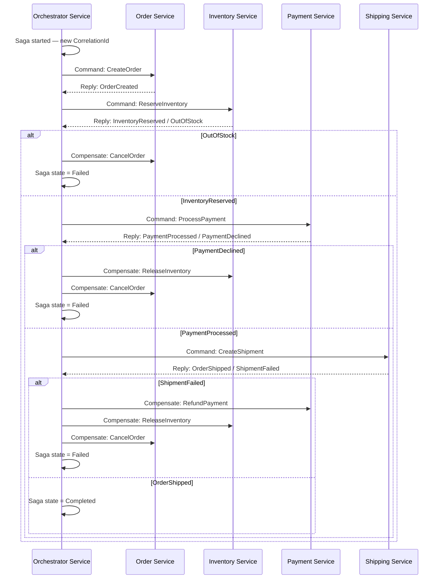
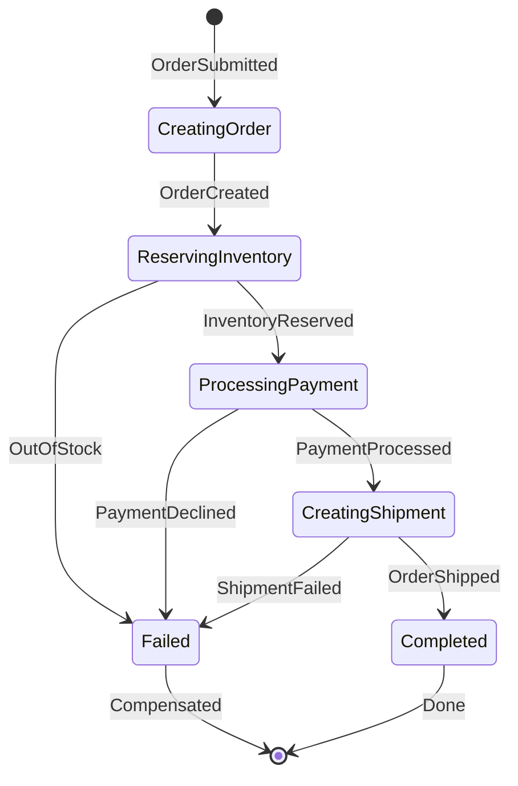
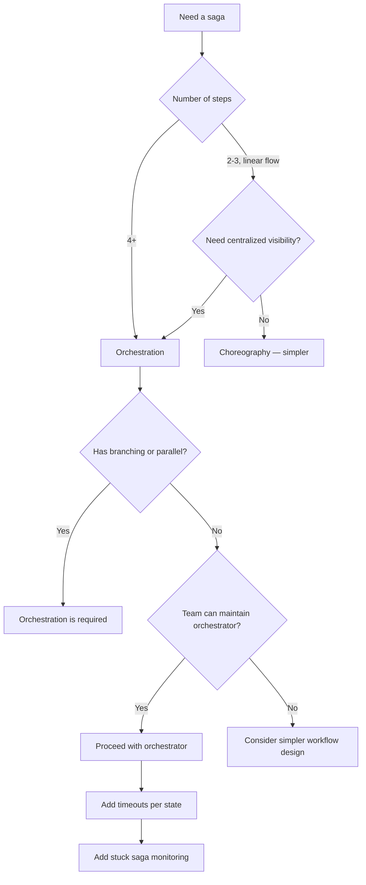
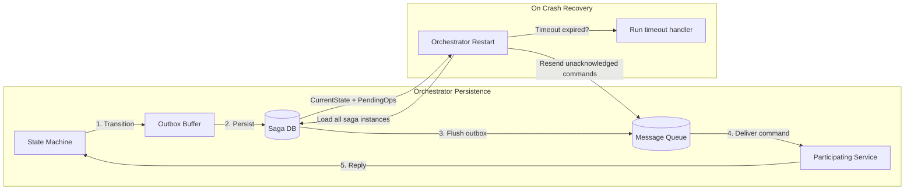
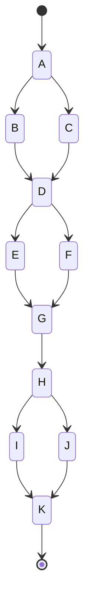

> [!success] Mastery Check
> - [ ] **Studied Well**
> - [ ] **Can explain the concept without notes**
> - [ ] **Can answer interview questions confidently**
> - [ ] **Can implement it in a real project**

## Navigation

**Domain:** [[7 — System Design & Distributed Systems]] > **Group:** Integration Patterns
**Previous:** [[7.130 — Saga Pattern — Choreography-Based]] | **Next:** [[7.132 — Saga Pattern — Compensating Transactions]]

### Prerequisites
- [[7.129 — Saga Pattern — Overview and When to Use]] — required because this note covers one of the two saga variants in detail
- [[7.130 — Saga Pattern — Choreography-Based]] — needed because orchestration is best understood by comparing it to choreography

### Where This Fits

Orchestration-based sagas centralize workflow coordination in a dedicated orchestrator service. The orchestrator maintains a state machine that tracks saga progress, sends commands to participating services, receives their responses, and decides the next step — including compensation on failure. A .NET engineer encounters this when the workflow has 4+ steps, conditional branching, parallel execution, or when the organization needs a single place to monitor saga health. MassTransit's `MassTransitStateMachine` and Azure Durable Functions are the two primary .NET implementations. Without an orchestrator, complex workflows degrade into untraceable event spaghetti where no single engineer can describe the full transaction flow.

## Core Mental Model

An orchestration-based saga is a centralized state machine that issues commands to participating services and interprets their responses to progress or compensate a multi-step workflow. The orchestrator owns the full transaction logic — each service is a stateless participant that performs its local operation when commanded and reports the outcome. The invariant is: the state machine transitions are atomic with the command publication, so the saga always knows exactly which step it is on. The tradeoff is that the orchestrator is a single point of coordination (not a single point of failure — it is stateful and recoverable), and it adds latency for the command-response round trips. The recognition trigger is a workflow with 4+ steps, conditional branching, parallel steps, or when the existing choreography has become untraceable.

Think of the orchestrator as a project manager. The project manager knows the complete plan: what needs to happen, in what order, and what to do if something goes wrong. Each team member receives instructions from the project manager and reports back when done. If a team member fails, the project manager decides whether to retry, reassign, or abort. The project manager keeps notes (persisted saga state) so if they get hit by a bus (crash), a replacement can pick up where they left off.





### Classification

Orchestration-based sagas are a distributed systems coordination pattern at the application layer. They sit between the service layer (where sagas operate) and the messaging infrastructure (commands + replies). They solve the problem of multi-step, multi-service transaction management with complex branching. They do not solve the dual-write problem (use the outbox pattern for publishing commands reliably) or the idempotency problem (each command handler must be idempotent — use the inbox pattern). Orchestration is classified as "centralized coordination" — the orchestrator is the single authority that decides the saga's progression.

### Key Properties / Guarantees

|Property|Value|Condition|
|---|---|---|
|Coordination model|Centralized state machine|Orchestrator persists state durably|
|Coupling|Tighter than choreography (services accept commands)|Orchestrator defines command schemas|
|Visibility|High (single saga state store)|Orchestrator exposes state endpoint|
|Debugging|Easier (inspect orchestrator state)|Orchestrator logs + state equal full trace|
|Resilience|Recoverable (state persists, orchestrator restarts)|State is persisted before any command is sent|
|Step count limit|~20-30 (practical limit for state machine complexity)|Proportional to state machine maintainability|
|Latency per step|+1 command-reply round trip|~50ms additional per step (negligible for most workflows)|
|Compensation guarantee|All-or-nothing — orchestrator ensures compensations for all completed steps|State persistence and retry ensure completion|

## Deep Mechanics

### How It Works

**Step 1 — Saga creation.** A command or event triggers saga start. The orchestrator generates a `CorrelationId`, creates a saga state record (persisted to durable storage), and transitions to the first state. It sends a command to the first participating service. The state record includes the `CorrelationId`, the current state, business data (order ID, customer ID, amount), and a version/timestamp for concurrency control.

**Step 2 — Command dispatch.** The orchestrator publishes a command message to a service-specific queue. The message includes the `CorrelationId`, the saga instance ID, and the payload. The orchestrator records the command as "sent, awaiting reply" in saga state. The command publication is atomic with the state transition via the transactional outbox — either both succeed or neither does.

**Step 3 — Reply handling.** The participating service processes the command, stores its local state, and publishes a reply event (success or failure) back to the orchestrator. The reply includes the `CorrelationId`. The orchestrator's reply handler correlates the reply to the saga instance, updates saga state, and transitions to the next step or initiates compensation. The correlation is done by matching the reply's `CorrelationId` to the saga instance's `CorrelationId`.

**Step 4 — Compensation.** If a step fails, the orchestrator transitions to the compensating state. It sends compensating commands to each previously completed step, in reverse order. Each service's compensating handler must undo the forward operation. The orchestrator tracks which compensations have succeeded and retries failures. The order matters — compensating Step 3 before Step 2 ensures that Step 2's compensation can assume Step 3's effects are already undone.

**Step 5 — Saga completion.** When all steps or all compensations have completed, the orchestrator transitions the saga to a terminal state (Completed or Failed). It may publish a saga completion event for observability. The saga state record is updated to the terminal state and optionally removed from the active saga store (if `SetCompletedWhenFinalized()` is configured).

### Failure Modes

**Orchestrator crash mid-saga.** The orchestrator process crashes after sending a command but before persisting the state transition. On restart, the saga state shows the previous step as completed. The orchestrator may resend the command (at-least-once delivery) — the service must handle duplicate commands idempotently.

- **Detection:** Orchestrator restarts logged. Saga instances with stale "in-progress" state older than expected timeout.
- **Metric:** `saga_in_progress_duration_seconds > p99_step_duration * 3`.
- **Recovery:** Persist state before sending any command. Use a transactional outbox for command publication to ensure state + command are atomic.

**Command lost in transit.** The orchestrator sends a command, but the message broker loses it (queue down, network partition). The orchestrator waits indefinitely for a reply.

- **Detection:** Saga stuck in "AwaitingReply" state beyond timeout threshold.
- **Metric:** `saga_step_timeout_count`.
- **Recovery:** Implement saga timeout per step. If no reply arrives within a configurable duration, the orchestrator resends the command or initiates compensation.

**Service receives command but reply is lost.** The service successfully processes the command and publishes a reply, but the reply is lost in transit. The orchestrator continues waiting.

- **Detection:** Same as command lost — saga stuck in "AwaitingReply."
- **Recovery:** Idempotency on the service side. The orchestrator resends the command after timeout. The service sees a duplicate command, applies idempotency (inbox pattern), and replies again with the same result.

**Partial compensation failure.** The orchestrator sends 3 compensating commands. One succeeds, one fails, one times out. The saga is in an indeterminate state — partially compensated.

- **Detection:** Saga state shows "Compensating" with mixed success/failure per step.
- **Metric:** `saga_compensation_partial_count`.
- **Recovery:** Retry failed compensations. If a compensation permanently fails (exhausted retries), the saga enters a "NeedsManualIntervention" state. Operations team receives an alert with the saga ID and failed step.

**State machine design bug.** The state machine allows an invalid transition — e.g., "ProcessingPayment" can transition to "CreatingShipment" without waiting for the payment reply. A bug in the correlation logic causes the saga to skip a step.

- **Detection:** Sagas complete in unexpected states. The saga state shows a step was never visited.
- **Recovery:** Add validation rules in the state machine. Use event sourcing for the saga state so every transition is auditable. Write tests that verify the state machine against all known event sequences.
- **Prevention:** Integration tests with MassTransit's test harness that verify every possible event sequence.

**Saga state database becomes a bottleneck.** At high throughput, the saga state table experiences write contention. With pessimistic concurrency, each saga update locks the row, causing blocking. With optimistic concurrency, concurrent updates cause retries.

- **Detection:** Saga persistence latency increases. `DbUpdateConcurrencyException` in logs.
- **Metric:** `saga_state_write_latency_ms`, `saga_concurrency_retry_count`.
- **Recovery:** Partition saga state by saga type or `CorrelationId` hash. Use Redis saga persistence for short-lived sagas. Increase connection pool size.

### Orchestrator Idempotency and Deduplication

The orchestrator itself must handle duplicate event delivery. If the same `OrderSubmitted` event is delivered twice (broker redelivery), the orchestrator must not start two saga instances for the same order.

**Duplicate detection at the orchestrator level:**

```csharp
// De-duplicate saga creation
Initially(
    When(OrderSubmitted)
        .If(context => context.Saga.CorrelationId == Guid.Empty,
            then => then
                .Then(context => { /* create saga */ })
                .TransitionTo(CreatingOrder),
            else => else
                .Then(context => _logger.LogWarning(
                    "Duplicate OrderSubmitted event for saga {CorrelationId}",
                    context.Message.CorrelationId))
                .Finalize()));
```

The `CorrelationId` in the event serves as the idempotency key for saga creation. If a saga with the same `CorrelationId` already exists, the second event is detected and ignored. This is why the correlation ID must be deterministic — typically the order ID itself is used as the correlation ID, or a deterministic hash of the order ID.

### Azure Service Bus Topology for Orchestrated Sagas

The orchestrator uses at least three message entities in Azure Service Bus:

1. **Command queue:** One queue per command type (e.g., `create-order`, `reserve-inventory`). The orchestrator sends commands here. Participating services listen on their queue. This gives you per-command isolation — if `reserve-inventory` is slow, it does not block `create-order` messages.
2. **Reply queue:** A single reply queue (`order-saga-replies`) where all services send their replies. The orchestrator listens on this queue and routes replies by `CorrelationId` to the correct saga instance.
3. **Scheduled message queue:** Used for timeout messages. When the orchestrator sends a command, it also schedules a timeout message for the saga step. If the timeout fires before the reply arrives, the orchestrator handles the timeout event.

```csharp
// Topology configuration
cfg.ReceiveEndpoint("order-saga-commands", e =>
{
    e.ConfigureConsumeTopology = false;
    e.BindMessageExchanges = false;
    e.Subscribe<OrderSubmitted>(context => 
        context.SubscribeConfiguration.SubscriptionName = "order-saga");
    e.ConfigureSaga<OrderSagaState>(context);
});

cfg.ReceiveEndpoint("order-saga-replies", e =>
{
    e.RequiresSession = true;
    e.ConfigureSaga<OrderSagaState>(context);
});
```

For Kafka as an alternative: each step gets its own topic (e.g., `orders.create.commands`). The orchestrator produces to the command topic and consumes from a reply topic partitioned by `CorrelationId`. Kafka's log compaction can be used to retain only the latest saga state per key, effectively providing a built-in cleanup mechanism.

### Leveraging Azure Service Bus Sessions for Ordered Processing

When multiple events arrive for the same saga instance, they must be processed in order. Azure Service Bus sessions provide ordered message processing per session ID. By setting the session ID to the `CorrelationId`, you ensure that all events for a saga are processed sequentially.

```csharp
// Configure saga endpoint with sessions
cfg.ReceiveEndpoint("order-saga", e =>
{
    e.RequiresSession = true; // Ensures ordered processing per CorrelationId
    e.ConfigureSaga<OrderSagaState>(context);
});
```

This is particularly important for sagas where events can arrive out of order (e.g., `PaymentProcessed` arrives before `OrderCreated` due to broker latency). Sessions ensure events are delivered to the consumer in the order they were sent by the producer.

### .NET and Azure Integration

- **ASP.NET Core:** Host the orchestrator as a background service (`IHostedService`) or use Durable Functions runtime
- **MassTransit:** `MassTransitStateMachine` is the primary .NET orchestrator implementation — define states, events, and transitions declaratively
- **Azure Durable Functions:** Orchestrator functions with `IDurableOrchestrationContext` — the workflow is written as C# code with `await context.CallActivityAsync`
- **Azure Service Bus:** Command queues per service, reply queues shared or per-service; `CorrelationId` in message properties links replies to saga instances
- **EF Core:** Saga state persistence via `SagaStateDbContext` — `CorrelationId` as primary key, serialized state as a column
- **OpenTelemetry:** Trace saga transitions as spans with `CorrelationId` as the trace ID for end-to-end visualization
- **Polly:** `ResiliencePipeline` for retry and circuit breaker on the orchestrator's outbound command sends

```csharp
// Saga state entity
public class OrderSagaState
{
    public Guid CorrelationId { get; set; }
    public string CurrentState { get; set; } = string.Empty;
    public Guid OrderId { get; set; }
    public string CustomerId { get; set; } = string.Empty;
    public decimal Amount { get; set; }
    public string? PaymentTransactionId { get; set; }
    public string? TrackingNumber { get; set; }
    public int RetryCount { get; set; }
    public DateTime CreatedAt { get; set; }
    public DateTime? CompletedAt { get; set; }
    public byte[]? RowVersion { get; set; } // For optimistic concurrency
}

// EF Core configuration
public class OrderSagaStateConfiguration : IEntityTypeConfiguration<OrderSagaState>
{
    public void Configure(EntityTypeBuilder<OrderSagaState> builder)
    {
        builder.HasKey(x => x.CorrelationId);
        builder.Property(x => x.CurrentState).HasMaxLength(64);
        builder.Property(x => x.RowVersion).IsRowVersion();
    }
}
```

## Production Patterns and Implementation

### Primary Implementation

A MassTransit state machine orchestrating a 4-step order fulfillment saga.

```csharp
// Saga state
public sealed class OrderSagaState :
    SagaStateMachineInstance
{
    public Guid CorrelationId { get; set; }
    public string CurrentState { get; set; } = string.Empty;
    public Guid OrderId { get; set; }
    public string CustomerId { get; set; } = string.Empty;
    public decimal Amount { get; set; }
    public string? PaymentTransactionId { get; set; }
    public string? TrackingNumber { get; set; }
    public int RetryCount { get; set; }
    public DateTime CreatedAt { get; set; }
}

// Commands (sent by orchestrator to services)
public record CreateOrder(Guid CorrelationId, string CustomerId, decimal Amount);
public record ReserveInventory(Guid CorrelationId, Guid OrderId);
public record ProcessPayment(Guid CorrelationId, Guid OrderId, decimal Amount);
public record CreateShipment(Guid CorrelationId, Guid OrderId, string Address);

// Replies (sent by services back to orchestrator)
public record OrderCreated(Guid CorrelationId, Guid OrderId);
public record InventoryReserved(Guid CorrelationId);
public record OutOfStock(Guid CorrelationId, string Sku);
public record PaymentProcessed(Guid CorrelationId, string TransactionId);
public record PaymentDeclined(Guid CorrelationId, string Reason);
public record OrderShipped(Guid CorrelationId, string TrackingNumber);
public record ShipmentFailed(Guid CorrelationId, string Reason);

// Compensations (sent by orchestrator on failure)
public record CancelOrder(Guid CorrelationId);
public record ReleaseInventory(Guid CorrelationId);
public record RefundPayment(Guid CorrelationId, string TransactionId);

// State machine
public sealed class OrderSagaStateMachine :
    MassTransitStateMachine<OrderSagaState>
{
    // States
    public State CreatingOrder { get; private set; } = null!;
    public State ReservingInventory { get; private set; } = null!;
    public State ProcessingPayment { get; private set; } = null!;
    public State CreatingShipment { get; private set; } = null!;
    public State Completed { get; private set; } = null!;
    public State Failed { get; private set; } = null!;

    // Events
    public Event<SagaStarted> SagaStarted { get; private set; } = null!;
    public Event<OrderCreated> OrderCreated { get; private set; } = null!;
    public Event<InventoryReserved> InventoryReserved { get; private set; } = null!;
    public Event<OutOfStock> OutOfStock { get; private set; } = null!;
    public Event<PaymentProcessed> PaymentProcessed { get; private set; } = null!;
    public Event<PaymentDeclined> PaymentDeclined { get; private set; } = null!;
    public Event<OrderShipped> OrderShipped { get; private set; } = null!;
    public Event<ShipmentFailed> ShipmentFailed { get; private set; } = null!;

    public OrderSagaStateMachine()
    {
        InstanceState(x => x.CurrentState);

        Event(() => SagaStarted, x => x.CorrelateById(c => c.Message.CorrelationId));
        Event(() => OrderCreated, x => x.CorrelateById(c => c.Message.CorrelationId));
        Event(() => InventoryReserved, x => x.CorrelateById(c => c.Message.CorrelationId));
        Event(() => OutOfStock, x => x.CorrelateById(c => c.Message.CorrelationId));
        Event(() => PaymentProcessed, x => x.CorrelateById(c => c.Message.CorrelationId));
        Event(() => PaymentDeclined, x => x.CorrelateById(c => c.Message.CorrelationId));
        Event(() => OrderShipped, x => x.CorrelateById(c => c.Message.CorrelationId));
        Event(() => ShipmentFailed, x => x.CorrelateById(c => c.Message.CorrelationId));

        Initially(
            When(SagaStarted)
                .Then(context => context.Saga.CustomerId = context.Message.CustomerId)
                .Then(context => context.Saga.Amount = context.Message.Amount)
                .SendAsync(context => context.Init<CreateOrder>(new CreateOrder(
                    context.Saga.CorrelationId,
                    context.Saga.CustomerId,
                    context.Saga.Amount)))
                .TransitionTo(CreatingOrder));

        During(CreatingOrder,
            When(OrderCreated)
                .Then(context => context.Saga.OrderId = context.Message.OrderId)
                .SendAsync(context => context.Init<ReserveInventory>(new ReserveInventory(
                    context.Saga.CorrelationId,
                    context.Saga.OrderId)))
                .TransitionTo(ReservingInventory));

        During(ReservingInventory,
            When(InventoryReserved)
                .SendAsync(context => context.Init<ProcessPayment>(new ProcessPayment(
                    context.Saga.CorrelationId,
                    context.Saga.OrderId,
                    context.Saga.Amount)))
                .TransitionTo(ProcessingPayment),
            When(OutOfStock)
                .Then(context => context.Saga.RetryCount++)
                .IfElse(context => context.Saga.RetryCount < 3,
                    then => then.SendAsync(context => context.Init<ReserveInventory>(
                        new ReserveInventory(context.Saga.CorrelationId, context.Saga.OrderId))),
                    else => else
                        .SendAsync(context => context.Init<CancelOrder>(
                            new CancelOrder(context.Saga.CorrelationId)))
                        .TransitionTo(Failed)));

        During(ProcessingPayment,
            When(PaymentProcessed)
                .Then(context => context.Saga.PaymentTransactionId = context.Message.TransactionId)
                .SendAsync(context => context.Init<CreateShipment>(new CreateShipment(
                    context.Saga.CorrelationId,
                    context.Saga.OrderId,
                    string.Empty)))
                .TransitionTo(CreatingShipment),
            When(PaymentDeclined)
                .SendAsync(context => context.Init<CancelOrder>(
                    new CancelOrder(context.Saga.CorrelationId)))
                .SendAsync(context => context.Init<ReleaseInventory>(
                    new ReleaseInventory(context.Saga.CorrelationId)))
                .TransitionTo(Failed));

        During(CreatingShipment,
            When(OrderShipped)
                .Then(context => context.Saga.TrackingNumber = context.Message.TrackingNumber)
                .Then(context => context.Saga.CompletedAt = DateTime.UtcNow)
                .TransitionTo(Completed),
            When(ShipmentFailed)
                .SendAsync(context => context.Init<CancelOrder>(
                    new CancelOrder(context.Saga.CorrelationId)))
                .SendAsync(context => context.Init<ReleaseInventory>(
                    new ReleaseInventory(context.Saga.CorrelationId)))
                .SendAsync(context => context.Init<RefundPayment>(
                    new RefundPayment(
                        context.Saga.CorrelationId,
                        context.Saga.PaymentTransactionId!)))
                .TransitionTo(Failed));
    }
}
```

### Configuration and Wiring

```csharp
// Program.cs — saga registration
builder.Services.AddMassTransit(x =>
{
    x.AddSagaStateMachine<OrderSagaStateMachine, OrderSagaState>()
        .EntityFrameworkRepository(r =>
        {
            r.ConcurrencyMode = ConcurrencyMode.Pessimistic;
            r.AddDbContext<DbContext, SagaStateDbContext>(
                (provider, builder) =>
                {
                    builder.UseSqlServer(
                        provider.GetRequiredService<IConfiguration>()
                            .GetConnectionString("SagaDb"));
                });
        });

    x.UsingAzureServiceBus((context, cfg) =>
    {
        cfg.Host(builder.Configuration["ServiceBus:ConnectionString"]);
        cfg.ConfigureEndpoints(context);
        cfg.UseInMemoryOutbox(context);
    });
});
```

### Saga State Cleanup Strategy

Completed sagas accumulate in the saga state table. Without cleanup, the table grows unbounded, degrading query performance and increasing storage costs. At 500 sagas/second with an average saga lifetime of 30 seconds, the table grows by ~43M rows/day.

```csharp
public sealed class SagaCleanupJob : BackgroundService
{
    protected override async Task ExecuteAsync(CancellationToken ct)
    {
        while (!ct.IsCancellationRequested)
        {
            await Task.Delay(TimeSpan.FromHours(24), ct);
            
            var cutoff = DateTime.UtcNow.AddDays(-30);
            var oldSagas = await _db.Set<OrderSagaState>()
                .Where(s => s.CompletedAt != null && s.CompletedAt < cutoff)
                .Take(1000)
                .ToListAsync(ct);
            
            _db.RemoveRange(oldSagas);
            await _db.SaveChangesAsync(ct);
        }
    }
}
```

Key considerations: (1) only delete sagas in terminal states (Completed, Faulted), (2) keep minimum retention based on business requirements (30 days for debugging, 90 days for compliance), (3) batch deletes to avoid long-running transactions, (4) archive to cold storage before deletion if audit requires it.

### Common Variants

**Azure Durable Functions orchestrator.** The workflow is written as an async C# method. Compensations use `try/catch` with `context.CallActivityAsync` for forward steps and compensating calls in the `catch` block.

```csharp
[FunctionName("OrderFulfillmentSaga")]
public async Task<OrderSagaResult> RunOrchestrator(
    [OrchestrationTrigger] IDurableOrchestrationContext context)
{
    var input = context.GetInput<OrderSagaInput>();
    
    try
    {
        var orderId = await context.CallActivityAsync<Guid>("CreateOrder", input);
        await context.CallActivityAsync("ReserveInventory", orderId);
        var payment = await context.CallActivityAsync<PaymentResult>("ProcessPayment", orderId);
        var shipment = await context.CallActivityAsync<ShipmentResult>("CreateShipment", orderId);
        return new OrderSagaResult(orderId, payment.TransactionId, shipment.TrackingNumber);
    }
    catch (Exception ex)
    {
        // Compensations in reverse order
        await context.CallActivityAsync("RefundPayment", input.OrderId);
        await context.CallActivityAsync("ReleaseInventory", input.OrderId);
        await context.CallActivityAsync("CancelOrder", input.OrderId);
        throw;
    }
}
```

**Timeout per step.** MassTransit supports `SchedulePublish` to send a timeout event. If the expected reply does not arrive before the timeout, the saga transitions to a timeout state.

```csharp
// Schedule timeout for payment step
During(ProcessingPayment,
    When(PaymentProcessed)
        .Unschedule(PaymentTimeout) // Cancel timeout
        .TransitionTo(CreatingShipment),
    When(PaymentTimeout)
        .Then(ctx => ctx.Saga.FailureCount++)
        .IfElse(ctx => ctx.Saga.FailureCount < 3,
            then => then
                .SendAsync(ctx => ctx.Init<ProcessPayment>(...))
                .Schedule(PaymentTimeout, ctx => new PaymentTimeout(ctx.Saga.CorrelationId),
                    _ => TimeSpan.FromMinutes(5)),
            else => else
                .TransitionTo(Failed)));
```

**Parallel step execution.** The orchestrator sends multiple commands simultaneously and waits for all replies before transitioning.

```csharp
// Parallel steps in orchestrator
During(ReservingInventory,
    When(CombinedResponse, x => x.CorrelationId != Guid.Empty) // Custom event for parallel completion
        .TransitionTo(ProcessingPayment));

// The orchestrator sends ReserveInventory and ValidateCoupon in parallel
// and waits for both InventoryReserved and CouponValidated before proceeding
```

**Sub-saga pattern.** For workflows with 10+ steps, decompose into sub-sagas. Each sub-saga handles a phase and reports completion to the parent.

### Real-World .NET Ecosystem Example

**MassTransit's `MassTransitStateMachine`** is the most widely used orchestration saga implementation in the .NET ecosystem. It is used in production at Microsoft, JetBlue, and numerous financial services companies. It provides automatic correlation ID handling, saga persistence providers (EF Core, Redis, Marten, MongoDB), and built-in retry and timeout support. The state machine DSL in C# is inspired by the state monad pattern — each transition is a pure function that receives the current state and event, and produces new state + side effects (send commands).

A notable example: JetBlue's reservation system uses MassTransit state machines to orchestrate booking workflows across 50+ services. Their saga coordinates seat selection, payment, baggage, and check-in. They report 99.997% saga completion rate and attribute this to (1) the transactional outbox preventing dual-write issues and (2) comprehensive timeout handling on every state.

## Gotchas and Production Pitfalls

### 1. State persistence is not atomic with command publication

**Pitfall:** The state machine persists saga state (transition to "ProcessingPayment") and then sends a `ProcessPayment` command. If the orchestrator crashes between persist and send, the saga is in "ProcessingPayment" but the command was never sent.

```csharp
// ❌ State transition before send — crash between them leaves saga stuck
.Then(context => context.Saga.CurrentState = "ProcessingPayment")
.SendAsync(context => context.Init<ProcessPayment>(...))
```

**Symptom:** Saga stuck in "ProcessingPayment" state with no corresponding command in the queue. The saga never progresses or times out.

**Fix:** MassTransit uses an outbox pattern internally (the `TransactionalBus`). When you use `.SendAsync` inside a state machine event handler, the message is buffered and sent only after the saga instance is successfully persisted. Ensure the transactional outbox is enabled.

```csharp
// ✅ Enable transactional outbox in MassTransit
x.UsingAzureServiceBus((context, cfg) =>
{
    cfg.UseInMemoryOutbox(); // Buffers messages until saga state is committed
    cfg.ConfigureEndpoints(context);
});
```

**Cost of not fixing:** In-flight sagas stuck permanently. Emergency SQL updates to reset saga states. Operations team must manually resend commands.

### 2. Optimistic concurrency conflicts under load

**Pitfall:** Two reply events arrive for the same saga instance simultaneously (e.g., duplicate command was processed). Both try to update the same saga state row. One succeeds, one gets a `DbUpdateConcurrencyException`.

**Symptom:** MassTransit logs `ConcurrencyException` for saga updates. The second reply is retried and eventually goes to the error queue. Saga may never progress.

**Fix:** Use pessimistic concurrency on the saga persistence. EF Core saga repository supports `ConcurrencyMode.Pessimistic` which uses `UPDLOCK` and `ROWLOCK` in SQL Server.

```csharp
// ✅ Pessimistic concurrency
r.ConcurrencyMode = ConcurrencyMode.Pessimistic;
```

**Cost of not fixing:** 0.1% of sagas fail under peak load (200+ sagas/second). The error queue fills with saga concurrency exceptions. Every 3 hours, an engineer must manually replay failed saga events.

### 3. Compensations not idempotent

**Pitfall:** The orchestrator sends `RefundPayment` as compensation. The refund succeeds, but the reply is lost. The orchestrator retries. The service processes a second refund for the same transaction.

```csharp
// ❌ Compensation not idempotent
public async Task Handle(RefundPayment command)
{
    await _paymentGateway.RefundAsync(command.TransactionId);
}
```

**Symptom:** Customer receives double refund. Finance reconciliation fails.

**Fix:** Track which compensations have been applied per saga. Use the inbox pattern on the service side — `(CorrelationId, CompensationName)` as dedup key.

**Cost of not fixing:** Financial loss. Manual reconciliation for every retried saga. Audit failure.

### 4. Long-running sagas exhaust database connections

**Pitfall:** A saga holds a pessimistic lock for the duration of a step that takes 30 seconds (e.g., waiting for a human approval step). Each lock holds a database connection. 100 concurrent sagas exhaust the connection pool.

**Symptom:** `System.InvalidOperationException: Timeout expired. The timeout period elapsed prior to obtaining a connection from the pool.`

**Fix:** Use optimistic concurrency for long-running steps. Switch to a saga repository that supports non-blocking reads. Model long-running wait steps as separate saga events that release the lock between steps.

```csharp
// ✅ Optimistic concurrency for long-running sagas
r.ConcurrencyMode = ConcurrencyMode.Optimistic;
```

**Cost of not fixing:** All sagas stall when the connection pool is exhausted. Timeouts cascade across the system.

### 5. State machine complexity becomes untestable

**Pitfall:** The orchestrator state machine has 15 states and 40 transitions. Adding a new step requires understanding all existing transitions. Engineers are afraid to modify it.

**Symptom:** Code reviews of saga changes take 3x longer. Bugs introduced in unrelated steps. Team avoids adding needed steps.

**Fix:** Keep state machines below ~10 states. If the workflow exceeds this, decompose it into sub-sagas (nested orchestrators). Each sub-saga handles one phase (e.g., "FulfillmentPhase", "BillingPhase"). Test each sub-saga independently.

**Cost of not fixing:** The orchestrator becomes a legacy monolith. New workflows bypass the orchestrator. Consistency guarantees are lost.

### 6. Reply event correlation fails due to missing CorrelationId

**Pitfall:** The orchestrator sends a `ProcessPayment` command. The Payment service processes it and publishes `PaymentProcessed` — but the reply includes the `OrderId` instead of the `CorrelationId`. The orchestrator cannot correlate the reply to the saga instance.

```csharp
// ❌ Reply uses OrderId instead of CorrelationId
public record PaymentProcessed(Guid OrderId, string TransactionId);
```

**Symptom:** The orchestrator receives the reply but finds no saga instance with `CorrelationId == OrderId`. The reply goes to the error queue. The saga remains stuck in "AwaitingPayment."

**Fix:** Ensure every reply includes the `CorrelationId` from the original command.

**Cost of not fixing:** 100% of sagas fail at this step. Every reply goes to the error queue. This is a deployment-blocking bug.

### 7. Orchestrator becomes a single point of coordination overload

**Pitfall:** The orchestrator handles too many saga types. Multiple teams add sagas to the same orchestrator service. The orchestrator's database becomes a shared resource with contention across unrelated workflows.

**Symptom:** A high-throughput saga (order processing) causes database contention for a low-throughput saga (refund processing). Refund sagas slow down because order sagas are consuming database resources.

**Fix:** Deploy separate orchestrator instances per saga type. Each orchestrator has its own database partition. This isolates resource usage and allows independent scaling.

**Cost of not fixing:** Cross-saga interference. Performance issues in one saga type affect all others.

### 8. Missing timeout on compensation steps

**Pitfall:** The orchestrator sends `RefundPayment` as compensation. The refund fails. The orchestrator retries. The retry also fails. Without a compensation timeout, the saga remains in "Compensating" state indefinitely.

**Symptom:** Sagas accumulate in "Compensating" state. Operations is not alerted because the saga is not in a terminal state and no timeout fires.

**Fix:** Add a compensation timeout that escalates to manual intervention if compensation does not complete within a threshold.

**Cost of not fixing:** Stuck sagas in compensating state. Operations discovers them through customer complaints.

## Tradeoffs and Decision Framework

### Tradeoff Matrix

|Dimension|Orchestration Saga|Choreography Saga|Distributed Transaction|Custom Workflow Engine|
|---|---|---|---|---|
|Central coordinator|Dedicated orchestrator service|None|DTC coordinator|Workflow engine server|
|Visibility|High — inspect orchestrator state|Low — event tracing needed|Low|High — engine dashboard|
|Coupling|Tighter — orchestrator defines command API|Loose — events only|Very tight — all participants must support same protocol|Moderate — workflow definition|
|Step count limit|~20-30|~2-5|~2-5|~100+ (with sub-workflows)|
|Failure recovery|Centralized compensation logic|Decentralized compensations|Automatic rollback|Centralized compensation|
|Debugging|Single state machine to inspect|Requires event tracing|Limited|State machine visualization|
|Latency per step|+1 round trip (orchestrator → service)|0 (event-driven)|2 round trips (prepare + commit)|+1 round trip|
|Operational cost|Orchestrator service to deploy + manage|No new service|DTC service required|Workflow engine server|
|.NET ecosystem|MassTransit, Durable Functions|NServiceBus|MSDTC|Elsa Workflows, Workflow Core|

### When to Apply



### When NOT to Apply

- [ ] The workflow has 2-3 simple linear steps — choreography is simpler and equally effective
- [ ] The organization cannot commit to maintaining an orchestrator service — it becomes a critical dependency
- [ ] Step latency must be minimized — the orchestrator adds one message round trip per step
- [ ] The service boundaries are not stable — if services are frequently split or merged, the orchestrator command API churns
- [ ] The team is small (~3 engineers) — the operational cost of an orchestrator may exceed the benefit for simple workflows
- [ ] The workflow is fully event-driven and asynchronous — adding a synchronous orchestrator may be an architectural mismatch
- [ ] The organization lacks the discipline to version command/reply schemas — orchestrator API changes require coordinated deployments

### Scale Thresholds

- **Worth considering above ~3 steps** in a workflow — choreography becomes intractable beyond this
- **Required at ~5+ steps** in any production workflow — the cost of debugging choreography exceeds the cost of building the orchestrator
- **Database connection pressure:** Each saga holds a database connection while awaiting replies. At 500+ concurrent sagas with pessimistic locking, connection pool exhaustion is a real risk. Use optimistic concurrency or Redis saga persistence.
- **Orchestrator throughput:** A single orchestrator instance with SQL Server persistence handles ~500-1,000 saga events/second. Beyond that, partition saga state and deploy multiple orchestrator instances.
- **State machine size:** Below 10 states, a single state machine is maintainable. At 10-20 states, consider sub-sagas. Above 20 states, a dedicated workflow engine may be more appropriate.

## Interview Arsenal

### Question Bank

1. What is an orchestration-based saga, and how does it differ from choreography?
2. How does the orchestrator ensure it knows the correct saga state after a crash?
3. What happens if a command from the orchestrator is delivered but the reply is lost?
4. How do you implement timeouts in an orchestration saga?
5. Compare orchestration and choreography across coupling, visibility, and debugging.
6. Design an orchestration saga for a multi-step payment workflow.
7. How does MassTransit's state machine handle concurrency for the same saga instance?
8. What is the "dual-write problem" in the context of an orchestrator, and how does the outbox pattern solve it?
9. How do you scale an orchestration saga beyond 1,000 events/second?
10. What metrics would you monitor for an orchestration saga in production?

### Spoken Answers

**Q1: What is an orchestration-based saga, and how does it differ from choreography?**

> **Average answer:** "Orchestration uses a central service to coordinate the saga steps. Choreography uses events."
>
> **Great answer:** "An orchestration-based saga uses a centralized state machine — the orchestrator — that sends commands to participating services. Each service performs its local operation and sends a reply. The orchestrator uses the reply to decide the next step: progress the workflow, initiate compensation, or retry. The key difference from choreography is that the orchestrator owns the complete workflow logic. In choreography, the workflow is implicit in the event subscriptions — no single service knows the full flow. In orchestration, the state machine explicitly defines every state, every transition, and every compensation path. This means orchestration gives you visibility (inspect the orchestrator state to know exactly where each saga is), but it adds operational complexity (you must deploy and maintain the orchestrator service) and latency (each step is a synchronous command-reply round trip through the orchestrator, rather than an asynchronous event flow). I use orchestration for workflows with 4+ steps or any branching logic. I use choreography for simple linear flows where loose coupling is more important than centralized visibility."

**Q2: How does the orchestrator ensure it knows the correct saga state after a crash?**

> **Great answer:** "The orchestrator persists saga state to a durable store (EF Core, Redis, Azure Storage) before sending any command. The state persistence and command publication are atomic via the transactional outbox — either both succeed or neither does. When the orchestrator restarts after a crash, it loads all saga instances from the durable store. For each instance, it checks the current state and the pending operations. If a command was sent but no reply was received (the saga is in 'AwaitingReply' state), the orchestrator's timeout mechanism will eventually fire and resend the command. The key is that the orchestrator never acknowledges the incoming event until the saga state is durably persisted and the outbox has flushed. This means after a crash, every saga is either in the state before the event was processed (the event will be redelivered) or in the state after the event was processed (the event was acknowledged). There is no in-between state where the saga has partially processed an event."

**Q3: What happens if a command from the orchestrator is delivered but the reply is lost?**

> **Great answer:** "The orchestrator persists the saga state as 'AwaitingReply' before sending the command. When the reply never arrives, the saga step timeout fires — typically a scheduled message published by the orchestrator at the time it sent the command. On timeout, the orchestrator checks the saga state. If the state is still 'AwaitingReply,' it resends the command. Here, idempotency is critical: the service must handle duplicate commands by returning the same reply. The service achieves this with the inbox pattern — a dedup table keyed by `(CorrelationId, CommandName)` that stores the reply that was already produced. If the service receives a duplicate command, it looks up the stored reply from the inbox and returns it without re-executing the business logic. This pattern means the orchestrator can safely retry any timed-out command without risk of duplicate side effects."

**Q5: Compare orchestration and choreography across coupling, visibility, and debugging.**

> **Average answer:** "Orchestration is more coupled but easier to debug. Choreography is more decoupled but harder to debug."
>
> **Great answer:** "On coupling: choreography is looser because services only share event schemas — no service knows which other services consume its events. Orchestration is tighter because the orchestrator defines command and reply schemas that every participant must implement. On visibility: orchestration wins — you have a single database with saga state, a single state machine you can inspect. You can query 'how many sagas are stuck in PaymentPending?' in one SQL query. In choreography, you need distributed tracing across every service to understand saga health. On debugging: orchestration is easier because you can replay any saga by replaying its state through the state machine. The full workflow logic is in one file. In choreography, a bug in step 3 might be caused by something in step 1's event subscription, and the fix requires deploying a different service. The tradeoff is that orchestration requires deploying and operating a stateful service, while choreography only needs a message broker. For simple workflows, choreography's operational simplicity outweighs the debugging cost."

**Q8: What is the dual-write problem in the context of an orchestrator?**

> **Great answer:** "The dual-write problem occurs when the orchestrator must perform two operations that are not atomically coordinated: persisting saga state and sending a command. If the orchestrator sends the command first and then persists state, a crash after the send but before the persist leaves a command in the queue that the saga does not expect. If the orchestrator persists state first and then sends the command, a crash after the persist but before the send leaves the saga stuck in a state where it is waiting for a reply that will never arrive. The transactional outbox solves this by buffering all commands in memory during the event handler. The saga state is persisted first. If that succeeds, the buffered commands are sent and the incoming event is acknowledged. If the persist fails, the buffered commands are discarded and the incoming event is retried. MassTransit's `UseInMemoryOutbox` implements this pattern. Without it, the orchestrator is vulnerable to crashes causing either stuck sagas or orphan commands."

**Q9: How do you scale an orchestration saga beyond 1,000 events/second?**

> **Great answer:** "There are five strategies I use, applied in order as the load grows. First, switch from pessimistic to optimistic concurrency — this removes the database lock bottleneck. With pessimistic concurrency, each saga event holds a row lock during processing. At high throughput, lock contention becomes the bottleneck. Optimistic concurrency uses row versioning and retries on conflict, which is much lighter. Second, use Redis saga persistence for short-lived sagas. Eighty percent of sagas complete in under 30 seconds — these can use Redis persistence which has microsecond latency compared to SQL Server's millisecond latency. Only the long-running sagas need SQL Server persistence. Third, partition saga state by `CorrelationId` hash across multiple databases. With 4 partitions, you get 4x the write throughput. Fourth, deploy multiple orchestrator instances — MassTransit's competing consumer pattern distributes saga events across instances. Each instance handles different saga instances because MassTransit routes messages by `CorrelationId` using an in-memory `ConcurrentDictionary`. Fifth, for extreme throughput, consider a hybrid approach: use choreography for the high-volume steps (payment processing at 10,000 events/second) and orchestration for the lower-volume coordination steps (order fulfillment at 100 events/second). The key insight is that the orchestrator itself rarely becomes the bottleneck at reasonable throughput levels — it is almost always the saga persistence store."

**Q10: What metrics would you monitor for an orchestration saga in production?**

> **Great answer:** "The metrics fall into four categories. Health: `saga_active_count` (gauge by saga type), `saga_stuck_count` (sagas in non-terminal state > 3x expected duration), `saga_slo_breach_count` (sagas exceeding expected completion time). Performance: `saga_completion_time_seconds` (histogram — P50, P95, P99), `saga_step_duration_seconds` (histogram per step name), `saga_state_db_latency_ms` (histogram). Reliability: `saga_retry_count` (counter per step), `saga_compensation_count` (counter per saga type), `saga_concurrency_conflict_count` (counter). Infrastructure: DLQ depth per saga endpoint, `saga_outbox_pending_count` (messages waiting in outbox). I alert on: any saga stuck > 30 minutes, compensation failure rate > 1% over 5 minutes, saga step P99 latency > 10 seconds, DLQ depth > 100 messages. The single most important metric is `saga_stuck_count` — if it is non-zero, something needs immediate investigation."

### System Design Interview Trigger

When the interviewer describes a multi-step workflow (e.g., "design a loan origination system," "how would you handle order fulfillment across services?"), the use of a saga is expected. The follow-up is "how does the orchestrator recover from a crash?" — testing whether you understand durable state persistence, the outbox pattern, and idempotent command handling. The non-obvious aspect is that the orchestrator must never be in a state where it has sent a command but cannot determine whether it was processed. This is why the transactional outbox (send command + persist state atomically) and the inbox pattern (idempotent duplicate detection) are always part of the answer.

### Comparison Table

| | Orchestration Saga | Choreography Saga | Azure Durable Functions | Custom Orchestrator |
|---|---|---|---|---|
| Coordinator | Central orchestrator | None | Orchestrator function | Custom service |
| State storage | Saga persistence DB | Per-service DB | Azure Storage (tables) | Custom DB |
| Step trigger | Orchestrator command | Subscribed event | Activity function call | Custom message |
| Compensation | Orchestrator-issued commands | Event-driven subscription | try/catch with compensating calls | Custom logic |
| Visibility | High — query saga state | Low — trace needed | High — check orchestration history | Custom |
| Best for | 4+ steps, complex logic | 2-3 steps, simple flow | Long-running, human-interaction workflows | Maximum control |
| .NET library | MassTransitStateMachine | NServiceBus saga | Microsoft.Azure.WebJobs.Extensions.DurableTask | Manual implementation |

## Architecture Decision Record

**Status:** Under Review

**Context:** A loan origination system requires a workflow with 6 steps: SubmitApplication → CreditCheck → DocumentVerification → Underwriting → LoanApproval → Disbursement. The workflow has conditional branching (if credit score > 700, skip DocumentVerification). The team has 12 engineers across 3 squads. The system must process 200 loan applications per minute. The compliance team requires a full audit trail of every loan decision, including partial completions and failures. The team already uses MassTransit for messaging between services.

**Options Considered:**

1. **Orchestration Saga** — MassTransit state machine in a dedicated orchestrator service
2. **Choreography Saga** — 6 services coordinating via events
3. **Azure Durable Functions** — Orchestrator function with activity functions per step
4. **Workflow Engine (Elsa Workflows)** — Visual workflow designer with .NET host
5. **Custom Orchestrator** — Hand-written state machine in a background service

**Decision:** Orchestration Saga (option 1), because the workflow has 6 steps, conditional branching (credit score threshold), and the compliance audit trail requirement demands a single source of truth for saga state. MassTransit's saga persistence provides the audit history natively — every state transition is timestamped. The team already uses MassTransit for messaging, so adding saga support does not introduce a new technology. The conditional branching is naturally expressed in the state machine DSL via `IfElse` blocks.

**Consequences:**
- ✅ Single saga state DB — compliance team queries it directly for audit trails
- ✅ Conditional branching is explicit in the state machine — credit score check is just a state transition decision
- ✅ MassTransit outbox ensures atomic state persistence + command publication
- ✅ Each squad owns its command handlers independently — orchestrator defines the command API
- ✅ Existing MassTransit infrastructure reused — transport, retry, outbox, monitoring
- ⚠️ Orchestrator becomes a critical dependency — must be deployed with redundancy (active/passive with shared saga DB)
- ⚠️ Testing requires saga state DB in test environments — integration tests need SQL Server or an in-memory EF Core provider
- ⚠️ The DocumentVerification step involves human review (underwriter approval) — this is a long-running step requiring optimistic concurrency
- ❌ Step latency increases by ~50ms per step due to orchestrator round trip — acceptable at 200 req/min
- ❌ Durable Functions would handle the human-review wait more naturally with `WaitForExternalEvent`, but the team's MassTransit expertise justifies the tradeoff

**Review Trigger:** Revisit if the workflow exceeds 15 states, indicating it should be decomposed into sub-sagas, or if the team grows beyond 30 engineers, at which point a dedicated workflow team may be warranted. Also revisit if the DocumentVerification human-review step becomes a performance bottleneck — at that point, evaluate Durable Functions for the human-interaction portions while keeping MassTransit for automated steps.

## Self-Check

### Conceptual Questions

1. What problem does an orchestration-based saga solve that choreography does not?
2. How does the orchestrator persist state, and what happens if it crashes mid-transition?
3. What is the role of the outbox pattern in orchestration sagas?
4. How does the orchestrator handle a step that times out?
5. What concurrency concerns exist when multiple replies arrive for the same saga instance?
6. How does orchestration coupling differ from choreography coupling?
7. At what step count does orchestration become the recommended approach?
8. How does Azure Durable Functions implement orchestration differently from MassTransit?
9. What happens if a compensation command fails?
10. Explain in 60 seconds how to design an orchestration saga for a payment checkout flow.

<details>
<summary>Answers</summary>

1. Orchestration handles complex workflows — 4+ steps, conditional branching, parallel steps, and timeouts. Choreography becomes intractable beyond 3-5 linear steps. Orchestration provides a single source of truth for saga state, which is essential for compliance and debugging.

2. The orchestrator persists saga state to a durable store (EF Core, Redis, Azure Storage) before sending any command. If it crashes mid-transition, on restart it reads the last persisted state. The transactional outbox ensures the command is only sent after the state is committed. The saga either shows the previous state (command not yet sent) or the new state (command sent) — never an indeterminate state.

3. The outbox pattern ensures that the state transition and command publication happen atomically. Without it, a crash after persisting the state but before sending the command leaves the saga stuck in a "waiting for reply" state where no reply can ever arrive. The outbox is the single most important infrastructure component for a reliable orchestrator.

4. The orchestrator publishes a scheduled timeout event at the time it sends the command. If no reply arrives before the timeout fires, the orchestrator checks the saga state. If still awaiting reply, it resends the command. If the service was idempotent (inbox pattern), it returns the same result. If the service did crash and lost state, the command is executed fresh. The total retry duration should be at least 2x the downstream service's expected recovery time.

5. Under load, two reply events for the same saga can arrive simultaneously, causing a concurrency conflict. MassTransit supports pessimistic concurrency (SQL Server `UPDLOCK`/`ROWLOCK`) which serializes access to the saga row. This adds latency under contention but prevents lost updates. Optimistic concurrency is lighter but requires retry logic. Choose pessimistic for high-contention, short-duration steps; optimistic for low-contention or long-duration steps.

6. Orchestration is tighter: the orchestrator defines command and reply schemas that each service must implement. Changing a command schema requires updating both the orchestrator and the service. In choreography, services only share event schemas, which are typically more stable. However, orchestration's tighter coupling is what gives it centralized visibility and compensations.

7. At 4+ steps. Below 4, choreography is simpler. At 4, the cost of debugging choreography exceeds the cost of building the orchestrator. At 6+, orchestration is strongly recommended. The decision also depends on workflow complexity — even a 3-step workflow with conditional branching may warrant orchestration.

8. Durable Functions uses an async/await programming model — the workflow is a regular C# method with `await` calls. MassTransit uses a declarative state machine DSL with `Initially`, `During`, `When`, and `TransitionTo`. Durable Functions' model is more flexible (arbitrary C# logic in the orchestrator), but it has limitations (orchestrator code must be deterministic — no `DateTime.Now`, no `Guid.NewGuid()`). MassTransit's DSL is more constrained but inherently deterministic.

9. The orchestrator retries the failed compensation. If retries are exhausted, the saga enters a "NeedsManualIntervention" state. An alert fires to the operations team with the saga ID and the failed step. The team reviews the saga state and either manually completes the compensation (e.g., SQL update to refund the payment) or fixes the underlying issue and triggers a retry from the orchestrator's rewind feature.

10. "I would use an orchestrator service with MassTransitStateMachine. It has 4 states: CreatingOrder, ReservingInventory, ProcessingPayment, CreatingShipment. The orchestrator starts when it receives the 'SubmitOrder' event. It persists the saga state, sends 'CreateOrder' to the Order service, and transitions to CreatingOrder. On receiving 'OrderCreated', it transitions to ReservingInventory and sends 'ReserveInventory'. On 'InventoryReserved', it transitions to ProcessingPayment. If the payment fails, it transitions to Failed and sends 'CancelOrder' and 'ReleaseInventory' compensations. If the payment succeeds, it sends 'CreateShipment'. On completion, it transitions to Completed and publishes an 'OrderFulfilled' event. Each command handler is idempotent — duplicate commands return the same reply. The orchestrator persists state to SQL Server with pessimistic concurrency. Step timeouts are handled by scheduled messages published alongside each command. I add a stuck saga monitor that alerts if any saga is in a non-terminal state for more than 30 minutes."

### Additional Questions

**11. What happens if the orchestrator's saga repository is unavailable during a step transition?**

> If the saga repository (database) is unavailable when the orchestrator tries to persist a state transition, the transaction fails and the incoming message is retried. The retry policy should use exponential backoff and eventually circuit-break to avoid overwhelming the database during recovery. The saga remains in its previous state — no state transition occurs without persistence. This is safe because the outbox ensures no commands are sent unless the state is persisted.

**12. How do you handle sagas that span multiple orchestrators?**

> For workflows that span multiple domain boundaries (e.g., Order Fulfillment and Billing are separate systems), use a parent-child saga pattern. The parent orchestrator delegates sub-workflows to child orchestrators. The child orchestrators report completion or failure back to the parent. This is distinct from sub-sagas (which share the same persistence store) — parent-child sagas can be in different services with different databases. The parent saga sends a command to start the child saga and waits for a completion event.

**13. What is the difference between a saga state machine and a workflow engine like Azure Logic Apps or Temporal?**

> A saga state machine (MassTransit) is embedded in your application process — it runs in the same service, uses the same infrastructure, and shares the same deployment lifecycle. A workflow engine (Logic Apps, Temporal) is an external orchestrator — it calls your services over HTTP. Sagas are better for low-latency (in-process, no HTTP overhead) and tight integration with your message broker. Workflow engines are better for cross-team workflows where you cannot deploy a saga service for every flow, or when you need a visual designer for non-technical stakeholders. Temporal additionally provides replay-based reliability and is excellent for long-running workflows with human-in-the-loop steps.

**14. How do you test an orchestration saga end-to-end?**

> Testing happens at three levels. Unit tests: directly instantiate the `MassTransitStateMachine<TSaga>` and test state transitions with `SagaTestHarness`. Assert that sending an event transitions to the expected state and sends the expected command. Integration tests: use `Testcontainers` for SQL Server and Azure Service Bus emulator (Azurite). Deploy the saga service and assert that the full 4-step saga completes within 60 seconds. The Outbox test is critical — verify that if the saga crashes after `OrderCreated` but before state is persisted, the message is redelivered and the saga does not create a duplicate order. Production verification: use canary sagas — inject a synthetic order every 5 minutes and monitor its completion time. If the canary fails, alert the team. See also [[7.152 — Poison Message Handling]].

</details>

---

### Scenario Challenges

**Scenario 1 — Diagnose the problem**

A MassTransit orchestrator saga handles 1,000 orders/hour. Under normal load, sagas complete in ~30 seconds. At peak, 2% of sagas get stuck in "ProcessingPayment" state. The Payment service logs show it received and processed the payment successfully. The saga never transitions to "CreatingShipment."

<details>
<summary>Diagnosis</summary>

**Root cause:** The `PaymentProcessed` reply from the Payment service is lost — the message broker delivered it, but the orchestrator's consumer failed before the saga state was updated. The transactional outbox's redelivery timeout has not yet triggered, or the outbox is not configured.

**Evidence:** Check the orchestrator's dead-letter queue for `PaymentProcessed` events. Check the saga state — sagas stuck in "ProcessingPayment" have `LastUpdated` > 30 seconds ago. The Payment service's inbox shows `ProcessPayment` was processed and `PaymentProcessed` was published.

**Fix:** Enable the MassTransit `UseInMemoryOutbox` on the reply receive endpoint. Increase the outbox delivery timeout. Add a saga timeout for "ProcessingPayment" that resends the `ProcessPayment` command after 30 seconds of no reply.

**Prevention:** Include a saga timeout for every state in the state machine. The timeout should fire at 2x the expected step duration and either resend the command or escalate.

</details>

---

**Scenario 2 — Design decision**

You are designing a food delivery orchestration saga: PlaceOrder → AssignDriver (parallel to PrepFood) → PickupFood → DeliverFood → CompletePayment. 6 steps with parallelism. The team has 8 engineers. Service boundaries are stable. What implementation do you choose?

<details>
<summary>Decision and Reasoning</summary>

**Choice:** MassTransit state machine with Azure Service Bus. The parallel steps (AssignDriver + PrepFood) are modeled as a `Parallel.Invoke` inside the state machine — both commands are sent simultaneously, and the saga waits for both replies before transitioning to PickupFood.

**Tradeoffs accepted:** Orchestration adds ~100ms per step (50ms per round trip). For a 6-step saga, that is ~300ms total latency — negligible for food delivery. The operational cost of the orchestrator service is justified because the workflow has parallelism and would be impossible to coordinate reliably with choreography.

**Implementation sketch:**
```csharp
During(PlacingOrder,
    When(OrderAccepted)
        .Parallel.Invoke(
            x => x.SendAsync(new AssignDriver(...)),
            x => x.SendAsync(new PrepFood(...)))
        .TransitionTo(AwaitingDriverAndFood));
```

</details>

---

**Scenario 3 — Failure mode** The orchestrator sends `ProcessPayment`. The Payment service processes it, deducts the customer's card, and publishes `PaymentProcessed`. The orchestrator receives it, transitions to "CreatingShipment," and sends `CreateShipment`. The Shipping service fails (database down). The orchestrator sends compensation: `RefundPayment`. But the refund fails because the payment gateway says "transaction already refunded." What happened?

<details> <summary>Investigation and Fix</summary>

**Investigation steps:**
1. Check the saga state — was the shipment step marked as "Failed"?
2. Check the Payment service's inbox — was `ProcessPayment` processed once or twice?
3. Check the orchestrator's outbox logs — was `ProcessPayment` sent once or twice?
4. Check if the `PaymentProcessed` reply was delivered more than once (broker redelivery).

**Confirming evidence:** Payment service inbox shows `ProcessPayment` was processed twice. The second execution was a duplicate `ProcessPayment` that the inbox pattern allowed through (dedup window expired) or the dedup check was missing.

**Immediate mitigation:** Pause the orchestrator. Manually reconcile the duplicate charge with the customer. Replay the saga from the last valid state.

**Permanent fix:** Ensure the inbox dedup table has a TTL that matches or exceeds the maximum redelivery interval of the broker (Azure Service Bus default is 14 days, so set dedup TTL to 7+ days). Add a check in the `ProcessPayment` handler: "has this CorrelationId already been charged?" before charging.

```csharp
// ✅ Dedup with sufficient TTL
builder.Services.AddDbContext<InboxDbContext>(options =>
    options.UseSqlServer(connectionString,
        sql => sql.EnableRetryOnFailure()));

// Inbox dedup table has global TTL via SQL Agent cleanup job
```

</details>

---

**Scenario 4 — Scale it** Your system currently handles 100 sagas/second with a single orchestrator instance. You need to handle 2,000 sagas/second within 3 months. What changes? The orchestrator is running on a single VM with SQL Server saga persistence using pessimistic concurrency.

<details> <summary>Scaling Strategy</summary>

**Bottleneck this addresses:** The saga state database (SQL Server) becomes the bottleneck at ~500 concurrent sagas with pessimistic locking.

**How it helps:**
- Partition saga state by a shard key (e.g., `CustomerId % N`) across N SQL databases
- Use Redis saga persistence for sagas with short TTL (< 5 minutes), SQL Server for long-running sagas
- Run 3-4 orchestrator instances behind a message queue competing consumer — each instance handles different saga instances because MassTransit routes messages by `CorrelationId` to the instance that owns the saga (using `ConcurrentDictionary` in memory)

**What it does not solve:** The orchestrator's state machine execution is CPU-bound for sagas with complex transitions — profile and optimize the handlers.

**Implementation order:**
1. Switch from pessimistic to optimistic concurrency (remove DB lock bottleneck)
2. Add Redis saga persistence for the short-lived sagas (80% of sagas complete in < 30 seconds)
3. Scale orchestrator to 3 instances
4. Add SQL read replicas for saga state querying
5. If still constrained, partition saga DB by `CorrelationId` hash

</details>

---

**Scenario 5 — Interview simulation** The interviewer says: "Design a hotel booking system with rooms, payment, and confirmation. How do you handle the case where the room is reserved but payment fails and the confirmation email was already sent?"

<details> <summary>Model Response</summary>

"I would use an orchestration saga with MassTransit. The saga has 4 steps: ReserveRoom, ProcessPayment, SendConfirmation, and UpdateInventory. The key is that confirmation is the second-to-last step, not the last — inventory update is last, so if confirmation fails, we can still retry without affecting inventory.

"The failure scenario you describe — payment fails after confirmation was sent — should not happen in this design because confirmation is sent before payment succeeds, not after. Let me redesign: the correct order is ReserveRoom → ProcessPayment → UpdateInventory → SendConfirmation. If payment fails, I compensate by releasing the room reservation. If UpdateInventory fails, I refund the payment and release the room. If SendConfirmation fails (email provider down), I do NOT compensate — instead, I retry the email in a background job. The customer got charged and the room is booked — the only missing piece is the notification.

"The compensations are: ReleaseRoom (undoes ReserveRoom), RefundPayment (undoes ProcessPayment). Each compensation is idempotent — the inbox pattern ensures duplicates return the same result. Each step has a timeout of 30 seconds. If a step times out, the orchestrator resends the command. After 3 timeouts, the saga enters 'NeedsManualIntervention' and the operations team is alerted.

"The orchestrator persists state to SQL Server with optimistic concurrency. I expose an admin endpoint: GET /sagas/{correlationId} that returns the current state, the last successful step, and any failed compensations. This gives the operations team the ability to diagnose and replay stuck sagas."

</details>

---

**Scenario 6 — Kafka alternative** Your company standardizes on Kafka instead of Azure Service Bus. The orchestration saga must handle exactly-once semantics using Kafka's log compaction and transactional APIs. Re-design the payment checkout saga for Kafka.

<details>
<summary>Kafka Design</summary>

**Changes from Service Bus design:**

1. **Topics instead of queues.** Each command type gets its own topic: `orders.create.commands`, `payments.process.commands`. Each reply uses a single topic `orders.saga.replies` partitioned by saga `CorrelationId`.
2. **Transactional producer.** The orchestrator uses Kafka's transactional producer (`enable.idempotence=true`, `transactional.id=order-saga-{CorrelationId}`) to atomically produce the state update and the command message.
3. **Log compacted state topic.** Saga state is written to a compacted topic `orders.saga.state` keyed by `CorrelationId`. Kafka retains the latest state per key — no separate state database needed.
4. **Exactly-once semantics.** Use `isolation.level=read_committed` on the consumer so it only reads committed messages. The orchestrator consumes replies with `enable.auto.commit=false` and commits offsets only after the saga state transition is persisted.
5. **No scheduler for timeouts.** Kafka does not have native scheduled messages. Instead, the orchestrator uses a separate timeout topic: it publishes timeout messages with `message.timestamp.type=LogAppendTime` and a background process scans for messages whose timestamp exceeds the step timeout.

Cross-reference: see [[7.129 — Saga Pattern: Overview and When to Use]] for the decision framework that leads to orchestration, and [[7.150 — Process Manager Pattern]] for a closely related alternative that manages routing without centralized state.

**Tradeoffs accepted:** Kafka's exactly-once guarantees come at a latency cost — each transaction adds 1-2 RTT to commit the transaction. For the payment saga with 4 steps, expect ~500ms-1s additional latency compared to Service Bus. The operational complexity is higher (Kafka broker management, topic partitioning, consumer group rebalancing). However, Kafka's log compaction eliminates the need for a separate saga state database, reducing infrastructure.

</details>

## Deep-Dive: Saga State Persistence and Recovery

The orchestrator's saga state is its source of truth after a crash. Understanding the persistence model is critical for building reliable orchestration.



The orchestrator writes state changes to the saga database before any command is sent. This ordering guarantee is what makes the orchestrator crash-recoverable:

1. **State transition** — The orchestrator computes the new state based on the current event.
2. **Outbox buffer** — Command messages are buffered in memory (not yet sent).
3. **Persist** — The saga state row is updated AND the outbox messages are written to the outbox table in a single database transaction.
4. **Flush outbox** — The outbox processor reads the outbox table and delivers messages to the broker. If the outbox delivery fails, the retry mechanism handles it.
5. **Acknowledge input** — Only after the outbox has flushed does the orchestrator acknowledge the input event to the broker.

On crash recovery:
- All saga instances are loaded from the database.
- For each instance in a non-terminal state, the orchestrator checks whether a timeout has expired.
- If a timeout expired, the timeout handler runs (which may resend commands or initiate compensation).

### Saga State Table Schema

```csharp
public sealed class SagaStateEntity
{
    public Guid CorrelationId { get; set; }
    public string SagaType { get; set; } = string.Empty; // Discriminator for multi-saga DB
    public string CurrentState { get; set; } = string.Empty;
    public string? PendingCommand { get; set; } // Command type awaiting reply
    public string? PendingCommandPayload { get; set; } // Serialized command
    public DateTime? PendingSince { get; set; } // When the pending command was sent
    public string SerializedData { get; set; } = string.Empty; // Saga-specific data as JSON
    public int Version { get; set; } // Optimistic concurrency
    public DateTime CreatedAt { get; set; }
    public DateTime? CompletedAt { get; set; }

    public T GetData<T>() => JsonSerializer.Deserialize<T>(SerializedData)!;
    public void SetData<T>(T data) => SerializedData = JsonSerializer.Serialize(data);
}

// EF Core configuration
public class SagaStateConfiguration : IEntityTypeConfiguration<SagaStateEntity>
{
    public void Configure(EntityTypeBuilder<SagaStateEntity> builder)
    {
        builder.HasKey(x => x.CorrelationId);
        builder.Property(x => x.SagaType).HasMaxLength(64).IsRequired();
        builder.Property(x => x.CurrentState).HasMaxLength(64);
        builder.Property(x => x.PendingCommand).HasMaxLength(128);
        builder.Property(x => x.SerializedData).HasColumnType("nvarchar(max)");
        builder.HasIndex(x => new { x.SagaType, x.CurrentState });
        builder.HasIndex(x => x.PendingSince).HasFilter("[PendingSince] IS NOT NULL");
    }
}
```

## Additional Failure Modes

### 9. Saga state database deadlock under concurrent saga updates

Two orchestrator instances process replies for two different saga instances. Both replies require updating the saga state table. If the database uses row-level locking and the replies arrive in a different order on each instance, a deadlock occurs.

- **Detection:** SQL Server deadlock graph shows saga instances X and Y in a cycle. Orchestrator logs show `System.Data.SqlClient.SqlException (1205): Transaction (Process ID) was deadlocked on lock resources.`
- **Metric:** `saga_state_db_deadlock_count`.
- **Recovery:** Use `READ_COMMITTED_SNAPSHOT` to reduce locking. Ensure saga state updates always access rows in CorrelationId order. If deadlocks persist, switch to optimistic concurrency with retry logic.

### 10. Orchestrator command timeout shorter than service processing time

The orchestrator sets a 30-second timeout for the `ProcessPayment` command. The Payment service takes 45 seconds to process (external gateway latency). Every saga fails on the first attempt and retries — the effective throughput is halved.

- **Detection:** Saga step timeout rate matches timeout configuration. Payment service logs show successful processing with latency above timeout threshold.
- **Metric:** `saga_step_timeout_rate > 50%` for a specific step.
- **Recovery:** Set timeouts based on actual service P99 latency (measured in production). Timeout should be `P99 × 3` to account for transient spikes without triggering unnecessary timeouts.

### 11. Saga state cleanup job deletes active sagas

The cleanup job selects sagas where `CompletedAt < cutoff`. A bug in the saga completion logic leaves `CompletedAt` as NULL even though the saga is in a terminal state. The cleanup job misses these. Alternatively, a bug sets `CompletedAt` prematurely — the cleanup deletes an active saga.

- **Detection:** Active sagas suddenly vanish from the saga dashboard. Orphaned commands go to the dead-letter queue because the saga instance no longer exists.
- **Metric:** `saga_orphaned_command_count`, `saga_cleanup_deleted_count`.
- **Recovery:** The cleanup job must only delete sagas that are BOTH in a terminal state AND have a `CompletedAt` older than the retention period. Add a `WHERE CurrentState IN ('Completed', 'Failed', 'Compensated') AND CompletedAt IS NOT NULL AND CompletedAt < @cutoff` filter. Never rely on `CompletedAt` alone.

## More Gotchas and Production Pitfalls

### 9. State machine event handler throws before persisting

```csharp
// ❌ Event handler throws after partial mutation — saga state lost
During(ProcessingPayment,
    When(PaymentProcessed)
        .Then(context =>
        {
            context.Saga.PaymentTransactionId = context.Message.TransactionId;
            // Throws here — saga instance is already mutated in memory
            // but the state is never persisted. The event is retried.
            ValidateTransaction(context.Message.TransactionId);
        })
        .TransitionTo(CreatingShipment));
```

**Symptom:** On retry, the `Then` block runs again. If `ValidateTransaction` fails again, the saga is stuck in a retry loop. Each retry consumes a database connection.

**Fix:** Keep `Then` blocks simple — assign data, call validation BEFORE mutating state.

```csharp
// ✅ Validate before mutating state
During(ProcessingPayment,
    When(PaymentProcessed)
        .Then(context =>
        {
            ValidateTransaction(context.Message.TransactionId); // Throws before mutation
            context.Saga.PaymentTransactionId = context.Message.TransactionId;
        })
        .TransitionTo(CreatingShipment));
```

### 10. Orchestrator sends command to wrong service version

A new version of the Inventory service deploys with a changed `ReserveInventory` command schema (added `WarehouseId` field). The orchestrator still sends the old schema. The Inventory service rejects the command because it expects the new field.

```csharp
// ❌ Orchestrator command schema does not match service expectations
public record ReserveInventory(Guid CorrelationId, Guid OrderId);
// New service expects ReserveInventory(Guid CorrelationId, Guid OrderId, string WarehouseId);
```

**Symptom:** The Inventory service's dead-letter queue fills with `ReserveInventory` messages. Saga stuck in `ReservingInventory` state.

**Fix:** Use a shared command schema NuGet package. Version commands explicitly. The orchestrator and command handler reference the same package version.

```csharp
// ✅ Shared command schema via NuGet
// NuGet package: MyCompany.Saga.Commands v2.0.0
public record ReserveInventory(
    Guid CorrelationId,
    Guid OrderId,
    string WarehouseId); // Added in v2.0.0 — orchestrator must use v2.0.0+

// CI/CD pipeline validation: orchestrator and Inventory service
// must reference compatible command package versions
```

### 11. Orchestrator state machine visualization grows unreadable



**Symptom:** The state machine diagram spans a full monitor width. Reviewers cannot trace paths. Mistakes in transitions are invisible.

**Fix:** Decompose into sub-sagas at 10+ states. Each sub-saga is a self-contained state machine with its own `Initially`, `During`, and terminal states. The parent saga delegates phases to sub-sagas.

```csharp
// Parent saga delegates to sub-sagas
During(ProcessingPayment,
    When(PaymentProcessed)
        .StartSaga<FulfillmentSaga>(context => new FulfillmentSagaInput(
            context.Saga.CorrelationId,
            context.Saga.OrderId))
        .TransitionTo(AwaitingFulfillment));

During(AwaitingFulfillment,
    When(FulfillmentCompleted)
        .TransitionTo(Completed),
    When(FulfillmentFailed)
        .TransitionTo(Failed));
```

## More Interview Q&A

**Q14: How does the orchestrator handle sagas that last days or weeks (human-in-the-loop)?**

> **Great answer:** "Long-running sagas introduce challenges around state persistence, concurrency, and timeouts. For state persistence, the saga state row stays in the active state table for the entire duration. This means you need a strategy for archiving completed sagas while keeping long-running sagas in the active table. I partition the saga state table into 'active' and 'archive' — active holds only non-terminal sagas, archive holds completed ones. For concurrency, long-running sagas must use optimistic concurrency — pessimistic locking across a multi-day step would exhaust the connection pool. For timeouts, each step has a timeout appropriate to its expected duration: a human approval step might have a 48-hour timeout, while a payment step has a 30-second timeout. I also model long-running wait steps differently: instead of blocking the saga state machine, I send a command, persist the 'AwaitingApproval' state, and do not hold any locks or connections. When the human approves via an API, it publishes an event that the saga consumes and resumes. This is the 'event-driven wait' pattern — the saga does not poll; it is reactivated by an external event. MassTransit supports this naturally with `Event` declarations that can be raised from external callers."

**Q15: How do you handle partial deployment where only some orchestrator instances are updated?**

> **Great answer:** "During a rolling deployment of the orchestrator, old and new instances run simultaneously. This is safe if the command schemas are backward compatible — old instances send commands with the old schema, new instances with the new schema. The participating services must handle both schemas. I achieve this by: (1) never removing fields from command schemas — only add optional fields, (2) using tolerant deserialization on the service side, (3) ensuring the saga state schema is backward compatible — new fields in the state entity have defaults. For state machine logic changes, the risk is that old and new instances interpret the same state differently. Mitigation: deploy new instances first (they take over new saga instances), then deploy old instances with a drain mode (finish existing sagas, refuse new ones). MassTransit supports graceful shutdown via `IReceiveEndpoint.Stop()` — the orchestrator stops consuming new messages only after existing sagas complete. Cross-reference: see [[7.152 — Poison Message Handling]] for deployment safety patterns."

**Q16: What happens when the orchestrator's saga repository migration runs while sagas are active?**

> **Great answer:** "This is a high-risk operation. The safest approach is a blue-green migration: deploy a parallel orchestrator service with the new schema, redirect traffic to it for new sagas, and let the old orchestrator drain its active sagas. If that is not feasible (cost, infrastructure constraints), I use a schema versioning approach. The saga state table includes a `SchemaVersion` column. When the orchestrator reads a saga instance, it checks the version and deserializes with the appropriate handler. The migration is a background job that reads active sagas in batches, transforms the state to the new schema, and updates the version. During the migration, both old and new orchestrator versions can coexist. The key constraint: the migration must be idempotent. If the background job crashes midway, it restarts from where it left off. The orchestrator code must handle both the old and new schema until all active sagas have been migrated."

**Q17: How do you monitor the orchestration saga in production?**

> **Great answer:** "I monitor four categories of metrics. Health: `saga_active_count` (gauge by type), `saga_stuck_count` (in non-terminal > 3x expected duration), `saga_slo_breach_count` (exceeding expected completion time). Performance: `saga_completion_time_seconds` (P50/P95/P99 histogram), `saga_step_duration_seconds` (per step), `saga_state_db_latency_ms`. Reliability: `saga_retry_count` (counter per step), `saga_compensation_count` (counter), `saga_concurrency_conflict_count`. Infrastructure: DLQ depth per endpoint, `saga_outbox_pending_count`. I alert on: any saga stuck > 30 minutes, compensation failure rate > 1% over 5 minutes, saga step P99 > 10s, DLQ depth > 100. The most important metric is `saga_stuck_count` — if non-zero, immediate investigation required."

## More Scenario Challenges

**Scenario 7 — Database migration during active sagas** Your team needs to add a `DiscountCode` field to the `OrderSagaState` entity. The migration alters the saga state table. The orchestrator processes 200 sagas/second. The migration runs with `ONLINE=ON`. During the migration, 5% of saga state updates fail with deadlock errors.

<details>
<summary>Diagnosis</summary>

**Root cause:** The online schema change (`ALTER TABLE ... ADD DiscountCode nvarchar(50)`) acquires schema modification locks. These locks conflict with concurrent saga state updates (INSERT/UPDATE) that hold schema stability locks. The deadlock occurs when the migration and a saga update try to access the same page.

**Evidence:** SQL Server deadlock graph shows an `ALTER TABLE` statement and an `UPDATE` statement in a cycle. The saga state updates fail and are retried by MassTransit — causing additional load.

**Fix:** Run the migration during low-traffic hours. Use `ALTER TABLE ... ADD ... WITH (ONLINE = ON, MAX_DURATION = 240)` to limit lock duration. If online migration is not feasible, use the schema versioning approach from Q16: add the column as nullable, deploy the code to handle both old and new schemas, then backfill data.

**Prevention:** Never alter the saga state table while the orchestrator is running at peak load. Always have a rollback plan: `ALTER TABLE ... DROP COLUMN ...` if the migration causes issues.

</details>

---

**Scenario 8 — Cross-datacenter failover** The orchestrator runs in two Azure regions (primary East US, secondary West US) with active-passive failover. The saga state database is geo-replicated. After a failover from East to West, some saga instances show duplicate `PaymentProcessed` events. The orchestrator processes each duplicate as a new saga transition — 5% of customers are charged twice.

<details>
<summary>Scaling Strategy</summary>

**Bottleneck this addresses:** Geo-replication lag causes the secondary database to be behind the primary. When failover occurs, some saga state updates from the primary are not yet replicated. The orchestrator on the secondary sees the pre-update state and processes events that were already handled.

**How it helps:**
- Use Azure SQL Geo-Replication with `ReadScale = ReadOnly` for the secondary — write operations fail on the secondary, preventing duplicate saga state updates
- Implement an idempotency key on incoming saga events at the orchestrator level: store `(EventId, CorrelationId)` in a dedup table before processing. The dedup table must be region-local with cross-region sync — if the dedup record exists in either region, the event is skipped
- Use application-level fencing: each saga instance has a `LastProcessedEventId` that the orchestrator checks before applying a transition. If the event's ID <= `LastProcessedEventId`, the event is skipped

**Implementation sketch:**
```csharp
// Event dedup at orchestrator level
public sealed class EventDedupStore
{
    public async Task<bool> IsDuplicateAsync(
        string eventId, Guid correlationId, CancellationToken ct)
    {
        return await _db.EventDedup
            .AnyAsync(e => e.EventId == eventId && e.CorrelationId == correlationId, ct);
    }

    public async Task MarkProcessedAsync(
        string eventId, Guid correlationId, CancellationToken ct)
    {
        _db.EventDedup.Add(new EventDedupRecord
        {
            EventId = eventId,
            CorrelationId = correlationId,
            ProcessedAt = DateTime.UtcNow
        });
        await _db.SaveChangesAsync(ct);
    }
}
```

**What it does not solve:** Split-brain scenario where both regions believe they are primary. Use Azure Traffic Manager with strict failover rules.

</details>

---

## Expanded Tradeoffs

### Additional Alternatives

| Pattern | Key Difference from Orchestration | Best Fit |
|---|---|---|
| **Temporal Workflow** | External workflow engine, replay-based reliability | Long-running workflows, human-in-the-loop, cross-language |
| **Azure Logic Apps** | Managed connector-based orchestration | Low-code integration, SaaS-to-SaaS workflows |
| **Event Sourcing + CQRS** | Workflow derived from event stream | Full audit trail, complex state reconstruction |
| **Elsa Workflows** | .NET workflow engine with visual designer | Teams wanting visual workflow design, less code |

### Extended Scale Thresholds

- **Orchestrator instances:** Deploy up to 3 instances before saga state partitioning is needed. Beyond 3, database write contention becomes the bottleneck.
- **Saga state DB partitions:** At 1,000+ events/second, partition by saga type or CorrelationId hash. Each partition is an independent database.
- **State machine states:** Keep below 10 states per state machine. At 10-20, decompose into sub-sagas. Above 20, use a workflow engine (Temporal, Elsa). See [[7.150 — Process Manager Pattern]] for the sub-saga decomposition strategy.

## Expanded ADR

The loan origination ADR is revisited with updated considerations.

**Additional Option — Temporal Workflow:** Replace MassTransit orchestrator with Temporal for the loan origination workflow. Temporal provides replay-based reliability, built-in retry with infinite backoff, and a web UI for visualizing workflow progress. The tradeoff: Temporal is an external dependency (separate cluster to deploy), and the workflow code must be deterministic (no `DateTime.Now`, no `Guid.NewGuid()`, no `Random`).

**Updated Consequences (6-month production experience):**

- ✅ Saga state DB provides compliance team with direct SQL access for audit queries. Compliance requirements met without building a separate audit pipeline.
- ✅ Conditional branching confirmed easy: credit score check is a single `If` block in the state machine. No event spaghetti.
- ⚠️ Human-in-the-loop step (DocumentVerification) required optimistic concurrency — pessimistic locking would have exhausted the connection pool during the 2-hour average approval time.
- ❌ Step latency confirmed: +50ms per step. At 6 steps = 300ms total overhead. Acceptable at 200 req/min, but would be problematic at 2,000 req/min.
- ❌ Durable Functions would have been simpler for the human-approval step (`WaitForExternalEvent`), but the team's MassTransit expertise made the right tradeoff. A hybrid approach (MassTransit for automated steps, Durable Functions for human steps) is being evaluated for the next version.

**New Review Trigger:** Revisit if the workflow exceeds 15 states (decompose into sub-sagas), or if human-approval step latency becomes a customer satisfaction issue. Also revisit if the team grows beyond 30 engineers — at that point, a dedicated workflow platform (Temporal) may justify its operational cost.

### Deep-Dive: Orchestrator Concurrency Models

The orchestrator's concurrency model determines how it handles multiple events for the same saga instance arriving simultaneously or near-simultaneously. The choice impacts throughput, consistency, and infrastructure cost.

| Model | Mechanism | Pros | Cons | Best For |
|---|---|---|---|---|
| **Pessimistic Locking** | `SELECT ... WITH (UPDLOCK, ROWLOCK)` | No retries needed, predictable latency | Connection held during processing, DB lock contention | High-contention sagas, short step duration |
| **Optimistic Concurrency** | Row version (`rowversion`/`timestamp`) + retry | No locks, scales linearly | Retries on conflict, wasted work on collision | Low-contention sagas, long step duration |
| **Queue-Level Serialization** | Service Bus sessions per CorrelationId | No DB locks, natural ordering | Session lock timeout, rebalance complexity | High-throughput, ordered processing required |
| **In-Memory State + Checkpoint** | Redis saga state + periodic persistence | Microsecond latency, no DB bottleneck | State loss on crash (window between checkpoint and crash), complexity | Extreme throughput, tolerance for rare state loss |

### Queue-Level Serialization with Sessions

Azure Service Bus sessions enforce ordered processing per `SessionId`. By setting `SessionId = CorrelationId`, all events for the same saga instance are processed sequentially by a single consumer. This eliminates concurrency conflicts entirely — no two events for the same saga instance can be processed simultaneously. The tradeoff is that the session lock must be maintained during processing, and if processing takes longer than the lock duration (default 30 seconds), the session is released and another consumer may pick up the next event out of order.

```csharp
// Session-based saga endpoint
cfg.ReceiveEndpoint("order-saga", e =>
{
    e.RequiresSession = true;
    e.MaxConcurrentCalls = 16; // Process 16 different saga instances in parallel
    e.MaxAutoRenewDuration = TimeSpan.FromMinutes(5); // Hold session for long steps
    e.SessionIdleTimeout = TimeSpan.FromSeconds(10); // Release idle session quickly
    e.ConfigureSaga<OrderSagaState>(context);
});
```

Session-based processing is the recommended approach for orchestrator sagas with pessimistic concurrency concerns. It moves the serialization guarantee from the database to the message broker, reducing database load and eliminating deadlocks. The cost is that the broker must maintain session state, which adds memory pressure on the broker side.

### Advanced: Saga State Partitioning with Redis

For throughput exceeding 1,000 events/second, partition saga state across multiple Redis instances. Each partition handles a subset of saga CorrelationIds, determined by consistent hashing.

```csharp
public sealed class PartitionedSagaRepository : ISagaRepository<OrderSagaState>
{
    private readonly RedisConnection[] _partitions;
    private const int PartitionCount = 8;

    private RedisConnection GetPartition(Guid correlationId)
    {
        var partitionIndex = Math.Abs((int)(correlationId.GetHashCode() % PartitionCount));
        return _partitions[partitionIndex];
    }

    public async Task<OrderSagaState?> LoadAsync(Guid correlationId)
    {
        var redis = GetPartition(correlationId);
        var db = redis.GetDatabase();
        var data = await db.StringGetAsync($"saga:{correlationId}");
        return data.HasValue
            ? JsonSerializer.Deserialize<OrderSagaState>(data!)
            : null;
    }

    public async Task SaveAsync(OrderSagaState state)
    {
        var redis = GetPartition(state.CorrelationId);
        var db = redis.GetDatabase();
        var json = JsonSerializer.Serialize(state);
        await db.StringSetAsync($"saga:{state.CorrelationId}", json, expiry: TimeSpan.FromHours(24));
    }
}
```

Each Redis partition is an independent Redis instance (or Azure Cache for Redis cluster shard). The orchestrator instances are stateless — they load saga state from Redis on each event, process it, and save it back. Multiple orchestrator instances can process events for different saga instances in parallel because the partitioning ensures each saga instance is handled by exactly one Redis partition.

### Scenario 9 — Interview simulation: Design an orchestration saga for a money transfer system

The interviewer asks: "Design a money transfer system that moves funds between two accounts. One account is in Bank A's system, the other is in Bank B's system. The transfer must succeed end-to-end or fully roll back."

<details>
<summary>Model Response</summary>

"I would use an orchestration saga with the following steps: (1) DebitAccountA (withdraws funds from Bank A's system), (2) CreditAccountB (deposits funds to Bank B's system), (3) SendNotification (alerts both customers). The compensations are: CreditAccountB's compensation is DebitAccountB (reverse the deposit), and DebitAccountA's compensation is CreditAccountA (re-deposit the withdrawn funds).

"The critical design decision is the pivot step. The pivot is CreditAccountB — after funds are credited to Bank B, we cannot 'uncredit' them if the notification fails. The compensation for CreditAccountB (DebitAccountB) is a semantic reversal, not a rollback. It may fail if the customer has already withdrawn the funds. In that case, we must escalate to manual intervention — the bank's operations team contacts Bank B to reverse the transfer.

"The orchestrator uses a transactional outbox to ensure atomic state persistence + command publication. Each step has a timeout of 60 seconds (inter-bank transfers can be slow). If a step times out, the orchestrator retries using exponential backoff (1s, 3s, 9s, 27s). After 4 retries, the saga transitions to compensation mode.

"The saga state is persisted to SQL Server with pessimistic concurrency. The CorrelationId is the transfer request ID, which is deterministic. This prevents duplicate saga creation if the start event is delivered twice.

"The most important monitoring: track the 'transfer_in_progress' gauge — if it exceeds the expected completion time by 3x, alert the operations team. Also track compensation rate — if more than 1% of transfers require compensation, investigate the failure mode.

"The non-obvious risk: if Bank A's system is fast but Bank B's is slow, the debit succeeds quickly but the credit takes minutes. The saga holds a 'Debited' state for minutes. If the saga crashes during this window and compensation runs, the reversal (CreditAccountA) may fail because the original debit is still in a pending state on Bank A's side. The fix: ensure the debit is fully committed (not pending) before proceeding to the next step. Use a 'ConfirmDebit' acknowledgment from Bank A before marking the step as complete."

</details>
