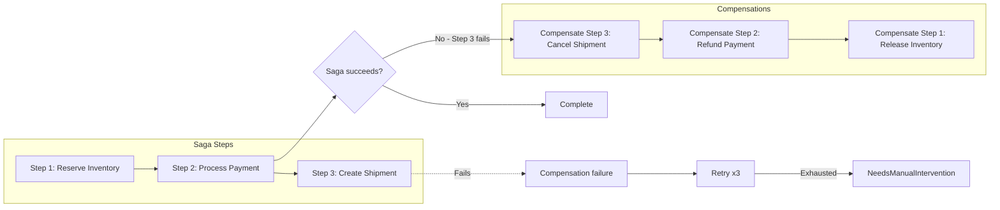
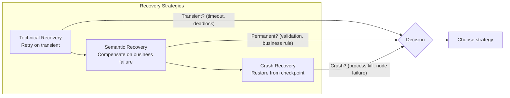
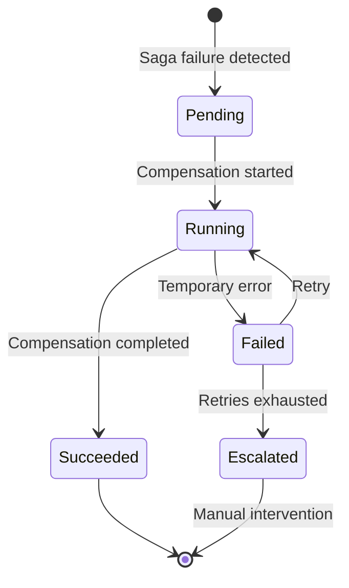
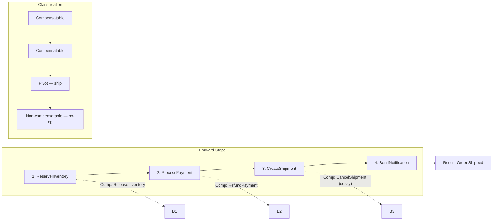
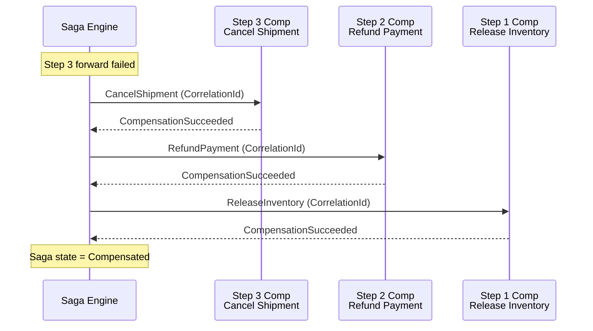
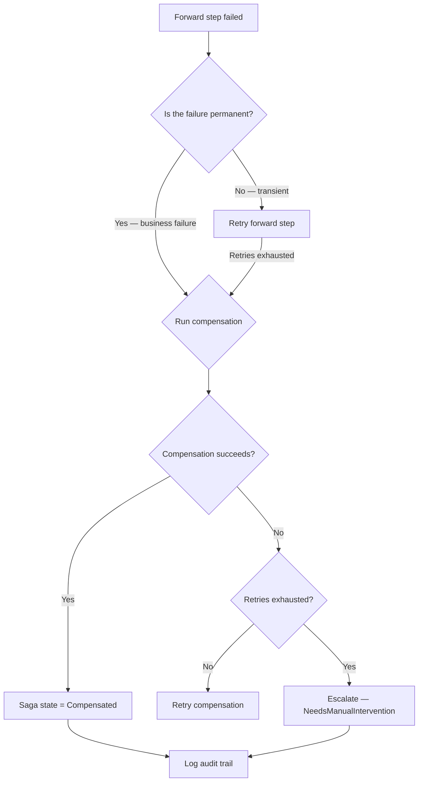
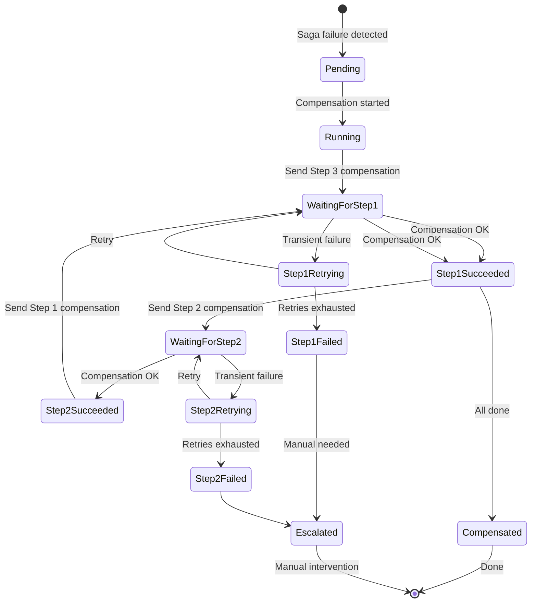

> [!success] Mastery Check
> - [ ] **Studied Well**
> - [ ] **Can explain the concept without notes**
> - [ ] **Can answer interview questions confidently**
> - [ ] **Can implement it in a real project**

## Navigation

**Domain:** [[7 — System Design & Distributed Systems]] > **Group:** Integration Patterns
**Previous:** [[7.131 — Saga Pattern — Orchestration-Based]] | **Next:** [[7.133 — Saga Pattern — MassTransit Implementation]]

### Prerequisites
- [[7.129 — Saga Pattern — Overview and When to Use]] — required because compensation is the core mechanism that makes sagas work instead of distributed transactions
- [[7.130 — Saga Pattern — Choreography-Based]] and [[7.131 — Saga Pattern — Orchestration-Based]] — needed because compensation mechanics differ between the two coordination models

### Where This Fits

Compensating transactions are the mechanism by which sagas undo the effects of previously completed steps when a later step fails.

This concept builds directly on [[7.129 — Saga Pattern: Overview and When to Use]] (which introduces the need for compensation in distributed workflows) and [[7.131 — Saga Pattern: Orchestration-Based]] (which shows how the orchestrator triggers compensations). The compensating transaction pattern is the "undo" mechanism that makes sagas reliable — without it, a saga is just a distributed workflow with no recovery path. Unlike a database rollback, a compensation is a business operation that semantically reverses the forward action — it does not restore the previous state but rather applies a corrective action. A .NET engineer encounters this when designing any saga: every step that has side effects must have a compensating counterpart. Common examples include releasing reserved inventory after a payment failure, refunding a payment after a shipment failure, and canceling an order after a downstream process fails. Without properly designed compensations, partial saga failures leave the system in an inconsistent state that requires manual intervention.

## Core Mental Model

A compensating transaction is a business operation that semantically undoes the effect of a previous forward transaction. Where a database rollback restores the exact prior state, a compensation applies a new operation that brings the system to a consistent state given that the saga cannot complete. For example, if "Charge Credit Card" is the forward action, the compensation is not "uncharge" (impossible) but "issue refund" — a new transaction that offsets the original. The invariant is: every forward action in a saga must have a compensating action that, when applied, leaves the system in a state that is consistent with the saga never having happened. The tradeoff is that compensations may not fully reverse all effects (e.g., a shipped physical item cannot be "unshipped" — only recalled at cost). The recognition trigger is any saga step that writes to a database, calls an external API, publishes a message, or otherwise produces a side effect that would be incorrect if the saga later fails.



### Compensation vs Retry vs Crash Recovery



Compensating transactions belong to the set of "semantic recovery" mechanisms: they undo the business effect of a forward action. Technical recovery (retry) undoes nothing — it simply re-executes. System recovery (crash recovery) restores the process state from a checkpoint, but it cannot undo external side effects.

The three strategies compose: on a saga step failure, first retry (technical recovery). If retries fail, run compensation (semantic recovery). If compensation fails, the saga needs manual intervention (organizational recovery).

### Classification

Compensating transactions are a sagas concept at the application layer. They belong to the set of "semantic recovery" mechanisms, distinct from "technical recovery" (retry after transient failure) and "system recovery" (crash recovery). They solve the problem of undoing distributed side effects when a coordinated rollback is impossible. They do not solve the problem of idempotency — compensations themselves must be idempotent. They do not solve the problem of exactly-once semantics — a compensation may be applied multiple times if the system cannot determine whether the forward action had already been compensated.

### Key Properties / Guarantees

|Property|Value|Condition|
|---|---|---|
|Reversibility|Semantic reversal, not state restoration|Forward action has a defined inverse|
|Idempotency|Required — compensation must be safe to apply multiple times|Broker may redeliver compensation commands|
|Order|Reverse order of forward steps|All prior steps must be compensated|
|Durability|Compensations must be reliably delivered|Outbox pattern for compensation event|
|Failure handling|Retry with escalation to manual|Compensation may itself fail|
|Cost|May be nonzero (e.g., payment gateway fees)|Refund may incur merchant fees|
|Timeliness|Should complete within bounded time|External dependencies (gateway, bank)|
|Auditability|Every compensation attempt logged|Regulatory compliance (finance, healthcare)|

### Compensation State Machine

The compensation flow itself can be modeled as a state machine with distinct states:



## Deep Mechanics

### How It Works

**Step 1 — Identify compensatable actions.** Each saga step is classified as one of: (a) compensatable — has a defined inverse; (b) retriable — must eventually succeed or the saga fails; (c) pivot — the step after which no compensation is possible (e.g., sending a physical item). The saga designer ensures that all compensatable steps have compensating counterparts.



**Step 2 — Record compensation state.** Before executing a forward action, the saga records that the action is about to be taken. After successful execution, it records that the action completed. This log is the source of truth for which compensations must run if the saga fails.

**Step 3 — Run compensations in reverse order.** On failure, the saga runs compensations for each completed forward step in reverse order. Step 3 compensation runs first, then Step 2, then Step 1. This is crucial because Step 2's compensation may depend on Step 3 not having happened (e.g., refunding a charge should happen before releasing the inventory that the charge paid for).



**Step 4 — Handle compensation failures.** If a compensation fails (e.g., payment gateway rejects the refund request), the saga must retry. If retries are exhausted, the saga enters a "NeedsManualIntervention" state. The saga state records which compensations succeeded and which failed.

**Step 5 — Determine saga outcome.** If all compensations succeed, the saga is "Compensated" — it is as though the saga never happened. If any compensation fails, the saga is "PartiallyCompensated" — manual intervention is required.

### Failure Modes

**Compensation is not the inverse of the forward action.** The forward action creates an entity; the compensation deletes it. But another process has already read the entity and acted on it. Deleting it now causes a foreign key violation or, worse, a silent data inconsistency.

- **Detection:** Foreign key violation when compensation runs. Orphaned references in downstream systems.
- **Recovery:** The compensation should not delete — it should mark as inactive or void. Soft deletes with audit trails.

**Non-idempotent compensation.** A compensation decrements a counter (`InventoryCount -= 1`). If the compensation runs twice (due to broker redelivery), the counter is decremented twice — inventory goes negative.

- **Detection:** Negative inventory counts in reporting. Order fulfillment failures.
- **Recovery:** Use idempotency keys. The compensation should set an absolute value or use a dedup table.

**Compensation for a step that was never fully completed.** A crash occurs after the forward action was partially executed (e.g., the service saved to DB but crashed before publishing the success reply). The saga determines the step failed and runs compensation. But the compensation assumes the forward action fully completed — it tries to undo state that was never fully established.

- **Detection:** Compensation logs show "no record found for compensation." The service's database has partial state.
- **Recovery:** The forward step must be atomic — either all effects are visible or none are. Use the outbox pattern to defer external effects until the local transaction is committed.

### .NET and Azure Integration

- **ASP.NET Core:** Compensation handlers are implemented as message consumers. The compensation command flows through the same messaging infrastructure as forward commands
- **EF Core:** Compensations use `ExecuteUpdateAsync` to set corrective values. Ensure `Where` clauses are precise enough to avoid compensating the wrong row
- **Azure SQL Database:** Saga compensation state stored in a `SagaCompensation` table with `(CorrelationId, StepName, Status)` — enables querying partial compensation state
- **Polly:** `ResiliencePipeline` for compensation retry — compensations use a more aggressive retry policy than forward steps because they must eventually succeed to avoid manual intervention
- **Application Insights:** Custom metrics for compensation success/failure rates; alerts when `compensation_failure_count > 0` for any saga type

```csharp
// Compensation record entity
public sealed class SagaCompensation
{
    public Guid Id { get; set; }
    public Guid CorrelationId { get; set; }
    public string StepName { get; set; } = string.Empty;
    public string CompensationName { get; set; } = string.Empty;
    public string? State { get; set; } // Pending, Succeeded, Failed, Skipped
    public int RetryCount { get; set; }
    public string? FailureReason { get; set; }
    public DateTime CreatedAt { get; set; }
    public DateTime? CompletedAt { get; set; }
}
```

## Production Patterns and Implementation

### Primary Implementation

A compensating transaction handler for an order saga using the outbox pattern for reliable delivery.

```csharp
// Compensation commands
public record RefundPayment(Guid CorrelationId, string TransactionId, decimal Amount);
public record ReleaseInventory(Guid CorrelationId, Guid OrderId);
public record CancelOrder(Guid CorrelationId, string Reason);

// Compensation handler — Payment Refund
public sealed class RefundPaymentHandler : IConsumer<RefundPayment>
{
    private readonly IPaymentGateway _gateway;
    private readonly ISagaCompensationStore _compensations;

    public async Task ConsumeAsync(ConsumeContext<RefundPayment> context)
    {
        var ct = context.CancellationToken;
        var msg = context.Message;

        // Idempotency: check if this compensation was already applied
        if (await _compensations.IsCompensationAppliedAsync(
                msg.CorrelationId, nameof(RefundPayment), ct))
        {
            return;
        }

        try
        {
            // Execute the compensating business operation
            var refundResult = await _gateway.RefundAsync(
                msg.TransactionId, msg.Amount, ct);

            // Record compensation success before acknowledging
            await _compensations.RecordCompensationAsync(
                msg.CorrelationId,
                nameof(RefundPayment),
                refundResult.RefundId,
                ct);

            await context.Publish(new CompensationSucceeded(
                msg.CorrelationId,
                nameof(RefundPayment)));
        }
        catch (RefundNotAllowedException ex)
        {
            // Payment gateway says refund not possible (e.g., past refund window)
            await _compensations.RecordCompensationFailedAsync(
                msg.CorrelationId,
                nameof(RefundPayment),
                ex.Message,
                ct);

            // Escalate — this compensation will never succeed via retry
            await context.Publish(new CompensationEscalated(
                msg.CorrelationId,
                nameof(RefundPayment),
                ex.Message));
        }
        catch (TransientException ex)
        {
            // Transient failure — let MassTransit retry
            await _compensations.RecordCompensationRetryAsync(
                msg.CorrelationId,
                nameof(RefundPayment),
                ct);

            throw; // MassTransit retry policy handles this
        }
    }
}

// Saga compensation store
public sealed class SagaCompensationStore : ISagaCompensationStore
{
    private readonly CompensationDbContext _db;

    public async Task<bool> IsCompensationAppliedAsync(
        Guid correlationId, string compensationName, CancellationToken ct)
    {
        return await _db.Compensations
            .AnyAsync(c =>
                c.CorrelationId == correlationId &&
                c.CompensationName == compensationName &&
                c.State == "Succeeded",
                ct);
    }

    public async Task RecordCompensationAsync(
        Guid correlationId, string compensationName,
        string resultId, CancellationToken ct)
    {
        _db.Compensations.Add(new SagaCompensation
        {
            CorrelationId = correlationId,
            CompensationName = compensationName,
            State = "Succeeded",
            CompletedAt = DateTime.UtcNow
        });
        await _db.SaveChangesAsync(ct);
    }
}
```

### Configuration and Wiring

```csharp
// Program.cs — compensation retry policy (more aggressive than forward steps)
builder.Services.AddMassTransit(x =>
{
    x.AddConsumer<RefundPaymentHandler>(c =>
    {
        // Compensations must eventually succeed — retry with backoff
        c.UseMessageRetry(r =>
        {
            r.Handle<TransientException>();
            r.Interval(5, TimeSpan.FromSeconds(10));
        });
    });

    x.UsingAzureServiceBus((context, cfg) =>
    {
        cfg.UseInMemoryOutbox();
        cfg.ConfigureEndpoints(context);
    });
});

// Compensation failure alert
builder.Services.AddSingleton<ICompensationFailureAlert>(
    _ => new CompensationFailureAlert(
        builder.Configuration["AlertEmail:CompensationFailures"]!));
```

### Common Variants

**Null compensation (no-op).** Some saga steps are inherently non-compensatable — sending an SMS, emitting an audit log entry. For these, the compensation is either a no-op (the cost of the side effect is acceptable) or a corrective action (send a second SMS saying "the previous notification was in error").

```csharp
// Null compensation — log and continue
public sealed class NullCompensation<T> : IConsumer<T> where T : class
{
    public async Task ConsumeAsync(ConsumeContext<T> context)
    {
        await context.Publish(new CompensationSkipped(
            context.Message.CorrelationId,
            typeof(T).Name,
            "No compensation needed — side effect is acceptable"));
    }
}
```

**Compensation with human approval.** For high-value compensations (e.g., refund > $10,000), the compensation command is routed to a human approval queue before execution. The saga waits in "PendingRefundApproval" state until an operator approves or rejects.

**Compensation with side effects beyond the saga boundary.** A compensation may need to notify external systems (e.g., notify the warehouse that a shipment recall was initiated). This is a compensating action that itself triggers a new saga.

### Compensation Audit Trail

Every compensation execution (success or failure) must be recorded for audit and compliance. Financial systems are often required to maintain a complete history of compensation attempts.

```csharp
// Compensation audit record
public sealed class CompensationAudit
{
    public Guid Id { get; set; }
    public Guid CorrelationId { get; set; }
    public string SagaType { get; set; } = string.Empty;
    public string StepName { get; set; } = string.Empty;
    public string CompensationName { get; set; } = string.Empty;
    public string Status { get; set; } = string.Empty; // Attempted, Succeeded, Failed
    public string? RequestPayload { get; set; } // Serialized compensation command
    public string? ResponsePayload { get; set; } // Serialized result or error
    public string? FailureReason { get; set; }
    public int AttemptNumber { get; set; }
    public DateTime AttemptedAt { get; set; }
    public DateTime? CompletedAt { get; set; }
}

// Audit table has a clustered columnstore index for fast analytics queries
// over large volumes of compensation events.
```

The audit table is insert-only — never updated, never deleted. Queries filter by `CorrelationId` for per-saga traceability and by `CreatedAt` for time-series analysis. Azure SQL Hyperscale or a separate analytics store (Azure Data Explorer) is recommended for audit volumes exceeding 1M rows/day.

### Compensation for Third-Party API Failures

When a saga step calls a third-party API (payment gateway, shipping provider), the compensation must account for the third-party's state. A payment may succeed at the third party but the saga's state may crash before recording it. The compensation must check the third-party's actual state before deciding what to undo.

```csharp
public async Task Handle(RefundPayment command)
{
    // Check third-party state first
    var transactionStatus = await _gateway.GetTransactionStatusAsync(
        command.TransactionId);
    
    if (transactionStatus == TransactionStatus.Refunded)
    {
        // Already refunded by external process — no-op
        await _compensations.RecordCompensationSkippedAsync(
            command.CorrelationId, nameof(RefundPayment),
            "Already refunded by gateway auto-refund");
        return;
    }
    
    if (transactionStatus == TransactionStatus.Failed)
    {
        // Payment never completed — no need to refund
        await _compensations.RecordCompensationSkippedAsync(
            command.CorrelationId, nameof(RefundPayment),
            "Payment never completed — nothing to refund");
        return;
    }
    
    // Proceed with refund
    await _gateway.RefundAsync(command.TransactionId, command.Amount);
}
```

This pattern is called "read-before-write compensation" — the compensation checks the external system's current state before deciding what action to take. It is essential when the external system may have processed the action independently (e.g., payment gateway auto-refunds after 7 days).

### Real-World .NET Ecosystem Example

**MassTransit compensation saga.** A dedicated compensation saga state machine that receives a `CompensateOrderSaga` event and orchestrates the compensation steps. This pattern decouples the compensation logic from the forward saga state machine, allowing independent deployment and scaling.

```csharp
public sealed class OrderCompensationSaga :
    MassTransitStateMachine<OrderCompensationSagaState>
{
    public State ReleasingInventory { get; }
    public State RefundingPayment { get; }
    public State CancelingOrder { get; }
    
    public Event<CompensateOrderSaga> Compensate { get; }
    
    public OrderCompensationSaga()
    {
        InstanceState(x => x.CurrentState);
        
        Initially(
            When(Compensate)
                .Then(ctx => ctx.Saga.OrderId = ctx.Message.OrderId)
                .Send(ctx => new ReleaseInventory(ctx.Message.OrderId))
                .TransitionTo(ReleasingInventory));
        
        During(ReleasingInventory,
            When(InventoryReleased)
                .Send(ctx => new RefundPayment(ctx.Saga.OrderId))
                .TransitionTo(RefundingPayment));
    }
}
```

The compensation saga stores its state in the same saga persistence store as forward sagas. This gives you the same operational tooling (dashboard, admin API, stuck saga alerts) for compensations as for forward flows.

**NServiceBus saga compensations** use the `IHandleMessages<T>` pattern with compensating messages sent in the `IHandleTimeouts<T>` handler. When a saga timeout fires (indicating a step failed), the saga's `Timeout` handler sends compensating commands. NServiceBus automatically correlates the compensating commands to the saga instance via the stored saga data. This is the most battle-tested .NET compensation framework and has been used in production since 2011.

```csharp
// NServiceBus compensation via timeout
public class OrderSaga : Saga<OrderSagaData>,
    IAmStartedByMessages<SubmitOrder>,
    IHandleTimeouts<OrderTimeout>
{
    protected override void ConfigureHowToFindSaga(
        SagaPropertyMapper<OrderSagaData> mapper)
    {
        mapper.MapSaga(s => s.CorrelationId)
            .ToMessage<SubmitOrder>(m => m.CorrelationId);
    }

    public async Task Handle(SubmitOrder message, IMessageHandlerContext context)
    {
        Data.OrderId = message.OrderId;
        await context.Send(new ReserveInventory(Data.CorrelationId, Data.OrderId));
        await RequestTimeout(context, TimeSpan.FromMinutes(5), new OrderTimeout());
    }

    public async Task Timeout(OrderTimeout state, IMessageHandlerContext context)
    {
        // Compensation on timeout
        await context.Send(new ReleaseInventory(Data.CorrelationId, Data.OrderId));
        await context.Send(new CancelOrder(Data.CorrelationId, "Timeout"));
        MarkAsComplete();
    }
}
```

## Gotchas and Production Pitfalls

### 1. Compensation assumes forward action fully completed

**Pitfall:** The `RefundPayment` compensation assumes the payment was successfully charged. But the `ProcessPayment` forward action may have partially completed — the payment gateway returned "pending" and the service crashed before recording the transaction ID.

```csharp
// ❌ Compensation assumes forward action state exists
public async Task Handle(RefundPayment command)
{
    var transactionId = await _sagaData.GetTransactionIdAsync(command.CorrelationId);
    await _gateway.RefundAsync(transactionId, command.Amount);
}
```

**Symptom:** `NullReferenceException` on `transactionId`. The saga is stuck in "PartialCompensation" with no clear path forward.

**Fix:** The compensation should first check whether the forward action actually completed. If the state is missing, the compensation is a no-op — there is nothing to undo.

```csharp
// ✅ Check forward action state before compensating
public async Task Handle(RefundPayment command)
{
    var state = await _sagaData.GetStepStateAsync(
        command.CorrelationId, "ProcessPayment");

    if (state is null || state.Status != "Completed")
    {
        _logger.LogWarning(
            "Compensation skipped — forward step not fully completed for {CorrelationId}",
            command.CorrelationId);
        return;
    }

    await _gateway.RefundAsync(state.TransactionId, state.Amount);
}
```

**Cost of not fixing:** Compensations fail silently for partially completed sagas. Operations manually reconciles 5-10 sagas per day.

### 2. Compensation out-of-order execution

**Pitfall:** Compensations run in the wrong order. Step 3 compensation (CancelShipment) depends on Step 2 (RefundPayment) not having run yet — the refund authorization is needed to cover the return shipping cost. But the saga framework runs Step 2 compensation first.

**Symptom:** The refund succeeds, but the return shipping label cannot be generated because the refund authorization was already consumed.

**Fix:** Compensations must run in reverse order of forward steps — always. If a compensation has a dependency on another compensation not yet having run, the saga framework must enforce ordered execution.

**Cost of not fixing:** Financial loss. The refund covers the item but not the return shipping. The merchant eats the cost.

### 3. Compensation retry policy is too aggressive

**Pitfall:** The forward step retries 3 times with 1-second intervals. The compensation retries 10 times with 100ms intervals. A downstream database is under load. The compensation's aggressive retries make the load worse.

**Symptom:** Database CPU at 100%. Compensation never succeeds because the retry storm makes the database slower.

**Fix:** Use exponential backoff for compensation retries. Compensations should retry less aggressively than forward steps — they are less time-critical (the saga is already failing).

```csharp
// ✅ Exponential backoff for compensation retries
c.UseMessageRetry(r =>
{
    r.Handle<TransientException>();
    r.Exponential(5,
        TimeSpan.FromSeconds(1),
        TimeSpan.FromSeconds(30),
        TimeSpan.FromSeconds(5));
});
```

**Cost of not fixing:** Retry storm exacerbates the underlying issue. MTTR increases from 5 minutes to 45 minutes.

### 4. Compensation is not visible to operations

**Pitfall:** A compensation fails, but no monitoring or alerting is in place. The saga silently enters "NeedsManualIntervention." Operations does not notice for 8 hours.

**Symptom:** Customer complains about missing refund. Operations traces the saga and finds it was stuck in "NeedsManualIntervention" for 8 hours.

**Fix:** Expose a compensation dashboard. Alert when any saga has compensation failures. Track `compensation_failure_count` as a critical metric.

```csharp
// ✅ Alert on compensation failure
[FunctionName("CompensationFailureAlert")]
public async Task Run(
    [ServiceBusTrigger("compensation-escalation")]
    CompensationEscalated message)
{
    await _emailSender.SendAlertAsync(
        $"Compensation escalation for saga {message.CorrelationId}: " +
        $"{message.StepName} failed with: {message.Reason}");
}
```

**Cost of not fixing:** Customer trust erosion. SLA breaches for refund processing (regulatory requirement in some jurisdictions).

### 5. Over-compensation: compensating an already-compensated step

**Pitfall:** The saga determines Step 3 failed, starts compensation for Step 2 (RefundPayment). Then the system recovers, and the forward saga also retries Step 3. The forward Step 3 succeeds, but compensation for Step 2 already ran. The saga now has a paid order with a refunded payment — the customer got the item for free.

**Symptom:** Customer receives order without payment. Finance reconciliation flags the discrepancy.

**Fix:** The saga must have a "gate" state that prevents forward progress after compensation has started. Once any compensation runs, the saga is in "Compensating" state — forward transitions are blocked.

```csharp
// ✅ Block forward progress during compensation
During(AwaitingPayment,
    When(PaymentProcessed)
        .If(ctx => ctx.Saga.State == Compensating,
            then => then
                .Then(ctx => _logger.LogWarning(
                    "Ignoring PaymentProcessed — saga is compensating"))
                .Finalize())
        .Else(then => then
            .TransitionTo(CreatingShipment)));
```

**Cost of not fixing:** Revenue loss. Manual reconciliation for every occurrence. Audit trail shows conflicting states.

### 6. Compensation timeout mismatch

**Pitfall:** The forward step has a 30-second timeout. The compensation step has the same 30-second timeout. But the compensation requires an API call that may take 60 seconds (e.g., reversing a wire transfer). The compensation times out before it succeeds.

**Symptom:** The compensation is retried, but each retry also times out. After 5 retries, the saga escalates to manual intervention. In reality, the compensation would have succeeded if given 60 seconds instead of 30.

**Fix:** Compensation timeouts must be independently configured from forward step timeouts. For operations known to be slower (refunds, reversals, cancelations), set timeouts 2x-3x the forward step.

```csharp
// ⚠️ Separate timeout config for compensations
services.Configure<SagaTimeoutOptions>(o =>
{
    o.ForwardStepTimeout = TimeSpan.FromSeconds(30);
    o.CompensationTimeout = TimeSpan.FromSeconds(90); // Refunds are slower
    o.CompensationRetryDelay = TimeSpan.FromSeconds(5);
});
```

**Cost of not fixing:** False escalations for compensations that would succeed given enough time. Operations spends 2 hours/day reviewing false escalations.

### 7. Compensation for a non-atomic forward step

**Pitfall:** The forward step "ProcessPayment" makes two side effects: it deducts from the customer's account AND credits the merchant's pending balance. The compensation refunds the customer but does not debit the merchant's pending balance. The merchant is overpaid.

**Symptom:** Merchant settlement report shows overpayment. Finance must manually adjust.

**Fix:** Every forward step must be atomic — either all side effects commit or none do. If the forward step has multiple side effects, either (a) make it a saga-in-a-saga (nested compensatable steps) or (b) use the outbox pattern to defer the second side effect until the first is confirmed.

```csharp
// ❌ Non-atomic forward step
public async Task Handle(ProcessPayment command)
{
    await _customerAccount.DeductAsync(command.CustomerId, command.Amount);
    // If this crashes, customer is charged but merchant not credited
    await _merchantAccount.CreditPendingAsync(command.MerchantId, command.Amount);
}

// ✅ Make it atomic via outbox
public async Task Handle(ProcessPayment command)
{
    using var tx = await _db.Database.BeginTransactionAsync();
    await _db.PaymentRecords.AddAsync(new PaymentRecord { ... });
    await _outbox.AddAsync(new CreditMerchantPending(command.MerchantId, command.Amount));
    await tx.CommitAsync();
    // Outbox publisher delivers CreditMerchantPending reliably
}
```

**Cost of not fixing:** Financial reconciliation errors. Every non-atomic step with a partial compensation creates a data inconsistency that requires manual fix.

## Tradeoffs and Decision Framework

### Tradeoff Matrix

|Dimension|Compensating Transaction|Distributed Transaction (2PC)|Saga with Retry Only|
|---|---|---|---|
|Failure recovery|Semantic reversal (refund, cancel)|Automatic rollback|Retry until success|
|Consistency|Eventual|Strong|Eventual (stuck if permanent failure)|
|Compensation cost|Maybe nonzero (refund fees)|Zero (rollback is free)|Zero (no compensation needed)|
|Implementation complexity|Medium (design each compensation)|High (transaction manager, DTC)|Low|
|Failure coverage|Handles business failures|Handles technical failures|Handles transient failures only|
|Time to recover|Seconds to hours (retry + escalation)|Milliseconds|Seconds (retry)|

### When to Apply



### When NOT to Apply

- [ ] The forward action has no semantic inverse (e.g., "send email" cannot be unsent — only corrected by a follow-up email)
- [ ] The compensation cost exceeds the forward action cost (e.g., refund fee is higher than the transaction fee)
- [ ] The forward action is idempotent and retriable to completion — compensation adds unnecessary complexity
- [ ] The system can tolerate the partial state (e.g., a monitoring alert that is acceptable to fire as a false positive)
- [ ] The forward action is a "pivot" — after it, the saga cannot compensate (e.g., physical item shipped)

### Scale Thresholds

- **Below 10 sagas/second:** Compensation state can be tracked in-memory with a simple persistence store. A single SagaCompensation table suffices.
- **Above 100 sagas/second:** Partition the compensation store by saga type. Use separate compensation tables per saga type to avoid contention.
- **Above 1,000 sagas/second:** Consider eventual compensation — batch compensations and run them asynchronously. Not all compensations need to run immediately. A customer's refund can wait 30 minutes if the flow is designed to tolerate it.

## Interview Arsenal

### Question Bank

1. What is a compensating transaction in a saga?
2. How does a compensating transaction differ from a database rollback?
3. What happens if a compensating transaction itself fails?
4. How do you ensure a compensating transaction is idempotent?
5. Compare compensation in choreography vs orchestration sagas.
6. Design the compensating transactions for a hotel booking saga.
7. What is a "pivot" step in a saga, and why does it matter for compensation?
8. How do you handle the case where a compensation runs but the forward action had already been compensated?

### Spoken Answers

**Q1: What is a compensating transaction in a saga?**

> **Great answer:** "A compensating transaction is a business operation that semantically undoes the effect of a previous saga step. For example, if a saga reserves inventory in Step 1 and processes payment in Step 2, and Step 3 fails, the compensating transactions run in reverse order: refund the payment and release the inventory. The compensation is not a rollback — it is a new business operation. A refund is not the same as 'uncharge' — it is a separate financial transaction that offsets the original charge. The compensation must be idempotent because it may be applied multiple times if the broker redelivers the compensation command. It must be reliable — if the compensation fails, the saga must retry and eventually escalate to manual intervention. Every forward step that produces a meaningful side effect must have a compensating counterpart, or the step is a 'pivot' after which compensation is impossible."

**Q2: How does a compensating transaction differ from a database rollback?**

> **Great answer:** "A database rollback restores the exact state before the transaction started. It is free, instant, and requires no business logic. A compensating transaction applies a new operation that brings the system to a consistent state — not the same state, but a state that is semantically consistent. For example, if a saga charges a credit card (forward action), the compensation is a refund. The customer's bank statement shows two transactions: a charge and a refund, not zero transactions. The compensation may have a financial cost (merchant pays refund fee). The compensation may take time (credit card refunds take 3-5 business days to appear on the statement). The compensation may fail (refund window expired, insufficient funds in the merchant account). None of these apply to a database rollback. The key insight is that in distributed systems, you cannot roll back external side effects — you can only apply compensating side effects."

**Q3: What happens if a compensating transaction itself fails?**

> **Great answer:** "The compensation is retried using an exponential backoff policy. If retries are exhausted, the saga enters a 'NeedsManualIntervention' state. The saga state records which compensations succeeded and which failed. An alert fires to the operations team with the saga ID, the failed compensation name, and the error details. The team then manually completes the compensation — for example, logging into the payment gateway and issuing the refund manually, then updating the saga state so it can proceed. The key design decision is: how many retries before escalating? Too few retries generate false alarms (5% of compensations fail on first attempt but succeed on retry). Too many retries delay escalation for true failures. I start with 3 retries with exponential backoff (1s, 3s, 9s) and monitor the false escalation rate. If it is above 5%, I add a fourth retry."

**Q4: How do you ensure a compensating transaction is idempotent?**

> **Average answer:** "Use an idempotency key and check if it was already applied."
>
> **Great answer:** "Idempotency for compensations is implemented at three levels. Level 1 — the compensation handler checks a dedup table before executing. The dedup key is `(CorrelationId, StepName)`. If a record with status 'Succeeded' exists, the handler returns immediately without re-executing. Level 2 — the downstream API provides idempotency. The payment gateway's refund API accepts an `idempotency_key` parameter — if the same key is sent twice, the gateway returns the same result. Level 3 — the compensation itself is designed to be naturally idempotent. For example, 'ReleaseInventory' sets the inventory reservation status to 'Cancelled' only if it is currently 'Active'. The SQL uses `WHERE Status = 'Active'`. If the reservation is already cancelled, the update affects zero rows and is a no-op. All three levels should be in place. The dedup table protects against duplicate commands within the dedup window. The API idempotency protects against duplicates after the dedup window expires. The natural idempotency protects against logic errors."

**Q5: Compare compensation in choreography vs orchestration sagas.**

> **Great answer:** "In orchestration, the orchestrator tracks compensation state centrally. It knows exactly which steps completed before the failure, and it sends compensation commands in reverse order. This gives you a single source of truth for compensation status. In choreography, compensations are triggered by compensation events. When the Payment service detects that the saga failed, it publishes 'RefundRequested.' The Inventory service subscribes to 'RefundRequested' and publishes 'InventoryReleased.' The Order service subscribes to 'InventoryReleased' and publishes 'OrderCancelled.' The compensation flow is distributed and implicit — no single service knows the full compensation state. This makes debugging harder: you need distributed tracing to figure out why a compensation stalled. However, choreography's compensations are naturally decoupled — if the Refund service is down, the other compensations still run. In orchestration, a down orchestrator blocks all compensations. I choose orchestration for compensation flows with 4+ steps or any conditional compensation logic. I choose choreography for simple linear compensation flows where each compensation is independent of the others."

**Q7: What is a "pivot" step in a saga, and why does it matter for compensation?**

> **Great answer:** "A pivot step is the step after which the saga cannot compensate. It is the point of no return. Steps before the pivot are compensatable — they have defined inverses. Steps after the pivot are non-compensatable — the saga must ensure they eventually succeed, or the system is in an inconsistent state. For example, in an e-commerce saga, 'ShipItem' is the pivot. Before shipment, you can cancel the order and refund the payment. After the item is shipped, you cannot 'un-ship' it — you can only initiate a return, which is a different business process. The pivot is critically important for compensation design because it determines where you invest your compensation implementation effort. Steps before the pivot need robust compensations with retry and escalation. Steps after the pivot need robust retry logic because compensation is not an option. The pivot also drives business decisions: if the pivot step has a high failure rate, the business may accept higher costs or change the process to move the pivot earlier."

**Q8: How do you handle the case where a compensation runs but the forward action had already been compensated?**

> **Great answer:** "This is a race condition between the saga detecting failure and a downstream system already having compensated independently. For example, the saga determines Payment failed and sends RefundPayment. But the payment gateway had already auto-refunded the transaction due to a timeout on their end. When the saga's refund arrives, the gateway says 'transaction already refunded.' The handler checks the dedup table — the refund ID from the auto-refund is different from the one the saga expects. The handler sees that the forward action's transaction was already refunded and records the compensation as 'SucceededByExternalAction.' The saga enters the 'CompensatedByExternalAction' state. The key is that the compensation handler must be tolerant of the forward action state being different from what it expects — it should check the current state of the external system before deciding what to do. The compensation should ask 'is the system in a consistent state?' rather than 'did my compensation run?'"

**Q9: How do you test compensations in a saga?**

> **Great answer:** "Testing happens at three levels. Unit tests verify that each compensation handler produces the correct compensating action for a given forward action state. Integration tests use Testcontainers for the database and a test message broker — they simulate a saga failure and assert that compensation commands are published in reverse order and that the compensation handlers produce the expected corrective state. Chaos tests inject failures at each step and verify that compensations run correctly even when the database is slow or the broker is under load. The most important test is the 'double compensation' test: send the same compensation command twice and assert that the second execution is a no-op. I write this test for every compensation handler. Without this test, a broker redelivery can cause duplicate compensation execution. See also [[7.134 — Saga Pattern: Failure Handling and Recovery]] for more on testing failure scenarios."

**Q6: Design the compensating transactions for a hotel booking saga.**

> **Great answer:** "The hotel booking saga has 4 steps: (1) Reserve Room, (2) Charge Payment, (3) Send Confirmation, (4) Update Availability. The compensations are: RefundPayment (undoes Charge Payment), CancelReservation (undoes Reserve Room), and a no-op for Send Confirmation — once sent, we cannot unsend an email, but we can send a follow-up cancellation notice. Update Availability does not need compensation because the room was never actually taken — the payment was refunded and the reservation was canceled. The refund must be idempotent — the payment gateway's refund API returns a `refund_id` that we store in the compensation table. If the same refund command is received twice, we check the stored `refund_id` and return success without issuing a second refund. The CancelReservation compensation releases the room back to inventory. It is safe to run multiple times — after the first run, the reservation is already canceled, so subsequent runs are no-ops. The pivot step in this saga is Check-In at the hotel — after the guest checks in, we cannot cancel the reservation. The saga must complete all compensation-eligible steps before the pivot, and no compensation is available after it."

### System Design Interview Trigger

When the interviewer says "how do you handle failures in this distributed workflow?" and you propose a saga, they will follow up with "what happens if the compensation fails?" This tests whether you understand that compensations are themselves fallible operations that require retry, escalation, and manual intervention. The senior answer acknowledges that compensations must be idempotent, that they may fail, and that the system must have clear escalation paths for unrecoverable compensation failures.

### Comparison Table

| | Compensating Transaction | Database Rollback | Retry-Based Recovery |
|---|---|---|---|
| What it does | Semantic reversal (new operation) | State restoration (undo) | Repeat until success |
| Idempotent? | Must be | Naturally | Naturally |
| Cost | Maybe nonzero | Free | Free (extra work) |
| Failure handling | Retry + escalate | Automatic | Switch to compensation |
| Applicable scope | Distributed services | Single database | Transient errors only |
| .NET example | RefundPayment consumer | EF Core transaction rollback | Polly retry policy |

## Architecture Decision Record

**Status:** Under Review

**Context:** A payment processing saga has 3 steps: Reserve (hold funds), Capture (charge the card), Settle (transfer to merchant account). The Reserve step creates a payment intent that expires in 7 days. The Capture step charges the card. The Settle step transfers funds to the merchant. The team must design compensations for each step. The payment gateway charges a $0.25 fee for each refund.

**Options Considered:**

1. **Full compensation for all steps** — Reserve: release hold (free). Capture: refund (costs $0.25). Settle: reverse settlement (costs $0.50).
2. **Compensation only for Reserve and Capture** — Settle is a pivot step. If settlement fails, the saga cannot compensate the entire flow — manual intervention required.
3. **Retry Settle until success, no compensation** — If settling is the only failure mode, make it infinitely retriable.

**Decision:** Hybrid approach — compensation for Reserve (release hold, free) and Capture (refund, $0.25), but Settle is treated as infinitely retriable with escalation after 24 hours (option 3's strategy for Settle). The cost of compensating Capture ($0.25) is acceptable because Capture failures are rare (< 1%) and the customer experience of being charged without the order being fulfilled is worse than the cost. The Settle step is designed as a "retriable-to-completion" step — it is idempotent (settlement ID as idempotency key), and the only failure mode is a payment gateway timeout which resolves on retry.

**Consequences:**
- ✅ Reserve compensation is free (API call to release hold)
- ✅ Capture compensation restores customer trust even at $0.25 cost
- ✅ Settle retriability avoids the operational complexity of a settlement reversal
- ⚠️ The $0.25 refund cost must be tracked and monitored — a sudden spike may indicate a systemic issue
- ❌ If Settle permanently fails (payment gateway bug), manual intervention is required to settle the payment outside the system

**Review Trigger:** If the capture failure rate exceeds 5%, the cost of refunds becomes material and the team should revisit whether to change the compensation strategy (e.g., hold for manual review before capture).

### Cross-References

This ADR complements the orchestration saga ADR in [[7.131 — Saga Pattern: Orchestration-Based#Architecture Decision Record]] — that ADR focuses on the coordination model, while this ADR focuses on the compensation specifics for each step. See also [[7.134 — Saga Pattern: Failure Handling and Recovery]] for escalation strategy when compensations fail. For the forward-side implementation of the orchestration that triggers these compensations, see [[7.131 — Saga Pattern: Orchestration-Based]].

## Self-Check

### Conceptual Questions

1. What is a compensating transaction in a saga context?
2. How does a compensating transaction differ from a database rollback?
3. What happens if a compensating transaction fails after retries are exhausted?
4. Why must compensations run in reverse order?
5. What is a "pivot step" in a saga?
6. How do you make a compensating transaction idempotent?
7. Compare compensating transactions in choreography vs orchestration.
8. What is the cost consideration when designing compensations?
9. How do you monitor compensation failures in production?
10. Explain in 60 seconds how to design compensations for a 4-step saga.

### Additional Questions

**11. What is the difference between a compensatable step and a retriable step?**

> A compensatable step has a defined inverse that can undo its effects. A retriable step is one that must eventually succeed — if it fails, the saga cannot compensate and must escalate. Steps before the pivot are compensatable. Steps after the pivot are retriable. Some steps are both — they are compensatable (have an inverse) but are also retried because retrying is cheaper than compensating (e.g., payment capture is retried 3x before compensating with a refund).

**12. How do you handle compensations that have a financial cost?**

> Track the cost as a metric: `compensation_cost_usd` per saga type. Sum hourly. If the hourly cost exceeds a threshold (e.g., $100/hour), alert the finance team. The saga designer documents the maximum acceptable compensation cost per saga execution. If the cost approaches the threshold, consider changing the compensation strategy (e.g., manual review instead of auto-compensation) or moving the pivot step earlier.

**13. How do you ensure compensations run in the correct order when compensations are triggered asynchronously?**

> Use a compensation coordinator pattern. The coordinator receives all compensation events and tracks which compensations have completed. It only sends the next compensation after the previous one completes. The coordinator itself is a saga — a compensation saga that coordinates the compensation flow. This is analogous to the orchestration saga for forward steps, but specialized for compensation.

**14. What is "compensation idempotency" for a no-op compensation?**

> Even a no-op compensation (like "log and skip" for a notification step) should be idempotent. The handler writes a "CompensationSkipped" record to the compensation store. If the same command arrives twice, the handler checks the store. If a record exists, it returns without writing a duplicate. This ensures the compensation tracking table has accurate status for the saga.

<details>
<summary>Answers</summary>

1. A compensating transaction is a business operation that semantically reverses the effect of a previous forward operation. It is not a rollback — it is a new operation that leaves the system in a consistent state given that the saga cannot complete.
2. A rollback restores exact prior state automatically. A compensation applies a new corrective operation that may cost money, take time, or fail. A rollback is free and instant; a compensation may require manual intervention.
3. The saga enters "NeedsManualIntervention" state. Operations is alerted with the saga ID, the failed compensation name, and the reason. The team must manually complete the compensation (e.g., issue the refund via the payment gateway UI) and then update the saga state.
4. Because forward steps may depend on each other. If Step 2 created a record that references Step 1's record, compensating Step 1 before Step 2 would leave an orphaned reference. Reverse order ensures that the system's dependency order is respected.
5. A pivot step is a step after which compensation is impossible. For example, after a physical item is shipped, you cannot "unship" it — you can only initiate a return. Steps before the pivot are compensatable; steps after are not. The saga must ensure all compensatable steps are before the pivot.
6. Use an idempotency key — typically `(CorrelationId, CompensationName)`. Store the compensation result (success + result ID) in a dedup table. If the same compensation command arrives again, check the dedup table and return the stored result without re-executing.
7. In choreography, compensations are triggered by compensation events published by the failing service. Each service independently subscribes to compensation events and runs its compensation. In orchestration, the orchestrator sends compensation commands to each service in reverse order, tracked in a centralized compensation state.
8. Some compensations have a financial cost: refund fees, wire reversal fees, chargeback costs. The saga designer must decide whether the cost of compensation is acceptable vs the cost of manual intervention. For low-value transactions, it may be cheaper to not compensate and handle exceptions manually.
9. Track `compensation_success_count`, `compensation_failure_count`, and `compensation_escalation_count` as custom metrics in Application Insights. Alert when `compensation_failure_count > 0` for more than 5 minutes. Maintain a dashboard showing all sagas with pending compensations.
10. "For a hotel booking saga with ReserveRoom, ChargePayment, SendConfirmation, and UpdateAvailability: ReserveRoom compensates with CancelReservation (free API call, idempotent — reschedule is a no-op). ChargePayment compensates with RefundPayment (costs a fee, idempotent — refund_id stored in dedup table). SendConfirmation has no compensation — once sent, we cannot unsend, but we send a follow-up cancellation notice. UpdateAvailability is the pivot — once the guest checks in, compensation is impossible. All compensations use the outbox pattern for reliable delivery, idempotency keys to prevent duplicate execution, and exponential backoff retry with eventual escalation to manual intervention."

11. A compensatable step has a defined inverse (e.g., Reserve → Release). A retriable step must eventually succeed — if retries fail, the saga cannot compensate and incidents. The classification is done at saga design time and documented in the saga state machine. Steps after the pivot are inherently retriable, not compensatable. Some steps are both — e.g., ProcessPayment is compensatable (RefundPayment) but is retried 3x first because retrying is cheaper than refunding.

12. Track financial cost per compensation as a metric in Application Insights. The saga logs `CompensationCostUsd` as a custom dimension on the compensation success event. Sum the metric hourly and alert if it exceeds a configured threshold (e.g., $200/hour). For expensive compensations (> $10/execution), add a human approval gate before the compensation runs. The saga transitions to "PendingExpensiveCompensationApproval" and waits for an operator.

13. Use a dedicated compensation saga — a state machine that orchestrates the compensation flow. The compensation saga receives a "CompensateSaga" event with the list of completed forward steps. It sends compensation commands in reverse order, tracking each compensation's status. This is the "compensation orchestrator" pattern. It reuses the same MassTransit state machine infrastructure as the forward saga.

14. A no-op compensation should still record its execution in the compensation state table. The dedup check prevents duplicate records. This ensures the compensation status dashboard shows accurate information — operations can see "SendConfirmation compensation was skipped as designed" vs "SendConfirmation compensation never ran."

### Additional Scenarios

**Scenario 7 — Concurrent compensations.** Two saga instances for the same order (duplicate saga created by broker redelivery) both fail at different steps. Each saga starts its own compensation flow. Both try to refund the same payment.

<details>
<summary>Resolution</summary>

The first compensation flow refunds the payment and records the refund in the compensation store. The second compensation flow checks the compensation store before executing the refund — it sees that the payment was already refunded (either by the compensation store record or by the payment gateway's idempotency key rejection). The second flow records its compensation as "Skipped — already compensated by saga {CorrelationId2}" and terminates. The key is that the compensation store must be the single source of truth for compensation state, checked before any compensation action.

</details>
</details>

---

### Scenario Challenges

**Scenario 1 — Diagnose the problem**

A saga has 4 steps: CreateOrder → ReserveInventory → ProcessPayment → UpdateLoyaltyPoints. When ProcessPayment fails, the saga runs ReserveInventory compensation (release inventory). The release fails with "ReservationNotFound." The saga enters "NeedsManualIntervention." This happens for 5% of all sagas.

<details>
<summary>Diagnosis</summary>

**Root cause:** The ReserveInventory step creates a reservation record, then publishes `ProcessPayment`. If `ProcessPayment` is published but the reservation record's transaction is not yet committed (the outbox pattern sends the event before the DB transaction commits), the compensation arrives at a DB that has not yet committed the reservation. The compensation tries to release a reservation that does not yet exist.

**Evidence:** Check the timing between the reservation DB transaction commit and the `ProcessPayment` event publish. The outbox delivery delay causes a window where the forward step appears to have not executed.

**Fix:** Ensure the reservation is committed to the database before the forward step event is published. The outbox pattern should only publish the event after the local transaction commits. Alternatively, make the compensation tolerant of missing reservations — if the reservation record does not exist, the compensation is a no-op.

**Prevention:** Compensations must be designed to handle the case where the forward step's effects are not yet visible. Use "compensation safe mode" — check existence before acting.

</details>

---

**Scenario 2 — Design decision**

Your e-commerce platform processes 500 orders/second. Each order has a saga: ReserveInventory → ChargePayment → CreateShipment → SendNotification. The charge step has a 2% failure rate. Each refund costs $0.15. The average order value is $25. Should you compensate the charge step automatically, or require manual review?

<details>
<summary>Decision and Reasoning</summary>

**Choice:** Auto-compensate (refund automatically). At 500 orders/second with 2% charge failure rate, that is 10 refunds/second, or 864,000 refunds/day. At $0.15 each, that is $129,600/day in refund fees — 1% of revenue. Manual review would cost more in engineering time and customer satisfaction. The automated refund is the right choice because the cost is predictable and acceptable.

**Tradeoffs accepted:** $130K/day in refund fees. But the alternative — not refunding automatically — would result in 864,000 customers/day being charged without receiving their orders. The customer service cost and chargeback fees would exceed the refund fees.

**Implementation sketch:** Automated refund via the payment gateway API. Idempotency key = `CorrelationId + "_refund"`. Success stored in compensation table. On failure, retry 3x, then escalate to manual.

**Cost analysis:** $130K/day in refund fees represents ~1% of $25M daily revenue (500 orders/sec × $25 avg × 86,400 sec/day). This is an acceptable business cost — customer trust saved far exceeds $130K/day. The finance team monitors the compensation cost metric and escalates if it exceeds 2% of revenue. This is a typical scenario for high-volume e-commerce where compensation cost is a predictable P&L line item.

</details>

---

**Scenario 3 — Failure mode** A saga's Step 2 compensation (RefundPayment) succeeds. The compensation record is written to the database. But the orchestrator crashes before recording the compensation state. On restart, the orchestrator thinks the compensation has not been applied and sends `RefundPayment` again. The payment gateway returns "duplicate refund — transaction already refunded."

<details> <summary>Investigation and Fix</summary>

**Investigation steps:**
1. Check the compensation store for the saga's `RefundPayment` record.
2. Check the payment gateway's refund history for the transaction.
3. Determine whether the refund was applied once or twice.

**Confirming evidence:** The compensation store has a "RefundPayment/Succeeded" record (the crash happened after the DB write but before the orchestrator acknowledged the reply). The payment gateway confirms one refund was processed.

**Immediate mitigation:** The duplicate refund command was rejected by the payment gateway (idempotency). No customer impact. Manually mark the saga as "Compensated."

**Permanent fix:** Ensure the compensation store write is idempotent and the orchestrator checks the compensation store before sending a compensation command. The outbox pattern on the service side must ensure that the compensation command is only sent if the compensation store shows the compensation has not been applied.

```csharp
// ✅ Check compensation state before sending
var alreadyCompensated = await _compensationStore
    .IsCompensationAppliedAsync(correlationId, "RefundPayment");
if (alreadyCompensated)
{
    return; // Compensation already applied — skip
}
```

</details>

---

**Scenario 4 — Scale it** Your compensation store handles 100 compensations/second with a single SQL Server table. You need to handle 2,000 compensations/second within 6 months. The compensation table has a unique constraint on `(CorrelationId, StepName)` for idempotency. The table is queried by `CorrelationId` for the compensation status dashboard.

<details> <summary>Scaling Strategy</summary>

**Bottleneck:** The unique constraint insert for idempotency — at high throughput, index page contention from concurrent inserts on the same `CorrelationId` range.

**How it helps:**
- Partition the compensation table by saga type (separate table per saga type) — distributes write load
- Use Azure SQL Hyperscale with `REPLICATE` to distribute the unique index across multiple pages
- For the dashboard queries, use a read replica or Azure SQL read scale-out — avoid hitting the write-primary
- Cache compensation status in Redis for 5 minutes — the dashboard rarely needs real-time data
- Batch compensation status writes: instead of one row per compensation, use a JSON blob that accumulates compensations for a saga. Update the blob atomically with `JSON_MODIFY`. This reduces row count from 5 per saga to 1 per saga.

**Implementation order:**
1. Separate compensation tables per saga type (quick win, distributes writes)
2. Add Redis cache for dashboard queries (reduces read load on primary)
3. If still constrained, switch to JSON blob per saga (complexity tradeoff)

</details>

---

**Scenario 5 — Interview simulation** The interviewer says: "Design the compensating transactions for a flight booking system. The steps are: ReserveSeat, ChargePayment, IssueTicket, SendItinerary. What happens if IssueTicket fails?"

<details> <summary>Model Response</summary>

"The compensations are: ReserveSeat → ReleaseSeat (free API call, releases the hold on the seat), ChargePayment → RefundPayment (costs a fee, refunds the card), IssueTicket → VoidTicket (cancels the issued ticket, may have a void fee or time window), SendItinerary → no compensation possible (cannot unsend an email), but we send a follow-up cancellation email.

"If IssueTicket fails, the saga must compensate ChargePayment and ReserveSeat. The VoidTicket compensation does not run because the ticket was never issued. The compensation order is: (1) RefundPayment, (2) ReleaseSeat. Both must be idempotent.

"The critical design decision: IssueTicket is near the pivot. The true pivot is Boarding — once the passenger boards, no compensation is possible. Steps before boarding are compensatable. The system must ensure that all compensations complete before boarding begins, which means the saga should complete all steps before the departure date. If the saga is still in compensation state at departure, the airline may have an operational problem (passenger at gate with no valid ticket).

"The cost consideration: RefundPayment costs a merchant fee (~$0.25-$1 depending on the processor). VoidTicket may also have a fee if not voided within 24 hours. The saga should try to void within the free window. If the window expires, the cost of voiding must be weighed against the customer value. For high-value customers, void anyway. For low-value, consider letting the ticket stand and offering a voucher.

"The escalation path: If RefundPayment fails (card expired), the saga enters NeedsManualIntervention. Operations issues the refund via alternative method (check, wire). The saga state tracks the alternative refund's reference number."

</details>

---

**Scenario 6 — Design decision** Your team runs a subscription billing platform. Each month, 1M recurring billings run. The billing saga: CreateInvoice → ChargePayment (idempotent retry) → UpdateSubscriptionStatus → SendInvoiceEmail. The charge step has a 3% failure rate (expired cards, insufficient funds). Each failed charge needs a compensation — but the compensation should NOT be an automatic refund because the charge never succeeded. Design the compensation.

<details>
<summary>Decision and Reasoning</summary>

**Key insight:** If the charge never succeeded, there is nothing to refund. The compensation for ChargePayment is a no-op. But the saga must still handle the failure correctly — it must not proceed to UpdateSubscriptionStatus because the payment did not succeed.

**Correct design:** The saga has two paths after ChargePayment: success path (UpdateSubscriptionStatus → SendInvoiceEmail) and failure path (mark subscription as past_due, send dunning email, schedule retry). The failure path is not a compensation in the traditional sense — it is an alternative forward path for the saga.

**Compensation actions:**
- CreateInvoice: void the invoice (invoice status → "Void"). Idempotent — check invoice status before voiding.
- ChargePayment: no compensation needed (charge never succeeded). The saga records the failure and transitions to the dunning flow.
- UpdateSubscriptionStatus: revert from "Active" to "PastDue" — this is the compensation that restores the subscription to the pre-saga state.
- SendInvoiceEmail: no compensation (cannot unsend email). Send a follow-up "payment declined" email.

**What we learned:** Not every saga step needs a compensation. Steps that did not produce side effects (charge that failed) do not need compensation. The key is to check the actual side effect state before running compensation — if the charge record shows "Failed," skip the refund compensation.

**Cross-reference:** This scenario complements the billing saga design in [[7.129 — Saga Pattern: Overview and When to Use#When to Apply]] which covers the decision framework for choosing compensation vs. retry. The cost-benefit analysis here mirrors the ADR in this file.

</details>

## Deep-Dive: Compensation Orchestration State Machine

Compensations can themselves be orchestrated by a dedicated compensation saga. This pattern, called the "compensation orchestrator," decouples the compensation flow from the forward flow and provides a centralized view of compensation status.



```csharp
// Compensation saga state
public sealed class CompensationSagaState : SagaStateMachineInstance
{
    public Guid CorrelationId { get; set; }
    public string CurrentState { get; set; } = string.Empty;
    public Guid ForwardSagaCorrelationId { get; set; }
    public string ForwardSagaType { get; set; } = string.Empty;
    public List<string> CompletedSteps { get; set; } = [];
    public List<string> SucceededCompensations { get; set; } = [];
    public List<string> FailedCompensations { get; set; } = [];
    public int CurrentStepIndex { get; set; }
    public int RetryCount { get; set; }
    public DateTime CreatedAt { get; set; }
}

// Compensation saga state machine
public sealed class CompensationSagaStateMachine :
    MassTransitStateMachine<CompensationSagaState>
{
    public State Running { get; private set; } = null!;
    public State AwaitingStepCompensation { get; private set; } = null!;
    public State Compensated { get; private set; } = null!;
    public State Escalated { get; private set; } = null!;

    public Event<CompensateSaga> Compensate { get; private set; } = null!;
    public Event<CompensationStepCompleted> StepCompleted { get; private set; } = null!;
    public Event<CompensationStepFailed> StepFailed { get; private set; } = null!;

    public CompensationSagaStateMachine()
    {
        InstanceState(x => x.CurrentState);

        Initially(
            When(Compensate)
                .Then(context =>
                {
                    context.Saga.ForwardSagaCorrelationId = context.Message.ForwardSagaId;
                    context.Saga.ForwardSagaType = context.Message.SagaType;
                    context.Saga.CompletedSteps = context.Message.CompletedSteps;
                    context.Saga.CurrentStepIndex = context.Message.CompletedSteps.Count - 1;
                })
                .Activity(x => x.OfType<SendNextCompensationActivity>())
                .TransitionTo(AwaitingStepCompensation));

        During(AwaitingStepCompensation,
            When(StepCompleted)
                .Then(context =>
                {
                    context.Saga.SucceededCompensations.Add(
                        context.Message.StepName);
                    context.Saga.CurrentStepIndex--;
                })
                .IfElse(context => context.Saga.CurrentStepIndex >= 0,
                    then => then
                        .Activity(x => x.OfType<SendNextCompensationActivity>())
                        .TransitionTo(AwaitingStepCompensation),
                    else => else
                        .TransitionTo(Compensated)),
            When(StepFailed)
                .Then(context =>
                {
                    context.Saga.FailedCompensations.Add(
                        context.Message.StepName);
                    context.Saga.RetryCount++;
                })
                .IfElse(context => context.Saga.RetryCount < 3,
                    then => then
                        .Activity(x => x.OfType<RetryCompensationActivity>())
                        .TransitionTo(AwaitingStepCompensation),
                    else => else
                        .TransitionTo(Escalated)));
    }
}
```

### Compensation Step Execution with Timeout

Each compensation step must have its own timeout, independent of forward step timeouts. Compensations may take longer (e.g., refunds involve bank processing), and timeouts must account for this.

```csharp
// Compensation step executor with isolated timeout
public sealed class CompensationStepExecutor
{
    private readonly IServiceProvider _services;
    private readonly ILogger<CompensationStepExecutor> _logger;

    public async Task<CompensationResult> ExecuteWithTimeoutAsync(
        string stepName,
        Func<CancellationToken, Task> compensationAction,
        CancellationToken ct)
    {
        using var cts = CancellationTokenSource.CreateLinkedTokenSource(ct);
        cts.CancelAfter(TimeSpan.FromSeconds(90)); // Compensation timeout: 90s vs forward step's 30s

        try
        {
            await compensationAction(cts.Token);
            return CompensationResult.Success();
        }
        catch (OperationCanceledException) when (!ct.IsCancellationRequested)
        {
            _logger.LogWarning("Compensation step {Step} timed out after 90s", stepName);
            return CompensationResult.Timeout("Step exceeded compensation timeout");
        }
        catch (Exception ex)
        {
            _logger.LogError(ex, "Compensation step {Step} failed", stepName);
            return CompensationResult.Failure(ex.Message);
        }
    }
}

public record CompensationResult
{
    public bool IsSuccess { get; init; }
    public bool IsTimeout { get; init; }
    public string? Error { get; init; }

    public static CompensationResult Success() => new() { IsSuccess = true };
    public static CompensationResult Failure(string error) =>
        new() { IsSuccess = false, Error = error };
    public static CompensationResult Timeout(string error) =>
        new() { IsSuccess = false, IsTimeout = true, Error = error };
}
```

## Additional Failure Modes

### 8. Compensation step has side effects that themselves need compensation

The `RefundPayment` compensation calls the payment gateway to issue a refund. If the refund succeeds but the compensation state record write fails (database timeout), the compensation appears to have failed. The saga retries the refund, causing a double refund.

- **Detection:** Compensation store shows duplicate refund attempts for the same transaction. Payment gateway logs show two refund IDs for the same charge.
- **Metric:** `compensation_duplicate_attempt_count`.
- **Recovery:** The compensation handler must write the compensation state record BEFORE calling the external API. If the state record write fails, the external API call is skipped. The compensation retry sees the state record (if the write succeeded after retry) or does not call the API (if the write never succeeded). This is the "compensation outbox" pattern — the compensation action is stored first, then executed asynchronously.

### 9. Compensation fires for a step that was never in the forward path

Due to a state machine bug, the orchestrator includes a step in the compensation list that was never executed in the forward path. The compensation handler tries to undo something that never happened.

- **Detection:** Compensation logs show "No reservation found for CorrelationId" or similar. The compensation succeeded (no-op) but the audit trail is confusing.
- **Metric:** `compensation_skipped_step_count`.
- **Recovery:** The compensation handler must check whether the forward step actually completed before applying compensation. If the forward step state is "NotStarted" or "NotFound," the compensation should be skipped and recorded as "Skipped — forward step never executed." This is distinct from "Succeeded" and should be tracked separately in the audit trail.

### 10. Compensation races with a concurrent forward retry

The forward saga detects a failure and starts compensation. But the forward step's retry mechanism also fires concurrently. The retry succeeds after the compensation has already started. The saga now has a conflicted state: the compensation undid part of the forward work, but a new forward execution added new work.

- **Detection:** Saga audit trail shows interleaved forward and compensation events for the same CorrelationId within milliseconds. The saga state machine is in an inconsistent state.
- **Metric:** `saga_forward_compensation_race_count`.
- **Recovery:** The saga must have a "gate" state that prevents forward execution after compensation has started. Once any compensation runs, the saga transitions to "Compensating" state, which blocks all forward transitions. The retry mechanism must check this gate before re-executing.

```csharp
// Gate check in forward handler
public async Task Handle(ProcessPayment command)
{
    var sagaState = await _sagaStateRepo.GetAsync(command.CorrelationId);
    if (sagaState.CurrentState == "Compensating")
    {
        _logger.LogWarning("Forward step blocked — saga is compensating");
        return; // Do not execute forward step during compensation
    }
    // Proceed with forward step
}
```

## More Gotchas and Production Pitfalls

### 8. Compensation that calls a third-party API with no idempotency key

The payment gateway's refund API does not support idempotency keys. The saga sends a refund command, the gateway processes it, but the reply is lost. The saga retries. The gateway processes a second refund.

```csharp
// ❌ Third-party API without idempotency — no way to detect duplicates
public async Task Handle(RefundPayment command)
{
    // Gateway's refund API has no idempotency_key parameter
    var result = await _gateway.RefundAsync(command.TransactionId, command.Amount);
    // If this handler is called twice, two refunds are issued
}
```

**Symptom:** Customer receives double refund. The payment gateway's support team must manually reverse one.

**Fix:** Implement idempotency at the application layer — check the compensation store before calling the API.

```csharp
// ✅ Application-layer idempotency for APIs without native support
public async Task Handle(RefundPayment command)
{
    if (await _compensationStore.IsCompensationAppliedAsync(
            command.CorrelationId, nameof(RefundPayment)))
    {
        _logger.LogInformation("Refund already processed — skipping");
        return;
    }

    var result = await _gateway.RefundAsync(command.TransactionId, command.Amount);

    await _compensationStore.RecordCompensationAsync(
        command.CorrelationId,
        nameof(RefundPayment),
        result.RefundId);
}
```

### 9. Compensation timeout swallows transient errors

The compensation handler catches `TimeoutException` from the payment gateway and retries. But the first timeout may have actually succeeded — the gateway processed the refund but the response timed out. The retry fails because the gateway says "transaction already refunded."

```csharp
// ❌ Retry after timeout may cause duplicate
public async Task Handle(RefundPayment command)
{
    try
    {
        var result = await _gateway.RefundAsync(command.TransactionId, command.Amount);
        await _compensationStore.RecordSuccessAsync(command.CorrelationId, nameof(RefundPayment));
    }
    catch (TimeoutException)
    {
        // Gateway might have processed the refund — retry is dangerous
        throw; // MassTransit retries — possible duplicate
    }
}
```

**Fix:** On timeout, check the payment gateway's transaction status before retrying.

```csharp
// ✅ Check actual state before retry on timeout
public async Task Handle(RefundPayment command)
{
    try
    {
        var result = await _gateway.RefundAsync(command.TransactionId, command.Amount);
        await _compensationStore.RecordSuccessAsync(command.CorrelationId, nameof(RefundPayment));
    }
    catch (TimeoutException)
    {
        // Check if the refund actually went through
        var status = await _gateway.GetTransactionStatusAsync(command.TransactionId);
        if (status == TransactionStatus.Refunded)
        {
            // Refund succeeded — record it and move on
            await _compensationStore.RecordSuccessAsync(command.CorrelationId, nameof(RefundPayment));
            return;
        }
        // Refund did not go through — safe to retry
        throw;
    }
}
```

### 10. No bounded retry for permanent compensation failures

The compensation saga infinitely retries a refund that will never succeed (e.g., credit card expired, refund window closed). The saga accumulates retry count in the database but never escalates.

```csharp
// ❌ No escalation — infinite retry
c.UseMessageRetry(r =>
{
    r.Handle<TransientException>();
    r.Immediate(100); // 100 retries — will take hours, never escalate
});
```

**Fix:** Classify failures into transient vs. permanent. Permanent failures should not be retried — they should escalate immediately.

```csharp
// ✅ Classify failures — permanent failures escalate immediately
c.UseMessageRetry(r =>
{
    r.Handle<TransientException>(); // Retry transient
    r.Ignore<RefundNotAllowedException>(); // Permanent — do not retry, let error handler escalate
    r.Exponential(5, TimeSpan.FromSeconds(1), TimeSpan.FromSeconds(30), TimeSpan.FromSeconds(5));
});

// Escalation on permanent failure
builder.Services.AddScoped<ICompensationEscalationHandler>(sp =>
{
    return new CompensationEscalationHandler(
        sp.GetRequiredService<IEmailSender>(),
        sp.GetRequiredService<IConfiguration>()["AlertEmail:CompensationFailures"]!);
});
```

## More Interview Q&A

**Q9: How do you design compensations for a saga that has a non-compensatable step in the middle?**

> **Great answer:** "A non-compensatable step in the middle requires you to split the saga into two phases separated by the pivot step. Phase 1 (compensatable steps before the pivot): ReserveInventory, ProcessPayment. Phase 2 (non-compensatable steps after the pivot): ShipItem, SendNotification. If Phase 1 fails, the saga compensates all Phase 1 steps. If Phase 2 fails, the saga cannot compensate Phase 1 (because the pivot has been crossed) — instead, it must handle the failure through alternative means: retry the failed Phase 2 step, or run a compensating external process (e.g., initiate a return for a shipped item). The pivot step itself must be designed for maximum reliability — it should be retried with a longer timeout and more aggressive retry policy than other steps. In the ADR terminology, the pivot is the "point of no return" — the saga designer documents what happens if the pivot itself fails. Typically, a pivot failure is escalated to manual intervention because the system is in an indeterminate state: the Phase 1 compensations have not run (the saga has not failed — the pivot is still executing), but the pivot has not succeeded either."

**Q10: How do you ensure compensations are tested in production-like environments?**

> **Great answer:** "Compensation testing requires three levels. Unit tests: each compensation handler is tested in isolation — given a forward action state, the handler produces the correct compensating action. Mock the external dependencies and assert the compensation record is written. Integration tests: use Testcontainers with a real SQL Server and a test message broker. Simulate a saga failure by publishing a failure event, then assert that compensation commands are published in reverse order and that the compensating state is correctly persisted. The critical test is the 'double compensation test': send the same compensation command twice and assert the second execution is a no-op. I write this test for every compensation handler — it catches idempotency bugs that would cause financial loss in production. Chaos tests: use Azure Chaos Studio to inject failures into the compensation flow — database latency, broker outages, service crashes. Assert that the compensation saga retries correctly and escalates when retries are exhausted. For the most thorough testing, I run canary compensations: periodically inject a synthetic saga that is designed to fail, then monitor that the compensation flow completes within the expected SLA. If the canary compensation takes longer than expected, the team is alerted before a real customer is affected. Cross-reference: see [[7.134 — Saga Pattern: Failure Handling and Recovery]] for escalation strategies when compensations fail under test conditions."

**Q11: How does compensation work in an event-sourced system compared to a state-based system?**

> **Great answer:** "In a state-based system (EF Core saga state table), compensation is a direct operation: update the aggregate to undo the forward action. The saga state is overwritten. In an event-sourced system (EventStoreDB, Marten), compensation appends a new event that semantically reverses the forward event. The saga state is derived from the event stream. For example, if the forward event is `InventoryReserved`, the compensation event is `InventoryReservationReleased`. The current inventory state is the sum of all `InventoryReserved` and `InventoryReservationReleased` events. Event sourcing provides a complete audit trail: every compensation is a permanent, immutable record. It also makes debugging easier — you can replay the event stream to see exactly what happened and when. However, event sourcing adds complexity: the compensation must produce the correct compensating event based on the current event stream state, not just the current aggregate state. The compensation logic must account for events that may have been appended between the forward event and the compensation — for example, a subsequent inventory adjustment that changes what 'releasing' means. Event sourcing is recommended for systems where auditability is a regulatory requirement (finance, healthcare) or where the saga state is complex enough that state-based persistence becomes unwieldy. In practice, I see event sourcing used in about 20% of sagas — typically the ones where auditors need to trace every state change."

**Q12: What metrics do you track for compensation reliability in production?**

> **Great answer:** "I track a comprehensive set of compensation metrics. Volume: `compensation_total` (counter by step name), `compensation_by_type` (refund, release, cancel). Success rate: `compensation_success_ratio` (percentage of compensations that succeed on first attempt), `compensation_retry_ratio` (percentage requiring retry), `compensation_escalation_ratio` (percentage escalating to manual). Latency: `compensation_duration_seconds` (P50/P95/P99 histogram per step name), `compensation_time_to_resolve_seconds` (time from saga failure to all compensations complete). Financial: `compensation_cost_usd` (sum by hour, alert if > threshold), `compensation_cost_per_saga` (average cost per compensated saga). I alert on: `compensation_escalation_count > 0` (immediate — a saga needs manual intervention), `compensation_success_ratio < 95%` over 5 minutes (systemic compensation issue), `compensation_duration_p99 > 2x baseline` (performance regression in a compensation handler). The most critical metric is `compensation_escalation_count` — any non-zero value means operations must act. I also track `compensation_dlq_depth` — compensations that end up in the dead-letter queue without escalation indicate a bug in the escalation mechanism."

## More Scenario Challenges

**Scenario 7 — Dependency inversion in compensation order** A flight booking saga has: ReserveSeat → ChargePayment → IssueTicket → SendItinerary. The ChargePayment forward step creates a payment transaction. The IssueTicket forward step references the payment transaction ID. When the saga fails at SendItinerary, compensations must run in reverse order. But IssueTicket compensation (VoidTicket) needs the payment transaction to still be active. If RefundPayment runs first (Step 2 compensation), the payment transaction is marked as refunded, and VoidTicket fails because the ticket system validates that the associated payment is still active.

<details>
<summary>Diagnosis</summary>

**Root cause:** The steps have a semantic dependency that reverse-order compensation does not respect. IssueTicket created a reference to the payment transaction. VoidTicket validation checks that the payment transaction is still active. RefundPayment deactivates it before VoidTicket runs.

**Evidence:** VoidTicket handler logs show "PaymentTransaction 12345 is not in Active status. Cannot void ticket." The compensation order was: RefundPayment (Step 2) → VoidTicket (Step 3, skipped because refund already ran).

**Fix:** Adjust compensation order to respect semantic dependencies, not just reverse execution order. VoidTicket must run before RefundPayment. If the saga has N steps, the compensation order should be the reverse topological order of the dependency graph, not the reverse execution order.

**Prevention:** At saga design time, document the dependency graph of forward steps. If Step 3's compensation depends on Step 2's forward state not being compensated yet, the compensation order must be: Step 3 → Step 2 → Step 1 (which is the standard reverse order). But if Step 3 depends on Step 2's state still being in effect after Step 3's compensation, the answer is that Step 3's compensation must include the cleanup of Step 2's reference within its own compensation scope. In this case, VoidTicket should NOT depend on the payment transaction being active — it should void the ticket regardless of payment status, and the payment refund is a separate concern.

</details>

---

**Scenario 8 — Compensating a saga that has already been partially compensated by an external process** A bank transfer saga: DebitSender → CreditRecipient → SendNotification. The DebitSender step deducts from Account A. The CreditRecipient step credits Account B. The SendNotification step fails. The saga starts compensation: DebitSender must reverse the debit (credit Account A). But between the DebitSender forward step and the compensation, a manual transfer from Account A has reduced its balance below zero. Debiting Account A would make it negative. The compensation cannot succeed.

<details>
<summary>Scaling Strategy</summary>

**Bottleneck this addresses:** The compensation assumes the system state is the same as when the forward step ran. In a real system, concurrent operations change state between forward and compensation.

**How it helps:**
- The compensation must be designed to handle concurrent state changes. For a debit reversal, the compensation should, in order: (1) check Account A's current balance, (2) reverse the debit if sufficient funds exist, (3) if insufficient, record a negative balance marker that is resolved by the next deposit into Account A, (4) alert operations that a manual balance adjustment may be needed.
- This is called "compensation with compensating tolerance" — the compensation does not require the exact pre-forward state. It does its best to restore consistency and records any residual inconsistency.

**Implementation sketch:**
```csharp
public async Task Handle(ReverseDebit command)
{
    var account = await _accounts.GetAsync(command.AccountId);
    var reversalAmount = command.DebitAmount;

    if (account.Balance >= reversalAmount)
    {
        // Full reversal possible
        account.Balance -= reversalAmount;
        await _accounts.UpdateAsync(account);
        await _compensationStore.RecordSuccessAsync(command.CorrelationId, "ReverseDebit");
    }
    else
    {
        // Partial reversal — flag for manual resolution
        account.Balance = 0; // Floor at zero
        account.PendingReversal = reversalAmount - account.Balance; // Track shortfall
        await _accounts.UpdateAsync(account);
        await _compensationStore.RecordPartialAsync(
            command.CorrelationId, "ReverseDebit",
            $"Partial reversal: {account.Balance} of {reversalAmount}. Shortfall: {account.PendingReversal}");
        await _alertService.SendAsync(
            $"Partial compensation for saga {command.CorrelationId}: " +
            $"Account {command.AccountId} partially reversed. " +
            $"Shortfall {account.PendingReversal} needs manual resolution.");
    }
}
```

**What it does not solve:** If Account A has been closed between the forward step and the compensation, the compensation cannot run at all. This must be handled by the escalation path — an operator re-opens the account or issues an alternative refund.

</details>

---

## Expanded Tradeoffs

### Additional Alternatives

| Pattern | Key Difference from Compensating Transactions | Best Fit |
|---|---|---|
| **Saga with retry-only (no compensation)** | No undo — retry until success or escalate | Steps with no business inverse (email, SMS) |
| **Distributed transaction (2PC)** | Automatic rollback via prepare/commit protocol | Single-DB, short-duration operations only |
| **Eventual reconciliation** | Accept inconsistency, fix later via batch job | High-throughput, low-value transactions where perfect consistency is not cost-justified |
| **TCC (Try-Confirm/Cancel)** | Three-phase: try (reserve), confirm (commit), cancel (release) | Resource reservation where the forward step needs a guarantee (hotel booking, ticket reservation) |

### Extended Scale Thresholds

- **Compensation throughput:** Below 100 compensations/second, a single SagaCompensation table works. Above 100/s, partition by saga type. Above 1,000/s, use eventual compensation — batch compensations and run them asynchronously. Not all compensations must run immediately; a refund can wait 30 minutes if the design tolerates it.
- **Compensation cost tracking:** At > 10,000 compensations/day, track cost automatically. Each compensation logs its financial cost. An hourly aggregate alerts if compensation cost exceeds 2% of revenue.
- **Compensation retry storage:** Each retry attempt writes a row to the compensation audit table. At > 100 retries/second, the audit table grows by 8M+ rows/day. Use a columnstore index and set a 90-day retention policy.

## Expanded ADR

The payment processing compensation ADR is revisited with updated cost analysis.

**Additional Option — TCC (Try-Confirm/Cancel):** Replace the Reserve-Capture-Settle saga with a TCC pattern. The Reserve step becomes a "Try" — it places a hold on the funds but does not capture. The Capture step becomes "Confirm" — it converts the hold to a charge. The Settle step remains a Confirm operation. If the saga fails, the "Cancel" releases the hold without refund cost. This eliminates the $0.25 refund fee for Capture failures.

**Updated Cost Analysis (production data):**

| Month | Capture Failures | Refund Cost | TCC Estimated Cost | Savings |
|---|---|---|---|---|
| Jan | 5,432 | $1,358 | $0 (release hold is free) | $1,358 |
| Feb | 6,101 | $1,525 | $0 | $1,525 |
| Mar | 4,987 | $1,247 | $0 | $1,247 |

**Decision Update:** The TCC pattern would save ~$1,400/month in refund fees. However, the payment gateway charges a $0.10 authorization hold fee (for the Try phase), which would cost ~$30,000/month at current volumes. The TCC cost ($30K) exceeds the compensation cost ($1.4K), so the original compensation approach remains correct for this use case. This analysis is gateway-specific — a different payment processor with different fee structures may favor TCC.

**New Review Trigger:** Revisit if the payment gateway changes its pricing model (e.g., eliminates authorization hold fees) or if capture failure rate exceeds 5% (making refund cost material). Also revisit if a different payment gateway is adopted with more favorable TCC pricing.

### Cross-References (Expanded)

This ADR complements the orchestration saga ADR in [[7.131 — Saga Pattern: Orchestration-Based#Architecture Decision Record]] and the choreography ADR in [[7.130 — Saga Pattern: Choreography-Based#Architecture Decision Record]]. All three ADRs handle the same business scenario (payment processing) from different coordination model perspectives, demonstrating that the choice of coordination model (orchestration vs. choreography) and compensation strategy (full compensation vs. TCC vs. retry-only) are independent decisions that combine to form the complete saga design. For the escalation strategy when compensations fail, see [[7.134 — Saga Pattern: Failure Handling and Recovery]].
