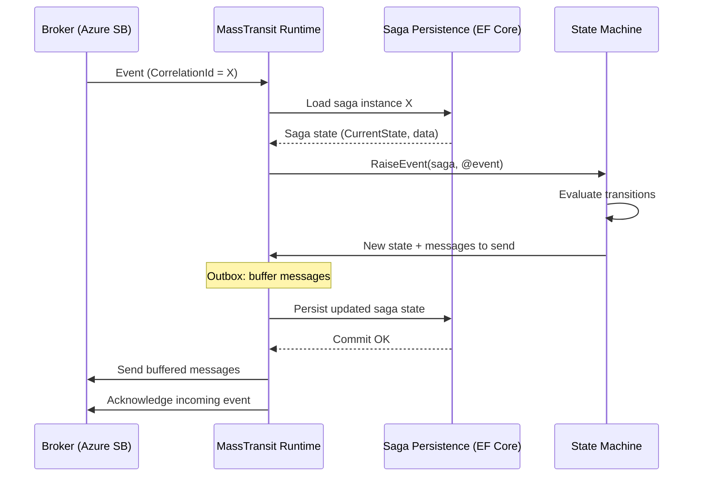

> [!success] Mastery Check
> - [ ] **Studied Well**
> - [ ] **Can explain the concept without notes**
> - [ ] **Can answer interview questions confidently**
> - [ ] **Can implement it in a real project**

## Navigation

**Domain:** [[7 — System Design & Distributed Systems]] > **Group:** Integration Patterns
**Previous:** [[7.132 — Saga Pattern — Compensating Transactions]] | **Next:** [[7.134 — Saga Pattern — Failure Handling and Recovery]]

### Prerequisites
- [[7.131 — Saga Pattern — Orchestration-Based]] — required because MassTransit sagas are orchestration state machines
- [[7.132 — Saga Pattern — Compensating Transactions]] — needed because MassTransit sagas define compensations as transitions

### Where This Fits

MassTransit is the most widely used .NET saga framework.

This note builds on the orchestration concepts in [[7.131 — Saga Pattern: Orchestration-Based]] — showing how those concepts map to a concrete framework. It complements [[7.134 — Saga Pattern: Failure Handling and Recovery]], which covers the error handling strategies that you configure via MassTransit's retry, redelivery, and fault consumer mechanisms. It provides a declarative state machine DSL, pluggable saga persistence (EF Core, Redis, Marten, MongoDB, NHibernate), a transactional outbox for reliable message publication, automatic correlation ID mapping, and built-in retry, timeout, and concurrency handling. A .NET engineer encounters this when building any orchestration-based saga in a MassTransit-using system. The framework handles the infrastructure — saga instance loading, state persistence, message correlation, and concurrency — leaving the engineer to define states, events, and transitions. Without it, building an orchestrator requires manually implementing saga state management, correlation, and reliable command publication.

## Core Mental Model

MassTransit's saga implementation is a state machine runtime. Each saga instance is identified by a `CorrelationId` (typically a `Guid`). The runtime loads the saga instance from a persistence store when an event arrives, feeds the event through the state machine, executes the transition logic (send commands, update state, publish events), and persists the updated instance. The state machine definition inherits from `MassTransitStateMachine<TSaga>` and uses a fluent DSL to declare states, events, correlations, and transitions. The invariant is: saga state persistence is atomic with message acknowledgment — either the full transition (state change + published messages via the outbox) is persisted and the incoming message is acknowledged, or neither happens. The tradeoff is that the saga instance becomes a concurrency bottleneck — two events for the same saga are serialized by the persistence store's locking mechanism. The recognition trigger is any workflow that needs a durable, recoverable state machine driven by messages.



### Classification

MassTransit sagas are a runtime + DSL at the messaging middleware layer. The `MassTransitStateMachine` provides the orchestration logic; the saga persistence provider handles durability; the transport (Azure Service Bus, RabbitMQ, etc.) handles delivery. It solves the problem of building reliable, stateful workflow coordination on top of a message broker. It does not solve the dual-write problem on the service side — each command handler must still use the inbox pattern for idempotency.

### Key Properties / Guarantees

|Property|Value|Condition|
|---|---|---|
|State persistence|EF Core, Redis, Marten, MongoDB, NHibernate|Configured at startup|
|Concurrency|Optimistic or pessimistic|DB-specific provider|
|Message delivery|At-least-once (via broker)|Outbox provides exactly-once publication to broker|
|Correlation|Automatic via CorrelationId|Event properties mapped in state machine|
|Timeouts|Scheduled messages via broker|Broker must support scheduled delivery|
|Retry|Per-consumer retry policy|Configured in consumer definition|

## Deep Mechanics

### How It Works

**Step 1 — Saga instance creation.** A message arrives that maps to the `Initially()` state. The runtime creates a new saga instance with `CorrelationId = event.CorrelationId`, persists it, and transitions to the first state.

**Step 2 — Event correlation.** Each event type is mapped to a saga property via `.CorrelateById()` or `.CorrelateBy()`. The runtime uses this mapping to load the correct saga instance when an event arrives. If no saga instance matches, the event is either ignored (for non-starting events) or creates a new instance (for starting events).

**Step 3 — State transition.** When a correlated event arrives, the runtime loads the saga instance, checks that the current state allows the event (via `During()` clauses), executes the transition's action block, and persists the updated instance. The transition block can update saga data, send commands, publish events, or schedule messages.

**Step 4 — Outbox flush.** After the saga instance is persisted and the incoming message is acknowledged, the outbox sends all buffered messages (commands, events, scheduled messages). If the persist fails, the messages are discarded and the incoming message is retried or moved to the error queue.

**Step 5 — Saga completion.** When the saga transitions to a final state (e.g., `Completed`, `Failed`), the runtime can optionally remove the saga instance from persistence (configurable via `SetCompletedWhenFinalized()`).

### Saga Correlation Strategies

MassTransit provides multiple strategies for correlating events to saga instances:

**Direct CorrelationId mapping.** The simplest strategy — both the saga and the event share a `CorrelationId` property mapped via `.CorrelateById()`.

```csharp
Event(() => PaymentProcessed, e =>
    e.CorrelateById(c => c.Message.CorrelationId));
```

**Correlation by composite key.** When no single `CorrelationId` exists, use `.CorrelateBy()` with a saga property and message property.

```csharp
Event(() => OrderUpdated, e =>
    e.CorrelateBy((saga, context) =>
        saga.OrderId == context.Message.OrderId));
```

**Correlation for saga creation on arrival.** Use `e.InsertOnInitial = true` to ensure the saga is created if it does not exist, in addition to being found if it does.

```csharp
Event(() => OrderSubmitted, e =>
{
    e.CorrelateById(c => c.Message.CorrelationId);
    e.InsertOnInitial = true;
});
```

**Custom correlation with saga factory.** For complex scenarios where even the correlation mechanism differs, use `e.CorrelateBy` combined with `e.InsertOnInitial` and a saga factory:

```csharp
Event(() => ExternalEvent, e =>
{
    e.CorrelateBy((saga, context) =>
        saga.ExternalId == context.Message.ExternalId);
    e.InsertOnInitial = true;
    e.SetSagaFactory(context => new OrderSagaState
    {
        CorrelationId = context.Message.CorrelationId,
        ExternalId = context.Message.ExternalId
    });
});
```

### Saga Versioning Strategy

When the saga state machine definition changes (new states, new events, modified transitions), existing in-flight saga instances must continue to work. MassTransit does not have built-in saga versioning — you must design for backward compatibility.

**Strategy 1: Additive changes only.** Only add new states and events — never remove or rename existing ones. Old saga instances remain in their current state and can accept new events defined in the updated machine.

```csharp
// ✅ Additive change — new state added without modifying existing ones
public State NewProcessingStep { get; private set; } = null!;
// Old states remain unchanged
public State AwaitingPayment { get; private set; } = null!;
```

**Strategy 2: State migration.** When states must be renamed or removed, write a data migration script that updates the `CurrentState` column for all in-flight sagas:

```sql
UPDATE saga.OrderSagaState
SET CurrentState = 'NewStateName'
WHERE CurrentState = 'OldStateName';
```

This migration runs as part of the deployment process, before the updated saga code is deployed.

**Strategy 3: Version-tolerant saga machine.** Store the saga version in the saga instance data. Use the version to branch the transition logic — the state machine checks `saga.Version` and executes the correct transition path for that version. This is heavy but necessary for sagas with multi-week lifetimes.

### Failure Modes

**Concurrency conflict on saga update.** Two events arrive for the same saga instance simultaneously. The runtime loads the saga twice, both instances have the same version. The first persist succeeds, the second gets a `DbUpdateConcurrencyException`.

- **Detection:** MassTransit logs `SagaConcurrencyException` for the saga type. The event is retried.
- **Recovery:** The runtime retries the event. On retry, it reloads the saga instance with the updated version and re-evaluates the transition. If the state has already transitioned past the event, the event is ignored.

**Saga instance not found for a non-starting event.** An event arrives for a saga that has not been created yet (e.g., a reply to a command that was never sent because the saga never started). This can happen if the saga instance was removed (e.g., manually cleaned up) but downstream services still send replies.

- **Detection:** MassTransit logs `SagaNotFoundException`. The event is moved to the error queue.
- **Recovery:** Configure `IFilter<SagaConsumeContext<TSaga>>` to handle missing sagas gracefully — log a warning and acknowledge the event rather than moving it to the error queue.

**Saga persistence provider unavailability.** The saga database is down. The runtime cannot load or persist saga instances. All saga messages go to the error queue.

- **Detection:** All saga consumers fail with `SqlException` or `TimeoutException`.
- **Recovery:** Implement retry with exponential backoff on the saga repository. Use a circuit breaker to stop consuming saga messages when the database is unavailable.

### .NET and Azure Integration

- **MassTransit:** Core library providing `MassTransitStateMachine<TSaga>`, `SagaStateMachineInstance`, saga persistence, and outbox
- **EF Core:** `EntityFrameworkSagaRepository` with SQL Server/Azure SQL — uses `UPDLOCK`/`ROWLOCK` for pessimistic concurrency or row version for optimistic
- **Azure Cosmos DB:** `CosmosSagaRepository` — optimistic concurrency via ETag, good for globally distributed sagas
- **Redis:** `RedisSagaRepository` — high throughput, no concurrency control (last-writer-wins), suitable for short-lived sagas
- **Azure Service Bus:** Primary transport for .NET Azure deployments — supports sessions, scheduled messages, and topics for saga events

```csharp
// Saga instance base interface
public sealed class OrderSagaState : SagaStateMachineInstance
{
    public Guid CorrelationId { get; set; }
    public string CurrentState { get; set; } = string.Empty;
    public string? CustomerEmail { get; set; }
    public Guid OrderId { get; set; }
    public decimal Amount { get; set; }
    public string? PaymentTransactionId { get; set; }
    public string? TrackingNumber { get; set; }
    public int RetryCount { get; set; }
    public DateTime CreatedAt { get; set; }
    public byte[]? RowVersion { get; set; } // For optimistic concurrency
}
```

## Production Patterns and Implementation

### Primary Implementation

Complete MassTransit saga state machine with EF Core persistence and Azure Service Bus transport.

```csharp
// 1. Saga instance
public sealed class OrderSagaState : SagaStateMachineInstance
{
    public Guid CorrelationId { get; set; }
    public string CurrentState { get; set; } = string.Empty;
    public string CustomerId { get; set; } = string.Empty;
    public string? CustomerEmail { get; set; }
    public Guid OrderId { get; set; }
    public decimal TotalAmount { get; set; }
    public string? PaymentTransactionId { get; set; }
    public string? TrackingNumber { get; set; }
    public int FailureCount { get; set; }
    public DateTime CreatedAt { get; set; }
    public DateTime? UpdatedAt { get; set; }
    public byte[]? RowVersion { get; set; }
}

// 2. Saga state machine
public sealed class OrderFulfillmentSaga :
    MassTransitStateMachine<OrderSagaState>
{
    // States
    public State AwaitingPayment { get; private set; } = null!;
    public State AwaitingShipment { get; private set; } = null!;
    public State AwaitingConfirmation { get; private set; } = null!;
    public State Completed { get; private set; } = null!;
    public State Faulted { get; private set; } = null!;

    // Events that start the saga
    public Event<OrderSubmitted> OrderSubmitted { get; private set; } = null!;

    // Events that continue the saga
    public Event<PaymentProcessed> PaymentProcessed { get; private set; } = null!;
    public Event<PaymentFailed> PaymentFailed { get; private set; } = null!;
    public Event<OrderShipped> OrderShipped { get; private set; } = null!;
    public Event<ShipmentDelayed> ShipmentDelayed { get; private set; } = null!;
    public Event<SagaTimeout> SagaTimeout { get; private set; } = null!;

    // Commands (sent to services)
    public Schedule<OrderSagaState, ProcessPaymentCommand> PaymentTimeout { get; private set; } = null!;

    public OrderFulfillmentSaga()
    {
        InstanceState(x => x.CurrentState);

        // Correlation — map event CorrelationId to saga instance
        Event(() => OrderSubmitted, e =>
        {
            e.CorrelateById(c => c.Message.CorrelationId);
            e.InsertOnInitial = true; // Create saga if not exists
        });
        Event(() => PaymentProcessed, e =>
            e.CorrelateById(c => c.Message.CorrelationId));
        Event(() => PaymentFailed, e =>
            e.CorrelateById(c => c.Message.CorrelationId));
        Event(() => OrderShipped, e =>
            e.CorrelateById(c => c.Message.CorrelationId));
        Event(() => ShipmentDelayed, e =>
            e.CorrelateById(c => c.Message.CorrelationId));
        Event(() => SagaTimeout, e =>
            e.CorrelateById(c => c.Message.CorrelationId));

        // Scheduled timeout
        Schedule(() => PaymentTimeout, instance => instance.CorrelationId,
            s => s.Delay = TimeSpan.FromMinutes(5));

        // Initial state — saga starts when order is submitted
        Initially(
            When(OrderSubmitted)
                .Then(context =>
                {
                    context.Saga.CustomerId = context.Message.CustomerId;
                    context.Saga.CustomerEmail = context.Message.Email;
                    context.Saga.TotalAmount = context.Message.TotalAmount;
                    context.Saga.CreatedAt = DateTime.UtcNow;
                })
                .SendAsync(context => context.Init<ProcessPaymentCommand>(
                    new ProcessPaymentCommand(
                        context.Saga.CorrelationId,
                        context.Message.OrderId,
                        context.Message.TotalAmount)))
                .Schedule(PaymentTimeout, context => new SagaTimeout(
                    context.Saga.CorrelationId),
                    _ => TimeSpan.FromMinutes(5))
                .TransitionTo(AwaitingPayment));

        // Awaiting payment
        During(AwaitingPayment,
            When(PaymentProcessed)
                .Then(context =>
                {
                    context.Saga.PaymentTransactionId = context.Message.TransactionId;
                    context.Saga.UpdatedAt = DateTime.UtcNow;
                })
                .Unschedule(PaymentTimeout)
                .SendAsync(context => context.Init<CreateShipmentCommand>(
                    new CreateShipmentCommand(
                        context.Saga.CorrelationId,
                        context.Saga.OrderId,
                        context.Saga.CustomerEmail)))
                .TransitionTo(AwaitingShipment),
            When(PaymentFailed)
                .Then(context =>
                {
                    context.Saga.FailureCount++;
                    context.Saga.UpdatedAt = DateTime.UtcNow;
                })
                .IfElse(context => context.Saga.FailureCount < 3,
                    then => then
                        .Schedule(PaymentTimeout, context => new SagaTimeout(
                            context.Saga.CorrelationId),
                            _ => TimeSpan.FromMinutes(5))
                        .TransitionTo(AwaitingPayment),
                    else => else
                        .SendAsync(context => context.Init<CancelOrderCommand>(
                            new CancelOrderCommand(
                                context.Saga.CorrelationId,
                                "Payment failed after 3 retries")))
                        .TransitionTo(Faulted)),
            When(SagaTimeout)
                .Then(context => context.Saga.FailureCount++)
                .IfElse(context => context.Saga.FailureCount < 3,
                    then => then
                        .SendAsync(context => context.Init<ProcessPaymentCommand>(
                            new ProcessPaymentCommand(
                                context.Saga.CorrelationId,
                                context.Saga.OrderId,
                                context.Saga.TotalAmount)))
                        .Schedule(PaymentTimeout, context => new SagaTimeout(
                            context.Saga.CorrelationId),
                            _ => TimeSpan.FromMinutes(5))
                        .TransitionTo(AwaitingPayment),
                    else => else
                        .TransitionTo(Faulted)));

        // Awaiting shipment
        During(AwaitingShipment,
            When(OrderShipped)
                .Then(context =>
                {
                    context.Saga.TrackingNumber = context.Message.TrackingNumber;
                    context.Saga.UpdatedAt = DateTime.UtcNow;
                })
                .SendAsync(context => context.Init<SendConfirmationCommand>(
                    new SendConfirmationCommand(
                        context.Saga.CorrelationId,
                        context.Saga.CustomerEmail,
                        context.Saga.TrackingNumber)))
                .TransitionTo(AwaitingConfirmation));

        // Final states
        During(AwaitingConfirmation,
            When(OrderShipped) // Idempotent — already processed
                .Then(context => Console.WriteLine("Duplicate shipment event"))
                .Finalize());

        WhenEnter(Faulted, binder => binder
            .Then(context => Console.WriteLine($"Saga {context.Saga.CorrelationId} faulted"))
            .Finalize());

        SetCompletedWhenFinalized();
    }
}

// 3. Saga DbContext
public sealed class SagaDbContext : SagaDbContext
{
    public SagaDbContext(DbContextOptions<SagaDbContext> options)
        : base(options)
    {
    }

    protected override IEnumerable<ISagaClassMap> Configurations
    {
        get { yield return new OrderSagaStateMap(); }
    }
}

public sealed class OrderSagaStateMap :
    SagaClassMap<OrderSagaState>
{
    protected override void Configure(
        EntityTypeBuilder<OrderSagaState> entity,
        ModelBuilder model)
    {
        entity.Property(x => x.CurrentState).HasMaxLength(64);
        entity.Property(x => x.CustomerId).HasMaxLength(128);
        entity.Property(x => x.CustomerEmail).HasMaxLength(256);
        entity.Property(x => x.PaymentTransactionId).HasMaxLength(128);
        entity.Property(x => x.TrackingNumber).HasMaxLength(64);
        entity.Property(x => x.RowVersion).IsRowVersion();
    }
}
```

### Configuration and Wiring

```csharp
// Program.cs — complete saga setup
builder.Services.AddMassTransit(x =>
{
    // Register saga state machine
    x.AddSagaStateMachine<OrderFulfillmentSaga, OrderSagaState>()
        .EntityFrameworkRepository(r =>
        {
            r.ConcurrencyMode = ConcurrencyMode.Pessimistic;

            // Use connection string from configuration
            r.AddDbContext<DbContext, SagaDbContext>((provider, options) =>
            {
                var connectionString = provider
                    .GetRequiredService<IConfiguration>()
                    .GetConnectionString("SagaDb");

                options.UseSqlServer(connectionString, sql =>
                {
                    sql.MigrationsAssembly(typeof(Program).Assembly.FullName);
                    sql.EnableRetryOnFailure(3);
                });
            });
        });

    // Register consumers that handle commands from the saga
    x.AddConsumer<ProcessPaymentConsumer>();
    x.AddConsumer<CreateShipmentConsumer>();
    x.AddConsumer<CancelOrderConsumer>();
    x.AddConsumer<SendConfirmationConsumer>();

    // Configure transport
    x.UsingAzureServiceBus((context, cfg) =>
    {
        cfg.Host(builder.Configuration["Azure:ServiceBus:ConnectionString"]);

        // Enable transactional outbox
        cfg.UseInMemoryOutbox(context);

        cfg.ConfigureEndpoints(context);

        // Global retry policy for transient exceptions
        cfg.UseMessageRetry(r =>
        {
            r.Handle<TransientException>();
            r.Interval(3, TimeSpan.FromSeconds(5));
        });
    });
});

// Migration for saga state table
// dotnet ef migrations add InitialSagaState
// dotnet ef database update

// Add migration
// public partial class InitialSagaState : Migration
// {
//     protected override void Up(MigrationBuilder migrationBuilder)
//     {
//         migrationBuilder.CreateTable(
//             name: "OrderSagaState",
//             columns: table => new
//             {
//                 CorrelationId = table.Column<Guid>(nullable: false),
//                 CurrentState = table.Column<string>(maxLength: 64, nullable: false),
//                 CustomerId = table.Column<string>(maxLength: 128, nullable: true),
//             },
//             constraints: table =>
//             {
//                 table.PrimaryKey("PK_OrderSagaState", x => x.CorrelationId);
//             });
//     }
// }
```

### Saga Observability with OpenTelemetry

MassTransit integrates with OpenTelemetry to provide distributed tracing and metrics for saga operations. This is critical for debugging stuck sagas and understanding throughput bottlenecks.

```csharp
// Program.cs — enable OpenTelemetry for sagas
builder.Services.AddOpenTelemetry()
    .WithMetrics(metrics => metrics
        .AddMeter("MassTransit")
        .AddAspNetCoreInstrumentation())
    .WithTracing(tracing => tracing
        .AddSource("MassTransit")
        .AddAspNetCoreInstrumentation()
        .AddSqlClientInstrumentation()); // Track saga DB queries
```

The key telemetry:
- **Saga duration:** Histogram from saga creation to final state — alerts on sagas exceeding expected duration
- **Consume duration:** Histogram of time spent processing each saga event — identifies slow handler code
- **Saga repository duration:** Histogram of saga load/save operations — identifies DB bottlenecks
- **Errors:** Count of saga concurrency conflicts, missing instances, and persist failures

Each span includes `CorrelationId` and `SagaType` as tags, enabling filtering by specific saga instances in your observability tool.

### Common Variants

**Redis saga persistence** for high-throughput, short-lived sagas (< 5 minutes lifetime).

```csharp
x.AddSagaStateMachine<OrderFulfillmentSaga, OrderSagaState>()
    .RedisRepository(r =>
    {
        r.DatabaseConfiguration("localhost:6379");
        // Sagas expire after 10 minutes
        r.KeyPrefix = "saga:order";
    });
```

**Cosmos DB saga persistence** for globally distributed sagas.

```csharp
x.AddSagaStateMachine<OrderFulfillmentSaga, OrderSagaState>()
    .CosmosRepository(r =>
    {
        r.ConnectionString = builder.Configuration["Cosmos:ConnectionString"];
        r.DatabaseId = "saga-db";
        r.ContainerId = "order-sagas";
    });
```

**Testing sagas** using MassTransit's test harness.

```csharp
[Test]
public async Task OrderSubmitted_Should_Start_Saga_And_Send_PaymentCommand()
{
    await using var harness = new InMemoryTestHarness();
    await using var sagaHarness = harness.Saga<OrderSagaState, OrderFulfillmentSaga>();

    await harness.Start();

    var correlationId = Guid.NewGuid();
    await harness.InputQueueSendEndpoint.Send(new OrderSubmitted(
        correlationId, Guid.NewGuid(), "cust-1", "test@test.com", 100.00m));

    Assert.IsTrue(sagaHarness.Created.Contains(correlationId));
    Assert.IsTrue(harness.Sent.Select<ProcessPaymentCommand>().Any());
}
```

### Real-World .NET Ecosystem Example

**MassTransit** itself is the .NET ecosystem example. It is the most popular open-source .NET message bus framework, used in production at Microsoft (Azure SDK team), JetBlue, and thousands of other organizations. Its saga implementation has been battle-tested since 2014 across financial services, e-commerce, logistics, and healthcare. The state machine DSL has remained stable across major versions, with incremental additions like `SagaStateMachine<TSaga>` (v3+), `Schedule` for timeouts (v4+), and the transactional outbox (v7+).

## Gotchas and Production Pitfalls

### 1. Missing saga instance on reply events

**Pitfall:** A `PaymentProcessed` reply arrives, but the saga instance was not started (or was already completed and removed). MassTransit throws `SagaNotFoundException` by default and moves the message to the error queue.

```csharp
// ❌ Default behavior — missing saga = error queue
Event(() => PaymentProcessed, e =>
    e.CorrelateById(c => c.Message.CorrelationId));
```

**Symptom:** Error queue fills with `PaymentProcessed` messages that cannot be correlated. ~5% of replies go to the error queue under normal operations.

**Fix:** Handle missing sagas gracefully by ignoring the event.

```csharp
// ✅ Ignore events for already-completed or non-existent sagas
Event(() => PaymentProcessed, e =>
{
    e.CorrelateById(c => c.Message.CorrelationId);
    e.OnMissingInstance(m => m.Discard()); // Or .ExecuteAsync(ctx => log warning)
});
```

**Cost of not fixing:** Error queue grows by thousands of messages per day. Operations must periodically purge or redrive the error queue.

### 2. Outbox not configured — dual-write problem

**Pitfall:** The saga sends a command via `.SendAsync()` and then persists state. If the persist fails, the command was already sent. The saga never transitions to the state that awaits the reply, so when the reply arrives, the saga is in a state that does not handle it.

```csharp
// ❌ No outbox — command sent even if persist fails
.During(AwaitingPayment,
    When(PaymentProcessed)
        .SendAsync(context => context.Init<CreateShipmentCommand>(...))
        .TransitionTo(AwaitingShipment) // If persist fails here, command already sent
```

**Symptom:** Reply events for commands from "future states" arrive in states that do not handle them. Orphan commands accumulate in downstream queues.

**Fix:** Enable the in-memory outbox.

```csharp
// ✅ Enable outbox
cfg.UseInMemoryOutbox(context);
```

**Cost of not fixing:** Hard-to-debug race conditions. Sagas stuck in incorrect states. Requires per-saga forensic analysis.

### 3. Pessimistic concurrency connection pool exhaustion

**Pitfall:** Each saga instance holds a database connection while awaiting a reply. At 200 concurrent sagas, 200 connections are held. The default EF Core SQL Server connection pool is 100.

**Symptom:** `System.InvalidOperationException: Timeout expired. The pool is exhausted.` New saga instances cannot be created. All processing stops.

**Fix:** Use optimistic concurrency for sagas, or increase the connection pool and monitor connection usage.

```csharp
// ✅ Optimistic concurrency
r.ConcurrencyMode = ConcurrencyMode.Optimistic;

// Or increase pool
options.UseSqlServer(connectionString, sql =>
{
    sql.MaxBatchSize(100);
    // Connection pool size
    options.EnableRetryOnFailure();
});
```

**Cost of not fixing:** Complete saga processing outage at peak traffic. Recovery requires restarting the orchestrator or killing idle connections.

### 4. Schedule timeout fires after saga completed

**Pitfall:** A `PaymentTimeout` is scheduled for 5 minutes. The payment arrives 10 seconds later, the saga progresses to `AwaitingShipment`, and the timeout is unscheduled. But the unschedule fails (broker issue) or the timeout was already in-flight. The `SagaTimeout` event arrives after the saga has already completed.

**Symptom:** The `SagaTimeout` event arrives but no saga instance exists for the `CorrelationId` (completed sagas are removed). The timeout goes to the error queue.

**Fix:** Handle on-missing-instance for timeout events. Also ensure `SetCompletedWhenFinalized()` does not remove the instance immediately — add a grace period.

```csharp
// ✅ Handle timeout after saga completion
Event(() => SagaTimeout, e =>
{
    e.CorrelateById(c => c.Message.CorrelationId);
    e.OnMissingInstance(m => m.Discard()); // Timeout after completion is harmless
});
```

**Cost of not fixing:** Error queue grows with duplicate timeout messages for every completed saga.

### 6. Incorrect reply routing with multiple saga types

**Pitfall:** Two saga types (OrderFulfillmentSaga and RefundSaga) both consume `PaymentProcessed` events. When the OrderFulfillmentSaga sends `ProcessPayment`, the Payment service publishes `PaymentProcessed`. Both sagas receive the event. The RefundSaga gets a `PaymentProcessed` for an order that is not being refunded, causing a `SagaNotFoundException` or incorrect state transition.

**Symptom:** Random `SagaNotFoundException` entries in logs. Error queue receives events meant for the wrong saga. RefundSaga instances appear in unexpected states.

**Fix:** Use separate event types for each saga's correlation path, or use `e.ConfigureCorrelation` to add saga-specific filters.

```csharp
// ✅ Saga-specific event correlation with discriminator
Event(() => PaymentProcessed, e =>
{
    e.CorrelateById(c => c.Message.CorrelationId);
    // Only handle if saga is expecting this event
    e.ConfigureCorrelation = x => x.AddFilter(context =>
        context.Saga.CurrentState == nameof(AwaitingPayment));
});
```

**Cost of not fixing:** Intermittent corruption of saga state. Hard-to-reproduce bugs in production. Debugging requires per-saga-type event tracing.

### 7. Scheduled message delivery without broker support

**Pitfall:** The saga uses `Schedule` for timeouts, but the transport (Azure Service Bus Basic tier, or Amazon SQS) does not support scheduled message delivery. The scheduled messages are silently dropped or delivered immediately.

**Symptom:** Timeouts never fire, or fire immediately without delay. Sagas get stuck in waiting states indefinitely.

**Fix:** Use a transport that supports scheduled delivery (Azure Service Bus Standard/Premium, RabbitMQ with delayed message plugin). For transports without scheduling support, implement timeouts manually with a polling background service.

```csharp
// ✅ Check broker capability before deploying scheduled sagas
// Azure Service Bus Standard/Premium: ✅
// Azure Service Bus Basic: ❌
// RabbitMQ: ✅ (with delayed message exchange plugin)
// Amazon SQS: ❌ (no native scheduling)
```

**Cost of not fixing:** Sagas never time out. Stuck sagas accumulate. Manual monitoring and timeout injection required.

### 5. State machine logic creates infinite loops

**Pitfall:** A transition in state A publishes a command that causes a reply that transitions to state B, which publishes an event that causes a reply that transitions back to state A. The saga loops infinitely, publishing messages and persisting state changes.

**Symptom:** Database growth (saga state updated thousands of times). Message volume spike. Eventually out-of-memory or database storage full.

**Fix:** Design transitions as a directed acyclic graph. Each transition should move the saga forward or to a terminal state. Never design a transition that can return to a previously visited state without a clear escalation path.

**Cost of not fixing:** Production incident — database fills up, saga processing stops. Recovery requires truncating the saga state table and manually compensating affected sagas.

## Tradeoffs and Decision Framework

### Tradeoff Matrix

|Dimension|MassTransit Saga|Azure Durable Functions|Custom Orchestrator|
|---|---|---|---|
|State machine DSL|Declarative C# DSL|Async/await method|Manual switch/if-else|
|Persistence|Pluggable (EF, Redis, Cosmos, Marten)|Azure Storage (tables)|Custom implementation|
|Concurrency handling|Built-in (optimistic/pessimistic)|Automatic (single-threaded per instance)|Must implement manually|
|Timeouts|Scheduled messages via broker|Built-in `CreateTimer`|Manual scheduling|
|Testing|In-memory test harness|`TaskHub` emulator|Mock all dependencies|
|Operational complexity|Deploy as any MassTransit service|Azure Functions runtime|Full service deployment|
|.NET ecosystem fit|Deep (part of MT ecosystem)|Serverless (limited control)|Full control|

### When to Apply

```mermaid
flowchart TD
    A[Need saga orchestration] --> B{Already using MassTransit?}
    B -->|Yes| C[MassTransit saga — reuse infrastructure]
    B -->|No| D{Need serverless scaling?}
    D -->|Yes| E[Azure Durable Functions]
    D -->|No| F{Complexity of workflow}
    F -->|Simple (3-5 states)| C
    F -->|Complex (20+ states)| G[Evaluate Durable Functions or custom]
    C --> H[Use EF Core persistence for reliability]
    H --> I[Use transactional outbox]
```

### When NOT to Apply

- [ ] The workflow is a simple 2-step process — a direct consumer with retry is simpler
- [ ] The team has no existing MassTransit investment — the learning curve is significant
- [ ] The saga requires human-in-the-loop approval steps — Durable Functions' wait-for-external-event pattern is cleaner
- [ ] The saga needs to run for months (e.g., subscription management) — saga state table grows unbounded; use Durable Functions with auto-cleanup
- [ ] Throughput exceeds 10,000 sagas/second with a single DB — MassTransit saga persistence becomes the bottleneck

### Scale Thresholds

- **Up to 100 sagas/second:** EF Core with SQL Server and pessimistic concurrency works well
- **100-1,000 sagas/second:** Switch to optimistic concurrency or Redis repository for short-lived sagas
- **1,000-5,000 sagas/second:** Partition sagas by type into separate persistence stores; shard saga DB by `CorrelationId` hash
- **5,000+ sagas/second:** Consider eventual saga coordination via event-driven choreography for the high-throughput portions, MassTransit for the control flow

## Interview Arsenal

### Question Bank

1. What is MassTransit's saga architecture — how does a saga instance get loaded and persisted?
2. How does the MassTransit outbox work in the saga context?
3. What concurrency models does MassTransit support for saga persistence?
4. How do you handle timeouts in a MassTransit saga?
5. Compare MassTransit sagas with Azure Durable Functions.
6. How do you test a MassTransit saga?
7. What happens if the saga persistence store is unavailable?
8. How do you handle saga versioning in MassTransit?

### Spoken Answers

**Q1: What is MassTransit's saga architecture?**

> **Great answer:** "MassTransit sagas are state machine instances managed by the MassTransit runtime. Each saga instance implements `SagaStateMachineInstance` with a `CorrelationId` as the primary key and a `CurrentState` string property. The state machine inherits from `MassTransitStateMachine<TSaga>` and defines states, events, correlation mappings, and transitions using a fluent DSL. When a message arrives, MassTransit loads the saga instance from a persistence provider using the message's `CorrelationId`, feeds the event through the state machine, and persists the updated instance. State persistence is atomic with message acknowledgment via the transactional outbox — either the full transition is committed and the message is acknowledged, or neither happens. The architecture is transport-agnostic — you can use Azure Service Bus, RabbitMQ, or Amazon SQS with the same saga definition. Persistence is pluggable — SQL Server, Redis, Cosmos DB, Marten, MongoDB. The key architectural insight is that the saga instance is a concurrency unit — only one event is processed for a given saga at a time, enforced by the persistence store's locking mechanism."

**Q2: How does the MassTransit outbox work in the saga context?**

> **Great answer:** "The transactional outbox (called `UseInMemoryOutbox` in MassTransit) buffers all messages published or sent during a saga transition. When the saga handler completes, the outbox first persists the updated saga instance to the database, then flushes the buffered messages to the broker, and finally acknowledges the incoming message. This ensures exactly-once semantics for message publication relative to saga state. Without the outbox, you have the dual-write problem: the saga sends a command, persists the state, but the persist fails — now the command is in the queue but the saga does not expect a reply because the state was not updated. The outbox eliminates this by deferring all message sends until after the state is successfully persisted. The 'in-memory' part means the buffered messages are held in memory — if the process crashes before the flush, the messages are lost. But since the incoming message was not acknowledged, the broker redelivers it and the saga re-executes the transition, regenerating the messages."

**Q3: What concurrency models does MassTransit support for saga persistence?**

> **Great answer:** "MassTransit supports optimistic and pessimistic concurrency, depending on the persistence provider. With EF Core and SQL Server, pessimistic concurrency uses `UPDLOCK` and `ROWLOCK` hints on the `SELECT` statement that loads the saga instance. This holds a database row lock for the entire saga transition, preventing other events from processing the same saga simultaneously. Pessimistic is the safest but most expensive — it holds a connection and a lock. Optimistic concurrency uses a row version column (byte array or timestamp). Each saga update checks that the row version has not changed since the saga was loaded. If two events arrive simultaneously, the second update fails with `DbUpdateConcurrencyException`, and MassTransit retries the event. Optimistic is lighter (no lock held) but requires retry logic on the consumer. I use pessimistic for short, high-contention sagas where concurrency conflicts would be frequent (e.g., order fulfillment at peak) and optimistic for long-running sagas where conflicts are rare (e.g., approval workflows that wait hours between events). Redis repository uses last-writer-wins — no concurrency control, which is fine for short-lived sagas where the last event's state is always the correct state."

**Q5: Compare MassTransit sagas with Azure Durable Functions.**

> **Great answer:** "MassTransit sagas are a declarative state machine DSL embedded in your application process. Azure Durable Functions use an async/await programming model where the orchestrator function is a regular C# method with `await` calls. The key differences are: (1) MassTransit sagas are transport-agnostic — you can use Service Bus, RabbitMQ, or SQS — while Durable Functions are Azure-only. (2) MassTransit sagas give you fine-grained control over persistence and concurrency — you choose the database and locking strategy. Durable Functions use Azure Storage tables automatically — you get less control but zero operations overhead. (3) Durable Functions have a 'pause-and-wait' pattern for human-in-the-loop workflows that is more natural than MassTransit's scheduled messages. (4) MassTransit sagas are better suited for high-throughput, low-latency workflows (< 100ms per transition) because they run in-process. Durable Functions add ~100ms overhead per function invocation. (5) Durable Functions have a deterministic execution requirement — no `DateTime.Now`, no `Guid.NewGuid()`, no random numbers in the orchestrator. MassTransit has no such restriction because state is not replayed. I use MassTransit for service-internal workflows and Durable Functions for cross-team, long-running, human-in-the-loop workflows."

**Q6: How do you test a MassTransit saga?**

> **Great answer:** "MassTransit provides an `InMemoryTestHarness` and `SagaTestHarness<TSaga, TStateMachine>` for unit testing. The test harness sets up an in-memory transport, registers the saga and consumers, and allows you to send messages and verify outcomes. A complete test: (1) create the test harness, (2) start it, (3) send an event that starts the saga, (4) assert `sagaHarness.Created.Contains(correlationId)`, (5) assert the expected command was sent via `harness.Sent.Select<TCommand>().Any()`. For integration tests, use `Testcontainers` to spin up SQL Server and Azure Service Bus emulator, deploy the saga service, and run end-to-end tests. The most important test is the 'concurrent event test' — send two events for the same saga simultaneously and assert they are processed without data loss. I also write a 'stuck saga test': set up a saga that fails to receive a reply, trigger the timeout, and assert the saga transitions to the faulted state."

**Q7: What happens if the saga persistence store is unavailable?**

> **Great answer:** "MassTransit cannot load or persist saga instances when the persistence store is unavailable. All saga events fail with `SagaRepositoryException` or a provider-specific exception. The default behavior is to retry the message using the consumer's retry policy — typically 3 retries with exponential backoff. If retries are exhausted, the message goes to the error queue. The production fix has three layers: (1) configure a retry policy specifically for `SagaRepositoryException` with longer intervals and more retries (e.g., 5 retries, 10-second intervals). (2) Add a health check on the saga persistence store — expose `/health/ready` that fails when the saga DB is down. The orchestrator's liveness probe should NOT depend on the saga DB (the process is alive even if the DB is down), but the readiness probe should fail, causing the service mesh to stop routing traffic to the unhealthy instance. (3) Implement a circuit breaker on the saga repository — after N consecutive failures, stop processing saga events for M seconds to let the database recover."

**Q8: How do you handle saga versioning in MassTransit?**

> **Great answer:** "MassTransit does not have built-in saga versioning. The recommended approach is additive changes only — add new states and events without modifying or removing existing ones. This ensures in-flight sagas continue to work regardless of the deployment order. When states must be renamed, use a data migration script that runs as part of the deployment pipeline before the new saga code is deployed. For sagas with very long lifetimes (weeks or months), store a saga version number in the saga data and use it to branch the transition logic — the state machine checks `saga.Version` and executes the correct transition path. This is heavy but necessary. A simpler alternative: set a maximum saga lifetime (e.g., 30 days) and complete or fault any saga that exceeds it. This bounds the versioning window — you only need to support versions within the last 30 days."

**Q4: How do you handle timeouts in a MassTransit saga?**

> **Great answer:** "MassTransit handles timeouts via scheduled message delivery. You define a `Schedule<TSaga, TMessage>` in the state machine, specifying which saga property identifies the scheduled message (typically `CorrelationId`). When the saga enters a state with a timeout, you call `.Schedule()` with a delay and a message payload. The scheduled message is stored in the broker's message store until the delay expires, then delivered to the saga. When the expected event arrives before the timeout, you call `.Unschedule()` to remove the scheduled message. The timeout message must have the same `CorrelationId` so the runtime can correlate it back to the saga instance. A critical detail: the `Unschedule` may fail (broker partition, network issue). The timeout may fire after the saga has already progressed past the waiting state. You must handle `OnMissingInstance` on the timeout event to discard it gracefully. For Azure Service Bus, scheduled messages have a complexity: they are stored on the broker and not persisted on the saga — a broker restart may lose scheduled messages. For production, use the broker's support for scheduled delivery and monitor for missed timeouts."

### System Design Interview Trigger

When the interviewer asks "how do you implement a distributed workflow in .NET?" and mentions messaging infrastructure, they are probing your breadth of the .NET ecosystem. The strong answer names MassTransit, explains its saga DSL, and articulates the tradeoff vs Azure Durable Functions. The interviewer's follow-up will be about persistence and concurrency — they want to hear "pessimistic locking for short sagas with contention, optimistic for long-running sagas, Redis for high-throughput ephemeral sagas."

### Comparison Table

| | MassTransit Saga | Azure Durable Functions | NServiceBus Saga |
|---|---|---|---|
| DSL | Declarative state machine | Async/await method | Saga class + handlers |
| Persistence | Pluggable (EF, Redis, Cosmos, etc.) | Azure Storage tables | NHibernate, EF, RavenDB |
| Outbox | Built-in (`UseInMemoryOutbox`) | Not needed (single function) | Built-in (`TransactionScope`) |
| Timeouts | Scheduled messages | `CreateTimer` + durable | `RequestTimeout<T>` |
| Testing | In-memory harness | TaskHub emulator | Learning test project |
| License | Open source (Apache 2.0) | Included with Azure | Commercial (freemium) |

## Architecture Decision Record

**Status:** Accepted

**Context:** An e-commerce platform with 15 .NET microservices already uses MassTransit with Azure Service Bus for all inter-service messaging. The team needs to implement 3 orchestration sagas: order fulfillment (6 steps), refund processing (4 steps), and subscription management (10 steps with monthly intervals). The team has solid MassTransit experience. Target throughput is 500 sagas/second.

**Options Considered:**

1. **MassTransit State Machine** — Use existing MassTransit infrastructure, add saga repositories
2. **Azure Durable Functions** — New serverless runtime, different deployment model
3. **Custom Orchestrator** — Manual saga state management in a dedicated service

**Decision:** MassTransit State Machine (option 1), because the team already uses MassTransit, the saga DSL maps directly to the workflow requirements, and the operational cost of introducing Durable Functions (new deployment, new monitoring, new failure modes) outweighs the benefits. The team can reuse existing retry, outbox, and transport configurations.

**Consequences:**
- ✅ Sagas reuse existing MassTransit infrastructure — transport, retry, outbox, monitoring
- ✅ Team already knows MassTransit — minimal learning curve
- ✅ Transactional outbox ensures reliable command publication without dual-write
- ⚠️ Saga persistence DB adds a new stateful dependency — DBA team must manage migration and backup
- ⚠️ Pessimistic concurrency will be the bottleneck — must monitor connection pool and switch to optimistic for the subscription saga (long-running)
- ❌ The subscription management saga (10 steps, monthly intervals) is a poor fit — Durable Functions' pause-and-wait pattern would be more natural. Accepted because the team prioritizes consistency of tooling

**Review Trigger:** Revisit if the subscription management saga becomes a maintenance burden (saga state entries for months-long sagas accumulate) or if a fourth saga with complex branching is required. At that point, evaluate Durable Functions for long-running workflows while keeping MassTransit for short-lived sagas.

### Cross-References

This ADR aligns with the orchestration saga ADR in [[7.131 — Saga Pattern: Orchestration-Based#Architecture Decision Record]], which decided on MassTransit as the orchestration framework for the same reasons. The compensation handling ADR in [[7.132 — Saga Pattern: Compensating Transactions#Architecture Decision Record]] documents how compensations are implemented within the MassTransit saga framework. Together, these three ADRs form the complete decision chain: coordination model → framework → compensation strategy.

## Self-Check

### Conceptual Questions

1. What interfaces must a MassTransit saga instance implement?
2. How does the `Initially()` clause differ from `During()`?
3. What does the transactional outbox protect against?
4. How does pessimistic concurrency work in MassTransit's EF Core saga repository?
5. What happens when a `Schedule` timeout fires but the saga has already completed?
6. How do you correlate a non-starting event to an existing saga instance?
7. What is the connection pool implication of pessimistic concurrency?
8. Compare `SendAsync` vs `PublishAsync` in saga transitions.
9. How do you test a MassTransit saga without a message broker?
10. Explain in 60 seconds how to set up a MassTransit saga from scratch.

### Additional Questions

**11. How does the `UseInMemoryOutbox` interact with saga timeouts?**

> The outbox buffers all messages during saga processing, including `Schedule` calls. The scheduled message is not sent to the broker until the saga state is persisted. If the saga fails to prepare the scheduled message (e.g., serialization error), the persist is rolled back and the incoming message is retried. Once the state is persisted, the outbox flushes — the scheduled message is sent to the broker. This ensures that a scheduled timeout is only created if the saga state that depends on it is durable.

**12. What is the difference between `SagaRepository` and `ISagaRepository`?**

> `ISagaRepository` is the low-level interface that MassTransit uses to load and persist saga instances. `SagaRepository` is the base class for persistence providers (EF Core, Redis, etc.). Most developers do not interact with these directly — they configure the repository via `.EntityFrameworkRepository()` or `.RedisRepository()` in the saga registration. Understanding the distinction matters when implementing a custom persistence provider or troubleshooting repository-level exceptions.

**13. How do you monitor MassTransit saga health in production?**

> Use MassTransit's built-in `IConsumeObserver` and `ISagaConsumeObserver` interfaces. Implement a `SagaMetricsObserver` that tracks: (1) saga instance load count, (2) state transitions per saga type, (3) transition duration, (4) consume failures, (5) concurrency conflicts. Publish these as counters and histograms to Application Insights or Prometheus. The critical alerts: saga stuck in non-terminal state > 30 minutes, consumer retry count per message > 3, error queue depth for any saga endpoint > 100.

**14. What is the `Redeliver` pattern in MassTransit and when do you use it?**

> `Redeliver` is a middleware filter that re-sends a message to the same endpoint after a delay, with a delivery count limit. It differs from retry (which re-processes the message in the same consumer scope) — redelivery actually sends a new message to the queue. Use redelivery when the message processing failed due to a dependency that may recover in time (e.g., database restart). Redelivery is preferred over retry when the consumer holds resources (connections, locks) that should be released between attempts. Configure via `cfg.UseMessageRetry` for in-scope retries and `cfg.UseRedeliver` for queue-level retries.

<details>
<summary>Answers</summary>

1. `SagaStateMachineInstance` — requires `Guid CorrelationId { get; set; }` and `string CurrentState { get; set; }`.
2. `Initially()` defines transitions for events that start a new saga — if no saga instance exists, a new one is created. `During()` defines transitions for events when a saga instance already exists in the specified state. Events received in non-matching states are ignored or moved to error.
3. The dual-write problem — if the saga state is persisted but the command message publication fails, or vice versa. The outbox buffers all messages until the saga state is committed, then sends them. If the commit fails, the messages are discarded and the incoming message is retried.
4. The EF Core repository uses `UPDLOCK` and `ROWLOCK` hints on the saga state row. When a saga event is being processed, the row is locked. Other events for the same saga wait at the database level until the lock is released. This serializes access per saga instance, preventing lost updates.
5. The `Schedule` tries to deliver the timeout message, but no saga instance exists for the `CorrelationId` (completed sagas are removed). By default, MassTransit throws `SagaNotFoundException`. The fix is to configure `OnMissingInstance(m => m.Discard())` on the timeout event.
6. Use `e.CorrelateById(c => c.Message.CorrelationId)` in the event definition. The runtime loads the saga instance with `CorrelationId == message.CorrelationId`. If no instance is found, `OnMissingInstance` defines the behavior (discard, create new, throw, or execute custom logic).
7. With pessimistic concurrency, each saga instance holds a DB connection while processing an event. If the event takes a long time (e.g., waiting for external API), the connection is held, reducing available connections in the pool. At scale, this can exhaust the connection pool. Use optimistic concurrency for long-running steps.
8. `SendAsync` sends a command to a specific endpoint (point-to-point). `PublishAsync` publishes an event to all subscribers (pub/sub). In a saga, use `SendAsync` for commands to specific services (e.g., `ProcessPaymentCommand` to the Payment service) and `PublishAsync` for events that multiple services may consume (e.g., `OrderFulfilled` event).
9. Use MassTransit's `InMemoryTestHarness` and `SagaTestHarness<TSaga, TStateMachine>`. The test harness creates an in-memory transport, registers the saga, and allows simulating message sends and validating state transitions without a real broker.
10. "First, create a class implementing `SagaStateMachineInstance` with `CorrelationId` and `CurrentState`. Second, create a state machine class inheriting from `MassTransitStateMachine<TSaga>` — define states as properties, events with correlation mappings, and transitions in `Initially()` and `During()` blocks. Third, configure the saga in `Program.cs`: `AddSagaStateMachine<TStateMachine, TState>()` with a persistence repository (e.g., `EntityFrameworkRepository`). Fourth, enable the outbox: `cfg.UseInMemoryOutbox()`. Fifth, register consumers for the commands the saga sends. Sixth, create a migration for the saga state table. Seventh, write tests using `InMemoryTestHarness`. The registration handles the rest — saga instances are loaded, persisted, and correlated automatically."

11. The outbox ensures the scheduled message is only sent after the saga state is durably persisted. This means you cannot have a timeout fire before the saga is ready to handle it. Without the outbox, the schedule call could persist the timeout to the broker before the saga state is persisted — if the process crashes, the timeout fires but the saga instance does not exist. The outbox prevents this by buffering the schedule call until the state commit succeeds.

12. `SagaRepository` exception wrapping: if the persistence provider throws an exception, MassTransit wraps it in `SagaRepositoryException`. The consumer's retry policy should catch `SagaRepositoryException` to handle persistence-specific failures separately from business logic failures. This allows different retry strategies: short retries for business logic (3 attempts, 1-second intervals) and long retries for persistence failures (5 attempts, 10-second intervals).

13. The critical metrics are: `mt_saga_active_count` (number of in-flight saga instances per type), `mt_saga_duration_seconds` (histogram from creation to final state), `mt_saga_transition_count` (counter per transition type), `mt_saga_repository_latency_ms` (histogram of persistence operations). Export these via MassTransit's OpenTelemetry integration (`AddOpenTelemetryMetrics`). The key alert: sagas that exceed their expected duration by 3x should trigger an incident.

14. Redelivery is configured with `cfg.UseMessageRetry(r => r.UseRedeliver(r => r.Interval(5, TimeSpan.FromMinutes(1))))`. Use it when: the consumer connects to an external system that may need time to recover, the consumer holds resources (DB connections, HTTP connections) that should be released between attempts, or the message processing time is long and retrying in-scope would block other messages. Redelivery is heavier (it creates a new broker message) but safer for long-running consumers.
</details>

---

### Scenario Challenges

**Scenario 1 — Diagnose the problem**

A MassTransit saga processes 2,000 events/second at peak. The saga state table has 500,000 rows. At peak, saga processing slows from 50ms to 5 seconds per event. The database CPU is at 80%. The connection pool is at 95%.

<details>
<summary>Diagnosis</summary>

**Root cause:** Pessimistic concurrency causes each saga event to hold a database lock for the duration of processing. At 2,000 events/second, the lock contention on frequently-accessed saga rows causes blocking. Long-running sagas (e.g., awaiting human approval) hold connections for minutes. The connection pool is exhausted, causing new requests to queue.

**Evidence:** 
- `sys.dm_exec_requests` shows blocking chains on saga state table
- Connection pool perf counter: `MaxPoolSize` reached, `ActiveConnections` at peak
- Saga event duration histogram: P50 = 50ms (normal), P99 = 5s (blocking)

**Fix:**
1. Switch to optimistic concurrency for saga types that handle > 500 events/second
2. Increase connection pool from 100 to 200 (`MaxPoolSize=200` in connection string)
3. Add index on `CorrelationId` (should already be PK — verify)
4. Consider Redis persistence for short-lived sagas (< 1 minute)

**Prevention:** Monitor `saga_persistence_latency_ms` and `connection_pool_utilization` as critical metrics. Alert on P99 latency > 1 second.

</details>

---

**Scenario 2 — Design decision**

You are adding a saga to an existing MassTransit system. The saga requires a step that sends an HTTP request to a third-party API that takes 10-30 seconds to respond. The saga has 5 other steps that complete in < 100ms each.

<details>
<summary>Decision and Reasoning</summary>

**Choice:** Model the third-party API call as a separate step with optimistic concurrency. Do not hold a pessimistic lock during the 10-30 second HTTP wait.

**Tradeoffs accepted:** Optimistic concurrency means that if two events arrive for the same saga simultaneously, one will fail with a concurrency exception and be retried. For this saga, the risk is low because the long-running step is sequential — events are unlikely to arrive concurrently for the same saga during the third-party wait.

**Implementation sketch:**
```csharp
// Saga sends command, publishes scheduled timeout, transitions to waiting state
During(AwaitingApproval,
    When(ApprovalReceived)
        .Then(context => context.Saga.ApprovalResult = context.Message.Result)
        .TransitionTo(AwaitingFulfillment),
    When(ApprovalTimeout)
        .TransitionTo(Faulted));

// Persistence uses optimistic concurrency per saga type
r.ConcurrencyMode = ConcurrencyMode.Optimistic;
```

Alternatively, fire-and-forget the third-party call and let the callback message drive the saga. This avoids holding any connection during the wait.

</details>

---

**Scenario 3 — Failure mode** A saga has 2,000 in-flight instances. The SQL Server hosting the saga state table has an unexpected restart. When it comes back up, all saga consumers are processing events but failing with transient SQL exceptions. The consumers are being retried, but the retry backoff is 1 second. Each retry also fails because the saga state table's index is being rebuilt.

<details> <summary>Investigation and Fix</summary>

**Investigation steps:**
1. Check the MassTransit log for `SagaRepositoryException` or `SqlException`.
2. Check SQL Server status — is the database online? Are indexes being rebuilt?
3. Check the error queue — are saga messages being moved there?

**Confirming evidence:** MassTransit logs: `SagaRepositoryException: Cannot open database 'SagaDb'.` SQL Server is in recovery. The saga consumers are retrying every second, each retry failing, creating a retry storm.

**Immediate mitigation:**
1. Pause the saga consumers by stopping the orchestrator service or disabling the receive endpoints.
2. Wait for SQL Server recovery and index rebuild to complete.
3. Resume the orchestrator.

**Permanent fix:**
1. Increase the retry interval for saga repository exceptions (not just message consumer exceptions).
2. Add a circuit breaker to the saga repository — stop processing saga events when the database is unavailable.
3. Implement health checks: `/health/database` returns unhealthy when saga DB is unavailable.

```csharp
cfg.UseMessageRetry(r =>
{
    r.Handle<SagaRepositoryException>();
    r.Exponential(5, TimeSpan.FromSeconds(5), TimeSpan.FromSeconds(60), TimeSpan.FromSeconds(10));
});
```

</details>

---

**Scenario 4 — Interview simulation** The interviewer says: "You are using MassTransit sagas for order processing. You notice that some sagas never complete — they are stuck in 'AwaitingPayment' state. The Payment service logs show all payment events were processed successfully. Walk through the investigation."

<details> <summary>Model Response</summary>

"First, I check the saga state table for stuck sagas — how many, what `CreatedAt` range, what `FailureCount` values. If the failure count is non-zero, the payment step failed and was retried, eventually exhausting retries and entering `Faulted`. That is expected behavior — the saga was designed to fault after 3 failures.

"If the failure count is zero, the saga never received a `PaymentProcessed` or `PaymentFailed` event. The question is: did the Payment service publish the reply? I check the Payment service's outbox — did it successfully publish the reply? If not, there is an outbox issue on the sender side.

"If the Payment service successfully published the reply, I check the MassTransit error queue for the saga — are there `PaymentProcessed` messages that failed to correlate? If yes, the `CorrelationId` may not match, or the `OnMissingInstance` handling may be incorrect.

"If the reply was published and no error queue entries exist, the issue is likely timing — the `PaymentProcessed` reply arrived before the saga was started (race condition). The `OrderSubmitted` event was still being processed when the Payment service replied to a previous command. The saga instance did not exist when the reply arrived. The fix is to ensure the saga state is persisted before the reply can arrive — the outbox ensures this at the saga level, but the Payment service should also wait for the saga to be confirmed before sending the reply.

"If none of these, I add distributed tracing to follow the exact event flow for a specific stuck `CorrelationId` through the Payment service, the broker, and the saga consumer. The answer will be in the trace."

</details>

---

**Scenario 5 — Deployment** You deploy a new version of the saga state machine that adds a new state `AwaitingFraudReview` between `AwaitingPayment` and `AwaitingShipment`. There are 500 in-flight sagas in `AwaitingPayment` state. The deployment is rolling — instances are updated one at a time.

<details> <summary>Deployment Strategy</summary>

**Risk:** A saga instance that receives a `PaymentProcessed` event on an updated orchestrator will be transitioned to `AwaitingFraudReview`. If the saga is then routed to an old orchestrator instance (Round-Robin load balancing), the old instance does not know about `AwaitingFraudReview` — it will not find a transition for the next event, potentially causing an error.

**Mitigation:**
1. This is an additive change — the new state `AwaitingFraudReview` is only entered when the saga receives a new event type `FraudCheckPassed` that old instances will never send. Sagas that stay on the original path (PaymentProcessed → AwaitingShipment) work on both old and new instances.
2. Deploy the new `FraudCheckService` first — it handles the `FraudCheckPassed` event. Sagas on old instances do not know about it, so they never enter `AwaitingFraudReview`.
3. Deploy the updated saga state machine. Sagas that receive `FraudCheckPassed` on new instances enter `AwaitingFraudReview`. Sagas on old instances never see this event.
4. After all instances are updated, enable the `FraudCheckService` to start publishing `FraudCheckPassed`. From this point forward, all sagas can enter `AwaitingFraudReview`.

**Rollback plan:** If the fraud check service has issues, disable it. Sagas that entered `AwaitingFraudReview` are stuck. A one-time migration transitions them back to `AwaitingPayment` or forward to `AwaitingShipment`.

</details>

