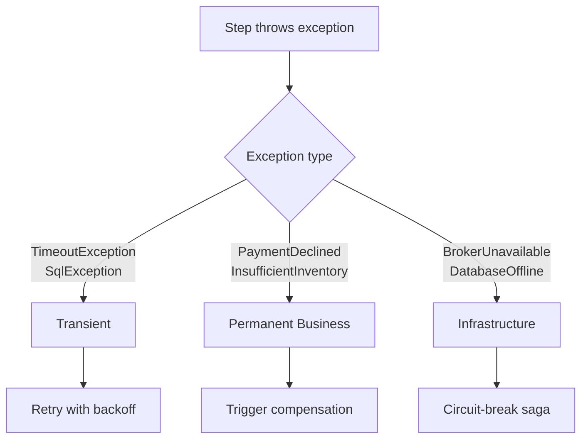
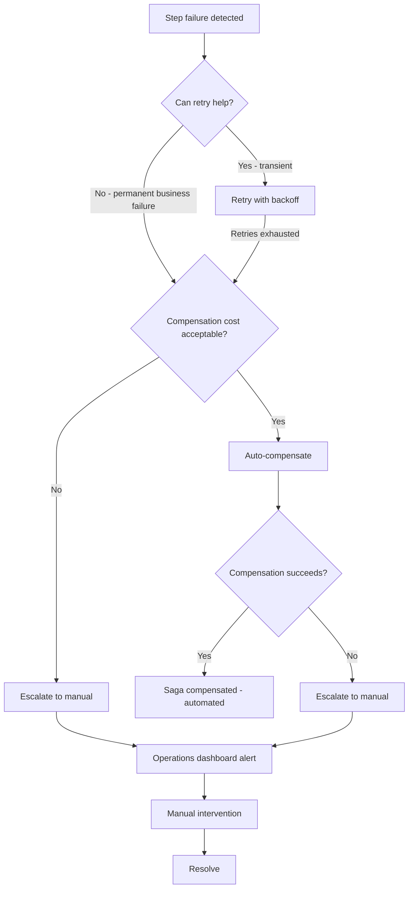

> [!success] Mastery Check
> - [ ] **Studied Well**
> - [ ] **Can explain the concept without notes**
> - [ ] **Can answer interview questions confidently**
> - [ ] **Can implement it in a real project**

## Navigation

**Domain:** [[7 — System Design & Distributed Systems]] > **Group:** Integration Patterns
**Previous:** [[7.133 — Saga Pattern — MassTransit Implementation]] | **Next:** [[7.135 — Change Data Capture — Concept and Use Cases]]

### Prerequisites
- [[7.131 — Saga Pattern — Orchestration-Based]] — required because failure handling in orchestrated sagas is structurally different from choreography
- [[7.132 — Saga Pattern — Compensating Transactions]] — needed because compensation failures are the most common saga failure
- [[7.133 — Saga Pattern — MassTransit Implementation]] — needed because most recovery mechanisms are concrete framework features

### Where This Fits

Saga failure handling encompasses the set of strategies for detecting, recovering from, and preventing failures in distributed workflows. Unlike a single-service transaction that either commits or rolls back atomically, a saga may fail partially: some steps completed, some did not, compensations may have partially succeeded. Recovery strategies include automated retry with backoff, timeout escalation, partial compensation with manual intervention, saga rewind (roll forward from a failed state), and dead-letter queue redrive for lost messages. A .NET engineer encounters this on day one of running sagas in production — the first stuck saga will arrive within the first week. Without a structured failure-handling approach, operations teams spend hours manually tracing and fixing stuck sagas.

## Core Mental Model

Saga failure handling is a three-layer recovery hierarchy. Layer 1 is **automated retry**: transient failures (timeouts, network blips) are retried with exponential backoff until they succeed or a retry limit is reached. Layer 2 is **compensation with escalation**: permanent business failures trigger compensations; if compensations fail, they are retried with their own (more aggressive) policy, and if they exhaust retries, the saga escalates to "NeedsManualIntervention." Layer 3 is **manual recovery**: operations tools for inspecting saga state, retrying failed steps, rewinding to a previous state, or manually compensating. The invariant is: no saga should remain in a non-terminal state indefinitely without an escalating action. The tradeoff is that automated recovery (aggressive retry, auto-compensation) reduces MTTR but may mask systemic issues or cause secondary failures (retry storms). The recognition trigger is any saga instance that remains in a non-terminal state for longer than the expected completion time multiplied by a safety factor (typically 3x).

```mermaid
flowchart TD
    A[Saga step fails] --> B{Classify failure}
    B -->|Transient (timeout, network)| C[Retry with backoff]
    C -->|Retries exhausted| D[Trigger compensation]
    C -->|Success| E[Continue saga]
    
    B -->|Business failure (validation, insufficient funds)| D
    
    B -->|Infrastructure (DB down, broker unavailable)| F[Circuit breaker - pause saga]
    F --> G{Circuit half-open?}
    G -->|Still down| H[Wait and retry circuit]
    G -->|Available| I[Resume saga processing]
    
    D --> J{Compensation succeeds?}
    J -->|Yes| K[Saga = Compensated]
    J -->|No - transient| L[Retry compensation]
    L -->|Exhausted| M[Escalate to manual]
    J -->|No - permanent (not allowed)| M
    
    M --> N[Operations dashboard]
    N --> O[Manual intervention]
    O --> P[Resolve and mark saga complete]
```

### Classification

Saga failure handling sits at the operations layer of the saga architecture. It defines the policies and tools that determine what happens when a step fails. It spans:
- **Detection** — how the saga knows a step failed (timeout, exception, negative reply)
- **Classification** — is this transient, permanent business, or infrastructure failure?
- **Reaction** — retry, compensate, circuit-break, or escalate
- **Observability** — metrics, alerts, dashboards for saga health

### Key Properties / Guarantees

|Property|Value|Condition|
|---|---|---|
|Retry scope|Per-step and per-compensation|Independent retry policies for forward vs reverse steps|
|Escalation time|3x expected saga duration|Configurable per saga type|
|Recovery granularity|Per-saga-instance|Each saga's state is individually recoverable|
|Observability|Per-saga-state dashboards|Requires saga state persistence and query capability|
|Manual intervention window|Minutes to hours|Proportional to compensation complexity|

## Deep Mechanics

### How It Works

**Step 1 — Failure classification.** When a saga step fails, the saga runtime examines the exception type, the step's retry history, and the failure context to classify it:



- **Transient:** `TimeoutException`, `SqlException` (deadlock), `HttpRequestException` (5xx). Retry.
- **Permanent business:** `PaymentDeclinedException`, `InsufficientInventoryException`. Trigger compensation.
- **Infrastructure:** `BrokerUnavailableException`, `DatabaseOfflineException`. Circuit-break saga processing.

**Step 2 — Retry execution.** Transient failures use a retry policy. The policy is defined per step type:
- Forward steps: 3 retries, exponential backoff (1s, 2s, 4s), jitter
- Compensation steps: 5 retries, shorter backoff (100ms, 200ms, 400ms), because compensations must succeed quickly
- After retry exhaustion, the failure is reclassified to permanent

**Step 3 — Compensation escalation.** For permanent failures, compensations are issued. If a compensation fails:
1. Retry with compensation-specific policy
2. If retries exhausted, mark the compensation as "Failed" in saga state
3. Check if all compensations have completed (some succeeded, some failed)
4. If any compensation failed permanently, set saga state to "NeedsManualIntervention"
5. Fire alert with saga ID, failed compensation name, failure reason

**Step 4 — Saga timeout.** Each non-terminal state has an associated timeout. The timeout is set to `expected_duration * 3`. When the timeout fires:
1. Check current saga state
2. If still in the same state, increment timeout count
3. If timeout count < threshold, resend the pending command
4. If timeout count >= threshold, trigger compensation for all completed steps

**Step 5 — Manual intervention.** Operations tools expose:
- Saga state query by `CorrelationId`, customer ID, or time range
- Saga retry: resend the failed step's command
- Saga rewind: move saga state back to a previous step and resend the command
- Saga force-compensate: run compensation for a specific step manually
- Saga force-complete: mark saga as completed without compensation (use with extreme care — data inconsistency risk)

### Retry Policy Design Patterns

**Per-step retry configuration.** Each step type has its own retry policy based on its failure characteristics and cost of failure:

```csharp
// Forward step retry — generous because cost of retry < cost of compensation
public class PaymentConsumerDefinition :
    ConsumerDefinition<ProcessPaymentConsumer>
{
    protected override void ConfigureConsumer(
        IReceiveEndpointConfigurator endpointConfigurator,
        IConsumerConfigurator<ProcessPaymentConsumer> consumerConfigurator,
        IRegistrationContext context)
    {
        consumerConfigurator.UseMessageRetry(r =>
        {
            r.Handle<TransientException>();
            r.Exponential(5,
                TimeSpan.FromSeconds(1),
                TimeSpan.FromSeconds(30),
                TimeSpan.FromSeconds(3));
            r.Ignore<PaymentDeclinedException>(); // Do not retry
        });
    }
}
```

**Jitter.** Adding random variation to retry intervals prevents thundering herd problems. MassTransit supports jitter in exponential retry:

```csharp
r.Exponential(5,
    TimeSpan.FromSeconds(1),
    TimeSpan.FromSeconds(30),
    TimeSpan.FromSeconds(3),
    jitter: 0.2); // 20% jitter
```

With 20% jitter at a 10-second interval, retries arrive between 8-12 seconds apart. At 1,000 concurrent sagas, this spreads retries across a 4-second window instead of all at once.

### Failure Modes

**Retry storm.** A saga has 1,000 in-flight instances when the Payment service starts returning 503 errors. Each saga's forward step retries with 1-second backoff. 1,000 retries/second hit the Payment service, which is already struggling, making the outage worse.

- **Detection:** Payment service 5xx rate increases. Saga P99 latency spikes.
- **Metric:** `saga_retry_rate` per step type.
- **Recovery:** Implement a circuit breaker in the saga's retry pipeline. When the downstream service error rate exceeds 50%, stop retrying and fail fast. Use a separate retry queue with controlled concurrency.

**Compensation failure cascade.** A payment refund compensation calls an external payment gateway. The gateway is down. All compensations fail. Sagas pile up in "NeedsManualIntervention." Operations has 500 sagas to manually resolve.

- **Detection:** `compensation_escalation_count` spikes. Operations dashboard shows sagas in "NeedsManualIntervention."
- **Recovery:** Batch compensation retries with controlled concurrency to avoid overwhelming the recovering gateway. Prioritize compensations by saga age (oldest first).
- **Prevention:** Implement a compensation circuit breaker — if compensation failures > 50% in the last 5 minutes, stop automatic compensation and queue them for deferred retry.

**Saga state corruption.** A bug in the state machine transitions the saga to an invalid state (e.g., "AwaitingPayment" when it should be "ProcessingPayment"). The saga never receives the expected event and remains stuck.

- **Detection:** Saga stuck in a state that no event handler is configured for. No timeout configured for that state.
- **Recovery:** Add a "catch-all" timeout that catches sagas in unexpected states. Expose an admin API to manually transition saga state.
- **Prevention:** Add integration tests that validate the state machine against all known event sequences. Use a state machine visualization tool to review transitions at design time.

### .NET and Azure Integration

- **ASP.NET Core:** Saga recovery admin endpoints as controllers or minimal APIs — `GET /admin/sagas/{correlationId}`, `POST /admin/sagas/{correlationId}/retry`, `POST /admin/sagas/{correlationId}/rewind`
- **Polly:** `ResiliencePipeline` for retry and circuit breaker in saga command handlers
- **Azure Service Bus:** Dead-letter queues per receive endpoint — saga messages that fail processing end up in the DLQ; a redrive function processes them
- **Azure Monitor / Application Insights:** Custom metrics for saga health — `saga_active_count`, `saga_stuck_count`, `saga_compensation_rate`, `saga_mti_count`
- **Azure Functions:** Scheduled function that scans saga state table for stuck sagas and alerts

```csharp
// Saga health check — stuck saga detector
public sealed class StuckSagaDetector
{
    private readonly SagaDbContext _db;
    private readonly ILogger<StuckSagaDetector> _logger;

    public async Task<int> DetectStuckSagasAsync(
        TimeSpan threshold, CancellationToken ct)
    {
        var stuckCount = await _db.Set<OrderSagaState>()
            .CountAsync(s =>
                s.CurrentState != "Completed" &&
                s.CurrentState != "Faulted" &&
                s.CurrentState != "NeedsManualIntervention" &&
                s.UpdatedAt < DateTime.UtcNow.Subtract(threshold),
                ct);

        if (stuckCount > 0)
        {
            _logger.LogWarning(
                "Detected {Count} stuck sagas beyond threshold {Threshold}",
                stuckCount, threshold);
        }

        return stuckCount;
    }
}
```

## Production Patterns and Implementation

### Primary Implementation

Complete failure-handling infrastructure for MassTransit sagas: retry policies, stuck-saga detection, admin recovery API, and DLQ redrive.

```csharp
// 1. Retry policies — separate for forward steps and compensations
public static class SagaRetryPolicies
{
    // Forward steps — 3 retries, moderate backoff
    public static readonly IRetryPolicy ForwardStep =
        Retry.CreatePolicy(
            RetryBehavior.CreateExponentialRetry(
                retryLimit: 3,
                minBackoff: TimeSpan.FromSeconds(1),
                maxBackoff: TimeSpan.FromSeconds(10),
                deltaBackoff: TimeSpan.FromSeconds(2)),
            logger: null);

    // Compensations — 5 retries, aggressive backoff (must succeed)
    public static readonly IRetryPolicy Compensation =
        Retry.CreatePolicy(
            RetryBehavior.CreateExponentialRetry(
                retryLimit: 5,
                minBackoff: TimeSpan.FromMilliseconds(100),
                maxBackoff: TimeSpan.FromSeconds(5),
                deltaBackoff: TimeSpan.FromSeconds(1)),
            logger: null);
}

// 2. Saga failure handler — centralized failure processing
public sealed class SagaFailureHandler<TState> where TState : SagaStateMachineInstance
{
    private readonly ISagaStateStore<TState> _stateStore;
    private readonly ILogger<SagaFailureHandler<TState>> _logger;
    private readonly IEscalationService _escalation;

    public async Task HandleStepFailureAsync(
        Guid correlationId,
        string stepName,
        string failureReason,
        int retryCount,
        int maxRetries,
        CancellationToken ct)
    {
        var sagaState = await _stateStore.LoadAsync(correlationId, ct);

        if (retryCount < maxRetries)
        {
            // Log and let the framework retry
            _logger.LogWarning(
                "Step {Step} for saga {CorrelationId} failed (attempt {Retry}/{Max}): {Reason}",
                stepName, correlationId, retryCount, maxRetries, failureReason);
            return;
        }

        // Retries exhausted — escalate
        _logger.LogError(
            "Step {Step} for saga {CorrelationId} failed after {Retry} attempts. Escalating.",
            stepName, correlationId, retryCount);

        await _stateStore.AppendFailureRecordAsync(
            correlationId, stepName, failureReason, retryCount, ct);

        // Trigger escalation
        await _escalation.EscalateAsync(
            new SagaEscalationEvent(
                correlationId,
                sagaState.GetType().Name,
                stepName,
                failureReason),
            ct);
    }
}

// 3. Admin recovery API
public static class SagaRecoveryEndpoints
{
    public static void MapSagaRecoveryEndpoints(
        this WebApplication app)
    {
        var admin = app.MapGroup("/admin/sagas")
            .RequireAuthorization("Admin");

        // GET saga state by correlation ID
        admin.MapGet("/{correlationId}", async (
            Guid correlationId,
            ISagaStateStore<OrderSagaState> store) =>
        {
            var state = await store.LoadAsync(correlationId, default);
            return state is not null
                ? Results.Ok(state)
                : Results.NotFound();
        });

        // POST retry a failed step
        admin.MapPost("/{correlationId}/retry", async (
            Guid correlationId,
            RetryStepRequest request,
            IPublishEndpoint publisher) =>
        {
            // Resend the command for the failed step
            await publisher.Publish(new RetrySagaStep(
                correlationId, request.StepName));
            return Results.Accepted();
        });

        // POST rewind saga to a previous state
        admin.MapPost("/{correlationId}/rewind", async (
            Guid correlationId,
            RewindRequest request,
            ISagaStateStore<OrderSagaState> store) =>
        {
            var state = await store.LoadAsync(correlationId, default);
            if (state is null)
                return Results.NotFound();

            state.CurrentState = request.TargetState;
            state.UpdatedAt = DateTime.UtcNow;
            await store.SaveAsync(state, default);

            _logger.LogInformation(
                "Saga {CorrelationId} rewound to state {TargetState}",
                correlationId, request.TargetState);

            return Results.Ok(state);
        });

        // POST force-complete saga (caution — data risk)
        admin.MapPost("/{correlationId}/force-complete", async (
            Guid correlationId,
            ISagaStateStore<OrderSagaState> store) =>
        {
            var state = await store.LoadAsync(correlationId, default);
            if (state is null)
                return Results.NotFound();

            state.CurrentState = nameof(Completed);
            state.CompletedAt = DateTime.UtcNow;
            await store.SaveAsync(state, default);

            _logger.LogWarning(
                "Saga {CorrelationId} force-completed. " +
                "Manual reconciliation may be required.",
                correlationId);

            return Results.Ok(new { Status = "ForceCompleted", correlationId });
        });
    }
}

// 4. Stuck saga monitor — scheduled job
public sealed class StuckSagaMonitor : BackgroundService
{
    private readonly IServiceScopeFactory _scopeFactory;
    private readonly ILogger<StuckSagaMonitor> _logger;

    protected override async Task ExecuteAsync(CancellationToken ct)
    {
        while (!ct.IsCancellationRequested)
        {
            await Task.Delay(TimeSpan.FromMinutes(5), ct);

            using var scope = _scopeFactory.CreateScope();
            var db = scope.ServiceProvider.GetRequiredService<SagaDbContext>();

            var threshold = TimeSpan.FromMinutes(30);
            var stuckSagas = await db.Set<OrderSagaState>()
                .Where(s => s.CurrentState != "Completed"
                         && s.CurrentState != "Faulted"
                         && s.CurrentState != "NeedsManualIntervention"
                         && s.UpdatedAt < DateTime.UtcNow.Subtract(threshold))
                .ToListAsync(ct);

            if (stuckSagas.Count > 0)
            {
                _logger.LogWarning(
                    "Found {Count} stuck sagas. Threshold: {Threshold}.",
                    stuckSagas.Count, threshold);

                // Fire alert
                await _escalation.AlertStuckSagasAsync(stuckSagas, ct);
            }
        }
    }
}
```

### Configuration and Wiring

```csharp
// Program.cs — failure handling configuration
builder.Services.AddMassTransit(x =>
{
    // Per-consumer retry for saga command handlers
    x.AddConsumer<ProcessPaymentConsumer>(c =>
    {
        c.UseMessageRetry(r =>
        {
            r.Handle<TransientException>();
            r.Exponential(3,
                TimeSpan.FromSeconds(1),
                TimeSpan.FromSeconds(10),
                TimeSpan.FromSeconds(2));
        });
    });

    x.AddConsumer<RefundPaymentConsumer>(c =>
    {
        c.UseMessageRetry(r =>
        {
            r.Handle<TransientException>();
            r.Exponential(5,
                TimeSpan.FromMilliseconds(100),
                TimeSpan.FromSeconds(5),
                TimeSpan.FromSeconds(1));
        });
    });

    x.UsingAzureServiceBus((context, cfg) =>
    {
        cfg.UseInMemoryOutbox(context);

        // Circuit breaker for downstream failures
        cfg.UseCircuitBreaker(cb =>
        {
            cb.TrackingPeriod = TimeSpan.FromMinutes(5);
            cb.TripThreshold = 15;
            cb.ActiveThreshold = 10;
            cb.ResetInterval = TimeSpan.FromMinutes(1);
        });

        cfg.ConfigureEndpoints(context);

        // Dead-letter queue redrive
        cfg.ReceiveEndpoint("saga-dlq-redrive", e =>
        {
            e.ConfigureConsumer<SagaDlqRedriveConsumer>(context);
        });
    });
});

// Register stuck saga monitor
builder.Services.AddHostedService<StuckSagaMonitor>();

// Register admin recovery endpoints
app.MapSagaRecoveryEndpoints();
```

### Common Variants

**Saga rewind vs retry.** Retry resends the failed step's command without changing saga state. Rewind moves the saga state back to a previous step (e.g., from "ProcessingPayment" back to "ReservingInventory") and resends the command. Rewind is useful when a step fails due to a downstream bug that was fixed — you want to re-execute the step from scratch, not just retry the same command.

```csharp
// Rewind implementation
await _stateStore.UpdateStateAsync(correlationId, "ReservingInventory");
await _commandSender.SendAsync(
    new ReserveInventoryCommand(correlationId, orderId));
```

**DLQ redrive for saga events.** Saga events that fail correlation (e.g., `PaymentProcessed` for a non-existent saga) go to the dead-letter queue. A scheduled job processes the DLQ, determines the correct action (discard, replay, escalate), and handles accordingly.

```csharp
public sealed class SagaDlqRedriveConsumer : IConsumer<PaymentProcessed>
{
    public async Task ConsumeAsync(ConsumeContext<PaymentProcessed> context)
    {
        var msg = context.Message;

        // Check if saga now exists (was created after DLQ entry)
        var saga = await _sagaStore.LoadAsync(msg.CorrelationId);
        if (saga is not null)
        {
            // Forward to the saga endpoint
            await context.ForwardToEndpoint(
                "order-saga-endpoint", context.Message);
            return;
        }

        // Saga never created — log and discard
        _logger.LogWarning(
            "Discarding PaymentProcessed for non-existent saga {CorrelationId}",
            msg.CorrelationId);
    }
}
```

### Real-World .NET Ecosystem Example

**MassTransit's built-in `ErrorQueue` and `DeadLetterQueue`** handling is the .NET ecosystem's battle-tested saga failure recovery. Each receive endpoint has an error queue and a dead-letter queue. MassTransit moves messages to the error queue after all retry attempts are exhausted. A separate `ErrorTransport` handles this. For sagas specifically, the `SagaRepositoryException` filter determines whether a saga persistence failure should be retried (transient) or sent to the error queue (permanent). The community has built tooling (e.g., MassTransit Platform, RabbitMQ delayed retry) around this infrastructure for advanced recovery scenarios.

## Gotchas and Production Pitfalls

### 1. Retry policy too aggressive for downstream service

**Pitfall:** The saga retries a failed step 5 times with 100ms intervals. The downstream service is already at capacity. Each retry adds to the load. The service never recovers.

```csharp
// ❌ Aggressive retry — 500ms total before escalation
c.UseMessageRetry(r =>
{
    r.Interval(5, TimeSpan.FromMilliseconds(100));
});
```

**Symptom:** Downstream service 5xx rate increases. Saga P99 latency spikes to 30 seconds. The service eventually crashes under the retry storm.

**Fix:** Use exponential backoff with jitter. Add a circuit breaker that stops retrying when the downstream service error rate exceeds a threshold.

```csharp
// ✅ Exponential backoff + circuit breaker
c.UseMessageRetry(r =>
{
    r.Handle<TransientException>();
    r.Exponential(3,
        TimeSpan.FromSeconds(1),
        TimeSpan.FromSeconds(30),
        TimeSpan.FromSeconds(5));
});
```

**Cost of not fixing:** Cascading failure. The downstream service collapses, then the saga processing collapses, then upstream services queue grows unbounded.

### 2. Saga stuck due to missing timeout

**Pitfall:** The saga has 4 states, but only 2 have timeout handlers. A saga enters a third state and never receives the expected reply. Without a timeout, the saga remains stuck indefinitely.

```csharp
// ❌ No timeout for "AwaitingPayment" state
During(AwaitingPayment,
    When(PaymentProcessed)
        .TransitionTo(AwaitingShipment));
// Missing: When(SagaTimeout) for this state
```

**Symptom:** Sagas accumulate in "AwaitingPayment" state. Over 3 months, 10,000 sagas are stuck. Saga state table has 500MB of dead data.

**Fix:** Every non-terminal state must have a timeout handler, even if the action is just "log and escalate."

```csharp
// ✅ Timeout handler for every state
During(AwaitingPayment,
    When(PaymentProcessed)
        .TransitionTo(AwaitingShipment),
    When(SagaTimeout)
        .Then(context => _logger.LogWarning("Saga {Id} timed out in AwaitingPayment",
            context.Saga.CorrelationId))
        .TransitionTo(Faulted));
```

**Cost of not fixing:** Dead data accumulation. Operations team manually cleans up the saga state table quarterly. In the meantime, database performance degrades.

### 3. Compensation retry prevents forward recovery

**Pitfall:** A payment step fails. The saga runs compensation (refund). The refund also fails. The saga keeps retrying the refund. Meanwhile, the underlying payment issue was resolved. But the saga cannot retry the forward step because it has already transitioned to compensation.

**Symptom:** Saga stuck in compensation retry loop. The forward payment step would succeed now, but the saga has "given up" on it.

**Fix:** Design the state machine to allow retrying the forward step even after compensation has started, if the compensation has not yet succeeded. A "compensation gate" should prevent this — once compensation starts, forward progress is blocked — but a human operator should have the ability to "unblock" the saga and retry forward.

```csharp
// ✅ Admin API to rewind and retry forward
await _sagaStateStore.RewindAsync(correlationId, "AwaitingPayment");
await _publisher.Publish(new ProcessPaymentCommand(correlationId, orderId, amount));
```

**Cost of not fixing:** Lost revenue. The payment would have succeeded on retry, but the saga refunded the customer. The refund costs money and the order is lost.

### 4. DLQ accumulation not monitored

**Pitfall:** Saga messages go to the dead-letter queue. A consumer processes them on a weekly basis. In the meantime, 500 sagas are stuck because their expected events are in the DLQ.

**Symptom:** Operations asks "why are there 500 stuck sagas?" The answer: "the reply events are sitting in the DLQ and nobody processed them."

**Fix:** Monitor DLQ depth with alerts. Process the DLQ continuously, not batched.

```csharp
// ✅ DLQ depth alert
[FunctionName("DLQDepthAlert")]
public async Task Run(
    [TimerTrigger("0 */5 * * * *")] TimerInfo timer)
{
    var dlqDepth = await _serviceBusAdmin.GetDLQDepthAsync("saga-payment-endpoint");
    if (dlqDepth > 100)
    {
        await _alertService.SendAsync(
            $"DLQ for saga endpoint has {dlqDepth} messages. " +
            "Investigate stuck sagas.");
    }
}
```

**Cost of not fixing:** Stuck sagas go unnoticed for days. Customer-facing delays. Sagas with time-sensitive compensations (e.g., void within 24 hours) miss their windows.

### 6. Saga rewind causes duplicate compensation

**Pitfall:** An operator rewinds a saga from "NeedsManualIntervention" back to "AwaitingPayment" to retry the payment. But the compensation for the previous failed step (RefundPayment) had already run. After the rewind, the payment succeeds, but the customer was already refunded — the customer gets the item for free.

**Symptom:** Revenue loss. Finance reconciliation shows orders with a successful payment AND a refund.

**Fix:** Rewind must be aware of which compensations have completed. Before rewinding, check the compensation store. If compensations have run, the rewind should either: (a) prevent the rewind and advise the operator to force-complete instead, or (b) rewind AND re-apply the compensation later (complex — not recommended).

```csharp
// ✅ Rewind with compensation check
public async Task<bool> CanRewindAsync(Guid correlationId, string targetState)
{
    var compensations = await _compensationStore
        .GetCompensationsAsync(correlationId);
    
    if (compensations.Any(c => c.Status == "Succeeded"))
    {
        _logger.LogWarning(
            "Rewind blocked for saga {CorrelationId} — " +
            "compensations have already been applied",
            correlationId);
        return false;
    }
    return true;
}
```

**Cost of not fixing:** Silent revenue loss. Each rewind without compensation check costs the business the order value.

### 7. Escalation fatigue from non-actionable alerts

**Pitfall:** A saga type has a 10% transaction failure rate. Each failure triggers a "NeedsManualIntervention" alert. The operations team receives 100 alerts/hour. After a week, they start ignoring them. A real escalation (e.g., payment gateway permanently down) is missed.

**Symptom:** Average MTTR increases from 5 minutes to 4 hours. The team becomes desensitized to saga alerts.

**Fix:** Tier the escalation. Red alerts (saga stuck > 1 hour, compensation permanently failed) page the on-call engineer. Yellow alerts (saga stuck > 30 minutes, high retry rate) go to a dashboard. Green alerts (normal retries happening) are logged only. Train the team to only respond to red alerts immediately.

```csharp
// Tiered escalation
public enum EscalationLevel { Log, Dashboard, Page }
```

**Cost of not fixing:** Alert fatigue. Missed escalations. Prolonged incidents.

### 5. Manual intervention is not documented

**Pitfall:** A saga enters "NeedsManualIntervention." The on-call engineer has never seen this before. They do not know what step to take. They escalate to the senior engineer, who is on vacation.

**Symptom:** MTTR for saga recovery = 8+ hours. The senior engineer is the only person who knows the recovery procedure.

**Fix:** Document recovery procedures per saga type. Include runbooks in the operations dashboard. Provide a CLI or API for common recovery actions.

```csharp
// ✅ Recovery runbook endpoint
admin.MapGet("/admin/sagas/{correlationId}/runbook", (Guid correlationId) =>
{
    return Results.Ok(new
    {
        SagaType = "OrderFulfillment",
        State = "NeedsManualIntervention",
        FailedCompensation = "RefundPayment",
        Steps = new[]
        {
            "1. Check payment gateway: is the refund possible manually?",
            "2. If yes: process refund via payment gateway UI, record reference number",
            "3. POST /admin/sagas/{correlationId}/force-compensate with reference number",
            "4. POST /admin/sagas/{correlationId}/force-complete"
        }
    });
});
```

**Cost of not fixing:** Prolonged incidents. Fire drills every time a saga enters manual intervention. Engineer burnout from building tribal knowledge.

## Tradeoffs and Decision Framework

### Tradeoff Matrix

|Dimension|Auto-Retry + Compensate|Auto-Retry + Manual Escalation|Fail Fast + Manual All|
|---|---|---|---|
|MTTR|Minutes|Hours|Depends on operations|
|Operational burden|Low — automated|Medium — monitor for escalations|High — every failure is manual|
|Risk of wrong auto-action|Compensation may be unnecessary|Low — human reviews|Low — human does everything|
|Systemic issue masking|High — retry masks problems|Medium|Low — visible immediately|
|Implementation complexity|High — retry policies + compensation|Medium — retry + notification|Low|
|Cost|Compensation may have financial cost|Lower — fewer unnecessary compensations|Lowest — no auto-compensation cost|

### When to Apply



### When NOT to Apply

- [ ] Every failure should be reviewed by a human (regulatory, high-value, or irreversible operations) — manual escalation only
- [ ] The auto-compensation cost exceeds the cost of manual review for the expected failure rate
- [ ] The saga is simple (2 steps) — a single retry with fallback is sufficient; the failure-handling infrastructure is overkill
- [ ] The team does not have 24/7 operations coverage — automated recovery is essential, but manual escalation will not be handled promptly

### Scale Thresholds

- **< 100 sagas/hour:** Manual review of every saga failure is feasible. A senior engineer can check sagas every hour.
- **100-10,000 sagas/hour:** Auto-retry is required. Manual review only for compensation failures. Stuck saga monitoring every 5 minutes.
- **> 10,000 sagas/hour:** Full auto-recovery pipeline required. Compensation retries with circuit breaker. Stuck saga detection every minute. Auto-healing for known failure patterns (e.g., if refund fails due to gateway timeout, retry up to 10 times before escalation).

## Interview Arsenal

### Question Bank

1. What are the three layers of saga failure recovery?
2. How do you distinguish between a transient failure and a permanent failure in a saga?
3. What is a "retry storm" and how do you prevent it?
4. How does a saga timeout work, and what happens when it fires?
5. What information does the operations team need to resolve a stuck saga?
6. Design the recovery API for a saga system.
7. How do you handle the case where a forward step's retries are exhausted but the compensation also fails?
8. What metrics would you track for saga health in production?

### Spoken Answers

**Q1: What are the three layers of saga failure recovery?**

> **Great answer:** "Layer 1 is automated retry for transient failures. The saga framework retries the failed step with exponential backoff. The retry policy is separate for forward steps and compensations — forward steps use moderate backoff (1s, 2s, 4s) to avoid overwhelming the downstream service, while compensations use more aggressive retry because they must eventually succeed to avoid manual intervention. Layer 2 is compensation with escalation. When retries are exhausted, the saga runs compensations for all completed steps. If compensation also fails, it retries with its own policy. If retries are exhausted, the saga escalates to 'NeedsManualIntervention.' Layer 3 is manual recovery. The operations team uses admin tools to query saga state, retry failed steps, rewind the saga to a previous state, or force-complete it. The key design principle is that the system should minimize the number of sagas that reach Layer 3, but Layer 3 must exist because no automated system can handle all failure modes. For example, if a payment gateway permanently rejects a refund, only a human can call the gateway's support line and resolve it."

**Q2: How do you distinguish between a transient failure and a permanent failure in a saga?**

> **Great answer:** "The distinction is based on exception type and retry history. Transient failures are timeout, network errors, database deadlock, and 5xx HTTP responses. These indicate the downstream service may recover. Permanent business failures are domain-specific: payment declined, insufficient inventory, validation errors. These will not succeed on retry — they need compensation. Infrastructure failures like 'database offline' or 'broker unavailable' are transient but require a different response: circuit-breaking, not retry. In the implementation, I configure the retry policy to handle specific exception types. For example, `Handle<TimeoutException>()` for transient, `Handle<PaymentDeclinedException>()` triggers compensation directly without retry. The retry count also informs the distinction — after 3 retries of a transient failure, it's treated as permanent because the downstream service has not recovered. The key is to never retry a business failure. If the payment was declined, retrying will not make the customer have more money."

**Q3: What is a retry storm and how do you prevent it?**

> **Great answer:** "A retry storm occurs when multiple saga instances fail on the same step simultaneously and all retry at the same interval. For example, 1,000 sagas are waiting for the Payment service response. The Payment service has a transient blip. All 1,000 sagas retry after 1 second. The Payment service receives 1,000 requests at once, which overwhelms it, causing more failures, which trigger more retries. This cascades into a full outage. Prevention involves three techniques. First, jitter — add random variation to retry intervals so retries are spread out. Second, exponential backoff — retry intervals grow exponentially, giving the downstream service time to recover. Third, a circuit breaker — if the downstream service error rate exceeds a threshold (e.g., 50% in 30 seconds), stop retrying entirely and fail fast. The circuit breaker resets after a cooldown period. MassTransit supports all three: `UseMessageRetry` for jitter and backoff, `UseCircuitBreaker` for the circuit breaker. In production, I also monitor the retry rate as a health signal — if retry rate spikes, it indicates a downstream issue that needs investigation."

**Q4: How does a saga timeout work, and what happens when it fires?**

> **Great answer:** "A saga timeout is a scheduled message that the saga publishes when it enters a waiting state. The timeout is delayed by the expected step duration multiplied by a safety factor (typically 3x). When the timeout fires, the saga loads the current instance and checks whether the expected reply has arrived. If not, it increments the timeout count. If the timeout count is below a threshold, it resends the command and reschedules the timeout. If the timeout count has reached the threshold, it triggers compensation for all completed steps. The timeout message must be correlated back to the saga instance via `CorrelationId`. A critical detail: the `Unschedule` operation that removes the timeout when the expected reply arrives may fail (broker issue). The timeout may fire after the saga has already progressed. Configuring `OnMissingInstance(m => m.Discard())` on the timeout event prevents the timeout from going to the error queue. Every non-terminal state in the saga must have a timeout handler — states without timeouts are design bugs."

**Q5: What information does the operations team need to resolve a stuck saga?**

> **Great answer:** "The operations team needs four categories of information. (1) Saga identity: `CorrelationId`, saga type, customer ID. (2) Current state: which state is the saga in, how long has it been there, what step is it waiting for. (3) Failure history: which steps have failed, how many retries each had, what exceptions were thrown, what compensations have run and their status. (4) Recovery actions: what actions are available (retry, rewind, force-compensate, force-complete), which ones are safe for this saga type, and a runbook link with step-by-step instructions. This information should be available via an admin API and a dashboard. The key insight is that the operations team should not need to check logs or the database to understand a stuck saga — everything they need should be in the saga state and returned by a single admin endpoint."

**Q6: Design the recovery API for a saga system.**

> **Great answer:** "The recovery API has four endpoints. GET /admin/sagas/{correlationId} — returns the full saga state including current state, step history, failure records, and compensation status. POST /admin/sagas/{correlationId}/retry — resends the command for the failed step. The endpoint accepts an optional step name parameter — if not provided, it retries the last failed step. POST /admin/sagas/{correlationId}/rewind — moves the saga to a previous state and resends the command for that step. This requires a target state parameter. POST /admin/sagas/{correlationId}/force-complete — marks the saga as completed without compensation. This is a last-resort action that requires explicit confirmation from the operator. All actions are audited — who performed the action, when, and the saga state before and after. The API is authorization-gated — only the operations team and senior engineers can access it."

**Q7: How do you handle the case where a forward step's retries are exhausted but the compensation also fails?**

> **Great answer:** "This is the worst-case scenario — the saga cannot move forward and cannot move backward. The saga enters 'NeedsManualIntervention' state. The operations team receives an alert with the saga ID, the failed step, the failed compensation, and the failure reason. The runbook for this scenario has three branches. Branch 1: if the compensation failure is transient (payment gateway timeout), retry the compensation using the admin API. Branch 2: if the compensation failure is permanent (refund not allowed), process the compensation manually (issue refund via payment gateway UI, send a check) and then force-complete the saga with the manual compensation reference. Branch 3: if the forward step can now succeed (the underlying issue was fixed), rewind the saga to before the forward step and retry. The system should also have a 'deferred compensation' queue — if the compensation failed due to a dependency that is expected to recover within hours, the saga is moved to a deferred queue and retried automatically after 1 hour, 4 hours, and 24 hours."

**Q8: What metrics would you track for saga health in production?**

> **Great answer:** "I track five key metrics. (1) Saga completion time — a histogram across all saga instances. Alert on P99 > 3x expected duration. (2) Saga stuck count — number of sagas in non-terminal states for > 30 minutes. Alert on non-zero. (3) Retry rate — retries per minute per step type. Alert on sudden spike > 2x baseline. (4) Compensation rate — compensations per minute per saga type. Alert on trend increase (may indicate a systemic issue causing more failures). (5) DLQ depth — number of messages per saga endpoint dead-letter queue. Alert on > 100 messages. These metrics are collected via Application Insights custom metrics and displayed on a saga health dashboard. The dashboard has three sections: active sagas (throughput, latency), stuck sagas (count, age, state distribution), and escalations (recent entries, time to resolve)."

### System Design Interview Trigger

When the interviewer asks "how do you handle failures in your saga?" they are not asking about compensations — they assume you know that. They are asking about the operations layer: how do you detect stuck sagas, what tooling exists for recovery, how do you prevent retry storms, and how do you ensure MTTR is measured in minutes, not hours. The senior answer includes concrete metrics, alert thresholds, admin APIs, and the three-layer recovery hierarchy. The interviewer wants to see that you have run sagas in production and know that the automated compensation path is not the end of the story.

### Comparison Table

| | Auto-Retry | Circuit Breaker | Manual Escalation |
|---|---|---|---|
| When triggered | Transient failure | Sustained error rate > threshold | Retry/compensation exhausted |
| Action | Resend command | Stop processing, fail fast | Alert + dashboard entry |
| Recovery | Exponential backoff | Cooldown timer + half-open | Human operator | |
| Detection | Exception caught | Error rate metric | Saga state = NeedsManualIntervention |
| Prevention of | Temporary outages | Cascading failures | Unhandled permanent failures |

## Architecture Decision Record

**Status:** Accepted

**Context:** A MassTransit order fulfillment saga handles 500 orders/second. The Payment service has a 99.9% uptime SLA but occasionally has transient blips (30-60 seconds). The Refund service (external gateway) has a 2-second P99 latency and charges $0.25 per refund. The operations team has 3 engineers covering 24/7 on-call. Management wants MTTR under 5 minutes for any saga-related issue.

**Options Considered:**

1. **Three-layer recovery** — Auto-retry (3 attempts, exponential backoff), auto-compensate, manual escalation after compensation retries exhausted
2. **Auto-retry only, manual compensation** — Retry forward steps automatically, but require human approval for compensations to avoid $0.25 cost per refund
3. **Fail fast, manual everything** — No auto-retry, no auto-compensation. Every failure alerts operations.

**Decision:** Option 1 — three-layer recovery. The auto-compensation cost ($0.25 per refund) is acceptable because payment failures are < 2% of orders, so the daily cost is ~$2,000 on $500K daily revenue. The MTTR requirement (5 minutes) cannot be met with manual intervention for every failure. The circuit breaker protects the Payment service from retry storms during its transient blips.

**Consequences:**
- ✅ MTTR < 1 minute for transient failures (auto-retry succeeds)
- ✅ MTTR < 5 minutes for payment failures (auto-compensate + retry)
- ✅ Compensation cost is predictable and budgeted
- ⚠️ Compensation cost must be reviewed quarterly — if payment failure rate increases, the cost may become unacceptable
- ⚠️ Operations must still handle escalation events within 15 minutes (monitoring + alerting ensures this)
- ❌ Occasional unnecessary compensations (forward step would have succeeded on retry, but compensation already ran) — accepted as cost of automation

**Review Trigger:** Review if payment failure rate exceeds 5% (doubling compensation cost) or if a single saga incident takes > 30 minutes to resolve, indicating the recovery tooling needs improvement.

## Self-Check

### Conceptual Questions

1. What are the three layers of saga failure recovery?
2. How do you classify a failure as transient vs permanent?
3. What is a retry storm and how do you prevent it?
4. What should happen when a compensation permanently fails?
5. What information should the admin recovery API expose for a stuck saga?
6. How does a saga timeout work and what states should have timeouts?
7. What is the difference between saga retry and saga rewind?
8. What metrics should you monitor for saga health?
9. How do you handle saga messages that end up in the dead-letter queue?
10. Explain in 60 seconds the failure recovery strategy for a high-volume saga.

### Additional Questions

**11. How do you distinguish between a retry storm and a legitimate traffic spike?**

> A retry storm shows increasing error rate alongside increasing retry rate. A traffic spike shows increasing success rate alongside increasing request rate. The key metric is the ratio of `saga_retry_rate` to `saga_step_attempt_rate`. If the ratio exceeds 0.5 (50% of attempts are retries), a retry storm is likely. Also check the downstream service's error rate — if it is also elevated, the retries are a symptom, not the cause.

**12. What is the role of a circuit breaker in saga failure handling?**

> The circuit breaker prevents the saga from overwhelming a struggling downstream service. It tracks the error rate for step executions. When the error rate exceeds a threshold (e.g., 50% in 30 seconds), the circuit breaker "trips" — all subsequent step executions fail fast without calling the downstream service. After a cooldown period (e.g., 60 seconds), the circuit breaker enters "half-open" state — it allows one probe request. If the probe succeeds, the circuit resets. If it fails, the circuit stays open for another cooldown. This prevents retry storms and gives the downstream service time to recover.

**13. How do you test saga failure recovery scenarios?**

> Use chaos engineering. Inject failures at every step: make the Payment service return 503 for 30 seconds, make the Inventory service throw `DbUpdateException`, make the Shipping service time out. Verify that the saga: (1) retries transient failures with correct backoff, (2) triggers compensation after retries exhausted, (3) retries compensations if they fail, (4) enters NeedsManualIntervention after compensation retries exhausted, (5) recovers via admin API (retry, rewind, force-complete). The test assertions check saga state transitions, compensation store entries, and alert generation. Write these tests using MassTransit's InMemoryTestHarness and a controlled failure-injection consumer.

**14. What is the difference between a saga that is "stuck" and one that is "slow"?**

> A slow saga is one where processing takes longer than expected but is still making progress — the `UpdatedAt` timestamp is changing, the state is transitioning, the saga is moving forward. A stuck saga has a non-terminal state where `UpdatedAt` has not changed for a long period (2x-3x expected duration). The distinction is important for alerting — slow sagas should be monitored (trending slower may indicate a performance issue), while stuck sagas should be alerted immediately (they will not recover without intervention).

<details>
<summary>Answers</summary>

1. (1) Auto-retry for transient failures with exponential backoff and circuit breaker. (2) Compensation with retry when forward step permanently fails. (3) Manual escalation when compensations exhaust retries or cannot be automated.
2. Transient: timeout, network, 5xx, deadlock — the operation may succeed if retried. Permanent: business validation failure, payment declined, insufficient inventory — retry will not help. Infrastructure: database offline, broker unavailable — needs circuit breaker, not retry.
3. A retry storm is multiple saga instances retrying at the same interval, overwhelming the downstream service. Prevention: jitter (randomize retry intervals), exponential backoff, circuit breaker (stop retrying when error rate > threshold).
4. The saga enters "NeedsManualIntervention" state. Operations receives an alert with the saga ID, failed compensation name, and failure reason. The runbook contains steps for manual resolution. The saga remains in this state until a human resolves it.
5. Current saga state, current step, failure history (step name, reason, retry count, timestamp), saga type, customer ID, options (retry, rewind, force-compensate, force-complete), and a link to the runbook.
6. A saga timeout is a scheduled message published when the saga enters a waiting state. If the expected reply does not arrive before the timeout fires, the saga checks the state and either resends the command or triggers compensation. Every non-terminal state must have a timeout handler — states without timeouts are bugs waiting to happen.
7. Retry resends the failed step's command without changing saga state. Rewind moves the saga state backward to a previous step and resends the command for that step. Rewind is used when the failure is due to a bug that has been fixed — you want to re-execute the step from scratch, not just retry the same command.
8. `saga_active_count`, `saga_stuck_count` (in same state > 3x expected duration), `saga_retry_rate`, `saga_compensation_rate`, `saga_escalation_count`, `saga_slo_breach_count` (sagas exceeding expected completion time), DLQ depth per saga endpoint.
9. A scheduled DLQ redrive consumer reads messages from the DLQ, checks the current saga state, and either forwards the message to the saga endpoint (if the saga now exists), logs and discards (if the saga never existed), or escalates (if the message cannot be handled). Monitor DLQ depth and alert if it exceeds a threshold.
10. "For a high-volume saga at 500 orders/second, the recovery strategy has three layers. Layer 1: auto-retry with exponential backoff (3 attempts, 1s/2s/4s) and jitter. A circuit breaker stops retrying if the downstream error rate exceeds 50% in 30 seconds. Layer 2: if retries exhaust, auto-compensate. Compensations retry 5 times with aggressive backoff (100ms/200ms/400ms). If compensation fails, the saga enters NeedsManualIntervention. Layer 3: a stuck saga monitor scans the saga state table every 5 minutes. Sagas in non-terminal states for > 30 minutes trigger an alert. The admin API allows querying saga state, retrying failed steps, rewinding to previous states, and force-completing. DLQ depth is monitored every 5 minutes. The key metric is saga_slo_breach_count — sagas that exceed their expected completion time. The target is 99.9% of sagas complete within 5 minutes."

11. Monitor the ratio of `saga_retry_rate` to `saga_step_attempt_rate`. If > 0.5, a retry storm is likely. Cross-reference with the downstream service's error rate — if the downstream is also failing, the retries are a symptom, not the cause. Use a circuit breaker to stop retrying when error rate > threshold.

12. The circuit breaker sits between the saga and the downstream service. It tracks errors in a sliding window (e.g., 30 seconds). If the error rate exceeds the trip threshold (e.g., 50%), the circuit opens — all subsequent requests fail fast without calling the downstream service. After a reset interval (e.g., 60 seconds), it allows one probe request. If successful, the circuit closes. This prevents retry storms and gives the downstream service a recovery window.

13. Write chaos tests that inject failures for each saga step. Use a test harness that simulates the saga broker and persistence. For each failure scenario, assert: (1) the saga retries with correct backoff, (2) compensations are triggered after retries exhausted in correct reverse order, (3) compensation failures are retried, (4) escalation to NeedsManualIntervention after compensation retries exhausted, (5) admin API recovery actions work (retry, rewind, force-complete). Run these tests in CI to catch regressions.

14. Check the `UpdatedAt` timestamp of the saga instance. If it is changing, the saga is slow but progressing — monitor for trend changes. If it has not changed for > 2x expected state duration, the saga is stuck — alert immediately. The distinction prevents alert fatigue from slow-but-making-progress sagas while still flagging truly stuck ones.
</details>

---

### Scenario Challenges

**Scenario 1 — Diagnose the problem**

A MassTransit saga processes 5,000 orders/hour. The Payment service has a 30-second blip at 2:00 PM. By 2:05 PM, 800 sagas are in "NeedsManualIntervention." The Payment service recovered at 2:01 PM. Investigation shows that the sagas exhausted retries and auto-compensated (refunded the customer). The refunds cost $200. All 800 orders were lost.

<details>
<summary>Diagnosis</summary>

**Root cause:** The retry policy was too conservative — 3 retries with 1-second interval. The Payment service blip lasted 30 seconds. The saga retried 3 times in 3 seconds, exhausted retries, and ran compensation (refund). The Payment service recovered 1 minute later, but the saga had already compensated.

**Evidence:** Saga retry count = 3 for all 800 sagas. Refund events found in the compensation store. Payment service logs show it recovered at 2:01 PM, 4 minutes before the sagas compensated.

**Fix:** Increase retry count to 10 with longer backoff (1s, 2s, 4s, 8s, 16s, 30s, 30s, 30s, 60s). This gives the Payment service a 3-minute recovery window before compensation triggers. The total retry duration should be at least 2x the downstream service's documented recovery time.

**Prevention:** Match retry policy duration to downstream service SLA. If the Payment service SLA says "99.9% availability with max recovery time of 60 seconds," set retry total to 120 seconds. The retry budget should be generous — the cost of retrying is lower than the cost of unnecessary compensation.

</details>

---

**Scenario 2 — Design decision**

Your saga has a human approval step — a loan application must be reviewed by an underwriter. The underwriter may take 1-48 hours to respond. The saga has 3 automated steps before the approval step and 2 after. How do you handle the long wait?

<details>
<summary>Decision and Reasoning</summary>

**Choice:** Use optimistic concurrency for the saga state during the human approval step. Model the approval as an external event — a message published by the underwriting system when the decision is made. Do not use a timeout for the approval step (48 hours is too long for a scheduled message). Instead, use a cron job that periodically scans for sagas stuck in "AwaitingApproval" for > 48 hours.

**Tradeoffs accepted:** Optimistic concurrency means rare concurrency exceptions. The approval step is inherently single-threaded per saga (only one underwriter reviews a loan), so the risk is negligible. Without a timeout, a bug in the underwriting system could leave sagas stuck indefinitely — the cron job mitigates this.

**Implementation sketch:**
```csharp
// Saga state for long-running step
During(AwaitingApproval,
    When(LoanApproved)
        .Then(context => context.Saga.ApprovedBy = context.Message.UnderwriterId)
        .TransitionTo(AwaitingDisbursement),
    When(LoanRejected)
        .Then(context => context.Saga.RejectionReason = context.Message.Reason)
        .TransitionTo(Rejected));

// No timeout — just a daily stuck saga scan
```

</details>

---

**Scenario 3 — Failure mode** A saga's compensation (RefundPayment) fails with "RefundNotAllowed — transaction is past refund window." The saga enters "NeedsManualIntervention." The operations team investigates and finds that the transaction is 95 days old and the refund window is 90 days. The refund cannot be processed through the automated system.

<details> <summary>Investigation and Fix</summary>

**Investigation steps:**
1. Confirm the refund cannot be processed through the payment gateway (policy restriction)
2. Check if an alternative refund method exists (wire transfer, check)
3. Determine the customer's preferred resolution

**Confirming evidence:** Payment gateway API response: `RefundNotAllowed: transaction 95 days old exceeds 90-day refund window.`

**Immediate mitigation:** Process the refund manually through the payment gateway's manual refund process (available for support teams). Record the manual refund reference number in the saga state.

**Permanent fix:**
1. Add a pre-compensation check: if the transaction is within 10 days of the refund window, flag the saga for manual review BEFORE compensation runs
2. The saga should publish a "RefundWindowExpiring" warning event when the transaction is within 30 days of the window

```csharp
// Pre-compensation check
if (transaction.AgeInDays > saga.MaxRefundWindowDays - 10)
{
    // Escalate before attempting automated refund
    await _publisher.Publish(new RefundRequiresManualReview(
        saga.CorrelationId, transaction.TransactionId, transaction.AgeInDays));
    return; // Do not attempt auto-refund
}
```

</details>

---

**Scenario 4 — Interview simulation** The interviewer says: "You have 1,000 sagas stuck in 'AwaitingPayment' state. The Payment service is healthy. What happened and how do you recover?"

<details> <summary>Model Response</summary>

"There are several possible causes. Let me walk through the diagnosis.

"First, I check the saga state table — what is the `UpdatedAt` for these sagas? If they were created recently, the Payment service may be processing them slowly. If they are hours old, something went wrong.

"Second, I check the MassTransit error queue for the saga's receive endpoint. If `PaymentProcessed` events are in the error queue, the saga cannot process them. The error queue message tells me why — likely a serialization issue or a saga persistence failure.

"Third, I check the Payment service's outbox — did it publish `PaymentProcessed` replies? If the outbox has pending messages, the Payment service may have a database issue that prevents outbox flushing.

"Fourth, I check the saga's dead-letter queue. If `PaymentProcessed` events were sent but the saga instance was not found (common race condition at high throughput), they go to the DLQ.

"The recovery depends on the cause:
- If events are in the error queue due to a transient DB issue: redrive the error queue.
- If events were never published: retry the payment step for each stuck saga.
- If events are in the DLQ (missing saga instances): redrive the DLQ — by now, the saga instances should exist (they were created after the reply was sent).

"The automated recovery script processes stuck sagas in batches of 100. For each, it checks the current state, checks whether the expected event exists in any queue, and either redrives the event or retries the step. Sagas that cannot be automatically recovered are flagged for manual review."

</details>

---

**Scenario 5 — Scale it** Your saga failure handling infrastructure processes 100 escalations/day with manual recovery. The system grows to 10,000 sagas/second, and escalations grow to 5,000/day. Manual recovery at 5,000/day requires 10 full-time engineers. Redesign the recovery pipeline.

<details>
<summary>Scaling Strategy</summary>

**Bottleneck:** Manual intervention does not scale linearly with sagas. At 5,000 escalations/day, the operations team would need 10+ engineers just for saga recovery.

**How it helps:**
1. Increase retry counts and durations to reduce escalation rate. Retry the forward step 10 times over 5 minutes before compensating. Most transient failures recover within seconds.
2. Implement auto-healing for known failure patterns. If a refund fails with "gateway timeout," automatically retry 10 times over 30 minutes. Only escalate if the gateway returns a permanent error (e.g., "transaction not found").
3. Create a "saga recovery bot" — an automated script that processes known failure patterns. The bot checks the saga state, determines the recovery action from a rules engine, and executes it. Only flag for human review when the bot cannot determine the action.
4. Implement "deferred recovery" queue — sagas with compensation failures that are expected to resolve (gateway down, database restart) are moved to a separate queue and retried automatically at 1h, 4h, 24h intervals.
5. Add auto-force-complete for sagas that meet specific criteria (e.g., value < $5, customer notified, manual review not cost-effective).

**Implementation order:**
1. Increase retry counts and durations (quick win, immediate reduction in escalation rate)
2. Build the deferred recovery queue (reduces escalations for transient compensation failures)
3. Implement auto-healing for top-5 failure patterns (handles 80% of remaining escalations)
4. Build the saga recovery bot (reduces human review to < 50/day)
5. Add auto-force-complete for low-value sagas (eliminates remaining trivial escalations)

</details>

---

**Scenario 6 — Failure mode** A deployment introduces a bug in the saga state machine: it sets `CurrentState` to an empty string instead of a valid state name. After deployment, all new sagas that enter this state immediately fail with "Invalid state" errors. 10,000 sagas are affected in 1 hour. Recover.

<details>
<summary>Investigation and Fix</summary>

**Investigation steps:**
1. Identify the affected sagas — query saga state table for `CurrentState == ''`.
2. Check deployment logs — which deployment introduced the bug?
3. Roll back the saga state machine to the previous version.
4. For each affected saga, query the saga history (step events) to determine the correct state.

**Immediate mitigation:**
1. Roll back the deployment. New sagas will use the correct state machine.
2. For affected 10,000 sagas, run a data migration: `UPDATE OrderSagaState SET CurrentState = 'AwaitingPayment' WHERE CurrentState = ''`. This moves all affected sagas to a safe state.
3. Run the stuck saga monitor — it will identify any sagas that were in the incorrect state and cannot proceed in 'AwaitingPayment'.
4. For sagas that do not progress after the migration, use the admin API to investigate and manually correct.

**Permanent fix:**
1. Add validation in the saga state machine that prevents setting `CurrentState` to an invalid value.
2. Add a test that verifies the state machine against all valid state names.
3. Add a database constraint: `CHECK (CurrentState IN ('Initial', 'AwaitingPayment', ..., 'Completed', 'Faulted'))`.
4. Monitor the saga state table for unexpected state values — alert on any new state values that are not in the known list.

</details>

