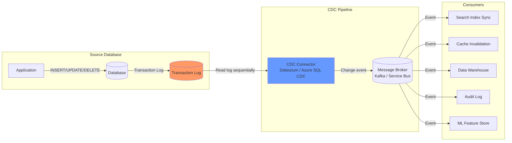
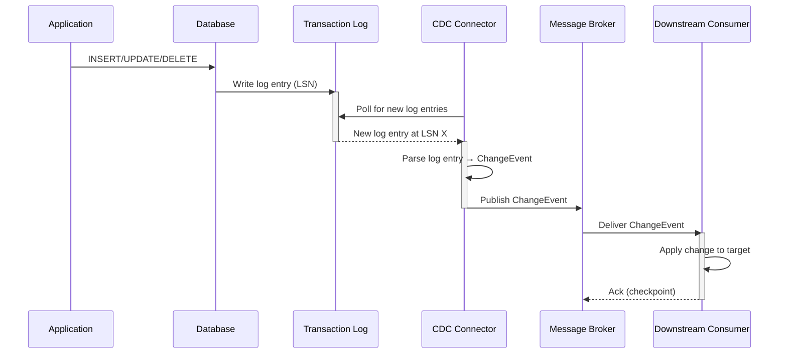
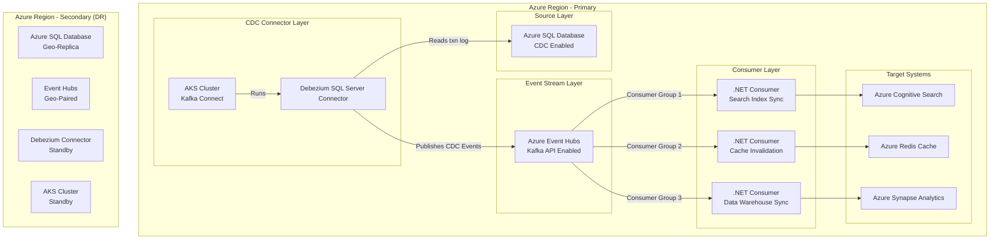

> [!success] Mastery Check
> - [ ] **Studied Well**
> - [ ] **Can explain the concept without notes**
> - [ ] **Can answer interview questions confidently**
> - [ ] **Can implement it in a real project**

## Navigation

**Domain:** [[7 — System Design & Distributed Systems]] > **Group:** Integration Patterns
**Previous:** [[7.134 — Saga Pattern — Failure Handling and Recovery]] | **Next:** [[7.136 — Change Data Capture — Debezium Architecture]]

### Prerequisites
- [[7.121 — Outbox Pattern — Reliable Event Publishing]] — required because CDC is the main alternative to the application-level outbox for reliable event publication
- [[7.142 — Event-Driven Architecture — Overview]] — needed because CDC is often the entry point for events into an event-driven system

### Where This Fits

Change Data Capture is a pattern for observing and capturing changes made to a database and streaming them as events to downstream consumers. Unlike application-level event publishing (where the application code explicitly publishes events), CDC reads the database's transaction log and translates log entries into change events. A .NET engineer encounters this when they need to propagate database changes to other services or data stores without modifying the source application — for example, syncing an operational database to a search index, a cache, or a data warehouse. CDC is also used as the implementation mechanism for the "CDC-based outbox reader" variant of the outbox pattern. Without CDC, teams resort to dual-writes, scheduled batch jobs, or polling-based change detection, all of which have significant latency, consistency, or complexity drawbacks. CDC becomes architecturally relevant above ~1,000 writes/second on the source table — below that threshold, a simple polling query with a `last_modified` timestamp is simpler to operate.

## Core Mental Model

Change Data Capture is a log-based streaming mechanism that converts database transaction log entries into structured change events. The database's transaction log records every insert, update, and delete. The CDC connector reads this log sequentially, transforms each log entry into a change event (containing the before-image, after-image, operation type, and metadata), and publishes the event to a message broker. Downstream consumers process these events to keep their data in sync. The invariant is: every committed change to the source table generates exactly one change event (or a pair for updates that include both images), in the same order as the original transactions committed. The cost is that reading the transaction log adds load to the source database (log read I/O, log retention), and schema changes on the source table require coordinated changes to the event schema. The recognition trigger is any system that needs real-time data synchronization from a database to downstream systems and cannot modify the source application to publish events.





### Classification

CDC is a data integration pattern at the infrastructure layer. It sits between the database's transaction log and the messaging/streaming layer. It solves the problem of reliably capturing database changes without modifying application code. It does not solve the problem of exactly-once delivery to downstream consumers (consumers must still handle duplicates), nor does it solve schema evolution or data transformation (CDC events contain raw database column values, not domain events). CDC operates at the physical data level — it sees rows changing, not business events occurring. This is a crucial distinction: `Status = "Shipped"` in CDC is a column update, while `OrderShipped` in a domain event carries semantic meaning (the order was shipped, inventory was reduced, a notification was sent).

### Key Properties / Guarantees

|Property|Value|Condition|
|---|---|---|
|Capture granularity|Per-row change (insert, update, delete)|Transaction log entry granularity|
|Ordering|Per-table, commit-order sequence|Log read is sequential per partition|
|Latency|Milliseconds to seconds|Depends on log poll interval|
|Impact on source DB|Log read I/O, log retention storage|No application code changes|
|Exactly-once|At-least-once to broker|Consumers must deduplicate|
|Schema support|Column-based (before/after images)|Schema evolution requires connector update|
|Transaction boundaries|Per-row events, not transactional bundles|No begin/end transaction markers in event stream|
|Consistency model|Read-committed snapshot isolation|Events reflect committed transactions only|

## Deep Mechanics

### How It Works

**Step 1 — Log reading.** The CDC connector connects to the source database and reads the transaction log sequentially. Each log entry represents a committed transaction (or transaction fragment) that modified data. The connector maintains a log position (LSN — Log Sequence Number) that tracks its progress. On restart, it resumes from the last committed position. Different databases expose the log differently: SQL Server uses the transaction log with CDC capture instances, PostgreSQL uses the WAL with replication slots, MySQL uses the binary log with GTID tracking.

**Step 2 — Log parsing.** The connector parses each log entry to extract: operation type (insert, update, delete), table name, column values (before and/or after image), transaction ID, and timestamp. The connector filters log entries to only the configured tables, avoiding irrelevant changes. Each database vendor encodes this differently — MySQL uses TABLE_MAP events preceding row events, PostgreSQL uses the pgoutput logical decoding plugin, SQL Server uses the capture job to populate change tables.

**Step 3 — Event emission.** Each log entry is transformed into a structured change event. The event includes metadata (source database, table, operation, timestamp, LSN) and payload (the row data before and after the change). For inserts, only the after-image exists. For deletes, only the before-image exists. For updates, both images are available if the connector is configured for full image capture. The event schema must be versioned to handle schema evolution — Avro with Schema Registry is the production standard.

**Step 4 — Event publication.** The connector publishes change events to a message broker (Apache Kafka, Azure Event Hubs, or Azure Service Bus). Events for the same table and the same row typically go to the same partition to preserve order. The connector commits the log position only after the event is acknowledged by the broker, ensuring at-least-once delivery. The broker choice determines the delivery guarantees — Kafka offers stronger ordering and replay than Azure Service Bus but requires more operational expertise.

**Step 5 — Consumer processing.** Downstream consumers read the change events from the broker and apply them to their target systems. This may involve upserting into a search index, invalidating a cache entry, aggregating into a data warehouse, or forwarding to a domain event bus. Consumers must be idempotent because CDC events may be delivered more than once (at-least-once delivery).

### Failure Modes

**Connector falls behind.** The source database processes 10,000 writes/second. The CDC connector is on a single thread and can only process 5,000 events/second. The log grows faster than the connector can consume it. Eventually, the transaction log fills the disk.

- **Detection:** Connector lag metric > 1 minute. Database transaction log space alerts. In Azure, monitor `LogBytesUsed` on the SQL database metrics.
- **Recovery:** Increase connector throughput (parallel consumers, more resources). If the log is full, take a fresh snapshot and start from the new log position.
- **Prevention:** Provision the connector with 3x the expected peak throughput. Monitor `cdc_lag_seconds` and alert before the log fills. Use Debezium's `max.batch.size` and `max.queue.size` to tune throughput.

**Schema change breaks connector.** A database migration adds a NOT NULL column to the source table. The CDC connector's internal schema cache does not include the new column. The connector fails to parse log entries for the altered table.

- **Detection:** Connector error logs: "column not found in schema" or "null value for non-nullable column."
- **Recovery:** Pause the connector, update the schema cache, resume the connector. Events generated during the pause may be lost or malformed.
- **Prevention:** Coordinate schema changes with the CDC pipeline. Use `ALTER TABLE` with `ALTER COLUMN SET NOT NULL` only after backfilling. Consider evolving the schema in phases. Use a Schema Registry with Avro to version the event schema independently of the table schema.

**Connector restarts and replays events.** The connector crashes and restarts from the last committed log position. It re-processes the last batch of log entries, producing duplicate events. Consumers receive duplicate change events.

- **Detection:** Consumer metrics show duplicate key violations or duplicate processing.
- **Recovery:** Consumers must be idempotent. An upsert operation (INSERT + ON CONFLICT UPDATE) naturally handles duplicate change events.
- **Prevention:** Ensure all CDC consumers are idempotent — this is mandatory, not optional. Design for at-least-once delivery from the start.

**Log truncation during connector downtime.** The CDC connector is down for 8 hours. The database transaction log retention policy truncates log entries older than 6 hours. When the connector restarts, the log position it needs has been purged.

- **Detection:** Connector error: "LSN out of range — log entry has been truncated." The connector cannot resume streaming.
- **Recovery:** The connector must take a full snapshot of the source table. For a 500GB table, this can take hours and impact production performance.
- **Prevention:** Set log retention to exceed the maximum expected connector downtime. In production, use 7-day retention. Monitor connector uptime and alert on restarts.

**Broker unavailable.** The CDC connector attempts to publish a change event but the message broker is down. The connector blocks waiting for acknowledgment. Log entries accumulate in memory.

- **Detection:** Connector logs: "Failed to send event to broker." Event backlog grows.
- **Recovery:** The connector retries with exponential backoff. If the broker is down for extended periods, the connector's in-memory buffer may overflow. Configure a disk-backed buffer for resilience.
- **Prevention:** Deploy the broker in a highly available configuration (Azure Event Hubs Geo-Disaster Recovery, Kafka with 3+ brokers). Monitor broker availability.

**Transactionally inconsistent read of change events.** A transaction updates Order A (INSERT) and Order B (DELETE). The CDC connector captures both events. Due to a timing issue, the consumer processes the DELETE event before the INSERT event. The target system briefly has inconsistent state.

- **Detection:** Rare data inconsistency in the target system. Foreign key violations.
- **Recovery:** Implement causal consistency — buffer events long enough to reorder by transaction ID, or make consumers tolerant of transient inconsistencies.
- **Prevention:** Ensure related tables share the same Kafka partition key. Use Debezium's `transaction.metadata` topic to track transaction boundaries.

### .NET and Azure Integration

- **Azure SQL Database:** Built-in CDC feature (`sys.sp_cdc_enable_table`) that populates change tables read via T-SQL; .NET applications poll these tables using `SqlDataReader`
- **Azure Data Factory:** CDC capability in mapping data flows for incremental data loading to Azure Synapse or Snowflake
- **Debezium on Azure:** Debezium connector running in Azure Container Instances or AKS, publishing to Azure Event Hubs (Kafka API-compatible)
- **Azure Event Hubs:** The broker for CDC events — Kafka API enables Debezium integration, Capture feature archives events to Blob Storage for long-term retention, Geo-Disaster Recovery for cross-region failover
- **Azure Schema Registry:** Stores Avro schemas for CDC events, enabling schema versioning and compatibility checking
- **.NET CDC Consumer:** A `BackgroundService` that reads from Event Hubs and applies changes to the target system using EF Core or a dedicated sync service
- **Azure Functions:** CDC-triggered Azure Functions using Event Hubs binding for serverless consumption

```csharp
// CDC change event schema with versioning
public sealed record ChangeDataEvent<TKey, TPayload>
{
    public string SchemaVersion { get; init; }
    public string Source { get; init; }         // "sqlserver://host:port/database"
    public string Table { get; init; }           // "dbo.Orders"
    public string Operation { get; init; }       // "c" (create), "u" (update), "d" (delete), "r" (snapshot/read)
    public TKey Key { get; init; }               // Primary key value
    public TPayload? Before { get; init; }       // Row state before change (null for insert)
    public TPayload? After { get; init; }        // Row state after change (null for delete)
    public long Lsn { get; init; }               // Log sequence number
    public DateTime Timestamp { get; init; }     // Commit time
    public long TransactionId { get; init; }     // Source transaction ID
}

// Order-specific payload
public sealed record OrderPayload
{
    public int Id { get; init; }
    public string CustomerName { get; init; }
    public string Status { get; init; }
    public decimal TotalAmount { get; init; }
    public DateTime UpdatedAt { get; init; }
}
```

## Production Patterns and Implementation

### Primary Implementation

A CDC consumer that processes change events from Azure Event Hubs and syncs to a search index. This pattern is the most common CDC deployment in .NET — reading from Event Hubs and writing to Azure Cognitive Search or Elasticsearch.

```csharp
// CDC event consumer — reads from Event Hubs, applies to search index
public sealed class OrderCdcConsumer : BackgroundService
{
    private readonly EventHubConsumerClient _consumer;
    private readonly ISearchIndexClient _searchIndex;
    private readonly ILogger<OrderCdcConsumer> _logger;

    public OrderCdcConsumer(
        EventHubConsumerClient consumer,
        ISearchIndexClient searchIndex,
        ILogger<OrderCdcConsumer> logger)
    {
        _consumer = consumer;
        _searchIndex = searchIndex;
        _logger = logger;
    }

    protected override async Task ExecuteAsync(CancellationToken ct)
    {
        await foreach (var partitionEvent in _consumer
            .ReadEventsFromPartitionAsync(
                "0",
                EventPosition.FromEnqueuedTime(DateTime.UtcNow.AddMinutes(-5)),
                ct)
            .WithCancellation(ct))
        {
            try
            {
                var changeEvent = JsonSerializer
                    .Deserialize<ChangeDataEvent<int, OrderPayload>>(
                        partitionEvent.Data.EventBody.ToBytes());

                await ProcessChangeAsync(changeEvent, ct);
                await _consumer.UpdateCheckpointAsync(
                    "order-cdc-consumer",
                    partitionEvent.Data.SequenceNumber, ct);

                _logger.LogDebug(
                    "Processed CDC event: {Op} on Order {Key}",
                    changeEvent.Operation, changeEvent.Key);
            }
            catch (JsonException ex)
            {
                _logger.LogError(ex, "Failed to deserialize CDC event. Skipping.");
                // Move to dead-letter queue
                await _dlqSender.SendAsync(partitionEvent.Data, ct);
            }
            catch (OperationCanceledException)
            {
                break;
            }
        }
    }

    private async Task ProcessChangeAsync(
        ChangeDataEvent<int, OrderPayload> change,
        CancellationToken ct)
    {
        switch (change.Operation)
        {
            // Create or Update
            case "c":
            case "u" when change.After is not null:
                var doc = MapToSearchDocument(change.After);
                await _searchIndex.UpsertDocumentAsync("orders", doc, ct);
                break;

            // Delete
            case "d":
                await _searchIndex.DeleteDocumentAsync("orders", change.Key.ToString(), ct);
                break;

            // Read operation (truncation, snapshot) — full resync
            case "r":
                _logger.LogWarning("Received CDC snapshot event. Full re-sync may be needed.");
                break;
        }
    }

    private static SearchDocument MapToSearchDocument(OrderPayload? payload)
    {
        return new SearchDocument
        {
            ["id"] = payload!.Id,
            ["customer"] = payload.CustomerName,
            ["status"] = payload.Status,
            ["total"] = payload.TotalAmount,
            ["lastModified"] = payload.UpdatedAt
        };
    }
}
```

### Configuration and Wiring

```csharp
// Program.cs — CDC consumer registration
builder.Services.AddSingleton(sp =>
{
    var config = sp.GetRequiredService<IConfiguration>();
    var connectionString = config["EventHubs:ConnectionString"];
    return new EventHubConsumerClient(
        "$Default",
        connectionString,
        "cdc-orders");
});

builder.Services.AddSingleton<ISearchIndexClient>(sp =>
{
    var config = sp.GetRequiredService<IConfiguration>();
    return new AzureSearchIndexClient(
        config["Search:Endpoint"],
        config["Search:AdminKey"]);
});

builder.Services.AddHostedService<OrderCdcConsumer>();

// Add health checks for CDC pipeline
builder.Services.AddHealthChecks()
    .AddEventHub(config => config.AddEndpoint("..."), "cdc-event-hub")
    .AddAzureSearch(config["Search:Endpoint"], "search-index");
```

### Common Variants

**Polling-based CDC (built-in SQL Server Change Tracking).** For databases without log-based CDC, SQL Server's Change Tracking feature provides a lightweight change detection mechanism. A polling job queries `CHANGETABLE(CHANGES ...)` at intervals.

```csharp
public async Task<IReadOnlyList<ChangeEntry>> PollChangesAsync(
    long lastVersion, CancellationToken ct)
{
    var changes = await _db.Database.SqlQueryRaw<ChangeEntry>(
        $"SELECT * FROM CHANGETABLE(CHANGES dbo.Orders, {lastVersion}) AS CT")
        .ToListAsync(ct);
    return changes;
}
```

**CDC as outbox reader.** Instead of the transaction log, the CDC connector reads the application's outbox table. This is the "outbox table poller" pattern. Useful when the transaction log is inaccessible or when the application needs to publish domain events (not raw table changes). Debezium includes a built-in SMT (`io.debezium.transforms.outbox.EventRouter`) for this purpose — it reads from the outbox table, filters by event type, and routes to different Kafka topics based on the event type and aggregate ID.

**Dual-write with CDC recovery.** An application publishes events via the outbox pattern. CDC is used as a safety net — if the outbox publisher fails, CDC catches the change and publishes a compensating event. This is also called "dual-write with CDC reconciliation" and is used in systems where exactly-once event publication is critical.

**CDC for CQRS read model maintenance.** In a CQRS architecture, CDC can populate the read model (e.g., a materialized view in a separate database) without the write side needing to explicitly publish events. The CDC connector captures writes to the command database and applies them to the query database. This avoids dual-write complexity in the write model.

**CDC for cache warming.** When a new cache node joins a Redis cluster, CDC can replay recent changes to warm the cache without a full database scan. The CDC connector publishes change events for the hot dataset, and the cache consumer applies them to the new node.

### Real-World .NET Ecosystem Example

**Debezium** is the most widely used open-source CDC platform, with connectors for SQL Server, PostgreSQL, MySQL, MongoDB, and others. It runs on Kafka Connect and publishes change events to Apache Kafka. In the .NET Azure ecosystem, Debezium is deployed on Azure Kubernetes Service or Azure Container Instances, publishing to Azure Event Hubs (Kafka API-compatible). The .NET SDK for Event Hubs (`Azure.Messaging.EventHubs`) consumes these events. Debezium's SQL Server connector uses the built-in CDC tables. Debezium's PostgreSQL connector uses logical replication slots. Debezium is used in production at Netflix, LinkedIn, and Uber for real-time data streaming.

**Azure SQL Database CDC** is Microsoft's built-in CDC implementation, available in Azure SQL Database since 2020. It uses the same T-SQL interface as SQL Server CDC but with automated capture job management (no SQL Agent visible to users). Many .NET enterprise applications use Azure SQL CDC for audit trails and incremental ETL.

**MassTransit with CDC.** MassTransit, the .NET distributed application framework, supports CDC integration via its Kafka transport. A Debezium connector publishes to Kafka, and MassTransit consumers process the change events as messages. This allows CDC events to flow through the same messaging infrastructure as application events.

## Gotchas and Production Pitfalls

### 1. Transaction log retention too short

**Pitfall:** SQL Server's transaction log backup interval is 15 minutes. The CDC connector goes down for 30 minutes. When it restarts, the log position it needs has been truncated by log backup. The connector cannot resume and must take a new snapshot.

```sql
-- ❌ Default log retention — truncates log entries CDC hasn't read
-- Backup job every 15 minutes truncates log
```

**Symptom:** Connector fails on restart: `LSN out of range — log entry has been truncated.` Requires a full re-snapshot of the source table.

**Fix:** Set log retention to accommodate CDC connector downtime. In SQL Server, the log is retained as long as the CDC capture job has not processed the entries. Ensure the capture job runs frequently enough, and monitor log space.

```sql
-- ✅ Configure CDC capture job to run every 30 seconds
EXEC sys.sp_cdc_change_job @job_type = 'capture', @pollinginterval = 30;
```

**Cost of not fixing:** Frequent full re-snapshots — each one reads the entire table, impacting source database performance. During the snapshot, CDC is down and downstream systems are stale.

### 2. Schema evolution breaks CDC events

**Pitfall:** A migration adds a column `DiscountPercent` to the Orders table. The CDC connector's schema cache does not have this column. New log entries referencing the new column cause a parsing error.

**Symptom:** The CDC connector stops processing the Orders table. Downstream systems become stale. Error log: "Column 'DiscountPercent' not found in schema."

**Fix:** Debezium supports schema evolution via a schema registry (e.g., Confluent Schema Registry, Azure Schema Registry with Avro). Schema changes are versioned. Consumers receive the new schema version alongside the data.

**Cost of not fixing:** CDC pipeline downtime for every schema change. Requires manual connector restart and cache refresh.

### 3. Large transactions generate many small events

**Pitfall:** A batch update modifies 1 million rows in a single transaction. The CDC connector emits 1 million individual change events. The broker experiences a traffic spike. Downstream consumers cannot keep up.

**Symptom:** Broker throttling. Consumer lag spikes. The connector is slow because it must wait for broker acknowledgments for 1 million events.

**Fix:** The CDC connector should batch events. Debezium supports `max.batch.size` and `max.queue.size` to control throughput. For truly large batch operations, consider emitting a single "materialized view recomputed" event instead of per-row events.

**Cost of not fixing:** Broker throttling affects other consumers sharing the same broker. Downstream systems fall behind. Recovery requires reprocessing the entire batch.

### 4. Change events arrive out of order across tables

**Pitfall:** Order `A` and Payment `P` reference each other. The transaction that inserts the order commits, then the transaction that inserts the payment commits. CDC emits events in commit order. But if the consumer processes the payment event before the order event (network delay, different partitions), the payment refers to an order that does not yet exist.

**Symptom:** Foreign key violation in the target system. The payment syncs first, then the order appears.

**Fix:** Use causal consistency — either ensure related tables are in the same partition, or buffer events long enough to reorder them, or make the consumer tolerant of missing references (retry, defer).

**Cost of not fixing:** Temporary data inconsistency in downstream systems. Eventual consistency kicks in once the order event arrives, but queries that run in the window see broken references.

### 5. CDC captures raw column values, not domain events

**Pitfall:** A CDC consumer receives a change event showing `Status = "Shipped"` and `TrackingNumber = "1Z999AA10123456784"`. The consumer tries to integrate this into the domain, but the domain logic requires a `OrderShipped` domain event with a richer payload (inventory deduction confirmation, notification preferences).

**Symptom:** The CDC consumer must implement domain rules to interpret the raw data change. This duplicates domain logic from the source service.

**Fix:** Use CDC to populate a shared data store, not to drive domain workflows. For domain-driven event propagation, use the outbox pattern where the application publishes explicit domain events. CDC is for data synchronization (search, cache, warehouse), not for domain event distribution.

**Cost of not fixing:** Domain logic leaks into the data sync layer. A change in domain rules requires changes in both the source service and the CDC consumer.

### 6. Consumer checkpointing lag creates a snowball effect

**Pitfall:** The CDC consumer processes events but checkpoints infrequently (e.g., every 5 minutes). The consumer crashes. On restart, it must reprocess 5 minutes of events. If the target system is slow to deduplicate, the catch-up takes longer than expected, and the consumer falls further behind.

**Symptom:** Consumer lag report shows increasing lag after every restart. The consumer never catches up fully.

**Fix:** Checkpoint more frequently — after every batch, not every N minutes. Use Event Hubs checkpointing with a 10-second maximum between checkpoints.

```csharp
// ✅ Checkpoint after every event batch
await _consumer.UpdateCheckpointAsync(
    "order-cdc-consumer",
    partitionEvent.Data.SequenceNumber, ct);
```

**Cost of not fixing:** Eventual data inconsistency that compounds over time. Downstream systems are perpetually stale.

### 7. CDC connector permissions are insufficient

**Pitfall:** The database user for the CDC connector has `SELECT` privileges but not `VIEW SERVER STATE` or `REPLICATION SLAVE` (for MySQL). The connector cannot read the transaction log or discover the schema of tracked tables.

**Symptom:** Connector starts but immediately fails with permission errors. Root cause is unclear from the error message.

**Fix:** Grant the correct set of permissions for the database type. For SQL Server: `db_datareader` and `db_ddladmin`. For PostgreSQL: `REPLICATION` and `SELECT` on tracked tables. For MySQL: `REPLICATION SLAVE`, `REPLICATION CLIENT`, and `SELECT`.

**Cost of not fixing:** Hours of debugging connector permissions. The DBA and platform teams go back and forth on required access levels.

### 8. Broker partitioning strategy mismatches consumer needs

**Pitfall:** The CDC connector publishes events to a broker topic with 4 partitions, using the table name as the partition key. The consumer needs strict ordering for a specific row, but updates to the same row are in the same partition. However, if the key is wrong (e.g., using the partition number instead of the primary key), the same row's events land in different partitions, violating order.

**Symptom:** The target system shows `Status = "Pending"` after `Status = "Delivered"` because the later event arrived at a different consumer instance before the earlier event.

**Fix:** Use the primary key column as the partition key. This ensures all events for the same row go to the same partition and are processed in order.

```json
// ✅ Use primary key as partition key
"key.converter": "org.apache.kafka.connect.json.JsonConverter",
"key.converter.schemas.enable": "false"
// Debezium uses the primary key as the message key by default
```

**Cost of not fixing:** Silent data corruption in the target system. Queries return incorrect state. Debugging requires correlating event timestamps across partitions.

## Tradeoffs and Decision Framework

### Tradeoff Matrix

|Dimension|CDC (Log-Based)|CDC (Polling)|Outbox Pattern|Application Dual-Write|
|---|---|---|---|---|
|Source DB impact|Log read I/O|Query overhead per poll|Application code change + outbox table|Transaction coordination|
|Latency|Milliseconds to seconds|Poll interval (seconds to minutes)|Near-zero (event published in same tx)|Near-zero (same tx commit)|
|Schema coupling|Raw table columns|Raw table columns|Domain events (stable schema)|Domain events|
|Implementation complexity|High (connector, broker, consumers)|Medium (polling job)|Low (outbox table + publisher)|Low (initial) / High (failure handling)|
|Application change|None|None|Required (write to outbox + event)|Required (dual-write code)|
|Suitable for|Data sync, ETL, analytics|Lightweight change tracking|Domain event propagation|Simple, non-critical flows|
|Failure resilience|At-least-once (connector managed)|At-least-once (polling job)|Exactly-once (outbox semantics)|Fragile (partial write risk)|
|Operational cost|Medium-High|Low|Low|Low|

### When to Apply

```mermaid
flowchart TD
    A[Need to propagate DB changes] --> B{Can modify source app?}
    B -->|Yes| C{Domain events needed?}
    C -->|Yes| D[Use outbox pattern — [[7.121 — Outbox Pattern]]]
    C -->|No| E[Use CDC for data sync]
    B -->|No| F{Transaction log accessible?}
    F -->|Yes| G[Use log-based CDC]
    F -->|No| H{SQL Server Change Tracking?}
    H -->|Yes| I[Use polling CDC]
    H -->|No| J[Use periodic snapshot job]
    E --> K[Search Index / Cache / Warehouse / ML Feature Store]
    G --> K
    
    style D fill:#6f9
    style G fill:#69f
```

### When NOT to Apply

- [ ] The application already publishes domain events via the outbox pattern — CDC adds unnecessary complexity for domain workflow integration
- [ ] The source database is a read replica or has no transaction log access — CDC requires log access
- [ ] The downstream system needs domain events (semantic meaning), not raw data changes — use [[7.121 — Outbox Pattern — Reliable Event Publishing]]
- [ ] The team cannot operate a CDC connector (Debezium on Kafka Connect has significant operational overhead) — consider [[7.122 — Outbox Pattern — EF Core Implementation]] instead
- [ ] The change volume is very low (< 100 changes/hour) and latency is not critical — polling is simpler and cheaper
- [ ] The latency requirement is > 30 seconds and the database supports Change Tracking — avoid full CDC infrastructure
- [ ] The team has no experience with the target broker — CDC's operational complexity doubles if both the connector and broker are new

### Scale Thresholds

- **< 1,000 changes/second:** SQL Server built-in CDC (capture job) works well. Polling Change Tracking is also viable. A simple `BackgroundService` polling every 10 seconds is sufficient.
- **1,000-10,000 changes/second:** Log-based CDC with Debezium to Kafka/Event Hubs. Requires careful tuning of batch sizes and parallel consumers. Use `max.batch.size = 10000` and `max.queue.size = 50000` in Debezium.
- **> 10,000 changes/second:** Partition the source database by logical shard, each with its own CDC connector pipeline. Use multiple Event Hubs partitions for parallelism. Consider Avro serialization (reduces payload size by 30-40% vs JSON) to reduce bandwidth.

## Interview Arsenal

### Question Bank

1. What is Change Data Capture and what problem does it solve?
2. How does log-based CDC differ from polling-based CDC?
3. What information does a CDC change event contain?
4. What happens when the source database schema changes while CDC is running?
5. Compare CDC with the outbox pattern.
6. How does CDC handle large batch updates?
7. When would you choose CDC over the outbox pattern?
8. What is the consistency model of CDC events?
9. How do you monitor CDC pipeline health in production?
10. What are the tradeoffs between CDC and application-level event sourcing?

### Spoken Answers

**Q: What is Change Data Capture and what problem does it solve?**

> **Great answer:** "Change Data Capture is a pattern for capturing database changes by reading the transaction log and streaming them as events. The fundamental problem it solves is propagating database changes to downstream systems without modifying the source application. In a microservices architecture, Service A owns the Orders table. Services B, C, and D need to know when orders change — B maintains a search index, C invalidates a cache, D updates a data warehouse. Without CDC, you have three options: (1) Application-level dual-write — Service A writes to the database and publishes events in the same request. This is fragile — if the event publish fails, the database write may need to be rolled back. (2) Polling — downstream services poll the Orders table for changes. This gives you stale data and inefficient queries. (3) CDC — read the transaction log. The log captures every committed change. The CDC connector reads it and streams change events to a broker. Downstream services consume these events. The key advantage is zero application changes — you can add CDC to an existing database without modifying a single line of application code. The cost is operational complexity: you need to deploy, monitor, and maintain the CDC connector and the message broker."

> **Average answer:** "CDC captures changes from the database. You can use it to sync data to other systems." (No mention of the transaction log, no comparison with alternatives, no operational cost.)

**Q: Compare CDC with the outbox pattern.**

> **Great answer:** "The outbox pattern and CDC solve a similar problem — reliably propagating state changes — but from different directions. The outbox pattern requires the application to write explicit events to an outbox table as part of the same database transaction. A separate publisher reads the outbox and sends events to the broker. The events are domain events — they have semantic meaning: 'OrderShipped,' not 'Status column changed to Shipped.' CDC reads the transaction log and emits raw change events: 'row 42 in Orders table was updated; these columns changed.' The outbox pattern is the right choice when you are building a new system and control the application code. It gives you clean, semantically meaningful events. CDC is the right choice when you have an existing application that you cannot modify, or when you are doing data integration (ETL, search indexing, cache warming) where raw data changes are sufficient. Many systems use both: the outbox pattern for inter-service domain events and CDC for data synchronization to analytics and search. The important design rule is: never use CDC events as domain events. The semantics are different — a column update is not a business event. If you try to reconstruct domain events from CDC, you end up duplicating domain logic in the CDC consumer."

> **Average answer:** "CDC reads the log; outbox uses a table. CDC is easier because you don't need to change the application." (Missing the critical distinction between raw data changes and domain events.)

**Q: How does CDC handle large batch updates?**

> **Great answer:** "Large batch updates are a challenge for CDC because each row change produces a separate event. For a batch update that modifies 1 million rows, CDC emits 1 million events. This can overwhelm the broker and downstream consumers. The approaches to handle this are: (1) Batching — the CDC connector batching configuration (e.g., Debezium's `max.batch.size`) controls how many events are sent in a single batch. Larger batches reduce per-event overhead but increase latency. (2) Compaction — if only the latest state matters (cache invalidation), a compacted Kafka topic can be used. Old change events for the same key are discarded. The consumer only sees the latest state. (3) Avoid large batches at the application level. Design the application to issue smaller, incremental updates rather than bulk operations against CDC-tracked tables. (4) For true bulk operations (e.g., nightly batch jobs), consider pausing CDC, running the batch, and then taking a fresh snapshot rather than processing millions of individual events. The snapshot will capture the final state of all rows, which is far fewer events than capturing every intermediate change."

**Q: What is the consistency model of CDC events?**

> **Great answer:** "CDC provides read-committed snapshot isolation. Events are only emitted for committed transactions — uncommitted changes do not appear in the log. Within a table, events are ordered by commit LSN. Between tables, events from the same transaction may be interleaved with events from other transactions. The delivery guarantee is at-least-once: the connector publishes to the broker before committing the log position. If the connector crashes between publishing and committing, the events are replayed. Downstream consumers must be idempotent. For transactional consistency across tables, you need either: (1) a single partition key that routes related tables together, (2) a buffer in the consumer that reorders by transaction ID, or (3) acceptance of temporary inconsistency with eventual convergence."

### System Design Interview Trigger

When the interviewer asks about keeping data in sync between services — "how does Service B know when Service A's data changes?" — CDC is one of the patterns they expect. The senior answer acknowledges both CDC and the outbox pattern, articulates their tradeoffs, and names the specific circumstances where each is appropriate. The interviewer may probe deeper on "how does CDC handle schema evolution?" — expecting knowledge of schema registries and compatibility modes. Another common probe: "what happens when the CDC connector is down for an extended period?" — testing knowledge of log retention, re-snapshot fallback, and the operational impact.

### Comparison Table

| | Log-Based CDC | Polling CDC | Outbox Pattern |
|---|---|---|---|
| Source of truth | Transaction log | Change tracking table / timestamp column | Application outbox table |
| Latency | Milliseconds | Poll interval (seconds to minutes) | Milliseconds (same transaction) |
| Application change | None | None (if using built-in change tracking) | Write to outbox + event handler |
| Schema evolution challenge | High (log format may change) | Low (polling query adapts) | Medium (event schema versioning) |
| Operational complexity | High (connector + broker + consumer) | Low (polling job) | Medium (outbox publisher) |
| Consistency model | At-least-once | At-least-once | Exactly-once per outbox semantics |
| Best for | Data sync, ETL, analytics | Lightweight change tracking | Domain event propagation |
| Event semantics | Raw column values | Row version / column values | Domain events with meaning |

## Architecture Decision Record

**Status:** Accepted

**Context:** A legacy e-commerce application has a SQL Server database that is the source of truth for orders. Three downstream systems need real-time order data: an Elasticsearch search index (product search), a Redis cache (order lookup), and a Snowflake data warehouse (analytics). The application is 8 years old, has no event publishing infrastructure, and the team cannot modify it for the next 6 months. The database processes approximately 2,000 writes/second during peak hours. The SLA for search index freshness is 30 seconds, for cache invalidation is 10 seconds, and for the data warehouse is 5 minutes.

**Options Considered:**

1. **Polling CDC** — A scheduled job queries `CHANGETABLE(CHANGES ...)` every 30 seconds and pushes changes to downstream systems
2. **Log-based CDC with Debezium** — Debezium SQL Server connector reads the transaction log, publishes to Azure Event Hubs, downstream consumers process events
3. **Database triggers** — Triggers write change records to a separate table; an external process reads and propagates them
4. **Application modification** — Add the outbox pattern to the legacy application (6-month delay, high risk)

**Decision:** Log-based CDC with Debezium (option 2). The polling approach adds 30-second latency to the search index and cache, which is noticeable for the 10-second cache SLA. Database triggers add overhead to every write and require schema changes to the legacy database. Application modification is blocked for 6 months. Debezium reads the transaction log with zero impact on application performance, provides sub-second latency, and the team can use the existing Azure Event Hubs infrastructure already deployed for other streaming workloads.

**Consequences:**
- ✅ Zero changes to the legacy application — avoid 6-month wait
- ✅ Sub-second latency meets all downstream SLAs (10-second cache, 30-second search, 5-minute warehouse)
- ✅ Reuses existing Event Hubs infrastructure
- ⚠️ Schema changes on the Orders table must be coordinated with the CDC pipeline — DBA team must add CDC steps to all migration scripts
- ⚠️ The team must learn Debezium operational management (deployment on AKS, monitoring connector lag, managing log retention)
- ❌ CDC events are raw column values, not domain events — downstream consumers must interpret column changes (e.g., `Status = "Shipped"` vs `OrderShipped` event semantics)
- ⚠️ Elasticsearch consumer must implement idempotent upsert semantics

**Review Trigger:** Revisit if the legacy application is modernized and begins publishing domain events. At that point, the outbox pattern may replace CDC for event-driven use cases (cache invalidation, search index), though CDC would remain for data warehouse synchronization where raw data changes are sufficient.

## Self-Check

### Conceptual Questions

1. What is Change Data Capture and what problem does it solve?
2. How does log-based CDC differ from polling-based CDC?
3. What is the source-of-truth for a log-based CDC connector?
4. What does a CDC change event contain?
5. How does CDC handle schema changes on the source table?
6. Compare CDC and the outbox pattern.
7. What happens when the CDC connector is down for longer than the log retention period?
8. How do you ensure downstream consumers handle duplicate CDC events?
9. Can CDC be used for domain event propagation? Why or why not?
10. Explain in 60 seconds when you would use CDC vs the outbox pattern.

<details>
<summary>Answers</summary>

1. CDC captures changes made to a database by reading the transaction log and streaming them as events. It solves the problem of propagating database changes to downstream systems without modifying the source application. [[7.136 — Change Data Capture — Debezium Architecture]] covers the primary implementation.

2. Log-based CDC reads the database transaction log sequentially — it captures every committed change with low latency (milliseconds to seconds). Polling-based CDC uses timestamp columns, change tracking tables, or snapshot comparisons at configurable intervals — it is simpler but has higher latency (seconds to minutes) and may miss changes if the polling query is not carefully designed.

3. The database transaction log (also called the write-ahead log, redo log, or binlog depending on the database). The connector maintains its position (LSN) in this log and resumes from that position on restart. [[7.137 — Change Data Capture — SQL Server CDC]], [[7.138 — Change Data Capture — PostgreSQL Logical Replication]], and [[7.139 — Change Data Capture — MySQL Binlog]] detail the log formats for each database.

4. Operation type (insert, update, delete), table name, row key, before-image (state before change), after-image (state after change), timestamp, transaction ID, and log sequence number.

5. Schema changes can break the CDC connector because the connector's internal schema cache does not match the new table schema. Solutions include schema registries (Avro/Protobuf with versioning), pausing the connector during schema migrations, or using DDL filters to ignore schema changes. The safest approach is to only use additive schema changes (ADD COLUMN with defaults) on CDC-tracked tables.

6. CDC captures raw data changes from the transaction log without application changes. The outbox pattern requires the application to write explicit domain events but produces semantically richer events. CDC is for data synchronization; the outbox is for domain event propagation. Many systems use both — the outbox for inter-service events and CDC for data sync to analytics and search.

7. The log entries the connector needs are truncated by log retention/backup. The connector cannot resume and must take a full snapshot of the source table. During the snapshot, CDC is down and downstream systems are stale. For a large table, the snapshot can take hours.

8. All CDC consumers must be idempotent — the same change event may be delivered multiple times. Use upsert (INSERT ON CONFLICT UPDATE) for database targets. For non-idempotent operations (e.g., counting), deduplicate by event ID or LSN. Design the consumer for at-least-once delivery from day one.

9. CDC captures raw column changes, not domain events. A `Status = "Shipped"` change is not the same as an `OrderShipped` domain event — the latter has semantic meaning and may include derived data (inventory reduced, notification sent). CDC should not replace the outbox pattern for domain event distribution. Use CDC for data sync, not domain workflows. The [[7.124 — Outbox Pattern — Change Data Capture Approach]] bridges the two by using CDC to read the outbox table.

10. "Use CDC when you cannot modify the source application, or when you need raw data synchronization to search, cache, or warehouse systems. CDC requires no application changes and captures every committed change. Use the outbox pattern when you control the application code and need semantically rich domain events. The outbox gives you clean event schemas, but it requires application-level code changes. For maximum flexibility, use both: the outbox for inter-service events and CDC for data sync. The important rule: never use CDC events as domain events — they are different levels of abstraction."

</details>

---

### Scenario Challenges

**Scenario 1 — Diagnose the problem**

A Debezium CDC connector reads the Orders table from SQL Server and publishes to Kafka. The downstream search index and cache are 6 hours stale. The connector is running. There are no error logs. The database transaction log is using normal space.

<details>
<summary>Diagnosis</summary>

**Root cause:** The CDC connector is running but processing no events. The log position is stuck at an old LSN. The connector is alive (heartbeats are sent) but no new log entries are being read. This typically happens when the connector's `table.include.list` configuration does not include the Orders table, or the database's CDC capture instance for Orders was disabled by a recent migration.

**Evidence:** Connector status shows "running" but offset shows no movement. `cdc_lag_seconds` = 21,600 (6 hours). SQL Server CDC capture job status shows no capture instance for `dbo.Orders`.

**Fix:** Re-enable CDC on the Orders table. Reset the connector's offset to the current log position. Resume processing.

**Prevention:** Monitor CDC latency (`cdc_lag_seconds`) as a critical metric. Alert on any latency > 5 minutes. Add an integration test that creates a row, waits for the CDC event, and asserts it arrives within the expected latency.

</details>

---

**Scenario 2 — Design decision**

You are designing a system that needs to sync data from a PostgreSQL database to both a search index and a data warehouse. The source application is new and you control the codebase. Should you use CDC or the outbox pattern?

<details>
<summary>Decision and Reasoning</summary>

**Choice:** CDC for the data warehouse sync (raw data changes are sufficient — the warehouse needs full table snapshots and incremental changes), outbox for the search index sync (if the search index needs domain-specific transformations like denormalizing related data). If the search index is a simple column-for-column mapping of the source table, CDC alone is sufficient.

**Tradeoffs accepted:** Two mechanisms for data propagation adds complexity, but each is optimized for its use case. The data warehouse needs raw table snapshots and CDC's change stream feeds this naturally. The search index may need semantic transformations (e.g., denormalizing customer name + order items + shipping status) that are easier with explicit domain events from the outbox pattern.

**Implementation sketch:**
```csharp
// CDC for warehouse — raw changes
cdc -> event hubs -> warehouse-sync-consumer -> Snowflake

// Outbox for search — domain events
app -> outbox table -> outbox publisher -> event hubs -> search-sync-consumer -> Elasticsearch
```

</details>

---

**Scenario 3 — Failure mode** The CDC connector crashes. It restarts and attempts to resume from the last committed LSN. But the LSN is from 3 hours ago, and the transaction log has been truncated. The connector must take a full snapshot. The snapshot reads 10 million rows from the Orders table, causing 5 minutes of heavy I/O on the source database. The primary production database is impacted.

<details> <summary>Investigation and Fix</summary>

**Investigation steps:**
1. How long was the connector down? The log retention vs the downtime.
2. Why was the log truncated? SQL Server backup job runs every 15 minutes and truncates inactive logs.
3. Could the log retention be extended? What is the maximum acceptable WAL/log growth?

**Confirming evidence:** Connector logs show `LSN {x} out of range — minimum available LSN is {y}`. Log backup job configuration shows 15-minute frequency.

**Immediate mitigation:** Stop the snapshot if it is impacting production. Schedule the snapshot during off-peak hours. If the impact is unacceptable, restore a recent backup to a replica and snapshot from there.

**Permanent fix:**
1. Deploy the CDC connector with a longer log retention configuration (Debezium's `snapshot.locking.mode` = `none` to avoid table locks during snapshot)
2. Monitor connector uptime and alert on restarts
3. Consider a standby connector instance for failover
4. Reduce the log backup interval or change CDC's log cleanup to preserve unprocessed entries
5. Set up a monitoring dashboard for CDC health: connector status, lag in seconds, LSN position, log space used

</details>

---

**Scenario 4 — Scale it** Your system currently handles 500 changes/second with a single CDC poller running every 30 seconds. You need to handle 10,000 changes/second with < 5 second latency. How does CDC fit into the scaling strategy?

<details> <summary>Scaling Strategy</summary>

**Bottleneck this addresses:** The polling-based CDC (30-second poll interval) cannot meet the 5-second latency requirement. The single-threaded poller may not keep up with 10,000 events/second.

**How it helps:** Switch from polling-based CDC to log-based CDC (Debezium). Debezium reads the transaction log continuously (no polling), providing sub-second latency. For 10,000 events/second, a single Debezium connector with tuned batch settings can handle the throughput.

**What it does not solve:** Batch operations generating millions of events in a single transaction. Schema changes that break the connector. Broker throughput — ensure Event Hubs or Kafka has sufficient partitions.

**Implementation order:**
1. First: Deploy Debezium connector with `max.batch.size = 20000` and `max.queue.size = 100000`
2. Second: Configure Event Hubs with 8 partitions (4 processing consumers)
3. Third: Implement batch processing in the consumer (process 1000 events at a time)
4. Fourth: Add monitoring — alert on `consumer_lag > 10000` events

</details>

---

**Scenario 5 — Interview simulation** The interviewer says: "Design a system that syncs user profile changes from a SQL Server database to a search index. The database is shared by a legacy application that cannot be modified. Updates must appear in the search index within 30 seconds."

<details> <summary>Model Response</summary>

"I would use Change Data Capture because the source application cannot be modified. The architecture has three components: a Debezium SQL Server CDC connector, Azure Event Hubs as the event transport, and a .NET background service that consumes CDC events and updates the search index.

"The Debezium connector reads the SQL Server transaction log and publishes change events for the UserProfiles table to Event Hubs. The events include the before-image and after-image for each row change. The connector runs in a Kubernetes deployment on AKS, with persistent storage for connector offsets so it survives restarts. I configure it with `table.include.list = dbo.UserProfiles`, `snapshot.mode = initial`, and `tombstones.on.delete = false`.

"The .NET consumer runs as a `BackgroundService` that reads from Event Hubs using the `Azure.Messaging.EventHubs` SDK. For each change event, it applies the change to Azure Cognitive Search using the search SDK's `MergeOrUpload` operation. The consumer tracks its position via Event Hubs checkpointing to resume on restart.

"The failure scenarios: (1) If the consumer crashes, it resumes from the last checkpoint; duplicate events are handled by `MergeOrUpload` being idempotent. (2) If the Debezium connector crashes, it resumes from the last committed offset. (3) If the connector is down longer than the log retention period, it takes a full snapshot — the consumer handles this by clearing and rebuilding the search index for the snapshot epoch. (4) Schema changes require updating the Debezium connector's schema cache and possibly restarting. To minimize this, we use a schema registry.

"Latency is designed to be under 5 seconds: Debezium polls the SQL Server log every 100ms, Event Hubs delivers in under 1 second, and the consumer processes events in batches of 100 with sub-second processing time per batch. The 30-second requirement is easily met. For monitoring, I track `consumer_lag`, `debezium_lag`, and search index freshness. I set up alerts: if lag exceeds 30 seconds, page the on-call engineer."

</details>

---

## Appendix A — CDC Deployment Architecture on Azure

### Reference Architecture Diagram



### Operational Runbook

**Daily checks:**
1. Verify connector status via Kafka Connect REST API: `GET /connectors/{name}/status`
2. Check CDC lag: query `cdc_lag_seconds` metric in Azure Monitor
3. Review connector error logs for schema mismatch warnings
4. Check Event Hubs consumer lag: `consumer_lag` metric per consumer group

**Weekly maintenance:**
1. Review binlog/log retention and disk usage for the source database
2. Check for orphaned replication slots (PostgreSQL) or stale CDC capture instances (SQL Server)
3. Verify schema history topic (Kafka) has sufficient retention
4. Test consumer failover by restarting one consumer instance

**Incident response — High CDC lag:**
1. Identify bottleneck: Is the connector lagging or the consumer lagging?
2. If connector lag > consumer lag: increase connector throughput (batch size, queue size)
3. If consumer lag > connector lag: scale consumer instances horizontally
4. If both are lagging: check for large transactions or schema changes
5. If lag exceeds SLA: pause non-critical consumers, let critical ones catch up

### CDC vs. Event Sourcing — Architectural Comparison

|Dimension|CDC (Transaction Log)|Event Sourcing|
|---|---|---|
|Source of truth|Current state in database|Append-only event store|
|Event semantics|Raw column values|Domain events (business meaning)|
|Rebuilding state|Replay CDC events (limited retention)|Replay all events (full history)|
|Temporal queries|No (only current + change history)|Yes (any point in time)|
|Storage|Normalized tables + change tables|Append-only log (event store)|
|.NET implementation|Debezium + Event Hubs + consumers|EventStoreDB, Marten, custom event store|
|Use case|Data sync, ETL, audit|CQRS read models, complex business workflows|

### .NET Monitoring and Alerting Setup

```csharp
// Health check endpoint for CDC pipeline
public sealed class CdcHealthCheck : IHealthCheck
{
    private readonly KafkaConnectClient _kafkaConnect;
    private readonly EventHubConsumerClient _eventHub;
    private readonly string _connectorName;

    public async Task<HealthCheckResult> CheckHealthAsync(
        HealthCheckContext context,
        CancellationToken ct)
    {
        var failures = new List<string>();

        try
        {
            var status = await _kafkaConnect
                .GetConnectorStatusAsync(_connectorName, ct);
            
            if (status.State != "RUNNING")
                failures.Add($"Connector status: {status.State}");
        }
        catch (Exception ex)
        {
            failures.Add($"Connector unreachable: {ex.Message}");
        }

        try
        {
            var partitionProperties = await _eventHub
                .GetPartitionPropertiesAsync("0", ct);
            
            if (partitionProperties.LastEnqueuedTimeUtc < 
                DateTime.UtcNow.AddMinutes(-5))
                failures.Add("No events in Event Hubs for 5+ minutes");
        }
        catch (Exception ex)
        {
            failures.Add($"Event Hubs unreachable: {ex.Message}");
        }

        return failures.Count == 0
            ? HealthCheckResult.Healthy()
            : HealthCheckResult.Unhealthy(string.Join("; ", failures));
    }
}

// Register in Program.cs
builder.Services.AddHealthChecks()
    .AddCheck<CdcHealthCheck>("cdc-pipeline");
```

### Common CDC Pipeline Metrics to Monitor

|Metric|Where|Alert Threshold|Severity|
|---|---|---|---|
|Connector lag (seconds)|Kafka Connect API / Debezium JMX|> 300 seconds|Critical|
|Consumer lag (events)|Event Hubs metrics|> 10,000 events|Warning|
|Consumer lag (events)|Event Hubs metrics|> 100,000 events|Critical|
|Source DB txn log % used|Azure SQL / PostgreSQL metrics|> 75%|Warning|
|Source DB txn log % used|Azure SQL / PostgreSQL metrics|> 90%|Critical|
|Change table size|SQL Server DMV|> 10 GB|Warning|
|Consumer errors/min|Application Insights|> 10 errors/min|Warning|
|CDC event processing rate|Application custom metric|< 50% of expected|Warning|

### CDC in Serverless Architectures

For teams using Azure Functions instead of long-running `BackgroundService` instances:

```csharp
// Azure Function triggered by Event Hubs CDC events
public sealed class OrderCdcFunction
{
    private readonly ISearchIndexClient _searchIndex;
    private readonly ILogger<OrderCdcFunction> _logger;

    public OrderCdcFunction(
        ISearchIndexClient searchIndex,
        ILogger<OrderCdcFunction> logger)
    {
        _searchIndex = searchIndex;
        _logger = logger;
    }

    [Function("OrderCdcProcessor")]
    public async Task Run(
        [EventHubTrigger("cdc-orders", Connection = "EventHubsConnection")]
        string[] events,
        FunctionContext context)
    {
        foreach (var eventBody in events)
        {
            try
            {
                var changeEvent = JsonSerializer
                    .Deserialize<ChangeDataEvent<int, OrderPayload>>(eventBody);

                if (changeEvent is null) continue;

                await ProcessChangeAsync(changeEvent, context.CancellationToken);
            }
            catch (JsonException ex)
            {
                _logger.LogError(ex, "Malformed CDC event");
                // Event Hub dead-letter queue automatically handles
            }
        }
    }

    private async Task ProcessChangeAsync(
        ChangeDataEvent<int, OrderPayload> change,
        CancellationToken ct)
    {
        switch (change.Operation)
        {
            case "c":
            case "u":
                var doc = new SearchDocument
                {
                    ["id"] = change.After!.Id,
                    ["customer"] = change.After.CustomerName,
                    ["status"] = change.After.Status
                };
                await _searchIndex.UpsertDocumentAsync("orders", doc, ct);
                break;

            case "d":
                await _searchIndex.DeleteDocumentAsync("orders", change.Key.ToString(), ct);
                break;
        }
    }
}
```

**Tradeoffs of Azure Functions for CDC consumption:**
- ✅ Auto-scaling based on Event Hubs partition count
- ✅ No infrastructure to manage (no AKS, no VMs)
- ✅ Pay-per-execution cost model
- ⚠️ Cold start latency (1-5 seconds) can increase P99 latency
- ⚠️ Function timeout limits (default 5 minutes, max 10 minutes on Premium plan)
- ⚠️ Stateful processing is difficult — checkpointing is handled by Event Hubs trigger binding
- ⚠️ Not suitable for high-throughput scenarios (> 10,000 events/second per function)

### CDC with Azure Service Bus as Alternative Broker

While Kafka/Event Hubs is the primary broker for CDC (due to log compaction, partitioning, and replay capabilities), Azure Service Bus can be used for lower-throughput CDC pipelines:

```csharp
// CDC consumer with Azure Service Bus
public sealed class ServiceBusCdcConsumer : BackgroundService
{
    private readonly ServiceBusProcessor _processor;
    private readonly ITargetSystem _target;

    protected override async Task ExecuteAsync(CancellationToken ct)
    {
        _processor.ProcessMessageAsync += async args =>
        {
            var changeEvent = JsonSerializer
                .Deserialize<ChangeDataEvent<int, OrderPayload>>(
                    args.Message.Body.ToBytes());

            await ProcessChangeAsync(changeEvent, ct);
            await args.CompleteMessageAsync(args.Message, ct);
        };

        _processor.ProcessErrorAsync += async args =>
        {
            _logger.LogError(args.Exception, "Service Bus error");
            await Task.CompletedTask;
        };

        await _processor.StartProcessingAsync(ct);
    }
}
```

**When to use Service Bus instead of Event Hubs:**
- Lower throughput (< 1,000 events/second)
- Need for sessions, transactions, or dead-letter queue features
- Existing Service Bus infrastructure already deployed
- Need for individual message acknowledgment and deferral

---

## Appendix B — CDC Pipeline Security Considerations

### Credential Management

The CDC pipeline requires database credentials with elevated privileges (REPLICATION, SELECT on system tables, DDL permissions). These credentials must be managed securely:

```json
{
  "name": "orders-connector",
  "config": {
    "database.user": "cdc_user",
    "database.password": "${DB_PASSWORD}",
    "database.history.producer.sasl.jaas.config": "org.apache.kafka.common.security.plain.PlainLoginModule required username=\"$ConnectionString\" password=\"${EVENTHUB_CONNECTION_STRING}\";"
  }
}
```

- **❌ Hardcode passwords in connector config** — exposed in Kafka Connect REST API responses
- **✅ Use environment variables or Azure Key Vault** — Reference secrets via `${SECRET_NAME}` in config
- **✅ Use managed identities** — Azure Event Hubs supports MSI-based authentication instead of SAS keys

### Network Security

|Layer|Security Mechanism|Configuration|
|---|---|---|
|Source database|Private endpoint / VNet integration|Disable public access, allow only connector IP/subnet|
|Event Hubs|Private endpoint + Firewall|Limit access to Kafka Connect subnet|
|Kafka Connect|Internal load balancer (no public API)|Deploy in private subnet|
|Consumer|Managed identity + RBAC|Grant specific consumer group access|

### Audit Trail Requirements

For SOX, PCI-DSS, or HIPAA compliance, the CDC pipeline itself must be auditable:

```csharp
// Audit-aware CDC consumer that logs every change with correlation ID
public sealed class AuditableCdcConsumer : BackgroundService
{
    private readonly IEventHubConsumerClient _consumer;
    private readonly IAuditLog _auditLog;
    private readonly ITargetSystem _target;

    protected override async Task ExecuteAsync(CancellationToken ct)
    {
        await foreach (var partitionEvent in _consumer.ReadEventsAsync(ct))
        {
            var changeEvent = JsonSerializer
                .Deserialize<ChangeDataEvent<int, OrderPayload>>(
                    partitionEvent.Data.EventBody);

            // Write audit record before applying change
            await _auditLog.WriteAsync(new AuditRecord
            {
                EventId = Guid.NewGuid(),
                SourceTable = changeEvent.Table,
                Operation = changeEvent.Operation,
                Key = changeEvent.Key.ToString(),
                BeforeSnapshot = changeEvent.Before,
                AfterSnapshot = changeEvent.After,
                Lsn = changeEvent.Lsn,
                ProcessedAt = DateTime.UtcNow,
                ConsumerIdentity = Environment.MachineName
            }, ct);

            await _target.ApplyAsync(changeEvent, ct);
            await _consumer.CheckpointAsync(partitionEvent, ct);
        }
    }
}
```

### Data Classification in CDC Events

CDC events may contain sensitive data (PII, PCI, PHI) that flows through the broker:

```json
{
  "column.mask.with.string": {
    "email_address": "*****",
    "credit_card": "****-****-****-####"
  },
  "column.mask.hash": {
    "ssn": "SHA-256"
  }
}
```

Debezium provides column masking and hashing SMTs to redact sensitive columns before they reach the broker. This is mandatory for PCI-DSS environments where cardholder data cannot traverse unencrypted message buses.

---

## Appendix C — CDC Cost Analysis on Azure

### Component Cost Breakdown

|Component|SKU/Tier|Estimated Monthly Cost|Notes|
|---|---|---|---|
|Azure SQL Database CDC|S3 (100 DTU)|$300-500|CDC adds ~15% CPU overhead|
|Event Hubs|Standard (1 TU, 10 partitions)|$50-100|Throughput unit scales with events/sec|
|Kafka Connect on AKS|2 nodes (DS2 v2)|$200-300|Includes AKS management costs|
|Azure Cognitive Search|Standard S1 (3 partitions)|$300-500|Search index for CDC target|
|Blob Storage (CDC archive)|Hot LRS|$20-50|Event Hubs Capture archive|
|Data transfer|Outbound from Azure|$50-100|Varies with event volume|
|**Total estimated**| |**$920-1,550/month**| |

### Cost Optimization Strategies

1. **Avro serialization** — Reduces event payload size by 30-50%, lowering Event Hubs throughput cost and consumer processing time
2. **Compacted topics** — Use log compaction to retain only the latest state per key, reducing storage costs in Kafka/Event Hubs
3. **Event Hubs Capture** — Archive CDC events to Blob Storage (cheap storage) instead of retaining in Event Hubs (expensive). Use Azure Data Lake or Synapse for historical replay
4. **Consumer batching** — Process events in batches of 1,000 to reduce SDK calls and compute overhead
5. **Right-size Kafka Connect** — Start with 2 workers, monitor CPU/memory, scale only when utilization exceeds 70%
6. **Use Consumption plan for low-throughput** — For < 1,000 events/sec, Azure Functions on Consumption plan is cheaper than AKS

### Cost Comparison: CDC vs Alternatives

|Pattern|Monthly Cost (10K events/sec)|Team Expertise Required|Time to Implement|
|---|---|---|---|
|Debezium + Event Hubs + .NET consumer|$1,200-1,800|Kafka + .NET|2-4 weeks|
|Outbox pattern + Service Bus|$600-1,000|.NET only|1-2 weeks|
|Polling CDC (BackgroundService)|$200-400|.NET + SQL|3-5 days|
|Custom log reader (full control)|$500-1,500 (engineering cost amortized)|.NET + DB internals|3-6 months|

The cost premium of CDC (2-3x over simple polling) buys you sub-second latency, no application code changes, and reliable at-least-once delivery. Evaluate whether your latency and reliability requirements justify this premium.

---

## Appendix D — CDC Pipeline Testing Strategy

### Integration Test for CDC Pipeline

```csharp
[Collection("CDC")]
public sealed class CdcPipelineTests : IClassFixture<CdcTestFixture>
{
    private readonly CdcTestFixture _fixture;

    public CdcPipelineTests(CdcTestFixture fixture)
    {
        _fixture = fixture;
    }

    [Fact]
    public async Task Insert_Order_Produces_CdcEvent_Within_LatencyBound()
    {
        // Arrange
        var orderId = Random.Shared.Next(100000, 999999);
        var beforeLsn = await _fixture.GetMaxLsnAsync();

        // Act — insert a row directly via SQL
        await _fixture.ExecuteAsync(
            $"INSERT INTO dbo.Orders (Id, CustomerName, Status, TotalAmount) " +
            $"VALUES ({orderId}, 'Test Customer', 'Pending', 100.00)");

        // Wait for CDC capture job to process
        await Task.Delay(TimeSpan.FromSeconds(10));

        // Assert — verify change appeared in change table
        var afterLsn = await _fixture.GetMaxLsnAsync();
        var changes = await _fixture.GetChangesAsync("dbo", "Orders", beforeLsn, afterLsn);
        
        Assert.NotEmpty(changes);
        Assert.Contains(changes, c => 
            (int)c["Id"] == orderId && 
            (string)c["Status"] == "Pending");
    }

    [Fact]
    public async Task EndToEnd_EventFlow_FromDatabaseToSearchIndex()
    {
        // This test requires running Debezium connector and Event Hubs consumer
        // Uses Testcontainers to spin up:
        //   1. SQL Server container with CDC enabled
        //   2. Kafka/Event Hubs emulator (Azurite)
        //   3. Debezium connector in Kafka Connect container
        //   4. .NET consumer with in-memory search index mock
        
        // Arrange — deploy CDC infrastructure via Testcontainers
        var sqlContainer = new SqlServerContainer();
        var kafkaContainer = new KafkaContainer();
        
        await Task.WhenAll(
            sqlContainer.StartAsync(),
            kafkaContainer.StartAsync());

        // Deploy Debezium connector
        await _fixture.DeployDebeziumConnectorAsync(
            sqlContainer.ConnectionString,
            kafkaContainer.BootstrapServers);

        // Act — insert test data
        await _fixture.ExecuteAsync(
            "INSERT INTO dbo.Orders (Id, CustomerName, Status) VALUES (1, 'Jane', 'Shipped')");

        // Wait for event to propagate through CDC pipeline
        var receivedEvent = await _fixture.WaitForCdcEventAsync(
            "dbo.Orders", 1, 
            timeout: TimeSpan.FromSeconds(30));

        // Assert
        Assert.NotNull(receivedEvent);
        Assert.Equal("u", receivedEvent.Operation); // insert or update
        Assert.Equal("Shipped", receivedEvent.After?.Status);

        await Task.WhenAll(
            sqlContainer.StopAsync(),
            kafkaContainer.StopAsync());
    }
}
```

### CDC Pipeline Test Scenarios

|Test Scenario|What It Validates|Failure Mode It Catches|
|---|---|---|
|Single row insert|Basic capture works|CDC not enabled on table|
|Batch insert (10K rows)|High-throughput capture|Capture job falling behind|
|Schema change (ADD COLUMN)|Schema evolution handling|Connector not refreshing schema cache|
|Connector restart and resume|Offset persistence|Offset not properly committed|
|Consumer crash and restart|Idempotent processing|Duplicate event handling bug|
|Large transaction (100K rows)|Buffer sizing|Buffer overflow on large txn|
|Consumer lag recovery|Catch-up processing|Checkpoint frequency too low|
|Network partition (broker down)|Backpressure handling|In-memory buffer overflow|

---

## Appendix E — CDC and the Cloud: Provider-Specific Features

### AWS CDC Services

|Service|Description|When to Use|
|---|---|---|
|AWS DMS (Database Migration Service)|Continuous replication from many sources to many targets|Migration + ongoing replication|
|Amazon MSK (Managed Kafka)|Managed Kafka for Debezium|Prefer managed over self-hosted|
|DynamoDB Streams|Native CDC for DynamoDB tables|If source is DynamoDB (equivalent to log-based CDC)|
|Aurora MySQL binlog CDC|Same as MySQL binlog CDC above|Using MySQL-compatible Aurora|

### Azure CDC Services

|Service|Description|When to Use|
|---|---|---|
|Azure SQL Database CDC|Built-in CDC for Azure SQL|SQL Server source, no Debezium needed|
|Azure Data Factory CDC|Managed CDC in mapping data flows|ETL to Synapse/Snowflake without code|
|Azure Event Hubs|Kafka API-compatible broker for Debezium|Standard choice for .NET on Azure|
|Azure Database for PostgreSQL|Logical replication with Debezium|PostgreSQL source on Azure|
|Azure Cosmos DB Change Feed|Native CDC for Cosmos DB|Source is Cosmos DB (equivalent to log-based CDC)|

### GCP CDC Services

|Service|Description|When to Use|
|---|---|---|
|Cloud SQL (PostgreSQL/MySQL)|Logical replication / binlog CDC|Managed database on GCP|
|Pub/Sub|Managed messaging for CDC events|Alternative to Kafka on GCP|
|Dataflow|Managed stream processing (Apache Beam)|Transform CDC events before delivery|

---

## Appendix F — CDC Event Schema Examples by Database

### SQL Server CDC Change Table Row

```
__$start_lsn:  0x00001234ABCD5678
__$operation:  4  (update after-image)
__$update_mask: 0x04
Id:            42
CustomerName:  "Acme Corp"
Status:        "Shipped"        ← Changed from "Processing"
TotalAmount:   2999.99
UpdatedAt:     2026-06-15 10:30:00.000
```

### Debezium Change Event (JSON)

```json
{
  "schema": {
    "type": "struct",
    "fields": [
      { "field": "before", "type": "struct", "fields": [
        { "field": "Id", "type": "int32" },
        { "field": "Status", "type": "string" }
      ]},
      { "field": "after", "type": "struct", "fields": [
        { "field": "Id", "type": "int32" },
        { "field": "Status", "type": "string" }
      ]},
      { "field": "source", "type": "struct", "fields": [
        { "field": "version", "type": "string" },
        { "field": "connector", "type": "string" },
        { "field": "name", "type": "string" },
        { "field": "snapshot", "type": "boolean" },
        { "field": "db", "type": "string" },
        { "field": "table", "type": "string" },
        { "field": "lsn", "type": "int64" }
      ]},
      { "field": "op", "type": "string" },
      { "field": "ts_ms", "type": "int64" }
    ]
  },
  "payload": {
    "before": {
      "Id": 42,
      "Status": "Processing"
    },
    "after": {
      "Id": 42,
      "Status": "Shipped"
    },
    "source": {
      "version": "2.5.0.Final",
      "connector": "sqlserver",
      "name": "orders-server",
      "snapshot": false,
      "db": "ecommerce",
      "table": "Orders",
      "lsn": 1234567890
    },
    "op": "u",
    "ts_ms": 1752911400000
  }
}
```

### PostgreSQL Logical Replication Output (pgoutput)

```
Relation: public.orders
Columns: id (int4), customer_name (text), status (text), total_amount (numeric)
Operation: UPDATE (2)
Old Tuple: id=42, customer_name='Acme Corp', status='Processing', total_amount=2999.99
New Tuple: id=42, customer_name='Acme Corp', status='Shipped', total_amount=2999.99
LSN: 0/1A2B3C4D
```

### MySQL Binlog Event (ROW format)

```
TABLE_MAP: table_id=142, database='ecommerce', table='orders'
UPDATE_ROWS: table_id=142
  Before: id=42, status='Processing', total_amount=2999.99
  After:  id=42, status='Shipped', total_amount=2999.99
Binlog Position: mysql-bin.000042, offset=1234567
GTID: 3e11fa47-71ca-11e1-9e33-c80aa9429562:5000
```
